# Temporal Analysis

## Year Distribution

- 2011: 4,447 records

- 2012: 4,434 records

- 2013: 4,449 records

- 2014: 4,490 records

- 2015: 4,547 records

- 2016: 4,582 records

- 2017: 4,651 records

- 2018: 4,767 records

- 2019: 4,755 records

- 2021: 4,912 records

- 2022: 4,963 records

- 2023: 5,033 records

## Temporal Trends

- Census_Year: {np.int64(2011): {'mean': 2011.0, 'median': 2011.0, 'std': 0.0}, np.int64(2012): {'mean': 2012.0, 'median': 2012.0, 'std': 0.0}, np.int64(2013): {'mean': 2013.0, 'median': 2013.0, 'std': 0.0}, np.int64(2014): {'mean': 2014.0, 'median': 2014.0, 'std': 0.0}, np.int64(2015): {'mean': 2015.0, 'median': 2015.0, 'std': 0.0}, np.int64(2016): {'mean': 2016.0, 'median': 2016.0, 'std': 0.0}, np.int64(2017): {'mean': 2017.0, 'median': 2017.0, 'std': 0.0}, np.int64(2018): {'mean': 2018.0, 'median': 2018.0, 'std': 0.0}, np.int64(2019): {'mean': 2019.0, 'median': 2019.0, 'std': 0.0}, np.int64(2021): {'mean': 2021.0, 'median': 2021.0, 'std': 0.0}, np.int64(2022): {'mean': 2022.0, 'median': 2022.0, 'std': 0.0}, np.int64(2023): {'mean': 2023.0, 'median': 2023.0, 'std': 0.0}}

- Census_Division: {np.int64(2011): {'mean': 5.0, 'median': 5.0, 'std': 0.0}, np.int64(2012): {'mean': 5.0, 'median': 5.0, 'std': 0.0}, np.int64(2013): {'mean': 5.0, 'median': 5.0, 'std': 0.0}, np.int64(2014): {'mean': 5.0, 'median': 5.0, 'std': 0.0}, np.int64(2015): {'mean': 5.0, 'median': 5.0, 'std': 0.0}, np.int64(2016): {'mean': 5.0, 'median': 5.0, 'std': 0.0}, np.int64(2017): {'mean': 5.0, 'median': 5.0, 'std': 0.0}, np.int64(2018): {'mean': 5.0, 'median': 5.0, 'std': 0.0}, np.int64(2019): {'mean': 5.0, 'median': 5.0, 'std': 0.0}, np.int64(2021): {'mean': 5.0, 'median': 5.0, 'std': 0.0}, np.int64(2022): {'mean': 5.0, 'median': 5.0, 'std': 0.0}, np.int64(2023): {'mean': 5.0, 'median': 5.0, 'std': 0.0}}

- Public_Use_Microdata_Area: {np.int64(2011): {'mean': 180.68540589161233, 'median': 104.0, 'std': 88.26123006724413}, np.int64(2012): {'mean': 185.265899864682, 'median': 104.0, 'std': 89.43705372413574}, np.int64(2013): {'mean': 184.80669813441222, 'median': 104.0, 'std': 89.18347348323553}, np.int64(2014): {'mean': 185.77750556792873, 'median': 200.0, 'std': 89.41440976520835}, np.int64(2015): {'mean': 185.29030129755884, 'median': 104.0, 'std': 89.37013155441534}, np.int64(2016): {'mean': 184.68419903972065, 'median': 104.0, 'std': 89.4290166256338}, np.int64(2017): {'mean': 185.53321866265318, 'median': 104.0, 'std': 89.70700409920735}, np.int64(2018): {'mean': 186.32452276064612, 'median': 200.0, 'std': 89.53131913012501}, np.int64(2019): {'mean': 189.24500525762355, 'median': 200.0, 'std': 90.12500733756816}, np.int64(2021): {'mean': 190.96885179153094, 'median': 200.0, 'std': 90.56285481830503}, np.int64(2022): {'mean': 200.8206729800524, 'median': 200.0, 'std': 91.87378572156358}, np.int64(2023): {'mean': 199.51857738923107, 'median': 200.0, 'std': 91.82213542202474}}

- Census_Region: {np.int64(2011): {'mean': 3.0, 'median': 3.0, 'std': 0.0}, np.int64(2012): {'mean': 3.0, 'median': 3.0, 'std': 0.0}, np.int64(2013): {'mean': 3.0, 'median': 3.0, 'std': 0.0}, np.int64(2014): {'mean': 3.0, 'median': 3.0, 'std': 0.0}, np.int64(2015): {'mean': 3.0, 'median': 3.0, 'std': 0.0}, np.int64(2016): {'mean': 3.0, 'median': 3.0, 'std': 0.0}, np.int64(2017): {'mean': 3.0, 'median': 3.0, 'std': 0.0}, np.int64(2018): {'mean': 3.0, 'median': 3.0, 'std': 0.0}, np.int64(2019): {'mean': 3.0, 'median': 3.0, 'std': 0.0}, np.int64(2021): {'mean': 3.0, 'median': 3.0, 'std': 0.0}, np.int64(2022): {'mean': 3.0, 'median': 3.0, 'std': 0.0}, np.int64(2023): {'mean': 3.0, 'median': 3.0, 'std': 0.0}}

- State_Code: {np.int64(2011): {'mean': 10.0, 'median': 10.0, 'std': 0.0}, np.int64(2012): {'mean': 10.0, 'median': 10.0, 'std': 0.0}, np.int64(2013): {'mean': 10.0, 'median': 10.0, 'std': 0.0}, np.int64(2014): {'mean': 10.0, 'median': 10.0, 'std': 0.0}, np.int64(2015): {'mean': 10.0, 'median': 10.0, 'std': 0.0}, np.int64(2016): {'mean': 10.0, 'median': 10.0, 'std': 0.0}, np.int64(2017): {'mean': 10.0, 'median': 10.0, 'std': 0.0}, np.int64(2018): {'mean': 10.0, 'median': 10.0, 'std': 0.0}, np.int64(2019): {'mean': 10.0, 'median': 10.0, 'std': 0.0}, np.int64(2021): {'mean': 10.0, 'median': 10.0, 'std': 0.0}, np.int64(2022): {'mean': 10.0, 'median': 10.0, 'std': 0.0}, np.int64(2023): {'mean': None, 'median': None, 'std': None}}

- Housing_Adjustment_Factor: {np.int64(2011): {'mean': 1000000.0, 'median': 1000000.0, 'std': 0.0}, np.int64(2012): {'mean': 1000000.0, 'median': 1000000.0, 'std': 0.0}, np.int64(2013): {'mean': 1000000.0, 'median': 1000000.0, 'std': 0.0}, np.int64(2014): {'mean': 1000000.0, 'median': 1000000.0, 'std': 0.0}, np.int64(2015): {'mean': 1000000.0, 'median': 1000000.0, 'std': 0.0}, np.int64(2016): {'mean': 1000000.0, 'median': 1000000.0, 'std': 0.0}, np.int64(2017): {'mean': 1000000.0, 'median': 1000000.0, 'std': 0.0}, np.int64(2018): {'mean': 1000000.0, 'median': 1000000.0, 'std': 0.0}, np.int64(2019): {'mean': 1000000.0, 'median': 1000000.0, 'std': 0.0}, np.int64(2021): {'mean': 1000000.0, 'median': 1000000.0, 'std': 0.0}, np.int64(2022): {'mean': 1000000.0, 'median': 1000000.0, 'std': 0.0}, np.int64(2023): {'mean': 1000000.0, 'median': 1000000.0, 'std': 0.0}}

- Income_Adjustment_Factor: {np.int64(2011): {'mean': 1018237.0, 'median': 1018237.0, 'std': 0.0}, np.int64(2012): {'mean': 1010207.0, 'median': 1010207.0, 'std': 0.0}, np.int64(2013): {'mean': 1007549.0, 'median': 1007549.0, 'std': 0.0}, np.int64(2014): {'mean': 1008425.0, 'median': 1008425.0, 'std': 0.0}, np.int64(2015): {'mean': 1001264.0, 'median': 1001264.0, 'std': 0.0}, np.int64(2016): {'mean': 1007588.0, 'median': 1007588.0, 'std': 0.0}, np.int64(2017): {'mean': 1011189.0, 'median': 1011189.0, 'std': 0.0}, np.int64(2018): {'mean': 1013097.0, 'median': 1013097.0, 'std': 0.0}, np.int64(2019): {'mean': 1010145.0, 'median': 1010145.0, 'std': 0.0}, np.int64(2021): {'mean': 1029928.0, 'median': 1029928.0, 'std': 0.0}, np.int64(2022): {'mean': 1042311.0, 'median': 1042311.0, 'std': 0.0}, np.int64(2023): {'mean': 1019518.0, 'median': 1019518.0, 'std': 0.0}}

- Housing_Unit_Weight: {np.int64(2011): {'mean': 92.14729030807285, 'median': 72.0, 'std': 89.59639160370747}, np.int64(2012): {'mean': 92.53676138926477, 'median': 76.0, 'std': 82.37758454426226}, np.int64(2013): {'mean': 92.60845133737918, 'median': 74.0, 'std': 81.96743563207532}, np.int64(2014): {'mean': 92.96503340757238, 'median': 73.0, 'std': 82.49793602019989}, np.int64(2015): {'mean': 92.74994501869364, 'median': 73.0, 'std': 81.348574421312}, np.int64(2016): {'mean': 93.00611086861632, 'median': 72.0, 'std': 83.4141348004056}, np.int64(2017): {'mean': 93.06665233283165, 'median': 72.0, 'std': 82.73663012906248}, np.int64(2018): {'mean': 92.01992867631634, 'median': 70.0, 'std': 85.63164766844102}, np.int64(2019): {'mean': 93.32576235541535, 'median': 71.0, 'std': 88.06709779212594}, np.int64(2021): {'mean': 93.23656351791531, 'median': 68.0, 'std': 89.32377133594098}, np.int64(2022): {'mean': 93.85532943784001, 'median': 71.0, 'std': 93.91568779524592}, np.int64(2023): {'mean': 93.67613749254917, 'median': 68.0, 'std': 96.92956330895997}}

- Number_of_Persons: {np.int64(2011): {'mean': 2.0224870699347877, 'median': 2.0, 'std': 1.4991188964900117}, np.int64(2012): {'mean': 1.9880469102390619, 'median': 2.0, 'std': 1.4717711075951898}, np.int64(2013): {'mean': 1.970555180939537, 'median': 2.0, 'std': 1.4647493715243893}, np.int64(2014): {'mean': 2.0075723830734966, 'median': 2.0, 'std': 1.488931655112714}, np.int64(2015): {'mean': 1.9830657576424016, 'median': 2.0, 'std': 1.4457255338604769}, np.int64(2016): {'mean': 1.9364906154517678, 'median': 2.0, 'std': 1.4174912865692604}, np.int64(2017): {'mean': 1.922812298430445, 'median': 2.0, 'std': 1.3973315287019885}, np.int64(2018): {'mean': 1.9137822529893014, 'median': 2.0, 'std': 1.407786966516044}, np.int64(2019): {'mean': 1.9476340694006309, 'median': 2.0, 'std': 1.4195551813029808}, np.int64(2021): {'mean': 1.9185667752442996, 'median': 2.0, 'std': 1.3919677302671263}, np.int64(2022): {'mean': 1.9425750554100343, 'median': 2.0, 'std': 1.387791088514083}, np.int64(2023): {'mean': 1.9678124379097954, 'median': 2.0, 'std': 1.396309126325618}}

- Housing_Unit_Type: {np.int64(2011): {'mean': 1.1194063413537216, 'median': 1.0, 'std': 0.43248521611149854}, np.int64(2012): {'mean': 1.11659900766802, 'median': 1.0, 'std': 0.43289047159303135}, np.int64(2013): {'mean': 1.1121600359631378, 'median': 1.0, 'std': 0.4201083659378065}, np.int64(2014): {'mean': 1.1042316258351894, 'median': 1.0, 'std': 0.4019388295524175}, np.int64(2015): {'mean': 1.1057840334286342, 'median': 1.0, 'std': 0.40185389782352277}, np.int64(2016): {'mean': 1.1041030117852466, 'median': 1.0, 'std': 0.40228089684833146}, np.int64(2017): {'mean': 1.104708664803268, 'median': 1.0, 'std': 0.40587271701529554}, np.int64(2018): {'mean': 1.1225089154604573, 'median': 1.0, 'std': 0.43946491931752985}, np.int64(2019): {'mean': 1.1024185068349106, 'median': 1.0, 'std': 0.40431054221989665}, np.int64(2021): {'mean': None, 'median': None, 'std': None}, np.int64(2022): {'mean': None, 'median': None, 'std': None}, np.int64(2023): {'mean': None, 'median': None, 'std': None}}

- Number_of_Bedrooms: {np.int64(2011): {'mean': 3.0078086871644705, 'median': 3.0, 'std': 1.0155911889261053}, np.int64(2012): {'mean': 3.0014619883040936, 'median': 3.0, 'std': 0.9952349581887775}, np.int64(2013): {'mean': 3.022324678476098, 'median': 3.0, 'std': 1.0605395825752026}, np.int64(2014): {'mean': 3.0117365269461076, 'median': 3.0, 'std': 0.989937987218636}, np.int64(2015): {'mean': 3.0092460881934566, 'median': 3.0, 'std': 1.006339804148397}, np.int64(2016): {'mean': 3.02346316283435, 'median': 3.0, 'std': 1.0257942565517695}, np.int64(2017): {'mean': 3.0302610302610304, 'median': 3.0, 'std': 1.036424854925148}, np.int64(2018): {'mean': 3.0234784590836563, 'median': 3.0, 'std': 0.9687998365410124}, np.int64(2019): {'mean': 3.016899504281208, 'median': 3.0, 'std': 0.9710402723589355}, np.int64(2021): {'mean': 3.0737991266375544, 'median': 3.0, 'std': 1.0589787998520241}, np.int64(2022): {'mean': 3.0775010734220696, 'median': 3.0, 'std': 1.0081290925427016}, np.int64(2023): {'mean': 3.063202545068929, 'median': 3.0, 'std': 1.003300201510375}}

- Number_of_Rooms: {np.int64(2011): {'mean': 6.558077110785749, 'median': 6.0, 'std': 2.200953797705023}, np.int64(2012): {'mean': 6.527777777777778, 'median': 6.0, 'std': 2.2111781104102497}, np.int64(2013): {'mean': 6.633584081533608, 'median': 6.0, 'std': 2.4336193013018437}, np.int64(2014): {'mean': 6.597604790419162, 'median': 6.0, 'std': 2.503661719316051}, np.int64(2015): {'mean': 6.591749644381223, 'median': 6.0, 'std': 2.338600466762276}, np.int64(2016): {'mean': 6.6252932895354295, 'median': 6.0, 'std': 2.3350333010699993}, np.int64(2017): {'mean': 6.644490644490644, 'median': 6.0, 'std': 2.4121281235738374}, np.int64(2018): {'mean': 6.617050376111238, 'median': 6.0, 'std': 2.324782944521865}, np.int64(2019): {'mean': 6.669671022983326, 'median': 6.0, 'std': 2.313191230059237}, np.int64(2021): {'mean': 6.758951965065502, 'median': 7.0, 'std': 2.518933890959834}, np.int64(2022): {'mean': 6.674323744096179, 'median': 6.0, 'std': 2.423976094626558}, np.int64(2023): {'mean': 6.589395546129374, 'median': 6.0, 'std': 2.375230590923021}}

- Building_Type: {np.int64(2011): {'mean': 2.690092728160078, 'median': 2.0, 'std': 1.7111686249926434}, np.int64(2012): {'mean': 2.7037037037037037, 'median': 2.0, 'std': 1.779161727409771}, np.int64(2013): {'mean': 2.7105071584566853, 'median': 2.0, 'std': 1.763686771832128}, np.int64(2014): {'mean': 2.721437125748503, 'median': 2.0, 'std': 1.7493260648547044}, np.int64(2015): {'mean': 2.758890469416785, 'median': 2.0, 'std': 1.8172226674897403}, np.int64(2016): {'mean': 2.774049741905209, 'median': 2.0, 'std': 1.7971142936468016}, np.int64(2017): {'mean': 2.784014784014784, 'median': 2.0, 'std': 1.7996362991985957}, np.int64(2018): {'mean': 2.727148392979257, 'median': 2.0, 'std': 1.7733136422212896}, np.int64(2019): {'mean': 2.7323118521856693, 'median': 2.0, 'std': 1.7919753562336687}, np.int64(2021): {'mean': 2.729475982532751, 'median': 2.0, 'std': 1.748791161582981}, np.int64(2022): {'mean': 2.6655216831258053, 'median': 2.0, 'std': 1.7073199895027684}, np.int64(2023): {'mean': 2.709650053022269, 'median': 2.0, 'std': 1.785335477375935}}

- Year_Structure_Built: {np.int64(2011): {'mean': 5.325036603221084, 'median': 5.0, 'std': 2.790244662772903}, np.int64(2012): {'mean': 5.489035087719298, 'median': 6.0, 'std': 2.8905413827664863}, np.int64(2013): {'mean': 5.525357922834264, 'median': 6.0, 'std': 2.8747984351910056}, np.int64(2014): {'mean': 5.678562874251497, 'median': 6.0, 'std': 3.0760458884608655}, np.int64(2015): {'mean': 5.770507349454718, 'median': 6.0, 'std': 3.3391012464503134}, np.int64(2016): {'mean': 6.151337400281558, 'median': 6.0, 'std': 3.8759631329676623}, np.int64(2017): {'mean': 6.396627396627396, 'median': 6.0, 'std': 4.249551209314858}, np.int64(2018): {'mean': 6.445634830180078, 'median': 6.0, 'std': 4.40654551657513}, np.int64(2019): {'mean': 6.6665164488508335, 'median': 6.0, 'std': 4.835459054227565}, np.int64(2021): {'mean': None, 'median': None, 'std': None}, np.int64(2022): {'mean': None, 'median': None, 'std': None}, np.int64(2023): {'mean': None, 'median': None, 'std': None}}

- Bathtub_or_Shower: {np.int64(2011): {'mean': 1.0051244509516837, 'median': 1.0, 'std': 0.07141033066617014}, np.int64(2012): {'mean': 1.0026803118908383, 'median': 1.0, 'std': 0.05170860010374911}, np.int64(2013): {'mean': 1.0063091482649842, 'median': 1.0, 'std': 0.07918879086289786}, np.int64(2014): {'mean': 1.0055089820359282, 'median': 1.0, 'std': 0.07402665543372748}, np.int64(2015): {'mean': 1.0049786628733997, 'median': 1.0, 'std': 0.0703921197914297}, np.int64(2016): {'mean': 1.0063350539652745, 'median': 1.0, 'std': 0.0793498480826442}, np.int64(2017): {'mean': 1.0032340032340032, 'median': 1.0, 'std': 0.05678282547259829}, np.int64(2018): {'mean': 1.0036471392751312, 'median': 1.0, 'std': 0.06028819253050352}, np.int64(2019): {'mean': 1.0038305543037405, 'median': 1.0, 'std': 0.06177977963096046}, np.int64(2021): {'mean': 1.006113537117904, 'median': 1.0, 'std': 0.07795825000870592}, np.int64(2022): {'mean': 1.0030055817947616, 'median': 1.0, 'std': 0.05474661380565166}, np.int64(2023): {'mean': 1.0036055143160127, 'median': 1.0, 'std': 0.0599439461269037}}

- Refrigerator: {np.int64(2011): {'mean': 1.0087847730600292, 'median': 1.0, 'std': 0.09332591377818543}, np.int64(2012): {'mean': 1.0053606237816763, 'median': 1.0, 'std': 0.07302867247767565}, np.int64(2013): {'mean': 1.0077651055569037, 'median': 1.0, 'std': 0.08778769157342639}, np.int64(2014): {'mean': 1.007185628742515, 'median': 1.0, 'std': 0.08447310005498784}, np.int64(2015): {'mean': 1.0087719298245614, 'median': 1.0, 'std': 0.09325794850864247}, np.int64(2016): {'mean': 1.0082121069920225, 'median': 1.0, 'std': 0.09025840534843838}, np.int64(2017): {'mean': 1.0053130053130053, 'median': 1.0, 'std': 0.07270487160012193}, np.int64(2018): {'mean': 1.0070663323455664, 'median': 1.0, 'std': 0.08377349830936617}, np.int64(2019): {'mean': 1.0063091482649842, 'median': 1.0, 'std': 0.0791881044225267}, np.int64(2021): {'mean': 1.0093886462882096, 'median': 1.0, 'std': 0.09644962793775338}, np.int64(2022): {'mean': 1.006225848003435, 'median': 1.0, 'std': 0.07866648191193759}, np.int64(2023): {'mean': 1.0048780487804878, 'median': 1.0, 'std': 0.06967986203424725}}

- Hot_and_Cold_Running_Water: {np.int64(2011): {'mean': 1.0070766227428014, 'median': 1.0, 'std': 0.0838347135709677}, np.int64(2012): {'mean': 1.0043859649122806, 'median': 1.0, 'std': 0.06608927674739776}, np.int64(2013): {'mean': 1.0087357437515165, 'median': 1.0, 'std': 0.0930673537614119}, np.int64(2014): {'mean': 1.0064670658682635, 'median': 1.0, 'std': 0.08016721447304533}, np.int64(2015): {'mean': 1.009009009009009, 'median': 1.0, 'std': 0.09449848609494786}, np.int64(2016): {'mean': 1.007508212106992, 'median': 1.0, 'std': 0.08633416302581937}, np.int64(2017): {'mean': 1.0055440055440055, 'median': 1.0, 'std': 0.07425997177035921}, np.int64(2018): {'mean': 1.0070663323455664, 'median': 1.0, 'std': 0.08377349830936616}, np.int64(2019): {'mean': 1.0065344749887337, 'median': 1.0, 'std': 0.08058063492901892}, np.int64(2021): {'mean': 1.0133187772925765, 'median': 1.0, 'std': 0.11464840770460483}, np.int64(2022): {'mean': 1.0055817947617003, 'median': 1.0, 'std': 0.07451060475097185}, np.int64(2023): {'mean': 1.0063626723223753, 'median': 1.0, 'std': 0.07952062546855787}}

- Running_Water: {np.int64(2011): {'mean': None, 'median': None, 'std': None}, np.int64(2012): {'mean': None, 'median': None, 'std': None}, np.int64(2013): {'mean': 9.0, 'median': 9.0, 'std': 0.0}, np.int64(2014): {'mean': 9.0, 'median': 9.0, 'std': 0.0}, np.int64(2015): {'mean': 9.0, 'median': 9.0, 'std': 0.0}, np.int64(2016): {'mean': 9.0, 'median': 9.0, 'std': 0.0}, np.int64(2017): {'mean': 9.0, 'median': 9.0, 'std': 0.0}, np.int64(2018): {'mean': 9.0, 'median': 9.0, 'std': 0.0}, np.int64(2019): {'mean': 9.0, 'median': 9.0, 'std': 0.0}, np.int64(2021): {'mean': 9.0, 'median': 9.0, 'std': 0.0}, np.int64(2022): {'mean': 9.0, 'median': 9.0, 'std': 0.0}, np.int64(2023): {'mean': 9.0, 'median': 9.0, 'std': 0.0}}

- Sink_with_Faucet: {np.int64(2011): {'mean': 1.005612493899463, 'median': 1.0, 'std': 0.07471516597342867}, np.int64(2012): {'mean': 1.0029239766081872, 'median': 1.0, 'std': 0.05400127339988032}, np.int64(2013): {'mean': 1.0058238291676778, 'median': 1.0, 'std': 0.07610070630417387}, np.int64(2014): {'mean': 1.0052694610778443, 'median': 1.0, 'std': 0.07240821537724663}, np.int64(2015): {'mean': 1.0054528212422948, 'median': 1.0, 'std': 0.07365034955080622}, np.int64(2016): {'mean': 1.0058657907085875, 'median': 1.0, 'std': 0.07637245417028832}, np.int64(2017): {'mean': 1.0034650034650034, 'median': 1.0, 'std': 0.05876899729826811}, np.int64(2018): {'mean': 1.0031912468657398, 'median': 1.0, 'std': 0.056407340707569885}, np.int64(2019): {'mean': 1.003154574132492, 'median': 1.0, 'std': 0.05608325527090626}, np.int64(2021): {'mean': 1.005458515283843, 'median': 1.0, 'std': 0.07368789224572361}, np.int64(2022): {'mean': 1.0021468441391155, 'median': 1.0, 'std': 0.04628925580112102}, np.int64(2023): {'mean': 1.0038176033934252, 'median': 1.0, 'std': 0.06167524665401989}}

- Stove_or_Range: {np.int64(2011): {'mean': 1.009028794533919, 'median': 1.0, 'std': 0.09460158171734366}, np.int64(2012): {'mean': 1.0087719298245614, 'median': 1.0, 'std': 0.09325825565962254}, np.int64(2013): {'mean': 1.0104343605920894, 'median': 1.0, 'std': 0.10162672333954807}, np.int64(2014): {'mean': 1.0095808383233533, 'median': 1.0, 'std': 0.09742340186141397}, np.int64(2015): {'mean': 1.0087719298245614, 'median': 1.0, 'std': 0.09325794850864251}, np.int64(2016): {'mean': 1.0096198967620835, 'median': 1.0, 'std': 0.09761962042365233}, np.int64(2017): {'mean': 1.006006006006006, 'median': 1.0, 'std': 0.0772742730318907}, np.int64(2018): {'mean': 1.0091178481878276, 'median': 1.0, 'std': 0.0950619425971486}, np.int64(2019): {'mean': 1.007661108607481, 'median': 1.0, 'std': 0.08720165959405819}, np.int64(2021): {'mean': 1.011353711790393, 'median': 1.0, 'std': 0.10595874850618334}, np.int64(2022): {'mean': 1.0072992700729928, 'median': 1.0, 'std': 0.08513252412974856}, np.int64(2023): {'mean': 1.007423117709438, 'median': 1.0, 'std': 0.08584624651035828}}

- Telephone_Service: {np.int64(2011): {'mean': 1.0182995495495495, 'median': 1.0, 'std': 0.13405124051224693}, np.int64(2012): {'mean': 1.0192525481313703, 'median': 1.0, 'std': 0.13743083709121848}, np.int64(2013): {'mean': 1.014950634696756, 'median': 1.0, 'std': 0.12137243807762718}, np.int64(2014): {'mean': 1.0193852118526723, 'median': 1.0, 'std': 0.13789376774500067}, np.int64(2015): {'mean': 1.0153424657534247, 'median': 1.0, 'std': 0.1229276801896643}, np.int64(2016): {'mean': 1.023268546400219, 'median': 1.0, 'std': 0.1507758082293111}, np.int64(2017): {'mean': 1.015098409274737, 'median': 1.0, 'std': 0.12196088586451054}, np.int64(2018): {'mean': 1.0108293713681986, 'median': 1.0, 'std': 0.10351292783147471}, np.int64(2019): {'mean': 1.0066769388803287, 'median': 1.0, 'std': 0.08144974542517434}, np.int64(2021): {'mean': 1.0077248940941939, 'median': 1.0, 'std': 0.08756215323262546}, np.int64(2022): {'mean': 1.0043966780654616, 'median': 1.0, 'std': 0.06616960600651435}, np.int64(2023): {'mean': 1.005730659025788, 'median': 1.0, 'std': 0.0754929096571195}}

- Lot_Acreage: {np.int64(2011): {'mean': 1.1792986425339367, 'median': 1.0, 'std': 0.4269309775422068}, np.int64(2012): {'mean': 1.1707731520815634, 'median': 1.0, 'std': 0.41570575140946253}, np.int64(2013): {'mean': 1.174858757062147, 'median': 1.0, 'std': 0.4235116149350471}, np.int64(2014): {'mean': 1.1615168539325842, 'median': 1.0, 'std': 0.40024150091960325}, np.int64(2015): {'mean': 1.16110183639399, 'median': 1.0, 'std': 0.4071863625557031}, np.int64(2016): {'mean': 1.1604292790313704, 'median': 1.0, 'std': 0.40553211699551855}, np.int64(2017): {'mean': 1.1632096069868996, 'median': 1.0, 'std': 0.41484882899739767}, np.int64(2018): {'mean': 1.1572559366754618, 'median': 1.0, 'std': 0.40329713353887353}, np.int64(2019): {'mean': 1.1568062827225132, 'median': 1.0, 'std': 0.3986994557258997}, np.int64(2021): {'mean': 1.1486725663716815, 'median': 1.0, 'std': 0.3968071008807943}, np.int64(2022): {'mean': 1.151359294636297, 'median': 1.0, 'std': 0.39362259171965003}, np.int64(2023): {'mean': 1.1633153506620892, 'median': 1.0, 'std': 0.40756639888716495}}

- Agricultural_Sales: {np.int64(2011): {'mean': 1.1611111111111112, 'median': 1.0, 'std': 0.7620197424062877}, np.int64(2012): {'mean': 1.1717557251908397, 'median': 1.0, 'std': 0.8394457617199841}, np.int64(2013): {'mean': 1.157088122605364, 'median': 1.0, 'std': 0.7293132651122134}, np.int64(2014): {'mean': 1.1183431952662721, 'median': 1.0, 'std': 0.6871195077660186}, np.int64(2015): {'mean': 1.1546184738955823, 'median': 1.0, 'std': 0.7705525696509319}, np.int64(2016): {'mean': 1.1364562118126273, 'median': 1.0, 'std': 0.669842250403496}, np.int64(2017): {'mean': 1.212, 'median': 1.0, 'std': 0.8880502612651298}, np.int64(2018): {'mean': 1.188349514563107, 'median': 1.0, 'std': 0.8069856689060858}, np.int64(2019): {'mean': 1.1628787878787878, 'median': 1.0, 'std': 0.7913100422733823}, np.int64(2021): {'mean': 1.074656188605108, 'median': 1.0, 'std': 0.47197662934476897}, np.int64(2022): {'mean': 1.1525735294117647, 'median': 1.0, 'std': 0.7656728249573231}, np.int64(2023): {'mean': 1.1058823529411765, 'median': 1.0, 'std': 0.614539618222312}}

- Tenure: {np.int64(2011): {'mean': 1.7370495495495495, 'median': 1.0, 'std': 0.840472349673584}, np.int64(2012): {'mean': 1.735277463193658, 'median': 1.0, 'std': 0.8396646085172311}, np.int64(2013): {'mean': 1.743864598025388, 'median': 2.0, 'std': 0.8340640418486616}, np.int64(2014): {'mean': 1.7535308778731653, 'median': 2.0, 'std': 0.8441820577473019}, np.int64(2015): {'mean': 1.7671232876712328, 'median': 2.0, 'std': 0.8441202494217529}, np.int64(2016): {'mean': 1.7651245551601424, 'median': 2.0, 'std': 0.8451389362450048}, np.int64(2017): {'mean': 1.767053114046913, 'median': 2.0, 'std': 0.837487041316694}, np.int64(2018): {'mean': 1.7741679873217115, 'median': 2.0, 'std': 0.8294311572953016}, np.int64(2019): {'mean': 1.7447354904982024, 'median': 2.0, 'std': 0.8153842948610109}, np.int64(2021): {'mean': 1.7368552205332668, 'median': 2.0, 'std': 0.8078193251183582}, np.int64(2022): {'mean': 1.7217879824132878, 'median': 2.0, 'std': 0.79825679120677}, np.int64(2023): {'mean': 1.7349570200573066, 'median': 2.0, 'std': 0.7985241779264596}}

- Vacancy_Status: {np.int64(2011): {'mean': 4.805860805860806, 'median': 5.0, 'std': 1.5816732780732845}, np.int64(2012): {'mean': 4.741258741258742, 'median': 5.0, 'std': 1.5144986938608742}, np.int64(2013): {'mean': 4.763888888888889, 'median': 5.0, 'std': 1.5988522453358407}, np.int64(2014): {'mean': 4.76241134751773, 'median': 5.0, 'std': 1.5079205451406084}, np.int64(2015): {'mean': 4.725352112676056, 'median': 5.0, 'std': 1.5206717451751415}, np.int64(2016): {'mean': 4.707717569786535, 'median': 5.0, 'std': 1.503271502282825}, np.int64(2017): {'mean': 4.775806451612903, 'median': 5.0, 'std': 1.5617795123488338}, np.int64(2018): {'mean': 5.0, 'median': 5.0, 'std': 1.548117135964416}, np.int64(2019): {'mean': 4.854779411764706, 'median': 5.0, 'std': 1.5205937906334805}, np.int64(2021): {'mean': 4.867724867724868, 'median': 5.0, 'std': 1.4700059884732741}, np.int64(2022): {'mean': 5.023049645390071, 'median': 5.0, 'std': 1.210302396493959}, np.int64(2023): {'mean': 4.869070208728653, 'median': 5.0, 'std': 1.4460946781781894}}

- Property_Value: {np.int64(2011): {'mean': 273987.99713364383, 'median': 230000.0, 'std': 246068.4681416654}, np.int64(2012): {'mean': 263808.273381295, 'median': 220000.0, 'std': 250955.02289364437}, np.int64(2013): {'mean': 272639.6517055655, 'median': 220000.0, 'std': 308663.15567604976}, np.int64(2014): {'mean': 273686.4611546686, 'median': 220000.0, 'std': 270916.11230681057}, np.int64(2015): {'mean': 284134.92119089316, 'median': 240000.0, 'std': 269044.2240764237}, np.int64(2016): {'mean': 292577.4351786966, 'median': 240000.0, 'std': 270962.8128230734}, np.int64(2017): {'mean': 310032.7461139896, 'median': 250000.0, 'std': 298623.1428916962}, np.int64(2018): {'mean': 328297.19973009446, 'median': 250000.0, 'std': 407922.078798759}, np.int64(2019): {'mean': 322460.7282184655, 'median': 250000.0, 'std': 350211.0721209246}, np.int64(2021): {'mean': 358418.7828236021, 'median': 300000.0, 'std': 364508.22986719536}, np.int64(2022): {'mean': 427474.6031746032, 'median': 350000.0, 'std': 501285.6906563217}, np.int64(2023): {'mean': 433046.77230046946, 'median': 350000.0, 'std': 408498.3413172752}}

- Vehicles_Available: {np.int64(2011): {'mean': 1.8285472972972974, 'median': 2.0, 'std': 0.9891818818014003}, np.int64(2012): {'mean': 1.8332389580973953, 'median': 2.0, 'std': 1.003079052738831}, np.int64(2013): {'mean': 1.8174894217207334, 'median': 2.0, 'std': 1.0282296001225082}, np.int64(2014): {'mean': 1.8413181944059818, 'median': 2.0, 'std': 1.0203029430895412}, np.int64(2015): {'mean': 1.8205479452054794, 'median': 2.0, 'std': 1.0155625030584823}, np.int64(2016): {'mean': 1.8494388174103478, 'median': 2.0, 'std': 1.01267857397513}, np.int64(2017): {'mean': 1.865462388784039, 'median': 2.0, 'std': 1.008842476502498}, np.int64(2018): {'mean': 1.8589540412044374, 'median': 2.0, 'std': 1.0115164411421937}, np.int64(2019): {'mean': 1.8721109399075502, 'median': 2.0, 'std': 1.0195004957053113}, np.int64(2021): {'mean': 1.8537253924744581, 'median': 2.0, 'std': 1.0169472239878001}, np.int64(2022): {'mean': 1.8409868099658036, 'median': 2.0, 'std': 0.9875207678156799}, np.int64(2023): {'mean': 1.8775071633237823, 'median': 2.0, 'std': 1.0410904856351049}}

- Condo_Fee_Monthly: {np.int64(2011): {'mean': 263.6989247311828, 'median': 210.0, 'std': 208.9482869737534}, np.int64(2012): {'mean': 280.6818181818182, 'median': 230.0, 'std': 202.19102592500963}, np.int64(2013): {'mean': 267.47474747474746, 'median': 240.0, 'std': 168.23418708081215}, np.int64(2014): {'mean': 315.80645161290323, 'median': 260.0, 'std': 224.0260203280218}, np.int64(2015): {'mean': 303.0406504065041, 'median': 250.0, 'std': 229.26430442792312}, np.int64(2016): {'mean': 308.5826771653543, 'median': 260.0, 'std': 208.72905050072598}, np.int64(2017): {'mean': 292.05882352941177, 'median': 250.0, 'std': 190.4735527361712}, np.int64(2018): {'mean': 302.59541984732823, 'median': 280.0, 'std': 186.9660100176975}, np.int64(2019): {'mean': 304.18918918918916, 'median': 260.0, 'std': 209.81693839495742}, np.int64(2021): {'mean': 321.9512195121951, 'median': 280.0, 'std': 215.91829302379028}, np.int64(2022): {'mean': 334.2783505154639, 'median': 280.0, 'std': 299.7939617952158}, np.int64(2023): {'mean': 355.4871794871795, 'median': 270.0, 'std': 313.9163057245285}}

- Electricity_Cost_Monthly: {np.int64(2011): {'mean': 170.6759572072072, 'median': 150.0, 'std': 105.70376456166471}, np.int64(2012): {'mean': 160.5812570781427, 'median': 150.0, 'std': 95.05669383939042}, np.int64(2013): {'mean': 161.127221438646, 'median': 150.0, 'std': 97.86839821902677}, np.int64(2014): {'mean': 170.44613680420937, 'median': 150.0, 'std': 104.68755290053119}, np.int64(2015): {'mean': 171.52794520547945, 'median': 150.0, 'std': 107.82650474062065}, np.int64(2016): {'mean': 161.36381056665755, 'median': 150.0, 'std': 101.35985784308649}, np.int64(2017): {'mean': 153.54704772175788, 'median': 140.0, 'std': 92.70854365660665}, np.int64(2018): {'mean': 162.4984984984985, 'median': 150.0, 'std': 91.5676650685813}, np.int64(2019): {'mean': 159.63252375923972, 'median': 140.0, 'std': 92.51861333729573}, np.int64(2021): {'mean': 160.8663594470046, 'median': 150.0, 'std': 90.2258997932608}, np.int64(2022): {'mean': 173.02158634538154, 'median': 150.0, 'std': 133.88274362034352}, np.int64(2023): {'mean': 197.4887254901961, 'median': 160.0, 'std': 225.45695228361456}}

- Fuel_Cost_Monthly: {np.int64(2011): {'mean': 321.49802927927925, 'median': 2.0, 'std': 764.2127752562676}, np.int64(2012): {'mean': 310.9048697621744, 'median': 2.0, 'std': 754.6428745017867}, np.int64(2013): {'mean': 253.41212976022567, 'median': 2.0, 'std': 664.8201077305758}, np.int64(2014): {'mean': 254.53475491553587, 'median': 2.0, 'std': 722.3039906820384}, np.int64(2015): {'mean': 249.68684931506849, 'median': 2.0, 'std': 681.3527311734699}, np.int64(2016): {'mean': 164.26909389542843, 'median': 2.0, 'std': 491.2940961986684}, np.int64(2017): {'mean': 146.67942841736317, 'median': 2.0, 'std': 445.9829210502323}, np.int64(2018): {'mean': 1065.8988195615514, 'median': 900.0, 'std': 827.6412857351514}, np.int64(2019): {'mean': 1079.3104631217839, 'median': 900.0, 'std': 903.1664180563668}, np.int64(2021): {'mean': 975.4806201550388, 'median': 800.0, 'std': 826.4677591444483}, np.int64(2022): {'mean': 1146.7425373134329, 'median': 900.0, 'std': 991.9781317967124}, np.int64(2023): {'mean': 1316.6019417475727, 'median': 1000.0, 'std': 1161.483481676058}}

- Gas_Cost_Monthly: {np.int64(2011): {'mean': 65.12359234234235, 'median': 10.0, 'std': 100.3350101490284}, np.int64(2012): {'mean': 60.62457531143828, 'median': 10.0, 'std': 90.06175260675677}, np.int64(2013): {'mean': 58.299858956276445, 'median': 3.0, 'std': 90.19635629576186}, np.int64(2014): {'mean': 55.03073940736638, 'median': 3.0, 'std': 91.72831374423984}, np.int64(2015): {'mean': 54.24904109589041, 'median': 3.0, 'std': 91.38475007545561}, np.int64(2016): {'mean': 45.73364358061867, 'median': 3.0, 'std': 74.74424782932623}, np.int64(2017): {'mean': 50.64653545430035, 'median': 3.0, 'std': 79.15079487972223}, np.int64(2018): {'mean': 108.73055859802848, 'median': 80.0, 'std': 98.83320787057946}, np.int64(2019): {'mean': 107.68179391350775, 'median': 80.0, 'std': 100.19859113358943}, np.int64(2021): {'mean': 104.58572173006775, 'median': 80.0, 'std': 99.5738721817091}, np.int64(2022): {'mean': 135.85050505050506, 'median': 90.0, 'std': 166.91185497660328}, np.int64(2023): {'mean': 136.5721130809775, 'median': 90.0, 'std': 203.49430782188176}}

- House_Heating_Fuel: {np.int64(2011): {'mean': 2.3772522522522523, 'median': 2.5, 'std': 1.370781923349025}, np.int64(2012): {'mean': 2.3482446206115517, 'median': 2.0, 'std': 1.3399361204004585}, np.int64(2013): {'mean': 2.398589562764457, 'median': 2.0, 'std': 1.4095963580841118}, np.int64(2014): {'mean': 2.3674882304070897, 'median': 3.0, 'std': 1.3549277171232255}, np.int64(2015): {'mean': 2.3613698630136986, 'median': 2.0, 'std': 1.3703545208926473}, np.int64(2016): {'mean': 2.319189707090063, 'median': 2.0, 'std': 1.36191999336516}, np.int64(2017): {'mean': 2.3130223779994608, 'median': 2.0, 'std': 1.3874126909314155}, np.int64(2018): {'mean': 2.319334389857369, 'median': 2.0, 'std': 1.3716245680904386}, np.int64(2019): {'mean': 2.2796610169491527, 'median': 2.0, 'std': 1.3543177285157268}, np.int64(2021): {'mean': 2.282083229504112, 'median': 2.0, 'std': 1.3592746460374585}, np.int64(2022): {'mean': 2.2872496336101613, 'median': 2.0, 'std': 1.3513297041911632}, np.int64(2023): {'mean': 2.292741165234002, 'median': 2.0, 'std': 1.3183407339389264}}

- Insurance_Cost_Yearly: {np.int64(2011): {'mean': 731.7112, 'median': 600.0, 'std': 612.3355571321754}, np.int64(2012): {'mean': 732.4715316760224, 'median': 600.0, 'std': 550.5938235718365}, np.int64(2013): {'mean': 778.0939381774388, 'median': 600.0, 'std': 615.4439015794627}, np.int64(2014): {'mean': 806.3470941883768, 'median': 650.0, 'std': 600.7371679148612}, np.int64(2015): {'mean': 853.2795657231485, 'median': 700.0, 'std': 665.0721926996889}, np.int64(2016): {'mean': 877.4010073614878, 'median': 700.0, 'std': 678.7040700571672}, np.int64(2017): {'mean': 907.9498263218834, 'median': 740.0, 'std': 715.6355226947818}, np.int64(2018): {'mean': 935.8238897396631, 'median': 800.0, 'std': 750.2177227676533}, np.int64(2019): {'mean': 1000.8043795620438, 'median': 800.0, 'std': 813.44608426115}, np.int64(2021): {'mean': 1012.4379107575234, 'median': 850.0, 'std': 782.4396965620095}, np.int64(2022): {'mean': 1108.3319973279893, 'median': 900.0, 'std': 912.5659629952563}, np.int64(2023): {'mean': 1274.0026298487837, 'median': 1000.0, 'std': 1187.1548849280791}}

- Water_Cost_Yearly: {np.int64(2011): {'mean': 351.0073198198198, 'median': 240.0, 'std': 429.1287184525831}, np.int64(2012): {'mean': 372.9147791619479, 'median': 250.0, 'std': 477.4783947861381}, np.int64(2013): {'mean': 361.6789844851904, 'median': 240.0, 'std': 439.1374499713793}, np.int64(2014): {'mean': 382.8111326502354, 'median': 250.0, 'std': 467.825868234756}, np.int64(2015): {'mean': 371.166301369863, 'median': 250.0, 'std': 453.5986149620575}, np.int64(2016): {'mean': 394.2419928825623, 'median': 300.0, 'std': 458.7044091364252}, np.int64(2017): {'mean': 398.1496360204907, 'median': 280.0, 'std': 474.6251299823789}, np.int64(2018): {'mean': 618.5379746835443, 'median': 540.0, 'std': 468.342500955443}, np.int64(2019): {'mean': 616.0817105765559, 'median': 510.0, 'std': 498.9752686858318}, np.int64(2021): {'mean': 624.0931721194879, 'median': 500.0, 'std': 531.4786323770616}, np.int64(2022): {'mean': 674.4626506024097, 'median': 590.0, 'std': 578.8519921844618}, np.int64(2023): {'mean': 655.2505091649695, 'median': 530.0, 'std': 578.6715707544315}}

- Mobile_Home_Costs_Monthly: {np.int64(2011): {'mean': 2828.7611940298507, 'median': 675.0, 'std': 2964.3215130563162}, np.int64(2012): {'mean': 3207.1657142857143, 'median': 3000.0, 'std': 2892.590743263405}, np.int64(2013): {'mean': 3247.8375, 'median': 2900.0, 'std': 3129.275608677333}, np.int64(2014): {'mean': 3220.842105263158, 'median': 3450.0, 'std': 3033.7263212298317}, np.int64(2015): {'mean': 4134.338235294118, 'median': 4500.0, 'std': 3208.3725428382445}, np.int64(2016): {'mean': 3154.8888888888887, 'median': 2400.0, 'std': 2959.36002225034}, np.int64(2017): {'mean': 3799.2063492063494, 'median': 4100.0, 'std': 3459.3351044788024}, np.int64(2018): {'mean': 3762.9021739130435, 'median': 4000.0, 'std': 3209.0858768878647}, np.int64(2019): {'mean': 3765.762711864407, 'median': 3400.0, 'std': 3607.3226678158494}, np.int64(2021): {'mean': 4516.986301369863, 'median': 4150.0, 'std': 4958.580632546598}, np.int64(2022): {'mean': 4399.964912280701, 'median': 1600.0, 'std': 4493.010988183546}, np.int64(2023): {'mean': 4974.489795918367, 'median': 4600.0, 'std': 4910.75964094939}}

- First_Mortgage_Includes_Insurance: {np.int64(2011): {'mean': 1.3216276477146043, 'median': 1.0, 'std': 0.46723119556682496}, np.int64(2012): {'mean': 1.327749860413177, 'median': 1.0, 'std': 0.46952420463274713}, np.int64(2013): {'mean': 1.3219373219373218, 'median': 1.0, 'std': 0.4673522627101821}, np.int64(2014): {'mean': 1.3043962159154145, 'median': 1.0, 'std': 0.4602793222672847}, np.int64(2015): {'mean': 1.3074305161656268, 'median': 1.0, 'std': 0.46156021507955547}, np.int64(2016): {'mean': 1.281443880428652, 'median': 1.0, 'std': 0.4498303565775699}, np.int64(2017): {'mean': 1.2937219730941705, 'median': 1.0, 'std': 0.4555938148349936}, np.int64(2018): {'mean': 1.2965478211658177, 'median': 1.0, 'std': 0.4568646791514115}, np.int64(2019): {'mean': 1.2868504772004241, 'median': 1.0, 'std': 0.452411101418582}, np.int64(2021): {'mean': 1.2645788336933046, 'median': 1.0, 'std': 0.441227825870196}, np.int64(2022): {'mean': 1.2653601694915255, 'median': 1.0, 'std': 0.4416417767539978}, np.int64(2023): {'mean': 1.275531914893617, 'median': 1.0, 'std': 0.44690078650378795}}

- First_Mortgage_Payment_Monthly: {np.int64(2011): {'mean': 1176.3478260869565, 'median': 1100.0, 'std': 659.2925034510985}, np.int64(2012): {'mean': 1158.394193188163, 'median': 1100.0, 'std': 625.0662166932224}, np.int64(2013): {'mean': 1132.2074074074073, 'median': 1000.0, 'std': 636.3513639805981}, np.int64(2014): {'mean': 1150.996104618809, 'median': 1100.0, 'std': 635.8449812534993}, np.int64(2015): {'mean': 1171.540555870675, 'median': 1100.0, 'std': 639.0872285741535}, np.int64(2016): {'mean': 1194.9644670050761, 'median': 1100.0, 'std': 632.6373059868583}, np.int64(2017): {'mean': 1246.658071748879, 'median': 1100.0, 'std': 701.4375941586162}, np.int64(2018): {'mean': 1259.152235427278, 'median': 1200.0, 'std': 660.6673408368217}, np.int64(2019): {'mean': 1295.9480381760338, 'median': 1200.0, 'std': 742.9380940711977}, np.int64(2021): {'mean': 539.6296943231441, 'median': 4.0, 'std': 783.310130420671}, np.int64(2022): {'mean': 671.2700915564598, 'median': 4.0, 'std': 840.2791587657092}, np.int64(2023): {'mean': 1449.5148936170212, 'median': 1300.0, 'std': 750.6286701979478}}

- First_Mortgage_Includes_Taxes: {np.int64(2011): {'mean': 1.2318840579710144, 'median': 1.0, 'std': 0.42215302922085585}, np.int64(2012): {'mean': 1.2490228922389726, 'median': 1.0, 'std': 0.43256787503784744}, np.int64(2013): {'mean': 1.2324786324786325, 'median': 1.0, 'std': 0.4225328942473566}, np.int64(2014): {'mean': 1.2220367278797997, 'median': 1.0, 'std': 0.41573140097837613}, np.int64(2015): {'mean': 1.2161089052750993, 'median': 1.0, 'std': 0.4117061942733646}, np.int64(2016): {'mean': 1.197405527354766, 'median': 1.0, 'std': 0.39815323217320836}, np.int64(2017): {'mean': 1.2068385650224216, 'median': 1.0, 'std': 0.40515229786854035}, np.int64(2018): {'mean': 1.1997736276174307, 'median': 1.0, 'std': 0.39994330674894035}, np.int64(2019): {'mean': 1.1691410392364794, 'median': 1.0, 'std': 0.3749758672932008}, np.int64(2021): {'mean': 1.150647948164147, 'median': 1.0, 'std': 0.35780199884008723}, np.int64(2022): {'mean': 1.1578389830508475, 'median': 1.0, 'std': 0.36468655229661556}, np.int64(2023): {'mean': 1.1893617021276597, 'median': 1.0, 'std': 0.3918999136672348}}

- First_Mortgage_Status: {np.int64(2011): {'mean': 1.6943836615609045, 'median': 1.0, 'std': 0.95079480728265}, np.int64(2012): {'mean': 1.685409775817714, 'median': 1.0, 'std': 0.948433454536381}, np.int64(2013): {'mean': 1.7250546249089584, 'median': 1.0, 'std': 0.9599287013987707}, np.int64(2014): {'mean': 1.6983260553129549, 'median': 1.0, 'std': 0.9503342388771691}, np.int64(2015): {'mean': 1.7430307362401716, 'median': 1.0, 'std': 0.9649264124979564}, np.int64(2016): {'mean': 1.737406216505895, 'median': 1.0, 'std': 0.9628543403587158}, np.int64(2017): {'mean': 1.7459478505990134, 'median': 1.0, 'std': 0.9657198739630357}, np.int64(2018): {'mean': 1.7995226730310263, 'median': 1.0, 'std': 0.9776003090059698}, np.int64(2019): {'mean': 1.7593935398813447, 'median': 1.0, 'std': 0.969423281247154}, np.int64(2021): {'mean': 1.8473568970910228, 'median': 1.0, 'std': 0.9854241486524041}, np.int64(2022): {'mean': 1.8652396744045825, 'median': 1.0, 'std': 0.9892001457567382}, np.int64(2023): {'mean': 1.8957163958641063, 'median': 1.0, 'std': 0.9914212235353689}}

- Second_Mortgage_Payment_Monthly: {np.int64(2011): {'mean': 389.83682983682985, 'median': 300.0, 'std': 312.35422236489603}, np.int64(2012): {'mean': 347.5118483412322, 'median': 280.0, 'std': 315.61186452338785}, np.int64(2013): {'mean': 435.27536231884056, 'median': 300.0, 'std': 539.7318424420328}, np.int64(2014): {'mean': 362.8164556962025, 'median': 270.0, 'std': 309.83658444683977}, np.int64(2015): {'mean': 387.6530612244898, 'median': 295.0, 'std': 313.94484750874057}, np.int64(2016): {'mean': 432.1528239202658, 'median': 290.0, 'std': 514.8176278065196}, np.int64(2017): {'mean': 396.6211604095563, 'median': 250.0, 'std': 457.6224850963641}, np.int64(2018): {'mean': 442.63374485596705, 'median': 300.0, 'std': 486.1440217990543}, np.int64(2019): {'mean': 435.8130081300813, 'median': 350.0, 'std': 401.3130865829707}, np.int64(2021): {'mean': 445.89130434782606, 'median': 325.0, 'std': 404.1588559830962}, np.int64(2022): {'mean': 464.1748251748252, 'median': 350.0, 'std': 438.1726458538128}, np.int64(2023): {'mean': 577.7272727272727, 'median': 445.0, 'std': 652.6892728864724}}

- Second_Mortgage_Status: {np.int64(2011): {'mean': 2.7268673355629875, 'median': 3.0, 'std': 0.5629205347139158}, np.int64(2012): {'mean': 2.7370184254606365, 'median': 3.0, 'std': 0.5343694024918821}, np.int64(2013): {'mean': 2.786324786324786, 'median': 3.0, 'std': 0.5170258528720606}, np.int64(2014): {'mean': 2.7963272120200333, 'median': 3.0, 'std': 0.5112627711439176}, np.int64(2015): {'mean': 2.8184912081678957, 'median': 3.0, 'std': 0.47521856290306513}, np.int64(2016): {'mean': 2.8121827411167515, 'median': 3.0, 'std': 0.47538558235831335}, np.int64(2017): {'mean': 2.815582959641256, 'median': 3.0, 'std': 0.46306472168341234}, np.int64(2018): {'mean': 2.8466327108092813, 'median': 3.0, 'std': 0.4226309393414392}, np.int64(2019): {'mean': 2.8499469777306468, 'median': 3.0, 'std': 0.434906005087787}, np.int64(2021): {'mean': 2.850831600831601, 'median': 3.0, 'std': 0.4003305118134967}, np.int64(2022): {'mean': 2.8429584599797364, 'median': 3.0, 'std': 0.407306011272746}, np.int64(2023): {'mean': 2.8364556962025316, 'median': 3.0, 'std': 0.40399172769414204}}

- Property_Taxes_Yearly: {np.int64(2011): {'mean': 22.659372720641866, 'median': 22.0, 'std': 12.401378248378315}, np.int64(2012): {'mean': 22.63542815141492, 'median': 22.0, 'std': 12.987753631195565}, np.int64(2013): {'mean': 22.768390386016023, 'median': 22.0, 'std': 13.702574396619877}, np.int64(2014): {'mean': 23.026564774381367, 'median': 22.0, 'std': 13.334910031371237}, np.int64(2015): {'mean': 24.323802716225874, 'median': 24.0, 'std': 13.383117807065362}, np.int64(2016): {'mean': 24.98249374776706, 'median': 24.0, 'std': 13.538658045930786}, np.int64(2017): {'mean': 26.174066243833686, 'median': 25.0, 'std': 13.988086114480465}}

- Meals_Included_in_Rent: {np.int64(2011): {'mean': 1.9779141104294478, 'median': 2.0, 'std': 0.1470531752413484}, np.int64(2012): {'mean': 1.9755799755799757, 'median': 2.0, 'std': 0.15444355324478481}, np.int64(2013): {'mean': 1.9779411764705883, 'median': 2.0, 'std': 0.14696496463451847}, np.int64(2014): {'mean': 1.9805045871559632, 'median': 2.0, 'std': 0.13833758763779955}, np.int64(2015): {'mean': 1.977620730270907, 'median': 2.0, 'std': 0.14800080425563622}, np.int64(2016): {'mean': 1.9824766355140186, 'median': 2.0, 'std': 0.13128759348087818}, np.int64(2017): {'mean': 1.968289920724802, 'median': 2.0, 'std': 0.17532644570255837}, np.int64(2018): {'mean': 1.9764428739693758, 'median': 2.0, 'std': 0.1517541204228586}, np.int64(2019): {'mean': 1.976054732041049, 'median': 2.0, 'std': 0.15296591889518987}, np.int64(2021): {'mean': 1.9717444717444716, 'median': 2.0, 'std': 0.16580387816607675}, np.int64(2022): {'mean': 1.98, 'median': 2.0, 'std': 0.1400934267704914}, np.int64(2023): {'mean': 1.978481012658228, 'median': 2.0, 'std': 0.1451985102207642}}

- Rent_Amount_Monthly: {np.int64(2011): {'mean': 784.0539877300613, 'median': 750.0, 'std': 402.3444525612422}, np.int64(2012): {'mean': 831.2625152625153, 'median': 800.0, 'std': 417.1599907665584}, np.int64(2013): {'mean': 837.7941176470588, 'median': 820.0, 'std': 386.4503069853049}, np.int64(2014): {'mean': 873.4059633027523, 'median': 840.0, 'std': 393.18094607870603}, np.int64(2015): {'mean': 906.3486454652532, 'median': 860.0, 'std': 422.0394676629928}, np.int64(2016): {'mean': 936.2967289719626, 'median': 900.0, 'std': 454.57899117464495}, np.int64(2017): {'mean': 939.8912797281993, 'median': 900.0, 'std': 441.5118912002973}, np.int64(2018): {'mean': 999.8987043580684, 'median': 950.0, 'std': 497.1063761017914}, np.int64(2019): {'mean': 994.2531356898518, 'median': 950.0, 'std': 453.42335067344317}, np.int64(2021): {'mean': 1121.1547911547912, 'median': 1000.0, 'std': 664.6018280040802}, np.int64(2022): {'mean': 1184.2186666666666, 'median': 1100.0, 'std': 683.7148471215575}, np.int64(2023): {'mean': 1320.26582278481, 'median': 1200.0, 'std': 749.7560601829157}}

- Gross_Rent: {np.int64(2011): {'mean': 984.6657894736842, 'median': 942.0, 'std': 463.3915686152163}, np.int64(2012): {'mean': 1018.6422976501306, 'median': 960.0, 'std': 465.2575757051723}, np.int64(2013): {'mean': 1008.7762982689748, 'median': 980.0, 'std': 428.1413449132725}, np.int64(2014): {'mean': 1059.7167277167277, 'median': 1000.0, 'std': 435.9004174550025}, np.int64(2015): {'mean': 1084.1921618204804, 'median': 1040.0, 'std': 452.46504696307255}, np.int64(2016): {'mean': 1098.9243379571249, 'median': 1030.0, 'std': 484.3297428649028}, np.int64(2017): {'mean': 1096.8698296836983, 'median': 1055.0, 'std': 464.38365773724}, np.int64(2018): {'mean': 1164.6675062972292, 'median': 1120.0, 'std': 518.9640862834667}, np.int64(2019): {'mean': 1156.9130434782608, 'median': 1120.0, 'std': 484.7007275953646}, np.int64(2021): {'mean': 1279.565445026178, 'median': 1200.0, 'std': 649.1109251045642}, np.int64(2022): {'mean': 1352.6912378303198, 'median': 1270.0, 'std': 688.4027508879389}, np.int64(2023): {'mean': 1489.9176788124157, 'median': 1400.0, 'std': 749.1637788483827}}

- Gross_Rent_Percentage_Income: {np.int64(2011): {'mean': 40.62115127175368, 'median': 32.0, 'std': 27.263036722400386}, np.int64(2012): {'mean': 39.78848728246319, 'median': 30.0, 'std': 28.134743316561106}, np.int64(2013): {'mean': 38.29058663028649, 'median': 29.0, 'std': 26.060645566313028}, np.int64(2014): {'mean': 38.95625, 'median': 29.0, 'std': 27.51887436825167}, np.int64(2015): {'mean': 38.04025974025974, 'median': 29.0, 'std': 26.725541227422067}, np.int64(2016): {'mean': 38.32068062827225, 'median': 30.0, 'std': 26.55251314755248}, np.int64(2017): {'mean': 38.185987261146494, 'median': 28.0, 'std': 26.853600779434895}, np.int64(2018): {'mean': 39.59768637532134, 'median': 30.0, 'std': 28.715465539987644}, np.int64(2019): {'mean': 37.317401960784316, 'median': 28.0, 'std': 27.49096433581543}, np.int64(2021): {'mean': 41.12317880794702, 'median': 30.0, 'std': 29.43156302931637}, np.int64(2022): {'mean': 38.036568213783404, 'median': 28.0, 'std': 27.602741475053726}, np.int64(2023): {'mean': 41.11878453038674, 'median': 31.0, 'std': 28.83284646564986}}

- Selected_Monthly_Owner_Costs: {np.int64(2011): {'mean': 1250.2410649161195, 'median': 1153.5, 'std': 848.179221967812}, np.int64(2012): {'mean': 1231.300367647059, 'median': 1129.0, 'std': 821.8762980864257}, np.int64(2013): {'mean': 1180.3401310997815, 'median': 1047.5, 'std': 843.2215045658611}, np.int64(2014): {'mean': 1208.0429872495447, 'median': 1073.0, 'std': 815.6768033776202}, np.int64(2015): {'mean': 1206.9077912794853, 'median': 1089.0, 'std': 820.6595053198647}, np.int64(2016): {'mean': 1200.7987848463188, 'median': 1075.0, 'std': 829.0144899624518}, np.int64(2017): {'mean': 1229.5853314527503, 'median': 1105.5, 'std': 885.5399788217554}, np.int64(2018): {'mean': 1215.5646096147289, 'median': 1090.0, 'std': 853.9270053659989}, np.int64(2019): {'mean': 1255.1555702043506, 'median': 1136.0, 'std': 892.2237947350891}, np.int64(2021): {'mean': 1229.3068501720363, 'median': 1101.0, 'std': 851.5809463897494}, np.int64(2022): {'mean': 1306.3872135102533, 'median': 1181.5, 'std': 895.5488762142713}, np.int64(2023): {'mean': 1377.3394387001476, 'median': 1191.0, 'std': 973.6029608974904}}

- Owner_Costs_Percentage_Income: {np.int64(2011): {'mean': 25.256325632563257, 'median': 20.0, 'std': 21.10894623832062}, np.int64(2012): {'mean': 25.195708472068073, 'median': 19.0, 'std': 21.82396660131925}, np.int64(2013): {'mean': 24.391224862888482, 'median': 18.0, 'std': 22.047542808452135}, np.int64(2014): {'mean': 23.893250183418928, 'median': 18.0, 'std': 21.230909921023947}, np.int64(2015): {'mean': 23.823953823953826, 'median': 18.0, 'std': 21.48899737325068}, np.int64(2016): {'mean': 22.126038280967858, 'median': 16.0, 'std': 20.54229575707345}, np.int64(2017): {'mean': 22.61346633416459, 'median': 16.0, 'std': 21.57489244360581}, np.int64(2018): {'mean': 22.234020618556702, 'median': 16.0, 'std': 20.350602032364318}, np.int64(2019): {'mean': 21.653412856196155, 'median': 16.0, 'std': 20.86712758237555}, np.int64(2021): {'mean': 21.623655913978496, 'median': 15.0, 'std': 20.730201850343224}, np.int64(2022): {'mean': 20.9161094224924, 'median': 15.0, 'std': 20.312269148399228}, np.int64(2023): {'mean': 21.995240928019037, 'median': 15.0, 'std': 21.97167528170245}}

- Satellite_Internet: {np.int64(2011): {'mean': None, 'median': None, 'std': None}, np.int64(2012): {'mean': None, 'median': None, 'std': None}, np.int64(2013): {'mean': 1.964692901802133, 'median': 2.0, 'std': 0.18458883626657246}, np.int64(2014): {'mean': 1.9601816276632902, 'median': 2.0, 'std': 0.1955664295209199}, np.int64(2015): {'mean': 1.9661190965092403, 'median': 2.0, 'std': 0.18095356851706496}, np.int64(2016): {'mean': 1.945694087403599, 'median': 2.0, 'std': 0.22665676380735533}, np.int64(2017): {'mean': 1.949398333847578, 'median': 2.0, 'std': 0.21921670795494969}, np.int64(2018): {'mean': 1.9473214285714286, 'median': 2.0, 'std': 0.22342425160746082}, np.int64(2019): {'mean': 1.9557069846678024, 'median': 2.0, 'std': 0.20577455285510893}, np.int64(2021): {'mean': 1.9486133768352365, 'median': 2.0, 'std': 0.22081506999714937}, np.int64(2022): {'mean': 1.9473959696414551, 'median': 2.0, 'std': 0.223270895200064}, np.int64(2023): {'mean': 1.9484825299668451, 'median': 2.0, 'std': 0.22107891232042276}}

- Smartphone: {np.int64(2011): {'mean': None, 'median': None, 'std': None}, np.int64(2012): {'mean': None, 'median': None, 'std': None}, np.int64(2013): {'mean': None, 'median': None, 'std': None}, np.int64(2014): {'mean': None, 'median': None, 'std': None}, np.int64(2015): {'mean': None, 'median': None, 'std': None}, np.int64(2016): {'mean': 1.2545852723788666, 'median': 1.0, 'std': 0.4356874742469392}, np.int64(2017): {'mean': 1.1790239956861688, 'median': 1.0, 'std': 0.38342410170063135}, np.int64(2018): {'mean': 1.1677231907025885, 'median': 1.0, 'std': 0.373669643338077}, np.int64(2019): {'mean': 1.1322547508988188, 'median': 1.0, 'std': 0.3388110257891227}, np.int64(2021): {'mean': 1.1183653127336157, 'median': 1.0, 'std': 0.32308044847116624}, np.int64(2022): {'mean': 1.1006350757205667, 'median': 1.0, 'std': 0.30088165455405314}, np.int64(2023): {'mean': 1.0833333333333333, 'median': 1.0, 'std': 0.27641840240843735}}

- Tablet_Computer: {np.int64(2011): {'mean': None, 'median': None, 'std': None}, np.int64(2012): {'mean': None, 'median': None, 'std': None}, np.int64(2013): {'mean': None, 'median': None, 'std': None}, np.int64(2014): {'mean': None, 'median': None, 'std': None}, np.int64(2015): {'mean': None, 'median': None, 'std': None}, np.int64(2016): {'mean': 1.385984122638927, 'median': 1.0, 'std': 0.48689349529541237}, np.int64(2017): {'mean': 1.3367484497169049, 'median': 1.0, 'std': 0.472661787824858}, np.int64(2018): {'mean': 1.3531431590068674, 'median': 1.0, 'std': 0.4780098539268903}, np.int64(2019): {'mean': 1.3369286081150489, 'median': 1.0, 'std': 0.47272096228339167}, np.int64(2021): {'mean': 1.311986045352604, 'median': 1.0, 'std': 0.4633619050369974}, np.int64(2022): {'mean': 1.315828041035662, 'median': 1.0, 'std': 0.4649015834264176}, np.int64(2023): {'mean': 1.3240210124164278, 'median': 1.0, 'std': 0.4680637864440041}}

- Food_Stamp_SNAP: {np.int64(2011): {'mean': 1.8925916431684184, 'median': 2.0, 'std': 0.3096714133199592}, np.int64(2012): {'mean': 1.8694976696012429, 'median': 2.0, 'std': 0.3368988888374806}, np.int64(2013): {'mean': 1.8781306480764266, 'median': 2.0, 'std': 0.32717709536018075}, np.int64(2014): {'mean': 1.8904737646459502, 'median': 2.0, 'std': 0.31233809820735253}, np.int64(2015): {'mean': 1.8889168132696657, 'median': 2.0, 'std': 0.31427461686833846}, np.int64(2016): {'mean': 1.9010823055625472, 'median': 2.0, 'std': 0.2985890562176906}, np.int64(2017): {'mean': 1.9027536591416523, 'median': 2.0, 'std': 0.2963296712119418}, np.int64(2018): {'mean': 1.9085453672587613, 'median': 2.0, 'std': 0.2882891476195296}, np.int64(2019): {'mean': 1.9173592970790787, 'median': 2.0, 'std': 0.275371067028937}, np.int64(2021): {'mean': 1.9102416570771001, 'median': 2.0, 'std': 0.2858681352646435}, np.int64(2022): {'mean': 1.9192998408729256, 'median': 2.0, 'std': 0.27240505123711056}, np.int64(2023): {'mean': 1.9081225033288949, 'median': 2.0, 'std': 0.2888849996732575}}

- Family_Type_Employment_Status: {np.int64(2011): {'mean': 3.161169102296451, 'median': 2.0, 'std': 2.3218288464832115}, np.int64(2012): {'mean': 3.1875, 'median': 2.0, 'std': 2.3308184833255092}, np.int64(2013): {'mean': 3.1953290870488322, 'median': 2.0, 'std': 2.306776672134769}, np.int64(2014): {'mean': 3.2453144523115367, 'median': 3.0, 'std': 2.32311839520974}, np.int64(2015): {'mean': 3.249481112494811, 'median': 3.0, 'std': 2.32734911970596}, np.int64(2016): {'mean': 3.2799500831946755, 'median': 3.0, 'std': 2.3311558944899664}, np.int64(2017): {'mean': 3.2107438016528924, 'median': 3.0, 'std': 2.26011306418524}, np.int64(2018): {'mean': 3.312883435582822, 'median': 3.0, 'std': 2.28401226308286}, np.int64(2019): {'mean': 3.236767676767677, 'median': 3.0, 'std': 2.245920953693641}, np.int64(2021): {'mean': None, 'median': None, 'std': None}, np.int64(2022): {'mean': None, 'median': None, 'std': None}, np.int64(2023): {'mean': None, 'median': None, 'std': None}}

- Family_Income: {np.int64(2011): {'mean': 87951.47974683544, 'median': 70510.0, 'std': 76770.91624841234}, np.int64(2012): {'mean': 89510.37296834901, 'median': 72550.0, 'std': 76264.79411422346}, np.int64(2013): {'mean': 92073.43269639066, 'median': 71400.0, 'std': 82228.88143590766}, np.int64(2014): {'mean': 93823.00041476566, 'median': 74000.0, 'std': 77817.70128153035}, np.int64(2015): {'mean': 96010.30124481328, 'median': 76000.0, 'std': 87077.15855038284}, np.int64(2016): {'mean': 102734.09672063097, 'median': 80000.0, 'std': 91925.5979244861}, np.int64(2017): {'mean': 109220.70564018114, 'median': 80600.0, 'std': 110216.37813540264}, np.int64(2018): {'mean': 104767.71428571429, 'median': 82900.0, 'std': 94181.01588301291}, np.int64(2019): {'mean': 114902.26512738854, 'median': 90000.0, 'std': 99644.49851563845}, np.int64(2021): {'mean': 115128.36923076923, 'median': 90000.0, 'std': 103017.45865306379}, np.int64(2022): {'mean': 127822.85011185682, 'median': 100000.0, 'std': 110548.31236030004}, np.int64(2023): {'mean': 133155.09874723654, 'median': 102200.0, 'std': 118706.76484097487}}

- Family_Presence_Children: {np.int64(2011): {'mean': 3.1670146137787056, 'median': 4.0, 'std': 1.0610429277869635}, np.int64(2012): {'mean': 3.179421768707483, 'median': 4.0, 'std': 1.0641451686013974}, np.int64(2013): {'mean': 3.2436548223350252, 'median': 4.0, 'std': 1.052505388600065}, np.int64(2014): {'mean': 3.2230008244023085, 'median': 4.0, 'std': 1.04503865740136}, np.int64(2015): {'mean': 3.2369395310571782, 'median': 4.0, 'std': 1.029907269410601}, np.int64(2016): {'mean': 3.279950596953479, 'median': 4.0, 'std': 1.0263484307716657}, np.int64(2017): {'mean': 3.2691680261011418, 'median': 4.0, 'std': 1.0240576372349017}, np.int64(2018): {'mean': 3.293833131801693, 'median': 4.0, 'std': 1.0205145063288643}, np.int64(2019): {'mean': 3.3207771609833467, 'median': 4.0, 'std': 1.0024743835295111}, np.int64(2021): {'mean': 3.3291332569683085, 'median': 4.0, 'std': 1.0076648823320675}, np.int64(2022): {'mean': 3.3581481481481483, 'median': 4.0, 'std': 0.9872605990598412}, np.int64(2023): {'mean': 3.3547915142648135, 'median': 4.0, 'std': 1.0038076486670882}}

- Household_Family_Type: {np.int64(2011): {'mean': 2.709740990990991, 'median': 1.0, 'std': 2.0538884114747122}, np.int64(2012): {'mean': 2.746602491506229, 'median': 1.0, 'std': 2.0661812242124435}, np.int64(2013): {'mean': 2.715373765867419, 'median': 1.0, 'std': 2.050560962845948}, np.int64(2014): {'mean': 2.6948213791193574, 'median': 1.0, 'std': 2.0246194649318747}, np.int64(2015): {'mean': 2.736986301369863, 'median': 1.0, 'std': 2.0496379810763754}, np.int64(2016): {'mean': 2.7352860662469203, 'median': 1.0, 'std': 2.045285607521961}, np.int64(2017): {'mean': 2.723375572930709, 'median': 1.0, 'std': 2.0634607753922136}, np.int64(2018): {'mean': 2.76148969889065, 'median': 2.0, 'std': 2.0581779528570947}, np.int64(2019): {'mean': 2.7675911658962504, 'median': 1.0, 'std': 2.069227647719769}, np.int64(2021): {'mean': 2.7600299028158486, 'median': 1.0, 'std': 2.071618302662715}, np.int64(2022): {'mean': 2.7107962872496336, 'median': 1.0, 'std': 2.09309259233178}, np.int64(2023): {'mean': 2.76098376313276, 'median': 1.0, 'std': 2.0684342023409603}}

- Household_Income: {np.int64(2011): {'mean': 75183.43331441544, 'median': 57800.0, 'std': 71023.80416286754}, np.int64(2012): {'mean': 76934.13884912683, 'median': 59800.0, 'std': 71340.09024568718}, np.int64(2013): {'mean': 78859.70867709816, 'median': 58900.0, 'std': 76796.31888177348}, np.int64(2014): {'mean': 81065.89913140936, 'median': 60800.0, 'std': 73683.36942732832}, np.int64(2015): {'mean': 83509.83837822828, 'median': 63804.0, 'std': 82489.13999502172}, np.int64(2016): {'mean': 88460.1656920078, 'median': 68000.0, 'std': 85115.94524810978}, np.int64(2017): {'mean': 93169.45944459719, 'median': 67200.0, 'std': 100931.71257638009}, np.int64(2018): {'mean': 90083.78294573643, 'median': 67400.0, 'std': 90702.05741316876}, np.int64(2019): {'mean': 98156.60889808588, 'median': 73600.0, 'std': 92589.43884552385}, np.int64(2021): {'mean': 98056.32282471626, 'median': 73000.0, 'std': 96078.68043302036}, np.int64(2022): {'mean': 108290.95289765722, 'median': 82300.0, 'std': 103339.42241499653}, np.int64(2023): {'mean': 111717.671972986, 'median': 82500.0, 'std': 110174.8871878784}}

- Number_Persons_Family: {np.int64(2011): {'mean': 2.960751565762004, 'median': 3.0, 'std': 1.2388703600787772}, np.int64(2012): {'mean': 2.9034863945578233, 'median': 2.0, 'std': 1.1734137344703135}, np.int64(2013): {'mean': 2.8714043993231813, 'median': 2.0, 'std': 1.196501271631132}, np.int64(2014): {'mean': 2.910964550700742, 'median': 2.0, 'std': 1.2276485515673894}, np.int64(2015): {'mean': 2.8852324146441792, 'median': 2.0, 'std': 1.178856920655278}, np.int64(2016): {'mean': 2.826265953067106, 'median': 2.0, 'std': 1.1307962948190857}, np.int64(2017): {'mean': 2.8217781402936377, 'median': 2.0, 'std': 1.11022785699812}, np.int64(2018): {'mean': 2.8020959290608625, 'median': 2.0, 'std': 1.1464934444702506}, np.int64(2019): {'mean': 2.8025376685170498, 'median': 2.0, 'std': 1.1533824425036652}, np.int64(2021): {'mean': 2.7640320733104238, 'median': 2.0, 'std': 1.1542878214857608}, np.int64(2022): {'mean': 2.7503703703703706, 'median': 2.0, 'std': 1.117370946639183}, np.int64(2023): {'mean': 2.7772494513533283, 'median': 2.0, 'std': 1.150469592771155}}

- Workers_In_Family: {np.int64(2011): {'mean': 1.4379958246346556, 'median': 2.0, 'std': 0.9148232501034983}, np.int64(2012): {'mean': 1.4238945578231292, 'median': 2.0, 'std': 0.9177991182955924}, np.int64(2013): {'mean': 1.3980541455160744, 'median': 1.0, 'std': 0.9214680023393783}, np.int64(2014): {'mean': 1.4229183841714756, 'median': 2.0, 'std': 0.9297124570089144}, np.int64(2015): {'mean': 1.425750719868367, 'median': 2.0, 'std': 0.9288135723799148}, np.int64(2016): {'mean': 1.414985590778098, 'median': 1.0, 'std': 0.9294944075041088}, np.int64(2017): {'mean': 1.3658238172920065, 'median': 1.0, 'std': 0.9218451411462917}, np.int64(2018): {'mean': 1.388149939540508, 'median': 1.0, 'std': 0.93739765209554}, np.int64(2019): {'mean': 1.3675654242664552, 'median': 1.0, 'std': 0.9346490052806954}, np.int64(2021): {'mean': 1.318823978617793, 'median': 1.0, 'std': 0.9492029501566027}, np.int64(2022): {'mean': 1.327037037037037, 'median': 1.0, 'std': 0.9551301190861045}, np.int64(2023): {'mean': 1.31016825164594, 'median': 1.0, 'std': 0.9714130775406845}}

- Work_Experience_Householder_Spouse: {np.int64(2011): {'mean': 6.4713987473903964, 'median': 6.0, 'std': 4.599352993535752}, np.int64(2012): {'mean': 6.524659863945578, 'median': 6.0, 'std': 4.650552110575004}, np.int64(2013): {'mean': 6.537648054145516, 'median': 6.0, 'std': 4.569288327542982}, np.int64(2014): {'mean': 6.561417971970322, 'median': 6.0, 'std': 4.611833668113022}, np.int64(2015): {'mean': 6.598107774578363, 'median': 6.0, 'std': 4.604093334235866}, np.int64(2016): {'mean': 6.6023054755043225, 'median': 7.0, 'std': 4.624616600580304}, np.int64(2017): {'mean': 6.47879282218597, 'median': 6.0, 'std': 4.521127574373359}, np.int64(2018): {'mean': 6.71825876662636, 'median': 7.0, 'std': 4.51422763719689}, np.int64(2019): {'mean': 6.520618556701031, 'median': 7.0, 'std': 4.494583448868023}, np.int64(2021): {'mean': 6.770141275295915, 'median': 7.0, 'std': 4.46100261453222}, np.int64(2022): {'mean': 6.488518518518519, 'median': 7.0, 'std': 4.338777309531982}, np.int64(2023): {'mean': 6.860277980980249, 'median': 8.0, 'std': 4.462496736943949}}

- Work_Status_Householder_Spouse: {np.int64(2011): {'mean': 5.982045929018789, 'median': 4.0, 'std': 4.854190929514282}, np.int64(2012): {'mean': 6.035714285714286, 'median': 4.0, 'std': 4.874389883185891}, np.int64(2013): {'mean': 6.060721868365181, 'median': 4.0, 'std': 4.833432703181749}, np.int64(2014): {'mean': 6.171178675551853, 'median': 7.0, 'std': 4.855522867671245}, np.int64(2015): {'mean': 6.144873391448734, 'median': 7.0, 'std': 4.863350259014251}, np.int64(2016): {'mean': 6.207986688851913, 'median': 7.0, 'std': 4.87436868755276}, np.int64(2017): {'mean': 6.110743801652893, 'median': 7.0, 'std': 4.7684855226676826}, np.int64(2018): {'mean': 6.319018404907975, 'median': 7.0, 'std': 4.8082361504981606}, np.int64(2019): {'mean': 6.149494949494949, 'median': 7.0, 'std': 4.749194156580507}, np.int64(2021): {'mean': 6.342545737641106, 'median': 7.0, 'std': 4.743028978461755}, np.int64(2022): {'mean': 6.161436672967864, 'median': 7.0, 'std': 4.600782120439846}, np.int64(2023): {'mean': 6.512532734754957, 'median': 7.0, 'std': 4.705703880345704}}

- Complete_Kitchen_Facilities: {np.int64(2011): {'mean': 1.0117130307467057, 'median': 1.0, 'std': 0.10760418718330408}, np.int64(2012): {'mean': 1.0097465886939572, 'median': 1.0, 'std': 0.09825449113691767}, np.int64(2013): {'mean': 1.012132977432662, 'median': 1.0, 'std': 0.10949281920903073}, np.int64(2014): {'mean': 1.011497005988024, 'median': 1.0, 'std': 0.10661870195809584}, np.int64(2015): {'mean': 1.0118539592223803, 'median': 1.0, 'std': 0.1082414917910229}, np.int64(2016): {'mean': 1.011731581417175, 'median': 1.0, 'std': 0.10768784685723173}, np.int64(2017): {'mean': 1.0073920073920073, 'median': 1.0, 'std': 0.08566831936893118}, np.int64(2018): {'mean': 1.0102575792113062, 'median': 1.0, 'std': 0.10077041232367755}, np.int64(2019): {'mean': 1.0096890491212258, 'median': 1.0, 'std': 0.09796598381160478}, np.int64(2021): {'mean': 1.014410480349345, 'median': 1.0, 'std': 0.11918859062315124}, np.int64(2022): {'mean': 1.009016745384285, 'median': 1.0, 'std': 0.094537624252827}, np.int64(2023): {'mean': 1.0082714740190881, 'median': 1.0, 'std': 0.09058033387243151}}

- Complete_Plumbing_Facilities: {np.int64(2011): {'mean': 1.0078086871644705, 'median': 1.0, 'std': 0.08803182741881409}, np.int64(2012): {'mean': 1.0051169590643274, 'median': 1.0, 'std': 0.0713583669868657}, np.int64(2013): {'mean': 1.0092210628488232, 'median': 1.0, 'std': 0.0955942065867371}, np.int64(2014): {'mean': 1.0083832335329341, 'median': 1.0, 'std': 0.09118632864868655}, np.int64(2015): {'mean': 1.010194404931247, 'median': 1.0, 'std': 0.10046328607591692}, np.int64(2016): {'mean': 1.0086813702487096, 'median': 1.0, 'std': 0.09277943615882374}, np.int64(2017): {'mean': 1.006006006006006, 'median': 1.0, 'std': 0.07727427303189048}, np.int64(2018): {'mean': 1.0077501709596535, 'median': 1.0, 'std': 0.08770324475096497}, np.int64(2019): {'mean': 1.007661108607481, 'median': 1.0, 'std': 0.0872016595940581}, np.int64(2021): {'mean': 1.0139737991266375, 'median': 1.0, 'std': 0.11739480880653398}, np.int64(2022): {'mean': 1.0066552168312581, 'median': 1.0, 'std': 0.0813163236225536}, np.int64(2023): {'mean': 1.0067868504772004, 'median': 1.0, 'std': 0.08211101685417617}}

- Plumbing_Facilities_for_Project: {np.int64(2011): {'mean': None, 'median': None, 'std': None}, np.int64(2012): {'mean': None, 'median': None, 'std': None}, np.int64(2013): {'mean': None, 'median': None, 'std': None}, np.int64(2014): {'mean': 9.0, 'median': 9.0, 'std': 0.0}, np.int64(2015): {'mean': 9.0, 'median': 9.0, 'std': 0.0}, np.int64(2016): {'mean': 9.0, 'median': 9.0, 'std': 0.0}, np.int64(2017): {'mean': 9.0, 'median': 9.0, 'std': 0.0}, np.int64(2018): {'mean': 9.0, 'median': 9.0, 'std': 0.0}, np.int64(2019): {'mean': 9.0, 'median': 9.0, 'std': 0.0}, np.int64(2021): {'mean': 9.0, 'median': 9.0, 'std': 0.0}, np.int64(2022): {'mean': 9.0, 'median': 9.0, 'std': 0.0}, np.int64(2023): {'mean': 9.0, 'median': 9.0, 'std': 0.0}}

- Response_Mode: {np.int64(2011): {'mean': 1.357491459248414, 'median': 1.0, 'std': 0.4793197044843094}, np.int64(2012): {'mean': 1.3462475633528266, 'median': 1.0, 'std': 0.47583122812525114}, np.int64(2013): {'mean': 2.0643047803931083, 'median': 2.0, 'std': 0.8125172489873042}, np.int64(2014): {'mean': 2.091497005988024, 'median': 2.0, 'std': 0.8103676757718873}, np.int64(2015): {'mean': 2.1277856804172592, 'median': 2.0, 'std': 0.8110751519579252}, np.int64(2016): {'mean': 2.157437822618489, 'median': 2.0, 'std': 0.8090892978582187}, np.int64(2017): {'mean': 2.208131208131208, 'median': 2.0, 'std': 0.8045437309078428}, np.int64(2018): {'mean': 2.2035559607932527, 'median': 2.0, 'std': 0.8250004528196784}, np.int64(2019): {'mean': 2.265209553853087, 'median': 3.0, 'std': 0.8389396748450105}, np.int64(2021): {'mean': 2.434061135371179, 'median': 3.0, 'std': 0.7691766844989979}, np.int64(2022): {'mean': 2.4671532846715327, 'median': 3.0, 'std': 0.7753274056190461}, np.int64(2023): {'mean': 2.435206786850477, 'median': 3.0, 'std': 0.7978752641092399}}

- Specified_Rent_Unit: {np.int64(2011): {'mean': 0.20985846754514398, 'median': 0.0, 'std': 0.40725712289317145}, np.int64(2012): {'mean': 0.20882066276803118, 'median': 0.0, 'std': 0.4065155105872203}, np.int64(2013): {'mean': 0.20723125454986654, 'median': 0.0, 'std': 0.4053718503329177}, np.int64(2014): {'mean': 0.2179640718562874, 'median': 0.0, 'std': 0.41291230635398457}, np.int64(2015): {'mean': 0.21360834518729255, 'median': 0.0, 'std': 0.40990200538199945}, np.int64(2016): {'mean': 0.21351478179258565, 'median': 0.0, 'std': 0.4098361011402919}, np.int64(2017): {'mean': 0.2132132132132132, 'median': 0.0, 'std': 0.4096243388009618}, np.int64(2018): {'mean': 0.2058354228402097, 'median': 0.0, 'std': 0.40435686190318576}, np.int64(2019): {'mean': 0.20414601171698962, 'median': 0.0, 'std': 0.4031216129095198}, np.int64(2021): {'mean': 0.18755458515283843, 'median': 0.0, 'std': 0.3903986940072052}, np.int64(2022): {'mean': 0.17174753112924002, 'median': 0.0, 'std': 0.3772013549336151}, np.int64(2023): {'mean': 0.17794273594909862, 'median': 0.0, 'std': 0.38250509729500637}}

- Specified_Value_Unit: {np.int64(2011): {'mean': 0.604929233772572, 'median': 1.0, 'std': 0.48892554524309745}, np.int64(2012): {'mean': 0.5869883040935673, 'median': 1.0, 'std': 0.4924348908487541}, np.int64(2013): {'mean': 0.5884494054841058, 'median': 1.0, 'std': 0.492174240917364}, np.int64(2014): {'mean': 0.5925748502994012, 'median': 1.0, 'std': 0.4914140194037269}, np.int64(2015): {'mean': 0.5974395448079659, 'median': 1.0, 'std': 0.4904717805184356}, np.int64(2016): {'mean': 0.6046457062412013, 'median': 1.0, 'std': 0.48898402617000764}, np.int64(2017): {'mean': 0.6003696003696004, 'median': 1.0, 'std': 0.4898789432866544}, np.int64(2018): {'mean': 0.5979028949167996, 'median': 1.0, 'std': 0.4903772398405925}, np.int64(2019): {'mean': 0.6246056782334385, 'median': 1.0, 'std': 0.48427912404731444}, np.int64(2021): {'mean': 0.6410480349344978, 'median': 1.0, 'std': 0.4797454576942593}, np.int64(2022): {'mean': 0.6511378273937312, 'median': 1.0, 'std': 0.47666144667528715}, np.int64(2023): {'mean': 0.6496288441145281, 'median': 1.0, 'std': 0.4771367656142271}}

- Moved_When: {np.int64(2011): {'mean': 4.129453986157396, 'median': 4.0, 'std': 1.7571557537162403}, np.int64(2012): {'mean': 4.335180055401662, 'median': 4.0, 'std': 1.717546896246113}, np.int64(2013): {'mean': 4.352891396332863, 'median': 4.0, 'std': 1.7906463818359137}, np.int64(2014): {'mean': 4.307394073663805, 'median': 4.0, 'std': 1.759721126407214}, np.int64(2015): {'mean': 4.332876712328767, 'median': 5.0, 'std': 1.8004410709654814}, np.int64(2016): {'mean': 4.289351218176841, 'median': 5.0, 'std': 1.784007371274897}, np.int64(2017): {'mean': 4.21784847667835, 'median': 4.0, 'std': 1.8252970699125846}, np.int64(2018): {'mean': 4.306656101426308, 'median': 5.0, 'std': 1.7970305953707524}, np.int64(2019): {'mean': 4.28608115048793, 'median': 4.0, 'std': 1.811521308856713}, np.int64(2021): {'mean': 4.261649638674308, 'median': 4.0, 'std': 1.8096938950735257}, np.int64(2022): {'mean': 4.17953102100635, 'median': 4.0, 'std': 1.7729021938606548}, np.int64(2023): {'mean': 4.297516714422159, 'median': 4.0, 'std': 1.7816900501706239}}

- Household_Language: {np.int64(2011): {'mean': 1.2471846846846846, 'median': 1.0, 'std': 0.7141353202716473}, np.int64(2012): {'mean': 1.2239524348810873, 'median': 1.0, 'std': 0.6722760943142515}, np.int64(2013): {'mean': 1.2203102961918195, 'median': 1.0, 'std': 0.6882883656896523}, np.int64(2014): {'mean': 1.214621988368873, 'median': 1.0, 'std': 0.6790632212487041}, np.int64(2015): {'mean': 1.2249315068493152, 'median': 1.0, 'std': 0.6858254879024211}, np.int64(2016): {'mean': 1.2198193265808923, 'median': 1.0, 'std': 0.6970610108023669}, np.int64(2017): {'mean': 1.2423833917497977, 'median': 1.0, 'std': 0.730942212872566}, np.int64(2018): {'mean': 1.213946117274168, 'median': 1.0, 'std': 0.6703187681937957}, np.int64(2019): {'mean': 1.223934257832563, 'median': 1.0, 'std': 0.6868792206405386}, np.int64(2021): {'mean': 1.2464490406179916, 'median': 1.0, 'std': 0.7383630102480039}, np.int64(2022): {'mean': 1.2413287738153396, 'median': 1.0, 'std': 0.7439908582329738}, np.int64(2023): {'mean': 1.2550143266475644, 'median': 1.0, 'std': 0.7427131401074538}}

- Household_Language_Detailed: {np.int64(2011): {'mean': None, 'median': None, 'std': None}, np.int64(2012): {'mean': None, 'median': None, 'std': None}, np.int64(2013): {'mean': None, 'median': None, 'std': None}, np.int64(2014): {'mean': None, 'median': None, 'std': None}, np.int64(2015): {'mean': None, 'median': None, 'std': None}, np.int64(2016): {'mean': 8620.092526690392, 'median': 9500.0, 'std': 2492.668660078834}, np.int64(2017): {'mean': 8532.427608519816, 'median': 9500.0, 'std': 2599.4424168637256}, np.int64(2018): {'mean': 8591.123085050185, 'median': 9500.0, 'std': 2544.593213793435}, np.int64(2019): {'mean': 8559.254237288136, 'median': 9500.0, 'std': 2578.647873291807}, np.int64(2021): {'mean': 8529.622975330178, 'median': 9500.0, 'std': 2605.319767488782}, np.int64(2022): {'mean': 8586.880556912554, 'median': 9500.0, 'std': 2524.7888973054887}, np.int64(2023): {'mean': 8460.031279847182, 'median': 9500.0, 'std': 2686.0192833216092}}

- Limited_English_Speaking_Household: {np.int64(2011): {'mean': 1.0160472972972974, 'median': 1.0, 'std': 0.1256750894966122}, np.int64(2012): {'mean': 1.0184031710079275, 'median': 1.0, 'std': 0.1344232505036976}, np.int64(2013): {'mean': 1.014950634696756, 'median': 1.0, 'std': 0.12137243807762715}, np.int64(2014): {'mean': 1.0185544170589864, 'median': 1.0, 'std': 0.1349636804094095}, np.int64(2015): {'mean': 1.0172602739726027, 'median': 1.0, 'std': 0.130257458172752}, np.int64(2016): {'mean': 1.0208048179578428, 'median': 1.0, 'std': 0.1427499765838088}, np.int64(2017): {'mean': 1.017255324885414, 'median': 1.0, 'std': 0.1302388263529272}, np.int64(2018): {'mean': 1.0182250396196513, 'median': 1.0, 'std': 0.13378196763983674}, np.int64(2019): {'mean': 1.0159219311761685, 'median': 1.0, 'std': 0.1251896483426836}, np.int64(2021): {'mean': 1.018440069773237, 'median': 1.0, 'std': 0.13455313104485242}, np.int64(2022): {'mean': 1.0168539325842696, 'median': 1.0, 'std': 0.12873976031541381}, np.int64(2023): {'mean': 1.0198185291308501, 'median': 1.0, 'std': 0.13939295023132048}}

- Household_Grandchildren: {np.int64(2011): {'mean': 0.042511261261261264, 'median': 0.0, 'std': 0.20178086289088898}, np.int64(2012): {'mean': 0.0455832389580974, 'median': 0.0, 'std': 0.2086090320954629}, np.int64(2013): {'mean': 0.04118476727785614, 'median': 0.0, 'std': 0.19874537629489272}, np.int64(2014): {'mean': 0.047078371642204374, 'median': 0.0, 'std': 0.21183584614540543}, np.int64(2015): {'mean': 0.03972602739726028, 'median': 0.0, 'std': 0.1953415585070582}, np.int64(2016): {'mean': 0.0372296742403504, 'median': 0.0, 'std': 0.18935004723985435}, np.int64(2017): {'mean': 0.03424103531949312, 'median': 0.0, 'std': 0.18187222160930078}, np.int64(2018): {'mean': 0.03565768621236133, 'median': 0.0, 'std': 0.18545970045205284}, np.int64(2019): {'mean': 0.03415511042629687, 'median': 0.0, 'std': 0.18165079869676473}, np.int64(2021): {'mean': 0.03388985796162472, 'median': 0.0, 'std': 0.18096821914436778}, np.int64(2022): {'mean': 0.03248656570591109, 'median': 0.0, 'std': 0.17731008998099232}, np.int64(2023): {'mean': 0.0336676217765043, 'median': 0.0, 'std': 0.1803936897140102}}

- Household_Children_Present: {np.int64(2011): {'mean': 3.42652027027027, 'median': 4.0, 'std': 0.9751664128128462}, np.int64(2012): {'mean': 3.4405436013590034, 'median': 4.0, 'std': 0.9711957722630219}, np.int64(2013): {'mean': 3.4815232722143863, 'median': 4.0, 'std': 0.9536433307256935}, np.int64(2014): {'mean': 3.4635834948767656, 'median': 4.0, 'std': 0.9566737779066353}, np.int64(2015): {'mean': 3.4706849315068493, 'median': 4.0, 'std': 0.946262829632208}, np.int64(2016): {'mean': 3.5067068163153574, 'median': 4.0, 'std': 0.9259383924573922}, np.int64(2017): {'mean': 3.507414397411701, 'median': 4.0, 'std': 0.9180331245171245}, np.int64(2018): {'mean': 3.5269413629160065, 'median': 4.0, 'std': 0.9078771646530345}, np.int64(2019): {'mean': 3.5436569080636877, 'median': 4.0, 'std': 0.8935189663565825}, np.int64(2021): {'mean': 3.55021181161226, 'median': 4.0, 'std': 0.8985326911131494}, np.int64(2022): {'mean': 3.56619443087445, 'median': 4.0, 'std': 0.8805470654273369}, np.int64(2023): {'mean': 3.570916905444126, 'median': 4.0, 'std': 0.8834569720249061}}

- Household_Own_Children_Present: {np.int64(2011): {'mean': 3.5022522522522523, 'median': 4.0, 'std': 0.9267728460576534}, np.int64(2012): {'mean': 3.5254813137032843, 'median': 4.0, 'std': 0.9150719913191071}, np.int64(2013): {'mean': 3.564456981664316, 'median': 4.0, 'std': 0.8925831808158967}, np.int64(2014): {'mean': 3.5486014954306286, 'median': 4.0, 'std': 0.8935317639414256}, np.int64(2015): {'mean': 3.5512328767123287, 'median': 4.0, 'std': 0.8894681504066205}, np.int64(2016): {'mean': 3.5748699698877635, 'median': 4.0, 'std': 0.8788579576688482}, np.int64(2017): {'mean': 3.571582636829334, 'median': 4.0, 'std': 0.8711863741293621}, np.int64(2018): {'mean': 3.5927099841521395, 'median': 4.0, 'std': 0.857318913109232}, np.int64(2019): {'mean': 3.6093990755007703, 'median': 4.0, 'std': 0.8415268733137947}, np.int64(2021): {'mean': 3.6117617742337402, 'median': 4.0, 'std': 0.8506529138986543}, np.int64(2022): {'mean': 3.61895456765999, 'median': 4.0, 'std': 0.8376040436701208}, np.int64(2023): {'mean': 3.6318051575931234, 'median': 4.0, 'std': 0.8314115564880648}}

- Household_Related_Children_Present: {np.int64(2011): {'mean': 3.4313063063063063, 'median': 4.0, 'std': 0.9743599360177784}, np.int64(2012): {'mean': 3.446206115515289, 'median': 4.0, 'std': 0.9691911043528514}, np.int64(2013): {'mean': 3.4866008462623412, 'median': 4.0, 'std': 0.9516549592448221}, np.int64(2014): {'mean': 3.4696759900304626, 'median': 4.0, 'std': 0.9528248598499187}, np.int64(2015): {'mean': 3.48, 'median': 4.0, 'std': 0.9412795149368715}, np.int64(2016): {'mean': 3.5130030112236517, 'median': 4.0, 'std': 0.923205811071738}, np.int64(2017): {'mean': 3.513345915341062, 'median': 4.0, 'std': 0.9141388177398826}, np.int64(2018): {'mean': 3.5327522451135764, 'median': 4.0, 'std': 0.9053544992148598}, np.int64(2019): {'mean': 3.5531587057010787, 'median': 4.0, 'std': 0.8878111384174238}, np.int64(2021): {'mean': 3.555693994517817, 'median': 4.0, 'std': 0.8951517792712692}, np.int64(2022): {'mean': 3.567415730337079, 'median': 4.0, 'std': 0.8810091911138115}, np.int64(2023): {'mean': 3.5744985673352434, 'median': 4.0, 'std': 0.8815380049197227}}

- Number_Own_Children: {np.int64(2011): {'mean': 0.4428490990990991, 'median': 0.0, 'std': 0.9096618908115229}, np.int64(2012): {'mean': 0.4178935447338618, 'median': 0.0, 'std': 0.8648701170976765}, np.int64(2013): {'mean': 0.38533145275035263, 'median': 0.0, 'std': 0.8597530413997447}, np.int64(2014): {'mean': 0.41345887565771255, 'median': 0.0, 'std': 0.897782108479308}, np.int64(2015): {'mean': 0.4095890410958904, 'median': 0.0, 'std': 0.8832450295846616}, np.int64(2016): {'mean': 0.3632630714481248, 'median': 0.0, 'std': 0.8182190715942614}, np.int64(2017): {'mean': 0.38042599083310863, 'median': 0.0, 'std': 0.8315869933064636}, np.int64(2018): {'mean': 0.3518225039619651, 'median': 0.0, 'std': 0.8064096635714169}, np.int64(2019): {'mean': 0.35208012326656396, 'median': 0.0, 'std': 0.8216656147617323}, np.int64(2021): {'mean': 0.33241963618240716, 'median': 0.0, 'std': 0.7882095080923767}, np.int64(2022): {'mean': 0.33707865168539325, 'median': 0.0, 'std': 0.7946854163680538}, np.int64(2023): {'mean': 0.3132760267430755, 'median': 0.0, 'std': 0.761659134044326}}

- Number_Related_Children: {np.int64(2011): {'mean': 0.5104166666666666, 'median': 0.0, 'std': 0.9752808783637}, np.int64(2012): {'mean': 0.48357870894677235, 'median': 0.0, 'std': 0.9208321820100287}, np.int64(2013): {'mean': 0.45190409026798306, 'median': 0.0, 'std': 0.9228185868834681}, np.int64(2014): {'mean': 0.4810301855441706, 'median': 0.0, 'std': 0.9545706592022982}, np.int64(2015): {'mean': 0.4643835616438356, 'median': 0.0, 'std': 0.922284309916612}, np.int64(2016): {'mean': 0.415275116342732, 'median': 0.0, 'std': 0.8606379050704495}, np.int64(2017): {'mean': 0.431652736586681, 'median': 0.0, 'std': 0.8739184977150458}, np.int64(2018): {'mean': 0.40200739566825144, 'median': 0.0, 'std': 0.8585793223607526}, np.int64(2019): {'mean': 0.39522342064714944, 'median': 0.0, 'std': 0.8560314943072099}, np.int64(2021): {'mean': 0.3772738599551458, 'median': 0.0, 'std': 0.825625140960968}, np.int64(2022): {'mean': 0.37664875427454814, 'median': 0.0, 'std': 0.8299322825834855}, np.int64(2023): {'mean': 0.363658070678128, 'median': 0.0, 'std': 0.8202635433060536}}

- Multigenerational_Household: {np.int64(2011): {'mean': 1.0430743243243243, 'median': 1.0, 'std': 0.20305303396866572}, np.int64(2012): {'mean': 1.0407701019252549, 'median': 1.0, 'std': 0.1977851771546939}, np.int64(2013): {'mean': 1.0386459802538788, 'median': 1.0, 'std': 0.19277694796385297}, np.int64(2014): {'mean': 1.0404320132927167, 'median': 1.0, 'std': 0.19699749429573635}, np.int64(2015): {'mean': 1.0383561643835617, 'median': 1.0, 'std': 0.19208091336125216}, np.int64(2016): {'mean': 1.036408431426225, 'median': 1.0, 'std': 0.1873298268436637}, np.int64(2017): {'mean': 1.0331625775141549, 'median': 1.0, 'std': 0.1790850856380653}, np.int64(2018): {'mean': 1.0348652931854199, 'median': 1.0, 'std': 0.18346278858427625}, np.int64(2019): {'mean': 1.0374935798664613, 'median': 1.0, 'std': 0.18999231894616178}, np.int64(2021): {'mean': 1.033391477697483, 'median': 1.0, 'std': 0.17967896900146652}, np.int64(2022): {'mean': 1.0319980459208598, 'median': 1.0, 'std': 0.17601630201274196}, np.int64(2023): {'mean': 1.037010506208214, 'median': 1.0, 'std': 0.18881006560454153}}

- Grandparent_Grandchildren: {np.int64(2011): {'mean': 0.005067567567567568, 'median': 0.0, 'std': 0.07101624586324666}, np.int64(2012): {'mean': 0.008776896942242356, 'median': 0.0, 'std': 0.09328626305498391}, np.int64(2013): {'mean': 0.00846262341325811, 'median': 0.0, 'std': 0.09161536489024952}, np.int64(2014): {'mean': 0.010523400720022155, 'median': 0.0, 'std': 0.10205656838398777}, np.int64(2015): {'mean': 0.007945205479452055, 'median': 0.0, 'std': 0.08879323879040922}, np.int64(2016): {'mean': 0.0046537092800438, 'median': 0.0, 'std': 0.0680684995457154}, np.int64(2017): {'mean': 0.0056619034780264225, 'median': 0.0, 'std': 0.07504241883305326}, np.int64(2018): {'mean': 0.006339144215530904, 'median': 0.0, 'std': 0.07937646789968117}, np.int64(2019): {'mean': 0.004108885464817668, 'median': 0.0, 'std': 0.0639769774457459}, np.int64(2021): {'mean': 0.0049838026414154, 'median': 0.0, 'std': 0.07042869007468495}, np.int64(2022): {'mean': 0.006106497313141182, 'median': 0.0, 'std': 0.07791463809834105}, np.int64(2023): {'mean': 0.0033428844317096467, 'median': 0.0, 'std': 0.0577278553432458}}

- Nonrelative_Present: {np.int64(2011): {'mean': 0.09375, 'median': 0.0, 'std': 0.29152163456380964}, np.int64(2012): {'mean': 0.10815402038505097, 'median': 0.0, 'std': 0.31061881039827605}, np.int64(2013): {'mean': 0.10888575458392101, 'median': 0.0, 'std': 0.31153976568198594}, np.int64(2014): {'mean': 0.09941844364441983, 'median': 0.0, 'std': 0.29926446244955707}, np.int64(2015): {'mean': 0.10164383561643836, 'median': 0.0, 'std': 0.3022207640784271}, np.int64(2016): {'mean': 0.10183410895154667, 'median': 0.0, 'std': 0.3024714335130896}, np.int64(2017): {'mean': 0.09652197357778376, 'median': 0.0, 'std': 0.29534556098495024}, np.int64(2018): {'mean': 0.10565240359218173, 'median': 0.0, 'std': 0.3074328179183069}, np.int64(2019): {'mean': 0.1024653312788906, 'median': 0.0, 'std': 0.30329822063365053}, np.int64(2021): {'mean': 0.0946922501868926, 'median': 0.0, 'std': 0.2928258787172096}, np.int64(2022): {'mean': 0.10161211529066927, 'median': 0.0, 'std': 0.30217444719931325}, np.int64(2023): {'mean': 0.10243553008595989, 'median': 0.0, 'std': 0.30325641180361795}}

- Unmarried_Partner_Household: {np.int64(2011): {'mean': 0.1686373873873874, 'median': 0.0, 'std': 0.7252896769207101}, np.int64(2012): {'mean': 0.18091732729331822, 'median': 0.0, 'std': 0.750982331828556}, np.int64(2013): {'mean': 0.17179125528913963, 'median': 0.0, 'std': 0.7287971950050378}, np.int64(2014): {'mean': 0.15978953198559956, 'median': 0.0, 'std': 0.7148603567495984}, np.int64(2015): {'mean': 0.18246575342465754, 'median': 0.0, 'std': 0.7583422603885733}, np.int64(2016): {'mean': 0.18094716671229127, 'median': 0.0, 'std': 0.7531230927819714}, np.int64(2017): {'mean': 0.17713669452682665, 'median': 0.0, 'std': 0.7519520070095603}, np.int64(2018): {'mean': 0.1872688853671421, 'median': 0.0, 'std': 0.7645076571234897}, np.int64(2019): {'mean': 0.18310220852593734, 'median': 0.0, 'std': 0.7569267640969431}, np.int64(2021): {'mean': 0.17144281086468977, 'median': 0.0, 'std': 0.7320547275708259}, np.int64(2022): {'mean': 0.2071323888617489, 'median': 0.0, 'std': 0.8116473965170847}, np.int64(2023): {'mean': 0.17693409742120345, 'median': 0.0, 'std': 0.7523376250279474}}

- Subfamilies_Present: {np.int64(2011): {'mean': 0.03688063063063063, 'median': 0.0, 'std': 0.18849523245342398}, np.int64(2012): {'mean': 0.033408833522083806, 'median': 0.0, 'std': 0.17972709546123605}, np.int64(2013): {'mean': 0.03244005641748942, 'median': 0.0, 'std': 0.17719073263400062}, np.int64(2014): {'mean': 0.03378565494322902, 'median': 0.0, 'std': 0.18070203976066174}, np.int64(2015): {'mean': 0.030684931506849315, 'median': 0.0, 'std': 0.1724862823124721}, np.int64(2016): {'mean': 0.031207226936764303, 'median': 0.0, 'std': 0.17390116300131994}, np.int64(2017): {'mean': 0.02830951739013211, 'median': 0.0, 'std': 0.16587798887629768}, np.int64(2018): {'mean': 0.027205493924986793, 'median': 0.0, 'std': 0.16270324887063073}, np.int64(2019): {'mean': 0.02670775552131484, 'median': 0.0, 'std': 0.16124865439756486}, np.int64(2021): {'mean': 0.02591577373536008, 'median': 0.0, 'std': 0.15890386580312973}, np.int64(2022): {'mean': 0.022227650219833903, 'median': 0.0, 'std': 0.14744114664806074}, np.int64(2023): {'mean': 0.027698185291308502, 'median': 0.0, 'std': 0.16412625589303925}}

- Persons_Under_18: {np.int64(2011): {'mean': 0.28350225225225223, 'median': 0.0, 'std': 0.45076149842880203}, np.int64(2012): {'mean': 0.2746319365798415, 'median': 0.0, 'std': 0.4463918158068739}, np.int64(2013): {'mean': 0.25105782792665726, 'median': 0.0, 'std': 0.433682891304571}, np.int64(2014): {'mean': 0.2639158127942398, 'median': 0.0, 'std': 0.44081523268240735}, np.int64(2015): {'mean': 0.26301369863013696, 'median': 0.0, 'std': 0.44033011897791985}, np.int64(2016): {'mean': 0.2417191349575691, 'median': 0.0, 'std': 0.42818358675092655}, np.int64(2017): {'mean': 0.24615799406848207, 'median': 0.0, 'std': 0.4308297579288257}, np.int64(2018): {'mean': 0.2334918119387216, 'median': 0.0, 'std': 0.42310834381591905}, np.int64(2019): {'mean': 0.2282999486389317, 'median': 0.0, 'std': 0.4197908258187157}, np.int64(2021): {'mean': 0.21978569648641913, 'median': 0.0, 'std': 0.41415297399287554}, np.int64(2022): {'mean': 0.21397166585246702, 'median': 0.0, 'std': 0.4101571450478741}, np.int64(2023): {'mean': 0.20916905444126074, 'median': 0.0, 'std': 0.40676389770492855}}

- Persons_60_And_Over: {np.int64(2011): {'mean': 0.6342905405405406, 'median': 0.0, 'std': 0.7867430540568989}, np.int64(2012): {'mean': 0.6582672706681767, 'median': 0.0, 'std': 0.7951510859065928}, np.int64(2013): {'mean': 0.6888575458392101, 'median': 0.0, 'std': 0.7928521451073416}, np.int64(2014): {'mean': 0.6668512877319303, 'median': 0.0, 'std': 0.7951065886387917}, np.int64(2015): {'mean': 0.7136986301369863, 'median': 0.0, 'std': 0.8082567657081527}, np.int64(2016): {'mean': 0.7180399671502874, 'median': 0.0, 'std': 0.8149716876268134}, np.int64(2017): {'mean': 0.7355082232407657, 'median': 0.0, 'std': 0.8197161819384924}, np.int64(2018): {'mean': 0.7699418911780243, 'median': 1.0, 'std': 0.8196109182951719}, np.int64(2019): {'mean': 0.783256291730868, 'median': 1.0, 'std': 0.8189679668661373}, np.int64(2021): {'mean': 0.8285571891353103, 'median': 1.0, 'std': 0.823394135771444}, np.int64(2022): {'mean': 0.8783585735222277, 'median': 1.0, 'std': 0.8393310207119483}, np.int64(2023): {'mean': 0.8942215854823304, 'median': 1.0, 'std': 0.8342644501387955}}

- Persons_65_And_Over: {np.int64(2011): {'mean': 0.45129504504504503, 'median': 0.0, 'std': 0.6983050733322136}, np.int64(2012): {'mean': 0.48754246885617214, 'median': 0.0, 'std': 0.7247011061003991}, np.int64(2013): {'mean': 0.5105782792665726, 'median': 0.0, 'std': 0.7259797836795273}, np.int64(2014): {'mean': 0.49321517585156466, 'median': 0.0, 'std': 0.7263508328327906}, np.int64(2015): {'mean': 0.5260273972602739, 'median': 0.0, 'std': 0.7381153734602088}, np.int64(2016): {'mean': 0.5354503148097454, 'median': 0.0, 'std': 0.7475149015193384}, np.int64(2017): {'mean': 0.5564842275545969, 'median': 0.0, 'std': 0.7585216264559136}, np.int64(2018): {'mean': 0.5882197569994717, 'median': 0.0, 'std': 0.7674064818368247}, np.int64(2019): {'mean': 0.5903954802259888, 'median': 0.0, 'std': 0.7648992370140003}, np.int64(2021): {'mean': 0.6212309992524296, 'median': 0.0, 'std': 0.7731587523574198}, np.int64(2022): {'mean': 0.684904738641915, 'median': 0.0, 'std': 0.8057827756088419}, np.int64(2023): {'mean': 0.7017669531996179, 'median': 0.0, 'std': 0.8081426609430961}}

- Same_Sex_Married_Couple: {np.int64(2011): {'mean': None, 'median': None, 'std': None}, np.int64(2012): {'mean': None, 'median': None, 'std': None}, np.int64(2013): {'mean': 0.004795486600846262, 'median': 0.0, 'std': 0.09637691235302404}, np.int64(2014): {'mean': 0.013292716698975353, 'median': 0.0, 'std': 0.16081677742029088}, np.int64(2015): {'mean': 0.012054794520547946, 'median': 0.0, 'std': 0.1548251863332592}, np.int64(2016): {'mean': 0.01368738023542294, 'median': 0.0, 'std': 0.16490864325769053}, np.int64(2017): {'mean': 0.016985710434079267, 'median': 0.0, 'std': 0.18281767746531374}, np.int64(2018): {'mean': 0.018753301637612255, 'median': 0.0, 'std': 0.19209511320910527}, np.int64(2019): {'mean': None, 'median': None, 'std': None}, np.int64(2021): {'mean': None, 'median': None, 'std': None}, np.int64(2022): {'mean': None, 'median': None, 'std': None}, np.int64(2023): {'mean': None, 'median': None, 'std': None}}

- Flag_Access: {np.int64(2011): {'mean': None, 'median': None, 'std': None}, np.int64(2012): {'mean': None, 'median': None, 'std': None}, np.int64(2013): {'mean': 0.04828925018199466, 'median': 0.0, 'std': 0.2144027826480548}, np.int64(2014): {'mean': 0.029940119760479042, 'median': 0.0, 'std': 0.17044256285580736}, np.int64(2015): {'mean': 0.029871977240398292, 'median': 0.0, 'std': 0.1702542637214155}, np.int64(2016): {'mean': 0.029798216799624588, 'median': 0.0, 'std': 0.17005019239601987}, np.int64(2017): {'mean': 0.018711018711018712, 'median': 0.0, 'std': 0.13551811261137864}, np.int64(2018): {'mean': 0.018691588785046728, 'median': 0.0, 'std': 0.1354488659417735}, np.int64(2019): {'mean': 0.020054078413699866, 'median': 0.0, 'std': 0.14020107507325785}, np.int64(2021): {'mean': 0.024017467248908297, 'median': 0.0, 'std': 0.15312004334748874}, np.int64(2022): {'mean': 0.020180334907685702, 'median': 0.0, 'std': 0.14063191272341422}, np.int64(2023): {'mean': 0.017391304347826087, 'median': 0.0, 'std': 0.1307381811389702}}

- Flag_Lot_Acreage: {np.int64(2011): {'mean': 0.037579306979014154, 'median': 0.0, 'std': 0.19019971180272435}, np.int64(2012): {'mean': 0.04117933723196881, 'median': 0.0, 'std': 0.1987290178157373}, np.int64(2013): {'mean': 0.04076680417374424, 'median': 0.0, 'std': 0.19777351522626627}, np.int64(2014): {'mean': 0.04047904191616766, 'median': 0.0, 'std': 0.19710351194663683}, np.int64(2015): {'mean': 0.03224276908487435, 'median': 0.0, 'std': 0.17666514173328493}, np.int64(2016): {'mean': 0.027921163772876584, 'median': 0.0, 'std': 0.1647663259052595}, np.int64(2017): {'mean': 0.027489027489027488, 'median': 0.0, 'std': 0.163522346181617}, np.int64(2018): {'mean': 0.03214041486209255, 'median': 0.0, 'std': 0.1763930299841956}, np.int64(2019): {'mean': 0.028165840468679586, 'median': 0.0, 'std': 0.16546508710609878}, np.int64(2021): {'mean': 0.026637554585152837, 'median': 0.0, 'std': 0.16103930464808863}, np.int64(2022): {'mean': 0.030699871189351653, 'median': 0.0, 'std': 0.17252182156974122}, np.int64(2023): {'mean': 0.02142099681866384, 'median': 0.0, 'std': 0.1447984271237821}}

- Flag_Agricultural_Sales: {np.int64(2011): {'mean': 0.00634455832113226, 'median': 0.0, 'std': 0.07940934241074249}, np.int64(2012): {'mean': 0.006335282651072124, 'median': 0.0, 'std': 0.07935162962302293}, np.int64(2013): {'mean': 0.006309148264984227, 'median': 0.0, 'std': 0.07918879086289783}, np.int64(2014): {'mean': 0.005988023952095809, 'median': 0.0, 'std': 0.07715953299283033}, np.int64(2015): {'mean': 0.004267425320056899, 'median': 0.0, 'std': 0.06519372700168087}, np.int64(2016): {'mean': 0.005161895823557016, 'median': 0.0, 'std': 0.07166907164222988}, np.int64(2017): {'mean': 0.003465003465003465, 'median': 0.0, 'std': 0.058768997298268164}, np.int64(2018): {'mean': 0.004103031684522453, 'median': 0.0, 'std': 0.06393065353129943}, np.int64(2019): {'mean': 0.005407841369986481, 'median': 0.0, 'std': 0.07334718015304376}, np.int64(2021): {'mean': 0.0032751091703056767, 'median': 0.0, 'std': 0.05714101620750886}, np.int64(2022): {'mean': 0.006440532417346501, 'median': 0.0, 'std': 0.0800026626509325}, np.int64(2023): {'mean': 0.004453870625662778, 'median': 0.0, 'std': 0.06659560249531696}}

- Flag_Bathtub: {np.int64(2011): {'mean': 0.022693997071742314, 'median': 0.0, 'std': 0.14894426151059456}, np.int64(2012): {'mean': 0.025341130604288498, 'median': 0.0, 'std': 0.15717817098862297}, np.int64(2013): {'mean': 0.026935209900509585, 'median': 0.0, 'std': 0.16191376083228762}, np.int64(2014): {'mean': 0.034011976047904194, 'median': 0.0, 'std': 0.18128163977179584}, np.int64(2015): {'mean': 0.027264106211474633, 'median': 0.0, 'std': 0.16287131036066765}, np.int64(2016): {'mean': 0.024401689347724072, 'median': 0.0, 'std': 0.15431083537479265}, np.int64(2017): {'mean': 0.021714021714021713, 'median': 0.0, 'std': 0.14576498597580076}, np.int64(2018): {'mean': 0.017323911556872577, 'median': 0.0, 'std': 0.1304901338766354}, np.int64(2019): {'mean': 0.015547543938711132, 'median': 0.0, 'std': 0.12373062435489424}, np.int64(2021): {'mean': 0.02554585152838428, 'median': 0.0, 'std': 0.1577932108643625}, np.int64(2022): {'mean': 0.020609703735508803, 'median': 0.0, 'std': 0.14208897976547935}, np.int64(2023): {'mean': 0.01505832449628844, 'median': 0.0, 'std': 0.12179785565120241}}

- Flag_Bedrooms: {np.int64(2011): {'mean': 0.06832601268911664, 'median': 0.0, 'std': 0.25233530526734826}, np.int64(2012): {'mean': 0.08260233918128655, 'median': 0.0, 'std': 0.27531375185221507}, np.int64(2013): {'mean': 0.07668041737442369, 'median': 0.0, 'std': 0.2661159814077361}, np.int64(2014): {'mean': 0.06251497005988024, 'median': 0.0, 'std': 0.2421175117787055}, np.int64(2015): {'mean': 0.07681365576102418, 'median': 0.0, 'std': 0.2663271186116769}, np.int64(2016): {'mean': 0.0664007508212107, 'median': 0.0, 'std': 0.2490105213371255}, np.int64(2017): {'mean': 0.06652806652806653, 'median': 0.0, 'std': 0.24923168298231843}, np.int64(2018): {'mean': 0.05767038978801003, 'median': 0.0, 'std': 0.2331456763060755}, np.int64(2019): {'mean': 0.043262730959891846, 'median': 0.0, 'std': 0.20347087183502607}, np.int64(2021): {'mean': 0.05655021834061135, 'median': 0.0, 'std': 0.23100636931068735}, np.int64(2022): {'mean': 0.05216831258050666, 'median': 0.0, 'std': 0.22239019194964466}, np.int64(2023): {'mean': 0.046447507953340406, 'median': 0.0, 'std': 0.21047454099064414}}

- Flag_Building_Type: {np.int64(2011): {'mean': 0.010248901903367497, 'median': 0.0, 'std': 0.10072903175081306}, np.int64(2012): {'mean': 0.009259259259259259, 'median': 0.0, 'std': 0.0957901935820417}, np.int64(2013): {'mean': 0.00994904149478282, 'median': 0.0, 'std': 0.0992595026126523}, np.int64(2014): {'mean': 0.01125748502994012, 'median': 0.0, 'std': 0.10551502617326672}, np.int64(2015): {'mean': 0.013276434329065908, 'median': 0.0, 'std': 0.11446954675733022}, np.int64(2016): {'mean': 0.009150633505396527, 'median': 0.0, 'std': 0.09523144067212018}, np.int64(2017): {'mean': 0.007392007392007392, 'median': 0.0, 'std': 0.08566831936893109}, np.int64(2018): {'mean': 0.0111693640300889, 'median': 0.0, 'std': 0.10510531617399732}, np.int64(2019): {'mean': 0.008562415502478594, 'median': 0.0, 'std': 0.09214669714949843}, np.int64(2021): {'mean': 0.012445414847161572, 'median': 0.0, 'std': 0.11087475187598958}, np.int64(2022): {'mean': 0.010734220695577501, 'median': 0.0, 'std': 0.10305958191432277}, np.int64(2023): {'mean': 0.008271474019088017, 'median': 0.0, 'std': 0.09058033387243125}}

- Flag_Kitchen: {np.int64(2011): {'mean': 0.03416300634455832, 'median': 0.0, 'std': 0.18166989022494218}, np.int64(2012): {'mean': 0.028996101364522416, 'median': 0.0, 'std': 0.16781593965458166}, np.int64(2013): {'mean': 0.03615627274933269, 'median': 0.0, 'std': 0.18670151361076534}, np.int64(2014): {'mean': 0.04622754491017964, 'median': 0.0, 'std': 0.21000267175630305}, np.int64(2015): {'mean': 0.03698435277382646, 'median': 0.0, 'std': 0.18874574527476706}, np.int64(2016): {'mean': 0.0321445330830596, 'median': 0.0, 'std': 0.17640454493904523}, np.int64(2017): {'mean': 0.030954030954030955, 'median': 0.0, 'std': 0.1732131911191262}, np.int64(2018): {'mean': 0.03008889901983132, 'median': 0.0, 'std': 0.17085142953282959}, np.int64(2019): {'mean': 0.024560612888688597, 'median': 0.0, 'std': 0.1547991881111678}, np.int64(2021): {'mean': 0.02947598253275109, 'median': 0.0, 'std': 0.16915494805932943}, np.int64(2022): {'mean': 0.025332760841562902, 'median': 0.0, 'std': 0.15715060923649152}, np.int64(2023): {'mean': 0.018451749734888653, 'median': 0.0, 'std': 0.13459243918843167}}

- Flag_Plumbing: {np.int64(2011): {'mean': 0.023914104441190825, 'median': 0.0, 'std': 0.15280025341338055}, np.int64(2012): {'mean': 0.02729044834307992, 'median': 0.0, 'std': 0.16294830344112068}, np.int64(2013): {'mean': 0.02911914583838874, 'median': 0.0, 'std': 0.16816088466382628}, np.int64(2014): {'mean': 0.036167664670658684, 'median': 0.0, 'std': 0.1867295271231841}, np.int64(2015): {'mean': 0.033902323376007584, 'median': 0.0, 'std': 0.1809992340623109}, np.int64(2016): {'mean': 0.025574847489441575, 'median': 0.0, 'std': 0.15788167480595458}, np.int64(2017): {'mean': 0.02286902286902287, 'median': 0.0, 'std': 0.1495031564648997}, np.int64(2018): {'mean': 0.019375427399133803, 'median': 0.0, 'std': 0.13785627364101857}, np.int64(2019): {'mean': 0.01689950428120775, 'median': 0.0, 'std': 0.12890948544662445}, np.int64(2021): {'mean': 0.027074235807860263, 'median': 0.0, 'std': 0.1623175103854477}, np.int64(2022): {'mean': 0.022112494632889654, 'median': 0.0, 'std': 0.1470652081430877}, np.int64(2023): {'mean': 0.01569459172852598, 'median': 0.0, 'std': 0.12430425826854472}}

- Flag_Plumbing_Project: {np.int64(2011): {'mean': None, 'median': None, 'std': None}, np.int64(2012): {'mean': None, 'median': None, 'std': None}, np.int64(2013): {'mean': None, 'median': None, 'std': None}, np.int64(2014): {'mean': 0.0, 'median': 0.0, 'std': 0.0}, np.int64(2015): {'mean': 0.0, 'median': 0.0, 'std': 0.0}, np.int64(2016): {'mean': 0.0, 'median': 0.0, 'std': 0.0}, np.int64(2017): {'mean': 0.0, 'median': 0.0, 'std': 0.0}, np.int64(2018): {'mean': 0.0, 'median': 0.0, 'std': 0.0}, np.int64(2019): {'mean': 0.0, 'median': 0.0, 'std': 0.0}, np.int64(2021): {'mean': 0.0, 'median': 0.0, 'std': 0.0}, np.int64(2022): {'mean': 0.0, 'median': 0.0, 'std': 0.0}, np.int64(2023): {'mean': 0.0, 'median': 0.0, 'std': 0.0}}

- Flag_Refrigerator: {np.int64(2011): {'mean': 0.03269887750122011, 'median': 0.0, 'std': 0.17786899986155308}, np.int64(2012): {'mean': 0.028021442495126704, 'median': 0.0, 'std': 0.16505417105945516}, np.int64(2013): {'mean': 0.0300897840330017, 'median': 0.0, 'std': 0.1708551214315658}, np.int64(2014): {'mean': 0.038802395209580835, 'median': 0.0, 'std': 0.1931468478483253}, np.int64(2015): {'mean': 0.03153153153153153, 'median': 0.0, 'std': 0.1747699502900285}, np.int64(2016): {'mean': 0.029094321914594087, 'median': 0.0, 'std': 0.16809066523646188}, np.int64(2017): {'mean': 0.027258027258027256, 'median': 0.0, 'std': 0.1628531657679273}, np.int64(2018): {'mean': 0.025529974925917482, 'median': 0.0, 'std': 0.1577462122821079}, np.int64(2019): {'mean': 0.02118071203244705, 'median': 0.0, 'std': 0.14400264586767852}, np.int64(2021): {'mean': 0.026855895196506552, 'median': 0.0, 'std': 0.16167981813655258}, np.int64(2022): {'mean': 0.021683125805066553, 'median': 0.0, 'std': 0.14566235935156163}, np.int64(2023): {'mean': 0.015906680805938492, 'median': 0.0, 'std': 0.1251278505605554}}

- Flag_Rooms: {np.int64(2011): {'mean': 0.0744265495363592, 'median': 0.0, 'std': 0.2624958139263886}, np.int64(2012): {'mean': 0.08942495126705653, 'median': 0.0, 'std': 0.2853909167367361}, np.int64(2013): {'mean': 0.08080562970152876, 'median': 0.0, 'std': 0.27256945552428224}, np.int64(2014): {'mean': 0.06706586826347305, 'median': 0.0, 'std': 0.2501659999365463}, np.int64(2015): {'mean': 0.07088667614983404, 'median': 0.0, 'std': 0.2566658790105014}, np.int64(2016): {'mean': 0.06170811825434069, 'median': 0.0, 'std': 0.2406528927906771}, np.int64(2017): {'mean': 0.05682605682605683, 'median': 0.0, 'std': 0.2315366922076177}, np.int64(2018): {'mean': 0.04855254160018236, 'median': 0.0, 'std': 0.21495516910260878}, np.int64(2019): {'mean': 0.0337990085624155, 'median': 0.0, 'std': 0.18073183353725625}, np.int64(2021): {'mean': 0.0482532751091703, 'median': 0.0, 'std': 0.21432434768415043}, np.int64(2022): {'mean': 0.04164877629884071, 'median': 0.0, 'std': 0.19980672290689838}, np.int64(2023): {'mean': 0.03584305408271474, 'median': 0.0, 'std': 0.1859184244656669}}

- Flag_Running_Water: {np.int64(2011): {'mean': 0.02220595412396291, 'median': 0.0, 'std': 0.14737078889738997}, np.int64(2012): {'mean': 0.02509746588693957, 'median': 0.0, 'std': 0.15644023278162042}, np.int64(2013): {'mean': 0.02475127396263043, 'median': 0.0, 'std': 0.1553850291858901}, np.int64(2014): {'mean': 0.030419161676646708, 'median': 0.0, 'std': 0.1717582672360644}, np.int64(2015): {'mean': 0.025130393551446185, 'median': 0.0, 'std': 0.15653966403990122}, np.int64(2016): {'mean': 0.02252463632097607, 'median': 0.0, 'std': 0.1483996099777097}, np.int64(2017): {'mean': 0.020097020097020097, 'median': 0.0, 'std': 0.14034842374918755}, np.int64(2018): {'mean': 0.017095965352176886, 'median': 0.0, 'std': 0.1296438372321706}, np.int64(2019): {'mean': 0.011942316358720144, 'median': 0.0, 'std': 0.108638652537227}, np.int64(2021): {'mean': 0.0222707423580786, 'median': 0.0, 'std': 0.14757883230601887}, np.int64(2022): {'mean': 0.01867754401030485, 'median': 0.0, 'std': 0.13539803946061954}, np.int64(2023): {'mean': 0.012937433722163308, 'median': 0.0, 'std': 0.11301666025368896}}

- Flag_Running_Water_Project: {np.int64(2011): {'mean': None, 'median': None, 'std': None}, np.int64(2012): {'mean': None, 'median': None, 'std': None}, np.int64(2013): {'mean': 0.0, 'median': 0.0, 'std': 0.0}, np.int64(2014): {'mean': 0.0, 'median': 0.0, 'std': 0.0}, np.int64(2015): {'mean': 0.0, 'median': 0.0, 'std': 0.0}, np.int64(2016): {'mean': 0.0, 'median': 0.0, 'std': 0.0}, np.int64(2017): {'mean': 0.0, 'median': 0.0, 'std': 0.0}, np.int64(2018): {'mean': 0.0, 'median': 0.0, 'std': 0.0}, np.int64(2019): {'mean': 0.0, 'median': 0.0, 'std': 0.0}, np.int64(2021): {'mean': 0.0, 'median': 0.0, 'std': 0.0}, np.int64(2022): {'mean': 0.0, 'median': 0.0, 'std': 0.0}, np.int64(2023): {'mean': 0.0, 'median': 0.0, 'std': 0.0}}

- Flag_Sink: {np.int64(2011): {'mean': 0.02342606149341142, 'median': 0.0, 'std': 0.15127083343055206}, np.int64(2012): {'mean': 0.02387914230019493, 'median': 0.0, 'std': 0.15269122375242028}, np.int64(2013): {'mean': 0.026449890803203105, 'median': 0.0, 'std': 0.16048845488408295}, np.int64(2014): {'mean': 0.033532934131736525, 'median': 0.0, 'std': 0.18004510776278854}, np.int64(2015): {'mean': 0.028212422949265053, 'median': 0.0, 'std': 0.16559886339940316}, np.int64(2016): {'mean': 0.024401689347724072, 'median': 0.0, 'std': 0.15431083537479284}, np.int64(2017): {'mean': 0.022176022176022176, 'median': 0.0, 'std': 0.14727272809219819}, np.int64(2018): {'mean': 0.018463642580351037, 'median': 0.0, 'std': 0.1346360591887574}, np.int64(2019): {'mean': 0.016674177557458314, 'median': 0.0, 'std': 0.12806187833822036}, np.int64(2021): {'mean': 0.02576419213973799, 'median': 0.0, 'std': 0.1584483517628092}, np.int64(2022): {'mean': 0.021683125805066553, 'median': 0.0, 'std': 0.1456623593515614}, np.int64(2023): {'mean': 0.01611876988335101, 'median': 0.0, 'std': 0.12594570006744363}}

- Flag_Stove: {np.int64(2011): {'mean': 0.027086383601756955, 'median': 0.0, 'std': 0.1623549926002049}, np.int64(2012): {'mean': 0.02607212475633528, 'median': 0.0, 'std': 0.1593692498552739}, np.int64(2013): {'mean': 0.030817762678961417, 'median': 0.0, 'std': 0.17284466350983516}, np.int64(2014): {'mean': 0.03832335329341317, 'median': 0.0, 'std': 0.19199870694207893}, np.int64(2015): {'mean': 0.03176861071597914, 'median': 0.0, 'std': 0.17540427652674195}, np.int64(2016): {'mean': 0.02627874237447208, 'median': 0.0, 'std': 0.15998179670421742}, np.int64(2017): {'mean': 0.024255024255024255, 'median': 0.0, 'std': 0.15385768207640407}, np.int64(2018): {'mean': 0.02370640528835195, 'median': 0.0, 'std': 0.15215021695776315}, np.int64(2019): {'mean': 0.01915277151870212, 'median': 0.0, 'std': 0.13707726576945395}, np.int64(2021): {'mean': 0.02554585152838428, 'median': 0.0, 'std': 0.1577932108643627}, np.int64(2022): {'mean': 0.02125375697724345, 'median': 0.0, 'std': 0.14424458958034506}, np.int64(2023): {'mean': 0.014846235418875928, 'median': 0.0, 'std': 0.12095010272202386}}

- Flag_Condo_Fee: {np.int64(2011): {'mean': 0.0021961932650073207, 'median': 0.0, 'std': 0.04681778371524602}, np.int64(2012): {'mean': 0.0029239766081871343, 'median': 0.0, 'std': 0.05400127339988033}, np.int64(2013): {'mean': 0.003882552778451832, 'median': 0.0, 'std': 0.06219660176218067}, np.int64(2014): {'mean': 0.003592814371257485, 'median': 0.0, 'std': 0.059839482986645626}, np.int64(2015): {'mean': 0.0040303461356092935, 'median': 0.0, 'std': 0.06336445637297689}, np.int64(2016): {'mean': 0.004223369310183012, 'median': 0.0, 'std': 0.06485768608545721}, np.int64(2017): {'mean': 0.001617001617001617, 'median': 0.0, 'std': 0.04018407561074028}, np.int64(2018): {'mean': 0.003419193070435377, 'median': 0.0, 'std': 0.05838046842451993}, np.int64(2019): {'mean': 0.0029292474087426767, 'median': 0.0, 'std': 0.05404928464828044}, np.int64(2021): {'mean': 0.002183406113537118, 'median': 0.0, 'std': 0.04668098799836289}, np.int64(2022): {'mean': 0.004508372692142551, 'median': 0.0, 'std': 0.06700008200371398}, np.int64(2023): {'mean': 0.0036055143160127253, 'median': 0.0, 'std': 0.05994394612690363}}

- Flag_Electricity: {np.int64(2011): {'mean': 0.05417276720351391, 'median': 0.0, 'std': 0.22638591992492352}, np.int64(2012): {'mean': 0.040448343079922025, 'median': 0.0, 'std': 0.19703231742249716}, np.int64(2013): {'mean': 0.06648871633098763, 'median': 0.0, 'std': 0.24916466838651585}, np.int64(2014): {'mean': 0.07425149700598803, 'median': 0.0, 'std': 0.2622111370351696}, np.int64(2015): {'mean': 0.06970128022759602, 'median': 0.0, 'std': 0.25467310092752543}, np.int64(2016): {'mean': 0.055373064289066166, 'median': 0.0, 'std': 0.22873382734281839}, np.int64(2017): {'mean': 0.05012705012705013, 'median': 0.0, 'std': 0.2182322855008908}, np.int64(2018): {'mean': 0.0528835194894005, 'median': 0.0, 'std': 0.22382643402178426}, np.int64(2019): {'mean': 0.061514195583596214, 'median': 0.0, 'std': 0.2402981698093446}, np.int64(2021): {'mean': 0.06572052401746725, 'median': 0.0, 'std': 0.24781998723577642}, np.int64(2022): {'mean': 0.0528123658222413, 'median': 0.0, 'std': 0.22368272474683248}, np.int64(2023): {'mean': 0.05344644750795334, 'median': 0.0, 'std': 0.22494589705817797}}

- Flag_Family_Income: {np.int64(2011): {'mean': 0.17520741825280625, 'median': 0.0, 'std': 0.3801908085926934}, np.int64(2012): {'mean': 0.16447368421052633, 'median': 0.0, 'std': 0.37075002965459725}, np.int64(2013): {'mean': 0.17835476826013102, 'median': 0.0, 'std': 0.382857563481196}, np.int64(2014): {'mean': 0.18323353293413175, 'median': 0.0, 'std': 0.3869042005445166}, np.int64(2015): {'mean': 0.22475106685633, 'median': 0.0, 'std': 0.41746777457395506}, np.int64(2016): {'mean': 0.2050680431722196, 'median': 0.0, 'std': 0.4037987101590249}, np.int64(2017): {'mean': 0.1968121968121968, 'median': 0.0, 'std': 0.3976351094845958}, np.int64(2018): {'mean': 0.22498290403464782, 'median': 0.0, 'std': 0.41761866812301796}, np.int64(2019): {'mean': 0.2057232987832357, 'median': 0.0, 'std': 0.40427472105158924}, np.int64(2021): {'mean': 0.20982532751091704, 'median': 0.0, 'std': 0.407228274966635}, np.int64(2022): {'mean': 0.19944182052382997, 'median': 0.0, 'std': 0.39962365501842084}, np.int64(2023): {'mean': 0.20106044538706255, 'median': 0.0, 'std': 0.4008356507026517}}

- Flag_Food_Stamp: {np.int64(2011): {'mean': 0.008769957274567124, 'median': 0.0, 'std': 0.09324698587506454}, np.int64(2012): {'mean': 0.009472259810554804, 'median': 0.0, 'std': 0.09687441677398838}, np.int64(2013): {'mean': 0.029894358282760172, 'median': 0.0, 'std': 0.17031501860945}, np.int64(2014): {'mean': 0.03184855233853007, 'median': 0.0, 'std': 0.17561631727237745}, np.int64(2015): {'mean': 0.03606773696943039, 'median': 0.0, 'std': 0.1864792297007093}, np.int64(2016): {'mean': 0.03317328677433435, 'median': 0.0, 'std': 0.1791084059706511}, np.int64(2017): {'mean': 0.036551279294775314, 'median': 0.0, 'std': 0.18767753316763836}, np.int64(2018): {'mean': 0.04636039437801552, 'median': 0.0, 'std': 0.210286434574819}, np.int64(2019): {'mean': 0.03449001051524711, 'median': 0.0, 'std': 0.18250329972956372}, np.int64(2021): {'mean': 0.04947068403908795, 'median': 0.0, 'std': 0.21687072315952374}, np.int64(2022): {'mean': 0.04896232117670764, 'median': 0.0, 'std': 0.2158110205828471}, np.int64(2023): {'mean': 0.04828134313530697, 'median': 0.0, 'std': 0.21438140462519123}}

- Flag_Fuel: {np.int64(2011): {'mean': 0.10395314787701318, 'median': 0.0, 'std': 0.3052370002358948}, np.int64(2012): {'mean': 0.10989278752436647, 'median': 0.0, 'std': 0.3127941862949104}, np.int64(2013): {'mean': 0.09876243630186848, 'median': 0.0, 'std': 0.2983789896464106}, np.int64(2014): {'mean': 0.09988023952095808, 'median': 0.0, 'std': 0.2998761683894453}, np.int64(2015): {'mean': 0.08748221906116643, 'median': 0.0, 'std': 0.28257390309538405}, np.int64(2016): {'mean': 0.07203190990145472, 'median': 0.0, 'std': 0.25857107551638364}, np.int64(2017): {'mean': 0.0736890736890737, 'median': 0.0, 'std': 0.2612944040628189}, np.int64(2018): {'mean': 0.07385457032140415, 'median': 0.0, 'std': 0.2615638886694304}, np.int64(2019): {'mean': 0.07886435331230283, 'median': 0.0, 'std': 0.2695573029718576}, np.int64(2021): {'mean': 0.07292576419213974, 'median': 0.0, 'std': 0.2600429999383801}, np.int64(2022): {'mean': 0.06419063975955346, 'median': 0.0, 'std': 0.24511854363147403}, np.int64(2023): {'mean': 0.07550371155885471, 'median': 0.0, 'std': 0.26423040830515965}}

- Flag_Gas: {np.int64(2011): {'mean': 0.0954123962908736, 'median': 0.0, 'std': 0.2938195658621864}, np.int64(2012): {'mean': 0.10014619883040936, 'median': 0.0, 'std': 0.3002314130136147}, np.int64(2013): {'mean': 0.11089541373453045, 'median': 0.0, 'std': 0.3140406859127856}, np.int64(2014): {'mean': 0.12335329341317365, 'median': 0.0, 'std': 0.3288816896125261}, np.int64(2015): {'mean': 0.11119013750592698, 'median': 0.0, 'std': 0.31440471717525675}, np.int64(2016): {'mean': 0.09408728296574378, 'median': 0.0, 'std': 0.29198436540122413}, np.int64(2017): {'mean': 0.09378609378609379, 'median': 0.0, 'std': 0.29156457210180564}, np.int64(2018): {'mean': 0.09573740597219056, 'median': 0.0, 'std': 0.2942643255173091}, np.int64(2019): {'mean': 0.09959441189725102, 'median': 0.0, 'std': 0.29949219660339704}, np.int64(2021): {'mean': 0.10414847161572052, 'median': 0.0, 'std': 0.3054864046827857}, np.int64(2022): {'mean': 0.08394160583941605, 'median': 0.0, 'std': 0.27732999195892444}, np.int64(2023): {'mean': 0.08844114528101803, 'median': 0.0, 'std': 0.2839655105896808}}

- Flag_Gross_Rent: {np.int64(2011): {'mean': 0.21973684210526315, 'median': 0.0, 'std': 0.4143409888375247}, np.int64(2012): {'mean': 0.23890339425587467, 'median': 0.0, 'std': 0.42669221561247295}, np.int64(2013): {'mean': 0.2609853528628495, 'median': 0.0, 'std': 0.4394646301108983}, np.int64(2014): {'mean': 0.14389009399855388, 'median': 0.0, 'std': 0.35110521313491216}, np.int64(2015): {'mean': 0.1390728476821192, 'median': 0.0, 'std': 0.34614990728336537}, np.int64(2016): {'mean': 0.11198288159771755, 'median': 0.0, 'std': 0.3154579142108001}, np.int64(2017): {'mean': 0.03719103719103719, 'median': 0.0, 'std': 0.18925151909488971}, np.int64(2018): {'mean': 0.035787554137223614, 'median': 0.0, 'std': 0.18578124930875853}, np.int64(2019): {'mean': 0.04416403785488959, 'median': 0.0, 'std': 0.20548257737747244}, np.int64(2021): {'mean': 0.03689956331877729, 'median': 0.0, 'std': 0.18853579666925332}, np.int64(2022): {'mean': 0.030485186775440102, 'median': 0.0, 'std': 0.17193657756112588}, np.int64(2023): {'mean': 0.03011664899257688, 'median': 0.0, 'std': 0.17092639586986033}}

- Flag_House_Heating_Fuel: {np.int64(2011): {'mean': 0.03367496339677892, 'median': 0.0, 'std': 0.1804131449430889}, np.int64(2012): {'mean': 0.026559454191033137, 'median': 0.0, 'std': 0.16081153826509229}, np.int64(2013): {'mean': 0.03421499636010677, 'median': 0.0, 'std': 0.18180305512483677}, np.int64(2014): {'mean': 0.04431137724550898, 'median': 0.0, 'std': 0.20581065260763437}, np.int64(2015): {'mean': 0.041251778093883355, 'median': 0.0, 'std': 0.19889556963279809}, np.int64(2016): {'mean': 0.030736743312998593, 'median': 0.0, 'std': 0.17262383296786835}, np.int64(2017): {'mean': 0.024024024024024024, 'median': 0.0, 'std': 0.1531413979876484}, np.int64(2018): {'mean': 0.026669705949395942, 'median': 0.0, 'std': 0.16113457484129304}, np.int64(2019): {'mean': 0.029517800811176206, 'median': 0.0, 'std': 0.16927184208623444}, np.int64(2021): {'mean': 0.031222707423580787, 'median': 0.0, 'std': 0.17393808019259271}, np.int64(2022): {'mean': 0.024259338772005153, 'median': 0.0, 'std': 0.15386976994320764}, np.int64(2023): {'mean': 0.02820784729586426, 'median': 0.0, 'std': 0.16558375433845218}}

- Flag_Household_Income: {np.int64(2011): {'mean': 0.24719375305026842, 'median': 0.0, 'std': 0.4314329870318939}, np.int64(2012): {'mean': 0.2387914230019493, 'median': 0.0, 'std': 0.4263969758950245}, np.int64(2013): {'mean': 0.27129337539432175, 'median': 0.0, 'std': 0.44468108085151264}, np.int64(2014): {'mean': 0.2804790419161677, 'median': 0.0, 'std': 0.4492871001917352}, np.int64(2015): {'mean': 0.32977714556661925, 'median': 0.0, 'std': 0.47018782681689997}, np.int64(2016): {'mean': 0.30197090567808543, 'median': 0.0, 'std': 0.4591665777407247}, np.int64(2017): {'mean': 0.29614229614229615, 'median': 0.0, 'std': 0.4566072687351047}, np.int64(2018): {'mean': 0.33872806017779805, 'median': 0.0, 'std': 0.47333120650114785}, np.int64(2019): {'mean': 0.3143307796304642, 'median': 0.0, 'std': 0.46430110438378686}, np.int64(2021): {'mean': 0.314410480349345, 'median': 0.0, 'std': 0.4643313528277114}, np.int64(2022): {'mean': 0.2954057535422928, 'median': 0.0, 'std': 0.4562739183668927}, np.int64(2023): {'mean': 0.29862142099681865, 'median': 0.0, 'std': 0.45770197584509903}}

- Flag_Insurance: {np.int64(2011): {'mean': 0.12884333821376281, 'median': 0.0, 'std': 0.33506734954928713}, np.int64(2012): {'mean': 0.12914230019493178, 'median': 0.0, 'std': 0.33539823616266995}, np.int64(2013): {'mean': 0.14389711235137104, 'median': 0.0, 'std': 0.3510279676489557}, np.int64(2014): {'mean': 0.15137724550898204, 'median': 0.0, 'std': 0.3584591354757458}, np.int64(2015): {'mean': 0.13205310573731627, 'median': 0.0, 'std': 0.3385886328518634}, np.int64(2016): {'mean': 0.11403097137494134, 'median': 0.0, 'std': 0.31788617278533166}, np.int64(2017): {'mean': 0.11041811041811042, 'median': 0.0, 'std': 0.3134464017498102}, np.int64(2018): {'mean': 0.1142010485525416, 'median': 0.0, 'std': 0.31809154840717657}, np.int64(2019): {'mean': 0.10815682739972961, 'median': 0.0, 'std': 0.31061337343927453}, np.int64(2021): {'mean': 0.13580786026200872, 'median': 0.0, 'std': 0.3426218269396828}, np.int64(2022): {'mean': 0.13224559896951482, 'median': 0.0, 'std': 0.3387939525550984}, np.int64(2023): {'mean': 0.1183457051961824, 'median': 0.0, 'std': 0.32305128590732274}}

- Flag_Mobile_Home: {np.int64(2011): {'mean': 0.00854075158613958, 'median': 0.0, 'std': 0.09203191826543429}, np.int64(2012): {'mean': 0.012670565302144249, 'median': 0.0, 'std': 0.11186183920798923}, np.int64(2013): {'mean': 0.010677020140742538, 'median': 0.0, 'std': 0.10278903259491193}, np.int64(2014): {'mean': 0.012694610778443114, 'median': 0.0, 'std': 0.11196633592570704}, np.int64(2015): {'mean': 0.010668563300142247, 'median': 0.0, 'std': 0.10274846938514327}, np.int64(2016): {'mean': 0.007508212106992022, 'median': 0.0, 'std': 0.08633416302581913}, np.int64(2017): {'mean': 0.00693000693000693, 'median': 0.0, 'std': 0.08296729500645716}, np.int64(2018): {'mean': 0.009801686801914749, 'median': 0.0, 'std': 0.09852830354766721}, np.int64(2019): {'mean': 0.009238395673726904, 'median': 0.0, 'std': 0.09568234220681429}, np.int64(2021): {'mean': 0.007641921397379912, 'median': 0.0, 'std': 0.08709293075368493}, np.int64(2022): {'mean': 0.009016745384285102, 'median': 0.0, 'std': 0.09453762425282697}, np.int64(2023): {'mean': 0.011028632025450688, 'median': 0.0, 'std': 0.10444766654962455}}

- Flag_First_Mortgage_Insurance: {np.int64(2011): {'mean': 0.047340165934602246, 'median': 0.0, 'std': 0.21239134269714052}, np.int64(2012): {'mean': 0.04653996101364522, 'median': 0.0, 'std': 0.2106770230808353}, np.int64(2013): {'mean': 0.061635525357922834, 'median': 0.0, 'std': 0.24052156946606545}, np.int64(2014): {'mean': 0.05676646706586826, 'median': 0.0, 'std': 0.2314235581653934}, np.int64(2015): {'mean': 0.05476529160739687, 'median': 0.0, 'std': 0.22754852231294226}, np.int64(2016): {'mean': 0.04598779915532614, 'median': 0.0, 'std': 0.2094832162132388}, np.int64(2017): {'mean': 0.049434049434049436, 'median': 0.0, 'std': 0.2167975587371297}, np.int64(2018): {'mean': 0.039662639617050376, 'median': 0.0, 'std': 0.19518759944094954}, np.int64(2019): {'mean': 0.049346552501126635, 'median': 0.0, 'std': 0.21661496496690055}, np.int64(2021): {'mean': 0.036244541484716154, 'median': 0.0, 'std': 0.18691843994487398}, np.int64(2022): {'mean': 0.028767711464147704, 'median': 0.0, 'std': 0.16717095991759165}, np.int64(2023): {'mean': 0.03223753976670202, 'median': 0.0, 'std': 0.17664908438691412}}

- Flag_First_Mortgage_Payment: {np.int64(2011): {'mean': 0.04001952171791118, 'median': 0.0, 'std': 0.19602891800629477}, np.int64(2012): {'mean': 0.041423001949317736, 'median': 0.0, 'std': 0.19929077862558117}, np.int64(2013): {'mean': 0.05314244115505945, 'median': 0.0, 'std': 0.22434467965190735}, np.int64(2014): {'mean': 0.06131736526946108, 'median': 0.0, 'std': 0.23994027491714742}, np.int64(2015): {'mean': 0.04267425320056899, 'median': 0.0, 'std': 0.20214561347026197}, np.int64(2016): {'mean': 0.03613327076489911, 'median': 0.0, 'std': 0.18664359377301007}, np.int64(2017): {'mean': 0.03927003927003927, 'median': 0.0, 'std': 0.19425915796638984}, np.int64(2018): {'mean': 0.03783906997948484, 'median': 0.0, 'std': 0.19082865496253967}, np.int64(2019): {'mean': 0.03943217665615142, 'median': 0.0, 'std': 0.19464279279563024}, np.int64(2021): {'mean': 0.044978165938864625, 'median': 0.0, 'std': 0.20727882531829372}, np.int64(2022): {'mean': 0.038213825676255905, 'median': 0.0, 'std': 0.19173268189755394}, np.int64(2023): {'mean': 0.03923647932131495, 'median': 0.0, 'std': 0.19417768879329952}}

- Flag_First_Mortgage_Taxes: {np.int64(2011): {'mean': 0.04489995119570522, 'median': 0.0, 'std': 0.20710966355084934}, np.int64(2012): {'mean': 0.04361598440545809, 'median': 0.0, 'std': 0.20426403728259623}, np.int64(2013): {'mean': 0.06090754671196311, 'median': 0.0, 'std': 0.23918967459089335}, np.int64(2014): {'mean': 0.05437125748502994, 'median': 0.0, 'std': 0.2267759726485571}, np.int64(2015): {'mean': 0.051920341394025606, 'median': 0.0, 'std': 0.22189252453296204}, np.int64(2016): {'mean': 0.04387611450023463, 'median': 0.0, 'std': 0.20484346808799836}, np.int64(2017): {'mean': 0.045507045507045506, 'median': 0.0, 'std': 0.20843749757728994}, np.int64(2018): {'mean': 0.039206747207658994, 'median': 0.0, 'std': 0.1941086468351431}, np.int64(2019): {'mean': 0.0473186119873817, 'median': 0.0, 'std': 0.21234340316112169}, np.int64(2021): {'mean': 0.03187772925764192, 'median': 0.0, 'std': 0.17569370914754326}, np.int64(2022): {'mean': 0.02640618291112065, 'median': 0.0, 'std': 0.16035715418934804}, np.int64(2023): {'mean': 0.029056203605514315, 'median': 0.0, 'std': 0.1679819197154966}}

- Flag_First_Mortgage_Status: {np.int64(2011): {'mean': 0.009028794533918985, 'median': 0.0, 'std': 0.09460158171734355}, np.int64(2012): {'mean': 0.010964912280701754, 'median': 0.0, 'std': 0.10415049731049757}, np.int64(2013): {'mean': 0.01892744479495268, 'median': 0.0, 'std': 0.13628537601315494}, np.int64(2014): {'mean': 0.02562874251497006, 'median': 0.0, 'std': 0.15804395844475044}, np.int64(2015): {'mean': 0.018255097202465622, 'median': 0.0, 'std': 0.13388838087532023}, np.int64(2016): {'mean': 0.009385265133740028, 'median': 0.0, 'std': 0.09643320930568346}, np.int64(2017): {'mean': 0.012474012474012475, 'median': 0.0, 'std': 0.11100116080557725}, np.int64(2018): {'mean': 0.013676772281741509, 'median': 0.0, 'std': 0.1161584857547448}, np.int64(2019): {'mean': 0.013970256872465074, 'median': 0.0, 'std': 0.11738054945585434}, np.int64(2021): {'mean': 0.02423580786026201, 'median': 0.0, 'std': 0.1537972627151556}, np.int64(2022): {'mean': 0.01738943752683555, 'median': 0.0, 'std': 0.13073145795590102}, np.int64(2023): {'mean': 0.01951219512195122, 'median': 0.0, 'std': 0.13833122496353079}}

- Flag_Meals_Included_Rent: {np.int64(2011): {'mean': 0.005368472425573451, 'median': 0.0, 'std': 0.07308183931154343}, np.int64(2012): {'mean': 0.005360623781676413, 'median': 0.0, 'std': 0.07302867247767549}, np.int64(2013): {'mean': 0.01019170104343606, 'median': 0.0, 'std': 0.10045037966961996}, np.int64(2014): {'mean': 0.00934131736526946, 'median': 0.0, 'std': 0.09620953293110762}, np.int64(2015): {'mean': 0.005926979611190137, 'median': 0.0, 'std': 0.0767674911029064}, np.int64(2016): {'mean': 0.005161895823557016, 'median': 0.0, 'std': 0.07166907164222988}, np.int64(2017): {'mean': 0.005082005082005082, 'median': 0.0, 'std': 0.07111502340978239}, np.int64(2018): {'mean': 0.0063824937314793705, 'median': 0.0, 'std': 0.07964423026428792}, np.int64(2019): {'mean': 0.0056331680937359175, 'median': 0.0, 'std': 0.07485117199173665}, np.int64(2021): {'mean': 0.007205240174672489, 'median': 0.0, 'std': 0.08458656448323061}, np.int64(2022): {'mean': 0.006869901245169601, 'median': 0.0, 'std': 0.08260853917815078}, np.int64(2023): {'mean': 0.00911983032873807, 'median': 0.0, 'std': 0.09507142581638019}}

- Flag_Rent_Amount: {np.int64(2011): {'mean': 0.021961932650073207, 'median': 0.0, 'std': 0.14657710915708755}, np.int64(2012): {'mean': 0.020955165692007796, 'median': 0.0, 'std': 0.14325169101249718}, np.int64(2013): {'mean': 0.024993933511283668, 'median': 0.0, 'std': 0.15612543566702364}, np.int64(2014): {'mean': 0.024910179640718563, 'median': 0.0, 'std': 0.15587008009262024}, np.int64(2015): {'mean': 0.024893314366998577, 'median': 0.0, 'std': 0.15581846298052046}, np.int64(2016): {'mean': 0.018535898639136555, 'median': 0.0, 'std': 0.1348947315353302}, np.int64(2017): {'mean': 0.02079002079002079, 'median': 0.0, 'std': 0.1426972304134708}, np.int64(2018): {'mean': 0.021654889446090723, 'median': 0.0, 'std': 0.145570551858242}, np.int64(2019): {'mean': 0.01825146462370437, 'median': 0.0, 'std': 0.1338745198144555}, np.int64(2021): {'mean': 0.020305676855895197, 'median': 0.0, 'std': 0.14105921033197594}, np.int64(2022): {'mean': 0.014169171318162302, 'median': 0.0, 'std': 0.11820069942807844}, np.int64(2023): {'mean': 0.020572640509013786, 'median': 0.0, 'std': 0.14196366206598096}}

- Flag_Selected_Monthly_Owner_Costs: {np.int64(2011): {'mean': 0.3522975929978118, 'median': 0.0, 'std': 0.4777732175570889}, np.int64(2012): {'mean': 0.3472987872105843, 'median': 0.0, 'std': 0.47619920065880755}, np.int64(2013): {'mean': 0.34959941733430444, 'median': 0.0, 'std': 0.4769302872074307}, np.int64(2014): {'mean': 0.28502415458937197, 'median': 0.0, 'std': 0.45149411278251184}, np.int64(2015): {'mean': 0.27035056446821154, 'median': 0.0, 'std': 0.44420688670630054}, np.int64(2016): {'mean': 0.24471830985915494, 'median': 0.0, 'std': 0.42998314981130487}, np.int64(2017): {'mean': 0.19126819126819128, 'median': 0.0, 'std': 0.39334515470233583}, np.int64(2018): {'mean': 0.18691588785046728, 'median': 0.0, 'std': 0.38988843212329427}, np.int64(2019): {'mean': 0.1971608832807571, 'median': 0.0, 'std': 0.3978996658020422}, np.int64(2021): {'mean': 0.19323144104803494, 'median': 0.0, 'std': 0.3948760520164542}, np.int64(2022): {'mean': 0.180334907685702, 'median': 0.0, 'std': 0.38450743683431055}, np.int64(2023): {'mean': 0.18939554612937434, 'median': 0.0, 'std': 0.39186405945396613}}

- Flag_Second_Mortgage_Payment: {np.int64(2011): {'mean': 0.03904343582235237, 'median': 0.0, 'std': 0.19372197508052663}, np.int64(2012): {'mean': 0.0384990253411306, 'median': 0.0, 'std': 0.19242108067366012}, np.int64(2013): {'mean': 0.04295074011162339, 'median': 0.0, 'std': 0.20277068627800018}, np.int64(2014): {'mean': 0.04694610778443114, 'median': 0.0, 'std': 0.21154878870703642}, np.int64(2015): {'mean': 0.03982930298719772, 'median': 0.0, 'std': 0.1955811810050424}, np.int64(2016): {'mean': 0.0323791647114031, 'median': 0.0, 'std': 0.17702572500951227}, np.int64(2017): {'mean': 0.036036036036036036, 'median': 0.0, 'std': 0.18640135823968523}, np.int64(2018): {'mean': 0.03236836106678824, 'median': 0.0, 'std': 0.17699658561613882}, np.int64(2019): {'mean': 0.033123028391167195, 'median': 0.0, 'std': 0.17897796316134915}, np.int64(2021): {'mean': 0.030349344978165937, 'median': 0.0, 'std': 0.1715654074269029}, np.int64(2022): {'mean': 0.024688707599828254, 'median': 0.0, 'std': 0.15519132015210063}, np.int64(2023): {'mean': 0.029692470837751856, 'median': 0.0, 'std': 0.16975552942826633}}

- Flag_Second_Mortgage_Home_Equity: {np.int64(2011): {'mean': 0.01268911664226452, 'median': 0.0, 'std': 0.11194266761802514}, np.int64(2012): {'mean': 0.013888888888888888, 'median': 0.0, 'std': 0.11704411859057544}, np.int64(2013): {'mean': 0.01868478524629944, 'median': 0.0, 'std': 0.1354256786968184}, np.int64(2014): {'mean': 0.02467065868263473, 'median': 0.0, 'std': 0.1551379451359607}, np.int64(2015): {'mean': 0.016121384542437174, 'median': 0.0, 'std': 0.12595732143329258}, np.int64(2016): {'mean': 0.00961989676208353, 'median': 0.0, 'std': 0.09761962042365242}, np.int64(2017): {'mean': 0.012936012936012936, 'median': 0.0, 'std': 0.11301160450652163}, np.int64(2018): {'mean': 0.011853202644175975, 'median': 0.0, 'std': 0.10823758453722518}, np.int64(2019): {'mean': 0.013744930148715638, 'median': 0.0, 'std': 0.11644338651464663}, np.int64(2021): {'mean': 0.018558951965065504, 'median': 0.0, 'std': 0.1349759056438702}, np.int64(2022): {'mean': 0.013525118076427652, 'median': 0.0, 'std': 0.11552079567157107}, np.int64(2023): {'mean': 0.015270413573700955, 'median': 0.0, 'std': 0.12263938173097699}}

- Flag_Second_Mortgage_Status: {np.int64(2011): {'mean': 0.008784773060029283, 'median': 0.0, 'std': 0.09332591377818551}, np.int64(2012): {'mean': 0.009015594541910331, 'median': 0.0, 'std': 0.09453301594969511}, np.int64(2013): {'mean': 0.016500849308420287, 'median': 0.0, 'std': 0.1274068689440756}, np.int64(2014): {'mean': 0.022275449101796407, 'median': 0.0, 'std': 0.1475956344427178}, np.int64(2015): {'mean': 0.012328117591275486, 'median': 0.0, 'std': 0.11035860863862411}, np.int64(2016): {'mean': 0.008681370248709526, 'median': 0.0, 'std': 0.0927794361588237}, np.int64(2017): {'mean': 0.011088011088011088, 'median': 0.0, 'std': 0.10472631291322715}, np.int64(2018): {'mean': 0.01002963300661044, 'median': 0.0, 'std': 0.09965592441622088}, np.int64(2019): {'mean': 0.012392969806219017, 'median': 0.0, 'std': 0.11064421624053422}, np.int64(2021): {'mean': 0.018558951965065504, 'median': 0.0, 'std': 0.13497590564387008}, np.int64(2022): {'mean': 0.013739802490339202, 'median': 0.0, 'std': 0.1164213474213943}, np.int64(2023): {'mean': 0.015482502651113467, 'median': 0.0, 'std': 0.12347480827619704}}

- Flag_Property_Taxes: {np.int64(2011): {'mean': 0.10346510492923378, 'median': 0.0, 'std': 0.3046025573871735}, np.int64(2012): {'mean': 0.0952729044834308, 'median': 0.0, 'std': 0.2936272912933897}, np.int64(2013): {'mean': 0.11866051929143412, 'median': 0.0, 'std': 0.32342786521374495}, np.int64(2014): {'mean': 0.13101796407185629, 'median': 0.0, 'std': 0.33746041797126347}, np.int64(2015): {'mean': 0.10573731626363206, 'median': 0.0, 'std': 0.30753757333096116}, np.int64(2016): {'mean': 0.08751759737212576, 'median': 0.0, 'std': 0.28262520976563815}, np.int64(2017): {'mean': 0.07992607992607993, 'median': 0.0, 'std': 0.27121005304187085}, np.int64(2018): {'mean': 0.0836562571233189, 'median': 0.0, 'std': 0.2769031701263531}, np.int64(2019): {'mean': 0.08314556106354214, 'median': 0.0, 'std': 0.27613322473403595}, np.int64(2021): {'mean': 0.10393013100436681, 'median': 0.0, 'std': 0.30520320621309377}, np.int64(2022): {'mean': 0.09896951481322457, 'median': 0.0, 'std': 0.29865314069625204}, np.int64(2023): {'mean': 0.0975609756097561, 'median': 0.0, 'std': 0.29675159398380435}}

- Flag_Property_Value: {np.int64(2011): {'mean': 0.07613469985358712, 'median': 0.0, 'std': 0.2652458775442705}, np.int64(2012): {'mean': 0.0821150097465887, 'median': 0.0, 'std': 0.2745733143023559}, np.int64(2013): {'mean': 0.08444552293132734, 'median': 0.0, 'std': 0.2780885510729262}, np.int64(2014): {'mean': 0.08502994011976048, 'median': 0.0, 'std': 0.27895965400381373}, np.int64(2015): {'mean': 0.0694642010431484, 'median': 0.0, 'std': 0.2542720078860306}, np.int64(2016): {'mean': 0.06006569685593618, 'median': 0.0, 'std': 0.23763640043905407}, np.int64(2017): {'mean': 0.05682605682605683, 'median': 0.0, 'std': 0.23153669220761727}, np.int64(2018): {'mean': 0.06086163665374972, 'median': 0.0, 'std': 0.23910359604746442}, np.int64(2019): {'mean': 0.05610635421360973, 'median': 0.0, 'std': 0.23015292061950704}, np.int64(2021): {'mean': 0.07532751091703056, 'median': 0.0, 'std': 0.2639478896987836}, np.int64(2022): {'mean': 0.06719622155431516, 'median': 0.0, 'std': 0.2503883960224189}, np.int64(2023): {'mean': 0.06638388123011665, 'median': 0.0, 'std': 0.24897833036064715}}

- Flag_Water_Cost: {np.int64(2011): {'mean': 0.0736944851146901, 'median': 0.0, 'std': 0.2613049364831299}, np.int64(2012): {'mean': 0.06627680311890838, 'median': 0.0, 'std': 0.24879564135180557}, np.int64(2013): {'mean': 0.09123999029361805, 'median': 0.0, 'std': 0.28798503351146926}, np.int64(2014): {'mean': 0.09461077844311377, 'median': 0.0, 'std': 0.29271163493348873}, np.int64(2015): {'mean': 0.08131816026552868, 'median': 0.0, 'std': 0.27335550552267096}, np.int64(2016): {'mean': 0.07156264664476772, 'median': 0.0, 'std': 0.257792604956899}, np.int64(2017): {'mean': 0.06213906213906214, 'median': 0.0, 'std': 0.24143583907754787}, np.int64(2018): {'mean': 0.0642808297241851, 'median': 0.0, 'std': 0.24528048938288205}, np.int64(2019): {'mean': 0.06827399729607932, 'median': 0.0, 'std': 0.2522439205446221}, np.int64(2021): {'mean': 0.0906113537117904, 'median': 0.0, 'std': 0.2870869758283014}, np.int64(2022): {'mean': 0.0841562902533276, 'median': 0.0, 'std': 0.27765186692267396}, np.int64(2023): {'mean': 0.08441145281018028, 'median': 0.0, 'std': 0.2780333693500021}}

- Flag_Broadband: {np.int64(2011): {'mean': None, 'median': None, 'std': None}, np.int64(2012): {'mean': None, 'median': None, 'std': None}, np.int64(2013): {'mean': 0.23198252851249695, 'median': 0.0, 'std': 0.42214911975073893}, np.int64(2014): {'mean': 0.21940119760479043, 'median': 0.0, 'std': 0.41389049676735684}, np.int64(2015): {'mean': 0.23091512565196776, 'median': 0.0, 'std': 0.4214682005363053}, np.int64(2016): {'mean': 0.07015485687470671, 'median': 0.0, 'std': 0.25543778554581364}, np.int64(2017): {'mean': 0.06444906444906445, 'median': 0.0, 'std': 0.245579547206545}, np.int64(2018): {'mean': 0.069523592432186, 'median': 0.0, 'std': 0.25437140512206136}, np.int64(2019): {'mean': 0.07999098693105003, 'median': 0.0, 'std': 0.27130981371678986}, np.int64(2021): {'mean': 0.06593886462882097, 'median': 0.0, 'std': 0.24820229954333897}, np.int64(2022): {'mean': 0.0790038643194504, 'median': 0.0, 'std': 0.26977375339000703}, np.int64(2023): {'mean': 0.06595970307529163, 'median': 0.0, 'std': 0.24823797053982521}}

- Flag_Computer_Other: {np.int64(2011): {'mean': None, 'median': None, 'std': None}, np.int64(2012): {'mean': None, 'median': None, 'std': None}, np.int64(2013): {'mean': 0.04683329289007523, 'median': 0.0, 'std': 0.21130728928024453}, np.int64(2014): {'mean': 0.025868263473053894, 'median': 0.0, 'std': 0.15876124708405787}, np.int64(2015): {'mean': 0.023470839260312945, 'median': 0.0, 'std': 0.15141134071946374}, np.int64(2016): {'mean': 0.015485687470671047, 'median': 0.0, 'std': 0.12348869972438288}, np.int64(2017): {'mean': 0.01178101178101178, 'median': 0.0, 'std': 0.10791158195122683}, np.int64(2018): {'mean': 0.01504444950991566, 'median': 0.0, 'std': 0.1217435524035437}, np.int64(2019): {'mean': 0.013744930148715638, 'median': 0.0, 'std': 0.11644338651464664}, np.int64(2021): {'mean': 0.01943231441048035, 'median': 0.0, 'std': 0.13805383330596496}, np.int64(2022): {'mean': 0.017174753112924, 'median': 0.0, 'std': 0.12993615960333849}, np.int64(2023): {'mean': 0.014422057264050901, 'median': 0.0, 'std': 0.11923538407296928}}

- Flag_Dialup: {np.int64(2011): {'mean': None, 'median': None, 'std': None}, np.int64(2012): {'mean': None, 'median': None, 'std': None}, np.int64(2013): {'mean': 0.0393108468818248, 'median': 0.0, 'std': 0.19435706980651063}, np.int64(2014): {'mean': 0.024431137724550897, 'median': 0.0, 'std': 0.15440196697538797}, np.int64(2015): {'mean': 0.033428165007112376, 'median': 0.0, 'std': 0.17977314818315504}, np.int64(2016): {'mean': 0.030736743312998593, 'median': 0.0, 'std': 0.1726238329678682}, np.int64(2017): {'mean': 0.02125202125202125, 'median': 0.0, 'std': 0.1442400043186506}, np.int64(2018): {'mean': 0.021654889446090723, 'median': 0.0, 'std': 0.1455705518582421}, np.int64(2019): {'mean': 0.023208652546191977, 'median': 0.0, 'std': 0.15058260292527417}, np.int64(2021): {'mean': 0.027292576419213975, 'median': 0.0, 'std': 0.1629524145163975}, np.int64(2022): {'mean': 0.023400601116358954, 'median': 0.0, 'std': 0.15118836007761427}, np.int64(2023): {'mean': 0.022269353128313893, 'median': 0.0, 'std': 0.14757387277446074}}

- Flag_High_Speed: {np.int64(2011): {'mean': None, 'median': None, 'std': None}, np.int64(2012): {'mean': None, 'median': None, 'std': None}, np.int64(2013): {'mean': None, 'median': None, 'std': None}, np.int64(2014): {'mean': None, 'median': None, 'std': None}, np.int64(2015): {'mean': None, 'median': None, 'std': None}, np.int64(2016): {'mean': 0.030736743312998593, 'median': 0.0, 'std': 0.1726238329678682}, np.int64(2017): {'mean': 0.02125202125202125, 'median': 0.0, 'std': 0.1442400043186506}, np.int64(2018): {'mean': 0.021654889446090723, 'median': 0.0, 'std': 0.1455705518582421}, np.int64(2019): {'mean': 0.023208652546191977, 'median': 0.0, 'std': 0.15058260292527417}, np.int64(2021): {'mean': 0.027292576419213975, 'median': 0.0, 'std': 0.1629524145163975}, np.int64(2022): {'mean': 0.023400601116358954, 'median': 0.0, 'std': 0.15118836007761427}, np.int64(2023): {'mean': 0.022269353128313893, 'median': 0.0, 'std': 0.14757387277446074}}

- Flag_Hot_Water: {np.int64(2011): {'mean': None, 'median': None, 'std': None}, np.int64(2012): {'mean': None, 'median': None, 'std': None}, np.int64(2013): {'mean': None, 'median': None, 'std': None}, np.int64(2014): {'mean': 0.0, 'median': 0.0, 'std': 0.0}, np.int64(2015): {'mean': 0.0, 'median': 0.0, 'std': 0.0}, np.int64(2016): {'mean': 0.0, 'median': 0.0, 'std': 0.0}, np.int64(2017): {'mean': 0.0, 'median': 0.0, 'std': 0.0}, np.int64(2018): {'mean': 0.0, 'median': 0.0, 'std': 0.0}, np.int64(2019): {'mean': 0.0, 'median': 0.0, 'std': 0.0}, np.int64(2021): {'mean': 0.0, 'median': 0.0, 'std': 0.0}, np.int64(2022): {'mean': 0.0, 'median': 0.0, 'std': 0.0}, np.int64(2023): {'mean': 0.0, 'median': 0.0, 'std': 0.0}}

- Flag_Laptop: {np.int64(2011): {'mean': None, 'median': None, 'std': None}, np.int64(2012): {'mean': None, 'median': None, 'std': None}, np.int64(2013): {'mean': 0.04003882552778452, 'median': 0.0, 'std': 0.19607408557966519}, np.int64(2014): {'mean': 0.022035928143712576, 'median': 0.0, 'std': 0.14681794512500138}, np.int64(2015): {'mean': 0.016358463726884778, 'median': 0.0, 'std': 0.12686481034949834}, np.int64(2016): {'mean': 0.009150633505396527, 'median': 0.0, 'std': 0.09523144067212015}, np.int64(2017): {'mean': 0.009933009933009933, 'median': 0.0, 'std': 0.09917972326840378}, np.int64(2018): {'mean': 0.009573740597219056, 'median': 0.0, 'std': 0.09738709352924106}, np.int64(2019): {'mean': 0.010365029292474088, 'median': 0.0, 'std': 0.10129120046448366}, np.int64(2021): {'mean': 0.017467248908296942, 'median': 0.0, 'std': 0.13101867094141895}, np.int64(2022): {'mean': 0.015242593387720051, 'median': 0.0, 'std': 0.12252950622061871}, np.int64(2023): {'mean': 0.011876988335100742, 'median': 0.0, 'std': 0.10834396648088765}}

- Flag_Moved_When: {np.int64(2011): {'mean': 0.027434225320440746, 'median': 0.0, 'std': 0.1633633675537556}, np.int64(2012): {'mean': 0.02074875958502481, 'median': 0.0, 'std': 0.14255817047405567}, np.int64(2013): {'mean': 0.027197122948977297, 'median': 0.0, 'std': 0.16267571305397735}, np.int64(2014): {'mean': 0.03856287425149701, 'median': 0.0, 'std': 0.19257378205410353}, np.int64(2015): {'mean': 0.03176861071597914, 'median': 0.0, 'std': 0.17540427652674184}, np.int64(2016): {'mean': 0.022055373064289067, 'median': 0.0, 'std': 0.14688088890316542}, np.int64(2017): {'mean': 0.021945021945021945, 'median': 0.0, 'std': 0.14652097857152735}, np.int64(2018): {'mean': 0.02119899703669934, 'median': 0.0, 'std': 0.14406363327429442}, np.int64(2019): {'mean': 0.017800811176205498, 'median': 0.0, 'std': 0.13224175885478762}, np.int64(2021): {'mean': 0.028820960698689956, 'median': 0.0, 'std': 0.16732132464152083}, np.int64(2022): {'mean': 0.026191498497209104, 'median': 0.0, 'std': 0.1597215724741733}, np.int64(2023): {'mean': 0.02863202545068929, 'median': 0.0, 'std': 0.16678768686967213}}

- Flag_Other_Service: {np.int64(2011): {'mean': None, 'median': None, 'std': None}, np.int64(2012): {'mean': None, 'median': None, 'std': None}, np.int64(2013): {'mean': 0.0393108468818248, 'median': 0.0, 'std': 0.19435706980651063}, np.int64(2014): {'mean': 0.024431137724550897, 'median': 0.0, 'std': 0.15440196697538797}, np.int64(2015): {'mean': 0.033428165007112376, 'median': 0.0, 'std': 0.17977314818315504}, np.int64(2016): {'mean': 0.030736743312998593, 'median': 0.0, 'std': 0.1726238329678682}, np.int64(2017): {'mean': 0.02125202125202125, 'median': 0.0, 'std': 0.1442400043186506}, np.int64(2018): {'mean': 0.021654889446090723, 'median': 0.0, 'std': 0.1455705518582421}, np.int64(2019): {'mean': 0.023208652546191977, 'median': 0.0, 'std': 0.15058260292527417}, np.int64(2021): {'mean': 0.027292576419213975, 'median': 0.0, 'std': 0.1629524145163975}, np.int64(2022): {'mean': 0.023400601116358954, 'median': 0.0, 'std': 0.15118836007761427}, np.int64(2023): {'mean': 0.022269353128313893, 'median': 0.0, 'std': 0.14757387277446074}}

- Flag_Satellite: {np.int64(2011): {'mean': None, 'median': None, 'std': None}, np.int64(2012): {'mean': None, 'median': None, 'std': None}, np.int64(2013): {'mean': 0.0393108468818248, 'median': 0.0, 'std': 0.19435706980651063}, np.int64(2014): {'mean': 0.024431137724550897, 'median': 0.0, 'std': 0.15440196697538797}, np.int64(2015): {'mean': 0.033428165007112376, 'median': 0.0, 'std': 0.17977314818315504}, np.int64(2016): {'mean': 0.030736743312998593, 'median': 0.0, 'std': 0.1726238329678682}, np.int64(2017): {'mean': 0.02125202125202125, 'median': 0.0, 'std': 0.1442400043186506}, np.int64(2018): {'mean': 0.021654889446090723, 'median': 0.0, 'std': 0.1455705518582421}, np.int64(2019): {'mean': 0.023208652546191977, 'median': 0.0, 'std': 0.15058260292527417}, np.int64(2021): {'mean': 0.027292576419213975, 'median': 0.0, 'std': 0.1629524145163975}, np.int64(2022): {'mean': 0.023400601116358954, 'median': 0.0, 'std': 0.15118836007761427}, np.int64(2023): {'mean': 0.022269353128313893, 'median': 0.0, 'std': 0.14757387277446074}}

- Flag_Smartphone: {np.int64(2011): {'mean': None, 'median': None, 'std': None}, np.int64(2012): {'mean': None, 'median': None, 'std': None}, np.int64(2013): {'mean': None, 'median': None, 'std': None}, np.int64(2014): {'mean': None, 'median': None, 'std': None}, np.int64(2015): {'mean': None, 'median': None, 'std': None}, np.int64(2016): {'mean': 0.014077897700610043, 'median': 0.0, 'std': 0.11782600680792508}, np.int64(2017): {'mean': 0.010857010857010857, 'median': 0.0, 'std': 0.10364177482262028}, np.int64(2018): {'mean': 0.0111693640300889, 'median': 0.0, 'std': 0.10510531617399728}, np.int64(2019): {'mean': 0.012618296529968454, 'median': 0.0, 'std': 0.11163280484671596}, np.int64(2021): {'mean': 0.01724890829694323, 'median': 0.0, 'std': 0.13021169472527452}, np.int64(2022): {'mean': 0.0158866466294547, 'median': 0.0, 'std': 0.1250504627789624}, np.int64(2023): {'mean': 0.012937433722163308, 'median': 0.0, 'std': 0.11301666025368902}}

- Flag_Tablet: {np.int64(2011): {'mean': None, 'median': None, 'std': None}, np.int64(2012): {'mean': None, 'median': None, 'std': None}, np.int64(2013): {'mean': None, 'median': None, 'std': None}, np.int64(2014): {'mean': None, 'median': None, 'std': None}, np.int64(2015): {'mean': None, 'median': None, 'std': None}, np.int64(2016): {'mean': 0.013843266072266542, 'median': 0.0, 'std': 0.11685389986061497}, np.int64(2017): {'mean': 0.01131901131901132, 'median': 0.0, 'std': 0.10579922966422553}, np.int64(2018): {'mean': 0.010941417825393207, 'median': 0.0, 'std': 0.10403927397840997}, np.int64(2019): {'mean': 0.01284362325371789, 'median': 0.0, 'std': 0.11261226434654972}, np.int64(2021): {'mean': 0.017903930131004366, 'median': 0.0, 'std': 0.13261681424732286}, np.int64(2022): {'mean': 0.015457277801631602, 'median': 0.0, 'std': 0.1233759223218968}, np.int64(2023): {'mean': 0.013149522799575823, 'median': 0.0, 'std': 0.11392701888227143}}

- Flag_Telephone: {np.int64(2011): {'mean': 0.010004880429477794, 'median': 0.0, 'std': 0.09953492033806659}, np.int64(2012): {'mean': 0.009990253411306042, 'median': 0.0, 'std': 0.09946285129999279}, np.int64(2013): {'mean': 0.013346275175928173, 'median': 0.0, 'std': 0.11476649453687464}, np.int64(2014): {'mean': 0.017724550898203593, 'median': 0.0, 'std': 0.13196424646971003}, np.int64(2015): {'mean': 0.017780938833570414, 'median': 0.0, 'std': 0.13217003656174758}, np.int64(2016): {'mean': 0.015954950727358048, 'median': 0.0, 'std': 0.1253159006164906}, np.int64(2017): {'mean': 0.010626010626010625, 'median': 0.0, 'std': 0.10254524666455461}, np.int64(2018): {'mean': 0.011853202644175975, 'median': 0.0, 'std': 0.10823758453722551}, np.int64(2019): {'mean': 0.0076611086074808476, 'median': 0.0, 'std': 0.08720165959405829}, np.int64(2021): {'mean': 0.012445414847161572, 'median': 0.0, 'std': 0.11087475187598969}, np.int64(2022): {'mean': 0.0111635895234006, 'median': 0.0, 'std': 0.10507775309128982}, np.int64(2023): {'mean': 0.008907741251325556, 'median': 0.0, 'std': 0.0939694961151579}}

- Flag_Tenure: {np.int64(2011): {'mean': 0.005612493899463153, 'median': 0.0, 'std': 0.07471516597342863}, np.int64(2012): {'mean': 0.007797270955165692, 'median': 0.0, 'std': 0.0879679435129459}, np.int64(2013): {'mean': 0.016500849308420287, 'median': 0.0, 'std': 0.12740686894407574}, np.int64(2014): {'mean': 0.019401197604790418, 'median': 0.0, 'std': 0.13794690668590512}, np.int64(2015): {'mean': 0.013750592697961118, 'median': 0.0, 'std': 0.11646772004936526}, np.int64(2016): {'mean': 0.008446738620366025, 'median': 0.0, 'std': 0.09152790186559022}, np.int64(2017): {'mean': 0.009933009933009933, 'median': 0.0, 'std': 0.09917972326840391}, np.int64(2018): {'mean': 0.012764987462958741, 'median': 0.0, 'std': 0.11227161618479774}, np.int64(2019): {'mean': 0.010590356016223525, 'median': 0.0, 'std': 0.10237461563471227}, np.int64(2021): {'mean': 0.02052401746724891, 'median': 0.0, 'std': 0.14179976158853172}, np.int64(2022): {'mean': 0.015242593387720051, 'median': 0.0, 'std': 0.12252950622061876}, np.int64(2023): {'mean': 0.015906680805938492, 'median': 0.0, 'std': 0.12512785056055534}}

- Flag_Vacancy_Status: {np.int64(2011): {'mean': 0.005612493899463153, 'median': 0.0, 'std': 0.07471516597342862}, np.int64(2012): {'mean': 0.005116959064327485, 'median': 0.0, 'std': 0.07135836698686567}, np.int64(2013): {'mean': 0.008978403300169862, 'median': 0.0, 'std': 0.09433955285297063}, np.int64(2014): {'mean': 0.006946107784431138, 'median': 0.0, 'std': 0.08306330085417078}, np.int64(2015): {'mean': 0.005689900426742532, 'median': 0.0, 'std': 0.07522544157041315}, np.int64(2016): {'mean': 0.01008916001877053, 'median': 0.0, 'std': 0.09994855062210962}, np.int64(2017): {'mean': 0.010395010395010396, 'median': 0.0, 'std': 0.10143633960141682}, np.int64(2018): {'mean': 0.010485525416001824, 'median': 0.0, 'std': 0.10187219829707556}, np.int64(2019): {'mean': 0.006309148264984227, 'median': 0.0, 'std': 0.07918810442252688}, np.int64(2021): {'mean': 0.007423580786026201, 'median': 0.0, 'std': 0.08584917251904439}, np.int64(2022): {'mean': 0.016316015457277802, 'median': 0.0, 'std': 0.12670141861609732}, np.int64(2023): {'mean': 0.014209968186638389, 'median': 0.0, 'std': 0.11836814003080372}}

- Flag_Vehicles: {np.int64(2011): {'mean': 0.010004880429477794, 'median': 0.0, 'std': 0.0995349203380666}, np.int64(2012): {'mean': 0.008284600389863547, 'median': 0.0, 'std': 0.09065300996186573}, np.int64(2013): {'mean': 0.0196554234409124, 'median': 0.0, 'std': 0.1388299849935952}, np.int64(2014): {'mean': 0.01844311377245509, 'median': 0.0, 'std': 0.1345633769093647}, np.int64(2015): {'mean': 0.013987671882408724, 'median': 0.0, 'std': 0.11745334177121976}, np.int64(2016): {'mean': 0.009150633505396527, 'median': 0.0, 'std': 0.09523144067212035}, np.int64(2017): {'mean': 0.008547008547008548, 'median': 0.0, 'std': 0.09206473336874937}, np.int64(2018): {'mean': 0.010257579211306132, 'median': 0.0, 'std': 0.1007704123236776}, np.int64(2019): {'mean': 0.009689049121225778, 'median': 0.0, 'std': 0.09796598381160478}, np.int64(2021): {'mean': 0.01724890829694323, 'median': 0.0, 'std': 0.13021169472527455}, np.int64(2022): {'mean': 0.013954486904250751, 'median': 0.0, 'std': 0.1173145934640884}, np.int64(2023): {'mean': 0.013361611876988335, 'median': 0.0, 'std': 0.11482976872426076}}

- Flag_Year_Built: {np.int64(2011): {'mean': 0.12201073694485115, 'median': 0.0, 'std': 0.32733814928964505}, np.int64(2012): {'mean': 0.125, 'median': 0.0, 'std': 0.33075921351325843}, np.int64(2013): {'mean': 0.13613200679446735, 'median': 0.0, 'std': 0.34297030079902036}, np.int64(2014): {'mean': 0.15425149700598803, 'median': 0.0, 'std': 0.36123292704598464}, np.int64(2015): {'mean': 0.16714082503556188, 'median': 0.0, 'std': 0.37314578923166913}, np.int64(2016): {'mean': 0.1295166588456124, 'median': 0.0, 'std': 0.3358102931660924}, np.int64(2017): {'mean': 0.11157311157311157, 'median': 0.0, 'std': 0.3148768893267869}, np.int64(2018): {'mean': 0.09573740597219056, 'median': 0.0, 'std': 0.29426432551730936}, np.int64(2019): {'mean': 0.07728706624605679, 'median': 0.0, 'std': 0.26707648372353054}, np.int64(2021): {'mean': None, 'median': None, 'std': None}, np.int64(2022): {'mean': None, 'median': None, 'std': None}, np.int64(2023): {'mean': None, 'median': None, 'std': None}}

- Weight_Replicate_1: {np.int64(2011): {'mean': None, 'median': None, 'std': None}, np.int64(2012): {'mean': None, 'median': None, 'std': None}, np.int64(2013): {'mean': None, 'median': None, 'std': None}, np.int64(2014): {'mean': None, 'median': None, 'std': None}, np.int64(2015): {'mean': None, 'median': None, 'std': None}, np.int64(2016): {'mean': None, 'median': None, 'std': None}, np.int64(2017): {'mean': 93.07998279939798, 'median': 65.0, 'std': 101.77942653548489}, np.int64(2018): {'mean': 92.03335431088735, 'median': 62.0, 'std': 105.21102198644748}, np.int64(2019): {'mean': 93.33880126182966, 'median': 63.0, 'std': 108.07241880024705}, np.int64(2021): {'mean': 93.2194625407166, 'median': 59.0, 'std': 109.74077804902488}, np.int64(2022): {'mean': 93.85452347370541, 'median': 63.0, 'std': 112.1288260564555}, np.int64(2023): {'mean': 93.66997814424796, 'median': 61.0, 'std': 113.48343067119254}}

- Weight_Replicate_2: {np.int64(2011): {'mean': None, 'median': None, 'std': None}, np.int64(2012): {'mean': None, 'median': None, 'std': None}, np.int64(2013): {'mean': None, 'median': None, 'std': None}, np.int64(2014): {'mean': None, 'median': None, 'std': None}, np.int64(2015): {'mean': None, 'median': None, 'std': None}, np.int64(2016): {'mean': None, 'median': None, 'std': None}, np.int64(2017): {'mean': 93.0739625886906, 'median': 66.0, 'std': 101.80351786057857}, np.int64(2018): {'mean': 92.03859869939166, 'median': 63.0, 'std': 106.23315091684921}, np.int64(2019): {'mean': 93.32933753943217, 'median': 62.0, 'std': 107.29729032078905}, np.int64(2021): {'mean': 93.20480456026058, 'median': 60.0, 'std': 108.33141451548087}, np.int64(2022): {'mean': 93.8605682047149, 'median': 62.0, 'std': 113.8583550414124}, np.int64(2023): {'mean': 93.66958076693821, 'median': 62.0, 'std': 109.85214762941496}}

- Weight_Replicate_3: {np.int64(2011): {'mean': None, 'median': None, 'std': None}, np.int64(2012): {'mean': None, 'median': None, 'std': None}, np.int64(2013): {'mean': None, 'median': None, 'std': None}, np.int64(2014): {'mean': None, 'median': None, 'std': None}, np.int64(2015): {'mean': None, 'median': None, 'std': None}, np.int64(2016): {'mean': None, 'median': None, 'std': None}, np.int64(2017): {'mean': 93.07202752096323, 'median': 65.0, 'std': 100.94707531781992}, np.int64(2018): {'mean': 92.03440318858821, 'median': 61.0, 'std': 105.2989433428973}, np.int64(2019): {'mean': 93.3198738170347, 'median': 62.0, 'std': 107.43313705808563}, np.int64(2021): {'mean': 93.2349348534202, 'median': 60.0, 'std': 112.69500566397966}, np.int64(2022): {'mean': 93.85875478541205, 'median': 62.0, 'std': 111.41806082468501}, np.int64(2023): {'mean': 93.65547387244189, 'median': 61.0, 'std': 115.6915034259785}}

- Weight_Replicate_4: {np.int64(2011): {'mean': None, 'median': None, 'std': None}, np.int64(2012): {'mean': None, 'median': None, 'std': None}, np.int64(2013): {'mean': None, 'median': None, 'std': None}, np.int64(2014): {'mean': None, 'median': None, 'std': None}, np.int64(2015): {'mean': None, 'median': None, 'std': None}, np.int64(2016): {'mean': None, 'median': None, 'std': None}, np.int64(2017): {'mean': 93.07138249838745, 'median': 64.0, 'std': 106.46487461646237}, np.int64(2018): {'mean': 92.03272498426684, 'median': 62.0, 'std': 105.02069705383398}, np.int64(2019): {'mean': 93.34006309148265, 'median': 63.0, 'std': 106.98609749107388}, np.int64(2021): {'mean': 93.26058631921823, 'median': 61.0, 'std': 106.17144809051933}, np.int64(2022): {'mean': 93.85835180334475, 'median': 62.0, 'std': 112.91431248156174}, np.int64(2023): {'mean': 93.67315716272601, 'median': 60.0, 'std': 114.31945185072078}}

- Weight_Replicate_5: {np.int64(2011): {'mean': None, 'median': None, 'std': None}, np.int64(2012): {'mean': None, 'median': None, 'std': None}, np.int64(2013): {'mean': None, 'median': None, 'std': None}, np.int64(2014): {'mean': None, 'median': None, 'std': None}, np.int64(2015): {'mean': None, 'median': None, 'std': None}, np.int64(2016): {'mean': None, 'median': None, 'std': None}, np.int64(2017): {'mean': 93.07546764136745, 'median': 63.0, 'std': 105.28676305905363}, np.int64(2018): {'mean': 92.03083700440529, 'median': 63.0, 'std': 105.77602493029588}, np.int64(2019): {'mean': 93.32029442691903, 'median': 63.0, 'std': 107.67613291053433}, np.int64(2021): {'mean': 93.20928338762215, 'median': 60.0, 'std': 109.46693076127944}, np.int64(2022): {'mean': 93.85694136610921, 'median': 62.0, 'std': 112.43846669399659}, np.int64(2023): {'mean': 93.67295847407114, 'median': 60.0, 'std': 115.45696492258564}}

- Weight_Replicate_6: {np.int64(2011): {'mean': None, 'median': None, 'std': None}, np.int64(2012): {'mean': None, 'median': None, 'std': None}, np.int64(2013): {'mean': None, 'median': None, 'std': None}, np.int64(2014): {'mean': None, 'median': None, 'std': None}, np.int64(2015): {'mean': None, 'median': None, 'std': None}, np.int64(2016): {'mean': None, 'median': None, 'std': None}, np.int64(2017): {'mean': 93.07546764136745, 'median': 65.0, 'std': 100.43383154328062}, np.int64(2018): {'mean': 92.02559261590099, 'median': 63.0, 'std': 104.70544668750715}, np.int64(2019): {'mean': 93.32197686645637, 'median': 63.0, 'std': 108.40225852648439}, np.int64(2021): {'mean': 93.22618078175896, 'median': 59.0, 'std': 109.74112901137565}, np.int64(2022): {'mean': 93.84928470683055, 'median': 62.0, 'std': 114.00335639373444}, np.int64(2023): {'mean': 93.67653486985893, 'median': 59.0, 'std': 117.66530113829229}}

- Weight_Replicate_7: {np.int64(2011): {'mean': None, 'median': None, 'std': None}, np.int64(2012): {'mean': None, 'median': None, 'std': None}, np.int64(2013): {'mean': None, 'median': None, 'std': None}, np.int64(2014): {'mean': None, 'median': None, 'std': None}, np.int64(2015): {'mean': None, 'median': None, 'std': None}, np.int64(2016): {'mean': None, 'median': None, 'std': None}, np.int64(2017): {'mean': 93.07503762631693, 'median': 65.0, 'std': 103.24414619232631}, np.int64(2018): {'mean': 92.03461296412839, 'median': 63.0, 'std': 102.17427626126555}, np.int64(2019): {'mean': 93.32513144058885, 'median': 63.0, 'std': 107.43537779098799}, np.int64(2021): {'mean': 93.1875, 'median': 61.0, 'std': 107.13460563609439}, np.int64(2022): {'mean': 93.85311303646988, 'median': 62.0, 'std': 111.35863708707222}, np.int64(2023): {'mean': 93.67375322869064, 'median': 60.0, 'std': 117.78332068893405}}

- Weight_Replicate_8: {np.int64(2011): {'mean': None, 'median': None, 'std': None}, np.int64(2012): {'mean': None, 'median': None, 'std': None}, np.int64(2013): {'mean': None, 'median': None, 'std': None}, np.int64(2014): {'mean': None, 'median': None, 'std': None}, np.int64(2015): {'mean': None, 'median': None, 'std': None}, np.int64(2016): {'mean': None, 'median': None, 'std': None}, np.int64(2017): {'mean': 93.0763276714685, 'median': 64.0, 'std': 105.35107503743536}, np.int64(2018): {'mean': 92.02957835116426, 'median': 63.0, 'std': 105.03848667140201}, np.int64(2019): {'mean': 93.33648790746582, 'median': 63.0, 'std': 106.82333346630804}, np.int64(2021): {'mean': 93.24063517915309, 'median': 61.0, 'std': 108.94876665055422}, np.int64(2022): {'mean': 93.85835180334475, 'median': 62.0, 'std': 114.58944592217397}, np.int64(2023): {'mean': 93.66779256904431, 'median': 59.0, 'std': 117.22143903277278}}

- Weight_Replicate_9: {np.int64(2011): {'mean': None, 'median': None, 'std': None}, np.int64(2012): {'mean': None, 'median': None, 'std': None}, np.int64(2013): {'mean': None, 'median': None, 'std': None}, np.int64(2014): {'mean': None, 'median': None, 'std': None}, np.int64(2015): {'mean': None, 'median': None, 'std': None}, np.int64(2016): {'mean': None, 'median': None, 'std': None}, np.int64(2017): {'mean': 93.0722425284885, 'median': 65.0, 'std': 102.09444470738728}, np.int64(2018): {'mean': 92.03922802601217, 'median': 63.0, 'std': 105.15047633755998}, np.int64(2019): {'mean': 93.33396424815983, 'median': 63.0, 'std': 108.612732375883}, np.int64(2021): {'mean': 93.22455211726384, 'median': 60.0, 'std': 109.61167022096014}, np.int64(2022): {'mean': 93.84888172476325, 'median': 61.0, 'std': 114.11764320024956}, np.int64(2023): {'mean': 93.66123584343335, 'median': 60.0, 'std': 118.06078960077797}}

- Weight_Replicate_10: {np.int64(2011): {'mean': None, 'median': None, 'std': None}, np.int64(2012): {'mean': None, 'median': None, 'std': None}, np.int64(2013): {'mean': None, 'median': None, 'std': None}, np.int64(2014): {'mean': None, 'median': None, 'std': None}, np.int64(2015): {'mean': None, 'median': None, 'std': None}, np.int64(2016): {'mean': None, 'median': None, 'std': None}, np.int64(2017): {'mean': 93.06901741560955, 'median': 64.0, 'std': 102.74244115294607}, np.int64(2018): {'mean': 92.02685126914201, 'median': 61.0, 'std': 107.45914579850498}, np.int64(2019): {'mean': 93.34237644584648, 'median': 62.0, 'std': 109.3609507340996}, np.int64(2021): {'mean': 93.2668973941368, 'median': 60.0, 'std': 109.50025601570468}, np.int64(2022): {'mean': 93.8498891799315, 'median': 62.0, 'std': 111.67288555006358}, np.int64(2023): {'mean': 93.66461355056626, 'median': 60.0, 'std': 116.74811855079187}}

- Weight_Replicate_11: {np.int64(2011): {'mean': None, 'median': None, 'std': None}, np.int64(2012): {'mean': None, 'median': None, 'std': None}, np.int64(2013): {'mean': None, 'median': None, 'std': None}, np.int64(2014): {'mean': None, 'median': None, 'std': None}, np.int64(2015): {'mean': None, 'median': None, 'std': None}, np.int64(2016): {'mean': None, 'median': None, 'std': None}, np.int64(2017): {'mean': 93.0786927542464, 'median': 65.0, 'std': 102.32825653595687}, np.int64(2018): {'mean': 92.02978812670443, 'median': 63.0, 'std': 106.15257525927792}, np.int64(2019): {'mean': 93.34132492113565, 'median': 63.0, 'std': 109.20500865127588}, np.int64(2021): {'mean': 93.23167752442997, 'median': 60.0, 'std': 108.03555712229164}, np.int64(2022): {'mean': 93.85432198267178, 'median': 62.0, 'std': 113.05159608170523}, np.int64(2023): {'mean': 93.66799125769919, 'median': 60.0, 'std': 115.51406687044945}}

- Weight_Replicate_12: {np.int64(2011): {'mean': None, 'median': None, 'std': None}, np.int64(2012): {'mean': None, 'median': None, 'std': None}, np.int64(2013): {'mean': None, 'median': None, 'std': None}, np.int64(2014): {'mean': None, 'median': None, 'std': None}, np.int64(2015): {'mean': None, 'median': None, 'std': None}, np.int64(2016): {'mean': None, 'median': None, 'std': None}, np.int64(2017): {'mean': 93.07267254353903, 'median': 66.0, 'std': 100.01265665784113}, np.int64(2018): {'mean': 92.02055800293685, 'median': 63.0, 'std': 105.10775198301577}, np.int64(2019): {'mean': 93.3360672975815, 'median': 64.0, 'std': 106.96928949236386}, np.int64(2021): {'mean': 93.23900651465799, 'median': 61.0, 'std': 106.69217783754797}, np.int64(2022): {'mean': 93.86157565988313, 'median': 64.0, 'std': 111.25288823017715}, np.int64(2023): {'mean': 93.66282535267236, 'median': 59.0, 'std': 117.10389108207599}}

- Weight_Replicate_13: {np.int64(2011): {'mean': None, 'median': None, 'std': None}, np.int64(2012): {'mean': None, 'median': None, 'std': None}, np.int64(2013): {'mean': None, 'median': None, 'std': None}, np.int64(2014): {'mean': None, 'median': None, 'std': None}, np.int64(2015): {'mean': None, 'median': None, 'std': None}, np.int64(2016): {'mean': None, 'median': None, 'std': None}, np.int64(2017): {'mean': 93.07826273919588, 'median': 66.0, 'std': 103.53401759015073}, np.int64(2018): {'mean': 92.02433396265995, 'median': 64.0, 'std': 104.57189787345025}, np.int64(2019): {'mean': 93.32344900105153, 'median': 65.0, 'std': 103.47404152108719}, np.int64(2021): {'mean': 93.22882736156352, 'median': 62.0, 'std': 107.90667211812516}, np.int64(2022): {'mean': 93.85311303646988, 'median': 65.0, 'std': 110.30034289505048}, np.int64(2023): {'mean': 93.66838863500894, 'median': 61.0, 'std': 113.99780485278772}}

- Weight_Replicate_14: {np.int64(2011): {'mean': None, 'median': None, 'std': None}, np.int64(2012): {'mean': None, 'median': None, 'std': None}, np.int64(2013): {'mean': None, 'median': None, 'std': None}, np.int64(2014): {'mean': None, 'median': None, 'std': None}, np.int64(2015): {'mean': None, 'median': None, 'std': None}, np.int64(2016): {'mean': None, 'median': None, 'std': None}, np.int64(2017): {'mean': 93.07826273919588, 'median': 65.0, 'std': 101.5137423954598}, np.int64(2018): {'mean': 92.04342353681561, 'median': 63.0, 'std': 103.86509336069862}, np.int64(2019): {'mean': 93.34279705573081, 'median': 64.0, 'std': 104.40058813061897}, np.int64(2021): {'mean': 93.2139657980456, 'median': 60.0, 'std': 109.27192278779883}, np.int64(2022): {'mean': 93.86298609711868, 'median': 63.0, 'std': 112.37016587093262}, np.int64(2023): {'mean': 93.66878601231869, 'median': 61.0, 'std': 114.42855261634529}}

- Weight_Replicate_15: {np.int64(2011): {'mean': None, 'median': None, 'std': None}, np.int64(2012): {'mean': None, 'median': None, 'std': None}, np.int64(2013): {'mean': None, 'median': None, 'std': None}, np.int64(2014): {'mean': None, 'median': None, 'std': None}, np.int64(2015): {'mean': None, 'median': None, 'std': None}, np.int64(2016): {'mean': None, 'median': None, 'std': None}, np.int64(2017): {'mean': 93.07374758116534, 'median': 66.0, 'std': 98.62121487028158}, np.int64(2018): {'mean': 92.0314663310258, 'median': 64.0, 'std': 102.53587980357939}, np.int64(2019): {'mean': 93.32765509989484, 'median': 64.0, 'std': 105.06940782820794}, np.int64(2021): {'mean': 93.20663680781759, 'median': 61.0, 'std': 106.8268039791015}, np.int64(2022): {'mean': 93.85673987507556, 'median': 65.0, 'std': 109.63805200297713}, np.int64(2023): {'mean': 93.67494536061992, 'median': 62.0, 'std': 113.82312916028194}}

- Weight_Replicate_16: {np.int64(2011): {'mean': None, 'median': None, 'std': None}, np.int64(2012): {'mean': None, 'median': None, 'std': None}, np.int64(2013): {'mean': None, 'median': None, 'std': None}, np.int64(2014): {'mean': None, 'median': None, 'std': None}, np.int64(2015): {'mean': None, 'median': None, 'std': None}, np.int64(2016): {'mean': None, 'median': None, 'std': None}, np.int64(2017): {'mean': 93.07353257364008, 'median': 64.0, 'std': 102.40016470486144}, np.int64(2018): {'mean': 92.03314453534718, 'median': 62.0, 'std': 104.87675036005578}, np.int64(2019): {'mean': 93.3360672975815, 'median': 63.0, 'std': 107.5817374870657}, np.int64(2021): {'mean': 93.26913680781759, 'median': 61.0, 'std': 109.12346402755203}, np.int64(2022): {'mean': 93.85794882127745, 'median': 63.0, 'std': 110.85857163458641}, np.int64(2023): {'mean': 93.66501092787601, 'median': 60.0, 'std': 114.6930211973341}}

- Weight_Replicate_17: {np.int64(2011): {'mean': None, 'median': None, 'std': None}, np.int64(2012): {'mean': None, 'median': None, 'std': None}, np.int64(2013): {'mean': None, 'median': None, 'std': None}, np.int64(2014): {'mean': None, 'median': None, 'std': None}, np.int64(2015): {'mean': None, 'median': None, 'std': None}, np.int64(2016): {'mean': None, 'median': None, 'std': None}, np.int64(2017): {'mean': 93.07568264889271, 'median': 66.0, 'std': 101.91571402648634}, np.int64(2018): {'mean': 92.02412418711978, 'median': 62.0, 'std': 106.09108809454254}, np.int64(2019): {'mean': 93.32849631966351, 'median': 63.0, 'std': 106.53270515339858}, np.int64(2021): {'mean': 93.21579804560261, 'median': 61.0, 'std': 108.40400581951617}, np.int64(2022): {'mean': 93.83900866411444, 'median': 63.0, 'std': 111.16388253526817}, np.int64(2023): {'mean': 93.67752831313332, 'median': 60.0, 'std': 114.07286951989602}}

- Weight_Replicate_18: {np.int64(2011): {'mean': None, 'median': None, 'std': None}, np.int64(2012): {'mean': None, 'median': None, 'std': None}, np.int64(2013): {'mean': None, 'median': None, 'std': None}, np.int64(2014): {'mean': None, 'median': None, 'std': None}, np.int64(2015): {'mean': None, 'median': None, 'std': None}, np.int64(2016): {'mean': None, 'median': None, 'std': None}, np.int64(2017): {'mean': 93.06622231778113, 'median': 65.0, 'std': 103.55225952325337}, np.int64(2018): {'mean': 92.02790014684288, 'median': 62.0, 'std': 104.61807654836679}, np.int64(2019): {'mean': 93.35247108307045, 'median': 63.0, 'std': 109.520622611121}, np.int64(2021): {'mean': 93.27198697068404, 'median': 61.0, 'std': 107.52872604255373}, np.int64(2022): {'mean': 93.8498891799315, 'median': 62.0, 'std': 112.10312697546932}, np.int64(2023): {'mean': 93.66719650307968, 'median': 60.0, 'std': 117.2449109696432}}

- Weight_Replicate_19: {np.int64(2011): {'mean': None, 'median': None, 'std': None}, np.int64(2012): {'mean': None, 'median': None, 'std': None}, np.int64(2013): {'mean': None, 'median': None, 'std': None}, np.int64(2014): {'mean': None, 'median': None, 'std': None}, np.int64(2015): {'mean': None, 'median': None, 'std': None}, np.int64(2016): {'mean': None, 'median': None, 'std': None}, np.int64(2017): {'mean': 93.07890776177166, 'median': 68.0, 'std': 96.37583246879933}, np.int64(2018): {'mean': 92.02706104468218, 'median': 64.0, 'std': 101.36151765670864}, np.int64(2019): {'mean': 93.33901156677182, 'median': 65.0, 'std': 105.76953967173904}, np.int64(2021): {'mean': 93.2630293159609, 'median': 62.0, 'std': 106.15622640056982}, np.int64(2022): {'mean': 93.84847874269595, 'median': 64.0, 'std': 108.49485622967563}, np.int64(2023): {'mean': 93.66838863500894, 'median': 60.0, 'std': 116.35559424680088}}

- Weight_Replicate_20: {np.int64(2011): {'mean': None, 'median': None, 'std': None}, np.int64(2012): {'mean': None, 'median': None, 'std': None}, np.int64(2013): {'mean': None, 'median': None, 'std': None}, np.int64(2014): {'mean': None, 'median': None, 'std': None}, np.int64(2015): {'mean': None, 'median': None, 'std': None}, np.int64(2016): {'mean': None, 'median': None, 'std': None}, np.int64(2017): {'mean': 93.07804773167061, 'median': 67.0, 'std': 98.17542196056029}, np.int64(2018): {'mean': 92.03335431088735, 'median': 62.0, 'std': 104.21235028680896}, np.int64(2019): {'mean': 93.34027339642482, 'median': 63.0, 'std': 107.5417006689069}, np.int64(2021): {'mean': 93.23432410423453, 'median': 62.0, 'std': 106.56844129619509}, np.int64(2022): {'mean': 93.8498891799315, 'median': 64.0, 'std': 109.80714394259671}, np.int64(2023): {'mean': 93.66719650307968, 'median': 61.0, 'std': 116.30102821633953}}

- Weight_Replicate_21: {np.int64(2011): {'mean': None, 'median': None, 'std': None}, np.int64(2012): {'mean': None, 'median': None, 'std': None}, np.int64(2013): {'mean': None, 'median': None, 'std': None}, np.int64(2014): {'mean': None, 'median': None, 'std': None}, np.int64(2015): {'mean': None, 'median': None, 'std': None}, np.int64(2016): {'mean': None, 'median': None, 'std': None}, np.int64(2017): {'mean': 93.0746076112664, 'median': 66.0, 'std': 99.20148402371466}, np.int64(2018): {'mean': 92.04216488357457, 'median': 63.0, 'std': 105.0237394230266}, np.int64(2019): {'mean': 93.34132492113565, 'median': 64.0, 'std': 107.80315096675984}, np.int64(2021): {'mean': 93.25468241042346, 'median': 62.0, 'std': 106.30999379913871}, np.int64(2022): {'mean': 93.85049365303244, 'median': 64.0, 'std': 110.08478380965686}, np.int64(2023): {'mean': 93.66600437115041, 'median': 61.0, 'std': 115.39946652680719}}

- Weight_Replicate_22: {np.int64(2011): {'mean': None, 'median': None, 'std': None}, np.int64(2012): {'mean': None, 'median': None, 'std': None}, np.int64(2013): {'mean': None, 'median': None, 'std': None}, np.int64(2014): {'mean': None, 'median': None, 'std': None}, np.int64(2015): {'mean': None, 'median': None, 'std': None}, np.int64(2016): {'mean': None, 'median': None, 'std': None}, np.int64(2017): {'mean': 93.07331756611481, 'median': 64.0, 'std': 102.73475189552161}, np.int64(2018): {'mean': 92.0232850849591, 'median': 62.0, 'std': 104.67952052569592}, np.int64(2019): {'mean': 93.32597266035752, 'median': 63.0, 'std': 106.76476639495387}, np.int64(2021): {'mean': 93.2388029315961, 'median': 60.0, 'std': 106.56868930147432}, np.int64(2022): {'mean': 93.84888172476325, 'median': 63.0, 'std': 112.90333463116615}, np.int64(2023): {'mean': 93.67196503079674, 'median': 62.0, 'std': 113.44363249311297}}

- Weight_Replicate_23: {np.int64(2011): {'mean': None, 'median': None, 'std': None}, np.int64(2012): {'mean': None, 'median': None, 'std': None}, np.int64(2013): {'mean': None, 'median': None, 'std': None}, np.int64(2014): {'mean': None, 'median': None, 'std': None}, np.int64(2015): {'mean': None, 'median': None, 'std': None}, np.int64(2016): {'mean': None, 'median': None, 'std': None}, np.int64(2017): {'mean': 93.07310255858955, 'median': 66.0, 'std': 101.4127848667838}, np.int64(2018): {'mean': 92.03650094398994, 'median': 64.0, 'std': 103.81520434470963}, np.int64(2019): {'mean': 93.33985278654049, 'median': 61.0, 'std': 108.82109187754213}, np.int64(2021): {'mean': 93.24470684039088, 'median': 61.0, 'std': 107.60922374072881}, np.int64(2022): {'mean': 93.85653838404191, 'median': 63.0, 'std': 113.33409665140813}, np.int64(2023): {'mean': 93.66600437115041, 'median': 61.0, 'std': 113.64306199332444}}

- Weight_Replicate_24: {np.int64(2011): {'mean': None, 'median': None, 'std': None}, np.int64(2012): {'mean': None, 'median': None, 'std': None}, np.int64(2013): {'mean': None, 'median': None, 'std': None}, np.int64(2014): {'mean': None, 'median': None, 'std': None}, np.int64(2015): {'mean': None, 'median': None, 'std': None}, np.int64(2016): {'mean': None, 'median': None, 'std': None}, np.int64(2017): {'mean': 93.07611266394323, 'median': 66.0, 'std': 102.03114963548691}, np.int64(2018): {'mean': 92.04006712817285, 'median': 62.0, 'std': 105.41678899218194}, np.int64(2019): {'mean': 93.33627760252367, 'median': 63.0, 'std': 108.10514998035315}, np.int64(2021): {'mean': 93.25488599348535, 'median': 61.0, 'std': 108.04133624005956}, np.int64(2022): {'mean': 93.85190409026798, 'median': 62.0, 'std': 111.47757951934103}, np.int64(2023): {'mean': 93.67355454003577, 'median': 60.0, 'std': 114.5617805380033}}

- Weight_Replicate_25: {np.int64(2011): {'mean': None, 'median': None, 'std': None}, np.int64(2012): {'mean': None, 'median': None, 'std': None}, np.int64(2013): {'mean': None, 'median': None, 'std': None}, np.int64(2014): {'mean': None, 'median': None, 'std': None}, np.int64(2015): {'mean': None, 'median': None, 'std': None}, np.int64(2016): {'mean': None, 'median': None, 'std': None}, np.int64(2017): {'mean': 93.0675123629327, 'median': 67.0, 'std': 99.130289850438}, np.int64(2018): {'mean': 92.03545206628907, 'median': 64.0, 'std': 101.76686163411466}, np.int64(2019): {'mean': 93.32513144058885, 'median': 64.0, 'std': 105.30214890248845}, np.int64(2021): {'mean': 93.28745928338762, 'median': 61.0, 'std': 109.26448729188536}, np.int64(2022): {'mean': 93.86137416884948, 'median': 62.0, 'std': 113.26198938614581}, np.int64(2023): {'mean': 93.67494536061992, 'median': 60.0, 'std': 113.86815149200906}}

- Weight_Replicate_26: {np.int64(2011): {'mean': None, 'median': None, 'std': None}, np.int64(2012): {'mean': None, 'median': None, 'std': None}, np.int64(2013): {'mean': None, 'median': None, 'std': None}, np.int64(2014): {'mean': None, 'median': None, 'std': None}, np.int64(2015): {'mean': None, 'median': None, 'std': None}, np.int64(2016): {'mean': None, 'median': None, 'std': None}, np.int64(2017): {'mean': 93.07589765641798, 'median': 65.0, 'std': 101.04698386386593}, np.int64(2018): {'mean': 92.02286553387874, 'median': 63.0, 'std': 106.44452325597182}, np.int64(2019): {'mean': 93.33101997896951, 'median': 63.0, 'std': 106.29150526852696}, np.int64(2021): {'mean': 93.2194625407166, 'median': 62.0, 'std': 108.6683912958397}, np.int64(2022): {'mean': 93.85613540197461, 'median': 63.0, 'std': 115.12020362159582}, np.int64(2023): {'mean': 93.66203059805285, 'median': 60.0, 'std': 117.87115560280807}}

- Weight_Replicate_27: {np.int64(2011): {'mean': None, 'median': None, 'std': None}, np.int64(2012): {'mean': None, 'median': None, 'std': None}, np.int64(2013): {'mean': None, 'median': None, 'std': None}, np.int64(2014): {'mean': None, 'median': None, 'std': None}, np.int64(2015): {'mean': None, 'median': None, 'std': None}, np.int64(2016): {'mean': None, 'median': None, 'std': None}, np.int64(2017): {'mean': 93.07761771662008, 'median': 66.0, 'std': 102.36448789886379}, np.int64(2018): {'mean': 92.03104677994546, 'median': 63.0, 'std': 106.59342221487648}, np.int64(2019): {'mean': 93.33249211356467, 'median': 65.0, 'std': 104.50779252252875}, np.int64(2021): {'mean': 93.25793973941369, 'median': 60.0, 'std': 109.38025578875818}, np.int64(2022): {'mean': 93.8581503123111, 'median': 64.0, 'std': 111.09745689719702}, np.int64(2023): {'mean': 93.67077289886747, 'median': 60.0, 'std': 116.83749013009172}}

- Weight_Replicate_28: {np.int64(2011): {'mean': None, 'median': None, 'std': None}, np.int64(2012): {'mean': None, 'median': None, 'std': None}, np.int64(2013): {'mean': None, 'median': None, 'std': None}, np.int64(2014): {'mean': None, 'median': None, 'std': None}, np.int64(2015): {'mean': None, 'median': None, 'std': None}, np.int64(2016): {'mean': None, 'median': None, 'std': None}, np.int64(2017): {'mean': 93.07697269404429, 'median': 64.0, 'std': 101.89685322710494}, np.int64(2018): {'mean': 92.03566184182924, 'median': 63.0, 'std': 103.74490966534296}, np.int64(2019): {'mean': 93.33186119873817, 'median': 61.0, 'std': 107.25563681569214}, np.int64(2021): {'mean': 93.24389250814332, 'median': 60.0, 'std': 108.6990373470444}, np.int64(2022): {'mean': 93.84646383235946, 'median': 63.0, 'std': 109.74543939611661}, np.int64(2023): {'mean': 93.67117027617724, 'median': 60.0, 'std': 112.54507204058928}}

- Weight_Replicate_29: {np.int64(2011): {'mean': None, 'median': None, 'std': None}, np.int64(2012): {'mean': None, 'median': None, 'std': None}, np.int64(2013): {'mean': None, 'median': None, 'std': None}, np.int64(2014): {'mean': None, 'median': None, 'std': None}, np.int64(2015): {'mean': None, 'median': None, 'std': None}, np.int64(2016): {'mean': None, 'median': None, 'std': None}, np.int64(2017): {'mean': 93.08019780692324, 'median': 65.0, 'std': 102.88697952693494}, np.int64(2018): {'mean': 92.02769037130271, 'median': 63.0, 'std': 102.83592930506708}, np.int64(2019): {'mean': 93.32344900105153, 'median': 63.0, 'std': 106.22178413285141}, np.int64(2021): {'mean': 93.24287459283387, 'median': 61.0, 'std': 109.8474194465835}, np.int64(2022): {'mean': 93.85593391094096, 'median': 63.0, 'std': 113.12592099495374}, np.int64(2023): {'mean': 93.66779256904431, 'median': 60.0, 'std': 114.20622798154443}}

- Weight_Replicate_30: {np.int64(2011): {'mean': None, 'median': None, 'std': None}, np.int64(2012): {'mean': None, 'median': None, 'std': None}, np.int64(2013): {'mean': None, 'median': None, 'std': None}, np.int64(2014): {'mean': None, 'median': None, 'std': None}, np.int64(2015): {'mean': None, 'median': None, 'std': None}, np.int64(2016): {'mean': None, 'median': None, 'std': None}, np.int64(2017): {'mean': 93.07353257364008, 'median': 65.0, 'std': 101.85374592787298}, np.int64(2018): {'mean': 92.03251520872666, 'median': 62.0, 'std': 104.67080658313617}, np.int64(2019): {'mean': 93.32639327024185, 'median': 64.0, 'std': 104.41867386917282}, np.int64(2021): {'mean': 93.20032573289902, 'median': 59.0, 'std': 109.78388729632343}, np.int64(2022): {'mean': 93.85250856336893, 'median': 63.0, 'std': 113.26819858999916}, np.int64(2023): {'mean': 93.67514404927479, 'median': 61.0, 'std': 117.25904145169446}}

- Weight_Replicate_31: {np.int64(2011): {'mean': None, 'median': None, 'std': None}, np.int64(2012): {'mean': None, 'median': None, 'std': None}, np.int64(2013): {'mean': None, 'median': None, 'std': None}, np.int64(2014): {'mean': None, 'median': None, 'std': None}, np.int64(2015): {'mean': None, 'median': None, 'std': None}, np.int64(2016): {'mean': None, 'median': None, 'std': None}, np.int64(2017): {'mean': 93.07095248333691, 'median': 64.0, 'std': 101.1348982934897}, np.int64(2018): {'mean': 92.03398363750787, 'median': 64.0, 'std': 102.91441764567108}, np.int64(2019): {'mean': 93.32702418506835, 'median': 63.0, 'std': 108.41979918812473}, np.int64(2021): {'mean': 93.20154723127035, 'median': 62.0, 'std': 106.50261240190433}, np.int64(2022): {'mean': 93.8589562764457, 'median': 62.0, 'std': 113.60489958745971}, np.int64(2023): {'mean': 93.67256109676137, 'median': 60.0, 'std': 115.09286564645164}}

- Weight_Replicate_32: {np.int64(2011): {'mean': None, 'median': None, 'std': None}, np.int64(2012): {'mean': None, 'median': None, 'std': None}, np.int64(2013): {'mean': None, 'median': None, 'std': None}, np.int64(2014): {'mean': None, 'median': None, 'std': None}, np.int64(2015): {'mean': None, 'median': None, 'std': None}, np.int64(2016): {'mean': None, 'median': None, 'std': None}, np.int64(2017): {'mean': 93.07138249838745, 'median': 65.0, 'std': 102.26224384564605}, np.int64(2018): {'mean': 92.01971890077617, 'median': 63.0, 'std': 105.78668603854618}, np.int64(2019): {'mean': 93.33144058885384, 'median': 63.0, 'std': 105.8453456708182}, np.int64(2021): {'mean': 93.26974755700326, 'median': 60.0, 'std': 107.58147938505154}, np.int64(2022): {'mean': 93.85452347370541, 'median': 63.0, 'std': 112.74976749297299}, np.int64(2023): {'mean': 93.67335585138089, 'median': 61.0, 'std': 115.13563491409023}}

- Weight_Replicate_33: {np.int64(2011): {'mean': None, 'median': None, 'std': None}, np.int64(2012): {'mean': None, 'median': None, 'std': None}, np.int64(2013): {'mean': None, 'median': None, 'std': None}, np.int64(2014): {'mean': None, 'median': None, 'std': None}, np.int64(2015): {'mean': None, 'median': None, 'std': None}, np.int64(2016): {'mean': None, 'median': None, 'std': None}, np.int64(2017): {'mean': 93.08041281444851, 'median': 65.0, 'std': 101.66416347238201}, np.int64(2018): {'mean': 92.03545206628907, 'median': 63.0, 'std': 103.84012070982399}, np.int64(2019): {'mean': 93.32996845425868, 'median': 63.0, 'std': 106.61257584966546}, np.int64(2021): {'mean': 93.20602605863192, 'median': 61.0, 'std': 108.86027493392827}, np.int64(2022): {'mean': 93.85754583921016, 'median': 62.0, 'std': 110.87966785044772}, np.int64(2023): {'mean': 93.66441486191138, 'median': 61.0, 'std': 115.39509116993325}}

- Weight_Replicate_34: {np.int64(2011): {'mean': None, 'median': None, 'std': None}, np.int64(2012): {'mean': None, 'median': None, 'std': None}, np.int64(2013): {'mean': None, 'median': None, 'std': None}, np.int64(2014): {'mean': None, 'median': None, 'std': None}, np.int64(2015): {'mean': None, 'median': None, 'std': None}, np.int64(2016): {'mean': None, 'median': None, 'std': None}, np.int64(2017): {'mean': 93.06880240808428, 'median': 65.0, 'std': 99.29036595051387}, np.int64(2018): {'mean': 92.03566184182924, 'median': 62.0, 'std': 106.79333988536226}, np.int64(2019): {'mean': 93.33480546792849, 'median': 62.0, 'std': 106.8551354919568}, np.int64(2021): {'mean': 93.2331026058632, 'median': 61.0, 'std': 106.0688201284645}, np.int64(2022): {'mean': 93.85391900060448, 'median': 63.0, 'std': 115.7135139463392}, np.int64(2023): {'mean': 93.6830915954699, 'median': 60.0, 'std': 115.62072707791977}}

- Weight_Replicate_35: {np.int64(2011): {'mean': None, 'median': None, 'std': None}, np.int64(2012): {'mean': None, 'median': None, 'std': None}, np.int64(2013): {'mean': None, 'median': None, 'std': None}, np.int64(2014): {'mean': None, 'median': None, 'std': None}, np.int64(2015): {'mean': None, 'median': None, 'std': None}, np.int64(2016): {'mean': None, 'median': None, 'std': None}, np.int64(2017): {'mean': 93.0786927542464, 'median': 65.0, 'std': 101.96576190966081}, np.int64(2018): {'mean': 92.02538284036082, 'median': 63.0, 'std': 106.11585795843723}, np.int64(2019): {'mean': 93.33165089379601, 'median': 63.0, 'std': 106.91877240613846}, np.int64(2021): {'mean': 93.20032573289902, 'median': 61.0, 'std': 107.67350257177436}, np.int64(2022): {'mean': 93.8609711867822, 'median': 64.0, 'std': 111.57139306167011}, np.int64(2023): {'mean': 93.67037552155772, 'median': 61.0, 'std': 117.12117343711775}}

- Weight_Replicate_36: {np.int64(2011): {'mean': None, 'median': None, 'std': None}, np.int64(2012): {'mean': None, 'median': None, 'std': None}, np.int64(2013): {'mean': None, 'median': None, 'std': None}, np.int64(2014): {'mean': None, 'median': None, 'std': None}, np.int64(2015): {'mean': None, 'median': None, 'std': None}, np.int64(2016): {'mean': None, 'median': None, 'std': None}, np.int64(2017): {'mean': 93.07933777682219, 'median': 65.0, 'std': 102.8143495741576}, np.int64(2018): {'mean': 92.02265575833857, 'median': 63.0, 'std': 104.56475500137357}, np.int64(2019): {'mean': 93.33165089379601, 'median': 62.0, 'std': 106.51959670320434}, np.int64(2021): {'mean': 93.17772801302931, 'median': 60.0, 'std': 109.55638305317433}, np.int64(2022): {'mean': 93.84847874269595, 'median': 62.0, 'std': 113.94905596406527}, np.int64(2023): {'mean': 93.66779256904431, 'median': 60.0, 'std': 114.67316047767162}}

- Weight_Replicate_37: {np.int64(2011): {'mean': None, 'median': None, 'std': None}, np.int64(2012): {'mean': None, 'median': None, 'std': None}, np.int64(2013): {'mean': None, 'median': None, 'std': None}, np.int64(2014): {'mean': None, 'median': None, 'std': None}, np.int64(2015): {'mean': None, 'median': None, 'std': None}, np.int64(2016): {'mean': None, 'median': None, 'std': None}, np.int64(2017): {'mean': 93.08105783702429, 'median': 64.0, 'std': 102.51086954294477}, np.int64(2018): {'mean': 92.03188588210615, 'median': 63.0, 'std': 106.10958511047744}, np.int64(2019): {'mean': 93.33249211356467, 'median': 63.0, 'std': 107.29960857922774}, np.int64(2021): {'mean': 93.23025244299674, 'median': 60.0, 'std': 106.50063174508799}, np.int64(2022): {'mean': 93.85049365303244, 'median': 62.0, 'std': 114.35906162201854}, np.int64(2023): {'mean': 93.66719650307968, 'median': 59.0, 'std': 115.47452691431813}}

- Weight_Replicate_38: {np.int64(2011): {'mean': None, 'median': None, 'std': None}, np.int64(2012): {'mean': None, 'median': None, 'std': None}, np.int64(2013): {'mean': None, 'median': None, 'std': None}, np.int64(2014): {'mean': None, 'median': None, 'std': None}, np.int64(2015): {'mean': None, 'median': None, 'std': None}, np.int64(2016): {'mean': None, 'median': None, 'std': None}, np.int64(2017): {'mean': 93.07804773167061, 'median': 66.0, 'std': 101.35151718782426}, np.int64(2018): {'mean': 92.02496328928046, 'median': 62.0, 'std': 104.45644737250726}, np.int64(2019): {'mean': 93.32429022082019, 'median': 63.0, 'std': 106.0096021484934}, np.int64(2021): {'mean': 93.25753257328991, 'median': 61.0, 'std': 106.79135950885382}, np.int64(2022): {'mean': 93.85049365303244, 'median': 63.0, 'std': 113.48932858999144}, np.int64(2023): {'mean': 93.66322272998212, 'median': 59.0, 'std': 117.14083400997768}}

- Weight_Replicate_39: {np.int64(2011): {'mean': None, 'median': None, 'std': None}, np.int64(2012): {'mean': None, 'median': None, 'std': None}, np.int64(2013): {'mean': None, 'median': None, 'std': None}, np.int64(2014): {'mean': None, 'median': None, 'std': None}, np.int64(2015): {'mean': None, 'median': None, 'std': None}, np.int64(2016): {'mean': None, 'median': None, 'std': None}, np.int64(2017): {'mean': 93.07826273919588, 'median': 65.0, 'std': 101.3608114050011}, np.int64(2018): {'mean': 92.03020767778477, 'median': 64.0, 'std': 101.82915189182967}, np.int64(2019): {'mean': 93.34153522607781, 'median': 65.0, 'std': 103.5249003627551}, np.int64(2021): {'mean': 93.2538680781759, 'median': 62.0, 'std': 108.37059280615334}, np.int64(2022): {'mean': 93.85774733024381, 'median': 63.0, 'std': 113.88736203495453}, np.int64(2023): {'mean': 93.65964633419432, 'median': 61.0, 'std': 115.53657392953836}}

- Weight_Replicate_40: {np.int64(2011): {'mean': None, 'median': None, 'std': None}, np.int64(2012): {'mean': None, 'median': None, 'std': None}, np.int64(2013): {'mean': None, 'median': None, 'std': None}, np.int64(2014): {'mean': None, 'median': None, 'std': None}, np.int64(2015): {'mean': None, 'median': None, 'std': None}, np.int64(2016): {'mean': None, 'median': None, 'std': None}, np.int64(2017): {'mean': 93.0698774457106, 'median': 66.0, 'std': 101.67801624274665}, np.int64(2018): {'mean': 92.02412418711978, 'median': 62.0, 'std': 105.87336379808491}, np.int64(2019): {'mean': 93.33396424815983, 'median': 62.0, 'std': 107.94640186789496}, np.int64(2021): {'mean': 93.24918566775244, 'median': 60.0, 'std': 108.13726410331668}, np.int64(2022): {'mean': 93.85633689300826, 'median': 63.0, 'std': 110.38433879290397}, np.int64(2023): {'mean': 93.67176634214186, 'median': 60.0, 'std': 116.66344266704938}}

- Weight_Replicate_41: {np.int64(2011): {'mean': None, 'median': None, 'std': None}, np.int64(2012): {'mean': None, 'median': None, 'std': None}, np.int64(2013): {'mean': None, 'median': None, 'std': None}, np.int64(2014): {'mean': None, 'median': None, 'std': None}, np.int64(2015): {'mean': None, 'median': None, 'std': None}, np.int64(2016): {'mean': None, 'median': None, 'std': None}, np.int64(2017): {'mean': 93.08041281444851, 'median': 64.0, 'std': 102.28328143651308}, np.int64(2018): {'mean': 92.02517306482065, 'median': 62.0, 'std': 105.5922797283772}, np.int64(2019): {'mean': 93.33711882229233, 'median': 62.0, 'std': 110.25295102453636}, np.int64(2021): {'mean': 93.25101791530945, 'median': 61.0, 'std': 104.70623642761558}, np.int64(2022): {'mean': 93.85835180334475, 'median': 63.0, 'std': 113.04428318123499}, np.int64(2023): {'mean': 93.67335585138089, 'median': 59.0, 'std': 119.15336521881741}}

- Weight_Replicate_42: {np.int64(2011): {'mean': None, 'median': None, 'std': None}, np.int64(2012): {'mean': None, 'median': None, 'std': None}, np.int64(2013): {'mean': None, 'median': None, 'std': None}, np.int64(2014): {'mean': None, 'median': None, 'std': None}, np.int64(2015): {'mean': None, 'median': None, 'std': None}, np.int64(2016): {'mean': None, 'median': None, 'std': None}, np.int64(2017): {'mean': 93.07933777682219, 'median': 65.0, 'std': 103.51378249551658}, np.int64(2018): {'mean': 92.03272498426684, 'median': 63.0, 'std': 106.41746006523431}, np.int64(2019): {'mean': 93.33522607781283, 'median': 63.0, 'std': 106.0325848758521}, np.int64(2021): {'mean': 93.24470684039088, 'median': 60.0, 'std': 111.61724809254514}, np.int64(2022): {'mean': 93.8581503123111, 'median': 62.0, 'std': 113.75376305420552}, np.int64(2023): {'mean': 93.66858732366381, 'median': 62.0, 'std': 114.39600424704514}}

- Weight_Replicate_43: {np.int64(2011): {'mean': None, 'median': None, 'std': None}, np.int64(2012): {'mean': None, 'median': None, 'std': None}, np.int64(2013): {'mean': None, 'median': None, 'std': None}, np.int64(2014): {'mean': None, 'median': None, 'std': None}, np.int64(2015): {'mean': None, 'median': None, 'std': None}, np.int64(2016): {'mean': None, 'median': None, 'std': None}, np.int64(2017): {'mean': 93.07310255858955, 'median': 65.0, 'std': 104.5407274086265}, np.int64(2018): {'mean': 92.01762114537445, 'median': 63.0, 'std': 103.56155615226179}, np.int64(2019): {'mean': 93.32765509989484, 'median': 62.0, 'std': 109.35279591396646}, np.int64(2021): {'mean': 93.23941368078177, 'median': 60.0, 'std': 110.20048227632363}, np.int64(2022): {'mean': 93.859359258513, 'median': 62.0, 'std': 113.21878517168531}, np.int64(2023): {'mean': 93.66540830518578, 'median': 59.0, 'std': 116.61161515589204}}

- Weight_Replicate_44: {np.int64(2011): {'mean': None, 'median': None, 'std': None}, np.int64(2012): {'mean': None, 'median': None, 'std': None}, np.int64(2013): {'mean': None, 'median': None, 'std': None}, np.int64(2014): {'mean': None, 'median': None, 'std': None}, np.int64(2015): {'mean': None, 'median': None, 'std': None}, np.int64(2016): {'mean': None, 'median': None, 'std': None}, np.int64(2017): {'mean': 93.07245753601376, 'median': 66.0, 'std': 102.5364037969693}, np.int64(2018): {'mean': 92.03398363750787, 'median': 62.0, 'std': 105.77040322616634}, np.int64(2019): {'mean': 93.3297581493165, 'median': 64.0, 'std': 108.4656935455598}, np.int64(2021): {'mean': 93.23758143322476, 'median': 60.0, 'std': 108.7289757773119}, np.int64(2022): {'mean': 93.84807576062865, 'median': 63.0, 'std': 112.45845795691277}, np.int64(2023): {'mean': 93.66381879594675, 'median': 60.0, 'std': 114.59432592958068}}

- Weight_Replicate_45: {np.int64(2011): {'mean': None, 'median': None, 'std': None}, np.int64(2012): {'mean': None, 'median': None, 'std': None}, np.int64(2013): {'mean': None, 'median': None, 'std': None}, np.int64(2014): {'mean': None, 'median': None, 'std': None}, np.int64(2015): {'mean': None, 'median': None, 'std': None}, np.int64(2016): {'mean': None, 'median': None, 'std': None}, np.int64(2017): {'mean': 93.0827778972264, 'median': 64.0, 'std': 103.96454640783558}, np.int64(2018): {'mean': 92.02873924900356, 'median': 63.0, 'std': 105.00242694747611}, np.int64(2019): {'mean': 93.33059936908518, 'median': 62.0, 'std': 106.91359839432094}, np.int64(2021): {'mean': 93.30089576547232, 'median': 60.0, 'std': 109.28423695280506}, np.int64(2022): {'mean': 93.86479951642151, 'median': 62.0, 'std': 108.50053659336001}, np.int64(2023): {'mean': 93.66262666401748, 'median': 61.0, 'std': 111.78846984940365}}

- Weight_Replicate_46: {np.int64(2011): {'mean': None, 'median': None, 'std': None}, np.int64(2012): {'mean': None, 'median': None, 'std': None}, np.int64(2013): {'mean': None, 'median': None, 'std': None}, np.int64(2014): {'mean': None, 'median': None, 'std': None}, np.int64(2015): {'mean': None, 'median': None, 'std': None}, np.int64(2016): {'mean': None, 'median': None, 'std': None}, np.int64(2017): {'mean': 93.07740270909481, 'median': 64.0, 'std': 103.97885861938612}, np.int64(2018): {'mean': 92.02265575833857, 'median': 61.0, 'std': 106.61375606460298}, np.int64(2019): {'mean': 93.32933753943217, 'median': 64.0, 'std': 105.01975719865369}, np.int64(2021): {'mean': 93.21640879478828, 'median': 61.0, 'std': 109.63387074916737}, np.int64(2022): {'mean': 93.86076969574854, 'median': 63.0, 'std': 116.450980558374}, np.int64(2023): {'mean': 93.66362010729188, 'median': 60.0, 'std': 116.92607653800371}}

- Weight_Replicate_47: {np.int64(2011): {'mean': None, 'median': None, 'std': None}, np.int64(2012): {'mean': None, 'median': None, 'std': None}, np.int64(2013): {'mean': None, 'median': None, 'std': None}, np.int64(2014): {'mean': None, 'median': None, 'std': None}, np.int64(2015): {'mean': None, 'median': None, 'std': None}, np.int64(2016): {'mean': None, 'median': None, 'std': None}, np.int64(2017): {'mean': 93.0827778972264, 'median': 67.0, 'std': 101.52482309999819}, np.int64(2018): {'mean': 92.02706104468218, 'median': 64.0, 'std': 101.88872208867829}, np.int64(2019): {'mean': 93.3297581493165, 'median': 64.0, 'std': 105.19091658153023}, np.int64(2021): {'mean': 93.25285016286645, 'median': 61.0, 'std': 109.66605049352641}, np.int64(2022): {'mean': 93.85250856336893, 'median': 63.0, 'std': 110.0516697710722}, np.int64(2023): {'mean': 93.65944764553944, 'median': 60.0, 'std': 116.09989008605358}}

- Weight_Replicate_48: {np.int64(2011): {'mean': None, 'median': None, 'std': None}, np.int64(2012): {'mean': None, 'median': None, 'std': None}, np.int64(2013): {'mean': None, 'median': None, 'std': None}, np.int64(2014): {'mean': None, 'median': None, 'std': None}, np.int64(2015): {'mean': None, 'median': None, 'std': None}, np.int64(2016): {'mean': None, 'median': None, 'std': None}, np.int64(2017): {'mean': 93.06944743066008, 'median': 65.0, 'std': 103.47556001347952}, np.int64(2018): {'mean': 92.02706104468218, 'median': 63.0, 'std': 104.85669887727155}, np.int64(2019): {'mean': 93.33711882229233, 'median': 61.0, 'std': 108.58036055793423}, np.int64(2021): {'mean': 93.2404315960912, 'median': 60.0, 'std': 108.25555284654253}, np.int64(2022): {'mean': 93.85835180334475, 'median': 63.0, 'std': 110.78612085922069}, np.int64(2023): {'mean': 93.67474667196502, 'median': 61.0, 'std': 115.58022093869732}}

- Weight_Replicate_49: {np.int64(2011): {'mean': None, 'median': None, 'std': None}, np.int64(2012): {'mean': None, 'median': None, 'std': None}, np.int64(2013): {'mean': None, 'median': None, 'std': None}, np.int64(2014): {'mean': None, 'median': None, 'std': None}, np.int64(2015): {'mean': None, 'median': None, 'std': None}, np.int64(2016): {'mean': None, 'median': None, 'std': None}, np.int64(2017): {'mean': 93.0722425284885, 'median': 65.0, 'std': 102.59901876169415}, np.int64(2018): {'mean': 92.02748059576254, 'median': 61.0, 'std': 106.30616893046948}, np.int64(2019): {'mean': 93.32429022082019, 'median': 63.0, 'std': 108.97553108162572}, np.int64(2021): {'mean': 93.21986970684038, 'median': 60.0, 'std': 107.27740284330932}, np.int64(2022): {'mean': 93.85049365303244, 'median': 61.0, 'std': 113.41952267133236}, np.int64(2023): {'mean': 93.67554142658454, 'median': 60.0, 'std': 114.94632669423889}}

- Weight_Replicate_50: {np.int64(2011): {'mean': None, 'median': None, 'std': None}, np.int64(2012): {'mean': None, 'median': None, 'std': None}, np.int64(2013): {'mean': None, 'median': None, 'std': None}, np.int64(2014): {'mean': None, 'median': None, 'std': None}, np.int64(2015): {'mean': None, 'median': None, 'std': None}, np.int64(2016): {'mean': None, 'median': None, 'std': None}, np.int64(2017): {'mean': 93.07009245323586, 'median': 64.0, 'std': 105.3444296079878}, np.int64(2018): {'mean': 92.0299979022446, 'median': 62.0, 'std': 105.05834630762146}, np.int64(2019): {'mean': 93.32660357518402, 'median': 62.0, 'std': 108.68741462827978}, np.int64(2021): {'mean': 93.24653908794788, 'median': 60.0, 'std': 108.94116039708355}, np.int64(2022): {'mean': 93.85613540197461, 'median': 62.0, 'std': 114.5575450712185}, np.int64(2023): {'mean': 93.65646731571627, 'median': 60.0, 'std': 116.05826841601733}}

- Weight_Replicate_51: {np.int64(2011): {'mean': None, 'median': None, 'std': None}, np.int64(2012): {'mean': None, 'median': None, 'std': None}, np.int64(2013): {'mean': None, 'median': None, 'std': None}, np.int64(2014): {'mean': None, 'median': None, 'std': None}, np.int64(2015): {'mean': None, 'median': None, 'std': None}, np.int64(2016): {'mean': None, 'median': None, 'std': None}, np.int64(2017): {'mean': 93.07417759621586, 'median': 65.0, 'std': 102.46670732195959}, np.int64(2018): {'mean': 92.03272498426684, 'median': 63.0, 'std': 104.70731833338434}, np.int64(2019): {'mean': 93.33270241850684, 'median': 63.0, 'std': 107.36819087031498}, np.int64(2021): {'mean': 93.26425081433224, 'median': 61.0, 'std': 106.935778109473}, np.int64(2022): {'mean': 93.85452347370541, 'median': 62.0, 'std': 114.67479293644156}, np.int64(2023): {'mean': 93.66322272998212, 'median': 61.0, 'std': 114.58726668228394}}

- Weight_Replicate_52: {np.int64(2011): {'mean': None, 'median': None, 'std': None}, np.int64(2012): {'mean': None, 'median': None, 'std': None}, np.int64(2013): {'mean': None, 'median': None, 'std': None}, np.int64(2014): {'mean': None, 'median': None, 'std': None}, np.int64(2015): {'mean': None, 'median': None, 'std': None}, np.int64(2016): {'mean': None, 'median': None, 'std': None}, np.int64(2017): {'mean': 93.08062782197376, 'median': 67.0, 'std': 101.66447531348908}, np.int64(2018): {'mean': 92.03545206628907, 'median': 64.0, 'std': 102.55376061522132}, np.int64(2019): {'mean': 93.33080967402734, 'median': 64.0, 'std': 105.61083680538016}, np.int64(2021): {'mean': 93.24837133550488, 'median': 61.0, 'std': 107.4858658596325}, np.int64(2022): {'mean': 93.86641144469071, 'median': 64.0, 'std': 110.00563947178397}, np.int64(2023): {'mean': 93.67375322869064, 'median': 61.0, 'std': 114.14178132741269}}

- Weight_Replicate_53: {np.int64(2011): {'mean': None, 'median': None, 'std': None}, np.int64(2012): {'mean': None, 'median': None, 'std': None}, np.int64(2013): {'mean': None, 'median': None, 'std': None}, np.int64(2014): {'mean': None, 'median': None, 'std': None}, np.int64(2015): {'mean': None, 'median': None, 'std': None}, np.int64(2016): {'mean': None, 'median': None, 'std': None}, np.int64(2017): {'mean': 93.07912276929693, 'median': 66.0, 'std': 99.83711345041986}, np.int64(2018): {'mean': 92.02454373820012, 'median': 64.0, 'std': 102.90745869087299}, np.int64(2019): {'mean': 93.32891692954784, 'median': 65.0, 'std': 104.32668059492272}, np.int64(2021): {'mean': 93.20704397394137, 'median': 60.0, 'std': 106.21952621430434}, np.int64(2022): {'mean': 93.8581503123111, 'median': 65.0, 'std': 111.87322975599602}, np.int64(2023): {'mean': 93.67812437909795, 'median': 61.0, 'std': 113.65816718085217}}

- Weight_Replicate_54: {np.int64(2011): {'mean': None, 'median': None, 'std': None}, np.int64(2012): {'mean': None, 'median': None, 'std': None}, np.int64(2013): {'mean': None, 'median': None, 'std': None}, np.int64(2014): {'mean': None, 'median': None, 'std': None}, np.int64(2015): {'mean': None, 'median': None, 'std': None}, np.int64(2016): {'mean': None, 'median': None, 'std': None}, np.int64(2017): {'mean': 93.07310255858955, 'median': 65.0, 'std': 99.81708340127783}, np.int64(2018): {'mean': 92.03314453534718, 'median': 63.0, 'std': 103.79519680306998}, np.int64(2019): {'mean': 93.31882229232387, 'median': 62.0, 'std': 105.49346019623366}, np.int64(2021): {'mean': 93.2630293159609, 'median': 61.0, 'std': 109.6819898877981}, np.int64(2022): {'mean': 93.85271005440258, 'median': 64.0, 'std': 112.26160403736392}, np.int64(2023): {'mean': 93.67812437909795, 'median': 61.0, 'std': 114.51589069331226}}

- Weight_Replicate_55: {np.int64(2011): {'mean': None, 'median': None, 'std': None}, np.int64(2012): {'mean': None, 'median': None, 'std': None}, np.int64(2013): {'mean': None, 'median': None, 'std': None}, np.int64(2014): {'mean': None, 'median': None, 'std': None}, np.int64(2015): {'mean': None, 'median': None, 'std': None}, np.int64(2016): {'mean': None, 'median': None, 'std': None}, np.int64(2017): {'mean': 93.06665233283165, 'median': 67.0, 'std': 99.85759251212515}, np.int64(2018): {'mean': 92.03566184182924, 'median': 64.0, 'std': 102.59368863150313}, np.int64(2019): {'mean': 93.33270241850684, 'median': 64.0, 'std': 105.86382421489876}, np.int64(2021): {'mean': 93.25407166123779, 'median': 61.0, 'std': 106.16984134140674}, np.int64(2022): {'mean': 93.85996373161395, 'median': 65.0, 'std': 108.15326026302064}, np.int64(2023): {'mean': 93.66501092787601, 'median': 61.0, 'std': 116.806211389473}}

- Weight_Replicate_56: {np.int64(2011): {'mean': None, 'median': None, 'std': None}, np.int64(2012): {'mean': None, 'median': None, 'std': None}, np.int64(2013): {'mean': None, 'median': None, 'std': None}, np.int64(2014): {'mean': None, 'median': None, 'std': None}, np.int64(2015): {'mean': None, 'median': None, 'std': None}, np.int64(2016): {'mean': None, 'median': None, 'std': None}, np.int64(2017): {'mean': 93.07245753601376, 'median': 66.0, 'std': 104.84342507298439}, np.int64(2018): {'mean': 92.0291588000839, 'median': 61.0, 'std': 106.9118737602557}, np.int64(2019): {'mean': 93.32744479495268, 'median': 63.0, 'std': 106.849475950158}, np.int64(2021): {'mean': 93.22170195439739, 'median': 60.0, 'std': 107.4465061947474}, np.int64(2022): {'mean': 93.85512794680636, 'median': 63.0, 'std': 113.56909662927063}, np.int64(2023): {'mean': 93.67534273792967, 'median': 61.0, 'std': 113.79308921121913}}

- Weight_Replicate_57: {np.int64(2011): {'mean': None, 'median': None, 'std': None}, np.int64(2012): {'mean': None, 'median': None, 'std': None}, np.int64(2013): {'mean': None, 'median': None, 'std': None}, np.int64(2014): {'mean': None, 'median': None, 'std': None}, np.int64(2015): {'mean': None, 'median': None, 'std': None}, np.int64(2016): {'mean': None, 'median': None, 'std': None}, np.int64(2017): {'mean': 93.06686734035691, 'median': 65.0, 'std': 101.83550324589956}, np.int64(2018): {'mean': 92.04237465911474, 'median': 62.0, 'std': 105.5722128177886}, np.int64(2019): {'mean': 93.33774973711883, 'median': 64.0, 'std': 106.19446364544869}, np.int64(2021): {'mean': 93.1854641693811, 'median': 61.0, 'std': 107.19201599012092}, np.int64(2022): {'mean': 93.85512794680636, 'median': 62.0, 'std': 111.91839029243458}, np.int64(2023): {'mean': 93.66044108881383, 'median': 60.0, 'std': 113.91311807059508}}

- Weight_Replicate_58: {np.int64(2011): {'mean': None, 'median': None, 'std': None}, np.int64(2012): {'mean': None, 'median': None, 'std': None}, np.int64(2013): {'mean': None, 'median': None, 'std': None}, np.int64(2014): {'mean': None, 'median': None, 'std': None}, np.int64(2015): {'mean': None, 'median': None, 'std': None}, np.int64(2016): {'mean': None, 'median': None, 'std': None}, np.int64(2017): {'mean': 93.07310255858955, 'median': 65.0, 'std': 100.7106673884869}, np.int64(2018): {'mean': 92.02957835116426, 'median': 63.0, 'std': 102.88099700419262}, np.int64(2019): {'mean': 93.34006309148265, 'median': 63.0, 'std': 109.47611231036916}, np.int64(2021): {'mean': 93.21294788273616, 'median': 60.0, 'std': 107.34475017079892}, np.int64(2022): {'mean': 93.8597622405803, 'median': 63.0, 'std': 112.32037870167966}, np.int64(2023): {'mean': 93.66600437115041, 'median': 59.0, 'std': 116.67990499311632}}

- Weight_Replicate_59: {np.int64(2011): {'mean': None, 'median': None, 'std': None}, np.int64(2012): {'mean': None, 'median': None, 'std': None}, np.int64(2013): {'mean': None, 'median': None, 'std': None}, np.int64(2014): {'mean': None, 'median': None, 'std': None}, np.int64(2015): {'mean': None, 'median': None, 'std': None}, np.int64(2016): {'mean': None, 'median': None, 'std': None}, np.int64(2017): {'mean': 93.07568264889271, 'median': 66.0, 'std': 100.51673520290582}, np.int64(2018): {'mean': 92.03650094398994, 'median': 64.0, 'std': 100.84664638261894}, np.int64(2019): {'mean': 93.3297581493165, 'median': 65.0, 'std': 105.19433199588332}, np.int64(2021): {'mean': 93.28827361563518, 'median': 62.0, 'std': 107.92730779548867}, np.int64(2022): {'mean': 93.85230707233528, 'median': 63.0, 'std': 109.78076494767086}, np.int64(2023): {'mean': 93.66938207828333, 'median': 61.0, 'std': 114.01714672788744}}

- Weight_Replicate_60: {np.int64(2011): {'mean': None, 'median': None, 'std': None}, np.int64(2012): {'mean': None, 'median': None, 'std': None}, np.int64(2013): {'mean': None, 'median': None, 'std': None}, np.int64(2014): {'mean': None, 'median': None, 'std': None}, np.int64(2015): {'mean': None, 'median': None, 'std': None}, np.int64(2016): {'mean': None, 'median': None, 'std': None}, np.int64(2017): {'mean': 93.08170285960009, 'median': 65.0, 'std': 102.78513652736537}, np.int64(2018): {'mean': 92.03419341304804, 'median': 62.0, 'std': 105.15146782019067}, np.int64(2019): {'mean': 93.33564668769716, 'median': 63.0, 'std': 107.30143268584013}, np.int64(2021): {'mean': 93.21478013029316, 'median': 61.0, 'std': 109.31431799869566}, np.int64(2022): {'mean': 93.859359258513, 'median': 63.0, 'std': 111.02715972248603}, np.int64(2023): {'mean': 93.66381879594675, 'median': 61.0, 'std': 117.007399570851}}

- Weight_Replicate_61: {np.int64(2011): {'mean': None, 'median': None, 'std': None}, np.int64(2012): {'mean': None, 'median': None, 'std': None}, np.int64(2013): {'mean': None, 'median': None, 'std': None}, np.int64(2014): {'mean': None, 'median': None, 'std': None}, np.int64(2015): {'mean': None, 'median': None, 'std': None}, np.int64(2016): {'mean': None, 'median': None, 'std': None}, np.int64(2017): {'mean': 93.07654267899376, 'median': 65.0, 'std': 102.75443401552481}, np.int64(2018): {'mean': 92.03356408642752, 'median': 65.0, 'std': 103.28977550273095}, np.int64(2019): {'mean': 93.32576235541535, 'median': 64.0, 'std': 106.24335302439444}, np.int64(2021): {'mean': 93.24857491856677, 'median': 61.0, 'std': 105.49792488173568}, np.int64(2022): {'mean': 93.85673987507556, 'median': 64.0, 'std': 112.12623264863065}, np.int64(2023): {'mean': 93.67494536061992, 'median': 61.0, 'std': 115.69783108669668}}

- Weight_Replicate_62: {np.int64(2011): {'mean': None, 'median': None, 'std': None}, np.int64(2012): {'mean': None, 'median': None, 'std': None}, np.int64(2013): {'mean': None, 'median': None, 'std': None}, np.int64(2014): {'mean': None, 'median': None, 'std': None}, np.int64(2015): {'mean': None, 'median': None, 'std': None}, np.int64(2016): {'mean': None, 'median': None, 'std': None}, np.int64(2017): {'mean': 93.0715975059127, 'median': 65.0, 'std': 102.47542916412783}, np.int64(2018): {'mean': 92.032934759807, 'median': 63.0, 'std': 104.2585936477204}, np.int64(2019): {'mean': 93.34090431125131, 'median': 62.0, 'std': 108.10302039894907}, np.int64(2021): {'mean': 93.22679153094462, 'median': 60.0, 'std': 107.75728149587245}, np.int64(2022): {'mean': 93.84646383235946, 'median': 62.0, 'std': 112.86678665004246}, np.int64(2023): {'mean': 93.66938207828333, 'median': 60.0, 'std': 115.50047819550343}}

- Weight_Replicate_63: {np.int64(2011): {'mean': None, 'median': None, 'std': None}, np.int64(2012): {'mean': None, 'median': None, 'std': None}, np.int64(2013): {'mean': None, 'median': None, 'std': None}, np.int64(2014): {'mean': None, 'median': None, 'std': None}, np.int64(2015): {'mean': None, 'median': None, 'std': None}, np.int64(2016): {'mean': None, 'median': None, 'std': None}, np.int64(2017): {'mean': 93.07912276929693, 'median': 66.0, 'std': 102.31955308025015}, np.int64(2018): {'mean': 92.02307530941893, 'median': 63.0, 'std': 103.86393123225629}, np.int64(2019): {'mean': 93.33059936908518, 'median': 62.0, 'std': 110.18129235520637}, np.int64(2021): {'mean': 93.24714983713355, 'median': 61.0, 'std': 105.51171712970577}, np.int64(2022): {'mean': 93.8597622405803, 'median': 63.0, 'std': 110.29331784020921}, np.int64(2023): {'mean': 93.66679912576991, 'median': 61.0, 'std': 115.3740996672693}}

- Weight_Replicate_64: {np.int64(2011): {'mean': None, 'median': None, 'std': None}, np.int64(2012): {'mean': None, 'median': None, 'std': None}, np.int64(2013): {'mean': None, 'median': None, 'std': None}, np.int64(2014): {'mean': None, 'median': None, 'std': None}, np.int64(2015): {'mean': None, 'median': None, 'std': None}, np.int64(2016): {'mean': None, 'median': None, 'std': None}, np.int64(2017): {'mean': 93.07761771662008, 'median': 66.0, 'std': 100.50542913704906}, np.int64(2018): {'mean': 92.0352422907489, 'median': 62.0, 'std': 104.67126173808587}, np.int64(2019): {'mean': 93.33922187171399, 'median': 64.0, 'std': 105.00569713806777}, np.int64(2021): {'mean': 93.21864820846906, 'median': 61.0, 'std': 108.40423302668138}, np.int64(2022): {'mean': 93.85371750957083, 'median': 62.0, 'std': 113.42193806154972}, np.int64(2023): {'mean': 93.67514404927479, 'median': 62.0, 'std': 114.67852164556591}}

- Weight_Replicate_65: {np.int64(2011): {'mean': None, 'median': None, 'std': None}, np.int64(2012): {'mean': None, 'median': None, 'std': None}, np.int64(2013): {'mean': None, 'median': None, 'std': None}, np.int64(2014): {'mean': None, 'median': None, 'std': None}, np.int64(2015): {'mean': None, 'median': None, 'std': None}, np.int64(2016): {'mean': None, 'median': None, 'std': None}, np.int64(2017): {'mean': 93.0763276714685, 'median': 67.0, 'std': 100.99412939786993}, np.int64(2018): {'mean': 92.02349486049927, 'median': 63.0, 'std': 103.7375551779402}, np.int64(2019): {'mean': 93.33186119873817, 'median': 64.0, 'std': 104.21335466483279}, np.int64(2021): {'mean': 93.19177524429968, 'median': 61.0, 'std': 107.364023141949}, np.int64(2022): {'mean': 93.85573241990731, 'median': 63.0, 'std': 113.72142638175828}, np.int64(2023): {'mean': 93.66779256904431, 'median': 61.0, 'std': 112.33952213332138}}

- Weight_Replicate_66: {np.int64(2011): {'mean': None, 'median': None, 'std': None}, np.int64(2012): {'mean': None, 'median': None, 'std': None}, np.int64(2013): {'mean': None, 'median': None, 'std': None}, np.int64(2014): {'mean': None, 'median': None, 'std': None}, np.int64(2015): {'mean': None, 'median': None, 'std': None}, np.int64(2016): {'mean': None, 'median': None, 'std': None}, np.int64(2017): {'mean': 93.06600731025586, 'median': 65.0, 'std': 101.8402551920501}, np.int64(2018): {'mean': 92.03859869939166, 'median': 63.0, 'std': 104.56124875626054}, np.int64(2019): {'mean': 93.334174553102, 'median': 65.0, 'std': 104.18227166463528}, np.int64(2021): {'mean': 93.20276872964169, 'median': 60.0, 'std': 108.91381691893459}, np.int64(2022): {'mean': 93.85331452750353, 'median': 62.0, 'std': 112.4002600660396}, np.int64(2023): {'mean': 93.6669978144248, 'median': 60.0, 'std': 116.24927294192611}}

- Weight_Replicate_67: {np.int64(2011): {'mean': None, 'median': None, 'std': None}, np.int64(2012): {'mean': None, 'median': None, 'std': None}, np.int64(2013): {'mean': None, 'median': None, 'std': None}, np.int64(2014): {'mean': None, 'median': None, 'std': None}, np.int64(2015): {'mean': None, 'median': None, 'std': None}, np.int64(2016): {'mean': None, 'median': None, 'std': None}, np.int64(2017): {'mean': 93.07138249838745, 'median': 64.0, 'std': 103.51987841001241}, np.int64(2018): {'mean': 92.03209565764632, 'median': 62.0, 'std': 105.49328017985898}, np.int64(2019): {'mean': 93.32513144058885, 'median': 63.0, 'std': 104.50117235977467}, np.int64(2021): {'mean': 93.2404315960912, 'median': 61.0, 'std': 111.03700767750243}, np.int64(2022): {'mean': 93.8482772516623, 'median': 63.0, 'std': 110.14250301280407}, np.int64(2023): {'mean': 93.66898470097358, 'median': 59.0, 'std': 115.89354639276172}}

- Weight_Replicate_68: {np.int64(2011): {'mean': None, 'median': None, 'std': None}, np.int64(2012): {'mean': None, 'median': None, 'std': None}, np.int64(2013): {'mean': None, 'median': None, 'std': None}, np.int64(2014): {'mean': None, 'median': None, 'std': None}, np.int64(2015): {'mean': None, 'median': None, 'std': None}, np.int64(2016): {'mean': None, 'median': None, 'std': None}, np.int64(2017): {'mean': 93.06020210707375, 'median': 65.0, 'std': 103.42016519265125}, np.int64(2018): {'mean': 92.04027690371302, 'median': 63.0, 'std': 103.10360920644959}, np.int64(2019): {'mean': 93.32050473186119, 'median': 62.0, 'std': 106.86354927578228}, np.int64(2021): {'mean': 93.26343648208469, 'median': 62.0, 'std': 104.72167989927846}, np.int64(2022): {'mean': 93.85573241990731, 'median': 63.0, 'std': 112.63368402206812}, np.int64(2023): {'mean': 93.66600437115041, 'median': 60.0, 'std': 116.29529183629289}}

- Weight_Replicate_69: {np.int64(2011): {'mean': None, 'median': None, 'std': None}, np.int64(2012): {'mean': None, 'median': None, 'std': None}, np.int64(2013): {'mean': None, 'median': None, 'std': None}, np.int64(2014): {'mean': None, 'median': None, 'std': None}, np.int64(2015): {'mean': None, 'median': None, 'std': None}, np.int64(2016): {'mean': None, 'median': None, 'std': None}, np.int64(2017): {'mean': 93.07288755106428, 'median': 66.0, 'std': 99.88572641862487}, np.int64(2018): {'mean': 92.03314453534718, 'median': 63.0, 'std': 105.17554093547977}, np.int64(2019): {'mean': 93.33333333333333, 'median': 64.0, 'std': 106.40122059815069}, np.int64(2021): {'mean': 93.25814332247558, 'median': 60.0, 'std': 109.10224970507251}, np.int64(2022): {'mean': 93.85210558130163, 'median': 63.0, 'std': 112.82080994341034}, np.int64(2023): {'mean': 93.67275978541625, 'median': 60.0, 'std': 117.35219540074625}}

- Weight_Replicate_70: {np.int64(2011): {'mean': None, 'median': None, 'std': None}, np.int64(2012): {'mean': None, 'median': None, 'std': None}, np.int64(2013): {'mean': None, 'median': None, 'std': None}, np.int64(2014): {'mean': None, 'median': None, 'std': None}, np.int64(2015): {'mean': None, 'median': None, 'std': None}, np.int64(2016): {'mean': None, 'median': None, 'std': None}, np.int64(2017): {'mean': 93.07611266394323, 'median': 64.0, 'std': 102.58764210733888}, np.int64(2018): {'mean': 92.0299979022446, 'median': 60.0, 'std': 108.91631022623909}, np.int64(2019): {'mean': 93.33564668769716, 'median': 61.0, 'std': 109.64465523844409}, np.int64(2021): {'mean': 93.20378664495114, 'median': 60.0, 'std': 110.14303006450999}, np.int64(2022): {'mean': 93.84686681442676, 'median': 62.0, 'std': 114.54421676132813}, np.int64(2023): {'mean': 93.65905026822968, 'median': 60.0, 'std': 117.14117056554754}}

- Weight_Replicate_71: {np.int64(2011): {'mean': None, 'median': None, 'std': None}, np.int64(2012): {'mean': None, 'median': None, 'std': None}, np.int64(2013): {'mean': None, 'median': None, 'std': None}, np.int64(2014): {'mean': None, 'median': None, 'std': None}, np.int64(2015): {'mean': None, 'median': None, 'std': None}, np.int64(2016): {'mean': None, 'median': None, 'std': None}, np.int64(2017): {'mean': 93.06493227262955, 'median': 66.0, 'std': 100.36043686767015}, np.int64(2018): {'mean': 92.019509125236, 'median': 64.0, 'std': 104.5686614083344}, np.int64(2019): {'mean': 93.3440588853838, 'median': 63.0, 'std': 106.63219955651253}, np.int64(2021): {'mean': 93.21070846905538, 'median': 61.0, 'std': 108.10206467517719}, np.int64(2022): {'mean': 93.84323997582108, 'median': 61.0, 'std': 114.00962011417035}, np.int64(2023): {'mean': 93.67256109676137, 'median': 61.0, 'std': 116.96201670069243}}

- Weight_Replicate_72: {np.int64(2011): {'mean': None, 'median': None, 'std': None}, np.int64(2012): {'mean': None, 'median': None, 'std': None}, np.int64(2013): {'mean': None, 'median': None, 'std': None}, np.int64(2014): {'mean': None, 'median': None, 'std': None}, np.int64(2015): {'mean': None, 'median': None, 'std': None}, np.int64(2016): {'mean': None, 'median': None, 'std': None}, np.int64(2017): {'mean': 93.07568264889271, 'median': 65.0, 'std': 101.05345264962617}, np.int64(2018): {'mean': 92.02580239144116, 'median': 61.0, 'std': 108.17796862962878}, np.int64(2019): {'mean': 93.33059936908518, 'median': 62.0, 'std': 110.15913098426014}, np.int64(2021): {'mean': 93.23574918566776, 'median': 60.0, 'std': 110.49068010208028}, np.int64(2022): {'mean': 93.8486802337296, 'median': 62.0, 'std': 112.78524084278949}, np.int64(2023): {'mean': 93.67216371945162, 'median': 59.0, 'std': 117.52425507371404}}

- Weight_Replicate_73: {np.int64(2011): {'mean': None, 'median': None, 'std': None}, np.int64(2012): {'mean': None, 'median': None, 'std': None}, np.int64(2013): {'mean': None, 'median': None, 'std': None}, np.int64(2014): {'mean': None, 'median': None, 'std': None}, np.int64(2015): {'mean': None, 'median': None, 'std': None}, np.int64(2016): {'mean': None, 'median': None, 'std': None}, np.int64(2017): {'mean': 93.07804773167061, 'median': 65.0, 'std': 103.16995339528685}, np.int64(2018): {'mean': 92.03398363750787, 'median': 63.0, 'std': 103.99851561153251}, np.int64(2019): {'mean': 93.32597266035752, 'median': 62.0, 'std': 107.26015376303835}, np.int64(2021): {'mean': 93.20297231270358, 'median': 61.0, 'std': 109.558099290093}, np.int64(2022): {'mean': 93.85049365303244, 'median': 62.0, 'std': 112.28209589288788}, np.int64(2023): {'mean': 93.67355454003577, 'median': 61.0, 'std': 114.8182955268915}}

- Weight_Replicate_74: {np.int64(2011): {'mean': None, 'median': None, 'std': None}, np.int64(2012): {'mean': None, 'median': None, 'std': None}, np.int64(2013): {'mean': None, 'median': None, 'std': None}, np.int64(2014): {'mean': None, 'median': None, 'std': None}, np.int64(2015): {'mean': None, 'median': None, 'std': None}, np.int64(2016): {'mean': None, 'median': None, 'std': None}, np.int64(2017): {'mean': 93.07546764136745, 'median': 65.0, 'std': 100.70152694580527}, np.int64(2018): {'mean': 92.03943780155234, 'median': 62.0, 'std': 104.28521023918682}, np.int64(2019): {'mean': 93.32155625657202, 'median': 62.0, 'std': 108.42805111070611}, np.int64(2021): {'mean': 93.18607491856677, 'median': 59.0, 'std': 108.87861977416306}, np.int64(2022): {'mean': 93.85089663509974, 'median': 62.0, 'std': 115.04772125848217}, np.int64(2023): {'mean': 93.67295847407114, 'median': 61.0, 'std': 112.04181177303053}}

- Weight_Replicate_75: {np.int64(2011): {'mean': None, 'median': None, 'std': None}, np.int64(2012): {'mean': None, 'median': None, 'std': None}, np.int64(2013): {'mean': None, 'median': None, 'std': None}, np.int64(2014): {'mean': None, 'median': None, 'std': None}, np.int64(2015): {'mean': None, 'median': None, 'std': None}, np.int64(2016): {'mean': None, 'median': None, 'std': None}, np.int64(2017): {'mean': 93.07890776177166, 'median': 65.0, 'std': 101.83794425706789}, np.int64(2018): {'mean': 92.02873924900356, 'median': 64.0, 'std': 102.63134227755472}, np.int64(2019): {'mean': 93.33459516298633, 'median': 62.0, 'std': 107.71509642629964}, np.int64(2021): {'mean': 93.25508957654723, 'median': 61.0, 'std': 107.85747378529722}, np.int64(2022): {'mean': 93.85875478541205, 'median': 65.0, 'std': 112.06551639624077}, np.int64(2023): {'mean': 93.66838863500894, 'median': 61.0, 'std': 116.252835188286}}

- Weight_Replicate_76: {np.int64(2011): {'mean': None, 'median': None, 'std': None}, np.int64(2012): {'mean': None, 'median': None, 'std': None}, np.int64(2013): {'mean': None, 'median': None, 'std': None}, np.int64(2014): {'mean': None, 'median': None, 'std': None}, np.int64(2015): {'mean': None, 'median': None, 'std': None}, np.int64(2016): {'mean': None, 'median': None, 'std': None}, np.int64(2017): {'mean': 93.07353257364008, 'median': 64.0, 'std': 103.06300489940386}, np.int64(2018): {'mean': 92.03167610656597, 'median': 64.0, 'std': 102.55374752965793}, np.int64(2019): {'mean': 93.32134595162987, 'median': 63.0, 'std': 106.2024255473006}, np.int64(2021): {'mean': 93.27951954397395, 'median': 61.0, 'std': 107.60830349085734}, np.int64(2022): {'mean': 93.85089663509974, 'median': 62.0, 'std': 112.54927503751014}, np.int64(2023): {'mean': 93.6769322471687, 'median': 61.0, 'std': 116.95570810080062}}

- Weight_Replicate_77: {np.int64(2011): {'mean': None, 'median': None, 'std': None}, np.int64(2012): {'mean': None, 'median': None, 'std': None}, np.int64(2013): {'mean': None, 'median': None, 'std': None}, np.int64(2014): {'mean': None, 'median': None, 'std': None}, np.int64(2015): {'mean': None, 'median': None, 'std': None}, np.int64(2016): {'mean': None, 'median': None, 'std': None}, np.int64(2017): {'mean': 93.07611266394323, 'median': 66.0, 'std': 99.27241661327783}, np.int64(2018): {'mean': 92.02349486049927, 'median': 63.0, 'std': 104.37052624949337}, np.int64(2019): {'mean': 93.33017875920085, 'median': 64.0, 'std': 104.82068911078615}, np.int64(2021): {'mean': 93.2253664495114, 'median': 61.0, 'std': 109.05732159311731}, np.int64(2022): {'mean': 93.8605682047149, 'median': 63.0, 'std': 111.65170255321055}, np.int64(2023): {'mean': 93.66977945559309, 'median': 59.0, 'std': 115.51180365347102}}

- Weight_Replicate_78: {np.int64(2011): {'mean': None, 'median': None, 'std': None}, np.int64(2012): {'mean': None, 'median': None, 'std': None}, np.int64(2013): {'mean': None, 'median': None, 'std': None}, np.int64(2014): {'mean': None, 'median': None, 'std': None}, np.int64(2015): {'mean': None, 'median': None, 'std': None}, np.int64(2016): {'mean': None, 'median': None, 'std': None}, np.int64(2017): {'mean': 93.07267254353903, 'median': 65.0, 'std': 100.52131795160163}, np.int64(2018): {'mean': 92.02454373820012, 'median': 62.0, 'std': 105.53242916970511}, np.int64(2019): {'mean': 93.34742376445847, 'median': 64.0, 'std': 108.57024702616708}, np.int64(2021): {'mean': 93.23086319218241, 'median': 61.0, 'std': 107.54306738287555}, np.int64(2022): {'mean': 93.85150110820068, 'median': 63.0, 'std': 114.91096351408304}, np.int64(2023): {'mean': 93.67514404927479, 'median': 60.0, 'std': 115.22077365364063}}

- Weight_Replicate_79: {np.int64(2011): {'mean': None, 'median': None, 'std': None}, np.int64(2012): {'mean': None, 'median': None, 'std': None}, np.int64(2013): {'mean': None, 'median': None, 'std': None}, np.int64(2014): {'mean': None, 'median': None, 'std': None}, np.int64(2015): {'mean': None, 'median': None, 'std': None}, np.int64(2016): {'mean': None, 'median': None, 'std': None}, np.int64(2017): {'mean': 93.08772307030746, 'median': 66.0, 'std': 100.37790980154098}, np.int64(2018): {'mean': 92.03335431088735, 'median': 65.0, 'std': 102.60965567948425}, np.int64(2019): {'mean': 93.32513144058885, 'median': 65.0, 'std': 104.84492359247382}, np.int64(2021): {'mean': 93.21335504885994, 'median': 61.0, 'std': 107.78662678573936}, np.int64(2022): {'mean': 93.86076969574854, 'median': 64.0, 'std': 111.16950284103358}, np.int64(2023): {'mean': 93.67097158752236, 'median': 61.0, 'std': 114.09960568589452}}

- Weight_Replicate_80: {np.int64(2011): {'mean': None, 'median': None, 'std': None}, np.int64(2012): {'mean': None, 'median': None, 'std': None}, np.int64(2013): {'mean': None, 'median': None, 'std': None}, np.int64(2014): {'mean': None, 'median': None, 'std': None}, np.int64(2015): {'mean': None, 'median': None, 'std': None}, np.int64(2016): {'mean': None, 'median': None, 'std': None}, np.int64(2017): {'mean': 93.08191786712536, 'median': 65.0, 'std': 104.40243455869867}, np.int64(2018): {'mean': 92.0291588000839, 'median': 63.0, 'std': 101.96770833556806}, np.int64(2019): {'mean': 93.34447949526813, 'median': 62.0, 'std': 108.89067141843557}, np.int64(2021): {'mean': 93.24206026058631, 'median': 60.0, 'std': 111.02434072501838}, np.int64(2022): {'mean': 93.84747128752771, 'median': 63.0, 'std': 111.72097514313784}, np.int64(2023): {'mean': 93.66660043711504, 'median': 61.0, 'std': 116.38026366260533}}

- Property_Value_is_zero: {np.int64(2011): {'mean': 0.0, 'median': 0.0, 'std': 0.0}, np.int64(2012): {'mean': 0.0, 'median': 0.0, 'std': 0.0}, np.int64(2013): {'mean': 0.0, 'median': 0.0, 'std': 0.0}, np.int64(2014): {'mean': 0.0, 'median': 0.0, 'std': 0.0}, np.int64(2015): {'mean': 0.0, 'median': 0.0, 'std': 0.0}, np.int64(2016): {'mean': 0.0, 'median': 0.0, 'std': 0.0}, np.int64(2017): {'mean': 0.0, 'median': 0.0, 'std': 0.0}, np.int64(2018): {'mean': 0.0, 'median': 0.0, 'std': 0.0}, np.int64(2019): {'mean': 0.0, 'median': 0.0, 'std': 0.0}, np.int64(2021): {'mean': 0.0, 'median': 0.0, 'std': 0.0}, np.int64(2022): {'mean': 0.0, 'median': 0.0, 'std': 0.0}, np.int64(2023): {'mean': 0.0, 'median': 0.0, 'std': 0.0}}

- Gross_Rent_is_zero: {np.int64(2011): {'mean': 0.0, 'median': 0.0, 'std': 0.0}, np.int64(2012): {'mean': 0.0, 'median': 0.0, 'std': 0.0}, np.int64(2013): {'mean': 0.0, 'median': 0.0, 'std': 0.0}, np.int64(2014): {'mean': 0.0, 'median': 0.0, 'std': 0.0}, np.int64(2015): {'mean': 0.0, 'median': 0.0, 'std': 0.0}, np.int64(2016): {'mean': 0.0, 'median': 0.0, 'std': 0.0}, np.int64(2017): {'mean': 0.0, 'median': 0.0, 'std': 0.0}, np.int64(2018): {'mean': 0.0, 'median': 0.0, 'std': 0.0}, np.int64(2019): {'mean': 0.0, 'median': 0.0, 'std': 0.0}, np.int64(2021): {'mean': 0.0, 'median': 0.0, 'std': 0.0}, np.int64(2022): {'mean': 0.0, 'median': 0.0, 'std': 0.0}, np.int64(2023): {'mean': 0.0, 'median': 0.0, 'std': 0.0}}

- Annual_Rent_to_Value_Ratio: {}

- Total_Monthly_Utility_Cost: {np.int64(2011): {'mean': 235.79954954954954, 'median': 203.0, 'std': 145.32527076363235}, np.int64(2012): {'mean': 221.20583238958096, 'median': 200.0, 'std': 134.77632577421207}, np.int64(2013): {'mean': 219.42708039492243, 'median': 200.0, 'std': 133.54967054794866}, np.int64(2014): {'mean': 225.47687621157573, 'median': 200.0, 'std': 140.08853632916797}, np.int64(2015): {'mean': 225.77698630136987, 'median': 200.0, 'std': 142.4619823193944}, np.int64(2016): {'mean': 207.0974541472762, 'median': 183.0, 'std': 129.69057381326573}, np.int64(2017): {'mean': 204.19358317605824, 'median': 180.0, 'std': 124.39819426146141}, np.int64(2018): {'mean': 215.28993761866016, 'median': 190.0, 'std': 125.97142130043139}, np.int64(2019): {'mean': 211.75840336134453, 'median': 190.0, 'std': 128.15513169862317}, np.int64(2021): {'mean': 211.38296787353391, 'median': 180.0, 'std': 127.88310260634489}, np.int64(2022): {'mean': 239.51562109472633, 'median': 200.0, 'std': 198.08518450005405}, np.int64(2023): {'mean': 266.2387112521357, 'median': 210.0, 'std': 289.157036289693}}

- Property_Tax_Rate: {np.int64(2011): {'mean': 0.013380215237287692, 'median': 0.009466571834992887, 'std': 0.03737142813704894}, np.int64(2012): {'mean': 0.0143586606416796, 'median': 0.01, 'std': 0.04219934984619199}, np.int64(2013): {'mean': 0.04920597256439688, 'median': 0.01, 'std': 0.36683873650085713}, np.int64(2014): {'mean': 0.08046565832202605, 'median': 0.01, 'std': 0.5242241707232682}, np.int64(2015): {'mean': 0.014522481060293116, 'median': 0.01, 'std': 0.07199436740916881}, np.int64(2016): {'mean': 0.013255561583357715, 'median': 0.01004566210045662, 'std': 0.04132077509280093}, np.int64(2017): {'mean': 0.016598693285204885, 'median': 0.01, 'std': 0.10176722088047827}}

- Years_Since_Start: {np.int64(2011): {'mean': 0.0, 'median': 0.0, 'std': 0.0}, np.int64(2012): {'mean': 1.0, 'median': 1.0, 'std': 0.0}, np.int64(2013): {'mean': 2.0, 'median': 2.0, 'std': 0.0}, np.int64(2014): {'mean': 3.0, 'median': 3.0, 'std': 0.0}, np.int64(2015): {'mean': 4.0, 'median': 4.0, 'std': 0.0}, np.int64(2016): {'mean': 5.0, 'median': 5.0, 'std': 0.0}, np.int64(2017): {'mean': 6.0, 'median': 6.0, 'std': 0.0}, np.int64(2018): {'mean': 7.0, 'median': 7.0, 'std': 0.0}, np.int64(2019): {'mean': 8.0, 'median': 8.0, 'std': 0.0}, np.int64(2021): {'mean': 10.0, 'median': 10.0, 'std': 0.0}, np.int64(2022): {'mean': 11.0, 'median': 11.0, 'std': 0.0}, np.int64(2023): {'mean': 12.0, 'median': 12.0, 'std': 0.0}}

- Decade: {np.int64(2011): {'mean': 2010.0, 'median': 2010.0, 'std': 0.0}, np.int64(2012): {'mean': 2010.0, 'median': 2010.0, 'std': 0.0}, np.int64(2013): {'mean': 2010.0, 'median': 2010.0, 'std': 0.0}, np.int64(2014): {'mean': 2010.0, 'median': 2010.0, 'std': 0.0}, np.int64(2015): {'mean': 2010.0, 'median': 2010.0, 'std': 0.0}, np.int64(2016): {'mean': 2010.0, 'median': 2010.0, 'std': 0.0}, np.int64(2017): {'mean': 2010.0, 'median': 2010.0, 'std': 0.0}, np.int64(2018): {'mean': 2010.0, 'median': 2010.0, 'std': 0.0}, np.int64(2019): {'mean': 2010.0, 'median': 2010.0, 'std': 0.0}, np.int64(2021): {'mean': 2020.0, 'median': 2020.0, 'std': 0.0}, np.int64(2022): {'mean': 2020.0, 'median': 2020.0, 'std': 0.0}, np.int64(2023): {'mean': 2020.0, 'median': 2020.0, 'std': 0.0}}

## Growth Rates

- sample_growth: 1317.74%

## Visualizations

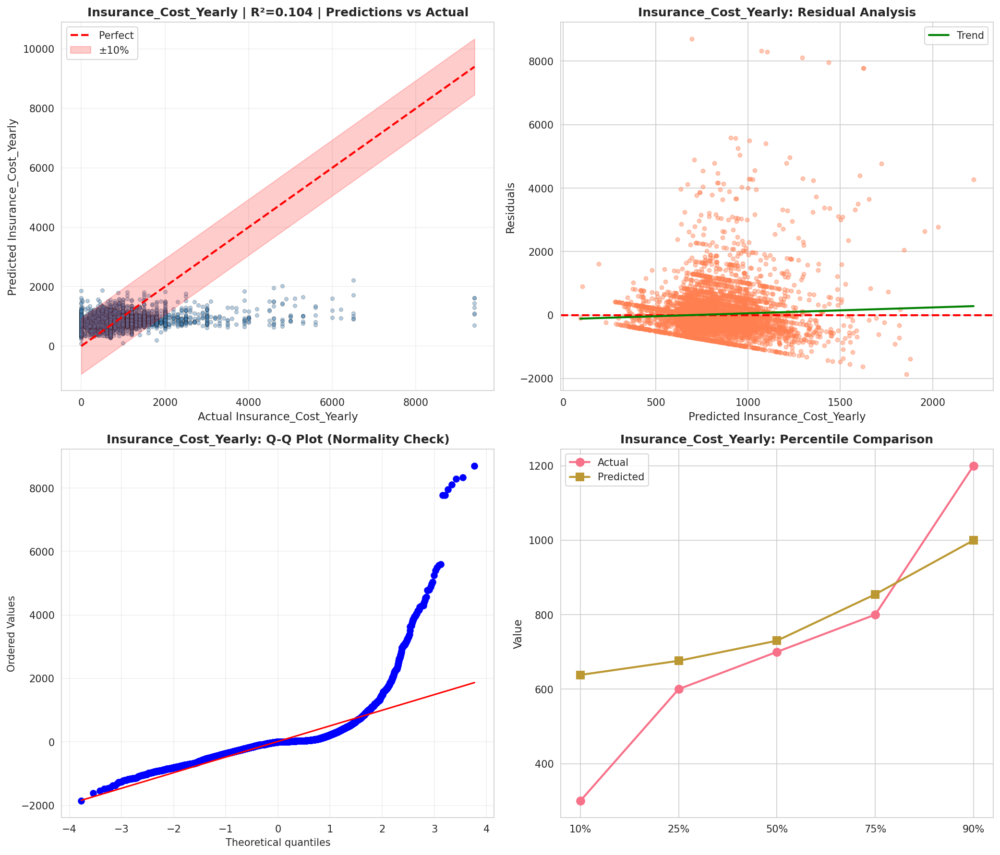
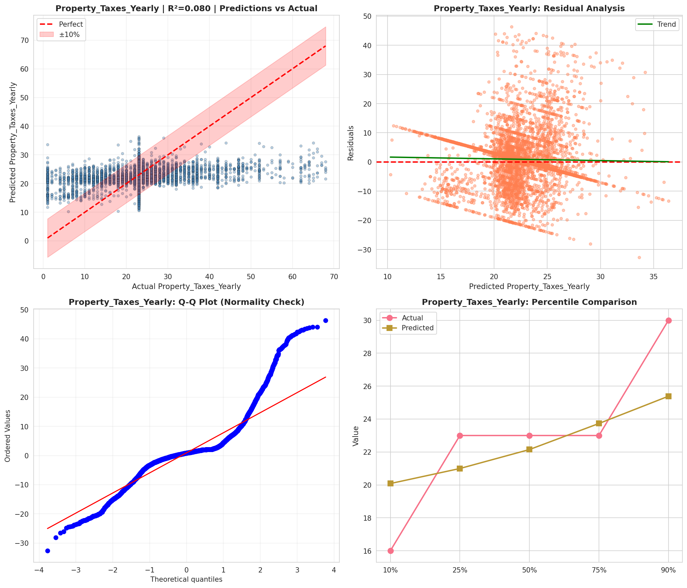
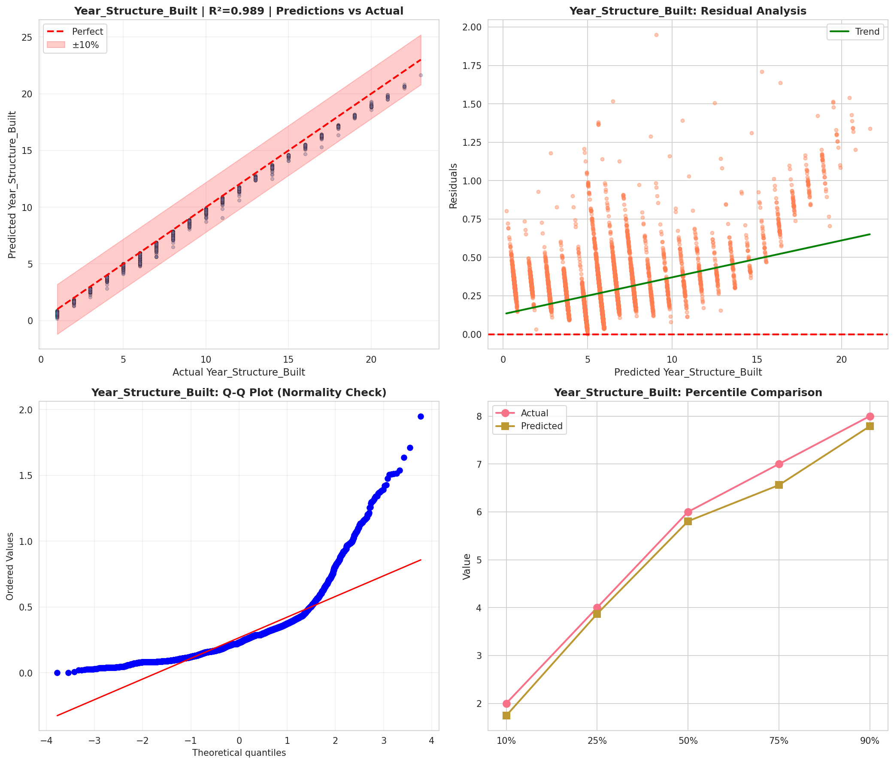
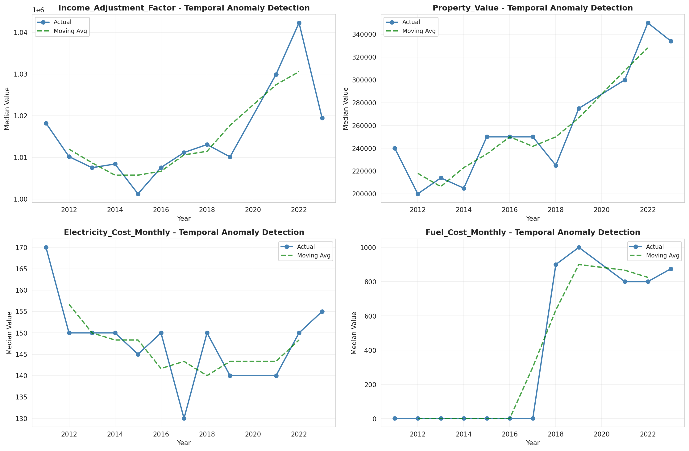
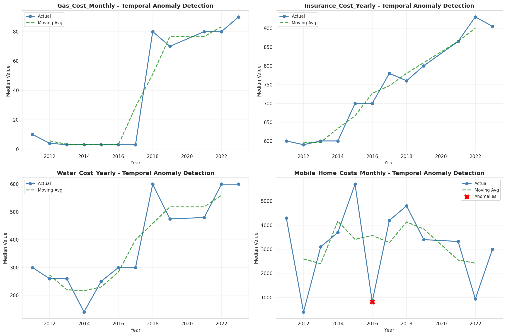
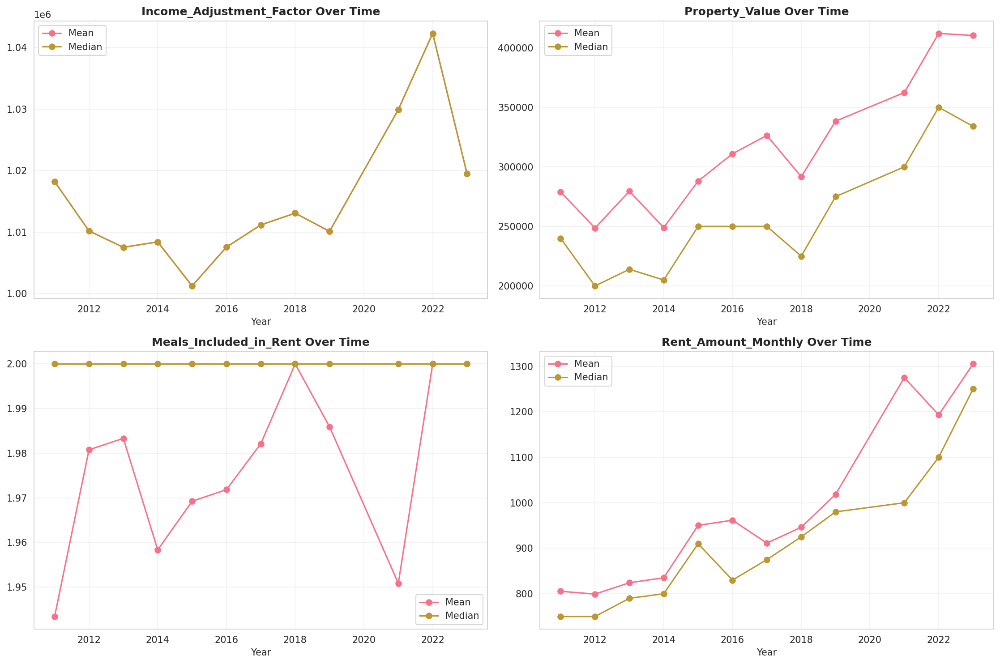
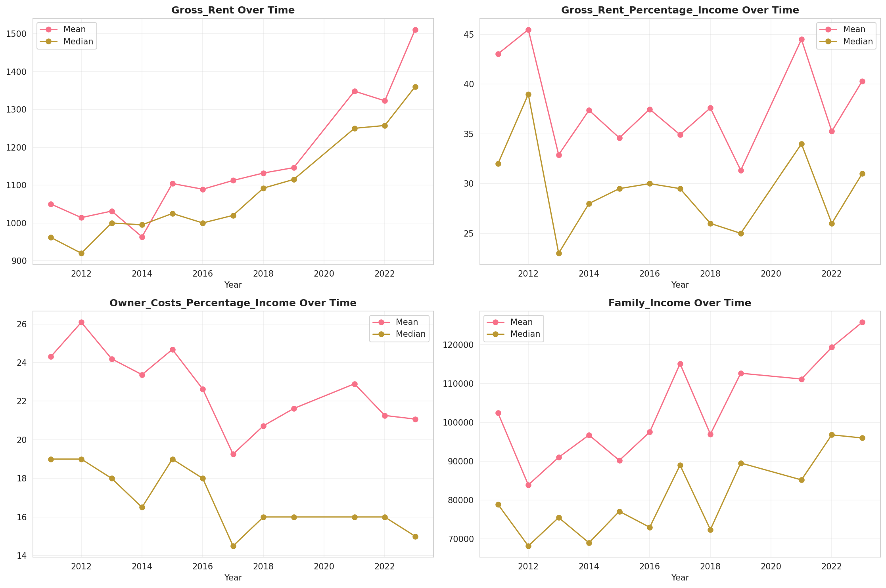
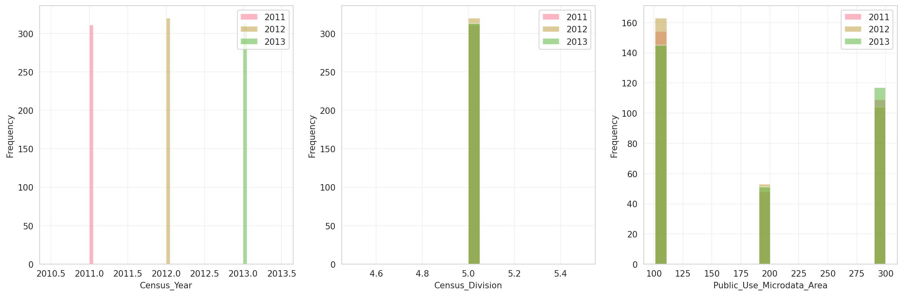
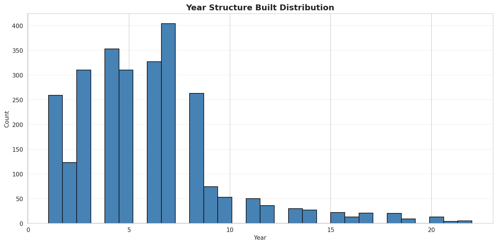
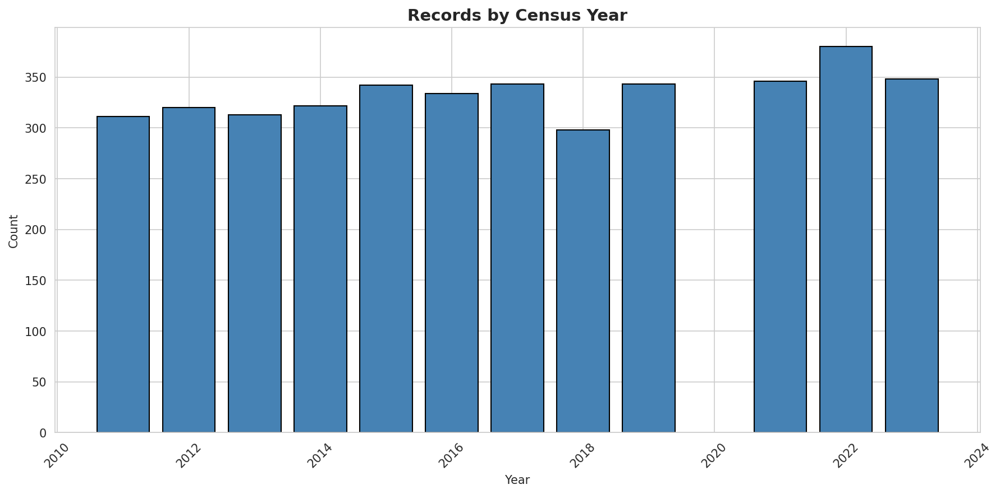
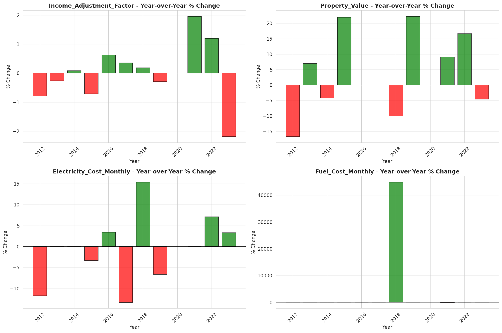
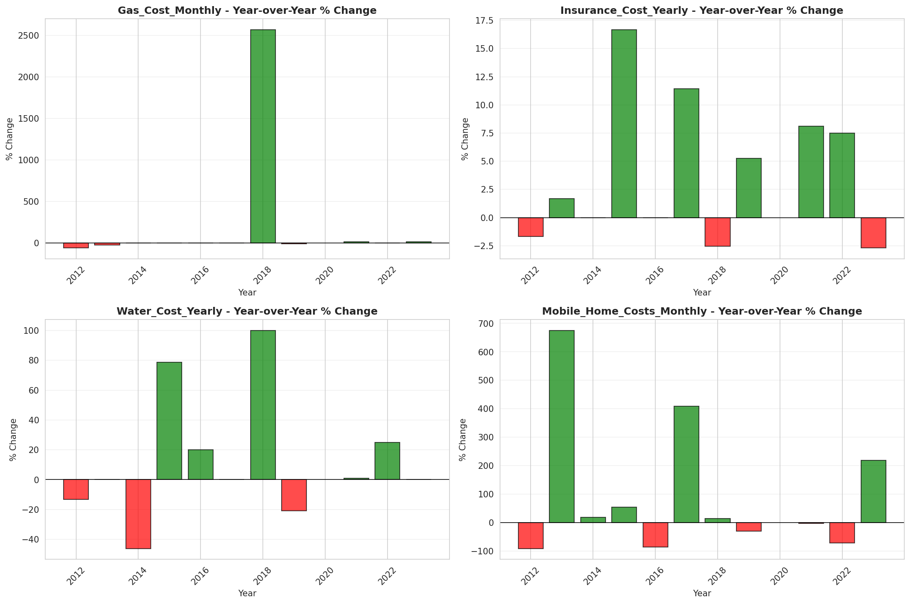
