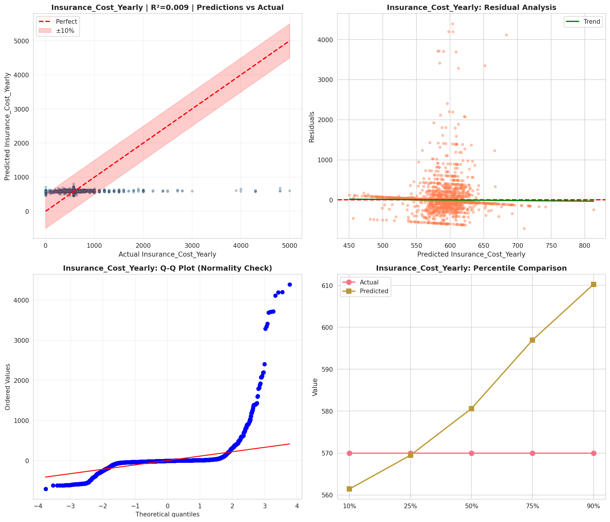
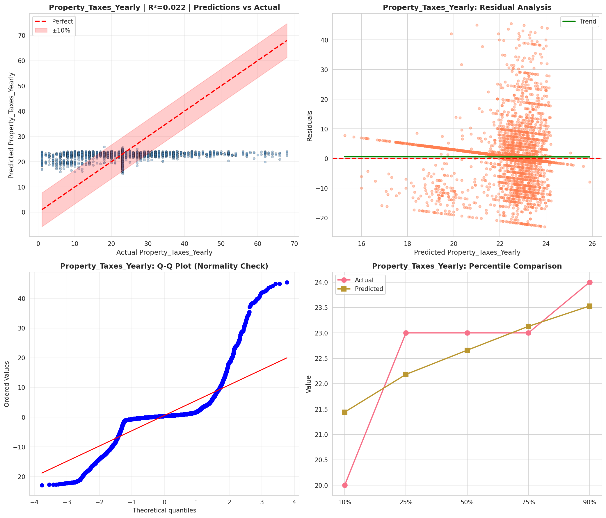
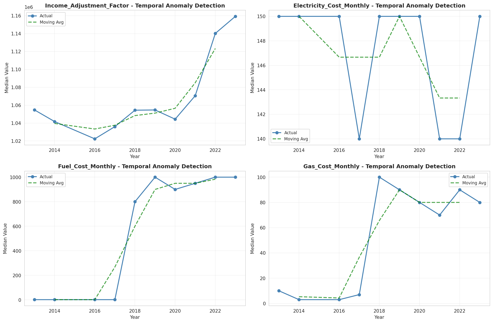
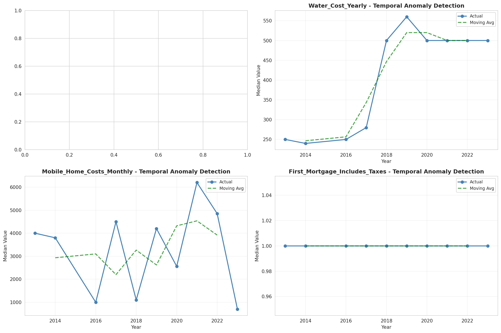
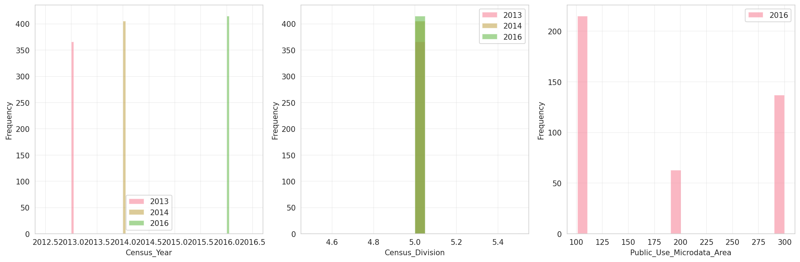
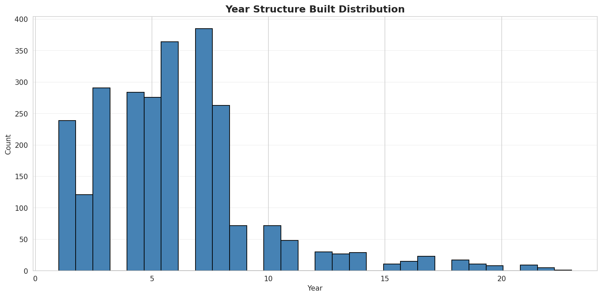
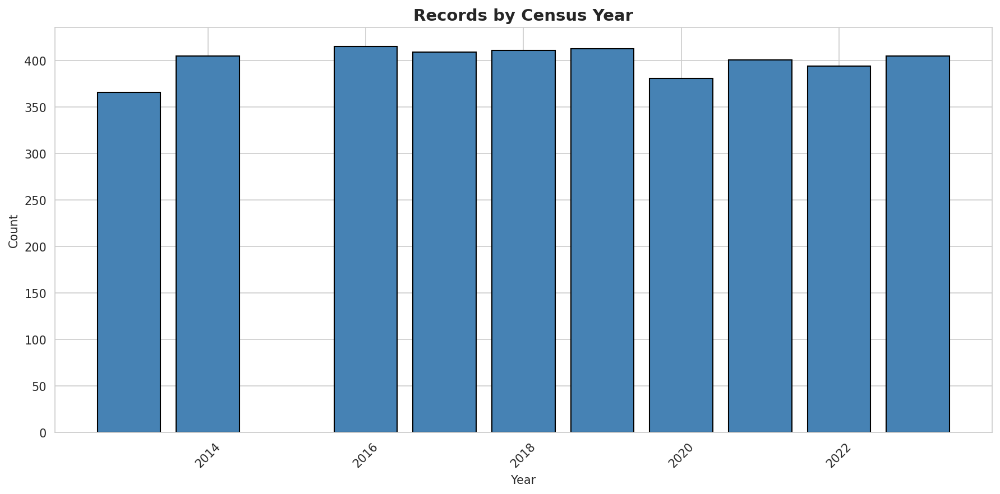
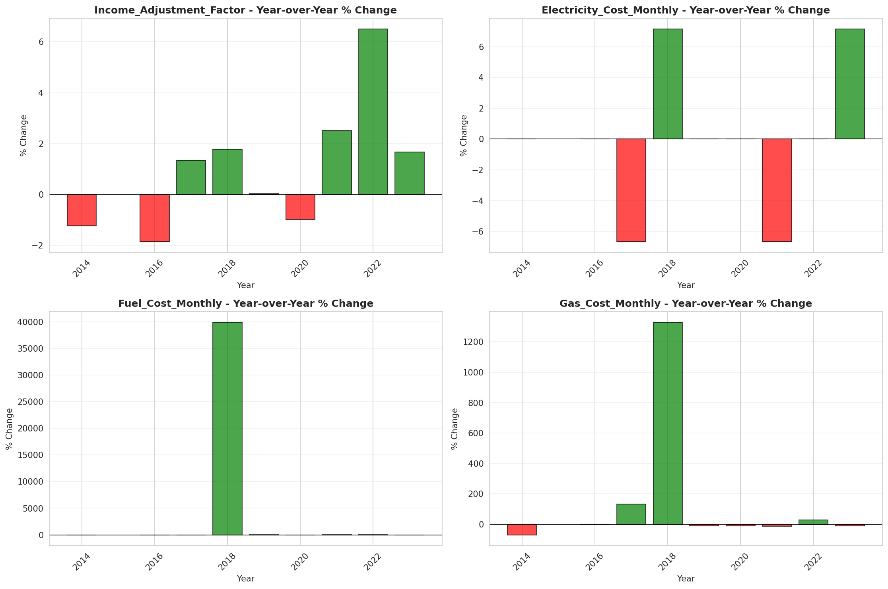
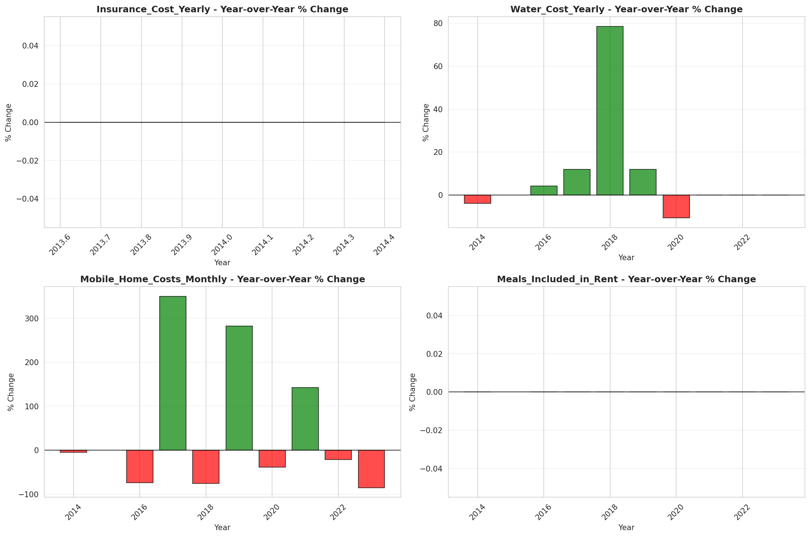

# Temporal Analysis

## Year Distribution

- 2013: 21,843 records

- 2014: 22,130 records

- 2016: 22,502 records

- 2017: 22,719 records

- 2018: 23,037 records

- 2019: 23,302 records

- 2020: 22,929 records

- 2021: 23,259 records

- 2022: 23,571 records

- 2023: 23,837 records

## Temporal Trends

- Census_Year: {np.int64(2013): {'mean': 2013.0, 'median': 2013.0, 'std': 0.0}, np.int64(2014): {'mean': 2014.0, 'median': 2014.0, 'std': 0.0}, np.int64(2016): {'mean': 2016.0, 'median': 2016.0, 'std': 0.0}, np.int64(2017): {'mean': 2017.0, 'median': 2017.0, 'std': 0.0}, np.int64(2018): {'mean': 2018.0, 'median': 2018.0, 'std': 0.0}, np.int64(2019): {'mean': 2019.0, 'median': 2019.0, 'std': 0.0}, np.int64(2020): {'mean': 2020.0, 'median': 2020.0, 'std': 0.0}, np.int64(2021): {'mean': 2021.0, 'median': 2021.0, 'std': 0.0}, np.int64(2022): {'mean': 2022.0, 'median': 2022.0, 'std': 0.0}, np.int64(2023): {'mean': 2023.0, 'median': 2023.0, 'std': 0.0}}

- Census_Division: {np.int64(2013): {'mean': 5.0, 'median': 5.0, 'std': 0.0}, np.int64(2014): {'mean': 5.0, 'median': 5.0, 'std': 0.0}, np.int64(2016): {'mean': 5.0, 'median': 5.0, 'std': 0.0}, np.int64(2017): {'mean': 5.0, 'median': 5.0, 'std': 0.0}, np.int64(2018): {'mean': 5.0, 'median': 5.0, 'std': 0.0}, np.int64(2019): {'mean': 5.0, 'median': 5.0, 'std': 0.0}, np.int64(2020): {'mean': 5.0, 'median': 5.0, 'std': 0.0}, np.int64(2021): {'mean': 5.0, 'median': 5.0, 'std': 0.0}, np.int64(2022): {'mean': 5.0, 'median': 5.0, 'std': 0.0}, np.int64(2023): {'mean': 5.0, 'median': 5.0, 'std': 0.0}}

- Public_Use_Microdata_Area: {np.int64(2013): {'mean': None, 'median': None, 'std': None}, np.int64(2014): {'mean': None, 'median': None, 'std': None}, np.int64(2016): {'mean': 185.16367434005866, 'median': 104.0, 'std': 89.36019818499543}, np.int64(2017): {'mean': 185.21937585281043, 'median': 104.0, 'std': 89.41642796024301}, np.int64(2018): {'mean': 185.527759690932, 'median': 104.0, 'std': 89.48580649014333}, np.int64(2019): {'mean': 186.2381769805167, 'median': 200.0, 'std': 89.64316485478672}, np.int64(2020): {'mean': 187.63496009420385, 'median': 200.0, 'std': 89.78922715437108}, np.int64(2021): {'mean': 188.9203319145277, 'median': 200.0, 'std': 90.01811843474516}, np.int64(2022): {'mean': None, 'median': None, 'std': None}, np.int64(2023): {'mean': 195.20988379410161, 'median': 200.0, 'std': 91.35684864255691}}

- Census_Region: {np.int64(2013): {'mean': 3.0, 'median': 3.0, 'std': 0.0}, np.int64(2014): {'mean': 3.0, 'median': 3.0, 'std': 0.0}, np.int64(2016): {'mean': 3.0, 'median': 3.0, 'std': 0.0}, np.int64(2017): {'mean': 3.0, 'median': 3.0, 'std': 0.0}, np.int64(2018): {'mean': 3.0, 'median': 3.0, 'std': 0.0}, np.int64(2019): {'mean': 3.0, 'median': 3.0, 'std': 0.0}, np.int64(2020): {'mean': 3.0, 'median': 3.0, 'std': 0.0}, np.int64(2021): {'mean': 3.0, 'median': 3.0, 'std': 0.0}, np.int64(2022): {'mean': 3.0, 'median': 3.0, 'std': 0.0}, np.int64(2023): {'mean': 3.0, 'median': 3.0, 'std': 0.0}}

- State_Code: {np.int64(2013): {'mean': 10.0, 'median': 10.0, 'std': 0.0}, np.int64(2014): {'mean': 10.0, 'median': 10.0, 'std': 0.0}, np.int64(2016): {'mean': 10.0, 'median': 10.0, 'std': 0.0}, np.int64(2017): {'mean': 10.0, 'median': 10.0, 'std': 0.0}, np.int64(2018): {'mean': 10.0, 'median': 10.0, 'std': 0.0}, np.int64(2019): {'mean': 10.0, 'median': 10.0, 'std': 0.0}, np.int64(2020): {'mean': 10.0, 'median': 10.0, 'std': 0.0}, np.int64(2021): {'mean': 10.0, 'median': 10.0, 'std': 0.0}, np.int64(2022): {'mean': 10.0, 'median': 10.0, 'std': 0.0}, np.int64(2023): {'mean': None, 'median': None, 'std': None}}

- Housing_Adjustment_Factor: {np.int64(2013): {'mean': 1040272.603351188, 'median': 1035725.0, 'std': 32063.617619047}, np.int64(2014): {'mean': 1036831.1945774966, 'median': 1031130.0, 'std': 29739.965591496388}, np.int64(2016): {'mean': 1020254.3165051995, 'median': 1013801.0, 'std': 15751.280576138299}, np.int64(2017): {'mean': 1029061.9074343061, 'median': 1034680.0, 'std': 17986.425702419132}, np.int64(2018): {'mean': 1038006.1370838217, 'median': 1046406.0, 'std': 23553.675224677187}, np.int64(2019): {'mean': 1040565.6705003863, 'median': 1042936.0, 'std': 29168.699596022972}, np.int64(2020): {'mean': 1036067.8083649527, 'median': 1030827.0, 'std': 28297.197776874873}, np.int64(2021): {'mean': 1057829.595081474, 'median': 1059761.0, 'std': 35647.81771600261}, np.int64(2022): {'mean': 1104528.9182894235, 'median': 1133141.0, 'std': 61556.19272790462}, np.int64(2023): {'mean': 1104963.8212023326, 'median': 1125501.0, 'std': 76678.1972972962}}

- Income_Adjustment_Factor: {np.int64(2013): {'mean': 1049256.4262235041, 'median': 1054614.0, 'std': 29663.489773069716}, np.int64(2014): {'mean': 1047661.7589697244, 'median': 1041654.0, 'std': 31147.461161445783}, np.int64(2016): {'mean': 1027402.6841169674, 'median': 1022342.0, 'std': 17499.58172175883}, np.int64(2017): {'mean': 1036461.4453981249, 'median': 1035988.0, 'std': 16845.91742314669}, np.int64(2018): {'mean': 1046617.11390372, 'median': 1054346.0, 'std': 20563.705981588097}, np.int64(2019): {'mean': 1049548.7113981633, 'median': 1054606.0, 'std': 26227.079983582455}, np.int64(2020): {'mean': 1046156.5077412883, 'median': 1044328.0, 'std': 28832.956520322823}, np.int64(2021): {'mean': 1072872.056021325, 'median': 1070512.0, 'std': 30740.41851641119}, np.int64(2022): {'mean': 1126859.178821433, 'median': 1140108.0, 'std': 49634.275769050044}, np.int64(2023): {'mean': 1128889.010278139, 'median': 1159185.0, 'std': 70313.7642840952}}

- Housing_Unit_Weight: {np.int64(2013): {'mean': 18.672572448839446, 'median': 15.0, 'std': 16.205498379810276}, np.int64(2014): {'mean': 18.58337098960687, 'median': 15.0, 'std': 16.50951504340509}, np.int64(2016): {'mean': 18.572882410452404, 'median': 15.0, 'std': 16.512790060517485}, np.int64(2017): {'mean': 18.64030106958933, 'median': 15.0, 'std': 16.597285063604726}, np.int64(2018): {'mean': 18.589703520423665, 'median': 14.0, 'std': 16.72809667934208}, np.int64(2019): {'mean': 18.59046433782508, 'median': 14.0, 'std': 16.983590109206748}, np.int64(2020): {'mean': 19.121549129922805, 'median': 14.0, 'std': 21.970332088686796}, np.int64(2021): {'mean': 19.136850251515543, 'median': 14.0, 'std': 21.869072141935717}, np.int64(2022): {'mean': 19.157269526112596, 'median': 14.0, 'std': 22.225881706782754}, np.int64(2023): {'mean': 19.21206527667072, 'median': 13.0, 'std': 22.936829103023925}}

- Number_of_Persons: {np.int64(2013): {'mean': 1.995009842970288, 'median': 2.0, 'std': 1.4856770634986312}, np.int64(2014): {'mean': 1.9957523723452326, 'median': 2.0, 'std': 1.4866146371379847}, np.int64(2016): {'mean': 1.976979824015643, 'median': 2.0, 'std': 1.45776008518967}, np.int64(2017): {'mean': 1.963730798010476, 'median': 2.0, 'std': 1.4429631103975475}, np.int64(2018): {'mean': 1.9520770933715328, 'median': 2.0, 'std': 1.4316197856229123}, np.int64(2019): {'mean': 1.9404772122564586, 'median': 2.0, 'std': 1.4175847250371565}, np.int64(2020): {'mean': 1.9265995028130316, 'median': 2.0, 'std': 1.4096026188461854}, np.int64(2021): {'mean': 1.922954555225934, 'median': 2.0, 'std': 1.4043275278373557}, np.int64(2022): {'mean': 1.9271138263119936, 'median': 2.0, 'std': 1.402264692814677}, np.int64(2023): {'mean': 1.9383731174224945, 'median': 2.0, 'std': 1.39996868611286}}

- Housing_Unit_Type: {np.int64(2013): {'mean': 1.1007187657373072, 'median': 1.0, 'std': 0.39421804989429604}, np.int64(2014): {'mean': 1.1060551287844556, 'median': 1.0, 'std': 0.4065801917653873}, np.int64(2016): {'mean': 1.108523686783397, 'median': 1.0, 'std': 0.4118692090473804}, np.int64(2017): {'mean': 1.1061666446586558, 'median': 1.0, 'std': 0.4063891342101247}, np.int64(2018): {'mean': 1.1083908495029735, 'median': 1.0, 'std': 0.41084596976184984}, np.int64(2019): {'mean': 1.1079735645009012, 'median': 1.0, 'std': 0.4112249786657599}, np.int64(2020): {'mean': None, 'median': None, 'std': None}, np.int64(2021): {'mean': None, 'median': None, 'std': None}, np.int64(2022): {'mean': None, 'median': None, 'std': None}, np.int64(2023): {'mean': None, 'median': None, 'std': None}}

- Building_Type: {np.int64(2013): {'mean': 2.6689106186428186, 'median': 2.0, 'std': 1.7393991979837986}, np.int64(2014): {'mean': 2.6906579779215094, 'median': 2.0, 'std': 1.747610474133353}, np.int64(2016): {'mean': 2.7340996168582374, 'median': 2.0, 'std': 1.7817037288083881}, np.int64(2017): {'mean': 2.7502487562189053, 'median': 2.0, 'std': 1.7859085507099086}, np.int64(2018): {'mean': 2.753170183894062, 'median': 2.0, 'std': 1.7875325092683452}, np.int64(2019): {'mean': 2.755015253767218, 'median': 2.0, 'std': 1.7956889267429998}, np.int64(2020): {'mean': 2.736643383047008, 'median': 2.0, 'std': 1.7767299313472533}, np.int64(2021): {'mean': 2.727703896586999, 'median': 2.0, 'std': 1.7666395499999328}, np.int64(2022): {'mean': 2.7032745591939547, 'median': 2.0, 'std': 1.747379459687832}, np.int64(2023): {'mean': 2.6999052474845464, 'median': 2.0, 'std': 1.7503344505013936}}

- Year_Structure_Built: {np.int64(2013): {'mean': 5.448774016018869, 'median': 6.0, 'std': 2.739127238749408}, np.int64(2014): {'mean': 5.508194329621165, 'median': 6.0, 'std': 2.853705029000461}, np.int64(2016): {'mean': 5.726149425287356, 'median': 6.0, 'std': 3.2463703673472284}, np.int64(2017): {'mean': 5.909784411276949, 'median': 6.0, 'std': 3.5430461685312773}, np.int64(2018): {'mean': 6.093912311075757, 'median': 6.0, 'std': 3.8451819635470543}, np.int64(2019): {'mean': 6.29153184801701, 'median': 6.0, 'std': 4.191727300028365}, np.int64(2020): {'mean': 6.543420804228809, 'median': 6.0, 'std': 4.534710885589381}, np.int64(2021): {'mean': None, 'median': None, 'std': None}, np.int64(2022): {'mean': None, 'median': None, 'std': None}, np.int64(2023): {'mean': None, 'median': None, 'std': None}}

- Bathtub_or_Shower: {np.int64(2013): {'mean': 1.00574910323817, 'median': 1.0, 'std': 0.07560642788253166}, np.int64(2014): {'mean': 1.005689831250304, 'median': 1.0, 'std': 0.07521789821596801}, np.int64(2016): {'mean': 1.0051724137931035, 'median': 1.0, 'std': 0.07173497320074324}, np.int64(2017): {'mean': 1.0052594171997158, 'median': 1.0, 'std': 0.0723325903998169}, np.int64(2018): {'mean': 1.0047260306022179, 'median': 1.0, 'std': 0.06858509564307302}, np.int64(2019): {'mean': 1.0043912360173801, 'median': 1.0, 'std': 0.06612227431127604}, np.int64(2020): {'mean': 1.0040589012648669, 'median': 1.0, 'std': 0.06358158053152446}, np.int64(2021): {'mean': 1.0040453826839022, 'median': 1.0, 'std': 0.06347601842773591}, np.int64(2022): {'mean': 1.0039844286695672, 'median': 1.0, 'std': 0.06299789486943655}, np.int64(2023): {'mean': 1.003970581599964, 'median': 1.0, 'std': 0.0628887472609048}}

- Refrigerator: {np.int64(2013): {'mean': 1.0075671957151984, 'median': 1.0, 'std': 0.0866620003386478}, np.int64(2014): {'mean': 1.0077809658123815, 'median': 1.0, 'std': 0.08786807072998076}, np.int64(2016): {'mean': 1.007471264367816, 'median': 1.0, 'std': 0.08611503782374481}, np.int64(2017): {'mean': 1.007438995498697, 'median': 1.0, 'std': 0.08593024330632769}, np.int64(2018): {'mean': 1.0072996116232278, 'median': 1.0, 'std': 0.08512735390085129}, np.int64(2019): {'mean': 1.007118424701858, 'median': 1.0, 'std': 0.08407187070152532}, np.int64(2020): {'mean': 1.0066547102133283, 'median': 1.0, 'std': 0.08130643916154583}, np.int64(2021): {'mean': 1.0069282990793267, 'median': 1.0, 'std': 0.08294948879070001}, np.int64(2022): {'mean': 1.0070986947561256, 'median': 1.0, 'std': 0.0839560962770382}, np.int64(2023): {'mean': 1.0066326760817579, 'median': 1.0, 'std': 0.0811725383746974}}

- Hot_and_Cold_Running_Water: {np.int64(2013): {'mean': 1.0074197828116553, 'median': 1.0, 'std': 0.08582011149992436}, np.int64(2014): {'mean': 1.0074891795944172, 'median': 1.0, 'std': 0.08621747665036507}, np.int64(2016): {'mean': 1.0072318007662835, 'median': 1.0, 'std': 0.08473397008462209}, np.int64(2017): {'mean': 1.007438995498697, 'median': 1.0, 'std': 0.08593024330632776}, np.int64(2018): {'mean': 1.007112442094427, 'median': 1.0, 'std': 0.08403681168615175}, np.int64(2019): {'mean': 1.007118424701858, 'median': 1.0, 'std': 0.08407187070152533}, np.int64(2020): {'mean': 1.0066075136869925, 'median': 1.0, 'std': 0.08101953008762776}, np.int64(2021): {'mean': 1.0078582721101088, 'median': 1.0, 'std': 0.08829995591200199}, np.int64(2022): {'mean': 1.0078314632470804, 'median': 1.0, 'std': 0.08815036757442353}, np.int64(2023): {'mean': 1.007670441727203, 'median': 1.0, 'std': 0.08724648705789015}}

- Running_Water: {np.int64(2013): {'mean': 9.0, 'median': 9.0, 'std': 0.0}, np.int64(2014): {'mean': 9.0, 'median': 9.0, 'std': 0.0}, np.int64(2016): {'mean': 9.0, 'median': 9.0, 'std': 0.0}, np.int64(2017): {'mean': 9.0, 'median': 9.0, 'std': 0.0}, np.int64(2018): {'mean': 9.0, 'median': 9.0, 'std': 0.0}, np.int64(2019): {'mean': 9.0, 'median': 9.0, 'std': 0.0}, np.int64(2020): {'mean': 9.0, 'median': 9.0, 'std': 0.0}, np.int64(2021): {'mean': 9.0, 'median': 9.0, 'std': 0.0}, np.int64(2022): {'mean': 9.0, 'median': 9.0, 'std': 0.0}, np.int64(2023): {'mean': 9.0, 'median': 9.0, 'std': 0.0}}

- Sink_with_Faucet: {np.int64(2013): {'mean': 1.005356002162056, 'median': 1.0, 'std': 0.07299025405789902}, np.int64(2014): {'mean': 1.0055925691776493, 'median': 1.0, 'std': 0.07457588626496885}, np.int64(2016): {'mean': 1.0050766283524903, 'median': 1.0, 'std': 0.07107107785794457}, np.int64(2017): {'mean': 1.005164652925847, 'median': 1.0, 'std': 0.07168139748900196}, np.int64(2018): {'mean': 1.0046324458378175, 'median': 1.0, 'std': 0.06790583224220222}, np.int64(2019): {'mean': 1.00420634186928, 'median': 1.0, 'std': 0.06472126528784992}, np.int64(2020): {'mean': 1.0037757221068528, 'median': 1.0, 'std': 0.061332239205285716}, np.int64(2021): {'mean': 1.0037198921231285, 'median': 1.0, 'std': 0.06087878826218556}, np.int64(2022): {'mean': 1.003434852301351, 'median': 1.0, 'std': 0.05850821196494798}, np.int64(2023): {'mean': 1.0035644993908768, 'median': 1.0, 'std': 0.05959827178706993}}

- Stove_or_Range: {np.int64(2013): {'mean': 1.0090413247506265, 'median': 1.0, 'std': 0.09465737938239283}, np.int64(2014): {'mean': 1.0096775762291494, 'median': 1.0, 'std': 0.09789988174734082}, np.int64(2016): {'mean': 1.0094348659003831, 'median': 1.0, 'std': 0.09667624747270993}, np.int64(2017): {'mean': 1.0088604596067283, 'median': 1.0, 'std': 0.09371428914337716}, np.int64(2018): {'mean': 1.0086097983248328, 'median': 1.0, 'std': 0.09239084976688534}, np.int64(2019): {'mean': 1.0082277895904594, 'median': 1.0, 'std': 0.09033532130188311}, np.int64(2020): {'mean': 1.0079290164243913, 'median': 1.0, 'std': 0.08869339544337827}, np.int64(2021): {'mean': 1.0083232586254998, 'median': 1.0, 'std': 0.09085354042761506}, np.int64(2022): {'mean': 1.0085642317380352, 'median': 1.0, 'std': 0.0921481120611005}, np.int64(2023): {'mean': 1.0082118846726527, 'median': 1.0, 'std': 0.09024864053781204}}

- Telephone_Service: {np.int64(2013): {'mean': 1.0162583008930617, 'median': 1.0, 'std': 0.12647088286589822}, np.int64(2014): {'mean': 1.0175795602283646, 'median': 1.0, 'std': 0.13142106215394037}, np.int64(2016): {'mean': 1.0184536712800845, 'median': 1.0, 'std': 0.13458878163098256}, np.int64(2017): {'mean': 1.017613386173492, 'median': 1.0, 'std': 0.13154507687768455}, np.int64(2018): {'mean': 1.0167309468194905, 'median': 1.0, 'std': 0.1282650222264396}, np.int64(2019): {'mean': 1.014123689278836, 'median': 1.0, 'std': 0.11800404928954211}, np.int64(2020): {'mean': 1.0129095782506428, 'median': 1.0, 'std': 0.11288763500211334}, np.int64(2021): {'mean': 1.0097634247089748, 'median': 1.0, 'std': 0.09832913567113773}, np.int64(2022): {'mean': 1.0075685903500473, 'median': 1.0, 'std': 0.08667007328142028}, np.int64(2023): {'mean': 1.0065369569693225, 'median': 1.0, 'std': 0.08058882957042601}}

- Lot_Acreage: {np.int64(2013): {'mean': 1.1709673752415597, 'median': 1.0, 'std': 0.4182590214981535}, np.int64(2014): {'mean': 1.1691994802553527, 'median': 1.0, 'std': 0.4141731642434004}, np.int64(2016): {'mean': 1.1656867685760681, 'median': 1.0, 'std': 0.41046431344776585}, np.int64(2017): {'mean': 1.1641840818141396, 'median': 1.0, 'std': 0.41031935259563657}, np.int64(2018): {'mean': 1.1606731718013377, 'median': 1.0, 'std': 0.40622229439249385}, np.int64(2019): {'mean': 1.1597124635174576, 'median': 1.0, 'std': 0.4058281472143067}, np.int64(2020): {'mean': 1.1585573698389136, 'median': 1.0, 'std': 0.40550428176591574}, np.int64(2021): {'mean': 1.1560777957860615, 'median': 1.0, 'std': 0.4036739836436401}, np.int64(2022): {'mean': 1.153679539331185, 'median': 1.0, 'std': 0.39930374606189273}, np.int64(2023): {'mean': 1.1550189935994173, 'median': 1.0, 'std': 0.40030161518752216}}

- Agricultural_Sales: {np.int64(2013): {'mean': 1.148018648018648, 'median': 1.0, 'std': 0.7255818778385288}, np.int64(2014): {'mean': 1.150058162078325, 'median': 1.0, 'std': 0.7424111775726637}, np.int64(2016): {'mean': 1.1479150275373722, 'median': 1.0, 'std': 0.7423713956752803}, np.int64(2017): {'mean': 1.1556791104050834, 'median': 1.0, 'std': 0.7529504378297769}, np.int64(2018): {'mean': 1.1620868180007966, 'median': 1.0, 'std': 0.7691850774009376}, np.int64(2019): {'mean': 1.1710110584518167, 'median': 1.0, 'std': 0.7888376266013085}, np.int64(2020): {'mean': 1.1780933062880325, 'median': 1.0, 'std': 0.8065320377881555}, np.int64(2021): {'mean': 1.1651228352799032, 'median': 1.0, 'std': 0.77747800856453}, np.int64(2022): {'mean': 1.153146022952117, 'median': 1.0, 'std': 0.7507537751128608}, np.int64(2023): {'mean': 1.1354046797084771, 'median': 1.0, 'std': 0.7098696139352133}}

- Business_On_Property: {np.int64(2013): {'mean': 1.9861884733431852, 'median': 2.0, 'std': 0.11671136449996727}, np.int64(2014): {'mean': 1.9861589740692616, 'median': 2.0, 'std': 0.11683416917751112}, np.int64(2016): {'mean': 3.413013046643149, 'median': 2.0, 'std': 2.825927663862262}, np.int64(2017): {'mean': 4.831147176522899, 'median': 2.0, 'std': 3.44515639901232}, np.int64(2018): {'mean': 6.249862953623507, 'median': 9.0, 'std': 3.424590166602018}, np.int64(2019): {'mean': 7.63782293806075, 'median': 9.0, 'std': 2.7748128928530513}, np.int64(2020): {'mean': None, 'median': None, 'std': None}, np.int64(2021): {'mean': None, 'median': None, 'std': None}, np.int64(2022): {'mean': None, 'median': None, 'std': None}, np.int64(2023): {'mean': None, 'median': None, 'std': None}}

- Tenure: {np.int64(2013): {'mean': 1.7184566063659263, 'median': 1.0, 'std': 0.8324916125020275}, np.int64(2014): {'mean': 1.731671471369623, 'median': 1.0, 'std': 0.8372761455795623}, np.int64(2016): {'mean': 1.7531543549552555, 'median': 2.0, 'std': 0.841488083770769}, np.int64(2017): {'mean': 1.7594671950682519, 'median': 2.0, 'std': 0.8409901074261782}, np.int64(2018): {'mean': 1.7654951382475963, 'median': 2.0, 'std': 0.8399339583051455}, np.int64(2019): {'mean': 1.7634817034025252, 'median': 2.0, 'std': 0.8340870933331993}, np.int64(2020): {'mean': 1.754663311635031, 'median': 2.0, 'std': 0.8285346319624893}, np.int64(2021): {'mean': 1.7487795719113781, 'median': 2.0, 'std': 0.8208173571909462}, np.int64(2022): {'mean': 1.7394092294754546, 'median': 2.0, 'std': 0.812710814368687}, np.int64(2023): {'mean': 1.7316759316450483, 'median': 2.0, 'std': 0.8061835274574074}}

- Vacancy_Status: {np.int64(2013): {'mean': 4.6718695802983, 'median': 5.0, 'std': 1.58646126387108}, np.int64(2014): {'mean': 4.7235376044568245, 'median': 5.0, 'std': 1.5673089301278875}, np.int64(2016): {'mean': 4.739702319141571, 'median': 5.0, 'std': 1.528385183354033}, np.int64(2017): {'mean': 4.747020769492679, 'median': 5.0, 'std': 1.5382317194744617}, np.int64(2018): {'mean': 4.795070898041864, 'median': 5.0, 'std': 1.5316770089283285}, np.int64(2019): {'mean': 4.812372535690007, 'median': 5.0, 'std': 1.5341992385399352}, np.int64(2020): {'mean': 4.842105263157895, 'median': 5.0, 'std': 1.4912599600129202}, np.int64(2021): {'mean': 4.875741710296684, 'median': 5.0, 'std': 1.4828823153561765}, np.int64(2022): {'mean': 4.927376290494838, 'median': 5.0, 'std': 1.413607149140621}, np.int64(2023): {'mean': 4.90018281535649, 'median': 5.0, 'std': 1.3883397152032548}}

- Vehicles_Available: {np.int64(2013): {'mean': 1.8204144721776963, 'median': 2.0, 'std': 0.9976109378903658}, np.int64(2014): {'mean': 1.8225651461194958, 'median': 2.0, 'std': 1.0042879236915296}, np.int64(2016): {'mean': 1.8324717914512811, 'median': 2.0, 'std': 1.015966749887979}, np.int64(2017): {'mean': 1.8390576838397181, 'median': 2.0, 'std': 1.0170940753966886}, np.int64(2018): {'mean': 1.8473029496441957, 'median': 2.0, 'std': 1.0137518307830595}, np.int64(2019): {'mean': 1.8536272202011557, 'median': 2.0, 'std': 1.013723289899065}, np.int64(2020): {'mean': 1.8714512335211422, 'median': 2.0, 'std': 1.0192327315109633}, np.int64(2021): {'mean': 1.8719489297784453, 'median': 2.0, 'std': 1.0200075237294355}, np.int64(2022): {'mean': 1.8665510354252075, 'median': 2.0, 'std': 1.0153661219353152}, np.int64(2023): {'mean': 1.8703932468602018, 'median': 2.0, 'std': 1.0217093309983802}}

- Condo_Fee_Monthly: {np.int64(2013): {'mean': 258.7336860670194, 'median': 220.0, 'std': 196.6593743429341}, np.int64(2014): {'mean': 272.81412639405204, 'median': 230.0, 'std': 202.5466146896401}, np.int64(2016): {'mean': 295.0598591549296, 'median': 250.0, 'std': 208.28964183033028}, np.int64(2017): {'mean': 297.9236111111111, 'median': 250.0, 'std': 205.66131989855415}, np.int64(2018): {'mean': 303.76683087027914, 'median': 260.0, 'std': 206.7371634546204}, np.int64(2019): {'mean': 302.0210526315789, 'median': 260.0, 'std': 204.74602142913295}, np.int64(2020): {'mean': 305.6363636363636, 'median': 270.0, 'std': 199.51394932339247}, np.int64(2021): {'mean': 308.9383070301291, 'median': 280.0, 'std': 201.91829442943177}, np.int64(2022): {'mean': 318.49006622516555, 'median': 280.0, 'std': 232.73793813103686}, np.int64(2023): {'mean': 329.8412698412698, 'median': 280.0, 'std': 260.57881632475807}}

- Electricity_Cost_Monthly: {np.int64(2013): {'mean': 164.20391573162354, 'median': 150.0, 'std': 100.12654947105992}, np.int64(2014): {'mean': 166.21513764060822, 'median': 150.0, 'std': 101.49868970968781}, np.int64(2016): {'mean': 165.0485798454783, 'median': 150.0, 'std': 101.62455002849687}, np.int64(2017): {'mean': 163.56902245706738, 'median': 150.0, 'std': 101.22208813835888}, np.int64(2018): {'mean': 167.71431771095806, 'median': 150.0, 'std': 97.94824780412334}, np.int64(2019): {'mean': 164.55554942934333, 'median': 150.0, 'std': 95.96426856145656}, np.int64(2020): {'mean': 163.10336660463543, 'median': 150.0, 'std': 95.98106800014918}, np.int64(2021): {'mean': 162.00607936332486, 'median': 150.0, 'std': 94.16638222080874}, np.int64(2022): {'mean': 165.0952277892003, 'median': 150.0, 'std': 104.78573849938985}, np.int64(2023): {'mean': 172.59177734271654, 'median': 150.0, 'std': 142.31490989447636}}

- Fuel_Cost_Monthly: {np.int64(2013): {'mean': 298.8346691092283, 'median': 2.0, 'std': 719.4396986291551}, np.int64(2014): {'mean': 288.83720535865695, 'median': 2.0, 'std': 722.3841973716587}, np.int64(2016): {'mean': 246.06853426713357, 'median': 2.0, 'std': 670.0103641560756}, np.int64(2017): {'mean': 213.1735468956407, 'median': 2.0, 'std': 612.0189228090009}, np.int64(2018): {'mean': 1146.8098591549297, 'median': 995.0, 'std': 948.044721416698}, np.int64(2019): {'mean': 1080.448083851949, 'median': 900.0, 'std': 884.5682649782971}, np.int64(2020): {'mean': 1019.8068424803992, 'median': 850.0, 'std': 835.7216799349146}, np.int64(2021): {'mean': 1021.3461113158864, 'median': 850.0, 'std': 839.2181737000159}, np.int64(2022): {'mean': 1065.3819678264122, 'median': 900.0, 'std': 890.7624524169148}, np.int64(2023): {'mean': 1115.1206165703275, 'median': 900.0, 'std': 968.6878607915734}}

- Gas_Cost_Monthly: {np.int64(2013): {'mean': 65.44756125486605, 'median': 10.0, 'std': 96.96633066687113}, np.int64(2014): {'mean': 61.653609179808946, 'median': 3.0, 'std': 94.99597721899997}, np.int64(2016): {'mean': 54.726752265021396, 'median': 3.0, 'std': 87.95995308712486}, np.int64(2017): {'mean': 52.7471928665786, 'median': 3.0, 'std': 85.76992791043395}, np.int64(2018): {'mean': 108.73961380924517, 'median': 80.0, 'std': 97.74487019256475}, np.int64(2019): {'mean': 106.21094369547978, 'median': 80.0, 'std': 96.57069586638413}, np.int64(2020): {'mean': 104.17567567567568, 'median': 80.0, 'std': 95.73034520801046}, np.int64(2021): {'mean': 105.5610950367238, 'median': 80.0, 'std': 98.1886869657631}, np.int64(2022): {'mean': 113.12189789001859, 'median': 80.0, 'std': 118.60236231174956}, np.int64(2023): {'mean': 119.17623299319727, 'median': 80.0, 'std': 145.07048825201204}}

- House_Heating_Fuel: {np.int64(2013): {'mean': 2.374627891000687, 'median': 2.0, 'std': 1.3579245873104782}, np.int64(2014): {'mean': 2.3763495562715504, 'median': 2.0, 'std': 1.3647062324424952}, np.int64(2016): {'mean': 2.358790506364293, 'median': 2.0, 'std': 1.367595425350092}, np.int64(2017): {'mean': 2.351497137824747, 'median': 2.0, 'std': 1.3770872162578391}, np.int64(2018): {'mean': 2.335814004019773, 'median': 2.0, 'std': 1.3694451983959393}, np.int64(2019): {'mean': 2.3179970040659104, 'median': 2.0, 'std': 1.3691540198513195}, np.int64(2020): {'mean': 2.2986160494502488, 'median': 2.0, 'std': 1.3587961065565235}, np.int64(2021): {'mean': 2.2910251595944424, 'median': 2.0, 'std': 1.3582561976896088}, np.int64(2022): {'mean': 2.2859245243351203, 'median': 2.0, 'std': 1.350963457977059}, np.int64(2023): {'mean': 2.28088326127239, 'median': 2.0, 'std': 1.33982902460215}}

- Insurance_Cost_Yearly: {np.int64(2013): {'mean': 717.0215503377292, 'median': 600.0, 'std': 573.3788060130255}, np.int64(2014): {'mean': 749.2137232845894, 'median': 600.0, 'std': 592.2143600521645}}

- Water_Cost_Yearly: {np.int64(2013): {'mean': 353.2458209297, 'median': 240.0, 'std': 434.6786722252803}, np.int64(2014): {'mean': 362.49697586343336, 'median': 240.0, 'std': 446.6627272261018}, np.int64(2016): {'mean': 376.66283141570784, 'median': 250.0, 'std': 459.59368058752125}, np.int64(2017): {'mean': 381.77801629238223, 'median': 260.0, 'std': 459.23906609667375}, np.int64(2018): {'mean': 598.2766804979253, 'median': 500.0, 'std': 459.19712285529175}, np.int64(2019): {'mean': 602.590721399077, 'median': 500.0, 'std': 467.18860369751206}, np.int64(2020): {'mean': 615.211058554885, 'median': 520.0, 'std': 478.2494207246827}, np.int64(2021): {'mean': 620.8466945738883, 'median': 510.0, 'std': 496.29294681148934}, np.int64(2022): {'mean': 636.3054517727793, 'median': 530.0, 'std': 520.9973562903828}, np.int64(2023): {'mean': 643.748614497894, 'median': 530.0, 'std': 543.0772293977561}}

- Mobile_Home_Costs_Monthly: {np.int64(2013): {'mean': 3337.0243362831857, 'median': 3500.0, 'std': 3005.2220286141164}, np.int64(2014): {'mean': 3341.6875, 'median': 3500.0, 'std': 3071.2953492692354}, np.int64(2016): {'mean': 3375.5356200527704, 'median': 3600.0, 'std': 3054.2999545021244}, np.int64(2017): {'mean': 3492.386459802539, 'median': 3800.0, 'std': 3168.9346732667477}, np.int64(2018): {'mean': 3613.6725784447476, 'median': 4000.0, 'std': 3186.065957586455}, np.int64(2019): {'mean': 3727.960422163588, 'median': 4000.0, 'std': 3311.602900194531}, np.int64(2020): {'mean': 3927.9142857142856, 'median': 4000.0, 'std': 3640.5961526032543}, np.int64(2021): {'mean': 4171.656850192061, 'median': 4200.0, 'std': 4004.407125366625}, np.int64(2022): {'mean': 4275.73607748184, 'median': 4100.0, 'std': 4181.62543928828}, np.int64(2023): {'mean': 4551.770883054893, 'median': 4200.0, 'std': 4536.768094222156}}

- First_Mortgage_Includes_Insurance: {np.int64(2013): {'mean': 1.3288052555394723, 'median': 1.0, 'std': 0.4698052101197618}, np.int64(2014): {'mean': 1.322975832498051, 'median': 1.0, 'std': 0.4676396042709564}, np.int64(2016): {'mean': 1.308593310057439, 'median': 1.0, 'std': 0.46193886162223147}, np.int64(2017): {'mean': 1.3017357980162307, 'median': 1.0, 'std': 0.4590370973916047}, np.int64(2018): {'mean': 1.2967131922557407, 'median': 1.0, 'std': 0.4568347242039856}, np.int64(2019): {'mean': 1.29310152680263, 'median': 1.0, 'std': 0.4552099681259875}, np.int64(2020): {'mean': 1.2844068184418258, 'median': 1.0, 'std': 0.45115725202945073}, np.int64(2021): {'mean': 1.2808390022675737, 'median': 1.0, 'std': 0.44943448753684584}, np.int64(2022): {'mean': 1.2749887942626625, 'median': 1.0, 'std': 0.44653365009830276}, np.int64(2023): {'mean': 1.2708863560916233, 'median': 1.0, 'std': 0.4444421176702785}}

- First_Mortgage_Payment_Monthly: {np.int64(2013): {'mean': 1178.5607393386038, 'median': 1100.0, 'std': 673.7088577102995}, np.int64(2014): {'mean': 1167.645617552066, 'median': 1100.0, 'std': 662.7620728427532}, np.int64(2016): {'mean': 1161.633742538574, 'median': 1100.0, 'std': 633.9948883585956}, np.int64(2017): {'mean': 1179.3845807033363, 'median': 1100.0, 'std': 650.7356121059346}, np.int64(2018): {'mean': 1204.569788383611, 'median': 1100.0, 'std': 655.6626081943482}, np.int64(2019): {'mean': 1234.505293658754, 'median': 1100.0, 'std': 678.9303460109655}, np.int64(2020): {'mean': 1266.7337833199863, 'median': 1200.0, 'std': 702.0769783067926}, np.int64(2021): {'mean': 1294.1541950113378, 'median': 1200.0, 'std': 711.4797611584021}, np.int64(2022): {'mean': 1324.7041685342895, 'median': 1200.0, 'std': 708.0548810356687}, np.int64(2023): {'mean': 1363.486333960385, 'median': 1200.0, 'std': 726.5179864497798}}

- First_Mortgage_Includes_Taxes: {np.int64(2013): {'mean': 1.2440708161674647, 'median': 1.0, 'std': 0.4295588417760559}, np.int64(2014): {'mean': 1.2379997772580467, 'median': 1.0, 'std': 0.4258827107487697}, np.int64(2016): {'mean': 1.2234485865525397, 'median': 1.0, 'std': 0.4165799570138862}, np.int64(2017): {'mean': 1.214945897204689, 'median': 1.0, 'std': 0.41080796058397356}, np.int64(2018): {'mean': 1.2084646555605583, 'median': 1.0, 'std': 0.40623357634801505}, np.int64(2019): {'mean': 1.1974813328875515, 'median': 1.0, 'std': 0.398120735663592}, np.int64(2020): {'mean': 1.1872783434389658, 'median': 1.0, 'std': 0.39015712257549034}, np.int64(2021): {'mean': 1.1775510204081632, 'median': 1.0, 'std': 0.3821560070804624}, np.int64(2022): {'mean': 1.1675257731958764, 'median': 1.0, 'std': 0.37346555113322205}, np.int64(2023): {'mean': 1.16576297443842, 'median': 1.0, 'std': 0.37188830930293904}}

- First_Mortgage_Status: {np.int64(2013): {'mean': 1.6853536835926035, 'median': 1.0, 'std': 0.947464069427684}, np.int64(2014): {'mean': 1.691768314951428, 'median': 1.0, 'std': 0.9495399789329766}, np.int64(2016): {'mean': 1.7180712423979148, 'median': 1.0, 'std': 0.9575059852640538}, np.int64(2017): {'mean': 1.7301313805729055, 'median': 1.0, 'std': 0.9608417243886075}, np.int64(2018): {'mean': 1.7455369793142532, 'median': 1.0, 'std': 0.9649165939481159}, np.int64(2019): {'mean': 1.757464241077628, 'median': 1.0, 'std': 0.9683492860757202}, np.int64(2020): {'mean': 1.7719236458406706, 'median': 1.0, 'std': 0.9719759065684556}, np.int64(2021): {'mean': 1.7950668036998971, 'median': 1.0, 'std': 0.9769175389386111}, np.int64(2022): {'mean': 1.8197558710362214, 'median': 1.0, 'std': 0.981730434570699}, np.int64(2023): {'mean': 1.840139121473657, 'median': 1.0, 'std': 0.9850157653249308}}

- Second_Mortgage_Payment_Monthly: {np.int64(2013): {'mean': 399.2188235294118, 'median': 300.0, 'std': 379.2206196462759}, np.int64(2014): {'mean': 392.51665812403894, 'median': 300.0, 'std': 378.7912104743469}, np.int64(2016): {'mean': 390.6543504171633, 'median': 280.0, 'std': 410.8069444050366}, np.int64(2017): {'mean': 403.536475145255, 'median': 280.0, 'std': 441.10235939729665}, np.int64(2018): {'mean': 402.5348997926745, 'median': 290.0, 'std': 422.5665292439961}, np.int64(2019): {'mean': 417.5947712418301, 'median': 300.0, 'std': 440.40245359833193}, np.int64(2020): {'mean': 431.7573964497041, 'median': 300.0, 'std': 480.3566467608926}, np.int64(2021): {'mean': 434.60738507912583, 'median': 300.0, 'std': 457.20805490037174}, np.int64(2022): {'mean': 449.44545454545454, 'median': 320.0, 'std': 452.68226473678357}, np.int64(2023): {'mean': 479.1682310469314, 'median': 350.0, 'std': 501.2372508592752}}

- Second_Mortgage_Status: {np.int64(2013): {'mean': 2.731878409976617, 'median': 3.0, 'std': 0.5562324756353368}, np.int64(2014): {'mean': 2.7550952221850986, 'median': 3.0, 'std': 0.5375677666704823}, np.int64(2016): {'mean': 2.789953823628787, 'median': 3.0, 'std': 0.5040122730401004}, np.int64(2017): {'mean': 2.805793507664563, 'median': 3.0, 'std': 0.488900843640293}, np.int64(2018): {'mean': 2.8177622692480866, 'median': 3.0, 'std': 0.4706824267539253}, np.int64(2019): {'mean': 2.8288197927114678, 'median': 3.0, 'std': 0.454710717934545}, np.int64(2020): {'mean': 2.82909956906328, 'median': 3.0, 'std': 0.44747385552182306}, np.int64(2021): {'mean': 2.837105585907013, 'median': 3.0, 'std': 0.431918327044171}, np.int64(2022): {'mean': 2.842559231357135, 'median': 3.0, 'std': 0.4201948418697926}, np.int64(2023): {'mean': 2.8405038966584817, 'median': 3.0, 'std': 0.416368181143332}}

- Property_Taxes_Yearly: {np.int64(2013): {'mean': 22.343117111828587, 'median': 22.0, 'std': 12.894567648262859}, np.int64(2014): {'mean': 22.656489664743262, 'median': 22.0, 'std': 13.080727800940036}, np.int64(2016): {'mean': 23.557341442224153, 'median': 23.0, 'std': 13.423577216322897}, np.int64(2017): {'mean': 24.270586546054993, 'median': 24.0, 'std': 13.649640688769242}}

- Meals_Included_in_Rent: {np.int64(2013): {'mean': 1.9776876267748478, 'median': 2.0, 'std': 0.14771615922682604}, np.int64(2014): {'mean': 1.978629329403095, 'median': 2.0, 'std': 0.14463437904416526}, np.int64(2016): {'mean': 1.9788698955365622, 'median': 2.0, 'std': 0.1438350964011265}, np.int64(2017): {'mean': 1.9773152478952292, 'median': 2.0, 'std': 0.148913868150959}, np.int64(2018): {'mean': 1.9770248317475052, 'median': 2.0, 'std': 0.1498416514415547}, np.int64(2019): {'mean': 1.9761242466388502, 'median': 2.0, 'std': 0.15267974769687762}, np.int64(2020): {'mean': 1.9763356916321053, 'median': 2.0, 'std': 0.15201956066529482}, np.int64(2021): {'mean': 1.9741188070002464, 'median': 2.0, 'std': 0.1588004177148994}, np.int64(2022): {'mean': 1.9765545361875636, 'median': 2.0, 'std': 0.1513327800946951}, np.int64(2023): {'mean': 1.9769728331177232, 'median': 2.0, 'std': 0.15000912855890947}}

- Rent_Amount_Monthly: {np.int64(2013): {'mean': 813.6658215010142, 'median': 790.0, 'std': 414.7628418159466}, np.int64(2014): {'mean': 825.5951854581184, 'median': 800.0, 'std': 399.6911722023885}, np.int64(2016): {'mean': 877.7336182336182, 'median': 850.0, 'std': 417.2584816320258}, np.int64(2017): {'mean': 899.4700654817586, 'median': 860.0, 'std': 422.2904726775649}, np.int64(2018): {'mean': 930.9371083778138, 'median': 900.0, 'std': 444.5553911624504}, np.int64(2019): {'mean': 955.4376448771442, 'median': 900.0, 'std': 455.50403584349584}, np.int64(2020): {'mean': 985.4252256647962, 'median': 930.0, 'std': 522.8936004409084}, np.int64(2021): {'mean': 1023.0239092925807, 'median': 950.0, 'std': 568.3291574720926}, np.int64(2022): {'mean': 1072.540265035678, 'median': 1000.0, 'std': 616.7112810215256}, np.int64(2023): {'mean': 1139.1316946959896, 'median': 1000.0, 'std': 673.5304880363955}}

- Gross_Rent: {np.int64(2013): {'mean': 998.8225048382637, 'median': 960.0, 'std': 452.30096281638845}, np.int64(2014): {'mean': 1011.3434182590233, 'median': 970.0, 'std': 446.1522081498032}, np.int64(2016): {'mean': 1054.801530612245, 'median': 1000.0, 'std': 454.86709419755147}, np.int64(2017): {'mean': 1070.4650402414486, 'median': 1020.0, 'std': 454.6862276009256}, np.int64(2018): {'mean': 1100.6031351082358, 'median': 1050.0, 'std': 472.86297405809466}, np.int64(2019): {'mean': 1120.4915590863952, 'median': 1080.0, 'std': 482.35540857548574}, np.int64(2020): {'mean': 1144.549152542373, 'median': 1092.0, 'std': 529.8139173644445}, np.int64(2021): {'mean': 1181.157908565423, 'median': 1120.0, 'std': 566.0320905119628}, np.int64(2022): {'mean': 1233.1744531460977, 'median': 1170.0, 'std': 612.2285811494331}, np.int64(2023): {'mean': 1300.1994520547946, 'median': 1214.0, 'std': 665.9036386858442}}

- Gross_Rent_Percentage_Income: {np.int64(2013): {'mean': 39.98757763975155, 'median': 31.0, 'std': 27.37846215872667}, np.int64(2014): {'mean': 39.579804560260584, 'median': 30.0, 'std': 27.325610451530917}, np.int64(2016): {'mean': 38.6790770844258, 'median': 29.0, 'std': 27.008518196429915}, np.int64(2017): {'mean': 38.36344755970924, 'median': 29.0, 'std': 26.74774772121925}, np.int64(2018): {'mean': 38.62355658198614, 'median': 29.0, 'std': 27.281137464778052}, np.int64(2019): {'mean': 38.283158701763355, 'median': 29.0, 'std': 27.280234817481738}, np.int64(2020): {'mean': 38.235861699276334, 'median': 29.0, 'std': 27.28014942656705}, np.int64(2021): {'mean': 38.80413756045137, 'median': 29.0, 'std': 27.89854838440313}, np.int64(2022): {'mean': 38.787554824561404, 'median': 29.0, 'std': 28.061794570234877}, np.int64(2023): {'mean': 39.08180300500835, 'median': 29.0, 'std': 28.091496712773136}}

- Selected_Monthly_Owner_Costs: {np.int64(2013): {'mean': 1254.278931532986, 'median': 1134.0, 'std': 875.006577349679}, np.int64(2014): {'mean': 1237.349674873968, 'median': 1113.0, 'std': 858.468886480856}, np.int64(2016): {'mean': 1205.4169624103715, 'median': 1085.0, 'std': 826.1837529839108}, np.int64(2017): {'mean': 1205.2832722832723, 'median': 1080.0, 'std': 839.4305681196786}, np.int64(2018): {'mean': 1212.2746987951807, 'median': 1089.0, 'std': 841.6388176071135}, np.int64(2019): {'mean': 1222.1168136676158, 'median': 1100.0, 'std': 857.5075752824879}, np.int64(2020): {'mean': 1235.17007186135, 'median': 1107.0, 'std': 876.2288337935356}, np.int64(2021): {'mean': 1240.4757760570137, 'median': 1110.0, 'std': 879.5651362610445}, np.int64(2022): {'mean': 1257.0250779539574, 'median': 1123.0, 'std': 882.3554647478617}, np.int64(2023): {'mean': 1291.0906280193237, 'median': 1147.0, 'std': 909.0989431287043}}

- Owner_Costs_Percentage_Income: {np.int64(2013): {'mean': 25.603541128734783, 'median': 19.0, 'std': 21.803493170770274}, np.int64(2014): {'mean': 25.171258540886047, 'median': 19.0, 'std': 21.812607488167405}, np.int64(2016): {'mean': 23.87843852608537, 'median': 18.0, 'std': 21.45088587585045}, np.int64(2017): {'mean': 23.363458613947426, 'median': 17.0, 'std': 21.395930323009214}, np.int64(2018): {'mean': 22.92741704805492, 'median': 17.0, 'std': 21.048540883515436}, np.int64(2019): {'mean': 22.47366209022135, 'median': 16.0, 'std': 20.974298502798117}, np.int64(2020): {'mean': 21.995597216304503, 'median': 16.0, 'std': 20.669536105581287}, np.int64(2021): {'mean': 21.889395509499135, 'median': 16.0, 'std': 20.707407698836306}, np.int64(2022): {'mean': 21.53944377590587, 'median': 16.0, 'std': 20.45333354877594}, np.int64(2023): {'mean': 21.507722258273848, 'median': 15.0, 'std': 20.811865024858264}}

- Satellite_Internet: {np.int64(2013): {'mean': None, 'median': None, 'std': None}, np.int64(2014): {'mean': None, 'median': None, 'std': None}, np.int64(2016): {'mean': None, 'median': None, 'std': None}, np.int64(2017): {'mean': 1.9567880460389042, 'median': 2.0, 'std': 0.20334075839611232}, np.int64(2018): {'mean': 1.9533488192024777, 'median': 2.0, 'std': 0.21089741114633043}, np.int64(2019): {'mean': 1.9526521012564213, 'median': 2.0, 'std': 0.21238848164799168}, np.int64(2020): {'mean': 1.9504724263570679, 'median': 2.0, 'std': 0.21697350153128567}, np.int64(2021): {'mean': 1.9509517274300376, 'median': 2.0, 'std': 0.21597528290930268}, np.int64(2022): {'mean': 1.9504585039506315, 'median': 2.0, 'std': 0.2170019632467031}, np.int64(2023): {'mean': 1.9506145251396647, 'median': 2.0, 'std': 0.21667757750159206}}

- Smartphone: {np.int64(2013): {'mean': None, 'median': None, 'std': None}, np.int64(2014): {'mean': None, 'median': None, 'std': None}, np.int64(2016): {'mean': None, 'median': None, 'std': None}, np.int64(2017): {'mean': 1.3004183179216204, 'median': 1.0, 'std': 0.4584525284045924}, np.int64(2018): {'mean': 1.2505296322450976, 'median': 1.0, 'std': 0.43332982331211406}, np.int64(2019): {'mean': 1.2067729509950782, 'median': 1.0, 'std': 0.4050020653846281}, np.int64(2020): {'mean': 1.1707784038072315, 'median': 1.0, 'std': 0.37632550736007153}, np.int64(2021): {'mean': 1.1430717236199774, 'median': 1.0, 'std': 0.3501553696459999}, np.int64(2022): {'mean': 1.1269315673289184, 'median': 1.0, 'std': 0.33290504578419505}, np.int64(2023): {'mean': 1.1095841054148652, 'median': 1.0, 'std': 0.31237869953995895}}

- Tablet_Computer: {np.int64(2013): {'mean': None, 'median': None, 'std': None}, np.int64(2014): {'mean': None, 'median': None, 'std': None}, np.int64(2016): {'mean': None, 'median': None, 'std': None}, np.int64(2017): {'mean': 1.4494715984147952, 'median': 1.0, 'std': 0.49745401929478134}, np.int64(2018): {'mean': 1.4084415231680156, 'median': 1.0, 'std': 0.49155891912827615}, np.int64(2019): {'mean': 1.3737962764819174, 'median': 1.0, 'std': 0.4838234631038819}, np.int64(2020): {'mean': 1.3447842021771237, 'median': 1.0, 'std': 0.4753108607164009}, np.int64(2021): {'mean': 1.3296496969046725, 'median': 1.0, 'std': 0.47009853161553417}, np.int64(2022): {'mean': 1.325291706086408, 'median': 1.0, 'std': 0.4684960493752555}, np.int64(2023): {'mean': 1.3195902820671197, 'median': 1.0, 'std': 0.46632984783331866}}

- Food_Stamp_SNAP: {np.int64(2013): {'mean': 1.8925105485232068, 'median': 2.0, 'std': 0.3097426826456413}, np.int64(2014): {'mean': 1.88638487901132, 'median': 2.0, 'std': 0.3173514690180674}, np.int64(2016): {'mean': 1.8857390506296845, 'median': 2.0, 'std': 0.3181360482559864}, np.int64(2017): {'mean': 1.8923769083004751, 'median': 2.0, 'std': 0.3099116277503939}, np.int64(2018): {'mean': 1.898480697384807, 'median': 2.0, 'std': 0.3020226442771863}, np.int64(2019): {'mean': 1.9039292730844795, 'median': 2.0, 'std': 0.29469544929806474}, np.int64(2020): {'mean': 1.9064529018080112, 'median': 2.0, 'std': 0.291204865973519}, np.int64(2021): {'mean': 1.9083063646170442, 'median': 2.0, 'std': 0.2886000635089605}, np.int64(2022): {'mean': 1.9117137077352857, 'median': 2.0, 'std': 0.28371764120608345}, np.int64(2023): {'mean': 1.9115723628092125, 'median': 2.0, 'std': 0.2839225427541238}}

- Family_Type_Employment_Status: {np.int64(2013): {'mean': 3.149005208778072, 'median': 2.0, 'std': 2.327993713890003}, np.int64(2014): {'mean': 3.1809958576380084, 'median': 2.0, 'std': 2.3223030887132015}, np.int64(2016): {'mean': 3.231859743310125, 'median': 2.0, 'std': 2.3237744780037786}, np.int64(2017): {'mean': 3.2362999416131455, 'median': 3.0, 'std': 2.3096098847938404}, np.int64(2018): {'mean': 3.259789717691862, 'median': 3.0, 'std': 2.305072986390044}, np.int64(2019): {'mean': 3.2579609972846213, 'median': 3.0, 'std': 2.2895685439197546}, np.int64(2020): {'mean': 3.2753097867318552, 'median': 3.0, 'std': 2.2810612555498984}, np.int64(2021): {'mean': None, 'median': None, 'std': None}, np.int64(2022): {'mean': None, 'median': None, 'std': None}, np.int64(2023): {'mean': None, 'median': None, 'std': None}}

- Family_Income: {np.int64(2013): {'mean': 88668.62417374882, 'median': 71300.0, 'std': 75841.23445278406}, np.int64(2014): {'mean': 89932.07574215437, 'median': 72000.0, 'std': 76497.80404555843}, np.int64(2016): {'mean': 94874.33573764992, 'median': 75000.0, 'std': 83417.14039496188}, np.int64(2017): {'mean': 98818.75703346096, 'median': 76950.0, 'std': 90828.83536040831}, np.int64(2018): {'mean': 101338.22164480739, 'median': 79000.0, 'std': 93042.51580753241}, np.int64(2019): {'mean': 105607.86133835079, 'median': 82000.0, 'std': 97157.51358683978}, np.int64(2020): {'mean': 109633.781375502, 'median': 85000.0, 'std': 99338.08978594963}, np.int64(2021): {'mean': 112179.05591698921, 'median': 87000.0, 'std': 101484.64024223783}, np.int64(2022): {'mean': 116143.43868989997, 'median': 91000.0, 'std': 101922.68783248644}, np.int64(2023): {'mean': 122010.86161632136, 'median': 95025.0, 'std': 107149.00100624126}}

- Family_Presence_Children: {np.int64(2013): {'mean': 3.1848976109215017, 'median': 4.0, 'std': 1.0592292598366204}, np.int64(2014): {'mean': 3.199022169771559, 'median': 4.0, 'std': 1.0543767784461269}, np.int64(2016): {'mean': 3.2328778536910514, 'median': 4.0, 'std': 1.043831755847933}, np.int64(2017): {'mean': 3.250619732275657, 'median': 4.0, 'std': 1.035557819576868}, np.int64(2018): {'mean': 3.260741468205254, 'median': 4.0, 'std': 1.029332356850418}, np.int64(2019): {'mean': 3.280470970361348, 'median': 4.0, 'std': 1.0207866086204278}, np.int64(2020): {'mean': 3.295163702841948, 'median': 4.0, 'std': 1.0154453563804795}, np.int64(2021): {'mean': 3.305464659685864, 'median': 4.0, 'std': 1.0116475789110726}, np.int64(2022): {'mean': 3.324005772931366, 'median': 4.0, 'std': 1.0039490891881384}, np.int64(2023): {'mean': 3.3365029469548135, 'median': 4.0, 'std': 1.0005929702611736}}

- Household_Family_Type: {np.int64(2013): {'mean': 2.710441950996107, 'median': 1.0, 'std': 2.0451957452127263}, np.int64(2014): {'mean': 2.7130179187157313, 'median': 1.0, 'std': 2.046712705397422}, np.int64(2016): {'mean': 2.725807348118504, 'median': 1.0, 'std': 2.0470617461538247}, np.int64(2017): {'mean': 2.7212681638044915, 'median': 1.0, 'std': 2.0466635059678775}, np.int64(2018): {'mean': 2.7306752132109295, 'median': 1.0, 'std': 2.048344002426393}, np.int64(2019): {'mean': 2.745292103573721, 'median': 1.0, 'std': 2.0572088546460687}, np.int64(2020): {'mean': 2.7443794103167223, 'median': 1.0, 'std': 2.057707996357086}, np.int64(2021): {'mean': 2.7495306045812993, 'median': 1.0, 'std': 2.0631338718085552}, np.int64(2022): {'mean': 2.7462945443077893, 'median': 1.0, 'std': 2.069595474453337}, np.int64(2023): {'mean': 2.746499897055796, 'median': 1.0, 'std': 2.0715630448921383}}

- Household_Income: {np.int64(2013): {'mean': 76035.94767542594, 'median': 58400.0, 'std': 70958.14969761939}, np.int64(2014): {'mean': 77255.55390674049, 'median': 59100.0, 'std': 71788.27867065588}, np.int64(2016): {'mean': 81806.87714559064, 'median': 61900.0, 'std': 78200.72764581835}, np.int64(2017): {'mean': 85064.0750851337, 'median': 63900.0, 'std': 84574.7959605042}, np.int64(2018): {'mean': 87301.63366227466, 'median': 65600.0, 'std': 87236.79151205845}, np.int64(2019): {'mean': 90785.07208722066, 'median': 68000.0, 'std': 90770.2222969855}, np.int64(2020): {'mean': 93944.80912012412, 'median': 70000.0, 'std': 92931.24594139075}, np.int64(2021): {'mean': 95898.85897296711, 'median': 71400.0, 'std': 95022.99982512362}, np.int64(2022): {'mean': 99092.95488322718, 'median': 75000.0, 'std': 95824.37288357706}, np.int64(2023): {'mean': 103564.0065471551, 'median': 78000.0, 'std': 100016.53259598196}}

- Number_Persons_Family: {np.int64(2013): {'mean': 2.9183447098976107, 'median': 2.0, 'std': 1.20225546375724}, np.int64(2014): {'mean': 2.9177273876759675, 'median': 2.0, 'std': 1.215233145355121}, np.int64(2016): {'mean': 2.879353441093151, 'median': 2.0, 'std': 1.182014756810646}, np.int64(2017): {'mean': 2.862997851594778, 'median': 2.0, 'std': 1.1696394295548216}, np.int64(2018): {'mean': 2.849005646943285, 'median': 2.0, 'std': 1.1599250170013136}, np.int64(2019): {'mean': 2.827283800243605, 'median': 2.0, 'std': 1.144420784305725}, np.int64(2020): {'mean': 2.814359315273392, 'median': 2.0, 'std': 1.1352221018389674}, np.int64(2021): {'mean': 2.801210732984293, 'median': 2.0, 'std': 1.1403563073276426}, np.int64(2022): {'mean': 2.786161000641437, 'median': 2.0, 'std': 1.1413841198219352}, np.int64(2023): {'mean': 2.781139489194499, 'median': 2.0, 'std': 1.142319646414255}}

- Workers_In_Family: {np.int64(2013): {'mean': 1.4462457337883958, 'median': 2.0, 'std': 0.9120433606774621}, np.int64(2014): {'mean': 1.428980864873978, 'median': 2.0, 'std': 0.9156793956277293}, np.int64(2016): {'mean': 1.4171804699216797, 'median': 2.0, 'std': 0.9254422791153347}, np.int64(2017): {'mean': 1.4054701702197985, 'median': 1.0, 'std': 0.9264033202143169}, np.int64(2018): {'mean': 1.4033881659710288, 'median': 1.0, 'std': 0.9296193594017021}, np.int64(2019): {'mean': 1.392204628501827, 'median': 1.0, 'std': 0.9306665886336389}, np.int64(2020): {'mean': 1.385989695861725, 'median': 1.0, 'std': 0.9366219559320301}, np.int64(2021): {'mean': 1.3658376963350785, 'median': 1.0, 'std': 0.9409452054027614}, np.int64(2022): {'mean': 1.3574406670942911, 'median': 1.0, 'std': 0.9478643135827254}, np.int64(2023): {'mean': 1.3412966601178782, 'median': 1.0, 'std': 0.9550058637044293}}

- Work_Experience_Householder_Spouse: {np.int64(2013): {'mean': 6.431228668941979, 'median': 6.0, 'std': 4.624260425063596}, np.int64(2014): {'mean': 6.493382786816151, 'median': 6.0, 'std': 4.610848622190555}, np.int64(2016): {'mean': 6.565239126812198, 'median': 6.0, 'std': 4.61147257829468}, np.int64(2017): {'mean': 6.555610642868947, 'median': 6.0, 'std': 4.58577611062308}, np.int64(2018): {'mean': 6.5921106473524835, 'median': 7.0, 'std': 4.574970510281609}, np.int64(2019): {'mean': 6.583516037352822, 'median': 7.0, 'std': 4.551394328400443}, np.int64(2020): {'mean': 6.60952301811534, 'median': 7.0, 'std': 4.537791564890278}, np.int64(2021): {'mean': 6.6453697643979055, 'median': 7.0, 'std': 4.504415079645872}, np.int64(2022): {'mean': 6.6441629249518925, 'median': 7.0, 'std': 4.465755400633459}, np.int64(2023): {'mean': 6.67614931237721, 'median': 7.0, 'std': 4.456436339060416}}

- Work_Status_Householder_Spouse: {np.int64(2013): {'mean': 5.955511911877722, 'median': 4.0, 'std': 4.864217996012482}, np.int64(2014): {'mean': 6.030010989939978, 'median': 4.0, 'std': 4.854566914480671}, np.int64(2016): {'mean': 6.124737857562285, 'median': 6.0, 'std': 4.859912678443684}, np.int64(2017): {'mean': 6.13937776294937, 'median': 7.0, 'std': 4.838569354665607}, np.int64(2018): {'mean': 6.191075420150675, 'median': 7.0, 'std': 4.833723008173509}, np.int64(2019): {'mean': 6.186538303299597, 'median': 7.0, 'std': 4.812328138449716}, np.int64(2020): {'mean': 6.236280873303548, 'median': 7.0, 'std': 4.8000722251223475}, np.int64(2021): {'mean': 6.264632524110409, 'median': 7.0, 'std': 4.7730803530688375}, np.int64(2022): {'mean': 6.272749530727169, 'median': 7.0, 'std': 4.737084190012925}, np.int64(2023): {'mean': 6.31503885906578, 'median': 7.0, 'std': 4.7173750306690865}}

- Complete_Kitchen_Facilities: {np.int64(2013): {'mean': 1.0109576924966832, 'median': 1.0, 'std': 0.10410645529016489}, np.int64(2014): {'mean': 1.0116228176822448, 'median': 1.0, 'std': 0.10718342445848235}, np.int64(2016): {'mean': 1.0113984674329501, 'median': 1.0, 'std': 0.1061559328541099}, np.int64(2017): {'mean': 1.0108978914949065, 'median': 1.0, 'std': 0.10382503656712976}, np.int64(2018): {'mean': 1.01052828599504, 'median': 1.0, 'std': 0.10206825495102133}, np.int64(2019): {'mean': 1.0101691781455118, 'median': 1.0, 'std': 0.10033060977672664}, np.int64(2020): {'mean': 1.0095808948461393, 'median': 1.0, 'std': 0.09741431708862942}, np.int64(2021): {'mean': 1.010183204687064, 'median': 1.0, 'std': 0.10039908233965389}, np.int64(2022): {'mean': 1.0104877490267918, 'median': 1.0, 'std': 0.10187360526507955}, np.int64(2023): {'mean': 1.010061814736272, 'median': 1.0, 'std': 0.09980493006027223}}

- Complete_Plumbing_Facilities: {np.int64(2013): {'mean': 1.0082059849638838, 'median': 1.0, 'std': 0.09021666535712099}, np.int64(2014): {'mean': 1.0084131692846374, 'median': 1.0, 'std': 0.09133889415754602}, np.int64(2016): {'mean': 1.0083333333333333, 'median': 1.0, 'std': 0.09090811123306873}, np.int64(2017): {'mean': 1.0084814025112532, 'median': 1.0, 'std': 0.09170532590943513}, np.int64(2018): {'mean': 1.008188666885031, 'median': 1.0, 'std': 0.09012209866099567}, np.int64(2019): {'mean': 1.0080428954423593, 'median': 1.0, 'std': 0.08932287541984421}, np.int64(2020): {'mean': 1.0074098546346988, 'median': 1.0, 'std': 0.08576302136355181}, np.int64(2021): {'mean': 1.0085557518831954, 'median': 1.0, 'std': 0.09210290678601059}, np.int64(2022): {'mean': 1.0086558277994047, 'median': 1.0, 'std': 0.09263529268607974}, np.int64(2023): {'mean': 1.0084374858999232, 'median': 1.0, 'std': 0.09146951534755646}}

- Plumbing_Facilities_for_Project: {np.int64(2013): {'mean': None, 'median': None, 'std': None}, np.int64(2014): {'mean': None, 'median': None, 'std': None}, np.int64(2016): {'mean': None, 'median': None, 'std': None}, np.int64(2017): {'mean': 9.0, 'median': 9.0, 'std': 0.0}, np.int64(2018): {'mean': 9.0, 'median': 9.0, 'std': 0.0}, np.int64(2019): {'mean': 9.0, 'median': 9.0, 'std': 0.0}, np.int64(2020): {'mean': 9.0, 'median': 9.0, 'std': 0.0}, np.int64(2021): {'mean': 9.0, 'median': 9.0, 'std': 0.0}, np.int64(2022): {'mean': 9.0, 'median': 9.0, 'std': 0.0}, np.int64(2023): {'mean': 9.0, 'median': 9.0, 'std': 0.0}}

- Response_Mode: {np.int64(2013): {'mean': 1.5047909193651419, 'median': 1.0, 'std': 0.6304821635022227}, np.int64(2014): {'mean': 1.649321597043233, 'median': 1.0, 'std': 0.7261514217975451}, np.int64(2016): {'mean': 1.96044061302682, 'median': 2.0, 'std': 0.8159682020907019}, np.int64(2017): {'mean': 2.130679933665008, 'median': 2.0, 'std': 0.8109719766771477}, np.int64(2018): {'mean': 2.158439006129802, 'median': 2.0, 'std': 0.8132479790306861}, np.int64(2019): {'mean': 2.193260608301747, 'median': 2.0, 'std': 0.8192935759016025}, np.int64(2020): {'mean': 2.248206531999245, 'median': 2.0, 'std': 0.8105502073632024}, np.int64(2021): {'mean': 2.305775132521157, 'median': 3.0, 'std': 0.8037121132952171}, np.int64(2022): {'mean': 2.359560338905427, 'median': 3.0, 'std': 0.7980606410618274}, np.int64(2023): {'mean': 2.406533411541759, 'median': 3.0, 'std': 0.7889091657351441}}

- Specified_Rent_Unit: {np.int64(2013): {'mean': 0.2029384305439536, 'median': 0.0, 'std': 0.4021969325748928}, np.int64(2014): {'mean': 0.20741136993629333, 'median': 0.0, 'std': 0.40546256115009377}, np.int64(2016): {'mean': 0.21226053639846743, 'median': 0.0, 'std': 0.4089180962247681}, np.int64(2017): {'mean': 0.2131248519308221, 'median': 0.0, 'std': 0.40952484162344555}, np.int64(2018): {'mean': 0.2127649618642085, 'median': 0.0, 'std': 0.4092723674672794}, np.int64(2019): {'mean': 0.2099935287048165, 'median': 0.0, 'std': 0.40731304333729046}, np.int64(2020): {'mean': 0.20365301113838022, 'median': 0.0, 'std': 0.40272337505288336}, np.int64(2021): {'mean': 0.19827025016274527, 'median': 0.0, 'std': 0.39870609450239597}, np.int64(2022): {'mean': 0.1896496450652622, 'median': 0.0, 'std': 0.3920327739836178}, np.int64(2023): {'mean': 0.1839552407165095, 'median': 0.0, 'std': 0.3874564281216041}}

- Specified_Value_Unit: {np.int64(2013): {'mean': 0.5926490098766646, 'median': 1.0, 'std': 0.4913532580240893}, np.int64(2014): {'mean': 0.5932013811214317, 'median': 1.0, 'std': 0.49124865236812226}, np.int64(2016): {'mean': 0.5941091954022989, 'median': 1.0, 'std': 0.4910753597057394}, np.int64(2017): {'mean': 0.5967780146884625, 'median': 1.0, 'std': 0.49055623344028304}, np.int64(2018): {'mean': 0.5986149454868748, 'median': 1.0, 'std': 0.4901901019978861}, np.int64(2019): {'mean': 0.6051123231949709, 'median': 1.0, 'std': 0.4888378516461145}, np.int64(2020): {'mean': 0.6094487445723995, 'median': 1.0, 'std': 0.48788544414117574}, np.int64(2021): {'mean': 0.6171301032270065, 'median': 1.0, 'std': 0.48609826800284567}, np.int64(2022): {'mean': 0.6277078085642317, 'median': 1.0, 'std': 0.48342674594654705}, np.int64(2023): {'mean': 0.6382709921941976, 'median': 1.0, 'std': 0.48051175906638255}}

- Moved_When: {np.int64(2013): {'mean': 4.26917792534921, 'median': 4.0, 'std': 1.7485540304495273}, np.int64(2014): {'mean': 4.303148493584309, 'median': 4.0, 'std': 1.7514463800558429}, np.int64(2016): {'mean': 4.320437996776166, 'median': 4.0, 'std': 1.7739651830682839}, np.int64(2017): {'mean': 4.299482606781154, 'median': 5.0, 'std': 1.7927444568727964}, np.int64(2018): {'mean': 4.290673040360693, 'median': 5.0, 'std': 1.7938582589873517}, np.int64(2019): {'mean': 4.28648619730366, 'median': 5.0, 'std': 1.8040382123352972}, np.int64(2020): {'mean': 4.288386849734697, 'median': 5.0, 'std': 1.7991856978931406}, np.int64(2021): {'mean': 4.282441929081058, 'median': 4.0, 'std': 1.804440505754727}, np.int64(2022): {'mean': 4.272889729843373, 'median': 4.0, 'std': 1.7939767309098946}, np.int64(2023): {'mean': 4.271618282890674, 'median': 4.0, 'std': 1.790713309739093}}

- Household_Language: {np.int64(2013): {'mean': 1.220460270208381, 'median': 1.0, 'std': 0.6760850115837214}, np.int64(2014): {'mean': 1.2231077949239726, 'median': 1.0, 'std': 0.6835048147141505}, np.int64(2016): {'mean': 1.2207214718470347, 'median': 1.0, 'std': 0.6845599258816929}, np.int64(2017): {'mean': 1.224515631880229, 'median': 1.0, 'std': 0.6966646208649528}, np.int64(2018): {'mean': 1.2231517192677495, 'median': 1.0, 'std': 0.6929556747819609}, np.int64(2019): {'mean': 1.224962550823882, 'median': 1.0, 'std': 0.6943381191237975}, np.int64(2020): {'mean': 1.2236201520704557, 'median': 1.0, 'std': 0.6942968996117583}, np.int64(2021): {'mean': 1.2292795450887828, 'median': 1.0, 'std': 0.7035341205754482}, np.int64(2022): {'mean': 1.2293177756753915, 'median': 1.0, 'std': 0.7070319426466136}, np.int64(2023): {'mean': 1.2378525838995265, 'median': 1.0, 'std': 0.721746821809999}}

- Household_Language_Detailed: {np.int64(2013): {'mean': None, 'median': None, 'std': None}, np.int64(2014): {'mean': None, 'median': None, 'std': None}, np.int64(2016): {'mean': None, 'median': None, 'std': None}, np.int64(2017): {'mean': None, 'median': None, 'std': None}, np.int64(2018): {'mean': None, 'median': None, 'std': None}, np.int64(2019): {'mean': None, 'median': None, 'std': None}, np.int64(2020): {'mean': None, 'median': None, 'std': None}, np.int64(2021): {'mean': 8560.181374389786, 'median': 9500.0, 'std': 2574.125005882703}, np.int64(2022): {'mean': 8571.339272574372, 'median': 9500.0, 'std': 2558.5770151891397}, np.int64(2023): {'mean': 8543.489036442248, 'median': 9500.0, 'std': 2589.614417743854}}

- Limited_English_Speaking_Household: {np.int64(2013): {'mean': 1.016487291046485, 'median': 1.0, 'std': 0.1273435849533203}, np.int64(2014): {'mean': 1.0166186196371036, 'median': 1.0, 'std': 0.12784117076338652}, np.int64(2016): {'mean': 1.0180090045022512, 'median': 1.0, 'std': 0.13298745537625858}, np.int64(2017): {'mean': 1.0177785116688682, 'median': 1.0, 'std': 0.13214914834795927}, np.int64(2018): {'mean': 1.018414905752621, 'median': 1.0, 'std': 0.13444991242867502}, np.int64(2019): {'mean': 1.0178686068906484, 'median': 1.0, 'std': 0.13247738937879164}, np.int64(2020): {'mean': 1.0173404080739565, 'median': 1.0, 'std': 0.1305398424722438}, np.int64(2021): {'mean': 1.0168982350732256, 'median': 1.0, 'std': 0.1288936614542643}, np.int64(2022): {'mean': 1.0168190896667717, 'median': 1.0, 'std': 0.12859656711056425}, np.int64(2023): {'mean': 1.0171916821082974, 'median': 1.0, 'std': 0.12998845294327463}}

- Household_Grandchildren: {np.int64(2013): {'mean': 0.03990153423402794, 'median': 0.0, 'std': 0.19573347962038898}, np.int64(2014): {'mean': 0.042620541518286134, 'median': 0.0, 'std': 0.20200578599295185}, np.int64(2016): {'mean': 0.04213217719971097, 'median': 0.0, 'std': 0.20089624224737818}, np.int64(2017): {'mean': 0.039850286217525316, 'median': 0.0, 'std': 0.19561274765633382}, np.int64(2018): {'mean': 0.038731055462002284, 'median': 0.0, 'std': 0.19295850161943684}, np.int64(2019): {'mean': 0.03616520436550396, 'median': 0.0, 'std': 0.1867060451138547}, np.int64(2020): {'mean': 0.035391936983753626, 'median': 0.0, 'std': 0.18477341626839003}, np.int64(2021): {'mean': 0.03470843838849847, 'median': 0.0, 'std': 0.18304524059721394}, np.int64(2022): {'mean': 0.03432145485125618, 'median': 0.0, 'std': 0.1820583277146549}, np.int64(2023): {'mean': 0.03392011529750875, 'median': 0.0, 'std': 0.1810282516064843}}

- Household_Children_Present: {np.int64(2013): {'mean': 3.438687886420884, 'median': 4.0, 'std': 0.9716698858731102}, np.int64(2014): {'mean': 3.4492114634559945, 'median': 4.0, 'std': 0.9648168121762576}, np.int64(2016): {'mean': 3.4727919515313213, 'median': 4.0, 'std': 0.9508321641336099}, np.int64(2017): {'mean': 3.4861294583883753, 'median': 4.0, 'std': 0.9401213082223558}, np.int64(2018): {'mean': 3.4954098538758216, 'median': 4.0, 'std': 0.9310736832509935}, np.int64(2019): {'mean': 3.511609244596619, 'median': 4.0, 'std': 0.9183241731721976}, np.int64(2020): {'mean': 3.5236037415896284, 'median': 4.0, 'std': 0.9082669488704892}, np.int64(2021): {'mean': 3.5326430985462154, 'median': 4.0, 'std': 0.9026780219407043}, np.int64(2022): {'mean': 3.54478082623778, 'median': 4.0, 'std': 0.8949073829010754}, np.int64(2023): {'mean': 3.5538912909203213, 'median': 4.0, 'std': 0.8898973082619624}}

- Household_Own_Children_Present: {np.int64(2013): {'mean': 3.512766201053355, 'median': 4.0, 'std': 0.9231088288787604}, np.int64(2014): {'mean': 3.5280085919394044, 'median': 4.0, 'std': 0.9104279906792266}, np.int64(2016): {'mean': 3.5530543049302428, 'median': 4.0, 'std': 0.8939021906851006}, np.int64(2017): {'mean': 3.562197269925143, 'median': 4.0, 'std': 0.8850270091990807}, np.int64(2018): {'mean': 3.5680373730240644, 'median': 4.0, 'std': 0.8780185776392575}, np.int64(2019): {'mean': 3.580408731007918, 'median': 4.0, 'std': 0.8675652729475888}, np.int64(2020): {'mean': 3.591761938624802, 'median': 4.0, 'std': 0.8562525646580099}, np.int64(2021): {'mean': 3.5993777157877798, 'median': 4.0, 'std': 0.850528514732158}, np.int64(2022): {'mean': 3.6090087249027647, 'median': 4.0, 'std': 0.8435709063792101}, np.int64(2023): {'mean': 3.61709903232448, 'median': 4.0, 'std': 0.8382489065261687}}

- Household_Related_Children_Present: {np.int64(2013): {'mean': 3.444069155026334, 'median': 4.0, 'std': 0.9697537094966624}, np.int64(2014): {'mean': 3.4546944774178963, 'median': 4.0, 'std': 0.962391665363325}, np.int64(2016): {'mean': 3.4792952031571343, 'median': 4.0, 'std': 0.9477171149802356}, np.int64(2017): {'mean': 3.4926794363716422, 'median': 4.0, 'std': 0.9366170028224906}, np.int64(2018): {'mean': 3.502091368352436, 'median': 4.0, 'std': 0.9274581923288794}, np.int64(2019): {'mean': 3.5189920821741922, 'median': 4.0, 'std': 0.914347378111752}, np.int64(2020): {'mean': 3.5307696515507905, 'median': 4.0, 'std': 0.9043700756015042}, np.int64(2021): {'mean': 3.5396169733383402, 'median': 4.0, 'std': 0.8986456447975507}, np.int64(2022): {'mean': 3.550720067276359, 'median': 4.0, 'std': 0.8917656638465521}, np.int64(2023): {'mean': 3.55934733374511, 'median': 4.0, 'std': 0.8868842514742514}}

- Number_Own_Children: {np.int64(2013): {'mean': 0.432905885046943, 'median': 0.0, 'std': 0.8952833953587518}, np.int64(2014): {'mean': 0.4234921711604771, 'median': 0.0, 'std': 0.8935797841378701}, np.int64(2016): {'mean': 0.3978100161191707, 'median': 0.0, 'std': 0.8652989572489211}, np.int64(2017): {'mean': 0.3903566710700132, 'median': 0.0, 'std': 0.8585675538661703}, np.int64(2018): {'mean': 0.38339942419468737, 'median': 0.0, 'std': 0.8480224350892527}, np.int64(2019): {'mean': 0.37106783650759684, 'median': 0.0, 'std': 0.8325115394859119}, np.int64(2020): {'mean': 0.3604835621683715, 'median': 0.0, 'std': 0.8190969210995964}, np.int64(2021): {'mean': 0.3538973231049836, 'median': 0.0, 'std': 0.8127979598750604}, np.int64(2022): {'mean': 0.3451066961000736, 'median': 0.0, 'std': 0.805109485895516}, np.int64(2023): {'mean': 0.3369363804817789, 'median': 0.0, 'std': 0.7957786931613202}}

- Number_Related_Children: {np.int64(2013): {'mean': 0.49450423631783835, 'median': 0.0, 'std': 0.9502562353630286}, np.int64(2014): {'mean': 0.48838392402916736, 'median': 0.0, 'std': 0.9515202467092169}, np.int64(2016): {'mean': 0.45906286476571617, 'median': 0.0, 'std': 0.9168183316482302}, np.int64(2017): {'mean': 0.448701012769705, 'median': 0.0, 'std': 0.9073981825283882}, np.int64(2018): {'mean': 0.4384811776848281, 'median': 0.0, 'std': 0.8947362833962491}, np.int64(2019): {'mean': 0.4212497325058849, 'median': 0.0, 'std': 0.8745346479563246}, np.int64(2020): {'mean': 0.41009791586893496, 'median': 0.0, 'std': 0.8609093941533557}, np.int64(2021): {'mean': 0.40201705917064534, 'median': 0.0, 'std': 0.8535863548344795}, np.int64(2022): {'mean': 0.3907810364764007, 'median': 0.0, 'std': 0.8444156201125347}, np.int64(2023): {'mean': 0.3827465513691579, 'median': 0.0, 'std': 0.8365060988979902}}

- Multigenerational_Household: {np.int64(2013): {'mean': 1.03835585069842, 'median': 1.0, 'std': 0.19205934263557253}, np.int64(2014): {'mean': 1.0395681419931038, 'median': 1.0, 'std': 0.19494781963425095}, np.int64(2016): {'mean': 1.0389083430604191, 'median': 1.0, 'std': 0.19338190847861625}, np.int64(2017): {'mean': 1.037373403786878, 'median': 1.0, 'std': 0.18968029102944522}, np.int64(2018): {'mean': 1.0366125264816122, 'median': 1.0, 'std': 0.18781364570326878}, np.int64(2019): {'mean': 1.0360582067194521, 'median': 1.0, 'std': 0.18643999586964435}, np.int64(2020): {'mean': 1.0357201466002954, 'median': 1.0, 'std': 0.18559661091769997}, np.int64(2021): {'mean': 1.035083954723459, 'median': 1.0, 'std': 0.18399697550854133}, np.int64(2022): {'mean': 1.0347944917481342, 'median': 1.0, 'std': 0.18326374529539916}, np.int64(2023): {'mean': 1.0352583899526457, 'median': 1.0, 'std': 0.18443694536727664}}

- Grandparent_Grandchildren: {np.int64(2013): {'mean': 0.006583466910922831, 'median': 0.0, 'std': 0.08087335347220519}, np.int64(2014): {'mean': 0.007744050647221752, 'median': 0.0, 'std': 0.08766136378722501}, np.int64(2016): {'mean': 0.00805958534822967, 'median': 0.0, 'std': 0.08941517111292278}, np.int64(2017): {'mean': 0.0074306472919418755, 'median': 0.0, 'std': 0.08588270345326006}, np.int64(2018): {'mean': 0.007007442012059319, 'median': 0.0, 'std': 0.0834189173670295}, np.int64(2019): {'mean': 0.005724374063770597, 'median': 0.0, 'std': 0.0754447487625256}, np.int64(2020): {'mean': 0.005087249056397352, 'median': 0.0, 'std': 0.07114524463079207}, np.int64(2021): {'mean': 0.005149938308030685, 'median': 0.0, 'std': 0.07157996440940254}, np.int64(2022): {'mean': 0.005255965520866183, 'median': 0.0, 'std': 0.07230916374512815}, np.int64(2023): {'mean': 0.004632489190858555, 'median': 0.0, 'std': 0.06790630741204971}}

- Nonrelative_Present: {np.int64(2013): {'mean': 0.10092741012136477, 'median': 0.0, 'std': 0.30124120403379595}, np.int64(2014): {'mean': 0.10027697699395173, 'median': 0.0, 'std': 0.3003774376022688}, np.int64(2016): {'mean': 0.10394085931854816, 'median': 0.0, 'std': 0.3051922906060643}, np.int64(2017): {'mean': 0.10160722148833114, 'median': 0.0, 'std': 0.30213940276059753}, np.int64(2018): {'mean': 0.10103753598783204, 'median': 0.0, 'std': 0.30138660640468745}, np.int64(2019): {'mean': 0.10164776374919751, 'median': 0.0, 'std': 0.30219262301867705}, np.int64(2020): {'mean': 0.10262020677205842, 'median': 0.0, 'std': 0.3034704889144776}, np.int64(2021): {'mean': 0.10106753929510219, 'median': 0.0, 'std': 0.30142621962615174}, np.int64(2022): {'mean': 0.10207085041522128, 'median': 0.0, 'std': 0.302749416815388}, np.int64(2023): {'mean': 0.10145151327980234, 'median': 0.0, 'std': 0.301933429956447}}

- Unmarried_Partner_Household: {np.int64(2013): {'mean': 0.17145637737577285, 'median': 0.0, 'std': 0.7287961068586938}, np.int64(2014): {'mean': 0.16737324063082923, 'median': 0.0, 'std': 0.7236381855208649}, np.int64(2016): {'mean': 0.17519871046634428, 'median': 0.0, 'std': 0.7414427016675241}, np.int64(2017): {'mean': 0.17448260678115368, 'median': 0.0, 'std': 0.7417326633585576}, np.int64(2018): {'mean': 0.17763050681731762, 'median': 0.0, 'std': 0.7489362383173485}, np.int64(2019): {'mean': 0.18221699122619303, 'median': 0.0, 'std': 0.7569473470290302}, np.int64(2020): {'mean': 0.1845085060992287, 'median': 0.0, 'std': 0.7621608119898351}, np.int64(2021): {'mean': 0.1823936484094201, 'median': 0.0, 'std': 0.7575748236890884}, np.int64(2022): {'mean': 0.18874172185430463, 'median': 0.0, 'std': 0.7706586590839597}, np.int64(2023): {'mean': 0.18648342598311715, 'median': 0.0, 'std': 0.7679617850670506}}

- Subfamilies_Present: {np.int64(2013): {'mean': 0.03211586901763224, 'median': 0.0, 'std': 0.1763128457725712}, np.int64(2014): {'mean': 0.03329376519134023, 'median': 0.0, 'std': 0.1794076637065023}, np.int64(2016): {'mean': 0.032293924740147854, 'median': 0.0, 'std': 0.17678451373996404}, np.int64(2017): {'mean': 0.03126376045794804, 'median': 0.0, 'std': 0.17403449326855897}, np.int64(2018): {'mean': 0.03020261828453474, 'median': 0.0, 'std': 0.17114909088901378}, np.int64(2019): {'mean': 0.028782366787930665, 'median': 0.0, 'std': 0.16719879704421248}, np.int64(2020): {'mean': 0.028663639844647447, 'median': 0.0, 'std': 0.1668638926873937}, np.int64(2021): {'mean': 0.027573628024247628, 'median': 0.0, 'std': 0.16375213447410314}, np.int64(2022): {'mean': 0.026279827604330917, 'median': 0.0, 'std': 0.1599704450689241}, np.int64(2023): {'mean': 0.026405188387893762, 'median': 0.0, 'std': 0.16034112923595759}}

- Persons_Under_18: {np.int64(2013): {'mean': 0.27570414472177696, 'median': 0.0, 'std': 0.4468811942774248}, np.int64(2014): {'mean': 0.2710417726527613, 'median': 0.0, 'std': 0.4445101787882414}, np.int64(2016): {'mean': 0.25879606469901617, 'median': 0.0, 'std': 0.4379855296952427}, np.int64(2017): {'mean': 0.2531373844121532, 'median': 0.0, 'std': 0.4348209467623413}, np.int64(2018): {'mean': 0.24949752838285622, 'median': 0.0, 'std': 0.43273396427896405}, np.int64(2019): {'mean': 0.24229616948427135, 'median': 0.0, 'std': 0.4284840230910428}, np.int64(2020): {'mean': 0.23674853673212626, 'median': 0.0, 'std': 0.4250982852644277}, np.int64(2021): {'mean': 0.2321227401963414, 'median': 0.0, 'std': 0.42219821885815306}, np.int64(2022): {'mean': 0.22548092084515925, 'median': 0.0, 'std': 0.4179096249699652}, np.int64(2023): {'mean': 0.2204035412806259, 'median': 0.0, 'std': 0.4145294500551304}}

- Persons_60_And_Over: {np.int64(2013): {'mean': 0.6401992214334784, 'median': 0.0, 'std': 0.7860221925615429}, np.int64(2014): {'mean': 0.6534961279746764, 'median': 0.0, 'std': 0.7896994893403283}, np.int64(2016): {'mean': 0.6894002556833972, 'median': 0.0, 'std': 0.8016925060805183}, np.int64(2017): {'mean': 0.7048656979304271, 'median': 0.0, 'std': 0.8066673871426508}, np.int64(2018): {'mean': 0.7213319571948503, 'median': 0.0, 'std': 0.8123086456180588}, np.int64(2019): {'mean': 0.7447571153434625, 'median': 1.0, 'std': 0.8167772958389607}, np.int64(2020): {'mean': 0.7646737049395548, 'median': 1.0, 'std': 0.820271952776992}, np.int64(2021): {'mean': 0.7875650447937342, 'median': 1.0, 'std': 0.8219349872405799}, np.int64(2022): {'mean': 0.8172500788394829, 'median': 1.0, 'std': 0.8263587472713337}, np.int64(2023): {'mean': 0.8430615606341363, 'median': 1.0, 'std': 0.8294799544414995}}

- Persons_65_And_Over: {np.int64(2013): {'mean': 0.46370506068239065, 'median': 0.0, 'std': 0.7076121861047141}, np.int64(2014): {'mean': 0.47702221468543327, 'median': 0.0, 'std': 0.7138859149097136}, np.int64(2016): {'mean': 0.5107553776888444, 'median': 0.0, 'std': 0.7328422375271458}, np.int64(2017): {'mean': 0.5246036988110965, 'median': 0.0, 'std': 0.739804823364728}, np.int64(2018): {'mean': 0.5403878537671791, 'median': 0.0, 'std': 0.7485398516680384}, np.int64(2019): {'mean': 0.5599186817890006, 'median': 0.0, 'std': 0.7559756443240823}, np.int64(2020): {'mean': 0.5772113122914502, 'median': 0.0, 'std': 0.7641182556203221}, np.int64(2021): {'mean': 0.5948715197682528, 'median': 0.0, 'std': 0.7691220999136867}, np.int64(2022): {'mean': 0.6217281614632608, 'median': 0.0, 'std': 0.7796551540018752}, np.int64(2023): {'mean': 0.6455116326950793, 'median': 0.0, 'std': 0.7886059516706673}}

- Same_Sex_Married_Couple: {np.int64(2013): {'mean': None, 'median': None, 'std': None}, np.int64(2014): {'mean': None, 'median': None, 'std': None}, np.int64(2016): {'mean': None, 'median': None, 'std': None}, np.int64(2017): {'mean': 0.012219286657859974, 'median': 0.0, 'std': 0.15514644663068416}, np.int64(2018): {'mean': 0.014992666630452496, 'median': 0.0, 'std': 0.17188622137680426}, np.int64(2019): {'mean': None, 'median': None, 'std': None}, np.int64(2020): {'mean': None, 'median': None, 'std': None}, np.int64(2021): {'mean': None, 'median': None, 'std': None}, np.int64(2022): {'mean': None, 'median': None, 'std': None}, np.int64(2023): {'mean': None, 'median': None, 'std': None}}

- Flag_Lot_Acreage: {np.int64(2013): {'mean': 0.03724632696182006, 'median': 0.0, 'std': 0.18936948065770048}, np.int64(2014): {'mean': 0.03900209113456208, 'median': 0.0, 'std': 0.19360462506539308}, np.int64(2016): {'mean': 0.0364463601532567, 'median': 0.0, 'std': 0.1874025212291521}, np.int64(2017): {'mean': 0.03368869936034115, 'median': 0.0, 'std': 0.18043091042299023}, np.int64(2018): {'mean': 0.032005989424921624, 'median': 0.0, 'std': 0.17602004384968206}, np.int64(2019): {'mean': 0.029583063696034022, 'median': 0.0, 'std': 0.16943799184565675}, np.int64(2020): {'mean': 0.027043609590334153, 'median': 0.0, 'std': 0.16221434793569947}, np.int64(2021): {'mean': 0.02678322328652469, 'median': 0.0, 'std': 0.16145307157698902}, np.int64(2022): {'mean': 0.027478818410808334, 'median': 0.0, 'std': 0.16347769542035498}, np.int64(2023): {'mean': 0.025267337454315753, 'median': 0.0, 'std': 0.15693951199236425}}

- Flag_Agricultural_Sales: {np.int64(2013): {'mean': 0.005896516141712938, 'median': 0.0, 'std': 0.07656392940315201}, np.int64(2014): {'mean': 0.006273403686232554, 'median': 0.0, 'std': 0.07895790825107689}, np.int64(2016): {'mean': 0.005603448275862069, 'median': 0.0, 'std': 0.07464795051894038}, np.int64(2017): {'mean': 0.005022506515043828, 'median': 0.0, 'std': 0.07069312368554599}, np.int64(2018): {'mean': 0.004585653455617425, 'median': 0.0, 'std': 0.06756359106564717}, np.int64(2019): {'mean': 0.0044836830914301564, 'median': 0.0, 'std': 0.06681157092408223}, np.int64(2020): {'mean': 0.004247687370209552, 'median': 0.0, 'std': 0.0650372520649943}, np.int64(2021): {'mean': 0.0038593880777457452, 'median': 0.0, 'std': 0.06200541890410428}, np.int64(2022): {'mean': 0.004488207007098695, 'median': 0.0, 'std': 0.06684510186108433}, np.int64(2023): {'mean': 0.004557144790867662, 'median': 0.0, 'std': 0.06735415290768818}}

- Flag_Bedrooms: {np.int64(2013): {'mean': 0.07061078079701243, 'median': 0.0, 'std': 0.2561798650225704}, np.int64(2014): {'mean': 0.07139036132859991, 'median': 0.0, 'std': 0.25748204156770066}, np.int64(2016): {'mean': 0.07294061302681992, 'median': 0.0, 'std': 0.2600452242829267}, np.int64(2017): {'mean': 0.06974650556740108, 'median': 0.0, 'std': 0.2547253519356203}, np.int64(2018): {'mean': 0.06593046652005054, 'median': 0.0, 'std': 0.24816631899709796}, np.int64(2019): {'mean': 0.06193953961357123, 'median': 0.0, 'std': 0.24105127856511988}, np.int64(2020): {'mean': 0.05602227676043043, 'median': 0.0, 'std': 0.22997016614245405}, np.int64(2021): {'mean': 0.05407793173997954, 'median': 0.0, 'std': 0.22617667368343436}, np.int64(2022): {'mean': 0.05120219830547287, 'median': 0.0, 'std': 0.22041496815962874}, np.int64(2023): {'mean': 0.04891034607228263, 'median': 0.0, 'std': 0.21568547267551003}}

- Flag_Building_Type: {np.int64(2013): {'mean': 0.008746498943540858, 'median': 0.0, 'std': 0.09311511018027388}, np.int64(2014): {'mean': 0.009920731410786364, 'median': 0.0, 'std': 0.0991099802816589}, np.int64(2016): {'mean': 0.010584291187739464, 'median': 0.0, 'std': 0.10233653080412371}, np.int64(2017): {'mean': 0.010187159440890783, 'median': 0.0, 'std': 0.10041841971573495}, np.int64(2018): {'mean': 0.010434701230639653, 'median': 0.0, 'std': 0.10161841089640362}, np.int64(2019): {'mean': 0.009891836923361376, 'median': 0.0, 'std': 0.09896686930159702}, np.int64(2020): {'mean': 0.010241646214838588, 'median': 0.0, 'std': 0.10068382859153135}, np.int64(2021): {'mean': 0.010927183111689762, 'median': 0.0, 'std': 0.10396288929944249}, np.int64(2022): {'mean': 0.011586901763224182, 'median': 0.0, 'std': 0.1070194842231305}, np.int64(2023): {'mean': 0.010964219645354871, 'median': 0.0, 'std': 0.1041369043096262}}

- Flag_Kitchen: {np.int64(2013): {'mean': 0.02840155274925065, 'median': 0.0, 'std': 0.16612122250226702}, np.int64(2014): {'mean': 0.03467392890142489, 'median': 0.0, 'std': 0.18295703155669016}, np.int64(2016): {'mean': 0.03611111111111111, 'median': 0.0, 'std': 0.18657107453171648}, np.int64(2017): {'mean': 0.03643686330253494, 'median': 0.0, 'std': 0.18737897940757026}, np.int64(2018): {'mean': 0.035187871414533715, 'median': 0.0, 'std': 0.18425871426021326}, np.int64(2019): {'mean': 0.03087732273273551, 'median': 0.0, 'std': 0.17298929714483652}, np.int64(2020): {'mean': 0.02817632622239003, 'median': 0.0, 'std': 0.16548025042023662}, np.int64(2021): {'mean': 0.02766669766576769, 'median': 0.0, 'std': 0.16401982330232187}, np.int64(2022): {'mean': 0.026517059766430044, 'median': 0.0, 'std': 0.1606707427876873}, np.int64(2023): {'mean': 0.024094211072508233, 'median': 0.0, 'std': 0.15334516965392156}}

- Flag_Plumbing: {np.int64(2013): {'mean': 0.022849000049137636, 'median': 0.0, 'std': 0.14942563498944064}, np.int64(2014): {'mean': 0.027719690706608957, 'median': 0.0, 'std': 0.16417253176944768}, np.int64(2016): {'mean': 0.030411877394636015, 'median': 0.0, 'std': 0.17172188965888108}, np.int64(2017): {'mean': 0.02947168917318171, 'median': 0.0, 'std': 0.16912854298164387}, np.int64(2018): {'mean': 0.027467128351504375, 'median': 0.0, 'std': 0.16344398190295412}, np.int64(2019): {'mean': 0.023620227419802162, 'median': 0.0, 'std': 0.15186631735629183}, np.int64(2020): {'mean': 0.021238436851047763, 'median': 0.0, 'std': 0.14418164511798423}, np.int64(2021): {'mean': 0.021621872965683995, 'median': 0.0, 'std': 0.14544879260566848}, np.int64(2022): {'mean': 0.02147927639111518, 'median': 0.0, 'std': 0.14497889398159527}, np.int64(2023): {'mean': 0.020665072417993955, 'median': 0.0, 'std': 0.14226362987746022}}

- Flag_Rooms: {np.int64(2013): {'mean': 0.07631074640066828, 'median': 0.0, 'std': 0.26550118670082423}, np.int64(2014): {'mean': 0.07708019257890386, 'median': 0.0, 'std': 0.2667251323263229}, np.int64(2016): {'mean': 0.07385057471264368, 'median': 0.0, 'std': 0.26153382799669234}, np.int64(2017): {'mean': 0.06733001658374793, 'median': 0.0, 'std': 0.25059860540856815}, np.int64(2018): {'mean': 0.060876889242431335, 'median': 0.0, 'std': 0.23910995145765673}, np.int64(2019): {'mean': 0.05412776185633725, 'median': 0.0, 'std': 0.22627486363351698}, np.int64(2020): {'mean': 0.04776288465168964, 'median': 0.0, 'std': 0.21326916836684484}, np.int64(2021): {'mean': 0.0451036919929322, 'median': 0.0, 'std': 0.20753638649960646}, np.int64(2022): {'mean': 0.04204259216853675, 'median': 0.0, 'std': 0.20069094950452937}, np.int64(2023): {'mean': 0.039435094526914224, 'median': 0.0, 'std': 0.19463215838379672}}

- Flag_Condo_Fee: {np.int64(2013): {'mean': 0.002555156994742273, 'median': 0.0, 'std': 0.05048518007482879}, np.int64(2014): {'mean': 0.0030151242522978164, 'median': 0.0, 'std': 0.054828637331818905}, np.int64(2016): {'mean': 0.003735632183908046, 'median': 0.0, 'std': 0.06100701177633948}, np.int64(2017): {'mean': 0.003458895996209429, 'median': 0.0, 'std': 0.05871196952446287}, np.int64(2018): {'mean': 0.0033690515184128023, 'median': 0.0, 'std': 0.057947028676716535}, np.int64(2019): {'mean': 0.003235647591753721, 'median': 0.0, 'std': 0.056791964770113584}, np.int64(2020): {'mean': 0.003209363790824995, 'median': 0.0, 'std': 0.056561601521766626}, np.int64(2021): {'mean': 0.002789919092346322, 'median': 0.0, 'std': 0.052747178269236576}, np.int64(2022): {'mean': 0.003389054270666361, 'median': 0.0, 'std': 0.05811818368540965}, np.int64(2023): {'mean': 0.0034291386545142804, 'median': 0.0, 'std': 0.05845967723627212}}

- Flag_Electricity: {np.int64(2013): {'mean': 0.05031693774261707, 'median': 0.0, 'std': 0.21860350336424886}, np.int64(2014): {'mean': 0.05772504012060497, 'median': 0.0, 'std': 0.23322843988988112}, np.int64(2016): {'mean': 0.06130268199233716, 'median': 0.0, 'std': 0.23989043181281575}, np.int64(2017): {'mean': 0.0630656242596541, 'median': 0.0, 'std': 0.24308671531247775}, np.int64(2018): {'mean': 0.0603153806560292, 'median': 0.0, 'std': 0.23807580244257293}, np.int64(2019): {'mean': 0.057871868355366556, 'median': 0.0, 'std': 0.2335063929695932}, np.int64(2020): {'mean': 0.05422880875967529, 'median': 0.0, 'std': 0.22647398480178987}, np.int64(2021): {'mean': 0.056449362968473915, 'median': 0.0, 'std': 0.23079278401626133}, np.int64(2022): {'mean': 0.05692695214105793, 'median': 0.0, 'std': 0.23170829311708668}, np.int64(2023): {'mean': 0.056986870008572846, 'median': 0.0, 'std': 0.23182275880081843}}

- Flag_Food_Stamp: {np.int64(2013): {'mean': 0.012544064460010072, 'median': 0.0, 'std': 0.1112981491849407}, np.int64(2014): {'mean': 0.017397198373248983, 'median': 0.0, 'std': 0.13074902812923694}, np.int64(2016): {'mean': 0.028175273309039198, 'median': 0.0, 'std': 0.16547702010019189}, np.int64(2017): {'mean': 0.03354020863594348, 'median': 0.0, 'std': 0.18004635484877587}, np.int64(2018): {'mean': 0.03689716542952642, 'median': 0.0, 'std': 0.18851341392989274}, np.int64(2019): {'mean': 0.03737876577117844, 'median': 0.0, 'std': 0.18969221873532863}, np.int64(2020): {'mean': 0.03920798988180906, 'median': 0.0, 'std': 0.19409370523559932}, np.int64(2021): {'mean': 0.04256416870888688, 'median': 0.0, 'std': 0.20187672585539185}, np.int64(2022): {'mean': 0.045097789656781635, 'median': 0.0, 'std': 0.20752302545084422}, np.int64(2023): {'mean': 0.045517472836346856, 'median': 0.0, 'std': 0.20844053154958428}}

- Flag_Fuel: {np.int64(2013): {'mean': 0.10156749054100536, 'median': 0.0, 'std': 0.30208611274128794}, np.int64(2014): {'mean': 0.10309779701405437, 'median': 0.0, 'std': 0.3040939629940938}, np.int64(2016): {'mean': 0.09343869731800766, 'median': 0.0, 'std': 0.2910531983124929}, np.int64(2017): {'mean': 0.08618810708362948, 'median': 0.0, 'std': 0.28064826609389276}, np.int64(2018): {'mean': 0.08123157549950868, 'median': 0.0, 'std': 0.27319681378260263}, np.int64(2019): {'mean': 0.07714708329481372, 'median': 0.0, 'std': 0.2668308488345191}, np.int64(2020): {'mean': 0.07027562771380026, 'median': 0.0, 'std': 0.25561699412697975}, np.int64(2021): {'mean': 0.07049195573328373, 'median': 0.0, 'std': 0.2559802468464249}, np.int64(2022): {'mean': 0.06851385390428212, 'median': 0.0, 'std': 0.2526314087325078}, np.int64(2023): {'mean': 0.0689437350539187, 'median': 0.0, 'std': 0.2533641507245591}}

- Flag_Gas: {np.int64(2013): {'mean': 0.09852095720112033, 'median': 0.0, 'std': 0.2980250703313942}, np.int64(2014): {'mean': 0.10596702815737004, 'median': 0.0, 'std': 0.30780289883768236}, np.int64(2016): {'mean': 0.10790229885057472, 'median': 0.0, 'std': 0.31026440836536856}, np.int64(2017): {'mean': 0.10651504382847667, 'median': 0.0, 'std': 0.3085029964504033}, np.int64(2018): {'mean': 0.10345795704459314, 'median': 0.0, 'std': 0.3045632094846119}, np.int64(2019): {'mean': 0.09882592215956365, 'median': 0.0, 'std': 0.2984350450227998}, np.int64(2020): {'mean': 0.09288276382858221, 'median': 0.0, 'std': 0.29027492618103223}, np.int64(2021): {'mean': 0.09504324374593137, 'median': 0.0, 'std': 0.2932814775950978}, np.int64(2022): {'mean': 0.09292420425921685, 'median': 0.0, 'std': 0.29033283827806744}, np.int64(2023): {'mean': 0.09141361729007806, 'median': 0.0, 'std': 0.28820290698207796}}

- Flag_House_Heating_Fuel: {np.int64(2013): {'mean': 0.027566212962507986, 'median': 0.0, 'std': 0.16373037021011586}, np.int64(2014): {'mean': 0.03282594952098429, 'median': 0.0, 'std': 0.1781851581698957}, np.int64(2016): {'mean': 0.035440613026819924, 'median': 0.0, 'std': 0.18489514121753542}, np.int64(2017): {'mean': 0.03482587064676617, 'median': 0.0, 'std': 0.183342908543224}, np.int64(2018): {'mean': 0.033269383744326426, 'median': 0.0, 'std': 0.17934334914210218}, np.int64(2019): {'mean': 0.030368863825459926, 'median': 0.0, 'std': 0.17160407082626908}, np.int64(2020): {'mean': 0.027138002643005473, 'median': 0.0, 'std': 0.1624893152639295}, np.int64(2021): {'mean': 0.02729470845345485, 'median': 0.0, 'std': 0.16294459772233136}, np.int64(2022): {'mean': 0.027295626288069613, 'median': 0.0, 'std': 0.16294720339224883}, np.int64(2023): {'mean': 0.027613590217930785, 'median': 0.0, 'std': 0.16386668799724813}}

- Flag_Insurance: {np.int64(2013): {'mean': 0.13031300673185592, 'median': 0.0, 'std': 0.33665575314431334}, np.int64(2014): {'mean': 0.13631279482565772, 'median': 0.0, 'std': 0.34312875496153816}, np.int64(2016): {'mean': 0.1340038314176245, 'median': 0.0, 'std': 0.34066458965728474}, np.int64(2017): {'mean': 0.13011134802179578, 'median': 0.0, 'std': 0.33643386900716715}, np.int64(2018): {'mean': 0.1241869823592719, 'median': 0.0, 'std': 0.3298024641562336}, np.int64(2019): {'mean': 0.115651289636683, 'median': 0.0, 'std': 0.3198136904859521}, np.int64(2020): {'mean': 0.1126109118368888, 'median': 0.0, 'std': 0.3161240435797473}, np.int64(2021): {'mean': 0.11726959918162373, 'median': 0.0, 'std': 0.32174874348568494}, np.int64(2022): {'mean': 0.12182276162125029, 'median': 0.0, 'std': 0.3270884836866921}, np.int64(2023): {'mean': 0.12259170689888553, 'median': 0.0, 'std': 0.3279753554545937}}

- Flag_Mobile_Home: {np.int64(2013): {'mean': 0.011203380669254583, 'median': 0.0, 'std': 0.10525402271486531}, np.int64(2014): {'mean': 0.011282400427953119, 'median': 0.0, 'std': 0.10562031234272796}, np.int64(2016): {'mean': 0.010823754789272031, 'median': 0.0, 'std': 0.10347518501720919}, np.int64(2017): {'mean': 0.009665955934612652, 'median': 0.0, 'std': 0.09784160065471163}, np.int64(2018): {'mean': 0.009498853586636095, 'median': 0.0, 'std': 0.09700033834874651}, np.int64(2019): {'mean': 0.008828695571785153, 'median': 0.0, 'std': 0.09354760400772841}, np.int64(2020): {'mean': 0.00835378516141212, 'median': 0.0, 'std': 0.09101862682627203}, np.int64(2021): {'mean': 0.008369757277038967, 'median': 0.0, 'std': 0.09110483183219688}, np.int64(2022): {'mean': 0.008793221891458668, 'median': 0.0, 'std': 0.09336112857938358}, np.int64(2023): {'mean': 0.009069169336281189, 'median': 0.0, 'std': 0.09480150322722562}}

- Flag_First_Mortgage_Insurance: {np.int64(2013): {'mean': 0.05233158075770233, 'median': 0.0, 'std': 0.2227002995392948}, np.int64(2014): {'mean': 0.05349413996012255, 'median': 0.0, 'std': 0.22502217531072558}, np.int64(2016): {'mean': 0.05311302681992337, 'median': 0.0, 'std': 0.22426422349449784}, np.int64(2017): {'mean': 0.05363657900971334, 'median': 0.0, 'std': 0.22530446426712888}, np.int64(2018): {'mean': 0.04922558607458706, 'median': 0.0, 'std': 0.21634374927362146}, np.int64(2019): {'mean': 0.04779513728390496, 'median': 0.0, 'std': 0.21333744608380284}, np.int64(2020): {'mean': 0.04233528412308854, 'median': 0.0, 'std': 0.20135769521117738}, np.int64(2021): {'mean': 0.04031433088440435, 'median': 0.0, 'std': 0.19669998648630205}, np.int64(2022): {'mean': 0.0360430501488436, 'median': 0.0, 'std': 0.1864015556858817}, np.int64(2023): {'mean': 0.03451698777241348, 'median': 0.0, 'std': 0.18255702959094328}}

- Flag_First_Mortgage_Payment: {np.int64(2013): {'mean': 0.042356640951304605, 'median': 0.0, 'std': 0.20140642781355747}, np.int64(2014): {'mean': 0.04809609492778291, 'median': 0.0, 'std': 0.21397450118347616}, np.int64(2016): {'mean': 0.046886973180076626, 'median': 0.0, 'std': 0.21140181003599284}, np.int64(2017): {'mean': 0.04638711205875385, 'median': 0.0, 'std': 0.21032699293773424}, np.int64(2018): {'mean': 0.04332974591736465, 'median': 0.0, 'std': 0.20360309127749024}, np.int64(2019): {'mean': 0.03905888878616992, 'median': 0.0, 'std': 0.19373958551279447}, np.int64(2020): {'mean': 0.038229186331885975, 'median': 0.0, 'std': 0.19175362065591317}, np.int64(2021): {'mean': 0.040081837626708826, 'median': 0.0, 'std': 0.19615573672770056}, np.int64(2022): {'mean': 0.03984428669567209, 'median': 0.0, 'std': 0.19559772922006186}, np.int64(2023): {'mean': 0.04011189820872626, 'median': 0.0, 'std': 0.19622607158844455}}

- Flag_First_Mortgage_Taxes: {np.int64(2013): {'mean': 0.049137634514274484, 'median': 0.0, 'std': 0.21616064249856354}, np.int64(2014): {'mean': 0.0505762777804795, 'median': 0.0, 'std': 0.219136152198768}, np.int64(2016): {'mean': 0.050909961685823756, 'median': 0.0, 'std': 0.2198191340280676}, np.int64(2017): {'mean': 0.05122009002606018, 'median': 0.0, 'std': 0.22045157092496792}, np.int64(2018): {'mean': 0.04688596696457817, 'median': 0.0, 'std': 0.21139953691269428}, np.int64(2019): {'mean': 0.04553018396967736, 'median': 0.0, 'std': 0.20846869106674243}, np.int64(2020): {'mean': 0.04058901264866906, 'median': 0.0, 'std': 0.19734077808010736}, np.int64(2021): {'mean': 0.03808239561052729, 'median': 0.0, 'std': 0.1913996608638451}, np.int64(2022): {'mean': 0.034119532860087017, 'median': 0.0, 'std': 0.18154035281060854}, np.int64(2023): {'mean': 0.032035374272436044, 'median': 0.0, 'std': 0.17609800756796107}}

- Flag_First_Mortgage_Status: {np.int64(2013): {'mean': 0.01139993120731168, 'median': 0.0, 'std': 0.1061627363192765}, np.int64(2014): {'mean': 0.015075621261489083, 'median': 0.0, 'std': 0.12185675619630063}, np.int64(2016): {'mean': 0.016618773946360153, 'median': 0.0, 'std': 0.127841202385902}, np.int64(2017): {'mean': 0.016868040748637764, 'median': 0.0, 'std': 0.12878002853436613}, np.int64(2018): {'mean': 0.0158158251836601, 'median': 0.0, 'std': 0.12476543290101669}, np.int64(2019): {'mean': 0.013543496348340575, 'median': 0.0, 'std': 0.11558844074232737}, np.int64(2020): {'mean': 0.013120634321313952, 'median': 0.0, 'std': 0.11379408784553154}, np.int64(2021): {'mean': 0.016228029387147774, 'median': 0.0, 'std': 0.12635435417899177}, np.int64(2022): {'mean': 0.01722005953743989, 'median': 0.0, 'std': 0.13009344405760634}, np.int64(2023): {'mean': 0.01840906014528719, 'median': 0.0, 'std': 0.13442835272738635}}

- Flag_Meals_Included_Rent: {np.int64(2013): {'mean': 0.006043929045255762, 'median': 0.0, 'std': 0.0775093231223268}, np.int64(2014): {'mean': 0.007197393376452852, 'median': 0.0, 'std': 0.08453365258539525}, np.int64(2016): {'mean': 0.007183908045977011, 'median': 0.0, 'std': 0.0844549649976235}, np.int64(2017): {'mean': 0.007107320540156361, 'median': 0.0, 'std': 0.08400679089998105}, np.int64(2018): {'mean': 0.006363763979224182, 'median': 0.0, 'std': 0.07952082986104161}, np.int64(2019): {'mean': 0.005639271517056485, 'median': 0.0, 'std': 0.07488477377209814}, np.int64(2020): {'mean': 0.005616386633943741, 'median': 0.0, 'std': 0.07473356965075749}, np.int64(2021): {'mean': 0.0060448247000836975, 'median': 0.0, 'std': 0.07751492878511343}, np.int64(2022): {'mean': 0.006411724295855278, 'median': 0.0, 'std': 0.0798179545111962}, np.int64(2023): {'mean': 0.006993638045390967, 'median': 0.0, 'std': 0.08333690919520687}}

- Flag_Rent_Amount: {np.int64(2013): {'mean': 0.02108004520662375, 'median': 0.0, 'std': 0.14365476302193173}, np.int64(2014): {'mean': 0.023002480182852697, 'median': 0.0, 'std': 0.14991483930726937}, np.int64(2016): {'mean': 0.022844827586206897, 'median': 0.0, 'std': 0.1494122170251115}, np.int64(2017): {'mean': 0.02279080786543473, 'median': 0.0, 'std': 0.14923954656251265}, np.int64(2018): {'mean': 0.022132796780684104, 'median': 0.0, 'std': 0.14711882564538203}, np.int64(2019): {'mean': 0.02080059166127392, 'median': 0.0, 'std': 0.14271954515400223}, np.int64(2020): {'mean': 0.01868982442892203, 'median': 0.0, 'std': 0.13543035310146648}, np.int64(2021): {'mean': 0.0190644471310332, 'median': 0.0, 'std': 0.136754757131369}, np.int64(2022): {'mean': 0.017678039844286696, 'median': 0.0, 'std': 0.13178134198323616}, np.int64(2023): {'mean': 0.017506655236204486, 'median': 0.0, 'std': 0.13115238606162527}}

- Flag_Second_Mortgage_Payment: {np.int64(2013): {'mean': 0.037983391479534175, 'median': 0.0, 'std': 0.1911607937333199}, np.int64(2014): {'mean': 0.04065554636969314, 'median': 0.0, 'std': 0.19749574616108467}, np.int64(2016): {'mean': 0.04008620689655172, 'median': 0.0, 'std': 0.19616611807331896}, np.int64(2017): {'mean': 0.039564084340203746, 'median': 0.0, 'std': 0.19493734408431618}, np.int64(2018): {'mean': 0.03743390576014225, 'median': 0.0, 'std': 0.1898270122774099}, np.int64(2019): {'mean': 0.03471387630581492, 'median': 0.0, 'std': 0.1830583843082948}, np.int64(2020): {'mean': 0.03218803096092128, 'median': 0.0, 'std': 0.17650334828991798}, np.int64(2021): {'mean': 0.031758579001208966, 'median': 0.0, 'std': 0.1753607754309329}, np.int64(2022): {'mean': 0.029402335699564918, 'median': 0.0, 'std': 0.16893532902158576}, np.int64(2023): {'mean': 0.028876957090646572, 'median': 0.0, 'std': 0.1674644553554802}}

- Flag_Second_Mortgage_Home_Equity: {np.int64(2013): {'mean': 0.013561987125939758, 'median': 0.0, 'std': 0.11566640406636382}, np.int64(2014): {'mean': 0.01648592131498322, 'median': 0.0, 'std': 0.12733783515495362}, np.int64(2016): {'mean': 0.01657088122605364, 'median': 0.0, 'std': 0.12765996879346142}, np.int64(2017): {'mean': 0.016346837242359632, 'median': 0.0, 'std': 0.12680843850983364}, np.int64(2018): {'mean': 0.014973562304056899, 'median': 0.0, 'std': 0.12144976297104489}, np.int64(2019): {'mean': 0.012850143292964777, 'median': 0.0, 'std': 0.1126303843719682}, np.int64(2020): {'mean': 0.012271096847272041, 'median': 0.0, 'std': 0.11009581782582824}, np.int64(2021): {'mean': 0.014135590067888032, 'median': 0.0, 'std': 0.11805262888307949}, np.int64(2022): {'mean': 0.014243187542935654, 'median': 0.0, 'std': 0.11849456612001288}, np.int64(2023): {'mean': 0.014934801245318775, 'median': 0.0, 'std': 0.12129475167927979}}

- Flag_Second_Mortgage_Status: {np.int64(2013): {'mean': 0.010712004324111837, 'median': 0.0, 'std': 0.10294551003912654}, np.int64(2014): {'mean': 0.013568059135340173, 'median': 0.0, 'std': 0.1156919090277071}, np.int64(2016): {'mean': 0.013745210727969349, 'median': 0.0, 'std': 0.11643422687608168}, np.int64(2017): {'mean': 0.01411987680644397, 'median': 0.0, 'std': 0.11798798879540548}, np.int64(2018): {'mean': 0.012821112722848721, 'median': 0.0, 'std': 0.11250477348869108}, np.int64(2019): {'mean': 0.010908754737912545, 'median': 0.0, 'std': 0.10387614053101844}, np.int64(2020): {'mean': 0.011043987162544837, 'median': 0.0, 'std': 0.10451092294930454}, np.int64(2021): {'mean': 0.013112619734027713, 'median': 0.0, 'std': 0.1137597498671645}, np.int64(2022): {'mean': 0.013647813144034807, 'median': 0.0, 'std': 0.11602657833941438}, np.int64(2023): {'mean': 0.014754320263502234, 'median': 0.0, 'std': 0.12057066899949925}}

- Flag_Property_Taxes: {np.int64(2013): {'mean': 0.10196059161711955, 'median': 0.0, 'std': 0.30260391415940596}, np.int64(2014): {'mean': 0.1106356076447989, 'median': 0.0, 'std': 0.31368799031424643}, np.int64(2016): {'mean': 0.10756704980842911, 'median': 0.0, 'std': 0.30984024488742234}, np.int64(2017): {'mean': 0.104288083392561, 'median': 0.0, 'std': 0.3056411381481795}, np.int64(2018): {'mean': 0.09728136259416967, 'median': 0.0, 'std': 0.29634744553921677}, np.int64(2019): {'mean': 0.08787094388462605, 'median': 0.0, 'std': 0.2831136628222159}, np.int64(2020): {'mean': 0.085378516141212, 'median': 0.0, 'std': 0.2794507305902411}, np.int64(2021): {'mean': 0.08890542174276946, 'median': 0.0, 'std': 0.2846137985963521}, np.int64(2022): {'mean': 0.0928326081978475, 'median': 0.0, 'std': 0.29020436264429494}, np.int64(2023): {'mean': 0.09565492036276678, 'median': 0.0, 'std': 0.2941240552533297}}

- Flag_Property_Value: {np.int64(2013): {'mean': 0.07459092919266866, 'median': 0.0, 'std': 0.26273658761397056}, np.int64(2014): {'mean': 0.07975489957690998, 'median': 0.0, 'std': 0.27091996045502664}, np.int64(2016): {'mean': 0.07610153256704981, 'median': 0.0, 'std': 0.2651668471184071}, np.int64(2017): {'mean': 0.07097844112769486, 'median': 0.0, 'std': 0.2567949115008349}, np.int64(2018): {'mean': 0.06630480557765196, 'median': 0.0, 'std': 0.24881996566935316}, np.int64(2019): {'mean': 0.06059905703984469, 'median': 0.0, 'std': 0.2385989161876765}, np.int64(2020): {'mean': 0.05724938644515764, 'median': 0.0, 'std': 0.23232400134933354}, np.int64(2021): {'mean': 0.060541244303915186, 'median': 0.0, 'std': 0.23849244604898315}, np.int64(2022): {'mean': 0.06269750400732768, 'median': 0.0, 'std': 0.24242363439452738}, np.int64(2023): {'mean': 0.06384514731760141, 'median': 0.0, 'std': 0.24448239485232048}}

- Flag_Water_Cost: {np.int64(2013): {'mean': 0.07164267112181219, 'median': 0.0, 'std': 0.2579016616870731}, np.int64(2014): {'mean': 0.07917132714098138, 'median': 0.0, 'std': 0.2700125434709913}, np.int64(2016): {'mean': 0.08098659003831418, 'median': 0.0, 'std': 0.2728210530567721}, np.int64(2017): {'mean': 0.07998104714522625, 'median': 0.0, 'std': 0.2712702821521517}, np.int64(2018): {'mean': 0.07458705722708343, 'median': 0.0, 'std': 0.2627300098233363}, np.int64(2019): {'mean': 0.06942775261162984, 'median': 0.0, 'std': 0.2541860072977721}, np.int64(2020): {'mean': 0.06461204455352086, 'median': 0.0, 'std': 0.24584584767435191}, np.int64(2021): {'mean': 0.06877150562633684, 'median': 0.0, 'std': 0.2530710644160471}, np.int64(2022): {'mean': 0.07336844515685825, 'median': 0.0, 'std': 0.26074629461891335}, np.int64(2023): {'mean': 0.0775165816902044, 'median': 0.0, 'std': 0.2674153844613175}}

- Flag_Moved_When: {np.int64(2013): {'mean': 0.02302797234812068, 'median': 0.0, 'std': 0.14999571612917917}, np.int64(2014): {'mean': 0.029032728687448328, 'median': 0.0, 'std': 0.16790235352637567}, np.int64(2016): {'mean': 0.028831417624521072, 'median': 0.0, 'std': 0.1673365114094196}, np.int64(2017): {'mean': 0.028666192845297322, 'median': 0.0, 'std': 0.16687049357134376}, np.int64(2018): {'mean': 0.026999204529502597, 'median': 0.0, 'std': 0.162084782719599}, np.int64(2019): {'mean': 0.022880650827401313, 'median': 0.0, 'std': 0.14952645290502248}, np.int64(2020): {'mean': 0.021049650745705115, 'median': 0.0, 'std': 0.14355324988757096}, np.int64(2021): {'mean': 0.022505347344927, 'median': 0.0, 'std': 0.14832356404344194}, np.int64(2022): {'mean': 0.023402793679871765, 'median': 0.0, 'std': 0.15118250459128552}, np.int64(2023): {'mean': 0.024951495736136805, 'median': 0.0, 'std': 0.15598082052924644}}

- Flag_Telephone: {np.int64(2013): {'mean': 0.009139600019655053, 'median': 0.0, 'std': 0.09516571203300649}, np.int64(2014): {'mean': 0.011817341827554345, 'median': 0.0, 'std': 0.10806599921150233}, np.int64(2016): {'mean': 0.014990421455938697, 'median': 0.0, 'std': 0.12151714251223904}, np.int64(2017): {'mean': 0.015067519545131485, 'median': 0.0, 'std': 0.1218244335398648}, np.int64(2018): {'mean': 0.01473960039305601, 'median': 0.0, 'std': 0.12051151040546002}, np.int64(2019): {'mean': 0.012711472681889617, 'median': 0.0, 'std': 0.11202888587913705}, np.int64(2020): {'mean': 0.011232773267887483, 'median': 0.0, 'std': 0.10539033300160613}, np.int64(2021): {'mean': 0.010555193899376918, 'median': 0.0, 'std': 0.10219719871637933}, np.int64(2022): {'mean': 0.01067094114953057, 'median': 0.0, 'std': 0.10274996681154142}, np.int64(2023): {'mean': 0.010061814736272165, 'median': 0.0, 'std': 0.09980493006027226}}

- Flag_Tenure: {np.int64(2013): {'mean': 0.008599086039998035, 'median': 0.0, 'std': 0.09233396279354489}, np.int64(2014): {'mean': 0.011379662500607887, 'median': 0.0, 'std': 0.10606937784209279}, np.int64(2016): {'mean': 0.013170498084291188, 'median': 0.0, 'std': 0.11400727414392844}, np.int64(2017): {'mean': 0.013551291163231461, 'median': 0.0, 'std': 0.11562130897481762}, np.int64(2018): {'mean': 0.012821112722848721, 'median': 0.0, 'std': 0.11250477348869109}, np.int64(2019): {'mean': 0.011093648886012757, 'median': 0.0, 'std': 0.10474295662645301}, np.int64(2020): {'mean': 0.011232773267887483, 'median': 0.0, 'std': 0.1053903330016058}, np.int64(2021): {'mean': 0.013763600855575188, 'median': 0.0, 'std': 0.1165109237657254}, np.int64(2022): {'mean': 0.014838561941836501, 'median': 0.0, 'std': 0.12090925748249594}, np.int64(2023): {'mean': 0.015476244190768398, 'median': 0.0, 'std': 0.1234399350799287}}

- Flag_Vacancy_Status: {np.int64(2013): {'mean': 0.005896516141712938, 'median': 0.0, 'std': 0.07656392940315203}, np.int64(2014): {'mean': 0.006613820940524243, 'median': 0.0, 'std': 0.0810579905891264}, np.int64(2016): {'mean': 0.007375478927203065, 'median': 0.0, 'std': 0.08556536613073526}, np.int64(2017): {'mean': 0.008434020374318882, 'median': 0.0, 'std': 0.09145099203895779}, np.int64(2018): {'mean': 0.00875017547143325, 'median': 0.0, 'std': 0.09313439632334511}, np.int64(2019): {'mean': 0.008597577886659886, 'median': 0.0, 'std': 0.09232580112323818}, np.int64(2020): {'mean': 0.009344912214461015, 'median': 0.0, 'std': 0.09621861450173566}, np.int64(2021): {'mean': 0.008788245140890914, 'median': 0.0, 'std': 0.0933349717810856}, np.int64(2022): {'mean': 0.010075566750629723, 'median': 0.0, 'std': 0.09987245124677252}, np.int64(2023): {'mean': 0.0108739791544466, 'median': 0.0, 'std': 0.10371220301936257}}

- Flag_Vehicles: {np.int64(2013): {'mean': 0.01031890324799764, 'median': 0.0, 'std': 0.10105901900744926}, np.int64(2014): {'mean': 0.01303311773573895, 'median': 0.0, 'std': 0.11341905114087913}, np.int64(2016): {'mean': 0.013888888888888888, 'median': 0.0, 'std': 0.11703266050057644}, np.int64(2017): {'mean': 0.013882966121772092, 'median': 0.0, 'std': 0.11700802569265743}, np.int64(2018): {'mean': 0.012025642225445698, 'median': 0.0, 'std': 0.10900267025189403}, np.int64(2019): {'mean': 0.010307848756586854, 'median': 0.0, 'std': 0.10100528989262471}, np.int64(2020): {'mean': 0.01005286010949594, 'median': 0.0, 'std': 0.09976106367556314}, np.int64(2021): {'mean': 0.011764158839393657, 'median': 0.0, 'std': 0.10782534031318507}, np.int64(2022): {'mean': 0.012869246622395237, 'median': 0.0, 'std': 0.11271295817965994}, np.int64(2023): {'mean': 0.013490953390786447, 'median': 0.0, 'std': 0.11536701477229569}}

- Flag_Year_Built: {np.int64(2013): {'mean': 0.12097685617414378, 'median': 0.0, 'std': 0.32610839006189124}, np.int64(2014): {'mean': 0.13042843943004426, 'median': 0.0, 'std': 0.33678238888879847}, np.int64(2016): {'mean': 0.1424808429118774, 'median': 0.0, 'std': 0.34955100361797026}, np.int64(2017): {'mean': 0.13954039327173656, 'median': 0.0, 'std': 0.34651776477781293}, np.int64(2018): {'mean': 0.13120583968929858, 'median': 0.0, 'std': 0.3376332351451117}, np.int64(2019): {'mean': 0.11569751317370805, 'median': 0.0, 'std': 0.31986923584756527}, np.int64(2020): {'mean': 0.10232206909571455, 'median': 0.0, 'std': 0.30307853534036366}, np.int64(2021): {'mean': None, 'median': None, 'std': None}, np.int64(2022): {'mean': None, 'median': None, 'std': None}, np.int64(2023): {'mean': None, 'median': None, 'std': None}}

- Flag_Business_On_Property: {np.int64(2013): {'mean': 0.02771362586605081, 'median': 0.0, 'std': 0.16415512454557163}, np.int64(2014): {'mean': 0.028351894178864953, 'median': 0.0, 'std': 0.1659801314356742}, np.int64(2016): {'mean': 0.022222222222222223, 'median': 0.0, 'std': 0.1474090761911114}, np.int64(2017): {'mean': 0.015967780146884623, 'median': 0.0, 'std': 0.1253537182769831}, np.int64(2018): {'mean': 0.010481493612839829, 'median': 0.0, 'std': 0.10184359204465422}, np.int64(2019): {'mean': 0.004853471387630581, 'median': 0.0, 'std': 0.06949919761554382}, np.int64(2020): {'mean': None, 'median': None, 'std': None}, np.int64(2021): {'mean': None, 'median': None, 'std': None}, np.int64(2022): {'mean': None, 'median': None, 'std': None}, np.int64(2023): {'mean': None, 'median': None, 'std': None}}

- Weight_Replicate_1: {np.int64(2013): {'mean': 18.672709792610906, 'median': 14.0, 'std': 20.28529824510223}, np.int64(2014): {'mean': 18.585720741075463, 'median': 13.0, 'std': 20.56720426901884}, np.int64(2016): {'mean': 18.570260421295885, 'median': 13.0, 'std': 20.47369612838308}, np.int64(2017): {'mean': 18.63554733923148, 'median': 13.0, 'std': 20.553127218754845}, np.int64(2018): {'mean': 18.59148326605027, 'median': 13.0, 'std': 20.687836095022856}, np.int64(2019): {'mean': 18.588533173118186, 'median': 13.0, 'std': 20.855523761863477}, np.int64(2020): {'mean': 19.124558419468794, 'median': 12.0, 'std': 25.638042832490505}, np.int64(2021): {'mean': 19.1365922868567, 'median': 12.0, 'std': 25.664810087711086}, np.int64(2022): {'mean': 19.15578465063001, 'median': 12.0, 'std': 25.92096433335912}, np.int64(2023): {'mean': 19.212610647313, 'median': 11.0, 'std': 26.888909341893186}}

- Weight_Replicate_2: {np.int64(2013): {'mean': 18.6733049489539, 'median': 14.0, 'std': 20.264676531381266}, np.int64(2014): {'mean': 18.583506552191594, 'median': 13.0, 'std': 20.74565984182366}, np.int64(2016): {'mean': 18.57012709981335, 'median': 13.0, 'std': 20.57099541002583}, np.int64(2017): {'mean': 18.633346538139882, 'median': 13.0, 'std': 20.613593321564412}, np.int64(2018): {'mean': 18.586578113469635, 'median': 13.0, 'std': 20.72083792316963}, np.int64(2019): {'mean': 18.590249763968757, 'median': 13.0, 'std': 20.90819351087038}, np.int64(2020): {'mean': 19.121025775219156, 'median': 12.0, 'std': 25.956831777109684}, np.int64(2021): {'mean': 19.13465755191539, 'median': 12.0, 'std': 25.31185512756026}, np.int64(2022): {'mean': 19.15947562682958, 'median': 12.0, 'std': 25.649520486609273}, np.int64(2023): {'mean': 19.207618408356755, 'median': 11.0, 'std': 26.295922916450387}}

- Weight_Replicate_3: {np.int64(2013): {'mean': 18.665979947809365, 'median': 14.0, 'std': 19.997251653600514}, np.int64(2014): {'mean': 18.585765928603706, 'median': 13.0, 'std': 20.294146891205433}, np.int64(2016): {'mean': 18.572349124522265, 'median': 13.0, 'std': 20.50369865167078}, np.int64(2017): {'mean': 18.63757207623575, 'median': 13.0, 'std': 20.551560996916237}, np.int64(2018): {'mean': 18.5862308460303, 'median': 13.0, 'std': 20.845057136729768}, np.int64(2019): {'mean': 18.593425457042315, 'median': 13.0, 'std': 20.99072092403022}, np.int64(2020): {'mean': 19.121549129922805, 'median': 12.0, 'std': 25.38131411458994}, np.int64(2021): {'mean': 19.130315146824884, 'median': 12.0, 'std': 25.88571695016035}, np.int64(2022): {'mean': 19.15268762462348, 'median': 12.0, 'std': 26.285193372577865}, np.int64(2023): {'mean': 19.2079540210597, 'median': 11.0, 'std': 26.95388509961626}}

- Weight_Replicate_4: {np.int64(2013): {'mean': 18.67234354255368, 'median': 14.0, 'std': 19.87155896102128}, np.int64(2014): {'mean': 18.585585178490735, 'median': 13.0, 'std': 20.110320257767828}, np.int64(2016): {'mean': 18.571015909696914, 'median': 13.0, 'std': 20.390224515488384}, np.int64(2017): {'mean': 18.634050794489195, 'median': 13.0, 'std': 20.661106105387464}, np.int64(2018): {'mean': 18.589139210834745, 'median': 13.0, 'std': 20.788481768557354}, np.int64(2019): {'mean': 18.588490258346923, 'median': 13.0, 'std': 21.036759659900678}, np.int64(2020): {'mean': 19.121636355706748, 'median': 12.0, 'std': 26.41697694955554}, np.int64(2021): {'mean': 19.136678275076314, 'median': 12.0, 'std': 25.896636069737244}, np.int64(2022): {'mean': 19.15667557591956, 'median': 12.0, 'std': 26.1553422087005}, np.int64(2023): {'mean': 19.210303309980283, 'median': 11.0, 'std': 26.669789626102816}}

- Weight_Replicate_5: {np.int64(2013): {'mean': 18.673259167696745, 'median': 14.0, 'std': 19.99822244032744}, np.int64(2014): {'mean': 18.584455490284682, 'median': 14.0, 'std': 20.452131787175695}, np.int64(2016): {'mean': 18.569416051906497, 'median': 13.0, 'std': 20.41185758675776}, np.int64(2017): {'mean': 18.634490954707513, 'median': 13.0, 'std': 20.55098809684502}, np.int64(2018): {'mean': 18.586925380908973, 'median': 13.0, 'std': 20.824648028932955}, np.int64(2019): {'mean': 18.588790661745772, 'median': 13.0, 'std': 21.12512642738844}, np.int64(2020): {'mean': 19.12538706441624, 'median': 12.0, 'std': 25.957474778337247}, np.int64(2021): {'mean': 19.136721269186122, 'median': 12.0, 'std': 25.89536319824737}, np.int64(2022): {'mean': 19.155105850409402, 'median': 12.0, 'std': 26.157157720219992}, np.int64(2023): {'mean': 19.211519906028443, 'median': 11.0, 'std': 27.029635054810672}}

- Weight_Replicate_6: {np.int64(2013): {'mean': 18.672984480153826, 'median': 14.0, 'std': 20.397401413909314}, np.int64(2014): {'mean': 18.58685042928152, 'median': 13.0, 'std': 20.62862846669554}, np.int64(2016): {'mean': 18.570349302284242, 'median': 13.0, 'std': 20.58582507008228}, np.int64(2017): {'mean': 18.638100268497734, 'median': 13.0, 'std': 20.596465418321863}, np.int64(2018): {'mean': 18.589877154143334, 'median': 13.0, 'std': 20.743282771587896}, np.int64(2019): {'mean': 18.59175178096301, 'median': 13.0, 'std': 21.018985426672977}, np.int64(2020): {'mean': 19.12639016093157, 'median': 12.0, 'std': 25.772008631031287}, np.int64(2021): {'mean': 19.13899995700589, 'median': 12.0, 'std': 25.830789143504756}, np.int64(2022): {'mean': 19.153239149802722, 'median': 12.0, 'std': 26.022178540516705}, np.int64(2023): {'mean': 19.21084868062256, 'median': 11.0, 'std': 27.09901192222826}}

- Weight_Replicate_7: {np.int64(2013): {'mean': 18.66767385432404, 'median': 14.0, 'std': 20.092600668319292}, np.int64(2014): {'mean': 18.586534116583824, 'median': 13.0, 'std': 20.419395875518216}, np.int64(2016): {'mean': 18.56861612301129, 'median': 13.0, 'std': 20.32928514551423}, np.int64(2017): {'mean': 18.64091729389498, 'median': 13.0, 'std': 20.449944259932145}, np.int64(2018): {'mean': 18.588097408516735, 'median': 13.0, 'std': 20.579571741518485}, np.int64(2019): {'mean': 18.592910479787143, 'median': 13.0, 'std': 20.790043963896338}, np.int64(2020): {'mean': 19.122944742465872, 'median': 12.0, 'std': 25.495542707649168}, np.int64(2021): {'mean': 19.130057182166045, 'median': 12.0, 'std': 25.529433623286767}, np.int64(2022): {'mean': 19.15268762462348, 'median': 12.0, 'std': 25.780279351603408}, np.int64(2023): {'mean': 19.20917061710786, 'median': 11.0, 'std': 26.848393978829737}}

- Weight_Replicate_8: {np.int64(2013): {'mean': 18.671244792381998, 'median': 14.0, 'std': 20.27116807095275}, np.int64(2014): {'mean': 18.58364211477632, 'median': 14.0, 'std': 20.475136641791835}, np.int64(2016): {'mean': 18.56599413385477, 'median': 13.0, 'std': 20.58271534893091}, np.int64(2017): {'mean': 18.639816893349177, 'median': 13.0, 'std': 20.710863207815574}, np.int64(2018): {'mean': 18.59057168902201, 'median': 13.0, 'std': 20.839465144914012}, np.int64(2019): {'mean': 18.596944468285983, 'median': 13.0, 'std': 21.149114184531552}, np.int64(2020): {'mean': 19.121941645950542, 'median': 12.0, 'std': 26.284145249266896}, np.int64(2021): {'mean': 19.13319575218195, 'median': 12.0, 'std': 25.583962589515753}, np.int64(2022): {'mean': 19.155614950574858, 'median': 12.0, 'std': 25.901445996791416}, np.int64(2023): {'mean': 19.213156017955278, 'median': 11.0, 'std': 26.712356812386677}}

- Weight_Replicate_9: {np.int64(2013): {'mean': 18.67637229318317, 'median': 14.0, 'std': 20.408161444741708}, np.int64(2014): {'mean': 18.580885675553546, 'median': 13.0, 'std': 20.581034985352705}, np.int64(2016): {'mean': 18.570260421295885, 'median': 13.0, 'std': 20.50701763949917}, np.int64(2017): {'mean': 18.634094810511026, 'median': 13.0, 'std': 20.62243347207238}, np.int64(2018): {'mean': 18.590484872162175, 'median': 13.0, 'std': 20.65933155511194}, np.int64(2019): {'mean': 18.59419792292507, 'median': 13.0, 'std': 20.984449984067403}, np.int64(2020): {'mean': 19.121679968598716, 'median': 12.0, 'std': 25.63668207060553}, np.int64(2021): {'mean': 19.13362569328002, 'median': 12.0, 'std': 25.93604811724801}, np.int64(2022): {'mean': 19.155954350685164, 'median': 11.0, 'std': 26.341037632317644}, np.int64(2023): {'mean': 19.206401812308595, 'median': 11.0, 'std': 27.24778966410423}}

- Weight_Replicate_10: {np.int64(2013): {'mean': 18.6684979169528, 'median': 14.0, 'std': 20.422356366657024}, np.int64(2014): {'mean': 18.58192498870312, 'median': 13.0, 'std': 20.926838648140368}, np.int64(2016): {'mean': 18.56590525286641, 'median': 13.0, 'std': 20.792448882097545}, np.int64(2017): {'mean': 18.637924204410407, 'median': 13.0, 'std': 20.817047903761043}, np.int64(2018): {'mean': 18.58714242305856, 'median': 13.0, 'std': 21.001724260885585}, np.int64(2019): {'mean': 18.593640030898634, 'median': 13.0, 'std': 21.22743242310476}, np.int64(2020): {'mean': 19.12591041911989, 'median': 12.0, 'std': 25.68805387782095}, np.int64(2021): {'mean': 19.139515886323572, 'median': 12.0, 'std': 26.117327789392697}, np.int64(2022): {'mean': 19.158202876415935, 'median': 12.0, 'std': 26.313250412740285}, np.int64(2023): {'mean': 19.212820405252337, 'median': 11.0, 'std': 26.90068419120345}}

- Weight_Replicate_11: {np.int64(2013): {'mean': 18.672984480153826, 'median': 14.0, 'std': 20.322519851604053}, np.int64(2014): {'mean': 18.584771802982377, 'median': 13.0, 'std': 20.544421954547634}, np.int64(2016): {'mean': 18.569771575859924, 'median': 13.0, 'std': 20.290403049685}, np.int64(2017): {'mean': 18.640080989480172, 'median': 13.0, 'std': 20.51265870820489}, np.int64(2018): {'mean': 18.584972001562704, 'median': 13.0, 'std': 20.660642987632233}, np.int64(2019): {'mean': 18.58956312762853, 'median': 13.0, 'std': 21.041528359440896}, np.int64(2020): {'mean': 19.124296742116968, 'median': 12.0, 'std': 25.01821889727384}, np.int64(2021): {'mean': 19.13280880519369, 'median': 12.0, 'std': 25.664504938228262}, np.int64(2022): {'mean': 19.153663399940605, 'median': 12.0, 'std': 26.004484968715218}, np.int64(2023): {'mean': 19.20929647187146, 'median': 11.0, 'std': 26.9256937930146}}

- Weight_Replicate_12: {np.int64(2013): {'mean': 18.669779792153093, 'median': 14.0, 'std': 19.868470440544062}, np.int64(2014): {'mean': 18.587031179394486, 'median': 13.0, 'std': 20.22711759565391}, np.int64(2016): {'mean': 18.57119367167363, 'median': 13.0, 'std': 20.50976872628127}, np.int64(2017): {'mean': 18.637263964082926, 'median': 13.0, 'std': 20.515842697327273}, np.int64(2018): {'mean': 18.58592698702088, 'median': 13.0, 'std': 20.63599089939165}, np.int64(2019): {'mean': 18.589348553772208, 'median': 13.0, 'std': 20.81248007588697}, np.int64(2020): {'mean': 19.121854420166603, 'median': 12.0, 'std': 26.059959529883166}, np.int64(2021): {'mean': 19.135861386989983, 'median': 12.0, 'std': 25.684622468912956}, np.int64(2022): {'mean': 19.15633617580926, 'median': 12.0, 'std': 25.98586060263815}, np.int64(2023): {'mean': 19.2096320845744, 'median': 11.0, 'std': 26.809662265499085}}

- Weight_Replicate_13: {np.int64(2013): {'mean': 18.670649636039006, 'median': 14.0, 'std': 19.714887761414793}, np.int64(2014): {'mean': 18.58427474017171, 'median': 14.0, 'std': 20.037426375768973}, np.int64(2016): {'mean': 18.570571504755133, 'median': 14.0, 'std': 19.874938344308195}, np.int64(2017): {'mean': 18.638628460759715, 'median': 13.0, 'std': 20.213051270438168}, np.int64(2018): {'mean': 18.58788036636715, 'median': 13.0, 'std': 20.39235449634923}, np.int64(2019): {'mean': 18.593210883185993, 'median': 13.0, 'std': 20.5390042376893}, np.int64(2020): {'mean': 19.124863709712592, 'median': 12.0, 'std': 25.35179858208856}, np.int64(2021): {'mean': 19.133840663829055, 'median': 12.0, 'std': 25.721249900599986}, np.int64(2022): {'mean': 19.15463917525773, 'median': 12.0, 'std': 25.916660385574502}, np.int64(2023): {'mean': 19.209212568695726, 'median': 11.0, 'std': 26.667219825634692}}

- Weight_Replicate_14: {np.int64(2013): {'mean': 18.67170260495353, 'median': 14.0, 'std': 20.22174117167229}, np.int64(2014): {'mean': 18.58807049254406, 'median': 13.0, 'std': 20.451690095341412}, np.int64(2016): {'mean': 18.567638432139365, 'median': 13.0, 'std': 20.409146120807826}, np.int64(2017): {'mean': 18.636779787842773, 'median': 13.0, 'std': 20.580805024830337}, np.int64(2018): {'mean': 18.588661718105655, 'median': 13.0, 'std': 20.557451036682018}, np.int64(2019): {'mean': 18.59196635481933, 'median': 13.0, 'std': 20.707656116734153}, np.int64(2020): {'mean': 19.11980461424397, 'median': 12.0, 'std': 25.527556413779216}, np.int64(2021): {'mean': 19.13560342233114, 'median': 12.0, 'std': 25.691476257878573}, np.int64(2022): {'mean': 19.15633617580926, 'median': 12.0, 'std': 26.196612195177952}, np.int64(2023): {'mean': 19.211184293325502, 'median': 11.0, 'std': 26.577104073068067}}

- Weight_Replicate_15: {np.int64(2013): {'mean': 18.67522776175434, 'median': 14.0, 'std': 19.680012847416357}, np.int64(2014): {'mean': 18.58237686398554, 'median': 14.0, 'std': 19.846612683802583}, np.int64(2016): {'mean': 18.570215980801706, 'median': 14.0, 'std': 20.077124039109936}, np.int64(2017): {'mean': 18.63739601214842, 'median': 13.0, 'std': 20.067454769492198}, np.int64(2018): {'mean': 18.587967183226983, 'median': 13.0, 'std': 20.17820523077902}, np.int64(2019): {'mean': 18.590206849197493, 'median': 13.0, 'std': 20.470976863529987}, np.int64(2020): {'mean': 19.12181080727463, 'median': 12.0, 'std': 26.12452631184175}, np.int64(2021): {'mean': 19.13220688765639, 'median': 12.0, 'std': 25.288380982899717}, np.int64(2022): {'mean': 19.155487675533493, 'median': 12.0, 'std': 25.53072399148634}, np.int64(2023): {'mean': 19.209422326635064, 'median': 12.0, 'std': 26.372116495148617}}

- Weight_Replicate_16: {np.int64(2013): {'mean': 18.67069541729616, 'median': 14.0, 'std': 19.880404615865647}, np.int64(2014): {'mean': 18.585404428377768, 'median': 14.0, 'std': 20.29689823990975}, np.int64(2016): {'mean': 18.57137143365034, 'median': 13.0, 'std': 20.359574722904703}, np.int64(2017): {'mean': 18.635415291165984, 'median': 13.0, 'std': 20.448332576770337}, np.int64(2018): {'mean': 18.58683856404914, 'median': 13.0, 'std': 20.603129698023086}, np.int64(2019): {'mean': 18.590635996910137, 'median': 13.0, 'std': 20.80603369252402}, np.int64(2020): {'mean': 19.119063195080464, 'median': 12.0, 'std': 26.151611677491545}, np.int64(2021): {'mean': 19.13788211015091, 'median': 12.0, 'std': 25.91499762167777}, np.int64(2022): {'mean': 19.153027024733785, 'median': 12.0, 'std': 25.996422056873342}, np.int64(2023): {'mean': 19.20917061710786, 'median': 11.0, 'std': 26.68739926534386}}

- Weight_Replicate_17: {np.int64(2013): {'mean': 18.674403699125577, 'median': 14.0, 'std': 19.847426871175355}, np.int64(2014): {'mean': 18.583235427022142, 'median': 14.0, 'std': 20.199926198074987}, np.int64(2016): {'mean': 18.568393920540398, 'median': 13.0, 'std': 20.385808419444228}, np.int64(2017): {'mean': 18.638584444737884, 'median': 13.0, 'std': 20.421312263914913}, np.int64(2018): {'mean': 18.588488084385986, 'median': 13.0, 'std': 20.562951919010658}, np.int64(2019): {'mean': 18.591022229851514, 'median': 13.0, 'std': 20.818130352801294}, np.int64(2020): {'mean': 19.12595403201186, 'median': 12.0, 'std': 25.94595395001478}, np.int64(2021): {'mean': 19.124682918440175, 'median': 12.0, 'std': 25.411224830523444}, np.int64(2022): {'mean': 19.154214925119852, 'median': 12.0, 'std': 25.67256734318023}, np.int64(2023): {'mean': 19.209883794101607, 'median': 11.0, 'std': 26.462513065187416}}

- Weight_Replicate_18: {np.int64(2013): {'mean': 18.669779792153093, 'median': 14.0, 'std': 20.10082078268823}, np.int64(2014): {'mean': 18.58251242657027, 'median': 14.0, 'std': 20.431414895739167}, np.int64(2016): {'mean': 18.570527064260954, 'median': 13.0, 'std': 20.4634859844341}, np.int64(2017): {'mean': 18.638188300541398, 'median': 13.0, 'std': 20.50082065851973}, np.int64(2018): {'mean': 18.58905239397491, 'median': 13.0, 'std': 20.549738236264638}, np.int64(2019): {'mean': 18.5924813320745, 'median': 13.0, 'std': 20.87937176813348}, np.int64(2020): {'mean': 19.125474290200184, 'median': 12.0, 'std': 25.229102033776442}, np.int64(2021): {'mean': 19.13306676985253, 'median': 12.0, 'std': 25.78740480788535}, np.int64(2022): {'mean': 19.152348224513172, 'median': 12.0, 'std': 26.02319868203573}, np.int64(2023): {'mean': 19.210471116331753, 'median': 11.0, 'std': 26.933604934691502}}

- Weight_Replicate_19: {np.int64(2013): {'mean': 18.67637229318317, 'median': 14.0, 'std': 19.62505335881059}, np.int64(2014): {'mean': 18.58441030275644, 'median': 14.0, 'std': 20.031220628819618}, np.int64(2016): {'mean': 18.57039374277842, 'median': 13.0, 'std': 20.051021534350117}, np.int64(2017): {'mean': 18.635151195034993, 'median': 14.0, 'std': 19.8832191936993}, np.int64(2018): {'mean': 18.588444675956072, 'median': 13.0, 'std': 20.04328646575165}, np.int64(2019): {'mean': 18.58866191743198, 'median': 13.0, 'std': 20.269420799086223}, np.int64(2020): {'mean': 19.124994548388504, 'median': 12.0, 'std': 25.076167784466726}, np.int64(2021): {'mean': 19.137280192613613, 'median': 12.0, 'std': 25.23929219512713}, np.int64(2022): {'mean': 19.15553010054728, 'median': 12.0, 'std': 25.67649480590511}, np.int64(2023): {'mean': 19.21055501950749, 'median': 11.0, 'std': 26.62645850806182}}

- Weight_Replicate_20: {np.int64(2013): {'mean': 18.67234354255368, 'median': 14.0, 'std': 20.29786654458975}, np.int64(2014): {'mean': 18.58549480343425, 'median': 14.0, 'std': 20.364850448719686}, np.int64(2016): {'mean': 18.56861612301129, 'median': 13.0, 'std': 20.510260723096195}, np.int64(2017): {'mean': 18.639684845283682, 'median': 13.0, 'std': 20.480441284899236}, np.int64(2018): {'mean': 18.5862308460303, 'median': 13.0, 'std': 20.65792926081993}, np.int64(2019): {'mean': 18.592309672989444, 'median': 13.0, 'std': 20.777520905003875}, np.int64(2020): {'mean': 19.128658031314057, 'median': 12.0, 'std': 25.402762674229663}, np.int64(2021): {'mean': 19.136721269186122, 'median': 12.0, 'std': 25.064262772131002}, np.int64(2022): {'mean': 19.157354376140173, 'median': 12.0, 'std': 25.38454974645495}, np.int64(2023): {'mean': 19.208541343289845, 'median': 11.0, 'std': 26.492521228225247}}

- Weight_Replicate_21: {np.int64(2013): {'mean': 18.67115322986769, 'median': 14.0, 'std': 20.034302254118142}, np.int64(2014): {'mean': 18.587257117035698, 'median': 14.0, 'std': 20.268748834970676}, np.int64(2016): {'mean': 18.569638254377388, 'median': 13.0, 'std': 20.150092749295865}, np.int64(2017): {'mean': 18.639464765174523, 'median': 13.0, 'std': 20.110365282368118}, np.int64(2018): {'mean': 18.587576507357728, 'median': 13.0, 'std': 20.19267170205419}, np.int64(2019): {'mean': 18.594026263840014, 'median': 13.0, 'std': 20.7200160005747}, np.int64(2020): {'mean': 19.121374678354922, 'median': 12.0, 'std': 25.976168031043944}, np.int64(2021): {'mean': 19.135259469452684, 'median': 12.0, 'std': 25.634046277609134}, np.int64(2022): {'mean': 19.155742225616223, 'median': 12.0, 'std': 25.99544301820533}, np.int64(2023): {'mean': 19.21332382430675, 'median': 11.0, 'std': 26.504821226734897}}

- Weight_Replicate_22: {np.int64(2013): {'mean': 18.673991667811197, 'median': 14.0, 'std': 20.0849896126543}, np.int64(2014): {'mean': 18.580072300045188, 'median': 13.0, 'std': 20.29531466087634}, np.int64(2016): {'mean': 18.57039374277842, 'median': 13.0, 'std': 20.302080705441135}, np.int64(2017): {'mean': 18.63796822043224, 'median': 13.0, 'std': 20.508301382430837}, np.int64(2018): {'mean': 18.589008985544993, 'median': 13.0, 'std': 20.637723768518786}, np.int64(2019): {'mean': 18.591837610505536, 'median': 13.0, 'std': 20.891112068873916}, np.int64(2020): {'mean': 19.12220332330237, 'median': 12.0, 'std': 25.85273493846118}, np.int64(2021): {'mean': 19.133152758072143, 'median': 12.0, 'std': 25.383562562034346}, np.int64(2022): {'mean': 19.155954350685164, 'median': 12.0, 'std': 25.709260758503046}, np.int64(2023): {'mean': 19.2095062298108, 'median': 11.0, 'std': 26.389119418309306}}

- Weight_Replicate_23: {np.int64(2013): {'mean': 18.670329167238933, 'median': 14.0, 'std': 19.91792177270238}, np.int64(2014): {'mean': 18.58427474017171, 'median': 14.0, 'std': 20.090613708076166}, np.int64(2016): {'mean': 18.56594969336059, 'median': 13.0, 'std': 20.199704731157542}, np.int64(2017): {'mean': 18.639244685065364, 'median': 13.0, 'std': 20.35602134401833}, np.int64(2018): {'mean': 18.585145635282373, 'median': 13.0, 'std': 20.477994233380944}, np.int64(2019): {'mean': 18.59471290018024, 'median': 13.0, 'std': 20.79422797586174}, np.int64(2020): {'mean': 19.127916612150553, 'median': 12.0, 'std': 25.817612252737195}, np.int64(2021): {'mean': 19.13702222795477, 'median': 12.0, 'std': 25.418485792654536}, np.int64(2022): {'mean': 19.156590725891984, 'median': 12.0, 'std': 25.872968141007135}, np.int64(2023): {'mean': 19.2110584385619, 'median': 11.0, 'std': 26.64736275526198}}

- Weight_Replicate_24: {np.int64(2013): {'mean': 18.67197729249645, 'median': 14.0, 'std': 20.313249097061213}, np.int64(2014): {'mean': 18.582693176683236, 'median': 13.0, 'std': 20.483801318981634}, np.int64(2016): {'mean': 18.570749266731845, 'median': 13.0, 'std': 20.33828488489987}, np.int64(2017): {'mean': 18.636911835908272, 'median': 13.0, 'std': 20.324424235837157}, np.int64(2018): {'mean': 18.59065850588184, 'median': 13.0, 'std': 20.489295937976127}, np.int64(2019): {'mean': 18.5912797184791, 'median': 13.0, 'std': 20.79209266679131}, np.int64(2020): {'mean': 19.125038161280475, 'median': 12.0, 'std': 25.909484763594097}, np.int64(2021): {'mean': 19.134743540135002, 'median': 12.0, 'std': 26.16539838512335}, np.int64(2022): {'mean': 19.155487675533493, 'median': 12.0, 'std': 26.205296612359753}, np.int64(2023): {'mean': 19.208037924235434, 'median': 11.0, 'std': 26.931210920824327}}

- Weight_Replicate_25: {np.int64(2013): {'mean': 18.671473698667764, 'median': 14.0, 'std': 19.93685951068238}, np.int64(2014): {'mean': 18.586534116583824, 'median': 14.0, 'std': 20.152149344283373}, np.int64(2016): {'mean': 18.56888276597636, 'median': 13.0, 'std': 20.305754420360895}, np.int64(2017): {'mean': 18.638672476781547, 'median': 13.0, 'std': 20.18985168418094}, np.int64(2018): {'mean': 18.58636107132005, 'median': 13.0, 'std': 20.29647361571032}, np.int64(2019): {'mean': 18.59226675821818, 'median': 13.0, 'std': 20.502796587014522}, np.int64(2020): {'mean': 19.12490732260456, 'median': 12.0, 'std': 26.464688208523366}, np.int64(2021): {'mean': 19.134528569585967, 'median': 12.0, 'std': 25.528374663905325}, np.int64(2022): {'mean': 19.154299775147425, 'median': 12.0, 'std': 25.937352981088573}, np.int64(2023): {'mean': 19.211477954440575, 'median': 11.0, 'std': 26.671921195326142}}

- Weight_Replicate_26: {np.int64(2013): {'mean': 18.670512292267546, 'median': 14.0, 'std': 20.24503280355653}, np.int64(2014): {'mean': 18.58237686398554, 'median': 13.0, 'std': 20.443249403056903}, np.int64(2016): {'mean': 18.572571326993156, 'median': 13.0, 'std': 20.414929419073896}, np.int64(2017): {'mean': 18.64003697345834, 'median': 13.0, 'std': 20.457052234047936}, np.int64(2018): {'mean': 18.587750141077397, 'median': 13.0, 'std': 20.5281791924464}, np.int64(2019): {'mean': 18.591108059394042, 'median': 13.0, 'std': 20.865593488172404}, np.int64(2020): {'mean': 19.12468925814471, 'median': 12.0, 'std': 25.463094431154655}, np.int64(2021): {'mean': 19.134786534244807, 'median': 12.0, 'std': 25.578738036665037}, np.int64(2022): {'mean': 19.15489372534046, 'median': 12.0, 'std': 25.985975365536962}, np.int64(2023): {'mean': 19.211687712379913, 'median': 11.0, 'std': 26.684555902944037}}

- Weight_Replicate_27: {np.int64(2013): {'mean': 18.67335073021105, 'median': 14.0, 'std': 20.235852221027297}, np.int64(2014): {'mean': 18.58870311793945, 'median': 14.0, 'std': 20.484199743760517}, np.int64(2016): {'mean': 18.56852724202293, 'median': 13.0, 'std': 20.486476987139472}, np.int64(2017): {'mean': 18.63444693868568, 'median': 13.0, 'std': 20.562005456575452}, np.int64(2018): {'mean': 18.587619915787645, 'median': 13.0, 'std': 20.748496420606514}, np.int64(2019): {'mean': 18.591537207106686, 'median': 13.0, 'std': 20.89765941569604}, np.int64(2020): {'mean': 19.12181080727463, 'median': 12.0, 'std': 25.69945698364035}, np.int64(2021): {'mean': 19.13267982286427, 'median': 12.0, 'std': 25.483906044461467}, np.int64(2022): {'mean': 19.156124050740317, 'median': 12.0, 'std': 25.83268959389168}, np.int64(2023): {'mean': 19.207114989302344, 'median': 11.0, 'std': 26.53587311978471}}

- Weight_Replicate_28: {np.int64(2013): {'mean': 18.672664011353753, 'median': 14.0, 'std': 20.32377962180287}, np.int64(2014): {'mean': 18.585314053321284, 'median': 13.0, 'std': 20.67312228146817}, np.int64(2016): {'mean': 18.569549373389034, 'median': 13.0, 'std': 20.581084167755293}, np.int64(2017): {'mean': 18.637836172366743, 'median': 13.0, 'std': 20.507145356033803}, np.int64(2018): {'mean': 18.586925380908973, 'median': 13.0, 'std': 20.59754719431788}, np.int64(2019): {'mean': 18.592138013904385, 'median': 13.0, 'std': 20.849488192199342}, np.int64(2020): {'mean': 19.123642548737408, 'median': 12.0, 'std': 25.66988624293022}, np.int64(2021): {'mean': 19.130444129154306, 'median': 12.0, 'std': 25.52361806681359}, np.int64(2022): {'mean': 19.15446947520258, 'median': 12.0, 'std': 25.764443681056882}, np.int64(2023): {'mean': 19.20812182741117, 'median': 11.0, 'std': 26.532192312006206}}

- Weight_Replicate_29: {np.int64(2013): {'mean': 18.672801355125213, 'median': 14.0, 'std': 20.326022018718884}, np.int64(2014): {'mean': 18.58486217803886, 'median': 13.0, 'std': 20.71492891689639}, np.int64(2016): {'mean': 18.570749266731845, 'median': 13.0, 'std': 20.738679669033907}, np.int64(2017): {'mean': 18.639772877327346, 'median': 13.0, 'std': 20.85072427415313}, np.int64(2018): {'mean': 18.58961670356383, 'median': 13.0, 'std': 20.853279694561152}, np.int64(2019): {'mean': 18.59158012187795, 'median': 13.0, 'std': 20.979818542150078}, np.int64(2020): {'mean': 19.123642548737408, 'median': 12.0, 'std': 25.137745500317404}, np.int64(2021): {'mean': 19.13022915860527, 'median': 12.0, 'std': 25.701365224174136}, np.int64(2022): {'mean': 19.15608162572653, 'median': 12.0, 'std': 25.85958360659111}, np.int64(2023): {'mean': 19.21386919494903, 'median': 11.0, 'std': 26.78540710629221}}

- Weight_Replicate_30: {np.int64(2013): {'mean': 18.67142791741061, 'median': 14.0, 'std': 20.21400570981716}, np.int64(2014): {'mean': 18.584726615454134, 'median': 13.0, 'std': 20.5274297802517}, np.int64(2016): {'mean': 18.564305395075994, 'median': 13.0, 'std': 20.604853678574713}, np.int64(2017): {'mean': 18.63686781988644, 'median': 13.0, 'std': 20.717413091173718}, np.int64(2018): {'mean': 18.5864912966098, 'median': 13.0, 'std': 20.809047283972944}, np.int64(2019): {'mean': 18.587932366320487, 'median': 13.0, 'std': 20.955929820945137}, np.int64(2020): {'mean': 19.1232064198177, 'median': 12.0, 'std': 26.09156148081172}, np.int64(2021): {'mean': 19.138355045358786, 'median': 12.0, 'std': 25.52591109986151}, np.int64(2022): {'mean': 19.152814899664843, 'median': 12.0, 'std': 25.874224647159952}, np.int64(2023): {'mean': 19.210932583798296, 'median': 11.0, 'std': 26.68950912352892}}

- Weight_Replicate_31: {np.int64(2013): {'mean': 18.67417479283981, 'median': 14.0, 'std': 20.30565370715947}, np.int64(2014): {'mean': 18.58278355173972, 'median': 13.0, 'std': 20.42144956106496}, np.int64(2016): {'mean': 18.572260243533908, 'median': 13.0, 'std': 20.465182553299325}, np.int64(2017): {'mean': 18.641929662397114, 'median': 13.0, 'std': 20.454078199319365}, np.int64(2018): {'mean': 18.590050787863003, 'median': 13.0, 'std': 20.453994260627308}, np.int64(2019): {'mean': 18.592352587760708, 'median': 13.0, 'std': 20.830675259535273}, np.int64(2020): {'mean': 19.12277029089799, 'median': 12.0, 'std': 25.521792442225276}, np.int64(2021): {'mean': 19.136248333978244, 'median': 12.0, 'std': 25.4412865338329}, np.int64(2022): {'mean': 19.15268762462348, 'median': 12.0, 'std': 25.836790275601057}, np.int64(2023): {'mean': 19.211813567143516, 'median': 11.0, 'std': 26.54754080626593}}

- Weight_Replicate_32: {np.int64(2013): {'mean': 18.67183994872499, 'median': 14.0, 'std': 20.224583471895933}, np.int64(2014): {'mean': 18.58730230456394, 'median': 13.0, 'std': 20.694395976976267}, np.int64(2016): {'mean': 18.57217136254555, 'median': 13.0, 'std': 20.530838353163276}, np.int64(2017): {'mean': 18.63942074915269, 'median': 13.0, 'std': 20.58487412260735}, np.int64(2018): {'mean': 18.587576507357728, 'median': 13.0, 'std': 20.775832214843454}, np.int64(2019): {'mean': 18.589176894687153, 'median': 13.0, 'std': 20.822159939648145}, np.int64(2020): {'mean': 19.12181080727463, 'median': 12.0, 'std': 25.271733944613093}, np.int64(2021): {'mean': 19.136377316307666, 'median': 12.0, 'std': 25.385843047316822}, np.int64(2022): {'mean': 19.15468160027152, 'median': 12.0, 'std': 25.67323300875825}, np.int64(2023): {'mean': 19.212610647313, 'median': 11.0, 'std': 26.41474147632832}}

- Weight_Replicate_33: {np.int64(2013): {'mean': 18.675136199240033, 'median': 14.0, 'std': 20.175063376338045}, np.int64(2014): {'mean': 18.586760054225035, 'median': 14.0, 'std': 20.377540471419195}, np.int64(2016): {'mean': 18.569638254377388, 'median': 13.0, 'std': 20.230917029637272}, np.int64(2017): {'mean': 18.633346538139882, 'median': 13.0, 'std': 20.403345194922768}, np.int64(2018): {'mean': 18.589746928853582, 'median': 13.0, 'std': 20.54668672132318}, np.int64(2019): {'mean': 18.59115097416531, 'median': 13.0, 'std': 20.811913433294404}, np.int64(2020): {'mean': 19.12591041911989, 'median': 12.0, 'std': 25.35893198932166}, np.int64(2021): {'mean': 19.135388451782106, 'median': 12.0, 'std': 25.63280520407126}, np.int64(2022): {'mean': 19.153875525009546, 'median': 12.0, 'std': 25.814524705377856}, np.int64(2023): {'mean': 19.210429164743886, 'median': 11.0, 'std': 26.647102446129608}}

- Weight_Replicate_34: {np.int64(2013): {'mean': 18.671611042439224, 'median': 14.0, 'std': 20.076489876147875}, np.int64(2014): {'mean': 18.58486217803886, 'median': 14.0, 'std': 20.38741889819002}, np.int64(2016): {'mean': 18.567949515598613, 'median': 13.0, 'std': 20.382713972777946}, np.int64(2017): {'mean': 18.63739601214842, 'median': 13.0, 'std': 20.237124178471596}, np.int64(2018): {'mean': 18.591526674480185, 'median': 13.0, 'std': 20.51755911583628}, np.int64(2019): {'mean': 18.592223843446913, 'median': 13.0, 'std': 20.82355023133049}, np.int64(2020): {'mean': 19.12682628985128, 'median': 12.0, 'std': 26.206903270137516}, np.int64(2021): {'mean': 19.135431445891914, 'median': 12.0, 'std': 25.305305256291394}, np.int64(2022): {'mean': 19.151160324127105, 'median': 12.0, 'std': 25.807595925563334}, np.int64(2023): {'mean': 19.207744263120357, 'median': 11.0, 'std': 26.53229884108471}}

- Weight_Replicate_35: {np.int64(2013): {'mean': 18.669138854552948, 'median': 14.0, 'std': 19.979824392917177}, np.int64(2014): {'mean': 18.5860822413014, 'median': 14.0, 'std': 20.28905015539556}, np.int64(2016): {'mean': 18.568127277575325, 'median': 13.0, 'std': 20.404141988955914}, np.int64(2017): {'mean': 18.633830714380036, 'median': 13.0, 'std': 20.49597286054016}, np.int64(2018): {'mean': 18.58740287363806, 'median': 13.0, 'std': 20.64092341464785}, np.int64(2019): {'mean': 18.590206849197493, 'median': 13.0, 'std': 20.861522461285695}, np.int64(2020): {'mean': 19.127044354311135, 'median': 12.0, 'std': 25.556992090667258}, np.int64(2021): {'mean': 19.137925104260717, 'median': 12.0, 'std': 25.891718680620038}, np.int64(2022): {'mean': 19.153833099995758, 'median': 12.0, 'std': 26.180806496657347}, np.int64(2023): {'mean': 19.205898393254184, 'median': 11.0, 'std': 26.819758387270813}}

- Weight_Replicate_36: {np.int64(2013): {'mean': 18.672297761296527, 'median': 14.0, 'std': 20.344857061062314}, np.int64(2014): {'mean': 18.583551739719837, 'median': 13.0, 'std': 20.653565084062503}, np.int64(2016): {'mean': 18.570349302284242, 'median': 13.0, 'std': 20.6835182147297}, np.int64(2017): {'mean': 18.635503323209647, 'median': 13.0, 'std': 20.736238209846455}, np.int64(2018): {'mean': 18.590615097451924, 'median': 13.0, 'std': 20.74417314215308}, np.int64(2019): {'mean': 18.58956312762853, 'median': 13.0, 'std': 20.86565571093799}, np.int64(2020): {'mean': 19.125561515984124, 'median': 12.0, 'std': 25.359404967179408}, np.int64(2021): {'mean': 19.135775398770367, 'median': 12.0, 'std': 26.015027062103712}, np.int64(2022): {'mean': 19.156124050740317, 'median': 12.0, 'std': 26.326323846274896}, np.int64(2023): {'mean': 19.21000964886521, 'median': 11.0, 'std': 26.82478645089905}}

- Weight_Replicate_37: {np.int64(2013): {'mean': 18.67220619878222, 'median': 14.0, 'std': 20.349623550920892}, np.int64(2014): {'mean': 18.58626299141437, 'median': 13.0, 'std': 20.61594770195519}, np.int64(2016): {'mean': 18.567505110656832, 'median': 13.0, 'std': 20.403941491680815}, np.int64(2017): {'mean': 18.635503323209647, 'median': 13.0, 'std': 20.535003154748214}, np.int64(2018): {'mean': 18.588618309675738, 'median': 13.0, 'std': 20.62969083052}, np.int64(2019): {'mean': 18.591065144622778, 'median': 13.0, 'std': 20.892545194202075}, np.int64(2020): {'mean': 19.123729774521347, 'median': 12.0, 'std': 26.03411288981762}, np.int64(2021): {'mean': 19.139644868652994, 'median': 12.0, 'std': 25.68253470621045}, np.int64(2022): {'mean': 19.15625132578168, 'median': 12.0, 'std': 26.179520837071873}, np.int64(2023): {'mean': 19.20682132818727, 'median': 11.0, 'std': 26.614974558235577}}

- Weight_Replicate_38: {np.int64(2013): {'mean': 18.67220619878222, 'median': 14.0, 'std': 20.148397577297516}, np.int64(2014): {'mean': 18.582873926796204, 'median': 14.0, 'std': 20.448350775728983}, np.int64(2016): {'mean': 18.569460492400676, 'median': 13.0, 'std': 20.32683803678255}, np.int64(2017): {'mean': 18.64206171046261, 'median': 13.0, 'std': 20.429496995037987}, np.int64(2018): {'mean': 18.586881972479055, 'median': 13.0, 'std': 20.585355820876636}, np.int64(2019): {'mean': 18.592524246845763, 'median': 13.0, 'std': 20.71467821509535}, np.int64(2020): {'mean': 19.1232064198177, 'median': 12.0, 'std': 25.550258804152573}, np.int64(2021): {'mean': 19.13366868738983, 'median': 12.0, 'std': 25.84234152572729}, np.int64(2022): {'mean': 19.155614950574858, 'median': 12.0, 'std': 26.190590248790446}, np.int64(2023): {'mean': 19.209254520283594, 'median': 11.0, 'std': 27.180612802196602}}

- Weight_Replicate_39: {np.int64(2013): {'mean': 18.66868104198141, 'median': 14.0, 'std': 19.860076468542648}, np.int64(2014): {'mean': 18.586624491640308, 'median': 14.0, 'std': 20.19547525758725}, np.int64(2016): {'mean': 18.569193849435607, 'median': 13.0, 'std': 20.120175550054014}, np.int64(2017): {'mean': 18.634931114925834, 'median': 13.0, 'std': 20.222359860001145}, np.int64(2018): {'mean': 18.588357859096238, 'median': 13.0, 'std': 20.349449084272987}, np.int64(2019): {'mean': 18.58797528109175, 'median': 13.0, 'std': 20.43667230277754}, np.int64(2020): {'mean': 19.123162806925727, 'median': 12.0, 'std': 24.866447345852055}, np.int64(2021): {'mean': 19.1334967109506, 'median': 12.0, 'std': 25.48666776149205}, np.int64(2022): {'mean': 19.15553010054728, 'median': 12.0, 'std': 25.901399004132813}, np.int64(2023): {'mean': 19.206611570247933, 'median': 11.0, 'std': 26.67723916931714}}

- Weight_Replicate_40: {np.int64(2013): {'mean': 18.671885729982144, 'median': 14.0, 'std': 20.399186078086984}, np.int64(2014): {'mean': 18.583280614550382, 'median': 13.0, 'std': 20.78316925890455}, np.int64(2016): {'mean': 18.570571504755133, 'median': 13.0, 'std': 20.791565750717353}, np.int64(2017): {'mean': 18.637748140323076, 'median': 13.0, 'std': 20.815729570504534}, np.int64(2018): {'mean': 18.58818422537657, 'median': 13.0, 'std': 20.931210255508258}, np.int64(2019): {'mean': 18.58969187194232, 'median': 13.0, 'std': 21.10372775550911}, np.int64(2020): {'mean': 19.12128745257098, 'median': 12.0, 'std': 25.410768527732994}, np.int64(2021): {'mean': 19.1316479642289, 'median': 12.0, 'std': 25.624405380124355}, np.int64(2022): {'mean': 19.15328157481651, 'median': 12.0, 'std': 25.924201048171323}, np.int64(2023): {'mean': 19.210806729034694, 'median': 11.0, 'std': 26.86350525822404}}

- Weight_Replicate_41: {np.int64(2013): {'mean': 18.672251980039373, 'median': 14.0, 'std': 20.25335437238141}, np.int64(2014): {'mean': 18.58793492995933, 'median': 13.0, 'std': 20.617115501633084}, np.int64(2016): {'mean': 18.57328237490001, 'median': 13.0, 'std': 20.49767954617413}, np.int64(2017): {'mean': 18.636911835908272, 'median': 13.0, 'std': 20.54167633964634}, np.int64(2018): {'mean': 18.583886790814777, 'median': 13.0, 'std': 20.763329890775807}, np.int64(2019): {'mean': 18.58956312762853, 'median': 13.0, 'std': 21.203620417474}, np.int64(2020): {'mean': 19.123075581141787, 'median': 12.0, 'std': 25.595926634022785}, np.int64(2021): {'mean': 19.14016079797068, 'median': 12.0, 'std': 25.5233088169579}, np.int64(2022): {'mean': 19.15786347630563, 'median': 12.0, 'std': 25.961811965390456}, np.int64(2023): {'mean': 19.20703108612661, 'median': 11.0, 'std': 26.689122330640842}}

- Weight_Replicate_42: {np.int64(2013): {'mean': 18.67335073021105, 'median': 14.0, 'std': 19.982480603322916}, np.int64(2014): {'mean': 18.58156348847718, 'median': 14.0, 'std': 20.227761455352862}, np.int64(2016): {'mean': 18.567016265220868, 'median': 13.0, 'std': 20.341225434537083}, np.int64(2017): {'mean': 18.632554249746907, 'median': 13.0, 'std': 20.557643745985846}, np.int64(2018): {'mean': 18.58874853496549, 'median': 13.0, 'std': 20.726572457900257}, np.int64(2019): {'mean': 18.590078104883702, 'median': 13.0, 'std': 20.91747619875871}, np.int64(2020): {'mean': 19.12120022678704, 'median': 12.0, 'std': 26.203219193773965}, np.int64(2021): {'mean': 19.131561976009287, 'median': 12.0, 'std': 25.462217275237272}, np.int64(2022): {'mean': 19.156463450850623, 'median': 12.0, 'std': 25.812889403287244}, np.int64(2023): {'mean': 19.212736502076602, 'median': 11.0, 'std': 26.55979222554618}}

- Weight_Replicate_43: {np.int64(2013): {'mean': 18.675685574325872, 'median': 14.0, 'std': 20.238467712291722}, np.int64(2014): {'mean': 18.584500677812922, 'median': 13.0, 'std': 20.55745158695584}, np.int64(2016): {'mean': 18.567016265220868, 'median': 13.0, 'std': 20.733876247819612}, np.int64(2017): {'mean': 18.637748140323076, 'median': 13.0, 'std': 20.894857361148553}, np.int64(2018): {'mean': 18.58783695793723, 'median': 13.0, 'std': 20.945260095511824}, np.int64(2019): {'mean': 18.591022229851514, 'median': 13.0, 'std': 21.14036426252709}, np.int64(2020): {'mean': 19.127218805879018, 'median': 12.0, 'std': 25.711396023941738}, np.int64(2021): {'mean': 19.135861386989983, 'median': 12.0, 'std': 26.13364900275845}, np.int64(2022): {'mean': 19.159305926774426, 'median': 12.0, 'std': 26.321407557540265}, np.int64(2023): {'mean': 19.211519906028443, 'median': 11.0, 'std': 27.169194101011083}}

- Weight_Replicate_44: {np.int64(2013): {'mean': 18.674266355354117, 'median': 14.0, 'std': 20.075698476323513}, np.int64(2014): {'mean': 18.587166741979214, 'median': 13.0, 'std': 20.396953591622957}, np.int64(2016): {'mean': 18.571993600568838, 'median': 13.0, 'std': 20.51082985073}, np.int64(2017): {'mean': 18.637043883973767, 'median': 13.0, 'std': 20.530400915075873}, np.int64(2018): {'mean': 18.587229239918393, 'median': 13.0, 'std': 20.682618429659538}, np.int64(2019): {'mean': 18.592352587760708, 'median': 13.0, 'std': 20.879199679065277}, np.int64(2020): {'mean': 19.124471193684855, 'median': 12.0, 'std': 26.359425134209932}, np.int64(2021): {'mean': 19.133410722730986, 'median': 12.0, 'std': 25.954179700251565}, np.int64(2022): {'mean': 19.15442705018879, 'median': 12.0, 'std': 26.328364359703972}, np.int64(2023): {'mean': 19.206234005957125, 'median': 11.0, 'std': 27.01252417354459}}

- Weight_Replicate_45: {np.int64(2013): {'mean': 18.672938698896672, 'median': 14.0, 'std': 19.989993231969834}, np.int64(2014): {'mean': 18.587799367374604, 'median': 13.0, 'std': 20.3706913040932}, np.int64(2016): {'mean': 18.572882410452404, 'median': 13.0, 'std': 20.511277397077006}, np.int64(2017): {'mean': 18.63713191601743, 'median': 13.0, 'std': 20.603510491604993}, np.int64(2018): {'mean': 18.589703520423665, 'median': 13.0, 'std': 20.831428737282}, np.int64(2019): {'mean': 18.5918805252768, 'median': 13.0, 'std': 20.938920314171803}, np.int64(2020): {'mean': 19.121418291246894, 'median': 12.0, 'std': 26.22053223504416}, np.int64(2021): {'mean': 19.13022915860527, 'median': 12.0, 'std': 25.797304625788666}, np.int64(2022): {'mean': 19.15468160027152, 'median': 12.0, 'std': 25.972409589011463}, np.int64(2023): {'mean': 19.207073037714476, 'median': 11.0, 'std': 26.468005021008924}}

- Weight_Replicate_46: {np.int64(2013): {'mean': 18.67829510598361, 'median': 14.0, 'std': 20.54355498205443}, np.int64(2014): {'mean': 18.586760054225035, 'median': 13.0, 'std': 20.694286890477038}, np.int64(2016): {'mean': 18.570171540307527, 'median': 13.0, 'std': 20.714359608138547}, np.int64(2017): {'mean': 18.63849641269422, 'median': 13.0, 'std': 20.778710708118457}, np.int64(2018): {'mean': 18.587055606198724, 'median': 13.0, 'std': 20.813982208026445}, np.int64(2019): {'mean': 18.594026263840014, 'median': 13.0, 'std': 20.942769849363014}, np.int64(2020): {'mean': 19.128221902394348, 'median': 12.0, 'std': 26.07607454737054}, np.int64(2021): {'mean': 19.135560428221332, 'median': 12.0, 'std': 25.561422956017324}, np.int64(2022): {'mean': 19.156845275974714, 'median': 12.0, 'std': 26.002652473144895}, np.int64(2023): {'mean': 19.208583294877712, 'median': 11.0, 'std': 26.511606601742315}}

- Weight_Replicate_47: {np.int64(2013): {'mean': 18.672801355125213, 'median': 14.0, 'std': 20.06565374418522}, np.int64(2014): {'mean': 18.58734749209218, 'median': 14.0, 'std': 20.323445020957788}, np.int64(2016): {'mean': 18.569460492400676, 'median': 13.0, 'std': 20.330814697808623}, np.int64(2017): {'mean': 18.638848540868878, 'median': 14.0, 'std': 20.383079375539854}, np.int64(2018): {'mean': 18.588097408516735, 'median': 13.0, 'std': 20.4052816453768}, np.int64(2019): {'mean': 18.592009269590594, 'median': 13.0, 'std': 20.541775990398307}, np.int64(2020): {'mean': 19.120720484975358, 'median': 12.0, 'std': 25.368857602334447}, np.int64(2021): {'mean': 19.138226063029364, 'median': 12.0, 'std': 25.37983918648073}, np.int64(2022): {'mean': 19.159305926774426, 'median': 12.0, 'std': 25.49234064862716}, np.int64(2023): {'mean': 19.211310148089105, 'median': 11.0, 'std': 26.458081280784132}}

- Weight_Replicate_48: {np.int64(2013): {'mean': 18.673213386439592, 'median': 14.0, 'std': 20.07858769845358}, np.int64(2014): {'mean': 18.583687302304565, 'median': 13.0, 'std': 20.343357835245392}, np.int64(2016): {'mean': 18.567371789174295, 'median': 13.0, 'std': 20.499375751971247}, np.int64(2017): {'mean': 18.636603723755446, 'median': 13.0, 'std': 20.513561956777842}, np.int64(2018): {'mean': 18.588618309675738, 'median': 13.0, 'std': 20.650863590435343}, np.int64(2019): {'mean': 18.59278173547335, 'median': 13.0, 'std': 20.94790809824349}, np.int64(2020): {'mean': 19.124732871036677, 'median': 12.0, 'std': 25.795801602596462}, np.int64(2021): {'mean': 19.140633733178554, 'median': 12.0, 'std': 25.631955031061697}, np.int64(2022): {'mean': 19.151669424292564, 'median': 12.0, 'std': 25.984660451475097}, np.int64(2023): {'mean': 19.208499391701977, 'median': 11.0, 'std': 26.76049334269812}}

- Weight_Replicate_49: {np.int64(2013): {'mean': 18.67650963695463, 'median': 14.0, 'std': 20.4871070574966}, np.int64(2014): {'mean': 18.580207862629916, 'median': 13.0, 'std': 20.685074333835438}, np.int64(2016): {'mean': 18.56901608745889, 'median': 13.0, 'std': 20.59001092165961}, np.int64(2017): {'mean': 18.640609181742153, 'median': 13.0, 'std': 20.61559279629142}, np.int64(2018): {'mean': 18.588661718105655, 'median': 13.0, 'std': 20.64866238129867}, np.int64(2019): {'mean': 18.591108059394042, 'median': 13.0, 'std': 20.974202589532805}, np.int64(2020): {'mean': 19.121069388111124, 'median': 12.0, 'std': 25.626497463929386}, np.int64(2021): {'mean': 19.13715121028419, 'median': 12.0, 'std': 25.78373420742645}, np.int64(2022): {'mean': 19.152263374485596, 'median': 12.0, 'std': 26.21934056280032}, np.int64(2023): {'mean': 19.208667198053448, 'median': 11.0, 'std': 26.97845386672435}}

- Weight_Replicate_50: {np.int64(2013): {'mean': 18.67522776175434, 'median': 14.0, 'std': 20.32409107536279}, np.int64(2014): {'mean': 18.580433800271127, 'median': 13.0, 'std': 20.51062129202734}, np.int64(2016): {'mean': 18.57403786330104, 'median': 13.0, 'std': 20.635096689006325}, np.int64(2017): {'mean': 18.639024604956205, 'median': 13.0, 'std': 20.827790120552994}, np.int64(2018): {'mean': 18.58605721231063, 'median': 13.0, 'std': 20.961522478610995}, np.int64(2019): {'mean': 18.593082138872198, 'median': 13.0, 'std': 21.320925085006056}, np.int64(2020): {'mean': 19.12787299925858, 'median': 12.0, 'std': 25.790109680713872}, np.int64(2021): {'mean': 19.131347005460253, 'median': 12.0, 'std': 25.690056570081925}, np.int64(2022): {'mean': 19.15557252556107, 'median': 12.0, 'std': 26.06331225854969}, np.int64(2023): {'mean': 19.210806729034694, 'median': 11.0, 'std': 26.847386566886463}}

- Weight_Replicate_51: {np.int64(2013): {'mean': 18.674129011582657, 'median': 14.0, 'std': 20.198375725257453}, np.int64(2014): {'mean': 18.588251242657027, 'median': 13.0, 'std': 20.594773695552465}, np.int64(2016): {'mean': 18.56932717091814, 'median': 13.0, 'std': 20.48795808185552}, np.int64(2017): {'mean': 18.6402570535675, 'median': 13.0, 'std': 20.50073360617937}, np.int64(2018): {'mean': 18.58610062074055, 'median': 13.0, 'std': 20.630955595039424}, np.int64(2019): {'mean': 18.59196635481933, 'median': 13.0, 'std': 20.851084150024167}, np.int64(2020): {'mean': 19.125125387064415, 'median': 12.0, 'std': 24.845338076046986}, np.int64(2021): {'mean': 19.132464852315234, 'median': 12.0, 'std': 25.352320802699367}, np.int64(2022): {'mean': 19.151414874209834, 'median': 12.0, 'std': 25.777964660564688}, np.int64(2023): {'mean': 19.207744263120357, 'median': 11.0, 'std': 26.68424887224416}}

- Weight_Replicate_52: {np.int64(2013): {'mean': 18.670100260953166, 'median': 14.0, 'std': 19.967761699838782}, np.int64(2014): {'mean': 18.581247175779485, 'median': 13.0, 'std': 20.281493678636952}, np.int64(2016): {'mean': 18.573682339347613, 'median': 13.0, 'std': 20.1524073170877}, np.int64(2017): {'mean': 18.63686781988644, 'median': 13.0, 'std': 20.20745491748511}, np.int64(2018): {'mean': 18.588227633806486, 'median': 13.0, 'std': 20.23095500752092}, np.int64(2019): {'mean': 18.591022229851514, 'median': 13.0, 'std': 20.54320937520319}, np.int64(2020): {'mean': 19.124602032360766, 'median': 12.0, 'std': 25.54222948891104}, np.int64(2021): {'mean': 19.1322498817662, 'median': 12.0, 'std': 25.754065155168664}, np.int64(2022): {'mean': 19.15633617580926, 'median': 12.0, 'std': 25.998971048788878}, np.int64(2023): {'mean': 19.209380375047196, 'median': 11.0, 'std': 26.467149150685394}}

- Weight_Replicate_53: {np.int64(2013): {'mean': 18.672938698896672, 'median': 14.0, 'std': 19.93611198843233}, np.int64(2014): {'mean': 18.585811116131946, 'median': 14.0, 'std': 20.222768064032486}, np.int64(2016): {'mean': 18.572260243533908, 'median': 13.0, 'std': 20.10982468545619}, np.int64(2017): {'mean': 18.635855451384305, 'median': 13.0, 'std': 20.213912850852235}, np.int64(2018): {'mean': 18.591917350349437, 'median': 13.0, 'std': 20.38020769600646}, np.int64(2019): {'mean': 18.590507252596343, 'median': 13.0, 'std': 20.601973090753845}, np.int64(2020): {'mean': 19.121854420166603, 'median': 12.0, 'std': 25.83242330154224}, np.int64(2021): {'mean': 19.133754675609442, 'median': 12.0, 'std': 25.633828576278663}, np.int64(2022): {'mean': 19.153917950023335, 'median': 12.0, 'std': 25.955220393266035}, np.int64(2023): {'mean': 19.212820405252337, 'median': 11.0, 'std': 26.47674317717699}}

- Weight_Replicate_54: {np.int64(2013): {'mean': 18.671382136153458, 'median': 14.0, 'std': 19.97873283353559}, np.int64(2014): {'mean': 18.583551739719837, 'median': 14.0, 'std': 20.301723366714562}, np.int64(2016): {'mean': 18.567105146209226, 'median': 13.0, 'std': 20.3579738395116}, np.int64(2017): {'mean': 18.637263964082926, 'median': 13.0, 'std': 20.324657927850698}, np.int64(2018): {'mean': 18.58887876025524, 'median': 13.0, 'std': 20.4415480809703}, np.int64(2019): {'mean': 18.589477298086003, 'median': 13.0, 'std': 20.66744843319011}, np.int64(2020): {'mean': 19.12582319333595, 'median': 12.0, 'std': 25.26234471927734}, np.int64(2021): {'mean': 19.135775398770367, 'median': 12.0, 'std': 25.272030369891322}, np.int64(2022): {'mean': 19.15553010054728, 'median': 12.0, 'std': 25.68355602173437}, np.int64(2023): {'mean': 19.210387213156018, 'median': 11.0, 'std': 26.518293979725673}}

- Weight_Replicate_55: {np.int64(2013): {'mean': 18.673396511468205, 'median': 14.0, 'std': 19.792477071993808}, np.int64(2014): {'mean': 18.58251242657027, 'median': 14.0, 'std': 19.9370760248506}, np.int64(2016): {'mean': 18.569727135365746, 'median': 14.0, 'std': 20.10568726556324}, np.int64(2017): {'mean': 18.635899467406137, 'median': 13.0, 'std': 20.124909439427782}, np.int64(2018): {'mean': 18.589139210834745, 'median': 13.0, 'std': 20.224508481018184}, np.int64(2019): {'mean': 18.592138013904385, 'median': 13.0, 'std': 20.46372580033639}, np.int64(2020): {'mean': 19.122465000654195, 'median': 12.0, 'std': 25.54609092627804}, np.int64(2021): {'mean': 19.131905928887743, 'median': 12.0, 'std': 25.020123737156187}, np.int64(2022): {'mean': 19.155317975478344, 'median': 12.0, 'std': 25.210661337916285}, np.int64(2023): {'mean': 19.209967697277342, 'median': 11.0, 'std': 26.350623323588817}}

- Weight_Replicate_56: {np.int64(2013): {'mean': 18.67362541775397, 'median': 14.0, 'std': 20.056702739207616}, np.int64(2014): {'mean': 18.584952553095345, 'median': 13.0, 'std': 20.30965355735717}, np.int64(2016): {'mean': 18.570527064260954, 'median': 13.0, 'std': 20.562454197478328}, np.int64(2017): {'mean': 18.637748140323076, 'median': 13.0, 'std': 20.74068072889869}, np.int64(2018): {'mean': 18.586578113469635, 'median': 13.0, 'std': 20.796532656455557}, np.int64(2019): {'mean': 18.590893485537723, 'median': 13.0, 'std': 20.96761793814008}, np.int64(2020): {'mean': 19.121985258842514, 'median': 12.0, 'std': 26.13990037189986}, np.int64(2021): {'mean': 19.135904381099788, 'median': 12.0, 'std': 26.19349883324067}, np.int64(2022): {'mean': 19.153111874761358, 'median': 12.0, 'std': 26.425006492862344}, np.int64(2023): {'mean': 19.21475017829425, 'median': 11.0, 'std': 26.843413988400666}}

- Weight_Replicate_57: {np.int64(2013): {'mean': 18.670191823467473, 'median': 14.0, 'std': 20.011341969754685}, np.int64(2014): {'mean': 18.584816990510618, 'median': 13.0, 'std': 20.390080979381533}, np.int64(2016): {'mean': 18.568482801528752, 'median': 13.0, 'std': 20.32716275163446}, np.int64(2017): {'mean': 18.638100268497734, 'median': 13.0, 'std': 20.42269070094543}, np.int64(2018): {'mean': 18.588965577115076, 'median': 13.0, 'std': 20.64721882505388}, np.int64(2019): {'mean': 18.59115097416531, 'median': 13.0, 'std': 20.862205455522457}, np.int64(2020): {'mean': 19.12128745257098, 'median': 12.0, 'std': 25.394976263368765}, np.int64(2021): {'mean': 19.13504449890365, 'median': 12.0, 'std': 25.702191868285578}, np.int64(2022): {'mean': 19.157990751346993, 'median': 12.0, 'std': 26.041585523910626}, np.int64(2023): {'mean': 19.20753450518102, 'median': 11.0, 'std': 26.653613266016528}}

- Weight_Replicate_58: {np.int64(2013): {'mean': 18.671885729982144, 'median': 14.0, 'std': 19.950271714922952}, np.int64(2014): {'mean': 18.587754179846364, 'median': 14.0, 'std': 20.45539216036462}, np.int64(2016): {'mean': 18.56594969336059, 'median': 13.0, 'std': 20.43426976785601}, np.int64(2017): {'mean': 18.63849641269422, 'median': 13.0, 'std': 20.49785961809689}, np.int64(2018): {'mean': 18.587359465208145, 'median': 13.0, 'std': 20.591919544007318}, np.int64(2019): {'mean': 18.589906445798643, 'median': 13.0, 'std': 20.759675526779553}, np.int64(2020): {'mean': 19.122595839330106, 'median': 12.0, 'std': 25.702945665258586}, np.int64(2021): {'mean': 19.132292875876004, 'median': 12.0, 'std': 25.839303710691865}, np.int64(2022): {'mean': 19.153620974926817, 'median': 12.0, 'std': 26.018935647677914}, np.int64(2023): {'mean': 19.209883794101607, 'median': 11.0, 'std': 26.913363260176876}}

- Weight_Replicate_59: {np.int64(2013): {'mean': 18.67495307421142, 'median': 14.0, 'std': 19.83768278813017}, np.int64(2014): {'mean': 18.58621780388613, 'median': 14.0, 'std': 20.123348666962777}, np.int64(2016): {'mean': 18.57217136254555, 'median': 13.0, 'std': 20.164719110158092}, np.int64(2017): {'mean': 18.639068620978037, 'median': 13.0, 'std': 20.312435864247114}, np.int64(2018): {'mean': 18.592828927377695, 'median': 13.0, 'std': 20.34085599511775}, np.int64(2019): {'mean': 18.591837610505536, 'median': 13.0, 'std': 20.522262385071436}, np.int64(2020): {'mean': 19.1276985476907, 'median': 12.0, 'std': 25.285291314315625}, np.int64(2021): {'mean': 19.130917064362183, 'median': 12.0, 'std': 25.36209895068298}, np.int64(2022): {'mean': 19.155699800602434, 'median': 12.0, 'std': 25.79063791168973}, np.int64(2023): {'mean': 19.209757939338004, 'median': 11.0, 'std': 26.45332118038688}}

- Weight_Replicate_60: {np.int64(2013): {'mean': 18.67376276152543, 'median': 14.0, 'std': 20.185200609917278}, np.int64(2014): {'mean': 18.585133303208316, 'median': 13.0, 'std': 20.60004351011395}, np.int64(2016): {'mean': 18.567905075104434, 'median': 13.0, 'std': 20.71527897552612}, np.int64(2017): {'mean': 18.637792156344908, 'median': 13.0, 'std': 20.830657576783185}, np.int64(2018): {'mean': 18.588965577115076, 'median': 13.0, 'std': 20.847967220799372}, np.int64(2019): {'mean': 18.58784653677796, 'median': 13.0, 'std': 21.038769697858317}, np.int64(2020): {'mean': 19.12726241877099, 'median': 12.0, 'std': 25.779175444784205}, np.int64(2021): {'mean': 19.130186164495463, 'median': 12.0, 'std': 25.384974491403835}, np.int64(2022): {'mean': 19.155275550464555, 'median': 12.0, 'std': 25.641867621451595}, np.int64(2023): {'mean': 19.208835004404918, 'median': 11.0, 'std': 26.56821811741846}}

- Weight_Replicate_61: {np.int64(2013): {'mean': 18.67316760518244, 'median': 14.0, 'std': 20.054117953612874}, np.int64(2014): {'mean': 18.585133303208316, 'median': 14.0, 'std': 20.156534279001765}, np.int64(2016): {'mean': 18.567194027197583, 'median': 13.0, 'std': 20.043122595341544}, np.int64(2017): {'mean': 18.638320348606893, 'median': 13.0, 'std': 20.288142542045197}, np.int64(2018): {'mean': 18.589443069844165, 'median': 13.0, 'std': 20.342032106204936}, np.int64(2019): {'mean': 18.5882756844906, 'median': 13.0, 'std': 20.712552337622302}, np.int64(2020): {'mean': 19.121941645950542, 'median': 12.0, 'std': 26.150292518666856}, np.int64(2021): {'mean': 19.135130487123263, 'median': 12.0, 'std': 25.593161221683236}, np.int64(2022): {'mean': 19.149420898561793, 'median': 12.0, 'std': 25.90079449918931}, np.int64(2023): {'mean': 19.206275957544992, 'median': 11.0, 'std': 26.68225011311897}}

- Weight_Replicate_62: {np.int64(2013): {'mean': 18.675319324268646, 'median': 14.0, 'std': 20.436944061377677}, np.int64(2014): {'mean': 18.583551739719837, 'median': 13.0, 'std': 20.64562556959443}, np.int64(2016): {'mean': 18.56621633632566, 'median': 13.0, 'std': 20.43341415236329}, np.int64(2017): {'mean': 18.642457854659096, 'median': 13.0, 'std': 20.484363565418004}, np.int64(2018): {'mean': 18.58740287363806, 'median': 13.0, 'std': 20.595064440254234}, np.int64(2019): {'mean': 18.591923440048063, 'median': 13.0, 'std': 20.846257199033435}, np.int64(2020): {'mean': 19.121549129922805, 'median': 12.0, 'std': 25.934630034071024}, np.int64(2021): {'mean': 19.136119351648823, 'median': 12.0, 'std': 25.390906391063215}, np.int64(2022): {'mean': 19.154214925119852, 'median': 12.0, 'std': 25.6828379299994}, np.int64(2023): {'mean': 19.208163778999037, 'median': 11.0, 'std': 26.454834028378674}}

- Weight_Replicate_63: {np.int64(2013): {'mean': 18.671107448610538, 'median': 14.0, 'std': 19.786211121171807}, np.int64(2014): {'mean': 18.583461364663354, 'median': 14.0, 'std': 20.15542924324733}, np.int64(2016): {'mean': 18.571504755132878, 'median': 13.0, 'std': 20.309912146336174}, np.int64(2017): {'mean': 18.639552797218187, 'median': 13.0, 'std': 20.51599889938841}, np.int64(2018): {'mean': 18.590918956461344, 'median': 13.0, 'std': 20.68117105227162}, np.int64(2019): {'mean': 18.58926272422968, 'median': 13.0, 'std': 21.004151091023243}, np.int64(2020): {'mean': 19.119455711108202, 'median': 12.0, 'std': 25.367043724292248}, np.int64(2021): {'mean': 19.13801109248033, 'median': 12.0, 'std': 25.692823996899282}, np.int64(2022): {'mean': 19.151330024182258, 'median': 12.0, 'std': 25.867326720711205}, np.int64(2023): {'mean': 19.211310148089105, 'median': 11.0, 'std': 26.61239737778219}}

- Weight_Replicate_64: {np.int64(2013): {'mean': 18.6698713546674, 'median': 14.0, 'std': 20.2817604036233}, np.int64(2014): {'mean': 18.581473113420696, 'median': 13.0, 'std': 20.46193416748935}, np.int64(2016): {'mean': 18.564749800017776, 'median': 13.0, 'std': 20.273207449571935}, np.int64(2017): {'mean': 18.63893657291254, 'median': 13.0, 'std': 20.39806259638085}, np.int64(2018): {'mean': 18.586925380908973, 'median': 13.0, 'std': 20.607601958057685}, np.int64(2019): {'mean': 18.59209509913312, 'median': 13.0, 'std': 20.74921512967101}, np.int64(2020): {'mean': 19.121374678354922, 'median': 12.0, 'std': 25.321761572528803}, np.int64(2021): {'mean': 19.136850251515543, 'median': 12.0, 'std': 25.353784804027974}, np.int64(2022): {'mean': 19.154851300326673, 'median': 12.0, 'std': 25.67349639555188}, np.int64(2023): {'mean': 19.20812182741117, 'median': 11.0, 'std': 26.539828526608268}}

- Weight_Replicate_65: {np.int64(2013): {'mean': 18.675410886782952, 'median': 14.0, 'std': 20.083468193501645}, np.int64(2014): {'mean': 18.584726615454134, 'median': 14.0, 'std': 20.28765484949292}, np.int64(2016): {'mean': 18.570349302284242, 'median': 13.0, 'std': 20.213682433327726}, np.int64(2017): {'mean': 18.638364364628725, 'median': 13.0, 'std': 20.23184007526813}, np.int64(2018): {'mean': 18.587446282067976, 'median': 13.0, 'std': 20.26321529625592}, np.int64(2019): {'mean': 18.58986353102738, 'median': 13.0, 'std': 20.55687884462378}, np.int64(2020): {'mean': 19.125081774172447, 'median': 12.0, 'std': 25.910113277583477}, np.int64(2021): {'mean': 19.137366180833226, 'median': 12.0, 'std': 25.46464260171542}, np.int64(2022): {'mean': 19.153154299775146, 'median': 12.0, 'std': 25.764220167823446}, np.int64(2023): {'mean': 19.208709149641315, 'median': 11.0, 'std': 26.578330401283807}}

- Weight_Replicate_66: {np.int64(2013): {'mean': 18.674129011582657, 'median': 14.0, 'std': 20.25147329462012}, np.int64(2014): {'mean': 18.584771802982377, 'median': 13.0, 'std': 20.474862734120947}, np.int64(2016): {'mean': 18.57137143365034, 'median': 13.0, 'std': 20.41308532771724}, np.int64(2017): {'mean': 18.638408380650556, 'median': 13.0, 'std': 20.47011366649207}, np.int64(2018): {'mean': 18.589008985544993, 'median': 13.0, 'std': 20.483620077665886}, np.int64(2019): {'mean': 18.589648957171057, 'median': 13.0, 'std': 20.576100607208133}, np.int64(2020): {'mean': 19.127567709014784, 'median': 12.0, 'std': 25.00816672649906}, np.int64(2021): {'mean': 19.140074809751063, 'median': 12.0, 'std': 25.893814364343914}, np.int64(2022): {'mean': 19.151457299223622, 'median': 12.0, 'std': 26.09602653001308}, np.int64(2023): {'mean': 19.21051306791962, 'median': 11.0, 'std': 27.09056650661487}}

- Weight_Replicate_67: {np.int64(2013): {'mean': 18.675731355583025, 'median': 14.0, 'std': 20.32953068862988}, np.int64(2014): {'mean': 18.583687302304565, 'median': 13.0, 'std': 20.72844148656462}, np.int64(2016): {'mean': 18.57114923117945, 'median': 13.0, 'std': 20.468786664201485}, np.int64(2017): {'mean': 18.635811435362474, 'median': 13.0, 'std': 20.555995109295182}, np.int64(2018): {'mean': 18.589312844554414, 'median': 13.0, 'std': 20.67387845211318}, np.int64(2019): {'mean': 18.591022229851514, 'median': 13.0, 'std': 20.72878693249615}, np.int64(2020): {'mean': 19.127436870338872, 'median': 12.0, 'std': 25.34390433574612}, np.int64(2021): {'mean': 19.13306676985253, 'median': 12.0, 'std': 25.751767810689618}, np.int64(2022): {'mean': 19.153451274871664, 'median': 12.0, 'std': 25.93618679772006}, np.int64(2023): {'mean': 19.204136426563746, 'median': 11.0, 'std': 26.768167019258513}}

- Weight_Replicate_68: {np.int64(2013): {'mean': 18.67097010483908, 'median': 14.0, 'std': 20.036520385753903}, np.int64(2014): {'mean': 18.584907365567105, 'median': 13.0, 'std': 20.26543433037334}, np.int64(2016): {'mean': 18.570260421295885, 'median': 13.0, 'std': 20.475716960220478}, np.int64(2017): {'mean': 18.633434570183546, 'median': 13.0, 'std': 20.710099788643944}, np.int64(2018): {'mean': 18.58666493032947, 'median': 13.0, 'std': 20.69938405034463}, np.int64(2019): {'mean': 18.591708866191745, 'median': 13.0, 'std': 20.95734305220839}, np.int64(2020): {'mean': 19.122988355357844, 'median': 12.0, 'std': 25.410447108672486}, np.int64(2021): {'mean': 19.13663528096651, 'median': 12.0, 'std': 25.588542114283957}, np.int64(2022): {'mean': 19.156548300878196, 'median': 12.0, 'std': 25.773954826983903}, np.int64(2023): {'mean': 19.212820405252337, 'median': 11.0, 'std': 26.803710361865598}}

- Weight_Replicate_69: {np.int64(2013): {'mean': 18.668909948267178, 'median': 14.0, 'std': 20.511180436046104}, np.int64(2014): {'mean': 18.590013556258473, 'median': 13.0, 'std': 20.84804601816105}, np.int64(2016): {'mean': 18.56986045684828, 'median': 13.0, 'std': 20.855691170525578}, np.int64(2017): {'mean': 18.639024604956205, 'median': 13.0, 'std': 20.59441597185979}, np.int64(2018): {'mean': 18.589095802404827, 'median': 13.0, 'std': 20.62556821305053}, np.int64(2019): {'mean': 18.592223843446913, 'median': 13.0, 'std': 20.811630318736977}, np.int64(2020): {'mean': 19.123729774521347, 'median': 12.0, 'std': 25.29235889488759}, np.int64(2021): {'mean': 19.130444129154306, 'median': 12.0, 'std': 25.4305569532932}, np.int64(2022): {'mean': 19.15379067498197, 'median': 12.0, 'std': 25.937722408370668}, np.int64(2023): {'mean': 19.21240088937366, 'median': 11.0, 'std': 26.848117818012955}}

- Weight_Replicate_70: {np.int64(2013): {'mean': 18.672023073753607, 'median': 14.0, 'std': 20.13825073408549}, np.int64(2014): {'mean': 18.586760054225035, 'median': 13.0, 'std': 20.510456702388012}, np.int64(2016): {'mean': 18.567149586703405, 'median': 13.0, 'std': 20.68859269055942}, np.int64(2017): {'mean': 18.635459307187816, 'median': 13.0, 'std': 20.75277877800064}, np.int64(2018): {'mean': 18.58788036636715, 'median': 13.0, 'std': 21.027127708716932}, np.int64(2019): {'mean': 18.592138013904385, 'median': 13.0, 'std': 21.36514269395662}, np.int64(2020): {'mean': 19.123075581141787, 'median': 12.0, 'std': 26.142445460813008}, np.int64(2021): {'mean': 19.138097080699943, 'median': 12.0, 'std': 25.76840471545594}, np.int64(2022): {'mean': 19.154851300326673, 'median': 11.0, 'std': 26.177731027135614}, np.int64(2023): {'mean': 19.209380375047196, 'median': 11.0, 'std': 26.996167975401782}}

- Weight_Replicate_71: {np.int64(2013): {'mean': 18.67348807398251, 'median': 14.0, 'std': 20.11618950863219}, np.int64(2014): {'mean': 18.585901491188434, 'median': 13.0, 'std': 20.39940251564741}, np.int64(2016): {'mean': 18.569149408941428, 'median': 13.0, 'std': 20.534316259347662}, np.int64(2017): {'mean': 18.639948941414676, 'median': 13.0, 'std': 20.680236668761175}, np.int64(2018): {'mean': 18.590701914311758, 'median': 13.0, 'std': 20.75985753040407}, np.int64(2019): {'mean': 18.590078104883702, 'median': 13.0, 'std': 20.83340458446198}, np.int64(2020): {'mean': 19.123031968249816, 'median': 12.0, 'std': 25.71751734001657}, np.int64(2021): {'mean': 19.130960058471988, 'median': 12.0, 'std': 25.34414864385146}, np.int64(2022): {'mean': 19.15782105129184, 'median': 12.0, 'std': 25.731213128206463}, np.int64(2023): {'mean': 19.210932583798296, 'median': 11.0, 'std': 26.68632582795984}}

- Weight_Replicate_72: {np.int64(2013): {'mean': 18.673396511468205, 'median': 14.0, 'std': 20.15662507504503}, np.int64(2014): {'mean': 18.585133303208316, 'median': 13.0, 'std': 20.60195190924433}, np.int64(2016): {'mean': 18.566616300773266, 'median': 13.0, 'std': 20.54313145221299}, np.int64(2017): {'mean': 18.634887098904002, 'median': 13.0, 'std': 20.438218297257713}, np.int64(2018): {'mean': 18.588271042236403, 'median': 13.0, 'std': 20.75381975695227}, np.int64(2019): {'mean': 18.594455411552655, 'median': 13.0, 'std': 21.078275647904686}, np.int64(2020): {'mean': 19.12538706441624, 'median': 12.0, 'std': 25.770894029373064}, np.int64(2021): {'mean': 19.12954125284836, 'median': 12.0, 'std': 26.06036957404413}, np.int64(2022): {'mean': 19.152602774595902, 'median': 12.0, 'std': 26.368644104907247}, np.int64(2023): {'mean': 19.20912866551999, 'median': 11.0, 'std': 26.955281481838817}}

- Weight_Replicate_73: {np.int64(2013): {'mean': 18.671382136153458, 'median': 14.0, 'std': 20.092735717501807}, np.int64(2014): {'mean': 18.58707636692273, 'median': 14.0, 'std': 20.12912214454356}, np.int64(2016): {'mean': 18.568927206470537, 'median': 13.0, 'std': 20.114757424379327}, np.int64(2017): {'mean': 18.637924204410407, 'median': 13.0, 'std': 20.412024454745136}, np.int64(2018): {'mean': 18.5880105916569, 'median': 13.0, 'std': 20.614789862079864}, np.int64(2019): {'mean': 18.59016393442623, 'median': 13.0, 'std': 20.921827055190786}, np.int64(2020): {'mean': 19.120851323651273, 'median': 12.0, 'std': 25.604255531042927}, np.int64(2021): {'mean': 19.135732404660562, 'median': 12.0, 'std': 25.918745026409415}, np.int64(2022): {'mean': 19.155911925671376, 'median': 12.0, 'std': 26.16747571035261}, np.int64(2023): {'mean': 19.209548181398667, 'median': 11.0, 'std': 26.603512293898618}}

- Weight_Replicate_74: {np.int64(2013): {'mean': 18.672251980039373, 'median': 14.0, 'std': 20.059047360371725}, np.int64(2014): {'mean': 18.584726615454134, 'median': 14.0, 'std': 20.39944065797859}, np.int64(2016): {'mean': 18.56906052795307, 'median': 13.0, 'std': 20.511251620617738}, np.int64(2017): {'mean': 18.639992957436508, 'median': 13.0, 'std': 20.558930500195313}, np.int64(2018): {'mean': 18.590441463732258, 'median': 13.0, 'std': 20.665090454702938}, np.int64(2019): {'mean': 18.590078104883702, 'median': 13.0, 'std': 20.93845878030418}, np.int64(2020): {'mean': 19.117493130969514, 'median': 12.0, 'std': 25.870830530957665}, np.int64(2021): {'mean': 19.13418461670751, 'median': 12.0, 'std': 25.300539559374982}, np.int64(2022): {'mean': 19.160154427050188, 'median': 12.0, 'std': 25.66067237602903}, np.int64(2023): {'mean': 19.21034526156815, 'median': 11.0, 'std': 26.48298707027261}}

- Weight_Replicate_75: {np.int64(2013): {'mean': 18.672526667582293, 'median': 14.0, 'std': 20.08953790306635}, np.int64(2014): {'mean': 18.585901491188434, 'median': 14.0, 'std': 20.318065108939965}, np.int64(2016): {'mean': 18.570615945249312, 'median': 13.0, 'std': 20.539078674035743}, np.int64(2017): {'mean': 18.63761609225758, 'median': 13.0, 'std': 20.54045873797079}, np.int64(2018): {'mean': 18.589008985544993, 'median': 13.0, 'std': 20.616785974344424}, np.int64(2019): {'mean': 18.593725860441165, 'median': 13.0, 'std': 21.006442433100222}, np.int64(2020): {'mean': 19.12338087138558, 'median': 12.0, 'std': 25.565681351346832}, np.int64(2021): {'mean': 19.136291328088053, 'median': 12.0, 'std': 25.80929481557709}, np.int64(2022): {'mean': 19.15633617580926, 'median': 12.0, 'std': 26.086469655259283}, np.int64(2023): {'mean': 19.21122624491337, 'median': 11.0, 'std': 27.11047138707427}}

- Weight_Replicate_76: {np.int64(2013): {'mean': 18.674632605411343, 'median': 14.0, 'std': 20.101016084507833}, np.int64(2014): {'mean': 18.585946678716674, 'median': 13.0, 'std': 20.479401701448825}, np.int64(2016): {'mean': 18.568927206470537, 'median': 13.0, 'std': 20.54342237170389}, np.int64(2017): {'mean': 18.634887098904002, 'median': 13.0, 'std': 20.70115524620296}, np.int64(2018): {'mean': 18.583279072795936, 'median': 13.0, 'std': 20.60114267012721}, np.int64(2019): {'mean': 18.592009269590594, 'median': 13.0, 'std': 20.802665190390275}, np.int64(2020): {'mean': 19.12181080727463, 'median': 12.0, 'std': 25.983853136070824}, np.int64(2021): {'mean': 19.138484027688207, 'median': 12.0, 'std': 25.397568803245893}, np.int64(2022): {'mean': 19.15603920071274, 'median': 12.0, 'std': 25.62283142748803}, np.int64(2023): {'mean': 19.211645760792045, 'median': 11.0, 'std': 26.553532424257767}}

- Weight_Replicate_77: {np.int64(2013): {'mean': 18.671748386210684, 'median': 14.0, 'std': 20.233861223262622}, np.int64(2014): {'mean': 18.583280614550382, 'median': 13.0, 'std': 20.411383237675057}, np.int64(2016): {'mean': 18.56670518176162, 'median': 13.0, 'std': 20.382663573131467}, np.int64(2017): {'mean': 18.638540428716052, 'median': 13.0, 'std': 20.362717691087045}, np.int64(2018): {'mean': 18.590137604722837, 'median': 13.0, 'std': 20.488878732876003}, np.int64(2019): {'mean': 18.58956312762853, 'median': 13.0, 'std': 20.56300038306635}, np.int64(2020): {'mean': 19.12534345152427, 'median': 12.0, 'std': 26.008736389627835}, np.int64(2021): {'mean': 19.135130487123263, 'median': 12.0, 'std': 25.6192564626188}, np.int64(2022): {'mean': 19.156208900767894, 'median': 12.0, 'std': 26.129802970163084}, np.int64(2023): {'mean': 19.210471116331753, 'median': 11.0, 'std': 26.722620891176877}}

- Weight_Replicate_78: {np.int64(2013): {'mean': 18.671931511239297, 'median': 14.0, 'std': 20.29111798222267}, np.int64(2014): {'mean': 18.58734749209218, 'median': 14.0, 'std': 20.46098456218123}, np.int64(2016): {'mean': 18.567727313127723, 'median': 13.0, 'std': 20.29132331895447}, np.int64(2017): {'mean': 18.63739601214842, 'median': 13.0, 'std': 20.333532473350395}, np.int64(2018): {'mean': 18.584537917263532, 'median': 13.0, 'std': 20.50537752812718}, np.int64(2019): {'mean': 18.59158012187795, 'median': 13.0, 'std': 20.792074833083657}, np.int64(2020): {'mean': 19.123555322953464, 'median': 12.0, 'std': 25.96375009990403}, np.int64(2021): {'mean': 19.13108904080141, 'median': 12.0, 'std': 26.060153950744024}, np.int64(2022): {'mean': 19.154766450299096, 'median': 12.0, 'std': 26.611326992656867}, np.int64(2023): {'mean': 19.209715987750137, 'median': 11.0, 'std': 27.138608179909685}}

- Weight_Replicate_79: {np.int64(2013): {'mean': 18.671794167467837, 'median': 14.0, 'std': 19.897464122102704}, np.int64(2014): {'mean': 18.58626299141437, 'median': 14.0, 'std': 20.178031587338563}, np.int64(2016): {'mean': 18.56808283708115, 'median': 14.0, 'std': 20.00699312998056}, np.int64(2017): {'mean': 18.63823231656323, 'median': 13.0, 'std': 20.061896507961617}, np.int64(2018): {'mean': 18.58727264834831, 'median': 13.0, 'std': 20.188441757641677}, np.int64(2019): {'mean': 18.59085057076646, 'median': 13.0, 'std': 20.5157871502821}, np.int64(2020): {'mean': 19.122857516681933, 'median': 12.0, 'std': 25.603876337968533}, np.int64(2021): {'mean': 19.133926652048668, 'median': 12.0, 'std': 25.39284417548123}, np.int64(2022): {'mean': 19.156378600823047, 'median': 12.0, 'std': 25.686251593735285}, np.int64(2023): {'mean': 19.207282795653814, 'median': 11.0, 'std': 26.726736802909787}}

- Weight_Replicate_80: {np.int64(2013): {'mean': 18.674357917868424, 'median': 14.0, 'std': 20.091855618744123}, np.int64(2014): {'mean': 18.582919114324447, 'median': 13.0, 'std': 20.325200064637766}, np.int64(2016): {'mean': 18.570571504755133, 'median': 13.0, 'std': 20.73796022269449}, np.int64(2017): {'mean': 18.64096130991681, 'median': 13.0, 'std': 21.02024931587139}, np.int64(2018): {'mean': 18.586751747189304, 'median': 13.0, 'std': 20.9241490981487}, np.int64(2019): {'mean': 18.592953394558407, 'median': 13.0, 'std': 21.204583406664987}, np.int64(2020): {'mean': 19.122857516681933, 'median': 12.0, 'std': 25.940077115663215}, np.int64(2021): {'mean': 19.132464852315234, 'median': 12.0, 'std': 25.592009226924006}, np.int64(2022): {'mean': 19.155487675533493, 'median': 12.0, 'std': 25.911236112550124}, np.int64(2023): {'mean': 19.21051306791962, 'median': 11.0, 'std': 26.571781251515386}}

- Property_Value_is_zero: {np.int64(2013): {'mean': 0.0, 'median': 0.0, 'std': 0.0}, np.int64(2014): {'mean': 0.0, 'median': 0.0, 'std': 0.0}, np.int64(2016): {'mean': 0.0, 'median': 0.0, 'std': 0.0}, np.int64(2017): {'mean': 0.0, 'median': 0.0, 'std': 0.0}, np.int64(2018): {'mean': 0.0, 'median': 0.0, 'std': 0.0}, np.int64(2019): {'mean': 0.0, 'median': 0.0, 'std': 0.0}, np.int64(2020): {'mean': 0.0, 'median': 0.0, 'std': 0.0}, np.int64(2021): {'mean': 0.0, 'median': 0.0, 'std': 0.0}, np.int64(2022): {'mean': 0.0, 'median': 0.0, 'std': 0.0}, np.int64(2023): {'mean': 0.0, 'median': 0.0, 'std': 0.0}}

- Gross_Rent_is_zero: {np.int64(2013): {'mean': 0.0, 'median': 0.0, 'std': 0.0}, np.int64(2014): {'mean': 0.0, 'median': 0.0, 'std': 0.0}, np.int64(2016): {'mean': 0.0, 'median': 0.0, 'std': 0.0}, np.int64(2017): {'mean': 0.0, 'median': 0.0, 'std': 0.0}, np.int64(2018): {'mean': 0.0, 'median': 0.0, 'std': 0.0}, np.int64(2019): {'mean': 0.0, 'median': 0.0, 'std': 0.0}, np.int64(2020): {'mean': 0.0, 'median': 0.0, 'std': 0.0}, np.int64(2021): {'mean': 0.0, 'median': 0.0, 'std': 0.0}, np.int64(2022): {'mean': 0.0, 'median': 0.0, 'std': 0.0}, np.int64(2023): {'mean': 0.0, 'median': 0.0, 'std': 0.0}}

- Total_Monthly_Utility_Cost: {np.int64(2013): {'mean': 229.65147698648957, 'median': 203.0, 'std': 140.50457661718588}, np.int64(2014): {'mean': 227.86874682041716, 'median': 202.0, 'std': 140.1393167814697}, np.int64(2016): {'mean': 219.7753321104997, 'median': 200.0, 'std': 136.36285625289193}, np.int64(2017): {'mean': 216.31621532364596, 'median': 192.0, 'std': 134.45760480377146}, np.int64(2018): {'mean': 218.81182046278226, 'median': 190.0, 'std': 131.0435940712886}, np.int64(2019): {'mean': 215.21444249341528, 'median': 190.0, 'std': 129.033583593309}, np.int64(2020): {'mean': 213.16292890782688, 'median': 190.0, 'std': 128.939663669938}, np.int64(2021): {'mean': 213.18186813186813, 'median': 190.0, 'std': 129.01086456924602}, np.int64(2022): {'mean': 219.8555824589723, 'median': 190.0, 'std': 148.13061063794444}, np.int64(2023): {'mean': 230.7460910765991, 'median': 200.0, 'std': 191.73300235681597}}

- Years_Since_Start: {np.int64(2013): {'mean': 0.0, 'median': 0.0, 'std': 0.0}, np.int64(2014): {'mean': 1.0, 'median': 1.0, 'std': 0.0}, np.int64(2016): {'mean': 3.0, 'median': 3.0, 'std': 0.0}, np.int64(2017): {'mean': 4.0, 'median': 4.0, 'std': 0.0}, np.int64(2018): {'mean': 5.0, 'median': 5.0, 'std': 0.0}, np.int64(2019): {'mean': 6.0, 'median': 6.0, 'std': 0.0}, np.int64(2020): {'mean': 7.0, 'median': 7.0, 'std': 0.0}, np.int64(2021): {'mean': 8.0, 'median': 8.0, 'std': 0.0}, np.int64(2022): {'mean': 9.0, 'median': 9.0, 'std': 0.0}, np.int64(2023): {'mean': 10.0, 'median': 10.0, 'std': 0.0}}

- Decade: {np.int64(2013): {'mean': 2010.0, 'median': 2010.0, 'std': 0.0}, np.int64(2014): {'mean': 2010.0, 'median': 2010.0, 'std': 0.0}, np.int64(2016): {'mean': 2010.0, 'median': 2010.0, 'std': 0.0}, np.int64(2017): {'mean': 2010.0, 'median': 2010.0, 'std': 0.0}, np.int64(2018): {'mean': 2010.0, 'median': 2010.0, 'std': 0.0}, np.int64(2019): {'mean': 2010.0, 'median': 2010.0, 'std': 0.0}, np.int64(2020): {'mean': 2020.0, 'median': 2020.0, 'std': 0.0}, np.int64(2021): {'mean': 2020.0, 'median': 2020.0, 'std': 0.0}, np.int64(2022): {'mean': 2020.0, 'median': 2020.0, 'std': 0.0}, np.int64(2023): {'mean': 2020.0, 'median': 2020.0, 'std': 0.0}}

## Growth Rates

- sample_growth: 912.88%

## Visualizations

