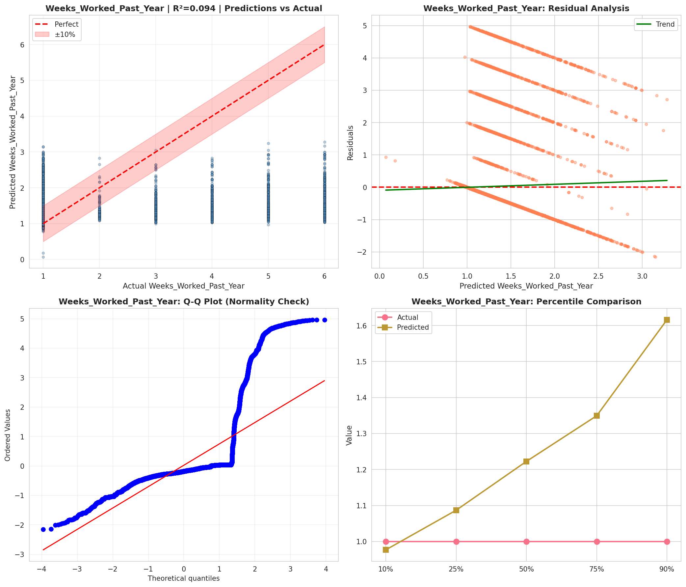
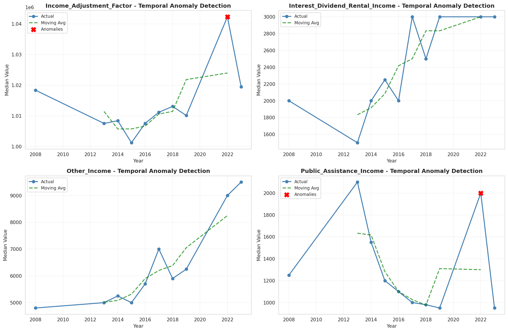
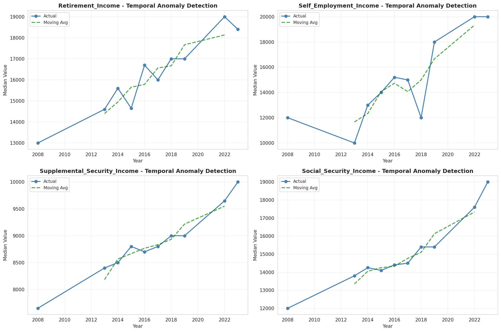
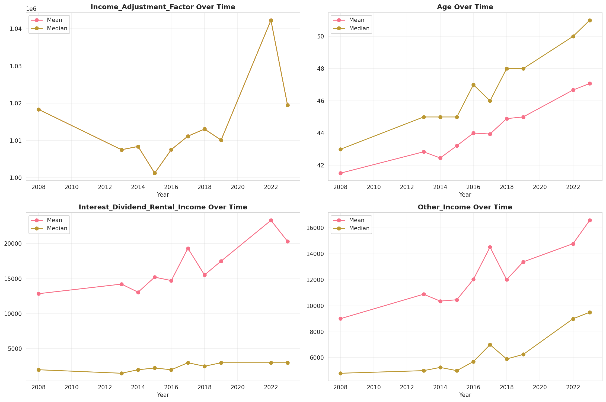
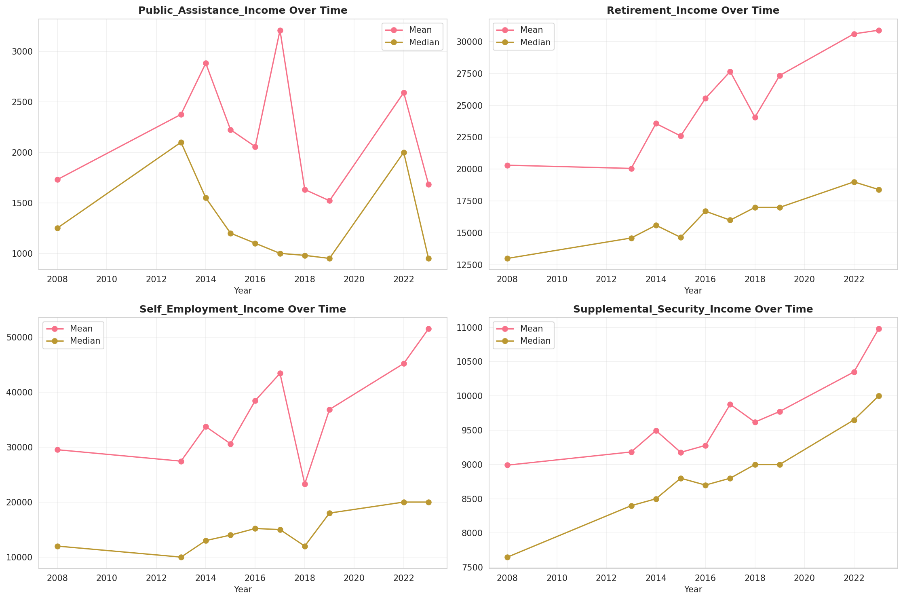
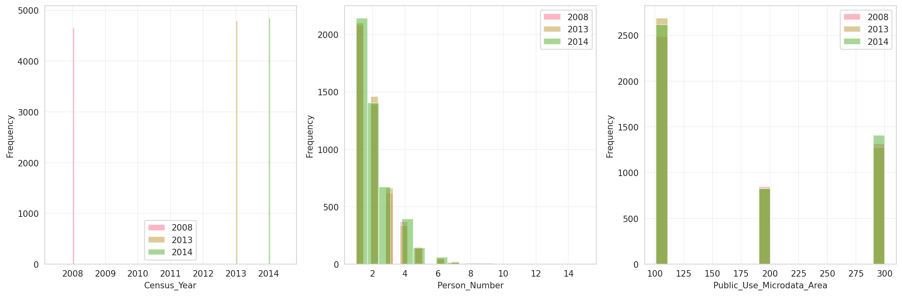
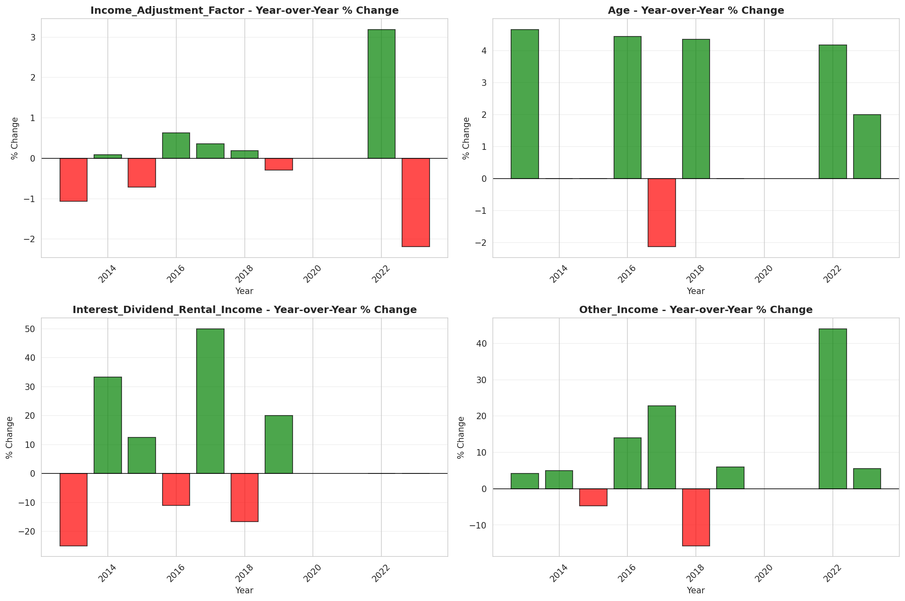
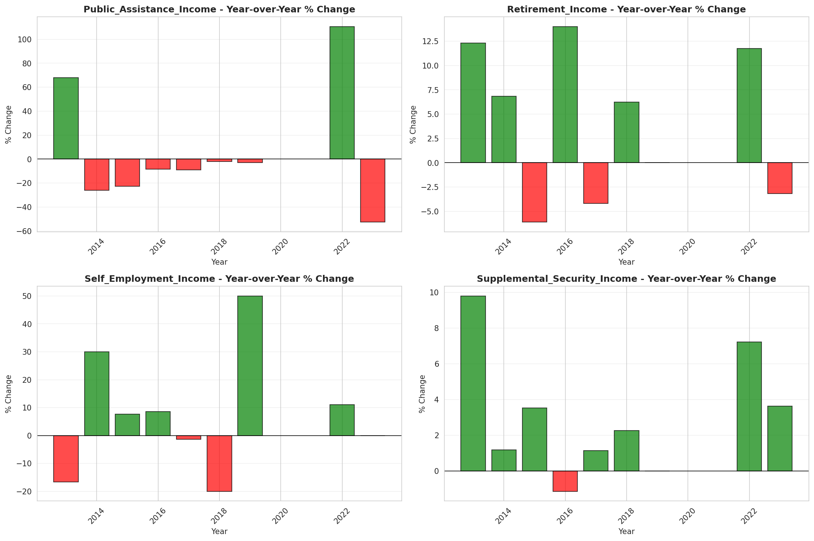

# Temporal Analysis

## Year Distribution

- 2008: 8,265 records

- 2013: 8,767 records

- 2014: 9,014 records

- 2015: 9,017 records

- 2016: 8,873 records

- 2017: 8,943 records

- 2018: 9,123 records

- 2019: 9,261 records

- 2022: 9,641 records

- 2023: 9,904 records

## Temporal Trends

- Census_Year: {np.int64(2008): {'mean': 2008.0, 'median': 2008.0, 'std': 0.0}, np.int64(2013): {'mean': 2013.0, 'median': 2013.0, 'std': 0.0}, np.int64(2014): {'mean': 2014.0, 'median': 2014.0, 'std': 0.0}, np.int64(2015): {'mean': 2015.0, 'median': 2015.0, 'std': 0.0}, np.int64(2016): {'mean': 2016.0, 'median': 2016.0, 'std': 0.0}, np.int64(2017): {'mean': 2017.0, 'median': 2017.0, 'std': 0.0}, np.int64(2018): {'mean': 2018.0, 'median': 2018.0, 'std': 0.0}, np.int64(2019): {'mean': 2019.0, 'median': 2019.0, 'std': 0.0}, np.int64(2022): {'mean': 2022.0, 'median': 2022.0, 'std': 0.0}, np.int64(2023): {'mean': 2023.0, 'median': 2023.0, 'std': 0.0}}

- Person_Number: {np.int64(2008): {'mean': 2.016333938294011, 'median': 2.0, 'std': 1.2271530123708514}, np.int64(2013): {'mean': 2.029542602942854, 'median': 2.0, 'std': 1.2643584856814163}, np.int64(2014): {'mean': 2.055802085644553, 'median': 2.0, 'std': 1.2998703325700236}, np.int64(2015): {'mean': 2.018409670622158, 'median': 2.0, 'std': 1.2303893812847084}, np.int64(2016): {'mean': 1.9869266313535445, 'median': 2.0, 'std': 1.2034143026857356}, np.int64(2017): {'mean': 1.9690260538969027, 'median': 2.0, 'std': 1.172564370881825}, np.int64(2018): {'mean': 1.974569768716431, 'median': 2.0, 'std': 1.2286367913622955}, np.int64(2019): {'mean': 1.991037684915236, 'median': 2.0, 'std': 1.2644950557388115}, np.int64(2022): {'mean': 1.9669121460429415, 'median': 2.0, 'std': 1.240668278568796}, np.int64(2023): {'mean': 1.979200323101777, 'median': 2.0, 'std': 1.23799762373957}}

- Public_Use_Microdata_Area: {np.int64(2008): {'mean': 175.4325468844525, 'median': 104.0, 'std': 85.74194906936712}, np.int64(2013): {'mean': 173.50792745522983, 'median': 104.0, 'std': 85.10084688703172}, np.int64(2014): {'mean': 175.6029509651653, 'median': 104.0, 'std': 86.07954461974165}, np.int64(2015): {'mean': 172.91394033492293, 'median': 104.0, 'std': 85.12885166715836}, np.int64(2016): {'mean': 172.97509297869942, 'median': 104.0, 'std': 85.37938558731483}, np.int64(2017): {'mean': 173.56468746505647, 'median': 104.0, 'std': 85.72934054886947}, np.int64(2018): {'mean': 175.8764660747561, 'median': 104.0, 'std': 86.34191766475809}, np.int64(2019): {'mean': 178.85789871504159, 'median': 104.0, 'std': 87.01722291398346}, np.int64(2022): {'mean': 188.84202883518307, 'median': 200.0, 'std': 90.00282176876371}, np.int64(2023): {'mean': 188.41266155088854, 'median': 200.0, 'std': 89.62410334422675}}

- State_Code: {np.int64(2008): {'mean': 10.0, 'median': 10.0, 'std': 0.0}, np.int64(2013): {'mean': 10.0, 'median': 10.0, 'std': 0.0}, np.int64(2014): {'mean': 10.0, 'median': 10.0, 'std': 0.0}, np.int64(2015): {'mean': 10.0, 'median': 10.0, 'std': 0.0}, np.int64(2016): {'mean': 10.0, 'median': 10.0, 'std': 0.0}, np.int64(2017): {'mean': 10.0, 'median': 10.0, 'std': 0.0}, np.int64(2018): {'mean': 10.0, 'median': 10.0, 'std': 0.0}, np.int64(2019): {'mean': 10.0, 'median': 10.0, 'std': 0.0}, np.int64(2022): {'mean': 10.0, 'median': 10.0, 'std': 0.0}, np.int64(2023): {'mean': None, 'median': None, 'std': None}}

- Income_Adjustment_Factor: {np.int64(2008): {'mean': 1018389.0, 'median': 1018389.0, 'std': 0.0}, np.int64(2013): {'mean': 1007549.0, 'median': 1007549.0, 'std': 0.0}, np.int64(2014): {'mean': 1008425.0, 'median': 1008425.0, 'std': 0.0}, np.int64(2015): {'mean': 1001264.0, 'median': 1001264.0, 'std': 0.0}, np.int64(2016): {'mean': 1007588.0, 'median': 1007588.0, 'std': 0.0}, np.int64(2017): {'mean': 1011189.0, 'median': 1011189.0, 'std': 0.0}, np.int64(2018): {'mean': 1013097.0, 'median': 1013097.0, 'std': 0.0}, np.int64(2019): {'mean': 1010145.0, 'median': 1010145.0, 'std': 0.0}, np.int64(2022): {'mean': 1042311.0, 'median': 1042311.0, 'std': 0.0}, np.int64(2023): {'mean': 1019518.0, 'median': 1019518.0, 'std': 0.0}}

- Person_Weight: {np.int64(2008): {'mean': 105.63726557773745, 'median': 89.0, 'std': 76.57824782506256}, np.int64(2013): {'mean': 105.59473023839398, 'median': 82.0, 'std': 83.38722082223642}, np.int64(2014): {'mean': 103.79565120923009, 'median': 79.0, 'std': 85.77965030642967}, np.int64(2015): {'mean': 104.90562271265388, 'median': 81.0, 'std': 82.68057238696449}, np.int64(2016): {'mean': 107.2991096585146, 'median': 80.0, 'std': 88.89595731339175}, np.int64(2017): {'mean': 107.56334563345634, 'median': 82.0, 'std': 90.52135943306307}, np.int64(2018): {'mean': 106.01457853776171, 'median': 81.0, 'std': 91.0201850762988}, np.int64(2019): {'mean': 105.14674441205054, 'median': 78.0, 'std': 91.52274297151868}, np.int64(2022): {'mean': 105.6317809355876, 'median': 78.0, 'std': 100.26066794902776}, np.int64(2023): {'mean': 104.18921647819063, 'median': 75.0, 'std': 101.70360806082603}}

- Age: {np.int64(2008): {'mean': 41.516878402903814, 'median': 43.0, 'std': 23.381262447166606}, np.int64(2013): {'mean': 42.8400821261549, 'median': 45.0, 'std': 23.675379418148793}, np.int64(2014): {'mean': 42.45673396938096, 'median': 45.0, 'std': 23.697370403849824}, np.int64(2015): {'mean': 43.213818343129645, 'median': 45.0, 'std': 24.0045788256253}, np.int64(2016): {'mean': 44.00090161163079, 'median': 47.0, 'std': 23.51227542519702}, np.int64(2017): {'mean': 43.942860337694285, 'median': 46.0, 'std': 23.828381124100016}, np.int64(2018): {'mean': 44.89707333114107, 'median': 48.0, 'std': 23.880600715533618}, np.int64(2019): {'mean': 45.00334737069431, 'median': 48.0, 'std': 23.907346567434313}, np.int64(2022): {'mean': 46.672233170832904, 'median': 50.0, 'std': 24.259023766630463}, np.int64(2023): {'mean': 47.07592891760905, 'median': 51.0, 'std': 24.36472856666428}}

- Citizenship_Status: {np.int64(2008): {'mean': 1.2684815486993346, 'median': 1.0, 'std': 0.9293300475604274}, np.int64(2013): {'mean': 1.2639443367172352, 'median': 1.0, 'std': 0.9123854854767445}, np.int64(2014): {'mean': 1.2693587752385178, 'median': 1.0, 'std': 0.9217707172973834}, np.int64(2015): {'mean': 1.3030941554840856, 'median': 1.0, 'std': 0.9816779629850249}, np.int64(2016): {'mean': 1.2894173334836019, 'median': 1.0, 'std': 0.9495132044763723}, np.int64(2017): {'mean': 1.315330426031533, 'median': 1.0, 'std': 0.9853982137917778}, np.int64(2018): {'mean': 1.3019839964923818, 'median': 1.0, 'std': 0.9748556687207802}, np.int64(2019): {'mean': 1.309361839974085, 'median': 1.0, 'std': 0.9727762106418618}, np.int64(2022): {'mean': 1.3082667773052588, 'median': 1.0, 'std': 0.9639686692069033}, np.int64(2023): {'mean': 1.3630856219709209, 'median': 1.0, 'std': 1.0530867149204453}}

- Class_of_Worker: {np.int64(2008): {'mean': 2.0861526357199054, 'median': 1.0, 'std': 1.8512596083819077}, np.int64(2013): {'mean': 2.1145656679856795, 'median': 1.0, 'std': 1.8965093847812249}, np.int64(2014): {'mean': 2.108217168011739, 'median': 1.0, 'std': 1.879518739893513}, np.int64(2015): {'mean': 2.0947584405894424, 'median': 1.0, 'std': 1.8843356004856393}, np.int64(2016): {'mean': 2.0605610254504922, 'median': 1.0, 'std': 1.8386341279005949}, np.int64(2017): {'mean': 2.13130173062453, 'median': 1.0, 'std': 1.9165247334701039}, np.int64(2018): {'mean': 2.1610412926391382, 'median': 1.0, 'std': 1.9041753161132522}, np.int64(2019): {'mean': 2.126828398144845, 'median': 1.0, 'std': 1.8573971509709932}, np.int64(2022): {'mean': 2.1569716964750825, 'median': 1.0, 'std': 1.8851210610447469}, np.int64(2023): {'mean': 2.1442160693052488, 'median': 1.0, 'std': 1.8527404172047328}}

- English_Speaking_Ability: {np.int64(2008): {'mean': 1.5725593667546174, 'median': 1.0, 'std': 0.8581794151715413}, np.int64(2013): {'mean': 1.5053892215568863, 'median': 1.0, 'std': 0.8358899022363314}, np.int64(2014): {'mean': 1.5360824742268042, 'median': 1.0, 'std': 0.8316512548562419}, np.int64(2015): {'mean': 1.487912087912088, 'median': 1.0, 'std': 0.8079412188798465}, np.int64(2016): {'mean': 1.5496535796766744, 'median': 1.0, 'std': 0.8358754339767975}, np.int64(2017): {'mean': 1.4775672981056829, 'median': 1.0, 'std': 0.7930871891716073}, np.int64(2018): {'mean': 1.5202429149797572, 'median': 1.0, 'std': 0.798044178184865}, np.int64(2019): {'mean': 1.5254901960784313, 'median': 1.0, 'std': 0.8146940851068623}, np.int64(2022): {'mean': 1.5316455696202531, 'median': 1.0, 'std': 0.8410296755717606}, np.int64(2023): {'mean': 1.5884676145339653, 'median': 1.0, 'std': 0.842822111948356}}

- Fertility_Status: {np.int64(2008): {'mean': 1.9457863660762211, 'median': 2.0, 'std': 0.2264995654620784}, np.int64(2013): {'mean': 1.9476215927311598, 'median': 2.0, 'std': 0.22284849663681994}, np.int64(2014): {'mean': 1.9486228813559323, 'median': 2.0, 'std': 0.22082422503721935}, np.int64(2015): {'mean': 1.9406641262928688, 'median': 2.0, 'std': 0.2363165846802695}, np.int64(2016): {'mean': 1.9592735277930655, 'median': 2.0, 'std': 0.19771024199298443}, np.int64(2017): {'mean': 1.9556650246305418, 'median': 2.0, 'std': 0.20589460584438046}, np.int64(2018): {'mean': 1.9523551705468327, 'median': 2.0, 'std': 0.2130713020197176}, np.int64(2019): {'mean': 1.9579124579124578, 'median': 2.0, 'std': 0.20084525812445883}, np.int64(2022): {'mean': 1.9519388312397596, 'median': 2.0, 'std': 0.2139539518777294}, np.int64(2023): {'mean': 1.9509169363538295, 'median': 2.0, 'std': 0.2160997566112616}}

- Marital_Status: {np.int64(2008): {'mean': 2.817664851784634, 'median': 2.0, 'std': 1.840973798581035}, np.int64(2013): {'mean': 2.856051100718604, 'median': 2.0, 'std': 1.841244721071386}, np.int64(2014): {'mean': 2.877080097625915, 'median': 3.0, 'std': 1.842211415376254}, np.int64(2015): {'mean': 2.880780747476988, 'median': 3.0, 'std': 1.840128682892226}, np.int64(2016): {'mean': 2.8569818550659303, 'median': 3.0, 'std': 1.8408104682791413}, np.int64(2017): {'mean': 2.8336128815833614, 'median': 2.0, 'std': 1.8452310566441112}, np.int64(2018): {'mean': 2.8535569439877233, 'median': 2.0, 'std': 1.839550389203495}, np.int64(2019): {'mean': 2.8097397689234422, 'median': 2.0, 'std': 1.8318269000873673}, np.int64(2022): {'mean': 2.722539155689244, 'median': 2.0, 'std': 1.8282815163581656}, np.int64(2023): {'mean': 2.7811995153473346, 'median': 2.0, 'std': 1.8305710975663425}}

- Mobility_Status: {np.int64(2008): {'mean': 1.2431506849315068, 'median': 1.0, 'std': 0.6513797577371769}, np.int64(2013): {'mean': 1.2571988021193274, 'median': 1.0, 'std': 0.6660143073401588}, np.int64(2014): {'mean': 1.236467555754791, 'median': 1.0, 'std': 0.6426740832547326}, np.int64(2015): {'mean': 1.2470311449697513, 'median': 1.0, 'std': 0.6539084239624402}, np.int64(2016): {'mean': 1.2374730144301784, 'median': 1.0, 'std': 0.642764041945631}, np.int64(2017): {'mean': 1.2456021650879567, 'median': 1.0, 'std': 0.653182170307647}, np.int64(2018): {'mean': 1.2210549596372886, 'median': 1.0, 'std': 0.6249185866625523}, np.int64(2019): {'mean': 1.2133304338371207, 'median': 1.0, 'std': 0.6147602404175949}, np.int64(2022): {'mean': 1.204932594837496, 'median': 1.0, 'std': 0.6030100761306548}, np.int64(2023): {'mean': 1.2047212047212048, 'median': 1.0, 'std': 0.6008796624867281}}

- Military_Service: {np.int64(2008): {'mean': 4.692169754931261, 'median': 5.0, 'std': 0.7508148012749469}, np.int64(2013): {'mean': 3.749237170596394, 'median': 4.0, 'std': 0.6513663312139131}, np.int64(2014): {'mean': 3.7512925170068026, 'median': 4.0, 'std': 0.6529669686669846}, np.int64(2015): {'mean': 3.7612527114967462, 'median': 4.0, 'std': 0.6401870515791445}, np.int64(2016): {'mean': 3.779199784453725, 'median': 4.0, 'std': 0.6169601121147712}, np.int64(2017): {'mean': 3.7771929824561403, 'median': 4.0, 'std': 0.6212098590907863}, np.int64(2018): {'mean': 3.7771100078390383, 'median': 4.0, 'std': 0.6202040265469633}, np.int64(2019): {'mean': 3.766026054430543, 'median': 4.0, 'std': 0.6361945103075266}, np.int64(2022): {'mean': 3.800588668138337, 'median': 4.0, 'std': 0.5943184508304785}, np.int64(2023): {'mean': 3.793172928766149, 'median': 4.0, 'std': 0.6062037780082078}}

- Travel_Time_To_Work_Minutes: {np.int64(2008): {'mean': 25.341424379834624, 'median': 20.0, 'std': 23.33459796793001}, np.int64(2013): {'mean': 25.317574786324787, 'median': 20.0, 'std': 21.682794460791346}, np.int64(2014): {'mean': 25.398025461158742, 'median': 20.0, 'std': 21.806059168827442}, np.int64(2015): {'mean': 26.131096774193548, 'median': 20.0, 'std': 23.449918090494045}, np.int64(2016): {'mean': 25.6656282450675, 'median': 20.0, 'std': 21.275195576391866}, np.int64(2017): {'mean': 25.997637175111578, 'median': 20.0, 'std': 23.168607978816855}, np.int64(2018): {'mean': 26.406481245215616, 'median': 20.0, 'std': 23.370451818857802}, np.int64(2019): {'mean': 26.26506322836598, 'median': 20.0, 'std': 21.733537188922583}, np.int64(2022): {'mean': 26.10117384013415, 'median': 20.0, 'std': 22.564859302332074}, np.int64(2023): {'mean': 26.42916884474647, 'median': 20.0, 'std': 23.165397368285497}}

- Vehicle_Occupancy: {np.int64(2008): {'mean': 1.1701945080091534, 'median': 1.0, 'std': 0.612631526325992}, np.int64(2013): {'mean': 1.1399769585253456, 'median': 1.0, 'std': 0.5313483655863256}, np.int64(2014): {'mean': 1.129356007805966, 'median': 1.0, 'std': 0.5603507616870583}, np.int64(2015): {'mean': 1.1278113000548546, 'median': 1.0, 'std': 0.5280707268001847}, np.int64(2016): {'mean': 1.134156378600823, 'median': 1.0, 'std': 0.5278722930372141}, np.int64(2017): {'mean': 1.1179602129448025, 'median': 1.0, 'std': 0.4439865867610429}, np.int64(2018): {'mean': 1.1514821865651346, 'median': 1.0, 'std': 0.6048013419657159}, np.int64(2019): {'mean': 1.12850773669027, 'median': 1.0, 'std': 0.5185517428634263}, np.int64(2022): {'mean': 1.1315945465323058, 'median': 1.0, 'std': 0.5535568147451554}, np.int64(2023): {'mean': 1.1399719495091165, 'median': 1.0, 'std': 0.5006040114874493}}

- Transportation_To_Work: {np.int64(2008): {'mean': 1.72014444157854, 'median': 1.0, 'std': 2.467714999061391}, np.int64(2013): {'mean': 1.8110115236875801, 'median': 1.0, 'std': 2.6011566677863174}, np.int64(2014): {'mean': 1.9109032734432685, 'median': 1.0, 'std': 2.77791755531241}, np.int64(2015): {'mean': 1.837163814180929, 'median': 1.0, 'std': 2.6705256576009933}, np.int64(2016): {'mean': 1.8325558556346673, 'median': 1.0, 'std': 2.6787658752357983}, np.int64(2017): {'mean': 1.8831006979062812, 'median': 1.0, 'std': 2.7298443944993465}, np.int64(2018): {'mean': 1.9882606612362241, 'median': 1.0, 'std': 2.8991526717871112}, np.int64(2019): {'mean': None, 'median': None, 'std': None}, np.int64(2022): {'mean': None, 'median': None, 'std': None}, np.int64(2023): {'mean': None, 'median': None, 'std': None}}

- Language_Other_Than_English: {np.int64(2008): {'mean': 1.9030566568614913, 'median': 2.0, 'std': 0.29589952564800925}, np.int64(2013): {'mean': 1.8997719361421197, 'median': 2.0, 'std': 0.3003218694859854}, np.int64(2014): {'mean': 1.8981567895473634, 'median': 2.0, 'std': 0.30245965533861585}, np.int64(2015): {'mean': 1.8939270311225085, 'median': 2.0, 'std': 0.30794893762424147}, np.int64(2016): {'mean': 1.8981056594893517, 'median': 2.0, 'std': 0.3025271103890221}, np.int64(2017): {'mean': 1.8826488826488827, 'median': 2.0, 'std': 0.32185703795034365}, np.int64(2018): {'mean': 1.8869565217391304, 'median': 2.0, 'std': 0.316664054676611}, np.int64(2019): {'mean': 1.8849667305740385, 'median': 2.0, 'std': 0.31908008162054646}, np.int64(2022): {'mean': 1.8890209639074995, 'median': 2.0, 'std': 0.31412314849275136}, np.int64(2023): {'mean': 1.86710056686962, 'median': 2.0, 'std': 0.33948383200817434}}

- Grandparents_Living_With_Grandchildren: {np.int64(2008): {'mean': 1.9673119065010958, 'median': 2.0, 'std': 0.17783519704613507}, np.int64(2013): {'mean': 1.9629819174343228, 'median': 2.0, 'std': 0.18882220823755688}, np.int64(2014): {'mean': 1.9584168336673347, 'median': 2.0, 'std': 0.1996513545354117}, np.int64(2015): {'mean': 1.9664528860384805, 'median': 2.0, 'std': 0.18007508884812326}, np.int64(2016): {'mean': 1.966897233201581, 'median': 2.0, 'std': 0.17891966280342217}, np.int64(2017): {'mean': 1.9695241199478488, 'median': 2.0, 'std': 0.17190670999279165}, np.int64(2018): {'mean': 1.967583807716635, 'median': 2.0, 'std': 0.17711675043189368}, np.int64(2019): {'mean': 1.9701746252511203, 'median': 2.0, 'std': 0.17011847070870884}, np.int64(2022): {'mean': 1.9722302158273382, 'median': 2.0, 'std': 0.16432440023529366}, np.int64(2023): {'mean': 1.9704391891891893, 'median': 2.0, 'std': 0.16938420229386225}}

- Months_Responsible_For_Grandchildren: {np.int64(2008): {'mean': 3.611940298507463, 'median': 4.0, 'std': 1.4455283597377013}, np.int64(2013): {'mean': 3.7777777777777777, 'median': 4.0, 'std': 1.2168506989695846}, np.int64(2014): {'mean': 3.706422018348624, 'median': 4.0, 'std': 1.3764067032836032}, np.int64(2015): {'mean': 3.9263157894736844, 'median': 5.0, 'std': 1.3545989848860895}, np.int64(2016): {'mean': 3.9027777777777777, 'median': 4.0, 'std': 1.1767671425002624}, np.int64(2017): {'mean': 4.098591549295775, 'median': 5.0, 'std': 1.3000541700523185}, np.int64(2018): {'mean': 4.173913043478261, 'median': 5.0, 'std': 1.173036780778321}, np.int64(2019): {'mean': 4.0, 'median': 4.0, 'std': 1.1657505560686465}, np.int64(2022): {'mean': 4.012658227848101, 'median': 5.0, 'std': 1.2246786170369712}, np.int64(2023): {'mean': 3.830508474576271, 'median': 4.0, 'std': 1.3018891098082384}}

- Grandparents_Responsible_For_Grandchildren: {np.int64(2008): {'mean': 1.6256983240223464, 'median': 2.0, 'std': 0.48529955830323007}, np.int64(2013): {'mean': 1.543778801843318, 'median': 2.0, 'std': 0.49923136003746216}, np.int64(2014): {'mean': 1.5622489959839359, 'median': 2.0, 'std': 0.4971091452258074}, np.int64(2015): {'mean': 1.5343137254901962, 'median': 2.0, 'std': 0.5000482928479419}, np.int64(2016): {'mean': 1.6417910447761195, 'median': 2.0, 'std': 0.4806711725487632}, np.int64(2017): {'mean': 1.6203208556149733, 'median': 2.0, 'std': 0.4866098476295118}, np.int64(2018): {'mean': 1.551219512195122, 'median': 2.0, 'std': 0.4985871957584457}, np.int64(2019): {'mean': 1.5906735751295338, 'median': 2.0, 'std': 0.4929884022640283}, np.int64(2022): {'mean': 1.5906735751295338, 'median': 2.0, 'std': 0.4929884022640283}, np.int64(2023): {'mean': 1.7190476190476192, 'median': 2.0, 'std': 0.45053827202989305}}

- Interest_Dividend_Rental_Income: {np.int64(2008): {'mean': 12854.280727272728, 'median': 2000.0, 'std': 33143.81508172376}, np.int64(2013): {'mean': 14224.943986820428, 'median': 1500.0, 'std': 40525.0123897852}, np.int64(2014): {'mean': 13072.434782608696, 'median': 2000.0, 'std': 31395.328465648836}, np.int64(2015): {'mean': 15218.687600644122, 'median': 2250.0, 'std': 47176.06044367551}, np.int64(2016): {'mean': 14728.665831244778, 'median': 2000.0, 'std': 39017.896381709135}, np.int64(2017): {'mean': 19338.055555555555, 'median': 3000.0, 'std': 53821.4074110894}, np.int64(2018): {'mean': 15526.808681672026, 'median': 2500.0, 'std': 37795.90045141936}, np.int64(2019): {'mean': 17509.450800915332, 'median': 3000.0, 'std': 42459.37458957504}, np.int64(2022): {'mean': 23322.395161290322, 'median': 3000.0, 'std': 62888.75793851816}, np.int64(2023): {'mean': 20331.442097596504, 'median': 3000.0, 'std': 55797.111345550526}}

- Military_Service_Period_1: {np.int64(2008): {'mean': 0.10098792535675083, 'median': 0.0, 'std': 0.3014782460163182}, np.int64(2013): {'mean': 0.11425061425061425, 'median': 0.0, 'std': 0.31831098858620427}, np.int64(2014): {'mean': 0.15121951219512195, 'median': 0.0, 'std': 0.35848136560287086}, np.int64(2015): {'mean': 0.1473951715374841, 'median': 0.0, 'std': 0.35472485144278987}, np.int64(2016): {'mean': 0.1418732782369146, 'median': 0.0, 'std': 0.3491606731056395}, np.int64(2017): {'mean': 0.16076294277929154, 'median': 0.0, 'std': 0.36756262332127215}, np.int64(2018): {'mean': 0.1598951507208388, 'median': 0.0, 'std': 0.3667492002293148}, np.int64(2019): {'mean': 0.1687344913151365, 'median': 0.0, 'std': 0.37474978680379856}, np.int64(2022): {'mean': 0.19669876203576342, 'median': 0.0, 'std': 0.39777632083521275}, np.int64(2023): {'mean': 0.19845360824742267, 'median': 0.0, 'std': 0.399092752304276}}

- Military_Service_Period_2: {np.int64(2008): {'mean': 0.12952799121844127, 'median': 0.0, 'std': 0.33596784421652454}, np.int64(2013): {'mean': 0.16216216216216217, 'median': 0.0, 'std': 0.3688261266212957}, np.int64(2014): {'mean': 0.17317073170731706, 'median': 0.0, 'std': 0.3786257460244582}, np.int64(2015): {'mean': 0.16518424396442186, 'median': 0.0, 'std': 0.3715829016241481}, np.int64(2016): {'mean': 0.15426997245179064, 'median': 0.0, 'std': 0.3614563704017393}, np.int64(2017): {'mean': 0.18664850136239783, 'median': 0.0, 'std': 0.38989478993888727}, np.int64(2018): {'mean': 0.19003931847968544, 'median': 0.0, 'std': 0.39258932283594317}, np.int64(2019): {'mean': 0.18610421836228289, 'median': 0.0, 'std': 0.3894324062824367}, np.int64(2022): {'mean': 0.19807427785419532, 'median': 0.0, 'std': 0.39882282703948013}, np.int64(2023): {'mean': 0.16108247422680413, 'median': 0.0, 'std': 0.36784409516874866}}

- Military_Service_Period_3: {np.int64(2008): {'mean': 0.16136114160263446, 'median': 0.0, 'std': 0.3680657970687877}, np.int64(2013): {'mean': None, 'median': None, 'std': None}, np.int64(2014): {'mean': None, 'median': None, 'std': None}, np.int64(2015): {'mean': None, 'median': None, 'std': None}, np.int64(2016): {'mean': None, 'median': None, 'std': None}, np.int64(2017): {'mean': None, 'median': None, 'std': None}, np.int64(2018): {'mean': None, 'median': None, 'std': None}, np.int64(2019): {'mean': None, 'median': None, 'std': None}, np.int64(2022): {'mean': None, 'median': None, 'std': None}, np.int64(2023): {'mean': None, 'median': None, 'std': None}}

- Military_Service_Period_4: {np.int64(2008): {'mean': 0.13721185510428102, 'median': 0.0, 'std': 0.344259865607499}, np.int64(2013): {'mean': None, 'median': None, 'std': None}, np.int64(2014): {'mean': None, 'median': None, 'std': None}, np.int64(2015): {'mean': None, 'median': None, 'std': None}, np.int64(2016): {'mean': None, 'median': None, 'std': None}, np.int64(2017): {'mean': None, 'median': None, 'std': None}, np.int64(2018): {'mean': None, 'median': None, 'std': None}, np.int64(2019): {'mean': None, 'median': None, 'std': None}, np.int64(2022): {'mean': None, 'median': None, 'std': None}, np.int64(2023): {'mean': None, 'median': None, 'std': None}}

- Military_Service_Period_5: {np.int64(2008): {'mean': 0.35236004390779363, 'median': 0.0, 'std': 0.47796779732621864}, np.int64(2013): {'mean': 0.36609336609336607, 'median': 0.0, 'std': 0.4820315976538769}, np.int64(2014): {'mean': 0.37317073170731707, 'median': 0.0, 'std': 0.4839420899188954}, np.int64(2015): {'mean': 0.4155019059720457, 'median': 0.0, 'std': 0.4931217439797962}, np.int64(2016): {'mean': 0.4283746556473829, 'median': 0.0, 'std': 0.4951843712280327}, np.int64(2017): {'mean': 0.4332425068119891, 'median': 0.0, 'std': 0.49586129242813054}, np.int64(2018): {'mean': 0.42070773263433814, 'median': 0.0, 'std': 0.4939965276429887}, np.int64(2019): {'mean': 0.43424317617866004, 'median': 0.0, 'std': 0.4959649460883385}, np.int64(2022): {'mean': 0.4360385144429161, 'median': 0.0, 'std': 0.4962334590669139}, np.int64(2023): {'mean': 0.38917525773195877, 'median': 0.0, 'std': 0.4878776580712576}}

- Military_Service_Period_6: {np.int64(2008): {'mean': 0.11086717892425905, 'median': 0.0, 'std': 0.3141400522841138}, np.int64(2013): {'mean': None, 'median': None, 'std': None}, np.int64(2014): {'mean': None, 'median': None, 'std': None}, np.int64(2015): {'mean': None, 'median': None, 'std': None}, np.int64(2016): {'mean': None, 'median': None, 'std': None}, np.int64(2017): {'mean': None, 'median': None, 'std': None}, np.int64(2018): {'mean': None, 'median': None, 'std': None}, np.int64(2019): {'mean': None, 'median': None, 'std': None}, np.int64(2022): {'mean': None, 'median': None, 'std': None}, np.int64(2023): {'mean': None, 'median': None, 'std': None}}

- Military_Service_Period_7: {np.int64(2008): {'mean': 0.15806805708013172, 'median': 0.0, 'std': 0.365005193069276}, np.int64(2013): {'mean': None, 'median': None, 'std': None}, np.int64(2014): {'mean': None, 'median': None, 'std': None}, np.int64(2015): {'mean': None, 'median': None, 'std': None}, np.int64(2016): {'mean': None, 'median': None, 'std': None}, np.int64(2017): {'mean': None, 'median': None, 'std': None}, np.int64(2018): {'mean': None, 'median': None, 'std': None}, np.int64(2019): {'mean': None, 'median': None, 'std': None}, np.int64(2022): {'mean': None, 'median': None, 'std': None}, np.int64(2023): {'mean': None, 'median': None, 'std': None}}

- Military_Service_Period_8: {np.int64(2008): {'mean': 0.14489571899012074, 'median': 0.0, 'std': 0.35218901813960096}, np.int64(2013): {'mean': 0.12285012285012285, 'median': 0.0, 'std': 0.3284669143073209}, np.int64(2014): {'mean': 0.1, 'median': 0.0, 'std': 0.3001830943106058}, np.int64(2015): {'mean': 0.09529860228716645, 'median': 0.0, 'std': 0.29381366416048094}, np.int64(2016): {'mean': 0.10330578512396695, 'median': 0.0, 'std': 0.30456767803629003}, np.int64(2017): {'mean': 0.0776566757493188, 'median': 0.0, 'std': 0.2678130557953039}, np.int64(2018): {'mean': 0.08256880733944955, 'median': 0.0, 'std': 0.27540989527759746}, np.int64(2019): {'mean': 0.06451612903225806, 'median': 0.0, 'std': 0.24582264295467288}, np.int64(2022): {'mean': 0.05364511691884457, 'median': 0.0, 'std': 0.22547116397746142}, np.int64(2023): {'mean': 0.05412371134020619, 'median': 0.0, 'std': 0.2264075803008637}}

- Military_Service_Period_9: {np.int64(2008): {'mean': 0.021953896816684963, 'median': 0.0, 'std': 0.14661350125851877}, np.int64(2013): {'mean': 0.0171990171990172, 'median': 0.0, 'std': 0.13009228326020938}, np.int64(2014): {'mean': 0.01707317073170732, 'median': 0.0, 'std': 0.1296231770235563}, np.int64(2015): {'mean': 0.021601016518424398, 'median': 0.0, 'std': 0.14546924475451445}, np.int64(2016): {'mean': 0.02203856749311295, 'median': 0.0, 'std': 0.14691016687481664}, np.int64(2017): {'mean': 0.01226158038147139, 'median': 0.0, 'std': 0.11012609526141505}, np.int64(2018): {'mean': 0.015727391874180863, 'median': 0.0, 'std': 0.12450042583653045}, np.int64(2019): {'mean': 0.00620347394540943, 'median': 0.0, 'std': 0.07856620921332999}, np.int64(2022): {'mean': None, 'median': None, 'std': None}, np.int64(2023): {'mean': None, 'median': None, 'std': None}}

- Military_Service_Period_10: {np.int64(2008): {'mean': 0.11086717892425905, 'median': 0.0, 'std': 0.3141400522841137}, np.int64(2013): {'mean': 0.07002457002457002, 'median': 0.0, 'std': 0.2553453140511326}, np.int64(2014): {'mean': 0.046341463414634146, 'median': 0.0, 'std': 0.2103518315308445}, np.int64(2015): {'mean': 0.04066073697585769, 'median': 0.0, 'std': 0.19762861440726404}, np.int64(2016): {'mean': 0.03581267217630854, 'median': 0.0, 'std': 0.185950940965866}, np.int64(2017): {'mean': 0.0326975476839237, 'median': 0.0, 'std': 0.177965073353391}, np.int64(2018): {'mean': 0.027522935779816515, 'median': 0.0, 'std': 0.1637087322470676}, np.int64(2019): {'mean': 0.022332506203473945, 'median': 0.0, 'std': 0.14785427981646848}, np.int64(2022): {'mean': 0.011004126547455296, 'median': 0.0, 'std': 0.10439361165199258}, np.int64(2023): {'mean': 0.006443298969072165, 'median': 0.0, 'std': 0.08006274559654822}}

- Military_Service_Period_11: {np.int64(2008): {'mean': 0.0043907793633369925, 'median': 0.0, 'std': 0.06615364137018301}, np.int64(2013): {'mean': 0.0, 'median': 0.0, 'std': 0.0}, np.int64(2014): {'mean': 0.0012195121951219512, 'median': 0.0, 'std': 0.03492151478847893}, np.int64(2015): {'mean': 0.0, 'median': 0.0, 'std': 0.0}, np.int64(2016): {'mean': 0.0027548209366391185, 'median': 0.0, 'std': 0.05245017810859239}, np.int64(2017): {'mean': 0.0, 'median': 0.0, 'std': 0.0}, np.int64(2018): {'mean': 0.001310615989515072, 'median': 0.0, 'std': 0.03620243071279983}, np.int64(2019): {'mean': 0.0, 'median': 0.0, 'std': 0.0}, np.int64(2022): {'mean': None, 'median': None, 'std': None}, np.int64(2023): {'mean': None, 'median': None, 'std': None}}

- Temporary_Absence_From_Work: {np.int64(2008): {'mean': 2.508484580197728, 'median': 3.0, 'std': 0.5336606634877868}, np.int64(2013): {'mean': 2.570841326390792, 'median': 3.0, 'std': 0.5190459187664669}, np.int64(2014): {'mean': 2.5763256561328336, 'median': 3.0, 'std': 0.5164359498179824}, np.int64(2015): {'mean': 2.588510354041416, 'median': 3.0, 'std': 0.5165114307062153}, np.int64(2016): {'mean': 2.5719797764768493, 'median': 3.0, 'std': 0.5182059923965487}, np.int64(2017): {'mean': 2.568169690501601, 'median': 3.0, 'std': 0.5182674076424002}, np.int64(2018): {'mean': 2.6012861736334405, 'median': 3.0, 'std': 0.5094914834253886}, np.int64(2019): {'mean': 2.6032414497192446, 'median': 3.0, 'std': 0.5079429927433854}, np.int64(2022): {'mean': 2.550224160911184, 'median': 3.0, 'std': 0.5198941040825569}, np.int64(2023): {'mean': 2.555295220243674, 'median': 3.0, 'std': 0.5147958065508065}}

- Available_For_Work: {np.int64(2008): {'mean': 4.53917662682603, 'median': 5.0, 'std': 1.203708886511928}, np.int64(2013): {'mean': 4.654425870101398, 'median': 5.0, 'std': 1.0521851577520693}, np.int64(2014): {'mean': 4.681440814140332, 'median': 5.0, 'std': 1.017270688684433}, np.int64(2015): {'mean': 4.70875083500334, 'median': 5.0, 'std': 0.9654006972172248}, np.int64(2016): {'mean': 4.72365620010644, 'median': 5.0, 'std': 0.9424585229853413}, np.int64(2017): {'mean': 4.727321237993596, 'median': 5.0, 'std': 0.9344524683854363}, np.int64(2018): {'mean': 4.757041800643087, 'median': 5.0, 'std': 0.8879935469446453}, np.int64(2019): {'mean': 4.754594180704441, 'median': 5.0, 'std': 0.8751759498175633}, np.int64(2022): {'mean': 4.800557373076457, 'median': 5.0, 'std': 0.8023019955179608}, np.int64(2023): {'mean': 4.802014995313964, 'median': 5.0, 'std': 0.7938992144794546}}

- On_Layoff_From_Work: {np.int64(2008): {'mean': 2.476464512321086, 'median': 2.0, 'std': 0.5298771451185748}, np.int64(2013): {'mean': 2.539462866538778, 'median': 3.0, 'std': 0.5283694506098807}, np.int64(2014): {'mean': 2.5553026245313335, 'median': 3.0, 'std': 0.5183340147106122}, np.int64(2015): {'mean': 2.570741482965932, 'median': 3.0, 'std': 0.5119878239802194}, np.int64(2016): {'mean': 2.5522884513038853, 'median': 3.0, 'std': 0.5172282233999935}, np.int64(2017): {'mean': 2.5518943436499466, 'median': 3.0, 'std': 0.5139563997363098}, np.int64(2018): {'mean': 2.5867524115755627, 'median': 3.0, 'std': 0.5030439244381252}, np.int64(2019): {'mean': 2.5912455334354263, 'median': 3.0, 'std': 0.5019120357076685}, np.int64(2022): {'mean': 2.543923421786017, 'median': 3.0, 'std': 0.5074968462066205}, np.int64(2023): {'mean': 2.544985941893158, 'median': 3.0, 'std': 0.5070938366281179}}

- Looking_For_Work: {np.int64(2008): {'mean': 2.4746938173232995, 'median': 3.0, 'std': 0.5943841362513254}, np.int64(2013): {'mean': 2.523157029323102, 'median': 3.0, 'std': 0.5939933289451624}, np.int64(2014): {'mean': 2.537493304767006, 'median': 3.0, 'std': 0.5867267470482206}, np.int64(2015): {'mean': 2.561923847695391, 'median': 3.0, 'std': 0.5682387551159859}, np.int64(2016): {'mean': 2.5467003725385844, 'median': 3.0, 'std': 0.5661331490150535}, np.int64(2017): {'mean': 2.5461579509071504, 'median': 3.0, 'std': 0.5637515324961374}, np.int64(2018): {'mean': 2.583536977491961, 'median': 3.0, 'std': 0.5469343818501246}, np.int64(2019): {'mean': 2.574017355793772, 'median': 3.0, 'std': 0.5460386943517562}, np.int64(2022): {'mean': 2.5301102629346905, 'median': 3.0, 'std': 0.5492876009858517}, np.int64(2023): {'mean': 2.528116213683224, 'median': 3.0, 'std': 0.5478029942681202}}

- Informed_Of_Recall: {np.int64(2008): {'mean': 2.8819536668142245, 'median': 3.0, 'std': 0.3473552745459995}, np.int64(2013): {'mean': 2.923814743765415, 'median': 3.0, 'std': 0.28666421735937314}, np.int64(2014): {'mean': 2.9333154793786824, 'median': 3.0, 'std': 0.2651063671978316}, np.int64(2015): {'mean': 2.937074148296593, 'median': 3.0, 'std': 0.2603706614166092}, np.int64(2016): {'mean': 2.939329430548164, 'median': 3.0, 'std': 0.2600819309801244}, np.int64(2017): {'mean': 2.940101387406617, 'median': 3.0, 'std': 0.2593432262441836}, np.int64(2018): {'mean': 2.9435369774919615, 'median': 3.0, 'std': 0.24383648238392217}, np.int64(2019): {'mean': 2.9303215926493107, 'median': 3.0, 'std': 0.2687643591299791}, np.int64(2022): {'mean': 2.9551678177632374, 'median': 3.0, 'std': 0.21834549854397212}, np.int64(2023): {'mean': 2.9475164011246484, 'median': 3.0, 'std': 0.23776131930260141}}

- Other_Income: {np.int64(2008): {'mean': 9007.687969924813, 'median': 4800.0, 'std': 13044.805956435699}, np.int64(2013): {'mean': 10890.077519379845, 'median': 5000.0, 'std': 15936.927259651275}, np.int64(2014): {'mean': 10359.963636363636, 'median': 5250.0, 'std': 13080.88138130068}, np.int64(2015): {'mean': 10462.785714285714, 'median': 5000.0, 'std': 14382.512107154453}, np.int64(2016): {'mean': 12031.903614457831, 'median': 5700.0, 'std': 16638.868353566166}, np.int64(2017): {'mean': 14519.78417266187, 'median': 7000.0, 'std': 18741.237457641135}, np.int64(2018): {'mean': 12013.325471698114, 'median': 5900.0, 'std': 15775.637141268384}, np.int64(2019): {'mean': 13381.365979381444, 'median': 6250.0, 'std': 16084.462271181194}, np.int64(2022): {'mean': 14785.03856041131, 'median': 9000.0, 'std': 17318.29777863691}, np.int64(2023): {'mean': 16580.943396226416, 'median': 9500.0, 'std': 18909.62994834308}}

- Public_Assistance_Income: {np.int64(2008): {'mean': 1730.142857142857, 'median': 1250.0, 'std': 2091.7855162426986}, np.int64(2013): {'mean': 2375.959595959596, 'median': 2100.0, 'std': 2998.573102562631}, np.int64(2014): {'mean': 2882.6612903225805, 'median': 1550.0, 'std': 3512.8037834368715}, np.int64(2015): {'mean': 2224.4578313253014, 'median': 1200.0, 'std': 3038.872244689069}, np.int64(2016): {'mean': 2056.6326530612246, 'median': 1100.0, 'std': 2932.3995114228364}, np.int64(2017): {'mean': 3209.3684210526317, 'median': 1000.0, 'std': 5799.522139251907}, np.int64(2018): {'mean': 1632.0212765957447, 'median': 980.0, 'std': 1657.3774982138043}, np.int64(2019): {'mean': 1521.1666666666667, 'median': 950.0, 'std': 1914.1288837885247}, np.int64(2022): {'mean': 2592.019230769231, 'median': 2000.0, 'std': 3009.8315857176904}, np.int64(2023): {'mean': 1684.659090909091, 'median': 950.0, 'std': 2257.7600275971}}

- Retirement_Income: {np.int64(2008): {'mean': 20306.39007698888, 'median': 13000.0, 'std': 24656.116588890683}, np.int64(2013): {'mean': 20056.647955092223, 'median': 14600.0, 'std': 20168.651759473316}, np.int64(2014): {'mean': 23576.245901639344, 'median': 15600.0, 'std': 27816.891136335747}, np.int64(2015): {'mean': 22599.664634146342, 'median': 14650.0, 'std': 22953.53412432764}, np.int64(2016): {'mean': 25546.440410418312, 'median': 16700.0, 'std': 30128.201880227487}, np.int64(2017): {'mean': 27656.76911544228, 'median': 16000.0, 'std': 37651.56568432164}, np.int64(2018): {'mean': 24073.21332388377, 'median': 17000.0, 'std': 22698.454225914837}, np.int64(2019): {'mean': 27340.299741602066, 'median': 17000.0, 'std': 33108.80345151076}, np.int64(2022): {'mean': 30605.57083139805, 'median': 19000.0, 'std': 37225.908731705}, np.int64(2023): {'mean': 30892.27994363551, 'median': 18400.0, 'std': 40180.80979771991}}

- Self_Employment_Income: {np.int64(2008): {'mean': 29519.43119266055, 'median': 12000.0, 'std': 55514.76004057463}, np.int64(2013): {'mean': 27443.340909090908, 'median': 10000.0, 'std': 51175.10498302344}, np.int64(2014): {'mean': 33727.51807228916, 'median': 13000.0, 'std': 58815.81889739077}, np.int64(2015): {'mean': 30603.50853242321, 'median': 14000.0, 'std': 54180.265768234625}, np.int64(2016): {'mean': 38462.34020618557, 'median': 15200.0, 'std': 69531.98153981249}, np.int64(2017): {'mean': 43397.84848484849, 'median': 15000.0, 'std': 82420.4177047619}, np.int64(2018): {'mean': 23297.881443298967, 'median': 12000.0, 'std': 30018.11397973958}, np.int64(2019): {'mean': 36836.402266288955, 'median': 18000.0, 'std': 56911.370262404875}, np.int64(2022): {'mean': 45194.38202247191, 'median': 20000.0, 'std': 76110.12805887371}, np.int64(2023): {'mean': 51484.20430107527, 'median': 20000.0, 'std': 101250.02921833089}}

- Supplemental_Security_Income: {np.int64(2008): {'mean': 8990.566037735849, 'median': 7650.0, 'std': 5582.191552938032}, np.int64(2013): {'mean': 9183.10502283105, 'median': 8400.0, 'std': 5368.719923534843}, np.int64(2014): {'mean': 9495.42857142857, 'median': 8500.0, 'std': 5848.96903326155}, np.int64(2015): {'mean': 9177.339901477833, 'median': 8800.0, 'std': 5627.450297358617}, np.int64(2016): {'mean': 9278.03738317757, 'median': 8700.0, 'std': 5581.6377254464}, np.int64(2017): {'mean': 9877.848101265823, 'median': 8800.0, 'std': 6597.496373410294}, np.int64(2018): {'mean': 9618.396226415094, 'median': 9000.0, 'std': 5788.81019571993}, np.int64(2019): {'mean': 9773.429951690821, 'median': 9000.0, 'std': 5695.358297726922}, np.int64(2022): {'mean': 10349.489795918367, 'median': 9650.0, 'std': 6548.168641602758}, np.int64(2023): {'mean': 10977.363636363636, 'median': 10000.0, 'std': 7695.868449458175}}

- Social_Security_Income: {np.int64(2008): {'mean': 11775.10227936879, 'median': 12000.0, 'std': 5599.0419793053925}, np.int64(2013): {'mean': 13777.233515121468, 'median': 13800.0, 'std': 6739.175306446564}, np.int64(2014): {'mean': 14288.031062124248, 'median': 14250.0, 'std': 7113.330842173213}, np.int64(2015): {'mean': 14427.865483418964, 'median': 14100.0, 'std': 7488.706785568164}, np.int64(2016): {'mean': 14654.58256880734, 'median': 14400.0, 'std': 7347.688660131917}, np.int64(2017): {'mean': 15292.39090909091, 'median': 14500.0, 'std': 8059.438475035757}, np.int64(2018): {'mean': 15613.835967535242, 'median': 15400.0, 'std': 7646.103453008435}, np.int64(2019): {'mean': 15732.992972302605, 'median': 15400.0, 'std': 8212.084584442306}, np.int64(2022): {'mean': 17846.960820212378, 'median': 17600.0, 'std': 9426.435021093037}, np.int64(2023): {'mean': 19133.612074947952, 'median': 19000.0, 'std': 10279.743399810577}}

- Wage_Income: {np.int64(2008): {'mean': 42849.17516218721, 'median': 32000.0, 'std': 52538.38083162357}, np.int64(2013): {'mean': 44565.95539204415, 'median': 33000.0, 'std': 49274.823735144506}, np.int64(2014): {'mean': 45081.76695105523, 'median': 35000.0, 'std': 48609.4368956245}, np.int64(2015): {'mean': 46759.42812289751, 'median': 35000.0, 'std': 53383.262896520966}, np.int64(2016): {'mean': 49629.259842519685, 'median': 36000.0, 'std': 56022.91523459608}, np.int64(2017): {'mean': 51852.54683195592, 'median': 37000.0, 'std': 64811.95417202141}, np.int64(2018): {'mean': 51730.253751103264, 'median': 37000.0, 'std': 65341.42072440609}, np.int64(2019): {'mean': 54071.27478753541, 'median': 40000.0, 'std': 61116.88660723816}, np.int64(2022): {'mean': 59184.78617710583, 'median': 45000.0, 'std': 65778.28132743761}, np.int64(2023): {'mean': 61016.07773109244, 'median': 42500.0, 'std': 70268.39688249068}}

- Relationship_To_Householder: {np.int64(2008): {'mean': None, 'median': None, 'std': None}, np.int64(2013): {'mean': 2.4686894034447358, 'median': 1.0, 'std': 4.250634493057622}, np.int64(2014): {'mean': 2.4067006878189483, 'median': 1.0, 'std': 4.121464292047691}, np.int64(2015): {'mean': 2.4046800487967173, 'median': 1.0, 'std': 4.1588138103843235}, np.int64(2016): {'mean': 2.4145159472557194, 'median': 1.0, 'std': 4.200983857160567}, np.int64(2017): {'mean': 2.3174549927317454, 'median': 1.0, 'std': 4.12500035956478}, np.int64(2018): {'mean': 2.4885454346158062, 'median': 1.0, 'std': 4.345820999767109}, np.int64(2019): {'mean': None, 'median': None, 'std': None}, np.int64(2022): {'mean': None, 'median': None, 'std': None}, np.int64(2023): {'mean': None, 'median': None, 'std': None}}

- School_Enrollment: {np.int64(2008): {'mean': 1.2879469867466866, 'median': 1.0, 'std': 0.5568649280982355}, np.int64(2013): {'mean': 1.2741689181252203, 'median': 1.0, 'std': 0.53716326935884}, np.int64(2014): {'mean': 1.2956154373144553, 'median': 1.0, 'std': 0.5599445755530796}, np.int64(2015): {'mean': 1.27050491204021, 'median': 1.0, 'std': 0.5281350031458834}, np.int64(2016): {'mean': 1.261271676300578, 'median': 1.0, 'std': 0.5280353851482232}, np.int64(2017): {'mean': 1.2634538152610442, 'median': 1.0, 'std': 0.5247063333950432}, np.int64(2018): {'mean': 1.2441847398584112, 'median': 1.0, 'std': 0.5082358967177382}, np.int64(2019): {'mean': 1.2500552730488614, 'median': 1.0, 'std': 0.5211263657114584}, np.int64(2022): {'mean': 1.2325581395348837, 'median': 1.0, 'std': 0.49879822379029326}, np.int64(2023): {'mean': 1.2320173625465067, 'median': 1.0, 'std': 0.5040529299431747}}

- School_Grade_Attending: {np.int64(2008): {'mean': 9.633563462559746, 'median': 10.0, 'std': 4.91301373153289}, np.int64(2013): {'mean': 10.057347670250897, 'median': 11.0, 'std': 4.862640757209413}, np.int64(2014): {'mean': 9.970394736842104, 'median': 11.0, 'std': 4.93498562854398}, np.int64(2015): {'mean': 9.811039283938339, 'median': 11.0, 'std': 4.893807383867528}, np.int64(2016): {'mean': 10.077289571201694, 'median': 11.0, 'std': 4.858632656802978}, np.int64(2017): {'mean': 9.878990731204944, 'median': 10.0, 'std': 4.847311211098928}, np.int64(2018): {'mean': 10.02330623306233, 'median': 11.0, 'std': 4.787909451460998}, np.int64(2019): {'mean': 9.710945802337939, 'median': 10.0, 'std': 4.922296510038131}, np.int64(2022): {'mean': 9.950511027434104, 'median': 11.0, 'std': 4.927867582419625}, np.int64(2023): {'mean': 10.111288604898828, 'median': 11.0, 'std': 4.8199185305587156}}

- Educational_Attainment: {np.int64(2008): {'mean': 15.901100275068767, 'median': 16.0, 'std': 5.453049348290883}, np.int64(2013): {'mean': 16.21684482556091, 'median': 17.0, 'std': 5.450948653080184}, np.int64(2014): {'mean': 16.15722767755195, 'median': 17.0, 'std': 5.516266782044712}, np.int64(2015): {'mean': 16.293694311172036, 'median': 17.0, 'std': 5.485686659991559}, np.int64(2016): {'mean': 16.55271676300578, 'median': 18.0, 'std': 5.272003218814632}, np.int64(2017): {'mean': 16.494090648307516, 'median': 18.0, 'std': 5.4229686638226875}, np.int64(2018): {'mean': 16.549275199460613, 'median': 18.0, 'std': 5.26568921394401}, np.int64(2019): {'mean': 16.708821578598275, 'median': 18.0, 'std': 5.303388530951673}, np.int64(2022): {'mean': 16.954019326749496, 'median': 18.0, 'std': 5.307725593294467}, np.int64(2023): {'mean': 16.94140140553948, 'median': 18.0, 'std': 5.255476037630913}}

- Sex: {np.int64(2008): {'mean': 1.5226860254083485, 'median': 2.0, 'std': 0.4995152987331156}, np.int64(2013): {'mean': 1.5103228014143948, 'median': 2.0, 'std': 0.49992194080066965}, np.int64(2014): {'mean': 1.515975149767029, 'median': 2.0, 'std': 0.49977245220885935}, np.int64(2015): {'mean': 1.5243429078407453, 'median': 2.0, 'std': 0.49943476610613785}, np.int64(2016): {'mean': 1.5222585371351292, 'median': 2.0, 'std': 0.4995324616283183}, np.int64(2017): {'mean': 1.518729732751873, 'median': 2.0, 'std': 0.4996770115098011}, np.int64(2018): {'mean': 1.5213197413131645, 'median': 2.0, 'std': 0.49957264243836924}, np.int64(2019): {'mean': 1.5152791275240254, 'median': 2.0, 'std': 0.4997934782402698}, np.int64(2022): {'mean': 1.5297168343532828, 'median': 2.0, 'std': 0.49914201562191335}, np.int64(2023): {'mean': 1.5203957996768982, 'median': 2.0, 'std': 0.49960906139150874}}

- Hours_Worked_Per_Week: {np.int64(2008): {'mean': 37.97624861265261, 'median': 40.0, 'std': 12.563643120684874}, np.int64(2013): {'mean': 37.317990705908386, 'median': 40.0, 'std': 12.870210957555818}, np.int64(2014): {'mean': 37.375134206570756, 'median': 40.0, 'std': 12.843406926932998}, np.int64(2015): {'mean': 37.597024579560156, 'median': 40.0, 'std': 12.97393613999526}, np.int64(2016): {'mean': 37.832901554404145, 'median': 40.0, 'std': 12.737916488837346}, np.int64(2017): {'mean': 37.585071350164654, 'median': 40.0, 'std': 12.999525217266779}, np.int64(2018): {'mean': 37.873135895820205, 'median': 40.0, 'std': 13.122606817279035}, np.int64(2019): {'mean': 37.3877763871506, 'median': 40.0, 'std': 12.897274433568908}, np.int64(2022): {'mean': 37.33870634428601, 'median': 40.0, 'std': 12.651952484679992}, np.int64(2023): {'mean': 37.0659429030961, 'median': 40.0, 'std': 12.63704182975885}}

- When_Last_Worked: {np.int64(2008): {'mean': 1.5893463184299839, 'median': 1.0, 'std': 0.8662086440472851}, np.int64(2013): {'mean': 1.661140038366676, 'median': 1.0, 'std': 0.88591364833672}, np.int64(2014): {'mean': 1.653588644884842, 'median': 1.0, 'std': 0.8836743651350135}, np.int64(2015): {'mean': 1.6694722778891116, 'median': 1.0, 'std': 0.89420863791456}, np.int64(2016): {'mean': 1.6729643427354977, 'median': 1.0, 'std': 0.8936939090015877}, np.int64(2017): {'mean': 1.6886339381003201, 'median': 1.0, 'std': 0.8983916851519259}, np.int64(2018): {'mean': 1.6762700964630226, 'median': 1.0, 'std': 0.8923373764522088}, np.int64(2019): {'mean': 1.6766207248596223, 'median': 1.0, 'std': 0.8920378794669362}, np.int64(2022): {'mean': 1.7188901005694899, 'median': 1.0, 'std': 0.9014600798079211}, np.int64(2023): {'mean': 1.7298500468603561, 'median': 1.0, 'std': 0.9068530474585309}}

- Weeks_Worked_Past_Year: {np.int64(2008): {'mean': 1.900332963374029, 'median': 1.0, 'std': 1.6428602119373712}, np.int64(2013): {'mean': 1.9207789333923435, 'median': 1.0, 'std': 1.6566524416913346}, np.int64(2014): {'mean': 1.8992913893064205, 'median': 1.0, 'std': 1.6287636603684779}, np.int64(2015): {'mean': 1.8969383354894351, 'median': 1.0, 'std': 1.630839338268061}, np.int64(2016): {'mean': 1.8557858376511227, 'median': 1.0, 'std': 1.6098423884214252}, np.int64(2017): {'mean': 1.8331503841931942, 'median': 1.0, 'std': 1.5771197189225723}, np.int64(2018): {'mean': 1.8972904851921866, 'median': 1.0, 'std': 1.6386081821577245}}

- Year_Of_Entry: {np.int64(2008): {'mean': 1988.102189781022, 'median': 1993.0, 'std': 16.537519220895103}, np.int64(2013): {'mean': 1990.6478679504814, 'median': 1996.0, 'std': 17.253172910385267}, np.int64(2014): {'mean': 1991.7831800262811, 'median': 1997.0, 'std': 17.660512923361885}, np.int64(2015): {'mean': 1992.6790865384614, 'median': 1998.0, 'std': 18.29887307577387}, np.int64(2016): {'mean': 1992.5147783251232, 'median': 1998.0, 'std': 18.950152752592984}, np.int64(2017): {'mean': 1994.836302895323, 'median': 2000.0, 'std': 17.674151351734753}, np.int64(2018): {'mean': 1995.3418903150525, 'median': 2000.0, 'std': 17.444599428656215}, np.int64(2019): {'mean': 1994.8933623503808, 'median': 1999.0, 'std': 18.399510670956737}, np.int64(2022): {'mean': 1997.5754422476587, 'median': 2001.0, 'std': 18.182660594329587}, np.int64(2023): {'mean': 1998.5417406749557, 'median': 2001.0, 'std': 18.33130990502382}}

- Ancestry_Recode: {np.int64(2008): {'mean': 1.6423472474289171, 'median': 1.0, 'std': 0.9465877516956359}, np.int64(2013): {'mean': 1.748374586517623, 'median': 1.0, 'std': 1.028285474624391}, np.int64(2014): {'mean': 1.7486132682493898, 'median': 1.0, 'std': 1.0344320513723293}, np.int64(2015): {'mean': 1.7750914938449596, 'median': 1.0, 'std': 1.0746269832967856}, np.int64(2016): {'mean': 1.7807956722641722, 'median': 1.0, 'std': 1.0491015297265955}, np.int64(2017): {'mean': 1.7967125125796712, 'median': 1.0, 'std': 1.0666883928653692}, np.int64(2018): {'mean': 5.211882056341116, 'median': 8.0, 'std': 3.1286006572383704}, np.int64(2019): {'mean': 1.9518410538818702, 'median': 2.0, 'std': 1.1365003076319182}, np.int64(2022): {'mean': 1.9486567783424955, 'median': 2.0, 'std': 1.1385176859823296}, np.int64(2023): {'mean': 1.9260904684975768, 'median': 2.0, 'std': 1.1265434271247778}}

- First_Ancestry_Code: {np.int64(2008): {'mean': 382.0520266182698, 'median': 97.0, 'std': 413.10269936918564}, np.int64(2013): {'mean': 438.60237253336373, 'median': 171.0, 'std': 425.4485123636524}, np.int64(2014): {'mean': 445.77723541158196, 'median': 195.0, 'std': 426.3392542737346}, np.int64(2015): {'mean': 457.86392369967837, 'median': 210.0, 'std': 426.9871057406353}, np.int64(2016): {'mean': 462.8240730305421, 'median': 212.0, 'std': 426.8741521184486}, np.int64(2017): {'mean': 469.0625069887063, 'median': 226.0, 'std': 425.2299247879952}, np.int64(2018): {'mean': 213.91165186890277, 'median': 0.0, 'std': 376.34063841513984}, np.int64(2019): {'mean': 470.9624230644639, 'median': 215.0, 'std': 431.51784134600456}, np.int64(2022): {'mean': 462.69494865677837, 'median': 211.0, 'std': 432.0949406590572}, np.int64(2023): {'mean': 458.0344305331179, 'median': 210.5, 'std': 428.038011344472}}

- Second_Ancestry_Code: {np.int64(2008): {'mean': 727.9477313974592, 'median': 999.0, 'std': 424.1937902216732}, np.int64(2013): {'mean': 750.4366373902133, 'median': 999.0, 'std': 410.7925538614543}, np.int64(2014): {'mean': 754.4125804304415, 'median': 999.0, 'std': 408.27957005493244}, np.int64(2015): {'mean': 774.0028834423866, 'median': 999.0, 'std': 397.5421271930731}, np.int64(2016): {'mean': 751.2430970359518, 'median': 999.0, 'std': 409.8525013775657}, np.int64(2017): {'mean': 759.3955048641395, 'median': 999.0, 'std': 405.5602758414111}, np.int64(2018): {'mean': 341.53787131426066, 'median': 0.0, 'std': 464.8895078540358}, np.int64(2019): {'mean': 741.1000971817298, 'median': 999.0, 'std': 414.38174955458817}, np.int64(2022): {'mean': 753.2278809252152, 'median': 999.0, 'std': 409.1059902264595}, np.int64(2023): {'mean': 751.7381865912763, 'median': 999.0, 'std': 409.35361377241594}}

- Decade_Of_Entry: {np.int64(2008): {'mean': 5.395620437956205, 'median': 6.0, 'std': 1.6613013910372718}, np.int64(2013): {'mean': 5.535075653370014, 'median': 6.0, 'std': 1.6384059522952847}, np.int64(2014): {'mean': 5.629434954007884, 'median': 6.0, 'std': 1.6437683987484297}, np.int64(2015): {'mean': 5.6670673076923075, 'median': 6.0, 'std': 1.6325427164690018}, np.int64(2016): {'mean': 5.6317733990147785, 'median': 6.0, 'std': 1.6704069094943854}, np.int64(2017): {'mean': 6.044543429844098, 'median': 7.0, 'std': 1.7894208696772214}, np.int64(2018): {'mean': 6.089848308051342, 'median': 7.0, 'std': 1.7488586666283727}, np.int64(2019): {'mean': 6.029379760609358, 'median': 6.0, 'std': 1.8198274794527047}, np.int64(2022): {'mean': 6.23309053069719, 'median': 7.0, 'std': 1.7612104387335406}, np.int64(2023): {'mean': 6.319715808170515, 'median': 7.0, 'std': 1.7391958062554516}}

- Drives_Alone_To_Work: {np.int64(2008): {'mean': 1.1618993135011442, 'median': 1.0, 'std': 0.5131643225177561}, np.int64(2013): {'mean': 1.13536866359447, 'median': 1.0, 'std': 0.47355193400586054}, np.int64(2014): {'mean': 1.1221076108168386, 'median': 1.0, 'std': 0.4748313659804482}, np.int64(2015): {'mean': 1.1220515633571038, 'median': 1.0, 'std': 0.4574297653273473}, np.int64(2016): {'mean': 1.1286694101508916, 'median': 1.0, 'std': 0.45447344914992155}, np.int64(2017): {'mean': 1.1171196413561222, 'median': 1.0, 'std': 0.43302693797445246}, np.int64(2018): {'mean': 1.1463149306499865, 'median': 1.0, 'std': 0.5508136644611323}, np.int64(2019): {'mean': 1.125098347757671, 'median': 1.0, 'std': 0.4764462954356037}, np.int64(2022): {'mean': 1.1259632483698874, 'median': 1.0, 'std': 0.4819497962651413}, np.int64(2023): {'mean': 1.1374474053295933, 'median': 1.0, 'std': 0.4656105086141225}}

- Employment_Status_Parents: {np.int64(2008): {'mean': 3.0755305867665417, 'median': 2.0, 'std': 2.58954087111476}, np.int64(2013): {'mean': 3.3489889106327464, 'median': 2.0, 'std': 2.7065208623018915}, np.int64(2014): {'mean': 3.3699211643420255, 'median': 2.0, 'std': 2.6892391741929838}, np.int64(2015): {'mean': 3.3412844036697247, 'median': 2.0, 'std': 2.6979255940192877}, np.int64(2016): {'mean': 3.216197666437886, 'median': 2.0, 'std': 2.640411032858256}, np.int64(2017): {'mean': 3.2717250324254215, 'median': 2.0, 'std': 2.6265685911828043}, np.int64(2018): {'mean': 3.2924982794218858, 'median': 2.0, 'std': 2.6735476260151834}, np.int64(2019): {'mean': 3.1750503018108653, 'median': 2.0, 'std': 2.588735519791036}, np.int64(2022): {'mean': 3.1217038539553754, 'median': 2.0, 'std': 2.6071221939448304}, np.int64(2023): {'mean': 3.282668500687758, 'median': 2.0, 'std': 2.708202122799084}}

- Employment_Status_Recode: {np.int64(2008): {'mean': 2.9890807141803157, 'median': 1.0, 'std': 2.378052688371973}, np.int64(2013): {'mean': 3.1536037270485062, 'median': 1.0, 'std': 2.4073573395493497}, np.int64(2014): {'mean': 3.118371719335833, 'median': 1.0, 'std': 2.4032186633277615}, np.int64(2015): {'mean': 3.134134936539746, 'median': 1.0, 'std': 2.418454362266722}, np.int64(2016): {'mean': 3.1664449175093137, 'median': 1.0, 'std': 2.426477844866821}, np.int64(2017): {'mean': 3.2005069370330843, 'median': 1.0, 'std': 2.4307250000433593}, np.int64(2018): {'mean': 3.2010289389067523, 'median': 1.0, 'std': 2.43661060356487}, np.int64(2019): {'mean': 3.179811128126595, 'median': 1.0, 'std': 2.4366287537356914}, np.int64(2022): {'mean': 3.317339149400218, 'median': 1.0, 'std': 2.4555152432840046}, np.int64(2023): {'mean': 3.3084582942830365, 'median': 1.0, 'std': 2.4569600172172494}}

- Hispanic_Origin: {np.int64(2008): {'mean': 1.2519056261343013, 'median': 1.0, 'std': 1.7290277166420234}, np.int64(2013): {'mean': 1.2784304779285958, 'median': 1.0, 'std': 1.8260339787766457}, np.int64(2014): {'mean': 1.248502329709341, 'median': 1.0, 'std': 1.6348499501238214}, np.int64(2015): {'mean': 1.3319285793501165, 'median': 1.0, 'std': 2.0835354526564105}, np.int64(2016): {'mean': 1.3042939253916375, 'median': 1.0, 'std': 1.984339226108889}, np.int64(2017): {'mean': 1.2884937940288494, 'median': 1.0, 'std': 1.7821302273134207}, np.int64(2018): {'mean': 1.3761920420914173, 'median': 1.0, 'std': 2.1670761203963234}, np.int64(2019): {'mean': 1.3040708346830796, 'median': 1.0, 'std': 1.8538307932766387}, np.int64(2022): {'mean': 1.400788299968883, 'median': 1.0, 'std': 2.19248419159316}, np.int64(2023): {'mean': 1.4749596122778674, 'median': 1.0, 'std': 2.463912823638176}}

- Time_Of_Arrival_At_Work: {np.int64(2008): {'mean': 104.46225660176047, 'median': 93.0, 'std': 41.78810165645803}, np.int64(2013): {'mean': 102.51175213675214, 'median': 92.0, 'std': 41.608898361981126}, np.int64(2014): {'mean': 104.09145232527929, 'median': 93.0, 'std': 42.520924923338086}, np.int64(2015): {'mean': 105.71096774193549, 'median': 94.0, 'std': 42.92379063822892}, np.int64(2016): {'mean': 102.91069574247145, 'median': 92.0, 'std': 41.58795942435939}, np.int64(2017): {'mean': 102.91546337621423, 'median': 92.0, 'std': 40.712756796466905}, np.int64(2018): {'mean': 102.81934166879306, 'median': 93.0, 'std': 40.570265283724865}, np.int64(2019): {'mean': 101.9476816265807, 'median': 93.0, 'std': 38.210420052663494}, np.int64(2022): {'mean': 102.47037451089994, 'median': 92.0, 'std': 41.57334633439798}, np.int64(2023): {'mean': 104.51698902247779, 'median': 94.0, 'std': 42.82269691913826}}

- Time_Of_Departure_For_Work: {np.int64(2008): {'mean': 55.47239263803681, 'median': 49.0, 'std': 28.3478751546548}, np.int64(2013): {'mean': 54.363247863247864, 'median': 49.0, 'std': 28.04445720144615}, np.int64(2014): {'mean': 55.11951156144453, 'median': 49.0, 'std': 28.66338541377885}, np.int64(2015): {'mean': 56.340645161290325, 'median': 49.0, 'std': 28.802006668331952}, np.int64(2016): {'mean': 54.227933541017656, 'median': 49.0, 'std': 28.091412686498764}, np.int64(2017): {'mean': 54.40955631399317, 'median': 49.0, 'std': 27.592934506922283}, np.int64(2018): {'mean': 54.372288849196224, 'median': 49.0, 'std': 27.660736480920516}, np.int64(2019): {'mean': 53.996032729977685, 'median': 49.0, 'std': 26.529034411311457}, np.int64(2022): {'mean': 54.02040245947457, 'median': 49.0, 'std': 28.204579868982506}, np.int64(2023): {'mean': 55.54756926293779, 'median': 49.0, 'std': 29.069588998599368}}

- Language_Spoken_At_Home: {np.int64(2008): {'mean': 655.740105540897, 'median': 625.0, 'std': 59.93679851397713}, np.int64(2013): {'mean': 655.4311377245509, 'median': 625.0, 'std': 51.84716044361673}, np.int64(2014): {'mean': 660.2943871706758, 'median': 625.0, 'std': 62.8294741659089}, np.int64(2015): {'mean': 656.0417582417582, 'median': 625.0, 'std': 48.5789074139183}, np.int64(2016): {'mean': 1747.55311778291, 'median': 1200.0, 'std': 1222.5460158043347}, np.int64(2017): {'mean': 1680.3429710867397, 'median': 1200.0, 'std': 1042.2275325277237}, np.int64(2018): {'mean': 1581.4028340080972, 'median': 1200.0, 'std': 986.48462664861}, np.int64(2019): {'mean': 1605.3774509803923, 'median': 1200.0, 'std': 1015.7522095513319}, np.int64(2022): {'mean': 1852.4225900681597, 'median': 1200.0, 'std': 1417.6753940863773}, np.int64(2023): {'mean': 1726.9676145339652, 'median': 1200.0, 'std': 1358.4367427048603}}

- Migration_PUMA: {np.int64(2008): {'mean': 871.2425447316103, 'median': 200.0, 'std': 1318.951672823107}, np.int64(2013): {'mean': 1155.1785400175902, 'median': 200.0, 'std': 4615.165466792834}, np.int64(2014): {'mean': 1384.318732525629, 'median': 200.0, 'std': 5842.910041317314}, np.int64(2015): {'mean': 1617.447204968944, 'median': 200.0, 'std': 6473.054643927854}, np.int64(2016): {'mean': 1238.933582787652, 'median': 200.0, 'std': 5123.2435501397995}, np.int64(2017): {'mean': 1958.6462093862815, 'median': 200.0, 'std': 7738.225354098748}, np.int64(2018): {'mean': 1765.48814229249, 'median': 200.0, 'std': 7073.54919279186}, np.int64(2019): {'mean': 1547.940763052209, 'median': 200.0, 'std': 6505.120048834903}, np.int64(2022): {'mean': 1974.0599400599401, 'median': 300.0, 'std': 7248.863277811468}, np.int64(2023): {'mean': 1377.145472061657, 'median': 200.0, 'std': 4137.770815328808}}

- Migration_State_Or_Country: {np.int64(2008): {'mean': 23.780318091451292, 'median': 10.0, 'std': 41.697399018090366}, np.int64(2013): {'mean': 25.02198768689534, 'median': 10.0, 'std': 45.64618647882542}, np.int64(2014): {'mean': 25.09878844361603, 'median': 10.0, 'std': 49.976799920034686}, np.int64(2015): {'mean': 28.42058562555457, 'median': 10.0, 'std': 54.14286609385808}, np.int64(2016): {'mean': 28.09822263797942, 'median': 10.0, 'std': 53.090928700872915}, np.int64(2017): {'mean': 25.27707581227437, 'median': 10.0, 'std': 43.18421222901581}, np.int64(2018): {'mean': 25.406126482213438, 'median': 10.0, 'std': 44.22870247550202}, np.int64(2019): {'mean': 25.801204819277107, 'median': 10.0, 'std': 51.27055674065475}, np.int64(2022): {'mean': 30.15084915084915, 'median': 10.0, 'std': 49.29925173649414}, np.int64(2023): {'mean': 34.84104046242775, 'median': 10.0, 'std': 71.84762868067371}}

- Place_Of_Birth: {np.int64(2008): {'mean': 41.023593466424686, 'median': 24.0, 'std': 69.33616429049236}, np.int64(2013): {'mean': 40.20759666932816, 'median': 19.0, 'std': 68.53768726836705}, np.int64(2014): {'mean': 40.58741956955846, 'median': 21.0, 'std': 68.58414734624692}, np.int64(2015): {'mean': 43.34778751247644, 'median': 21.0, 'std': 73.95171520769955}, np.int64(2016): {'mean': 42.67564521582329, 'median': 24.0, 'std': 71.58416489063492}, np.int64(2017): {'mean': 44.60695516046069, 'median': 24.0, 'std': 74.14485227978881}, np.int64(2018): {'mean': 43.75490518469802, 'median': 24.0, 'std': 73.17041673158386}, np.int64(2019): {'mean': 44.48256127847964, 'median': 24.0, 'std': 73.88609121124121}, np.int64(2022): {'mean': 47.09552950938699, 'median': 24.0, 'std': 79.02547977759457}, np.int64(2023): {'mean': 49.3296647819063, 'median': 24.0, 'std': 81.37235667366271}}

- Place_Of_Work_PUMA: {np.int64(2008): {'mean': 533.9094660820222, 'median': 200.0, 'std': 1078.168152144606}, np.int64(2013): {'mean': 536.5372599231754, 'median': 100.0, 'std': 2124.464524796307}, np.int64(2014): {'mean': 591.121831159242, 'median': 200.0, 'std': 2851.002199020839}, np.int64(2015): {'mean': 627.2371638141809, 'median': 100.0, 'std': 2940.188656159753}, np.int64(2016): {'mean': 551.2273508470415, 'median': 100.0, 'std': 2001.746897541145}, np.int64(2017): {'mean': 596.4060319042871, 'median': 100.0, 'std': 2611.9171243487467}, np.int64(2018): {'mean': 672.7937230474365, 'median': 200.0, 'std': 3010.33535567143}, np.int64(2019): {'mean': 682.0, 'median': 200.0, 'std': 3178.529967956842}, np.int64(2022): {'mean': 511.63802388199485, 'median': 200.0, 'std': 1892.4459800596096}, np.int64(2023): {'mean': 453.1927386822053, 'median': 200.0, 'std': 896.6543186215124}}

- Place_Of_Work_State_Or_Country: {np.int64(2008): {'mean': 13.711116842919782, 'median': 10.0, 'std': 12.594088114448237}, np.int64(2013): {'mean': 13.641485275288092, 'median': 10.0, 'std': 12.216603852079253}, np.int64(2014): {'mean': 13.427024366231848, 'median': 10.0, 'std': 10.0627048419271}, np.int64(2015): {'mean': 13.674572127139363, 'median': 10.0, 'std': 9.494613106332402}, np.int64(2016): {'mean': 14.162533758900073, 'median': 10.0, 'std': 14.777844108196264}, np.int64(2017): {'mean': 13.681954137587239, 'median': 10.0, 'std': 10.018807712146428}, np.int64(2018): {'mean': 14.217057977958792, 'median': 10.0, 'std': 12.915876923410494}, np.int64(2019): {'mean': 14.179073033707866, 'median': 10.0, 'std': 13.676360965033568}, np.int64(2022): {'mean': 13.16717396394287, 'median': 10.0, 'std': 8.992511037062826}, np.int64(2023): {'mean': 13.103092783505154, 'median': 10.0, 'std': 9.452349583426125}}

- Married_Spouse_Present: {np.int64(2008): {'mean': 2.8530523255813955, 'median': 1.0, 'std': 2.1487913451454648}, np.int64(2013): {'mean': 2.9603024574669186, 'median': 1.0, 'std': 2.1750015769859345}, np.int64(2014): {'mean': 2.9784818481848183, 'median': 2.0, 'std': 2.1748099523079687}, np.int64(2015): {'mean': 2.9817821782178218, 'median': 2.0, 'std': 2.1742633018584825}, np.int64(2016): {'mean': 3.00722353559233, 'median': 2.0, 'std': 2.191555707713314}, np.int64(2017): {'mean': 2.9355476472914197, 'median': 1.0, 'std': 2.1800537076278754}, np.int64(2018): {'mean': 3.0212495228400558, 'median': 2.0, 'std': 2.1880146038251196}, np.int64(2019): {'mean': 2.939264112903226, 'median': 1.0, 'std': 2.1654538402534302}, np.int64(2022): {'mean': 2.835632873425315, 'median': 1.0, 'std': 2.1501925909408355}, np.int64(2023): {'mean': 2.9482658624289524, 'median': 1.0, 'std': 2.1718758818694757}}

- Nativity: {np.int64(2008): {'mean': 1.0698124621899576, 'median': 1.0, 'std': 0.25484611108184935}, np.int64(2013): {'mean': 1.070491616288354, 'median': 1.0, 'std': 0.2559883257978057}, np.int64(2014): {'mean': 1.0722209895717771, 'median': 1.0, 'std': 0.25886782826722765}, np.int64(2015): {'mean': 1.0810690917156482, 'median': 1.0, 'std': 0.27295632769254907}, np.int64(2016): {'mean': 1.0760734813479094, 'median': 1.0, 'std': 0.26513058866401873}, np.int64(2017): {'mean': 1.0840881136084088, 'median': 1.0, 'std': 0.27753543150770676}, np.int64(2018): {'mean': 1.0803463772881727, 'median': 1.0, 'std': 0.2718435896502154}, np.int64(2019): {'mean': 1.0827124500593888, 'median': 1.0, 'std': 0.27546196486622254}, np.int64(2022): {'mean': 1.0829789440929365, 'median': 1.0, 'std': 0.2758646995184779}, np.int64(2023): {'mean': 1.0971324717285944, 'median': 1.0, 'std': 0.2961530184549999}}

- Nativity_Of_Parent: {np.int64(2008): {'mean': 3.137952559300874, 'median': 1.0, 'std': 2.619357203141266}, np.int64(2013): {'mean': 3.380952380952381, 'median': 1.0, 'std': 2.685606617579892}, np.int64(2014): {'mean': 3.3887204366282595, 'median': 1.0, 'std': 2.698865974556218}, np.int64(2015): {'mean': 3.438532110091743, 'median': 1.0, 'std': 2.695543772286674}, np.int64(2016): {'mean': 3.3617021276595747, 'median': 1.0, 'std': 2.6136769101940387}, np.int64(2017): {'mean': 3.404669260700389, 'median': 2.5, 'std': 2.6005398507731825}, np.int64(2018): {'mean': 3.4845147969717827, 'median': 3.0, 'std': 2.664285470465748}, np.int64(2019): {'mean': 3.348088531187123, 'median': 2.0, 'std': 2.5507390759871336}, np.int64(2022): {'mean': 3.319134550371873, 'median': 2.0, 'std': 2.6160957611056634}, np.int64(2023): {'mean': 3.5281980742778543, 'median': 3.0, 'std': 2.6938721058890076}}

- Own_Child: {np.int64(2008): {'mean': 0.17991530550514218, 'median': 0.0, 'std': 0.38414013379280076}, np.int64(2013): {'mean': 0.1558115661001483, 'median': 0.0, 'std': 0.3626972939321302}, np.int64(2014): {'mean': 0.16563124029287773, 'median': 0.0, 'std': 0.3717699095750666}, np.int64(2015): {'mean': 0.16579793722967728, 'median': 0.0, 'std': 0.37191977849105295}, np.int64(2016): {'mean': 0.1495548292572974, 'median': 0.0, 'std': 0.3566546203427813}, np.int64(2017): {'mean': 0.16367010787611647, 'median': 0.0, 'std': 0.36999740981516466}, np.int64(2018): {'mean': 0.15235045179000342, 'median': 0.0, 'std': 0.359380806344542}, np.int64(2019): {'mean': 0.1532871198568873, 'median': 0.0, 'std': 0.3602841819866681}, np.int64(2022): {'mean': 0.14781491002570693, 'median': 0.0, 'std': 0.3549354255511035}, np.int64(2023): {'mean': 0.13686626330064677, 'median': 0.0, 'std': 0.34372403777135097}}

- Presence_And_Age_Own_Children: {np.int64(2008): {'mean': 3.5089182968929804, 'median': 4.0, 'std': 0.9301850257339455}, np.int64(2013): {'mean': 3.5585980284775465, 'median': 4.0, 'std': 0.9026058659202219}, np.int64(2014): {'mean': 3.5488681757656457, 'median': 4.0, 'std': 0.9019281260896529}, np.int64(2015): {'mean': 3.552728226652676, 'median': 4.0, 'std': 0.8940753160703523}, np.int64(2016): {'mean': 3.5894819466248036, 'median': 4.0, 'std': 0.8710195174649341}, np.int64(2017): {'mean': 3.574166447886584, 'median': 4.0, 'std': 0.8722643276965188}, np.int64(2018): {'mean': 3.6020486555697824, 'median': 4.0, 'std': 0.8579401935483632}, np.int64(2019): {'mean': 3.6192648922686947, 'median': 4.0, 'std': 0.8344350866548361}, np.int64(2022): {'mean': 3.6326674500587544, 'median': 4.0, 'std': 0.8303226136828362}, np.int64(2023): {'mean': 3.626611418047882, 'median': 4.0, 'std': 0.840266248397279}}

- Total_Person_Earnings: {np.int64(2008): {'mean': 43309.00756901158, 'median': 32000.0, 'std': 56104.34923642218}, np.int64(2013): {'mean': 44807.06603146466, 'median': 32700.0, 'std': 51429.533922559}, np.int64(2014): {'mean': 45589.35814153581, 'median': 34000.0, 'std': 50566.02642594314}, np.int64(2015): {'mean': 46919.82473559249, 'median': 35000.0, 'std': 54612.82983940422}, np.int64(2016): {'mean': 50096.17401642888, 'median': 36000.0, 'std': 57742.048208431646}, np.int64(2017): {'mean': 52811.373213107545, 'median': 37000.0, 'std': 69594.90990370934}, np.int64(2018): {'mean': 51212.692615190404, 'median': 36000.0, 'std': 65391.19456199044}, np.int64(2019): {'mean': 54495.16384888332, 'median': 40000.0, 'std': 64225.5518734901}, np.int64(2022): {'mean': 59960.095100268765, 'median': 45000.0, 'std': 68818.99051551154}, np.int64(2023): {'mean': 62333.994763343406, 'median': 42000.0, 'std': 76430.02322286491}}

- Total_Person_Income: {np.int64(2008): {'mean': 41972.228882833784, 'median': 29000.0, 'std': 55784.24870275995}, np.int64(2013): {'mean': 42223.984773104174, 'median': 30000.0, 'std': 51414.78376803675}, np.int64(2014): {'mean': 43333.84606240713, 'median': 30000.0, 'std': 49658.94204773318}, np.int64(2015): {'mean': 44854.679390442376, 'median': 31000.0, 'std': 54885.12233284184}, np.int64(2016): {'mean': 47385.01255539143, 'median': 32000.0, 'std': 56752.988653043096}, np.int64(2017): {'mean': 51152.309213483146, 'median': 34000.0, 'std': 68397.15816989754}, np.int64(2018): {'mean': 48275.486103233125, 'median': 33800.0, 'std': 61476.22051323976}, np.int64(2019): {'mean': 53254.53684357153, 'median': 37400.0, 'std': 63574.168317444855}, np.int64(2022): {'mean': 58183.22930943595, 'median': 40000.0, 'std': 68645.83262067876}, np.int64(2023): {'mean': 59466.27028404025, 'median': 40000.0, 'std': 74031.54449269804}}

- Poverty_Status: {np.int64(2008): {'mean': 344.10228969636637, 'median': 380.5, 'std': 156.0406541245673}, np.int64(2013): {'mean': 326.7413487657966, 'median': 349.0, 'std': 163.23426833487852}, np.int64(2014): {'mean': 332.1449375071666, 'median': 360.0, 'std': 161.29209101421407}, np.int64(2015): {'mean': 333.34843965121615, 'median': 362.0, 'std': 161.57588349156285}, np.int64(2016): {'mean': 343.0207677050519, 'median': 377.0, 'std': 159.9430493391191}, np.int64(2017): {'mean': 342.23297491039426, 'median': 390.0, 'std': 164.895616196821}, np.int64(2018): {'mean': 345.0782658300057, 'median': 389.0, 'std': 161.29191253304336}, np.int64(2019): {'mean': 355.05094402860016, 'median': 404.0, 'std': 157.78576125460503}, np.int64(2022): {'mean': 357.61301004058964, 'median': 405.0, 'std': 154.47855883578978}, np.int64(2023): {'mean': 349.14679280590497, 'median': 398.0, 'std': 159.78366038253108}}

- Quarter_Of_Birth: {np.int64(2008): {'mean': 2.492800967937084, 'median': 3.0, 'std': 1.1067108971512019}, np.int64(2013): {'mean': 2.5278886734344703, 'median': 3.0, 'std': 1.1124813646084597}, np.int64(2014): {'mean': 2.517084535167517, 'median': 3.0, 'std': 1.1081969177338917}, np.int64(2015): {'mean': 2.519241432849063, 'median': 3.0, 'std': 1.1205564720009835}, np.int64(2016): {'mean': 2.4431421165333034, 'median': 2.0, 'std': 1.1283483983046265}, np.int64(2017): {'mean': 2.4341943419434195, 'median': 2.0, 'std': 1.1365613897585878}, np.int64(2018): {'mean': 2.4420694946837664, 'median': 2.0, 'std': 1.1410180263111815}, np.int64(2019): {'mean': 2.5475650577691393, 'median': 3.0, 'std': 1.1110235776393234}, np.int64(2022): {'mean': 2.51218753241365, 'median': 3.0, 'std': 1.1103445114569401}, np.int64(2023): {'mean': 2.508481421647819, 'median': 3.0, 'std': 1.1179679439040497}}

- Race_Recode: {np.int64(2008): {'mean': 1.584271022383545, 'median': 1.0, 'std': 1.617814189966288}, np.int64(2013): {'mean': 1.6458309569978329, 'median': 1.0, 'std': 1.6969630078055995}, np.int64(2014): {'mean': 1.65420457066785, 'median': 1.0, 'std': 1.696000596582207}, np.int64(2015): {'mean': 1.68503937007874, 'median': 1.0, 'std': 1.7568320121905867}, np.int64(2016): {'mean': 1.6501746872534655, 'median': 1.0, 'std': 1.7047691493891641}, np.int64(2017): {'mean': 1.6734876439673487, 'median': 1.0, 'std': 1.7352304797222662}, np.int64(2018): {'mean': 1.656363038474186, 'median': 1.0, 'std': 1.7180604968450968}, np.int64(2019): {'mean': 1.7031638052046216, 'median': 1.0, 'std': 1.8075016856056707}, np.int64(2022): {'mean': 2.251115029561249, 'median': 1.0, 'std': 2.561586858118196}, np.int64(2023): {'mean': 2.2728190630048464, 'median': 1.0, 'std': 2.5606022973492903}}

- Race_Two_Categories: {np.int64(2008): {'mean': 4.862068965517241, 'median': 1.0, 'std': 14.036698023788295}, np.int64(2013): {'mean': 5.3922664537470055, 'median': 1.0, 'std': 14.955962414188082}, np.int64(2014): {'mean': 5.330374972265365, 'median': 1.0, 'std': 14.778756495450658}, np.int64(2015): {'mean': 5.617389375623822, 'median': 1.0, 'std': 15.251856307467474}, np.int64(2016): {'mean': 5.278597993914121, 'median': 1.0, 'std': 14.750942969961214}, np.int64(2017): {'mean': 5.5793357933579335, 'median': 1.0, 'std': 15.178662602341825}, np.int64(2018): {'mean': 5.500274032664693, 'median': 1.0, 'std': 15.126618806084702}, np.int64(2019): {'mean': 5.915127955944283, 'median': 1.0, 'std': 15.910024043750473}, np.int64(2022): {'mean': 10.64516129032258, 'median': 1.0, 'std': 22.32981069609557}, np.int64(2023): {'mean': 2357.0815831987074, 'median': 1000.0, 'std': 2498.306198136383}}

- Race_Three_Categories: {np.int64(2008): {'mean': 62.258560193587414, 'median': 69.0, 'std': 14.242567637960015}, np.int64(2013): {'mean': 2.137561309455914, 'median': 1.0, 'std': 4.661409244699054}, np.int64(2014): {'mean': 2.151098291546483, 'median': 1.0, 'std': 4.999036899664871}, np.int64(2015): {'mean': 2.283020960408118, 'median': 1.0, 'std': 5.612088163283475}, np.int64(2016): {'mean': 2.147751605995717, 'median': 1.0, 'std': 4.898143057863834}, np.int64(2017): {'mean': 2.206306608520631, 'median': 1.0, 'std': 5.148047125759919}, np.int64(2018): {'mean': 2.159815850049326, 'median': 1.0, 'std': 4.747897773771572}, np.int64(2019): {'mean': 2.305150631681244, 'median': 1.0, 'std': 5.401780007351845}, np.int64(2022): {'mean': 4.302354527538637, 'median': 1.0, 'std': 9.719156110124448}, np.int64(2023): {'mean': 4.124899030694669, 'median': 1.0, 'std': 8.915722292595838}}

- Number_Of_Races: {np.int64(2008): {'mean': 1.0232304900181488, 'median': 1.0, 'std': 0.17584664025846025}, np.int64(2013): {'mean': 1.0234972054294513, 'median': 1.0, 'std': 0.1644824624587174}, np.int64(2014): {'mean': 1.0250721100510318, 'median': 1.0, 'std': 0.17125433927838446}, np.int64(2015): {'mean': 1.0294998336475547, 'median': 1.0, 'std': 0.18184973498649176}, np.int64(2016): {'mean': 1.02716105037755, 'median': 1.0, 'std': 0.17394995641729843}, np.int64(2017): {'mean': 1.0259420776025943, 'median': 1.0, 'std': 0.17246792252007156}, np.int64(2018): {'mean': 1.0248821659541818, 'median': 1.0, 'std': 0.17055558398189838}, np.int64(2019): {'mean': 1.0287226001511716, 'median': 1.0, 'std': 0.18307423589568572}, np.int64(2022): {'mean': 1.0946997199460637, 'median': 1.0, 'std': 0.33603422378208153}, np.int64(2023): {'mean': 1.0825928917609047, 'median': 1.0, 'std': 0.29817158229972524}}

- Race_American_Indian_Alaska_Native: {np.int64(2008): {'mean': 0.010042347247428918, 'median': 0.0, 'std': 0.09971309591963314}, np.int64(2013): {'mean': 0.011976730922778601, 'median': 0.0, 'std': 0.10878712583135505}, np.int64(2014): {'mean': 0.011537608165076547, 'median': 0.0, 'std': 0.10679773921271295}, np.int64(2015): {'mean': 0.011866474437174226, 'median': 0.0, 'std': 0.10829109732929709}, np.int64(2016): {'mean': 0.012960667192606785, 'median': 0.0, 'std': 0.11311114098799138}, np.int64(2017): {'mean': 0.009951917700995192, 'median': 0.0, 'std': 0.0992672095915403}, np.int64(2018): {'mean': 0.009755562863093281, 'median': 0.0, 'std': 0.09829267967437372}, np.int64(2019): {'mean': 0.009394233884029803, 'median': 0.0, 'std': 0.0964727278532544}, np.int64(2022): {'mean': 0.02001867026242091, 'median': 0.0, 'std': 0.14007126099814085}, np.int64(2023): {'mean': 0.02090064620355412, 'median': 0.0, 'std': 0.14305899348545723}}

- Race_Asian: {np.int64(2008): {'mean': 0.03411978221415608, 'median': 0.0, 'std': 0.18154781885078738}, np.int64(2013): {'mean': 0.037070833808600434, 'median': 0.0, 'std': 0.1889461808374186}, np.int64(2014): {'mean': 0.037608165076547594, 'median': 0.0, 'std': 0.19025721202612564}, np.int64(2015): {'mean': 0.044027947210824, 'median': 0.0, 'std': 0.20516860233886064}, np.int64(2016): {'mean': 0.03798038994703032, 'median': 0.0, 'std': 0.19115961462304917}, np.int64(2017): {'mean': 0.04651682880465168, 'median': 0.0, 'std': 0.21061332702409677}, np.int64(2018): {'mean': 0.0423106434286967, 'median': 0.0, 'std': 0.20130796044698515}, np.int64(2019): {'mean': 0.042759961127308066, 'median': 0.0, 'std': 0.2023263875650896}, np.int64(2022): {'mean': 0.049061300694948656, 'median': 0.0, 'std': 0.21600724322497253}, np.int64(2023): {'mean': 0.048465266558966075, 'median': 0.0, 'std': 0.2147580995116044}}

- Race_Black: {np.int64(2008): {'mean': 0.17096188747731397, 'median': 0.0, 'std': 0.37649843462135757}, np.int64(2013): {'mean': 0.1803353484658378, 'median': 0.0, 'std': 0.38448845601998144}, np.int64(2014): {'mean': 0.19059241180386066, 'median': 0.0, 'std': 0.39279009714485275}, np.int64(2015): {'mean': 0.1867583453476766, 'median': 0.0, 'std': 0.38973902981535496}, np.int64(2016): {'mean': 0.18956384537360532, 'median': 0.0, 'std': 0.3919779459464334}, np.int64(2017): {'mean': 0.1789108800178911, 'median': 0.0, 'std': 0.38329910686041624}, np.int64(2018): {'mean': 0.17669626219445358, 'median': 0.0, 'std': 0.3814323541549099}, np.int64(2019): {'mean': 0.1767627685995033, 'median': 0.0, 'std': 0.3814884099027528}, np.int64(2022): {'mean': 0.17425578259516647, 'median': 0.0, 'std': 0.3793489570948831}, np.int64(2023): {'mean': 0.17386914378029078, 'median': 0.0, 'std': 0.37901605398993327}}

- Race_Native_Hawaiian_Pacific_Islander: {np.int64(2008): {'mean': 0.0018148820326678765, 'median': 0.0, 'std': 0.04256533155430519}, np.int64(2013): {'mean': None, 'median': None, 'std': None}, np.int64(2014): {'mean': None, 'median': None, 'std': None}, np.int64(2015): {'mean': None, 'median': None, 'std': None}, np.int64(2016): {'mean': None, 'median': None, 'std': None}, np.int64(2017): {'mean': None, 'median': None, 'std': None}, np.int64(2018): {'mean': None, 'median': None, 'std': None}, np.int64(2019): {'mean': None, 'median': None, 'std': None}, np.int64(2022): {'mean': None, 'median': None, 'std': None}, np.int64(2023): {'mean': None, 'median': None, 'std': None}}

- Race_Some_Other: {np.int64(2008): {'mean': 0.018027828191167574, 'median': 0.0, 'std': 0.13306001564608416}, np.int64(2013): {'mean': 0.021215923348922094, 'median': 0.0, 'std': 0.14411168186118464}, np.int64(2014): {'mean': 0.017861104947858888, 'median': 0.0, 'std': 0.13245388702192942}, np.int64(2015): {'mean': 0.017189752689364533, 'median': 0.0, 'std': 0.129985148771666}, np.int64(2016): {'mean': 0.015440099177279386, 'median': 0.0, 'std': 0.12330213283539539}, np.int64(2017): {'mean': 0.017667449401766747, 'median': 0.0, 'std': 0.13174692219978693}, np.int64(2018): {'mean': 0.019182286528554204, 'median': 0.0, 'std': 0.13717284328237314}, np.int64(2019): {'mean': 0.02418745275888133, 'median': 0.0, 'std': 0.15363908599493054}, np.int64(2022): {'mean': 0.0816305362514262, 'median': 0.0, 'std': 0.2738152086017716}, np.int64(2023): {'mean': 0.08410743134087237, 'median': 0.0, 'std': 0.277562875985826}}

- Race_White: {np.int64(2008): {'mean': 0.7882637628554144, 'median': 1.0, 'std': 0.4085635807800403}, np.int64(2013): {'mean': 0.7720999201551272, 'median': 1.0, 'std': 0.41950173616716774}, np.int64(2014): {'mean': 0.7658087419569558, 'median': 1.0, 'std': 0.4235157745094138}, np.int64(2015): {'mean': 0.7682155927692137, 'median': 1.0, 'std': 0.421995432645752}, np.int64(2016): {'mean': 0.7695255268792968, 'median': 1.0, 'std': 0.42116027933716915}, np.int64(2017): {'mean': 0.7711058928771106, 'median': 1.0, 'std': 0.4201444196216771}, np.int64(2018): {'mean': 0.7762797325441193, 'median': 1.0, 'std': 0.4167595804772761}, np.int64(2019): {'mean': 0.7748623258827341, 'median': 1.0, 'std': 0.41769551228017293}, np.int64(2022): {'mean': 0.7675552328596619, 'median': 1.0, 'std': 0.4224129556088859}, np.int64(2023): {'mean': 0.7525242326332795, 'median': 1.0, 'std': 0.4315672803841232}}

- Related_Child: {np.int64(2008): {'mean': 0.20229885057471264, 'median': 0.0, 'std': 0.4017381647061867}, np.int64(2013): {'mean': 0.18273069465039352, 'median': 0.0, 'std': 0.3864676237163142}, np.int64(2014): {'mean': 0.1927002440647881, 'median': 0.0, 'std': 0.39444152960523493}, np.int64(2015): {'mean': 0.1879782632804702, 'median': 0.0, 'std': 0.3907164777522046}, np.int64(2016): {'mean': 0.1709681054885608, 'median': 0.0, 'std': 0.376502308458767}, np.int64(2017): {'mean': 0.18570931446467928, 'median': 0.0, 'std': 0.3888944690626529}, np.int64(2018): {'mean': 0.17408212284113006, 'median': 0.0, 'std': 0.3792017722846814}, np.int64(2019): {'mean': 0.1720706618962433, 'median': 0.0, 'std': 0.377462950832262}, np.int64(2022): {'mean': 0.16516709511568123, 'median': 0.0, 'std': 0.3713511771467134}, np.int64(2023): {'mean': 0.1588775297308575, 'median': 0.0, 'std': 0.36558091091101275}}

- Subfamily_Number: {np.int64(2008): {'mean': 1.0, 'median': 1.0, 'std': 0.0}, np.int64(2013): {'mean': 1.0222222222222221, 'median': 1.0, 'std': 0.14764008186165456}, np.int64(2014): {'mean': 1.0419354838709678, 'median': 1.0, 'std': 0.20076583720977476}, np.int64(2015): {'mean': 1.0070671378091873, 'median': 1.0, 'std': 0.08391708429643081}, np.int64(2016): {'mean': 1.0140845070422535, 'median': 1.0, 'std': 0.11804745365271724}, np.int64(2017): {'mean': 1.0, 'median': 1.0, 'std': 0.0}, np.int64(2018): {'mean': 1.0, 'median': 1.0, 'std': 0.0}, np.int64(2019): {'mean': 1.0154440154440154, 'median': 1.0, 'std': 0.1235493175581518}, np.int64(2022): {'mean': 1.0, 'median': 1.0, 'std': 0.0}, np.int64(2023): {'mean': 1.0, 'median': 1.0, 'std': 0.0}}

- Subfamily_Relationship: {np.int64(2008): {'mean': 3.827272727272727, 'median': 4.0, 'std': 1.451556185295682}, np.int64(2013): {'mean': 3.803174603174603, 'median': 4.0, 'std': 1.5098369859669323}, np.int64(2014): {'mean': 3.7806451612903227, 'median': 4.0, 'std': 1.5632137163142314}, np.int64(2015): {'mean': 3.636042402826855, 'median': 3.0, 'std': 1.4773855183488267}, np.int64(2016): {'mean': 3.482394366197183, 'median': 3.0, 'std': 1.6440404978021006}, np.int64(2017): {'mean': 3.7335907335907335, 'median': 4.0, 'std': 1.5333726325656778}, np.int64(2018): {'mean': 3.6254980079681274, 'median': 3.0, 'std': 1.5934827426100404}, np.int64(2019): {'mean': 3.5173745173745172, 'median': 3.0, 'std': 1.6408919566676674}, np.int64(2022): {'mean': 3.5023041474654377, 'median': 3.0, 'std': 1.6105106849460242}, np.int64(2023): {'mean': 3.583617747440273, 'median': 3.0, 'std': 1.5824393398615577}}

- Veteran_Period_Of_Service: {np.int64(2008): {'mean': 7.990120746432492, 'median': 7.0, 'std': 3.668234759273257}, np.int64(2013): {'mean': 7.5958230958230954, 'median': 6.0, 'std': 3.7370565139024334}, np.int64(2014): {'mean': 7.202439024390244, 'median': 6.0, 'std': 3.8316838499155352}, np.int64(2015): {'mean': 7.115628970775095, 'median': 6.0, 'std': 3.756669685950275}, np.int64(2016): {'mean': 7.205234159779614, 'median': 6.0, 'std': 3.7188096186247983}, np.int64(2017): {'mean': 6.895095367847412, 'median': 6.0, 'std': 3.7037134021103313}, np.int64(2018): {'mean': 6.8610747051114025, 'median': 6.0, 'std': 3.710535811557074}, np.int64(2019): {'mean': 6.656327543424317, 'median': 6.0, 'std': 3.6978762966065264}, np.int64(2022): {'mean': 6.495185694635488, 'median': 6.0, 'std': 3.7460232632968893}, np.int64(2023): {'mean': 6.806701030927835, 'median': 6.0, 'std': 3.986267581559533}}

- World_Area_Of_Birth: {np.int64(2008): {'mean': 1.2471869328493648, 'median': 1.0, 'std': 0.8936690510047381}, np.int64(2013): {'mean': 1.2539066955629063, 'median': 1.0, 'std': 0.9126086954646866}, np.int64(2014): {'mean': 1.2471710672287553, 'median': 1.0, 'std': 0.8763129733060834}, np.int64(2015): {'mean': 1.27692137074415, 'median': 1.0, 'std': 0.9342591773333907}, np.int64(2016): {'mean': 1.275667756114054, 'median': 1.0, 'std': 0.9408639927277797}, np.int64(2017): {'mean': 1.2896119870289613, 'median': 1.0, 'std': 0.942065058790447}, np.int64(2018): {'mean': 1.2664693631480872, 'median': 1.0, 'std': 0.8958730795571327}, np.int64(2019): {'mean': 1.2869020624122665, 'median': 1.0, 'std': 0.9357722362862491}, np.int64(2022): {'mean': 1.2966497251322477, 'median': 1.0, 'std': 0.9712453926110719}, np.int64(2023): {'mean': 1.3360258481421647, 'median': 1.0, 'std': 1.0173545088344322}}

- Flag_Age: {np.int64(2008): {'mean': 0.00955837870538415, 'median': 0.0, 'std': 0.09730447921349264}, np.int64(2013): {'mean': 0.011748602714725677, 'median': 0.0, 'std': 0.10775851497523185}, np.int64(2014): {'mean': 0.014089194586199246, 'median': 0.0, 'std': 0.11786530603136065}, np.int64(2015): {'mean': 0.011533769546412333, 'median': 0.0, 'std': 0.10678017703459375}, np.int64(2016): {'mean': 0.01115744393102671, 'median': 0.0, 'std': 0.10504379537229228}, np.int64(2017): {'mean': 0.01442468970144247, 'median': 0.0, 'std': 0.11924012704838152}, np.int64(2018): {'mean': 0.015455442288720816, 'median': 0.0, 'std': 0.12336222967461614}, np.int64(2019): {'mean': 0.01652089407191448, 'median': 0.0, 'std': 0.12747434553530407}, np.int64(2022): {'mean': 0.008712789129758324, 'median': 0.0, 'std': 0.09293961683199269}, np.int64(2023): {'mean': 0.01029886914378029, 'median': 0.0, 'std': 0.10096450714109977}}

- Flag_Ancestry: {np.int64(2008): {'mean': 0.0, 'median': 0.0, 'std': 0.0}, np.int64(2013): {'mean': 0.0, 'median': 0.0, 'std': 0.0}, np.int64(2014): {'mean': 0.0, 'median': 0.0, 'std': 0.0}, np.int64(2015): {'mean': 0.0, 'median': 0.0, 'std': 0.0}, np.int64(2016): {'mean': 0.0, 'median': 0.0, 'std': 0.0}, np.int64(2017): {'mean': 0.0, 'median': 0.0, 'std': 0.0}, np.int64(2018): {'mean': 0.0, 'median': 0.0, 'std': 0.0}, np.int64(2019): {'mean': 0.0, 'median': 0.0, 'std': 0.0}, np.int64(2022): {'mean': 0.0, 'median': 0.0, 'std': 0.0}, np.int64(2023): {'mean': 0.0, 'median': 0.0, 'std': 0.0}}

- Flag_Citizenship: {np.int64(2008): {'mean': 0.022262552934059286, 'median': 0.0, 'std': 0.1475451307808923}, np.int64(2013): {'mean': 0.05269761606022585, 'median': 0.0, 'std': 0.22344187637345658}, np.int64(2014): {'mean': 0.06001775016640781, 'median': 0.0, 'std': 0.23753290128374777}, np.int64(2015): {'mean': 0.07042253521126761, 'median': 0.0, 'std': 0.25587196510503607}, np.int64(2016): {'mean': 0.05601262256283106, 'median': 0.0, 'std': 0.22995905822783275}, np.int64(2017): {'mean': 0.06161243430616124, 'median': 0.0, 'std': 0.2404637352095736}, np.int64(2018): {'mean': 0.062479447550147976, 'median': 0.0, 'std': 0.2420375746803796}, np.int64(2019): {'mean': 0.06953892668178382, 'median': 0.0, 'std': 0.2543820979379023}, np.int64(2022): {'mean': 0.08743906233793175, 'median': 0.0, 'std': 0.2824920353684146}, np.int64(2023): {'mean': 0.0824919224555735, 'median': 0.0, 'std': 0.27512660362310526}}

- Flag_English_Ability: {np.int64(2008): {'mean': 0.003992740471869328, 'median': 0.0, 'std': 0.06306567778879299}, np.int64(2013): {'mean': 0.0075282308657465494, 'median': 0.0, 'std': 0.08644309653991561}, np.int64(2014): {'mean': 0.007654759263368094, 'median': 0.0, 'std': 0.08716080956956958}, np.int64(2015): {'mean': 0.008761228790063214, 'median': 0.0, 'std': 0.09319566990380072}, np.int64(2016): {'mean': 0.006198579961681505, 'median': 0.0, 'std': 0.07849109443183225}, np.int64(2017): {'mean': 0.007939170300793916, 'median': 0.0, 'std': 0.08875258125072963}, np.int64(2018): {'mean': 0.009207497533706017, 'median': 0.0, 'std': 0.09551816372685655}, np.int64(2019): {'mean': 0.013281503077421444, 'median': 0.0, 'std': 0.1144837105946528}, np.int64(2022): {'mean': 0.01182449953324344, 'median': 0.0, 'std': 0.1081013082614795}, np.int64(2023): {'mean': 0.013933764135702747, 'median': 0.0, 'std': 0.11722201914366079}}

- Flag_Fertility: {np.int64(2008): {'mean': 0.006170598911070781, 'median': 0.0, 'std': 0.07831516262476144}, np.int64(2013): {'mean': 0.016425230979810655, 'median': 0.0, 'std': 0.12711131237380577}, np.int64(2014): {'mean': 0.019192367428444643, 'median': 0.0, 'std': 0.13720826870849928}, np.int64(2015): {'mean': 0.020294998336475547, 'median': 0.0, 'std': 0.1410153065912967}, np.int64(2016): {'mean': 0.013186070100304294, 'median': 0.0, 'std': 0.11407744875523074}, np.int64(2017): {'mean': 0.016549256401654926, 'median': 0.0, 'std': 0.1275821249986179}, np.int64(2018): {'mean': 0.01863422119916694, 'median': 0.0, 'std': 0.1352367986604265}, np.int64(2019): {'mean': 0.01727675197062952, 'median': 0.0, 'std': 0.1303077101249272}, np.int64(2022): {'mean': 0.02759049891090136, 'median': 0.0, 'std': 0.16380490346551418}, np.int64(2023): {'mean': 0.024232633279483037, 'median': 0.0, 'std': 0.1537784135235198}}

- Flag_Hispanic_Origin: {np.int64(2008): {'mean': 0.031941923774954625, 'median': 0.0, 'std': 0.17585613156258534}, np.int64(2013): {'mean': 0.023953461845557203, 'median': 0.0, 'std': 0.15291291835284043}, np.int64(2014): {'mean': 0.026514311071666297, 'median': 0.0, 'std': 0.1606678753390613}, np.int64(2015): {'mean': 0.024509260286126208, 'median': 0.0, 'std': 0.15463249412179875}, np.int64(2016): {'mean': 0.020286261692775837, 'median': 0.0, 'std': 0.14098570651900266}, np.int64(2017): {'mean': 0.025830258302583026, 'median': 0.0, 'std': 0.15863754312451506}, np.int64(2018): {'mean': 0.023786035295407213, 'median': 0.0, 'std': 0.1523903059358595}, np.int64(2019): {'mean': 0.021595939963286903, 'median': 0.0, 'std': 0.1453679371450977}, np.int64(2022): {'mean': 0.008297894409293642, 'median': 0.0, 'std': 0.09071875766595353}, np.int64(2023): {'mean': 0.007572697899838449, 'median': 0.0, 'std': 0.08669550762794469}}

- Flag_Marital_Status: {np.int64(2008): {'mean': 0.027586206896551724, 'median': 0.0, 'std': 0.16379393797564226}, np.int64(2013): {'mean': 0.043914680050188205, 'median': 0.0, 'std': 0.2049169846272268}, np.int64(2014): {'mean': 0.052917683603283784, 'median': 0.0, 'std': 0.2238815823905064}, np.int64(2015): {'mean': 0.055229011866474435, 'median': 0.0, 'std': 0.22843939123321627}, np.int64(2016): {'mean': 0.04339005973177054, 'median': 0.0, 'std': 0.2037450389963086}, np.int64(2017): {'mean': 0.04864139550486414, 'median': 0.0, 'std': 0.21512922909462082}, np.int64(2018): {'mean': 0.09909021155321715, 'median': 0.0, 'std': 0.29879947775340987}, np.int64(2019): {'mean': 0.07720548536875067, 'median': 0.0, 'std': 0.2669316246165809}, np.int64(2022): {'mean': 0.06067835286795976, 'median': 0.0, 'std': 0.2387517599101446}, np.int64(2023): {'mean': 0.06421647819063005, 'median': 0.0, 'std': 0.2451505460987711}}

- Flag_Mobility_Status: {np.int64(2008): {'mean': 0.03859649122807018, 'median': 0.0, 'std': 0.192642913878125}, np.int64(2013): {'mean': 0.07801984715410061, 'median': 0.0, 'std': 0.2682181136405509}, np.int64(2014): {'mean': 0.0762147770135345, 'median': 0.0, 'std': 0.2653561689374807}, np.int64(2015): {'mean': 0.08938671398469558, 'median': 0.0, 'std': 0.2853169419766707}, np.int64(2016): {'mean': 0.07077651301701791, 'median': 0.0, 'std': 0.2564656139065605}, np.int64(2017): {'mean': 0.07536620820753662, 'median': 0.0, 'std': 0.26399609087085557}, np.int64(2018): {'mean': 0.08538857831853557, 'median': 0.0, 'std': 0.27947438244278117}, np.int64(2019): {'mean': 0.08638375985314761, 'median': 0.0, 'std': 0.2809450635593885}, np.int64(2022): {'mean': 0.1013380354734986, 'median': 0.0, 'std': 0.3017914594451346}, np.int64(2023): {'mean': 0.10036348949919224, 'median': 0.0, 'std': 0.30049921294487814}}

- Flag_Race: {np.int64(2008): {'mean': 0.01427707199032063, 'median': 0.0, 'std': 0.11863785299292666}, np.int64(2013): {'mean': 0.011976730922778601, 'median': 0.0, 'std': 0.10878712583135482}, np.int64(2014): {'mean': 0.018526736188151764, 'median': 0.0, 'std': 0.13485367517686464}, np.int64(2015): {'mean': 0.013308195630475767, 'median': 0.0, 'std': 0.11459731227246796}, np.int64(2016): {'mean': 0.014200383184943086, 'median': 0.0, 'std': 0.1183229063100335}, np.int64(2017): {'mean': 0.015542882701554288, 'median': 0.0, 'std': 0.12370534617002185}, np.int64(2018): {'mean': 0.015016990025211004, 'median': 0.0, 'std': 0.1216268948588622}, np.int64(2019): {'mean': 0.013821401576503618, 'median': 0.0, 'std': 0.11675548122985324}, np.int64(2022): {'mean': 0.014210144175915361, 'median': 0.0, 'std': 0.11836244806885617}, np.int64(2023): {'mean': 0.01494345718901454, 'median': 0.0, 'std': 0.12133275200738923}}

- Flag_Sex: {np.int64(2008): {'mean': 0.001572897761645493, 'median': 0.0, 'std': 0.039630970038505964}, np.int64(2013): {'mean': 0.0004562564161058515, 'median': 0.0, 'std': 0.021356504181568564}, np.int64(2014): {'mean': 0.0013312624805857556, 'median': 0.0, 'std': 0.036464197905095516}, np.int64(2015): {'mean': 0.0007763114117777532, 'median': 0.0, 'std': 0.02785309299299756}, np.int64(2016): {'mean': 0.0013524174461850558, 'median': 0.0, 'std': 0.03675242364349077}, np.int64(2017): {'mean': 0.0006709158000670916, 'median': 0.0, 'std': 0.02589479969883115}, np.int64(2018): {'mean': 0.0013153567905294311, 'median': 0.0, 'std': 0.03624597403119459}, np.int64(2019): {'mean': 0.0006478781988986071, 'median': 0.0, 'std': 0.025446578800642345}, np.int64(2022): {'mean': 0.00020744736023234104, 'median': 0.0, 'std': 0.014402285957327489}, np.int64(2023): {'mean': 0.0009087237479806139, 'median': 0.0, 'std': 0.030132866578115328}}

- Flag_Education: {np.int64(2008): {'mean': 0.0456140350877193, 'median': 0.0, 'std': 0.20865920235282245}, np.int64(2013): {'mean': 0.07950268050644463, 'median': 0.0, 'std': 0.27053715584137095}, np.int64(2014): {'mean': 0.08564455291768361, 'median': 0.0, 'std': 0.27985398333014405}, np.int64(2015): {'mean': 0.09814794277475879, 'median': 0.0, 'std': 0.2975310767667935}, np.int64(2016): {'mean': 0.07663698861715317, 'median': 0.0, 'std': 0.2660295785631022}, np.int64(2017): {'mean': 0.07626076260762607, 'median': 0.0, 'std': 0.2654297208154996}, np.int64(2018): {'mean': 0.08242902553984435, 'median': 0.0, 'std': 0.27503231214645646}, np.int64(2019): {'mean': 0.08282042975920527, 'median': 0.0, 'std': 0.27562548744214543}, np.int64(2022): {'mean': 0.10040452235245306, 'median': 0.0, 'std': 0.30055419460815885}, np.int64(2023): {'mean': 0.10066639741518578, 'median': 0.0, 'std': 0.3009016712995757}}

- Flag_School_Enrollment: {np.int64(2008): {'mean': 0.035208711433756805, 'median': 0.0, 'std': 0.18431811782661323}, np.int64(2013): {'mean': 0.06307744952663397, 'median': 0.0, 'std': 0.24311607658768267}, np.int64(2014): {'mean': 0.06955846461060572, 'median': 0.0, 'std': 0.25441553678960227}, np.int64(2015): {'mean': 0.07763114117777531, 'median': 0.0, 'std': 0.26760509905267627}, np.int64(2016): {'mean': 0.0628874112476051, 'median': 0.0, 'std': 0.2427740251566955}, np.int64(2017): {'mean': 0.06776249580677625, 'median': 0.0, 'std': 0.2513519533774995}, np.int64(2018): {'mean': 0.07530417625780993, 'median': 0.0, 'std': 0.2638959849437346}, np.int64(2019): {'mean': 0.07547781017168773, 'median': 0.0, 'std': 0.2641750292492325}, np.int64(2022): {'mean': 0.09252152266362411, 'median': 0.0, 'std': 0.2897757757043666}, np.int64(2023): {'mean': 0.09430533117932148, 'median': 0.0, 'std': 0.29226778908227574}}

- Flag_School_Grade: {np.int64(2008): {'mean': 0.012704174228675136, 'median': 0.0, 'std': 0.11200132118416141}, np.int64(2013): {'mean': 0.024409718261663056, 'median': 0.0, 'std': 0.1543262794706406}, np.int64(2014): {'mean': 0.0274018193920568, 'median': 0.0, 'std': 0.1632602726711545}, np.int64(2015): {'mean': 0.030054341798824442, 'median': 0.0, 'std': 0.17074633699892064}, np.int64(2016): {'mean': 0.022202186408204667, 'median': 0.0, 'std': 0.14734889299426307}, np.int64(2017): {'mean': 0.02258749860225875, 'median': 0.0, 'std': 0.14859263929903063}, np.int64(2018): {'mean': 0.02192261317549052, 'median': 0.0, 'std': 0.1464389387744919}, np.int64(2019): {'mean': 0.025699168556311415, 'median': 0.0, 'std': 0.1582448269530727}, np.int64(2022): {'mean': 0.03640701172077585, 'median': 0.0, 'std': 0.18731038514285844}, np.int64(2023): {'mean': 0.035137318255250405, 'median': 0.0, 'std': 0.1841361197525162}}

- Flag_Interest_Dividend_Income: {np.int64(2008): {'mean': 0.0751361161524501, 'median': 0.0, 'std': 0.26362679879931633}, np.int64(2013): {'mean': 0.11999543743583894, 'median': 0.0, 'std': 0.32497473529232024}, np.int64(2014): {'mean': 0.12547148879520745, 'median': 0.0, 'std': 0.33127114083964976}, np.int64(2015): {'mean': 0.15759121659088388, 'median': 0.0, 'std': 0.36437748223380256}, np.int64(2016): {'mean': 0.14324354784176715, 'median': 0.0, 'std': 0.350340786477464}, np.int64(2017): {'mean': 0.1379850162137985, 'median': 0.0, 'std': 0.34490354211759355}, np.int64(2018): {'mean': 0.20892250356242464, 'median': 0.0, 'std': 0.4065611998599099}, np.int64(2019): {'mean': 0.17967822049454701, 'median': 0.0, 'std': 0.3839399365115532}, np.int64(2022): {'mean': 0.17093662483144903, 'median': 0.0, 'std': 0.3764731014121808}, np.int64(2023): {'mean': 0.16528675282714056, 'median': 0.0, 'std': 0.3714579034158449}}

- Flag_Other_Income: {np.int64(2008): {'mean': 0.054083484573502726, 'median': 0.0, 'std': 0.22619604724745565}, np.int64(2013): {'mean': 0.10151705258355195, 'median': 0.0, 'std': 0.30202937894349996}, np.int64(2014): {'mean': 0.1096072775682272, 'median': 0.0, 'std': 0.31241694953449584}, np.int64(2015): {'mean': 0.1311966285904403, 'median': 0.0, 'std': 0.33763399659772503}, np.int64(2016): {'mean': 0.11811112363349487, 'median': 0.0, 'std': 0.3227578450076582}, np.int64(2017): {'mean': 0.11808118081180811, 'median': 0.0, 'std': 0.3227222668055957}, np.int64(2018): {'mean': 0.19083634769264496, 'median': 0.0, 'std': 0.39298188782684995}, np.int64(2019): {'mean': 0.16186157002483534, 'median': 0.0, 'std': 0.3683436609218853}, np.int64(2022): {'mean': 0.14905092832693703, 'median': 0.0, 'std': 0.356157136982349}, np.int64(2023): {'mean': 0.14620355411954766, 'median': 0.0, 'std': 0.3533280061912628}}

- Flag_Public_Assistance: {np.int64(2008): {'mean': 0.05166364186327889, 'median': 0.0, 'std': 0.22136042699727015}, np.int64(2013): {'mean': 0.10003421923120794, 'median': 0.0, 'std': 0.30006273390281873}, np.int64(2014): {'mean': 0.10727756822720214, 'median': 0.0, 'std': 0.30948298377206057}, np.int64(2015): {'mean': 0.13629810358212266, 'median': 0.0, 'std': 0.34312386602097844}, np.int64(2016): {'mean': 0.12126676434126, 'median': 0.0, 'std': 0.32645542904979746}, np.int64(2017): {'mean': 0.12177121771217712, 'median': 0.0, 'std': 0.32703967324542593}, np.int64(2018): {'mean': 0.1940151266030911, 'median': 0.0, 'std': 0.3954622607575343}, np.int64(2019): {'mean': 0.16304934672281612, 'median': 0.0, 'std': 0.3694306351900252}, np.int64(2022): {'mean': 0.1502956124883311, 'median': 0.0, 'std': 0.3573794747222337}, np.int64(2023): {'mean': 0.1479200323101777, 'median': 0.0, 'std': 0.35503862293727767}}

- Flag_Retirement_Income: {np.int64(2008): {'mean': 0.06110102843315184, 'median': 0.0, 'std': 0.23953002867517903}, np.int64(2013): {'mean': 0.10904528344929851, 'median': 0.0, 'std': 0.3117137993442511}, np.int64(2014): {'mean': 0.11770579099179054, 'median': 0.0, 'std': 0.32227730315780556}, np.int64(2015): {'mean': 0.1392924475989797, 'median': 0.0, 'std': 0.3462706443215544}, np.int64(2016): {'mean': 0.12273188324129382, 'median': 0.0, 'std': 0.3281476860679614}, np.int64(2017): {'mean': 0.12646762831264677, 'median': 0.0, 'std': 0.3323942264240663}, np.int64(2018): {'mean': 0.19565932259125288, 'median': 0.0, 'std': 0.3967291324238364}, np.int64(2019): {'mean': 0.1673685347154735, 'median': 0.0, 'std': 0.3733247347551767}, np.int64(2022): {'mean': 0.16263873042215538, 'median': 0.0, 'std': 0.36905487547214133}, np.int64(2023): {'mean': 0.1606421647819063, 'median': 0.0, 'std': 0.3672191108511784}}

- Flag_Self_Employment_Income: {np.int64(2008): {'mean': 0.04452510586811857, 'median': 0.0, 'std': 0.2062711050073544}, np.int64(2013): {'mean': 0.0810995779628151, 'median': 0.0, 'std': 0.27300354891777845}, np.int64(2014): {'mean': 0.0898602174395385, 'median': 0.0, 'std': 0.2859972603299363}, np.int64(2015): {'mean': 0.10424753243872685, 'median': 0.0, 'std': 0.3055983337001237}, np.int64(2016): {'mean': 0.08621661219429731, 'median': 0.0, 'std': 0.28069946200548995}, np.int64(2017): {'mean': 0.08945544000894555, 'median': 0.0, 'std': 0.28541596541912495}, np.int64(2018): {'mean': 0.1592677847199386, 'median': 0.0, 'std': 0.36594567416433377}, np.int64(2019): {'mean': 0.12903574128063924, 'median': 0.0, 'std': 0.3352575956155014}, np.int64(2022): {'mean': 0.1111917850845348, 'median': 0.0, 'std': 0.31438578832274466}, np.int64(2023): {'mean': 0.11167205169628433, 'median': 0.0, 'std': 0.3149784466825853}}

- Flag_Social_Security_Income: {np.int64(2008): {'mean': 0.06884452510586812, 'median': 0.0, 'std': 0.2532048846348504}, np.int64(2013): {'mean': 0.11965324512375955, 'median': 0.0, 'std': 0.32457412484930837}, np.int64(2014): {'mean': 0.12536055025515863, 'median': 0.0, 'std': 0.33114565969081}, np.int64(2015): {'mean': 0.1483863812798048, 'median': 0.0, 'std': 0.3555022912540984}, np.int64(2016): {'mean': 0.1334385213569255, 'median': 0.0, 'std': 0.34006722249476934}, np.int64(2017): {'mean': 0.13071676171307167, 'median': 0.0, 'std': 0.3371091772052602}, np.int64(2018): {'mean': 0.20015345829222844, 'median': 0.0, 'std': 0.40013697845886387}, np.int64(2019): {'mean': 0.16942014901198574, 'median': 0.0, 'std': 0.375142850574223}, np.int64(2022): {'mean': 0.16035680945959963, 'median': 0.0, 'std': 0.36695567877357654}, np.int64(2023): {'mean': 0.15842084006462034, 'median': 0.0, 'std': 0.3651535847507013}}

- Flag_Supplemental_Security_Income: {np.int64(2008): {'mean': 0.05263157894736842, 'median': 0.0, 'std': 0.22331038807846143}, np.int64(2013): {'mean': 0.10163111668757842, 'median': 0.0, 'std': 0.3021798277579581}, np.int64(2014): {'mean': 0.10572442866651875, 'median': 0.0, 'std': 0.3075016486044659}, np.int64(2015): {'mean': 0.13030941554840855, 'median': 0.0, 'std': 0.3366622068460915}, np.int64(2016): {'mean': 0.11450467711033473, 'median': 0.0, 'std': 0.31844117902186103}, np.int64(2017): {'mean': 0.1145029632114503, 'median': 0.0, 'std': 0.31843896351026046}, np.int64(2018): {'mean': 0.18952099090211552, 'median': 0.0, 'std': 0.3919433933969551}, np.int64(2019): {'mean': 0.15592268653493144, 'median': 0.0, 'std': 0.3628016196053827}, np.int64(2022): {'mean': 0.1431386785603153, 'median': 0.0, 'std': 0.3502323804120396}, np.int64(2023): {'mean': 0.14186187399030695, 'median': 0.0, 'std': 0.3489260317719921}}

- Flag_Wage_Income: {np.int64(2008): {'mean': 0.11869328493647913, 'median': 0.0, 'std': 0.32344682249820633}, np.int64(2013): {'mean': 0.15353028401961902, 'median': 0.0, 'std': 0.36051846169965096}, np.int64(2014): {'mean': 0.16330153095185268, 'median': 0.0, 'std': 0.36966106180465214}, np.int64(2015): {'mean': 0.1656870355994233, 'median': 0.0, 'std': 0.3718200828403155}, np.int64(2016): {'mean': 0.14752620308801984, 'median': 0.0, 'std': 0.35464968303007066}, np.int64(2017): {'mean': 0.14324052331432405, 'median': 0.0, 'std': 0.3503375516459896}, np.int64(2018): {'mean': 0.20311301107091964, 'median': 0.0, 'std': 0.40233799163623213}, np.int64(2019): {'mean': 0.16747651441528993, 'median': 0.0, 'std': 0.37342092679473493}, np.int64(2022): {'mean': 0.15434083601286175, 'median': 0.0, 'std': 0.3612938994005762}, np.int64(2023): {'mean': 0.15751211631663975, 'median': 0.0, 'std': 0.36430131720439557}}

- Flag_Class_Worker: {np.int64(2008): {'mean': 0.04307320024198427, 'median': 0.0, 'std': 0.20303420231100422}, np.int64(2013): {'mean': 0.07573856507357135, 'median': 0.0, 'std': 0.2645944453068518}, np.int64(2014): {'mean': 0.07588196139338807, 'median': 0.0, 'std': 0.26482384642158047}, np.int64(2015): {'mean': 0.07752023954752135, 'median': 0.0, 'std': 0.2674299600974181}, np.int64(2016): {'mean': 0.06931139411698412, 'median': 0.0, 'std': 0.25399723551894937}, np.int64(2017): {'mean': 0.06541429050654143, 'median': 0.0, 'std': 0.24726928230304648}, np.int64(2018): {'mean': 0.12616463882494794, 'median': 0.0, 'std': 0.3320530207436952}, np.int64(2019): {'mean': 0.10398445092322643, 'median': 0.0, 'std': 0.30525685352904136}, np.int64(2022): {'mean': 0.10030079867233689, 'median': 0.0, 'std': 0.3004162271096105}, np.int64(2023): {'mean': 0.09571890145395799, 'median': 0.0, 'std': 0.2942202131401253}}

- Flag_Employment_Status: {np.int64(2008): {'mean': 0.04573502722323049, 'median': 0.0, 'std': 0.2089225111072045}, np.int64(2013): {'mean': 0.07151819322459223, 'median': 0.0, 'std': 0.2577031555184272}, np.int64(2014): {'mean': 0.07510539161304637, 'median': 0.0, 'std': 0.26357594525467326}, np.int64(2015): {'mean': 0.0823999112786958, 'median': 0.0, 'std': 0.27498827633313133}, np.int64(2016): {'mean': 0.066606559224614, 'median': 0.0, 'std': 0.24935342978622016}, np.int64(2017): {'mean': 0.06820977300682098, 'median': 0.0, 'std': 0.25211962952051054}, np.int64(2018): {'mean': 0.13427600569987944, 'median': 0.0, 'std': 0.3409673055676859}, np.int64(2019): {'mean': 0.10905949681459885, 'median': 0.0, 'std': 0.31173067864132786}, np.int64(2022): {'mean': 0.08443107561456281, 'median': 0.0, 'std': 0.27804763623066325}, np.int64(2023): {'mean': 0.08451130856219709, 'median': 0.0, 'std': 0.2781671439713905}}

- Flag_Grandparents_Living_Grandchildren: {np.int64(2008): {'mean': 0.0038717483363581366, 'median': 0.0, 'std': 0.06210655838974623}, np.int64(2013): {'mean': 0.006159461617428995, 'median': 0.0, 'std': 0.07824462266291955}, np.int64(2014): {'mean': 0.005657865542489461, 'median': 0.0, 'std': 0.0750098546411073}, np.int64(2015): {'mean': 0.0064322945547299545, 'median': 0.0, 'std': 0.07994766402819664}, np.int64(2016): {'mean': 0.0048461625154964496, 'median': 0.0, 'std': 0.06944941186480416}, np.int64(2017): {'mean': 0.012523761601252376, 'median': 0.0, 'std': 0.11121285901934609}, np.int64(2018): {'mean': 0.003288391976323578, 'median': 0.0, 'std': 0.05725327728035469}, np.int64(2019): {'mean': 0.00431918799265738, 'median': 0.0, 'std': 0.06558198707045619}, np.int64(2022): {'mean': 0.0015558552017425579, 'median': 0.0, 'std': 0.03941567785784157}, np.int64(2023): {'mean': 0.0018174474959612278, 'median': 0.0, 'std': 0.04259492425107992}}

- Flag_Months_Responsible_Grandchildren: {np.int64(2008): {'mean': 0.0009679370840895341, 'median': 0.0, 'std': 0.031098507929891873}, np.int64(2013): {'mean': 0.0019390897684498688, 'median': 0.0, 'std': 0.04399489147788213}, np.int64(2014): {'mean': 0.0019968937208786333, 'median': 0.0, 'std': 0.04464445375378123}, np.int64(2015): {'mean': 0.0018853277143174004, 'median': 0.0, 'std': 0.043381816105316}, np.int64(2016): {'mean': 0.0011270145384875464, 'median': 0.0, 'std': 0.033554005186354194}, np.int64(2017): {'mean': 0.00044727720004472774, 'median': 0.0, 'std': 0.021145381069986088}, np.int64(2018): {'mean': 0.0013153567905294311, 'median': 0.0, 'std': 0.03624597403119458}, np.int64(2019): {'mean': 0.0017276751970629522, 'median': 0.0, 'std': 0.04153163357168254}, np.int64(2022): {'mean': 0.0013484078415102168, 'median': 0.0, 'std': 0.036697810909166365}, np.int64(2023): {'mean': 0.0011106623586429726, 'median': 0.0, 'std': 0.03330977059863401}}

- Flag_Grandparents_Responsible: {np.int64(2008): {'mean': 0.001572897761645493, 'median': 0.0, 'std': 0.03963097003850599}, np.int64(2013): {'mean': 0.0038781795368997376, 'median': 0.0, 'std': 0.06215770230764123}, np.int64(2014): {'mean': 0.0037719103616596404, 'median': 0.0, 'std': 0.06130334388928133}, np.int64(2015): {'mean': 0.0037706554286348008, 'median': 0.0, 'std': 0.06129318255346003}, np.int64(2016): {'mean': 0.0034937450693113942, 'median': 0.0, 'std': 0.05900789128086386}, np.int64(2017): {'mean': 0.001565470200156547, 'median': 0.0, 'std': 0.039537252035279455}, np.int64(2018): {'mean': 0.0024114874493039572, 'median': 0.0, 'std': 0.0490503404636101}, np.int64(2019): {'mean': 0.003239390994493035, 'median': 0.0, 'std': 0.05682645540146913}, np.int64(2022): {'mean': 0.0031117104034851157, 'median': 0.0, 'std': 0.055698738306642216}, np.int64(2023): {'mean': 0.0030290791599353797, 'median': 0.0, 'std': 0.054956426264464134}}

- Flag_Industry: {np.int64(2008): {'mean': 0.044646098003629765, 'median': 0.0, 'std': 0.20653809628591058}, np.int64(2013): {'mean': 0.0823542831071062, 'median': 0.0, 'std': 0.2749193994667051}, np.int64(2014): {'mean': 0.08342578211670734, 'median': 0.0, 'std': 0.27654006030548206}, np.int64(2015): {'mean': 0.08007097704336254, 'median': 0.0, 'std': 0.2714181010105985}, np.int64(2016): {'mean': 0.07415755663248055, 'median': 0.0, 'std': 0.26204189012335716}, np.int64(2017): {'mean': 0.06888068880688807, 'median': 0.0, 'std': 0.25326529959041405}, np.int64(2018): {'mean': 0.1325221966458402, 'median': 0.0, 'std': 0.33907619578565823}, np.int64(2019): {'mean': 0.10689990281827016, 'median': 0.0, 'std': 0.3090026274658012}, np.int64(2022): {'mean': 0.1020641012343118, 'median': 0.0, 'std': 0.3027482905416232}, np.int64(2023): {'mean': 0.09794022617124394, 'median': 0.0, 'std': 0.29724881765871547}}

- Flag_Departure_Time_Work: {np.int64(2008): {'mean': 0.046098003629764066, 'median': 0.0, 'std': 0.2097100348562093}, np.int64(2013): {'mean': 0.08577620622790008, 'median': 0.0, 'std': 0.28004927146189856}, np.int64(2014): {'mean': 0.0847570445972931, 'median': 0.0, 'std': 0.2785352667268006}, np.int64(2015): {'mean': 0.09171564822002884, 'median': 0.0, 'std': 0.2886401352086832}, np.int64(2016): {'mean': 0.07911642060182576, 'median': 0.0, 'std': 0.2699355934472686}, np.int64(2017): {'mean': 0.08308173990830818, 'median': 0.0, 'std': 0.27602116523116843}, np.int64(2018): {'mean': 0.1244108297709087, 'median': 0.0, 'std': 0.3300677460326303}, np.int64(2019): {'mean': 0.11251484720872476, 'median': 0.0, 'std': 0.3160158854730713}, np.int64(2022): {'mean': 0.10465719323721606, 'median': 0.0, 'std': 0.3061270740715881}, np.int64(2023): {'mean': 0.10541195476575121, 'median': 0.0, 'std': 0.30709900187545197}}

- Flag_Travel_Time_Work: {np.int64(2008): {'mean': 0.03278886872353297, 'median': 0.0, 'std': 0.1780943468813216}, np.int64(2013): {'mean': 0.05954146230181362, 'median': 0.0, 'std': 0.2366488209616106}, np.int64(2014): {'mean': 0.055580208564455294, 'median': 0.0, 'std': 0.22912196076942132}, np.int64(2015): {'mean': 0.06310302761450594, 'median': 0.0, 'std': 0.24316165994422495}, np.int64(2016): {'mean': 0.052293474585822154, 'median': 0.0, 'std': 0.2226307550350722}, np.int64(2017): {'mean': 0.054008721905400875, 'median': 0.0, 'std': 0.226047547099071}, np.int64(2018): {'mean': 0.09667872410391319, 'median': 0.0, 'std': 0.29553599134720904}, np.int64(2019): {'mean': 0.08400820645718605, 'median': 0.0, 'std': 0.2774151000389544}, np.int64(2022): {'mean': 0.07447360232341044, 'median': 0.0, 'std': 0.2625536802516231}, np.int64(2023): {'mean': 0.07663570274636511, 'median': 0.0, 'std': 0.2660259712701684}}

- Flag_Vehicle_Occupancy: {np.int64(2008): {'mean': 0.026497277676951, 'median': 0.0, 'std': 0.16061847136386795}, np.int64(2013): {'mean': 0.04471312877837345, 'median': 0.0, 'std': 0.20668511694785327}, np.int64(2014): {'mean': 0.041491013978256046, 'median': 0.0, 'std': 0.1994340046185025}, np.int64(2015): {'mean': 0.046800487967173114, 'median': 0.0, 'std': 0.21122298687902605}, np.int64(2016): {'mean': 0.039332807393215374, 'median': 0.0, 'std': 0.19439649339261766}, np.int64(2017): {'mean': 0.0408140445040814, 'median': 0.0, 'std': 0.19787025116394935}, np.int64(2018): {'mean': 0.07946947276115313, 'median': 0.0, 'std': 0.27048492597883517}, np.int64(2019): {'mean': 0.06943094698196739, 'median': 0.0, 'std': 0.25419926816643146}, np.int64(2022): {'mean': 0.058603879265636344, 'median': 0.0, 'std': 0.23489399220533802}, np.int64(2023): {'mean': 0.05714862681744749, 'median': 0.0, 'std': 0.2321381104312341}}

- Flag_Transportation_Work: {np.int64(2008): {'mean': 0.02383545069570478, 'median': 0.0, 'std': 0.15254552595689563}, np.int64(2013): {'mean': 0.043914680050188205, 'median': 0.0, 'std': 0.20491698462722668}, np.int64(2014): {'mean': 0.04348790769913468, 'median': 0.0, 'std': 0.20396402813565123}, np.int64(2015): {'mean': 0.0477986026394588, 'median': 0.0, 'std': 0.2133516916977923}, np.int64(2016): {'mean': 0.0412487321086442, 'median': 0.0, 'std': 0.19887617189030884}, np.int64(2017): {'mean': 0.03846583920384659, 'median': 0.0, 'std': 0.19232876709882704}, np.int64(2018): {'mean': 0.08319631700098652, 'median': 0.0, 'std': 0.2761938657132026}, np.int64(2019): {'mean': None, 'median': None, 'std': None}, np.int64(2022): {'mean': None, 'median': None, 'std': None}, np.int64(2023): {'mean': None, 'median': None, 'std': None}}

- Flag_Language_Home: {np.int64(2008): {'mean': 0.007259528130671506, 'median': 0.0, 'std': 0.08489817110480602}, np.int64(2013): {'mean': 0.010493897570434584, 'median': 0.0, 'std': 0.10190662508100465}, np.int64(2014): {'mean': 0.010761038384734857, 'median': 0.0, 'std': 0.10318148833902879}, np.int64(2015): {'mean': 0.011644671176666297, 'median': 0.0, 'std': 0.10728629607903663}, np.int64(2016): {'mean': 0.007663698861715316, 'median': 0.0, 'std': 0.08721137407969641}, np.int64(2017): {'mean': 0.010175556301017555, 'median': 0.0, 'std': 0.10036503737122464}, np.int64(2018): {'mean': 0.010084402060725639, 'median': 0.0, 'std': 0.09991897342781034}, np.int64(2019): {'mean': 0.016304934672281612, 'median': 0.0, 'std': 0.12665234249746674}, np.int64(2022): {'mean': 0.01400269681568302, 'median': 0.0, 'std': 0.1175076743012874}, np.int64(2023): {'mean': 0.01605411954765751, 'median': 0.0, 'std': 0.12569001513351633}}

- Flag_Language_Other: {np.int64(2008): {'mean': 0.028433151845130067, 'median': 0.0, 'std': 0.1662168778978587}, np.int64(2013): {'mean': 0.06341964183871336, 'median': 0.0, 'std': 0.2437301105190621}, np.int64(2014): {'mean': 0.06645218548923897, 'median': 0.0, 'std': 0.24908467538621096}, np.int64(2015): {'mean': 0.07774204280802928, 'median': 0.0, 'std': 0.2677800775248364}, np.int64(2016): {'mean': 0.061647695255268795, 'median': 0.0, 'std': 0.24052812128683743}, np.int64(2017): {'mean': 0.0661970256066197, 'median': 0.0, 'std': 0.24864008584332753}, np.int64(2018): {'mean': 0.07475611092842267, 'median': 0.0, 'std': 0.2630118197247659}, np.int64(2019): {'mean': 0.0756937695713206, 'median': 0.0, 'std': 0.2645217918263565}, np.int64(2022): {'mean': 0.09366248314490198, 'median': 0.0, 'std': 0.2913736920077145}, np.int64(2023): {'mean': 0.0967285945072698, 'median': 0.0, 'std': 0.2956027677651452}}

- Flag_Migration_State: {np.int64(2008): {'mean': 0.011736237144585602, 'median': 0.0, 'std': 0.10770283830573464}, np.int64(2013): {'mean': 0.019504961788525153, 'median': 0.0, 'std': 0.13829931281117472}, np.int64(2014): {'mean': 0.01564233414688263, 'median': 0.0, 'std': 0.12409415744436234}, np.int64(2015): {'mean': 0.020960408117999336, 'median': 0.0, 'std': 0.14325971339493368}, np.int64(2016): {'mean': 0.014876591908035613, 'median': 0.0, 'std': 0.12106581176634901}, np.int64(2017): {'mean': 0.016101979201610196, 'median': 0.0, 'std': 0.12587484731172088}, np.int64(2018): {'mean': 0.022032226241367973, 'median': 0.0, 'std': 0.1467963532201438}, np.int64(2019): {'mean': 0.021595939963286903, 'median': 0.0, 'std': 0.1453679371450973}, np.int64(2022): {'mean': 0.021263354423814957, 'median': 0.0, 'std': 0.14426844084256615}, np.int64(2023): {'mean': 0.0268578352180937, 'median': 0.0, 'std': 0.1616760067400424}}

- Flag_Military_Periods: {np.int64(2008): {'mean': 0.0054446460980036296, 'median': 0.0, 'std': 0.0735911487802601}, np.int64(2013): {'mean': 0.010379833466408122, 'median': 0.0, 'std': 0.10135711289450523}, np.int64(2014): {'mean': 0.00898602174395385, 'median': 0.0, 'std': 0.09437298980527425}, np.int64(2015): {'mean': 0.008650327159809248, 'median': 0.0, 'std': 0.09260912558781674}, np.int64(2016): {'mean': 0.007325594500169052, 'median': 0.0, 'std': 0.08528041870714387}, np.int64(2017): {'mean': 0.008498266800849827, 'median': 0.0, 'std': 0.09179863050282187}, np.int64(2018): {'mean': 0.013043954839416859, 'median': 0.0, 'std': 0.11346903266553746}, np.int64(2019): {'mean': 0.012417665478889969, 'median': 0.0, 'std': 0.11074651873282187}, np.int64(2022): {'mean': 0.00819417072917747, 'median': 0.0, 'std': 0.09015469675928606}, np.int64(2023): {'mean': 0.01029886914378029, 'median': 0.0, 'std': 0.10096450714110006}}

- Flag_Military_Service: {np.int64(2008): {'mean': 0.027586206896551724, 'median': 0.0, 'std': 0.163793937975642}, np.int64(2013): {'mean': 0.06490247519105738, 'median': 0.0, 'std': 0.24636774801447894}, np.int64(2014): {'mean': 0.07000221877080097, 'median': 0.0, 'std': 0.2551649099110817}, np.int64(2015): {'mean': 0.07374958411888655, 'median': 0.0, 'std': 0.2613774274042208}, np.int64(2016): {'mean': 0.060069874901386225, 'median': 0.0, 'std': 0.23762964680233006}, np.int64(2017): {'mean': 0.06328972380632897, 'median': 0.0, 'std': 0.24349694971114733}, np.int64(2018): {'mean': 0.13197413131645291, 'median': 0.0, 'std': 0.33848119341534594}, np.int64(2019): {'mean': 0.10301263362487852, 'median': 0.0, 'std': 0.3039917917503778}, np.int64(2022): {'mean': 0.08048957577014833, 'median': 0.0, 'std': 0.2720637452005092}, np.int64(2023): {'mean': 0.08461227786752827, 'median': 0.0, 'std': 0.2783179143910247}}

- Flag_Occupation: {np.int64(2008): {'mean': 0.044646098003629765, 'median': 0.0, 'std': 0.20653809628591047}, np.int64(2013): {'mean': 0.0850918216037413, 'median': 0.0, 'std': 0.2790341995897292}, np.int64(2014): {'mean': 0.08786332371865986, 'median': 0.0, 'std': 0.2831117306605152}, np.int64(2015): {'mean': 0.08561605855606078, 'median': 0.0, 'std': 0.27981177973009524}, np.int64(2016): {'mean': 0.07934182350952328, 'median': 0.0, 'std': 0.27028675873736147}, np.int64(2017): {'mean': 0.07514256960751425, 'median': 0.0, 'std': 0.2636359909453457}, np.int64(2018): {'mean': 0.1394278197961197, 'median': 0.0, 'std': 0.3464113977986474}, np.int64(2019): {'mean': 0.11208292840945902, 'median': 0.0, 'std': 0.3154854876316077}, np.int64(2022): {'mean': 0.10683539051965564, 'median': 0.0, 'std': 0.30891987368464846}, np.int64(2023): {'mean': 0.10480613893376414, 'median': 0.0, 'std': 0.3063189289863635}}

- Flag_Place_Birth: {np.int64(2008): {'mean': 0.0750151240169389, 'median': 0.0, 'std': 0.2634316829584822}, np.int64(2013): {'mean': 0.09604197559028174, 'median': 0.0, 'std': 0.29466560446091034}, np.int64(2014): {'mean': 0.10095407144441979, 'median': 0.0, 'std': 0.3012846113936798}, np.int64(2015): {'mean': 0.11012531884218699, 'median': 0.0, 'std': 0.313063256077536}, np.int64(2016): {'mean': 0.09185168488673504, 'median': 0.0, 'std': 0.28883274557481964}, np.int64(2017): {'mean': 0.094040031309404, 'median': 0.0, 'std': 0.29190072199213496}, np.int64(2018): {'mean': 0.11761481968650662, 'median': 0.0, 'std': 0.32216913405878383}, np.int64(2019): {'mean': 0.10689990281827016, 'median': 0.0, 'std': 0.30900262746579993}, np.int64(2022): {'mean': 0.1220827714967327, 'median': 0.0, 'std': 0.32739836057800337}, np.int64(2023): {'mean': 0.11803311793214863, 'median': 0.0, 'std': 0.3226636222148535}}

- Flag_Place_Work: {np.int64(2008): {'mean': 0.02928009679370841, 'median': 0.0, 'std': 0.16860074754746124}, np.int64(2013): {'mean': 0.05383825710049048, 'median': 0.0, 'std': 0.22571112118557712}, np.int64(2014): {'mean': 0.051586421122698026, 'median': 0.0, 'std': 0.22120282678534176}, np.int64(2015): {'mean': 0.05899966729510924, 'median': 0.0, 'std': 0.2356371455270838}, np.int64(2016): {'mean': 0.05127916150118336, 'median': 0.0, 'std': 0.22057899400575637}, np.int64(2017): {'mean': 0.051772335905177234, 'median': 0.0, 'std': 0.22157944666128754}, np.int64(2018): {'mean': 0.10391318645182505, 'median': 0.0, 'std': 0.3051646177043957}, np.int64(2019): {'mean': 0.08336032825828744, 'median': 0.0, 'std': 0.27644101667495263}, np.int64(2022): {'mean': 0.07571828648480448, 'median': 0.0, 'std': 0.2645605553256987}, np.int64(2023): {'mean': 0.08016962843295639, 'median': 0.0, 'std': 0.2715693384508154}}

- Flag_Relationship: {np.int64(2008): {'mean': 0.009800362976406534, 'median': 0.0, 'std': 0.09851644608854186}, np.int64(2013): {'mean': 0.00878293601003764, 'median': 0.0, 'std': 0.09331017724336206}, np.int64(2014): {'mean': 0.011204792544930108, 'median': 0.0, 'std': 0.10526383244310646}, np.int64(2015): {'mean': 0.01009204835311079, 'median': 0.0, 'std': 0.09995652537668592}, np.int64(2016): {'mean': 0.007663698861715316, 'median': 0.0, 'std': 0.08721137407969634}, np.int64(2017): {'mean': 0.007715531700771553, 'median': 0.0, 'std': 0.08750347682177427}, np.int64(2018): {'mean': 0.011618984983009974, 'median': 0.0, 'std': 0.10716922647702322}, np.int64(2019): {'mean': None, 'median': None, 'std': None}, np.int64(2022): {'mean': None, 'median': None, 'std': None}, np.int64(2023): {'mean': None, 'median': None, 'std': None}}

- Flag_Hours_Worked: {np.int64(2008): {'mean': 0.03641863278886873, 'median': 0.0, 'std': 0.18734076540542394}, np.int64(2013): {'mean': 0.06216493669442227, 'median': 0.0, 'std': 0.2414686482511619}, np.int64(2014): {'mean': 0.06023962724650544, 'median': 0.0, 'std': 0.2379434713826633}, np.int64(2015): {'mean': 0.06554286348009315, 'median': 0.0, 'std': 0.2474950295906091}, np.int64(2016): {'mean': 0.05251887749351967, 'median': 0.0, 'std': 0.22308351290377385}, np.int64(2017): {'mean': 0.05501509560550151, 'median': 0.0, 'std': 0.22802247437813403}, np.int64(2018): {'mean': 0.10544776937410939, 'median': 0.0, 'std': 0.30714634635917765}, np.int64(2019): {'mean': 0.08757153655112838, 'median': 0.0, 'std': 0.282686029625187}, np.int64(2022): {'mean': 0.08463852297479514, 'median': 0.0, 'std': 0.2783574683979607}, np.int64(2023): {'mean': 0.08016962843295639, 'median': 0.0, 'std': 0.2715693384508151}}

- Flag_When_Last_Worked: {np.int64(2008): {'mean': 0.04803387779794313, 'median': 0.0, 'std': 0.21385078352217116}, np.int64(2013): {'mean': 0.08326679593931789, 'median': 0.0, 'std': 0.2763008225315903}, np.int64(2014): {'mean': 0.09230086532061238, 'median': 0.0, 'std': 0.289466252265871}, np.int64(2015): {'mean': 0.09958966396806034, 'median': 0.0, 'std': 0.29946871059310914}, np.int64(2016): {'mean': 0.08182125549419587, 'median': 0.0, 'std': 0.27410765306335455}, np.int64(2017): {'mean': 0.08218718550821871, 'median': 0.0, 'std': 0.2746650465452817}, np.int64(2018): {'mean': 0.15532171434835032, 'median': 0.0, 'std': 0.3622309510090637}, np.int64(2019): {'mean': 0.1276320051830256, 'median': 0.0, 'std': 0.3336976182389119}, np.int64(2022): {'mean': 0.10227154859454414, 'median': 0.0, 'std': 0.30302079634440454}, np.int64(2023): {'mean': 0.10632067851373182, 'median': 0.0, 'std': 0.3082631774347316}}

- Flag_Weeks_Worked: {np.int64(2008): {'mean': 0.0338777979431337, 'median': 0.0, 'std': 0.18092554632409424}, np.int64(2013): {'mean': 0.057374244325310825, 'median': 0.0, 'std': 0.232569580947823}, np.int64(2014): {'mean': 0.05846461060572443, 'median': 0.0, 'std': 0.2346329204701095}, np.int64(2015): {'mean': 0.05933237218587113, 'median': 0.0, 'std': 0.23625882444812413}, np.int64(2016): {'mean': 0.048912430970359515, 'median': 0.0, 'std': 0.21569712221093604}, np.int64(2017): {'mean': 0.04808229900480823, 'median': 0.0, 'std': 0.21395212107553122}, np.int64(2018): {'mean': 0.10183053820015346, 'median': 0.0, 'std': 0.30244190536101573}, np.int64(2019): {'mean': None, 'median': None, 'std': None}, np.int64(2022): {'mean': None, 'median': None, 'std': None}, np.int64(2023): {'mean': None, 'median': None, 'std': None}}

- Flag_Year_Entry: {np.int64(2008): {'mean': 0.007864488808227465, 'median': 0.0, 'std': 0.08833788992363292}, np.int64(2013): {'mean': 0.010151705258355195, 'median': 0.0, 'std': 0.1002486631307538}, np.int64(2014): {'mean': 0.01309074772575993, 'median': 0.0, 'std': 0.11366975616197394}, np.int64(2015): {'mean': 0.012420982588444051, 'median': 0.0, 'std': 0.11076128533063269}, np.int64(2016): {'mean': 0.010255832300236674, 'median': 0.0, 'std': 0.10075611309516595}, np.int64(2017): {'mean': 0.011405568601140557, 'median': 0.0, 'std': 0.10619200800194475}, np.int64(2018): {'mean': 0.012934341773539406, 'median': 0.0, 'std': 0.11299754052516398}, np.int64(2019): {'mean': 0.019976244466040384, 'median': 0.0, 'std': 0.1399260815248721}, np.int64(2022): {'mean': 0.020537288663001762, 'median': 0.0, 'std': 0.14183650837627795}, np.int64(2023): {'mean': 0.021506462035541195, 'median': 0.0, 'std': 0.14507259952253407}}

- Person_Weight_Replicate_1: {np.int64(2008): {'mean': 105.63726557773745, 'median': 85.0, 'std': 96.66017691798073}, np.int64(2013): {'mean': 105.59473023839398, 'median': 76.0, 'std': 105.95504358593735}, np.int64(2014): {'mean': 103.79565120923009, 'median': 75.0, 'std': 105.83541144595979}, np.int64(2015): {'mean': 104.90562271265388, 'median': 75.0, 'std': 105.45295921205985}, np.int64(2016): {'mean': 107.2991096585146, 'median': 75.0, 'std': 109.97992078551472}, np.int64(2017): {'mean': None, 'median': None, 'std': None}, np.int64(2018): {'mean': None, 'median': None, 'std': None}, np.int64(2019): {'mean': None, 'median': None, 'std': None}, np.int64(2022): {'mean': None, 'median': None, 'std': None}, np.int64(2023): {'mean': None, 'median': None, 'std': None}}

- Person_Weight_Replicate_2: {np.int64(2008): {'mean': 105.63726557773745, 'median': 83.0, 'std': 100.30646560845847}, np.int64(2013): {'mean': 105.59473023839398, 'median': 76.0, 'std': 106.14874317844642}, np.int64(2014): {'mean': 103.79565120923009, 'median': 74.0, 'std': 105.07548526901394}, np.int64(2015): {'mean': 104.90562271265388, 'median': 74.0, 'std': 106.7747811583209}, np.int64(2016): {'mean': 107.2991096585146, 'median': 75.0, 'std': 110.22969611931336}, np.int64(2017): {'mean': None, 'median': None, 'std': None}, np.int64(2018): {'mean': None, 'median': None, 'std': None}, np.int64(2019): {'mean': None, 'median': None, 'std': None}, np.int64(2022): {'mean': None, 'median': None, 'std': None}, np.int64(2023): {'mean': None, 'median': None, 'std': None}}

- Person_Weight_Replicate_3: {np.int64(2008): {'mean': 105.63726557773745, 'median': 84.0, 'std': 99.21075801826551}, np.int64(2013): {'mean': 105.59473023839398, 'median': 77.0, 'std': 104.31718984984003}, np.int64(2014): {'mean': 103.79565120923009, 'median': 74.0, 'std': 107.904733178432}, np.int64(2015): {'mean': 104.90562271265388, 'median': 76.0, 'std': 105.33571878443382}, np.int64(2016): {'mean': 107.2991096585146, 'median': 75.0, 'std': 110.23061537798957}, np.int64(2017): {'mean': None, 'median': None, 'std': None}, np.int64(2018): {'mean': None, 'median': None, 'std': None}, np.int64(2019): {'mean': None, 'median': None, 'std': None}, np.int64(2022): {'mean': None, 'median': None, 'std': None}, np.int64(2023): {'mean': None, 'median': None, 'std': None}}

- Person_Weight_Replicate_4: {np.int64(2008): {'mean': 105.63726557773745, 'median': 84.0, 'std': 99.6752498662073}, np.int64(2013): {'mean': 105.59473023839398, 'median': 77.0, 'std': 102.42863276006464}, np.int64(2014): {'mean': 103.79565120923009, 'median': 74.0, 'std': 106.40126336683579}, np.int64(2015): {'mean': 104.90562271265388, 'median': 77.0, 'std': 104.04562184292786}, np.int64(2016): {'mean': 107.2991096585146, 'median': 74.0, 'std': 113.70698889711815}, np.int64(2017): {'mean': None, 'median': None, 'std': None}, np.int64(2018): {'mean': None, 'median': None, 'std': None}, np.int64(2019): {'mean': None, 'median': None, 'std': None}, np.int64(2022): {'mean': None, 'median': None, 'std': None}, np.int64(2023): {'mean': None, 'median': None, 'std': None}}

- Person_Weight_Replicate_5: {np.int64(2008): {'mean': 105.63726557773745, 'median': 83.0, 'std': 99.63934511595183}, np.int64(2013): {'mean': 105.59473023839398, 'median': 76.0, 'std': 105.33220649622568}, np.int64(2014): {'mean': 103.79565120923009, 'median': 76.0, 'std': 108.16722016898936}, np.int64(2015): {'mean': 104.90562271265388, 'median': 76.0, 'std': 103.78237817269452}, np.int64(2016): {'mean': 107.2991096585146, 'median': 76.0, 'std': 111.02111928500626}, np.int64(2017): {'mean': None, 'median': None, 'std': None}, np.int64(2018): {'mean': None, 'median': None, 'std': None}, np.int64(2019): {'mean': None, 'median': None, 'std': None}, np.int64(2022): {'mean': None, 'median': None, 'std': None}, np.int64(2023): {'mean': None, 'median': None, 'std': None}}

- Person_Weight_Replicate_6: {np.int64(2008): {'mean': 105.63726557773745, 'median': 83.0, 'std': 101.43332812004851}, np.int64(2013): {'mean': 105.59473023839398, 'median': 77.0, 'std': 105.18622333001666}, np.int64(2014): {'mean': 103.79565120923009, 'median': 74.0, 'std': 106.51227177967789}, np.int64(2015): {'mean': 104.90562271265388, 'median': 76.0, 'std': 104.59756756608547}, np.int64(2016): {'mean': 107.2991096585146, 'median': 73.0, 'std': 111.51513206837035}, np.int64(2017): {'mean': None, 'median': None, 'std': None}, np.int64(2018): {'mean': None, 'median': None, 'std': None}, np.int64(2019): {'mean': None, 'median': None, 'std': None}, np.int64(2022): {'mean': None, 'median': None, 'std': None}, np.int64(2023): {'mean': None, 'median': None, 'std': None}}

- Person_Weight_Replicate_7: {np.int64(2008): {'mean': 105.63726557773745, 'median': 83.0, 'std': 103.03176497412679}, np.int64(2013): {'mean': 105.59473023839398, 'median': 78.0, 'std': 103.7287828963414}, np.int64(2014): {'mean': 103.79565120923009, 'median': 74.0, 'std': 106.64556405693612}, np.int64(2015): {'mean': 104.90562271265388, 'median': 75.0, 'std': 104.25003680369795}, np.int64(2016): {'mean': 107.2991096585146, 'median': 74.0, 'std': 114.11139918974483}, np.int64(2017): {'mean': None, 'median': None, 'std': None}, np.int64(2018): {'mean': None, 'median': None, 'std': None}, np.int64(2019): {'mean': None, 'median': None, 'std': None}, np.int64(2022): {'mean': None, 'median': None, 'std': None}, np.int64(2023): {'mean': None, 'median': None, 'std': None}}

- Person_Weight_Replicate_8: {np.int64(2008): {'mean': 105.63726557773745, 'median': 85.0, 'std': 101.10421245747342}, np.int64(2013): {'mean': 105.59473023839398, 'median': 76.0, 'std': 106.58162842508676}, np.int64(2014): {'mean': 103.79565120923009, 'median': 75.0, 'std': 106.45635994470145}, np.int64(2015): {'mean': 104.90562271265388, 'median': 73.0, 'std': 108.4965440738464}, np.int64(2016): {'mean': 107.2991096585146, 'median': 75.0, 'std': 112.36345995423173}, np.int64(2017): {'mean': None, 'median': None, 'std': None}, np.int64(2018): {'mean': None, 'median': None, 'std': None}, np.int64(2019): {'mean': None, 'median': None, 'std': None}, np.int64(2022): {'mean': None, 'median': None, 'std': None}, np.int64(2023): {'mean': None, 'median': None, 'std': None}}

- Person_Weight_Replicate_9: {np.int64(2008): {'mean': 105.63726557773745, 'median': 84.0, 'std': 103.56279371140944}, np.int64(2013): {'mean': 105.59473023839398, 'median': 76.0, 'std': 107.41299110894685}, np.int64(2014): {'mean': 103.79565120923009, 'median': 73.0, 'std': 105.77796497966294}, np.int64(2015): {'mean': 104.90562271265388, 'median': 76.0, 'std': 103.45587936749598}, np.int64(2016): {'mean': 107.2991096585146, 'median': 74.0, 'std': 112.92376563123442}, np.int64(2017): {'mean': None, 'median': None, 'std': None}, np.int64(2018): {'mean': None, 'median': None, 'std': None}, np.int64(2019): {'mean': None, 'median': None, 'std': None}, np.int64(2022): {'mean': None, 'median': None, 'std': None}, np.int64(2023): {'mean': None, 'median': None, 'std': None}}

- Person_Weight_Replicate_10: {np.int64(2008): {'mean': 105.63726557773745, 'median': 84.0, 'std': 98.58050633718271}, np.int64(2013): {'mean': 105.59473023839398, 'median': 77.0, 'std': 106.57453299610361}, np.int64(2014): {'mean': 103.79565120923009, 'median': 73.0, 'std': 110.79374595550178}, np.int64(2015): {'mean': 104.90562271265388, 'median': 76.0, 'std': 105.19747701779946}, np.int64(2016): {'mean': 107.2991096585146, 'median': 73.0, 'std': 113.65542430405074}, np.int64(2017): {'mean': None, 'median': None, 'std': None}, np.int64(2018): {'mean': None, 'median': None, 'std': None}, np.int64(2019): {'mean': None, 'median': None, 'std': None}, np.int64(2022): {'mean': None, 'median': None, 'std': None}, np.int64(2023): {'mean': None, 'median': None, 'std': None}}

- Person_Weight_Replicate_11: {np.int64(2008): {'mean': 105.63726557773745, 'median': 85.0, 'std': 99.71468525859169}, np.int64(2013): {'mean': 105.59473023839398, 'median': 77.0, 'std': 105.17396964989082}, np.int64(2014): {'mean': 103.79565120923009, 'median': 74.0, 'std': 106.6999365799388}, np.int64(2015): {'mean': 104.90562271265388, 'median': 75.0, 'std': 103.59231246129711}, np.int64(2016): {'mean': 107.2991096585146, 'median': 74.0, 'std': 110.85099858241465}, np.int64(2017): {'mean': None, 'median': None, 'std': None}, np.int64(2018): {'mean': None, 'median': None, 'std': None}, np.int64(2019): {'mean': None, 'median': None, 'std': None}, np.int64(2022): {'mean': None, 'median': None, 'std': None}, np.int64(2023): {'mean': None, 'median': None, 'std': None}}

- Person_Weight_Replicate_12: {np.int64(2008): {'mean': 105.63726557773745, 'median': 85.0, 'std': 100.41252069810803}, np.int64(2013): {'mean': 105.59473023839398, 'median': 77.0, 'std': 103.93215413030194}, np.int64(2014): {'mean': 103.79565120923009, 'median': 74.0, 'std': 105.19467489394728}, np.int64(2015): {'mean': 104.90562271265388, 'median': 76.0, 'std': 101.2368697791283}, np.int64(2016): {'mean': 107.2991096585146, 'median': 75.0, 'std': 112.04846875839395}, np.int64(2017): {'mean': None, 'median': None, 'std': None}, np.int64(2018): {'mean': None, 'median': None, 'std': None}, np.int64(2019): {'mean': None, 'median': None, 'std': None}, np.int64(2022): {'mean': None, 'median': None, 'std': None}, np.int64(2023): {'mean': None, 'median': None, 'std': None}}

- Person_Weight_Replicate_13: {np.int64(2008): {'mean': 105.63726557773745, 'median': 86.0, 'std': 96.33118049822316}, np.int64(2013): {'mean': 105.59473023839398, 'median': 78.0, 'std': 102.1718762532924}, np.int64(2014): {'mean': 103.79565120923009, 'median': 74.0, 'std': 107.58252934451227}, np.int64(2015): {'mean': 104.90562271265388, 'median': 76.0, 'std': 102.74103969858476}, np.int64(2016): {'mean': 107.2991096585146, 'median': 76.0, 'std': 106.18286037786883}, np.int64(2017): {'mean': None, 'median': None, 'std': None}, np.int64(2018): {'mean': None, 'median': None, 'std': None}, np.int64(2019): {'mean': None, 'median': None, 'std': None}, np.int64(2022): {'mean': None, 'median': None, 'std': None}, np.int64(2023): {'mean': None, 'median': None, 'std': None}}

- Person_Weight_Replicate_14: {np.int64(2008): {'mean': 105.63726557773745, 'median': 85.0, 'std': 98.00306125212245}, np.int64(2013): {'mean': 105.59473023839398, 'median': 76.0, 'std': 108.37856323042607}, np.int64(2014): {'mean': 103.79565120923009, 'median': 75.0, 'std': 107.64383867461942}, np.int64(2015): {'mean': 104.90562271265388, 'median': 77.0, 'std': 103.02841733579504}, np.int64(2016): {'mean': 107.2991096585146, 'median': 74.0, 'std': 110.91581942821607}, np.int64(2017): {'mean': None, 'median': None, 'std': None}, np.int64(2018): {'mean': None, 'median': None, 'std': None}, np.int64(2019): {'mean': None, 'median': None, 'std': None}, np.int64(2022): {'mean': None, 'median': None, 'std': None}, np.int64(2023): {'mean': None, 'median': None, 'std': None}}

- Person_Weight_Replicate_15: {np.int64(2008): {'mean': 105.63726557773745, 'median': 84.0, 'std': 96.83467895681378}, np.int64(2013): {'mean': 105.59473023839398, 'median': 78.0, 'std': 103.12729955208904}, np.int64(2014): {'mean': 103.79565120923009, 'median': 75.0, 'std': 101.84518634986776}, np.int64(2015): {'mean': 104.90562271265388, 'median': 77.0, 'std': 101.95832519205129}, np.int64(2016): {'mean': 107.2991096585146, 'median': 75.0, 'std': 110.5457178919554}, np.int64(2017): {'mean': None, 'median': None, 'std': None}, np.int64(2018): {'mean': None, 'median': None, 'std': None}, np.int64(2019): {'mean': None, 'median': None, 'std': None}, np.int64(2022): {'mean': None, 'median': None, 'std': None}, np.int64(2023): {'mean': None, 'median': None, 'std': None}}

- Person_Weight_Replicate_16: {np.int64(2008): {'mean': 105.63726557773745, 'median': 85.0, 'std': 96.70411662184829}, np.int64(2013): {'mean': 105.59473023839398, 'median': 78.0, 'std': 101.93248934376435}, np.int64(2014): {'mean': 103.79565120923009, 'median': 73.0, 'std': 105.94364270630918}, np.int64(2015): {'mean': 104.90562271265388, 'median': 75.0, 'std': 101.8935947232312}, np.int64(2016): {'mean': 107.2991096585146, 'median': 73.0, 'std': 112.43045348743087}, np.int64(2017): {'mean': None, 'median': None, 'std': None}, np.int64(2018): {'mean': None, 'median': None, 'std': None}, np.int64(2019): {'mean': None, 'median': None, 'std': None}, np.int64(2022): {'mean': None, 'median': None, 'std': None}, np.int64(2023): {'mean': None, 'median': None, 'std': None}}

- Person_Weight_Replicate_17: {np.int64(2008): {'mean': 105.63726557773745, 'median': 85.0, 'std': 95.74835203288778}, np.int64(2013): {'mean': 105.59473023839398, 'median': 77.0, 'std': 104.12456292228735}, np.int64(2014): {'mean': 103.79565120923009, 'median': 74.0, 'std': 108.36549550352632}, np.int64(2015): {'mean': 104.90562271265388, 'median': 76.0, 'std': 103.4401270337561}, np.int64(2016): {'mean': 107.2991096585146, 'median': 74.0, 'std': 109.82942044992672}, np.int64(2017): {'mean': None, 'median': None, 'std': None}, np.int64(2018): {'mean': None, 'median': None, 'std': None}, np.int64(2019): {'mean': None, 'median': None, 'std': None}, np.int64(2022): {'mean': None, 'median': None, 'std': None}, np.int64(2023): {'mean': None, 'median': None, 'std': None}}

- Person_Weight_Replicate_18: {np.int64(2008): {'mean': 105.63726557773745, 'median': 86.0, 'std': 98.23279029594664}, np.int64(2013): {'mean': 105.59473023839398, 'median': 76.0, 'std': 104.39046435475713}, np.int64(2014): {'mean': 103.79565120923009, 'median': 76.0, 'std': 108.05653602259612}, np.int64(2015): {'mean': 104.90562271265388, 'median': 77.0, 'std': 101.04050439110883}, np.int64(2016): {'mean': 107.2991096585146, 'median': 76.0, 'std': 109.30360147403435}, np.int64(2017): {'mean': None, 'median': None, 'std': None}, np.int64(2018): {'mean': None, 'median': None, 'std': None}, np.int64(2019): {'mean': None, 'median': None, 'std': None}, np.int64(2022): {'mean': None, 'median': None, 'std': None}, np.int64(2023): {'mean': None, 'median': None, 'std': None}}

- Person_Weight_Replicate_19: {np.int64(2008): {'mean': 105.63726557773745, 'median': 87.0, 'std': 93.51211834889638}, np.int64(2013): {'mean': 105.59473023839398, 'median': 78.0, 'std': 100.96759186015521}, np.int64(2014): {'mean': 103.79565120923009, 'median': 76.0, 'std': 104.56920528557184}, np.int64(2015): {'mean': 104.90562271265388, 'median': 78.0, 'std': 99.47971276870008}, np.int64(2016): {'mean': 107.2991096585146, 'median': 75.0, 'std': 107.98858508611285}, np.int64(2017): {'mean': None, 'median': None, 'std': None}, np.int64(2018): {'mean': None, 'median': None, 'std': None}, np.int64(2019): {'mean': None, 'median': None, 'std': None}, np.int64(2022): {'mean': None, 'median': None, 'std': None}, np.int64(2023): {'mean': None, 'median': None, 'std': None}}

- Person_Weight_Replicate_20: {np.int64(2008): {'mean': 105.63726557773745, 'median': 87.0, 'std': 97.80490124689068}, np.int64(2013): {'mean': 105.59473023839398, 'median': 77.0, 'std': 101.35261864184766}, np.int64(2014): {'mean': 103.79565120923009, 'median': 73.0, 'std': 107.07356964484903}, np.int64(2015): {'mean': 104.90562271265388, 'median': 76.0, 'std': 105.34131825832195}, np.int64(2016): {'mean': 107.2991096585146, 'median': 74.0, 'std': 113.81105717869569}, np.int64(2017): {'mean': None, 'median': None, 'std': None}, np.int64(2018): {'mean': None, 'median': None, 'std': None}, np.int64(2019): {'mean': None, 'median': None, 'std': None}, np.int64(2022): {'mean': None, 'median': None, 'std': None}, np.int64(2023): {'mean': None, 'median': None, 'std': None}}

- Person_Weight_Replicate_21: {np.int64(2008): {'mean': 105.63726557773745, 'median': 85.0, 'std': 96.14836981296895}, np.int64(2013): {'mean': 105.59473023839398, 'median': 77.0, 'std': 105.14686613695702}, np.int64(2014): {'mean': 103.79565120923009, 'median': 76.0, 'std': 101.96625534707483}, np.int64(2015): {'mean': 104.90562271265388, 'median': 76.0, 'std': 103.41179960621514}, np.int64(2016): {'mean': 107.2991096585146, 'median': 75.0, 'std': 109.35554833496931}, np.int64(2017): {'mean': None, 'median': None, 'std': None}, np.int64(2018): {'mean': None, 'median': None, 'std': None}, np.int64(2019): {'mean': None, 'median': None, 'std': None}, np.int64(2022): {'mean': None, 'median': None, 'std': None}, np.int64(2023): {'mean': None, 'median': None, 'std': None}}

- Person_Weight_Replicate_22: {np.int64(2008): {'mean': 105.63726557773745, 'median': 85.0, 'std': 95.37258706403442}, np.int64(2013): {'mean': 105.59473023839398, 'median': 77.0, 'std': 104.03688593043266}, np.int64(2014): {'mean': 103.79565120923009, 'median': 75.0, 'std': 105.86665137865316}, np.int64(2015): {'mean': 104.90562271265388, 'median': 75.0, 'std': 103.94570448782109}, np.int64(2016): {'mean': 107.2991096585146, 'median': 75.0, 'std': 109.12302898884117}, np.int64(2017): {'mean': None, 'median': None, 'std': None}, np.int64(2018): {'mean': None, 'median': None, 'std': None}, np.int64(2019): {'mean': None, 'median': None, 'std': None}, np.int64(2022): {'mean': None, 'median': None, 'std': None}, np.int64(2023): {'mean': None, 'median': None, 'std': None}}

- Person_Weight_Replicate_23: {np.int64(2008): {'mean': 105.63726557773745, 'median': 86.0, 'std': 98.97156942270581}, np.int64(2013): {'mean': 105.59473023839398, 'median': 78.0, 'std': 105.44466380458336}, np.int64(2014): {'mean': 103.79565120923009, 'median': 74.0, 'std': 105.43413475903972}, np.int64(2015): {'mean': 104.90562271265388, 'median': 77.0, 'std': 104.98572846610227}, np.int64(2016): {'mean': 107.2991096585146, 'median': 75.0, 'std': 112.99640015320925}, np.int64(2017): {'mean': None, 'median': None, 'std': None}, np.int64(2018): {'mean': None, 'median': None, 'std': None}, np.int64(2019): {'mean': None, 'median': None, 'std': None}, np.int64(2022): {'mean': None, 'median': None, 'std': None}, np.int64(2023): {'mean': None, 'median': None, 'std': None}}

- Person_Weight_Replicate_24: {np.int64(2008): {'mean': 105.63726557773745, 'median': 84.0, 'std': 102.3310170127359}, np.int64(2013): {'mean': 105.59473023839398, 'median': 77.0, 'std': 103.25715164256735}, np.int64(2014): {'mean': 103.79565120923009, 'median': 73.0, 'std': 107.89702015197312}, np.int64(2015): {'mean': 104.90562271265388, 'median': 76.0, 'std': 106.85760406789262}, np.int64(2016): {'mean': 107.2991096585146, 'median': 75.0, 'std': 110.47140268809969}, np.int64(2017): {'mean': None, 'median': None, 'std': None}, np.int64(2018): {'mean': None, 'median': None, 'std': None}, np.int64(2019): {'mean': None, 'median': None, 'std': None}, np.int64(2022): {'mean': None, 'median': None, 'std': None}, np.int64(2023): {'mean': None, 'median': None, 'std': None}}

- Person_Weight_Replicate_25: {np.int64(2008): {'mean': 105.63726557773745, 'median': 85.0, 'std': 96.82634611664024}, np.int64(2013): {'mean': 105.59473023839398, 'median': 77.0, 'std': 104.51481673543364}, np.int64(2014): {'mean': 103.79565120923009, 'median': 76.0, 'std': 103.86250907342446}, np.int64(2015): {'mean': 104.90562271265388, 'median': 77.0, 'std': 101.59173991959202}, np.int64(2016): {'mean': 107.2991096585146, 'median': 76.0, 'std': 108.2071297600229}, np.int64(2017): {'mean': None, 'median': None, 'std': None}, np.int64(2018): {'mean': None, 'median': None, 'std': None}, np.int64(2019): {'mean': None, 'median': None, 'std': None}, np.int64(2022): {'mean': None, 'median': None, 'std': None}, np.int64(2023): {'mean': None, 'median': None, 'std': None}}

- Person_Weight_Replicate_26: {np.int64(2008): {'mean': 105.63726557773745, 'median': 85.0, 'std': 97.17327197997662}, np.int64(2013): {'mean': 105.59473023839398, 'median': 77.0, 'std': 105.65961834244081}, np.int64(2014): {'mean': 103.79565120923009, 'median': 74.0, 'std': 106.28543741832068}, np.int64(2015): {'mean': 104.90562271265388, 'median': 76.0, 'std': 105.0987497176152}, np.int64(2016): {'mean': 107.2991096585146, 'median': 75.0, 'std': 110.37529642020205}, np.int64(2017): {'mean': None, 'median': None, 'std': None}, np.int64(2018): {'mean': None, 'median': None, 'std': None}, np.int64(2019): {'mean': None, 'median': None, 'std': None}, np.int64(2022): {'mean': None, 'median': None, 'std': None}, np.int64(2023): {'mean': None, 'median': None, 'std': None}}

- Person_Weight_Replicate_27: {np.int64(2008): {'mean': 105.63726557773745, 'median': 83.0, 'std': 99.37147743621424}, np.int64(2013): {'mean': 105.59473023839398, 'median': 76.0, 'std': 106.72153741223686}, np.int64(2014): {'mean': 103.79565120923009, 'median': 75.0, 'std': 108.55205073511094}, np.int64(2015): {'mean': 104.90562271265388, 'median': 75.0, 'std': 106.46416860864382}, np.int64(2016): {'mean': 107.2991096585146, 'median': 74.0, 'std': 108.06039694156864}, np.int64(2017): {'mean': None, 'median': None, 'std': None}, np.int64(2018): {'mean': None, 'median': None, 'std': None}, np.int64(2019): {'mean': None, 'median': None, 'std': None}, np.int64(2022): {'mean': None, 'median': None, 'std': None}, np.int64(2023): {'mean': None, 'median': None, 'std': None}}

- Person_Weight_Replicate_28: {np.int64(2008): {'mean': 105.63726557773745, 'median': 84.0, 'std': 99.78548053271834}, np.int64(2013): {'mean': 105.59473023839398, 'median': 76.0, 'std': 105.72388859753715}, np.int64(2014): {'mean': 103.79565120923009, 'median': 73.0, 'std': 109.27667104326501}, np.int64(2015): {'mean': 104.90562271265388, 'median': 76.0, 'std': 101.79739536597855}, np.int64(2016): {'mean': 107.2991096585146, 'median': 74.0, 'std': 111.26658606412344}, np.int64(2017): {'mean': None, 'median': None, 'std': None}, np.int64(2018): {'mean': None, 'median': None, 'std': None}, np.int64(2019): {'mean': None, 'median': None, 'std': None}, np.int64(2022): {'mean': None, 'median': None, 'std': None}, np.int64(2023): {'mean': None, 'median': None, 'std': None}}

- Person_Weight_Replicate_29: {np.int64(2008): {'mean': 105.63726557773745, 'median': 84.0, 'std': 100.97115105263374}, np.int64(2013): {'mean': 105.59473023839398, 'median': 76.0, 'std': 107.78129398222163}, np.int64(2014): {'mean': 103.79565120923009, 'median': 72.0, 'std': 110.21277324113467}, np.int64(2015): {'mean': 104.90562271265388, 'median': 75.0, 'std': 106.37635588349696}, np.int64(2016): {'mean': 107.2991096585146, 'median': 74.0, 'std': 111.77963140361268}, np.int64(2017): {'mean': None, 'median': None, 'std': None}, np.int64(2018): {'mean': None, 'median': None, 'std': None}, np.int64(2019): {'mean': None, 'median': None, 'std': None}, np.int64(2022): {'mean': None, 'median': None, 'std': None}, np.int64(2023): {'mean': None, 'median': None, 'std': None}}

- Person_Weight_Replicate_30: {np.int64(2008): {'mean': 105.63726557773745, 'median': 83.0, 'std': 101.47356016548137}, np.int64(2013): {'mean': 105.59473023839398, 'median': 76.0, 'std': 105.74400805864917}, np.int64(2014): {'mean': 103.79565120923009, 'median': 74.0, 'std': 106.31031574670837}, np.int64(2015): {'mean': 104.90562271265388, 'median': 74.0, 'std': 105.20519450510598}, np.int64(2016): {'mean': 107.2991096585146, 'median': 74.0, 'std': 111.70875447073045}, np.int64(2017): {'mean': None, 'median': None, 'std': None}, np.int64(2018): {'mean': None, 'median': None, 'std': None}, np.int64(2019): {'mean': None, 'median': None, 'std': None}, np.int64(2022): {'mean': None, 'median': None, 'std': None}, np.int64(2023): {'mean': None, 'median': None, 'std': None}}

- Person_Weight_Replicate_31: {np.int64(2008): {'mean': 105.63726557773745, 'median': 83.0, 'std': 100.07400850564765}, np.int64(2013): {'mean': 105.59473023839398, 'median': 77.0, 'std': 105.65746546615222}, np.int64(2014): {'mean': 103.79565120923009, 'median': 75.0, 'std': 102.35388363802784}, np.int64(2015): {'mean': 104.90562271265388, 'median': 76.0, 'std': 103.53480434325344}, np.int64(2016): {'mean': 107.2991096585146, 'median': 74.0, 'std': 112.46869725961047}, np.int64(2017): {'mean': None, 'median': None, 'std': None}, np.int64(2018): {'mean': None, 'median': None, 'std': None}, np.int64(2019): {'mean': None, 'median': None, 'std': None}, np.int64(2022): {'mean': None, 'median': None, 'std': None}, np.int64(2023): {'mean': None, 'median': None, 'std': None}}

- Person_Weight_Replicate_32: {np.int64(2008): {'mean': 105.63726557773745, 'median': 84.0, 'std': 99.36533140615606}, np.int64(2013): {'mean': 105.59473023839398, 'median': 77.0, 'std': 103.8324530735145}, np.int64(2014): {'mean': 103.79565120923009, 'median': 73.0, 'std': 111.0396116757105}, np.int64(2015): {'mean': 104.90562271265388, 'median': 75.0, 'std': 104.41418354978128}, np.int64(2016): {'mean': 107.2991096585146, 'median': 74.0, 'std': 109.95640488022792}, np.int64(2017): {'mean': None, 'median': None, 'std': None}, np.int64(2018): {'mean': None, 'median': None, 'std': None}, np.int64(2019): {'mean': None, 'median': None, 'std': None}, np.int64(2022): {'mean': None, 'median': None, 'std': None}, np.int64(2023): {'mean': None, 'median': None, 'std': None}}

- Person_Weight_Replicate_33: {np.int64(2008): {'mean': 105.63726557773745, 'median': 85.0, 'std': 99.63087519749513}, np.int64(2013): {'mean': 105.59473023839398, 'median': 76.0, 'std': 105.51142200255939}, np.int64(2014): {'mean': 103.79565120923009, 'median': 75.0, 'std': 106.0993379839853}, np.int64(2015): {'mean': 104.90562271265388, 'median': 76.0, 'std': 102.8955623365272}, np.int64(2016): {'mean': 107.2991096585146, 'median': 75.0, 'std': 110.42047993861668}, np.int64(2017): {'mean': None, 'median': None, 'std': None}, np.int64(2018): {'mean': None, 'median': None, 'std': None}, np.int64(2019): {'mean': None, 'median': None, 'std': None}, np.int64(2022): {'mean': None, 'median': None, 'std': None}, np.int64(2023): {'mean': None, 'median': None, 'std': None}}

- Person_Weight_Replicate_34: {np.int64(2008): {'mean': 105.63726557773745, 'median': 85.0, 'std': 98.47827321558294}, np.int64(2013): {'mean': 105.59473023839398, 'median': 78.0, 'std': 103.4890411701424}, np.int64(2014): {'mean': 103.79565120923009, 'median': 75.0, 'std': 105.43960880531569}, np.int64(2015): {'mean': 104.90562271265388, 'median': 76.0, 'std': 101.27980992530442}, np.int64(2016): {'mean': 107.2991096585146, 'median': 74.0, 'std': 112.66554104604572}, np.int64(2017): {'mean': None, 'median': None, 'std': None}, np.int64(2018): {'mean': None, 'median': None, 'std': None}, np.int64(2019): {'mean': None, 'median': None, 'std': None}, np.int64(2022): {'mean': None, 'median': None, 'std': None}, np.int64(2023): {'mean': None, 'median': None, 'std': None}}

- Person_Weight_Replicate_35: {np.int64(2008): {'mean': 105.63726557773745, 'median': 84.0, 'std': 98.60615267260839}, np.int64(2013): {'mean': 105.59473023839398, 'median': 77.0, 'std': 104.39006439193733}, np.int64(2014): {'mean': 103.79565120923009, 'median': 75.0, 'std': 106.57191788316838}, np.int64(2015): {'mean': 104.90562271265388, 'median': 74.0, 'std': 105.02144470079328}, np.int64(2016): {'mean': 107.2991096585146, 'median': 74.0, 'std': 109.05515505622816}, np.int64(2017): {'mean': None, 'median': None, 'std': None}, np.int64(2018): {'mean': None, 'median': None, 'std': None}, np.int64(2019): {'mean': None, 'median': None, 'std': None}, np.int64(2022): {'mean': None, 'median': None, 'std': None}, np.int64(2023): {'mean': None, 'median': None, 'std': None}}

- Person_Weight_Replicate_36: {np.int64(2008): {'mean': 105.63726557773745, 'median': 85.0, 'std': 99.00640858170313}, np.int64(2013): {'mean': 105.59473023839398, 'median': 75.0, 'std': 108.67766216974563}, np.int64(2014): {'mean': 103.79565120923009, 'median': 74.0, 'std': 107.88102268178702}, np.int64(2015): {'mean': 104.90562271265388, 'median': 74.0, 'std': 104.99795318753743}, np.int64(2016): {'mean': 107.2991096585146, 'median': 75.0, 'std': 107.03328034881457}, np.int64(2017): {'mean': None, 'median': None, 'std': None}, np.int64(2018): {'mean': None, 'median': None, 'std': None}, np.int64(2019): {'mean': None, 'median': None, 'std': None}, np.int64(2022): {'mean': None, 'median': None, 'std': None}, np.int64(2023): {'mean': None, 'median': None, 'std': None}}

- Person_Weight_Replicate_37: {np.int64(2008): {'mean': 105.63726557773745, 'median': 85.0, 'std': 95.09542038904533}, np.int64(2013): {'mean': 105.59473023839398, 'median': 77.0, 'std': 103.77043906742229}, np.int64(2014): {'mean': 103.79565120923009, 'median': 74.0, 'std': 104.73538088885294}, np.int64(2015): {'mean': 104.90562271265388, 'median': 75.0, 'std': 103.59323859296657}, np.int64(2016): {'mean': 107.2991096585146, 'median': 76.0, 'std': 109.72453733833885}, np.int64(2017): {'mean': None, 'median': None, 'std': None}, np.int64(2018): {'mean': None, 'median': None, 'std': None}, np.int64(2019): {'mean': None, 'median': None, 'std': None}, np.int64(2022): {'mean': None, 'median': None, 'std': None}, np.int64(2023): {'mean': None, 'median': None, 'std': None}}

- Person_Weight_Replicate_38: {np.int64(2008): {'mean': 105.63726557773745, 'median': 85.0, 'std': 97.69533051447381}, np.int64(2013): {'mean': 105.59473023839398, 'median': 75.0, 'std': 105.9879109442076}, np.int64(2014): {'mean': 103.79565120923009, 'median': 73.0, 'std': 109.21743235482924}, np.int64(2015): {'mean': 104.90562271265388, 'median': 76.0, 'std': 103.30171600835862}, np.int64(2016): {'mean': 107.2991096585146, 'median': 74.0, 'std': 111.27713302367309}, np.int64(2017): {'mean': None, 'median': None, 'std': None}, np.int64(2018): {'mean': None, 'median': None, 'std': None}, np.int64(2019): {'mean': None, 'median': None, 'std': None}, np.int64(2022): {'mean': None, 'median': None, 'std': None}, np.int64(2023): {'mean': None, 'median': None, 'std': None}}

- Person_Weight_Replicate_39: {np.int64(2008): {'mean': 105.63726557773745, 'median': 85.0, 'std': 97.75395756701991}, np.int64(2013): {'mean': 105.59473023839398, 'median': 78.0, 'std': 102.747891745299}, np.int64(2014): {'mean': 103.79565120923009, 'median': 73.0, 'std': 108.51191983261164}, np.int64(2015): {'mean': 104.90562271265388, 'median': 77.0, 'std': 101.38182627503204}, np.int64(2016): {'mean': 107.2991096585146, 'median': 76.0, 'std': 108.6957612029574}, np.int64(2017): {'mean': None, 'median': None, 'std': None}, np.int64(2018): {'mean': None, 'median': None, 'std': None}, np.int64(2019): {'mean': None, 'median': None, 'std': None}, np.int64(2022): {'mean': None, 'median': None, 'std': None}, np.int64(2023): {'mean': None, 'median': None, 'std': None}}

- Person_Weight_Replicate_40: {np.int64(2008): {'mean': 105.63726557773745, 'median': 83.0, 'std': 102.88966997274767}, np.int64(2013): {'mean': 105.59473023839398, 'median': 75.0, 'std': 105.19014490025265}, np.int64(2014): {'mean': 103.79565120923009, 'median': 74.0, 'std': 108.26086919214578}, np.int64(2015): {'mean': 104.90562271265388, 'median': 75.0, 'std': 109.56232737966259}, np.int64(2016): {'mean': 107.2991096585146, 'median': 77.0, 'std': 106.48378388831296}, np.int64(2017): {'mean': None, 'median': None, 'std': None}, np.int64(2018): {'mean': None, 'median': None, 'std': None}, np.int64(2019): {'mean': None, 'median': None, 'std': None}, np.int64(2022): {'mean': None, 'median': None, 'std': None}, np.int64(2023): {'mean': None, 'median': None, 'std': None}}

- Person_Weight_Replicate_41: {np.int64(2008): {'mean': 105.63726557773745, 'median': 86.0, 'std': 95.20401523170837}, np.int64(2013): {'mean': 105.59473023839398, 'median': 77.0, 'std': 104.51111541955582}, np.int64(2014): {'mean': 103.79565120923009, 'median': 74.0, 'std': 106.13675583223633}, np.int64(2015): {'mean': 104.90562271265388, 'median': 75.0, 'std': 103.79008867517861}, np.int64(2016): {'mean': 107.2991096585146, 'median': 75.0, 'std': 112.3774285503283}, np.int64(2017): {'mean': None, 'median': None, 'std': None}, np.int64(2018): {'mean': None, 'median': None, 'std': None}, np.int64(2019): {'mean': None, 'median': None, 'std': None}, np.int64(2022): {'mean': None, 'median': None, 'std': None}, np.int64(2023): {'mean': None, 'median': None, 'std': None}}

- Person_Weight_Replicate_42: {np.int64(2008): {'mean': 105.63726557773745, 'median': 83.0, 'std': 99.73017840785009}, np.int64(2013): {'mean': 105.59473023839398, 'median': 77.0, 'std': 103.37848093922837}, np.int64(2014): {'mean': 103.79565120923009, 'median': 76.0, 'std': 106.50216291510233}, np.int64(2015): {'mean': 104.90562271265388, 'median': 76.0, 'std': 103.53075485612487}, np.int64(2016): {'mean': 107.2991096585146, 'median': 75.0, 'std': 110.34670654378091}, np.int64(2017): {'mean': None, 'median': None, 'std': None}, np.int64(2018): {'mean': None, 'median': None, 'std': None}, np.int64(2019): {'mean': None, 'median': None, 'std': None}, np.int64(2022): {'mean': None, 'median': None, 'std': None}, np.int64(2023): {'mean': None, 'median': None, 'std': None}}

- Person_Weight_Replicate_43: {np.int64(2008): {'mean': 105.63726557773745, 'median': 84.0, 'std': 100.01877275522344}, np.int64(2013): {'mean': 105.59473023839398, 'median': 76.0, 'std': 106.82369573674887}, np.int64(2014): {'mean': 103.79565120923009, 'median': 74.0, 'std': 108.57446303355765}, np.int64(2015): {'mean': 104.90562271265388, 'median': 76.0, 'std': 107.41949622041838}, np.int64(2016): {'mean': 107.2991096585146, 'median': 75.0, 'std': 110.07247190632951}, np.int64(2017): {'mean': None, 'median': None, 'std': None}, np.int64(2018): {'mean': None, 'median': None, 'std': None}, np.int64(2019): {'mean': None, 'median': None, 'std': None}, np.int64(2022): {'mean': None, 'median': None, 'std': None}, np.int64(2023): {'mean': None, 'median': None, 'std': None}}

- Person_Weight_Replicate_44: {np.int64(2008): {'mean': 105.63726557773745, 'median': 83.0, 'std': 99.44182587364082}, np.int64(2013): {'mean': 105.59473023839398, 'median': 77.0, 'std': 102.61458044136687}, np.int64(2014): {'mean': 103.79565120923009, 'median': 73.0, 'std': 106.58649213226964}, np.int64(2015): {'mean': 104.90562271265388, 'median': 75.0, 'std': 103.74824630760843}, np.int64(2016): {'mean': 107.2991096585146, 'median': 75.0, 'std': 110.97648196567489}, np.int64(2017): {'mean': None, 'median': None, 'std': None}, np.int64(2018): {'mean': None, 'median': None, 'std': None}, np.int64(2019): {'mean': None, 'median': None, 'std': None}, np.int64(2022): {'mean': None, 'median': None, 'std': None}, np.int64(2023): {'mean': None, 'median': None, 'std': None}}

- Person_Weight_Replicate_45: {np.int64(2008): {'mean': 105.63726557773745, 'median': 84.0, 'std': 97.47278054919529}, np.int64(2013): {'mean': 105.59473023839398, 'median': 76.0, 'std': 105.52999400435006}, np.int64(2014): {'mean': 103.79565120923009, 'median': 74.0, 'std': 110.02679418559002}, np.int64(2015): {'mean': 104.90562271265388, 'median': 76.0, 'std': 103.02932915882502}, np.int64(2016): {'mean': 107.2991096585146, 'median': 74.0, 'std': 114.10626175798235}, np.int64(2017): {'mean': None, 'median': None, 'std': None}, np.int64(2018): {'mean': None, 'median': None, 'std': None}, np.int64(2019): {'mean': None, 'median': None, 'std': None}, np.int64(2022): {'mean': None, 'median': None, 'std': None}, np.int64(2023): {'mean': None, 'median': None, 'std': None}}

- Person_Weight_Replicate_46: {np.int64(2008): {'mean': 105.63726557773745, 'median': 84.0, 'std': 98.51412945904696}, np.int64(2013): {'mean': 105.59473023839398, 'median': 76.0, 'std': 107.58152498016891}, np.int64(2014): {'mean': 103.79565120923009, 'median': 74.0, 'std': 108.3935271499503}, np.int64(2015): {'mean': 104.90562271265388, 'median': 76.0, 'std': 102.38961457435545}, np.int64(2016): {'mean': 107.2991096585146, 'median': 75.0, 'std': 111.8945919281579}, np.int64(2017): {'mean': None, 'median': None, 'std': None}, np.int64(2018): {'mean': None, 'median': None, 'std': None}, np.int64(2019): {'mean': None, 'median': None, 'std': None}, np.int64(2022): {'mean': None, 'median': None, 'std': None}, np.int64(2023): {'mean': None, 'median': None, 'std': None}}

- Person_Weight_Replicate_47: {np.int64(2008): {'mean': 105.63726557773745, 'median': 83.0, 'std': 100.3810302041928}, np.int64(2013): {'mean': 105.59473023839398, 'median': 77.0, 'std': 104.9059654526777}, np.int64(2014): {'mean': 103.79565120923009, 'median': 75.0, 'std': 106.7770305326247}, np.int64(2015): {'mean': 104.90562271265388, 'median': 76.0, 'std': 101.17513866009335}, np.int64(2016): {'mean': 107.2991096585146, 'median': 76.0, 'std': 110.29639864876809}, np.int64(2017): {'mean': None, 'median': None, 'std': None}, np.int64(2018): {'mean': None, 'median': None, 'std': None}, np.int64(2019): {'mean': None, 'median': None, 'std': None}, np.int64(2022): {'mean': None, 'median': None, 'std': None}, np.int64(2023): {'mean': None, 'median': None, 'std': None}}

- Person_Weight_Replicate_48: {np.int64(2008): {'mean': 105.63726557773745, 'median': 85.0, 'std': 98.95818914918384}, np.int64(2013): {'mean': 105.59473023839398, 'median': 77.0, 'std': 105.47538002984807}, np.int64(2014): {'mean': 103.79565120923009, 'median': 74.0, 'std': 106.97226003455685}, np.int64(2015): {'mean': 104.90562271265388, 'median': 75.0, 'std': 106.03504441385164}, np.int64(2016): {'mean': 107.2991096585146, 'median': 75.0, 'std': 109.66029713068704}, np.int64(2017): {'mean': None, 'median': None, 'std': None}, np.int64(2018): {'mean': None, 'median': None, 'std': None}, np.int64(2019): {'mean': None, 'median': None, 'std': None}, np.int64(2022): {'mean': None, 'median': None, 'std': None}, np.int64(2023): {'mean': None, 'median': None, 'std': None}}

- Person_Weight_Replicate_49: {np.int64(2008): {'mean': 105.63726557773745, 'median': 84.0, 'std': 105.1112836976897}, np.int64(2013): {'mean': 105.59473023839398, 'median': 76.0, 'std': 109.29433238948731}, np.int64(2014): {'mean': 103.79565120923009, 'median': 73.0, 'std': 103.71659615905413}, np.int64(2015): {'mean': 104.90562271265388, 'median': 75.0, 'std': 105.99418768119799}, np.int64(2016): {'mean': 107.2991096585146, 'median': 75.0, 'std': 111.42228615700444}, np.int64(2017): {'mean': None, 'median': None, 'std': None}, np.int64(2018): {'mean': None, 'median': None, 'std': None}, np.int64(2019): {'mean': None, 'median': None, 'std': None}, np.int64(2022): {'mean': None, 'median': None, 'std': None}, np.int64(2023): {'mean': None, 'median': None, 'std': None}}

- Person_Weight_Replicate_50: {np.int64(2008): {'mean': 105.63726557773745, 'median': 85.0, 'std': 97.88283152787385}, np.int64(2013): {'mean': 105.59473023839398, 'median': 78.0, 'std': 103.60089175577329}, np.int64(2014): {'mean': 103.79565120923009, 'median': 74.0, 'std': 107.91088592939428}, np.int64(2015): {'mean': 104.90562271265388, 'median': 76.0, 'std': 108.24461205390801}, np.int64(2016): {'mean': 107.2991096585146, 'median': 75.0, 'std': 108.81066406147565}, np.int64(2017): {'mean': None, 'median': None, 'std': None}, np.int64(2018): {'mean': None, 'median': None, 'std': None}, np.int64(2019): {'mean': None, 'median': None, 'std': None}, np.int64(2022): {'mean': None, 'median': None, 'std': None}, np.int64(2023): {'mean': None, 'median': None, 'std': None}}

- Person_Weight_Replicate_51: {np.int64(2008): {'mean': 105.63726557773745, 'median': 85.0, 'std': 100.5624974375453}, np.int64(2013): {'mean': 105.59473023839398, 'median': 76.0, 'std': 107.36063348045808}, np.int64(2014): {'mean': 103.79565120923009, 'median': 73.0, 'std': 109.21107484755555}, np.int64(2015): {'mean': 104.90562271265388, 'median': 75.0, 'std': 105.07285610126823}, np.int64(2016): {'mean': 107.2991096585146, 'median': 75.0, 'std': 111.23443253506714}, np.int64(2017): {'mean': None, 'median': None, 'std': None}, np.int64(2018): {'mean': None, 'median': None, 'std': None}, np.int64(2019): {'mean': None, 'median': None, 'std': None}, np.int64(2022): {'mean': None, 'median': None, 'std': None}, np.int64(2023): {'mean': None, 'median': None, 'std': None}}

- Person_Weight_Replicate_52: {np.int64(2008): {'mean': 105.63726557773745, 'median': 85.0, 'std': 100.10187606023946}, np.int64(2013): {'mean': 105.59473023839398, 'median': 77.0, 'std': 102.57510844287111}, np.int64(2014): {'mean': 103.79565120923009, 'median': 74.0, 'std': 105.86487601019338}, np.int64(2015): {'mean': 104.90562271265388, 'median': 76.0, 'std': 102.02020971567995}, np.int64(2016): {'mean': 107.2991096585146, 'median': 75.0, 'std': 109.13653343817728}, np.int64(2017): {'mean': None, 'median': None, 'std': None}, np.int64(2018): {'mean': None, 'median': None, 'std': None}, np.int64(2019): {'mean': None, 'median': None, 'std': None}, np.int64(2022): {'mean': None, 'median': None, 'std': None}, np.int64(2023): {'mean': None, 'median': None, 'std': None}}

- Person_Weight_Replicate_53: {np.int64(2008): {'mean': 105.63726557773745, 'median': 86.0, 'std': 96.12885665388413}, np.int64(2013): {'mean': 105.59473023839398, 'median': 77.0, 'std': 102.8594369897047}, np.int64(2014): {'mean': 103.79565120923009, 'median': 75.0, 'std': 105.09329388905502}, np.int64(2015): {'mean': 104.90562271265388, 'median': 77.0, 'std': 104.37528628237206}, np.int64(2016): {'mean': 107.2991096585146, 'median': 76.0, 'std': 107.5521012433008}, np.int64(2017): {'mean': None, 'median': None, 'std': None}, np.int64(2018): {'mean': None, 'median': None, 'std': None}, np.int64(2019): {'mean': None, 'median': None, 'std': None}, np.int64(2022): {'mean': None, 'median': None, 'std': None}, np.int64(2023): {'mean': None, 'median': None, 'std': None}}

- Person_Weight_Replicate_54: {np.int64(2008): {'mean': 105.63726557773745, 'median': 85.0, 'std': 100.13579992778995}, np.int64(2013): {'mean': 105.59473023839398, 'median': 77.0, 'std': 105.70756407636506}, np.int64(2014): {'mean': 103.79565120923009, 'median': 75.0, 'std': 106.91692393703174}, np.int64(2015): {'mean': 104.90562271265388, 'median': 75.0, 'std': 104.19182613429759}, np.int64(2016): {'mean': 107.2991096585146, 'median': 75.0, 'std': 109.36745241920072}, np.int64(2017): {'mean': None, 'median': None, 'std': None}, np.int64(2018): {'mean': None, 'median': None, 'std': None}, np.int64(2019): {'mean': None, 'median': None, 'std': None}, np.int64(2022): {'mean': None, 'median': None, 'std': None}, np.int64(2023): {'mean': None, 'median': None, 'std': None}}

- Person_Weight_Replicate_55: {np.int64(2008): {'mean': 105.63726557773745, 'median': 85.0, 'std': 96.8257249989053}, np.int64(2013): {'mean': 105.59473023839398, 'median': 77.0, 'std': 105.73924718703421}, np.int64(2014): {'mean': 103.79565120923009, 'median': 75.0, 'std': 103.78150006020408}, np.int64(2015): {'mean': 104.90562271265388, 'median': 77.0, 'std': 103.10494470896782}, np.int64(2016): {'mean': 107.2991096585146, 'median': 75.0, 'std': 110.92976811431669}, np.int64(2017): {'mean': None, 'median': None, 'std': None}, np.int64(2018): {'mean': None, 'median': None, 'std': None}, np.int64(2019): {'mean': None, 'median': None, 'std': None}, np.int64(2022): {'mean': None, 'median': None, 'std': None}, np.int64(2023): {'mean': None, 'median': None, 'std': None}}

- Person_Weight_Replicate_56: {np.int64(2008): {'mean': 105.63726557773745, 'median': 84.0, 'std': 99.06328008429892}, np.int64(2013): {'mean': 105.59473023839398, 'median': 77.0, 'std': 106.21241457939136}, np.int64(2014): {'mean': 103.79565120923009, 'median': 74.0, 'std': 104.29895921602343}, np.int64(2015): {'mean': 104.90562271265388, 'median': 75.0, 'std': 103.24081988496627}, np.int64(2016): {'mean': 107.2991096585146, 'median': 73.0, 'std': 111.56559255915595}, np.int64(2017): {'mean': None, 'median': None, 'std': None}, np.int64(2018): {'mean': None, 'median': None, 'std': None}, np.int64(2019): {'mean': None, 'median': None, 'std': None}, np.int64(2022): {'mean': None, 'median': None, 'std': None}, np.int64(2023): {'mean': None, 'median': None, 'std': None}}

- Person_Weight_Replicate_57: {np.int64(2008): {'mean': 105.63726557773745, 'median': 84.0, 'std': 96.53615639768368}, np.int64(2013): {'mean': 105.59473023839398, 'median': 78.0, 'std': 102.42686860776463}, np.int64(2014): {'mean': 103.79565120923009, 'median': 73.0, 'std': 111.01769004781842}, np.int64(2015): {'mean': 104.90562271265388, 'median': 76.0, 'std': 102.16615112754596}, np.int64(2016): {'mean': 107.2991096585146, 'median': 75.0, 'std': 111.20687742017718}, np.int64(2017): {'mean': None, 'median': None, 'std': None}, np.int64(2018): {'mean': None, 'median': None, 'std': None}, np.int64(2019): {'mean': None, 'median': None, 'std': None}, np.int64(2022): {'mean': None, 'median': None, 'std': None}, np.int64(2023): {'mean': None, 'median': None, 'std': None}}

- Person_Weight_Replicate_58: {np.int64(2008): {'mean': 105.63726557773745, 'median': 84.0, 'std': 101.19084418096037}, np.int64(2013): {'mean': 105.59473023839398, 'median': 76.0, 'std': 105.27291167064313}, np.int64(2014): {'mean': 103.79565120923009, 'median': 74.0, 'std': 109.21365629614264}, np.int64(2015): {'mean': 104.90562271265388, 'median': 76.0, 'std': 103.35629116912925}, np.int64(2016): {'mean': 107.2991096585146, 'median': 74.0, 'std': 111.61897084803591}, np.int64(2017): {'mean': None, 'median': None, 'std': None}, np.int64(2018): {'mean': None, 'median': None, 'std': None}, np.int64(2019): {'mean': None, 'median': None, 'std': None}, np.int64(2022): {'mean': None, 'median': None, 'std': None}, np.int64(2023): {'mean': None, 'median': None, 'std': None}}

- Person_Weight_Replicate_59: {np.int64(2008): {'mean': 105.63726557773745, 'median': 86.0, 'std': 97.95921131564417}, np.int64(2013): {'mean': 105.59473023839398, 'median': 77.0, 'std': 103.88804054752453}, np.int64(2014): {'mean': 103.79565120923009, 'median': 75.0, 'std': 104.17444637131477}, np.int64(2015): {'mean': 104.90562271265388, 'median': 77.0, 'std': 100.8296730561169}, np.int64(2016): {'mean': 107.2991096585146, 'median': 73.0, 'std': 111.57140463472179}, np.int64(2017): {'mean': None, 'median': None, 'std': None}, np.int64(2018): {'mean': None, 'median': None, 'std': None}, np.int64(2019): {'mean': None, 'median': None, 'std': None}, np.int64(2022): {'mean': None, 'median': None, 'std': None}, np.int64(2023): {'mean': None, 'median': None, 'std': None}}

- Person_Weight_Replicate_60: {np.int64(2008): {'mean': 105.63726557773745, 'median': 84.0, 'std': 102.99013954472386}, np.int64(2013): {'mean': 105.59473023839398, 'median': 76.0, 'std': 105.9649386676866}, np.int64(2014): {'mean': 103.79565120923009, 'median': 74.0, 'std': 107.61608188137764}, np.int64(2015): {'mean': 104.90562271265388, 'median': 77.0, 'std': 102.1753763359072}, np.int64(2016): {'mean': 107.2991096585146, 'median': 73.0, 'std': 116.36319022013038}, np.int64(2017): {'mean': None, 'median': None, 'std': None}, np.int64(2018): {'mean': None, 'median': None, 'std': None}, np.int64(2019): {'mean': None, 'median': None, 'std': None}, np.int64(2022): {'mean': None, 'median': None, 'std': None}, np.int64(2023): {'mean': None, 'median': None, 'std': None}}

- Person_Weight_Replicate_61: {np.int64(2008): {'mean': 105.63726557773745, 'median': 87.0, 'std': 94.69631526699139}, np.int64(2013): {'mean': 105.59473023839398, 'median': 76.0, 'std': 107.24382753324747}, np.int64(2014): {'mean': 103.79565120923009, 'median': 74.0, 'std': 104.52622269795269}, np.int64(2015): {'mean': 104.90562271265388, 'median': 77.0, 'std': 101.65056336533404}, np.int64(2016): {'mean': 107.2991096585146, 'median': 74.0, 'std': 113.74501949231187}, np.int64(2017): {'mean': None, 'median': None, 'std': None}, np.int64(2018): {'mean': None, 'median': None, 'std': None}, np.int64(2019): {'mean': None, 'median': None, 'std': None}, np.int64(2022): {'mean': None, 'median': None, 'std': None}, np.int64(2023): {'mean': None, 'median': None, 'std': None}}

- Person_Weight_Replicate_62: {np.int64(2008): {'mean': 105.63726557773745, 'median': 85.0, 'std': 96.53152340011547}, np.int64(2013): {'mean': 105.59473023839398, 'median': 76.0, 'std': 106.56829132537143}, np.int64(2014): {'mean': 103.79565120923009, 'median': 75.0, 'std': 104.30625008972741}, np.int64(2015): {'mean': 104.90562271265388, 'median': 76.0, 'std': 102.28838863924618}, np.int64(2016): {'mean': 107.2991096585146, 'median': 76.0, 'std': 108.58322185708334}, np.int64(2017): {'mean': None, 'median': None, 'std': None}, np.int64(2018): {'mean': None, 'median': None, 'std': None}, np.int64(2019): {'mean': None, 'median': None, 'std': None}, np.int64(2022): {'mean': None, 'median': None, 'std': None}, np.int64(2023): {'mean': None, 'median': None, 'std': None}}

- Person_Weight_Replicate_63: {np.int64(2008): {'mean': 105.63726557773745, 'median': 85.0, 'std': 97.10470200398595}, np.int64(2013): {'mean': 105.59473023839398, 'median': 77.0, 'std': 104.93420636564205}, np.int64(2014): {'mean': 103.79565120923009, 'median': 74.0, 'std': 106.95677777571295}, np.int64(2015): {'mean': 104.90562271265388, 'median': 76.0, 'std': 105.0170459211182}, np.int64(2016): {'mean': 107.2991096585146, 'median': 74.0, 'std': 110.1344156629034}, np.int64(2017): {'mean': None, 'median': None, 'std': None}, np.int64(2018): {'mean': None, 'median': None, 'std': None}, np.int64(2019): {'mean': None, 'median': None, 'std': None}, np.int64(2022): {'mean': None, 'median': None, 'std': None}, np.int64(2023): {'mean': None, 'median': None, 'std': None}}

- Person_Weight_Replicate_64: {np.int64(2008): {'mean': 105.63726557773745, 'median': 85.0, 'std': 98.44094113652284}, np.int64(2013): {'mean': 105.59473023839398, 'median': 78.0, 'std': 102.94820985548994}, np.int64(2014): {'mean': 103.79565120923009, 'median': 74.0, 'std': 106.37855800065975}, np.int64(2015): {'mean': 104.90562271265388, 'median': 77.0, 'std': 102.34529123767047}, np.int64(2016): {'mean': 107.2991096585146, 'median': 76.0, 'std': 110.33244713694613}, np.int64(2017): {'mean': None, 'median': None, 'std': None}, np.int64(2018): {'mean': None, 'median': None, 'std': None}, np.int64(2019): {'mean': None, 'median': None, 'std': None}, np.int64(2022): {'mean': None, 'median': None, 'std': None}, np.int64(2023): {'mean': None, 'median': None, 'std': None}}

- Person_Weight_Replicate_65: {np.int64(2008): {'mean': 105.63726557773745, 'median': 86.0, 'std': 94.12444680437524}, np.int64(2013): {'mean': 105.59473023839398, 'median': 77.0, 'std': 104.15714594494223}, np.int64(2014): {'mean': 103.79565120923009, 'median': 76.0, 'std': 102.83209608640648}, np.int64(2015): {'mean': 104.90562271265388, 'median': 77.0, 'std': 101.41480457536525}, np.int64(2016): {'mean': 107.2991096585146, 'median': 73.0, 'std': 111.01977407101752}, np.int64(2017): {'mean': None, 'median': None, 'std': None}, np.int64(2018): {'mean': None, 'median': None, 'std': None}, np.int64(2019): {'mean': None, 'median': None, 'std': None}, np.int64(2022): {'mean': None, 'median': None, 'std': None}, np.int64(2023): {'mean': None, 'median': None, 'std': None}}

- Person_Weight_Replicate_66: {np.int64(2008): {'mean': 105.63726557773745, 'median': 85.0, 'std': 98.50032095748362}, np.int64(2013): {'mean': 105.59473023839398, 'median': 77.0, 'std': 105.01137074147296}, np.int64(2014): {'mean': 103.79565120923009, 'median': 75.0, 'std': 106.30171989099615}, np.int64(2015): {'mean': 104.90562271265388, 'median': 76.0, 'std': 103.8783793149485}, np.int64(2016): {'mean': 107.2991096585146, 'median': 75.0, 'std': 110.42838145355377}, np.int64(2017): {'mean': None, 'median': None, 'std': None}, np.int64(2018): {'mean': None, 'median': None, 'std': None}, np.int64(2019): {'mean': None, 'median': None, 'std': None}, np.int64(2022): {'mean': None, 'median': None, 'std': None}, np.int64(2023): {'mean': None, 'median': None, 'std': None}}

- Person_Weight_Replicate_67: {np.int64(2008): {'mean': 105.63726557773745, 'median': 84.0, 'std': 98.62221750866523}, np.int64(2013): {'mean': 105.59473023839398, 'median': 78.0, 'std': 103.92746832164894}, np.int64(2014): {'mean': 103.79565120923009, 'median': 74.0, 'std': 108.03322034985227}, np.int64(2015): {'mean': 104.90562271265388, 'median': 75.0, 'std': 103.79992287574996}, np.int64(2016): {'mean': 107.2991096585146, 'median': 76.0, 'std': 107.73444885516841}, np.int64(2017): {'mean': None, 'median': None, 'std': None}, np.int64(2018): {'mean': None, 'median': None, 'std': None}, np.int64(2019): {'mean': None, 'median': None, 'std': None}, np.int64(2022): {'mean': None, 'median': None, 'std': None}, np.int64(2023): {'mean': None, 'median': None, 'std': None}}

- Person_Weight_Replicate_68: {np.int64(2008): {'mean': 105.63726557773745, 'median': 84.0, 'std': 98.97809811450813}, np.int64(2013): {'mean': 105.59473023839398, 'median': 77.0, 'std': 104.35017843544465}, np.int64(2014): {'mean': 103.79565120923009, 'median': 74.0, 'std': 109.32377582516517}, np.int64(2015): {'mean': 104.90562271265388, 'median': 75.0, 'std': 104.72389474700323}, np.int64(2016): {'mean': 107.2991096585146, 'median': 74.0, 'std': 112.53908556726526}, np.int64(2017): {'mean': None, 'median': None, 'std': None}, np.int64(2018): {'mean': None, 'median': None, 'std': None}, np.int64(2019): {'mean': None, 'median': None, 'std': None}, np.int64(2022): {'mean': None, 'median': None, 'std': None}, np.int64(2023): {'mean': None, 'median': None, 'std': None}}

- Person_Weight_Replicate_69: {np.int64(2008): {'mean': 105.63726557773745, 'median': 84.0, 'std': 103.03420430047873}, np.int64(2013): {'mean': 105.59473023839398, 'median': 77.0, 'std': 107.0222337062553}, np.int64(2014): {'mean': 103.79565120923009, 'median': 73.0, 'std': 110.06949459934127}, np.int64(2015): {'mean': 104.90562271265388, 'median': 75.0, 'std': 106.62838421764671}, np.int64(2016): {'mean': 107.2991096585146, 'median': 75.0, 'std': 110.33040496629981}, np.int64(2017): {'mean': None, 'median': None, 'std': None}, np.int64(2018): {'mean': None, 'median': None, 'std': None}, np.int64(2019): {'mean': None, 'median': None, 'std': None}, np.int64(2022): {'mean': None, 'median': None, 'std': None}, np.int64(2023): {'mean': None, 'median': None, 'std': None}}

- Person_Weight_Replicate_70: {np.int64(2008): {'mean': 105.63726557773745, 'median': 83.0, 'std': 101.82093461238244}, np.int64(2013): {'mean': 105.59473023839398, 'median': 75.0, 'std': 104.82188160152576}, np.int64(2014): {'mean': 103.79565120923009, 'median': 74.0, 'std': 107.84010295497585}, np.int64(2015): {'mean': 104.90562271265388, 'median': 74.0, 'std': 106.36919363928267}, np.int64(2016): {'mean': 107.2991096585146, 'median': 75.0, 'std': 111.5888511661105}, np.int64(2017): {'mean': None, 'median': None, 'std': None}, np.int64(2018): {'mean': None, 'median': None, 'std': None}, np.int64(2019): {'mean': None, 'median': None, 'std': None}, np.int64(2022): {'mean': None, 'median': None, 'std': None}, np.int64(2023): {'mean': None, 'median': None, 'std': None}}

- Person_Weight_Replicate_71: {np.int64(2008): {'mean': 105.63726557773745, 'median': 84.0, 'std': 102.35435815052473}, np.int64(2013): {'mean': 105.59473023839398, 'median': 77.0, 'std': 106.16050609614727}, np.int64(2014): {'mean': 103.79565120923009, 'median': 74.0, 'std': 108.41913237374814}, np.int64(2015): {'mean': 104.90562271265388, 'median': 75.0, 'std': 104.61574314578571}, np.int64(2016): {'mean': 107.2991096585146, 'median': 74.0, 'std': 112.9356968119516}, np.int64(2017): {'mean': None, 'median': None, 'std': None}, np.int64(2018): {'mean': None, 'median': None, 'std': None}, np.int64(2019): {'mean': None, 'median': None, 'std': None}, np.int64(2022): {'mean': None, 'median': None, 'std': None}, np.int64(2023): {'mean': None, 'median': None, 'std': None}}

- Person_Weight_Replicate_72: {np.int64(2008): {'mean': 105.63726557773745, 'median': 83.0, 'std': 100.25483413265124}, np.int64(2013): {'mean': 105.59473023839398, 'median': 77.0, 'std': 104.08282489058763}, np.int64(2014): {'mean': 103.79565120923009, 'median': 73.0, 'std': 110.28760379991944}, np.int64(2015): {'mean': 104.90562271265388, 'median': 75.0, 'std': 105.13738354818273}, np.int64(2016): {'mean': 107.2991096585146, 'median': 75.0, 'std': 109.33192906323289}, np.int64(2017): {'mean': None, 'median': None, 'std': None}, np.int64(2018): {'mean': None, 'median': None, 'std': None}, np.int64(2019): {'mean': None, 'median': None, 'std': None}, np.int64(2022): {'mean': None, 'median': None, 'std': None}, np.int64(2023): {'mean': None, 'median': None, 'std': None}}

- Person_Weight_Replicate_73: {np.int64(2008): {'mean': 105.63726557773745, 'median': 85.0, 'std': 96.66668396227651}, np.int64(2013): {'mean': 105.59473023839398, 'median': 78.0, 'std': 102.69534957858106}, np.int64(2014): {'mean': 103.79565120923009, 'median': 74.0, 'std': 104.30628093710345}, np.int64(2015): {'mean': 104.90562271265388, 'median': 77.0, 'std': 104.68443129628282}, np.int64(2016): {'mean': 107.2991096585146, 'median': 75.0, 'std': 109.64518157874629}, np.int64(2017): {'mean': None, 'median': None, 'std': None}, np.int64(2018): {'mean': None, 'median': None, 'std': None}, np.int64(2019): {'mean': None, 'median': None, 'std': None}, np.int64(2022): {'mean': None, 'median': None, 'std': None}, np.int64(2023): {'mean': None, 'median': None, 'std': None}}

- Person_Weight_Replicate_74: {np.int64(2008): {'mean': 105.63726557773745, 'median': 83.0, 'std': 102.93432202995726}, np.int64(2013): {'mean': 105.59473023839398, 'median': 77.0, 'std': 106.16122498243665}, np.int64(2014): {'mean': 103.79565120923009, 'median': 74.0, 'std': 106.2451249830384}, np.int64(2015): {'mean': 104.90562271265388, 'median': 76.0, 'std': 105.05849064086851}, np.int64(2016): {'mean': 107.2991096585146, 'median': 74.0, 'std': 114.88493879417334}, np.int64(2017): {'mean': None, 'median': None, 'std': None}, np.int64(2018): {'mean': None, 'median': None, 'std': None}, np.int64(2019): {'mean': None, 'median': None, 'std': None}, np.int64(2022): {'mean': None, 'median': None, 'std': None}, np.int64(2023): {'mean': None, 'median': None, 'std': None}}

- Person_Weight_Replicate_75: {np.int64(2008): {'mean': 105.63726557773745, 'median': 85.0, 'std': 95.09138018737174}, np.int64(2013): {'mean': 105.59473023839398, 'median': 77.0, 'std': 107.05900695065505}, np.int64(2014): {'mean': 103.79565120923009, 'median': 76.0, 'std': 104.05204511009349}, np.int64(2015): {'mean': 104.90562271265388, 'median': 75.0, 'std': 105.64585596059551}, np.int64(2016): {'mean': 107.2991096585146, 'median': 74.0, 'std': 109.79371599718905}, np.int64(2017): {'mean': None, 'median': None, 'std': None}, np.int64(2018): {'mean': None, 'median': None, 'std': None}, np.int64(2019): {'mean': None, 'median': None, 'std': None}, np.int64(2022): {'mean': None, 'median': None, 'std': None}, np.int64(2023): {'mean': None, 'median': None, 'std': None}}

- Person_Weight_Replicate_76: {np.int64(2008): {'mean': 105.63726557773745, 'median': 86.0, 'std': 95.67946657755044}, np.int64(2013): {'mean': 105.59473023839398, 'median': 76.0, 'std': 105.05517659617193}, np.int64(2014): {'mean': 103.79565120923009, 'median': 75.0, 'std': 107.44610480444928}, np.int64(2015): {'mean': 104.90562271265388, 'median': 75.0, 'std': 106.49537311441784}, np.int64(2016): {'mean': 107.2991096585146, 'median': 75.0, 'std': 107.8653134814589}, np.int64(2017): {'mean': None, 'median': None, 'std': None}, np.int64(2018): {'mean': None, 'median': None, 'std': None}, np.int64(2019): {'mean': None, 'median': None, 'std': None}, np.int64(2022): {'mean': None, 'median': None, 'std': None}, np.int64(2023): {'mean': None, 'median': None, 'std': None}}

- Person_Weight_Replicate_77: {np.int64(2008): {'mean': 105.63726557773745, 'median': 85.0, 'std': 95.78179518945481}, np.int64(2013): {'mean': 105.59473023839398, 'median': 77.0, 'std': 105.66307321772094}, np.int64(2014): {'mean': 103.79565120923009, 'median': 72.0, 'std': 107.85830170352853}, np.int64(2015): {'mean': 104.90562271265388, 'median': 76.0, 'std': 102.42202148039937}, np.int64(2016): {'mean': 107.2991096585146, 'median': 74.0, 'std': 111.64457875808046}, np.int64(2017): {'mean': None, 'median': None, 'std': None}, np.int64(2018): {'mean': None, 'median': None, 'std': None}, np.int64(2019): {'mean': None, 'median': None, 'std': None}, np.int64(2022): {'mean': None, 'median': None, 'std': None}, np.int64(2023): {'mean': None, 'median': None, 'std': None}}

- Person_Weight_Replicate_78: {np.int64(2008): {'mean': 105.63726557773745, 'median': 84.0, 'std': 100.4036941834691}, np.int64(2013): {'mean': 105.59473023839398, 'median': 77.0, 'std': 105.48408940912995}, np.int64(2014): {'mean': 103.79565120923009, 'median': 75.0, 'std': 104.79441317387187}, np.int64(2015): {'mean': 104.90562271265388, 'median': 77.0, 'std': 101.46634143061941}, np.int64(2016): {'mean': 107.2991096585146, 'median': 75.0, 'std': 108.89161341412098}, np.int64(2017): {'mean': None, 'median': None, 'std': None}, np.int64(2018): {'mean': None, 'median': None, 'std': None}, np.int64(2019): {'mean': None, 'median': None, 'std': None}, np.int64(2022): {'mean': None, 'median': None, 'std': None}, np.int64(2023): {'mean': None, 'median': None, 'std': None}}

- Person_Weight_Replicate_79: {np.int64(2008): {'mean': 105.63726557773745, 'median': 85.0, 'std': 98.30965271683232}, np.int64(2013): {'mean': 105.59473023839398, 'median': 78.0, 'std': 100.76755683587074}, np.int64(2014): {'mean': 103.79565120923009, 'median': 75.0, 'std': 102.64143907815908}, np.int64(2015): {'mean': 104.90562271265388, 'median': 78.0, 'std': 102.41121779074902}, np.int64(2016): {'mean': 107.2991096585146, 'median': 75.0, 'std': 109.03078531502877}, np.int64(2017): {'mean': None, 'median': None, 'std': None}, np.int64(2018): {'mean': None, 'median': None, 'std': None}, np.int64(2019): {'mean': None, 'median': None, 'std': None}, np.int64(2022): {'mean': None, 'median': None, 'std': None}, np.int64(2023): {'mean': None, 'median': None, 'std': None}}

- Person_Weight_Replicate_80: {np.int64(2008): {'mean': 105.63726557773745, 'median': 82.0, 'std': 104.27714842530318}, np.int64(2013): {'mean': 105.59473023839398, 'median': 75.0, 'std': 106.33021086979868}, np.int64(2014): {'mean': 103.79565120923009, 'median': 74.0, 'std': 108.46022953212682}, np.int64(2015): {'mean': 104.90562271265388, 'median': 74.0, 'std': 109.14543156379752}, np.int64(2016): {'mean': 107.2991096585146, 'median': 74.0, 'std': 109.54474103708769}, np.int64(2017): {'mean': None, 'median': None, 'std': None}, np.int64(2018): {'mean': None, 'median': None, 'std': None}, np.int64(2019): {'mean': None, 'median': None, 'std': None}, np.int64(2022): {'mean': None, 'median': None, 'std': None}, np.int64(2023): {'mean': None, 'median': None, 'std': None}}

- Total_Person_Income_is_zero: {np.int64(2008): {'mean': 0.07683000604960677, 'median': 0.0, 'std': 0.2663376407617901}, np.int64(2013): {'mean': 0.08748716778829703, 'median': 0.0, 'std': 0.28256374572424553}, np.int64(2014): {'mean': 0.09363212780119813, 'median': 0.0, 'std': 0.2913324017429455}, np.int64(2015): {'mean': 0.09027392702672729, 'median': 0.0, 'std': 0.28658969604997037}, np.int64(2016): {'mean': 0.09444381832525639, 'median': 0.0, 'std': 0.29246166123381134}, np.int64(2017): {'mean': 0.10108464721010846, 'median': 0.0, 'std': 0.3014576306512105}, np.int64(2018): {'mean': 0.08747122657020717, 'median': 0.0, 'std': 0.2825398403195367}, np.int64(2019): {'mean': 0.08044487636324371, 'median': 0.0, 'std': 0.27199537997707773}, np.int64(2022): {'mean': 0.0763406285655015, 'median': 0.0, 'std': 0.2655561176004032}, np.int64(2023): {'mean': 0.07643376413570274, 'median': 0.0, 'std': 0.2657042945545505}}

- Wage_Income_is_zero: {np.int64(2008): {'mean': 0.3102238354506957, 'median': 0.0, 'std': 0.4626131223872605}, np.int64(2013): {'mean': 0.348693966008897, 'median': 0.0, 'std': 0.4765840867366861}, np.int64(2014): {'mean': 0.3462391834923452, 'median': 0.0, 'std': 0.4757969376488258}, np.int64(2015): {'mean': 0.3455694798713541, 'median': 0.0, 'std': 0.47557995938952546}, np.int64(2016): {'mean': 0.3571509072467035, 'median': 0.0, 'std': 0.47918682704046295}, np.int64(2017): {'mean': 0.3612881583361288, 'median': 0.0, 'std': 0.48040069856370227}, np.int64(2018): {'mean': 0.3646826701742848, 'median': 0.0, 'std': 0.4813674471738382}, np.int64(2019): {'mean': 0.3614080552856063, 'median': 0.0, 'std': 0.4804343830658513}, np.int64(2022): {'mean': 0.3842962348304118, 'median': 0.0, 'std': 0.4864536808423974}, np.int64(2023): {'mean': 0.38984248788368336, 'median': 0.0, 'std': 0.4877390101744533}}

- Income_Per_Hour: {np.int64(2008): {'mean': 24.529407184957563, 'median': 17.307692307692307, 'std': 36.289550436540544}, np.int64(2013): {'mean': 26.538262328459176, 'median': 18.26923076923077, 'std': 54.68110231270609}, np.int64(2014): {'mean': 26.38248558895563, 'median': 19.07051282051282, 'std': 34.230348664271055}, np.int64(2015): {'mean': 28.290192457417568, 'median': 19.23076923076923, 'std': 54.79868048650631}, np.int64(2016): {'mean': 30.249446822780317, 'median': 19.423076923076923, 'std': 78.90053862320673}, np.int64(2017): {'mean': 33.51140754345692, 'median': 20.445478723404257, 'std': 127.93309310566482}, np.int64(2018): {'mean': 30.241932861789714, 'median': 20.054945054945055, 'std': 51.10467056725046}, np.int64(2019): {'mean': 34.82229336674376, 'median': 22.307692307692307, 'std': 69.7911096735361}, np.int64(2022): {'mean': 36.772344897160046, 'median': 24.51923076923077, 'std': 54.31277859910322}, np.int64(2023): {'mean': 41.067979805317904, 'median': 24.45189945189945, 'std': 162.66776397241694}}

- Income_Per_Week_Worked: {np.int64(2008): {'mean': 43389.5151033563, 'median': 30100.0, 'std': 60801.6184564414}, np.int64(2013): {'mean': 44561.97189622085, 'median': 32000.0, 'std': 54993.68102072224}, np.int64(2014): {'mean': 45274.02233197337, 'median': 32000.0, 'std': 54564.47254516599}, np.int64(2015): {'mean': 46916.62181974989, 'median': 33750.0, 'std': 59738.002737159615}, np.int64(2016): {'mean': 49722.977692529355, 'median': 35000.0, 'std': 60602.15636216135}, np.int64(2017): {'mean': 52768.724516695955, 'median': 36300.0, 'std': 71926.62081622008}, np.int64(2018): {'mean': 50932.14327239616, 'median': 35000.0, 'std': 68495.04764725515}}

- Total_Annual_Hours: {np.int64(2008): {'mean': 63.49411764705882, 'median': 40.0, 'std': 51.604194752953276}, np.int64(2013): {'mean': 62.779597256030094, 'median': 40.0, 'std': 52.32218877721871}, np.int64(2014): {'mean': 62.03585999570539, 'median': 40.0, 'std': 50.232383115286076}, np.int64(2015): {'mean': 62.11793876670979, 'median': 40.0, 'std': 50.12833753220465}, np.int64(2016): {'mean': 60.85772884283247, 'median': 40.0, 'std': 48.37710242169272}, np.int64(2017): {'mean': 60.21778265642151, 'median': 40.0, 'std': 49.285794938273995}, np.int64(2018): {'mean': 62.88342785129174, 'median': 40.0, 'std': 52.58888894065039}}

- Years_Since_Start: {np.int64(2008): {'mean': 0.0, 'median': 0.0, 'std': 0.0}, np.int64(2013): {'mean': 5.0, 'median': 5.0, 'std': 0.0}, np.int64(2014): {'mean': 6.0, 'median': 6.0, 'std': 0.0}, np.int64(2015): {'mean': 7.0, 'median': 7.0, 'std': 0.0}, np.int64(2016): {'mean': 8.0, 'median': 8.0, 'std': 0.0}, np.int64(2017): {'mean': 9.0, 'median': 9.0, 'std': 0.0}, np.int64(2018): {'mean': 10.0, 'median': 10.0, 'std': 0.0}, np.int64(2019): {'mean': 11.0, 'median': 11.0, 'std': 0.0}, np.int64(2022): {'mean': 14.0, 'median': 14.0, 'std': 0.0}, np.int64(2023): {'mean': 15.0, 'median': 15.0, 'std': 0.0}}

- Decade: {np.int64(2008): {'mean': 2000.0, 'median': 2000.0, 'std': 0.0}, np.int64(2013): {'mean': 2010.0, 'median': 2010.0, 'std': 0.0}, np.int64(2014): {'mean': 2010.0, 'median': 2010.0, 'std': 0.0}, np.int64(2015): {'mean': 2010.0, 'median': 2010.0, 'std': 0.0}, np.int64(2016): {'mean': 2010.0, 'median': 2010.0, 'std': 0.0}, np.int64(2017): {'mean': 2010.0, 'median': 2010.0, 'std': 0.0}, np.int64(2018): {'mean': 2010.0, 'median': 2010.0, 'std': 0.0}, np.int64(2019): {'mean': 2010.0, 'median': 2010.0, 'std': 0.0}, np.int64(2022): {'mean': 2020.0, 'median': 2020.0, 'std': 0.0}, np.int64(2023): {'mean': 2020.0, 'median': 2020.0, 'std': 0.0}}

## Growth Rates

- sample_growth: 1983.06%

## Visualizations

