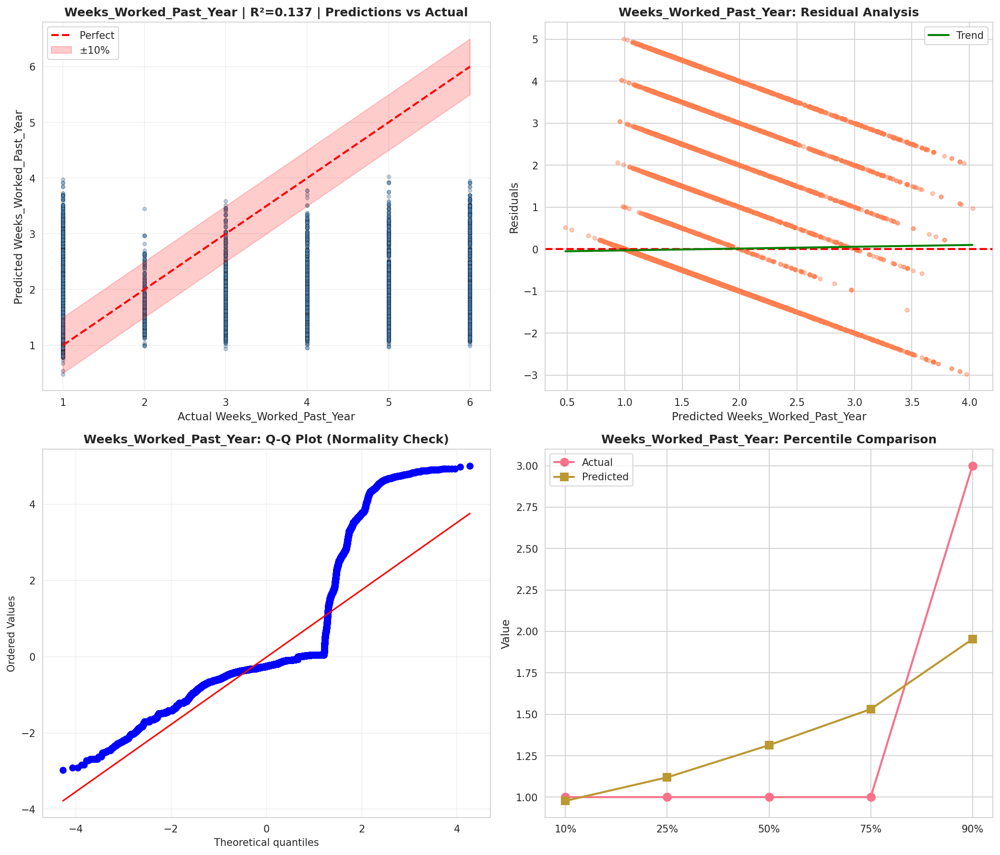
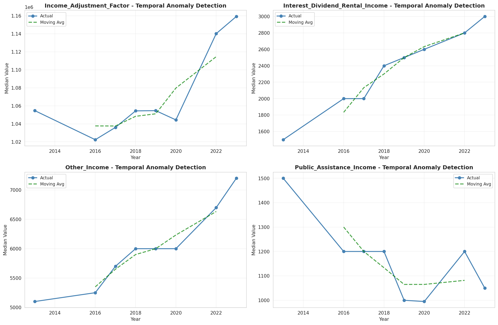
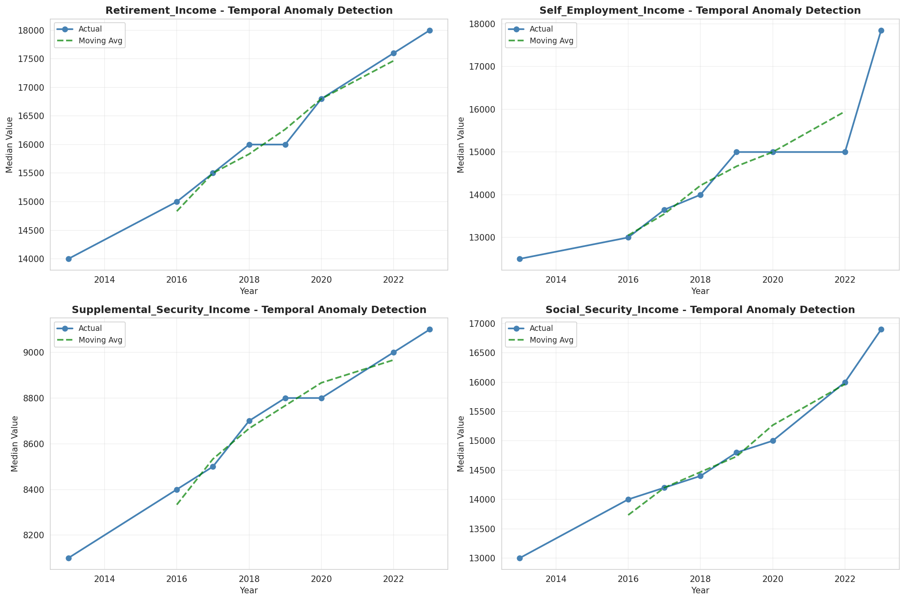
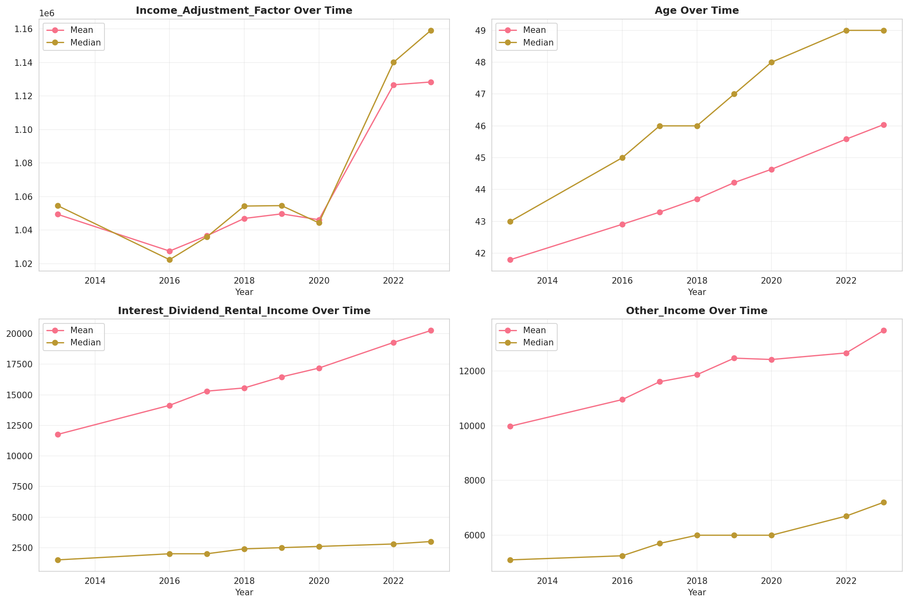
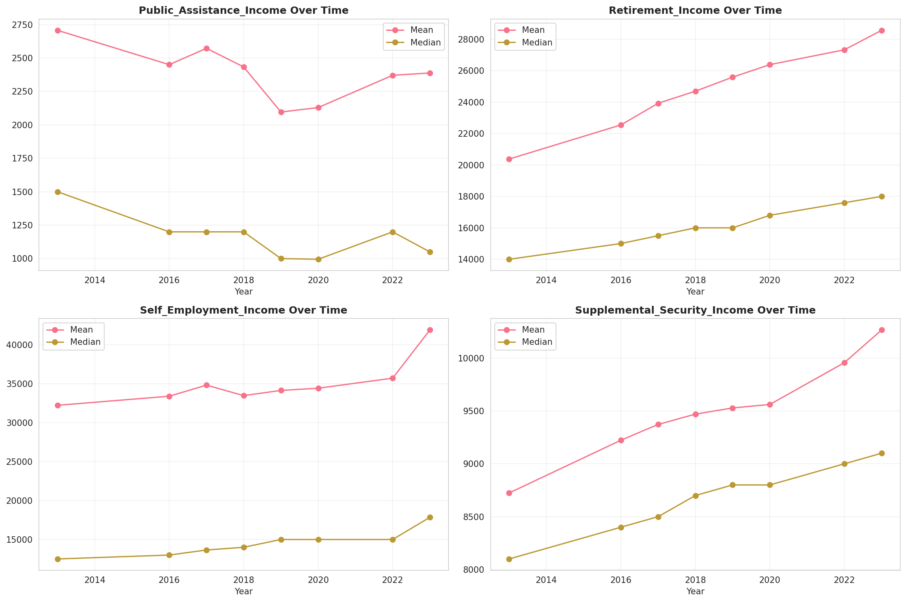
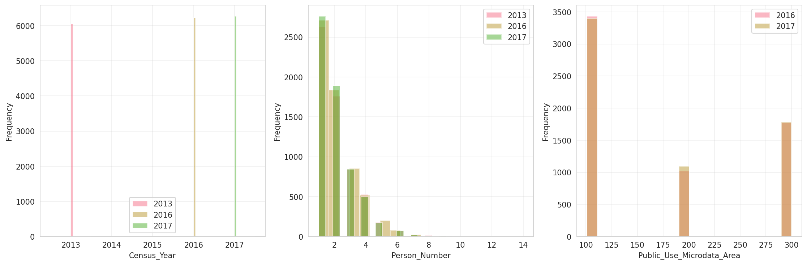
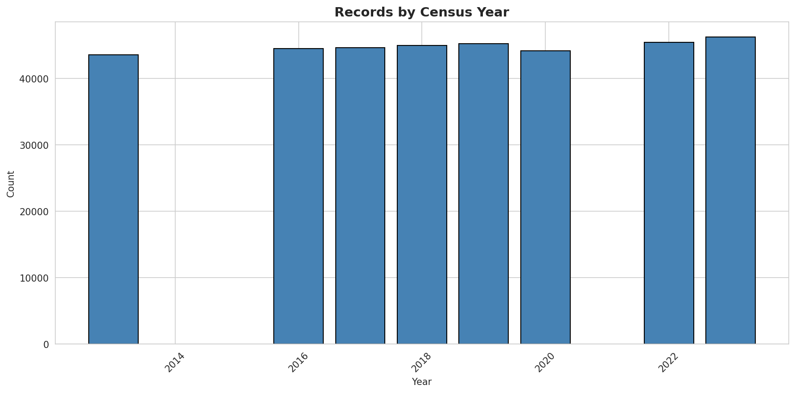
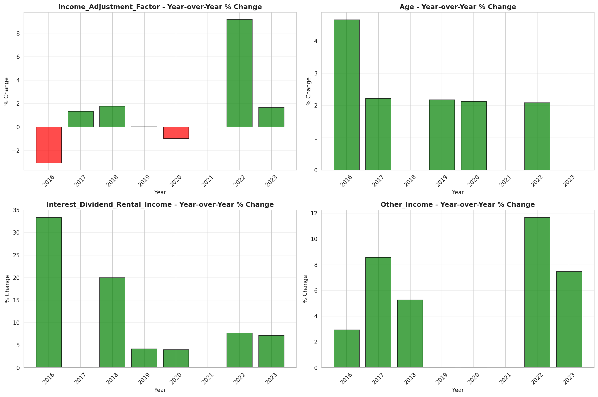
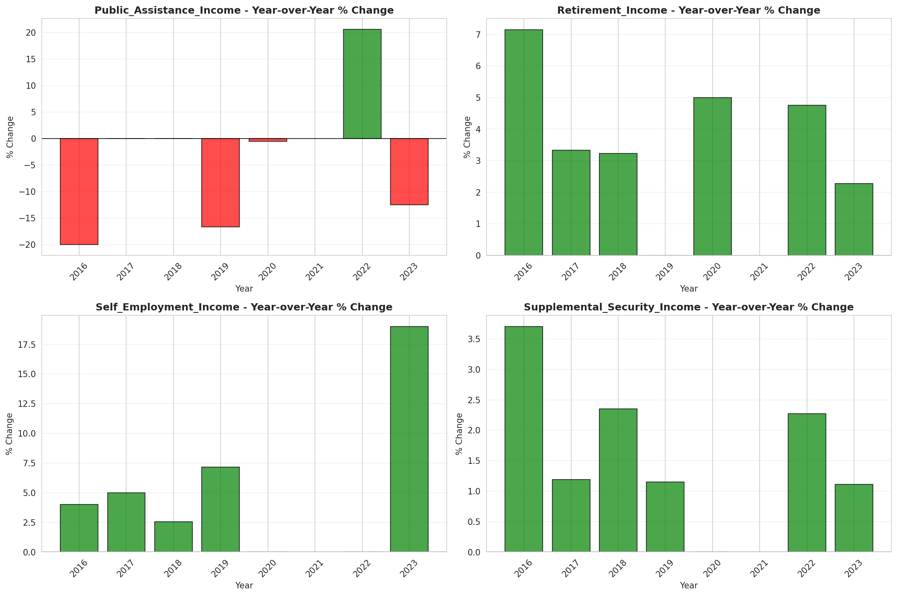

# Temporal Analysis

## Year Distribution

- 2013: 43,577 records

- 2016: 44,486 records

- 2017: 44,614 records

- 2018: 44,970 records

- 2019: 45,217 records

- 2020: 44,175 records

- 2022: 45,424 records

- 2023: 46,205 records

## Temporal Trends

- Census_Year: {np.int64(2013): {'mean': 2013.0, 'median': 2013.0, 'std': 0.0}, np.int64(2016): {'mean': 2016.0, 'median': 2016.0, 'std': 0.0}, np.int64(2017): {'mean': 2017.0, 'median': 2017.0, 'std': 0.0}, np.int64(2018): {'mean': 2018.0, 'median': 2018.0, 'std': 0.0}, np.int64(2019): {'mean': 2019.0, 'median': 2019.0, 'std': 0.0}, np.int64(2020): {'mean': 2020.0, 'median': 2020.0, 'std': 0.0}, np.int64(2022): {'mean': 2022.0, 'median': 2022.0, 'std': 0.0}, np.int64(2023): {'mean': 2023.0, 'median': 2023.0, 'std': 0.0}}

- Person_Number: {np.int64(2013): {'mean': 2.0506689308580213, 'median': 2.0, 'std': 1.2729454787476175}, np.int64(2016): {'mean': 2.0259182664208963, 'median': 2.0, 'std': 1.2510183891441315}, np.int64(2017): {'mean': 2.011991751468149, 'median': 2.0, 'std': 1.2352878356366443}, np.int64(2018): {'mean': 2.0009784300644875, 'median': 2.0, 'std': 1.228230180922253}, np.int64(2019): {'mean': 1.988013357807904, 'median': 2.0, 'std': 1.220743098626202}, np.int64(2020): {'mean': 1.9789473684210526, 'median': 2.0, 'std': 1.2156673779189757}, np.int64(2022): {'mean': 1.9737143360338147, 'median': 2.0, 'std': 1.2359472718308426}, np.int64(2023): {'mean': 1.9747213505031922, 'median': 2.0, 'std': 1.2378268353766497}}

- Public_Use_Microdata_Area: {np.int64(2013): {'mean': None, 'median': None, 'std': None}, np.int64(2016): {'mean': 173.60012138650362, 'median': 104.0, 'std': 85.44937807579676}, np.int64(2017): {'mean': 173.7165687900659, 'median': 104.0, 'std': 85.48829880494374}, np.int64(2018): {'mean': 174.19541916833444, 'median': 104.0, 'std': 85.74144701422173}, np.int64(2019): {'mean': 174.86976137293496, 'median': 104.0, 'std': 85.95787272507454}, np.int64(2020): {'mean': 176.18648556876062, 'median': 104.0, 'std': 86.2940947907772}, np.int64(2022): {'mean': None, 'median': None, 'std': None}, np.int64(2023): {'mean': 183.9203332972622, 'median': 105.0, 'std': 88.75498375840347}}

- State_Code: {np.int64(2013): {'mean': 10.0, 'median': 10.0, 'std': 0.0}, np.int64(2016): {'mean': 10.0, 'median': 10.0, 'std': 0.0}, np.int64(2017): {'mean': 10.0, 'median': 10.0, 'std': 0.0}, np.int64(2018): {'mean': 10.0, 'median': 10.0, 'std': 0.0}, np.int64(2019): {'mean': 10.0, 'median': 10.0, 'std': 0.0}, np.int64(2020): {'mean': 10.0, 'median': 10.0, 'std': 0.0}, np.int64(2022): {'mean': 10.0, 'median': 10.0, 'std': 0.0}, np.int64(2023): {'mean': None, 'median': None, 'std': None}}

- Income_Adjustment_Factor: {np.int64(2013): {'mean': 1049411.9792321639, 'median': 1054614.0, 'std': 29597.525408130616}, np.int64(2016): {'mean': 1027485.9624151419, 'median': 1022342.0, 'std': 17481.59179006934}, np.int64(2017): {'mean': 1036644.3688304119, 'median': 1035988.0, 'std': 16782.59246702722}, np.int64(2018): {'mean': 1046952.6519679787, 'median': 1054346.0, 'std': 20533.2260339214}, np.int64(2019): {'mean': 1049683.5673751023, 'median': 1054606.0, 'std': 26303.835381011406}, np.int64(2020): {'mean': 1046199.5224448218, 'median': 1044328.0, 'std': 28838.409646463657}, np.int64(2022): {'mean': 1126699.299357168, 'median': 1140108.0, 'std': 49727.63135783479}, np.int64(2023): {'mean': 1128383.9946326155, 'median': 1159185.0, 'std': 70557.59488309229}}

- Person_Weight: {np.int64(2013): {'mean': 20.846914656814374, 'median': 17.0, 'std': 16.539960961344487}, np.int64(2016): {'mean': 21.010992222272176, 'median': 16.0, 'std': 17.12384500546629}, np.int64(2017): {'mean': 21.15327027390505, 'median': 16.0, 'std': 17.366245617594693}, np.int64(2018): {'mean': 21.113964865465867, 'median': 16.0, 'std': 17.568972437309387}, np.int64(2019): {'mean': 21.17009089501736, 'median': 16.0, 'std': 17.827769653505076}, np.int64(2020): {'mean': 21.905580079230333, 'median': 15.0, 'std': 23.248403764466328}, np.int64(2022): {'mean': 21.874669778090876, 'median': 15.0, 'std': 23.943377558508516}, np.int64(2023): {'mean': 21.769786819608267, 'median': 15.0, 'std': 24.55014454247741}}

- Age: {np.int64(2013): {'mean': 41.796521100580584, 'median': 43.0, 'std': 23.605450489992304}, np.int64(2016): {'mean': 42.90839814773187, 'median': 45.0, 'std': 23.725641234384653}, np.int64(2017): {'mean': 43.290088313085576, 'median': 46.0, 'std': 23.75182774929413}, np.int64(2018): {'mean': 43.70382477207027, 'median': 46.0, 'std': 23.799444934280853}, np.int64(2019): {'mean': 44.218590353185746, 'median': 47.0, 'std': 23.837052000133784}, np.int64(2020): {'mean': 44.63762308998302, 'median': 48.0, 'std': 23.802239182169632}, np.int64(2022): {'mean': 45.58352412821416, 'median': 49.0, 'std': 24.005900795419738}, np.int64(2023): {'mean': 46.03895682285467, 'median': 49.0, 'std': 24.111510614461828}}

- Citizenship_Status: {np.int64(2013): {'mean': 1.2709915781260757, 'median': 1.0, 'std': 0.9262414259431602}, np.int64(2016): {'mean': 1.279481185091939, 'median': 1.0, 'std': 0.9379083291284616}, np.int64(2017): {'mean': 1.288317568476263, 'median': 1.0, 'std': 0.9509331687308061}, np.int64(2018): {'mean': 1.2958416722259285, 'median': 1.0, 'std': 0.9630607972244863}, np.int64(2019): {'mean': 1.303890129818431, 'median': 1.0, 'std': 0.9729766705920491}, np.int64(2020): {'mean': 1.2970458404074703, 'median': 1.0, 'std': 0.9577501670064016}, np.int64(2022): {'mean': 1.2999955970412116, 'median': 1.0, 'std': 0.9586129894550416}, np.int64(2023): {'mean': 1.3131262850340872, 'median': 1.0, 'std': 0.9768075962009173}}

- Class_of_Worker: {np.int64(2013): {'mean': 2.109490714367096, 'median': 1.0, 'std': 1.8876669937971866}, np.int64(2016): {'mean': 2.097538197168366, 'median': 1.0, 'std': 1.8738647466486436}, np.int64(2017): {'mean': 2.1017935046049443, 'median': 1.0, 'std': 1.8831565941297366}, np.int64(2018): {'mean': 2.111476257292667, 'median': 1.0, 'std': 1.885034937149237}, np.int64(2019): {'mean': 2.115288588632692, 'median': 1.0, 'std': 1.8804941543189873}, np.int64(2020): {'mean': 2.1285954113038614, 'median': 1.0, 'std': 1.8850701485361394}, np.int64(2022): {'mean': 2.1491947185142193, 'median': 1.0, 'std': 1.886342846859985}, np.int64(2023): {'mean': 2.1457772996234534, 'median': 1.0, 'std': 1.8756953980101512}}

- English_Speaking_Ability: {np.int64(2013): {'mean': 1.5344591510725696, 'median': 1.0, 'std': 0.8409590980317878}, np.int64(2016): {'mean': 1.524426266757555, 'median': 1.0, 'std': 0.8289676186684306}, np.int64(2017): {'mean': 1.5101404056162246, 'median': 1.0, 'std': 0.8201226232412645}, np.int64(2018): {'mean': 1.513146551724138, 'median': 1.0, 'std': 0.8125972587213187}, np.int64(2019): {'mean': 1.5115939001462293, 'median': 1.0, 'std': 0.8094854683519798}, np.int64(2020): {'mean': 1.5084167909652675, 'median': 1.0, 'std': 0.802664671426596}, np.int64(2022): {'mean': 1.5220228384991843, 'median': 1.0, 'std': 0.8103478143014868}, np.int64(2023): {'mean': 1.5385951370127364, 'median': 1.0, 'std': 0.8211850636855255}}

- Fertility_Status: {np.int64(2013): {'mean': 1.9485714285714286, 'median': 2.0, 'std': 0.220881738560797}, np.int64(2016): {'mean': 1.9484381685922123, 'median': 2.0, 'std': 0.22115252862695534}, np.int64(2017): {'mean': 1.9503246753246752, 'median': 2.0, 'std': 0.21728505793939454}, np.int64(2018): {'mean': 1.9512803819444444, 'median': 2.0, 'std': 0.21529293133421848}, np.int64(2019): {'mean': 1.9531284302963776, 'median': 2.0, 'std': 0.21137532993731742}, np.int64(2020): {'mean': 1.956511839708561, 'median': 2.0, 'std': 0.20396488982215216}, np.int64(2022): {'mean': 1.9547996804017806, 'median': 2.0, 'std': 0.2077550897889902}, np.int64(2023): {'mean': 1.954493613138686, 'median': 2.0, 'std': 0.208423871122951}}

- Marital_Status: {np.int64(2013): {'mean': 2.884365605709434, 'median': 3.0, 'std': 1.843385596725458}, np.int64(2016): {'mean': 2.8740502630040914, 'median': 3.0, 'std': 1.8407993607926578}, np.int64(2017): {'mean': 2.8609853409243735, 'median': 3.0, 'std': 1.841924114519043}, np.int64(2018): {'mean': 2.8604402935290194, 'median': 3.0, 'std': 1.8415769622746696}, np.int64(2019): {'mean': 2.8467390583187737, 'median': 2.0, 'std': 1.8395348552265045}, np.int64(2020): {'mean': 2.843938879456706, 'median': 2.0, 'std': 1.8395485443912416}, np.int64(2022): {'mean': 2.807084360690384, 'median': 2.0, 'std': 1.8355219282917963}, np.int64(2023): {'mean': 2.7923601341846123, 'median': 2.0, 'std': 1.8335288511358545}}

- Mobility_Status: {np.int64(2013): {'mean': 1.2350869061413674, 'median': 1.0, 'std': 0.6404605927684283}, np.int64(2016): {'mean': 1.2403721774651084, 'median': 1.0, 'std': 0.6464805053217845}, np.int64(2017): {'mean': 1.244705882352941, 'median': 1.0, 'std': 0.6517238873561313}, np.int64(2018): {'mean': 1.2374722290792397, 'median': 1.0, 'std': 0.6435543705274913}, np.int64(2019): {'mean': 1.2327199732351957, 'median': 1.0, 'std': 0.6380068014952165}, np.int64(2020): {'mean': 1.2241438317095987, 'median': 1.0, 'std': 0.6279809080929135}, np.int64(2022): {'mean': 1.2121312929696164, 'median': 1.0, 'std': 0.612980385438131}, np.int64(2023): {'mean': 1.2087847411444141, 'median': 1.0, 'std': 0.6080052599032976}}

- Military_Service: {np.int64(2013): {'mean': 3.730088119457116, 'median': 4.0, 'std': 0.6788280578962076}, np.int64(2016): {'mean': 3.755234419903112, 'median': 4.0, 'std': 0.6478405078865314}, np.int64(2017): {'mean': 3.7637411950284205, 'median': 4.0, 'std': 0.6366862150325091}, np.int64(2018): {'mean': 3.7693010507080857, 'median': 4.0, 'std': 0.6304052415534919}, np.int64(2019): {'mean': 3.7721448319863886, 'median': 4.0, 'std': 0.6270531260496333}, np.int64(2020): {'mean': 3.777498105445491, 'median': 4.0, 'std': 0.6213819830985295}, np.int64(2022): {'mean': 3.786956408043723, 'median': 4.0, 'std': 0.611760052922535}, np.int64(2023): {'mean': 3.7902316523165234, 'median': 4.0, 'std': 0.6088726364745614}}

- Travel_Time_To_Work_Minutes: {np.int64(2013): {'mean': 25.023439164713402, 'median': 20.0, 'std': 21.455691280792248}, np.int64(2016): {'mean': 25.600367164961973, 'median': 20.0, 'std': 22.122328281482503}, np.int64(2017): {'mean': 25.704061895551256, 'median': 20.0, 'std': 22.296202475630498}, np.int64(2018): {'mean': 25.921622461665976, 'median': 20.0, 'std': 22.634772433351184}, np.int64(2019): {'mean': 26.096110426929393, 'median': 20.0, 'std': 22.61131724448361}, np.int64(2020): {'mean': 26.143832670179588, 'median': 20.0, 'std': 22.671316980410356}, np.int64(2022): {'mean': 26.09365372766482, 'median': 20.0, 'std': 22.623974941550618}, np.int64(2023): {'mean': 26.096903153153153, 'median': 20.0, 'std': 22.57458339370069}}

- Vehicle_Occupancy: {np.int64(2013): {'mean': 1.1475661827497865, 'median': 1.0, 'std': 0.5991676291110606}, np.int64(2016): {'mean': 1.1318250546004367, 'median': 1.0, 'std': 0.5387994743077031}, np.int64(2017): {'mean': 1.129806350800826, 'median': 1.0, 'std': 0.5198413057342789}, np.int64(2018): {'mean': 1.1322555727212535, 'median': 1.0, 'std': 0.536067835626899}, np.int64(2019): {'mean': 1.1320435967302451, 'median': 1.0, 'std': 0.5275689292928386}, np.int64(2020): {'mean': 1.1401634192331866, 'median': 1.0, 'std': 0.5614867576416338}, np.int64(2022): {'mean': 1.1380561503687843, 'median': 1.0, 'std': 0.570973768969495}, np.int64(2023): {'mean': 1.135508982035928, 'median': 1.0, 'std': 0.5487407626152127}}

- Transportation_To_Work: {np.int64(2013): {'mean': 1.7539617626009611, 'median': 1.0, 'std': 2.5337436243468794}, np.int64(2016): {'mean': 1.8488487989634208, 'median': 1.0, 'std': 2.684419503195817}, np.int64(2017): {'mean': 1.8551854242168495, 'median': 1.0, 'std': 2.692850449793463}, np.int64(2018): {'mean': 1.8908485204781502, 'median': 1.0, 'std': 2.7535663781564454}, np.int64(2019): {'mean': None, 'median': None, 'std': None}, np.int64(2020): {'mean': None, 'median': None, 'std': None}, np.int64(2022): {'mean': None, 'median': None, 'std': None}, np.int64(2023): {'mean': None, 'median': None, 'std': None}}

- Language_Other_Than_English: {np.int64(2013): {'mean': 1.8939676240714303, 'median': 2.0, 'std': 0.307882777831246}, np.int64(2016): {'mean': 1.8960532842060511, 'median': 2.0, 'std': 0.3051950131096381}, np.int64(2017): {'mean': 1.8944930398796087, 'median': 2.0, 'std': 0.30720914809072375}, np.int64(2018): {'mean': 1.8919346950182827, 'median': 2.0, 'std': 0.3104664873136033}, np.int64(2019): {'mean': 1.8892718356772762, 'median': 2.0, 'std': 0.3137988458436742}, np.int64(2020): {'mean': 1.889085838532804, 'median': 2.0, 'std': 0.3140295223463416}, np.int64(2022): {'mean': 1.8874377395735304, 'median': 2.0, 'std': 0.3160605809699406}, np.int64(2023): {'mean': 1.8831646111875182, 'median': 2.0, 'std': 0.3212276563941117}}

- Grandparents_Living_With_Grandchildren: {np.int64(2013): {'mean': 1.9644803017602683, 'median': 2.0, 'std': 0.18509253311150972}, np.int64(2016): {'mean': 1.9631058192185142, 'median': 2.0, 'std': 0.18850515119908356}, np.int64(2017): {'mean': 1.964895981950297, 'median': 2.0, 'std': 0.18404578195144336}, np.int64(2018): {'mean': 1.965818110519264, 'median': 2.0, 'std': 0.18169911057684476}, np.int64(2019): {'mean': 1.9681508171406512, 'median': 2.0, 'std': 0.17560126544495}, np.int64(2020): {'mean': 1.968699970594962, 'median': 2.0, 'std': 0.17413020482023853}, np.int64(2022): {'mean': 1.9700626812611095, 'median': 2.0, 'std': 0.1704170805737976}, np.int64(2023): {'mean': 1.9706213657259415, 'median': 2.0, 'std': 0.16886799069281497}}

- Months_Responsible_For_Grandchildren: {np.int64(2013): {'mean': 3.781115879828326, 'median': 4.0, 'std': 1.3113842475062387}, np.int64(2016): {'mean': 3.8979166666666667, 'median': 4.0, 'std': 1.2793509548565687}, np.int64(2017): {'mean': 3.8632286995515694, 'median': 4.0, 'std': 1.2953303779454943}, np.int64(2018): {'mean': 3.947608200455581, 'median': 5.0, 'std': 1.292580679949679}, np.int64(2019): {'mean': 4.02200488997555, 'median': 5.0, 'std': 1.2374883203946963}, np.int64(2020): {'mean': 4.050938337801608, 'median': 5.0, 'std': 1.222583387201328}, np.int64(2022): {'mean': 4.057742782152231, 'median': 5.0, 'std': 1.2510307947665975}, np.int64(2023): {'mean': 3.9885057471264367, 'median': 5.0, 'std': 1.2793573032882413}}

- Grandparents_Responsible_For_Grandchildren: {np.int64(2013): {'mean': 1.5417895771878072, 'median': 2.0, 'std': 0.49849571248276464}, np.int64(2016): {'mean': 1.5636363636363637, 'median': 2.0, 'std': 0.49615945819630136}, np.int64(2017): {'mean': 1.5784499054820416, 'median': 2.0, 'std': 0.494040796163036}, np.int64(2018): {'mean': 1.5803059273422562, 'median': 2.0, 'std': 0.4937448948105042}, np.int64(2019): {'mean': 1.5868686868686868, 'median': 2.0, 'std': 0.49264488399688505}, np.int64(2020): {'mean': 1.6106471816283925, 'median': 2.0, 'std': 0.4878582184655056}, np.int64(2022): {'mean': 1.603125, 'median': 2.0, 'std': 0.4895046814480335}, np.int64(2023): {'mean': 1.6393782383419688, 'median': 2.0, 'std': 0.48042990229555343}}

- Interest_Dividend_Rental_Income: {np.int64(2013): {'mean': 11757.833278688524, 'median': 1500.0, 'std': 32717.57994950616}, np.int64(2016): {'mean': 14138.202571287293, 'median': 2000.0, 'std': 38849.93857569985}, np.int64(2017): {'mean': 15298.64900990099, 'median': 2000.0, 'std': 43072.71359046177}, np.int64(2018): {'mean': 15559.290804597702, 'median': 2400.0, 'std': 42547.48207443876}, np.int64(2019): {'mean': 16463.22759624717, 'median': 2500.0, 'std': 44384.30806560841}, np.int64(2020): {'mean': 17182.641694352158, 'median': 2600.0, 'std': 44668.34066397276}, np.int64(2022): {'mean': 19278.53654566173, 'median': 2800.0, 'std': 51314.37953514051}, np.int64(2023): {'mean': 20253.152104591838, 'median': 3000.0, 'std': 54529.73205047742}}

- Military_Service_Period_1: {np.int64(2013): {'mean': 0.1139908256880734, 'median': 0.0, 'std': 0.31783657292981604}, np.int64(2016): {'mean': 0.13595617529880477, 'median': 0.0, 'std': 0.3427847021115537}, np.int64(2017): {'mean': 0.14274671476423603, 'median': 0.0, 'std': 0.34985944159232313}, np.int64(2018): {'mean': 0.15221932114882505, 'median': 0.0, 'std': 0.35928025602421615}, np.int64(2019): {'mean': 0.1559224318658281, 'median': 0.0, 'std': 0.36282933357892877}, np.int64(2020): {'mean': 0.1648921648921649, 'median': 0.0, 'std': 0.3711338599485494}, np.int64(2022): {'mean': 0.1883938393839384, 'median': 0.0, 'std': 0.3910801252687142}, np.int64(2023): {'mean': 0.19649218964099754, 'median': 0.0, 'std': 0.39739940662349355}}

- Military_Service_Period_2: {np.int64(2013): {'mean': 0.15137614678899083, 'median': 0.0, 'std': 0.3584562446903147}, np.int64(2016): {'mean': 0.1616035856573705, 'median': 0.0, 'std': 0.3681326013563745}, np.int64(2017): {'mean': 0.16825560422571503, 'median': 0.0, 'std': 0.37414131600287437}, np.int64(2018): {'mean': 0.17389033942558746, 'median': 0.0, 'std': 0.3790646465353283}, np.int64(2019): {'mean': 0.17662473794549266, 'median': 0.0, 'std': 0.3814007866521891}, np.int64(2020): {'mean': 0.1831831831831832, 'median': 0.0, 'std': 0.38686944047971095}, np.int64(2022): {'mean': 0.18261826182618263, 'median': 0.0, 'std': 0.38640638788944065}, np.int64(2023): {'mean': 0.1764867086873116, 'median': 0.0, 'std': 0.3812859702636509}}

- Military_Service_Period_5: {np.int64(2013): {'mean': 0.36903669724770644, 'median': 0.0, 'std': 0.4825992449530798}, np.int64(2016): {'mean': 0.386703187250996, 'median': 0.0, 'std': 0.48705533737814993}, np.int64(2017): {'mean': 0.4019582581808812, 'median': 0.0, 'std': 0.4903567808075829}, np.int64(2018): {'mean': 0.4133159268929504, 'median': 0.0, 'std': 0.4924928428337624}, np.int64(2019): {'mean': 0.42636268343815514, 'median': 0.0, 'std': 0.49461263131663075}, np.int64(2020): {'mean': 0.43297843297843297, 'median': 0.0, 'std': 0.49555539714285524}, np.int64(2022): {'mean': 0.4328932893289329, 'median': 0.0, 'std': 0.4955443736930459}, np.int64(2023): {'mean': 0.42614414908194026, 'median': 0.0, 'std': 0.49458300489694357}}

- Military_Service_Period_8: {np.int64(2013): {'mean': 0.13119266055045872, 'median': 0.0, 'std': 0.3376496628611791}, np.int64(2016): {'mean': 0.11105577689243028, 'median': 0.0, 'std': 0.31424032157348813}, np.int64(2017): {'mean': 0.10023189899510436, 'median': 0.0, 'std': 0.3003476470618569}, np.int64(2018): {'mean': 0.09190600522193211, 'median': 0.0, 'std': 0.2889309399403482}, np.int64(2019): {'mean': 0.08438155136268344, 'median': 0.0, 'std': 0.27799560631904074}, np.int64(2020): {'mean': 0.07534807534807535, 'median': 0.0, 'std': 0.2639881971133637}, np.int64(2022): {'mean': 0.06133113311331133, 'median': 0.0, 'std': 0.2399697122771543}, np.int64(2023): {'mean': 0.05535763222800767, 'median': 0.0, 'std': 0.2287083285130524}}

- Military_Service_Period_9: {np.int64(2013): {'mean': 0.022477064220183487, 'median': 0.0, 'std': 0.14824603325045363}, np.int64(2016): {'mean': 0.018924302788844622, 'median': 0.0, 'std': 0.13627471429223056}, np.int64(2017): {'mean': 0.018036588508116465, 'median': 0.0, 'std': 0.13310084426257524}, np.int64(2018): {'mean': 0.017754569190600523, 'median': 0.0, 'std': 0.1320753535156283}, np.int64(2019): {'mean': 0.015461215932914047, 'median': 0.0, 'std': 0.12339431436583047}, np.int64(2020): {'mean': 0.012558012558012558, 'median': 0.0, 'std': 0.11137187746801863}, np.int64(2022): {'mean': None, 'median': None, 'std': None}, np.int64(2023): {'mean': None, 'median': None, 'std': None}}

- Military_Service_Period_10: {np.int64(2013): {'mean': 0.08669724770642202, 'median': 0.0, 'std': 0.2814231686531461}, np.int64(2016): {'mean': 0.05403386454183267, 'median': 0.0, 'std': 0.22611266403161173}, np.int64(2017): {'mean': 0.04560680237052306, 'median': 0.0, 'std': 0.20865771061990093}, np.int64(2018): {'mean': 0.03681462140992167, 'median': 0.0, 'std': 0.18833100058806646}, np.int64(2019): {'mean': 0.03170859538784067, 'median': 0.0, 'std': 0.17524613655356822}, np.int64(2020): {'mean': 0.027573027573027573, 'median': 0.0, 'std': 0.1637683657242588}, np.int64(2022): {'mean': 0.017876787678767877, 'median': 0.0, 'std': 0.13252184040587892}, np.int64(2023): {'mean': 0.013428336530556317, 'median': 0.0, 'std': 0.11511580209509177}}

- Military_Service_Period_11: {np.int64(2013): {'mean': 0.002522935779816514, 'median': 0.0, 'std': 0.050171185977291595}, np.int64(2016): {'mean': 0.000747011952191235, 'median': 0.0, 'std': 0.02732471119023484}, np.int64(2017): {'mean': 0.0007729966503478485, 'median': 0.0, 'std': 0.027795650711329396}, np.int64(2018): {'mean': 0.0010443864229765013, 'median': 0.0, 'std': 0.03230430547277521}, np.int64(2019): {'mean': 0.0007861635220125787, 'median': 0.0, 'std': 0.028031257171587037}, np.int64(2020): {'mean': 0.000819000819000819, 'median': 0.0, 'std': 0.028610374377037874}, np.int64(2022): {'mean': None, 'median': None, 'std': None}, np.int64(2023): {'mean': None, 'median': None, 'std': None}}

- Temporary_Absence_From_Work: {np.int64(2013): {'mean': 2.524874996508282, 'median': 3.0, 'std': 0.5292072424684048}, np.int64(2016): {'mean': 2.563903887688985, 'median': 3.0, 'std': 0.5208661895895627}, np.int64(2017): {'mean': 2.575181815742157, 'median': 3.0, 'std': 0.517710806512493}, np.int64(2018): {'mean': 2.5813990461049285, 'median': 3.0, 'std': 0.5158640768554426}, np.int64(2019): {'mean': 2.586884643644379, 'median': 3.0, 'std': 0.5141941730973246}, np.int64(2020): {'mean': 2.5860345795141764, 'median': 3.0, 'std': 0.5138452328635162}, np.int64(2022): {'mean': 2.5797561857533964, 'median': 3.0, 'std': 0.5142596351029711}, np.int64(2023): {'mean': 2.570227209402467, 'median': 3.0, 'std': 0.5152579754293184}}

- Available_For_Work: {np.int64(2013): {'mean': 4.526942093354563, 'median': 5.0, 'std': 1.2088903354277678}, np.int64(2016): {'mean': 4.646571274298056, 'median': 5.0, 'std': 1.0556003436050212}, np.int64(2017): {'mean': 4.699380082118992, 'median': 5.0, 'std': 0.9833083854082431}, np.int64(2018): {'mean': 4.719952305246423, 'median': 5.0, 'std': 0.9502193263530341}, np.int64(2019): {'mean': 4.734622651411777, 'median': 5.0, 'std': 0.9212182162270279}, np.int64(2020): {'mean': 4.748242965179979, 'median': 5.0, 'std': 0.901587129798263}, np.int64(2022): {'mean': 4.773593677359368, 'median': 5.0, 'std': 0.8546106305797095}, np.int64(2023): {'mean': 4.782998556194433, 'median': 5.0, 'std': 0.8350439872754482}}

- On_Layoff_From_Work: {np.int64(2013): {'mean': 2.4867175060755886, 'median': 3.0, 'std': 0.5365941123029067}, np.int64(2016): {'mean': 2.5396328293736503, 'median': 3.0, 'std': 0.5218780300712058}, np.int64(2017): {'mean': 2.5540079972090277, 'median': 3.0, 'std': 0.5180199464853725}, np.int64(2018): {'mean': 2.563566507684155, 'median': 3.0, 'std': 0.5130198615167364}, np.int64(2019): {'mean': 2.5708775060354783, 'median': 3.0, 'std': 0.5097923162834832}, np.int64(2020): {'mean': 2.5677560727933515, 'median': 3.0, 'std': 0.5133038852433233}, np.int64(2022): {'mean': 2.5645952786817503, 'median': 3.0, 'std': 0.511659828244072}, np.int64(2023): {'mean': 2.555991793105195, 'median': 3.0, 'std': 0.5122734997454856}}

- Looking_For_Work: {np.int64(2013): {'mean': 2.472471298080952, 'median': 3.0, 'std': 0.6096377663531019}, np.int64(2016): {'mean': 2.5261069114470844, 'median': 3.0, 'std': 0.5859011698225591}, np.int64(2017): {'mean': 2.54319297963127, 'median': 3.0, 'std': 0.5758973390602652}, np.int64(2018): {'mean': 2.5553789083200846, 'median': 3.0, 'std': 0.5665461479780675}, np.int64(2019): {'mean': 2.562716489975858, 'median': 3.0, 'std': 0.5582811511021157}, np.int64(2020): {'mean': 2.5605943186980573, 'median': 3.0, 'std': 0.5571039776008511}, np.int64(2022): {'mean': 2.5540317165142827, 'median': 3.0, 'std': 0.5534775639292651}, np.int64(2023): {'mean': 2.542617594163986, 'median': 3.0, 'std': 0.5533964940845838}}

- Informed_Of_Recall: {np.int64(2013): {'mean': 2.8882929690773484, 'median': 3.0, 'std': 0.3358683067927107}, np.int64(2016): {'mean': 2.9225431965442765, 'median': 3.0, 'std': 0.28595913988634125}, np.int64(2017): {'mean': 2.9347878592705903, 'median': 3.0, 'std': 0.26645485255498247}, np.int64(2018): {'mean': 2.938712241653418, 'median': 3.0, 'std': 0.2577524976810039}, np.int64(2019): {'mean': 2.9380445050907946, 'median': 3.0, 'std': 0.25861811717343347}, np.int64(2020): {'mean': 2.9399535020443066, 'median': 3.0, 'std': 0.25744268789240626}, np.int64(2022): {'mean': 2.9445994111266076, 'median': 3.0, 'std': 0.245535897739969}, np.int64(2023): {'mean': 2.9454393475012033, 'median': 3.0, 'std': 0.24421345919315537}}

- Other_Income: {np.int64(2013): {'mean': 9980.226331360947, 'median': 5100.0, 'std': 13540.807273989618}, np.int64(2016): {'mean': 10951.891132572431, 'median': 5250.0, 'std': 14984.1838690302}, np.int64(2017): {'mean': 11603.271739130434, 'median': 5700.0, 'std': 15906.882749149112}, np.int64(2018): {'mean': 11859.354442344045, 'median': 6000.0, 'std': 15868.469403431594}, np.int64(2019): {'mean': 12465.106589147286, 'median': 6000.0, 'std': 16427.55430855779}, np.int64(2020): {'mean': 12415.407228915663, 'median': 6000.0, 'std': 16131.804991116283}, np.int64(2022): {'mean': 12655.262915129151, 'median': 6700.0, 'std': 15824.256427585748}, np.int64(2023): {'mean': 13472.572104018913, 'median': 7200.0, 'std': 16474.97752617763}}

- Public_Assistance_Income: {np.int64(2013): {'mean': 2707.1647509578543, 'median': 1500.0, 'std': 3832.9929981742225}, np.int64(2016): {'mean': 2450.3345724907063, 'median': 1200.0, 'std': 3130.078544411349}, np.int64(2017): {'mean': 2572.625250501002, 'median': 1200.0, 'std': 3813.514875369223}, np.int64(2018): {'mean': 2433.0566801619434, 'median': 1200.0, 'std': 3682.7474212588836}, np.int64(2019): {'mean': 2095.9591836734694, 'median': 1000.0, 'std': 3391.202017437917}, np.int64(2020): {'mean': 2129.437984496124, 'median': 995.0, 'std': 3386.7936370313328}, np.int64(2022): {'mean': 2370.7735849056603, 'median': 1200.0, 'std': 3240.1751985439514}, np.int64(2023): {'mean': 2388.0725190839694, 'median': 1050.0, 'std': 3310.5135707025115}}

- Retirement_Income: {np.int64(2013): {'mean': 20381.205978354235, 'median': 14000.0, 'std': 21020.87373868664}, np.int64(2016): {'mean': 22550.921814671816, 'median': 15000.0, 'std': 25065.58816311058}, np.int64(2017): {'mean': 23931.957680250784, 'median': 15500.0, 'std': 28613.49727456129}, np.int64(2018): {'mean': 24700.879278728607, 'median': 16000.0, 'std': 28780.6701115592}, np.int64(2019): {'mean': 25593.472103595537, 'median': 16000.0, 'std': 30161.449117939672}, np.int64(2020): {'mean': 26391.699986795193, 'median': 16800.0, 'std': 31193.08305911771}, np.int64(2022): {'mean': 27334.935402222956, 'median': 17600.0, 'std': 31128.24213685386}, np.int64(2023): {'mean': 28576.73819479857, 'median': 18000.0, 'std': 34263.89689081087}}

- Self_Employment_Income: {np.int64(2013): {'mean': 32241.101815823607, 'median': 12500.0, 'std': 62645.848337357624}, np.int64(2016): {'mean': 33406.875244937946, 'median': 13000.0, 'std': 61331.69752202195}, np.int64(2017): {'mean': 34833.168597168595, 'median': 13650.0, 'std': 64663.682429469125}, np.int64(2018): {'mean': 33487.00917992656, 'median': 14000.0, 'std': 60969.259246482776}, np.int64(2019): {'mean': 34153.164350453175, 'median': 15000.0, 'std': 60572.35277778017}, np.int64(2020): {'mean': 34435.208508088675, 'median': 15000.0, 'std': 59927.29930235078}, np.int64(2022): {'mean': 35727.67049368542, 'median': 15000.0, 'std': 61776.2138206283}, np.int64(2023): {'mean': 41917.81460023175, 'median': 17850.0, 'std': 76385.99074027342}}

- Supplemental_Security_Income: {np.int64(2013): {'mean': 8724.212812160695, 'median': 8100.0, 'std': 5309.101092165762}, np.int64(2016): {'mean': 9223.17429406037, 'median': 8400.0, 'std': 5577.793660289474}, np.int64(2017): {'mean': 9372.549019607843, 'median': 8500.0, 'std': 5764.2394475776155}, np.int64(2018): {'mean': 9469.85446985447, 'median': 8700.0, 'std': 5855.197339023087}, np.int64(2019): {'mean': 9528.57142857143, 'median': 8800.0, 'std': 5824.839038133996}, np.int64(2020): {'mean': 9561.37339055794, 'median': 8800.0, 'std': 5833.370926977638}, np.int64(2022): {'mean': 9956.631578947368, 'median': 9000.0, 'std': 6042.767600618262}, np.int64(2023): {'mean': 10265.8872651357, 'median': 9100.0, 'std': 6518.682707270027}}

- Social_Security_Income: {np.int64(2013): {'mean': 13192.704627086414, 'median': 13000.0, 'std': 6467.7706820656895}, np.int64(2016): {'mean': 14131.810585498255, 'median': 14000.0, 'std': 7059.799429987469}, np.int64(2017): {'mean': 14504.262388456427, 'median': 14200.0, 'std': 7392.266408896043}, np.int64(2018): {'mean': 14878.542088782464, 'median': 14400.0, 'std': 7563.6785164202665}, np.int64(2019): {'mean': 15166.245013739917, 'median': 14800.0, 'std': 7783.511853117619}, np.int64(2020): {'mean': 15629.254863466, 'median': 15000.0, 'std': 8053.054034039191}, np.int64(2022): {'mean': 16639.122836218376, 'median': 16000.0, 'std': 8752.733544381088}, np.int64(2023): {'mean': 17402.785697220676, 'median': 16900.0, 'std': 9343.97905076523}}

- Wage_Income: {np.int64(2013): {'mean': 42849.5156221113, 'median': 33000.0, 'std': 45914.67427988632}, np.int64(2016): {'mean': 45759.676467919046, 'median': 35000.0, 'std': 50754.64978744522}, np.int64(2017): {'mean': 47572.11503422019, 'median': 35000.0, 'std': 54775.15619657647}, np.int64(2018): {'mean': 49006.9110851389, 'median': 35400.0, 'std': 58055.08914821444}, np.int64(2019): {'mean': 50826.443590545554, 'median': 37000.0, 'std': 60370.06939378457}, np.int64(2020): {'mean': 52070.55111923253, 'median': 38000.0, 'std': 61867.419788787}, np.int64(2022): {'mean': 54722.99968452837, 'median': 40000.0, 'std': 63020.00216748681}, np.int64(2023): {'mean': 56664.3020921622, 'median': 40000.0, 'std': 64181.23900326338}}

- Relationship_To_Householder: {np.int64(2013): {'mean': 2.360350643688184, 'median': 1.0, 'std': 4.084392951821037}, np.int64(2016): {'mean': 2.4322708267769637, 'median': 1.0, 'std': 4.193899432141473}, np.int64(2017): {'mean': 2.402138342224414, 'median': 1.0, 'std': 4.171298578032295}, np.int64(2018): {'mean': 2.406693351122971, 'median': 1.0, 'std': 4.191853756133868}, np.int64(2019): {'mean': None, 'median': None, 'std': None}, np.int64(2020): {'mean': None, 'median': None, 'std': None}, np.int64(2022): {'mean': None, 'median': None, 'std': None}, np.int64(2023): {'mean': None, 'median': None, 'std': None}}

- School_Enrollment: {np.int64(2013): {'mean': 1.2986628801325286, 'median': 1.0, 'std': 0.5637491405753913}, np.int64(2016): {'mean': 1.2800120325805258, 'median': 1.0, 'std': 0.5427159982167645}, np.int64(2017): {'mean': 1.2730352615810094, 'median': 1.0, 'std': 0.5358895918135252}, np.int64(2018): {'mean': 1.2669499269005848, 'median': 1.0, 'std': 0.530259101870814}, np.int64(2019): {'mean': 1.2577841321713872, 'median': 1.0, 'std': 0.5220949344635062}, np.int64(2020): {'mean': 1.25316044628981, 'median': 1.0, 'std': 0.5198675600215136}, np.int64(2022): {'mean': 1.2438078925424263, 'median': 1.0, 'std': 0.5137392522945085}, np.int64(2023): {'mean': 1.2412066979711172, 'median': 1.0, 'std': 0.5127833824636081}}

- School_Grade_Attending: {np.int64(2013): {'mean': 9.784531991094763, 'median': 11.0, 'std': 4.940442661287083}, np.int64(2016): {'mean': 9.971960764886555, 'median': 11.0, 'std': 4.906710613681966}, np.int64(2017): {'mean': 9.957674090496825, 'median': 11.0, 'std': 4.8808853745719665}, np.int64(2018): {'mean': 9.950178298522669, 'median': 11.0, 'std': 4.867059220544241}, np.int64(2019): {'mean': 9.89863099592434, 'median': 11.0, 'std': 4.863647402969774}, np.int64(2020): {'mean': 9.977302487996509, 'median': 11.0, 'std': 4.847103259633498}, np.int64(2022): {'mean': 9.986081961780625, 'median': 11.0, 'std': 4.884438372582149}, np.int64(2023): {'mean': 10.004402377283734, 'median': 11.0, 'std': 4.890859736320824}}

- Educational_Attainment: {np.int64(2013): {'mean': 15.996189800023666, 'median': 16.0, 'std': 5.513393689621202}, np.int64(2016): {'mean': 16.257427804516844, 'median': 17.0, 'std': 5.452147103083623}, np.int64(2017): {'mean': 16.342959207190596, 'median': 17.0, 'std': 5.432463547161809}, np.int64(2018): {'mean': 16.409425255847953, 'median': 17.0, 'std': 5.395462846622589}, np.int64(2019): {'mean': 16.521014887436458, 'median': 18.0, 'std': 5.351648453175969}, np.int64(2020): {'mean': 16.61766138572522, 'median': 18.0, 'std': 5.293126350319646}, np.int64(2022): {'mean': 16.767370579883256, 'median': 18.0, 'std': 5.288262054198679}, np.int64(2023): {'mean': 16.84765659608399, 'median': 18.0, 'std': 5.284813843532831}}

- Sex: {np.int64(2013): {'mean': 1.5190123230144341, 'median': 2.0, 'std': 0.4996441337406672}, np.int64(2016): {'mean': 1.5187249921323562, 'median': 2.0, 'std': 0.49965486754322064}, np.int64(2017): {'mean': 1.5183574662661945, 'median': 2.0, 'std': 0.49966848972723726}, np.int64(2018): {'mean': 1.520524794307316, 'median': 2.0, 'std': 0.4995841098714501}, np.int64(2019): {'mean': 1.5203573877081629, 'median': 2.0, 'std': 0.4995909292777109}, np.int64(2020): {'mean': 1.5185964912280703, 'median': 2.0, 'std': 0.4996597063230946}, np.int64(2022): {'mean': 1.5206718915110955, 'median': 2.0, 'std': 0.4995779892201793}, np.int64(2023): {'mean': 1.520484796017747, 'median': 2.0, 'std': 0.4995856031122296}}

- Hours_Worked_Per_Week: {np.int64(2013): {'mean': 37.3194168323393, 'median': 40.0, 'std': 12.599300050796478}, np.int64(2016): {'mean': 37.41321559074299, 'median': 40.0, 'std': 12.86724223366995}, np.int64(2017): {'mean': 37.54241119951306, 'median': 40.0, 'std': 12.885193521306373}, np.int64(2018): {'mean': 37.653788237318764, 'median': 40.0, 'std': 12.93707845887554}, np.int64(2019): {'mean': 37.65474764756202, 'median': 40.0, 'std': 12.947476907187914}, np.int64(2020): {'mean': 37.563054208710085, 'median': 40.0, 'std': 12.943647656083746}, np.int64(2022): {'mean': 37.49642518735464, 'median': 40.0, 'std': 12.918516359158591}, np.int64(2023): {'mean': 37.32849643634501, 'median': 40.0, 'std': 12.816546874695632}}

- When_Last_Worked: {np.int64(2013): {'mean': 1.6386491242772145, 'median': 1.0, 'std': 0.8790089389005242}, np.int64(2016): {'mean': 1.6628509719222462, 'median': 1.0, 'std': 0.8890756689759078}, np.int64(2017): {'mean': 1.669216112497652, 'median': 1.0, 'std': 0.8912584527583279}, np.int64(2018): {'mean': 1.6722310545839958, 'median': 1.0, 'std': 0.892503886726392}, np.int64(2019): {'mean': 1.676787026346174, 'median': 1.0, 'std': 0.8940807114956898}, np.int64(2020): {'mean': 1.6766788701531226, 'median': 1.0, 'std': 0.8920208329899252}, np.int64(2022): {'mean': 1.692236169223617, 'median': 1.0, 'std': 0.8926796648719816}, np.int64(2023): {'mean': 1.703513260214291, 'median': 1.0, 'std': 0.8959017915104446}}

- Weeks_Worked_Past_Year: {np.int64(2013): {'mean': 1.9386348575215375, 'median': 1.0, 'std': 1.6694681682210775}, np.int64(2016): {'mean': 1.9007308160779537, 'median': 1.0, 'std': 1.6407907193297662}, np.int64(2017): {'mean': 1.8811790791704708, 'median': 1.0, 'std': 1.621006965939664}, np.int64(2018): {'mean': 1.876780105838317, 'median': 1.0, 'std': 1.617538680785166}, np.int64(2019): {'mean': 1.8520958083832335, 'median': 1.0, 'std': 1.6055816509565153}, np.int64(2020): {'mean': 1.8581662516926571, 'median': 1.0, 'std': 1.6240760464061221}, np.int64(2022): {'mean': 1.867473511930399, 'median': 1.0, 'std': 1.6575390668449834}}

- Year_Of_Entry: {np.int64(2013): {'mean': None, 'median': None, 'std': None}, np.int64(2016): {'mean': 1991.372397841172, 'median': 1997.0, 'std': 18.058597817898896}, np.int64(2017): {'mean': 1992.5895781637716, 'median': 1998.0, 'std': 18.04017167500789}, np.int64(2018): {'mean': 1993.5007211538461, 'median': 1999.0, 'std': 18.038296453279983}, np.int64(2019): {'mean': 1994.1007410838351, 'median': 1999.0, 'std': 18.16547607714223}, np.int64(2020): {'mean': 1994.3959378733573, 'median': 1999.0, 'std': 18.23576824631811}, np.int64(2022): {'mean': 1995.8044077134987, 'median': 2000.0, 'std': 18.25079370352713}, np.int64(2023): {'mean': 1996.5597837837838, 'median': 2000.0, 'std': 18.438066862928554}}

- Ancestry_Recode: {np.int64(2013): {'mean': 1.65463432544691, 'median': 1.0, 'std': 0.9386134425609368}, np.int64(2016): {'mean': 1.7442566200602436, 'median': 1.0, 'std': 1.0264722202681635}, np.int64(2017): {'mean': 1.7699601022100686, 'median': 1.0, 'std': 1.0510057169373488}, np.int64(2018): {'mean': 2.4724260618189904, 'median': 2.0, 'std': 2.1874929699287833}, np.int64(2019): {'mean': 2.510095760444081, 'median': 2.0, 'std': 2.181709382956975}, np.int64(2020): {'mean': 2.542591963780419, 'median': 2.0, 'std': 2.194237593524629}, np.int64(2022): {'mean': 2.5901285663966185, 'median': 2.0, 'std': 2.170175754695773}, np.int64(2023): {'mean': 1.9301374310139596, 'median': 2.0, 'std': 1.1275322468914728}}

- First_Ancestry_Code: {np.int64(2013): {'mean': None, 'median': None, 'std': None}, np.int64(2016): {'mean': 445.032302297352, 'median': 195.0, 'std': 425.4009891169466}, np.int64(2017): {'mean': 454.8681131483391, 'median': 210.0, 'std': 426.30552405301427}, np.int64(2018): {'mean': 409.1566599955526, 'median': 142.0, 'std': 428.23030019476477}, np.int64(2019): {'mean': 414.5149390715881, 'median': 142.0, 'std': 429.8470565698046}, np.int64(2020): {'mean': 410.01211092246746, 'median': 142.0, 'std': 429.891391533402}, np.int64(2022): {'mean': 411.00200334624867, 'median': 142.0, 'std': 432.4877833347505}, np.int64(2023): {'mean': 459.998095444216, 'median': 210.0, 'std': 430.806796519579}}

- Second_Ancestry_Code: {np.int64(2013): {'mean': None, 'median': None, 'std': None}, np.int64(2016): {'mean': 751.8474576271186, 'median': 999.0, 'std': 409.9039041950299}, np.int64(2017): {'mean': 757.9591832160309, 'median': 999.0, 'std': 406.47324707372735}, np.int64(2018): {'mean': 674.9469201690016, 'median': 999.0, 'std': 450.70519861795816}, np.int64(2019): {'mean': 672.6544441249972, 'median': 999.0, 'std': 451.21654235291425}, np.int64(2020): {'mean': 664.3213808715336, 'median': 999.0, 'std': 453.95309450990214}, np.int64(2022): {'mean': 664.8967726312081, 'median': 999.0, 'std': 453.5035396453247}, np.int64(2023): {'mean': 747.3571258521805, 'median': 999.0, 'std': 411.83377236111903}}

- Decade_Of_Entry: {np.int64(2013): {'mean': 5.47143243975088, 'median': 6.0, 'std': 1.700346988550206}, np.int64(2016): {'mean': 5.575430480596248, 'median': 6.0, 'std': 1.6605672486028344}, np.int64(2017): {'mean': 5.844168734491316, 'median': 6.0, 'std': 1.8171665602209246}, np.int64(2018): {'mean': 5.928365384615384, 'median': 6.0, 'std': 1.8112849798802617}, np.int64(2019): {'mean': 5.979388605836035, 'median': 6.0, 'std': 1.8166581502364023}, np.int64(2020): {'mean': 5.997132616487455, 'median': 6.0, 'std': 1.82215791373064}, np.int64(2022): {'mean': 6.097566574839302, 'median': 7.0, 'std': 1.7995747811111695}, np.int64(2023): {'mean': 6.153081081081081, 'median': 7.0, 'std': 1.7968649767040803}}

- Drives_Alone_To_Work: {np.int64(2013): {'mean': 1.1393111300882437, 'median': 1.0, 'std': 0.5049349755919743}, np.int64(2016): {'mean': 1.1259450075600606, 'median': 1.0, 'std': 0.4662530375763116}, np.int64(2017): {'mean': 1.125006975835705, 'median': 1.0, 'std': 0.4588177135650494}, np.int64(2018): {'mean': 1.1273449569631429, 'median': 1.0, 'std': 0.4762231535052739}, np.int64(2019): {'mean': 1.1279019073569483, 'median': 1.0, 'std': 0.47653616851121994}, np.int64(2020): {'mean': 1.1354208330952518, 'median': 1.0, 'std': 0.5047801572715618}, np.int64(2022): {'mean': 1.1327623126338329, 'median': 1.0, 'std': 0.5078454454874687}, np.int64(2023): {'mean': 1.1307784431137724, 'median': 1.0, 'std': 0.4889570324619115}}

- Employment_Status_Parents: {np.int64(2013): {'mean': 3.2619877418579497, 'median': 2.0, 'std': 2.6702344935099784}, np.int64(2016): {'mean': 3.3028079939286616, 'median': 2.0, 'std': 2.6819394471718776}, np.int64(2017): {'mean': 3.3117963152507675, 'median': 2.0, 'std': 2.6730845446209637}, np.int64(2018): {'mean': 3.3008014477766285, 'median': 2.0, 'std': 2.6664385683506366}, np.int64(2019): {'mean': 3.261018738453418, 'median': 2.0, 'std': 2.6464172901209544}, np.int64(2020): {'mean': 3.266740607236933, 'median': 2.0, 'std': 2.6460864652847613}, np.int64(2022): {'mean': 3.1841442953020134, 'median': 2.0, 'std': 2.614367164528985}, np.int64(2023): {'mean': 3.1821613309101076, 'median': 2.0, 'std': 2.6215326462288857}}

- Employment_Status_Recode: {np.int64(2013): {'mean': 3.08430403083885, 'median': 1.0, 'std': 2.387718651461594}, np.int64(2016): {'mean': 3.139524838012959, 'median': 1.0, 'std': 2.4106984992815974}, np.int64(2017): {'mean': 3.154657434989131, 'median': 1.0, 'std': 2.417373275647015}, np.int64(2018): {'mean': 3.1644144144144146, 'median': 1.0, 'std': 2.423348935466496}, np.int64(2019): {'mean': 3.1766033378818097, 'median': 1.0, 'std': 2.4298997562372073}, np.int64(2020): {'mean': 3.201010128002993, 'median': 1.0, 'std': 2.4334872131352596}, np.int64(2022): {'mean': 3.2581228369233948, 'median': 1.0, 'std': 2.443040300898908}, np.int64(2023): {'mean': 3.280250259631703, 'median': 1.0, 'std': 2.4471997142129895}}

- Hispanic_Origin: {np.int64(2013): {'mean': 1.2563967230419717, 'median': 1.0, 'std': 1.7300773928723467}, np.int64(2016): {'mean': 1.286831812255541, 'median': 1.0, 'std': 1.8681383823273803}, np.int64(2017): {'mean': 1.2903572869502846, 'median': 1.0, 'std': 1.8689179658793502}, np.int64(2018): {'mean': 1.3100956193017568, 'median': 1.0, 'std': 1.9413715267212766}, np.int64(2019): {'mean': 1.3211402790985691, 'median': 1.0, 'std': 1.9795247581248505}, np.int64(2020): {'mean': 1.32538766270515, 'median': 1.0, 'std': 1.9830225089101579}, np.int64(2022): {'mean': 1.3613288129623107, 'median': 1.0, 'std': 2.0950306194971215}, np.int64(2023): {'mean': 1.382750784547127, 'median': 1.0, 'std': 2.165927050328541}}

- Time_Of_Arrival_At_Work: {np.int64(2013): {'mean': 103.73769443852547, 'median': 92.0, 'std': 41.82456772354086}, np.int64(2016): {'mean': 104.12866509310254, 'median': 93.0, 'std': 42.46552462663428}, np.int64(2017): {'mean': 103.63840242563647, 'median': 93.0, 'std': 41.89533311883477}, np.int64(2018): {'mean': 103.69063406547866, 'median': 93.0, 'std': 41.684106744001156}, np.int64(2019): {'mean': 103.2507697044335, 'median': 93.0, 'std': 40.8243967382075}, np.int64(2020): {'mean': 102.59791375416711, 'median': 92.0, 'std': 40.164534433566985}, np.int64(2022): {'mean': 102.30919173248193, 'median': 92.0, 'std': 40.336312521929045}, np.int64(2023): {'mean': 102.67224099099099, 'median': 93.0, 'std': 40.84405587639481}}

- Time_Of_Departure_For_Work: {np.int64(2013): {'mean': 55.06871936927339, 'median': 49.0, 'std': 28.201395387959252}, np.int64(2016): {'mean': 55.20031471282455, 'median': 49.0, 'std': 28.53752746986222}, np.int64(2017): {'mean': 54.89795598306237, 'median': 49.0, 'std': 28.25357448995774}, np.int64(2018): {'mean': 54.894944053046004, 'median': 49.0, 'std': 28.17480729620502}, np.int64(2019): {'mean': 54.66456280788177, 'median': 49.0, 'std': 27.745495184933535}, np.int64(2020): {'mean': 54.240133347671794, 'median': 49.0, 'std': 27.47227707455062}, np.int64(2022): {'mean': 54.10233574189212, 'median': 49.0, 'std': 27.58314182218663}, np.int64(2023): {'mean': 54.35411036036036, 'median': 49.0, 'std': 27.89968193031612}}

- Language_Spoken_At_Home: {np.int64(2013): {'mean': None, 'median': None, 'std': None}, np.int64(2016): {'mean': 1672.7211997273348, 'median': 1200.0, 'std': 1122.572388930491}, np.int64(2017): {'mean': 1681.9393804323602, 'median': 1200.0, 'std': 1109.4882174505044}, np.int64(2018): {'mean': 1667.6696120689655, 'median': 1200.0, 'std': 1086.1542052788952}, np.int64(2019): {'mean': 1647.5132650929602, 'median': 1200.0, 'std': 1056.1588405295295}, np.int64(2020): {'mean': 1644.8060941828255, 'median': 1200.0, 'std': 1078.83804749601}, np.int64(2022): {'mean': 1698.8019983686786, 'median': 1200.0, 'std': 1205.65676132766}, np.int64(2023): {'mean': 1728.0519104592822, 'median': 1200.0, 'std': 1279.648352934409}}

- Migration_PUMA: {np.int64(2013): {'mean': None, 'median': None, 'std': None}, np.int64(2016): {'mean': 1326.0393933789533, 'median': 200.0, 'std': 5496.270121251836}, np.int64(2017): {'mean': 1471.9396082698586, 'median': 200.0, 'std': 6064.537652207523}, np.int64(2018): {'mean': 1593.8970124327334, 'median': 200.0, 'std': 6519.948942261425}, np.int64(2019): {'mean': 1627.6140813253012, 'median': 200.0, 'std': 6644.802917090858}, np.int64(2020): {'mean': 1670.6360905267375, 'median': 200.0, 'std': 6833.040017427305}, np.int64(2022): {'mean': None, 'median': None, 'std': None}, np.int64(2023): {'mean': 1705.3220130932898, 'median': 200.0, 'std': 6024.064063456537}}

- Migration_State_Or_Country: {np.int64(2013): {'mean': None, 'median': None, 'std': None}, np.int64(2016): {'mean': 26.82208248566673, 'median': 10.0, 'std': 51.308459873922956}, np.int64(2017): {'mean': 26.38139281828074, 'median': 10.0, 'std': 49.38145413144017}, np.int64(2018): {'mean': 26.48506216366673, 'median': 10.0, 'std': 49.22028278538171}, np.int64(2019): {'mean': 26.63460090361446, 'median': 10.0, 'std': 49.43459979995424}, np.int64(2020): {'mean': 25.782896054476268, 'median': 10.0, 'std': 47.193975950859354}, np.int64(2022): {'mean': 27.21061291649527, 'median': 10.0, 'std': 48.37014915661247}, np.int64(2023): {'mean': 29.384410801963995, 'median': 10.0, 'std': 56.35979213818524}}

- Place_Of_Birth: {np.int64(2013): {'mean': None, 'median': None, 'std': None}, np.int64(2016): {'mean': 41.70181630175786, 'median': 22.0, 'std': 71.009061282046}, np.int64(2017): {'mean': 42.291993544627246, 'median': 24.0, 'std': 71.43129371837261}, np.int64(2018): {'mean': 42.99513008672448, 'median': 24.0, 'std': 72.32901738628202}, np.int64(2019): {'mean': 43.779618285158236, 'median': 24.0, 'std': 73.36122637358594}, np.int64(2020): {'mean': 43.66150537634409, 'median': 24.0, 'std': 73.2279074179889}, np.int64(2022): {'mean': 44.87731155336386, 'median': 24.0, 'std': 75.57011970810451}, np.int64(2023): {'mean': 46.053284276593445, 'median': 24.0, 'std': 77.32466584483602}}

- Place_Of_Work_PUMA: {np.int64(2013): {'mean': None, 'median': None, 'std': None}, np.int64(2016): {'mean': 583.8917073656933, 'median': 100.0, 'std': 2521.090143187326}, np.int64(2017): {'mean': 580.8586605768753, 'median': 100.0, 'std': 2537.442108327447}, np.int64(2018): {'mean': 608.1373211836175, 'median': 100.0, 'std': 2709.951473474934}, np.int64(2019): {'mean': 626.7918626642743, 'median': 200.0, 'std': 2785.9574618046804}, np.int64(2020): {'mean': 615.7984364885724, 'median': 200.0, 'std': 2777.6949411231626}, np.int64(2022): {'mean': None, 'median': None, 'std': None}, np.int64(2023): {'mean': 492.7948494950959, 'median': 200.0, 'std': 1522.7015580006723}}

- Place_Of_Work_State_Or_Country: {np.int64(2013): {'mean': None, 'median': None, 'std': None}, np.int64(2016): {'mean': 13.754310774444333, 'median': 10.0, 'std': 11.576733999840622}, np.int64(2017): {'mean': 13.718363699548231, 'median': 10.0, 'std': 11.48240652823486}, np.int64(2018): {'mean': 13.835048010973937, 'median': 10.0, 'std': 11.649212842410234}, np.int64(2019): {'mean': 13.986712574559915, 'median': 10.0, 'std': 12.373045622050633}, np.int64(2020): {'mean': 13.868396155952796, 'median': 10.0, 'std': 12.325251319532663}, np.int64(2022): {'mean': 13.542799745210447, 'median': 10.0, 'std': 10.990714659346578}, np.int64(2023): {'mean': 13.312025897473063, 'median': 10.0, 'std': 10.229065984433843}}

- Married_Spouse_Present: {np.int64(2013): {'mean': 2.9620590986628517, 'median': 1.0, 'std': 2.173494830234202}, np.int64(2016): {'mean': 2.983773846317809, 'median': 2.0, 'std': 2.1779016038693597}, np.int64(2017): {'mean': 2.97274677543237, 'median': 2.0, 'std': 2.1791939886313267}, np.int64(2018): {'mean': 2.985134781470819, 'median': 2.0, 'std': 2.181890665879652}, np.int64(2019): {'mean': 2.977003448186461, 'median': 2.0, 'std': 2.179991282712531}, np.int64(2020): {'mean': 2.9888850753755576, 'median': 2.0, 'std': 2.1841163803925014}, np.int64(2022): {'mean': 2.9524648786717753, 'median': 1.0, 'std': 2.1748314597201914}, np.int64(2023): {'mean': 2.938013629985969, 'median': 1.0, 'std': 2.1713259205328828}}

- Nativity: {np.int64(2013): {'mean': 1.071459714987264, 'median': 1.0, 'std': 0.25759415137445507}, np.int64(2016): {'mean': 1.0742930360113294, 'median': 1.0, 'std': 0.2622501226051127}, np.int64(2017): {'mean': 1.0768144528623302, 'median': 1.0, 'std': 0.26629979765352885}, np.int64(2018): {'mean': 1.0787636201912385, 'median': 1.0, 'std': 0.26937246681809324}, np.int64(2019): {'mean': 1.080876661432647, 'median': 1.0, 'std': 0.2726486220022471}, np.int64(2020): {'mean': 1.0788455008488964, 'median': 1.0, 'std': 0.2695005231895495}, np.int64(2022): {'mean': 1.0803099682986967, 'median': 1.0, 'std': 0.27177546494328936}, np.int64(2023): {'mean': 1.0839086678930852, 'median': 1.0, 'std': 0.27725379530504046}}

- Nativity_Of_Parent: {np.int64(2013): {'mean': 3.300564835957217, 'median': 1.0, 'std': 2.6652880704024646}, np.int64(2016): {'mean': 3.3768024285352896, 'median': 1.0, 'std': 2.6690653087627223}, np.int64(2017): {'mean': 3.3957267144319343, 'median': 1.0, 'std': 2.6600770454416325}, np.int64(2018): {'mean': 3.4153309203722855, 'median': 2.0, 'std': 2.6559818145469514}, np.int64(2019): {'mean': 3.407891264185801, 'median': 2.0, 'std': 2.626255190578313}, np.int64(2020): {'mean': 3.402606405101899, 'median': 2.0, 'std': 2.6237225452391164}, np.int64(2022): {'mean': 3.3379474272930647, 'median': 2.0, 'std': 2.607825241789032}, np.int64(2023): {'mean': 3.346847476583252, 'median': 2.0, 'std': 2.614558476104826}}

- Own_Child: {np.int64(2013): {'mean': 0.17353190903458246, 'median': 0.0, 'std': 0.37871080894289477}, np.int64(2016): {'mean': 0.16088207525963225, 'median': 0.0, 'std': 0.36742627536535716}, np.int64(2017): {'mean': 0.16011920888648062, 'median': 0.0, 'std': 0.36672071681113366}, np.int64(2018): {'mean': 0.15943796873588145, 'median': 0.0, 'std': 0.3660881455910472}, np.int64(2019): {'mean': 0.1569301778361012, 'median': 0.0, 'std': 0.36373904190552375}, np.int64(2020): {'mean': 0.15413762454974972, 'median': 0.0, 'std': 0.3610848471483599}, np.int64(2022): {'mean': 0.1502929866324849, 'median': 0.0, 'std': 0.3573624602311927}, np.int64(2023): {'mean': 0.146998719992814, 'median': 0.0, 'std': 0.35410861634522717}}

- Presence_And_Age_Own_Children: {np.int64(2013): {'mean': 3.5201541850220264, 'median': 4.0, 'std': 0.9243844855011294}, np.int64(2016): {'mean': 3.5566702241195305, 'median': 4.0, 'std': 0.8976318293196832}, np.int64(2017): {'mean': 3.5648806366047747, 'median': 4.0, 'std': 0.8883549651370377}, np.int64(2018): {'mean': 3.573679526775899, 'median': 4.0, 'std': 0.8795673254713321}, np.int64(2019): {'mean': 3.5878297828227854, 'median': 4.0, 'std': 0.8661278206300934}, np.int64(2020): {'mean': 3.5995119881179716, 'median': 4.0, 'std': 0.8548065013218948}, np.int64(2022): {'mean': 3.6171962807806275, 'median': 4.0, 'std': 0.841578163534702}, np.int64(2023): {'mean': 3.6221955728776294, 'median': 4.0, 'std': 0.8380332072969845}}

- Total_Person_Earnings: {np.int64(2013): {'mean': 43213.829933176974, 'median': 32000.0, 'std': 48560.29817309421}, np.int64(2016): {'mean': 46137.6582603772, 'median': 34000.0, 'std': 52668.19898881035}, np.int64(2017): {'mean': 48041.49155346569, 'median': 35000.0, 'std': 57250.37075770769}, np.int64(2018): {'mean': 49319.91627886936, 'median': 35000.0, 'std': 60028.567047465636}, np.int64(2019): {'mean': 51124.540513918626, 'median': 36400.0, 'std': 62595.55854416617}, np.int64(2020): {'mean': 52348.70055978309, 'median': 37500.0, 'std': 64129.26007067365}, np.int64(2022): {'mean': 55019.248631170514, 'median': 40000.0, 'std': 65511.50892515119}, np.int64(2023): {'mean': 57343.77869867988, 'median': 40000.0, 'std': 68019.426502068}}

- Total_Person_Income: {np.int64(2013): {'mean': 40913.66878274268, 'median': 29100.0, 'std': 47776.6213661811}, np.int64(2016): {'mean': 43790.04192922204, 'median': 30000.0, 'std': 52353.10587131551}, np.int64(2017): {'mean': 45792.57759108648, 'median': 31000.0, 'std': 56683.2903877601}, np.int64(2018): {'mean': 47004.2514270582, 'median': 32000.0, 'std': 58642.62700407424}, np.int64(2019): {'mean': 49024.65587338464, 'median': 33900.0, 'std': 61287.50638331904}, np.int64(2020): {'mean': 50498.771208453865, 'median': 35000.0, 'std': 62746.6133848348}, np.int64(2022): {'mean': 53247.25596013364, 'median': 37000.0, 'std': 64466.126681605965}, np.int64(2023): {'mean': 55569.88526178808, 'median': 38500.0, 'std': 67197.7161521721}}

- Poverty_Status: {np.int64(2013): {'mean': 331.20486325069913, 'median': 354.0, 'std': 160.4891226675066}, np.int64(2016): {'mean': 332.42878742062294, 'median': 359.0, 'std': 161.85932408720947}, np.int64(2017): {'mean': 335.5121046285131, 'median': 367.0, 'std': 162.30585627505477}, np.int64(2018): {'mean': 339.1533324121413, 'median': 375.0, 'std': 161.88962601159668}, np.int64(2019): {'mean': 343.81336479428205, 'median': 384.0, 'std': 161.2393783919869}, np.int64(2020): {'mean': 347.71843131726115, 'median': 392.0, 'std': 160.79260095011037}, np.int64(2022): {'mean': 352.20360607098024, 'median': 400.0, 'std': 158.7178608461651}, np.int64(2023): {'mean': 352.9434954890416, 'median': 403.0, 'std': 158.4119244625068}}

- Quarter_Of_Birth: {np.int64(2013): {'mean': 2.5146292769121326, 'median': 3.0, 'std': 1.1101130227826208}, np.int64(2016): {'mean': 2.5059344512880455, 'median': 3.0, 'std': 1.1162197691813998}, np.int64(2017): {'mean': 2.4883220513740083, 'median': 3.0, 'std': 1.1219682739160348}, np.int64(2018): {'mean': 2.4712252612853014, 'median': 2.0, 'std': 1.1276197428696453}, np.int64(2019): {'mean': 2.4777185571798217, 'median': 2.0, 'std': 1.1284085879681842}, np.int64(2020): {'mean': 2.4732993774759477, 'median': 2.0, 'std': 1.126091494127984}, np.int64(2022): {'mean': 2.5065163790066927, 'median': 3.0, 'std': 1.1170620205095663}, np.int64(2023): {'mean': 2.519662374201926, 'median': 3.0, 'std': 1.1120205117249602}}

- Race_Recode: {np.int64(2013): {'mean': 1.6307685246804506, 'median': 1.0, 'std': 1.6832898974569988}, np.int64(2016): {'mean': 1.6566110686508115, 'median': 1.0, 'std': 1.7119037953633045}, np.int64(2017): {'mean': 1.6618550230869233, 'median': 1.0, 'std': 1.7182505173154614}, np.int64(2018): {'mean': 1.6638647987547255, 'median': 1.0, 'std': 1.7223171598902158}, np.int64(2019): {'mean': 1.6738394851493907, 'median': 1.0, 'std': 1.7453037325051834}, np.int64(2020): {'mean': 1.7464176570458405, 'median': 1.0, 'std': 1.8760992799000589}, np.int64(2022): {'mean': 1.9874515674533286, 'median': 1.0, 'std': 2.238537091536152}, np.int64(2023): {'mean': 2.1139919922086357, 'median': 1.0, 'std': 2.39346915077889}}

- Race_Two_Categories: {np.int64(2013): {'mean': None, 'median': None, 'std': None}, np.int64(2016): {'mean': 5.391538911118104, 'median': 1.0, 'std': 14.94856053885452}, np.int64(2017): {'mean': 5.440153315102883, 'median': 1.0, 'std': 14.985154459529038}, np.int64(2018): {'mean': 5.461685568156549, 'median': 1.0, 'std': 15.019625493098793}, np.int64(2019): {'mean': 5.580732910188646, 'median': 1.0, 'std': 15.25399453336653}, np.int64(2020): {'mean': 6.245546123372948, 'median': 1.0, 'std': 16.47483511284072}, np.int64(2022): {'mean': 8.386910003522367, 'median': 1.0, 'std': 19.655198245219317}, np.int64(2023): {'mean': None, 'median': None, 'std': None}}

- Race_Three_Categories: {np.int64(2013): {'mean': None, 'median': None, 'std': None}, np.int64(2016): {'mean': 2.1752686238367125, 'median': 1.0, 'std': 5.019011693115605}, np.int64(2017): {'mean': 2.185502308692339, 'median': 1.0, 'std': 5.07635373961}, np.int64(2018): {'mean': 2.1896375361352014, 'median': 1.0, 'std': 5.089413275601365}, np.int64(2019): {'mean': 2.2209788353937676, 'median': 1.0, 'std': 5.172664442733421}, np.int64(2020): {'mean': 2.433299377475948, 'median': 1.0, 'std': 5.5882049860958025}, np.int64(2022): {'mean': 3.244716449454033, 'median': 1.0, 'std': 7.467098623346143}, np.int64(2023): {'mean': 3.6475922519207877, 'median': 1.0, 'std': 8.195923456118038}}

- Number_Of_Races: {np.int64(2013): {'mean': 1.0236363219129356, 'median': 1.0, 'std': 0.16228632195727571}, np.int64(2016): {'mean': 1.02609809827811, 'median': 1.0, 'std': 0.17282504860068978}, np.int64(2017): {'mean': 1.0262473662975748, 'median': 1.0, 'std': 0.17293791728423036}, np.int64(2018): {'mean': 1.0265065599288414, 'median': 1.0, 'std': 0.17405895378456573}, np.int64(2019): {'mean': 1.027246389632218, 'median': 1.0, 'std': 0.17649074684521424}, np.int64(2020): {'mean': 1.0334804753820035, 'median': 1.0, 'std': 0.19288531398176484}, np.int64(2022): {'mean': 1.0595280028178937, 'median': 1.0, 'std': 0.2601033445974492}, np.int64(2023): {'mean': 1.0713126285034087, 'median': 1.0, 'std': 0.28206515189790177}}

- Race_American_Indian_Alaska_Native: {np.int64(2013): {'mean': 0.009615163962640843, 'median': 0.0, 'std': 0.09758550668897402}, np.int64(2016): {'mean': 0.011374364968754215, 'median': 0.0, 'std': 0.10604358336031622}, np.int64(2017): {'mean': 0.011655534137266329, 'median': 0.0, 'std': 0.1073309874864952}, np.int64(2018): {'mean': 0.011207471647765177, 'median': 0.0, 'std': 0.10527160424561015}, np.int64(2019): {'mean': 0.010770285512086163, 'median': 0.0, 'std': 0.10322074448950376}, np.int64(2020): {'mean': 0.013039049235993208, 'median': 0.0, 'std': 0.11344304190633588}, np.int64(2022): {'mean': 0.01785399788657978, 'median': 0.0, 'std': 0.132422123110445}, np.int64(2023): {'mean': 0.020106049128882156, 'median': 0.0, 'std': 0.1403646049621825}}

- Race_Asian: {np.int64(2013): {'mean': 0.035247951901232304, 'median': 0.0, 'std': 0.18440801002396615}, np.int64(2016): {'mean': 0.038461538461538464, 'median': 0.0, 'std': 0.19230985378472384}, np.int64(2017): {'mean': 0.04065988254807908, 'median': 0.0, 'std': 0.19750324258886384}, np.int64(2018): {'mean': 0.04169446297531688, 'median': 0.0, 'std': 0.19989227913177227}, np.int64(2019): {'mean': 0.04272729283234182, 'median': 0.0, 'std': 0.20224385247415216}, np.int64(2020): {'mean': 0.041652518392756084, 'median': 0.0, 'std': 0.19979612045447953}, np.int64(2022): {'mean': 0.044491898555829516, 'median': 0.0, 'std': 0.20618754918856372}, np.int64(2023): {'mean': 0.04577426685423656, 'median': 0.0, 'std': 0.20899743706295837}}

- Race_Black: {np.int64(2013): {'mean': 0.1808063886912821, 'median': 0.0, 'std': 0.38486210194536197}, np.int64(2016): {'mean': 0.18684529964483207, 'median': 0.0, 'std': 0.3897916739066093}, np.int64(2017): {'mean': 0.1852557493163581, 'median': 0.0, 'std': 0.3885092532900163}, np.int64(2018): {'mean': 0.18447854124972204, 'median': 0.0, 'std': 0.38787827294384547}, np.int64(2019): {'mean': 0.18167945684145342, 'median': 0.0, 'std': 0.38558438744791346}, np.int64(2020): {'mean': 0.18048670062252406, 'median': 0.0, 'std': 0.3845966717211132}, np.int64(2022): {'mean': 0.17704297287777387, 'median': 0.0, 'std': 0.3817092692496969}, np.int64(2023): {'mean': 0.176431122172925, 'median': 0.0, 'std': 0.38119066898332427}}

- Race_Native_Hawaiian_Pacific_Islander: {np.int64(2013): {'mean': 0.0008720196433898616, 'median': 0.0, 'std': 0.029517439237627643}, np.int64(2016): {'mean': None, 'median': None, 'std': None}, np.int64(2017): {'mean': None, 'median': None, 'std': None}, np.int64(2018): {'mean': None, 'median': None, 'std': None}, np.int64(2019): {'mean': None, 'median': None, 'std': None}, np.int64(2020): {'mean': None, 'median': None, 'std': None}, np.int64(2022): {'mean': None, 'median': None, 'std': None}, np.int64(2023): {'mean': None, 'median': None, 'std': None}}

- Race_Some_Other: {np.int64(2013): {'mean': 0.020515409505014112, 'median': 0.0, 'std': 0.14175679389486276}, np.int64(2016): {'mean': 0.018680034168052872, 'median': 0.0, 'std': 0.13539387934855862}, np.int64(2017): {'mean': 0.0178643475142332, 'median': 0.0, 'std': 0.13245982741159334}, np.int64(2018): {'mean': 0.017478318879252837, 'median': 0.0, 'std': 0.1310465914469555}, np.int64(2019): {'mean': 0.018776124024150208, 'median': 0.0, 'std': 0.1357349941905221}, np.int64(2020): {'mean': 0.02718732314657612, 'median': 0.0, 'std': 0.1626307822456681}, np.int64(2022): {'mean': 0.052175061641423034, 'median': 0.0, 'std': 0.22238235834222056}, np.int64(2023): {'mean': 0.06553403311329943, 'median': 0.0, 'std': 0.2474684808797574}}

- Race_White: {np.int64(2013): {'mean': 0.7765793882093766, 'median': 1.0, 'std': 0.41654270327947274}, np.int64(2016): {'mean': 0.7693656431236794, 'median': 1.0, 'std': 0.4212435626964028}, np.int64(2017): {'mean': 0.7693324965257542, 'median': 1.0, 'std': 0.4212647434567405}, np.int64(2018): {'mean': 0.7702023571269735, 'median': 1.0, 'std': 0.42070728783887523}, np.int64(2019): {'mean': 0.7720326425901762, 'median': 1.0, 'std': 0.4195260823285847}, np.int64(2020): {'mean': 0.7698245614035087, 'median': 1.0, 'std': 0.42094978008426087}, np.int64(2022): {'mean': 0.7665331102500881, 'median': 1.0, 'std': 0.4230414175904056}, np.int64(2023): {'mean': 0.7616058868087869, 'median': 1.0, 'std': 0.42610596049336896}}

- Related_Child: {np.int64(2013): {'mean': 0.19822383367372698, 'median': 0.0, 'std': 0.39866626726476034}, np.int64(2016): {'mean': 0.1856539135907926, 'median': 0.0, 'std': 0.3888315014953139}, np.int64(2017): {'mean': 0.18405129594509168, 'median': 0.0, 'std': 0.38753039504237513}, np.int64(2018): {'mean': 0.1823439053040571, 'median': 0.0, 'std': 0.38613206753413837}, np.int64(2019): {'mean': 0.1781528575953663, 'median': 0.0, 'std': 0.382645697341794}, np.int64(2020): {'mean': 0.17535201384665763, 'median': 0.0, 'std': 0.3802723594893048}, np.int64(2022): {'mean': 0.17018403222852957, 'median': 0.0, 'std': 0.375798696081046}, np.int64(2023): {'mean': 0.1669847971076329, 'median': 0.0, 'std': 0.37296648428378115}}

- Subfamily_Number: {np.int64(2013): {'mean': 1.0143149284253579, 'median': 1.0, 'std': 0.11882607494433321}, np.int64(2016): {'mean': 1.0187541862022773, 'median': 1.0, 'std': 0.13570114515040588}, np.int64(2017): {'mean': 1.0179186767746382, 'median': 1.0, 'std': 0.13270167320583093}, np.int64(2018): {'mean': 1.0136986301369864, 'median': 1.0, 'std': 0.11627865603580446}, np.int64(2019): {'mean': 1.0074850299401197, 'median': 1.0, 'std': 0.08622394716155692}, np.int64(2020): {'mean': 1.0077579519006983, 'median': 1.0, 'std': 0.08777096677983351}, np.int64(2022): {'mean': 1.0065520065520066, 'median': 1.0, 'std': 0.08071191406347718}, np.int64(2023): {'mean': 1.0063341250989708, 'median': 1.0, 'std': 0.07936618475805239}}

- Subfamily_Relationship: {np.int64(2013): {'mean': 3.7661895023858216, 'median': 4.0, 'std': 1.5320146521777362}, np.int64(2016): {'mean': 3.71198928332217, 'median': 4.0, 'std': 1.5550995829919727}, np.int64(2017): {'mean': 3.6905582356995175, 'median': 3.0, 'std': 1.5487616071378427}, np.int64(2018): {'mean': 3.6532083633741887, 'median': 3.0, 'std': 1.5644391511681683}, np.int64(2019): {'mean': 3.5973053892215567, 'median': 3.0, 'std': 1.5787327918352367}, np.int64(2020): {'mean': 3.647013188518231, 'median': 3.0, 'std': 1.5900483900151918}, np.int64(2022): {'mean': 3.638820638820639, 'median': 3.0, 'std': 1.5779525802989285}, np.int64(2023): {'mean': 3.6286619160728426, 'median': 3.0, 'std': 1.576079721631091}}

- Veteran_Period_Of_Service: {np.int64(2013): {'mean': 7.673165137614679, 'median': 6.0, 'std': 3.686413499259183}, np.int64(2016): {'mean': 7.352838645418327, 'median': 6.0, 'std': 3.76736420272525}, np.int64(2017): {'mean': 7.209739757794383, 'median': 6.0, 'std': 3.756550012879751}, np.int64(2018): {'mean': 7.05822454308094, 'median': 6.0, 'std': 3.7475164903041196}, np.int64(2019): {'mean': 6.9423480083857445, 'median': 6.0, 'std': 3.7209095888293855}, np.int64(2020): {'mean': 6.814632814632815, 'median': 6.0, 'std': 3.7108464163015955}, np.int64(2022): {'mean': 6.583608360836084, 'median': 6.0, 'std': 3.750674696143044}, np.int64(2023): {'mean': 6.573033707865169, 'median': 6.0, 'std': 3.8094263032775073}}

- World_Area_Of_Birth: {np.int64(2013): {'mean': 1.2535511852582784, 'median': 1.0, 'std': 0.9013879837648141}, np.int64(2016): {'mean': 1.261610394281347, 'median': 1.0, 'std': 0.9133700027153605}, np.int64(2017): {'mean': 1.2686824763527145, 'median': 1.0, 'std': 0.921604926063962}, np.int64(2018): {'mean': 1.2711140760507005, 'median': 1.0, 'std': 0.9181710245401425}, np.int64(2019): {'mean': 1.279120684698233, 'median': 1.0, 'std': 0.9298204315871924}, np.int64(2020): {'mean': 1.2759932088285229, 'median': 1.0, 'std': 0.9261582303965651}, np.int64(2022): {'mean': 1.2822076435364564, 'median': 1.0, 'std': 0.9405106323685857}, np.int64(2023): {'mean': 1.2968509901525809, 'median': 1.0, 'std': 0.9660991590087369}}

- Flag_Age: {np.int64(2013): {'mean': 0.009293893567707736, 'median': 0.0, 'std': 0.09595690912047822}, np.int64(2016): {'mean': 0.011531717843816031, 'median': 0.0, 'std': 0.10676606935332766}, np.int64(2017): {'mean': 0.01259694266373784, 'median': 0.0, 'std': 0.11152819599879417}, np.int64(2018): {'mean': 0.0133422281521014, 'median': 0.0, 'std': 0.11473668044602288}, np.int64(2019): {'mean': 0.013844350576110755, 'median': 0.0, 'std': 0.11684599469770666}, np.int64(2020): {'mean': 0.013514431239388794, 'median': 0.0, 'std': 0.11546468373244982}, np.int64(2022): {'mean': 0.011601796407185628, 'median': 0.0, 'std': 0.10708616708426251}, np.int64(2023): {'mean': 0.01056162752948815, 'median': 0.0, 'std': 0.10222673684527282}}

- Flag_Ancestry: {np.int64(2013): {'mean': 0.0, 'median': 0.0, 'std': 0.0}, np.int64(2016): {'mean': 0.0, 'median': 0.0, 'std': 0.0}, np.int64(2017): {'mean': 0.0, 'median': 0.0, 'std': 0.0}, np.int64(2018): {'mean': 0.0, 'median': 0.0, 'std': 0.0}, np.int64(2019): {'mean': 0.0, 'median': 0.0, 'std': 0.0}, np.int64(2020): {'mean': 0.0, 'median': 0.0, 'std': 0.0}, np.int64(2022): {'mean': 0.0, 'median': 0.0, 'std': 0.0}, np.int64(2023): {'mean': 0.0, 'median': 0.0, 'std': 0.0}}

- Flag_Citizenship: {np.int64(2013): {'mean': 0.02866190880510361, 'median': 0.0, 'std': 0.16685635343554334}, np.int64(2016): {'mean': 0.05273569212786045, 'median': 0.0, 'std': 0.22350785636826043}, np.int64(2017): {'mean': 0.060205316716725694, 'median': 0.0, 'std': 0.2378695121494796}, np.int64(2018): {'mean': 0.062130309094952194, 'median': 0.0, 'std': 0.24139475878989455}, np.int64(2019): {'mean': 0.06406882367251256, 'median': 0.0, 'std': 0.2448782057955983}, np.int64(2020): {'mean': 0.06754951895868704, 'median': 0.0, 'std': 0.25097411683611065}, np.int64(2022): {'mean': 0.08204913702007749, 'median': 0.0, 'std': 0.27444258827804535}, np.int64(2023): {'mean': 0.08600800779136457, 'median': 0.0, 'std': 0.28037890749593747}}

- Flag_English_Ability: {np.int64(2013): {'mean': 0.005025586892167887, 'median': 0.0, 'std': 0.0707138255095739}, np.int64(2016): {'mean': 0.006923526502719957, 'median': 0.0, 'std': 0.0829201172409577}, np.int64(2017): {'mean': 0.007620926166674138, 'median': 0.0, 'std': 0.08696560913487208}, np.int64(2018): {'mean': 0.007960862797420502, 'median': 0.0, 'std': 0.08886879700798062}, np.int64(2019): {'mean': 0.009111617312072893, 'median': 0.0, 'std': 0.09501997378994868}, np.int64(2020): {'mean': 0.009960384833050367, 'median': 0.0, 'std': 0.09930457593616815}, np.int64(2022): {'mean': 0.012064107079957732, 'median': 0.0, 'std': 0.10917337949718735}, np.int64(2023): {'mean': 0.013028892976950547, 'median': 0.0, 'std': 0.11339937935029903}}

- Flag_Fertility: {np.int64(2013): {'mean': 0.008789040089955711, 'median': 0.0, 'std': 0.09333805647250472}, np.int64(2016): {'mean': 0.015398102773906398, 'median': 0.0, 'std': 0.12313140142306227}, np.int64(2017): {'mean': 0.01714708387501681, 'median': 0.0, 'std': 0.12982079629559212}, np.int64(2018): {'mean': 0.01758950411385368, 'median': 0.0, 'std': 0.1314553069530522}, np.int64(2019): {'mean': 0.017205918128137647, 'median': 0.0, 'std': 0.1300394112928502}, np.int64(2020): {'mean': 0.018381437464629315, 'median': 0.0, 'std': 0.13432784032724432}, np.int64(2022): {'mean': 0.023445755547728073, 'median': 0.0, 'std': 0.15131608030044255}, np.int64(2023): {'mean': 0.02456444107780543, 'median': 0.0, 'std': 0.15479518049486782}}

- Flag_Hispanic_Origin: {np.int64(2013): {'mean': 0.023842852881107005, 'median': 0.0, 'std': 0.15256115284520097}, np.int64(2016): {'mean': 0.024479611563188418, 'median': 0.0, 'std': 0.1545344524666303}, np.int64(2017): {'mean': 0.024230062312278658, 'median': 0.0, 'std': 0.15376441834671722}, np.int64(2018): {'mean': 0.024193907049143874, 'median': 0.0, 'std': 0.1536524874748682}, np.int64(2019): {'mean': 0.023199239224185594, 'median': 0.0, 'std': 0.15053748933909963}, np.int64(2020): {'mean': 0.02073571024335031, 'median': 0.0, 'std': 0.14249982540461983}, np.int64(2022): {'mean': 0.015190207819654808, 'median': 0.0, 'std': 0.1223102397301604}, np.int64(2023): {'mean': 0.011860188291310464, 'median': 0.0, 'std': 0.10825792290820957}}

- Flag_Marital_Status: {np.int64(2013): {'mean': 0.03155334235950157, 'median': 0.0, 'std': 0.17480969709028857}, np.int64(2016): {'mean': 0.044980443285528034, 'median': 0.0, 'std': 0.2072635246811947}, np.int64(2017): {'mean': 0.048863585421616534, 'median': 0.0, 'std': 0.21558519707772794}, np.int64(2018): {'mean': 0.06001778963753614, 'median': 0.0, 'std': 0.23752243917157723}, np.int64(2019): {'mean': 0.06495344671251962, 'median': 0.0, 'std': 0.24644642355035734}, np.int64(2020): {'mean': 0.0666893039049236, 'median': 0.0, 'std': 0.24948597087786958}, np.int64(2022): {'mean': 0.07379358929200423, 'median': 0.0, 'std': 0.26143756458047634}, np.int64(2023): {'mean': 0.06674602315766692, 'median': 0.0, 'std': 0.2495843338902469}}

- Flag_Mobility_Status: {np.int64(2013): {'mean': 0.045826927048672465, 'median': 0.0, 'std': 0.20911198738241488}, np.int64(2016): {'mean': 0.07132581036730656, 'median': 0.0, 'std': 0.2573711874878696}, np.int64(2017): {'mean': 0.07798000627605685, 'median': 0.0, 'std': 0.2681431269219672}, np.int64(2018): {'mean': 0.07947520569268401, 'median': 0.0, 'std': 0.27048202203991223}, np.int64(2019): {'mean': 0.08154012871265232, 'median': 0.0, 'std': 0.27366584080561085}, np.int64(2020): {'mean': 0.08307866440294284, 'median': 0.0, 'std': 0.2760042108208604}, np.int64(2022): {'mean': 0.09730538922155689, 'median': 0.0, 'std': 0.296376423163408}, np.int64(2023): {'mean': 0.10031381885077373, 'median': 0.0, 'std': 0.3004212208102784}}

- Flag_Race: {np.int64(2013): {'mean': 0.012736076370562453, 'median': 0.0, 'std': 0.11213454989237441}, np.int64(2016): {'mean': 0.014206716719866924, 'median': 0.0, 'std': 0.11834357076988136}, np.int64(2017): {'mean': 0.014726319092661496, 'median': 0.0, 'std': 0.12045654755113736}, np.int64(2018): {'mean': 0.015321325327996443, 'median': 0.0, 'std': 0.12282881505041496}, np.int64(2019): {'mean': 0.014375124400115001, 'median': 0.0, 'std': 0.11903274150260781}, np.int64(2020): {'mean': 0.014940577249575551, 'median': 0.0, 'std': 0.12131648514884684}, np.int64(2022): {'mean': 0.015124163437830221, 'median': 0.0, 'std': 0.12204815051866137}, np.int64(2023): {'mean': 0.015106590195866248, 'median': 0.0, 'std': 0.12197828964009005}}

- Flag_Sex: {np.int64(2013): {'mean': 0.0013309773504371573, 'median': 0.0, 'std': 0.036458693790277434}, np.int64(2016): {'mean': 0.0011239491075844086, 'median': 0.0, 'std': 0.033506881134930694}, np.int64(2017): {'mean': 0.000918994037745999, 'median': 0.0, 'std': 0.030301321225603715}, np.int64(2018): {'mean': 0.001089615299088281, 'median': 0.0, 'std': 0.03299169958568131}, np.int64(2019): {'mean': 0.0009509697680076078, 'median': 0.0, 'std': 0.03082347216354333}, np.int64(2020): {'mean': 0.0008828522920203735, 'median': 0.0, 'std': 0.029700047676669523}, np.int64(2022): {'mean': 0.0005943994364212751, 'median': 0.0, 'std': 0.024373329764769917}, np.int64(2023): {'mean': 0.0005194243047289255, 'median': 0.0, 'std': 0.022785208782414284}}

- Flag_Education: {np.int64(2013): {'mean': 0.050232921036326504, 'median': 0.0, 'std': 0.21842772154527332}, np.int64(2016): {'mean': 0.0771703457267455, 'median': 0.0, 'std': 0.2668645430658346}, np.int64(2017): {'mean': 0.08329224010400323, 'median': 0.0, 'std': 0.2763265356984435}, np.int64(2018): {'mean': 0.08385590393595731, 'median': 0.0, 'std': 0.2771746736084534}, np.int64(2019): {'mean': 0.0832872592166663, 'median': 0.0, 'std': 0.2763189827740529}, np.int64(2020): {'mean': 0.08337294850028297, 'median': 0.0, 'std': 0.27644824104807064}, np.int64(2022): {'mean': 0.0967770341669602, 'median': 0.0, 'std': 0.2956571734418178}, np.int64(2023): {'mean': 0.10044367492695595, 'median': 0.0, 'std': 0.3005939098770644}}

- Flag_School_Enrollment: {np.int64(2013): {'mean': 0.03956215434747688, 'median': 0.0, 'std': 0.19493040363537478}, np.int64(2016): {'mean': 0.061907116845749226, 'median': 0.0, 'std': 0.24098948362411537}, np.int64(2017): {'mean': 0.06822970368045905, 'median': 0.0, 'std': 0.2521424919286718}, np.int64(2018): {'mean': 0.07066933511229709, 'median': 0.0, 'std': 0.256274541540166}, np.int64(2019): {'mean': 0.071875622000575, 'median': 0.0, 'std': 0.25828471173227935}, np.int64(2020): {'mean': 0.07314091680814941, 'median': 0.0, 'std': 0.26037061612187706}, np.int64(2022): {'mean': 0.08724462839027827, 'median': 0.0, 'std': 0.28219630817938063}, np.int64(2023): {'mean': 0.091115680121199, 'median': 0.0, 'std': 0.2877766587208094}}

- Flag_School_Grade: {np.int64(2013): {'mean': 0.01666016476581683, 'median': 0.0, 'std': 0.12799601411970163}, np.int64(2016): {'mean': 0.023917637009396215, 'median': 0.0, 'std': 0.1527943338152238}, np.int64(2017): {'mean': 0.025350786748554264, 'median': 0.0, 'std': 0.1571899430376268}, np.int64(2018): {'mean': 0.024838781409828776, 'median': 0.0, 'std': 0.15563532690731788}, np.int64(2019): {'mean': 0.024504058208196032, 'median': 0.0, 'std': 0.1546096309849611}, np.int64(2020): {'mean': 0.024584040747028864, 'median': 0.0, 'std': 0.1548554439897773}, np.int64(2022): {'mean': 0.03117294822120465, 'median': 0.0, 'std': 0.17378682461031508}, np.int64(2023): {'mean': 0.033849150524834976, 'median': 0.0, 'std': 0.18084273095092324}}

- Flag_Interest_Dividend_Income: {np.int64(2013): {'mean': 0.08135025357413314, 'median': 0.0, 'std': 0.27337539173675823}, np.int64(2016): {'mean': 0.12478082992402104, 'median': 0.0, 'std': 0.3304739466360891}, np.int64(2017): {'mean': 0.13693011162415386, 'median': 0.0, 'std': 0.3437774064189576}, np.int64(2018): {'mean': 0.15483655770513677, 'median': 0.0, 'std': 0.3617528274343003}, np.int64(2019): {'mean': 0.16577835769732624, 'median': 0.0, 'std': 0.37188567111075427}, np.int64(2020): {'mean': 0.16636106395019806, 'median': 0.0, 'std': 0.3724086463407913}, np.int64(2022): {'mean': 0.18023511799929554, 'median': 0.0, 'std': 0.38438739964486357}, np.int64(2023): {'mean': 0.17136673520181797, 'median': 0.0, 'std': 0.37683318670057325}}

- Flag_Other_Income: {np.int64(2013): {'mean': 0.06335911145787916, 'median': 0.0, 'std': 0.24361054230176898}, np.int64(2016): {'mean': 0.10441487209459156, 'median': 0.0, 'std': 0.3058014203548339}, np.int64(2017): {'mean': 0.11577083426727036, 'median': 0.0, 'std': 0.3199535009606586}, np.int64(2018): {'mean': 0.1337780742717367, 'median': 0.0, 'std': 0.3404175054775565}, np.int64(2019): {'mean': 0.14434836455315478, 'median': 0.0, 'std': 0.3514465048930212}, np.int64(2020): {'mean': 0.14680249009620827, 'median': 0.0, 'std': 0.35391291924769247}, np.int64(2022): {'mean': 0.16161060232476224, 'median': 0.0, 'std': 0.3680972676462967}, np.int64(2023): {'mean': 0.15253760415539444, 'median': 0.0, 'std': 0.3595451032639978}}

- Flag_Public_Assistance: {np.int64(2013): {'mean': 0.06019230327925282, 'median': 0.0, 'std': 0.23784551305052154}, np.int64(2016): {'mean': 0.10461718293395675, 'median': 0.0, 'std': 0.30606295704820363}, np.int64(2017): {'mean': 0.11740709194423275, 'median': 0.0, 'std': 0.3219083556023144}, np.int64(2018): {'mean': 0.13633533466755615, 'median': 0.0, 'std': 0.3431481161465363}, np.int64(2019): {'mean': 0.1475993542251808, 'median': 0.0, 'std': 0.35470631142305203}, np.int64(2020): {'mean': 0.1492699490662139, 'median': 0.0, 'std': 0.35635839558573235}, np.int64(2022): {'mean': 0.16299753434307854, 'median': 0.0, 'std': 0.3693674886492359}, np.int64(2023): {'mean': 0.1536413808029434, 'median': 0.0, 'std': 0.36060854300741235}}

- Flag_Retirement_Income: {np.int64(2013): {'mean': 0.07120728824838791, 'median': 0.0, 'std': 0.25717373132469984}, np.int64(2016): {'mean': 0.11131591961515983, 'median': 0.0, 'std': 0.3145264844677198}, np.int64(2017): {'mean': 0.12312278656923835, 'median': 0.0, 'std': 0.3285817797733764}, np.int64(2018): {'mean': 0.14058261062930844, 'median': 0.0, 'std': 0.3475943425008414}, np.int64(2019): {'mean': 0.15062918813720502, 'median': 0.0, 'std': 0.3576910193847374}, np.int64(2020): {'mean': 0.153276740237691, 'median': 0.0, 'std': 0.3602581284781416}, np.int64(2022): {'mean': 0.1703945051074322, 'median': 0.0, 'std': 0.37598315098046997}, np.int64(2023): {'mean': 0.16331565847851964, 'median': 0.0, 'std': 0.3696574246150724}}

- Flag_Self_Employment_Income: {np.int64(2013): {'mean': 0.04965922390251738, 'median': 0.0, 'std': 0.21724241849274645}, np.int64(2016): {'mean': 0.08186845299644832, 'median': 0.0, 'std': 0.2741672830477453}, np.int64(2017): {'mean': 0.090240731608912, 'median': 0.0, 'std': 0.2865295485264876}, np.int64(2018): {'mean': 0.1060262397153658, 'median': 0.0, 'std': 0.3078746238087008}, np.int64(2019): {'mean': 0.11396156312891169, 'median': 0.0, 'std': 0.31776808904117204}, np.int64(2020): {'mean': 0.11569892473118279, 'median': 0.0, 'std': 0.3198671594213089}, np.int64(2022): {'mean': 0.12761976047904192, 'median': 0.0, 'std': 0.3336696094048477}, np.int64(2023): {'mean': 0.11795260253219349, 'median': 0.0, 'std': 0.3225554802457096}}

- Flag_Social_Security_Income: {np.int64(2013): {'mean': 0.08258943938316084, 'median': 0.0, 'std': 0.2752638055584896}, np.int64(2016): {'mean': 0.12102683990468911, 'median': 0.0, 'std': 0.32616213035927843}, np.int64(2017): {'mean': 0.13157304881875645, 'median': 0.0, 'std': 0.3380297957512538}, np.int64(2018): {'mean': 0.14780965087836334, 'median': 0.0, 'std': 0.3549151434777573}, np.int64(2019): {'mean': 0.1567109715372537, 'median': 0.0, 'std': 0.3635320696081138}, np.int64(2020): {'mean': 0.15782682512733445, 'median': 0.0, 'std': 0.3645826756048736}, np.int64(2022): {'mean': 0.17164934836209933, 'median': 0.0, 'std': 0.3770795404554021}, np.int64(2023): {'mean': 0.1631858024023374, 'median': 0.0, 'std': 0.3695391072709078}}

- Flag_Supplemental_Security_Income: {np.int64(2013): {'mean': 0.06060536521559538, 'median': 0.0, 'std': 0.23860775643263224}, np.int64(2016): {'mean': 0.10230184777233287, 'median': 0.0, 'std': 0.3030482538226379}, np.int64(2017): {'mean': 0.11339489846236607, 'median': 0.0, 'std': 0.31707845872864154}, np.int64(2018): {'mean': 0.1311318656882366, 'median': 0.0, 'std': 0.3375482678855525}, np.int64(2019): {'mean': 0.1412742994891302, 'median': 0.0, 'std': 0.348308132007718}, np.int64(2020): {'mean': 0.1427504244482173, 'median': 0.0, 'std': 0.34982211338288954}, np.int64(2022): {'mean': 0.15663525889397675, 'median': 0.0, 'std': 0.3634605381577308}, np.int64(2023): {'mean': 0.1469754355589222, 'median': 0.0, 'std': 0.35408525863380824}}

- Flag_Wage_Income: {np.int64(2013): {'mean': 0.12433164283911237, 'median': 0.0, 'std': 0.32996330689494335}, np.int64(2016): {'mean': 0.15123859191655803, 'median': 0.0, 'std': 0.35828531343310355}, np.int64(2017): {'mean': 0.154704801183485, 'median': 0.0, 'std': 0.36162709648217495}, np.int64(2018): {'mean': 0.16475428063153214, 'median': 0.0, 'std': 0.37096275791517747}, np.int64(2019): {'mean': 0.16560143308932482, 'median': 0.0, 'std': 0.3717265855341121}, np.int64(2020): {'mean': 0.1640973401245048, 'median': 0.0, 'std': 0.37036807137673133}, np.int64(2022): {'mean': 0.17074674181049665, 'median': 0.0, 'std': 0.37629165439237683}, np.int64(2023): {'mean': 0.1615193160913321, 'median': 0.0, 'std': 0.36801325760102105}}

- Flag_Class_Worker: {np.int64(2013): {'mean': 0.047272643825871444, 'median': 0.0, 'std': 0.21222387830026876}, np.int64(2016): {'mean': 0.06797644202670503, 'median': 0.0, 'std': 0.25170830252204707}, np.int64(2017): {'mean': 0.07277984489173801, 'median': 0.0, 'std': 0.2597776966922954}, np.int64(2018): {'mean': 0.08303313319991106, 'median': 0.0, 'std': 0.2759353640382093}, np.int64(2019): {'mean': 0.08874980648871, 'median': 0.0, 'std': 0.28438541969590525}, np.int64(2020): {'mean': 0.09172608941709111, 'median': 0.0, 'std': 0.2886421659130841}, np.int64(2022): {'mean': 0.10571504050722086, 'median': 0.0, 'std': 0.30747593731601675}, np.int64(2023): {'mean': 0.09953468239368034, 'median': 0.0, 'std': 0.2993818117660663}}

- Flag_Employment_Status: {np.int64(2013): {'mean': 0.04438121027147349, 'median': 0.0, 'std': 0.20594293317157195}, np.int64(2016): {'mean': 0.06797644202670503, 'median': 0.0, 'std': 0.2517083025220486}, np.int64(2017): {'mean': 0.07280225938046353, 'median': 0.0, 'std': 0.25981455592079983}, np.int64(2018): {'mean': 0.08552368245496998, 'median': 0.0, 'std': 0.27966251335974085}, np.int64(2019): {'mean': 0.09242099210473936, 'median': 0.0, 'std': 0.2896225257198279}, np.int64(2020): {'mean': 0.093446519524618, 'median': 0.0, 'std': 0.2910604494839913}, np.int64(2022): {'mean': 0.10265498414934836, 'median': 0.0, 'std': 0.30351106463967253}, np.int64(2023): {'mean': 0.09252245427983985, 'median': 0.0, 'std': 0.28976519276290796}}

- Flag_Grandparents_Living_Grandchildren: {np.int64(2013): {'mean': 0.005255065745691534, 'median': 0.0, 'std': 0.07230193629064749}, np.int64(2016): {'mean': 0.005799577395135549, 'median': 0.0, 'std': 0.07593465554409883}, np.int64(2017): {'mean': 0.007127807414712871, 'median': 0.0, 'std': 0.08412586051330337}, np.int64(2018): {'mean': 0.006537691794529687, 'median': 0.0, 'std': 0.080592151058633}, np.int64(2019): {'mean': 0.006258708008050069, 'median': 0.0, 'std': 0.07886491066244888}, np.int64(2020): {'mean': 0.0053197509903791735, 'median': 0.0, 'std': 0.0727431854288333}, np.int64(2022): {'mean': 0.002685804860866502, 'median': 0.0, 'std': 0.05175567875170708}, np.int64(2023): {'mean': 0.002380694730007575, 'median': 0.0, 'std': 0.04873477634780849}}

- Flag_Months_Responsible_Grandchildren: {np.int64(2013): {'mean': 0.0016063519746655345, 'median': 0.0, 'std': 0.04004757685566747}, np.int64(2016): {'mean': 0.0017308816256799892, 'median': 0.0, 'std': 0.041568311445886734}, np.int64(2017): {'mean': 0.0014793562558838033, 'median': 0.0, 'std': 0.038434370967329115}, np.int64(2018): {'mean': 0.0013564598621303092, 'median': 0.0, 'std': 0.03680557026033426}, np.int64(2019): {'mean': 0.0013048189840104386, 'median': 0.0, 'std': 0.03609910319159257}, np.int64(2020): {'mean': 0.0011771363893604981, 'median': 0.0, 'std': 0.0342896100245172}, np.int64(2022): {'mean': 0.0013649172243747798, 'median': 0.0, 'std': 0.036919970657679345}, np.int64(2023): {'mean': 0.0013202034411860188, 'median': 0.0, 'std': 0.03631100438841409}}

- Flag_Grandparents_Responsible: {np.int64(2013): {'mean': 0.0027537462422837734, 'median': 0.0, 'std': 0.052404447750163154}, np.int64(2016): {'mean': 0.003776469001483613, 'median': 0.0, 'std': 0.06133752404406228}, np.int64(2017): {'mean': 0.003294929842650289, 'median': 0.0, 'std': 0.057307476758759586}, np.int64(2018): {'mean': 0.003002001334222815, 'median': 0.0, 'std': 0.054708828162703}, np.int64(2019): {'mean': 0.002897140456023177, 'median': 0.0, 'std': 0.05374765967852658}, np.int64(2020): {'mean': 0.002807017543859649, 'median': 0.0, 'std': 0.052907481158724866}, np.int64(2022): {'mean': 0.0030380415639309614, 'median': 0.0, 'std': 0.055035248228057415}, np.int64(2023): {'mean': 0.0031598311871009633, 'median': 0.0, 'std': 0.05612410201122696}}

- Flag_Industry: {np.int64(2013): {'mean': 0.05064598297266907, 'median': 0.0, 'std': 0.2192762430434454}, np.int64(2016): {'mean': 0.07262959133210448, 'median': 0.0, 'std': 0.259530437310221}, np.int64(2017): {'mean': 0.07777827587752724, 'median': 0.0, 'std': 0.2678253600386165}, np.int64(2018): {'mean': 0.08799199466310874, 'median': 0.0, 'std': 0.28328640646481934}, np.int64(2019): {'mean': 0.0927748413207422, 'median': 0.0, 'std': 0.29011985729406087}, np.int64(2020): {'mean': 0.09700056593095642, 'median': 0.0, 'std': 0.2959618877720229}, np.int64(2022): {'mean': 0.11082247270165552, 'median': 0.0, 'std': 0.3139156282351382}, np.int64(2023): {'mean': 0.10377664754896657, 'median': 0.0, 'std': 0.3049738807470215}}

- Flag_Departure_Time_Work: {np.int64(2013): {'mean': 0.056681276820341006, 'median': 0.0, 'std': 0.23123524103333387}, np.int64(2016): {'mean': 0.07827181585217821, 'median': 0.0, 'std': 0.2686018624016195}, np.int64(2017): {'mean': 0.0849060832922401, 'median': 0.0, 'std': 0.2787450123153445}, np.int64(2018): {'mean': 0.0927507227040249, 'median': 0.0, 'std': 0.2900860172209672}, np.int64(2019): {'mean': 0.09839219762478714, 'median': 0.0, 'std': 0.2978475029498006}, np.int64(2020): {'mean': 0.09973967176004528, 'median': 0.0, 'std': 0.29965597327381416}, np.int64(2022): {'mean': 0.10789450510743219, 'median': 0.0, 'std': 0.31025054378332517}, np.int64(2023): {'mean': 0.10410128773942214, 'median': 0.0, 'std': 0.3053951999647137}}

- Flag_Travel_Time_Work: {np.int64(2013): {'mean': 0.03956215434747688, 'median': 0.0, 'std': 0.19493040363537445}, np.int64(2016): {'mean': 0.05307287686013577, 'median': 0.0, 'std': 0.2241813469812824}, np.int64(2017): {'mean': 0.0569103868740754, 'median': 0.0, 'std': 0.23167390398627086}, np.int64(2018): {'mean': 0.06446519902156994, 'median': 0.0, 'std': 0.24558252843043474}, np.int64(2019): {'mean': 0.07023906937656191, 'median': 0.0, 'std': 0.2555523171706859}, np.int64(2020): {'mean': 0.07164685908319185, 'median': 0.0, 'std': 0.2579052003832022}, np.int64(2022): {'mean': 0.07942937654103557, 'median': 0.0, 'std': 0.270410725468184}, np.int64(2023): {'mean': 0.07542473758251271, 'median': 0.0, 'std': 0.26407831385093555}}

- Flag_Vehicle_Occupancy: {np.int64(2013): {'mean': 0.029350345365674553, 'median': 0.0, 'std': 0.1687884959577025}, np.int64(2016): {'mean': 0.039563008586971184, 'median': 0.0, 'std': 0.19493237573340336}, np.int64(2017): {'mean': 0.04263235755592415, 'median': 0.0, 'std': 0.20202909322525137}, np.int64(2018): {'mean': 0.049699799866577715, 'median': 0.0, 'std': 0.21732643657151304}, np.int64(2019): {'mean': 0.05537740230444302, 'median': 0.0, 'std': 0.22871795409698448}, np.int64(2020): {'mean': 0.057249575551782686, 'median': 0.0, 'std': 0.2323215088126808}, np.int64(2022): {'mean': 0.06351268052131032, 'median': 0.0, 'std': 0.24388548414594075}, np.int64(2023): {'mean': 0.05899794394546045, 'median': 0.0, 'std': 0.235623403171972}}

- Flag_Transportation_Work: {np.int64(2013): {'mean': 0.026527755467333686, 'median': 0.0, 'std': 0.16070042401239026}, np.int64(2016): {'mean': 0.03996763026570157, 'median': 0.0, 'std': 0.19588537806456685}, np.int64(2017): {'mean': 0.04299098937553234, 'median': 0.0, 'std': 0.2028390653270241}, np.int64(2018): {'mean': 0.05096731154102735, 'median': 0.0, 'std': 0.21993344519941646}, np.int64(2019): {'mean': None, 'median': None, 'std': None}, np.int64(2020): {'mean': None, 'median': None, 'std': None}, np.int64(2022): {'mean': None, 'median': None, 'std': None}, np.int64(2023): {'mean': None, 'median': None, 'std': None}}

- Flag_Language_Home: {np.int64(2013): {'mean': 0.008766092204603346, 'median': 0.0, 'std': 0.09321720461643708}, np.int64(2016): {'mean': 0.009890752146742796, 'median': 0.0, 'std': 0.09896032189040804}, np.int64(2017): {'mean': 0.010153763392657014, 'median': 0.0, 'std': 0.10025412593593497}, np.int64(2018): {'mean': 0.010073382254836557, 'median': 0.0, 'std': 0.09986055765680903}, np.int64(2019): {'mean': 0.0112125970320897, 'median': 0.0, 'std': 0.10529539352663243}, np.int64(2020): {'mean': 0.012065647990945104, 'median': 0.0, 'std': 0.10918030029741838}, np.int64(2022): {'mean': 0.01430961606199366, 'median': 0.0, 'std': 0.11876515260115349}, np.int64(2023): {'mean': 0.015517801103776648, 'median': 0.0, 'std': 0.12360149511646733}}

- Flag_Language_Other: {np.int64(2013): {'mean': 0.03536269132799413, 'median': 0.0, 'std': 0.1846969252862577}, np.int64(2016): {'mean': 0.060176235220069235, 'median': 0.0, 'std': 0.23781574225328161}, np.int64(2017): {'mean': 0.06713139373290895, 'median': 0.0, 'std': 0.2502522196545813}, np.int64(2018): {'mean': 0.06940182343784745, 'median': 0.0, 'std': 0.25413902997697796}, np.int64(2019): {'mean': 0.07127850144857023, 'median': 0.0, 'std': 0.2572923254128791}, np.int64(2020): {'mean': 0.07363893604980193, 'median': 0.0, 'std': 0.261185350679478}, np.int64(2022): {'mean': 0.08854350123282846, 'median': 0.0, 'std': 0.28408682886292036}, np.int64(2023): {'mean': 0.09302023590520507, 'median': 0.0, 'std': 0.29046393510210694}}

- Flag_Migration_State: {np.int64(2013): {'mean': 0.011657525759001308, 'median': 0.0, 'std': 0.10734007758168437}, np.int64(2016): {'mean': 0.016274783077822236, 'median': 0.0, 'std': 0.12653171305354516}, np.int64(2017): {'mean': 0.01741605773972296, 'median': 0.0, 'std': 0.13081713287798138}, np.int64(2018): {'mean': 0.017945296864576386, 'median': 0.0, 'std': 0.13275411512666369}, np.int64(2019): {'mean': 0.019152088816153216, 'median': 0.0, 'std': 0.137060941798699}, np.int64(2020): {'mean': 0.019468024900962083, 'median': 0.0, 'std': 0.13816458677937046}, np.int64(2022): {'mean': 0.02311553363860514, 'median': 0.0, 'std': 0.15027209612813433}, np.int64(2023): {'mean': 0.024131587490531327, 'median': 0.0, 'std': 0.15345932247896202}}

- Flag_Military_Periods: {np.int64(2013): {'mean': 0.0066089909814810565, 'median': 0.0, 'std': 0.08102754397843558}, np.int64(2016): {'mean': 0.008092433574607741, 'median': 0.0, 'std': 0.0895942327110532}, np.int64(2017): {'mean': 0.008764065091675259, 'median': 0.0, 'std': 0.09320649644480888}, np.int64(2018): {'mean': 0.009317322659550811, 'median': 0.0, 'std': 0.09607661225220547}, np.int64(2019): {'mean': 0.010018355928080147, 'median': 0.0, 'std': 0.09959019941468758}, np.int64(2020): {'mean': 0.010141482739105829, 'median': 0.0, 'std': 0.10019411319549205}, np.int64(2022): {'mean': 0.009928672067629447, 'median': 0.0, 'std': 0.0991479195487772}, np.int64(2023): {'mean': 0.009392922843848068, 'median': 0.0, 'std': 0.09646189520844345}}

- Flag_Military_Service: {np.int64(2013): {'mean': 0.03384813089473805, 'median': 0.0, 'std': 0.18084022063307595}, np.int64(2016): {'mean': 0.05981657150564222, 'median': 0.0, 'std': 0.23714934849734734}, np.int64(2017): {'mean': 0.06643654458241807, 'median': 0.0, 'std': 0.24904642210903857}, np.int64(2018): {'mean': 0.08003113186568823, 'median': 0.0, 'std': 0.27134440672794596}, np.int64(2019): {'mean': 0.0867372890726939, 'median': 0.0, 'std': 0.2814528089351497}, np.int64(2020): {'mean': 0.08855687606112055, 'median': 0.0, 'std': 0.2841062881377458}, np.int64(2022): {'mean': 0.09849418809439944, 'median': 0.0, 'std': 0.2979849623898567}, np.int64(2023): {'mean': 0.08890812682610107, 'median': 0.0, 'std': 0.2846141686221648}}

- Flag_Occupation: {np.int64(2013): {'mean': 0.05252770957156298, 'median': 0.0, 'std': 0.2230912176843833}, np.int64(2016): {'mean': 0.07665332913725667, 'median': 0.0, 'std': 0.26604358160557245}, np.int64(2017): {'mean': 0.08261980544223786, 'median': 0.0, 'std': 0.2753097748131724}, np.int64(2018): {'mean': 0.09366244162775184, 'median': 0.0, 'std': 0.29136176206954667}, np.int64(2019): {'mean': 0.09859123780878873, 'median': 0.0, 'std': 0.29811570088317413}, np.int64(2020): {'mean': 0.1023882286361064, 'median': 0.0, 'std': 0.30316160672587383}, np.int64(2022): {'mean': 0.11566572736879183, 'median': 0.0, 'std': 0.3198271701427455}, np.int64(2023): {'mean': 0.10864625040580024, 'median': 0.0, 'std': 0.31119823047300516}}

- Flag_Place_Birth: {np.int64(2013): {'mean': 0.07598044840167978, 'median': 0.0, 'std': 0.2649698681192904}, np.int64(2016): {'mean': 0.09398462437620825, 'median': 0.0, 'std': 0.2918106045356831}, np.int64(2017): {'mean': 0.09864616488097906, 'median': 0.0, 'std': 0.2981896914154}, np.int64(2018): {'mean': 0.10300200133422281, 'median': 0.0, 'std': 0.3039648723773745}, np.int64(2019): {'mean': 0.10420859411283367, 'median': 0.0, 'std': 0.3055343312003212}, np.int64(2020): {'mean': 0.10644029428409733, 'median': 0.0, 'std': 0.3084038117962279}, np.int64(2022): {'mean': 0.11995861218738993, 'median': 0.0, 'std': 0.32491670881991197}, np.int64(2023): {'mean': 0.12000865707174548, 'median': 0.0, 'std': 0.3249751759109982}}

- Flag_Place_Work: {np.int64(2013): {'mean': 0.03173692544232049, 'median': 0.0, 'std': 0.17530087907207956}, np.int64(2016): {'mean': 0.04832981162612957, 'median': 0.0, 'std': 0.21446462378858386}, np.int64(2017): {'mean': 0.053503384587797555, 'median': 0.0, 'std': 0.22503756916993606}, np.int64(2018): {'mean': 0.06366466533244385, 'median': 0.0, 'std': 0.2441573290589735}, np.int64(2019): {'mean': 0.07010637592056085, 'median': 0.0, 'std': 0.25532903037979077}, np.int64(2020): {'mean': 0.07255234861346915, 'median': 0.0, 'std': 0.25940321621858814}, np.int64(2022): {'mean': 0.08143272278971468, 'median': 0.0, 'std': 0.2735015195994127}, np.int64(2023): {'mean': 0.07672329834433503, 'median': 0.0, 'std': 0.26615478009527554}}

- Flag_Relationship: {np.int64(2013): {'mean': 0.009752851274755031, 'median': 0.0, 'std': 0.09827489402897839}, np.int64(2016): {'mean': 0.009373735557253968, 'median': 0.0, 'std': 0.09636429515398516}, np.int64(2017): {'mean': 0.009100282422557941, 'median': 0.0, 'std': 0.09496141010345675}, np.int64(2018): {'mean': 0.009673115410273516, 'median': 0.0, 'std': 0.09787624468730612}, np.int64(2019): {'mean': None, 'median': None, 'std': None}, np.int64(2020): {'mean': None, 'median': None, 'std': None}, np.int64(2022): {'mean': None, 'median': None, 'std': None}, np.int64(2023): {'mean': None, 'median': None, 'std': None}}

- Flag_Hours_Worked: {np.int64(2013): {'mean': 0.03930972760860087, 'median': 0.0, 'std': 0.19433306347253582}, np.int64(2016): {'mean': 0.05525333812884953, 'median': 0.0, 'std': 0.22847665130787095}, np.int64(2017): {'mean': 0.059107006769175595, 'median': 0.0, 'std': 0.23582751131521307}, np.int64(2018): {'mean': 0.06791194129419613, 'median': 0.0, 'std': 0.25159753011150426}, np.int64(2019): {'mean': 0.07346794347258774, 'median': 0.0, 'std': 0.2609059412968585}, np.int64(2020): {'mean': 0.0768760611205433, 'median': 0.0, 'std': 0.2663977080621137}, np.int64(2022): {'mean': 0.08876364917224375, 'median': 0.0, 'std': 0.28440542269140573}, np.int64(2023): {'mean': 0.083627313061357, 'median': 0.0, 'std': 0.2768310751484398}}

- Flag_When_Last_Worked: {np.int64(2013): {'mean': 0.05099020125295454, 'median': 0.0, 'std': 0.21998025163045132}, np.int64(2016): {'mean': 0.08126152047835274, 'median': 0.0, 'std': 0.27323938962639127}, np.int64(2017): {'mean': 0.08788721029273322, 'median': 0.0, 'std': 0.28313397078718444}, np.int64(2018): {'mean': 0.10246831220813876, 'median': 0.0, 'std': 0.3032665533090565}, np.int64(2019): {'mean': 0.1096490258088772, 'median': 0.0, 'std': 0.3124552384800103}, np.int64(2020): {'mean': 0.11173740803621958, 'median': 0.0, 'std': 0.31504667356951305}, np.int64(2022): {'mean': 0.12370112715744981, 'median': 0.0, 'std': 0.3292438985540911}, np.int64(2023): {'mean': 0.11373228005627097, 'median': 0.0, 'std': 0.317489259817112}}

- Flag_Weeks_Worked: {np.int64(2013): {'mean': 0.03692314753195493, 'median': 0.0, 'std': 0.18857530259789415}, np.int64(2016): {'mean': 0.05152182709166929, 'median': 0.0, 'std': 0.2210620431853963}, np.int64(2017): {'mean': 0.054444793114269065, 'median': 0.0, 'std': 0.22689581651775048}, np.int64(2018): {'mean': 0.0634867689570825, 'median': 0.0, 'std': 0.24383912992824444}, np.int64(2019): {'mean': 0.06933233076055466, 'median': 0.0, 'std': 0.25402123084281375}, np.int64(2020): {'mean': 0.07329937747594793, 'median': 0.0, 'std': 0.2606302293337112}, np.int64(2022): {'mean': 0.08671627333568158, 'median': 0.0, 'std': 0.2814219337734952}, np.int64(2023): {'mean': None, 'median': None, 'std': None}}

- Flag_Year_Entry: {np.int64(2013): {'mean': 0.007733437363746931, 'median': 0.0, 'std': 0.08760027059285015}, np.int64(2016): {'mean': 0.010475205682686688, 'median': 0.0, 'std': 0.10181212481416128}, np.int64(2017): {'mean': 0.011476218227462231, 'median': 0.0, 'std': 0.10651182530523624}, np.int64(2018): {'mean': 0.01203024238381143, 'median': 0.0, 'std': 0.10902192420171615}, np.int64(2019): {'mean': 0.01344627020810757, 'median': 0.0, 'std': 0.11517708715518316}, np.int64(2020): {'mean': 0.01423882286361064, 'median': 0.0, 'std': 0.11847529924976696}, np.int64(2022): {'mean': 0.01787601268052131, 'median': 0.0, 'std': 0.1325022541753321}, np.int64(2023): {'mean': 0.01962991018288064, 'median': 0.0, 'std': 0.13872632526781783}}

- Person_Weight_Replicate_1: {np.int64(2013): {'mean': 20.846914656814374, 'median': 16.0, 'std': 20.874476106011944}, np.int64(2016): {'mean': 21.010992222272176, 'median': 15.0, 'std': 21.528895672496102}, np.int64(2017): {'mean': 21.15327027390505, 'median': 15.0, 'std': 21.78517732410445}, np.int64(2018): {'mean': 21.113964865465867, 'median': 15.0, 'std': 21.915980240683606}, np.int64(2019): {'mean': 21.17009089501736, 'median': 15.0, 'std': 22.21214427122213}, np.int64(2020): {'mean': 21.905580079230333, 'median': 14.0, 'std': 27.15598765412296}, np.int64(2022): {'mean': 21.874669778090876, 'median': 14.0, 'std': 27.98539986527501}, np.int64(2023): {'mean': 21.769765176928903, 'median': 13.0, 'std': 28.58592959841974}}

- Person_Weight_Replicate_2: {np.int64(2013): {'mean': 20.846914656814374, 'median': 16.0, 'std': 20.949807444782547}, np.int64(2016): {'mean': 21.010992222272176, 'median': 15.0, 'std': 21.530101636854365}, np.int64(2017): {'mean': 21.15327027390505, 'median': 15.0, 'std': 21.85011691944424}, np.int64(2018): {'mean': 21.113964865465867, 'median': 15.0, 'std': 22.04288420386723}, np.int64(2019): {'mean': 21.17009089501736, 'median': 15.0, 'std': 22.32464341135275}, np.int64(2020): {'mean': 21.905580079230333, 'median': 14.0, 'std': 27.676294880033357}, np.int64(2022): {'mean': 21.874669778090876, 'median': 14.0, 'std': 28.030134296155712}, np.int64(2023): {'mean': 21.769765176928903, 'median': 13.0, 'std': 28.519617038302467}}

- Person_Weight_Replicate_3: {np.int64(2013): {'mean': 20.846914656814374, 'median': 16.0, 'std': 20.758746349914695}, np.int64(2016): {'mean': 21.010992222272176, 'median': 15.0, 'std': 21.57027333106863}, np.int64(2017): {'mean': 21.15327027390505, 'median': 15.0, 'std': 21.908256683005703}, np.int64(2018): {'mean': 21.113964865465867, 'median': 15.0, 'std': 22.208118709006126}, np.int64(2019): {'mean': 21.17009089501736, 'median': 15.0, 'std': 22.47888981327602}, np.int64(2020): {'mean': 21.905580079230333, 'median': 14.0, 'std': 27.364886067872455}, np.int64(2022): {'mean': 21.874669778090876, 'median': 14.0, 'std': 28.256163822820163}, np.int64(2023): {'mean': 21.769765176928903, 'median': 13.0, 'std': 28.744864285529854}}

- Person_Weight_Replicate_4: {np.int64(2013): {'mean': 20.846914656814374, 'median': 16.0, 'std': 20.57879099200811}, np.int64(2016): {'mean': 21.010992222272176, 'median': 15.0, 'std': 21.446103155580943}, np.int64(2017): {'mean': 21.15327027390505, 'median': 15.0, 'std': 21.929145175012177}, np.int64(2018): {'mean': 21.113964865465867, 'median': 15.0, 'std': 22.240238010244095}, np.int64(2019): {'mean': 21.17009089501736, 'median': 15.0, 'std': 22.493084389223533}, np.int64(2020): {'mean': 21.905580079230333, 'median': 14.0, 'std': 27.992003355943762}, np.int64(2022): {'mean': 21.874669778090876, 'median': 14.0, 'std': 28.20872473196578}, np.int64(2023): {'mean': 21.769765176928903, 'median': 13.0, 'std': 28.609624632865362}}

- Person_Weight_Replicate_5: {np.int64(2013): {'mean': 20.846914656814374, 'median': 16.0, 'std': 20.779695710043317}, np.int64(2016): {'mean': 21.010992222272176, 'median': 15.0, 'std': 21.55332129033861}, np.int64(2017): {'mean': 21.15327027390505, 'median': 15.0, 'std': 21.928259970688465}, np.int64(2018): {'mean': 21.113964865465867, 'median': 15.0, 'std': 22.06946398610237}, np.int64(2019): {'mean': 21.17009089501736, 'median': 15.0, 'std': 22.33222164211081}, np.int64(2020): {'mean': 21.905580079230333, 'median': 14.0, 'std': 27.77103587580098}, np.int64(2022): {'mean': 21.874669778090876, 'median': 14.0, 'std': 28.136834787027475}, np.int64(2023): {'mean': 21.769765176928903, 'median': 13.0, 'std': 28.709715903276027}}

- Person_Weight_Replicate_6: {np.int64(2013): {'mean': 20.846914656814374, 'median': 16.0, 'std': 21.06091496037472}, np.int64(2016): {'mean': 21.010992222272176, 'median': 15.0, 'std': 21.529937713198642}, np.int64(2017): {'mean': 21.15327027390505, 'median': 15.0, 'std': 21.716937041058014}, np.int64(2018): {'mean': 21.113964865465867, 'median': 15.0, 'std': 21.885359371894864}, np.int64(2019): {'mean': 21.17009089501736, 'median': 15.0, 'std': 22.33460125637537}, np.int64(2020): {'mean': 21.905580079230333, 'median': 14.0, 'std': 27.37338397073504}, np.int64(2022): {'mean': 21.874669778090876, 'median': 14.0, 'std': 28.12414393927065}, np.int64(2023): {'mean': 21.769765176928903, 'median': 13.0, 'std': 28.829950792896028}}

- Person_Weight_Replicate_7: {np.int64(2013): {'mean': 20.846914656814374, 'median': 16.0, 'std': 20.606665328236932}, np.int64(2016): {'mean': 21.010992222272176, 'median': 15.0, 'std': 21.534077186399884}, np.int64(2017): {'mean': 21.15327027390505, 'median': 15.0, 'std': 21.705716809120325}, np.int64(2018): {'mean': 21.113964865465867, 'median': 15.0, 'std': 21.98009998901828}, np.int64(2019): {'mean': 21.17009089501736, 'median': 15.0, 'std': 22.225045461491387}, np.int64(2020): {'mean': 21.905580079230333, 'median': 14.0, 'std': 27.43379241604379}, np.int64(2022): {'mean': 21.874669778090876, 'median': 14.0, 'std': 27.926182765276298}, np.int64(2023): {'mean': 21.769765176928903, 'median': 13.0, 'std': 28.65982723926432}}

- Person_Weight_Replicate_8: {np.int64(2013): {'mean': 20.846914656814374, 'median': 16.0, 'std': 21.07836890207048}, np.int64(2016): {'mean': 21.010992222272176, 'median': 15.0, 'std': 21.80887770580206}, np.int64(2017): {'mean': 21.15327027390505, 'median': 15.0, 'std': 22.12830114493465}, np.int64(2018): {'mean': 21.113964865465867, 'median': 15.0, 'std': 22.311726432176446}, np.int64(2019): {'mean': 21.17009089501736, 'median': 15.0, 'std': 22.603614939369304}, np.int64(2020): {'mean': 21.905580079230333, 'median': 14.0, 'std': 27.67615746454546}, np.int64(2022): {'mean': 21.874669778090876, 'median': 14.0, 'std': 27.925148446311958}, np.int64(2023): {'mean': 21.769765176928903, 'median': 13.0, 'std': 28.679988571824076}}

- Person_Weight_Replicate_9: {np.int64(2013): {'mean': 20.846914656814374, 'median': 15.0, 'std': 21.229167894205048}, np.int64(2016): {'mean': 21.010992222272176, 'median': 15.0, 'std': 21.494130680236243}, np.int64(2017): {'mean': 21.15327027390505, 'median': 15.0, 'std': 21.9875377790198}, np.int64(2018): {'mean': 21.113964865465867, 'median': 15.0, 'std': 22.095467323024334}, np.int64(2019): {'mean': 21.17009089501736, 'median': 15.0, 'std': 22.479977935341196}, np.int64(2020): {'mean': 21.905580079230333, 'median': 14.0, 'std': 27.47565803827076}, np.int64(2022): {'mean': 21.874669778090876, 'median': 13.0, 'std': 28.431554478683374}, np.int64(2023): {'mean': 21.769765176928903, 'median': 13.0, 'std': 29.163628794042094}}

- Person_Weight_Replicate_10: {np.int64(2013): {'mean': 20.846914656814374, 'median': 16.0, 'std': 21.322908257367764}, np.int64(2016): {'mean': 21.010992222272176, 'median': 15.0, 'std': 22.053330083232115}, np.int64(2017): {'mean': 21.15327027390505, 'median': 15.0, 'std': 22.13468792256279}, np.int64(2018): {'mean': 21.113964865465867, 'median': 15.0, 'std': 22.435064928887936}, np.int64(2019): {'mean': 21.17009089501736, 'median': 15.0, 'std': 22.56954183540084}, np.int64(2020): {'mean': 21.905580079230333, 'median': 14.0, 'std': 27.511322995818897}, np.int64(2022): {'mean': 21.874669778090876, 'median': 13.0, 'std': 28.216655251052043}, np.int64(2023): {'mean': 21.769765176928903, 'median': 13.0, 'std': 28.636036189581517}}

- Person_Weight_Replicate_11: {np.int64(2013): {'mean': 20.846914656814374, 'median': 16.0, 'std': 21.076233816790605}, np.int64(2016): {'mean': 21.010992222272176, 'median': 15.0, 'std': 21.478826639593702}, np.int64(2017): {'mean': 21.15327027390505, 'median': 15.0, 'std': 21.71700413026905}, np.int64(2018): {'mean': 21.113964865465867, 'median': 15.0, 'std': 21.873018501825566}, np.int64(2019): {'mean': 21.17009089501736, 'median': 15.0, 'std': 22.235228936313746}, np.int64(2020): {'mean': 21.905580079230333, 'median': 14.0, 'std': 27.203966732923924}, np.int64(2022): {'mean': 21.874669778090876, 'median': 14.0, 'std': 28.15733966340253}, np.int64(2023): {'mean': 21.769765176928903, 'median': 13.0, 'std': 28.726637367450394}}

- Person_Weight_Replicate_12: {np.int64(2013): {'mean': 20.846914656814374, 'median': 16.0, 'std': 20.700640510021476}, np.int64(2016): {'mean': 21.010992222272176, 'median': 15.0, 'std': 21.41197644280442}, np.int64(2017): {'mean': 21.15327027390505, 'median': 15.0, 'std': 21.51642479454849}, np.int64(2018): {'mean': 21.113964865465867, 'median': 15.0, 'std': 21.725000537099067}, np.int64(2019): {'mean': 21.17009089501736, 'median': 15.0, 'std': 21.968602353371146}, np.int64(2020): {'mean': 21.905580079230333, 'median': 14.0, 'std': 27.56307040169052}, np.int64(2022): {'mean': 21.874669778090876, 'median': 14.0, 'std': 27.919127823299437}, np.int64(2023): {'mean': 21.769765176928903, 'median': 13.0, 'std': 28.475424721072354}}

- Person_Weight_Replicate_13: {np.int64(2013): {'mean': 20.846914656814374, 'median': 16.0, 'std': 20.318472374123953}, np.int64(2016): {'mean': 21.010992222272176, 'median': 15.0, 'std': 20.905778674555695}, np.int64(2017): {'mean': 21.15327027390505, 'median': 15.0, 'std': 21.42593668277629}, np.int64(2018): {'mean': 21.113964865465867, 'median': 15.0, 'std': 21.738541512900724}, np.int64(2019): {'mean': 21.17009089501736, 'median': 15.0, 'std': 21.813352285004832}, np.int64(2020): {'mean': 21.905580079230333, 'median': 14.0, 'std': 27.087781980005893}, np.int64(2022): {'mean': 21.874669778090876, 'median': 14.0, 'std': 27.65648915855881}, np.int64(2023): {'mean': 21.769765176928903, 'median': 13.0, 'std': 28.183904187335976}}

- Person_Weight_Replicate_14: {np.int64(2013): {'mean': 20.846914656814374, 'median': 16.0, 'std': 20.940772831088477}, np.int64(2016): {'mean': 21.010992222272176, 'median': 15.0, 'std': 21.595126826136376}, np.int64(2017): {'mean': 21.15327027390505, 'median': 15.0, 'std': 21.817476594152275}, np.int64(2018): {'mean': 21.113964865465867, 'median': 15.0, 'std': 21.855938971253583}, np.int64(2019): {'mean': 21.17009089501736, 'median': 15.0, 'std': 21.962793861467432}, np.int64(2020): {'mean': 21.905580079230333, 'median': 14.0, 'std': 27.24058410093892}, np.int64(2022): {'mean': 21.874669778090876, 'median': 14.0, 'std': 28.02926875582879}, np.int64(2023): {'mean': 21.769765176928903, 'median': 13.0, 'std': 28.45742299340383}}

- Person_Weight_Replicate_15: {np.int64(2013): {'mean': 20.846914656814374, 'median': 16.0, 'std': 20.146689751467573}, np.int64(2016): {'mean': 21.010992222272176, 'median': 15.0, 'std': 21.067144126472652}, np.int64(2017): {'mean': 21.15327027390505, 'median': 15.0, 'std': 21.210942045208252}, np.int64(2018): {'mean': 21.113964865465867, 'median': 15.0, 'std': 21.32787646762265}, np.int64(2019): {'mean': 21.17009089501736, 'median': 15.0, 'std': 21.701620726480847}, np.int64(2020): {'mean': 21.905580079230333, 'median': 14.0, 'std': 27.472968630989673}, np.int64(2022): {'mean': 21.874669778090876, 'median': 14.0, 'std': 27.67961995540171}, np.int64(2023): {'mean': 21.769765176928903, 'median': 13.0, 'std': 28.273006304719473}}

- Person_Weight_Replicate_16: {np.int64(2013): {'mean': 20.846914656814374, 'median': 16.0, 'std': 20.569764113781424}, np.int64(2016): {'mean': 21.010992222272176, 'median': 15.0, 'std': 21.489006484266948}, np.int64(2017): {'mean': 21.15327027390505, 'median': 15.0, 'std': 21.606747652548933}, np.int64(2018): {'mean': 21.113964865465867, 'median': 15.0, 'std': 21.927866948946388}, np.int64(2019): {'mean': 21.17009089501736, 'median': 15.0, 'std': 22.190424961915678}, np.int64(2020): {'mean': 21.905580079230333, 'median': 14.0, 'std': 27.73889846961916}, np.int64(2022): {'mean': 21.874669778090876, 'median': 14.0, 'std': 28.221209824344687}, np.int64(2023): {'mean': 21.769765176928903, 'median': 13.0, 'std': 28.680637557316167}}

- Person_Weight_Replicate_17: {np.int64(2013): {'mean': 20.846914656814374, 'median': 16.0, 'std': 20.433466884735612}, np.int64(2016): {'mean': 21.010992222272176, 'median': 15.0, 'std': 21.553740560572876}, np.int64(2017): {'mean': 21.15327027390505, 'median': 15.0, 'std': 21.64070745541373}, np.int64(2018): {'mean': 21.113964865465867, 'median': 15.0, 'std': 21.901189442652818}, np.int64(2019): {'mean': 21.17009089501736, 'median': 15.0, 'std': 22.191053838530838}, np.int64(2020): {'mean': 21.905580079230333, 'median': 14.0, 'std': 27.68415750853316}, np.int64(2022): {'mean': 21.874669778090876, 'median': 14.0, 'std': 27.87936036663579}, np.int64(2023): {'mean': 21.769765176928903, 'median': 13.0, 'std': 28.356753373879528}}

- Person_Weight_Replicate_18: {np.int64(2013): {'mean': 20.846914656814374, 'median': 16.0, 'std': 20.6123819643453}, np.int64(2016): {'mean': 21.010992222272176, 'median': 15.0, 'std': 21.184937222703656}, np.int64(2017): {'mean': 21.15327027390505, 'median': 15.0, 'std': 21.59277860140505}, np.int64(2018): {'mean': 21.113964865465867, 'median': 15.0, 'std': 21.75474214614964}, np.int64(2019): {'mean': 21.17009089501736, 'median': 15.0, 'std': 22.14819363338311}, np.int64(2020): {'mean': 21.905580079230333, 'median': 14.0, 'std': 27.18674661867485}, np.int64(2022): {'mean': 21.874669778090876, 'median': 14.0, 'std': 27.992723592703047}, np.int64(2023): {'mean': 21.769765176928903, 'median': 13.0, 'std': 28.842690656414515}}

- Person_Weight_Replicate_19: {np.int64(2013): {'mean': 20.846914656814374, 'median': 16.0, 'std': 20.23405010685515}, np.int64(2016): {'mean': 21.010992222272176, 'median': 15.0, 'std': 20.940596158902437}, np.int64(2017): {'mean': 21.15327027390505, 'median': 15.0, 'std': 20.935345798272675}, np.int64(2018): {'mean': 21.113964865465867, 'median': 15.0, 'std': 21.08700254871905}, np.int64(2019): {'mean': 21.17009089501736, 'median': 15.0, 'std': 21.348949938069754}, np.int64(2020): {'mean': 21.905580079230333, 'median': 14.0, 'std': 26.755812954146734}, np.int64(2022): {'mean': 21.874669778090876, 'median': 14.0, 'std': 27.488785830470064}, np.int64(2023): {'mean': 21.769765176928903, 'median': 14.0, 'std': 28.357086146709122}}

- Person_Weight_Replicate_20: {np.int64(2013): {'mean': 20.846914656814374, 'median': 16.0, 'std': 20.99562064086213}, np.int64(2016): {'mean': 21.010992222272176, 'median': 15.0, 'std': 21.523845550329394}, np.int64(2017): {'mean': 21.15327027390505, 'median': 15.0, 'std': 21.62065480468766}, np.int64(2018): {'mean': 21.113964865465867, 'median': 15.0, 'std': 22.014764275768297}, np.int64(2019): {'mean': 21.17009089501736, 'median': 15.0, 'std': 22.22433196584307}, np.int64(2020): {'mean': 21.905580079230333, 'median': 14.0, 'std': 27.157462286320094}, np.int64(2022): {'mean': 21.874669778090876, 'median': 14.0, 'std': 27.48722566771724}, np.int64(2023): {'mean': 21.769765176928903, 'median': 13.0, 'std': 28.158226105074114}}

- Person_Weight_Replicate_21: {np.int64(2013): {'mean': 20.846914656814374, 'median': 16.0, 'std': 20.712331667894887}, np.int64(2016): {'mean': 21.010992222272176, 'median': 15.0, 'std': 21.13861275467098}, np.int64(2017): {'mean': 21.15327027390505, 'median': 15.0, 'std': 21.308463380950325}, np.int64(2018): {'mean': 21.113964865465867, 'median': 15.0, 'std': 21.382474883917585}, np.int64(2019): {'mean': 21.17009089501736, 'median': 15.0, 'std': 22.014938768766413}, np.int64(2020): {'mean': 21.905580079230333, 'median': 14.0, 'std': 27.53096651463263}, np.int64(2022): {'mean': 21.874669778090876, 'median': 14.0, 'std': 28.040692207970974}, np.int64(2023): {'mean': 21.769765176928903, 'median': 13.0, 'std': 28.531031440202412}}

- Person_Weight_Replicate_22: {np.int64(2013): {'mean': 20.846914656814374, 'median': 16.0, 'std': 20.851827047017387}, np.int64(2016): {'mean': 21.010992222272176, 'median': 15.0, 'std': 21.40505572483781}, np.int64(2017): {'mean': 21.15327027390505, 'median': 15.0, 'std': 21.7809110446762}, np.int64(2018): {'mean': 21.113964865465867, 'median': 15.0, 'std': 21.964756060479772}, np.int64(2019): {'mean': 21.17009089501736, 'median': 15.0, 'std': 22.238690016802813}, np.int64(2020): {'mean': 21.905580079230333, 'median': 14.0, 'std': 27.40450195428638}, np.int64(2022): {'mean': 21.874669778090876, 'median': 14.0, 'std': 27.724450736454}, np.int64(2023): {'mean': 21.769765176928903, 'median': 13.0, 'std': 28.313644589813574}}

- Person_Weight_Replicate_23: {np.int64(2013): {'mean': 20.846914656814374, 'median': 16.0, 'std': 20.613567628180427}, np.int64(2016): {'mean': 21.010992222272176, 'median': 15.0, 'std': 21.413736978588897}, np.int64(2017): {'mean': 21.15327027390505, 'median': 15.0, 'std': 21.847834279003113}, np.int64(2018): {'mean': 21.113964865465867, 'median': 15.0, 'std': 22.038240066275975}, np.int64(2019): {'mean': 21.17009089501736, 'median': 15.0, 'std': 22.338548896122685}, np.int64(2020): {'mean': 21.905580079230333, 'median': 14.0, 'std': 27.694328832281062}, np.int64(2022): {'mean': 21.874669778090876, 'median': 14.0, 'std': 28.178978102958794}, np.int64(2023): {'mean': 21.769765176928903, 'median': 13.0, 'std': 28.746982226712674}}

- Person_Weight_Replicate_24: {np.int64(2013): {'mean': 20.846914656814374, 'median': 16.0, 'std': 20.91057621673953}, np.int64(2016): {'mean': 21.010992222272176, 'median': 15.0, 'std': 21.59523820769842}, np.int64(2017): {'mean': 21.15327027390505, 'median': 15.0, 'std': 21.80646125248661}, np.int64(2018): {'mean': 21.113964865465867, 'median': 15.0, 'std': 22.064700471959934}, np.int64(2019): {'mean': 21.17009089501736, 'median': 15.0, 'std': 22.368023743188328}, np.int64(2020): {'mean': 21.905580079230333, 'median': 14.0, 'std': 27.454174157882065}, np.int64(2022): {'mean': 21.874669778090876, 'median': 14.0, 'std': 28.193740164409597}, np.int64(2023): {'mean': 21.769765176928903, 'median': 13.0, 'std': 28.574578784676333}}

- Person_Weight_Replicate_25: {np.int64(2013): {'mean': 20.846914656814374, 'median': 16.0, 'std': 20.570806093349212}, np.int64(2016): {'mean': 21.010992222272176, 'median': 15.0, 'std': 21.107261848693618}, np.int64(2017): {'mean': 21.15327027390505, 'median': 15.0, 'std': 21.326250388611456}, np.int64(2018): {'mean': 21.113964865465867, 'median': 15.0, 'std': 21.454682128206105}, np.int64(2019): {'mean': 21.17009089501736, 'median': 15.0, 'std': 21.71923580957143}, np.int64(2020): {'mean': 21.905580079230333, 'median': 14.0, 'std': 27.946299936487804}, np.int64(2022): {'mean': 21.874669778090876, 'median': 14.0, 'std': 27.936165285282748}, np.int64(2023): {'mean': 21.769765176928903, 'median': 13.0, 'std': 28.613455286528453}}

- Person_Weight_Replicate_26: {np.int64(2013): {'mean': 20.846914656814374, 'median': 16.0, 'std': 20.84931654859031}, np.int64(2016): {'mean': 21.010992222272176, 'median': 15.0, 'std': 21.424861645352568}, np.int64(2017): {'mean': 21.15327027390505, 'median': 15.0, 'std': 21.761873419665154}, np.int64(2018): {'mean': 21.113964865465867, 'median': 15.0, 'std': 22.03021469164789}, np.int64(2019): {'mean': 21.17009089501736, 'median': 15.0, 'std': 22.27151962299328}, np.int64(2020): {'mean': 21.905580079230333, 'median': 14.0, 'std': 27.119892131951115}, np.int64(2022): {'mean': 21.874669778090876, 'median': 14.0, 'std': 28.137947389332155}, np.int64(2023): {'mean': 21.769765176928903, 'median': 13.0, 'std': 28.528149438843425}}

- Person_Weight_Replicate_27: {np.int64(2013): {'mean': 20.846914656814374, 'median': 16.0, 'std': 20.782349334709973}, np.int64(2016): {'mean': 21.010992222272176, 'median': 15.0, 'std': 21.54419857893882}, np.int64(2017): {'mean': 21.15327027390505, 'median': 15.0, 'std': 21.823282612757822}, np.int64(2018): {'mean': 21.113964865465867, 'median': 15.0, 'std': 22.048871810521362}, np.int64(2019): {'mean': 21.17009089501736, 'median': 15.0, 'std': 22.28073790623771}, np.int64(2020): {'mean': 21.905580079230333, 'median': 14.0, 'std': 27.06049290120727}, np.int64(2022): {'mean': 21.874669778090876, 'median': 14.0, 'std': 28.024883307260907}, np.int64(2023): {'mean': 21.769765176928903, 'median': 13.0, 'std': 28.334093500829155}}

- Person_Weight_Replicate_28: {np.int64(2013): {'mean': 20.846914656814374, 'median': 16.0, 'std': 20.996209764695674}, np.int64(2016): {'mean': 21.010992222272176, 'median': 15.0, 'std': 21.62769655002818}, np.int64(2017): {'mean': 21.15327027390505, 'median': 15.0, 'std': 21.862735361694977}, np.int64(2018): {'mean': 21.113964865465867, 'median': 15.0, 'std': 21.901220918719062}, np.int64(2019): {'mean': 21.17009089501736, 'median': 15.0, 'std': 22.050830761510717}, np.int64(2020): {'mean': 21.905580079230333, 'median': 14.0, 'std': 27.538763771915406}, np.int64(2022): {'mean': 21.874669778090876, 'median': 14.0, 'std': 28.06157487683677}, np.int64(2023): {'mean': 21.769765176928903, 'median': 13.0, 'std': 28.713704307118416}}

- Person_Weight_Replicate_29: {np.int64(2013): {'mean': 20.846914656814374, 'median': 16.0, 'std': 21.09034358252047}, np.int64(2016): {'mean': 21.010992222272176, 'median': 15.0, 'std': 21.82889288976187}, np.int64(2017): {'mean': 21.15327027390505, 'median': 15.0, 'std': 22.06385827786756}, np.int64(2018): {'mean': 21.113964865465867, 'median': 15.0, 'std': 22.11249056753845}, np.int64(2019): {'mean': 21.17009089501736, 'median': 15.0, 'std': 22.117554920131717}, np.int64(2020): {'mean': 21.905580079230333, 'median': 14.0, 'std': 26.69559515893782}, np.int64(2022): {'mean': 21.874669778090876, 'median': 14.0, 'std': 27.871563730655467}, np.int64(2023): {'mean': 21.769765176928903, 'median': 13.0, 'std': 28.676036989730875}}

- Person_Weight_Replicate_30: {np.int64(2013): {'mean': 20.846914656814374, 'median': 16.0, 'std': 20.98042449608402}, np.int64(2016): {'mean': 21.010992222272176, 'median': 15.0, 'std': 21.657935005382726}, np.int64(2017): {'mean': 21.15327027390505, 'median': 15.0, 'std': 21.85284038738135}, np.int64(2018): {'mean': 21.113964865465867, 'median': 15.0, 'std': 22.103813077382423}, np.int64(2019): {'mean': 21.17009089501736, 'median': 15.0, 'std': 22.273010096186653}, np.int64(2020): {'mean': 21.905580079230333, 'median': 14.0, 'std': 27.636325652154373}, np.int64(2022): {'mean': 21.874669778090876, 'median': 13.0, 'std': 28.147537261466066}, np.int64(2023): {'mean': 21.769765176928903, 'median': 13.0, 'std': 28.878257278462762}}

- Person_Weight_Replicate_31: {np.int64(2013): {'mean': 20.846914656814374, 'median': 16.0, 'std': 20.93128700412099}, np.int64(2016): {'mean': 21.010992222272176, 'median': 15.0, 'std': 21.33603062071675}, np.int64(2017): {'mean': 21.15327027390505, 'median': 15.0, 'std': 21.592579289484885}, np.int64(2018): {'mean': 21.113964865465867, 'median': 15.0, 'std': 21.65849524524285}, np.int64(2019): {'mean': 21.17009089501736, 'median': 15.0, 'std': 22.00283712270541}, np.int64(2020): {'mean': 21.905580079230333, 'median': 14.0, 'std': 27.091946879016227}, np.int64(2022): {'mean': 21.874669778090876, 'median': 14.0, 'std': 27.676935483266615}, np.int64(2023): {'mean': 21.769765176928903, 'median': 13.0, 'std': 28.372993628126345}}

- Person_Weight_Replicate_32: {np.int64(2013): {'mean': 20.846914656814374, 'median': 16.0, 'std': 20.8990442743343}, np.int64(2016): {'mean': 21.010992222272176, 'median': 15.0, 'std': 21.604068833198077}, np.int64(2017): {'mean': 21.15327027390505, 'median': 15.0, 'std': 21.77887742495212}, np.int64(2018): {'mean': 21.113964865465867, 'median': 15.0, 'std': 21.99691934407801}, np.int64(2019): {'mean': 21.17009089501736, 'median': 15.0, 'std': 21.94313286538517}, np.int64(2020): {'mean': 21.905580079230333, 'median': 14.0, 'std': 26.681280545128168}, np.int64(2022): {'mean': 21.874669778090876, 'median': 14.0, 'std': 27.977773632444645}, np.int64(2023): {'mean': 21.769765176928903, 'median': 13.0, 'std': 28.607463990597598}}

- Person_Weight_Replicate_33: {np.int64(2013): {'mean': 20.846914656814374, 'median': 16.0, 'std': 20.558783304199782}, np.int64(2016): {'mean': 21.010992222272176, 'median': 15.0, 'std': 21.264774102244715}, np.int64(2017): {'mean': 21.15327027390505, 'median': 15.0, 'std': 21.666708533277898}, np.int64(2018): {'mean': 21.113964865465867, 'median': 15.0, 'std': 21.77292242659082}, np.int64(2019): {'mean': 21.17009089501736, 'median': 15.0, 'std': 22.03767504409705}, np.int64(2020): {'mean': 21.905580079230333, 'median': 14.0, 'std': 27.42042128056167}, np.int64(2022): {'mean': 21.874669778090876, 'median': 14.0, 'std': 27.818782734943476}, np.int64(2023): {'mean': 21.769765176928903, 'median': 13.0, 'std': 28.57468406678816}}

- Person_Weight_Replicate_34: {np.int64(2013): {'mean': 20.846914656814374, 'median': 16.0, 'std': 20.716787399275155}, np.int64(2016): {'mean': 21.010992222272176, 'median': 15.0, 'std': 21.482085468167895}, np.int64(2017): {'mean': 21.15327027390505, 'median': 15.0, 'std': 21.495547133398706}, np.int64(2018): {'mean': 21.113964865465867, 'median': 15.0, 'std': 21.880463292350377}, np.int64(2019): {'mean': 21.17009089501736, 'median': 15.0, 'std': 22.259675702863095}, np.int64(2020): {'mean': 21.905580079230333, 'median': 14.0, 'std': 27.900244159856747}, np.int64(2022): {'mean': 21.874669778090876, 'median': 14.0, 'std': 28.103150305769255}, np.int64(2023): {'mean': 21.769765176928903, 'median': 13.0, 'std': 28.40405342733274}}

- Person_Weight_Replicate_35: {np.int64(2013): {'mean': 20.846914656814374, 'median': 16.0, 'std': 20.879317094031066}, np.int64(2016): {'mean': 21.010992222272176, 'median': 15.0, 'std': 21.668915629771497}, np.int64(2017): {'mean': 21.15327027390505, 'median': 15.0, 'std': 21.76639264315126}, np.int64(2018): {'mean': 21.113964865465867, 'median': 15.0, 'std': 22.040726209063813}, np.int64(2019): {'mean': 21.17009089501736, 'median': 15.0, 'std': 22.24059934789225}, np.int64(2020): {'mean': 21.905580079230333, 'median': 14.0, 'std': 27.123642308446982}, np.int64(2022): {'mean': 21.874669778090876, 'median': 14.0, 'std': 28.113863254098156}, np.int64(2023): {'mean': 21.769765176928903, 'median': 13.0, 'std': 28.594112958103647}}

- Person_Weight_Replicate_36: {np.int64(2013): {'mean': 20.846914656814374, 'median': 15.0, 'std': 20.983368802123433}, np.int64(2016): {'mean': 21.010992222272176, 'median': 15.0, 'std': 21.645864631720872}, np.int64(2017): {'mean': 21.15327027390505, 'median': 15.0, 'std': 21.963367827440027}, np.int64(2018): {'mean': 21.113964865465867, 'median': 15.0, 'std': 22.030597255101846}, np.int64(2019): {'mean': 21.17009089501736, 'median': 15.0, 'std': 22.146399167445495}, np.int64(2020): {'mean': 21.905580079230333, 'median': 14.0, 'std': 27.1636125314347}, np.int64(2022): {'mean': 21.874669778090876, 'median': 14.0, 'std': 28.230286352495654}, np.int64(2023): {'mean': 21.769765176928903, 'median': 13.0, 'std': 28.507914127598088}}

- Person_Weight_Replicate_37: {np.int64(2013): {'mean': 20.846914656814374, 'median': 16.0, 'std': 20.831288432110394}, np.int64(2016): {'mean': 21.010992222272176, 'median': 15.0, 'std': 21.279923624960926}, np.int64(2017): {'mean': 21.15327027390505, 'median': 15.0, 'std': 21.553101057516226}, np.int64(2018): {'mean': 21.113964865465867, 'median': 15.0, 'std': 21.873446513777413}, np.int64(2019): {'mean': 21.17009089501736, 'median': 15.0, 'std': 22.264752156313214}, np.int64(2020): {'mean': 21.905580079230333, 'median': 14.0, 'std': 27.907874973670573}, np.int64(2022): {'mean': 21.874669778090876, 'median': 14.0, 'std': 28.22942694901652}, np.int64(2023): {'mean': 21.769765176928903, 'median': 13.0, 'std': 28.626153140491986}}

- Person_Weight_Replicate_38: {np.int64(2013): {'mean': 20.846914656814374, 'median': 16.0, 'std': 20.85033135024449}, np.int64(2016): {'mean': 21.010992222272176, 'median': 15.0, 'std': 21.56147161008852}, np.int64(2017): {'mean': 21.15327027390505, 'median': 15.0, 'std': 21.772821753398446}, np.int64(2018): {'mean': 21.113964865465867, 'median': 15.0, 'std': 21.96644673552636}, np.int64(2019): {'mean': 21.17009089501736, 'median': 15.0, 'std': 22.08765271968858}, np.int64(2020): {'mean': 21.905580079230333, 'median': 14.0, 'std': 27.232674037142537}, np.int64(2022): {'mean': 21.874669778090876, 'median': 14.0, 'std': 28.01229106438449}, np.int64(2023): {'mean': 21.769765176928903, 'median': 13.0, 'std': 28.993682035904754}}

- Person_Weight_Replicate_39: {np.int64(2013): {'mean': 20.846914656814374, 'median': 16.0, 'std': 20.35396439332135}, np.int64(2016): {'mean': 21.010992222272176, 'median': 15.0, 'std': 21.057377378627734}, np.int64(2017): {'mean': 21.15327027390505, 'median': 15.0, 'std': 21.49484220682114}, np.int64(2018): {'mean': 21.113964865465867, 'median': 15.0, 'std': 21.638810971858963}, np.int64(2019): {'mean': 21.17009089501736, 'median': 15.0, 'std': 21.73355307038654}, np.int64(2020): {'mean': 21.905580079230333, 'median': 14.0, 'std': 26.71608759038032}, np.int64(2022): {'mean': 21.874669778090876, 'median': 14.0, 'std': 27.954879300992868}, np.int64(2023): {'mean': 21.769765176928903, 'median': 13.0, 'std': 28.60390417325465}}

- Person_Weight_Replicate_40: {np.int64(2013): {'mean': 20.846914656814374, 'median': 15.0, 'std': 20.943426865506954}, np.int64(2016): {'mean': 21.010992222272176, 'median': 15.0, 'std': 21.663347150236923}, np.int64(2017): {'mean': 21.15327027390505, 'median': 15.0, 'std': 22.045686245214497}, np.int64(2018): {'mean': 21.113964865465867, 'median': 15.0, 'std': 22.259835997859927}, np.int64(2019): {'mean': 21.17009089501736, 'median': 15.0, 'std': 22.37387728175114}, np.int64(2020): {'mean': 21.905580079230333, 'median': 14.0, 'std': 27.260837090689222}, np.int64(2022): {'mean': 21.874669778090876, 'median': 14.0, 'std': 28.054316207735415}, np.int64(2023): {'mean': 21.769765176928903, 'median': 13.0, 'std': 28.66243775585432}}

- Person_Weight_Replicate_41: {np.int64(2013): {'mean': 20.846914656814374, 'median': 16.0, 'std': 20.992410226629143}, np.int64(2016): {'mean': 21.010992222272176, 'median': 15.0, 'std': 21.515732172438693}, np.int64(2017): {'mean': 21.15327027390505, 'median': 15.0, 'std': 21.76338233495867}, np.int64(2018): {'mean': 21.113964865465867, 'median': 15.0, 'std': 22.054142907281285}, np.int64(2019): {'mean': 21.17009089501736, 'median': 15.0, 'std': 22.379849851636138}, np.int64(2020): {'mean': 21.905580079230333, 'median': 14.0, 'std': 27.469365862849887}, np.int64(2022): {'mean': 21.874669778090876, 'median': 14.0, 'std': 28.105858299381826}, np.int64(2023): {'mean': 21.769765176928903, 'median': 13.0, 'std': 28.627961583771132}}

- Person_Weight_Replicate_42: {np.int64(2013): {'mean': 20.846914656814374, 'median': 16.0, 'std': 20.695806516605412}, np.int64(2016): {'mean': 21.010992222272176, 'median': 15.0, 'std': 21.223661949963667}, np.int64(2017): {'mean': 21.15327027390505, 'median': 15.0, 'std': 21.699140759497176}, np.int64(2018): {'mean': 21.113964865465867, 'median': 15.0, 'std': 22.148008936526214}, np.int64(2019): {'mean': 21.17009089501736, 'median': 15.0, 'std': 22.27194065950677}, np.int64(2020): {'mean': 21.905580079230333, 'median': 14.0, 'std': 27.8631320257599}, np.int64(2022): {'mean': 21.874669778090876, 'median': 14.0, 'std': 28.013432975546145}, np.int64(2023): {'mean': 21.769765176928903, 'median': 13.0, 'std': 28.416634640187638}}

- Person_Weight_Replicate_43: {np.int64(2013): {'mean': 20.846914656814374, 'median': 16.0, 'std': 21.048664058962473}, np.int64(2016): {'mean': 21.010992222272176, 'median': 15.0, 'std': 21.784132897616296}, np.int64(2017): {'mean': 21.15327027390505, 'median': 15.0, 'std': 22.17064877264339}, np.int64(2018): {'mean': 21.113964865465867, 'median': 15.0, 'std': 22.316913522941103}, np.int64(2019): {'mean': 21.17009089501736, 'median': 15.0, 'std': 22.62871340093142}, np.int64(2020): {'mean': 21.905580079230333, 'median': 14.0, 'std': 27.711084034222765}, np.int64(2022): {'mean': 21.874669778090876, 'median': 14.0, 'std': 28.565459191118098}, np.int64(2023): {'mean': 21.769765176928903, 'median': 13.0, 'std': 29.097796005192652}}

- Person_Weight_Replicate_44: {np.int64(2013): {'mean': 20.846914656814374, 'median': 16.0, 'std': 20.56963693064802}, np.int64(2016): {'mean': 21.010992222272176, 'median': 15.0, 'std': 21.513680101027415}, np.int64(2017): {'mean': 21.15327027390505, 'median': 15.0, 'std': 21.756234403279983}, np.int64(2018): {'mean': 21.113964865465867, 'median': 15.0, 'std': 22.039117916578988}, np.int64(2019): {'mean': 21.17009089501736, 'median': 15.0, 'std': 22.325066417900143}, np.int64(2020): {'mean': 21.905580079230333, 'median': 14.0, 'std': 27.954325516523806}, np.int64(2022): {'mean': 21.874669778090876, 'median': 14.0, 'std': 28.606749432494237}, np.int64(2023): {'mean': 21.769765176928903, 'median': 13.0, 'std': 29.048436008376896}}

- Person_Weight_Replicate_45: {np.int64(2013): {'mean': 20.846914656814374, 'median': 16.0, 'std': 20.661488184282547}, np.int64(2016): {'mean': 21.010992222272176, 'median': 15.0, 'std': 21.614940582768405}, np.int64(2017): {'mean': 21.15327027390505, 'median': 15.0, 'std': 21.961339875986955}, np.int64(2018): {'mean': 21.113964865465867, 'median': 15.0, 'std': 22.21410782675786}, np.int64(2019): {'mean': 21.17009089501736, 'median': 15.0, 'std': 22.398076940857816}, np.int64(2020): {'mean': 21.905580079230333, 'median': 14.0, 'std': 27.785934577266094}, np.int64(2022): {'mean': 21.874669778090876, 'median': 14.0, 'std': 28.004786143007546}, np.int64(2023): {'mean': 21.769765176928903, 'median': 13.0, 'std': 28.409335701312653}}

- Person_Weight_Replicate_46: {np.int64(2013): {'mean': 20.846914656814374, 'median': 15.0, 'std': 20.953768035578413}, np.int64(2016): {'mean': 21.010992222272176, 'median': 15.0, 'std': 21.645952905050322}, np.int64(2017): {'mean': 21.15327027390505, 'median': 15.0, 'std': 22.04795551843555}, np.int64(2018): {'mean': 21.113964865465867, 'median': 15.0, 'std': 22.067792288116422}, np.int64(2019): {'mean': 21.17009089501736, 'median': 15.0, 'std': 22.135156729921928}, np.int64(2020): {'mean': 21.905580079230333, 'median': 14.0, 'std': 27.351492006215132}, np.int64(2022): {'mean': 21.874669778090876, 'median': 14.0, 'std': 27.906031086689985}, np.int64(2023): {'mean': 21.769765176928903, 'median': 13.0, 'std': 28.411917433455926}}

- Person_Weight_Replicate_47: {np.int64(2013): {'mean': 20.846914656814374, 'median': 16.0, 'std': 20.455201517744403}, np.int64(2016): {'mean': 21.010992222272176, 'median': 15.0, 'std': 21.158567154427146}, np.int64(2017): {'mean': 21.15327027390505, 'median': 15.0, 'std': 21.433515828860838}, np.int64(2018): {'mean': 21.113964865465867, 'median': 15.0, 'std': 21.56220547362947}, np.int64(2019): {'mean': 21.17009089501736, 'median': 15.0, 'std': 21.716159395399043}, np.int64(2020): {'mean': 21.905580079230333, 'median': 14.0, 'std': 27.077560054210778}, np.int64(2022): {'mean': 21.874669778090876, 'median': 14.0, 'std': 27.421201194510925}, np.int64(2023): {'mean': 21.769765176928903, 'median': 13.0, 'std': 28.304836486846924}}

- Person_Weight_Replicate_48: {np.int64(2013): {'mean': 20.846914656814374, 'median': 16.0, 'std': 20.827887416784996}, np.int64(2016): {'mean': 21.010992222272176, 'median': 15.0, 'std': 21.56808887142169}, np.int64(2017): {'mean': 21.15327027390505, 'median': 15.0, 'std': 21.732362105407283}, np.int64(2018): {'mean': 21.113964865465867, 'median': 15.0, 'std': 21.85721991572696}, np.int64(2019): {'mean': 21.17009089501736, 'median': 15.0, 'std': 22.296876849560917}, np.int64(2020): {'mean': 21.905580079230333, 'median': 14.0, 'std': 27.63342004436598}, np.int64(2022): {'mean': 21.874669778090876, 'median': 14.0, 'std': 27.989435192189948}, np.int64(2023): {'mean': 21.769765176928903, 'median': 13.0, 'std': 28.652430113443437}}

- Person_Weight_Replicate_49: {np.int64(2013): {'mean': 20.846914656814374, 'median': 16.0, 'std': 21.069971031435927}, np.int64(2016): {'mean': 21.010992222272176, 'median': 15.0, 'std': 21.599668021628485}, np.int64(2017): {'mean': 21.15327027390505, 'median': 15.0, 'std': 21.802500371159848}, np.int64(2018): {'mean': 21.113964865465867, 'median': 15.0, 'std': 21.84404773496248}, np.int64(2019): {'mean': 21.17009089501736, 'median': 15.0, 'std': 22.360264776655324}, np.int64(2020): {'mean': 21.905580079230333, 'median': 14.0, 'std': 27.562069209917908}, np.int64(2022): {'mean': 21.874669778090876, 'median': 14.0, 'std': 28.499372652300295}, np.int64(2023): {'mean': 21.769765176928903, 'median': 13.0, 'std': 29.120095723335005}}

- Person_Weight_Replicate_50: {np.int64(2013): {'mean': 20.846914656814374, 'median': 16.0, 'std': 21.13306592286276}, np.int64(2016): {'mean': 21.010992222272176, 'median': 15.0, 'std': 21.65889922376254}, np.int64(2017): {'mean': 21.15327027390505, 'median': 15.0, 'std': 21.76284160942425}, np.int64(2018): {'mean': 21.113964865465867, 'median': 15.0, 'std': 22.176539503668472}, np.int64(2019): {'mean': 21.17009089501736, 'median': 15.0, 'std': 22.547025065962895}, np.int64(2020): {'mean': 21.905580079230333, 'median': 14.0, 'std': 27.43996157524184}, np.int64(2022): {'mean': 21.874669778090876, 'median': 13.0, 'std': 28.346600193539054}, np.int64(2023): {'mean': 21.769765176928903, 'median': 13.0, 'std': 28.784687536233008}}

- Person_Weight_Replicate_51: {np.int64(2013): {'mean': 20.846914656814374, 'median': 16.0, 'std': 21.00414329185801}, np.int64(2016): {'mean': 21.010992222272176, 'median': 15.0, 'std': 21.905612365147995}, np.int64(2017): {'mean': 21.15327027390505, 'median': 15.0, 'std': 21.971152319765345}, np.int64(2018): {'mean': 21.113964865465867, 'median': 15.0, 'std': 22.07317774560782}, np.int64(2019): {'mean': 21.17009089501736, 'median': 15.0, 'std': 22.19647379699859}, np.int64(2020): {'mean': 21.905580079230333, 'median': 14.0, 'std': 26.81553083136831}, np.int64(2022): {'mean': 21.874669778090876, 'median': 14.0, 'std': 27.889668291459227}, np.int64(2023): {'mean': 21.769765176928903, 'median': 13.0, 'std': 28.33123730186575}}

- Person_Weight_Replicate_52: {np.int64(2013): {'mean': 20.846914656814374, 'median': 16.0, 'std': 20.59348117824277}, np.int64(2016): {'mean': 21.010992222272176, 'median': 15.0, 'std': 21.264922098987007}, np.int64(2017): {'mean': 21.15327027390505, 'median': 15.0, 'std': 21.420529437571165}, np.int64(2018): {'mean': 21.113964865465867, 'median': 15.0, 'std': 21.65209979360708}, np.int64(2019): {'mean': 21.17009089501736, 'median': 15.0, 'std': 21.834934155774697}, np.int64(2020): {'mean': 21.905580079230333, 'median': 14.0, 'std': 27.093985641077587}, np.int64(2022): {'mean': 21.874669778090876, 'median': 14.0, 'std': 27.83538097357713}, np.int64(2023): {'mean': 21.769765176928903, 'median': 13.0, 'std': 28.155255977142765}}

- Person_Weight_Replicate_53: {np.int64(2013): {'mean': 20.846914656814374, 'median': 16.0, 'std': 20.503336633355307}, np.int64(2016): {'mean': 21.010992222272176, 'median': 15.0, 'std': 21.083510432491554}, np.int64(2017): {'mean': 21.15327027390505, 'median': 15.0, 'std': 21.384028311873408}, np.int64(2018): {'mean': 21.113964865465867, 'median': 15.0, 'std': 21.709488600772822}, np.int64(2019): {'mean': 21.17009089501736, 'median': 15.0, 'std': 22.02428854453066}, np.int64(2020): {'mean': 21.905580079230333, 'median': 14.0, 'std': 27.57226340377249}, np.int64(2022): {'mean': 21.874669778090876, 'median': 14.0, 'std': 27.867143983989894}, np.int64(2023): {'mean': 21.769765176928903, 'median': 13.0, 'std': 28.37717732179939}}

- Person_Weight_Replicate_54: {np.int64(2013): {'mean': 20.846914656814374, 'median': 16.0, 'std': 20.63450201015697}, np.int64(2016): {'mean': 21.010992222272176, 'median': 15.0, 'std': 21.422316075749183}, np.int64(2017): {'mean': 21.15327027390505, 'median': 15.0, 'std': 21.515364254817733}, np.int64(2018): {'mean': 21.113964865465867, 'median': 15.0, 'std': 21.62554997467756}, np.int64(2019): {'mean': 21.17009089501736, 'median': 15.0, 'std': 21.93347826581188}, np.int64(2020): {'mean': 21.905580079230333, 'median': 14.0, 'std': 27.089857824320063}, np.int64(2022): {'mean': 21.874669778090876, 'median': 14.0, 'std': 27.767897036478534}, np.int64(2023): {'mean': 21.769765176928903, 'median': 13.0, 'std': 28.46424654466652}}

- Person_Weight_Replicate_55: {np.int64(2013): {'mean': 20.846914656814374, 'median': 16.0, 'std': 20.576549421043257}, np.int64(2016): {'mean': 21.010992222272176, 'median': 15.0, 'std': 21.25513095156281}, np.int64(2017): {'mean': 21.15327027390505, 'median': 15.0, 'std': 21.450894023598423}, np.int64(2018): {'mean': 21.113964865465867, 'median': 15.0, 'std': 21.436420749242668}, np.int64(2019): {'mean': 21.17009089501736, 'median': 15.0, 'std': 21.835103305291714}, np.int64(2020): {'mean': 21.905580079230333, 'median': 14.0, 'std': 27.024197789036265}, np.int64(2022): {'mean': 21.874669778090876, 'median': 14.0, 'std': 27.152672587156033}, np.int64(2023): {'mean': 21.769765176928903, 'median': 13.0, 'std': 27.979540044657053}}

- Person_Weight_Replicate_56: {np.int64(2013): {'mean': 20.846914656814374, 'median': 16.0, 'std': 20.883980045409835}, np.int64(2016): {'mean': 21.010992222272176, 'median': 15.0, 'std': 21.527205120423833}, np.int64(2017): {'mean': 21.15327027390505, 'median': 15.0, 'std': 21.784403569893637}, np.int64(2018): {'mean': 21.113964865465867, 'median': 15.0, 'std': 21.984845419989202}, np.int64(2019): {'mean': 21.17009089501736, 'median': 15.0, 'std': 22.263764772486713}, np.int64(2020): {'mean': 21.905580079230333, 'median': 14.0, 'std': 27.8338305944497}, np.int64(2022): {'mean': 21.874669778090876, 'median': 14.0, 'std': 28.48272773703193}, np.int64(2023): {'mean': 21.769765176928903, 'median': 13.0, 'std': 28.7707665387591}}

- Person_Weight_Replicate_57: {np.int64(2013): {'mean': 20.846914656814374, 'median': 16.0, 'std': 20.880112825691985}, np.int64(2016): {'mean': 21.010992222272176, 'median': 15.0, 'std': 21.488128794776344}, np.int64(2017): {'mean': 21.15327027390505, 'median': 15.0, 'std': 21.52523941979736}, np.int64(2018): {'mean': 21.113964865465867, 'median': 15.0, 'std': 21.96707640279514}, np.int64(2019): {'mean': 21.17009089501736, 'median': 15.0, 'std': 22.097053799103254}, np.int64(2020): {'mean': 21.905580079230333, 'median': 14.0, 'std': 27.291336872476766}, np.int64(2022): {'mean': 21.874669778090876, 'median': 14.0, 'std': 27.993718452401858}, np.int64(2023): {'mean': 21.769765176928903, 'median': 13.0, 'std': 28.51898639678169}}

- Person_Weight_Replicate_58: {np.int64(2013): {'mean': 20.846914656814374, 'median': 16.0, 'std': 20.62306940170492}, np.int64(2016): {'mean': 21.010992222272176, 'median': 15.0, 'std': 21.642238883102888}, np.int64(2017): {'mean': 21.15327027390505, 'median': 15.0, 'std': 21.815393981367375}, np.int64(2018): {'mean': 21.113964865465867, 'median': 15.0, 'std': 22.034730333741457}, np.int64(2019): {'mean': 21.17009089501736, 'median': 15.0, 'std': 22.217747220509477}, np.int64(2020): {'mean': 21.905580079230333, 'median': 14.0, 'std': 27.36929415704273}, np.int64(2022): {'mean': 21.874669778090876, 'median': 14.0, 'std': 28.005153261244633}, np.int64(2023): {'mean': 21.769765176928903, 'median': 13.0, 'std': 28.69798719282248}}

- Person_Weight_Replicate_59: {np.int64(2013): {'mean': 20.846914656814374, 'median': 16.0, 'std': 20.38865178297349}, np.int64(2016): {'mean': 21.010992222272176, 'median': 15.0, 'std': 21.196425897505502}, np.int64(2017): {'mean': 21.15327027390505, 'median': 15.0, 'std': 21.44674414805121}, np.int64(2018): {'mean': 21.113964865465867, 'median': 15.0, 'std': 21.478661374485657}, np.int64(2019): {'mean': 21.17009089501736, 'median': 15.0, 'std': 21.770900484423038}, np.int64(2020): {'mean': 21.905580079230333, 'median': 14.0, 'std': 26.93156872685893}, np.int64(2022): {'mean': 21.874669778090876, 'median': 14.0, 'std': 27.649386900555896}, np.int64(2023): {'mean': 21.769765176928903, 'median': 13.0, 'std': 28.37551764767848}}

- Person_Weight_Replicate_60: {np.int64(2013): {'mean': 20.846914656814374, 'median': 16.0, 'std': 20.987940844847575}, np.int64(2016): {'mean': 21.010992222272176, 'median': 15.0, 'std': 21.695317118375545}, np.int64(2017): {'mean': 21.15327027390505, 'median': 15.0, 'std': 21.93802386252946}, np.int64(2018): {'mean': 21.113964865465867, 'median': 15.0, 'std': 22.121281263722153}, np.int64(2019): {'mean': 21.17009089501736, 'median': 15.0, 'std': 22.39683277082969}, np.int64(2020): {'mean': 21.905580079230333, 'median': 14.0, 'std': 27.42204432275763}, np.int64(2022): {'mean': 21.874669778090876, 'median': 14.0, 'std': 27.760759837998837}, np.int64(2023): {'mean': 21.769765176928903, 'median': 13.0, 'std': 28.479377540049054}}

- Person_Weight_Replicate_61: {np.int64(2013): {'mean': 20.846914656814374, 'median': 16.0, 'std': 20.895256720959804}, np.int64(2016): {'mean': 21.010992222272176, 'median': 15.0, 'std': 21.31710180527059}, np.int64(2017): {'mean': 21.15327027390505, 'median': 15.0, 'std': 21.75315262056131}, np.int64(2018): {'mean': 21.113964865465867, 'median': 15.0, 'std': 21.790479319965787}, np.int64(2019): {'mean': 21.17009089501736, 'median': 15.0, 'std': 22.096342175932108}, np.int64(2020): {'mean': 21.905580079230333, 'median': 14.0, 'std': 27.43436178267263}, np.int64(2022): {'mean': 21.874669778090876, 'median': 14.0, 'std': 27.74327106018462}, np.int64(2023): {'mean': 21.769765176928903, 'median': 13.0, 'std': 28.368509488099683}}

- Person_Weight_Replicate_62: {np.int64(2013): {'mean': 20.846914656814374, 'median': 16.0, 'std': 21.212327035031556}, np.int64(2016): {'mean': 21.010992222272176, 'median': 15.0, 'std': 21.27541138737906}, np.int64(2017): {'mean': 21.15327027390505, 'median': 15.0, 'std': 21.553800958846796}, np.int64(2018): {'mean': 21.113964865465867, 'median': 15.0, 'std': 21.60901888393187}, np.int64(2019): {'mean': 21.17009089501736, 'median': 15.0, 'std': 21.977584418917004}, np.int64(2020): {'mean': 21.905580079230333, 'median': 14.0, 'std': 27.4377538076449}, np.int64(2022): {'mean': 21.874669778090876, 'median': 14.0, 'std': 27.83410283382135}, np.int64(2023): {'mean': 21.769765176928903, 'median': 13.0, 'std': 28.565433666613313}}

- Person_Weight_Replicate_63: {np.int64(2013): {'mean': 20.846914656814374, 'median': 16.0, 'std': 20.661524836866295}, np.int64(2016): {'mean': 21.010992222272176, 'median': 15.0, 'std': 21.37436907780624}, np.int64(2017): {'mean': 21.15327027390505, 'median': 15.0, 'std': 21.741499514836548}, np.int64(2018): {'mean': 21.113964865465867, 'median': 15.0, 'std': 21.882238730477393}, np.int64(2019): {'mean': 21.17009089501736, 'median': 15.0, 'std': 22.328731478645853}, np.int64(2020): {'mean': 21.905580079230333, 'median': 14.0, 'std': 27.124056273449806}, np.int64(2022): {'mean': 21.874669778090876, 'median': 14.0, 'std': 28.07068419951968}, np.int64(2023): {'mean': 21.769765176928903, 'median': 13.0, 'std': 28.592230462902695}}

- Person_Weight_Replicate_64: {np.int64(2013): {'mean': 20.846914656814374, 'median': 16.0, 'std': 20.741956138200713}, np.int64(2016): {'mean': 21.010992222272176, 'median': 15.0, 'std': 21.308411775206892}, np.int64(2017): {'mean': 21.15327027390505, 'median': 15.0, 'std': 21.47650077590523}, np.int64(2018): {'mean': 21.113964865465867, 'median': 15.0, 'std': 21.744994375849025}, np.int64(2019): {'mean': 21.17009089501736, 'median': 15.0, 'std': 21.926915107542246}, np.int64(2020): {'mean': 21.905580079230333, 'median': 14.0, 'std': 27.074687290280817}, np.int64(2022): {'mean': 21.874669778090876, 'median': 14.0, 'std': 27.814244581490378}, np.int64(2023): {'mean': 21.769765176928903, 'median': 13.0, 'std': 28.31040484764745}}

- Person_Weight_Replicate_65: {np.int64(2013): {'mean': 20.846914656814374, 'median': 16.0, 'std': 20.900536485083784}, np.int64(2016): {'mean': 21.010992222272176, 'median': 15.0, 'std': 21.241471852079837}, np.int64(2017): {'mean': 21.15327027390505, 'median': 15.0, 'std': 21.430387637861127}, np.int64(2018): {'mean': 21.113964865465867, 'median': 15.0, 'std': 21.50645137370839}, np.int64(2019): {'mean': 21.17009089501736, 'median': 15.0, 'std': 21.794573275263968}, np.int64(2020): {'mean': 21.905580079230333, 'median': 14.0, 'std': 27.47007870785671}, np.int64(2022): {'mean': 21.874669778090876, 'median': 14.0, 'std': 27.743733687694657}, np.int64(2023): {'mean': 21.769765176928903, 'median': 14.0, 'std': 28.31299254314473}}

- Person_Weight_Replicate_66: {np.int64(2013): {'mean': 20.846914656814374, 'median': 16.0, 'std': 20.958396903475695}, np.int64(2016): {'mean': 21.010992222272176, 'median': 15.0, 'std': 21.39298032454882}, np.int64(2017): {'mean': 21.15327027390505, 'median': 15.0, 'std': 21.70567343664917}, np.int64(2018): {'mean': 21.113964865465867, 'median': 15.0, 'std': 21.773255380657805}, np.int64(2019): {'mean': 21.17009089501736, 'median': 15.0, 'std': 21.992055294670067}, np.int64(2020): {'mean': 21.905580079230333, 'median': 14.0, 'std': 26.74028782640769}, np.int64(2022): {'mean': 21.874669778090876, 'median': 14.0, 'std': 28.003654885456683}, np.int64(2023): {'mean': 21.769765176928903, 'median': 13.0, 'std': 28.63586008738305}}

- Person_Weight_Replicate_67: {np.int64(2013): {'mean': 20.846914656814374, 'median': 16.0, 'std': 20.68042335684563}, np.int64(2016): {'mean': 21.010992222272176, 'median': 15.0, 'std': 21.35349730717349}, np.int64(2017): {'mean': 21.15327027390505, 'median': 15.0, 'std': 21.680229838599683}, np.int64(2018): {'mean': 21.113964865465867, 'median': 15.0, 'std': 21.902994674250603}, np.int64(2019): {'mean': 21.17009089501736, 'median': 15.0, 'std': 22.09515408448881}, np.int64(2020): {'mean': 21.905580079230333, 'median': 14.0, 'std': 27.009368380558524}, np.int64(2022): {'mean': 21.874669778090876, 'median': 14.0, 'std': 28.045259657988233}, np.int64(2023): {'mean': 21.769765176928903, 'median': 13.0, 'std': 28.810925839152176}}

- Person_Weight_Replicate_68: {np.int64(2013): {'mean': 20.846914656814374, 'median': 16.0, 'std': 20.634249553306603}, np.int64(2016): {'mean': 21.010992222272176, 'median': 15.0, 'std': 21.564948323009364}, np.int64(2017): {'mean': 21.15327027390505, 'median': 15.0, 'std': 22.094972084234872}, np.int64(2018): {'mean': 21.113964865465867, 'median': 15.0, 'std': 22.121916576125603}, np.int64(2019): {'mean': 21.17009089501736, 'median': 15.0, 'std': 22.3508645734518}, np.int64(2020): {'mean': 21.905580079230333, 'median': 14.0, 'std': 27.015492845423648}, np.int64(2022): {'mean': 21.874669778090876, 'median': 14.0, 'std': 27.894058424094666}, np.int64(2023): {'mean': 21.769765176928903, 'median': 13.0, 'std': 28.739203880932514}}

- Person_Weight_Replicate_69: {np.int64(2013): {'mean': 20.846914656814374, 'median': 16.0, 'std': 21.212262124339766}, np.int64(2016): {'mean': 21.010992222272176, 'median': 15.0, 'std': 21.806396550873913}, np.int64(2017): {'mean': 21.15327027390505, 'median': 15.0, 'std': 21.896843766304364}, np.int64(2018): {'mean': 21.113964865465867, 'median': 15.0, 'std': 22.046455175794854}, np.int64(2019): {'mean': 21.17009089501736, 'median': 15.0, 'std': 22.147585508459624}, np.int64(2020): {'mean': 21.905580079230333, 'median': 14.0, 'std': 27.029390096232184}, np.int64(2022): {'mean': 21.874669778090876, 'median': 14.0, 'std': 28.17112528506997}, np.int64(2023): {'mean': 21.769765176928903, 'median': 13.0, 'std': 28.714075153033132}}

- Person_Weight_Replicate_70: {np.int64(2013): {'mean': 20.846914656814374, 'median': 16.0, 'std': 21.070934909366017}, np.int64(2016): {'mean': 21.010992222272176, 'median': 15.0, 'std': 21.843909479763145}, np.int64(2017): {'mean': 21.15327027390505, 'median': 15.0, 'std': 22.119357976831598}, np.int64(2018): {'mean': 21.113964865465867, 'median': 15.0, 'std': 22.379040986206483}, np.int64(2019): {'mean': 21.17009089501736, 'median': 15.0, 'std': 22.631032522324382}, np.int64(2020): {'mean': 21.905580079230333, 'median': 14.0, 'std': 27.739370172151762}, np.int64(2022): {'mean': 21.874669778090876, 'median': 13.0, 'std': 28.176574044807193}, np.int64(2023): {'mean': 21.769765176928903, 'median': 13.0, 'std': 28.7742756259224}}

- Person_Weight_Replicate_71: {np.int64(2013): {'mean': 20.846914656814374, 'median': 16.0, 'std': 20.946837605800145}, np.int64(2016): {'mean': 21.010992222272176, 'median': 15.0, 'std': 21.68467226488154}, np.int64(2017): {'mean': 21.15327027390505, 'median': 15.0, 'std': 22.08992140663387}, np.int64(2018): {'mean': 21.113964865465867, 'median': 15.0, 'std': 22.08904637302}, np.int64(2019): {'mean': 21.17009089501736, 'median': 15.0, 'std': 22.302179858586875}, np.int64(2020): {'mean': 21.905580079230333, 'median': 14.0, 'std': 27.47020314479957}, np.int64(2022): {'mean': 21.874669778090876, 'median': 14.0, 'std': 27.82465812442707}, np.int64(2023): {'mean': 21.769765176928903, 'median': 13.0, 'std': 28.540442382645704}}

- Person_Weight_Replicate_72: {np.int64(2013): {'mean': 20.846914656814374, 'median': 16.0, 'std': 20.698050694314627}, np.int64(2016): {'mean': 21.010992222272176, 'median': 15.0, 'std': 21.707244009875808}, np.int64(2017): {'mean': 21.15327027390505, 'median': 15.0, 'std': 21.91456746206106}, np.int64(2018): {'mean': 21.113964865465867, 'median': 15.0, 'std': 22.204737978946337}, np.int64(2019): {'mean': 21.17009089501736, 'median': 15.0, 'std': 22.35533070693873}, np.int64(2020): {'mean': 21.905580079230333, 'median': 14.0, 'std': 27.426694145281502}, np.int64(2022): {'mean': 21.874669778090876, 'median': 13.0, 'std': 28.383268349099644}, np.int64(2023): {'mean': 21.769765176928903, 'median': 13.0, 'std': 28.929115932490003}}

- Person_Weight_Replicate_73: {np.int64(2013): {'mean': 20.846914656814374, 'median': 16.0, 'std': 20.53796616393173}, np.int64(2016): {'mean': 21.010992222272176, 'median': 15.0, 'std': 21.066158158352806}, np.int64(2017): {'mean': 21.15327027390505, 'median': 15.0, 'std': 21.521674633963986}, np.int64(2018): {'mean': 21.113964865465867, 'median': 15.0, 'std': 21.897702426704768}, np.int64(2019): {'mean': 21.17009089501736, 'median': 15.0, 'std': 22.270604039704864}, np.int64(2020): {'mean': 21.905580079230333, 'median': 14.0, 'std': 27.338606434607296}, np.int64(2022): {'mean': 21.874669778090876, 'median': 14.0, 'std': 28.08969341803481}, np.int64(2023): {'mean': 21.769765176928903, 'median': 13.0, 'std': 28.530197745599406}}

- Person_Weight_Replicate_74: {np.int64(2013): {'mean': 20.846914656814374, 'median': 16.0, 'std': 20.852736078876934}, np.int64(2016): {'mean': 21.010992222272176, 'median': 15.0, 'std': 21.867715971128163}, np.int64(2017): {'mean': 21.15327027390505, 'median': 15.0, 'std': 21.956182912293123}, np.int64(2018): {'mean': 21.113964865465867, 'median': 15.0, 'std': 22.229308649777646}, np.int64(2019): {'mean': 21.17009089501736, 'median': 15.0, 'std': 22.52245421158604}, np.int64(2020): {'mean': 21.905580079230333, 'median': 14.0, 'std': 27.708584144943007}, np.int64(2022): {'mean': 21.874669778090876, 'median': 14.0, 'std': 28.095549766345556}, np.int64(2023): {'mean': 21.769765176928903, 'median': 13.0, 'std': 28.648357631571344}}

- Person_Weight_Replicate_75: {np.int64(2013): {'mean': 20.846914656814374, 'median': 16.0, 'std': 20.957884460269817}, np.int64(2016): {'mean': 21.010992222272176, 'median': 15.0, 'std': 21.61870920572689}, np.int64(2017): {'mean': 21.15327027390505, 'median': 15.0, 'std': 21.910497222785335}, np.int64(2018): {'mean': 21.113964865465867, 'median': 15.0, 'std': 21.928825273688837}, np.int64(2019): {'mean': 21.17009089501736, 'median': 15.0, 'std': 22.341290149699002}, np.int64(2020): {'mean': 21.905580079230333, 'median': 14.0, 'std': 27.28101198034551}, np.int64(2022): {'mean': 21.874669778090876, 'median': 14.0, 'std': 28.061887904427294}, np.int64(2023): {'mean': 21.769765176928903, 'median': 13.0, 'std': 28.71943982298112}}

- Person_Weight_Replicate_76: {np.int64(2013): {'mean': 20.846914656814374, 'median': 16.0, 'std': 20.774352095017782}, np.int64(2016): {'mean': 21.010992222272176, 'median': 15.0, 'std': 21.483345332314748}, np.int64(2017): {'mean': 21.15327027390505, 'median': 15.0, 'std': 21.911343248304995}, np.int64(2018): {'mean': 21.113964865465867, 'median': 15.0, 'std': 22.049476936346988}, np.int64(2019): {'mean': 21.17009089501736, 'median': 15.0, 'std': 22.20796304055805}, np.int64(2020): {'mean': 21.905580079230333, 'median': 14.0, 'std': 27.417661227796458}, np.int64(2022): {'mean': 21.874669778090876, 'median': 14.0, 'std': 27.969055953788295}, np.int64(2023): {'mean': 21.769765176928903, 'median': 13.0, 'std': 28.38738797864943}}

- Person_Weight_Replicate_77: {np.int64(2013): {'mean': 20.846914656814374, 'median': 16.0, 'std': 20.66708416988429}, np.int64(2016): {'mean': 21.010992222272176, 'median': 15.0, 'std': 21.519738580777183}, np.int64(2017): {'mean': 21.15327027390505, 'median': 15.0, 'std': 21.70123246303337}, np.int64(2018): {'mean': 21.113964865465867, 'median': 15.0, 'std': 21.815717382625703}, np.int64(2019): {'mean': 21.17009089501736, 'median': 15.0, 'std': 21.999385180343833}, np.int64(2020): {'mean': 21.905580079230333, 'median': 14.0, 'std': 27.645993793789714}, np.int64(2022): {'mean': 21.874669778090876, 'median': 14.0, 'std': 28.051525541798455}, np.int64(2023): {'mean': 21.769765176928903, 'median': 13.0, 'std': 28.506199048011386}}

- Person_Weight_Replicate_78: {np.int64(2013): {'mean': 20.846914656814374, 'median': 16.0, 'std': 20.858558005546925}, np.int64(2016): {'mean': 21.010992222272176, 'median': 15.0, 'std': 21.25098580172969}, np.int64(2017): {'mean': 21.15327027390505, 'median': 15.0, 'std': 21.411427786577917}, np.int64(2018): {'mean': 21.113964865465867, 'median': 15.0, 'std': 21.578335478740346}, np.int64(2019): {'mean': 21.17009089501736, 'median': 15.0, 'std': 21.85160883183661}, np.int64(2020): {'mean': 21.905580079230333, 'median': 14.0, 'std': 27.56569188990352}, np.int64(2022): {'mean': 21.874669778090876, 'median': 14.0, 'std': 28.152074864537667}, np.int64(2023): {'mean': 21.769765176928903, 'median': 13.0, 'std': 28.707591443134692}}

- Person_Weight_Replicate_79: {np.int64(2013): {'mean': 20.846914656814374, 'median': 16.0, 'std': 20.497465313036262}, np.int64(2016): {'mean': 21.010992222272176, 'median': 15.0, 'std': 20.9717631711543}, np.int64(2017): {'mean': 21.15327027390505, 'median': 15.0, 'std': 21.167926115830326}, np.int64(2018): {'mean': 21.113964865465867, 'median': 15.0, 'std': 21.4635619645756}, np.int64(2019): {'mean': 21.17009089501736, 'median': 15.0, 'std': 21.764077953091206}, np.int64(2020): {'mean': 21.905580079230333, 'median': 14.0, 'std': 27.226133637436174}, np.int64(2022): {'mean': 21.874669778090876, 'median': 14.0, 'std': 27.707334736335945}, np.int64(2023): {'mean': 21.769765176928903, 'median': 13.0, 'std': 28.45374323929269}}

- Person_Weight_Replicate_80: {np.int64(2013): {'mean': 20.846914656814374, 'median': 16.0, 'std': 20.83319196507207}, np.int64(2016): {'mean': 21.010992222272176, 'median': 15.0, 'std': 21.697398633189245}, np.int64(2017): {'mean': 21.15327027390505, 'median': 15.0, 'std': 22.168351613959622}, np.int64(2018): {'mean': 21.113964865465867, 'median': 15.0, 'std': 22.2642191714664}, np.int64(2019): {'mean': 21.17009089501736, 'median': 15.0, 'std': 22.495105836613927}, np.int64(2020): {'mean': 21.905580079230333, 'median': 14.0, 'std': 27.555132966441324}, np.int64(2022): {'mean': 21.874669778090876, 'median': 14.0, 'std': 27.817298063051833}, np.int64(2023): {'mean': 21.769765176928903, 'median': 13.0, 'std': 28.433500646365115}}

- Occupation_Code_2002: {np.int64(2013): {'mean': 4282.435674211646, 'median': 4340.0, 'std': 2536.9973321629723}, np.int64(2016): {'mean': None, 'median': None, 'std': None}, np.int64(2017): {'mean': None, 'median': None, 'std': None}, np.int64(2018): {'mean': None, 'median': None, 'std': None}, np.int64(2019): {'mean': None, 'median': None, 'std': None}, np.int64(2020): {'mean': None, 'median': None, 'std': None}, np.int64(2022): {'mean': None, 'median': None, 'std': None}, np.int64(2023): {'mean': None, 'median': None, 'std': None}}

- Occupation_Code_2010: {np.int64(2013): {'mean': 4277.399848899801, 'median': 4300.0, 'std': 2541.7555573427844}, np.int64(2016): {'mean': None, 'median': None, 'std': None}, np.int64(2017): {'mean': None, 'median': None, 'std': None}, np.int64(2018): {'mean': None, 'median': None, 'std': None}, np.int64(2019): {'mean': None, 'median': None, 'std': None}, np.int64(2020): {'mean': None, 'median': None, 'std': None}, np.int64(2022): {'mean': None, 'median': None, 'std': None}, np.int64(2023): {'mean': None, 'median': None, 'std': None}}

- Total_Person_Income_is_zero: {np.int64(2013): {'mean': 0.08883126419900406, 'median': 0.0, 'std': 0.2845033007725711}, np.int64(2016): {'mean': 0.09059029807130334, 'median': 0.0, 'std': 0.2870288276635581}, np.int64(2017): {'mean': 0.09340117451920922, 'median': 0.0, 'std': 0.2909970672716541}, np.int64(2018): {'mean': 0.09335112297086946, 'median': 0.0, 'std': 0.29092709210876916}, np.int64(2019): {'mean': 0.09065174602472521, 'median': 0.0, 'std': 0.2871164051099472}, np.int64(2020): {'mean': 0.08957555178268252, 'median': 0.0, 'std': 0.28557594165861}, np.int64(2022): {'mean': 0.08325995068686157, 'median': 0.0, 'std': 0.2762777799149856}, np.int64(2023): {'mean': 0.08096526349962126, 'median': 0.0, 'std': 0.27278471377680863}}

- Wage_Income_is_zero: {np.int64(2013): {'mean': 0.3375633935332859, 'median': 0.0, 'std': 0.47288421465912867}, np.int64(2016): {'mean': 0.3482893494582565, 'median': 0.0, 'std': 0.47643360607061763}, np.int64(2017): {'mean': 0.351772986058188, 'median': 0.0, 'std': 0.4775289138893661}, np.int64(2018): {'mean': 0.3549922170335779, 'median': 0.0, 'std': 0.4785162846445404}, np.int64(2019): {'mean': 0.3580511754428644, 'median': 0.0, 'std': 0.47943259650983283}, np.int64(2020): {'mean': 0.36190152801358233, 'median': 0.0, 'std': 0.48055596941864853}, np.int64(2022): {'mean': 0.37339292004226843, 'median': 0.0, 'std': 0.48371044875375857}, np.int64(2023): {'mean': 0.37863867546802293, 'median': 0.0, 'std': 0.4850531114446602}}

- Income_Per_Hour: {np.int64(2013): {'mean': 25.568209380612025, 'median': 18.26923076923077, 'std': 48.0994752934595}, np.int64(2016): {'mean': 27.7580392230547, 'median': 19.23076923076923, 'std': 58.02762244376281}, np.int64(2017): {'mean': 28.987736331770815, 'median': 19.23076923076923, 'std': 77.00662557774653}, np.int64(2018): {'mean': 29.720768909798423, 'median': 19.23076923076923, 'std': 76.29156494361817}, np.int64(2019): {'mean': 31.432062148057078, 'median': 20.192307692307693, 'std': 80.94589018698726}, np.int64(2020): {'mean': 32.35572972684217, 'median': 20.833333333333332, 'std': 80.62573936568693}, np.int64(2022): {'mean': 33.81379746926582, 'median': 22.435897435897434, 'std': 55.78452618434117}, np.int64(2023): {'mean': 36.07889597503074, 'median': 23.504273504273506, 'std': 90.38912554363792}}

- Income_Per_Week_Worked: {np.int64(2013): {'mean': 42763.25521432151, 'median': 31200.0, 'std': 51839.05391223944}, np.int64(2016): {'mean': 45992.79445290628, 'median': 33000.0, 'std': 56730.84218219986}, np.int64(2017): {'mean': 47844.87737567058, 'median': 34050.0, 'std': 60737.94983845854}, np.int64(2018): {'mean': 49115.39343247392, 'median': 35000.0, 'std': 63418.061771955756}, np.int64(2019): {'mean': 51328.92166088929, 'median': 36000.0, 'std': 66296.39155199961}, np.int64(2020): {'mean': 52625.67093331585, 'median': 37000.0, 'std': 67630.49556547884}, np.int64(2022): {'mean': 55599.837671291905, 'median': 40000.0, 'std': 69834.3226765721}}

- Total_Annual_Hours: {np.int64(2013): {'mean': 63.90686989176055, 'median': 40.0, 'std': 53.55363285051397}, np.int64(2016): {'mean': 62.166782669218726, 'median': 40.0, 'std': 51.116555764762786}, np.int64(2017): {'mean': 61.60123472892483, 'median': 40.0, 'std': 50.082081550075536}, np.int64(2018): {'mean': 61.63477175923934, 'median': 40.0, 'std': 50.16372581923598}, np.int64(2019): {'mean': 60.85209580838323, 'median': 40.0, 'std': 49.72840412820267}, np.int64(2020): {'mean': 60.946621237932995, 'median': 40.0, 'std': 50.473013660255184}, np.int64(2022): {'mean': 61.524420708071325, 'median': 40.0, 'std': 52.918063367495876}}

- Years_Since_Start: {np.int64(2013): {'mean': 0.0, 'median': 0.0, 'std': 0.0}, np.int64(2016): {'mean': 3.0, 'median': 3.0, 'std': 0.0}, np.int64(2017): {'mean': 4.0, 'median': 4.0, 'std': 0.0}, np.int64(2018): {'mean': 5.0, 'median': 5.0, 'std': 0.0}, np.int64(2019): {'mean': 6.0, 'median': 6.0, 'std': 0.0}, np.int64(2020): {'mean': 7.0, 'median': 7.0, 'std': 0.0}, np.int64(2022): {'mean': 9.0, 'median': 9.0, 'std': 0.0}, np.int64(2023): {'mean': 10.0, 'median': 10.0, 'std': 0.0}}

- Decade: {np.int64(2013): {'mean': 2010.0, 'median': 2010.0, 'std': 0.0}, np.int64(2016): {'mean': 2010.0, 'median': 2010.0, 'std': 0.0}, np.int64(2017): {'mean': 2010.0, 'median': 2010.0, 'std': 0.0}, np.int64(2018): {'mean': 2010.0, 'median': 2010.0, 'std': 0.0}, np.int64(2019): {'mean': 2010.0, 'median': 2010.0, 'std': 0.0}, np.int64(2020): {'mean': 2020.0, 'median': 2020.0, 'std': 0.0}, np.int64(2022): {'mean': 2020.0, 'median': 2020.0, 'std': 0.0}, np.int64(2023): {'mean': 2020.0, 'median': 2020.0, 'std': 0.0}}

## Growth Rates

- sample_growth: 603.07%

## Visualizations

