# Temporal Analysis

## Year Distribution

- 2011: 3,635 records

- 2013: 3,662 records

- 2016: 3,744 records

- 2017: 3,726 records

- 2018: 3,754 records

- 2019: 3,754 records

- 2022: 4,064 records

- 2023: 3,985 records

## Temporal Trends

- Census_Year: {np.int64(2011): {'mean': 2011.0, 'median': 2011.0, 'std': 0.0}, np.int64(2013): {'mean': 2013.0, 'median': 2013.0, 'std': 0.0}, np.int64(2016): {'mean': 2016.0, 'median': 2016.0, 'std': 0.0}, np.int64(2017): {'mean': 2017.0, 'median': 2017.0, 'std': 0.0}, np.int64(2018): {'mean': 2018.0, 'median': 2018.0, 'std': 0.0}, np.int64(2019): {'mean': 2019.0, 'median': 2019.0, 'std': 0.0}, np.int64(2022): {'mean': 2022.0, 'median': 2022.0, 'std': 0.0}, np.int64(2023): {'mean': 2023.0, 'median': 2023.0, 'std': 0.0}}

- Census_Division: {np.int64(2011): {'mean': 5.0, 'median': 5.0, 'std': 0.0}, np.int64(2013): {'mean': 5.0, 'median': 5.0, 'std': 0.0}, np.int64(2016): {'mean': 5.0, 'median': 5.0, 'std': 0.0}, np.int64(2017): {'mean': 5.0, 'median': 5.0, 'std': 0.0}, np.int64(2018): {'mean': 5.0, 'median': 5.0, 'std': 0.0}, np.int64(2019): {'mean': 5.0, 'median': 5.0, 'std': 0.0}, np.int64(2022): {'mean': 5.0, 'median': 5.0, 'std': 0.0}, np.int64(2023): {'mean': 5.0, 'median': 5.0, 'std': 0.0}}

- Public_Use_Microdata_Area: {np.int64(2011): {'mean': 103.14497936726272, 'median': 103.0, 'std': 1.3677828426462542}, np.int64(2013): {'mean': 103.28372474057892, 'median': 103.0, 'std': 1.4107529837029016}, np.int64(2016): {'mean': 103.27297008547009, 'median': 103.0, 'std': 1.4126092005858881}, np.int64(2017): {'mean': 103.27509393451423, 'median': 103.0, 'std': 1.4250895384207338}, np.int64(2018): {'mean': 103.2767714437933, 'median': 103.0, 'std': 1.4287813195607333}, np.int64(2019): {'mean': 103.26957911561001, 'median': 103.0, 'std': 1.4439696017456258}, np.int64(2022): {'mean': 103.57406496062993, 'median': 104.0, 'std': 1.765735238373261}, np.int64(2023): {'mean': 103.54680050188206, 'median': 103.0, 'std': 1.808858286267598}}

- Census_Region: {np.int64(2011): {'mean': 3.0, 'median': 3.0, 'std': 0.0}, np.int64(2013): {'mean': 3.0, 'median': 3.0, 'std': 0.0}, np.int64(2016): {'mean': 3.0, 'median': 3.0, 'std': 0.0}, np.int64(2017): {'mean': 3.0, 'median': 3.0, 'std': 0.0}, np.int64(2018): {'mean': 3.0, 'median': 3.0, 'std': 0.0}, np.int64(2019): {'mean': 3.0, 'median': 3.0, 'std': 0.0}, np.int64(2022): {'mean': 3.0, 'median': 3.0, 'std': 0.0}, np.int64(2023): {'mean': 3.0, 'median': 3.0, 'std': 0.0}}

- State_Code: {np.int64(2011): {'mean': 11.0, 'median': 11.0, 'std': 0.0}, np.int64(2013): {'mean': 11.0, 'median': 11.0, 'std': 0.0}, np.int64(2016): {'mean': 11.0, 'median': 11.0, 'std': 0.0}, np.int64(2017): {'mean': 11.0, 'median': 11.0, 'std': 0.0}, np.int64(2018): {'mean': 11.0, 'median': 11.0, 'std': 0.0}, np.int64(2019): {'mean': 11.0, 'median': 11.0, 'std': 0.0}, np.int64(2022): {'mean': 11.0, 'median': 11.0, 'std': 0.0}, np.int64(2023): {'mean': None, 'median': None, 'std': None}}

- Housing_Adjustment_Factor: {np.int64(2011): {'mean': 1000000.0, 'median': 1000000.0, 'std': 0.0}, np.int64(2013): {'mean': 1000000.0, 'median': 1000000.0, 'std': 0.0}, np.int64(2016): {'mean': 1000000.0, 'median': 1000000.0, 'std': 0.0}, np.int64(2017): {'mean': 1000000.0, 'median': 1000000.0, 'std': 0.0}, np.int64(2018): {'mean': 1000000.0, 'median': 1000000.0, 'std': 0.0}, np.int64(2019): {'mean': 1000000.0, 'median': 1000000.0, 'std': 0.0}, np.int64(2022): {'mean': 1000000.0, 'median': 1000000.0, 'std': 0.0}, np.int64(2023): {'mean': 1000000.0, 'median': 1000000.0, 'std': 0.0}}

- Income_Adjustment_Factor: {np.int64(2011): {'mean': 1018237.0, 'median': 1018237.0, 'std': 0.0}, np.int64(2013): {'mean': 1007549.0, 'median': 1007549.0, 'std': 0.0}, np.int64(2016): {'mean': 1007588.0, 'median': 1007588.0, 'std': 0.0}, np.int64(2017): {'mean': 1011189.0, 'median': 1011189.0, 'std': 0.0}, np.int64(2018): {'mean': 1013097.0, 'median': 1013097.0, 'std': 0.0}, np.int64(2019): {'mean': 1010145.0, 'median': 1010145.0, 'std': 0.0}, np.int64(2022): {'mean': 1042311.0, 'median': 1042311.0, 'std': 0.0}, np.int64(2023): {'mean': 1019518.0, 'median': 1019518.0, 'std': 0.0}}

- Housing_Unit_Weight: {np.int64(2011): {'mean': 82.23053645116919, 'median': 65.0, 'std': 76.32985151908947}, np.int64(2013): {'mean': 82.73484434735117, 'median': 68.0, 'std': 72.52072302021939}, np.int64(2016): {'mean': 83.78819444444444, 'median': 68.0, 'std': 73.4143504703349}, np.int64(2017): {'mean': 84.49892646269458, 'median': 71.0, 'std': 68.43978492018397}, np.int64(2018): {'mean': 85.1302610548748, 'median': 72.0, 'std': 70.09823965974999}, np.int64(2019): {'mean': 85.99200852424082, 'median': 71.0, 'std': 75.8615947026394}, np.int64(2022): {'mean': 88.79478346456693, 'median': 68.0, 'std': 83.70636659400856}, np.int64(2023): {'mean': 92.1267252195734, 'median': 67.0, 'std': 100.71617667443851}}

- Number_of_Persons: {np.int64(2011): {'mean': 1.7226960110041265, 'median': 1.0, 'std': 1.2278278580738557}, np.int64(2013): {'mean': 1.7946477334789732, 'median': 1.0, 'std': 1.2702955042066777}, np.int64(2016): {'mean': 1.7751068376068375, 'median': 1.0, 'std': 1.2689009127534647}, np.int64(2017): {'mean': 1.7619431025228127, 'median': 1.0, 'std': 1.2741986329551964}, np.int64(2018): {'mean': 1.74453915823122, 'median': 1.0, 'std': 1.2546755671388958}, np.int64(2019): {'mean': 1.7706446457112412, 'median': 1.0, 'std': 1.2448160601884133}, np.int64(2022): {'mean': 1.6530511811023623, 'median': 1.0, 'std': 1.162504083167171}, np.int64(2023): {'mean': 1.6900878293601003, 'median': 1.0, 'std': 1.1756245103229257}}

- Housing_Unit_Type: {np.int64(2011): {'mean': 1.3171939477303989, 'median': 1.0, 'std': 0.7044311706274667}, np.int64(2013): {'mean': 1.3022938285090115, 'median': 1.0, 'std': 0.6859021959502107}, np.int64(2016): {'mean': 1.295405982905983, 'median': 1.0, 'std': 0.6894652070134275}, np.int64(2017): {'mean': 1.285024154589372, 'median': 1.0, 'std': 0.6813536364766015}, np.int64(2018): {'mean': 1.2722429408630793, 'median': 1.0, 'std': 0.667419182491773}, np.int64(2019): {'mean': 1.2551944592434736, 'median': 1.0, 'std': 0.6483338024786168}, np.int64(2022): {'mean': None, 'median': None, 'std': None}, np.int64(2023): {'mean': None, 'median': None, 'std': None}}

- Number_of_Bedrooms: {np.int64(2011): {'mean': 2.2123745819397995, 'median': 2.0, 'std': 1.5753774251287525}, np.int64(2013): {'mean': 2.2353135313531354, 'median': 2.0, 'std': 1.5730502562425177}, np.int64(2016): {'mean': 2.117272147864882, 'median': 2.0, 'std': 1.319871402627033}, np.int64(2017): {'mean': 2.10828834550651, 'median': 2.0, 'std': 1.3017037113546515}, np.int64(2018): {'mean': 2.1135794743429286, 'median': 2.0, 'std': 1.3155826227141072}, np.int64(2019): {'mean': 2.1022304832713754, 'median': 2.0, 'std': 1.3222915311121202}, np.int64(2022): {'mean': 2.0835479256080114, 'median': 2.0, 'std': 1.3324796452750247}, np.int64(2023): {'mean': 2.0802249851983423, 'median': 2.0, 'std': 1.3594729583963665}}

- Number_of_Rooms: {np.int64(2011): {'mean': 5.153177257525083, 'median': 4.5, 'std': 2.9760865139967647}, np.int64(2013): {'mean': 5.206600660066006, 'median': 5.0, 'std': 2.9951357057634}, np.int64(2016): {'mean': 5.018483110261313, 'median': 4.0, 'std': 2.804712095618127}, np.int64(2017): {'mean': 4.957446808510638, 'median': 4.0, 'std': 2.8129023994126574}, np.int64(2018): {'mean': 4.8936170212765955, 'median': 4.0, 'std': 2.746790973714853}, np.int64(2019): {'mean': 4.912019826517968, 'median': 4.0, 'std': 2.8569344161270416}, np.int64(2022): {'mean': 4.909585121602289, 'median': 4.0, 'std': 2.9528555202800013}, np.int64(2023): {'mean': 4.891355831853168, 'median': 4.0, 'std': 2.9946713899647324}}

- Building_Type: {np.int64(2011): {'mean': 5.268896321070234, 'median': 5.0, 'std': 2.661310181631785}, np.int64(2013): {'mean': 5.306270627062706, 'median': 5.0, 'std': 2.6355482375416024}, np.int64(2016): {'mean': 5.440407903123008, 'median': 5.0, 'std': 2.7066404532477417}, np.int64(2017): {'mean': 5.511273420133375, 'median': 5.0, 'std': 2.7453813469208117}, np.int64(2018): {'mean': 5.533166458072591, 'median': 5.0, 'std': 2.715600577446301}, np.int64(2019): {'mean': 5.561957868649318, 'median': 5.0, 'std': 2.7456254992573776}, np.int64(2022): {'mean': 5.698140200286123, 'median': 6.0, 'std': 2.7875827530025705}, np.int64(2023): {'mean': 5.738010657193605, 'median': 6.0, 'std': 2.8129496347255554}}

- Year_Structure_Built: {np.int64(2011): {'mean': 3.2096989966555185, 'median': 2.0, 'std': 2.727229014228764}, np.int64(2013): {'mean': 3.46996699669967, 'median': 2.0, 'std': 3.151860533968138}, np.int64(2016): {'mean': 4.1631612492033145, 'median': 3.0, 'std': 4.353464078972153}, np.int64(2017): {'mean': 4.389329946014608, 'median': 3.0, 'std': 4.604314088228328}, np.int64(2018): {'mean': 4.529724655819774, 'median': 3.0, 'std': 5.057793569601921}, np.int64(2019): {'mean': 4.729553903345725, 'median': 3.0, 'std': 5.371564325468001}, np.int64(2022): {'mean': None, 'median': None, 'std': None}, np.int64(2023): {'mean': None, 'median': None, 'std': None}}

- Bathtub_or_Shower: {np.int64(2011): {'mean': 1.0053511705685618, 'median': 1.0, 'std': 0.07296791246763129}, np.int64(2013): {'mean': 1.002970297029703, 'median': 1.0, 'std': 0.05442841236167777}, np.int64(2016): {'mean': 1.0025493945188018, 'median': 1.0, 'std': 0.05043516352770971}, np.int64(2017): {'mean': 1.0069863448713878, 'median': 1.0, 'std': 0.08330509977362728}, np.int64(2018): {'mean': 1.0081351689612015, 'median': 1.0, 'std': 0.08984160223427413}, np.int64(2019): {'mean': 1.004646840148699, 'median': 1.0, 'std': 0.0680197053918169}, np.int64(2022): {'mean': 1.005436337625179, 'median': 1.0, 'std': 0.0735413577965506}, np.int64(2023): {'mean': 1.0041444641799881, 'median': 1.0, 'std': 0.0642534806249847}}

- Refrigerator: {np.int64(2011): {'mean': 1.0096989966555183, 'median': 1.0, 'std': 0.09802111784708069}, np.int64(2013): {'mean': 1.0036303630363037, 'median': 1.0, 'std': 0.06015295241783724}, np.int64(2016): {'mean': 1.004461440407903, 'median': 1.0, 'std': 0.06665547098336684}, np.int64(2017): {'mean': 1.0117497618291522, 'median': 1.0, 'std': 0.10777473508948694}, np.int64(2018): {'mean': 1.0122027534418023, 'median': 1.0, 'std': 0.10980718998349748}, np.int64(2019): {'mean': 1.008364312267658, 'median': 1.0, 'std': 0.09108743516867099}, np.int64(2022): {'mean': 1.0062947067238912, 'median': 1.0, 'std': 0.07910040219120298}, np.int64(2023): {'mean': 1.0062166962699823, 'median': 1.0, 'std': 0.07861220265566665}}

- Hot_and_Cold_Running_Water: {np.int64(2011): {'mean': 1.0066889632107023, 'median': 1.0, 'std': 0.08152572522091145}, np.int64(2013): {'mean': 1.0023102310231022, 'median': 1.0, 'std': 0.04801723438412227}, np.int64(2016): {'mean': 1.002868068833652, 'median': 1.0, 'std': 0.053486023070049835}, np.int64(2017): {'mean': 1.0085741505239758, 'median': 1.0, 'std': 0.09221352826662083}, np.int64(2018): {'mean': 1.0096996245306633, 'median': 1.0, 'std': 0.09802320257974857}, np.int64(2019): {'mean': 1.0055762081784387, 'median': 1.0, 'std': 0.07447705975913033}, np.int64(2022): {'mean': 1.009728183118741, 'median': 1.0, 'std': 0.09816467154794177}, np.int64(2023): {'mean': 1.006808762581409, 'median': 1.0, 'std': 0.08224600793911588}}

- Running_Water: {np.int64(2011): {'mean': None, 'median': None, 'std': None}, np.int64(2013): {'mean': 9.0, 'median': 9.0, 'std': 0.0}, np.int64(2016): {'mean': 9.0, 'median': 9.0, 'std': 0.0}, np.int64(2017): {'mean': 9.0, 'median': 9.0, 'std': 0.0}, np.int64(2018): {'mean': 9.0, 'median': 9.0, 'std': 0.0}, np.int64(2019): {'mean': 9.0, 'median': 9.0, 'std': 0.0}, np.int64(2022): {'mean': 9.0, 'median': 9.0, 'std': 0.0}, np.int64(2023): {'mean': 9.0, 'median': 9.0, 'std': 0.0}}

- Sink_with_Faucet: {np.int64(2011): {'mean': 1.005685618729097, 'median': 1.0, 'std': 0.0752009563409621}, np.int64(2013): {'mean': 1.0016501650165017, 'median': 1.0, 'std': 0.04059539212328508}, np.int64(2016): {'mean': 1.0019120458891013, 'median': 1.0, 'std': 0.043692085305584306}, np.int64(2017): {'mean': 1.0069863448713878, 'median': 1.0, 'std': 0.08330509977362718}, np.int64(2018): {'mean': 1.009386733416771, 'median': 1.0, 'std': 0.09644445561856231}, np.int64(2019): {'mean': 1.003717472118959, 'median': 1.0, 'std': 0.06086707014168872}, np.int64(2022): {'mean': 1.0051502145922746, 'median': 1.0, 'std': 0.0715901970048618}, np.int64(2023): {'mean': 1.0044404973357015, 'median': 1.0, 'std': 0.06649878498061657}}

- Stove_or_Range: {np.int64(2011): {'mean': 1.0117056856187292, 'median': 1.0, 'std': 0.10757570801665318}, np.int64(2013): {'mean': 1.0066006600660067, 'median': 1.0, 'std': 0.08098923461607445}, np.int64(2016): {'mean': 1.0050987890376035, 'median': 1.0, 'std': 0.07123488240740312}, np.int64(2017): {'mean': 1.0155604953953636, 'median': 1.0, 'std': 0.12378704472371792}, np.int64(2018): {'mean': 1.0143929912390488, 'median': 1.0, 'std': 0.11912293252175815}, np.int64(2019): {'mean': 1.0111524163568772, 'median': 1.0, 'std': 0.10503074499507939}, np.int64(2022): {'mean': 1.0120171673819742, 'median': 1.0, 'std': 0.10897776429637024}, np.int64(2023): {'mean': 1.007400828892836, 'median': 1.0, 'std': 0.0857218288700522}}

- Telephone_Service: {np.int64(2011): {'mean': 1.0346428571428572, 'median': 1.0, 'std': 0.18290619915960235}, np.int64(2013): {'mean': 1.0247087892693258, 'median': 1.0, 'std': 0.15526356390517063}, np.int64(2016): {'mean': 1.0344474761255116, 'median': 1.0, 'std': 0.182406676046034}, np.int64(2017): {'mean': 1.0225641025641026, 'median': 1.0, 'std': 0.14853452991432833}, np.int64(2018): {'mean': 1.0121662723893208, 'median': 1.0, 'std': 0.10964632767098213}, np.int64(2019): {'mean': 1.0049554013875124, 'median': 1.0, 'std': 0.07023158034287563}, np.int64(2022): {'mean': 1.002158495220475, 'median': 1.0, 'std': 0.04641659695623024}, np.int64(2023): {'mean': 1.0044345898004434, 'median': 1.0, 'std': 0.066455421994137}}

- Lot_Acreage: {np.int64(2011): {'mean': 1.0284005979073243, 'median': 1.0, 'std': 0.17061807936112114}, np.int64(2013): {'mean': 1.0245022970903521, 'median': 1.0, 'std': 0.17771630604796054}, np.int64(2016): {'mean': 1.025887573964497, 'median': 1.0, 'std': 0.16345169963456768}, np.int64(2017): {'mean': 1.0294117647058822, 'median': 1.0, 'std': 0.1777276720609489}, np.int64(2018): {'mean': 1.032233307751343, 'median': 1.0, 'std': 0.20108423671901557}, np.int64(2019): {'mean': 1.030619865571322, 'median': 1.0, 'std': 0.1849020778932717}, np.int64(2022): {'mean': 1.0307242136064374, 'median': 1.0, 'std': 0.18491734338937943}, np.int64(2023): {'mean': 1.0340909090909092, 'median': 1.0, 'std': 0.18566093866985156}}

- Agricultural_Sales: {np.int64(2011): {'mean': 1.4864864864864864, 'median': 1.0, 'std': 1.4263711068773561}, np.int64(2013): {'mean': 1.1923076923076923, 'median': 1.0, 'std': 0.9805806756909203}, np.int64(2016): {'mean': 1.0, 'median': 1.0, 'std': 0.0}, np.int64(2017): {'mean': 1.4054054054054055, 'median': 1.0, 'std': 1.257410466427364}, np.int64(2018): {'mean': 1.25, 'median': 1.0, 'std': 1.0522085616183023}, np.int64(2019): {'mean': 1.4054054054054055, 'median': 1.0, 'std': 1.3836236534601507}, np.int64(2022): {'mean': 1.2564102564102564, 'median': 1.0, 'std': 0.9656726239953907}, np.int64(2023): {'mean': 1.125, 'median': 1.0, 'std': 0.5633007121491082}}

- Tenure: {np.int64(2011): {'mean': 2.169642857142857, 'median': 3.0, 'std': 0.9428885484949243}, np.int64(2013): {'mean': 2.2015531238969293, 'median': 3.0, 'std': 0.9384130518492113}, np.int64(2016): {'mean': 2.197476125511596, 'median': 3.0, 'std': 0.9405133951072937}, np.int64(2017): {'mean': 2.2, 'median': 3.0, 'std': 0.9480341817938434}, np.int64(2018): {'mean': 2.1909428861101725, 'median': 3.0, 'std': 0.9344863813559515}, np.int64(2019): {'mean': 2.176742649487942, 'median': 3.0, 'std': 0.9355366963863624}, np.int64(2022): {'mean': 2.151094665433241, 'median': 3.0, 'std': 0.9412022602043256}, np.int64(2023): {'mean': 2.147925245486221, 'median': 3.0, 'std': 0.939203696630078}}

- Vacancy_Status: {np.int64(2011): {'mean': 4.38421052631579, 'median': 5.0, 'std': 2.5870583809715764}, np.int64(2013): {'mean': 4.035532994923858, 'median': 4.0, 'std': 2.5442524954071217}, np.int64(2016): {'mean': 3.8980582524271843, 'median': 4.0, 'std': 2.641931318046143}, np.int64(2017): {'mean': 4.428571428571429, 'median': 5.0, 'std': 2.575198318678642}, np.int64(2018): {'mean': 4.046413502109704, 'median': 5.0, 'std': 2.641334931075953}, np.int64(2019): {'mean': 3.8059701492537314, 'median': 3.0, 'std': 2.686478025055198}, np.int64(2022): {'mean': 3.634920634920635, 'median': 3.0, 'std': 2.60279706917722}, np.int64(2023): {'mean': 4.117647058823529, 'median': 5.0, 'std': 2.5980247536004843}}

- Property_Value: {np.int64(2011): {'mean': 555206.4, 'median': 400000.0, 'std': 579734.7422368181}, np.int64(2013): {'mean': 607667.7802359882, 'median': 450000.0, 'std': 587301.2999291448}, np.int64(2016): {'mean': 679091.798561151, 'median': 550000.0, 'std': 588941.8155163693}, np.int64(2017): {'mean': 744765.0977552498, 'median': 600000.0, 'std': 726393.4295184781}, np.int64(2018): {'mean': 758902.773826458, 'median': 600000.0, 'std': 667294.6934876026}, np.int64(2019): {'mean': 767570.275862069, 'median': 625000.0, 'std': 693453.9682283782}, np.int64(2022): {'mean': 930887.0948012233, 'median': 750000.0, 'std': 794964.920674259}, np.int64(2023): {'mean': 979988.9383343928, 'median': 750000.0, 'std': 979418.5783387615}}

- Vehicles_Available: {np.int64(2011): {'mean': 0.9078571428571428, 'median': 1.0, 'std': 0.8707520050244345}, np.int64(2013): {'mean': 0.9318743381574303, 'median': 1.0, 'std': 0.8619080600490621}, np.int64(2016): {'mean': 0.9297407912687585, 'median': 1.0, 'std': 0.8662768333682314}, np.int64(2017): {'mean': 0.9555555555555556, 'median': 1.0, 'std': 0.8579359600617665}, np.int64(2018): {'mean': 0.9503210544102737, 'median': 1.0, 'std': 0.8863202707709079}, np.int64(2019): {'mean': 0.933597621407334, 'median': 1.0, 'std': 0.8467606955020305}, np.int64(2022): {'mean': 0.9056429232192414, 'median': 1.0, 'std': 0.8096287323837915}, np.int64(2023): {'mean': 0.9239784605638264, 'median': 1.0, 'std': 0.8264777889680877}}

- Condo_Fee_Monthly: {np.int64(2011): {'mean': 468.8673139158576, 'median': 400.0, 'std': 280.74751539804777}, np.int64(2013): {'mean': 459.6989966555184, 'median': 370.0, 'std': 306.0424637691025}, np.int64(2016): {'mean': 499.8181818181818, 'median': 410.0, 'std': 318.9047989495246}, np.int64(2017): {'mean': 504.85714285714283, 'median': 450.0, 'std': 287.00001426700817}, np.int64(2018): {'mean': 500.97982708933716, 'median': 420.0, 'std': 296.9462440345269}, np.int64(2019): {'mean': 521.1316526610644, 'median': 460.0, 'std': 288.10500003619615}, np.int64(2022): {'mean': 629.8064516129032, 'median': 480.0, 'std': 512.0439481993565}, np.int64(2023): {'mean': 683.9479392624729, 'median': 550.0, 'std': 513.4101986388624}}

- Electricity_Cost_Monthly: {np.int64(2011): {'mean': 100.92535714285714, 'median': 80.0, 'std': 99.22076784411918}, np.int64(2013): {'mean': 91.05788916343099, 'median': 70.0, 'std': 89.11891080730653}, np.int64(2016): {'mean': 89.58799454297407, 'median': 70.0, 'std': 86.68489093500374}, np.int64(2017): {'mean': 90.25128205128205, 'median': 70.0, 'std': 85.90718575808572}, np.int64(2018): {'mean': 112.04300202839757, 'median': 90.0, 'std': 85.53179575537978}, np.int64(2019): {'mean': 105.51459416233507, 'median': 90.0, 'std': 77.34698628211213}, np.int64(2022): {'mean': 121.66432532347504, 'median': 80.0, 'std': 209.21826815683414}, np.int64(2023): {'mean': 139.25558121632025, 'median': 90.0, 'std': 314.00117252544055}}

- Fuel_Cost_Monthly: {np.int64(2011): {'mean': 54.39714285714286, 'median': 2.0, 'std': 347.77362242330435}, np.int64(2013): {'mean': 31.604659371690786, 'median': 2.0, 'std': 257.35326795342104}, np.int64(2016): {'mean': 25.611527967257846, 'median': 2.0, 'std': 276.15826887471496}, np.int64(2017): {'mean': 21.72102564102564, 'median': 2.0, 'std': 215.0409883279335}, np.int64(2018): {'mean': 694.9642857142857, 'median': 200.0, 'std': 1042.6967826360071}, np.int64(2019): {'mean': 822.1224489795918, 'median': 220.0, 'std': 1260.8416109992606}, np.int64(2022): {'mean': 770.8333333333334, 'median': 400.0, 'std': 942.8924113019366}, np.int64(2023): {'mean': 916.1538461538462, 'median': 400.0, 'std': 1377.3136026994707}}

- Gas_Cost_Monthly: {np.int64(2011): {'mean': 57.18892857142857, 'median': 20.0, 'std': 89.13984392226507}, np.int64(2013): {'mean': 49.9502294387575, 'median': 10.0, 'std': 75.47378595677651}, np.int64(2016): {'mean': 42.31889495225102, 'median': 10.0, 'std': 69.11607637925728}, np.int64(2017): {'mean': 43.80307692307692, 'median': 10.0, 'std': 70.4861236654434}, np.int64(2018): {'mean': 84.512, 'median': 60.0, 'std': 76.34746762800197}, np.int64(2019): {'mean': 77.26295336787565, 'median': 50.0, 'std': 73.28134175362133}, np.int64(2022): {'mean': 115.23076923076923, 'median': 70.0, 'std': 239.86600639339187}, np.int64(2023): {'mean': 121.83184713375796, 'median': 60.0, 'std': 323.71559763191345}}

- House_Heating_Fuel: {np.int64(2011): {'mean': 1.8628571428571428, 'median': 1.0, 'std': 1.2664547042792793}, np.int64(2013): {'mean': 1.9664666431344864, 'median': 1.0, 'std': 1.3971083852288984}, np.int64(2016): {'mean': 2.02012278308322, 'median': 1.0, 'std': 1.4047505252333343}, np.int64(2017): {'mean': 2.0502564102564103, 'median': 1.0, 'std': 1.416824389294583}, np.int64(2018): {'mean': 2.063534978033119, 'median': 1.0, 'std': 1.3874321702660537}, np.int64(2019): {'mean': 2.1238850346878095, 'median': 1.0, 'std': 1.5177451262772736}, np.int64(2022): {'mean': 2.1554116558741905, 'median': 1.0, 'std': 1.479624363087431}, np.int64(2023): {'mean': 2.1241685144124167, 'median': 2.0, 'std': 1.4008559241179488}}

- Insurance_Cost_Yearly: {np.int64(2011): {'mean': 1115.3848657445078, 'median': 900.0, 'std': 1100.0671932981027}, np.int64(2013): {'mean': 1125.2580379225062, 'median': 830.0, 'std': 1090.8996787533067}, np.int64(2016): {'mean': 1246.5773195876288, 'median': 1000.0, 'std': 1184.277639219382}, np.int64(2017): {'mean': 1268.391304347826, 'median': 1000.0, 'std': 1281.0846198609324}, np.int64(2018): {'mean': 1321.0823909531503, 'median': 1000.0, 'std': 1209.6338394499965}, np.int64(2019): {'mean': 1339.8461538461538, 'median': 1000.0, 'std': 1277.1730019875863}, np.int64(2022): {'mean': 1474.0613915416097, 'median': 1000.0, 'std': 1531.509009460231}, np.int64(2023): {'mean': 1521.9788583509514, 'median': 1100.0, 'std': 1590.057382329762}}

- Water_Cost_Yearly: {np.int64(2011): {'mean': 250.9907142857143, 'median': 2.0, 'std': 418.36555849567134}, np.int64(2013): {'mean': 252.72396752559123, 'median': 2.0, 'std': 412.7180300965044}, np.int64(2016): {'mean': 306.31241473397, 'median': 2.0, 'std': 527.1190633391587}, np.int64(2017): {'mean': 321.4051282051282, 'median': 2.0, 'std': 554.8651007852735}, np.int64(2018): {'mean': 692.3024523160763, 'median': 600.0, 'std': 657.4459566361221}, np.int64(2019): {'mean': 670.5994764397906, 'median': 600.0, 'std': 641.1819241900397}, np.int64(2022): {'mean': 698.9823160296635, 'median': 500.0, 'std': 737.0224436539606}, np.int64(2023): {'mean': 721.4216152019002, 'median': 500.0, 'std': 746.2915854496132}}

- Mobile_Home_Costs_Monthly: {}

- First_Mortgage_Includes_Insurance: {np.int64(2011): {'mean': 1.4294175715695954, 'median': 1.0, 'std': 0.49523755265978364}, np.int64(2013): {'mean': 1.4228804902962207, 'median': 1.0, 'std': 0.494269282617924}, np.int64(2016): {'mean': 1.4248046875, 'median': 1.0, 'std': 0.4945548675783653}, np.int64(2017): {'mean': 1.362052274927396, 'median': 1.0, 'std': 0.4808266150066909}, np.int64(2018): {'mean': 1.3795761078998072, 'median': 1.0, 'std': 0.48551537747250806}, np.int64(2019): {'mean': 1.3994464944649447, 'median': 1.0, 'std': 0.49001071077358505}, np.int64(2022): {'mean': 1.4015477214101462, 'median': 1.0, 'std': 0.49042221974102673}, np.int64(2023): {'mean': 1.4027898866608544, 'median': 1.0, 'std': 0.4906731071168649}}

- First_Mortgage_Payment_Monthly: {np.int64(2011): {'mean': 1932.4383020730504, 'median': 1700.0, 'std': 1253.404721801489}, np.int64(2013): {'mean': 1914.6169560776302, 'median': 1700.0, 'std': 1244.4561444497024}, np.int64(2016): {'mean': 2080.658203125, 'median': 1900.0, 'std': 1257.9596166947076}, np.int64(2017): {'mean': 2190.133591481123, 'median': 2000.0, 'std': 1340.0555617184718}, np.int64(2018): {'mean': 2287.8709055876684, 'median': 2000.0, 'std': 1335.4555977347454}, np.int64(2019): {'mean': 2465.8929889298893, 'median': 2200.0, 'std': 1416.8106366212576}, np.int64(2022): {'mean': 952.9368485591662, 'median': 4.0, 'std': 1565.7326972300673}, np.int64(2023): {'mean': 2788.4394071490847, 'median': 2500.0, 'std': 1638.702426526554}}

- First_Mortgage_Includes_Taxes: {np.int64(2011): {'mean': 1.2606120434353405, 'median': 1.0, 'std': 0.4391853990696848}, np.int64(2013): {'mean': 1.27170582226762, 'median': 1.0, 'std': 0.44506640123697705}, np.int64(2016): {'mean': 1.26171875, 'median': 1.0, 'std': 0.4397850881438181}, np.int64(2017): {'mean': 1.21297192642788, 'median': 1.0, 'std': 0.40960627742465605}, np.int64(2018): {'mean': 1.222543352601156, 'median': 1.0, 'std': 0.41615460273110555}, np.int64(2019): {'mean': 1.231549815498155, 'median': 1.0, 'std': 0.42201753070627196}, np.int64(2022): {'mean': 1.235597592433362, 'median': 1.0, 'std': 0.4245542966895661}, np.int64(2023): {'mean': 1.2563208369659982, 'median': 1.0, 'std': 0.4367914845641803}}

- First_Mortgage_Status: {np.int64(2011): {'mean': 1.4962852897473997, 'median': 1.0, 'std': 0.8633303831787155}, np.int64(2013): {'mean': 1.5215419501133787, 'median': 1.0, 'std': 0.877580937223479}, np.int64(2016): {'mean': 1.5171658144631117, 'median': 1.0, 'std': 0.8684893970945078}, np.int64(2017): {'mean': 1.4771048744460857, 'median': 1.0, 'std': 0.8509766794823382}, np.int64(2018): {'mean': 1.5003620564808111, 'median': 1.0, 'std': 0.8644550176358331}, np.int64(2019): {'mean': 1.4838935574229692, 'median': 1.0, 'std': 0.8555968307590877}, np.int64(2022): {'mean': 1.5581829495955195, 'median': 1.0, 'std': 0.8942565785483347}, np.int64(2023): {'mean': 1.5292228644829802, 'median': 1.0, 'std': 0.8810779940856366}}

- Second_Mortgage_Payment_Monthly: {np.int64(2011): {'mean': 433.3781512605042, 'median': 300.0, 'std': 436.2288524072165}, np.int64(2013): {'mean': 522.6046511627907, 'median': 330.0, 'std': 628.0318663984422}, np.int64(2016): {'mean': 559.7674418604652, 'median': 450.0, 'std': 483.6592409847131}, np.int64(2017): {'mean': 590.1835748792271, 'median': 380.0, 'std': 689.3203527105118}, np.int64(2018): {'mean': 718.5119047619048, 'median': 395.0, 'std': 993.1560049442528}, np.int64(2019): {'mean': 751.9217877094972, 'median': 500.0, 'std': 836.68270503498}, np.int64(2022): {'mean': 616.8553459119497, 'median': 490.0, 'std': 533.494733658631}, np.int64(2023): {'mean': 845.2173913043479, 'median': 555.0, 'std': 766.8679473980051}}

- Second_Mortgage_Status: {np.int64(2011): {'mean': 2.727541954590326, 'median': 3.0, 'std': 0.5768950379824259}, np.int64(2013): {'mean': 2.7507660878447395, 'median': 3.0, 'std': 0.5658904753538744}, np.int64(2016): {'mean': 2.7958984375, 'median': 3.0, 'std': 0.5083301909466521}, np.int64(2017): {'mean': 2.7889641819941917, 'median': 3.0, 'std': 0.47820136168823113}, np.int64(2018): {'mean': 2.8082851637764934, 'median': 3.0, 'std': 0.4697695813766689}, np.int64(2019): {'mean': 2.816420664206642, 'median': 3.0, 'std': 0.46330511234573}, np.int64(2022): {'mean': 2.8550968828980623, 'median': 3.0, 'std': 0.41785272167820575}, np.int64(2023): {'mean': 2.8675838349097162, 'median': 3.0, 'std': 0.38204980996514465}}

- Property_Taxes_Yearly: {np.int64(2011): {'mean': 36.38038632986627, 'median': 32.0, 'std': 18.940117769290104}, np.int64(2013): {'mean': 37.795918367346935, 'median': 36.0, 'std': 19.639005654197838}, np.int64(2016): {'mean': 41.518626734842954, 'median': 42.0, 'std': 19.595727228101147}, np.int64(2017): {'mean': 42.92245199409158, 'median': 42.0, 'std': 18.778493648187894}}

- Meals_Included_in_Rent: {np.int64(2011): {'mean': 1.9844908968307484, 'median': 2.0, 'std': 0.1236077407266581}, np.int64(2013): {'mean': 1.9909326424870466, 'median': 2.0, 'std': 0.09482069238149547}, np.int64(2016): {'mean': 1.9845105328376704, 'median': 2.0, 'std': 0.1235273156800582}, np.int64(2017): {'mean': 1.9843358395989974, 'median': 2.0, 'std': 0.12421135791754706}, np.int64(2018): {'mean': 1.9896719319562577, 'median': 2.0, 'std': 0.10113166008067191}, np.int64(2019): {'mean': 1.9838129496402879, 'median': 2.0, 'std': 0.12623225763488166}, np.int64(2022): {'mean': 1.9935934769947583, 'median': 2.0, 'std': 0.07980719864206863}, np.int64(2023): {'mean': 1.9885679903730444, 'median': 2.0, 'std': 0.10633965726603632}}

- Rent_Amount_Monthly: {np.int64(2011): {'mean': 1209.1368846931896, 'median': 1100.0, 'std': 753.4969197717647}, np.int64(2013): {'mean': 1364.6347150259066, 'median': 1200.0, 'std': 839.9663519706149}, np.int64(2016): {'mean': 1497.087980173482, 'median': 1400.0, 'std': 888.2951738444117}, np.int64(2017): {'mean': 1618.703007518797, 'median': 1500.0, 'std': 868.3315227321075}, np.int64(2018): {'mean': 1618.4811664641554, 'median': 1500.0, 'std': 881.4672773525168}, np.int64(2019): {'mean': 1709.3405275779376, 'median': 1700.0, 'std': 908.3473706457498}, np.int64(2022): {'mean': 2036.1211415259172, 'median': 1900.0, 'std': 1140.4555194495676}, np.int64(2023): {'mean': 2149.5246690734057, 'median': 2000.0, 'std': 1189.0037832916514}}

- Gross_Rent: {np.int64(2011): {'mean': 1320.9774647887325, 'median': 1180.0, 'std': 771.4033080182348}, np.int64(2013): {'mean': 1463.195238095238, 'median': 1320.0, 'std': 867.134277364649}, np.int64(2016): {'mean': 1582.0183847669075, 'median': 1470.0, 'std': 909.0732192333127}, np.int64(2017): {'mean': 1712.3379265091864, 'median': 1600.0, 'std': 889.6951202913034}, np.int64(2018): {'mean': 1735.2421120412105, 'median': 1630.0, 'std': 893.0298244599211}, np.int64(2019): {'mean': 1801.4648511716275, 'median': 1700.0, 'std': 918.5326959673167}, np.int64(2022): {'mean': 2146.763009404389, 'median': 1940.0, 'std': 1173.1384341617045}, np.int64(2023): {'mean': 2268.4980891719747, 'median': 2080.0, 'std': 1230.4093673560085}}

- Gross_Rent_Percentage_Income: {np.int64(2011): {'mean': 40.17394468704512, 'median': 30.0, 'std': 28.60558096525304}, np.int64(2013): {'mean': 39.256464011180995, 'median': 29.0, 'std': 28.256453903636206}, np.int64(2016): {'mean': 38.52406779661017, 'median': 28.0, 'std': 29.22483256168678}, np.int64(2017): {'mean': 39.18138586956522, 'median': 29.0, 'std': 28.76965612428725}, np.int64(2018): {'mean': 37.3007367716008, 'median': 27.0, 'std': 27.903486108196493}, np.int64(2019): {'mean': 33.32941176470588, 'median': 25.0, 'std': 25.44409967530481}, np.int64(2022): {'mean': 37.552123552123554, 'median': 28.0, 'std': 27.77863324394596}, np.int64(2023): {'mean': 36.419439008480104, 'median': 26.0, 'std': 27.859416058696553}}

- Selected_Monthly_Owner_Costs: {np.int64(2011): {'mean': 2069.1866171003717, 'median': 1812.0, 'std': 1513.888955951432}, np.int64(2013): {'mean': 2031.7963663890991, 'median': 1728.0, 'std': 1496.2413894900615}, np.int64(2016): {'mean': 2185.052014652015, 'median': 1934.0, 'std': 1486.053757692805}, np.int64(2017): {'mean': 2311.386380458919, 'median': 2015.0, 'std': 1568.3893187101228}, np.int64(2018): {'mean': 2391.2951414068166, 'median': 2100.0, 'std': 1681.8963075397976}, np.int64(2019): {'mean': 2532.3316970546985, 'median': 2273.0, 'std': 1711.685043193648}, np.int64(2022): {'mean': 2729.505289359054, 'median': 2494.0, 'std': 1805.6954655718398}, np.int64(2023): {'mean': 2904.672025723473, 'median': 2540.0, 'std': 1989.7223335017673}}

- Owner_Costs_Percentage_Income: {np.int64(2011): {'mean': 27.726591760299627, 'median': 21.0, 'std': 23.88241444315388}, np.int64(2013): {'mean': 24.656967840735067, 'median': 18.0, 'std': 22.60278899131559}, np.int64(2016): {'mean': 23.871323529411764, 'median': 18.0, 'std': 21.75931087433631}, np.int64(2017): {'mean': 23.992565055762082, 'median': 18.0, 'std': 22.058497809979166}, np.int64(2018): {'mean': 24.273722627737225, 'median': 18.0, 'std': 22.31205660598659}, np.int64(2019): {'mean': 23.25211267605634, 'median': 17.0, 'std': 21.577494338273652}, np.int64(2022): {'mean': 23.10909090909091, 'median': 17.0, 'std': 21.75079886015897}, np.int64(2023): {'mean': 21.531735751295336, 'median': 16.0, 'std': 19.93964394077512}}

- Satellite_Internet: {np.int64(2011): {'mean': None, 'median': None, 'std': None}, np.int64(2013): {'mean': 1.9670027497708524, 'median': 2.0, 'std': 0.17867026022997531}, np.int64(2016): {'mean': 1.9598853868194843, 'median': 2.0, 'std': 0.19626818127157483}, np.int64(2017): {'mean': 1.954, 'median': 2.0, 'std': 0.20952699259104976}, np.int64(2018): {'mean': 1.9520912547528517, 'median': 2.0, 'std': 0.2136137811755705}, np.int64(2019): {'mean': 1.9641157085316734, 'median': 2.0, 'std': 0.18603570045753776}, np.int64(2022): {'mean': 1.9566929133858268, 'median': 2.0, 'std': 0.20358089390530956}, np.int64(2023): {'mean': 1.956140350877193, 'median': 2.0, 'std': 0.2048173174271842}}

- Smartphone: {np.int64(2011): {'mean': None, 'median': None, 'std': None}, np.int64(2013): {'mean': None, 'median': None, 'std': None}, np.int64(2016): {'mean': 1.1875852660300137, 'median': 1.0, 'std': 0.39044721652530046}, np.int64(2017): {'mean': 1.135042735042735, 'median': 1.0, 'std': 0.34182764977973884}, np.int64(2018): {'mean': 1.1108482595471443, 'median': 1.0, 'std': 0.3139972022569603}, np.int64(2019): {'mean': 1.0954740667327387, 'median': 1.0, 'std': 0.2939171792076637}, np.int64(2022): {'mean': 1.062904717853839, 'median': 1.0, 'std': 0.24282894564030555}, np.int64(2023): {'mean': 1.053531834019639, 'median': 1.0, 'std': 0.22512714338301146}}

- Tablet_Computer: {np.int64(2011): {'mean': None, 'median': None, 'std': None}, np.int64(2013): {'mean': None, 'median': None, 'std': None}, np.int64(2016): {'mean': 1.364256480218281, 'median': 1.0, 'std': 0.48130313240550315}, np.int64(2017): {'mean': 1.3388034188034188, 'median': 1.0, 'std': 0.4733838558232722}, np.int64(2018): {'mean': 1.3197026022304832, 'median': 1.0, 'std': 0.46644010907251066}, np.int64(2019): {'mean': 1.324413610835811, 'median': 1.0, 'std': 0.4682326864900593}, np.int64(2022): {'mean': 1.3354918285538082, 'median': 1.0, 'std': 0.4722349275675838}, np.int64(2023): {'mean': 1.3173899271460248, 'median': 1.0, 'std': 0.46553432681407203}}

- Food_Stamp_SNAP: {np.int64(2011): {'mean': 1.8746008708272859, 'median': 2.0, 'std': 0.3312190099883138}, np.int64(2013): {'mean': 1.8531024531024531, 'median': 2.0, 'std': 0.35405484752309807}, np.int64(2016): {'mean': 1.8883550028264555, 'median': 2.0, 'std': 0.3149737014464829}, np.int64(2017): {'mean': 1.888635065676756, 'median': 2.0, 'std': 0.3146284359872328}, np.int64(2018): {'mean': 1.8922377025874324, 'median': 2.0, 'std': 0.310124057382186}, np.int64(2019): {'mean': 1.9150014072614692, 'median': 2.0, 'std': 0.2789188551479229}, np.int64(2022): {'mean': 1.9068730325288563, 'median': 2.0, 'std': 0.2906484062859342}, np.int64(2023): {'mean': 1.9043570669500531, 'median': 2.0, 'std': 0.29414001454002425}}

- Family_Type_Employment_Status: {np.int64(2011): {'mean': 4.115321252059308, 'median': 4.0, 'std': 2.8184785124374256}, np.int64(2013): {'mean': 3.986464968152866, 'median': 4.0, 'std': 2.7621185218328836}, np.int64(2016): {'mean': 3.678343949044586, 'median': 2.0, 'std': 2.7801302608442917}, np.int64(2017): {'mean': 3.590871369294606, 'median': 2.0, 'std': 2.7725666630785435}, np.int64(2018): {'mean': 3.5434426229508196, 'median': 2.0, 'std': 2.7479125556393176}, np.int64(2019): {'mean': 3.408627450980392, 'median': 2.0, 'std': 2.736477398808713}, np.int64(2022): {'mean': None, 'median': None, 'std': None}, np.int64(2023): {'mean': None, 'median': None, 'std': None}}

- Family_Income: {np.int64(2011): {'mean': 131837.24396336387, 'median': 90000.0, 'std': 149654.9056991049}, np.int64(2013): {'mean': 139421.98031496062, 'median': 86000.0, 'std': 169237.8614900292}, np.int64(2016): {'mean': 163400.38276397515, 'median': 112700.0, 'std': 179743.6164578048}, np.int64(2017): {'mean': 167493.07211538462, 'median': 123550.0, 'std': 173794.1585195176}, np.int64(2018): {'mean': 180535.81210191082, 'median': 131150.0, 'std': 182065.72117657706}, np.int64(2019): {'mean': 193320.04097116843, 'median': 150000.0, 'std': 185411.86373993297}, np.int64(2022): {'mean': 234361.9936153232, 'median': 182200.0, 'std': 214058.74383635607}, np.int64(2023): {'mean': 256634.60259344013, 'median': 200000.0, 'std': 234488.19234600628}}

- Family_Presence_Children: {np.int64(2011): {'mean': 3.0939044481054365, 'median': 4.0, 'std': 1.1264982303204354}, np.int64(2013): {'mean': 3.05078125, 'median': 4.0, 'std': 1.1377725446546072}, np.int64(2016): {'mean': 3.0810185185185186, 'median': 4.0, 'std': 1.1432167093095005}, np.int64(2017): {'mean': 3.098892405063291, 'median': 4.0, 'std': 1.1187024668412846}, np.int64(2018): {'mean': 3.0929866036249014, 'median': 4.0, 'std': 1.1362355456154678}, np.int64(2019): {'mean': 3.1644144144144146, 'median': 4.0, 'std': 1.110361432970423}, np.int64(2022): {'mean': 3.15, 'median': 4.0, 'std': 1.135970471374494}, np.int64(2023): {'mean': 3.0944822373393803, 'median': 4.0, 'std': 1.1509351983545077}}

- Household_Family_Type: {np.int64(2011): {'mean': 3.8267857142857142, 'median': 4.0, 'std': 2.0187572602527024}, np.int64(2013): {'mean': 3.747970349452877, 'median': 4.0, 'std': 2.0707857304640234}, np.int64(2016): {'mean': 3.742837653478854, 'median': 4.0, 'std': 2.0936859465933506}, np.int64(2017): {'mean': 3.752820512820513, 'median': 4.0, 'std': 2.0942473182383305}, np.int64(2018): {'mean': 3.766137208516391, 'median': 4.0, 'std': 2.105256545204619}, np.int64(2019): {'mean': 3.709613478691774, 'median': 4.0, 'std': 2.1319455326191803}, np.int64(2022): {'mean': 3.825161887141536, 'median': 4.0, 'std': 2.093132832747156}, np.int64(2023): {'mean': 3.7472283813747227, 'median': 4.0, 'std': 2.1425947756704646}}

- Household_Income: {np.int64(2011): {'mean': 101373.51313868613, 'median': 65000.0, 'std': 124642.17328643797}, np.int64(2013): {'mean': 111878.99242970439, 'median': 74900.0, 'std': 136055.27551384328}, np.int64(2016): {'mean': 125896.28785241907, 'median': 86000.0, 'std': 146358.7975103362}, np.int64(2017): {'mean': 131548.04615384617, 'median': 92650.0, 'std': 146267.38310823994}, np.int64(2018): {'mean': 137166.7616077616, 'median': 95000.0, 'std': 149821.62495569157}, np.int64(2019): {'mean': 150361.2202020202, 'median': 109745.0, 'std': 155444.691755013}, np.int64(2022): {'mean': 166103.10887982429, 'median': 116000.0, 'std': 174789.31439273508}, np.int64(2023): {'mean': 184963.52994204764, 'median': 130000.0, 'std': 193518.7050840361}}

- Number_Persons_Family: {np.int64(2011): {'mean': 2.874794069192751, 'median': 2.0, 'std': 1.1531414129741377}, np.int64(2013): {'mean': 2.86171875, 'median': 2.0, 'std': 1.1249269696563424}, np.int64(2016): {'mean': 2.8402777777777777, 'median': 2.0, 'std': 1.1376116348122642}, np.int64(2017): {'mean': 2.8417721518987342, 'median': 2.0, 'std': 1.1698083805364001}, np.int64(2018): {'mean': 2.8124507486209613, 'median': 2.0, 'std': 1.1384321771199362}, np.int64(2019): {'mean': 2.777027027027027, 'median': 2.0, 'std': 1.1747330617469656}, np.int64(2022): {'mean': 2.7626984126984127, 'median': 2.0, 'std': 1.0922671459796438}, np.int64(2023): {'mean': 2.7838246409674983, 'median': 2.0, 'std': 1.0926012512294356}}

- Workers_In_Family: {np.int64(2011): {'mean': 1.42833607907743, 'median': 2.0, 'std': 0.83476859912228}, np.int64(2013): {'mean': 1.4015625, 'median': 2.0, 'std': 0.8111791603461146}, np.int64(2016): {'mean': 1.4868827160493827, 'median': 2.0, 'std': 0.7946622148150136}, np.int64(2017): {'mean': 1.5379746835443038, 'median': 2.0, 'std': 0.777849124091211}, np.int64(2018): {'mean': 1.5594956658786445, 'median': 2.0, 'std': 0.7796495194680443}, np.int64(2019): {'mean': 1.5360360360360361, 'median': 2.0, 'std': 0.7864700497770377}, np.int64(2022): {'mean': 1.5412698412698413, 'median': 2.0, 'std': 0.7915629205761914}, np.int64(2023): {'mean': 1.5578231292517006, 'median': 2.0, 'std': 0.7934711512945162}}

- Work_Experience_Householder_Spouse: {np.int64(2011): {'mean': 8.041186161449753, 'median': 9.0, 'std': 5.455352824233591}, np.int64(2013): {'mean': 7.7015625, 'median': 8.0, 'std': 5.4036443321171586}, np.int64(2016): {'mean': 7.090277777777778, 'median': 6.0, 'std': 5.390427487148725}, np.int64(2017): {'mean': 6.718354430379747, 'median': 5.0, 'std': 5.426521640587842}, np.int64(2018): {'mean': 6.6178092986603625, 'median': 5.0, 'std': 5.463214921551385}, np.int64(2019): {'mean': 6.406906906906907, 'median': 4.0, 'std': 5.36310800426458}, np.int64(2022): {'mean': 6.002380952380952, 'median': 4.0, 'std': 5.193093786900209}, np.int64(2023): {'mean': 5.912320483749055, 'median': 4.0, 'std': 5.195848830089255}}

- Work_Status_Householder_Spouse: {np.int64(2011): {'mean': 7.681219110378913, 'median': 9.0, 'std': 5.645156515297571}, np.int64(2013): {'mean': 7.4084394904458595, 'median': 9.0, 'std': 5.562500408086386}, np.int64(2016): {'mean': 6.743630573248407, 'median': 6.0, 'std': 5.644406252908919}, np.int64(2017): {'mean': 6.536929460580913, 'median': 3.0, 'std': 5.627088511428619}, np.int64(2018): {'mean': 6.474590163934426, 'median': 3.0, 'std': 5.6099797030221}, np.int64(2019): {'mean': 6.191372549019608, 'median': 3.0, 'std': 5.556849415826562}, np.int64(2022): {'mean': 5.797319932998325, 'median': 3.0, 'std': 5.401479992135155}, np.int64(2023): {'mean': 5.745238095238095, 'median': 3.0, 'std': 5.360641242078043}}

- Complete_Kitchen_Facilities: {np.int64(2011): {'mean': 1.0130434782608695, 'median': 1.0, 'std': 0.11347974640010945}, np.int64(2013): {'mean': 1.0072607260726072, 'median': 1.0, 'std': 0.08491400117400479}, np.int64(2016): {'mean': 1.005736137667304, 'median': 1.0, 'std': 0.07553179757986074}, np.int64(2017): {'mean': 1.0161956176563989, 'median': 1.0, 'std': 0.12624730110155563}, np.int64(2018): {'mean': 1.0147058823529411, 'median': 1.0, 'std': 0.12039167109604988}, np.int64(2019): {'mean': 1.011462205700124, 'median': 1.0, 'std': 0.10646283293593498}, np.int64(2022): {'mean': 1.0125894134477826, 'median': 1.0, 'std': 0.11150999016839161}, np.int64(2023): {'mean': 1.0091770278271166, 'median': 1.0, 'std': 0.09537034422556062}}

- Complete_Plumbing_Facilities: {np.int64(2011): {'mean': 1.0090301003344482, 'median': 1.0, 'std': 0.09461263896708069}, np.int64(2013): {'mean': 1.0033003300330032, 'median': 1.0, 'std': 0.057363087749358756}, np.int64(2016): {'mean': 1.0031867431485022, 'median': 1.0, 'std': 0.05637020876535405}, np.int64(2017): {'mean': 1.010161956176564, 'median': 1.0, 'std': 0.10030895317542976}, np.int64(2018): {'mean': 1.0100125156445556, 'median': 1.0, 'std': 0.09957593888805637}, np.int64(2019): {'mean': 1.0061957868649318, 'median': 1.0, 'std': 0.07848125367106244}, np.int64(2022): {'mean': 1.0111587982832617, 'median': 1.0, 'std': 0.10505920982592679}, np.int64(2023): {'mean': 1.007400828892836, 'median': 1.0, 'std': 0.08572182887005211}}

- Plumbing_Facilities_for_Project: {np.int64(2011): {'mean': None, 'median': None, 'std': None}, np.int64(2013): {'mean': None, 'median': None, 'std': None}, np.int64(2016): {'mean': 9.0, 'median': 9.0, 'std': 0.0}, np.int64(2017): {'mean': 9.0, 'median': 9.0, 'std': 0.0}, np.int64(2018): {'mean': 9.0, 'median': 9.0, 'std': 0.0}, np.int64(2019): {'mean': 9.0, 'median': 9.0, 'std': 0.0}, np.int64(2022): {'mean': 9.0, 'median': 9.0, 'std': 0.0}, np.int64(2023): {'mean': 9.0, 'median': 9.0, 'std': 0.0}}

- Response_Mode: {np.int64(2011): {'mean': 1.3438127090301004, 'median': 1.0, 'std': 0.4750589529076612}, np.int64(2013): {'mean': 2.202310231023102, 'median': 2.0, 'std': 0.8066625479634216}, np.int64(2016): {'mean': 2.31453154875717, 'median': 3.0, 'std': 0.786513140656976}, np.int64(2017): {'mean': 2.397586535408066, 'median': 3.0, 'std': 0.7683009972565152}, np.int64(2018): {'mean': 2.399249061326658, 'median': 3.0, 'std': 0.776928303821688}, np.int64(2019): {'mean': 2.4609665427509295, 'median': 3.0, 'std': 0.7773684850237322}, np.int64(2022): {'mean': 2.6280400572246068, 'median': 3.0, 'std': 0.6839504584752746}, np.int64(2023): {'mean': 2.6314387211367674, 'median': 3.0, 'std': 0.6874959192417249}}

- Specified_Rent_Unit: {np.int64(2011): {'mean': 0.5073578595317726, 'median': 1.0, 'std': 0.5000294829348053}, np.int64(2013): {'mean': 0.5227722772277228, 'median': 1.0, 'std': 0.4995635972288467}, np.int64(2016): {'mean': 0.5270873167622689, 'median': 1.0, 'std': 0.4993453087319759}, np.int64(2017): {'mean': 0.5214353763099396, 'median': 1.0, 'std': 0.4996196495200052}, np.int64(2018): {'mean': 0.5228410513141427, 'median': 1.0, 'std': 0.4995561733634775}, np.int64(2019): {'mean': 0.5229244114002478, 'median': 1.0, 'std': 0.49955157876232953}, np.int64(2022): {'mean': 0.5027181688125895, 'median': 1.0, 'std': 0.5000641565583148}, np.int64(2023): {'mean': 0.5008880994671403, 'median': 1.0, 'std': 0.5000732358866085}}

- Specified_Value_Unit: {np.int64(2011): {'mean': 0.34414715719063543, 'median': 0.0, 'std': 0.475168817265595}, np.int64(2013): {'mean': 0.32805280528052805, 'median': 0.0, 'std': 0.4695816614761511}, np.int64(2016): {'mean': 0.32919056724028045, 'median': 0.0, 'std': 0.4699941819785143}, np.int64(2017): {'mean': 0.322324547475389, 'median': 0.0, 'std': 0.4674407138214324}, np.int64(2018): {'mean': 0.31382978723404253, 'median': 0.0, 'std': 0.46412072906059876}, np.int64(2019): {'mean': 0.3311648079306072, 'median': 0.0, 'std': 0.47070512624466165}, np.int64(2022): {'mean': 0.311587982832618, 'median': 0.0, 'std': 0.46320870350609866}, np.int64(2023): {'mean': 0.31468324452338664, 'median': 0.0, 'std': 0.4644583521415481}}

- Moved_When: {np.int64(2011): {'mean': 3.6362844702467343, 'median': 4.0, 'std': 1.9132814452807887}, np.int64(2013): {'mean': 3.7762089657606777, 'median': 4.0, 'std': 1.8998695766539595}, np.int64(2016): {'mean': 3.7077080491132333, 'median': 4.0, 'std': 1.9348397463643434}, np.int64(2017): {'mean': 3.6225641025641027, 'median': 3.0, 'std': 1.8913105685295533}, np.int64(2018): {'mean': 3.591078066914498, 'median': 3.0, 'std': 1.9176068007054394}, np.int64(2019): {'mean': 3.5804426825239513, 'median': 3.0, 'std': 1.9368041322746699}, np.int64(2022): {'mean': 3.5328399629972247, 'median': 3.0, 'std': 1.9621065163427394}, np.int64(2023): {'mean': 3.5669939816281278, 'median': 3.0, 'std': 1.9056550468124025}}

- Household_Language: {np.int64(2011): {'mean': 1.3310714285714285, 'median': 1.0, 'std': 0.8440567892153996}, np.int64(2013): {'mean': 1.3642781503706318, 'median': 1.0, 'std': 0.903161613448104}, np.int64(2016): {'mean': 1.354706684856753, 'median': 1.0, 'std': 0.8779308370673763}, np.int64(2017): {'mean': 1.3856410256410256, 'median': 1.0, 'std': 0.898204037804529}, np.int64(2018): {'mean': 1.3707333558634673, 'median': 1.0, 'std': 0.9045571478602241}, np.int64(2019): {'mean': 1.3478691774033698, 'median': 1.0, 'std': 0.8666345471226278}, np.int64(2022): {'mean': 1.4557508479802652, 'median': 1.0, 'std': 0.9712715208780256}, np.int64(2023): {'mean': 1.4260373772568895, 'median': 1.0, 'std': 0.9422453375682134}}

- Household_Language_Detailed: {np.int64(2011): {'mean': None, 'median': None, 'std': None}, np.int64(2013): {'mean': None, 'median': None, 'std': None}, np.int64(2016): {'mean': 8127.7175989085945, 'median': 9500.0, 'std': 2989.1492302150714}, np.int64(2017): {'mean': 7984.274188034188, 'median': 9500.0, 'std': 3121.393265726588}, np.int64(2018): {'mean': 8112.864143291653, 'median': 9500.0, 'std': 3005.1327649346144}, np.int64(2019): {'mean': 8156.540138751239, 'median': 9500.0, 'std': 2967.8900778445714}, np.int64(2022): {'mean': 7780.654332408264, 'median': 9500.0, 'std': 3259.2383663074443}, np.int64(2023): {'mean': 7883.451377890402, 'median': 9500.0, 'std': 3191.425132103734}}

- Limited_English_Speaking_Household: {np.int64(2011): {'mean': 1.0207142857142857, 'median': 1.0, 'std': 0.14245157558166557}, np.int64(2013): {'mean': 1.0247087892693258, 'median': 1.0, 'std': 0.1552635639051707}, np.int64(2016): {'mean': 1.0283083219645293, 'median': 1.0, 'std': 0.1658805163674105}, np.int64(2017): {'mean': 1.0287179487179487, 'median': 1.0, 'std': 0.1670412151149842}, np.int64(2018): {'mean': 1.023318688746198, 'median': 1.0, 'std': 0.1509391497787789}, np.int64(2019): {'mean': 1.0181698050875454, 'median': 1.0, 'std': 0.13358727009359547}, np.int64(2022): {'mean': 1.0212765957446808, 'median': 1.0, 'std': 0.14432714707772604}, np.int64(2023): {'mean': 1.0231232182451695, 'median': 1.0, 'std': 0.15031863608230595}}

- Household_Grandchildren: {np.int64(2011): {'mean': 0.03357142857142857, 'median': 0.0, 'std': 0.18015543060434344}, np.int64(2013): {'mean': 0.032474408753971055, 'median': 0.0, 'std': 0.17728766482697092}, np.int64(2016): {'mean': 0.027285129604365622, 'median': 0.0, 'std': 0.16294080661120394}, np.int64(2017): {'mean': 0.02666666666666667, 'median': 0.0, 'std': 0.16113482641732552}, np.int64(2018): {'mean': 0.022642784724569112, 'median': 0.0, 'std': 0.14878699694844902}, np.int64(2019): {'mean': 0.025437727122563595, 'median': 0.0, 'std': 0.15747647985982707}, np.int64(2022): {'mean': 0.018501387604070305, 'median': 0.0, 'std': 0.13477643510464843}, np.int64(2023): {'mean': 0.019005384859043396, 'median': 0.0, 'std': 0.13656532407724278}}

- Household_Children_Present: {np.int64(2011): {'mean': 3.597142857142857, 'median': 4.0, 'std': 0.8909005970547399}, np.int64(2013): {'mean': 3.559830568302153, 'median': 4.0, 'std': 0.9198280203940151}, np.int64(2016): {'mean': 3.5750341064120055, 'median': 4.0, 'std': 0.9180870475512611}, np.int64(2017): {'mean': 3.592820512820513, 'median': 4.0, 'std': 0.8945895341437892}, np.int64(2018): {'mean': 3.6052720513687055, 'median': 4.0, 'std': 0.8842697441345029}, np.int64(2019): {'mean': 3.6177733729765444, 'median': 4.0, 'std': 0.8749967033332038}, np.int64(2022): {'mean': 3.6648165279062597, 'median': 4.0, 'std': 0.8346771006679344}, np.int64(2023): {'mean': 3.612290148875515, 'median': 4.0, 'std': 0.8874285958572272}}

- Household_Own_Children_Present: {np.int64(2011): {'mean': 3.660357142857143, 'median': 4.0, 'std': 0.8338154324361923}, np.int64(2013): {'mean': 3.624779385810095, 'median': 4.0, 'std': 0.8664616677740569}, np.int64(2016): {'mean': 3.6360845839017735, 'median': 4.0, 'std': 0.8661144839010594}, np.int64(2017): {'mean': 3.6505982905982908, 'median': 4.0, 'std': 0.8444134133533034}, np.int64(2018): {'mean': 3.64650219668807, 'median': 4.0, 'std': 0.8490222865437101}, np.int64(2019): {'mean': 3.6660059464816652, 'median': 4.0, 'std': 0.8285495675894898}, np.int64(2022): {'mean': 3.6962688868331792, 'median': 4.0, 'std': 0.8013377259286557}, np.int64(2023): {'mean': 3.6509344314222365, 'median': 4.0, 'std': 0.8516980994128767}}

- Household_Related_Children_Present: {np.int64(2011): {'mean': 3.5975, 'median': 4.0, 'std': 0.8916632859468516}, np.int64(2013): {'mean': 3.5668902223791035, 'median': 4.0, 'std': 0.9139483905637725}, np.int64(2016): {'mean': 3.5828785811732606, 'median': 4.0, 'std': 0.912564501587771}, np.int64(2017): {'mean': 3.5965811965811967, 'median': 4.0, 'std': 0.8915099266820931}, np.int64(2018): {'mean': 3.6072997634335926, 'median': 4.0, 'std': 0.883260740209833}, np.int64(2019): {'mean': 3.622728774364057, 'median': 4.0, 'std': 0.8697676643383194}, np.int64(2022): {'mean': 3.6669750231267346, 'median': 4.0, 'std': 0.8323971139230294}, np.int64(2023): {'mean': 3.614190687361419, 'median': 4.0, 'std': 0.8857562229909759}}

- Number_Own_Children: {np.int64(2011): {'mean': 0.27535714285714286, 'median': 0.0, 'std': 0.7351482080274961}, np.int64(2013): {'mean': 0.2823861630780092, 'median': 0.0, 'std': 0.6955495808851365}, np.int64(2016): {'mean': 0.28001364256480216, 'median': 0.0, 'std': 0.7108624464408771}, np.int64(2017): {'mean': 0.26735042735042736, 'median': 0.0, 'std': 0.6857280587258536}, np.int64(2018): {'mean': 0.2710375126732004, 'median': 0.0, 'std': 0.708450850889313}, np.int64(2019): {'mean': 0.25933267261314835, 'median': 0.0, 'std': 0.6896994594376152}, np.int64(2022): {'mean': 0.22602528522972556, 'median': 0.0, 'std': 0.6441794310574298}, np.int64(2023): {'mean': 0.24992081089642065, 'median': 0.0, 'std': 0.639285405925241}}

- Number_Related_Children: {np.int64(2011): {'mean': 0.3221428571428571, 'median': 0.0, 'std': 0.7801180604437323}, np.int64(2013): {'mean': 0.33003882809742324, 'median': 0.0, 'std': 0.7508031706341014}, np.int64(2016): {'mean': 0.32844474761255116, 'median': 0.0, 'std': 0.7706461569123707}, np.int64(2017): {'mean': 0.3135042735042735, 'median': 0.0, 'std': 0.7456019201902885}, np.int64(2018): {'mean': 0.3051706657654613, 'median': 0.0, 'std': 0.7485462333255652}, np.int64(2019): {'mean': 0.29666336306574165, 'median': 0.0, 'std': 0.7463496316246344}, np.int64(2022): {'mean': 0.24853530681467778, 'median': 0.0, 'std': 0.6728360663718815}, np.int64(2023): {'mean': 0.27589483687044664, 'median': 0.0, 'std': 0.6695191502957555}}

- Multigenerational_Household: {np.int64(2011): {'mean': 1.0346428571428572, 'median': 1.0, 'std': 0.18290619915960224}, np.int64(2013): {'mean': 1.0338863395693612, 'median': 1.0, 'std': 0.18096854867025472}, np.int64(2016): {'mean': 1.0276261937244202, 'median': 1.0, 'std': 0.16392727738753413}, np.int64(2017): {'mean': 1.0283760683760683, 'median': 1.0, 'std': 0.16607316544435063}, np.int64(2018): {'mean': 1.0250084488002704, 'median': 1.0, 'std': 0.15617704494388304}, np.int64(2019): {'mean': 1.0274198876775686, 'median': 1.0, 'std': 0.16333049440960284}, np.int64(2022): {'mean': 1.0203515263644773, 'median': 1.0, 'std': 0.14122142699865425}, np.int64(2023): {'mean': 1.0193221412733608, 'median': 1.0, 'std': 0.13767643293067128}}

- Grandparent_Grandchildren: {np.int64(2011): {'mean': 0.004642857142857143, 'median': 0.0, 'std': 0.06799229423045357}, np.int64(2013): {'mean': 0.004588775150017649, 'median': 0.0, 'std': 0.06759682823563232}, np.int64(2016): {'mean': 0.0010231923601637107, 'median': 0.0, 'std': 0.031976462806780306}, np.int64(2017): {'mean': 0.003076923076923077, 'median': 0.0, 'std': 0.05539408526848121}, np.int64(2018): {'mean': 0.0016897600540723217, 'median': 0.0, 'std': 0.041078888137564495}, np.int64(2019): {'mean': 0.002973240832507433, 'median': 0.0, 'std': 0.054455305662299246}, np.int64(2022): {'mean': 0.0006167129201356768, 'median': 0.0, 'std': 0.024829875031206}, np.int64(2023): {'mean': 0.0022172949002217295, 'median': 0.0, 'std': 0.04704337903124717}}

- Nonrelative_Present: {np.int64(2011): {'mean': 0.15464285714285714, 'median': 0.0, 'std': 0.36162846858068437}, np.int64(2013): {'mean': 0.18672785033533357, 'median': 0.0, 'std': 0.3897617006885885}, np.int64(2016): {'mean': 0.17701227830832197, 'median': 0.0, 'std': 0.38174420027669415}, np.int64(2017): {'mean': 0.18153846153846154, 'median': 0.0, 'std': 0.3855295880255968}, np.int64(2018): {'mean': 0.17742480567759378, 'median': 0.0, 'std': 0.38209237518015504}, np.int64(2019): {'mean': 0.17542120911793854, 'median': 0.0, 'std': 0.38038981378195835}, np.int64(2022): {'mean': 0.162195497995683, 'median': 0.0, 'std': 0.3686869042012616}, np.int64(2023): {'mean': 0.15489388660120368, 'median': 0.0, 'std': 0.36186081247956203}}

- Unmarried_Partner_Household: {np.int64(2011): {'mean': 0.20142857142857143, 'median': 0.0, 'std': 0.7739031897423277}, np.int64(2013): {'mean': 0.215319449346982, 'median': 0.0, 'std': 0.8118679931997457}, np.int64(2016): {'mean': 0.1937244201909959, 'median': 0.0, 'std': 0.7566298639700606}, np.int64(2017): {'mean': 0.18769230769230769, 'median': 0.0, 'std': 0.7318148558675488}, np.int64(2018): {'mean': 0.19939168638053398, 'median': 0.0, 'std': 0.7784189574852186}, np.int64(2019): {'mean': 0.22001982160555006, 'median': 0.0, 'std': 0.8281775113789527}, np.int64(2022): {'mean': 0.23003391921060745, 'median': 0.0, 'std': 0.8189599896277028}, np.int64(2023): {'mean': 0.22046246436490338, 'median': 0.0, 'std': 0.8080233993779762}}

- Subfamilies_Present: {np.int64(2011): {'mean': 0.026071428571428572, 'median': 0.0, 'std': 0.15937622435964097}, np.int64(2013): {'mean': 0.024708789269325803, 'median': 0.0, 'std': 0.1552635639051707}, np.int64(2016): {'mean': 0.022851296043656207, 'median': 0.0, 'std': 0.14945478436912132}, np.int64(2017): {'mean': 0.022905982905982905, 'median': 0.0, 'std': 0.14962938613810703}, np.int64(2018): {'mean': 0.01723555255153768, 'median': 0.0, 'std': 0.13016994511476287}, np.int64(2019): {'mean': 0.019821605550049554, 'median': 0.0, 'std': 0.13940993542371247}, np.int64(2022): {'mean': 0.012025901942645698, 'median': 0.0, 'std': 0.10901809218887666}, np.int64(2023): {'mean': 0.012670256572695597, 'median': 0.0, 'std': 0.11186458313986539}}

- Persons_Under_18: {np.int64(2011): {'mean': 0.1875, 'median': 0.0, 'std': 0.390382092213111}, np.int64(2013): {'mean': 0.20614189904694669, 'median': 0.0, 'std': 0.40460499454277976}, np.int64(2016): {'mean': 0.19577080491132332, 'median': 0.0, 'std': 0.396860572341886}, np.int64(2017): {'mean': 0.1894017094017094, 'median': 0.0, 'std': 0.3918943840799595}, np.int64(2018): {'mean': 0.18316998986143967, 'median': 0.0, 'std': 0.3868712004339242}, np.int64(2019): {'mean': 0.17806408985794517, 'median': 0.0, 'std': 0.3826298947293204}, np.int64(2022): {'mean': 0.1532531606537157, 'median': 0.0, 'std': 0.3602869080668041}, np.int64(2023): {'mean': 0.17421602787456447, 'median': 0.0, 'std': 0.37935522672644645}}

- Persons_60_And_Over: {np.int64(2011): {'mean': 0.42892857142857144, 'median': 0.0, 'std': 0.6453883968746217}, np.int64(2013): {'mean': 0.4182845040593011, 'median': 0.0, 'std': 0.6561671961991404}, np.int64(2016): {'mean': 0.4324693042291951, 'median': 0.0, 'std': 0.6612615039511767}, np.int64(2017): {'mean': 0.40376068376068375, 'median': 0.0, 'std': 0.6486222988925064}, np.int64(2018): {'mean': 0.3876309564041906, 'median': 0.0, 'std': 0.6386226126973651}, np.int64(2019): {'mean': 0.3911463495209779, 'median': 0.0, 'std': 0.6485742974822911}, np.int64(2022): {'mean': 0.42584027135368485, 'median': 0.0, 'std': 0.6624954658070169}, np.int64(2023): {'mean': 0.4276211593284764, 'median': 0.0, 'std': 0.6685757128483613}}

- Persons_65_And_Over: {np.int64(2011): {'mean': 0.3057142857142857, 'median': 0.0, 'std': 0.5652521818551633}, np.int64(2013): {'mean': 0.3138016237204377, 'median': 0.0, 'std': 0.5864616549953188}, np.int64(2016): {'mean': 0.31002728512960437, 'median': 0.0, 'std': 0.5791749322278923}, np.int64(2017): {'mean': 0.29128205128205126, 'median': 0.0, 'std': 0.5687446553642208}, np.int64(2018): {'mean': 0.2818519770192633, 'median': 0.0, 'std': 0.555547184763173}, np.int64(2019): {'mean': 0.2933597621407334, 'median': 0.0, 'std': 0.5735686605229696}, np.int64(2022): {'mean': 0.31822386679000925, 'median': 0.0, 'std': 0.5855532427406736}, np.int64(2023): {'mean': 0.33417801710484635, 'median': 0.0, 'std': 0.6037593969161128}}

- Same_Sex_Married_Couple: {np.int64(2011): {'mean': None, 'median': None, 'std': None}, np.int64(2013): {'mean': 0.016590187080833037, 'median': 0.0, 'std': 0.18045401507368855}, np.int64(2016): {'mean': 0.027285129604365622, 'median': 0.0, 'std': 0.2320434123546988}, np.int64(2017): {'mean': 0.04034188034188034, 'median': 0.0, 'std': 0.2812175855281457}, np.int64(2018): {'mean': 0.03278134504900304, 'median': 0.0, 'std': 0.25332155158155883}, np.int64(2019): {'mean': None, 'median': None, 'std': None}, np.int64(2022): {'mean': None, 'median': None, 'std': None}, np.int64(2023): {'mean': None, 'median': None, 'std': None}}

- Flag_Access: {np.int64(2011): {'mean': None, 'median': None, 'std': None}, np.int64(2013): {'mean': 0.048184818481848184, 'median': 0.0, 'std': 0.2141919304368445}, np.int64(2016): {'mean': 0.03409815168897387, 'median': 0.0, 'std': 0.1815102387573723}, np.int64(2017): {'mean': 0.029850746268656716, 'median': 0.0, 'std': 0.17020246357118599}, np.int64(2018): {'mean': 0.02409261576971214, 'median': 0.0, 'std': 0.15336075340226463}, np.int64(2019): {'mean': 0.021995043370508054, 'median': 0.0, 'std': 0.14668990238681748}, np.int64(2022): {'mean': 0.026037195994277538, 'median': 0.0, 'std': 0.1592686986328504}, np.int64(2023): {'mean': 0.02516281823564239, 'median': 0.0, 'std': 0.1566426332590507}}

- Flag_Lot_Acreage: {np.int64(2011): {'mean': 0.030100334448160536, 'median': 0.0, 'std': 0.17089198799909738}, np.int64(2013): {'mean': 0.026072607260726074, 'median': 0.0, 'std': 0.1593775694659128}, np.int64(2016): {'mean': 0.02676864244741874, 'median': 0.0, 'std': 0.1614322985183404}, np.int64(2017): {'mean': 0.028898062877103843, 'median': 0.0, 'std': 0.16754664836040575}, np.int64(2018): {'mean': 0.021589486858573217, 'median': 0.0, 'std': 0.14536159156594566}, np.int64(2019): {'mean': 0.0201363073110285, 'median': 0.0, 'std': 0.1404882583560295}, np.int64(2022): {'mean': 0.020028612303290415, 'median': 0.0, 'std': 0.14011810900154503}, np.int64(2023): {'mean': 0.020130254588513915, 'median': 0.0, 'std': 0.14046660966208974}}

- Flag_Agricultural_Sales: {np.int64(2011): {'mean': 0.0006688963210702341, 'median': 0.0, 'std': 0.025858703275323976}, np.int64(2013): {'mean': 0.00033003300330033004, 'median': 0.0, 'std': 0.018166810487818985}, np.int64(2016): {'mean': 0.00031867431485022306, 'median': 0.0, 'std': 0.01785145133736254}, np.int64(2017): {'mean': 0.00031756113051762465, 'median': 0.0, 'std': 0.01782024496233496}, np.int64(2018): {'mean': 0.0015644555694618273, 'median': 0.0, 'std': 0.03952843204126499}, np.int64(2019): {'mean': 0.0009293680297397769, 'median': 0.0, 'std': 0.030476089556888873}, np.int64(2022): {'mean': 0.0008583690987124463, 'median': 0.0, 'std': 0.02928955035143616}, np.int64(2023): {'mean': 0.0011841326228537595, 'median': 0.0, 'std': 0.03439593993327656}}

- Flag_Bathtub: {np.int64(2011): {'mean': 0.007357859531772575, 'median': 0.0, 'std': 0.08547610758754447}, np.int64(2013): {'mean': 0.02145214521452145, 'median': 0.0, 'std': 0.14490990650738905}, np.int64(2016): {'mean': 0.029636711281070746, 'median': 0.0, 'std': 0.1696099764250915}, np.int64(2017): {'mean': 0.027945379485550967, 'median': 0.0, 'std': 0.16484254414439642}, np.int64(2018): {'mean': 0.023153942428035045, 'median': 0.0, 'std': 0.1504158120458215}, np.int64(2019): {'mean': 0.024783147459727387, 'median': 0.0, 'std': 0.15548772511974532}, np.int64(2022): {'mean': 0.022031473533619457, 'median': 0.0, 'std': 0.14680686054787864}, np.int64(2023): {'mean': 0.028419182948490232, 'median': 0.0, 'std': 0.1661917848112412}}

- Flag_Bedrooms: {np.int64(2011): {'mean': 0.03745819397993311, 'median': 0.0, 'std': 0.18991350734588272}, np.int64(2013): {'mean': 0.037953795379537955, 'median': 0.0, 'std': 0.19111608872587232}, np.int64(2016): {'mean': 0.04716379859783301, 'median': 0.0, 'std': 0.2120228768064799}, np.int64(2017): {'mean': 0.06065417592886631, 'median': 0.0, 'std': 0.238732791510849}, np.int64(2018): {'mean': 0.04536921151439299, 'median': 0.0, 'std': 0.20814514642755877}, np.int64(2019): {'mean': 0.050495662949194546, 'median': 0.0, 'std': 0.21899933490529674}, np.int64(2022): {'mean': 0.04520743919885551, 'median': 0.0, 'std': 0.20778854711216618}, np.int64(2023): {'mean': 0.046773238602723505, 'median': 0.0, 'std': 0.21118405585851188}}

- Flag_Building_Type: {np.int64(2011): {'mean': 0.018729096989966554, 'median': 0.0, 'std': 0.13558933057926303}, np.int64(2013): {'mean': 0.019471947194719473, 'median': 0.0, 'std': 0.13819947104982774}, np.int64(2016): {'mean': 0.027724665391969407, 'median': 0.0, 'std': 0.16420901694700024}, np.int64(2017): {'mean': 0.020323912353127978, 'median': 0.0, 'std': 0.14112822489025154}, np.int64(2018): {'mean': 0.01939924906132666, 'median': 0.0, 'std': 0.13794517810416648}, np.int64(2019): {'mean': 0.01982651796778191, 'median': 0.0, 'std': 0.13942542554097842}, np.int64(2022): {'mean': 0.019742489270386267, 'median': 0.0, 'std': 0.13913397224436855}, np.int64(2023): {'mean': 0.022202486678507993, 'median': 0.0, 'std': 0.14736337709695752}}

- Flag_Kitchen: {np.int64(2011): {'mean': 0.012709030100334449, 'median': 0.0, 'std': 0.11203440788471815}, np.int64(2013): {'mean': 0.026402640264026403, 'median': 0.0, 'std': 0.16035593948707075}, np.int64(2016): {'mean': 0.036010197578075206, 'median': 0.0, 'std': 0.1863451879281332}, np.int64(2017): {'mean': 0.0387424579231502, 'median': 0.0, 'std': 0.1930111656886406}, np.int64(2018): {'mean': 0.03035043804755945, 'median': 0.0, 'std': 0.17157651355281114}, np.int64(2019): {'mean': 0.02695167286245353, 'median': 0.0, 'std': 0.16196730232457818}, np.int64(2022): {'mean': 0.02575107296137339, 'median': 0.0, 'std': 0.15841444220459036}, np.int64(2023): {'mean': 0.03167554766133807, 'median': 0.0, 'std': 0.17516075479626897}}

- Flag_Plumbing: {np.int64(2011): {'mean': 0.008026755852842809, 'median': 0.0, 'std': 0.08924679781305041}, np.int64(2013): {'mean': 0.024752475247524754, 'median': 0.0, 'std': 0.1553954947040833}, np.int64(2016): {'mean': 0.029636711281070746, 'median': 0.0, 'std': 0.1696099764250915}, np.int64(2017): {'mean': 0.03080342966020959, 'median': 0.0, 'std': 0.17281221613845352}, np.int64(2018): {'mean': 0.02409261576971214, 'median': 0.0, 'std': 0.15336075340226452}, np.int64(2019): {'mean': 0.02664188351920694, 'median': 0.0, 'std': 0.16105939754466095}, np.int64(2022): {'mean': 0.022889842632331903, 'median': 0.0, 'std': 0.149573724185207}, np.int64(2023): {'mean': 0.02930728241563055, 'median': 0.0, 'std': 0.16869140394909582}}

- Flag_Plumbing_Project: {np.int64(2011): {'mean': None, 'median': None, 'std': None}, np.int64(2013): {'mean': None, 'median': None, 'std': None}, np.int64(2016): {'mean': 0.0, 'median': 0.0, 'std': 0.0}, np.int64(2017): {'mean': 0.0, 'median': 0.0, 'std': 0.0}, np.int64(2018): {'mean': 0.0, 'median': 0.0, 'std': 0.0}, np.int64(2019): {'mean': 0.0, 'median': 0.0, 'std': 0.0}, np.int64(2022): {'mean': 0.0, 'median': 0.0, 'std': 0.0}, np.int64(2023): {'mean': 0.0, 'median': 0.0, 'std': 0.0}}

- Flag_Refrigerator: {np.int64(2011): {'mean': 0.010702341137123745, 'median': 0.0, 'std': 0.10291425210624701}, np.int64(2013): {'mean': 0.02178217821782178, 'median': 0.0, 'std': 0.14599571740534437}, np.int64(2016): {'mean': 0.032823454429572976, 'median': 0.0, 'std': 0.17820267998157394}, np.int64(2017): {'mean': 0.032391235312797716, 'median': 0.0, 'std': 0.17706495803537964}, np.int64(2018): {'mean': 0.02409261576971214, 'median': 0.0, 'std': 0.1533607534022648}, np.int64(2019): {'mean': 0.026022304832713755, 'median': 0.0, 'std': 0.15922624963455065}, np.int64(2022): {'mean': 0.022031473533619457, 'median': 0.0, 'std': 0.14680686054787837}, np.int64(2023): {'mean': 0.027827116637063352, 'median': 0.0, 'std': 0.16450160821270135}}

- Flag_Rooms: {np.int64(2011): {'mean': 0.06020066889632107, 'median': 0.0, 'std': 0.23789803827229145}, np.int64(2013): {'mean': 0.062046204620462043, 'median': 0.0, 'std': 0.24127927016305598}, np.int64(2016): {'mean': 0.0497131931166348, 'median': 0.0, 'std': 0.21738640962908987}, np.int64(2017): {'mean': 0.06065417592886631, 'median': 0.0, 'std': 0.23873279151084886}, np.int64(2018): {'mean': 0.04005006257822278, 'median': 0.0, 'std': 0.19610733861785243}, np.int64(2019): {'mean': 0.046158612143742256, 'median': 0.0, 'std': 0.20986099756484047}, np.int64(2022): {'mean': 0.04148783977110158, 'median': 0.0, 'std': 0.19944417845251963}, np.int64(2023): {'mean': 0.04914150384843102, 'median': 0.0, 'std': 0.2161954050663373}}

- Flag_Running_Water: {np.int64(2011): {'mean': 0.006688963210702341, 'median': 0.0, 'std': 0.08152572522091153}, np.int64(2013): {'mean': 0.0165016501650165, 'median': 0.0, 'std': 0.12741547666930422}, np.int64(2016): {'mean': 0.027405991077119184, 'median': 0.0, 'std': 0.16328931278813597}, np.int64(2017): {'mean': 0.027945379485550967, 'median': 0.0, 'std': 0.16484254414439667}, np.int64(2018): {'mean': 0.018460575719649562, 'median': 0.0, 'std': 0.13463080686562684}, np.int64(2019): {'mean': 0.023234200743494422, 'median': 0.0, 'std': 0.15066985535517044}, np.int64(2022): {'mean': 0.017453505007153074, 'median': 0.0, 'std': 0.1309724713977798}, np.int64(2023): {'mean': 0.02634695085849615, 'median': 0.0, 'std': 0.1601885931139049}}

- Flag_Running_Water_Project: {np.int64(2011): {'mean': None, 'median': None, 'std': None}, np.int64(2013): {'mean': 0.0, 'median': 0.0, 'std': 0.0}, np.int64(2016): {'mean': 0.0, 'median': 0.0, 'std': 0.0}, np.int64(2017): {'mean': 0.0, 'median': 0.0, 'std': 0.0}, np.int64(2018): {'mean': 0.0, 'median': 0.0, 'std': 0.0}, np.int64(2019): {'mean': 0.0, 'median': 0.0, 'std': 0.0}, np.int64(2022): {'mean': 0.0, 'median': 0.0, 'std': 0.0}, np.int64(2023): {'mean': 0.0, 'median': 0.0, 'std': 0.0}}

- Flag_Sink: {np.int64(2011): {'mean': 0.008026755852842809, 'median': 0.0, 'std': 0.08924679781305037}, np.int64(2013): {'mean': 0.020792079207920793, 'median': 0.0, 'std': 0.1427112128183378}, np.int64(2016): {'mean': 0.030911408540471638, 'median': 0.0, 'std': 0.17310529333154107}, np.int64(2017): {'mean': 0.02921562400762147, 'median': 0.0, 'std': 0.16843717188905513}, np.int64(2018): {'mean': 0.022841051314142678, 'median': 0.0, 'std': 0.14941995648909898}, np.int64(2019): {'mean': 0.024163568773234202, 'median': 0.0, 'std': 0.1535805903032919}, np.int64(2022): {'mean': 0.02145922746781116, 'median': 0.0, 'std': 0.14493011751845664}, np.int64(2023): {'mean': 0.02901124925991711, 'median': 0.0, 'std': 0.16786285557051214}}

- Flag_Stove: {np.int64(2011): {'mean': 0.008695652173913044, 'median': 0.0, 'std': 0.09285968838787668}, np.int64(2013): {'mean': 0.018151815181518153, 'median': 0.0, 'std': 0.13352232279678938}, np.int64(2016): {'mean': 0.030274059910771194, 'median': 0.0, 'std': 0.17136773232999938}, np.int64(2017): {'mean': 0.03080342966020959, 'median': 0.0, 'std': 0.17281221613845316}, np.int64(2018): {'mean': 0.025344180225281603, 'median': 0.0, 'std': 0.15719282478313926}, np.int64(2019): {'mean': 0.02509293680297398, 'median': 0.0, 'std': 0.15643165324794822}, np.int64(2022): {'mean': 0.020600858369098713, 'median': 0.0, 'std': 0.14206420241070541}, np.int64(2023): {'mean': 0.02930728241563055, 'median': 0.0, 'std': 0.16869140394909599}}

- Flag_Condo_Fee: {np.int64(2011): {'mean': 0.008695652173913044, 'median': 0.0, 'std': 0.09285968838787678}, np.int64(2013): {'mean': 0.01023102310231023, 'median': 0.0, 'std': 0.10064637301659678}, np.int64(2016): {'mean': 0.011153601019757807, 'median': 0.0, 'std': 0.10503672713217792}, np.int64(2017): {'mean': 0.007621467132422992, 'median': 0.0, 'std': 0.08698150935552632}, np.int64(2018): {'mean': 0.009073842302878598, 'median': 0.0, 'std': 0.09483839903830694}, np.int64(2019): {'mean': 0.009913258983890954, 'median': 0.0, 'std': 0.09908596167264856}, np.int64(2022): {'mean': 0.008583690987124463, 'median': 0.0, 'std': 0.09226292236467613}, np.int64(2023): {'mean': 0.008880994671403197, 'median': 0.0, 'std': 0.09383351798152634}}

- Flag_Electricity: {np.int64(2011): {'mean': 0.06588628762541807, 'median': 0.0, 'std': 0.24812471727361596}, np.int64(2013): {'mean': 0.06798679867986798, 'median': 0.0, 'std': 0.2517647973732968}, np.int64(2016): {'mean': 0.08954748247291268, 'median': 0.0, 'std': 0.28557787072928925}, np.int64(2017): {'mean': 0.0733566211495713, 'median': 0.0, 'std': 0.2607623832031556}, np.int64(2018): {'mean': 0.06320400500625782, 'median': 0.0, 'std': 0.2433676038563949}, np.int64(2019): {'mean': 0.06815365551425032, 'median': 0.0, 'std': 0.25204843816280936}, np.int64(2022): {'mean': 0.07353361945636623, 'median': 0.0, 'std': 0.26104774349642956}, np.int64(2023): {'mean': 0.08200118413262285, 'median': 0.0, 'std': 0.27440714461772503}}

- Flag_Family_Income: {np.int64(2011): {'mean': 0.14448160535117058, 'median': 0.0, 'std': 0.35163621104887355}, np.int64(2013): {'mean': 0.14785478547854786, 'median': 0.0, 'std': 0.3550145683104396}, np.int64(2016): {'mean': 0.14754620777565328, 'median': 0.0, 'std': 0.3547061020164969}, np.int64(2017): {'mean': 0.1479834868212131, 'median': 0.0, 'std': 0.3551400099467345}, np.int64(2018): {'mean': 0.13610763454317898, 'median': 0.0, 'std': 0.34295648171244875}, np.int64(2019): {'mean': 0.13847583643122677, 'median': 0.0, 'std': 0.3454522377460544}, np.int64(2022): {'mean': 0.12732474964234622, 'median': 0.0, 'std': 0.33338410115599937}, np.int64(2023): {'mean': 0.13617525162818236, 'median': 0.0, 'std': 0.3430253425384794}}

- Flag_Food_Stamp: {np.int64(2011): {'mean': 0.02778541953232462, 'median': 0.0, 'std': 0.16438011895533403}, np.int64(2013): {'mean': 0.040415073730202075, 'median': 0.0, 'std': 0.19695758107508143}, np.int64(2016): {'mean': 0.08039529914529915, 'median': 0.0, 'std': 0.2719405211863835}, np.int64(2017): {'mean': 0.07702630166398282, 'median': 0.0, 'std': 0.2666689632340668}, np.int64(2018): {'mean': 0.06366542354821524, 'median': 0.0, 'std': 0.2441884953381766}, np.int64(2019): {'mean': 0.06925945657964838, 'median': 0.0, 'std': 0.25392865245061014}, np.int64(2022): {'mean': 0.06594488188976377, 'median': 0.0, 'std': 0.24821626599954044}, np.int64(2023): {'mean': 0.07377666248431619, 'median': 0.0, 'std': 0.2614398947783786}}

- Flag_Fuel: {np.int64(2011): {'mean': 0.08528428093645485, 'median': 0.0, 'std': 0.2793509829645136}, np.int64(2013): {'mean': 0.07326732673267326, 'median': 0.0, 'std': 0.2606178081973728}, np.int64(2016): {'mean': 0.05959209687699171, 'median': 0.0, 'std': 0.2367672767686084}, np.int64(2017): {'mean': 0.056525881232137185, 'median': 0.0, 'std': 0.23097109585876338}, np.int64(2018): {'mean': 0.05193992490613267, 'median': 0.0, 'std': 0.22194049059686993}, np.int64(2019): {'mean': 0.05297397769516728, 'median': 0.0, 'std': 0.22401625304467707}, np.int64(2022): {'mean': 0.048927038626609444, 'median': 0.0, 'std': 0.21574638245873937}, np.int64(2023): {'mean': 0.055654233274126705, 'median': 0.0, 'std': 0.22928672610312698}}

- Flag_Gas: {np.int64(2011): {'mean': 0.0765886287625418, 'median': 0.0, 'std': 0.2659820891228416}, np.int64(2013): {'mean': 0.07293729372937294, 'median': 0.0, 'std': 0.2600764661953718}, np.int64(2016): {'mean': 0.08381134480560867, 'median': 0.0, 'std': 0.2771488429230887}, np.int64(2017): {'mean': 0.07113369323594793, 'median': 0.0, 'std': 0.25708885628099787}, np.int64(2018): {'mean': 0.06320400500625782, 'median': 0.0, 'std': 0.24336760385639458}, np.int64(2019): {'mean': 0.06784386617100371, 'median': 0.0, 'std': 0.25151674591657774}, np.int64(2022): {'mean': 0.06895565092989986, 'median': 0.0, 'std': 0.253414963470792}, np.int64(2023): {'mean': 0.07815275310834814, 'median': 0.0, 'std': 0.26845154923130793}}

- Flag_Gross_Rent: {np.int64(2011): {'mean': 0.2176056338028169, 'median': 0.0, 'std': 0.4127631320866213}, np.int64(2013): {'mean': 0.22653061224489796, 'median': 0.0, 'std': 0.4187287530530829}, np.int64(2016): {'mean': 0.20011567379988432, 'median': 0.0, 'std': 0.4002024783142472}, np.int64(2017): {'mean': 0.09971419498253414, 'median': 0.0, 'std': 0.2996661329292}, np.int64(2018): {'mean': 0.09480600750938674, 'median': 0.0, 'std': 0.2929926423815452}, np.int64(2019): {'mean': 0.09510532837670384, 'median': 0.0, 'std': 0.29340581745785704}, np.int64(2022): {'mean': 0.07124463519313305, 'median': 0.0, 'std': 0.25726984859530977}, np.int64(2023): {'mean': 0.08140911782119598, 'median': 0.0, 'std': 0.273502866103819}}

- Flag_House_Heating_Fuel: {np.int64(2011): {'mean': 0.0431438127090301, 'median': 0.0, 'std': 0.20321475237783865}, np.int64(2013): {'mean': 0.043234323432343236, 'median': 0.0, 'std': 0.2034177304721496}, np.int64(2016): {'mean': 0.04429572976418101, 'median': 0.0, 'std': 0.20578414182358454}, np.int64(2017): {'mean': 0.03715465227056208, 'median': 0.0, 'std': 0.18917068531977496}, np.int64(2018): {'mean': 0.033479349186483105, 'median': 0.0, 'std': 0.1799127850238498}, np.int64(2019): {'mean': 0.04368029739776952, 'median': 0.0, 'std': 0.2044144653626383}, np.int64(2022): {'mean': 0.03719599427753934, 'median': 0.0, 'std': 0.1892688616423317}, np.int64(2023): {'mean': 0.04647720544701007, 'median': 0.0, 'std': 0.21054737716072952}}

- Flag_Household_Income: {np.int64(2011): {'mean': 0.2839464882943144, 'median': 0.0, 'std': 0.45098658863004343}, np.int64(2013): {'mean': 0.2887788778877888, 'median': 0.0, 'std': 0.45326972542937094}, np.int64(2016): {'mean': 0.30210325047801145, 'median': 0.0, 'std': 0.45924294904093443}, np.int64(2017): {'mean': 0.2988250238170848, 'median': 0.0, 'std': 0.45781567059541844}, np.int64(2018): {'mean': 0.2737797246558198, 'median': 0.0, 'std': 0.4459670580640428}, np.int64(2019): {'mean': 0.28283767038413876, 'median': 0.0, 'std': 0.45044797690811506}, np.int64(2022): {'mean': 0.2709585121602289, 'median': 0.0, 'std': 0.44451831657163055}, np.int64(2023): {'mean': 0.275902901124926, 'median': 0.0, 'std': 0.4470342821728946}}

- Flag_Insurance: {np.int64(2011): {'mean': 0.11137123745819398, 'median': 0.0, 'std': 0.3146439186750492}, np.int64(2013): {'mean': 0.09603960396039604, 'median': 0.0, 'std': 0.2946941805253346}, np.int64(2016): {'mean': 0.10516252390057361, 'median': 0.0, 'std': 0.3068116121549888}, np.int64(2017): {'mean': 0.09336297237218165, 'median': 0.0, 'std': 0.29098662629823324}, np.int64(2018): {'mean': 0.07884856070087609, 'median': 0.0, 'std': 0.26954442681908086}, np.int64(2019): {'mean': 0.08302354399008674, 'median': 0.0, 'std': 0.2759605531617703}, np.int64(2022): {'mean': 0.08040057224606581, 'median': 0.0, 'std': 0.2719512477768551}, np.int64(2023): {'mean': 0.07874481941977501, 'median': 0.0, 'std': 0.26937994477031785}}

- Flag_Mobile_Home: {np.int64(2011): {'mean': 0.0, 'median': 0.0, 'std': 0.0}, np.int64(2013): {'mean': 0.0, 'median': 0.0, 'std': 0.0}, np.int64(2016): {'mean': 0.0, 'median': 0.0, 'std': 0.0}, np.int64(2017): {'mean': 0.0, 'median': 0.0, 'std': 0.0}, np.int64(2018): {'mean': 0.0, 'median': 0.0, 'std': 0.0}, np.int64(2019): {'mean': 0.0, 'median': 0.0, 'std': 0.0}, np.int64(2022): {'mean': 0.0, 'median': 0.0, 'std': 0.0}, np.int64(2023): {'mean': 0.0, 'median': 0.0, 'std': 0.0}}

- Flag_First_Mortgage_Insurance: {np.int64(2011): {'mean': 0.03812709030100334, 'median': 0.0, 'std': 0.19153507445364595}, np.int64(2013): {'mean': 0.031023102310231022, 'median': 0.0, 'std': 0.1734087475349411}, np.int64(2016): {'mean': 0.03537284894837476, 'median': 0.0, 'std': 0.18474979743633604}, np.int64(2017): {'mean': 0.03493172435693871, 'median': 0.0, 'std': 0.18363607448657487}, np.int64(2018): {'mean': 0.02690863579474343, 'median': 0.0, 'std': 0.16184176406353293}, np.int64(2019): {'mean': 0.028500619578686492, 'median': 0.0, 'std': 0.16642389994006737}, np.int64(2022): {'mean': 0.026037195994277538, 'median': 0.0, 'std': 0.15926869863285018}, np.int64(2023): {'mean': 0.028715216104203672, 'median': 0.0, 'std': 0.16702967242707584}}

- Flag_First_Mortgage_Payment: {np.int64(2011): {'mean': 0.0411371237458194, 'median': 0.0, 'std': 0.1986405232335031}, np.int64(2013): {'mean': 0.036963696369636964, 'median': 0.0, 'std': 0.18870382537106506}, np.int64(2016): {'mean': 0.03505417463352454, 'median': 0.0, 'std': 0.1839460850088689}, np.int64(2017): {'mean': 0.03556684661797396, 'median': 0.0, 'std': 0.1852369899153665}, np.int64(2018): {'mean': 0.03160200250312891, 'median': 0.0, 'std': 0.17496540927727144}, np.int64(2019): {'mean': 0.030359355638166045, 'median': 0.0, 'std': 0.17160066277363475}, np.int64(2022): {'mean': 0.03061516452074392, 'median': 0.0, 'std': 0.1722973307291279}, np.int64(2023): {'mean': 0.03759621077560687, 'median': 0.0, 'std': 0.19024576256041448}}

- Flag_First_Mortgage_Taxes: {np.int64(2011): {'mean': 0.03411371237458194, 'median': 0.0, 'std': 0.18155162005702516}, np.int64(2013): {'mean': 0.029042904290429043, 'median': 0.0, 'std': 0.16795452899712032}, np.int64(2016): {'mean': 0.029636711281070746, 'median': 0.0, 'std': 0.1696099764250916}, np.int64(2017): {'mean': 0.032391235312797716, 'median': 0.0, 'std': 0.17706495803537953}, np.int64(2018): {'mean': 0.026282853566958697, 'median': 0.0, 'std': 0.16000023503540603}, np.int64(2019): {'mean': 0.026332094175960347, 'median': 0.0, 'std': 0.16014574628832132}, np.int64(2022): {'mean': 0.0240343347639485, 'median': 0.0, 'std': 0.1531776711380239}, np.int64(2023): {'mean': 0.02634695085849615, 'median': 0.0, 'std': 0.16018859311390507}}

- Flag_First_Mortgage_Status: {np.int64(2011): {'mean': 0.012040133779264214, 'median': 0.0, 'std': 0.10908321871949382}, np.int64(2013): {'mean': 0.011221122112211221, 'median': 0.0, 'std': 0.10535118188542827}, np.int64(2016): {'mean': 0.0124282982791587, 'median': 0.0, 'std': 0.1108050011690144}, np.int64(2017): {'mean': 0.012384884090187362, 'median': 0.0, 'std': 0.11061367102987216}, np.int64(2018): {'mean': 0.010638297872340425, 'median': 0.0, 'std': 0.10260808320686375}, np.int64(2019): {'mean': 0.012701363073110285, 'median': 0.0, 'std': 0.11199966260352837}, np.int64(2022): {'mean': 0.013161659513590844, 'median': 0.0, 'std': 0.11398310219111475}, np.int64(2023): {'mean': 0.016873889875666074, 'median': 0.0, 'std': 0.12881798831007849}}

- Flag_Meals_Included_Rent: {np.int64(2011): {'mean': 0.013043478260869565, 'median': 0.0, 'std': 0.11347974640010945}, np.int64(2013): {'mean': 0.01287128712871287, 'median': 0.0, 'std': 0.11273780090860205}, np.int64(2016): {'mean': 0.016889738687061822, 'median': 0.0, 'std': 0.12887889090439822}, np.int64(2017): {'mean': 0.017465862178469356, 'median': 0.0, 'std': 0.13102006400878713}, np.int64(2018): {'mean': 0.011889862327909888, 'median': 0.0, 'std': 0.10840742894976821}, np.int64(2019): {'mean': 0.01858736059479554, 'median': 0.0, 'std': 0.13508339464656025}, np.int64(2022): {'mean': 0.022603719599427755, 'median': 0.0, 'std': 0.14865770926988822}, np.int64(2023): {'mean': 0.020426287744227355, 'median': 0.0, 'std': 0.1414743072462032}}

- Flag_Rent_Amount: {np.int64(2011): {'mean': 0.06287625418060201, 'median': 0.0, 'std': 0.24278085605388783}, np.int64(2013): {'mean': 0.06864686468646865, 'median': 0.0, 'std': 0.2528944050535067}, np.int64(2016): {'mean': 0.07680050987890376, 'median': 0.0, 'std': 0.2663170919622124}, np.int64(2017): {'mean': 0.07367418228008892, 'median': 0.0, 'std': 0.2612814122765206}, np.int64(2018): {'mean': 0.0697747183979975, 'median': 0.0, 'std': 0.2548068327228842}, np.int64(2019): {'mean': 0.0724907063197026, 'median': 0.0, 'std': 0.25933885016916025}, np.int64(2022): {'mean': 0.05350500715307582, 'median': 0.0, 'std': 0.22507046766663297}, np.int64(2023): {'mean': 0.05298993487270574, 'median': 0.0, 'std': 0.2240465612551139}}

- Flag_Selected_Monthly_Owner_Costs: {np.int64(2011): {'mean': 0.3410104011887073, 'median': 0.0, 'std': 0.4742250386180908}, np.int64(2013): {'mean': 0.29705215419501135, 'median': 0.0, 'std': 0.457132501143415}, np.int64(2016): {'mean': 0.24317460317460318, 'median': 0.0, 'std': 0.4291359237256266}, np.int64(2017): {'mean': 0.12194347411876787, 'median': 0.0, 'std': 0.32727248027656786}, np.int64(2018): {'mean': 0.11514392991239049, 'median': 0.0, 'std': 0.3192455081244924}, np.int64(2019): {'mean': 0.11431226765799256, 'median': 0.0, 'std': 0.3182394498707602}, np.int64(2022): {'mean': 0.11444921316165951, 'median': 0.0, 'std': 0.31840162971683306}, np.int64(2023): {'mean': 0.12285375962107756, 'median': 0.0, 'std': 0.3283178696911859}}

- Flag_Second_Mortgage_Payment: {np.int64(2011): {'mean': 0.04247491638795987, 'median': 0.0, 'std': 0.2017037547744386}, np.int64(2013): {'mean': 0.03135313531353135, 'median': 0.0, 'std': 0.1742990036381981}, np.int64(2016): {'mean': 0.02804333970681963, 'median': 0.0, 'std': 0.16512298341295628}, np.int64(2017): {'mean': 0.03429660209590346, 'median': 0.0, 'std': 0.18201886236300338}, np.int64(2018): {'mean': 0.03128911138923655, 'median': 0.0, 'std': 0.1741252124991665}, np.int64(2019): {'mean': 0.028810408921933085, 'median': 0.0, 'std': 0.1672992527359082}, np.int64(2022): {'mean': 0.020314735336194562, 'median': 0.0, 'std': 0.14109480120897383}, np.int64(2023): {'mean': 0.027531083481349913, 'median': 0.0, 'std': 0.16364917049204547}}

- Flag_Second_Mortgage_Home_Equity: {np.int64(2011): {'mean': 0.019732441471571906, 'median': 0.0, 'std': 0.13910263708651233}, np.int64(2013): {'mean': 0.012541254125412541, 'median': 0.0, 'std': 0.11130166009035543}, np.int64(2016): {'mean': 0.01561504142766093, 'median': 0.0, 'std': 0.12400045113140547}, np.int64(2017): {'mean': 0.013337567481740234, 'median': 0.0, 'std': 0.11473385335093744}, np.int64(2018): {'mean': 0.01032540675844806, 'median': 0.0, 'std': 0.10110386295242804}, np.int64(2019): {'mean': 0.013011152416356878, 'median': 0.0, 'std': 0.11333949811985422}, np.int64(2022): {'mean': 0.013161659513590844, 'median': 0.0, 'std': 0.1139831021911146}, np.int64(2023): {'mean': 0.016577856719952634, 'median': 0.0, 'std': 0.1277022280678919}}

- Flag_Second_Mortgage_Status: {np.int64(2011): {'mean': 0.016722408026755852, 'median': 0.0, 'std': 0.12825080970602745}, np.int64(2013): {'mean': 0.01023102310231023, 'median': 0.0, 'std': 0.10064637301659696}, np.int64(2016): {'mean': 0.013702995538559592, 'median': 0.0, 'std': 0.11627352140258193}, np.int64(2017): {'mean': 0.014290250873293109, 'median': 0.0, 'std': 0.1187034717389989}, np.int64(2018): {'mean': 0.01032540675844806, 'median': 0.0, 'std': 0.10110386295242804}, np.int64(2019): {'mean': 0.012081784386617101, 'median': 0.0, 'std': 0.10926808137206105}, np.int64(2022): {'mean': 0.013161659513590844, 'median': 0.0, 'std': 0.1139831021911146}, np.int64(2023): {'mean': 0.016873889875666074, 'median': 0.0, 'std': 0.12881798831007854}}

- Flag_Property_Taxes: {np.int64(2011): {'mean': 0.0802675585284281, 'median': 0.0, 'std': 0.27175241740303824}, np.int64(2013): {'mean': 0.07920792079207921, 'median': 0.0, 'std': 0.27010757978677785}, np.int64(2016): {'mean': 0.08731676226896112, 'median': 0.0, 'std': 0.28234367242550323}, np.int64(2017): {'mean': 0.06954588758335979, 'median': 0.0, 'std': 0.2544205431487913}, np.int64(2018): {'mean': 0.0607008760951189, 'median': 0.0, 'std': 0.2388181844151947}, np.int64(2019): {'mean': 0.06536555142503098, 'median': 0.0, 'std': 0.24720806601922155}, np.int64(2022): {'mean': 0.06494992846924177, 'median': 0.0, 'std': 0.24647275082008177}, np.int64(2023): {'mean': 0.0660153937240971, 'median': 0.0, 'std': 0.24834576610812936}}

- Flag_Property_Value: {np.int64(2011): {'mean': 0.048160535117056855, 'median': 0.0, 'std': 0.2141411557232463}, np.int64(2013): {'mean': 0.04950495049504951, 'median': 0.0, 'std': 0.21695562896781373}, np.int64(2016): {'mean': 0.05066921606118547, 'median': 0.0, 'std': 0.21935628624317918}, np.int64(2017): {'mean': 0.04033026357573833, 'median': 0.0, 'std': 0.1967638892716578}, np.int64(2018): {'mean': 0.03097622027534418, 'median': 0.0, 'std': 0.1732803766997716}, np.int64(2019): {'mean': 0.03469640644361834, 'median': 0.0, 'std': 0.18303809624978723}, np.int64(2022): {'mean': 0.03891273247496423, 'median': 0.0, 'std': 0.19341467206543275}, np.int64(2023): {'mean': 0.03878034339846063, 'median': 0.0, 'std': 0.19309962892452984}}

- Flag_Water_Cost: {np.int64(2011): {'mean': 0.06956521739130435, 'median': 0.0, 'std': 0.254455403991501}, np.int64(2013): {'mean': 0.06468646864686468, 'median': 0.0, 'std': 0.24601240560694795}, np.int64(2016): {'mean': 0.08094327597195666, 'median': 0.0, 'std': 0.27279145194120513}, np.int64(2017): {'mean': 0.06382978723404255, 'median': 0.0, 'std': 0.2444882973932462}, np.int64(2018): {'mean': 0.0607008760951189, 'median': 0.0, 'std': 0.23881818441519462}, np.int64(2019): {'mean': 0.0644361833952912, 'median': 0.0, 'std': 0.2455663715634122}, np.int64(2022): {'mean': 0.07496423462088699, 'median': 0.0, 'std': 0.26337130617048254}, np.int64(2023): {'mean': 0.08259325044404973, 'median': 0.0, 'std': 0.27530717930134396}}

- Flag_Broadband: {np.int64(2011): {'mean': None, 'median': None, 'std': None}, np.int64(2013): {'mean': 0.2079207920792079, 'median': 0.0, 'std': 0.40588681586480263}, np.int64(2016): {'mean': 0.05704270235818993, 'median': 0.0, 'std': 0.23196115849291082}, np.int64(2017): {'mean': 0.05747856462369006, 'median': 0.0, 'std': 0.23279172773452259}, np.int64(2018): {'mean': 0.049123904881101375, 'median': 0.0, 'std': 0.2161605116629762}, np.int64(2019): {'mean': 0.0563816604708798, 'median': 0.0, 'std': 0.23069298990577058}, np.int64(2022): {'mean': 0.05178826895565093, 'median': 0.0, 'std': 0.22163099648524215}, np.int64(2023): {'mean': 0.06127886323268206, 'median': 0.0, 'std': 0.23987663107865934}}

- Flag_Computer_Other: {np.int64(2011): {'mean': None, 'median': None, 'std': None}, np.int64(2013): {'mean': 0.043894389438943894, 'median': 0.0, 'std': 0.20489394159971064}, np.int64(2016): {'mean': 0.018164435946462717, 'median': 0.0, 'std': 0.13356711578292474}, np.int64(2017): {'mean': 0.01905366783105748, 'median': 0.0, 'std': 0.1367353753601626}, np.int64(2018): {'mean': 0.011576971214017523, 'median': 0.0, 'std': 0.10698844081462298}, np.int64(2019): {'mean': 0.016728624535315983, 'median': 0.0, 'std': 0.12827265839440966}, np.int64(2022): {'mean': 0.015736766809728183, 'median': 0.0, 'std': 0.12447310570069989}, np.int64(2023): {'mean': 0.020426287744227355, 'median': 0.0, 'std': 0.14147430724620336}}

- Flag_Dialup: {np.int64(2011): {'mean': None, 'median': None, 'std': None}, np.int64(2013): {'mean': 0.04191419141914191, 'median': 0.0, 'std': 0.20042616999024626}, np.int64(2016): {'mean': 0.0289993626513703, 'median': 0.0, 'std': 0.1678313910935033}, np.int64(2017): {'mean': 0.02604001270244522, 'median': 0.0, 'std': 0.15927958740103124}, np.int64(2018): {'mean': 0.022215269086357948, 'median': 0.0, 'std': 0.14740607034942185}, np.int64(2019): {'mean': 0.02168525402726146, 'median': 0.0, 'std': 0.14567627810919315}, np.int64(2022): {'mean': 0.02575107296137339, 'median': 0.0, 'std': 0.15841444220459064}, np.int64(2023): {'mean': 0.02960331557134399, 'median': 0.0, 'std': 0.16951538552351914}}

- Flag_High_Speed: {np.int64(2011): {'mean': None, 'median': None, 'std': None}, np.int64(2013): {'mean': None, 'median': None, 'std': None}, np.int64(2016): {'mean': 0.0289993626513703, 'median': 0.0, 'std': 0.1678313910935033}, np.int64(2017): {'mean': 0.02604001270244522, 'median': 0.0, 'std': 0.15927958740103124}, np.int64(2018): {'mean': 0.022215269086357948, 'median': 0.0, 'std': 0.14740607034942185}, np.int64(2019): {'mean': 0.02168525402726146, 'median': 0.0, 'std': 0.14567627810919315}, np.int64(2022): {'mean': 0.02575107296137339, 'median': 0.0, 'std': 0.15841444220459064}, np.int64(2023): {'mean': 0.02960331557134399, 'median': 0.0, 'std': 0.16951538552351914}}

- Flag_Hot_Water: {np.int64(2011): {'mean': None, 'median': None, 'std': None}, np.int64(2013): {'mean': None, 'median': None, 'std': None}, np.int64(2016): {'mean': 0.0, 'median': 0.0, 'std': 0.0}, np.int64(2017): {'mean': 0.0, 'median': 0.0, 'std': 0.0}, np.int64(2018): {'mean': 0.0, 'median': 0.0, 'std': 0.0}, np.int64(2019): {'mean': 0.0, 'median': 0.0, 'std': 0.0}, np.int64(2022): {'mean': 0.0, 'median': 0.0, 'std': 0.0}, np.int64(2023): {'mean': 0.0, 'median': 0.0, 'std': 0.0}}

- Flag_Laptop: {np.int64(2011): {'mean': None, 'median': None, 'std': None}, np.int64(2013): {'mean': 0.034323432343234324, 'median': 0.0, 'std': 0.1820886514890224}, np.int64(2016): {'mean': 0.014340344168260038, 'median': 0.0, 'std': 0.11890838699899205}, np.int64(2017): {'mean': 0.015242934264845983, 'median': 0.0, 'std': 0.12253715972355253}, np.int64(2018): {'mean': 0.009386733416770964, 'median': 0.0, 'std': 0.09644445561856219}, np.int64(2019): {'mean': 0.01486988847583643, 'median': 0.0, 'std': 0.1210508749789786}, np.int64(2022): {'mean': 0.013447782546494993, 'median': 0.0, 'std': 0.11519868382289047}, np.int64(2023): {'mean': 0.019538188277087035, 'median': 0.0, 'std': 0.13842730980127876}}

- Flag_Moved_When: {np.int64(2011): {'mean': 0.033012379642365884, 'median': 0.0, 'std': 0.17869344377243565}, np.int64(2013): {'mean': 0.028126706717640632, 'median': 0.0, 'std': 0.16535737597278527}, np.int64(2016): {'mean': 0.03473550031867431, 'median': 0.0, 'std': 0.18313829079695326}, np.int64(2017): {'mean': 0.033979040965385836, 'median': 0.0, 'std': 0.18120400885781918}, np.int64(2018): {'mean': 0.02346683354192741, 'median': 0.0, 'std': 0.15140447076167018}, np.int64(2019): {'mean': 0.027261462205700124, 'median': 0.0, 'std': 0.162869556728077}, np.int64(2022): {'mean': 0.026609442060085836, 'median': 0.0, 'std': 0.1609620848389424}, np.int64(2023): {'mean': 0.03256364712847839, 'median': 0.0, 'std': 0.17751784356534034}}

- Flag_Other_Service: {np.int64(2011): {'mean': None, 'median': None, 'std': None}, np.int64(2013): {'mean': 0.04191419141914191, 'median': 0.0, 'std': 0.20042616999024626}, np.int64(2016): {'mean': 0.0289993626513703, 'median': 0.0, 'std': 0.1678313910935033}, np.int64(2017): {'mean': 0.02604001270244522, 'median': 0.0, 'std': 0.15927958740103124}, np.int64(2018): {'mean': 0.022215269086357948, 'median': 0.0, 'std': 0.14740607034942185}, np.int64(2019): {'mean': 0.02168525402726146, 'median': 0.0, 'std': 0.14567627810919315}, np.int64(2022): {'mean': 0.02575107296137339, 'median': 0.0, 'std': 0.15841444220459064}, np.int64(2023): {'mean': 0.02960331557134399, 'median': 0.0, 'std': 0.16951538552351914}}

- Flag_Satellite: {np.int64(2011): {'mean': None, 'median': None, 'std': None}, np.int64(2013): {'mean': 0.04191419141914191, 'median': 0.0, 'std': 0.20042616999024626}, np.int64(2016): {'mean': 0.0289993626513703, 'median': 0.0, 'std': 0.1678313910935033}, np.int64(2017): {'mean': 0.02604001270244522, 'median': 0.0, 'std': 0.15927958740103124}, np.int64(2018): {'mean': 0.022215269086357948, 'median': 0.0, 'std': 0.14740607034942185}, np.int64(2019): {'mean': 0.02168525402726146, 'median': 0.0, 'std': 0.14567627810919315}, np.int64(2022): {'mean': 0.02575107296137339, 'median': 0.0, 'std': 0.15841444220459064}, np.int64(2023): {'mean': 0.02960331557134399, 'median': 0.0, 'std': 0.16951538552351914}}

- Flag_Smartphone: {np.int64(2011): {'mean': None, 'median': None, 'std': None}, np.int64(2013): {'mean': None, 'median': None, 'std': None}, np.int64(2016): {'mean': 0.0165710643722116, 'median': 0.0, 'std': 0.1276779507896094}, np.int64(2017): {'mean': 0.016830739917434105, 'median': 0.0, 'std': 0.1286573846017857}, np.int64(2018): {'mean': 0.010638297872340425, 'median': 0.0, 'std': 0.10260808320686379}, np.int64(2019): {'mean': 0.0161090458488228, 'median': 0.0, 'std': 0.12591447904107408}, np.int64(2022): {'mean': 0.015164520743919885, 'median': 0.0, 'std': 0.12222451635642095}, np.int64(2023): {'mean': 0.019538188277087035, 'median': 0.0, 'std': 0.13842730980127876}}

- Flag_Tablet: {np.int64(2011): {'mean': None, 'median': None, 'std': None}, np.int64(2013): {'mean': None, 'median': None, 'std': None}, np.int64(2016): {'mean': 0.017845761631612493, 'median': 0.0, 'std': 0.13241177327257928}, np.int64(2017): {'mean': 0.016830739917434105, 'median': 0.0, 'std': 0.12865738460178572}, np.int64(2018): {'mean': 0.01095118898623279, 'median': 0.0, 'std': 0.10408962730208958}, np.int64(2019): {'mean': 0.0161090458488228, 'median': 0.0, 'std': 0.12591447904107408}, np.int64(2022): {'mean': 0.014878397711015737, 'median': 0.0, 'std': 0.12108354928309284}, np.int64(2023): {'mean': 0.019538188277087035, 'median': 0.0, 'std': 0.13842730980127876}}

- Flag_Telephone: {np.int64(2011): {'mean': 0.012040133779264214, 'median': 0.0, 'std': 0.10908321871949377}, np.int64(2013): {'mean': 0.01419141914191419, 'median': 0.0, 'std': 0.11829894952282238}, np.int64(2016): {'mean': 0.019757807520713832, 'median': 0.0, 'std': 0.139189117515414}, np.int64(2017): {'mean': 0.019688790092092727, 'median': 0.0, 'std': 0.1389506130832246}, np.int64(2018): {'mean': 0.016270337922403004, 'median': 0.0, 'std': 0.12653309293678347}, np.int64(2019): {'mean': 0.012701363073110285, 'median': 0.0, 'std': 0.11199966260352825}, np.int64(2022): {'mean': 0.011444921316165951, 'median': 0.0, 'std': 0.10638220338078885}, np.int64(2023): {'mean': 0.018354055654233273, 'median': 0.0, 'std': 0.13424797785670145}}

- Flag_Tenure: {np.int64(2011): {'mean': 0.008695652173913044, 'median': 0.0, 'std': 0.09285968838787663}, np.int64(2013): {'mean': 0.011221122112211221, 'median': 0.0, 'std': 0.10535118188542833}, np.int64(2016): {'mean': 0.0124282982791587, 'median': 0.0, 'std': 0.11080500116901448}, np.int64(2017): {'mean': 0.014925373134328358, 'median': 0.0, 'std': 0.12127356196049732}, np.int64(2018): {'mean': 0.011264080100125156, 'median': 0.0, 'std': 0.10554945012366027}, np.int64(2019): {'mean': 0.016728624535315983, 'median': 0.0, 'std': 0.12827265839440977}, np.int64(2022): {'mean': 0.018311874105865523, 'median': 0.0, 'std': 0.13409584016486295}, np.int64(2023): {'mean': 0.02634695085849615, 'median': 0.0, 'std': 0.16018859311390496}}

- Flag_Vacancy_Status: {np.int64(2011): {'mean': 0.0030100334448160534, 'median': 0.0, 'std': 0.05479030159811745}, np.int64(2013): {'mean': 0.0049504950495049506, 'median': 0.0, 'std': 0.0701969652014391}, np.int64(2016): {'mean': 0.011790949649458253, 'median': 0.0, 'std': 0.10796127781811053}, np.int64(2017): {'mean': 0.00889171165449349, 'median': 0.0, 'std': 0.09389062020328891}, np.int64(2018): {'mean': 0.006570713391739674, 'median': 0.0, 'std': 0.08080583002172737}, np.int64(2019): {'mean': 0.0055762081784386614, 'median': 0.0, 'std': 0.07447705975913047}, np.int64(2022): {'mean': 0.008297567954220314, 'median': 0.0, 'std': 0.09072526340527412}, np.int64(2023): {'mean': 0.005920663114268798, 'median': 0.0, 'std': 0.07672907997534437}}

- Flag_Vehicles: {np.int64(2011): {'mean': 0.009364548494983277, 'median': 0.0, 'std': 0.09633253547554782}, np.int64(2013): {'mean': 0.011221122112211221, 'median': 0.0, 'std': 0.10535118188542837}, np.int64(2016): {'mean': 0.0124282982791587, 'median': 0.0, 'std': 0.11080500116901446}, np.int64(2017): {'mean': 0.015560495395363607, 'median': 0.0, 'std': 0.1237870447237179}, np.int64(2018): {'mean': 0.009073842302878598, 'median': 0.0, 'std': 0.09483839903830694}, np.int64(2019): {'mean': 0.014560099132589838, 'median': 0.0, 'std': 0.11980212399010509}, np.int64(2022): {'mean': 0.01430615164520744, 'median': 0.0, 'std': 0.1187666686614066}, np.int64(2023): {'mean': 0.021018354055654234, 'median': 0.0, 'std': 0.14346663724704647}}

- Flag_Year_Built: {np.int64(2011): {'mean': 0.22408026755852842, 'median': 0.0, 'std': 0.41704492640194013}, np.int64(2013): {'mean': 0.22277227722772278, 'median': 0.0, 'std': 0.41617538620985545}, np.int64(2016): {'mean': 0.2058636073932441, 'median': 0.0, 'std': 0.4043957186151812}, np.int64(2017): {'mean': 0.19021911718005716, 'median': 0.0, 'std': 0.392536286172686}, np.int64(2018): {'mean': 0.1595744680851064, 'median': 0.0, 'std': 0.36626825186527306}, np.int64(2019): {'mean': 0.1332094175960347, 'median': 0.0, 'std': 0.33985357062732985}, np.int64(2022): {'mean': None, 'median': None, 'std': None}, np.int64(2023): {'mean': None, 'median': None, 'std': None}}

- Weight_Replicate_1: {np.int64(2011): {'mean': 82.23218707015131, 'median': 58.0, 'std': 91.28146585307667}, np.int64(2013): {'mean': 82.72310212998362, 'median': 61.0, 'std': 89.46231572189429}, np.int64(2016): {'mean': 83.79086538461539, 'median': 60.0, 'std': 93.89041145667743}, np.int64(2017): {'mean': None, 'median': None, 'std': None}, np.int64(2018): {'mean': None, 'median': None, 'std': None}, np.int64(2019): {'mean': None, 'median': None, 'std': None}, np.int64(2022): {'mean': None, 'median': None, 'std': None}, np.int64(2023): {'mean': None, 'median': None, 'std': None}}

- Weight_Replicate_2: {np.int64(2011): {'mean': 82.23466299862449, 'median': 58.0, 'std': 94.9705206302977}, np.int64(2013): {'mean': 82.72665210267613, 'median': 61.0, 'std': 91.3405061162218}, np.int64(2016): {'mean': 83.79246794871794, 'median': 61.0, 'std': 92.35545890832488}, np.int64(2017): {'mean': None, 'median': None, 'std': None}, np.int64(2018): {'mean': None, 'median': None, 'std': None}, np.int64(2019): {'mean': None, 'median': None, 'std': None}, np.int64(2022): {'mean': None, 'median': None, 'std': None}, np.int64(2023): {'mean': None, 'median': None, 'std': None}}

- Weight_Replicate_3: {np.int64(2011): {'mean': 82.23356258596974, 'median': 57.0, 'std': 94.81734998608215}, np.int64(2013): {'mean': 82.73211359912617, 'median': 61.0, 'std': 89.79481330169658}, np.int64(2016): {'mean': 83.80101495726495, 'median': 59.0, 'std': 94.560833350206}, np.int64(2017): {'mean': None, 'median': None, 'std': None}, np.int64(2018): {'mean': None, 'median': None, 'std': None}, np.int64(2019): {'mean': None, 'median': None, 'std': None}, np.int64(2022): {'mean': None, 'median': None, 'std': None}, np.int64(2023): {'mean': None, 'median': None, 'std': None}}

- Weight_Replicate_4: {np.int64(2011): {'mean': 82.23576341127922, 'median': 58.0, 'std': 92.13804661604408}, np.int64(2013): {'mean': 82.73238667394867, 'median': 61.0, 'std': 89.36385963972155}, np.int64(2016): {'mean': 83.79139957264957, 'median': 60.0, 'std': 89.5135816169794}, np.int64(2017): {'mean': None, 'median': None, 'std': None}, np.int64(2018): {'mean': None, 'median': None, 'std': None}, np.int64(2019): {'mean': None, 'median': None, 'std': None}, np.int64(2022): {'mean': None, 'median': None, 'std': None}, np.int64(2023): {'mean': None, 'median': None, 'std': None}}

- Weight_Replicate_5: {np.int64(2011): {'mean': 82.22888583218707, 'median': 58.0, 'std': 92.03036272286694}, np.int64(2013): {'mean': 82.73211359912617, 'median': 60.0, 'std': 90.20871759260568}, np.int64(2016): {'mean': 83.79834401709402, 'median': 61.0, 'std': 91.57576913891076}, np.int64(2017): {'mean': None, 'median': None, 'std': None}, np.int64(2018): {'mean': None, 'median': None, 'std': None}, np.int64(2019): {'mean': None, 'median': None, 'std': None}, np.int64(2022): {'mean': None, 'median': None, 'std': None}, np.int64(2023): {'mean': None, 'median': None, 'std': None}}

- Weight_Replicate_6: {np.int64(2011): {'mean': 82.23548830811555, 'median': 59.0, 'std': 94.11943141478635}, np.int64(2013): {'mean': 82.72555980338613, 'median': 60.0, 'std': 90.323303470646}, np.int64(2016): {'mean': 83.79754273504274, 'median': 60.0, 'std': 94.98350959622374}, np.int64(2017): {'mean': None, 'median': None, 'std': None}, np.int64(2018): {'mean': None, 'median': None, 'std': None}, np.int64(2019): {'mean': None, 'median': None, 'std': None}, np.int64(2022): {'mean': None, 'median': None, 'std': None}, np.int64(2023): {'mean': None, 'median': None, 'std': None}}

- Weight_Replicate_7: {np.int64(2011): {'mean': 82.23686382393397, 'median': 59.0, 'std': 91.50503813107939}, np.int64(2013): {'mean': 82.73375204806116, 'median': 61.0, 'std': 91.18889898786874}, np.int64(2016): {'mean': 83.79967948717949, 'median': 63.0, 'std': 93.15168191076314}, np.int64(2017): {'mean': None, 'median': None, 'std': None}, np.int64(2018): {'mean': None, 'median': None, 'std': None}, np.int64(2019): {'mean': None, 'median': None, 'std': None}, np.int64(2022): {'mean': None, 'median': None, 'std': None}, np.int64(2023): {'mean': None, 'median': None, 'std': None}}

- Weight_Replicate_8: {np.int64(2011): {'mean': 82.23411279229711, 'median': 57.0, 'std': 95.88933117529497}, np.int64(2013): {'mean': 82.73675587110868, 'median': 60.0, 'std': 90.32364072864233}, np.int64(2016): {'mean': 83.79220085470085, 'median': 61.0, 'std': 91.66250332442354}, np.int64(2017): {'mean': None, 'median': None, 'std': None}, np.int64(2018): {'mean': None, 'median': None, 'std': None}, np.int64(2019): {'mean': None, 'median': None, 'std': None}, np.int64(2022): {'mean': None, 'median': None, 'std': None}, np.int64(2023): {'mean': None, 'median': None, 'std': None}}

- Weight_Replicate_9: {np.int64(2011): {'mean': 82.22888583218707, 'median': 59.0, 'std': 92.4359921737392}, np.int64(2013): {'mean': 82.72392135445112, 'median': 61.0, 'std': 91.16503203511024}, np.int64(2016): {'mean': 83.79326923076923, 'median': 60.0, 'std': 92.61699677997534}, np.int64(2017): {'mean': None, 'median': None, 'std': None}, np.int64(2018): {'mean': None, 'median': None, 'std': None}, np.int64(2019): {'mean': None, 'median': None, 'std': None}, np.int64(2022): {'mean': None, 'median': None, 'std': None}, np.int64(2023): {'mean': None, 'median': None, 'std': None}}

- Weight_Replicate_10: {np.int64(2011): {'mean': 82.23301237964236, 'median': 59.0, 'std': 96.02118591688856}, np.int64(2013): {'mean': 82.72829055161114, 'median': 61.0, 'std': 91.66214797565142}, np.int64(2016): {'mean': 83.7900641025641, 'median': 61.0, 'std': 93.66439968135654}, np.int64(2017): {'mean': None, 'median': None, 'std': None}, np.int64(2018): {'mean': None, 'median': None, 'std': None}, np.int64(2019): {'mean': None, 'median': None, 'std': None}, np.int64(2022): {'mean': None, 'median': None, 'std': None}, np.int64(2023): {'mean': None, 'median': None, 'std': None}}

- Weight_Replicate_11: {np.int64(2011): {'mean': 82.23796423658872, 'median': 59.0, 'std': 93.96040566029887}, np.int64(2013): {'mean': 82.73429819770617, 'median': 61.0, 'std': 90.28156882514384}, np.int64(2016): {'mean': 83.78926282051282, 'median': 63.0, 'std': 88.67288935183052}, np.int64(2017): {'mean': None, 'median': None, 'std': None}, np.int64(2018): {'mean': None, 'median': None, 'std': None}, np.int64(2019): {'mean': None, 'median': None, 'std': None}, np.int64(2022): {'mean': None, 'median': None, 'std': None}, np.int64(2023): {'mean': None, 'median': None, 'std': None}}

- Weight_Replicate_12: {np.int64(2011): {'mean': 82.22751031636864, 'median': 58.0, 'std': 94.45576643670218}, np.int64(2013): {'mean': 82.72910977607864, 'median': 62.0, 'std': 90.59502124316893}, np.int64(2016): {'mean': 83.79513888888889, 'median': 62.0, 'std': 87.91569911011787}, np.int64(2017): {'mean': None, 'median': None, 'std': None}, np.int64(2018): {'mean': None, 'median': None, 'std': None}, np.int64(2019): {'mean': None, 'median': None, 'std': None}, np.int64(2022): {'mean': None, 'median': None, 'std': None}, np.int64(2023): {'mean': None, 'median': None, 'std': None}}

- Weight_Replicate_13: {np.int64(2011): {'mean': 82.23191196698762, 'median': 60.0, 'std': 92.00974664549837}, np.int64(2013): {'mean': 82.73402512288366, 'median': 62.0, 'std': 91.29012936419085}, np.int64(2016): {'mean': 83.80181623931624, 'median': 62.0, 'std': 88.35874122795737}, np.int64(2017): {'mean': None, 'median': None, 'std': None}, np.int64(2018): {'mean': None, 'median': None, 'std': None}, np.int64(2019): {'mean': None, 'median': None, 'std': None}, np.int64(2022): {'mean': None, 'median': None, 'std': None}, np.int64(2023): {'mean': None, 'median': None, 'std': None}}

- Weight_Replicate_14: {np.int64(2011): {'mean': 82.23273727647867, 'median': 59.0, 'std': 94.02251382084512}, np.int64(2013): {'mean': 82.73047515019115, 'median': 61.5, 'std': 88.83479995091972}, np.int64(2016): {'mean': 83.7991452991453, 'median': 60.0, 'std': 89.70325847568468}, np.int64(2017): {'mean': None, 'median': None, 'std': None}, np.int64(2018): {'mean': None, 'median': None, 'std': None}, np.int64(2019): {'mean': None, 'median': None, 'std': None}, np.int64(2022): {'mean': None, 'median': None, 'std': None}, np.int64(2023): {'mean': None, 'median': None, 'std': None}}

- Weight_Replicate_15: {np.int64(2011): {'mean': 82.23493810178817, 'median': 60.0, 'std': 90.99260216995134}, np.int64(2013): {'mean': 82.73020207536865, 'median': 63.0, 'std': 88.06383086363074}, np.int64(2016): {'mean': 83.79967948717949, 'median': 62.0, 'std': 91.27935027247379}, np.int64(2017): {'mean': None, 'median': None, 'std': None}, np.int64(2018): {'mean': None, 'median': None, 'std': None}, np.int64(2019): {'mean': None, 'median': None, 'std': None}, np.int64(2022): {'mean': None, 'median': None, 'std': None}, np.int64(2023): {'mean': None, 'median': None, 'std': None}}

- Weight_Replicate_16: {np.int64(2011): {'mean': 82.22503438789546, 'median': 59.0, 'std': 93.17174819678324}, np.int64(2013): {'mean': 82.73511742217367, 'median': 61.0, 'std': 89.92250003799789}, np.int64(2016): {'mean': 83.79861111111111, 'median': 61.0, 'std': 91.58178963400341}, np.int64(2017): {'mean': None, 'median': None, 'std': None}, np.int64(2018): {'mean': None, 'median': None, 'std': None}, np.int64(2019): {'mean': None, 'median': None, 'std': None}, np.int64(2022): {'mean': None, 'median': None, 'std': None}, np.int64(2023): {'mean': None, 'median': None, 'std': None}}

- Weight_Replicate_17: {np.int64(2011): {'mean': 82.22806052269601, 'median': 59.0, 'std': 89.67963825355552}, np.int64(2013): {'mean': 82.7203713817586, 'median': 62.0, 'std': 87.6636249173545}, np.int64(2016): {'mean': 83.79407051282051, 'median': 62.0, 'std': 91.27136603070387}, np.int64(2017): {'mean': None, 'median': None, 'std': None}, np.int64(2018): {'mean': None, 'median': None, 'std': None}, np.int64(2019): {'mean': None, 'median': None, 'std': None}, np.int64(2022): {'mean': None, 'median': None, 'std': None}, np.int64(2023): {'mean': None, 'median': None, 'std': None}}

- Weight_Replicate_18: {np.int64(2011): {'mean': 82.23741403026135, 'median': 57.0, 'std': 94.33750419514412}, np.int64(2013): {'mean': 82.72282905516111, 'median': 62.0, 'std': 89.57612354707953}, np.int64(2016): {'mean': 83.8031517094017, 'median': 61.0, 'std': 88.34629953132699}, np.int64(2017): {'mean': None, 'median': None, 'std': None}, np.int64(2018): {'mean': None, 'median': None, 'std': None}, np.int64(2019): {'mean': None, 'median': None, 'std': None}, np.int64(2022): {'mean': None, 'median': None, 'std': None}, np.int64(2023): {'mean': None, 'median': None, 'std': None}}

- Weight_Replicate_19: {np.int64(2011): {'mean': 82.22723521320495, 'median': 58.0, 'std': 91.6421162123226}, np.int64(2013): {'mean': 82.72583287820864, 'median': 62.0, 'std': 87.87476303667408}, np.int64(2016): {'mean': 83.7943376068376, 'median': 61.0, 'std': 88.37161298944177}, np.int64(2017): {'mean': None, 'median': None, 'std': None}, np.int64(2018): {'mean': None, 'median': None, 'std': None}, np.int64(2019): {'mean': None, 'median': None, 'std': None}, np.int64(2022): {'mean': None, 'median': None, 'std': None}, np.int64(2023): {'mean': None, 'median': None, 'std': None}}

- Weight_Replicate_20: {np.int64(2011): {'mean': 82.22751031636864, 'median': 59.0, 'std': 92.8316109612571}, np.int64(2013): {'mean': 82.72419442927362, 'median': 61.0, 'std': 91.2816889951097}, np.int64(2016): {'mean': 83.79353632478633, 'median': 62.0, 'std': 89.59693846444306}, np.int64(2017): {'mean': None, 'median': None, 'std': None}, np.int64(2018): {'mean': None, 'median': None, 'std': None}, np.int64(2019): {'mean': None, 'median': None, 'std': None}, np.int64(2022): {'mean': None, 'median': None, 'std': None}, np.int64(2023): {'mean': None, 'median': None, 'std': None}}

- Weight_Replicate_21: {np.int64(2011): {'mean': 82.23108665749656, 'median': 59.0, 'std': 94.08750989195441}, np.int64(2013): {'mean': 82.73211359912617, 'median': 62.0, 'std': 89.15515971040857}, np.int64(2016): {'mean': 83.80395299145299, 'median': 62.0, 'std': 89.91348307131969}, np.int64(2017): {'mean': None, 'median': None, 'std': None}, np.int64(2018): {'mean': None, 'median': None, 'std': None}, np.int64(2019): {'mean': None, 'median': None, 'std': None}, np.int64(2022): {'mean': None, 'median': None, 'std': None}, np.int64(2023): {'mean': None, 'median': None, 'std': None}}

- Weight_Replicate_22: {np.int64(2011): {'mean': 82.22723521320495, 'median': 59.0, 'std': 92.96406935125569}, np.int64(2013): {'mean': 82.72419442927362, 'median': 62.0, 'std': 88.41853649147673}, np.int64(2016): {'mean': 83.7991452991453, 'median': 60.5, 'std': 91.11203473728773}, np.int64(2017): {'mean': None, 'median': None, 'std': None}, np.int64(2018): {'mean': None, 'median': None, 'std': None}, np.int64(2019): {'mean': None, 'median': None, 'std': None}, np.int64(2022): {'mean': None, 'median': None, 'std': None}, np.int64(2023): {'mean': None, 'median': None, 'std': None}}

- Weight_Replicate_23: {np.int64(2011): {'mean': 82.22475928473177, 'median': 59.0, 'std': 91.53357900062001}, np.int64(2013): {'mean': 82.73457127252867, 'median': 61.0, 'std': 91.21585171603748}, np.int64(2016): {'mean': 83.79513888888889, 'median': 61.0, 'std': 91.34278062556038}, np.int64(2017): {'mean': None, 'median': None, 'std': None}, np.int64(2018): {'mean': None, 'median': None, 'std': None}, np.int64(2019): {'mean': None, 'median': None, 'std': None}, np.int64(2022): {'mean': None, 'median': None, 'std': None}, np.int64(2023): {'mean': None, 'median': None, 'std': None}}

- Weight_Replicate_24: {np.int64(2011): {'mean': 82.23658872077029, 'median': 57.0, 'std': 94.99852927879928}, np.int64(2013): {'mean': 82.72992900054615, 'median': 60.0, 'std': 90.89066389532447}, np.int64(2016): {'mean': 83.79861111111111, 'median': 60.0, 'std': 94.13852003575641}, np.int64(2017): {'mean': None, 'median': None, 'std': None}, np.int64(2018): {'mean': None, 'median': None, 'std': None}, np.int64(2019): {'mean': None, 'median': None, 'std': None}, np.int64(2022): {'mean': None, 'median': None, 'std': None}, np.int64(2023): {'mean': None, 'median': None, 'std': None}}

- Weight_Replicate_25: {np.int64(2011): {'mean': 82.22998624484181, 'median': 58.0, 'std': 93.79141093330169}, np.int64(2013): {'mean': 82.72801747678864, 'median': 61.0, 'std': 90.08771576901789}, np.int64(2016): {'mean': 83.79861111111111, 'median': 61.5, 'std': 91.56812721499317}, np.int64(2017): {'mean': None, 'median': None, 'std': None}, np.int64(2018): {'mean': None, 'median': None, 'std': None}, np.int64(2019): {'mean': None, 'median': None, 'std': None}, np.int64(2022): {'mean': None, 'median': None, 'std': None}, np.int64(2023): {'mean': None, 'median': None, 'std': None}}

- Weight_Replicate_26: {np.int64(2011): {'mean': 82.23218707015131, 'median': 59.0, 'std': 90.65460593266046}, np.int64(2013): {'mean': 82.73129437465866, 'median': 61.0, 'std': 89.34580838215933}, np.int64(2016): {'mean': 83.79567307692308, 'median': 60.0, 'std': 92.5341719954482}, np.int64(2017): {'mean': None, 'median': None, 'std': None}, np.int64(2018): {'mean': None, 'median': None, 'std': None}, np.int64(2019): {'mean': None, 'median': None, 'std': None}, np.int64(2022): {'mean': None, 'median': None, 'std': None}, np.int64(2023): {'mean': None, 'median': None, 'std': None}}

- Weight_Replicate_27: {np.int64(2011): {'mean': 82.22283356258598, 'median': 60.0, 'std': 91.66886265832923}, np.int64(2013): {'mean': 82.72910977607864, 'median': 61.0, 'std': 89.97722446484822}, np.int64(2016): {'mean': 83.80261752136752, 'median': 62.0, 'std': 89.9603010588032}, np.int64(2017): {'mean': None, 'median': None, 'std': None}, np.int64(2018): {'mean': None, 'median': None, 'std': None}, np.int64(2019): {'mean': None, 'median': None, 'std': None}, np.int64(2022): {'mean': None, 'median': None, 'std': None}, np.int64(2023): {'mean': None, 'median': None, 'std': None}}

- Weight_Replicate_28: {np.int64(2011): {'mean': 82.23796423658872, 'median': 60.0, 'std': 92.79303219904652}, np.int64(2013): {'mean': 82.72801747678864, 'median': 60.0, 'std': 90.25063753741648}, np.int64(2016): {'mean': 83.7900641025641, 'median': 61.0, 'std': 92.7933261969365}, np.int64(2017): {'mean': None, 'median': None, 'std': None}, np.int64(2018): {'mean': None, 'median': None, 'std': None}, np.int64(2019): {'mean': None, 'median': None, 'std': None}, np.int64(2022): {'mean': None, 'median': None, 'std': None}, np.int64(2023): {'mean': None, 'median': None, 'std': None}}

- Weight_Replicate_29: {np.int64(2011): {'mean': 82.2283356258597, 'median': 58.0, 'std': 92.46380612667654}, np.int64(2013): {'mean': 82.73102129983616, 'median': 61.0, 'std': 89.75194511238179}, np.int64(2016): {'mean': 83.79620726495726, 'median': 60.0, 'std': 89.13600409370498}, np.int64(2017): {'mean': None, 'median': None, 'std': None}, np.int64(2018): {'mean': None, 'median': None, 'std': None}, np.int64(2019): {'mean': None, 'median': None, 'std': None}, np.int64(2022): {'mean': None, 'median': None, 'std': None}, np.int64(2023): {'mean': None, 'median': None, 'std': None}}

- Weight_Replicate_30: {np.int64(2011): {'mean': 82.23548830811555, 'median': 57.0, 'std': 94.54090678134014}, np.int64(2013): {'mean': 82.72692517749863, 'median': 60.0, 'std': 92.61301433813614}, np.int64(2016): {'mean': 83.79754273504274, 'median': 61.0, 'std': 89.4042958463833}, np.int64(2017): {'mean': None, 'median': None, 'std': None}, np.int64(2018): {'mean': None, 'median': None, 'std': None}, np.int64(2019): {'mean': None, 'median': None, 'std': None}, np.int64(2022): {'mean': None, 'median': None, 'std': None}, np.int64(2023): {'mean': None, 'median': None, 'std': None}}

- Weight_Replicate_31: {np.int64(2011): {'mean': 82.22640990371389, 'median': 58.0, 'std': 94.64913724512415}, np.int64(2013): {'mean': 82.72719825232113, 'median': 61.0, 'std': 91.01677383677257}, np.int64(2016): {'mean': 83.79353632478633, 'median': 61.0, 'std': 91.95328269938449}, np.int64(2017): {'mean': None, 'median': None, 'std': None}, np.int64(2018): {'mean': None, 'median': None, 'std': None}, np.int64(2019): {'mean': None, 'median': None, 'std': None}, np.int64(2022): {'mean': None, 'median': None, 'std': None}, np.int64(2023): {'mean': None, 'median': None, 'std': None}}

- Weight_Replicate_32: {np.int64(2011): {'mean': 82.22888583218707, 'median': 58.0, 'std': 95.24180847860393}, np.int64(2013): {'mean': 82.71764063353359, 'median': 61.0, 'std': 90.09683406449098}, np.int64(2016): {'mean': 83.80048076923077, 'median': 61.0, 'std': 90.89211420742774}, np.int64(2017): {'mean': None, 'median': None, 'std': None}, np.int64(2018): {'mean': None, 'median': None, 'std': None}, np.int64(2019): {'mean': None, 'median': None, 'std': None}, np.int64(2022): {'mean': None, 'median': None, 'std': None}, np.int64(2023): {'mean': None, 'median': None, 'std': None}}

- Weight_Replicate_33: {np.int64(2011): {'mean': 82.22943603851444, 'median': 59.0, 'std': 94.84308311951216}, np.int64(2013): {'mean': 82.73265974877117, 'median': 61.0, 'std': 90.36892922346654}, np.int64(2016): {'mean': 83.7988782051282, 'median': 60.0, 'std': 91.10760777402892}, np.int64(2017): {'mean': None, 'median': None, 'std': None}, np.int64(2018): {'mean': None, 'median': None, 'std': None}, np.int64(2019): {'mean': None, 'median': None, 'std': None}, np.int64(2022): {'mean': None, 'median': None, 'std': None}, np.int64(2023): {'mean': None, 'median': None, 'std': None}}

- Weight_Replicate_34: {np.int64(2011): {'mean': 82.2343878954608, 'median': 57.0, 'std': 94.0078368574662}, np.int64(2013): {'mean': 82.73593664664118, 'median': 62.0, 'std': 88.63360717514996}, np.int64(2016): {'mean': 83.79353632478633, 'median': 60.0, 'std': 92.88340029079629}, np.int64(2017): {'mean': None, 'median': None, 'std': None}, np.int64(2018): {'mean': None, 'median': None, 'std': None}, np.int64(2019): {'mean': None, 'median': None, 'std': None}, np.int64(2022): {'mean': None, 'median': None, 'std': None}, np.int64(2023): {'mean': None, 'median': None, 'std': None}}

- Weight_Replicate_35: {np.int64(2011): {'mean': 82.23411279229711, 'median': 58.0, 'std': 92.85238367486293}, np.int64(2013): {'mean': 82.7381212452212, 'median': 62.0, 'std': 91.20091950595122}, np.int64(2016): {'mean': 83.7988782051282, 'median': 62.0, 'std': 89.74755100192893}, np.int64(2017): {'mean': None, 'median': None, 'std': None}, np.int64(2018): {'mean': None, 'median': None, 'std': None}, np.int64(2019): {'mean': None, 'median': None, 'std': None}, np.int64(2022): {'mean': None, 'median': None, 'std': None}, np.int64(2023): {'mean': None, 'median': None, 'std': None}}

- Weight_Replicate_36: {np.int64(2011): {'mean': 82.23933975240715, 'median': 57.0, 'std': 95.4931869541214}, np.int64(2013): {'mean': 82.72419442927362, 'median': 62.0, 'std': 90.38582121944009}, np.int64(2016): {'mean': 83.79407051282051, 'median': 59.0, 'std': 95.52098273554309}, np.int64(2017): {'mean': None, 'median': None, 'std': None}, np.int64(2018): {'mean': None, 'median': None, 'std': None}, np.int64(2019): {'mean': None, 'median': None, 'std': None}, np.int64(2022): {'mean': None, 'median': None, 'std': None}, np.int64(2023): {'mean': None, 'median': None, 'std': None}}

- Weight_Replicate_37: {np.int64(2011): {'mean': 82.232462173315, 'median': 58.0, 'std': 94.17051269985144}, np.int64(2013): {'mean': 82.72610595303114, 'median': 61.0, 'std': 91.23672767283233}, np.int64(2016): {'mean': 83.79513888888889, 'median': 60.0, 'std': 93.50675764185983}, np.int64(2017): {'mean': None, 'median': None, 'std': None}, np.int64(2018): {'mean': None, 'median': None, 'std': None}, np.int64(2019): {'mean': None, 'median': None, 'std': None}, np.int64(2022): {'mean': None, 'median': None, 'std': None}, np.int64(2023): {'mean': None, 'median': None, 'std': None}}

- Weight_Replicate_38: {np.int64(2011): {'mean': 82.2302613480055, 'median': 57.0, 'std': 95.0386073844469}, np.int64(2013): {'mean': 82.73539049699617, 'median': 61.0, 'std': 91.35722900995204}, np.int64(2016): {'mean': 83.80235042735043, 'median': 62.0, 'std': 88.95944877527216}, np.int64(2017): {'mean': None, 'median': None, 'std': None}, np.int64(2018): {'mean': None, 'median': None, 'std': None}, np.int64(2019): {'mean': None, 'median': None, 'std': None}, np.int64(2022): {'mean': None, 'median': None, 'std': None}, np.int64(2023): {'mean': None, 'median': None, 'std': None}}

- Weight_Replicate_39: {np.int64(2011): {'mean': 82.22943603851444, 'median': 58.0, 'std': 96.02323926767016}, np.int64(2013): {'mean': 82.73484434735117, 'median': 62.0, 'std': 91.43392217019702}, np.int64(2016): {'mean': 83.7948717948718, 'median': 62.0, 'std': 89.41167350041867}, np.int64(2017): {'mean': None, 'median': None, 'std': None}, np.int64(2018): {'mean': None, 'median': None, 'std': None}, np.int64(2019): {'mean': None, 'median': None, 'std': None}, np.int64(2022): {'mean': None, 'median': None, 'std': None}, np.int64(2023): {'mean': None, 'median': None, 'std': None}}

- Weight_Replicate_40: {np.int64(2011): {'mean': 82.22585969738653, 'median': 59.0, 'std': 91.76997632716069}, np.int64(2013): {'mean': 82.74358274167122, 'median': 60.0, 'std': 90.89438180433994}, np.int64(2016): {'mean': 83.7988782051282, 'median': 61.0, 'std': 92.87673288521505}, np.int64(2017): {'mean': None, 'median': None, 'std': None}, np.int64(2018): {'mean': None, 'median': None, 'std': None}, np.int64(2019): {'mean': None, 'median': None, 'std': None}, np.int64(2022): {'mean': None, 'median': None, 'std': None}, np.int64(2023): {'mean': None, 'median': None, 'std': None}}

- Weight_Replicate_41: {np.int64(2011): {'mean': 82.23658872077029, 'median': 58.0, 'std': 93.1289850254541}, np.int64(2013): {'mean': 82.72501365374113, 'median': 62.0, 'std': 88.16523697499784}, np.int64(2016): {'mean': 83.79647435897436, 'median': 60.0, 'std': 93.07316578948983}, np.int64(2017): {'mean': None, 'median': None, 'std': None}, np.int64(2018): {'mean': None, 'median': None, 'std': None}, np.int64(2019): {'mean': None, 'median': None, 'std': None}, np.int64(2022): {'mean': None, 'median': None, 'std': None}, np.int64(2023): {'mean': None, 'median': None, 'std': None}}

- Weight_Replicate_42: {np.int64(2011): {'mean': 82.22145804676754, 'median': 59.0, 'std': 95.05441295199803}, np.int64(2013): {'mean': 82.72501365374113, 'median': 63.0, 'std': 89.0345775109676}, np.int64(2016): {'mean': 83.80341880341881, 'median': 61.0, 'std': 89.9271669500438}, np.int64(2017): {'mean': None, 'median': None, 'std': None}, np.int64(2018): {'mean': None, 'median': None, 'std': None}, np.int64(2019): {'mean': None, 'median': None, 'std': None}, np.int64(2022): {'mean': None, 'median': None, 'std': None}, np.int64(2023): {'mean': None, 'median': None, 'std': None}}

- Weight_Replicate_43: {np.int64(2011): {'mean': 82.2302613480055, 'median': 58.0, 'std': 95.96908078385172}, np.int64(2013): {'mean': 82.73784817039869, 'median': 61.0, 'std': 91.43045493222297}, np.int64(2016): {'mean': 83.79326923076923, 'median': 60.0, 'std': 93.81297438275428}, np.int64(2017): {'mean': None, 'median': None, 'std': None}, np.int64(2018): {'mean': None, 'median': None, 'std': None}, np.int64(2019): {'mean': None, 'median': None, 'std': None}, np.int64(2022): {'mean': None, 'median': None, 'std': None}, np.int64(2023): {'mean': None, 'median': None, 'std': None}}

- Weight_Replicate_44: {np.int64(2011): {'mean': 82.2283356258597, 'median': 59.0, 'std': 90.2134179703974}, np.int64(2013): {'mean': 82.72856362643364, 'median': 60.0, 'std': 92.61941020514044}, np.int64(2016): {'mean': 83.79353632478633, 'median': 61.0, 'std': 91.22310963595528}, np.int64(2017): {'mean': None, 'median': None, 'std': None}, np.int64(2018): {'mean': None, 'median': None, 'std': None}, np.int64(2019): {'mean': None, 'median': None, 'std': None}, np.int64(2022): {'mean': None, 'median': None, 'std': None}, np.int64(2023): {'mean': None, 'median': None, 'std': None}}

- Weight_Replicate_45: {np.int64(2011): {'mean': 82.23191196698762, 'median': 58.0, 'std': 92.55026375092879}, np.int64(2013): {'mean': 82.73375204806116, 'median': 61.0, 'std': 91.34254861629968}, np.int64(2016): {'mean': 83.79620726495726, 'median': 61.0, 'std': 89.48422205524425}, np.int64(2017): {'mean': None, 'median': None, 'std': None}, np.int64(2018): {'mean': None, 'median': None, 'std': None}, np.int64(2019): {'mean': None, 'median': None, 'std': None}, np.int64(2022): {'mean': None, 'median': None, 'std': None}, np.int64(2023): {'mean': None, 'median': None, 'std': None}}

- Weight_Replicate_46: {np.int64(2011): {'mean': 82.22723521320495, 'median': 59.0, 'std': 96.05317548972755}, np.int64(2013): {'mean': 82.72392135445112, 'median': 60.0, 'std': 90.03320563267376}, np.int64(2016): {'mean': 83.79300213675214, 'median': 61.0, 'std': 90.88320545387312}, np.int64(2017): {'mean': None, 'median': None, 'std': None}, np.int64(2018): {'mean': None, 'median': None, 'std': None}, np.int64(2019): {'mean': None, 'median': None, 'std': None}, np.int64(2022): {'mean': None, 'median': None, 'std': None}, np.int64(2023): {'mean': None, 'median': None, 'std': None}}

- Weight_Replicate_47: {np.int64(2011): {'mean': 82.23383768913342, 'median': 59.0, 'std': 89.88279416154265}, np.int64(2013): {'mean': 82.73347897323866, 'median': 62.0, 'std': 86.65295888892612}, np.int64(2016): {'mean': 83.79807692307692, 'median': 61.0, 'std': 93.16644783062704}, np.int64(2017): {'mean': None, 'median': None, 'std': None}, np.int64(2018): {'mean': None, 'median': None, 'std': None}, np.int64(2019): {'mean': None, 'median': None, 'std': None}, np.int64(2022): {'mean': None, 'median': None, 'std': None}, np.int64(2023): {'mean': None, 'median': None, 'std': None}}

- Weight_Replicate_48: {np.int64(2011): {'mean': 82.22723521320495, 'median': 59.0, 'std': 94.73793228057949}, np.int64(2013): {'mean': 82.73102129983616, 'median': 61.0, 'std': 91.94544309462728}, np.int64(2016): {'mean': 83.79700854700855, 'median': 60.0, 'std': 95.27609629306409}, np.int64(2017): {'mean': None, 'median': None, 'std': None}, np.int64(2018): {'mean': None, 'median': None, 'std': None}, np.int64(2019): {'mean': None, 'median': None, 'std': None}, np.int64(2022): {'mean': None, 'median': None, 'std': None}, np.int64(2023): {'mean': None, 'median': None, 'std': None}}

- Weight_Replicate_49: {np.int64(2011): {'mean': 82.23548830811555, 'median': 57.0, 'std': 94.62892278537336}, np.int64(2013): {'mean': 82.72364827962862, 'median': 61.0, 'std': 93.72887482218408}, np.int64(2016): {'mean': 83.80154914529915, 'median': 60.0, 'std': 90.86474397020716}, np.int64(2017): {'mean': None, 'median': None, 'std': None}, np.int64(2018): {'mean': None, 'median': None, 'std': None}, np.int64(2019): {'mean': None, 'median': None, 'std': None}, np.int64(2022): {'mean': None, 'median': None, 'std': None}, np.int64(2023): {'mean': None, 'median': None, 'std': None}}

- Weight_Replicate_50: {np.int64(2011): {'mean': 82.23191196698762, 'median': 58.0, 'std': 98.01093844895284}, np.int64(2013): {'mean': 82.73484434735117, 'median': 61.0, 'std': 91.68607821828662}, np.int64(2016): {'mean': 83.79620726495726, 'median': 61.0, 'std': 91.2600039804642}, np.int64(2017): {'mean': None, 'median': None, 'std': None}, np.int64(2018): {'mean': None, 'median': None, 'std': None}, np.int64(2019): {'mean': None, 'median': None, 'std': None}, np.int64(2022): {'mean': None, 'median': None, 'std': None}, np.int64(2023): {'mean': None, 'median': None, 'std': None}}

- Weight_Replicate_51: {np.int64(2011): {'mean': 82.23136176066025, 'median': 59.0, 'std': 94.1345019889671}, np.int64(2013): {'mean': 82.72992900054615, 'median': 61.0, 'std': 91.71854906449948}, np.int64(2016): {'mean': 83.79620726495726, 'median': 61.0, 'std': 92.08327653432595}, np.int64(2017): {'mean': None, 'median': None, 'std': None}, np.int64(2018): {'mean': None, 'median': None, 'std': None}, np.int64(2019): {'mean': None, 'median': None, 'std': None}, np.int64(2022): {'mean': None, 'median': None, 'std': None}, np.int64(2023): {'mean': None, 'median': None, 'std': None}}

- Weight_Replicate_52: {np.int64(2011): {'mean': 82.23658872077029, 'median': 59.0, 'std': 94.94680104424832}, np.int64(2013): {'mean': 82.73566357181868, 'median': 63.0, 'std': 88.27709924038663}, np.int64(2016): {'mean': 83.79674145299145, 'median': 61.0, 'std': 89.35409021686712}, np.int64(2017): {'mean': None, 'median': None, 'std': None}, np.int64(2018): {'mean': None, 'median': None, 'std': None}, np.int64(2019): {'mean': None, 'median': None, 'std': None}, np.int64(2022): {'mean': None, 'median': None, 'std': None}, np.int64(2023): {'mean': None, 'median': None, 'std': None}}

- Weight_Replicate_53: {np.int64(2011): {'mean': 82.22971114167812, 'median': 60.0, 'std': 92.55653672592786}, np.int64(2013): {'mean': 82.72801747678864, 'median': 63.0, 'std': 87.07991147264266}, np.int64(2016): {'mean': 83.80048076923077, 'median': 62.0, 'std': 90.96829421727736}, np.int64(2017): {'mean': None, 'median': None, 'std': None}, np.int64(2018): {'mean': None, 'median': None, 'std': None}, np.int64(2019): {'mean': None, 'median': None, 'std': None}, np.int64(2022): {'mean': None, 'median': None, 'std': None}, np.int64(2023): {'mean': None, 'median': None, 'std': None}}

- Weight_Replicate_54: {np.int64(2011): {'mean': 82.23108665749656, 'median': 58.0, 'std': 93.78601548118476}, np.int64(2013): {'mean': 82.73265974877117, 'median': 61.0, 'std': 89.62914163535567}, np.int64(2016): {'mean': 83.80341880341881, 'median': 61.0, 'std': 90.45786007843898}, np.int64(2017): {'mean': None, 'median': None, 'std': None}, np.int64(2018): {'mean': None, 'median': None, 'std': None}, np.int64(2019): {'mean': None, 'median': None, 'std': None}, np.int64(2022): {'mean': None, 'median': None, 'std': None}, np.int64(2023): {'mean': None, 'median': None, 'std': None}}

- Weight_Replicate_55: {np.int64(2011): {'mean': 82.22888583218707, 'median': 59.0, 'std': 90.52431443761097}, np.int64(2013): {'mean': 82.72856362643364, 'median': 63.0, 'std': 88.13882762005534}, np.int64(2016): {'mean': 83.80128205128206, 'median': 63.0, 'std': 89.33235627773111}, np.int64(2017): {'mean': None, 'median': None, 'std': None}, np.int64(2018): {'mean': None, 'median': None, 'std': None}, np.int64(2019): {'mean': None, 'median': None, 'std': None}, np.int64(2022): {'mean': None, 'median': None, 'std': None}, np.int64(2023): {'mean': None, 'median': None, 'std': None}}

- Weight_Replicate_56: {np.int64(2011): {'mean': 82.22971114167812, 'median': 58.0, 'std': 92.71057809612763}, np.int64(2013): {'mean': 82.72665210267613, 'median': 61.0, 'std': 90.94093610284129}, np.int64(2016): {'mean': 83.78739316239316, 'median': 62.0, 'std': 90.68029580496994}, np.int64(2017): {'mean': None, 'median': None, 'std': None}, np.int64(2018): {'mean': None, 'median': None, 'std': None}, np.int64(2019): {'mean': None, 'median': None, 'std': None}, np.int64(2022): {'mean': None, 'median': None, 'std': None}, np.int64(2023): {'mean': None, 'median': None, 'std': None}}

- Weight_Replicate_57: {np.int64(2011): {'mean': 82.22503438789546, 'median': 59.0, 'std': 91.71875595067782}, np.int64(2013): {'mean': 82.73457127252867, 'median': 60.0, 'std': 91.37668734552733}, np.int64(2016): {'mean': 83.80128205128206, 'median': 61.0, 'std': 90.45537740559486}, np.int64(2017): {'mean': None, 'median': None, 'std': None}, np.int64(2018): {'mean': None, 'median': None, 'std': None}, np.int64(2019): {'mean': None, 'median': None, 'std': None}, np.int64(2022): {'mean': None, 'median': None, 'std': None}, np.int64(2023): {'mean': None, 'median': None, 'std': None}}

- Weight_Replicate_58: {np.int64(2011): {'mean': 82.22971114167812, 'median': 58.0, 'std': 93.2605684329394}, np.int64(2013): {'mean': 82.74385581649372, 'median': 61.0, 'std': 91.76269785130837}, np.int64(2016): {'mean': 83.80021367521367, 'median': 64.0, 'std': 88.54783655605263}, np.int64(2017): {'mean': None, 'median': None, 'std': None}, np.int64(2018): {'mean': None, 'median': None, 'std': None}, np.int64(2019): {'mean': None, 'median': None, 'std': None}, np.int64(2022): {'mean': None, 'median': None, 'std': None}, np.int64(2023): {'mean': None, 'median': None, 'std': None}}

- Weight_Replicate_59: {np.int64(2011): {'mean': 82.22613480055021, 'median': 57.0, 'std': 92.56411619722368}, np.int64(2013): {'mean': 82.72829055161114, 'median': 62.0, 'std': 87.98673053263282}, np.int64(2016): {'mean': 83.79513888888889, 'median': 61.0, 'std': 90.34414250723039}, np.int64(2017): {'mean': None, 'median': None, 'std': None}, np.int64(2018): {'mean': None, 'median': None, 'std': None}, np.int64(2019): {'mean': None, 'median': None, 'std': None}, np.int64(2022): {'mean': None, 'median': None, 'std': None}, np.int64(2023): {'mean': None, 'median': None, 'std': None}}

- Weight_Replicate_60: {np.int64(2011): {'mean': 82.22475928473177, 'median': 58.0, 'std': 92.98448715705965}, np.int64(2013): {'mean': 82.73265974877117, 'median': 60.0, 'std': 91.94222155415946}, np.int64(2016): {'mean': 83.79326923076923, 'median': 61.0, 'std': 89.68434864140374}, np.int64(2017): {'mean': None, 'median': None, 'std': None}, np.int64(2018): {'mean': None, 'median': None, 'std': None}, np.int64(2019): {'mean': None, 'median': None, 'std': None}, np.int64(2022): {'mean': None, 'median': None, 'std': None}, np.int64(2023): {'mean': None, 'median': None, 'std': None}}

- Weight_Replicate_61: {np.int64(2011): {'mean': 82.23493810178817, 'median': 59.0, 'std': 90.92411176883952}, np.int64(2013): {'mean': 82.7389404696887, 'median': 62.0, 'std': 89.57900019482938}, np.int64(2016): {'mean': 83.79166666666667, 'median': 61.5, 'std': 92.59759781743935}, np.int64(2017): {'mean': None, 'median': None, 'std': None}, np.int64(2018): {'mean': None, 'median': None, 'std': None}, np.int64(2019): {'mean': None, 'median': None, 'std': None}, np.int64(2022): {'mean': None, 'median': None, 'std': None}, np.int64(2023): {'mean': None, 'median': None, 'std': None}}

- Weight_Replicate_62: {np.int64(2011): {'mean': 82.22861072902339, 'median': 59.0, 'std': 91.1608601775539}, np.int64(2013): {'mean': 82.73020207536865, 'median': 62.0, 'std': 90.65936715050842}, np.int64(2016): {'mean': 83.79166666666667, 'median': 61.0, 'std': 91.74401815787843}, np.int64(2017): {'mean': None, 'median': None, 'std': None}, np.int64(2018): {'mean': None, 'median': None, 'std': None}, np.int64(2019): {'mean': None, 'median': None, 'std': None}, np.int64(2022): {'mean': None, 'median': None, 'std': None}, np.int64(2023): {'mean': None, 'median': None, 'std': None}}

- Weight_Replicate_63: {np.int64(2011): {'mean': 82.24016506189821, 'median': 58.0, 'std': 93.9761227650153}, np.int64(2013): {'mean': 82.73566357181868, 'median': 62.0, 'std': 89.06085027199713}, np.int64(2016): {'mean': 83.80422008547009, 'median': 60.0, 'std': 94.04866194194601}, np.int64(2017): {'mean': None, 'median': None, 'std': None}, np.int64(2018): {'mean': None, 'median': None, 'std': None}, np.int64(2019): {'mean': None, 'median': None, 'std': None}, np.int64(2022): {'mean': None, 'median': None, 'std': None}, np.int64(2023): {'mean': None, 'median': None, 'std': None}}

- Weight_Replicate_64: {np.int64(2011): {'mean': 82.23823933975241, 'median': 57.0, 'std': 93.0368366171715}, np.int64(2013): {'mean': 82.73347897323866, 'median': 61.0, 'std': 89.15371310472717}, np.int64(2016): {'mean': 83.80288461538461, 'median': 61.0, 'std': 91.95557670303452}, np.int64(2017): {'mean': None, 'median': None, 'std': None}, np.int64(2018): {'mean': None, 'median': None, 'std': None}, np.int64(2019): {'mean': None, 'median': None, 'std': None}, np.int64(2022): {'mean': None, 'median': None, 'std': None}, np.int64(2023): {'mean': None, 'median': None, 'std': None}}

- Weight_Replicate_65: {np.int64(2011): {'mean': 82.22916093535076, 'median': 58.0, 'std': 93.45713232861235}, np.int64(2013): {'mean': 82.72665210267613, 'median': 61.0, 'std': 89.24997102665414}, np.int64(2016): {'mean': 83.79647435897436, 'median': 61.0, 'std': 91.21739191122286}, np.int64(2017): {'mean': None, 'median': None, 'std': None}, np.int64(2018): {'mean': None, 'median': None, 'std': None}, np.int64(2019): {'mean': None, 'median': None, 'std': None}, np.int64(2022): {'mean': None, 'median': None, 'std': None}, np.int64(2023): {'mean': None, 'median': None, 'std': None}}

- Weight_Replicate_66: {np.int64(2011): {'mean': 82.23576341127922, 'median': 59.0, 'std': 93.55325835776728}, np.int64(2013): {'mean': 82.72719825232113, 'median': 60.0, 'std': 91.84648735116308}, np.int64(2016): {'mean': 83.79513888888889, 'median': 60.0, 'std': 92.80234450709372}, np.int64(2017): {'mean': None, 'median': None, 'std': None}, np.int64(2018): {'mean': None, 'median': None, 'std': None}, np.int64(2019): {'mean': None, 'median': None, 'std': None}, np.int64(2022): {'mean': None, 'median': None, 'std': None}, np.int64(2023): {'mean': None, 'median': None, 'std': None}}

- Weight_Replicate_67: {np.int64(2011): {'mean': 82.2343878954608, 'median': 60.0, 'std': 92.44086643296654}, np.int64(2013): {'mean': 82.72555980338613, 'median': 61.0, 'std': 88.50231161261506}, np.int64(2016): {'mean': 83.79967948717949, 'median': 62.0, 'std': 92.38432161324772}, np.int64(2017): {'mean': None, 'median': None, 'std': None}, np.int64(2018): {'mean': None, 'median': None, 'std': None}, np.int64(2019): {'mean': None, 'median': None, 'std': None}, np.int64(2022): {'mean': None, 'median': None, 'std': None}, np.int64(2023): {'mean': None, 'median': None, 'std': None}}

- Weight_Replicate_68: {np.int64(2011): {'mean': 82.22971114167812, 'median': 58.0, 'std': 96.55214541111128}, np.int64(2013): {'mean': 82.72665210267613, 'median': 61.0, 'std': 89.08009246286014}, np.int64(2016): {'mean': 83.79300213675214, 'median': 62.0, 'std': 89.33089445065754}, np.int64(2017): {'mean': None, 'median': None, 'std': None}, np.int64(2018): {'mean': None, 'median': None, 'std': None}, np.int64(2019): {'mean': None, 'median': None, 'std': None}, np.int64(2022): {'mean': None, 'median': None, 'std': None}, np.int64(2023): {'mean': None, 'median': None, 'std': None}}

- Weight_Replicate_69: {np.int64(2011): {'mean': 82.23658872077029, 'median': 56.0, 'std': 94.15955400709248}, np.int64(2013): {'mean': 82.72501365374113, 'median': 61.0, 'std': 91.92273766154953}, np.int64(2016): {'mean': 83.79033119658119, 'median': 60.0, 'std': 90.45233261236098}, np.int64(2017): {'mean': None, 'median': None, 'std': None}, np.int64(2018): {'mean': None, 'median': None, 'std': None}, np.int64(2019): {'mean': None, 'median': None, 'std': None}, np.int64(2022): {'mean': None, 'median': None, 'std': None}, np.int64(2023): {'mean': None, 'median': None, 'std': None}}

- Weight_Replicate_70: {np.int64(2011): {'mean': 82.23768913342504, 'median': 57.0, 'std': 96.0389193670121}, np.int64(2013): {'mean': 82.73757509557619, 'median': 61.5, 'std': 89.14798810420993}, np.int64(2016): {'mean': 83.7855235042735, 'median': 61.0, 'std': 93.25580201809663}, np.int64(2017): {'mean': None, 'median': None, 'std': None}, np.int64(2018): {'mean': None, 'median': None, 'std': None}, np.int64(2019): {'mean': None, 'median': None, 'std': None}, np.int64(2022): {'mean': None, 'median': None, 'std': None}, np.int64(2023): {'mean': None, 'median': None, 'std': None}}

- Weight_Replicate_71: {np.int64(2011): {'mean': 82.232462173315, 'median': 59.0, 'std': 91.08871036607108}, np.int64(2013): {'mean': 82.73347897323866, 'median': 60.0, 'std': 90.7987829058627}, np.int64(2016): {'mean': 83.79700854700855, 'median': 62.0, 'std': 90.49094245822162}, np.int64(2017): {'mean': None, 'median': None, 'std': None}, np.int64(2018): {'mean': None, 'median': None, 'std': None}, np.int64(2019): {'mean': None, 'median': None, 'std': None}, np.int64(2022): {'mean': None, 'median': None, 'std': None}, np.int64(2023): {'mean': None, 'median': None, 'std': None}}

- Weight_Replicate_72: {np.int64(2011): {'mean': 82.22503438789546, 'median': 58.0, 'std': 93.39891707630561}, np.int64(2013): {'mean': 82.73375204806116, 'median': 60.0, 'std': 92.14651618349265}, np.int64(2016): {'mean': 83.79807692307692, 'median': 61.0, 'std': 90.87361692067297}, np.int64(2017): {'mean': None, 'median': None, 'std': None}, np.int64(2018): {'mean': None, 'median': None, 'std': None}, np.int64(2019): {'mean': None, 'median': None, 'std': None}, np.int64(2022): {'mean': None, 'median': None, 'std': None}, np.int64(2023): {'mean': None, 'median': None, 'std': None}}

- Weight_Replicate_73: {np.int64(2011): {'mean': 82.23493810178817, 'median': 58.0, 'std': 94.64190157104424}, np.int64(2013): {'mean': 82.73184052430366, 'median': 61.0, 'std': 90.68815589184966}, np.int64(2016): {'mean': 83.79220085470085, 'median': 61.0, 'std': 91.76703642752167}, np.int64(2017): {'mean': None, 'median': None, 'std': None}, np.int64(2018): {'mean': None, 'median': None, 'std': None}, np.int64(2019): {'mean': None, 'median': None, 'std': None}, np.int64(2022): {'mean': None, 'median': None, 'std': None}, np.int64(2023): {'mean': None, 'median': None, 'std': None}}

- Weight_Replicate_74: {np.int64(2011): {'mean': 82.23466299862449, 'median': 57.0, 'std': 94.14633808789948}, np.int64(2013): {'mean': 82.73620972146368, 'median': 62.0, 'std': 89.5007018364912}, np.int64(2016): {'mean': 83.79273504273505, 'median': 61.0, 'std': 91.33296028610263}, np.int64(2017): {'mean': None, 'median': None, 'std': None}, np.int64(2018): {'mean': None, 'median': None, 'std': None}, np.int64(2019): {'mean': None, 'median': None, 'std': None}, np.int64(2022): {'mean': None, 'median': None, 'std': None}, np.int64(2023): {'mean': None, 'median': None, 'std': None}}

- Weight_Replicate_75: {np.int64(2011): {'mean': 82.23191196698762, 'median': 59.0, 'std': 93.38268106741432}, np.int64(2013): {'mean': 82.72665210267613, 'median': 62.0, 'std': 90.5135268703246}, np.int64(2016): {'mean': 83.79193376068376, 'median': 62.0, 'std': 91.99444296137311}, np.int64(2017): {'mean': None, 'median': None, 'std': None}, np.int64(2018): {'mean': None, 'median': None, 'std': None}, np.int64(2019): {'mean': None, 'median': None, 'std': None}, np.int64(2022): {'mean': None, 'median': None, 'std': None}, np.int64(2023): {'mean': None, 'median': None, 'std': None}}

- Weight_Replicate_76: {np.int64(2011): {'mean': 82.22971114167812, 'median': 60.0, 'std': 90.64825120276221}, np.int64(2013): {'mean': 82.72965592572365, 'median': 62.0, 'std': 89.45169462010632}, np.int64(2016): {'mean': 83.7948717948718, 'median': 61.0, 'std': 89.37188790213447}, np.int64(2017): {'mean': None, 'median': None, 'std': None}, np.int64(2018): {'mean': None, 'median': None, 'std': None}, np.int64(2019): {'mean': None, 'median': None, 'std': None}, np.int64(2022): {'mean': None, 'median': None, 'std': None}, np.int64(2023): {'mean': None, 'median': None, 'std': None}}

- Weight_Replicate_77: {np.int64(2011): {'mean': 82.22585969738653, 'median': 57.0, 'std': 96.17907127054524}, np.int64(2013): {'mean': 82.73156744948116, 'median': 61.0, 'std': 89.90296619083624}, np.int64(2016): {'mean': 83.79567307692308, 'median': 60.0, 'std': 92.9325833713427}, np.int64(2017): {'mean': None, 'median': None, 'std': None}, np.int64(2018): {'mean': None, 'median': None, 'std': None}, np.int64(2019): {'mean': None, 'median': None, 'std': None}, np.int64(2022): {'mean': None, 'median': None, 'std': None}, np.int64(2023): {'mean': None, 'median': None, 'std': None}}

- Weight_Replicate_78: {np.int64(2011): {'mean': 82.23548830811555, 'median': 58.0, 'std': 94.07254373257418}, np.int64(2013): {'mean': 82.72883670125614, 'median': 61.0, 'std': 91.82197145962772}, np.int64(2016): {'mean': 83.79513888888889, 'median': 59.5, 'std': 90.55594591472003}, np.int64(2017): {'mean': None, 'median': None, 'std': None}, np.int64(2018): {'mean': None, 'median': None, 'std': None}, np.int64(2019): {'mean': None, 'median': None, 'std': None}, np.int64(2022): {'mean': None, 'median': None, 'std': None}, np.int64(2023): {'mean': None, 'median': None, 'std': None}}

- Weight_Replicate_79: {np.int64(2011): {'mean': 82.22806052269601, 'median': 58.0, 'std': 91.40580340703242}, np.int64(2013): {'mean': 82.72829055161114, 'median': 63.0, 'std': 89.7722613306845}, np.int64(2016): {'mean': 83.7988782051282, 'median': 61.0, 'std': 90.66416490304042}, np.int64(2017): {'mean': None, 'median': None, 'std': None}, np.int64(2018): {'mean': None, 'median': None, 'std': None}, np.int64(2019): {'mean': None, 'median': None, 'std': None}, np.int64(2022): {'mean': None, 'median': None, 'std': None}, np.int64(2023): {'mean': None, 'median': None, 'std': None}}

- Weight_Replicate_80: {np.int64(2011): {'mean': 82.23163686382394, 'median': 59.0, 'std': 93.04240480766954}, np.int64(2013): {'mean': 82.72282905516111, 'median': 61.0, 'std': 90.70940130574924}, np.int64(2016): {'mean': 83.79086538461539, 'median': 60.0, 'std': 93.01186978451275}, np.int64(2017): {'mean': None, 'median': None, 'std': None}, np.int64(2018): {'mean': None, 'median': None, 'std': None}, np.int64(2019): {'mean': None, 'median': None, 'std': None}, np.int64(2022): {'mean': None, 'median': None, 'std': None}, np.int64(2023): {'mean': None, 'median': None, 'std': None}}

- Property_Value_is_zero: {np.int64(2011): {'mean': 0.0, 'median': 0.0, 'std': 0.0}, np.int64(2013): {'mean': 0.0, 'median': 0.0, 'std': 0.0}, np.int64(2016): {'mean': 0.0, 'median': 0.0, 'std': 0.0}, np.int64(2017): {'mean': 0.0, 'median': 0.0, 'std': 0.0}, np.int64(2018): {'mean': 0.0, 'median': 0.0, 'std': 0.0}, np.int64(2019): {'mean': 0.0, 'median': 0.0, 'std': 0.0}, np.int64(2022): {'mean': 0.0, 'median': 0.0, 'std': 0.0}, np.int64(2023): {'mean': 0.0, 'median': 0.0, 'std': 0.0}}

- Gross_Rent_is_zero: {np.int64(2011): {'mean': 0.0, 'median': 0.0, 'std': 0.0}, np.int64(2013): {'mean': 0.0, 'median': 0.0, 'std': 0.0}, np.int64(2016): {'mean': 0.0, 'median': 0.0, 'std': 0.0}, np.int64(2017): {'mean': 0.0, 'median': 0.0, 'std': 0.0}, np.int64(2018): {'mean': 0.0, 'median': 0.0, 'std': 0.0}, np.int64(2019): {'mean': 0.0, 'median': 0.0, 'std': 0.0}, np.int64(2022): {'mean': 0.0, 'median': 0.0, 'std': 0.0}, np.int64(2023): {'mean': 0.0, 'median': 0.0, 'std': 0.0}}

- Annual_Rent_to_Value_Ratio: {}

- Total_Monthly_Utility_Cost: {np.int64(2011): {'mean': 158.11428571428573, 'median': 120.0, 'std': 153.69497804655643}, np.int64(2013): {'mean': 141.0081186021885, 'median': 110.0, 'std': 133.82127808373139}, np.int64(2016): {'mean': 131.9068894952251, 'median': 100.0, 'std': 128.69512236648828}, np.int64(2017): {'mean': 134.05435897435896, 'median': 100.0, 'std': 129.69975635232828}, np.int64(2018): {'mean': 162.21980676328502, 'median': 130.0, 'std': 123.16035077827979}, np.int64(2019): {'mean': 151.15818540433926, 'median': 120.0, 'std': 113.2387932496061}, np.int64(2022): {'mean': 188.31218088986142, 'median': 130.0, 'std': 326.8078395906903}, np.int64(2023): {'mean': 209.81107738998483, 'median': 130.0, 'std': 453.84156340534594}}

- Property_Tax_Rate: {np.int64(2011): {'mean': 0.009407750898157444, 'median': 0.007529411764705882, 'std': 0.010533967817768195}, np.int64(2013): {'mean': 0.0268857676866992, 'median': 0.0074285714285714285, 'std': 0.16710444755949805}, np.int64(2016): {'mean': 0.017109443647432224, 'median': 0.00690909090909091, 'std': 0.1881574561141038}, np.int64(2017): {'mean': 0.013261554147073034, 'median': 0.0068, 'std': 0.0871208387677949}}

- Years_Since_Start: {np.int64(2011): {'mean': 0.0, 'median': 0.0, 'std': 0.0}, np.int64(2013): {'mean': 2.0, 'median': 2.0, 'std': 0.0}, np.int64(2016): {'mean': 5.0, 'median': 5.0, 'std': 0.0}, np.int64(2017): {'mean': 6.0, 'median': 6.0, 'std': 0.0}, np.int64(2018): {'mean': 7.0, 'median': 7.0, 'std': 0.0}, np.int64(2019): {'mean': 8.0, 'median': 8.0, 'std': 0.0}, np.int64(2022): {'mean': 11.0, 'median': 11.0, 'std': 0.0}, np.int64(2023): {'mean': 12.0, 'median': 12.0, 'std': 0.0}}

- Decade: {np.int64(2011): {'mean': 2010.0, 'median': 2010.0, 'std': 0.0}, np.int64(2013): {'mean': 2010.0, 'median': 2010.0, 'std': 0.0}, np.int64(2016): {'mean': 2010.0, 'median': 2010.0, 'std': 0.0}, np.int64(2017): {'mean': 2010.0, 'median': 2010.0, 'std': 0.0}, np.int64(2018): {'mean': 2010.0, 'median': 2010.0, 'std': 0.0}, np.int64(2019): {'mean': 2010.0, 'median': 2010.0, 'std': 0.0}, np.int64(2022): {'mean': 2020.0, 'median': 2020.0, 'std': 0.0}, np.int64(2023): {'mean': 2020.0, 'median': 2020.0, 'std': 0.0}}

## Growth Rates

- sample_growth: 962.86%

## Visualizations

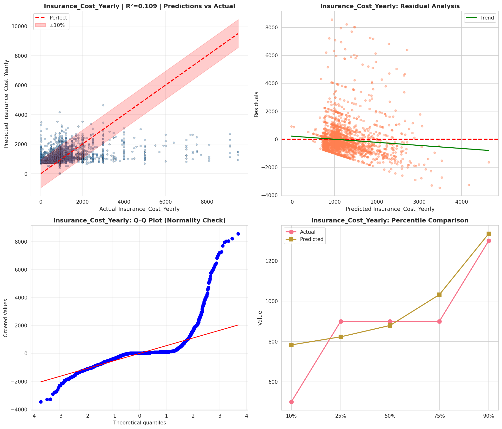
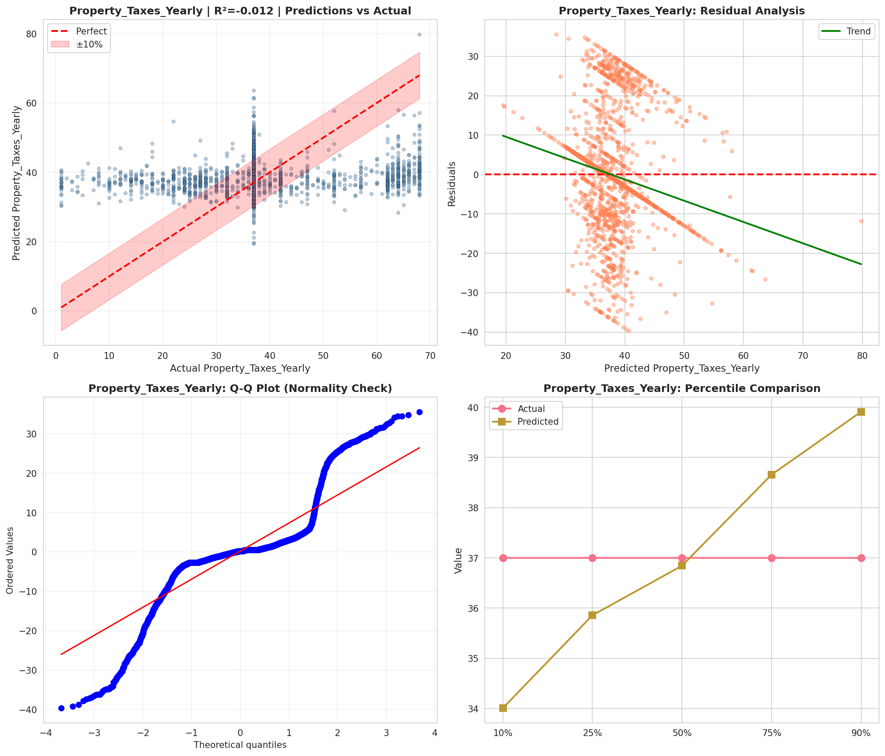
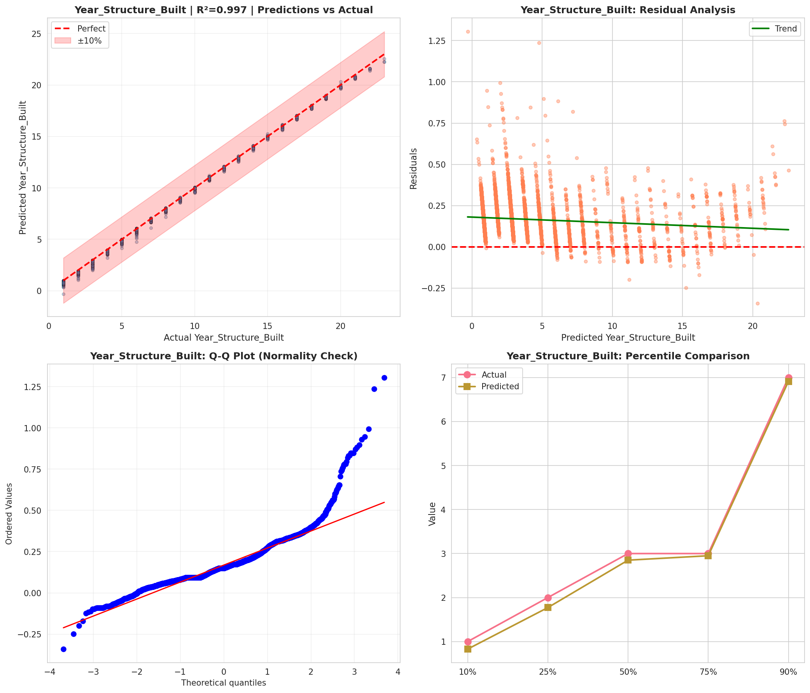
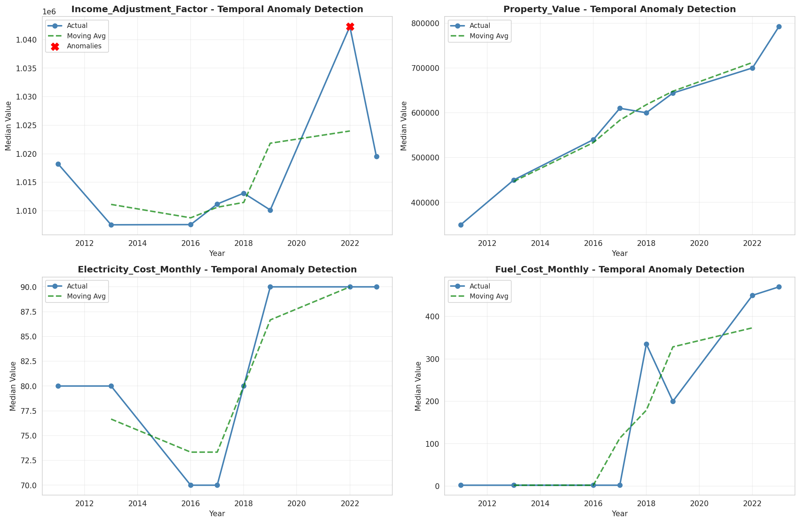
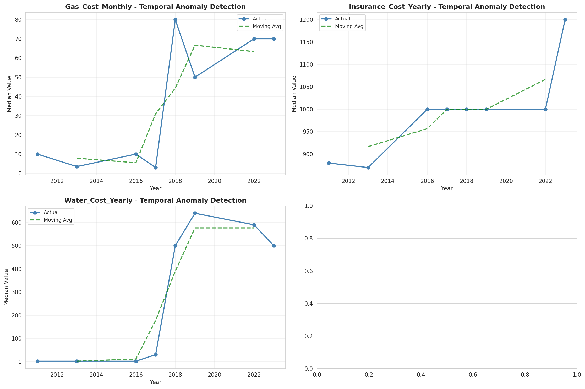
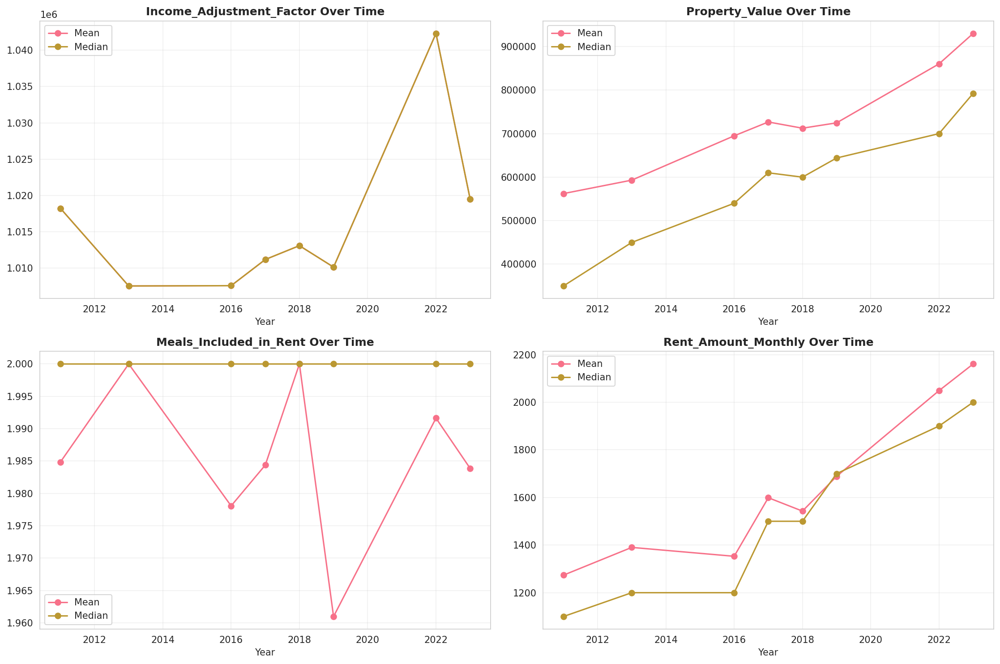
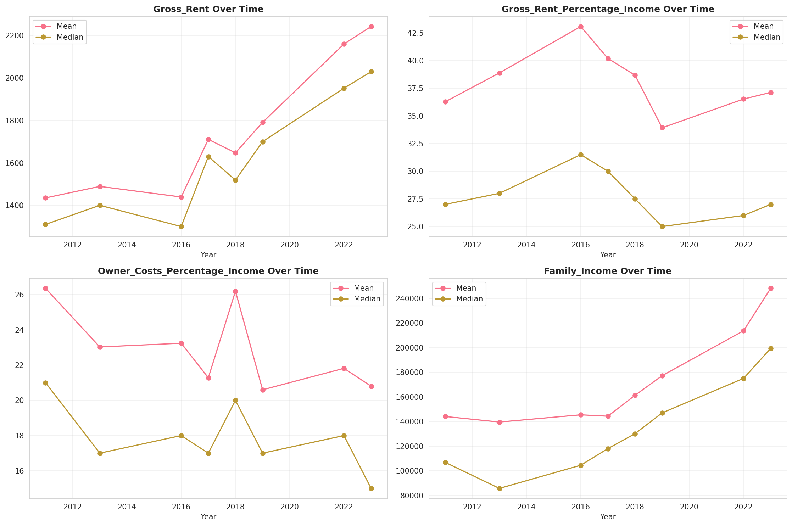
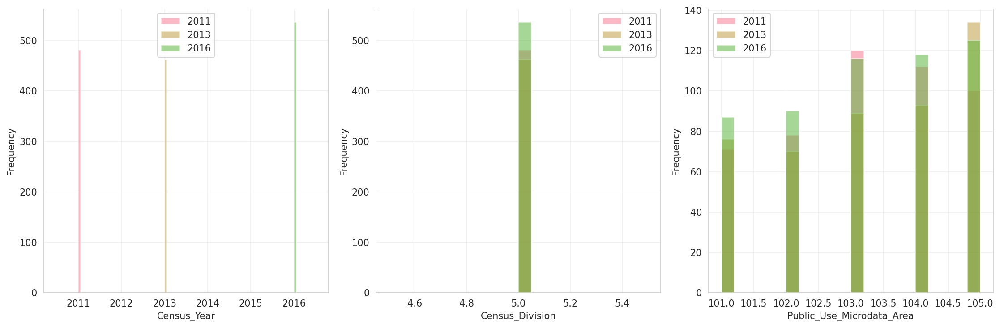
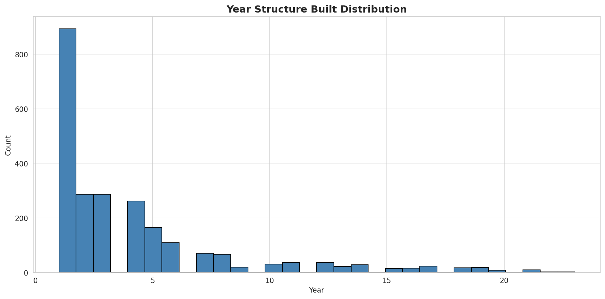
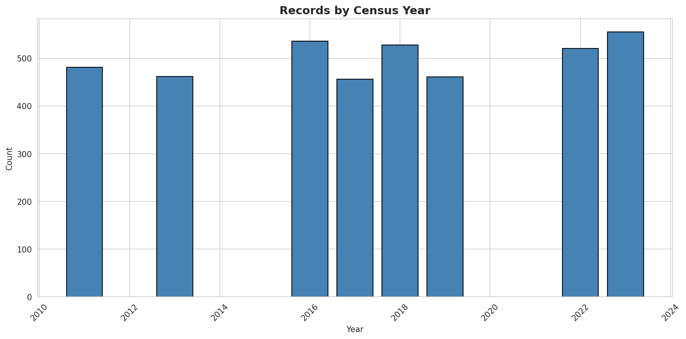
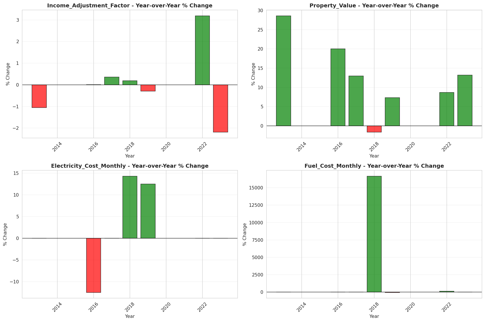

