# Temporal Analysis

## Year Distribution

- 2012: 17,045 records

- 2013: 17,500 records

- 2014: 17,955 records

- 2016: 18,379 records

- 2017: 18,478 records

- 2018: 18,570 records

- 2019: 18,663 records

- 2020: 18,248 records

- 2021: 18,748 records

- 2022: 19,086 records

- 2023: 19,317 records

## Temporal Trends

- Census_Year: {np.int64(2012): {'mean': 2012.0, 'median': 2012.0, 'std': 0.0}, np.int64(2013): {'mean': 2013.0, 'median': 2013.0, 'std': 0.0}, np.int64(2014): {'mean': 2014.0, 'median': 2014.0, 'std': 0.0}, np.int64(2016): {'mean': 2016.0, 'median': 2016.0, 'std': 0.0}, np.int64(2017): {'mean': 2017.0, 'median': 2017.0, 'std': 0.0}, np.int64(2018): {'mean': 2018.0, 'median': 2018.0, 'std': 0.0}, np.int64(2019): {'mean': 2019.0, 'median': 2019.0, 'std': 0.0}, np.int64(2020): {'mean': 2020.0, 'median': 2020.0, 'std': 0.0}, np.int64(2021): {'mean': 2021.0, 'median': 2021.0, 'std': 0.0}, np.int64(2022): {'mean': 2022.0, 'median': 2022.0, 'std': 0.0}, np.int64(2023): {'mean': 2023.0, 'median': 2023.0, 'std': 0.0}}

- Census_Division: {np.int64(2012): {'mean': 5.0, 'median': 5.0, 'std': 0.0}, np.int64(2013): {'mean': 5.0, 'median': 5.0, 'std': 0.0}, np.int64(2014): {'mean': 5.0, 'median': 5.0, 'std': 0.0}, np.int64(2016): {'mean': 5.0, 'median': 5.0, 'std': 0.0}, np.int64(2017): {'mean': 5.0, 'median': 5.0, 'std': 0.0}, np.int64(2018): {'mean': 5.0, 'median': 5.0, 'std': 0.0}, np.int64(2019): {'mean': 5.0, 'median': 5.0, 'std': 0.0}, np.int64(2020): {'mean': 5.0, 'median': 5.0, 'std': 0.0}, np.int64(2021): {'mean': 5.0, 'median': 5.0, 'std': 0.0}, np.int64(2022): {'mean': 5.0, 'median': 5.0, 'std': 0.0}, np.int64(2023): {'mean': 5.0, 'median': 5.0, 'std': 0.0}}

- Public_Use_Microdata_Area: {np.int64(2012): {'mean': None, 'median': None, 'std': None}, np.int64(2013): {'mean': None, 'median': None, 'std': None}, np.int64(2014): {'mean': None, 'median': None, 'std': None}, np.int64(2016): {'mean': 103.28042875020404, 'median': 103.0, 'std': 1.4152649096444858}, np.int64(2017): {'mean': 103.28211927697802, 'median': 103.0, 'std': 1.419414633455522}, np.int64(2018): {'mean': 103.28072159396876, 'median': 103.0, 'std': 1.423013089135885}, np.int64(2019): {'mean': 103.2748218400043, 'median': 103.0, 'std': 1.4277032821303255}, np.int64(2020): {'mean': 103.26517974572556, 'median': 103.0, 'std': 1.4366625557473958}, np.int64(2021): {'mean': 103.25629400469383, 'median': 103.0, 'std': 1.4456145491191865}, np.int64(2022): {'mean': None, 'median': None, 'std': None}, np.int64(2023): {'mean': 103.53507273386137, 'median': 104.0, 'std': 1.7388744687999742}}

- Census_Region: {np.int64(2012): {'mean': 3.0, 'median': 3.0, 'std': 0.0}, np.int64(2013): {'mean': 3.0, 'median': 3.0, 'std': 0.0}, np.int64(2014): {'mean': 3.0, 'median': 3.0, 'std': 0.0}, np.int64(2016): {'mean': 3.0, 'median': 3.0, 'std': 0.0}, np.int64(2017): {'mean': 3.0, 'median': 3.0, 'std': 0.0}, np.int64(2018): {'mean': 3.0, 'median': 3.0, 'std': 0.0}, np.int64(2019): {'mean': 3.0, 'median': 3.0, 'std': 0.0}, np.int64(2020): {'mean': 3.0, 'median': 3.0, 'std': 0.0}, np.int64(2021): {'mean': 3.0, 'median': 3.0, 'std': 0.0}, np.int64(2022): {'mean': 3.0, 'median': 3.0, 'std': 0.0}, np.int64(2023): {'mean': 3.0, 'median': 3.0, 'std': 0.0}}

- State_Code: {np.int64(2012): {'mean': 11.0, 'median': 11.0, 'std': 0.0}, np.int64(2013): {'mean': 11.0, 'median': 11.0, 'std': 0.0}, np.int64(2014): {'mean': 11.0, 'median': 11.0, 'std': 0.0}, np.int64(2016): {'mean': 11.0, 'median': 11.0, 'std': 0.0}, np.int64(2017): {'mean': 11.0, 'median': 11.0, 'std': 0.0}, np.int64(2018): {'mean': 11.0, 'median': 11.0, 'std': 0.0}, np.int64(2019): {'mean': 11.0, 'median': 11.0, 'std': 0.0}, np.int64(2020): {'mean': 11.0, 'median': 11.0, 'std': 0.0}, np.int64(2021): {'mean': 11.0, 'median': 11.0, 'std': 0.0}, np.int64(2022): {'mean': 11.0, 'median': 11.0, 'std': 0.0}, np.int64(2023): {'mean': None, 'median': None, 'std': None}}

- Housing_Adjustment_Factor: {np.int64(2012): {'mean': 1040703.4874743327, 'median': 1053092.0, 'std': 27527.235871630663}, np.int64(2013): {'mean': 1039364.2316571429, 'median': 1035725.0, 'std': 31877.254256831944}, np.int64(2014): {'mean': 1036402.4079643553, 'median': 1031130.0, 'std': 29501.20812923579}, np.int64(2016): {'mean': 1020289.7516186952, 'median': 1013801.0, 'std': 15759.987487195287}, np.int64(2017): {'mean': 1029202.537774651, 'median': 1034680.0, 'std': 17956.150356362905}, np.int64(2018): {'mean': 1038303.798007539, 'median': 1046406.0, 'std': 23441.991397596244}, np.int64(2019): {'mean': 1040948.7583989712, 'median': 1042936.0, 'std': 29155.437116414614}, np.int64(2020): {'mean': 1036475.0006576063, 'median': 1030827.0, 'std': 28392.133234032357}, np.int64(2021): {'mean': 1056841.72871773, 'median': 1059761.0, 'std': 36264.068907142326}, np.int64(2022): {'mean': 1103207.5582102065, 'median': 1133141.0, 'std': 61512.231158019946}, np.int64(2023): {'mean': 1104711.3718486307, 'median': 1125501.0, 'std': 75932.82640354455}}

- Income_Adjustment_Factor: {np.int64(2012): {'mean': 1052018.3412731006, 'median': 1061121.0, 'std': 26450.827918429102}, np.int64(2013): {'mean': 1048478.7702285714, 'median': 1054614.0, 'std': 29598.269890262596}, np.int64(2014): {'mean': 1047251.4359231412, 'median': 1041654.0, 'std': 30965.426748806327}, np.int64(2016): {'mean': 1027448.9005930682, 'median': 1022342.0, 'std': 17504.144346859564}, np.int64(2017): {'mean': 1036597.0829635242, 'median': 1035988.0, 'std': 16835.226294559667}, np.int64(2018): {'mean': 1046881.0217016693, 'median': 1054346.0, 'std': 20468.959679086776}, np.int64(2019): {'mean': 1049892.4127953704, 'median': 1054606.0, 'std': 26202.856848739833}, np.int64(2020): {'mean': 1046559.3058965366, 'median': 1044328.0, 'std': 28899.649033311318}, np.int64(2021): {'mean': 1072179.184553019, 'median': 1070512.0, 'std': 31082.7409980248}, np.int64(2022): {'mean': 1125906.4469244473, 'median': 1140108.0, 'std': 49571.94865207048}, np.int64(2023): {'mean': 1128992.6349847284, 'median': 1159185.0, 'std': 69649.18243793791}}

- Housing_Unit_Weight: {np.int64(2012): {'mean': 17.405162804341447, 'median': 14.0, 'std': 13.600711171977391}, np.int64(2013): {'mean': 17.04725714285714, 'median': 14.0, 'std': 13.878535394295644}, np.int64(2014): {'mean': 16.752882205513785, 'median': 14.0, 'std': 14.100785670676276}, np.int64(2016): {'mean': 16.688122313509986, 'median': 14.0, 'std': 14.405644678446208}, np.int64(2017): {'mean': 16.677183677887218, 'median': 14.0, 'std': 14.28252605278875}, np.int64(2018): {'mean': 16.776790522347873, 'median': 14.0, 'std': 14.198499306538134}, np.int64(2019): {'mean': 16.88774580721213, 'median': 14.0, 'std': 14.429607751646117}, np.int64(2020): {'mean': 17.491889522139413, 'median': 13.0, 'std': 21.24994308439445}, np.int64(2021): {'mean': 18.364945594196715, 'median': 14.0, 'std': 22.346773878604594}, np.int64(2022): {'mean': 18.35753955779105, 'median': 14.0, 'std': 22.845170508555587}, np.int64(2023): {'mean': 18.434591292643784, 'median': 13.0, 'std': 22.90024986061785}}

- Number_of_Persons: {np.int64(2012): {'mean': 1.7317688471692578, 'median': 1.0, 'std': 1.289152092339168}, np.int64(2013): {'mean': 1.7462285714285715, 'median': 1.0, 'std': 1.291370672113869}, np.int64(2014): {'mean': 1.7541631857421331, 'median': 1.0, 'std': 1.2891712794768966}, np.int64(2016): {'mean': 1.776375210838457, 'median': 1.0, 'std': 1.2832773034426623}, np.int64(2017): {'mean': 1.781036908756359, 'median': 1.0, 'std': 1.277531685513873}, np.int64(2018): {'mean': 1.770974690360797, 'median': 1.0, 'std': 1.2744238461755253}, np.int64(2019): {'mean': 1.7691153619460966, 'median': 1.0, 'std': 1.2664123079290073}, np.int64(2020): {'mean': 1.7399167032003506, 'median': 1.0, 'std': 1.2514614610664145}, np.int64(2021): {'mean': 1.7210369106037977, 'median': 1.0, 'std': 1.2386578943915258}, np.int64(2022): {'mean': 1.6985748716336582, 'median': 1.0, 'std': 1.2157576276528748}, np.int64(2023): {'mean': 1.6878914945384895, 'median': 1.0, 'std': 1.199617221267362}}

- Housing_Unit_Type: {np.int64(2012): {'mean': 1.2451745379876797, 'median': 1.0, 'std': 0.629704337411711}, np.int64(2013): {'mean': 1.2685142857142857, 'median': 1.0, 'std': 0.6556863926374766}, np.int64(2014): {'mean': 1.287162350320245, 'median': 1.0, 'std': 0.6752103679444369}, np.int64(2016): {'mean': 1.2969149572882093, 'median': 1.0, 'std': 0.6860841440519233}, np.int64(2017): {'mean': 1.2942418010607208, 'median': 1.0, 'std': 0.6863945555842076}, np.int64(2018): {'mean': 1.2882067851373182, 'median': 1.0, 'std': 0.6827351393488155}, np.int64(2019): {'mean': 1.279751379735305, 'median': 1.0, 'std': 0.6745054212571004}, np.int64(2020): {'mean': None, 'median': None, 'std': None}, np.int64(2021): {'mean': None, 'median': None, 'std': None}, np.int64(2022): {'mean': None, 'median': None, 'std': None}, np.int64(2023): {'mean': None, 'median': None, 'std': None}}

- Building_Type: {np.int64(2012): {'mean': 5.385805835833106, 'median': 5.0, 'std': 2.684314576387647}, np.int64(2013): {'mean': 5.365130692535705, 'median': 5.0, 'std': 2.671220096821497}, np.int64(2014): {'mean': 5.3498737876976215, 'median': 5.0, 'std': 2.664506660849548}, np.int64(2016): {'mean': 5.3672777089177375, 'median': 5.0, 'std': 2.6686123383306923}, np.int64(2017): {'mean': 5.403037156704362, 'median': 5.0, 'std': 2.6893974811823074}, np.int64(2018): {'mean': 5.448372866185027, 'median': 5.0, 'std': 2.704979791177859}, np.int64(2019): {'mean': 5.485481115961283, 'median': 5.0, 'std': 2.7211779497390682}, np.int64(2020): {'mean': 5.528596873144666, 'median': 5.0, 'std': 2.7374364051074602}, np.int64(2021): {'mean': 5.559390667180872, 'median': 5.0, 'std': 2.7564532500544074}, np.int64(2022): {'mean': 5.599408953722334, 'median': 5.0, 'std': 2.7658961255550722}, np.int64(2023): {'mean': 5.641675991545443, 'median': 6.0, 'std': 2.785934524149568}}

- Year_Structure_Built: {np.int64(2012): {'mean': 3.148009271884374, 'median': 2.0, 'std': 2.585626045828648}, np.int64(2013): {'mean': 3.2392886014551334, 'median': 2.0, 'std': 2.768116745215159}, np.int64(2014): {'mean': 3.3286169788760462, 'median': 2.0, 'std': 2.934178289143076}, np.int64(2016): {'mean': 3.663056950877422, 'median': 3.0, 'std': 3.5560371013730263}, np.int64(2017): {'mean': 3.878772213247173, 'median': 3.0, 'std': 3.9104835572201764}, np.int64(2018): {'mean': 4.090978837670225, 'median': 3.0, 'std': 4.29425608986527}, np.int64(2019): {'mean': 4.332763965331815, 'median': 3.0, 'std': 4.6906832414171715}, np.int64(2020): {'mean': 4.533742331288344, 'median': 3.0, 'std': 5.025101858370627}, np.int64(2021): {'mean': None, 'median': None, 'std': None}, np.int64(2022): {'mean': None, 'median': None, 'std': None}, np.int64(2023): {'mean': None, 'median': None, 'std': None}}

- Bathtub_or_Shower: {np.int64(2012): {'mean': 1.0059994545950368, 'median': 1.0, 'std': 0.07722608192820213}, np.int64(2013): {'mean': 1.0053220156292104, 'median': 1.0, 'std': 0.07276021182301202}, np.int64(2014): {'mean': 1.005314202205394, 'median': 1.0, 'std': 0.07270703278907197}, np.int64(2016): {'mean': 1.0040446213060212, 'median': 1.0, 'std': 0.06347066368554756}, np.int64(2017): {'mean': 1.004264943457189, 'median': 1.0, 'std': 0.06516922708583459}, np.int64(2018): {'mean': 1.0053065660763378, 'median': 1.0, 'std': 0.0726549649152263}, np.int64(2019): {'mean': 1.0052508382362244, 'median': 1.0, 'std': 0.07227445880160417}, np.int64(2020): {'mean': 1.0055412626162676, 'median': 1.0, 'std': 0.07423557480112311}, np.int64(2021): {'mean': 1.0061061833140506, 'median': 1.0, 'std': 0.07790563488345452}, np.int64(2022): {'mean': 1.005784708249497, 'median': 1.0, 'std': 0.07583935024298033}, np.int64(2023): {'mean': 1.0049732686808406, 'median': 1.0, 'std': 0.07034801296794338}}

- Refrigerator: {np.int64(2012): {'mean': 1.0090673575129534, 'median': 1.0, 'std': 0.09479321257337664}, np.int64(2013): {'mean': 1.0079493398005928, 'median': 1.0, 'std': 0.08880697664878398}, np.int64(2014): {'mean': 1.0080377308356583, 'median': 1.0, 'std': 0.08929532680317007}, np.int64(2016): {'mean': 1.0060669319590319, 'median': 1.0, 'std': 0.0776564079870358}, np.int64(2017): {'mean': 1.0067851373182553, 'median': 1.0, 'std': 0.08209466938211021}, np.int64(2018): {'mean': 1.0085032926283486, 'median': 1.0, 'std': 0.0918233396717162}, np.int64(2019): {'mean': 1.0086670462453344, 'median': 1.0, 'std': 0.09269558857484451}, np.int64(2020): {'mean': 1.0097631769905666, 'median': 1.0, 'std': 0.09832850640187127}, np.int64(2021): {'mean': 1.0105412006684664, 'median': 1.0, 'std': 0.10213106383496871}, np.int64(2022): {'mean': 1.0093687122736419, 'median': 1.0, 'std': 0.09634066172053164}, np.int64(2023): {'mean': 1.0081437274648763, 'median': 1.0, 'std': 0.08987719031001766}}

- Hot_and_Cold_Running_Water: {np.int64(2012): {'mean': 1.0087264794109627, 'median': 1.0, 'std': 0.09301030991098383}, np.int64(2013): {'mean': 1.0073430342225815, 'median': 1.0, 'std': 0.08537918453525933}, np.int64(2014): {'mean': 1.0071077454497144, 'median': 1.0, 'std': 0.08401008409419915}, np.int64(2016): {'mean': 1.0048926870637354, 'median': 1.0, 'std': 0.06977869527729826}, np.int64(2017): {'mean': 1.0047819063004846, 'median': 1.0, 'std': 0.06898802231784266}, np.int64(2018): {'mean': 1.006265584041941, 'median': 1.0, 'std': 0.07890959764991674}, np.int64(2019): {'mean': 1.0062630480167014, 'median': 1.0, 'std': 0.0788937006960124}, np.int64(2020): {'mean': 1.007784154627614, 'median': 1.0, 'std': 0.08788669467745842}, np.int64(2021): {'mean': 1.0095127908471526, 'median': 1.0, 'std': 0.09707164014451326}, np.int64(2022): {'mean': 1.0097459758551308, 'median': 1.0, 'std': 0.09824255023092572}, np.int64(2023): {'mean': 1.0091383812010444, 'median': 1.0, 'std': 0.09516004481349097}}

- Running_Water: {np.int64(2012): {'mean': None, 'median': None, 'std': None}, np.int64(2013): {'mean': 9.0, 'median': 9.0, 'std': 0.0}, np.int64(2014): {'mean': 9.0, 'median': 9.0, 'std': 0.0}, np.int64(2016): {'mean': 9.0, 'median': 9.0, 'std': 0.0}, np.int64(2017): {'mean': 9.0, 'median': 9.0, 'std': 0.0}, np.int64(2018): {'mean': 9.0, 'median': 9.0, 'std': 0.0}, np.int64(2019): {'mean': 9.0, 'median': 9.0, 'std': 0.0}, np.int64(2020): {'mean': 9.0, 'median': 9.0, 'std': 0.0}, np.int64(2021): {'mean': 9.0, 'median': 9.0, 'std': 0.0}, np.int64(2022): {'mean': 9.0, 'median': 9.0, 'std': 0.0}, np.int64(2023): {'mean': 9.0, 'median': 9.0, 'std': 0.0}}

- Sink_with_Faucet: {np.int64(2012): {'mean': 1.0062721570766293, 'median': 1.0, 'std': 0.07895088395566713}, np.int64(2013): {'mean': 1.005456750202102, 'median': 1.0, 'std': 0.0736704805500971}, np.int64(2014): {'mean': 1.0052477746778266, 'median': 1.0, 'std': 0.0722535973438962}, np.int64(2016): {'mean': 1.0039141496509882, 'median': 1.0, 'std': 0.06244264122723327}, np.int64(2017): {'mean': 1.0038772213247174, 'median': 1.0, 'std': 0.06214851624646698}, np.int64(2018): {'mean': 1.0054344351384183, 'median': 1.0, 'std': 0.07352038924759115}, np.int64(2019): {'mean': 1.0051875751249446, 'median': 1.0, 'std': 0.07184003542312643}, np.int64(2020): {'mean': 1.0055412626162676, 'median': 1.0, 'std': 0.07423557480112306}, np.int64(2021): {'mean': 1.0060419077002185, 'median': 1.0, 'std': 0.07749702624836696}, np.int64(2022): {'mean': 1.005658953722334, 'median': 1.0, 'std': 0.07501522374364311}, np.int64(2023): {'mean': 1.004662439388288, 'median': 1.0, 'std': 0.06812480868478629}}

- Stove_or_Range: {np.int64(2012): {'mean': 1.0107035724025089, 'median': 1.0, 'std': 0.10290640359862288}, np.int64(2013): {'mean': 1.0101050929668554, 'median': 1.0, 'std': 0.10001826824140564}, np.int64(2014): {'mean': 1.0104291218280856, 'median': 1.0, 'std': 0.10159252357927652}, np.int64(2016): {'mean': 1.0082849500945918, 'median': 1.0, 'std': 0.09064681863834359}, np.int64(2017): {'mean': 1.0093053311793214, 'median': 1.0, 'std': 0.09601738252965775}, np.int64(2018): {'mean': 1.0108688702768365, 'median': 1.0, 'std': 0.10368908005705303}, np.int64(2019): {'mean': 1.0110077813626874, 'median': 1.0, 'std': 0.10434222000973063}, np.int64(2020): {'mean': 1.0120720364140114, 'median': 1.0, 'std': 0.10921121348119582}, np.int64(2021): {'mean': 1.0129836739940867, 'median': 1.0, 'std': 0.11320742888588353}, np.int64(2022): {'mean': 1.0122610663983904, 'median': 1.0, 'std': 0.11005223390180185}, np.int64(2023): {'mean': 1.010816859380828, 'median': 1.0, 'std': 0.10344331849367785}}

- Telephone_Service: {np.int64(2012): {'mean': 1.030578329270995, 'median': 1.0, 'std': 0.17217864178289458}, np.int64(2013): {'mean': 1.0297008080366892, 'median': 1.0, 'std': 0.1697668049947284}, np.int64(2014): {'mean': 1.0292477116704806, 'median': 1.0, 'std': 0.16850612308853222}, np.int64(2016): {'mean': 1.030000697690644, 'median': 1.0, 'std': 0.17059509458338154}, np.int64(2017): {'mean': 1.0274918836775575, 'median': 1.0, 'std': 0.16351735973279008}, np.int64(2018): {'mean': 1.0249263849893857, 'median': 1.0, 'std': 0.1559061410685662}, np.int64(2019): {'mean': 1.0210776008132836, 'median': 1.0, 'std': 0.14364795177166637}, np.int64(2020): {'mean': 1.0164039198977417, 'median': 1.0, 'std': 0.1270274661955903}, np.int64(2021): {'mean': 1.010558488469019, 'median': 1.0, 'std': 0.10221415033567471}, np.int64(2022): {'mean': 1.006320511077885, 'median': 1.0, 'std': 0.0792526913689642}, np.int64(2023): {'mean': 1.0047612660944205, 'median': 1.0, 'std': 0.06883977216401788}}

- Lot_Acreage: {np.int64(2012): {'mean': 1.0304423656254955, 'median': 1.0, 'std': 0.1825546704604698}, np.int64(2013): {'mean': 1.0289605510331872, 'median': 1.0, 'std': 0.18203411059353808}, np.int64(2014): {'mean': 1.0332205475238387, 'median': 1.0, 'std': 0.19406053862814504}, np.int64(2016): {'mean': 1.0318616294947656, 'median': 1.0, 'std': 0.18734996336212692}, np.int64(2017): {'mean': 1.0312075983717774, 'median': 1.0, 'std': 0.18563457947120898}, np.int64(2018): {'mean': 1.0327300150829564, 'median': 1.0, 'std': 0.19023434616428234}, np.int64(2019): {'mean': 1.0290312876052947, 'median': 1.0, 'std': 0.17917659380214246}, np.int64(2020): {'mean': 1.0307838781339258, 'median': 1.0, 'std': 0.18516129516738097}, np.int64(2021): {'mean': 1.0322630922693268, 'median': 1.0, 'std': 0.19030333906005037}, np.int64(2022): {'mean': 1.0325228434257394, 'median': 1.0, 'std': 0.19166742209885362}, np.int64(2023): {'mean': 1.0329008341056534, 'median': 1.0, 'std': 0.18849666765708956}}

- Agricultural_Sales: {np.int64(2012): {'mean': 1.2298850574712643, 'median': 1.0, 'std': 0.9878001415568959}, np.int64(2013): {'mean': 1.201219512195122, 'median': 1.0, 'std': 0.9345441331445254}, np.int64(2014): {'mean': 1.2552083333333333, 'median': 1.0, 'std': 1.0547692526165477}, np.int64(2016): {'mean': 1.2124352331606219, 'median': 1.0, 'std': 0.9582159949191129}, np.int64(2017): {'mean': 1.2460732984293195, 'median': 1.0, 'std': 1.0142006314900682}, np.int64(2018): {'mean': 1.2537313432835822, 'median': 1.0, 'std': 1.0248407229724463}, np.int64(2019): {'mean': 1.2793296089385475, 'median': 1.0, 'std': 1.0810770730797181}, np.int64(2020): {'mean': 1.3146067415730338, 'median': 1.0, 'std': 1.0953987548124609}, np.int64(2021): {'mean': 1.3882978723404256, 'median': 1.0, 'std': 1.2250815869789273}, np.int64(2022): {'mean': 1.3578947368421053, 'median': 1.0, 'std': 1.1721259071875318}, np.int64(2023): {'mean': 1.3298969072164948, 'median': 1.0, 'std': 1.1031903756201153}}

- Business_On_Property: {np.int64(2012): {'mean': 1.9841446012367212, 'median': 2.0, 'std': 0.12492589628617383}, np.int64(2013): {'mean': 1.986380713838447, 'median': 2.0, 'std': 0.1159133491439915}, np.int64(2014): {'mean': 1.9847739157182405, 'median': 2.0, 'std': 0.12246043072011434}, np.int64(2016): {'mean': 3.421787285692611, 'median': 2.0, 'std': 2.8363944965174963}, np.int64(2017): {'mean': 4.815015829941203, 'median': 2.0, 'std': 3.445553252676443}, np.int64(2018): {'mean': 6.194117647058824, 'median': 9.0, 'std': 3.4412766619157495}, np.int64(2019): {'mean': 7.597472924187725, 'median': 9.0, 'std': 2.808111077012524}, np.int64(2020): {'mean': None, 'median': None, 'std': None}, np.int64(2021): {'mean': None, 'median': None, 'std': None}, np.int64(2022): {'mean': None, 'median': None, 'std': None}, np.int64(2023): {'mean': None, 'median': None, 'std': None}}

- Tenure: {np.int64(2012): {'mean': 2.162271955092695, 'median': 3.0, 'std': 0.9483051459964126}, np.int64(2013): {'mean': 2.1741282667249036, 'median': 3.0, 'std': 0.9459584041682648}, np.int64(2014): {'mean': 2.1842105263157894, 'median': 3.0, 'std': 0.945087218638524}, np.int64(2016): {'mean': 2.1961208400195353, 'median': 3.0, 'std': 0.9423704056735507}, np.int64(2017): {'mean': 2.20004144505077, 'median': 3.0, 'std': 0.9432897338079639}, np.int64(2018): {'mean': 2.1979045401629804, 'median': 3.0, 'std': 0.9424639596429835}, np.int64(2019): {'mean': 2.1927482209420535, 'median': 3.0, 'std': 0.940187080289262}, np.int64(2020): {'mean': 2.1844908393694076, 'median': 3.0, 'std': 0.9393470602517449}, np.int64(2021): {'mean': 2.1701166990830787, 'median': 3.0, 'std': 0.9403311073508005}, np.int64(2022): {'mean': 2.15998368900367, 'median': 3.0, 'std': 0.9388782927454911}, np.int64(2023): {'mean': 2.1512875536480687, 'median': 3.0, 'std': 0.9396908698723562}}

- Vacancy_Status: {np.int64(2012): {'mean': 4.289636846767051, 'median': 5.0, 'std': 2.578946530054907}, np.int64(2013): {'mean': 4.214995483288166, 'median': 4.0, 'std': 2.565741589685696}, np.int64(2014): {'mean': 4.130841121495327, 'median': 4.0, 'std': 2.5839835967439817}, np.int64(2016): {'mean': 4.073293172690763, 'median': 4.0, 'std': 2.589047204189445}, np.int64(2017): {'mean': 4.137274549098197, 'median': 5.0, 'std': 2.5892675230054194}, np.int64(2018): {'mean': 4.135838150289017, 'median': 5.0, 'std': 2.609574910943115}, np.int64(2019): {'mean': 4.072243346007604, 'median': 4.5, 'std': 2.6272576727227412}, np.int64(2020): {'mean': 3.9424326833797587, 'median': 4.0, 'std': 2.6661221066755454}, np.int64(2021): {'mean': 3.8803786574870913, 'median': 4.0, 'std': 2.6495530693261182}, np.int64(2022): {'mean': 3.7252100840336135, 'median': 3.0, 'std': 2.6406831470590095}, np.int64(2023): {'mean': 3.734241908006814, 'median': 3.0, 'std': 2.634139345169162}}

- Vehicles_Available: {np.int64(2012): {'mean': 0.925031390796957, 'median': 1.0, 'std': 0.8694052447011599}, np.int64(2013): {'mean': 0.9253112033195021, 'median': 1.0, 'std': 0.8695225133254497}, np.int64(2014): {'mean': 0.9397168192219679, 'median': 1.0, 'std': 0.8719890022465371}, np.int64(2016): {'mean': 0.9492778901834926, 'median': 1.0, 'std': 0.8758443566179394}, np.int64(2017): {'mean': 0.9573806727913242, 'median': 1.0, 'std': 0.8726883519309957}, np.int64(2018): {'mean': 0.9608984455248921, 'median': 1.0, 'std': 0.8774626062806412}, np.int64(2019): {'mean': 0.9490342256862081, 'median': 1.0, 'std': 0.8709488116809909}, np.int64(2020): {'mean': 0.9449652038062775, 'median': 1.0, 'std': 0.8660909239786001}, np.int64(2021): {'mean': 0.9506112809113643, 'median': 1.0, 'std': 0.8612649574318992}, np.int64(2022): {'mean': 0.9397172760636129, 'median': 1.0, 'std': 0.8510143724399709}, np.int64(2023): {'mean': 0.9342811158798283, 'median': 1.0, 'std': 0.838657391596228}}

- Condo_Fee_Monthly: {np.int64(2012): {'mean': 473.43065693430657, 'median': 400.0, 'std': 291.498584714193}, np.int64(2013): {'mean': 471.3619402985075, 'median': 400.0, 'std': 293.632611202137}, np.int64(2014): {'mean': 472.1692789968652, 'median': 400.0, 'std': 292.5905304406783}, np.int64(2016): {'mean': 483.34478371501274, 'median': 410.0, 'std': 301.47701873353435}, np.int64(2017): {'mean': 484.8803582853487, 'median': 410.0, 'std': 297.767541421276}, np.int64(2018): {'mean': 493.0217256362508, 'median': 420.0, 'std': 295.8166737975524}, np.int64(2019): {'mean': 503.81652490887, 'median': 440.0, 'std': 297.231370983909}, np.int64(2020): {'mean': 516.731914893617, 'median': 440.0, 'std': 324.21352225603863}, np.int64(2021): {'mean': 530.3718244803695, 'median': 450.0, 'std': 353.68991349427523}, np.int64(2022): {'mean': 560.3544171458442, 'median': 450.0, 'std': 411.2952367975225}, np.int64(2023): {'mean': 598.6275283670449, 'median': 480.0, 'std': 453.6964087198071}}

- Electricity_Cost_Monthly: {np.int64(2012): {'mean': 91.9135091217963, 'median': 70.0, 'std': 96.21013533035493}, np.int64(2013): {'mean': 92.84996724175585, 'median': 70.0, 'std': 94.87365375255841}, np.int64(2014): {'mean': 93.23469679633867, 'median': 70.0, 'std': 93.2550605031993}, np.int64(2016): {'mean': 90.52884950812809, 'median': 70.0, 'std': 88.61092556221861}, np.int64(2017): {'mean': 91.5561925813359, 'median': 70.0, 'std': 88.55542704807367}, np.int64(2018): {'mean': 112.14515050167225, 'median': 90.0, 'std': 85.51098628173402}, np.int64(2019): {'mean': 110.35566925235187, 'median': 90.0, 'std': 83.59538909898323}, np.int64(2020): {'mean': 108.4986678126343, 'median': 90.0, 'std': 82.92488317585574}, np.int64(2021): {'mean': 108.33784009347355, 'median': 90.0, 'std': 86.59896104280621}, np.int64(2022): {'mean': 110.97827325250223, 'median': 90.0, 'std': 125.04135617916022}, np.int64(2023): {'mean': 116.68104975044277, 'median': 90.0, 'std': 186.45622376659506}}

- Fuel_Cost_Monthly: {np.int64(2012): {'mean': 52.09328606248615, 'median': 2.0, 'std': 335.2443958260303}, np.int64(2013): {'mean': 45.400305743612144, 'median': 2.0, 'std': 311.3910527291472}, np.int64(2014): {'mean': 41.182279748283754, 'median': 2.0, 'std': 299.8210441918533}, np.int64(2016): {'mean': 30.43766134096142, 'median': 2.0, 'std': 275.77549468451906}, np.int64(2017): {'mean': 26.724114112039786, 'median': 2.0, 'std': 261.68466161456115}, np.int64(2018): {'mean': 963.1165644171779, 'median': 345.0, 'std': 1353.7957777705587}, np.int64(2019): {'mean': 913.035143769968, 'median': 300.0, 'std': 1333.4499507656274}, np.int64(2020): {'mean': 809.2872727272727, 'median': 300.0, 'std': 1199.62809976973}, np.int64(2021): {'mean': 768.1023622047244, 'median': 300.0, 'std': 1052.5635510534532}, np.int64(2022): {'mean': 741.1914893617021, 'median': 300.0, 'std': 1001.6532197206933}, np.int64(2023): {'mean': 791.7835497835498, 'median': 350.0, 'std': 1088.6867900634459}}

- Gas_Cost_Monthly: {np.int64(2012): {'mean': 59.11064332668587, 'median': 10.0, 'std': 93.11824104125823}, np.int64(2013): {'mean': 56.08975758899323, 'median': 10.0, 'std': 88.35499339571413}, np.int64(2014): {'mean': 54.359839816933636, 'median': 10.0, 'std': 85.59989490153869}, np.int64(2016): {'mean': 50.0751412823554, 'median': 10.0, 'std': 79.87508741297033}, np.int64(2017): {'mean': 48.828279339642194, 'median': 10.0, 'std': 78.7415355532215}, np.int64(2018): {'mean': 89.89847984137475, 'median': 60.0, 'std': 88.58101219138989}, np.int64(2019): {'mean': 84.88198103266596, 'median': 50.0, 'std': 82.96402003324751}, np.int64(2020): {'mean': 82.01335559265442, 'median': 50.0, 'std': 81.10403380308658}, np.int64(2021): {'mean': 83.39718233541046, 'median': 50.0, 'std': 85.92994681466328}, np.int64(2022): {'mean': 90.22491349480968, 'median': 60.0, 'std': 136.29272209327044}, np.int64(2023): {'mean': 97.89794303797468, 'median': 60.0, 'std': 197.67639433748448}}

- House_Heating_Fuel: {np.int64(2012): {'mean': 1.857522712164857, 'median': 1.0, 'std': 1.2919332580262854}, np.int64(2013): {'mean': 1.8788672927131105, 'median': 1.0, 'std': 1.3067751405049655}, np.int64(2014): {'mean': 1.903961670480549, 'median': 1.0, 'std': 1.3306851837478757}, np.int64(2016): {'mean': 1.9496965045698738, 'median': 1.0, 'std': 1.3532692446827304}, np.int64(2017): {'mean': 1.9890861366305175, 'median': 1.0, 'std': 1.3857990635720223}, np.int64(2018): {'mean': 2.008559884955146, 'median': 1.0, 'std': 1.3841593616210786}, np.int64(2019): {'mean': 2.0394442561843444, 'median': 1.0, 'std': 1.413615396330302}, np.int64(2020): {'mean': 2.0705155517682146, 'median': 1.0, 'std': 1.4389298111044142}, np.int64(2021): {'mean': 2.0787024173381496, 'median': 1.0, 'std': 1.4443438727418934}, np.int64(2022): {'mean': 2.101264102215577, 'median': 1.0, 'std': 1.4577843995774469}, np.int64(2023): {'mean': 2.1135997854077253, 'median': 1.0, 'std': 1.4594779596354315}}

- Insurance_Cost_Yearly: {np.int64(2013): {'mean': 1107.6692008785267, 'median': 850.0, 'std': 1088.704056446798}, np.int64(2014): {'mean': 1129.968015992004, 'median': 860.0, 'std': 1135.7333200411788}}

- Water_Cost_Yearly: {np.int64(2012): {'mean': 230.12113154590443, 'median': 2.0, 'std': 408.7951862603906}, np.int64(2013): {'mean': 239.3807235932154, 'median': 2.0, 'std': 412.7152680225323}, np.int64(2014): {'mean': 248.6687643020595, 'median': 2.0, 'std': 428.36044060518265}, np.int64(2016): {'mean': 269.7141561431661, 'median': 2.0, 'std': 465.8313282673445}, np.int64(2017): {'mean': 285.94460178213717, 'median': 2.0, 'std': 491.9981671037509}, np.int64(2018): {'mean': 624.738830162086, 'median': 500.0, 'std': 604.5776670460777}, np.int64(2019): {'mean': 646.2211207490018, 'median': 540.0, 'std': 620.0379961083212}, np.int64(2020): {'mean': 671.9994313335229, 'median': 590.0, 'std': 647.2968978712192}, np.int64(2021): {'mean': 698.9564036398207, 'median': 600.0, 'std': 688.5327194549732}, np.int64(2022): {'mean': 708.5803338549817, 'median': 600.0, 'std': 707.9883435864441}, np.int64(2023): {'mean': 714.3541349568746, 'median': 560.0, 'std': 725.2141602579468}}

- Mobile_Home_Costs_Monthly: {}

- First_Mortgage_Includes_Insurance: {np.int64(2012): {'mean': 1.4624022458391819, 'median': 1.0, 'std': 0.4986344009022102}, np.int64(2013): {'mean': 1.4465902232951116, 'median': 1.0, 'std': 0.4971892231319605}, np.int64(2014): {'mean': 1.436210694972962, 'median': 1.0, 'std': 0.49596389946556935}, np.int64(2016): {'mean': 1.4189511323003576, 'median': 1.0, 'std': 0.4934363667573099}, np.int64(2017): {'mean': 1.408219719423039, 'median': 1.0, 'std': 0.49155276671464543}, np.int64(2018): {'mean': 1.399609375, 'median': 1.0, 'std': 0.489865891114693}, np.int64(2019): {'mean': 1.392767839969225, 'median': 1.0, 'std': 0.4884128859174487}, np.int64(2020): {'mean': 1.3910771704180065, 'median': 1.0, 'std': 0.48804065782654876}, np.int64(2021): {'mean': 1.3752904725019366, 'median': 1.0, 'std': 0.4842447138783111}, np.int64(2022): {'mean': 1.3836418587079713, 'median': 1.0, 'std': 0.48631826739374273}, np.int64(2023): {'mean': 1.388487877105312, 'median': 1.0, 'std': 0.4874515603491009}}

- First_Mortgage_Payment_Monthly: {np.int64(2012): {'mean': 1926.4507720072188, 'median': 1700.0, 'std': 1248.7929815156783}, np.int64(2013): {'mean': 1936.7672500502918, 'median': 1700.0, 'std': 1244.4182620029737}, np.int64(2014): {'mean': 1936.5631884638494, 'median': 1700.0, 'std': 1233.9527332192733}, np.int64(2016): {'mean': 1982.6666666666667, 'median': 1800.0, 'std': 1227.0606998797903}, np.int64(2017): {'mean': 2026.0505828887572, 'median': 1800.0, 'std': 1263.8897694101033}, np.int64(2018): {'mean': 2100.437890625, 'median': 1900.0, 'std': 1284.6811961674134}, np.int64(2019): {'mean': 2224.756683977688, 'median': 2000.0, 'std': 1334.109573685356}, np.int64(2020): {'mean': 2307.6989549839227, 'median': 2100.0, 'std': 1348.363119533272}, np.int64(2021): {'mean': 2398.689775367932, 'median': 2200.0, 'std': 1376.7150050454175}, np.int64(2022): {'mean': 2498.018511522478, 'median': 2300.0, 'std': 1415.8911206837863}, np.int64(2023): {'mean': 2600.044419766796, 'median': 2300.0, 'std': 1480.076738190574}}

- First_Mortgage_Includes_Taxes: {np.int64(2012): {'mean': 1.2901544014437538, 'median': 1.0, 'std': 0.45387898540876015}, np.int64(2013): {'mean': 1.2816334741500703, 'median': 1.0, 'std': 0.449840825009303}, np.int64(2014): {'mean': 1.2705788103344682, 'median': 1.0, 'std': 0.44430333576770015}, np.int64(2016): {'mean': 1.2626142232816846, 'median': 1.0, 'std': 0.44009824888437493}, np.int64(2017): {'mean': 1.2521240861489824, 'median': 1.0, 'std': 0.43427502307498506}, np.int64(2018): {'mean': 1.2423828125, 'median': 1.0, 'std': 0.42856651479842267}, np.int64(2019): {'mean': 1.2363916137718791, 'median': 1.0, 'std': 0.42490627866300235}, np.int64(2020): {'mean': 1.2286977491961415, 'median': 1.0, 'std': 0.420036361530759}, np.int64(2021): {'mean': 1.2106893880712626, 'median': 1.0, 'std': 0.40783768788430536}, np.int64(2022): {'mean': 1.2157159047978845, 'median': 1.0, 'std': 0.41135692125871753}, np.int64(2023): {'mean': 1.2230242457893763, 'median': 1.0, 'std': 0.4163129945225484}}

- First_Mortgage_Status: {np.int64(2012): {'mean': 1.4803366488140781, 'median': 1.0, 'std': 0.8505767196139813}, np.int64(2013): {'mean': 1.4906264288980338, 'median': 1.0, 'std': 0.857150121091977}, np.int64(2014): {'mean': 1.4962212817412335, 'median': 1.0, 'std': 0.8606546693480084}, np.int64(2016): {'mean': 1.5007476076555024, 'median': 1.0, 'std': 0.8629762562416227}, np.int64(2017): {'mean': 1.5040795134253078, 'median': 1.0, 'std': 0.8651801936960402}, np.int64(2018): {'mean': 1.499926459773496, 'median': 1.0, 'std': 0.8625575832780201}, np.int64(2019): {'mean': 1.4956433343014812, 'median': 1.0, 'std': 0.860272144543048}, np.int64(2020): {'mean': 1.5065502183406114, 'median': 1.0, 'std': 0.8668914366152389}, np.int64(2021): {'mean': 1.5051471654342468, 'median': 1.0, 'std': 0.8675367223138704}, np.int64(2022): {'mean': 1.5223776223776224, 'median': 1.0, 'std': 0.8767939331004612}, np.int64(2023): {'mean': 1.5279825279825279, 'median': 1.0, 'std': 0.8799444274853992}}

- Second_Mortgage_Payment_Monthly: {np.int64(2012): {'mean': 520.6077097505669, 'median': 370.0, 'std': 603.6882150326104}, np.int64(2013): {'mean': 506.48534201954396, 'median': 350.0, 'std': 569.5131299311208}, np.int64(2014): {'mean': 506.8349514563107, 'median': 350.0, 'std': 557.2308855738233}, np.int64(2016): {'mean': 512.8508508508509, 'median': 350.0, 'std': 541.4457311090828}, np.int64(2017): {'mean': 528.0887991927347, 'median': 350.0, 'std': 563.2300283489964}, np.int64(2018): {'mean': 563.2266949152543, 'median': 380.0, 'std': 650.7119972614189}, np.int64(2019): {'mean': 616.9205658324265, 'median': 400.0, 'std': 724.5885807341972}, np.int64(2020): {'mean': 653.8847926267281, 'median': 410.0, 'std': 765.6857586897386}, np.int64(2021): {'mean': 675.2161849710983, 'median': 400.0, 'std': 818.1951629884788}, np.int64(2022): {'mean': 685.4026927784578, 'median': 420.0, 'std': 801.6871215293867}, np.int64(2023): {'mean': 706.3583227445997, 'median': 460.0, 'std': 750.983916906105}}

- Second_Mortgage_Status: {np.int64(2012): {'mean': 2.6823741728494084, 'median': 3.0, 'std': 0.6158230300751425}, np.int64(2013): {'mean': 2.709112854556427, 'median': 3.0, 'std': 0.597341054633804}, np.int64(2014): {'mean': 2.735830162227118, 'median': 3.0, 'std': 0.5736187395202843}, np.int64(2016): {'mean': 2.7659912594358365, 'median': 3.0, 'std': 0.5448926025048748}, np.int64(2017): {'mean': 2.7751432523216755, 'median': 3.0, 'std': 0.5267757510794416}, np.int64(2018): {'mean': 2.7865234375, 'median': 3.0, 'std': 0.5077385360766781}, np.int64(2019): {'mean': 2.797845739565301, 'median': 3.0, 'std': 0.48970467820035507}, np.int64(2020): {'mean': 2.804321728691477, 'median': 3.0, 'std': 0.47860502274080724}, np.int64(2021): {'mean': 2.8165031736872477, 'median': 3.0, 'std': 0.4664471223914153}, np.int64(2022): {'mean': 2.8303754903792266, 'median': 3.0, 'std': 0.45376290563048693}, np.int64(2023): {'mean': 2.8424607520993064, 'median': 3.0, 'std': 0.4363951013818537}}

- Property_Taxes_Yearly: {np.int64(2012): {'mean': 35.76924254016832, 'median': 32.0, 'std': 19.408328065779767}, np.int64(2013): {'mean': 36.51303155006859, 'median': 33.0, 'std': 19.481382356148988}, np.int64(2014): {'mean': 37.11955864570738, 'median': 34.0, 'std': 19.39328584249961}, np.int64(2016): {'mean': 38.98011363636363, 'median': 37.0, 'std': 19.54562501743583}, np.int64(2017): {'mean': 39.890075656430795, 'median': 37.0, 'std': 19.571437835296155}}

- Meals_Included_in_Rent: {np.int64(2012): {'mean': 1.9872293170460855, 'median': 2.0, 'std': 0.11229133063612792}, np.int64(2013): {'mean': 1.9876576698765767, 'median': 2.0, 'std': 0.11041580758265666}, np.int64(2014): {'mean': 1.9866437450409944, 'median': 2.0, 'std': 0.11480247508580706}, np.int64(2016): {'mean': 1.986976506639428, 'median': 2.0, 'std': 0.11338220050472567}, np.int64(2017): {'mean': 1.9864419665484034, 'median': 2.0, 'std': 0.11565426083704373}, np.int64(2018): {'mean': 1.9862396797598199, 'median': 2.0, 'std': 0.11650180979032652}, np.int64(2019): {'mean': 1.9859415464298926, 'median': 2.0, 'std': 0.11773921596666076}, np.int64(2020): {'mean': 1.98463326446281, 'median': 2.0, 'std': 0.12301444255235147}, np.int64(2021): {'mean': 1.9856014271151885, 'median': 2.0, 'std': 0.11913464012574887}, np.int64(2022): {'mean': 1.9875768603337935, 'median': 2.0, 'std': 0.1107715894385273}, np.int64(2023): {'mean': 1.9873512836568565, 'median': 2.0, 'std': 0.1117599684021174}}

- Rent_Amount_Monthly: {np.int64(2012): {'mean': 1195.059966685175, 'median': 1100.0, 'std': 738.1807093771616}, np.int64(2013): {'mean': 1246.7828563678286, 'median': 1100.0, 'std': 769.088231430952}, np.int64(2014): {'mean': 1306.4956360751123, 'median': 1200.0, 'std': 797.4548502020857}, np.int64(2016): {'mean': 1414.0242594484168, 'median': 1300.0, 'std': 845.13486514722}, np.int64(2017): {'mean': 1481.8953370501774, 'median': 1400.0, 'std': 865.4057953736956}, np.int64(2018): {'mean': 1532.6672504378284, 'median': 1400.0, 'std': 872.7451393042415}, np.int64(2019): {'mean': 1585.137254901961, 'median': 1500.0, 'std': 882.4711013543805}, np.int64(2020): {'mean': 1648.6394628099174, 'median': 1600.0, 'std': 916.0831783693869}, np.int64(2021): {'mean': 1727.407747196738, 'median': 1600.0, 'std': 964.6759507585086}, np.int64(2022): {'mean': 1815.6940644999372, 'median': 1700.0, 'std': 1027.6270191211738}, np.int64(2023): {'mean': 1925.8304320601128, 'median': 1800.0, 'std': 1091.3185488897936}}

- Gross_Rent: {np.int64(2012): {'mean': 1295.3533118405628, 'median': 1150.0, 'std': 758.1831793346089}, np.int64(2013): {'mean': 1349.5241093146374, 'median': 1200.0, 'std': 791.2011407735447}, np.int64(2014): {'mean': 1411.1905957862425, 'median': 1290.0, 'std': 821.2266481293981}, np.int64(2016): {'mean': 1512.3020819341841, 'median': 1400.0, 'std': 867.2736855049172}, np.int64(2017): {'mean': 1579.3861610113106, 'median': 1460.0, 'std': 889.050818970342}, np.int64(2018): {'mean': 1633.7221637272967, 'median': 1520.0, 'std': 893.7019096960968}, np.int64(2019): {'mean': 1683.0231319038337, 'median': 1600.0, 'std': 899.5402893943294}, np.int64(2020): {'mean': 1746.3840241559155, 'median': 1650.0, 'std': 933.9548835843678}, np.int64(2021): {'mean': 1822.3220408163265, 'median': 1700.0, 'std': 977.1709040603874}, np.int64(2022): {'mean': 1914.6410187306292, 'median': 1800.0, 'std': 1044.2826426269387}, np.int64(2023): {'mean': 2026.7897284216187, 'median': 1890.0, 'std': 1117.1982373137448}}

- Gross_Rent_Percentage_Income: {np.int64(2012): {'mean': 39.94214006612564, 'median': 29.0, 'std': 28.74345996735877}, np.int64(2013): {'mean': 39.89757531227039, 'median': 29.0, 'std': 28.575414650645033}, np.int64(2014): {'mean': 39.67582653499356, 'median': 29.0, 'std': 28.622324132557388}, np.int64(2016): {'mean': 38.98290598290598, 'median': 28.0, 'std': 28.60004338770888}, np.int64(2017): {'mean': 38.65334610647324, 'median': 28.0, 'std': 28.516761933177687}, np.int64(2018): {'mean': 38.262179400189986, 'median': 28.0, 'std': 28.446693460065205}, np.int64(2019): {'mean': 37.21649207628257, 'median': 28.0, 'std': 27.909175862972155}, np.int64(2020): {'mean': 37.02254999290881, 'median': 27.0, 'std': 27.996801779228438}, np.int64(2021): {'mean': 36.77245256500351, 'median': 27.0, 'std': 27.664412804741445}, np.int64(2022): {'mean': 36.448103376406834, 'median': 27.0, 'std': 27.43674788174003}, np.int64(2023): {'mean': 36.26613237529363, 'median': 27.0, 'std': 27.42653242083105}}

- Selected_Monthly_Owner_Costs: {np.int64(2012): {'mean': 2115.639607903201, 'median': 1830.0, 'std': 1551.3264576932427}, np.int64(2013): {'mean': 2101.669819957278, 'median': 1822.0, 'std': 1527.6899458506605}, np.int64(2014): {'mean': 2091.412895413955, 'median': 1820.0, 'std': 1512.4875987071796}, np.int64(2016): {'mean': 2116.676752546435, 'median': 1854.0, 'std': 1481.9475215721868}, np.int64(2017): {'mean': 2149.745949160101, 'median': 1888.0, 'std': 1503.5309777173084}, np.int64(2018): {'mean': 2221.803095062638, 'median': 1958.0, 'std': 1544.094499456246}, np.int64(2019): {'mean': 2326.2362869198314, 'median': 2055.0, 'std': 1603.2229154332056}, np.int64(2020): {'mean': 2389.5586238116794, 'median': 2137.0, 'std': 1625.9115063179463}, np.int64(2021): {'mean': 2463.7547553361405, 'median': 2205.0, 'std': 1662.434843762691}, np.int64(2022): {'mean': 2552.3604927901442, 'median': 2290.0, 'std': 1713.6203035584392}, np.int64(2023): {'mean': 2657.559775925673, 'median': 2403.0, 'std': 1784.468432153096}}

- Owner_Costs_Percentage_Income: {np.int64(2012): {'mean': 27.547541994143934, 'median': 21.0, 'std': 23.348211102071506}, np.int64(2013): {'mean': 26.966923076923077, 'median': 20.0, 'std': 23.259257483750908}, np.int64(2014): {'mean': 26.40701754385965, 'median': 20.0, 'std': 23.196090229862772}, np.int64(2016): {'mean': 24.709701717384753, 'median': 18.0, 'std': 22.185221620282025}, np.int64(2017): {'mean': 24.171398684997012, 'median': 18.0, 'std': 22.02169554855179}, np.int64(2018): {'mean': 24.09828300769686, 'median': 18.0, 'std': 21.96600812541136}, np.int64(2019): {'mean': 23.814052001168566, 'median': 18.0, 'std': 21.846192836417544}, np.int64(2020): {'mean': 23.50310841546626, 'median': 17.0, 'std': 21.722198566600046}, np.int64(2021): {'mean': 23.422105416849174, 'median': 17.0, 'std': 21.67440635754731}, np.int64(2022): {'mean': 23.243696295252853, 'median': 17.0, 'std': 21.616493934126293}, np.int64(2023): {'mean': 22.68623676612127, 'median': 17.0, 'std': 21.138744844352747}}

- Satellite_Internet: {np.int64(2012): {'mean': None, 'median': None, 'std': None}, np.int64(2013): {'mean': None, 'median': None, 'std': None}, np.int64(2014): {'mean': None, 'median': None, 'std': None}, np.int64(2016): {'mean': None, 'median': None, 'std': None}, np.int64(2017): {'mean': 1.960678949164108, 'median': 2.0, 'std': 0.1943659643226258}, np.int64(2018): {'mean': 1.9576897798225434, 'median': 2.0, 'std': 0.20130423412480994}, np.int64(2019): {'mean': 1.9579022194139484, 'median': 2.0, 'std': 0.2008201751041991}, np.int64(2020): {'mean': 1.9583974099554835, 'median': 2.0, 'std': 0.19968736061099798}, np.int64(2021): {'mean': 1.9575062034739454, 'median': 2.0, 'std': 0.20172067102828775}, np.int64(2022): {'mean': 1.9579738173162748, 'median': 2.0, 'std': 0.2006563667534274}, np.int64(2023): {'mean': 1.9587022789955, 'median': 2.0, 'std': 0.19898515782686044}}

- Smartphone: {np.int64(2012): {'mean': None, 'median': None, 'std': None}, np.int64(2013): {'mean': None, 'median': None, 'std': None}, np.int64(2014): {'mean': None, 'median': None, 'std': None}, np.int64(2016): {'mean': None, 'median': None, 'std': None}, np.int64(2017): {'mean': 1.2240104994128618, 'median': 1.0, 'std': 0.41694340587537987}, np.int64(2018): {'mean': 1.1849619941107992, 'median': 1.0, 'std': 0.3882800263287117}, np.int64(2019): {'mean': 1.1509318874957641, 'median': 1.0, 'std': 0.3579946070981074}, np.int64(2020): {'mean': 1.121999715949439, 'median': 1.0, 'std': 0.32729710107579624}, np.int64(2021): {'mean': 1.0955821061405946, 'median': 1.0, 'std': 0.29402750282506473}, np.int64(2022): {'mean': 1.0805355443795026, 'median': 1.0, 'std': 0.2721297547234618}, np.int64(2023): {'mean': 1.0688036480686696, 'median': 1.0, 'std': 0.2531284316098165}}

- Tablet_Computer: {np.int64(2012): {'mean': None, 'median': None, 'std': None}, np.int64(2013): {'mean': None, 'median': None, 'std': None}, np.int64(2014): {'mean': None, 'median': None, 'std': None}, np.int64(2016): {'mean': None, 'median': None, 'std': None}, np.int64(2017): {'mean': 1.4119638046556606, 'median': 1.0, 'std': 0.4922056103690904}, np.int64(2018): {'mean': 1.3812230363623912, 'median': 1.0, 'std': 0.485703806537074}, np.int64(2019): {'mean': 1.3543883429345984, 'median': 1.0, 'std': 0.47834376007104057}, np.int64(2020): {'mean': 1.3326232069308337, 'median': 1.0, 'std': 0.4711695809397941}, np.int64(2021): {'mean': 1.324812447902195, 'median': 1.0, 'std': 0.46832099749418216}, np.int64(2022): {'mean': 1.3243849395133886, 'median': 1.0, 'std': 0.46816049187926656}, np.int64(2023): {'mean': 1.3238331545064377, 'median': 1.0, 'std': 0.467952911478894}}

- Food_Stamp_SNAP: {np.int64(2012): {'mean': 1.8847072128675546, 'median': 2.0, 'std': 0.31938498624448375}, np.int64(2013): {'mean': 1.8740926005002134, 'median': 2.0, 'std': 0.3317550906619448}, np.int64(2014): {'mean': 1.8721350310926859, 'median': 2.0, 'std': 0.3339492827333423}, np.int64(2016): {'mean': 1.8718863257205316, 'median': 2.0, 'std': 0.3342259519581819}, np.int64(2017): {'mean': 1.8768306636155607, 'median': 2.0, 'std': 0.3286408826136185}, np.int64(2018): {'mean': 1.884610997033995, 'median': 2.0, 'std': 0.3194999271801621}, np.int64(2019): {'mean': 1.8923967974561353, 'median': 2.0, 'std': 0.3098874089082208}, np.int64(2020): {'mean': 1.9007046764894298, 'median': 2.0, 'std': 0.2990668337985744}, np.int64(2021): {'mean': 1.9031047424087342, 'median': 2.0, 'std': 0.29582349949367787}, np.int64(2022): {'mean': 1.9067389360751006, 'median': 2.0, 'std': 0.2908060580780333}, np.int64(2023): {'mean': 1.90905583420603, 'median': 2.0, 'std': 0.28753761756457974}}

- Family_Type_Employment_Status: {np.int64(2012): {'mean': 4.005698497668797, 'median': 4.0, 'std': 2.7919453586947736}, np.int64(2013): {'mean': 3.998988024962051, 'median': 4.0, 'std': 2.787091713112291}, np.int64(2014): {'mean': 3.9581256231306083, 'median': 4.0, 'std': 2.7759217702881513}, np.int64(2016): {'mean': 3.8413770913770913, 'median': 3.0, 'std': 2.7700733139136595}, np.int64(2017): {'mean': 3.7809585075587004, 'median': 3.0, 'std': 2.7705587406605185}, np.int64(2018): {'mean': 3.6923325784535748, 'median': 3.0, 'std': 2.7668624244468676}, np.int64(2019): {'mean': 3.597335901139464, 'median': 2.0, 'std': 2.7635763165029994}, np.int64(2020): {'mean': 3.50460593654043, 'median': 2.0, 'std': 2.7478140600859886}, np.int64(2021): {'mean': None, 'median': None, 'std': None}, np.int64(2022): {'mean': None, 'median': None, 'std': None}, np.int64(2023): {'mean': None, 'median': None, 'std': None}}

- Family_Income: {np.int64(2012): {'mean': 129303.78083144895, 'median': 83200.0, 'std': 151715.86649098343}, np.int64(2013): {'mean': 131613.02844083292, 'median': 85300.0, 'std': 154613.75150318412}, np.int64(2014): {'mean': 134747.5796114893, 'median': 90000.0, 'std': 154028.49593462262}, np.int64(2016): {'mean': 147796.95802861685, 'median': 100000.0, 'std': 169725.4965883828}, np.int64(2017): {'mean': 154124.07046027743, 'median': 106000.0, 'std': 172121.91014111362}, np.int64(2018): {'mean': 162314.40252764613, 'median': 115000.0, 'std': 174784.73710741123}, np.int64(2019): {'mean': 173350.51609375, 'median': 126350.0, 'std': 182062.1741692184}, np.int64(2020): {'mean': 183062.8365225998, 'median': 137000.0, 'std': 186585.51499284583}, np.int64(2021): {'mean': 193708.4673595323, 'median': 146000.0, 'std': 195408.68826975094}, np.int64(2022): {'mean': 207282.32451728053, 'median': 159600.0, 'std': 203380.67537000382}, np.int64(2023): {'mean': 223090.37471855903, 'median': 173000.0, 'std': 214502.8092261335}}

- Family_Presence_Children: {np.int64(2012): {'mean': 3.0785701951303746, 'median': 4.0, 'std': 1.1224857193713822}, np.int64(2013): {'mean': 3.076432051066689, 'median': 4.0, 'std': 1.1246432690659522}, np.int64(2014): {'mean': 3.0745801778070465, 'median': 4.0, 'std': 1.1307721583971109}, np.int64(2016): {'mean': 3.081217473584608, 'median': 4.0, 'std': 1.1312295452673569}, np.int64(2017): {'mean': 3.0812246173070914, 'median': 4.0, 'std': 1.1322323944870198}, np.int64(2018): {'mean': 3.089657330621186, 'median': 4.0, 'std': 1.1318152183577117}, np.int64(2019): {'mean': 3.1044083526682136, 'median': 4.0, 'std': 1.1268909000205083}, np.int64(2020): {'mean': 3.1034313725490197, 'median': 4.0, 'std': 1.1346312730147063}, np.int64(2021): {'mean': 3.110379177377892, 'median': 4.0, 'std': 1.1296459057026815}, np.int64(2022): {'mean': 3.1207395498392283, 'median': 4.0, 'std': 1.1332173118212325}, np.int64(2023): {'mean': 3.1208160663053874, 'median': 4.0, 'std': 1.1363605883938666}}

- Household_Family_Type: {np.int64(2012): {'mean': 3.8214786911884184, 'median': 4.0, 'std': 2.025059324534266}, np.int64(2013): {'mean': 3.8051976414064206, 'median': 4.0, 'std': 2.036159524504766}, np.int64(2014): {'mean': 3.8013443935926774, 'median': 4.0, 'std': 2.050637909365929}, np.int64(2016): {'mean': 3.7558082746110375, 'median': 4.0, 'std': 2.0722258752911666}, np.int64(2017): {'mean': 3.7480831664018788, 'median': 4.0, 'std': 2.0820131835911604}, np.int64(2018): {'mean': 3.75176333630076, 'median': 4.0, 'std': 2.0889207889722288}, np.int64(2019): {'mean': 3.736631650288038, 'median': 4.0, 'std': 2.1003132184583713}, np.int64(2020): {'mean': 3.74009373668513, 'median': 4.0, 'std': 2.112534969322435}, np.int64(2021): {'mean': 3.7415948874687412, 'median': 4.0, 'std': 2.117866454139036}, np.int64(2022): {'mean': 3.7577817044991164, 'median': 4.0, 'std': 2.1174116110464603}, np.int64(2023): {'mean': 3.753889484978541, 'median': 4.0, 'std': 2.125162369537842}}

- Household_Income: {np.int64(2012): {'mean': 101843.38425125854, 'median': 66400.0, 'std': 124675.17038402788}, np.int64(2013): {'mean': 104023.01617570675, 'median': 69000.0, 'std': 126286.22871198496}, np.int64(2014): {'mean': 106838.05842925834, 'median': 72000.0, 'std': 126823.5354488781}, np.int64(2016): {'mean': 117087.57718263834, 'median': 79600.0, 'std': 138722.93385210712}, np.int64(2017): {'mean': 121982.4807435049, 'median': 83600.0, 'std': 141435.68855018396}, np.int64(2018): {'mean': 127001.61529863779, 'median': 88000.0, 'std': 144177.2578368601}, np.int64(2019): {'mean': 134565.3717052923, 'median': 93370.0, 'std': 150499.33777251563}, np.int64(2020): {'mean': 140530.63725348026, 'median': 99895.0, 'std': 154055.01473227452}, np.int64(2021): {'mean': 146961.24540877828, 'median': 102000.0, 'std': 160810.39865072994}, np.int64(2022): {'mean': 154243.7726957727, 'median': 108000.0, 'std': 166617.91285448306}, np.int64(2023): {'mean': 164120.89351535836, 'median': 115000.0, 'std': 175803.32646271965}}

- Number_Persons_Family: {np.int64(2012): {'mean': 2.8901744085650147, 'median': 2.0, 'std': 1.2395435482137644}, np.int64(2013): {'mean': 2.8933310935662693, 'median': 2.0, 'std': 1.224968814367045}, np.int64(2014): {'mean': 2.893809680605861, 'median': 2.0, 'std': 1.2237365908825235}, np.int64(2016): {'mean': 2.8675287809493772, 'median': 2.0, 'std': 1.2005994937859559}, np.int64(2017): {'mean': 2.854420493595751, 'median': 2.0, 'std': 1.182484251416432}, np.int64(2018): {'mean': 2.8446252542638084, 'median': 2.0, 'std': 1.1852452898460888}, np.int64(2019): {'mean': 2.824903325599381, 'median': 2.0, 'std': 1.172590124347893}, np.int64(2020): {'mean': 2.8204248366013074, 'median': 2.0, 'std': 1.1556187227465162}, np.int64(2021): {'mean': 2.819890745501285, 'median': 2.0, 'std': 1.1500824419517526}, np.int64(2022): {'mean': 2.8038585209003215, 'median': 2.0, 'std': 1.134662495995902}, np.int64(2023): {'mean': 2.7978960790564233, 'median': 2.0, 'std': 1.125174746209663}}

- Workers_In_Family: {np.int64(2012): {'mean': 1.4412018649628735, 'median': 2.0, 'std': 0.8250952983133316}, np.int64(2013): {'mean': 1.432555014278515, 'median': 2.0, 'std': 0.8243980818049849}, np.int64(2014): {'mean': 1.439084622983207, 'median': 2.0, 'std': 0.8204492982286629}, np.int64(2016): {'mean': 1.4559217788992274, 'median': 2.0, 'std': 0.8153621766147812}, np.int64(2017): {'mean': 1.4748516088722274, 'median': 2.0, 'std': 0.8081419676861874}, np.int64(2018): {'mean': 1.5063370364575184, 'median': 2.0, 'std': 0.8015530064979444}, np.int64(2019): {'mean': 1.520185614849188, 'median': 2.0, 'std': 0.7954091451046159}, np.int64(2020): {'mean': 1.5419934640522877, 'median': 2.0, 'std': 0.7827616181807653}, np.int64(2021): {'mean': 1.5462724935732648, 'median': 2.0, 'std': 0.7825299540678828}, np.int64(2022): {'mean': 1.5469453376205788, 'median': 2.0, 'std': 0.785306038096474}, np.int64(2023): {'mean': 1.5467006694293912, 'median': 2.0, 'std': 0.7881653630702319}}

- Work_Experience_Householder_Spouse: {np.int64(2012): {'mean': 7.810740804696944, 'median': 9.0, 'std': 5.418362114175868}, np.int64(2013): {'mean': 7.787166134721989, 'median': 8.0, 'std': 5.420604536746721}, np.int64(2014): {'mean': 7.6857095818241685, 'median': 8.0, 'std': 5.407562195392336}, np.int64(2016): {'mean': 7.400252326131525, 'median': 7.0, 'std': 5.41242523638674}, np.int64(2017): {'mean': 7.225085910652921, 'median': 7.0, 'std': 5.418707306836896}, np.int64(2018): {'mean': 7.00907526208731, 'median': 6.0, 'std': 5.428832111625172}, np.int64(2019): {'mean': 6.80030935808198, 'median': 5.0, 'std': 5.424766719748294}, np.int64(2020): {'mean': 6.597058823529411, 'median': 5.0, 'std': 5.398793953236734}, np.int64(2021): {'mean': 6.465456298200514, 'median': 4.0, 'std': 5.396902669964659}, np.int64(2022): {'mean': 6.3202572347266885, 'median': 4.0, 'std': 5.351062662440976}, np.int64(2023): {'mean': 6.174051641695888, 'median': 4.0, 'std': 5.295235995489757}}

- Work_Status_Householder_Spouse: {np.int64(2012): {'mean': 7.452426178552927, 'median': 9.0, 'std': 5.604628044001202}, np.int64(2013): {'mean': 7.44257041659639, 'median': 9.0, 'std': 5.59464474315397}, np.int64(2014): {'mean': 7.366400797607178, 'median': 9.0, 'std': 5.576057674186366}, np.int64(2016): {'mean': 7.10472972972973, 'median': 7.0, 'std': 5.596212098780443}, np.int64(2017): {'mean': 6.968317787069798, 'median': 7.0, 'std': 5.607515215730776}, np.int64(2018): {'mean': 6.781462309932061, 'median': 7.0, 'std': 5.6147665629280725}, np.int64(2019): {'mean': 6.575349061145883, 'median': 3.0, 'std': 5.6182512376029345}, np.int64(2020): {'mean': 6.389628113271921, 'median': 3.0, 'std': 5.590625293931957}, np.int64(2021): {'mean': 6.299882333165238, 'median': 3.0, 'std': 5.570738016096853}, np.int64(2022): {'mean': 6.150724149545302, 'median': 3.0, 'std': 5.5271254764753595}, np.int64(2023): {'mean': 5.999163599866176, 'median': 3.0, 'std': 5.474429827273868}}

- Complete_Kitchen_Facilities: {np.int64(2012): {'mean': 1.0123397872920643, 'median': 1.0, 'std': 0.11040085094703718}, np.int64(2013): {'mean': 1.0115871732686608, 'median': 1.0, 'std': 0.10702187761293633}, np.int64(2014): {'mean': 1.0117576723794341, 'median': 1.0, 'std': 0.10779703808965331}, np.int64(2016): {'mean': 1.009524430817405, 'median': 1.0, 'std': 0.0971304869308873}, np.int64(2017): {'mean': 1.0101453957996769, 'median': 1.0, 'std': 0.10021534679605161}, np.int64(2018): {'mean': 1.011636084649319, 'median': 1.0, 'std': 0.10724468062027226}, np.int64(2019): {'mean': 1.0117036755867654, 'median': 1.0, 'std': 0.10755199373429661}, np.int64(2020): {'mean': 1.0129955801833894, 'median': 1.0, 'std': 0.11325873599324802}, np.int64(2021): {'mean': 1.0138192569739042, 'median': 1.0, 'std': 0.1167439982752484}, np.int64(2022): {'mean': 1.0130784708249496, 'median': 1.0, 'std': 0.11361441836488825}, np.int64(2023): {'mean': 1.0119358448340172, 'median': 1.0, 'std': 0.10860070733340013}}

- Complete_Plumbing_Facilities: {np.int64(2012): {'mean': 1.0101581674393236, 'median': 1.0, 'std': 0.1002779368793191}, np.int64(2013): {'mean': 1.0086903799514955, 'median': 1.0, 'std': 0.09281938184695047}, np.int64(2014): {'mean': 1.0084362960010629, 'median': 1.0, 'std': 0.09146409471659055}, np.int64(2016): {'mean': 1.0059364603039989, 'median': 1.0, 'std': 0.07682189622146543}, np.int64(2017): {'mean': 1.005815831987076, 'median': 1.0, 'std': 0.07604197357339917}, np.int64(2018): {'mean': 1.0071606674765041, 'median': 1.0, 'std': 0.08431990798453949}, np.int64(2019): {'mean': 1.007085468463339, 'median': 1.0, 'std': 0.08387913745908344}, np.int64(2020): {'mean': 1.008575763572795, 'median': 1.0, 'std': 0.09221052411943466}, np.int64(2021): {'mean': 1.0105412006684664, 'median': 1.0, 'std': 0.1021310638349686}, np.int64(2022): {'mean': 1.0107520120724347, 'median': 1.0, 'std': 0.10313619703579363}, np.int64(2023): {'mean': 1.010195200795723, 'median': 1.0, 'std': 0.10045837967645117}}

- Plumbing_Facilities_for_Project: {np.int64(2012): {'mean': None, 'median': None, 'std': None}, np.int64(2013): {'mean': None, 'median': None, 'std': None}, np.int64(2014): {'mean': None, 'median': None, 'std': None}, np.int64(2016): {'mean': None, 'median': None, 'std': None}, np.int64(2017): {'mean': 9.0, 'median': 9.0, 'std': 0.0}, np.int64(2018): {'mean': 9.0, 'median': 9.0, 'std': 0.0}, np.int64(2019): {'mean': 9.0, 'median': 9.0, 'std': 0.0}, np.int64(2020): {'mean': 9.0, 'median': 9.0, 'std': 0.0}, np.int64(2021): {'mean': 9.0, 'median': 9.0, 'std': 0.0}, np.int64(2022): {'mean': 9.0, 'median': 9.0, 'std': 0.0}, np.int64(2023): {'mean': 9.0, 'median': 9.0, 'std': 0.0}}

- Response_Mode: {np.int64(2012): {'mean': 1.349195527679302, 'median': 1.0, 'std': 0.47673211098091933}, np.int64(2013): {'mean': 1.5235785502559958, 'median': 1.0, 'std': 0.6571938525633754}, np.int64(2014): {'mean': 1.6986183074265975, 'median': 2.0, 'std': 0.7637067115895619}, np.int64(2016): {'mean': 2.0807619544653924, 'median': 2.0, 'std': 0.8320630118646014}, np.int64(2017): {'mean': 2.2893053311793214, 'median': 3.0, 'std': 0.7952367255588334}, np.int64(2018): {'mean': 2.3286234895467044, 'median': 3.0, 'std': 0.7889451690568389}, np.int64(2019): {'mean': 2.3724299361042576, 'median': 3.0, 'std': 0.7836469574049731}, np.int64(2020): {'mean': 2.4206082195395475, 'median': 3.0, 'std': 0.7677272081396785}, np.int64(2021): {'mean': 2.4775678107725927, 'median': 3.0, 'std': 0.7462563750009226}, np.int64(2022): {'mean': 2.526471327967807, 'median': 3.0, 'std': 0.7294031110293351}, np.int64(2023): {'mean': 2.5737908740519706, 'median': 3.0, 'std': 0.7086617277362433}}

- Specified_Rent_Unit: {np.int64(2012): {'mean': 0.5033406053995091, 'median': 1.0, 'std': 0.5000058846272255}, np.int64(2013): {'mean': 0.5092293182430612, 'median': 1.0, 'std': 0.49993165223087155}, np.int64(2014): {'mean': 0.5154111863956423, 'median': 1.0, 'std': 0.4997790387172133}, np.int64(2016): {'mean': 0.5237784591297541, 'median': 1.0, 'std': 0.4994505561259918}, np.int64(2017): {'mean': 0.5240064620355412, 'median': 1.0, 'std': 0.4994394945032151}, np.int64(2018): {'mean': 0.5240074164056007, 'median': 1.0, 'std': 0.49943927735096055}, np.int64(2019): {'mean': 0.5239450876194092, 'median': 1.0, 'std': 0.4994421020319043}, np.int64(2020): {'mean': 0.520878685929151, 'median': 1.0, 'std': 0.4995803685659727}, np.int64(2021): {'mean': 0.5136264301324077, 'median': 1.0, 'std': 0.4998303496215216}, np.int64(2022): {'mean': 0.5096830985915493, 'median': 1.0, 'std': 0.4999219459176781}, np.int64(2023): {'mean': 0.5052219321148825, 'median': 1.0, 'std': 0.4999882720229975}}

- Specified_Value_Unit: {np.int64(2012): {'mean': 0.32969730024543226, 'median': 0.0, 'std': 0.47011919562008997}, np.int64(2013): {'mean': 0.328887092427917, 'median': 0.0, 'std': 0.4698246941110961}, np.int64(2014): {'mean': 0.3281519861830743, 'median': 0.0, 'std': 0.469556073628607}, np.int64(2016): {'mean': 0.32585295844477785, 'median': 0.0, 'std': 0.4687079467961865}, np.int64(2017): {'mean': 0.32504038772213245, 'median': 0.0, 'std': 0.46840507255107544}, np.int64(2018): {'mean': 0.32216610191164247, 'median': 0.0, 'std': 0.4673211607591719}, np.int64(2019): {'mean': 0.32434997153159995, 'median': 0.0, 'std': 0.46814627233536615}, np.int64(2020): {'mean': 0.32383402599116035, 'median': 0.0, 'std': 0.46795298390446943}, np.int64(2021): {'mean': 0.3258130865149762, 'median': 0.0, 'std': 0.4686929045654215}, np.int64(2022): {'mean': 0.3233777665995976, 'median': 0.0, 'std': 0.46778023191177154}, np.int64(2023): {'mean': 0.32344896183016286, 'median': 0.0, 'std': 0.4678069425574861}}

- Moved_When: {np.int64(2012): {'mean': 3.785310379492335, 'median': 4.0, 'std': 1.8702728546516147}, np.int64(2013): {'mean': 3.8004658950280263, 'median': 4.0, 'std': 1.9363427371866682}, np.int64(2014): {'mean': 3.793549771167048, 'median': 4.0, 'std': 1.930994687748658}, np.int64(2016): {'mean': 3.75, 'median': 4.0, 'std': 1.9255787711945418}, np.int64(2017): {'mean': 3.724095053882288, 'median': 4.0, 'std': 1.9177209351626314}, np.int64(2018): {'mean': 3.6870291740857417, 'median': 4.0, 'std': 1.921579523976589}, np.int64(2019): {'mean': 3.642537616917446, 'median': 3.0, 'std': 1.9253460621228398}, np.int64(2020): {'mean': 3.627609714529186, 'median': 3.0, 'std': 1.9159452497543341}, np.int64(2021): {'mean': 3.616976938038344, 'median': 3.0, 'std': 1.923728196165638}, np.int64(2022): {'mean': 3.5973222781024874, 'median': 3.0, 'std': 1.9389011389022137}, np.int64(2023): {'mean': 3.5921405579399144, 'median': 3.0, 'std': 1.936165219461191}}

- Household_Language: {np.int64(2012): {'mean': 1.3294925769997785, 'median': 1.0, 'std': 0.837124887671939}, np.int64(2013): {'mean': 1.336245177258499, 'median': 1.0, 'std': 0.8505832185937348}, np.int64(2014): {'mean': 1.3431779176201373, 'median': 1.0, 'std': 0.8578461180979698}, np.int64(2016): {'mean': 1.3485662457266447, 'median': 1.0, 'std': 0.8663300195580473}, np.int64(2017): {'mean': 1.3576707881467154, 'median': 1.0, 'std': 0.8764511772685468}, np.int64(2018): {'mean': 1.3590358145586523, 'median': 1.0, 'std': 0.8769903781052605}, np.int64(2019): {'mean': 1.3582514401897663, 'median': 1.0, 'std': 0.8770213928188427}, np.int64(2020): {'mean': 1.3686976281778156, 'median': 1.0, 'std': 0.8872092503196558}, np.int64(2021): {'mean': 1.3785773826062795, 'median': 1.0, 'std': 0.8994133113343782}, np.int64(2022): {'mean': 1.3941824113089574, 'median': 1.0, 'std': 0.9165456180347471}, np.int64(2023): {'mean': 1.405579399141631, 'median': 1.0, 'std': 0.9243774100823903}}

- Household_Language_Detailed: {np.int64(2012): {'mean': None, 'median': None, 'std': None}, np.int64(2013): {'mean': None, 'median': None, 'std': None}, np.int64(2014): {'mean': None, 'median': None, 'std': None}, np.int64(2016): {'mean': None, 'median': None, 'std': None}, np.int64(2017): {'mean': None, 'median': None, 'std': None}, np.int64(2018): {'mean': None, 'median': None, 'std': None}, np.int64(2019): {'mean': None, 'median': None, 'std': None}, np.int64(2020): {'mean': None, 'median': None, 'std': None}, np.int64(2021): {'mean': 8040.416365657127, 'median': 9500.0, 'std': 3070.626937401839}, np.int64(2022): {'mean': 7994.324724751937, 'median': 9500.0, 'std': 3105.071894939442}, np.int64(2023): {'mean': 7947.330002682404, 'median': 9500.0, 'std': 3142.4986586366244}}

- Limited_English_Speaking_Household: {np.int64(2012): {'mean': 1.0241524484821627, 'median': 1.0, 'std': 0.15352800615468098}, np.int64(2013): {'mean': 1.0233675474994541, 'median': 1.0, 'std': 0.15107338170834267}, np.int64(2014): {'mean': 1.0234553775743707, 'median': 1.0, 'std': 0.1513501269033256}, np.int64(2016): {'mean': 1.025047094118468, 'median': 1.0, 'std': 0.1562736095947818}, np.int64(2017): {'mean': 1.0250742557159633, 'median': 1.0, 'std': 0.15635608753888}, np.int64(2018): {'mean': 1.0247894268301034, 'median': 1.0, 'std': 0.15548815625820944}, np.int64(2019): {'mean': 1.023720772619451, 'median': 1.0, 'std': 0.15218300555792016}, np.int64(2020): {'mean': 1.0230791080812385, 'median': 1.0, 'std': 0.15016012802662887}, np.int64(2021): {'mean': 1.022367324256738, 'median': 1.0, 'std': 0.14788017491649508}, np.int64(2022): {'mean': 1.0208644828054914, 'median': 1.0, 'std': 0.14293545631973442}, np.int64(2023): {'mean': 1.020855686695279, 'median': 1.0, 'std': 0.14290590098135875}}

- Household_Grandchildren: {np.int64(2012): {'mean': 0.0342713642071054, 'median': 0.0, 'std': 0.1819320822137346}, np.int64(2013): {'mean': 0.03355900123753367, 'median': 0.0, 'std': 0.18009762859698975}, np.int64(2014): {'mean': 0.033752860411899316, 'median': 0.0, 'std': 0.18059882945713182}, np.int64(2016): {'mean': 0.03188446242935882, 'median': 0.0, 'std': 0.17569859776269153}, np.int64(2017): {'mean': 0.030531187400704565, 'median': 0.0, 'std': 0.17204964020195712}, np.int64(2018): {'mean': 0.02855577621036773, 'median': 0.0, 'std': 0.1665600300753492}, np.int64(2019): {'mean': 0.026838359878007454, 'median': 0.0, 'std': 0.16161631276913602}, np.int64(2020): {'mean': 0.02449936088623775, 'median': 0.0, 'std': 0.15459896333455223}, np.int64(2021): {'mean': 0.02403445401500417, 'median': 0.0, 'std': 0.15316144601493015}, np.int64(2022): {'mean': 0.02229169498436863, 'median': 0.0, 'std': 0.1476355534647787}, np.int64(2023): {'mean': 0.02152628755364807, 'median': 0.0, 'std': 0.14513551968023125}}

- Household_Children_Present: {np.int64(2012): {'mean': 3.5979762168550113, 'median': 4.0, 'std': 0.8817172799835996}, np.int64(2013): {'mean': 3.5915410933973937, 'median': 4.0, 'std': 0.888888941002187}, np.int64(2014): {'mean': 3.5877431350114417, 'median': 4.0, 'std': 0.8962618807517795}, np.int64(2016): {'mean': 3.5790832344938255, 'median': 4.0, 'std': 0.9061304355843586}, np.int64(2017): {'mean': 3.5778130828210264, 'median': 4.0, 'std': 0.9089372942340695}, np.int64(2018): {'mean': 3.5868657125248236, 'median': 4.0, 'std': 0.9018601074717743}, np.int64(2019): {'mean': 3.5927482209420534, 'median': 4.0, 'std': 0.8970235321732977}, np.int64(2020): {'mean': 3.5963641528192016, 'median': 4.0, 'std': 0.8974762745724937}, np.int64(2021): {'mean': 3.601486524034454, 'median': 4.0, 'std': 0.8910316225818388}, np.int64(2022): {'mean': 3.6171673236373523, 'median': 4.0, 'std': 0.8785605590315877}, np.int64(2023): {'mean': 3.61849517167382, 'median': 4.0, 'std': 0.8792963267043423}}

- Household_Own_Children_Present: {np.int64(2012): {'mean': 3.6601669251791122, 'median': 4.0, 'std': 0.826928418220209}, np.int64(2013): {'mean': 3.6526170197277428, 'median': 4.0, 'std': 0.8362722190675475}, np.int64(2014): {'mean': 3.649599542334096, 'median': 4.0, 'std': 0.8433406597064885}, np.int64(2016): {'mean': 3.6414567780646063, 'median': 4.0, 'std': 0.8536686104459076}, np.int64(2017): {'mean': 3.6395662084686053, 'median': 4.0, 'std': 0.8570553246415024}, np.int64(2018): {'mean': 3.643840306786277, 'median': 4.0, 'std': 0.8535644959179394}, np.int64(2019): {'mean': 3.646221619789902, 'median': 4.0, 'std': 0.8504588486060001}, np.int64(2020): {'mean': 3.647209203238176, 'median': 4.0, 'std': 0.8524950252253884}, np.int64(2021): {'mean': 3.6505973881633786, 'median': 4.0, 'std': 0.8475494316400747}, np.int64(2022): {'mean': 3.6606633138507543, 'median': 4.0, 'std': 0.8384287787095894}, np.int64(2023): {'mean': 3.661413626609442, 'median': 4.0, 'std': 0.8391323349938024}}

- Household_Related_Children_Present: {np.int64(2012): {'mean': 3.6008567841051775, 'median': 4.0, 'std': 0.8797146818729155}, np.int64(2013): {'mean': 3.5945985295188176, 'median': 4.0, 'std': 0.8866823183638309}, np.int64(2014): {'mean': 3.592176773455378, 'median': 4.0, 'std': 0.8924574541376751}, np.int64(2016): {'mean': 3.586199679062304, 'median': 4.0, 'std': 0.9000709455291104}, np.int64(2017): {'mean': 3.5846515161981074, 'median': 4.0, 'std': 0.9031395597062426}, np.int64(2018): {'mean': 3.592686434294323, 'median': 4.0, 'std': 0.8970152042292557}, np.int64(2019): {'mean': 3.597763470010166, 'median': 4.0, 'std': 0.8929303082251426}, np.int64(2020): {'mean': 3.6009799744354494, 'median': 4.0, 'std': 0.8936370672906593}, np.int64(2021): {'mean': 3.605862739649903, 'median': 4.0, 'std': 0.8871615341572978}, np.int64(2022): {'mean': 3.62117711023515, 'median': 4.0, 'std': 0.8748368865627789}, np.int64(2023): {'mean': 3.6224517167381975, 'median': 4.0, 'std': 0.875466215707467}}

- Number_Own_Children: {np.int64(2012): {'mean': 0.2778639485929537, 'median': 0.0, 'std': 0.7411603373718194}, np.int64(2013): {'mean': 0.2775715221664119, 'median': 0.0, 'std': 0.727937974265829}, np.int64(2014): {'mean': 0.27452803203661325, 'median': 0.0, 'std': 0.7197168468415253}, np.int64(2016): {'mean': 0.27698318565548036, 'median': 0.0, 'std': 0.712335822751716}, np.int64(2017): {'mean': 0.2746425364371071, 'median': 0.0, 'std': 0.7019109665145412}, np.int64(2018): {'mean': 0.2724097788125728, 'median': 0.0, 'std': 0.704455555080612}, np.int64(2019): {'mean': 0.27197560149102, 'median': 0.0, 'std': 0.7027108140773577}, np.int64(2020): {'mean': 0.2694219571083653, 'median': 0.0, 'std': 0.6989909786503408}, np.int64(2021): {'mean': 0.26736593498193945, 'median': 0.0, 'std': 0.6971339389331156}, np.int64(2022): {'mean': 0.25825744189207556, 'median': 0.0, 'std': 0.6883116815056773}, np.int64(2023): {'mean': 0.2539565450643777, 'median': 0.0, 'std': 0.6740774644873146}}

- Number_Related_Children: {np.int64(2012): {'mean': 0.3351059901026664, 'median': 0.0, 'std': 0.8215152398626904}, np.int64(2013): {'mean': 0.33355172162772073, 'median': 0.0, 'std': 0.8069147333987402}, np.int64(2014): {'mean': 0.32923340961098396, 'median': 0.0, 'std': 0.7926849185617287}, np.int64(2016): {'mean': 0.3304262889834647, 'median': 0.0, 'std': 0.7825681178102012}, np.int64(2017): {'mean': 0.3258271741382883, 'median': 0.0, 'std': 0.7674502673991553}, np.int64(2018): {'mean': 0.3208244881188797, 'median': 0.0, 'std': 0.7668991559383291}, np.int64(2019): {'mean': 0.3163673331074212, 'median': 0.0, 'std': 0.7608595344708736}, np.int64(2020): {'mean': 0.3095440988495952, 'median': 0.0, 'std': 0.7506216098398893}, np.int64(2021): {'mean': 0.3052236732425674, 'median': 0.0, 'std': 0.7444992059875059}, np.int64(2022): {'mean': 0.29108332200625253, 'median': 0.0, 'std': 0.7294286866586032}, np.int64(2023): {'mean': 0.28507242489270385, 'median': 0.0, 'std': 0.7132288558592752}}

- Multigenerational_Household: {np.int64(2012): {'mean': 1.0325725681364946, 'median': 1.0, 'std': 0.17752161440766334}, np.int64(2013): {'mean': 1.0329766324525005, 'median': 1.0, 'std': 0.17858190205350224}, np.int64(2014): {'mean': 1.0331807780320366, 'median': 1.0, 'std': 0.1791147905738854}, np.int64(2016): {'mean': 1.0316053861717713, 'median': 1.0, 'std': 0.17495319737453596}, np.int64(2017): {'mean': 1.0308765628237895, 'median': 1.0, 'std': 0.1729892129075748}, np.int64(2018): {'mean': 1.0291036088474972, 'median': 1.0, 'std': 0.16810271835178325}, np.int64(2019): {'mean': 1.0279227380548965, 'median': 1.0, 'std': 0.1647570892644184}, np.int64(2020): {'mean': 1.025848601050987, 'median': 1.0, 'std': 0.15868912732755877}, np.int64(2021): {'mean': 1.0256321200333427, 'median': 1.0, 'std': 0.15804065755783506}, np.int64(2022): {'mean': 1.0239227946173712, 'median': 1.0, 'std': 0.15281387888720613}, np.int64(2023): {'mean': 1.0227333690987124, 'median': 1.0, 'std': 0.1490572137559054}}

- Grandparent_Grandchildren: {np.int64(2012): {'mean': 0.004874806115665854, 'median': 0.0, 'std': 0.06965199716337407}, np.int64(2013): {'mean': 0.004586154182135838, 'median': 0.0, 'std': 0.06756814130320936}, np.int64(2014): {'mean': 0.004576659038901602, 'median': 0.0, 'std': 0.06749843727561376}, np.int64(2016): {'mean': 0.0036279913486360147, 'median': 0.0, 'std': 0.0601255457209882}, np.int64(2017): {'mean': 0.00359190440008289, 'median': 0.0, 'std': 0.05982683227324095}, np.int64(2018): {'mean': 0.0030130795042114635, 'median': 0.0, 'std': 0.05481064295749958}, np.int64(2019): {'mean': 0.0027109454422229754, 'median': 0.0, 'std': 0.0519978793990437}, np.int64(2020): {'mean': 0.0022013918477488993, 'median': 0.0, 'std': 0.04686898457690553}, np.int64(2021): {'mean': 0.0025006946373992774, 'median': 0.0, 'std': 0.04994611545434813}, np.int64(2022): {'mean': 0.001970912056544787, 'median': 0.0, 'std': 0.044352691636211965}, np.int64(2023): {'mean': 0.002078862660944206, 'median': 0.0, 'std': 0.045548656612550406}}

- Nonrelative_Present: {np.int64(2012): {'mean': 0.1504542432971416, 'median': 0.0, 'std': 0.3575293070193424}, np.int64(2013): {'mean': 0.15913227051030066, 'median': 0.0, 'std': 0.36581270137691874}, np.int64(2014): {'mean': 0.16611842105263158, 'median': 0.0, 'std': 0.3722002119498245}, np.int64(2016): {'mean': 0.17358543221935394, 'median': 0.0, 'std': 0.3787658105709695}, np.int64(2017): {'mean': 0.17849001865027284, 'median': 0.0, 'std': 0.3829379338271879}, np.int64(2018): {'mean': 0.17667602547421762, 'median': 0.0, 'std': 0.38140735343727566}, np.int64(2019): {'mean': 0.17688919010504914, 'median': 0.0, 'std': 0.38158783130349305}, np.int64(2020): {'mean': 0.1770345121431615, 'median': 0.0, 'std': 0.3817114623031346}, np.int64(2021): {'mean': 0.17185329258127258, 'median': 0.0, 'std': 0.37726598727994987}, np.int64(2022): {'mean': 0.16779937474514067, 'median': 0.0, 'std': 0.37370073012132754}, np.int64(2023): {'mean': 0.16315718884120173, 'median': 0.0, 'std': 0.3695214166490315}}

- Unmarried_Partner_Household: {np.int64(2012): {'mean': 0.18007238348474777, 'median': 0.0, 'std': 0.7341662706404406}, np.int64(2013): {'mean': 0.18803232146756935, 'median': 0.0, 'std': 0.7518813771103041}, np.int64(2014): {'mean': 0.1956521739130435, 'median': 0.0, 'std': 0.7716780848211824}, np.int64(2016): {'mean': 0.19779529756505965, 'median': 0.0, 'std': 0.7764433289369752}, np.int64(2017): {'mean': 0.19865994335843062, 'median': 0.0, 'std': 0.7735728109347121}, np.int64(2018): {'mean': 0.19557625145518046, 'median': 0.0, 'std': 0.76687669465329}, np.int64(2019): {'mean': 0.2021009827177228, 'median': 0.0, 'std': 0.7804778322110385}, np.int64(2020): {'mean': 0.20295412583439854, 'median': 0.0, 'std': 0.7825033036592064}, np.int64(2021): {'mean': 0.21228118921922756, 'median': 0.0, 'std': 0.804782020878069}, np.int64(2022): {'mean': 0.2210819627565584, 'median': 0.0, 'std': 0.8215236657344983}, np.int64(2023): {'mean': 0.22525482832618027, 'median': 0.0, 'std': 0.8269312179353577}}

- Subfamilies_Present: {np.int64(2012): {'mean': 0.02644213014255115, 'median': 0.0, 'std': 0.16045200350368755}, np.int64(2013): {'mean': 0.026788964111523622, 'median': 0.0, 'std': 0.16147202092488577}, np.int64(2014): {'mean': 0.026458810068649887, 'median': 0.0, 'std': 0.1605010392034782}, np.int64(2016): {'mean': 0.02546570850484895, 'median': 0.0, 'std': 0.1575402735470011}, np.int64(2017): {'mean': 0.024867030462112315, 'median': 0.0, 'std': 0.15572519498187898}, np.int64(2018): {'mean': 0.02335136615763884, 'median': 0.0, 'std': 0.1510219907911537}, np.int64(2019): {'mean': 0.02182311080989495, 'median': 0.0, 'std': 0.14611060706544265}, np.int64(2020): {'mean': 0.019812526629740094, 'median': 0.0, 'std': 0.13936057398352375}, np.int64(2021): {'mean': 0.019033064740205614, 'median': 0.0, 'std': 0.13664590817507963}, np.int64(2022): {'mean': 0.016718771238276472, 'median': 0.0, 'std': 0.12822001113335876}, np.int64(2023): {'mean': 0.01575912017167382, 'median': 0.0, 'std': 0.12454641916343437}}

- Persons_Under_18: {np.int64(2012): {'mean': 0.19100376689563484, 'median': 0.0, 'std': 0.3931065273225569}, np.int64(2013): {'mean': 0.19363762102351315, 'median': 0.0, 'std': 0.395162574278579}, np.int64(2014): {'mean': 0.19364988558352403, 'median': 0.0, 'std': 0.39517182908255466}, np.int64(2016): {'mean': 0.19702783785669434, 'median': 0.0, 'std': 0.39776740408356154}, np.int64(2017): {'mean': 0.19651861573530427, 'median': 0.0, 'std': 0.39737885833097436}, np.int64(2018): {'mean': 0.19194686023419846, 'median': 0.0, 'std': 0.3938450014111195}, np.int64(2019): {'mean': 0.18935953913927484, 'median': 0.0, 'std': 0.3918072334761152}, np.int64(2020): {'mean': 0.18591109217440704, 'median': 0.0, 'std': 0.38904871979803884}, np.int64(2021): {'mean': 0.1842873020283412, 'median': 0.0, 'std': 0.3877317825968911}, np.int64(2022): {'mean': 0.1764306103031127, 'median': 0.0, 'std': 0.38119906330563486}, np.int64(2023): {'mean': 0.1746244635193133, 'median': 0.0, 'std': 0.379658302068145}}

- Persons_60_And_Over: {np.int64(2012): {'mean': 0.41177339537632024, 'median': 0.0, 'std': 0.6426604912974506}, np.int64(2013): {'mean': 0.41544733202300355, 'median': 0.0, 'std': 0.6472266265131642}, np.int64(2014): {'mean': 0.4171195652173913, 'median': 0.0, 'std': 0.6470293974214623}, np.int64(2016): {'mean': 0.41770738854391964, 'median': 0.0, 'std': 0.6520853570823868}, np.int64(2017): {'mean': 0.4168681356634662, 'median': 0.0, 'std': 0.6524975293328761}, np.int64(2018): {'mean': 0.4106690406080942, 'median': 0.0, 'std': 0.6490971131380554}, np.int64(2019): {'mean': 0.4050152490681125, 'median': 0.0, 'std': 0.6497947492734427}, np.int64(2020): {'mean': 0.40186053117454906, 'median': 0.0, 'std': 0.6479015228870534}, np.int64(2021): {'mean': 0.3974715198666296, 'median': 0.0, 'std': 0.644837783335059}, np.int64(2022): {'mean': 0.40247383444338725, 'median': 0.0, 'std': 0.6481312219835009}, np.int64(2023): {'mean': 0.41074302575107297, 'median': 0.0, 'std': 0.6543857481245888}}

- Persons_65_And_Over: {np.int64(2012): {'mean': 0.29093729226678483, 'median': 0.0, 'std': 0.5600976798502554}, np.int64(2013): {'mean': 0.29780883744631287, 'median': 0.0, 'std': 0.568070540046549}, np.int64(2014): {'mean': 0.30077231121281467, 'median': 0.0, 'std': 0.569238853826184}, np.int64(2016): {'mean': 0.301681434451964, 'median': 0.0, 'std': 0.5718980373781404}, np.int64(2017): {'mean': 0.3015127443531118, 'median': 0.0, 'std': 0.5726385891455235}, np.int64(2018): {'mean': 0.2951448332534411, 'median': 0.0, 'std': 0.5664890638994843}, np.int64(2019): {'mean': 0.29434090138935953, 'median': 0.0, 'std': 0.5686370307534252}, np.int64(2020): {'mean': 0.29285612839085357, 'median': 0.0, 'std': 0.5687117802734621}, np.int64(2021): {'mean': 0.29167824395665465, 'median': 0.0, 'std': 0.5660440871110549}, np.int64(2022): {'mean': 0.2976077205382629, 'median': 0.0, 'std': 0.5699715062713108}, np.int64(2023): {'mean': 0.3084763948497854, 'median': 0.0, 'std': 0.5801704221264766}}

- Same_Sex_Married_Couple: {np.int64(2012): {'mean': None, 'median': None, 'std': None}, np.int64(2013): {'mean': None, 'median': None, 'std': None}, np.int64(2014): {'mean': None, 'median': None, 'std': None}, np.int64(2016): {'mean': None, 'median': None, 'std': None}, np.int64(2017): {'mean': 0.025350556054431168, 'median': 0.0, 'std': 0.22359078601678053}, np.int64(2018): {'mean': 0.02855577621036773, 'median': 0.0, 'std': 0.2371318023102634}, np.int64(2019): {'mean': None, 'median': None, 'std': None}, np.int64(2020): {'mean': None, 'median': None, 'std': None}, np.int64(2021): {'mean': None, 'median': None, 'std': None}, np.int64(2022): {'mean': None, 'median': None, 'std': None}, np.int64(2023): {'mean': None, 'median': None, 'std': None}}

- Flag_Lot_Acreage: {np.int64(2012): {'mean': 0.02911098991000818, 'median': 0.0, 'std': 0.1681233689652609}, np.int64(2013): {'mean': 0.027553220156292104, 'median': 0.0, 'std': 0.1636943657512449}, np.int64(2014): {'mean': 0.028563836853992296, 'median': 0.0, 'std': 0.16658267445307845}, np.int64(2016): {'mean': 0.028181877487115925, 'median': 0.0, 'std': 0.1654975711048195}, np.int64(2017): {'mean': 0.028109854604200322, 'median': 0.0, 'std': 0.16529203308248436}, np.int64(2018): {'mean': 0.027172175692091297, 'median': 0.0, 'std': 0.16259009411406095}, np.int64(2019): {'mean': 0.02492566584424622, 'median': 0.0, 'std': 0.15590354291757816}, np.int64(2020): {'mean': 0.022890691998152912, 'median': 0.0, 'std': 0.14955996720110842}, np.int64(2021): {'mean': 0.021660881861421778, 'median': 0.0, 'std': 0.14557833030613268}, np.int64(2022): {'mean': 0.0198692152917505, 'median': 0.0, 'std': 0.1395552010900346}, np.int64(2023): {'mean': 0.0195822454308094, 'median': 0.0, 'std': 0.13856397323116132}}

- Flag_Agricultural_Sales: {np.int64(2012): {'mean': 0.00109080992637033, 'median': 0.0, 'std': 0.03301051878815691}, np.int64(2013): {'mean': 0.0009431420102398275, 'median': 0.0, 'std': 0.03069716558020529}, np.int64(2014): {'mean': 0.0008635578583765112, 'median': 0.0, 'std': 0.029374639478392906}, np.int64(2016): {'mean': 0.0007828299301976645, 'median': 0.0, 'std': 0.027969056820126566}, np.int64(2017): {'mean': 0.0005169628432956381, 'median': 0.0, 'std': 0.022731673583897948}, np.int64(2018): {'mean': 0.0007672143724825779, 'median': 0.0, 'std': 0.027688892566897917}, np.int64(2019): {'mean': 0.0008856835579173784, 'median': 0.0, 'std': 0.029748195030388978}, np.int64(2020): {'mean': 0.0008575763572795039, 'median': 0.0, 'std': 0.029272810718787748}, np.int64(2021): {'mean': 0.0010284098213137935, 'median': 0.0, 'std': 0.032053365384788784}, np.int64(2022): {'mean': 0.0011317907444668008, 'median': 0.0, 'std': 0.033624111616660665}, np.int64(2023): {'mean': 0.0010568195946786024, 'median': 0.0, 'std': 0.03249258930539978}}

- Flag_Bedrooms: {np.int64(2012): {'mean': 0.038451049904554134, 'median': 0.0, 'std': 0.19228907266227832}, np.int64(2013): {'mean': 0.037927782268930205, 'median': 0.0, 'std': 0.19102807110346623}, np.int64(2014): {'mean': 0.039059386209645275, 'median': 0.0, 'std': 0.1937427263110903}, np.int64(2016): {'mean': 0.04214234457564094, 'median': 0.0, 'std': 0.20092038441752727}, np.int64(2017): {'mean': 0.04394184168012924, 'median': 0.0, 'std': 0.20497236684063266}, np.int64(2018): {'mean': 0.045393517038552524, 'median': 0.0, 'std': 0.20817232356420898}, np.int64(2019): {'mean': 0.048143227683937494, 'median': 0.0, 'std': 0.2140755860824179}, np.int64(2020): {'mean': 0.05066297249158915, 'median': 0.0, 'std': 0.21931577395030505}, np.int64(2021): {'mean': 0.04846381282941252, 'median': 0.0, 'std': 0.2147511023033804}, np.int64(2022): {'mean': 0.04533450704225352, 'median': 0.0, 'std': 0.20804329109082373}, np.int64(2023): {'mean': 0.04562974014671142, 'median': 0.0, 'std': 0.2086872643628791}}

- Flag_Building_Type: {np.int64(2012): {'mean': 0.0218161985274066, 'median': 0.0, 'std': 0.14608801112115272}, np.int64(2013): {'mean': 0.020614389652384803, 'median': 0.0, 'std': 0.14209432357006901}, np.int64(2014): {'mean': 0.021323236349143085, 'median': 0.0, 'std': 0.1444643287438383}, np.int64(2016): {'mean': 0.02452867114619349, 'median': 0.0, 'std': 0.15468864353429637}, np.int64(2017): {'mean': 0.023134087237479808, 'median': 0.0, 'std': 0.15033416673721636}, np.int64(2018): {'mean': 0.02308036570551755, 'median': 0.0, 'std': 0.1501635910958865}, np.int64(2019): {'mean': 0.02239514139305371, 'median': 0.0, 'std': 0.14796953801326643}, np.int64(2020): {'mean': 0.023550366119137148, 'median': 0.0, 'std': 0.151648486457157}, np.int64(2021): {'mean': 0.022175086772078672, 'median': 0.0, 'std': 0.14725741441128076}, np.int64(2022): {'mean': 0.022007042253521125, 'median': 0.0, 'std': 0.1467108916215291}, np.int64(2023): {'mean': 0.02256620663931369, 'median': 0.0, 'std': 0.14852051788602175}}

- Flag_Kitchen: {np.int64(2012): {'mean': 0.016498500136351242, 'median': 0.0, 'std': 0.12738683583113966}, np.int64(2013): {'mean': 0.017919698194556723, 'median': 0.0, 'std': 0.13266411820760918}, np.int64(2014): {'mean': 0.02158894645941278, 'median': 0.0, 'std': 0.14534189720455465}, np.int64(2016): {'mean': 0.029290886554895947, 'median': 0.0, 'std': 0.16862617082317236}, np.int64(2017): {'mean': 0.0318578352180937, 'median': 0.0, 'std': 0.17562718115983122}, np.int64(2018): {'mean': 0.03260661083050956, 'median': 0.0, 'std': 0.17761035049611523}, np.int64(2019): {'mean': 0.032264186752704496, 'median': 0.0, 'std': 0.1767064922638864}, np.int64(2020): {'mean': 0.0324559667524243, 'median': 0.0, 'std': 0.17721356792861465}, np.int64(2021): {'mean': 0.03040236534258902, 'median': 0.0, 'std': 0.1716972811853933}, np.int64(2022): {'mean': 0.02772887323943662, 'median': 0.0, 'std': 0.16420011603177606}, np.int64(2023): {'mean': 0.02803680218823822, 'median': 0.0, 'std': 0.16508311265013445}}

- Flag_Plumbing: {np.int64(2012): {'mean': 0.013976002181619852, 'median': 0.0, 'std': 0.11739511537821043}, np.int64(2013): {'mean': 0.01542710859606575, 'median': 0.0, 'std': 0.12324827071683332}, np.int64(2014): {'mean': 0.018068287498339313, 'median': 0.0, 'std': 0.13320286449264093}, np.int64(2016): {'mean': 0.0254419727314241, 'median': 0.0, 'std': 0.1574683979783564}, np.int64(2017): {'mean': 0.026752827140549273, 'median': 0.0, 'std': 0.1613654114635172}, np.int64(2018): {'mean': 0.026596764912729366, 'median': 0.0, 'std': 0.16090690581798306}, np.int64(2019): {'mean': 0.02764597962927817, 'median': 0.0, 'std': 0.16396152038172462}, np.int64(2020): {'mean': 0.028168084966026782, 'median': 0.0, 'std': 0.16545830262917097}, np.int64(2021): {'mean': 0.027188584650983418, 'median': 0.0, 'std': 0.16263783592430897}, np.int64(2022): {'mean': 0.025528169014084508, 'median': 0.0, 'std': 0.15772775869934894}, np.int64(2023): {'mean': 0.02660698744249658, 'median': 0.0, 'std': 0.16093683791741598}}

- Flag_Rooms: {np.int64(2012): {'mean': 0.05938096536678484, 'median': 0.0, 'std': 0.23634439811149177}, np.int64(2013): {'mean': 0.05982215036378335, 'median': 0.0, 'std': 0.23716502675190768}, np.int64(2014): {'mean': 0.06137903547229972, 'median': 0.0, 'std': 0.2400322410228649}, np.int64(2016): {'mean': 0.05512427425141888, 'median': 0.0, 'std': 0.228230117880673}, np.int64(2017): {'mean': 0.05273021001615509, 'median': 0.0, 'std': 0.22350159495186303}, np.int64(2018): {'mean': 0.0483345054664024, 'median': 0.0, 'std': 0.2144789549449641}, np.int64(2019): {'mean': 0.04586575567786424, 'median': 0.0, 'std': 0.20920051824737682}, np.int64(2020): {'mean': 0.04874991754073488, 'median': 0.0, 'std': 0.21535185723154424}, np.int64(2021): {'mean': 0.04666409564211338, 'median': 0.0, 'std': 0.21092514644923138}, np.int64(2022): {'mean': 0.04275653923541248, 'median': 0.0, 'std': 0.20231409050470575}, np.int64(2023): {'mean': 0.04463508641054333, 'median': 0.0, 'std': 0.20650773971564268}}

- Flag_Condo_Fee: {np.int64(2012): {'mean': 0.009476411235342241, 'median': 0.0, 'std': 0.09688781578173242}, np.int64(2013): {'mean': 0.009431420102398275, 'median': 0.0, 'std': 0.09665970120168264}, np.int64(2014): {'mean': 0.008967716221602232, 'median': 0.0, 'std': 0.09427558903400715}, np.int64(2016): {'mean': 0.009393959162371974, 'median': 0.0, 'std': 0.09646926867713315}, np.int64(2017): {'mean': 0.009111470113085622, 'median': 0.0, 'std': 0.0950212328108531}, np.int64(2018): {'mean': 0.00888689981458986, 'median': 0.0, 'std': 0.09385353479063224}, np.int64(2019): {'mean': 0.009426203580692098, 'median': 0.0, 'std': 0.09663302237821665}, np.int64(2020): {'mean': 0.008641730984893462, 'median': 0.0, 'std': 0.09256142098075586}, np.int64(2021): {'mean': 0.0073916955906928915, 'median': 0.0, 'std': 0.08565938390646692}, np.int64(2022): {'mean': 0.007608148893360161, 'median': 0.0, 'std': 0.0868949925693598}, np.int64(2023): {'mean': 0.007584234738281736, 'median': 0.0, 'std': 0.08675933411138556}}

- Flag_Electricity: {np.int64(2012): {'mean': 0.059858194709571856, 'median': 0.0, 'std': 0.23723201321351678}, np.int64(2013): {'mean': 0.06103476151980598, 'median': 0.0, 'std': 0.2394021312623264}, np.int64(2014): {'mean': 0.06642752756742394, 'median': 0.0, 'std': 0.24903620403384996}, np.int64(2016): {'mean': 0.07339030595603105, 'median': 0.0, 'std': 0.26078459606612503}, np.int64(2017): {'mean': 0.07463651050080776, 'median': 0.0, 'std': 0.2628124143807054}, np.int64(2018): {'mean': 0.07358864522728725, 'median': 0.0, 'std': 0.26110862764597254}, np.int64(2019): {'mean': 0.0735117353071424, 'median': 0.0, 'std': 0.26098289036003697}, np.int64(2020): {'mean': 0.07091496800580513, 'median': 0.0, 'std': 0.25669121904833275}, np.int64(2021): {'mean': 0.06832497750353515, 'median': 0.0, 'std': 0.25231085348739674}, np.int64(2022): {'mean': 0.06847334004024144, 'median': 0.0, 'std': 0.2525643533956953}, np.int64(2023): {'mean': 0.07236105930622902, 'median': 0.0, 'std': 0.25909285891555395}}

- Flag_Food_Stamp: {np.int64(2012): {'mean': 0.025990026400704018, 'median': 0.0, 'std': 0.15911011965021227}, np.int64(2013): {'mean': 0.02977142857142857, 'median': 0.0, 'std': 0.16996099930035585}, np.int64(2014): {'mean': 0.035421888053467, 'median': 0.0, 'std': 0.18484880562251071}, np.int64(2016): {'mean': 0.054137874748354096, 'median': 0.0, 'std': 0.22629571711545182}, np.int64(2017): {'mean': 0.05871847602554389, 'median': 0.0, 'std': 0.23510339835616342}, np.int64(2018): {'mean': 0.06332794830371567, 'median': 0.0, 'std': 0.24355844002078855}, np.int64(2019): {'mean': 0.06890639232706425, 'median': 0.0, 'std': 0.25330167653387714}, np.int64(2020): {'mean': 0.08663963174046471, 'median': 0.0, 'std': 0.28131395758354427}, np.int64(2021): {'mean': 0.08816940473650522, 'median': 0.0, 'std': 0.2835486717555035}, np.int64(2022): {'mean': 0.08561249083097558, 'median': 0.0, 'std': 0.27979830959458557}, np.int64(2023): {'mean': 0.0874359372573381, 'median': 0.0, 'std': 0.2824801319597093}}

- Flag_Fuel: {np.int64(2012): {'mean': 0.0833787837469321, 'median': 0.0, 'std': 0.2764633302356562}, np.int64(2013): {'mean': 0.07929129614659121, 'median': 0.0, 'std': 0.2702019706206261}, np.int64(2014): {'mean': 0.07612594659226783, 'median': 0.0, 'std': 0.2652083314270968}, np.int64(2016): {'mean': 0.06830191140974623, 'median': 0.0, 'std': 0.25227150448490576}, np.int64(2017): {'mean': 0.0617124394184168, 'median': 0.0, 'std': 0.24064030472727463}, np.int64(2018): {'mean': 0.05747714340515312, 'median': 0.0, 'std': 0.23275950071109236}, np.int64(2019): {'mean': 0.0556082748149554, 'median': 0.0, 'std': 0.22917093428806196}, np.int64(2020): {'mean': 0.05382940827231348, 'median': 0.0, 'std': 0.22568819893442257}, np.int64(2021): {'mean': 0.05135621545185756, 'median': 0.0, 'std': 0.22073034729158436}, np.int64(2022): {'mean': 0.049798792756539235, 'median': 0.0, 'std': 0.21753585558447516}, np.int64(2023): {'mean': 0.05060300882755191, 'median': 0.0, 'std': 0.2191924522067447}}

- Flag_Gas: {np.int64(2012): {'mean': 0.06797109353695119, 'median': 0.0, 'std': 0.25170487335404346}, np.int64(2013): {'mean': 0.06824306116949609, 'median': 0.0, 'std': 0.25217103258092455}, np.int64(2014): {'mean': 0.07067888933173908, 'median': 0.0, 'std': 0.2562962102904034}, np.int64(2016): {'mean': 0.07202035357818513, 'median': 0.0, 'std': 0.25853004171025634}, np.int64(2017): {'mean': 0.07263327948303716, 'median': 0.0, 'std': 0.25954197955916003}, np.int64(2018): {'mean': 0.07064765679943738, 'median': 0.0, 'std': 0.2562435626085084}, np.int64(2019): {'mean': 0.07028531663187196, 'median': 0.0, 'std': 0.25563533618375633}, np.int64(2020): {'mean': 0.06867207599445874, 'median': 0.0, 'std': 0.25290401593857226}, np.int64(2021): {'mean': 0.06523974803959377, 'median': 0.0, 'std': 0.2469563591420147}, np.int64(2022): {'mean': 0.06488933601609657, 'median': 0.0, 'std': 0.24633823422003723}, np.int64(2023): {'mean': 0.0680094492104936, 'median': 0.0, 'std': 0.2517699438068827}}

- Flag_House_Heating_Fuel: {np.int64(2012): {'mean': 0.04574584128715571, 'median': 0.0, 'std': 0.20894050726513783}, np.int64(2013): {'mean': 0.04419293990838049, 'median': 0.0, 'std': 0.2055304594248866}, np.int64(2014): {'mean': 0.04390859572206723, 'median': 0.0, 'std': 0.20489855977668392}, np.int64(2016): {'mean': 0.04501272098636571, 'median': 0.0, 'std': 0.20733880578312627}, np.int64(2017): {'mean': 0.04252019386106624, 'median': 0.0, 'std': 0.20177923080356172}, np.int64(2018): {'mean': 0.040534492679496194, 'median': 0.0, 'std': 0.197215451342329}, np.int64(2019): {'mean': 0.04067818055291959, 'median': 0.0, 'std': 0.19754982936438442}, np.int64(2020): {'mean': 0.03812916419288871, 'median': 0.0, 'std': 0.19151436125556498}, np.int64(2021): {'mean': 0.03554441444915799, 'median': 0.0, 'std': 0.18515726457571202}, np.int64(2022): {'mean': 0.035588531187122734, 'median': 0.0, 'std': 0.18526776795608904}, np.int64(2023): {'mean': 0.038294168842471714, 'median': 0.0, 'std': 0.19191147710504503}}

- Flag_Insurance: {np.int64(2012): {'mean': 0.0989228251977093, 'median': 0.0, 'std': 0.2985685469771142}, np.int64(2013): {'mean': 0.09774993263271356, 'median': 0.0, 'std': 0.2969862373128873}, np.int64(2014): {'mean': 0.09744918294141092, 'median': 0.0, 'std': 0.29657829078216874}, np.int64(2016): {'mean': 0.09472242155391741, 'median': 0.0, 'std': 0.292840705421133}, np.int64(2017): {'mean': 0.09505654281098547, 'median': 0.0, 'std': 0.29330249834169114}, np.int64(2018): {'mean': 0.09155424844958762, 'median': 0.0, 'std': 0.2884048993127239}, np.int64(2019): {'mean': 0.0888214082368571, 'median': 0.0, 'std': 0.2844947908489901}, np.int64(2020): {'mean': 0.08786859291509994, 'median': 0.0, 'std': 0.2831130353402928}, np.int64(2021): {'mean': 0.08407250289240262, 'median': 0.0, 'std': 0.2775054359246218}, np.int64(2022): {'mean': 0.08142605633802817, 'median': 0.0, 'std': 0.2734969048117348}, np.int64(2023): {'mean': 0.08137510879025239, 'median': 0.0, 'std': 0.27341881399314566}}

- Flag_Mobile_Home: {np.int64(2012): {'mean': 0.0, 'median': 0.0, 'std': 0.0}, np.int64(2013): {'mean': 0.0, 'median': 0.0, 'std': 0.0}, np.int64(2014): {'mean': 0.0, 'median': 0.0, 'std': 0.0}, np.int64(2016): {'mean': 0.0, 'median': 0.0, 'std': 0.0}, np.int64(2017): {'mean': 0.0, 'median': 0.0, 'std': 0.0}, np.int64(2018): {'mean': 0.0, 'median': 0.0, 'std': 0.0}, np.int64(2019): {'mean': 0.0, 'median': 0.0, 'std': 0.0}, np.int64(2020): {'mean': 6.596741209842338e-05, 'median': 0.0, 'std': 0.008122032510303275}, np.int64(2021): {'mean': 6.42756138321121e-05, 'median': 0.0, 'std': 0.008017207358682454}, np.int64(2022): {'mean': 6.287726358148894e-05, 'median': 0.0, 'std': 0.007929518496194386}, np.int64(2023): {'mean': 6.216585851050602e-05, 'median': 0.0, 'std': 0.007884532865712845}}

- Flag_First_Mortgage_Insurance: {np.int64(2012): {'mean': 0.03470139078265612, 'median': 0.0, 'std': 0.18302865379166808}, np.int64(2013): {'mean': 0.03287523578550256, 'median': 0.0, 'std': 0.17831600238898526}, np.int64(2014): {'mean': 0.03474159691776272, 'median': 0.0, 'std': 0.18313068047472908}, np.int64(2016): {'mean': 0.03340074368843369, 'median': 0.0, 'std': 0.17968650559886787}, np.int64(2017): {'mean': 0.03347334410339257, 'median': 0.0, 'std': 0.179874873530456}, np.int64(2018): {'mean': 0.03260661083050956, 'median': 0.0, 'std': 0.1776103504961158}, np.int64(2019): {'mean': 0.03093566141582843, 'median': 0.0, 'std': 0.1731489039266991}, np.int64(2020): {'mean': 0.02988323768058579, 'median': 0.0, 'std': 0.17027079116193652}, np.int64(2021): {'mean': 0.028281270086129323, 'median': 0.0, 'std': 0.16578059702028755}, np.int64(2022): {'mean': 0.02647132796780684, 'median': 0.0, 'std': 0.16053727682356134}, np.int64(2023): {'mean': 0.026855650876538604, 'median': 0.0, 'std': 0.16166647661930825}}

- Flag_First_Mortgage_Payment: {np.int64(2012): {'mean': 0.03538314698663758, 'median': 0.0, 'std': 0.18475255605531826}, np.int64(2013): {'mean': 0.035165723524656425, 'median': 0.0, 'std': 0.18420472653742065}, np.int64(2014): {'mean': 0.038461538461538464, 'median': 0.0, 'std': 0.19231407988819313}, np.int64(2016): {'mean': 0.035814469306543154, 'median': 0.0, 'std': 0.18583338223230786}, np.int64(2017): {'mean': 0.035411954765751215, 'median': 0.0, 'std': 0.18482466195510774}, np.int64(2018): {'mean': 0.03433284316859536, 'median': 0.0, 'std': 0.1820884918819998}, np.int64(2019): {'mean': 0.032264186752704496, 'median': 0.0, 'std': 0.17670649226388635}, np.int64(2020): {'mean': 0.03225806451612903, 'median': 0.0, 'std': 0.17669052397382887}, np.int64(2021): {'mean': 0.03200925568839182, 'median': 0.0, 'std': 0.17603026707056074}, np.int64(2022): {'mean': 0.030998490945674043, 'median': 0.0, 'std': 0.1733189929137764}, np.int64(2023): {'mean': 0.03226408056695263, 'median': 0.0, 'std': 0.17670611422418844}}

- Flag_First_Mortgage_Taxes: {np.int64(2012): {'mean': 0.02774747750204527, 'median': 0.0, 'std': 0.16425405423083264}, np.int64(2013): {'mean': 0.029574238749663164, 'median': 0.0, 'std': 0.16941527881712784}, np.int64(2014): {'mean': 0.031088082901554404, 'median': 0.0, 'std': 0.17356155980034527}, np.int64(2016): {'mean': 0.02994324483006067, 'median': 0.0, 'std': 0.17043632806646125}, np.int64(2017): {'mean': 0.030436187399030694, 'median': 0.0, 'std': 0.17178979292820068}, np.int64(2018): {'mean': 0.02985742599578032, 'median': 0.0, 'std': 0.1701993306454874}, np.int64(2019): {'mean': 0.02840513696463592, 'median': 0.0, 'std': 0.16613257122702582}, np.int64(2020): {'mean': 0.027376476020845704, 'median': 0.0, 'std': 0.16318321363421662}, np.int64(2021): {'mean': 0.026802930967990746, 'median': 0.0, 'std': 0.16151226135099628}, np.int64(2022): {'mean': 0.025088028169014086, 'median': 0.0, 'std': 0.15639743284128363}, np.int64(2023): {'mean': 0.025115006838244438, 'median': 0.0, 'std': 0.15647928121125088}}

- Flag_First_Mortgage_Status: {np.int64(2012): {'mean': 0.00872647941096264, 'median': 0.0, 'std': 0.09301030991098388}, np.int64(2013): {'mean': 0.008825114524386958, 'median': 0.0, 'std': 0.09352978774163151}, np.int64(2014): {'mean': 0.009764846552411319, 'median': 0.0, 'std': 0.09833685315023336}, np.int64(2016): {'mean': 0.009981081610020223, 'median': 0.0, 'std': 0.09940877369309574}, np.int64(2017): {'mean': 0.0108562197092084, 'median': 0.0, 'std': 0.10362941746656654}, np.int64(2018): {'mean': 0.01074100121475609, 'median': 0.0, 'std': 0.10308400213371079}, np.int64(2019): {'mean': 0.011387360030366294, 'median': 0.0, 'std': 0.10610560919827161}, np.int64(2020): {'mean': 0.012269938650306749, 'median': 0.0, 'std': 0.11009171991199576}, np.int64(2021): {'mean': 0.013690705746239876, 'median': 0.0, 'std': 0.11620730746897458}, np.int64(2022): {'mean': 0.013832997987927566, 'median': 0.0, 'std': 0.11680112995134455}, np.int64(2023): {'mean': 0.015106303618052964, 'median': 0.0, 'std': 0.12197962197274032}}

- Flag_Meals_Included_Rent: {np.int64(2012): {'mean': 0.010976274884101446, 'median': 0.0, 'std': 0.10419470439938984}, np.int64(2013): {'mean': 0.01131770412287793, 'median': 0.0, 'std': 0.10578453365668279}, np.int64(2014): {'mean': 0.012023382489703733, 'median': 0.0, 'std': 0.10899362319110166}, np.int64(2016): {'mean': 0.013634287950942658, 'median': 0.0, 'std': 0.11597099429327301}, np.int64(2017): {'mean': 0.014345718901453959, 'median': 0.0, 'std': 0.11891523466869608}, np.int64(2018): {'mean': 0.014129531359887475, 'median': 0.0, 'std': 0.11802871837488928}, np.int64(2019): {'mean': 0.015625988486113747, 'median': 0.0, 'std': 0.12402737654691225}, np.int64(2020): {'mean': 0.016557820436704267, 'median': 0.0, 'std': 0.12761165025498789}, np.int64(2021): {'mean': 0.015747525388867464, 'median': 0.0, 'std': 0.12450115316547812}, np.int64(2022): {'mean': 0.016913983903420523, 'median': 0.0, 'std': 0.12895327306662663}, np.int64(2023): {'mean': 0.01864975755315181, 'median': 0.0, 'std': 0.1352888832209118}}

- Flag_Rent_Amount: {np.int64(2012): {'mean': 0.060812653395145896, 'median': 0.0, 'std': 0.2389944950462402}, np.int64(2013): {'mean': 0.06352735111829695, 'median': 0.0, 'std': 0.2439172704784634}, np.int64(2014): {'mean': 0.06662681015012621, 'median': 0.0, 'std': 0.24938285740501376}, np.int64(2016): {'mean': 0.07025898623524039, 'median': 0.0, 'std': 0.255591319774951}, np.int64(2017): {'mean': 0.07075928917609046, 'median': 0.0, 'std': 0.25643061710765874}, np.int64(2018): {'mean': 0.07096732945463845, 'median': 0.0, 'std': 0.25677847094281164}, np.int64(2019): {'mean': 0.0730056304169039, 'median': 0.0, 'std': 0.260153973633691}, np.int64(2020): {'mean': 0.0708490005937067, 'median': 0.0, 'std': 0.2565809084704598}, np.int64(2021): {'mean': 0.06633243347473969, 'median': 0.0, 'std': 0.24887029301555771}, np.int64(2022): {'mean': 0.06205985915492958, 'median': 0.0, 'std': 0.2412718244091729}, np.int64(2023): {'mean': 0.05862240457540718, 'median': 0.0, 'std': 0.23492392203489595}}

- Flag_Second_Mortgage_Payment: {np.int64(2012): {'mean': 0.03626943005181347, 'median': 0.0, 'std': 0.18696615112316456}, np.int64(2013): {'mean': 0.034155214227970895, 'median': 0.0, 'std': 0.18163385717866096}, np.int64(2014): {'mean': 0.03480802444533015, 'median': 0.0, 'std': 0.1832993664891065}, np.int64(2016): {'mean': 0.030660838932741862, 'median': 0.0, 'std': 0.17240269972659153}, np.int64(2017): {'mean': 0.030630048465266558, 'median': 0.0, 'std': 0.1723187958932108}, np.int64(2018): {'mean': 0.030624640368262897, 'median': 0.0, 'std': 0.17230400431146375}, np.int64(2019): {'mean': 0.03023976719175049, 'median': 0.0, 'std': 0.17125179999208137}, np.int64(2020): {'mean': 0.029949205092684214, 'median': 0.0, 'std': 0.17045282876854026}, np.int64(2021): {'mean': 0.0297596092042679, 'median': 0.0, 'std': 0.16992889947278403}, np.int64(2022): {'mean': 0.026785714285714284, 'median': 0.0, 'std': 0.1614616951433732}, np.int64(2023): {'mean': 0.026047494715902026, 'median': 0.0, 'std': 0.1592815115449748}}

- Flag_Second_Mortgage_Home_Equity: {np.int64(2012): {'mean': 0.013362421598036541, 'median': 0.0, 'std': 0.11482493704194266}, np.int64(2013): {'mean': 0.012732417138237672, 'median': 0.0, 'std': 0.11212113795484795}, np.int64(2014): {'mean': 0.013551215623754484, 'median': 0.0, 'std': 0.11562209223657807}, np.int64(2016): {'mean': 0.012786222193228522, 'median': 0.0, 'std': 0.11235460926691361}, np.int64(2017): {'mean': 0.013053311793214863, 'median': 0.0, 'std': 0.11350663151242224}, np.int64(2018): {'mean': 0.01259510261492232, 'median': 0.0, 'std': 0.1115224693750212}, np.int64(2019): {'mean': 0.012715885367242361, 'median': 0.0, 'std': 0.11204903343643464}, np.int64(2020): {'mean': 0.013193482419684675, 'median': 0.0, 'std': 0.11410641241869023}, np.int64(2021): {'mean': 0.01317650083558298, 'median': 0.0, 'std': 0.11403383920210652}, np.int64(2022): {'mean': 0.013141348088531186, 'median': 0.0, 'std': 0.11388357451204013}, np.int64(2023): {'mean': 0.014422479174437399, 'median': 0.0, 'std': 0.11922816352962341}}

- Flag_Second_Mortgage_Status: {np.int64(2012): {'mean': 0.011180801745295883, 'median': 0.0, 'std': 0.10515010796217507}, np.int64(2013): {'mean': 0.010846133117758016, 'median': 0.0, 'std': 0.10358193526096116}, np.int64(2014): {'mean': 0.011691244851866614, 'median': 0.0, 'std': 0.10749570799570997}, np.int64(2016): {'mean': 0.011351033987866136, 'median': 0.0, 'std': 0.10593828463664967}, np.int64(2017): {'mean': 0.011954765751211632, 'median': 0.0, 'std': 0.10868584389088555}, np.int64(2018): {'mean': 0.011955757304520172, 'median': 0.0, 'std': 0.10869025930142567}, np.int64(2019): {'mean': 0.012083254254444233, 'median': 0.0, 'std': 0.10926117543011848}, np.int64(2020): {'mean': 0.012731710534995713, 'median': 0.0, 'std': 0.11211798839376168}, np.int64(2021): {'mean': 0.01317650083558298, 'median': 0.0, 'std': 0.11403383920210658}, np.int64(2022): {'mean': 0.01295271629778672, 'median': 0.0, 'std': 0.11307407913002603}, np.int64(2023): {'mean': 0.014298147457416387, 'median': 0.0, 'std': 0.11872062431937025}}

- Flag_Property_Taxes: {np.int64(2012): {'mean': 0.0754704117807472, 'median': 0.0, 'std': 0.2641578807821603}, np.int64(2013): {'mean': 0.07450821880894637, 'median': 0.0, 'std': 0.262605007341007}, np.int64(2014): {'mean': 0.07679022186794207, 'median': 0.0, 'std': 0.2662671464621638}, np.int64(2016): {'mean': 0.07834822884728293, 'median': 0.0, 'std': 0.2687275476316249}, np.int64(2017): {'mean': 0.07709208400646203, 'median': 0.0, 'std': 0.2667461200354758}, np.int64(2018): {'mean': 0.0733329071031264, 'median': 0.0, 'std': 0.2606905000187875}, np.int64(2019): {'mean': 0.07060163218827102, 'median': 0.0, 'std': 0.2561663387751513}, np.int64(2020): {'mean': 0.0691338478791477, 'median': 0.0, 'std': 0.253689977190975}, np.int64(2021): {'mean': 0.06703946522689291, 'median': 0.0, 'std': 0.2500983720797378}, np.int64(2022): {'mean': 0.06608400402414487, 'median': 0.0, 'std': 0.24843669066910576}, np.int64(2023): {'mean': 0.06713912719134651, 'median': 0.0, 'std': 0.25027057072730197}}

- Flag_Property_Value: {np.int64(2012): {'mean': 0.04690482683392419, 'median': 0.0, 'std': 0.21144221914373243}, np.int64(2013): {'mean': 0.045675020210185935, 'median': 0.0, 'std': 0.20878637263206085}, np.int64(2014): {'mean': 0.04736282715557327, 'median': 0.0, 'std': 0.21242077850649596}, np.int64(2016): {'mean': 0.046643616674277515, 'median': 0.0, 'std': 0.21088122437329979}, np.int64(2017): {'mean': 0.04426494345718902, 'median': 0.0, 'std': 0.20568979608818877}, np.int64(2018): {'mean': 0.040534492679496194, 'median': 0.0, 'std': 0.19721545134232865}, np.int64(2019): {'mean': 0.03840070854684633, 'median': 0.0, 'std': 0.19216771408679617}, np.int64(2020): {'mean': 0.03799722936869187, 'median': 0.0, 'std': 0.19119584572869397}, np.int64(2021): {'mean': 0.03618717058747911, 'median': 0.0, 'std': 0.18676161596915936}, np.int64(2022): {'mean': 0.03596579476861167, 'median': 0.0, 'std': 0.18621073172339925}, np.int64(2023): {'mean': 0.037548178540345645, 'median': 0.0, 'std': 0.19010670566173818}}

- Flag_Water_Cost: {np.int64(2012): {'mean': 0.05883556040359967, 'median': 0.0, 'std': 0.23532469620825935}, np.int64(2013): {'mean': 0.05921584478577203, 'median': 0.0, 'std': 0.23603618737646292}, np.int64(2014): {'mean': 0.062441875913378506, 'median': 0.0, 'std': 0.24196441301036517}, np.int64(2016): {'mean': 0.06588818579163677, 'median': 0.0, 'std': 0.24809463535464946}, np.int64(2017): {'mean': 0.06675282714054927, 'median': 0.0, 'std': 0.24960150864215863}, np.int64(2018): {'mean': 0.06591650150246148, 'median': 0.0, 'std': 0.24814401691327673}, np.int64(2019): {'mean': 0.06629974062124375, 'median': 0.0, 'std': 0.24881318596004492}, np.int64(2020): {'mean': 0.0649119335048486, 'median': 0.0, 'std': 0.2463785274173595}, np.int64(2021): {'mean': 0.06421133821827998, 'median': 0.0, 'std': 0.2451369101531123}, np.int64(2022): {'mean': 0.06664989939637828, 'median': 0.0, 'std': 0.24942253707740186}, np.int64(2023): {'mean': 0.0711799079945294, 'median': 0.0, 'std': 0.25713311521422844}}

- Flag_Moved_When: {np.int64(2012): {'mean': 0.034672924611322965, 'median': 0.0, 'std': 0.18295539536442762}, np.int64(2013): {'mean': 0.03497142857142857, 'median': 0.0, 'std': 0.1837127005595781}, np.int64(2014): {'mean': 0.039524378902617244, 'median': 0.0, 'std': 0.19484538556955408}, np.int64(2016): {'mean': 0.03366168699849958, 'median': 0.0, 'std': 0.18036269013864392}, np.int64(2017): {'mean': 0.031987075928917606, 'median': 0.0, 'std': 0.17597131564591173}, np.int64(2018): {'mean': 0.02985742599578032, 'median': 0.0, 'std': 0.17019933064548795}, np.int64(2019): {'mean': 0.02954387296767255, 'median': 0.0, 'std': 0.16933058339006415}, np.int64(2020): {'mean': 0.02909162873540471, 'median': 0.0, 'std': 0.1680689420017321}, np.int64(2021): {'mean': 0.028345545699961436, 'median': 0.0, 'std': 0.16596338794008322}, np.int64(2022): {'mean': 0.026848591549295774, 'median': 0.0, 'std': 0.1616458710437969}, np.int64(2023): {'mean': 0.028720626631853787, 'median': 0.0, 'std': 0.16702540677671338}}

- Flag_Telephone: {np.int64(2012): {'mean': 0.012135260430869921, 'median': 0.0, 'std': 0.10949343920950086}, np.int64(2013): {'mean': 0.01333872271624899, 'median': 0.0, 'std': 0.11472439958328032}, np.int64(2014): {'mean': 0.014879766175102963, 'median': 0.0, 'std': 0.12107573050323532}, np.int64(2016): {'mean': 0.017157022636832147, 'median': 0.0, 'std': 0.12986053801046132}, np.int64(2017): {'mean': 0.01789983844911147, 'median': 0.0, 'std': 0.13259174293789183}, np.int64(2018): {'mean': 0.01828527587750144, 'median': 0.0, 'std': 0.13398534367948645}, np.int64(2019): {'mean': 0.016954513822989816, 'median': 0.0, 'std': 0.1291050454501617}, np.int64(2020): {'mean': 0.016557820436704267, 'median': 0.0, 'std': 0.127611650254988}, np.int64(2021): {'mean': 0.015104769250546343, 'median': 0.0, 'std': 0.12197365068518717}, np.int64(2022): {'mean': 0.013392857142857142, 'median': 0.0, 'std': 0.11495355323195627}, np.int64(2023): {'mean': 0.013862986447842845, 'median': 0.0, 'std': 0.1169258481461464}}

- Flag_Tenure: {np.int64(2012): {'mean': 0.008044723206981184, 'median': 0.0, 'std': 0.08933392252908241}, np.int64(2013): {'mean': 0.00821880894637564, 'median': 0.0, 'std': 0.09028737060713504}, np.int64(2014): {'mean': 0.009366281387006776, 'median': 0.0, 'std': 0.09632845141672233}, np.int64(2016): {'mean': 0.010698675712701416, 'median': 0.0, 'std': 0.10288296538156545}, np.int64(2017): {'mean': 0.012084006462035541, 'median': 0.0, 'std': 0.10926460880099857}, np.int64(2018): {'mean': 0.0120836263666006, 'median': 0.0, 'std': 0.1092628739091158}, np.int64(2019): {'mean': 0.013032200923641424, 'median': 0.0, 'std': 0.11341594432569421}, np.int64(2020): {'mean': 0.01424896101325945, 'median': 0.0, 'std': 0.11851942776590911}, np.int64(2021): {'mean': 0.01632600591335647, 'median': 0.0, 'std': 0.12673002699736535}, np.int64(2022): {'mean': 0.0170397384305835, 'median': 0.0, 'std': 0.12942348692013667}, np.int64(2023): {'mean': 0.020141738157403954, 'median': 0.0, 'std': 0.14048941428477923}}

- Flag_Vacancy_Status: {np.int64(2012): {'mean': 0.0035451322607035723, 'median': 0.0, 'std': 0.05943740530289376}, np.int64(2013): {'mean': 0.0035030988951765024, 'median': 0.0, 'std': 0.05908521284303076}, np.int64(2014): {'mean': 0.004118506709180284, 'median': 0.0, 'std': 0.06404542985439503}, np.int64(2016): {'mean': 0.006654054406680149, 'median': 0.0, 'std': 0.08130319298219259}, np.int64(2017): {'mean': 0.007625201938610662, 'median': 0.0, 'std': 0.08699165047060006}, np.int64(2018): {'mean': 0.007927881848986637, 'median': 0.0, 'std': 0.08868784255784753}, np.int64(2019): {'mean': 0.008034415132536218, 'median': 0.0, 'std': 0.08927691491232609}, np.int64(2020): {'mean': 0.008113991688106075, 'median': 0.0, 'std': 0.08971446805261125}, np.int64(2021): {'mean': 0.006620388224707546, 'median': 0.0, 'std': 0.08109859076445083}, np.int64(2022): {'mean': 0.006539235412474849, 'median': 0.0, 'std': 0.08060324012641892}, np.int64(2023): {'mean': 0.006403083426582121, 'median': 0.0, 'std': 0.07976515202902457}}

- Flag_Vehicles: {np.int64(2012): {'mean': 0.010021816198527407, 'median': 0.0, 'std': 0.09960951681904158}, np.int64(2013): {'mean': 0.010509296685529508, 'median': 0.0, 'std': 0.10197819354303472}, np.int64(2014): {'mean': 0.011159824631327222, 'median': 0.0, 'std': 0.10505244423993693}, np.int64(2016): {'mean': 0.01115532650531672, 'median': 0.0, 'std': 0.10503144696588662}, np.int64(2017): {'mean': 0.011760904684975768, 'median': 0.0, 'std': 0.10781158059377893}, np.int64(2018): {'mean': 0.011316411994118022, 'median': 0.0, 'std': 0.10577838239166114}, np.int64(2019): {'mean': 0.01176693869804517, 'median': 0.0, 'std': 0.10783883137327052}, np.int64(2020): {'mean': 0.013259449831783099, 'median': 0.0, 'std': 0.11438749919699841}, np.int64(2021): {'mean': 0.014140635043064662, 'median': 0.0, 'std': 0.11807444087034084}, np.int64(2022): {'mean': 0.013895875251509055, 'median': 0.0, 'std': 0.11706255400419585}, np.int64(2023): {'mean': 0.016349620788263085, 'median': 0.0, 'std': 0.12681999259245091}}

- Flag_Year_Built: {np.int64(2012): {'mean': 0.20691300790837197, 'median': 0.0, 'std': 0.40510641003295783}, np.int64(2013): {'mean': 0.21112907572082998, 'median': 0.0, 'std': 0.4081235231218272}, np.int64(2014): {'mean': 0.21662016739736947, 'median': 0.0, 'std': 0.4119552690524436}, np.int64(2016): {'mean': 0.2172353056298519, 'median': 0.0, 'std': 0.41237752280021617}, np.int64(2017): {'mean': 0.20445880452342488, 'median': 0.0, 'std': 0.4033186250415533}, np.int64(2018): {'mean': 0.19173965858960423, 'median': 0.0, 'std': 0.3936819412126276}, np.int64(2019): {'mean': 0.1777693426962738, 'median': 0.0, 'std': 0.3823305521186508}, np.int64(2020): {'mean': 0.1616861270532357, 'median': 0.0, 'std': 0.3681747756572989}, np.int64(2021): {'mean': None, 'median': None, 'std': None}, np.int64(2022): {'mean': None, 'median': None, 'std': None}, np.int64(2023): {'mean': None, 'median': None, 'std': None}}

- Flag_Business_On_Property: {np.int64(2012): {'mean': 0.019225524952277067, 'median': 0.0, 'std': 0.1373214831816062}, np.int64(2013): {'mean': 0.017582861762328213, 'median': 0.0, 'std': 0.13143389401364225}, np.int64(2014): {'mean': 0.016407599309153715, 'median': 0.0, 'std': 0.12704118268745543}, np.int64(2016): {'mean': 0.011872920607997913, 'median': 0.0, 'std': 0.10831767980305257}, np.int64(2017): {'mean': 0.007819063004846527, 'median': 0.0, 'std': 0.08808193123937412}, np.int64(2018): {'mean': 0.004986893421136756, 'median': 0.0, 'std': 0.07044388958685346}, np.int64(2019): {'mean': 0.002657050673752135, 'median': 0.0, 'std': 0.05147968932244845}, np.int64(2020): {'mean': None, 'median': None, 'std': None}, np.int64(2021): {'mean': None, 'median': None, 'std': None}, np.int64(2022): {'mean': None, 'median': None, 'std': None}, np.int64(2023): {'mean': None, 'median': None, 'std': None}}

- Weight_Replicate_1: {np.int64(2012): {'mean': 17.405221472572602, 'median': 13.0, 'std': 17.216013281592055}, np.int64(2013): {'mean': 17.0484, 'median': 13.0, 'std': 17.403258937208303}, np.int64(2014): {'mean': 16.751935394040657, 'median': 13.0, 'std': 17.57845780821762}, np.int64(2016): {'mean': 16.688720822678057, 'median': 12.0, 'std': 18.121904604062813}, np.int64(2017): {'mean': 16.680647256196558, 'median': 12.0, 'std': 17.964085479920257}, np.int64(2018): {'mean': 16.773774905761982, 'median': 12.0, 'std': 17.960744031230202}, np.int64(2019): {'mean': 16.885173873439424, 'median': 13.0, 'std': 18.13273870744318}, np.int64(2020): {'mean': 17.491944322665496, 'median': 12.0, 'std': 24.7634225367103}, np.int64(2021): {'mean': 18.36467889908257, 'median': 12.0, 'std': 26.045845578986494}, np.int64(2022): {'mean': 18.357120402389185, 'median': 12.0, 'std': 26.404925933665197}, np.int64(2023): {'mean': 18.439768079929596, 'median': 11.0, 'std': 26.99833099057631}}

- Weight_Replicate_2: {np.int64(2012): {'mean': 17.40187738339689, 'median': 13.0, 'std': 17.673074049133284}, np.int64(2013): {'mean': 17.048457142857142, 'median': 13.0, 'std': 17.87727129253667}, np.int64(2014): {'mean': 16.75254803675856, 'median': 12.0, 'std': 17.94589415485419}, np.int64(2016): {'mean': 16.691114859350346, 'median': 12.0, 'std': 17.990050966648017}, np.int64(2017): {'mean': 16.676155428076633, 'median': 12.0, 'std': 17.821260993664833}, np.int64(2018): {'mean': 16.778890683898762, 'median': 12.0, 'std': 17.76804691127917}, np.int64(2019): {'mean': 16.885120291485826, 'median': 13.0, 'std': 17.97745301022374}, np.int64(2020): {'mean': 17.493862341078476, 'median': 12.0, 'std': 24.88061846576143}, np.int64(2021): {'mean': 18.36531896735652, 'median': 12.0, 'std': 26.339607949735665}, np.int64(2022): {'mean': 18.356963219113485, 'median': 12.0, 'std': 26.863603325512777}, np.int64(2023): {'mean': 18.436351400320962, 'median': 12.0, 'std': 26.69125744437357}}

- Weight_Replicate_3: {np.int64(2012): {'mean': 17.405690818421824, 'median': 13.0, 'std': 17.5656372050529}, np.int64(2013): {'mean': 17.048, 'median': 13.0, 'std': 17.664106787766958}, np.int64(2014): {'mean': 16.75293790030632, 'median': 12.0, 'std': 17.798524058071457}, np.int64(2016): {'mean': 16.691332499047828, 'median': 12.0, 'std': 18.050113926455726}, np.int64(2017): {'mean': 16.68162138759606, 'median': 12.0, 'std': 17.937721843836968}, np.int64(2018): {'mean': 16.774905761981692, 'median': 12.0, 'std': 18.00979428796597}, np.int64(2019): {'mean': 16.88608476665059, 'median': 12.0, 'std': 18.208773042754192}, np.int64(2020): {'mean': 17.491341516878563, 'median': 11.0, 'std': 25.60697869779343}, np.int64(2021): {'mean': 18.364305525922767, 'median': 12.0, 'std': 26.421738643853487}, np.int64(2022): {'mean': 18.356177302734988, 'median': 12.0, 'std': 27.036232306047687}, np.int64(2023): {'mean': 18.437231454159548, 'median': 11.0, 'std': 27.016995662454548}}

- Weight_Replicate_4: {np.int64(2012): {'mean': 17.404282780874155, 'median': 13.0, 'std': 17.344391632673233}, np.int64(2013): {'mean': 17.048057142857143, 'median': 13.0, 'std': 17.511715660630035}, np.int64(2014): {'mean': 16.75605680868839, 'median': 13.0, 'std': 17.602532313782408}, np.int64(2016): {'mean': 16.693726535720117, 'median': 12.0, 'std': 17.792281886723234}, np.int64(2017): {'mean': 16.676858967420717, 'median': 12.0, 'std': 17.6666153915667}, np.int64(2018): {'mean': 16.777867528271404, 'median': 12.0, 'std': 17.698497969948562}, np.int64(2019): {'mean': 16.888120880887318, 'median': 12.0, 'std': 17.893722853701238}, np.int64(2020): {'mean': 17.487505480052608, 'median': 11.0, 'std': 24.462357296352458}, np.int64(2021): {'mean': 18.367185833155535, 'median': 12.0, 'std': 25.565573819409234}, np.int64(2022): {'mean': 18.355758147333123, 'median': 12.0, 'std': 26.190581817880854}, np.int64(2023): {'mean': 18.435160739245223, 'median': 11.0, 'std': 26.29578912133781}}

- Weight_Replicate_5: {np.int64(2012): {'mean': 17.402112056321503, 'median': 13.0, 'std': 17.3841353721111}, np.int64(2013): {'mean': 17.047885714285716, 'median': 13.0, 'std': 17.63047800263754}, np.int64(2014): {'mean': 16.754107490949597, 'median': 12.0, 'std': 17.710781849678135}, np.int64(2016): {'mean': 16.691169269274717, 'median': 12.0, 'std': 18.092200888327294}, np.int64(2017): {'mean': 16.679727243208138, 'median': 12.0, 'std': 18.08580426009427}, np.int64(2018): {'mean': 16.77937533656435, 'median': 12.0, 'std': 17.899103142436108}, np.int64(2019): {'mean': 16.888763864330492, 'median': 12.0, 'std': 18.408074326109784}, np.int64(2020): {'mean': 17.490300306882947, 'median': 11.0, 'std': 24.67331829476118}, np.int64(2021): {'mean': 18.363772135694475, 'median': 12.0, 'std': 25.904919757850436}, np.int64(2022): {'mean': 18.356072513884524, 'median': 12.0, 'std': 26.291145261502347}, np.int64(2023): {'mean': 18.439302169073873, 'median': 12.0, 'std': 26.48709043890792}}

- Weight_Replicate_6: {np.int64(2012): {'mean': 17.402053388090348, 'median': 13.0, 'std': 17.534546529575653}, np.int64(2013): {'mean': 17.049314285714285, 'median': 13.0, 'std': 17.68613216383683}, np.int64(2014): {'mean': 16.755054302422725, 'median': 12.0, 'std': 17.82796055043551}, np.int64(2016): {'mean': 16.690461940257904, 'median': 12.0, 'std': 17.998168063720108}, np.int64(2017): {'mean': 16.676155428076633, 'median': 12.0, 'std': 17.805674894692054}, np.int64(2018): {'mean': 16.777059773828757, 'median': 12.0, 'std': 17.70263011862028}, np.int64(2019): {'mean': 16.887960135026525, 'median': 13.0, 'std': 17.990743408468894}, np.int64(2020): {'mean': 17.49479395002192, 'median': 12.0, 'std': 24.915772517457242}, np.int64(2021): {'mean': 18.36531896735652, 'median': 12.0, 'std': 26.524234488923017}, np.int64(2022): {'mean': 18.356334486010688, 'median': 12.0, 'std': 26.91773198009255}, np.int64(2023): {'mean': 18.4337112388052, 'median': 11.0, 'std': 27.167278198664086}}

- Weight_Replicate_7: {np.int64(2012): {'mean': 17.40827222059255, 'median': 13.0, 'std': 17.344129038692753}, np.int64(2013): {'mean': 17.047885714285716, 'median': 13.0, 'std': 17.613459310944634}, np.int64(2014): {'mean': 16.757504873294348, 'median': 12.0, 'std': 17.723992860703664}, np.int64(2016): {'mean': 16.6873605745688, 'median': 12.0, 'std': 17.97097691283138}, np.int64(2017): {'mean': 16.679131940686222, 'median': 12.0, 'std': 17.8245230201251}, np.int64(2018): {'mean': 16.77571351642434, 'median': 13.0, 'std': 17.701130024258482}, np.int64(2019): {'mean': 16.883512832877887, 'median': 13.0, 'std': 18.011214722994325}, np.int64(2020): {'mean': 17.491505918456816, 'median': 12.0, 'std': 24.661237082215475}, np.int64(2021): {'mean': 18.372039684232984, 'median': 12.0, 'std': 25.63573713523926}, np.int64(2022): {'mean': 18.35565335848266, 'median': 12.0, 'std': 26.14071053827293}, np.int64(2023): {'mean': 18.43878449034529, 'median': 12.0, 'std': 26.353044613059723}}

- Weight_Replicate_8: {np.int64(2012): {'mean': 17.40792021120563, 'median': 13.0, 'std': 17.595637905202025}, np.int64(2013): {'mean': 17.050857142857144, 'median': 13.0, 'std': 17.64604710105458}, np.int64(2014): {'mean': 16.757560568086884, 'median': 12.0, 'std': 17.84384767074096}, np.int64(2016): {'mean': 16.68888405245117, 'median': 12.0, 'std': 18.09828404743184}, np.int64(2017): {'mean': 16.679673124797056, 'median': 12.0, 'std': 17.888145943276584}, np.int64(2018): {'mean': 16.77829833064082, 'median': 12.0, 'std': 17.91938412256309}, np.int64(2019): {'mean': 16.888549536516102, 'median': 12.0, 'std': 18.085233522974907}, np.int64(2020): {'mean': 17.4893686979395, 'median': 12.0, 'std': 24.83170507417588}, np.int64(2021): {'mean': 18.366705781950074, 'median': 12.0, 'std': 26.356574289057477}, np.int64(2022): {'mean': 18.357172796814417, 'median': 12.0, 'std': 26.998312712824934}, np.int64(2023): {'mean': 18.4369208469224, 'median': 11.0, 'std': 26.895603597211842}}

- Weight_Replicate_9: {np.int64(2012): {'mean': 17.407216192431797, 'median': 13.0, 'std': 17.50529894698195}, np.int64(2013): {'mean': 17.053028571428573, 'median': 13.0, 'std': 17.70501181171828}, np.int64(2014): {'mean': 16.755611250348093, 'median': 12.0, 'std': 17.86877023975546}, np.int64(2016): {'mean': 16.691169269274717, 'median': 12.0, 'std': 18.220543257031867}, np.int64(2017): {'mean': 16.6775625067648, 'median': 12.0, 'std': 18.017122639317588}, np.int64(2018): {'mean': 16.78131394722671, 'median': 12.0, 'std': 18.029566427034766}, np.int64(2019): {'mean': 16.890853560520817, 'median': 12.0, 'std': 18.26925438568152}, np.int64(2020): {'mean': 17.49238272687418, 'median': 11.0, 'std': 25.41587341462281}, np.int64(2021): {'mean': 18.361745252826967, 'median': 12.0, 'std': 26.235157575715718}, np.int64(2022): {'mean': 18.355077019805094, 'median': 12.0, 'std': 26.517964551661166}, np.int64(2023): {'mean': 18.439975151421027, 'median': 11.0, 'std': 26.540095412126647}}

- Weight_Replicate_10: {np.int64(2012): {'mean': 17.40293341155764, 'median': 13.0, 'std': 17.781260841446517}, np.int64(2013): {'mean': 17.052285714285713, 'median': 13.0, 'std': 17.986262478759265}, np.int64(2014): {'mean': 16.754664438874965, 'median': 12.0, 'std': 17.96810372022396}, np.int64(2016): {'mean': 16.68959138146798, 'median': 12.0, 'std': 18.355167775577776}, np.int64(2017): {'mean': 16.679510769563805, 'median': 12.0, 'std': 18.271834537603443}, np.int64(2018): {'mean': 16.778136779752288, 'median': 12.0, 'std': 18.290912611701884}, np.int64(2019): {'mean': 16.88747789744414, 'median': 12.0, 'std': 18.602987522544336}, np.int64(2020): {'mean': 17.489861902674267, 'median': 11.0, 'std': 25.079478119496645}, np.int64(2021): {'mean': 18.362385321100916, 'median': 12.0, 'std': 26.652008247293896}, np.int64(2022): {'mean': 18.354605469977994, 'median': 12.0, 'std': 27.36470424691829}, np.int64(2023): {'mean': 18.43588548946524, 'median': 11.0, 'std': 26.78847471432675}}

- Weight_Replicate_11: {np.int64(2012): {'mean': 17.407392197125258, 'median': 13.0, 'std': 17.466753661994613}, np.int64(2013): {'mean': 17.052, 'median': 13.0, 'std': 17.715469459298106}, np.int64(2014): {'mean': 16.75355054302423, 'median': 12.0, 'std': 17.809542905113403}, np.int64(2016): {'mean': 16.691767778442788, 'median': 12.0, 'std': 18.040532568301895}, np.int64(2017): {'mean': 16.67880723021972, 'median': 12.0, 'std': 17.861946340533816}, np.int64(2018): {'mean': 16.775821217016695, 'median': 13.0, 'std': 17.761228528009962}, np.int64(2019): {'mean': 16.887370733536944, 'median': 13.0, 'std': 18.03536585322716}, np.int64(2020): {'mean': 17.494519947391495, 'median': 12.0, 'std': 24.32332475964403}, np.int64(2021): {'mean': 18.36585235758481, 'median': 12.0, 'std': 25.74160368913666}, np.int64(2022): {'mean': 18.356229697160224, 'median': 12.0, 'std': 26.143964694144888}, np.int64(2023): {'mean': 18.434953667753792, 'median': 11.0, 'std': 26.21808428616675}}

- Weight_Replicate_12: {np.int64(2012): {'mean': 17.406277500733353, 'median': 13.0, 'std': 17.421365101472123}, np.int64(2013): {'mean': 17.049542857142857, 'median': 13.0, 'std': 17.606680617709124}, np.int64(2014): {'mean': 16.755555555555556, 'median': 12.0, 'std': 17.747332589527254}, np.int64(2016): {'mean': 16.68997225093857, 'median': 12.0, 'std': 17.879890106763483}, np.int64(2017): {'mean': 16.676967204242885, 'median': 12.0, 'std': 17.782563380611375}, np.int64(2018): {'mean': 16.78066774367259, 'median': 13.0, 'std': 17.697677846511958}, np.int64(2019): {'mean': 16.88565611102181, 'median': 12.0, 'std': 18.008300742277566}, np.int64(2020): {'mean': 17.48969750109601, 'median': 12.0, 'std': 25.139969940802278}, np.int64(2021): {'mean': 18.362705355237892, 'median': 12.0, 'std': 26.32796747612562}, np.int64(2022): {'mean': 18.35685843026302, 'median': 12.0, 'std': 26.99292296778643}, np.int64(2023): {'mean': 18.438370347362426, 'median': 11.0, 'std': 26.94060934663953}}

- Weight_Replicate_13: {np.int64(2012): {'mean': 17.407626870049867, 'median': 14.0, 'std': 16.961674928023307}, np.int64(2013): {'mean': 17.045257142857142, 'median': 13.0, 'std': 17.389712161311085}, np.int64(2014): {'mean': 16.75639097744361, 'median': 13.0, 'std': 17.596571419706315}, np.int64(2016): {'mean': 16.68888405245117, 'median': 12.0, 'std': 17.82180608619394}, np.int64(2017): {'mean': 16.67880723021972, 'median': 12.0, 'std': 17.71679623422572}, np.int64(2018): {'mean': 16.782498653742596, 'median': 13.0, 'std': 17.54598907352878}, np.int64(2019): {'mean': 16.889781921448854, 'median': 13.0, 'std': 17.674270121208913}, np.int64(2020): {'mean': 17.49057430951337, 'median': 12.0, 'std': 24.532577078769865}, np.int64(2021): {'mean': 18.367292511201196, 'median': 12.0, 'std': 25.26685319056396}, np.int64(2022): {'mean': 18.353976736875197, 'median': 12.0, 'std': 25.759719337141444}, np.int64(2023): {'mean': 18.438111507998137, 'median': 12.0, 'std': 25.847185463643683}}

- Weight_Replicate_14: {np.int64(2012): {'mean': 17.40750953358756, 'median': 13.0, 'std': 17.43493863251809}, np.int64(2013): {'mean': 17.049885714285715, 'median': 13.0, 'std': 17.58010971854131}, np.int64(2014): {'mean': 16.752380952380953, 'median': 12.0, 'std': 17.779830512369482}, np.int64(2016): {'mean': 16.690189890636052, 'median': 12.0, 'std': 17.872162367294933}, np.int64(2017): {'mean': 16.676426020132048, 'median': 12.0, 'std': 17.654907216756992}, np.int64(2018): {'mean': 16.775767366720515, 'median': 12.0, 'std': 17.654931520579158}, np.int64(2019): {'mean': 16.885495365161013, 'median': 12.0, 'std': 17.815388785236827}, np.int64(2020): {'mean': 17.489642700569924, 'median': 12.0, 'std': 24.182317094244784}, np.int64(2021): {'mean': 18.364838916151054, 'median': 12.0, 'std': 25.70460159213272}, np.int64(2022): {'mean': 18.35455307555276, 'median': 12.0, 'std': 26.05379024906046}, np.int64(2023): {'mean': 18.43277941709375, 'median': 12.0, 'std': 26.182373235787498}}

- Weight_Replicate_15: {np.int64(2012): {'mean': 17.404106776180697, 'median': 14.0, 'std': 17.009078764463652}, np.int64(2013): {'mean': 17.0528, 'median': 13.0, 'std': 17.06468101269496}, np.int64(2014): {'mean': 16.75204678362573, 'median': 13.0, 'std': 17.33351738721401}, np.int64(2016): {'mean': 16.68980902116546, 'median': 13.0, 'std': 17.878972756911956}, np.int64(2017): {'mean': 16.679564887974887, 'median': 13.0, 'std': 17.810439656772477}, np.int64(2018): {'mean': 16.779644588045233, 'median': 13.0, 'std': 17.686428500924972}, np.int64(2019): {'mean': 16.887960135026525, 'median': 13.0, 'std': 17.901022729428888}, np.int64(2020): {'mean': 17.487286277948268, 'median': 12.0, 'std': 24.67033149816442}, np.int64(2021): {'mean': 18.363398762534672, 'median': 12.0, 'std': 25.643327818378744}, np.int64(2022): {'mean': 18.356124908309756, 'median': 12.0, 'std': 26.16602081862367}, np.int64(2023): {'mean': 18.43805974012528, 'median': 12.0, 'std': 26.31514993879879}}

- Weight_Replicate_16: {np.int64(2012): {'mean': 17.40639483719566, 'median': 13.0, 'std': 17.203893282734324}, np.int64(2013): {'mean': 17.04942857142857, 'median': 13.0, 'std': 17.230642371446866}, np.int64(2014): {'mean': 16.752492341966025, 'median': 13.0, 'std': 17.469204712513974}, np.int64(2016): {'mean': 16.68948256161924, 'median': 12.0, 'std': 17.822776718347576}, np.int64(2017): {'mean': 16.67485658621063, 'median': 12.0, 'std': 17.755223428502628}, np.int64(2018): {'mean': 16.77700592353258, 'median': 13.0, 'std': 17.6146232399035}, np.int64(2019): {'mean': 16.887852971119326, 'median': 13.0, 'std': 17.763253750660013}, np.int64(2020): {'mean': 17.48690267426567, 'median': 12.0, 'std': 24.602600078130703}, np.int64(2021): {'mean': 18.36467889908257, 'median': 12.0, 'std': 25.86737977131373}, np.int64(2022): {'mean': 18.357329980090118, 'median': 12.0, 'std': 26.33641906796241}, np.int64(2023): {'mean': 18.433763006678056, 'median': 12.0, 'std': 26.329088078623855}}

- Weight_Replicate_17: {np.int64(2012): {'mean': 17.40827222059255, 'median': 13.0, 'std': 17.0062246731998}, np.int64(2013): {'mean': 17.0516, 'median': 13.0, 'std': 17.203295960935414}, np.int64(2014): {'mean': 16.751991088833194, 'median': 13.0, 'std': 17.336024394373236}, np.int64(2016): {'mean': 16.690244300560423, 'median': 12.0, 'std': 17.977355378037192}, np.int64(2017): {'mean': 16.676696612187467, 'median': 12.0, 'std': 17.68112889097262}, np.int64(2018): {'mean': 16.778782983306407, 'median': 12.0, 'std': 17.687535183935164}, np.int64(2019): {'mean': 16.888710282376895, 'median': 12.0, 'std': 18.155669298732764}, np.int64(2020): {'mean': 17.491012713722053, 'median': 12.0, 'std': 24.480586016085578}, np.int64(2021): {'mean': 18.366599103904417, 'median': 12.0, 'std': 26.602239907559795}, np.int64(2022): {'mean': 18.357382374515353, 'median': 12.0, 'std': 26.918115184068785}, np.int64(2023): {'mean': 18.434332453279495, 'median': 12.0, 'std': 26.84961527620594}}

- Weight_Replicate_18: {np.int64(2012): {'mean': 17.405573481959518, 'median': 13.0, 'std': 17.391466625598273}, np.int64(2013): {'mean': 17.050114285714287, 'median': 13.0, 'std': 17.58896800605743}, np.int64(2014): {'mean': 16.75460874408243, 'median': 12.0, 'std': 17.7706427858443}, np.int64(2016): {'mean': 16.688720822678057, 'median': 12.0, 'std': 17.87668940687513}, np.int64(2017): {'mean': 16.68118844030739, 'median': 12.0, 'std': 17.72964948653222}, np.int64(2018): {'mean': 16.775821217016695, 'median': 13.0, 'std': 17.563198001852065}, np.int64(2019): {'mean': 16.888978192144886, 'median': 13.0, 'std': 17.829074444659653}, np.int64(2020): {'mean': 17.489533099517754, 'median': 12.0, 'std': 25.044127220969326}, np.int64(2021): {'mean': 18.367292511201196, 'median': 12.0, 'std': 25.7424938980865}, np.int64(2022): {'mean': 18.357958713192915, 'median': 12.0, 'std': 26.320417782568764}, np.int64(2023): {'mean': 18.43521250711808, 'median': 12.0, 'std': 26.076394854921418}}

- Weight_Replicate_19: {np.int64(2012): {'mean': 17.406160164271046, 'median': 14.0, 'std': 17.000792313464064}, np.int64(2013): {'mean': 17.0508, 'median': 13.0, 'std': 17.151346481896525}, np.int64(2014): {'mean': 16.759732664995823, 'median': 13.0, 'std': 17.353366461397187}, np.int64(2016): {'mean': 16.688013493661245, 'median': 12.0, 'std': 17.459268191465394}, np.int64(2017): {'mean': 16.67864487498647, 'median': 12.0, 'std': 17.335690251019148}, np.int64(2018): {'mean': 16.775982767905223, 'median': 13.0, 'std': 17.235023911754745}, np.int64(2019): {'mean': 16.889781921448854, 'median': 13.0, 'std': 17.62644245610457}, np.int64(2020): {'mean': 17.490738711091627, 'median': 12.0, 'std': 24.52350132680294}, np.int64(2021): {'mean': 18.366705781950074, 'median': 12.0, 'std': 25.225896678177183}, np.int64(2022): {'mean': 18.354448286702294, 'median': 12.0, 'std': 25.62924134483886}, np.int64(2023): {'mean': 18.435264274990942, 'median': 12.0, 'std': 25.35033297128075}}

- Weight_Replicate_20: {np.int64(2012): {'mean': 17.40492813141684, 'median': 13.0, 'std': 17.47764721570073}, np.int64(2013): {'mean': 17.050514285714286, 'median': 13.0, 'std': 17.683073482787687}, np.int64(2014): {'mean': 16.755889724310777, 'median': 13.0, 'std': 17.81408428152339}, np.int64(2016): {'mean': 16.690189890636052, 'median': 12.0, 'std': 18.142907305488656}, np.int64(2017): {'mean': 16.680647256196558, 'median': 12.0, 'std': 17.997366653030703}, np.int64(2018): {'mean': 16.7769520732364, 'median': 12.0, 'std': 17.847816976209497}, np.int64(2019): {'mean': 16.887102823768956, 'median': 13.0, 'std': 18.25769807627908}, np.int64(2020): {'mean': 17.488163086365628, 'median': 12.0, 'std': 24.253085757331757}, np.int64(2021): {'mean': 18.367399189246854, 'median': 12.0, 'std': 25.847356653421862}, np.int64(2022): {'mean': 18.356334486010688, 'median': 12.0, 'std': 26.285751201465402}, np.int64(2023): {'mean': 18.438111507998137, 'median': 12.0, 'std': 26.559288383855684}}

- Weight_Replicate_21: {np.int64(2012): {'mean': 17.40492813141684, 'median': 13.0, 'std': 17.281728243283016}, np.int64(2013): {'mean': 17.05297142857143, 'median': 13.0, 'std': 17.4285343196466}, np.int64(2014): {'mean': 16.758785853522696, 'median': 13.0, 'std': 17.4946072970718}, np.int64(2016): {'mean': 16.690679579955383, 'median': 13.0, 'std': 17.592589682674852}, np.int64(2017): {'mean': 16.675722480787964, 'median': 12.0, 'std': 17.50358042390949}, np.int64(2018): {'mean': 16.777544426494345, 'median': 13.0, 'std': 17.48185558533607}, np.int64(2019): {'mean': 16.88640625837218, 'median': 13.0, 'std': 17.684906865356655}, np.int64(2020): {'mean': 17.487341078474355, 'median': 12.0, 'std': 24.136995828880604}, np.int64(2021): {'mean': 18.36446554299125, 'median': 12.0, 'std': 26.366366618918946}, np.int64(2022): {'mean': 18.35570575290789, 'median': 12.0, 'std': 26.859707042079794}, np.int64(2023): {'mean': 18.436558471812393, 'median': 12.0, 'std': 26.68131559935923}}

- Weight_Replicate_22: {np.int64(2012): {'mean': 17.405573481959518, 'median': 13.0, 'std': 17.475851294364908}, np.int64(2013): {'mean': 17.0496, 'median': 13.0, 'std': 17.622708575759418}, np.int64(2014): {'mean': 16.750765803397382, 'median': 12.0, 'std': 17.748979447117005}, np.int64(2016): {'mean': 16.68741498449317, 'median': 12.0, 'std': 17.929404736351696}, np.int64(2017): {'mean': 16.677129559476136, 'median': 12.0, 'std': 17.776726404913614}, np.int64(2018): {'mean': 16.775282714054928, 'median': 12.0, 'std': 17.785283060473326}, np.int64(2019): {'mean': 16.88565611102181, 'median': 12.0, 'std': 17.911181322337157}, np.int64(2020): {'mean': 17.491944322665496, 'median': 12.0, 'std': 24.524954287266993}, np.int64(2021): {'mean': 18.363132067420526, 'median': 12.0, 'std': 25.70612815337631}, np.int64(2022): {'mean': 18.354657864403226, 'median': 12.0, 'std': 26.082827221501457}, np.int64(2023): {'mean': 18.437283222032406, 'median': 12.0, 'std': 25.90075686705245}}

- Weight_Replicate_23: {np.int64(2012): {'mean': 17.40539747726606, 'median': 13.0, 'std': 17.125276467141923}, np.int64(2013): {'mean': 17.05137142857143, 'median': 13.0, 'std': 17.340699470063914}, np.int64(2014): {'mean': 16.757226399331664, 'median': 13.0, 'std': 17.69810882937772}, np.int64(2016): {'mean': 16.691767778442788, 'median': 12.0, 'std': 18.038475439262044}, np.int64(2017): {'mean': 16.674640112566294, 'median': 12.0, 'std': 18.059327365237532}, np.int64(2018): {'mean': 16.775175013462572, 'median': 12.0, 'std': 17.965321570483415}, np.int64(2019): {'mean': 16.88892461019129, 'median': 13.0, 'std': 17.916420140125545}, np.int64(2020): {'mean': 17.488546690048224, 'median': 12.0, 'std': 24.812602412167603}, np.int64(2021): {'mean': 18.368359291657775, 'median': 12.0, 'std': 25.815325064781593}, np.int64(2022): {'mean': 18.356020119459288, 'median': 12.0, 'std': 26.119733819501004}, np.int64(2023): {'mean': 18.435678417973804, 'median': 12.0, 'std': 26.421930594891716}}

- Weight_Replicate_24: {np.int64(2012): {'mean': 17.40076268700499, 'median': 13.0, 'std': 17.41957984324939}, np.int64(2013): {'mean': 17.048685714285714, 'median': 13.0, 'std': 17.652263508729533}, np.int64(2014): {'mean': 16.75616819827346, 'median': 12.0, 'std': 17.78545181069998}, np.int64(2016): {'mean': 16.69307361662767, 'median': 12.0, 'std': 18.08314376979137}, np.int64(2017): {'mean': 16.678428401342135, 'median': 12.0, 'std': 18.00954871351496}, np.int64(2018): {'mean': 16.77727517501346, 'median': 12.0, 'std': 17.96252225701017}, np.int64(2019): {'mean': 16.887585061351338, 'median': 12.0, 'std': 18.02049071472652}, np.int64(2020): {'mean': 17.487779482683035, 'median': 11.5, 'std': 25.200920328900867}, np.int64(2021): {'mean': 18.36681245999573, 'median': 12.0, 'std': 26.497622336283698}, np.int64(2022): {'mean': 18.357591952216286, 'median': 12.0, 'std': 26.815532858005973}, np.int64(2023): {'mean': 18.435471346482373, 'median': 11.0, 'std': 27.222799346453467}}

- Weight_Replicate_25: {np.int64(2012): {'mean': 17.40475212672338, 'median': 13.0, 'std': 17.325423552790973}, np.int64(2013): {'mean': 17.04942857142857, 'median': 13.0, 'std': 17.536723559366823}, np.int64(2014): {'mean': 16.757226399331664, 'median': 13.0, 'std': 17.684857682763145}, np.int64(2016): {'mean': 16.688448773056205, 'median': 12.0, 'std': 17.84028801519311}, np.int64(2017): {'mean': 16.676101309665547, 'median': 12.0, 'std': 17.769053678306072}, np.int64(2018): {'mean': 16.77463651050081, 'median': 13.0, 'std': 17.688376434129307}, np.int64(2019): {'mean': 16.88753147939774, 'median': 13.0, 'std': 18.07785252548235}, np.int64(2020): {'mean': 17.488327487943884, 'median': 12.0, 'std': 24.71700685101885}, np.int64(2021): {'mean': 18.366225730744613, 'median': 12.0, 'std': 25.175843409540448}, np.int64(2022): {'mean': 18.356229697160224, 'median': 12.0, 'std': 25.40553245028473}, np.int64(2023): {'mean': 18.440285758658177, 'median': 12.0, 'std': 26.001426010265913}}

- Weight_Replicate_26: {np.int64(2012): {'mean': 17.4031094162511, 'median': 13.0, 'std': 17.270609480917148}, np.int64(2013): {'mean': 17.049542857142857, 'median': 13.0, 'std': 17.43322601686171}, np.int64(2014): {'mean': 16.752993595098857, 'median': 12.0, 'std': 17.647984286322707}, np.int64(2016): {'mean': 16.693400076173894, 'median': 12.0, 'std': 18.18104516160777}, np.int64(2017): {'mean': 16.674585994155212, 'median': 12.0, 'std': 17.98364233857552}, np.int64(2018): {'mean': 16.781744749596122, 'median': 12.0, 'std': 17.911307286842135}, np.int64(2019): {'mean': 16.886299094464984, 'median': 12.0, 'std': 17.98609938299053}, np.int64(2020): {'mean': 17.49325953529154, 'median': 12.0, 'std': 24.48763524022237}, np.int64(2021): {'mean': 18.367239172178365, 'median': 12.0, 'std': 25.344524818970974}, np.int64(2022): {'mean': 18.356491669286388, 'median': 12.0, 'std': 25.767624464865413}, np.int64(2023): {'mean': 18.438370347362426, 'median': 12.0, 'std': 26.08012277363519}}

- Weight_Replicate_27: {np.int64(2012): {'mean': 17.405573481959518, 'median': 13.0, 'std': 17.372449423566405}, np.int64(2013): {'mean': 17.052, 'median': 13.0, 'std': 17.616990238071022}, np.int64(2014): {'mean': 16.75349484823169, 'median': 13.0, 'std': 17.643924259751586}, np.int64(2016): {'mean': 16.691223679199087, 'median': 12.0, 'std': 17.983969316497554}, np.int64(2017): {'mean': 16.676858967420717, 'median': 12.0, 'std': 17.771960764918454}, np.int64(2018): {'mean': 16.77808292945611, 'median': 13.0, 'std': 17.79196032217312}, np.int64(2019): {'mean': 16.887156405722553, 'median': 12.0, 'std': 18.220473596922634}, np.int64(2020): {'mean': 17.491834721613326, 'median': 11.0, 'std': 24.046105746832474}, np.int64(2021): {'mean': 18.368572647749094, 'median': 12.0, 'std': 25.724408537250184}, np.int64(2022): {'mean': 18.35701561353872, 'median': 12.0, 'std': 26.146766687410725}, np.int64(2023): {'mean': 18.438422115235284, 'median': 11.0, 'std': 26.294907059147977}}

- Weight_Replicate_28: {np.int64(2012): {'mean': 17.40545614549721, 'median': 13.0, 'std': 17.292629085433106}, np.int64(2013): {'mean': 17.046285714285716, 'median': 13.0, 'std': 17.569478722495727}, np.int64(2014): {'mean': 16.75388471177945, 'median': 12.0, 'std': 17.639302843938378}, np.int64(2016): {'mean': 16.69057076010664, 'median': 12.0, 'std': 18.373222973828238}, np.int64(2017): {'mean': 16.678374282931053, 'median': 12.0, 'std': 18.173446450498346}, np.int64(2018): {'mean': 16.7776521270867, 'median': 12.0, 'std': 18.099560891232198}, np.int64(2019): {'mean': 16.889781921448854, 'median': 12.0, 'std': 18.357192369847585}, np.int64(2020): {'mean': 17.4904647084612, 'median': 12.0, 'std': 25.00844197999653}, np.int64(2021): {'mean': 18.366759120972905, 'median': 12.0, 'std': 25.715456331026157}, np.int64(2022): {'mean': 18.357329980090118, 'median': 12.0, 'std': 26.097874073418115}, np.int64(2023): {'mean': 18.435264274990942, 'median': 12.0, 'std': 26.320761302877408}}

- Weight_Replicate_29: {np.int64(2012): {'mean': 17.409386916984452, 'median': 13.0, 'std': 17.21403511821784}, np.int64(2013): {'mean': 17.048971428571427, 'median': 13.0, 'std': 17.43143447321285}, np.int64(2014): {'mean': 16.75923141186299, 'median': 12.0, 'std': 17.673924716117085}, np.int64(2016): {'mean': 16.690788399804124, 'median': 12.0, 'std': 17.793601102766704}, np.int64(2017): {'mean': 16.678698993397553, 'median': 12.0, 'std': 17.807461033189114}, np.int64(2018): {'mean': 16.77829833064082, 'median': 12.0, 'std': 17.789202327172724}, np.int64(2019): {'mean': 16.886620586186574, 'median': 13.0, 'std': 17.93641660643154}, np.int64(2020): {'mean': 17.489094695309074, 'median': 12.0, 'std': 24.173531215659107}, np.int64(2021): {'mean': 18.369106037977385, 'median': 12.0, 'std': 26.52558071549212}, np.int64(2022): {'mean': 18.356753641412553, 'median': 12.0, 'std': 26.74166956241438}, np.int64(2023): {'mean': 18.434280685406637, 'median': 11.0, 'std': 26.889677645736086}}

- Weight_Replicate_30: {np.int64(2012): {'mean': 17.40580815488413, 'median': 13.0, 'std': 17.546638869403864}, np.int64(2013): {'mean': 17.051771428571428, 'median': 13.0, 'std': 17.767898490258805}, np.int64(2014): {'mean': 16.75605680868839, 'median': 13.0, 'std': 17.87487224114928}, np.int64(2016): {'mean': 16.688829642526798, 'median': 12.0, 'std': 18.06593860868866}, np.int64(2017): {'mean': 16.676804849009635, 'median': 12.0, 'std': 17.965512532523928}, np.int64(2018): {'mean': 16.777544426494345, 'median': 12.0, 'std': 17.943908325146165}, np.int64(2019): {'mean': 16.88688849595456, 'median': 12.0, 'std': 18.21180741592031}, np.int64(2020): {'mean': 17.4930403331872, 'median': 12.0, 'std': 24.931652191228697}, np.int64(2021): {'mean': 18.36579901856198, 'median': 12.0, 'std': 26.44523135449547}, np.int64(2022): {'mean': 18.357591952216286, 'median': 12.0, 'std': 26.910946234620926}, np.int64(2023): {'mean': 18.434332453279495, 'median': 12.0, 'std': 27.111775138212682}}

- Weight_Replicate_31: {np.int64(2012): {'mean': 17.404634790261074, 'median': 13.0, 'std': 17.414521575796762}, np.int64(2013): {'mean': 17.05222857142857, 'median': 13.0, 'std': 17.69284165132723}, np.int64(2014): {'mean': 16.75460874408243, 'median': 13.0, 'std': 17.8607189245461}, np.int64(2016): {'mean': 16.691332499047828, 'median': 12.0, 'std': 18.254369359742395}, np.int64(2017): {'mean': 16.67799545405347, 'median': 12.0, 'std': 18.066905048055638}, np.int64(2018): {'mean': 16.778890683898762, 'median': 12.0, 'std': 17.980380948244726}, np.int64(2019): {'mean': 16.89026415903124, 'median': 12.0, 'std': 18.15687846553893}, np.int64(2020): {'mean': 17.493533537921962, 'median': 12.0, 'std': 24.700966261572752}, np.int64(2021): {'mean': 18.366759120972905, 'median': 12.0, 'std': 26.08733415412558}, np.int64(2022): {'mean': 18.355758147333123, 'median': 12.0, 'std': 26.65498364497618}, np.int64(2023): {'mean': 18.436765543303824, 'median': 12.0, 'std': 26.796584634611367}}

- Weight_Replicate_32: {np.int64(2012): {'mean': 17.406688178351423, 'median': 13.0, 'std': 17.39923691018582}, np.int64(2013): {'mean': 17.049942857142856, 'median': 13.0, 'std': 17.631438183872913}, np.int64(2014): {'mean': 16.75282651072125, 'median': 13.0, 'std': 17.780046598298995}, np.int64(2016): {'mean': 16.691495728820936, 'median': 12.0, 'std': 18.156705300546747}, np.int64(2017): {'mean': 16.679186059097304, 'median': 12.0, 'std': 18.040944656294588}, np.int64(2018): {'mean': 16.778782983306407, 'median': 13.0, 'std': 17.94363702163207}, np.int64(2019): {'mean': 16.886459840325777, 'median': 13.0, 'std': 18.142248050134082}, np.int64(2020): {'mean': 17.491286716352477, 'median': 12.0, 'std': 24.71332717958898}, np.int64(2021): {'mean': 18.364732238105397, 'median': 12.0, 'std': 26.37589508065236}, np.int64(2022): {'mean': 18.357958713192915, 'median': 12.0, 'std': 26.964373030831688}, np.int64(2023): {'mean': 18.439975151421027, 'median': 11.0, 'std': 27.00238675781376}}

- Weight_Replicate_33: {np.int64(2012): {'mean': 17.402992079788795, 'median': 13.0, 'std': 17.35129403818552}, np.int64(2013): {'mean': 17.049885714285715, 'median': 13.0, 'std': 17.535138487136052}, np.int64(2014): {'mean': 16.75427457532721, 'median': 13.0, 'std': 17.692731347431334}, np.int64(2016): {'mean': 16.689101692148647, 'median': 12.0, 'std': 17.935649848303505}, np.int64(2017): {'mean': 16.68145903236281, 'median': 12.0, 'std': 17.982918217409356}, np.int64(2018): {'mean': 16.778244480344643, 'median': 12.0, 'std': 17.831124216733308}, np.int64(2019): {'mean': 16.886995659861757, 'median': 12.0, 'std': 17.994180154791}, np.int64(2020): {'mean': 17.49035510740903, 'median': 11.0, 'std': 24.52218711947029}, np.int64(2021): {'mean': 18.364945594196715, 'median': 12.0, 'std': 26.09789605086134}, np.int64(2022): {'mean': 18.351671382164938, 'median': 12.0, 'std': 26.60950167400545}, np.int64(2023): {'mean': 18.436144328829528, 'median': 12.0, 'std': 26.35248828181264}}

- Weight_Replicate_34: {np.int64(2012): {'mean': 17.403168084482253, 'median': 13.0, 'std': 17.550292217475057}, np.int64(2013): {'mean': 17.047028571428573, 'median': 13.0, 'std': 17.647529541042765}, np.int64(2014): {'mean': 16.754998607630185, 'median': 12.0, 'std': 17.65567344745907}, np.int64(2016): {'mean': 16.68757821426628, 'median': 12.0, 'std': 18.040679166954952}, np.int64(2017): {'mean': 16.676371901720966, 'median': 12.0, 'std': 17.8648185049854}, np.int64(2018): {'mean': 16.778675282714055, 'median': 12.0, 'std': 17.91743973745179}, np.int64(2019): {'mean': 16.886513422279375, 'median': 12.0, 'std': 18.113669057401303}, np.int64(2020): {'mean': 17.48849188952214, 'median': 12.0, 'std': 25.09317713949699}, np.int64(2021): {'mean': 18.370172818433968, 'median': 12.0, 'std': 26.335048995645153}, np.int64(2022): {'mean': 18.357906318767682, 'median': 12.0, 'std': 26.783796694310237}, np.int64(2023): {'mean': 18.43717968628669, 'median': 11.0, 'std': 26.427249464621543}}

- Weight_Replicate_35: {np.int64(2012): {'mean': 17.4062188325022, 'median': 13.0, 'std': 17.106290266294153}, np.int64(2013): {'mean': 17.05165714285714, 'median': 13.0, 'std': 17.37054820730089}, np.int64(2014): {'mean': 16.75494291283765, 'median': 13.0, 'std': 17.448962398474073}, np.int64(2016): {'mean': 16.68986343108983, 'median': 12.0, 'std': 17.862332248354146}, np.int64(2017): {'mean': 16.675830717610133, 'median': 12.0, 'std': 17.815484048542814}, np.int64(2018): {'mean': 16.778675282714055, 'median': 12.0, 'std': 17.725730952493915}, np.int64(2019): {'mean': 16.884370144135456, 'median': 13.0, 'std': 17.987108934269028}, np.int64(2020): {'mean': 17.491944322665496, 'median': 12.0, 'std': 25.213447129269813}, np.int64(2021): {'mean': 18.367239172178365, 'median': 12.0, 'std': 26.619946829906592}, np.int64(2022): {'mean': 18.35523420308079, 'median': 12.0, 'std': 26.924604375568467}, np.int64(2023): {'mean': 18.43857741885386, 'median': 12.0, 'std': 26.984545299736222}}

- Weight_Replicate_36: {np.int64(2012): {'mean': 17.406160164271046, 'median': 13.0, 'std': 17.62484743748108}, np.int64(2013): {'mean': 17.052914285714287, 'median': 13.0, 'std': 17.83530863941474}, np.int64(2014): {'mean': 16.75210247841827, 'median': 13.0, 'std': 17.89605787901259}, np.int64(2016): {'mean': 16.691278089123458, 'median': 12.0, 'std': 18.081754568907932}, np.int64(2017): {'mean': 16.68459790020565, 'median': 12.0, 'std': 17.867522323590425}, np.int64(2018): {'mean': 16.781260096930534, 'median': 12.0, 'std': 17.863984701226745}, np.int64(2019): {'mean': 16.887102823768956, 'median': 12.0, 'std': 18.144517327200077}, np.int64(2020): {'mean': 17.487669881630865, 'median': 11.5, 'std': 25.21764876132074}, np.int64(2021): {'mean': 18.36585235758481, 'median': 12.0, 'std': 25.907786483481}, np.int64(2022): {'mean': 18.352771665094835, 'median': 12.0, 'std': 26.351667187322786}, np.int64(2023): {'mean': 18.436454936066678, 'median': 11.0, 'std': 26.776992222979853}}

- Weight_Replicate_37: {np.int64(2012): {'mean': 17.403578762100324, 'median': 13.0, 'std': 17.55195924319535}, np.int64(2013): {'mean': 17.049028571428572, 'median': 13.0, 'std': 17.69351938521793}, np.int64(2014): {'mean': 16.75510999721526, 'median': 13.0, 'std': 17.923898479942068}, np.int64(2016): {'mean': 16.68654442570325, 'median': 12.0, 'std': 18.163007179986597}, np.int64(2017): {'mean': 16.67675073059855, 'median': 12.0, 'std': 18.124150504959673}, np.int64(2018): {'mean': 16.7776521270867, 'median': 12.0, 'std': 18.13313971334479}, np.int64(2019): {'mean': 16.88753147939774, 'median': 12.0, 'std': 18.270703641098326}, np.int64(2020): {'mean': 17.49057430951337, 'median': 12.0, 'std': 25.42633719725572}, np.int64(2021): {'mean': 18.36446554299125, 'median': 12.0, 'std': 25.844163100392137}, np.int64(2022): {'mean': 18.356229697160224, 'median': 12.0, 'std': 26.443455270805686}, np.int64(2023): {'mean': 18.436506703939536, 'median': 12.0, 'std': 26.076124059881845}}

- Weight_Replicate_38: {np.int64(2012): {'mean': 17.40533880903491, 'median': 13.0, 'std': 17.456978523358732}, np.int64(2013): {'mean': 17.048342857142856, 'median': 13.0, 'std': 17.65104717477811}, np.int64(2014): {'mean': 16.757059314954052, 'median': 12.0, 'std': 17.647430022063787}, np.int64(2016): {'mean': 16.69182218836716, 'median': 12.0, 'std': 17.834230331401688}, np.int64(2017): {'mean': 16.679564887974887, 'median': 12.0, 'std': 17.663643839002905}, np.int64(2018): {'mean': 16.77862143241788, 'median': 12.0, 'std': 17.613154652057045}, np.int64(2019): {'mean': 16.889889085356053, 'median': 12.0, 'std': 17.994227872891084}, np.int64(2020): {'mean': 17.49035510740903, 'median': 12.0, 'std': 24.939701823617767}, np.int64(2021): {'mean': 18.367825901429487, 'median': 12.0, 'std': 26.051765448591247}, np.int64(2022): {'mean': 18.357382374515353, 'median': 12.0, 'std': 26.53168238200447}, np.int64(2023): {'mean': 18.43878449034529, 'median': 11.0, 'std': 26.499997912239863}}

- Weight_Replicate_39: {np.int64(2012): {'mean': 17.40533880903491, 'median': 13.0, 'std': 17.395621116131004}, np.int64(2013): {'mean': 17.052457142857143, 'median': 13.0, 'std': 17.576267716163983}, np.int64(2014): {'mean': 16.753104984683933, 'median': 13.0, 'std': 17.75852740076584}, np.int64(2016): {'mean': 16.690679579955383, 'median': 13.0, 'std': 17.907572935222145}, np.int64(2017): {'mean': 16.681404913951727, 'median': 13.0, 'std': 17.751337917874515}, np.int64(2018): {'mean': 16.778998384491114, 'median': 13.0, 'std': 17.680012829377052}, np.int64(2019): {'mean': 16.890103413170444, 'median': 13.0, 'std': 17.99757304233639}, np.int64(2020): {'mean': 17.48980710214818, 'median': 12.0, 'std': 24.29387281779397}, np.int64(2021): {'mean': 18.363398762534672, 'median': 12.0, 'std': 25.419037009357943}, np.int64(2022): {'mean': 18.357906318767682, 'median': 12.0, 'std': 26.057909092013844}, np.int64(2023): {'mean': 18.43800797225242, 'median': 12.0, 'std': 26.098312596894015}}

- Weight_Replicate_40: {np.int64(2012): {'mean': 17.40076268700499, 'median': 13.0, 'std': 17.418451478079753}, np.int64(2013): {'mean': 17.048628571428573, 'median': 13.0, 'std': 17.563283269374264}, np.int64(2014): {'mean': 16.753104984683933, 'median': 13.0, 'std': 17.670370123601366}, np.int64(2016): {'mean': 16.693835355568854, 'median': 12.0, 'std': 18.027047385938694}, np.int64(2017): {'mean': 16.675776599199047, 'median': 12.0, 'std': 17.92865382874406}, np.int64(2018): {'mean': 16.7776521270867, 'median': 12.0, 'std': 18.01751609374662}, np.int64(2019): {'mean': 16.88747789744414, 'median': 12.0, 'std': 18.42884764279234}, np.int64(2020): {'mean': 17.49079351161771, 'median': 11.0, 'std': 24.87201244323382}, np.int64(2021): {'mean': 18.367239172178365, 'median': 12.0, 'std': 26.672843498000404}, np.int64(2022): {'mean': 18.354815047678926, 'median': 12.0, 'std': 27.159690569888458}, np.int64(2023): {'mean': 18.433504167313764, 'median': 11.0, 'std': 27.173879869425114}}

- Weight_Replicate_41: {np.int64(2012): {'mean': 17.40434144910531, 'median': 13.0, 'std': 17.459772516969647}, np.int64(2013): {'mean': 17.048571428571428, 'median': 13.0, 'std': 17.447860519063898}, np.int64(2014): {'mean': 16.753829016986913, 'median': 12.0, 'std': 17.71619102808388}, np.int64(2016): {'mean': 16.68975461124109, 'median': 12.0, 'std': 18.20293007856312}, np.int64(2017): {'mean': 16.676696612187467, 'median': 12.0, 'std': 18.239980758371637}, np.int64(2018): {'mean': 16.77953688745288, 'median': 12.0, 'std': 18.119836463893137}, np.int64(2019): {'mean': 16.887638643304935, 'median': 12.0, 'std': 18.38582755619997}, np.int64(2020): {'mean': 17.488656291100394, 'median': 11.0, 'std': 25.264740249975617}, np.int64(2021): {'mean': 18.366545764881586, 'median': 12.0, 'std': 26.333179482955288}, np.int64(2022): {'mean': 18.35801110761815, 'median': 12.0, 'std': 26.844584882160152}, np.int64(2023): {'mean': 18.436558471812393, 'median': 12.0, 'std': 26.474610989499183}}

- Weight_Replicate_42: {np.int64(2012): {'mean': 17.405162804341447, 'median': 13.0, 'std': 17.504413138645877}, np.int64(2013): {'mean': 17.04662857142857, 'median': 13.0, 'std': 17.490251750196652}, np.int64(2014): {'mean': 16.756223893065997, 'median': 12.0, 'std': 17.883692149935484}, np.int64(2016): {'mean': 16.690842809728494, 'median': 12.0, 'std': 17.96445046506422}, np.int64(2017): {'mean': 16.67767074358697, 'median': 12.0, 'std': 17.83479448432906}, np.int64(2018): {'mean': 16.775282714054928, 'median': 12.0, 'std': 17.80294851291336}, np.int64(2019): {'mean': 16.886781332047367, 'median': 12.0, 'std': 18.030680590444536}, np.int64(2020): {'mean': 17.488217886891714, 'median': 12.0, 'std': 24.319491906085496}, np.int64(2021): {'mean': 18.368039257520802, 'median': 12.0, 'std': 26.301900462668172}, np.int64(2022): {'mean': 18.355758147333123, 'median': 12.0, 'std': 26.813488878961117}, np.int64(2023): {'mean': 18.435419578609515, 'median': 11.0, 'std': 26.919552084377262}}

- Weight_Replicate_43: {np.int64(2012): {'mean': 17.40704018773834, 'median': 13.0, 'std': 17.760208753606694}, np.int64(2013): {'mean': 17.050857142857144, 'median': 13.0, 'std': 17.849932144281492}, np.int64(2014): {'mean': 16.75549986076302, 'median': 12.0, 'std': 17.89147137417656}, np.int64(2016): {'mean': 16.693454486098265, 'median': 12.0, 'std': 18.129815863183033}, np.int64(2017): {'mean': 16.680809611429808, 'median': 12.0, 'std': 18.021409418783605}, np.int64(2018): {'mean': 16.780883144857295, 'median': 12.0, 'std': 18.06004402048588}, np.int64(2019): {'mean': 16.88608476665059, 'median': 12.0, 'std': 18.31972298807391}, np.int64(2020): {'mean': 17.491505918456816, 'median': 11.0, 'std': 24.92969968135433}, np.int64(2021): {'mean': 18.36878600384041, 'median': 12.0, 'std': 26.16671504487901}, np.int64(2022): {'mean': 18.35486744210416, 'median': 12.0, 'std': 26.6132662583659}, np.int64(2023): {'mean': 18.435419578609515, 'median': 11.0, 'std': 26.866202741696405}}

- Weight_Replicate_44: {np.int64(2012): {'mean': 17.405632150190673, 'median': 13.0, 'std': 17.410810470676253}, np.int64(2013): {'mean': 17.045485714285714, 'median': 13.0, 'std': 17.69022124920075}, np.int64(2014): {'mean': 16.75510999721526, 'median': 12.0, 'std': 17.716999454168427}, np.int64(2016): {'mean': 16.691386908972195, 'median': 12.0, 'std': 17.990250722101134}, np.int64(2017): {'mean': 16.676642493776384, 'median': 12.0, 'std': 17.918384813082316}, np.int64(2018): {'mean': 16.776790522347873, 'median': 12.0, 'std': 17.805051555158556}, np.int64(2019): {'mean': 16.886834914000964, 'median': 12.0, 'std': 18.011322180282548}, np.int64(2020): {'mean': 17.49090311266988, 'median': 11.0, 'std': 25.615914376065138}, np.int64(2021): {'mean': 18.369586089182846, 'median': 12.0, 'std': 27.12041562003867}, np.int64(2022): {'mean': 18.352142931992034, 'median': 12.0, 'std': 27.52494402799018}, np.int64(2023): {'mean': 18.438939793963865, 'median': 11.0, 'std': 27.168470007596728}}

- Weight_Replicate_45: {np.int64(2012): {'mean': 17.407626870049867, 'median': 13.0, 'std': 17.30335557305214}, np.int64(2013): {'mean': 17.050228571428573, 'median': 13.0, 'std': 17.474157564436748}, np.int64(2014): {'mean': 16.75221386800334, 'median': 13.0, 'std': 17.617434235872576}, np.int64(2016): {'mean': 16.692747157081453, 'median': 12.0, 'std': 17.836609160863087}, np.int64(2017): {'mean': 16.675938954432297, 'median': 12.0, 'std': 17.94029462591876}, np.int64(2018): {'mean': 16.78007539041465, 'median': 12.0, 'std': 17.824096409998475}, np.int64(2019): {'mean': 16.88420939827466, 'median': 12.0, 'std': 18.15191608261355}, np.int64(2020): {'mean': 17.490519508987287, 'median': 11.0, 'std': 24.303188014245787}, np.int64(2021): {'mean': 18.367079155109877, 'median': 12.0, 'std': 25.909108418419628}, np.int64(2022): {'mean': 18.356124908309756, 'median': 12.0, 'std': 26.39513774878767}, np.int64(2023): {'mean': 18.43774913288813, 'median': 12.0, 'std': 26.53796983758661}}

- Weight_Replicate_46: {np.int64(2012): {'mean': 17.405749486652976, 'median': 13.0, 'std': 17.462824423075475}, np.int64(2013): {'mean': 17.050742857142858, 'median': 13.0, 'std': 17.62584727176848}, np.int64(2014): {'mean': 16.75566694514063, 'median': 12.0, 'std': 17.764031869966107}, np.int64(2016): {'mean': 16.683443060014145, 'median': 12.0, 'std': 18.073085732322127}, np.int64(2017): {'mean': 16.677183677887218, 'median': 12.0, 'std': 17.929726679623652}, np.int64(2018): {'mean': 16.777867528271404, 'median': 12.0, 'std': 17.89336401638413}, np.int64(2019): {'mean': 16.887852971119326, 'median': 12.0, 'std': 18.021269950491135}, np.int64(2020): {'mean': 17.491067514248137, 'median': 12.0, 'std': 24.729153265108625}, np.int64(2021): {'mean': 18.362972050352038, 'median': 12.0, 'std': 26.17002212239139}, np.int64(2022): {'mean': 18.356177302734988, 'median': 12.0, 'std': 26.793506565270416}, np.int64(2023): {'mean': 18.434021846042345, 'median': 12.0, 'std': 26.824407317931776}}

- Weight_Replicate_47: {np.int64(2012): {'mean': 17.405104136110296, 'median': 13.0, 'std': 17.23003413431513}, np.int64(2013): {'mean': 17.0504, 'median': 13.0, 'std': 17.367893516362976}, np.int64(2014): {'mean': 16.755388471177945, 'median': 13.0, 'std': 17.405880297788105}, np.int64(2016): {'mean': 16.68997225093857, 'median': 12.0, 'std': 17.77373089566026}, np.int64(2017): {'mean': 16.674153046866543, 'median': 12.0, 'std': 17.671929043582157}, np.int64(2018): {'mean': 16.778190630048464, 'median': 12.0, 'std': 17.851780181298466}, np.int64(2019): {'mean': 16.8886031184697, 'median': 13.0, 'std': 18.07706772550305}, np.int64(2020): {'mean': 17.491177115300307, 'median': 12.0, 'std': 24.985478963055574}, np.int64(2021): {'mean': 18.366865799018562, 'median': 12.0, 'std': 25.9560981701858}, np.int64(2022): {'mean': 18.35439589227706, 'median': 12.0, 'std': 26.273552245794708}, np.int64(2023): {'mean': 18.43661023968525, 'median': 12.0, 'std': 26.546128079038915}}

- Weight_Replicate_48: {np.int64(2012): {'mean': 17.408565561748315, 'median': 13.0, 'std': 17.447854972039394}, np.int64(2013): {'mean': 17.0516, 'median': 13.0, 'std': 17.633826838614173}, np.int64(2014): {'mean': 16.751211361737678, 'median': 13.0, 'std': 17.726191674769915}, np.int64(2016): {'mean': 16.688775232602428, 'median': 12.0, 'std': 18.24840953797057}, np.int64(2017): {'mean': 16.676371901720966, 'median': 12.0, 'std': 18.069086663089802}, np.int64(2018): {'mean': 16.77910608508347, 'median': 12.0, 'std': 18.003793099008593}, np.int64(2019): {'mean': 16.888710282376895, 'median': 12.0, 'std': 18.2387649808244}, np.int64(2020): {'mean': 17.49024550635686, 'median': 11.0, 'std': 25.128095422748054}, np.int64(2021): {'mean': 18.36643908683593, 'median': 12.0, 'std': 26.34612778006963}, np.int64(2022): {'mean': 18.356072513884524, 'median': 12.0, 'std': 26.87637903677039}, np.int64(2023): {'mean': 18.437800900760987, 'median': 11.0, 'std': 26.793310214300025}}

- Weight_Replicate_49: {np.int64(2012): {'mean': 17.409856262833674, 'median': 13.0, 'std': 17.694848049905968}, np.int64(2013): {'mean': 17.05142857142857, 'median': 13.0, 'std': 17.83527453640042}, np.int64(2014): {'mean': 16.75655806182122, 'median': 12.0, 'std': 18.01354328678605}, np.int64(2016): {'mean': 16.690733989879753, 'median': 12.0, 'std': 18.242573749534575}, np.int64(2017): {'mean': 16.678374282931053, 'median': 12.0, 'std': 18.144429039123462}, np.int64(2018): {'mean': 16.780721593968767, 'median': 12.0, 'std': 18.114226839049863}, np.int64(2019): {'mean': 16.889192519959277, 'median': 12.0, 'std': 18.323049900428448}, np.int64(2020): {'mean': 17.491286716352477, 'median': 11.0, 'std': 25.013155539663515}, np.int64(2021): {'mean': 18.36862598677192, 'median': 12.0, 'std': 26.428520781849826}, np.int64(2022): {'mean': 18.358482657445247, 'median': 12.0, 'std': 26.764513457096793}, np.int64(2023): {'mean': 18.43552311435523, 'median': 11.0, 'std': 26.800230942070222}}

- Weight_Replicate_50: {np.int64(2012): {'mean': 17.405925491346437, 'median': 13.0, 'std': 17.698726483071788}, np.int64(2013): {'mean': 17.051485714285715, 'median': 13.0, 'std': 17.947311326459918}, np.int64(2014): {'mean': 16.756001113895852, 'median': 12.0, 'std': 18.09128025729209}, np.int64(2016): {'mean': 16.690842809728494, 'median': 12.0, 'std': 18.283125636403224}, np.int64(2017): {'mean': 16.6778872172313, 'median': 12.0, 'std': 18.07390848497356}, np.int64(2018): {'mean': 16.77506731287022, 'median': 12.0, 'std': 18.048136424582314}, np.int64(2019): {'mean': 16.887960135026525, 'median': 12.0, 'std': 18.230047242828096}, np.int64(2020): {'mean': 17.489642700569924, 'median': 11.0, 'std': 25.40261222744175}, np.int64(2021): {'mean': 18.36030509921058, 'median': 12.0, 'std': 26.406117461096485}, np.int64(2022): {'mean': 18.355600964057423, 'median': 12.0, 'std': 26.79179617870683}, np.int64(2023): {'mean': 18.43847388310814, 'median': 11.0, 'std': 26.47538009159673}}

- Weight_Replicate_51: {np.int64(2012): {'mean': 17.40498679964799, 'median': 13.0, 'std': 17.444822618640973}, np.int64(2013): {'mean': 17.0488, 'median': 13.0, 'std': 17.76750486386248}, np.int64(2014): {'mean': 16.7526037315511, 'median': 13.0, 'std': 17.765909823092052}, np.int64(2016): {'mean': 16.688122313509986, 'median': 12.0, 'std': 18.066963983102205}, np.int64(2017): {'mean': 16.6772377962983, 'median': 12.0, 'std': 17.91542772400427}, np.int64(2018): {'mean': 16.774151857835218, 'median': 13.0, 'std': 17.792992914322937}, np.int64(2019): {'mean': 16.887638643304935, 'median': 13.0, 'std': 17.99500308449206}, np.int64(2020): {'mean': 17.49024550635686, 'median': 12.0, 'std': 24.914044443841103}, np.int64(2021): {'mean': 18.366705781950074, 'median': 12.0, 'std': 25.997197244362365}, np.int64(2022): {'mean': 18.356124908309756, 'median': 12.0, 'std': 26.645693849728616}, np.int64(2023): {'mean': 18.438888026091007, 'median': 11.0, 'std': 26.879095383842408}}

- Weight_Replicate_52: {np.int64(2012): {'mean': 17.40440011733646, 'median': 14.0, 'std': 17.196606446974886}, np.int64(2013): {'mean': 17.053085714285714, 'median': 13.0, 'std': 17.449899193082977}, np.int64(2014): {'mean': 16.752325257588417, 'median': 13.0, 'std': 17.484558649171408}, np.int64(2016): {'mean': 16.692203057837748, 'median': 12.0, 'std': 17.857164430819257}, np.int64(2017): {'mean': 16.68021430890789, 'median': 12.0, 'std': 17.713271656211813}, np.int64(2018): {'mean': 16.77862143241788, 'median': 13.0, 'std': 17.59404373542694}, np.int64(2019): {'mean': 16.885120291485826, 'median': 13.0, 'std': 18.073664886864062}, np.int64(2020): {'mean': 17.48980710214818, 'median': 12.0, 'std': 25.020835406192937}, np.int64(2021): {'mean': 18.365959035630468, 'median': 12.0, 'std': 25.96897360859934}, np.int64(2022): {'mean': 18.354972230954626, 'median': 12.0, 'std': 26.333742068795196}, np.int64(2023): {'mean': 18.435781953719523, 'median': 12.0, 'std': 26.65169562836743}}

- Weight_Replicate_53: {np.int64(2012): {'mean': 17.40598415957759, 'median': 14.0, 'std': 17.06450032717286}, np.int64(2013): {'mean': 17.047314285714286, 'median': 13.0, 'std': 17.294259849020303}, np.int64(2014): {'mean': 16.75132275132275, 'median': 13.0, 'std': 17.454060799473137}, np.int64(2016): {'mean': 16.68953697154361, 'median': 13.0, 'std': 17.878817385635887}, np.int64(2017): {'mean': 16.679131940686222, 'median': 13.0, 'std': 17.680685026482987}, np.int64(2018): {'mean': 16.77905223478729, 'median': 13.0, 'std': 17.698311973707852}, np.int64(2019): {'mean': 16.885816856882602, 'median': 13.0, 'std': 17.85010894155193}, np.int64(2020): {'mean': 17.48871109162648, 'median': 12.0, 'std': 24.338636945017353}, np.int64(2021): {'mean': 18.36531896735652, 'median': 12.0, 'std': 25.439207943954017}, np.int64(2022): {'mean': 18.35785392434245, 'median': 12.0, 'std': 25.826496171886404}, np.int64(2023): {'mean': 18.437956204379564, 'median': 12.0, 'std': 26.080479099621602}}

- Weight_Replicate_54: {np.int64(2012): {'mean': 17.40269873863303, 'median': 13.0, 'std': 17.333960823555383}, np.int64(2013): {'mean': 17.05034285714286, 'median': 13.0, 'std': 17.482461880273462}, np.int64(2014): {'mean': 16.756223893065997, 'median': 13.0, 'std': 17.721179798004886}, np.int64(2016): {'mean': 16.688829642526798, 'median': 12.0, 'std': 17.85756302599609}, np.int64(2017): {'mean': 16.678211927697802, 'median': 12.0, 'std': 17.827762615801635}, np.int64(2018): {'mean': 16.779967689822293, 'median': 13.0, 'std': 17.699913192664976}, np.int64(2019): {'mean': 16.88619193055779, 'median': 13.0, 'std': 17.960479888748193}, np.int64(2020): {'mean': 17.491615519508986, 'median': 12.0, 'std': 25.146873563591605}, np.int64(2021): {'mean': 18.367292511201196, 'median': 12.0, 'std': 26.09647731236514}, np.int64(2022): {'mean': 18.35565335848266, 'median': 12.0, 'std': 26.696279124606562}, np.int64(2023): {'mean': 18.435678417973804, 'median': 11.0, 'std': 26.61573901251961}}

- Weight_Replicate_55: {np.int64(2012): {'mean': 17.403226752713405, 'median': 13.0, 'std': 16.897046686456115}, np.int64(2013): {'mean': 17.0516, 'median': 13.0, 'std': 17.023389289836203}, np.int64(2014): {'mean': 16.752882205513785, 'median': 13.0, 'std': 17.099826388367294}, np.int64(2016): {'mean': 16.689047282224276, 'median': 13.0, 'std': 17.506427943142292}, np.int64(2017): {'mean': 16.675668362376882, 'median': 13.0, 'std': 17.455424608716715}, np.int64(2018): {'mean': 16.7769520732364, 'median': 13.0, 'std': 17.48199744185182}, np.int64(2019): {'mean': 16.886620586186574, 'median': 13.0, 'std': 17.68170829800318}, np.int64(2020): {'mean': 17.491231915826393, 'median': 12.0, 'std': 24.519699929067816}, np.int64(2021): {'mean': 18.365745679539152, 'median': 12.0, 'std': 26.110871722705063}, np.int64(2022): {'mean': 18.356963219113485, 'median': 12.0, 'std': 26.71830659370887}, np.int64(2023): {'mean': 18.437283222032406, 'median': 12.0, 'std': 27.004823116592924}}

- Weight_Replicate_56: {np.int64(2012): {'mean': 17.403872103256088, 'median': 13.0, 'std': 17.365447705792125}, np.int64(2013): {'mean': 17.048057142857143, 'median': 13.0, 'std': 17.51875320197774}, np.int64(2014): {'mean': 16.75210247841827, 'median': 13.0, 'std': 17.692249291145238}, np.int64(2016): {'mean': 16.691713368518418, 'median': 12.0, 'std': 18.0498536467521}, np.int64(2017): {'mean': 16.675614243965796, 'median': 12.0, 'std': 17.875704590936078}, np.int64(2018): {'mean': 16.77506731287022, 'median': 13.0, 'std': 17.872553188497577}, np.int64(2019): {'mean': 16.8858704388362, 'median': 13.0, 'std': 17.964341046815893}, np.int64(2020): {'mean': 17.491999123191583, 'median': 12.0, 'std': 24.197044224245897}, np.int64(2021): {'mean': 18.36233198207809, 'median': 12.0, 'std': 25.30244817719899}, np.int64(2022): {'mean': 18.355810541758355, 'median': 12.0, 'std': 25.688454779642296}, np.int64(2023): {'mean': 18.43769736501527, 'median': 12.0, 'std': 25.74878061756544}}

- Weight_Replicate_57: {np.int64(2012): {'mean': 17.407216192431797, 'median': 13.0, 'std': 17.402958743701866}, np.int64(2013): {'mean': 17.047314285714286, 'median': 13.0, 'std': 17.678964691025122}, np.int64(2014): {'mean': 16.755054302422725, 'median': 12.0, 'std': 17.71930133475369}, np.int64(2016): {'mean': 16.69296479677893, 'median': 12.0, 'std': 18.085190962039412}, np.int64(2017): {'mean': 16.67750838835372, 'median': 12.0, 'std': 17.889323274999494}, np.int64(2018): {'mean': 16.775605815831987, 'median': 12.0, 'std': 17.65187430740463}, np.int64(2019): {'mean': 16.88431656218186, 'median': 12.0, 'std': 17.964162575553736}, np.int64(2020): {'mean': 17.49282113108286, 'median': 11.0, 'std': 24.629476596555936}, np.int64(2021): {'mean': 18.364785577128227, 'median': 12.0, 'std': 25.28582248338018}, np.int64(2022): {'mean': 18.35753955779105, 'median': 12.0, 'std': 25.740528448801612}, np.int64(2023): {'mean': 18.438680954599576, 'median': 12.0, 'std': 25.852752412244467}}

- Weight_Replicate_58: {np.int64(2012): {'mean': 17.405632150190673, 'median': 13.0, 'std': 17.358289779973045}, np.int64(2013): {'mean': 17.049314285714285, 'median': 13.0, 'std': 17.510289304949488}, np.int64(2014): {'mean': 16.758785853522696, 'median': 13.0, 'std': 17.568770810240373}, np.int64(2016): {'mean': 16.691441318896565, 'median': 12.0, 'std': 18.00008035513594}, np.int64(2017): {'mean': 16.67409892845546, 'median': 12.0, 'std': 17.827487534124266}, np.int64(2018): {'mean': 16.776628971459342, 'median': 13.0, 'std': 17.762571247245067}, np.int64(2019): {'mean': 16.887638643304935, 'median': 12.0, 'std': 18.032567048134332}, np.int64(2020): {'mean': 17.49002630425252, 'median': 12.0, 'std': 24.062727648449446}, np.int64(2021): {'mean': 18.368039257520802, 'median': 12.0, 'std': 25.9947971384613}, np.int64(2022): {'mean': 18.353767159174264, 'median': 12.0, 'std': 26.32980737316854}, np.int64(2023): {'mean': 18.438215043743853, 'median': 12.0, 'std': 26.432334979199567}}

- Weight_Replicate_59: {np.int64(2012): {'mean': 17.405749486652976, 'median': 13.0, 'std': 17.01241632204737}, np.int64(2013): {'mean': 17.0504, 'median': 13.0, 'std': 17.161541831695416}, np.int64(2014): {'mean': 16.75460874408243, 'median': 13.0, 'std': 17.46055693772696}, np.int64(2016): {'mean': 16.690679579955383, 'median': 12.0, 'std': 17.86242712595701}, np.int64(2017): {'mean': 16.6765883753653, 'median': 12.0, 'std': 17.795844048138846}, np.int64(2018): {'mean': 16.778567582121703, 'median': 13.0, 'std': 17.808870723750456}, np.int64(2019): {'mean': 16.887638643304935, 'median': 13.0, 'std': 18.068759966108438}, np.int64(2020): {'mean': 17.49035510740903, 'median': 12.0, 'std': 24.25080663238685}, np.int64(2021): {'mean': 18.364358864945594, 'median': 12.0, 'std': 25.73273151455916}, np.int64(2022): {'mean': 18.357591952216286, 'median': 12.0, 'std': 26.122994020709626}, np.int64(2023): {'mean': 18.435367810736658, 'median': 12.0, 'std': 25.554404136184043}}

- Weight_Replicate_60: {np.int64(2012): {'mean': 17.4031094162511, 'median': 13.0, 'std': 17.5400859079658}, np.int64(2013): {'mean': 17.049314285714285, 'median': 13.0, 'std': 17.836374676539183}, np.int64(2014): {'mean': 16.75494291283765, 'median': 12.0, 'std': 18.007857488170934}, np.int64(2016): {'mean': 16.690353120409164, 'median': 12.0, 'std': 18.189356597100712}, np.int64(2017): {'mean': 16.67750838835372, 'median': 12.0, 'std': 17.985620940494524}, np.int64(2018): {'mean': 16.77727517501346, 'median': 12.0, 'std': 17.951485908126074}, np.int64(2019): {'mean': 16.886781332047367, 'median': 13.0, 'std': 18.143552547200954}, np.int64(2020): {'mean': 17.491122314774223, 'median': 12.0, 'std': 24.532197515850573}, np.int64(2021): {'mean': 18.36222530403243, 'median': 12.0, 'std': 25.682448369705007}, np.int64(2022): {'mean': 18.356072513884524, 'median': 12.0, 'std': 26.10631026677499}, np.int64(2023): {'mean': 18.437645597142414, 'median': 12.0, 'std': 26.58585975119031}}

- Weight_Replicate_61: {np.int64(2012): {'mean': 17.40750953358756, 'median': 14.0, 'std': 17.04734671344195}, np.int64(2013): {'mean': 17.050228571428573, 'median': 13.0, 'std': 17.387429238687265}, np.int64(2014): {'mean': 16.75282651072125, 'median': 13.0, 'std': 17.41567478443815}, np.int64(2016): {'mean': 16.6919310082159, 'median': 12.0, 'std': 17.827814728194625}, np.int64(2017): {'mean': 16.678861348630804, 'median': 12.0, 'std': 17.68599787772916}, np.int64(2018): {'mean': 16.775013462574044, 'median': 13.0, 'std': 17.609902784692128}, np.int64(2019): {'mean': 16.88672775009377, 'median': 13.0, 'std': 17.896858160442278}, np.int64(2020): {'mean': 17.48673827268742, 'median': 12.0, 'std': 24.242460069199254}, np.int64(2021): {'mean': 18.368252613612118, 'median': 12.0, 'std': 26.002465491913753}, np.int64(2022): {'mean': 18.354291103426597, 'median': 12.0, 'std': 26.440402911709565}, np.int64(2023): {'mean': 18.43940570481959, 'median': 12.0, 'std': 26.099002221916038}}

- Weight_Replicate_62: {np.int64(2012): {'mean': 17.401994719859196, 'median': 13.0, 'std': 17.333750384174472}, np.int64(2013): {'mean': 17.049714285714284, 'median': 13.0, 'std': 17.606340954834945}, np.int64(2014): {'mean': 16.753940406571985, 'median': 12.0, 'std': 17.793774434887222}, np.int64(2016): {'mean': 16.69182218836716, 'median': 12.0, 'std': 18.077571453755272}, np.int64(2017): {'mean': 16.679673124797056, 'median': 12.0, 'std': 17.797254658488878}, np.int64(2018): {'mean': 16.77587506731287, 'median': 12.0, 'std': 17.697801895557948}, np.int64(2019): {'mean': 16.88962117558806, 'median': 12.0, 'std': 18.002944869818663}, np.int64(2020): {'mean': 17.4941363437089, 'median': 11.0, 'std': 25.110245625869613}, np.int64(2021): {'mean': 18.365052272242373, 'median': 12.0, 'std': 25.61588059754094}, np.int64(2022): {'mean': 18.356596458136853, 'median': 12.0, 'std': 26.11929164615149}, np.int64(2023): {'mean': 18.436040793083812, 'median': 11.0, 'std': 26.53879095527081}}

- Weight_Replicate_63: {np.int64(2012): {'mean': 17.40745086535641, 'median': 14.0, 'std': 17.12198125405101}, np.int64(2013): {'mean': 17.050914285714285, 'median': 13.0, 'std': 17.333330534334863}, np.int64(2014): {'mean': 16.75761626287942, 'median': 13.0, 'std': 17.471374359838244}, np.int64(2016): {'mean': 16.68964579139235, 'median': 12.0, 'std': 17.750222424063193}, np.int64(2017): {'mean': 16.67420716527763, 'median': 13.0, 'std': 17.761934567884666}, np.int64(2018): {'mean': 16.7760366182014, 'median': 13.0, 'std': 17.694692270315823}, np.int64(2019): {'mean': 16.886995659861757, 'median': 13.0, 'std': 17.941256556943433}, np.int64(2020): {'mean': 17.488985094256904, 'median': 12.0, 'std': 24.626700299112123}, np.int64(2021): {'mean': 18.369266055045873, 'median': 12.0, 'std': 25.57924936620349}, np.int64(2022): {'mean': 18.358797023996647, 'median': 12.0, 'std': 25.876592880496183}, np.int64(2023): {'mean': 18.436454936066678, 'median': 12.0, 'std': 26.05416849615012}}

- Weight_Replicate_64: {np.int64(2012): {'mean': 17.399941331768847, 'median': 13.0, 'std': 17.35007627290847}, np.int64(2013): {'mean': 17.052514285714285, 'median': 13.0, 'std': 17.483655089526508}, np.int64(2014): {'mean': 16.75544416597048, 'median': 12.0, 'std': 17.767649858476364}, np.int64(2016): {'mean': 16.688557592904946, 'median': 12.0, 'std': 18.12668581652269}, np.int64(2017): {'mean': 16.67501894144388, 'median': 12.0, 'std': 17.98195876365016}, np.int64(2018): {'mean': 16.778190630048464, 'median': 12.0, 'std': 17.96360536868483}, np.int64(2019): {'mean': 16.88994266730965, 'median': 12.0, 'std': 18.201882823651445}, np.int64(2020): {'mean': 17.49325953529154, 'median': 12.0, 'std': 25.260863123183743}, np.int64(2021): {'mean': 18.367345850224023, 'median': 12.0, 'std': 25.78371319390356}, np.int64(2022): {'mean': 18.3531908204967, 'median': 12.0, 'std': 26.122151281336905}, np.int64(2023): {'mean': 18.434591292643784, 'median': 12.0, 'std': 25.980133032542504}}

- Weight_Replicate_65: {np.int64(2012): {'mean': 17.40434144910531, 'median': 13.0, 'std': 17.164204275113917}, np.int64(2013): {'mean': 17.046914285714287, 'median': 13.0, 'std': 17.3860547702082}, np.int64(2014): {'mean': 16.756446672236144, 'median': 12.0, 'std': 17.558587524036213}, np.int64(2016): {'mean': 16.688394363131835, 'median': 12.0, 'std': 17.940419698775287}, np.int64(2017): {'mean': 16.67420716527763, 'median': 12.0, 'std': 17.735371933161225}, np.int64(2018): {'mean': 16.774367259019925, 'median': 12.0, 'std': 17.64766462493448}, np.int64(2019): {'mean': 16.886352676418582, 'median': 13.0, 'std': 17.77423636634623}, np.int64(2020): {'mean': 17.489094695309074, 'median': 12.0, 'std': 24.63663462289384}, np.int64(2021): {'mean': 18.36451888201408, 'median': 12.0, 'std': 25.852296250429667}, np.int64(2022): {'mean': 18.35680603583779, 'median': 12.0, 'std': 26.207833156881396}, np.int64(2023): {'mean': 18.43909509758244, 'median': 12.0, 'std': 26.648900251665722}}

- Weight_Replicate_66: {np.int64(2012): {'mean': 17.403226752713405, 'median': 13.0, 'std': 17.30357226557566}, np.int64(2013): {'mean': 17.050171428571428, 'median': 13.0, 'std': 17.57751960184379}, np.int64(2014): {'mean': 16.75427457532721, 'median': 13.0, 'std': 17.733750325382523}, np.int64(2016): {'mean': 16.69258392730834, 'median': 12.0, 'std': 18.129482981667607}, np.int64(2017): {'mean': 16.675073059854963, 'median': 12.0, 'std': 18.012965116952806}, np.int64(2018): {'mean': 16.780021540118472, 'median': 12.0, 'std': 17.947578941283236}, np.int64(2019): {'mean': 16.88753147939774, 'median': 12.0, 'std': 18.120384960551938}, np.int64(2020): {'mean': 17.49002630425252, 'median': 12.0, 'std': 24.760097563356407}, np.int64(2021): {'mean': 18.36462556005974, 'median': 12.0, 'std': 25.807789568969294}, np.int64(2022): {'mean': 18.356439274861156, 'median': 12.0, 'std': 26.14312608165088}, np.int64(2023): {'mean': 18.43738675777812, 'median': 11.0, 'std': 26.56873884065077}}

- Weight_Replicate_67: {np.int64(2012): {'mean': 17.406336168964504, 'median': 13.0, 'std': 17.388039471667142}, np.int64(2013): {'mean': 17.050857142857144, 'median': 13.0, 'std': 17.488906849781213}, np.int64(2014): {'mean': 16.75605680868839, 'median': 13.0, 'std': 17.607293787534672}, np.int64(2016): {'mean': 16.694052995266336, 'median': 12.0, 'std': 17.970478959921792}, np.int64(2017): {'mean': 16.679023703864054, 'median': 12.0, 'std': 17.6497854406804}, np.int64(2018): {'mean': 16.77382875605816, 'median': 13.0, 'std': 17.771383553055514}, np.int64(2019): {'mean': 16.885495365161013, 'median': 13.0, 'std': 17.881707276650584}, np.int64(2020): {'mean': 17.493971942130646, 'median': 12.0, 'std': 24.246665116514666}, np.int64(2021): {'mean': 18.367665884361, 'median': 12.0, 'std': 26.613730342049433}, np.int64(2022): {'mean': 18.355758147333123, 'median': 12.0, 'std': 26.99187857768921}, np.int64(2023): {'mean': 18.4391468654553, 'median': 11.0, 'std': 27.000227901775048}}

- Weight_Replicate_68: {np.int64(2012): {'mean': 17.40492813141684, 'median': 13.0, 'std': 17.459476644252764}, np.int64(2013): {'mean': 17.049485714285716, 'median': 13.0, 'std': 17.69990223041665}, np.int64(2014): {'mean': 16.756725146198832, 'median': 12.0, 'std': 17.77950830083121}, np.int64(2016): {'mean': 16.690897219652864, 'median': 12.0, 'std': 17.984922808349562}, np.int64(2017): {'mean': 16.677454269942636, 'median': 12.0, 'std': 17.73973961502724}, np.int64(2018): {'mean': 16.781798599892298, 'median': 12.0, 'std': 17.731914749551887}, np.int64(2019): {'mean': 16.887317151583346, 'median': 12.0, 'std': 17.88992173089509}, np.int64(2020): {'mean': 17.49260192897852, 'median': 11.0, 'std': 24.261022116316006}, np.int64(2021): {'mean': 18.36579901856198, 'median': 12.0, 'std': 26.244210664308106}, np.int64(2022): {'mean': 18.355758147333123, 'median': 12.0, 'std': 26.636743059275254}, np.int64(2023): {'mean': 18.43909509758244, 'median': 12.0, 'std': 26.27085016926127}}

- Weight_Replicate_69: {np.int64(2012): {'mean': 17.407568201818716, 'median': 13.0, 'std': 17.354747416865152}, np.int64(2013): {'mean': 17.049142857142858, 'median': 13.0, 'std': 17.501751828170004}, np.int64(2014): {'mean': 16.755165692007797, 'median': 13.0, 'std': 17.77728759819694}, np.int64(2016): {'mean': 16.691332499047828, 'median': 12.0, 'std': 18.00646781850606}, np.int64(2017): {'mean': 16.6775625067648, 'median': 12.0, 'std': 17.966152738657957}, np.int64(2018): {'mean': 16.774851911685513, 'median': 12.0, 'std': 17.82608410093382}, np.int64(2019): {'mean': 16.884584471949847, 'median': 12.0, 'std': 18.02641787034637}, np.int64(2020): {'mean': 17.49090311266988, 'median': 12.0, 'std': 25.01258354861923}, np.int64(2021): {'mean': 18.367719223383826, 'median': 12.0, 'std': 25.391317256784262}, np.int64(2022): {'mean': 18.356910824688253, 'median': 12.0, 'std': 25.91453550228729}, np.int64(2023): {'mean': 18.437852668633845, 'median': 11.0, 'std': 25.84821433703633}}

- Weight_Replicate_70: {np.int64(2012): {'mean': 17.403637430331475, 'median': 13.0, 'std': 17.723158858402353}, np.int64(2013): {'mean': 17.049314285714285, 'median': 13.0, 'std': 17.829536223650855}, np.int64(2014): {'mean': 16.755889724310777, 'median': 12.0, 'std': 17.954708693168058}, np.int64(2016): {'mean': 16.688775232602428, 'median': 12.0, 'std': 18.004476103853023}, np.int64(2017): {'mean': 16.67848251975322, 'median': 12.0, 'std': 17.84377864886407}, np.int64(2018): {'mean': 16.779321486268174, 'median': 12.0, 'std': 17.715509694132656}, np.int64(2019): {'mean': 16.885977602743395, 'median': 12.0, 'std': 17.909184807174775}, np.int64(2020): {'mean': 17.49035510740903, 'median': 12.0, 'std': 25.133279087289015}, np.int64(2021): {'mean': 18.365905696607637, 'median': 12.0, 'std': 26.235069377728806}, np.int64(2022): {'mean': 18.357434768940585, 'median': 12.0, 'std': 26.616522610428078}, np.int64(2023): {'mean': 18.437956204379564, 'median': 11.0, 'std': 26.722517143303754}}

- Weight_Replicate_71: {np.int64(2012): {'mean': 17.40375476679378, 'median': 13.0, 'std': 17.542460908869117}, np.int64(2013): {'mean': 17.050857142857144, 'median': 13.0, 'std': 17.593885759318216}, np.int64(2014): {'mean': 16.754664438874965, 'median': 12.0, 'std': 17.776235769713107}, np.int64(2016): {'mean': 16.6893737417705, 'median': 12.0, 'std': 18.210136681444524}, np.int64(2017): {'mean': 16.67832016451997, 'median': 12.0, 'std': 17.979882582583645}, np.int64(2018): {'mean': 16.77700592353258, 'median': 12.0, 'std': 17.824222934923366}, np.int64(2019): {'mean': 16.886781332047367, 'median': 13.0, 'std': 18.03458520382855}, np.int64(2020): {'mean': 17.491451117930733, 'median': 12.0, 'std': 24.699962765050053}, np.int64(2021): {'mean': 18.36563900149349, 'median': 12.0, 'std': 25.923634157855414}, np.int64(2022): {'mean': 18.357382374515353, 'median': 12.0, 'std': 26.51281942100259}, np.int64(2023): {'mean': 18.435419578609515, 'median': 11.0, 'std': 26.84227444820033}}

- Weight_Replicate_72: {np.int64(2012): {'mean': 17.40604282780874, 'median': 13.0, 'std': 17.57412099637975}, np.int64(2013): {'mean': 17.043485714285715, 'median': 13.0, 'std': 17.74056632219725}, np.int64(2014): {'mean': 16.756112503480924, 'median': 12.0, 'std': 17.947926074821453}, np.int64(2016): {'mean': 16.693291256325153, 'median': 12.0, 'std': 18.218493022720896}, np.int64(2017): {'mean': 16.6778872172313, 'median': 12.0, 'std': 18.026351011070233}, np.int64(2018): {'mean': 16.775175013462572, 'median': 12.0, 'std': 17.839988573219326}, np.int64(2019): {'mean': 16.890639232706423, 'median': 12.0, 'std': 18.209017262038916}, np.int64(2020): {'mean': 17.491505918456816, 'median': 11.0, 'std': 25.01180812101359}, np.int64(2021): {'mean': 18.365585662470664, 'median': 12.0, 'std': 26.51350868197548}, np.int64(2022): {'mean': 18.356596458136853, 'median': 12.0, 'std': 27.097540657664677}, np.int64(2023): {'mean': 18.4369208469224, 'median': 11.0, 'std': 27.002385546934658}}

- Weight_Replicate_73: {np.int64(2012): {'mean': 17.4031094162511, 'median': 14.0, 'std': 17.24900337790999}, np.int64(2013): {'mean': 17.05, 'median': 13.0, 'std': 17.53460368581656}, np.int64(2014): {'mean': 16.75182400445558, 'median': 13.0, 'std': 17.632595945504605}, np.int64(2016): {'mean': 16.68888405245117, 'median': 12.0, 'std': 17.83000804872884}, np.int64(2017): {'mean': 16.678536638164303, 'median': 12.0, 'std': 17.85220197377869}, np.int64(2018): {'mean': 16.777705977382876, 'median': 13.0, 'std': 17.59917830691859}, np.int64(2019): {'mean': 16.88560252906821, 'median': 13.0, 'std': 17.96287321493011}, np.int64(2020): {'mean': 17.489204296361244, 'median': 12.0, 'std': 24.73350909043627}, np.int64(2021): {'mean': 18.36446554299125, 'median': 12.0, 'std': 26.277692601221133}, np.int64(2022): {'mean': 18.354815047678926, 'median': 12.0, 'std': 26.7369757700771}, np.int64(2023): {'mean': 18.4353160428638, 'median': 12.0, 'std': 26.608460480735808}}

- Weight_Replicate_74: {np.int64(2012): {'mean': 17.406688178351423, 'median': 13.0, 'std': 17.52312455719889}, np.int64(2013): {'mean': 17.049028571428572, 'median': 13.0, 'std': 17.555515420854224}, np.int64(2014): {'mean': 16.754553049289893, 'median': 12.0, 'std': 17.797158484798043}, np.int64(2016): {'mean': 16.690298710484793, 'median': 12.0, 'std': 18.074312418798787}, np.int64(2017): {'mean': 16.67848251975322, 'median': 12.0, 'std': 17.826575911156727}, np.int64(2018): {'mean': 16.779321486268174, 'median': 12.0, 'std': 17.79764255554093}, np.int64(2019): {'mean': 16.885173873439424, 'median': 12.0, 'std': 18.172264983758918}, np.int64(2020): {'mean': 17.490738711091627, 'median': 12.0, 'std': 25.075507646529235}, np.int64(2021): {'mean': 18.368092596543633, 'median': 12.0, 'std': 26.913256969449936}, np.int64(2022): {'mean': 18.357487163365818, 'median': 12.0, 'std': 27.542316374155856}, np.int64(2023): {'mean': 18.435730185846662, 'median': 11.0, 'std': 27.343102241057483}}

- Weight_Replicate_75: {np.int64(2012): {'mean': 17.404224112643004, 'median': 13.0, 'std': 17.409063855753963}, np.int64(2013): {'mean': 17.048, 'median': 13.0, 'std': 17.558942363946525}, np.int64(2014): {'mean': 16.7536619326093, 'median': 13.0, 'std': 17.616170921300718}, np.int64(2016): {'mean': 16.691386908972195, 'median': 13.0, 'std': 17.866412710813076}, np.int64(2017): {'mean': 16.67880723021972, 'median': 12.0, 'std': 17.745475959443556}, np.int64(2018): {'mean': 16.777436725901993, 'median': 13.0, 'std': 17.63055002390793}, np.int64(2019): {'mean': 16.883780742645875, 'median': 13.0, 'std': 17.91514926441782}, np.int64(2020): {'mean': 17.487889083735205, 'median': 12.0, 'std': 24.078846165394587}, np.int64(2021): {'mean': 18.363398762534672, 'median': 12.0, 'std': 25.81198475117197}, np.int64(2022): {'mean': 18.353662370323796, 'median': 12.0, 'std': 26.4897316540189}, np.int64(2023): {'mean': 18.436144328829528, 'median': 12.0, 'std': 26.428369457029618}}

- Weight_Replicate_76: {np.int64(2012): {'mean': 17.405162804341447, 'median': 13.0, 'std': 17.45890999560856}, np.int64(2013): {'mean': 17.051542857142856, 'median': 13.0, 'std': 17.57423172385154}, np.int64(2014): {'mean': 16.753773322194373, 'median': 13.0, 'std': 17.768244325124495}, np.int64(2016): {'mean': 16.688829642526798, 'median': 12.0, 'std': 17.930734277478678}, np.int64(2017): {'mean': 16.676534256954216, 'median': 12.0, 'std': 17.78395851170496}, np.int64(2018): {'mean': 16.777598276790524, 'median': 12.0, 'std': 17.768533903360332}, np.int64(2019): {'mean': 16.889192519959277, 'median': 12.0, 'std': 18.03616446178974}, np.int64(2020): {'mean': 17.49358833844805, 'median': 12.0, 'std': 24.85282292971561}, np.int64(2021): {'mean': 18.363612118625987, 'median': 12.0, 'std': 26.284489600642654}, np.int64(2022): {'mean': 18.35785392434245, 'median': 12.0, 'std': 26.879410168342503}, np.int64(2023): {'mean': 18.437283222032406, 'median': 11.0, 'std': 27.096194032234173}}

- Weight_Replicate_77: {np.int64(2012): {'mean': 17.399119976532706, 'median': 13.0, 'std': 17.360149254551956}, np.int64(2013): {'mean': 17.0532, 'median': 13.0, 'std': 17.623017483710235}, np.int64(2014): {'mean': 16.75254803675856, 'median': 12.0, 'std': 17.862288632239263}, np.int64(2016): {'mean': 16.690625170031012, 'median': 12.0, 'std': 18.177961658549087}, np.int64(2017): {'mean': 16.676642493776384, 'median': 12.0, 'std': 18.1702199892569}, np.int64(2018): {'mean': 16.779483037156705, 'median': 12.0, 'std': 18.15435458490866}, np.int64(2019): {'mean': 16.885763274929005, 'median': 12.0, 'std': 18.332399313983405}, np.int64(2020): {'mean': 17.49282113108286, 'median': 11.0, 'std': 24.950990553655398}, np.int64(2021): {'mean': 18.36702581608705, 'median': 12.0, 'std': 26.129874403442034}, np.int64(2022): {'mean': 18.357172796814417, 'median': 12.0, 'std': 26.311800167126442}, np.int64(2023): {'mean': 18.43557488222809, 'median': 12.0, 'std': 26.70224313443903}}

- Weight_Replicate_78: {np.int64(2012): {'mean': 17.404048107949546, 'median': 13.0, 'std': 17.617930531683598}, np.int64(2013): {'mean': 17.047028571428573, 'median': 13.0, 'std': 17.802284310587588}, np.int64(2014): {'mean': 16.752492341966025, 'median': 12.0, 'std': 17.933597141280288}, np.int64(2016): {'mean': 16.687306164644433, 'median': 12.0, 'std': 18.117333730618153}, np.int64(2017): {'mean': 16.67783309882022, 'median': 12.0, 'std': 17.94397108825864}, np.int64(2018): {'mean': 16.778029079159936, 'median': 12.0, 'std': 17.877186223580274}, np.int64(2019): {'mean': 16.889514011680866, 'median': 12.0, 'std': 18.29702330813055}, np.int64(2020): {'mean': 17.492053923717666, 'median': 12.0, 'std': 24.863691365990494}, np.int64(2021): {'mean': 18.366705781950074, 'median': 12.0, 'std': 26.077359768020035}, np.int64(2022): {'mean': 18.353976736875197, 'median': 12.0, 'std': 26.464879801073785}, np.int64(2023): {'mean': 18.435108971372365, 'median': 12.0, 'std': 26.35425181619559}}

- Weight_Replicate_79: {np.int64(2012): {'mean': 17.405866823115282, 'median': 13.0, 'std': 17.00289919181065}, np.int64(2013): {'mean': 17.046971428571428, 'median': 13.0, 'std': 17.267471574462583}, np.int64(2014): {'mean': 16.75477582846004, 'median': 13.0, 'std': 17.572405121181813}, np.int64(2016): {'mean': 16.69203982806464, 'median': 13.0, 'std': 17.932769673880674}, np.int64(2017): {'mean': 16.6765883753653, 'median': 13.0, 'std': 17.830474347401164}, np.int64(2018): {'mean': 16.780129240710824, 'median': 13.0, 'std': 17.810733075969154}, np.int64(2019): {'mean': 16.885763274929005, 'median': 13.0, 'std': 17.830944479652345}, np.int64(2020): {'mean': 17.4930403331872, 'median': 12.0, 'std': 23.76965269689429}, np.int64(2021): {'mean': 18.36446554299125, 'median': 12.0, 'std': 25.777114382927603}, np.int64(2022): {'mean': 18.35502462537986, 'median': 12.0, 'std': 26.299815417008915}, np.int64(2023): {'mean': 18.435989025210954, 'median': 12.0, 'std': 26.557256060697956}}

- Weight_Replicate_80: {np.int64(2012): {'mean': 17.406570841889117, 'median': 13.0, 'std': 17.70328746975823}, np.int64(2013): {'mean': 17.051485714285715, 'median': 13.0, 'std': 17.710923648073265}, np.int64(2014): {'mean': 16.755277081592872, 'median': 12.0, 'std': 17.91315037042373}, np.int64(2016): {'mean': 16.689156102073017, 'median': 12.0, 'std': 18.420525672975007}, np.int64(2017): {'mean': 16.6778872172313, 'median': 12.0, 'std': 18.17612233413169}, np.int64(2018): {'mean': 16.777436725901993, 'median': 12.0, 'std': 18.18343939262301}, np.int64(2019): {'mean': 16.88779938916573, 'median': 12.0, 'std': 18.331225131087347}, np.int64(2020): {'mean': 17.491012713722053, 'median': 12.0, 'std': 24.864519761401972}, np.int64(2021): {'mean': 18.363078728397696, 'median': 12.0, 'std': 26.34179562969517}, np.int64(2022): {'mean': 18.36021167347794, 'median': 12.0, 'std': 26.82805899665789}, np.int64(2023): {'mean': 18.434643060516642, 'median': 12.0, 'std': 26.610867432763694}}

- Property_Value_is_zero: {np.int64(2012): {'mean': 0.0, 'median': 0.0, 'std': 0.0}, np.int64(2013): {'mean': 0.0, 'median': 0.0, 'std': 0.0}, np.int64(2014): {'mean': 0.0, 'median': 0.0, 'std': 0.0}, np.int64(2016): {'mean': 0.0, 'median': 0.0, 'std': 0.0}, np.int64(2017): {'mean': 0.0, 'median': 0.0, 'std': 0.0}, np.int64(2018): {'mean': 0.0, 'median': 0.0, 'std': 0.0}, np.int64(2019): {'mean': 0.0, 'median': 0.0, 'std': 0.0}, np.int64(2020): {'mean': 0.0, 'median': 0.0, 'std': 0.0}, np.int64(2021): {'mean': 0.0, 'median': 0.0, 'std': 0.0}, np.int64(2022): {'mean': 0.0, 'median': 0.0, 'std': 0.0}, np.int64(2023): {'mean': 0.0, 'median': 0.0, 'std': 0.0}}

- Gross_Rent_is_zero: {np.int64(2012): {'mean': 0.0, 'median': 0.0, 'std': 0.0}, np.int64(2013): {'mean': 0.0, 'median': 0.0, 'std': 0.0}, np.int64(2014): {'mean': 0.0, 'median': 0.0, 'std': 0.0}, np.int64(2016): {'mean': 0.0, 'median': 0.0, 'std': 0.0}, np.int64(2017): {'mean': 0.0, 'median': 0.0, 'std': 0.0}, np.int64(2018): {'mean': 0.0, 'median': 0.0, 'std': 0.0}, np.int64(2019): {'mean': 0.0, 'median': 0.0, 'std': 0.0}, np.int64(2020): {'mean': 0.0, 'median': 0.0, 'std': 0.0}, np.int64(2021): {'mean': 0.0, 'median': 0.0, 'std': 0.0}, np.int64(2022): {'mean': 0.0, 'median': 0.0, 'std': 0.0}, np.int64(2023): {'mean': 0.0, 'median': 0.0, 'std': 0.0}}

- Total_Monthly_Utility_Cost: {np.int64(2012): {'mean': 151.02415244848217, 'median': 110.0, 'std': 155.02242202258876}, np.int64(2013): {'mean': 148.93972483074907, 'median': 110.0, 'std': 150.150238315213}, np.int64(2014): {'mean': 147.5945366132723, 'median': 110.0, 'std': 146.49783140054683}, np.int64(2016): {'mean': 140.6039907904835, 'median': 103.0, 'std': 138.29566183274116}, np.int64(2017): {'mean': 140.38447192097811, 'median': 103.0, 'std': 137.1936774839295}, np.int64(2018): {'mean': 167.62069823368438, 'median': 130.0, 'std': 132.93368582172963}, np.int64(2019): {'mean': 162.0238737633881, 'median': 120.0, 'std': 127.18511339221469}, np.int64(2020): {'mean': 157.63483146067415, 'median': 120.0, 'std': 125.02998956738512}, np.int64(2021): {'mean': 158.12129224159298, 'median': 120.0, 'std': 130.99006875066155}, np.int64(2022): {'mean': 164.26082059533388, 'median': 120.0, 'std': 193.1264722723195}, np.int64(2023): {'mean': 174.2068033698935, 'median': 120.0, 'std': 278.078954199896}}

- Years_Since_Start: {np.int64(2012): {'mean': 0.0, 'median': 0.0, 'std': 0.0}, np.int64(2013): {'mean': 1.0, 'median': 1.0, 'std': 0.0}, np.int64(2014): {'mean': 2.0, 'median': 2.0, 'std': 0.0}, np.int64(2016): {'mean': 4.0, 'median': 4.0, 'std': 0.0}, np.int64(2017): {'mean': 5.0, 'median': 5.0, 'std': 0.0}, np.int64(2018): {'mean': 6.0, 'median': 6.0, 'std': 0.0}, np.int64(2019): {'mean': 7.0, 'median': 7.0, 'std': 0.0}, np.int64(2020): {'mean': 8.0, 'median': 8.0, 'std': 0.0}, np.int64(2021): {'mean': 9.0, 'median': 9.0, 'std': 0.0}, np.int64(2022): {'mean': 10.0, 'median': 10.0, 'std': 0.0}, np.int64(2023): {'mean': 11.0, 'median': 11.0, 'std': 0.0}}

- Decade: {np.int64(2012): {'mean': 2010.0, 'median': 2010.0, 'std': 0.0}, np.int64(2013): {'mean': 2010.0, 'median': 2010.0, 'std': 0.0}, np.int64(2014): {'mean': 2010.0, 'median': 2010.0, 'std': 0.0}, np.int64(2016): {'mean': 2010.0, 'median': 2010.0, 'std': 0.0}, np.int64(2017): {'mean': 2010.0, 'median': 2010.0, 'std': 0.0}, np.int64(2018): {'mean': 2010.0, 'median': 2010.0, 'std': 0.0}, np.int64(2019): {'mean': 2010.0, 'median': 2010.0, 'std': 0.0}, np.int64(2020): {'mean': 2020.0, 'median': 2020.0, 'std': 0.0}, np.int64(2021): {'mean': 2020.0, 'median': 2020.0, 'std': 0.0}, np.int64(2022): {'mean': 2020.0, 'median': 2020.0, 'std': 0.0}, np.int64(2023): {'mean': 2020.0, 'median': 2020.0, 'std': 0.0}}

## Growth Rates

- sample_growth: 1332.94%

## Visualizations

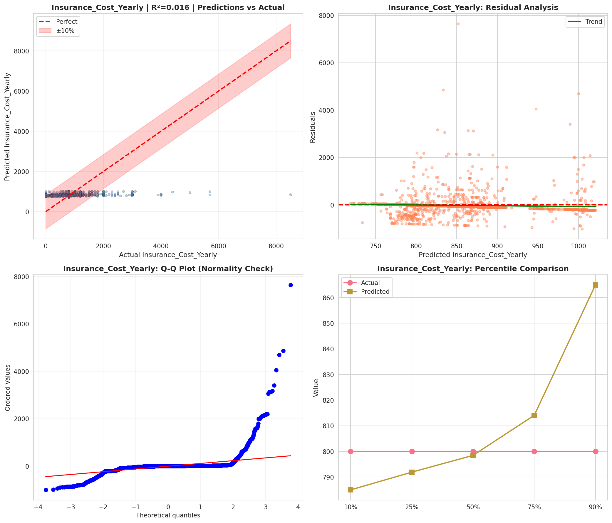
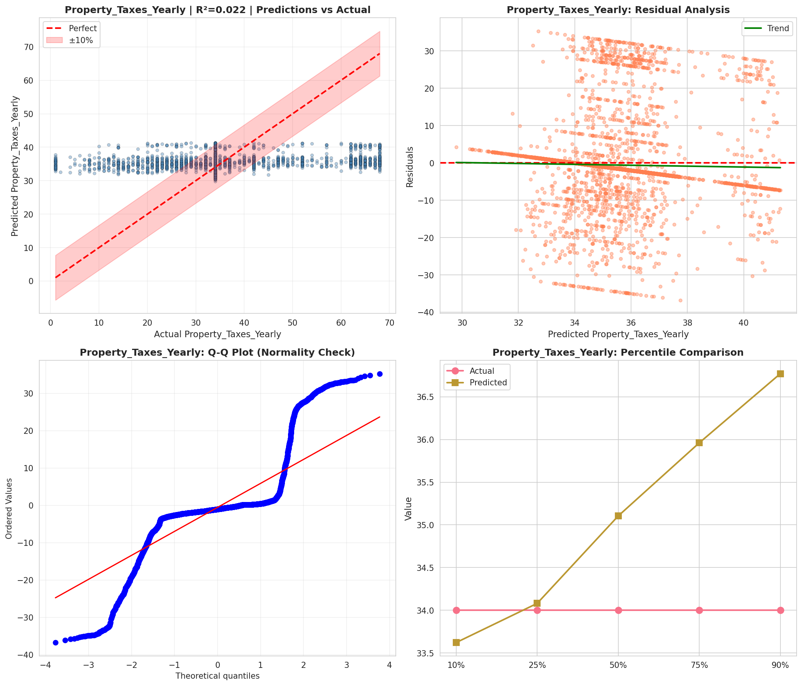
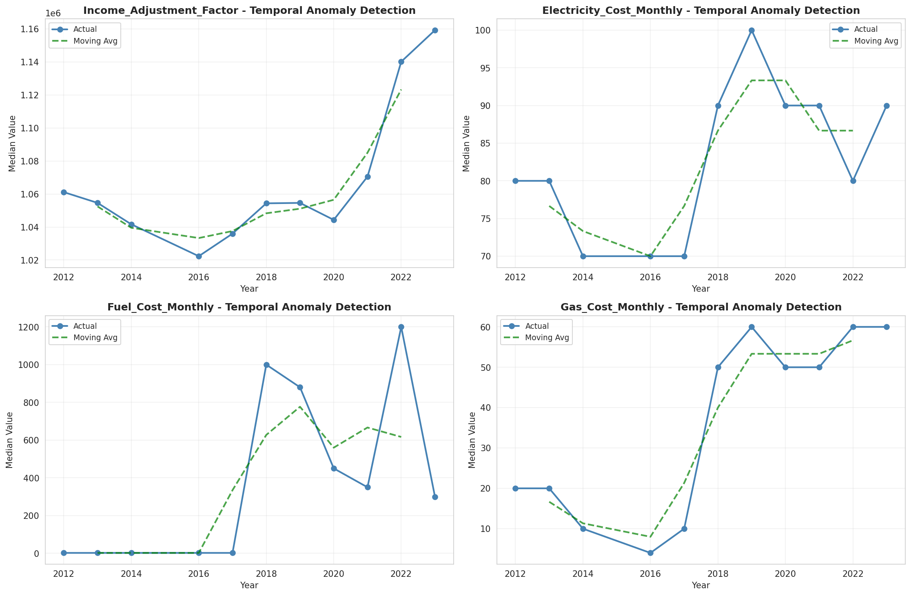
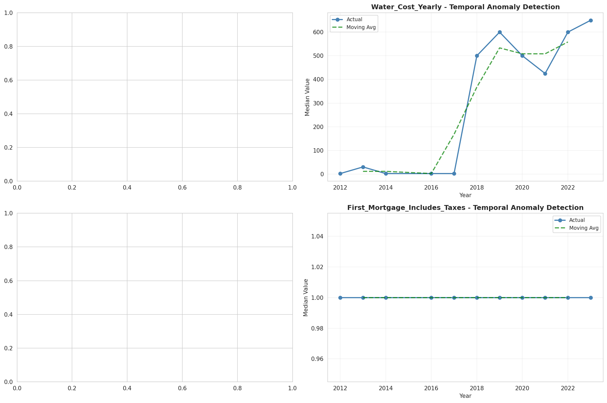
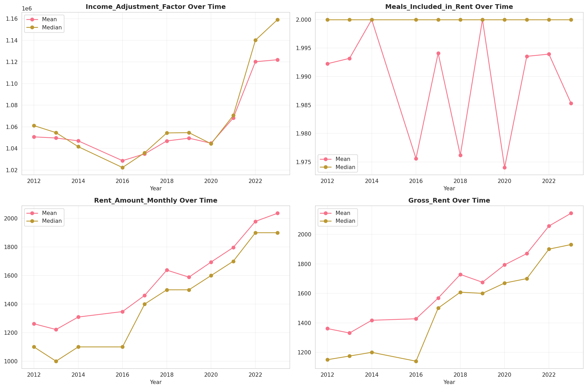
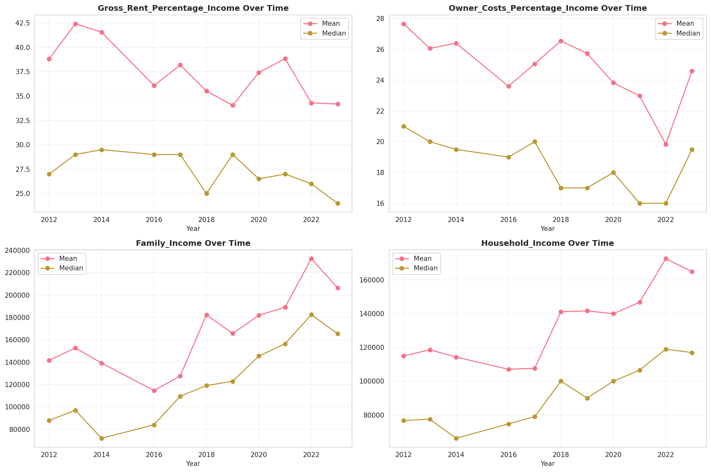
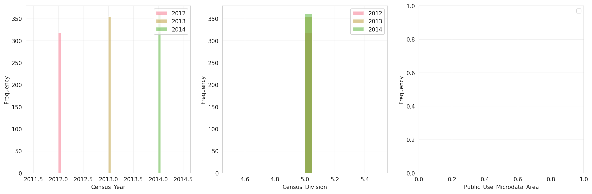
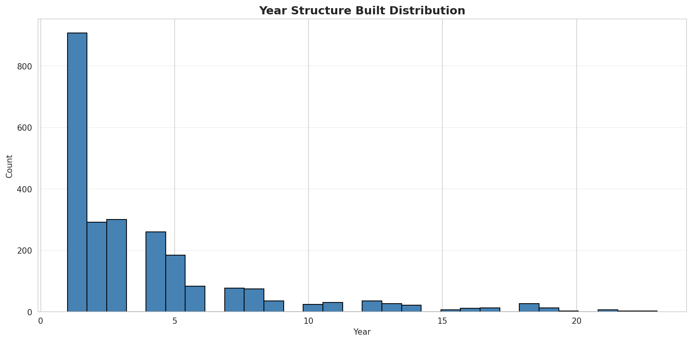
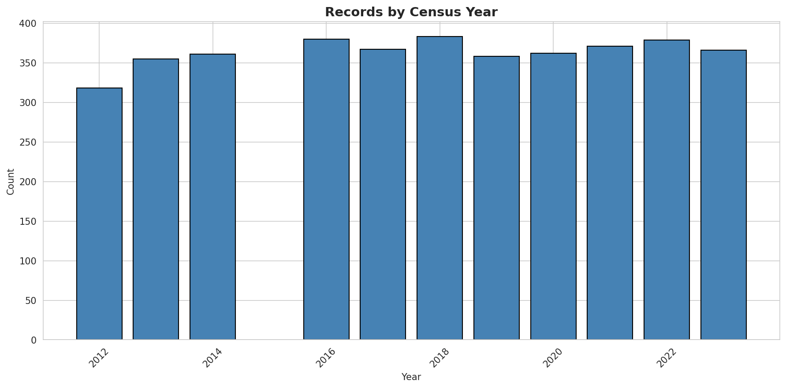
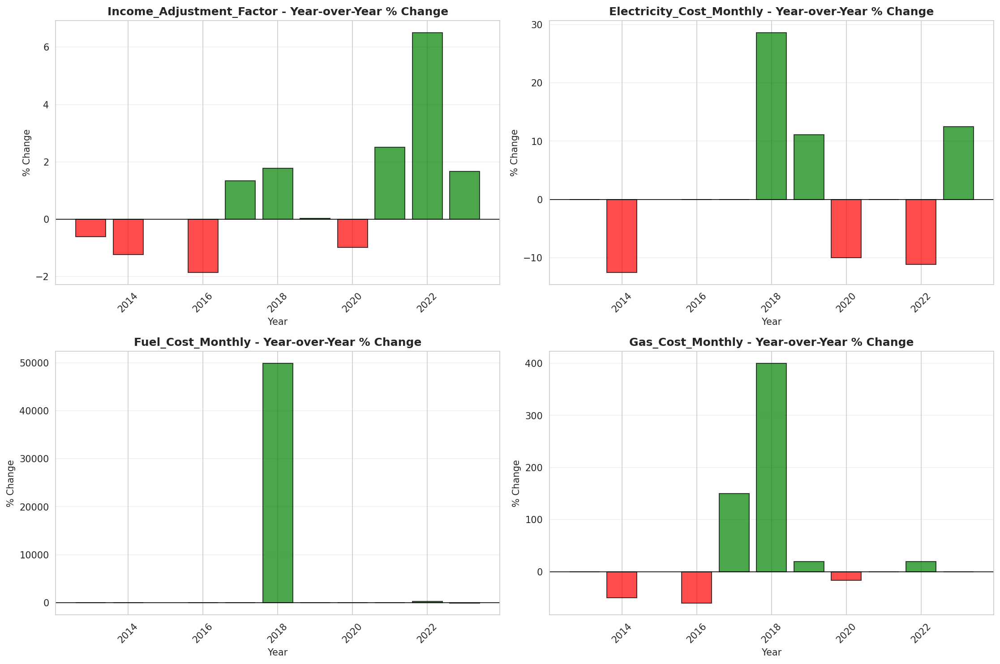
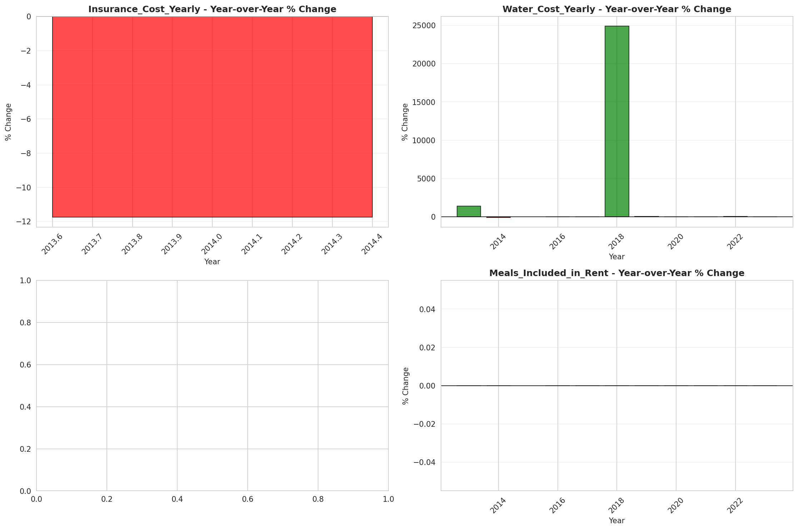
