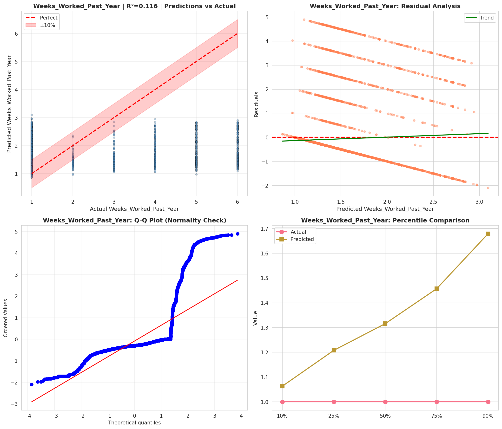
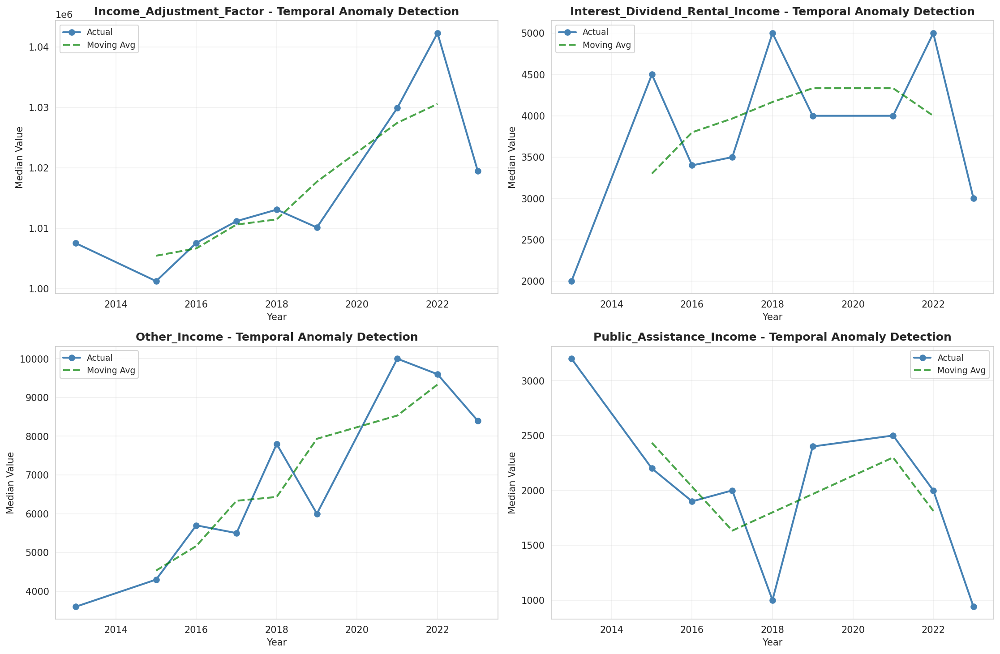
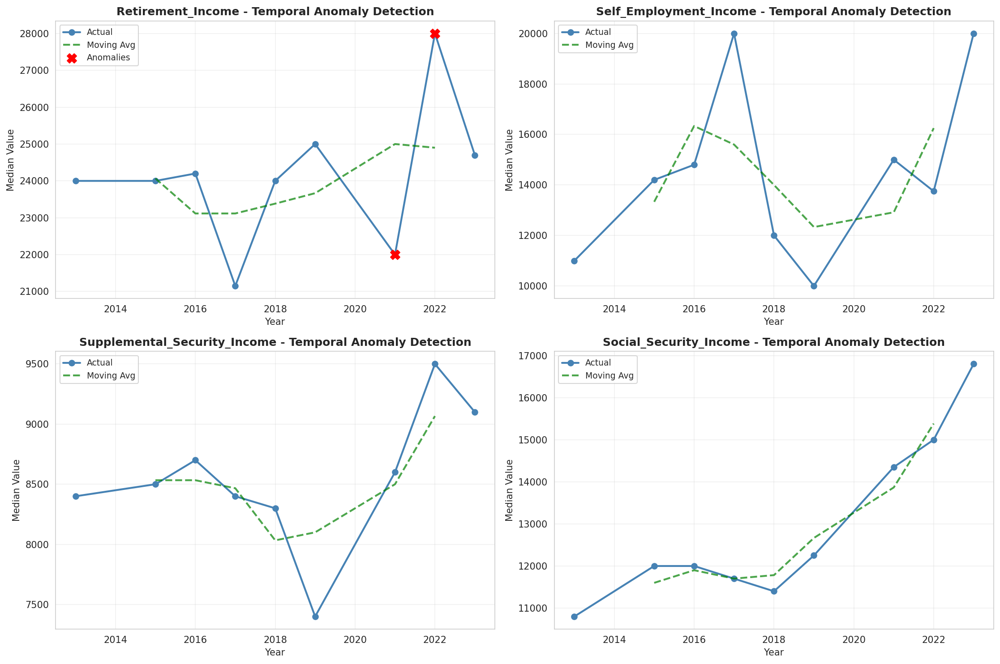
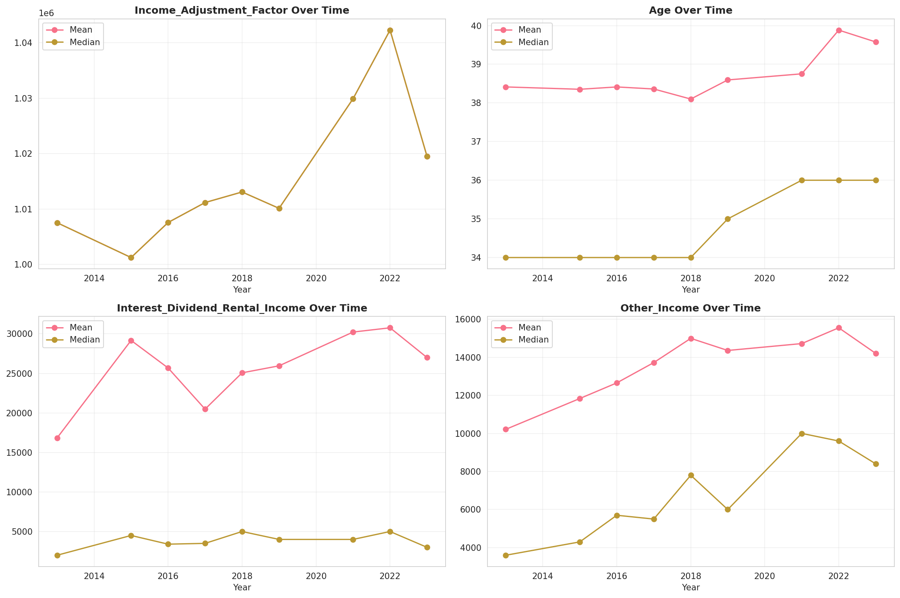
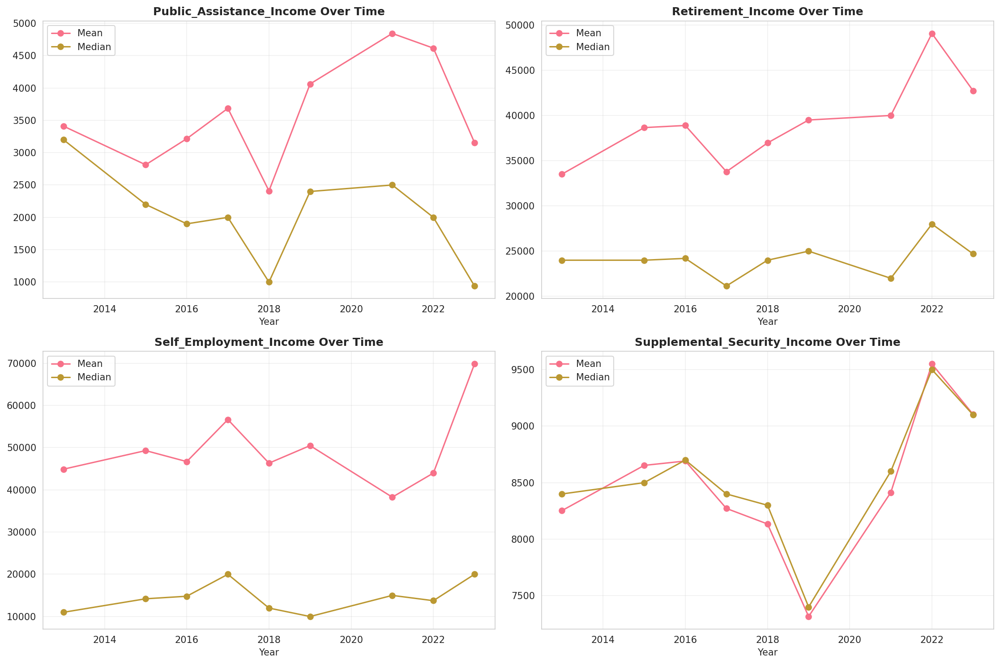
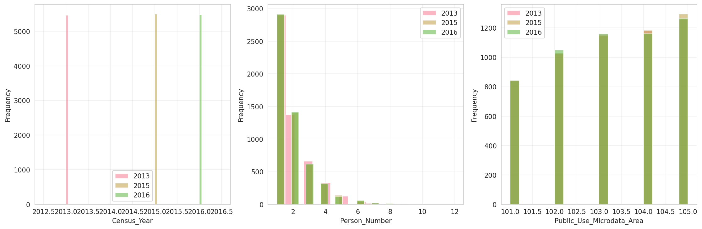
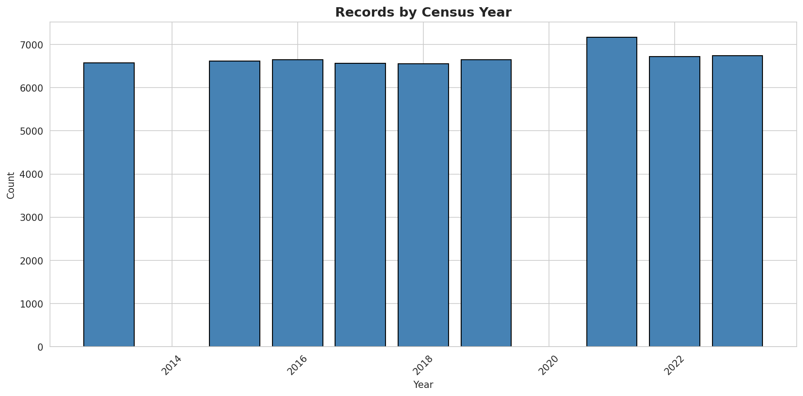
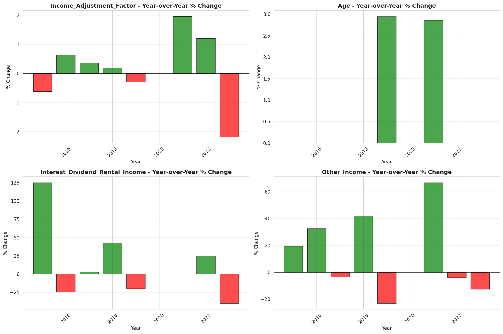
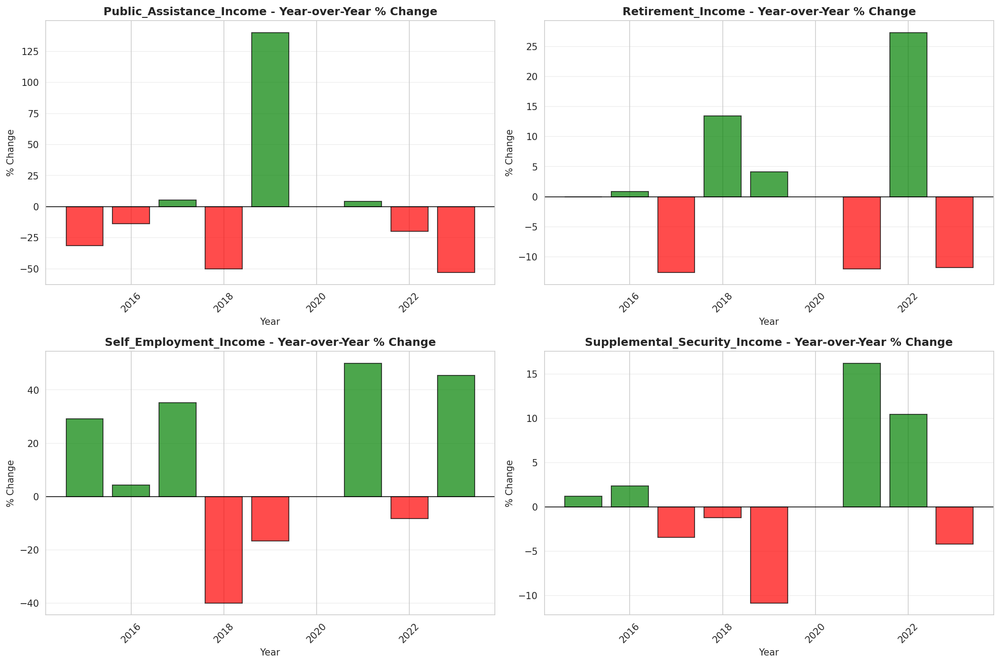

# Temporal Analysis

## Year Distribution

- 2013: 6,572 records

- 2015: 6,610 records

- 2016: 6,646 records

- 2017: 6,565 records

- 2018: 6,549 records

- 2019: 6,647 records

- 2021: 7,162 records

- 2022: 6,718 records

- 2023: 6,735 records

## Temporal Trends

- Census_Year: {np.int64(2013): {'mean': 2013.0, 'median': 2013.0, 'std': 0.0}, np.int64(2015): {'mean': 2015.0, 'median': 2015.0, 'std': 0.0}, np.int64(2016): {'mean': 2016.0, 'median': 2016.0, 'std': 0.0}, np.int64(2017): {'mean': 2017.0, 'median': 2017.0, 'std': 0.0}, np.int64(2018): {'mean': 2018.0, 'median': 2018.0, 'std': 0.0}, np.int64(2019): {'mean': 2019.0, 'median': 2019.0, 'std': 0.0}, np.int64(2021): {'mean': 2021.0, 'median': 2021.0, 'std': 0.0}, np.int64(2022): {'mean': 2022.0, 'median': 2022.0, 'std': 0.0}, np.int64(2023): {'mean': 2023.0, 'median': 2023.0, 'std': 0.0}}

- Person_Number: {np.int64(2013): {'mean': 1.846774193548387, 'median': 1.0, 'std': 1.185355629026896}, np.int64(2015): {'mean': 1.8603630862329803, 'median': 1.0, 'std': 1.235606501654923}, np.int64(2016): {'mean': 1.840956966596449, 'median': 1.0, 'std': 1.186003876019869}, np.int64(2017): {'mean': 1.8415841584158417, 'median': 1.0, 'std': 1.2380598238679719}, np.int64(2018): {'mean': 1.8233318063826538, 'median': 1.0, 'std': 1.179039275560705}, np.int64(2019): {'mean': 1.8227771927185197, 'median': 1.0, 'std': 1.1930200964358968}, np.int64(2021): {'mean': 1.777436470259704, 'median': 1.0, 'std': 1.1130256530727352}, np.int64(2022): {'mean': 1.73518904435844, 'median': 1.0, 'std': 1.095003425156158}, np.int64(2023): {'mean': 1.7538233110616184, 'median': 1.0, 'std': 1.1270520702845914}}

- Public_Use_Microdata_Area: {np.int64(2013): {'mean': 103.18457090687767, 'median': 103.0, 'std': 1.3850252180584843}, np.int64(2015): {'mean': 103.18305597579425, 'median': 103.0, 'std': 1.3899593620632098}, np.int64(2016): {'mean': 103.17258501354198, 'median': 103.0, 'std': 1.3837194284443035}, np.int64(2017): {'mean': 103.14516374714394, 'median': 103.0, 'std': 1.3905673214440164}, np.int64(2018): {'mean': 103.12475187051459, 'median': 103.0, 'std': 1.4082116774678273}, np.int64(2019): {'mean': 103.17301038062284, 'median': 103.0, 'std': 1.4066946926085375}, np.int64(2021): {'mean': 103.09899469421948, 'median': 103.0, 'std': 1.404444277563433}, np.int64(2022): {'mean': 103.42959214051801, 'median': 103.0, 'std': 1.7190746548562175}, np.int64(2023): {'mean': 103.33021529324425, 'median': 103.0, 'std': 1.7712853846413044}}

- State_Code: {np.int64(2013): {'mean': 11.0, 'median': 11.0, 'std': 0.0}, np.int64(2015): {'mean': 11.0, 'median': 11.0, 'std': 0.0}, np.int64(2016): {'mean': 11.0, 'median': 11.0, 'std': 0.0}, np.int64(2017): {'mean': 11.0, 'median': 11.0, 'std': 0.0}, np.int64(2018): {'mean': 11.0, 'median': 11.0, 'std': 0.0}, np.int64(2019): {'mean': 11.0, 'median': 11.0, 'std': 0.0}, np.int64(2021): {'mean': 11.0, 'median': 11.0, 'std': 0.0}, np.int64(2022): {'mean': 11.0, 'median': 11.0, 'std': 0.0}, np.int64(2023): {'mean': None, 'median': None, 'std': None}}

- Income_Adjustment_Factor: {np.int64(2013): {'mean': 1007549.0, 'median': 1007549.0, 'std': 0.0}, np.int64(2015): {'mean': 1001264.0, 'median': 1001264.0, 'std': 0.0}, np.int64(2016): {'mean': 1007588.0, 'median': 1007588.0, 'std': 0.0}, np.int64(2017): {'mean': 1011189.0, 'median': 1011189.0, 'std': 0.0}, np.int64(2018): {'mean': 1013097.0, 'median': 1013097.0, 'std': 0.0}, np.int64(2019): {'mean': 1010145.0, 'median': 1010145.0, 'std': 0.0}, np.int64(2021): {'mean': 1029928.0, 'median': 1029928.0, 'std': 0.0}, np.int64(2022): {'mean': 1042311.0, 'median': 1042311.0, 'std': 0.0}, np.int64(2023): {'mean': 1019518.0, 'median': 1019518.0, 'std': 0.0}}

- Person_Weight: {np.int64(2013): {'mean': 98.36412051125988, 'median': 79.0, 'std': 68.22683845273731}, np.int64(2015): {'mean': 101.69863842662632, 'median': 82.0, 'std': 70.93518326690274}, np.int64(2016): {'mean': 102.49322900993079, 'median': 81.0, 'std': 73.47294583072882}, np.int64(2017): {'mean': 105.7078446306169, 'median': 85.0, 'std': 77.25850468203527}, np.int64(2018): {'mean': 107.2614139563292, 'median': 85.0, 'std': 79.12682502091488}, np.int64(2019): {'mean': 106.17556792537987, 'median': 83.0, 'std': 81.8405157234342}, np.int64(2021): {'mean': 93.5562691985479, 'median': 71.0, 'std': 72.45590063719784}, np.int64(2022): {'mean': 100.00044656147664, 'median': 74.0, 'std': 86.55717336322435}, np.int64(2023): {'mean': 100.81247216035635, 'median': 70.0, 'std': 102.49200723097282}}

- Age: {np.int64(2013): {'mean': 38.41342057212416, 'median': 34.0, 'std': 21.771721875624458}, np.int64(2015): {'mean': 38.35249621785174, 'median': 34.0, 'std': 21.845731709404024}, np.int64(2016): {'mean': 38.41333132711405, 'median': 34.0, 'std': 21.776971907715698}, np.int64(2017): {'mean': 38.36009139375476, 'median': 34.0, 'std': 21.33986444986828}, np.int64(2018): {'mean': 38.099862574438845, 'median': 34.0, 'std': 21.18279624438815}, np.int64(2019): {'mean': 38.59440349029637, 'median': 35.0, 'std': 21.23776846754073}, np.int64(2021): {'mean': 38.752303825747, 'median': 36.0, 'std': 21.431283219421733}, np.int64(2022): {'mean': 39.8831497469485, 'median': 36.0, 'std': 21.46591161362828}, np.int64(2023): {'mean': 39.57668893838159, 'median': 36.0, 'std': 21.741502305663605}}

- Citizenship_Status: {np.int64(2013): {'mean': 1.4742848447961048, 'median': 1.0, 'std': 1.2018003880402686}, np.int64(2015): {'mean': 1.4608169440242058, 'median': 1.0, 'std': 1.1832000731698247}, np.int64(2016): {'mean': 1.4568161300030094, 'median': 1.0, 'std': 1.1692772831250648}, np.int64(2017): {'mean': 1.5305407463823306, 'median': 1.0, 'std': 1.2540687334557505}, np.int64(2018): {'mean': 1.4779355626813253, 'median': 1.0, 'std': 1.185334798324265}, np.int64(2019): {'mean': 1.4397472544004815, 'median': 1.0, 'std': 1.145035915934224}, np.int64(2021): {'mean': 1.5029321418598156, 'median': 1.0, 'std': 1.2057233541463097}, np.int64(2022): {'mean': 1.5190532896695446, 'median': 1.0, 'std': 1.2232586179577756}, np.int64(2023): {'mean': 1.5389755011135857, 'median': 1.0, 'std': 1.2471243388557247}}

- Class_of_Worker: {np.int64(2013): {'mean': 2.5353513035793194, 'median': 2.0, 'std': 1.9750847966369924}, np.int64(2015): {'mean': 2.5407194879717503, 'median': 2.0, 'std': 1.9481829001573756}, np.int64(2016): {'mean': 2.568863586599518, 'median': 2.0, 'std': 1.9849462150318076}, np.int64(2017): {'mean': 2.5455140798952196, 'median': 2.0, 'std': 1.9727267230043364}, np.int64(2018): {'mean': 2.5531190121354057, 'median': 2.0, 'std': 1.9998401132040364}, np.int64(2019): {'mean': 2.551024720050708, 'median': 2.0, 'std': 1.947695580636916}, np.int64(2021): {'mean': 2.613049477626651, 'median': 2.0, 'std': 1.9639603873580092}, np.int64(2022): {'mean': 2.576876267748479, 'median': 2.0, 'std': 1.9258607745553291}, np.int64(2023): {'mean': 2.602506162695152, 'median': 2.0, 'std': 1.94900307606494}}

- English_Speaking_Ability: {np.int64(2013): {'mean': 1.3907563025210083, 'median': 1.0, 'std': 0.7211967617443679}, np.int64(2015): {'mean': 1.3761854583772393, 'median': 1.0, 'std': 0.7031437778434534}, np.int64(2016): {'mean': 1.3907692307692308, 'median': 1.0, 'std': 0.7194260510954461}, np.int64(2017): {'mean': 1.424361493123772, 'median': 1.0, 'std': 0.7543227343661615}, np.int64(2018): {'mean': 1.3604166666666666, 'median': 1.0, 'std': 0.684473899134042}, np.int64(2019): {'mean': 1.3654042988741044, 'median': 1.0, 'std': 0.7218420945959589}, np.int64(2021): {'mean': 1.345858240819812, 'median': 1.0, 'std': 0.6960986596666622}, np.int64(2022): {'mean': 1.2854757929883138, 'median': 1.0, 'std': 0.626861324482532}, np.int64(2023): {'mean': 1.3200992555831266, 'median': 1.0, 'std': 0.6851799131023771}}

- Fertility_Status: {np.int64(2013): {'mean': 1.9545222278998466, 'median': 2.0, 'std': 0.20840282474942892}, np.int64(2015): {'mean': 1.9528112449799198, 'median': 2.0, 'std': 0.21209563651732594}, np.int64(2016): {'mean': 1.9574046557701832, 'median': 2.0, 'std': 0.20199304317892672}, np.int64(2017): {'mean': 1.9594132029339852, 'median': 2.0, 'std': 0.19737922790996287}, np.int64(2018): {'mean': 1.957593688362919, 'median': 2.0, 'std': 0.2015640094997365}, np.int64(2019): {'mean': 1.9628915662650603, 'median': 2.0, 'std': 0.1890730708859356}, np.int64(2021): {'mean': 1.964589870013447, 'median': 2.0, 'std': 0.18485553653089923}, np.int64(2022): {'mean': 1.9628736740597879, 'median': 2.0, 'std': 0.18911691203347847}, np.int64(2023): {'mean': 1.9656673114119922, 'median': 2.0, 'std': 0.18212631531883738}}

- Marital_Status: {np.int64(2013): {'mean': 3.6675289105295192, 'median': 5.0, 'std': 1.7456840998991867}, np.int64(2015): {'mean': 3.6027231467473526, 'median': 5.0, 'std': 1.7715984877788238}, np.int64(2016): {'mean': 3.6072825759855554, 'median': 5.0, 'std': 1.77623334458206}, np.int64(2017): {'mean': 3.605331302361005, 'median': 5.0, 'std': 1.7831227445647844}, np.int64(2018): {'mean': 3.6506336845319898, 'median': 5.0, 'std': 1.776477413920592}, np.int64(2019): {'mean': 3.559801414171807, 'median': 5.0, 'std': 1.8102085767843268}, np.int64(2021): {'mean': 3.6003909522479756, 'median': 5.0, 'std': 1.7896004764440796}, np.int64(2022): {'mean': 3.5541827924977674, 'median': 5.0, 'std': 1.803168991118168}, np.int64(2023): {'mean': 3.510913140311804, 'median': 5.0, 'std': 1.8261599315672985}}

- Mobility_Status: {np.int64(2013): {'mean': 1.3960899014778325, 'median': 1.0, 'std': 0.7869079512307458}, np.int64(2015): {'mean': 1.4353157572041693, 'median': 1.0, 'std': 0.8167816024129025}, np.int64(2016): {'mean': 1.4122927126122014, 'median': 1.0, 'std': 0.7971997885497747}, np.int64(2017): {'mean': 1.3977866584691054, 'median': 1.0, 'std': 0.7887105159194336}, np.int64(2018): {'mean': 1.4023769100169778, 'median': 1.0, 'std': 0.7914723204387168}, np.int64(2019): {'mean': 1.4168817367542128, 'median': 1.0, 'std': 0.8013466830017286}, np.int64(2021): {'mean': 1.4206886819079876, 'median': 1.0, 'std': 0.8047957033295551}, np.int64(2022): {'mean': 1.446417820590006, 'median': 1.0, 'std': 0.8197403369975543}, np.int64(2023): {'mean': 1.4036298185090745, 'median': 1.0, 'std': 0.788915117401776}}

- Military_Service: {np.int64(2013): {'mean': 3.8549699327909446, 'median': 4.0, 'std': 0.5335175345269566}, np.int64(2015): {'mean': 3.8531555555555554, 'median': 4.0, 'std': 0.5334984926823375}, np.int64(2016): {'mean': 3.8655876143560874, 'median': 4.0, 'std': 0.516370905535027}, np.int64(2017): {'mean': 3.8687224669603526, 'median': 4.0, 'std': 0.5092029749533584}, np.int64(2018): {'mean': 3.8861630780091776, 'median': 4.0, 'std': 0.4715329988323256}, np.int64(2019): {'mean': 3.8779049601109956, 'median': 4.0, 'std': 0.49068426511797825}, np.int64(2021): {'mean': 3.8958602846054333, 'median': 4.0, 'std': 0.4670847962669641}, np.int64(2022): {'mean': 3.8839014512318597, 'median': 4.0, 'std': 0.4906078548581611}, np.int64(2023): {'mean': 3.893815834182807, 'median': 4.0, 'std': 0.469391930511093}}

- Travel_Time_To_Work_Minutes: {np.int64(2013): {'mean': 30.194488438390877, 'median': 30.0, 'std': 19.089697087318076}, np.int64(2015): {'mean': 29.716840536512667, 'median': 30.0, 'std': 18.776936513048483}, np.int64(2016): {'mean': 30.96637905385302, 'median': 30.0, 'std': 19.947559231534107}, np.int64(2017): {'mean': 30.88617176128093, 'median': 30.0, 'std': 19.131328102249714}, np.int64(2018): {'mean': 30.209542972118424, 'median': 30.0, 'std': 18.274252817448776}, np.int64(2019): {'mean': 30.938912133891215, 'median': 30.0, 'std': 19.18899498129359}, np.int64(2021): {'mean': 26.877886095433556, 'median': 20.0, 'std': 19.470940502995948}, np.int64(2022): {'mean': 29.07271996785858, 'median': 30.0, 'std': 18.825500058326956}, np.int64(2023): {'mean': 29.091040462427745, 'median': 30.0, 'std': 17.153688438179735}}

- Vehicle_Occupancy: {np.int64(2013): {'mean': 1.2206952303961196, 'median': 1.0, 'std': 0.667525863468647}, np.int64(2015): {'mean': 1.1851851851851851, 'median': 1.0, 'std': 0.5983227874568698}, np.int64(2016): {'mean': 1.2034632034632036, 'median': 1.0, 'std': 0.5576014755219384}, np.int64(2017): {'mean': 1.2257412398921832, 'median': 1.0, 'std': 0.8026325047730247}, np.int64(2018): {'mean': 1.2026554856743537, 'median': 1.0, 'std': 0.669636113037687}, np.int64(2019): {'mean': 1.226628895184136, 'median': 1.0, 'std': 0.6485434553087921}, np.int64(2021): {'mean': 1.132093023255814, 'median': 1.0, 'std': 0.4062395000192138}, np.int64(2022): {'mean': 1.1934931506849316, 'median': 1.0, 'std': 0.6766205580374233}, np.int64(2023): {'mean': 1.2001654259718775, 'median': 1.0, 'std': 0.6181311069076091}}

- Transportation_To_Work: {np.int64(2013): {'mean': 4.137827264520012, 'median': 2.0, 'std': 3.6450289073414965}, np.int64(2015): {'mean': 4.109029913335197, 'median': 2.0, 'std': 3.7071744915493205}, np.int64(2016): {'mean': 4.285396383866481, 'median': 2.0, 'std': 3.7711076632513882}, np.int64(2017): {'mean': 4.314794816414687, 'median': 2.0, 'std': 3.814173619641935}, np.int64(2018): {'mean': 4.345655693470048, 'median': 4.0, 'std': 3.781559598598217}, np.int64(2019): {'mean': None, 'median': None, 'std': None}, np.int64(2021): {'mean': None, 'median': None, 'std': None}, np.int64(2022): {'mean': None, 'median': None, 'std': None}, np.int64(2023): {'mean': None, 'median': None, 'std': None}}

- Language_Other_Than_English: {np.int64(2013): {'mean': 1.847923322683706, 'median': 2.0, 'std': 0.3591238835880487}, np.int64(2015): {'mean': 1.8486201946083904, 'median': 2.0, 'std': 0.3584472835977368}, np.int64(2016): {'mean': 1.8448934139357303, 'median': 2.0, 'std': 0.36203505910815154}, np.int64(2017): {'mean': 1.8374321303098051, 'median': 2.0, 'std': 0.36900040852854255}, np.int64(2018): {'mean': 1.8463508322663251, 'median': 2.0, 'std': 0.3606409815266904}, np.int64(2019): {'mean': 1.8458017676767677, 'median': 2.0, 'std': 0.36116717024816614}, np.int64(2021): {'mean': 1.8277434539570463, 'median': 2.0, 'std': 0.3776310446877695}, np.int64(2022): {'mean': 1.8137727343385668, 'median': 2.0, 'std': 0.3893202185171859}, np.int64(2023): {'mean': 1.812150403977626, 'median': 2.0, 'std': 0.3906223668385932}}

- Grandparents_Living_With_Grandchildren: {np.int64(2013): {'mean': 1.969961489088575, 'median': 2.0, 'std': 0.17071520466884837}, np.int64(2015): {'mean': 1.9701005025125629, 'median': 2.0, 'std': 0.17033146270575814}, np.int64(2016): {'mean': 1.9756340129288912, 'median': 2.0, 'std': 0.15420180860943586}, np.int64(2017): {'mean': 1.9767325494120591, 'median': 2.0, 'std': 0.15077056588528068}, np.int64(2018): {'mean': 1.9803625377643506, 'median': 2.0, 'std': 0.13876844172738206}, np.int64(2019): {'mean': 1.9763285024154589, 'median': 2.0, 'std': 0.15204190718562252}, np.int64(2021): {'mean': 1.9792723263506065, 'median': 2.0, 'std': 0.1424868907805985}, np.int64(2022): {'mean': 1.9834139599170697, 'median': 2.0, 'std': 0.1277290164339223}, np.int64(2023): {'mean': 1.9827870785192172, 'median': 2.0, 'std': 0.1300793088377738}}

- Months_Responsible_For_Grandchildren: {np.int64(2013): {'mean': 4.2, 'median': 5.0, 'std': 1.140175425099138}, np.int64(2015): {'mean': 3.8421052631578947, 'median': 4.0, 'std': 1.2926920095594878}, np.int64(2016): {'mean': 3.4285714285714284, 'median': 3.0, 'std': 1.5352989471574772}, np.int64(2017): {'mean': 3.6363636363636362, 'median': 3.0, 'std': 1.194209514129059}, np.int64(2018): {'mean': 4.095238095238095, 'median': 5.0, 'std': 1.2208506012105622}, np.int64(2019): {'mean': 4.32258064516129, 'median': 5.0, 'std': 1.194071376263958}, np.int64(2021): {'mean': 3.909090909090909, 'median': 4.5, 'std': 1.3059968245090434}, np.int64(2022): {'mean': 3.5625, 'median': 4.0, 'std': 1.3647344063956182}, np.int64(2023): {'mean': 3.75, 'median': 4.0, 'std': 1.4218787326754636}}

- Grandparents_Responsible_For_Grandchildren: {np.int64(2013): {'mean': 1.6153846153846154, 'median': 2.0, 'std': 0.4885967564883421}, np.int64(2015): {'mean': 1.5210084033613445, 'median': 2.0, 'std': 0.5016707593394722}, np.int64(2016): {'mean': 1.7857142857142858, 'median': 2.0, 'std': 0.4124355619772684}, np.int64(2017): {'mean': 1.6451612903225807, 'median': 2.0, 'std': 0.4810577405983832}, np.int64(2018): {'mean': 1.7307692307692308, 'median': 2.0, 'std': 0.44643106892408296}, np.int64(2019): {'mean': 1.683673469387755, 'median': 2.0, 'std': 0.4674329716656823}, np.int64(2021): {'mean': 1.7659574468085106, 'median': 2.0, 'std': 0.42566916112034114}, np.int64(2022): {'mean': 1.7777777777777777, 'median': 2.0, 'std': 0.4186572170818395}, np.int64(2023): {'mean': 1.6712328767123288, 'median': 2.0, 'std': 0.47301616487964016}}

- Interest_Dividend_Rental_Income: {np.int64(2013): {'mean': 16835.125260960333, 'median': 2000.0, 'std': 40502.42780226528}, np.int64(2015): {'mean': 29168.685110663984, 'median': 4500.0, 'std': 81675.27888120554}, np.int64(2016): {'mean': 25684.313585291115, 'median': 3400.0, 'std': 73923.83088792098}, np.int64(2017): {'mean': 20477.34813319879, 'median': 3500.0, 'std': 50234.64068676293}, np.int64(2018): {'mean': 25069.155080213903, 'median': 5000.0, 'std': 53158.75587280871}, np.int64(2019): {'mean': 25954.51781059948, 'median': 4000.0, 'std': 71288.46808936326}, np.int64(2021): {'mean': 30225.468895078924, 'median': 4000.0, 'std': 89062.92273982089}, np.int64(2022): {'mean': 30763.30283623056, 'median': 5000.0, 'std': 82596.3348405945}, np.int64(2023): {'mean': 26996.975060337893, 'median': 3000.0, 'std': 69980.10975191937}}

- Military_Service_Period_1: {np.int64(2013): {'mean': 0.2810810810810811, 'median': 0.0, 'std': 0.45013568435467477}, np.int64(2015): {'mean': 0.2598870056497175, 'median': 0.0, 'std': 0.4391931679274867}, np.int64(2016): {'mean': 0.31378299120234604, 'median': 0.0, 'std': 0.46471123209931325}, np.int64(2017): {'mean': 0.34146341463414637, 'median': 0.0, 'std': 0.4749250626900829}, np.int64(2018): {'mean': 0.4, 'median': 0.0, 'std': 0.4907751165796441}, np.int64(2019): {'mean': 0.4364820846905538, 'median': 0.0, 'std': 0.4967587776524186}, np.int64(2021): {'mean': 0.5075757575757576, 'median': 1.0, 'std': 0.5008921640617222}, np.int64(2022): {'mean': 0.44816053511705684, 'median': 0.0, 'std': 0.49813911527688753}, np.int64(2023): {'mean': 0.49809885931558934, 'median': 0.0, 'std': 0.5009496684719987}}

- Military_Service_Period_2: {np.int64(2013): {'mean': 0.1945945945945946, 'median': 0.0, 'std': 0.39642436129158976}, np.int64(2015): {'mean': 0.2033898305084746, 'median': 0.0, 'std': 0.40308980927813154}, np.int64(2016): {'mean': 0.20527859237536658, 'median': 0.0, 'std': 0.4044985949721992}, np.int64(2017): {'mean': 0.1524390243902439, 'median': 0.0, 'std': 0.35999511031545}, np.int64(2018): {'mean': 0.23214285714285715, 'median': 0.0, 'std': 0.4229556112084805}, np.int64(2019): {'mean': 0.20521172638436483, 'median': 0.0, 'std': 0.404515611394718}, np.int64(2021): {'mean': 0.20075757575757575, 'median': 0.0, 'std': 0.40132787428738625}, np.int64(2022): {'mean': 0.22408026755852842, 'median': 0.0, 'std': 0.41767421745274197}, np.int64(2023): {'mean': 0.19391634980988592, 'median': 0.0, 'std': 0.3961179279245848}}

- Military_Service_Period_5: {np.int64(2013): {'mean': 0.27297297297297296, 'median': 0.0, 'std': 0.44609030199405014}, np.int64(2015): {'mean': 0.2514124293785311, 'median': 0.0, 'std': 0.4344391512770843}, np.int64(2016): {'mean': 0.2961876832844575, 'median': 0.0, 'std': 0.45724573129667256}, np.int64(2017): {'mean': 0.2774390243902439, 'median': 0.0, 'std': 0.4484190672564756}, np.int64(2018): {'mean': 0.21428571428571427, 'median': 0.0, 'std': 0.4110605966668471}, np.int64(2019): {'mean': 0.2280130293159609, 'median': 0.0, 'std': 0.4202360368020188}, np.int64(2021): {'mean': 0.22727272727272727, 'median': 0.0, 'std': 0.4198661581221567}, np.int64(2022): {'mean': 0.26755852842809363, 'median': 0.0, 'std': 0.44342821625639006}, np.int64(2023): {'mean': 0.24334600760456274, 'median': 0.0, 'std': 0.42992035261520084}}

- Military_Service_Period_8: {np.int64(2013): {'mean': 0.10810810810810811, 'median': 0.0, 'std': 0.31093736974117486}, np.int64(2015): {'mean': 0.1271186440677966, 'median': 0.0, 'std': 0.33357731823893827}, np.int64(2016): {'mean': 0.07331378299120235, 'median': 0.0, 'std': 0.26103389133811244}, np.int64(2017): {'mean': 0.09451219512195122, 'median': 0.0, 'std': 0.2929869477174391}, np.int64(2018): {'mean': 0.08571428571428572, 'median': 0.0, 'std': 0.28044292375979685}, np.int64(2019): {'mean': 0.0749185667752443, 'median': 0.0, 'std': 0.2636897127094434}, np.int64(2021): {'mean': 0.056818181818181816, 'median': 0.0, 'std': 0.2319345593486572}, np.int64(2022): {'mean': 0.026755852842809364, 'median': 0.0, 'std': 0.16163959804214617}, np.int64(2023): {'mean': 0.015209125475285171, 'median': 0.0, 'std': 0.12261718959258297}}

- Military_Service_Period_9: {np.int64(2013): {'mean': 0.01891891891891892, 'median': 0.0, 'std': 0.13642321730940934}, np.int64(2015): {'mean': 0.02824858757062147, 'median': 0.0, 'std': 0.16591675208990117}, np.int64(2016): {'mean': 0.011730205278592375, 'median': 0.0, 'std': 0.10782719261536337}, np.int64(2017): {'mean': 0.018292682926829267, 'median': 0.0, 'std': 0.1342124371841915}, np.int64(2018): {'mean': 0.02142857142857143, 'median': 0.0, 'std': 0.1450673872757019}, np.int64(2019): {'mean': 0.02280130293159609, 'median': 0.0, 'std': 0.14951327218808472}, np.int64(2021): {'mean': None, 'median': None, 'std': None}, np.int64(2022): {'mean': None, 'median': None, 'std': None}, np.int64(2023): {'mean': None, 'median': None, 'std': None}}

- Military_Service_Period_10: {np.int64(2013): {'mean': 0.07837837837837838, 'median': 0.0, 'std': 0.26913001979139894}, np.int64(2015): {'mean': 0.059322033898305086, 'median': 0.0, 'std': 0.2365608001079065}, np.int64(2016): {'mean': 0.02932551319648094, 'median': 0.0, 'std': 0.16896523196169144}, np.int64(2017): {'mean': 0.03048780487804878, 'median': 0.0, 'std': 0.17218795248890872}, np.int64(2018): {'mean': 0.039285714285714285, 'median': 0.0, 'std': 0.19462174639013677}, np.int64(2019): {'mean': 0.029315960912052116, 'median': 0.0, 'std': 0.16896606334234762}, np.int64(2021): {'mean': 0.01893939393939394, 'median': 0.0, 'std': 0.1365699173337373}, np.int64(2022): {'mean': 0.010033444816053512, 'median': 0.0, 'std': 0.09983038745913526}, np.int64(2023): {'mean': 0.0038022813688212928, 'median': 0.0, 'std': 0.06166264159782074}}

- Military_Service_Period_11: {np.int64(2013): {'mean': 0.008108108108108109, 'median': 0.0, 'std': 0.08980067774075154}, np.int64(2015): {'mean': 0.002824858757062147, 'median': 0.0, 'std': 0.053149400345273407}, np.int64(2016): {'mean': 0.0, 'median': 0.0, 'std': 0.0}, np.int64(2017): {'mean': 0.009146341463414634, 'median': 0.0, 'std': 0.09534359200823563}, np.int64(2018): {'mean': 0.0, 'median': 0.0, 'std': 0.0}, np.int64(2019): {'mean': 0.0, 'median': 0.0, 'std': 0.0}, np.int64(2021): {'mean': None, 'median': None, 'std': None}, np.int64(2022): {'mean': None, 'median': None, 'std': None}, np.int64(2023): {'mean': None, 'median': None, 'std': None}}

- Temporary_Absence_From_Work: {np.int64(2013): {'mean': 2.626863054532702, 'median': 3.0, 'std': 0.510493976775117}, np.int64(2015): {'mean': 2.6696633174687117, 'median': 3.0, 'std': 0.4962747432193877}, np.int64(2016): {'mean': 2.669867318435754, 'median': 3.0, 'std': 0.49207427014022326}, np.int64(2017): {'mean': 2.7025703794369647, 'median': 3.0, 'std': 0.4817538596535162}, np.int64(2018): {'mean': 2.6870509900122657, 'median': 3.0, 'std': 0.4851588261630519}, np.int64(2019): {'mean': 2.707434880110402, 'median': 3.0, 'std': 0.47392491329487246}, np.int64(2021): {'mean': 2.699630759351421, 'median': 3.0, 'std': 0.4786731605810446}, np.int64(2022): {'mean': 2.7010550996483, 'median': 3.0, 'std': 0.48033059401112865}, np.int64(2023): {'mean': 2.7035413153456997, 'median': 3.0, 'std': 0.4766119876161036}}

- Available_For_Work: {np.int64(2013): {'mean': 4.627564439768543, 'median': 5.0, 'std': 1.1015555206510843}, np.int64(2015): {'mean': 4.719548739643927, 'median': 5.0, 'std': 0.9606872360870936}, np.int64(2016): {'mean': 4.717004189944134, 'median': 5.0, 'std': 0.9620223256802763}, np.int64(2017): {'mean': 4.75327854520021, 'median': 5.0, 'std': 0.9094040601072826}, np.int64(2018): {'mean': 4.709479586472753, 'median': 5.0, 'std': 0.986974150155933}, np.int64(2019): {'mean': 4.754528204243575, 'median': 5.0, 'std': 0.8923891864442195}, np.int64(2021): {'mean': 4.74538449189276, 'median': 5.0, 'std': 0.9223357545286194}, np.int64(2022): {'mean': 4.796851448668565, 'median': 5.0, 'std': 0.8218723575264956}, np.int64(2023): {'mean': 4.7883642495784144, 'median': 5.0, 'std': 0.837173635074653}}

- On_Layoff_From_Work: {np.int64(2013): {'mean': 2.612309310889006, 'median': 3.0, 'std': 0.5028532909258404}, np.int64(2015): {'mean': 2.658910629296668, 'median': 3.0, 'std': 0.48948608446464553}, np.int64(2016): {'mean': 2.65625, 'median': 3.0, 'std': 0.48984024898970413}, np.int64(2017): {'mean': 2.6896310543801363, 'median': 3.0, 'std': 0.47975726955652176}, np.int64(2018): {'mean': 2.6765375854214124, 'median': 3.0, 'std': 0.47967603250508445}, np.int64(2019): {'mean': 2.701569777471106, 'median': 3.0, 'std': 0.46693938257052603}, np.int64(2021): {'mean': 2.6810081875100336, 'median': 3.0, 'std': 0.4912796505246874}, np.int64(2022): {'mean': 2.696700720147379, 'median': 3.0, 'std': 0.4708816002333736}, np.int64(2023): {'mean': 2.6984822934232713, 'median': 3.0, 'std': 0.46733154785257613}}

- Looking_For_Work: {np.int64(2013): {'mean': 2.5700508504295985, 'median': 3.0, 'std': 0.6191389067397518}, np.int64(2015): {'mean': 2.6359950643398555, 'median': 3.0, 'std': 0.5728534791544023}, np.int64(2016): {'mean': 2.627444134078212, 'median': 3.0, 'std': 0.576134069972746}, np.int64(2017): {'mean': 2.666375240426648, 'median': 3.0, 'std': 0.5606677860733}, np.int64(2018): {'mean': 2.64587348869809, 'median': 3.0, 'std': 0.5760298874542835}, np.int64(2019): {'mean': 2.6698292220113853, 'median': 3.0, 'std': 0.551998241370841}, np.int64(2021): {'mean': 2.6464922138384974, 'median': 3.0, 'std': 0.5781250915912203}, np.int64(2022): {'mean': 2.671579299949757, 'median': 3.0, 'std': 0.544343073291819}, np.int64(2023): {'mean': 2.6686340640809445, 'median': 3.0, 'std': 0.5482097907616857}}

- Informed_Of_Recall: {np.int64(2013): {'mean': 2.942135718043135, 'median': 3.0, 'std': 0.2508857640444781}, np.int64(2015): {'mean': 2.948704389212057, 'median': 3.0, 'std': 0.2368074034813237}, np.int64(2016): {'mean': 2.9467527932960893, 'median': 3.0, 'std': 0.23592178549138718}, np.int64(2017): {'mean': 2.95593635250918, 'median': 3.0, 'std': 0.22005753040922363}, np.int64(2018): {'mean': 2.959348168915367, 'median': 3.0, 'std': 0.20703063807408026}, np.int64(2019): {'mean': 2.9508366396411936, 'median': 3.0, 'std': 0.22788236673170387}, np.int64(2021): {'mean': 2.9598651468935624, 'median': 3.0, 'std': 0.2157741684418259}, np.int64(2022): {'mean': 2.963322726511472, 'median': 3.0, 'std': 0.19838868381791278}, np.int64(2023): {'mean': 2.966441821247892, 'median': 3.0, 'std': 0.19101151172055267}}

- Other_Income: {np.int64(2013): {'mean': 10214.414414414414, 'median': 3600.0, 'std': 16381.703319466522}, np.int64(2015): {'mean': 11831.97628458498, 'median': 4300.0, 'std': 16541.479057573226}, np.int64(2016): {'mean': 12652.738589211618, 'median': 5700.0, 'std': 19128.824584089834}, np.int64(2017): {'mean': 13719.583333333334, 'median': 5500.0, 'std': 19925.459542131426}, np.int64(2018): {'mean': 14992.6328125, 'median': 7800.0, 'std': 19269.60512446686}, np.int64(2019): {'mean': 14356.492890995261, 'median': 6000.0, 'std': 19725.198412272577}, np.int64(2021): {'mean': 14718.16384180791, 'median': 10000.0, 'std': 16683.51737922947}, np.int64(2022): {'mean': 15547.069124423962, 'median': 9600.0, 'std': 17824.128277469306}, np.int64(2023): {'mean': 14202.135416666666, 'median': 8400.0, 'std': 15264.738894959995}}

- Public_Assistance_Income: {np.int64(2013): {'mean': 3409.756097560976, 'median': 3200.0, 'std': 2716.6829652108127}, np.int64(2015): {'mean': 2812.4742268041236, 'median': 2200.0, 'std': 2575.8934659194124}, np.int64(2016): {'mean': 3215.5652173913045, 'median': 1900.0, 'std': 4077.583389770703}, np.int64(2017): {'mean': 3684.5263157894738, 'median': 2000.0, 'std': 5808.776699213131}, np.int64(2018): {'mean': 2408.865979381443, 'median': 1000.0, 'std': 3100.4293641797485}, np.int64(2019): {'mean': 4061.2328767123286, 'median': 2400.0, 'std': 3787.18084288061}, np.int64(2021): {'mean': 4841.95652173913, 'median': 2500.0, 'std': 5332.951533296549}, np.int64(2022): {'mean': 4614.639175257732, 'median': 2000.0, 'std': 6548.101834032971}, np.int64(2023): {'mean': 3155.3030303030305, 'median': 940.0, 'std': 4648.335755017627}}

- Retirement_Income: {np.int64(2013): {'mean': 33520.96214511041, 'median': 24000.0, 'std': 36022.38287222534}, np.int64(2015): {'mean': 38667.52921535893, 'median': 24000.0, 'std': 57417.55840288368}, np.int64(2016): {'mean': 38901.28161888701, 'median': 24200.0, 'std': 53560.214687220636}, np.int64(2017): {'mean': 33791.555118110235, 'median': 21150.0, 'std': 36107.09871556746}, np.int64(2018): {'mean': 36969.05587668593, 'median': 24000.0, 'std': 39321.067786707325}, np.int64(2019): {'mean': 39507.97752808989, 'median': 25000.0, 'std': 44397.657819009335}, np.int64(2021): {'mean': 40008.089887640446, 'median': 22000.0, 'std': 50520.11124799202}, np.int64(2022): {'mean': 49081.79453836151, 'median': 28000.0, 'std': 69596.5941055908}, np.int64(2023): {'mean': 42751.89834815756, 'median': 24700.0, 'std': 51643.84893355247}}

- Self_Employment_Income: {np.int64(2013): {'mean': 44891.75157232704, 'median': 11000.0, 'std': 105966.51176668049}, np.int64(2015): {'mean': 49295.718309859156, 'median': 14200.0, 'std': 100978.02234020844}, np.int64(2016): {'mean': 46690.345911949684, 'median': 14800.0, 'std': 95022.24169092359}, np.int64(2017): {'mean': 56648.934911242606, 'median': 20000.0, 'std': 111692.17710634615}, np.int64(2018): {'mean': 46324.48548812665, 'median': 12000.0, 'std': 99303.09555449653}, np.int64(2019): {'mean': 50479.10447761194, 'median': 10000.0, 'std': 105025.32977527479}, np.int64(2021): {'mean': 38265.127478753544, 'median': 15000.0, 'std': 63950.19740665526}, np.int64(2022): {'mean': 43977.42211055276, 'median': 13750.0, 'std': 83886.0178636786}, np.int64(2023): {'mean': 69810.18041237113, 'median': 20000.0, 'std': 134131.13210862927}}

- Supplemental_Security_Income: {np.int64(2013): {'mean': 8252.916666666666, 'median': 8400.0, 'std': 3920.815579027148}, np.int64(2015): {'mean': 8652.79187817259, 'median': 8500.0, 'std': 4076.79531283959}, np.int64(2016): {'mean': 8691.329479768787, 'median': 8700.0, 'std': 4269.603893601114}, np.int64(2017): {'mean': 8271.676300578034, 'median': 8400.0, 'std': 4160.24318237167}, np.int64(2018): {'mean': 8134.463276836158, 'median': 8300.0, 'std': 4125.199564050935}, np.int64(2019): {'mean': 7315.909090909091, 'median': 7400.0, 'std': 3305.6276296603683}, np.int64(2021): {'mean': 8413.559322033898, 'median': 8600.0, 'std': 3513.211637411698}, np.int64(2022): {'mean': 9549.69696969697, 'median': 9500.0, 'std': 6084.6230041584895}, np.int64(2023): {'mean': 9104.848484848484, 'median': 9100.0, 'std': 5034.863890676181}}

- Social_Security_Income: {np.int64(2013): {'mean': 12320.582278481013, 'median': 10800.0, 'std': 8288.372842443261}, np.int64(2015): {'mean': 13227.188655980272, 'median': 12000.0, 'std': 8169.3094733748685}, np.int64(2016): {'mean': 13295.543859649122, 'median': 12000.0, 'std': 8766.431859282817}, np.int64(2017): {'mean': 13611.651612903226, 'median': 11700.0, 'std': 9339.542445034664}, np.int64(2018): {'mean': 13424.617486338799, 'median': 11400.0, 'std': 9700.706208718748}, np.int64(2019): {'mean': 14093.8772845953, 'median': 12250.0, 'std': 9489.283641665479}, np.int64(2021): {'mean': 16231.497584541063, 'median': 14350.0, 'std': 10556.386167976369}, np.int64(2022): {'mean': 17085.63593932322, 'median': 15000.0, 'std': 10884.218634266772}, np.int64(2023): {'mean': 19385.31865585168, 'median': 16800.0, 'std': 12852.869274727575}}

- Wage_Income: {np.int64(2013): {'mean': 66393.61815754339, 'median': 47000.0, 'std': 85341.72971117083}, np.int64(2015): {'mean': 72452.34151329243, 'median': 50000.0, 'std': 89036.02235038603}, np.int64(2016): {'mean': 72316.62462159435, 'median': 53000.0, 'std': 86901.48681761508}, np.int64(2017): {'mean': 76899.61548064918, 'median': 58000.0, 'std': 91711.50037972373}, np.int64(2018): {'mean': 80870.21165338646, 'median': 61000.0, 'std': 90739.93603898278}, np.int64(2019): {'mean': 85990.84260580124, 'median': 68000.0, 'std': 92360.85608610573}, np.int64(2021): {'mean': 94890.52324223312, 'median': 75000.0, 'std': 107262.33595398508}, np.int64(2022): {'mean': 100382.70557655954, 'median': 79000.0, 'std': 108626.73012779116}, np.int64(2023): {'mean': 108798.85038632639, 'median': 85000.0, 'std': 119843.84124290121}}

- Relationship_To_Householder: {np.int64(2013): {'mean': 3.967589774802191, 'median': 1.0, 'std': 5.7821257097748395}, np.int64(2015): {'mean': 3.7754916792738276, 'median': 1.0, 'std': 5.6682751580235164}, np.int64(2016): {'mean': 3.7991272946133012, 'median': 1.0, 'std': 5.708320790833516}, np.int64(2017): {'mean': 3.8220868240670223, 'median': 1.0, 'std': 5.7185165610608415}, np.int64(2018): {'mean': 3.6620858146281874, 'median': 1.0, 'std': 5.644221667032516}, np.int64(2019): {'mean': None, 'median': None, 'std': None}, np.int64(2021): {'mean': None, 'median': None, 'std': None}, np.int64(2022): {'mean': None, 'median': None, 'std': None}, np.int64(2023): {'mean': None, 'median': None, 'std': None}}

- School_Enrollment: {np.int64(2013): {'mean': 1.3766111285759195, 'median': 1.0, 'std': 0.6960304425627342}, np.int64(2015): {'mean': 1.3773496240601504, 'median': 1.0, 'std': 0.6957678238755913}, np.int64(2016): {'mean': 1.3795677188617634, 'median': 1.0, 'std': 0.6979725357729918}, np.int64(2017): {'mean': 1.3663739021329988, 'median': 1.0, 'std': 0.6876103051181504}, np.int64(2018): {'mean': 1.3622778039955954, 'median': 1.0, 'std': 0.6848024591249823}, np.int64(2019): {'mean': 1.345707656612529, 'median': 1.0, 'std': 0.6726102944575272}, np.int64(2021): {'mean': 1.360558916738692, 'median': 1.0, 'std': 0.6872709144229128}, np.int64(2022): {'mean': 1.349128706817487, 'median': 1.0, 'std': 0.6913745599070471}, np.int64(2023): {'mean': 1.3589430273407668, 'median': 1.0, 'std': 0.6950661843110661}}

- School_Grade_Attending: {np.int64(2013): {'mean': 11.34394506866417, 'median': 15.0, 'std': 5.160720227951161}, np.int64(2015): {'mean': 11.076827757125155, 'median': 15.0, 'std': 5.246583829838161}, np.int64(2016): {'mean': 11.036151960784315, 'median': 15.0, 'std': 5.377181563431055}, np.int64(2017): {'mean': 11.231357552581262, 'median': 15.0, 'std': 5.210432603299719}, np.int64(2018): {'mean': 11.231415643180348, 'median': 15.0, 'std': 5.164884993737908}, np.int64(2019): {'mean': 11.016622340425531, 'median': 15.0, 'std': 5.345083391435852}, np.int64(2021): {'mean': 11.252403846153847, 'median': 15.0, 'std': 5.249745312644604}, np.int64(2022): {'mean': 11.470628415300547, 'median': 15.0, 'std': 5.180721468048595}, np.int64(2023): {'mean': 11.283837056504598, 'median': 15.0, 'std': 5.172207526574637}}

- Educational_Attainment: {np.int64(2013): {'mean': 17.70009430996542, 'median': 19.0, 'std': 5.48138264686342}, np.int64(2015): {'mean': 17.819235588972433, 'median': 20.0, 'std': 5.614340619952351}, np.int64(2016): {'mean': 17.863784792411757, 'median': 20.0, 'std': 5.616331931674117}, np.int64(2017): {'mean': 17.948086574654955, 'median': 20.0, 'std': 5.565465174874319}, np.int64(2018): {'mean': 18.14723926380368, 'median': 21.0, 'std': 5.4929181486216825}, np.int64(2019): {'mean': 18.273163186388246, 'median': 21.0, 'std': 5.545485768547629}, np.int64(2021): {'mean': 18.244021895707288, 'median': 21.0, 'std': 5.658568360920694}, np.int64(2022): {'mean': 18.788443900947723, 'median': 21.0, 'std': 5.242407113484406}, np.int64(2023): {'mean': 18.605926378493965, 'median': 21.0, 'std': 5.5127451425305924}}

- Sex: {np.int64(2013): {'mean': 1.5342361533779671, 'median': 2.0, 'std': 0.4988644639424235}, np.int64(2015): {'mean': 1.5305597579425114, 'median': 2.0, 'std': 0.49910298245221235}, np.int64(2016): {'mean': 1.5398736081853746, 'median': 2.0, 'std': 0.4984450605426485}, np.int64(2017): {'mean': 1.5302361005331302, 'median': 2.0, 'std': 0.49912295627330405}, np.int64(2018): {'mean': 1.5225225225225225, 'median': 2.0, 'std': 0.49953061778784197}, np.int64(2019): {'mean': 1.534677298029186, 'median': 2.0, 'std': 0.49883356009267515}, np.int64(2021): {'mean': 1.5363027087405752, 'median': 2.0, 'std': 0.49871518988963204}, np.int64(2022): {'mean': 1.533343256921703, 'median': 2.0, 'std': 0.4989241231872431}, np.int64(2023): {'mean': 1.5339272457312547, 'median': 2.0, 'std': 0.4988846521009955}}

- Hours_Worked_Per_Week: {np.int64(2013): {'mean': 39.12877624167947, 'median': 40.0, 'std': 13.28767901904994}, np.int64(2015): {'mean': 39.738589211618255, 'median': 40.0, 'std': 13.300161435132914}, np.int64(2016): {'mean': 39.44136926438456, 'median': 40.0, 'std': 13.584066233423378}, np.int64(2017): {'mean': 39.90830532885261, 'median': 40.0, 'std': 12.79676741740206}, np.int64(2018): {'mean': 40.23529411764706, 'median': 40.0, 'std': 12.77622413497655}, np.int64(2019): {'mean': 39.963866513233604, 'median': 40.0, 'std': 13.551716361929385}, np.int64(2021): {'mean': 39.106397306397305, 'median': 40.0, 'std': 13.223405652275327}, np.int64(2022): {'mean': 39.41021566401816, 'median': 40.0, 'std': 12.916061545361991}, np.int64(2023): {'mean': 39.13986486486486, 'median': 40.0, 'std': 12.904453704647507}}

- When_Last_Worked: {np.int64(2013): {'mean': 1.533052779238997, 'median': 1.0, 'std': 0.8276101372653424}, np.int64(2015): {'mean': 1.485986250661026, 'median': 1.0, 'std': 0.8162593032630827}, np.int64(2016): {'mean': 1.4928421787709498, 'median': 1.0, 'std': 0.8209440333373008}, np.int64(2017): {'mean': 1.477705892638573, 'median': 1.0, 'std': 0.8135899207623226}, np.int64(2018): {'mean': 1.4508498335377606, 'median': 1.0, 'std': 0.7879840884453603}, np.int64(2019): {'mean': 1.4424702432292564, 'median': 1.0, 'std': 0.7942234322082337}, np.int64(2021): {'mean': 1.4763204366672018, 'median': 1.0, 'std': 0.7953539285207715}, np.int64(2022): {'mean': 1.440629710266287, 'median': 1.0, 'std': 0.776724129867112}, np.int64(2023): {'mean': 1.4377740303541315, 'median': 1.0, 'std': 0.7869249679896544}}

- Weeks_Worked_Past_Year: {np.int64(2013): {'mean': 1.9800307219662059, 'median': 1.0, 'std': 1.7297903772931609}, np.int64(2015): {'mean': 1.9260434464242129, 'median': 1.0, 'std': 1.6714069996453607}, np.int64(2016): {'mean': 1.9036173828599174, 'median': 1.0, 'std': 1.6573043248910049}, np.int64(2017): {'mean': 1.826212193951032, 'median': 1.0, 'std': 1.580051029341477}, np.int64(2018): {'mean': 1.81019290307216, 'median': 1.0, 'std': 1.5888579818402535}}

- Year_Of_Entry: {np.int64(2013): {'mean': 1994.7761033369213, 'median': 2000.0, 'std': 15.790090925564261}, np.int64(2015): {'mean': 1995.9747807017543, 'median': 1999.0, 'std': 15.468548166804107}, np.int64(2016): {'mean': 1996.7210300429185, 'median': 2000.0, 'std': 15.807565518343122}, np.int64(2017): {'mean': 1998.309591642925, 'median': 2002.0, 'std': 15.43707554717072}, np.int64(2018): {'mean': 1997.888429752066, 'median': 2001.0, 'std': 16.64732263747218}, np.int64(2019): {'mean': 1999.7707641196014, 'median': 2003.0, 'std': 16.303372121799146}, np.int64(2021): {'mean': 2000.3528368794325, 'median': 2003.0, 'std': 15.988559877558684}, np.int64(2022): {'mean': 2000.2664199814985, 'median': 2004.0, 'std': 17.603484268044905}, np.int64(2023): {'mean': 2002.2753363228699, 'median': 2005.0, 'std': 16.534455395156847}}

- Ancestry_Recode: {np.int64(2013): {'mean': 1.7160681679853926, 'median': 1.0, 'std': 1.0561890992627327}, np.int64(2015): {'mean': 1.7228441754916792, 'median': 1.0, 'std': 1.0613108748677431}, np.int64(2016): {'mean': 1.8025880228708997, 'median': 1.0, 'std': 1.0696578277531246}, np.int64(2017): {'mean': 1.7821782178217822, 'median': 1.0, 'std': 1.0912450645490572}, np.int64(2018): {'mean': 1.8085203847915712, 'median': 1.0, 'std': 1.0907147232867425}, np.int64(2019): {'mean': 1.81510455844742, 'median': 1.0, 'std': 1.0881798311488016}, np.int64(2021): {'mean': 1.865121474448478, 'median': 1.0, 'std': 1.096878774008523}, np.int64(2022): {'mean': 1.829711223578446, 'median': 1.0, 'std': 1.0826490072849568}, np.int64(2023): {'mean': 1.8773570898292502, 'median': 2.0, 'std': 1.0905469670253696}}

- First_Ancestry_Code: {np.int64(2013): {'mean': 602.8918137553256, 'median': 902.0, 'std': 396.65301662250823}, np.int64(2015): {'mean': 593.3452344931922, 'median': 902.0, 'std': 399.14229122583924}, np.int64(2016): {'mean': 596.1269936804092, 'median': 902.0, 'std': 401.065796954104}, np.int64(2017): {'mean': 583.6149276466108, 'median': 902.0, 'std': 399.35660178537563}, np.int64(2018): {'mean': 579.4524354863338, 'median': 902.0, 'std': 403.65923577265664}, np.int64(2019): {'mean': 566.2540995938017, 'median': 795.0, 'std': 405.84644845929296}, np.int64(2021): {'mean': 558.5318346830494, 'median': 720.0, 'std': 405.7730991840908}, np.int64(2022): {'mean': 547.5337898183983, 'median': 706.0, 'std': 408.9190997094019}, np.int64(2023): {'mean': 534.2813659985152, 'median': 615.0, 'std': 410.5590033718579}}

- Second_Ancestry_Code: {np.int64(2013): {'mean': 831.4563298843578, 'median': 999.0, 'std': 350.6129768192099}, np.int64(2015): {'mean': 828.0378214826021, 'median': 999.0, 'std': 355.17880743949644}, np.int64(2016): {'mean': 791.9154378573578, 'median': 999.0, 'std': 380.5176404770652}, np.int64(2017): {'mean': 802.0105102817975, 'median': 999.0, 'std': 371.89043394808516}, np.int64(2018): {'mean': 787.8347839364789, 'median': 999.0, 'std': 381.6976048936969}, np.int64(2019): {'mean': 777.365879344065, 'median': 999.0, 'std': 388.0018820245916}, np.int64(2021): {'mean': 768.1083496230103, 'median': 999.0, 'std': 392.1916198893726}, np.int64(2022): {'mean': 765.484668055969, 'median': 999.0, 'std': 394.5272674532797}, np.int64(2023): {'mean': 751.5404602821084, 'median': 999.0, 'std': 402.8342339797096}}

- Decade_Of_Entry: {np.int64(2013): {'mean': 5.8945102260495155, 'median': 7.0, 'std': 1.4472260930444991}, np.int64(2015): {'mean': 5.934210526315789, 'median': 6.0, 'std': 1.3401069110401256}, np.int64(2016): {'mean': 5.98175965665236, 'median': 7.0, 'std': 1.3323577359656953}, np.int64(2017): {'mean': 6.382716049382716, 'median': 7.0, 'std': 1.5783605081317786}, np.int64(2018): {'mean': 6.309917355371901, 'median': 7.0, 'std': 1.6457223524687044}, np.int64(2019): {'mean': 6.489479512735326, 'median': 7.0, 'std': 1.599490653187833}, np.int64(2021): {'mean': 6.5203900709219855, 'median': 7.0, 'std': 1.5093706205724866}, np.int64(2022): {'mean': 6.471785383903793, 'median': 7.0, 'std': 1.66705258149011}, np.int64(2023): {'mean': 6.642152466367713, 'median': 7.0, 'std': 1.5070804864147307}}

- Drives_Alone_To_Work: {np.int64(2013): {'mean': 1.2166531932093776, 'median': 1.0, 'std': 0.6270190327987001}, np.int64(2015): {'mean': 1.1795946890286513, 'median': 1.0, 'std': 0.5437786500254699}, np.int64(2016): {'mean': 1.2034632034632036, 'median': 1.0, 'std': 0.5576014755219384}, np.int64(2017): {'mean': 1.2061994609164421, 'median': 1.0, 'std': 0.6290897023856933}, np.int64(2018): {'mean': 1.1956673654786862, 'median': 1.0, 'std': 0.5990745413219606}, np.int64(2019): {'mean': 1.2195467422096318, 'median': 1.0, 'std': 0.5758797601652424}, np.int64(2021): {'mean': 1.132093023255814, 'median': 1.0, 'std': 0.4062395000192138}, np.int64(2022): {'mean': 1.1840753424657535, 'median': 1.0, 'std': 0.5806238713732427}, np.int64(2023): {'mean': 1.196029776674938, 'median': 1.0, 'std': 0.5743848876081399}}

- Employment_Status_Parents: {np.int64(2013): {'mean': 4.089988751406074, 'median': 3.0, 'std': 2.8511892768923848}, np.int64(2015): {'mean': 4.141025641025641, 'median': 5.0, 'std': 2.942112561853228}, np.int64(2016): {'mean': 3.935344827586207, 'median': 2.0, 'std': 2.909294092039403}, np.int64(2017): {'mean': 3.529276693455798, 'median': 2.0, 'std': 2.823343465963894}, np.int64(2018): {'mean': 3.5631399317406145, 'median': 2.0, 'std': 2.891399101275531}, np.int64(2019): {'mean': 3.5159817351598175, 'median': 2.0, 'std': 2.8507194592057963}, np.int64(2021): {'mean': 3.424116424116424, 'median': 2.0, 'std': 2.845110177830793}, np.int64(2022): {'mean': 3.0838627700127064, 'median': 1.0, 'std': 2.7648431382464254}, np.int64(2023): {'mean': 2.8221957040572794, 'median': 1.0, 'std': 2.6033034706809404}}

- Employment_Status_Recode: {np.int64(2013): {'mean': 2.878835700508504, 'median': 1.0, 'std': 2.3253922729107965}, np.int64(2015): {'mean': 2.691344967389388, 'median': 1.0, 'std': 2.286687458789522}, np.int64(2016): {'mean': 2.7129888268156424, 'median': 1.0, 'std': 2.2973536309154006}, np.int64(2017): {'mean': 2.622486448679839, 'median': 1.0, 'std': 2.269524831225415}, np.int64(2018): {'mean': 2.5952339232521466, 'median': 1.0, 'std': 2.255149124771658}, np.int64(2019): {'mean': 2.5375194065896154, 'median': 1.0, 'std': 2.2438893915004536}, np.int64(2021): {'mean': 2.6811687269224596, 'median': 1.0, 'std': 2.279125381959149}, np.int64(2022): {'mean': 2.595712610952939, 'median': 1.0, 'std': 2.2690123679927225}, np.int64(2023): {'mean': 2.584822934232715, 'median': 1.0, 'std': 2.2664415513005105}}

- Hispanic_Origin: {np.int64(2013): {'mean': 1.6346622032866707, 'median': 1.0, 'std': 2.955403933577593}, np.int64(2015): {'mean': 1.693948562783661, 'median': 1.0, 'std': 3.0586108462911707}, np.int64(2016): {'mean': 1.6629551609990971, 'median': 1.0, 'std': 2.9409288306337755}, np.int64(2017): {'mean': 1.8086824067022087, 'median': 1.0, 'std': 3.3496183194305984}, np.int64(2018): {'mean': 1.704382348450145, 'median': 1.0, 'std': 3.1221733514589975}, np.int64(2019): {'mean': 1.9310967353693396, 'median': 1.0, 'std': 3.664668978469582}, np.int64(2021): {'mean': 1.931443730801452, 'median': 1.0, 'std': 3.649979270683219}, np.int64(2022): {'mean': 1.8186960404882406, 'median': 1.0, 'std': 3.4636110384730245}, np.int64(2023): {'mean': 1.889086859688196, 'median': 1.0, 'std': 3.59214376999288}}

- Time_Of_Arrival_At_Work: {np.int64(2013): {'mean': 107.28729806778587, 'median': 101.0, 'std': 34.27831192081735}, np.int64(2015): {'mean': 107.59582712369598, 'median': 100.0, 'std': 35.87257122098569}, np.int64(2016): {'mean': 106.33650699196667, 'median': 100.0, 'std': 32.599145523566904}, np.int64(2017): {'mean': 105.96360989810772, 'median': 101.0, 'std': 32.67422924295566}, np.int64(2018): {'mean': 106.27105490083358, 'median': 100.0, 'std': 33.13456191905541}, np.int64(2019): {'mean': 106.18019525801952, 'median': 102.0, 'std': 30.00240686895988}, np.int64(2021): {'mean': 106.48640328373524, 'median': 100.0, 'std': 35.05661957198232}, np.int64(2022): {'mean': 105.7059059863399, 'median': 102.0, 'std': 29.989110585185973}, np.int64(2023): {'mean': 107.98518786127168, 'median': 103.0, 'std': 31.86780605527159}}

- Time_Of_Departure_For_Work: {np.int64(2013): {'mean': 58.8086791257523, 'median': 55.0, 'std': 23.385459895730914}, np.int64(2015): {'mean': 58.88643815201192, 'median': 55.0, 'std': 24.185242996756106}, np.int64(2016): {'mean': 58.2249330556382, 'median': 55.0, 'std': 22.42624121034075}, np.int64(2017): {'mean': 58.03406113537118, 'median': 55.0, 'std': 22.61008154931373}, np.int64(2018): {'mean': 58.096866915780396, 'median': 55.0, 'std': 22.692055261910472}, np.int64(2019): {'mean': 58.35648535564854, 'median': 55.0, 'std': 20.652838434745114}, np.int64(2021): {'mean': 58.751667521806056, 'median': 55.0, 'std': 24.205695859728397}, np.int64(2022): {'mean': 58.483326637203696, 'median': 55.0, 'std': 20.877413198360607}, np.int64(2023): {'mean': 60.29407514450867, 'median': 58.0, 'std': 21.482552092148964}}

- Language_Spoken_At_Home: {np.int64(2013): {'mean': 665.09243697479, 'median': 625.0, 'std': 69.45594391146984}, np.int64(2015): {'mean': 659.0579557428872, 'median': 625.0, 'std': 64.89717453064758}, np.int64(2016): {'mean': 1785.396923076923, 'median': 1200.0, 'std': 1229.1355242411269}, np.int64(2017): {'mean': 1822.1277013752456, 'median': 1200.0, 'std': 1343.4654060838238}, np.int64(2018): {'mean': 1865.4583333333333, 'median': 1200.0, 'std': 1418.8376002578507}, np.int64(2019): {'mean': 1769.4124872057318, 'median': 1200.0, 'std': 1214.4083894811786}, np.int64(2021): {'mean': 1822.534585824082, 'median': 1200.0, 'std': 1312.8171813244137}, np.int64(2022): {'mean': 1805.3756260434056, 'median': 1200.0, 'std': 1246.2089100249052}, np.int64(2023): {'mean': 1782.8089330024814, 'median': 1200.0, 'std': 1232.651140224312}}

- Migration_PUMA: {np.int64(2013): {'mean': 3428.7274085138165, 'median': 100.0, 'std': 11332.483166152913}, np.int64(2015): {'mean': 3228.1480218281035, 'median': 100.0, 'std': 10801.212446697322}, np.int64(2016): {'mean': 3660.777856135402, 'median': 100.0, 'std': 11540.741874940783}, np.int64(2017): {'mean': 3483.4136904761904, 'median': 100.0, 'std': 11095.688949847632}, np.int64(2018): {'mean': 3623.0611643330876, 'median': 100.0, 'std': 11801.426057331772}, np.int64(2019): {'mean': 3094.5370111731845, 'median': 100.0, 'std': 10438.692504561031}, np.int64(2021): {'mean': 3477.301935483871, 'median': 100.0, 'std': 11044.03351530068}, np.int64(2022): {'mean': 2805.970418006431, 'median': 100.0, 'std': 8411.324029369716}, np.int64(2023): {'mean': 2257.7033121916843, 'median': 100.0, 'std': 6277.8033430403775}}

- Migration_State_Or_Country: {np.int64(2013): {'mean': 36.950709484690066, 'median': 11.0, 'std': 71.63594822674781}, np.int64(2015): {'mean': 36.19713506139154, 'median': 11.0, 'std': 72.97834560292603}, np.int64(2016): {'mean': 41.571932299012694, 'median': 12.0, 'std': 75.55776677887455}, np.int64(2017): {'mean': 37.942708333333336, 'median': 11.0, 'std': 69.09507941173615}, np.int64(2018): {'mean': 40.214443625644805, 'median': 11.0, 'std': 76.6606349280386}, np.int64(2019): {'mean': 39.84706703910614, 'median': 11.0, 'std': 72.54410214408941}, np.int64(2021): {'mean': 39.13548387096774, 'median': 11.0, 'std': 72.37166263268324}, np.int64(2022): {'mean': 42.657877813504825, 'median': 12.0, 'std': 76.40235897880953}, np.int64(2023): {'mean': 46.06272022551092, 'median': 18.0, 'std': 80.23771724016393}}

- Place_Of_Birth: {np.int64(2013): {'mean': 58.65702982349361, 'median': 24.0, 'std': 98.2092661213588}, np.int64(2015): {'mean': 57.23827534039334, 'median': 24.0, 'std': 94.75052630877786}, np.int64(2016): {'mean': 58.842612097502254, 'median': 25.0, 'std': 96.38262675786292}, np.int64(2017): {'mean': 61.88255902513328, 'median': 24.0, 'std': 100.0231420914199}, np.int64(2018): {'mean': 59.32325545884868, 'median': 24.0, 'std': 96.91771338940416}, np.int64(2019): {'mean': 56.311719572739584, 'median': 24.0, 'std': 92.50045596673755}, np.int64(2021): {'mean': 62.11588941636414, 'median': 25.0, 'std': 100.43620531487231}, np.int64(2022): {'mean': 63.18353676689491, 'median': 25.0, 'std': 100.33649111085778}, np.int64(2023): {'mean': 63.479138827023014, 'median': 26.0, 'std': 99.53489314716329}}

- Place_Of_Work_PUMA: {np.int64(2013): {'mean': 3719.958471260909, 'median': 100.0, 'std': 13433.558317150582}, np.int64(2015): {'mean': 4068.9541515236233, 'median': 100.0, 'std': 13973.306139182194}, np.int64(2016): {'mean': 3932.704311543811, 'median': 100.0, 'std': 13767.705406025427}, np.int64(2017): {'mean': 3979.423596112311, 'median': 100.0, 'std': 14023.56994948528}, np.int64(2018): {'mean': 3749.0369670804102, 'median': 100.0, 'std': 13560.025397051193}, np.int64(2019): {'mean': 4072.0196129032256, 'median': 100.0, 'std': 14074.131629171947}, np.int64(2021): {'mean': 2141.246391491517, 'median': 100.0, 'std': 10268.553278996122}, np.int64(2022): {'mean': 919.3285097740543, 'median': 100.0, 'std': 5151.134927998585}, np.int64(2023): {'mean': 871.8486005089059, 'median': 100.0, 'std': 4668.09565522185}}

- Place_Of_Work_State_Or_Country: {np.int64(2013): {'mean': 18.054167920553716, 'median': 11.0, 'std': 22.068228241172545}, np.int64(2015): {'mean': 18.098126922001676, 'median': 11.0, 'std': 14.800165492854372}, np.int64(2016): {'mean': 17.82809457579972, 'median': 11.0, 'std': 19.268868806375412}, np.int64(2017): {'mean': 17.59719222462203, 'median': 11.0, 'std': 16.975169001357983}, np.int64(2018): {'mean': 17.557474365893146, 'median': 11.0, 'std': 18.445954597549655}, np.int64(2019): {'mean': 17.646193548387096, 'median': 11.0, 'std': 14.48252049667862}, np.int64(2021): {'mean': 14.278298303367942, 'median': 11.0, 'std': 9.778850881388635}, np.int64(2022): {'mean': 14.853008377760853, 'median': 11.0, 'std': 12.123139690693243}, np.int64(2023): {'mean': 15.808142493638677, 'median': 11.0, 'std': 15.3807644594685}}

- Married_Spouse_Present: {np.int64(2013): {'mean': 4.215403337969402, 'median': 6.0, 'std': 2.1645937382939957}, np.int64(2015): {'mean': 4.101694915254237, 'median': 6.0, 'std': 2.1992981928222184}, np.int64(2016): {'mean': 4.1084546084546085, 'median': 6.0, 'std': 2.209057590561526}, np.int64(2017): {'mean': 4.120833333333334, 'median': 6.0, 'std': 2.217231135597888}, np.int64(2018): {'mean': 4.175130434782608, 'median': 6.0, 'std': 2.2204415547117526}, np.int64(2019): {'mean': 4.042352537722908, 'median': 6.0, 'std': 2.2610667991780162}, np.int64(2021): {'mean': 4.102449888641425, 'median': 6.0, 'std': 2.237526985805092}, np.int64(2022): {'mean': 4.08061835106383, 'median': 6.0, 'std': 2.241670648952788}, np.int64(2023): {'mean': 3.9934640522875817, 'median': 6.0, 'std': 2.2744461110288756}}

- Nativity: {np.int64(2013): {'mean': 1.1235544735240415, 'median': 1.0, 'std': 0.32909762289662225}, np.int64(2015): {'mean': 1.122692889561271, 'median': 1.0, 'std': 0.32810917572464493}, np.int64(2016): {'mean': 1.1182666265422812, 'median': 1.0, 'std': 0.32294786659057717}, np.int64(2017): {'mean': 1.137090632140137, 'median': 1.0, 'std': 0.3439692032404367}, np.int64(2018): {'mean': 1.125057260650481, 'median': 1.0, 'std': 0.3308090874518921}, np.int64(2019): {'mean': 1.113735519783361, 'median': 1.0, 'std': 0.3175136505779036}, np.int64(2021): {'mean': 1.1323652611002513, 'median': 1.0, 'std': 0.3389111037966028}, np.int64(2022): {'mean': 1.1370943733253944, 'median': 1.0, 'std': 0.3439725542591524}, np.int64(2023): {'mean': 1.142687453600594, 'median': 1.0, 'std': 0.3497798019808313}}

- Nativity_Of_Parent: {np.int64(2013): {'mean': 4.2955832389580975, 'median': 4.0, 'std': 2.6440050648645537}, np.int64(2015): {'mean': 4.335470085470085, 'median': 5.0, 'std': 2.7024770560869427}, np.int64(2016): {'mean': 4.119612068965517, 'median': 4.0, 'std': 2.7412158540539164}, np.int64(2017): {'mean': 3.7267508610792195, 'median': 3.0, 'std': 2.664143929902766}, np.int64(2018): {'mean': 3.7610921501706485, 'median': 3.0, 'std': 2.750404681662496}, np.int64(2019): {'mean': 3.778538812785388, 'median': 3.5, 'std': 2.713150310128243}, np.int64(2021): {'mean': 3.625779625779626, 'median': 3.0, 'std': 2.7665462236471168}, np.int64(2022): {'mean': 3.4053367217280814, 'median': 3.0, 'std': 2.569565855195029}, np.int64(2023): {'mean': 3.139618138424821, 'median': 1.0, 'std': 2.573336462058262}}

- Own_Child: {np.int64(2013): {'mean': 0.12172854534388314, 'median': 0.0, 'std': 0.3269969062147313}, np.int64(2015): {'mean': 0.12450832072617246, 'median': 0.0, 'std': 0.33018554233235875}, np.int64(2016): {'mean': 0.12353295215167018, 'median': 0.0, 'std': 0.3290727210262558}, np.int64(2017): {'mean': 0.13059452237808952, 'median': 0.0, 'std': 0.33698450625790044}, np.int64(2018): {'mean': 0.13386746786846937, 'median': 0.0, 'std': 0.3405382881131473}, np.int64(2019): {'mean': 0.12824701846103578, 'median': 0.0, 'std': 0.3343919685714832}, np.int64(2021): {'mean': 0.13570875290472503, 'median': 0.0, 'std': 0.3425055631783188}, np.int64(2022): {'mean': 0.1192063750203285, 'median': 0.0, 'std': 0.3240575462537646}, np.int64(2023): {'mean': 0.1287532637075718, 'median': 0.0, 'std': 0.33495398077975375}}

- Presence_And_Age_Own_Children: {np.int64(2013): {'mean': 3.605603448275862, 'median': 4.0, 'std': 0.8876832350371626}, np.int64(2015): {'mean': 3.5968322534197266, 'median': 4.0, 'std': 0.9002164593515641}, np.int64(2016): {'mean': 3.602469135802469, 'median': 4.0, 'std': 0.9022403535798387}, np.int64(2017): {'mean': 3.6198495163024007, 'median': 4.0, 'std': 0.8769571735019777}, np.int64(2018): {'mean': 3.615831517792302, 'median': 4.0, 'std': 0.8770284972811996}, np.int64(2019): {'mean': 3.6281827694454134, 'median': 4.0, 'std': 0.8696725631764769}, np.int64(2021): {'mean': 3.6088108645246773, 'median': 4.0, 'std': 0.8818555409836496}, np.int64(2022): {'mean': 3.648910411622276, 'median': 4.0, 'std': 0.8529703986468029}, np.int64(2023): {'mean': 3.6117113976995467, 'median': 4.0, 'std': 0.8934611559445453}}

- Total_Person_Earnings: {np.int64(2013): {'mean': 67334.74052254099, 'median': 46000.0, 'std': 89954.26098920377}, np.int64(2015): {'mean': 73488.1143136297, 'median': 50000.0, 'std': 93613.76939785766}, np.int64(2016): {'mean': 73225.65703181928, 'median': 52000.0, 'std': 92824.6579234075}, np.int64(2017): {'mean': 78546.01104707012, 'median': 58000.0, 'std': 98237.40061952609}, np.int64(2018): {'mean': 81669.56573610117, 'median': 60000.0, 'std': 94165.56396401502}, np.int64(2019): {'mean': 87148.92332489062, 'median': 68000.0, 'std': 98507.06952885636}, np.int64(2021): {'mean': 94295.73707865168, 'median': 72000.0, 'std': 108138.2284451466}, np.int64(2022): {'mean': 100460.3870967742, 'median': 76000.0, 'std': 112225.0776447451}, np.int64(2023): {'mean': 110796.49391617846, 'median': 84000.0, 'std': 126185.5709838045}}

- Total_Person_Income: {np.int64(2013): {'mean': 61727.90907313258, 'median': 39300.0, 'std': 89301.30345873702}, np.int64(2015): {'mean': 71028.4225433526, 'median': 45000.0, 'std': 102925.26826222014}, np.int64(2016): {'mean': 70469.36113251156, 'median': 46004.0, 'std': 95908.7043692092}, np.int64(2017): {'mean': 73868.25719844358, 'median': 50000.0, 'std': 97747.91035707181}, np.int64(2018): {'mean': 77104.15105973025, 'median': 54000.0, 'std': 95775.97875446679}, np.int64(2019): {'mean': 84456.3477285474, 'median': 60000.0, 'std': 103896.78096330629}, np.int64(2021): {'mean': 90220.77393808495, 'median': 63000.0, 'std': 115140.62071308611}, np.int64(2022): {'mean': 97255.51759343664, 'median': 69000.0, 'std': 118897.44276259065}, np.int64(2023): {'mean': 106377.73550990463, 'median': 75000.0, 'std': 128585.43086654601}}

- Poverty_Status: {np.int64(2013): {'mean': 329.31088682991395, 'median': 394.0, 'std': 182.47997350950112}, np.int64(2015): {'mean': 349.2422562764917, 'median': 446.0, 'std': 177.05088574574054}, np.int64(2016): {'mean': 351.8761191600195, 'median': 479.0, 'std': 179.86387483042137}, np.int64(2017): {'mean': 359.08401438378553, 'median': 499.0, 'std': 178.1430282160354}, np.int64(2018): {'mean': 366.59112493859504, 'median': 501.0, 'std': 175.62138896836868}, np.int64(2019): {'mean': 380.85817655571634, 'median': 501.0, 'std': 168.81461400081656}, np.int64(2021): {'mean': 379.56103500761037, 'median': 501.0, 'std': 171.57205398897491}, np.int64(2022): {'mean': 387.8088399553215, 'median': 501.0, 'std': 166.30356483464283}, np.int64(2023): {'mean': 397.67395147035194, 'median': 501.0, 'std': 160.365088656607}}

- Quarter_Of_Birth: {np.int64(2013): {'mean': 2.5314972611077295, 'median': 3.0, 'std': 1.1146756983476367}, np.int64(2015): {'mean': 2.5139183055975796, 'median': 3.0, 'std': 1.12168001847003}, np.int64(2016): {'mean': 2.503310261811616, 'median': 3.0, 'std': 1.1032087527664958}, np.int64(2017): {'mean': 2.518964204112719, 'median': 3.0, 'std': 1.1163900643753812}, np.int64(2018): {'mean': 2.5005344327378225, 'median': 3.0, 'std': 1.1089991284090648}, np.int64(2019): {'mean': 2.5146682714006316, 'median': 3.0, 'std': 1.1016852903691297}, np.int64(2021): {'mean': 2.5013962580284836, 'median': 3.0, 'std': 1.1172365786190248}, np.int64(2022): {'mean': 2.4979160464423935, 'median': 3.0, 'std': 1.1094268219465646}, np.int64(2023): {'mean': 2.5407572383073496, 'median': 3.0, 'std': 1.1070260624810375}}

- Race_Recode: {np.int64(2013): {'mean': 2.007455873402313, 'median': 2.0, 'std': 1.759753767579001}, np.int64(2015): {'mean': 2.115431164901664, 'median': 2.0, 'std': 1.9349743123686185}, np.int64(2016): {'mean': 2.124887150165513, 'median': 2.0, 'std': 1.9564999870821946}, np.int64(2017): {'mean': 2.1107387661843107, 'median': 2.0, 'std': 1.969159415879494}, np.int64(2018): {'mean': 2.076500229042602, 'median': 1.0, 'std': 1.9786842635888093}, np.int64(2019): {'mean': 2.1214081540544605, 'median': 1.0, 'std': 2.0589061990861275}, np.int64(2021): {'mean': 2.6480033510192684, 'median': 2.0, 'std': 2.6470340115873423}, np.int64(2022): {'mean': 2.5905031259303364, 'median': 2.0, 'std': 2.608790413179058}, np.int64(2023): {'mean': 2.6589458054936896, 'median': 1.0, 'std': 2.697048693216658}}

- Race_Two_Categories: {np.int64(2013): {'mean': 6.18746195982958, 'median': 2.0, 'std': 15.959949525926124}, np.int64(2015): {'mean': 7.451891074130106, 'median': 2.0, 'std': 17.88250010938454}, np.int64(2016): {'mean': 7.579897682816732, 'median': 2.0, 'std': 17.970677036698554}, np.int64(2017): {'mean': 7.669154607768469, 'median': 2.0, 'std': 18.092142637047694}, np.int64(2018): {'mean': 7.443731867460681, 'median': 1.0, 'std': 17.830175749445996}, np.int64(2019): {'mean': 8.099894689333533, 'median': 1.0, 'std': 18.71124511194337}, np.int64(2021): {'mean': 12.637391790002793, 'median': 2.0, 'std': 23.871588070461797}, np.int64(2022): {'mean': 12.391187853527835, 'median': 2.0, 'std': 23.458819373316636}, np.int64(2023): {'mean': 2828.0573125463993, 'median': 1000.0, 'std': 2566.3014105692496}}

- Race_Three_Categories: {np.int64(2013): {'mean': 2.826384662203287, 'median': 2.0, 'std': 6.4768520653824515}, np.int64(2015): {'mean': 3.0860816944024205, 'median': 2.0, 'std': 6.8813740670501975}, np.int64(2016): {'mean': 3.030845621426422, 'median': 2.0, 'std': 6.329677095759714}, np.int64(2017): {'mean': 2.9345011424219347, 'median': 2.0, 'std': 6.148128774685028}, np.int64(2018): {'mean': 3.0638265384028096, 'median': 1.0, 'std': 7.185615259853317}, np.int64(2019): {'mean': 3.1585677749360612, 'median': 1.0, 'std': 7.2777623271651155}, np.int64(2021): {'mean': 5.118263055012567, 'median': 2.0, 'std': 10.30787638098186}, np.int64(2022): {'mean': 4.909943435546293, 'median': 2.0, 'std': 10.166007191373238}, np.int64(2023): {'mean': 5.203860430586489, 'median': 1.0, 'std': 10.671047988184789}}

- Number_Of_Races: {np.int64(2013): {'mean': 1.0340839926962873, 'median': 1.0, 'std': 0.20508123917313117}, np.int64(2015): {'mean': 1.033282904689864, 'median': 1.0, 'std': 0.1993626404192895}, np.int64(2016): {'mean': 1.0350586819139331, 'median': 1.0, 'std': 0.20188402570925948}, np.int64(2017): {'mean': 1.0324447829398324, 'median': 1.0, 'std': 0.2028473658044515}, np.int64(2018): {'mean': 1.0421438387540083, 'median': 1.0, 'std': 0.22461815168404797}, np.int64(2019): {'mean': 1.0380622837370241, 'median': 1.0, 'std': 0.2050264555107551}, np.int64(2021): {'mean': 1.1080703714046356, 'median': 1.0, 'std': 0.34459813544506385}, np.int64(2022): {'mean': 1.1018160166716284, 'median': 1.0, 'std': 0.33556447981370224}, np.int64(2023): {'mean': 1.1128433556050483, 'median': 1.0, 'std': 0.35658326662652107}}

- Race_American_Indian_Alaska_Native: {np.int64(2013): {'mean': 0.009738283627510651, 'median': 0.0, 'std': 0.0982085385119432}, np.int64(2015): {'mean': 0.006505295007564297, 'median': 0.0, 'std': 0.08039871920454568}, np.int64(2016): {'mean': 0.0072223894071622025, 'median': 0.0, 'std': 0.08468356121037333}, np.int64(2017): {'mean': 0.0070068545316070065, 'median': 0.0, 'std': 0.08341953313683145}, np.int64(2018): {'mean': 0.00931439914490762, 'median': 0.0, 'std': 0.0960679464959376}, np.int64(2019): {'mean': 0.009327516172709494, 'median': 0.0, 'std': 0.09613482200534826}, np.int64(2021): {'mean': 0.01898910918737783, 'median': 0.0, 'std': 0.13649587651404246}, np.int64(2022): {'mean': 0.015927359333134862, 'median': 0.0, 'std': 0.1252038816976627}, np.int64(2023): {'mean': 0.016629547141796586, 'median': 0.0, 'std': 0.1278883643158023}}

- Race_Asian: {np.int64(2013): {'mean': 0.04747413268411443, 'median': 0.0, 'std': 0.21266692553101924}, np.int64(2015): {'mean': 0.053857791225416035, 'median': 0.0, 'std': 0.22575393642845906}, np.int64(2016): {'mean': 0.06018657839301836, 'median': 0.0, 'std': 0.2378500924162566}, np.int64(2017): {'mean': 0.058035034272658034, 'median': 0.0, 'std': 0.2338274948991849}, np.int64(2018): {'mean': 0.06092533211177279, 'median': 0.0, 'std': 0.23921156653164427}, np.int64(2019): {'mean': 0.06679705130133895, 'median': 0.0, 'std': 0.24968897571894733}, np.int64(2021): {'mean': 0.06883552080424463, 'median': 0.0, 'std': 0.2531919089376719}, np.int64(2022): {'mean': 0.07948794284013098, 'median': 0.0, 'std': 0.27051895124186576}, np.int64(2023): {'mean': 0.09101707498144024, 'median': 0.0, 'std': 0.28765474600839636}}

- Race_Black: {np.int64(2013): {'mean': 0.4828058429701765, 'median': 0.0, 'std': 0.4997422955204719}, np.int64(2015): {'mean': 0.4552193645990923, 'median': 0.0, 'std': 0.49802833099938704}, np.int64(2016): {'mean': 0.44447788143244055, 'median': 0.0, 'std': 0.49694512041933536}, np.int64(2017): {'mean': 0.4178217821782178, 'median': 0.0, 'std': 0.4932380745799012}, np.int64(2018): {'mean': 0.4028095892502672, 'median': 0.0, 'std': 0.4905005209792437}, np.int64(2019): {'mean': 0.36903866405897395, 'median': 0.0, 'std': 0.48258073362843207}, np.int64(2021): {'mean': 0.38187657079028203, 'median': 0.0, 'std': 0.4858804568058943}, np.int64(2022): {'mean': 0.34563858291158084, 'median': 0.0, 'std': 0.4756114218312518}, np.int64(2023): {'mean': 0.32279138827023013, 'median': 0.0, 'std': 0.46757841014293705}}

- Race_Some_Other: {np.int64(2013): {'mean': 0.022976262933657943, 'median': 0.0, 'std': 0.149839148929689}, np.int64(2015): {'mean': 0.03797276853252648, 'median': 0.0, 'std': 0.19114487913738987}, np.int64(2016): {'mean': 0.03490821546795065, 'median': 0.0, 'std': 0.18356116659804342}, np.int64(2017): {'mean': 0.03777608530083778, 'median': 0.0, 'std': 0.1906687974412736}, np.int64(2018): {'mean': 0.027790502366773554, 'median': 0.0, 'std': 0.1643846602315222}, np.int64(2019): {'mean': 0.03821272754626147, 'median': 0.0, 'std': 0.1917238770212242}, np.int64(2021): {'mean': 0.08977939123149958, 'median': 0.0, 'std': 0.2858854033056421}, np.int64(2022): {'mean': 0.08231616552545401, 'median': 0.0, 'std': 0.2748662593745679}, np.int64(2023): {'mean': 0.08344469190794358, 'median': 0.0, 'std': 0.2765737385227881}}

- Race_White: {np.int64(2013): {'mean': 0.4697200243457091, 'median': 0.0, 'std': 0.4991202555497483}, np.int64(2015): {'mean': 0.4777609682299546, 'median': 0.0, 'std': 0.4995429689603955}, np.int64(2016): {'mean': 0.4872103520914836, 'median': 0.0, 'std': 0.4998740066881805}, np.int64(2017): {'mean': 0.5092155369383092, 'median': 1.0, 'std': 0.4999531452780096}, np.int64(2018): {'mean': 0.5393189799969461, 'median': 1.0, 'std': 0.49848968024314855}, np.int64(2019): {'mean': 0.5536332179930796, 'median': 1.0, 'std': 0.4971525537691113}, np.int64(2021): {'mean': 0.5471935213627478, 'median': 1.0, 'std': 0.49780254302748345}, np.int64(2022): {'mean': 0.5766597201548079, 'median': 1.0, 'std': 0.49412511715249086}, np.int64(2023): {'mean': 0.5961395694135115, 'median': 1.0, 'std': 0.4907065677881651}}

- Related_Child: {np.int64(2013): {'mean': 0.1422702373706634, 'median': 0.0, 'std': 0.3493536715624799}, np.int64(2015): {'mean': 0.14931921331316186, 'median': 0.0, 'std': 0.3564298045155146}, np.int64(2016): {'mean': 0.14489918748119168, 'median': 0.0, 'std': 0.3520256511396405}, np.int64(2017): {'mean': 0.15313961255845024, 'median': 0.0, 'std': 0.3601520973180485}, np.int64(2018): {'mean': 0.15072608913370056, 'median': 0.0, 'std': 0.3578115501597978}, np.int64(2019): {'mean': 0.14670805423950334, 'median': 0.0, 'std': 0.3538435474805431}, np.int64(2021): {'mean': 0.15460883036405887, 'median': 0.0, 'std': 0.3615593889114914}, np.int64(2022): {'mean': 0.13107822410147993, 'median': 0.0, 'std': 0.33751333171437753}, np.int64(2023): {'mean': 0.14213446475195823, 'median': 0.0, 'std': 0.3492164937269558}}

- Subfamily_Number: {np.int64(2013): {'mean': 1.0, 'median': 1.0, 'std': 0.0}, np.int64(2015): {'mean': 1.0297029702970297, 'median': 1.0, 'std': 0.17018839689853899}, np.int64(2016): {'mean': 1.0, 'median': 1.0, 'std': 0.0}, np.int64(2017): {'mean': 1.0459770114942528, 'median': 1.0, 'std': 0.2100396866992166}, np.int64(2018): {'mean': 1.0150375939849625, 'median': 1.0, 'std': 0.12216248531529499}, np.int64(2019): {'mean': 1.0125, 'median': 1.0, 'std': 0.11145126131093691}, np.int64(2021): {'mean': 1.0, 'median': 1.0, 'std': 0.0}, np.int64(2022): {'mean': 1.0206185567010309, 'median': 1.0, 'std': 0.14284180084530063}, np.int64(2023): {'mean': 1.0210526315789474, 'median': 1.0, 'std': 0.1443214031708876}}

- Subfamily_Relationship: {np.int64(2013): {'mean': 4.036363636363636, 'median': 5.0, 'std': 1.3474950069635043}, np.int64(2015): {'mean': 3.9752475247524752, 'median': 5.0, 'std': 1.3362087855294846}, np.int64(2016): {'mean': 4.0989010989010985, 'median': 5.0, 'std': 1.317581452963025}, np.int64(2017): {'mean': 3.7413793103448274, 'median': 4.0, 'std': 1.4251296847297052}, np.int64(2018): {'mean': 4.067669172932331, 'median': 5.0, 'std': 1.25647106058514}, np.int64(2019): {'mean': 4.0, 'median': 5.0, 'std': 1.3079341817917947}, np.int64(2021): {'mean': 4.032258064516129, 'median': 5.0, 'std': 1.3976759691675456}, np.int64(2022): {'mean': 4.072164948453608, 'median': 5.0, 'std': 1.2685902828896032}, np.int64(2023): {'mean': 3.9473684210526314, 'median': 5.0, 'std': 1.446701464981423}}

- Veteran_Period_Of_Service: {np.int64(2013): {'mean': 6.524324324324325, 'median': 6.0, 'std': 4.188085138855349}, np.int64(2015): {'mean': 6.635593220338983, 'median': 6.0, 'std': 4.1357939814169224}, np.int64(2016): {'mean': 6.19941348973607, 'median': 6.0, 'std': 4.24209988327713}, np.int64(2017): {'mean': 5.954268292682927, 'median': 6.0, 'std': 4.28863587030943}, np.int64(2018): {'mean': 5.5321428571428575, 'median': 5.0, 'std': 4.24674056513314}, np.int64(2019): {'mean': 5.201954397394137, 'median': 4.0, 'std': 4.220041982940795}, np.int64(2021): {'mean': 4.606060606060606, 'median': 2.0, 'std': 4.040211521318821}, np.int64(2022): {'mean': 4.872909698996655, 'median': 4.0, 'std': 4.0172324142799924}, np.int64(2023): {'mean': 4.547528517110266, 'median': 4.0, 'std': 4.063031946869594}}

- World_Area_Of_Birth: {np.int64(2013): {'mean': 1.4817407181984175, 'median': 1.0, 'std': 1.2824280305956974}, np.int64(2015): {'mean': 1.4577912254160363, 'median': 1.0, 'std': 1.2395560824622804}, np.int64(2016): {'mean': 1.4554619319891664, 'median': 1.0, 'std': 1.228598076177428}, np.int64(2017): {'mean': 1.520944402132521, 'median': 1.0, 'std': 1.2916061776271142}, np.int64(2018): {'mean': 1.498702091922431, 'median': 1.0, 'std': 1.2938248482317265}, np.int64(2019): {'mean': 1.4448623439145478, 'median': 1.0, 'std': 1.2165192380030978}, np.int64(2021): {'mean': 1.5033510192683608, 'median': 1.0, 'std': 1.2706838950619812}, np.int64(2022): {'mean': 1.5355760643048526, 'median': 1.0, 'std': 1.3188319639321169}, np.int64(2023): {'mean': 1.5465478841870823, 'median': 1.0, 'std': 1.3256038650797013}}

- Flag_Age: {np.int64(2013): {'mean': 0.01902008520998174, 'median': 0.0, 'std': 0.13660586028269484}, np.int64(2015): {'mean': 0.015279878971255673, 'median': 0.0, 'std': 0.12267306519189304}, np.int64(2016): {'mean': 0.019259705085765876, 'median': 0.0, 'std': 0.13744675841721896}, np.int64(2017): {'mean': 0.018126428027418127, 'median': 0.0, 'std': 0.13341878454543857}, np.int64(2018): {'mean': 0.017407237746220796, 'median': 0.0, 'std': 0.13079311124845439}, np.int64(2019): {'mean': 0.020159470437791486, 'median': 0.0, 'std': 0.14055617511559626}, np.int64(2021): {'mean': 0.012566322256352975, 'median': 0.0, 'std': 0.1114008194647746}, np.int64(2022): {'mean': 0.013992259601071748, 'median': 0.0, 'std': 0.11746714534856365}, np.int64(2023): {'mean': 0.016332590942835932, 'median': 0.0, 'std': 0.12676049540441198}}

- Flag_Ancestry: {np.int64(2013): {'mean': 0.0, 'median': 0.0, 'std': 0.0}, np.int64(2015): {'mean': 0.0, 'median': 0.0, 'std': 0.0}, np.int64(2016): {'mean': 0.0, 'median': 0.0, 'std': 0.0}, np.int64(2017): {'mean': 0.0, 'median': 0.0, 'std': 0.0}, np.int64(2018): {'mean': 0.0, 'median': 0.0, 'std': 0.0}, np.int64(2019): {'mean': 0.0, 'median': 0.0, 'std': 0.0}, np.int64(2021): {'mean': 0.0, 'median': 0.0, 'std': 0.0}, np.int64(2022): {'mean': 0.0, 'median': 0.0, 'std': 0.0}, np.int64(2023): {'mean': 0.0, 'median': 0.0, 'std': 0.0}}

- Flag_Citizenship: {np.int64(2013): {'mean': 0.08186244674376142, 'median': 0.0, 'std': 0.2741759012829063}, np.int64(2015): {'mean': 0.08698940998487141, 'median': 0.0, 'std': 0.2818408590371022}, np.int64(2016): {'mean': 0.07433042431537767, 'median': 0.0, 'std': 0.2623275944317171}, np.int64(2017): {'mean': 0.08286367098248286, 'median': 0.0, 'std': 0.2756970455151422}, np.int64(2018): {'mean': 0.07940143533363872, 'median': 0.0, 'std': 0.2703849304847596}, np.int64(2019): {'mean': 0.08078832556040319, 'median': 0.0, 'std': 0.27253026600427943}, np.int64(2021): {'mean': 0.09787768779670483, 'median': 0.0, 'std': 0.2971699452832117}, np.int64(2022): {'mean': 0.08633521881512354, 'median': 0.0, 'std': 0.28087931992362947}, np.int64(2023): {'mean': 0.09161098737936155, 'median': 0.0, 'std': 0.2884974390139917}}

- Flag_English_Ability: {np.int64(2013): {'mean': 0.014607425441265977, 'median': 0.0, 'std': 0.11998432858002572}, np.int64(2015): {'mean': 0.016187594553706504, 'median': 0.0, 'std': 0.12620604586718162}, np.int64(2016): {'mean': 0.019560637977730964, 'median': 0.0, 'std': 0.138495146132696}, np.int64(2017): {'mean': 0.014623000761614623, 'median': 0.0, 'std': 0.12004733979318596}, np.int64(2018): {'mean': 0.01817071308596732, 'median': 0.0, 'std': 0.13357867662972311}, np.int64(2019): {'mean': 0.015947043779148486, 'median': 0.0, 'std': 0.1252800734514629}, np.int64(2021): {'mean': 0.017592851158894165, 'median': 0.0, 'std': 0.13147530674843172}, np.int64(2022): {'mean': 0.022774635308127417, 'median': 0.0, 'std': 0.14919539091878578}, np.int64(2023): {'mean': 0.022865627319970303, 'median': 0.0, 'std': 0.1494861475686894}}

- Flag_Fertility: {np.int64(2013): {'mean': 0.03317102860620816, 'median': 0.0, 'std': 0.17909659994364824}, np.int64(2015): {'mean': 0.034190620272314676, 'median': 0.0, 'std': 0.1817322707181496}, np.int64(2016): {'mean': 0.034306349684020465, 'median': 0.0, 'std': 0.18202859575418712}, np.int64(2017): {'mean': 0.04478293983244478, 'median': 0.0, 'std': 0.20684280289159954}, np.int64(2018): {'mean': 0.0349671705603909, 'median': 0.0, 'std': 0.1837106990462305}, np.int64(2019): {'mean': 0.037009177072363474, 'median': 0.0, 'std': 0.1887984651245163}, np.int64(2021): {'mean': 0.04272549567160011, 'median': 0.0, 'std': 0.20225167289268942}, np.int64(2022): {'mean': 0.0479309318249479, 'median': 0.0, 'std': 0.21363602538016907}, np.int64(2023): {'mean': 0.0429101707498144, 'median': 0.0, 'std': 0.20266964926204947}}

- Flag_Hispanic_Origin: {np.int64(2013): {'mean': 0.03940961655508217, 'median': 0.0, 'std': 0.19458227006931675}, np.int64(2015): {'mean': 0.036308623298033284, 'median': 0.0, 'std': 0.18707111352202418}, np.int64(2016): {'mean': 0.02994282275052663, 'median': 0.0, 'std': 0.17044242799253867}, np.int64(2017): {'mean': 0.02680883472962681, 'median': 0.0, 'std': 0.1615366702611492}, np.int64(2018): {'mean': 0.03252404947320202, 'median': 0.0, 'std': 0.1774007924216626}, np.int64(2019): {'mean': 0.030540093275161728, 'median': 0.0, 'std': 0.1720809428657158}, np.int64(2021): {'mean': 0.013264451270594805, 'median': 0.0, 'std': 0.11441299467887599}, np.int64(2022): {'mean': 0.010419767788032152, 'median': 0.0, 'std': 0.10155161897667571}, np.int64(2023): {'mean': 0.012620638455827766, 'median': 0.0, 'std': 0.11163874083085923}}

- Flag_Marital_Status: {np.int64(2013): {'mean': 0.0795800365185636, 'median': 0.0, 'std': 0.2706625229397667}, np.int64(2015): {'mean': 0.08577912254160364, 'median': 0.0, 'std': 0.28005879824861424}, np.int64(2016): {'mean': 0.09027986758952754, 'median': 0.0, 'std': 0.286603860194078}, np.int64(2017): {'mean': 0.09657273419649658, 'median': 0.0, 'std': 0.29539758439096786}, np.int64(2018): {'mean': 0.07985952053748664, 'median': 0.0, 'std': 0.2710962920552605}, np.int64(2019): {'mean': 0.0765758989017602, 'median': 0.0, 'std': 0.2659373429909415}, np.int64(2021): {'mean': 0.09787768779670483, 'median': 0.0, 'std': 0.29716994528321183}, np.int64(2022): {'mean': 0.07442691277165824, 'median': 0.0, 'std': 0.2624839102278568}, np.int64(2023): {'mean': 0.07542687453600594, 'median': 0.0, 'std': 0.26409849902407595}}

- Flag_Mobility_Status: {np.int64(2013): {'mean': 0.09616555082166768, 'median': 0.0, 'std': 0.2948405757892666}, np.int64(2015): {'mean': 0.09939485627836611, 'median': 0.0, 'std': 0.2992140760582809}, np.int64(2016): {'mean': 0.10878724044538068, 'median': 0.0, 'std': 0.31139551548900846}, np.int64(2017): {'mean': 0.11774562071591775, 'median': 0.0, 'std': 0.32233122013904375}, np.int64(2018): {'mean': 0.10138952511833868, 'median': 0.0, 'std': 0.30186686376519617}, np.int64(2019): {'mean': 0.09733714457650068, 'median': 0.0, 'std': 0.2964386028153083}, np.int64(2021): {'mean': 0.11798380340686959, 'median': 0.0, 'std': 0.3226114652904074}, np.int64(2022): {'mean': 0.09526644834772253, 'median': 0.0, 'std': 0.2936044684608398}, np.int64(2023): {'mean': 0.1008166295471418, 'median': 0.0, 'std': 0.30110811793094483}}

- Flag_Race: {np.int64(2013): {'mean': 0.022367620206938527, 'median': 0.0, 'std': 0.147887246320791}, np.int64(2015): {'mean': 0.025718608169440244, 'median': 0.0, 'std': 0.15830651513067334}, np.int64(2016): {'mean': 0.019560637977730964, 'median': 0.0, 'std': 0.13849514613269567}, np.int64(2017): {'mean': 0.014927646610814927, 'median': 0.0, 'std': 0.12127263581979522}, np.int64(2018): {'mean': 0.0233623453962437, 'median': 0.0, 'std': 0.1510630024856243}, np.int64(2019): {'mean': 0.02753121709041673, 'median': 0.0, 'std': 0.1636376413041573}, np.int64(2021): {'mean': 0.022060876850041888, 'median': 0.0, 'std': 0.14689182175172744}, np.int64(2022): {'mean': 0.017118189937481394, 'median': 0.0, 'std': 0.1297214799972031}, np.int64(2023): {'mean': 0.021083890126206383, 'median': 0.0, 'std': 0.1436747182051643}}

- Flag_Sex: {np.int64(2013): {'mean': 0.001978088861838101, 'median': 0.0, 'std': 0.044435081455731495}, np.int64(2015): {'mean': 0.001210287443267776, 'median': 0.0, 'std': 0.034770757154574845}, np.int64(2016): {'mean': 0.0007523322299127295, 'median': 0.0, 'std': 0.02742041864639343}, np.int64(2017): {'mean': 0.0013709063214013709, 'median': 0.0, 'std': 0.037003182339031694}, np.int64(2018): {'mean': 0.0010688654756451366, 'median': 0.0, 'std': 0.032678526025129835}, np.int64(2019): {'mean': 0.0016548819016097489, 'median': 0.0, 'std': 0.04064962311789849}, np.int64(2021): {'mean': 0.0009773806199385646, 'median': 0.0, 'std': 0.031249987204377622}, np.int64(2022): {'mean': 0.00044656147662994937, 'median': 0.0, 'std': 0.021128854963518323}, np.int64(2023): {'mean': 0.0005939123979213066, 'median': 0.0, 'std': 0.024364888870738635}}

- Flag_Education: {np.int64(2013): {'mean': 0.10012172854534389, 'median': 0.0, 'std': 0.30018507521477794}, np.int64(2015): {'mean': 0.09500756429652042, 'median': 0.0, 'std': 0.2932475690026212}, np.int64(2016): {'mean': 0.09569665964489919, 'median': 0.0, 'std': 0.29419692745554}, np.int64(2017): {'mean': 0.107996953541508, 'median': 0.0, 'std': 0.31040020557372666}, np.int64(2018): {'mean': 0.08902122461444495, 'median': 0.0, 'std': 0.2847961219909177}, np.int64(2019): {'mean': 0.09823980743192418, 'median': 0.0, 'std': 0.29766101071802853}, np.int64(2021): {'mean': 0.12063669366098854, 'median': 0.0, 'std': 0.3257273336139814}, np.int64(2022): {'mean': 0.09779696338195891, 'median': 0.0, 'std': 0.29706203572325446}, np.int64(2023): {'mean': 0.10734966592427617, 'median': 0.0, 'std': 0.3095802727616091}}

- Flag_School_Enrollment: {np.int64(2013): {'mean': 0.08034083992696288, 'median': 0.0, 'std': 0.2718408241060779}, np.int64(2015): {'mean': 0.0827534039334342, 'median': 0.0, 'std': 0.2755299678964515}, np.int64(2016): {'mean': 0.08019861570869696, 'median': 0.0, 'std': 0.2716208733608978}, np.int64(2017): {'mean': 0.09306930693069307, 'median': 0.0, 'std': 0.29055166525178183}, np.int64(2018): {'mean': 0.0755840586349061, 'median': 0.0, 'std': 0.2643516206082772}, np.int64(2019): {'mean': 0.07838122461260719, 'median': 0.0, 'std': 0.2687907691439826}, np.int64(2021): {'mean': 0.09703993297961463, 'median': 0.0, 'std': 0.2960328031703232}, np.int64(2022): {'mean': 0.09020541827924977, 'median': 0.0, 'std': 0.28649715322569574}, np.int64(2023): {'mean': 0.09680772086117298, 'median': 0.0, 'std': 0.29571772063870316}}

- Flag_School_Grade: {np.int64(2013): {'mean': 0.035757760194765675, 'median': 0.0, 'std': 0.18569973061073974}, np.int64(2015): {'mean': 0.026626323751891074, 'median': 0.0, 'std': 0.16100088248497993}, np.int64(2016): {'mean': 0.02633162804694553, 'median': 0.0, 'std': 0.16013160741017343}, np.int64(2017): {'mean': 0.033968012185833965, 'median': 0.0, 'std': 0.18116066197794573}, np.int64(2018): {'mean': 0.026416246755229807, 'median': 0.0, 'std': 0.1603819077687558}, np.int64(2019): {'mean': 0.028283436136602978, 'median': 0.0, 'std': 0.1657939043480687}, np.int64(2021): {'mean': 0.029181792795308574, 'median': 0.0, 'std': 0.1683275733386136}, np.int64(2022): {'mean': 0.02991961893420661, 'median': 0.0, 'std': 0.17037827437345485}, np.int64(2023): {'mean': 0.03518930957683741, 'median': 0.0, 'std': 0.1842717118826484}}

- Flag_Interest_Dividend_Income: {np.int64(2013): {'mean': 0.14074863055386488, 'median': 0.0, 'std': 0.34778852544198324}, np.int64(2015): {'mean': 0.1777609682299546, 'median': 0.0, 'std': 0.38234032223244785}, np.int64(2016): {'mean': 0.17860367138128197, 'median': 0.0, 'std': 0.3830489229354254}, np.int64(2017): {'mean': 0.1936024371667936, 'median': 0.0, 'std': 0.3951510063874647}, np.int64(2018): {'mean': 0.1632310276378073, 'median': 0.0, 'std': 0.36960454346292815}, np.int64(2019): {'mean': 0.17632014442605687, 'median': 0.0, 'std': 0.3811209828136944}, np.int64(2021): {'mean': 0.1947779949734711, 'median': 0.0, 'std': 0.3960573563899831}, np.int64(2022): {'mean': 0.1880023816612087, 'median': 0.0, 'std': 0.3907431550068912}, np.int64(2023): {'mean': 0.19317000742390497, 'median': 0.0, 'std': 0.3948145136633309}}

- Flag_Other_Income: {np.int64(2013): {'mean': 0.12888009738283626, 'median': 0.0, 'std': 0.3350926790660293}, np.int64(2015): {'mean': 0.16021180030257187, 'median': 0.0, 'std': 0.3668301201337058}, np.int64(2016): {'mean': 0.1599458320794463, 'median': 0.0, 'std': 0.36658339169950094}, np.int64(2017): {'mean': 0.17517136329017516, 'median': 0.0, 'std': 0.38014256366603816}, np.int64(2018): {'mean': 0.14994655672621773, 'median': 0.0, 'std': 0.35704628934197424}, np.int64(2019): {'mean': 0.15931999398224764, 'median': 0.0, 'std': 0.3660017575698334}, np.int64(2021): {'mean': 0.18472493716838873, 'median': 0.0, 'std': 0.38810135991404354}, np.int64(2022): {'mean': 0.17579636796665674, 'median': 0.0, 'std': 0.3806751579976519}, np.int64(2023): {'mean': 0.17297698589458055, 'median': 0.0, 'std': 0.37825545875104666}}

- Flag_Public_Assistance: {np.int64(2013): {'mean': 0.12629336579427874, 'median': 0.0, 'std': 0.33220497290886036}, np.int64(2015): {'mean': 0.1627836611195159, 'median': 0.0, 'std': 0.36919610227636085}, np.int64(2016): {'mean': 0.16024676497141138, 'median': 0.0, 'std': 0.36686235874531387}, np.int64(2017): {'mean': 0.17638994668697638, 'median': 0.0, 'std': 0.38118062085111826}, np.int64(2018): {'mean': 0.15132081233776148, 'median': 0.0, 'std': 0.3583886669773313}, np.int64(2019): {'mean': 0.15661200541597714, 'median': 0.0, 'std': 0.36346190926795896}, np.int64(2021): {'mean': 0.18444568556269197, 'median': 0.0, 'std': 0.38787431063512695}, np.int64(2022): {'mean': 0.16850253051503425, 'median': 0.0, 'std': 0.3743398010555481}, np.int64(2023): {'mean': 0.1710467706013363, 'median': 0.0, 'std': 0.3765777856838034}}

- Flag_Retirement_Income: {np.int64(2013): {'mean': 0.13222763237979307, 'median': 0.0, 'std': 0.33876385243863066}, np.int64(2015): {'mean': 0.16565809379727686, 'median': 0.0, 'std': 0.37180156398214786}, np.int64(2016): {'mean': 0.16566355702678304, 'median': 0.0, 'std': 0.3718063250846992}, np.int64(2017): {'mean': 0.18004569687738003, 'median': 0.0, 'std': 0.3842547783142905}, np.int64(2018): {'mean': 0.1574286150557337, 'median': 0.0, 'std': 0.3642322109923342}, np.int64(2019): {'mean': 0.16353242064089063, 'median': 0.0, 'std': 0.36987856153117554}, np.int64(2021): {'mean': 0.18947221446523319, 'median': 0.0, 'std': 0.3919106276794127}, np.int64(2022): {'mean': 0.17773146769871986, 'median': 0.0, 'std': 0.382314988289259}, np.int64(2023): {'mean': 0.1821826280623608, 'median': 0.0, 'std': 0.38602363068381546}}

- Flag_Self_Employment_Income: {np.int64(2013): {'mean': 0.11214242239805235, 'median': 0.0, 'std': 0.3155656063464239}, np.int64(2015): {'mean': 0.12950075642965203, 'median': 0.0, 'std': 0.33577874799368873}, np.int64(2016): {'mean': 0.12834787842311166, 'median': 0.0, 'std': 0.3345019229380054}, np.int64(2017): {'mean': 0.14226961157654228, 'median': 0.0, 'std': 0.34935305901001823}, np.int64(2018): {'mean': 0.12154527408764697, 'median': 0.0, 'std': 0.32678483209196657}, np.int64(2019): {'mean': 0.12923123213479765, 'median': 0.0, 'std': 0.33548092768925825}, np.int64(2021): {'mean': 0.13348226752303827, 'median': 0.0, 'std': 0.3401189553950447}, np.int64(2022): {'mean': 0.13590354272104793, 'median': 0.0, 'std': 0.3427116176396999}, np.int64(2023): {'mean': 0.13867854491462508, 'median': 0.0, 'std': 0.34563643321188015}}

- Flag_Social_Security_Income: {np.int64(2013): {'mean': 0.13435788192331102, 'median': 0.0, 'std': 0.3410623716532524}, np.int64(2015): {'mean': 0.17397881996974282, 'median': 0.0, 'std': 0.3791199477621335}, np.int64(2016): {'mean': 0.16777008727053866, 'median': 0.0, 'std': 0.37369010806927416}, np.int64(2017): {'mean': 0.18507235338918507, 'median': 0.0, 'std': 0.3883858317852577}, np.int64(2018): {'mean': 0.15559627424034203, 'median': 0.0, 'std': 0.3624998465546599}, np.int64(2019): {'mean': 0.1624793139762299, 'median': 0.0, 'std': 0.36891768993623686}, np.int64(2021): {'mean': 0.18654007260541747, 'median': 0.0, 'std': 0.38956907487257764}, np.int64(2022): {'mean': 0.17505209883894016, 'median': 0.0, 'std': 0.38003994598293733}, np.int64(2023): {'mean': 0.17787676317743134, 'median': 0.0, 'std': 0.38243736279132223}}

- Flag_Supplemental_Security_Income: {np.int64(2013): {'mean': 0.12842361533779673, 'median': 0.0, 'std': 0.33458634827063616}, np.int64(2015): {'mean': 0.15824508320726172, 'median': 0.0, 'std': 0.36499826263174856}, np.int64(2016): {'mean': 0.1566355702678303, 'median': 0.0, 'std': 0.36348417865722044}, np.int64(2017): {'mean': 0.1715156130997715, 'median': 0.0, 'std': 0.3769876067516966}, np.int64(2018): {'mean': 0.14673996029928232, 'median': 0.0, 'std': 0.3538735166897258}, np.int64(2019): {'mean': 0.1546562358958929, 'median': 0.0, 'std': 0.36160386644664655}, np.int64(2021): {'mean': 0.17509075677185143, 'median': 0.0, 'std': 0.38007124752081156}, np.int64(2022): {'mean': 0.16984221494492407, 'median': 0.0, 'std': 0.37552207373444757}, np.int64(2023): {'mean': 0.170452858203415, 'median': 0.0, 'std': 0.37605807936923386}}

- Flag_Wage_Income: {np.int64(2013): {'mean': 0.18107121119902617, 'median': 0.0, 'std': 0.38510647120929353}, np.int64(2015): {'mean': 0.18608169440242056, 'median': 0.0, 'std': 0.3892020220056369}, np.int64(2016): {'mean': 0.18010833584110744, 'median': 0.0, 'std': 0.38430657790838796}, np.int64(2017): {'mean': 0.18964204112718963, 'median': 0.0, 'std': 0.3920476369057582}, np.int64(2018): {'mean': 0.166590319132692, 'median': 0.0, 'std': 0.372638145950034}, np.int64(2019): {'mean': 0.17180683014893938, 'median': 0.0, 'std': 0.37724084219480797}, np.int64(2021): {'mean': 0.18290980173135996, 'median': 0.0, 'std': 0.3866195503123086}, np.int64(2022): {'mean': 0.17341470675796367, 'median': 0.0, 'std': 0.3786335780494451}, np.int64(2023): {'mean': 0.16985894580549368, 'median': 0.0, 'std': 0.3755367144216442}}

- Flag_Class_Worker: {np.int64(2013): {'mean': 0.10331710286062082, 'median': 0.0, 'std': 0.30439575857029655}, np.int64(2015): {'mean': 0.11149773071104388, 'median': 0.0, 'std': 0.31477130796027003}, np.int64(2016): {'mean': 0.11525729762263015, 'median': 0.0, 'std': 0.3193562255526854}, np.int64(2017): {'mean': 0.12079207920792079, 'median': 0.0, 'std': 0.32591031308274443}, np.int64(2018): {'mean': 0.11268896014658726, 'median': 0.0, 'std': 0.31623634949734203}, np.int64(2019): {'mean': 0.11749661501429216, 'median': 0.0, 'std': 0.3220353435802846}, np.int64(2021): {'mean': 0.11365540351857023, 'median': 0.0, 'std': 0.31741442994509067}, np.int64(2022): {'mean': 0.1274188746650789, 'median': 0.0, 'std': 0.3334664264485445}, np.int64(2023): {'mean': 0.12293986636971047, 'median': 0.0, 'std': 0.32839255130496053}}

- Flag_Employment_Status: {np.int64(2013): {'mean': 0.09951308581862446, 'median': 0.0, 'std': 0.2993724583164773}, np.int64(2015): {'mean': 0.10983358547655069, 'median': 0.0, 'std': 0.3127058721337712}, np.int64(2016): {'mean': 0.11044237135118869, 'median': 0.0, 'std': 0.3134639353101718}, np.int64(2017): {'mean': 0.12368621477532368, 'median': 0.0, 'std': 0.3292483068025773}, np.int64(2018): {'mean': 0.10367995113757826, 'median': 0.0, 'std': 0.30486818635828183}, np.int64(2019): {'mean': 0.10982398074319241, 'median': 0.0, 'std': 0.3126937543332411}, np.int64(2021): {'mean': 0.10625523596760682, 'median': 0.0, 'std': 0.308185532141871}, np.int64(2022): {'mean': 0.10970526942542423, 'median': 0.0, 'std': 0.312545299127611}, np.int64(2023): {'mean': 0.11284335560504825, 'median': 0.0, 'std': 0.31642471302193437}}

- Flag_Grandparents_Living_Grandchildren: {np.int64(2013): {'mean': 0.008064516129032258, 'median': 0.0, 'std': 0.08944661592347421}, np.int64(2015): {'mean': 0.005143721633888048, 'median': 0.0, 'std': 0.07154046441552647}, np.int64(2016): {'mean': 0.0066205236232320195, 'median': 0.0, 'std': 0.08110291000094369}, np.int64(2017): {'mean': 0.010053313023610053, 'median': 0.0, 'std': 0.09976853264787255}, np.int64(2018): {'mean': 0.002748511223087494, 'median': 0.0, 'std': 0.05235814648803818}, np.int64(2019): {'mean': 0.0034602076124567475, 'median': 0.0, 'std': 0.0587260880643089}, np.int64(2021): {'mean': 0.0013962580284836638, 'median': 0.0, 'std': 0.037343047554136796}, np.int64(2022): {'mean': 0.001637392080976481, 'median': 0.0, 'std': 0.04043456933573387}, np.int64(2023): {'mean': 0.0026726057906458797, 'median': 0.0, 'std': 0.05163195513032993}}

- Flag_Months_Responsible_Grandchildren: {np.int64(2013): {'mean': 0.0010651247717589774, 'median': 0.0, 'std': 0.03262134581994125}, np.int64(2015): {'mean': 0.0019667170953101363, 'median': 0.0, 'std': 0.04430740474868471}, np.int64(2016): {'mean': 0.0009027986758952753, 'median': 0.0, 'std': 0.03003530204844633}, np.int64(2017): {'mean': 0.0010662604722010663, 'median': 0.0, 'std': 0.032638716706687276}, np.int64(2018): {'mean': 0.00030539013589861045, 'median': 0.0, 'std': 0.01747408072573664}, np.int64(2019): {'mean': 0.001203550473897999, 'median': 0.0, 'std': 0.03467395010899999}, np.int64(2021): {'mean': 0.0004188774085450991, 'median': 0.0, 'std': 0.020463636529746032}, np.int64(2022): {'mean': 0.0005954153021732659, 'median': 0.0, 'std': 0.02439568349221134}, np.int64(2023): {'mean': 0.0005939123979213066, 'median': 0.0, 'std': 0.02436488887073866}}

- Flag_Grandparents_Responsible: {np.int64(2013): {'mean': 0.001978088861838101, 'median': 0.0, 'std': 0.04443508145573145}, np.int64(2015): {'mean': 0.0034795763993948564, 'median': 0.0, 'std': 0.05888967317038687}, np.int64(2016): {'mean': 0.00255792958170328, 'median': 0.0, 'std': 0.05051505254675594}, np.int64(2017): {'mean': 0.0027418126428027417, 'median': 0.0, 'std': 0.05229447069732462}, np.int64(2018): {'mean': 0.0010688654756451366, 'median': 0.0, 'std': 0.03267852602512986}, np.int64(2019): {'mean': 0.002858432375507748, 'median': 0.0, 'std': 0.05339185901068168}, np.int64(2021): {'mean': 0.0027925160569673277, 'median': 0.0, 'std': 0.05277411092391443}, np.int64(2022): {'mean': 0.001935099732063114, 'median': 0.0, 'std': 0.043950456806370504}, np.int64(2023): {'mean': 0.0023756495916852265, 'median': 0.0, 'std': 0.04868632073722541}}

- Flag_Industry: {np.int64(2013): {'mean': 0.10757760194765673, 'median': 0.0, 'std': 0.3098697659738839}, np.int64(2015): {'mean': 0.11815431164901664, 'median': 0.0, 'std': 0.32281517272189075}, np.int64(2016): {'mean': 0.12112548901594944, 'median': 0.0, 'std': 0.326297602056657}, np.int64(2017): {'mean': 0.1335872048743336, 'median': 0.0, 'std': 0.34023417871044026}, np.int64(2018): {'mean': 0.13223392884409835, 'median': 0.0, 'std': 0.33877077951604906}, np.int64(2019): {'mean': 0.1281781254701369, 'median': 0.0, 'std': 0.3343131885220468}, np.int64(2021): {'mean': 0.12817648701480033, 'median': 0.0, 'std': 0.3343095574063332}, np.int64(2022): {'mean': 0.13813635010419767, 'median': 0.0, 'std': 0.3450687225319164}, np.int64(2023): {'mean': 0.1348181143281366, 'median': 0.0, 'std': 0.3415545516601042}}

- Flag_Departure_Time_Work: {np.int64(2013): {'mean': 0.09616555082166768, 'median': 0.0, 'std': 0.294840575789267}, np.int64(2015): {'mean': 0.10635400907715582, 'median': 0.0, 'std': 0.3083135005956312}, np.int64(2016): {'mean': 0.11555823051459524, 'median': 0.0, 'std': 0.3197184801367871}, np.int64(2017): {'mean': 0.12658035034272658, 'median': 0.0, 'std': 0.3325276053165537}, np.int64(2018): {'mean': 0.11238357001068866, 'median': 0.0, 'std': 0.31586189608193793}, np.int64(2019): {'mean': 0.1191514969159019, 'median': 0.0, 'std': 0.3239910644089172}, np.int64(2021): {'mean': 0.07497905612957274, 'median': 0.0, 'std': 0.26337593412872107}, np.int64(2022): {'mean': 0.10136945519499851, 'median': 0.0, 'std': 0.3018397760587996}, np.int64(2023): {'mean': 0.11180400890868597, 'median': 0.0, 'std': 0.3151485667751725}}

- Flag_Travel_Time_Work: {np.int64(2013): {'mean': 0.07486305538648813, 'median': 0.0, 'std': 0.2631902702627072}, np.int64(2015): {'mean': 0.08774583963691376, 'median': 0.0, 'std': 0.2829463182407408}, np.int64(2016): {'mean': 0.09554619319891665, 'median': 0.0, 'std': 0.2939900049279657}, np.int64(2017): {'mean': 0.09748667174409749, 'median': 0.0, 'std': 0.29664191283276636}, np.int64(2018): {'mean': 0.08841044434264773, 'median': 0.0, 'std': 0.28391256729007674}, np.int64(2019): {'mean': 0.09297427410862043, 'median': 0.0, 'std': 0.2904182282619014}, np.int64(2021): {'mean': 0.06311086288746161, 'median': 0.0, 'std': 0.2431792318515694}, np.int64(2022): {'mean': 0.07532003572491813, 'median': 0.0, 'std': 0.26392668811320597}, np.int64(2023): {'mean': 0.07973273942093541, 'median': 0.0, 'std': 0.2708991065831953}}

- Flag_Vehicle_Occupancy: {np.int64(2013): {'mean': 0.02799756542909312, 'median': 0.0, 'std': 0.16497831143734845}, np.int64(2015): {'mean': 0.03071104387291982, 'median': 0.0, 'std': 0.17254674670747608}, np.int64(2016): {'mean': 0.033403551008125185, 'median': 0.0, 'std': 0.17970145448171446}, np.int64(2017): {'mean': 0.04097486671744097, 'median': 0.0, 'std': 0.1982471023681066}, np.int64(2018): {'mean': 0.033134829744999234, 'median': 0.0, 'std': 0.17900224978593482}, np.int64(2019): {'mean': 0.032495862795245974, 'median': 0.0, 'std': 0.1773262877965349}, np.int64(2021): {'mean': 0.026808154146886344, 'median': 0.0, 'std': 0.1615336506459027}, np.int64(2022): {'mean': 0.030663888061923193, 'median': 0.0, 'std': 0.17241821006843916}, np.int64(2023): {'mean': 0.03162583518930958, 'median': 0.0, 'std': 0.1750148269439883}}

- Flag_Transportation_Work: {np.int64(2013): {'mean': 0.06512477175897748, 'median': 0.0, 'std': 0.24676466795812071}, np.int64(2015): {'mean': 0.07655068078668684, 'median': 0.0, 'std': 0.2658972925404669}, np.int64(2016): {'mean': 0.07974721637074933, 'median': 0.0, 'std': 0.27092183722367297}, np.int64(2017): {'mean': 0.08103579588728103, 'median': 0.0, 'std': 0.2729108659169178}, np.int64(2018): {'mean': 0.07634753397465262, 'median': 0.0, 'std': 0.2655736385932914}, np.int64(2019): {'mean': None, 'median': None, 'std': None}, np.int64(2021): {'mean': None, 'median': None, 'std': None}, np.int64(2022): {'mean': None, 'median': None, 'std': None}, np.int64(2023): {'mean': None, 'median': None, 'std': None}}

- Flag_Language_Home: {np.int64(2013): {'mean': 0.016433353621424222, 'median': 0.0, 'std': 0.12714463536846812}, np.int64(2015): {'mean': 0.01860816944024206, 'median': 0.0, 'std': 0.1351468410941106}, np.int64(2016): {'mean': 0.022118567559434248, 'median': 0.0, 'std': 0.1470802213341907}, np.int64(2017): {'mean': 0.016907844630616908, 'median': 0.0, 'std': 0.12893603729479516}, np.int64(2018): {'mean': 0.021224614444953428, 'median': 0.0, 'std': 0.14414334108198007}, np.int64(2019): {'mean': 0.017902813299232736, 'median': 0.0, 'std': 0.13260825057961598}, np.int64(2021): {'mean': 0.02010611561016476, 'median': 0.0, 'std': 0.14037311351311485}, np.int64(2022): {'mean': 0.02485858886573385, 'median': 0.0, 'std': 0.155705646250999}, np.int64(2023): {'mean': 0.02479584261321455, 'median': 0.0, 'std': 0.15551398549877526}}

- Flag_Language_Other: {np.int64(2013): {'mean': 0.08794887401095557, 'median': 0.0, 'std': 0.2832420816646059}, np.int64(2015): {'mean': 0.09591527987897125, 'median': 0.0, 'std': 0.29449730014161346}, np.int64(2016): {'mean': 0.09690039121275955, 'median': 0.0, 'std': 0.2958443421834421}, np.int64(2017): {'mean': 0.10586443259710586, 'median': 0.0, 'std': 0.3076874634417257}, np.int64(2018): {'mean': 0.0961978928080623, 'median': 0.0, 'std': 0.2948849540976351}, np.int64(2019): {'mean': 0.09944335790582218, 'median': 0.0, 'std': 0.29927888566183103}, np.int64(2021): {'mean': 0.11365540351857023, 'median': 0.0, 'std': 0.31741442994509017}, np.int64(2022): {'mean': 0.10866329264662102, 'median': 0.0, 'std': 0.3112394591757888}, np.int64(2023): {'mean': 0.11507052709725316, 'median': 0.0, 'std': 0.3191307295719381}}

- Flag_Migration_State: {np.int64(2013): {'mean': 0.026932440657334144, 'median': 0.0, 'std': 0.16189834030108674}, np.int64(2015): {'mean': 0.03615733736762481, 'median': 0.0, 'std': 0.18669562777997437}, np.int64(2016): {'mean': 0.043484802888955766, 'median': 0.0, 'std': 0.2039611096042935}, np.int64(2017): {'mean': 0.0492003046458492, 'median': 0.0, 'std': 0.216302476557548}, np.int64(2018): {'mean': 0.05084745762711865, 'median': 0.0, 'std': 0.21970289978473037}, np.int64(2019): {'mean': 0.04152249134948097, 'median': 0.0, 'std': 0.199510306454364}, np.int64(2021): {'mean': 0.051521921251047195, 'median': 0.0, 'std': 0.22107518401264678}, np.int64(2022): {'mean': 0.04346531705864841, 'median': 0.0, 'std': 0.2039173189114729}, np.int64(2023): {'mean': 0.03593170007423905, 'median': 0.0, 'std': 0.18613370769473533}}

- Flag_Military_Periods: {np.int64(2013): {'mean': 0.00852099817407182, 'median': 0.0, 'std': 0.09192212178100179}, np.int64(2015): {'mean': 0.005143721633888048, 'median': 0.0, 'std': 0.07154046441552643}, np.int64(2016): {'mean': 0.005717724947336744, 'median': 0.0, 'std': 0.07540482812220081}, np.int64(2017): {'mean': 0.006702208682406703, 'median': 0.0, 'std': 0.08159842702782147}, np.int64(2018): {'mean': 0.003817376698732631, 'median': 0.0, 'std': 0.06167159063959406}, np.int64(2019): {'mean': 0.004663758086354747, 'median': 0.0, 'std': 0.06813740465580906}, np.int64(2021): {'mean': 0.0046076514939960905, 'median': 0.0, 'std': 0.06772784887956021}, np.int64(2022): {'mean': 0.0055075915451027095, 'median': 0.0, 'std': 0.07401400821911415}, np.int64(2023): {'mean': 0.004899777282850779, 'median': 0.0, 'std': 0.06983189470377338}}

- Flag_Military_Service: {np.int64(2013): {'mean': 0.08490566037735849, 'median': 0.0, 'std': 0.2787624676917845}, np.int64(2015): {'mean': 0.08819969742813918, 'median': 0.0, 'std': 0.283606556931292}, np.int64(2016): {'mean': 0.09043033403551008, 'median': 0.0, 'std': 0.2868188746473534}, np.int64(2017): {'mean': 0.10114242193450114, 'median': 0.0, 'std': 0.3015401840675284}, np.int64(2018): {'mean': 0.08673079859520537, 'median': 0.0, 'std': 0.2814616559584653}, np.int64(2019): {'mean': 0.08650519031141868, 'median': 0.0, 'std': 0.281129743226276}, np.int64(2021): {'mean': 0.11184026808154147, 'median': 0.0, 'std': 0.31519183645387633}, np.int64(2022): {'mean': 0.08529324203632033, 'median': 0.0, 'std': 0.2793383610450691}, np.int64(2023): {'mean': 0.08908685968819599, 'median': 0.0, 'std': 0.2848902279198492}}

- Flag_Occupation: {np.int64(2013): {'mean': 0.1122945830797322, 'median': 0.0, 'std': 0.315752561449568}, np.int64(2015): {'mean': 0.12269288956127081, 'median': 0.0, 'std': 0.32810917572464515}, np.int64(2016): {'mean': 0.13000300932891964, 'median': 0.0, 'std': 0.33633204953660784}, np.int64(2017): {'mean': 0.13815689261233816, 'median': 0.0, 'std': 0.3450908654595409}, np.int64(2018): {'mean': 0.14063215758131012, 'median': 0.0, 'std': 0.3476682478720751}, np.int64(2019): {'mean': 0.1387091921167444, 'median': 0.0, 'std': 0.345668812894218}, np.int64(2021): {'mean': 0.13878804803127617, 'median': 0.0, 'std': 0.34574935573159926}, np.int64(2022): {'mean': 0.1466210181601667, 'median': 0.0, 'std': 0.3537540431540313}, np.int64(2023): {'mean': 0.1414996288047513, 'median': 0.0, 'std': 0.34856207951706414}}

- Flag_Place_Birth: {np.int64(2013): {'mean': 0.12522824102251978, 'median': 0.0, 'std': 0.33100271875504744}, np.int64(2015): {'mean': 0.14130105900151285, 'median': 0.0, 'std': 0.3483581903629471}, np.int64(2016): {'mean': 0.12368341859765272, 'median': 0.0, 'std': 0.32924480473746376}, np.int64(2017): {'mean': 0.1322162985529322, 'median': 0.0, 'std': 0.3387515732891264}, np.int64(2018): {'mean': 0.14047946251336083, 'median': 0.0, 'std': 0.3475103208602803}, np.int64(2019): {'mean': 0.11418685121107267, 'median': 0.0, 'std': 0.3180619965256528}, np.int64(2021): {'mean': 0.14604858977939122, 'median': 0.0, 'std': 0.3531795797342065}, np.int64(2022): {'mean': 0.1184876451324799, 'median': 0.0, 'std': 0.32320871419340846}, np.int64(2023): {'mean': 0.12605790645879733, 'median': 0.0, 'std': 0.33193925730473295}}

- Flag_Place_Work: {np.int64(2013): {'mean': 0.07014607425441266, 'median': 0.0, 'std': 0.25541246798784023}, np.int64(2015): {'mean': 0.0838124054462935, 'median': 0.0, 'std': 0.2771272358035964}, np.int64(2016): {'mean': 0.09644899187481192, 'median': 0.0, 'std': 0.2952282141855738}, np.int64(2017): {'mean': 0.10784463061690784, 'median': 0.0, 'std': 0.31020771125156005}, np.int64(2018): {'mean': 0.10306917086578103, 'median': 0.0, 'std': 0.3040724174833351}, np.int64(2019): {'mean': 0.10185045885361817, 'median': 0.0, 'std': 0.3024743081575867}, np.int64(2021): {'mean': 0.0668807595643675, 'median': 0.0, 'std': 0.2498328211220426}, np.int64(2022): {'mean': 0.08112533492110748, 'median': 0.0, 'std': 0.2730478213954381}, np.int64(2023): {'mean': 0.08478099480326652, 'median': 0.0, 'std': 0.27857620200198274}}

- Flag_Relationship: {np.int64(2013): {'mean': 0.012172854534388313, 'median': 0.0, 'std': 0.10966542804476072}, np.int64(2015): {'mean': 0.012708018154311648, 'median': 0.0, 'std': 0.11201974303096786}, np.int64(2016): {'mean': 0.012940114354498947, 'median': 0.0, 'std': 0.11302473155083761}, np.int64(2017): {'mean': 0.009900990099009901, 'median': 0.0, 'std': 0.09901744259052049}, np.int64(2018): {'mean': 0.009772484348755535, 'median': 0.0, 'std': 0.09837916828084593}, np.int64(2019): {'mean': None, 'median': None, 'std': None}, np.int64(2021): {'mean': None, 'median': None, 'std': None}, np.int64(2022): {'mean': None, 'median': None, 'std': None}, np.int64(2023): {'mean': None, 'median': None, 'std': None}}

- Flag_Hours_Worked: {np.int64(2013): {'mean': 0.08018867924528301, 'median': 0.0, 'std': 0.2716057433320352}, np.int64(2015): {'mean': 0.09757942511346444, 'median': 0.0, 'std': 0.29676759393824487}, np.int64(2016): {'mean': 0.10006018657839302, 'median': 0.0, 'std': 0.3001028105562201}, np.int64(2017): {'mean': 0.10753998476770754, 'median': 0.0, 'std': 0.3098221391129458}, np.int64(2018): {'mean': 0.09818292869140327, 'median': 0.0, 'std': 0.2975845482471174}, np.int64(2019): {'mean': 0.10470889122912592, 'median': 0.0, 'std': 0.30620098757930636}, np.int64(2021): {'mean': 0.10374197151633621, 'median': 0.0, 'std': 0.3049468134330193}, np.int64(2022): {'mean': 0.11655254540041679, 'median': 0.0, 'std': 0.3209102351609196}, np.int64(2023): {'mean': 0.11596139569413512, 'median': 0.0, 'std': 0.3202023950551608}}

- Flag_When_Last_Worked: {np.int64(2013): {'mean': 0.11472915398660986, 'median': 0.0, 'std': 0.318719048650886}, np.int64(2015): {'mean': 0.12465960665658093, 'median': 0.0, 'std': 0.33035753341072616}, np.int64(2016): {'mean': 0.12338248570568763, 'median': 0.0, 'std': 0.32890047843309533}, np.int64(2017): {'mean': 0.1345011424219345, 'median': 0.0, 'std': 0.3412159430790257}, np.int64(2018): {'mean': 0.11574286150557336, 'median': 0.0, 'std': 0.3199407471721845}, np.int64(2019): {'mean': 0.12471791785768016, 'median': 0.0, 'std': 0.330423643593431}, np.int64(2021): {'mean': 0.13068975146607092, 'median': 0.0, 'std': 0.3370842705053346}, np.int64(2022): {'mean': 0.12860970526942542, 'median': 0.0, 'std': 0.33479237356892305}, np.int64(2023): {'mean': 0.1309576837416481, 'median': 0.0, 'std': 0.33737911802783516}}

- Flag_Weeks_Worked: {np.int64(2013): {'mean': 0.07608034083992696, 'median': 0.0, 'std': 0.2651467893499901}, np.int64(2015): {'mean': 0.09591527987897125, 'median': 0.0, 'std': 0.29449730014161296}, np.int64(2016): {'mean': 0.091784532049353, 'median': 0.0, 'std': 0.288743270945249}, np.int64(2017): {'mean': 0.0980959634424981, 'median': 0.0, 'std': 0.29746701319664426}, np.int64(2018): {'mean': 0.09512902733241717, 'median': 0.0, 'std': 0.29341547575568666}, np.int64(2019): {'mean': None, 'median': None, 'std': None}, np.int64(2021): {'mean': None, 'median': None, 'std': None}, np.int64(2022): {'mean': None, 'median': None, 'std': None}, np.int64(2023): {'mean': None, 'median': None, 'std': None}}

- Flag_Year_Entry: {np.int64(2013): {'mean': 0.02251978088861838, 'median': 0.0, 'std': 0.14837786332685476}, np.int64(2015): {'mean': 0.021331316187594554, 'median': 0.0, 'std': 0.14449723147626278}, np.int64(2016): {'mean': 0.02377369846524225, 'median': 0.0, 'std': 0.15235485668013454}, np.int64(2017): {'mean': 0.030007616146230008, 'median': 0.0, 'std': 0.1706211988075029}, np.int64(2018): {'mean': 0.02534738127958467, 'median': 0.0, 'std': 0.1571898992716978}, np.int64(2019): {'mean': 0.02903565518278923, 'median': 0.0, 'std': 0.16791911132774728}, np.int64(2021): {'mean': 0.031555431443730804, 'median': 0.0, 'std': 0.17482549501347125}, np.int64(2022): {'mean': 0.030217326585293244, 'median': 0.0, 'std': 0.1711975538871047}, np.int64(2023): {'mean': 0.02969561989606533, 'median': 0.0, 'std': 0.16975885516566064}}

- Person_Weight_Replicate_1: {np.int64(2013): {'mean': 98.36412051125988, 'median': 75.0, 'std': 91.43675857493355}, np.int64(2015): {'mean': 101.69863842662632, 'median': 76.0, 'std': 96.3333453917654}, np.int64(2016): {'mean': 102.49322900993079, 'median': 76.0, 'std': 99.7879325450281}, np.int64(2017): {'mean': None, 'median': None, 'std': None}, np.int64(2018): {'mean': None, 'median': None, 'std': None}, np.int64(2019): {'mean': None, 'median': None, 'std': None}, np.int64(2021): {'mean': None, 'median': None, 'std': None}, np.int64(2022): {'mean': None, 'median': None, 'std': None}, np.int64(2023): {'mean': None, 'median': None, 'std': None}}

- Person_Weight_Replicate_2: {np.int64(2013): {'mean': 98.36412051125988, 'median': 75.0, 'std': 90.59278870156466}, np.int64(2015): {'mean': 101.69863842662632, 'median': 78.0, 'std': 90.54661404902464}, np.int64(2016): {'mean': 102.49322900993079, 'median': 75.0, 'std': 99.58433188285501}, np.int64(2017): {'mean': None, 'median': None, 'std': None}, np.int64(2018): {'mean': None, 'median': None, 'std': None}, np.int64(2019): {'mean': None, 'median': None, 'std': None}, np.int64(2021): {'mean': None, 'median': None, 'std': None}, np.int64(2022): {'mean': None, 'median': None, 'std': None}, np.int64(2023): {'mean': None, 'median': None, 'std': None}}

- Person_Weight_Replicate_3: {np.int64(2013): {'mean': 98.36412051125988, 'median': 76.0, 'std': 89.72029759355705}, np.int64(2015): {'mean': 101.69863842662632, 'median': 77.0, 'std': 92.23292768952383}, np.int64(2016): {'mean': 102.49322900993079, 'median': 75.0, 'std': 100.23729647697057}, np.int64(2017): {'mean': None, 'median': None, 'std': None}, np.int64(2018): {'mean': None, 'median': None, 'std': None}, np.int64(2019): {'mean': None, 'median': None, 'std': None}, np.int64(2021): {'mean': None, 'median': None, 'std': None}, np.int64(2022): {'mean': None, 'median': None, 'std': None}, np.int64(2023): {'mean': None, 'median': None, 'std': None}}

- Person_Weight_Replicate_4: {np.int64(2013): {'mean': 98.36412051125988, 'median': 76.0, 'std': 89.91135124092362}, np.int64(2015): {'mean': 101.69863842662632, 'median': 77.0, 'std': 92.77955404084035}, np.int64(2016): {'mean': 102.49322900993079, 'median': 78.0, 'std': 95.27711686727866}, np.int64(2017): {'mean': None, 'median': None, 'std': None}, np.int64(2018): {'mean': None, 'median': None, 'std': None}, np.int64(2019): {'mean': None, 'median': None, 'std': None}, np.int64(2021): {'mean': None, 'median': None, 'std': None}, np.int64(2022): {'mean': None, 'median': None, 'std': None}, np.int64(2023): {'mean': None, 'median': None, 'std': None}}

- Person_Weight_Replicate_5: {np.int64(2013): {'mean': 98.36412051125988, 'median': 75.0, 'std': 89.75750965904885}, np.int64(2015): {'mean': 101.69863842662632, 'median': 77.0, 'std': 92.44415054263017}, np.int64(2016): {'mean': 102.49322900993079, 'median': 77.0, 'std': 96.94549071953313}, np.int64(2017): {'mean': None, 'median': None, 'std': None}, np.int64(2018): {'mean': None, 'median': None, 'std': None}, np.int64(2019): {'mean': None, 'median': None, 'std': None}, np.int64(2021): {'mean': None, 'median': None, 'std': None}, np.int64(2022): {'mean': None, 'median': None, 'std': None}, np.int64(2023): {'mean': None, 'median': None, 'std': None}}

- Person_Weight_Replicate_6: {np.int64(2013): {'mean': 98.36412051125988, 'median': 75.0, 'std': 91.80114685854267}, np.int64(2015): {'mean': 101.69863842662632, 'median': 78.0, 'std': 91.49858069384817}, np.int64(2016): {'mean': 102.49322900993079, 'median': 76.0, 'std': 99.8148935352486}, np.int64(2017): {'mean': None, 'median': None, 'std': None}, np.int64(2018): {'mean': None, 'median': None, 'std': None}, np.int64(2019): {'mean': None, 'median': None, 'std': None}, np.int64(2021): {'mean': None, 'median': None, 'std': None}, np.int64(2022): {'mean': None, 'median': None, 'std': None}, np.int64(2023): {'mean': None, 'median': None, 'std': None}}

- Person_Weight_Replicate_7: {np.int64(2013): {'mean': 98.36412051125988, 'median': 75.0, 'std': 89.45768196142191}, np.int64(2015): {'mean': 101.69863842662632, 'median': 77.0, 'std': 91.99672351996625}, np.int64(2016): {'mean': 102.49322900993079, 'median': 79.0, 'std': 95.56471670182607}, np.int64(2017): {'mean': None, 'median': None, 'std': None}, np.int64(2018): {'mean': None, 'median': None, 'std': None}, np.int64(2019): {'mean': None, 'median': None, 'std': None}, np.int64(2021): {'mean': None, 'median': None, 'std': None}, np.int64(2022): {'mean': None, 'median': None, 'std': None}, np.int64(2023): {'mean': None, 'median': None, 'std': None}}

- Person_Weight_Replicate_8: {np.int64(2013): {'mean': 98.36412051125988, 'median': 75.0, 'std': 90.6107379823919}, np.int64(2015): {'mean': 101.69863842662632, 'median': 77.0, 'std': 93.78105200195348}, np.int64(2016): {'mean': 102.49322900993079, 'median': 77.0, 'std': 94.90607546181857}, np.int64(2017): {'mean': None, 'median': None, 'std': None}, np.int64(2018): {'mean': None, 'median': None, 'std': None}, np.int64(2019): {'mean': None, 'median': None, 'std': None}, np.int64(2021): {'mean': None, 'median': None, 'std': None}, np.int64(2022): {'mean': None, 'median': None, 'std': None}, np.int64(2023): {'mean': None, 'median': None, 'std': None}}

- Person_Weight_Replicate_9: {np.int64(2013): {'mean': 98.36412051125988, 'median': 76.0, 'std': 93.22148664827124}, np.int64(2015): {'mean': 101.69863842662632, 'median': 76.0, 'std': 97.31589940579734}, np.int64(2016): {'mean': 102.49322900993079, 'median': 77.0, 'std': 95.94866886638823}, np.int64(2017): {'mean': None, 'median': None, 'std': None}, np.int64(2018): {'mean': None, 'median': None, 'std': None}, np.int64(2019): {'mean': None, 'median': None, 'std': None}, np.int64(2021): {'mean': None, 'median': None, 'std': None}, np.int64(2022): {'mean': None, 'median': None, 'std': None}, np.int64(2023): {'mean': None, 'median': None, 'std': None}}

- Person_Weight_Replicate_10: {np.int64(2013): {'mean': 98.36412051125988, 'median': 74.0, 'std': 93.09783274420198}, np.int64(2015): {'mean': 101.69863842662632, 'median': 76.0, 'std': 96.29079099417473}, np.int64(2016): {'mean': 102.49322900993079, 'median': 76.0, 'std': 100.75362465519335}, np.int64(2017): {'mean': None, 'median': None, 'std': None}, np.int64(2018): {'mean': None, 'median': None, 'std': None}, np.int64(2019): {'mean': None, 'median': None, 'std': None}, np.int64(2021): {'mean': None, 'median': None, 'std': None}, np.int64(2022): {'mean': None, 'median': None, 'std': None}, np.int64(2023): {'mean': None, 'median': None, 'std': None}}

- Person_Weight_Replicate_11: {np.int64(2013): {'mean': 98.36412051125988, 'median': 74.0, 'std': 91.85201921967135}, np.int64(2015): {'mean': 101.69863842662632, 'median': 75.0, 'std': 95.53948220326505}, np.int64(2016): {'mean': 102.49322900993079, 'median': 78.0, 'std': 92.26554668666061}, np.int64(2017): {'mean': None, 'median': None, 'std': None}, np.int64(2018): {'mean': None, 'median': None, 'std': None}, np.int64(2019): {'mean': None, 'median': None, 'std': None}, np.int64(2021): {'mean': None, 'median': None, 'std': None}, np.int64(2022): {'mean': None, 'median': None, 'std': None}, np.int64(2023): {'mean': None, 'median': None, 'std': None}}

- Person_Weight_Replicate_12: {np.int64(2013): {'mean': 98.36412051125988, 'median': 76.0, 'std': 90.15030454620054}, np.int64(2015): {'mean': 101.69863842662632, 'median': 77.0, 'std': 95.4004038444081}, np.int64(2016): {'mean': 102.49322900993079, 'median': 78.0, 'std': 91.36432267320107}, np.int64(2017): {'mean': None, 'median': None, 'std': None}, np.int64(2018): {'mean': None, 'median': None, 'std': None}, np.int64(2019): {'mean': None, 'median': None, 'std': None}, np.int64(2021): {'mean': None, 'median': None, 'std': None}, np.int64(2022): {'mean': None, 'median': None, 'std': None}, np.int64(2023): {'mean': None, 'median': None, 'std': None}}

- Person_Weight_Replicate_13: {np.int64(2013): {'mean': 98.36412051125988, 'median': 75.0, 'std': 90.79649385435292}, np.int64(2015): {'mean': 101.69863842662632, 'median': 77.0, 'std': 90.93050832470419}, np.int64(2016): {'mean': 102.49322900993079, 'median': 78.0, 'std': 93.53166651127871}, np.int64(2017): {'mean': None, 'median': None, 'std': None}, np.int64(2018): {'mean': None, 'median': None, 'std': None}, np.int64(2019): {'mean': None, 'median': None, 'std': None}, np.int64(2021): {'mean': None, 'median': None, 'std': None}, np.int64(2022): {'mean': None, 'median': None, 'std': None}, np.int64(2023): {'mean': None, 'median': None, 'std': None}}

- Person_Weight_Replicate_14: {np.int64(2013): {'mean': 98.36412051125988, 'median': 76.0, 'std': 88.6321764869505}, np.int64(2015): {'mean': 101.69863842662632, 'median': 79.0, 'std': 90.88245580334521}, np.int64(2016): {'mean': 102.49322900993079, 'median': 76.0, 'std': 95.40109868652054}, np.int64(2017): {'mean': None, 'median': None, 'std': None}, np.int64(2018): {'mean': None, 'median': None, 'std': None}, np.int64(2019): {'mean': None, 'median': None, 'std': None}, np.int64(2021): {'mean': None, 'median': None, 'std': None}, np.int64(2022): {'mean': None, 'median': None, 'std': None}, np.int64(2023): {'mean': None, 'median': None, 'std': None}}

- Person_Weight_Replicate_15: {np.int64(2013): {'mean': 98.36412051125988, 'median': 77.0, 'std': 86.71988471541586}, np.int64(2015): {'mean': 101.69863842662632, 'median': 79.0, 'std': 91.55173252765958}, np.int64(2016): {'mean': 102.49322900993079, 'median': 78.0, 'std': 95.55005007072728}, np.int64(2017): {'mean': None, 'median': None, 'std': None}, np.int64(2018): {'mean': None, 'median': None, 'std': None}, np.int64(2019): {'mean': None, 'median': None, 'std': None}, np.int64(2021): {'mean': None, 'median': None, 'std': None}, np.int64(2022): {'mean': None, 'median': None, 'std': None}, np.int64(2023): {'mean': None, 'median': None, 'std': None}}

- Person_Weight_Replicate_16: {np.int64(2013): {'mean': 98.36412051125988, 'median': 74.0, 'std': 89.35724049963038}, np.int64(2015): {'mean': 101.69863842662632, 'median': 77.5, 'std': 92.62399294110125}, np.int64(2016): {'mean': 102.49322900993079, 'median': 78.0, 'std': 95.53143675971977}, np.int64(2017): {'mean': None, 'median': None, 'std': None}, np.int64(2018): {'mean': None, 'median': None, 'std': None}, np.int64(2019): {'mean': None, 'median': None, 'std': None}, np.int64(2021): {'mean': None, 'median': None, 'std': None}, np.int64(2022): {'mean': None, 'median': None, 'std': None}, np.int64(2023): {'mean': None, 'median': None, 'std': None}}

- Person_Weight_Replicate_17: {np.int64(2013): {'mean': 98.36412051125988, 'median': 77.0, 'std': 86.7392793432108}, np.int64(2015): {'mean': 101.69863842662632, 'median': 76.0, 'std': 94.91912261372025}, np.int64(2016): {'mean': 102.49322900993079, 'median': 77.0, 'std': 96.99415572389243}, np.int64(2017): {'mean': None, 'median': None, 'std': None}, np.int64(2018): {'mean': None, 'median': None, 'std': None}, np.int64(2019): {'mean': None, 'median': None, 'std': None}, np.int64(2021): {'mean': None, 'median': None, 'std': None}, np.int64(2022): {'mean': None, 'median': None, 'std': None}, np.int64(2023): {'mean': None, 'median': None, 'std': None}}

- Person_Weight_Replicate_18: {np.int64(2013): {'mean': 98.36412051125988, 'median': 77.0, 'std': 89.91797921321722}, np.int64(2015): {'mean': 101.69863842662632, 'median': 75.0, 'std': 94.27656690768487}, np.int64(2016): {'mean': 102.49322900993079, 'median': 78.0, 'std': 93.59290776840731}, np.int64(2017): {'mean': None, 'median': None, 'std': None}, np.int64(2018): {'mean': None, 'median': None, 'std': None}, np.int64(2019): {'mean': None, 'median': None, 'std': None}, np.int64(2021): {'mean': None, 'median': None, 'std': None}, np.int64(2022): {'mean': None, 'median': None, 'std': None}, np.int64(2023): {'mean': None, 'median': None, 'std': None}}

- Person_Weight_Replicate_19: {np.int64(2013): {'mean': 98.36412051125988, 'median': 76.0, 'std': 86.56189548557599}, np.int64(2015): {'mean': 101.69863842662632, 'median': 77.0, 'std': 93.06247987670852}, np.int64(2016): {'mean': 102.49322900993079, 'median': 76.0, 'std': 93.7595753386864}, np.int64(2017): {'mean': None, 'median': None, 'std': None}, np.int64(2018): {'mean': None, 'median': None, 'std': None}, np.int64(2019): {'mean': None, 'median': None, 'std': None}, np.int64(2021): {'mean': None, 'median': None, 'std': None}, np.int64(2022): {'mean': None, 'median': None, 'std': None}, np.int64(2023): {'mean': None, 'median': None, 'std': None}}

- Person_Weight_Replicate_20: {np.int64(2013): {'mean': 98.36412051125988, 'median': 76.0, 'std': 91.52809972381627}, np.int64(2015): {'mean': 101.69863842662632, 'median': 76.0, 'std': 96.26844503794365}, np.int64(2016): {'mean': 102.49322900993079, 'median': 78.0, 'std': 96.38333547979123}, np.int64(2017): {'mean': None, 'median': None, 'std': None}, np.int64(2018): {'mean': None, 'median': None, 'std': None}, np.int64(2019): {'mean': None, 'median': None, 'std': None}, np.int64(2021): {'mean': None, 'median': None, 'std': None}, np.int64(2022): {'mean': None, 'median': None, 'std': None}, np.int64(2023): {'mean': None, 'median': None, 'std': None}}

- Person_Weight_Replicate_21: {np.int64(2013): {'mean': 98.36412051125988, 'median': 76.5, 'std': 88.44881954116201}, np.int64(2015): {'mean': 101.69863842662632, 'median': 78.0, 'std': 89.29191170933898}, np.int64(2016): {'mean': 102.49322900993079, 'median': 77.0, 'std': 95.60983165449069}, np.int64(2017): {'mean': None, 'median': None, 'std': None}, np.int64(2018): {'mean': None, 'median': None, 'std': None}, np.int64(2019): {'mean': None, 'median': None, 'std': None}, np.int64(2021): {'mean': None, 'median': None, 'std': None}, np.int64(2022): {'mean': None, 'median': None, 'std': None}, np.int64(2023): {'mean': None, 'median': None, 'std': None}}

- Person_Weight_Replicate_22: {np.int64(2013): {'mean': 98.36412051125988, 'median': 76.0, 'std': 88.72430033557613}, np.int64(2015): {'mean': 101.69863842662632, 'median': 77.0, 'std': 93.36890008813742}, np.int64(2016): {'mean': 102.49322900993079, 'median': 78.0, 'std': 93.44409465278488}, np.int64(2017): {'mean': None, 'median': None, 'std': None}, np.int64(2018): {'mean': None, 'median': None, 'std': None}, np.int64(2019): {'mean': None, 'median': None, 'std': None}, np.int64(2021): {'mean': None, 'median': None, 'std': None}, np.int64(2022): {'mean': None, 'median': None, 'std': None}, np.int64(2023): {'mean': None, 'median': None, 'std': None}}

- Person_Weight_Replicate_23: {np.int64(2013): {'mean': 98.36412051125988, 'median': 75.0, 'std': 90.67314981481175}, np.int64(2015): {'mean': 101.69863842662632, 'median': 78.0, 'std': 93.73028470782306}, np.int64(2016): {'mean': 102.49322900993079, 'median': 76.0, 'std': 98.5132176663337}, np.int64(2017): {'mean': None, 'median': None, 'std': None}, np.int64(2018): {'mean': None, 'median': None, 'std': None}, np.int64(2019): {'mean': None, 'median': None, 'std': None}, np.int64(2021): {'mean': None, 'median': None, 'std': None}, np.int64(2022): {'mean': None, 'median': None, 'std': None}, np.int64(2023): {'mean': None, 'median': None, 'std': None}}

- Person_Weight_Replicate_24: {np.int64(2013): {'mean': 98.36412051125988, 'median': 75.0, 'std': 92.89510471947682}, np.int64(2015): {'mean': 101.69863842662632, 'median': 78.0, 'std': 89.35845018982657}, np.int64(2016): {'mean': 102.49322900993079, 'median': 76.0, 'std': 99.19101909280396}, np.int64(2017): {'mean': None, 'median': None, 'std': None}, np.int64(2018): {'mean': None, 'median': None, 'std': None}, np.int64(2019): {'mean': None, 'median': None, 'std': None}, np.int64(2021): {'mean': None, 'median': None, 'std': None}, np.int64(2022): {'mean': None, 'median': None, 'std': None}, np.int64(2023): {'mean': None, 'median': None, 'std': None}}

- Person_Weight_Replicate_25: {np.int64(2013): {'mean': 98.36412051125988, 'median': 75.0, 'std': 89.46694442031398}, np.int64(2015): {'mean': 101.69863842662632, 'median': 77.0, 'std': 92.37417387644847}, np.int64(2016): {'mean': 102.49322900993079, 'median': 77.0, 'std': 96.62218212736008}, np.int64(2017): {'mean': None, 'median': None, 'std': None}, np.int64(2018): {'mean': None, 'median': None, 'std': None}, np.int64(2019): {'mean': None, 'median': None, 'std': None}, np.int64(2021): {'mean': None, 'median': None, 'std': None}, np.int64(2022): {'mean': None, 'median': None, 'std': None}, np.int64(2023): {'mean': None, 'median': None, 'std': None}}

- Person_Weight_Replicate_26: {np.int64(2013): {'mean': 98.36412051125988, 'median': 76.0, 'std': 91.45073648037337}, np.int64(2015): {'mean': 101.69863842662632, 'median': 79.0, 'std': 93.99499032740735}, np.int64(2016): {'mean': 102.49322900993079, 'median': 76.0, 'std': 97.20266943798347}, np.int64(2017): {'mean': None, 'median': None, 'std': None}, np.int64(2018): {'mean': None, 'median': None, 'std': None}, np.int64(2019): {'mean': None, 'median': None, 'std': None}, np.int64(2021): {'mean': None, 'median': None, 'std': None}, np.int64(2022): {'mean': None, 'median': None, 'std': None}, np.int64(2023): {'mean': None, 'median': None, 'std': None}}

- Person_Weight_Replicate_27: {np.int64(2013): {'mean': 98.36412051125988, 'median': 75.0, 'std': 90.30977788860037}, np.int64(2015): {'mean': 101.69863842662632, 'median': 76.0, 'std': 95.38180888959856}, np.int64(2016): {'mean': 102.49322900993079, 'median': 78.0, 'std': 92.55835667195434}, np.int64(2017): {'mean': None, 'median': None, 'std': None}, np.int64(2018): {'mean': None, 'median': None, 'std': None}, np.int64(2019): {'mean': None, 'median': None, 'std': None}, np.int64(2021): {'mean': None, 'median': None, 'std': None}, np.int64(2022): {'mean': None, 'median': None, 'std': None}, np.int64(2023): {'mean': None, 'median': None, 'std': None}}

- Person_Weight_Replicate_28: {np.int64(2013): {'mean': 98.36412051125988, 'median': 75.0, 'std': 93.2197463897593}, np.int64(2015): {'mean': 101.69863842662632, 'median': 76.0, 'std': 96.18016244379405}, np.int64(2016): {'mean': 102.49322900993079, 'median': 77.0, 'std': 98.62180553004164}, np.int64(2017): {'mean': None, 'median': None, 'std': None}, np.int64(2018): {'mean': None, 'median': None, 'std': None}, np.int64(2019): {'mean': None, 'median': None, 'std': None}, np.int64(2021): {'mean': None, 'median': None, 'std': None}, np.int64(2022): {'mean': None, 'median': None, 'std': None}, np.int64(2023): {'mean': None, 'median': None, 'std': None}}

- Person_Weight_Replicate_29: {np.int64(2013): {'mean': 98.36412051125988, 'median': 76.0, 'std': 91.01774412604736}, np.int64(2015): {'mean': 101.69863842662632, 'median': 77.0, 'std': 93.74202477824046}, np.int64(2016): {'mean': 102.49322900993079, 'median': 76.0, 'std': 95.43560200585021}, np.int64(2017): {'mean': None, 'median': None, 'std': None}, np.int64(2018): {'mean': None, 'median': None, 'std': None}, np.int64(2019): {'mean': None, 'median': None, 'std': None}, np.int64(2021): {'mean': None, 'median': None, 'std': None}, np.int64(2022): {'mean': None, 'median': None, 'std': None}, np.int64(2023): {'mean': None, 'median': None, 'std': None}}

- Person_Weight_Replicate_30: {np.int64(2013): {'mean': 98.36412051125988, 'median': 75.0, 'std': 91.60357849286075}, np.int64(2015): {'mean': 101.69863842662632, 'median': 77.0, 'std': 95.34683776398217}, np.int64(2016): {'mean': 102.49322900993079, 'median': 77.0, 'std': 94.74318476936278}, np.int64(2017): {'mean': None, 'median': None, 'std': None}, np.int64(2018): {'mean': None, 'median': None, 'std': None}, np.int64(2019): {'mean': None, 'median': None, 'std': None}, np.int64(2021): {'mean': None, 'median': None, 'std': None}, np.int64(2022): {'mean': None, 'median': None, 'std': None}, np.int64(2023): {'mean': None, 'median': None, 'std': None}}

- Person_Weight_Replicate_31: {np.int64(2013): {'mean': 98.36412051125988, 'median': 75.0, 'std': 90.48894700289954}, np.int64(2015): {'mean': 101.69863842662632, 'median': 76.0, 'std': 96.45216000159631}, np.int64(2016): {'mean': 102.49322900993079, 'median': 75.0, 'std': 95.88683698607528}, np.int64(2017): {'mean': None, 'median': None, 'std': None}, np.int64(2018): {'mean': None, 'median': None, 'std': None}, np.int64(2019): {'mean': None, 'median': None, 'std': None}, np.int64(2021): {'mean': None, 'median': None, 'std': None}, np.int64(2022): {'mean': None, 'median': None, 'std': None}, np.int64(2023): {'mean': None, 'median': None, 'std': None}}

- Person_Weight_Replicate_32: {np.int64(2013): {'mean': 98.36412051125988, 'median': 76.0, 'std': 89.88332759448605}, np.int64(2015): {'mean': 101.69863842662632, 'median': 76.0, 'std': 95.78211050585574}, np.int64(2016): {'mean': 102.49322900993079, 'median': 79.0, 'std': 94.19742423323135}, np.int64(2017): {'mean': None, 'median': None, 'std': None}, np.int64(2018): {'mean': None, 'median': None, 'std': None}, np.int64(2019): {'mean': None, 'median': None, 'std': None}, np.int64(2021): {'mean': None, 'median': None, 'std': None}, np.int64(2022): {'mean': None, 'median': None, 'std': None}, np.int64(2023): {'mean': None, 'median': None, 'std': None}}

- Person_Weight_Replicate_33: {np.int64(2013): {'mean': 98.36412051125988, 'median': 75.0, 'std': 89.28969919270149}, np.int64(2015): {'mean': 101.69863842662632, 'median': 78.0, 'std': 93.1281668069806}, np.int64(2016): {'mean': 102.49322900993079, 'median': 76.5, 'std': 95.22743690607167}, np.int64(2017): {'mean': None, 'median': None, 'std': None}, np.int64(2018): {'mean': None, 'median': None, 'std': None}, np.int64(2019): {'mean': None, 'median': None, 'std': None}, np.int64(2021): {'mean': None, 'median': None, 'std': None}, np.int64(2022): {'mean': None, 'median': None, 'std': None}, np.int64(2023): {'mean': None, 'median': None, 'std': None}}

- Person_Weight_Replicate_34: {np.int64(2013): {'mean': 98.36412051125988, 'median': 75.0, 'std': 89.63735733556904}, np.int64(2015): {'mean': 101.69863842662632, 'median': 76.0, 'std': 95.346312488483}, np.int64(2016): {'mean': 102.49322900993079, 'median': 76.0, 'std': 96.35116921800834}, np.int64(2017): {'mean': None, 'median': None, 'std': None}, np.int64(2018): {'mean': None, 'median': None, 'std': None}, np.int64(2019): {'mean': None, 'median': None, 'std': None}, np.int64(2021): {'mean': None, 'median': None, 'std': None}, np.int64(2022): {'mean': None, 'median': None, 'std': None}, np.int64(2023): {'mean': None, 'median': None, 'std': None}}

- Person_Weight_Replicate_35: {np.int64(2013): {'mean': 98.36412051125988, 'median': 76.0, 'std': 90.53670409931559}, np.int64(2015): {'mean': 101.69863842662632, 'median': 78.0, 'std': 91.76268484254457}, np.int64(2016): {'mean': 102.49322900993079, 'median': 78.0, 'std': 93.53964341491228}, np.int64(2017): {'mean': None, 'median': None, 'std': None}, np.int64(2018): {'mean': None, 'median': None, 'std': None}, np.int64(2019): {'mean': None, 'median': None, 'std': None}, np.int64(2021): {'mean': None, 'median': None, 'std': None}, np.int64(2022): {'mean': None, 'median': None, 'std': None}, np.int64(2023): {'mean': None, 'median': None, 'std': None}}

- Person_Weight_Replicate_36: {np.int64(2013): {'mean': 98.36412051125988, 'median': 76.0, 'std': 90.383167556634}, np.int64(2015): {'mean': 101.69863842662632, 'median': 77.0, 'std': 92.31915020017354}, np.int64(2016): {'mean': 102.49322900993079, 'median': 77.0, 'std': 98.61876737442408}, np.int64(2017): {'mean': None, 'median': None, 'std': None}, np.int64(2018): {'mean': None, 'median': None, 'std': None}, np.int64(2019): {'mean': None, 'median': None, 'std': None}, np.int64(2021): {'mean': None, 'median': None, 'std': None}, np.int64(2022): {'mean': None, 'median': None, 'std': None}, np.int64(2023): {'mean': None, 'median': None, 'std': None}}

- Person_Weight_Replicate_37: {np.int64(2013): {'mean': 98.36412051125988, 'median': 74.0, 'std': 91.48545149019932}, np.int64(2015): {'mean': 101.69863842662632, 'median': 77.0, 'std': 93.13641685838053}, np.int64(2016): {'mean': 102.49322900993079, 'median': 76.0, 'std': 97.79883162166165}, np.int64(2017): {'mean': None, 'median': None, 'std': None}, np.int64(2018): {'mean': None, 'median': None, 'std': None}, np.int64(2019): {'mean': None, 'median': None, 'std': None}, np.int64(2021): {'mean': None, 'median': None, 'std': None}, np.int64(2022): {'mean': None, 'median': None, 'std': None}, np.int64(2023): {'mean': None, 'median': None, 'std': None}}

- Person_Weight_Replicate_38: {np.int64(2013): {'mean': 98.36412051125988, 'median': 75.0, 'std': 89.11475527266705}, np.int64(2015): {'mean': 101.69863842662632, 'median': 75.0, 'std': 94.25417685387983}, np.int64(2016): {'mean': 102.49322900993079, 'median': 79.0, 'std': 92.43897073233505}, np.int64(2017): {'mean': None, 'median': None, 'std': None}, np.int64(2018): {'mean': None, 'median': None, 'std': None}, np.int64(2019): {'mean': None, 'median': None, 'std': None}, np.int64(2021): {'mean': None, 'median': None, 'std': None}, np.int64(2022): {'mean': None, 'median': None, 'std': None}, np.int64(2023): {'mean': None, 'median': None, 'std': None}}

- Person_Weight_Replicate_39: {np.int64(2013): {'mean': 98.36412051125988, 'median': 76.0, 'std': 90.04010981603429}, np.int64(2015): {'mean': 101.69863842662632, 'median': 78.0, 'std': 94.63803968098495}, np.int64(2016): {'mean': 102.49322900993079, 'median': 77.0, 'std': 96.23866682639297}, np.int64(2017): {'mean': None, 'median': None, 'std': None}, np.int64(2018): {'mean': None, 'median': None, 'std': None}, np.int64(2019): {'mean': None, 'median': None, 'std': None}, np.int64(2021): {'mean': None, 'median': None, 'std': None}, np.int64(2022): {'mean': None, 'median': None, 'std': None}, np.int64(2023): {'mean': None, 'median': None, 'std': None}}

- Person_Weight_Replicate_40: {np.int64(2013): {'mean': 98.36412051125988, 'median': 73.0, 'std': 92.82117624410394}, np.int64(2015): {'mean': 101.69863842662632, 'median': 76.0, 'std': 94.04463330286822}, np.int64(2016): {'mean': 102.49322900993079, 'median': 78.0, 'std': 97.01625316292932}, np.int64(2017): {'mean': None, 'median': None, 'std': None}, np.int64(2018): {'mean': None, 'median': None, 'std': None}, np.int64(2019): {'mean': None, 'median': None, 'std': None}, np.int64(2021): {'mean': None, 'median': None, 'std': None}, np.int64(2022): {'mean': None, 'median': None, 'std': None}, np.int64(2023): {'mean': None, 'median': None, 'std': None}}

- Person_Weight_Replicate_41: {np.int64(2013): {'mean': 98.36412051125988, 'median': 77.0, 'std': 87.15203582762226}, np.int64(2015): {'mean': 101.69863842662632, 'median': 76.0, 'std': 94.08239636004602}, np.int64(2016): {'mean': 102.49322900993079, 'median': 77.0, 'std': 97.51281461218302}, np.int64(2017): {'mean': None, 'median': None, 'std': None}, np.int64(2018): {'mean': None, 'median': None, 'std': None}, np.int64(2019): {'mean': None, 'median': None, 'std': None}, np.int64(2021): {'mean': None, 'median': None, 'std': None}, np.int64(2022): {'mean': None, 'median': None, 'std': None}, np.int64(2023): {'mean': None, 'median': None, 'std': None}}

- Person_Weight_Replicate_42: {np.int64(2013): {'mean': 98.36412051125988, 'median': 76.0, 'std': 89.73909294651659}, np.int64(2015): {'mean': 101.69863842662632, 'median': 79.0, 'std': 91.67129441632498}, np.int64(2016): {'mean': 102.49322900993079, 'median': 77.0, 'std': 97.67909806833804}, np.int64(2017): {'mean': None, 'median': None, 'std': None}, np.int64(2018): {'mean': None, 'median': None, 'std': None}, np.int64(2019): {'mean': None, 'median': None, 'std': None}, np.int64(2021): {'mean': None, 'median': None, 'std': None}, np.int64(2022): {'mean': None, 'median': None, 'std': None}, np.int64(2023): {'mean': None, 'median': None, 'std': None}}

- Person_Weight_Replicate_43: {np.int64(2013): {'mean': 98.36412051125988, 'median': 75.0, 'std': 91.44910064826784}, np.int64(2015): {'mean': 101.69863842662632, 'median': 78.0, 'std': 92.68445492073134}, np.int64(2016): {'mean': 102.49322900993079, 'median': 75.0, 'std': 99.6746469461433}, np.int64(2017): {'mean': None, 'median': None, 'std': None}, np.int64(2018): {'mean': None, 'median': None, 'std': None}, np.int64(2019): {'mean': None, 'median': None, 'std': None}, np.int64(2021): {'mean': None, 'median': None, 'std': None}, np.int64(2022): {'mean': None, 'median': None, 'std': None}, np.int64(2023): {'mean': None, 'median': None, 'std': None}}

- Person_Weight_Replicate_44: {np.int64(2013): {'mean': 98.36412051125988, 'median': 75.0, 'std': 92.5857170365966}, np.int64(2015): {'mean': 101.69863842662632, 'median': 76.0, 'std': 90.55746526219785}, np.int64(2016): {'mean': 102.49322900993079, 'median': 78.0, 'std': 95.32799597415912}, np.int64(2017): {'mean': None, 'median': None, 'std': None}, np.int64(2018): {'mean': None, 'median': None, 'std': None}, np.int64(2019): {'mean': None, 'median': None, 'std': None}, np.int64(2021): {'mean': None, 'median': None, 'std': None}, np.int64(2022): {'mean': None, 'median': None, 'std': None}, np.int64(2023): {'mean': None, 'median': None, 'std': None}}

- Person_Weight_Replicate_45: {np.int64(2013): {'mean': 98.36412051125988, 'median': 75.0, 'std': 90.06204565809057}, np.int64(2015): {'mean': 101.69863842662632, 'median': 77.0, 'std': 93.72402101359204}, np.int64(2016): {'mean': 102.49322900993079, 'median': 77.0, 'std': 95.70701088780456}, np.int64(2017): {'mean': None, 'median': None, 'std': None}, np.int64(2018): {'mean': None, 'median': None, 'std': None}, np.int64(2019): {'mean': None, 'median': None, 'std': None}, np.int64(2021): {'mean': None, 'median': None, 'std': None}, np.int64(2022): {'mean': None, 'median': None, 'std': None}, np.int64(2023): {'mean': None, 'median': None, 'std': None}}

- Person_Weight_Replicate_46: {np.int64(2013): {'mean': 98.36412051125988, 'median': 75.0, 'std': 88.70356060966688}, np.int64(2015): {'mean': 101.69863842662632, 'median': 78.0, 'std': 93.60482288301742}, np.int64(2016): {'mean': 102.49322900993079, 'median': 77.0, 'std': 96.32808184631534}, np.int64(2017): {'mean': None, 'median': None, 'std': None}, np.int64(2018): {'mean': None, 'median': None, 'std': None}, np.int64(2019): {'mean': None, 'median': None, 'std': None}, np.int64(2021): {'mean': None, 'median': None, 'std': None}, np.int64(2022): {'mean': None, 'median': None, 'std': None}, np.int64(2023): {'mean': None, 'median': None, 'std': None}}

- Person_Weight_Replicate_47: {np.int64(2013): {'mean': 98.36412051125988, 'median': 75.0, 'std': 89.38943340794891}, np.int64(2015): {'mean': 101.69863842662632, 'median': 78.0, 'std': 89.85433285580619}, np.int64(2016): {'mean': 102.49322900993079, 'median': 77.0, 'std': 96.20150753478192}, np.int64(2017): {'mean': None, 'median': None, 'std': None}, np.int64(2018): {'mean': None, 'median': None, 'std': None}, np.int64(2019): {'mean': None, 'median': None, 'std': None}, np.int64(2021): {'mean': None, 'median': None, 'std': None}, np.int64(2022): {'mean': None, 'median': None, 'std': None}, np.int64(2023): {'mean': None, 'median': None, 'std': None}}

- Person_Weight_Replicate_48: {np.int64(2013): {'mean': 98.36412051125988, 'median': 75.0, 'std': 92.12874813754733}, np.int64(2015): {'mean': 101.69863842662632, 'median': 77.0, 'std': 93.84810300613061}, np.int64(2016): {'mean': 102.49322900993079, 'median': 76.0, 'std': 98.9255758403796}, np.int64(2017): {'mean': None, 'median': None, 'std': None}, np.int64(2018): {'mean': None, 'median': None, 'std': None}, np.int64(2019): {'mean': None, 'median': None, 'std': None}, np.int64(2021): {'mean': None, 'median': None, 'std': None}, np.int64(2022): {'mean': None, 'median': None, 'std': None}, np.int64(2023): {'mean': None, 'median': None, 'std': None}}

- Person_Weight_Replicate_49: {np.int64(2013): {'mean': 98.36412051125988, 'median': 76.0, 'std': 93.04507530544724}, np.int64(2015): {'mean': 101.69863842662632, 'median': 76.0, 'std': 96.30797086216761}, np.int64(2016): {'mean': 102.49322900993079, 'median': 76.0, 'std': 94.95910584345884}, np.int64(2017): {'mean': None, 'median': None, 'std': None}, np.int64(2018): {'mean': None, 'median': None, 'std': None}, np.int64(2019): {'mean': None, 'median': None, 'std': None}, np.int64(2021): {'mean': None, 'median': None, 'std': None}, np.int64(2022): {'mean': None, 'median': None, 'std': None}, np.int64(2023): {'mean': None, 'median': None, 'std': None}}

- Person_Weight_Replicate_50: {np.int64(2013): {'mean': 98.36412051125988, 'median': 74.0, 'std': 93.03444334600665}, np.int64(2015): {'mean': 101.69863842662632, 'median': 79.0, 'std': 92.21174794478455}, np.int64(2016): {'mean': 102.49322900993079, 'median': 77.0, 'std': 99.4676176043714}, np.int64(2017): {'mean': None, 'median': None, 'std': None}, np.int64(2018): {'mean': None, 'median': None, 'std': None}, np.int64(2019): {'mean': None, 'median': None, 'std': None}, np.int64(2021): {'mean': None, 'median': None, 'std': None}, np.int64(2022): {'mean': None, 'median': None, 'std': None}, np.int64(2023): {'mean': None, 'median': None, 'std': None}}

- Person_Weight_Replicate_51: {np.int64(2013): {'mean': 98.36412051125988, 'median': 75.0, 'std': 90.37104870148043}, np.int64(2015): {'mean': 101.69863842662632, 'median': 77.0, 'std': 93.4496721759882}, np.int64(2016): {'mean': 102.49322900993079, 'median': 77.0, 'std': 96.55870091890226}, np.int64(2017): {'mean': None, 'median': None, 'std': None}, np.int64(2018): {'mean': None, 'median': None, 'std': None}, np.int64(2019): {'mean': None, 'median': None, 'std': None}, np.int64(2021): {'mean': None, 'median': None, 'std': None}, np.int64(2022): {'mean': None, 'median': None, 'std': None}, np.int64(2023): {'mean': None, 'median': None, 'std': None}}

- Person_Weight_Replicate_52: {np.int64(2013): {'mean': 98.36412051125988, 'median': 76.0, 'std': 88.1451515745423}, np.int64(2015): {'mean': 101.69863842662632, 'median': 78.0, 'std': 93.86536403247297}, np.int64(2016): {'mean': 102.49322900993079, 'median': 78.0, 'std': 93.90941891481829}, np.int64(2017): {'mean': None, 'median': None, 'std': None}, np.int64(2018): {'mean': None, 'median': None, 'std': None}, np.int64(2019): {'mean': None, 'median': None, 'std': None}, np.int64(2021): {'mean': None, 'median': None, 'std': None}, np.int64(2022): {'mean': None, 'median': None, 'std': None}, np.int64(2023): {'mean': None, 'median': None, 'std': None}}

- Person_Weight_Replicate_53: {np.int64(2013): {'mean': 98.36412051125988, 'median': 76.0, 'std': 88.00888471807372}, np.int64(2015): {'mean': 101.69863842662632, 'median': 77.0, 'std': 93.78931722097252}, np.int64(2016): {'mean': 102.49322900993079, 'median': 77.0, 'std': 96.76277508361326}, np.int64(2017): {'mean': None, 'median': None, 'std': None}, np.int64(2018): {'mean': None, 'median': None, 'std': None}, np.int64(2019): {'mean': None, 'median': None, 'std': None}, np.int64(2021): {'mean': None, 'median': None, 'std': None}, np.int64(2022): {'mean': None, 'median': None, 'std': None}, np.int64(2023): {'mean': None, 'median': None, 'std': None}}

- Person_Weight_Replicate_54: {np.int64(2013): {'mean': 98.36412051125988, 'median': 76.0, 'std': 86.82015028992588}, np.int64(2015): {'mean': 101.69863842662632, 'median': 78.0, 'std': 92.92022659668957}, np.int64(2016): {'mean': 102.49322900993079, 'median': 77.0, 'std': 95.30307222180355}, np.int64(2017): {'mean': None, 'median': None, 'std': None}, np.int64(2018): {'mean': None, 'median': None, 'std': None}, np.int64(2019): {'mean': None, 'median': None, 'std': None}, np.int64(2021): {'mean': None, 'median': None, 'std': None}, np.int64(2022): {'mean': None, 'median': None, 'std': None}, np.int64(2023): {'mean': None, 'median': None, 'std': None}}

- Person_Weight_Replicate_55: {np.int64(2013): {'mean': 98.36412051125988, 'median': 77.0, 'std': 86.40596517121291}, np.int64(2015): {'mean': 101.69863842662632, 'median': 78.0, 'std': 92.16018021866608}, np.int64(2016): {'mean': 102.49322900993079, 'median': 79.0, 'std': 92.48569018331447}, np.int64(2017): {'mean': None, 'median': None, 'std': None}, np.int64(2018): {'mean': None, 'median': None, 'std': None}, np.int64(2019): {'mean': None, 'median': None, 'std': None}, np.int64(2021): {'mean': None, 'median': None, 'std': None}, np.int64(2022): {'mean': None, 'median': None, 'std': None}, np.int64(2023): {'mean': None, 'median': None, 'std': None}}

- Person_Weight_Replicate_56: {np.int64(2013): {'mean': 98.36412051125988, 'median': 75.0, 'std': 90.82240598691635}, np.int64(2015): {'mean': 101.69863842662632, 'median': 78.0, 'std': 95.02923687667213}, np.int64(2016): {'mean': 102.49322900993079, 'median': 79.0, 'std': 95.57319784737166}, np.int64(2017): {'mean': None, 'median': None, 'std': None}, np.int64(2018): {'mean': None, 'median': None, 'std': None}, np.int64(2019): {'mean': None, 'median': None, 'std': None}, np.int64(2021): {'mean': None, 'median': None, 'std': None}, np.int64(2022): {'mean': None, 'median': None, 'std': None}, np.int64(2023): {'mean': None, 'median': None, 'std': None}}

- Person_Weight_Replicate_57: {np.int64(2013): {'mean': 98.36412051125988, 'median': 75.0, 'std': 90.85082508234493}, np.int64(2015): {'mean': 101.69863842662632, 'median': 75.0, 'std': 96.02656811315268}, np.int64(2016): {'mean': 102.49322900993079, 'median': 76.5, 'std': 94.14129527253957}, np.int64(2017): {'mean': None, 'median': None, 'std': None}, np.int64(2018): {'mean': None, 'median': None, 'std': None}, np.int64(2019): {'mean': None, 'median': None, 'std': None}, np.int64(2021): {'mean': None, 'median': None, 'std': None}, np.int64(2022): {'mean': None, 'median': None, 'std': None}, np.int64(2023): {'mean': None, 'median': None, 'std': None}}

- Person_Weight_Replicate_58: {np.int64(2013): {'mean': 98.36412051125988, 'median': 76.0, 'std': 91.94429018312361}, np.int64(2015): {'mean': 101.69863842662632, 'median': 75.0, 'std': 95.60935302943362}, np.int64(2016): {'mean': 102.49322900993079, 'median': 78.0, 'std': 92.78087585705042}, np.int64(2017): {'mean': None, 'median': None, 'std': None}, np.int64(2018): {'mean': None, 'median': None, 'std': None}, np.int64(2019): {'mean': None, 'median': None, 'std': None}, np.int64(2021): {'mean': None, 'median': None, 'std': None}, np.int64(2022): {'mean': None, 'median': None, 'std': None}, np.int64(2023): {'mean': None, 'median': None, 'std': None}}

- Person_Weight_Replicate_59: {np.int64(2013): {'mean': 98.36412051125988, 'median': 76.0, 'std': 89.5569657145227}, np.int64(2015): {'mean': 101.69863842662632, 'median': 77.0, 'std': 93.12066671684961}, np.int64(2016): {'mean': 102.49322900993079, 'median': 76.0, 'std': 95.19895541923135}, np.int64(2017): {'mean': None, 'median': None, 'std': None}, np.int64(2018): {'mean': None, 'median': None, 'std': None}, np.int64(2019): {'mean': None, 'median': None, 'std': None}, np.int64(2021): {'mean': None, 'median': None, 'std': None}, np.int64(2022): {'mean': None, 'median': None, 'std': None}, np.int64(2023): {'mean': None, 'median': None, 'std': None}}

- Person_Weight_Replicate_60: {np.int64(2013): {'mean': 98.36412051125988, 'median': 75.0, 'std': 92.38176965738786}, np.int64(2015): {'mean': 101.69863842662632, 'median': 76.0, 'std': 95.42700912145474}, np.int64(2016): {'mean': 102.49322900993079, 'median': 78.0, 'std': 95.90986582188626}, np.int64(2017): {'mean': None, 'median': None, 'std': None}, np.int64(2018): {'mean': None, 'median': None, 'std': None}, np.int64(2019): {'mean': None, 'median': None, 'std': None}, np.int64(2021): {'mean': None, 'median': None, 'std': None}, np.int64(2022): {'mean': None, 'median': None, 'std': None}, np.int64(2023): {'mean': None, 'median': None, 'std': None}}

- Person_Weight_Replicate_61: {np.int64(2013): {'mean': 98.36412051125988, 'median': 75.0, 'std': 90.50641580083393}, np.int64(2015): {'mean': 101.69863842662632, 'median': 78.0, 'std': 91.10828656123947}, np.int64(2016): {'mean': 102.49322900993079, 'median': 78.0, 'std': 94.8064022336329}, np.int64(2017): {'mean': None, 'median': None, 'std': None}, np.int64(2018): {'mean': None, 'median': None, 'std': None}, np.int64(2019): {'mean': None, 'median': None, 'std': None}, np.int64(2021): {'mean': None, 'median': None, 'std': None}, np.int64(2022): {'mean': None, 'median': None, 'std': None}, np.int64(2023): {'mean': None, 'median': None, 'std': None}}

- Person_Weight_Replicate_62: {np.int64(2013): {'mean': 98.36412051125988, 'median': 77.0, 'std': 88.2952408690884}, np.int64(2015): {'mean': 101.69863842662632, 'median': 78.0, 'std': 93.13464765921002}, np.int64(2016): {'mean': 102.49322900993079, 'median': 77.0, 'std': 95.62977991933225}, np.int64(2017): {'mean': None, 'median': None, 'std': None}, np.int64(2018): {'mean': None, 'median': None, 'std': None}, np.int64(2019): {'mean': None, 'median': None, 'std': None}, np.int64(2021): {'mean': None, 'median': None, 'std': None}, np.int64(2022): {'mean': None, 'median': None, 'std': None}, np.int64(2023): {'mean': None, 'median': None, 'std': None}}

- Person_Weight_Replicate_63: {np.int64(2013): {'mean': 98.36412051125988, 'median': 75.0, 'std': 88.48451622669836}, np.int64(2015): {'mean': 101.69863842662632, 'median': 77.0, 'std': 92.81411656740367}, np.int64(2016): {'mean': 102.49322900993079, 'median': 75.0, 'std': 98.49243243441649}, np.int64(2017): {'mean': None, 'median': None, 'std': None}, np.int64(2018): {'mean': None, 'median': None, 'std': None}, np.int64(2019): {'mean': None, 'median': None, 'std': None}, np.int64(2021): {'mean': None, 'median': None, 'std': None}, np.int64(2022): {'mean': None, 'median': None, 'std': None}, np.int64(2023): {'mean': None, 'median': None, 'std': None}}

- Person_Weight_Replicate_64: {np.int64(2013): {'mean': 98.36412051125988, 'median': 75.0, 'std': 92.43588363022982}, np.int64(2015): {'mean': 101.69863842662632, 'median': 76.0, 'std': 91.81287726399975}, np.int64(2016): {'mean': 102.49322900993079, 'median': 76.0, 'std': 97.7280814684051}, np.int64(2017): {'mean': None, 'median': None, 'std': None}, np.int64(2018): {'mean': None, 'median': None, 'std': None}, np.int64(2019): {'mean': None, 'median': None, 'std': None}, np.int64(2021): {'mean': None, 'median': None, 'std': None}, np.int64(2022): {'mean': None, 'median': None, 'std': None}, np.int64(2023): {'mean': None, 'median': None, 'std': None}}

- Person_Weight_Replicate_65: {np.int64(2013): {'mean': 98.36412051125988, 'median': 75.0, 'std': 91.15863016990714}, np.int64(2015): {'mean': 101.69863842662632, 'median': 78.0, 'std': 91.26064167526489}, np.int64(2016): {'mean': 102.49322900993079, 'median': 76.0, 'std': 96.5187819749925}, np.int64(2017): {'mean': None, 'median': None, 'std': None}, np.int64(2018): {'mean': None, 'median': None, 'std': None}, np.int64(2019): {'mean': None, 'median': None, 'std': None}, np.int64(2021): {'mean': None, 'median': None, 'std': None}, np.int64(2022): {'mean': None, 'median': None, 'std': None}, np.int64(2023): {'mean': None, 'median': None, 'std': None}}

- Person_Weight_Replicate_66: {np.int64(2013): {'mean': 98.36412051125988, 'median': 75.0, 'std': 91.28490260641065}, np.int64(2015): {'mean': 101.69863842662632, 'median': 77.0, 'std': 95.31030120651118}, np.int64(2016): {'mean': 102.49322900993079, 'median': 77.0, 'std': 96.54313312242026}, np.int64(2017): {'mean': None, 'median': None, 'std': None}, np.int64(2018): {'mean': None, 'median': None, 'std': None}, np.int64(2019): {'mean': None, 'median': None, 'std': None}, np.int64(2021): {'mean': None, 'median': None, 'std': None}, np.int64(2022): {'mean': None, 'median': None, 'std': None}, np.int64(2023): {'mean': None, 'median': None, 'std': None}}

- Person_Weight_Replicate_67: {np.int64(2013): {'mean': 98.36412051125988, 'median': 75.0, 'std': 90.2041831191967}, np.int64(2015): {'mean': 101.69863842662632, 'median': 78.0, 'std': 92.69060930032596}, np.int64(2016): {'mean': 102.49322900993079, 'median': 77.0, 'std': 94.20226481384618}, np.int64(2017): {'mean': None, 'median': None, 'std': None}, np.int64(2018): {'mean': None, 'median': None, 'std': None}, np.int64(2019): {'mean': None, 'median': None, 'std': None}, np.int64(2021): {'mean': None, 'median': None, 'std': None}, np.int64(2022): {'mean': None, 'median': None, 'std': None}, np.int64(2023): {'mean': None, 'median': None, 'std': None}}

- Person_Weight_Replicate_68: {np.int64(2013): {'mean': 98.36412051125988, 'median': 75.0, 'std': 90.28647625640184}, np.int64(2015): {'mean': 101.69863842662632, 'median': 78.0, 'std': 92.19487810972208}, np.int64(2016): {'mean': 102.49322900993079, 'median': 77.0, 'std': 96.13411530619265}, np.int64(2017): {'mean': None, 'median': None, 'std': None}, np.int64(2018): {'mean': None, 'median': None, 'std': None}, np.int64(2019): {'mean': None, 'median': None, 'std': None}, np.int64(2021): {'mean': None, 'median': None, 'std': None}, np.int64(2022): {'mean': None, 'median': None, 'std': None}, np.int64(2023): {'mean': None, 'median': None, 'std': None}}

- Person_Weight_Replicate_69: {np.int64(2013): {'mean': 98.36412051125988, 'median': 76.0, 'std': 90.63079611940768}, np.int64(2015): {'mean': 101.69863842662632, 'median': 76.0, 'std': 95.58267503235483}, np.int64(2016): {'mean': 102.49322900993079, 'median': 77.0, 'std': 93.28674145731483}, np.int64(2017): {'mean': None, 'median': None, 'std': None}, np.int64(2018): {'mean': None, 'median': None, 'std': None}, np.int64(2019): {'mean': None, 'median': None, 'std': None}, np.int64(2021): {'mean': None, 'median': None, 'std': None}, np.int64(2022): {'mean': None, 'median': None, 'std': None}, np.int64(2023): {'mean': None, 'median': None, 'std': None}}

- Person_Weight_Replicate_70: {np.int64(2013): {'mean': 98.36412051125988, 'median': 76.0, 'std': 89.02492273514345}, np.int64(2015): {'mean': 101.69863842662632, 'median': 78.0, 'std': 92.02332301530036}, np.int64(2016): {'mean': 102.49322900993079, 'median': 77.0, 'std': 96.44297035305375}, np.int64(2017): {'mean': None, 'median': None, 'std': None}, np.int64(2018): {'mean': None, 'median': None, 'std': None}, np.int64(2019): {'mean': None, 'median': None, 'std': None}, np.int64(2021): {'mean': None, 'median': None, 'std': None}, np.int64(2022): {'mean': None, 'median': None, 'std': None}, np.int64(2023): {'mean': None, 'median': None, 'std': None}}

- Person_Weight_Replicate_71: {np.int64(2013): {'mean': 98.36412051125988, 'median': 75.0, 'std': 88.96518127258653}, np.int64(2015): {'mean': 101.69863842662632, 'median': 76.0, 'std': 96.51708575166955}, np.int64(2016): {'mean': 102.49322900993079, 'median': 77.0, 'std': 95.48943046809912}, np.int64(2017): {'mean': None, 'median': None, 'std': None}, np.int64(2018): {'mean': None, 'median': None, 'std': None}, np.int64(2019): {'mean': None, 'median': None, 'std': None}, np.int64(2021): {'mean': None, 'median': None, 'std': None}, np.int64(2022): {'mean': None, 'median': None, 'std': None}, np.int64(2023): {'mean': None, 'median': None, 'std': None}}

- Person_Weight_Replicate_72: {np.int64(2013): {'mean': 98.36412051125988, 'median': 74.0, 'std': 91.91372065024139}, np.int64(2015): {'mean': 101.69863842662632, 'median': 75.0, 'std': 95.02164639207412}, np.int64(2016): {'mean': 102.49322900993079, 'median': 78.0, 'std': 97.00949135981985}, np.int64(2017): {'mean': None, 'median': None, 'std': None}, np.int64(2018): {'mean': None, 'median': None, 'std': None}, np.int64(2019): {'mean': None, 'median': None, 'std': None}, np.int64(2021): {'mean': None, 'median': None, 'std': None}, np.int64(2022): {'mean': None, 'median': None, 'std': None}, np.int64(2023): {'mean': None, 'median': None, 'std': None}}

- Person_Weight_Replicate_73: {np.int64(2013): {'mean': 98.36412051125988, 'median': 76.0, 'std': 89.26316482556557}, np.int64(2015): {'mean': 101.69863842662632, 'median': 76.0, 'std': 93.61164249598043}, np.int64(2016): {'mean': 102.49322900993079, 'median': 77.0, 'std': 96.22786569512277}, np.int64(2017): {'mean': None, 'median': None, 'std': None}, np.int64(2018): {'mean': None, 'median': None, 'std': None}, np.int64(2019): {'mean': None, 'median': None, 'std': None}, np.int64(2021): {'mean': None, 'median': None, 'std': None}, np.int64(2022): {'mean': None, 'median': None, 'std': None}, np.int64(2023): {'mean': None, 'median': None, 'std': None}}

- Person_Weight_Replicate_74: {np.int64(2013): {'mean': 98.36412051125988, 'median': 75.0, 'std': 89.00407181595628}, np.int64(2015): {'mean': 101.69863842662632, 'median': 77.0, 'std': 93.43501612091893}, np.int64(2016): {'mean': 102.49322900993079, 'median': 75.0, 'std': 97.73049904321748}, np.int64(2017): {'mean': None, 'median': None, 'std': None}, np.int64(2018): {'mean': None, 'median': None, 'std': None}, np.int64(2019): {'mean': None, 'median': None, 'std': None}, np.int64(2021): {'mean': None, 'median': None, 'std': None}, np.int64(2022): {'mean': None, 'median': None, 'std': None}, np.int64(2023): {'mean': None, 'median': None, 'std': None}}

- Person_Weight_Replicate_75: {np.int64(2013): {'mean': 98.36412051125988, 'median': 75.0, 'std': 91.66418538504297}, np.int64(2015): {'mean': 101.69863842662632, 'median': 77.0, 'std': 91.36367208111507}, np.int64(2016): {'mean': 102.49322900993079, 'median': 78.0, 'std': 93.81103045462962}, np.int64(2017): {'mean': None, 'median': None, 'std': None}, np.int64(2018): {'mean': None, 'median': None, 'std': None}, np.int64(2019): {'mean': None, 'median': None, 'std': None}, np.int64(2021): {'mean': None, 'median': None, 'std': None}, np.int64(2022): {'mean': None, 'median': None, 'std': None}, np.int64(2023): {'mean': None, 'median': None, 'std': None}}

- Person_Weight_Replicate_76: {np.int64(2013): {'mean': 98.36412051125988, 'median': 75.0, 'std': 87.695693863531}, np.int64(2015): {'mean': 101.69863842662632, 'median': 77.0, 'std': 93.77140644314552}, np.int64(2016): {'mean': 102.49322900993079, 'median': 78.0, 'std': 95.069253752595}, np.int64(2017): {'mean': None, 'median': None, 'std': None}, np.int64(2018): {'mean': None, 'median': None, 'std': None}, np.int64(2019): {'mean': None, 'median': None, 'std': None}, np.int64(2021): {'mean': None, 'median': None, 'std': None}, np.int64(2022): {'mean': None, 'median': None, 'std': None}, np.int64(2023): {'mean': None, 'median': None, 'std': None}}

- Person_Weight_Replicate_77: {np.int64(2013): {'mean': 98.36412051125988, 'median': 74.0, 'std': 91.15655670219279}, np.int64(2015): {'mean': 101.69863842662632, 'median': 75.0, 'std': 94.57201592307928}, np.int64(2016): {'mean': 102.49322900993079, 'median': 76.0, 'std': 96.8089825966988}, np.int64(2017): {'mean': None, 'median': None, 'std': None}, np.int64(2018): {'mean': None, 'median': None, 'std': None}, np.int64(2019): {'mean': None, 'median': None, 'std': None}, np.int64(2021): {'mean': None, 'median': None, 'std': None}, np.int64(2022): {'mean': None, 'median': None, 'std': None}, np.int64(2023): {'mean': None, 'median': None, 'std': None}}

- Person_Weight_Replicate_78: {np.int64(2013): {'mean': 98.36412051125988, 'median': 75.0, 'std': 92.57136964582114}, np.int64(2015): {'mean': 101.69863842662632, 'median': 74.0, 'std': 96.43966100217719}, np.int64(2016): {'mean': 102.49322900993079, 'median': 78.0, 'std': 95.77210471442336}, np.int64(2017): {'mean': None, 'median': None, 'std': None}, np.int64(2018): {'mean': None, 'median': None, 'std': None}, np.int64(2019): {'mean': None, 'median': None, 'std': None}, np.int64(2021): {'mean': None, 'median': None, 'std': None}, np.int64(2022): {'mean': None, 'median': None, 'std': None}, np.int64(2023): {'mean': None, 'median': None, 'std': None}}

- Person_Weight_Replicate_79: {np.int64(2013): {'mean': 98.36412051125988, 'median': 76.0, 'std': 89.59020288424814}, np.int64(2015): {'mean': 101.69863842662632, 'median': 78.0, 'std': 94.05457258882691}, np.int64(2016): {'mean': 102.49322900993079, 'median': 77.0, 'std': 96.90690046745861}, np.int64(2017): {'mean': None, 'median': None, 'std': None}, np.int64(2018): {'mean': None, 'median': None, 'std': None}, np.int64(2019): {'mean': None, 'median': None, 'std': None}, np.int64(2021): {'mean': None, 'median': None, 'std': None}, np.int64(2022): {'mean': None, 'median': None, 'std': None}, np.int64(2023): {'mean': None, 'median': None, 'std': None}}

- Person_Weight_Replicate_80: {np.int64(2013): {'mean': 98.36412051125988, 'median': 75.0, 'std': 91.47525714227973}, np.int64(2015): {'mean': 101.69863842662632, 'median': 74.0, 'std': 95.45858107168137}, np.int64(2016): {'mean': 102.49322900993079, 'median': 78.0, 'std': 97.29805517998149}, np.int64(2017): {'mean': None, 'median': None, 'std': None}, np.int64(2018): {'mean': None, 'median': None, 'std': None}, np.int64(2019): {'mean': None, 'median': None, 'std': None}, np.int64(2021): {'mean': None, 'median': None, 'std': None}, np.int64(2022): {'mean': None, 'median': None, 'std': None}, np.int64(2023): {'mean': None, 'median': None, 'std': None}}

- Total_Person_Income_is_zero: {np.int64(2013): {'mean': 0.09692635423006694, 'median': 0.0, 'std': 0.29587997057264076}, np.int64(2015): {'mean': 0.08033282904689863, 'median': 0.0, 'std': 0.27182833597526657}, np.int64(2016): {'mean': 0.08681913933192897, 'median': 0.0, 'std': 0.28159102860325386}, np.int64(2017): {'mean': 0.09383092155369382, 'median': 0.0, 'std': 0.29161555719768134}, np.int64(2018): {'mean': 0.08382959230416857, 'median': 0.0, 'std': 0.27715324437060307}, np.int64(2019): {'mean': 0.07191214081540545, 'median': 0.0, 'std': 0.25836181425946886}, np.int64(2021): {'mean': 0.10108908126221726, 'median': 0.0, 'std': 0.30146769062586737}, np.int64(2022): {'mean': 0.07814825841024114, 'median': 0.0, 'std': 0.26842472559120323}, np.int64(2023): {'mean': 0.0757238307349666, 'median': 0.0, 'std': 0.2645753686181185}}

- Wage_Income_is_zero: {np.int64(2013): {'mean': 0.30538648813146685, 'median': 0.0, 'std': 0.46060597378156753}, np.int64(2015): {'mean': 0.2739788199697428, 'median': 0.0, 'std': 0.4460319760791766}, np.int64(2016): {'mean': 0.27204333433644295, 'median': 0.0, 'std': 0.44504557159976166}, np.int64(2017): {'mean': 0.26732673267326734, 'median': 0.0, 'std': 0.4425980000684562}, np.int64(2018): {'mean': 0.2647732478240953, 'median': 0.0, 'std': 0.441246081570218}, np.int64(2019): {'mean': 0.2446216338197683, 'median': 0.0, 'std': 0.42989497968852664}, np.int64(2021): {'mean': 0.27994973471097456, 'median': 0.0, 'std': 0.449005601468455}, np.int64(2022): {'mean': 0.26555522476927657, 'median': 0.0, 'std': 0.44166127687559587}, np.int64(2023): {'mean': 0.251818856718634, 'median': 0.0, 'std': 0.4340899658554329}}

- Income_Per_Hour: {np.int64(2013): {'mean': 37.627254172108145, 'median': 23.076923076923077, 'std': 120.94630387529911}, np.int64(2015): {'mean': 38.258464648281056, 'median': 25.641025641025642, 'std': 63.44590243322076}, np.int64(2016): {'mean': 39.608589408021224, 'median': 26.442307692307693, 'std': 85.63482730994777}, np.int64(2017): {'mean': 43.00291258282918, 'median': 28.46153846153846, 'std': 118.2342921132886}, np.int64(2018): {'mean': 40.6700200608231, 'median': 28.846153846153847, 'std': 69.05332441457071}, np.int64(2019): {'mean': 46.77244756063794, 'median': 32.69230769230769, 'std': 73.32851728176695}, np.int64(2021): {'mean': 50.20581920384646, 'median': 36.05769230769231, 'std': 83.81677352656179}, np.int64(2022): {'mean': 54.53160076055947, 'median': 38.46153846153846, 'std': 87.1152008927824}, np.int64(2023): {'mean': 61.31479452875496, 'median': 41.82692307692308, 'std': 104.46125063646464}}

- Income_Per_Week_Worked: {np.int64(2013): {'mean': 67259.1803542467, 'median': 45000.0, 'std': 96578.8074427946}, np.int64(2015): {'mean': 74262.41697191697, 'median': 50000.0, 'std': 107909.53770934175}, np.int64(2016): {'mean': 72907.45140474456, 'median': 50000.0, 'std': 96025.89955968023}, np.int64(2017): {'mean': 77054.87485394157, 'median': 55000.0, 'std': 100792.36560012483}, np.int64(2018): {'mean': 81050.56567342074, 'median': 60000.0, 'std': 99609.30236262508}}

- Total_Annual_Hours: {np.int64(2013): {'mean': 66.65924219150025, 'median': 45.0, 'std': 55.482291072256594}, np.int64(2015): {'mean': 66.57847205272151, 'median': 45.0, 'std': 55.09734155292756}, np.int64(2016): {'mean': 64.84219470745326, 'median': 45.0, 'std': 53.90850231003716}, np.int64(2017): {'mean': 63.751800288046084, 'median': 45.0, 'std': 50.88368998728537}, np.int64(2018): {'mean': 63.83996189568945, 'median': 45.0, 'std': 53.35626494301613}}

- Years_Since_Start: {np.int64(2013): {'mean': 0.0, 'median': 0.0, 'std': 0.0}, np.int64(2015): {'mean': 2.0, 'median': 2.0, 'std': 0.0}, np.int64(2016): {'mean': 3.0, 'median': 3.0, 'std': 0.0}, np.int64(2017): {'mean': 4.0, 'median': 4.0, 'std': 0.0}, np.int64(2018): {'mean': 5.0, 'median': 5.0, 'std': 0.0}, np.int64(2019): {'mean': 6.0, 'median': 6.0, 'std': 0.0}, np.int64(2021): {'mean': 8.0, 'median': 8.0, 'std': 0.0}, np.int64(2022): {'mean': 9.0, 'median': 9.0, 'std': 0.0}, np.int64(2023): {'mean': 10.0, 'median': 10.0, 'std': 0.0}}

- Decade: {np.int64(2013): {'mean': 2010.0, 'median': 2010.0, 'std': 0.0}, np.int64(2015): {'mean': 2010.0, 'median': 2010.0, 'std': 0.0}, np.int64(2016): {'mean': 2010.0, 'median': 2010.0, 'std': 0.0}, np.int64(2017): {'mean': 2010.0, 'median': 2010.0, 'std': 0.0}, np.int64(2018): {'mean': 2010.0, 'median': 2010.0, 'std': 0.0}, np.int64(2019): {'mean': 2010.0, 'median': 2010.0, 'std': 0.0}, np.int64(2021): {'mean': 2020.0, 'median': 2020.0, 'std': 0.0}, np.int64(2022): {'mean': 2020.0, 'median': 2020.0, 'std': 0.0}, np.int64(2023): {'mean': 2020.0, 'median': 2020.0, 'std': 0.0}}

## Growth Rates

- sample_growth: 248.02%

## Visualizations

