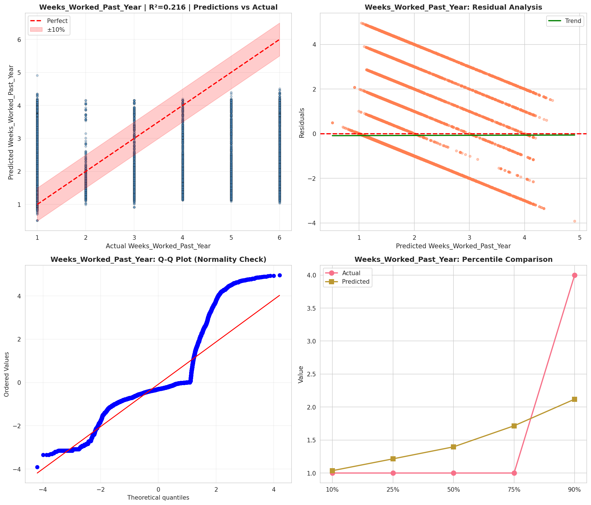
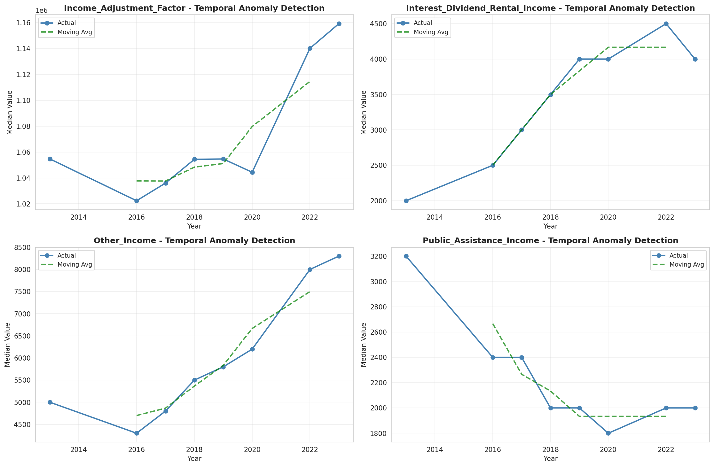
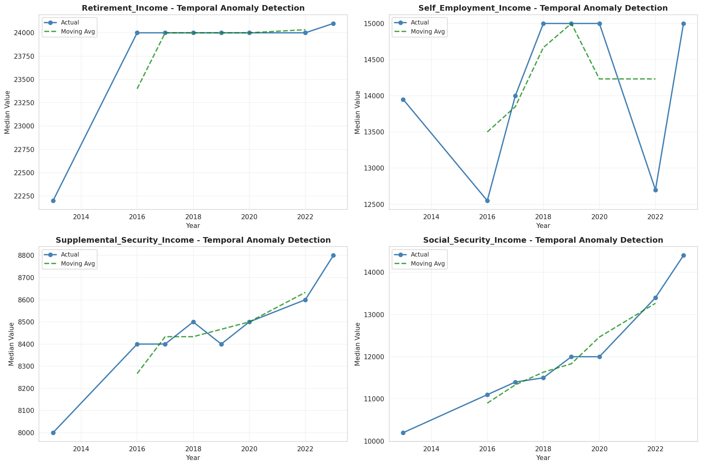
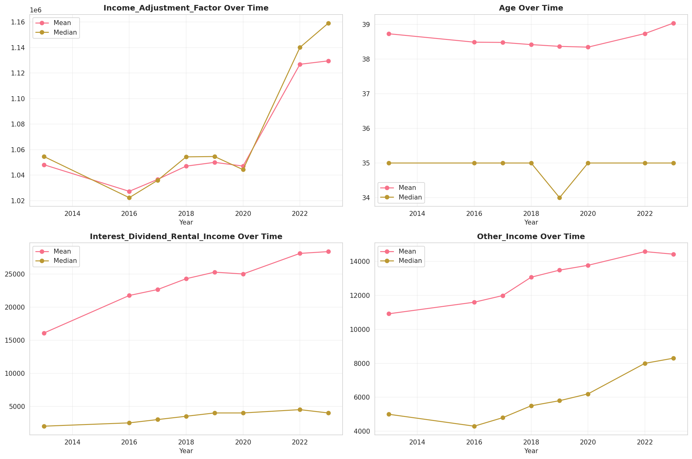
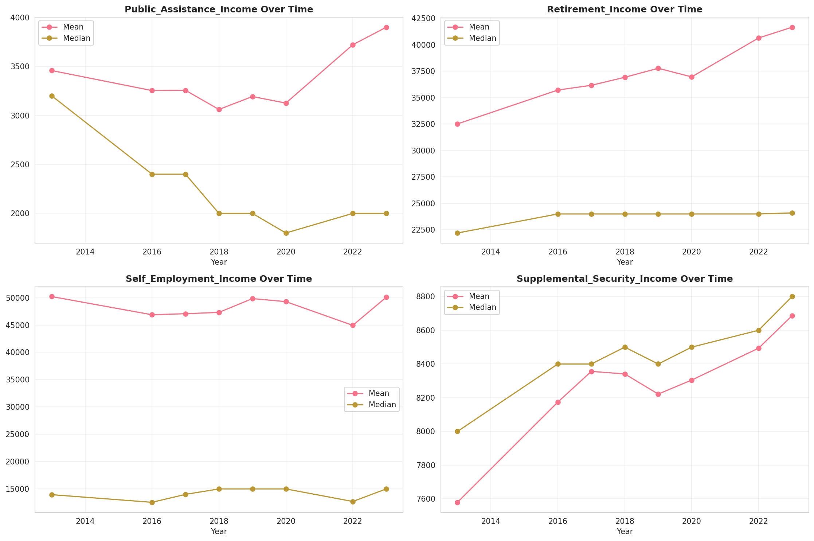
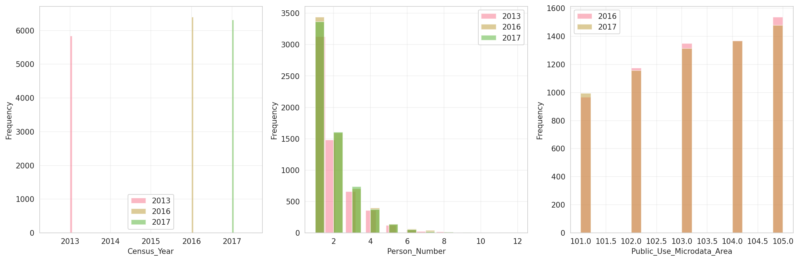
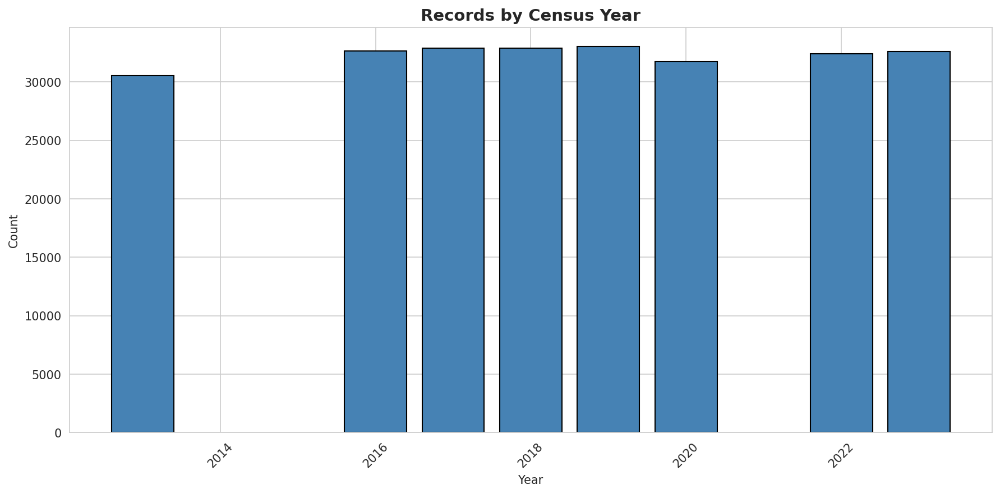
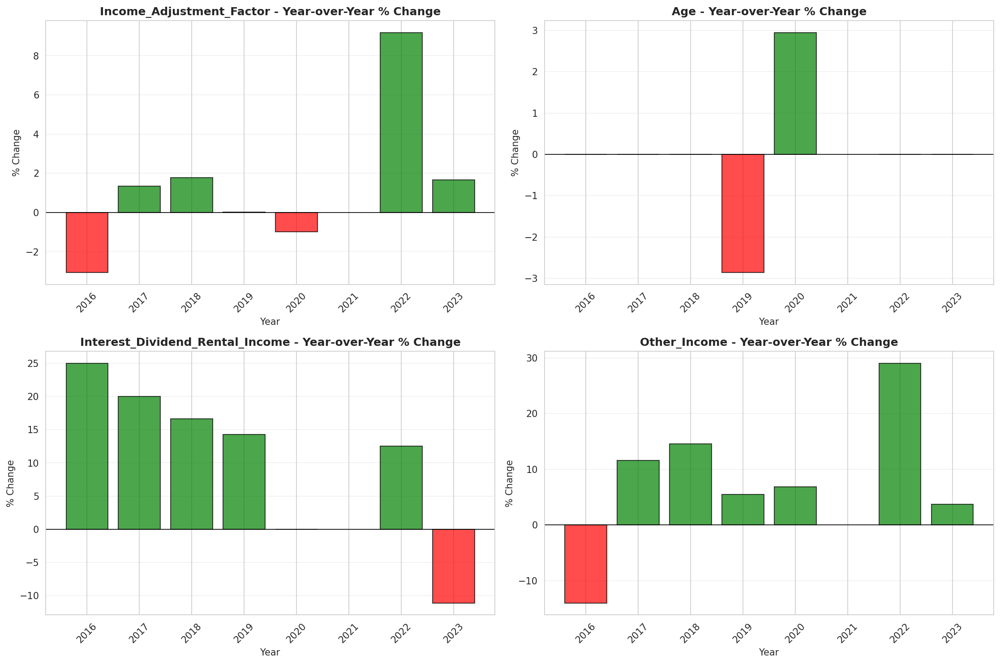
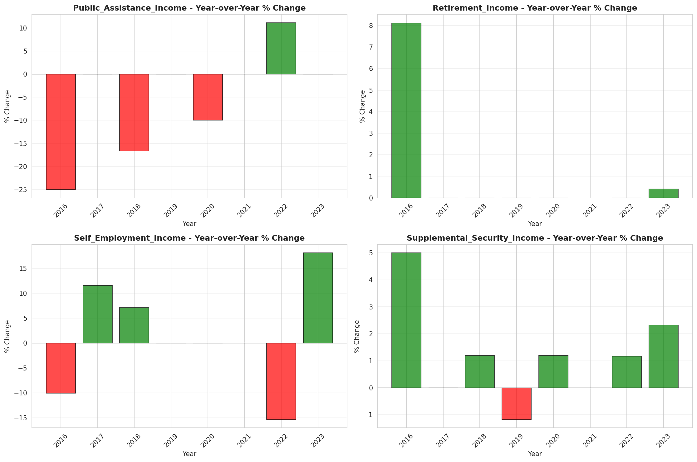

# Temporal Analysis

## Year Distribution

- 2013: 30,559 records

- 2016: 32,648 records

- 2017: 32,910 records

- 2018: 32,887 records

- 2019: 33,017 records

- 2020: 31,750 records

- 2022: 32,419 records

- 2023: 32,605 records

## Temporal Trends

- Census_Year: {np.int64(2013): {'mean': 2013.0, 'median': 2013.0, 'std': 0.0}, np.int64(2016): {'mean': 2016.0, 'median': 2016.0, 'std': 0.0}, np.int64(2017): {'mean': 2017.0, 'median': 2017.0, 'std': 0.0}, np.int64(2018): {'mean': 2018.0, 'median': 2018.0, 'std': 0.0}, np.int64(2019): {'mean': 2019.0, 'median': 2019.0, 'std': 0.0}, np.int64(2020): {'mean': 2020.0, 'median': 2020.0, 'std': 0.0}, np.int64(2022): {'mean': 2022.0, 'median': 2022.0, 'std': 0.0}, np.int64(2023): {'mean': 2023.0, 'median': 2023.0, 'std': 0.0}}

- Person_Number: {np.int64(2013): {'mean': 1.8505841159723813, 'median': 1.0, 'std': 1.2352906657067833}, np.int64(2016): {'mean': 1.8516907620681207, 'median': 1.0, 'std': 1.223085427413415}, np.int64(2017): {'mean': 1.8486782133090247, 'median': 1.0, 'std': 1.2166910938490612}, np.int64(2018): {'mean': 1.8440113114604555, 'median': 1.0, 'std': 1.2155334967838503}, np.int64(2019): {'mean': 1.837810824726656, 'median': 1.0, 'std': 1.206587766989153}, np.int64(2020): {'mean': 1.82, 'median': 1.0, 'std': 1.1954471254417425}, np.int64(2022): {'mean': 1.7843548536352138, 'median': 1.0, 'std': 1.1504105920295051}, np.int64(2023): {'mean': 1.7702192915197055, 'median': 1.0, 'std': 1.1396276424418395}}

- Public_Use_Microdata_Area: {np.int64(2013): {'mean': None, 'median': None, 'std': None}, np.int64(2016): {'mean': 103.17884709629993, 'median': 103.0, 'std': 1.3854690038858826}, np.int64(2017): {'mean': 103.17590398055302, 'median': 103.0, 'std': 1.388131954867206}, np.int64(2018): {'mean': 103.16398576945298, 'median': 103.0, 'std': 1.3929019717762572}, np.int64(2019): {'mean': 103.15982675591361, 'median': 103.0, 'std': 1.395929323449963}, np.int64(2020): {'mean': 103.14141732283464, 'median': 103.0, 'std': 1.4037632971372014}, np.int64(2022): {'mean': None, 'median': None, 'std': None}, np.int64(2023): {'mean': 103.38546235239994, 'median': 103.0, 'std': 1.696134197779287}}

- State_Code: {np.int64(2013): {'mean': 11.0, 'median': 11.0, 'std': 0.0}, np.int64(2016): {'mean': 11.0, 'median': 11.0, 'std': 0.0}, np.int64(2017): {'mean': 11.0, 'median': 11.0, 'std': 0.0}, np.int64(2018): {'mean': 11.0, 'median': 11.0, 'std': 0.0}, np.int64(2019): {'mean': 11.0, 'median': 11.0, 'std': 0.0}, np.int64(2020): {'mean': 11.0, 'median': 11.0, 'std': 0.0}, np.int64(2022): {'mean': 11.0, 'median': 11.0, 'std': 0.0}, np.int64(2023): {'mean': None, 'median': None, 'std': None}}

- Income_Adjustment_Factor: {np.int64(2013): {'mean': 1048186.1381916947, 'median': 1054614.0, 'std': 29716.696629872324}, np.int64(2016): {'mean': 1027322.5849056604, 'median': 1022342.0, 'std': 17418.940129891453}, np.int64(2017): {'mean': 1036693.6406563355, 'median': 1035988.0, 'std': 16820.96639945534}, np.int64(2018): {'mean': 1047058.6493143188, 'median': 1054346.0, 'std': 20408.24863484844}, np.int64(2019): {'mean': 1050033.3194112123, 'median': 1054606.0, 'std': 26245.172031547238}, np.int64(2020): {'mean': 1047134.6687559055, 'median': 1044328.0, 'std': 28757.199067007674}, np.int64(2022): {'mean': 1126903.7479564452, 'median': 1140108.0, 'std': 49423.89845584156}, np.int64(2023): {'mean': 1129587.0733936513, 'median': 1159185.0, 'std': 69901.30828446934}}

- Person_Weight: {np.int64(2013): {'mean': 20.26803887561766, 'median': 16.0, 'std': 13.31007546781851}, np.int64(2016): {'mean': 20.185279343298212, 'median': 16.0, 'std': 13.927748578040198}, np.int64(2017): {'mean': 20.431206320267396, 'median': 16.0, 'std': 14.40788734742435}, np.int64(2018): {'mean': 20.813634566850123, 'median': 16.0, 'std': 14.885840155331914}, np.int64(2019): {'mean': 20.979586273737773, 'median': 17.0, 'std': 15.448300721718578}, np.int64(2020): {'mean': 22.109417322834645, 'median': 16.0, 'std': 24.004027272043977}, np.int64(2022): {'mean': 20.684999537308368, 'median': 15.0, 'std': 22.655837588629236}, np.int64(2023): {'mean': 20.612758779328324, 'median': 14.0, 'std': 23.135968862760286}}

- Age: {np.int64(2013): {'mean': 38.728197912235345, 'median': 35.0, 'std': 21.780122337472}, np.int64(2016): {'mean': 38.48606346483705, 'median': 35.0, 'std': 21.721728318507022}, np.int64(2017): {'mean': 38.478274080826495, 'median': 35.0, 'std': 21.666811642009236}, np.int64(2018): {'mean': 38.41587861465017, 'median': 35.0, 'std': 21.550739667776767}, np.int64(2019): {'mean': 38.36484235393888, 'median': 34.0, 'std': 21.47850785419546}, np.int64(2020): {'mean': 38.342488188976375, 'median': 35.0, 'std': 21.381308301549538}, np.int64(2022): {'mean': 38.734199080785956, 'median': 35.0, 'std': 21.34518152722594}, np.int64(2023): {'mean': 39.03563870571998, 'median': 35.0, 'std': 21.459392787872524}}

- Citizenship_Status: {np.int64(2013): {'mean': 1.4712523315553518, 'median': 1.0, 'std': 1.201267072905142}, np.int64(2016): {'mean': 1.4728314138691496, 'median': 1.0, 'std': 1.1969870265560714}, np.int64(2017): {'mean': 1.481221513217867, 'median': 1.0, 'std': 1.2045107379913187}, np.int64(2018): {'mean': 1.481953355429197, 'median': 1.0, 'std': 1.2012562009795738}, np.int64(2019): {'mean': 1.4730290456431536, 'median': 1.0, 'std': 1.1881185324347432}, np.int64(2020): {'mean': 1.480251968503937, 'median': 1.0, 'std': 1.192714637445456}, np.int64(2022): {'mean': 1.487923748419137, 'median': 1.0, 'std': 1.1939193182541232}, np.int64(2023): {'mean': 1.5004753872105505, 'median': 1.0, 'std': 1.2069509282613105}}

- Class_of_Worker: {np.int64(2013): {'mean': 2.5929367125553338, 'median': 2.0, 'std': 1.971726776300057}, np.int64(2016): {'mean': 2.562249532460593, 'median': 2.0, 'std': 1.975824352000149}, np.int64(2017): {'mean': 2.5440252953317817, 'median': 2.0, 'std': 1.9702956028143281}, np.int64(2018): {'mean': 2.547598291343388, 'median': 2.0, 'std': 1.9754334755276475}, np.int64(2019): {'mean': 2.5518629105543296, 'median': 2.0, 'std': 1.9706726815917834}, np.int64(2020): {'mean': 2.5569608898457123, 'median': 2.0, 'std': 1.9712859101329028}, np.int64(2022): {'mean': 2.5734093559673448, 'median': 2.0, 'std': 1.9571984959282074}, np.int64(2023): {'mean': 2.58356916216448, 'median': 2.0, 'std': 1.9467815915936115}}

- English_Speaking_Ability: {np.int64(2013): {'mean': 1.4294493027653037, 'median': 1.0, 'std': 0.7502073183713485}, np.int64(2016): {'mean': 1.4113254511512134, 'median': 1.0, 'std': 0.737740976928098}, np.int64(2017): {'mean': 1.404563047463842, 'median': 1.0, 'std': 0.7365387714197834}, np.int64(2018): {'mean': 1.398617042912345, 'median': 1.0, 'std': 0.729857063802598}, np.int64(2019): {'mean': 1.3838901414224227, 'median': 1.0, 'std': 0.7176069756116187}, np.int64(2020): {'mean': 1.3751806731364857, 'median': 1.0, 'std': 0.7112271185999081}, np.int64(2022): {'mean': 1.3355048859934853, 'median': 1.0, 'std': 0.678692143046916}, np.int64(2023): {'mean': 1.3277249451353328, 'median': 1.0, 'std': 0.6790277130878384}}

- Fertility_Status: {np.int64(2013): {'mean': 1.9550686144311642, 'median': 2.0, 'std': 0.20716492403605247}, np.int64(2016): {'mean': 1.9547687269750307, 'median': 2.0, 'std': 0.2078216175433795}, np.int64(2017): {'mean': 1.9556382657680313, 'median': 2.0, 'std': 0.20590783310689945}, np.int64(2018): {'mean': 1.9562524970035957, 'median': 2.0, 'std': 0.2045429973067653}, np.int64(2019): {'mean': 1.9580667388522492, 'median': 2.0, 'std': 0.20044654587840455}, np.int64(2020): {'mean': 1.9602763385146804, 'median': 2.0, 'std': 0.19531914399384895}, np.int64(2022): {'mean': 1.9625148750495836, 'median': 2.0, 'std': 0.18995675470227677}, np.int64(2023): {'mean': 1.964144606874753, 'median': 2.0, 'std': 0.18593869657306147}}

- Marital_Status: {np.int64(2013): {'mean': 3.6591184266500867, 'median': 5.0, 'std': 1.7373333030926663}, np.int64(2016): {'mean': 3.6315547659887284, 'median': 5.0, 'std': 1.7592308022523413}, np.int64(2017): {'mean': 3.6193254329990885, 'median': 5.0, 'std': 1.767494342912946}, np.int64(2018): {'mean': 3.615927266092985, 'median': 5.0, 'std': 1.7735288690446196}, np.int64(2019): {'mean': 3.6050216555107975, 'median': 5.0, 'std': 1.7837412137859392}, np.int64(2020): {'mean': 3.606267716535433, 'median': 5.0, 'std': 1.7882217486674639}, np.int64(2022): {'mean': 3.594157747000216, 'median': 5.0, 'std': 1.7952210457660258}, np.int64(2023): {'mean': 3.5656187701272812, 'median': 5.0, 'std': 1.805375588587187}}

- Mobility_Status: {np.int64(2013): {'mean': 1.3716298918257304, 'median': 1.0, 'std': 0.7687299948980123}, np.int64(2016): {'mean': 1.4094232079796791, 'median': 1.0, 'std': 0.7968536813479609}, np.int64(2017): {'mean': 1.4109496451503887, 'median': 1.0, 'std': 0.7979314835276899}, np.int64(2018): {'mean': 1.4122095167834747, 'median': 1.0, 'std': 0.7988162213197318}, np.int64(2019): {'mean': 1.4129602987541707, 'median': 1.0, 'std': 0.799238813240323}, np.int64(2020): {'mean': 1.4085833359844748, 'median': 1.0, 'std': 0.7960748590522396}, np.int64(2022): {'mean': 1.4205211320284254, 'median': 1.0, 'std': 0.8042977645604925}, np.int64(2023): {'mean': 1.4206742687159146, 'median': 1.0, 'std': 0.8037000003455143}}

- Military_Service: {np.int64(2013): {'mean': 3.842842919506778, 'median': 4.0, 'std': 0.549228154731832}, np.int64(2016): {'mean': 3.85408400357462, 'median': 4.0, 'std': 0.5343151060348723}, np.int64(2017): {'mean': 3.859205265206468, 'median': 4.0, 'std': 0.5253239404416584}, np.int64(2018): {'mean': 3.8654546740706683, 'median': 4.0, 'std': 0.5134092407956922}, np.int64(2019): {'mean': 3.87035472972973, 'median': 4.0, 'std': 0.5047159901015986}, np.int64(2020): {'mean': 3.877681856263432, 'median': 4.0, 'std': 0.49118914996985413}, np.int64(2022): {'mean': 3.887214579492271, 'median': 4.0, 'std': 0.47674828359140176}, np.int64(2023): {'mean': 3.8887911623979736, 'median': 4.0, 'std': 0.4762770656220181}}

- Travel_Time_To_Work_Minutes: {np.int64(2013): {'mean': 29.764042626332074, 'median': 30.0, 'std': 19.58435007945088}, np.int64(2016): {'mean': 29.91493558528016, 'median': 30.0, 'std': 19.212961124619987}, np.int64(2017): {'mean': 30.179108970499698, 'median': 30.0, 'std': 19.08667522385123}, np.int64(2018): {'mean': 30.182494684620835, 'median': 30.0, 'std': 18.922067995383852}, np.int64(2019): {'mean': 30.548184722625617, 'median': 30.0, 'std': 19.072504157124968}, np.int64(2020): {'mean': 30.50187886121903, 'median': 30.0, 'std': 18.94316204305399}, np.int64(2022): {'mean': 29.489994753803494, 'median': 30.0, 'std': 18.721027512031885}, np.int64(2023): {'mean': 29.204401519949336, 'median': 30.0, 'std': 18.50733032749777}}

- Vehicle_Occupancy: {np.int64(2013): {'mean': 1.22460151344389, 'median': 1.0, 'std': 0.6771733531383282}, np.int64(2016): {'mean': 1.204364494249484, 'median': 1.0, 'std': 0.601177482346906}, np.int64(2017): {'mean': 1.205667668527265, 'median': 1.0, 'std': 0.6395513968148386}, np.int64(2018): {'mean': 1.2024787634034257, 'median': 1.0, 'std': 0.6407251156445699}, np.int64(2019): {'mean': 1.2088465845464726, 'median': 1.0, 'std': 0.662425353736515}, np.int64(2020): {'mean': 1.2148136741607638, 'median': 1.0, 'std': 0.7117563438096594}, np.int64(2022): {'mean': 1.1953298108062043, 'median': 1.0, 'std': 0.6683319400844747}, np.int64(2023): {'mean': 1.1945084145261293, 'median': 1.0, 'std': 0.6575664605531139}}

- Transportation_To_Work: {np.int64(2013): {'mean': 3.8639003066483983, 'median': 2.0, 'std': 3.554905703878128}, np.int64(2016): {'mean': 4.07924308588064, 'median': 2.0, 'std': 3.6698751462622297}, np.int64(2017): {'mean': 4.159583498387188, 'median': 2.0, 'std': 3.7217601045561453}, np.int64(2018): {'mean': 4.201783538274067, 'median': 2.0, 'std': 3.7487116461137906}, np.int64(2019): {'mean': None, 'median': None, 'std': None}, np.int64(2020): {'mean': None, 'median': None, 'std': None}, np.int64(2022): {'mean': None, 'median': None, 'std': None}, np.int64(2023): {'mean': None, 'median': None, 'std': None}}

- Language_Other_Than_English: {np.int64(2013): {'mean': 1.8544948070706375, 'median': 2.0, 'std': 0.35261552400048113}, np.int64(2016): {'mean': 1.8445841392649904, 'median': 2.0, 'std': 0.36230650370105916}, np.int64(2017): {'mean': 1.8430877417292633, 'median': 2.0, 'std': 0.3637238377944612}, np.int64(2018): {'mean': 1.8427717200140696, 'median': 2.0, 'std': 0.36402168234474824}, np.int64(2019): {'mean': 1.8446227827139263, 'median': 2.0, 'std': 0.362269674548523}, np.int64(2020): {'mean': 1.8397684036393713, 'median': 2.0, 'std': 0.36682677641420697}, np.int64(2022): {'mean': 1.8311440403778958, 'median': 2.0, 'std': 0.3746307053064449}, np.int64(2023): {'mean': 1.8241574479032674, 'median': 2.0, 'std': 0.38069227676415757}}

- Grandparents_Living_With_Grandchildren: {np.int64(2013): {'mean': 1.96859916481371, 'median': 2.0, 'std': 0.1744031889291691}, np.int64(2016): {'mean': 1.9709139153952135, 'median': 2.0, 'std': 0.16805215083979566}, np.int64(2017): {'mean': 1.9723845998790566, 'median': 2.0, 'std': 0.1638723376891438}, np.int64(2018): {'mean': 1.9744490738416747, 'median': 2.0, 'std': 0.15779520345754303}, np.int64(2019): {'mean': 1.9758341206305008, 'median': 2.0, 'std': 0.1535677775079564}, np.int64(2020): {'mean': 1.9782148572608538, 'median': 2.0, 'std': 0.14598510361769648}, np.int64(2022): {'mean': 1.9803737393711687, 'median': 2.0, 'std': 0.1387156147638842}, np.int64(2023): {'mean': 1.9808752500365907, 'median': 2.0, 'std': 0.13696681771036845}}

- Months_Responsible_For_Grandchildren: {np.int64(2013): {'mean': 4.026315789473684, 'median': 4.0, 'std': 1.0781001916267883}, np.int64(2016): {'mean': 3.9261083743842367, 'median': 4.0, 'std': 1.1896659519822192}, np.int64(2017): {'mean': 3.9362745098039214, 'median': 4.0, 'std': 1.232106547731491}, np.int64(2018): {'mean': 3.888888888888889, 'median': 4.0, 'std': 1.2457251545865597}, np.int64(2019): {'mean': 3.871165644171779, 'median': 4.0, 'std': 1.2964683237040335}, np.int64(2020): {'mean': 3.875, 'median': 4.0, 'std': 1.293568447253988}, np.int64(2022): {'mean': 4.0, 'median': 5.0, 'std': 1.2618371565731996}, np.int64(2023): {'mean': 3.925233644859813, 'median': 4.0, 'std': 1.3081813285211292}}

- Grandparents_Responsible_For_Grandchildren: {np.int64(2013): {'mean': 1.6062176165803108, 'median': 2.0, 'std': 0.48901004543200344}, np.int64(2016): {'mean': 1.643859649122807, 'median': 2.0, 'std': 0.47927799530880083}, np.int64(2017): {'mean': 1.6277372262773722, 'median': 2.0, 'std': 0.4838495735246345}, np.int64(2018): {'mean': 1.6463654223968567, 'median': 2.0, 'std': 0.47856777803370204}, np.int64(2019): {'mean': 1.6646090534979423, 'median': 2.0, 'std': 0.4726134309275636}, np.int64(2020): {'mean': 1.7156398104265402, 'median': 2.0, 'std': 0.45164459902343823}, np.int64(2022): {'mean': 1.7380352644836272, 'median': 2.0, 'std': 0.4402583823139775}, np.int64(2023): {'mean': 1.7270408163265305, 'median': 2.0, 'std': 0.44604934568960514}}

- Interest_Dividend_Rental_Income: {np.int64(2013): {'mean': 16090.464484381686, 'median': 2000.0, 'std': 42733.35421212373}, np.int64(2016): {'mean': 21767.15742097551, 'median': 2500.0, 'std': 61845.64316817466}, np.int64(2017): {'mean': 22669.342750311593, 'median': 3000.0, 'std': 63163.67992755113}, np.int64(2018): {'mean': 24304.284283030684, 'median': 3500.0, 'std': 64990.118065888455}, np.int64(2019): {'mean': 25296.035247524753, 'median': 4000.0, 'std': 67477.62896690876}, np.int64(2020): {'mean': 25021.442842430482, 'median': 4000.0, 'std': 66316.3656046643}, np.int64(2022): {'mean': 28134.17012858556, 'median': 4500.0, 'std': 76380.05705916969}, np.int64(2023): {'mean': 28404.961775125863, 'median': 4000.0, 'std': 78354.98937331146}}

- Military_Service_Period_1: {np.int64(2013): {'mean': 0.2247978436657682, 'median': 0.0, 'std': 0.4175616919140688}, np.int64(2016): {'mean': 0.27839029768467477, 'median': 0.0, 'std': 0.4483301737117004}, np.int64(2017): {'mean': 0.2963594994311718, 'median': 0.0, 'std': 0.45678138326566975}, np.int64(2018): {'mean': 0.31714628297362113, 'median': 0.0, 'std': 0.4655044907388037}, np.int64(2019): {'mean': 0.34596273291925467, 'median': 0.0, 'std': 0.475828907944634}, np.int64(2020): {'mean': 0.3894878706199461, 'median': 0.0, 'std': 0.48779853544385265}, np.int64(2022): {'mean': 0.45500725689404936, 'median': 0.0, 'std': 0.4981523231472056}, np.int64(2023): {'mean': 0.47465099191770754, 'median': 0.0, 'std': 0.49954056776110667}}

- Military_Service_Period_2: {np.int64(2013): {'mean': 0.16118598382749327, 'median': 0.0, 'std': 0.3678015614219917}, np.int64(2016): {'mean': 0.1918412348401323, 'median': 0.0, 'std': 0.3938574490454371}, np.int64(2017): {'mean': 0.18828213879408418, 'median': 0.0, 'std': 0.39104853870572204}, np.int64(2018): {'mean': 0.19424460431654678, 'median': 0.0, 'std': 0.3957366894986873}, np.int64(2019): {'mean': 0.19875776397515527, 'median': 0.0, 'std': 0.39918929305433143}, np.int64(2020): {'mean': 0.1967654986522911, 'median': 0.0, 'std': 0.3976875795388146}, np.int64(2022): {'mean': 0.21190130624092887, 'median': 0.0, 'std': 0.4088036450089264}, np.int64(2023): {'mean': 0.20426157237325496, 'median': 0.0, 'std': 0.40330918193796034}}

- Military_Service_Period_5: {np.int64(2013): {'mean': 0.2900269541778976, 'median': 0.0, 'std': 0.45389688620610824}, np.int64(2016): {'mean': 0.272877618522602, 'median': 0.0, 'std': 0.4455612912049802}, np.int64(2017): {'mean': 0.2753128555176337, 'median': 0.0, 'std': 0.44679888299931925}, np.int64(2018): {'mean': 0.2655875299760192, 'median': 0.0, 'std': 0.4417779996470851}, np.int64(2019): {'mean': 0.25527950310559006, 'median': 0.0, 'std': 0.436153681286984}, np.int64(2020): {'mean': 0.25134770889487873, 'median': 0.0, 'std': 0.4339342394830019}, np.int64(2022): {'mean': 0.23294629898403482, 'median': 0.0, 'std': 0.42286177742572506}, np.int64(2023): {'mean': 0.2387950036737693, 'median': 0.0, 'std': 0.4265039340260818}}

- Military_Service_Period_8: {np.int64(2013): {'mean': 0.11752021563342319, 'median': 0.0, 'std': 0.3221259887661547}, np.int64(2016): {'mean': 0.09922822491730982, 'median': 0.0, 'std': 0.29905063934915344}, np.int64(2017): {'mean': 0.0949943117178612, 'median': 0.0, 'std': 0.2932905090124608}, np.int64(2018): {'mean': 0.09052757793764989, 'median': 0.0, 'std': 0.2870221682968584}, np.int64(2019): {'mean': 0.09192546583850932, 'median': 0.0, 'std': 0.2890104751165569}, np.int64(2020): {'mean': 0.07816711590296496, 'median': 0.0, 'std': 0.26852487143289955}, np.int64(2022): {'mean': 0.0602322206095791, 'median': 0.0, 'std': 0.23800295624602688}, np.int64(2023): {'mean': 0.046289493019838354, 'median': 0.0, 'std': 0.21018857419090248}}

- Military_Service_Period_9: {np.int64(2013): {'mean': 0.01778975741239892, 'median': 0.0, 'std': 0.1322221864260096}, np.int64(2016): {'mean': 0.019845644983461964, 'median': 0.0, 'std': 0.13950815181893736}, np.int64(2017): {'mean': 0.020477815699658702, 'median': 0.0, 'std': 0.14166824303324896}, np.int64(2018): {'mean': 0.020983213429256596, 'median': 0.0, 'std': 0.14337099242765847}, np.int64(2019): {'mean': 0.020496894409937887, 'median': 0.0, 'std': 0.14173654971185562}, np.int64(2020): {'mean': 0.016172506738544475, 'median': 0.0, 'std': 0.12618116207671817}, np.int64(2022): {'mean': None, 'median': None, 'std': None}, np.int64(2023): {'mean': None, 'median': None, 'std': None}}

- Military_Service_Period_10: {np.int64(2013): {'mean': 0.0862533692722372, 'median': 0.0, 'std': 0.2808135247125955}, np.int64(2016): {'mean': 0.06174200661521499, 'median': 0.0, 'std': 0.24075274403674457}, np.int64(2017): {'mean': 0.05802047781569966, 'median': 0.0, 'std': 0.2338486871017049}, np.int64(2018): {'mean': 0.050359712230215826, 'median': 0.0, 'std': 0.2187516858074206}, np.int64(2019): {'mean': 0.037888198757763975, 'median': 0.0, 'std': 0.19098517911737578}, np.int64(2020): {'mean': 0.028975741239892182, 'median': 0.0, 'std': 0.16779487510766505}, np.int64(2022): {'mean': 0.022496371552975326, 'median': 0.0, 'std': 0.14834505224535594}, np.int64(2023): {'mean': 0.015429831006612785, 'median': 0.0, 'std': 0.12330012865809914}}

- Military_Service_Period_11: {np.int64(2013): {'mean': 0.0037735849056603774, 'median': 0.0, 'std': 0.06133003062753803}, np.int64(2016): {'mean': 0.0027563395810363835, 'median': 0.0, 'std': 0.052442905166607136}, np.int64(2017): {'mean': 0.003981797497155859, 'median': 0.0, 'std': 0.06299365055282549}, np.int64(2018): {'mean': 0.002398081534772182, 'median': 0.0, 'std': 0.04892612646783229}, np.int64(2019): {'mean': 0.002484472049689441, 'median': 0.0, 'std': 0.049797989130512726}, np.int64(2020): {'mean': 0.0020215633423180594, 'median': 0.0, 'std': 0.04493147033294005}, np.int64(2022): {'mean': None, 'median': None, 'std': None}, np.int64(2023): {'mean': None, 'median': None, 'std': None}}

- Temporary_Absence_From_Work: {np.int64(2013): {'mean': 2.564074396757453, 'median': 3.0, 'std': 0.5294339729968179}, np.int64(2016): {'mean': 2.6389046336970385, 'median': 3.0, 'std': 0.5061129465223573}, np.int64(2017): {'mean': 2.664034810681826, 'median': 3.0, 'std': 0.497165932035042}, np.int64(2018): {'mean': 2.6760815409985614, 'median': 3.0, 'std': 0.49174179455149736}, np.int64(2019): {'mean': 2.6873951928451647, 'median': 3.0, 'std': 0.48607813735588223}, np.int64(2020): {'mean': 2.6940133839754026, 'median': 3.0, 'std': 0.4828358811985346}, np.int64(2022): {'mean': 2.6998732305091906, 'median': 3.0, 'std': 0.47957248835036126}, np.int64(2023): {'mean': 2.7031899654100138, 'median': 3.0, 'std': 0.477794796007112}}

- Available_For_Work: {np.int64(2013): {'mean': 4.530701920527292, 'median': 5.0, 'std': 1.2247428005081304}, np.int64(2016): {'mean': 4.6521184639365165, 'median': 5.0, 'std': 1.0619024330919564}, np.int64(2017): {'mean': 4.697441835982735, 'median': 5.0, 'std': 0.9978103397420375}, np.int64(2018): {'mean': 4.713834602294656, 'median': 5.0, 'std': 0.9728964715899182}, np.int64(2019): {'mean': 4.730855226383454, 'median': 5.0, 'std': 0.9429172765382808}, np.int64(2020): {'mean': 4.73496111412552, 'median': 5.0, 'std': 0.9354638469764884}, np.int64(2022): {'mean': 4.750193675610959, 'median': 5.0, 'std': 0.9098126492629975}, np.int64(2023): {'mean': 4.766220607246427, 'median': 5.0, 'std': 0.8786381305568355}}

- On_Layoff_From_Work: {np.int64(2013): {'mean': 2.5401340959884844, 'median': 3.0, 'std': 0.5248296555403996}, np.int64(2016): {'mean': 2.623352699447357, 'median': 3.0, 'std': 0.5025702140840328}, np.int64(2017): {'mean': 2.6496473312980315, 'median': 3.0, 'std': 0.49478183006806786}, np.int64(2018): {'mean': 2.662503070067717, 'median': 3.0, 'std': 0.4898484201988155}, np.int64(2019): {'mean': 2.676669927333706, 'median': 3.0, 'std': 0.48144773526597473}, np.int64(2020): {'mean': 2.679616567191174, 'median': 3.0, 'std': 0.4843582862786269}, np.int64(2022): {'mean': 2.6862102964997536, 'median': 3.0, 'std': 0.48278531654301504}, np.int64(2023): {'mean': 2.690681667307222, 'median': 3.0, 'std': 0.4802385850344967}}

- Looking_For_Work: {np.int64(2013): {'mean': 2.5033145194893747, 'median': 3.0, 'std': 0.6356894426430776}, np.int64(2016): {'mean': 2.5905483916678476, 'median': 3.0, 'std': 0.600821296129416}, np.int64(2017): {'mean': 2.619538898831456, 'median': 3.0, 'std': 0.5871853733951341}, np.int64(2018): {'mean': 2.634714571418547, 'median': 3.0, 'std': 0.5778366612842754}, np.int64(2019): {'mean': 2.6491755170486306, 'median': 3.0, 'std': 0.5677709504930819}, np.int64(2020): {'mean': 2.6519081208175077, 'median': 3.0, 'std': 0.5682131201021977}, np.int64(2022): {'mean': 2.6568772448763998, 'median': 3.0, 'std': 0.5652984554206228}, np.int64(2023): {'mean': 2.6615072848607664, 'median': 3.0, 'std': 0.5596083590995715}}

- Informed_Of_Recall: {np.int64(2013): {'mean': 2.903973635364976, 'median': 3.0, 'std': 0.3150139266521082}, np.int64(2016): {'mean': 2.935418733172736, 'median': 3.0, 'std': 0.2622469376095938}, np.int64(2017): {'mean': 2.9471172404112713, 'median': 3.0, 'std': 0.239263098863896}, np.int64(2018): {'mean': 2.950563138135504, 'median': 3.0, 'std': 0.23073820979804027}, np.int64(2019): {'mean': 2.952312744550028, 'median': 3.0, 'std': 0.22584215268018357}, np.int64(2020): {'mean': 2.952794357026587, 'median': 3.0, 'std': 0.2267551709130382}, np.int64(2022): {'mean': 2.957144869356997, 'median': 3.0, 'std': 0.21810548036145894}, np.int64(2023): {'mean': 2.9586317738723316, 'median': 3.0, 'std': 0.21500491765172364}}

- Other_Income: {np.int64(2013): {'mean': 10917.736810187993, 'median': 5000.0, 'std': 15773.775891179483}, np.int64(2016): {'mean': 11596.902306648575, 'median': 4300.0, 'std': 17549.138916058928}, np.int64(2017): {'mean': 11988.134831460675, 'median': 4800.0, 'std': 18000.00611060472}, np.int64(2018): {'mean': 13069.057233704292, 'median': 5500.0, 'std': 18658.257795413974}, np.int64(2019): {'mean': 13486.46049277825, 'median': 5800.0, 'std': 18901.309713519993}, np.int64(2020): {'mean': 13769.932624113475, 'median': 6200.0, 'std': 18945.224462843977}, np.int64(2022): {'mean': 14576.238325281804, 'median': 8000.0, 'std': 17910.54441582156}, np.int64(2023): {'mean': 14424.774193548386, 'median': 8300.0, 'std': 17191.811204100337}}

- Public_Assistance_Income: {np.int64(2013): {'mean': 3457.9222972972975, 'median': 3200.0, 'std': 3147.4429081844087}, np.int64(2016): {'mean': 3253.1826401446656, 'median': 2400.0, 'std': 3065.9947668616032}, np.int64(2017): {'mean': 3256.1141804788213, 'median': 2400.0, 'std': 3733.2817248532515}, np.int64(2018): {'mean': 3060.5996131528045, 'median': 2000.0, 'std': 3843.710435384684}, np.int64(2019): {'mean': 3192.368972746331, 'median': 2000.0, 'std': 4050.9832355241215}, np.int64(2020): {'mean': 3125.442043222004, 'median': 1800.0, 'std': 4161.063666621516}, np.int64(2022): {'mean': 3720.674157303371, 'median': 2000.0, 'std': 4773.096107242596}, np.int64(2023): {'mean': 3899.4632206759443, 'median': 2000.0, 'std': 4982.595476197268}}

- Retirement_Income: {np.int64(2013): {'mean': 32513.599860335195, 'median': 22200.0, 'std': 36171.214313012795}, np.int64(2016): {'mean': 35716.08561643836, 'median': 24000.0, 'std': 45418.73880746546}, np.int64(2017): {'mean': 36163.872872525186, 'median': 24000.0, 'std': 45917.06803814253}, np.int64(2018): {'mean': 36921.28798842258, 'median': 24000.0, 'std': 46761.758011336606}, np.int64(2019): {'mean': 37773.12862504265, 'median': 24000.0, 'std': 47262.56027727058}, np.int64(2020): {'mean': 36961.25174337517, 'median': 24000.0, 'std': 44023.479632054616}, np.int64(2022): {'mean': 40640.381773399014, 'median': 24000.0, 'std': 52059.777033361825}, np.int64(2023): {'mean': 41654.938566552904, 'median': 24100.0, 'std': 53573.32773257764}}

- Self_Employment_Income: {np.int64(2013): {'mean': 50206.428299492385, 'median': 13950.0, 'std': 115390.75314616549}, np.int64(2016): {'mean': 46873.80944055944, 'median': 12550.0, 'std': 105841.55206887836}, np.int64(2017): {'mean': 47068.02519496101, 'median': 14000.0, 'std': 98600.39604561585}, np.int64(2018): {'mean': 47305.44039351852, 'median': 15000.0, 'std': 97340.00517606137}, np.int64(2019): {'mean': 49833.2347826087, 'median': 15000.0, 'std': 102495.95549699708}, np.int64(2020): {'mean': 49277.85996409336, 'median': 15000.0, 'std': 100186.55517721623}, np.int64(2022): {'mean': 44937.16761041903, 'median': 12700.0, 'std': 88836.95962059588}, np.int64(2023): {'mean': 50077.976338028166, 'median': 15000.0, 'std': 98914.27163783395}}

- Supplemental_Security_Income: {np.int64(2013): {'mean': 7579.67401725791, 'median': 8000.0, 'std': 3811.7669477651307}, np.int64(2016): {'mean': 8174.007220216607, 'median': 8400.0, 'std': 3874.3255855045613}, np.int64(2017): {'mean': 8356.164383561643, 'median': 8400.0, 'std': 4053.0367527426656}, np.int64(2018): {'mean': 8341.084462982273, 'median': 8500.0, 'std': 4099.35853123359}, np.int64(2019): {'mean': 8221.651785714286, 'median': 8400.0, 'std': 4024.811311772405}, np.int64(2020): {'mean': 8304.718066743384, 'median': 8500.0, 'std': 3968.071107386965}, np.int64(2022): {'mean': 8493.757225433526, 'median': 8600.0, 'std': 4303.272641502445}, np.int64(2023): {'mean': 8686.51817116061, 'median': 8800.0, 'std': 4489.044431155968}}

- Social_Security_Income: {np.int64(2013): {'mean': 11356.009476177942, 'median': 10200.0, 'std': 7354.38165067863}, np.int64(2016): {'mean': 12502.011937329022, 'median': 11100.0, 'std': 8124.215422102805}, np.int64(2017): {'mean': 12894.303359683794, 'median': 11400.0, 'std': 8507.438972678618}, np.int64(2018): {'mean': 13105.187969924813, 'median': 11500.0, 'std': 8776.548765025685}, np.int64(2019): {'mean': 13522.899212998223, 'median': 12000.0, 'std': 9088.118730220967}, np.int64(2020): {'mean': 13860.68791500664, 'median': 12000.0, 'std': 9458.372398396757}, np.int64(2022): {'mean': 15275.089005235603, 'median': 13400.0, 'std': 10269.427962938098}, np.int64(2023): {'mean': 16515.70488483928, 'median': 14400.0, 'std': 11050.601287402327}}

- Wage_Income: {np.int64(2013): {'mean': 64470.255015499795, 'median': 45000.0, 'std': 78410.53375406034}, np.int64(2016): {'mean': 68664.55796567338, 'median': 50000.0, 'std': 83640.01508365806}, np.int64(2017): {'mean': 71085.45223060732, 'median': 50000.0, 'std': 86249.43743894246}, np.int64(2018): {'mean': 73964.7693164557, 'median': 55000.0, 'std': 87390.3613474509}, np.int64(2019): {'mean': 77825.79087698353, 'median': 60000.0, 'std': 90349.55107429302}, np.int64(2020): {'mean': 81102.66996138995, 'median': 60000.0, 'std': 93399.14159165906}, np.int64(2022): {'mean': 90731.59617406981, 'median': 70000.0, 'std': 101363.76785031459}, np.int64(2023): {'mean': 96505.35818829114, 'median': 75000.0, 'std': 107513.91061301957}}

- Relationship_To_Householder: {np.int64(2013): {'mean': 3.6567950521941164, 'median': 1.0, 'std': 5.569052761922492}, np.int64(2016): {'mean': 3.8522420975251164, 'median': 1.0, 'std': 5.725356820328336}, np.int64(2017): {'mean': 3.8494378608325737, 'median': 1.0, 'std': 5.7221700655618895}, np.int64(2018): {'mean': 3.788518259494633, 'median': 1.0, 'std': 5.694689461653867}, np.int64(2019): {'mean': None, 'median': None, 'std': None}, np.int64(2020): {'mean': None, 'median': None, 'std': None}, np.int64(2022): {'mean': None, 'median': None, 'std': None}, np.int64(2023): {'mean': None, 'median': None, 'std': None}}

- School_Enrollment: {np.int64(2013): {'mean': 1.3760499241018722, 'median': 1.0, 'std': 0.6912281570286591}, np.int64(2016): {'mean': 1.3743163352407448, 'median': 1.0, 'std': 0.6908483238741607}, np.int64(2017): {'mean': 1.373957222605532, 'median': 1.0, 'std': 0.6930496606563282}, np.int64(2018): {'mean': 1.3710987735641917, 'median': 1.0, 'std': 0.6908282994592908}, np.int64(2019): {'mean': 1.3662262205978821, 'median': 1.0, 'std': 0.6878564083542473}, np.int64(2020): {'mean': 1.3683920168748986, 'median': 1.0, 'std': 0.6924758073045494}, np.int64(2022): {'mean': 1.360790041915407, 'median': 1.0, 'std': 0.6909620714331499}, np.int64(2023): {'mean': 1.3601098415504072, 'median': 1.0, 'std': 0.693039585616284}}

- School_Grade_Attending: {np.int64(2013): {'mean': 11.28525980911983, 'median': 14.0, 'std': 5.079509947160021}, np.int64(2016): {'mean': 11.17096048024012, 'median': 15.0, 'std': 5.22972330832282}, np.int64(2017): {'mean': 11.172396549568695, 'median': 15.0, 'std': 5.244714949689258}, np.int64(2018): {'mean': 11.149295065458208, 'median': 15.0, 'std': 5.245537734847184}, np.int64(2019): {'mean': 11.118103229087211, 'median': 15.0, 'std': 5.269341595673796}, np.int64(2020): {'mean': 11.231951251821434, 'median': 15.0, 'std': 5.231838313194336}, np.int64(2022): {'mean': 11.326110219368646, 'median': 15.0, 'std': 5.1975160427592355}, np.int64(2023): {'mean': 11.337135954905381, 'median': 15.0, 'std': 5.1989559416668385}}

- Educational_Attainment: {np.int64(2013): {'mean': 17.468173385056502, 'median': 19.0, 'std': 5.5857576831176825}, np.int64(2016): {'mean': 17.703518700009486, 'median': 19.0, 'std': 5.571373465131958}, np.int64(2017): {'mean': 17.803205168412468, 'median': 20.0, 'std': 5.563062031256947}, np.int64(2018): {'mean': 17.892381041999936, 'median': 20.0, 'std': 5.56655792267503}, np.int64(2019): {'mean': 18.01065192265642, 'median': 21.0, 'std': 5.569529636137259}, np.int64(2020): {'mean': 18.10034074314457, 'median': 21.0, 'std': 5.533167768822351}, np.int64(2022): {'mean': 18.35408992760066, 'median': 21.0, 'std': 5.480420729764149}, np.int64(2023): {'mean': 18.447635881573134, 'median': 21.0, 'std': 5.484221948459104}}

- Sex: {np.int64(2013): {'mean': 1.5378775483490952, 'median': 2.0, 'std': 0.4985713846024514}, np.int64(2016): {'mean': 1.5336620926243567, 'median': 2.0, 'std': 0.4988732168425712}, np.int64(2017): {'mean': 1.5330294743239137, 'median': 2.0, 'std': 0.49891544111358455}, np.int64(2018): {'mean': 1.5306960197038344, 'median': 2.0, 'std': 0.4990644524924223}, np.int64(2019): {'mean': 1.5316049307932278, 'median': 2.0, 'std': 0.49900768549356767}, np.int64(2020): {'mean': 1.5307716535433071, 'median': 2.0, 'std': 0.4990600663022162}, np.int64(2022): {'mean': 1.530768993491471, 'median': 2.0, 'std': 0.49906006812879977}, np.int64(2023): {'mean': 1.533077748811532, 'median': 2.0, 'std': 0.49891231368448524}}

- Hours_Worked_Per_Week: {np.int64(2013): {'mean': 39.67448467966574, 'median': 40.0, 'std': 13.04660006032466}, np.int64(2016): {'mean': 39.44780026175375, 'median': 40.0, 'std': 13.388241943750334}, np.int64(2017): {'mean': 39.55835713582192, 'median': 40.0, 'std': 13.29504066258731}, np.int64(2018): {'mean': 39.777804747803295, 'median': 40.0, 'std': 13.192753434935533}, np.int64(2019): {'mean': 39.8603173086113, 'median': 40.0, 'std': 13.208987757821866}, np.int64(2020): {'mean': 39.757871287128715, 'median': 40.0, 'std': 13.289241074505389}, np.int64(2022): {'mean': 39.57703971119133, 'median': 40.0, 'std': 13.237113105753735}, np.int64(2023): {'mean': 39.353159497525695, 'median': 40.0, 'std': 13.254543886109612}}

- When_Last_Worked: {np.int64(2013): {'mean': 1.5509299594681616, 'median': 1.0, 'std': 0.8421359265359724}, np.int64(2016): {'mean': 1.5101317840442114, 'median': 1.0, 'std': 0.8232396601800914}, np.int64(2017): {'mean': 1.497175141242938, 'median': 1.0, 'std': 0.818228737202321}, np.int64(2018): {'mean': 1.4807199747377284, 'median': 1.0, 'std': 0.8102989620713927}, np.int64(2019): {'mean': 1.469885410844047, 'median': 1.0, 'std': 0.8068558472976437}, np.int64(2020): {'mean': 1.470971242539338, 'median': 1.0, 'std': 0.807780193975424}, np.int64(2022): {'mean': 1.4599971829002043, 'median': 1.0, 'std': 0.7946996829020809}, np.int64(2023): {'mean': 1.457216728975228, 'median': 1.0, 'std': 0.79447915695733}}

- Weeks_Worked_Past_Year: {np.int64(2013): {'mean': 1.952200557103064, 'median': 1.0, 'std': 1.6988587714401526}, np.int64(2016): {'mean': 1.938588543239706, 'median': 1.0, 'std': 1.6880128154660339}, np.int64(2017): {'mean': 1.9130798778686102, 'median': 1.0, 'std': 1.6658510256671282}, np.int64(2018): {'mean': 1.8794116219233943, 'median': 1.0, 'std': 1.637986931548591}, np.int64(2019): {'mean': 1.8478447863901366, 'median': 1.0, 'std': 1.6191733188737862}, np.int64(2020): {'mean': 1.8493564356435643, 'median': 1.0, 'std': 1.6386313527503715}, np.int64(2022): {'mean': 1.835956678700361, 'median': 1.0, 'std': 1.6558205269457948}}

- Year_Of_Entry: {np.int64(2013): {'mean': None, 'median': None, 'std': None}, np.int64(2016): {'mean': 1995.196417008418, 'median': 1999.0, 'std': 15.680141977813095}, np.int64(2017): {'mean': 1996.2496855345912, 'median': 2000.0, 'std': 15.738503341318095}, np.int64(2018): {'mean': 1996.8665003119152, 'median': 2000.0, 'std': 15.897565540040306}, np.int64(2019): {'mean': 1997.7462248322147, 'median': 2001.0, 'std': 15.966354203469646}, np.int64(2020): {'mean': 1998.3775357676702, 'median': 2001.0, 'std': 16.021654216608134}, np.int64(2022): {'mean': 1999.5740778479724, 'median': 2002.0, 'std': 16.538308829148818}, np.int64(2023): {'mean': 2000.4950534230313, 'median': 2003.0, 'std': 16.51473489641617}}

- Ancestry_Recode: {np.int64(2013): {'mean': 1.5558100723191204, 'median': 1.0, 'std': 0.9437093165220815}, np.int64(2016): {'mean': 1.7081597647635383, 'median': 1.0, 'std': 1.0415943868050535}, np.int64(2017): {'mean': 1.7427225767244, 'median': 1.0, 'std': 1.0632355537757294}, np.int64(2018): {'mean': 1.7611518229087482, 'median': 1.0, 'std': 1.070336228795941}, np.int64(2019): {'mean': 1.7862616228003756, 'median': 1.0, 'std': 1.0807119042638698}, np.int64(2020): {'mean': 1.8125984251968503, 'median': 1.0, 'std': 1.0883802195956351}, np.int64(2022): {'mean': 1.8359603935963478, 'median': 1.0, 'std': 1.0922589973213719}, np.int64(2023): {'mean': 1.8500230026069622, 'median': 1.0, 'std': 1.0922178809574232}}

- First_Ancestry_Code: {np.int64(2013): {'mean': None, 'median': None, 'std': None}, np.int64(2016): {'mean': 601.4042207792207, 'median': 902.0, 'std': 396.60852564922084}, np.int64(2017): {'mean': 595.0281069583713, 'median': 902.0, 'std': 398.77425753791744}, np.int64(2018): {'mean': 590.3549730896707, 'median': 902.0, 'std': 400.1907771212791}, np.int64(2019): {'mean': 583.7607596086864, 'median': 902.0, 'std': 401.9442401584037}, np.int64(2020): {'mean': 576.8492598425197, 'median': 902.0, 'std': 403.6835088735606}, np.int64(2022): {'mean': 561.4056263302384, 'median': 750.0, 'std': 406.5453714642099}, np.int64(2023): {'mean': 552.1778868271738, 'median': 706.0, 'std': 407.95529671195027}}

- Second_Ancestry_Code: {np.int64(2013): {'mean': None, 'median': None, 'std': None}, np.int64(2016): {'mean': 821.920332026464, 'median': 999.0, 'std': 358.6667519261109}, np.int64(2017): {'mean': 815.0909450015193, 'median': 999.0, 'std': 363.74756161057894}, np.int64(2018): {'mean': 806.3928604007663, 'median': 999.0, 'std': 369.95961925059373}, np.int64(2019): {'mean': 797.4158766695945, 'median': 999.0, 'std': 376.01508235075016}, np.int64(2020): {'mean': 784.7435905511811, 'median': 999.0, 'std': 383.9224442684176}, np.int64(2022): {'mean': 772.1107375304605, 'median': 999.0, 'std': 390.90529951398}, np.int64(2023): {'mean': 764.7033583806165, 'median': 999.0, 'std': 395.1887497424794}}

- Decade_Of_Entry: {np.int64(2013): {'mean': 5.698453608247423, 'median': 6.0, 'std': 1.47750175470518}, np.int64(2016): {'mean': 5.8940211526009065, 'median': 6.0, 'std': 1.392442312204251}, np.int64(2017): {'mean': 6.196436058700209, 'median': 7.0, 'std': 1.6015914849783845}, np.int64(2018): {'mean': 6.24558120191308, 'median': 7.0, 'std': 1.6074240588400261}, np.int64(2019): {'mean': 6.322567114093959, 'median': 7.0, 'std': 1.6009418626555418}, np.int64(2020): {'mean': 6.372410847747171, 'median': 7.0, 'std': 1.5933514337525985}, np.int64(2022): {'mean': 6.450377012431221, 'median': 7.0, 'std': 1.5957461544196458}, np.int64(2023): {'mean': 6.519588444796201, 'median': 7.0, 'std': 1.5666194830852647}}

- Drives_Alone_To_Work: {np.int64(2013): {'mean': 1.2175173080019321, 'median': 1.0, 'std': 0.6089951223781828}, np.int64(2016): {'mean': 1.2008257151282808, 'median': 1.0, 'std': 0.5667994961004469}, np.int64(2017): {'mean': 1.1992271361099185, 'median': 1.0, 'std': 0.5748667462238269}, np.int64(2018): {'mean': 1.195515944854477, 'median': 1.0, 'std': 0.5703314304755998}, np.int64(2019): {'mean': 1.2008678611422172, 'median': 1.0, 'std': 0.582390644773133}, np.int64(2020): {'mean': 1.2032645518940561, 'median': 1.0, 'std': 0.598227629119621}, np.int64(2022): {'mean': 1.1856144537242201, 'median': 1.0, 'std': 0.5662495663667715}, np.int64(2023): {'mean': 1.1852967227635076, 'median': 1.0, 'std': 0.5594018947051187}}

- Employment_Status_Parents: {np.int64(2013): {'mean': 4.34854099119963, 'median': 5.0, 'std': 2.88937594538587}, np.int64(2016): {'mean': 4.107541276215975, 'median': 4.0, 'std': 2.8997289234849406}, np.int64(2017): {'mean': 3.964477211796247, 'median': 2.0, 'std': 2.890916302388145}, np.int64(2018): {'mean': 3.8605015673981193, 'median': 2.0, 'std': 2.9019085690280852}, np.int64(2019): {'mean': 3.7447661469933187, 'median': 2.0, 'std': 2.894964633327047}, np.int64(2020): {'mean': 3.5427075898167977, 'median': 2.0, 'std': 2.8607656329337665}, np.int64(2022): {'mean': 3.34336624127137, 'median': 1.0, 'std': 2.8305704428222853}, np.int64(2023): {'mean': 3.190175097276265, 'median': 1.0, 'std': 2.776315152641914}}

- Employment_Status_Recode: {np.int64(2013): {'mean': 2.8800712148187433, 'median': 1.0, 'std': 2.3223803453459086}, np.int64(2016): {'mean': 2.7811392943176987, 'median': 1.0, 'std': 2.308003748637925}, np.int64(2017): {'mean': 2.733585991507878, 'median': 1.0, 'std': 2.29792054435523}, np.int64(2018): {'mean': 2.676818357250623, 'median': 1.0, 'std': 2.283074057928738}, np.int64(2019): {'mean': 2.6316028507546116, 'median': 1.0, 'std': 2.2712678057536926}, np.int64(2020): {'mean': 2.6431181045397, 'median': 1.0, 'std': 2.2773840683741877}, np.int64(2022): {'mean': 2.6315585604620044, 'median': 1.0, 'std': 2.2734498118920734}, np.int64(2023): {'mean': 2.6291184794381746, 'median': 1.0, 'std': 2.2756734104375744}}

- Hispanic_Origin: {np.int64(2013): {'mean': 1.6668084688635099, 'median': 1.0, 'std': 2.9501799736215992}, np.int64(2016): {'mean': 1.7005329576084294, 'median': 1.0, 'std': 3.072216185401679}, np.int64(2017): {'mean': 1.7191735034943787, 'median': 1.0, 'std': 3.129642810261934}, np.int64(2018): {'mean': 1.733116428984097, 'median': 1.0, 'std': 3.1615879481079396}, np.int64(2019): {'mean': 1.7603355846987916, 'median': 1.0, 'std': 3.23890501227051}, np.int64(2020): {'mean': 1.80548031496063, 'median': 1.0, 'std': 3.3543010244367317}, np.int64(2022): {'mean': 1.8646164286375273, 'median': 1.0, 'std': 3.5212039437442013}, np.int64(2023): {'mean': 1.9018555436282778, 'median': 1.0, 'std': 3.609580900517036}}

- Time_Of_Arrival_At_Work: {np.int64(2013): {'mean': 106.07163973874184, 'median': 100.0, 'std': 33.56531626476662}, np.int64(2016): {'mean': 107.01128028108242, 'median': 100.0, 'std': 34.57013880983582}, np.int64(2017): {'mean': 106.88681517158338, 'median': 101.0, 'std': 34.37579349000497}, np.int64(2018): {'mean': 106.68562485235059, 'median': 100.0, 'std': 34.1428861003162}, np.int64(2019): {'mean': 106.461748475167, 'median': 101.0, 'std': 32.87398488751768}, np.int64(2020): {'mean': 106.36570919049743, 'median': 101.0, 'std': 32.31004073574881}, np.int64(2022): {'mean': 106.3711309300757, 'median': 102.0, 'std': 32.14365679936695}, np.int64(2023): {'mean': 106.75237492083598, 'median': 102.0, 'std': 31.81128970755867}}

- Time_Of_Departure_For_Work: {np.int64(2013): {'mean': 57.89302165692678, 'median': 55.0, 'std': 22.92720810912041}, np.int64(2016): {'mean': 58.56758922517414, 'median': 55.0, 'std': 23.48308246435668}, np.int64(2017): {'mean': 58.51637567730283, 'median': 55.0, 'std': 23.404962808168776}, np.int64(2018): {'mean': 58.37567918733759, 'median': 55.0, 'std': 23.263964732772205}, np.int64(2019): {'mean': 58.31728144060413, 'median': 55.0, 'std': 22.517864032346875}, np.int64(2020): {'mean': 58.36379848417298, 'median': 55.0, 'std': 22.181974639804263}, np.int64(2022): {'mean': 58.56261710260061, 'median': 55.0, 'std': 22.080394109553122}, np.int64(2023): {'mean': 59.07029765674478, 'median': 55.0, 'std': 21.78617192816882}}

- Language_Spoken_At_Home: {np.int64(2013): {'mean': None, 'median': None, 'std': None}, np.int64(2016): {'mean': 1845.6189587222568, 'median': 1200.0, 'std': 1366.0729448567306}, np.int64(2017): {'mean': 1829.0128335709921, 'median': 1200.0, 'std': 1342.9793670478002}, np.int64(2018): {'mean': 1819.812894041082, 'median': 1200.0, 'std': 1334.4789275626379}, np.int64(2019): {'mean': 1807.420168067227, 'median': 1200.0, 'std': 1317.1120014351895}, np.int64(2020): {'mean': 1788.521164567417, 'median': 1200.0, 'std': 1286.4526051766106}, np.int64(2022): {'mean': 1794.050201187967, 'median': 1200.0, 'std': 1282.4615513426327}, np.int64(2023): {'mean': 1779.027798098025, 'median': 1200.0, 'std': 1245.516198911664}}

- Migration_PUMA: {np.int64(2013): {'mean': None, 'median': None, 'std': None}, np.int64(2016): {'mean': 3570.312909329064, 'median': 100.0, 'std': 11568.510525488866}, np.int64(2017): {'mean': 3575.0743457003164, 'median': 100.0, 'std': 11485.589581472219}, np.int64(2018): {'mean': 3612.5207974756167, 'median': 100.0, 'std': 11576.481655445301}, np.int64(2019): {'mean': 3413.5708992446916, 'median': 100.0, 'std': 11136.409882823393}, np.int64(2020): {'mean': 3578.472384373597, 'median': 100.0, 'std': 11404.374219294368}, np.int64(2022): {'mean': None, 'median': None, 'std': None}, np.int64(2023): {'mean': 2772.377504939317, 'median': 100.0, 'std': 8922.650350022748}}

- Migration_State_Or_Country: {np.int64(2013): {'mean': None, 'median': None, 'std': None}, np.int64(2016): {'mean': 37.91777033910639, 'median': 11.0, 'std': 72.23394241432761}, np.int64(2017): {'mean': 38.50431406384814, 'median': 11.0, 'std': 73.26850545717706}, np.int64(2018): {'mean': 39.13209982788296, 'median': 11.0, 'std': 74.22517406373024}, np.int64(2019): {'mean': 39.15647712697734, 'median': 11.0, 'std': 73.52815200599404}, np.int64(2020): {'mean': 38.96482562490645, 'median': 11.0, 'std': 71.3668526333737}, np.int64(2022): {'mean': 39.47992596810934, 'median': 11.0, 'std': 72.24733173508534}, np.int64(2023): {'mean': 43.38653683319221, 'median': 12.0, 'std': 86.97038835741382}}

- Place_Of_Birth: {np.int64(2013): {'mean': None, 'median': None, 'std': None}, np.int64(2016): {'mean': 58.90841705464347, 'median': 24.0, 'std': 97.48049563550634}, np.int64(2017): {'mean': 59.16098450319052, 'median': 24.0, 'std': 97.35518382792159}, np.int64(2018): {'mean': 59.293094535834825, 'median': 24.0, 'std': 97.09237961268244}, np.int64(2019): {'mean': 58.712420874095166, 'median': 24.0, 'std': 96.15282856791079}, np.int64(2020): {'mean': 59.370866141732286, 'median': 24.0, 'std': 96.74771024910439}, np.int64(2022): {'mean': 60.36759307813319, 'median': 25.0, 'std': 97.74494478058122}, np.int64(2023): {'mean': 61.220088943413586, 'median': 25.0, 'std': 98.28734464611918}}

- Place_Of_Work_PUMA: {np.int64(2013): {'mean': None, 'median': None, 'std': None}, np.int64(2016): {'mean': 3831.9887627365356, 'median': 100.0, 'std': 13586.323341304826}, np.int64(2017): {'mean': 3897.263312772339, 'median': 100.0, 'std': 13744.25807123399}, np.int64(2018): {'mean': 3899.470975961006, 'median': 100.0, 'std': 13763.168769585198}, np.int64(2019): {'mean': 3960.855664517527, 'median': 100.0, 'std': 13881.859018514}, np.int64(2020): {'mean': 3736.026969202185, 'median': 100.0, 'std': 13525.131202195556}, np.int64(2022): {'mean': None, 'median': None, 'std': None}, np.int64(2023): {'mean': 1058.6538710024765, 'median': 100.0, 'std': 5605.529826295276}}

- Place_Of_Work_State_Or_Country: {np.int64(2013): {'mean': None, 'median': None, 'std': None}, np.int64(2016): {'mean': 17.794410480349345, 'median': 11.0, 'std': 17.34304930597334}, np.int64(2017): {'mean': 17.8538283062645, 'median': 11.0, 'std': 17.844926292082075}, np.int64(2018): {'mean': 17.75612052730697, 'median': 11.0, 'std': 17.085098230556394}, np.int64(2019): {'mean': 17.741561467194018, 'median': 11.0, 'std': 16.87986512282375}, np.int64(2020): {'mean': 17.348572715500254, 'median': 11.0, 'std': 16.84184678958012}, np.int64(2022): {'mean': 16.018855585831062, 'median': 11.0, 'std': 14.300587786891544}, np.int64(2023): {'mean': 15.667115322493808, 'median': 11.0, 'std': 13.547948582223473}}

- Married_Spouse_Present: {np.int64(2013): {'mean': 4.202490809513092, 'median': 6.0, 'std': 2.1526241072136982}, np.int64(2016): {'mean': 4.157576821773485, 'median': 6.0, 'std': 2.1821907845326285}, np.int64(2017): {'mean': 4.1388985587969085, 'median': 6.0, 'std': 2.193921460563869}, np.int64(2018): {'mean': 4.130831360534745, 'median': 6.0, 'std': 2.2048451941321705}, np.int64(2019): {'mean': 4.10951208516836, 'median': 6.0, 'std': 2.2218957378382442}, np.int64(2020): {'mean': 4.114918992707548, 'median': 6.0, 'std': 2.2289504435577867}, np.int64(2022): {'mean': 4.105079176425351, 'median': 6.0, 'std': 2.2398803477957507}, np.int64(2023): {'mean': 4.067998889814044, 'median': 6.0, 'std': 2.2509734306648213}}

- Nativity: {np.int64(2013): {'mean': 1.123237016918093, 'median': 1.0, 'std': 0.32871445125954657}, np.int64(2016): {'mean': 1.1238360695907865, 'median': 1.0, 'std': 0.32939948529083624}, np.int64(2017): {'mean': 1.125493770890307, 'median': 1.0, 'std': 0.33128298954614527}, np.int64(2018): {'mean': 1.1257943868397846, 'median': 1.0, 'std': 0.33162253099025774}, np.int64(2019): {'mean': 1.1233304055486568, 'median': 1.0, 'std': 0.3288210628780187}, np.int64(2020): {'mean': 1.124503937007874, 'median': 1.0, 'std': 0.3301607789269698}, np.int64(2022): {'mean': 1.1275795058453375, 'median': 1.0, 'std': 0.33362615140781837}, np.int64(2023): {'mean': 1.131206870111946, 'median': 1.0, 'std': 0.3376316389115074}}

- Nativity_Of_Parent: {np.int64(2013): {'mean': 4.474953617810761, 'median': 5.0, 'std': 2.6961356656191637}, np.int64(2016): {'mean': 4.301608579088472, 'median': 4.0, 'std': 2.6961934026343664}, np.int64(2017): {'mean': 4.16241610738255, 'median': 4.0, 'std': 2.699132813923899}, np.int64(2018): {'mean': 4.057098074339454, 'median': 4.0, 'std': 2.72315112868577}, np.int64(2019): {'mean': 3.951670378619154, 'median': 4.0, 'std': 2.72438198093189}, np.int64(2020): {'mean': 3.7704020937425646, 'median': 3.0, 'std': 2.707343567220705}, np.int64(2022): {'mean': 3.5988442090055384, 'median': 3.0, 'std': 2.692120560950515}, np.int64(2023): {'mean': 3.4705739299610894, 'median': 2.0, 'std': 2.659572350986191}}

- Own_Child: {np.int64(2013): {'mean': 0.12477502536077752, 'median': 0.0, 'std': 0.33046904869108246}, np.int64(2016): {'mean': 0.12160009801519235, 'median': 0.0, 'std': 0.32682837384333946}, np.int64(2017): {'mean': 0.12297033990041134, 'median': 0.0, 'std': 0.3284082384282518}, np.int64(2018): {'mean': 0.12528344671201813, 'median': 0.0, 'std': 0.33104524790157963}, np.int64(2019): {'mean': 0.127981885444572, 'median': 0.0, 'std': 0.3340749642879926}, np.int64(2020): {'mean': 0.12963405883759865, 'median': 0.0, 'std': 0.33590612516311613}, np.int64(2022): {'mean': 0.12997229537914287, 'median': 0.0, 'std': 0.33627870231404644}, np.int64(2023): {'mean': 0.12892353782256416, 'median': 0.0, 'std': 0.3351209968560935}}

- Presence_And_Age_Own_Children: {np.int64(2013): {'mean': 3.6163723916532904, 'median': 4.0, 'std': 0.8759459051156496}, np.int64(2016): {'mean': 3.6080777318541077, 'median': 4.0, 'std': 0.888760702723567}, np.int64(2017): {'mean': 3.607040435904789, 'median': 4.0, 'std': 0.8907959946390479}, np.int64(2018): {'mean': 3.6090673947406238, 'median': 4.0, 'std': 0.8887186128242852}, np.int64(2019): {'mean': 3.612691622103387, 'median': 4.0, 'std': 0.8852494762181097}, np.int64(2020): {'mean': 3.611933568798377, 'median': 4.0, 'std': 0.888493209073586}, np.int64(2022): {'mean': 3.619454050474579, 'median': 4.0, 'std': 0.8791517229431888}, np.int64(2023): {'mean': 3.618561214066832, 'median': 4.0, 'std': 0.8825950108023148}}

- Total_Person_Earnings: {np.int64(2013): {'mean': 65868.2763216596, 'median': 45000.0, 'std': 85970.72085600173}, np.int64(2016): {'mean': 69731.58663241664, 'median': 50000.0, 'std': 89489.97025187849}, np.int64(2017): {'mean': 72085.52094215038, 'median': 50000.0, 'std': 91279.39819642823}, np.int64(2018): {'mean': 74938.33560079685, 'median': 54000.0, 'std': 92156.00582855295}, np.int64(2019): {'mean': 78921.08106556984, 'median': 58000.0, 'std': 95672.82129908784}, np.int64(2020): {'mean': 82117.44688862465, 'median': 60000.0, 'std': 98337.75615703459}, np.int64(2022): {'mean': 91099.28123343772, 'median': 70000.0, 'std': 104601.14326163176}, np.int64(2023): {'mean': 97143.28502047424, 'median': 74000.0, 'std': 111514.13275772205}}

- Total_Person_Income: {np.int64(2013): {'mean': 60306.01928140661, 'median': 38000.0, 'std': 85395.65740497352}, np.int64(2016): {'mean': 65420.15805756804, 'median': 40620.0, 'std': 92263.30435592469}, np.int64(2017): {'mean': 68014.11492381063, 'median': 44000.0, 'std': 94175.2756068653}, np.int64(2018): {'mean': 71080.76139482738, 'median': 47000.0, 'std': 95425.95005781605}, np.int64(2019): {'mean': 75443.18429837689, 'median': 50000.0, 'std': 99469.08651622065}, np.int64(2020): {'mean': 78229.05983962979, 'median': 53000.0, 'std': 101089.80117966949}, np.int64(2022): {'mean': 87295.20530726257, 'median': 60000.0, 'std': 109797.06078524083}, np.int64(2023): {'mean': 93322.14770719717, 'median': 65000.0, 'std': 116562.07787523791}}

- Poverty_Status: {np.int64(2013): {'mean': 331.49404468250054, 'median': 398.0, 'std': 181.1161982348603}, np.int64(2016): {'mean': 340.79925021564594, 'median': 424.0, 'std': 179.80449297410536}, np.int64(2017): {'mean': 346.47001477104874, 'median': 447.0, 'std': 179.0213389507358}, np.int64(2018): {'mean': 353.8923611111111, 'median': 474.0, 'std': 177.56002707851673}, np.int64(2019): {'mean': 361.5778132222258, 'median': 501.0, 'std': 176.28048866739135}, np.int64(2020): {'mean': 366.67344219732166, 'median': 501.0, 'std': 175.7945960386081}, np.int64(2022): {'mean': 378.548914500134, 'median': 501.0, 'std': 171.35798445425803}, np.int64(2023): {'mean': 384.95798291282875, 'median': 501.0, 'std': 168.2575526238512}}

- Quarter_Of_Birth: {np.int64(2013): {'mean': 2.520664943224582, 'median': 3.0, 'std': 1.1117408290300603}, np.int64(2016): {'mean': 2.5207363391325655, 'median': 3.0, 'std': 1.1150603658628027}, np.int64(2017): {'mean': 2.5184442418717716, 'median': 3.0, 'std': 1.1141959284311558}, np.int64(2018): {'mean': 2.512269285736005, 'median': 3.0, 'std': 1.1130634099504415}, np.int64(2019): {'mean': 2.510282581700336, 'median': 3.0, 'std': 1.110351200063388}, np.int64(2020): {'mean': 2.50844094488189, 'median': 3.0, 'std': 1.1093087638833992}, np.int64(2022): {'mean': 2.503624417779697, 'median': 3.0, 'std': 1.1108904049696475}, np.int64(2023): {'mean': 2.5119153504063796, 'median': 3.0, 'std': 1.1105695138189882}}

- Race_Recode: {np.int64(2013): {'mean': 2.0251317124251447, 'median': 2.0, 'std': 1.7393914599238451}, np.int64(2016): {'mean': 2.092226170056359, 'median': 2.0, 'std': 1.8719155882549512}, np.int64(2017): {'mean': 2.0914615618353083, 'median': 2.0, 'std': 1.8998977271827466}, np.int64(2018): {'mean': 2.1052695594003707, 'median': 2.0, 'std': 1.9420037601488205}, np.int64(2019): {'mean': 2.1098827876548443, 'median': 2.0, 'std': 1.980133224818393}, np.int64(2020): {'mean': 2.1766299212598423, 'median': 2.0, 'std': 2.100887499975837}, np.int64(2022): {'mean': 2.390480890835621, 'median': 2.0, 'std': 2.3975452620234017}, np.int64(2023): {'mean': 2.509001686857844, 'median': 2.0, 'std': 2.5323002820735883}}

- Race_Two_Categories: {np.int64(2013): {'mean': None, 'median': None, 'std': None}, np.int64(2016): {'mean': 7.077768929184024, 'median': 2.0, 'std': 17.254858148110717}, np.int64(2017): {'mean': 7.1954117289577635, 'median': 2.0, 'std': 17.46140181251522}, np.int64(2018): {'mean': 7.44628576641226, 'median': 2.0, 'std': 17.81193085019149}, np.int64(2019): {'mean': 7.649695611351728, 'median': 2.0, 'std': 18.101739086144267}, np.int64(2020): {'mean': 8.360377952755906, 'median': 2.0, 'std': 19.10667082282506}, np.int64(2022): {'mean': 10.440513279249823, 'median': 2.0, 'std': 21.629155037634334}, np.int64(2023): {'mean': None, 'median': None, 'std': None}}

- Race_Three_Categories: {np.int64(2013): {'mean': None, 'median': None, 'std': None}, np.int64(2016): {'mean': 2.936810830678755, 'median': 2.0, 'std': 6.311816279150012}, np.int64(2017): {'mean': 2.955636584624734, 'median': 2.0, 'std': 6.416971777914585}, np.int64(2018): {'mean': 3.0030103080244475, 'median': 2.0, 'std': 6.565198213731545}, np.int64(2019): {'mean': 3.0550019686827996, 'median': 2.0, 'std': 6.779761937525184}, np.int64(2020): {'mean': 3.3193385826771653, 'median': 2.0, 'std': 7.397782075134196}, np.int64(2022): {'mean': 4.183441808815818, 'median': 2.0, 'std': 9.113808822094999}, np.int64(2023): {'mean': 4.6191074988498695, 'median': 2.0, 'std': 9.772938495249525}}

- Number_Of_Races: {np.int64(2013): {'mean': 1.0272914689616808, 'median': 1.0, 'std': 0.18512301838380676}, np.int64(2016): {'mean': 1.0314567507963734, 'median': 1.0, 'std': 0.19241393822529881}, np.int64(2017): {'mean': 1.0331510179276815, 'median': 1.0, 'std': 0.19973182660711158}, np.int64(2018): {'mean': 1.0347553744640738, 'median': 1.0, 'std': 0.20390240481335514}, np.int64(2019): {'mean': 1.0361934760880758, 'median': 1.0, 'std': 0.20693020886816}, np.int64(2020): {'mean': 1.0463937007874016, 'median': 1.0, 'std': 0.23387975768442698}, np.int64(2022): {'mean': 1.076652580276998, 'median': 1.0, 'std': 0.29486099277333705}, np.int64(2023): {'mean': 1.0910596534273884, 'median': 1.0, 'std': 0.319999726307146}}

- Race_American_Indian_Alaska_Native: {np.int64(2013): {'mean': 0.009489839327203115, 'median': 0.0, 'std': 0.09695406067502685}, np.int64(2016): {'mean': 0.008423180592991913, 'median': 0.0, 'std': 0.0913919386830252}, np.int64(2017): {'mean': 0.007930720145852324, 'median': 0.0, 'std': 0.08870210201568163}, np.int64(2018): {'mean': 0.007845045154620367, 'median': 0.0, 'std': 0.08822549009451681}, np.int64(2019): {'mean': 0.007874731199079263, 'median': 0.0, 'std': 0.08839092963633084}, np.int64(2020): {'mean': 0.008598425196850393, 'median': 0.0, 'std': 0.09232963109092882}, np.int64(2022): {'mean': 0.013017057898146148, 'median': 0.0, 'std': 0.11334906445555248}, np.int64(2023): {'mean': 0.014506977457445178, 'median': 0.0, 'std': 0.11956991073177896}}

- Race_Asian: {np.int64(2013): {'mean': 0.044307732582872475, 'median': 0.0, 'std': 0.20578129926516434}, np.int64(2016): {'mean': 0.05280568488115658, 'median': 0.0, 'std': 0.22364877953588524}, np.int64(2017): {'mean': 0.05420844728046187, 'median': 0.0, 'std': 0.22643199741442838}, np.int64(2018): {'mean': 0.0568917809468787, 'median': 0.0, 'std': 0.231639240536095}, np.int64(2019): {'mean': 0.05996910682375746, 'median': 0.0, 'std': 0.23743319163447033}, np.int64(2020): {'mean': 0.06318110236220473, 'median': 0.0, 'std': 0.24329224186888213}, np.int64(2022): {'mean': 0.06946543693513063, 'median': 0.0, 'std': 0.25424787896895096}, np.int64(2023): {'mean': 0.07563257169145836, 'median': 0.0, 'std': 0.26441336970042933}}

- Race_Black: {np.int64(2013): {'mean': 0.4974639222487647, 'median': 0.0, 'std': 0.5000017492597931}, np.int64(2016): {'mean': 0.47191252144082335, 'median': 0.0, 'std': 0.4992181157118572}, np.int64(2017): {'mean': 0.4559100577332118, 'median': 0.0, 'std': 0.4980598504470459}, np.int64(2018): {'mean': 0.43996107884574454, 'median': 0.0, 'std': 0.4963897867146216}, np.int64(2019): {'mean': 0.41787563982190995, 'median': 0.0, 'std': 0.4932169474729821}, np.int64(2020): {'mean': 0.3995275590551181, 'median': 0.0, 'std': 0.4898089881991301}, np.int64(2022): {'mean': 0.37154138005490606, 'median': 0.0, 'std': 0.4832241567849181}, np.int64(2023): {'mean': 0.3551909216377856, 'median': 0.0, 'std': 0.4785784736406796}}

- Race_Native_Hawaiian_Pacific_Islander: {np.int64(2013): {'mean': 0.0010798782682679407, 'median': 0.0, 'std': 0.03284429070136452}, np.int64(2016): {'mean': None, 'median': None, 'std': None}, np.int64(2017): {'mean': None, 'median': None, 'std': None}, np.int64(2018): {'mean': None, 'median': None, 'std': None}, np.int64(2019): {'mean': None, 'median': None, 'std': None}, np.int64(2020): {'mean': None, 'median': None, 'std': None}, np.int64(2022): {'mean': None, 'median': None, 'std': None}, np.int64(2023): {'mean': None, 'median': None, 'std': None}}

- Race_Some_Other: {np.int64(2013): {'mean': 0.027749599136097387, 'median': 0.0, 'std': 0.16425724270373332}, np.int64(2016): {'mean': 0.032620681205586866, 'median': 0.0, 'std': 0.17764441720111504}, np.int64(2017): {'mean': 0.03309024612579763, 'median': 0.0, 'std': 0.17887496742734998}, np.int64(2018): {'mean': 0.03405600997354578, 'median': 0.0, 'std': 0.18137584863573694}, np.int64(2019): {'mean': 0.03534542811279038, 'median': 0.0, 'std': 0.18465416740390264}, np.int64(2020): {'mean': 0.042488188976377954, 'median': 0.0, 'std': 0.20170330727772617}, np.int64(2022): {'mean': 0.06369721459637867, 'median': 0.0, 'std': 0.24421654154458491}, np.int64(2023): {'mean': 0.07498849869651894, 'median': 0.0, 'std': 0.2633768237076256}}

- Race_White: {np.int64(2013): {'mean': 0.44720049739847506, 'median': 0.0, 'std': 0.49721253248418423}, np.int64(2016): {'mean': 0.46431634403332517, 'median': 0.0, 'std': 0.4987326892891035}, np.int64(2017): {'mean': 0.48030993618960804, 'median': 0.0, 'std': 0.49961974171592005}, np.int64(2018): {'mean': 0.4941770304375589, 'median': 0.0, 'std': 0.49997369332148517}, np.int64(2019): {'mean': 0.5134021867522791, 'median': 1.0, 'std': 0.4998279184240995}, np.int64(2020): {'mean': 0.5309921259842519, 'median': 1.0, 'std': 0.4990464228280127}, np.int64(2022): {'mean': 0.557420031463031, 'median': 1.0, 'std': 0.49669965778852954}, np.int64(2023): {'mean': 0.5690538261002913, 'median': 1.0, 'std': 0.4952162059331198}}

- Related_Child: {np.int64(2013): {'mean': 0.14993946136980923, 'median': 0.0, 'std': 0.3570179131367606}, np.int64(2016): {'mean': 0.1450624846851262, 'median': 0.0, 'std': 0.3521692192968642}, np.int64(2017): {'mean': 0.14588810193919524, 'median': 0.0, 'std': 0.3529994583087573}, np.int64(2018): {'mean': 0.14754976064499875, 'median': 0.0, 'std': 0.35465869535617994}, np.int64(2019): {'mean': 0.1488710294680444, 'median': 0.0, 'std': 0.35596697479594}, np.int64(2020): {'mean': 0.14893907814261798, 'median': 0.0, 'std': 0.35603449316288077}, np.int64(2022): {'mean': 0.14649245818654444, 'median': 0.0, 'std': 0.353605280702274}, np.int64(2023): {'mean': 0.14471982024919997, 'median': 0.0, 'std': 0.35182411488412857}}

- Subfamily_Number: {np.int64(2013): {'mean': 1.0, 'median': 1.0, 'std': 0.0}, np.int64(2016): {'mean': 1.0107991360691144, 'median': 1.0, 'std': 0.10341210467758316}, np.int64(2017): {'mean': 1.019629225736096, 'median': 1.0, 'std': 0.13879815516983043}, np.int64(2018): {'mean': 1.0225988700564972, 'median': 1.0, 'std': 0.14870490152069077}, np.int64(2019): {'mean': 1.0211515863689777, 'median': 1.0, 'std': 0.14397414574012277}, np.int64(2020): {'mean': 1.018918918918919, 'median': 1.0, 'std': 0.13633088348000966}, np.int64(2022): {'mean': 1.0125786163522013, 'median': 1.0, 'std': 0.11153454370578342}, np.int64(2023): {'mean': 1.0133779264214047, 'median': 1.0, 'std': 0.11498289573937069}}

- Subfamily_Relationship: {np.int64(2013): {'mean': 3.963163596966414, 'median': 5.0, 'std': 1.3756274696465058}, np.int64(2016): {'mean': 4.002159827213823, 'median': 5.0, 'std': 1.365202957031337}, np.int64(2017): {'mean': 3.9563794983642313, 'median': 5.0, 'std': 1.372792066081797}, np.int64(2018): {'mean': 3.9581920903954804, 'median': 5.0, 'std': 1.3610005582734441}, np.int64(2019): {'mean': 3.972972972972973, 'median': 5.0, 'std': 1.3365356351308264}, np.int64(2020): {'mean': 3.92027027027027, 'median': 4.0, 'std': 1.3567332941004402}, np.int64(2022): {'mean': 3.9685534591194966, 'median': 5.0, 'std': 1.3406844351367457}, np.int64(2023): {'mean': 3.94314381270903, 'median': 5.0, 'std': 1.374612410505506}}

- Veteran_Period_Of_Service: {np.int64(2013): {'mean': 6.997843665768194, 'median': 6.0, 'std': 4.099095552006374}, np.int64(2016): {'mean': 6.452039691289967, 'median': 6.0, 'std': 4.186715487223302}, np.int64(2017): {'mean': 6.323094425483504, 'median': 6.0, 'std': 4.213867285443557}, np.int64(2018): {'mean': 6.14568345323741, 'median': 6.0, 'std': 4.232703178499354}, np.int64(2019): {'mean': 5.939130434782609, 'median': 6.0, 'std': 4.249815174031675}, np.int64(2020): {'mean': 5.568059299191375, 'median': 6.0, 'std': 4.25296897690674}, np.int64(2022): {'mean': 4.984760522496371, 'median': 4.0, 'std': 4.133632005774895}, np.int64(2023): {'mean': 4.78765613519471, 'median': 4.0, 'std': 4.088688900947203}}

- World_Area_Of_Birth: {np.int64(2013): {'mean': 1.4579992800811545, 'median': 1.0, 'std': 1.2351327003017412}, np.int64(2016): {'mean': 1.4675937270276893, 'median': 1.0, 'std': 1.2488082248751657}, np.int64(2017): {'mean': 1.477818292312367, 'median': 1.0, 'std': 1.2586605670179758}, np.int64(2018): {'mean': 1.4811931766351445, 'median': 1.0, 'std': 1.2609927509174026}, np.int64(2019): {'mean': 1.4753914650028772, 'median': 1.0, 'std': 1.254507931094754}, np.int64(2020): {'mean': 1.4861102362204723, 'median': 1.0, 'std': 1.2671125361074687}, np.int64(2022): {'mean': 1.4993985008791142, 'median': 1.0, 'std': 1.2815063669024747}, np.int64(2023): {'mean': 1.5092777181413894, 'median': 1.0, 'std': 1.2884075336761498}}

- Flag_Age: {np.int64(2013): {'mean': 0.013842075984161786, 'median': 0.0, 'std': 0.1168371500149842}, np.int64(2016): {'mean': 0.01773462386669934, 'median': 0.0, 'std': 0.13198727428365958}, np.int64(2017): {'mean': 0.01817076876329383, 'median': 0.0, 'std': 0.13357070803427115}, np.int64(2018): {'mean': 0.01784899808434944, 'median': 0.0, 'std': 0.13240447280141932}, np.int64(2019): {'mean': 0.018051306902504772, 'median': 0.0, 'std': 0.13313900291192224}, np.int64(2020): {'mean': 0.01763779527559055, 'median': 0.0, 'std': 0.13163300951333956}, np.int64(2022): {'mean': 0.015330516055399611, 'median': 0.0, 'std': 0.12286560537597895}, np.int64(2023): {'mean': 0.015120380309768441, 'median': 0.0, 'std': 0.12203364763579137}}

- Flag_Ancestry: {np.int64(2013): {'mean': 0.0, 'median': 0.0, 'std': 0.0}, np.int64(2016): {'mean': 0.0, 'median': 0.0, 'std': 0.0}, np.int64(2017): {'mean': 0.0, 'median': 0.0, 'std': 0.0}, np.int64(2018): {'mean': 0.0, 'median': 0.0, 'std': 0.0}, np.int64(2019): {'mean': 0.0, 'median': 0.0, 'std': 0.0}, np.int64(2020): {'mean': 0.0, 'median': 0.0, 'std': 0.0}, np.int64(2022): {'mean': 0.0, 'median': 0.0, 'std': 0.0}, np.int64(2023): {'mean': 0.0, 'median': 0.0, 'std': 0.0}}

- Flag_Citizenship: {np.int64(2013): {'mean': 0.04898720507870022, 'median': 0.0, 'std': 0.21584481317785542}, np.int64(2016): {'mean': 0.07593114432737075, 'median': 0.0, 'std': 0.26489196829864226}, np.int64(2017): {'mean': 0.08152537222728654, 'median': 0.0, 'std': 0.27364440656639544}, np.int64(2018): {'mean': 0.08103505944598169, 'median': 0.0, 'std': 0.27289309816613566}, np.int64(2019): {'mean': 0.08086743192900626, 'median': 0.0, 'std': 0.2726355472989609}, np.int64(2020): {'mean': 0.08456692913385827, 'median': 0.0, 'std': 0.2782405469853297}, np.int64(2022): {'mean': 0.09031740645917517, 'median': 0.0, 'std': 0.2866403791329094}, np.int64(2023): {'mean': 0.09277718141389357, 'median': 0.0, 'std': 0.2901243829719672}}

- Flag_English_Ability: {np.int64(2013): {'mean': 0.010602441179357963, 'median': 0.0, 'std': 0.10242252048737809}, np.int64(2016): {'mean': 0.015468022543494242, 'median': 0.0, 'std': 0.1234067635485899}, np.int64(2017): {'mean': 0.01555758128228502, 'median': 0.0, 'std': 0.12375786172054805}, np.int64(2018): {'mean': 0.016267826192720526, 'median': 0.0, 'std': 0.12650561509168753}, np.int64(2019): {'mean': 0.016900384650331647, 'median': 0.0, 'std': 0.12890021288825002}, np.int64(2020): {'mean': 0.01905511811023622, 'median': 0.0, 'std': 0.1367209176667637}, np.int64(2022): {'mean': 0.02029673956630371, 'median': 0.0, 'std': 0.14101558536682435}, np.int64(2023): {'mean': 0.021254408833001073, 'median': 0.0, 'std': 0.1442334807811485}}

- Flag_Fertility: {np.int64(2013): {'mean': 0.021826630452567164, 'median': 0.0, 'std': 0.1461195652009552}, np.int64(2016): {'mean': 0.03219186473903455, 'median': 0.0, 'std': 0.17651204746271157}, np.int64(2017): {'mean': 0.03518687329079307, 'median': 0.0, 'std': 0.18425468469955145}, np.int64(2018): {'mean': 0.0355459604098884, 'median': 0.0, 'std': 0.1851580070416521}, np.int64(2019): {'mean': 0.0370415240633613, 'median': 0.0, 'std': 0.1888664340930399}, np.int64(2020): {'mean': 0.040031496062992125, 'median': 0.0, 'std': 0.19603618488815522}, np.int64(2022): {'mean': 0.042475091767173574, 'median': 0.0, 'std': 0.20167353055383128}, np.int64(2023): {'mean': 0.04407299493942647, 'median': 0.0, 'std': 0.2052604644021764}}

- Flag_Hispanic_Origin: {np.int64(2013): {'mean': 0.0318727707058477, 'median': 0.0, 'std': 0.17566418808251105}, np.int64(2016): {'mean': 0.03436657681940701, 'median': 0.0, 'std': 0.18217170941782673}, np.int64(2017): {'mean': 0.032786387116378, 'median': 0.0, 'std': 0.17807976736896816}, np.int64(2018): {'mean': 0.03141058777024356, 'median': 0.0, 'std': 0.17442731403181863}, np.int64(2019): {'mean': 0.03122633794711815, 'median': 0.0, 'std': 0.1739315095833485}, np.int64(2020): {'mean': 0.028409448818897638, 'median': 0.0, 'std': 0.166142172338949}, np.int64(2022): {'mean': 0.021345507264258615, 'median': 0.0, 'std': 0.14453553533706534}, np.int64(2023): {'mean': 0.017297960435516024, 'median': 0.0, 'std': 0.13038121939178438}}

- Flag_Marital_Status: {np.int64(2013): {'mean': 0.06273111031120128, 'median': 0.0, 'std': 0.24248266368226506}, np.int64(2016): {'mean': 0.08288409703504043, 'median': 0.0, 'std': 0.27571117471837586}, np.int64(2017): {'mean': 0.08605287146763901, 'median': 0.0, 'std': 0.2804463667725522}, np.int64(2018): {'mean': 0.08611305379025147, 'median': 0.0, 'std': 0.2805351828196807}, np.int64(2019): {'mean': 0.08580428264227519, 'median': 0.0, 'std': 0.28007906669025856}, np.int64(2020): {'mean': 0.09074015748031496, 'median': 0.0, 'std': 0.28724376409035307}, np.int64(2022): {'mean': 0.08784971775810481, 'median': 0.0, 'std': 0.283080583384004}, np.int64(2023): {'mean': 0.08688851403159024, 'median': 0.0, 'std': 0.2816759371529419}}

- Flag_Mobility_Status: {np.int64(2013): {'mean': 0.06561078569324913, 'median': 0.0, 'std': 0.24760455713090448}, np.int64(2016): {'mean': 0.0942477333986768, 'median': 0.0, 'std': 0.29217753667828494}, np.int64(2017): {'mean': 0.10240048617441506, 'median': 0.0, 'std': 0.30317885744105777}, np.int64(2018): {'mean': 0.1034451302946453, 'median': 0.0, 'std': 0.30454401239682927}, np.int64(2019): {'mean': 0.10491564951388678, 'median': 0.0, 'std': 0.3064493438231763}, np.int64(2020): {'mean': 0.10932283464566929, 'median': 0.0, 'std': 0.31204874520105164}, np.int64(2022): {'mean': 0.10672753632129307, 'median': 0.0, 'std': 0.3087712910410392}, np.int64(2023): {'mean': 0.10657874559116699, 'median': 0.0, 'std': 0.30858165381506186}}

- Flag_Race: {np.int64(2013): {'mean': 0.020648581432638504, 'median': 0.0, 'std': 0.14220717029230534}, np.int64(2016): {'mean': 0.02223719676549865, 'median': 0.0, 'std': 0.14745633197472885}, np.int64(2017): {'mean': 0.019750835612275905, 'median': 0.0, 'std': 0.13914499062596541}, np.int64(2018): {'mean': 0.019947091555933955, 'median': 0.0, 'std': 0.13982059772478092}, np.int64(2019): {'mean': 0.022230971923554534, 'median': 0.0, 'std': 0.14743613594112193}, np.int64(2020): {'mean': 0.02236220472440945, 'median': 0.0, 'std': 0.14786083023299393}, np.int64(2022): {'mean': 0.02328881211635152, 'median': 0.0, 'std': 0.1508215667849587}, np.int64(2023): {'mean': 0.022818586106425395, 'median': 0.0, 'std': 0.1493270977928096}}

- Flag_Sex: {np.int64(2013): {'mean': 0.0015380084426846428, 'median': 0.0, 'std': 0.039187921941600604}, np.int64(2016): {'mean': 0.0011945601568243078, 'median': 0.0, 'std': 0.034542288999771034}, np.int64(2017): {'mean': 0.0011850501367365541, 'median': 0.0, 'std': 0.03440467642845507}, np.int64(2018): {'mean': 0.0010034360081491167, 'median': 0.0, 'std': 0.0316616425074261}, np.int64(2019): {'mean': 0.0012114971075506556, 'median': 0.0, 'std': 0.03478600339355628}, np.int64(2020): {'mean': 0.0010078740157480315, 'median': 0.0, 'std': 0.03173152878108342}, np.int64(2022): {'mean': 0.000863691045374626, 'median': 0.0, 'std': 0.029376380009656772}, np.int64(2023): {'mean': 0.0007667535654040791, 'median': 0.0, 'std': 0.027680121992227903}}

- Flag_Education: {np.int64(2013): {'mean': 0.06986485159854708, 'median': 0.0, 'std': 0.2549232839121956}, np.int64(2016): {'mean': 0.0924405782896349, 'median': 0.0, 'std': 0.2896513206360942}, np.int64(2017): {'mean': 0.0989364934670313, 'median': 0.0, 'std': 0.29858126641507}, np.int64(2018): {'mean': 0.09672514975522242, 'median': 0.0, 'std': 0.2955876382653619}, np.int64(2019): {'mean': 0.09719235545325136, 'median': 0.0, 'std': 0.2962240016876922}, np.int64(2020): {'mean': 0.10069291338582677, 'median': 0.0, 'std': 0.3009264075472866}, np.int64(2022): {'mean': 0.10404392485887905, 'median': 0.0, 'std': 0.3053222266464834}, np.int64(2023): {'mean': 0.1077442110105812, 'median': 0.0, 'std': 0.3100618399304035}}

- Flag_School_Enrollment: {np.int64(2013): {'mean': 0.053993913413397036, 'median': 0.0, 'std': 0.22600938532790177}, np.int64(2016): {'mean': 0.07737074246508209, 'median': 0.0, 'std': 0.26718289097919967}, np.int64(2017): {'mean': 0.08383470069887572, 'median': 0.0, 'std': 0.2771439654069922}, np.int64(2018): {'mean': 0.08288989570346945, 'median': 0.0, 'std': 0.2757199167455778}, np.int64(2019): {'mean': 0.08198806675349063, 'median': 0.0, 'std': 0.2743506940884435}, np.int64(2020): {'mean': 0.0851023622047244, 'median': 0.0, 'std': 0.279038353118411}, np.int64(2022): {'mean': 0.088189024954502, 'median': 0.0, 'std': 0.28357397852637256}, np.int64(2023): {'mean': 0.09250115013034811, 'median': 0.0, 'std': 0.2897365389960513}}

- Flag_School_Grade: {np.int64(2013): {'mean': 0.026015249190091298, 'median': 0.0, 'std': 0.1591831812469314}, np.int64(2016): {'mean': 0.029680225434942416, 'median': 0.0, 'std': 0.16970619256726976}, np.int64(2017): {'mean': 0.029808568824065632, 'median': 0.0, 'std': 0.17006145017679009}, np.int64(2018): {'mean': 0.027944172469364793, 'median': 0.0, 'std': 0.16481541699106111}, np.int64(2019): {'mean': 0.028318744888996578, 'median': 0.0, 'std': 0.16588437845393036}, np.int64(2020): {'mean': 0.03036220472440945, 'median': 0.0, 'std': 0.17158458127911985}, np.int64(2022): {'mean': 0.030105802153058393, 'median': 0.0, 'std': 0.1708810801310437}, np.int64(2023): {'mean': 0.03189694832080969, 'median': 0.0, 'std': 0.17572842717488418}}

- Flag_Interest_Dividend_Income: {np.int64(2013): {'mean': 0.1112929087993717, 'median': 0.0, 'std': 0.31449965650400813}, np.int64(2016): {'mean': 0.154282038716001, 'median': 0.0, 'std': 0.36122442872774485}, np.int64(2017): {'mean': 0.16751747189304164, 'median': 0.0, 'std': 0.3734429087683722}, np.int64(2018): {'mean': 0.17201325751816826, 'median': 0.0, 'std': 0.3773977048382952}, np.int64(2019): {'mean': 0.1779083502438138, 'median': 0.0, 'std': 0.3824413667987374}, np.int64(2020): {'mean': 0.1826771653543307, 'median': 0.0, 'std': 0.3864077138446121}, np.int64(2022): {'mean': 0.185076652580277, 'median': 0.0, 'std': 0.38836572673824715}, np.int64(2023): {'mean': 0.19113632878392883, 'median': 0.0, 'std': 0.39320220555276325}}

- Flag_Other_Income: {np.int64(2013): {'mean': 0.09686180830524559, 'median': 0.0, 'std': 0.29577434157941923}, np.int64(2016): {'mean': 0.13859960793923057, 'median': 0.0, 'std': 0.34553352023855405}, np.int64(2017): {'mean': 0.1518079611060468, 'median': 0.0, 'std': 0.3588400991087496}, np.int64(2018): {'mean': 0.1560190956913066, 'median': 0.0, 'std': 0.36287896263000574}, np.int64(2019): {'mean': 0.16091710331041584, 'median': 0.0, 'std': 0.367460036996445}, np.int64(2020): {'mean': 0.1666456692913386, 'median': 0.0, 'std': 0.37266508334942977}, np.int64(2022): {'mean': 0.17218297911718436, 'median': 0.0, 'std': 0.3775452259479977}, np.int64(2023): {'mean': 0.17681337218218066, 'median': 0.0, 'std': 0.3815165367166916}}

- Flag_Public_Assistance: {np.int64(2013): {'mean': 0.09565103570143002, 'median': 0.0, 'std': 0.29411689141560765}, np.int64(2016): {'mean': 0.1381095319774565, 'median': 0.0, 'std': 0.34502019547697244}, np.int64(2017): {'mean': 0.15183834700698876, 'median': 0.0, 'std': 0.35886958175031475}, np.int64(2018): {'mean': 0.15684008878888314, 'median': 0.0, 'std': 0.36365546405956856}, np.int64(2019): {'mean': 0.16146227700881363, 'median': 0.0, 'std': 0.3679623770413487}, np.int64(2020): {'mean': 0.16724409448818897, 'median': 0.0, 'std': 0.3731995365114209}, np.int64(2022): {'mean': 0.17088744254912241, 'median': 0.0, 'std': 0.3764163852591297}, np.int64(2023): {'mean': 0.1748504830547462, 'median': 0.0, 'std': 0.3798449904716834}}

- Flag_Retirement_Income: {np.int64(2013): {'mean': 0.10265388265322818, 'median': 0.0, 'std': 0.3035112477253617}, np.int64(2016): {'mean': 0.14346973780936045, 'median': 0.0, 'std': 0.35055660916605785}, np.int64(2017): {'mean': 0.15660893345487695, 'median': 0.0, 'std': 0.3634371871273094}, np.int64(2018): {'mean': 0.16164441876729407, 'median': 0.0, 'std': 0.3681298974742091}, np.int64(2019): {'mean': 0.1664597025774601, 'median': 0.0, 'std': 0.3724984194993451}, np.int64(2020): {'mean': 0.172503937007874, 'median': 0.0, 'std': 0.3778238012799456}, np.int64(2022): {'mean': 0.17721089484561522, 'median': 0.0, 'std': 0.3818529708106531}, np.int64(2023): {'mean': 0.18221131728262535, 'median': 0.0, 'std': 0.3860245114571223}}

- Flag_Self_Employment_Income: {np.int64(2013): {'mean': 0.08066363428122648, 'median': 0.0, 'std': 0.27232230747479874}, np.int64(2016): {'mean': 0.11633178142612105, 'median': 0.0, 'std': 0.3206272709096488}, np.int64(2017): {'mean': 0.12543299908842298, 'median': 0.0, 'std': 0.33121427392160185}, np.int64(2018): {'mean': 0.12731474442788943, 'median': 0.0, 'std': 0.3333302848373829}, np.int64(2019): {'mean': 0.13017536420631795, 'median': 0.0, 'std': 0.3365013644867841}, np.int64(2020): {'mean': 0.13521259842519684, 'median': 0.0, 'std': 0.34195589570546087}, np.int64(2022): {'mean': 0.13495172583978532, 'median': 0.0, 'std': 0.3416772725994297}, np.int64(2023): {'mean': 0.13841435362674437, 'median': 0.0, 'std': 0.3453396560518848}}

- Flag_Social_Security_Income: {np.int64(2013): {'mean': 0.10752969665237737, 'median': 0.0, 'std': 0.3097905768082108}, np.int64(2016): {'mean': 0.1477579024748836, 'median': 0.0, 'std': 0.3548652729074499}, np.int64(2017): {'mean': 0.1610756608933455, 'median': 0.0, 'std': 0.3676063091699671}, np.int64(2018): {'mean': 0.1653236841305075, 'median': 0.0, 'std': 0.37147807426564405}, np.int64(2019): {'mean': 0.1689735590756277, 'median': 0.0, 'std': 0.37473423721839016}, np.int64(2020): {'mean': 0.17360629921259843, 'median': 0.0, 'std': 0.37877654478477035}, np.int64(2022): {'mean': 0.17563774329868287, 'median': 0.0, 'std': 0.3805175327715392}, np.int64(2023): {'mean': 0.18012574758472627, 'median': 0.0, 'std': 0.38429805120705746}}

- Flag_Supplemental_Security_Income: {np.int64(2013): {'mean': 0.09627278379528126, 'median': 0.0, 'std': 0.29496979859370415}, np.int64(2016): {'mean': 0.13777260475373682, 'median': 0.0, 'std': 0.3446664369974674}, np.int64(2017): {'mean': 0.15013673655423884, 'median': 0.0, 'std': 0.35721082587052283}, np.int64(2018): {'mean': 0.1537993736126737, 'median': 0.0, 'std': 0.3607618102737108}, np.int64(2019): {'mean': 0.15755519883696278, 'median': 0.0, 'std': 0.36432894254456427}, np.int64(2020): {'mean': 0.1633700787401575, 'median': 0.0, 'std': 0.36970880587213456}, np.int64(2022): {'mean': 0.1670316789537, 'median': 0.0, 'std': 0.37300990468859535}, np.int64(2023): {'mean': 0.17181413893574604, 'median': 0.0, 'std': 0.37722460803861313}}

- Flag_Wage_Income: {np.int64(2013): {'mean': 0.1606400733008279, 'median': 0.0, 'std': 0.36720464672213166}, np.int64(2016): {'mean': 0.1808074001470228, 'median': 0.0, 'std': 0.38486441910929803}, np.int64(2017): {'mean': 0.18462473412336675, 'median': 0.0, 'std': 0.38799873203196933}, np.int64(2018): {'mean': 0.1817435460820385, 'median': 0.0, 'std': 0.38563888757572823}, np.int64(2019): {'mean': 0.17884726050216554, 'median': 0.0, 'std': 0.38323017376922686}, np.int64(2020): {'mean': 0.18034645669291338, 'median': 0.0, 'std': 0.38448181777124263}, np.int64(2022): {'mean': 0.17764274036830255, 'median': 0.0, 'std': 0.38221761272883686}, np.int64(2023): {'mean': 0.1782548688851403, 'median': 0.0, 'std': 0.3827330183121522}}

- Flag_Class_Worker: {np.int64(2013): {'mean': 0.07582054386596421, 'median': 0.0, 'std': 0.26471509603522086}, np.int64(2016): {'mean': 0.10469247733398677, 'median': 0.0, 'std': 0.3061614502153318}, np.int64(2017): {'mean': 0.11206320267395928, 'median': 0.0, 'std': 0.3154489894144818}, np.int64(2018): {'mean': 0.11393559765256789, 'median': 0.0, 'std': 0.31773785903712143}, np.int64(2019): {'mean': 0.11554653663264379, 'median': 0.0, 'std': 0.31968520428455144}, np.int64(2020): {'mean': 0.11722834645669292, 'median': 0.0, 'std': 0.3216972501337068}, np.int64(2022): {'mean': 0.11823313489003362, 'median': 0.0, 'std': 0.322888954031264}, np.int64(2023): {'mean': 0.1203189694832081, 'median': 0.0, 'std': 0.3253391482194692}}

- Flag_Employment_Status: {np.int64(2013): {'mean': 0.0717955430478746, 'median': 0.0, 'std': 0.2581532952495265}, np.int64(2016): {'mean': 0.10107816711590296, 'median': 0.0, 'std': 0.30143681658767024}, np.int64(2017): {'mean': 0.10960194469766028, 'median': 0.0, 'std': 0.3123977014109371}, np.int64(2018): {'mean': 0.11043877519992702, 'median': 0.0, 'std': 0.31344064746629885}, np.int64(2019): {'mean': 0.1114880213223491, 'median': 0.0, 'std': 0.31474027822993994}, np.int64(2020): {'mean': 0.11451968503937007, 'median': 0.0, 'std': 0.3184464173678388}, np.int64(2022): {'mean': 0.11067583824300564, 'median': 0.0, 'std': 0.3137351323114312}, np.int64(2023): {'mean': 0.11252875325870265, 'median': 0.0, 'std': 0.31602072075761317}}

- Flag_Grandparents_Living_Grandchildren: {np.int64(2013): {'mean': 0.006348375274060015, 'median': 0.0, 'std': 0.07942468026353061}, np.int64(2016): {'mean': 0.00686106346483705, 'median': 0.0, 'std': 0.08254815558286603}, np.int64(2017): {'mean': 0.007626861136432695, 'median': 0.0, 'std': 0.08699955237905437}, np.int64(2018): {'mean': 0.0065679447806124, 'median': 0.0, 'std': 0.08077750484384418}, np.int64(2019): {'mean': 0.005603174122421783, 'median': 0.0, 'std': 0.07464547757317401}, np.int64(2020): {'mean': 0.005070866141732283, 'median': 0.0, 'std': 0.07103035524161128}, np.int64(2022): {'mean': 0.0022209198309633238, 'median': 0.0, 'std': 0.04707500082594776}, np.int64(2023): {'mean': 0.002208250268363748, 'median': 0.0, 'std': 0.04694082955147296}}

- Flag_Months_Responsible_Grandchildren: {np.int64(2013): {'mean': 0.001112601852154848, 'median': 0.0, 'std': 0.033337671458511256}, np.int64(2016): {'mean': 0.0012558196520460671, 'median': 0.0, 'std': 0.03541582961555018}, np.int64(2017): {'mean': 0.00124582193862048, 'median': 0.0, 'std': 0.03527474557991191}, np.int64(2018): {'mean': 0.0010946574634354, 'median': 0.0, 'std': 0.0330679971946241}, np.int64(2019): {'mean': 0.00109034739679559, 'median': 0.0, 'std': 0.03300290181422742}, np.int64(2020): {'mean': 0.0008503937007874016, 'median': 0.0, 'std': 0.029149567637626227}, np.int64(2022): {'mean': 0.0006477682840309695, 'median': 0.0, 'std': 0.025443440197523048}, np.int64(2023): {'mean': 0.0007054132801717528, 'median': 0.0, 'std': 0.026550655223613724}}

- Flag_Grandparents_Responsible: {np.int64(2013): {'mean': 0.0027487810465002126, 'median': 0.0, 'std': 0.05235756826771564}, np.int64(2016): {'mean': 0.00290982602303357, 'median': 0.0, 'std': 0.0538650889367431}, np.int64(2017): {'mean': 0.0027651169857186267, 'median': 0.0, 'std': 0.052512426191941554}, np.int64(2018): {'mean': 0.0025846078997780277, 'median': 0.0, 'std': 0.050774069086541765}, np.int64(2019): {'mean': 0.002544143925856377, 'median': 0.0, 'std': 0.05037606693067212}, np.int64(2020): {'mean': 0.002236220472440945, 'median': 0.0, 'std': 0.04723653318451834}, np.int64(2022): {'mean': 0.0021283815046731856, 'median': 0.0, 'std': 0.0460859741290004}, np.int64(2023): {'mean': 0.002392271124060727, 'median': 0.0, 'std': 0.04885305886991333}}

- Flag_Industry: {np.int64(2013): {'mean': 0.0803363984423574, 'median': 0.0, 'std': 0.27181773177207175}, np.int64(2016): {'mean': 0.11234991423670669, 'median': 0.0, 'std': 0.3158013073543323}, np.int64(2017): {'mean': 0.12142206016408387, 'median': 0.0, 'std': 0.3266220829916806}, np.int64(2018): {'mean': 0.12634171557150242, 'median': 0.0, 'std': 0.3322391351207866}, np.int64(2019): {'mean': 0.1266317351667323, 'median': 0.0, 'std': 0.33256501407906397}, np.int64(2020): {'mean': 0.13083464566929134, 'median': 0.0, 'std': 0.337224736504657}, np.int64(2022): {'mean': 0.1331934976402727, 'median': 0.0, 'std': 0.33978898041572675}, np.int64(2023): {'mean': 0.1337218218064714, 'median': 0.0, 'std': 0.34035841274545137}}

- Flag_Departure_Time_Work: {np.int64(2013): {'mean': 0.06809777806865408, 'median': 0.0, 'std': 0.2519177393768854}, np.int64(2016): {'mean': 0.09813771134525852, 'median': 0.0, 'std': 0.2975053142014822}, np.int64(2017): {'mean': 0.1095107869948344, 'median': 0.0, 'std': 0.31228374564527006}, np.int64(2018): {'mean': 0.1127497187338462, 'median': 0.0, 'std': 0.31629141878764433}, np.int64(2019): {'mean': 0.11600084804797528, 'median': 0.0, 'std': 0.32023078741418154}, np.int64(2020): {'mean': 0.11467716535433072, 'median': 0.0, 'std': 0.3186369578069945}, np.int64(2022): {'mean': 0.10055831456861716, 'median': 0.0, 'std': 0.30074761835039776}, np.int64(2023): {'mean': 0.10050605735316669, 'median': 0.0, 'std': 0.3006781711318493}}

- Flag_Travel_Time_Work: {np.int64(2013): {'mean': 0.05690631237933178, 'median': 0.0, 'std': 0.23166730511007588}, np.int64(2016): {'mean': 0.08046434697378094, 'median': 0.0, 'std': 0.2720148933409325}, np.int64(2017): {'mean': 0.08808872683075053, 'median': 0.0, 'std': 0.28342819898949095}, np.int64(2018): {'mean': 0.090795755161614, 'median': 0.0, 'std': 0.28732280844078684}, np.int64(2019): {'mean': 0.09243722930611503, 'median': 0.0, 'std': 0.2896465586054395}, np.int64(2020): {'mean': 0.09051968503937008, 'median': 0.0, 'std': 0.2869293722891632}, np.int64(2022): {'mean': 0.07887350010796138, 'median': 0.0, 'std': 0.26954538060192285}, np.int64(2023): {'mean': 0.07713540867965037, 'median': 0.0, 'std': 0.2668102710635811}}

- Flag_Vehicle_Occupancy: {np.int64(2013): {'mean': 0.021303053110376648, 'median': 0.0, 'std': 0.14439499756745794}, np.int64(2016): {'mean': 0.02931266846361186, 'median': 0.0, 'std': 0.16868404630969325}, np.int64(2017): {'mean': 0.033151017927681554, 'median': 0.0, 'std': 0.179033521714177}, np.int64(2018): {'mean': 0.03417763858059415, 'median': 0.0, 'std': 0.18168800554215228}, np.int64(2019): {'mean': 0.034133931005239725, 'median': 0.0, 'std': 0.1815758913786016}, np.int64(2020): {'mean': 0.03313385826771654, 'median': 0.0, 'std': 0.1789888676533989}, np.int64(2022): {'mean': 0.02958141830408094, 'median': 0.0, 'std': 0.16943212063229102}, np.int64(2023): {'mean': 0.029289986198435824, 'median': 0.0, 'std': 0.16862074294022808}}

- Flag_Transportation_Work: {np.int64(2013): {'mean': 0.04918354658202166, 'median': 0.0, 'std': 0.21625460846091069}, np.int64(2016): {'mean': 0.06937637833864249, 'median': 0.0, 'std': 0.2540969777177721}, np.int64(2017): {'mean': 0.0748404740200547, 'median': 0.0, 'std': 0.2631377613215254}, np.int64(2018): {'mean': 0.07708212971690942, 'median': 0.0, 'std': 0.2667257734832026}, np.int64(2019): {'mean': None, 'median': None, 'std': None}, np.int64(2020): {'mean': None, 'median': None, 'std': None}, np.int64(2022): {'mean': None, 'median': None, 'std': None}, np.int64(2023): {'mean': None, 'median': None, 'std': None}}

- Flag_Language_Home: {np.int64(2013): {'mean': 0.014202035406917765, 'median': 0.0, 'std': 0.11832495828620772}, np.int64(2016): {'mean': 0.017949032099975497, 'median': 0.0, 'std': 0.1327682351678799}, np.int64(2017): {'mean': 0.017775752051048314, 'median': 0.0, 'std': 0.13213744827706222}, np.int64(2018): {'mean': 0.018730805485450176, 'median': 0.0, 'std': 0.1355747812486422}, np.int64(2019): {'mean': 0.019353666293121727, 'median': 0.0, 'std': 0.13776674758345414}, np.int64(2020): {'mean': 0.021291338582677167, 'median': 0.0, 'std': 0.14435606610121526}, np.int64(2022): {'mean': 0.022486813288503656, 'median': 0.0, 'std': 0.14826272144639657}, np.int64(2023): {'mean': 0.023217297960435517, 'median': 0.0, 'std': 0.1505953206527389}}

- Flag_Language_Other: {np.int64(2013): {'mean': 0.05448476717170064, 'median': 0.0, 'std': 0.22697546820540615}, np.int64(2016): {'mean': 0.08597770154373928, 'median': 0.0, 'std': 0.2803354125148486}, np.int64(2017): {'mean': 0.094257064721969, 'median': 0.0, 'std': 0.2921904595915191}, np.int64(2018): {'mean': 0.09590415665764587, 'median': 0.0, 'std': 0.29446423547318706}, np.int64(2019): {'mean': 0.0988581639761335, 'median': 0.0, 'std': 0.298476005125216}, np.int64(2020): {'mean': 0.10466141732283464, 'median': 0.0, 'std': 0.3061214735266113}, np.int64(2022): {'mean': 0.10882507171720288, 'median': 0.0, 'std': 0.3114244163484303}, np.int64(2023): {'mean': 0.1126514338291673, 'median': 0.0, 'std': 0.3161710837509758}}

- Flag_Migration_State: {np.int64(2013): {'mean': 0.0228737851369482, 'median': 0.0, 'std': 0.14950353342082065}, np.int64(2016): {'mean': 0.03366209262435677, 'median': 0.0, 'std': 0.18036061800942552}, np.int64(2017): {'mean': 0.037496201762382254, 'median': 0.0, 'std': 0.18997719148217554}, np.int64(2018): {'mean': 0.04226594094931128, 'median': 0.0, 'std': 0.20119831532509555}, np.int64(2019): {'mean': 0.044219644425598933, 'median': 0.0, 'std': 0.2055858642688961}, np.int64(2020): {'mean': 0.04563779527559055, 'median': 0.0, 'std': 0.20870160222622447}, np.int64(2022): {'mean': 0.04620747092754249, 'median': 0.0, 'std': 0.20993737175683666}, np.int64(2023): {'mean': 0.04315289066094157, 'median': 0.0, 'std': 0.20320429404818025}}

- Flag_Military_Periods: {np.int64(2013): {'mean': 0.0058575215157564055, 'median': 0.0, 'std': 0.07631121490329562}, np.int64(2016): {'mean': 0.007075471698113208, 'median': 0.0, 'std': 0.08381899898871649}, np.int64(2017): {'mean': 0.006927985414767548, 'median': 0.0, 'std': 0.08294695590472179}, np.int64(2018): {'mean': 0.0059902088971326055, 'median': 0.0, 'std': 0.07716545440875779}, np.int64(2019): {'mean': 0.00520943756246782, 'median': 0.0, 'std': 0.07198927896583339}, np.int64(2020): {'mean': 0.005322834645669292, 'median': 0.0, 'std': 0.0727644751113306}, np.int64(2022): {'mean': 0.004842839075850582, 'median': 0.0, 'std': 0.0694228683462876}, np.int64(2023): {'mean': 0.005060573531666922, 'median': 0.0, 'std': 0.07095856928519449}}

- Flag_Military_Service: {np.int64(2013): {'mean': 0.05841159723812952, 'median': 0.0, 'std': 0.23452394843990484}, np.int64(2016): {'mean': 0.08392550845381035, 'median': 0.0, 'std': 0.2772803138224973}, np.int64(2017): {'mean': 0.08936493467031298, 'median': 0.0, 'std': 0.2852741067224456}, np.int64(2018): {'mean': 0.0897315048499407, 'median': 0.0, 'std': 0.2858010595007377}, np.int64(2019): {'mean': 0.09058969621710028, 'median': 0.0, 'std': 0.28702908982763004}, np.int64(2020): {'mean': 0.09543307086614174, 'median': 0.0, 'std': 0.2938168117269134}, np.int64(2022): {'mean': 0.09682593540824824, 'median': 0.0, 'std': 0.29572516165650714}, np.int64(2023): {'mean': 0.0972550222358534, 'median': 0.0, 'std': 0.2963092568567456}}

- Flag_Occupation: {np.int64(2013): {'mean': 0.08321607382440525, 'median': 0.0, 'std': 0.2762130617539507}, np.int64(2016): {'mean': 0.11774074981622151, 'median': 0.0, 'std': 0.32230582914244965}, np.int64(2017): {'mean': 0.12701306593740505, 'median': 0.0, 'std': 0.3329926670849688}, np.int64(2018): {'mean': 0.13266640313801806, 'median': 0.0, 'std': 0.3392189964507096}, np.int64(2019): {'mean': 0.1340218675227913, 'median': 0.0, 'std': 0.34068096778954177}, np.int64(2020): {'mean': 0.13896062992125985, 'median': 0.0, 'std': 0.3459108872149524}, np.int64(2022): {'mean': 0.1425090224868133, 'median': 0.0, 'std': 0.34957684493345936}, np.int64(2023): {'mean': 0.14267750345039104, 'median': 0.0, 'std': 0.3497490316868551}}

- Flag_Place_Birth: {np.int64(2013): {'mean': 0.1337412873457901, 'median': 0.0, 'std': 0.3403797095968094}, np.int64(2016): {'mean': 0.12843053173241853, 'median': 0.0, 'std': 0.33457369731015146}, np.int64(2017): {'mean': 0.1305074445457308, 'median': 0.0, 'std': 0.33686599652740123}, np.int64(2018): {'mean': 0.1335482105391188, 'median': 0.0, 'std': 0.34017143415236395}, np.int64(2019): {'mean': 0.1303268013447618, 'median': 0.0, 'std': 0.33666772807816836}, np.int64(2020): {'mean': 0.13096062992125984, 'median': 0.0, 'std': 0.3373626061227513}, np.int64(2022): {'mean': 0.13294672877016564, 'median': 0.0, 'std': 0.33952238789011335}, np.int64(2023): {'mean': 0.13001073454991566, 'median': 0.0, 'std': 0.33632040169288474}}

- Flag_Place_Work: {np.int64(2013): {'mean': 0.0462057004483131, 'median': 0.0, 'std': 0.20993374167565113}, np.int64(2016): {'mean': 0.07577799558931635, 'median': 0.0, 'std': 0.26464662517218834}, np.int64(2017): {'mean': 0.08763293831662108, 'median': 0.0, 'std': 0.2827646299817705}, np.int64(2018): {'mean': 0.09420135615896859, 'median': 0.0, 'std': 0.29211308649343504}, np.int64(2019): {'mean': 0.09858557712693461, 'median': 0.0, 'std': 0.298109296613709}, np.int64(2020): {'mean': 0.09719685039370078, 'median': 0.0, 'std': 0.29623029305244747}, np.int64(2022): {'mean': 0.0851661062956908, 'median': 0.0, 'std': 0.27913302208125296}, np.int64(2023): {'mean': 0.08149056893114554, 'median': 0.0, 'std': 0.27359121300326067}}

- Flag_Relationship: {np.int64(2013): {'mean': 0.011256912857096108, 'median': 0.0, 'std': 0.10550146445336668}, np.int64(2016): {'mean': 0.012496937025238911, 'median': 0.0, 'std': 0.11109069086236928}, np.int64(2017): {'mean': 0.012002430872075358, 'median': 0.0, 'std': 0.1088978092686833}, np.int64(2018): {'mean': 0.011524310517833794, 'median': 0.0, 'std': 0.10673259660735475}, np.int64(2019): {'mean': None, 'median': None, 'std': None}, np.int64(2020): {'mean': None, 'median': None, 'std': None}, np.int64(2022): {'mean': None, 'median': None, 'std': None}, np.int64(2023): {'mean': None, 'median': None, 'std': None}}

- Flag_Hours_Worked: {np.int64(2013): {'mean': 0.06207663863346314, 'median': 0.0, 'std': 0.24129864255989264}, np.int64(2016): {'mean': 0.08708037245773095, 'median': 0.0, 'std': 0.2819571177495987}, np.int64(2017): {'mean': 0.09492555454269219, 'median': 0.0, 'std': 0.2931165370840623}, np.int64(2018): {'mean': 0.098519171709186, 'median': 0.0, 'std': 0.2980198737530853}, np.int64(2019): {'mean': 0.10161431989581125, 'median': 0.0, 'std': 0.30214502292128975}, np.int64(2020): {'mean': 0.10346456692913386, 'median': 0.0, 'std': 0.3045694862836902}, np.int64(2022): {'mean': 0.10611061414602548, 'median': 0.0, 'std': 0.30798389177158847}, np.int64(2023): {'mean': 0.10973777028063181, 'median': 0.0, 'std': 0.31256741429325935}}

- Flag_When_Last_Worked: {np.int64(2013): {'mean': 0.08301973232108381, 'median': 0.0, 'std': 0.2759165591463225}, np.int64(2016): {'mean': 0.11538225925018378, 'median': 0.0, 'std': 0.3194875896649275}, np.int64(2017): {'mean': 0.12297174111212397, 'median': 0.0, 'std': 0.3284097580913445}, np.int64(2018): {'mean': 0.12317937178824459, 'median': 0.0, 'std': 0.32864798556404967}, np.int64(2019): {'mean': 0.12460247751158494, 'median': 0.0, 'std': 0.3302726205156714}, np.int64(2020): {'mean': 0.13023622047244093, 'median': 0.0, 'std': 0.33656844054433566}, np.int64(2022): {'mean': 0.13054073228662205, 'median': 0.0, 'std': 0.33690258330471917}, np.int64(2023): {'mean': 0.13359914123600675, 'median': 0.0, 'std': 0.3402263377334227}}

- Flag_Weeks_Worked: {np.int64(2013): {'mean': 0.0596878170097189, 'median': 0.0, 'std': 0.23691141421957898}, np.int64(2016): {'mean': 0.08285346728742955, 'median': 0.0, 'std': 0.27566482879400406}, np.int64(2017): {'mean': 0.08933454876937101, 'median': 0.0, 'std': 0.2852303617285811}, np.int64(2018): {'mean': 0.09313710584729529, 'median': 0.0, 'std': 0.29062889344735215}, np.int64(2019): {'mean': 0.09664718175485357, 'median': 0.0, 'std': 0.29548121494134993}, np.int64(2020): {'mean': 0.09911811023622047, 'median': 0.0, 'std': 0.2988252381381684}, np.int64(2022): {'mean': 0.10567876862333817, 'median': 0.0, 'std': 0.3074307757282992}, np.int64(2023): {'mean': None, 'median': None, 'std': None}}

- Flag_Year_Entry: {np.int64(2013): {'mean': 0.020943093687620668, 'median': 0.0, 'std': 0.14319619937853817}, np.int64(2016): {'mean': 0.022941680960548886, 'median': 0.0, 'std': 0.14971989458021379}, np.int64(2017): {'mean': 0.023701002734731084, 'median': 0.0, 'std': 0.15211827087133506}, np.int64(2018): {'mean': 0.024264907106151368, 'median': 0.0, 'std': 0.1538728089513839}, np.int64(2019): {'mean': 0.025895750673895265, 'median': 0.0, 'std': 0.15882671311622681}, np.int64(2020): {'mean': 0.027622047244094488, 'median': 0.0, 'std': 0.16388995006325874}, np.int64(2022): {'mean': 0.029334649433973903, 'median': 0.0, 'std': 0.16874538843979034}, np.int64(2023): {'mean': 0.030210090476920717, 'median': 0.0, 'std': 0.17116757722929776}}

- Person_Weight_Replicate_1: {np.int64(2013): {'mean': 20.26803887561766, 'median': 16.0, 'std': 17.87665402874272}, np.int64(2016): {'mean': 20.185279343298212, 'median': 15.0, 'std': 18.808866604873263}, np.int64(2017): {'mean': 20.431206320267396, 'median': 15.0, 'std': 19.234262219969047}, np.int64(2018): {'mean': 20.813634566850123, 'median': 16.0, 'std': 19.642885103209625}, np.int64(2019): {'mean': 20.979586273737773, 'median': 16.0, 'std': 20.056470314804372}, np.int64(2020): {'mean': 22.109417322834645, 'median': 15.0, 'std': 28.768164541229062}, np.int64(2022): {'mean': 20.684999537308368, 'median': 14.0, 'std': 26.975972710644776}, np.int64(2023): {'mean': 20.612758779328324, 'median': 13.0, 'std': 27.773370334783415}}

- Person_Weight_Replicate_2: {np.int64(2013): {'mean': 20.26803887561766, 'median': 16.0, 'std': 18.271003076604252}, np.int64(2016): {'mean': 20.185279343298212, 'median': 15.0, 'std': 18.703086413635464}, np.int64(2017): {'mean': 20.431206320267396, 'median': 15.0, 'std': 18.83338034859224}, np.int64(2018): {'mean': 20.813634566850123, 'median': 16.0, 'std': 19.471204329405918}, np.int64(2019): {'mean': 20.979586273737773, 'median': 16.0, 'std': 20.00896806532988}, np.int64(2020): {'mean': 22.109417322834645, 'median': 15.0, 'std': 28.503218394148796}, np.int64(2022): {'mean': 20.684999537308368, 'median': 14.0, 'std': 27.048688295472147}, np.int64(2023): {'mean': 20.612758779328324, 'median': 13.0, 'std': 27.08257019338437}}

- Person_Weight_Replicate_3: {np.int64(2013): {'mean': 20.26803887561766, 'median': 16.0, 'std': 17.8485636677199}, np.int64(2016): {'mean': 20.185279343298212, 'median': 15.0, 'std': 18.625756509847847}, np.int64(2017): {'mean': 20.431206320267396, 'median': 15.0, 'std': 19.18077544998741}, np.int64(2018): {'mean': 20.813634566850123, 'median': 16.0, 'std': 19.79683248921047}, np.int64(2019): {'mean': 20.979586273737773, 'median': 16.0, 'std': 20.270028820041034}, np.int64(2020): {'mean': 22.109417322834645, 'median': 15.0, 'std': 28.952957858491274}, np.int64(2022): {'mean': 20.684999537308368, 'median': 14.0, 'std': 27.055055691584922}, np.int64(2023): {'mean': 20.612758779328324, 'median': 13.0, 'std': 27.38942631592905}}

- Person_Weight_Replicate_4: {np.int64(2013): {'mean': 20.26803887561766, 'median': 16.0, 'std': 17.73191167327354}, np.int64(2016): {'mean': 20.185279343298212, 'median': 15.0, 'std': 18.287676971780193}, np.int64(2017): {'mean': 20.431206320267396, 'median': 15.0, 'std': 18.855286403824163}, np.int64(2018): {'mean': 20.813634566850123, 'median': 16.0, 'std': 19.566495333962134}, np.int64(2019): {'mean': 20.979586273737773, 'median': 16.0, 'std': 20.074930993864577}, np.int64(2020): {'mean': 22.109417322834645, 'median': 15.0, 'std': 28.12549096122288}, np.int64(2022): {'mean': 20.684999537308368, 'median': 14.0, 'std': 26.688872634298797}, np.int64(2023): {'mean': 20.612758779328324, 'median': 13.0, 'std': 27.15772637687754}}

- Person_Weight_Replicate_5: {np.int64(2013): {'mean': 20.26803887561766, 'median': 16.0, 'std': 17.971426417252033}, np.int64(2016): {'mean': 20.185279343298212, 'median': 15.0, 'std': 18.30920397678444}, np.int64(2017): {'mean': 20.431206320267396, 'median': 15.0, 'std': 19.033807052350497}, np.int64(2018): {'mean': 20.813634566850123, 'median': 16.0, 'std': 19.554057113950854}, np.int64(2019): {'mean': 20.979586273737773, 'median': 15.0, 'std': 20.500366589969353}, np.int64(2020): {'mean': 22.109417322834645, 'median': 15.0, 'std': 28.47610893805531}, np.int64(2022): {'mean': 20.684999537308368, 'median': 14.0, 'std': 26.236420896476314}, np.int64(2023): {'mean': 20.612758779328324, 'median': 13.0, 'std': 26.718679353821653}}

- Person_Weight_Replicate_6: {np.int64(2013): {'mean': 20.26803887561766, 'median': 16.0, 'std': 18.015297269673447}, np.int64(2016): {'mean': 20.185279343298212, 'median': 15.0, 'std': 18.578752338336564}, np.int64(2017): {'mean': 20.431206320267396, 'median': 15.0, 'std': 18.920919848410218}, np.int64(2018): {'mean': 20.813634566850123, 'median': 16.0, 'std': 19.205714700876097}, np.int64(2019): {'mean': 20.979586273737773, 'median': 16.0, 'std': 19.879612715818492}, np.int64(2020): {'mean': 22.109417322834645, 'median': 15.0, 'std': 27.812760586833797}, np.int64(2022): {'mean': 20.684999537308368, 'median': 14.0, 'std': 27.056168463705866}, np.int64(2023): {'mean': 20.612758779328324, 'median': 13.0, 'std': 27.68029348057076}}

- Person_Weight_Replicate_7: {np.int64(2013): {'mean': 20.26803887561766, 'median': 16.0, 'std': 17.75783892908068}, np.int64(2016): {'mean': 20.185279343298212, 'median': 15.0, 'std': 18.35202701160207}, np.int64(2017): {'mean': 20.431206320267396, 'median': 15.0, 'std': 18.84195552670709}, np.int64(2018): {'mean': 20.813634566850123, 'median': 16.0, 'std': 19.37174050777168}, np.int64(2019): {'mean': 20.979586273737773, 'median': 16.0, 'std': 20.07930291758919}, np.int64(2020): {'mean': 22.109417322834645, 'median': 15.0, 'std': 28.47069855236667}, np.int64(2022): {'mean': 20.684999537308368, 'median': 14.0, 'std': 26.43629042188283}, np.int64(2023): {'mean': 20.612758779328324, 'median': 13.0, 'std': 26.921886289134807}}

- Person_Weight_Replicate_8: {np.int64(2013): {'mean': 20.26803887561766, 'median': 16.0, 'std': 17.98189551881823}, np.int64(2016): {'mean': 20.185279343298212, 'median': 15.0, 'std': 18.55370992791159}, np.int64(2017): {'mean': 20.431206320267396, 'median': 15.0, 'std': 18.985838261369615}, np.int64(2018): {'mean': 20.813634566850123, 'median': 16.0, 'std': 19.62835751785558}, np.int64(2019): {'mean': 20.979586273737773, 'median': 16.0, 'std': 20.33069842170725}, np.int64(2020): {'mean': 22.109417322834645, 'median': 15.0, 'std': 28.52556007678779}, np.int64(2022): {'mean': 20.684999537308368, 'median': 14.0, 'std': 27.35029990299218}, np.int64(2023): {'mean': 20.612758779328324, 'median': 13.0, 'std': 27.735093133579337}}

- Person_Weight_Replicate_9: {np.int64(2013): {'mean': 20.26803887561766, 'median': 16.0, 'std': 18.21159519484408}, np.int64(2016): {'mean': 20.185279343298212, 'median': 15.0, 'std': 19.090474989986237}, np.int64(2017): {'mean': 20.431206320267396, 'median': 15.0, 'std': 19.489279465193537}, np.int64(2018): {'mean': 20.813634566850123, 'median': 16.0, 'std': 19.79712893637212}, np.int64(2019): {'mean': 20.979586273737773, 'median': 16.0, 'std': 20.27963601890483}, np.int64(2020): {'mean': 22.109417322834645, 'median': 15.0, 'std': 28.854288538465497}, np.int64(2022): {'mean': 20.684999537308368, 'median': 14.0, 'std': 26.327690771380073}, np.int64(2023): {'mean': 20.612758779328324, 'median': 13.0, 'std': 26.746409202676467}}

- Person_Weight_Replicate_10: {np.int64(2013): {'mean': 20.26803887561766, 'median': 16.0, 'std': 18.288359261589854}, np.int64(2016): {'mean': 20.185279343298212, 'median': 15.0, 'std': 19.008390346958205}, np.int64(2017): {'mean': 20.431206320267396, 'median': 15.0, 'std': 19.531385758846124}, np.int64(2018): {'mean': 20.813634566850123, 'median': 15.0, 'std': 20.00630926319232}, np.int64(2019): {'mean': 20.979586273737773, 'median': 15.0, 'std': 20.74063458482497}, np.int64(2020): {'mean': 22.109417322834645, 'median': 15.0, 'std': 28.839400867051364}, np.int64(2022): {'mean': 20.684999537308368, 'median': 13.0, 'std': 27.691264558823875}, np.int64(2023): {'mean': 20.612758779328324, 'median': 13.0, 'std': 27.683351523078937}}

- Person_Weight_Replicate_11: {np.int64(2013): {'mean': 20.26803887561766, 'median': 16.0, 'std': 18.043516179770776}, np.int64(2016): {'mean': 20.185279343298212, 'median': 15.0, 'std': 18.52640673906647}, np.int64(2017): {'mean': 20.431206320267396, 'median': 15.0, 'std': 18.969091251210433}, np.int64(2018): {'mean': 20.813634566850123, 'median': 16.0, 'std': 19.378340027536822}, np.int64(2019): {'mean': 20.979586273737773, 'median': 16.0, 'std': 19.96537031125414}, np.int64(2020): {'mean': 22.109417322834645, 'median': 15.0, 'std': 28.212720558592416}, np.int64(2022): {'mean': 20.684999537308368, 'median': 14.0, 'std': 26.39432068793498}, np.int64(2023): {'mean': 20.612758779328324, 'median': 13.0, 'std': 26.893999800310638}}

- Person_Weight_Replicate_12: {np.int64(2013): {'mean': 20.26803887561766, 'median': 16.0, 'std': 18.076722606040224}, np.int64(2016): {'mean': 20.185279343298212, 'median': 15.0, 'std': 18.34469001390327}, np.int64(2017): {'mean': 20.431206320267396, 'median': 16.0, 'std': 18.777776028086397}, np.int64(2018): {'mean': 20.813634566850123, 'median': 16.0, 'std': 19.382629687029315}, np.int64(2019): {'mean': 20.979586273737773, 'median': 16.0, 'std': 20.044486688517342}, np.int64(2020): {'mean': 22.109417322834645, 'median': 15.0, 'std': 28.842187908328548}, np.int64(2022): {'mean': 20.684999537308368, 'median': 14.0, 'std': 27.26359879651349}, np.int64(2023): {'mean': 20.612758779328324, 'median': 13.0, 'std': 27.68180370827743}}

- Person_Weight_Replicate_13: {np.int64(2013): {'mean': 20.26803887561766, 'median': 16.0, 'std': 17.534291754015523}, np.int64(2016): {'mean': 20.185279343298212, 'median': 15.0, 'std': 18.117617249683505}, np.int64(2017): {'mean': 20.431206320267396, 'median': 16.0, 'std': 18.791568021016055}, np.int64(2018): {'mean': 20.813634566850123, 'median': 16.0, 'std': 19.283245145447445}, np.int64(2019): {'mean': 20.979586273737773, 'median': 16.0, 'std': 19.669421016558157}, np.int64(2020): {'mean': 22.109417322834645, 'median': 15.0, 'std': 27.924200914256325}, np.int64(2022): {'mean': 20.684999537308368, 'median': 14.0, 'std': 25.987787162414644}, np.int64(2023): {'mean': 20.612758779328324, 'median': 13.0, 'std': 26.64563681205119}}

- Person_Weight_Replicate_14: {np.int64(2013): {'mean': 20.26803887561766, 'median': 16.0, 'std': 17.87091423733136}, np.int64(2016): {'mean': 20.185279343298212, 'median': 15.0, 'std': 18.424870561729197}, np.int64(2017): {'mean': 20.431206320267396, 'median': 15.0, 'std': 18.877411712952462}, np.int64(2018): {'mean': 20.813634566850123, 'median': 16.0, 'std': 19.544592175996954}, np.int64(2019): {'mean': 20.979586273737773, 'median': 16.0, 'std': 19.991200997220222}, np.int64(2020): {'mean': 22.109417322834645, 'median': 15.0, 'std': 28.318427720917988}, np.int64(2022): {'mean': 20.684999537308368, 'median': 14.0, 'std': 26.570112084231905}, np.int64(2023): {'mean': 20.612758779328324, 'median': 13.0, 'std': 27.072661247208888}}

- Person_Weight_Replicate_15: {np.int64(2013): {'mean': 20.26803887561766, 'median': 16.0, 'std': 17.212595116436663}, np.int64(2016): {'mean': 20.185279343298212, 'median': 15.0, 'std': 18.225382178612275}, np.int64(2017): {'mean': 20.431206320267396, 'median': 16.0, 'std': 18.683986876937738}, np.int64(2018): {'mean': 20.813634566850123, 'median': 16.0, 'std': 19.229028638138775}, np.int64(2019): {'mean': 20.979586273737773, 'median': 16.0, 'std': 19.730709356829156}, np.int64(2020): {'mean': 22.109417322834645, 'median': 15.0, 'std': 28.435328172106402}, np.int64(2022): {'mean': 20.684999537308368, 'median': 14.0, 'std': 26.271871202148947}, np.int64(2023): {'mean': 20.612758779328324, 'median': 13.0, 'std': 26.557348249667058}}

- Person_Weight_Replicate_16: {np.int64(2013): {'mean': 20.26803887561766, 'median': 16.0, 'std': 17.47009964541835}, np.int64(2016): {'mean': 20.185279343298212, 'median': 15.0, 'std': 18.191300123053615}, np.int64(2017): {'mean': 20.431206320267396, 'median': 16.0, 'std': 18.734532348953408}, np.int64(2018): {'mean': 20.813634566850123, 'median': 16.0, 'std': 19.213817815766795}, np.int64(2019): {'mean': 20.979586273737773, 'median': 16.0, 'std': 19.718865680180578}, np.int64(2020): {'mean': 22.109417322834645, 'median': 15.0, 'std': 28.422454093491005}, np.int64(2022): {'mean': 20.684999537308368, 'median': 14.0, 'std': 26.80447411651987}, np.int64(2023): {'mean': 20.612758779328324, 'median': 13.0, 'std': 27.32119724776502}}

- Person_Weight_Replicate_17: {np.int64(2013): {'mean': 20.26803887561766, 'median': 16.0, 'std': 17.483375452848648}, np.int64(2016): {'mean': 20.185279343298212, 'median': 15.0, 'std': 18.403327394586544}, np.int64(2017): {'mean': 20.431206320267396, 'median': 15.0, 'std': 18.87937382589503}, np.int64(2018): {'mean': 20.813634566850123, 'median': 16.0, 'std': 19.450665019718567}, np.int64(2019): {'mean': 20.979586273737773, 'median': 15.0, 'std': 20.180179600042813}, np.int64(2020): {'mean': 22.109417322834645, 'median': 15.0, 'std': 28.18601447785598}, np.int64(2022): {'mean': 20.684999537308368, 'median': 14.0, 'std': 27.038129299780973}, np.int64(2023): {'mean': 20.612758779328324, 'median': 13.0, 'std': 27.211679190531736}}

- Person_Weight_Replicate_18: {np.int64(2013): {'mean': 20.26803887561766, 'median': 16.0, 'std': 17.944308743885642}, np.int64(2016): {'mean': 20.185279343298212, 'median': 15.0, 'std': 18.443419311725286}, np.int64(2017): {'mean': 20.431206320267396, 'median': 15.0, 'std': 18.816192429527888}, np.int64(2018): {'mean': 20.813634566850123, 'median': 16.0, 'std': 19.198335185623197}, np.int64(2019): {'mean': 20.979586273737773, 'median': 16.0, 'std': 19.91093891012947}, np.int64(2020): {'mean': 22.109417322834645, 'median': 15.0, 'std': 28.23619789214675}, np.int64(2022): {'mean': 20.684999537308368, 'median': 14.0, 'std': 26.46302216692703}, np.int64(2023): {'mean': 20.612758779328324, 'median': 13.0, 'std': 26.68077663084787}}

- Person_Weight_Replicate_19: {np.int64(2013): {'mean': 20.26803887561766, 'median': 16.0, 'std': 17.460345143081845}, np.int64(2016): {'mean': 20.185279343298212, 'median': 15.0, 'std': 17.951995770675435}, np.int64(2017): {'mean': 20.431206320267396, 'median': 15.0, 'std': 18.476503867006333}, np.int64(2018): {'mean': 20.813634566850123, 'median': 16.0, 'std': 18.89987507408708}, np.int64(2019): {'mean': 20.979586273737773, 'median': 16.0, 'std': 19.69552450483635}, np.int64(2020): {'mean': 22.109417322834645, 'median': 15.0, 'std': 28.08122215034352}, np.int64(2022): {'mean': 20.684999537308368, 'median': 14.0, 'std': 25.97391118819198}, np.int64(2023): {'mean': 20.612758779328324, 'median': 13.0, 'std': 26.348536769647694}}

- Person_Weight_Replicate_20: {np.int64(2013): {'mean': 20.26803887561766, 'median': 16.0, 'std': 18.050800148634696}, np.int64(2016): {'mean': 20.185279343298212, 'median': 15.0, 'std': 18.765047357671683}, np.int64(2017): {'mean': 20.431206320267396, 'median': 15.0, 'std': 19.318812038009426}, np.int64(2018): {'mean': 20.813634566850123, 'median': 16.0, 'std': 19.680315233939655}, np.int64(2019): {'mean': 20.979586273737773, 'median': 16.0, 'std': 20.273238199547897}, np.int64(2020): {'mean': 22.109417322834645, 'median': 15.0, 'std': 28.877236643929425}, np.int64(2022): {'mean': 20.684999537308368, 'median': 14.0, 'std': 26.537238664663526}, np.int64(2023): {'mean': 20.612758779328324, 'median': 13.0, 'std': 27.286093094191003}}

- Person_Weight_Replicate_21: {np.int64(2013): {'mean': 20.26803887561766, 'median': 16.0, 'std': 17.711593740717944}, np.int64(2016): {'mean': 20.185279343298212, 'median': 15.0, 'std': 17.98257993608279}, np.int64(2017): {'mean': 20.431206320267396, 'median': 16.0, 'std': 18.52388054016117}, np.int64(2018): {'mean': 20.813634566850123, 'median': 16.0, 'std': 19.295782290500807}, np.int64(2019): {'mean': 20.979586273737773, 'median': 16.0, 'std': 19.808998489674725}, np.int64(2020): {'mean': 22.109417322834645, 'median': 15.0, 'std': 27.97822587867061}, np.int64(2022): {'mean': 20.684999537308368, 'median': 14.0, 'std': 26.86246552847409}, np.int64(2023): {'mean': 20.612758779328324, 'median': 13.0, 'std': 26.98728934919631}}

- Person_Weight_Replicate_22: {np.int64(2013): {'mean': 20.26803887561766, 'median': 16.0, 'std': 17.76848176103436}, np.int64(2016): {'mean': 20.185279343298212, 'median': 15.0, 'std': 18.349347970243574}, np.int64(2017): {'mean': 20.431206320267396, 'median': 16.0, 'std': 18.764265391701553}, np.int64(2018): {'mean': 20.813634566850123, 'median': 16.0, 'std': 19.494766977213214}, np.int64(2019): {'mean': 20.979586273737773, 'median': 16.0, 'std': 19.81851435046893}, np.int64(2020): {'mean': 22.109417322834645, 'median': 15.0, 'std': 28.118250032467557}, np.int64(2022): {'mean': 20.684999537308368, 'median': 14.0, 'std': 26.422715359213313}, np.int64(2023): {'mean': 20.612758779328324, 'median': 13.0, 'std': 26.605582734544637}}

- Person_Weight_Replicate_23: {np.int64(2013): {'mean': 20.26803887561766, 'median': 16.0, 'std': 17.64031431043121}, np.int64(2016): {'mean': 20.185279343298212, 'median': 15.0, 'std': 18.554583243896506}, np.int64(2017): {'mean': 20.431206320267396, 'median': 15.0, 'std': 19.208992070759983}, np.int64(2018): {'mean': 20.813634566850123, 'median': 16.0, 'std': 19.625835272722707}, np.int64(2019): {'mean': 20.979586273737773, 'median': 16.0, 'std': 20.034127232606664}, np.int64(2020): {'mean': 22.109417322834645, 'median': 15.0, 'std': 28.485976842930654}, np.int64(2022): {'mean': 20.684999537308368, 'median': 14.0, 'std': 26.33966825409992}, np.int64(2023): {'mean': 20.612758779328324, 'median': 13.0, 'std': 27.062421137926822}}

- Person_Weight_Replicate_24: {np.int64(2013): {'mean': 20.26803887561766, 'median': 16.0, 'std': 18.218055748566147}, np.int64(2016): {'mean': 20.185279343298212, 'median': 15.0, 'std': 18.585319576317843}, np.int64(2017): {'mean': 20.431206320267396, 'median': 15.0, 'std': 19.16801495838173}, np.int64(2018): {'mean': 20.813634566850123, 'median': 15.0, 'std': 19.84959927668563}, np.int64(2019): {'mean': 20.979586273737773, 'median': 16.0, 'std': 20.171718778146793}, np.int64(2020): {'mean': 22.109417322834645, 'median': 15.0, 'std': 28.52759278051751}, np.int64(2022): {'mean': 20.684999537308368, 'median': 14.0, 'std': 27.209827376919527}, np.int64(2023): {'mean': 20.612758779328324, 'median': 13.0, 'std': 27.794921890008247}}

- Person_Weight_Replicate_25: {np.int64(2013): {'mean': 20.26803887561766, 'median': 16.0, 'std': 17.819990133357628}, np.int64(2016): {'mean': 20.185279343298212, 'median': 15.0, 'std': 18.270537696385002}, np.int64(2017): {'mean': 20.431206320267396, 'median': 15.0, 'std': 18.943132117793816}, np.int64(2018): {'mean': 20.813634566850123, 'median': 16.0, 'std': 19.433906571566432}, np.int64(2019): {'mean': 20.979586273737773, 'median': 16.0, 'std': 20.06096251782662}, np.int64(2020): {'mean': 22.109417322834645, 'median': 15.0, 'std': 27.8348010013224}, np.int64(2022): {'mean': 20.684999537308368, 'median': 14.0, 'std': 26.036064396266905}, np.int64(2023): {'mean': 20.612758779328324, 'median': 13.0, 'std': 26.66535891105443}}

- Person_Weight_Replicate_26: {np.int64(2013): {'mean': 20.26803887561766, 'median': 16.0, 'std': 17.812659547600113}, np.int64(2016): {'mean': 20.185279343298212, 'median': 15.0, 'std': 18.642989829542707}, np.int64(2017): {'mean': 20.431206320267396, 'median': 15.0, 'std': 18.99801575759888}, np.int64(2018): {'mean': 20.813634566850123, 'median': 16.0, 'std': 19.414717104086577}, np.int64(2019): {'mean': 20.979586273737773, 'median': 16.0, 'std': 19.909912079592424}, np.int64(2020): {'mean': 22.109417322834645, 'median': 15.0, 'std': 28.286136383175865}, np.int64(2022): {'mean': 20.684999537308368, 'median': 14.0, 'std': 25.95963923570196}, np.int64(2023): {'mean': 20.612758779328324, 'median': 13.0, 'std': 26.664968982934717}}

- Person_Weight_Replicate_27: {np.int64(2013): {'mean': 20.26803887561766, 'median': 16.0, 'std': 17.97591262132013}, np.int64(2016): {'mean': 20.185279343298212, 'median': 15.0, 'std': 18.583795010306492}, np.int64(2017): {'mean': 20.431206320267396, 'median': 15.0, 'std': 18.961019098544632}, np.int64(2018): {'mean': 20.813634566850123, 'median': 16.0, 'std': 19.59554766369102}, np.int64(2019): {'mean': 20.979586273737773, 'median': 16.0, 'std': 20.22467862361564}, np.int64(2020): {'mean': 22.109417322834645, 'median': 15.0, 'std': 28.050025440019827}, np.int64(2022): {'mean': 20.684999537308368, 'median': 14.0, 'std': 26.825219932615354}, np.int64(2023): {'mean': 20.612758779328324, 'median': 13.0, 'std': 27.3804584911886}}

- Person_Weight_Replicate_28: {np.int64(2013): {'mean': 20.26803887561766, 'median': 16.0, 'std': 17.94533909280532}, np.int64(2016): {'mean': 20.185279343298212, 'median': 15.0, 'std': 19.048302234866707}, np.int64(2017): {'mean': 20.431206320267396, 'median': 15.0, 'std': 19.512531318514718}, np.int64(2018): {'mean': 20.813634566850123, 'median': 15.0, 'std': 20.016696769318116}, np.int64(2019): {'mean': 20.979586273737773, 'median': 16.0, 'std': 20.510811005388167}, np.int64(2020): {'mean': 22.109417322834645, 'median': 15.0, 'std': 28.59677734164108}, np.int64(2022): {'mean': 20.684999537308368, 'median': 14.0, 'std': 26.390222905290234}, np.int64(2023): {'mean': 20.612758779328324, 'median': 13.0, 'std': 26.856174345746474}}

- Person_Weight_Replicate_29: {np.int64(2013): {'mean': 20.26803887561766, 'median': 16.0, 'std': 17.68563199553273}, np.int64(2016): {'mean': 20.185279343298212, 'median': 15.0, 'std': 18.402383649805227}, np.int64(2017): {'mean': 20.431206320267396, 'median': 15.0, 'std': 18.956988144989722}, np.int64(2018): {'mean': 20.813634566850123, 'median': 16.0, 'std': 19.50058886788126}, np.int64(2019): {'mean': 20.979586273737773, 'median': 16.0, 'std': 19.99095100682794}, np.int64(2020): {'mean': 22.109417322834645, 'median': 15.0, 'std': 28.223661519794717}, np.int64(2022): {'mean': 20.684999537308368, 'median': 14.0, 'std': 26.779571515052158}, np.int64(2023): {'mean': 20.612758779328324, 'median': 13.0, 'std': 27.432888795990152}}

- Person_Weight_Replicate_30: {np.int64(2013): {'mean': 20.26803887561766, 'median': 16.0, 'std': 18.07865954480314}, np.int64(2016): {'mean': 20.185279343298212, 'median': 15.0, 'std': 18.5458895239077}, np.int64(2017): {'mean': 20.431206320267396, 'median': 15.0, 'std': 19.191345710846704}, np.int64(2018): {'mean': 20.813634566850123, 'median': 16.0, 'std': 19.748724660466078}, np.int64(2019): {'mean': 20.979586273737773, 'median': 16.0, 'std': 20.249094127243524}, np.int64(2020): {'mean': 22.109417322834645, 'median': 15.0, 'std': 28.243669537574196}, np.int64(2022): {'mean': 20.684999537308368, 'median': 14.0, 'std': 27.266793789033688}, np.int64(2023): {'mean': 20.612758779328324, 'median': 13.0, 'std': 27.642514300800187}}

- Person_Weight_Replicate_31: {np.int64(2013): {'mean': 20.26803887561766, 'median': 16.0, 'std': 18.11840243398756}, np.int64(2016): {'mean': 20.185279343298212, 'median': 15.0, 'std': 18.567275528843375}, np.int64(2017): {'mean': 20.431206320267396, 'median': 15.0, 'std': 19.100801384855057}, np.int64(2018): {'mean': 20.813634566850123, 'median': 15.0, 'std': 19.749785518940666}, np.int64(2019): {'mean': 20.979586273737773, 'median': 15.0, 'std': 20.302604034696344}, np.int64(2020): {'mean': 22.109417322834645, 'median': 15.0, 'std': 28.26084827441432}, np.int64(2022): {'mean': 20.684999537308368, 'median': 14.0, 'std': 26.472449564564087}, np.int64(2023): {'mean': 20.612758779328324, 'median': 13.0, 'std': 26.793302871688173}}

- Person_Weight_Replicate_32: {np.int64(2013): {'mean': 20.26803887561766, 'median': 16.0, 'std': 17.824404295600587}, np.int64(2016): {'mean': 20.185279343298212, 'median': 15.0, 'std': 18.540167443732013}, np.int64(2017): {'mean': 20.431206320267396, 'median': 16.0, 'std': 18.950879977677115}, np.int64(2018): {'mean': 20.813634566850123, 'median': 16.0, 'std': 19.39333870883564}, np.int64(2019): {'mean': 20.979586273737773, 'median': 16.0, 'std': 19.82564251970193}, np.int64(2020): {'mean': 22.109417322834645, 'median': 15.0, 'std': 28.077839076770697}, np.int64(2022): {'mean': 20.684999537308368, 'median': 14.0, 'std': 26.530656302375196}, np.int64(2023): {'mean': 20.612758779328324, 'median': 13.0, 'std': 27.08152600578444}}

- Person_Weight_Replicate_33: {np.int64(2013): {'mean': 20.26803887561766, 'median': 16.0, 'std': 17.700354673991967}, np.int64(2016): {'mean': 20.185279343298212, 'median': 15.0, 'std': 18.350603245794435}, np.int64(2017): {'mean': 20.431206320267396, 'median': 15.0, 'std': 19.134390042140204}, np.int64(2018): {'mean': 20.813634566850123, 'median': 16.0, 'std': 19.489601771560622}, np.int64(2019): {'mean': 20.979586273737773, 'median': 16.0, 'std': 19.91447080284318}, np.int64(2020): {'mean': 22.109417322834645, 'median': 15.0, 'std': 28.149101470189485}, np.int64(2022): {'mean': 20.684999537308368, 'median': 14.0, 'std': 26.432726636235596}, np.int64(2023): {'mean': 20.612758779328324, 'median': 13.0, 'std': 26.680353590383508}}

- Person_Weight_Replicate_34: {np.int64(2013): {'mean': 20.26803887561766, 'median': 16.0, 'std': 17.976944799599003}, np.int64(2016): {'mean': 20.185279343298212, 'median': 15.0, 'std': 18.426689207696906}, np.int64(2017): {'mean': 20.431206320267396, 'median': 15.0, 'std': 18.91682252209713}, np.int64(2018): {'mean': 20.813634566850123, 'median': 16.0, 'std': 19.625794988536796}, np.int64(2019): {'mean': 20.979586273737773, 'median': 16.0, 'std': 20.255282750866684}, np.int64(2020): {'mean': 22.109417322834645, 'median': 15.0, 'std': 28.531259230719467}, np.int64(2022): {'mean': 20.684999537308368, 'median': 14.0, 'std': 27.061985829454485}, np.int64(2023): {'mean': 20.612758779328324, 'median': 13.0, 'std': 27.22395424234414}}

- Person_Weight_Replicate_35: {np.int64(2013): {'mean': 20.26803887561766, 'median': 16.0, 'std': 17.600930967233985}, np.int64(2016): {'mean': 20.185279343298212, 'median': 15.0, 'std': 18.18280163466845}, np.int64(2017): {'mean': 20.431206320267396, 'median': 15.0, 'std': 18.731901331045986}, np.int64(2018): {'mean': 20.813634566850123, 'median': 16.0, 'std': 19.273446847889268}, np.int64(2019): {'mean': 20.979586273737773, 'median': 16.0, 'std': 19.809743108178097}, np.int64(2020): {'mean': 22.109417322834645, 'median': 15.0, 'std': 28.479357330410547}, np.int64(2022): {'mean': 20.684999537308368, 'median': 14.0, 'std': 27.09920879850427}, np.int64(2023): {'mean': 20.612758779328324, 'median': 13.0, 'std': 27.58617101814589}}

- Person_Weight_Replicate_36: {np.int64(2013): {'mean': 20.26803887561766, 'median': 16.0, 'std': 18.223705956406956}, np.int64(2016): {'mean': 20.185279343298212, 'median': 15.0, 'std': 18.6752914246132}, np.int64(2017): {'mean': 20.431206320267396, 'median': 15.0, 'std': 19.03756795449679}, np.int64(2018): {'mean': 20.813634566850123, 'median': 16.0, 'std': 19.678168971503403}, np.int64(2019): {'mean': 20.979586273737773, 'median': 16.0, 'std': 20.136128259671402}, np.int64(2020): {'mean': 22.109417322834645, 'median': 15.0, 'std': 28.77150475906659}, np.int64(2022): {'mean': 20.684999537308368, 'median': 14.0, 'std': 26.98494427360218}, np.int64(2023): {'mean': 20.612758779328324, 'median': 13.0, 'std': 27.70239574667021}}

- Person_Weight_Replicate_37: {np.int64(2013): {'mean': 20.26803887561766, 'median': 16.0, 'std': 17.8389060465256}, np.int64(2016): {'mean': 20.185279343298212, 'median': 15.0, 'std': 18.53190993307284}, np.int64(2017): {'mean': 20.431206320267396, 'median': 15.0, 'std': 19.015108040781154}, np.int64(2018): {'mean': 20.813634566850123, 'median': 16.0, 'std': 19.77596404900126}, np.int64(2019): {'mean': 20.979586273737773, 'median': 15.0, 'std': 20.257978652614693}, np.int64(2020): {'mean': 22.109417322834645, 'median': 15.0, 'std': 28.797346318783493}, np.int64(2022): {'mean': 20.684999537308368, 'median': 14.0, 'std': 26.51398732177085}, np.int64(2023): {'mean': 20.612758779328324, 'median': 13.0, 'std': 26.41747838851527}}

- Person_Weight_Replicate_38: {np.int64(2013): {'mean': 20.26803887561766, 'median': 16.0, 'std': 17.81838688281737}, np.int64(2016): {'mean': 20.185279343298212, 'median': 15.0, 'std': 18.20635388744764}, np.int64(2017): {'mean': 20.431206320267396, 'median': 15.0, 'std': 18.632983027213314}, np.int64(2018): {'mean': 20.813634566850123, 'median': 16.0, 'std': 19.33157700332883}, np.int64(2019): {'mean': 20.979586273737773, 'median': 16.0, 'std': 20.059816535398994}, np.int64(2020): {'mean': 22.109417322834645, 'median': 15.0, 'std': 28.6230836666327}, np.int64(2022): {'mean': 20.684999537308368, 'median': 13.0, 'std': 26.800619751294303}, np.int64(2023): {'mean': 20.612758779328324, 'median': 13.0, 'std': 27.220593323920426}}

- Person_Weight_Replicate_39: {np.int64(2013): {'mean': 20.26803887561766, 'median': 16.0, 'std': 17.711440385907437}, np.int64(2016): {'mean': 20.185279343298212, 'median': 15.0, 'std': 18.364303869385136}, np.int64(2017): {'mean': 20.431206320267396, 'median': 15.0, 'std': 18.80617396964989}, np.int64(2018): {'mean': 20.813634566850123, 'median': 16.0, 'std': 19.28173439981652}, np.int64(2019): {'mean': 20.979586273737773, 'median': 16.0, 'std': 20.06609976099045}, np.int64(2020): {'mean': 22.109417322834645, 'median': 15.0, 'std': 28.039342488919928}, np.int64(2022): {'mean': 20.684999537308368, 'median': 14.0, 'std': 26.216531690491777}, np.int64(2023): {'mean': 20.612758779328324, 'median': 13.0, 'std': 26.56991636301469}}

- Person_Weight_Replicate_40: {np.int64(2013): {'mean': 20.26803887561766, 'median': 15.0, 'std': 18.171922861077018}, np.int64(2016): {'mean': 20.185279343298212, 'median': 15.0, 'std': 18.678897814123726}, np.int64(2017): {'mean': 20.431206320267396, 'median': 15.0, 'std': 19.331432121370884}, np.int64(2018): {'mean': 20.813634566850123, 'median': 16.0, 'std': 19.773302235765833}, np.int64(2019): {'mean': 20.979586273737773, 'median': 16.0, 'std': 20.403510830604052}, np.int64(2020): {'mean': 22.109417322834645, 'median': 15.0, 'std': 28.63108911186903}, np.int64(2022): {'mean': 20.684999537308368, 'median': 14.0, 'std': 27.24626418771756}, np.int64(2023): {'mean': 20.612758779328324, 'median': 13.0, 'std': 27.81429221312766}}

- Person_Weight_Replicate_41: {np.int64(2013): {'mean': 20.26803887561766, 'median': 16.0, 'std': 17.526180703881753}, np.int64(2016): {'mean': 20.185279343298212, 'median': 15.0, 'std': 18.445948524733808}, np.int64(2017): {'mean': 20.431206320267396, 'median': 15.0, 'std': 18.96211844647837}, np.int64(2018): {'mean': 20.813634566850123, 'median': 16.0, 'std': 19.516004661431893}, np.int64(2019): {'mean': 20.979586273737773, 'median': 16.0, 'std': 20.29047469263889}, np.int64(2020): {'mean': 22.109417322834645, 'median': 15.0, 'std': 28.830708198771358}, np.int64(2022): {'mean': 20.684999537308368, 'median': 14.0, 'std': 26.899979493735145}, np.int64(2023): {'mean': 20.612758779328324, 'median': 13.0, 'std': 26.82066167457238}}

- Person_Weight_Replicate_42: {np.int64(2013): {'mean': 20.26803887561766, 'median': 16.0, 'std': 17.828648498879797}, np.int64(2016): {'mean': 20.185279343298212, 'median': 15.0, 'std': 18.482303967218705}, np.int64(2017): {'mean': 20.431206320267396, 'median': 15.0, 'std': 19.03707792997592}, np.int64(2018): {'mean': 20.813634566850123, 'median': 16.0, 'std': 19.554959038163524}, np.int64(2019): {'mean': 20.979586273737773, 'median': 16.0, 'std': 20.1134971996681}, np.int64(2020): {'mean': 22.109417322834645, 'median': 15.0, 'std': 27.957695554027516}, np.int64(2022): {'mean': 20.684999537308368, 'median': 14.0, 'std': 27.073094971220357}, np.int64(2023): {'mean': 20.612758779328324, 'median': 13.0, 'std': 27.58220372979555}}

- Person_Weight_Replicate_43: {np.int64(2013): {'mean': 20.26803887561766, 'median': 16.0, 'std': 18.191715876343793}, np.int64(2016): {'mean': 20.185279343298212, 'median': 15.0, 'std': 18.635450158537555}, np.int64(2017): {'mean': 20.431206320267396, 'median': 15.0, 'std': 19.235786693488084}, np.int64(2018): {'mean': 20.813634566850123, 'median': 16.0, 'std': 19.886878872617867}, np.int64(2019): {'mean': 20.979586273737773, 'median': 16.0, 'std': 20.43525225696534}, np.int64(2020): {'mean': 22.109417322834645, 'median': 15.0, 'std': 28.195106990637566}, np.int64(2022): {'mean': 20.684999537308368, 'median': 14.0, 'std': 27.26567377407595}, np.int64(2023): {'mean': 20.612758779328324, 'median': 13.0, 'std': 27.93007610807992}}

- Person_Weight_Replicate_44: {np.int64(2013): {'mean': 20.26803887561766, 'median': 16.0, 'std': 18.04068303330537}, np.int64(2016): {'mean': 20.185279343298212, 'median': 15.0, 'std': 18.554504003310036}, np.int64(2017): {'mean': 20.431206320267396, 'median': 15.0, 'std': 19.071870249199662}, np.int64(2018): {'mean': 20.813634566850123, 'median': 16.0, 'std': 19.57829508241844}, np.int64(2019): {'mean': 20.979586273737773, 'median': 16.0, 'std': 20.121189227049335}, np.int64(2020): {'mean': 22.109417322834645, 'median': 15.0, 'std': 29.078327797651202}, np.int64(2022): {'mean': 20.684999537308368, 'median': 14.0, 'std': 27.56478032599274}, np.int64(2023): {'mean': 20.612758779328324, 'median': 13.0, 'std': 27.814008815351265}}

- Person_Weight_Replicate_45: {np.int64(2013): {'mean': 20.26803887561766, 'median': 16.0, 'std': 17.937430332958215}, np.int64(2016): {'mean': 20.185279343298212, 'median': 15.0, 'std': 18.385649525404016}, np.int64(2017): {'mean': 20.431206320267396, 'median': 15.0, 'std': 19.09911340095601}, np.int64(2018): {'mean': 20.813634566850123, 'median': 15.0, 'std': 19.712968577930624}, np.int64(2019): {'mean': 20.979586273737773, 'median': 16.0, 'std': 20.288441482793115}, np.int64(2020): {'mean': 22.109417322834645, 'median': 15.0, 'std': 28.656140625474364}, np.int64(2022): {'mean': 20.684999537308368, 'median': 14.0, 'std': 27.015375289719483}, np.int64(2023): {'mean': 20.612758779328324, 'median': 13.0, 'std': 27.410005259149134}}

- Person_Weight_Replicate_46: {np.int64(2013): {'mean': 20.26803887561766, 'median': 16.0, 'std': 17.872100795111066}, np.int64(2016): {'mean': 20.185279343298212, 'median': 15.0, 'std': 18.476757815892782}, np.int64(2017): {'mean': 20.431206320267396, 'median': 15.0, 'std': 18.9737810712491}, np.int64(2018): {'mean': 20.813634566850123, 'median': 16.0, 'std': 19.576653331475658}, np.int64(2019): {'mean': 20.979586273737773, 'median': 16.0, 'std': 20.00210208327693}, np.int64(2020): {'mean': 22.109417322834645, 'median': 15.0, 'std': 28.911877939919467}, np.int64(2022): {'mean': 20.684999537308368, 'median': 14.0, 'std': 26.935469217793262}, np.int64(2023): {'mean': 20.612758779328324, 'median': 13.0, 'std': 27.072834582984004}}

- Person_Weight_Replicate_47: {np.int64(2013): {'mean': 20.26803887561766, 'median': 16.0, 'std': 17.67084149378381}, np.int64(2016): {'mean': 20.185279343298212, 'median': 15.0, 'std': 18.277524042167936}, np.int64(2017): {'mean': 20.431206320267396, 'median': 15.0, 'std': 18.855495908210614}, np.int64(2018): {'mean': 20.813634566850123, 'median': 16.0, 'std': 19.623413426447154}, np.int64(2019): {'mean': 20.979586273737773, 'median': 16.0, 'std': 20.036756145552577}, np.int64(2020): {'mean': 22.109417322834645, 'median': 15.0, 'std': 28.811898247434225}, np.int64(2022): {'mean': 20.684999537308368, 'median': 14.0, 'std': 26.591766929974806}, np.int64(2023): {'mean': 20.612758779328324, 'median': 13.0, 'std': 26.927525045755655}}

- Person_Weight_Replicate_48: {np.int64(2013): {'mean': 20.26803887561766, 'median': 16.0, 'std': 18.101705862709704}, np.int64(2016): {'mean': 20.185279343298212, 'median': 15.0, 'std': 18.76602836031163}, np.int64(2017): {'mean': 20.431206320267396, 'median': 15.0, 'std': 19.276878261936282}, np.int64(2018): {'mean': 20.813634566850123, 'median': 16.0, 'std': 19.73528423828305}, np.int64(2019): {'mean': 20.979586273737773, 'median': 16.0, 'std': 20.330707360408027}, np.int64(2020): {'mean': 22.109417322834645, 'median': 15.0, 'std': 28.57230103020826}, np.int64(2022): {'mean': 20.684999537308368, 'median': 14.0, 'std': 26.827845088832632}, np.int64(2023): {'mean': 20.612758779328324, 'median': 13.0, 'std': 27.2143965638061}}

- Person_Weight_Replicate_49: {np.int64(2013): {'mean': 20.26803887561766, 'median': 16.0, 'std': 18.151343859478466}, np.int64(2016): {'mean': 20.185279343298212, 'median': 15.0, 'std': 18.783017198600753}, np.int64(2017): {'mean': 20.431206320267396, 'median': 15.0, 'std': 19.11513130717995}, np.int64(2018): {'mean': 20.813634566850123, 'median': 15.0, 'std': 19.751811615677273}, np.int64(2019): {'mean': 20.979586273737773, 'median': 16.0, 'std': 20.27441693622981}, np.int64(2020): {'mean': 22.109417322834645, 'median': 15.0, 'std': 27.99919562352825}, np.int64(2022): {'mean': 20.684999537308368, 'median': 14.0, 'std': 26.74350119964501}, np.int64(2023): {'mean': 20.612758779328324, 'median': 13.0, 'std': 27.14127778892471}}

- Person_Weight_Replicate_50: {np.int64(2013): {'mean': 20.26803887561766, 'median': 16.0, 'std': 18.295796163616792}, np.int64(2016): {'mean': 20.185279343298212, 'median': 15.0, 'std': 18.848695581440904}, np.int64(2017): {'mean': 20.431206320267396, 'median': 15.0, 'std': 19.410156965245005}, np.int64(2018): {'mean': 20.813634566850123, 'median': 16.0, 'std': 19.86664839599127}, np.int64(2019): {'mean': 20.979586273737773, 'median': 16.0, 'std': 20.299629077144093}, np.int64(2020): {'mean': 22.109417322834645, 'median': 15.0, 'std': 28.420997914147836}, np.int64(2022): {'mean': 20.684999537308368, 'median': 14.0, 'std': 26.879811242454267}, np.int64(2023): {'mean': 20.612758779328324, 'median': 13.0, 'std': 27.037472628829356}}

- Person_Weight_Replicate_51: {np.int64(2013): {'mean': 20.26803887561766, 'median': 16.0, 'std': 17.89341246071191}, np.int64(2016): {'mean': 20.185279343298212, 'median': 15.0, 'std': 18.584230142440855}, np.int64(2017): {'mean': 20.431206320267396, 'median': 15.0, 'std': 18.898152472063668}, np.int64(2018): {'mean': 20.813634566850123, 'median': 16.0, 'std': 19.368318230744865}, np.int64(2019): {'mean': 20.979586273737773, 'median': 16.0, 'std': 19.932731738491245}, np.int64(2020): {'mean': 22.109417322834645, 'median': 15.0, 'std': 28.637879222685566}, np.int64(2022): {'mean': 20.684999537308368, 'median': 14.0, 'std': 26.780823587762026}, np.int64(2023): {'mean': 20.612758779328324, 'median': 13.0, 'std': 27.209412438922172}}

- Person_Weight_Replicate_52: {np.int64(2013): {'mean': 20.26803887561766, 'median': 16.0, 'std': 17.82446671767618}, np.int64(2016): {'mean': 20.185279343298212, 'median': 15.0, 'std': 18.198646784661022}, np.int64(2017): {'mean': 20.431206320267396, 'median': 16.0, 'std': 18.66779273223289}, np.int64(2018): {'mean': 20.813634566850123, 'median': 16.0, 'std': 19.2240419536756}, np.int64(2019): {'mean': 20.979586273737773, 'median': 16.0, 'std': 19.869630706453716}, np.int64(2020): {'mean': 22.109417322834645, 'median': 15.0, 'std': 28.379462063724475}, np.int64(2022): {'mean': 20.684999537308368, 'median': 14.0, 'std': 26.418029988025946}, np.int64(2023): {'mean': 20.612758779328324, 'median': 13.0, 'std': 27.106730421455396}}

- Person_Weight_Replicate_53: {np.int64(2013): {'mean': 20.26803887561766, 'median': 16.0, 'std': 17.40095107055611}, np.int64(2016): {'mean': 20.185279343298212, 'median': 15.0, 'std': 18.22726778251371}, np.int64(2017): {'mean': 20.431206320267396, 'median': 16.0, 'std': 18.7888091385286}, np.int64(2018): {'mean': 20.813634566850123, 'median': 16.0, 'std': 19.553481726769842}, np.int64(2019): {'mean': 20.979586273737773, 'median': 16.0, 'std': 20.001331311054706}, np.int64(2020): {'mean': 22.109417322834645, 'median': 15.0, 'std': 28.070661034342024}, np.int64(2022): {'mean': 20.684999537308368, 'median': 14.0, 'std': 26.166728389365876}, np.int64(2023): {'mean': 20.612758779328324, 'median': 13.0, 'std': 26.530228898444776}}

- Person_Weight_Replicate_54: {np.int64(2013): {'mean': 20.26803887561766, 'median': 16.0, 'std': 17.762935461834008}, np.int64(2016): {'mean': 20.185279343298212, 'median': 15.0, 'std': 18.402576730277}, np.int64(2017): {'mean': 20.431206320267396, 'median': 15.0, 'std': 18.867610971758296}, np.int64(2018): {'mean': 20.813634566850123, 'median': 16.0, 'std': 19.406442469262167}, np.int64(2019): {'mean': 20.979586273737773, 'median': 16.0, 'std': 19.94047071204605}, np.int64(2020): {'mean': 22.109417322834645, 'median': 15.0, 'std': 28.324926940134976}, np.int64(2022): {'mean': 20.684999537308368, 'median': 14.0, 'std': 26.81251827523746}, np.int64(2023): {'mean': 20.612758779328324, 'median': 13.0, 'std': 27.06126283365652}}

- Person_Weight_Replicate_55: {np.int64(2013): {'mean': 20.26803887561766, 'median': 16.0, 'std': 17.142106235539327}, np.int64(2016): {'mean': 20.185279343298212, 'median': 15.0, 'std': 17.86272606367005}, np.int64(2017): {'mean': 20.431206320267396, 'median': 16.0, 'std': 18.25343791505518}, np.int64(2018): {'mean': 20.813634566850123, 'median': 16.0, 'std': 18.828058757553368}, np.int64(2019): {'mean': 20.979586273737773, 'median': 16.0, 'std': 19.388115585626398}, np.int64(2020): {'mean': 22.109417322834645, 'median': 15.0, 'std': 27.829520589936994}, np.int64(2022): {'mean': 20.684999537308368, 'median': 14.0, 'std': 26.70588986529529}, np.int64(2023): {'mean': 20.612758779328324, 'median': 13.0, 'std': 27.221355003211997}}

- Person_Weight_Replicate_56: {np.int64(2013): {'mean': 20.26803887561766, 'median': 16.0, 'std': 17.701759716489754}, np.int64(2016): {'mean': 20.185279343298212, 'median': 15.0, 'std': 18.322873702432812}, np.int64(2017): {'mean': 20.431206320267396, 'median': 16.0, 'std': 18.858631749536265}, np.int64(2018): {'mean': 20.813634566850123, 'median': 16.0, 'std': 19.369668375549928}, np.int64(2019): {'mean': 20.979586273737773, 'median': 16.0, 'std': 19.84324339035789}, np.int64(2020): {'mean': 22.109417322834645, 'median': 15.0, 'std': 27.55652929846646}, np.int64(2022): {'mean': 20.684999537308368, 'median': 14.0, 'std': 26.09631785126742}, np.int64(2023): {'mean': 20.612758779328324, 'median': 13.0, 'std': 26.321161491762087}}

- Person_Weight_Replicate_57: {np.int64(2013): {'mean': 20.26803887561766, 'median': 16.0, 'std': 18.140079589622204}, np.int64(2016): {'mean': 20.185279343298212, 'median': 15.0, 'std': 18.559762863218314}, np.int64(2017): {'mean': 20.431206320267396, 'median': 15.0, 'std': 18.86736778039482}, np.int64(2018): {'mean': 20.813634566850123, 'median': 16.0, 'std': 19.19459842234668}, np.int64(2019): {'mean': 20.979586273737773, 'median': 16.0, 'std': 19.803242423967756}, np.int64(2020): {'mean': 22.109417322834645, 'median': 15.0, 'std': 28.038230383567306}, np.int64(2022): {'mean': 20.684999537308368, 'median': 14.0, 'std': 26.150171876114303}, np.int64(2023): {'mean': 20.612758779328324, 'median': 13.0, 'std': 26.691273473418285}}

- Person_Weight_Replicate_58: {np.int64(2013): {'mean': 20.26803887561766, 'median': 16.0, 'std': 17.862552997266018}, np.int64(2016): {'mean': 20.185279343298212, 'median': 15.0, 'std': 18.52412662529151}, np.int64(2017): {'mean': 20.431206320267396, 'median': 15.0, 'std': 19.013851943118173}, np.int64(2018): {'mean': 20.813634566850123, 'median': 16.0, 'std': 19.584522233306142}, np.int64(2019): {'mean': 20.979586273737773, 'median': 16.0, 'std': 20.0266377014779}, np.int64(2020): {'mean': 22.109417322834645, 'median': 15.0, 'std': 28.080075809663896}, np.int64(2022): {'mean': 20.684999537308368, 'median': 14.0, 'std': 26.623446846647475}, np.int64(2023): {'mean': 20.612758779328324, 'median': 13.0, 'std': 26.877932996877593}}

- Person_Weight_Replicate_59: {np.int64(2013): {'mean': 20.26803887561766, 'median': 16.0, 'std': 17.595225842022078}, np.int64(2016): {'mean': 20.185279343298212, 'median': 15.0, 'std': 18.385266338987655}, np.int64(2017): {'mean': 20.431206320267396, 'median': 15.0, 'std': 18.91013093784203}, np.int64(2018): {'mean': 20.813634566850123, 'median': 15.0, 'std': 19.54314208799752}, np.int64(2019): {'mean': 20.979586273737773, 'median': 16.0, 'std': 20.11043251739564}, np.int64(2020): {'mean': 22.109417322834645, 'median': 15.0, 'std': 28.083875827978645}, np.int64(2022): {'mean': 20.684999537308368, 'median': 14.0, 'std': 26.295112571190156}, np.int64(2023): {'mean': 20.612758779328324, 'median': 13.0, 'std': 26.3430791257294}}

- Person_Weight_Replicate_60: {np.int64(2013): {'mean': 20.26803887561766, 'median': 15.0, 'std': 18.29546168424658}, np.int64(2016): {'mean': 20.185279343298212, 'median': 15.0, 'std': 18.81484070972885}, np.int64(2017): {'mean': 20.431206320267396, 'median': 15.0, 'std': 19.139776030576364}, np.int64(2018): {'mean': 20.813634566850123, 'median': 16.0, 'std': 19.70423431432062}, np.int64(2019): {'mean': 20.979586273737773, 'median': 16.0, 'std': 20.255152656682753}, np.int64(2020): {'mean': 22.109417322834645, 'median': 15.0, 'std': 28.31918959910822}, np.int64(2022): {'mean': 20.684999537308368, 'median': 14.0, 'std': 26.32072551243335}, np.int64(2023): {'mean': 20.612758779328324, 'median': 13.0, 'std': 26.89501135454082}}

- Person_Weight_Replicate_61: {np.int64(2013): {'mean': 20.26803887561766, 'median': 16.0, 'std': 17.62552662681679}, np.int64(2016): {'mean': 20.185279343298212, 'median': 15.0, 'std': 18.210764651475365}, np.int64(2017): {'mean': 20.431206320267396, 'median': 15.0, 'std': 18.57229804508021}, np.int64(2018): {'mean': 20.813634566850123, 'median': 16.0, 'std': 19.118542398711224}, np.int64(2019): {'mean': 20.979586273737773, 'median': 16.0, 'std': 19.698742917581473}, np.int64(2020): {'mean': 22.109417322834645, 'median': 15.0, 'std': 27.84367110504682}, np.int64(2022): {'mean': 20.684999537308368, 'median': 14.0, 'std': 26.657909222334187}, np.int64(2023): {'mean': 20.612758779328324, 'median': 13.0, 'std': 26.858597665676324}}

- Person_Weight_Replicate_62: {np.int64(2013): {'mean': 20.26803887561766, 'median': 16.0, 'std': 17.83124922623722}, np.int64(2016): {'mean': 20.185279343298212, 'median': 15.0, 'std': 18.404469144566118}, np.int64(2017): {'mean': 20.431206320267396, 'median': 15.0, 'std': 18.731508755385782}, np.int64(2018): {'mean': 20.813634566850123, 'median': 16.0, 'std': 19.39286204161683}, np.int64(2019): {'mean': 20.979586273737773, 'median': 16.0, 'std': 20.03158264847912}, np.int64(2020): {'mean': 22.109417322834645, 'median': 15.0, 'std': 28.51619076357783}, np.int64(2022): {'mean': 20.684999537308368, 'median': 14.0, 'std': 26.49797490930903}, np.int64(2023): {'mean': 20.612758779328324, 'median': 13.0, 'std': 27.26586383681301}}

- Person_Weight_Replicate_63: {np.int64(2013): {'mean': 20.26803887561766, 'median': 16.0, 'std': 17.531917630231984}, np.int64(2016): {'mean': 20.185279343298212, 'median': 15.0, 'std': 18.239102970779058}, np.int64(2017): {'mean': 20.431206320267396, 'median': 15.0, 'std': 18.841765224624744}, np.int64(2018): {'mean': 20.813634566850123, 'median': 16.0, 'std': 19.409145194374542}, np.int64(2019): {'mean': 20.979586273737773, 'median': 16.0, 'std': 19.881384570032008}, np.int64(2020): {'mean': 22.109417322834645, 'median': 15.0, 'std': 28.058961087460958}, np.int64(2022): {'mean': 20.684999537308368, 'median': 14.0, 'std': 26.07057791573868}, np.int64(2023): {'mean': 20.612758779328324, 'median': 13.0, 'std': 26.642719832433745}}

- Person_Weight_Replicate_64: {np.int64(2013): {'mean': 20.26803887561766, 'median': 16.0, 'std': 17.908446739194613}, np.int64(2016): {'mean': 20.185279343298212, 'median': 15.0, 'std': 18.703302593311403}, np.int64(2017): {'mean': 20.431206320267396, 'median': 15.0, 'std': 19.08274924694744}, np.int64(2018): {'mean': 20.813634566850123, 'median': 16.0, 'std': 19.700445331479106}, np.int64(2019): {'mean': 20.979586273737773, 'median': 16.0, 'std': 20.162653534772115}, np.int64(2020): {'mean': 22.109417322834645, 'median': 15.0, 'std': 29.173835217864568}, np.int64(2022): {'mean': 20.684999537308368, 'median': 14.0, 'std': 26.415077999345232}, np.int64(2023): {'mean': 20.612758779328324, 'median': 13.0, 'std': 26.812924363164687}}

- Person_Weight_Replicate_65: {np.int64(2013): {'mean': 20.26803887561766, 'median': 16.0, 'std': 17.94268377253292}, np.int64(2016): {'mean': 20.185279343298212, 'median': 15.0, 'std': 18.518030613808893}, np.int64(2017): {'mean': 20.431206320267396, 'median': 15.0, 'std': 19.038204807907963}, np.int64(2018): {'mean': 20.813634566850123, 'median': 16.0, 'std': 19.401977839734315}, np.int64(2019): {'mean': 20.979586273737773, 'median': 16.0, 'std': 19.954848355636024}, np.int64(2020): {'mean': 22.109417322834645, 'median': 15.0, 'std': 28.586881575939834}, np.int64(2022): {'mean': 20.684999537308368, 'median': 14.0, 'std': 26.27812749095191}, np.int64(2023): {'mean': 20.612758779328324, 'median': 13.0, 'std': 27.06526681979797}}

- Person_Weight_Replicate_66: {np.int64(2013): {'mean': 20.26803887561766, 'median': 16.0, 'std': 17.84884418512871}, np.int64(2016): {'mean': 20.185279343298212, 'median': 15.0, 'std': 18.51096791144155}, np.int64(2017): {'mean': 20.431206320267396, 'median': 15.0, 'std': 19.054417443846972}, np.int64(2018): {'mean': 20.813634566850123, 'median': 16.0, 'std': 19.619238410032807}, np.int64(2019): {'mean': 20.979586273737773, 'median': 16.0, 'std': 20.12981573433588}, np.int64(2020): {'mean': 22.109417322834645, 'median': 15.0, 'std': 27.937506406339107}, np.int64(2022): {'mean': 20.684999537308368, 'median': 14.0, 'std': 26.69194111300033}, np.int64(2023): {'mean': 20.612758779328324, 'median': 13.0, 'std': 27.478176779534397}}

- Person_Weight_Replicate_67: {np.int64(2013): {'mean': 20.26803887561766, 'median': 16.0, 'std': 17.955980139646282}, np.int64(2016): {'mean': 20.185279343298212, 'median': 15.0, 'std': 18.259464364489816}, np.int64(2017): {'mean': 20.431206320267396, 'median': 15.0, 'std': 18.672511033622108}, np.int64(2018): {'mean': 20.813634566850123, 'median': 16.0, 'std': 19.316509901451134}, np.int64(2019): {'mean': 20.979586273737773, 'median': 16.0, 'std': 19.93524487946063}, np.int64(2020): {'mean': 22.109417322834645, 'median': 15.0, 'std': 27.978743728204492}, np.int64(2022): {'mean': 20.684999537308368, 'median': 14.0, 'std': 27.055077354593834}, np.int64(2023): {'mean': 20.612758779328324, 'median': 13.0, 'std': 27.421309041655125}}

- Person_Weight_Replicate_68: {np.int64(2013): {'mean': 20.26803887561766, 'median': 16.0, 'std': 18.008380554436258}, np.int64(2016): {'mean': 20.185279343298212, 'median': 15.0, 'std': 18.500558376766993}, np.int64(2017): {'mean': 20.431206320267396, 'median': 15.0, 'std': 18.947502807084764}, np.int64(2018): {'mean': 20.813634566850123, 'median': 16.0, 'std': 19.508179823909007}, np.int64(2019): {'mean': 20.979586273737773, 'median': 16.0, 'std': 20.14564896733023}, np.int64(2020): {'mean': 22.109417322834645, 'median': 15.0, 'std': 28.21379564406751}, np.int64(2022): {'mean': 20.684999537308368, 'median': 14.0, 'std': 26.76125023262255}, np.int64(2023): {'mean': 20.612758779328324, 'median': 13.0, 'std': 26.912827631829884}}

- Person_Weight_Replicate_69: {np.int64(2013): {'mean': 20.26803887561766, 'median': 16.0, 'std': 17.85943644980602}, np.int64(2016): {'mean': 20.185279343298212, 'median': 15.0, 'std': 18.52275577641573}, np.int64(2017): {'mean': 20.431206320267396, 'median': 15.0, 'std': 19.05836401437773}, np.int64(2018): {'mean': 20.813634566850123, 'median': 16.0, 'std': 19.469630077520087}, np.int64(2019): {'mean': 20.979586273737773, 'median': 16.0, 'std': 20.005648161407393}, np.int64(2020): {'mean': 22.109417322834645, 'median': 15.0, 'std': 28.50941365232893}, np.int64(2022): {'mean': 20.684999537308368, 'median': 14.0, 'std': 26.070931694180835}, np.int64(2023): {'mean': 20.612758779328324, 'median': 13.0, 'std': 26.52434957707132}}

- Person_Weight_Replicate_70: {np.int64(2013): {'mean': 20.26803887561766, 'median': 16.0, 'std': 18.22608692424107}, np.int64(2016): {'mean': 20.185279343298212, 'median': 15.0, 'std': 18.490565408761157}, np.int64(2017): {'mean': 20.431206320267396, 'median': 15.0, 'std': 19.00881872962004}, np.int64(2018): {'mean': 20.813634566850123, 'median': 16.0, 'std': 19.54088894811207}, np.int64(2019): {'mean': 20.979586273737773, 'median': 16.0, 'std': 20.237642130149986}, np.int64(2020): {'mean': 22.109417322834645, 'median': 15.0, 'std': 28.849623797006103}, np.int64(2022): {'mean': 20.684999537308368, 'median': 14.0, 'std': 26.717279850468923}, np.int64(2023): {'mean': 20.612758779328324, 'median': 13.0, 'std': 27.262508084999247}}

- Person_Weight_Replicate_71: {np.int64(2013): {'mean': 20.26803887561766, 'median': 16.0, 'std': 17.94828027672851}, np.int64(2016): {'mean': 20.185279343298212, 'median': 15.0, 'std': 18.704917310948268}, np.int64(2017): {'mean': 20.431206320267396, 'median': 15.0, 'std': 19.1427430753734}, np.int64(2018): {'mean': 20.813634566850123, 'median': 15.0, 'std': 19.824699086225774}, np.int64(2019): {'mean': 20.979586273737773, 'median': 16.0, 'std': 20.2790490511773}, np.int64(2020): {'mean': 22.109417322834645, 'median': 15.0, 'std': 28.616179978024736}, np.int64(2022): {'mean': 20.684999537308368, 'median': 14.0, 'std': 26.836781113044058}, np.int64(2023): {'mean': 20.612758779328324, 'median': 13.0, 'std': 27.590147741038802}}

- Person_Weight_Replicate_72: {np.int64(2013): {'mean': 20.26803887561766, 'median': 16.0, 'std': 18.178195891321934}, np.int64(2016): {'mean': 20.185279343298212, 'median': 15.0, 'std': 18.799532847930212}, np.int64(2017): {'mean': 20.431206320267396, 'median': 15.0, 'std': 19.371826707154366}, np.int64(2018): {'mean': 20.813634566850123, 'median': 16.0, 'std': 19.64505379498679}, np.int64(2019): {'mean': 20.979586273737773, 'median': 16.0, 'std': 20.261941858943796}, np.int64(2020): {'mean': 22.109417322834645, 'median': 15.0, 'std': 28.566016868537147}, np.int64(2022): {'mean': 20.684999537308368, 'median': 14.0, 'std': 27.090445877819352}, np.int64(2023): {'mean': 20.612758779328324, 'median': 13.0, 'std': 27.775317207779253}}

- Person_Weight_Replicate_73: {np.int64(2013): {'mean': 20.26803887561766, 'median': 16.0, 'std': 17.677371943053974}, np.int64(2016): {'mean': 20.185279343298212, 'median': 15.0, 'std': 18.326586212978096}, np.int64(2017): {'mean': 20.431206320267396, 'median': 15.0, 'std': 18.933330087790374}, np.int64(2018): {'mean': 20.813634566850123, 'median': 16.0, 'std': 19.326539682893607}, np.int64(2019): {'mean': 20.979586273737773, 'median': 16.0, 'std': 20.06351998166464}, np.int64(2020): {'mean': 22.109417322834645, 'median': 15.0, 'std': 28.171523858378958}, np.int64(2022): {'mean': 20.684999537308368, 'median': 14.0, 'std': 26.81226056819809}, np.int64(2023): {'mean': 20.612758779328324, 'median': 13.0, 'std': 27.23063428635495}}

- Person_Weight_Replicate_74: {np.int64(2013): {'mean': 20.26803887561766, 'median': 16.0, 'std': 17.792286684443038}, np.int64(2016): {'mean': 20.185279343298212, 'median': 15.0, 'std': 18.582369221889493}, np.int64(2017): {'mean': 20.431206320267396, 'median': 15.0, 'std': 19.097963068209065}, np.int64(2018): {'mean': 20.813634566850123, 'median': 16.0, 'std': 19.6944262185763}, np.int64(2019): {'mean': 20.979586273737773, 'median': 16.0, 'std': 20.338409570047546}, np.int64(2020): {'mean': 22.109417322834645, 'median': 15.0, 'std': 28.824635539396397}, np.int64(2022): {'mean': 20.684999537308368, 'median': 14.0, 'std': 27.41414520592744}, np.int64(2023): {'mean': 20.612758779328324, 'median': 13.0, 'std': 27.58203915506034}}

- Person_Weight_Replicate_75: {np.int64(2013): {'mean': 20.26803887561766, 'median': 16.0, 'std': 17.774249107334846}, np.int64(2016): {'mean': 20.185279343298212, 'median': 15.0, 'std': 18.25826992848615}, np.int64(2017): {'mean': 20.431206320267396, 'median': 15.0, 'std': 18.87047105351188}, np.int64(2018): {'mean': 20.813634566850123, 'median': 16.0, 'std': 19.063680439130984}, np.int64(2019): {'mean': 20.979586273737773, 'median': 16.0, 'std': 19.60505540090333}, np.int64(2020): {'mean': 22.109417322834645, 'median': 15.0, 'std': 28.056942704039948}, np.int64(2022): {'mean': 20.684999537308368, 'median': 14.0, 'std': 26.478744669672903}, np.int64(2023): {'mean': 20.612758779328324, 'median': 13.0, 'std': 27.009480637355974}}

- Person_Weight_Replicate_76: {np.int64(2013): {'mean': 20.26803887561766, 'median': 16.0, 'std': 17.80060187856062}, np.int64(2016): {'mean': 20.185279343298212, 'median': 15.0, 'std': 18.48208520258498}, np.int64(2017): {'mean': 20.431206320267396, 'median': 15.0, 'std': 18.84538869772029}, np.int64(2018): {'mean': 20.813634566850123, 'median': 16.0, 'std': 19.538101728490442}, np.int64(2019): {'mean': 20.979586273737773, 'median': 16.0, 'std': 20.010478719313472}, np.int64(2020): {'mean': 22.109417322834645, 'median': 15.0, 'std': 28.454008485483214}, np.int64(2022): {'mean': 20.684999537308368, 'median': 14.0, 'std': 26.87319570723078}, np.int64(2023): {'mean': 20.612758779328324, 'median': 13.0, 'std': 27.419896323683265}}

- Person_Weight_Replicate_77: {np.int64(2013): {'mean': 20.26803887561766, 'median': 16.0, 'std': 17.930861369033387}, np.int64(2016): {'mean': 20.185279343298212, 'median': 15.0, 'std': 18.6910681335644}, np.int64(2017): {'mean': 20.431206320267396, 'median': 15.0, 'std': 19.197477087733457}, np.int64(2018): {'mean': 20.813634566850123, 'median': 15.0, 'std': 19.850611852584784}, np.int64(2019): {'mean': 20.979586273737773, 'median': 15.0, 'std': 20.308246901401354}, np.int64(2020): {'mean': 22.109417322834645, 'median': 15.0, 'std': 28.7947419857848}, np.int64(2022): {'mean': 20.684999537308368, 'median': 14.0, 'std': 26.747325737710046}, np.int64(2023): {'mean': 20.612758779328324, 'median': 13.0, 'std': 27.352129007490817}}

- Person_Weight_Replicate_78: {np.int64(2013): {'mean': 20.26803887561766, 'median': 16.0, 'std': 17.889701306622424}, np.int64(2016): {'mean': 20.185279343298212, 'median': 15.0, 'std': 18.710420387567382}, np.int64(2017): {'mean': 20.431206320267396, 'median': 15.0, 'std': 19.0946660184169}, np.int64(2018): {'mean': 20.813634566850123, 'median': 16.0, 'std': 19.536479947054197}, np.int64(2019): {'mean': 20.979586273737773, 'median': 16.0, 'std': 20.344451923003092}, np.int64(2020): {'mean': 22.109417322834645, 'median': 15.0, 'std': 28.06692094862079}, np.int64(2022): {'mean': 20.684999537308368, 'median': 14.0, 'std': 26.686440715467857}, np.int64(2023): {'mean': 20.612758779328324, 'median': 13.0, 'std': 27.058029066266464}}

- Person_Weight_Replicate_79: {np.int64(2013): {'mean': 20.26803887561766, 'median': 16.0, 'std': 17.399463432993162}, np.int64(2016): {'mean': 20.185279343298212, 'median': 15.0, 'std': 18.44148272641839}, np.int64(2017): {'mean': 20.431206320267396, 'median': 15.0, 'std': 18.840502408722273}, np.int64(2018): {'mean': 20.813634566850123, 'median': 16.0, 'std': 19.344763469548198}, np.int64(2019): {'mean': 20.979586273737773, 'median': 16.0, 'std': 19.786466275520098}, np.int64(2020): {'mean': 22.109417322834645, 'median': 15.0, 'std': 27.329162277356538}, np.int64(2022): {'mean': 20.684999537308368, 'median': 14.0, 'std': 26.348408085723587}, np.int64(2023): {'mean': 20.612758779328324, 'median': 13.0, 'std': 27.001891710442337}}

- Person_Weight_Replicate_80: {np.int64(2013): {'mean': 20.26803887561766, 'median': 16.0, 'std': 18.245862434009243}, np.int64(2016): {'mean': 20.185279343298212, 'median': 15.0, 'std': 19.021865180789124}, np.int64(2017): {'mean': 20.431206320267396, 'median': 15.0, 'std': 19.38680113674333}, np.int64(2018): {'mean': 20.813634566850123, 'median': 16.0, 'std': 19.950046146496565}, np.int64(2019): {'mean': 20.979586273737773, 'median': 16.0, 'std': 20.384512679849607}, np.int64(2020): {'mean': 22.109417322834645, 'median': 15.0, 'std': 27.959305414744403}, np.int64(2022): {'mean': 20.684999537308368, 'median': 14.0, 'std': 26.650439963576027}, np.int64(2023): {'mean': 20.612758779328324, 'median': 13.0, 'std': 26.79901560743485}}

- Occupation_Code_2002: {np.int64(2013): {'mean': 3275.7328637225683, 'median': 2820.0, 'std': 2343.560865834492}, np.int64(2016): {'mean': None, 'median': None, 'std': None}, np.int64(2017): {'mean': None, 'median': None, 'std': None}, np.int64(2018): {'mean': None, 'median': None, 'std': None}, np.int64(2019): {'mean': None, 'median': None, 'std': None}, np.int64(2020): {'mean': None, 'median': None, 'std': None}, np.int64(2022): {'mean': None, 'median': None, 'std': None}, np.int64(2023): {'mean': None, 'median': None, 'std': None}}

- Occupation_Code_2010: {np.int64(2013): {'mean': 3265.131318136769, 'median': 2825.0, 'std': 2399.6474340631917}, np.int64(2016): {'mean': None, 'median': None, 'std': None}, np.int64(2017): {'mean': None, 'median': None, 'std': None}, np.int64(2018): {'mean': None, 'median': None, 'std': None}, np.int64(2019): {'mean': None, 'median': None, 'std': None}, np.int64(2020): {'mean': None, 'median': None, 'std': None}, np.int64(2022): {'mean': None, 'median': None, 'std': None}, np.int64(2023): {'mean': None, 'median': None, 'std': None}}

- Total_Person_Income_is_zero: {np.int64(2013): {'mean': 0.10131221571386498, 'median': 0.0, 'std': 0.3017466324203743}, np.int64(2016): {'mean': 0.08974516049987748, 'median': 0.0, 'std': 0.2858206936473692}, np.int64(2017): {'mean': 0.08884837435429961, 'median': 0.0, 'std': 0.28452908581412856}, np.int64(2018): {'mean': 0.08623468239729984, 'median': 0.0, 'std': 0.28071454905776444}, np.int64(2019): {'mean': 0.08332071357179635, 'median': 0.0, 'std': 0.27637055855531284}, np.int64(2020): {'mean': 0.08636220472440945, 'median': 0.0, 'std': 0.28090258018763536}, np.int64(2022): {'mean': 0.08630741231993584, 'median': 0.0, 'std': 0.2808217859243015}, np.int64(2023): {'mean': 0.08461892347799417, 'median': 0.0, 'std': 0.2783180500891104}}

- Wage_Income_is_zero: {np.int64(2013): {'mean': 0.3128701855427206, 'median': 0.0, 'std': 0.46366956743684107}, np.int64(2016): {'mean': 0.2904006370987503, 'median': 0.0, 'std': 0.4539542037241588}, np.int64(2017): {'mean': 0.2809784260103312, 'median': 0.0, 'std': 0.4494838030046532}, np.int64(2018): {'mean': 0.2728737799130355, 'median': 0.0, 'std': 0.44544327756443736}, np.int64(2019): {'mean': 0.2645303934336857, 'median': 0.0, 'std': 0.4410895114419947}, np.int64(2020): {'mean': 0.2649448818897638, 'median': 0.0, 'std': 0.44131080371211573}, np.int64(2022): {'mean': 0.2664486874980721, 'median': 0.0, 'std': 0.442108373143165}, np.int64(2023): {'mean': 0.26376322649900324, 'median': 0.0, 'std': 0.44067918368193754}}

- Income_Per_Hour: {np.int64(2013): {'mean': 34.55548125581905, 'median': 22.64423076923077, 'std': 74.59559992746408}, np.int64(2016): {'mean': 36.997268495570516, 'median': 24.03846153846154, 'std': 93.29119983118784}, np.int64(2017): {'mean': 38.85032611788168, 'median': 25.228583916083917, 'std': 103.99892926246783}, np.int64(2018): {'mean': 39.453031899274826, 'median': 26.442307692307693, 'std': 94.13331506701363}, np.int64(2019): {'mean': 41.719934143235434, 'median': 28.846153846153847, 'std': 84.24023821575851}, np.int64(2020): {'mean': 44.05361796238929, 'median': 29.52991452991453, 'std': 113.6917906156125}, np.int64(2022): {'mean': 48.687792876637054, 'median': 33.65384615384615, 'std': 106.92116016548295}, np.int64(2023): {'mean': 52.95813938154568, 'median': 36.05769230769231, 'std': 112.4973822919213}}

- Income_Per_Week_Worked: {np.int64(2013): {'mean': 65159.66992121449, 'median': 43000.0, 'std': 91484.09536155}, np.int64(2016): {'mean': 69624.89205985532, 'median': 47000.0, 'std': 97183.45693703843}, np.int64(2017): {'mean': 71745.61498111658, 'median': 50000.0, 'std': 98080.72962663216}, np.int64(2018): {'mean': 74492.27818520316, 'median': 51500.0, 'std': 98707.14424052874}, np.int64(2019): {'mean': 78736.19618082122, 'median': 55000.0, 'std': 102563.37122455321}, np.int64(2020): {'mean': 81765.3738518702, 'median': 60000.0, 'std': 104016.39660114147}, np.int64(2022): {'mean': 91661.56428043806, 'median': 67000.0, 'std': 113629.4452884849}}

- Total_Annual_Hours: {np.int64(2013): {'mean': 67.7541504178273, 'median': 45.0, 'std': 56.14843078149313}, np.int64(2016): {'mean': 65.93773280982583, 'median': 45.0, 'std': 54.52672790616834}, np.int64(2017): {'mean': 65.42795232936078, 'median': 45.0, 'std': 53.758257169946866}, np.int64(2018): {'mean': 64.87077042574882, 'median': 45.0, 'std': 53.34215839523203}, np.int64(2019): {'mean': 64.1884258816783, 'median': 45.0, 'std': 53.43124705499372}, np.int64(2020): {'mean': 63.91024752475248, 'median': 43.0, 'std': 53.76758069908393}, np.int64(2022): {'mean': 63.10310469314079, 'median': 40.0, 'std': 54.362198587816614}}

- Years_Since_Start: {np.int64(2013): {'mean': 0.0, 'median': 0.0, 'std': 0.0}, np.int64(2016): {'mean': 3.0, 'median': 3.0, 'std': 0.0}, np.int64(2017): {'mean': 4.0, 'median': 4.0, 'std': 0.0}, np.int64(2018): {'mean': 5.0, 'median': 5.0, 'std': 0.0}, np.int64(2019): {'mean': 6.0, 'median': 6.0, 'std': 0.0}, np.int64(2020): {'mean': 7.0, 'median': 7.0, 'std': 0.0}, np.int64(2022): {'mean': 9.0, 'median': 9.0, 'std': 0.0}, np.int64(2023): {'mean': 10.0, 'median': 10.0, 'std': 0.0}}

- Decade: {np.int64(2013): {'mean': 2010.0, 'median': 2010.0, 'std': 0.0}, np.int64(2016): {'mean': 2010.0, 'median': 2010.0, 'std': 0.0}, np.int64(2017): {'mean': 2010.0, 'median': 2010.0, 'std': 0.0}, np.int64(2018): {'mean': 2010.0, 'median': 2010.0, 'std': 0.0}, np.int64(2019): {'mean': 2010.0, 'median': 2010.0, 'std': 0.0}, np.int64(2020): {'mean': 2020.0, 'median': 2020.0, 'std': 0.0}, np.int64(2022): {'mean': 2020.0, 'median': 2020.0, 'std': 0.0}, np.int64(2023): {'mean': 2020.0, 'median': 2020.0, 'std': 0.0}}

## Growth Rates

- sample_growth: 669.52%

## Visualizations

