# Temporal Analysis

## Year Distribution

- 2013: 98,530 records

- 2016: 101,218 records

- 2017: 102,410 records

- 2018: 103,736 records

- 2019: 104,939 records

- 2022: 109,767 records

- 2023: 108,407 records

## Temporal Trends

- Census_Year: {np.int64(2013): {'mean': 2013.0, 'median': 2013.0, 'std': 0.0}, np.int64(2016): {'mean': 2016.0, 'median': 2016.0, 'std': 0.0}, np.int64(2017): {'mean': 2017.0, 'median': 2017.0, 'std': 0.0}, np.int64(2018): {'mean': 2018.0, 'median': 2018.0, 'std': 0.0}, np.int64(2019): {'mean': 2019.0, 'median': 2019.0, 'std': 0.0}, np.int64(2022): {'mean': 2022.0, 'median': 2022.0, 'std': 0.0}, np.int64(2023): {'mean': 2023.0, 'median': 2023.0, 'std': 0.0}}

- Census_Division: {np.int64(2013): {'mean': 5.0, 'median': 5.0, 'std': 0.0}, np.int64(2016): {'mean': 5.0, 'median': 5.0, 'std': 0.0}, np.int64(2017): {'mean': 5.0, 'median': 5.0, 'std': 0.0}, np.int64(2018): {'mean': 5.0, 'median': 5.0, 'std': 0.0}, np.int64(2019): {'mean': 5.0, 'median': 5.0, 'std': 0.0}, np.int64(2022): {'mean': 5.0, 'median': 5.0, 'std': 0.0}, np.int64(2023): {'mean': 5.0, 'median': 5.0, 'std': 0.0}}

- Public_Use_Microdata_Area: {np.int64(2013): {'mean': 7054.9467776311785, 'median': 8604.0, 'std': 3668.707476105078}, np.int64(2016): {'mean': 7055.314400600683, 'median': 8603.0, 'std': 3663.8784640390595}, np.int64(2017): {'mean': 7068.247016892881, 'median': 8604.0, 'std': 3662.226049086085}, np.int64(2018): {'mean': 7079.990928896429, 'median': 8603.0, 'std': 3656.5872913754442}, np.int64(2019): {'mean': 7103.134764005756, 'median': 8604.0, 'std': 3654.036477366334}, np.int64(2022): {'mean': 6908.301657146501, 'median': 8303.0, 'std': 3746.488899982003}, np.int64(2023): {'mean': 6928.297305524551, 'median': 8500.0, 'std': 3739.8501612525515}}

- Census_Region: {np.int64(2013): {'mean': 3.0, 'median': 3.0, 'std': 0.0}, np.int64(2016): {'mean': 3.0, 'median': 3.0, 'std': 0.0}, np.int64(2017): {'mean': 3.0, 'median': 3.0, 'std': 0.0}, np.int64(2018): {'mean': 3.0, 'median': 3.0, 'std': 0.0}, np.int64(2019): {'mean': 3.0, 'median': 3.0, 'std': 0.0}, np.int64(2022): {'mean': 3.0, 'median': 3.0, 'std': 0.0}, np.int64(2023): {'mean': 3.0, 'median': 3.0, 'std': 0.0}}

- State_Code: {np.int64(2013): {'mean': 12.0, 'median': 12.0, 'std': 0.0}, np.int64(2016): {'mean': 12.0, 'median': 12.0, 'std': 0.0}, np.int64(2017): {'mean': 12.0, 'median': 12.0, 'std': 0.0}, np.int64(2018): {'mean': 12.0, 'median': 12.0, 'std': 0.0}, np.int64(2019): {'mean': 12.0, 'median': 12.0, 'std': 0.0}, np.int64(2022): {'mean': 12.0, 'median': 12.0, 'std': 0.0}, np.int64(2023): {'mean': None, 'median': None, 'std': None}}

- Housing_Adjustment_Factor: {np.int64(2013): {'mean': 1000000.0, 'median': 1000000.0, 'std': 0.0}, np.int64(2016): {'mean': 1000000.0, 'median': 1000000.0, 'std': 0.0}, np.int64(2017): {'mean': 1000000.0, 'median': 1000000.0, 'std': 0.0}, np.int64(2018): {'mean': 1000000.0, 'median': 1000000.0, 'std': 0.0}, np.int64(2019): {'mean': 1000000.0, 'median': 1000000.0, 'std': 0.0}, np.int64(2022): {'mean': 1000000.0, 'median': 1000000.0, 'std': 0.0}, np.int64(2023): {'mean': 1000000.0, 'median': 1000000.0, 'std': 0.0}}

- Income_Adjustment_Factor: {np.int64(2013): {'mean': 1007549.0, 'median': 1007549.0, 'std': 0.0}, np.int64(2016): {'mean': 1007588.0, 'median': 1007588.0, 'std': 0.0}, np.int64(2017): {'mean': 1011189.0, 'median': 1011189.0, 'std': 0.0}, np.int64(2018): {'mean': 1013097.0, 'median': 1013097.0, 'std': 0.0}, np.int64(2019): {'mean': 1010145.0, 'median': 1010145.0, 'std': 0.0}, np.int64(2022): {'mean': 1042311.0, 'median': 1042311.0, 'std': 0.0}, np.int64(2023): {'mean': 1019518.0, 'median': 1019518.0, 'std': 0.0}}

- Housing_Unit_Weight: {np.int64(2013): {'mean': 91.82962549477317, 'median': 70.0, 'std': 75.50654827534667}, np.int64(2016): {'mean': 91.90203323519532, 'median': 72.0, 'std': 75.24236600212278}, np.int64(2017): {'mean': 92.1939751977346, 'median': 72.0, 'std': 75.06842310293881}, np.int64(2018): {'mean': 92.03904141281716, 'median': 73.0, 'std': 76.36782950785084}, np.int64(2019): {'mean': 92.18739458161409, 'median': 69.0, 'std': 82.44350999266527}, np.int64(2022): {'mean': 93.44842256780271, 'median': 70.0, 'std': 84.56529674362355}, np.int64(2023): {'mean': 96.41280544614278, 'median': 71.0, 'std': 88.34224078943105}}

- Number_of_Persons: {np.int64(2013): {'mean': 1.9388409621435096, 'median': 2.0, 'std': 1.417358655077843}, np.int64(2016): {'mean': 1.9445948349107867, 'median': 2.0, 'std': 1.3971106025814632}, np.int64(2017): {'mean': 1.9494580607362562, 'median': 2.0, 'std': 1.4095396027262819}, np.int64(2018): {'mean': 1.9487930901519241, 'median': 2.0, 'std': 1.4043223146743926}, np.int64(2019): {'mean': 1.9563174796786704, 'median': 2.0, 'std': 1.3884945262299566}, np.int64(2022): {'mean': 1.98419379230552, 'median': 2.0, 'std': 1.3877326631616993}, np.int64(2023): {'mean': 1.993884158772035, 'median': 2.0, 'std': 1.3899326808146886}}

- Housing_Unit_Type: {np.int64(2013): {'mean': 1.1128082817416016, 'median': 1.0, 'std': 0.40278763471562073}, np.int64(2016): {'mean': 1.1131024126143572, 'median': 1.0, 'std': 0.4055495415639673}, np.int64(2017): {'mean': 1.1097451420759692, 'median': 1.0, 'std': 0.40124471097985903}, np.int64(2018): {'mean': 1.111118608776124, 'median': 1.0, 'std': 0.4021455902851307}, np.int64(2019): {'mean': 1.1085678346467949, 'median': 1.0, 'std': 0.39698695883449486}, np.int64(2022): {'mean': None, 'median': None, 'std': None}, np.int64(2023): {'mean': None, 'median': None, 'std': None}}

- Number_of_Bedrooms: {np.int64(2013): {'mean': 2.6467278976977573, 'median': 3.0, 'std': 1.0575077735106013}, np.int64(2016): {'mean': 2.6281754948020253, 'median': 3.0, 'std': 0.9906247418650623}, np.int64(2017): {'mean': 2.641570986738974, 'median': 3.0, 'std': 0.9954869627198409}, np.int64(2018): {'mean': 2.6392839935479815, 'median': 3.0, 'std': 0.9942399096573432}, np.int64(2019): {'mean': 2.655736688133806, 'median': 3.0, 'std': 1.00019638600964}, np.int64(2022): {'mean': 2.6835159463972955, 'median': 3.0, 'std': 1.0128431784212653}, np.int64(2023): {'mean': 2.6914795257956485, 'median': 3.0, 'std': 1.0126459880588394}}

- Number_of_Rooms: {np.int64(2013): {'mean': 5.506250207234988, 'median': 5.0, 'std': 2.133228123156985}, np.int64(2016): {'mean': 5.509648773880043, 'median': 5.0, 'std': 2.096872325884555}, np.int64(2017): {'mean': 5.53263356353006, 'median': 5.0, 'std': 2.1124263355813158}, np.int64(2018): {'mean': 5.544682321888682, 'median': 5.0, 'std': 2.124082066673911}, np.int64(2019): {'mean': 5.559548052968357, 'median': 5.0, 'std': 2.1073499931331874}, np.int64(2022): {'mean': 5.604527310496517, 'median': 5.0, 'std': 2.178906899689494}, np.int64(2023): {'mean': 5.605535123584886, 'median': 5.0, 'std': 2.1963661306103144}}

- Building_Type: {np.int64(2013): {'mean': 3.3432916652851, 'median': 2.0, 'std': 2.450174063828822}, np.int64(2016): {'mean': 3.3615683154692153, 'median': 2.0, 'std': 2.4608741343818097}, np.int64(2017): {'mean': 3.366023386857603, 'median': 2.0, 'std': 2.469147047586223}, np.int64(2018): {'mean': 3.3813184741395563, 'median': 2.0, 'std': 2.4825593181383496}, np.int64(2019): {'mean': 3.367822032934658, 'median': 2.0, 'std': 2.4817856080354694}, np.int64(2022): {'mean': 3.359812227607837, 'median': 2.0, 'std': 2.485006995441826}, np.int64(2023): {'mean': 3.3432536828912496, 'median': 2.0, 'std': 2.477031802856578}}

- Year_Structure_Built: {np.int64(2013): {'mean': 5.962985068028338, 'median': 6.0, 'std': 2.3677846855421056}, np.int64(2016): {'mean': 6.301160003010202, 'median': 6.0, 'std': 3.032688309645007}, np.int64(2017): {'mean': 6.481464220649918, 'median': 6.0, 'std': 3.364769528921382}, np.int64(2018): {'mean': 6.627437836479041, 'median': 6.0, 'std': 3.6552919611013834}, np.int64(2019): {'mean': 6.817143388775753, 'median': 6.0, 'std': 4.002739057393939}, np.int64(2022): {'mean': None, 'median': None, 'std': None}, np.int64(2023): {'mean': None, 'median': None, 'std': None}}

- Bathtub_or_Shower: {np.int64(2013): {'mean': 1.0034373376659262, 'median': 1.0, 'std': 0.05852828578399534}, np.int64(2016): {'mean': 1.0036229936463228, 'median': 1.0, 'std': 0.06008249639008682}, np.int64(2017): {'mean': 1.0035588696352158, 'median': 1.0, 'std': 0.05955032865971245}, np.int64(2018): {'mean': 1.0040010893017994, 'median': 1.0, 'std': 0.06312782529591823}, np.int64(2019): {'mean': 1.003700755657091, 'median': 1.0, 'std': 0.060721480378204504}, np.int64(2022): {'mean': 1.0037778501894017, 'median': 1.0, 'std': 0.061348319959222825}, np.int64(2023): {'mean': 1.0040270386883359, 'median': 1.0, 'std': 0.06333137335921915}}

- Refrigerator: {np.int64(2013): {'mean': 1.0076815102180665, 'median': 1.0, 'std': 0.08730743878816331}, np.int64(2016): {'mean': 1.0072352365696593, 'median': 1.0, 'std': 0.08475237544463814}, np.int64(2017): {'mean': 1.0069059017921451, 'median': 1.0, 'std': 0.08281475082767963}, np.int64(2018): {'mean': 1.0067348178561704, 'median': 1.0, 'std': 0.08178954793325514}, np.int64(2019): {'mean': 1.007019030980907, 'median': 1.0, 'std': 0.08348554506217296}, np.int64(2022): {'mean': 1.0059671703800253, 'median': 1.0, 'std': 0.07701703486060937}, np.int64(2023): {'mean': 1.0060611041482608, 'median': 1.0, 'std': 0.07761719560814595}}

- Hot_and_Cold_Running_Water: {np.int64(2013): {'mean': 1.0070846734529217, 'median': 1.0, 'std': 0.08387227554249482}, np.int64(2016): {'mean': 1.0064611845146587, 'median': 1.0, 'std': 0.08012182364164913}, np.int64(2017): {'mean': 1.0064504512138288, 'median': 1.0, 'std': 0.08005567297413566}, np.int64(2018): {'mean': 1.0066929216331149, 'median': 1.0, 'std': 0.0815364707766049}, np.int64(2019): {'mean': 1.0065952014224133, 'median': 1.0, 'std': 0.08094301988615153}, np.int64(2022): {'mean': 1.0054682090342553, 'median': 1.0, 'std': 0.07374525816916518}, np.int64(2023): {'mean': 1.0059789196852336, 'median': 1.0, 'std': 0.07709236836296036}}

- Running_Water: {np.int64(2013): {'mean': 9.0, 'median': 9.0, 'std': 0.0}, np.int64(2016): {'mean': 9.0, 'median': 9.0, 'std': 0.0}, np.int64(2017): {'mean': 9.0, 'median': 9.0, 'std': 0.0}, np.int64(2018): {'mean': 9.0, 'median': 9.0, 'std': 0.0}, np.int64(2019): {'mean': 9.0, 'median': 9.0, 'std': 0.0}, np.int64(2022): {'mean': 9.0, 'median': 9.0, 'std': 0.0}, np.int64(2023): {'mean': 9.0, 'median': 9.0, 'std': 0.0}}

- Sink_with_Faucet: {np.int64(2013): {'mean': 1.003614178188932, 'median': 1.0, 'std': 0.06000963011752198}, np.int64(2016): {'mean': 1.004085274734726, 'median': 1.0, 'std': 0.06378580567627166}, np.int64(2017): {'mean': 1.0036330127526163, 'median': 1.0, 'std': 0.06016520848442896}, np.int64(2018): {'mean': 1.0039801411902718, 'median': 1.0, 'std': 0.06296301445378762}, np.int64(2019): {'mean': 1.0037731168012238, 'median': 1.0, 'std': 0.061310025672216974}, np.int64(2022): {'mean': 1.004062970958413, 'median': 1.0, 'std': 0.06361214059039234}, np.int64(2023): {'mean': 1.0041605884407552, 'median': 1.0, 'std': 0.06436862985300644}}

- Stove_or_Range: {np.int64(2013): {'mean': 1.0103230655304662, 'median': 1.0, 'std': 0.10107726137943442}, np.int64(2016): {'mean': 1.0107184708171624, 'median': 1.0, 'std': 0.10297426473608229}, np.int64(2017): {'mean': 1.010305893318646, 'median': 1.0, 'std': 0.10099400930965781}, np.int64(2018): {'mean': 1.0105159519869285, 'median': 1.0, 'std': 0.10200723370560577}, np.int64(2019): {'mean': 1.010047861728191, 'median': 1.0, 'std': 0.09973467314891012}, np.int64(2022): {'mean': 1.009673740377174, 'median': 1.0, 'std': 0.09787878564294372}, np.int64(2023): {'mean': 1.009440940190257, 'median': 1.0, 'std': 0.09670524758895731}}

- Telephone_Service: {np.int64(2013): {'mean': 1.029466744133175, 'median': 1.0, 'std': 0.1691118456469318}, np.int64(2016): {'mean': 1.0360598600989543, 'median': 1.0, 'std': 0.186440259040402}, np.int64(2017): {'mean': 1.0168561631474462, 'median': 1.0, 'std': 0.12873318259322283}, np.int64(2018): {'mean': 1.0165823896683521, 'median': 1.0, 'std': 0.1277012435042723}, np.int64(2019): {'mean': 1.0560927983634758, 'median': 1.0, 'std': 0.5742310855660427}, np.int64(2022): {'mean': 1.0084590583821067, 'median': 1.0, 'std': 0.0915838246529332}, np.int64(2023): {'mean': 1.0085648986241853, 'median': 1.0, 'std': 0.09215007982838008}}

- Lot_Acreage: {np.int64(2013): {'mean': 1.1371892563360653, 'median': 1.0, 'std': 0.3804735186428022}, np.int64(2016): {'mean': 1.133315593400745, 'median': 1.0, 'std': 0.37569837455255106}, np.int64(2017): {'mean': 1.133460313767684, 'median': 1.0, 'std': 0.37663157102406664}, np.int64(2018): {'mean': 1.1330967937345853, 'median': 1.0, 'std': 0.37707067468683075}, np.int64(2019): {'mean': 1.134448075372406, 'median': 1.0, 'std': 0.3783370738217088}, np.int64(2022): {'mean': 1.1352978629166206, 'median': 1.0, 'std': 0.3771114036757815}, np.int64(2023): {'mean': 1.13859561614986, 'median': 1.0, 'std': 0.3809986035033316}}

- Agricultural_Sales: {np.int64(2013): {'mean': 1.1247716001044115, 'median': 1.0, 'std': 0.6625253737127598}, np.int64(2016): {'mean': 1.1141959140911473, 'median': 1.0, 'std': 0.6258376090405992}, np.int64(2017): {'mean': 1.1229391146306633, 'median': 1.0, 'std': 0.6516440127090108}, np.int64(2018): {'mean': 1.1155830753353972, 'median': 1.0, 'std': 0.6190580077757576}, np.int64(2019): {'mean': 1.1359572883039484, 'median': 1.0, 'std': 0.6776603061553619}, np.int64(2022): {'mean': 1.1280957459414622, 'median': 1.0, 'std': 0.6572050845704612}, np.int64(2023): {'mean': 1.12636216090888, 'median': 1.0, 'std': 0.6493042202153678}}

- Tenure: {np.int64(2013): {'mean': 1.9177634071791245, 'median': 2.0, 'std': 0.8604933813723942}, np.int64(2016): {'mean': 1.9317312145068122, 'median': 2.0, 'std': 0.8510128653876537}, np.int64(2017): {'mean': 1.925777537147326, 'median': 2.0, 'std': 0.8494850063009924}, np.int64(2018): {'mean': 1.9168387816632244, 'median': 2.0, 'std': 0.8400572326489775}, np.int64(2019): {'mean': 1.9000767120740156, 'median': 2.0, 'std': 0.8321569236069954}, np.int64(2022): {'mean': 1.8820450026399451, 'median': 2.0, 'std': 0.8248703401718127}, np.int64(2023): {'mean': 1.8681096125995655, 'median': 2.0, 'std': 0.813300065699456}}

- Vacancy_Status: {np.int64(2013): {'mean': 4.640272494028134, 'median': 5.0, 'std': 1.8789539319300015}, np.int64(2016): {'mean': 4.559722602427229, 'median': 5.0, 'std': 1.8478012751749042}, np.int64(2017): {'mean': 4.578914756129946, 'median': 5.0, 'std': 1.8821957648481462}, np.int64(2018): {'mean': 4.642322764517278, 'median': 5.0, 'std': 1.850413068078926}, np.int64(2019): {'mean': 4.619568264648164, 'median': 5.0, 'std': 1.841785562050537}, np.int64(2022): {'mean': 4.583650810928486, 'median': 5.0, 'std': 1.8803898322323507}, np.int64(2023): {'mean': 4.627260549229739, 'median': 5.0, 'std': 1.8917454347136013}}

- Property_Value: {np.int64(2013): {'mean': 228807.4880260158, 'median': 150000.0, 'std': 356550.7500300808}, np.int64(2016): {'mean': 285240.6116291359, 'median': 195000.0, 'std': 426610.4940390812}, np.int64(2017): {'mean': 297076.18279298814, 'median': 200000.0, 'std': 409594.6913443797}, np.int64(2018): {'mean': 316260.5593719333, 'median': 225000.0, 'std': 442202.69379956165}, np.int64(2019): {'mean': 328649.3644736012, 'median': 240000.0, 'std': 434706.69847309386}, np.int64(2022): {'mean': 471729.37984379916, 'median': 350000.0, 'std': 656635.416991125}, np.int64(2023): {'mean': 508816.27519523987, 'median': 365000.0, 'std': 703065.6040417321}}

- Vehicles_Available: {np.int64(2013): {'mean': 1.637482001667214, 'median': 2.0, 'std': 0.9215293698363238}, np.int64(2016): {'mean': 1.6815545102244753, 'median': 2.0, 'std': 0.9439338628640597}, np.int64(2017): {'mean': 1.701534019130121, 'median': 2.0, 'std': 0.9447458020113079}, np.int64(2018): {'mean': 1.7234171355316572, 'median': 2.0, 'std': 0.9570287984258133}, np.int64(2019): {'mean': 1.7355641824352597, 'median': 2.0, 'std': 0.9625812621725158}, np.int64(2022): {'mean': 1.7343990473729738, 'median': 2.0, 'std': 0.9629458572844454}, np.int64(2023): {'mean': 1.7401113323678494, 'median': 2.0, 'std': 0.9663233931887939}}

- Condo_Fee_Monthly: {np.int64(2013): {'mean': 376.6449755975472, 'median': 310.0, 'std': 259.9234295152804}, np.int64(2016): {'mean': 408.0418810577959, 'median': 340.0, 'std': 267.86197203579405}, np.int64(2017): {'mean': 413.8250320774525, 'median': 340.0, 'std': 284.8138903163593}, np.int64(2018): {'mean': 423.81121141201385, 'median': 350.0, 'std': 281.04613901462926}, np.int64(2019): {'mean': 435.43477806788513, 'median': 360.0, 'std': 288.2685895443202}, np.int64(2022): {'mean': 550.289677354508, 'median': 410.0, 'std': 480.0675122939053}, np.int64(2023): {'mean': 619.3627970929091, 'median': 490.0, 'std': 515.1799601112401}}

- Electricity_Cost_Monthly: {np.int64(2013): {'mean': 149.42102205269407, 'median': 130.0, 'std': 92.35777590119358}, np.int64(2016): {'mean': 155.268322406103, 'median': 140.0, 'std': 95.81831668026248}, np.int64(2017): {'mean': 152.79530770619021, 'median': 130.0, 'std': 94.01458909295359}, np.int64(2018): {'mean': 161.48581685858377, 'median': 140.0, 'std': 93.02108969331995}, np.int64(2019): {'mean': 162.70086572332676, 'median': 140.0, 'std': 94.03410101422806}, np.int64(2022): {'mean': 200.94903120020322, 'median': 160.0, 'std': 240.36799002046774}, np.int64(2023): {'mean': 220.13284819176266, 'median': 180.0, 'std': 232.69812385289077}}

- Fuel_Cost_Monthly: {np.int64(2013): {'mean': 10.028506833051255, 'median': 2.0, 'std': 110.52942435884914}, np.int64(2016): {'mean': 9.825928002144824, 'median': 2.0, 'std': 118.01428713390916}, np.int64(2017): {'mean': 9.383408530349516, 'median': 2.0, 'std': 108.6060977282259}, np.int64(2018): {'mean': 458.25992217898835, 'median': 200.0, 'std': 729.6639035464366}, np.int64(2019): {'mean': 500.21508828250404, 'median': 200.0, 'std': 766.1745658441414}, np.int64(2022): {'mean': 511.7582938388626, 'median': 200.0, 'std': 846.449347600722}, np.int64(2023): {'mean': 485.61279737489747, 'median': 200.0, 'std': 738.0922159493084}}

- Gas_Cost_Monthly: {np.int64(2013): {'mean': 10.630787884911713, 'median': 3.0, 'std': 31.663319294322203}, np.int64(2016): {'mean': 9.968205415681592, 'median': 3.0, 'std': 29.355144924369174}, np.int64(2017): {'mean': 9.702267942008062, 'median': 3.0, 'std': 28.68889427036945}, np.int64(2018): {'mean': 61.231934842314615, 'median': 40.0, 'std': 66.34015379859424}, np.int64(2019): {'mean': 60.352867383512546, 'median': 40.0, 'std': 61.905621537763814}, np.int64(2022): {'mean': 86.23606940273606, 'median': 50.0, 'std': 130.21606622402888}, np.int64(2023): {'mean': 90.2031041388518, 'median': 50.0, 'std': 146.07909569302421}}

- House_Heating_Fuel: {np.int64(2013): {'mean': 3.043713845454316, 'median': 3.0, 'std': 1.0478534594254036}, np.int64(2016): {'mean': 3.038216870993687, 'median': 3.0, 'std': 1.0408392553566879}, np.int64(2017): {'mean': 3.046910906575227, 'median': 3.0, 'std': 1.054304868217303}, np.int64(2018): {'mean': 3.0365239892695204, 'median': 3.0, 'std': 1.0362794958900898}, np.int64(2019): {'mean': 3.0433888139848437, 'median': 3.0, 'std': 1.0592217485430842}, np.int64(2022): {'mean': 3.0715705988743722, 'median': 3.0, 'std': 1.1714346700318858}, np.int64(2023): {'mean': 3.0759979181752355, 'median': 3.0, 'std': 1.175841020952505}}

- Insurance_Cost_Yearly: {np.int64(2013): {'mean': 1712.7841202098336, 'median': 1300.0, 'std': 1534.1594220947618}, np.int64(2016): {'mean': 1799.9566655359565, 'median': 1400.0, 'std': 1516.6408281473027}, np.int64(2017): {'mean': 1830.3168814968815, 'median': 1400.0, 'std': 1533.1302565348544}, np.int64(2018): {'mean': 1883.8689427312775, 'median': 1500.0, 'std': 1582.163736573343}, np.int64(2019): {'mean': 1931.8847110919528, 'median': 1500.0, 'std': 1603.4608008574398}, np.int64(2022): {'mean': 2402.621295481221, 'median': 1900.0, 'std': 1938.899427850966}, np.int64(2023): {'mean': 2933.350675392384, 'median': 2300.0, 'std': 2260.2291613307575}}

- Water_Cost_Yearly: {np.int64(2013): {'mean': 409.1270619142648, 'median': 200.0, 'std': 517.3522686556349}, np.int64(2016): {'mean': 410.1690389724341, 'median': 150.0, 'std': 534.2720481867032}, np.int64(2017): {'mean': 422.18593515009326, 'median': 160.0, 'std': 550.6078449530725}, np.int64(2018): {'mean': 610.6329260603582, 'median': 500.0, 'std': 581.059924886053}, np.int64(2019): {'mean': 614.9645667983928, 'median': 500.0, 'std': 590.8253095662022}, np.int64(2022): {'mean': 664.5802306271631, 'median': 500.0, 'std': 706.2593271181978}, np.int64(2023): {'mean': 686.9012403100775, 'median': 500.0, 'std': 720.2081737244046}}

- Mobile_Home_Costs_Monthly: {np.int64(2013): {'mean': 2584.9467772131584, 'median': 1300.0, 'std': 2650.02343531278}, np.int64(2016): {'mean': 2842.004270082733, 'median': 1400.0, 'std': 2933.352795803475}, np.int64(2017): {'mean': 2825.2513199577616, 'median': 1200.0, 'std': 3050.3793453784115}, np.int64(2018): {'mean': 2947.8096639686046, 'median': 1300.0, 'std': 3061.5015694491694}, np.int64(2019): {'mean': 3035.398489140699, 'median': 1300.0, 'std': 3181.2886854173807}, np.int64(2022): {'mean': 4043.3041340782124, 'median': 1400.0, 'std': 5954.975839817515}, np.int64(2023): {'mean': 4202.443291995491, 'median': 1600.0, 'std': 5351.947052705107}}

- First_Mortgage_Includes_Insurance: {np.int64(2013): {'mean': 1.4105500222038951, 'median': 1.0, 'std': 0.4919414374479463}, np.int64(2016): {'mean': 1.3658986761710794, 'median': 1.0, 'std': 0.4816889230718233}, np.int64(2017): {'mean': 1.3502838959256256, 'median': 1.0, 'std': 0.4770662306797318}, np.int64(2018): {'mean': 1.3338486272569874, 'median': 1.0, 'std': 0.4715936783251044}, np.int64(2019): {'mean': 1.3275025459773557, 'median': 1.0, 'std': 0.4693093068212358}, np.int64(2022): {'mean': 1.2909730640726176, 'median': 1.0, 'std': 0.45421783345277733}, np.int64(2023): {'mean': 1.3002794957183634, 'median': 1.0, 'std': 0.4583862647706378}}

- First_Mortgage_Payment_Monthly: {np.int64(2013): {'mean': 1137.842035145594, 'median': 960.0, 'std': 805.9577086394222}, np.int64(2016): {'mean': 1198.9509292260693, 'median': 1000.0, 'std': 831.8020640278127}, np.int64(2017): {'mean': 1228.881075684782, 'median': 1000.0, 'std': 854.7543492100762}, np.int64(2018): {'mean': 1279.355305466238, 'median': 1100.0, 'std': 880.4930364083075}, np.int64(2019): {'mean': 1338.6922662193733, 'median': 1200.0, 'std': 904.6162037529243}, np.int64(2022): {'mean': 645.4010154774461, 'median': 4.0, 'std': 996.0923556504555}, np.int64(2023): {'mean': 1702.4237036156042, 'median': 1500.0, 'std': 1105.6698625320564}}

- First_Mortgage_Includes_Taxes: {np.int64(2013): {'mean': 1.3263655395546532, 'median': 1.0, 'std': 0.4688902302354141}, np.int64(2016): {'mean': 1.2859279531568228, 'median': 1.0, 'std': 0.4518624307584136}, np.int64(2017): {'mean': 1.2732576277531664, 'median': 1.0, 'std': 0.4456389707354705}, np.int64(2018): {'mean': 1.258007667573584, 'median': 1.0, 'std': 0.4375450035059435}, np.int64(2019): {'mean': 1.2510633199544718, 'median': 1.0, 'std': 0.4336313659249089}, np.int64(2022): {'mean': 1.2203660447650868, 'median': 1.0, 'std': 0.4144996152682592}, np.int64(2023): {'mean': 1.2240425784966698, 'median': 1.0, 'std': 0.4169564375096701}}

- First_Mortgage_Status: {np.int64(2013): {'mean': 1.869149780053364, 'median': 1.0, 'std': 0.9884424978056205}, np.int64(2016): {'mean': 1.9141138426231787, 'median': 1.0, 'std': 0.9929049410149673}, np.int64(2017): {'mean': 1.9094873285680085, 'median': 1.0, 'std': 0.9930062776319314}, np.int64(2018): {'mean': 1.9289494707409627, 'median': 1.0, 'std': 0.9946822414837413}, np.int64(2019): {'mean': 1.935009137837058, 'median': 1.0, 'std': 0.9951589946537972}, np.int64(2022): {'mean': 1.9796877368500834, 'median': 1.0, 'std': 0.99728125295119}, np.int64(2023): {'mean': 1.9935315973945875, 'median': 1.0, 'std': 0.9972977704447074}}

- Second_Mortgage_Payment_Monthly: {np.int64(2013): {'mean': 388.9801391953828, 'median': 290.0, 'std': 368.23657244995627}, np.int64(2016): {'mean': 410.3637170104236, 'median': 300.0, 'std': 450.6009601266993}, np.int64(2017): {'mean': 437.6992553447033, 'median': 300.0, 'std': 460.6685673503934}, np.int64(2018): {'mean': 474.00703164239076, 'median': 300.0, 'std': 518.3592862208922}, np.int64(2019): {'mean': 495.67831449126413, 'median': 330.0, 'std': 541.6919981225999}, np.int64(2022): {'mean': 514.1091364205256, 'median': 340.0, 'std': 584.32402308142}, np.int64(2023): {'mean': 632.846541456711, 'median': 400.0, 'std': 736.6425390122561}}

- Second_Mortgage_Status: {np.int64(2013): {'mean': 2.787032925204593, 'median': 3.0, 'std': 0.5110092968832828}, np.int64(2016): {'mean': 2.8383719450101834, 'median': 3.0, 'std': 0.4491836364327939}, np.int64(2017): {'mean': 2.852436513383665, 'median': 3.0, 'std': 0.42721304791653336}, np.int64(2018): {'mean': 2.861890922582241, 'median': 3.0, 'std': 0.41162597639689713}, np.int64(2019): {'mean': 2.8677888935481937, 'median': 3.0, 'std': 0.40204733563414163}, np.int64(2022): {'mean': 2.873228120516499, 'median': 3.0, 'std': 0.38051790691642384}, np.int64(2023): {'mean': 2.862750749365921, 'median': 3.0, 'std': 0.3943110021375282}}

- Property_Taxes_Yearly: {np.int64(2013): {'mean': 28.984044854690993, 'median': 26.0, 'std': 18.10233611951442}, np.int64(2016): {'mean': 30.856514482422895, 'median': 28.0, 'std': 18.40405284206917}, np.int64(2017): {'mean': 31.477530011286294, 'median': 29.0, 'std': 18.52239060384837}}

- Meals_Included_in_Rent: {np.int64(2013): {'mean': 1.977137913989125, 'median': 2.0, 'std': 0.1494668234030767}, np.int64(2016): {'mean': 1.9729998805304447, 'median': 2.0, 'std': 0.1620868879929677}, np.int64(2017): {'mean': 1.9735297593256391, 'median': 2.0, 'std': 0.1605321841326361}, np.int64(2018): {'mean': 1.9719712856912406, 'median': 2.0, 'std': 0.1650581843375058}, np.int64(2019): {'mean': 1.9711752577319588, 'median': 2.0, 'std': 0.16731715672783737}, np.int64(2022): {'mean': 1.9692524803284297, 'median': 2.0, 'std': 0.1726365668854149}, np.int64(2023): {'mean': 1.9694526560960315, 'median': 2.0, 'std': 0.1720916331158073}}

- Rent_Amount_Monthly: {np.int64(2013): {'mean': 909.1541440105455, 'median': 800.0, 'std': 494.10135407900356}, np.int64(2016): {'mean': 1025.857353351121, 'median': 900.0, 'std': 555.9928620458585}, np.int64(2017): {'mean': 1069.350218615827, 'median': 950.0, 'std': 567.1961602238032}, np.int64(2018): {'mean': 1116.5321826100985, 'median': 1000.0, 'std': 575.0102425880772}, np.int64(2019): {'mean': 1166.8894020618557, 'median': 1100.0, 'std': 591.5066763668666}, np.int64(2022): {'mean': 1496.4090831337667, 'median': 1400.0, 'std': 908.1214367747343}, np.int64(2023): {'mean': 1656.0636029741108, 'median': 1500.0, 'std': 952.4536648944288}}

- Gross_Rent: {np.int64(2013): {'mean': 1048.6161985980266, 'median': 960.0, 'std': 505.79220835254733}, np.int64(2016): {'mean': 1161.986069309485, 'median': 1060.0, 'std': 556.6012673201583}, np.int64(2017): {'mean': 1205.6609517294455, 'median': 1100.0, 'std': 571.2576662487382}, np.int64(2018): {'mean': 1255.363047072131, 'median': 1169.5, 'std': 577.7393046790908}, np.int64(2019): {'mean': 1304.4958494251343, 'median': 1218.0, 'std': 597.5951840969302}, np.int64(2022): {'mean': 1643.4062270051509, 'median': 1510.0, 'std': 886.3992812613179}, np.int64(2023): {'mean': 1828.1565824308063, 'median': 1703.0, 'std': 957.349172370016}}

- Gross_Rent_Percentage_Income: {np.int64(2013): {'mean': 42.30749092913241, 'median': 33.0, 'std': 27.613727182509}, np.int64(2016): {'mean': 41.49269799249945, 'median': 32.0, 'std': 27.25963127812994}, np.int64(2017): {'mean': 41.34426157559798, 'median': 32.0, 'std': 27.233627255379467}, np.int64(2018): {'mean': 41.240925266903915, 'median': 32.0, 'std': 26.97735221084765}, np.int64(2019): {'mean': 40.77833182230281, 'median': 32.0, 'std': 26.987193792538054}, np.int64(2022): {'mean': 43.579635816120074, 'median': 34.0, 'std': 28.158733793226812}, np.int64(2023): {'mean': 43.928757431336905, 'median': 35.0, 'std': 27.950393270854946}}

- Selected_Monthly_Owner_Costs: {np.int64(2013): {'mean': 1157.619489935791, 'median': 903.0, 'std': 983.7721012141503}, np.int64(2016): {'mean': 1183.0465779633012, 'median': 929.0, 'std': 991.4953821008545}, np.int64(2017): {'mean': 1201.0101974472163, 'median': 945.0, 'std': 1013.6690446028198}, np.int64(2018): {'mean': 1232.6910562336602, 'median': 960.0, 'std': 1041.6438652612217}, np.int64(2019): {'mean': 1265.7650397639816, 'median': 990.0, 'std': 1065.45273833349}, np.int64(2022): {'mean': 1467.3021027576901, 'median': 1152.0, 'std': 1223.5478441319249}, np.int64(2023): {'mean': 1618.1006830559986, 'median': 1268.0, 'std': 1340.5634742187237}}

- Owner_Costs_Percentage_Income: {np.int64(2013): {'mean': 26.259959104684704, 'median': 19.0, 'std': 23.496801356122468}, np.int64(2016): {'mean': 24.70086840112029, 'median': 18.0, 'std': 22.530217763587768}, np.int64(2017): {'mean': 24.281030931403944, 'median': 17.0, 'std': 22.463423608724014}, np.int64(2018): {'mean': 24.05215648629987, 'median': 17.0, 'std': 22.262527254654987}, np.int64(2019): {'mean': 23.296242353626564, 'median': 17.0, 'std': 21.847847748463}, np.int64(2022): {'mean': 24.886020383104125, 'median': 17.0, 'std': 23.46836437036233}, np.int64(2023): {'mean': 25.959380514817745, 'median': 18.0, 'std': 24.137800713516206}}

- Satellite_Internet: {np.int64(2013): {'mean': 1.951516544117647, 'median': 2.0, 'std': 0.21478726119063177}, np.int64(2016): {'mean': 1.9298105189626569, 'median': 2.0, 'std': 0.2554679384561119}, np.int64(2017): {'mean': 1.9247132400370193, 'median': 2.0, 'std': 0.26385533911237685}, np.int64(2018): {'mean': 1.9232259462974504, 'median': 2.0, 'std': 0.26623440544442617}, np.int64(2019): {'mean': 1.9269718770438196, 'median': 2.0, 'std': 0.2601843609946215}, np.int64(2022): {'mean': 1.9327223444470105, 'median': 2.0, 'std': 0.2505037631761942}, np.int64(2023): {'mean': 1.9324655473602483, 'median': 2.0, 'std': 0.25094683560688114}}

- Smartphone: {np.int64(2013): {'mean': None, 'median': None, 'std': None}, np.int64(2016): {'mean': 1.24859245899242, 'median': 1.0, 'std': 0.4321996352622088}, np.int64(2017): {'mean': 1.179750947482404, 'median': 1.0, 'std': 0.38398218489555774}, np.int64(2018): {'mean': 1.1490634570187308, 'median': 1.0, 'std': 0.35615312500531376}, np.int64(2019): {'mean': 1.127132828118462, 'median': 1.0, 'std': 0.33312364364873576}, np.int64(2022): {'mean': 1.0831863576620195, 'median': 1.0, 'std': 0.2761652482348631}, np.int64(2023): {'mean': 1.0767559739319335, 'median': 1.0, 'std': 0.26620536468380224}}

- Tablet_Computer: {np.int64(2013): {'mean': None, 'median': None, 'std': None}, np.int64(2016): {'mean': 1.4043968900046309, 'median': 1.0, 'std': 0.4907779341376979}, np.int64(2017): {'mean': 1.352968778198881, 'median': 1.0, 'std': 0.4778959799263375}, np.int64(2018): {'mean': 1.3432447831351044, 'median': 1.0, 'std': 0.4747951956847911}, np.int64(2019): {'mean': 1.345692500813613, 'median': 1.0, 'std': 0.4755962833452455}, np.int64(2022): {'mean': 1.333228484446791, 'median': 1.0, 'std': 0.4713700856412553}, np.int64(2023): {'mean': 1.324900434467777, 'median': 1.0, 'std': 0.46834028638481195}}

- Food_Stamp_SNAP: {np.int64(2013): {'mean': 1.8612012335630024, 'median': 2.0, 'std': 0.34573839714865195}, np.int64(2016): {'mean': 1.8723008231866074, 'median': 2.0, 'std': 0.3337563950048595}, np.int64(2017): {'mean': 1.8809280783203275, 'median': 2.0, 'std': 0.3238748993197157}, np.int64(2018): {'mean': 1.8801076663639902, 'median': 2.0, 'std': 0.3248373479479968}, np.int64(2019): {'mean': 1.8972601286105393, 'median': 2.0, 'std': 0.3036204348112612}, np.int64(2022): {'mean': 1.898110956452575, 'median': 2.0, 'std': 0.3025038448702522}, np.int64(2023): {'mean': 1.9006023187764582, 'median': 2.0, 'std': 0.2991967284873905}}

- Family_Type_Employment_Status: {np.int64(2013): {'mean': 3.357302041218815, 'median': 3.0, 'std': 2.3302319724154947}, np.int64(2016): {'mean': 3.377130027632791, 'median': 3.0, 'std': 2.2993744672799497}, np.int64(2017): {'mean': 3.3563205310573734, 'median': 3.0, 'std': 2.3079475231577447}, np.int64(2018): {'mean': 3.3484704257423896, 'median': 3.0, 'std': 2.293185337293675}, np.int64(2019): {'mean': 3.3384325422240115, 'median': 3.0, 'std': 2.283839249942783}, np.int64(2022): {'mean': None, 'median': None, 'std': None}, np.int64(2023): {'mean': None, 'median': None, 'std': None}}

- Family_Income: {np.int64(2013): {'mean': 82010.21523968519, 'median': 59100.0, 'std': 86140.66403087044}, np.int64(2016): {'mean': 91248.41957638368, 'median': 65400.0, 'std': 96287.84968676139}, np.int64(2017): {'mean': 94839.86296661982, 'median': 68000.0, 'std': 99509.80991083682}, np.int64(2018): {'mean': 100381.0846366317, 'median': 71200.0, 'std': 108787.12140885073}, np.int64(2019): {'mean': 106691.57763157894, 'median': 76200.0, 'std': 113155.00523846988}, np.int64(2022): {'mean': 121305.46729234277, 'median': 85900.0, 'std': 133463.15531900385}, np.int64(2023): {'mean': 127766.94068466443, 'median': 92000.0, 'std': 134890.97423246238}}

- Family_Presence_Children: {np.int64(2013): {'mean': 3.236188605108055, 'median': 4.0, 'std': 1.0401528385060717}, np.int64(2016): {'mean': 3.264827848582842, 'median': 4.0, 'std': 1.0296362398602852}, np.int64(2017): {'mean': 3.2666040923596773, 'median': 4.0, 'std': 1.0300784282143276}, np.int64(2018): {'mean': 3.289550474642633, 'median': 4.0, 'std': 1.0199454034750441}, np.int64(2019): {'mean': 3.319487718281284, 'median': 4.0, 'std': 1.0059529270615746}, np.int64(2022): {'mean': 3.3208150219736314, 'median': 4.0, 'std': 1.005058317046189}, np.int64(2023): {'mean': 3.3328115216030056, 'median': 4.0, 'std': 1.0029611612010003}}

- Household_Family_Type: {np.int64(2013): {'mean': 2.819309369237376, 'median': 2.0, 'std': 2.0518121703082586}, np.int64(2016): {'mean': 2.824221891832606, 'median': 2.0, 'std': 2.0632791822246}, np.int64(2017): {'mean': 2.820790471034109, 'median': 2.0, 'std': 2.061375308525013}, np.int64(2018): {'mean': 2.81040049379199, 'median': 2.0, 'std': 2.060790552625479}, np.int64(2019): {'mean': 2.8108814914686877, 'median': 2.0, 'std': 2.0669951123913424}, np.int64(2022): {'mean': 2.7901299751732815, 'median': 2.0, 'std': 2.064398653707923}, np.int64(2023): {'mean': 2.772639844315713, 'median': 2.0, 'std': 2.0638304221408967}}

- Household_Income: {np.int64(2013): {'mean': 69860.9985212807, 'median': 48200.0, 'std': 78752.3623854647}, np.int64(2016): {'mean': 77819.63533904504, 'median': 53500.0, 'std': 88348.48217464438}, np.int64(2017): {'mean': 81059.75561839013, 'median': 55600.0, 'std': 91839.62003337793}, np.int64(2018): {'mean': 85380.01360683596, 'median': 58500.0, 'std': 99570.52581026255}, np.int64(2019): {'mean': 90531.79291014015, 'median': 62300.0, 'std': 103553.63782485193}, np.int64(2022): {'mean': 103382.51765846979, 'median': 70420.0, 'std': 122542.20240238424}, np.int64(2023): {'mean': 109119.96231697801, 'median': 75700.0, 'std': 124523.28349572611}}

- Number_Persons_Family: {np.int64(2013): {'mean': 2.848821218074656, 'median': 2.0, 'std': 1.1771653958487582}, np.int64(2016): {'mean': 2.830568765455583, 'median': 2.0, 'std': 1.1602216053999344}, np.int64(2017): {'mean': 2.8367936925098554, 'median': 2.0, 'std': 1.1764734974619424}, np.int64(2018): {'mean': 2.825638089609574, 'median': 2.0, 'std': 1.1666784452404575}, np.int64(2019): {'mean': 2.8047242953409173, 'median': 2.0, 'std': 1.1576220913875073}, np.int64(2022): {'mean': 2.8291788983654396, 'median': 2.0, 'std': 1.1709001872852924}, np.int64(2023): {'mean': 2.825767063243582, 'median': 2.0, 'std': 1.175534258555391}}

- Workers_In_Family: {np.int64(2013): {'mean': 1.310884086444008, 'median': 1.0, 'std': 0.9096016701048483}, np.int64(2016): {'mean': 1.315579227696405, 'median': 1.0, 'std': 0.9200841403508376}, np.int64(2017): {'mean': 1.3336399474375822, 'median': 1.0, 'std': 0.9235267377633156}, np.int64(2018): {'mean': 1.3428323421859416, 'median': 1.0, 'std': 0.922973061857912}, np.int64(2019): {'mean': 1.3307550177523368, 'median': 1.0, 'std': 0.9310772105678673}, np.int64(2022): {'mean': 1.3357536173982525, 'median': 1.0, 'std': 0.9482255956877294}, np.int64(2023): {'mean': 1.3471613441870174, 'median': 1.0, 'std': 0.9507355670805437}}

- Work_Experience_Householder_Spouse: {np.int64(2013): {'mean': 6.915108055009823, 'median': 7.0, 'std': 4.565620710426654}, np.int64(2016): {'mean': 6.881053832984592, 'median': 7.0, 'std': 4.533601606448007}, np.int64(2017): {'mean': 6.814886427632814, 'median': 7.0, 'std': 4.556209554670504}, np.int64(2018): {'mean': 6.7902892180401135, 'median': 7.0, 'std': 4.541213441687499}, np.int64(2019): {'mean': 6.763966379247881, 'median': 7.0, 'std': 4.542182701006339}, np.int64(2022): {'mean': 6.7929093783112435, 'median': 7.0, 'std': 4.516947169148782}, np.int64(2023): {'mean': 6.747686634662214, 'median': 7.0, 'std': 4.508663920045687}}

- Work_Status_Householder_Spouse: {np.int64(2013): {'mean': 6.42948427176807, 'median': 7.0, 'std': 4.839768743492638}, np.int64(2016): {'mean': 6.457149984648449, 'median': 7.0, 'std': 4.807946948377456}, np.int64(2017): {'mean': 6.393703176861072, 'median': 7.0, 'std': 4.827172989615125}, np.int64(2018): {'mean': 6.381861619724882, 'median': 7.0, 'std': 4.809493182630876}, np.int64(2019): {'mean': 6.3710772383758165, 'median': 7.0, 'std': 4.798013401318773}, np.int64(2022): {'mean': 6.404713781042937, 'median': 7.0, 'std': 4.771261205230659}, np.int64(2023): {'mean': 6.370759616230965, 'median': 7.0, 'std': 4.76320196362873}}

- Complete_Kitchen_Facilities: {np.int64(2013): {'mean': 1.0120362080970855, 'median': 1.0, 'std': 0.10904801338209415}, np.int64(2016): {'mean': 1.0123848328800111, 'median': 1.0, 'std': 0.11059647504724887}, np.int64(2017): {'mean': 1.0117993475405669, 'median': 1.0, 'std': 0.10798262101858702}, np.int64(2018): {'mean': 1.011783312734357, 'median': 1.0, 'std': 0.107910093325082}, np.int64(2019): {'mean': 1.0115674457549853, 'median': 1.0, 'std': 0.10692875267181794}, np.int64(2022): {'mean': 1.0111604415298765, 'median': 1.0, 'std': 0.10505236053051564}, np.int64(2023): {'mean': 1.0108380760617206, 'median': 1.0, 'std': 0.10354092091343267}}

- Complete_Plumbing_Facilities: {np.int64(2013): {'mean': 1.0078362456756966, 'median': 1.0, 'std': 0.08817553437330447}, np.int64(2016): {'mean': 1.007385746691465, 'median': 1.0, 'std': 0.08562287225849582}, np.int64(2017): {'mean': 1.0074672711096047, 'median': 1.0, 'std': 0.08609058876788817}, np.int64(2018): {'mean': 1.0076355866518634, 'median': 1.0, 'std': 0.08704805474033672}, np.int64(2019): {'mean': 1.0075358962961432, 'median': 1.0, 'std': 0.08648227493406663}, np.int64(2022): {'mean': 1.006517046148833, 'median': 1.0, 'std': 0.08046514890833772}, np.int64(2023): {'mean': 1.0070781368782231, 'median': 1.0, 'std': 0.08383381809703924}}

- Plumbing_Facilities_for_Project: {np.int64(2013): {'mean': None, 'median': None, 'std': None}, np.int64(2016): {'mean': 9.0, 'median': 9.0, 'std': 0.0}, np.int64(2017): {'mean': 9.0, 'median': 9.0, 'std': 0.0}, np.int64(2018): {'mean': 9.0, 'median': 9.0, 'std': 0.0}, np.int64(2019): {'mean': 9.0, 'median': 9.0, 'std': 0.0}, np.int64(2022): {'mean': 9.0, 'median': 9.0, 'std': 0.0}, np.int64(2023): {'mean': 9.0, 'median': 9.0, 'std': 0.0}}

- Response_Mode: {np.int64(2013): {'mean': 2.0697414812604307, 'median': 2.0, 'std': 0.7966446394224242}, np.int64(2016): {'mean': 2.156165002096391, 'median': 2.0, 'std': 0.8093875651516572}, np.int64(2017): {'mean': 2.190950302927594, 'median': 2.0, 'std': 0.8076460140190028}, np.int64(2018): {'mean': 2.2247313404696567, 'median': 2.0, 'std': 0.816313744082895}, np.int64(2019): {'mean': 2.2272036552715093, 'median': 2.0, 'std': 0.8296129446369747}, np.int64(2022): {'mean': 2.4355525233188056, 'median': 3.0, 'std': 0.7765878068405349}, np.int64(2023): {'mean': 2.449559285817016, 'median': 3.0, 'std': 0.7820885281743727}}

- Specified_Rent_Unit: {np.int64(2013): {'mean': 0.281950108867447, 'median': 0.0, 'std': 0.44995164477304805}, np.int64(2016): {'mean': 0.2829805304406721, 'median': 0.0, 'std': 0.45044947686144254}, np.int64(2017): {'mean': 0.2814366817777401, 'median': 0.0, 'std': 0.44970236595533764}, np.int64(2018): {'mean': 0.27125709617278004, 'median': 0.0, 'std': 0.444610789845443}, np.int64(2019): {'mean': 0.2616165479599326, 'median': 0.0, 'std': 0.4395171517767918}, np.int64(2022): {'mean': 0.2507331676917437, 'median': 0.0, 'std': 0.43343737650179454}, np.int64(2023): {'mean': 0.2403484621232356, 'median': 0.0, 'std': 0.4272972672080792}}

- Specified_Value_Unit: {np.int64(2013): {'mean': 0.48530565779148294, 'median': 0.0, 'std': 0.49978679162643114}, np.int64(2016): {'mean': 0.49530730941655826, 'median': 0.0, 'std': 0.4999806657541719}, np.int64(2017): {'mean': 0.4960174554082108, 'median': 0.0, 'std': 0.4999867869925204}, np.int64(2018): {'mean': 0.5016758489222196, 'median': 1.0, 'std': 0.49999981004230043}, np.int64(2019): {'mean': 0.5133713057051593, 'median': 1.0, 'std': 0.4998237596281187}, np.int64(2022): {'mean': 0.5363223493951367, 'median': 1.0, 'std': 0.49868148075394164}, np.int64(2023): {'mean': 0.5449035359865217, 'median': 1.0, 'std': 0.49798214830724097}}

- Moved_When: {np.int64(2013): {'mean': 3.9547578750599945, 'median': 4.0, 'std': 1.7503270297451197}, np.int64(2016): {'mean': 3.93762796139222, 'median': 4.0, 'std': 1.7909813399621697}, np.int64(2017): {'mean': 3.8958792035132044, 'median': 4.0, 'std': 1.782210767531495}, np.int64(2018): {'mean': 3.900375091992498, 'median': 4.0, 'std': 1.7870248319428486}, np.int64(2019): {'mean': 3.913268864196383, 'median': 4.0, 'std': 1.7937365187571428}, np.int64(2022): {'mean': 3.9006369569857444, 'median': 4.0, 'std': 1.7715730277585382}, np.int64(2023): {'mean': 3.9546297972483706, 'median': 4.0, 'std': 1.752219859524736}}

- Household_Language: {np.int64(2013): {'mean': 1.3545734710889938, 'median': 1.0, 'std': 0.7175906854025309}, np.int64(2016): {'mean': 1.3719442345657948, 'median': 1.0, 'std': 0.738998673482843}, np.int64(2017): {'mean': 1.3768272874932324, 'median': 1.0, 'std': 0.740459523562244}, np.int64(2018): {'mean': 1.3772760724544786, 'median': 1.0, 'std': 0.7383306455257482}, np.int64(2019): {'mean': 1.375586963596634, 'median': 1.0, 'std': 0.7352452712264125}, np.int64(2022): {'mean': 1.4031252457395778, 'median': 1.0, 'std': 0.7588699198664405}, np.int64(2023): {'mean': 1.4149732983345402, 'median': 1.0, 'std': 0.7687113116288724}}

- Household_Language_Detailed: {np.int64(2013): {'mean': None, 'median': None, 'std': None}, np.int64(2016): {'mean': 7407.4116966048405, 'median': 9500.0, 'std': 3572.7123443070263}, np.int64(2017): {'mean': 7376.060747157553, 'median': 9500.0, 'std': 3591.1675280074783}, np.int64(2018): {'mean': 7356.299705624006, 'median': 9500.0, 'std': 3601.373786415051}, np.int64(2019): {'mean': 7361.670347296481, 'median': 9500.0, 'std': 3600.0689993523056}, np.int64(2022): {'mean': 7223.1708213037955, 'median': 9500.0, 'std': 3668.8950519931745}, np.int64(2023): {'mean': 7165.673775796524, 'median': 9500.0, 'std': 3697.4062137825363}}

- Limited_English_Speaking_Household: {np.int64(2013): {'mean': 1.0584661631343624, 'median': 1.0, 'std': 0.23462430860550657}, np.int64(2016): {'mean': 1.059287333349582, 'median': 1.0, 'std': 0.23616313245715007}, np.int64(2017): {'mean': 1.056463935511039, 'median': 1.0, 'std': 0.23081681154946299}, np.int64(2018): {'mean': 1.055610948887781, 'median': 1.0, 'std': 0.22917023072824083}, np.int64(2019): {'mean': 1.05383792830908, 'median': 1.0, 'std': 0.22569890974964052}, np.int64(2022): {'mean': 1.055596122089039, 'median': 1.0, 'std': 0.22914140424125326}, np.int64(2023): {'mean': 1.0567636676321506, 'median': 1.0, 'std': 0.23139178779567698}}

- Household_Grandchildren: {np.int64(2013): {'mean': 0.038093313461489885, 'median': 0.0, 'std': 0.19142276704455907}, np.int64(2016): {'mean': 0.03743693485095908, 'median': 0.0, 'std': 0.18983110891234148}, np.int64(2017): {'mean': 0.036527702580761594, 'median': 0.0, 'std': 0.1876002477625501}, np.int64(2018): {'mean': 0.03585926928281461, 'median': 0.0, 'std': 0.18594029278299454}, np.int64(2019): {'mean': 0.036763680319866106, 'median': 0.0, 'std': 0.1881821557173752}, np.int64(2022): {'mean': 0.03456643113113225, 'median': 0.0, 'std': 0.18267996021542876}, np.int64(2023): {'mean': 0.034780050687907314, 'median': 0.0, 'std': 0.18322330253201932}}

- Household_Children_Present: {np.int64(2013): {'mean': 3.4946194457776545, 'median': 4.0, 'std': 0.9344472793758302}, np.int64(2016): {'mean': 3.517158595140023, 'median': 4.0, 'std': 0.91693030635496}, np.int64(2017): {'mean': 3.5178848583288214, 'median': 4.0, 'std': 0.9174362627041305}, np.int64(2018): {'mean': 3.5308501293829972, 'median': 4.0, 'std': 0.9074399882906348}, np.int64(2019): {'mean': 3.550409131061416, 'median': 4.0, 'std': 0.8918528957790582}, np.int64(2022): {'mean': 3.549108597234236, 'median': 4.0, 'std': 0.8919543146410271}, np.int64(2023): {'mean': 3.5552475561187546, 'median': 4.0, 'std': 0.8887536025211297}}

- Household_Own_Children_Present: {np.int64(2013): {'mean': 3.562507894005608, 'median': 4.0, 'std': 0.8840138059648885}, np.int64(2016): {'mean': 3.5822223305466867, 'median': 4.0, 'std': 0.8665669752409366}, np.int64(2017): {'mean': 3.582397882452024, 'median': 4.0, 'std': 0.8676004633867753}, np.int64(2018): {'mean': 3.5937848681243025, 'median': 4.0, 'std': 0.8582238818813736}, np.int64(2019): {'mean': 3.6153238179366776, 'median': 4.0, 'std': 0.8385074555705443}, np.int64(2022): {'mean': 3.606288686430682, 'median': 4.0, 'std': 0.8454714956127654}, np.int64(2023): {'mean': 3.615688359884142, 'median': 4.0, 'std': 0.8378964025524128}}

- Household_Related_Children_Present: {np.int64(2013): {'mean': 3.5018819309369236, 'median': 4.0, 'std': 0.9302477698685092}, np.int64(2016): {'mean': 3.5230568622194056, 'median': 4.0, 'std': 0.9134717603417716}, np.int64(2017): {'mean': 3.5232629489261864, 'median': 4.0, 'std': 0.9145044795962102}, np.int64(2018): {'mean': 3.5371056192578876, 'median': 4.0, 'std': 0.9034295931529729}, np.int64(2019): {'mean': 3.557278348598261, 'median': 4.0, 'std': 0.8870200578321473}, np.int64(2022): {'mean': 3.555612972802948, 'median': 4.0, 'std': 0.8871134002424264}, np.int64(2023): {'mean': 3.5609046886314264, 'median': 4.0, 'std': 0.8850023963858175}}

- Number_Own_Children: {np.int64(2013): {'mean': 0.37703033824235227, 'median': 0.0, 'std': 0.832203526290379}, np.int64(2016): {'mean': 0.3603548709449414, 'median': 0.0, 'std': 0.8110878591081182}, np.int64(2017): {'mean': 0.36175178968898514, 'median': 0.0, 'std': 0.8201639909233871}, np.int64(2018): {'mean': 0.35148256297034874, 'median': 0.0, 'std': 0.8103816986896947}, np.int64(2019): {'mean': 0.33196568878144034, 'median': 0.0, 'std': 0.7866182481321226}, np.int64(2022): {'mean': 0.3408337733241965, 'median': 0.0, 'std': 0.7973476474178695}, np.int64(2023): {'mean': 0.3300710535843592, 'median': 0.0, 'std': 0.7808236297744953}}

- Number_Related_Children: {np.int64(2013): {'mean': 0.4297496652941622, 'median': 0.0, 'std': 0.8827743262796374}, np.int64(2016): {'mean': 0.4108557361865997, 'median': 0.0, 'std': 0.8595255286050335}, np.int64(2017): {'mean': 0.4111411899175841, 'median': 0.0, 'std': 0.8652816941096009}, np.int64(2018): {'mean': 0.40019704199605916, 'median': 0.0, 'std': 0.8582090200928344}, np.int64(2019): {'mean': 0.3818285368915338, 'median': 0.0, 'std': 0.8386238421835828}, np.int64(2022): {'mean': 0.38399406854870416, 'median': 0.0, 'std': 0.8405523217449182}, np.int64(2023): {'mean': 0.3752375995655322, 'median': 0.0, 'std': 0.8265384587919433}}

- Multigenerational_Household: {np.int64(2013): {'mean': 1.038156465506353, 'median': 1.0, 'std': 0.19157508500643344}, np.int64(2016): {'mean': 1.0380097004557751, 'median': 1.0, 'std': 0.1912208375974549}, np.int64(2017): {'mean': 1.037538350478253, 'median': 1.0, 'std': 0.19007802980990196}, np.int64(2018): {'mean': 1.037153099256938, 'median': 1.0, 'std': 0.1891379684253646}, np.int64(2019): {'mean': 1.0374261936863638, 'median': 1.0, 'std': 0.18980487992398493}, np.int64(2022): {'mean': 1.0382735881910197, 'median': 1.0, 'std': 0.19185706696600066}, np.int64(2023): {'mean': 1.038389301230992, 'median': 1.0, 'std': 0.19213531809424053}}

- Grandparent_Grandchildren: {np.int64(2013): {'mean': 0.00473640336474095, 'median': 0.0, 'std': 0.06865878959045621}, np.int64(2016): {'mean': 0.004594311340758975, 'median': 0.0, 'std': 0.06762587800612063}, np.int64(2017): {'mean': 0.0045238524935330565, 'median': 0.0, 'std': 0.06710768536767805}, np.int64(2018): {'mean': 0.004807349903853002, 'median': 0.0, 'std': 0.06916860617612762}, np.int64(2019): {'mean': 0.004858431354316798, 'median': 0.0, 'std': 0.06953332434984161}, np.int64(2022): {'mean': 0.0039767684824247055, 'median': 0.0, 'std': 0.0629364623406912}, np.int64(2023): {'mean': 0.003733707458363505, 'median': 0.0, 'std': 0.06099023670952122}}

- Nonrelative_Present: {np.int64(2013): {'mean': 0.1019400308181979, 'median': 0.0, 'std': 0.3025713423997116}, np.int64(2016): {'mean': 0.1060225694021302, 'median': 0.0, 'std': 0.30786837975343}, np.int64(2017): {'mean': 0.10841605005113397, 'median': 0.0, 'std': 0.3109070168838195}, np.int64(2018): {'mean': 0.10729292785414145, 'median': 0.0, 'std': 0.3094871441957094}, np.int64(2019): {'mean': 0.11167418290018132, 'median': 0.0, 'std': 0.31496700276130996}, np.int64(2022): {'mean': 0.11118101036880595, 'median': 0.0, 'std': 0.31435792249815814}, np.int64(2023): {'mean': 0.11090242577842144, 'median': 0.0, 'std': 0.31401304649466383}}

- Unmarried_Partner_Household: {np.int64(2013): {'mean': 0.1687548942834769, 'median': 0.0, 'std': 0.7275821225004336}, np.int64(2016): {'mean': 0.1737795218016525, 'median': 0.0, 'std': 0.7352707192357403}, np.int64(2017): {'mean': 0.18524935330566084, 'median': 0.0, 'std': 0.7633493701028088}, np.int64(2018): {'mean': 0.18273864634522707, 'median': 0.0, 'std': 0.7568527891564216}, np.int64(2019): {'mean': 0.19191966153703102, 'median': 0.0, 'std': 0.773260199835865}, np.int64(2022): {'mean': 0.20827482391003965, 'median': 0.0, 'std': 0.8065056931316119}, np.int64(2023): {'mean': 0.1985427226647357, 'median': 0.0, 'std': 0.7877348909840634}}

- Subfamilies_Present: {np.int64(2013): {'mean': 0.02985828681132695, 'median': 0.0, 'std': 0.17019734247862295}, np.int64(2016): {'mean': 0.02922323234785152, 'median': 0.0, 'std': 0.16843271880770225}, np.int64(2017): {'mean': 0.029393009685375684, 'median': 0.0, 'std': 0.168906494603313}, np.int64(2018): {'mean': 0.02797758944044821, 'median': 0.0, 'std': 0.16490957139042128}, np.int64(2019): {'mean': 0.028197498721465434, 'median': 0.0, 'std': 0.16553766426481625}, np.int64(2022): {'mean': 0.026376984171562735, 'median': 0.0, 'std': 0.16025457053998932}, np.int64(2023): {'mean': 0.027776520637219405, 'median': 0.0, 'std': 0.16433286671731095}}

- Persons_Under_18: {np.int64(2013): {'mean': 0.24862960062646827, 'median': 0.0, 'std': 0.43222133435567783}, np.int64(2016): {'mean': 0.23809988057227816, 'median': 0.0, 'std': 0.4259231599756835}, np.int64(2017): {'mean': 0.23755038200084222, 'median': 0.0, 'std': 0.42558474736539686}, np.int64(2018): {'mean': 0.23153621536927568, 'median': 0.0, 'std': 0.4218166762499997}, np.int64(2019): {'mean': 0.22209307731647218, 'median': 0.0, 'std': 0.4156558076516602}, np.int64(2022): {'mean': 0.22253052787669772, 'median': 0.0, 'std': 0.4159478760981537}, np.int64(2023): {'mean': 0.2189310282404055, 'median': 0.0, 'std': 0.41352408379422223}}

- Persons_60_And_Over: {np.int64(2013): {'mean': 0.6849597089953773, 'median': 0.0, 'std': 0.78912881558803}, np.int64(2016): {'mean': 0.7327012600843306, 'median': 1.0, 'std': 0.7996692883003338}, np.int64(2017): {'mean': 0.734885399747338, 'median': 1.0, 'std': 0.7997310453958568}, np.int64(2018): {'mean': 0.7515846449683071, 'median': 1.0, 'std': 0.8031421131043553}, np.int64(2019): {'mean': 0.783648705193175, 'median': 1.0, 'std': 0.8093344324170638}, np.int64(2022): {'mean': 0.8113281732702742, 'median': 1.0, 'std': 0.8164845878586906}, np.int64(2023): {'mean': 0.8325941346850109, 'median': 1.0, 'std': 0.8180129763495557}}

- Persons_65_And_Over: {np.int64(2013): {'mean': 0.5175688988809458, 'median': 0.0, 'std': 0.727658464521259}, np.int64(2016): {'mean': 0.5603597455458335, 'median': 0.0, 'std': 0.7469102152652385}, np.int64(2017): {'mean': 0.5582867111833002, 'median': 0.0, 'std': 0.7470484794560226}, np.int64(2018): {'mean': 0.5751845784963084, 'median': 0.0, 'std': 0.7522714205018766}, np.int64(2019): {'mean': 0.6021897810218978, 'median': 0.0, 'std': 0.7624181434930939}, np.int64(2022): {'mean': 0.6276778592853051, 'median': 0.0, 'std': 0.7725601514946379}, np.int64(2023): {'mean': 0.6448112780593772, 'median': 0.0, 'std': 0.7764842029676486}}

- Same_Sex_Married_Couple: {np.int64(2013): {'mean': 0.004761664182686236, 'median': 0.0, 'std': 0.09662596715030618}, np.int64(2016): {'mean': 0.010967852007116917, 'median': 0.0, 'std': 0.14703975544554215}, np.int64(2017): {'mean': 0.012921855260783252, 'median': 0.0, 'std': 0.15963877484671202}, np.int64(2018): {'mean': 0.013365619732687605, 'median': 0.0, 'std': 0.16251299384878654}, np.int64(2019): {'mean': None, 'median': None, 'std': None}, np.int64(2022): {'mean': None, 'median': None, 'std': None}, np.int64(2023): {'mean': None, 'median': None, 'std': None}}

- Flag_Access: {np.int64(2013): {'mean': 0.04823325264984471, 'median': 0.0, 'std': 0.21425992014546869}, np.int64(2016): {'mean': 0.031757635701000896, 'median': 0.0, 'std': 0.17535512212127627}, np.int64(2017): {'mean': 0.030377494386306825, 'median': 0.0, 'std': 0.17162463169636602}, np.int64(2018): {'mean': 0.027766721830027024, 'median': 0.0, 'std': 0.16430463702097553}, np.int64(2019): {'mean': 0.02627743262660616, 'median': 0.0, 'std': 0.15995997519322985}, np.int64(2022): {'mean': 0.025182273634475175, 'median': 0.0, 'std': 0.15667921592336667}, np.int64(2023): {'mean': 0.025734009985412257, 'median': 0.0, 'std': 0.15834149260974015}}

- Flag_Lot_Acreage: {np.int64(2013): {'mean': 0.031389192833537805, 'median': 0.0, 'std': 0.1743681377165437}, np.int64(2016): {'mean': 0.03106958942988916, 'median': 0.0, 'std': 0.1735067540146346}, np.int64(2017): {'mean': 0.029498368851417194, 'median': 0.0, 'std': 0.1691996404138597}, np.int64(2018): {'mean': 0.028939816075580785, 'median': 0.0, 'std': 0.16763829356464288}, np.int64(2019): {'mean': 0.029513009499984495, 'median': 0.0, 'std': 0.16924032573338157}, np.int64(2022): {'mean': 0.02834915074742373, 'median': 0.0, 'std': 0.1659691444051811}, np.int64(2023): {'mean': 0.03045961660947998, 'median': 0.0, 'std': 0.17184915405896484}}

- Flag_Agricultural_Sales: {np.int64(2013): {'mean': 0.00338207500248682, 'median': 0.0, 'std': 0.05805750447312571}, np.int64(2016): {'mean': 0.003343474848683574, 'median': 0.0, 'std': 0.057726353163840144}, np.int64(2017): {'mean': 0.0029551328220988856, 'median': 0.0, 'std': 0.0542810392340696}, np.int64(2018): {'mean': 0.003634497350063892, 'median': 0.0, 'std': 0.06017745183242427}, np.int64(2019): {'mean': 0.0031528784229405502, 'median': 0.0, 'std': 0.0560622000142438}, np.int64(2022): {'mean': 0.003268705959024072, 'median': 0.0, 'std': 0.05707937190240056}, np.int64(2023): {'mean': 0.0038318505886462163, 'median': 0.0, 'std': 0.06178354735767532}}

- Flag_Bathtub: {np.int64(2013): {'mean': 0.01615880278965925, 'median': 0.0, 'std': 0.12608676216720635}, np.int64(2016): {'mean': 0.015717557005708635, 'median': 0.0, 'std': 0.12438119523663817}, np.int64(2017): {'mean': 0.016396220819387367, 'median': 0.0, 'std': 0.12699431319261772}, np.int64(2018): {'mean': 0.0174602509583761, 'median': 0.0, 'std': 0.13097927425072328}, np.int64(2019): {'mean': 0.017842190681952096, 'median': 0.0, 'std': 0.13237835194950476}, np.int64(2022): {'mean': 0.023410451712761193, 'median': 0.0, 'std': 0.15120395256388897}, np.int64(2023): {'mean': 0.02432660105607035, 'median': 0.0, 'std': 0.15406187513070235}}

- Flag_Bedrooms: {np.int64(2013): {'mean': 0.037888082054002674, 'median': 0.0, 'std': 0.1909266303845686}, np.int64(2016): {'mean': 0.04065923433350893, 'median': 0.0, 'std': 0.19750058315049693}, np.int64(2017): {'mean': 0.04197559632250138, 'median': 0.0, 'std': 0.2005344648140263}, np.int64(2018): {'mean': 0.04258751073590716, 'median': 0.0, 'std': 0.20192632749819414}, np.int64(2019): {'mean': 0.04065662569647601, 'median': 0.0, 'std': 0.19749447506309606}, np.int64(2022): {'mean': 0.050720948230214655, 'median': 0.0, 'std': 0.21942840275306377}, np.int64(2023): {'mean': 0.052053584269893774, 'median': 0.0, 'std': 0.2221362544782256}}

- Flag_Building_Type: {np.int64(2013): {'mean': 0.01509775965162417, 'median': 0.0, 'std': 0.12194253423676389}, np.int64(2016): {'mean': 0.014180203618693358, 'median': 0.0, 'std': 0.11823398720903695}, np.int64(2017): {'mean': 0.013483455492945813, 'median': 0.0, 'std': 0.11533339850983206}, np.int64(2018): {'mean': 0.013302050820118566, 'median': 0.0, 'std': 0.11456545613156047}, np.int64(2019): {'mean': 0.013159390925912525, 'median': 0.0, 'std': 0.11395769215067136}, np.int64(2022): {'mean': 0.01727017229440756, 'median': 0.0, 'std': 0.13027695985140725}, np.int64(2023): {'mean': 0.017001910788765385, 'median': 0.0, 'std': 0.12927883628843578}}

- Flag_Kitchen: {np.int64(2013): {'mean': 0.026150292339489595, 'median': 0.0, 'std': 0.1595830066829828}, np.int64(2016): {'mean': 0.023802100691271488, 'median': 0.0, 'std': 0.15243297050085938}, np.int64(2017): {'mean': 0.024753209337796043, 'median': 0.0, 'std': 0.15537291804232836}, np.int64(2018): {'mean': 0.025158681944822674, 'median': 0.0, 'std': 0.1566077250779767}, np.int64(2019): {'mean': 0.022018462429060234, 'median': 0.0, 'std': 0.14674424126198135}, np.int64(2022): {'mean': 0.027575251517249807, 'median': 0.0, 'std': 0.16375325974277818}, np.int64(2023): {'mean': 0.029360399416490313, 'median': 0.0, 'std': 0.16881545880330015}}

- Flag_Plumbing: {np.int64(2013): {'mean': 0.019474562596018877, 'median': 0.0, 'std': 0.13818652272025903}, np.int64(2016): {'mean': 0.01722265822376555, 'median': 0.0, 'std': 0.13010080797819024}, np.int64(2017): {'mean': 0.017921450663051307, 'median': 0.0, 'std': 0.1326667203597891}, np.int64(2018): {'mean': 0.019052307434484782, 'median': 0.0, 'std': 0.13670959282693215}, np.int64(2019): {'mean': 0.019599532753755027, 'median': 0.0, 'std': 0.1386203077006612}, np.int64(2022): {'mean': 0.024744409596350454, 'median': 0.0, 'std': 0.15534596720614538}, np.int64(2023): {'mean': 0.02554909494360091, 'median': 0.0, 'std': 0.15778654713035387}}

- Flag_Plumbing_Project: {np.int64(2013): {'mean': None, 'median': None, 'std': None}, np.int64(2016): {'mean': 0.0, 'median': 0.0, 'std': 0.0}, np.int64(2017): {'mean': 0.0, 'median': 0.0, 'std': 0.0}, np.int64(2018): {'mean': 0.0, 'median': 0.0, 'std': 0.0}, np.int64(2019): {'mean': 0.0, 'median': 0.0, 'std': 0.0}, np.int64(2022): {'mean': 0.0, 'median': 0.0, 'std': 0.0}, np.int64(2023): {'mean': 0.0, 'median': 0.0, 'std': 0.0}}

- Flag_Refrigerator: {np.int64(2013): {'mean': 0.020657183593620478, 'median': 0.0, 'std': 0.14223462292965064}, np.int64(2016): {'mean': 0.019652321618628853, 'median': 0.0, 'std': 0.13880315198309495}, np.int64(2017): {'mean': 0.020558827267720205, 'median': 0.0, 'std': 0.1419026961373283}, np.int64(2018): {'mean': 0.020801474747051553, 'median': 0.0, 'std': 0.14271995915534183}, np.int64(2019): {'mean': 0.019899314636591996, 'median': 0.0, 'std': 0.13965505192289332}, np.int64(2022): {'mean': 0.024245448250580424, 'median': 0.0, 'std': 0.1538110769575434}, np.int64(2023): {'mean': 0.025857286679953156, 'median': 0.0, 'std': 0.1587102585625946}}

- Flag_Rooms: {np.int64(2013): {'mean': 0.05601423566210197, 'median': 0.0, 'std': 0.2299504848713229}, np.int64(2016): {'mean': 0.0366169624907275, 'median': 0.0, 'std': 0.18782049887322527}, np.int64(2017): {'mean': 0.03730457992628056, 'median': 0.0, 'std': 0.18950812286615284}, np.int64(2018): {'mean': 0.03863879171292708, 'median': 0.0, 'std': 0.1927335584674325}, np.int64(2019): {'mean': 0.037286663841136276, 'median': 0.0, 'std': 0.18946434919616742}, np.int64(2022): {'mean': 0.04335872265895483, 'median': 0.0, 'std': 0.2036643469188996}, np.int64(2023): {'mean': 0.044667255655318365, 'median': 0.0, 'std': 0.20657330491840822}}

- Flag_Running_Water: {np.int64(2013): {'mean': 0.0139372437193983, 'median': 0.0, 'std': 0.11723117696886871}, np.int64(2016): {'mean': 0.014137200726748874, 'median': 0.0, 'std': 0.11805714768897385}, np.int64(2017): {'mean': 0.014701520993094097, 'median': 0.0, 'std': 0.12035588769392962}, np.int64(2018): {'mean': 0.015868194482267423, 'median': 0.0, 'std': 0.12496622925752474}, np.int64(2019): {'mean': 0.01559899521382718, 'median': 0.0, 'std': 0.12391862370126532}, np.int64(2022): {'mean': 0.02059997556107694, 'median': 0.0, 'std': 0.14204162071740553}, np.int64(2023): {'mean': 0.021943251628279675, 'median': 0.0, 'std': 0.1464990300864645}}

- Flag_Running_Water_Project: {np.int64(2013): {'mean': 0.0, 'median': 0.0, 'std': 0.0}, np.int64(2016): {'mean': 0.0, 'median': 0.0, 'std': 0.0}, np.int64(2017): {'mean': 0.0, 'median': 0.0, 'std': 0.0}, np.int64(2018): {'mean': 0.0, 'median': 0.0, 'std': 0.0}, np.int64(2019): {'mean': 0.0, 'median': 0.0, 'std': 0.0}, np.int64(2022): {'mean': 0.0, 'median': 0.0, 'std': 0.0}, np.int64(2023): {'mean': 0.0, 'median': 0.0, 'std': 0.0}}

- Flag_Sink: {np.int64(2013): {'mean': 0.01625827558385004, 'median': 0.0, 'std': 0.12646786482910607}, np.int64(2016): {'mean': 0.016609867013556663, 'median': 0.0, 'std': 0.1278051444008559}, np.int64(2017): {'mean': 0.017688429436935982, 'median': 0.0, 'std': 0.13181704344493228}, np.int64(2018): {'mean': 0.018486708423235645, 'median': 0.0, 'std': 0.1347038978208098}, np.int64(2019): {'mean': 0.0182453456278363, 'median': 0.0, 'std': 0.1338381042871746}, np.int64(2022): {'mean': 0.024133436519897355, 'median': 0.0, 'std': 0.1534641768665743}, np.int64(2023): {'mean': 0.025230630149370263, 'median': 0.0, 'std': 0.15682569339965788}}

- Flag_Stove: {np.int64(2013): {'mean': 0.020137714557290805, 'median': 0.0, 'std': 0.14047207944197432}, np.int64(2016): {'mean': 0.018469742090155564, 'median': 0.0, 'std': 0.13464325313600314}, np.int64(2017): {'mean': 0.019171291784942594, 'median': 0.0, 'std': 0.13712750462738418}, np.int64(2018): {'mean': 0.019722647003372645, 'median': 0.0, 'std': 0.13904627539977904}, np.int64(2019): {'mean': 0.019868302717677828, 'median': 0.0, 'std': 0.13954839508558484}, np.int64(2022): {'mean': 0.02433709421204839, 'median': 0.0, 'std': 0.1540942628730333}, np.int64(2023): {'mean': 0.025980563374494052, 'median': 0.0, 'std': 0.1590780741319554}}

- Flag_Condo_Fee: {np.int64(2013): {'mean': 0.012754622721796699, 'median': 0.0, 'std': 0.11221444423697684}, np.int64(2016): {'mean': 0.01224507348119161, 'median': 0.0, 'std': 0.10997846011578756}, np.int64(2017): {'mean': 0.012254798118883192, 'median': 0.0, 'std': 0.11002157176615245}, np.int64(2018): {'mean': 0.012705029641577811, 'median': 0.0, 'std': 0.11199885377650448}, np.int64(2019): {'mean': 0.012900958268294448, 'median': 0.0, 'std': 0.1128479294718582}, np.int64(2022): {'mean': 0.012575862490326259, 'median': 0.0, 'std': 0.11143534727521558}, np.int64(2023): {'mean': 0.013170060200119167, 'median': 0.0, 'std': 0.11400325973734195}}

- Flag_Electricity: {np.int64(2013): {'mean': 0.0571858041270157, 'median': 0.0, 'std': 0.23219858708387017}, np.int64(2016): {'mean': 0.0566563101368567, 'median': 0.0, 'std': 0.23118595816324147}, np.int64(2017): {'mean': 0.05338304452823794, 'median': 0.0, 'std': 0.22479730944362467}, np.int64(2018): {'mean': 0.05396233529547311, 'median': 0.0, 'std': 0.225944542698617}, np.int64(2019): {'mean': 0.05251351602799342, 'median': 0.0, 'std': 0.2230613391179997}, np.int64(2022): {'mean': 0.052645513421041915, 'median': 0.0, 'std': 0.22332593043276944}, np.int64(2023): {'mean': 0.05329662427318115, 'median': 0.0, 'std': 0.22462549378457575}}

- Flag_Family_Income: {np.int64(2013): {'mean': 0.1823004741536523, 'median': 0.0, 'std': 0.3860941062270072}, np.int64(2016): {'mean': 0.20872528677553565, 'median': 0.0, 'std': 0.4063998241069985}, np.int64(2017): {'mean': 0.20738889124263865, 'median': 0.0, 'std': 0.405438626834083}, np.int64(2018): {'mean': 0.20509248591239498, 'median': 0.0, 'std': 0.40377130375156434}, np.int64(2019): {'mean': 0.2085758293103983, 'median': 0.0, 'std': 0.40629257826700926}, np.int64(2022): {'mean': 0.22512321290375137, 'median': 0.0, 'std': 0.4176655698811496}, np.int64(2023): {'mean': 0.2257401738201393, 'median': 0.0, 'std': 0.4180709787861335}}

- Flag_Food_Stamp: {np.int64(2013): {'mean': 0.022764640211103217, 'median': 0.0, 'std': 0.14915306618564567}, np.int64(2016): {'mean': 0.02456084886087455, 'median': 0.0, 'std': 0.1547832363651136}, np.int64(2017): {'mean': 0.024411678547016893, 'median': 0.0, 'std': 0.15432427240315505}, np.int64(2018): {'mean': 0.025931209994601682, 'median': 0.0, 'std': 0.1589308838337093}, np.int64(2019): {'mean': 0.026929930721657343, 'median': 0.0, 'std': 0.16187945907093304}, np.int64(2022): {'mean': 0.03675968187160075, 'median': 0.0, 'std': 0.18817207614609582}, np.int64(2023): {'mean': 0.042801664099181784, 'median': 0.0, 'std': 0.20241062120772432}}

- Flag_Fuel: {np.int64(2013): {'mean': 0.08979077555621871, 'median': 0.0, 'std': 0.2858833599511166}, np.int64(2016): {'mean': 0.08396314652160358, 'median': 0.0, 'std': 0.27733402862011103}, np.int64(2017): {'mean': 0.08025462864890057, 'median': 0.0, 'std': 0.27168843380666446}, np.int64(2018): {'mean': 0.08012652659362758, 'median': 0.0, 'std': 0.27149040193218316}, np.int64(2019): {'mean': 0.08287418464496521, 'median': 0.0, 'std': 0.27569338017149214}, np.int64(2022): {'mean': 0.07172823917559366, 'median': 0.0, 'std': 0.2580387120129769}, np.int64(2023): {'mean': 0.07602062830021984, 'median': 0.0, 'std': 0.26503247720871614}}

- Flag_Gas: {np.int64(2013): {'mean': 0.1026448710722062, 'median': 0.0, 'std': 0.3034961607049979}, np.int64(2016): {'mean': 0.09778857628175495, 'median': 0.0, 'std': 0.2970301653598668}, np.int64(2017): {'mean': 0.09356861415921705, 'median': 0.0, 'std': 0.2912291656878734}, np.int64(2018): {'mean': 0.09252780861805308, 'median': 0.0, 'std': 0.28977110402609185}, np.int64(2019): {'mean': 0.09518591645389045, 'median': 0.0, 'std': 0.2934730789667064}, np.int64(2022): {'mean': 0.07844894301657773, 'median': 0.0, 'std': 0.26887811835905845}, np.int64(2023): {'mean': 0.08177354071212838, 'median': 0.0, 'std': 0.27402080236496096}}

- Flag_Gross_Rent: {np.int64(2013): {'mean': 0.20422377997053176, 'median': 0.0, 'std': 0.4031422629277972}, np.int64(2016): {'mean': 0.13297483706929303, 'median': 0.0, 'std': 0.3395524986300232}, np.int64(2017): {'mean': 0.04845782315807313, 'median': 0.0, 'std': 0.21473274302201475}, np.int64(2018): {'mean': 0.04652575570312336, 'median': 0.0, 'std': 0.21062187541891336}, np.int64(2019): {'mean': 0.04618708456950288, 'median': 0.0, 'std': 0.20989114605241305}, np.int64(2022): {'mean': 0.03815526862449595, 'median': 0.0, 'std': 0.1915719650958826}, np.int64(2023): {'mean': 0.039345811674302976, 'median': 0.0, 'std': 0.19441735282668415}}

- Flag_House_Heating_Fuel: {np.int64(2013): {'mean': 0.017783525094775467, 'median': 0.0, 'std': 0.1321645352948365}, np.int64(2016): {'mean': 0.019286797037100744, 'median': 0.0, 'std': 0.13753188665647367}, np.int64(2017): {'mean': 0.01728593822819133, 'median': 0.0, 'std': 0.13033539233552677}, np.int64(2018): {'mean': 0.017439302846848356, 'median': 0.0, 'std': 0.13090207423760564}, np.int64(2019): {'mean': 0.0193204254835275, 'median': 0.0, 'std': 0.13764934619222097}, np.int64(2022): {'mean': 0.023889047289316116, 'median': 0.0, 'std': 0.15270428336991496}, np.int64(2023): {'mean': 0.025210084033613446, 'median': 0.0, 'std': 0.15676347838336857}}

- Flag_Household_Income: {np.int64(2013): {'mean': 0.27885539971484463, 'median': 0.0, 'std': 0.44843872312621785}, np.int64(2016): {'mean': 0.318027887375426, 'median': 0.0, 'std': 0.4657128749937411}, np.int64(2017): {'mean': 0.3175020124560437, 'median': 0.0, 'std': 0.4655070136607781}, np.int64(2018): {'mean': 0.3112575151350106, 'median': 0.0, 'std': 0.4630102804685446}, np.int64(2019): {'mean': 0.3181409388341586, 'median': 0.0, 'std': 0.4657569369733702}, np.int64(2022): {'mean': 0.3327053887825343, 'median': 0.0, 'std': 0.471184437145818}, np.int64(2023): {'mean': 0.3311725668262415, 'median': 0.0, 'std': 0.47063741169386136}}

- Flag_Insurance: {np.int64(2013): {'mean': 0.17614421344651127, 'median': 0.0, 'std': 0.38094492180455963}, np.int64(2016): {'mean': 0.13725448036380447, 'median': 0.0, 'std': 0.34411765582691617}, np.int64(2017): {'mean': 0.12987755793755032, 'median': 0.0, 'std': 0.33617045509010635}, np.int64(2018): {'mean': 0.12341579906571423, 'median': 0.0, 'std': 0.32891560125259944}, np.int64(2019): {'mean': 0.11830013335125134, 'median': 0.0, 'std': 0.3229648433597644}, np.int64(2022): {'mean': 0.1283043460551505, 'median': 0.0, 'std': 0.3344300819719382}, np.int64(2023): {'mean': 0.10953134309958702, 'median': 0.0, 'std': 0.3123063079149185}}

- Flag_Mobile_Home: {np.int64(2013): {'mean': 0.011903577704831062, 'median': 0.0, 'std': 0.1084528125162469}, np.int64(2016): {'mean': 0.01225582420417773, 'median': 0.0, 'std': 0.11002612927304735}, np.int64(2017): {'mean': 0.01170402067533788, 'median': 0.0, 'std': 0.10755072799967437}, np.int64(2018): {'mean': 0.011814734901648617, 'median': 0.0, 'std': 0.10805215975756007}, np.int64(2019): {'mean': 0.012104985682830768, 'median': 0.0, 'std': 0.10935528621854379}, np.int64(2022): {'mean': 0.011822329029367439, 'median': 0.0, 'std': 0.10808644933143395}, np.int64(2023): {'mean': 0.011855108791682932, 'median': 0.0, 'std': 0.10823440087542843}}

- Flag_First_Mortgage_Insurance: {np.int64(2013): {'mean': 0.046553267681289166, 'median': 0.0, 'std': 0.2106811608409612}, np.int64(2016): {'mean': 0.04021845469107797, 'median': 0.0, 'std': 0.1964722514395157}, np.int64(2017): {'mean': 0.03894632038300216, 'median': 0.0, 'std': 0.19346808771582572}, np.int64(2018): {'mean': 0.0386702138802187, 'median': 0.0, 'std': 0.19280875969203512}, np.int64(2019): {'mean': 0.037110929633955986, 'median': 0.0, 'std': 0.18903459453171098}, np.int64(2022): {'mean': 0.03023298439982078, 'median': 0.0, 'std': 0.17122864716114672}, np.int64(2023): {'mean': 0.03279160074787861, 'median': 0.0, 'std': 0.17809165475990973}}

- Flag_First_Mortgage_Payment: {np.int64(2013): {'mean': 0.048907457143804504, 'median': 0.0, 'std': 0.2156757564018136}, np.int64(2016): {'mean': 0.03758452755947837, 'median': 0.0, 'std': 0.19019021984896703}, np.int64(2017): {'mean': 0.03698682370885057, 'median': 0.0, 'std': 0.18873043171306642}, np.int64(2018): {'mean': 0.036868676288832565, 'median': 0.0, 'std': 0.18844030600864473}, np.int64(2019): {'mean': 0.03636664358001592, 'median': 0.0, 'std': 0.18720169091167993}, np.int64(2022): {'mean': 0.038206183047533704, 'median': 0.0, 'std': 0.19169466558397588}, np.int64(2023): {'mean': 0.039705368700047254, 'median': 0.0, 'std': 0.19526710962261928}}

- Flag_First_Mortgage_Taxes: {np.int64(2013): {'mean': 0.04337013826718392, 'median': 0.0, 'std': 0.20369002906214573}, np.int64(2016): {'mean': 0.03681047550447768, 'median': 0.0, 'std': 0.1882972266752372}, np.int64(2017): {'mean': 0.035842901326102614, 'median': 0.0, 'std': 0.1858993108929515}, np.int64(2018): {'mean': 0.03518235331084903, 'median': 0.0, 'std': 0.18424144720243904}, np.int64(2019): {'mean': 0.034557614976689376, 'median': 0.0, 'std': 0.1826574146179683}, np.int64(2022): {'mean': 0.028002932670766974, 'median': 0.0, 'std': 0.16498195537998703}, np.int64(2023): {'mean': 0.030110332641614102, 'median': 0.0, 'std': 0.17089178015402764}}

- Flag_First_Mortgage_Status: {np.int64(2013): {'mean': 0.017286161123821524, 'median': 0.0, 'std': 0.13033624788498493}, np.int64(2016): {'mean': 0.015416536762097251, 'median': 0.0, 'std': 0.12320320751470051}, np.int64(2017): {'mean': 0.015538279032326399, 'median': 0.0, 'std': 0.12368105328208696}, np.int64(2018): {'mean': 0.01611957182060037, 'median': 0.0, 'std': 0.12593608435381037}, np.int64(2019): {'mean': 0.016777448132565615, 'median': 0.0, 'std': 0.12843728388725154}, np.int64(2022): {'mean': 0.022229237098285202, 'median': 0.0, 'std': 0.14742903189183326}, np.int64(2023): {'mean': 0.024141686014259003, 'median': 0.0, 'std': 0.15348976198664785}}

- Flag_Meals_Included_Rent: {np.int64(2013): {'mean': 0.007427301966245565, 'median': 0.0, 'std': 0.0858616249172766}, np.int64(2016): {'mean': 0.007321242353548276, 'median': 0.0, 'std': 0.08525092314568922}, np.int64(2017): {'mean': 0.006725839935601406, 'median': 0.0, 'std': 0.081735388746958}, np.int64(2018): {'mean': 0.007520372038460733, 'median': 0.0, 'std': 0.08639383207213386}, np.int64(2019): {'mean': 0.007980400467246246, 'median': 0.0, 'std': 0.08897637615664505}, np.int64(2022): {'mean': 0.009999592684615697, 'median': 0.0, 'std': 0.0994972443752948}, np.int64(2023): {'mean': 0.009923773910542211, 'median': 0.0, 'std': 0.09912312322940273}}

- Flag_Rent_Amount: {np.int64(2013): {'mean': 0.02712291521602175, 'median': 0.0, 'std': 0.16244246469292872}, np.int64(2016): {'mean': 0.03004827074620768, 'median': 0.0, 'std': 0.1707210751739839}, np.int64(2017): {'mean': 0.02999618692539084, 'median': 0.0, 'std': 0.1705776183564511}, np.int64(2018): {'mean': 0.028971238242872406, 'median': 0.0, 'std': 0.16772656395389865}, np.int64(2019): {'mean': 0.029647394481945893, 'median': 0.0, 'std': 0.16961345428204894}, np.int64(2022): {'mean': 0.028634271516435175, 'median': 0.0, 'std': 0.1667771964159364}, np.int64(2023): {'mean': 0.02893920404347558, 'median': 0.0, 'std': 0.1676365568914917}}

- Flag_Selected_Monthly_Owner_Costs: {np.int64(2013): {'mean': 0.33439100021634094, 'median': 0.0, 'std': 0.4717813814817205}, np.int64(2016): {'mean': 0.2545818303956073, 'median': 0.0, 'std': 0.43562907772878506}, np.int64(2017): {'mean': 0.1790344447739694, 'median': 0.0, 'std': 0.3833831884425094}, np.int64(2018): {'mean': 0.1789806648930599, 'median': 0.0, 'std': 0.38333813485010715}, np.int64(2019): {'mean': 0.17721244198186836, 'median': 0.0, 'std': 0.38185036292796753}, np.int64(2022): {'mean': 0.17117429025294284, 'median': 0.0, 'std': 0.3766631085029293}, np.int64(2023): {'mean': 0.17407696574962503, 'median': 0.0, 'std': 0.3791776005523427}}

- Flag_Second_Mortgage_Payment: {np.int64(2013): {'mean': 0.03819755296926291, 'median': 0.0, 'std': 0.1916739574756638}, np.int64(2016): {'mean': 0.03153187051829236, 'median': 0.0, 'std': 0.17475108001051956}, np.int64(2017): {'mean': 0.03140490615599712, 'median': 0.0, 'std': 0.1744103214237078}, np.int64(2018): {'mean': 0.03099273100529987, 'median': 0.0, 'std': 0.17329886379365705}, np.int64(2019): {'mean': 0.030308982085448175, 'median': 0.0, 'std': 0.1714370190786084}, np.int64(2022): {'mean': 0.02608855036454727, 'median': 0.0, 'std': 0.15939948755613234}, np.int64(2023): {'mean': 0.027788621561093876, 'median': 0.0, 'std': 0.16436755037678444}}

- Flag_Second_Mortgage_Home_Equity: {np.int64(2013): {'mean': 0.01731931872188512, 'median': 0.0, 'std': 0.13045898983974227}, np.int64(2016): {'mean': 0.013105131320081275, 'median': 0.0, 'std': 0.11372566068358884}, np.int64(2017): {'mean': 0.0129326780494005, 'median': 0.0, 'std': 0.1129847737487828}, np.int64(2018): {'mean': 0.01338584326622955, 'median': 0.0, 'std': 0.11492084578112681}, np.int64(2019): {'mean': 0.012962982106122787, 'median': 0.0, 'std': 0.11311531933232313}, np.int64(2022): {'mean': 0.015498350372693577, 'median': 0.0, 'std': 0.12352451935545863}, np.int64(2023): {'mean': 0.017001910788765385, 'median': 0.0, 'std': 0.12927883628843784}}

- Flag_Second_Mortgage_Status: {np.int64(2013): {'mean': 0.015186179913127092, 'median': 0.0, 'std': 0.12229360225054484}, np.int64(2016): {'mean': 0.011632282270982723, 'median': 0.0, 'std': 0.10722451157381786}, np.int64(2017): {'mean': 0.012106511884082531, 'median': 0.0, 'std': 0.10936210922274012}, np.int64(2018): {'mean': 0.012380333912897752, 'median': 0.0, 'std': 0.11057662191153073}, np.int64(2019): {'mean': 0.012135997601744938, 'median': 0.0, 'std': 0.10949355732762206}, np.int64(2022): {'mean': 0.01552889902651623, 'median': 0.0, 'std': 0.12364428008016963}, np.int64(2023): {'mean': 0.01696081855725175, 'median': 0.0, 'std': 0.12912521239907404}}

- Flag_Property_Taxes: {np.int64(2013): {'mean': 0.09834543585662654, 'median': 0.0, 'std': 0.29778279195013013}, np.int64(2016): {'mean': 0.08467269423868755, 'median': 0.0, 'std': 0.2783955141767795}, np.int64(2017): {'mean': 0.08407829513197475, 'median': 0.0, 'std': 0.2775066685673848}, np.int64(2018): {'mean': 0.08255650753084609, 'median': 0.0, 'std': 0.2752121434787993}, np.int64(2019): {'mean': 0.08079638607771587, 'median': 0.0, 'std': 0.2725235729563783}, np.int64(2022): {'mean': 0.09529143415746813, 'median': 0.0, 'std': 0.2936185529203653}, np.int64(2023): {'mean': 0.09002280618849007, 'median': 0.0, 'std': 0.2862159012330341}}

- Flag_Property_Value: {np.int64(2013): {'mean': 0.07945665749306453, 'median': 0.0, 'std': 0.2704516694359869}, np.int64(2016): {'mean': 0.06810583011707537, 'median': 0.0, 'std': 0.25192877634202643}, np.int64(2017): {'mean': 0.0646633902470025, 'median': 0.0, 'std': 0.2459322606606414}, np.int64(2018): {'mean': 0.06328424492531998, 'median': 0.0, 'std': 0.24347478344022747}, np.int64(2019): {'mean': 0.06271643735075515, 'median': 0.0, 'std': 0.24245348729566588}, np.int64(2022): {'mean': 0.07464054417335343, 'median': 0.0, 'std': 0.26281178944459715}, np.int64(2023): {'mean': 0.07521932978570402, 'median': 0.0, 'std': 0.26374627358076697}}

- Flag_Water_Cost: {np.int64(2013): {'mean': 0.07530090520242713, 'median': 0.0, 'std': 0.2638777150158434}, np.int64(2016): {'mean': 0.07009471386950772, 'median': 0.0, 'std': 0.2553079429086619}, np.int64(2017): {'mean': 0.06861415921704868, 'median': 0.0, 'std': 0.2527982066118451}, np.int64(2018): {'mean': 0.06789282946142405, 'median': 0.0, 'std': 0.251563224676974}, np.int64(2019): {'mean': 0.06591066499891458, 'median': 0.0, 'std': 0.2481271562649643}, np.int64(2022): {'mean': 0.08338764205124027, 'median': 0.0, 'std': 0.27646866283967964}, np.int64(2023): {'mean': 0.08489655030716443, 'median': 0.0, 'std': 0.2787291232831529}}

- Flag_Broadband: {np.int64(2013): {'mean': 0.23508737027089757, 'median': 0.0, 'std': 0.42405575825916847}, np.int64(2016): {'mean': 0.0785555328595848, 'median': 0.0, 'std': 0.26904523655226126}, np.int64(2017): {'mean': 0.07481040545693345, 'median': 0.0, 'std': 0.26308656712953193}, np.int64(2018): {'mean': 0.07488949871169114, 'median': 0.0, 'std': 0.2632143372913153}, np.int64(2019): {'mean': 0.07752979728542336, 'median': 0.0, 'std': 0.2674316120786989}, np.int64(2022): {'mean': 0.08051606859191071, 'median': 0.0, 'std': 0.2720918689890276}, np.int64(2023): {'mean': 0.07979084054159562, 'median': 0.0, 'std': 0.2709705087398012}}

- Flag_Computer_Other: {np.int64(2013): {'mean': 0.04125910452380163, 'median': 0.0, 'std': 0.19888998975627495}, np.int64(2016): {'mean': 0.01773869292709935, 'median': 0.0, 'std': 0.13200082963106508}, np.int64(2017): {'mean': 0.01742363258907766, 'median': 0.0, 'std': 0.13084430041773334}, np.int64(2018): {'mean': 0.016894651947126967, 'median': 0.0, 'std': 0.1288774481841535}, np.int64(2019): {'mean': 0.016581039312775877, 'median': 0.0, 'std': 0.1276960336543943}, np.int64(2022): {'mean': 0.019978819600016292, 'median': 0.0, 'std': 0.13992807347676828}, np.int64(2023): {'mean': 0.02078239608801956, 'median': 0.0, 'std': 0.14265586971712735}}

- Flag_Dialup: {np.int64(2013): {'mean': 0.04579064292582645, 'median': 0.0, 'std': 0.20903191832688806}, np.int64(2016): {'mean': 0.03211240955954288, 'median': 0.0, 'std': 0.17629956568527244}, np.int64(2017): {'mean': 0.030843536838537473, 'median': 0.0, 'std': 0.1728945623544374}, np.int64(2018): {'mean': 0.029505415086829922, 'median': 0.0, 'std': 0.16921922317956142}, np.int64(2019): {'mean': 0.028262195437112995, 'median': 0.0, 'std': 0.16572183817213904}, np.int64(2022): {'mean': 0.029275793246710927, 'median': 0.0, 'std': 0.16857938949940576}, np.int64(2023): {'mean': 0.030582893304020874, 'median': 0.0, 'std': 0.17218561065202082}}

- Flag_High_Speed: {np.int64(2013): {'mean': None, 'median': None, 'std': None}, np.int64(2016): {'mean': 0.03215541245148736, 'median': 0.0, 'std': 0.17641365163489975}, np.int64(2017): {'mean': 0.03089649620810914, 'median': 0.0, 'std': 0.1730382035112168}, np.int64(2018): {'mean': 0.029557785365649288, 'median': 0.0, 'std': 0.1693647635494894}, np.int64(2019): {'mean': 0.02831388196863661, 'median': 0.0, 'std': 0.16586889540098748}, np.int64(2022): {'mean': 0.02928597613131848, 'median': 0.0, 'std': 0.16860782075123104}, np.int64(2023): {'mean': 0.0306137124776561, 'median': 0.0, 'std': 0.1722696083401249}}

- Flag_Hot_Water: {np.int64(2013): {'mean': None, 'median': None, 'std': None}, np.int64(2016): {'mean': 0.0, 'median': 0.0, 'std': 0.0}, np.int64(2017): {'mean': 0.0, 'median': 0.0, 'std': 0.0}, np.int64(2018): {'mean': 0.0, 'median': 0.0, 'std': 0.0}, np.int64(2019): {'mean': 0.0, 'median': 0.0, 'std': 0.0}, np.int64(2022): {'mean': 0.0, 'median': 0.0, 'std': 0.0}, np.int64(2023): {'mean': 0.0, 'median': 0.0, 'std': 0.0}}

- Flag_Laptop: {np.int64(2013): {'mean': 0.03661704079489815, 'median': 0.0, 'std': 0.18782072040739164}, np.int64(2016): {'mean': 0.014685487599041036, 'median': 0.0, 'std': 0.1202912283408973}, np.int64(2017): {'mean': 0.015104012201838749, 'median': 0.0, 'std': 0.12196736687479362}, np.int64(2018): {'mean': 0.01459035967907493, 'median': 0.0, 'std': 0.11990676242658774}, np.int64(2019): {'mean': 0.01373828007897702, 'median': 0.0, 'std': 0.11640309191185257}, np.int64(2022): {'mean': 0.017870962486253104, 'median': 0.0, 'std': 0.13248309293534744}, np.int64(2023): {'mean': 0.01868669228082431, 'median': 0.0, 'std': 0.13541672052061496}}

- Flag_Moved_When: {np.int64(2013): {'mean': 0.033563381711153965, 'median': 0.0, 'std': 0.18010333236999776}, np.int64(2016): {'mean': 0.03356375716266919, 'median': 0.0, 'std': 0.18010435890125628}, np.int64(2017): {'mean': 0.035631063847815954, 'median': 0.0, 'std': 0.1853695096107369}, np.int64(2018): {'mean': 0.03461675429959989, 'median': 0.0, 'std': 0.18280805412118745}, np.int64(2019): {'mean': 0.0349711072288783, 'median': 0.0, 'std': 0.18370758763975015}, np.int64(2022): {'mean': 0.04027330862286668, 'median': 0.0, 'std': 0.1966005158230121}, np.int64(2023): {'mean': 0.040249840767602886, 'median': 0.0, 'std': 0.19654563830302174}}

- Flag_Other_Service: {np.int64(2013): {'mean': 0.04584590558926578, 'median': 0.0, 'std': 0.20915195915397636}, np.int64(2016): {'mean': 0.03215541245148736, 'median': 0.0, 'std': 0.17641365163489975}, np.int64(2017): {'mean': 0.03089649620810914, 'median': 0.0, 'std': 0.1730382035112168}, np.int64(2018): {'mean': 0.029557785365649288, 'median': 0.0, 'std': 0.1693647635494894}, np.int64(2019): {'mean': 0.02831388196863661, 'median': 0.0, 'std': 0.16586889540098748}, np.int64(2022): {'mean': 0.02928597613131848, 'median': 0.0, 'std': 0.16860782075123104}, np.int64(2023): {'mean': 0.0306137124776561, 'median': 0.0, 'std': 0.1722696083401249}}

- Flag_Satellite: {np.int64(2013): {'mean': 0.04584590558926578, 'median': 0.0, 'std': 0.20915195915397636}, np.int64(2016): {'mean': 0.03215541245148736, 'median': 0.0, 'std': 0.17641365163489975}, np.int64(2017): {'mean': 0.03089649620810914, 'median': 0.0, 'std': 0.1730382035112168}, np.int64(2018): {'mean': 0.029557785365649288, 'median': 0.0, 'std': 0.1693647635494894}, np.int64(2019): {'mean': 0.02831388196863661, 'median': 0.0, 'std': 0.16586889540098748}, np.int64(2022): {'mean': 0.02928597613131848, 'median': 0.0, 'std': 0.16860782075123104}, np.int64(2023): {'mean': 0.0306137124776561, 'median': 0.0, 'std': 0.1722696083401249}}

- Flag_Smartphone: {np.int64(2013): {'mean': None, 'median': None, 'std': None}, np.int64(2016): {'mean': 0.01699689304105701, 'median': 0.0, 'std': 0.12926011872578616}, np.int64(2017): {'mean': 0.016396220819387367, 'median': 0.0, 'std': 0.12699431319261806}, np.int64(2018): {'mean': 0.01596246098414228, 'median': 0.0, 'std': 0.12533086350979442}, np.int64(2019): {'mean': 0.015505959457084674, 'median': 0.0, 'std': 0.12355437055982865}, np.int64(2022): {'mean': 0.01882815363936296, 'median': 0.0, 'std': 0.1359185137753521}, np.int64(2023): {'mean': 0.019436625505948102, 'median': 0.0, 'std': 0.13805447797699}}

- Flag_Tablet: {np.int64(2013): {'mean': None, 'median': None, 'std': None}, np.int64(2016): {'mean': 0.01737316834557124, 'median': 0.0, 'std': 0.1306580456705313}, np.int64(2017): {'mean': 0.01589840274541372, 'median': 0.0, 'std': 0.12508320932082484}, np.int64(2018): {'mean': 0.015679661478517713, 'median': 0.0, 'std': 0.12423353553172976}, np.int64(2019): {'mean': 0.015226852186857149, 'median': 0.0, 'std': 0.12245468618553221}, np.int64(2022): {'mean': 0.018736507677894993, 'median': 0.0, 'std': 0.13559365094562179}, np.int64(2023): {'mean': 0.01949826385321855, 'median': 0.0, 'std': 0.13826886114778322}}

- Flag_Telephone: {np.int64(2013): {'mean': 0.014401450092288649, 'median': 0.0, 'std': 0.11913943599600048}, np.int64(2016): {'mean': 0.018899771009600396, 'median': 0.0, 'std': 0.13617183634495758}, np.int64(2017): {'mean': 0.018027369402194637, 'median': 0.0, 'std': 0.13305100848182289}, np.int64(2018): {'mean': 0.016622326497266273, 'median': 0.0, 'std': 0.12785224272593965}, np.int64(2019): {'mean': 0.011505421917156828, 'median': 0.0, 'std': 0.10664504091401811}, np.int64(2022): {'mean': 0.014989206142315996, 'median': 0.0, 'std': 0.12151000036447196}, np.int64(2023): {'mean': 0.015584228801545068, 'median': 0.0, 'std': 0.12386088251950544}}

- Flag_Tenure: {np.int64(2013): {'mean': 0.013461984813820087, 'median': 0.0, 'std': 0.11524281568213489}, np.int64(2016): {'mean': 0.013126632766053517, 'median': 0.0, 'std': 0.11381767678233376}, np.int64(2017): {'mean': 0.013091556158115494, 'median': 0.0, 'std': 0.11366751587726005}, np.int64(2018): {'mean': 0.01397239038900643, 'median': 0.0, 'std': 0.11737677368246863}, np.int64(2019): {'mean': 0.014823697240972947, 'median': 0.0, 'std': 0.12084745015183426}, np.int64(2022): {'mean': 0.020895279214695937, 'median': 0.0, 'std': 0.1430345232858041}, np.int64(2023): {'mean': 0.022251443364631918, 'median': 0.0, 'std': 0.1475009835188173}}

- Flag_Vacancy_Status: {np.int64(2013): {'mean': 0.005205742895984615, 'median': 0.0, 'std': 0.07196318763535121}, np.int64(2016): {'mean': 0.0047733210058376425, 'median': 0.0, 'std': 0.06892450569037784}, np.int64(2017): {'mean': 0.005073507604965471, 'median': 0.0, 'std': 0.0710480160977564}, np.int64(2018): {'mean': 0.005834049060477198, 'median': 0.0, 'std': 0.07615821480531408}, np.int64(2019): {'mean': 0.005551133485636313, 'median': 0.0, 'std': 0.07429922925894368}, np.int64(2022): {'mean': 0.00800374730153558, 'median': 0.0, 'std': 0.0891053768322195}, np.int64(2023): {'mean': 0.008855375891187772, 'median': 0.0, 'std': 0.09368590276097799}}

- Flag_Vehicles: {np.int64(2013): {'mean': 0.01342882721575649, 'median': 0.0, 'std': 0.11510273778844338}, np.int64(2016): {'mean': 0.01263209950869196, 'median': 0.0, 'std': 0.11168108013825069}, np.int64(2017): {'mean': 0.01267847307545651, 'median': 0.0, 'std': 0.11188325157746867}, np.int64(2018): {'mean': 0.013511531935396025, 'median': 0.0, 'std': 0.11545176503629838}, np.int64(2019): {'mean': 0.014358518457260407, 'median': 0.0, 'std': 0.11896427070207444}, np.int64(2022): {'mean': 0.018604130177996822, 'median': 0.0, 'std': 0.13512291604123133}, np.int64(2023): {'mean': 0.01938526021655606, 'median': 0.0, 'std': 0.1378755496464251}}

- Flag_Year_Built: {np.int64(2013): {'mean': 0.10646904738220764, 'median': 0.0, 'std': 0.30843871483367696}, np.int64(2016): {'mean': 0.11533375619510412, 'median': 0.0, 'std': 0.319426013037937}, np.int64(2017): {'mean': 0.10951997627420243, 'median': 0.0, 'std': 0.31229214536754246}, np.int64(2018): {'mean': 0.10107463812137336, 'median': 0.0, 'std': 0.30142910827846947}, np.int64(2019): {'mean': 0.09367666973340087, 'median': 0.0, 'std': 0.2913798705151181}, np.int64(2022): {'mean': None, 'median': None, 'std': None}, np.int64(2023): {'mean': None, 'median': None, 'std': None}}

- Weight_Replicate_1: {np.int64(2013): {'mean': 91.83423322845833, 'median': 64.0, 'std': 95.3745404813668}, np.int64(2016): {'mean': 91.90056116501017, 'median': 65.0, 'std': 95.75114068465196}, np.int64(2017): {'mean': None, 'median': None, 'std': None}, np.int64(2018): {'mean': None, 'median': None, 'std': None}, np.int64(2019): {'mean': None, 'median': None, 'std': None}, np.int64(2022): {'mean': None, 'median': None, 'std': None}, np.int64(2023): {'mean': None, 'median': None, 'std': None}}

- Weight_Replicate_2: {np.int64(2013): {'mean': 91.83145234953821, 'median': 64.0, 'std': 95.4184693082309}, np.int64(2016): {'mean': 91.90128238060424, 'median': 65.0, 'std': 95.3775412910584}, np.int64(2017): {'mean': None, 'median': None, 'std': None}, np.int64(2018): {'mean': None, 'median': None, 'std': None}, np.int64(2019): {'mean': None, 'median': None, 'std': None}, np.int64(2022): {'mean': None, 'median': None, 'std': None}, np.int64(2023): {'mean': None, 'median': None, 'std': None}}

- Weight_Replicate_3: {np.int64(2013): {'mean': 91.8274332690551, 'median': 64.0, 'std': 96.33167908120012}, np.int64(2016): {'mean': 91.90505641289099, 'median': 65.0, 'std': 95.58181487984727}, np.int64(2017): {'mean': None, 'median': None, 'std': None}, np.int64(2018): {'mean': None, 'median': None, 'std': None}, np.int64(2019): {'mean': None, 'median': None, 'std': None}, np.int64(2022): {'mean': None, 'median': None, 'std': None}, np.int64(2023): {'mean': None, 'median': None, 'std': None}}

- Weight_Replicate_4: {np.int64(2013): {'mean': 91.83081295037044, 'median': 64.0, 'std': 95.38784400780901}, np.int64(2016): {'mean': 91.90220118951174, 'median': 66.0, 'std': 94.93444053523945}, np.int64(2017): {'mean': None, 'median': None, 'std': None}, np.int64(2018): {'mean': None, 'median': None, 'std': None}, np.int64(2019): {'mean': None, 'median': None, 'std': None}, np.int64(2022): {'mean': None, 'median': None, 'std': None}, np.int64(2023): {'mean': None, 'median': None, 'std': None}}

- Weight_Replicate_5: {np.int64(2013): {'mean': 91.82974728509083, 'median': 64.0, 'std': 95.11165356590635}, np.int64(2016): {'mean': 91.90207275385801, 'median': 65.0, 'std': 94.83181592299803}, np.int64(2017): {'mean': None, 'median': None, 'std': None}, np.int64(2018): {'mean': None, 'median': None, 'std': None}, np.int64(2019): {'mean': None, 'median': None, 'std': None}, np.int64(2022): {'mean': None, 'median': None, 'std': None}, np.int64(2023): {'mean': None, 'median': None, 'std': None}}

- Weight_Replicate_6: {np.int64(2013): {'mean': 91.8309550390744, 'median': 64.0, 'std': 96.25711775848198}, np.int64(2016): {'mean': 91.90233950483116, 'median': 65.0, 'std': 95.20701011609074}, np.int64(2017): {'mean': None, 'median': None, 'std': None}, np.int64(2018): {'mean': None, 'median': None, 'std': None}, np.int64(2019): {'mean': None, 'median': None, 'std': None}, np.int64(2022): {'mean': None, 'median': None, 'std': None}, np.int64(2023): {'mean': None, 'median': None, 'std': None}}

- Weight_Replicate_7: {np.int64(2013): {'mean': 91.82843803917588, 'median': 64.0, 'std': 95.29822946421967}, np.int64(2016): {'mean': 91.9005512853445, 'median': 66.0, 'std': 94.19405585893098}, np.int64(2017): {'mean': None, 'median': None, 'std': None}, np.int64(2018): {'mean': None, 'median': None, 'std': None}, np.int64(2019): {'mean': None, 'median': None, 'std': None}, np.int64(2022): {'mean': None, 'median': None, 'std': None}, np.int64(2023): {'mean': None, 'median': None, 'std': None}}

- Weight_Replicate_8: {np.int64(2013): {'mean': 91.8303359382929, 'median': 64.0, 'std': 95.60887583145903}, np.int64(2016): {'mean': 91.89999802406686, 'median': 65.0, 'std': 95.02529666636393}, np.int64(2017): {'mean': None, 'median': None, 'std': None}, np.int64(2018): {'mean': None, 'median': None, 'std': None}, np.int64(2019): {'mean': None, 'median': None, 'std': None}, np.int64(2022): {'mean': None, 'median': None, 'std': None}, np.int64(2023): {'mean': None, 'median': None, 'std': None}}

- Weight_Replicate_9: {np.int64(2013): {'mean': 91.82621536587841, 'median': 63.0, 'std': 96.43499268840615}, np.int64(2016): {'mean': 91.90366338003122, 'median': 65.0, 'std': 95.73662426831308}, np.int64(2017): {'mean': None, 'median': None, 'std': None}, np.int64(2018): {'mean': None, 'median': None, 'std': None}, np.int64(2019): {'mean': None, 'median': None, 'std': None}, np.int64(2022): {'mean': None, 'median': None, 'std': None}, np.int64(2023): {'mean': None, 'median': None, 'std': None}}

- Weight_Replicate_10: {np.int64(2013): {'mean': 91.82884400690145, 'median': 63.0, 'std': 97.2734836306316}, np.int64(2016): {'mean': 91.90224070817443, 'median': 65.0, 'std': 96.23215572996074}, np.int64(2017): {'mean': None, 'median': None, 'std': None}, np.int64(2018): {'mean': None, 'median': None, 'std': None}, np.int64(2019): {'mean': None, 'median': None, 'std': None}, np.int64(2022): {'mean': None, 'median': None, 'std': None}, np.int64(2023): {'mean': None, 'median': None, 'std': None}}

- Weight_Replicate_11: {np.int64(2013): {'mean': 91.83114787374404, 'median': 64.0, 'std': 95.47843501660212}, np.int64(2016): {'mean': 91.90257661680728, 'median': 65.0, 'std': 95.39868914048172}, np.int64(2017): {'mean': None, 'median': None, 'std': None}, np.int64(2018): {'mean': None, 'median': None, 'std': None}, np.int64(2019): {'mean': None, 'median': None, 'std': None}, np.int64(2022): {'mean': None, 'median': None, 'std': None}, np.int64(2023): {'mean': None, 'median': None, 'std': None}}

- Weight_Replicate_12: {np.int64(2013): {'mean': 91.83084339794986, 'median': 64.0, 'std': 94.73852648227998}, np.int64(2016): {'mean': 91.90165780789978, 'median': 65.0, 'std': 94.94874192473695}, np.int64(2017): {'mean': None, 'median': None, 'std': None}, np.int64(2018): {'mean': None, 'median': None, 'std': None}, np.int64(2019): {'mean': None, 'median': None, 'std': None}, np.int64(2022): {'mean': None, 'median': None, 'std': None}, np.int64(2023): {'mean': None, 'median': None, 'std': None}}

- Weight_Replicate_13: {np.int64(2013): {'mean': 91.82932101897899, 'median': 65.0, 'std': 93.14746540293288}, np.int64(2016): {'mean': 91.90194431820427, 'median': 66.0, 'std': 92.99006578160814}, np.int64(2017): {'mean': None, 'median': None, 'std': None}, np.int64(2018): {'mean': None, 'median': None, 'std': None}, np.int64(2019): {'mean': None, 'median': None, 'std': None}, np.int64(2022): {'mean': None, 'median': None, 'std': None}, np.int64(2023): {'mean': None, 'median': None, 'std': None}}

- Weight_Replicate_14: {np.int64(2013): {'mean': 91.83187861565006, 'median': 64.0, 'std': 95.23502514838479}, np.int64(2016): {'mean': 91.9010847872908, 'median': 65.0, 'std': 94.84729715503445}, np.int64(2017): {'mean': None, 'median': None, 'std': None}, np.int64(2018): {'mean': None, 'median': None, 'std': None}, np.int64(2019): {'mean': None, 'median': None, 'std': None}, np.int64(2022): {'mean': None, 'median': None, 'std': None}, np.int64(2023): {'mean': None, 'median': None, 'std': None}}

- Weight_Replicate_15: {np.int64(2013): {'mean': 91.8310869785852, 'median': 65.0, 'std': 93.10555982176056}, np.int64(2016): {'mean': 91.90199371653263, 'median': 66.0, 'std': 93.45037380399071}, np.int64(2017): {'mean': None, 'median': None, 'std': None}, np.int64(2018): {'mean': None, 'median': None, 'std': None}, np.int64(2019): {'mean': None, 'median': None, 'std': None}, np.int64(2022): {'mean': None, 'median': None, 'std': None}, np.int64(2023): {'mean': None, 'median': None, 'std': None}}

- Weight_Replicate_16: {np.int64(2013): {'mean': 91.82878311174261, 'median': 64.0, 'std': 94.95810902946307}, np.int64(2016): {'mean': 91.90151949258038, 'median': 65.0, 'std': 94.52754787904068}, np.int64(2017): {'mean': None, 'median': None, 'std': None}, np.int64(2018): {'mean': None, 'median': None, 'std': None}, np.int64(2019): {'mean': None, 'median': None, 'std': None}, np.int64(2022): {'mean': None, 'median': None, 'std': None}, np.int64(2023): {'mean': None, 'median': None, 'std': None}}

- Weight_Replicate_17: {np.int64(2013): {'mean': 91.82749416421395, 'median': 64.0, 'std': 95.18672091381707}, np.int64(2016): {'mean': 91.90134165859827, 'median': 65.0, 'std': 94.88498858040357}, np.int64(2017): {'mean': None, 'median': None, 'std': None}, np.int64(2018): {'mean': None, 'median': None, 'std': None}, np.int64(2019): {'mean': None, 'median': None, 'std': None}, np.int64(2022): {'mean': None, 'median': None, 'std': None}, np.int64(2023): {'mean': None, 'median': None, 'std': None}}

- Weight_Replicate_18: {np.int64(2013): {'mean': 91.82998071653303, 'median': 64.0, 'std': 94.60935084810833}, np.int64(2016): {'mean': 91.90185540121323, 'median': 66.0, 'std': 94.17804449994877}, np.int64(2017): {'mean': None, 'median': None, 'std': None}, np.int64(2018): {'mean': None, 'median': None, 'std': None}, np.int64(2019): {'mean': None, 'median': None, 'std': None}, np.int64(2022): {'mean': None, 'median': None, 'std': None}, np.int64(2023): {'mean': None, 'median': None, 'std': None}}

- Weight_Replicate_19: {np.int64(2013): {'mean': 91.82877296254948, 'median': 65.0, 'std': 93.08842845854167}, np.int64(2016): {'mean': 91.89984982908179, 'median': 66.0, 'std': 92.8974657268001}, np.int64(2017): {'mean': None, 'median': None, 'std': None}, np.int64(2018): {'mean': None, 'median': None, 'std': None}, np.int64(2019): {'mean': None, 'median': None, 'std': None}, np.int64(2022): {'mean': None, 'median': None, 'std': None}, np.int64(2023): {'mean': None, 'median': None, 'std': None}}

- Weight_Replicate_20: {np.int64(2013): {'mean': 91.83080280117731, 'median': 64.0, 'std': 95.62560479917539}, np.int64(2016): {'mean': 91.90131201960126, 'median': 65.0, 'std': 95.44167063195006}, np.int64(2017): {'mean': None, 'median': None, 'std': None}, np.int64(2018): {'mean': None, 'median': None, 'std': None}, np.int64(2019): {'mean': None, 'median': None, 'std': None}, np.int64(2022): {'mean': None, 'median': None, 'std': None}, np.int64(2023): {'mean': None, 'median': None, 'std': None}}

- Weight_Replicate_21: {np.int64(2013): {'mean': 91.8315030955039, 'median': 65.0, 'std': 94.54321636598598}, np.int64(2016): {'mean': 91.90354482404315, 'median': 65.0, 'std': 94.5354875654679}, np.int64(2017): {'mean': None, 'median': None, 'std': None}, np.int64(2018): {'mean': None, 'median': None, 'std': None}, np.int64(2019): {'mean': None, 'median': None, 'std': None}, np.int64(2022): {'mean': None, 'median': None, 'std': None}, np.int64(2023): {'mean': None, 'median': None, 'std': None}}

- Weight_Replicate_22: {np.int64(2013): {'mean': 91.83274129706689, 'median': 64.0, 'std': 94.6691834572722}, np.int64(2016): {'mean': 91.89901993716532, 'median': 66.0, 'std': 94.44929184689059}, np.int64(2017): {'mean': None, 'median': None, 'std': None}, np.int64(2018): {'mean': None, 'median': None, 'std': None}, np.int64(2019): {'mean': None, 'median': None, 'std': None}, np.int64(2022): {'mean': None, 'median': None, 'std': None}, np.int64(2023): {'mean': None, 'median': None, 'std': None}}

- Weight_Replicate_23: {np.int64(2013): {'mean': 91.83244697046585, 'median': 65.0, 'std': 94.41077212285654}, np.int64(2016): {'mean': 91.9033867493924, 'median': 65.0, 'std': 94.56800580123829}, np.int64(2017): {'mean': None, 'median': None, 'std': None}, np.int64(2018): {'mean': None, 'median': None, 'std': None}, np.int64(2019): {'mean': None, 'median': None, 'std': None}, np.int64(2022): {'mean': None, 'median': None, 'std': None}, np.int64(2023): {'mean': None, 'median': None, 'std': None}}

- Weight_Replicate_24: {np.int64(2013): {'mean': 91.8315030955039, 'median': 64.0, 'std': 95.9964166297283}, np.int64(2016): {'mean': 91.90247782015057, 'median': 65.0, 'std': 95.49699982094857}, np.int64(2017): {'mean': None, 'median': None, 'std': None}, np.int64(2018): {'mean': None, 'median': None, 'std': None}, np.int64(2019): {'mean': None, 'median': None, 'std': None}, np.int64(2022): {'mean': None, 'median': None, 'std': None}, np.int64(2023): {'mean': None, 'median': None, 'std': None}}

- Weight_Replicate_25: {np.int64(2013): {'mean': 91.83127981325485, 'median': 65.0, 'std': 94.08506666071688}, np.int64(2016): {'mean': 91.90212215218637, 'median': 66.0, 'std': 94.37345393830425}, np.int64(2017): {'mean': None, 'median': None, 'std': None}, np.int64(2018): {'mean': None, 'median': None, 'std': None}, np.int64(2019): {'mean': None, 'median': None, 'std': None}, np.int64(2022): {'mean': None, 'median': None, 'std': None}, np.int64(2023): {'mean': None, 'median': None, 'std': None}}

- Weight_Replicate_26: {np.int64(2013): {'mean': 91.82915863188876, 'median': 64.0, 'std': 95.17561900783156}, np.int64(2016): {'mean': 91.90066984133257, 'median': 66.0, 'std': 94.72529621246476}, np.int64(2017): {'mean': None, 'median': None, 'std': None}, np.int64(2018): {'mean': None, 'median': None, 'std': None}, np.int64(2019): {'mean': None, 'median': None, 'std': None}, np.int64(2022): {'mean': None, 'median': None, 'std': None}, np.int64(2023): {'mean': None, 'median': None, 'std': None}}

- Weight_Replicate_27: {np.int64(2013): {'mean': 91.82798132548463, 'median': 64.0, 'std': 95.94794618850443}, np.int64(2016): {'mean': 91.89900017783398, 'median': 65.0, 'std': 94.96931980980268}, np.int64(2017): {'mean': None, 'median': None, 'std': None}, np.int64(2018): {'mean': None, 'median': None, 'std': None}, np.int64(2019): {'mean': None, 'median': None, 'std': None}, np.int64(2022): {'mean': None, 'median': None, 'std': None}, np.int64(2023): {'mean': None, 'median': None, 'std': None}}

- Weight_Replicate_28: {np.int64(2013): {'mean': 91.82911803511621, 'median': 64.0, 'std': 95.6533426230423}, np.int64(2016): {'mean': 91.89883222351756, 'median': 66.0, 'std': 95.05908803822258}, np.int64(2017): {'mean': None, 'median': None, 'std': None}, np.int64(2018): {'mean': None, 'median': None, 'std': None}, np.int64(2019): {'mean': None, 'median': None, 'std': None}, np.int64(2022): {'mean': None, 'median': None, 'std': None}, np.int64(2023): {'mean': None, 'median': None, 'std': None}}

- Weight_Replicate_29: {np.int64(2013): {'mean': 91.83165533340099, 'median': 64.0, 'std': 94.71389424902681}, np.int64(2016): {'mean': 91.90244818115355, 'median': 65.0, 'std': 94.6479623977568}, np.int64(2017): {'mean': None, 'median': None, 'std': None}, np.int64(2018): {'mean': None, 'median': None, 'std': None}, np.int64(2019): {'mean': None, 'median': None, 'std': None}, np.int64(2022): {'mean': None, 'median': None, 'std': None}, np.int64(2023): {'mean': None, 'median': None, 'std': None}}

- Weight_Replicate_30: {np.int64(2013): {'mean': 91.83023444636152, 'median': 64.0, 'std': 95.71467113708603}, np.int64(2016): {'mean': 91.89829872157127, 'median': 65.0, 'std': 95.41079864154226}, np.int64(2017): {'mean': None, 'median': None, 'std': None}, np.int64(2018): {'mean': None, 'median': None, 'std': None}, np.int64(2019): {'mean': None, 'median': None, 'std': None}, np.int64(2022): {'mean': None, 'median': None, 'std': None}, np.int64(2023): {'mean': None, 'median': None, 'std': None}}

- Weight_Replicate_31: {np.int64(2013): {'mean': 91.82861057545925, 'median': 64.0, 'std': 95.28253623962323}, np.int64(2016): {'mean': 91.90120334327887, 'median': 65.0, 'std': 95.17247218022219}, np.int64(2017): {'mean': None, 'median': None, 'std': None}, np.int64(2018): {'mean': None, 'median': None, 'std': None}, np.int64(2019): {'mean': None, 'median': None, 'std': None}, np.int64(2022): {'mean': None, 'median': None, 'std': None}, np.int64(2023): {'mean': None, 'median': None, 'std': None}}

- Weight_Replicate_32: {np.int64(2013): {'mean': 91.83011265604384, 'median': 64.0, 'std': 95.25455981208802}, np.int64(2016): {'mean': 91.9024679404849, 'median': 65.0, 'std': 95.27426153618242}, np.int64(2017): {'mean': None, 'median': None, 'std': None}, np.int64(2018): {'mean': None, 'median': None, 'std': None}, np.int64(2019): {'mean': None, 'median': None, 'std': None}, np.int64(2022): {'mean': None, 'median': None, 'std': None}, np.int64(2023): {'mean': None, 'median': None, 'std': None}}

- Weight_Replicate_33: {np.int64(2013): {'mean': 91.82990967218106, 'median': 64.0, 'std': 95.22603878108603}, np.int64(2016): {'mean': 91.90159852990575, 'median': 65.0, 'std': 94.87833074456609}, np.int64(2017): {'mean': None, 'median': None, 'std': None}, np.int64(2018): {'mean': None, 'median': None, 'std': None}, np.int64(2019): {'mean': None, 'median': None, 'std': None}, np.int64(2022): {'mean': None, 'median': None, 'std': None}, np.int64(2023): {'mean': None, 'median': None, 'std': None}}

- Weight_Replicate_34: {np.int64(2013): {'mean': 91.8282350553131, 'median': 64.0, 'std': 95.29787487770444}, np.int64(2016): {'mean': 91.90022525637733, 'median': 65.0, 'std': 95.11683873741752}, np.int64(2017): {'mean': None, 'median': None, 'std': None}, np.int64(2018): {'mean': None, 'median': None, 'std': None}, np.int64(2019): {'mean': None, 'median': None, 'std': None}, np.int64(2022): {'mean': None, 'median': None, 'std': None}, np.int64(2023): {'mean': None, 'median': None, 'std': None}}

- Weight_Replicate_35: {np.int64(2013): {'mean': 91.8326905511012, 'median': 64.0, 'std': 94.90874508266272}, np.int64(2016): {'mean': 91.90111442628782, 'median': 65.0, 'std': 94.66925609916873}, np.int64(2017): {'mean': None, 'median': None, 'std': None}, np.int64(2018): {'mean': None, 'median': None, 'std': None}, np.int64(2019): {'mean': None, 'median': None, 'std': None}, np.int64(2022): {'mean': None, 'median': None, 'std': None}, np.int64(2023): {'mean': None, 'median': None, 'std': None}}

- Weight_Replicate_36: {np.int64(2013): {'mean': 91.83041713183802, 'median': 64.0, 'std': 95.49810366701176}, np.int64(2016): {'mean': 91.89991898674148, 'median': 65.0, 'std': 95.18863803523794}, np.int64(2017): {'mean': None, 'median': None, 'std': None}, np.int64(2018): {'mean': None, 'median': None, 'std': None}, np.int64(2019): {'mean': None, 'median': None, 'std': None}, np.int64(2022): {'mean': None, 'median': None, 'std': None}, np.int64(2023): {'mean': None, 'median': None, 'std': None}}

- Weight_Replicate_37: {np.int64(2013): {'mean': 91.8280523698366, 'median': 64.0, 'std': 95.22853042318228}, np.int64(2016): {'mean': 91.90253709814459, 'median': 65.0, 'std': 95.68224178514858}, np.int64(2017): {'mean': None, 'median': None, 'std': None}, np.int64(2018): {'mean': None, 'median': None, 'std': None}, np.int64(2019): {'mean': None, 'median': None, 'std': None}, np.int64(2022): {'mean': None, 'median': None, 'std': None}, np.int64(2023): {'mean': None, 'median': None, 'std': None}}

- Weight_Replicate_38: {np.int64(2013): {'mean': 91.82936161575155, 'median': 64.0, 'std': 95.1870069426747}, np.int64(2016): {'mean': 91.90043272935644, 'median': 65.0, 'std': 94.5560700141884}, np.int64(2017): {'mean': None, 'median': None, 'std': None}, np.int64(2018): {'mean': None, 'median': None, 'std': None}, np.int64(2019): {'mean': None, 'median': None, 'std': None}, np.int64(2022): {'mean': None, 'median': None, 'std': None}, np.int64(2023): {'mean': None, 'median': None, 'std': None}}

- Weight_Replicate_39: {np.int64(2013): {'mean': 91.83258905916979, 'median': 65.0, 'std': 94.37637929490958}, np.int64(2016): {'mean': 91.90165780789978, 'median': 66.0, 'std': 94.7397880777252}, np.int64(2017): {'mean': None, 'median': None, 'std': None}, np.int64(2018): {'mean': None, 'median': None, 'std': None}, np.int64(2019): {'mean': None, 'median': None, 'std': None}, np.int64(2022): {'mean': None, 'median': None, 'std': None}, np.int64(2023): {'mean': None, 'median': None, 'std': None}}

- Weight_Replicate_40: {np.int64(2013): {'mean': 91.83045772861058, 'median': 64.0, 'std': 96.11970085392794}, np.int64(2016): {'mean': 91.90106502795945, 'median': 65.0, 'std': 96.01501479321838}, np.int64(2017): {'mean': None, 'median': None, 'std': None}, np.int64(2018): {'mean': None, 'median': None, 'std': None}, np.int64(2019): {'mean': None, 'median': None, 'std': None}, np.int64(2022): {'mean': None, 'median': None, 'std': None}, np.int64(2023): {'mean': None, 'median': None, 'std': None}}

- Weight_Replicate_41: {np.int64(2013): {'mean': 91.83224398660306, 'median': 64.0, 'std': 95.51592700440517}, np.int64(2016): {'mean': 91.90203323519532, 'median': 65.0, 'std': 95.59954018900467}, np.int64(2017): {'mean': None, 'median': None, 'std': None}, np.int64(2018): {'mean': None, 'median': None, 'std': None}, np.int64(2019): {'mean': None, 'median': None, 'std': None}, np.int64(2022): {'mean': None, 'median': None, 'std': None}, np.int64(2023): {'mean': None, 'median': None, 'std': None}}

- Weight_Replicate_42: {np.int64(2013): {'mean': 91.83029534152035, 'median': 64.0, 'std': 95.01823997253}, np.int64(2016): {'mean': 91.9001264597206, 'median': 65.0, 'std': 95.06777286072919}, np.int64(2017): {'mean': None, 'median': None, 'std': None}, np.int64(2018): {'mean': None, 'median': None, 'std': None}, np.int64(2019): {'mean': None, 'median': None, 'std': None}, np.int64(2022): {'mean': None, 'median': None, 'std': None}, np.int64(2023): {'mean': None, 'median': None, 'std': None}}

- Weight_Replicate_43: {np.int64(2013): {'mean': 91.82837714401705, 'median': 64.0, 'std': 96.19098912874074}, np.int64(2016): {'mean': 91.90024501570866, 'median': 65.0, 'std': 95.46753431363834}, np.int64(2017): {'mean': None, 'median': None, 'std': None}, np.int64(2018): {'mean': None, 'median': None, 'std': None}, np.int64(2019): {'mean': None, 'median': None, 'std': None}, np.int64(2022): {'mean': None, 'median': None, 'std': None}, np.int64(2023): {'mean': None, 'median': None, 'std': None}}

- Weight_Replicate_44: {np.int64(2013): {'mean': 91.83507561148889, 'median': 64.0, 'std': 95.74284487192531}, np.int64(2016): {'mean': 91.90281372878341, 'median': 65.0, 'std': 95.66641078968024}, np.int64(2017): {'mean': None, 'median': None, 'std': None}, np.int64(2018): {'mean': None, 'median': None, 'std': None}, np.int64(2019): {'mean': None, 'median': None, 'std': None}, np.int64(2022): {'mean': None, 'median': None, 'std': None}, np.int64(2023): {'mean': None, 'median': None, 'std': None}}

- Weight_Replicate_45: {np.int64(2013): {'mean': 91.83050847457628, 'median': 64.0, 'std': 96.09392857537593}, np.int64(2016): {'mean': 91.9033175917327, 'median': 65.0, 'std': 95.42555700246541}, np.int64(2017): {'mean': None, 'median': None, 'std': None}, np.int64(2018): {'mean': None, 'median': None, 'std': None}, np.int64(2019): {'mean': None, 'median': None, 'std': None}, np.int64(2022): {'mean': None, 'median': None, 'std': None}, np.int64(2023): {'mean': None, 'median': None, 'std': None}}

- Weight_Replicate_46: {np.int64(2013): {'mean': 91.82967624073886, 'median': 64.0, 'std': 96.04538884926298}, np.int64(2016): {'mean': 91.90043272935644, 'median': 65.0, 'std': 95.2687302932336}, np.int64(2017): {'mean': None, 'median': None, 'std': None}, np.int64(2018): {'mean': None, 'median': None, 'std': None}, np.int64(2019): {'mean': None, 'median': None, 'std': None}, np.int64(2022): {'mean': None, 'median': None, 'std': None}, np.int64(2023): {'mean': None, 'median': None, 'std': None}}

- Weight_Replicate_47: {np.int64(2013): {'mean': 91.83041713183802, 'median': 64.0, 'std': 95.09543271505578}, np.int64(2016): {'mean': 91.90077851765496, 'median': 66.0, 'std': 94.62168875326358}, np.int64(2017): {'mean': None, 'median': None, 'std': None}, np.int64(2018): {'mean': None, 'median': None, 'std': None}, np.int64(2019): {'mean': None, 'median': None, 'std': None}, np.int64(2022): {'mean': None, 'median': None, 'std': None}, np.int64(2023): {'mean': None, 'median': None, 'std': None}}

- Weight_Replicate_48: {np.int64(2013): {'mean': 91.83059981731452, 'median': 64.0, 'std': 96.17345153740978}, np.int64(2016): {'mean': 91.90152937224605, 'median': 65.0, 'std': 95.46441666877305}, np.int64(2017): {'mean': None, 'median': None, 'std': None}, np.int64(2018): {'mean': None, 'median': None, 'std': None}, np.int64(2019): {'mean': None, 'median': None, 'std': None}, np.int64(2022): {'mean': None, 'median': None, 'std': None}, np.int64(2023): {'mean': None, 'median': None, 'std': None}}

- Weight_Replicate_49: {np.int64(2013): {'mean': 91.82886430528772, 'median': 64.0, 'std': 96.05636566363083}, np.int64(2016): {'mean': 91.90241854215654, 'median': 65.0, 'std': 95.685836143843}, np.int64(2017): {'mean': None, 'median': None, 'std': None}, np.int64(2018): {'mean': None, 'median': None, 'std': None}, np.int64(2019): {'mean': None, 'median': None, 'std': None}, np.int64(2022): {'mean': None, 'median': None, 'std': None}, np.int64(2023): {'mean': None, 'median': None, 'std': None}}

- Weight_Replicate_50: {np.int64(2013): {'mean': 91.82982847863595, 'median': 63.0, 'std': 95.81720448772582}, np.int64(2016): {'mean': 91.9027149321267, 'median': 65.0, 'std': 95.51095663849539}, np.int64(2017): {'mean': None, 'median': None, 'std': None}, np.int64(2018): {'mean': None, 'median': None, 'std': None}, np.int64(2019): {'mean': None, 'median': None, 'std': None}, np.int64(2022): {'mean': None, 'median': None, 'std': None}, np.int64(2023): {'mean': None, 'median': None, 'std': None}}

- Weight_Replicate_51: {np.int64(2013): {'mean': 91.83022429716837, 'median': 64.0, 'std': 95.57166082012559}, np.int64(2016): {'mean': 91.90188504021025, 'median': 65.0, 'std': 95.11377532191555}, np.int64(2017): {'mean': None, 'median': None, 'std': None}, np.int64(2018): {'mean': None, 'median': None, 'std': None}, np.int64(2019): {'mean': None, 'median': None, 'std': None}, np.int64(2022): {'mean': None, 'median': None, 'std': None}, np.int64(2023): {'mean': None, 'median': None, 'std': None}}

- Weight_Replicate_52: {np.int64(2013): {'mean': 91.83166548259413, 'median': 64.0, 'std': 94.13468432885007}, np.int64(2016): {'mean': 91.90212215218637, 'median': 65.0, 'std': 93.83616548745373}, np.int64(2017): {'mean': None, 'median': None, 'std': None}, np.int64(2018): {'mean': None, 'median': None, 'std': None}, np.int64(2019): {'mean': None, 'median': None, 'std': None}, np.int64(2022): {'mean': None, 'median': None, 'std': None}, np.int64(2023): {'mean': None, 'median': None, 'std': None}}

- Weight_Replicate_53: {np.int64(2013): {'mean': 91.82600223282249, 'median': 65.0, 'std': 93.88802311494655}, np.int64(2016): {'mean': 91.89880258452054, 'median': 66.0, 'std': 93.45480634118715}, np.int64(2017): {'mean': None, 'median': None, 'std': None}, np.int64(2018): {'mean': None, 'median': None, 'std': None}, np.int64(2019): {'mean': None, 'median': None, 'std': None}, np.int64(2022): {'mean': None, 'median': None, 'std': None}, np.int64(2023): {'mean': None, 'median': None, 'std': None}}

- Weight_Replicate_54: {np.int64(2013): {'mean': 91.83084339794986, 'median': 64.0, 'std': 94.63812513428013}, np.int64(2016): {'mean': 91.90070935999526, 'median': 65.0, 'std': 94.2203730912034}, np.int64(2017): {'mean': None, 'median': None, 'std': None}, np.int64(2018): {'mean': None, 'median': None, 'std': None}, np.int64(2019): {'mean': None, 'median': None, 'std': None}, np.int64(2022): {'mean': None, 'median': None, 'std': None}, np.int64(2023): {'mean': None, 'median': None, 'std': None}}

- Weight_Replicate_55: {np.int64(2013): {'mean': 91.82666193037653, 'median': 65.0, 'std': 92.9894312298171}, np.int64(2016): {'mean': 91.90295204410283, 'median': 66.0, 'std': 93.36217544089364}, np.int64(2017): {'mean': None, 'median': None, 'std': None}, np.int64(2018): {'mean': None, 'median': None, 'std': None}, np.int64(2019): {'mean': None, 'median': None, 'std': None}, np.int64(2022): {'mean': None, 'median': None, 'std': None}, np.int64(2023): {'mean': None, 'median': None, 'std': None}}

- Weight_Replicate_56: {np.int64(2013): {'mean': 91.8286207246524, 'median': 64.0, 'std': 94.72980865056364}, np.int64(2016): {'mean': 91.90163804856843, 'median': 65.0, 'std': 95.43674465860903}, np.int64(2017): {'mean': None, 'median': None, 'std': None}, np.int64(2018): {'mean': None, 'median': None, 'std': None}, np.int64(2019): {'mean': None, 'median': None, 'std': None}, np.int64(2022): {'mean': None, 'median': None, 'std': None}, np.int64(2023): {'mean': None, 'median': None, 'std': None}}

- Weight_Replicate_57: {np.int64(2013): {'mean': 91.82950370445549, 'median': 64.0, 'std': 95.32909055807582}, np.int64(2016): {'mean': 91.90302120176253, 'median': 65.0, 'std': 94.91380879552365}, np.int64(2017): {'mean': None, 'median': None, 'std': None}, np.int64(2018): {'mean': None, 'median': None, 'std': None}, np.int64(2019): {'mean': None, 'median': None, 'std': None}, np.int64(2022): {'mean': None, 'median': None, 'std': None}, np.int64(2023): {'mean': None, 'median': None, 'std': None}}

- Weight_Replicate_58: {np.int64(2013): {'mean': 91.8268344666599, 'median': 64.0, 'std': 94.77809829141515}, np.int64(2016): {'mean': 91.90210239285503, 'median': 65.0, 'std': 94.32835990740031}, np.int64(2017): {'mean': None, 'median': None, 'std': None}, np.int64(2018): {'mean': None, 'median': None, 'std': None}, np.int64(2019): {'mean': None, 'median': None, 'std': None}, np.int64(2022): {'mean': None, 'median': None, 'std': None}, np.int64(2023): {'mean': None, 'median': None, 'std': None}}

- Weight_Replicate_59: {np.int64(2013): {'mean': 91.8274840150208, 'median': 65.0, 'std': 93.71136758165068}, np.int64(2016): {'mean': 91.90128238060424, 'median': 66.0, 'std': 93.6557076776402}, np.int64(2017): {'mean': None, 'median': None, 'std': None}, np.int64(2018): {'mean': None, 'median': None, 'std': None}, np.int64(2019): {'mean': None, 'median': None, 'std': None}, np.int64(2022): {'mean': None, 'median': None, 'std': None}, np.int64(2023): {'mean': None, 'median': None, 'std': None}}

- Weight_Replicate_60: {np.int64(2013): {'mean': 91.83236577692074, 'median': 64.0, 'std': 95.83628833577669}, np.int64(2016): {'mean': 91.90130213993558, 'median': 65.0, 'std': 95.45044544565191}, np.int64(2017): {'mean': None, 'median': None, 'std': None}, np.int64(2018): {'mean': None, 'median': None, 'std': None}, np.int64(2019): {'mean': None, 'median': None, 'std': None}, np.int64(2022): {'mean': None, 'median': None, 'std': None}, np.int64(2023): {'mean': None, 'median': None, 'std': None}}

- Weight_Replicate_61: {np.int64(2013): {'mean': 91.83443621232112, 'median': 65.0, 'std': 94.02946268491765}, np.int64(2016): {'mean': 91.90183564188187, 'median': 66.0, 'std': 94.1859096254761}, np.int64(2017): {'mean': None, 'median': None, 'std': None}, np.int64(2018): {'mean': None, 'median': None, 'std': None}, np.int64(2019): {'mean': None, 'median': None, 'std': None}, np.int64(2022): {'mean': None, 'median': None, 'std': None}, np.int64(2023): {'mean': None, 'median': None, 'std': None}}

- Weight_Replicate_62: {np.int64(2013): {'mean': 91.83304577286106, 'median': 64.0, 'std': 95.65896240074959}, np.int64(2016): {'mean': 91.9000573020609, 'median': 65.0, 'std': 94.99437647923654}, np.int64(2017): {'mean': None, 'median': None, 'std': None}, np.int64(2018): {'mean': None, 'median': None, 'std': None}, np.int64(2019): {'mean': None, 'median': None, 'std': None}, np.int64(2022): {'mean': None, 'median': None, 'std': None}, np.int64(2023): {'mean': None, 'median': None, 'std': None}}

- Weight_Replicate_63: {np.int64(2013): {'mean': 91.82647924490003, 'median': 64.0, 'std': 94.70120926460591}, np.int64(2016): {'mean': 91.90076863798929, 'median': 66.0, 'std': 94.16364906251259}, np.int64(2017): {'mean': None, 'median': None, 'std': None}, np.int64(2018): {'mean': None, 'median': None, 'std': None}, np.int64(2019): {'mean': None, 'median': None, 'std': None}, np.int64(2022): {'mean': None, 'median': None, 'std': None}, np.int64(2023): {'mean': None, 'median': None, 'std': None}}

- Weight_Replicate_64: {np.int64(2013): {'mean': 91.82946310768294, 'median': 64.0, 'std': 95.21145518537266}, np.int64(2016): {'mean': 91.90137129759529, 'median': 65.0, 'std': 94.82072828636352}, np.int64(2017): {'mean': None, 'median': None, 'std': None}, np.int64(2018): {'mean': None, 'median': None, 'std': None}, np.int64(2019): {'mean': None, 'median': None, 'std': None}, np.int64(2022): {'mean': None, 'median': None, 'std': None}, np.int64(2023): {'mean': None, 'median': None, 'std': None}}

- Weight_Replicate_65: {np.int64(2013): {'mean': 91.8274332690551, 'median': 65.0, 'std': 94.08838380498386}, np.int64(2016): {'mean': 91.89939536446087, 'median': 65.0, 'std': 94.11381589104239}, np.int64(2017): {'mean': None, 'median': None, 'std': None}, np.int64(2018): {'mean': None, 'median': None, 'std': None}, np.int64(2019): {'mean': None, 'median': None, 'std': None}, np.int64(2022): {'mean': None, 'median': None, 'std': None}, np.int64(2023): {'mean': None, 'median': None, 'std': None}}

- Weight_Replicate_66: {np.int64(2013): {'mean': 91.82729118035117, 'median': 64.0, 'std': 95.81772797518607}, np.int64(2016): {'mean': 91.90197395720129, 'median': 65.0, 'std': 95.25329904855792}, np.int64(2017): {'mean': None, 'median': None, 'std': None}, np.int64(2018): {'mean': None, 'median': None, 'std': None}, np.int64(2019): {'mean': None, 'median': None, 'std': None}, np.int64(2022): {'mean': None, 'median': None, 'std': None}, np.int64(2023): {'mean': None, 'median': None, 'std': None}}

- Weight_Replicate_67: {np.int64(2013): {'mean': 91.82899624479853, 'median': 64.0, 'std': 95.8041424864424}, np.int64(2016): {'mean': 91.89986958841313, 'median': 65.0, 'std': 95.39167445824032}, np.int64(2017): {'mean': None, 'median': None, 'std': None}, np.int64(2018): {'mean': None, 'median': None, 'std': None}, np.int64(2019): {'mean': None, 'median': None, 'std': None}, np.int64(2022): {'mean': None, 'median': None, 'std': None}, np.int64(2023): {'mean': None, 'median': None, 'std': None}}

- Weight_Replicate_68: {np.int64(2013): {'mean': 91.83101593423324, 'median': 64.0, 'std': 95.41172111992402}, np.int64(2016): {'mean': 91.90171708589381, 'median': 66.0, 'std': 94.59449174427556}, np.int64(2017): {'mean': None, 'median': None, 'std': None}, np.int64(2018): {'mean': None, 'median': None, 'std': None}, np.int64(2019): {'mean': None, 'median': None, 'std': None}, np.int64(2022): {'mean': None, 'median': None, 'std': None}, np.int64(2023): {'mean': None, 'median': None, 'std': None}}

- Weight_Replicate_69: {np.int64(2013): {'mean': 91.83247741804527, 'median': 64.0, 'std': 95.87751642906899}, np.int64(2016): {'mean': 91.90132189926693, 'median': 65.0, 'std': 95.38448785656067}, np.int64(2017): {'mean': None, 'median': None, 'std': None}, np.int64(2018): {'mean': None, 'median': None, 'std': None}, np.int64(2019): {'mean': None, 'median': None, 'std': None}, np.int64(2022): {'mean': None, 'median': None, 'std': None}, np.int64(2023): {'mean': None, 'median': None, 'std': None}}

- Weight_Replicate_70: {np.int64(2013): {'mean': 91.82654014005887, 'median': 63.0, 'std': 96.24889576790973}, np.int64(2016): {'mean': 91.90291252544014, 'median': 65.0, 'std': 96.02038817012424}, np.int64(2017): {'mean': None, 'median': None, 'std': None}, np.int64(2018): {'mean': None, 'median': None, 'std': None}, np.int64(2019): {'mean': None, 'median': None, 'std': None}, np.int64(2022): {'mean': None, 'median': None, 'std': None}, np.int64(2023): {'mean': None, 'median': None, 'std': None}}

- Weight_Replicate_71: {np.int64(2013): {'mean': 91.8278189383944, 'median': 64.0, 'std': 95.69994404301613}, np.int64(2016): {'mean': 91.90253709814459, 'median': 65.0, 'std': 95.07264934756992}, np.int64(2017): {'mean': None, 'median': None, 'std': None}, np.int64(2018): {'mean': None, 'median': None, 'std': None}, np.int64(2019): {'mean': None, 'median': None, 'std': None}, np.int64(2022): {'mean': None, 'median': None, 'std': None}, np.int64(2023): {'mean': None, 'median': None, 'std': None}}

- Weight_Replicate_72: {np.int64(2013): {'mean': 91.83296457931594, 'median': 64.0, 'std': 96.27210884223625}, np.int64(2016): {'mean': 91.90360410203719, 'median': 65.0, 'std': 95.97125415090032}, np.int64(2017): {'mean': None, 'median': None, 'std': None}, np.int64(2018): {'mean': None, 'median': None, 'std': None}, np.int64(2019): {'mean': None, 'median': None, 'std': None}, np.int64(2022): {'mean': None, 'median': None, 'std': None}, np.int64(2023): {'mean': None, 'median': None, 'std': None}}

- Weight_Replicate_73: {np.int64(2013): {'mean': 91.82810311580229, 'median': 64.0, 'std': 94.40866876425171}, np.int64(2016): {'mean': 91.90129226026991, 'median': 66.0, 'std': 93.970102908223}, np.int64(2017): {'mean': None, 'median': None, 'std': None}, np.int64(2018): {'mean': None, 'median': None, 'std': None}, np.int64(2019): {'mean': None, 'median': None, 'std': None}, np.int64(2022): {'mean': None, 'median': None, 'std': None}, np.int64(2023): {'mean': None, 'median': None, 'std': None}}

- Weight_Replicate_74: {np.int64(2013): {'mean': 91.82996041814675, 'median': 64.0, 'std': 95.387041826165}, np.int64(2016): {'mean': 91.90140093659231, 'median': 65.0, 'std': 95.7658771873479}, np.int64(2017): {'mean': None, 'median': None, 'std': None}, np.int64(2018): {'mean': None, 'median': None, 'std': None}, np.int64(2019): {'mean': None, 'median': None, 'std': None}, np.int64(2022): {'mean': None, 'median': None, 'std': None}, np.int64(2023): {'mean': None, 'median': None, 'std': None}}

- Weight_Replicate_75: {np.int64(2013): {'mean': 91.82889475286714, 'median': 64.0, 'std': 95.21072162531966}, np.int64(2016): {'mean': 91.90069948032959, 'median': 65.0, 'std': 94.83995091240206}, np.int64(2017): {'mean': None, 'median': None, 'std': None}, np.int64(2018): {'mean': None, 'median': None, 'std': None}, np.int64(2019): {'mean': None, 'median': None, 'std': None}, np.int64(2022): {'mean': None, 'median': None, 'std': None}, np.int64(2023): {'mean': None, 'median': None, 'std': None}}

- Weight_Replicate_76: {np.int64(2013): {'mean': 91.82843803917588, 'median': 64.0, 'std': 95.00507327955616}, np.int64(2016): {'mean': 91.90132189926693, 'median': 65.0, 'std': 94.75046947479366}, np.int64(2017): {'mean': None, 'median': None, 'std': None}, np.int64(2018): {'mean': None, 'median': None, 'std': None}, np.int64(2019): {'mean': None, 'median': None, 'std': None}, np.int64(2022): {'mean': None, 'median': None, 'std': None}, np.int64(2023): {'mean': None, 'median': None, 'std': None}}

- Weight_Replicate_77: {np.int64(2013): {'mean': 91.82863087384553, 'median': 64.0, 'std': 95.08508310764834}, np.int64(2016): {'mean': 91.9018257622162, 'median': 65.0, 'std': 94.65187123163751}, np.int64(2017): {'mean': None, 'median': None, 'std': None}, np.int64(2018): {'mean': None, 'median': None, 'std': None}, np.int64(2019): {'mean': None, 'median': None, 'std': None}, np.int64(2022): {'mean': None, 'median': None, 'std': None}, np.int64(2023): {'mean': None, 'median': None, 'std': None}}

- Weight_Replicate_78: {np.int64(2013): {'mean': 91.82715924084036, 'median': 64.0, 'std': 95.09474779334653}, np.int64(2016): {'mean': 91.90507617222234, 'median': 65.0, 'std': 94.54029800464001}, np.int64(2017): {'mean': None, 'median': None, 'std': None}, np.int64(2018): {'mean': None, 'median': None, 'std': None}, np.int64(2019): {'mean': None, 'median': None, 'std': None}, np.int64(2022): {'mean': None, 'median': None, 'std': None}, np.int64(2023): {'mean': None, 'median': None, 'std': None}}

- Weight_Replicate_79: {np.int64(2013): {'mean': 91.8245508982036, 'median': 65.0, 'std': 93.40957096805039}, np.int64(2016): {'mean': 91.90191467920725, 'median': 66.0, 'std': 93.7064531231215}, np.int64(2017): {'mean': None, 'median': None, 'std': None}, np.int64(2018): {'mean': None, 'median': None, 'std': None}, np.int64(2019): {'mean': None, 'median': None, 'std': None}, np.int64(2022): {'mean': None, 'median': None, 'std': None}, np.int64(2023): {'mean': None, 'median': None, 'std': None}}

- Weight_Replicate_80: {np.int64(2013): {'mean': 91.82709834568152, 'median': 63.0, 'std': 96.43668202146134}, np.int64(2016): {'mean': 91.90033393269972, 'median': 64.0, 'std': 96.40694224373311}, np.int64(2017): {'mean': None, 'median': None, 'std': None}, np.int64(2018): {'mean': None, 'median': None, 'std': None}, np.int64(2019): {'mean': None, 'median': None, 'std': None}, np.int64(2022): {'mean': None, 'median': None, 'std': None}, np.int64(2023): {'mean': None, 'median': None, 'std': None}}

- Property_Value_is_zero: {np.int64(2013): {'mean': 0.0, 'median': 0.0, 'std': 0.0}, np.int64(2016): {'mean': 0.0, 'median': 0.0, 'std': 0.0}, np.int64(2017): {'mean': 0.0, 'median': 0.0, 'std': 0.0}, np.int64(2018): {'mean': 0.0, 'median': 0.0, 'std': 0.0}, np.int64(2019): {'mean': 0.0, 'median': 0.0, 'std': 0.0}, np.int64(2022): {'mean': 0.0, 'median': 0.0, 'std': 0.0}, np.int64(2023): {'mean': 0.0, 'median': 0.0, 'std': 0.0}}

- Gross_Rent_is_zero: {np.int64(2013): {'mean': 0.0, 'median': 0.0, 'std': 0.0}, np.int64(2016): {'mean': 0.0, 'median': 0.0, 'std': 0.0}, np.int64(2017): {'mean': 0.0, 'median': 0.0, 'std': 0.0}, np.int64(2018): {'mean': 0.0, 'median': 0.0, 'std': 0.0}, np.int64(2019): {'mean': 0.0, 'median': 0.0, 'std': 0.0}, np.int64(2022): {'mean': 0.0, 'median': 0.0, 'std': 0.0}, np.int64(2023): {'mean': 0.0, 'median': 0.0, 'std': 0.0}}

- Annual_Rent_to_Value_Ratio: {}

- Total_Monthly_Utility_Cost: {np.int64(2013): {'mean': 160.05180993760578, 'median': 143.0, 'std': 100.62449863719957}, np.int64(2016): {'mean': 165.2365278217846, 'median': 143.0, 'std': 103.48733134730921}, np.int64(2017): {'mean': 162.49757564819828, 'median': 143.0, 'std': 101.43591628350119}, np.int64(2018): {'mean': 169.1062102260259, 'median': 150.0, 'std': 101.63633521103404}, np.int64(2019): {'mean': 170.5094443119485, 'median': 150.0, 'std': 102.66534886488175}, np.int64(2022): {'mean': 212.6212201591512, 'median': 160.0, 'std': 253.57123643926002}, np.int64(2023): {'mean': 232.29952072042798, 'median': 180.0, 'std': 249.61516536594567}}

- Property_Tax_Rate: {np.int64(2013): {'mean': 0.07392107308490113, 'median': 0.016666666666666666, 'std': 0.6363067446704678}, np.int64(2016): {'mean': 0.023645150608020724, 'median': 0.013841315916787614, 'std': 0.14524559261047}, np.int64(2017): {'mean': 0.023778544419025043, 'median': 0.013181818181818182, 'std': 0.15313438277279537}}

- Years_Since_Start: {np.int64(2013): {'mean': 0.0, 'median': 0.0, 'std': 0.0}, np.int64(2016): {'mean': 3.0, 'median': 3.0, 'std': 0.0}, np.int64(2017): {'mean': 4.0, 'median': 4.0, 'std': 0.0}, np.int64(2018): {'mean': 5.0, 'median': 5.0, 'std': 0.0}, np.int64(2019): {'mean': 6.0, 'median': 6.0, 'std': 0.0}, np.int64(2022): {'mean': 9.0, 'median': 9.0, 'std': 0.0}, np.int64(2023): {'mean': 10.0, 'median': 10.0, 'std': 0.0}}

- Decade: {np.int64(2013): {'mean': 2010.0, 'median': 2010.0, 'std': 0.0}, np.int64(2016): {'mean': 2010.0, 'median': 2010.0, 'std': 0.0}, np.int64(2017): {'mean': 2010.0, 'median': 2010.0, 'std': 0.0}, np.int64(2018): {'mean': 2010.0, 'median': 2010.0, 'std': 0.0}, np.int64(2019): {'mean': 2010.0, 'median': 2010.0, 'std': 0.0}, np.int64(2022): {'mean': 2020.0, 'median': 2020.0, 'std': 0.0}, np.int64(2023): {'mean': 2020.0, 'median': 2020.0, 'std': 0.0}}

## Growth Rates

- sample_growth: 1002.44%

## Visualizations

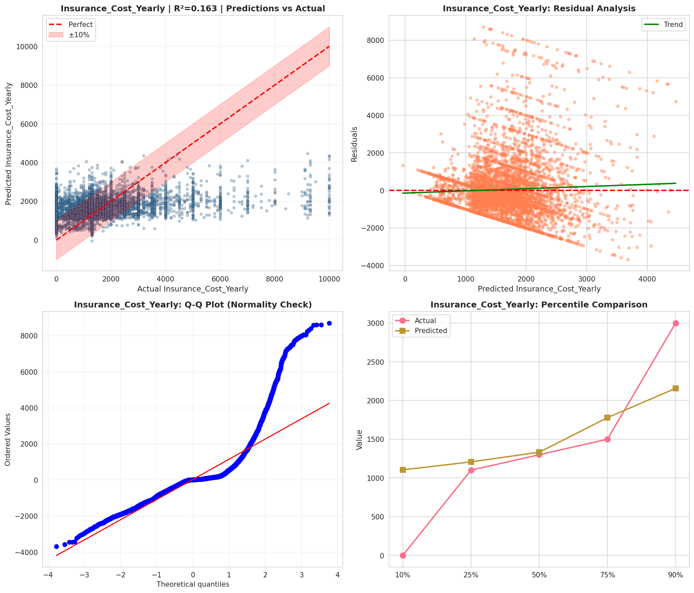
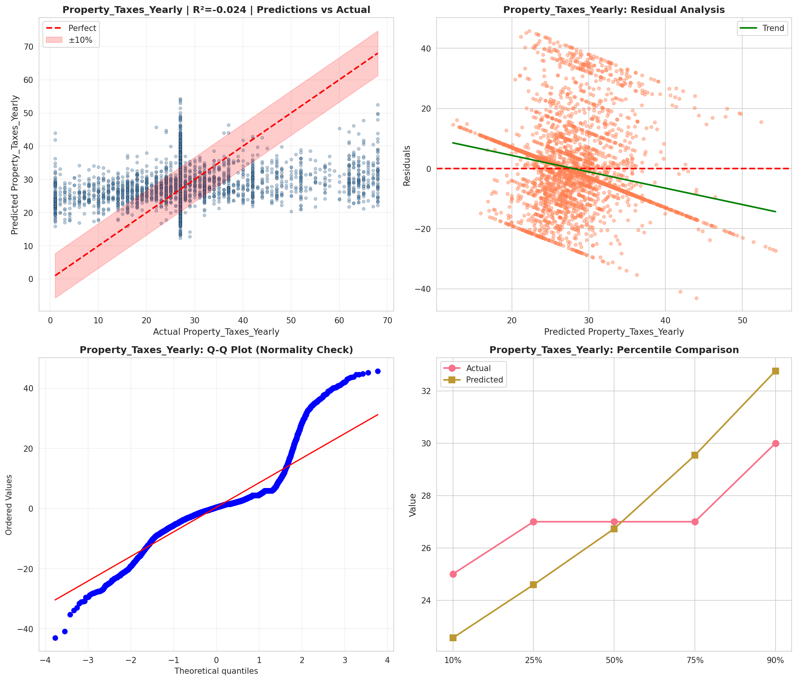
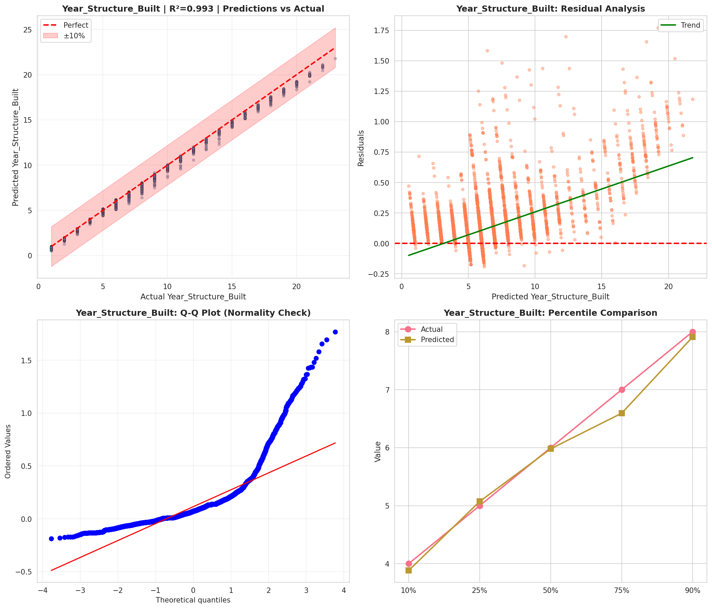
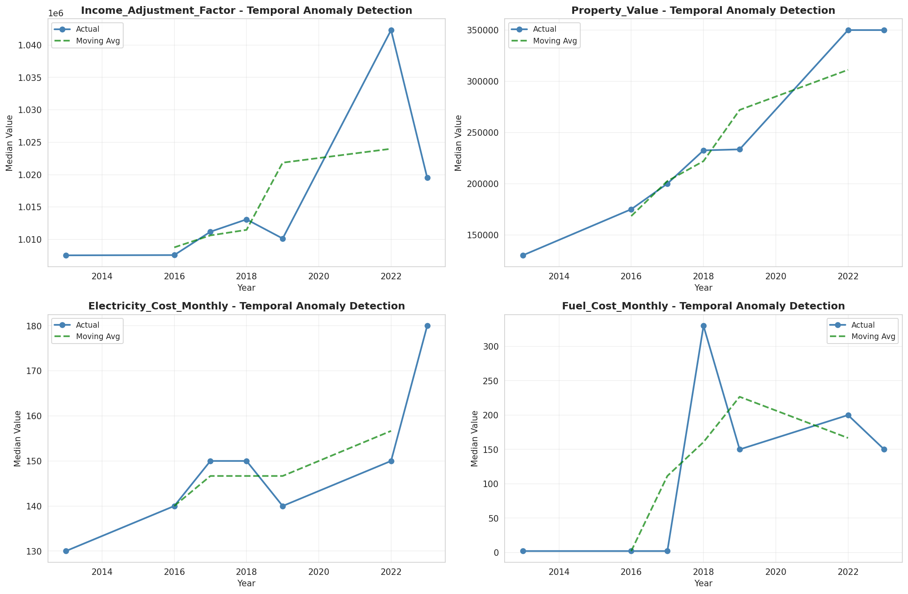
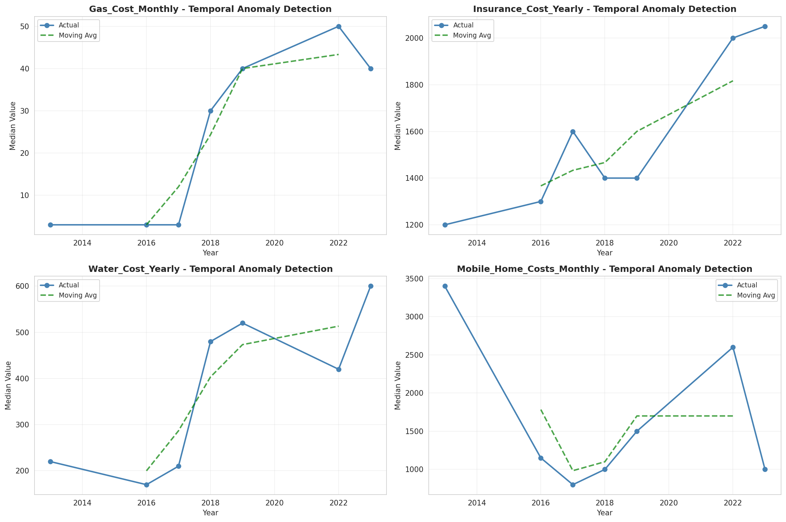
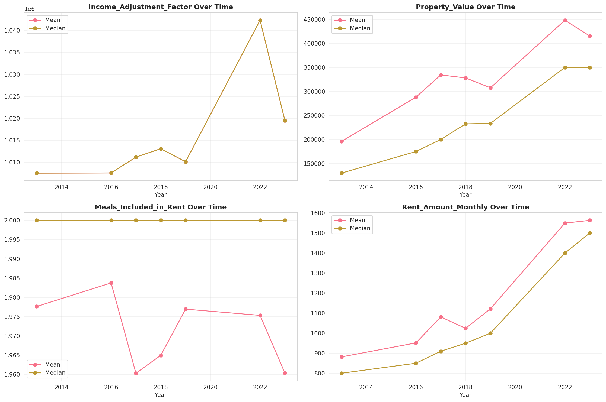
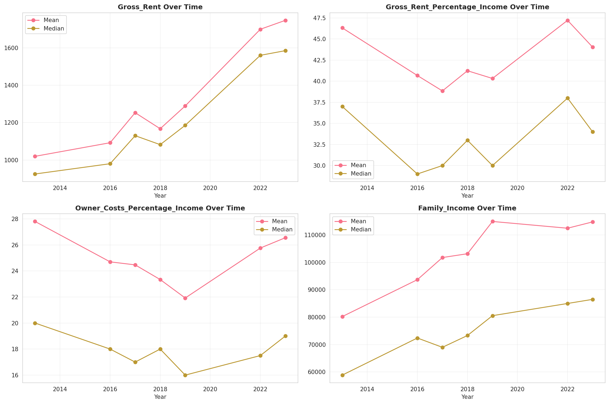
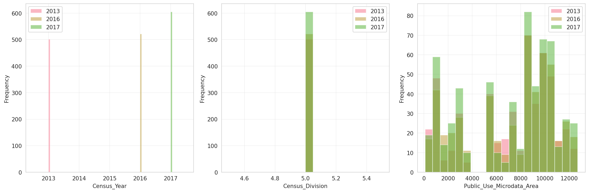
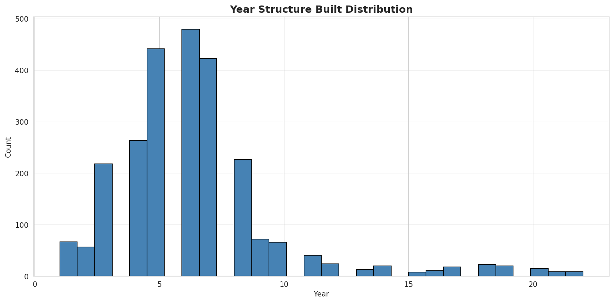
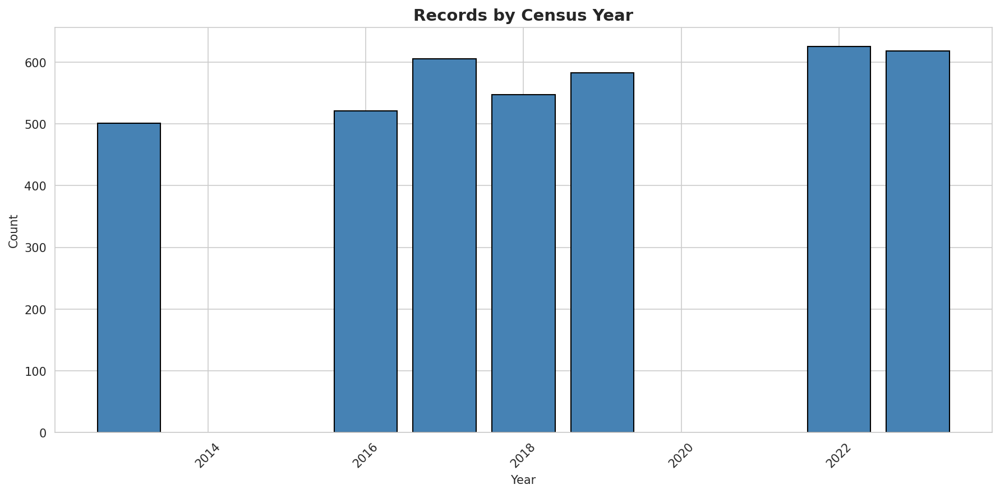
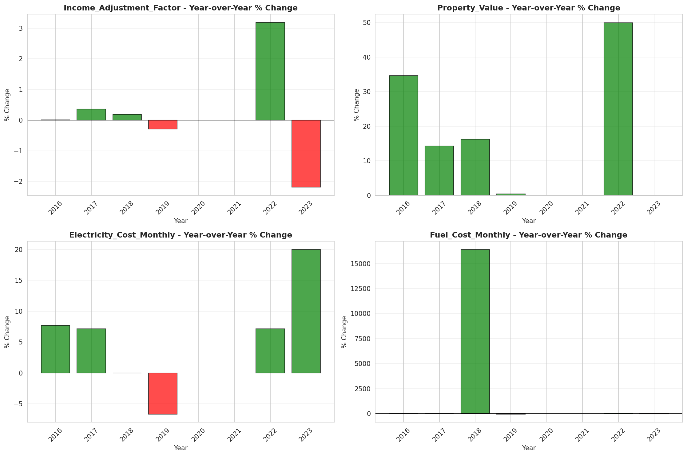
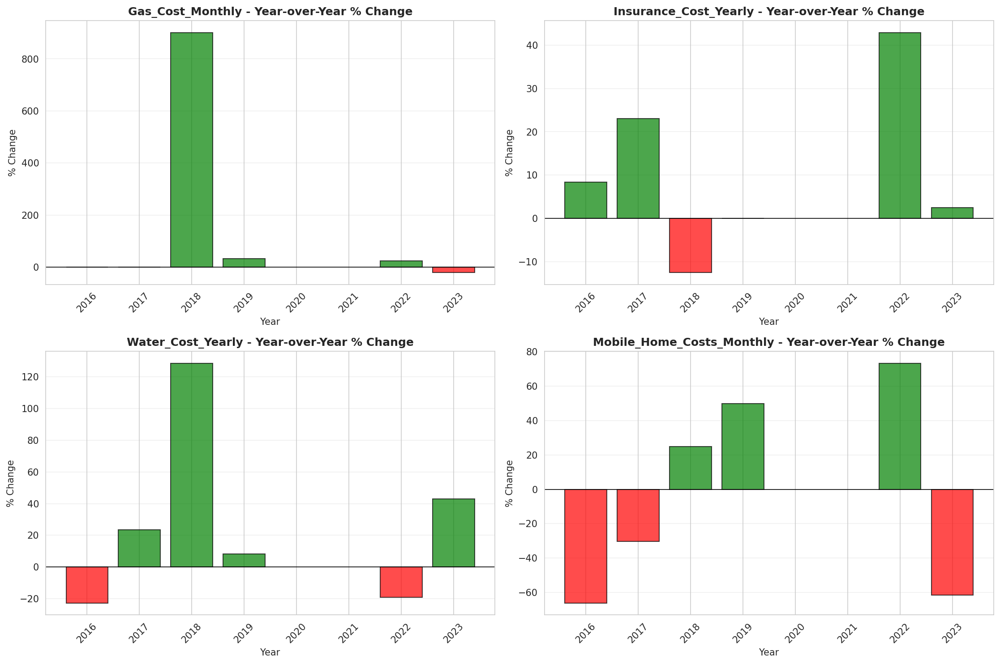
