# Temporal Analysis

## Year Distribution

- 2015: 495,958 records

- 2016: 498,053 records

- 2017: 501,758 records

- 2018: 506,964 records

- 2019: 512,594 records

- 2020: 483,272 records

- 2021: 485,138 records

- 2022: 492,495 records

- 2023: 497,166 records

## Temporal Trends

- Census_Year: {np.int64(2015): {'mean': 2015.0, 'median': 2015.0, 'std': 0.0}, np.int64(2016): {'mean': 2016.0, 'median': 2016.0, 'std': 0.0}, np.int64(2017): {'mean': 2017.0, 'median': 2017.0, 'std': 0.0}, np.int64(2018): {'mean': 2018.0, 'median': 2018.0, 'std': 0.0}, np.int64(2019): {'mean': 2019.0, 'median': 2019.0, 'std': 0.0}, np.int64(2020): {'mean': 2020.0, 'median': 2020.0, 'std': 0.0}, np.int64(2021): {'mean': 2021.0, 'median': 2021.0, 'std': 0.0}, np.int64(2022): {'mean': 2022.0, 'median': 2022.0, 'std': 0.0}, np.int64(2023): {'mean': 2023.0, 'median': 2023.0, 'std': 0.0}}

- Census_Division: {np.int64(2015): {'mean': 5.0, 'median': 5.0, 'std': 0.0}, np.int64(2016): {'mean': 5.0, 'median': 5.0, 'std': 0.0}, np.int64(2017): {'mean': 5.0, 'median': 5.0, 'std': 0.0}, np.int64(2018): {'mean': 5.0, 'median': 5.0, 'std': 0.0}, np.int64(2019): {'mean': 5.0, 'median': 5.0, 'std': 0.0}, np.int64(2020): {'mean': 5.0, 'median': 5.0, 'std': 0.0}, np.int64(2021): {'mean': 5.0, 'median': 5.0, 'std': 0.0}, np.int64(2022): {'mean': 5.0, 'median': 5.0, 'std': 0.0}, np.int64(2023): {'mean': 5.0, 'median': 5.0, 'std': 0.0}}

- Public_Use_Microdata_Area: {np.int64(2015): {'mean': None, 'median': None, 'std': None}, np.int64(2016): {'mean': 7057.9911595753865, 'median': 8603.0, 'std': 3666.3727085084847}, np.int64(2017): {'mean': 7058.900041454247, 'median': 8603.0, 'std': 3665.633337537683}, np.int64(2018): {'mean': 7063.984030424251, 'median': 8603.0, 'std': 3663.194565888}, np.int64(2019): {'mean': 7071.221678365334, 'median': 8603.0, 'std': 3660.788320640707}, np.int64(2020): {'mean': 7075.534117432833, 'median': 8603.0, 'std': 3657.8881391605123}, np.int64(2021): {'mean': 7086.717766903438, 'median': 8603.0, 'std': 3654.022367523596}, np.int64(2022): {'mean': None, 'median': None, 'std': None}, np.int64(2023): {'mean': 6933.475273852194, 'median': 8500.0, 'std': 3740.224961075558}}

- Census_Region: {np.int64(2015): {'mean': 3.0, 'median': 3.0, 'std': 0.0}, np.int64(2016): {'mean': 3.0, 'median': 3.0, 'std': 0.0}, np.int64(2017): {'mean': 3.0, 'median': 3.0, 'std': 0.0}, np.int64(2018): {'mean': 3.0, 'median': 3.0, 'std': 0.0}, np.int64(2019): {'mean': 3.0, 'median': 3.0, 'std': 0.0}, np.int64(2020): {'mean': 3.0, 'median': 3.0, 'std': 0.0}, np.int64(2021): {'mean': 3.0, 'median': 3.0, 'std': 0.0}, np.int64(2022): {'mean': 3.0, 'median': 3.0, 'std': 0.0}, np.int64(2023): {'mean': 3.0, 'median': 3.0, 'std': 0.0}}

- State_Code: {np.int64(2015): {'mean': 12.0, 'median': 12.0, 'std': 0.0}, np.int64(2016): {'mean': 12.0, 'median': 12.0, 'std': 0.0}, np.int64(2017): {'mean': 12.0, 'median': 12.0, 'std': 0.0}, np.int64(2018): {'mean': 12.0, 'median': 12.0, 'std': 0.0}, np.int64(2019): {'mean': 12.0, 'median': 12.0, 'std': 0.0}, np.int64(2020): {'mean': 12.0, 'median': 12.0, 'std': 0.0}, np.int64(2021): {'mean': 12.0, 'median': 12.0, 'std': 0.0}, np.int64(2022): {'mean': 12.0, 'median': 12.0, 'std': 0.0}, np.int64(2023): {'mean': None, 'median': None, 'std': None}}

- Housing_Adjustment_Factor: {np.int64(2015): {'mean': 1020912.3251303538, 'median': 1017534.0, 'std': 20295.955749566514}, np.int64(2016): {'mean': 1020298.287822782, 'median': 1013801.0, 'std': 15767.227305720206}, np.int64(2017): {'mean': 1029093.6805930348, 'median': 1034680.0, 'std': 17981.223428802605}, np.int64(2018): {'mean': 1038131.7979245074, 'median': 1046406.0, 'std': 23500.00770235977}, np.int64(2019): {'mean': 1040629.2290272614, 'median': 1042936.0, 'std': 29189.67314569784}, np.int64(2020): {'mean': 1037660.9650900528, 'median': 1030827.0, 'std': 27910.9250931201}, np.int64(2021): {'mean': 1058862.3090666987, 'median': 1059761.0, 'std': 36040.52944060215}, np.int64(2022): {'mean': 1103312.659336643, 'median': 1133141.0, 'std': 62867.38972921051}, np.int64(2023): {'mean': 1102089.8766890736, 'median': 1125501.0, 'std': 76891.74295726491}}

- Income_Adjustment_Factor: {np.int64(2015): {'mean': 1030321.2807556285, 'median': 1025215.0, 'std': 25669.365856751534}, np.int64(2016): {'mean': 1027454.4770697095, 'median': 1022342.0, 'std': 17517.780094165242}, np.int64(2017): {'mean': 1036493.1817908235, 'median': 1035988.0, 'std': 16845.052205595934}, np.int64(2018): {'mean': 1046729.3136771052, 'median': 1054346.0, 'std': 20517.548941101268}, np.int64(2019): {'mean': 1049599.2714292402, 'median': 1054606.0, 'std': 26250.917929886356}, np.int64(2020): {'mean': 1047910.4829702527, 'median': 1044328.0, 'std': 28238.635374941558}, np.int64(2021): {'mean': 1074120.75410914, 'median': 1070512.0, 'std': 30964.96690090582}, np.int64(2022): {'mean': 1126224.9593254754, 'median': 1140108.0, 'std': 50849.39111614584}, np.int64(2023): {'mean': 1126652.9606409126, 'median': 1159185.0, 'std': 70772.59269214846}}

- Housing_Unit_Weight: {np.int64(2015): {'mean': 18.3382443674666, 'median': 14.0, 'std': 15.407876018675042}, np.int64(2016): {'mean': 18.37719078090083, 'median': 14.0, 'std': 15.090549309841098}, np.int64(2017): {'mean': 18.45448204114334, 'median': 14.0, 'std': 15.083703563149019}, np.int64(2018): {'mean': 18.44053818417087, 'median': 14.0, 'std': 15.117676257193041}, np.int64(2019): {'mean': 18.43205148714187, 'median': 14.0, 'std': 15.408389475103064}, np.int64(2020): {'mean': 19.78662947574037, 'median': 14.0, 'std': 21.460263580663845}, np.int64(2021): {'mean': 20.12808108208386, 'median': 15.0, 'std': 21.59762051554644}, np.int64(2022): {'mean': 20.134127250022843, 'median': 14.0, 'std': 21.876684874566482}, np.int64(2023): {'mean': 20.279657096422522, 'median': 14.0, 'std': 22.215792742944902}}

- Number_of_Persons: {np.int64(2015): {'mean': 1.9346497082414236, 'median': 2.0, 'std': 1.4133414034430916}, np.int64(2016): {'mean': 1.937811839302243, 'median': 2.0, 'std': 1.4091337108467863}, np.int64(2017): {'mean': 1.9426237349479232, 'median': 2.0, 'std': 1.4096777641842049}, np.int64(2018): {'mean': 1.9446213143339566, 'median': 2.0, 'std': 1.4070851284591779}, np.int64(2019): {'mean': 1.947884680663449, 'median': 2.0, 'std': 1.400520722489578}, np.int64(2020): {'mean': 1.9384404641692463, 'median': 2.0, 'std': 1.3978281664257404}, np.int64(2021): {'mean': 1.9434655706211428, 'median': 2.0, 'std': 1.3962743781496145}, np.int64(2022): {'mean': 1.9512969674819034, 'median': 2.0, 'std': 1.3917052536152517}, np.int64(2023): {'mean': 1.961105546236066, 'median': 2.0, 'std': 1.3887784403568013}}

- Housing_Unit_Type: {np.int64(2015): {'mean': 1.1153605748873896, 'median': 1.0, 'std': 0.40742330022154755}, np.int64(2016): {'mean': 1.1135160314263743, 'median': 1.0, 'std': 0.40521848345035605}, np.int64(2017): {'mean': 1.1120898919399391, 'median': 1.0, 'std': 0.40377071513121526}, np.int64(2018): {'mean': 1.1117515247630996, 'median': 1.0, 'std': 0.40362962947732745}, np.int64(2019): {'mean': 1.111485893319079, 'median': 1.0, 'std': 0.40326664089236197}, np.int64(2020): {'mean': None, 'median': None, 'std': None}, np.int64(2021): {'mean': None, 'median': None, 'std': None}, np.int64(2022): {'mean': None, 'median': None, 'std': None}, np.int64(2023): {'mean': None, 'median': None, 'std': None}}

- Building_Type: {np.int64(2015): {'mean': 3.3346832380114386, 'median': 2.0, 'std': 2.444152238623086}, np.int64(2016): {'mean': 3.3518203902069983, 'median': 2.0, 'std': 2.456611942523625}, np.int64(2017): {'mean': 3.3581595326017233, 'median': 2.0, 'std': 2.4600852695820437}, np.int64(2018): {'mean': 3.365783747279958, 'median': 2.0, 'std': 2.4666180395810384}, np.int64(2019): {'mean': 3.367578258316569, 'median': 2.0, 'std': 2.471377155517184}, np.int64(2020): {'mean': 3.371776019896433, 'median': 2.0, 'std': 2.4773545202722147}, np.int64(2021): {'mean': 3.372066730883158, 'median': 2.0, 'std': 2.479448470088145}, np.int64(2022): {'mean': 3.3706478703990173, 'median': 2.0, 'std': 2.482851890382346}, np.int64(2023): {'mean': 3.3624200181284802, 'median': 2.0, 'std': 2.481664941327241}}

- Year_Structure_Built: {np.int64(2015): {'mean': 5.946513418389793, 'median': 6.0, 'std': 2.4137439633588764}, np.int64(2016): {'mean': 6.059912932631022, 'median': 6.0, 'std': 2.591213966091089}, np.int64(2017): {'mean': 6.18010913472374, 'median': 6.0, 'std': 2.8254849603637}, np.int64(2018): {'mean': 6.31378619129801, 'median': 6.0, 'std': 3.0917808643522657}, np.int64(2019): {'mean': 6.476714878354344, 'median': 6.0, 'std': 3.4001439248585936}, np.int64(2020): {'mean': 6.616784892507522, 'median': 6.0, 'std': 3.6639596107610886}, np.int64(2021): {'mean': None, 'median': None, 'std': None}, np.int64(2022): {'mean': None, 'median': None, 'std': None}, np.int64(2023): {'mean': None, 'median': None, 'std': None}}

- Bathtub_or_Shower: {np.int64(2015): {'mean': 1.003955125384954, 'median': 1.0, 'std': 0.06276536492352676}, np.int64(2016): {'mean': 1.0036427482852188, 'median': 1.0, 'std': 0.06024522060800808}, np.int64(2017): {'mean': 1.003727397236525, 'median': 1.0, 'std': 0.060938590350332715}, np.int64(2018): {'mean': 1.003839680991328, 'median': 1.0, 'std': 0.06184614815346937}, np.int64(2019): {'mean': 1.0038580655828753, 'median': 1.0, 'std': 0.06199345981382334}, np.int64(2020): {'mean': 1.0037283120254514, 'median': 1.0, 'std': 0.0609460428878825}, np.int64(2021): {'mean': 1.0038733397549824, 'median': 1.0, 'std': 0.062115583539079415}, np.int64(2022): {'mean': 1.0039188783219668, 'median': 1.0, 'std': 0.062478231937771966}, np.int64(2023): {'mean': 1.0039248605759141, 'median': 1.0, 'std': 0.06252571289904005}}

- Refrigerator: {np.int64(2015): {'mean': 1.0085525736911571, 'median': 1.0, 'std': 0.09208390644926476}, np.int64(2016): {'mean': 1.0078474331306426, 'median': 1.0, 'std': 0.08823756540094778}, np.int64(2017): {'mean': 1.0077603543627884, 'median': 1.0, 'std': 0.08775048689253562}, np.int64(2018): {'mean': 1.0075657365820194, 'median': 1.0, 'std': 0.08665167228222442}, np.int64(2019): {'mean': 1.0072942877311395, 'median': 1.0, 'std': 0.08509463230679476}, np.int64(2020): {'mean': 1.0069052060215757, 'median': 1.0, 'std': 0.08281026332872723}, np.int64(2021): {'mean': 1.0067698652810375, 'median': 1.0, 'std': 0.08200030127480173}, np.int64(2022): {'mean': 1.0065643453814181, 'median': 1.0, 'std': 0.08075437679348314}, np.int64(2023): {'mean': 1.0064186428644784, 'median': 1.0, 'std': 0.07985898901430913}}

- Hot_and_Cold_Running_Water: {np.int64(2015): {'mean': 1.007276726792785, 'median': 1.0, 'std': 0.08499289341117541}, np.int64(2016): {'mean': 1.006933466273967, 'median': 1.0, 'std': 0.08297836088103083}, np.int64(2017): {'mean': 1.0068761810648221, 'median': 1.0, 'std': 0.08263724340554153}, np.int64(2018): {'mean': 1.0067982291588504, 'median': 1.0, 'std': 0.08217072297759595}, np.int64(2019): {'mean': 1.0067452553212688, 'median': 1.0, 'std': 0.08185212919773803}, np.int64(2020): {'mean': 1.0065534784720047, 'median': 1.0, 'std': 0.0806879493215444}, np.int64(2021): {'mean': 1.0065482731642903, 'median': 1.0, 'std': 0.08065610945564335}, np.int64(2022): {'mean': 1.0063311855727886, 'median': 1.0, 'std': 0.0793165541751368}, np.int64(2023): {'mean': 1.0061775251499172, 'median': 1.0, 'std': 0.07835417691187124}}

- Running_Water: {np.int64(2015): {'mean': 9.0, 'median': 9.0, 'std': 0.0}, np.int64(2016): {'mean': 9.0, 'median': 9.0, 'std': 0.0}, np.int64(2017): {'mean': 9.0, 'median': 9.0, 'std': 0.0}, np.int64(2018): {'mean': 9.0, 'median': 9.0, 'std': 0.0}, np.int64(2019): {'mean': 9.0, 'median': 9.0, 'std': 0.0}, np.int64(2020): {'mean': 9.0, 'median': 9.0, 'std': 0.0}, np.int64(2021): {'mean': 9.0, 'median': 9.0, 'std': 0.0}, np.int64(2022): {'mean': 9.0, 'median': 9.0, 'std': 0.0}, np.int64(2023): {'mean': 9.0, 'median': 9.0, 'std': 0.0}}

- Sink_with_Faucet: {np.int64(2015): {'mean': 1.004082710074791, 'median': 1.0, 'std': 0.06376559023073532}, np.int64(2016): {'mean': 1.0038307893131473, 'median': 1.0, 'std': 0.061774774062135634}, np.int64(2017): {'mean': 1.003868258178603, 'median': 1.0, 'std': 0.06207497972393316}, np.int64(2018): {'mean': 1.0039404431390624, 'median': 1.0, 'std': 0.06264921756478375}, np.int64(2019): {'mean': 1.003966176211846, 'median': 1.0, 'std': 0.0628526374334377}, np.int64(2020): {'mean': 1.0038372341053186, 'median': 1.0, 'std': 0.06182651869413779}, np.int64(2021): {'mean': 1.0039095180597575, 'median': 1.0, 'std': 0.06240386633647969}, np.int64(2022): {'mean': 1.0040018294077293, 'median': 1.0, 'std': 0.06313338027559863}, np.int64(2023): {'mean': 1.0040409542903326, 'median': 1.0, 'std': 0.06344000286915853}}

- Stove_or_Range: {np.int64(2015): {'mean': 1.011223053233612, 'median': 1.0, 'std': 0.10534287218632107}, np.int64(2016): {'mean': 1.010716152068342, 'median': 1.0, 'std': 0.10296280558176692}, np.int64(2017): {'mean': 1.010692429049427, 'median': 1.0, 'std': 0.10285000697234782}, np.int64(2018): {'mean': 1.0107279529204944, 'median': 1.0, 'std': 0.10301886574476284}, np.int64(2019): {'mean': 1.0105715236603292, 'median': 1.0, 'std': 0.10227310849220445}, np.int64(2020): {'mean': 1.010250021557495, 'median': 1.0, 'std': 0.10072229959973825}, np.int64(2021): {'mean': 1.0101706259298955, 'median': 1.0, 'std': 0.10033547259815458}, np.int64(2022): {'mean': 1.0100325975347835, 'median': 1.0, 'std': 0.09965925339964925}, np.int64(2023): {'mean': 1.0098009885826298, 'median': 1.0, 'std': 0.09851370905832908}}

- Telephone_Service: {np.int64(2015): {'mean': 1.0509404723333609, 'median': 1.0, 'std': 0.406220702233229}, np.int64(2016): {'mean': 1.0512387920593702, 'median': 1.0, 'std': 0.40543055411034207}, np.int64(2017): {'mean': 1.0474147289881963, 'median': 1.0, 'std': 0.39972427596253757}, np.int64(2018): {'mean': 1.044547820492826, 'median': 1.0, 'std': 0.39466397408652487}, np.int64(2019): {'mean': 1.049808484324532, 'median': 1.0, 'std': 0.4648316224658567}, np.int64(2020): {'mean': 1.0282941438300652, 'median': 1.0, 'std': 0.2979341757778733}, np.int64(2021): {'mean': 1.0223858856479897, 'median': 1.0, 'std': 0.287647085886982}, np.int64(2022): {'mean': 1.0204219324303911, 'median': 1.0, 'std': 0.28276623288908}, np.int64(2023): {'mean': 1.0186167959776558, 'median': 1.0, 'std': 0.2785748854326003}}

- Lot_Acreage: {np.int64(2015): {'mean': 1.1371232521853332, 'median': 1.0, 'std': 0.38135348545334463}, np.int64(2016): {'mean': 1.1362949567892149, 'median': 1.0, 'std': 0.3799914630374088}, np.int64(2017): {'mean': 1.1348618550804084, 'median': 1.0, 'std': 0.3781595157807857}, np.int64(2018): {'mean': 1.1340476246666509, 'median': 1.0, 'std': 0.37748311933477197}, np.int64(2019): {'mean': 1.1339061794561847, 'median': 1.0, 'std': 0.3774138581648159}, np.int64(2020): {'mean': 1.133745618817665, 'median': 1.0, 'std': 0.37730448984106674}, np.int64(2021): {'mean': 1.133109217660728, 'median': 1.0, 'std': 0.37629461115574914}, np.int64(2022): {'mean': 1.1335199144138484, 'median': 1.0, 'std': 0.3764057626637833}, np.int64(2023): {'mean': 1.1347223319617579, 'median': 1.0, 'std': 0.377283550394165}}

- Agricultural_Sales: {np.int64(2015): {'mean': 1.1255840664073717, 'median': 1.0, 'std': 0.6567855124537747}, np.int64(2016): {'mean': 1.124085684430512, 'median': 1.0, 'std': 0.6523212014744161}, np.int64(2017): {'mean': 1.1234131658159927, 'median': 1.0, 'std': 0.6523297913754861}, np.int64(2018): {'mean': 1.1215563389476433, 'median': 1.0, 'std': 0.6436604085448646}, np.int64(2019): {'mean': 1.1250806097969923, 'median': 1.0, 'std': 0.6550965001615567}, np.int64(2020): {'mean': 1.1257296190765995, 'median': 1.0, 'std': 0.6546020908513283}, np.int64(2021): {'mean': 1.1323719981251206, 'median': 1.0, 'std': 0.6723575582546015}, np.int64(2022): {'mean': 1.1333603567085528, 'median': 1.0, 'std': 0.6731742874029699}, np.int64(2023): {'mean': 1.1354048417328864, 'median': 1.0, 'std': 0.6784009131040923}}

- Business_On_Property: {np.int64(2015): {'mean': 1.98982185995795, 'median': 2.0, 'std': 0.10037218665408355}, np.int64(2016): {'mean': 3.4142287693412197, 'median': 2.0, 'std': 2.8221683649730824}, np.int64(2017): {'mean': 4.839106005445955, 'median': 2.0, 'std': 3.443854665110572}, np.int64(2018): {'mean': 6.2448670143723595, 'median': 9.0, 'std': 3.4244323962366745}, np.int64(2019): {'mean': 7.634565923423096, 'median': 9.0, 'std': 2.776556006654018}, np.int64(2020): {'mean': None, 'median': None, 'std': None}, np.int64(2021): {'mean': None, 'median': None, 'std': None}, np.int64(2022): {'mean': None, 'median': None, 'std': None}, np.int64(2023): {'mean': None, 'median': None, 'std': None}}

- Tenure: {np.int64(2015): {'mean': 1.9110839857240092, 'median': 2.0, 'std': 0.8608938683569823}, np.int64(2016): {'mean': 1.9220116727057053, 'median': 2.0, 'std': 0.8574692945835086}, np.int64(2017): {'mean': 1.9277170265682366, 'median': 2.0, 'std': 0.8546097837934701}, np.int64(2018): {'mean': 1.9274041835620712, 'median': 2.0, 'std': 0.8505017563456986}, np.int64(2019): {'mean': 1.9220201001404849, 'median': 2.0, 'std': 0.8453804958989182}, np.int64(2020): {'mean': 1.9133602801369811, 'median': 2.0, 'std': 0.8410924128218085}, np.int64(2021): {'mean': 1.9051589755646303, 'median': 2.0, 'std': 0.8364145181741499}, np.int64(2022): {'mean': 1.8956648708524244, 'median': 2.0, 'std': 0.8310363303913699}, np.int64(2023): {'mean': 1.8851524075762784, 'median': 2.0, 'std': 0.8252257064963558}}

- Vacancy_Status: {np.int64(2015): {'mean': 4.625963258870839, 'median': 5.0, 'std': 1.8868887460254233}, np.int64(2016): {'mean': 4.624997770604077, 'median': 5.0, 'std': 1.858543585882497}, np.int64(2017): {'mean': 4.6055705941017235, 'median': 5.0, 'std': 1.8567713430714563}, np.int64(2018): {'mean': 4.605934696934572, 'median': 5.0, 'std': 1.851001433845265}, np.int64(2019): {'mean': 4.606192610801822, 'median': 5.0, 'std': 1.847214010051029}, np.int64(2020): {'mean': 4.594443910410458, 'median': 5.0, 'std': 1.854701072043153}, np.int64(2021): {'mean': 4.618874666247841, 'median': 5.0, 'std': 1.8489977965353428}, np.int64(2022): {'mean': 4.6214926473600135, 'median': 5.0, 'std': 1.8471650029707452}, np.int64(2023): {'mean': 4.617578829796375, 'median': 5.0, 'std': 1.8550142115261283}}

- Vehicles_Available: {np.int64(2015): {'mean': 1.6362636286233112, 'median': 2.0, 'std': 0.9228332330384629}, np.int64(2016): {'mean': 1.6491210582189904, 'median': 2.0, 'std': 0.9275338505657241}, np.int64(2017): {'mean': 1.6660416090955745, 'median': 2.0, 'std': 0.9324011206684167}, np.int64(2018): {'mean': 1.683330571584529, 'median': 2.0, 'std': 0.939698210632633}, np.int64(2019): {'mean': 1.7008537156442491, 'median': 2.0, 'std': 0.9477488258869902}, np.int64(2020): {'mean': 1.7158107068518809, 'median': 2.0, 'std': 0.9551451532125487}, np.int64(2021): {'mean': 1.724806934513618, 'median': 2.0, 'std': 0.9588643548665079}, np.int64(2022): {'mean': 1.7318261920346407, 'median': 2.0, 'std': 0.9626319330403342}, np.int64(2023): {'mean': 1.7354157634829752, 'median': 2.0, 'std': 0.9646104832895279}}

- Condo_Fee_Monthly: {np.int64(2015): {'mean': 368.4144539639831, 'median': 310.0, 'std': 251.95678656240773}, np.int64(2016): {'mean': 382.5718848317285, 'median': 320.0, 'std': 259.09653182565864}, np.int64(2017): {'mean': 395.9220152494933, 'median': 330.0, 'std': 268.0464382918327}, np.int64(2018): {'mean': 405.5212628106962, 'median': 340.0, 'std': 272.33742140486925}, np.int64(2019): {'mean': 416.36817786724004, 'median': 350.0, 'std': 279.26279622167357}, np.int64(2020): {'mean': 431.7069828465912, 'median': 350.0, 'std': 308.5427036112261}, np.int64(2021): {'mean': 452.909501724343, 'median': 370.0, 'std': 345.7604293292064}, np.int64(2022): {'mean': 482.9389005320007, 'median': 380.0, 'std': 391.8145032402507}, np.int64(2023): {'mean': 525.9507954290835, 'median': 400.0, 'std': 442.4032300770749}}

- Electricity_Cost_Monthly: {np.int64(2015): {'mean': 157.76974816087363, 'median': 140.0, 'std': 97.0041039026762}, np.int64(2016): {'mean': 155.2420940096392, 'median': 140.0, 'std': 95.46982207075204}, np.int64(2017): {'mean': 155.04627482136513, 'median': 140.0, 'std': 95.25698655608082}, np.int64(2018): {'mean': 161.01652480224644, 'median': 140.0, 'std': 93.420403367361}, np.int64(2019): {'mean': 161.06702036743386, 'median': 140.0, 'std': 93.55939121809452}, np.int64(2020): {'mean': 161.1589728939008, 'median': 140.0, 'std': 96.6106137933254}, np.int64(2021): {'mean': 162.96921795912363, 'median': 140.0, 'std': 100.59895022634635}, np.int64(2022): {'mean': 172.68203690097997, 'median': 150.0, 'std': 146.20733652248737}, np.int64(2023): {'mean': 185.47710902584737, 'median': 150.0, 'std': 177.66648069673806}}

- Fuel_Cost_Monthly: {np.int64(2015): {'mean': 13.637082413456202, 'median': 2.0, 'std': 135.6705670917053}, np.int64(2016): {'mean': 11.69676882360857, 'median': 2.0, 'std': 125.34648309583274}, np.int64(2017): {'mean': 10.219543247404367, 'median': 2.0, 'std': 115.21949142094365}, np.int64(2018): {'mean': 505.8389323515877, 'median': 200.0, 'std': 756.6610982632054}, np.int64(2019): {'mean': 502.98309369568653, 'median': 200.0, 'std': 770.7464570206987}, np.int64(2020): {'mean': 493.27206266318535, 'median': 200.0, 'std': 772.4709683186836}, np.int64(2021): {'mean': 489.1655699804375, 'median': 200.0, 'std': 756.1401069982356}, np.int64(2022): {'mean': 493.0311946118398, 'median': 200.0, 'std': 780.7918912228481}, np.int64(2023): {'mean': 499.42252510760403, 'median': 200.0, 'std': 782.9083115604689}}

- Gas_Cost_Monthly: {np.int64(2015): {'mean': 11.154157593475842, 'median': 3.0, 'std': 33.526537670265974}, np.int64(2016): {'mean': 10.618075249577599, 'median': 3.0, 'std': 31.774301872081693}, np.int64(2017): {'mean': 10.244389285855275, 'median': 3.0, 'std': 30.711378217176875}, np.int64(2018): {'mean': 60.35777558101219, 'median': 40.0, 'std': 67.0705854052325}, np.int64(2019): {'mean': 59.6943234762765, 'median': 40.0, 'std': 65.16517687235904}, np.int64(2020): {'mean': 59.92807745504841, 'median': 40.0, 'std': 66.44201269399095}, np.int64(2021): {'mean': 61.70462847737947, 'median': 40.0, 'std': 68.87906147841888}, np.int64(2022): {'mean': 68.39915198195044, 'median': 40.0, 'std': 88.46259111897956}, np.int64(2023): {'mean': 74.77658547663657, 'median': 40.0, 'std': 107.849461964158}}

- House_Heating_Fuel: {np.int64(2015): {'mean': 3.0242897795057653, 'median': 3.0, 'std': 0.9945804335045161}, np.int64(2016): {'mean': 3.0331391205099707, 'median': 3.0, 'std': 1.0211314509167113}, np.int64(2017): {'mean': 3.042112431408156, 'median': 3.0, 'std': 1.0466973695456911}, np.int64(2018): {'mean': 3.040656191515908, 'median': 3.0, 'std': 1.0443453089062518}, np.int64(2019): {'mean': 3.042179076162002, 'median': 3.0, 'std': 1.0484490366703696}, np.int64(2020): {'mean': 3.0428232908891157, 'median': 3.0, 'std': 1.0521162050195638}, np.int64(2021): {'mean': 3.0484976413045146, 'median': 3.0, 'std': 1.0747454966379835}, np.int64(2022): {'mean': 3.0540003020995923, 'median': 3.0, 'std': 1.101336558253906}, np.int64(2023): {'mean': 3.06251276914874, 'median': 3.0, 'std': 1.1311336381193837}}

- Insurance_Cost_Yearly: {np.int64(2015): {'mean': 1705.3856868164357, 'median': 1300.0, 'std': 1481.8897282712371}}

- Water_Cost_Yearly: {np.int64(2015): {'mean': 411.473119494865, 'median': 200.0, 'std': 523.1970613769028}, np.int64(2016): {'mean': 410.51198670248556, 'median': 180.0, 'std': 525.5757156377961}, np.int64(2017): {'mean': 412.90698156409144, 'median': 180.0, 'std': 530.0897958258536}, np.int64(2018): {'mean': 602.1271806018178, 'median': 500.0, 'std': 555.5977591360447}, np.int64(2019): {'mean': 605.772819009177, 'median': 500.0, 'std': 568.2606192873955}, np.int64(2020): {'mean': 612.3416155487153, 'median': 500.0, 'std': 584.1842634188693}, np.int64(2021): {'mean': 621.8283095951888, 'median': 500.0, 'std': 607.9668516544996}, np.int64(2022): {'mean': 635.0647346964797, 'median': 500.0, 'std': 639.1693500935587}, np.int64(2023): {'mean': 651.6433226677402, 'median': 500.0, 'std': 669.2091511045655}}

- Mobile_Home_Costs_Monthly: {np.int64(2015): {'mean': 2583.055417613186, 'median': 1300.0, 'std': 2647.786289194293}, np.int64(2016): {'mean': 2643.2774642687623, 'median': 1300.0, 'std': 2728.6687931989654}, np.int64(2017): {'mean': 2715.6760339342522, 'median': 1300.0, 'std': 2830.6068021296746}, np.int64(2018): {'mean': 2790.434107719554, 'median': 1300.0, 'std': 2914.864410455601}, np.int64(2019): {'mean': 2874.816982854824, 'median': 1300.0, 'std': 3006.948173885263}, np.int64(2020): {'mean': 2981.1428102967698, 'median': 1300.0, 'std': 3205.517145941518}, np.int64(2021): {'mean': 3156.7058437653745, 'median': 1300.0, 'std': 3611.549043145098}, np.int64(2022): {'mean': 3431.8943097997894, 'median': 1400.0, 'std': 4377.410847138089}, np.int64(2023): {'mean': 3710.6717344089357, 'median': 1500.0, 'std': 4838.213181194798}}

- First_Mortgage_Includes_Insurance: {np.int64(2015): {'mean': 1.404843319065031, 'median': 1.0, 'std': 0.4908632289431229}, np.int64(2016): {'mean': 1.3932620564725555, 'median': 1.0, 'std': 0.4884757135423986}, np.int64(2017): {'mean': 1.379350252128627, 'median': 1.0, 'std': 0.4852268907430881}, np.int64(2018): {'mean': 1.3638180909545228, 'median': 1.0, 'std': 0.4810986923986853}, np.int64(2019): {'mean': 1.3506637858900226, 'median': 1.0, 'std': 0.4771793342330783}, np.int64(2020): {'mean': 1.337108188738311, 'median': 1.0, 'std': 0.4727237593050067}, np.int64(2021): {'mean': 1.321889614591742, 'median': 1.0, 'std': 0.4672024687821578}, np.int64(2022): {'mean': 1.3089938019253593, 'median': 1.0, 'std': 0.4620801231066}, np.int64(2023): {'mean': 1.3018215341161703, 'median': 1.0, 'std': 0.45904975049193547}}

- First_Mortgage_Payment_Monthly: {np.int64(2015): {'mean': 1161.1204277994784, 'median': 990.0, 'std': 815.7870047523706}, np.int64(2016): {'mean': 1163.4700852535439, 'median': 990.0, 'std': 816.7990230387373}, np.int64(2017): {'mean': 1175.1491088063792, 'median': 1000.0, 'std': 823.4115974472029}, np.int64(2018): {'mean': 1203.9106016611947, 'median': 1000.0, 'std': 839.4611135272376}, np.int64(2019): {'mean': 1245.2964244233242, 'median': 1100.0, 'std': 861.1603090117814}, np.int64(2020): {'mean': 1283.5759675714726, 'median': 1100.0, 'std': 879.5134240053014}, np.int64(2021): {'mean': 1335.4122740888502, 'median': 1200.0, 'std': 898.0208990199337}, np.int64(2022): {'mean': 1405.8567717262297, 'median': 1200.0, 'std': 931.1031599880357}, np.int64(2023): {'mean': 1497.8207233831106, 'median': 1300.0, 'std': 985.9113149594086}}

- First_Mortgage_Includes_Taxes: {np.int64(2015): {'mean': 1.3221100448016374, 'median': 1.0, 'std': 0.4672863429811783}, np.int64(2016): {'mean': 1.3112261055725163, 'median': 1.0, 'std': 0.46299651677103926}, np.int64(2017): {'mean': 1.2997691735395298, 'median': 1.0, 'std': 0.45815821602987516}, np.int64(2018): {'mean': 1.2859203309737537, 'median': 1.0, 'std': 0.4518530589544864}, np.int64(2019): {'mean': 1.273282461815139, 'median': 1.0, 'std': 0.44564604568115007}, np.int64(2020): {'mean': 1.2608730551579286, 'median': 1.0, 'std': 0.43911227952645665}, np.int64(2021): {'mean': 1.2480102473097476, 'median': 1.0, 'std': 0.4318592464866905}, np.int64(2022): {'mean': 1.236509297111961, 'median': 1.0, 'std': 0.424939807667683}, np.int64(2023): {'mean': 1.2292216962627822, 'median': 1.0, 'std': 0.4203335168539086}}

- First_Mortgage_Status: {np.int64(2015): {'mean': 1.8607769987778993, 'median': 1.0, 'std': 0.9871600279374774}, np.int64(2016): {'mean': 1.8833984715341914, 'median': 1.0, 'std': 0.9899904259218383}, np.int64(2017): {'mean': 1.8980097398707458, 'median': 1.0, 'std': 0.9915992770248369}, np.int64(2018): {'mean': 1.9100063107233753, 'median': 1.0, 'std': 0.9927952327581914}, np.int64(2019): {'mean': 1.9198857933429183, 'median': 1.0, 'std': 0.9937994589809466}, np.int64(2020): {'mean': 1.9289266973279982, 'median': 1.0, 'std': 0.9945710808418827}, np.int64(2021): {'mean': 1.9430181457329174, 'median': 1.0, 'std': 0.995625598554637}, np.int64(2022): {'mean': 1.958139422479389, 'median': 1.0, 'std': 0.9964557380463395}, np.int64(2023): {'mean': 1.9720110118394163, 'median': 1.0, 'std': 0.9969621935772617}}

- Second_Mortgage_Payment_Monthly: {np.int64(2015): {'mean': 392.15479815342303, 'median': 290.0, 'std': 389.0567863826526}, np.int64(2016): {'mean': 392.87305236270754, 'median': 280.0, 'std': 399.1961933241043}, np.int64(2017): {'mean': 399.616200891049, 'median': 290.0, 'std': 415.0442080624487}, np.int64(2018): {'mean': 415.36973793951097, 'median': 300.0, 'std': 446.4124973222274}, np.int64(2019): {'mean': 439.50370439838696, 'median': 300.0, 'std': 480.664846868985}, np.int64(2020): {'mean': 458.0888317035512, 'median': 300.0, 'std': 504.3320202941069}, np.int64(2021): {'mean': 473.93238603349005, 'median': 300.0, 'std': 524.8644467396808}, np.int64(2022): {'mean': 490.52592868944197, 'median': 320.0, 'std': 550.7576761236977}, np.int64(2023): {'mean': 526.4140596438084, 'median': 350.0, 'std': 606.9341000846475}}

- Second_Mortgage_Status: {np.int64(2015): {'mean': 2.7827994159563714, 'median': 3.0, 'std': 0.5137702025027208}, np.int64(2016): {'mean': 2.80231438669386, 'median': 3.0, 'std': 0.49298853434177325}, np.int64(2017): {'mean': 2.8223272139945697, 'median': 3.0, 'std': 0.469484990132484}, np.int64(2018): {'mean': 2.8374610163272793, 'median': 3.0, 'std': 0.449120026155774}, np.int64(2019): {'mean': 2.8496147169387167, 'median': 3.0, 'std': 0.4313571280200874}, np.int64(2020): {'mean': 2.8545487222839796, 'median': 3.0, 'std': 0.4209698245352409}, np.int64(2021): {'mean': 2.860222494628758, 'median': 3.0, 'std': 0.4085196160533712}, np.int64(2022): {'mean': 2.8647705947065294, 'median': 3.0, 'std': 0.3983339875304075}, np.int64(2023): {'mean': 2.8649175813668872, 'median': 3.0, 'std': 0.39464461933919104}}

- Property_Taxes_Yearly: {np.int64(2015): {'mean': 29.33859336921021, 'median': 27.0, 'std': 17.97692829576403}, np.int64(2016): {'mean': 29.674427536566892, 'median': 27.0, 'std': 18.14429585066028}, np.int64(2017): {'mean': 30.154710305798112, 'median': 27.0, 'std': 18.318673442443238}}

- Meals_Included_in_Rent: {np.int64(2015): {'mean': 1.9747455990492462, 'median': 2.0, 'std': 0.15689748037416065}, np.int64(2016): {'mean': 1.9747853290534927, 'median': 2.0, 'std': 0.1567772035695574}, np.int64(2017): {'mean': 1.9746702143907908, 'median': 2.0, 'std': 0.15712538315463362}, np.int64(2018): {'mean': 1.9736549283935991, 'median': 2.0, 'std': 0.16015996425833032}, np.int64(2019): {'mean': 1.9729694982804615, 'median': 2.0, 'std': 0.16217294787758446}, np.int64(2020): {'mean': 1.972258477063095, 'median': 2.0, 'std': 0.16423205261559523}, np.int64(2021): {'mean': 1.9719947183412736, 'median': 2.0, 'std': 0.16498857147737298}, np.int64(2022): {'mean': 1.971058201538839, 'median': 2.0, 'std': 0.16764374746807642}, np.int64(2023): {'mean': 1.9705147147649447, 'median': 2.0, 'std': 0.16916314346530237}}

- Rent_Amount_Monthly: {np.int64(2015): {'mean': 912.6643062880157, 'median': 800.0, 'std': 504.89279934116104}, np.int64(2016): {'mean': 947.7493686148632, 'median': 850.0, 'std': 520.7890896141587}, np.int64(2017): {'mean': 985.7553999630222, 'median': 880.0, 'std': 536.6114301664124}, np.int64(2018): {'mean': 1026.600373041731, 'median': 900.0, 'std': 552.7432982774799}, np.int64(2019): {'mean': 1071.431009545849, 'median': 950.0, 'std': 568.0784547608681}, np.int64(2020): {'mean': 1117.5438196932403, 'median': 1000.0, 'std': 610.7511309854601}, np.int64(2021): {'mean': 1180.094017094017, 'median': 1100.0, 'std': 679.3809250873971}, np.int64(2022): {'mean': 1272.8255407283596, 'median': 1200.0, 'std': 762.0815248203214}, np.int64(2023): {'mean': 1388.3471141962402, 'median': 1200.0, 'std': 847.1202523298405}}

- Gross_Rent: {np.int64(2015): {'mean': 1059.7744340044742, 'median': 967.0, 'std': 517.5815412706161}, np.int64(2016): {'mean': 1090.9324851419767, 'median': 994.0, 'std': 529.7132532643695}, np.int64(2017): {'mean': 1126.8201593909423, 'median': 1025.0, 'std': 542.8821447737361}, np.int64(2018): {'mean': 1167.5131082903883, 'median': 1062.0, 'std': 557.189528538528}, np.int64(2019): {'mean': 1210.6790952909355, 'median': 1102.0, 'std': 572.2415412344908}, np.int64(2020): {'mean': 1251.7184468781113, 'median': 1150.0, 'std': 604.1149621731316}, np.int64(2021): {'mean': 1310.2627995563914, 'median': 1205.0, 'std': 655.2873909463291}, np.int64(2022): {'mean': 1405.2202057814798, 'median': 1300.0, 'std': 735.5686017000687}, np.int64(2023): {'mean': 1527.7286431154157, 'median': 1400.0, 'std': 827.0115143434622}}

- Gross_Rent_Percentage_Income: {np.int64(2015): {'mean': 42.863757914373146, 'median': 34.0, 'std': 27.693410366258927}, np.int64(2016): {'mean': 42.24379108013055, 'median': 33.0, 'std': 27.513619704424176}, np.int64(2017): {'mean': 41.84109664813939, 'median': 33.0, 'std': 27.34852923637157}, np.int64(2018): {'mean': 41.63145202759012, 'median': 32.0, 'std': 27.223072962347306}, np.int64(2019): {'mean': 41.32327635960044, 'median': 32.0, 'std': 27.12371075335781}, np.int64(2020): {'mean': 41.24797398942107, 'median': 32.0, 'std': 27.145531261457595}, np.int64(2021): {'mean': 41.65256729023601, 'median': 32.0, 'std': 27.385381156093743}, np.int64(2022): {'mean': 42.133239831697054, 'median': 33.0, 'std': 27.595911585794834}, np.int64(2023): {'mean': 42.71264061908223, 'median': 33.0, 'std': 27.81288450793141}}

- Selected_Monthly_Owner_Costs: {np.int64(2015): {'mean': 1187.7698439935366, 'median': 934.0, 'std': 1001.2970828938097}, np.int64(2016): {'mean': 1174.920227697234, 'median': 920.0, 'std': 992.4319723597526}, np.int64(2017): {'mean': 1174.2088467246954, 'median': 920.0, 'std': 991.0334714482996}, np.int64(2018): {'mean': 1189.5830980150001, 'median': 932.0, 'std': 1003.3742970427285}, np.int64(2019): {'mean': 1212.1710670488662, 'median': 949.0, 'std': 1022.4152505285646}, np.int64(2020): {'mean': 1234.8028289786566, 'median': 964.0, 'std': 1046.3731088164848}, np.int64(2021): {'mean': 1269.755372551244, 'median': 991.0, 'std': 1078.0760014844477}, np.int64(2022): {'mean': 1328.6242847819556, 'median': 1037.0, 'std': 1127.0169233081817}, np.int64(2023): {'mean': 1413.0856761595892, 'median': 1102.0, 'std': 1198.2742368684817}}

- Owner_Costs_Percentage_Income: {np.int64(2015): {'mean': 26.927872661534618, 'median': 20.0, 'std': 23.704219247068774}, np.int64(2016): {'mean': 25.932603902467143, 'median': 19.0, 'std': 23.231787267692983}, np.int64(2017): {'mean': 25.195507374673387, 'median': 18.0, 'std': 22.893101037878232}, np.int64(2018): {'mean': 24.752332723448042, 'median': 18.0, 'std': 22.641285470395985}, np.int64(2019): {'mean': 24.242669567724136, 'median': 17.0, 'std': 22.343259703578127}, np.int64(2020): {'mean': 24.022507312417815, 'median': 17.0, 'std': 22.330362030965386}, np.int64(2021): {'mean': 24.035259419593903, 'median': 17.0, 'std': 22.571969395044462}, np.int64(2022): {'mean': 24.17920572575718, 'median': 17.0, 'std': 22.80348710934524}, np.int64(2023): {'mean': 24.604642425318843, 'median': 17.0, 'std': 23.22783859325788}}

- Satellite_Internet: {np.int64(2015): {'mean': None, 'median': None, 'std': None}, np.int64(2016): {'mean': None, 'median': None, 'std': None}, np.int64(2017): {'mean': 1.9404041943546912, 'median': 2.0, 'std': 0.2367368083555332}, np.int64(2018): {'mean': 1.9346993365518292, 'median': 2.0, 'std': 0.24705599734251524}, np.int64(2019): {'mean': 1.9303157882871458, 'median': 2.0, 'std': 0.2546144242563511}, np.int64(2020): {'mean': 1.9267768321317253, 'median': 2.0, 'std': 0.26050285264497225}, np.int64(2021): {'mean': 1.927265019379845, 'median': 2.0, 'std': 0.2597013625662448}, np.int64(2022): {'mean': 1.9290289033823582, 'median': 2.0, 'std': 0.2567769156030478}, np.int64(2023): {'mean': 1.9309715090615762, 'median': 2.0, 'std': 0.2535029266190566}}

- Smartphone: {np.int64(2015): {'mean': None, 'median': None, 'std': None}, np.int64(2016): {'mean': None, 'median': None, 'std': None}, np.int64(2017): {'mean': 1.2935040069480084, 'median': 1.0, 'std': 0.455367891357465}, np.int64(2018): {'mean': 1.2419194479101685, 'median': 1.0, 'std': 0.42824627906902263}, np.int64(2019): {'mean': 1.1988328950686213, 'median': 1.0, 'std': 0.3991224842768565}, np.int64(2020): {'mean': 1.1664972843076464, 'median': 1.0, 'std': 0.37252690598516613}, np.int64(2021): {'mean': 1.1346551909188947, 'median': 1.0, 'std': 0.34135534015055063}, np.int64(2022): {'mean': 1.1136851115250994, 'median': 1.0, 'std': 0.3174288276263723}, np.int64(2023): {'mean': 1.0981268593126337, 'median': 1.0, 'std': 0.29748646908890464}}

- Tablet_Computer: {np.int64(2015): {'mean': None, 'median': None, 'std': None}, np.int64(2016): {'mean': None, 'median': None, 'std': None}, np.int64(2017): {'mean': 1.4559630492282183, 'median': 1.0, 'std': 0.498057586044617}, np.int64(2018): {'mean': 1.414164847161572, 'median': 1.0, 'std': 0.49257782917435705}, np.int64(2019): {'mean': 1.3821091939531478, 'median': 1.0, 'std': 0.48590361681887495}, np.int64(2020): {'mean': 1.3582732776386983, 'median': 1.0, 'std': 0.4794936159262204}, np.int64(2021): {'mean': 1.345734159941531, 'median': 1.0, 'std': 0.47560764149061985}, np.int64(2022): {'mean': 1.341417854085897, 'median': 1.0, 'std': 0.474185901374242}, np.int64(2023): {'mean': 1.3373970370591841, 'median': 1.0, 'std': 0.4728222006779071}}

- Food_Stamp_SNAP: {np.int64(2015): {'mean': 1.8621825719154783, 'median': 2.0, 'std': 0.34470865228051384}, np.int64(2016): {'mean': 1.8643231429192006, 'median': 2.0, 'std': 0.3424454888845247}, np.int64(2017): {'mean': 1.869270162430488, 'median': 2.0, 'std': 0.3371050313501867}, np.int64(2018): {'mean': 1.873054667799249, 'median': 2.0, 'std': 0.3329120914574802}, np.int64(2019): {'mean': 1.8797275132853675, 'median': 2.0, 'std': 0.32528025922750425}, np.int64(2020): {'mean': 1.8840297085032822, 'median': 2.0, 'std': 0.32018966365867413}, np.int64(2021): {'mean': 1.8851663511453194, 'median': 2.0, 'std': 0.3188214485356804}, np.int64(2022): {'mean': 1.8889712826453955, 'median': 2.0, 'std': 0.31416805016402327}, np.int64(2023): {'mean': 1.893357892634429, 'median': 2.0, 'std': 0.3086580303932234}}

- Family_Type_Employment_Status: {np.int64(2015): {'mean': 3.3747994841631805, 'median': 3.0, 'std': 2.3353652334686648}, np.int64(2016): {'mean': 3.3785937188765685, 'median': 3.0, 'std': 2.323822779060754}, np.int64(2017): {'mean': 3.376257358376648, 'median': 3.0, 'std': 2.317592026213892}, np.int64(2018): {'mean': 3.3742378019605668, 'median': 3.0, 'std': 2.3101596043392356}, np.int64(2019): {'mean': 3.3647666202135333, 'median': 3.0, 'std': 2.3021013443784097}, np.int64(2020): {'mean': 3.3524967440806983, 'median': 3.0, 'std': 2.2906416435089207}, np.int64(2021): {'mean': None, 'median': None, 'std': None}, np.int64(2022): {'mean': None, 'median': None, 'std': None}, np.int64(2023): {'mean': None, 'median': None, 'std': None}}

- Family_Income: {np.int64(2015): {'mean': 82393.01715199188, 'median': 59300.0, 'std': 87246.38756704658}, np.int64(2016): {'mean': 85342.877952663, 'median': 61000.0, 'std': 90613.56752349145}, np.int64(2017): {'mean': 88480.66151602931, 'median': 63000.0, 'std': 94007.39144168724}, np.int64(2018): {'mean': 92178.92125198214, 'median': 65600.0, 'std': 98666.83577810318}, np.int64(2019): {'mean': 96606.2561885635, 'median': 69000.0, 'std': 103537.73766040632}, np.int64(2020): {'mean': 100066.02040642974, 'median': 71400.0, 'std': 106575.18395163039}, np.int64(2021): {'mean': 104183.89515882835, 'median': 74500.0, 'std': 111118.80649492628}, np.int64(2022): {'mean': 109980.1974519024, 'median': 78040.0, 'std': 118743.3398613233}, np.int64(2023): {'mean': 115930.18270482158, 'median': 82500.0, 'std': 124487.13318121983}}

- Family_Presence_Children: {np.int64(2015): {'mean': 3.231580927891626, 'median': 4.0, 'std': 1.0429052912536032}, np.int64(2016): {'mean': 3.245274364765011, 'median': 4.0, 'std': 1.0377832216694707}, np.int64(2017): {'mean': 3.254806768298777, 'median': 4.0, 'std': 1.0339887977608084}, np.int64(2018): {'mean': 3.2655466970387246, 'median': 4.0, 'std': 1.029950859998002}, np.int64(2019): {'mean': 3.27964706410621, 'median': 4.0, 'std': 1.02422335822887}, np.int64(2020): {'mean': 3.2899584789772294, 'median': 4.0, 'std': 1.0201997983950666}, np.int64(2021): {'mean': 3.3013104778571, 'median': 4.0, 'std': 1.0150844882869907}, np.int64(2022): {'mean': 3.3129306232256956, 'median': 4.0, 'std': 1.009529233322911}, np.int64(2023): {'mean': 3.322228655241624, 'median': 4.0, 'std': 1.0058256218854942}}

- Household_Family_Type: {np.int64(2015): {'mean': 2.8341960713397683, 'median': 2.0, 'std': 2.056461259381917}, np.int64(2016): {'mean': 2.830095345371538, 'median': 2.0, 'std': 2.0590162504571863}, np.int64(2017): {'mean': 2.8244838340373457, 'median': 2.0, 'std': 2.059354689891518}, np.int64(2018): {'mean': 2.8225909427635685, 'median': 2.0, 'std': 2.061109108092122}, np.int64(2019): {'mean': 2.8183086584296917, 'median': 2.0, 'std': 2.0619505304399395}, np.int64(2020): {'mean': 2.810591071534244, 'median': 2.0, 'std': 2.062756062105633}, np.int64(2021): {'mean': 2.8091245483213143, 'median': 2.0, 'std': 2.0627639605858907}, np.int64(2022): {'mean': 2.8024268667237298, 'median': 2.0, 'std': 2.0634226179311237}, np.int64(2023): {'mean': 2.7941937123465834, 'median': 2.0, 'std': 2.064092126504467}}

- Household_Income: {np.int64(2015): {'mean': 69881.95052465334, 'median': 48300.0, 'std': 79401.13936917053}, np.int64(2016): {'mean': 72506.42388139943, 'median': 50000.0, 'std': 82603.38373729936}, np.int64(2017): {'mean': 75335.31896116678, 'median': 51700.0, 'std': 85978.2658643886}, np.int64(2018): {'mean': 78455.98521174931, 'median': 53900.0, 'std': 90252.58993843144}, np.int64(2019): {'mean': 82232.78363584896, 'median': 56200.0, 'std': 94793.8316813217}, np.int64(2020): {'mean': 85237.19235572276, 'median': 58700.0, 'std': 97847.49491747587}, np.int64(2021): {'mean': 88617.91723950092, 'median': 60500.0, 'std': 101945.42444597848}, np.int64(2022): {'mean': 93500.71762860552, 'median': 64000.0, 'std': 108856.48768219174}, np.int64(2023): {'mean': 98644.45286939114, 'median': 68000.0, 'std': 114343.78878660087}}

- Number_Persons_Family: {np.int64(2015): {'mean': 2.849644867432854, 'median': 2.0, 'std': 1.1765511021758255}, np.int64(2016): {'mean': 2.8419735138980124, 'median': 2.0, 'std': 1.171907085521883}, np.int64(2017): {'mean': 2.839079929580172, 'median': 2.0, 'std': 1.172477509272495}, np.int64(2018): {'mean': 2.834434320425209, 'median': 2.0, 'std': 1.1703776274361641}, np.int64(2019): {'mean': 2.825537710855997, 'median': 2.0, 'std': 1.16514932897413}, np.int64(2020): {'mean': 2.823209330818849, 'median': 2.0, 'std': 1.165316711673735}, np.int64(2021): {'mean': 2.820406864597212, 'median': 2.0, 'std': 1.1676015240796107}, np.int64(2022): {'mean': 2.8189681465898158, 'median': 2.0, 'std': 1.166472119771996}, np.int64(2023): {'mean': 2.8190829087540528, 'median': 2.0, 'std': 1.1684464787553714}}

- Workers_In_Family: {np.int64(2015): {'mean': 1.3051121842612772, 'median': 1.0, 'std': 0.9101693566597829}, np.int64(2016): {'mean': 1.3074704489887938, 'median': 1.0, 'std': 0.9140456846313947}, np.int64(2017): {'mean': 1.3151171998124187, 'median': 1.0, 'std': 0.9168788718048365}, np.int64(2018): {'mean': 1.3216324981017464, 'median': 1.0, 'std': 0.9195934851730114}, np.int64(2019): {'mean': 1.3261401565610453, 'median': 1.0, 'std': 0.9232571717185666}, np.int64(2020): {'mean': 1.3316196402045222, 'median': 1.0, 'std': 0.9259198318818703}, np.int64(2021): {'mean': 1.3319943524171256, 'median': 1.0, 'std': 0.9294235672501238}, np.int64(2022): {'mean': 1.332497829776252, 'median': 1.0, 'std': 0.9349083957810096}, np.int64(2023): {'mean': 1.3335919407132932, 'median': 1.0, 'std': 0.9409223025878931}}

- Work_Experience_Householder_Spouse: {np.int64(2015): {'mean': 6.9358683892817385, 'median': 7.0, 'std': 4.5829386753963615}, np.int64(2016): {'mean': 6.922963302716633, 'median': 7.0, 'std': 4.5676874102292855}, np.int64(2017): {'mean': 6.897399232762133, 'median': 7.0, 'std': 4.560345582927981}, np.int64(2018): {'mean': 6.871958997722095, 'median': 7.0, 'std': 4.555579506614391}, np.int64(2019): {'mean': 6.837380820523567, 'median': 7.0, 'std': 4.550071353021181}, np.int64(2020): {'mean': 6.807005321257402, 'median': 7.0, 'std': 4.5350903366930435}, np.int64(2021): {'mean': 6.807469127209815, 'median': 7.0, 'std': 4.532465888119745}, np.int64(2022): {'mean': 6.80264649987878, 'median': 7.0, 'std': 4.524013262874292}, np.int64(2023): {'mean': 6.793033039987648, 'median': 7.0, 'std': 4.517066443646431}}

- Work_Status_Householder_Spouse: {np.int64(2015): {'mean': 6.4689436353914385, 'median': 7.0, 'std': 4.844324279004219}, np.int64(2016): {'mean': 6.469568851376949, 'median': 7.0, 'std': 4.833550984218104}, np.int64(2017): {'mean': 6.453953301158376, 'median': 7.0, 'std': 4.830607504595025}, np.int64(2018): {'mean': 6.443917918017538, 'median': 7.0, 'std': 4.824591338372607}, np.int64(2019): {'mean': 6.422689523118931, 'median': 7.0, 'std': 4.8171822615175754}, np.int64(2020): {'mean': 6.40153776461928, 'median': 7.0, 'std': 4.801330709683072}, np.int64(2021): {'mean': 6.406419864269402, 'median': 7.0, 'std': 4.796737177713402}, np.int64(2022): {'mean': 6.40868722815342, 'median': 7.0, 'std': 4.784636348332405}, np.int64(2023): {'mean': 6.40588690029985, 'median': 7.0, 'std': 4.774686714327142}}

- Complete_Kitchen_Facilities: {np.int64(2015): {'mean': 1.0131874175098987, 'median': 1.0, 'std': 0.1140768958013302}, np.int64(2016): {'mean': 1.0125681375410793, 'median': 1.0, 'std': 0.11140110679449024}, np.int64(2017): {'mean': 1.012443438914027, 'median': 1.0, 'std': 0.11085407693267978}, np.int64(2018): {'mean': 1.0123873125448875, 'median': 1.0, 'std': 0.11060693134133537}, np.int64(2019): {'mean': 1.0121465471372941, 'median': 1.0, 'std': 0.10954010208906544}, np.int64(2020): {'mean': 1.0117340848956844, 'median': 1.0, 'std': 0.10768668655903069}, np.int64(2021): {'mean': 1.011613235832802, 'median': 1.0, 'std': 0.10713726961518628}, np.int64(2022): {'mean': 1.0114741528900606, 'median': 1.0, 'std': 0.1065012776193666}, np.int64(2023): {'mean': 1.0112700205843086, 'median': 1.0, 'std': 0.1055605612809676}}

- Complete_Plumbing_Facilities: {np.int64(2015): {'mean': 1.0082776066871975, 'median': 1.0, 'std': 0.09060411675302514}, np.int64(2016): {'mean': 1.0078780444607705, 'median': 1.0, 'std': 0.08840813291834873}, np.int64(2017): {'mean': 1.0078730431164509, 'median': 1.0, 'std': 0.08838028759769531}, np.int64(2018): {'mean': 1.0078315771419997, 'median': 1.0, 'std': 0.08814907940494136}, np.int64(2019): {'mean': 1.0077415689608025, 'median': 1.0, 'std': 0.08764504181367726}, np.int64(2020): {'mean': 1.007497469830853, 'median': 1.0, 'std': 0.08626282317895252}, np.int64(2021): {'mean': 1.0075002148086847, 'median': 1.0, 'std': 0.08627849337126822}, np.int64(2022): {'mean': 1.0072907278621488, 'median': 1.0, 'std': 0.08507402291824516}, np.int64(2023): {'mean': 1.007171019436767, 'median': 1.0, 'std': 0.08437779217333392}}

- Plumbing_Facilities_for_Project: {np.int64(2015): {'mean': None, 'median': None, 'std': None}, np.int64(2016): {'mean': None, 'median': None, 'std': None}, np.int64(2017): {'mean': 9.0, 'median': 9.0, 'std': 0.0}, np.int64(2018): {'mean': 9.0, 'median': 9.0, 'std': 0.0}, np.int64(2019): {'mean': 9.0, 'median': 9.0, 'std': 0.0}, np.int64(2020): {'mean': 9.0, 'median': 9.0, 'std': 0.0}, np.int64(2021): {'mean': 9.0, 'median': 9.0, 'std': 0.0}, np.int64(2022): {'mean': 9.0, 'median': 9.0, 'std': 0.0}, np.int64(2023): {'mean': 9.0, 'median': 9.0, 'std': 0.0}}

- Response_Mode: {np.int64(2015): {'mean': 1.8045072591289046, 'median': 2.0, 'std': 0.7737328219335037}, np.int64(2016): {'mean': 1.9584451193513897, 'median': 2.0, 'std': 0.8053090530998809}, np.int64(2017): {'mean': 2.121214091295227, 'median': 2.0, 'std': 0.8045891144552285}, np.int64(2018): {'mean': 2.1523866693822424, 'median': 2.0, 'std': 0.8089676953703834}, np.int64(2019): {'mean': 2.1825967325152256, 'median': 2.0, 'std': 0.8147467651119683}, np.int64(2020): {'mean': 2.2199272945116886, 'median': 2.0, 'std': 0.8106360863149337}, np.int64(2021): {'mean': 2.2715023493286663, 'median': 2.0, 'std': 0.8042664046761563}, np.int64(2022): {'mean': 2.324670549674249, 'median': 3.0, 'std': 0.7986130916767937}, np.int64(2023): {'mean': 2.373114035283559, 'median': 3.0, 'std': 0.7905234361031156}}

- Specified_Rent_Unit: {np.int64(2015): {'mean': 0.28012758468983723, 'median': 0.0, 'std': 0.4490618716578936}, np.int64(2016): {'mean': 0.28180353211019205, 'median': 0.0, 'std': 0.4498785879907497}, np.int64(2017): {'mean': 0.28276858931017146, 'median': 0.0, 'std': 0.45034537159782373}, np.int64(2018): {'mean': 0.28057112842886084, 'median': 0.0, 'std': 0.4492787587515009}, np.int64(2019): {'mean': 0.27609970767733855, 'median': 0.0, 'std': 0.44706720164149494}, np.int64(2020): {'mean': 0.2709141739394847, 'median': 0.0, 'std': 0.44443237113517237}, np.int64(2021): {'mean': 0.26509200595133114, 'median': 0.0, 'std': 0.4413826852574942}, np.int64(2022): {'mean': 0.2584710993933361, 'median': 0.0, 'std': 0.437794723435339}, np.int64(2023): {'mean': 0.251807266573494, 'median': 0.0, 'std': 0.4340515956571208}}

- Specified_Value_Unit: {np.int64(2015): {'mean': 0.48634623845138586, 'median': 0.0, 'std': 0.4998140897580845}, np.int64(2016): {'mean': 0.48603576715273084, 'median': 0.0, 'std': 0.49980550857979905}, np.int64(2017): {'mean': 0.48839955964702414, 'median': 0.0, 'std': 0.49986595329749733}, np.int64(2018): {'mean': 0.49171713706867903, 'median': 0.0, 'std': 0.4999319253704337}, np.int64(2019): {'mean': 0.49813350178806504, 'median': 0.0, 'std': 0.4999970461234995}, np.int64(2020): {'mean': 0.5037056199254791, 'median': 1.0, 'std': 0.49998683548028183}, np.int64(2021): {'mean': 0.5108941920253972, 'median': 1.0, 'std': 0.49988186764379133}, np.int64(2022): {'mean': 0.5196414719558072, 'median': 1.0, 'std': 0.4996146236811558}, np.int64(2023): {'mean': 0.5289609166045267, 'median': 1.0, 'std': 0.49916111785774936}}

- Moved_When: {np.int64(2015): {'mean': 3.963616727364059, 'median': 4.0, 'std': 1.7547223959461091}, np.int64(2016): {'mean': 3.950191265341723, 'median': 4.0, 'std': 1.766170582120645}, np.int64(2017): {'mean': 3.9358784879087474, 'median': 4.0, 'std': 1.7759675675424693}, np.int64(2018): {'mean': 3.9249473030107342, 'median': 4.0, 'std': 1.7831611109064314}, np.int64(2019): {'mean': 3.9177065022141533, 'median': 4.0, 'std': 1.7878800018306926}, np.int64(2020): {'mean': 3.921312698596478, 'median': 4.0, 'std': 1.789255412626978}, np.int64(2021): {'mean': 3.923129015276578, 'median': 4.0, 'std': 1.7893901832741979}, np.int64(2022): {'mean': 3.923790342883037, 'median': 4.0, 'std': 1.7869028899676194}, np.int64(2023): {'mean': 3.9354964894184246, 'median': 4.0, 'std': 1.779285671264667}}

- Household_Language: {np.int64(2015): {'mean': 1.3566184688723626, 'median': 1.0, 'std': 0.7192557179110227}, np.int64(2016): {'mean': 1.3612607718339904, 'median': 1.0, 'std': 0.7249557396446716}, np.int64(2017): {'mean': 1.3642374955588015, 'median': 1.0, 'std': 0.7276507245508155}, np.int64(2018): {'mean': 1.3687787546787273, 'median': 1.0, 'std': 0.7317725588531636}, np.int64(2019): {'mean': 1.3731013532173433, 'median': 1.0, 'std': 0.7349850603519484}, np.int64(2020): {'mean': 1.376262970614948, 'median': 1.0, 'std': 0.7390300496596509}, np.int64(2021): {'mean': 1.3827884227150298, 'median': 1.0, 'std': 0.7446923169674511}, np.int64(2022): {'mean': 1.388593222899149, 'median': 1.0, 'std': 0.748806136720443}, np.int64(2023): {'mean': 1.3967779388974433, 'median': 1.0, 'std': 0.7554414017284098}}

- Household_Language_Detailed: {np.int64(2015): {'mean': None, 'median': None, 'std': None}, np.int64(2016): {'mean': None, 'median': None, 'std': None}, np.int64(2017): {'mean': None, 'median': None, 'std': None}, np.int64(2018): {'mean': None, 'median': None, 'std': None}, np.int64(2019): {'mean': None, 'median': None, 'std': None}, np.int64(2020): {'mean': None, 'median': None, 'std': None}, np.int64(2021): {'mean': 7337.536423062573, 'median': 9500.0, 'std': 3611.3863237080286}, np.int64(2022): {'mean': 7303.846233825085, 'median': 9500.0, 'std': 3628.759091349105}, np.int64(2023): {'mean': 7262.408839489932, 'median': 9500.0, 'std': 3649.946658276856}}

- Limited_English_Speaking_Household: {np.int64(2015): {'mean': 1.0588897177201615, 'median': 1.0, 'std': 0.2354184743495919}, np.int64(2016): {'mean': 1.0583136877675825, 'median': 1.0, 'std': 0.23433595207020727}, np.int64(2017): {'mean': 1.0577010382535232, 'median': 1.0, 'std': 0.2331775344907951}, np.int64(2018): {'mean': 1.057124337180287, 'median': 1.0, 'std': 0.23208032775994983}, np.int64(2019): {'mean': 1.0566045891718598, 'median': 1.0, 'std': 0.23108578038367422}, np.int64(2020): {'mean': 1.0557726794402407, 'median': 1.0, 'std': 0.22948251167082767}, np.int64(2021): {'mean': 1.0550013032878631, 'median': 1.0, 'std': 0.22798309750542664}, np.int64(2022): {'mean': 1.054828558481446, 'median': 1.0, 'std': 0.2276455976277731}, np.int64(2023): {'mean': 1.0550904678616098, 'median': 1.0, 'std': 0.22815704659546662}}

- Household_Grandchildren: {np.int64(2015): {'mean': 0.03804586702030134, 'median': 0.0, 'std': 0.19130726840362772}, np.int64(2016): {'mean': 0.03786900851778568, 'median': 0.0, 'std': 0.1908796414213948}, np.int64(2017): {'mean': 0.037582408906083456, 'median': 0.0, 'std': 0.19018428087112277}, np.int64(2018): {'mean': 0.03713008811603244, 'median': 0.0, 'std': 0.18908075468748742}, np.int64(2019): {'mean': 0.03679022129366137, 'median': 0.0, 'std': 0.1882466095591416}, np.int64(2020): {'mean': 0.03673581755075682, 'median': 0.0, 'std': 0.1881127010734581}, np.int64(2021): {'mean': 0.03601418794944265, 'median': 0.0, 'std': 0.18632566901681571}, np.int64(2022): {'mean': 0.0355822969638991, 'median': 0.0, 'std': 0.18524654787012623}, np.int64(2023): {'mean': 0.035347495253613984, 'median': 0.0, 'std': 0.18465680271741353}}

- Household_Children_Present: {np.int64(2015): {'mean': 3.494239622655726, 'median': 4.0, 'std': 0.9352710739953853}, np.int64(2016): {'mean': 3.502953064957461, 'median': 4.0, 'std': 0.928814214501344}, np.int64(2017): {'mean': 3.508680075796455, 'median': 4.0, 'std': 0.9242807634062089}, np.int64(2018): {'mean': 3.5159442256706175, 'median': 4.0, 'std': 0.9188723326964076}, np.int64(2019): {'mean': 3.525038723388927, 'median': 4.0, 'std': 0.91198793699288}, np.int64(2020): {'mean': 3.5314678117771767, 'median': 4.0, 'std': 0.9070513242707948}, np.int64(2021): {'mean': 3.5389759735049244, 'median': 4.0, 'std': 0.9010219900372545}, np.int64(2022): {'mean': 3.5456598358592215, 'median': 4.0, 'std': 0.8954534830014386}, np.int64(2023): {'mean': 3.550879763203923, 'median': 4.0, 'std': 0.8914120696290337}}

- Household_Own_Children_Present: {np.int64(2015): {'mean': 3.5609655633164303, 'median': 4.0, 'std': 0.8857132792599968}, np.int64(2016): {'mean': 3.5696150798199753, 'median': 4.0, 'std': 0.878330295332716}, np.int64(2017): {'mean': 3.575090797836643, 'median': 4.0, 'std': 0.8735758242878859}, np.int64(2018): {'mean': 3.5813562461010604, 'median': 4.0, 'std': 0.8684118828347343}, np.int64(2019): {'mean': 3.5900075645689995, 'median': 4.0, 'std': 0.8611502920797506}, np.int64(2020): {'mean': 3.595921444321231, 'median': 4.0, 'std': 0.8559715720997779}, np.int64(2021): {'mean': 3.601904333559918, 'median': 4.0, 'std': 0.8506030706726647}, np.int64(2022): {'mean': 3.6069684305926186, 'median': 4.0, 'std': 0.8457915476618405}, np.int64(2023): {'mean': 3.611655928124019, 'median': 4.0, 'std': 0.8413962595810311}}

- Household_Related_Children_Present: {np.int64(2015): {'mean': 3.5004382759304886, 'median': 4.0, 'std': 0.9318908891132316}, np.int64(2016): {'mean': 3.509120858855955, 'median': 4.0, 'std': 0.925300996065245}, np.int64(2017): {'mean': 3.5148015277722946, 'median': 4.0, 'std': 0.9207928509150254}, np.int64(2018): {'mean': 3.521873050530256, 'median': 4.0, 'std': 0.915423561021149}, np.int64(2019): {'mean': 3.5311384075981893, 'median': 4.0, 'std': 0.9082560333793357}, np.int64(2020): {'mean': 3.537599024357612, 'median': 4.0, 'std': 0.9032101704276079}, np.int64(2021): {'mean': 3.5451934232516775, 'median': 4.0, 'std': 0.8969616446605437}, np.int64(2022): {'mean': 3.5521172146417603, 'median': 4.0, 'std': 0.8909709712256493}, np.int64(2023): {'mean': 3.557203294814106, 'median': 4.0, 'std': 0.8869872528784145}}

- Number_Own_Children: {np.int64(2015): {'mean': 0.3785573814959651, 'median': 0.0, 'std': 0.8337320427739541}, np.int64(2016): {'mean': 0.37136598567576595, 'median': 0.0, 'std': 0.8260633591450123}, np.int64(2017): {'mean': 0.3670206466385062, 'median': 0.0, 'std': 0.8224885169371882}, np.int64(2018): {'mean': 0.3618995633187773, 'median': 0.0, 'std': 0.8181268423643855}, np.int64(2019): {'mean': 0.3537336551276971, 'median': 0.0, 'std': 0.8090919884523172}, np.int64(2020): {'mean': 0.34859146776031924, 'median': 0.0, 'std': 0.8036716243198576}, np.int64(2021): {'mean': 0.3434086855191941, 'median': 0.0, 'std': 0.7996472254642798}, np.int64(2022): {'mean': 0.33899350485876845, 'median': 0.0, 'std': 0.7947141425599581}, np.int64(2023): {'mean': 0.33440718759810445, 'median': 0.0, 'std': 0.7883124083054004}}

- Number_Related_Children: {np.int64(2015): {'mean': 0.4309671456306778, 'median': 0.0, 'std': 0.8826773450386716}, np.int64(2016): {'mean': 0.42330753243387376, 'median': 0.0, 'std': 0.8749851703399711}, np.int64(2017): {'mean': 0.4183905096522048, 'median': 0.0, 'std': 0.8707156578284682}, np.int64(2018): {'mean': 0.41246393480973176, 'median': 0.0, 'std': 0.8658147345405972}, np.int64(2019): {'mean': 0.4038375178607879, 'median': 0.0, 'std': 0.8577173649544971}, np.int64(2020): {'mean': 0.39820205986101215, 'median': 0.0, 'std': 0.8522760584963929}, np.int64(2021): {'mean': 0.39161500365431695, 'median': 0.0, 'std': 0.8476698746880431}, np.int64(2022): {'mean': 0.38582145914103017, 'median': 0.0, 'std': 0.8422818643289481}, np.int64(2023): {'mean': 0.3804732931696889, 'median': 0.0, 'std': 0.8354166125495511}}

- Multigenerational_Household: {np.int64(2015): {'mean': 1.0379529374533782, 'median': 1.0, 'std': 0.19108271428220933}, np.int64(2016): {'mean': 1.0380932919322763, 'median': 1.0, 'std': 0.19142174473137066}, np.int64(2017): {'mean': 1.0381597647151712, 'median': 1.0, 'std': 0.19158206500676148}, np.int64(2018): {'mean': 1.0379537390829694, 'median': 1.0, 'std': 0.19108464550994067}, np.int64(2019): {'mean': 1.037688363771718, 'median': 1.0, 'std': 0.19044169213653195}, np.int64(2020): {'mean': 1.0377778406708056, 'median': 1.0, 'std': 0.19065877622555635}, np.int64(2021): {'mean': 1.0376266872466895, 'median': 1.0, 'std': 0.19029191309552773}, np.int64(2022): {'mean': 1.037790141483309, 'median': 1.0, 'std': 0.1906885896731625}, np.int64(2023): {'mean': 1.0380558005571086, 'median': 1.0, 'std': 0.19133125152606434}}

- Grandparent_Grandchildren: {np.int64(2015): {'mean': 0.0051287074501884964, 'median': 0.0, 'std': 0.07143120204335732}, np.int64(2016): {'mean': 0.004904330663530022, 'median': 0.0, 'std': 0.06985907504498998}, np.int64(2017): {'mean': 0.004727409103470056, 'median': 0.0, 'std': 0.06859352969206575}, np.int64(2018): {'mean': 0.004742085152838428, 'median': 0.0, 'std': 0.06869941253140992}, np.int64(2019): {'mean': 0.004764477744557713, 'median': 0.0, 'std': 0.06886064829458463}, np.int64(2020): {'mean': 0.004633786763476189, 'median': 0.0, 'std': 0.06791411230919771}, np.int64(2021): {'mean': 0.004433734200828993, 'median': 0.0, 'std': 0.06643859933741528}, np.int64(2022): {'mean': 0.004312471678163235, 'median': 0.0, 'std': 0.06552774279669217}, np.int64(2023): {'mean': 0.004081144514373702, 'median': 0.0, 'std': 0.06375342265865484}}

- Nonrelative_Present: {np.int64(2015): {'mean': 0.1012982511660149, 'median': 0.0, 'std': 0.30172362208900777}, np.int64(2016): {'mean': 0.10284142165780331, 'median': 0.0, 'std': 0.30375202645878285}, np.int64(2017): {'mean': 0.10463463740081323, 'median': 0.0, 'std': 0.306082441855891}, np.int64(2018): {'mean': 0.10570024953212726, 'median': 0.0, 'std': 0.30745395936654696}, np.int64(2019): {'mean': 0.10752974796777254, 'median': 0.0, 'std': 0.3097859450177706}, np.int64(2020): {'mean': 0.10853506986700698, 'median': 0.0, 'std': 0.31105539284467915}, np.int64(2021): {'mean': 0.10946851409850812, 'median': 0.0, 'std': 0.3122265325693084}, np.int64(2022): {'mean': 0.11007250390211973, 'median': 0.0, 'std': 0.3129805016174865}, np.int64(2023): {'mean': 0.11083870260465718, 'median': 0.0, 'std': 0.3139326841223329}}

- Unmarried_Partner_Household: {np.int64(2015): {'mean': 0.16990287604451576, 'median': 0.0, 'std': 0.7286284100281017}, np.int64(2016): {'mean': 0.1720951559766546, 'median': 0.0, 'std': 0.7333122628855352}, np.int64(2017): {'mean': 0.17552356796020685, 'median': 0.0, 'std': 0.7412640763874897}, np.int64(2018): {'mean': 0.17831068699313787, 'median': 0.0, 'std': 0.7470864308326761}, np.int64(2019): {'mean': 0.1820851794483868, 'median': 0.0, 'std': 0.7545869718735592}, np.int64(2020): {'mean': 0.18436090535085303, 'median': 0.0, 'std': 0.7589686793946395}, np.int64(2021): {'mean': 0.1898941525817877, 'median': 0.0, 'std': 0.7701664297822327}, np.int64(2022): {'mean': 0.19498514677005185, 'median': 0.0, 'std': 0.7798902078627304}, np.int64(2023): {'mean': 0.19833913862437028, 'median': 0.0, 'std': 0.786338257321033}}

- Subfamilies_Present: {np.int64(2015): {'mean': 0.029438579835288622, 'median': 0.0, 'std': 0.16903260518119786}, np.int64(2016): {'mean': 0.029505729195221268, 'median': 0.0, 'std': 0.16921942116647262}, np.int64(2017): {'mean': 0.02959318621451976, 'median': 0.0, 'std': 0.169462386386521}, np.int64(2018): {'mean': 0.029210367280099812, 'median': 0.0, 'std': 0.16839593470543565}, np.int64(2019): {'mean': 0.028891850677809396, 'median': 0.0, 'std': 0.1675027731715116}, np.int64(2020): {'mean': 0.028741827837197396, 'median': 0.0, 'std': 0.16708024118446385}, np.int64(2021): {'mean': 0.028125463178284668, 'median': 0.0, 'std': 0.16533145905019395}, np.int64(2022): {'mean': 0.027468405417652685, 'median': 0.0, 'std': 0.1634440557920838}, np.int64(2023): {'mean': 0.027429377264188082, 'median': 0.0, 'std': 0.16333117581807297}}

- Persons_Under_18: {np.int64(2015): {'mean': 0.24852380127137694, 'median': 0.0, 'std': 0.43215759919472824}, np.int64(2016): {'mean': 0.24445646160517148, 'median': 0.0, 'std': 0.4297650058566622}, np.int64(2017): {'mean': 0.24185533535983578, 'median': 0.0, 'std': 0.42820764184249444}, np.int64(2018): {'mean': 0.2384298970679975, 'median': 0.0, 'std': 0.42612383615182375}, np.int64(2019): {'mean': 0.23407418080520634, 'median': 0.0, 'std': 0.4234192830126626}, np.int64(2020): {'mean': 0.23101266636992593, 'median': 0.0, 'std': 0.42148104513972057}, np.int64(2021): {'mean': 0.22737773371017944, 'median': 0.0, 'std': 0.41913905671158325}, np.int64(2022): {'mean': 0.22416293238004129, 'median': 0.0, 'std': 0.4170303945225226}, np.int64(2023): {'mean': 0.22146313266460366, 'median': 0.0, 'std': 0.4152320352774469}}

- Persons_60_And_Over: {np.int64(2015): {'mean': 0.6894042712438245, 'median': 0.0, 'std': 0.7896868996445903}, np.int64(2016): {'mean': 0.7056529388603412, 'median': 0.0, 'std': 0.7939728979319656}, np.int64(2017): {'mean': 0.7170586435592752, 'median': 1.0, 'std': 0.7965845434262767}, np.int64(2018): {'mean': 0.7303395976294448, 'median': 1.0, 'std': 0.7992815700125974}, np.int64(2019): {'mean': 0.7455663220585234, 'median': 1.0, 'std': 0.8024125152446479}, np.int64(2020): {'mean': 0.7587317678115199, 'median': 1.0, 'std': 0.8047814643947913}, np.int64(2021): {'mean': 0.7729033675936196, 'median': 1.0, 'std': 0.8072767141318635}, np.int64(2022): {'mean': 0.7894693117164292, 'median': 1.0, 'std': 0.8107635379049254}, np.int64(2023): {'mean': 0.8069180133446947, 'median': 1.0, 'std': 0.8138325052840099}}

- Persons_65_And_Over: {np.int64(2015): {'mean': 0.5198379509281654, 'median': 0.0, 'std': 0.7286378545310545}, np.int64(2016): {'mean': 0.5351078304816113, 'median': 0.0, 'std': 0.7358387360588823}, np.int64(2017): {'mean': 0.5445476886028976, 'median': 0.0, 'std': 0.7402802724029955}, np.int64(2018): {'mean': 0.5560423814722395, 'median': 0.0, 'std': 0.7451066134752847}, np.int64(2019): {'mean': 0.5693719006279793, 'median': 0.0, 'std': 0.7505679602419194}, np.int64(2020): {'mean': 0.5807207712514826, 'median': 0.0, 'std': 0.7548038890322053}, np.int64(2021): {'mean': 0.5926995435937013, 'median': 0.0, 'std': 0.7589032551762056}, np.int64(2022): {'mean': 0.6077387845526409, 'median': 0.0, 'std': 0.7643015623011297}, np.int64(2023): {'mean': 0.6227358119185366, 'median': 0.0, 'std': 0.7693992798805518}}

- Same_Sex_Married_Couple: {np.int64(2015): {'mean': None, 'median': None, 'std': None}, np.int64(2016): {'mean': None, 'median': None, 'std': None}, np.int64(2017): {'mean': 0.008606055820930875, 'median': 0.0, 'std': 0.13032695322500168}, np.int64(2018): {'mean': 0.010324879132875858, 'median': 0.0, 'std': 0.14280951567336894}, np.int64(2019): {'mean': None, 'median': None, 'std': None}, np.int64(2020): {'mean': None, 'median': None, 'std': None}, np.int64(2021): {'mean': None, 'median': None, 'std': None}, np.int64(2022): {'mean': None, 'median': None, 'std': None}, np.int64(2023): {'mean': None, 'median': None, 'std': None}}

- Flag_Lot_Acreage: {np.int64(2015): {'mean': 0.032857457105147383, 'median': 0.0, 'std': 0.1782636096368359}, np.int64(2016): {'mean': 0.031855462045230425, 'median': 0.0, 'std': 0.1756153723828341}, np.int64(2017): {'mean': 0.030027218668192298, 'median': 0.0, 'std': 0.1706623799353145}, np.int64(2018): {'mean': 0.029540460290066354, 'median': 0.0, 'std': 0.16931592646968807}, np.int64(2019): {'mean': 0.029484524281435286, 'median': 0.0, 'std': 0.16916042021820668}, np.int64(2020): {'mean': 0.029651767033824845, 'median': 0.0, 'std': 0.16962489509703327}, np.int64(2021): {'mean': 0.029008216997472042, 'median': 0.0, 'std': 0.16782968758029604}, np.int64(2022): {'mean': 0.02875936562596683, 'median': 0.0, 'std': 0.16712967162307477}, np.int64(2023): {'mean': 0.029090405747531894, 'median': 0.0, 'std': 0.16806015916393954}}

- Flag_Agricultural_Sales: {np.int64(2015): {'mean': 0.0035899692036955567, 'median': 0.0, 'std': 0.059808771877241845}, np.int64(2016): {'mean': 0.0034875051109988695, 'median': 0.0, 'std': 0.05895209935222291}, np.int64(2017): {'mean': 0.003276642221875488, 'median': 0.0, 'std': 0.057148166332413756}, np.int64(2018): {'mean': 0.00332943862620459, 'median': 0.0, 'std': 0.05760521312165174}, np.int64(2019): {'mean': 0.003313272805513218, 'median': 0.0, 'std': 0.05746565956380488}, np.int64(2020): {'mean': 0.003231355036057747, 'median': 0.0, 'std': 0.05675315576806355}, np.int64(2021): {'mean': 0.00323117484522469, 'median': 0.0, 'std': 0.05675157827677534}, np.int64(2022): {'mean': 0.003297866139366792, 'median': 0.0, 'std': 0.05733234329314762}, np.int64(2023): {'mean': 0.003342159432391039, 'median': 0.0, 'std': 0.0577147887409103}}

- Flag_Bedrooms: {np.int64(2015): {'mean': 0.036531016278046634, 'median': 0.0, 'std': 0.18760751197892203}, np.int64(2016): {'mean': 0.03775907571275203, 'median': 0.0, 'std': 0.1906132402482122}, np.int64(2017): {'mean': 0.03886678455643973, 'median': 0.0, 'std': 0.19327762045582633}, np.int64(2018): {'mean': 0.03981819935898123, 'median': 0.0, 'std': 0.19553207492668462}, np.int64(2019): {'mean': 0.0407916241820159, 'median': 0.0, 'std': 0.19780735709839284}, np.int64(2020): {'mean': 0.043180797037319425, 'median': 0.0, 'std': 0.20326413741711508}, np.int64(2021): {'mean': 0.04529975986650205, 'median': 0.0, 'std': 0.20796102858954105}, np.int64(2022): {'mean': 0.04719692587760007, 'median': 0.0, 'std': 0.212060078476198}, np.int64(2023): {'mean': 0.04923489777055417, 'median': 0.0, 'std': 0.21635833037074445}}

- Flag_Building_Type: {np.int64(2015): {'mean': 0.013741750989881214, 'median': 0.0, 'std': 0.11641711679351585}, np.int64(2016): {'mean': 0.014026548769315203, 'median': 0.0, 'std': 0.1176003186143533}, np.int64(2017): {'mean': 0.014101263847714152, 'median': 0.0, 'std': 0.11790864401513237}, np.int64(2018): {'mean': 0.01374438572607703, 'median': 0.0, 'std': 0.1164281179458308}, np.int64(2019): {'mean': 0.013630418515323092, 'median': 0.0, 'std': 0.11595110480985697}, np.int64(2020): {'mean': 0.01565527977090056, 'median': 0.0, 'std': 0.1241379351980557}, np.int64(2021): {'mean': 0.016481478969099204, 'median': 0.0, 'std': 0.12731801315193345}, np.int64(2022): {'mean': 0.01728969657837981, 'median': 0.0, 'std': 0.1303487670162062}, np.int64(2023): {'mean': 0.018077130877802435, 'median': 0.0, 'std': 0.13323058149703473}}

- Flag_Kitchen: {np.int64(2015): {'mean': 0.023301803783545974, 'median': 0.0, 'std': 0.1508604646271083}, np.int64(2016): {'mean': 0.023975231060879378, 'median': 0.0, 'std': 0.15297212334977237}, np.int64(2017): {'mean': 0.024624659766647596, 'median': 0.0, 'std': 0.15497850801952875}, np.int64(2018): {'mean': 0.02443803663883202, 'median': 0.0, 'std': 0.15440489019434564}, np.int64(2019): {'mean': 0.024040836140323357, 'median': 0.0, 'std': 0.15317612109948903}, np.int64(2020): {'mean': 0.025040732319450306, 'median': 0.0, 'std': 0.1562489982184854}, np.int64(2021): {'mean': 0.026109430327368434, 'median': 0.0, 'std': 0.15946092145486435}, np.int64(2022): {'mean': 0.0267192173004578, 'median': 0.0, 'std': 0.1612617717541127}, np.int64(2023): {'mean': 0.027625838888715244, 'median': 0.0, 'std': 0.16389848043021288}}

- Flag_Plumbing: {np.int64(2015): {'mean': 0.017677078750549934, 'median': 0.0, 'std': 0.13177495147036222}, np.int64(2016): {'mean': 0.018303388892897517, 'median': 0.0, 'std': 0.1340463134006071}, np.int64(2017): {'mean': 0.01875400911912068, 'median': 0.0, 'std': 0.13565521051778776}, np.int64(2018): {'mean': 0.018675299338614414, 'median': 0.0, 'std': 0.13537566924346214}, np.int64(2019): {'mean': 0.018940558232412415, 'median': 0.0, 'std': 0.13631527015111028}, np.int64(2020): {'mean': 0.019889625625734656, 'median': 0.0, 'std': 0.13962117552272313}, np.int64(2021): {'mean': 0.02150800218878744, 'median': 0.0, 'std': 0.1450705194636093}, np.int64(2022): {'mean': 0.022979692677436856, 'median': 0.0, 'std': 0.149838835876345}, np.int64(2023): {'mean': 0.024375214885000246, 'median': 0.0, 'std': 0.15421127350927535}}

- Flag_Rooms: {np.int64(2015): {'mean': 0.051777386713594366, 'median': 0.0, 'std': 0.2215775190272204}, np.int64(2016): {'mean': 0.04824126975797371, 'median': 0.0, 'std': 0.21427587368269993}, np.int64(2017): {'mean': 0.0442736776408176, 'median': 0.0, 'std': 0.20570272435346101}, np.int64(2018): {'mean': 0.04084297184019552, 'median': 0.0, 'std': 0.1979265203998195}, np.int64(2019): {'mean': 0.03734480295248008, 'median': 0.0, 'std': 0.18960549794990986}, np.int64(2020): {'mean': 0.03882164463263759, 'median': 0.0, 'std': 0.1931698972804472}, np.int64(2021): {'mean': 0.040458650458786126, 'median': 0.0, 'std': 0.19703257558993462}, np.int64(2022): {'mean': 0.04176475072077768, 'median': 0.0, 'std': 0.20005135850806033}, np.int64(2023): {'mean': 0.04306183776349924, 'median': 0.0, 'std': 0.20299657113079006}}

- Flag_Condo_Fee: {np.int64(2015): {'mean': 0.012098548174219093, 'median': 0.0, 'std': 0.10932611580944082}, np.int64(2016): {'mean': 0.012574697111821003, 'median': 0.0, 'std': 0.11142980415292118}, np.int64(2017): {'mean': 0.012944037031258127, 'median': 0.0, 'std': 0.11303325450711828}, np.int64(2018): {'mean': 0.012931856917750216, 'median': 0.0, 'std': 0.1129807565925804}, np.int64(2019): {'mean': 0.012718897525962449, 'median': 0.0, 'std': 0.1120587068930628}, np.int64(2020): {'mean': 0.012383078954892643, 'median': 0.0, 'std': 0.11058827271640159}, np.int64(2021): {'mean': 0.012404636249756927, 'median': 0.0, 'std': 0.11068328216161008}, np.int64(2022): {'mean': 0.012474049761683773, 'median': 0.0, 'std': 0.11098862762138512}, np.int64(2023): {'mean': 0.012576074871515514, 'median': 0.0, 'std': 0.11143583326870664}}

- Flag_Electricity: {np.int64(2015): {'mean': 0.05483721953365596, 'median': 0.0, 'std': 0.2276624977906184}, np.int64(2016): {'mean': 0.05606246460564954, 'median': 0.0, 'std': 0.23004256210079996}, np.int64(2017): {'mean': 0.056249024808862534, 'median': 0.0, 'std': 0.23040222884635392}, np.int64(2018): {'mean': 0.05559926679458457, 'median': 0.0, 'std': 0.22914646167313826}, np.int64(2019): {'mean': 0.054642503587789014, 'median': 0.0, 'std': 0.22728134523623414}, np.int64(2020): {'mean': 0.054756037233197635, 'median': 0.0, 'std': 0.22750369462786257}, np.int64(2021): {'mean': 0.056232391340722755, 'median': 0.0, 'std': 0.23037020099116837}, np.int64(2022): {'mean': 0.05604578899934087, 'median': 0.0, 'std': 0.23001038485930403}, np.int64(2023): {'mean': 0.05589242577816277, 'median': 0.0, 'std': 0.2297141274027805}}

- Flag_Food_Stamp: {np.int64(2015): {'mean': 0.022199460438182265, 'median': 0.0, 'std': 0.1473318979774083}, np.int64(2016): {'mean': 0.023234475045828457, 'median': 0.0, 'std': 0.1506475349349254}, np.int64(2017): {'mean': 0.024216853542943013, 'median': 0.0, 'std': 0.15372197189317005}, np.int64(2018): {'mean': 0.024849890722023656, 'median': 0.0, 'std': 0.15566766347647173}, np.int64(2019): {'mean': 0.0253846123832897, 'median': 0.0, 'std': 0.15729043868687198}, np.int64(2020): {'mean': 0.02857190153785032, 'median': 0.0, 'std': 0.16660013629358086}, np.int64(2021): {'mean': 0.031364271609315285, 'median': 0.0, 'std': 0.17430036344873548}, np.int64(2022): {'mean': 0.03401252804597001, 'median': 0.0, 'std': 0.18126153120487862}, np.int64(2023): {'mean': 0.03761520297043643, 'median': 0.0, 'std': 0.19026395425666057}}

- Flag_Fuel: {np.int64(2015): {'mean': 0.10409150901891773, 'median': 0.0, 'std': 0.30537955384920923}, np.int64(2016): {'mean': 0.09634697505395247, 'median': 0.0, 'std': 0.2950668158575682}, np.int64(2017): {'mean': 0.08598802031864912, 'median': 0.0, 'std': 0.2803466621903269}, np.int64(2018): {'mean': 0.08405063833892527, 'median': 0.0, 'std': 0.27746404016155374}, np.int64(2019): {'mean': 0.08249476935339245, 'median': 0.0, 'std': 0.2751173255733706}, np.int64(2020): {'mean': 0.0797150779927476, 'median': 0.0, 'std': 0.27085189828447986}, np.int64(2021): {'mean': 0.0771434515007213, 'median': 0.0, 'std': 0.2668192278824317}, np.int64(2022): {'mean': 0.07529268281746726, 'median': 0.0, 'std': 0.26386331844878164}, np.int64(2023): {'mean': 0.07442053608505204, 'median': 0.0, 'std': 0.2624543268427152}}

- Flag_Gas: {np.int64(2015): {'mean': 0.11410250769907611, 'median': 0.0, 'std': 0.3179360750096457}, np.int64(2016): {'mean': 0.1077496955265914, 'median': 0.0, 'std': 0.31006436243576035}, np.int64(2017): {'mean': 0.09882586987049462, 'median': 0.0, 'std': 0.2984284006506981}, np.int64(2018): {'mean': 0.09679597808959256, 'median': 0.0, 'std': 0.2956800705952996}, np.int64(2019): {'mean': 0.09564398957898329, 'median': 0.0, 'std': 0.2941027034776698}, np.int64(2020): {'mean': 0.09215034877757658, 'median': 0.0, 'std': 0.2892383996589127}, np.int64(2021): {'mean': 0.08805121039040913, 'median': 0.0, 'std': 0.28336968134468016}, np.int64(2022): {'mean': 0.08476928388551853, 'median': 0.0, 'std': 0.27853837497091566}, np.int64(2023): {'mean': 0.08246449095138798, 'median': 0.0, 'std': 0.2750713863879654}}

- Flag_House_Heating_Fuel: {np.int64(2015): {'mean': 0.0180312362516498, 'median': 0.0, 'std': 0.13306445701141414}, np.int64(2016): {'mean': 0.018721014896785154, 'median': 0.0, 'std': 0.13553810779896242}, np.int64(2017): {'mean': 0.018816854770201626, 'median': 0.0, 'std': 0.13587796273634162}, np.int64(2018): {'mean': 0.018735327852158347, 'median': 0.0, 'std': 0.13558891826472397}, np.int64(2019): {'mean': 0.018989314006261936, 'median': 0.0, 'std': 0.13648721350141446}, np.int64(2020): {'mean': 0.018720982477160402, 'median': 0.0, 'std': 0.1355379982841852}, np.int64(2021): {'mean': 0.019721698390517666, 'median': 0.0, 'std': 0.139042427759837}, np.int64(2022): {'mean': 0.021154768790662845, 'median': 0.0, 'std': 0.14390028134855085}, np.int64(2023): {'mean': 0.02282804288323205, 'median': 0.0, 'std': 0.14935519121632201}}

- Flag_Insurance: {np.int64(2015): {'mean': 0.1665816102067752, 'median': 0.0, 'std': 0.3726023117782627}, np.int64(2016): {'mean': 0.15988735030512938, 'median': 0.0, 'std': 0.3665019498166792}, np.int64(2017): {'mean': 0.15090324370243235, 'median': 0.0, 'std': 0.35795493070454565}, np.int64(2018): {'mean': 0.1403809666734556, 'median': 0.0, 'std': 0.3473822240417505}, np.int64(2019): {'mean': 0.13066971354922954, 'median': 0.0, 'std': 0.3370391376554426}, np.int64(2020): {'mean': 0.12765440839426162, 'median': 0.0, 'std': 0.33370497914888986}, np.int64(2021): {'mean': 0.12729788763922995, 'median': 0.0, 'std': 0.3333067455662591}, np.int64(2022): {'mean': 0.12697345116871353, 'median': 0.0, 'std': 0.3329436024122114}, np.int64(2023): {'mean': 0.12394120299878994, 'median': 0.0, 'std': 0.32951483063841436}}

- Flag_Mobile_Home: {np.int64(2015): {'mean': 0.012318521777386713, 'median': 0.0, 'std': 0.11030323006313363}, np.int64(2016): {'mean': 0.012318873852895066, 'median': 0.0, 'std': 0.1103047859507597}, np.int64(2017): {'mean': 0.011934172431129835, 'median': 0.0, 'std': 0.10858993283617516}, np.int64(2018): {'mean': 0.011915659938470774, 'median': 0.0, 'std': 0.10850669208879732}, np.int64(2019): {'mean': 0.01198756091821961, 'median': 0.0, 'std': 0.10882961181732784}, np.int64(2020): {'mean': 0.011747700155667807, 'median': 0.0, 'std': 0.10774840157333311}, np.int64(2021): {'mean': 0.011427822020829658, 'median': 0.0, 'std': 0.10628853395077437}, np.int64(2022): {'mean': 0.011456217520166082, 'median': 0.0, 'std': 0.1064189738253955}, np.int64(2023): {'mean': 0.011466486870247414, 'median': 0.0, 'std': 0.10646610660379281}}

- Flag_First_Mortgage_Insurance: {np.int64(2015): {'mean': 0.04412670479542455, 'median': 0.0, 'std': 0.2053768037130217}, np.int64(2016): {'mean': 0.04316197548032457, 'median': 0.0, 'std': 0.20322182376516176}, np.int64(2017): {'mean': 0.04207407985298452, 'median': 0.0, 'std': 0.2007584095370098}, np.int64(2018): {'mean': 0.040508527264736464, 'median': 0.0, 'std': 0.19714885191403644}, np.int64(2019): {'mean': 0.03913604768738646, 'median': 0.0, 'std': 0.19391879015046795}, np.int64(2020): {'mean': 0.03776419277392769, 'median': 0.0, 'std': 0.19062565665967593}, np.int64(2021): {'mean': 0.03606750871671031, 'median': 0.0, 'std': 0.18645836571269045}, np.int64(2022): {'mean': 0.03417360541289463, 'median': 0.0, 'std': 0.18167510589643654}, np.int64(2023): {'mean': 0.03291480060904549, 'median': 0.0, 'std': 0.17841380993629205}}

- Flag_First_Mortgage_Payment: {np.int64(2015): {'mean': 0.04520237571491421, 'median': 0.0, 'std': 0.20774796240522972}, np.int64(2016): {'mean': 0.04371953899336827, 'median': 0.0, 'std': 0.20447061480383952}, np.int64(2017): {'mean': 0.042017735476153326, 'median': 0.0, 'std': 0.20062983978484517}, np.int64(2018): {'mean': 0.03962739444093087, 'median': 0.0, 'std': 0.19508240730659232}, np.int64(2019): {'mean': 0.03749107027402865, 'median': 0.0, 'std': 0.18996201309342484}, np.int64(2020): {'mean': 0.03756677150416854, 'median': 0.0, 'std': 0.1901462364275226}, np.int64(2021): {'mean': 0.038654257508128814, 'median': 0.0, 'std': 0.19276978474119463}, np.int64(2022): {'mean': 0.03890854306506504, 'median': 0.0, 'std': 0.1933772276606206}, np.int64(2023): {'mean': 0.03951651433087602, 'median': 0.0, 'std': 0.19482054348389655}}

- Flag_First_Mortgage_Taxes: {np.int64(2015): {'mean': 0.0406379234491861, 'median': 0.0, 'std': 0.19745016684491493}, np.int64(2016): {'mean': 0.039729133458839785, 'median': 0.0, 'std': 0.19532233060021964}, np.int64(2017): {'mean': 0.03879743763110903, 'median': 0.0, 'std': 0.19311208475945588}, np.int64(2018): {'mean': 0.03717051313659703, 'median': 0.0, 'std': 0.18917965751316035}, np.int64(2019): {'mean': 0.03599024036596508, 'median': 0.0, 'std': 0.1862659832374797}, np.int64(2020): {'mean': 0.03449653037791423, 'median': 0.0, 'std': 0.18250094616044754}, np.int64(2021): {'mean': 0.03284763959172783, 'median': 0.0, 'std': 0.17823788598018872}, np.int64(2022): {'mean': 0.031147011743183437, 'median': 0.0, 'std': 0.17371512040401726}, np.int64(2023): {'mean': 0.03006157432007037, 'median': 0.0, 'std': 0.17075696520685696}}

- Flag_First_Mortgage_Status: {np.int64(2015): {'mean': 0.015950285965684118, 'median': 0.0, 'std': 0.1252833144123879}, np.int64(2016): {'mean': 0.01623275106210383, 'median': 0.0, 'std': 0.12636963152702083}, np.int64(2017): {'mean': 0.016110157590887814, 'median': 0.0, 'std': 0.12589938348976148}, np.int64(2018): {'mean': 0.01588397345882151, 'median': 0.0, 'std': 0.12502682255585437}, np.int64(2019): {'mean': 0.015888022826181427, 'median': 0.0, 'std': 0.12504249958118935}, np.int64(2020): {'mean': 0.016928306579347466, 'median': 0.0, 'std': 0.12900301073769216}, np.int64(2021): {'mean': 0.018611476662732277, 'median': 0.0, 'std': 0.13514855122885072}, np.int64(2022): {'mean': 0.020058469305856346, 'median': 0.0, 'std': 0.14020046783998116}, np.int64(2023): {'mean': 0.021785432024897636, 'median': 0.0, 'std': 0.1459824460489544}}

- Flag_Meals_Included_Rent: {np.int64(2015): {'mean': 0.007208534975802904, 'median': 0.0, 'std': 0.08459661779237755}, np.int64(2016): {'mean': 0.007327040518468471, 'median': 0.0, 'std': 0.08528406005289715}, np.int64(2017): {'mean': 0.007212080234392608, 'median': 0.0, 'std': 0.08461726567100063}, np.int64(2018): {'mean': 0.007233435882043971, 'median': 0.0, 'std': 0.0847415404794488}, np.int64(2019): {'mean': 0.007383320013821202, 'median': 0.0, 'std': 0.08560854008305052}, np.int64(2020): {'mean': 0.007781121080507033, 'median': 0.0, 'std': 0.08786690363773955}, np.int64(2021): {'mean': 0.008203430607750297, 'median': 0.0, 'std': 0.09020062489266517}, np.int64(2022): {'mean': 0.008911636916371854, 'median': 0.0, 'std': 0.09397999491927961}, np.int64(2023): {'mean': 0.00942814915363217, 'median': 0.0, 'std': 0.09663995037135856}}

- Flag_Rent_Amount: {np.int64(2015): {'mean': 0.027971843378794544, 'median': 0.0, 'std': 0.16489232597808565}, np.int64(2016): {'mean': 0.028643458905382564, 'median': 0.0, 'std': 0.1668024939955063}, np.int64(2017): {'mean': 0.029312078500719475, 'median': 0.0, 'std': 0.16867999945107412}, np.int64(2018): {'mean': 0.029666948943605356, 'median': 0.0, 'std': 0.16966697616058232}, np.int64(2019): {'mean': 0.02969862572312232, 'median': 0.0, 'std': 0.16975475969569365}, np.int64(2020): {'mean': 0.029706228073758403, 'median': 0.0, 'std': 0.16977583307031305}, np.int64(2021): {'mean': 0.02964133733103601, 'median': 0.0, 'std': 0.1695959713232691}, np.int64(2022): {'mean': 0.02934450706877766, 'median': 0.0, 'std': 0.168770467888685}, np.int64(2023): {'mean': 0.029335988604955416, 'median': 0.0, 'std': 0.16874670945238063}}

- Flag_Second_Mortgage_Payment: {np.int64(2015): {'mean': 0.03658380994280686, 'median': 0.0, 'std': 0.18773788196232552}, np.int64(2016): {'mean': 0.035356086297712676, 'median': 0.0, 'std': 0.18467839081286688}, np.int64(2017): {'mean': 0.03422487474211612, 'median': 0.0, 'std': 0.18180650241722698}, np.int64(2018): {'mean': 0.03279271939885731, 'median': 0.0, 'std': 0.1780938655639055}, np.int64(2019): {'mean': 0.03167853410466381, 'median': 0.0, 'std': 0.17514299759669238}, np.int64(2020): {'mean': 0.03037110660294725, 'median': 0.0, 'std': 0.17160643726883315}, np.int64(2021): {'mean': 0.02924563712255853, 'median': 0.0, 'std': 0.16849449257059976}, np.int64(2022): {'mean': 0.028093515018630364, 'median': 0.0, 'std': 0.16524022103194735}, np.int64(2023): {'mean': 0.02740927945989632, 'median': 0.0, 'std': 0.16327299340500656}}

- Flag_Second_Mortgage_Home_Equity: {np.int64(2015): {'mean': 0.01624285085789705, 'median': 0.0, 'std': 0.12640829009052415}, np.int64(2016): {'mean': 0.015480586950389966, 'median': 0.0, 'std': 0.12345433043358768}, np.int64(2017): {'mean': 0.014651705067526569, 'median': 0.0, 'std': 0.12015433364044033}, np.int64(2018): {'mean': 0.013875162130583455, 'median': 0.0, 'std': 0.11697295131942674}, np.int64(2019): {'mean': 0.013371800932295189, 'median': 0.0, 'std': 0.11486088907416818}, np.int64(2020): {'mean': 0.013492722643538879, 'median': 0.0, 'std': 0.11537200390031818}, np.int64(2021): {'mean': 0.01416606746349383, 'median': 0.0, 'std': 0.11817538480556558}, np.int64(2022): {'mean': 0.014720454840980527, 'median': 0.0, 'std': 0.12043170498926986}, np.int64(2023): {'mean': 0.015500743446286564, 'median': 0.0, 'std': 0.12353341438277038}}

- Flag_Second_Mortgage_Status: {np.int64(2015): {'mean': 0.013886933567971844, 'median': 0.0, 'std': 0.11702186448477295}, np.int64(2016): {'mean': 0.013460239161949243, 'median': 0.0, 'std': 0.1152349346278986}, np.int64(2017): {'mean': 0.013078396699086354, 'median': 0.0, 'std': 0.11361065183485275}, np.int64(2018): {'mean': 0.012526664451328667, 'median': 0.0, 'std': 0.11121948412174466}, np.int64(2019): {'mean': 0.012184703829872027, 'median': 0.0, 'std': 0.10970990081626512}, np.int64(2020): {'mean': 0.012596384694632411, 'median': 0.0, 'std': 0.11152463409987227}, np.int64(2021): {'mean': 0.013564603146608057, 'median': 0.0, 'std': 0.11567469448252643}, np.int64(2022): {'mean': 0.014305699412168252, 'median': 0.0, 'std': 0.1187479599403853}, np.int64(2023): {'mean': 0.015293114303192131, 'median': 0.0, 'std': 0.1227162115573741}}

- Flag_Property_Taxes: {np.int64(2015): {'mean': 0.09199296084469864, 'median': 0.0, 'std': 0.2890163312766994}, np.int64(2016): {'mean': 0.09136826086100926, 'median': 0.0, 'std': 0.288132405838097}, np.int64(2017): {'mean': 0.0900253116277457, 'median': 0.0, 'std': 0.2862183299934201}, np.int64(2018): {'mean': 0.0868826978529087, 'median': 0.0, 'std': 0.2816633890826043}, np.int64(2019): {'mean': 0.08360131343815118, 'median': 0.0, 'std': 0.2767892632194361}, np.int64(2020): {'mean': 0.08419676773727994, 'median': 0.0, 'std': 0.27768299734368324}, np.int64(2021): {'mean': 0.08746105179376558, 'median': 0.0, 'std': 0.2825098169601538}, np.int64(2022): {'mean': 0.08990104159660663, 'median': 0.0, 'std': 0.286040255468121}, np.int64(2023): {'mean': 0.09149300981884916, 'median': 0.0, 'std': 0.28830925158488885}}

- Flag_Property_Value: {np.int64(2015): {'mean': 0.07850197976242851, 'median': 0.0, 'std': 0.268960179327317}, np.int64(2016): {'mean': 0.0759773213774224, 'median': 0.0, 'std': 0.26496211336425013}, np.int64(2017): {'mean': 0.07141433054211958, 'median': 0.0, 'std': 0.2575159560975866}, np.int64(2018): {'mean': 0.0681902475104246, 'median': 0.0, 'std': 0.2520723584166949}, np.int64(2019): {'mean': 0.06578637763678645, 'median': 0.0, 'std': 0.24790857273455383}, np.int64(2020): {'mean': 0.06516490349049882, 'median': 0.0, 'std': 0.24681688977988694}, np.int64(2021): {'mean': 0.06683263463982236, 'median': 0.0, 'std': 0.24973220578416977}, np.int64(2022): {'mean': 0.06901081951188891, 'median': 0.0, 'std': 0.2534728197306278}, np.int64(2023): {'mean': 0.07158070522466366, 'median': 0.0, 'std': 0.25779266132752626}}

- Flag_Water_Cost: {np.int64(2015): {'mean': 0.07399472063352398, 'median': 0.0, 'std': 0.2617625883831365}, np.int64(2016): {'mean': 0.0738716991693397, 'median': 0.0, 'std': 0.26156226949197714}, np.int64(2017): {'mean': 0.07289445397964668, 'median': 0.0, 'std': 0.2599634570720651}, np.int64(2018): {'mean': 0.07140391686050875, 'median': 0.0, 'std': 0.25749862071146434}, np.int64(2019): {'mean': 0.06932859059776698, 'median': 0.0, 'std': 0.2540123498943671}, np.int64(2020): {'mean': 0.06849610376643475, 'median': 0.0, 'std': 0.2525955904625694}, np.int64(2021): {'mean': 0.07245836103234793, 'median': 0.0, 'std': 0.25924563432486303}, np.int64(2022): {'mean': 0.07567829327020083, 'median': 0.0, 'std': 0.26448297870202475}, np.int64(2023): {'mean': 0.07934112351924699, 'median': 0.0, 'std': 0.27027073966482745}}

- Flag_Moved_When: {np.int64(2015): {'mean': 0.03634403871535416, 'median': 0.0, 'std': 0.18714493476197744}, np.int64(2016): {'mean': 0.03528611754313465, 'median': 0.0, 'std': 0.18450225441304294}, np.int64(2017): {'mean': 0.035371266101489225, 'median': 0.0, 'std': 0.1847165763473548}, np.int64(2018): {'mean': 0.03498804789417831, 'median': 0.0, 'std': 0.1837497123384205}, np.int64(2019): {'mean': 0.03480738289605057, 'median': 0.0, 'std': 0.1832918443606096}, np.int64(2020): {'mean': 0.03482783503751004, 'median': 0.0, 'std': 0.18334375697975744}, np.int64(2021): {'mean': 0.036648622737160096, 'median': 0.0, 'std': 0.18789779407868112}, np.int64(2022): {'mean': 0.03766203485739139, 'median': 0.0, 'std': 0.1903777488134701}, np.int64(2023): {'mean': 0.03887353375871261, 'median': 0.0, 'std': 0.19329372867787273}}

- Flag_Telephone: {np.int64(2015): {'mean': 0.014236691597008359, 'median': 0.0, 'std': 0.11846534970429744}, np.int64(2016): {'mean': 0.015607405318062652, 'median': 0.0, 'std': 0.12395098955117652}, np.int64(2017): {'mean': 0.016396213657876944, 'median': 0.0, 'std': 0.1269937509688579}, np.int64(2018): {'mean': 0.016829422547138463, 'median': 0.0, 'std': 0.1286321443377272}, np.int64(2019): {'mean': 0.016309866260792515, 'median': 0.0, 'std': 0.1266644722621293}, np.int64(2020): {'mean': 0.015957084700532358, 'median': 0.0, 'std': 0.12530958375417153}, np.int64(2021): {'mean': 0.015274028047230777, 'median': 0.0, 'std': 0.12264080121958651}, np.int64(2022): {'mean': 0.01462853607027078, 'median': 0.0, 'std': 0.12006071097179007}, np.int64(2023): {'mean': 0.01441124858789857, 'median': 0.0, 'std': 0.11917884129567502}}

- Flag_Tenure: {np.int64(2015): {'mean': 0.012864056313242412, 'median': 0.0, 'std': 0.11268806636898344}, np.int64(2016): {'mean': 0.013250332898215141, 'median': 0.0, 'std': 0.11434504871063952}, np.int64(2017): {'mean': 0.0132929387493282, 'median': 0.0, 'std': 0.11452626315775852}, np.int64(2018): {'mean': 0.013399221773199412, 'median': 0.0, 'std': 0.11497700191988967}, np.int64(2019): {'mean': 0.013672814840409633, 'median': 0.0, 'std': 0.11612879730012797}, np.int64(2020): {'mean': 0.014768018661983018, 'median': 0.0, 'std': 0.12062320383612274}, np.int64(2021): {'mean': 0.016743771678718565, 'median': 0.0, 'std': 0.12830999577169555}, np.int64(2022): {'mean': 0.018430834487922772, 'median': 0.0, 'std': 0.1345034549258898}, np.int64(2023): {'mean': 0.020211469165955964, 'median': 0.0, 'std': 0.14072316757287415}}

- Flag_Vacancy_Status: {np.int64(2015): {'mean': 0.004505059392872855, 'median': 0.0, 'std': 0.06696845300630537}, np.int64(2016): {'mean': 0.004729450504758969, 'median': 0.0, 'std': 0.06860825821176367}, np.int64(2017): {'mean': 0.005001646989476604, 'median': 0.0, 'std': 0.07054531381818312}, np.int64(2018): {'mean': 0.005132437908006303, 'median': 0.0, 'std': 0.07145702859750241}, np.int64(2019): {'mean': 0.005286821738291725, 'median': 0.0, 'std': 0.07251815222455416}, np.int64(2020): {'mean': 0.006360595622240073, 'median': 0.0, 'std': 0.07949938859717197}, np.int64(2021): {'mean': 0.006496266851176021, 'median': 0.0, 'std': 0.08033728873803683}, np.int64(2022): {'mean': 0.007129309533097483, 'median': 0.0, 'std': 0.08413381215726855}, np.int64(2023): {'mean': 0.007780511437463442, 'median': 0.0, 'std': 0.08786348681146924}}

- Flag_Vehicles: {np.int64(2015): {'mean': 0.01241311042674879, 'median': 0.0, 'std': 0.11072060369669547}, np.int64(2016): {'mean': 0.012607494965529455, 'median': 0.0, 'std': 0.11157317444315482}, np.int64(2017): {'mean': 0.012781505175014302, 'median': 0.0, 'std': 0.1123306086745447}, np.int64(2018): {'mean': 0.012805368264211215, 'median': 0.0, 'std': 0.11243406027292165}, np.int64(2019): {'mean': 0.013024151066585549, 'median': 0.0, 'std': 0.11337790704041122}, np.int64(2020): {'mean': 0.014048679092860611, 'median': 0.0, 'std': 0.1176917377738029}, np.int64(2021): {'mean': 0.015635811094981616, 'median': 0.0, 'std': 0.12406194947880812}, np.int64(2022): {'mean': 0.01691529573183035, 'median': 0.0, 'std': 0.1289542778798134}, np.int64(2023): {'mean': 0.018177596592202968, 'median': 0.0, 'std': 0.1335934557510524}}

- Flag_Year_Built: {np.int64(2015): {'mean': 0.10968763748350198, 'median': 0.0, 'std': 0.3125003591762032}, np.int64(2016): {'mean': 0.11072992716689953, 'median': 0.0, 'std': 0.31379774648865816}, np.int64(2017): {'mean': 0.11009257814531648, 'median': 0.0, 'std': 0.31300545474130964}, np.int64(2018): {'mean': 0.10894960820675535, 'median': 0.0, 'std': 0.3115763136140999}, np.int64(2019): {'mean': 0.10657376218629369, 'median': 0.0, 'std': 0.3085708949984879}, np.int64(2020): {'mean': 0.1051574604817079, 'median': 0.0, 'std': 0.3067565525273401}, np.int64(2021): {'mean': None, 'median': None, 'std': None}, np.int64(2022): {'mean': None, 'median': None, 'std': None}, np.int64(2023): {'mean': None, 'median': None, 'std': None}}

- Flag_Business_On_Property: {np.int64(2015): {'mean': 0.024590849098108228, 'median': 0.0, 'std': 0.1548747623146947}, np.int64(2016): {'mean': 0.01889593678323024, 'median': 0.0, 'std': 0.13615770595930876}, np.int64(2017): {'mean': 0.012837849551845495, 'median': 0.0, 'std': 0.11257471578655326}, np.int64(2018): {'mean': 0.008588365187749896, 'median': 0.0, 'std': 0.09227471715179617}, np.int64(2019): {'mean': 0.004402858360237335, 'median': 0.0, 'std': 0.06620787332844012}, np.int64(2020): {'mean': None, 'median': None, 'std': None}, np.int64(2021): {'mean': None, 'median': None, 'std': None}, np.int64(2022): {'mean': None, 'median': None, 'std': None}, np.int64(2023): {'mean': None, 'median': None, 'std': None}}

- Weight_Replicate_1: {np.int64(2015): {'mean': 18.33806491678731, 'median': 13.0, 'std': 19.389527957039327}, np.int64(2016): {'mean': 18.37710444470769, 'median': 13.0, 'std': 19.13223497777}, np.int64(2017): {'mean': 18.454655431502836, 'median': 13.0, 'std': 19.12641182926983}, np.int64(2018): {'mean': 18.44046914573816, 'median': 13.0, 'std': 19.099504296065703}, np.int64(2019): {'mean': 18.431440867431146, 'median': 13.0, 'std': 19.38353563515767}, np.int64(2020): {'mean': 19.787146782764157, 'median': 13.0, 'std': 25.41476392985733}, np.int64(2021): {'mean': 20.12850158099345, 'median': 13.0, 'std': 25.68656496419681}, np.int64(2022): {'mean': 20.133812526015493, 'median': 13.0, 'std': 25.94467437478376}, np.int64(2023): {'mean': 20.27952032118045, 'median': 13.0, 'std': 26.32481013138242}}

- Weight_Replicate_2: {np.int64(2015): {'mean': 18.339058952572596, 'median': 13.0, 'std': 19.45485097419344}, np.int64(2016): {'mean': 18.377040194517452, 'median': 13.0, 'std': 19.1724087908773}, np.int64(2017): {'mean': 18.455267280242666, 'median': 13.0, 'std': 19.163442755382746}, np.int64(2018): {'mean': 18.440121981047962, 'median': 13.0, 'std': 19.17719638602711}, np.int64(2019): {'mean': 18.431836892355353, 'median': 13.0, 'std': 19.462672861182686}, np.int64(2020): {'mean': 19.786950206095117, 'median': 13.0, 'std': 25.435891823731065}, np.int64(2021): {'mean': 20.128268657577845, 'median': 13.0, 'std': 25.632401464951226}, np.int64(2022): {'mean': 20.133800343150693, 'median': 13.0, 'std': 25.89174728436982}, np.int64(2023): {'mean': 20.279045630634435, 'median': 13.0, 'std': 26.215716288491212}}

- Weight_Replicate_3: {np.int64(2015): {'mean': 18.33877667060517, 'median': 13.0, 'std': 19.4834935908872}, np.int64(2016): {'mean': 18.37738754710844, 'median': 13.0, 'std': 19.214570025482907}, np.int64(2017): {'mean': 18.454581690775235, 'median': 13.0, 'std': 19.232778300691617}, np.int64(2018): {'mean': 18.43954008568656, 'median': 13.0, 'std': 19.254854331530964}, np.int64(2019): {'mean': 18.43236752673656, 'median': 13.0, 'std': 19.51241433605874}, np.int64(2020): {'mean': 19.78684260623417, 'median': 13.0, 'std': 25.360925022032124}, np.int64(2021): {'mean': 20.128041917969732, 'median': 13.0, 'std': 25.72831140215752}, np.int64(2022): {'mean': 20.134303901562454, 'median': 13.0, 'std': 25.943223792094365}, np.int64(2023): {'mean': 20.27917838307527, 'median': 13.0, 'std': 26.330086320297266}}

- Weight_Replicate_4: {np.int64(2015): {'mean': 18.338498421237283, 'median': 13.0, 'std': 19.34249829750184}, np.int64(2016): {'mean': 18.37722692163284, 'median': 13.0, 'std': 19.063077979082035}, np.int64(2017): {'mean': 18.45463151559118, 'median': 13.0, 'std': 19.06536179985563}, np.int64(2018): {'mean': 18.43996220638941, 'median': 13.0, 'std': 19.099026908323232}, np.int64(2019): {'mean': 18.431337471761278, 'median': 13.0, 'std': 19.377069831392923}, np.int64(2020): {'mean': 19.787386813223197, 'median': 13.0, 'std': 25.576389655905423}, np.int64(2021): {'mean': 20.127613173983484, 'median': 13.0, 'std': 25.646144831098532}, np.int64(2022): {'mean': 20.134409486390723, 'median': 13.0, 'std': 25.91485621817492}, np.int64(2023): {'mean': 20.279858236484394, 'median': 13.0, 'std': 26.225788603204713}}

- Weight_Replicate_5: {np.int64(2015): {'mean': 18.338560926530068, 'median': 13.0, 'std': 19.32472727013673}, np.int64(2016): {'mean': 18.377969814457497, 'median': 13.0, 'std': 19.057730741785555}, np.int64(2017): {'mean': 18.454645466539645, 'median': 13.0, 'std': 19.065892967721727}, np.int64(2018): {'mean': 18.441390315683165, 'median': 13.0, 'std': 19.09857794362227}, np.int64(2019): {'mean': 18.431409653644014, 'median': 13.0, 'std': 19.382413596943277}, np.int64(2020): {'mean': 19.787092982833684, 'median': 13.0, 'std': 25.501920492656474}, np.int64(2021): {'mean': 20.127916180550688, 'median': 13.0, 'std': 25.7234566035762}, np.int64(2022): {'mean': 20.13400339089737, 'median': 13.0, 'std': 25.99833551067674}, np.int64(2023): {'mean': 20.27918039447589, 'median': 13.0, 'std': 26.326741764848684}}

- Weight_Replicate_6: {np.int64(2015): {'mean': 18.33841776924659, 'median': 13.0, 'std': 19.41081030617202}, np.int64(2016): {'mean': 18.377491953667583, 'median': 13.0, 'std': 19.115040880261574}, np.int64(2017): {'mean': 18.45510385484636, 'median': 13.0, 'std': 19.15009276476719}, np.int64(2018): {'mean': 18.439745228458037, 'median': 13.0, 'std': 19.14229886806884}, np.int64(2019): {'mean': 18.431801776844832, 'median': 13.0, 'std': 19.41190009639138}, np.int64(2020): {'mean': 19.78703918290321, 'median': 13.0, 'std': 25.48982825197864}, np.int64(2021): {'mean': 20.12783579105327, 'median': 13.0, 'std': 25.805187943257177}, np.int64(2022): {'mean': 20.134230804373647, 'median': 13.0, 'std': 26.0619567782957}, np.int64(2023): {'mean': 20.278856558976276, 'median': 13.0, 'std': 26.471056271688912}}

- Weight_Replicate_7: {np.int64(2015): {'mean': 18.33828267716218, 'median': 13.0, 'std': 19.3243209425336}, np.int64(2016): {'mean': 18.377375500197772, 'median': 13.0, 'std': 18.990877865323792}, np.int64(2017): {'mean': 18.45486868171509, 'median': 13.0, 'std': 18.99945005616314}, np.int64(2018): {'mean': 18.440374464459016, 'median': 13.0, 'std': 19.00396912868335}, np.int64(2019): {'mean': 18.431981256120828, 'median': 13.0, 'std': 19.296067462571788}, np.int64(2020): {'mean': 19.786372891456573, 'median': 13.0, 'std': 25.448661763366385}, np.int64(2021): {'mean': 20.127883200244053, 'median': 13.0, 'std': 25.660230037450113}, np.int64(2022): {'mean': 20.133891714636697, 'median': 13.0, 'std': 25.960374790721257}, np.int64(2023): {'mean': 20.27994070390976, 'median': 13.0, 'std': 26.289545609742806}}

- Weight_Replicate_8: {np.int64(2015): {'mean': 18.33960536980954, 'median': 13.0, 'std': 19.415670004865188}, np.int64(2016): {'mean': 18.377042202335897, 'median': 13.0, 'std': 19.087538355830954}, np.int64(2017): {'mean': 18.45547056549173, 'median': 13.0, 'std': 19.09792818377017}, np.int64(2018): {'mean': 18.440104228308126, 'median': 13.0, 'std': 19.137467059390666}, np.int64(2019): {'mean': 18.430871215816026, 'median': 13.0, 'std': 19.440490969482177}, np.int64(2020): {'mean': 19.787407505504145, 'median': 13.0, 'std': 25.6169251588724}, np.int64(2021): {'mean': 20.127940915780666, 'median': 13.0, 'std': 25.87848931419347}, np.int64(2022): {'mean': 20.133798312673225, 'median': 13.0, 'std': 26.12732316175086}, np.int64(2023): {'mean': 20.279900475897385, 'median': 13.0, 'std': 26.441562160483745}}

- Weight_Replicate_9: {np.int64(2015): {'mean': 18.337649559035242, 'median': 13.0, 'std': 19.597651178277992}, np.int64(2016): {'mean': 18.377108460344584, 'median': 13.0, 'std': 19.311683967231957}, np.int64(2017): {'mean': 18.45498228229545, 'median': 13.0, 'std': 19.30515279398856}, np.int64(2018): {'mean': 18.440183129374077, 'median': 13.0, 'std': 19.32860324702578}, np.int64(2019): {'mean': 18.430596144316944, 'median': 13.0, 'std': 19.58018245106765}, np.int64(2020): {'mean': 19.78657774503799, 'median': 13.0, 'std': 25.785803565194392}, np.int64(2021): {'mean': 20.127866710090736, 'median': 13.0, 'std': 25.922118209365912}, np.int64(2022): {'mean': 20.134206438644046, 'median': 13.0, 'std': 26.13750925132536}, np.int64(2023): {'mean': 20.279811974270164, 'median': 13.0, 'std': 26.48549236919919}}

- Weight_Replicate_10: {np.int64(2015): {'mean': 18.337744325124305, 'median': 13.0, 'std': 19.592306565694503}, np.int64(2016): {'mean': 18.377329320373534, 'median': 13.0, 'std': 19.341174646869355}, np.int64(2017): {'mean': 18.45458567676051, 'median': 13.0, 'std': 19.364835921986153}, np.int64(2018): {'mean': 18.441102326792436, 'median': 13.0, 'std': 19.35247353316783}, np.int64(2019): {'mean': 18.431212616612758, 'median': 13.0, 'std': 19.59636210330394}, np.int64(2020): {'mean': 19.786358406859904, 'median': 13.0, 'std': 25.873259048732482}, np.int64(2021): {'mean': 20.128507764800943, 'median': 13.0, 'std': 25.98045821819371}, np.int64(2022): {'mean': 20.134202377689114, 'median': 13.0, 'std': 26.227572477330003}, np.int64(2023): {'mean': 20.28014586677287, 'median': 13.0, 'std': 26.627744018386025}}

- Weight_Replicate_11: {np.int64(2015): {'mean': 18.33813750357893, 'median': 13.0, 'std': 19.409953473950207}, np.int64(2016): {'mean': 18.377337351647316, 'median': 13.0, 'std': 19.092323285813578}, np.int64(2017): {'mean': 18.454480048150703, 'median': 13.0, 'std': 19.106287268839452}, np.int64(2018): {'mean': 18.440599332496983, 'median': 13.0, 'std': 19.137783793070845}, np.int64(2019): {'mean': 18.431632051877315, 'median': 13.0, 'std': 19.409481858984684}, np.int64(2020): {'mean': 19.78778203578937, 'median': 13.0, 'std': 25.489078215833384}, np.int64(2021): {'mean': 20.127959467203148, 'median': 13.0, 'std': 25.796396668498534}, np.int64(2022): {'mean': 20.134415577823127, 'median': 13.0, 'std': 26.04640666448803}, np.int64(2023): {'mean': 20.27989243029491, 'median': 13.0, 'std': 26.35022081146612}}

- Weight_Replicate_12: {np.int64(2015): {'mean': 18.338841192197727, 'median': 13.0, 'std': 19.322092286284754}, np.int64(2016): {'mean': 18.37761041495584, 'median': 13.0, 'std': 19.028438692150598}, np.int64(2017): {'mean': 18.455558257167798, 'median': 13.0, 'std': 19.02839867202915}, np.int64(2018): {'mean': 18.440017437135577, 'median': 13.0, 'std': 19.072553686728536}, np.int64(2019): {'mean': 18.43213147247139, 'median': 13.0, 'std': 19.334295908992996}, np.int64(2020): {'mean': 19.787206790378917, 'median': 13.0, 'std': 25.462944293831626}, np.int64(2021): {'mean': 20.128866425635593, 'median': 13.0, 'std': 25.586790158325755}, np.int64(2022): {'mean': 20.134320145382187, 'median': 13.0, 'std': 25.85345608609631}, np.int64(2023): {'mean': 20.279681233229947, 'median': 13.0, 'std': 26.23663853815587}}

- Weight_Replicate_13: {np.int64(2015): {'mean': 18.337758439222675, 'median': 13.0, 'std': 18.944781477641822}, np.int64(2016): {'mean': 18.37755620385782, 'median': 13.0, 'std': 18.691441836021305}, np.int64(2017): {'mean': 18.455263294257392, 'median': 13.0, 'std': 18.663922118395725}, np.int64(2018): {'mean': 18.44073938188905, 'median': 13.0, 'std': 18.700816797736053}, np.int64(2019): {'mean': 18.431579378611534, 'median': 13.0, 'std': 18.953757389228166}, np.int64(2020): {'mean': 19.78711574434273, 'median': 13.0, 'std': 25.052945016845747}, np.int64(2021): {'mean': 20.127786320593316, 'median': 13.0, 'std': 25.38275269160128}, np.int64(2022): {'mean': 20.133865318429628, 'median': 13.0, 'std': 25.662263979714236}, np.int64(2023): {'mean': 20.279542446587257, 'median': 13.0, 'std': 25.999915074886932}}

- Weight_Replicate_14: {np.int64(2015): {'mean': 18.338435915944494, 'median': 13.0, 'std': 19.322094536782053}, np.int64(2016): {'mean': 18.37752006312581, 'median': 13.0, 'std': 19.03156252729848}, np.int64(2017): {'mean': 18.45536692987456, 'median': 13.0, 'std': 19.050590998017434}, np.int64(2018): {'mean': 18.44092479939404, 'median': 13.0, 'std': 19.04615103578816}, np.int64(2019): {'mean': 18.431200911442584, 'median': 13.0, 'std': 19.348997909156335}, np.int64(2020): {'mean': 19.787159198132727, 'median': 13.0, 'std': 25.493192267993606}, np.int64(2021): {'mean': 20.127794565669973, 'median': 13.0, 'std': 25.60137911067056}, np.int64(2022): {'mean': 20.13361353922375, 'median': 13.0, 'std': 25.825072117019445}, np.int64(2023): {'mean': 20.27964703941943, 'median': 13.0, 'std': 26.213480650696837}}

- Weight_Replicate_15: {np.int64(2015): {'mean': 18.33830485645962, 'median': 13.0, 'std': 18.9597064122153}, np.int64(2016): {'mean': 18.377184757445495, 'median': 13.0, 'std': 18.671780878498094}, np.int64(2017): {'mean': 18.4551795885666, 'median': 13.0, 'std': 18.699685498428163}, np.int64(2018): {'mean': 18.440390244672205, 'median': 13.0, 'std': 18.743791124122822}, np.int64(2019): {'mean': 18.432090504375783, 'median': 13.0, 'std': 19.01646533577723}, np.int64(2020): {'mean': 19.787411643960336, 'median': 13.0, 'std': 25.223951447634686}, np.int64(2021): {'mean': 20.128373782305243, 'median': 13.0, 'std': 25.07950111971306}, np.int64(2022): {'mean': 20.133800343150693, 'median': 13.0, 'std': 25.350238994068942}, np.int64(2023): {'mean': 20.278922935196697, 'median': 13.0, 'std': 25.773573443442775}}

- Weight_Replicate_16: {np.int64(2015): {'mean': 18.33832703575706, 'median': 13.0, 'std': 19.18548844894938}, np.int64(2016): {'mean': 18.37730723437064, 'median': 13.0, 'std': 18.903602416942253}, np.int64(2017): {'mean': 18.454723193252523, 'median': 13.0, 'std': 18.91834590571591}, np.int64(2018): {'mean': 18.440569744597248, 'median': 13.0, 'std': 18.921654391966435}, np.int64(2019): {'mean': 18.43165936394105, 'median': 13.0, 'std': 19.20838196098212}, np.int64(2020): {'mean': 19.78698745220083, 'median': 13.0, 'std': 25.23313442225062}, np.int64(2021): {'mean': 20.127402924528692, 'median': 13.0, 'std': 25.46004673446733}, np.int64(2022): {'mean': 20.133924202276166, 'median': 13.0, 'std': 25.732122042303846}, np.int64(2023): {'mean': 20.279990988925228, 'median': 13.0, 'std': 26.004645415103568}}

- Weight_Replicate_17: {np.int64(2015): {'mean': 18.338105242782657, 'median': 13.0, 'std': 19.228479962383656}, np.int64(2016): {'mean': 18.377281132730854, 'median': 13.0, 'std': 18.982969658219243}, np.int64(2017): {'mean': 18.455087910905256, 'median': 13.0, 'std': 18.96793218245872}, np.int64(2018): {'mean': 18.44138242557657, 'median': 13.0, 'std': 18.988962357497098}, np.int64(2019): {'mean': 18.4312828476338, 'median': 13.0, 'std': 19.259493785290594}, np.int64(2020): {'mean': 19.787415782416527, 'median': 13.0, 'std': 25.335794872095658}, np.int64(2021): {'mean': 20.12790793547403, 'median': 13.0, 'std': 25.65058502717843}, np.int64(2022): {'mean': 20.13321556564026, 'median': 13.0, 'std': 25.892957420678826}, np.int64(2023): {'mean': 20.279532389584162, 'median': 13.0, 'std': 26.245904401337494}}

- Weight_Replicate_18: {np.int64(2015): {'mean': 18.33867988821634, 'median': 13.0, 'std': 19.18374844049982}, np.int64(2016): {'mean': 18.37764254005096, 'median': 13.0, 'std': 18.898968429424805}, np.int64(2017): {'mean': 18.454725186245163, 'median': 13.0, 'std': 18.950858699131828}, np.int64(2018): {'mean': 18.44026794801998, 'median': 13.0, 'std': 19.00669147215508}, np.int64(2019): {'mean': 18.432310951747386, 'median': 13.0, 'std': 19.254905539745224}, np.int64(2020): {'mean': 19.786521875879423, 'median': 13.0, 'std': 25.291351236373384}, np.int64(2021): {'mean': 20.12801306020143, 'median': 13.0, 'std': 25.616113666368683}, np.int64(2022): {'mean': 20.133463283891206, 'median': 13.0, 'std': 25.836398775290785}, np.int64(2023): {'mean': 20.279665142025, 'median': 13.0, 'std': 26.175333048860193}}

- Weight_Replicate_19: {np.int64(2015): {'mean': 18.337750374023607, 'median': 13.0, 'std': 18.900660859490042}, np.int64(2016): {'mean': 18.377441758206455, 'median': 13.0, 'std': 18.62186875572727}, np.int64(2017): {'mean': 18.45465144551756, 'median': 13.0, 'std': 18.648029848523667}, np.int64(2018): {'mean': 18.43960123401267, 'median': 13.0, 'std': 18.666205020172967}, np.int64(2019): {'mean': 18.431690577728183, 'median': 13.0, 'std': 18.937903288108668}, np.int64(2020): {'mean': 19.78673914482941, 'median': 13.0, 'std': 24.894647466789547}, np.int64(2021): {'mean': 20.128509826070108, 'median': 13.0, 'std': 25.214162554307556}, np.int64(2022): {'mean': 20.13362978304348, 'median': 13.0, 'std': 25.501586674724013}, np.int64(2023): {'mean': 20.280461656670006, 'median': 13.0, 'std': 25.813471449901687}}

- Weight_Replicate_20: {np.int64(2015): {'mean': 18.33884522479726, 'median': 13.0, 'std': 19.38497898440849}, np.int64(2016): {'mean': 18.37735140637643, 'median': 13.0, 'std': 19.100614903045464}, np.int64(2017): {'mean': 18.454414279393653, 'median': 13.0, 'std': 19.096996998774483}, np.int64(2018): {'mean': 18.439865552583615, 'median': 13.0, 'std': 19.138307151082763}, np.int64(2019): {'mean': 18.433095198149022, 'median': 13.0, 'std': 19.388995028933202}, np.int64(2020): {'mean': 19.78675362942608, 'median': 13.0, 'std': 25.38897182834375}, np.int64(2021): {'mean': 20.128557235260896, 'median': 13.0, 'std': 25.577368479729905}, np.int64(2022): {'mean': 20.134161768139776, 'median': 13.0, 'std': 25.814771980518714}, np.int64(2023): {'mean': 20.280200174589574, 'median': 13.0, 'std': 26.215983712352735}}

- Weight_Replicate_21: {np.int64(2015): {'mean': 18.338185894773346, 'median': 13.0, 'std': 19.15299897764652}, np.int64(2016): {'mean': 18.37779513425278, 'median': 13.0, 'std': 18.874714926917015}, np.int64(2017): {'mean': 18.45483081485497, 'median': 13.0, 'std': 18.847676041361865}, np.int64(2018): {'mean': 18.44044942047167, 'median': 13.0, 'std': 18.8513601389506}, np.int64(2019): {'mean': 18.431795924259745, 'median': 13.0, 'std': 19.1056720748478}, np.int64(2020): {'mean': 19.78718816732606, 'median': 13.0, 'std': 25.331086648098946}, np.int64(2021): {'mean': 20.127543090831885, 'median': 13.0, 'std': 25.300670752848244}, np.int64(2022): {'mean': 20.134421669255527, 'median': 13.0, 'std': 25.607038822111285}, np.int64(2023): {'mean': 20.27946199056251, 'median': 13.0, 'std': 25.990006613643516}}

- Weight_Replicate_22: {np.int64(2015): {'mean': 18.338171780674976, 'median': 13.0, 'std': 19.255627930609144}, np.int64(2016): {'mean': 18.377463844209352, 'median': 13.0, 'std': 18.983063704053226}, np.int64(2017): {'mean': 18.454107358527416, 'median': 13.0, 'std': 18.997797911666115}, np.int64(2018): {'mean': 18.439901058063295, 'median': 13.0, 'std': 19.05588519443641}, np.int64(2019): {'mean': 18.431630101015617, 'median': 13.0, 'std': 19.29081468795633}, np.int64(2020): {'mean': 19.786755698654176, 'median': 13.0, 'std': 25.41951891536807}, np.int64(2021): {'mean': 20.128538683838414, 'median': 13.0, 'std': 25.65918157380344}, np.int64(2022): {'mean': 20.133499832485608, 'median': 13.0, 'std': 25.949694206028337}, np.int64(2023): {'mean': 20.280435508461963, 'median': 13.0, 'std': 26.27819884725187}}

- Weight_Replicate_23: {np.int64(2015): {'mean': 18.33761326563943, 'median': 13.0, 'std': 19.259983276310795}, np.int64(2016): {'mean': 18.377228929451285, 'median': 13.0, 'std': 18.92506752245802}, np.int64(2017): {'mean': 18.45474511617154, 'median': 13.0, 'std': 18.946529596677617}, np.int64(2018): {'mean': 18.44043561278513, 'median': 13.0, 'std': 18.995891570674534}, np.int64(2019): {'mean': 18.431667167387836, 'median': 13.0, 'std': 19.258213947379573}, np.int64(2020): {'mean': 19.787560628383186, 'median': 13.0, 'std': 25.285370194807943}, np.int64(2021): {'mean': 20.128015121470593, 'median': 13.0, 'std': 25.571288086477516}, np.int64(2022): {'mean': 20.134297810130054, 'median': 13.0, 'std': 25.839861254327467}, np.int64(2023): {'mean': 20.279638993816956, 'median': 13.0, 'std': 26.21069860475455}}

- Weight_Replicate_24: {np.int64(2015): {'mean': 18.33871214901262, 'median': 13.0, 'std': 19.39131034329406}, np.int64(2016): {'mean': 18.3782107526709, 'median': 13.0, 'std': 19.13158813214915}, np.int64(2017): {'mean': 18.454256832975258, 'median': 13.0, 'std': 19.14285313193929}, np.int64(2018): {'mean': 18.439859635003668, 'median': 13.0, 'std': 19.16215026128616}, np.int64(2019): {'mean': 18.43112872955985, 'median': 13.0, 'std': 19.461024719698194}, np.int64(2020): {'mean': 19.78714057507987, 'median': 13.0, 'std': 25.713159990960076}, np.int64(2021): {'mean': 20.127635847944298, 'median': 13.0, 'std': 25.626522874626673}, np.int64(2022): {'mean': 20.133589173494148, 'median': 13.0, 'std': 25.906690347335875}, np.int64(2023): {'mean': 20.280276607813086, 'median': 13.0, 'std': 26.244146938544123}}

- Weight_Replicate_25: {np.int64(2015): {'mean': 18.338066933087077, 'median': 13.0, 'std': 19.174550393065246}, np.int64(2016): {'mean': 18.377212866903722, 'median': 13.0, 'std': 18.895373120872865}, np.int64(2017): {'mean': 18.454910534560486, 'median': 13.0, 'std': 18.91626120457963}, np.int64(2018): {'mean': 18.440390244672205, 'median': 13.0, 'std': 18.963571089017297}, np.int64(2019): {'mean': 18.431817383738398, 'median': 13.0, 'std': 19.216188610212736}, np.int64(2020): {'mean': 19.787105398202254, 'median': 13.0, 'std': 25.216680879296746}, np.int64(2021): {'mean': 20.127571948600192, 'median': 13.0, 'std': 25.615576968203786}, np.int64(2022): {'mean': 20.133093736992254, 'median': 13.0, 'std': 25.88619789988578}, np.int64(2023): {'mean': 20.279311135516107, 'median': 13.0, 'std': 26.257576497294846}}

- Weight_Replicate_26: {np.int64(2015): {'mean': 18.33884522479726, 'median': 13.0, 'std': 19.316024953530913}, np.int64(2016): {'mean': 18.37747990675691, 'median': 13.0, 'std': 19.024568469341716}, np.int64(2017): {'mean': 18.454543823915113, 'median': 13.0, 'std': 19.02665953530736}, np.int64(2018): {'mean': 18.439912893223187, 'median': 13.0, 'std': 19.085907865889947}, np.int64(2019): {'mean': 18.431795924259745, 'median': 13.0, 'std': 19.3174141533553}, np.int64(2020): {'mean': 19.78734749788939, 'median': 13.0, 'std': 25.40131769841585}, np.int64(2021): {'mean': 20.12823979980954, 'median': 13.0, 'std': 25.65787413383709}, np.int64(2022): {'mean': 20.133635874475882, 'median': 13.0, 'std': 25.928766360856017}, np.int64(2023): {'mean': 20.279695313034278, 'median': 13.0, 'std': 26.25192751217938}}

- Weight_Replicate_27: {np.int64(2015): {'mean': 18.338564959129602, 'median': 13.0, 'std': 19.339542319378456}, np.int64(2016): {'mean': 18.37772686842565, 'median': 13.0, 'std': 19.050316773241274}, np.int64(2017): {'mean': 18.455171616596047, 'median': 13.0, 'std': 19.086570829737745}, np.int64(2018): {'mean': 18.440453365524967, 'median': 13.0, 'std': 19.107697688709937}, np.int64(2019): {'mean': 18.431620346707142, 'median': 13.0, 'std': 19.351557261459003}, np.int64(2020): {'mean': 19.786813637040837, 'median': 13.0, 'std': 25.45604226128602}, np.int64(2021): {'mean': 20.127258635687166, 'median': 13.0, 'std': 25.7834979289973}, np.int64(2022): {'mean': 20.133938415618434, 'median': 13.0, 'std': 26.01545521551914}, np.int64(2023): {'mean': 20.279820019872638, 'median': 13.0, 'std': 26.345948619010553}}

- Weight_Replicate_28: {np.int64(2015): {'mean': 18.338619399223322, 'median': 13.0, 'std': 19.397272102470463}, np.int64(2016): {'mean': 18.378028041192405, 'median': 13.0, 'std': 19.05870920292425}, np.int64(2017): {'mean': 18.45432060873967, 'median': 13.0, 'std': 19.132133640434507}, np.int64(2018): {'mean': 18.44031134360625, 'median': 13.0, 'std': 19.14660138643162}, np.int64(2019): {'mean': 18.43209635696087, 'median': 13.0, 'std': 19.427910157846107}, np.int64(2020): {'mean': 19.787510966908904, 'median': 13.0, 'std': 25.572372679303147}, np.int64(2021): {'mean': 20.128388211189392, 'median': 13.0, 'std': 25.72158298005935}, np.int64(2022): {'mean': 20.13405415283404, 'median': 13.0, 'std': 26.004406107938358}, np.int64(2023): {'mean': 20.280878016598077, 'median': 13.0, 'std': 26.346020272302887}}

- Weight_Replicate_29: {np.int64(2015): {'mean': 18.338345182454965, 'median': 13.0, 'std': 19.298525433038847}, np.int64(2016): {'mean': 18.377453805117128, 'median': 13.0, 'std': 19.014319345109165}, np.int64(2017): {'mean': 18.454990254266, 'median': 13.0, 'std': 19.038317212047815}, np.int64(2018): {'mean': 18.439733393298145, 'median': 13.0, 'std': 19.067791040002238}, np.int64(2019): {'mean': 18.431374538133493, 'median': 13.0, 'std': 19.358224246491986}, np.int64(2020): {'mean': 19.786861229287027, 'median': 13.0, 'std': 25.458867655689794}, np.int64(2021): {'mean': 20.127532784486064, 'median': 13.0, 'std': 25.709467493137222}, np.int64(2022): {'mean': 20.133790190763357, 'median': 13.0, 'std': 25.97092721947755}, np.int64(2023): {'mean': 20.2801277641673, 'median': 13.0, 'std': 26.321751488123283}}

- Weight_Replicate_30: {np.int64(2015): {'mean': 18.33880691510168, 'median': 13.0, 'std': 19.442121546354}, np.int64(2016): {'mean': 18.37691972541075, 'median': 13.0, 'std': 19.151684494089377}, np.int64(2017): {'mean': 18.455139728713842, 'median': 13.0, 'std': 19.167582247147607}, np.int64(2018): {'mean': 18.440104228308126, 'median': 13.0, 'std': 19.201821830349623}, np.int64(2019): {'mean': 18.43206514317374, 'median': 13.0, 'std': 19.47127483588208}, np.int64(2020): {'mean': 19.787142644307966, 'median': 13.0, 'std': 25.495062903237965}, np.int64(2021): {'mean': 20.127609051445155, 'median': 13.0, 'std': 25.777636168639138}, np.int64(2022): {'mean': 20.13404603092417, 'median': 13.0, 'std': 26.093253959483363}, np.int64(2023): {'mean': 20.27958468600025, 'median': 13.0, 'std': 26.369626672419695}}

- Weight_Replicate_31: {np.int64(2015): {'mean': 18.338919827888652, 'median': 13.0, 'std': 19.33397855540875}, np.int64(2016): {'mean': 18.377277117093964, 'median': 13.0, 'std': 19.016980393264213}, np.int64(2017): {'mean': 18.454525886981372, 'median': 13.0, 'std': 19.036176363264637}, np.int64(2018): {'mean': 18.439999684395737, 'median': 13.0, 'std': 19.07530312582277}, np.int64(2019): {'mean': 18.43131796314432, 'median': 13.0, 'std': 19.346806665594407}, np.int64(2020): {'mean': 19.786594298862752, 'median': 13.0, 'std': 25.52435605772405}, np.int64(2021): {'mean': 20.12813467508214, 'median': 13.0, 'std': 25.674639544316847}, np.int64(2022): {'mean': 20.134293749175118, 'median': 13.0, 'std': 25.939875980929912}, np.int64(2023): {'mean': 20.279146200665373, 'median': 13.0, 'std': 26.256648582911552}}

- Weight_Replicate_32: {np.int64(2015): {'mean': 18.338758523907266, 'median': 13.0, 'std': 19.385346884578667}, np.int64(2016): {'mean': 18.376769139027374, 'median': 13.0, 'std': 19.088286165762224}, np.int64(2017): {'mean': 18.454657424495473, 'median': 13.0, 'std': 19.0955917727455}, np.int64(2018): {'mean': 18.440135788734505, 'median': 13.0, 'std': 19.132538358083607}, np.int64(2019): {'mean': 18.432258278481605, 'median': 13.0, 'std': 19.395681205910105}, np.int64(2020): {'mean': 19.7871281597113, 'median': 13.0, 'std': 25.50486393869039}, np.int64(2021): {'mean': 20.12749980417943, 'median': 13.0, 'std': 25.777267474516254}, np.int64(2022): {'mean': 20.13368257545762, 'median': 13.0, 'std': 26.072819748950877}, np.int64(2023): {'mean': 20.279417739748897, 'median': 13.0, 'std': 26.461095083486583}}

- Weight_Replicate_33: {np.int64(2015): {'mean': 18.337766504421744, 'median': 13.0, 'std': 19.294890297021528}, np.int64(2016): {'mean': 18.377469867664686, 'median': 13.0, 'std': 19.013391349016697}, np.int64(2017): {'mean': 18.45474511617154, 'median': 13.0, 'std': 19.01666876728192}, np.int64(2018): {'mean': 18.44046322815821, 'median': 13.0, 'std': 19.062659330773894}, np.int64(2019): {'mean': 18.43211391471613, 'median': 13.0, 'std': 19.297031607193148}, np.int64(2020): {'mean': 19.7867018987237, 'median': 13.0, 'std': 25.46426407706686}, np.int64(2021): {'mean': 20.127909996743195, 'median': 13.0, 'std': 25.627053138417832}, np.int64(2022): {'mean': 20.134307962517386, 'median': 13.0, 'std': 25.91895148979913}, np.int64(2023): {'mean': 20.279761689254695, 'median': 13.0, 'std': 26.219614520904752}}

- Weight_Replicate_34: {np.int64(2015): {'mean': 18.33798829739615, 'median': 13.0, 'std': 19.289264572030383}, np.int64(2016): {'mean': 18.376905670681634, 'median': 13.0, 'std': 19.029368792479758}, np.int64(2017): {'mean': 18.453559285552, 'median': 13.0, 'std': 19.058834701988594}, np.int64(2018): {'mean': 18.440258085386734, 'median': 13.0, 'std': 19.06330768033295}, np.int64(2019): {'mean': 18.431493540696927, 'median': 13.0, 'std': 19.36982990359601}, np.int64(2020): {'mean': 19.787285421046533, 'median': 13.0, 'std': 25.4275102834302}, np.int64(2021): {'mean': 20.128456233071827, 'median': 13.0, 'std': 25.596288368537994}, np.int64(2022): {'mean': 20.13400339089737, 'median': 13.0, 'std': 25.85573115095916}, np.int64(2023): {'mean': 20.28020620879143, 'median': 13.0, 'std': 26.248742092582056}}

- Weight_Replicate_35: {np.int64(2015): {'mean': 18.337954020300106, 'median': 13.0, 'std': 19.258341939340973}, np.int64(2016): {'mean': 18.377170702716377, 'median': 13.0, 'std': 18.968548329000217}, np.int64(2017): {'mean': 18.455229413382547, 'median': 13.0, 'std': 18.978436902881988}, np.int64(2018): {'mean': 18.44053226659092, 'median': 13.0, 'std': 19.018350371360576}, np.int64(2019): {'mean': 18.43158523119662, 'median': 13.0, 'std': 19.278159513968976}, np.int64(2020): {'mean': 19.786981244516546, 'median': 13.0, 'std': 25.293108034148815}, np.int64(2021): {'mean': 20.128074898276367, 'median': 13.0, 'std': 25.546963888663786}, np.int64(2022): {'mean': 20.13370897166469, 'median': 13.0, 'std': 25.791952055259298}, np.int64(2023): {'mean': 20.280025182735745, 'median': 13.0, 'std': 26.137836863315027}}

- Weight_Replicate_36: {np.int64(2015): {'mean': 18.338504470136584, 'median': 13.0, 'std': 19.407607664609728}, np.int64(2016): {'mean': 18.37732731255509, 'median': 13.0, 'std': 19.112571776425035}, np.int64(2017): {'mean': 18.45499822623655, 'median': 13.0, 'std': 19.0712974484227}, np.int64(2018): {'mean': 18.439465129673902, 'median': 13.0, 'std': 19.126890683994954}, np.int64(2019): {'mean': 18.431733496685485, 'median': 13.0, 'std': 19.429298588667162}, np.int64(2020): {'mean': 19.786157691734676, 'median': 13.0, 'std': 25.616111749287064}, np.int64(2021): {'mean': 20.128272780116173, 'median': 13.0, 'std': 25.68753358919518}, np.int64(2022): {'mean': 20.133621661133617, 'median': 13.0, 'std': 25.956509157639463}, np.int64(2023): {'mean': 20.279636982416335, 'median': 13.0, 'std': 26.27211434991026}}

- Weight_Replicate_37: {np.int64(2015): {'mean': 18.338498421237283, 'median': 13.0, 'std': 19.385101018286488}, np.int64(2016): {'mean': 18.37723093726973, 'median': 13.0, 'std': 19.119182015655767}, np.int64(2017): {'mean': 18.45552836227823, 'median': 13.0, 'std': 19.100356544281052}, np.int64(2018): {'mean': 18.440559881964006, 'median': 13.0, 'std': 19.118170539179417}, np.int64(2019): {'mean': 18.431733496685485, 'median': 13.0, 'std': 19.383550758337236}, np.int64(2020): {'mean': 19.787537866874143, 'median': 13.0, 'std': 25.70387300665217}, np.int64(2021): {'mean': 20.127949160857323, 'median': 13.0, 'std': 25.70321673593878}, np.int64(2022): {'mean': 20.134011512807238, 'median': 13.0, 'std': 25.99487070216524}, np.int64(2023): {'mean': 20.279719449841703, 'median': 13.0, 'std': 26.30581875554948}}

- Weight_Replicate_38: {np.int64(2015): {'mean': 18.338185894773346, 'median': 13.0, 'std': 19.337657096701093}, np.int64(2016): {'mean': 18.377696751148974, 'median': 13.0, 'std': 19.03602313696833}, np.int64(2017): {'mean': 18.454316622754394, 'median': 13.0, 'std': 19.051234919700914}, np.int64(2018): {'mean': 18.440090420621583, 'median': 13.0, 'std': 19.060197444495937}, np.int64(2019): {'mean': 18.4322602293433, 'median': 13.0, 'std': 19.323105633724843}, np.int64(2020): {'mean': 19.787130228939397, 'median': 13.0, 'std': 25.432857745008167}, np.int64(2021): {'mean': 20.1276647057126, 'median': 13.0, 'std': 25.60254899865627}, np.int64(2022): {'mean': 20.13393232418603, 'median': 13.0, 'std': 25.826621404079788}, np.int64(2023): {'mean': 20.279407682745802, 'median': 13.0, 'std': 26.198532413485243}}

- Weight_Replicate_39: {np.int64(2015): {'mean': 18.338097177583585, 'median': 13.0, 'std': 19.213194102655855}, np.int64(2016): {'mean': 18.376865514312733, 'median': 13.0, 'std': 18.924217881408605}, np.int64(2017): {'mean': 18.454842772810796, 'median': 13.0, 'std': 18.91731091532378}, np.int64(2018): {'mean': 18.440599332496983, 'median': 13.0, 'std': 18.943800529940155}, np.int64(2019): {'mean': 18.431618395845444, 'median': 13.0, 'std': 19.218973667466443}, np.int64(2020): {'mean': 19.786716383320368, 'median': 13.0, 'std': 25.31583577909801}, np.int64(2021): {'mean': 20.128332556921947, 'median': 13.0, 'std': 25.46853351106433}, np.int64(2022): {'mean': 20.134171920527113, 'median': 13.0, 'std': 25.696412473037224}, np.int64(2023): {'mean': 20.279214588286408, 'median': 13.0, 'std': 26.091724836631425}}

- Weight_Replicate_40: {np.int64(2015): {'mean': 18.339220256553983, 'median': 13.0, 'std': 19.41955361450387}, np.int64(2016): {'mean': 18.377538133491818, 'median': 13.0, 'std': 19.1970393166808}, np.int64(2017): {'mean': 18.45426480494581, 'median': 13.0, 'std': 19.19757199714747}, np.int64(2018): {'mean': 18.44111021689903, 'median': 13.0, 'std': 19.228213709228676}, np.int64(2019): {'mean': 18.431501344143708, 'median': 13.0, 'std': 19.482004973347923}, np.int64(2020): {'mean': 19.78730818255558, 'median': 13.0, 'std': 25.553088308941955}, np.int64(2021): {'mean': 20.127901751666535, 'median': 13.0, 'std': 25.69431469052751}, np.int64(2022): {'mean': 20.13410288429324, 'median': 13.0, 'std': 25.947346519412882}, np.int64(2023): {'mean': 20.27994070390976, 'median': 13.0, 'std': 26.392680874030102}}

- Weight_Replicate_41: {np.int64(2015): {'mean': 18.338163715475908, 'median': 13.0, 'std': 19.424970577477023}, np.int64(2016): {'mean': 18.377309242189085, 'median': 13.0, 'std': 19.14374586869951}, np.int64(2017): {'mean': 18.454715221281973, 'median': 13.0, 'std': 19.165062021191517}, np.int64(2018): {'mean': 18.44058946986374, 'median': 13.0, 'std': 19.17614341240966}, np.int64(2019): {'mean': 18.43091023304994, 'median': 13.0, 'std': 19.42496096383385}, np.int64(2020): {'mean': 19.787012282937972, 'median': 13.0, 'std': 25.705249886166857}, np.int64(2021): {'mean': 20.128450049264334, 'median': 13.0, 'std': 25.65795606999327}, np.int64(2022): {'mean': 20.134037909014303, 'median': 13.0, 'std': 25.894029328065436}, np.int64(2023): {'mean': 20.28031281302422, 'median': 13.0, 'std': 26.228363587952753}}

- Weight_Replicate_42: {np.int64(2015): {'mean': 18.337609233039895, 'median': 13.0, 'std': 19.353439543941246}, np.int64(2016): {'mean': 18.377853360987686, 'median': 13.0, 'std': 19.08968395923393}, np.int64(2017): {'mean': 18.45411533049797, 'median': 13.0, 'std': 19.069898096042508}, np.int64(2018): {'mean': 18.440192992007322, 'median': 13.0, 'std': 19.101757620517873}, np.int64(2019): {'mean': 18.43108190887915, 'median': 13.0, 'std': 19.310489533906075}, np.int64(2020): {'mean': 19.787620635997946, 'median': 13.0, 'std': 25.536930934777693}, np.int64(2021): {'mean': 20.12794297704983, 'median': 13.0, 'std': 25.50950645096986}, np.int64(2022): {'mean': 20.133696788799885, 'median': 13.0, 'std': 25.84226281798399}, np.int64(2023): {'mean': 20.278778114352146, 'median': 13.0, 'std': 26.19689718742317}}

- Weight_Replicate_43: {np.int64(2015): {'mean': 18.338819012900284, 'median': 13.0, 'std': 19.54445399417036}, np.int64(2016): {'mean': 18.377040194517452, 'median': 13.0, 'std': 19.217512557184875}, np.int64(2017): {'mean': 18.45404956174092, 'median': 13.0, 'std': 19.24323575896263}, np.int64(2018): {'mean': 18.44067231598299, 'median': 13.0, 'std': 19.263505401482526}, np.int64(2019): {'mean': 18.43166911824953, 'median': 13.0, 'std': 19.525418062599474}, np.int64(2020): {'mean': 19.786033538048965, 'median': 13.0, 'std': 25.542297732543375}, np.int64(2021): {'mean': 20.127571948600192, 'median': 13.0, 'std': 25.786177851727683}, np.int64(2022): {'mean': 20.134427760687927, 'median': 13.0, 'std': 26.03360248363373}, np.int64(2023): {'mean': 20.279516298379214, 'median': 13.0, 'std': 26.37121757915874}}

- Weight_Replicate_44: {np.int64(2015): {'mean': 18.338915795289118, 'median': 13.0, 'std': 19.50263223995749}, np.int64(2016): {'mean': 18.377704782422754, 'median': 13.0, 'std': 19.19064456360799}, np.int64(2017): {'mean': 18.454543823915113, 'median': 13.0, 'std': 19.202543614301018}, np.int64(2018): {'mean': 18.440465200684862, 'median': 13.0, 'std': 19.252789388157886}, np.int64(2019): {'mean': 18.431511098452187, 'median': 13.0, 'std': 19.51807463630537}, np.int64(2020): {'mean': 19.786896406164644, 'median': 13.0, 'std': 25.62905152400677}, np.int64(2021): {'mean': 20.12852425495426, 'median': 13.0, 'std': 25.79564785234516}, np.int64(2022): {'mean': 20.133838922222562, 'median': 13.0, 'std': 26.039003356664377}, np.int64(2023): {'mean': 20.279327226721055, 'median': 13.0, 'std': 26.39022592089132}}

- Weight_Replicate_45: {np.int64(2015): {'mean': 18.33924243585142, 'median': 13.0, 'std': 19.4456485196642}, np.int64(2016): {'mean': 18.377558211676266, 'median': 13.0, 'std': 19.14271949279444}, np.int64(2017): {'mean': 18.455448642572716, 'median': 13.0, 'std': 19.152348582529637}, np.int64(2018): {'mean': 18.439905003116593, 'median': 13.0, 'std': 19.175151395824983}, np.int64(2019): {'mean': 18.431376488995188, 'median': 13.0, 'std': 19.415029474473386}, np.int64(2020): {'mean': 19.787194375010348, 'median': 13.0, 'std': 25.62269777751989}, np.int64(2021): {'mean': 20.127862587552407, 'median': 13.0, 'std': 25.68351898219113}, np.int64(2022): {'mean': 20.13426735296805, 'median': 13.0, 'std': 25.99523056407375}, np.int64(2023): {'mean': 20.28003523973884, 'median': 13.0, 'std': 26.371445619731553}}

- Weight_Replicate_46: {np.int64(2015): {'mean': 18.33804878638917, 'median': 13.0, 'std': 19.371653386187617}, np.int64(2016): {'mean': 18.377626477503398, 'median': 13.0, 'std': 19.08053652484976}, np.int64(2017): {'mean': 18.454591655738422, 'median': 13.0, 'std': 19.153972233047885}, np.int64(2018): {'mean': 18.440157486527642, 'median': 13.0, 'std': 19.166084496770964}, np.int64(2019): {'mean': 18.431719840653617, 'median': 13.0, 'std': 19.40426927162723}, np.int64(2020): {'mean': 19.78717989041368, 'median': 13.0, 'std': 25.711370157525423}, np.int64(2021): {'mean': 20.127355515337904, 'median': 13.0, 'std': 25.769277108880782}, np.int64(2022): {'mean': 20.133698819277352, 'median': 13.0, 'std': 26.015014764652364}, np.int64(2023): {'mean': 20.279198497081456, 'median': 13.0, 'std': 26.389602061223382}}

- Weight_Replicate_47: {np.int64(2015): {'mean': 18.338458095241936, 'median': 13.0, 'std': 19.18514441701331}, np.int64(2016): {'mean': 18.377626477503398, 'median': 13.0, 'std': 18.918434922256658}, np.int64(2017): {'mean': 18.45510385484636, 'median': 13.0, 'std': 18.965428191628934}, np.int64(2018): {'mean': 18.4402324425403, 'median': 13.0, 'std': 18.966318829944065}, np.int64(2019): {'mean': 18.43175885788753, 'median': 13.0, 'std': 19.261915130932852}, np.int64(2020): {'mean': 19.78771788971842, 'median': 13.0, 'std': 25.393659602773237}, np.int64(2021): {'mean': 20.12799657004811, 'median': 13.0, 'std': 25.577091966086943}, np.int64(2022): {'mean': 20.133597295404016, 'median': 13.0, 'std': 25.82817422027755}, np.int64(2023): {'mean': 20.27910396125238, 'median': 13.0, 'std': 26.199503426130523}}

- Weight_Replicate_48: {np.int64(2015): {'mean': 18.338127422080095, 'median': 13.0, 'std': 19.454890091064765}, np.int64(2016): {'mean': 18.377216882540612, 'median': 13.0, 'std': 19.17415644013986}, np.int64(2017): {'mean': 18.453854248462406, 'median': 13.0, 'std': 19.17450897771658}, np.int64(2018): {'mean': 18.440630892923362, 'median': 13.0, 'std': 19.185114866527158}, np.int64(2019): {'mean': 18.431259437293452, 'median': 13.0, 'std': 19.477882555425424}, np.int64(2020): {'mean': 19.78677018325084, 'median': 13.0, 'std': 25.595560001484426}, np.int64(2021): {'mean': 20.12825422869369, 'median': 13.0, 'std': 25.889528839721358}, np.int64(2022): {'mean': 20.134013543284702, 'median': 13.0, 'std': 26.11133868042031}, np.int64(2023): {'mean': 20.27969330163366, 'median': 13.0, 'std': 26.450702370716964}}

- Weight_Replicate_49: {np.int64(2015): {'mean': 18.337788683719186, 'median': 13.0, 'std': 19.484270536786507}, np.int64(2016): {'mean': 18.3772208981775, 'median': 13.0, 'std': 19.208892278915403}, np.int64(2017): {'mean': 18.454551795885667, 'median': 13.0, 'std': 19.205102048379153}, np.int64(2018): {'mean': 18.440431667731833, 'median': 13.0, 'std': 19.238937914063303}, np.int64(2019): {'mean': 18.432067094035435, 'median': 13.0, 'std': 19.519039390636102}, np.int64(2020): {'mean': 19.786592229634657, 'median': 13.0, 'std': 25.55694549843741}, np.int64(2021): {'mean': 20.1272916159938, 'median': 13.0, 'std': 25.925474213294457}, np.int64(2022): {'mean': 20.134322175859655, 'median': 13.0, 'std': 26.18960132139132}, np.int64(2023): {'mean': 20.280290687617416, 'median': 13.0, 'std': 26.485531886273325}}

- Weight_Replicate_50: {np.int64(2015): {'mean': 18.338976284282136, 'median': 13.0, 'std': 19.474039026949043}, np.int64(2016): {'mean': 18.377086374341687, 'median': 13.0, 'std': 19.161802265686145}, np.int64(2017): {'mean': 18.454960359376432, 'median': 13.0, 'std': 19.18493508885993}, np.int64(2018): {'mean': 18.44112796963887, 'median': 13.0, 'std': 19.2117232991764}, np.int64(2019): {'mean': 18.431710086345138, 'median': 13.0, 'std': 19.502243254325478}, np.int64(2020): {'mean': 19.786596368090848, 'median': 13.0, 'std': 25.58477492252103}, np.int64(2021): {'mean': 20.128503642262615, 'median': 13.0, 'std': 25.90059648331506}, np.int64(2022): {'mean': 20.1339343546635, 'median': 13.0, 'std': 26.115278040724093}, np.int64(2023): {'mean': 20.2796329596151, 'median': 13.0, 'std': 26.585959446366843}}

- Weight_Replicate_51: {np.int64(2015): {'mean': 18.33812338948056, 'median': 13.0, 'std': 19.34740841054131}, np.int64(2016): {'mean': 18.37680126412249, 'median': 13.0, 'std': 19.04178069466094}, np.int64(2017): {'mean': 18.45417113429183, 'median': 13.0, 'std': 19.068869718788967}, np.int64(2018): {'mean': 18.44078672252862, 'median': 13.0, 'std': 19.106308651992748}, np.int64(2019): {'mean': 18.431157992485282, 'median': 13.0, 'std': 19.370968793585718}, np.int64(2020): {'mean': 19.78629219156086, 'median': 13.0, 'std': 25.422918266878373}, np.int64(2021): {'mean': 20.12788938405155, 'median': 13.0, 'std': 25.695740274148527}, np.int64(2022): {'mean': 20.133747550736555, 'median': 13.0, 'std': 25.989778813263005}, np.int64(2023): {'mean': 20.279329238121672, 'median': 13.0, 'std': 26.336290256362652}}

- Weight_Replicate_52: {np.int64(2015): {'mean': 18.33804878638917, 'median': 13.0, 'std': 19.1638204600068}, np.int64(2016): {'mean': 18.37775497788388, 'median': 13.0, 'std': 18.858650859187552}, np.int64(2017): {'mean': 18.454958366383796, 'median': 13.0, 'std': 18.89262202547125}, np.int64(2018): {'mean': 18.43992472838308, 'median': 13.0, 'std': 18.90472107014847}, np.int64(2019): {'mean': 18.4314155062291, 'median': 13.0, 'std': 19.173703112980366}, np.int64(2020): {'mean': 19.786790875531793, 'median': 13.0, 'std': 25.250366002380733}, np.int64(2021): {'mean': 20.127751279017517, 'median': 13.0, 'std': 25.421167211527656}, np.int64(2022): {'mean': 20.133442979116538, 'median': 13.0, 'std': 25.658263101646323}, np.int64(2023): {'mean': 20.279548480789114, 'median': 13.0, 'std': 26.022457992285872}}

- Weight_Replicate_53: {np.int64(2015): {'mean': 18.33843188334496, 'median': 13.0, 'std': 19.055279957065263}, np.int64(2016): {'mean': 18.37797583791283, 'median': 13.0, 'std': 18.76566234668244}, np.int64(2017): {'mean': 18.45511182681691, 'median': 13.0, 'std': 18.77152408246051}, np.int64(2018): {'mean': 18.440192992007322, 'median': 13.0, 'std': 18.801520304818172}, np.int64(2019): {'mean': 18.431587182058315, 'median': 13.0, 'std': 19.076445631859013}, np.int64(2020): {'mean': 19.786399791421807, 'median': 13.0, 'std': 24.97803839269337}, np.int64(2021): {'mean': 20.12746476260363, 'median': 13.0, 'std': 25.39427992735289}, np.int64(2022): {'mean': 20.133905927978965, 'median': 13.0, 'std': 25.634168339694394}, np.int64(2023): {'mean': 20.27889879838927, 'median': 13.0, 'std': 25.987316360310714}}

- Weight_Replicate_54: {np.int64(2015): {'mean': 18.33916178386073, 'median': 13.0, 'std': 19.190799728272545}, np.int64(2016): {'mean': 18.37748793803069, 'median': 13.0, 'std': 18.902082122057344}, np.int64(2017): {'mean': 18.45496235236907, 'median': 13.0, 'std': 18.946352131006126}, np.int64(2018): {'mean': 18.4398892229034, 'median': 13.0, 'std': 18.974271692523047}, np.int64(2019): {'mean': 18.43174910357905, 'median': 13.0, 'std': 19.263686115328742}, np.int64(2020): {'mean': 19.78655291430085, 'median': 13.0, 'std': 25.399637756813586}, np.int64(2021): {'mean': 20.127897629128206, 'median': 13.0, 'std': 25.49083821506838}, np.int64(2022): {'mean': 20.13428562726525, 'median': 13.0, 'std': 25.74051307035484}, np.int64(2023): {'mean': 20.279556526391588, 'median': 13.0, 'std': 26.09352609255}}

- Weight_Replicate_55: {np.int64(2015): {'mean': 18.33761326563943, 'median': 13.0, 'std': 18.92425046623556}, np.int64(2016): {'mean': 18.37743975038801, 'median': 13.0, 'std': 18.651013692333745}, np.int64(2017): {'mean': 18.45502812112612, 'median': 13.0, 'std': 18.683038694601848}, np.int64(2018): {'mean': 18.440358684245822, 'median': 13.0, 'std': 18.706481024444074}, np.int64(2019): {'mean': 18.43245531551286, 'median': 13.0, 'std': 19.015581893645518}, np.int64(2020): {'mean': 19.78672259100465, 'median': 13.0, 'std': 25.090697017680622}, np.int64(2021): {'mean': 20.127949160857323, 'median': 13.0, 'std': 25.332082015921845}, np.int64(2022): {'mean': 20.134685631326207, 'median': 13.0, 'std': 25.608132936044974}, np.int64(2023): {'mean': 20.27933728372415, 'median': 13.0, 'std': 25.9865925221172}}

- Weight_Replicate_56: {np.int64(2015): {'mean': 18.33833510095613, 'median': 13.0, 'std': 19.280730104710514}, np.int64(2016): {'mean': 18.37777104043144, 'median': 13.0, 'std': 19.03479711259998}, np.int64(2017): {'mean': 18.454551795885667, 'median': 13.0, 'std': 19.038281310787745}, np.int64(2018): {'mean': 18.439563756006343, 'median': 13.0, 'std': 19.0693452676661}, np.int64(2019): {'mean': 18.43144281829284, 'median': 13.0, 'std': 19.335397112029796}, np.int64(2020): {'mean': 19.787198513466535, 'median': 13.0, 'std': 25.362401834262553}, np.int64(2021): {'mean': 20.127808994554126, 'median': 13.0, 'std': 25.707390931317214}, np.int64(2022): {'mean': 20.134545528381, 'median': 13.0, 'std': 26.032311811831757}, np.int64(2023): {'mean': 20.27927090750373, 'median': 13.0, 'std': 26.335249840249077}}

- Weight_Replicate_57: {np.int64(2015): {'mean': 18.338946039785625, 'median': 13.0, 'std': 19.32424321891956}, np.int64(2016): {'mean': 18.37718676526394, 'median': 13.0, 'std': 19.045987259896926}, np.int64(2017): {'mean': 18.454864695729814, 'median': 13.0, 'std': 19.038507228344713}, np.int64(2018): {'mean': 18.440189046954025, 'median': 13.0, 'std': 19.061568216562247}, np.int64(2019): {'mean': 18.431472081218274, 'median': 13.0, 'std': 19.3017016634334}, np.int64(2020): {'mean': 19.786724660232746, 'median': 13.0, 'std': 25.662070312625023}, np.int64(2021): {'mean': 20.12776983044, 'median': 13.0, 'std': 25.549761182279195}, np.int64(2022): {'mean': 20.1352115249901, 'median': 13.0, 'std': 25.829892423270834}, np.int64(2023): {'mean': 20.279715427040465, 'median': 13.0, 'std': 26.28731191738553}}

- Weight_Replicate_58: {np.int64(2015): {'mean': 18.337849172712204, 'median': 13.0, 'std': 19.220896378877597}, np.int64(2016): {'mean': 18.37723495290662, 'median': 13.0, 'std': 18.912776377051554}, np.int64(2017): {'mean': 18.454553788878304, 'median': 13.0, 'std': 18.943742119385547}, np.int64(2018): {'mean': 18.439745228458037, 'median': 13.0, 'std': 18.96993953205761}, np.int64(2019): {'mean': 18.432379231906733, 'median': 13.0, 'std': 19.238103496545943}, np.int64(2020): {'mean': 19.78561762320184, 'median': 13.0, 'std': 25.257768341376785}, np.int64(2021): {'mean': 20.127590500022674, 'median': 13.0, 'std': 25.663997787764753}, np.int64(2022): {'mean': 20.13418613386938, 'median': 13.0, 'std': 25.898982702283206}, np.int64(2023): {'mean': 20.279526355382306, 'median': 13.0, 'std': 26.266927088190556}}

- Weight_Replicate_59: {np.int64(2015): {'mean': 18.339058952572596, 'median': 13.0, 'std': 19.051481634266292}, np.int64(2016): {'mean': 18.37695988177965, 'median': 13.0, 'std': 18.75746028235563}, np.int64(2017): {'mean': 18.454842772810796, 'median': 13.0, 'std': 18.777224712111504}, np.int64(2018): {'mean': 18.44033698645269, 'median': 13.0, 'std': 18.84189569912312}, np.int64(2019): {'mean': 18.431916877684873, 'median': 13.0, 'std': 19.103123894108908}, np.int64(2020): {'mean': 19.78677018325084, 'median': 13.0, 'std': 25.193683502804635}, np.int64(2021): {'mean': 20.127975957356462, 'median': 13.0, 'std': 25.380696449976995}, np.int64(2022): {'mean': 20.134584107452866, 'median': 13.0, 'std': 25.64831348833912}, np.int64(2023): {'mean': 20.279759677854077, 'median': 13.0, 'std': 25.966013132415995}}

- Weight_Replicate_60: {np.int64(2015): {'mean': 18.338639562220994, 'median': 13.0, 'std': 19.472721572741644}, np.int64(2016): {'mean': 18.3773232969182, 'median': 13.0, 'std': 19.200842351142775}, np.int64(2017): {'mean': 18.455295182139597, 'median': 13.0, 'std': 19.226868294460115}, np.int64(2018): {'mean': 18.439987849235845, 'median': 13.0, 'std': 19.25767087267179}, np.int64(2019): {'mean': 18.43164375704749, 'median': 13.0, 'std': 19.50221331216294}, np.int64(2020): {'mean': 19.787976543230315, 'median': 13.0, 'std': 25.439177977280792}, np.int64(2021): {'mean': 20.126642316206937, 'median': 13.0, 'std': 25.74909495139308}, np.int64(2022): {'mean': 20.1339952689875, 'median': 13.0, 'std': 26.01378399498995}, np.int64(2023): {'mean': 20.27962893681386, 'median': 13.0, 'std': 26.38662294225017}}

- Weight_Replicate_61: {np.int64(2015): {'mean': 18.33801854189266, 'median': 13.0, 'std': 19.07062072749751}, np.int64(2016): {'mean': 18.377877454809028, 'median': 13.0, 'std': 18.81051209408508}, np.int64(2017): {'mean': 18.455524376292953, 'median': 13.0, 'std': 18.81147747688482}, np.int64(2018): {'mean': 18.440479008371405, 'median': 13.0, 'std': 18.829587875060085}, np.int64(2019): {'mean': 18.432074897482217, 'median': 13.0, 'std': 19.109116800446078}, np.int64(2020): {'mean': 19.78712402125511, 'median': 13.0, 'std': 25.284632246037873}, np.int64(2021): {'mean': 20.127413230874513, 'median': 13.0, 'std': 25.349288644298007}, np.int64(2022): {'mean': 20.133538411557478, 'median': 13.0, 'std': 25.584718156339076}, np.int64(2023): {'mean': 20.28009759315802, 'median': 13.0, 'std': 25.95942197605454}}

- Weight_Replicate_62: {np.int64(2015): {'mean': 18.33800241149452, 'median': 13.0, 'std': 19.362605146443087}, np.int64(2016): {'mean': 18.37692775668453, 'median': 13.0, 'std': 19.087642913381817}, np.int64(2017): {'mean': 18.454894590619382, 'median': 13.0, 'std': 19.08333208448688}, np.int64(2018): {'mean': 18.43997206902265, 'median': 13.0, 'std': 19.099175454109297}, np.int64(2019): {'mean': 18.43196760008896, 'median': 13.0, 'std': 19.37731237344637}, np.int64(2020): {'mean': 19.787126090483206, 'median': 13.0, 'std': 25.634803213700387}, np.int64(2021): {'mean': 20.127829607245772, 'median': 13.0, 'std': 25.6706019597623}, np.int64(2022): {'mean': 20.1333292723784, 'median': 13.0, 'std': 25.95752703550218}, np.int64(2023): {'mean': 20.279403659944567, 'median': 13.0, 'std': 26.278022117088796}}

- Weight_Replicate_63: {np.int64(2015): {'mean': 18.33860528512495, 'median': 13.0, 'std': 19.262276205880408}, np.int64(2016): {'mean': 18.377696751148974, 'median': 13.0, 'std': 18.94661304652293}, np.int64(2017): {'mean': 18.455147700684392, 'median': 13.0, 'std': 18.946394962850878}, np.int64(2018): {'mean': 18.440246250226842, 'median': 13.0, 'std': 18.95804591319516}, np.int64(2019): {'mean': 18.43139794847384, 'median': 13.0, 'std': 19.23953963444558}, np.int64(2020): {'mean': 19.78694813686702, 'median': 13.0, 'std': 25.415754819200654}, np.int64(2021): {'mean': 20.12741116960535, 'median': 13.0, 'std': 25.470223655579026}, np.int64(2022): {'mean': 20.13352419821521, 'median': 13.0, 'std': 25.76493711715701}, np.int64(2023): {'mean': 20.279964840717184, 'median': 13.0, 'std': 26.146885858682463}}

- Weight_Replicate_64: {np.int64(2015): {'mean': 18.33879481730308, 'median': 13.0, 'std': 19.28467732423641}, np.int64(2016): {'mean': 18.37668481065268, 'median': 13.0, 'std': 19.02579123218331}, np.int64(2017): {'mean': 18.455655913807053, 'median': 13.0, 'std': 19.032880006875477}, np.int64(2018): {'mean': 18.44038432709226, 'median': 13.0, 'std': 19.056090010754478}, np.int64(2019): {'mean': 18.431107270081196, 'median': 13.0, 'std': 19.313031781541447}, np.int64(2020): {'mean': 19.78537552351471, 'median': 13.0, 'std': 25.445676353515577}, np.int64(2021): {'mean': 20.12849745845512, 'median': 13.0, 'std': 25.595981823016405}, np.int64(2022): {'mean': 20.134439943552728, 'median': 13.0, 'std': 25.857874386079757}, np.int64(2023): {'mean': 20.28023436840009, 'median': 13.0, 'std': 26.2485820208186}}

- Weight_Replicate_65: {np.int64(2015): {'mean': 18.337849172712204, 'median': 13.0, 'std': 19.128804255309056}, np.int64(2016): {'mean': 18.377869423535245, 'median': 13.0, 'std': 18.826339530427433}, np.int64(2017): {'mean': 18.454541830922476, 'median': 13.0, 'std': 18.814964552977692}, np.int64(2018): {'mean': 18.440427722678532, 'median': 13.0, 'std': 18.87246777032256}, np.int64(2019): {'mean': 18.431239928676497, 'median': 13.0, 'std': 19.124761608712447}, np.int64(2020): {'mean': 19.78769512820937, 'median': 13.0, 'std': 25.224873301279388}, np.int64(2021): {'mean': 20.128342863267772, 'median': 13.0, 'std': 25.472955194355702}, np.int64(2022): {'mean': 20.133832830790162, 'median': 13.0, 'std': 25.744583127914535}, np.int64(2023): {'mean': 20.27968927883242, 'median': 13.0, 'std': 26.050784116891727}}

- Weight_Replicate_66: {np.int64(2015): {'mean': 18.33860326882518, 'median': 13.0, 'std': 19.356816016820858}, np.int64(2016): {'mean': 18.377106452526135, 'median': 13.0, 'std': 19.088690883360954}, np.int64(2017): {'mean': 18.454731165223077, 'median': 13.0, 'std': 19.089892837867982}, np.int64(2018): {'mean': 18.439851744897073, 'median': 13.0, 'std': 19.068778078027915}, np.int64(2019): {'mean': 18.4314603760481, 'median': 13.0, 'std': 19.339418372408385}, np.int64(2020): {'mean': 19.78707849823702, 'median': 13.0, 'std': 25.562334936468243}, np.int64(2021): {'mean': 20.127683257135082, 'median': 13.0, 'std': 25.706808505166464}, np.int64(2022): {'mean': 20.13308967603732, 'median': 13.0, 'std': 25.97834888254998}, np.int64(2023): {'mean': 20.279886396093055, 'median': 13.0, 'std': 26.32050340086396}}

- Weight_Replicate_67: {np.int64(2015): {'mean': 18.338601252525415, 'median': 13.0, 'std': 19.421272995602653}, np.int64(2016): {'mean': 18.377584313316053, 'median': 13.0, 'std': 19.133479821734504}, np.int64(2017): {'mean': 18.454352496621876, 'median': 13.0, 'std': 19.150769840978214}, np.int64(2018): {'mean': 18.44020877222051, 'median': 13.0, 'std': 19.16186641691507}, np.int64(2019): {'mean': 18.43182518718518, 'median': 13.0, 'std': 19.424074158048537}, np.int64(2020): {'mean': 19.787177821185583, 'median': 13.0, 'std': 25.438305343118284}, np.int64(2021): {'mean': 20.127637909213462, 'median': 13.0, 'std': 25.661457017389843}, np.int64(2022): {'mean': 20.13408054904111, 'median': 13.0, 'std': 25.947215520063963}, np.int64(2023): {'mean': 20.280194140387717, 'median': 13.0, 'std': 26.307962514169805}}

- Weight_Replicate_68: {np.int64(2015): {'mean': 18.339391642034204, 'median': 13.0, 'std': 19.31527635211089}, np.int64(2016): {'mean': 18.377781079523665, 'median': 13.0, 'std': 19.006808658764488}, np.int64(2017): {'mean': 18.455229413382547, 'median': 13.0, 'std': 19.031237660511657}, np.int64(2018): {'mean': 18.44053226659092, 'median': 13.0, 'std': 19.080844152214222}, np.int64(2019): {'mean': 18.431899319929613, 'median': 13.0, 'std': 19.377160914925714}, np.int64(2020): {'mean': 19.78734956711748, 'median': 13.0, 'std': 25.575879160500598}, np.int64(2021): {'mean': 20.127627602867637, 'median': 13.0, 'std': 25.707996478826562}, np.int64(2022): {'mean': 20.13376988598869, 'median': 13.0, 'std': 25.962638539142812}, np.int64(2023): {'mean': 20.279649050820048, 'median': 13.0, 'std': 26.274309041070754}}

- Weight_Replicate_69: {np.int64(2015): {'mean': 18.338611334024254, 'median': 13.0, 'std': 19.42576285086546}, np.int64(2016): {'mean': 18.3767972484856, 'median': 13.0, 'std': 19.12538225838124}, np.int64(2017): {'mean': 18.454430223334754, 'median': 13.0, 'std': 19.15249665687614}, np.int64(2018): {'mean': 18.4398892229034, 'median': 13.0, 'std': 19.19975409291469}, np.int64(2019): {'mean': 18.431275044187018, 'median': 13.0, 'std': 19.48668190581746}, np.int64(2020): {'mean': 19.78720058269463, 'median': 13.0, 'std': 25.59828535512679}, np.int64(2021): {'mean': 20.128285147731162, 'median': 13.0, 'std': 25.89234163795493}, np.int64(2022): {'mean': 20.133445009594006, 'median': 13.0, 'std': 26.11732169427396}, np.int64(2023): {'mean': 20.279749620850982, 'median': 13.0, 'std': 26.524242831267355}}

- Weight_Replicate_70: {np.int64(2015): {'mean': 18.338312921658687, 'median': 13.0, 'std': 19.531609080032517}, np.int64(2016): {'mean': 18.377580297679163, 'median': 13.0, 'std': 19.232608619611074}, np.int64(2017): {'mean': 18.45477501106111, 'median': 13.0, 'std': 19.249708396092615}, np.int64(2018): {'mean': 18.440240332646894, 'median': 13.0, 'std': 19.270590702855692}, np.int64(2019): {'mean': 18.431733496685485, 'median': 13.0, 'std': 19.509126284218524}, np.int64(2020): {'mean': 19.78698745220083, 'median': 13.0, 'std': 25.644795023802118}, np.int64(2021): {'mean': 20.127808994554126, 'median': 13.0, 'std': 25.784860039494056}, np.int64(2022): {'mean': 20.13390186702403, 'median': 13.0, 'std': 26.073310803758822}, np.int64(2023): {'mean': 20.280149889574105, 'median': 13.0, 'std': 26.45205104109598}}

- Weight_Replicate_71: {np.int64(2015): {'mean': 18.338318970557992, 'median': 13.0, 'std': 19.417086796017333}, np.int64(2016): {'mean': 18.376779178119598, 'median': 13.0, 'std': 19.114755317658343}, np.int64(2017): {'mean': 18.455673850740794, 'median': 13.0, 'std': 19.121630154896327}, np.int64(2018): {'mean': 18.439934591016325, 'median': 13.0, 'std': 19.133404970044857}, np.int64(2019): {'mean': 18.431928582855047, 'median': 13.0, 'std': 19.387135699997856}, np.int64(2020): {'mean': 19.7860625072423, 'median': 13.0, 'std': 25.561744062832364}, np.int64(2021): {'mean': 20.12728337091714, 'median': 13.0, 'std': 25.75240514116684}, np.int64(2022): {'mean': 20.1339648118255, 'median': 13.0, 'std': 26.009816868581282}, np.int64(2023): {'mean': 20.280200174589574, 'median': 13.0, 'std': 26.34512090809903}}

- Weight_Replicate_72: {np.int64(2015): {'mean': 18.338153633977072, 'median': 13.0, 'std': 19.514933904007908}, np.int64(2016): {'mean': 18.376688826289573, 'median': 13.0, 'std': 19.21937359492539}, np.int64(2017): {'mean': 18.455054030030414, 'median': 13.0, 'std': 19.206659885885713}, np.int64(2018): {'mean': 18.44099383782675, 'median': 13.0, 'std': 19.24204753260349}, np.int64(2019): {'mean': 18.43187005700418, 'median': 13.0, 'std': 19.508388165473466}, np.int64(2020): {'mean': 19.78724817494082, 'median': 13.0, 'std': 25.491052316825233}, np.int64(2021): {'mean': 20.128660298719126, 'median': 13.0, 'std': 25.830373863540046}, np.int64(2022): {'mean': 20.133522167737745, 'median': 13.0, 'std': 26.110692806461575}, np.int64(2023): {'mean': 20.2794720475656, 'median': 13.0, 'std': 26.488624688922634}}

- Weight_Replicate_73: {np.int64(2015): {'mean': 18.337923775803596, 'median': 13.0, 'std': 19.17292015490722}, np.int64(2016): {'mean': 18.37837740160184, 'median': 13.0, 'std': 18.904933664881472}, np.int64(2017): {'mean': 18.453949912109024, 'median': 13.0, 'std': 18.92188843341684}, np.int64(2018): {'mean': 18.440611167656876, 'median': 13.0, 'std': 18.96959319237396}, np.int64(2019): {'mean': 18.43158523119662, 'median': 13.0, 'std': 19.247142286774316}, np.int64(2020): {'mean': 19.78642048370276, 'median': 13.0, 'std': 25.356130217416066}, np.int64(2021): {'mean': 20.127355515337904, 'median': 13.0, 'std': 25.564920146420192}, np.int64(2022): {'mean': 20.134226743418715, 'median': 13.0, 'std': 25.813719521294498}, np.int64(2023): {'mean': 20.27947405896622, 'median': 13.0, 'std': 26.121990718100164}}

- Weight_Replicate_74: {np.int64(2015): {'mean': 18.33829074236125, 'median': 13.0, 'std': 19.40080015137904}, np.int64(2016): {'mean': 18.377325304736644, 'median': 13.0, 'std': 19.147897250925602}, np.int64(2017): {'mean': 18.45457371880468, 'median': 13.0, 'std': 19.15577365082608}, np.int64(2018): {'mean': 18.440453365524967, 'median': 13.0, 'std': 19.18736132421411}, np.int64(2019): {'mean': 18.431751054440745, 'median': 13.0, 'std': 19.465069562911996}, np.int64(2020): {'mean': 19.786532222019897, 'median': 13.0, 'std': 25.616893122147886}, np.int64(2021): {'mean': 20.12761935779098, 'median': 13.0, 'std': 25.684010956689363}, np.int64(2022): {'mean': 20.134484614056994, 'median': 13.0, 'std': 25.91695624371544}, np.int64(2023): {'mean': 20.279854213683155, 'median': 13.0, 'std': 26.294508977065146}}

- Weight_Replicate_75: {np.int64(2015): {'mean': 18.338643594820528, 'median': 13.0, 'std': 19.291469978361903}, np.int64(2016): {'mean': 18.376526192995524, 'median': 13.0, 'std': 19.002066995916636}, np.int64(2017): {'mean': 18.454531865959286, 'median': 13.0, 'std': 18.994985650632202}, np.int64(2018): {'mean': 18.44027781065322, 'median': 13.0, 'std': 19.027107825761274}, np.int64(2019): {'mean': 18.43167692169631, 'median': 13.0, 'std': 19.289923884635463}, np.int64(2020): {'mean': 19.78642048370276, 'median': 13.0, 'std': 25.369662969118366}, np.int64(2021): {'mean': 20.127926486896513, 'median': 13.0, 'std': 25.6371950801701}, np.int64(2022): {'mean': 20.134143493842576, 'median': 13.0, 'std': 25.898697271010217}, np.int64(2023): {'mean': 20.279345329326624, 'median': 13.0, 'std': 26.261152820827085}}

- Weight_Replicate_76: {np.int64(2015): {'mean': 18.33884522479726, 'median': 13.0, 'std': 19.305550938335607}, np.int64(2016): {'mean': 18.37768269641986, 'median': 13.0, 'std': 19.04352357616648}, np.int64(2017): {'mean': 18.45419903618876, 'median': 13.0, 'std': 19.018104459164125}, np.int64(2018): {'mean': 18.439932618489674, 'median': 13.0, 'std': 19.059288081250475}, np.int64(2019): {'mean': 18.430826345997026, 'median': 13.0, 'std': 19.314279458660888}, np.int64(2020): {'mean': 19.78703504444702, 'median': 13.0, 'std': 25.3613197020478}, np.int64(2021): {'mean': 20.12879840375316, 'median': 13.0, 'std': 25.574213313324375}, np.int64(2022): {'mean': 20.132401344176085, 'median': 13.0, 'std': 25.84912682281391}, np.int64(2023): {'mean': 20.279341306525385, 'median': 13.0, 'std': 26.17509018379817}}

- Weight_Replicate_77: {np.int64(2015): {'mean': 18.33862141552309, 'median': 13.0, 'std': 19.300530516317085}, np.int64(2016): {'mean': 18.377787102979, 'median': 13.0, 'std': 19.01053510034619}, np.int64(2017): {'mean': 18.454053547726193, 'median': 13.0, 'std': 19.040239273194445}, np.int64(2018): {'mean': 18.440090420621583, 'median': 13.0, 'std': 19.05650644412409}, np.int64(2019): {'mean': 18.431737398408877, 'median': 13.0, 'std': 19.309242127729032}, np.int64(2020): {'mean': 19.78678259861941, 'median': 13.0, 'std': 25.410391257699114}, np.int64(2021): {'mean': 20.12779662693914, 'median': 13.0, 'std': 25.54116982204855}, np.int64(2022): {'mean': 20.133471405801075, 'median': 13.0, 'std': 25.82867556512995}, np.int64(2023): {'mean': 20.279403659944567, 'median': 13.0, 'std': 26.240941914301697}}

- Weight_Replicate_78: {np.int64(2015): {'mean': 18.338159682876373, 'median': 13.0, 'std': 19.275807070926483}, np.int64(2016): {'mean': 18.377638524414067, 'median': 13.0, 'std': 18.97861915052192}, np.int64(2017): {'mean': 18.454440188297944, 'median': 13.0, 'std': 19.016387270896104}, np.int64(2018): {'mean': 18.44024427770019, 'median': 13.0, 'std': 19.032064238866006}, np.int64(2019): {'mean': 18.431977354397436, 'median': 13.0, 'std': 19.317762296506253}, np.int64(2020): {'mean': 19.787059875184163, 'median': 13.0, 'std': 25.535390273030234}, np.int64(2021): {'mean': 20.1281429201588, 'median': 13.0, 'std': 25.70133793249597}, np.int64(2022): {'mean': 20.13370084975482, 'median': 13.0, 'std': 25.91972528341504}, np.int64(2023): {'mean': 20.280167992179674, 'median': 13.0, 'std': 26.239063250372215}}

- Weight_Replicate_79: {np.int64(2015): {'mean': 18.33826654676404, 'median': 13.0, 'std': 19.0591830921934}, np.int64(2016): {'mean': 18.377305226552195, 'median': 13.0, 'std': 18.76765481341417}, np.int64(2017): {'mean': 18.455335041992356, 'median': 13.0, 'std': 18.75579352739396}, np.int64(2018): {'mean': 18.440153541474345, 'median': 13.0, 'std': 18.775514106732043}, np.int64(2019): {'mean': 18.43284743871368, 'median': 13.0, 'std': 19.049437865533346}, np.int64(2020): {'mean': 19.787192305782252, 'median': 13.0, 'std': 25.12502248960619}, np.int64(2021): {'mean': 20.12727306457132, 'median': 13.0, 'std': 25.332844267635625}, np.int64(2022): {'mean': 20.13320338277546, 'median': 13.0, 'std': 25.58437018711645}, np.int64(2023): {'mean': 20.2798481794813, 'median': 13.0, 'std': 25.932872431399}}

- Weight_Replicate_80: {np.int64(2015): {'mean': 18.338540763532396, 'median': 13.0, 'std': 19.490778713934738}, np.int64(2016): {'mean': 18.377309242189085, 'median': 13.0, 'std': 19.24980014486123}, np.int64(2017): {'mean': 18.454322601732308, 'median': 13.0, 'std': 19.261979219528232}, np.int64(2018): {'mean': 18.440131843681208, 'median': 13.0, 'std': 19.274470224472193}, np.int64(2019): {'mean': 18.4316827742814, 'median': 13.0, 'std': 19.56385820874585}, np.int64(2020): {'mean': 19.78691089076131, 'median': 13.0, 'std': 25.547778621190666}, np.int64(2021): {'mean': 20.12776158536334, 'median': 13.0, 'std': 25.952439989733563}, np.int64(2022): {'mean': 20.133463283891206, 'median': 13.0, 'std': 26.193251503365957}, np.int64(2023): {'mean': 20.27894707200412, 'median': 13.0, 'std': 26.62450011705719}}

- Property_Value_is_zero: {np.int64(2015): {'mean': 0.0, 'median': 0.0, 'std': 0.0}, np.int64(2016): {'mean': 0.0, 'median': 0.0, 'std': 0.0}, np.int64(2017): {'mean': 0.0, 'median': 0.0, 'std': 0.0}, np.int64(2018): {'mean': 0.0, 'median': 0.0, 'std': 0.0}, np.int64(2019): {'mean': 0.0, 'median': 0.0, 'std': 0.0}, np.int64(2020): {'mean': 0.0, 'median': 0.0, 'std': 0.0}, np.int64(2021): {'mean': 0.0, 'median': 0.0, 'std': 0.0}, np.int64(2022): {'mean': 0.0, 'median': 0.0, 'std': 0.0}, np.int64(2023): {'mean': 0.0, 'median': 0.0, 'std': 0.0}}

- Gross_Rent_is_zero: {np.int64(2015): {'mean': 0.0, 'median': 0.0, 'std': 0.0}, np.int64(2016): {'mean': 0.0, 'median': 0.0, 'std': 0.0}, np.int64(2017): {'mean': 0.0, 'median': 0.0, 'std': 0.0}, np.int64(2018): {'mean': 0.0, 'median': 0.0, 'std': 0.0}, np.int64(2019): {'mean': 0.0, 'median': 0.0, 'std': 0.0}, np.int64(2020): {'mean': 0.0, 'median': 0.0, 'std': 0.0}, np.int64(2021): {'mean': 0.0, 'median': 0.0, 'std': 0.0}, np.int64(2022): {'mean': 0.0, 'median': 0.0, 'std': 0.0}, np.int64(2023): {'mean': 0.0, 'median': 0.0, 'std': 0.0}}

- Total_Monthly_Utility_Cost: {np.int64(2015): {'mean': 168.92390575434948, 'median': 152.0, 'std': 105.71590111363182}, np.int64(2016): {'mean': 165.8601692592168, 'median': 143.0, 'std': 103.7246154086332}, np.int64(2017): {'mean': 165.2906641072204, 'median': 143.0, 'std': 103.21255962115697}, np.int64(2018): {'mean': 168.59878764206147, 'median': 150.0, 'std': 101.8114509038087}, np.int64(2019): {'mean': 168.5938096624125, 'median': 150.0, 'std': 101.91239545399091}, np.int64(2020): {'mean': 168.71487138306134, 'median': 150.0, 'std': 105.16645072280497}, np.int64(2021): {'mean': 170.80649146598327, 'median': 150.0, 'std': 109.76478256302286}, np.int64(2022): {'mean': 181.5303077666316, 'median': 150.0, 'std': 156.42049211915267}, np.int64(2023): {'mean': 195.31763388749155, 'median': 160.0, 'std': 190.0299409139819}}

- Years_Since_Start: {np.int64(2015): {'mean': 0.0, 'median': 0.0, 'std': 0.0}, np.int64(2016): {'mean': 1.0, 'median': 1.0, 'std': 0.0}, np.int64(2017): {'mean': 2.0, 'median': 2.0, 'std': 0.0}, np.int64(2018): {'mean': 3.0, 'median': 3.0, 'std': 0.0}, np.int64(2019): {'mean': 4.0, 'median': 4.0, 'std': 0.0}, np.int64(2020): {'mean': 5.0, 'median': 5.0, 'std': 0.0}, np.int64(2021): {'mean': 6.0, 'median': 6.0, 'std': 0.0}, np.int64(2022): {'mean': 7.0, 'median': 7.0, 'std': 0.0}, np.int64(2023): {'mean': 8.0, 'median': 8.0, 'std': 0.0}}

- Decade: {np.int64(2015): {'mean': 2010.0, 'median': 2010.0, 'std': 0.0}, np.int64(2016): {'mean': 2010.0, 'median': 2010.0, 'std': 0.0}, np.int64(2017): {'mean': 2010.0, 'median': 2010.0, 'std': 0.0}, np.int64(2018): {'mean': 2010.0, 'median': 2010.0, 'std': 0.0}, np.int64(2019): {'mean': 2010.0, 'median': 2010.0, 'std': 0.0}, np.int64(2020): {'mean': 2020.0, 'median': 2020.0, 'std': 0.0}, np.int64(2021): {'mean': 2020.0, 'median': 2020.0, 'std': 0.0}, np.int64(2022): {'mean': 2020.0, 'median': 2020.0, 'std': 0.0}, np.int64(2023): {'mean': 2020.0, 'median': 2020.0, 'std': 0.0}}

## Growth Rates

- sample_growth: 24.36%

## Visualizations

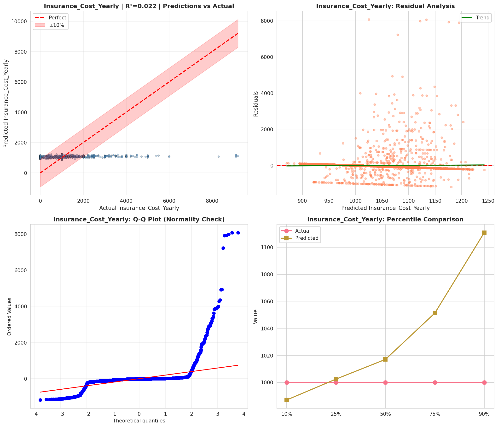
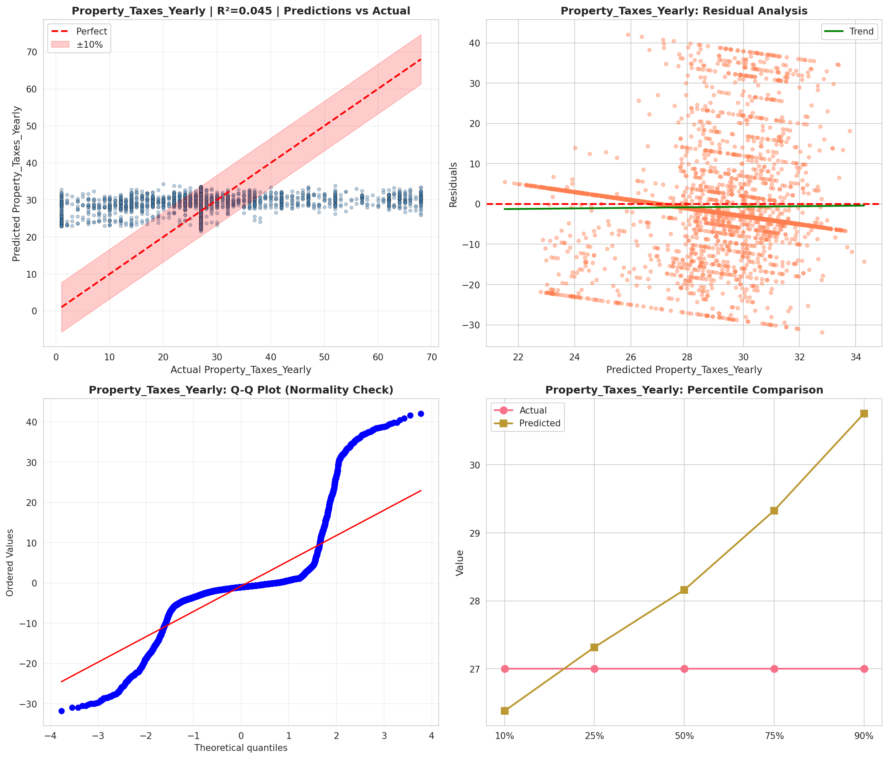
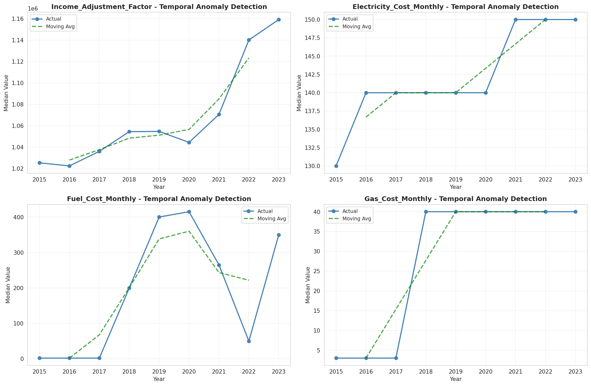
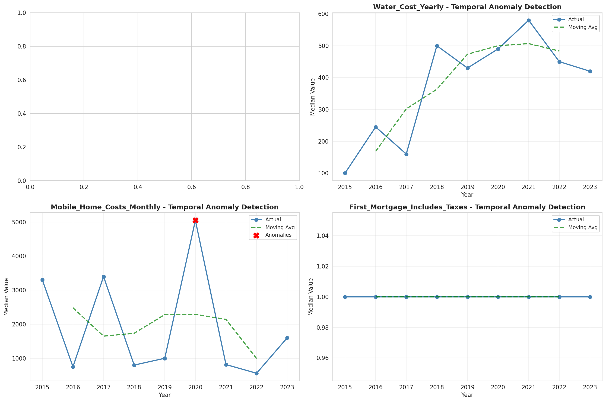
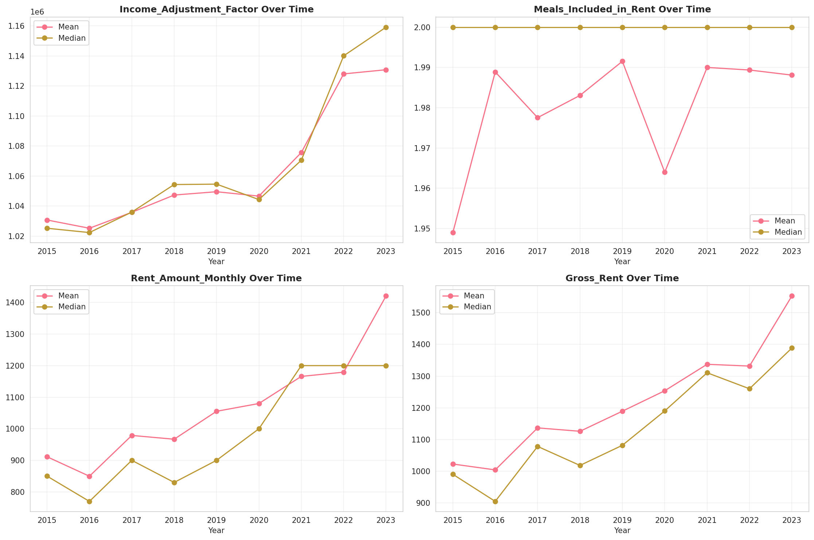
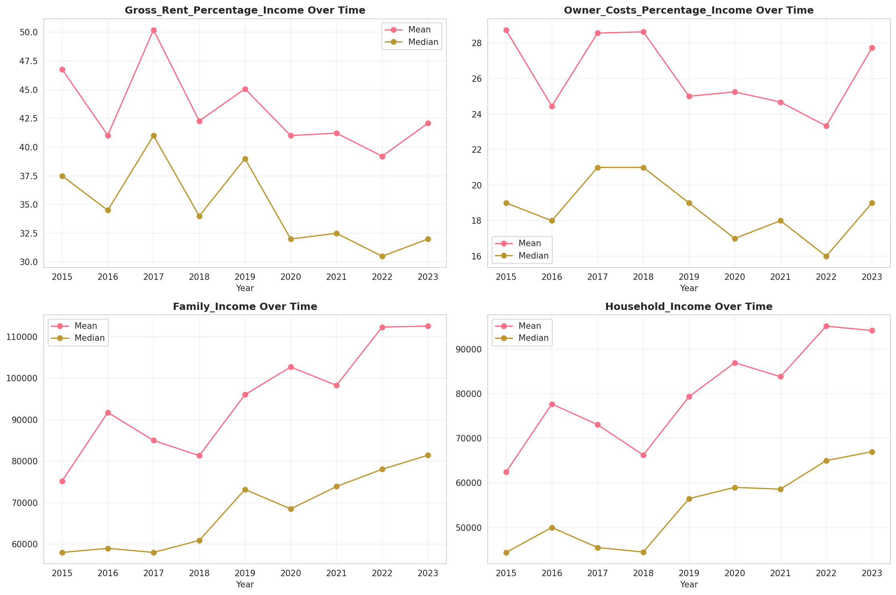
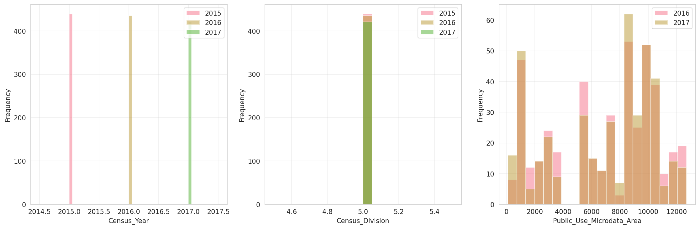
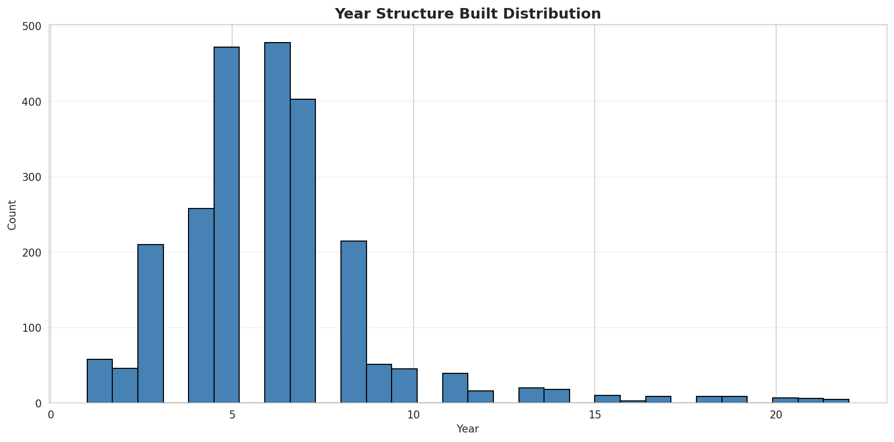
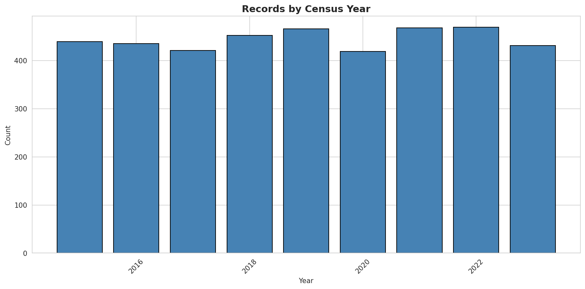
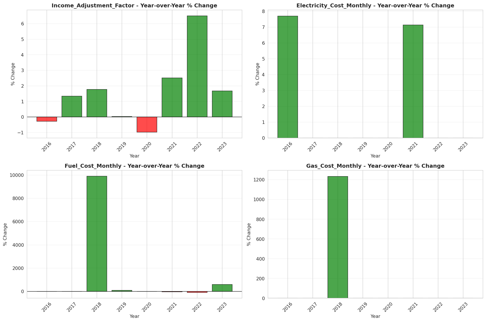
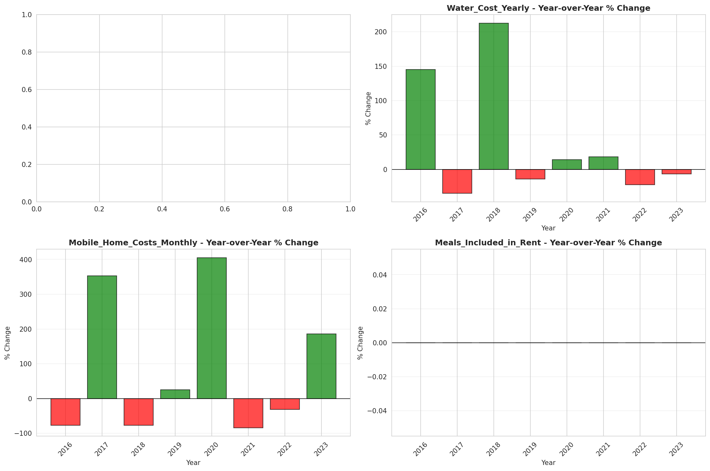
