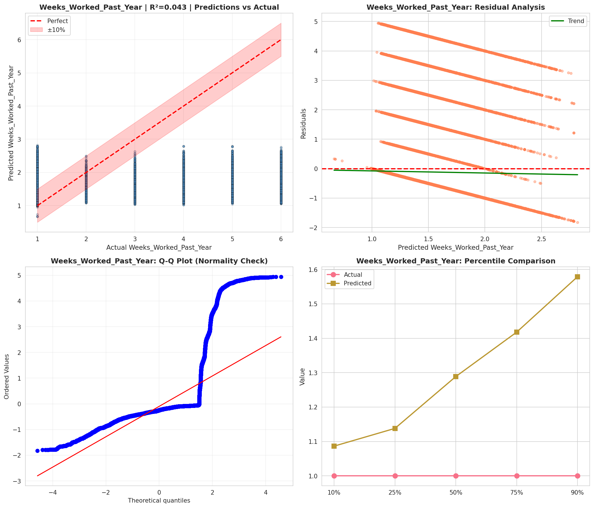
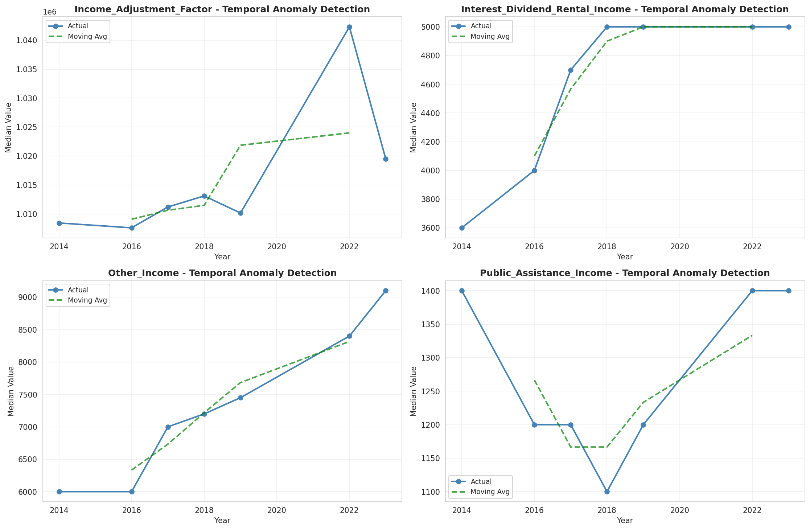
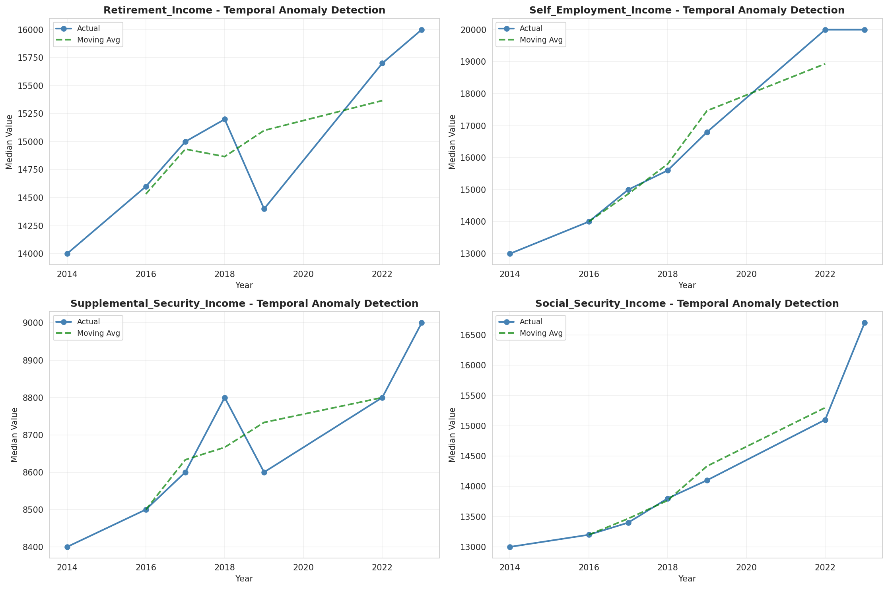
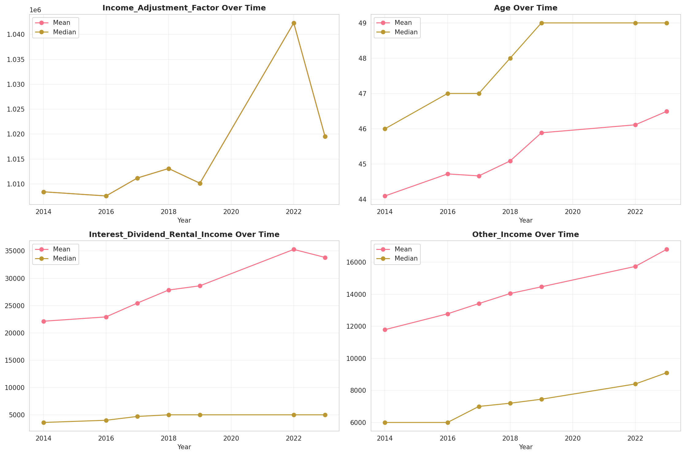
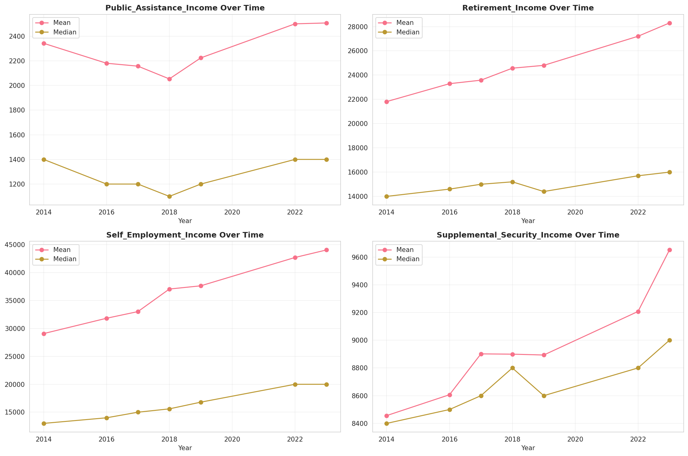
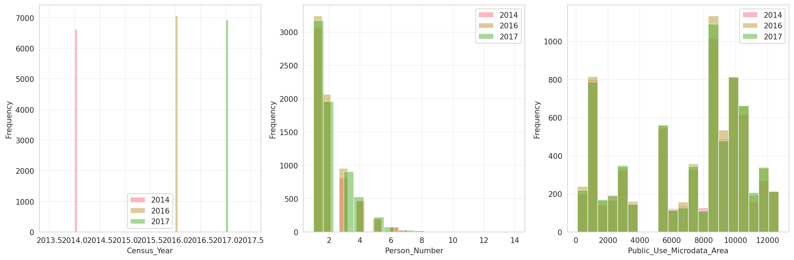
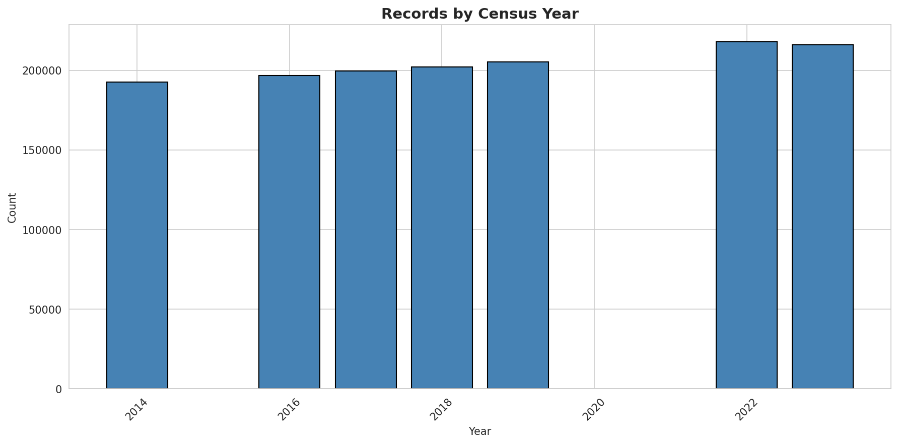
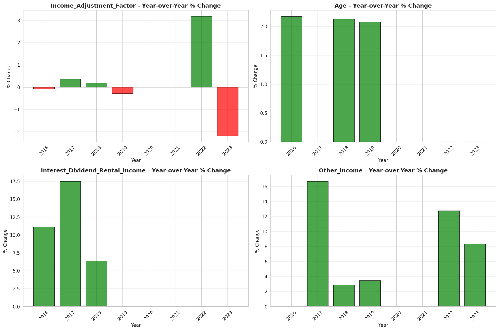

# Temporal Analysis

## Year Distribution

- 2014: 192,673 records

- 2016: 196,828 records

- 2017: 199,644 records

- 2018: 202,160 records

- 2019: 205,294 records

- 2022: 217,799 records

- 2023: 216,151 records

## Temporal Trends

- Census_Year: {np.int64(2014): {'mean': 2014.0, 'median': 2014.0, 'std': 0.0}, np.int64(2016): {'mean': 2016.0, 'median': 2016.0, 'std': 0.0}, np.int64(2017): {'mean': 2017.0, 'median': 2017.0, 'std': 0.0}, np.int64(2018): {'mean': 2018.0, 'median': 2018.0, 'std': 0.0}, np.int64(2019): {'mean': 2019.0, 'median': 2019.0, 'std': 0.0}, np.int64(2022): {'mean': 2022.0, 'median': 2022.0, 'std': 0.0}, np.int64(2023): {'mean': 2023.0, 'median': 2023.0, 'std': 0.0}}

- Person_Number: {np.int64(2014): {'mean': 1.9906888873895148, 'median': 2.0, 'std': 1.246601624946235}, np.int64(2016): {'mean': 1.974175422196029, 'median': 2.0, 'std': 1.2219690748694914}, np.int64(2017): {'mean': 1.9843020576626396, 'median': 2.0, 'std': 1.2365894841597505}, np.int64(2018): {'mean': 1.9803769291650177, 'median': 2.0, 'std': 1.2399072016315724}, np.int64(2019): {'mean': 1.9708953987939248, 'median': 2.0, 'std': 1.2344222053957867}, np.int64(2022): {'mean': 1.9773782248770655, 'median': 2.0, 'std': 1.2467490347126304}, np.int64(2023): {'mean': 1.9813972639497388, 'median': 2.0, 'std': 1.2538208057743165}}

- Public_Use_Microdata_Area: {np.int64(2014): {'mean': 7060.731399832877, 'median': 8605.0, 'std': 3637.6547172777064}, np.int64(2016): {'mean': 7071.466767939521, 'median': 8605.0, 'std': 3633.8437318970527}, np.int64(2017): {'mean': 7082.833433511651, 'median': 8605.0, 'std': 3634.999150520734}, np.int64(2018): {'mean': 7089.09662148793, 'median': 8605.0, 'std': 3625.9054377124653}, np.int64(2019): {'mean': 7126.471630929302, 'median': 8606.0, 'std': 3626.114257417272}, np.int64(2022): {'mean': 6960.113283348408, 'median': 8601.0, 'std': 3714.151256074297}, np.int64(2023): {'mean': 6988.477393118699, 'median': 8602.0, 'std': 3697.801032966055}}

- State_Code: {np.int64(2014): {'mean': 12.0, 'median': 12.0, 'std': 0.0}, np.int64(2016): {'mean': 12.0, 'median': 12.0, 'std': 0.0}, np.int64(2017): {'mean': 12.0, 'median': 12.0, 'std': 0.0}, np.int64(2018): {'mean': 12.0, 'median': 12.0, 'std': 0.0}, np.int64(2019): {'mean': 12.0, 'median': 12.0, 'std': 0.0}, np.int64(2022): {'mean': 12.0, 'median': 12.0, 'std': 0.0}, np.int64(2023): {'mean': None, 'median': None, 'std': None}}

- Income_Adjustment_Factor: {np.int64(2014): {'mean': 1008425.0, 'median': 1008425.0, 'std': 0.0}, np.int64(2016): {'mean': 1007588.0, 'median': 1007588.0, 'std': 0.0}, np.int64(2017): {'mean': 1011189.0, 'median': 1011189.0, 'std': 0.0}, np.int64(2018): {'mean': 1013097.0, 'median': 1013097.0, 'std': 0.0}, np.int64(2019): {'mean': 1010145.0, 'median': 1010145.0, 'std': 0.0}, np.int64(2022): {'mean': 1042311.0, 'median': 1042311.0, 'std': 0.0}, np.int64(2023): {'mean': 1019518.0, 'median': 1019518.0, 'std': 0.0}}

- Person_Weight: {np.int64(2014): {'mean': 103.24901257571118, 'median': 80.0, 'std': 82.16061829445557}, np.int64(2016): {'mean': 104.72310342024508, 'median': 81.0, 'std': 84.73381301950427}, np.int64(2017): {'mean': 105.10909418765402, 'median': 81.0, 'std': 85.51634865071365}, np.int64(2018): {'mean': 105.3587504946577, 'median': 81.0, 'std': 86.21229104554891}, np.int64(2019): {'mean': 104.61940923748381, 'median': 76.0, 'std': 93.03020278103557}, np.int64(2022): {'mean': 102.1346424914715, 'median': 76.0, 'std': 85.38426724250498}, np.int64(2023): {'mean': 104.60615958288419, 'median': 76.0, 'std': 89.10509582540595}}

- Age: {np.int64(2014): {'mean': 44.096500288052816, 'median': 46.0, 'std': 23.910284922116794}, np.int64(2016): {'mean': 44.721284573333065, 'median': 47.0, 'std': 23.99047038302697}, np.int64(2017): {'mean': 44.665184027569076, 'median': 47.0, 'std': 23.95569797588109}, np.int64(2018): {'mean': 45.088083696082315, 'median': 48.0, 'std': 23.972101079597333}, np.int64(2019): {'mean': 45.88649936189075, 'median': 49.0, 'std': 24.020622051661032}, np.int64(2022): {'mean': 46.112259468592605, 'median': 49.0, 'std': 24.079610358931117}, np.int64(2023): {'mean': 46.49235488154115, 'median': 49.0, 'std': 24.112877350341314}}

- Citizenship_Status: {np.int64(2014): {'mean': 1.6529145235710245, 'median': 1.0, 'std': 1.3308962800631963}, np.int64(2016): {'mean': 1.668705671957242, 'median': 1.0, 'std': 1.3353404890560423}, np.int64(2017): {'mean': 1.6806966400192342, 'median': 1.0, 'std': 1.3454378677633128}, np.int64(2018): {'mean': 1.6802928373565493, 'median': 1.0, 'std': 1.340472402558749}, np.int64(2019): {'mean': 1.6665903533469073, 'median': 1.0, 'std': 1.3273261295017214}, np.int64(2022): {'mean': 1.7181897070234482, 'median': 1.0, 'std': 1.3648458835324542}, np.int64(2023): {'mean': 1.737706510726298, 'median': 1.0, 'std': 1.3819702025173835}}

- Class_of_Worker: {np.int64(2014): {'mean': 2.2687467899332305, 'median': 1.0, 'std': 2.1014898112484746}, np.int64(2016): {'mean': 2.258759166569666, 'median': 1.0, 'std': 2.0836002514272947}, np.int64(2017): {'mean': 2.250946812325616, 'median': 1.0, 'std': 2.0791372980645826}, np.int64(2018): {'mean': 2.228434532324503, 'median': 1.0, 'std': 2.0680852825636906}, np.int64(2019): {'mean': 2.213421052631579, 'median': 1.0, 'std': 2.0401104021655665}, np.int64(2022): {'mean': 2.2521488595438175, 'median': 1.0, 'std': 2.0701117873866326}, np.int64(2023): {'mean': 2.2453717778453366, 'median': 1.0, 'std': 2.065852505479537}}

- English_Speaking_Ability: {np.int64(2014): {'mean': 1.6909736262748798, 'median': 1.0, 'std': 0.9611910057827145}, np.int64(2016): {'mean': 1.699056199056199, 'median': 1.0, 'std': 0.9714798541127408}, np.int64(2017): {'mean': 1.669202853725927, 'median': 1.0, 'std': 0.9433510253488502}, np.int64(2018): {'mean': 1.6403407596268642, 'median': 1.0, 'std': 0.9240603793682944}, np.int64(2019): {'mean': 1.6369172025723473, 'median': 1.0, 'std': 0.9251535786299592}, np.int64(2022): {'mean': 1.680967822399601, 'median': 1.0, 'std': 0.967437870133345}, np.int64(2023): {'mean': 1.6900310982214612, 'median': 1.0, 'std': 0.971927469608009}}

- Fertility_Status: {np.int64(2014): {'mean': 1.951444854510306, 'median': 2.0, 'std': 0.214938835960817}, np.int64(2016): {'mean': 1.9522506776097475, 'median': 2.0, 'std': 0.213238074516507}, np.int64(2017): {'mean': 1.9503015801804495, 'median': 2.0, 'std': 0.21732386900264708}, np.int64(2018): {'mean': 1.950208913649025, 'median': 2.0, 'std': 0.2175157713358919}, np.int64(2019): {'mean': 1.955458077453315, 'median': 2.0, 'std': 0.20629834332339458}, np.int64(2022): {'mean': 1.9545173561578697, 'median': 2.0, 'std': 0.20836267700158118}, np.int64(2023): {'mean': 1.952179045508203, 'median': 2.0, 'std': 0.21338980247263528}}

- Marital_Status: {np.int64(2014): {'mean': 2.843657388424948, 'median': 3.0, 'std': 1.8133185966959187}, np.int64(2016): {'mean': 2.827519458613612, 'median': 3.0, 'std': 1.8112942819637698}, np.int64(2017): {'mean': 2.8302428322413897, 'median': 3.0, 'std': 1.8128941927190263}, np.int64(2018): {'mean': 2.817179461812426, 'median': 2.0, 'std': 1.8105970954523418}, np.int64(2019): {'mean': 2.793564351612809, 'median': 2.0, 'std': 1.8060569334660597}, np.int64(2022): {'mean': 2.8232269202337936, 'median': 2.0, 'std': 1.8145514828168534}, np.int64(2023): {'mean': 2.796817965218759, 'median': 2.0, 'std': 1.8115427208215287}}

- Mobility_Status: {np.int64(2014): {'mean': 1.302459278185883, 'median': 1.0, 'std': 0.7109240686965795}, np.int64(2016): {'mean': 1.2984621216778345, 'median': 1.0, 'std': 0.7061091820964813}, np.int64(2017): {'mean': 1.296336326629562, 'median': 1.0, 'std': 0.7040655727910193}, np.int64(2018): {'mean': 1.2941607586227526, 'median': 1.0, 'std': 0.7028731801866739}, np.int64(2019): {'mean': 1.287456027161354, 'median': 1.0, 'std': 0.6961358222984089}, np.int64(2022): {'mean': 1.2618371649989828, 'median': 1.0, 'std': 0.66664336239516}, np.int64(2023): {'mean': 1.2484713755755643, 'median': 1.0, 'std': 0.6511157647481376}}

- Military_Service: {np.int64(2014): {'mean': 3.766424087828544, 'median': 4.0, 'std': 0.6396839614533958}, np.int64(2016): {'mean': 3.776641226016359, 'median': 4.0, 'std': 0.6277013768558165}, np.int64(2017): {'mean': 3.7818775656968207, 'median': 4.0, 'std': 0.6204129676654706}, np.int64(2018): {'mean': 3.78619649610613, 'median': 4.0, 'std': 0.6151790347013141}, np.int64(2019): {'mean': 3.7857492470963545, 'median': 4.0, 'std': 0.6167522583117455}, np.int64(2022): {'mean': 3.8123168265435234, 'median': 4.0, 'std': 0.5824897050368807}, np.int64(2023): {'mean': 3.814731016521527, 'median': 4.0, 'std': 0.5786229188469444}}

- Travel_Time_To_Work_Minutes: {np.int64(2014): {'mean': 26.47729266217189, 'median': 20.0, 'std': 20.71882354124665}, np.int64(2016): {'mean': 27.463735846669618, 'median': 20.0, 'std': 21.96650732804747}, np.int64(2017): {'mean': 27.755315870570108, 'median': 20.0, 'std': 22.225618000597724}, np.int64(2018): {'mean': 28.117725283493314, 'median': 23.0, 'std': 22.225883840401675}, np.int64(2019): {'mean': 28.476341967189764, 'median': 25.0, 'std': 23.086649395187344}, np.int64(2022): {'mean': 27.904809046948177, 'median': 20.0, 'std': 22.306823066753044}, np.int64(2023): {'mean': 28.44464157638443, 'median': 25.0, 'std': 22.500334622876878}}

- Vehicle_Occupancy: {np.int64(2014): {'mean': 1.1504427238987505, 'median': 1.0, 'std': 0.5501883621046871}, np.int64(2016): {'mean': 1.156728536726121, 'median': 1.0, 'std': 0.5911679868028126}, np.int64(2017): {'mean': 1.149098212073395, 'median': 1.0, 'std': 0.5503159824211458}, np.int64(2018): {'mean': 1.1589472474428226, 'median': 1.0, 'std': 0.5791822745957366}, np.int64(2019): {'mean': 1.1535177208493916, 'median': 1.0, 'std': 0.5627469796780129}, np.int64(2022): {'mean': 1.1695128042442324, 'median': 1.0, 'std': 0.5833334611993547}, np.int64(2023): {'mean': 1.1841974245462008, 'median': 1.0, 'std': 0.6229711292017224}}

- Transportation_To_Work: {np.int64(2014): {'mean': 1.9383623293836232, 'median': 1.0, 'std': 2.844278860667405}, np.int64(2016): {'mean': 1.999609569106268, 'median': 1.0, 'std': 2.9288946967213043}, np.int64(2017): {'mean': 2.0241516461283795, 'median': 1.0, 'std': 2.9692516288622692}, np.int64(2018): {'mean': 2.037348692795752, 'median': 1.0, 'std': 2.988730981393828}, np.int64(2019): {'mean': None, 'median': None, 'std': None}, np.int64(2022): {'mean': None, 'median': None, 'std': None}, np.int64(2023): {'mean': None, 'median': None, 'std': None}}

- Language_Other_Than_English: {np.int64(2014): {'mean': 1.7583794258295293, 'median': 2.0, 'std': 0.4280666617884138}, np.int64(2016): {'mean': 1.7526252394420005, 'median': 2.0, 'std': 0.4314875158239154}, np.int64(2017): {'mean': 1.745958744093952, 'median': 2.0, 'std': 0.43532205189554557}, np.int64(2018): {'mean': 1.7448301500999117, 'median': 2.0, 'std': 0.4359577719834776}, np.int64(2019): {'mean': 1.7476276696640953, 'median': 2.0, 'std': 0.4343748314185294}, np.int64(2022): {'mean': 1.7323241717100901, 'median': 2.0, 'std': 0.44274870313460807}, np.int64(2023): {'mean': 1.724966724808157, 'median': 2.0, 'std': 0.44653211622327277}}

- Grandparents_Living_With_Grandchildren: {np.int64(2014): {'mean': 1.9674352323792865, 'median': 2.0, 'std': 0.17749518605069423}, np.int64(2016): {'mean': 1.968281687259336, 'median': 2.0, 'std': 0.17524978112385833}, np.int64(2017): {'mean': 1.9691089678998128, 'median': 2.0, 'std': 0.1730230958659009}, np.int64(2018): {'mean': 1.970024521547958, 'median': 2.0, 'std': 0.17052024523060655}, np.int64(2019): {'mean': 1.969460057095522, 'median': 2.0, 'std': 0.17206817684889986}, np.int64(2022): {'mean': 1.9724541813716983, 'median': 2.0, 'std': 0.16366801368665235}, np.int64(2023): {'mean': 1.9719975028800545, 'median': 2.0, 'std': 0.1649804001998316}}

- Months_Responsible_For_Grandchildren: {np.int64(2014): {'mean': 3.7569745815251085, 'median': 4.0, 'std': 1.3666385823845977}, np.int64(2016): {'mean': 3.7124749833222146, 'median': 4.0, 'std': 1.348756218270378}, np.int64(2017): {'mean': 3.6987620357634112, 'median': 4.0, 'std': 1.3747446166298545}, np.int64(2018): {'mean': 3.7942165433759247, 'median': 4.0, 'std': 1.39481597947674}, np.int64(2019): {'mean': 3.8714776632302406, 'median': 4.0, 'std': 1.332321283354665}, np.int64(2022): {'mean': 3.8616106333072713, 'median': 4.0, 'std': 1.3246504490925954}, np.int64(2023): {'mean': 3.9160063391442157, 'median': 5.0, 'std': 1.331345003296579}}

- Grandparents_Responsible_For_Grandchildren: {np.int64(2014): {'mean': 1.626533919888863, 'median': 2.0, 'std': 0.48378027694835624}, np.int64(2016): {'mean': 1.654687859940106, 'median': 2.0, 'std': 0.475524716742221}, np.int64(2017): {'mean': 1.6612301957129543, 'median': 2.0, 'std': 0.4733466249995072}, np.int64(2018): {'mean': 1.650446638457922, 'median': 2.0, 'std': 0.47688496419742143}, np.int64(2019): {'mean': 1.6738399462004034, 'median': 2.0, 'std': 0.4688592017425402}, np.int64(2022): {'mean': 1.7015169194865811, 'median': 2.0, 'std': 0.45764594240040013}, np.int64(2023): {'mean': 1.7099517352332798, 'median': 2.0, 'std': 0.45383654201196616}}

- Interest_Dividend_Rental_Income: {np.int64(2014): {'mean': 22131.397040637927, 'median': 3600.0, 'std': 58060.54641069962}, np.int64(2016): {'mean': 22926.426236157873, 'median': 4000.0, 'std': 58591.79413459528}, np.int64(2017): {'mean': 25454.23751295337, 'median': 4700.0, 'std': 64138.70138212205}, np.int64(2018): {'mean': 27845.363098878694, 'median': 5000.0, 'std': 69095.60042219721}, np.int64(2019): {'mean': 28617.533679157634, 'median': 5000.0, 'std': 73430.1149670367}, np.int64(2022): {'mean': 35280.63428885972, 'median': 5000.0, 'std': 91540.25322555455}, np.int64(2023): {'mean': 33817.91268758527, 'median': 5000.0, 'std': 86422.6745136308}}

- Military_Service_Period_1: {np.int64(2014): {'mean': 0.1365700314355571, 'median': 0.0, 'std': 0.3434028579744258}, np.int64(2016): {'mean': 0.16277277039848198, 'median': 0.0, 'std': 0.3691691713609474}, np.int64(2017): {'mean': 0.17862056589100916, 'median': 0.0, 'std': 0.3830457365219132}, np.int64(2018): {'mean': 0.17744828410857347, 'median': 0.0, 'std': 0.3820590499571431}, np.int64(2019): {'mean': 0.19249926750659244, 'median': 0.0, 'std': 0.39427453499458603}, np.int64(2022): {'mean': 0.23278688524590163, 'median': 0.0, 'std': 0.42262088550840415}, np.int64(2023): {'mean': 0.24475793523565245, 'median': 0.0, 'std': 0.4299573727574068}}

- Military_Service_Period_2: {np.int64(2014): {'mean': 0.16235883106298754, 'median': 0.0, 'std': 0.36879039915956746}, np.int64(2016): {'mean': 0.1743951612903226, 'median': 0.0, 'std': 0.37946017882897365}, np.int64(2017): {'mean': 0.19453251181432074, 'median': 0.0, 'std': 0.39585222911132406}, np.int64(2018): {'mean': 0.1915580533301447, 'median': 0.0, 'std': 0.39353884807032913}, np.int64(2019): {'mean': 0.19876941107530033, 'median': 0.0, 'std': 0.3990857870217296}, np.int64(2022): {'mean': 0.22849936948297603, 'median': 0.0, 'std': 0.4198791773247369}, np.int64(2023): {'mean': 0.23154857326066047, 'median': 0.0, 'std': 0.42183556261304994}}

- Military_Service_Period_5: {np.int64(2014): {'mean': 0.37210385376644545, 'median': 0.0, 'std': 0.48337995183715543}, np.int64(2016): {'mean': 0.3835981973434535, 'median': 0.0, 'std': 0.4862763023200087}, np.int64(2017): {'mean': 0.38134832804929114, 'median': 0.0, 'std': 0.4857323278042074}, np.int64(2018): {'mean': 0.3895133325361712, 'median': 0.0, 'std': 0.48765450281138234}, np.int64(2019): {'mean': 0.3906826838558453, 'median': 0.0, 'std': 0.48791769264582835}, np.int64(2022): {'mean': 0.37276166456494325, 'median': 0.0, 'std': 0.48355470121737876}, np.int64(2023): {'mean': 0.37236293683873034, 'median': 0.0, 'std': 0.483449860072263}}

- Military_Service_Period_8: {np.int64(2014): {'mean': 0.1300500640353941, 'median': 0.0, 'std': 0.33636829729113554}, np.int64(2016): {'mean': 0.10893026565464896, 'median': 0.0, 'std': 0.3115609393688916}, np.int64(2017): {'mean': 0.09780463001734761, 'median': 0.0, 'std': 0.29705919119361196}, np.int64(2018): {'mean': 0.08878392921200526, 'median': 0.0, 'std': 0.2844401172061417}, np.int64(2019): {'mean': 0.07869909170817463, 'median': 0.0, 'std': 0.26927642620205866}, np.int64(2022): {'mean': 0.05201765447667087, 'median': 0.0, 'std': 0.22206964558342587}, np.int64(2023): {'mean': 0.04379608848990061, 'median': 0.0, 'std': 0.20464768907170153}}

- Military_Service_Period_9: {np.int64(2014): {'mean': 0.02241238793806031, 'median': 0.0, 'std': 0.14802482343205126}, np.int64(2016): {'mean': 0.016959203036053132, 'median': 0.0, 'std': 0.12912233392197411}, np.int64(2017): {'mean': 0.01381826882813902, 'median': 0.0, 'std': 0.11673962266993468}, np.int64(2018): {'mean': 0.01159870859739328, 'median': 0.0, 'std': 0.107074105216428}, np.int64(2019): {'mean': 0.010782302959273366, 'median': 0.0, 'std': 0.10327957185911549}, np.int64(2022): {'mean': None, 'median': None, 'std': None}, np.int64(2023): {'mean': None, 'median': None, 'std': None}}

- Military_Service_Period_10: {np.int64(2014): {'mean': 0.07055536150890675, 'median': 0.0, 'std': 0.2560881102476951}, np.int64(2016): {'mean': 0.049098671726755215, 'median': 0.0, 'std': 0.21608044989328276}, np.int64(2017): {'mean': 0.038882574624633605, 'median': 0.0, 'std': 0.1933208618875412}, np.int64(2018): {'mean': 0.033540595480090876, 'median': 0.0, 'std': 0.1800487769712119}, np.int64(2019): {'mean': 0.02437738060357457, 'median': 0.0, 'std': 0.15422229955060043}, np.int64(2022): {'mean': 0.009205548549810845, 'median': 0.0, 'std': 0.09550592413218412}, np.int64(2023): {'mean': 0.007887143315165117, 'median': 0.0, 'std': 0.08846150618753748}}

- Military_Service_Period_11: {np.int64(2014): {'mean': 0.0030271277215042497, 'median': 0.0, 'std': 0.054937600213723514}, np.int64(2016): {'mean': 0.0011266603415559773, 'median': 0.0, 'std': 0.033547842185811395}, np.int64(2017): {'mean': 0.0009571095292217503, 'median': 0.0, 'std': 0.030923303071636526}, np.int64(2018): {'mean': 0.0008370202080593089, 'median': 0.0, 'std': 0.028920055487366442}, np.int64(2019): {'mean': 0.00046879578083797245, 'median': 0.0, 'std': 0.021647250894053883}, np.int64(2022): {'mean': None, 'median': None, 'std': None}, np.int64(2023): {'mean': None, 'median': None, 'std': None}}

- Temporary_Absence_From_Work: {np.int64(2014): {'mean': 2.5481559146416677, 'median': 3.0, 'std': 0.5193746439471694}, np.int64(2016): {'mean': 2.555413554135541, 'median': 3.0, 'std': 0.5172959986768658}, np.int64(2017): {'mean': 2.5599850968703426, 'median': 3.0, 'std': 0.5192736931096763}, np.int64(2018): {'mean': 2.565106348319836, 'median': 3.0, 'std': 0.5171681508927956}, np.int64(2019): {'mean': 2.572854257346875, 'median': 3.0, 'std': 0.5147321963307696}, np.int64(2022): {'mean': 2.5685824286728858, 'median': 3.0, 'std': 0.5154571908972425}, np.int64(2023): {'mean': 2.572175059489356, 'median': 3.0, 'std': 0.5146225234286119}}

- Available_For_Work: {np.int64(2014): {'mean': 4.679412853089922, 'median': 5.0, 'std': 1.010970117407796}, np.int64(2016): {'mean': 4.7248312483124835, 'median': 5.0, 'std': 0.9345495649773651}, np.int64(2017): {'mean': 4.739402218910415, 'median': 5.0, 'std': 0.912030263463391}, np.int64(2018): {'mean': 4.748795727450433, 'median': 5.0, 'std': 0.8929255139010379}, np.int64(2019): {'mean': 4.748064066456147, 'median': 5.0, 'std': 0.8906735207883114}, np.int64(2022): {'mean': 4.80408605710441, 'median': 5.0, 'std': 0.7894722782181732}, np.int64(2023): {'mean': 4.797243123887924, 'median': 5.0, 'std': 0.8062249500770217}}

- On_Layoff_From_Work: {np.int64(2014): {'mean': 2.5300049340076476, 'median': 3.0, 'std': 0.5151658966037287}, np.int64(2016): {'mean': 2.5419914199141993, 'median': 3.0, 'std': 0.5089817121316981}, np.int64(2017): {'mean': 2.5494641970051806, 'median': 3.0, 'std': 0.5078543511585732}, np.int64(2018): {'mean': 2.554436609885507, 'median': 3.0, 'std': 0.5064331394987523}, np.int64(2019): {'mean': 2.5635060168985233, 'median': 3.0, 'std': 0.5044829449131301}, np.int64(2022): {'mean': 2.5621532431609806, 'median': 3.0, 'std': 0.5039297555381382}, np.int64(2023): {'mean': 2.5652185563916223, 'median': 3.0, 'std': 0.5037727684598405}}

- Looking_For_Work: {np.int64(2014): {'mean': 2.5085481682496606, 'median': 3.0, 'std': 0.5851746313121726}, np.int64(2016): {'mean': 2.5271652716527164, 'median': 3.0, 'std': 0.5663044116078674}, np.int64(2017): {'mean': 2.5369916968277626, 'median': 3.0, 'std': 0.5624483106246743}, np.int64(2018): {'mean': 2.5420680908498556, 'median': 3.0, 'std': 0.5584918011434938}, np.int64(2019): {'mean': 2.5416175926716167, 'median': 3.0, 'std': 0.5555928151992106}, np.int64(2022): {'mean': 2.5438375402491578, 'median': 3.0, 'std': 0.5489829804053443}, np.int64(2023): {'mean': 2.543861341565374, 'median': 3.0, 'std': 0.5517583529884771}}

- Informed_Of_Recall: {np.int64(2014): {'mean': 2.935241149623782, 'median': 3.0, 'std': 0.25830355730306176}, np.int64(2016): {'mean': 2.9416434164341645, 'median': 3.0, 'std': 0.24468653651856384}, np.int64(2017): {'mean': 2.9446928299387314, 'median': 3.0, 'std': 0.23937236873797732}, np.int64(2018): {'mean': 2.9454644885041423, 'median': 3.0, 'std': 0.23754020687540503}, np.int64(2019): {'mean': 2.9328724645102557, 'median': 3.0, 'std': 0.2597269548213209}, np.int64(2022): {'mean': 2.9543869579379614, 'median': 3.0, 'std': 0.2176881275281138}, np.int64(2023): {'mean': 2.9534803953094517, 'median': 3.0, 'std': 0.21835433475269359}}

- Other_Income: {np.int64(2014): {'mean': 11789.284999467689, 'median': 6000.0, 'std': 15279.058321906574}, np.int64(2016): {'mean': 12777.517926089355, 'median': 6000.0, 'std': 16322.585679644764}, np.int64(2017): {'mean': 13417.325245279038, 'median': 7000.0, 'std': 17076.114599250603}, np.int64(2018): {'mean': 14042.78474629688, 'median': 7200.0, 'std': 17325.63122841752}, np.int64(2019): {'mean': 14462.36296129613, 'median': 7450.0, 'std': 17775.16323705904}, np.int64(2022): {'mean': 15733.077208153181, 'median': 8400.0, 'std': 18813.449227181914}, np.int64(2023): {'mean': 16794.943383433158, 'median': 9100.0, 'std': 19478.11022193592}}

- Public_Assistance_Income: {np.int64(2014): {'mean': 2341.676003734827, 'median': 1400.0, 'std': 3063.4965418165407}, np.int64(2016): {'mean': 2180.0145278450364, 'median': 1200.0, 'std': 3191.670626090317}, np.int64(2017): {'mean': 2156.4018218623482, 'median': 1200.0, 'std': 3037.7613106917943}, np.int64(2018): {'mean': 2052.9298751200768, 'median': 1100.0, 'std': 2797.465449262643}, np.int64(2019): {'mean': 2223.457849570924, 'median': 1200.0, 'std': 3237.9899312402677}, np.int64(2022): {'mean': 2499.7309621523027, 'median': 1400.0, 'std': 3466.2907417083106}, np.int64(2023): {'mean': 2506.756601607348, 'median': 1400.0, 'std': 3503.6355594889915}}

- Retirement_Income: {np.int64(2014): {'mean': 21816.572520908005, 'median': 14000.0, 'std': 24747.853035046322}, np.int64(2016): {'mean': 23292.340429298518, 'median': 14600.0, 'std': 27582.572358660564}, np.int64(2017): {'mean': 23580.855395176906, 'median': 15000.0, 'std': 26708.176212804494}, np.int64(2018): {'mean': 24570.241426967263, 'median': 15200.0, 'std': 29272.354383027923}, np.int64(2019): {'mean': 24803.09777445855, 'median': 14400.0, 'std': 29909.879995734398}, np.int64(2022): {'mean': 27202.143851778485, 'median': 15700.0, 'std': 34253.89007025998}, np.int64(2023): {'mean': 28299.027935537808, 'median': 16000.0, 'std': 36906.1633100865}}

- Self_Employment_Income: {np.int64(2014): {'mean': 29071.596895464467, 'median': 13000.0, 'std': 50540.71362655695}, np.int64(2016): {'mean': 31812.143578560772, 'median': 14000.0, 'std': 58856.53493321679}, np.int64(2017): {'mean': 33006.61720739675, 'median': 15000.0, 'std': 60215.255521200444}, np.int64(2018): {'mean': 37042.03461117196, 'median': 15600.0, 'std': 68787.1898090795}, np.int64(2019): {'mean': 37619.74702029421, 'median': 16800.0, 'std': 67246.07647289697}, np.int64(2022): {'mean': 42691.94318072752, 'median': 20000.0, 'std': 78815.3967630749}, np.int64(2023): {'mean': 44035.48282238443, 'median': 20000.0, 'std': 82317.37501217262}}

- Supplemental_Security_Income: {np.int64(2014): {'mean': 8456.211253701875, 'median': 8400.0, 'std': 4919.60240212718}, np.int64(2016): {'mean': 8606.8281938326, 'median': 8500.0, 'std': 5011.65995005245}, np.int64(2017): {'mean': 8901.551891367604, 'median': 8600.0, 'std': 5424.030085108094}, np.int64(2018): {'mean': 8899.526907155529, 'median': 8800.0, 'std': 5272.412331662474}, np.int64(2019): {'mean': 8893.33922261484, 'median': 8600.0, 'std': 5419.306356553544}, np.int64(2022): {'mean': 9207.628983308043, 'median': 8800.0, 'std': 6001.822943876926}, np.int64(2023): {'mean': 9651.379642101212, 'median': 9000.0, 'std': 6439.322415689681}}

- Social_Security_Income: {np.int64(2014): {'mean': 13419.76770623311, 'median': 13000.0, 'std': 6861.151381467087}, np.int64(2016): {'mean': 13982.947796059314, 'median': 13200.0, 'std': 7381.483509968368}, np.int64(2017): {'mean': 14196.626749737034, 'median': 13400.0, 'std': 7592.330064890266}, np.int64(2018): {'mean': 14386.425175591337, 'median': 13800.0, 'std': 7584.553607432133}, np.int64(2019): {'mean': 14838.391218013563, 'median': 14100.0, 'std': 7940.756640593912}, np.int64(2022): {'mean': 16243.980870653437, 'median': 15100.0, 'std': 9163.582988998234}, np.int64(2023): {'mean': 17384.7077260895, 'median': 16700.0, 'std': 9858.357832631507}}

- Wage_Income: {np.int64(2014): {'mean': 42901.19881745986, 'median': 30000.0, 'std': 54066.40169254548}, np.int64(2016): {'mean': 46174.67111205747, 'median': 31000.0, 'std': 59219.93571462689}, np.int64(2017): {'mean': 47423.64051007529, 'median': 32000.0, 'std': 60631.16907159592}, np.int64(2018): {'mean': 49487.89288268765, 'median': 33800.0, 'std': 64533.579326229235}, np.int64(2019): {'mean': 51036.81419124593, 'median': 35000.0, 'std': 64976.79844633356}, np.int64(2022): {'mean': 58842.05013652531, 'median': 40000.0, 'std': 77526.63227595988}, np.int64(2023): {'mean': 62204.967274699666, 'median': 41600.0, 'std': 81063.13940154381}}

- Relationship_To_Householder: {np.int64(2014): {'mean': 2.4857971796774847, 'median': 1.0, 'std': 4.289849149043412}, np.int64(2016): {'mean': 2.496662060275977, 'median': 1.0, 'std': 4.316774377736446}, np.int64(2017): {'mean': 2.487407585502194, 'median': 1.0, 'std': 4.2951725575206074}, np.int64(2018): {'mean': 2.500168183616937, 'median': 1.0, 'std': 4.315241928173637}, np.int64(2019): {'mean': None, 'median': None, 'std': None}, np.int64(2022): {'mean': None, 'median': None, 'std': None}, np.int64(2023): {'mean': None, 'median': None, 'std': None}}

- School_Enrollment: {np.int64(2014): {'mean': 1.2643555072510095, 'median': 1.0, 'std': 0.5282271046057201}, np.int64(2016): {'mean': 1.2557759991657325, 'median': 1.0, 'std': 0.5235613886069839}, np.int64(2017): {'mean': 1.2555531560436848, 'median': 1.0, 'std': 0.5251242498807642}, np.int64(2018): {'mean': 1.2510839414392714, 'median': 1.0, 'std': 0.5215058973970371}, np.int64(2019): {'mean': 1.2441428058701547, 'median': 1.0, 'std': 0.5185575874490504}, np.int64(2022): {'mean': 1.2410071436277246, 'median': 1.0, 'std': 0.5220182948716258}, np.int64(2023): {'mean': 1.2389499366406294, 'median': 1.0, 'std': 0.5220747800236144}}

- School_Grade_Attending: {np.int64(2014): {'mean': 9.821562230112272, 'median': 11.0, 'std': 4.89976486171607}, np.int64(2016): {'mean': 9.895665740334454, 'median': 11.0, 'std': 4.8608823289486685}, np.int64(2017): {'mean': 9.867177306335476, 'median': 11.0, 'std': 4.889996578471552}, np.int64(2018): {'mean': 9.887579417042534, 'median': 11.0, 'std': 4.877978093036643}, np.int64(2019): {'mean': 9.897544119461928, 'median': 11.0, 'std': 4.887992874959578}, np.int64(2022): {'mean': 9.917337986756866, 'median': 11.0, 'std': 4.879383164100828}, np.int64(2023): {'mean': 9.984661977334897, 'median': 11.0, 'std': 4.873041620890534}}

- Educational_Attainment: {np.int64(2014): {'mean': 16.218222889961535, 'median': 17.0, 'std': 5.439326965078973}, np.int64(2016): {'mean': 16.3695127356154, 'median': 18.0, 'std': 5.395429510358269}, np.int64(2017): {'mean': 16.445604779827647, 'median': 18.0, 'std': 5.4081747012141985}, np.int64(2018): {'mean': 16.530114555495267, 'median': 18.0, 'std': 5.381672123917343}, np.int64(2019): {'mean': 16.63908219014197, 'median': 18.0, 'std': 5.3440314155365325}, np.int64(2022): {'mean': 16.72260866710132, 'median': 18.0, 'std': 5.398697352476778}, np.int64(2023): {'mean': 16.82055113195771, 'median': 18.0, 'std': 5.336787838804043}}

- Sex: {np.int64(2014): {'mean': 1.5189310385990773, 'median': 2.0, 'std': 0.49964278385604927}, np.int64(2016): {'mean': 1.5159174507691995, 'median': 2.0, 'std': 0.4997478400400612}, np.int64(2017): {'mean': 1.5169050910620905, 'median': 2.0, 'std': 0.49971538769579615}, np.int64(2018): {'mean': 1.5139839730906213, 'median': 2.0, 'std': 0.4998056464063248}, np.int64(2019): {'mean': 1.515334106208657, 'median': 2.0, 'std': 0.49976602706975937}, np.int64(2022): {'mean': 1.5115450484162003, 'median': 2.0, 'std': 0.4998678416318508}, np.int64(2023): {'mean': 1.5119337870285126, 'median': 2.0, 'std': 0.49985872071266246}}

- Hours_Worked_Per_Week: {np.int64(2014): {'mean': 37.92149691408419, 'median': 40.0, 'std': 12.65488611881577}, np.int64(2016): {'mean': 38.211070988661604, 'median': 40.0, 'std': 12.689291586315857}, np.int64(2017): {'mean': 38.18940486786778, 'median': 40.0, 'std': 12.668164745700057}, np.int64(2018): {'mean': 38.37589772475809, 'median': 40.0, 'std': 12.685467400777892}, np.int64(2019): {'mean': 38.23477382355563, 'median': 40.0, 'std': 12.838027806643286}, np.int64(2022): {'mean': 38.103384062765855, 'median': 40.0, 'std': 12.778334257447144}, np.int64(2023): {'mean': 37.875271395397135, 'median': 40.0, 'std': 12.773068696820209}}

- When_Last_Worked: {np.int64(2014): {'mean': 1.769810040705563, 'median': 1.0, 'std': 0.921972742224995}, np.int64(2016): {'mean': 1.7664656646566466, 'median': 1.0, 'std': 0.9229235549084271}, np.int64(2017): {'mean': 1.751809665744092, 'median': 1.0, 'std': 0.9199504171878257}, np.int64(2018): {'mean': 1.7519780322070184, 'median': 1.0, 'std': 0.9204588911954917}, np.int64(2019): {'mean': 1.7603482119996585, 'median': 1.0, 'std': 0.9229319952494996}, np.int64(2022): {'mean': 1.7716304179504567, 'median': 1.0, 'std': 0.921568675723513}, np.int64(2023): {'mean': 1.766426565481167, 'median': 1.0, 'std': 0.9205217142861886}}

- Weeks_Worked_Past_Year: {np.int64(2014): {'mean': 1.8536611914791714, 'median': 1.0, 'std': 1.5926374019362688}, np.int64(2016): {'mean': 1.8255761314706223, 'median': 1.0, 'std': 1.5651078295506076}, np.int64(2017): {'mean': 1.8048248979466561, 'median': 1.0, 'std': 1.5482977118260122}, np.int64(2018): {'mean': 1.7831278038182221, 'median': 1.0, 'std': 1.5327776192036966}}

- Year_Of_Entry: {np.int64(2014): {'mean': 1989.9586426035796, 'median': 1994.0, 'std': 17.320149108199633}, np.int64(2016): {'mean': 1992.0113210200639, 'median': 1996.0, 'std': 17.723548504066795}, np.int64(2017): {'mean': 1993.1690798160544, 'median': 1997.0, 'std': 17.783663753853073}, np.int64(2018): {'mean': 1993.750837764175, 'median': 1998.0, 'std': 18.095154024573148}, np.int64(2019): {'mean': 1994.1387353105763, 'median': 1998.0, 'std': 18.127008670967246}, np.int64(2022): {'mean': 1997.1475934359296, 'median': 2000.0, 'std': 18.561574038810527}, np.int64(2023): {'mean': 1998.074846411752, 'median': 2001.0, 'std': 18.98333095646898}}

- Ancestry_Recode: {np.int64(2014): {'mean': 1.681180030414225, 'median': 1.0, 'std': 1.0386304202919416}, np.int64(2016): {'mean': 1.762620155668909, 'median': 1.0, 'std': 1.0757977124721043}, np.int64(2017): {'mean': 1.7981456993448337, 'median': 1.0, 'std': 1.1025071766626393}, np.int64(2018): {'mean': 1.811045706371191, 'median': 1.0, 'std': 1.1112760935765202}, np.int64(2019): {'mean': 1.815844593607217, 'median': 1.0, 'std': 1.1118159902382512}, np.int64(2022): {'mean': 1.8751050280304318, 'median': 1.0, 'std': 1.153963247451352}, np.int64(2023): {'mean': 1.885371800269256, 'median': 1.0, 'std': 1.1583385189264543}}

- First_Ancestry_Code: {np.int64(2014): {'mean': 451.1363969004479, 'median': 271.0, 'std': 403.64711325070965}, np.int64(2016): {'mean': 458.4916119657772, 'median': 271.0, 'std': 405.51404764743285}, np.int64(2017): {'mean': 469.48228346456693, 'median': 271.0, 'std': 406.55468463896926}, np.int64(2018): {'mean': 468.71392956074396, 'median': 271.0, 'std': 407.0290345727266}, np.int64(2019): {'mean': 467.3458259861467, 'median': 271.0, 'std': 407.9570981181648}, np.int64(2022): {'mean': 469.2058641224248, 'median': 271.0, 'std': 411.6444355255476}, np.int64(2023): {'mean': 471.604970599257, 'median': 271.0, 'std': 411.4662307324484}}

- Second_Ancestry_Code: {np.int64(2014): {'mean': 812.8782392966322, 'median': 999.0, 'std': 366.5220204165149}, np.int64(2016): {'mean': 797.8901629849412, 'median': 999.0, 'std': 376.3847305896898}, np.int64(2017): {'mean': 802.6339434192863, 'median': 999.0, 'std': 372.6905713238342}, np.int64(2018): {'mean': 802.3822615749901, 'median': 999.0, 'std': 372.77708527273865}, np.int64(2019): {'mean': 798.0645708106423, 'median': 999.0, 'std': 376.15483766152204}, np.int64(2022): {'mean': 807.8836771518694, 'median': 999.0, 'std': 369.0883636176396}, np.int64(2023): {'mean': 808.1101776073208, 'median': 999.0, 'std': 368.67236659269815}}

- Decade_Of_Entry: {np.int64(2014): {'mean': 5.462602090211752, 'median': 6.0, 'std': 1.6120605262469492}, np.int64(2016): {'mean': 5.591154134633414, 'median': 6.0, 'std': 1.5816427927267025}, np.int64(2017): {'mean': 5.885079451805309, 'median': 6.0, 'std': 1.7776573322009241}, np.int64(2018): {'mean': 5.930476743666503, 'median': 6.0, 'std': 1.7975284175577217}, np.int64(2019): {'mean': 5.961365416899832, 'median': 6.0, 'std': 1.7904960974559267}, np.int64(2022): {'mean': 6.205421639447236, 'median': 7.0, 'std': 1.776961745794155}, np.int64(2023): {'mean': 6.259772476210779, 'median': 7.0, 'std': 1.785907303441507}}

- Drives_Alone_To_Work: {np.int64(2014): {'mean': 1.1460502356097357, 'median': 1.0, 'std': 0.5002147186227501}, np.int64(2016): {'mean': 1.1502194306880864, 'median': 1.0, 'std': 0.5161152017919187}, np.int64(2017): {'mean': 1.1443643144977242, 'median': 1.0, 'std': 0.4943326046586048}, np.int64(2018): {'mean': 1.1536349589446935, 'median': 1.0, 'std': 0.5200016528510997}, np.int64(2019): {'mean': 1.1486687322098794, 'median': 1.0, 'std': 0.5068036453569505}, np.int64(2022): {'mean': 1.1651794754107212, 'median': 1.0, 'std': 0.5361652626493965}, np.int64(2023): {'mean': 1.1786939731151689, 'median': 1.0, 'std': 0.5655881750998495}}

- Employment_Status_Parents: {np.int64(2014): {'mean': 3.428087004337997, 'median': 2.0, 'std': 2.677928611241746}, np.int64(2016): {'mean': 3.345560380670794, 'median': 2.0, 'std': 2.649990019349329}, np.int64(2017): {'mean': 3.341915550978373, 'median': 2.0, 'std': 2.6389617087881416}, np.int64(2018): {'mean': 3.290721649484536, 'median': 2.0, 'std': 2.6310225345044507}, np.int64(2019): {'mean': 3.266520453895299, 'median': 2.0, 'std': 2.6315136603783755}, np.int64(2022): {'mean': 3.1980069061610226, 'median': 2.0, 'std': 2.6017396931017864}, np.int64(2023): {'mean': 3.1418842933899787, 'median': 2.0, 'std': 2.5789435887651253}}

- Employment_Status_Recode: {np.int64(2014): {'mean': 3.347909214259282, 'median': 2.0, 'std': 2.432691240850121}, np.int64(2016): {'mean': 3.3483454834548345, 'median': 1.0, 'std': 2.4464910387526086}, np.int64(2017): {'mean': 3.3114754098360657, 'median': 1.0, 'std': 2.445569547254385}, np.int64(2018): {'mean': 3.306112119519687, 'median': 1.0, 'std': 2.4484258229041638}, np.int64(2019): {'mean': 3.310261443486672, 'median': 1.0, 'std': 2.4518410041171967}, np.int64(2022): {'mean': 3.367542224904016, 'median': 1.0, 'std': 2.458702605212853}, np.int64(2023): {'mean': 3.354347546466011, 'median': 1.0, 'std': 2.4574679064555576}}

- Hispanic_Origin: {np.int64(2014): {'mean': 2.2111920196394927, 'median': 1.0, 'std': 3.7070166996462173}, np.int64(2016): {'mean': 2.304016704940354, 'median': 1.0, 'std': 3.89771454008962}, np.int64(2017): {'mean': 2.3473683156017713, 'median': 1.0, 'std': 3.9511348375214026}, np.int64(2018): {'mean': 2.3996883656509693, 'median': 1.0, 'std': 4.030939914830133}, np.int64(2019): {'mean': 2.3993979366177287, 'median': 1.0, 'std': 4.087961693986216}, np.int64(2022): {'mean': 2.668974605025735, 'median': 1.0, 'std': 4.525142503135355}, np.int64(2023): {'mean': 2.692659298360868, 'median': 1.0, 'std': 4.546653192296876}}

- Time_Of_Arrival_At_Work: {np.int64(2014): {'mean': 104.48628657458926, 'median': 94.0, 'std': 40.426952950845426}, np.int64(2016): {'mean': 104.36973875640457, 'median': 94.0, 'std': 40.3830120565416}, np.int64(2017): {'mean': 104.31214791987674, 'median': 94.0, 'std': 40.56199162899695}, np.int64(2018): {'mean': 104.11239391668077, 'median': 94.0, 'std': 40.486066841569986}, np.int64(2019): {'mean': 103.3844519360889, 'median': 94.0, 'std': 39.069432151793116}, np.int64(2022): {'mean': 103.70787800327457, 'median': 94.0, 'std': 40.292830203568684}, np.int64(2023): {'mean': 103.09425842739043, 'median': 94.0, 'std': 39.537176865784396}}

- Time_Of_Departure_For_Work: {np.int64(2014): {'mean': 55.74252798324278, 'median': 49.0, 'std': 27.516219770601754}, np.int64(2016): {'mean': 55.516364096400785, 'median': 49.0, 'std': 27.70637722507839}, np.int64(2017): {'mean': 55.37708474576271, 'median': 49.0, 'std': 27.84066013751169}, np.int64(2018): {'mean': 55.171969825189194, 'median': 49.0, 'std': 27.818247383664882}, np.int64(2019): {'mean': 54.84935068018328, 'median': 49.0, 'std': 27.004929873181055}, np.int64(2022): {'mean': 55.17583672847733, 'median': 49.0, 'std': 27.701198968686104}, np.int64(2023): {'mean': 54.68172838574107, 'median': 49.0, 'std': 27.4707963146948}}

- Language_Spoken_At_Home: {np.int64(2014): {'mean': 635.4864761648021, 'median': 625.0, 'std': 35.565549721258144}, np.int64(2016): {'mean': 1347.3438867438867, 'median': 1200.0, 'std': 633.4687942501492}, np.int64(2017): {'mean': 1335.9798136005609, 'median': 1200.0, 'std': 600.8772741863997}, np.int64(2018): {'mean': 1342.5106537971226, 'median': 1200.0, 'std': 616.4346734307934}, np.int64(2019): {'mean': 1333.898110932476, 'median': 1200.0, 'std': 607.5569407977084}, np.int64(2022): {'mean': 1348.1932794070485, 'median': 1200.0, 'std': 630.860116435312}, np.int64(2023): {'mean': 1347.143506062406, 'median': 1200.0, 'std': 640.3620617743366}}

- Migration_PUMA: {np.int64(2014): {'mean': 5914.077032040472, 'median': 5700.0, 'std': 6047.691568600065}, np.int64(2016): {'mean': 5905.526070453486, 'median': 5700.0, 'std': 6198.1924469664855}, np.int64(2017): {'mean': 5997.989518235625, 'median': 5700.0, 'std': 6138.047724210113}, np.int64(2018): {'mean': 5965.759965652763, 'median': 5700.0, 'std': 6127.111788873679}, np.int64(2019): {'mean': 5932.539714732187, 'median': 5700.0, 'std': 6104.275321255811}, np.int64(2022): {'mean': 5606.810254148146, 'median': 5300.0, 'std': 5577.984963031857}, np.int64(2023): {'mean': 5758.932962497757, 'median': 5700.0, 'std': 5750.714400260561}}

- Migration_State_Or_Country: {np.int64(2014): {'mean': 29.756256323777404, 'median': 12.0, 'std': 64.89139411822238}, np.int64(2016): {'mean': 32.61223946194313, 'median': 12.0, 'std': 69.70245760017413}, np.int64(2017): {'mean': 32.44615282875376, 'median': 12.0, 'std': 70.31008418401397}, np.int64(2018): {'mean': 30.27253211796955, 'median': 12.0, 'std': 65.02955957079992}, np.int64(2019): {'mean': 30.039299132227285, 'median': 12.0, 'std': 64.86601471717526}, np.int64(2022): {'mean': 38.968138169726174, 'median': 12.0, 'std': 79.88052137625559}, np.int64(2023): {'mean': 40.787762425982415, 'median': 12.0, 'std': 83.34355898221749}}

- Place_Of_Birth: {np.int64(2014): {'mean': 74.78060236774223, 'median': 25.0, 'std': 112.52799416466885}, np.int64(2016): {'mean': 76.37495681508729, 'median': 26.0, 'std': 113.76986931557903}, np.int64(2017): {'mean': 77.68589589469255, 'median': 26.0, 'std': 115.18511624716213}, np.int64(2018): {'mean': 77.74350019786309, 'median': 26.0, 'std': 115.05689052257596}, np.int64(2019): {'mean': 77.04408311981841, 'median': 26.0, 'std': 114.52447916288814}, np.int64(2022): {'mean': 81.74302912318238, 'median': 26.0, 'std': 118.69556128094331}, np.int64(2023): {'mean': 83.42437462699687, 'median': 26.0, 'std': 119.90568067392029}}

- Place_Of_Work_PUMA: {np.int64(2014): {'mean': 6776.749688667497, 'median': 8500.0, 'std': 3682.3293634855672}, np.int64(2016): {'mean': 6776.267516149642, 'median': 8500.0, 'std': 3633.954460993695}, np.int64(2017): {'mean': 6768.9919992643, 'median': 8500.0, 'std': 3637.7157877484906}, np.int64(2018): {'mean': 6796.280722674706, 'median': 8690.0, 'std': 3648.828672954986}, np.int64(2019): {'mean': 6803.899684113544, 'median': 8690.0, 'std': 3640.2331195959478}, np.int64(2022): {'mean': 6977.052407247989, 'median': 8626.0, 'std': 3715.191616139249}, np.int64(2023): {'mean': 6974.001112101978, 'median': 8626.0, 'std': 3692.0919142448647}}

- Place_Of_Work_State_Or_Country: {np.int64(2014): {'mean': 12.54158292541583, 'median': 12.0, 'std': 10.899305921319968}, np.int64(2016): {'mean': 12.583694186129055, 'median': 12.0, 'std': 11.958407887846818}, np.int64(2017): {'mean': 12.536980411991907, 'median': 12.0, 'std': 11.370588520118186}, np.int64(2018): {'mean': 12.529023984160554, 'median': 12.0, 'std': 11.418108423261682}, np.int64(2019): {'mean': 12.484293423419471, 'median': 12.0, 'std': 9.846424967173409}, np.int64(2022): {'mean': 12.486436265143722, 'median': 12.0, 'std': 11.554578213803914}, np.int64(2023): {'mean': 12.531763101295704, 'median': 12.0, 'std': 11.736792516856685}}

- Married_Spouse_Present: {np.int64(2014): {'mean': 2.9932542267626987, 'median': 2.0, 'std': 2.136921248958683}, np.int64(2016): {'mean': 2.9876913964164076, 'median': 2.0, 'std': 2.137476990996769}, np.int64(2017): {'mean': 2.9893776767611846, 'median': 2.0, 'std': 2.139663198537548}, np.int64(2018): {'mean': 2.983653011604982, 'median': 2.0, 'std': 2.13702058377399}, np.int64(2019): {'mean': 2.969762066774264, 'median': 2.0, 'std': 2.133149764020763}, np.int64(2022): {'mean': 3.0272244075804395, 'median': 2.0, 'std': 2.1544106137380457}, np.int64(2023): {'mean': 3.001053874710714, 'median': 2.0, 'std': 2.1475312012247696}}

- Nativity: {np.int64(2014): {'mean': 1.1791688508509235, 'median': 1.0, 'std': 0.38349463756357866}, np.int64(2016): {'mean': 1.1838356331416262, 'median': 1.0, 'std': 0.3873510751544479}, np.int64(2017): {'mean': 1.1868826511189918, 'median': 1.0, 'std': 0.38981827429714644}, np.int64(2018): {'mean': 1.1873565492679066, 'median': 1.0, 'std': 0.3901984441980092}, np.int64(2019): {'mean': 1.1844915097372548, 'median': 1.0, 'std': 0.3878854540305834}, np.int64(2022): {'mean': 1.19830210423372, 'median': 1.0, 'std': 0.3987218449310053}, np.int64(2023): {'mean': 1.2036585535112028, 'median': 1.0, 'std': 0.40271888137172646}}

- Nativity_Of_Parent: {np.int64(2014): {'mean': 3.6996395185434103, 'median': 4.0, 'std': 2.639334169962436}, np.int64(2016): {'mean': 3.6407650374203087, 'median': 4.0, 'std': 2.6158855233877216}, np.int64(2017): {'mean': 3.648421881625977, 'median': 4.0, 'std': 2.6072153050578706}, np.int64(2018): {'mean': 3.6215110016925682, 'median': 4.0, 'std': 2.5946474904097614}, np.int64(2019): {'mean': 3.582435396204825, 'median': 3.0, 'std': 2.594197727615684}, np.int64(2022): {'mean': 3.552523171987642, 'median': 3.0, 'std': 2.576808606185382}, np.int64(2023): {'mean': 3.5133075096838686, 'median': 3.0, 'std': 2.5556645745607995}}

- Own_Child: {np.int64(2014): {'mean': 0.15452606229206997, 'median': 0.0, 'std': 0.36145322857647555}, np.int64(2016): {'mean': 0.15023269047086796, 'median': 0.0, 'std': 0.35730026278887983}, np.int64(2017): {'mean': 0.1568882209907851, 'median': 0.0, 'std': 0.3636962981801901}, np.int64(2018): {'mean': 0.15271431371133276, 'median': 0.0, 'std': 0.35971282910920216}, np.int64(2019): {'mean': 0.1449120207821728, 'median': 0.0, 'std': 0.35201300504694566}, np.int64(2022): {'mean': 0.1471130161562482, 'median': 0.0, 'std': 0.3542194023780521}, np.int64(2023): {'mean': 0.1422476424524346, 'median': 0.0, 'std': 0.34930480330087876}}

- Presence_And_Age_Own_Children: {np.int64(2014): {'mean': 3.5743680687988144, 'median': 4.0, 'std': 0.8795663140677557}, np.int64(2016): {'mean': 3.583610465462781, 'median': 4.0, 'std': 0.8704649932533733}, np.int64(2017): {'mean': 3.585068914508441, 'median': 4.0, 'std': 0.8697949892140183}, np.int64(2018): {'mean': 3.5973261660372113, 'median': 4.0, 'std': 0.8586100646964234}, np.int64(2019): {'mean': 3.6202732042699477, 'median': 4.0, 'std': 0.8378423378540711}, np.int64(2022): {'mean': 3.619934898508722, 'median': 4.0, 'std': 0.8356034168625723}, np.int64(2023): {'mean': 3.626847570681422, 'median': 4.0, 'std': 0.8318887657649157}}

- Total_Person_Earnings: {np.int64(2014): {'mean': 42945.970440395584, 'median': 29800.0, 'std': 56078.060857161865}, np.int64(2016): {'mean': 46344.94147663177, 'median': 30000.0, 'std': 62398.804243749204}, np.int64(2017): {'mean': 47692.88539286702, 'median': 31000.0, 'std': 63641.7431915856}, np.int64(2018): {'mean': 50076.89000120856, 'median': 33000.0, 'std': 68925.92188724857}, np.int64(2019): {'mean': 51680.036638465426, 'median': 35000.0, 'std': 68984.50085957136}, np.int64(2022): {'mean': 59470.828713958465, 'median': 40000.0, 'std': 81836.99389816272}, np.int64(2023): {'mean': 62789.35035965103, 'median': 40000.0, 'std': 85421.8988976883}}

- Total_Person_Income: {np.int64(2014): {'mean': 40468.50012789178, 'median': 25000.0, 'std': 56357.27097367348}, np.int64(2016): {'mean': 43538.83920868251, 'median': 27000.0, 'std': 61638.028557766}, np.int64(2017): {'mean': 45120.4851875612, 'median': 28000.0, 'std': 63719.8881551544}, np.int64(2018): {'mean': 47191.48596147999, 'median': 29385.0, 'std': 68973.17384859834}, np.int64(2019): {'mean': 49780.52098205393, 'median': 30300.0, 'std': 71272.68149940862}, np.int64(2022): {'mean': 55802.7164827267, 'median': 34400.0, 'std': 82836.11288470673}, np.int64(2023): {'mean': 58717.70798582088, 'median': 36300.0, 'std': 85005.22030627077}}

- Poverty_Status: {np.int64(2014): {'mean': 293.3742759070359, 'median': 285.0, 'std': 164.82940551672857}, np.int64(2016): {'mean': 304.7411983161537, 'median': 304.5, 'std': 164.24746654065768}, np.int64(2017): {'mean': 308.2126019404372, 'median': 309.0, 'std': 163.75664728154254}, np.int64(2018): {'mean': 313.2885111798788, 'median': 317.0, 'std': 162.7091940605897}, np.int64(2019): {'mean': 321.96570932211523, 'median': 334.0, 'std': 162.27882648713006}, np.int64(2022): {'mean': 323.3970996071181, 'median': 339.0, 'std': 163.46303326220234}, np.int64(2023): {'mean': 326.0030625496695, 'median': 343.0, 'std': 162.09454966855316}}

- Quarter_Of_Birth: {np.int64(2014): {'mean': 2.5237319188469582, 'median': 3.0, 'std': 1.1160633344548354}, np.int64(2016): {'mean': 2.5263681996463916, 'median': 3.0, 'std': 1.1159516989198441}, np.int64(2017): {'mean': 2.5234617619362467, 'median': 3.0, 'std': 1.1162928968621217}, np.int64(2018): {'mean': 2.52394143252869, 'median': 3.0, 'std': 1.1167487953676323}, np.int64(2019): {'mean': 2.5275507321207633, 'median': 3.0, 'std': 1.116956074716344}, np.int64(2022): {'mean': 2.5232117686490754, 'median': 3.0, 'std': 1.1159518159248984}, np.int64(2023): {'mean': 2.5313137575121094, 'median': 3.0, 'std': 1.115598823423682}}

- Race_Recode: {np.int64(2014): {'mean': 1.596352369039772, 'median': 1.0, 'std': 1.6962030239252623}, np.int64(2016): {'mean': 1.620292844513992, 'median': 1.0, 'std': 1.7453576300637172}, np.int64(2017): {'mean': 1.638897237082006, 'median': 1.0, 'std': 1.7784410560801946}, np.int64(2018): {'mean': 1.6510091017016224, 'median': 1.0, 'std': 1.816869700419969}, np.int64(2019): {'mean': 1.646618995197132, 'median': 1.0, 'std': 1.8146523285420446}, np.int64(2022): {'mean': 3.073765260630214, 'median': 1.0, 'std': 3.251087284720808}, np.int64(2023): {'mean': 3.1009572012158166, 'median': 1.0, 'std': 3.267330994085814}}

- Race_Two_Categories: {np.int64(2014): {'mean': 5.178483752264199, 'median': 1.0, 'std': 15.012733191387534}, np.int64(2016): {'mean': 5.445312658768062, 'median': 1.0, 'std': 15.483909668370963}, np.int64(2017): {'mean': 5.640900803430106, 'median': 1.0, 'std': 15.787976017695167}, np.int64(2018): {'mean': 5.810115749901068, 'median': 1.0, 'std': 16.146871873026857}, np.int64(2019): {'mean': 5.780807037711769, 'median': 1.0, 'std': 16.097098719931513}, np.int64(2022): {'mean': 18.04551903360438, 'median': 1.0, 'std': 28.38949454643281}, np.int64(2023): {'mean': 3153.995276450259, 'median': 1000.0, 'std': 3211.4429997414545}}

- Race_Three_Categories: {np.int64(2014): {'mean': 2.1894141888069423, 'median': 1.0, 'std': 5.369971551803107}, np.int64(2016): {'mean': 2.2416678521348588, 'median': 1.0, 'std': 5.447355401793152}, np.int64(2017): {'mean': 2.2834795936767445, 'median': 1.0, 'std': 5.534604340480936}, np.int64(2018): {'mean': 2.350984368816779, 'median': 1.0, 'std': 5.835863766686676}, np.int64(2019): {'mean': 2.3323526259900436, 'median': 1.0, 'std': 5.7140984652197675}, np.int64(2022): {'mean': 7.1137929926216374, 'median': 1.0, 'std': 11.793619372894117}, np.int64(2023): {'mean': 7.207021942993555, 'median': 1.0, 'std': 11.914022354786182}}

- Number_Of_Races: {np.int64(2014): {'mean': 1.0249905279930245, 'median': 1.0, 'std': 0.17070759295887722}, np.int64(2016): {'mean': 1.02587030300567, 'median': 1.0, 'std': 0.17366585085379616}, np.int64(2017): {'mean': 1.02695297629781, 'median': 1.0, 'std': 0.1760259601456271}, np.int64(2018): {'mean': 1.0281954887218046, 'median': 1.0, 'std': 0.18195883253023415}, np.int64(2019): {'mean': 1.0287051740430797, 'median': 1.0, 'std': 0.18218344417320417}, np.int64(2022): {'mean': 1.1829668639433606, 'median': 1.0, 'std': 0.4097363384325319}, np.int64(2023): {'mean': 1.1858376782897142, 'median': 1.0, 'std': 0.4138258631582214}}

- Race_American_Indian_Alaska_Native: {np.int64(2014): {'mean': 0.008112190083716971, 'median': 0.0, 'std': 0.08970186295633668}, np.int64(2016): {'mean': 0.008728432946531998, 'median': 0.0, 'std': 0.09301769381935225}, np.int64(2017): {'mean': 0.008154515036765442, 'median': 0.0, 'std': 0.08993363905508221}, np.int64(2018): {'mean': 0.007780965571824298, 'median': 0.0, 'std': 0.08786615011735535}, np.int64(2019): {'mean': 0.007725505859888745, 'median': 0.0, 'std': 0.08755489569397781}, np.int64(2022): {'mean': 0.019127727859172907, 'median': 0.0, 'std': 0.1369742458621597}, np.int64(2023): {'mean': 0.020536569342728, 'median': 0.0, 'std': 0.14182704862576492}}

- Race_Asian: {np.int64(2014): {'mean': 0.032220394139293, 'median': 0.0, 'std': 0.17658539628706357}, np.int64(2016): {'mean': 0.03342004186396245, 'median': 0.0, 'std': 0.17973120704330123}, np.int64(2017): {'mean': 0.036139328003846845, 'median': 0.0, 'std': 0.18663721883136028}, np.int64(2018): {'mean': 0.035551048674317375, 'median': 0.0, 'std': 0.18516841312018203}, np.int64(2019): {'mean': 0.036133545062203475, 'median': 0.0, 'std': 0.1866228325613435}, np.int64(2022): {'mean': 0.042286695531200784, 'median': 0.0, 'std': 0.20124292995687762}, np.int64(2023): {'mean': 0.04309487349121679, 'median': 0.0, 'std': 0.20307116031777456}}

- Race_Black: {np.int64(2014): {'mean': 0.15000025950704043, 'median': 0.0, 'std': 0.35707260242448075}, np.int64(2016): {'mean': 0.14429349482797163, 'median': 0.0, 'std': 0.3513879757406191}, np.int64(2017): {'mean': 0.1417923904550099, 'median': 0.0, 'std': 0.34883795376737303}, np.int64(2018): {'mean': 0.1336218836565097, 'median': 0.0, 'std': 0.34024645261659897}, np.int64(2019): {'mean': 0.13186941654407824, 'median': 0.0, 'std': 0.33834956947776595}, np.int64(2022): {'mean': 0.13455066368532453, 'median': 0.0, 'std': 0.34124377978525744}, np.int64(2023): {'mean': 0.13054300003238478, 'median': 0.0, 'std': 0.3369006534281252}}

- Race_Some_Other: {np.int64(2014): {'mean': 0.024367711096002033, 'median': 0.0, 'std': 0.1541883560539096}, np.int64(2016): {'mean': 0.026571422765053754, 'median': 0.0, 'std': 0.16082758988759743}, np.int64(2017): {'mean': 0.027313618240468032, 'median': 0.0, 'std': 0.16299606613211537}, np.int64(2018): {'mean': 0.030530273051048676, 'median': 0.0, 'std': 0.1720416283602727}, np.int64(2019): {'mean': 0.029250733094975986, 'median': 0.0, 'std': 0.16850894938700134}, np.int64(2022): {'mean': 0.19986776798791547, 'median': 0.0, 'std': 0.39990170988475127}, np.int64(2023): {'mean': 0.20282117593719207, 'median': 0.0, 'std': 0.4021013486046541}}

- Race_White: {np.int64(2014): {'mean': 0.808463043602373, 'median': 1.0, 'std': 0.39351156835841244}, np.int64(2016): {'mean': 0.8109313715528278, 'median': 1.0, 'std': 0.3915641213786021}, np.int64(2017): {'mean': 0.8120003606419427, 'median': 1.0, 'std': 0.3907128608109341}, np.int64(2018): {'mean': 0.8187475267115156, 'median': 1.0, 'std': 0.38522817691728456}, np.int64(2019): {'mean': 0.8217385797928825, 'median': 1.0, 'std': 0.38273358855804485}, np.int64(2022): {'mean': 0.7851826684236383, 'median': 1.0, 'std': 0.4106965060331561}, np.int64(2023): {'mean': 0.7866861592127725, 'median': 1.0, 'std': 0.40964841325174994}}

- Related_Child: {np.int64(2014): {'mean': 0.17620009030845007, 'median': 0.0, 'std': 0.3809913015481773}, np.int64(2016): {'mean': 0.171286605564249, 'median': 0.0, 'std': 0.37676016973341775}, np.int64(2017): {'mean': 0.17830792189766548, 'median': 0.0, 'std': 0.3827727411853824}, np.int64(2018): {'mean': 0.17388008127984816, 'median': 0.0, 'std': 0.37900730791048287}, np.int64(2019): {'mean': 0.16667850546952692, 'median': 0.0, 'std': 0.3726895303308623}, np.int64(2022): {'mean': 0.16574215946779416, 'median': 0.0, 'std': 0.37184992470044514}, np.int64(2023): {'mean': 0.16171264737719787, 'median': 0.0, 'std': 0.3681878977611972}}

- Subfamily_Number: {np.int64(2014): {'mean': 1.0145377327670695, 'median': 1.0, 'std': 0.11970266339370607}, np.int64(2016): {'mean': 1.0148256761159986, 'median': 1.0, 'std': 0.12086461605296013}, np.int64(2017): {'mean': 1.010118856408609, 'median': 1.0, 'std': 0.10009033032365507}, np.int64(2018): {'mean': 1.0137531068765535, 'median': 1.0, 'std': 0.11647406084358179}, np.int64(2019): {'mean': 1.0159138402186143, 'median': 1.0, 'std': 0.1326362248331864}, np.int64(2022): {'mean': 1.0117944397641112, 'median': 1.0, 'std': 0.1079689544067706}, np.int64(2023): {'mean': 1.0147176451767717, 'median': 1.0, 'std': 0.12305834495473239}}

- Subfamily_Relationship: {np.int64(2014): {'mean': 3.5753021888271808, 'median': 3.0, 'std': 1.567194820827581}, np.int64(2016): {'mean': 3.5118931247963507, 'median': 3.0, 'std': 1.5978044147130033}, np.int64(2017): {'mean': 3.5141342756183747, 'median': 3.0, 'std': 1.602069754847424}, np.int64(2018): {'mean': 3.544324772162386, 'median': 3.0, 'std': 1.6046467329172949}, np.int64(2019): {'mean': 3.4806301237743127, 'median': 3.0, 'std': 1.6419400693401154}, np.int64(2022): {'mean': 3.3909014321819715, 'median': 3.0, 'std': 1.6572251283219355}, np.int64(2023): {'mean': 3.4247320428731403, 'median': 3.0, 'std': 1.6716619957956467}}

- Veteran_Period_Of_Service: {np.int64(2014): {'mean': 7.3667481662591685, 'median': 6.0, 'std': 3.7336785490336486}, np.int64(2016): {'mean': 7.048090607210626, 'median': 6.0, 'std': 3.7927855193697653}, np.int64(2017): {'mean': 6.872943709995813, 'median': 6.0, 'std': 3.828600231728044}, np.int64(2018): {'mean': 6.828171708716968, 'median': 6.0, 'std': 3.81629082547766}, np.int64(2019): {'mean': 6.686785818927629, 'median': 6.0, 'std': 3.8447429281340733}, np.int64(2022): {'mean': 6.293631778058008, 'median': 6.0, 'std': 3.9093837386879584}, np.int64(2023): {'mean': 6.17255530618788, 'median': 6.0, 'std': 3.9114267941412226}}

- World_Area_Of_Birth: {np.int64(2014): {'mean': 1.5163982498845194, 'median': 1.0, 'std': 1.12650285244045}, np.int64(2016): {'mean': 1.5351271160607232, 'median': 1.0, 'std': 1.144185512370954}, np.int64(2017): {'mean': 1.5413486005089059, 'median': 1.0, 'std': 1.1450015381764889}, np.int64(2018): {'mean': 1.5435249307479224, 'median': 1.0, 'std': 1.145819505817736}, np.int64(2019): {'mean': 1.532811480121192, 'median': 1.0, 'std': 1.134190525016921}, np.int64(2022): {'mean': 1.5709897657932315, 'median': 1.0, 'std': 1.1599429086345114}, np.int64(2023): {'mean': 1.5820560626598998, 'median': 1.0, 'std': 1.1651631618885065}}

- Flag_Age: {np.int64(2014): {'mean': 0.01763609846735142, 'median': 0.0, 'std': 0.13162505999315868}, np.int64(2016): {'mean': 0.017060580811673137, 'median': 0.0, 'std': 0.12949750033616522}, np.int64(2017): {'mean': 0.017385946985634428, 'median': 0.0, 'std': 0.1307048637357111}, np.int64(2018): {'mean': 0.016353383458646616, 'median': 0.0, 'std': 0.12683071346833072}, np.int64(2019): {'mean': 0.015977086519820355, 'median': 0.0, 'std': 0.12538698420690658}, np.int64(2022): {'mean': 0.013921092383344276, 'median': 0.0, 'std': 0.11716381095648079}, np.int64(2023): {'mean': 0.012713334659566691, 'median': 0.0, 'std': 0.11203465468694765}}

- Flag_Ancestry: {np.int64(2014): {'mean': 0.0, 'median': 0.0, 'std': 0.0}, np.int64(2016): {'mean': 0.0, 'median': 0.0, 'std': 0.0}, np.int64(2017): {'mean': 0.0, 'median': 0.0, 'std': 0.0}, np.int64(2018): {'mean': 0.0, 'median': 0.0, 'std': 0.0}, np.int64(2019): {'mean': 0.0, 'median': 0.0, 'std': 0.0}, np.int64(2022): {'mean': 0.0, 'median': 0.0, 'std': 0.0}, np.int64(2023): {'mean': 0.0, 'median': 0.0, 'std': 0.0}}

- Flag_Citizenship: {np.int64(2014): {'mean': 0.060786929149387825, 'median': 0.0, 'std': 0.23893968843706548}, np.int64(2016): {'mean': 0.0663371065092365, 'median': 0.0, 'std': 0.24887107000213543}, np.int64(2017): {'mean': 0.06935344913946825, 'median': 0.0, 'std': 0.2540548592858419}, np.int64(2018): {'mean': 0.07387218045112783, 'median': 0.0, 'std': 0.26156341454542825}, np.int64(2019): {'mean': 0.0777713912730036, 'median': 0.0, 'std': 0.26781215682157716}, np.int64(2022): {'mean': 0.09684617468399763, 'median': 0.0, 'std': 0.29574887105437164}, np.int64(2023): {'mean': 0.09658525752830198, 'median': 0.0, 'std': 0.29539287269947095}}

- Flag_English_Ability: {np.int64(2014): {'mean': 0.016203619604199863, 'median': 0.0, 'std': 0.12625824746411513}, np.int64(2016): {'mean': 0.017832828662588656, 'median': 0.0, 'std': 0.13234390001180518}, np.int64(2017): {'mean': 0.019519745146360522, 'median': 0.0, 'std': 0.13834312617735448}, np.int64(2018): {'mean': 0.021285120696478036, 'median': 0.0, 'std': 0.14433352826468976}, np.int64(2019): {'mean': 0.02270402447222033, 'median': 0.0, 'std': 0.14895858426872974}, np.int64(2022): {'mean': 0.032456531021721864, 'median': 0.0, 'std': 0.1772096182499668}, np.int64(2023): {'mean': 0.03289367155368238, 'median': 0.0, 'std': 0.17835869785206176}}

- Flag_Fertility: {np.int64(2014): {'mean': 0.01799940832394783, 'median': 0.0, 'std': 0.1329493187736604}, np.int64(2016): {'mean': 0.018305322413477758, 'median': 0.0, 'std': 0.13405345532463306}, np.int64(2017): {'mean': 0.02020596662058464, 'median': 0.0, 'std': 0.14070460084499878}, np.int64(2018): {'mean': 0.019761574990106848, 'median': 0.0, 'std': 0.13918028224179793}, np.int64(2019): {'mean': 0.0208140520424367, 'median': 0.0, 'std': 0.14276178254977132}, np.int64(2022): {'mean': 0.026496907699300732, 'median': 0.0, 'std': 0.16060803222842507}, np.int64(2023): {'mean': 0.02598183677151621, 'median': 0.0, 'std': 0.1590814194342374}}

- Flag_Hispanic_Origin: {np.int64(2014): {'mean': 0.023272591385404287, 'median': 0.0, 'std': 0.1507683516299125}, np.int64(2016): {'mean': 0.020642388278090517, 'median': 0.0, 'std': 0.14218432682675006}, np.int64(2017): {'mean': 0.01925928152110757, 'median': 0.0, 'std': 0.13743528006696912}, np.int64(2018): {'mean': 0.01926691729323308, 'median': 0.0, 'std': 0.13746198260159545}, np.int64(2019): {'mean': 0.019065340438590508, 'median': 0.0, 'std': 0.13675505230484075}, np.int64(2022): {'mean': 0.007451824847680659, 'median': 0.0, 'std': 0.08600191342956588}, np.int64(2023): {'mean': 0.00786487224209002, 'median': 0.0, 'std': 0.08833488623816967}}

- Flag_Marital_Status: {np.int64(2014): {'mean': 0.05136163344111526, 'median': 0.0, 'std': 0.220734838516978}, np.int64(2016): {'mean': 0.052558579063954315, 'median': 0.0, 'std': 0.22315113225203828}, np.int64(2017): {'mean': 0.05435675502394262, 'median': 0.0, 'std': 0.2267208761391085}, np.int64(2018): {'mean': 0.05637119113573407, 'median': 0.0, 'std': 0.23063768788430522}, np.int64(2019): {'mean': 0.05675275458610578, 'median': 0.0, 'std': 0.2313701367752985}, np.int64(2022): {'mean': 0.06777808897194201, 'median': 0.0, 'std': 0.25136529142253466}, np.int64(2023): {'mean': 0.06665710544943118, 'median': 0.0, 'std': 0.24942779229696152}}

- Flag_Mobility_Status: {np.int64(2014): {'mean': 0.07888495014869754, 'median': 0.0, 'std': 0.2695598113912752}, np.int64(2016): {'mean': 0.08048143556811023, 'median': 0.0, 'std': 0.2720377732648389}, np.int64(2017): {'mean': 0.08531686401795195, 'median': 0.0, 'std': 0.27935333829992337}, np.int64(2018): {'mean': 0.0890383854372774, 'median': 0.0, 'std': 0.2847998465195683}, np.int64(2019): {'mean': 0.09165392071857921, 'median': 0.0, 'std': 0.2885374933529565}, np.int64(2022): {'mean': 0.11099224514345796, 'median': 0.0, 'std': 0.3141232556012945}, np.int64(2023): {'mean': 0.11301821411883359, 'median': 0.0, 'std': 0.3166157942551647}}

- Flag_Race: {np.int64(2014): {'mean': 0.014407830884451895, 'median': 0.0, 'std': 0.11916509134520949}, np.int64(2016): {'mean': 0.013631190684252241, 'median': 0.0, 'std': 0.11595451537321451}, np.int64(2017): {'mean': 0.014465749033279237, 'median': 0.0, 'std': 0.11940084818839335}, np.int64(2018): {'mean': 0.014221408785120697, 'median': 0.0, 'std': 0.118402827941252}, np.int64(2019): {'mean': 0.014881097353064386, 'median': 0.0, 'std': 0.12107733769397398}, np.int64(2022): {'mean': 0.013292072048081029, 'median': 0.0, 'std': 0.1145227186496231}, np.int64(2023): {'mean': 0.013583097001633118, 'median': 0.0, 'std': 0.1157525743340929}}

- Flag_Sex: {np.int64(2014): {'mean': 0.0006435774602564968, 'median': 0.0, 'std': 0.025360729611633676}, np.int64(2016): {'mean': 0.0007620866949824211, 'median': 0.0, 'std': 0.02759546679731297}, np.int64(2017): {'mean': 0.0007914087074993489, 'median': 0.0, 'std': 0.02812092353994229}, np.int64(2018): {'mean': 0.0008211317768104471, 'median': 0.0, 'std': 0.028643700492288173}, np.int64(2019): {'mean': 0.0006624645630169415, 'median': 0.0, 'std': 0.02572992282351968}, np.int64(2022): {'mean': 0.0005922892207953205, 'median': 0.0, 'std': 0.02432984036335688}, np.int64(2023): {'mean': 0.0005644202432558721, 'median': 0.0, 'std': 0.023750879621907948}}

- Flag_Education: {np.int64(2014): {'mean': 0.09024616837854811, 'median': 0.0, 'std': 0.28653485580926974}, np.int64(2016): {'mean': 0.09082549230800496, 'median': 0.0, 'std': 0.28736151759078654}, np.int64(2017): {'mean': 0.09185349922862696, 'median': 0.0, 'std': 0.2888197564850388}, np.int64(2018): {'mean': 0.09592896715472893, 'median': 0.0, 'std': 0.29449453206686527}, np.int64(2019): {'mean': 0.09786452599686303, 'median': 0.0, 'std': 0.29713210967884013}, np.int64(2022): {'mean': 0.11771863048039706, 'median': 0.0, 'std': 0.3222753968060281}, np.int64(2023): {'mean': 0.11894462667302025, 'median': 0.0, 'std': 0.3237240913066699}}

- Flag_School_Enrollment: {np.int64(2014): {'mean': 0.06983853471944694, 'median': 0.0, 'std': 0.25487536355396523}, np.int64(2016): {'mean': 0.07291645497591806, 'median': 0.0, 'std': 0.2599999788782255}, np.int64(2017): {'mean': 0.07609544990082347, 'median': 0.0, 'std': 0.2651514370288637}, np.int64(2018): {'mean': 0.0798624851602691, 'median': 0.0, 'std': 0.27108085901198176}, np.int64(2019): {'mean': 0.08305162352528568, 'median': 0.0, 'std': 0.2759609072098556}, np.int64(2022): {'mean': 0.10219514322838948, 'median': 0.0, 'std': 0.3029054591729409}, np.int64(2023): {'mean': 0.10418642523051015, 'median': 0.0, 'std': 0.3055029391334073}}

- Flag_School_Grade: {np.int64(2014): {'mean': 0.02578980967753655, 'median': 0.0, 'std': 0.1585081253302703}, np.int64(2016): {'mean': 0.026261507509094235, 'median': 0.0, 'std': 0.159912384301012}, np.int64(2017): {'mean': 0.027313618240468032, 'median': 0.0, 'std': 0.1629960661321126}, np.int64(2018): {'mean': 0.028680253264740798, 'median': 0.0, 'std': 0.1669066629536762}, np.int64(2019): {'mean': 0.029279959472756144, 'median': 0.0, 'std': 0.16859057475194145}, np.int64(2022): {'mean': 0.03501852625585976, 'median': 0.0, 'std': 0.18382704977428824}, np.int64(2023): {'mean': 0.035836059051311354, 'median': 0.0, 'std': 0.18588167143152828}}

- Flag_Interest_Dividend_Income: {np.int64(2014): {'mean': 0.12182817519839313, 'median': 0.0, 'std': 0.32708810159019014}, np.int64(2016): {'mean': 0.1479667526977869, 'median': 0.0, 'std': 0.3550679277529156}, np.int64(2017): {'mean': 0.15124421470216987, 'median': 0.0, 'std': 0.35828765708024474}, np.int64(2018): {'mean': 0.15376434507320935, 'median': 0.0, 'std': 0.3607235990526617}, np.int64(2019): {'mean': 0.1530780246865471, 'median': 0.0, 'std': 0.36006357016135815}, np.int64(2022): {'mean': 0.17909173136699433, 'median': 0.0, 'std': 0.3834299911879648}, np.int64(2023): {'mean': 0.18284902683771992, 'median': 0.0, 'std': 0.38654359583298553}}

- Flag_Other_Income: {np.int64(2014): {'mean': 0.10499135841555382, 'median': 0.0, 'std': 0.30654308144890546}, np.int64(2016): {'mean': 0.12418964781433536, 'median': 0.0, 'std': 0.3297986230868458}, np.int64(2017): {'mean': 0.12924004728416583, 'median': 0.0, 'std': 0.33546627424173325}, np.int64(2018): {'mean': 0.1333597150771666, 'median': 0.0, 'std': 0.33996392922584906}, np.int64(2019): {'mean': 0.13264878661821583, 'median': 0.0, 'std': 0.33919558732461175}, np.int64(2022): {'mean': 0.16186483868153664, 'median': 0.0, 'std': 0.36832761988757917}, np.int64(2023): {'mean': 0.16514381150214433, 'median': 0.0, 'std': 0.37131115102423773}}

- Flag_Public_Assistance: {np.int64(2014): {'mean': 0.10230286547674039, 'median': 0.0, 'std': 0.3030469696950703}, np.int64(2016): {'mean': 0.12628792651452028, 'median': 0.0, 'std': 0.3321744221359909}, np.int64(2017): {'mean': 0.13076776662459177, 'median': 0.0, 'std': 0.33714704090455216}, np.int64(2018): {'mean': 0.13508607043925602, 'median': 0.0, 'std': 0.3418163278175637}, np.int64(2019): {'mean': 0.1334914805108771, 'median': 0.0, 'std': 0.34010596670423743}, np.int64(2022): {'mean': 0.16222296704759892, 'median': 0.0, 'std': 0.3686560728011902}, np.int64(2023): {'mean': 0.16545840639182793, 'median': 0.0, 'std': 0.371594619135739}}

- Flag_Retirement_Income: {np.int64(2014): {'mean': 0.10886320345870984, 'median': 0.0, 'std': 0.31146831283455356}, np.int64(2016): {'mean': 0.129234661735119, 'median': 0.0, 'std': 0.33546033398486463}, np.int64(2017): {'mean': 0.13361283083889322, 'median': 0.0, 'std': 0.34023671481974505}, np.int64(2018): {'mean': 0.1373812821527503, 'median': 0.0, 'std': 0.3442502747667864}, np.int64(2019): {'mean': 0.14076397751517336, 'median': 0.0, 'std': 0.3477787648846364}, np.int64(2022): {'mean': 0.1717822395878769, 'median': 0.0, 'std': 0.377191933880153}, np.int64(2023): {'mean': 0.17450763586566798, 'median': 0.0, 'std': 0.3795462914420701}}

- Flag_Self_Employment_Income: {np.int64(2014): {'mean': 0.09353671765114988, 'median': 0.0, 'std': 0.29118385972451566}, np.int64(2016): {'mean': 0.09931513809010913, 'median': 0.0, 'std': 0.299085432451329}, np.int64(2017): {'mean': 0.10127526998056541, 'median': 0.0, 'std': 0.30169362866602395}, np.int64(2018): {'mean': 0.10530767708745548, 'median': 0.0, 'std': 0.30695021793875055}, np.int64(2019): {'mean': 0.10605765390123433, 'median': 0.0, 'std': 0.3079121461961898}, np.int64(2022): {'mean': 0.12459653166451637, 'median': 0.0, 'std': 0.3302616186557031}, np.int64(2023): {'mean': 0.12509773260359655, 'median': 0.0, 'std': 0.33083046451989034}}

- Flag_Social_Security_Income: {np.int64(2014): {'mean': 0.12108079492196623, 'median': 0.0, 'std': 0.3262219924559143}, np.int64(2016): {'mean': 0.13844066901050664, 'median': 0.0, 'std': 0.3453627891980901}, np.int64(2017): {'mean': 0.14274408447035725, 'median': 0.0, 'std': 0.34981255516950754}, np.int64(2018): {'mean': 0.1461861891571033, 'median': 0.0, 'std': 0.3532936521801391}, np.int64(2019): {'mean': 0.14414936627470848, 'median': 0.0, 'std': 0.3512419784491337}, np.int64(2022): {'mean': 0.17632771500328284, 'median': 0.0, 'std': 0.3810996179009377}, np.int64(2023): {'mean': 0.17818099384226768, 'median': 0.0, 'std': 0.3826659179147772}}

- Flag_Supplemental_Security_Income: {np.int64(2014): {'mean': 0.10107799224592963, 'median': 0.0, 'std': 0.30143275089892707}, np.int64(2016): {'mean': 0.12011502428516269, 'median': 0.0, 'std': 0.32509681970448195}, np.int64(2017): {'mean': 0.12417102442347379, 'median': 0.0, 'std': 0.3297773883278752}, np.int64(2018): {'mean': 0.12881381084289673, 'median': 0.0, 'std': 0.3349945791959329}, np.int64(2019): {'mean': 0.12793846873264683, 'median': 0.0, 'std': 0.3340220957050474}, np.int64(2022): {'mean': 0.15625416094656083, 'median': 0.0, 'std': 0.3630969615123137}, np.int64(2023): {'mean': 0.15998538059042058, 'median': 0.0, 'std': 0.36659334463706367}}

- Flag_Wage_Income: {np.int64(2014): {'mean': 0.15191542146538436, 'median': 0.0, 'std': 0.3589398206840167}, np.int64(2016): {'mean': 0.1507813928912553, 'median': 0.0, 'std': 0.35783657583018375}, np.int64(2017): {'mean': 0.15139949109414758, 'median': 0.0, 'std': 0.3584387377610315}, np.int64(2018): {'mean': 0.1522605856747131, 'median': 0.0, 'std': 0.3592741825106006}, np.int64(2019): {'mean': 0.15162644792346586, 'median': 0.0, 'std': 0.3586593018590833}, np.int64(2022): {'mean': 0.16923401852166448, 'median': 0.0, 'std': 0.3749593458240623}, np.int64(2023): {'mean': 0.1664947189696092, 'median': 0.0, 'std': 0.37252499184922055}}

- Flag_Class_Worker: {np.int64(2014): {'mean': 0.07356505581996439, 'median': 0.0, 'std': 0.261062429523879}, np.int64(2016): {'mean': 0.07547706627105899, 'median': 0.0, 'std': 0.2641602416415504}, np.int64(2017): {'mean': 0.08022279657790868, 'median': 0.0, 'std': 0.27163848969237286}, np.int64(2018): {'mean': 0.08327562326869806, 'median': 0.0, 'std': 0.2762990616440617}, np.int64(2019): {'mean': 0.08322211072900328, 'median': 0.0, 'std': 0.2762183242657366}, np.int64(2022): {'mean': 0.10663960807900863, 'median': 0.0, 'std': 0.30865521132879137}, np.int64(2023): {'mean': 0.10692525132893209, 'median': 0.0, 'std': 0.30901890515645375}}

- Flag_Employment_Status: {np.int64(2014): {'mean': 0.08258552054517239, 'median': 0.0, 'std': 0.27525541879372256}, np.int64(2016): {'mean': 0.08306236917511736, 'median': 0.0, 'std': 0.2759771710780091}, np.int64(2017): {'mean': 0.08658411973312496, 'median': 0.0, 'std': 0.28122536529770936}, np.int64(2018): {'mean': 0.08734170953700039, 'median': 0.0, 'std': 0.28233584544167556}, np.int64(2019): {'mean': 0.08968114021841846, 'median': 0.0, 'std': 0.28572509685960257}, np.int64(2022): {'mean': 0.09941276130744402, 'median': 0.0, 'std': 0.2992161012796968}, np.int64(2023): {'mean': 0.10043904492692608, 'median': 0.0, 'std': 0.3005851978768751}}

- Flag_Grandparents_Living_Grandchildren: {np.int64(2014): {'mean': 0.007146823893332226, 'median': 0.0, 'std': 0.08423647446139901}, np.int64(2016): {'mean': 0.0075294165464263214, 'median': 0.0, 'std': 0.08644514097882407}, np.int64(2017): {'mean': 0.013569153092504659, 'median': 0.0, 'std': 0.11569398524420937}, np.int64(2018): {'mean': 0.00351206964780372, 'median': 0.0, 'std': 0.05915870456988473}, np.int64(2019): {'mean': 0.0034000019484251853, 'median': 0.0, 'std': 0.058210466761316075}, np.int64(2022): {'mean': 0.002456393280042608, 'median': 0.0, 'std': 0.04950121880016708}, np.int64(2023): {'mean': 0.0022946921365156765, 'median': 0.0, 'std': 0.04784806282761858}}

- Flag_Months_Responsible_Grandchildren: {np.int64(2014): {'mean': 0.0016037535098327217, 'median': 0.0, 'std': 0.040014869672572013}, np.int64(2016): {'mean': 0.0013666754730018086, 'median': 0.0, 'std': 0.03694339731535656}, np.int64(2017): {'mean': 0.001157059566027529, 'median': 0.0, 'std': 0.033995978705213495}, np.int64(2018): {'mean': 0.0011179263949347052, 'median': 0.0, 'std': 0.03341679456896581}, np.int64(2019): {'mean': 0.0011690551112063675, 'median': 0.0, 'std': 0.034171539462904736}, np.int64(2022): {'mean': 0.001216718166750077, 'median': 0.0, 'std': 0.034860340550661076}, np.int64(2023): {'mean': 0.0012213683952422148, 'median': 0.0, 'std': 0.034926813455327124}}

- Flag_Grandparents_Responsible: {np.int64(2014): {'mean': 0.00420920419570983, 'median': 0.0, 'std': 0.06474186088048618}, np.int64(2016): {'mean': 0.0041660739325705696, 'median': 0.0, 'std': 0.06441070437862105}, np.int64(2017): {'mean': 0.002789966139728717, 'median': 0.0, 'std': 0.05274652751086485}, np.int64(2018): {'mean': 0.0029580530273051048, 'median': 0.0, 'std': 0.0543076195263518}, np.int64(2019): {'mean': 0.003312322815084708, 'median': 0.0, 'std': 0.057457527042346336}, np.int64(2022): {'mean': 0.0036914770040266482, 'median': 0.0, 'std': 0.0606454193494781}, np.int64(2023): {'mean': 0.003987952866283293, 'median': 0.0, 'std': 0.06302434033430566}}

- Flag_Industry: {np.int64(2014): {'mean': 0.08458372475645264, 'median': 0.0, 'std': 0.27826196314610824}, np.int64(2016): {'mean': 0.0817109354360152, 'median': 0.0, 'std': 0.27392451457568273}, np.int64(2017): {'mean': 0.08680451203141593, 'median': 0.0, 'std': 0.28154908236148274}, np.int64(2018): {'mean': 0.09277305104867432, 'median': 0.0, 'std': 0.29011485378122165}, np.int64(2019): {'mean': 0.09009030950734069, 'median': 0.0, 'std': 0.28631179672324775}, np.int64(2022): {'mean': 0.1101657950679296, 'median': 0.0, 'std': 0.31309701812328494}, np.int64(2023): {'mean': 0.11261571771585605, 'median': 0.0, 'std': 0.3161232041037889}}

- Flag_Departure_Time_Work: {np.int64(2014): {'mean': 0.08613557685820017, 'median': 0.0, 'std': 0.28056487272641906}, np.int64(2016): {'mean': 0.0904393683825472, 'median': 0.0, 'std': 0.2868109254544406}, np.int64(2017): {'mean': 0.09791929634749855, 'median': 0.0, 'std': 0.29720624185170497}, np.int64(2018): {'mean': 0.10051939058171745, 'median': 0.0, 'std': 0.300692018429104}, np.int64(2019): {'mean': 0.10205851120831588, 'median': 0.0, 'std': 0.3027259782330678}, np.int64(2022): {'mean': 0.11145597546361553, 'median': 0.0, 'std': 0.3146966725287959}, np.int64(2023): {'mean': 0.11357338157121642, 'median': 0.0, 'std': 0.3172931362821321}}

- Flag_Travel_Time_Work: {np.int64(2014): {'mean': 0.06354808405952053, 'median': 0.0, 'std': 0.24394678505227313}, np.int64(2016): {'mean': 0.06548356941085617, 'median': 0.0, 'std': 0.24737781318867974}, np.int64(2017): {'mean': 0.07043537496744205, 'median': 0.0, 'std': 0.2558799735759014}, np.int64(2018): {'mean': 0.07270478828650574, 'median': 0.0, 'std': 0.2596519507738448}, np.int64(2019): {'mean': 0.07216966886513974, 'median': 0.0, 'std': 0.25876926775582254}, np.int64(2022): {'mean': 0.08373775820825624, 'median': 0.0, 'std': 0.2769947622932579}, np.int64(2023): {'mean': 0.0855050404578281, 'median': 0.0, 'std': 0.2796324199227279}}

- Flag_Vehicle_Occupancy: {np.int64(2014): {'mean': 0.046410239109787046, 'median': 0.0, 'std': 0.2103724281205342}, np.int64(2016): {'mean': 0.048585567094112624, 'median': 0.0, 'std': 0.21500056887183985}, np.int64(2017): {'mean': 0.05264370579631745, 'median': 0.0, 'std': 0.22332173168768207}, np.int64(2018): {'mean': 0.05515433320142461, 'median': 0.0, 'std': 0.22828182255595816}, np.int64(2019): {'mean': 0.056173098093465955, 'median': 0.0, 'std': 0.23025624725025182}, np.int64(2022): {'mean': 0.06327852744962098, 'median': 0.0, 'std': 0.24346381161544373}, np.int64(2023): {'mean': 0.06548200100855421, 'median': 0.0, 'std': 0.2473750020958525}}

- Flag_Transportation_Work: {np.int64(2014): {'mean': 0.044988140528252535, 'median': 0.0, 'std': 0.2072786306677755}, np.int64(2016): {'mean': 0.046385676834596705, 'median': 0.0, 'std': 0.2103194488269067}, np.int64(2017): {'mean': 0.05089559415760053, 'median': 0.0, 'std': 0.2197850645767476}, np.int64(2018): {'mean': 0.0534180846853977, 'median': 0.0, 'std': 0.22486627812286572}, np.int64(2019): {'mean': None, 'median': None, 'std': None}, np.int64(2022): {'mean': None, 'median': None, 'std': None}, np.int64(2023): {'mean': None, 'median': None, 'std': None}}

- Flag_Language_Home: {np.int64(2014): {'mean': 0.018892112543013293, 'median': 0.0, 'std': 0.13614439697422667}, np.int64(2016): {'mean': 0.020835450240819394, 'median': 0.0, 'std': 0.14283360215711768}, np.int64(2017): {'mean': 0.02251507683676945, 'median': 0.0, 'std': 0.14835180615455437}, np.int64(2018): {'mean': 0.023629798179659676, 'median': 0.0, 'std': 0.15189320242466786}, np.int64(2019): {'mean': 0.024949584498329225, 'median': 0.0, 'std': 0.15597186038230249}, np.int64(2022): {'mean': 0.03499097792000882, 'median': 0.0, 'std': 0.1837573520177407}, np.int64(2023): {'mean': 0.03590082858742268, 'median': 0.0, 'std': 0.18604332619986555}}

- Flag_Language_Other: {np.int64(2014): {'mean': 0.06626771784318508, 'median': 0.0, 'std': 0.24875013279083086}, np.int64(2016): {'mean': 0.07023899038754648, 'median': 0.0, 'std': 0.2555500076465005}, np.int64(2017): {'mean': 0.07355092063873696, 'median': 0.0, 'std': 0.26103931509849504}, np.int64(2018): {'mean': 0.07717154728927582, 'median': 0.0, 'std': 0.26686410747028827}, np.int64(2019): {'mean': 0.08015821212504994, 'median': 0.0, 'std': 0.27153863871129325}, np.int64(2022): {'mean': 0.10299863635737538, 'median': 0.0, 'std': 0.30395779553405217}, np.int64(2023): {'mean': 0.10463518558785294, 'median': 0.0, 'std': 0.30608348037489225}}

- Flag_Migration_State: {np.int64(2014): {'mean': 0.022919661810424916, 'median': 0.0, 'std': 0.1496478103527017}, np.int64(2016): {'mean': 0.024894832036092426, 'median': 0.0, 'std': 0.15580501502213512}, np.int64(2017): {'mean': 0.025174811163871692, 'median': 0.0, 'std': 0.15665619353015006}, np.int64(2018): {'mean': 0.027849228333992875, 'median': 0.0, 'std': 0.1645411278001463}, np.int64(2019): {'mean': 0.02657651952809142, 'median': 0.0, 'std': 0.1608425756878155}, np.int64(2022): {'mean': 0.029265515452320718, 'median': 0.0, 'std': 0.16855021653861968}, np.int64(2023): {'mean': 0.02744840412489417, 'median': 0.0, 'std': 0.1633863909205386}}

- Flag_Military_Periods: {np.int64(2014): {'mean': 0.008792098529633108, 'median': 0.0, 'std': 0.09335332219230028}, np.int64(2016): {'mean': 0.008118763590546061, 'median': 0.0, 'std': 0.08973789713183165}, np.int64(2017): {'mean': 0.008144497205024944, 'median': 0.0, 'std': 0.08987883417885849}, np.int64(2018): {'mean': 0.00802829442026118, 'median': 0.0, 'std': 0.08924057542905858}, np.int64(2019): {'mean': 0.008110319833994174, 'median': 0.0, 'std': 0.0896915923141552}, np.int64(2022): {'mean': 0.008218586862198632, 'median': 0.0, 'std': 0.09028332690461006}, np.int64(2023): {'mean': 0.008489435626020699, 'median': 0.0, 'std': 0.09174641165196648}}

- Flag_Military_Service: {np.int64(2014): {'mean': 0.06679192206484562, 'median': 0.0, 'std': 0.24966194086972096}, np.int64(2016): {'mean': 0.06741418903814497, 'median': 0.0, 'std': 0.2507385801379137}, np.int64(2017): {'mean': 0.06983430506301216, 'median': 0.0, 'std': 0.25486820175834884}, np.int64(2018): {'mean': 0.07365453106450337, 'median': 0.0, 'std': 0.26120849645927785}, np.int64(2019): {'mean': 0.07420577318382418, 'median': 0.0, 'std': 0.2621061064724443}, np.int64(2022): {'mean': 0.09000500461434625, 'median': 0.0, 'std': 0.2861895871866583}, np.int64(2023): {'mean': 0.09209765395487414, 'median': 0.0, 'std': 0.2891644219675954}}

- Flag_Occupation: {np.int64(2014): {'mean': 0.08718917544232975, 'median': 0.0, 'std': 0.28211280757713936}, np.int64(2016): {'mean': 0.08430203019895544, 'median': 0.0, 'std': 0.27784094388967184}, np.int64(2017): {'mean': 0.09038087796277373, 'median': 0.0, 'std': 0.28672737340090504}, np.int64(2018): {'mean': 0.09722497032053819, 'median': 0.0, 'std': 0.29626459397162663}, np.int64(2019): {'mean': 0.09279862051496877, 'median': 0.0, 'std': 0.29015073087593896}, np.int64(2022): {'mean': 0.11424294877386948, 'median': 0.0, 'std': 0.31810684060707}, np.int64(2023): {'mean': 0.11628907569245574, 'median': 0.0, 'std': 0.32057199192235225}}

- Flag_Place_Birth: {np.int64(2014): {'mean': 0.10385990771929643, 'median': 0.0, 'std': 0.3050795148030427}, np.int64(2016): {'mean': 0.10323734428028533, 'median': 0.0, 'std': 0.30426939607108716}, np.int64(2017): {'mean': 0.1054527058163531, 'median': 0.0, 'std': 0.3071366229513306}, np.int64(2018): {'mean': 0.12137415908191532, 'median': 0.0, 'std': 0.3265623984889853}, np.int64(2019): {'mean': 0.1093504924644656, 'median': 0.0, 'std': 0.3120792153793744}, np.int64(2022): {'mean': 0.12599231401429759, 'median': 0.0, 'std': 0.3318414627826086}, np.int64(2023): {'mean': 0.1263237273942753, 'median': 0.0, 'std': 0.33221462022435877}}

- Flag_Place_Work: {np.int64(2014): {'mean': 0.052332189772308524, 'median': 0.0, 'std': 0.2226966301601631}, np.int64(2016): {'mean': 0.057862702461031965, 'median': 0.0, 'std': 0.23348423306954202}, np.int64(2017): {'mean': 0.06401895373765303, 'median': 0.0, 'std': 0.244787310615507}, np.int64(2018): {'mean': 0.0719628017411951, 'median': 0.0, 'std': 0.25842694763000146}, np.int64(2019): {'mean': 0.06788800452034643, 'median': 0.0, 'std': 0.2515542319285743}, np.int64(2022): {'mean': 0.08185069720246649, 'median': 0.0, 'std': 0.27413774935195795}, np.int64(2023): {'mean': 0.08586127290644041, 'median': 0.0, 'std': 0.28015973630178914}}

- Flag_Relationship: {np.int64(2014): {'mean': 0.010125964717422784, 'median': 0.0, 'std': 0.10011733905395853}, np.int64(2016): {'mean': 0.010405023675493324, 'median': 0.0, 'std': 0.10147320568287611}, np.int64(2017): {'mean': 0.010749133457554447, 'median': 0.0, 'std': 0.10311955610110402}, np.int64(2018): {'mean': 0.011718440838939454, 'median': 0.0, 'std': 0.10761587369167937}, np.int64(2019): {'mean': None, 'median': None, 'std': None}, np.int64(2022): {'mean': None, 'median': None, 'std': None}, np.int64(2023): {'mean': None, 'median': None, 'std': None}}

- Flag_Hours_Worked: {np.int64(2014): {'mean': 0.06027829535015285, 'median': 0.0, 'std': 0.23800234548416374}, np.int64(2016): {'mean': 0.06277054077671876, 'median': 0.0, 'std': 0.24255040482602755}, np.int64(2017): {'mean': 0.06910801226182606, 'median': 0.0, 'std': 0.25363835896549536}, np.int64(2018): {'mean': 0.07045409576573011, 'median': 0.0, 'std': 0.2559113911299294}, np.int64(2019): {'mean': 0.07021637261683245, 'median': 0.0, 'std': 0.25551194032235724}, np.int64(2022): {'mean': 0.09004173572881419, 'median': 0.0, 'std': 0.28624220120274607}, np.int64(2023): {'mean': 0.09112611091320419, 'median': 0.0, 'std': 0.2877890303552123}}

- Flag_When_Last_Worked: {np.int64(2014): {'mean': 0.09334987258204315, 'median': 0.0, 'std': 0.2909228645952452}, np.int64(2016): {'mean': 0.09299489909972158, 'median': 0.0, 'std': 0.29042602564864795}, np.int64(2017): {'mean': 0.09618120254052213, 'median': 0.0, 'std': 0.29484031991489523}, np.int64(2018): {'mean': 0.09856054610209734, 'median': 0.0, 'std': 0.2980718107129731}, np.int64(2019): {'mean': 0.1028086549046733, 'median': 0.0, 'std': 0.3037095399978455}, np.int64(2022): {'mean': 0.11593258003939412, 'median': 0.0, 'std': 0.3201447914750953}, np.int64(2023): {'mean': 0.11715421163908564, 'median': 0.0, 'std': 0.32160469654600726}}

- Flag_Weeks_Worked: {np.int64(2014): {'mean': 0.05586667566291074, 'median': 0.0, 'std': 0.2296646772399846}, np.int64(2016): {'mean': 0.057298758306744975, 'median': 0.0, 'std': 0.2324131774129136}, np.int64(2017): {'mean': 0.06288192983510649, 'median': 0.0, 'std': 0.2427510821832811}, np.int64(2018): {'mean': 0.06563118322121092, 'median': 0.0, 'std': 0.2476369002274334}, np.int64(2019): {'mean': None, 'median': None, 'std': None}, np.int64(2022): {'mean': None, 'median': None, 'std': None}, np.int64(2023): {'mean': None, 'median': None, 'std': None}}

- Flag_Year_Entry: {np.int64(2014): {'mean': 0.02726380966715627, 'median': 0.0, 'std': 0.1628515643013715}, np.int64(2016): {'mean': 0.02990428191111021, 'median': 0.0, 'std': 0.17032370129517393}, np.int64(2017): {'mean': 0.031601250225401216, 'median': 0.0, 'std': 0.174936458453537}, np.int64(2018): {'mean': 0.03326078353779185, 'median': 0.0, 'std': 0.17931721298235487}, np.int64(2019): {'mean': 0.045476243825927694, 'median': 0.0, 'std': 0.20834674587883506}, np.int64(2022): {'mean': 0.055959852891886555, 'median': 0.0, 'std': 0.22984470912516014}, np.int64(2023): {'mean': 0.05427224486585767, 'median': 0.0, 'std': 0.22655464189043525}}

- Person_Weight_Replicate_1: {np.int64(2014): {'mean': 103.24901257571118, 'median': 74.0, 'std': 103.7203136181099}, np.int64(2016): {'mean': 104.72310342024508, 'median': 75.0, 'std': 107.63789685776776}, np.int64(2017): {'mean': None, 'median': None, 'std': None}, np.int64(2018): {'mean': None, 'median': None, 'std': None}, np.int64(2019): {'mean': None, 'median': None, 'std': None}, np.int64(2022): {'mean': None, 'median': None, 'std': None}, np.int64(2023): {'mean': None, 'median': None, 'std': None}}

- Person_Weight_Replicate_2: {np.int64(2014): {'mean': 103.24901257571118, 'median': 74.0, 'std': 104.03279985376255}, np.int64(2016): {'mean': 104.72310342024508, 'median': 75.0, 'std': 107.08987936680555}, np.int64(2017): {'mean': None, 'median': None, 'std': None}, np.int64(2018): {'mean': None, 'median': None, 'std': None}, np.int64(2019): {'mean': None, 'median': None, 'std': None}, np.int64(2022): {'mean': None, 'median': None, 'std': None}, np.int64(2023): {'mean': None, 'median': None, 'std': None}}

- Person_Weight_Replicate_3: {np.int64(2014): {'mean': 103.24901257571118, 'median': 75.0, 'std': 104.47476824067373}, np.int64(2016): {'mean': 104.72310342024508, 'median': 75.0, 'std': 107.1516600039431}, np.int64(2017): {'mean': None, 'median': None, 'std': None}, np.int64(2018): {'mean': None, 'median': None, 'std': None}, np.int64(2019): {'mean': None, 'median': None, 'std': None}, np.int64(2022): {'mean': None, 'median': None, 'std': None}, np.int64(2023): {'mean': None, 'median': None, 'std': None}}

- Person_Weight_Replicate_4: {np.int64(2014): {'mean': 103.24901257571118, 'median': 75.0, 'std': 104.39646125369406}, np.int64(2016): {'mean': 104.72310342024508, 'median': 76.0, 'std': 106.36591653292206}, np.int64(2017): {'mean': None, 'median': None, 'std': None}, np.int64(2018): {'mean': None, 'median': None, 'std': None}, np.int64(2019): {'mean': None, 'median': None, 'std': None}, np.int64(2022): {'mean': None, 'median': None, 'std': None}, np.int64(2023): {'mean': None, 'median': None, 'std': None}}

- Person_Weight_Replicate_5: {np.int64(2014): {'mean': 103.24901257571118, 'median': 75.0, 'std': 104.25397220426447}, np.int64(2016): {'mean': 104.72310342024508, 'median': 76.0, 'std': 106.54950651730888}, np.int64(2017): {'mean': None, 'median': None, 'std': None}, np.int64(2018): {'mean': None, 'median': None, 'std': None}, np.int64(2019): {'mean': None, 'median': None, 'std': None}, np.int64(2022): {'mean': None, 'median': None, 'std': None}, np.int64(2023): {'mean': None, 'median': None, 'std': None}}

- Person_Weight_Replicate_6: {np.int64(2014): {'mean': 103.24901257571118, 'median': 74.0, 'std': 104.71781276627111}, np.int64(2016): {'mean': 104.72310342024508, 'median': 75.0, 'std': 106.6210567784734}, np.int64(2017): {'mean': None, 'median': None, 'std': None}, np.int64(2018): {'mean': None, 'median': None, 'std': None}, np.int64(2019): {'mean': None, 'median': None, 'std': None}, np.int64(2022): {'mean': None, 'median': None, 'std': None}, np.int64(2023): {'mean': None, 'median': None, 'std': None}}

- Person_Weight_Replicate_7: {np.int64(2014): {'mean': 103.24901257571118, 'median': 74.0, 'std': 104.20677819825401}, np.int64(2016): {'mean': 104.72310342024508, 'median': 76.0, 'std': 105.07780067621441}, np.int64(2017): {'mean': None, 'median': None, 'std': None}, np.int64(2018): {'mean': None, 'median': None, 'std': None}, np.int64(2019): {'mean': None, 'median': None, 'std': None}, np.int64(2022): {'mean': None, 'median': None, 'std': None}, np.int64(2023): {'mean': None, 'median': None, 'std': None}}

- Person_Weight_Replicate_8: {np.int64(2014): {'mean': 103.24901257571118, 'median': 75.0, 'std': 104.00989415683787}, np.int64(2016): {'mean': 104.72310342024508, 'median': 76.0, 'std': 106.59525309810213}, np.int64(2017): {'mean': None, 'median': None, 'std': None}, np.int64(2018): {'mean': None, 'median': None, 'std': None}, np.int64(2019): {'mean': None, 'median': None, 'std': None}, np.int64(2022): {'mean': None, 'median': None, 'std': None}, np.int64(2023): {'mean': None, 'median': None, 'std': None}}

- Person_Weight_Replicate_9: {np.int64(2014): {'mean': 103.24901257571118, 'median': 74.0, 'std': 105.62323948963385}, np.int64(2016): {'mean': 104.72310342024508, 'median': 75.0, 'std': 107.36017282368499}, np.int64(2017): {'mean': None, 'median': None, 'std': None}, np.int64(2018): {'mean': None, 'median': None, 'std': None}, np.int64(2019): {'mean': None, 'median': None, 'std': None}, np.int64(2022): {'mean': None, 'median': None, 'std': None}, np.int64(2023): {'mean': None, 'median': None, 'std': None}}

- Person_Weight_Replicate_10: {np.int64(2014): {'mean': 103.24901257571118, 'median': 75.0, 'std': 104.7189237728893}, np.int64(2016): {'mean': 104.72310342024508, 'median': 75.0, 'std': 108.08414101717297}, np.int64(2017): {'mean': None, 'median': None, 'std': None}, np.int64(2018): {'mean': None, 'median': None, 'std': None}, np.int64(2019): {'mean': None, 'median': None, 'std': None}, np.int64(2022): {'mean': None, 'median': None, 'std': None}, np.int64(2023): {'mean': None, 'median': None, 'std': None}}

- Person_Weight_Replicate_11: {np.int64(2014): {'mean': 103.24901257571118, 'median': 75.0, 'std': 103.90356276564758}, np.int64(2016): {'mean': 104.72310342024508, 'median': 75.0, 'std': 107.16881525323504}, np.int64(2017): {'mean': None, 'median': None, 'std': None}, np.int64(2018): {'mean': None, 'median': None, 'std': None}, np.int64(2019): {'mean': None, 'median': None, 'std': None}, np.int64(2022): {'mean': None, 'median': None, 'std': None}, np.int64(2023): {'mean': None, 'median': None, 'std': None}}

- Person_Weight_Replicate_12: {np.int64(2014): {'mean': 103.24901257571118, 'median': 75.0, 'std': 102.52539922714443}, np.int64(2016): {'mean': 104.72310342024508, 'median': 75.0, 'std': 106.87956842139063}, np.int64(2017): {'mean': None, 'median': None, 'std': None}, np.int64(2018): {'mean': None, 'median': None, 'std': None}, np.int64(2019): {'mean': None, 'median': None, 'std': None}, np.int64(2022): {'mean': None, 'median': None, 'std': None}, np.int64(2023): {'mean': None, 'median': None, 'std': None}}

- Person_Weight_Replicate_13: {np.int64(2014): {'mean': 103.24901257571118, 'median': 75.0, 'std': 101.35896986586411}, np.int64(2016): {'mean': 104.72310342024508, 'median': 77.0, 'std': 103.7995018739806}, np.int64(2017): {'mean': None, 'median': None, 'std': None}, np.int64(2018): {'mean': None, 'median': None, 'std': None}, np.int64(2019): {'mean': None, 'median': None, 'std': None}, np.int64(2022): {'mean': None, 'median': None, 'std': None}, np.int64(2023): {'mean': None, 'median': None, 'std': None}}

- Person_Weight_Replicate_14: {np.int64(2014): {'mean': 103.24901257571118, 'median': 75.0, 'std': 103.36609884622789}, np.int64(2016): {'mean': 104.72310342024508, 'median': 76.0, 'std': 106.42759637007758}, np.int64(2017): {'mean': None, 'median': None, 'std': None}, np.int64(2018): {'mean': None, 'median': None, 'std': None}, np.int64(2019): {'mean': None, 'median': None, 'std': None}, np.int64(2022): {'mean': None, 'median': None, 'std': None}, np.int64(2023): {'mean': None, 'median': None, 'std': None}}

- Person_Weight_Replicate_15: {np.int64(2014): {'mean': 103.24901257571118, 'median': 76.0, 'std': 101.39404709582112}, np.int64(2016): {'mean': 104.72310342024508, 'median': 76.0, 'std': 104.68336990264127}, np.int64(2017): {'mean': None, 'median': None, 'std': None}, np.int64(2018): {'mean': None, 'median': None, 'std': None}, np.int64(2019): {'mean': None, 'median': None, 'std': None}, np.int64(2022): {'mean': None, 'median': None, 'std': None}, np.int64(2023): {'mean': None, 'median': None, 'std': None}}

- Person_Weight_Replicate_16: {np.int64(2014): {'mean': 103.24901257571118, 'median': 75.0, 'std': 102.66089158846867}, np.int64(2016): {'mean': 104.72310342024508, 'median': 76.0, 'std': 105.60808389197425}, np.int64(2017): {'mean': None, 'median': None, 'std': None}, np.int64(2018): {'mean': None, 'median': None, 'std': None}, np.int64(2019): {'mean': None, 'median': None, 'std': None}, np.int64(2022): {'mean': None, 'median': None, 'std': None}, np.int64(2023): {'mean': None, 'median': None, 'std': None}}

- Person_Weight_Replicate_17: {np.int64(2014): {'mean': 103.24901257571118, 'median': 75.0, 'std': 102.75991561800565}, np.int64(2016): {'mean': 104.72310342024508, 'median': 76.0, 'std': 106.31132790566272}, np.int64(2017): {'mean': None, 'median': None, 'std': None}, np.int64(2018): {'mean': None, 'median': None, 'std': None}, np.int64(2019): {'mean': None, 'median': None, 'std': None}, np.int64(2022): {'mean': None, 'median': None, 'std': None}, np.int64(2023): {'mean': None, 'median': None, 'std': None}}

- Person_Weight_Replicate_18: {np.int64(2014): {'mean': 103.24901257571118, 'median': 75.0, 'std': 103.12898955443704}, np.int64(2016): {'mean': 104.72310342024508, 'median': 76.0, 'std': 105.3246194124677}, np.int64(2017): {'mean': None, 'median': None, 'std': None}, np.int64(2018): {'mean': None, 'median': None, 'std': None}, np.int64(2019): {'mean': None, 'median': None, 'std': None}, np.int64(2022): {'mean': None, 'median': None, 'std': None}, np.int64(2023): {'mean': None, 'median': None, 'std': None}}

- Person_Weight_Replicate_19: {np.int64(2014): {'mean': 103.24901257571118, 'median': 75.0, 'std': 101.45505774213663}, np.int64(2016): {'mean': 104.72310342024508, 'median': 76.0, 'std': 104.35443176384408}, np.int64(2017): {'mean': None, 'median': None, 'std': None}, np.int64(2018): {'mean': None, 'median': None, 'std': None}, np.int64(2019): {'mean': None, 'median': None, 'std': None}, np.int64(2022): {'mean': None, 'median': None, 'std': None}, np.int64(2023): {'mean': None, 'median': None, 'std': None}}

- Person_Weight_Replicate_20: {np.int64(2014): {'mean': 103.24901257571118, 'median': 75.0, 'std': 103.4229711324783}, np.int64(2016): {'mean': 104.72310342024508, 'median': 75.0, 'std': 106.74242336514455}, np.int64(2017): {'mean': None, 'median': None, 'std': None}, np.int64(2018): {'mean': None, 'median': None, 'std': None}, np.int64(2019): {'mean': None, 'median': None, 'std': None}, np.int64(2022): {'mean': None, 'median': None, 'std': None}, np.int64(2023): {'mean': None, 'median': None, 'std': None}}

- Person_Weight_Replicate_21: {np.int64(2014): {'mean': 103.24901257571118, 'median': 75.0, 'std': 102.46874892919222}, np.int64(2016): {'mean': 104.72310342024508, 'median': 75.0, 'std': 105.91314878392711}, np.int64(2017): {'mean': None, 'median': None, 'std': None}, np.int64(2018): {'mean': None, 'median': None, 'std': None}, np.int64(2019): {'mean': None, 'median': None, 'std': None}, np.int64(2022): {'mean': None, 'median': None, 'std': None}, np.int64(2023): {'mean': None, 'median': None, 'std': None}}

- Person_Weight_Replicate_22: {np.int64(2014): {'mean': 103.24901257571118, 'median': 75.0, 'std': 103.11038044104609}, np.int64(2016): {'mean': 104.72310342024508, 'median': 76.0, 'std': 106.06879210381643}, np.int64(2017): {'mean': None, 'median': None, 'std': None}, np.int64(2018): {'mean': None, 'median': None, 'std': None}, np.int64(2019): {'mean': None, 'median': None, 'std': None}, np.int64(2022): {'mean': None, 'median': None, 'std': None}, np.int64(2023): {'mean': None, 'median': None, 'std': None}}

- Person_Weight_Replicate_23: {np.int64(2014): {'mean': 103.24901257571118, 'median': 75.0, 'std': 103.82929929184519}, np.int64(2016): {'mean': 104.72310342024508, 'median': 76.0, 'std': 106.22999735020458}, np.int64(2017): {'mean': None, 'median': None, 'std': None}, np.int64(2018): {'mean': None, 'median': None, 'std': None}, np.int64(2019): {'mean': None, 'median': None, 'std': None}, np.int64(2022): {'mean': None, 'median': None, 'std': None}, np.int64(2023): {'mean': None, 'median': None, 'std': None}}

- Person_Weight_Replicate_24: {np.int64(2014): {'mean': 103.24901257571118, 'median': 75.0, 'std': 103.69475347341739}, np.int64(2016): {'mean': 104.72310342024508, 'median': 75.0, 'std': 107.07553774687406}, np.int64(2017): {'mean': None, 'median': None, 'std': None}, np.int64(2018): {'mean': None, 'median': None, 'std': None}, np.int64(2019): {'mean': None, 'median': None, 'std': None}, np.int64(2022): {'mean': None, 'median': None, 'std': None}, np.int64(2023): {'mean': None, 'median': None, 'std': None}}

- Person_Weight_Replicate_25: {np.int64(2014): {'mean': 103.24901257571118, 'median': 75.0, 'std': 103.112729345377}, np.int64(2016): {'mean': 104.72310342024508, 'median': 76.0, 'std': 105.1738371375072}, np.int64(2017): {'mean': None, 'median': None, 'std': None}, np.int64(2018): {'mean': None, 'median': None, 'std': None}, np.int64(2019): {'mean': None, 'median': None, 'std': None}, np.int64(2022): {'mean': None, 'median': None, 'std': None}, np.int64(2023): {'mean': None, 'median': None, 'std': None}}

- Person_Weight_Replicate_26: {np.int64(2014): {'mean': 103.24901257571118, 'median': 75.0, 'std': 103.74449694742661}, np.int64(2016): {'mean': 104.72310342024508, 'median': 76.0, 'std': 106.53196134002562}, np.int64(2017): {'mean': None, 'median': None, 'std': None}, np.int64(2018): {'mean': None, 'median': None, 'std': None}, np.int64(2019): {'mean': None, 'median': None, 'std': None}, np.int64(2022): {'mean': None, 'median': None, 'std': None}, np.int64(2023): {'mean': None, 'median': None, 'std': None}}

- Person_Weight_Replicate_27: {np.int64(2014): {'mean': 103.24901257571118, 'median': 75.0, 'std': 103.79926425347932}, np.int64(2016): {'mean': 104.72310342024508, 'median': 76.0, 'std': 106.53861696775418}, np.int64(2017): {'mean': None, 'median': None, 'std': None}, np.int64(2018): {'mean': None, 'median': None, 'std': None}, np.int64(2019): {'mean': None, 'median': None, 'std': None}, np.int64(2022): {'mean': None, 'median': None, 'std': None}, np.int64(2023): {'mean': None, 'median': None, 'std': None}}

- Person_Weight_Replicate_28: {np.int64(2014): {'mean': 103.24901257571118, 'median': 75.0, 'std': 104.02019430144244}, np.int64(2016): {'mean': 104.72310342024508, 'median': 76.0, 'std': 106.83628056067025}, np.int64(2017): {'mean': None, 'median': None, 'std': None}, np.int64(2018): {'mean': None, 'median': None, 'std': None}, np.int64(2019): {'mean': None, 'median': None, 'std': None}, np.int64(2022): {'mean': None, 'median': None, 'std': None}, np.int64(2023): {'mean': None, 'median': None, 'std': None}}

- Person_Weight_Replicate_29: {np.int64(2014): {'mean': 103.24901257571118, 'median': 75.0, 'std': 103.6703394598916}, np.int64(2016): {'mean': 104.72310342024508, 'median': 76.0, 'std': 105.90989544055584}, np.int64(2017): {'mean': None, 'median': None, 'std': None}, np.int64(2018): {'mean': None, 'median': None, 'std': None}, np.int64(2019): {'mean': None, 'median': None, 'std': None}, np.int64(2022): {'mean': None, 'median': None, 'std': None}, np.int64(2023): {'mean': None, 'median': None, 'std': None}}

- Person_Weight_Replicate_30: {np.int64(2014): {'mean': 103.24901257571118, 'median': 74.0, 'std': 104.381667427712}, np.int64(2016): {'mean': 104.72310342024508, 'median': 76.0, 'std': 106.86956804139149}, np.int64(2017): {'mean': None, 'median': None, 'std': None}, np.int64(2018): {'mean': None, 'median': None, 'std': None}, np.int64(2019): {'mean': None, 'median': None, 'std': None}, np.int64(2022): {'mean': None, 'median': None, 'std': None}, np.int64(2023): {'mean': None, 'median': None, 'std': None}}

- Person_Weight_Replicate_31: {np.int64(2014): {'mean': 103.24901257571118, 'median': 75.0, 'std': 103.39075161486824}, np.int64(2016): {'mean': 104.72310342024508, 'median': 76.0, 'std': 106.50809414636466}, np.int64(2017): {'mean': None, 'median': None, 'std': None}, np.int64(2018): {'mean': None, 'median': None, 'std': None}, np.int64(2019): {'mean': None, 'median': None, 'std': None}, np.int64(2022): {'mean': None, 'median': None, 'std': None}, np.int64(2023): {'mean': None, 'median': None, 'std': None}}

- Person_Weight_Replicate_32: {np.int64(2014): {'mean': 103.24901257571118, 'median': 75.0, 'std': 103.65415601059082}, np.int64(2016): {'mean': 104.72310342024508, 'median': 76.0, 'std': 107.00283481731566}, np.int64(2017): {'mean': None, 'median': None, 'std': None}, np.int64(2018): {'mean': None, 'median': None, 'std': None}, np.int64(2019): {'mean': None, 'median': None, 'std': None}, np.int64(2022): {'mean': None, 'median': None, 'std': None}, np.int64(2023): {'mean': None, 'median': None, 'std': None}}

- Person_Weight_Replicate_33: {np.int64(2014): {'mean': 103.24901257571118, 'median': 75.0, 'std': 103.88227628225398}, np.int64(2016): {'mean': 104.72310342024508, 'median': 76.0, 'std': 106.48818250659326}, np.int64(2017): {'mean': None, 'median': None, 'std': None}, np.int64(2018): {'mean': None, 'median': None, 'std': None}, np.int64(2019): {'mean': None, 'median': None, 'std': None}, np.int64(2022): {'mean': None, 'median': None, 'std': None}, np.int64(2023): {'mean': None, 'median': None, 'std': None}}

- Person_Weight_Replicate_34: {np.int64(2014): {'mean': 103.24901257571118, 'median': 75.0, 'std': 103.1414969560835}, np.int64(2016): {'mean': 104.72310342024508, 'median': 76.0, 'std': 106.92271369334581}, np.int64(2017): {'mean': None, 'median': None, 'std': None}, np.int64(2018): {'mean': None, 'median': None, 'std': None}, np.int64(2019): {'mean': None, 'median': None, 'std': None}, np.int64(2022): {'mean': None, 'median': None, 'std': None}, np.int64(2023): {'mean': None, 'median': None, 'std': None}}

- Person_Weight_Replicate_35: {np.int64(2014): {'mean': 103.24901257571118, 'median': 75.0, 'std': 103.19258613215011}, np.int64(2016): {'mean': 104.72310342024508, 'median': 76.0, 'std': 105.91319315573152}, np.int64(2017): {'mean': None, 'median': None, 'std': None}, np.int64(2018): {'mean': None, 'median': None, 'std': None}, np.int64(2019): {'mean': None, 'median': None, 'std': None}, np.int64(2022): {'mean': None, 'median': None, 'std': None}, np.int64(2023): {'mean': None, 'median': None, 'std': None}}

- Person_Weight_Replicate_36: {np.int64(2014): {'mean': 103.24901257571118, 'median': 75.0, 'std': 103.58233758984436}, np.int64(2016): {'mean': 104.72310342024508, 'median': 76.0, 'std': 105.95950406690066}, np.int64(2017): {'mean': None, 'median': None, 'std': None}, np.int64(2018): {'mean': None, 'median': None, 'std': None}, np.int64(2019): {'mean': None, 'median': None, 'std': None}, np.int64(2022): {'mean': None, 'median': None, 'std': None}, np.int64(2023): {'mean': None, 'median': None, 'std': None}}

- Person_Weight_Replicate_37: {np.int64(2014): {'mean': 103.24901257571118, 'median': 75.0, 'std': 103.80017828547561}, np.int64(2016): {'mean': 104.72310342024508, 'median': 75.0, 'std': 107.50060274955177}, np.int64(2017): {'mean': None, 'median': None, 'std': None}, np.int64(2018): {'mean': None, 'median': None, 'std': None}, np.int64(2019): {'mean': None, 'median': None, 'std': None}, np.int64(2022): {'mean': None, 'median': None, 'std': None}, np.int64(2023): {'mean': None, 'median': None, 'std': None}}

- Person_Weight_Replicate_38: {np.int64(2014): {'mean': 103.24901257571118, 'median': 75.0, 'std': 103.35180193808301}, np.int64(2016): {'mean': 104.72310342024508, 'median': 75.0, 'std': 106.4406541088357}, np.int64(2017): {'mean': None, 'median': None, 'std': None}, np.int64(2018): {'mean': None, 'median': None, 'std': None}, np.int64(2019): {'mean': None, 'median': None, 'std': None}, np.int64(2022): {'mean': None, 'median': None, 'std': None}, np.int64(2023): {'mean': None, 'median': None, 'std': None}}

- Person_Weight_Replicate_39: {np.int64(2014): {'mean': 103.24901257571118, 'median': 75.0, 'std': 103.79744816602569}, np.int64(2016): {'mean': 104.72310342024508, 'median': 76.0, 'std': 106.14394672120432}, np.int64(2017): {'mean': None, 'median': None, 'std': None}, np.int64(2018): {'mean': None, 'median': None, 'std': None}, np.int64(2019): {'mean': None, 'median': None, 'std': None}, np.int64(2022): {'mean': None, 'median': None, 'std': None}, np.int64(2023): {'mean': None, 'median': None, 'std': None}}

- Person_Weight_Replicate_40: {np.int64(2014): {'mean': 103.24901257571118, 'median': 74.0, 'std': 105.16362469598532}, np.int64(2016): {'mean': 104.72310342024508, 'median': 75.0, 'std': 107.59318786426037}, np.int64(2017): {'mean': None, 'median': None, 'std': None}, np.int64(2018): {'mean': None, 'median': None, 'std': None}, np.int64(2019): {'mean': None, 'median': None, 'std': None}, np.int64(2022): {'mean': None, 'median': None, 'std': None}, np.int64(2023): {'mean': None, 'median': None, 'std': None}}

- Person_Weight_Replicate_41: {np.int64(2014): {'mean': 103.24901257571118, 'median': 75.0, 'std': 103.49060539193961}, np.int64(2016): {'mean': 104.72310342024508, 'median': 76.0, 'std': 107.11789690702467}, np.int64(2017): {'mean': None, 'median': None, 'std': None}, np.int64(2018): {'mean': None, 'median': None, 'std': None}, np.int64(2019): {'mean': None, 'median': None, 'std': None}, np.int64(2022): {'mean': None, 'median': None, 'std': None}, np.int64(2023): {'mean': None, 'median': None, 'std': None}}

- Person_Weight_Replicate_42: {np.int64(2014): {'mean': 103.24901257571118, 'median': 74.0, 'std': 104.29417320451475}, np.int64(2016): {'mean': 104.72310342024508, 'median': 75.0, 'std': 106.41973784149387}, np.int64(2017): {'mean': None, 'median': None, 'std': None}, np.int64(2018): {'mean': None, 'median': None, 'std': None}, np.int64(2019): {'mean': None, 'median': None, 'std': None}, np.int64(2022): {'mean': None, 'median': None, 'std': None}, np.int64(2023): {'mean': None, 'median': None, 'std': None}}

- Person_Weight_Replicate_43: {np.int64(2014): {'mean': 103.24901257571118, 'median': 75.0, 'std': 105.1911891238024}, np.int64(2016): {'mean': 104.72310342024508, 'median': 75.0, 'std': 107.27480465806984}, np.int64(2017): {'mean': None, 'median': None, 'std': None}, np.int64(2018): {'mean': None, 'median': None, 'std': None}, np.int64(2019): {'mean': None, 'median': None, 'std': None}, np.int64(2022): {'mean': None, 'median': None, 'std': None}, np.int64(2023): {'mean': None, 'median': None, 'std': None}}

- Person_Weight_Replicate_44: {np.int64(2014): {'mean': 103.24901257571118, 'median': 75.0, 'std': 104.42561324303858}, np.int64(2016): {'mean': 104.72310342024508, 'median': 76.0, 'std': 107.69195760467521}, np.int64(2017): {'mean': None, 'median': None, 'std': None}, np.int64(2018): {'mean': None, 'median': None, 'std': None}, np.int64(2019): {'mean': None, 'median': None, 'std': None}, np.int64(2022): {'mean': None, 'median': None, 'std': None}, np.int64(2023): {'mean': None, 'median': None, 'std': None}}

- Person_Weight_Replicate_45: {np.int64(2014): {'mean': 103.24901257571118, 'median': 75.0, 'std': 104.34099187124762}, np.int64(2016): {'mean': 104.72310342024508, 'median': 76.0, 'std': 106.25053749477061}, np.int64(2017): {'mean': None, 'median': None, 'std': None}, np.int64(2018): {'mean': None, 'median': None, 'std': None}, np.int64(2019): {'mean': None, 'median': None, 'std': None}, np.int64(2022): {'mean': None, 'median': None, 'std': None}, np.int64(2023): {'mean': None, 'median': None, 'std': None}}

- Person_Weight_Replicate_46: {np.int64(2014): {'mean': 103.24901257571118, 'median': 74.0, 'std': 104.37640894076661}, np.int64(2016): {'mean': 104.72310342024508, 'median': 76.0, 'std': 106.12413369517668}, np.int64(2017): {'mean': None, 'median': None, 'std': None}, np.int64(2018): {'mean': None, 'median': None, 'std': None}, np.int64(2019): {'mean': None, 'median': None, 'std': None}, np.int64(2022): {'mean': None, 'median': None, 'std': None}, np.int64(2023): {'mean': None, 'median': None, 'std': None}}

- Person_Weight_Replicate_47: {np.int64(2014): {'mean': 103.24901257571118, 'median': 75.0, 'std': 102.93988840113477}, np.int64(2016): {'mean': 104.72310342024508, 'median': 76.0, 'std': 105.84023883534917}, np.int64(2017): {'mean': None, 'median': None, 'std': None}, np.int64(2018): {'mean': None, 'median': None, 'std': None}, np.int64(2019): {'mean': None, 'median': None, 'std': None}, np.int64(2022): {'mean': None, 'median': None, 'std': None}, np.int64(2023): {'mean': None, 'median': None, 'std': None}}

- Person_Weight_Replicate_48: {np.int64(2014): {'mean': 103.24901257571118, 'median': 74.0, 'std': 104.53826868887322}, np.int64(2016): {'mean': 104.72310342024508, 'median': 76.0, 'std': 106.56644042118494}, np.int64(2017): {'mean': None, 'median': None, 'std': None}, np.int64(2018): {'mean': None, 'median': None, 'std': None}, np.int64(2019): {'mean': None, 'median': None, 'std': None}, np.int64(2022): {'mean': None, 'median': None, 'std': None}, np.int64(2023): {'mean': None, 'median': None, 'std': None}}

- Person_Weight_Replicate_49: {np.int64(2014): {'mean': 103.24901257571118, 'median': 75.0, 'std': 104.1343906866149}, np.int64(2016): {'mean': 104.72310342024508, 'median': 75.0, 'std': 107.15332942824287}, np.int64(2017): {'mean': None, 'median': None, 'std': None}, np.int64(2018): {'mean': None, 'median': None, 'std': None}, np.int64(2019): {'mean': None, 'median': None, 'std': None}, np.int64(2022): {'mean': None, 'median': None, 'std': None}, np.int64(2023): {'mean': None, 'median': None, 'std': None}}

- Person_Weight_Replicate_50: {np.int64(2014): {'mean': 103.24901257571118, 'median': 75.0, 'std': 103.90956544732511}, np.int64(2016): {'mean': 104.72310342024508, 'median': 75.0, 'std': 107.19914321766744}, np.int64(2017): {'mean': None, 'median': None, 'std': None}, np.int64(2018): {'mean': None, 'median': None, 'std': None}, np.int64(2019): {'mean': None, 'median': None, 'std': None}, np.int64(2022): {'mean': None, 'median': None, 'std': None}, np.int64(2023): {'mean': None, 'median': None, 'std': None}}

- Person_Weight_Replicate_51: {np.int64(2014): {'mean': 103.24901257571118, 'median': 75.0, 'std': 103.42070073786809}, np.int64(2016): {'mean': 104.72310342024508, 'median': 76.0, 'std': 106.39254748501712}, np.int64(2017): {'mean': None, 'median': None, 'std': None}, np.int64(2018): {'mean': None, 'median': None, 'std': None}, np.int64(2019): {'mean': None, 'median': None, 'std': None}, np.int64(2022): {'mean': None, 'median': None, 'std': None}, np.int64(2023): {'mean': None, 'median': None, 'std': None}}

- Person_Weight_Replicate_52: {np.int64(2014): {'mean': 103.24901257571118, 'median': 75.0, 'std': 103.11677926131667}, np.int64(2016): {'mean': 104.72310342024508, 'median': 76.0, 'std': 105.92757588414153}, np.int64(2017): {'mean': None, 'median': None, 'std': None}, np.int64(2018): {'mean': None, 'median': None, 'std': None}, np.int64(2019): {'mean': None, 'median': None, 'std': None}, np.int64(2022): {'mean': None, 'median': None, 'std': None}, np.int64(2023): {'mean': None, 'median': None, 'std': None}}

- Person_Weight_Replicate_53: {np.int64(2014): {'mean': 103.24901257571118, 'median': 76.0, 'std': 102.28998654482147}, np.int64(2016): {'mean': 104.72310342024508, 'median': 76.0, 'std': 105.10814120938154}, np.int64(2017): {'mean': None, 'median': None, 'std': None}, np.int64(2018): {'mean': None, 'median': None, 'std': None}, np.int64(2019): {'mean': None, 'median': None, 'std': None}, np.int64(2022): {'mean': None, 'median': None, 'std': None}, np.int64(2023): {'mean': None, 'median': None, 'std': None}}

- Person_Weight_Replicate_54: {np.int64(2014): {'mean': 103.24901257571118, 'median': 75.0, 'std': 103.64511802663124}, np.int64(2016): {'mean': 104.72310342024508, 'median': 76.0, 'std': 106.05277921893934}, np.int64(2017): {'mean': None, 'median': None, 'std': None}, np.int64(2018): {'mean': None, 'median': None, 'std': None}, np.int64(2019): {'mean': None, 'median': None, 'std': None}, np.int64(2022): {'mean': None, 'median': None, 'std': None}, np.int64(2023): {'mean': None, 'median': None, 'std': None}}

- Person_Weight_Replicate_55: {np.int64(2014): {'mean': 103.24901257571118, 'median': 75.0, 'std': 102.17628459068919}, np.int64(2016): {'mean': 104.72310342024508, 'median': 76.0, 'std': 104.75877262699673}, np.int64(2017): {'mean': None, 'median': None, 'std': None}, np.int64(2018): {'mean': None, 'median': None, 'std': None}, np.int64(2019): {'mean': None, 'median': None, 'std': None}, np.int64(2022): {'mean': None, 'median': None, 'std': None}, np.int64(2023): {'mean': None, 'median': None, 'std': None}}

- Person_Weight_Replicate_56: {np.int64(2014): {'mean': 103.24901257571118, 'median': 75.0, 'std': 103.7933195989923}, np.int64(2016): {'mean': 104.72310342024508, 'median': 75.0, 'std': 106.98251751661265}, np.int64(2017): {'mean': None, 'median': None, 'std': None}, np.int64(2018): {'mean': None, 'median': None, 'std': None}, np.int64(2019): {'mean': None, 'median': None, 'std': None}, np.int64(2022): {'mean': None, 'median': None, 'std': None}, np.int64(2023): {'mean': None, 'median': None, 'std': None}}

- Person_Weight_Replicate_57: {np.int64(2014): {'mean': 103.24901257571118, 'median': 75.0, 'std': 103.4209632552625}, np.int64(2016): {'mean': 104.72310342024508, 'median': 76.0, 'std': 106.47145332084729}, np.int64(2017): {'mean': None, 'median': None, 'std': None}, np.int64(2018): {'mean': None, 'median': None, 'std': None}, np.int64(2019): {'mean': None, 'median': None, 'std': None}, np.int64(2022): {'mean': None, 'median': None, 'std': None}, np.int64(2023): {'mean': None, 'median': None, 'std': None}}

- Person_Weight_Replicate_58: {np.int64(2014): {'mean': 103.24901257571118, 'median': 75.0, 'std': 103.14888620750308}, np.int64(2016): {'mean': 104.72310342024508, 'median': 76.0, 'std': 105.71262838240692}, np.int64(2017): {'mean': None, 'median': None, 'std': None}, np.int64(2018): {'mean': None, 'median': None, 'std': None}, np.int64(2019): {'mean': None, 'median': None, 'std': None}, np.int64(2022): {'mean': None, 'median': None, 'std': None}, np.int64(2023): {'mean': None, 'median': None, 'std': None}}

- Person_Weight_Replicate_59: {np.int64(2014): {'mean': 103.24901257571118, 'median': 75.0, 'std': 101.72894943191638}, np.int64(2016): {'mean': 104.72310342024508, 'median': 76.0, 'std': 104.87375022912396}, np.int64(2017): {'mean': None, 'median': None, 'std': None}, np.int64(2018): {'mean': None, 'median': None, 'std': None}, np.int64(2019): {'mean': None, 'median': None, 'std': None}, np.int64(2022): {'mean': None, 'median': None, 'std': None}, np.int64(2023): {'mean': None, 'median': None, 'std': None}}

- Person_Weight_Replicate_60: {np.int64(2014): {'mean': 103.24901257571118, 'median': 74.0, 'std': 104.53426992257855}, np.int64(2016): {'mean': 104.72310342024508, 'median': 75.0, 'std': 107.14226842076802}, np.int64(2017): {'mean': None, 'median': None, 'std': None}, np.int64(2018): {'mean': None, 'median': None, 'std': None}, np.int64(2019): {'mean': None, 'median': None, 'std': None}, np.int64(2022): {'mean': None, 'median': None, 'std': None}, np.int64(2023): {'mean': None, 'median': None, 'std': None}}

- Person_Weight_Replicate_61: {np.int64(2014): {'mean': 103.24901257571118, 'median': 75.0, 'std': 102.46318570338562}, np.int64(2016): {'mean': 104.72310342024508, 'median': 76.0, 'std': 105.76181783709939}, np.int64(2017): {'mean': None, 'median': None, 'std': None}, np.int64(2018): {'mean': None, 'median': None, 'std': None}, np.int64(2019): {'mean': None, 'median': None, 'std': None}, np.int64(2022): {'mean': None, 'median': None, 'std': None}, np.int64(2023): {'mean': None, 'median': None, 'std': None}}

- Person_Weight_Replicate_62: {np.int64(2014): {'mean': 103.24901257571118, 'median': 75.0, 'std': 102.85073269048489}, np.int64(2016): {'mean': 104.72310342024508, 'median': 76.0, 'std': 106.3964643839335}, np.int64(2017): {'mean': None, 'median': None, 'std': None}, np.int64(2018): {'mean': None, 'median': None, 'std': None}, np.int64(2019): {'mean': None, 'median': None, 'std': None}, np.int64(2022): {'mean': None, 'median': None, 'std': None}, np.int64(2023): {'mean': None, 'median': None, 'std': None}}

- Person_Weight_Replicate_63: {np.int64(2014): {'mean': 103.24901257571118, 'median': 75.0, 'std': 103.0310535062232}, np.int64(2016): {'mean': 104.72310342024508, 'median': 76.0, 'std': 106.13228711743676}, np.int64(2017): {'mean': None, 'median': None, 'std': None}, np.int64(2018): {'mean': None, 'median': None, 'std': None}, np.int64(2019): {'mean': None, 'median': None, 'std': None}, np.int64(2022): {'mean': None, 'median': None, 'std': None}, np.int64(2023): {'mean': None, 'median': None, 'std': None}}

- Person_Weight_Replicate_64: {np.int64(2014): {'mean': 103.24901257571118, 'median': 75.0, 'std': 103.12514998943827}, np.int64(2016): {'mean': 104.72310342024508, 'median': 76.0, 'std': 106.68587583969311}, np.int64(2017): {'mean': None, 'median': None, 'std': None}, np.int64(2018): {'mean': None, 'median': None, 'std': None}, np.int64(2019): {'mean': None, 'median': None, 'std': None}, np.int64(2022): {'mean': None, 'median': None, 'std': None}, np.int64(2023): {'mean': None, 'median': None, 'std': None}}

- Person_Weight_Replicate_65: {np.int64(2014): {'mean': 103.24901257571118, 'median': 75.0, 'std': 102.60251599034495}, np.int64(2016): {'mean': 104.72310342024508, 'median': 76.0, 'std': 105.38642848021767}, np.int64(2017): {'mean': None, 'median': None, 'std': None}, np.int64(2018): {'mean': None, 'median': None, 'std': None}, np.int64(2019): {'mean': None, 'median': None, 'std': None}, np.int64(2022): {'mean': None, 'median': None, 'std': None}, np.int64(2023): {'mean': None, 'median': None, 'std': None}}

- Person_Weight_Replicate_66: {np.int64(2014): {'mean': 103.24901257571118, 'median': 74.0, 'std': 104.22266394404667}, np.int64(2016): {'mean': 104.72310342024508, 'median': 76.0, 'std': 107.31751304154545}, np.int64(2017): {'mean': None, 'median': None, 'std': None}, np.int64(2018): {'mean': None, 'median': None, 'std': None}, np.int64(2019): {'mean': None, 'median': None, 'std': None}, np.int64(2022): {'mean': None, 'median': None, 'std': None}, np.int64(2023): {'mean': None, 'median': None, 'std': None}}

- Person_Weight_Replicate_67: {np.int64(2014): {'mean': 103.24901257571118, 'median': 75.0, 'std': 104.22929639068605}, np.int64(2016): {'mean': 104.72310342024508, 'median': 76.0, 'std': 106.82252942071644}, np.int64(2017): {'mean': None, 'median': None, 'std': None}, np.int64(2018): {'mean': None, 'median': None, 'std': None}, np.int64(2019): {'mean': None, 'median': None, 'std': None}, np.int64(2022): {'mean': None, 'median': None, 'std': None}, np.int64(2023): {'mean': None, 'median': None, 'std': None}}

- Person_Weight_Replicate_68: {np.int64(2014): {'mean': 103.24901257571118, 'median': 75.0, 'std': 103.57418170398755}, np.int64(2016): {'mean': 104.72310342024508, 'median': 76.0, 'std': 105.97837694628528}, np.int64(2017): {'mean': None, 'median': None, 'std': None}, np.int64(2018): {'mean': None, 'median': None, 'std': None}, np.int64(2019): {'mean': None, 'median': None, 'std': None}, np.int64(2022): {'mean': None, 'median': None, 'std': None}, np.int64(2023): {'mean': None, 'median': None, 'std': None}}

- Person_Weight_Replicate_69: {np.int64(2014): {'mean': 103.24901257571118, 'median': 75.0, 'std': 104.34292220536656}, np.int64(2016): {'mean': 104.72310342024508, 'median': 75.0, 'std': 106.46289007855952}, np.int64(2017): {'mean': None, 'median': None, 'std': None}, np.int64(2018): {'mean': None, 'median': None, 'std': None}, np.int64(2019): {'mean': None, 'median': None, 'std': None}, np.int64(2022): {'mean': None, 'median': None, 'std': None}, np.int64(2023): {'mean': None, 'median': None, 'std': None}}

- Person_Weight_Replicate_70: {np.int64(2014): {'mean': 103.24901257571118, 'median': 74.0, 'std': 104.86366407026335}, np.int64(2016): {'mean': 104.72310342024508, 'median': 75.0, 'std': 107.47169960654489}, np.int64(2017): {'mean': None, 'median': None, 'std': None}, np.int64(2018): {'mean': None, 'median': None, 'std': None}, np.int64(2019): {'mean': None, 'median': None, 'std': None}, np.int64(2022): {'mean': None, 'median': None, 'std': None}, np.int64(2023): {'mean': None, 'median': None, 'std': None}}

- Person_Weight_Replicate_71: {np.int64(2014): {'mean': 103.24901257571118, 'median': 75.0, 'std': 103.9720030337665}, np.int64(2016): {'mean': 104.72310342024508, 'median': 75.0, 'std': 106.49819074368902}, np.int64(2017): {'mean': None, 'median': None, 'std': None}, np.int64(2018): {'mean': None, 'median': None, 'std': None}, np.int64(2019): {'mean': None, 'median': None, 'std': None}, np.int64(2022): {'mean': None, 'median': None, 'std': None}, np.int64(2023): {'mean': None, 'median': None, 'std': None}}

- Person_Weight_Replicate_72: {np.int64(2014): {'mean': 103.24901257571118, 'median': 74.0, 'std': 104.62905448729529}, np.int64(2016): {'mean': 104.72310342024508, 'median': 76.0, 'std': 107.37264165867326}, np.int64(2017): {'mean': None, 'median': None, 'std': None}, np.int64(2018): {'mean': None, 'median': None, 'std': None}, np.int64(2019): {'mean': None, 'median': None, 'std': None}, np.int64(2022): {'mean': None, 'median': None, 'std': None}, np.int64(2023): {'mean': None, 'median': None, 'std': None}}

- Person_Weight_Replicate_73: {np.int64(2014): {'mean': 103.24901257571118, 'median': 75.0, 'std': 103.52702232465153}, np.int64(2016): {'mean': 104.72310342024508, 'median': 76.0, 'std': 105.43728056868285}, np.int64(2017): {'mean': None, 'median': None, 'std': None}, np.int64(2018): {'mean': None, 'median': None, 'std': None}, np.int64(2019): {'mean': None, 'median': None, 'std': None}, np.int64(2022): {'mean': None, 'median': None, 'std': None}, np.int64(2023): {'mean': None, 'median': None, 'std': None}}

- Person_Weight_Replicate_74: {np.int64(2014): {'mean': 103.24901257571118, 'median': 75.0, 'std': 103.42459411716109}, np.int64(2016): {'mean': 104.72310342024508, 'median': 76.0, 'std': 107.11741345176024}, np.int64(2017): {'mean': None, 'median': None, 'std': None}, np.int64(2018): {'mean': None, 'median': None, 'std': None}, np.int64(2019): {'mean': None, 'median': None, 'std': None}, np.int64(2022): {'mean': None, 'median': None, 'std': None}, np.int64(2023): {'mean': None, 'median': None, 'std': None}}

- Person_Weight_Replicate_75: {np.int64(2014): {'mean': 103.24901257571118, 'median': 75.0, 'std': 103.08891638131195}, np.int64(2016): {'mean': 104.72310342024508, 'median': 76.0, 'std': 105.91744115424117}, np.int64(2017): {'mean': None, 'median': None, 'std': None}, np.int64(2018): {'mean': None, 'median': None, 'std': None}, np.int64(2019): {'mean': None, 'median': None, 'std': None}, np.int64(2022): {'mean': None, 'median': None, 'std': None}, np.int64(2023): {'mean': None, 'median': None, 'std': None}}

- Person_Weight_Replicate_76: {np.int64(2014): {'mean': 103.24901257571118, 'median': 75.0, 'std': 103.35184015431956}, np.int64(2016): {'mean': 104.72310342024508, 'median': 76.0, 'std': 106.36016409344761}, np.int64(2017): {'mean': None, 'median': None, 'std': None}, np.int64(2018): {'mean': None, 'median': None, 'std': None}, np.int64(2019): {'mean': None, 'median': None, 'std': None}, np.int64(2022): {'mean': None, 'median': None, 'std': None}, np.int64(2023): {'mean': None, 'median': None, 'std': None}}

- Person_Weight_Replicate_77: {np.int64(2014): {'mean': 103.24901257571118, 'median': 75.0, 'std': 103.53663832780174}, np.int64(2016): {'mean': 104.72310342024508, 'median': 76.0, 'std': 106.45459255178265}, np.int64(2017): {'mean': None, 'median': None, 'std': None}, np.int64(2018): {'mean': None, 'median': None, 'std': None}, np.int64(2019): {'mean': None, 'median': None, 'std': None}, np.int64(2022): {'mean': None, 'median': None, 'std': None}, np.int64(2023): {'mean': None, 'median': None, 'std': None}}

- Person_Weight_Replicate_78: {np.int64(2014): {'mean': 103.24901257571118, 'median': 75.0, 'std': 102.44288299667522}, np.int64(2016): {'mean': 104.72310342024508, 'median': 76.0, 'std': 105.77817539316378}, np.int64(2017): {'mean': None, 'median': None, 'std': None}, np.int64(2018): {'mean': None, 'median': None, 'std': None}, np.int64(2019): {'mean': None, 'median': None, 'std': None}, np.int64(2022): {'mean': None, 'median': None, 'std': None}, np.int64(2023): {'mean': None, 'median': None, 'std': None}}

- Person_Weight_Replicate_79: {np.int64(2014): {'mean': 103.24901257571118, 'median': 75.0, 'std': 102.23487071870694}, np.int64(2016): {'mean': 104.72310342024508, 'median': 76.0, 'std': 105.24135295609697}, np.int64(2017): {'mean': None, 'median': None, 'std': None}, np.int64(2018): {'mean': None, 'median': None, 'std': None}, np.int64(2019): {'mean': None, 'median': None, 'std': None}, np.int64(2022): {'mean': None, 'median': None, 'std': None}, np.int64(2023): {'mean': None, 'median': None, 'std': None}}

- Person_Weight_Replicate_80: {np.int64(2014): {'mean': 103.24901257571118, 'median': 74.0, 'std': 104.81276658919946}, np.int64(2016): {'mean': 104.72310342024508, 'median': 75.0, 'std': 107.66525917747593}, np.int64(2017): {'mean': None, 'median': None, 'std': None}, np.int64(2018): {'mean': None, 'median': None, 'std': None}, np.int64(2019): {'mean': None, 'median': None, 'std': None}, np.int64(2022): {'mean': None, 'median': None, 'std': None}, np.int64(2023): {'mean': None, 'median': None, 'std': None}}

- Total_Person_Income_is_zero: {np.int64(2014): {'mean': 0.12137663294805189, 'median': 0.0, 'std': 0.32656530652273413}, np.int64(2016): {'mean': 0.11751376836628935, 'median': 0.0, 'std': 0.32203231125309656}, np.int64(2017): {'mean': 0.11450381679389313, 'median': 0.0, 'std': 0.31842299006751457}, np.int64(2018): {'mean': 0.11124356944994064, 'median': 0.0, 'std': 0.3144342964257102}, np.int64(2019): {'mean': 0.1073484855865247, 'median': 0.0, 'std': 0.3095565457225145}, np.int64(2022): {'mean': 0.11573055890982052, 'median': 0.0, 'std': 0.3199022765086095}, np.int64(2023): {'mean': 0.1141979449551471, 'median': 0.0, 'std': 0.3180522634985858}}

- Wage_Income_is_zero: {np.int64(2014): {'mean': 0.40481022250133647, 'median': 0.0, 'std': 0.4908565541714772}, np.int64(2016): {'mean': 0.40438352266953886, 'median': 0.0, 'std': 0.49077358625376444}, np.int64(2017): {'mean': 0.39691150247440443, 'median': 0.0, 'std': 0.4892585826349416}, np.int64(2018): {'mean': 0.3972299168975069, 'median': 0.0, 'std': 0.48932555055402616}, np.int64(2019): {'mean': 0.40212086081424686, 'median': 0.0, 'std': 0.49032728377822504}, np.int64(2022): {'mean': 0.41504781931964796, 'median': 0.0, 'std': 0.4927314093039176}, np.int64(2023): {'mean': 0.41300294701389306, 'median': 0.0, 'std': 0.49237448589561056}}

- Income_Per_Hour: {np.int64(2014): {'mean': 25.139103379578234, 'median': 16.025641025641026, 'std': 57.97819880946175}, np.int64(2016): {'mean': 27.60413170560392, 'median': 16.826923076923077, 'std': 83.25943683107307}, np.int64(2017): {'mean': 28.723284854145238, 'median': 17.307692307692307, 'std': 103.84369536567125}, np.int64(2018): {'mean': 30.089407752200184, 'median': 17.94871794871795, 'std': 99.17805320293668}, np.int64(2019): {'mean': 32.21407518008498, 'median': 19.23076923076923, 'std': 95.0613506254962}, np.int64(2022): {'mean': 36.56396888506275, 'median': 21.153846153846153, 'std': 102.94849509397912}, np.int64(2023): {'mean': 38.67841585603493, 'median': 22.692307692307693, 'std': 107.03149676148624}}

- Income_Per_Week_Worked: {np.int64(2014): {'mean': 42377.87566331514, 'median': 28000.0, 'std': 59388.72409716152}, np.int64(2016): {'mean': 45733.81893762204, 'median': 30000.0, 'std': 65350.32138368432}, np.int64(2017): {'mean': 47223.296130928, 'median': 30000.0, 'std': 67290.27271177537}, np.int64(2018): {'mean': 49767.273365136556, 'median': 32000.0, 'std': 73282.09444280081}}

- Total_Annual_Hours: {np.int64(2014): {'mean': 62.164059693694284, 'median': 40.0, 'std': 51.21946221569423}, np.int64(2016): {'mean': 61.82494446608483, 'median': 40.0, 'std': 50.69844820979216}, np.int64(2017): {'mean': 60.727888442139076, 'median': 40.0, 'std': 48.88601977912342}, np.int64(2018): {'mean': 60.517954495161845, 'median': 40.0, 'std': 49.06900844279773}}

- Years_Since_Start: {np.int64(2014): {'mean': 0.0, 'median': 0.0, 'std': 0.0}, np.int64(2016): {'mean': 2.0, 'median': 2.0, 'std': 0.0}, np.int64(2017): {'mean': 3.0, 'median': 3.0, 'std': 0.0}, np.int64(2018): {'mean': 4.0, 'median': 4.0, 'std': 0.0}, np.int64(2019): {'mean': 5.0, 'median': 5.0, 'std': 0.0}, np.int64(2022): {'mean': 8.0, 'median': 8.0, 'std': 0.0}, np.int64(2023): {'mean': 9.0, 'median': 9.0, 'std': 0.0}}

- Decade: {np.int64(2014): {'mean': 2010.0, 'median': 2010.0, 'std': 0.0}, np.int64(2016): {'mean': 2010.0, 'median': 2010.0, 'std': 0.0}, np.int64(2017): {'mean': 2010.0, 'median': 2010.0, 'std': 0.0}, np.int64(2018): {'mean': 2010.0, 'median': 2010.0, 'std': 0.0}, np.int64(2019): {'mean': 2010.0, 'median': 2010.0, 'std': 0.0}, np.int64(2022): {'mean': 2020.0, 'median': 2020.0, 'std': 0.0}, np.int64(2023): {'mean': 2020.0, 'median': 2020.0, 'std': 0.0}}

## Growth Rates

- sample_growth: 1218.54%

## Visualizations

