# Temporal Analysis

## Year Distribution

- 2011: 45,901 records

- 2012: 45,872 records

- 2013: 45,698 records

- 2014: 46,110 records

- 2015: 46,342 records

- 2016: 46,693 records

- 2017: 47,296 records

- 2018: 47,974 records

- 2019: 48,468 records

- 2021: 47,245 records

- 2022: 51,568 records

- 2023: 51,750 records

## Temporal Trends

- Census_Year: {np.int64(2011): {'mean': 2011.0, 'median': 2011.0, 'std': 0.0}, np.int64(2012): {'mean': 2012.0, 'median': 2012.0, 'std': 0.0}, np.int64(2013): {'mean': 2013.0, 'median': 2013.0, 'std': 0.0}, np.int64(2014): {'mean': 2014.0, 'median': 2014.0, 'std': 0.0}, np.int64(2015): {'mean': 2015.0, 'median': 2015.0, 'std': 0.0}, np.int64(2016): {'mean': 2016.0, 'median': 2016.0, 'std': 0.0}, np.int64(2017): {'mean': 2017.0, 'median': 2017.0, 'std': 0.0}, np.int64(2018): {'mean': 2018.0, 'median': 2018.0, 'std': 0.0}, np.int64(2019): {'mean': 2019.0, 'median': 2019.0, 'std': 0.0}, np.int64(2021): {'mean': 2021.0, 'median': 2021.0, 'std': 0.0}, np.int64(2022): {'mean': 2022.0, 'median': 2022.0, 'std': 0.0}, np.int64(2023): {'mean': 2023.0, 'median': 2023.0, 'std': 0.0}}

- Census_Division: {np.int64(2011): {'mean': 5.0, 'median': 5.0, 'std': 0.0}, np.int64(2012): {'mean': 5.0, 'median': 5.0, 'std': 0.0}, np.int64(2013): {'mean': 5.0, 'median': 5.0, 'std': 0.0}, np.int64(2014): {'mean': 5.0, 'median': 5.0, 'std': 0.0}, np.int64(2015): {'mean': 5.0, 'median': 5.0, 'std': 0.0}, np.int64(2016): {'mean': 5.0, 'median': 5.0, 'std': 0.0}, np.int64(2017): {'mean': 5.0, 'median': 5.0, 'std': 0.0}, np.int64(2018): {'mean': 5.0, 'median': 5.0, 'std': 0.0}, np.int64(2019): {'mean': 5.0, 'median': 5.0, 'std': 0.0}, np.int64(2021): {'mean': 5.0, 'median': 5.0, 'std': 0.0}, np.int64(2022): {'mean': 5.0, 'median': 5.0, 'std': 0.0}, np.int64(2023): {'mean': 5.0, 'median': 5.0, 'std': 0.0}}

- Public_Use_Microdata_Area: {np.int64(2011): {'mean': 2048.3479009171915, 'median': 1800.0, 'std': 1181.2744573380326}, np.int64(2012): {'mean': 2369.8420169166375, 'median': 2100.0, 'std': 1398.7426810347056}, np.int64(2013): {'mean': 2376.4166046654123, 'median': 2100.0, 'std': 1400.7031986942231}, np.int64(2014): {'mean': 2376.068835393624, 'median': 2100.0, 'std': 1398.9200707409493}, np.int64(2015): {'mean': 2394.3878555090414, 'median': 2200.0, 'std': 1398.465949050352}, np.int64(2016): {'mean': 2399.587646970638, 'median': 2200.0, 'std': 1398.9504193570601}, np.int64(2017): {'mean': 2397.2010529431664, 'median': 2200.0, 'std': 1396.4242478300928}, np.int64(2018): {'mean': 2398.4493267186394, 'median': 2200.0, 'std': 1397.5416865352731}, np.int64(2019): {'mean': 2394.748473219444, 'median': 2300.0, 'std': 1391.218197261773}, np.int64(2021): {'mean': 2389.0106466292727, 'median': 2300.0, 'std': 1381.0912031086025}, np.int64(2022): {'mean': 2251.661844554763, 'median': 1700.0, 'std': 1337.9569403535463}, np.int64(2023): {'mean': 2231.031111111111, 'median': 1700.0, 'std': 1335.1079555486758}}

- Census_Region: {np.int64(2011): {'mean': 3.0, 'median': 3.0, 'std': 0.0}, np.int64(2012): {'mean': 3.0, 'median': 3.0, 'std': 0.0}, np.int64(2013): {'mean': 3.0, 'median': 3.0, 'std': 0.0}, np.int64(2014): {'mean': 3.0, 'median': 3.0, 'std': 0.0}, np.int64(2015): {'mean': 3.0, 'median': 3.0, 'std': 0.0}, np.int64(2016): {'mean': 3.0, 'median': 3.0, 'std': 0.0}, np.int64(2017): {'mean': 3.0, 'median': 3.0, 'std': 0.0}, np.int64(2018): {'mean': 3.0, 'median': 3.0, 'std': 0.0}, np.int64(2019): {'mean': 3.0, 'median': 3.0, 'std': 0.0}, np.int64(2021): {'mean': 3.0, 'median': 3.0, 'std': 0.0}, np.int64(2022): {'mean': 3.0, 'median': 3.0, 'std': 0.0}, np.int64(2023): {'mean': 3.0, 'median': 3.0, 'std': 0.0}}

- State_Code: {np.int64(2011): {'mean': 13.0, 'median': 13.0, 'std': 0.0}, np.int64(2012): {'mean': 13.0, 'median': 13.0, 'std': 0.0}, np.int64(2013): {'mean': 13.0, 'median': 13.0, 'std': 0.0}, np.int64(2014): {'mean': 13.0, 'median': 13.0, 'std': 0.0}, np.int64(2015): {'mean': 13.0, 'median': 13.0, 'std': 0.0}, np.int64(2016): {'mean': 13.0, 'median': 13.0, 'std': 0.0}, np.int64(2017): {'mean': 13.0, 'median': 13.0, 'std': 0.0}, np.int64(2018): {'mean': 13.0, 'median': 13.0, 'std': 0.0}, np.int64(2019): {'mean': 13.0, 'median': 13.0, 'std': 0.0}, np.int64(2021): {'mean': 13.0, 'median': 13.0, 'std': 0.0}, np.int64(2022): {'mean': 13.0, 'median': 13.0, 'std': 0.0}, np.int64(2023): {'mean': None, 'median': None, 'std': None}}

- Housing_Adjustment_Factor: {np.int64(2011): {'mean': 1000000.0, 'median': 1000000.0, 'std': 0.0}, np.int64(2012): {'mean': 1000000.0, 'median': 1000000.0, 'std': 0.0}, np.int64(2013): {'mean': 1000000.0, 'median': 1000000.0, 'std': 0.0}, np.int64(2014): {'mean': 1000000.0, 'median': 1000000.0, 'std': 0.0}, np.int64(2015): {'mean': 1000000.0, 'median': 1000000.0, 'std': 0.0}, np.int64(2016): {'mean': 1000000.0, 'median': 1000000.0, 'std': 0.0}, np.int64(2017): {'mean': 1000000.0, 'median': 1000000.0, 'std': 0.0}, np.int64(2018): {'mean': 1000000.0, 'median': 1000000.0, 'std': 0.0}, np.int64(2019): {'mean': 1000000.0, 'median': 1000000.0, 'std': 0.0}, np.int64(2021): {'mean': 1000000.0, 'median': 1000000.0, 'std': 0.0}, np.int64(2022): {'mean': 1000000.0, 'median': 1000000.0, 'std': 0.0}, np.int64(2023): {'mean': 1000000.0, 'median': 1000000.0, 'std': 0.0}}

- Income_Adjustment_Factor: {np.int64(2011): {'mean': 1018237.0, 'median': 1018237.0, 'std': 0.0}, np.int64(2012): {'mean': 1010207.0, 'median': 1010207.0, 'std': 0.0}, np.int64(2013): {'mean': 1007549.0, 'median': 1007549.0, 'std': 0.0}, np.int64(2014): {'mean': 1008425.0, 'median': 1008425.0, 'std': 0.0}, np.int64(2015): {'mean': 1001264.0, 'median': 1001264.0, 'std': 0.0}, np.int64(2016): {'mean': 1007588.0, 'median': 1007588.0, 'std': 0.0}, np.int64(2017): {'mean': 1011189.0, 'median': 1011189.0, 'std': 0.0}, np.int64(2018): {'mean': 1013097.0, 'median': 1013097.0, 'std': 0.0}, np.int64(2019): {'mean': 1010145.0, 'median': 1010145.0, 'std': 0.0}, np.int64(2021): {'mean': 1029928.0, 'median': 1029928.0, 'std': 0.0}, np.int64(2022): {'mean': 1042311.0, 'median': 1042311.0, 'std': 0.0}, np.int64(2023): {'mean': 1019518.0, 'median': 1019518.0, 'std': 0.0}}

- Housing_Unit_Weight: {np.int64(2011): {'mean': 89.39060151194963, 'median': 65.0, 'std': 93.251562908452}, np.int64(2012): {'mean': 89.54381757935124, 'median': 70.0, 'std': 82.08014379879798}, np.int64(2013): {'mean': 89.94183552890718, 'median': 70.0, 'std': 80.96944415853012}, np.int64(2014): {'mean': 90.03224896985469, 'median': 70.0, 'std': 80.22951540739513}, np.int64(2015): {'mean': 90.2470329290924, 'median': 71.0, 'std': 80.26827414682602}, np.int64(2016): {'mean': 90.35836206711927, 'median': 71.0, 'std': 81.63375764583965}, np.int64(2017): {'mean': 90.54156799729364, 'median': 72.0, 'std': 80.60466071148444}, np.int64(2018): {'mean': 90.17938883561929, 'median': 71.0, 'std': 82.48346693962796}, np.int64(2019): {'mean': 90.33486011388958, 'median': 69.0, 'std': 87.80526361448646}, np.int64(2021): {'mean': 94.72414012064769, 'median': 71.0, 'std': 97.17222221181994}, np.int64(2022): {'mean': 88.02272727272727, 'median': 65.0, 'std': 87.92716997495172}, np.int64(2023): {'mean': 89.09190338164251, 'median': 64.0, 'std': 87.03277428217802}}

- Number_of_Persons: {np.int64(2011): {'mean': 2.0565565020369925, 'median': 2.0, 'std': 1.4789089433635234}, np.int64(2012): {'mean': 2.0977502615974886, 'median': 2.0, 'std': 1.4831918395462365}, np.int64(2013): {'mean': 2.113177819598232, 'median': 2.0, 'std': 1.4914293248764234}, np.int64(2014): {'mean': 2.1149208414660596, 'median': 2.0, 'std': 1.4930930678639676}, np.int64(2015): {'mean': 2.1115618661257605, 'median': 2.0, 'std': 1.4776937435061155}, np.int64(2016): {'mean': 2.1001863234317777, 'median': 2.0, 'std': 1.4711111164579704}, np.int64(2017): {'mean': 2.1100938768606223, 'median': 2.0, 'std': 1.4698703670507085}, np.int64(2018): {'mean': 2.1022845708091884, 'median': 2.0, 'std': 1.4737546461297872}, np.int64(2019): {'mean': 2.0973013122059916, 'median': 2.0, 'std': 1.458663001981761}, np.int64(2021): {'mean': 2.0553286062017144, 'median': 2.0, 'std': 1.446440068250142}, np.int64(2022): {'mean': 2.1204816940738445, 'median': 2.0, 'std': 1.4501660264770082}, np.int64(2023): {'mean': 2.1454299516908213, 'median': 2.0, 'std': 1.4628780724967805}}

- Housing_Unit_Type: {np.int64(2011): {'mean': 1.1497135138668002, 'median': 1.0, 'std': 0.4631324794516508}, np.int64(2012): {'mean': 1.1474319846529473, 'median': 1.0, 'std': 0.45980124023698593}, np.int64(2013): {'mean': 1.1430259529957547, 'median': 1.0, 'std': 0.4553548263054608}, np.int64(2014): {'mean': 1.1428974192149208, 'median': 1.0, 'std': 0.4569912290472039}, np.int64(2015): {'mean': 1.1412757325967804, 'median': 1.0, 'std': 0.4569479678738671}, np.int64(2016): {'mean': 1.138050671406849, 'median': 1.0, 'std': 0.4495951654747725}, np.int64(2017): {'mean': 1.1342819688768606, 'median': 1.0, 'std': 0.44229732163382307}, np.int64(2018): {'mean': 1.1381998582565556, 'median': 1.0, 'std': 0.44616676835758035}, np.int64(2019): {'mean': 1.1363167450689113, 'median': 1.0, 'std': 0.4439480612187524}, np.int64(2021): {'mean': None, 'median': None, 'std': None}, np.int64(2022): {'mean': None, 'median': None, 'std': None}, np.int64(2023): {'mean': None, 'median': None, 'std': None}}

- Number_of_Bedrooms: {np.int64(2011): {'mean': 2.8885693395076775, 'median': 3.0, 'std': 1.044904897751107}, np.int64(2012): {'mean': 2.9407668898356665, 'median': 3.0, 'std': 1.0657053313254186}, np.int64(2013): {'mean': 2.951945302805421, 'median': 3.0, 'std': 1.088207754035677}, np.int64(2014): {'mean': 2.9592166120639813, 'median': 3.0, 'std': 1.0913112833312764}, np.int64(2015): {'mean': 2.9447420018172252, 'median': 3.0, 'std': 1.0518616908013063}, np.int64(2016): {'mean': 2.9595856641699063, 'median': 3.0, 'std': 1.0672072299499191}, np.int64(2017): {'mean': 2.9704357573210034, 'median': 3.0, 'std': 1.0655472077245989}, np.int64(2018): {'mean': 2.984859692108548, 'median': 3.0, 'std': 1.0675296672011583}, np.int64(2019): {'mean': 3.002832084779828, 'median': 3.0, 'std': 1.0775774958295363}, np.int64(2021): {'mean': 3.021619247474501, 'median': 3.0, 'std': 1.0715006516509087}, np.int64(2022): {'mean': 3.068668487839267, 'median': 3.0, 'std': 1.0901405961751323}, np.int64(2023): {'mean': 3.0708150782978354, 'median': 3.0, 'std': 1.0953440200558704}}

- Number_of_Rooms: {np.int64(2011): {'mean': 6.12398245186449, 'median': 6.0, 'std': 2.331056080230369}, np.int64(2012): {'mean': 6.262738892270237, 'median': 6.0, 'std': 2.379830982966945}, np.int64(2013): {'mean': 6.334168714567264, 'median': 6.0, 'std': 2.5191877745632607}, np.int64(2014): {'mean': 6.333975717864714, 'median': 6.0, 'std': 2.536191080798426}, np.int64(2015): {'mean': 6.334273827172302, 'median': 6.0, 'std': 2.4885325666523337}, np.int64(2016): {'mean': 6.377026642647198, 'median': 6.0, 'std': 2.519137711375871}, np.int64(2017): {'mean': 6.379314371117649, 'median': 6.0, 'std': 2.5297177992429223}, np.int64(2018): {'mean': 6.435116268318617, 'median': 6.0, 'std': 2.54035810025452}, np.int64(2019): {'mean': 6.475561849077288, 'median': 6.0, 'std': 2.5831526820062174}, np.int64(2021): {'mean': 6.525376994778195, 'median': 6.0, 'std': 2.625791907518249}, np.int64(2022): {'mean': 6.614777934437787, 'median': 6.0, 'std': 2.6944851052901493}, np.int64(2023): {'mean': 6.581486140632456, 'median': 6.0, 'std': 2.664903444620397}}

- Building_Type: {np.int64(2011): {'mean': 2.6878381671947356, 'median': 2.0, 'std': 1.8705963341367338}, np.int64(2012): {'mean': 2.6913694461351185, 'median': 2.0, 'std': 1.8712417690162564}, np.int64(2013): {'mean': 2.7203581595659263, 'median': 2.0, 'std': 1.8949430587153056}, np.int64(2014): {'mean': 2.7182260551165927, 'median': 2.0, 'std': 1.8956739640696487}, np.int64(2015): {'mean': 2.7273205489933527, 'median': 2.0, 'std': 1.9148335917763306}, np.int64(2016): {'mean': 2.726154356689106, 'median': 2.0, 'std': 1.9157922807861174}, np.int64(2017): {'mean': 2.7340152258185046, 'median': 2.0, 'std': 1.9222676691358043}, np.int64(2018): {'mean': 2.7347094447783276, 'median': 2.0, 'std': 1.934123816884004}, np.int64(2019): {'mean': 2.7060798465192764, 'median': 2.0, 'std': 1.9082759398056208}, np.int64(2021): {'mean': 2.6932311746620465, 'median': 2.0, 'std': 1.898676026322838}, np.int64(2022): {'mean': 2.6850986958054284, 'median': 2.0, 'std': 1.882944023381849}, np.int64(2023): {'mean': 2.6969591810176547, 'median': 2.0, 'std': 1.8958679929925173}}

- Year_Structure_Built: {np.int64(2011): {'mean': 5.708505971240555, 'median': 6.0, 'std': 2.517015294982341}, np.int64(2012): {'mean': 5.865976871576384, 'median': 6.0, 'std': 2.555615033756123}, np.int64(2013): {'mean': 5.992092265018614, 'median': 6.0, 'std': 2.6379983382330896}, np.int64(2014): {'mean': 6.031701676623627, 'median': 6.0, 'std': 2.7332583621395843}, np.int64(2015): {'mean': 6.137726555401463, 'median': 6.0, 'std': 2.917296923444651}, np.int64(2016): {'mean': 6.29954015359818, 'median': 6.0, 'std': 3.1735228578423618}, np.int64(2017): {'mean': 6.459576853019476, 'median': 6.0, 'std': 3.476126103513312}, np.int64(2018): {'mean': 6.629883038232167, 'median': 6.0, 'std': 3.8031218880092323}, np.int64(2019): {'mean': 6.801548510871552, 'median': 6.0, 'std': 4.119435892567428}, np.int64(2021): {'mean': None, 'median': None, 'std': None}, np.int64(2022): {'mean': None, 'median': None, 'std': None}, np.int64(2023): {'mean': None, 'median': None, 'std': None}}

- Bathtub_or_Shower: {np.int64(2011): {'mean': 1.012819887886912, 'median': 1.0, 'std': 0.11249820805227093}, np.int64(2012): {'mean': 1.0079853925745588, 'median': 1.0, 'std': 0.08900460068045997}, np.int64(2013): {'mean': 1.0073724421518773, 'median': 1.0, 'std': 0.08554687202323}, np.int64(2014): {'mean': 1.0079495085758334, 'median': 1.0, 'std': 0.0888059900600167}, np.int64(2015): {'mean': 1.0084166228300895, 'median': 1.0, 'std': 0.09135635090050134}, np.int64(2016): {'mean': 1.0085095287759553, 'median': 1.0, 'std': 0.09185486753161728}, np.int64(2017): {'mean': 1.0087104759235908, 'median': 1.0, 'std': 0.09292365240836614}, np.int64(2018): {'mean': 1.0076510563543064, 'median': 1.0, 'std': 0.0871360613975321}, np.int64(2019): {'mean': 1.0093869906815276, 'median': 1.0, 'std': 0.09643177626171437}, np.int64(2021): {'mean': 1.0108584256502855, 'median': 1.0, 'std': 0.10363774567234313}, np.int64(2022): {'mean': 1.0054194571730701, 'median': 1.0, 'std': 0.07341801825802328}, np.int64(2023): {'mean': 1.0062030972107752, 'median': 1.0, 'std': 0.07851593789809357}}

- Refrigerator: {np.int64(2011): {'mean': 1.0276383134291982, 'median': 1.0, 'std': 0.16393624392050135}, np.int64(2012): {'mean': 1.0200121728545344, 'median': 1.0, 'std': 0.14004343349188295}, np.int64(2013): {'mean': 1.0204384534903526, 'median': 1.0, 'std': 0.14149632594239853}, np.int64(2014): {'mean': 1.0216563885141645, 'median': 1.0, 'std': 0.14556063944247669}, np.int64(2015): {'mean': 1.0203481421261538, 'median': 1.0, 'std': 0.1411898434411327}, np.int64(2016): {'mean': 1.018773110837205, 'median': 1.0, 'std': 0.13572441854818035}, np.int64(2017): {'mean': 1.0198729624959133, 'median': 1.0, 'std': 0.1395653349814126}, np.int64(2018): {'mean': 1.018283944339143, 'median': 1.0, 'std': 0.13397782142442927}, np.int64(2019): {'mean': 1.0204640964735976, 'median': 1.0, 'std': 0.14158310302595875}, np.int64(2021): {'mean': 1.0205700063442487, 'median': 1.0, 'std': 0.14194144144122903}, np.int64(2022): {'mean': 1.012711491011632, 'median': 1.0, 'std': 0.1120276104021534}, np.int64(2023): {'mean': 1.0122760595150306, 'median': 1.0, 'std': 0.1101163969272385}}

- Hot_and_Cold_Running_Water: {np.int64(2011): {'mean': 1.0213258591274677, 'median': 1.0, 'std': 0.14446998148594356}, np.int64(2012): {'mean': 1.0166524650030433, 'median': 1.0, 'std': 0.12796702343558228}, np.int64(2013): {'mean': 1.0169590500985426, 'median': 1.0, 'std': 0.12911950421682433}, np.int64(2014): {'mean': 1.0183320485642706, 'median': 1.0, 'std': 0.1341507289692463}, np.int64(2015): {'mean': 1.0188417579264502, 'median': 1.0, 'std': 0.1359675995568951}, np.int64(2016): {'mean': 1.016687209633071, 'median': 1.0, 'std': 0.12809814838791295}, np.int64(2017): {'mean': 1.0159497454579423, 'median': 1.0, 'std': 0.1252825511064403}, np.int64(2018): {'mean': 1.016296056585456, 'median': 1.0, 'std': 0.1266130549282379}, np.int64(2019): {'mean': 1.018134478348255, 'median': 1.0, 'std': 0.1334392210788034}, np.int64(2021): {'mean': 1.0209848226050462, 'median': 1.0, 'std': 0.14333513575527917}, np.int64(2022): {'mean': 1.011852308776877, 'median': 1.0, 'std': 0.1082224079132513}, np.int64(2023): {'mean': 1.0130785581052357, 'median': 1.0, 'std': 0.11361245258385107}}

- Running_Water: {np.int64(2011): {'mean': None, 'median': None, 'std': None}, np.int64(2012): {'mean': None, 'median': None, 'std': None}, np.int64(2013): {'mean': 9.0, 'median': 9.0, 'std': 0.0}, np.int64(2014): {'mean': 9.0, 'median': 9.0, 'std': 0.0}, np.int64(2015): {'mean': 9.0, 'median': 9.0, 'std': 0.0}, np.int64(2016): {'mean': 9.0, 'median': 9.0, 'std': 0.0}, np.int64(2017): {'mean': 9.0, 'median': 9.0, 'std': 0.0}, np.int64(2018): {'mean': 9.0, 'median': 9.0, 'std': 0.0}, np.int64(2019): {'mean': 9.0, 'median': 9.0, 'std': 0.0}, np.int64(2021): {'mean': 9.0, 'median': 9.0, 'std': 0.0}, np.int64(2022): {'mean': 9.0, 'median': 9.0, 'std': 0.0}, np.int64(2023): {'mean': 9.0, 'median': 9.0, 'std': 0.0}}

- Sink_with_Faucet: {np.int64(2011): {'mean': 1.0125517913721667, 'median': 1.0, 'std': 0.11133079533749089}, np.int64(2012): {'mean': 1.0074497869750456, 'median': 1.0, 'std': 0.08599109065845593}, np.int64(2013): {'mean': 1.0067641548456168, 'median': 1.0, 'std': 0.08196685017457912}, np.int64(2014): {'mean': 1.0078772403160532, 'median': 1.0, 'std': 0.08840462470352374}, np.int64(2015): {'mean': 1.0083448902491512, 'median': 1.0, 'std': 0.09096950548965274}, np.int64(2016): {'mean': 1.0079406466293732, 'median': 1.0, 'std': 0.0887568560214845}, np.int64(2017): {'mean': 1.0084068936527952, 'median': 1.0, 'std': 0.09130395647413658}, np.int64(2018): {'mean': 1.0076510563543064, 'median': 1.0, 'std': 0.08713606139753172}, np.int64(2019): {'mean': 1.0093641512881417, 'median': 1.0, 'std': 0.09631550151685458}, np.int64(2021): {'mean': 1.0102240007808305, 'median': 1.0, 'std': 0.10059680670702918}, np.int64(2022): {'mean': 1.0053093056045117, 'median': 1.0, 'std': 0.07267209385819605}, np.int64(2023): {'mean': 1.0061380297575153, 'median': 1.0, 'std': 0.07810561223489725}}

- Stove_or_Range: {np.int64(2011): {'mean': 1.0258834998781379, 'median': 1.0, 'std': 0.15878966856198218}, np.int64(2012): {'mean': 1.0190626902008522, 'median': 1.0, 'std': 0.1367470632301038}, np.int64(2013): {'mean': 1.0185162656025695, 'median': 1.0, 'std': 0.13481044361522512}, np.int64(2014): {'mean': 1.0208614376565812, 'median': 1.0, 'std': 0.14292211215750322}, np.int64(2015): {'mean': 1.0198221031992731, 'median': 1.0, 'std': 0.1393902866189943}, np.int64(2016): {'mean': 1.018796814259979, 'median': 1.0, 'std': 0.13580843573929402}, np.int64(2017): {'mean': 1.0215309887441035, 'median': 1.0, 'std': 0.14514784619657317}, np.int64(2018): {'mean': 1.019462808007027, 'median': 1.0, 'std': 0.13814647388924312}, np.int64(2019): {'mean': 1.0205326146537548, 'median': 1.0, 'std': 0.141814970025626}, np.int64(2021): {'mean': 1.022009662778781, 'median': 1.0, 'std': 0.1467166070093861}, np.int64(2022): {'mean': 1.0136587945012336, 'median': 1.0, 'std': 0.11607122226477598}, np.int64(2023): {'mean': 1.0139027458465275, 'median': 1.0, 'std': 0.11708867091842083}}

- Telephone_Service: {np.int64(2011): {'mean': 1.0355280312907431, 'median': 1.0, 'std': 0.18511272522322292}, np.int64(2012): {'mean': 1.5090552450558898, 'median': 1.0, 'std': 1.7669617024708193}, np.int64(2013): {'mean': 1.0258073160927241, 'median': 1.0, 'std': 0.15856220326853881}, np.int64(2014): {'mean': 1.0279084602503787, 'median': 1.0, 'std': 0.16471277790820724}, np.int64(2015): {'mean': 1.0282514033891192, 'median': 1.0, 'std': 0.1656924311994133}, np.int64(2016): {'mean': 1.0322152195426846, 'median': 1.0, 'std': 0.17657352901092885}, np.int64(2017): {'mean': 1.0163930214034276, 'median': 1.0, 'std': 0.1269830877209915}, np.int64(2018): {'mean': 1.0155528492413863, 'median': 1.0, 'std': 0.12373902616669605}, np.int64(2019): {'mean': 1.0094799769879186, 'median': 1.0, 'std': 0.09690377653160781}, np.int64(2021): {'mean': 1.0083047578225461, 'median': 1.0, 'std': 0.09075246255045093}, np.int64(2022): {'mean': 1.0070514494646121, 'median': 1.0, 'std': 0.08367731332791058}, np.int64(2023): {'mean': 1.0086602258177162, 'median': 1.0, 'std': 0.09265757484816235}}

- Lot_Acreage: {np.int64(2011): {'mean': 1.3922255245269695, 'median': 1.0, 'std': 0.5793268694525638}, np.int64(2012): {'mean': 1.3857891807984066, 'median': 1.0, 'std': 0.5764292333651622}, np.int64(2013): {'mean': 1.3878798565802621, 'median': 1.0, 'std': 0.5752362490188434}, np.int64(2014): {'mean': 1.3816103321891908, 'median': 1.0, 'std': 0.5711615368004253}, np.int64(2015): {'mean': 1.3831953618506447, 'median': 1.0, 'std': 0.5743008254833573}, np.int64(2016): {'mean': 1.3846175856247676, 'median': 1.0, 'std': 0.5759270389219292}, np.int64(2017): {'mean': 1.3770874989439297, 'median': 1.0, 'std': 0.5708454681682605}, np.int64(2018): {'mean': 1.3709646025081335, 'median': 1.0, 'std': 0.5670631098431567}, np.int64(2019): {'mean': 1.3755825044283962, 'median': 1.0, 'std': 0.5724294032480709}, np.int64(2021): {'mean': 1.382348684400961, 'median': 1.0, 'std': 0.5716876160816884}, np.int64(2022): {'mean': 1.3782392846931615, 'median': 1.0, 'std': 0.5670810701672699}, np.int64(2023): {'mean': 1.3800953699430856, 'median': 1.0, 'std': 0.5686486283604163}}

- Agricultural_Sales: {np.int64(2011): {'mean': 1.1027226580526073, 'median': 1.0, 'std': 0.6049355248742535}, np.int64(2012): {'mean': 1.1080003708167239, 'median': 1.0, 'std': 0.6347075383101259}, np.int64(2013): {'mean': 1.106428306780289, 'median': 1.0, 'std': 0.6314817760542274}, np.int64(2014): {'mean': 1.1038900752019312, 'median': 1.0, 'std': 0.6317759529831644}, np.int64(2015): {'mean': 1.1051272593139063, 'median': 1.0, 'std': 0.6322334748228219}, np.int64(2016): {'mean': 1.1068548387096775, 'median': 1.0, 'std': 0.6335419675311743}, np.int64(2017): {'mean': 1.105581523233434, 'median': 1.0, 'std': 0.6240204118111993}, np.int64(2018): {'mean': 1.126361057736298, 'median': 1.0, 'std': 0.6833150196735561}, np.int64(2019): {'mean': 1.1157142857142857, 'median': 1.0, 'std': 0.6496191391568993}, np.int64(2021): {'mean': 1.1148711292416096, 'median': 1.0, 'std': 0.6468549977541918}, np.int64(2022): {'mean': 1.108294930875576, 'median': 1.0, 'std': 0.6327862128385602}, np.int64(2023): {'mean': 1.1182059747161608, 'median': 1.0, 'std': 0.6529584808170096}}

- Tenure: {np.int64(2011): {'mean': 1.9050412863972186, 'median': 2.0, 'std': 0.9043337243062946}, np.int64(2012): {'mean': 1.8884350816852966, 'median': 2.0, 'std': 0.9049816962014717}, np.int64(2013): {'mean': 1.9011925499129037, 'median': 2.0, 'std': 0.9047867342372148}, np.int64(2014): {'mean': 1.919331260133429, 'median': 2.0, 'std': 0.900654673828515}, np.int64(2015): {'mean': 1.9128849483238026, 'median': 2.0, 'std': 0.8946162069832544}, np.int64(2016): {'mean': 1.9212198552007917, 'median': 2.0, 'std': 0.8932193002487724}, np.int64(2017): {'mean': 1.9129474035817982, 'median': 2.0, 'std': 0.8887593924703601}, np.int64(2018): {'mean': 1.8999340335921246, 'median': 2.0, 'std': 0.884284309611443}, np.int64(2019): {'mean': 1.8831386477900898, 'median': 2.0, 'std': 0.8744547805356429}, np.int64(2021): {'mean': 1.867257822546078, 'median': 2.0, 'std': 0.8633611125170555}, np.int64(2022): {'mean': 1.8404757947719557, 'median': 2.0, 'std': 0.8588491398012708}, np.int64(2023): {'mean': 1.8396694214876033, 'median': 2.0, 'std': 0.8546780317829732}}

- Vacancy_Status: {np.int64(2011): {'mean': 4.58827717133365, 'median': 5.0, 'std': 2.4143854856390763}, np.int64(2012): {'mean': 4.73568281938326, 'median': 5.0, 'std': 2.389626605254013}, np.int64(2013): {'mean': 4.716966173361522, 'median': 5.0, 'std': 2.382189551856753}, np.int64(2014): {'mean': 4.772949344304449, 'median': 5.0, 'std': 2.3456747183959274}, np.int64(2015): {'mean': 4.952702702702703, 'median': 5.0, 'std': 2.304638937166451}, np.int64(2016): {'mean': 5.077572559366755, 'median': 5.0, 'std': 2.272373798070961}, np.int64(2017): {'mean': 4.996413015629003, 'median': 5.0, 'std': 2.2953359983932486}, np.int64(2018): {'mean': 5.010654885654886, 'median': 6.0, 'std': 2.336661126943753}, np.int64(2019): {'mean': 4.9419185282523, 'median': 5.0, 'std': 2.365974410098011}, np.int64(2021): {'mean': 5.084291187739463, 'median': 7.0, 'std': 2.3065171662743276}, np.int64(2022): {'mean': 4.887564925145127, 'median': 5.0, 'std': 2.3526648193000863}, np.int64(2023): {'mean': 4.754681053633767, 'median': 5.0, 'std': 2.4424401313166983}}

- Property_Value: {np.int64(2011): {'mean': 176379.1978403394, 'median': 130000.0, 'std': 196342.98568196304}, np.int64(2012): {'mean': 183504.58463650927, 'median': 130000.0, 'std': 219382.4628954813}, np.int64(2013): {'mean': 185884.2299098544, 'median': 130000.0, 'std': 223894.67955742127}, np.int64(2014): {'mean': 191917.0270166404, 'median': 140000.0, 'std': 218373.3645718625}, np.int64(2015): {'mean': 208863.63225149835, 'median': 150000.0, 'std': 231215.35485045525}, np.int64(2016): {'mean': 219247.79292986213, 'median': 155000.0, 'std': 238557.54234988216}, np.int64(2017): {'mean': 233508.842058726, 'median': 165000.0, 'std': 267706.5016196441}, np.int64(2018): {'mean': 248542.3824204187, 'median': 180000.0, 'std': 290157.7853305493}, np.int64(2019): {'mean': 260128.10591338144, 'median': 195000.0, 'std': 288683.5347865908}, np.int64(2021): {'mean': 300388.73121260764, 'median': 240000.0, 'std': 336640.0176309143}, np.int64(2022): {'mean': 357256.96017305, 'median': 290000.0, 'std': 384550.31327143766}, np.int64(2023): {'mean': 380570.82891866623, 'median': 300000.0, 'std': 408955.31559082016}}

- Vehicles_Available: {np.int64(2011): {'mean': 1.7853378965667102, 'median': 2.0, 'std': 1.042627055766306}, np.int64(2012): {'mean': 1.8201848667239897, 'median': 2.0, 'std': 1.0519576975319243}, np.int64(2013): {'mean': 1.8352405198981643, 'median': 2.0, 'std': 1.0508722033365687}, np.int64(2014): {'mean': 1.8404699253116446, 'median': 2.0, 'std': 1.0550034509060369}, np.int64(2015): {'mean': 1.8647500131157861, 'median': 2.0, 'std': 1.0652076190971436}, np.int64(2016): {'mean': 1.887389968227512, 'median': 2.0, 'std': 1.0774989998412288}, np.int64(2017): {'mean': 1.9192939181376705, 'median': 2.0, 'std': 1.0870614566512664}, np.int64(2018): {'mean': 1.9348454863753997, 'median': 2.0, 'std': 1.092581870367393}, np.int64(2019): {'mean': 1.9447960179094024, 'median': 2.0, 'std': 1.093405992966083}, np.int64(2021): {'mean': 1.9558240462923275, 'median': 2.0, 'std': 1.089310918016252}, np.int64(2022): {'mean': 1.9660485766518674, 'median': 2.0, 'std': 1.0827556446166822}, np.int64(2023): {'mean': 1.9776743103247585, 'median': 2.0, 'std': 1.1037739936230127}}

- Condo_Fee_Monthly: {np.int64(2011): {'mean': 246.84140969162996, 'median': 200.0, 'std': 201.41995699823946}, np.int64(2012): {'mean': 253.2302968270215, 'median': 210.0, 'std': 208.51216986737526}, np.int64(2013): {'mean': 282.00433839479393, 'median': 240.0, 'std': 216.02581576196027}, np.int64(2014): {'mean': 285.0347071583514, 'median': 250.0, 'std': 208.70121323412883}, np.int64(2015): {'mean': 291.57397691500523, 'median': 250.0, 'std': 214.8505417458245}, np.int64(2016): {'mean': 301.8987341772152, 'median': 260.0, 'std': 201.26784593225565}, np.int64(2017): {'mean': 298.05538461538464, 'median': 260.0, 'std': 213.0643948538713}, np.int64(2018): {'mean': 315.83475783475785, 'median': 270.0, 'std': 217.14901589123443}, np.int64(2019): {'mean': 312.06728971962616, 'median': 280.0, 'std': 219.20008320743844}, np.int64(2021): {'mean': 360.7692307692308, 'median': 300.0, 'std': 312.37693079713887}, np.int64(2022): {'mean': 345.2995918367347, 'median': 300.0, 'std': 259.2971946847899}, np.int64(2023): {'mean': 372.46359832635983, 'median': 320.0, 'std': 282.3590547828456}}

- Electricity_Cost_Monthly: {np.int64(2011): {'mean': 173.71148413733158, 'median': 150.0, 'std': 104.59784590536836}, np.int64(2012): {'mean': 161.0996076956148, 'median': 150.0, 'std': 96.01174210432347}, np.int64(2013): {'mean': 156.42406538925366, 'median': 140.0, 'std': 93.05859248069342}, np.int64(2014): {'mean': 165.84990564282487, 'median': 150.0, 'std': 98.83745479466641}, np.int64(2015): {'mean': 168.4937044226431, 'median': 150.0, 'std': 102.5801652447794}, np.int64(2016): {'mean': 165.4560133340278, 'median': 150.0, 'std': 101.4739342152309}, np.int64(2017): {'mean': 157.09900048819344, 'median': 140.0, 'std': 94.878952142543}, np.int64(2018): {'mean': 170.42214080083747, 'median': 150.0, 'std': 98.8443483968599}, np.int64(2019): {'mean': 174.16521604779317, 'median': 150.0, 'std': 98.86328366616392}, np.int64(2021): {'mean': 174.239680132359, 'median': 150.0, 'std': 104.36584161704536}, np.int64(2022): {'mean': 193.68767537759558, 'median': 160.0, 'std': 193.72078609766663}, np.int64(2023): {'mean': 200.27468714856556, 'median': 170.0, 'std': 185.33894275866183}}

- Fuel_Cost_Monthly: {np.int64(2011): {'mean': 46.90072251195132, 'median': 2.0, 'std': 262.4012376320246}, np.int64(2012): {'mean': 43.981916380051594, 'median': 2.0, 'std': 246.75158145092882}, np.int64(2013): {'mean': 23.864183304301218, 'median': 2.0, 'std': 172.60970837168085}, np.int64(2014): {'mean': 25.77420726683146, 'median': 2.0, 'std': 177.22484191936047}, np.int64(2015): {'mean': 24.745737369497927, 'median': 2.0, 'std': 176.9095022011385}, np.int64(2016): {'mean': 23.405385697171727, 'median': 2.0, 'std': 168.86496977833087}, np.int64(2017): {'mean': 19.178524628073692, 'median': 2.0, 'std': 146.76631210096835}, np.int64(2018): {'mean': 482.70550981633943, 'median': 240.0, 'std': 647.6706483498243}, np.int64(2019): {'mean': 497.50129533678756, 'median': 250.0, 'std': 648.5539965594834}, np.int64(2021): {'mean': 482.0092024539877, 'median': 250.0, 'std': 660.824443725874}, np.int64(2022): {'mean': 501.62870309414086, 'median': 260.0, 'std': 686.922816327953}, np.int64(2023): {'mean': 512.6378454996457, 'median': 270.0, 'std': 701.4288203572016}}

- Gas_Cost_Monthly: {np.int64(2011): {'mean': 53.80272164276401, 'median': 20.0, 'std': 80.53450196985122}, np.int64(2012): {'mean': 47.516605760963024, 'median': 20.0, 'std': 67.22977972555407}, np.int64(2013): {'mean': 49.746455848854346, 'median': 20.0, 'std': 69.6154823546432}, np.int64(2014): {'mean': 53.98168673417856, 'median': 20.0, 'std': 78.80846687155416}, np.int64(2015): {'mean': 49.771627931378205, 'median': 20.0, 'std': 72.75592459517617}, np.int64(2016): {'mean': 43.1846450335955, 'median': 20.0, 'std': 61.357485427310706}, np.int64(2017): {'mean': 42.98185976001439, 'median': 20.0, 'std': 61.482130296355535}, np.int64(2018): {'mean': 91.84771673735082, 'median': 70.0, 'std': 77.8070501895195}, np.int64(2019): {'mean': 90.76130286825475, 'median': 70.0, 'std': 75.76629706518635}, np.int64(2021): {'mean': 94.07432747628674, 'median': 70.0, 'std': 80.87334862775617}, np.int64(2022): {'mean': 121.52661166016864, 'median': 80.0, 'std': 184.4434040847645}, np.int64(2023): {'mean': 125.7742896527191, 'median': 80.0, 'std': 194.35713183388447}}

- House_Heating_Fuel: {np.int64(2011): {'mean': 2.220311820947414, 'median': 3.0, 'std': 1.1385369953383444}, np.int64(2012): {'mean': 2.19972592433362, 'median': 3.0, 'std': 1.1375438915418452}, np.int64(2013): {'mean': 2.2169100897762295, 'median': 3.0, 'std': 1.163398239521945}, np.int64(2014): {'mean': 2.21667596948675, 'median': 3.0, 'std': 1.1672125941458067}, np.int64(2015): {'mean': 2.2121084937831172, 'median': 3.0, 'std': 1.1609637835318949}, np.int64(2016): {'mean': 2.226912860044794, 'median': 3.0, 'std': 1.1467328276883084}, np.int64(2017): {'mean': 2.232816876075953, 'median': 3.0, 'std': 1.1504064829230556}, np.int64(2018): {'mean': 2.237276094788654, 'median': 3.0, 'std': 1.1550776151836428}, np.int64(2019): {'mean': 2.2357237549713598, 'median': 3.0, 'std': 1.1548580071540953}, np.int64(2021): {'mean': 2.2461958851264465, 'median': 3.0, 'std': 1.1457815600658994}, np.int64(2022): {'mean': 2.250338327120777, 'median': 3.0, 'std': 1.1813807975391801}, np.int64(2023): {'mean': 2.2529158421604003, 'median': 3.0, 'std': 1.1623800177826134}}

- Insurance_Cost_Yearly: {np.int64(2011): {'mean': 844.0946223133863, 'median': 700.0, 'std': 598.2982873397947}, np.int64(2012): {'mean': 906.717864439904, 'median': 780.0, 'std': 651.4850866286495}, np.int64(2013): {'mean': 952.4909058487874, 'median': 800.0, 'std': 709.0954189907657}, np.int64(2014): {'mean': 1013.804246131702, 'median': 860.0, 'std': 744.6675023098625}, np.int64(2015): {'mean': 1076.141619748809, 'median': 900.0, 'std': 760.8378126642741}, np.int64(2016): {'mean': 1111.5622477760903, 'median': 980.0, 'std': 808.2744145687561}, np.int64(2017): {'mean': 1174.8867956841925, 'median': 1000.0, 'std': 856.7911473673964}, np.int64(2018): {'mean': 1235.003916340305, 'median': 1000.0, 'std': 896.4788831693087}, np.int64(2019): {'mean': 1277.2594605556683, 'median': 1100.0, 'std': 909.2132764947056}, np.int64(2021): {'mean': 1387.6007099991548, 'median': 1200.0, 'std': 1000.3458127292395}, np.int64(2022): {'mean': 1477.2031227092803, 'median': 1200.0, 'std': 1040.63338619133}, np.int64(2023): {'mean': 1727.989862469871, 'median': 1500.0, 'std': 1321.2593481648196}}

- Water_Cost_Yearly: {np.int64(2011): {'mean': 363.26344524119946, 'median': 260.0, 'std': 440.08595020174783}, np.int64(2012): {'mean': 374.10116616509026, 'median': 280.0, 'std': 448.1467087098354}, np.int64(2013): {'mean': 362.9633659386306, 'median': 250.0, 'std': 441.82324902248104}, np.int64(2014): {'mean': 369.1315684554661, 'median': 260.0, 'std': 438.9234497200622}, np.int64(2015): {'mean': 371.5329468548345, 'median': 250.0, 'std': 455.4280852433033}, np.int64(2016): {'mean': 374.2426949320277, 'median': 240.0, 'std': 462.57039490843596}, np.int64(2017): {'mean': 375.25396335979855, 'median': 240.0, 'std': 463.2784862816681}, np.int64(2018): {'mean': 482.1858354312972, 'median': 400.0, 'std': 472.8541397883}, np.int64(2019): {'mean': 490.77586709414163, 'median': 400.0, 'std': 480.256528103811}, np.int64(2021): {'mean': 500.39532989410804, 'median': 390.0, 'std': 532.3033090792436}, np.int64(2022): {'mean': 510.36164105017644, 'median': 380.0, 'std': 569.3340849356593}, np.int64(2023): {'mean': 526.2979855568225, 'median': 400.0, 'std': 583.5495055814328}}

- Mobile_Home_Costs_Monthly: {np.int64(2011): {'mean': 744.3186440677966, 'median': 380.0, 'std': 1130.8028144856132}, np.int64(2012): {'mean': 811.3065326633166, 'median': 380.0, 'std': 1365.3675372905639}, np.int64(2013): {'mean': 825.1278567016677, 'median': 400.0, 'std': 1419.6694492733277}, np.int64(2014): {'mean': 763.2879066912216, 'median': 350.0, 'std': 1278.49944051336}, np.int64(2015): {'mean': 788.1960784313726, 'median': 380.0, 'std': 1302.638395479351}, np.int64(2016): {'mean': 908.4595060310166, 'median': 380.0, 'std': 1580.2617127194123}, np.int64(2017): {'mean': 889.4749082007344, 'median': 400.0, 'std': 1478.2670746766355}, np.int64(2018): {'mean': 837.0257611241218, 'median': 400.0, 'std': 1435.0998223868303}, np.int64(2019): {'mean': 838.4721424468696, 'median': 400.0, 'std': 1481.3978285317846}, np.int64(2021): {'mean': 1200.6746347941566, 'median': 400.0, 'std': 3027.717544172464}, np.int64(2022): {'mean': 1558.205899363794, 'median': 480.0, 'std': 4335.4254649584955}, np.int64(2023): {'mean': 1341.1977464788733, 'median': 460.0, 'std': 2943.3111428155544}}

- First_Mortgage_Includes_Insurance: {np.int64(2011): {'mean': 1.3866308154077038, 'median': 1.0, 'std': 0.48699307802168396}, np.int64(2012): {'mean': 1.3643317472745888, 'median': 1.0, 'std': 0.4812567661602942}, np.int64(2013): {'mean': 1.3598535692495424, 'median': 1.0, 'std': 0.47997190923496597}, np.int64(2014): {'mean': 1.3503471570651153, 'median': 1.0, 'std': 0.47709355928493363}, np.int64(2015): {'mean': 1.3432946406520128, 'median': 1.0, 'std': 0.47482349447896877}, np.int64(2016): {'mean': 1.333229639768556, 'median': 1.0, 'std': 0.47138251077641746}, np.int64(2017): {'mean': 1.3170806126807835, 'median': 1.0, 'std': 0.46535332029837545}, np.int64(2018): {'mean': 1.3128926114268622, 'median': 1.0, 'std': 0.4636849016952795}, np.int64(2019): {'mean': 1.3033569629152264, 'median': 1.0, 'std': 0.45972154365960044}, np.int64(2021): {'mean': 1.2899480402848162, 'median': 1.0, 'std': 0.45375255558318417}, np.int64(2022): {'mean': 1.2888937858087264, 'median': 1.0, 'std': 0.45326094514428866}, np.int64(2023): {'mean': 1.2948676215277777, 'median': 1.0, 'std': 0.4559956012229542}}

- First_Mortgage_Payment_Monthly: {np.int64(2011): {'mean': 1053.2092296148073, 'median': 900.0, 'std': 697.7899684664511}, np.int64(2012): {'mean': 1070.9342889839186, 'median': 900.0, 'std': 694.7324027211852}, np.int64(2013): {'mean': 1056.2281879194632, 'median': 900.0, 'std': 702.2283555119074}, np.int64(2014): {'mean': 1050.154625633327, 'median': 900.0, 'std': 693.4953138932754}, np.int64(2015): {'mean': 1074.9272659916028, 'median': 900.0, 'std': 701.0308214012063}, np.int64(2016): {'mean': 1122.9857525041996, 'median': 950.0, 'std': 748.688257805203}, np.int64(2017): {'mean': 1141.4223469823642, 'median': 970.0, 'std': 744.8105323873735}, np.int64(2018): {'mean': 1195.7073287466349, 'median': 1000.0, 'std': 777.840302204543}, np.int64(2019): {'mean': 1247.3355205343018, 'median': 1100.0, 'std': 810.3282389886106}, np.int64(2021): {'mean': 503.80357230003415, 'median': 4.0, 'std': 816.1769958633898}, np.int64(2022): {'mean': 656.0300276979627, 'median': 4.0, 'std': 910.7811051029659}, np.int64(2023): {'mean': 1515.859375, 'median': 1300.0, 'std': 940.4606645667392}}

- First_Mortgage_Includes_Taxes: {np.int64(2011): {'mean': 1.321535767883942, 'median': 1.0, 'std': 0.46708046409185505}, np.int64(2012): {'mean': 1.3009094741914111, 'median': 1.0, 'std': 0.45866723610288884}, np.int64(2013): {'mean': 1.2894447834045148, 'median': 1.0, 'std': 0.4535185220272388}, np.int64(2014): {'mean': 1.2796021767686245, 'median': 1.0, 'std': 0.44881777993959415}, np.int64(2015): {'mean': 1.27438873795999, 'median': 1.0, 'std': 0.4462195113745307}, np.int64(2016): {'mean': 1.2604989734337086, 'median': 1.0, 'std': 0.438920544393015}, np.int64(2017): {'mean': 1.2476353206810276, 'median': 1.0, 'std': 0.43165198809977645}, np.int64(2018): {'mean': 1.237989829494466, 'median': 1.0, 'std': 0.42586561351822366}, np.int64(2019): {'mean': 1.2280157009783819, 'median': 1.0, 'std': 0.4195650774527823}, np.int64(2021): {'mean': 1.2075181217525177, 'median': 1.0, 'std': 0.40554272396114616}, np.int64(2022): {'mean': 1.1994821507271927, 'median': 1.0, 'std': 0.3996220965824536}, np.int64(2023): {'mean': 1.2042100694444444, 'median': 1.0, 'std': 0.4031341390911469}}

- First_Mortgage_Status: {np.int64(2011): {'mean': 1.7469560404807085, 'median': 1.0, 'std': 0.9615922425034059}, np.int64(2012): {'mean': 1.7193200824613948, 'median': 1.0, 'std': 0.9541090965709224}, np.int64(2013): {'mean': 1.7274793307472278, 'median': 1.0, 'std': 0.9559584373332246}, np.int64(2014): {'mean': 1.76238126881132, 'median': 1.0, 'std': 0.965079347040098}, np.int64(2015): {'mean': 1.7713607291945923, 'median': 1.0, 'std': 0.9673930101313546}, np.int64(2016): {'mean': 1.7858994890566613, 'median': 1.0, 'std': 0.9708590170188051}, np.int64(2017): {'mean': 1.7859412974387736, 'median': 1.0, 'std': 0.9710033545265603}, np.int64(2018): {'mean': 1.7945250299923656, 'median': 1.0, 'std': 0.9736336382989058}, np.int64(2019): {'mean': 1.8066673707184848, 'median': 1.0, 'std': 0.9768534521829122}, np.int64(2021): {'mean': 1.8554252524878843, 'median': 1.0, 'std': 0.98503418095597}, np.int64(2022): {'mean': 1.8392276749798873, 'median': 1.0, 'std': 0.9832015962702679}, np.int64(2023): {'mean': 1.8495413996733259, 'median': 1.0, 'std': 0.9848435723929558}}

- Second_Mortgage_Payment_Monthly: {np.int64(2011): {'mean': 351.0532283464567, 'median': 260.0, 'std': 315.4530323651339}, np.int64(2012): {'mean': 367.70934256055364, 'median': 280.0, 'std': 337.8205102052453}, np.int64(2013): {'mean': 360.0142954390742, 'median': 265.0, 'std': 334.4280902756286}, np.int64(2014): {'mean': 353.174512987013, 'median': 260.0, 'std': 331.5690603817589}, np.int64(2015): {'mean': 358.0328836424958, 'median': 250.0, 'std': 380.2001389948768}, np.int64(2016): {'mean': 406.5502222222222, 'median': 260.0, 'std': 509.9383980201983}, np.int64(2017): {'mean': 374.830242510699, 'median': 270.0, 'std': 364.8861157243706}, np.int64(2018): {'mean': 408.02357984994643, 'median': 300.0, 'std': 405.70647940718027}, np.int64(2019): {'mean': 408.33590138674884, 'median': 300.0, 'std': 398.3776763727027}, np.int64(2021): {'mean': 491.9066366704162, 'median': 300.0, 'std': 622.6015980225741}, np.int64(2022): {'mean': 471.5195822454308, 'median': 300.0, 'std': 529.790103552517}, np.int64(2023): {'mean': 595.4357041921809, 'median': 400.0, 'std': 652.9852249785973}}

- Second_Mortgage_Status: {np.int64(2011): {'mean': 2.7552526263131565, 'median': 3.0, 'std': 0.5614097995257511}, np.int64(2012): {'mean': 2.768415346624104, 'median': 3.0, 'std': 0.5478301541829993}, np.int64(2013): {'mean': 2.7853569249542405, 'median': 3.0, 'std': 0.5329399554877532}, np.int64(2014): {'mean': 2.812222430724964, 'median': 3.0, 'std': 0.49722687357795037}, np.int64(2015): {'mean': 2.821437391948629, 'median': 3.0, 'std': 0.4896960476152952}, np.int64(2016): {'mean': 2.8350650158651156, 'median': 3.0, 'std': 0.46677551094383213}, np.int64(2017): {'mean': 2.848538475620919, 'median': 3.0, 'std': 0.44233386891145765}, np.int64(2018): {'mean': 2.871014059228238, 'median': 3.0, 'std': 0.4075324573857995}, np.int64(2019): {'mean': 2.8688265276231766, 'median': 3.0, 'std': 0.4058471304931487}, np.int64(2021): {'mean': 2.874444791992493, 'median': 3.0, 'std': 0.3846571586819665}, np.int64(2022): {'mean': 2.8870187137018712, 'median': 3.0, 'std': 0.36531718437497157}, np.int64(2023): {'mean': 2.877474131069249, 'median': 3.0, 'std': 0.3730242488743811}}

- Property_Taxes_Yearly: {np.int64(2011): {'mean': 24.907020872865274, 'median': 24.0, 'std': 15.651887738049316}, np.int64(2012): {'mean': 25.550157532381657, 'median': 24.0, 'std': 15.944264322926978}, np.int64(2013): {'mean': 25.520865169860116, 'median': 24.0, 'std': 16.17105024294698}, np.int64(2014): {'mean': 25.45823398350467, 'median': 24.0, 'std': 16.33201939256958}, np.int64(2015): {'mean': 26.58082800352342, 'median': 24.0, 'std': 16.34775655815855}, np.int64(2016): {'mean': 27.275833142682835, 'median': 25.0, 'std': 16.71879304605773}, np.int64(2017): {'mean': 28.15453355767433, 'median': 26.0, 'std': 16.911178894818512}}

- Meals_Included_in_Rent: {np.int64(2011): {'mean': 1.9818119127661409, 'median': 2.0, 'std': 0.1336368966168557}, np.int64(2012): {'mean': 1.9830080167305681, 'median': 2.0, 'std': 0.12924670748387138}, np.int64(2013): {'mean': 1.9844994070811453, 'median': 2.0, 'std': 0.12353791821990001}, np.int64(2014): {'mean': 1.9849617813226985, 'median': 2.0, 'std': 0.12170990676954054}, np.int64(2015): {'mean': 1.9822942015607956, 'median': 2.0, 'std': 0.13188541510136437}, np.int64(2016): {'mean': 1.9842918882978724, 'median': 2.0, 'std': 0.12434891256546217}, np.int64(2017): {'mean': 1.9847861842105263, 'median': 2.0, 'std': 0.12240746628184834}, np.int64(2018): {'mean': 1.981447124304267, 'median': 2.0, 'std': 0.13494518216047013}, np.int64(2019): {'mean': 1.9822985925222347, 'median': 2.0, 'std': 0.1318695158530495}, np.int64(2021): {'mean': 1.9818763326226012, 'median': 2.0, 'std': 0.13340511572158964}, np.int64(2022): {'mean': 1.9816622570933309, 'median': 2.0, 'std': 0.1341756779809845}, np.int64(2023): {'mean': 1.9797770986877583, 'median': 2.0, 'std': 0.1407683082326199}}

- Rent_Amount_Monthly: {np.int64(2011): {'mean': 637.1130074993536, 'median': 590.0, 'std': 392.4761952859506}, np.int64(2012): {'mean': 670.8720808644127, 'median': 610.0, 'std': 393.7671944403234}, np.int64(2013): {'mean': 699.163137387769, 'median': 650.0, 'std': 411.01029766404446}, np.int64(2014): {'mean': 709.257394483217, 'median': 650.0, 'std': 407.0890829353076}, np.int64(2015): {'mean': 742.9690358311656, 'median': 680.0, 'std': 421.7822980477937}, np.int64(2016): {'mean': 780.3228058510638, 'median': 700.0, 'std': 456.8888915795402}, np.int64(2017): {'mean': 814.3039473684211, 'median': 750.0, 'std': 470.1039542738154}, np.int64(2018): {'mean': 845.0858492157193, 'median': 780.0, 'std': 487.2133935278086}, np.int64(2019): {'mean': 878.2616354373542, 'median': 800.0, 'std': 512.0564448360687}, np.int64(2021): {'mean': 983.5512696258965, 'median': 890.0, 'std': 610.5467879555736}, np.int64(2022): {'mean': 1109.4272420399598, 'median': 1000.0, 'std': 674.493551033322}, np.int64(2023): {'mean': 1233.6523458565523, 'median': 1200.0, 'std': 755.8265449473728}}

- Gross_Rent: {np.int64(2011): {'mean': 838.9408194233688, 'median': 781.5, 'std': 417.63754517277516}, np.int64(2012): {'mean': 856.7005585534413, 'median': 804.0, 'std': 416.3027096000318}, np.int64(2013): {'mean': 885.2812126779972, 'median': 830.0, 'std': 431.86076052779435}, np.int64(2014): {'mean': 905.3389647735443, 'median': 850.0, 'std': 430.6613569917064}, np.int64(2015): {'mean': 937.466762357585, 'median': 880.0, 'std': 440.63414251947427}, np.int64(2016): {'mean': 965.9436968838527, 'median': 900.0, 'std': 471.0273548635651}, np.int64(2017): {'mean': 992.470878491497, 'median': 930.0, 'std': 485.5723951184515}, np.int64(2018): {'mean': 1029.520782396088, 'median': 967.0, 'std': 498.0823101472479}, np.int64(2019): {'mean': 1067.100214013213, 'median': 1000.0, 'std': 521.9378913170341}, np.int64(2021): {'mean': 1162.5937892095358, 'median': 1071.5, 'std': 611.0623845222402}, np.int64(2022): {'mean': 1313.2301439623934, 'median': 1200.0, 'std': 702.0043351003434}, np.int64(2023): {'mean': 1443.089785992218, 'median': 1350.0, 'std': 790.3270879434074}}

- Gross_Rent_Percentage_Income: {np.int64(2011): {'mean': 43.37316809284941, 'median': 33.0, 'std': 28.93494062425824}, np.int64(2012): {'mean': 41.056271519921296, 'median': 31.0, 'std': 27.943595526726636}, np.int64(2013): {'mean': 40.5509272467903, 'median': 31.0, 'std': 27.94264601768075}, np.int64(2014): {'mean': 40.24552287278463, 'median': 31.0, 'std': 27.488602528600364}, np.int64(2015): {'mean': 39.28980272297861, 'median': 30.0, 'std': 27.41843001505615}, np.int64(2016): {'mean': 38.024856596558315, 'median': 29.0, 'std': 26.818396483092414}, np.int64(2017): {'mean': 37.49795918367347, 'median': 29.0, 'std': 26.423693098695004}, np.int64(2018): {'mean': 37.92478823419901, 'median': 29.0, 'std': 26.684003599889227}, np.int64(2019): {'mean': 37.1445416508178, 'median': 29.0, 'std': 26.33665922770667}, np.int64(2021): {'mean': 38.95368081676518, 'median': 29.0, 'std': 27.621822400112478}, np.int64(2022): {'mean': 39.71260436575797, 'median': 30.0, 'std': 28.00504034590828}, np.int64(2023): {'mean': 40.1051949346894, 'median': 31.0, 'std': 27.96785011655336}}

- Selected_Monthly_Owner_Costs: {np.int64(2011): {'mean': 1111.9671068237526, 'median': 930.0, 'std': 874.9470740246165}, np.int64(2012): {'mean': 1123.261515717398, 'median': 947.0, 'std': 883.1460778540885}, np.int64(2013): {'mean': 1103.2893705416634, 'median': 920.0, 'std': 875.7258063275546}, np.int64(2014): {'mean': 1094.389670810853, 'median': 911.0, 'std': 857.8010191555416}, np.int64(2015): {'mean': 1109.4752653561711, 'median': 927.0, 'std': 866.013352095216}, np.int64(2016): {'mean': 1127.1828826423587, 'median': 924.0, 'std': 913.6148056196531}, np.int64(2017): {'mean': 1126.4768885564697, 'median': 933.0, 'std': 898.0099734632121}, np.int64(2018): {'mean': 1175.316277547458, 'median': 955.0, 'std': 937.4778105353657}, np.int64(2019): {'mean': 1200.8866708914238, 'median': 973.0, 'std': 964.265685862313}, np.int64(2021): {'mean': 1236.5950575265435, 'median': 1003.0, 'std': 998.0877162672948}, np.int64(2022): {'mean': 1339.1895536317704, 'median': 1084.0, 'std': 1053.4901522797184}, np.int64(2023): {'mean': 1446.9144993089585, 'median': 1163.0, 'std': 1154.0395903129368}}

- Owner_Costs_Percentage_Income: {np.int64(2011): {'mean': 26.620201535508638, 'median': 20.0, 'std': 22.60535658569423}, np.int64(2012): {'mean': 24.976470126094984, 'median': 19.0, 'std': 21.72652010914342}, np.int64(2013): {'mean': 23.99536835438027, 'median': 18.0, 'std': 21.496699610516714}, np.int64(2014): {'mean': 23.438689301223846, 'median': 17.0, 'std': 21.02834313468657}, np.int64(2015): {'mean': 23.089783281733745, 'median': 17.0, 'std': 20.956870879123432}, np.int64(2016): {'mean': 22.42772498172444, 'median': 16.0, 'std': 20.74017610861762}, np.int64(2017): {'mean': 21.837402675939224, 'median': 16.0, 'std': 20.648903965994485}, np.int64(2018): {'mean': 21.758624490245783, 'median': 16.0, 'std': 20.555454659294426}, np.int64(2019): {'mean': 20.962961646465004, 'median': 15.0, 'std': 19.89937130101319}, np.int64(2021): {'mean': 21.670878504672896, 'median': 15.0, 'std': 21.03471707393437}, np.int64(2022): {'mean': 21.592246249756478, 'median': 15.0, 'std': 21.03089280249773}, np.int64(2023): {'mean': 22.116871175370175, 'median': 15.0, 'std': 21.552913952479145}}

- Satellite_Internet: {np.int64(2011): {'mean': None, 'median': None, 'std': None}, np.int64(2012): {'mean': None, 'median': None, 'std': None}, np.int64(2013): {'mean': 1.9340375159351666, 'median': 2.0, 'std': 0.24822102838100463}, np.int64(2014): {'mean': 1.9316303531179564, 'median': 2.0, 'std': 0.2523836705626359}, np.int64(2015): {'mean': 1.9299049205357763, 'median': 2.0, 'std': 0.2553116159118068}, np.int64(2016): {'mean': 1.906009146438965, 'median': 2.0, 'std': 0.2918206580239585}, np.int64(2017): {'mean': 1.9024952369245898, 'median': 2.0, 'std': 0.29664842568187566}, np.int64(2018): {'mean': 1.8955330767164982, 'median': 2.0, 'std': 0.3058698691723725}, np.int64(2019): {'mean': 1.9057113791600058, 'median': 2.0, 'std': 0.2922340826110172}, np.int64(2021): {'mean': 1.9119398964350924, 'median': 2.0, 'std': 0.2833865302131115}, np.int64(2022): {'mean': 1.9122601778193729, 'median': 2.0, 'std': 0.2829198237615194}, np.int64(2023): {'mean': 1.9209139283282475, 'median': 2.0, 'std': 0.269876456375458}}

- Smartphone: {np.int64(2011): {'mean': None, 'median': None, 'std': None}, np.int64(2012): {'mean': None, 'median': None, 'std': None}, np.int64(2013): {'mean': None, 'median': None, 'std': None}, np.int64(2014): {'mean': None, 'median': None, 'std': None}, np.int64(2015): {'mean': None, 'median': None, 'std': None}, np.int64(2016): {'mean': 1.2461326110734934, 'median': 1.0, 'std': 0.43076232574767753}, np.int64(2017): {'mean': 1.1865669724299186, 'median': 1.0, 'std': 0.38956852632426703}, np.int64(2018): {'mean': 1.1594611051910488, 'median': 1.0, 'std': 0.3661101772139725}, np.int64(2019): {'mean': 1.1411991295430102, 'median': 1.0, 'std': 0.34823119988874995}, np.int64(2021): {'mean': 1.1078814830690098, 'median': 1.0, 'std': 0.31023482566691973}, np.int64(2022): {'mean': 1.0859232175502742, 'median': 1.0, 'std': 0.28025396162574023}, np.int64(2023): {'mean': 1.08099173553719, 'median': 1.0, 'std': 0.27282559840319964}}

- Tablet_Computer: {np.int64(2011): {'mean': None, 'median': None, 'std': None}, np.int64(2012): {'mean': None, 'median': None, 'std': None}, np.int64(2013): {'mean': None, 'median': None, 'std': None}, np.int64(2014): {'mean': None, 'median': None, 'std': None}, np.int64(2015): {'mean': None, 'median': None, 'std': None}, np.int64(2016): {'mean': 1.4114537215479972, 'median': 1.0, 'std': 0.49210350872907327}, np.int64(2017): {'mean': 1.3648089622035509, 'median': 1.0, 'std': 0.48138273488327515}, np.int64(2018): {'mean': 1.3583244532399654, 'median': 1.0, 'std': 0.47951420548553675}, np.int64(2019): {'mean': 1.3633407538957953, 'median': 1.0, 'std': 0.4809678125851578}, np.int64(2021): {'mean': 1.3556311615945136, 'median': 1.0, 'std': 0.47871053643089095}, np.int64(2022): {'mean': 1.3365701939742158, 'median': 1.0, 'std': 0.47254206167572327}, np.int64(2023): {'mean': 1.3383540914910954, 'median': 1.0, 'std': 0.4731551670761371}}

- Food_Stamp_SNAP: {np.int64(2011): {'mean': 1.8501691174706743, 'median': 2.0, 'std': 0.356909855439838}, np.int64(2012): {'mean': 1.848784899911932, 'median': 2.0, 'std': 0.35826268107542275}, np.int64(2013): {'mean': 1.8526983824020613, 'median': 2.0, 'std': 0.35441056393180037}, np.int64(2014): {'mean': 1.8548115866511925, 'median': 2.0, 'std': 0.35229487301159557}, np.int64(2015): {'mean': 1.8672201116270344, 'median': 2.0, 'std': 0.33934066961525444}, np.int64(2016): {'mean': 1.8729692562291682, 'median': 2.0, 'std': 0.33301128918933437}, np.int64(2017): {'mean': 1.8828612909916347, 'median': 2.0, 'std': 0.3215892025318451}, np.int64(2018): {'mean': 1.8912659203190862, 'median': 2.0, 'std': 0.311308811117967}, np.int64(2019): {'mean': 1.8976781676107741, 'median': 2.0, 'std': 0.3030744654541926}, np.int64(2021): {'mean': 1.887797939941731, 'median': 2.0, 'std': 0.3156185086419391}, np.int64(2022): {'mean': 1.8916243917589812, 'median': 2.0, 'std': 0.310857421748354}, np.int64(2023): {'mean': 1.8970349184139592, 'median': 2.0, 'std': 0.3039163933010414}}

- Family_Type_Employment_Status: {np.int64(2011): {'mean': 3.376080516212816, 'median': 2.0, 'std': 2.4750201843616053}, np.int64(2012): {'mean': 3.290029732408325, 'median': 2.0, 'std': 2.4384765804755277}, np.int64(2013): {'mean': 3.285258964143426, 'median': 2.0, 'std': 2.4291674394843765}, np.int64(2014): {'mean': 3.33023109078003, 'median': 2.0, 'std': 2.447062627810956}, np.int64(2015): {'mean': 3.2653412648716342, 'median': 2.0, 'std': 2.4146418640976073}, np.int64(2016): {'mean': 3.2917854771297996, 'median': 2.0, 'std': 2.41633731805043}, np.int64(2017): {'mean': 3.2600696171059176, 'median': 2.0, 'std': 2.4031129133778393}, np.int64(2018): {'mean': 3.2486354441009198, 'median': 2.0, 'std': 2.399267554318011}, np.int64(2019): {'mean': 3.251644427739147, 'median': 2.0, 'std': 2.387021999232323}, np.int64(2021): {'mean': None, 'median': None, 'std': None}, np.int64(2022): {'mean': None, 'median': None, 'std': None}, np.int64(2023): {'mean': None, 'median': None, 'std': None}}

- Family_Income: {np.int64(2011): {'mean': 71597.51378714298, 'median': 54000.0, 'std': 68650.83137189342}, np.int64(2012): {'mean': 77801.64175205947, 'median': 58020.0, 'std': 75399.95698760514}, np.int64(2013): {'mean': 81723.73050758765, 'median': 60000.0, 'std': 82714.3593601987}, np.int64(2014): {'mean': 82709.08322393284, 'median': 60600.0, 'std': 81648.23882901044}, np.int64(2015): {'mean': 87805.0856489693, 'median': 64200.0, 'std': 88091.63803721864}, np.int64(2016): {'mean': 91507.83226868362, 'median': 67100.0, 'std': 92537.03215790639}, np.int64(2017): {'mean': 95509.45928513841, 'median': 70000.0, 'std': 97734.83921635093}, np.int64(2018): {'mean': 100921.2127618902, 'median': 74000.0, 'std': 103534.37064276185}, np.int64(2019): {'mean': 107149.28913305239, 'median': 78265.0, 'std': 107339.81461697278}, np.int64(2021): {'mean': 109663.07855848601, 'median': 81000.0, 'std': 109818.54805029054}, np.int64(2022): {'mean': 119490.3873658279, 'median': 89000.0, 'std': 116377.57856633053}, np.int64(2023): {'mean': 127088.68891735622, 'median': 95000.0, 'std': 123578.22753208841}}

- Family_Presence_Children: {np.int64(2011): {'mean': 3.0887950976015586, 'median': 4.0, 'std': 1.0749455650376651}, np.int64(2012): {'mean': 3.0873339940535183, 'median': 4.0, 'std': 1.07465177410229}, np.int64(2013): {'mean': 3.0768864177918984, 'median': 4.0, 'std': 1.074476476228654}, np.int64(2014): {'mean': 3.0842047330764997, 'median': 4.0, 'std': 1.0730966782102505}, np.int64(2015): {'mean': 3.111279894056244, 'median': 4.0, 'std': 1.0690905462042872}, np.int64(2016): {'mean': 3.1178981682707234, 'median': 4.0, 'std': 1.066461176300151}, np.int64(2017): {'mean': 3.1312912776133, 'median': 4.0, 'std': 1.0641746908568661}, np.int64(2018): {'mean': 3.144869367663764, 'median': 4.0, 'std': 1.0594743448338264}, np.int64(2019): {'mean': 3.164720802715506, 'median': 4.0, 'std': 1.0529936458941094}, np.int64(2021): {'mean': 3.173682743239476, 'median': 4.0, 'std': 1.0548062760241594}, np.int64(2022): {'mean': 3.195316862088219, 'median': 4.0, 'std': 1.0459986244819603}, np.int64(2023): {'mean': 3.1907050181918035, 'median': 4.0, 'std': 1.0532853590909548}}

- Household_Family_Type: {np.int64(2011): {'mean': 2.76461321164711, 'median': 2.0, 'std': 2.006753084174282}, np.int64(2012): {'mean': 2.7050999570077385, 'median': 2.0, 'std': 1.99253255958978}, np.int64(2013): {'mean': 2.7183706284336058, 'median': 2.0, 'std': 2.0035301223130966}, np.int64(2014): {'mean': 2.7207293410945432, 'median': 2.0, 'std': 1.998356025115971}, np.int64(2015): {'mean': 2.711400241330465, 'median': 1.0, 'std': 2.0076244680464126}, np.int64(2016): {'mean': 2.728683785613834, 'median': 2.0, 'std': 2.012600795641037}, np.int64(2017): {'mean': 2.6962666050001283, 'median': 1.0, 'std': 2.0041106295900004}, np.int64(2018): {'mean': 2.719262191099609, 'median': 2.0, 'std': 2.0134694491613585}, np.int64(2019): {'mean': 2.7101978538732836, 'median': 1.0, 'std': 2.0088499997389473}, np.int64(2021): {'mean': 2.711771324474925, 'median': 1.0, 'std': 2.0197404154186245}, np.int64(2022): {'mean': 2.6764168190127973, 'median': 1.0, 'std': 2.012124821953085}, np.int64(2023): {'mean': 2.672750552904202, 'median': 1.0, 'std': 2.0103497543924234}}

- Household_Income: {np.int64(2011): {'mean': 61395.202867204614, 'median': 44000.0, 'std': 63681.94952292284}, np.int64(2012): {'mean': 66867.19785729943, 'median': 47800.0, 'std': 70166.94521930628}, np.int64(2013): {'mean': 70130.38146469336, 'median': 50000.0, 'std': 76084.14647155264}, np.int64(2014): {'mean': 71050.125111586, 'median': 50000.0, 'std': 75026.76729500698}, np.int64(2015): {'mean': 75283.34560944344, 'median': 52800.0, 'std': 81746.26031137482}, np.int64(2016): {'mean': 78047.15472127417, 'median': 55000.0, 'std': 84865.01234481086}, np.int64(2017): {'mean': 81780.26337943475, 'median': 58000.0, 'std': 90191.04667103835}, np.int64(2018): {'mean': 85929.88098922069, 'median': 60000.0, 'std': 94758.69778578555}, np.int64(2019): {'mean': 91093.21671653903, 'median': 64500.0, 'std': 99468.18373210398}, np.int64(2021): {'mean': 93664.10871577113, 'median': 66600.0, 'std': 101349.66875589131}, np.int64(2022): {'mean': 102458.82855010353, 'median': 73700.0, 'std': 108201.58998451965}, np.int64(2023): {'mean': 108395.90900722277, 'median': 78000.0, 'std': 114241.66724339554}}

- Number_Persons_Family: {np.int64(2011): {'mean': 2.984740879022767, 'median': 3.0, 'std': 1.2441790206765213}, np.int64(2012): {'mean': 3.003528245787909, 'median': 3.0, 'std': 1.2492415394180885}, np.int64(2013): {'mean': 3.0091342335186657, 'median': 3.0, 'std': 1.2546573014382116}, np.int64(2014): {'mean': 3.0099850617186887, 'median': 3.0, 'std': 1.2533943973096133}, np.int64(2015): {'mean': 2.9862117317130172, 'median': 3.0, 'std': 1.2480517899829884}, np.int64(2016): {'mean': 2.976366035392735, 'median': 3.0, 'std': 1.2358816837115052}, np.int64(2017): {'mean': 2.9711531162225766, 'median': 3.0, 'std': 1.2367510250885867}, np.int64(2018): {'mean': 2.973911397198031, 'median': 3.0, 'std': 1.2417782159741046}, np.int64(2019): {'mean': 2.95673094856205, 'median': 3.0, 'std': 1.2299391123530992}, np.int64(2021): {'mean': 2.9581823250627264, 'median': 3.0, 'std': 1.229063820488322}, np.int64(2022): {'mean': 2.9622766610831937, 'median': 2.0, 'std': 1.241129349198689}, np.int64(2023): {'mean': 2.9740509370494954, 'median': 3.0, 'std': 1.251839445784952}}

- Workers_In_Family: {np.int64(2011): {'mean': 1.3493364717341017, 'median': 1.0, 'std': 0.8663747345426971}, np.int64(2012): {'mean': 1.3772844400396431, 'median': 1.0, 'std': 0.8647973200118066}, np.int64(2013): {'mean': 1.3826846703733122, 'median': 1.0, 'std': 0.8644234316054207}, np.int64(2014): {'mean': 1.3940954477553267, 'median': 1.0, 'std': 0.8647180337159509}, np.int64(2015): {'mean': 1.409636207836722, 'median': 1.0, 'std': 0.8747988846264285}, np.int64(2016): {'mean': 1.420909655386526, 'median': 1.0, 'std': 0.8775013894818745}, np.int64(2017): {'mean': 1.4358156835952327, 'median': 2.0, 'std': 0.8800948102137969}, np.int64(2018): {'mean': 1.446573267701628, 'median': 2.0, 'std': 0.8856613544197762}, np.int64(2019): {'mean': 1.4418665373568578, 'median': 2.0, 'std': 0.8874613360820495}, np.int64(2021): {'mean': 1.40495439882114, 'median': 1.0, 'std': 0.9002863543704588}, np.int64(2022): {'mean': 1.4499581239530988, 'median': 2.0, 'std': 0.9061383556534919}, np.int64(2023): {'mean': 1.475320930871147, 'median': 2.0, 'std': 0.9064609743025324}}

- Work_Experience_Householder_Spouse: {np.int64(2011): {'mean': 6.852968629519906, 'median': 6.0, 'std': 4.84737136451139}, np.int64(2012): {'mean': 6.63571853320119, 'median': 6.0, 'std': 4.818920586944633}, np.int64(2013): {'mean': 6.648927720413027, 'median': 6.0, 'std': 4.78365716483777}, np.int64(2014): {'mean': 6.683426369997641, 'median': 6.0, 'std': 4.813842526115881}, np.int64(2015): {'mean': 6.55468567422295, 'median': 6.0, 'std': 4.767870341619196}, np.int64(2016): {'mean': 6.558755045017075, 'median': 6.0, 'std': 4.788486359682812}, np.int64(2017): {'mean': 6.497874440142716, 'median': 6.0, 'std': 4.759042619752392}, np.int64(2018): {'mean': 6.452177205603938, 'median': 6.0, 'std': 4.771804692950856}, np.int64(2019): {'mean': 6.441941139169682, 'median': 6.0, 'std': 4.755040523157452}, np.int64(2021): {'mean': 6.618304193715401, 'median': 7.0, 'std': 4.718623373342313}, np.int64(2022): {'mean': 6.462032384142937, 'median': 6.0, 'std': 4.732239583497643}, np.int64(2023): {'mean': 6.371421706597103, 'median': 6.0, 'std': 4.714692655517493}}

- Work_Status_Householder_Spouse: {np.int64(2011): {'mean': 6.36130838845826, 'median': 4.0, 'std': 5.067764304039511}, np.int64(2012): {'mean': 6.171100099108028, 'median': 3.0, 'std': 5.020989609867254}, np.int64(2013): {'mean': 6.151354581673306, 'median': 3.0, 'std': 5.009270675326122}, np.int64(2014): {'mean': 6.2136603833109865, 'median': 3.0, 'std': 5.045208671368416}, np.int64(2015): {'mean': 6.086020663744521, 'median': 3.0, 'std': 4.999530041633875}, np.int64(2016): {'mean': 6.128080934338502, 'median': 3.0, 'std': 5.006195468711677}, np.int64(2017): {'mean': 6.062923153425391, 'median': 3.0, 'std': 4.989912137835483}, np.int64(2018): {'mean': 6.034237948013283, 'median': 3.0, 'std': 4.991007596394008}, np.int64(2019): {'mean': 6.05190753617741, 'median': 3.0, 'std': 4.966219202917149}, np.int64(2021): {'mean': 6.189696020559772, 'median': 4.0, 'std': 4.948038878974832}, np.int64(2022): {'mean': 6.06299268018018, 'median': 3.0, 'std': 4.952589736998803}, np.int64(2023): {'mean': 5.969932373851223, 'median': 3.0, 'std': 4.9359669321894595}}

- Complete_Kitchen_Facilities: {np.int64(2011): {'mean': 1.0314404094564953, 'median': 1.0, 'std': 0.17450688328614383}, np.int64(2012): {'mean': 1.0245648204503957, 'median': 1.0, 'std': 0.15479655492894148}, np.int64(2013): {'mean': 1.0245991386651743, 'median': 1.0, 'std': 0.15490192015158527}, np.int64(2014): {'mean': 1.025751589901715, 'median': 1.0, 'std': 0.15839523319818474}, np.int64(2015): {'mean': 1.0246520969824495, 'median': 1.0, 'std': 0.15506432869026715}, np.int64(2016): {'mean': 1.0233241680098606, 'median': 1.0, 'std': 0.15093273726021988}, np.int64(2017): {'mean': 1.0253607958525992, 'median': 1.0, 'std': 0.1572202376213841}, np.int64(2018): {'mean': 1.0227451342979983, 'median': 1.0, 'std': 0.1490916059692813}, np.int64(2019): {'mean': 1.0245980266764114, 'median': 1.0, 'std': 0.15489839171951394}, np.int64(2021): {'mean': 1.0250841832999853, 'median': 1.0, 'std': 0.1563827477291113}, np.int64(2022): {'mean': 1.0160380683820938, 'median': 1.0, 'std': 0.12562323196516112}, np.int64(2023): {'mean': 1.016440376523663, 'median': 1.0, 'std': 0.12716304992633196}}

- Complete_Plumbing_Facilities: {np.int64(2011): {'mean': 1.0225688520594687, 'median': 1.0, 'std': 0.1485262153037419}, np.int64(2012): {'mean': 1.0180401704199635, 'median': 1.0, 'std': 0.1330982868378352}, np.int64(2013): {'mean': 1.0182486191878148, 'median': 1.0, 'std': 0.13385082371660828}, np.int64(2014): {'mean': 1.0193919830410483, 'median': 1.0, 'std': 0.13789993520172306}, np.int64(2015): {'mean': 1.02022858782459, 'median': 1.0, 'std': 0.14078304574507294}, np.int64(2016): {'mean': 1.0177064568123637, 'median': 1.0, 'std': 0.13188385223921656}, np.int64(2017): {'mean': 1.0171874270234926, 'median': 1.0, 'std': 0.1299708192464814}, np.int64(2018): {'mean': 1.017151310619019, 'median': 1.0, 'std': 0.12983656197119486}, np.int64(2019): {'mean': 1.0188653389365978, 'median': 1.0, 'std': 0.13605094882945382}, np.int64(2021): {'mean': 1.0222292713874384, 'median': 1.0, 'std': 0.14743019111412362}, np.int64(2022): {'mean': 1.0125352485019388, 'median': 1.0, 'std': 0.11125820754767078}, np.int64(2023): {'mean': 1.0135123411269682, 'median': 1.0, 'std': 0.11545582220761996}}

- Plumbing_Facilities_for_Project: {np.int64(2011): {'mean': None, 'median': None, 'std': None}, np.int64(2012): {'mean': None, 'median': None, 'std': None}, np.int64(2013): {'mean': None, 'median': None, 'std': None}, np.int64(2014): {'mean': 9.0, 'median': 9.0, 'std': 0.0}, np.int64(2015): {'mean': 9.0, 'median': 9.0, 'std': 0.0}, np.int64(2016): {'mean': 9.0, 'median': 9.0, 'std': 0.0}, np.int64(2017): {'mean': 9.0, 'median': 9.0, 'std': 0.0}, np.int64(2018): {'mean': 9.0, 'median': 9.0, 'std': 0.0}, np.int64(2019): {'mean': 9.0, 'median': 9.0, 'std': 0.0}, np.int64(2021): {'mean': 9.0, 'median': 9.0, 'std': 0.0}, np.int64(2022): {'mean': 9.0, 'median': 9.0, 'std': 0.0}, np.int64(2023): {'mean': 9.0, 'median': 9.0, 'std': 0.0}}

- Response_Mode: {np.int64(2011): {'mean': 1.4128930051182063, 'median': 1.0, 'std': 0.4923599087664165}, np.int64(2012): {'mean': 1.3869993913572733, 'median': 1.0, 'std': 0.48706943872567754}, np.int64(2013): {'mean': 2.0606097471957954, 'median': 2.0, 'std': 0.7922875893930005}, np.int64(2014): {'mean': 2.072942763538254, 'median': 2.0, 'std': 0.7910073902203194}, np.int64(2015): {'mean': 2.121036774903161, 'median': 2.0, 'std': 0.7981427930302013}, np.int64(2016): {'mean': 2.1696691002180715, 'median': 2.0, 'std': 0.800264086662408}, np.int64(2017): {'mean': 2.2065527065527064, 'median': 2.0, 'std': 0.8022242221693318}, np.int64(2018): {'mean': 2.2379455411215385, 'median': 2.0, 'std': 0.8137447102864747}, np.int64(2019): {'mean': 2.249132103051343, 'median': 2.0, 'std': 0.8267790780360409}, np.int64(2021): {'mean': 2.4052754867990824, 'median': 3.0, 'std': 0.7649469481459527}, np.int64(2022): {'mean': 2.461865526965104, 'median': 3.0, 'std': 0.7741896936882184}, np.int64(2023): {'mean': 2.472476467271071, 'median': 3.0, 'std': 0.7735959976175693}}

- Specified_Rent_Unit: {np.int64(2011): {'mean': 0.30311966853521816, 'median': 0.0, 'std': 0.4596121012226779}, np.int64(2012): {'mean': 0.2988679245283019, 'median': 0.0, 'std': 0.4577673971395102}, np.int64(2013): {'mean': 0.3062118299715322, 'median': 0.0, 'std': 0.460924412907939}, np.int64(2014): {'mean': 0.3087540952013875, 'median': 0.0, 'std': 0.4619850054992653}, np.int64(2015): {'mean': 0.3028310458610301, 'median': 0.0, 'std': 0.45948824991568243}, np.int64(2016): {'mean': 0.3028586327865744, 'median': 0.0, 'std': 0.45950003926081145}, np.int64(2017): {'mean': 0.3002662182990052, 'median': 0.0, 'std': 0.45837901682819787}, np.int64(2018): {'mean': 0.2903471869076788, 'median': 0.0, 'std': 0.45392781454048037}, np.int64(2019): {'mean': 0.2803992325963822, 'median': 0.0, 'std': 0.44919941172165934}, np.int64(2021): {'mean': 0.26680005856229566, 'median': 0.0, 'std': 0.4422923927573796}, np.int64(2022): {'mean': 0.2570497003877335, 'median': 0.0, 'std': 0.4370118525320631}, np.int64(2023): {'mean': 0.2566260356569644, 'median': 0.0, 'std': 0.43677597368653637}}

- Specified_Value_Unit: {np.int64(2011): {'mean': 0.5186448939800147, 'median': 1.0, 'std': 0.49965833597244314}, np.int64(2012): {'mean': 0.5311259890444309, 'median': 1.0, 'std': 0.49903630709007263}, np.int64(2013): {'mean': 0.527360763035597, 'median': 1.0, 'std': 0.499256901256163}, np.int64(2014): {'mean': 0.5240412410869146, 'median': 1.0, 'std': 0.4994276997759455}, np.int64(2015): {'mean': 0.5303428817368849, 'median': 1.0, 'std': 0.4990844270971466}, np.int64(2016): {'mean': 0.533658860339433, 'median': 1.0, 'std': 0.4988717072175134}, np.int64(2017): {'mean': 0.5395824576152445, 'median': 1.0, 'std': 0.49843658645531197}, np.int64(2018): {'mean': 0.5515463917525774, 'median': 1.0, 'std': 0.4973416199713528}, np.int64(2019): {'mean': 0.5626712954503928, 'median': 1.0, 'std': 0.49606242449634635}, np.int64(2021): {'mean': 0.5762285881606559, 'median': 1.0, 'std': 0.4941610678134596}, np.int64(2022): {'mean': 0.6000176242509694, 'median': 1.0, 'std': 0.4898997470435173}, np.int64(2023): {'mean': 0.6025029280353967, 'median': 1.0, 'std': 0.4893856804810941}}

- Moved_When: {np.int64(2011): {'mean': 4.211624727133159, 'median': 5.0, 'std': 1.7316702144028897}, np.int64(2012): {'mean': 3.796753385856759, 'median': 4.0, 'std': 1.898346602177586}, np.int64(2013): {'mean': 4.065576845772478, 'median': 4.0, 'std': 1.8052716027790623}, np.int64(2014): {'mean': 4.08960182871724, 'median': 4.0, 'std': 1.8036947351256003}, np.int64(2015): {'mean': 4.095537892500197, 'median': 4.0, 'std': 1.8252919601125386}, np.int64(2016): {'mean': 4.092687119120788, 'median': 4.0, 'std': 1.8548040625220896}, np.int64(2017): {'mean': 4.075233176597549, 'median': 4.0, 'std': 1.84774066608864}, np.int64(2018): {'mean': 4.084919064291876, 'median': 4.0, 'std': 1.8574853547451706}, np.int64(2019): {'mean': 4.105155206483404, 'median': 4.0, 'std': 1.8562039783018427}, np.int64(2021): {'mean': 4.170488641234462, 'median': 4.0, 'std': 1.8463279204723482}, np.int64(2022): {'mean': 4.118260167620313, 'median': 4.0, 'std': 1.8269548561394995}, np.int64(2023): {'mean': 4.175113490862531, 'median': 4.0, 'std': 1.8009428570648514}}

- Household_Language: {np.int64(2011): {'mean': 1.1893470230334637, 'median': 1.0, 'std': 0.6347504276941693}, np.int64(2012): {'mean': 1.2041057609630266, 'median': 1.0, 'std': 0.6518633084731965}, np.int64(2013): {'mean': 1.2070213051051857, 'median': 1.0, 'std': 0.6648100941040712}, np.int64(2014): {'mean': 1.206522605852803, 'median': 1.0, 'std': 0.6604262761347662}, np.int64(2015): {'mean': 1.2127118199464877, 'median': 1.0, 'std': 0.6721031681682018}, np.int64(2016): {'mean': 1.2233449658836397, 'median': 1.0, 'std': 0.6883709471209692}, np.int64(2017): {'mean': 1.2264960559109945, 'median': 1.0, 'std': 0.6961095530666219}, np.int64(2018): {'mean': 1.2267468412239306, 'median': 1.0, 'std': 0.7009452693838853}, np.int64(2019): {'mean': 1.231121338702819, 'median': 1.0, 'std': 0.704509726288134}, np.int64(2021): {'mean': 1.251473424774968, 'median': 1.0, 'std': 0.7344063721966606}, np.int64(2022): {'mean': 1.2702105937937749, 'median': 1.0, 'std': 0.7630924029769268}, np.int64(2023): {'mean': 1.2852054475614014, 'median': 1.0, 'std': 0.7858835682023935}}

- Household_Language_Detailed: {np.int64(2011): {'mean': None, 'median': None, 'std': None}, np.int64(2012): {'mean': None, 'median': None, 'std': None}, np.int64(2013): {'mean': None, 'median': None, 'std': None}, np.int64(2014): {'mean': None, 'median': None, 'std': None}, np.int64(2015): {'mean': None, 'median': None, 'std': None}, np.int64(2016): {'mean': 8551.834835147663, 'median': 9500.0, 'std': 2583.2936556304035}, np.int64(2017): {'mean': 8543.544078727613, 'median': 9500.0, 'std': 2590.782446746469}, np.int64(2018): {'mean': 8557.749226163292, 'median': 9500.0, 'std': 2570.5448050880045}, np.int64(2019): {'mean': 8537.590985267265, 'median': 9500.0, 'std': 2597.7225317166312}, np.int64(2021): {'mean': 8460.804168452636, 'median': 9500.0, 'std': 2680.7744446372294}, np.int64(2022): {'mean': 8399.82333388732, 'median': 9500.0, 'std': 2743.879397733255}, np.int64(2023): {'mean': 8350.586846700035, 'median': 9500.0, 'std': 2790.574846654652}}

- Limited_English_Speaking_Household: {np.int64(2011): {'mean': 1.021919817470665, 'median': 1.0, 'std': 0.14642377343205246}, np.int64(2012): {'mean': 1.0215230008598453, 'median': 1.0, 'std': 0.1451217667624832}, np.int64(2013): {'mean': 1.0209299209433205, 'median': 1.0, 'std': 0.14315169760121582}, np.int64(2014): {'mean': 1.022220450256492, 'median': 1.0, 'std': 0.1474017616814904}, np.int64(2015): {'mean': 1.0222443733277373, 'median': 1.0, 'std': 0.14747925862014222}, np.int64(2016): {'mean': 1.0224751289129643, 'median': 1.0, 'std': 0.14822472692962807}, np.int64(2017): {'mean': 1.0219173154500372, 'median': 1.0, 'std': 0.14641549630057316}, np.int64(2018): {'mean': 1.0207794184807428, 'median': 1.0, 'std': 0.14264694358948143}, np.int64(2019): {'mean': 1.019335150954251, 'median': 1.0, 'std': 0.13770176899829875}, np.int64(2021): {'mean': 1.021083369052722, 'median': 1.0, 'std': 0.14366423884366922}, np.int64(2022): {'mean': 1.020774472328403, 'median': 1.0, 'std': 0.1426302093719849}, np.int64(2023): {'mean': 1.0231870562216272, 'median': 1.0, 'std': 0.15049898318628172}}

- Household_Grandchildren: {np.int64(2011): {'mean': 0.04919056931768796, 'median': 0.0, 'std': 0.21626864691225636}, np.int64(2012): {'mean': 0.04871560619088564, 'median': 0.0, 'std': 0.21527573287658136}, np.int64(2013): {'mean': 0.045986868551520836, 'median': 0.0, 'std': 0.20945942859208777}, np.int64(2014): {'mean': 0.04744438242564389, 'median': 0.0, 'std': 0.21259024966236742}, np.int64(2015): {'mean': 0.04771523005088925, 'median': 0.0, 'std': 0.21316584817062395}, np.int64(2016): {'mean': 0.04534090317204021, 'median': 0.0, 'std': 0.20805343778930502}, np.int64(2017): {'mean': 0.04396310285464683, 'median': 0.0, 'std': 0.20501567845896793}, np.int64(2018): {'mean': 0.04351245750241031, 'median': 0.0, 'std': 0.20401024366199352}, np.int64(2019): {'mean': 0.04404812526576453, 'median': 0.0, 'std': 0.20520463250822646}, np.int64(2021): {'mean': 0.044417059579939994, 'median': 0.0, 'std': 0.20602262373076272}, np.int64(2022): {'mean': 0.04325838695125715, 'median': 0.0, 'std': 0.20344060940722009}, np.int64(2023): {'mean': 0.04334768944243976, 'median': 0.0, 'std': 0.2036409405861891}}

- Household_Children_Present: {np.int64(2011): {'mean': 3.3746740547588003, 'median': 4.0, 'std': 1.0026685308562555}, np.int64(2012): {'mean': 3.367395743766122, 'median': 4.0, 'std': 1.0052341587771858}, np.int64(2013): {'mean': 3.362427978024923, 'median': 4.0, 'std': 1.0059122544294197}, np.int64(2014): {'mean': 3.366823485633788, 'median': 4.0, 'std': 1.0027137315083938}, np.int64(2015): {'mean': 3.386732070720319, 'median': 4.0, 'std': 0.9944549850173964}, np.int64(2016): {'mean': 3.393822594926819, 'median': 4.0, 'std': 0.9888117338167192}, np.int64(2017): {'mean': 3.3975950050104062, 'median': 4.0, 'std': 0.9866733005281707}, np.int64(2018): {'mean': 3.4155883696148575, 'median': 4.0, 'std': 0.9743189947377023}, np.int64(2019): {'mean': 3.424898071487531, 'median': 4.0, 'std': 0.9708758115247322}, np.int64(2021): {'mean': 3.430132876125161, 'median': 4.0, 'std': 0.9713635805058298}, np.int64(2022): {'mean': 3.4400626795507967, 'median': 4.0, 'std': 0.96178510402149}, np.int64(2023): {'mean': 3.4382958910487718, 'median': 4.0, 'std': 0.9669685856050222}}

- Household_Own_Children_Present: {np.int64(2011): {'mean': 3.4648794002607564, 'median': 4.0, 'std': 0.9505867015322143}, np.int64(2012): {'mean': 3.4549387360275152, 'median': 4.0, 'std': 0.9555263257449671}, np.int64(2013): {'mean': 3.4466568404127025, 'median': 4.0, 'std': 0.9594134127727643}, np.int64(2014): {'mean': 3.456635568668102, 'median': 4.0, 'std': 0.9507991111817966}, np.int64(2015): {'mean': 3.4746340695661297, 'median': 4.0, 'std': 0.9427900909623866}, np.int64(2016): {'mean': 3.4729152560029166, 'median': 4.0, 'std': 0.9439501028428945}, np.int64(2017): {'mean': 3.4780184485726764, 'median': 4.0, 'std': 0.9404782434200828}, np.int64(2018): {'mean': 3.4943928553305934, 'median': 4.0, 'std': 0.927185100295805}, np.int64(2019): {'mean': 3.5100927987193278, 'median': 4.0, 'std': 0.916831095395729}, np.int64(2021): {'mean': 3.5094567081011574, 'median': 4.0, 'std': 0.9224586373563626}, np.int64(2022): {'mean': 3.514257223580807, 'median': 4.0, 'std': 0.9146748860332489}, np.int64(2023): {'mean': 3.515702479338843, 'median': 4.0, 'std': 0.9170077759262635}}

- Household_Related_Children_Present: {np.int64(2011): {'mean': 3.3806768796175577, 'median': 4.0, 'std': 1.0002011685766834}, np.int64(2012): {'mean': 3.3732534393809113, 'median': 4.0, 'std': 1.0028594945228686}, np.int64(2013): {'mean': 3.369288489883425, 'median': 4.0, 'std': 1.0031200269834633}, np.int64(2014): {'mean': 3.3737607314674536, 'median': 4.0, 'std': 0.9998694374671516}, np.int64(2015): {'mean': 3.393342426945071, 'median': 4.0, 'std': 0.9917530708611738}, np.int64(2016): {'mean': 3.4000989634876815, 'median': 4.0, 'std': 0.9863547989222461}, np.int64(2017): {'mean': 3.4045324905573113, 'median': 4.0, 'std': 0.9840842555400361}, np.int64(2018): {'mean': 3.4214492312376312, 'median': 4.0, 'std': 0.9721766379200744}, np.int64(2019): {'mean': 3.432176892868756, 'median': 4.0, 'std': 0.9672568238555701}, np.int64(2021): {'mean': 3.4350353621945993, 'median': 4.0, 'std': 0.969440370311133}, np.int64(2022): {'mean': 3.445594624753674, 'median': 4.0, 'std': 0.9591727415992147}, np.int64(2023): {'mean': 3.4448841811197766, 'median': 4.0, 'std': 0.9633390612447905}}

- Number_Own_Children: {np.int64(2011): {'mean': 0.48348544111255976, 'median': 0.0, 'std': 0.9367902459520732}, np.int64(2012): {'mean': 0.4960769561478934, 'median': 0.0, 'std': 0.9523573252508525}, np.int64(2013): {'mean': 0.5041940238509982, 'median': 0.0, 'std': 0.9599373432332334}, np.int64(2014): {'mean': 0.4997740743694017, 'median': 0.0, 'std': 0.9592149109723662}, np.int64(2015): {'mean': 0.47521116415717957, 'median': 0.0, 'std': 0.9320317912423288}, np.int64(2016): {'mean': 0.4716131048492109, 'median': 0.0, 'std': 0.9265068459830472}, np.int64(2017): {'mean': 0.4729052647806984, 'median': 0.0, 'std': 0.9322214938277418}, np.int64(2018): {'mean': 0.45986197797736844, 'median': 0.0, 'std': 0.9217473559169848}, np.int64(2019): {'mean': 0.44841041546812077, 'median': 0.0, 'std': 0.9170720929788566}, np.int64(2021): {'mean': 0.43701778825546506, 'median': 0.0, 'std': 0.896795221948578}, np.int64(2022): {'mean': 0.43916047389539165, 'median': 0.0, 'std': 0.9042671358633169}, np.int64(2023): {'mean': 0.4351297869863811, 'median': 0.0, 'std': 0.9008952047986972}}

- Number_Related_Children: {np.int64(2011): {'mean': 0.5603270317253368, 'median': 0.0, 'std': 0.9983010647891734}, np.int64(2012): {'mean': 0.5719851676698194, 'median': 0.0, 'std': 1.0109058906537738}, np.int64(2013): {'mean': 0.5754254321318505, 'median': 0.0, 'std': 1.0141633160571257}, np.int64(2014): {'mean': 0.5738511017196928, 'median': 0.0, 'std': 1.0130527994792622}, np.int64(2015): {'mean': 0.5478726194848119, 'median': 0.0, 'std': 0.9906190516762428}, np.int64(2016): {'mean': 0.5399499973956977, 'median': 0.0, 'std': 0.9795180451640525}, np.int64(2017): {'mean': 0.5365759654667386, 'median': 0.0, 'std': 0.9791191148421831}, np.int64(2018): {'mean': 0.5265134216268331, 'median': 0.0, 'std': 0.9748543954821294}, np.int64(2019): {'mean': 0.5133194927336852, 'median': 0.0, 'std': 0.9647815172928246}, np.int64(2021): {'mean': 0.5017413201885984, 'median': 0.0, 'std': 0.949496058796789}, np.int64(2022): {'mean': 0.5006054274792849, 'median': 0.0, 'std': 0.9539685025864563}, np.int64(2023): {'mean': 0.49479688045629144, 'median': 0.0, 'std': 0.9485727032090457}}

- Multigenerational_Household: {np.int64(2011): {'mean': 1.042834637114298, 'median': 1.0, 'std': 0.20248689994536423}, np.int64(2012): {'mean': 1.0432340928632846, 'median': 1.0, 'std': 0.20338637513172833}, np.int64(2013): {'mean': 1.0417258475144044, 'median': 1.0, 'std': 0.1999646787310001}, np.int64(2014): {'mean': 1.042181644207001, 'median': 1.0, 'std': 0.20100603722603777}, np.int64(2015): {'mean': 1.0430197786055295, 'median': 1.0, 'std': 0.20290430555367053}, np.int64(2016): {'mean': 1.0424761706338872, 'median': 1.0, 'std': 0.20167549382651964}, np.int64(2017): {'mean': 1.0409054703358256, 'median': 1.0, 'std': 0.19807377642218407}, np.int64(2018): {'mean': 1.0417364388288426, 'median': 1.0, 'std': 0.1999888078292377}, np.int64(2019): {'mean': 1.0408714575151954, 'median': 1.0, 'std': 0.1979948535685359}, np.int64(2021): {'mean': 1.043399057008144, 'median': 1.0, 'std': 0.20375645038148063}, np.int64(2022): {'mean': 1.0424748925663003, 'median': 1.0, 'std': 0.20167236227754998}, np.int64(2023): {'mean': 1.042905366080782, 'median': 1.0, 'std': 0.2026461241998885}}

- Grandparent_Grandchildren: {np.int64(2011): {'mean': 0.01067470664928292, 'median': 0.0, 'std': 0.1027669409265848}, np.int64(2012): {'mean': 0.009592648323301806, 'median': 0.0, 'std': 0.09747248181805775}, np.int64(2013): {'mean': 0.008575639823127429, 'median': 0.0, 'std': 0.09220805863654485}, np.int64(2014): {'mean': 0.008664912420593786, 'median': 0.0, 'std': 0.09268257674836868}, np.int64(2015): {'mean': 0.009076124022873932, 'median': 0.0, 'std': 0.094836616989088}, np.int64(2016): {'mean': 0.00786499296838377, 'median': 0.0, 'std': 0.08833650477862837}, np.int64(2017): {'mean': 0.007220123846964208, 'median': 0.0, 'std': 0.08466509221965242}, np.int64(2018): {'mean': 0.007154818084944436, 'median': 0.0, 'std': 0.08428408449250785}, np.int64(2019): {'mean': 0.0081542809975237, 'median': 0.0, 'std': 0.0899332586139463}, np.int64(2021): {'mean': 0.007822546078011144, 'median': 0.0, 'std': 0.08809972633072612}, np.int64(2022): {'mean': 0.0069089959400745506, 'median': 0.0, 'std': 0.08283371669109944}, np.int64(2023): {'mean': 0.006634850424863229, 'median': 0.0, 'std': 0.0811848669638903}}

- Nonrelative_Present: {np.int64(2011): {'mean': 0.08439265536723164, 'median': 0.0, 'std': 0.2779795567565636}, np.int64(2012): {'mean': 0.08230331040412726, 'median': 0.0, 'std': 0.27482995659958454}, np.int64(2013): {'mean': 0.08723033632587432, 'median': 0.0, 'std': 0.28217607723937627}, np.int64(2014): {'mean': 0.08888180102596815, 'median': 0.0, 'std': 0.28457684196870314}, np.int64(2015): {'mean': 0.08942343004039661, 'median': 0.0, 'std': 0.28535769870696354}, np.int64(2016): {'mean': 0.08862440752122507, 'median': 0.0, 'std': 0.28420454863648503}, np.int64(2017): {'mean': 0.09170328117371977, 'median': 0.0, 'std': 0.28861034221571213}, np.int64(2018): {'mean': 0.09313949358096107, 'median': 0.0, 'std': 0.29063150445038743}, np.int64(2019): {'mean': 0.0915480627329348, 'median': 0.0, 'std': 0.2883905256112468}, np.int64(2021): {'mean': 0.09531718816973854, 'median': 0.0, 'std': 0.29365648636118896}, np.int64(2022): {'mean': 0.09361570787530568, 'median': 0.0, 'std': 0.29129679321150603}, np.int64(2023): {'mean': 0.09232918170178094, 'median': 0.0, 'std': 0.28949344541312055}}

- Unmarried_Partner_Household: {np.int64(2011): {'mean': 0.13026944806605822, 'median': 0.0, 'std': 0.6422413330208679}, np.int64(2012): {'mean': 0.1266122098022356, 'median': 0.0, 'std': 0.6274521321060481}, np.int64(2013): {'mean': 0.12807182098351869, 'median': 0.0, 'std': 0.6323568942186476}, np.int64(2014): {'mean': 0.13542248092921882, 'median': 0.0, 'std': 0.6509751186202244}, np.int64(2015): {'mean': 0.13729604952520855, 'median': 0.0, 'std': 0.6604347733027028}, np.int64(2016): {'mean': 0.136986301369863, 'median': 0.0, 'std': 0.6620038787454217}, np.int64(2017): {'mean': 0.13993165292016752, 'median': 0.0, 'std': 0.665452304505619}, np.int64(2018): {'mean': 0.14629319531131071, 'median': 0.0, 'std': 0.6807812848012519}, np.int64(2019): {'mean': 0.13827259311138348, 'median': 0.0, 'std': 0.6567556303595059}, np.int64(2021): {'mean': 0.15556686669524217, 'median': 0.0, 'std': 0.7015176152687801}, np.int64(2022): {'mean': 0.15660390797502316, 'median': 0.0, 'std': 0.7058976424546152}, np.int64(2023): {'mean': 0.15413805144919102, 'median': 0.0, 'std': 0.6978180555685936}}

- Subfamilies_Present: {np.int64(2011): {'mean': 0.03506627553237723, 'median': 0.0, 'std': 0.1839498598850341}, np.int64(2012): {'mean': 0.036435941530524506, 'median': 0.0, 'std': 0.1873747770862612}, np.int64(2013): {'mean': 0.033578989682433336, 'median': 0.0, 'std': 0.18014524922890393}, np.int64(2014): {'mean': 0.03545703426095739, 'median': 0.0, 'std': 0.18493442627189996}, np.int64(2015): {'mean': 0.03520277005403704, 'median': 0.0, 'std': 0.18429440028078897}, np.int64(2016): {'mean': 0.034402833480910465, 'median': 0.0, 'std': 0.1822639396105651}, np.int64(2017): {'mean': 0.032272154988566, 'median': 0.0, 'std': 0.17672426396633373}, np.int64(2018): {'mean': 0.033186177500380575, 'median': 0.0, 'std': 0.17912473081938513}, np.int64(2019): {'mean': 0.03269216338577753, 'median': 0.0, 'std': 0.17783187807207718}, np.int64(2021): {'mean': 0.03163844834976425, 'median': 0.0, 'std': 0.17503793223524997}, np.int64(2022): {'mean': 0.032170754291412425, 'median': 0.0, 'std': 0.17645547911948173}, np.int64(2023): {'mean': 0.03254568734722384, 'median': 0.0, 'std': 0.1774463259971182}}

- Persons_Under_18: {np.int64(2011): {'mean': 0.3098924380704042, 'median': 0.0, 'std': 0.46245532099692543}, np.int64(2012): {'mean': 0.3136554170249355, 'median': 0.0, 'std': 0.4639843543099434}, np.int64(2013): {'mean': 0.3160659252311403, 'median': 0.0, 'std': 0.4649452111379708}, np.int64(2014): {'mean': 0.31488717008213063, 'median': 0.0, 'std': 0.4644770978539622}, np.int64(2015): {'mean': 0.3035517548921882, 'median': 0.0, 'std': 0.459797382230539}, np.int64(2016): {'mean': 0.30071878743684566, 'median': 0.0, 'std': 0.4585765748172679}, np.int64(2017): {'mean': 0.29931395976258385, 'median': 0.0, 'std': 0.4579634288361189}, np.int64(2018): {'mean': 0.2915715228091541, 'median': 0.0, 'std': 0.4544918159269818}, np.int64(2019): {'mean': 0.28580004502363743, 'median': 0.0, 'std': 0.45180027119931815}, np.int64(2021): {'mean': 0.28067402486069437, 'median': 0.0, 'std': 0.4493345362627513}, np.int64(2022): {'mean': 0.27787934186471663, 'median': 0.0, 'std': 0.44795890159775165}, np.int64(2023): {'mean': 0.2768478640437667, 'median': 0.0, 'std': 0.44744584598678594}}

- Persons_60_And_Over: {np.int64(2011): {'mean': 0.5343057366362451, 'median': 0.0, 'std': 0.7364820861534945}, np.int64(2012): {'mean': 0.5388273860705073, 'median': 0.0, 'std': 0.74266342093512}, np.int64(2013): {'mean': 0.5391665550046898, 'median': 0.0, 'std': 0.7437273754260026}, np.int64(2014): {'mean': 0.5606145177152274, 'median': 0.0, 'std': 0.7520375913762396}, np.int64(2015): {'mean': 0.5784061696658098, 'median': 0.0, 'std': 0.7618866288677545}, np.int64(2016): {'mean': 0.5908641075055993, 'median': 0.0, 'std': 0.7651972735414639}, np.int64(2017): {'mean': 0.5984480587887664, 'median': 0.0, 'std': 0.7709681958818909}, np.int64(2018): {'mean': 0.6106459633632719, 'median': 0.0, 'std': 0.7729107563729101}, np.int64(2019): {'mean': 0.6392355986893119, 'median': 0.0, 'std': 0.7832495067868473}, np.int64(2021): {'mean': 0.674587441063009, 'median': 0.0, 'std': 0.7929183585401475}, np.int64(2022): {'mean': 0.6755858401196609, 'median': 0.0, 'std': 0.7925109617943488}, np.int64(2023): {'mean': 0.6863461762309394, 'median': 0.0, 'std': 0.7966840943690258}}

- Persons_65_And_Over: {np.int64(2011): {'mean': 0.3697305519339418, 'median': 0.0, 'std': 0.6428754273398678}, np.int64(2012): {'mean': 0.3763166380051591, 'median': 0.0, 'std': 0.6494488715459643}, np.int64(2013): {'mean': 0.38094600026798875, 'median': 0.0, 'std': 0.6537552702865308}, np.int64(2014): {'mean': 0.3992238790101799, 'median': 0.0, 'std': 0.6657244330149427}, np.int64(2015): {'mean': 0.41445884266302924, 'median': 0.0, 'std': 0.6769145649506175}, np.int64(2016): {'mean': 0.42611594353872595, 'median': 0.0, 'std': 0.6852862043398087}, np.int64(2017): {'mean': 0.4301497982990313, 'median': 0.0, 'std': 0.6881168957300199}, np.int64(2018): {'mean': 0.4370274521743543, 'median': 0.0, 'std': 0.688945190682291}, np.int64(2019): {'mean': 0.46807073713699693, 'median': 0.0, 'std': 0.7069120567366671}, np.int64(2021): {'mean': 0.500509001285898, 'median': 0.0, 'std': 0.7237792941258332}, np.int64(2022): {'mean': 0.501673828913317, 'median': 0.0, 'std': 0.7246946889615448}, np.int64(2023): {'mean': 0.5116982889069956, 'median': 0.0, 'std': 0.7295643134033681}}

- Same_Sex_Married_Couple: {np.int64(2011): {'mean': None, 'median': None, 'std': None}, np.int64(2012): {'mean': None, 'median': None, 'std': None}, np.int64(2013): {'mean': 0.004100227790432802, 'median': 0.0, 'std': 0.08942184231342348}, np.int64(2014): {'mean': 0.004119820322674959, 'median': 0.0, 'std': 0.0899443457019192}, np.int64(2015): {'mean': 0.006295577356906773, 'median': 0.0, 'std': 0.11156576819335623}, np.int64(2016): {'mean': 0.008490025522162613, 'median': 0.0, 'std': 0.1292287168025957}, np.int64(2017): {'mean': 0.010354839538528738, 'median': 0.0, 'std': 0.14326863091046613}, np.int64(2018): {'mean': 0.010605368650733242, 'median': 0.0, 'std': 0.14490448375822954}, np.int64(2019): {'mean': None, 'median': None, 'std': None}, np.int64(2021): {'mean': None, 'median': None, 'std': None}, np.int64(2022): {'mean': None, 'median': None, 'std': None}, np.int64(2023): {'mean': None, 'median': None, 'std': None}}

- Flag_Access: {np.int64(2011): {'mean': None, 'median': None, 'std': None}, np.int64(2012): {'mean': None, 'median': None, 'std': None}, np.int64(2013): {'mean': 0.04717876347356383, 'median': 0.0, 'std': 0.21202363441158192}, np.int64(2014): {'mean': 0.02649836191944498, 'median': 0.0, 'std': 0.16061388534452697}, np.int64(2015): {'mean': 0.026469322366218736, 'median': 0.0, 'std': 0.16052823273850492}, np.int64(2016): {'mean': 0.02761448753199962, 'median': 0.0, 'std': 0.16386751999107174}, np.int64(2017): {'mean': 0.02671523982999393, 'median': 0.0, 'std': 0.1612518000067156}, np.int64(2018): {'mean': 0.025010401738246035, 'median': 0.0, 'std': 0.15615839782754742}, np.int64(2019): {'mean': 0.024369632742554357, 'median': 0.0, 'std': 0.15419564448694043}, np.int64(2021): {'mean': 0.027377873212629935, 'median': 0.0, 'std': 0.1631838688211713}, np.int64(2022): {'mean': 0.025951709552344025, 'median': 0.0, 'std': 0.15899300369199626}, np.int64(2023): {'mean': 0.026525831778944173, 'median': 0.0, 'std': 0.16069465486252188}}

- Flag_Lot_Acreage: {np.int64(2011): {'mean': 0.03553497440896905, 'median': 0.0, 'std': 0.18512988770099023}, np.int64(2012): {'mean': 0.03985392574558734, 'median': 0.0, 'std': 0.19561830684745046}, np.int64(2013): {'mean': 0.038273437309910216, 'median': 0.0, 'std': 0.19185796031412786}, np.int64(2014): {'mean': 0.038470803623048756, 'median': 0.0, 'std': 0.1923322437867558}, np.int64(2015): {'mean': 0.03852039596384678, 'median': 0.0, 'std': 0.19245119032155572}, np.int64(2016): {'mean': 0.041955058310420026, 'median': 0.0, 'std': 0.2004888629581586}, np.int64(2017): {'mean': 0.03997944981551539, 'median': 0.0, 'std': 0.19591321987732785}, np.int64(2018): {'mean': 0.037492487633488975, 'median': 0.0, 'std': 0.1899674581850425}, np.int64(2019): {'mean': 0.039900420244838294, 'median': 0.0, 'std': 0.1957274933911746}, np.int64(2021): {'mean': 0.04114001268849739, 'median': 0.0, 'std': 0.19861640069491135}, np.int64(2022): {'mean': 0.038531018681706025, 'median': 0.0, 'std': 0.1924764802317259}, np.int64(2023): {'mean': 0.036003990803799936, 'median': 0.0, 'std': 0.1863020564753693}}

- Flag_Agricultural_Sales: {np.int64(2011): {'mean': 0.011016329514989032, 'median': 0.0, 'std': 0.10438024498035339}, np.int64(2012): {'mean': 0.011953743152769324, 'median': 0.0, 'std': 0.10867906296961749}, np.int64(2013): {'mean': 0.011070828973940973, 'median': 0.0, 'std': 0.1046352336160958}, np.int64(2014): {'mean': 0.010719791867411833, 'median': 0.0, 'std': 0.10298122839257215}, np.int64(2015): {'mean': 0.009923007029792931, 'median': 0.0, 'std': 0.09912000746631962}, np.int64(2016): {'mean': 0.012088745614866787, 'median': 0.0, 'std': 0.10928353458649984}, np.int64(2017): {'mean': 0.010181682312829853, 'median': 0.0, 'std': 0.10039049262898159}, np.int64(2018): {'mean': 0.009893208820674033, 'median': 0.0, 'std': 0.09897251974164557}, np.int64(2019): {'mean': 0.010757354284670199, 'median': 0.0, 'std': 0.10315947202012936}, np.int64(2021): {'mean': 0.011200039041530429, 'median': 0.0, 'std': 0.1052372006677343}, np.int64(2022): {'mean': 0.01172012689460698, 'median': 0.0, 'std': 0.10762444284529854}, np.int64(2023): {'mean': 0.010605994881360343, 'median': 0.0, 'std': 0.1024389347569974}}

- Flag_Bathtub: {np.int64(2011): {'mean': 0.020814038508408482, 'median': 0.0, 'std': 0.14276312917226552}, np.int64(2012): {'mean': 0.02317711503347535, 'median': 0.0, 'std': 0.15046756318530552}, np.int64(2013): {'mean': 0.02501277403343147, 'median': 0.0, 'std': 0.156165708650819}, np.int64(2014): {'mean': 0.027582385816149548, 'median': 0.0, 'std': 0.16377497959437082}, np.int64(2015): {'mean': 0.027114915594663096, 'median': 0.0, 'std': 0.16242021956421698}, np.int64(2016): {'mean': 0.028586327865743815, 'median': 0.0, 'std': 0.16664275551128802}, np.int64(2017): {'mean': 0.02977441502031666, 'median': 0.0, 'std': 0.16996639035534694}, np.int64(2018): {'mean': 0.027576163838934863, 'median': 0.0, 'std': 0.16375695064892967}, np.int64(2019): {'mean': 0.02768134478348255, 'median': 0.0, 'std': 0.16406005812744862}, np.int64(2021): {'mean': 0.035527792689473425, 'median': 0.0, 'std': 0.18511187095683454}, np.int64(2022): {'mean': 0.03225237927388086, 'median': 0.0, 'std': 0.17667159062495746}, np.int64(2023): {'mean': 0.02943217802455212, 'median': 0.0, 'std': 0.16901640306604349}}

- Flag_Bedrooms: {np.int64(2011): {'mean': 0.039263953204971974, 'median': 0.0, 'std': 0.19422464979852264}, np.int64(2012): {'mean': 0.03797930614729154, 'median': 0.0, 'std': 0.19114854953603908}, np.int64(2013): {'mean': 0.04233679651573031, 'median': 0.0, 'std': 0.20135883071294253}, np.int64(2014): {'mean': 0.04299961456928117, 'median': 0.0, 'std': 0.20285866763657867}, np.int64(2015): {'mean': 0.04392425039452919, 'median': 0.0, 'std': 0.20492904816121127}, np.int64(2016): {'mean': 0.05117568976960273, 'median': 0.0, 'std': 0.22035854767717214}, np.int64(2017): {'mean': 0.051538928588108913, 'median': 0.0, 'std': 0.22109683169685254}, np.int64(2018): {'mean': 0.05429707364430678, 'median': 0.0, 'std': 0.22660557891173763}, np.int64(2019): {'mean': 0.05433491686460808, 'median': 0.0, 'std': 0.2266799665804452}, np.int64(2021): {'mean': 0.06488214338002049, 'median': 0.0, 'std': 0.24632078952535688}, np.int64(2022): {'mean': 0.057653330983433206, 'median': 0.0, 'std': 0.23308929904776907}, np.int64(2023): {'mean': 0.05782327679694617, 'median': 0.0, 'std': 0.23341149736563688}}

- Flag_Building_Type: {np.int64(2011): {'mean': 0.012624908603460883, 'median': 0.0, 'std': 0.11165045502995848}, np.int64(2012): {'mean': 0.012611077297626293, 'median': 0.0, 'std': 0.1115900586436599}, np.int64(2013): {'mean': 0.014939536241757707, 'median': 0.0, 'std': 0.12131242548899204}, np.int64(2014): {'mean': 0.013514164578916939, 'median': 0.0, 'std': 0.11546364402381484}, np.int64(2015): {'mean': 0.013413992635455023, 'median': 0.0, 'std': 0.11504074879057509}, np.int64(2016): {'mean': 0.0152650042666161, 'median': 0.0, 'std': 0.12260644448507603}, np.int64(2017): {'mean': 0.014221661762645369, 'median': 0.0, 'std': 0.11840495553368319}, np.int64(2018): {'mean': 0.013660949563126993, 'median': 0.0, 'std': 0.11608031480875866}, np.int64(2019): {'mean': 0.013109811803398501, 'median': 0.0, 'std': 0.11374638517084486}, np.int64(2021): {'mean': 0.017861500170806694, 'median': 0.0, 'std': 0.13244959435903933}, np.int64(2022): {'mean': 0.018152978498413817, 'median': 0.0, 'std': 0.13350595692645514}, np.int64(2023): {'mean': 0.01670064633670238, 'median': 0.0, 'std': 0.12814870631360298}}

- Flag_Kitchen: {np.int64(2011): {'mean': 0.03000243724104314, 'median': 0.0, 'std': 0.1705960149326731}, np.int64(2012): {'mean': 0.03169811320754717, 'median': 0.0, 'std': 0.17519728906583096}, np.int64(2013): {'mean': 0.037835470449402664, 'median': 0.0, 'std': 0.1908005068368447}, np.int64(2014): {'mean': 0.03931393332048564, 'median': 0.0, 'std': 0.19434314448127407}, np.int64(2015): {'mean': 0.038066089617904454, 'median': 0.0, 'std': 0.19135814068261237}, np.int64(2016): {'mean': 0.039039537309187446, 'median': 0.0, 'std': 0.1936913552577046}, np.int64(2017): {'mean': 0.04018962215683527, 'median': 0.0, 'std': 0.19640600107212147}, np.int64(2018): {'mean': 0.039850214969257086, 'median': 0.0, 'std': 0.1956094573015038}, np.int64(2019): {'mean': 0.036520190023752966, 'median': 0.0, 'std': 0.18758270016254192}, np.int64(2021): {'mean': 0.04306768825337953, 'median': 0.0, 'std': 0.20301199013775956}, np.int64(2022): {'mean': 0.03899365526965104, 'median': 0.0, 'std': 0.19358196114773454}, np.int64(2023): {'mean': 0.03604736910597319, 'median': 0.0, 'std': 0.18641005862487975}}

- Flag_Plumbing: {np.int64(2011): {'mean': 0.02300755544723373, 'median': 0.0, 'std': 0.14992916894666056}, np.int64(2012): {'mean': 0.02531953743152769, 'median': 0.0, 'std': 0.15709570103913856}, np.int64(2013): {'mean': 0.029757415022263315, 'median': 0.0, 'std': 0.16991943322420483}, np.int64(2014): {'mean': 0.031557140104066295, 'median': 0.0, 'std': 0.1748199737842617}, np.int64(2015): {'mean': 0.03268614604753479, 'median': 0.0, 'std': 0.17781596646549935}, np.int64(2016): {'mean': 0.030458898264909454, 'median': 0.0, 'std': 0.17184834531473722}, np.int64(2017): {'mean': 0.03131567885666246, 'median': 0.0, 'std': 0.1741715118171478}, np.int64(2018): {'mean': 0.02961028154038186, 'median': 0.0, 'std': 0.16951158354882617}, np.int64(2019): {'mean': 0.029942444728668006, 'median': 0.0, 'std': 0.17043050823754197}, np.int64(2021): {'mean': 0.03779708164560051, 'median': 0.0, 'std': 0.19070749778547583}, np.int64(2022): {'mean': 0.033992774057102576, 'median': 0.0, 'std': 0.18121255144222242}, np.int64(2023): {'mean': 0.03108055350713573, 'median': 0.0, 'std': 0.17353733279636363}}

- Flag_Plumbing_Project: {np.int64(2011): {'mean': None, 'median': None, 'std': None}, np.int64(2012): {'mean': None, 'median': None, 'std': None}, np.int64(2013): {'mean': None, 'median': None, 'std': None}, np.int64(2014): {'mean': 0.0, 'median': 0.0, 'std': 0.0}, np.int64(2015): {'mean': 0.0, 'median': 0.0, 'std': 0.0}, np.int64(2016): {'mean': 0.0, 'median': 0.0, 'std': 0.0}, np.int64(2017): {'mean': 0.0, 'median': 0.0, 'std': 0.0}, np.int64(2018): {'mean': 0.0, 'median': 0.0, 'std': 0.0}, np.int64(2019): {'mean': 0.0, 'median': 0.0, 'std': 0.0}, np.int64(2021): {'mean': 0.0, 'median': 0.0, 'std': 0.0}, np.int64(2022): {'mean': 0.0, 'median': 0.0, 'std': 0.0}, np.int64(2023): {'mean': 0.0, 'median': 0.0, 'std': 0.0}}

- Flag_Refrigerator: {np.int64(2011): {'mean': 0.028150134048257374, 'median': 0.0, 'std': 0.16540366014923666}, np.int64(2012): {'mean': 0.03009129640900791, 'median': 0.0, 'std': 0.1708406299917516}, np.int64(2013): {'mean': 0.032725857076814524, 'median': 0.0, 'std': 0.1779203349381339}, np.int64(2014): {'mean': 0.03425515513586433, 'median': 0.0, 'std': 0.1818860534004585}, np.int64(2015): {'mean': 0.03297307637128784, 'median': 0.0, 'std': 0.17856823637561955}, np.int64(2016): {'mean': 0.0347255143642742, 'median': 0.0, 'std': 0.18308590214910403}, np.int64(2017): {'mean': 0.03675680724861053, 'median': 0.0, 'std': 0.18816633918113163}, np.int64(2018): {'mean': 0.036105589200684206, 'median': 0.0, 'std': 0.1865550323483886}, np.int64(2019): {'mean': 0.03430476886533894, 'median': 0.0, 'std': 0.18201293453498446}, np.int64(2021): {'mean': 0.039700356253965154, 'median': 0.0, 'std': 0.1952566727613845}, np.int64(2022): {'mean': 0.03582129009517095, 'median': 0.0, 'std': 0.1858464047905852}, np.int64(2023): {'mean': 0.033227779464711754, 'median': 0.0, 'std': 0.17923278407513454}}

- Flag_Rooms: {np.int64(2011): {'mean': 0.04859858640019498, 'median': 0.0, 'std': 0.21502997634968862}, np.int64(2012): {'mean': 0.04983566646378576, 'median': 0.0, 'std': 0.21760796322688153}, np.int64(2013): {'mean': 0.0519477359546461, 'median': 0.0, 'std': 0.22192423711428216}, np.int64(2014): {'mean': 0.053863942956253616, 'median': 0.0, 'std': 0.22575173597328888}, np.int64(2015): {'mean': 0.0410071254363732, 'median': 0.0, 'std': 0.1983090553399482}, np.int64(2016): {'mean': 0.04524983407604058, 'median': 0.0, 'std': 0.20785406096217812}, np.int64(2017): {'mean': 0.04647143991406286, 'median': 0.0, 'std': 0.21050624694323325}, np.int64(2018): {'mean': 0.04625306273403911, 'median': 0.0, 'std': 0.21003508429008944}, np.int64(2019): {'mean': 0.04793988671660881, 'median': 0.0, 'std': 0.21364151382562913}, np.int64(2021): {'mean': 0.05634180859889708, 'median': 0.0, 'std': 0.23058340480181921}, np.int64(2022): {'mean': 0.04798202326401128, 'median': 0.0, 'std': 0.21373056652914219}, np.int64(2023): {'mean': 0.04606775690799462, 'median': 0.0, 'std': 0.2096341380670815}}

- Flag_Running_Water: {np.int64(2011): {'mean': 0.019814769680721423, 'median': 0.0, 'std': 0.1393650528620355}, np.int64(2012): {'mean': 0.0220815581253804, 'median': 0.0, 'std': 0.1469506333748647}, np.int64(2013): {'mean': 0.023869193897661744, 'median': 0.0, 'std': 0.15264344861359783}, np.int64(2014): {'mean': 0.025727500481788398, 'median': 0.0, 'std': 0.15832308748557977}, np.int64(2015): {'mean': 0.024771651284013197, 'median': 0.0, 'std': 0.15543035169955832}, np.int64(2016): {'mean': 0.026405612970512943, 'median': 0.0, 'std': 0.1603401570557229}, np.int64(2017): {'mean': 0.027555929195273457, 'median': 0.0, 'std': 0.1636985819828626}, np.int64(2018): {'mean': 0.02630484027553049, 'median': 0.0, 'std': 0.16004214353947044}, np.int64(2019): {'mean': 0.02548876301845423, 'median': 0.0, 'std': 0.1576060065506915}, np.int64(2021): {'mean': 0.03255087599433898, 'median': 0.0, 'std': 0.17746009383333175}, np.int64(2022): {'mean': 0.02967483256961579, 'median': 0.0, 'std': 0.169690516062707}, np.int64(2023): {'mean': 0.026504142627857545, 'median': 0.0, 'std': 0.1606307339208242}}

- Flag_Running_Water_Project: {np.int64(2011): {'mean': None, 'median': None, 'std': None}, np.int64(2012): {'mean': None, 'median': None, 'std': None}, np.int64(2013): {'mean': 0.0, 'median': 0.0, 'std': 0.0}, np.int64(2014): {'mean': 0.0, 'median': 0.0, 'std': 0.0}, np.int64(2015): {'mean': 0.0, 'median': 0.0, 'std': 0.0}, np.int64(2016): {'mean': 0.0, 'median': 0.0, 'std': 0.0}, np.int64(2017): {'mean': 0.0, 'median': 0.0, 'std': 0.0}, np.int64(2018): {'mean': 0.0, 'median': 0.0, 'std': 0.0}, np.int64(2019): {'mean': 0.0, 'median': 0.0, 'std': 0.0}, np.int64(2021): {'mean': 0.0, 'median': 0.0, 'std': 0.0}, np.int64(2022): {'mean': 0.0, 'median': 0.0, 'std': 0.0}, np.int64(2023): {'mean': 0.0, 'median': 0.0, 'std': 0.0}}

- Flag_Sink: {np.int64(2011): {'mean': 0.020521569583231782, 'median': 0.0, 'std': 0.14177772982051348}, np.int64(2012): {'mean': 0.02339622641509434, 'median': 0.0, 'std': 0.15116017759137323}, np.int64(2013): {'mean': 0.02508576851018273, 'median': 0.0, 'std': 0.15638755642758845}, np.int64(2014): {'mean': 0.027486028136442475, 'median': 0.0, 'std': 0.16349675939477892}, np.int64(2015): {'mean': 0.0268518961312228, 'median': 0.0, 'std': 0.16165239445163346}, np.int64(2016): {'mean': 0.02951076135393951, 'median': 0.0, 'std': 0.16923520673145565}, np.int64(2017): {'mean': 0.030358227079538554, 'median': 0.0, 'std': 0.1715729948505337}, np.int64(2018): {'mean': 0.028292728029217326, 'median': 0.0, 'std': 0.16580978580048397}, np.int64(2019): {'mean': 0.02820665083135392, 'median': 0.0, 'std': 0.1655646754170643}, np.int64(2021): {'mean': 0.03572300034161339, 'median': 0.0, 'std': 0.18560093788888818}, np.int64(2022): {'mean': 0.03297937962636588, 'median': 0.0, 'std': 0.17858455349314087}, np.int64(2023): {'mean': 0.029952717650631153, 'median': 0.0, 'std': 0.17045874151801715}}

- Flag_Stove: {np.int64(2011): {'mean': 0.02590787228856934, 'median': 0.0, 'std': 0.158862423294937}, np.int64(2012): {'mean': 0.027461959829580038, 'median': 0.0, 'std': 0.16342720345178866}, np.int64(2013): {'mean': 0.030682011727779266, 'median': 0.0, 'std': 0.17245680483973722}, np.int64(2014): {'mean': 0.03324339949894006, 'median': 0.0, 'std': 0.17927367374984976}, np.int64(2015): {'mean': 0.031897087657213906, 'median': 0.0, 'std': 0.17572820443280235}, np.int64(2016): {'mean': 0.032947757656205556, 'median': 0.0, 'std': 0.17850198369430614}, np.int64(2017): {'mean': 0.034818551211993835, 'median': 0.0, 'std': 0.18332213317128915}, np.int64(2018): {'mean': 0.034071471499237206, 'median': 0.0, 'std': 0.18141490312128214}, np.int64(2019): {'mean': 0.03366526585053901, 'median': 0.0, 'std': 0.1803681201097982}, np.int64(2021): {'mean': 0.03899272851495779, 'median': 0.0, 'std': 0.19357998352124292}, np.int64(2022): {'mean': 0.035667077899189284, 'median': 0.0, 'std': 0.18546076458722474}, np.int64(2023): {'mean': 0.03266386153645946, 'median': 0.0, 'std': 0.17775719116682526}}

- Flag_Condo_Fee: {np.int64(2011): {'mean': 0.002827199610041433, 'median': 0.0, 'std': 0.05309684797556524}, np.int64(2012): {'mean': 0.0032136335970785147, 'median': 0.0, 'std': 0.05659844648787345}, np.int64(2013): {'mean': 0.0030657680235528844, 'median': 0.0, 'std': 0.05528511063395775}, np.int64(2014): {'mean': 0.0029870880709192524, 'median': 0.0, 'std': 0.054573227133645055}, np.int64(2015): {'mean': 0.004208311415044713, 'median': 0.0, 'std': 0.06473562955098586}, np.int64(2016): {'mean': 0.0031762586517493125, 'median': 0.0, 'std': 0.056269397398340165}, np.int64(2017): {'mean': 0.002989117743216104, 'median': 0.0, 'std': 0.054591689061867205}, np.int64(2018): {'mean': 0.0036983958208127226, 'median': 0.0, 'std': 0.06070257707286633}, np.int64(2019): {'mean': 0.0037684999086424263, 'median': 0.0, 'std': 0.061273028853938295}, np.int64(2021): {'mean': 0.0036845444341418185, 'median': 0.0, 'std': 0.06058925765995797}, np.int64(2022): {'mean': 0.003745153330983433, 'median': 0.0, 'std': 0.061083625933825124}, np.int64(2023): {'mean': 0.004229384461892162, 'median': 0.0, 'std': 0.06489674964693218}}

- Flag_Electricity: {np.int64(2011): {'mean': 0.0596392883256154, 'median': 0.0, 'std': 0.23682020714305038}, np.int64(2012): {'mean': 0.061205112598904446, 'median': 0.0, 'std': 0.23970908557239548}, np.int64(2013): {'mean': 0.07009902917345921, 'median': 0.0, 'std': 0.25531694298085705}, np.int64(2014): {'mean': 0.06578820582000386, 'median': 0.0, 'std': 0.24791449810215138}, np.int64(2015): {'mean': 0.06805030845009803, 'median': 0.0, 'std': 0.2518352247405996}, np.int64(2016): {'mean': 0.06260073954679056, 'median': 0.0, 'std': 0.2422463166892992}, np.int64(2017): {'mean': 0.06258465274858717, 'median': 0.0, 'std': 0.24221722494490766}, np.int64(2018): {'mean': 0.06169386528593223, 'median': 0.0, 'std': 0.24060147625557776}, np.int64(2019): {'mean': 0.060729947012607345, 'median': 0.0, 'std': 0.23883702263005271}, np.int64(2021): {'mean': 0.06961592894441462, 'median': 0.0, 'std': 0.25450173252689823}, np.int64(2022): {'mean': 0.06340324286217836, 'median': 0.0, 'std': 0.24368951540364445}, np.int64(2023): {'mean': 0.06354921268381555, 'median': 0.0, 'std': 0.243950816796877}}

- Flag_Family_Income: {np.int64(2011): {'mean': 0.19344382159395565, 'median': 0.0, 'std': 0.39500267370981085}, np.int64(2012): {'mean': 0.1970785149117468, 'median': 0.0, 'std': 0.39779696629813804}, np.int64(2013): {'mean': 0.20491982773303485, 'median': 0.0, 'std': 0.40364793608444427}, np.int64(2014): {'mean': 0.20300154172287532, 'median': 0.0, 'std': 0.40223850306540815}, np.int64(2015): {'mean': 0.23193534503371432, 'median': 0.0, 'std': 0.42207297991268145}, np.int64(2016): {'mean': 0.2272210107139471, 'median': 0.0, 'std': 0.4190415077593306}, np.int64(2017): {'mean': 0.22628555415440663, 'median': 0.0, 'std': 0.4184309868938059}, np.int64(2018): {'mean': 0.22541722527853544, 'median': 0.0, 'std': 0.4178616229009129}, np.int64(2019): {'mean': 0.2279143065960168, 'median': 0.0, 'std': 0.4194918289674524}, np.int64(2021): {'mean': 0.2565516568249475, 'median': 0.0, 'std': 0.43673511237841867}, np.int64(2022): {'mean': 0.24997796968628833, 'median': 0.0, 'std': 0.4330047515789503}, np.int64(2023): {'mean': 0.25267861015919835, 'median': 0.0, 'std': 0.4345529033669519}}

- Flag_Food_Stamp: {np.int64(2011): {'mean': 0.016535587459968193, 'median': 0.0, 'std': 0.12752457058459832}, np.int64(2012): {'mean': 0.01892221834670387, 'median': 0.0, 'std': 0.13625187229298286}, np.int64(2013): {'mean': 0.021642084992778678, 'median': 0.0, 'std': 0.14551346501251453}, np.int64(2014): {'mean': 0.022077640425070485, 'median': 0.0, 'std': 0.1469376958488508}, np.int64(2015): {'mean': 0.021341331837210306, 'median': 0.0, 'std': 0.1445210368507774}, np.int64(2016): {'mean': 0.01948900263422783, 'median': 0.0, 'std': 0.13823744308558308}, np.int64(2017): {'mean': 0.023955514208389716, 'median': 0.0, 'std': 0.152912203326772}, np.int64(2018): {'mean': 0.02219952474256889, 'median': 0.0, 'std': 0.14733349354892075}, np.int64(2019): {'mean': 0.02502682182058265, 'median': 0.0, 'std': 0.1562081414503561}, np.int64(2021): {'mean': 0.046332945285215366, 'median': 0.0, 'std': 0.21020737081016647}, np.int64(2022): {'mean': 0.04541576171269004, 'median': 0.0, 'std': 0.2082162602107051}, np.int64(2023): {'mean': 0.04456038647342995, 'median': 0.0, 'std': 0.20633851106207102}}

- Flag_Fuel: {np.int64(2011): {'mean': 0.11662198391420911, 'median': 0.0, 'std': 0.32097321963155767}, np.int64(2012): {'mean': 0.13331710286062082, 'median': 0.0, 'std': 0.33992126442180176}, np.int64(2013): {'mean': 0.09861553809095112, 'median': 0.0, 'std': 0.2981487491663449}, np.int64(2014): {'mean': 0.09385238003468876, 'median': 0.0, 'std': 0.29162674690289114}, np.int64(2015): {'mean': 0.09078953660752714, 'median': 0.0, 'std': 0.28731301826098493}, np.int64(2016): {'mean': 0.0857352801744572, 'median': 0.0, 'std': 0.2799760702963427}, np.int64(2017): {'mean': 0.08549343795245434, 'median': 0.0, 'std': 0.279617838951458}, np.int64(2018): {'mean': 0.0858721279644954, 'median': 0.0, 'std': 0.28017837198282786}, np.int64(2019): {'mean': 0.08672117668554723, 'median': 0.0, 'std': 0.28142925067434094}, np.int64(2021): {'mean': 0.07720462642135571, 'median': 0.0, 'std': 0.2669191086198601}, np.int64(2022): {'mean': 0.08041064504758548, 'median': 0.0, 'std': 0.271930877748475}, np.int64(2023): {'mean': 0.0800546566607383, 'median': 0.0, 'std': 0.2713807398463531}}

- Flag_Gas: {np.int64(2011): {'mean': 0.10038995856690226, 'median': 0.0, 'std': 0.3005229042121454}, np.int64(2012): {'mean': 0.10653682288496652, 'median': 0.0, 'std': 0.3085272203539852}, np.int64(2013): {'mean': 0.10250857685101827, 'median': 0.0, 'std': 0.3033196450752667}, np.int64(2014): {'mean': 0.09924841009828483, 'median': 0.0, 'std': 0.29899885751122823}, np.int64(2015): {'mean': 0.09942135718043135, 'median': 0.0, 'std': 0.29923049956307496}, np.int64(2016): {'mean': 0.09834550109035745, 'median': 0.0, 'std': 0.29778476358739553}, np.int64(2017): {'mean': 0.09464761104105367, 'median': 0.0, 'std': 0.29273100599895646}, np.int64(2018): {'mean': 0.09447089824788497, 'median': 0.0, 'std': 0.2924861109092169}, np.int64(2019): {'mean': 0.09402978256897497, 'median': 0.0, 'std': 0.29187347986731815}, np.int64(2021): {'mean': 0.09338246059245522, 'median': 0.0, 'std': 0.29097120567962453}, np.int64(2022): {'mean': 0.08774673951357068, 'median': 0.0, 'std': 0.2829293422803131}, np.int64(2023): {'mean': 0.08690842840411227, 'median': 0.0, 'std': 0.28170387761623306}}

- Flag_Gross_Rent: {np.int64(2011): {'mean': 0.23899848254931716, 'median': 0.0, 'std': 0.4264920385836273}, np.int64(2012): {'mean': 0.24150336078765502, 'median': 0.0, 'std': 0.4280149889590247}, np.int64(2013): {'mean': 0.21552595314653192, 'median': 0.0, 'std': 0.41120560659223965}, np.int64(2014): {'mean': 0.1622827462209496, 'median': 0.0, 'std': 0.3687222667265864}, np.int64(2015): {'mean': 0.15848319525830135, 'median': 0.0, 'std': 0.3652057713023036}, np.int64(2016): {'mean': 0.15106721463608644, 'median': 0.0, 'std': 0.35812625266815956}, np.int64(2017): {'mean': 0.05272990518892158, 'median': 0.0, 'std': 0.22349637303291167}, np.int64(2018): {'mean': 0.050876057510055014, 'median': 0.0, 'std': 0.21974712848328787}, np.int64(2019): {'mean': 0.04739174127535173, 'median': 0.0, 'std': 0.21247775238753533}, np.int64(2021): {'mean': 0.044043726514079354, 'median': 0.0, 'std': 0.20519479542319197}, np.int64(2022): {'mean': 0.04179150511103278, 'median': 0.0, 'std': 0.20011461074691567}, np.int64(2023): {'mean': 0.041881750748275715, 'median': 0.0, 'std': 0.20032109239044965}}

- Flag_House_Heating_Fuel: {np.int64(2011): {'mean': 0.030416768218376796, 'median': 0.0, 'std': 0.17173324438833143}, np.int64(2012): {'mean': 0.03454656116859404, 'median': 0.0, 'std': 0.1826305240220449}, np.int64(2013): {'mean': 0.03338280736757585, 'median': 0.0, 'std': 0.17963624549949542}, np.int64(2014): {'mean': 0.03348429369820775, 'median': 0.0, 'std': 0.17989962590490566}, np.int64(2015): {'mean': 0.039070345751040125, 'median': 0.0, 'std': 0.19376468089216956}, np.int64(2016): {'mean': 0.0330188679245283, 'median': 0.0, 'std': 0.17868793781641487}, np.int64(2017): {'mean': 0.030521694456120685, 'median': 0.0, 'std': 0.17201980014682963}, np.int64(2018): {'mean': 0.0304655355739448, 'median': 0.0, 'std': 0.1718664292054796}, np.int64(2019): {'mean': 0.03291156586881053, 'median': 0.0, 'std': 0.17840717939226564}, np.int64(2021): {'mean': 0.03469816016787858, 'median': 0.0, 'std': 0.18301643412341756}, np.int64(2022): {'mean': 0.036305956996827635, 'median': 0.0, 'std': 0.1870524132250719}, np.int64(2023): {'mean': 0.03550514032880753, 'median': 0.0, 'std': 0.18505477051357763}}

- Flag_Household_Income: {np.int64(2011): {'mean': 0.27967340970021937, 'median': 0.0, 'std': 0.44884418643843}, np.int64(2012): {'mean': 0.2821911138161899, 'median': 0.0, 'std': 0.45007135064226467}, np.int64(2013): {'mean': 0.29557896785809873, 'median': 0.0, 'std': 0.45630812818860106}, np.int64(2014): {'mean': 0.2903979572171902, 'median': 0.0, 'std': 0.45395148178517825}, np.int64(2015): {'mean': 0.33678446750514085, 'median': 0.0, 'std': 0.47261615590919076}, np.int64(2016): {'mean': 0.330662747700768, 'median': 0.0, 'std': 0.47045737454700143}, np.int64(2017): {'mean': 0.3286394843771893, 'median': 0.0, 'std': 0.46972409582025215}, np.int64(2018): {'mean': 0.32848689380981, 'median': 0.0, 'std': 0.469668343939655}, np.int64(2019): {'mean': 0.3328841585967477, 'median': 0.0, 'std': 0.4712508542851079}, np.int64(2021): {'mean': 0.3670635888926846, 'median': 0.0, 'std': 0.482009937411547}, np.int64(2022): {'mean': 0.3550405357772295, 'median': 0.0, 'std': 0.47853087517254794}, np.int64(2023): {'mean': 0.3586518023684553, 'median': 0.0, 'std': 0.4796099207563969}}

- Flag_Insurance: {np.int64(2011): {'mean': 0.1471118693638801, 'median': 0.0, 'std': 0.35422171776475764}, np.int64(2012): {'mean': 0.15143031040779062, 'median': 0.0, 'std': 0.3584721746205704}, np.int64(2013): {'mean': 0.15837368305798194, 'median': 0.0, 'std': 0.36509547084517635}, np.int64(2014): {'mean': 0.15544902678743497, 'median': 0.0, 'std': 0.3623365693729596}, np.int64(2015): {'mean': 0.14449332886997274, 'median': 0.0, 'std': 0.35159346210343867}, np.int64(2016): {'mean': 0.14117758604342467, 'median': 0.0, 'std': 0.34820877253016386}, np.int64(2017): {'mean': 0.1360282097987016, 'median': 0.0, 'std': 0.34282252039708266}, np.int64(2018): {'mean': 0.13617031112754843, 'median': 0.0, 'std': 0.34297328835492574}, np.int64(2019): {'mean': 0.13413575735428468, 'median': 0.0, 'std': 0.34080200800121396}, np.int64(2021): {'mean': 0.1509199160607096, 'median': 0.0, 'std': 0.3579751693725777}, np.int64(2022): {'mean': 0.14711843496651392, 'median': 0.0, 'std': 0.35422784385934447}, np.int64(2023): {'mean': 0.12254370363943955, 'median': 0.0, 'std': 0.3279162645434905}}

- Flag_Mobile_Home: {np.int64(2011): {'mean': 0.01552522544479649, 'median': 0.0, 'std': 0.123630762116006}, np.int64(2012): {'mean': 0.01487522824102252, 'median': 0.0, 'std': 0.1210549982257286}, np.int64(2013): {'mean': 0.015353171610014843, 'median': 0.0, 'std': 0.12295454270029198}, np.int64(2014): {'mean': 0.01455000963576797, 'median': 0.0, 'std': 0.11974411160964282}, np.int64(2015): {'mean': 0.013485725216393286, 'median': 0.0, 'std': 0.11534374081906718}, np.int64(2016): {'mean': 0.014103536550677918, 'median': 0.0, 'std': 0.11791927918072528}, np.int64(2017): {'mean': 0.013357619914996965, 'median': 0.0, 'std': 0.11480201078066554}, np.int64(2018): {'mean': 0.013637834589246915, 'median': 0.0, 'std': 0.11598342555371834}, np.int64(2019): {'mean': 0.013726475424812716, 'median': 0.0, 'std': 0.1163544949941724}, np.int64(2021): {'mean': 0.013420526084622518, 'median': 0.0, 'std': 0.11506840857039183}, np.int64(2022): {'mean': 0.013394430736693691, 'median': 0.0, 'std': 0.11495786662679083}, np.int64(2023): {'mean': 0.014271461415000217, 'median': 0.0, 'std': 0.11860898755596802}}

- Flag_First_Mortgage_Insurance: {np.int64(2011): {'mean': 0.0406288081891299, 'median': 0.0, 'std': 0.1974311478664509}, np.int64(2012): {'mean': 0.043505782105903834, 'median': 0.0, 'std': 0.20399520129802148}, np.int64(2013): {'mean': 0.04732475242706635, 'median': 0.0, 'std': 0.21233515311819826}, np.int64(2014): {'mean': 0.04275872037001349, 'median': 0.0, 'std': 0.2023150963620176}, np.int64(2015): {'mean': 0.043398211467648606, 'median': 0.0, 'std': 0.203754262256124}, np.int64(2016): {'mean': 0.039086944154735945, 'median': 0.0, 'std': 0.1938041414753887}, np.int64(2017): {'mean': 0.037387324272570174, 'median': 0.0, 'std': 0.18971123509266796}, np.int64(2018): {'mean': 0.03790855716333041, 'median': 0.0, 'std': 0.19097733246211773}, np.int64(2019): {'mean': 0.03779919605335282, 'median': 0.0, 'std': 0.19071247344707998}, np.int64(2021): {'mean': 0.03335610755941633, 'median': 0.0, 'std': 0.17956688012769798}, np.int64(2022): {'mean': 0.03441135001762425, 'median': 0.0, 'std': 0.18228532861849775}, np.int64(2023): {'mean': 0.035288248817941265, 'median': 0.0, 'std': 0.18450942169124077}}

- Flag_First_Mortgage_Payment: {np.int64(2011): {'mean': 0.04313916646356324, 'median': 0.0, 'std': 0.20317279555498513}, np.int64(2012): {'mean': 0.04418746195982958, 'median': 0.0, 'std': 0.20551388865411122}, np.int64(2013): {'mean': 0.05080415581887637, 'median': 0.0, 'std': 0.21960024348525944}, np.int64(2014): {'mean': 0.047841587974561575, 'median': 0.0, 'std': 0.21343352079953382}, np.int64(2015): {'mean': 0.040122423604801304, 'median': 0.0, 'std': 0.19624865762763424}, np.int64(2016): {'mean': 0.038375841471508486, 'median': 0.0, 'std': 0.19210416709232842}, np.int64(2017): {'mean': 0.03509878100042035, 'median': 0.0, 'std': 0.18403164800203586}, np.int64(2018): {'mean': 0.036336738939485, 'median': 0.0, 'std': 0.18712880527635287}, np.int64(2019): {'mean': 0.03556093550155308, 'median': 0.0, 'std': 0.1851948668123656}, np.int64(2021): {'mean': 0.04243326338392465, 'median': 0.0, 'std': 0.20157795773100814}, np.int64(2022): {'mean': 0.0424524145223828, 'median': 0.0, 'std': 0.20162118584152997}, np.int64(2023): {'mean': 0.041664859237409445, 'median': 0.0, 'std': 0.19982433481645143}}

- Flag_First_Mortgage_Taxes: {np.int64(2011): {'mean': 0.03906897392152084, 'median': 0.0, 'std': 0.1937614621743297}, np.int64(2012): {'mean': 0.04021911138161899, 'median': 0.0, 'std': 0.19647512378390183}, np.int64(2013): {'mean': 0.04518358110902942, 'median': 0.0, 'std': 0.20770911112077964}, np.int64(2014): {'mean': 0.04068703025631143, 'median': 0.0, 'std': 0.19756653587180797}, np.int64(2015): {'mean': 0.040839749414183925, 'median': 0.0, 'std': 0.1979211988073577}, np.int64(2016): {'mean': 0.03697733952782782, 'median': 0.0, 'std': 0.1887083993587504}, np.int64(2017): {'mean': 0.03547242071832236, 'median': 0.0, 'std': 0.18497277391601866}, np.int64(2018): {'mean': 0.03527345014100134, 'median': 0.0, 'std': 0.1844722755841261}, np.int64(2019): {'mean': 0.03553809610816737, 'median': 0.0, 'std': 0.18513757769414535}, np.int64(2021): {'mean': 0.030720804255526816, 'median': 0.0, 'std': 0.17256234539238838}, np.int64(2022): {'mean': 0.031569439548819175, 'median': 0.0, 'std': 0.17485274827358882}, np.int64(2023): {'mean': 0.03168784973756127, 'median': 0.0, 'std': 0.17516961904125886}}

- Flag_First_Mortgage_Status: {np.int64(2011): {'mean': 0.01569583231781623, 'median': 0.0, 'std': 0.12429742441316141}, np.int64(2012): {'mean': 0.016944613511868534, 'median': 0.0, 'std': 0.12906548389545508}, np.int64(2013): {'mean': 0.02090075184311054, 'median': 0.0, 'std': 0.14305386518754495}, np.int64(2014): {'mean': 0.017392561187126614, 'median': 0.0, 'std': 0.13073053087182165}, np.int64(2015): {'mean': 0.016833245660178853, 'median': 0.0, 'std': 0.1286479041113124}, np.int64(2016): {'mean': 0.01578647956764957, 'median': 0.0, 'std': 0.12465004984210454}, np.int64(2017): {'mean': 0.01679043482322171, 'median': 0.0, 'std': 0.1284869707227289}, np.int64(2018): {'mean': 0.017220655540659238, 'median': 0.0, 'std': 0.13009418039515375}, np.int64(2019): {'mean': 0.01813447834825507, 'median': 0.0, 'std': 0.1334392210788036}, np.int64(2021): {'mean': 0.02405934312625055, 'median': 0.0, 'std': 0.15323532260875167}, np.int64(2022): {'mean': 0.024916284807895664, 'median': 0.0, 'std': 0.15587173832270992}, np.int64(2023): {'mean': 0.025940224699605257, 'median': 0.0, 'std': 0.158958728860518}}

- Flag_Meals_Included_Rent: {np.int64(2011): {'mean': 0.007506702412868633, 'median': 0.0, 'std': 0.08631647246737824}, np.int64(2012): {'mean': 0.0076688983566646374, 'median': 0.0, 'std': 0.08723687082947701}, np.int64(2013): {'mean': 0.008516022287646901, 'median': 0.0, 'std': 0.0918896354328841}, np.int64(2014): {'mean': 0.007780882636346117, 'median': 0.0, 'std': 0.08786652653172349}, np.int64(2015): {'mean': 0.00784276218258333, 'median': 0.0, 'std': 0.08821246694679569}, np.int64(2016): {'mean': 0.007016213141177586, 'median': 0.0, 'std': 0.08346946171901286}, np.int64(2017): {'mean': 0.008710475923590678, 'median': 0.0, 'std': 0.09292365240836602}, np.int64(2018): {'mean': 0.008205815727428229, 'median': 0.0, 'std': 0.09021456889429817}, np.int64(2019): {'mean': 0.009341311894756074, 'median': 0.0, 'std': 0.09619908080952493}, np.int64(2021): {'mean': 0.010760821824215509, 'median': 0.0, 'std': 0.10317599669036849}, np.int64(2022): {'mean': 0.011609975326048643, 'median': 0.0, 'std': 0.10712346431312622}, np.int64(2023): {'mean': 0.011582006680258534, 'median': 0.0, 'std': 0.1069958508604422}}

- Flag_Rent_Amount: {np.int64(2011): {'mean': 0.025810382646843773, 'median': 0.0, 'std': 0.15857118160098288}, np.int64(2012): {'mean': 0.025368228849665247, 'median': 0.0, 'std': 0.15724275426633036}, np.int64(2013): {'mean': 0.02669164699871043, 'median': 0.0, 'std': 0.16118261415972582}, np.int64(2014): {'mean': 0.027486028136442475, 'median': 0.0, 'std': 0.1634967593947792}, np.int64(2015): {'mean': 0.028430012911864568, 'median': 0.0, 'std': 0.166199902988026}, np.int64(2016): {'mean': 0.02436711861192756, 'median': 0.0, 'std': 0.1541879556446965}, np.int64(2017): {'mean': 0.0265517724534118, 'median': 0.0, 'std': 0.16077120212732945}, np.int64(2018): {'mean': 0.02484859692108548, 'median': 0.0, 'std': 0.15566535988250566}, np.int64(2019): {'mean': 0.02553444180522565, 'median': 0.0, 'std': 0.1577434702280937}, np.int64(2021): {'mean': 0.025645405299887757, 'median': 0.0, 'std': 0.158076969309266}, np.int64(2022): {'mean': 0.024982375749030665, 'median': 0.0, 'std': 0.1560730382956094}, np.int64(2023): {'mean': 0.02505096950505357, 'median': 0.0, 'std': 0.1562816309315087}}

- Flag_Selected_Monthly_Owner_Costs: {np.int64(2011): {'mean': 0.342662871600253, 'median': 0.0, 'std': 0.4746092421690551}, np.int64(2012): {'mean': 0.35508965731844877, 'median': 0.0, 'std': 0.478549788794778}, np.int64(2013): {'mean': 0.3292582579052545, 'median': 0.0, 'std': 0.46995309488910986}, np.int64(2014): {'mean': 0.27409066232356133, 'median': 0.0, 'std': 0.4460624646421952}, np.int64(2015): {'mean': 0.26506994062594347, 'median': 0.0, 'std': 0.4413778451466576}, np.int64(2016): {'mean': 0.2593616737739872, 'median': 0.0, 'std': 0.4382916789738559}, np.int64(2017): {'mean': 0.1764747092615945, 'median': 0.0, 'std': 0.38122798976533845}, np.int64(2018): {'mean': 0.1811982802459433, 'median': 0.0, 'std': 0.38518682872723475}, np.int64(2019): {'mean': 0.1764571532980084, 'median': 0.0, 'std': 0.3812129922300995}, np.int64(2021): {'mean': 0.17388121614367283, 'median': 0.0, 'std': 0.3790119312298072}, np.int64(2022): {'mean': 0.17115350722594289, 'median': 0.0, 'std': 0.3766471949703177}, np.int64(2023): {'mean': 0.16776558365505573, 'median': 0.0, 'std': 0.373662041030711}}

- Flag_Second_Mortgage_Payment: {np.int64(2011): {'mean': 0.03953204971971728, 'median': 0.0, 'std': 0.19485941647706848}, np.int64(2012): {'mean': 0.04031649421789409, 'median': 0.0, 'std': 0.19670286346784405}, np.int64(2013): {'mean': 0.042701768899486604, 'median': 0.0, 'std': 0.2021863558385181}, np.int64(2014): {'mean': 0.037916746964733086, 'median': 0.0, 'std': 0.19099724093579132}, np.int64(2015): {'mean': 0.037205298646645305, 'median': 0.0, 'std': 0.18926679828275944}, np.int64(2016): {'mean': 0.03439366644543472, 'median': 0.0, 'std': 0.18224030668542213}, np.int64(2017): {'mean': 0.0309887441034982, 'median': 0.0, 'std': 0.17328918921104353}, np.int64(2018): {'mean': 0.032176043641070684, 'median': 0.0, 'std': 0.176469446904683}, np.int64(2019): {'mean': 0.031586881052439245, 'median': 0.0, 'std': 0.17489953873982997}, np.int64(2021): {'mean': 0.02891513347323215, 'median': 0.0, 'std': 0.1675700859396402}, np.int64(2022): {'mean': 0.029873105393020797, 'median': 0.0, 'std': 0.17023907141206407}, np.int64(2023): {'mean': 0.0302346766147573, 'median': 0.0, 'std': 0.17123427488734275}}

- Flag_Second_Mortgage_Home_Equity: {np.int64(2011): {'mean': 0.016890080428954422, 'median': 0.0, 'std': 0.12886120564801165}, np.int64(2012): {'mean': 0.01774802191113816, 'median': 0.0, 'std': 0.13203580597391146}, np.int64(2013): {'mean': 0.020122144091097107, 'median': 0.0, 'std': 0.14041981046099875}, np.int64(2014): {'mean': 0.01652534206976296, 'median': 0.0, 'std': 0.1274858684563529}, np.int64(2015): {'mean': 0.015183396298598823, 'median': 0.0, 'std': 0.1222833525863312}, np.int64(2016): {'mean': 0.013842798900161183, 'median': 0.0, 'std': 0.1168396311447139}, np.int64(2017): {'mean': 0.01354443977394797, 'median': 0.0, 'std': 0.11559108938270007}, np.int64(2018): {'mean': 0.014423743701169618, 'median': 0.0, 'std': 0.11923098557810671}, np.int64(2019): {'mean': 0.014411657226384067, 'median': 0.0, 'std': 0.11918173425338305}, np.int64(2021): {'mean': 0.018837538431506515, 'median': 0.0, 'std': 0.13595269980239424}, np.int64(2022): {'mean': 0.018902009164610503, 'median': 0.0, 'std': 0.136180511708623}, np.int64(2023): {'mean': 0.01930334446709756, 'median': 0.0, 'std': 0.13759046463963295}}

- Flag_Second_Mortgage_Status: {np.int64(2011): {'mean': 0.01494028759444309, 'median': 0.0, 'std': 0.1213154322433166}, np.int64(2012): {'mean': 0.015702982349360926, 'median': 0.0, 'std': 0.12432527900971695}, np.int64(2013): {'mean': 0.0188812379863257, 'median': 0.0, 'std': 0.13610726499304668}, np.int64(2014): {'mean': 0.015128155714010407, 'median': 0.0, 'std': 0.12206413700474822}, np.int64(2015): {'mean': 0.013963942422648368, 'median': 0.0, 'std': 0.11734257526573691}, np.int64(2016): {'mean': 0.012681331184223002, 'median': 0.0, 'std': 0.11189643340926844}, np.int64(2017): {'mean': 0.01282051282051282, 'median': 0.0, 'std': 0.11250085702291293}, np.int64(2018): {'mean': 0.013637834589246915, 'median': 0.0, 'std': 0.11598342555371824}, np.int64(2019): {'mean': 0.013840672391741275, 'median': 0.0, 'std': 0.11683073193281322}, np.int64(2021): {'mean': 0.018837538431506515, 'median': 0.0, 'std': 0.1359526998023943}, np.int64(2022): {'mean': 0.018902009164610503, 'median': 0.0, 'std': 0.1361805117086227}, np.int64(2023): {'mean': 0.019390101071444062, 'median': 0.0, 'std': 0.13789321035155877}}

- Flag_Property_Taxes: {np.int64(2011): {'mean': 0.1035096271021204, 'median': 0.0, 'std': 0.3046270603567786}, np.int64(2012): {'mean': 0.10546561168594035, 'median': 0.0, 'std': 0.30715617091548497}, np.int64(2013): {'mean': 0.1153799362514903, 'median': 0.0, 'std': 0.3194837868731878}, np.int64(2014): {'mean': 0.10982366544613606, 'median': 0.0, 'std': 0.31267360465991567}, np.int64(2015): {'mean': 0.09927789201855483, 'median': 0.0, 'std': 0.29903834265527773}, np.int64(2016): {'mean': 0.09478998767422016, 'median': 0.0, 'std': 0.2929281137543656}, np.int64(2017): {'mean': 0.09163514081546868, 'median': 0.0, 'std': 0.28851357965584756}, np.int64(2018): {'mean': 0.09361564421432204, 'median': 0.0, 'std': 0.2912966130323274}, np.int64(2019): {'mean': 0.09199707655764663, 'median': 0.0, 'std': 0.2890251241036837}, np.int64(2021): {'mean': 0.10677858572056025, 'median': 0.0, 'std': 0.30883530675252846}, np.int64(2022): {'mean': 0.10523880860063448, 'median': 0.0, 'std': 0.30686426358300933}, np.int64(2023): {'mean': 0.0999652973582614, 'median': 0.0, 'std': 0.2999569771585514}}

- Flag_Property_Value: {np.int64(2011): {'mean': 0.0897635876188155, 'median': 0.0, 'std': 0.2858462477966293}, np.int64(2012): {'mean': 0.09431527693244066, 'median': 0.0, 'std': 0.2922703972837416}, np.int64(2013): {'mean': 0.08812866493102021, 'median': 0.0, 'std': 0.2834853765603}, np.int64(2014): {'mean': 0.08445750626324917, 'median': 0.0, 'std': 0.2780760662925189}, np.int64(2015): {'mean': 0.07778202859738893, 'median': 0.0, 'std': 0.2678314765652848}, np.int64(2016): {'mean': 0.07395467905565564, 'median': 0.0, 'std': 0.2617002252156718}, np.int64(2017): {'mean': 0.07152865349586661, 'median': 0.0, 'std': 0.2577088592837659}, np.int64(2018): {'mean': 0.06823540289399473, 'median': 0.0, 'std': 0.2521523395776333}, np.int64(2019): {'mean': 0.06961447103964918, 'median': 0.0, 'std': 0.25449906829673685}, np.int64(2021): {'mean': 0.08389048850714947, 'median': 0.0, 'std': 0.27722689222834895}, np.int64(2022): {'mean': 0.08118170602749383, 'median': 0.0, 'std': 0.27311697116529654}, np.int64(2023): {'mean': 0.08111742506398299, 'median': 0.0, 'std': 0.27301832374900314}}

- Flag_Water_Cost: {np.int64(2011): {'mean': 0.07638313429198147, 'median': 0.0, 'std': 0.2656133855300577}, np.int64(2012): {'mean': 0.07810103469263542, 'median': 0.0, 'std': 0.2683337772943541}, np.int64(2013): {'mean': 0.07970996861237499, 'median': 0.0, 'std': 0.2708469575749536}, np.int64(2014): {'mean': 0.07792927346309501, 'median': 0.0, 'std': 0.2680634865455125}, np.int64(2015): {'mean': 0.07653866386112572, 'median': 0.0, 'std': 0.2658612173059015}, np.int64(2016): {'mean': 0.07326727979520242, 'median': 0.0, 'std': 0.2605778098531493}, np.int64(2017): {'mean': 0.07159871094297324, 'median': 0.0, 'std': 0.2578253049345086}, np.int64(2018): {'mean': 0.06890573713651704, 'median': 0.0, 'std': 0.25329670263324533}, np.int64(2019): {'mean': 0.06913484377854924, 'median': 0.0, 'std': 0.2536861979335044}, np.int64(2021): {'mean': 0.08137718998584745, 'median': 0.0, 'std': 0.2734168375804195}, np.int64(2022): {'mean': 0.0801242509693338, 'median': 0.0, 'std': 0.2714884512125327}, np.int64(2023): {'mean': 0.0790786448618401, 'median': 0.0, 'std': 0.2698643962066087}}

- Flag_Broadband: {np.int64(2011): {'mean': None, 'median': None, 'std': None}, np.int64(2012): {'mean': None, 'median': None, 'std': None}, np.int64(2013): {'mean': 0.20672035815956594, 'median': 0.0, 'std': 0.40495807416164953}, np.int64(2014): {'mean': 0.20615725573328195, 'median': 0.0, 'std': 0.40454960650768523}, np.int64(2015): {'mean': 0.21048730333317392, 'median': 0.0, 'std': 0.4076596277874884}, np.int64(2016): {'mean': 0.0685265952403527, 'median': 0.0, 'std': 0.25265037903607723}, np.int64(2017): {'mean': 0.06524683573863901, 'median': 0.0, 'std': 0.24696378369827016}, np.int64(2018): {'mean': 0.06419028246498082, 'median': 0.0, 'std': 0.24509442802332987}, np.int64(2019): {'mean': 0.06662251050612096, 'median': 0.0, 'std': 0.24936994982586483}, np.int64(2021): {'mean': 0.07532575276950856, 'median': 0.0, 'std': 0.2639194637589926}, np.int64(2022): {'mean': 0.075013218188227, 'median': 0.0, 'std': 0.26341557265939874}, np.int64(2023): {'mean': 0.07599878540753915, 'median': 0.0, 'std': 0.26499904364687704}}

- Flag_Computer_Other: {np.int64(2011): {'mean': None, 'median': None, 'std': None}, np.int64(2012): {'mean': None, 'median': None, 'std': None}, np.int64(2013): {'mean': 0.042896420837489964, 'median': 0.0, 'std': 0.20262605188526697}, np.int64(2014): {'mean': 0.021608209674311044, 'median': 0.0, 'std': 0.1454022153984683}, np.int64(2015): {'mean': 0.021400219979914877, 'median': 0.0, 'std': 0.1447161059589692}, np.int64(2016): {'mean': 0.01848866976391391, 'median': 0.0, 'std': 0.1347117998048584}, np.int64(2017): {'mean': 0.016860492270328337, 'median': 0.0, 'std': 0.1287501579632579}, np.int64(2018): {'mean': 0.017405575331699875, 'median': 0.0, 'std': 0.1307785021127507}, np.int64(2019): {'mean': 0.01918509044399781, 'median': 0.0, 'std': 0.1371767200652285}, np.int64(2021): {'mean': 0.02276609243082329, 'median': 0.0, 'std': 0.1491587756286562}, np.int64(2022): {'mean': 0.0237486781811773, 'median': 0.0, 'std': 0.15226683566297883}, np.int64(2023): {'mean': 0.023315837418123455, 'median': 0.0, 'std': 0.15090627244820676}}

- Flag_Dialup: {np.int64(2011): {'mean': None, 'median': None, 'std': None}, np.int64(2012): {'mean': None, 'median': None, 'std': None}, np.int64(2013): {'mean': 0.03987931579843792, 'median': 0.0, 'std': 0.19567802027818557}, np.int64(2014): {'mean': 0.026209288880323763, 'median': 0.0, 'std': 0.1597591214623435}, np.int64(2015): {'mean': 0.027282291616852375, 'median': 0.0, 'std': 0.162906730191875}, np.int64(2016): {'mean': 0.02612117189722196, 'median': 0.0, 'std': 0.15949752122900193}, np.int64(2017): {'mean': 0.025197328476017, 'median': 0.0, 'std': 0.15672586487442516}, np.int64(2018): {'mean': 0.02427072257408349, 'median': 0.0, 'std': 0.15389022715330627}, np.int64(2019): {'mean': 0.024323953955782934, 'median': 0.0, 'std': 0.1540546697229188}, np.int64(2021): {'mean': 0.028963935386267143, 'median': 0.0, 'std': 0.1677072214530013}, np.int64(2022): {'mean': 0.02815474092351075, 'median': 0.0, 'std': 0.16541660828012136}, np.int64(2023): {'mean': 0.029215286513685854, 'median': 0.0, 'std': 0.16841130812183852}}

- Flag_High_Speed: {np.int64(2011): {'mean': None, 'median': None, 'std': None}, np.int64(2012): {'mean': None, 'median': None, 'std': None}, np.int64(2013): {'mean': None, 'median': None, 'std': None}, np.int64(2014): {'mean': None, 'median': None, 'std': None}, np.int64(2015): {'mean': None, 'median': None, 'std': None}, np.int64(2016): {'mean': 0.02612117189722196, 'median': 0.0, 'std': 0.15949752122900193}, np.int64(2017): {'mean': 0.02526738592312363, 'median': 0.0, 'std': 0.15693795045231762}, np.int64(2018): {'mean': 0.02438629744348389, 'median': 0.0, 'std': 0.15424706122174195}, np.int64(2019): {'mean': 0.024346793349168647, 'median': 0.0, 'std': 0.15412517491552113}, np.int64(2021): {'mean': 0.028963935386267143, 'median': 0.0, 'std': 0.1677072214530013}, np.int64(2022): {'mean': 0.028198801550934086, 'median': 0.0, 'std': 0.165542238917661}, np.int64(2023): {'mean': 0.029215286513685854, 'median': 0.0, 'std': 0.16841130812183852}}

- Flag_Hot_Water: {np.int64(2011): {'mean': None, 'median': None, 'std': None}, np.int64(2012): {'mean': None, 'median': None, 'std': None}, np.int64(2013): {'mean': None, 'median': None, 'std': None}, np.int64(2014): {'mean': 0.0, 'median': 0.0, 'std': 0.0}, np.int64(2015): {'mean': 0.0, 'median': 0.0, 'std': 0.0}, np.int64(2016): {'mean': 0.0, 'median': 0.0, 'std': 0.0}, np.int64(2017): {'mean': 0.0, 'median': 0.0, 'std': 0.0}, np.int64(2018): {'mean': 0.0, 'median': 0.0, 'std': 0.0}, np.int64(2019): {'mean': 0.0, 'median': 0.0, 'std': 0.0}, np.int64(2021): {'mean': 0.0, 'median': 0.0, 'std': 0.0}, np.int64(2022): {'mean': 0.0, 'median': 0.0, 'std': 0.0}, np.int64(2023): {'mean': 0.0, 'median': 0.0, 'std': 0.0}}

- Flag_Laptop: {np.int64(2011): {'mean': None, 'median': None, 'std': None}, np.int64(2012): {'mean': None, 'median': None, 'std': None}, np.int64(2013): {'mean': 0.03535365823985985, 'median': 0.0, 'std': 0.18467432659928074}, np.int64(2014): {'mean': 0.015320871073424553, 'median': 0.0, 'std': 0.12282713628567636}, np.int64(2015): {'mean': 0.0150399311367223, 'median': 0.0, 'std': 0.12171312922467269}, np.int64(2016): {'mean': 0.014103536550677918, 'median': 0.0, 'std': 0.1179192791807252}, np.int64(2017): {'mean': 0.01366120218579235, 'median': 0.0, 'std': 0.11608138702102667}, np.int64(2018): {'mean': 0.013476029772086357, 'median': 0.0, 'std': 0.11530279138464243}, np.int64(2019): {'mean': 0.014434496619769779, 'median': 0.0, 'std': 0.11927475361943304}, np.int64(2021): {'mean': 0.01961836904006637, 'median': 0.0, 'std': 0.13868654571819844}, np.int64(2022): {'mean': 0.020686464575255553, 'median': 0.0, 'std': 0.14233404747403486}, np.int64(2023): {'mean': 0.020344423719255628, 'median': 0.0, 'std': 0.1411770534768274}}

- Flag_Moved_When: {np.int64(2011): {'mean': 0.0336811834164833, 'median': 0.0, 'std': 0.18040917487732042}, np.int64(2012): {'mean': 0.07749825601674223, 'median': 0.0, 'std': 0.26738331077639005}, np.int64(2013): {'mean': 0.030176375333712636, 'median': 0.0, 'std': 0.17107425912781887}, np.int64(2014): {'mean': 0.03018404316824051, 'median': 0.0, 'std': 0.17109550517776087}, np.int64(2015): {'mean': 0.03235139400315623, 'median': 0.0, 'std': 0.17693368772328283}, np.int64(2016): {'mean': 0.030577415378780694, 'median': 0.0, 'std': 0.1721718318756192}, np.int64(2017): {'mean': 0.030685161832702815, 'median': 0.0, 'std': 0.17246529296851146}, np.int64(2018): {'mean': 0.02762239378669502, 'median': 0.0, 'std': 0.163890262117072}, np.int64(2019): {'mean': 0.029645532614653754, 'median': 0.0, 'std': 0.16960935127244736}, np.int64(2021): {'mean': 0.039431945732272704, 'median': 0.0, 'std': 0.19462269047381553}, np.int64(2022): {'mean': 0.04040359534719774, 'median': 0.0, 'std': 0.19690606641116737}, np.int64(2023): {'mean': 0.039018782804841015, 'median': 0.0, 'std': 0.19364175860129457}}

- Flag_Other_Service: {np.int64(2011): {'mean': None, 'median': None, 'std': None}, np.int64(2012): {'mean': None, 'median': None, 'std': None}, np.int64(2013): {'mean': 0.03992797878293876, 'median': 0.0, 'std': 0.19579241056007737}, np.int64(2014): {'mean': 0.026377914819811138, 'median': 0.0, 'std': 0.1602583511454475}, np.int64(2015): {'mean': 0.027330113337477882, 'median': 0.0, 'std': 0.163045435030543}, np.int64(2016): {'mean': 0.02612117189722196, 'median': 0.0, 'std': 0.15949752122900193}, np.int64(2017): {'mean': 0.02526738592312363, 'median': 0.0, 'std': 0.15693795045231762}, np.int64(2018): {'mean': 0.02438629744348389, 'median': 0.0, 'std': 0.15424706122174195}, np.int64(2019): {'mean': 0.024346793349168647, 'median': 0.0, 'std': 0.15412517491552113}, np.int64(2021): {'mean': 0.028963935386267143, 'median': 0.0, 'std': 0.1677072214530013}, np.int64(2022): {'mean': 0.028198801550934086, 'median': 0.0, 'std': 0.165542238917661}, np.int64(2023): {'mean': 0.029215286513685854, 'median': 0.0, 'std': 0.16841130812183852}}

- Flag_Satellite: {np.int64(2011): {'mean': None, 'median': None, 'std': None}, np.int64(2012): {'mean': None, 'median': None, 'std': None}, np.int64(2013): {'mean': 0.03992797878293876, 'median': 0.0, 'std': 0.19579241056007737}, np.int64(2014): {'mean': 0.026377914819811138, 'median': 0.0, 'std': 0.1602583511454475}, np.int64(2015): {'mean': 0.027330113337477882, 'median': 0.0, 'std': 0.163045435030543}, np.int64(2016): {'mean': 0.02612117189722196, 'median': 0.0, 'std': 0.15949752122900193}, np.int64(2017): {'mean': 0.02526738592312363, 'median': 0.0, 'std': 0.15693795045231762}, np.int64(2018): {'mean': 0.02438629744348389, 'median': 0.0, 'std': 0.15424706122174195}, np.int64(2019): {'mean': 0.024346793349168647, 'median': 0.0, 'std': 0.15412517491552113}, np.int64(2021): {'mean': 0.028963935386267143, 'median': 0.0, 'std': 0.1677072214530013}, np.int64(2022): {'mean': 0.028198801550934086, 'median': 0.0, 'std': 0.165542238917661}, np.int64(2023): {'mean': 0.029215286513685854, 'median': 0.0, 'std': 0.16841130812183852}}

- Flag_Smartphone: {np.int64(2011): {'mean': None, 'median': None, 'std': None}, np.int64(2012): {'mean': None, 'median': None, 'std': None}, np.int64(2013): {'mean': None, 'median': None, 'std': None}, np.int64(2014): {'mean': None, 'median': None, 'std': None}, np.int64(2015): {'mean': None, 'median': None, 'std': None}, np.int64(2016): {'mean': 0.017730160235137953, 'median': 0.0, 'std': 0.13197050608779662}, np.int64(2017): {'mean': 0.015576105740040166, 'median': 0.0, 'std': 0.123829918652351}, np.int64(2018): {'mean': 0.015487032499653275, 'median': 0.0, 'std': 0.12348091662448125}, np.int64(2019): {'mean': 0.017563493513612277, 'median': 0.0, 'std': 0.1313598542642946}, np.int64(2021): {'mean': 0.021253233126738567, 'median': 0.0, 'std': 0.14422912603940918}, np.int64(2022): {'mean': 0.022757314064152274, 'median': 0.0, 'std': 0.14913050886020252}, np.int64(2023): {'mean': 0.02151563787793346, 'median': 0.0, 'std': 0.14509711172199038}}

- Flag_Tablet: {np.int64(2011): {'mean': None, 'median': None, 'std': None}, np.int64(2012): {'mean': None, 'median': None, 'std': None}, np.int64(2013): {'mean': None, 'median': None, 'std': None}, np.int64(2014): {'mean': None, 'median': None, 'std': None}, np.int64(2015): {'mean': None, 'median': None, 'std': None}, np.int64(2016): {'mean': 0.018417559495591162, 'median': 0.0, 'std': 0.13445735951155371}, np.int64(2017): {'mean': 0.015225818504507029, 'median': 0.0, 'std': 0.12245139080675223}, np.int64(2018): {'mean': 0.015163422865332163, 'median': 0.0, 'std': 0.12220408613311633}, np.int64(2019): {'mean': 0.017106705645898047, 'median': 0.0, 'std': 0.12967054522784977}, np.int64(2021): {'mean': 0.0210824264311161, 'median': 0.0, 'std': 0.1436609248372359}, np.int64(2022): {'mean': 0.022316707789918927, 'median': 0.0, 'std': 0.14771307669304107}, np.int64(2023): {'mean': 0.02175421853988635, 'median': 0.0, 'std': 0.1458815755736297}}

- Flag_Telephone: {np.int64(2011): {'mean': 0.012673653424323665, 'median': 0.0, 'std': 0.11186302746388999}, np.int64(2012): {'mean': 0.013657942787583689, 'median': 0.0, 'std': 0.11606778780198804}, np.int64(2013): {'mean': 0.017397016959050098, 'median': 0.0, 'std': 0.13074699499951528}, np.int64(2014): {'mean': 0.014357294276353825, 'median': 0.0, 'std': 0.11896009111849684}, np.int64(2015): {'mean': 0.01776576921237626, 'median': 0.0, 'std': 0.13210058256747026}, np.int64(2016): {'mean': 0.018725703991656396, 'median': 0.0, 'std': 0.1355562155108491}, np.int64(2017): {'mean': 0.016323385175844193, 'median': 0.0, 'std': 0.1267174307277013}, np.int64(2018): {'mean': 0.01620359668993574, 'median': 0.0, 'std': 0.12625929126004815}, np.int64(2019): {'mean': 0.011488214873012973, 'median': 0.0, 'std': 0.10656685773496802}, np.int64(2021): {'mean': 0.017153872431799326, 'median': 0.0, 'std': 0.12984617242419996}, np.int64(2022): {'mean': 0.0174920690870638, 'median': 0.0, 'std': 0.1310971976418956}, np.int64(2023): {'mean': 0.01676571378996226, 'median': 0.0, 'std': 0.12839385567987457}}

- Flag_Tenure: {np.int64(2011): {'mean': 0.012673653424323665, 'median': 0.0, 'std': 0.11186302746388949}, np.int64(2012): {'mean': 0.014461351186853317, 'median': 0.0, 'std': 0.1193841174426714}, np.int64(2013): {'mean': 0.015280177133263583, 'median': 0.0, 'std': 0.12266645604014849}, np.int64(2014): {'mean': 0.01336962805935633, 'median': 0.0, 'std': 0.11485294455624505}, np.int64(2015): {'mean': 0.013892209841710105, 'median': 0.0, 'std': 0.11704505079372166}, np.int64(2016): {'mean': 0.012681331184223002, 'median': 0.0, 'std': 0.11189643340926857}, np.int64(2017): {'mean': 0.014455186586334127, 'median': 0.0, 'std': 0.119358983154976}, np.int64(2018): {'mean': 0.013429799824326199, 'median': 0.0, 'std': 0.11510754349107864}, np.int64(2019): {'mean': 0.016261648090626715, 'median': 0.0, 'std': 0.1264815095847987}, np.int64(2021): {'mean': 0.02276609243082329, 'median': 0.0, 'std': 0.14915877562865684}, np.int64(2022): {'mean': 0.024035072259428976, 'median': 0.0, 'std': 0.153159734740906}, np.int64(2023): {'mean': 0.02440029497245478, 'median': 0.0, 'std': 0.1542901062849769}}

- Flag_Vacancy_Status: {np.int64(2011): {'mean': 0.0030709237143553498, 'median': 0.0, 'std': 0.05533143554691106}, np.int64(2012): {'mean': 0.002945830797321972, 'median': 0.0, 'std': 0.05419616579653848}, np.int64(2013): {'mean': 0.004866298450083944, 'median': 0.0, 'std': 0.06958976519904368}, np.int64(2014): {'mean': 0.005323761803815764, 'median': 0.0, 'std': 0.07277050866062226}, np.int64(2015): {'mean': 0.005021280665678351, 'median': 0.0, 'std': 0.07068371007015106}, np.int64(2016): {'mean': 0.004598464018204229, 'median': 0.0, 'std': 0.0676566822091995}, np.int64(2017): {'mean': 0.005114193638783803, 'median': 0.0, 'std': 0.07133132189520072}, np.int64(2018): {'mean': 0.005570708705099163, 'median': 0.0, 'std': 0.07442985934452638}, np.int64(2019): {'mean': 0.005755527133199342, 'median': 0.0, 'std': 0.07564741727099436}, np.int64(2021): {'mean': 0.006954272607486213, 'median': 0.0, 'std': 0.0831028231465431}, np.int64(2022): {'mean': 0.009451004582305252, 'median': 0.0, 'std': 0.09675685681154376}, np.int64(2023): {'mean': 0.007764716089012276, 'median': 0.0, 'std': 0.08777580748211594}}

- Flag_Vehicles: {np.int64(2011): {'mean': 0.012405556909578357, 'median': 0.0, 'std': 0.11068856163616328}, np.int64(2012): {'mean': 0.01399878271454656, 'median': 0.0, 'std': 0.1174868198761074}, np.int64(2013): {'mean': 0.015426166086766101, 'median': 0.0, 'std': 0.1232419127049714}, np.int64(2014): {'mean': 0.013610522258624013, 'median': 0.0, 'std': 0.11586888865166621}, np.int64(2015): {'mean': 0.01298359714982545, 'median': 0.0, 'std': 0.11320481341549385}, np.int64(2016): {'mean': 0.012230966151512278, 'median': 0.0, 'std': 0.10991658653321044}, np.int64(2017): {'mean': 0.013124095091308206, 'median': 0.0, 'std': 0.11380753790645799}, np.int64(2018): {'mean': 0.012574545790763256, 'median': 0.0, 'std': 0.11143030826902404}, np.int64(2019): {'mean': 0.014959802667641147, 'median': 0.0, 'std': 0.12139334224303025}, np.int64(2021): {'mean': 0.020765213996388657, 'median': 0.0, 'std': 0.14259914468788118}, np.int64(2022): {'mean': 0.022162495593937258, 'median': 0.0, 'std': 0.14721343966998593}, np.int64(2023): {'mean': 0.022122934108359, 'median': 0.0, 'std': 0.1470849384452326}}

- Flag_Year_Built: {np.int64(2011): {'mean': 0.14201803558371923, 'median': 0.0, 'std': 0.3490728906357009}, np.int64(2012): {'mean': 0.14040170419963482, 'median': 0.0, 'std': 0.34740754739914464}, np.int64(2013): {'mean': 0.1353560913890849, 'median': 0.0, 'std': 0.3421076842370796}, np.int64(2014): {'mean': 0.13933320485642706, 'median': 0.0, 'std': 0.3462980677693045}, np.int64(2015): {'mean': 0.14313040983214576, 'median': 0.0, 'std': 0.35020997731273656}, np.int64(2016): {'mean': 0.1498767422015739, 'median': 0.0, 'std': 0.356954793441842}, np.int64(2017): {'mean': 0.14340759422726637, 'median': 0.0, 'std': 0.3504921181346103}, np.int64(2018): {'mean': 0.13397438860894087, 'median': 0.0, 'std': 0.34062873306352126}, np.int64(2019): {'mean': 0.12975059382422802, 'median': 0.0, 'std': 0.33603267133436504}, np.int64(2021): {'mean': None, 'median': None, 'std': None}, np.int64(2022): {'mean': None, 'median': None, 'std': None}, np.int64(2023): {'mean': None, 'median': None, 'std': None}}

- Weight_Replicate_1: {np.int64(2011): {'mean': None, 'median': None, 'std': None}, np.int64(2012): {'mean': None, 'median': None, 'std': None}, np.int64(2013): {'mean': None, 'median': None, 'std': None}, np.int64(2014): {'mean': None, 'median': None, 'std': None}, np.int64(2015): {'mean': None, 'median': None, 'std': None}, np.int64(2016): {'mean': None, 'median': None, 'std': None}, np.int64(2017): {'mean': 90.5503848105548, 'median': 63.0, 'std': 99.37139119990773}, np.int64(2018): {'mean': 90.17786717805478, 'median': 62.0, 'std': 101.34816377401266}, np.int64(2019): {'mean': 90.34014194932739, 'median': 60.0, 'std': 106.85036897353648}, np.int64(2021): {'mean': 94.72284897872791, 'median': 61.0, 'std': 116.46662885475146}, np.int64(2022): {'mean': 88.0245695004654, 'median': 58.0, 'std': 105.90161807749989}, np.int64(2023): {'mean': 89.09335265700483, 'median': 59.0, 'std': 105.28299902883795}}

- Weight_Replicate_2: {np.int64(2011): {'mean': None, 'median': None, 'std': None}, np.int64(2012): {'mean': None, 'median': None, 'std': None}, np.int64(2013): {'mean': None, 'median': None, 'std': None}, np.int64(2014): {'mean': None, 'median': None, 'std': None}, np.int64(2015): {'mean': None, 'median': None, 'std': None}, np.int64(2016): {'mean': None, 'median': None, 'std': None}, np.int64(2017): {'mean': 90.54182171853857, 'median': 63.0, 'std': 98.72111299783168}, np.int64(2018): {'mean': 90.17893025388753, 'median': 62.0, 'std': 100.48295401791667}, np.int64(2019): {'mean': 90.33818189320789, 'median': 61.0, 'std': 106.31636570956559}, np.int64(2021): {'mean': 94.71971637210287, 'median': 62.0, 'std': 116.47505163391881}, np.int64(2022): {'mean': 88.02232004343779, 'median': 58.0, 'std': 105.12347543323037}, np.int64(2023): {'mean': 89.09002898550725, 'median': 59.0, 'std': 104.91850229859978}}

- Weight_Replicate_3: {np.int64(2011): {'mean': None, 'median': None, 'std': None}, np.int64(2012): {'mean': None, 'median': None, 'std': None}, np.int64(2013): {'mean': None, 'median': None, 'std': None}, np.int64(2014): {'mean': None, 'median': None, 'std': None}, np.int64(2015): {'mean': None, 'median': None, 'std': None}, np.int64(2016): {'mean': None, 'median': None, 'std': None}, np.int64(2017): {'mean': 90.5446549391069, 'median': 63.0, 'std': 99.37010110240503}, np.int64(2018): {'mean': 90.17513653228832, 'median': 62.0, 'std': 101.0468768307991}, np.int64(2019): {'mean': 90.34191631591978, 'median': 60.0, 'std': 107.15333135227323}, np.int64(2021): {'mean': 94.73207746851519, 'median': 61.0, 'std': 116.38027077305529}, np.int64(2022): {'mean': 88.0216995035681, 'median': 59.0, 'std': 104.99071344733345}, np.int64(2023): {'mean': 89.09062801932367, 'median': 59.0, 'std': 105.70126637958231}}

- Weight_Replicate_4: {np.int64(2011): {'mean': None, 'median': None, 'std': None}, np.int64(2012): {'mean': None, 'median': None, 'std': None}, np.int64(2013): {'mean': None, 'median': None, 'std': None}, np.int64(2014): {'mean': None, 'median': None, 'std': None}, np.int64(2015): {'mean': None, 'median': None, 'std': None}, np.int64(2016): {'mean': None, 'median': None, 'std': None}, np.int64(2017): {'mean': 90.54226573071719, 'median': 63.0, 'std': 98.94596353772121}, np.int64(2018): {'mean': 90.17636636511443, 'median': 62.0, 'std': 100.6975739117054}, np.int64(2019): {'mean': 90.33853264009244, 'median': 61.0, 'std': 105.80320653330452}, np.int64(2021): {'mean': 94.72215049211557, 'median': 60.0, 'std': 116.05387279193886}, np.int64(2022): {'mean': 88.01991545144276, 'median': 59.0, 'std': 104.46830685178848}, np.int64(2023): {'mean': 89.09221256038647, 'median': 59.0, 'std': 104.62449535802592}}

- Weight_Replicate_5: {np.int64(2011): {'mean': None, 'median': None, 'std': None}, np.int64(2012): {'mean': None, 'median': None, 'std': None}, np.int64(2013): {'mean': None, 'median': None, 'std': None}, np.int64(2014): {'mean': None, 'median': None, 'std': None}, np.int64(2015): {'mean': None, 'median': None, 'std': None}, np.int64(2016): {'mean': None, 'median': None, 'std': None}, np.int64(2017): {'mean': 90.5423503044655, 'median': 64.0, 'std': 99.47346560725828}, np.int64(2018): {'mean': 90.17647058823529, 'median': 62.0, 'std': 100.67171539273504}, np.int64(2019): {'mean': 90.33917223735249, 'median': 61.0, 'std': 105.43791385807108}, np.int64(2021): {'mean': 94.72547359508943, 'median': 61.0, 'std': 115.98257168236908}, np.int64(2022): {'mean': 88.02317328575862, 'median': 59.0, 'std': 104.85045947136773}, np.int64(2023): {'mean': 89.08975845410627, 'median': 59.0, 'std': 104.20852093525487}}

- Weight_Replicate_6: {np.int64(2011): {'mean': None, 'median': None, 'std': None}, np.int64(2012): {'mean': None, 'median': None, 'std': None}, np.int64(2013): {'mean': None, 'median': None, 'std': None}, np.int64(2014): {'mean': None, 'median': None, 'std': None}, np.int64(2015): {'mean': None, 'median': None, 'std': None}, np.int64(2016): {'mean': None, 'median': None, 'std': None}, np.int64(2017): {'mean': 90.53425236806495, 'median': 63.0, 'std': 98.84474831363725}, np.int64(2018): {'mean': 90.17503230916746, 'median': 62.0, 'std': 100.72391706989924}, np.int64(2019): {'mean': 90.33814062886853, 'median': 60.0, 'std': 105.9260346815102}, np.int64(2021): {'mean': 94.72828870779976, 'median': 61.0, 'std': 116.23875718374988}, np.int64(2022): {'mean': 88.022533354018, 'median': 58.0, 'std': 104.53051208225321}, np.int64(2023): {'mean': 89.09147826086956, 'median': 59.0, 'std': 104.7070584399623}}

- Weight_Replicate_7: {np.int64(2011): {'mean': None, 'median': None, 'std': None}, np.int64(2012): {'mean': None, 'median': None, 'std': None}, np.int64(2013): {'mean': None, 'median': None, 'std': None}, np.int64(2014): {'mean': None, 'median': None, 'std': None}, np.int64(2015): {'mean': None, 'median': None, 'std': None}, np.int64(2016): {'mean': None, 'median': None, 'std': None}, np.int64(2017): {'mean': 90.53784675236807, 'median': 64.0, 'std': 98.55047013296104}, np.int64(2018): {'mean': 90.17901363238421, 'median': 62.5, 'std': 100.40039395328452}, np.int64(2019): {'mean': 90.3363043657671, 'median': 61.0, 'std': 105.69920098741122}, np.int64(2021): {'mean': 94.73082865911736, 'median': 61.0, 'std': 115.84785500395895}, np.int64(2022): {'mean': 88.02067173440894, 'median': 59.0, 'std': 104.35537165413048}, np.int64(2023): {'mean': 89.08757487922705, 'median': 59.0, 'std': 104.6895940015413}}

- Weight_Replicate_8: {np.int64(2011): {'mean': None, 'median': None, 'std': None}, np.int64(2012): {'mean': None, 'median': None, 'std': None}, np.int64(2013): {'mean': None, 'median': None, 'std': None}, np.int64(2014): {'mean': None, 'median': None, 'std': None}, np.int64(2015): {'mean': None, 'median': None, 'std': None}, np.int64(2016): {'mean': None, 'median': None, 'std': None}, np.int64(2017): {'mean': 90.53860791610285, 'median': 63.0, 'std': 99.60302041982047}, np.int64(2018): {'mean': 90.17755450869221, 'median': 62.0, 'std': 101.5016298385065}, np.int64(2019): {'mean': 90.34222579846497, 'median': 60.0, 'std': 106.57573400084816}, np.int64(2021): {'mean': 94.72811937771193, 'median': 61.0, 'std': 114.88842867486413}, np.int64(2022): {'mean': 88.02195159789017, 'median': 58.0, 'std': 105.31161188299039}, np.int64(2023): {'mean': 89.08678260869566, 'median': 59.0, 'std': 104.83481256044762}}

- Weight_Replicate_9: {np.int64(2011): {'mean': None, 'median': None, 'std': None}, np.int64(2012): {'mean': None, 'median': None, 'std': None}, np.int64(2013): {'mean': None, 'median': None, 'std': None}, np.int64(2014): {'mean': None, 'median': None, 'std': None}, np.int64(2015): {'mean': None, 'median': None, 'std': None}, np.int64(2016): {'mean': None, 'median': None, 'std': None}, np.int64(2017): {'mean': 90.54082797699594, 'median': 63.0, 'std': 100.74179182216626}, np.int64(2018): {'mean': 90.17980572810272, 'median': 62.0, 'std': 102.35955692699346}, np.int64(2019): {'mean': 90.33471568870182, 'median': 60.0, 'std': 106.8643860524296}, np.int64(2021): {'mean': 94.72922002328289, 'median': 60.0, 'std': 117.48913547370768}, np.int64(2022): {'mean': 88.02067173440894, 'median': 58.0, 'std': 105.83574810294823}, np.int64(2023): {'mean': 89.08856038647343, 'median': 59.0, 'std': 106.0314693784607}}

- Weight_Replicate_10: {np.int64(2011): {'mean': None, 'median': None, 'std': None}, np.int64(2012): {'mean': None, 'median': None, 'std': None}, np.int64(2013): {'mean': None, 'median': None, 'std': None}, np.int64(2014): {'mean': None, 'median': None, 'std': None}, np.int64(2015): {'mean': None, 'median': None, 'std': None}, np.int64(2016): {'mean': None, 'median': None, 'std': None}, np.int64(2017): {'mean': 90.54731901217862, 'median': 63.0, 'std': 99.50215329005283}, np.int64(2018): {'mean': 90.17686663609454, 'median': 62.0, 'std': 101.2099858936233}, np.int64(2019): {'mean': 90.33989436329125, 'median': 60.0, 'std': 106.5622114645419}, np.int64(2021): {'mean': 94.72149433802518, 'median': 60.0, 'std': 116.77043108214498}, np.int64(2022): {'mean': 88.02051659944152, 'median': 58.0, 'std': 106.26395569329526}, np.int64(2023): {'mean': 89.09012560386473, 'median': 59.0, 'std': 106.40498804875361}}

- Weight_Replicate_11: {np.int64(2011): {'mean': None, 'median': None, 'std': None}, np.int64(2012): {'mean': None, 'median': None, 'std': None}, np.int64(2013): {'mean': None, 'median': None, 'std': None}, np.int64(2014): {'mean': None, 'median': None, 'std': None}, np.int64(2015): {'mean': None, 'median': None, 'std': None}, np.int64(2016): {'mean': None, 'median': None, 'std': None}, np.int64(2017): {'mean': 90.53991880920162, 'median': 63.0, 'std': 100.15153595425775}, np.int64(2018): {'mean': 90.17876349689415, 'median': 63.0, 'std': 100.55023499555155}, np.int64(2019): {'mean': 90.342287694974, 'median': 60.0, 'std': 106.24435470004727}, np.int64(2021): {'mean': 94.71939887818817, 'median': 61.0, 'std': 116.72864208990465}, np.int64(2022): {'mean': 88.02051659944152, 'median': 58.0, 'std': 104.9492359367693}, np.int64(2023): {'mean': 89.09031884057971, 'median': 59.0, 'std': 104.95882313875438}}

- Weight_Replicate_12: {np.int64(2011): {'mean': None, 'median': None, 'std': None}, np.int64(2012): {'mean': None, 'median': None, 'std': None}, np.int64(2013): {'mean': None, 'median': None, 'std': None}, np.int64(2014): {'mean': None, 'median': None, 'std': None}, np.int64(2015): {'mean': None, 'median': None, 'std': None}, np.int64(2016): {'mean': None, 'median': None, 'std': None}, np.int64(2017): {'mean': 90.54205429634641, 'median': 63.0, 'std': 99.0689664806682}, np.int64(2018): {'mean': 90.17701254846375, 'median': 62.0, 'std': 100.56831451268847}, np.int64(2019): {'mean': 90.33649005529422, 'median': 60.0, 'std': 105.67762389046175}, np.int64(2021): {'mean': 94.72943168589269, 'median': 61.0, 'std': 116.24727948391278}, np.int64(2022): {'mean': 88.02032268073224, 'median': 58.0, 'std': 105.71852309811355}, np.int64(2023): {'mean': 89.08971980676328, 'median': 59.0, 'std': 104.0406783037615}}

- Weight_Replicate_13: {np.int64(2011): {'mean': None, 'median': None, 'std': None}, np.int64(2012): {'mean': None, 'median': None, 'std': None}, np.int64(2013): {'mean': None, 'median': None, 'std': None}, np.int64(2014): {'mean': None, 'median': None, 'std': None}, np.int64(2015): {'mean': None, 'median': None, 'std': None}, np.int64(2016): {'mean': None, 'median': None, 'std': None}, np.int64(2017): {'mean': 90.54355548037888, 'median': 64.0, 'std': 97.62462573535146}, np.int64(2018): {'mean': 90.18357860507776, 'median': 64.0, 'std': 97.74645711929548}, np.int64(2019): {'mean': 90.33840884707436, 'median': 62.0, 'std': 103.48833890338581}, np.int64(2021): {'mean': 94.72208699333262, 'median': 62.0, 'std': 114.54996065007596}, np.int64(2022): {'mean': 88.02257213775985, 'median': 60.0, 'std': 103.70514316536453}, np.int64(2023): {'mean': 89.09045410628019, 'median': 60.0, 'std': 102.68662935303492}}

- Weight_Replicate_14: {np.int64(2011): {'mean': None, 'median': None, 'std': None}, np.int64(2012): {'mean': None, 'median': None, 'std': None}, np.int64(2013): {'mean': None, 'median': None, 'std': None}, np.int64(2014): {'mean': None, 'median': None, 'std': None}, np.int64(2015): {'mean': None, 'median': None, 'std': None}, np.int64(2016): {'mean': None, 'median': None, 'std': None}, np.int64(2017): {'mean': 90.53795246955345, 'median': 64.0, 'std': 98.41491311634832}, np.int64(2018): {'mean': 90.1830366448493, 'median': 63.0, 'std': 100.58447539525628}, np.int64(2019): {'mean': 90.3356235041677, 'median': 61.0, 'std': 105.40477844114079}, np.int64(2021): {'mean': 94.71859456027093, 'median': 62.0, 'std': 116.41074810723076}, np.int64(2022): {'mean': 88.01912038473472, 'median': 59.0, 'std': 105.01241050292617}, np.int64(2023): {'mean': 89.09325603864734, 'median': 60.0, 'std': 103.54025589098181}}

- Weight_Replicate_15: {np.int64(2011): {'mean': None, 'median': None, 'std': None}, np.int64(2012): {'mean': None, 'median': None, 'std': None}, np.int64(2013): {'mean': None, 'median': None, 'std': None}, np.int64(2014): {'mean': None, 'median': None, 'std': None}, np.int64(2015): {'mean': None, 'median': None, 'std': None}, np.int64(2016): {'mean': None, 'median': None, 'std': None}, np.int64(2017): {'mean': 90.54116627198917, 'median': 65.0, 'std': 97.11256214943717}, np.int64(2018): {'mean': 90.17890940926335, 'median': 64.0, 'std': 98.7134663251272}, np.int64(2019): {'mean': 90.33516959643477, 'median': 62.0, 'std': 103.16996021606103}, np.int64(2021): {'mean': 94.72917769076092, 'median': 62.0, 'std': 114.01428401835567}, np.int64(2022): {'mean': 88.02166071982624, 'median': 60.0, 'std': 103.21507230548472}, np.int64(2023): {'mean': 89.09265700483091, 'median': 60.0, 'std': 102.3054497360469}}

- Weight_Replicate_16: {np.int64(2011): {'mean': None, 'median': None, 'std': None}, np.int64(2012): {'mean': None, 'median': None, 'std': None}, np.int64(2013): {'mean': None, 'median': None, 'std': None}, np.int64(2014): {'mean': None, 'median': None, 'std': None}, np.int64(2015): {'mean': None, 'median': None, 'std': None}, np.int64(2016): {'mean': None, 'median': None, 'std': None}, np.int64(2017): {'mean': 90.5385444857916, 'median': 64.0, 'std': 98.6293750655717}, np.int64(2018): {'mean': 90.1794513694918, 'median': 63.0, 'std': 99.33847942215608}, np.int64(2019): {'mean': 90.33578856152513, 'median': 62.0, 'std': 104.83641043826293}, np.int64(2021): {'mean': 94.72426711821356, 'median': 62.0, 'std': 114.72664897120471}, np.int64(2022): {'mean': 88.02261092150171, 'median': 59.0, 'std': 103.84826913446162}, np.int64(2023): {'mean': 89.09107246376811, 'median': 60.0, 'std': 103.62796169481808}}

- Weight_Replicate_17: {np.int64(2011): {'mean': None, 'median': None, 'std': None}, np.int64(2012): {'mean': None, 'median': None, 'std': None}, np.int64(2013): {'mean': None, 'median': None, 'std': None}, np.int64(2014): {'mean': None, 'median': None, 'std': None}, np.int64(2015): {'mean': None, 'median': None, 'std': None}, np.int64(2016): {'mean': None, 'median': None, 'std': None}, np.int64(2017): {'mean': 90.54224458728011, 'median': 64.0, 'std': 98.75603028264163}, np.int64(2018): {'mean': 90.17961812648518, 'median': 62.0, 'std': 100.54356253693864}, np.int64(2019): {'mean': 90.33698522736651, 'median': 61.0, 'std': 105.63691259841681}, np.int64(2021): {'mean': 94.72257381733517, 'median': 61.0, 'std': 115.64181544953233}, np.int64(2022): {'mean': 88.02094322060192, 'median': 59.0, 'std': 104.16103584040921}, np.int64(2023): {'mean': 89.09248309178744, 'median': 60.0, 'std': 104.31615446255302}}

- Weight_Replicate_18: {np.int64(2011): {'mean': None, 'median': None, 'std': None}, np.int64(2012): {'mean': None, 'median': None, 'std': None}, np.int64(2013): {'mean': None, 'median': None, 'std': None}, np.int64(2014): {'mean': None, 'median': None, 'std': None}, np.int64(2015): {'mean': None, 'median': None, 'std': None}, np.int64(2016): {'mean': None, 'median': None, 'std': None}, np.int64(2017): {'mean': 90.53852334235454, 'median': 64.0, 'std': 98.62383241130944}, np.int64(2018): {'mean': 90.18359944970192, 'median': 63.0, 'std': 100.5127355867629}, np.int64(2019): {'mean': 90.33824378971693, 'median': 60.0, 'std': 105.66420429155978}, np.int64(2021): {'mean': 94.72807704518996, 'median': 61.0, 'std': 116.1232041577103}, np.int64(2022): {'mean': 88.02166071982624, 'median': 59.0, 'std': 104.335248793153}, np.int64(2023): {'mean': 89.09410628019323, 'median': 59.0, 'std': 104.28651182384874}}

- Weight_Replicate_19: {np.int64(2011): {'mean': None, 'median': None, 'std': None}, np.int64(2012): {'mean': None, 'median': None, 'std': None}, np.int64(2013): {'mean': None, 'median': None, 'std': None}, np.int64(2014): {'mean': None, 'median': None, 'std': None}, np.int64(2015): {'mean': None, 'median': None, 'std': None}, np.int64(2016): {'mean': None, 'median': None, 'std': None}, np.int64(2017): {'mean': 90.54226573071719, 'median': 65.0, 'std': 96.38841275239133}, np.int64(2018): {'mean': 90.1820777921374, 'median': 63.0, 'std': 99.14755217942734}, np.int64(2019): {'mean': 90.3393372947099, 'median': 61.0, 'std': 103.35266144196916}, np.int64(2021): {'mean': 94.72617208170176, 'median': 63.0, 'std': 114.47611956603811}, np.int64(2022): {'mean': 88.02049720757059, 'median': 59.0, 'std': 103.7431111215239}, np.int64(2023): {'mean': 89.09209661835749, 'median': 60.0, 'std': 102.67641469943084}}

- Weight_Replicate_20: {np.int64(2011): {'mean': None, 'median': None, 'std': None}, np.int64(2012): {'mean': None, 'median': None, 'std': None}, np.int64(2013): {'mean': None, 'median': None, 'std': None}, np.int64(2014): {'mean': None, 'median': None, 'std': None}, np.int64(2015): {'mean': None, 'median': None, 'std': None}, np.int64(2016): {'mean': None, 'median': None, 'std': None}, np.int64(2017): {'mean': 90.54019367388362, 'median': 63.0, 'std': 99.57882163806212}, np.int64(2018): {'mean': 90.17999332972026, 'median': 62.0, 'std': 101.930647878837}, np.int64(2019): {'mean': 90.33471568870182, 'median': 60.0, 'std': 106.02995029797526}, np.int64(2021): {'mean': 94.72392845803789, 'median': 61.0, 'std': 116.54549819526557}, np.int64(2022): {'mean': 88.02214551659944, 'median': 59.0, 'std': 105.16254297906733}, np.int64(2023): {'mean': 89.09082125603865, 'median': 59.0, 'std': 105.2719049750862}}

- Weight_Replicate_21: {np.int64(2011): {'mean': None, 'median': None, 'std': None}, np.int64(2012): {'mean': None, 'median': None, 'std': None}, np.int64(2013): {'mean': None, 'median': None, 'std': None}, np.int64(2014): {'mean': None, 'median': None, 'std': None}, np.int64(2015): {'mean': None, 'median': None, 'std': None}, np.int64(2016): {'mean': None, 'median': None, 'std': None}, np.int64(2017): {'mean': 90.54006681326116, 'median': 65.0, 'std': 97.5659518523235}, np.int64(2018): {'mean': 90.1805561345729, 'median': 63.0, 'std': 99.53754573694715}, np.int64(2019): {'mean': 90.338367582735, 'median': 61.0, 'std': 105.17581620011592}, np.int64(2021): {'mean': 94.72750555614351, 'median': 62.0, 'std': 114.14734612152928}, np.int64(2022): {'mean': 88.01915916847658, 'median': 59.0, 'std': 103.92461413288223}, np.int64(2023): {'mean': 89.09186473429952, 'median': 59.0, 'std': 103.67905575083431}}

- Weight_Replicate_22: {np.int64(2011): {'mean': None, 'median': None, 'std': None}, np.int64(2012): {'mean': None, 'median': None, 'std': None}, np.int64(2013): {'mean': None, 'median': None, 'std': None}, np.int64(2014): {'mean': None, 'median': None, 'std': None}, np.int64(2015): {'mean': None, 'median': None, 'std': None}, np.int64(2016): {'mean': None, 'median': None, 'std': None}, np.int64(2017): {'mean': 90.54254059539919, 'median': 64.0, 'std': 97.82779016389068}, np.int64(2018): {'mean': 90.18272397548672, 'median': 63.0, 'std': 99.48371699996882}, np.int64(2019): {'mean': 90.34218453412561, 'median': 61.0, 'std': 105.33088909139342}, np.int64(2021): {'mean': 94.72689173457509, 'median': 62.0, 'std': 114.97589274071447}, np.int64(2022): {'mean': 88.02090443686006, 'median': 59.0, 'std': 104.86517633647078}, np.int64(2023): {'mean': 89.08660869565217, 'median': 59.0, 'std': 104.23123957715381}}

- Weight_Replicate_23: {np.int64(2011): {'mean': None, 'median': None, 'std': None}, np.int64(2012): {'mean': None, 'median': None, 'std': None}, np.int64(2013): {'mean': None, 'median': None, 'std': None}, np.int64(2014): {'mean': None, 'median': None, 'std': None}, np.int64(2015): {'mean': None, 'median': None, 'std': None}, np.int64(2016): {'mean': None, 'median': None, 'std': None}, np.int64(2017): {'mean': 90.5444646481732, 'median': 64.0, 'std': 98.77071926678036}, np.int64(2018): {'mean': 90.1784299829074, 'median': 62.0, 'std': 99.75994038538671}, np.int64(2019): {'mean': 90.3354171824709, 'median': 61.0, 'std': 105.25466104369504}, np.int64(2021): {'mean': 94.7252830987406, 'median': 61.0, 'std': 115.59742129565555}, np.int64(2022): {'mean': 88.02045842382873, 'median': 59.0, 'std': 103.55739859412712}, np.int64(2023): {'mean': 89.09161352657004, 'median': 60.0, 'std': 104.1413946006988}}

- Weight_Replicate_24: {np.int64(2011): {'mean': None, 'median': None, 'std': None}, np.int64(2012): {'mean': None, 'median': None, 'std': None}, np.int64(2013): {'mean': None, 'median': None, 'std': None}, np.int64(2014): {'mean': None, 'median': None, 'std': None}, np.int64(2015): {'mean': None, 'median': None, 'std': None}, np.int64(2016): {'mean': None, 'median': None, 'std': None}, np.int64(2017): {'mean': 90.53784675236807, 'median': 64.0, 'std': 99.2942040754834}, np.int64(2018): {'mean': 90.17538666777838, 'median': 62.0, 'std': 101.02844633079758}, np.int64(2019): {'mean': 90.34069901790872, 'median': 60.0, 'std': 106.47006557748917}, np.int64(2021): {'mean': 94.72890252936818, 'median': 61.0, 'std': 115.62319132796887}, np.int64(2022): {'mean': 88.02162193608439, 'median': 59.0, 'std': 104.36527297926389}, np.int64(2023): {'mean': 89.09014492753623, 'median': 59.0, 'std': 104.79292837001098}}

- Weight_Replicate_25: {np.int64(2011): {'mean': None, 'median': None, 'std': None}, np.int64(2012): {'mean': None, 'median': None, 'std': None}, np.int64(2013): {'mean': None, 'median': None, 'std': None}, np.int64(2014): {'mean': None, 'median': None, 'std': None}, np.int64(2015): {'mean': None, 'median': None, 'std': None}, np.int64(2016): {'mean': None, 'median': None, 'std': None}, np.int64(2017): {'mean': 90.53672615020298, 'median': 64.0, 'std': 97.91794746688737}, np.int64(2018): {'mean': 90.17817984741735, 'median': 63.0, 'std': 100.46361657456319}, np.int64(2019): {'mean': 90.33574729718578, 'median': 61.0, 'std': 105.23654077649267}, np.int64(2021): {'mean': 94.71791723991957, 'median': 62.0, 'std': 115.58395556878263}, np.int64(2022): {'mean': 88.02241700279242, 'median': 59.0, 'std': 105.05533284040605}, np.int64(2023): {'mean': 89.08925603864735, 'median': 60.0, 'std': 103.38584821347916}}

- Weight_Replicate_26: {np.int64(2011): {'mean': None, 'median': None, 'std': None}, np.int64(2012): {'mean': None, 'median': None, 'std': None}, np.int64(2013): {'mean': None, 'median': None, 'std': None}, np.int64(2014): {'mean': None, 'median': None, 'std': None}, np.int64(2015): {'mean': None, 'median': None, 'std': None}, np.int64(2016): {'mean': None, 'median': None, 'std': None}, np.int64(2017): {'mean': 90.5423503044655, 'median': 64.0, 'std': 98.7124332584513}, np.int64(2018): {'mean': 90.18735148205278, 'median': 62.0, 'std': 100.38046669561562}, np.int64(2019): {'mean': 90.33892465131633, 'median': 60.0, 'std': 105.00974446850776}, np.int64(2021): {'mean': 94.73391893322045, 'median': 61.0, 'std': 116.1356795519838}, np.int64(2022): {'mean': 88.01838349363946, 'median': 59.0, 'std': 105.40146239824566}, np.int64(2023): {'mean': 89.08817391304348, 'median': 59.0, 'std': 104.3625133243454}}

- Weight_Replicate_27: {np.int64(2011): {'mean': None, 'median': None, 'std': None}, np.int64(2012): {'mean': None, 'median': None, 'std': None}, np.int64(2013): {'mean': None, 'median': None, 'std': None}, np.int64(2014): {'mean': None, 'median': None, 'std': None}, np.int64(2015): {'mean': None, 'median': None, 'std': None}, np.int64(2016): {'mean': None, 'median': None, 'std': None}, np.int64(2017): {'mean': 90.54588125845737, 'median': 63.0, 'std': 99.02667159951612}, np.int64(2018): {'mean': 90.18059782382123, 'median': 63.0, 'std': 99.84564508396511}, np.int64(2019): {'mean': 90.33941982338862, 'median': 61.0, 'std': 105.96926010014317}, np.int64(2021): {'mean': 94.72610858291883, 'median': 61.0, 'std': 116.51169023608102}, np.int64(2022): {'mean': 88.02235882717964, 'median': 58.5, 'std': 105.57322852021952}, np.int64(2023): {'mean': 89.09045410628019, 'median': 59.0, 'std': 105.41397827274972}}

- Weight_Replicate_28: {np.int64(2011): {'mean': None, 'median': None, 'std': None}, np.int64(2012): {'mean': None, 'median': None, 'std': None}, np.int64(2013): {'mean': None, 'median': None, 'std': None}, np.int64(2014): {'mean': None, 'median': None, 'std': None}, np.int64(2015): {'mean': None, 'median': None, 'std': None}, np.int64(2016): {'mean': None, 'median': None, 'std': None}, np.int64(2017): {'mean': 90.54065882949932, 'median': 63.0, 'std': 99.29700097933573}, np.int64(2018): {'mean': 90.1777004210614, 'median': 63.0, 'std': 100.62222051523182}, np.int64(2019): {'mean': 90.33733597425105, 'median': 60.0, 'std': 106.06361383649416}, np.int64(2021): {'mean': 94.72754788866547, 'median': 61.0, 'std': 115.73901548799505}, np.int64(2022): {'mean': 88.01977970834626, 'median': 58.0, 'std': 105.4615303552538}, np.int64(2023): {'mean': 89.09016425120772, 'median': 59.0, 'std': 104.88457037495168}}

- Weight_Replicate_29: {np.int64(2011): {'mean': None, 'median': None, 'std': None}, np.int64(2012): {'mean': None, 'median': None, 'std': None}, np.int64(2013): {'mean': None, 'median': None, 'std': None}, np.int64(2014): {'mean': None, 'median': None, 'std': None}, np.int64(2015): {'mean': None, 'median': None, 'std': None}, np.int64(2016): {'mean': None, 'median': None, 'std': None}, np.int64(2017): {'mean': 90.53797361299053, 'median': 63.0, 'std': 98.94815216987439}, np.int64(2018): {'mean': 90.18282819860758, 'median': 63.0, 'std': 99.55246566260473}, np.int64(2019): {'mean': 90.33970867376414, 'median': 61.0, 'std': 105.25197757493136}, np.int64(2021): {'mean': 94.7214731717642, 'median': 61.0, 'std': 115.3081702718159}, np.int64(2022): {'mean': 88.01846106112318, 'median': 59.0, 'std': 104.26308671195383}, np.int64(2023): {'mean': 89.08898550724638, 'median': 59.0, 'std': 104.20960509696008}}

- Weight_Replicate_30: {np.int64(2011): {'mean': None, 'median': None, 'std': None}, np.int64(2012): {'mean': None, 'median': None, 'std': None}, np.int64(2013): {'mean': None, 'median': None, 'std': None}, np.int64(2014): {'mean': None, 'median': None, 'std': None}, np.int64(2015): {'mean': None, 'median': None, 'std': None}, np.int64(2016): {'mean': None, 'median': None, 'std': None}, np.int64(2017): {'mean': 90.54450693504737, 'median': 63.0, 'std': 99.63503675923336}, np.int64(2018): {'mean': 90.17586609413432, 'median': 62.0, 'std': 100.87180534881956}, np.int64(2019): {'mean': 90.33391103408434, 'median': 61.0, 'std': 105.93469036656221}, np.int64(2021): {'mean': 94.72668007196529, 'median': 61.0, 'std': 116.2924581152616}, np.int64(2022): {'mean': 88.02125349053676, 'median': 58.0, 'std': 105.64497268573841}, np.int64(2023): {'mean': 89.09296618357487, 'median': 59.0, 'std': 105.07451088871699}}

- Weight_Replicate_31: {np.int64(2011): {'mean': None, 'median': None, 'std': None}, np.int64(2012): {'mean': None, 'median': None, 'std': None}, np.int64(2013): {'mean': None, 'median': None, 'std': None}, np.int64(2014): {'mean': None, 'median': None, 'std': None}, np.int64(2015): {'mean': None, 'median': None, 'std': None}, np.int64(2016): {'mean': None, 'median': None, 'std': None}, np.int64(2017): {'mean': 90.53989766576454, 'median': 64.0, 'std': 98.88259632124408}, np.int64(2018): {'mean': 90.18076458081461, 'median': 63.0, 'std': 99.77912847682029}, np.int64(2019): {'mean': 90.34193694808945, 'median': 61.0, 'std': 105.81565447679854}, np.int64(2021): {'mean': 94.71700709069742, 'median': 61.0, 'std': 117.18081360941581}, np.int64(2022): {'mean': 88.02098200434378, 'median': 59.0, 'std': 104.28606542060803}, np.int64(2023): {'mean': 89.08875362318841, 'median': 59.0, 'std': 104.77235470833367}}

- Weight_Replicate_32: {np.int64(2011): {'mean': None, 'median': None, 'std': None}, np.int64(2012): {'mean': None, 'median': None, 'std': None}, np.int64(2013): {'mean': None, 'median': None, 'std': None}, np.int64(2014): {'mean': None, 'median': None, 'std': None}, np.int64(2015): {'mean': None, 'median': None, 'std': None}, np.int64(2016): {'mean': None, 'median': None, 'std': None}, np.int64(2017): {'mean': 90.54218115696888, 'median': 63.0, 'std': 99.35213029649475}, np.int64(2018): {'mean': 90.17834660441072, 'median': 62.0, 'std': 101.83836073884825}, np.int64(2019): {'mean': 90.33809936452917, 'median': 60.0, 'std': 105.49922826141888}, np.int64(2021): {'mean': 94.7156524499947, 'median': 61.0, 'std': 116.84373617858955}, np.int64(2022): {'mean': 88.01921734408936, 'median': 59.0, 'std': 105.11179782127383}, np.int64(2023): {'mean': 89.09058937198067, 'median': 59.0, 'std': 104.54957078948823}}

- Weight_Replicate_33: {np.int64(2011): {'mean': None, 'median': None, 'std': None}, np.int64(2012): {'mean': None, 'median': None, 'std': None}, np.int64(2013): {'mean': None, 'median': None, 'std': None}, np.int64(2014): {'mean': None, 'median': None, 'std': None}, np.int64(2015): {'mean': None, 'median': None, 'std': None}, np.int64(2016): {'mean': None, 'median': None, 'std': None}, np.int64(2017): {'mean': 90.5416948579161, 'median': 63.0, 'std': 98.70074969755957}, np.int64(2018): {'mean': 90.17699170383958, 'median': 63.0, 'std': 100.72762733873726}, np.int64(2019): {'mean': 90.33816126103821, 'median': 61.0, 'std': 105.25450828230714}, np.int64(2021): {'mean': 94.72668007196529, 'median': 61.0, 'std': 116.73545261237888}, np.int64(2022): {'mean': 88.02038085634501, 'median': 59.0, 'std': 104.61537935544172}, np.int64(2023): {'mean': 89.09163285024155, 'median': 59.0, 'std': 104.42832798643633}}

- Weight_Replicate_34: {np.int64(2011): {'mean': None, 'median': None, 'std': None}, np.int64(2012): {'mean': None, 'median': None, 'std': None}, np.int64(2013): {'mean': None, 'median': None, 'std': None}, np.int64(2014): {'mean': None, 'median': None, 'std': None}, np.int64(2015): {'mean': None, 'median': None, 'std': None}, np.int64(2016): {'mean': None, 'median': None, 'std': None}, np.int64(2017): {'mean': 90.54486637347767, 'median': 64.0, 'std': 99.27236327409241}, np.int64(2018): {'mean': 90.17517822153667, 'median': 63.0, 'std': 99.98531939456282}, np.int64(2019): {'mean': 90.33867706528018, 'median': 61.0, 'std': 105.68698180559464}, np.int64(2021): {'mean': 94.72703989840194, 'median': 61.0, 'std': 116.95821089232876}, np.int64(2022): {'mean': 88.02102078808564, 'median': 59.0, 'std': 104.74787347514741}, np.int64(2023): {'mean': 89.09145893719807, 'median': 60.0, 'std': 103.56297133701943}}

- Weight_Replicate_35: {np.int64(2011): {'mean': None, 'median': None, 'std': None}, np.int64(2012): {'mean': None, 'median': None, 'std': None}, np.int64(2013): {'mean': None, 'median': None, 'std': None}, np.int64(2014): {'mean': None, 'median': None, 'std': None}, np.int64(2015): {'mean': None, 'median': None, 'std': None}, np.int64(2016): {'mean': None, 'median': None, 'std': None}, np.int64(2017): {'mean': 90.54509895128552, 'median': 64.0, 'std': 98.53368407411857}, np.int64(2018): {'mean': 90.17605369575186, 'median': 63.0, 'std': 100.17448902969497}, np.int64(2019): {'mean': 90.3367995378394, 'median': 61.0, 'std': 105.28899341981064}, np.int64(2021): {'mean': 94.72098634776167, 'median': 61.0, 'std': 114.84431986966229}, np.int64(2022): {'mean': 88.02115653118213, 'median': 59.0, 'std': 104.59635992275072}, np.int64(2023): {'mean': 89.0951884057971, 'median': 60.0, 'std': 104.1864916487108}}

- Weight_Replicate_36: {np.int64(2011): {'mean': None, 'median': None, 'std': None}, np.int64(2012): {'mean': None, 'median': None, 'std': None}, np.int64(2013): {'mean': None, 'median': None, 'std': None}, np.int64(2014): {'mean': None, 'median': None, 'std': None}, np.int64(2015): {'mean': None, 'median': None, 'std': None}, np.int64(2016): {'mean': None, 'median': None, 'std': None}, np.int64(2017): {'mean': 90.54131427604871, 'median': 64.0, 'std': 98.52171650959144}, np.int64(2018): {'mean': 90.17984741735107, 'median': 62.0, 'std': 101.0826763902195}, np.int64(2019): {'mean': 90.33632499793679, 'median': 60.0, 'std': 106.26669646587607}, np.int64(2021): {'mean': 94.72646840935549, 'median': 61.0, 'std': 116.15140302280047}, np.int64(2022): {'mean': 88.01859680421967, 'median': 58.0, 'std': 105.83390893784848}, np.int64(2023): {'mean': 89.08906280193237, 'median': 59.0, 'std': 105.69823097579331}}

- Weight_Replicate_37: {np.int64(2011): {'mean': None, 'median': None, 'std': None}, np.int64(2012): {'mean': None, 'median': None, 'std': None}, np.int64(2013): {'mean': None, 'median': None, 'std': None}, np.int64(2014): {'mean': None, 'median': None, 'std': None}, np.int64(2015): {'mean': None, 'median': None, 'std': None}, np.int64(2016): {'mean': None, 'median': None, 'std': None}, np.int64(2017): {'mean': 90.54368234100136, 'median': 63.0, 'std': 99.46405081554101}, np.int64(2018): {'mean': 90.18076458081461, 'median': 63.0, 'std': 100.28566460385125}, np.int64(2019): {'mean': 90.33781051415367, 'median': 61.0, 'std': 105.08428756137776}, np.int64(2021): {'mean': 94.72871203301936, 'median': 61.0, 'std': 116.27997066846154}, np.int64(2022): {'mean': 88.02032268073224, 'median': 58.0, 'std': 105.18530354176198}, np.int64(2023): {'mean': 89.09215458937199, 'median': 59.0, 'std': 104.36116652107462}}

- Weight_Replicate_38: {np.int64(2011): {'mean': None, 'median': None, 'std': None}, np.int64(2012): {'mean': None, 'median': None, 'std': None}, np.int64(2013): {'mean': None, 'median': None, 'std': None}, np.int64(2014): {'mean': None, 'median': None, 'std': None}, np.int64(2015): {'mean': None, 'median': None, 'std': None}, np.int64(2016): {'mean': None, 'median': None, 'std': None}, np.int64(2017): {'mean': 90.54321718538566, 'median': 64.0, 'std': 98.49319485955107}, np.int64(2018): {'mean': 90.17726268395381, 'median': 63.0, 'std': 100.82338530236315}, np.int64(2019): {'mean': 90.34222579846497, 'median': 61.0, 'std': 104.81431119479564}, np.int64(2021): {'mean': 94.72342046777437, 'median': 61.0, 'std': 115.75040890400304}, np.int64(2022): {'mean': 88.0210595718275, 'median': 58.0, 'std': 104.84999578047983}, np.int64(2023): {'mean': 89.09033816425121, 'median': 59.0, 'std': 105.09237428047535}}

- Weight_Replicate_39: {np.int64(2011): {'mean': None, 'median': None, 'std': None}, np.int64(2012): {'mean': None, 'median': None, 'std': None}, np.int64(2013): {'mean': None, 'median': None, 'std': None}, np.int64(2014): {'mean': None, 'median': None, 'std': None}, np.int64(2015): {'mean': None, 'median': None, 'std': None}, np.int64(2016): {'mean': None, 'median': None, 'std': None}, np.int64(2017): {'mean': 90.5433651894452, 'median': 64.0, 'std': 98.24453666877727}, np.int64(2018): {'mean': 90.1826614416142, 'median': 63.0, 'std': 100.28731766800522}, np.int64(2019): {'mean': 90.33636626227614, 'median': 61.0, 'std': 104.93589266270912}, np.int64(2021): {'mean': 94.71688009313155, 'median': 62.0, 'std': 115.67528732530937}, np.int64(2022): {'mean': 88.0166576171269, 'median': 59.0, 'std': 104.3642405879577}, np.int64(2023): {'mean': 89.09000966183575, 'median': 60.0, 'std': 104.37881859579761}}

- Weight_Replicate_40: {np.int64(2011): {'mean': None, 'median': None, 'std': None}, np.int64(2012): {'mean': None, 'median': None, 'std': None}, np.int64(2013): {'mean': None, 'median': None, 'std': None}, np.int64(2014): {'mean': None, 'median': None, 'std': None}, np.int64(2015): {'mean': None, 'median': None, 'std': None}, np.int64(2016): {'mean': None, 'median': None, 'std': None}, np.int64(2017): {'mean': 90.5424348782138, 'median': 63.0, 'std': 99.07331114774635}, np.int64(2018): {'mean': 90.17795055655147, 'median': 62.0, 'std': 101.22083227734105}, np.int64(2019): {'mean': 90.33399356276306, 'median': 60.0, 'std': 107.17854900371711}, np.int64(2021): {'mean': 94.72989734363425, 'median': 60.0, 'std': 117.26414784757326}, np.int64(2022): {'mean': 88.02040024821595, 'median': 58.0, 'std': 105.36686724300797}, np.int64(2023): {'mean': 89.09478260869565, 'median': 59.0, 'std': 105.94635582907618}}

- Weight_Replicate_41: {np.int64(2011): {'mean': None, 'median': None, 'std': None}, np.int64(2012): {'mean': None, 'median': None, 'std': None}, np.int64(2013): {'mean': None, 'median': None, 'std': None}, np.int64(2014): {'mean': None, 'median': None, 'std': None}, np.int64(2015): {'mean': None, 'median': None, 'std': None}, np.int64(2016): {'mean': None, 'median': None, 'std': None}, np.int64(2017): {'mean': 90.53962280108254, 'median': 63.0, 'std': 98.83777794135688}, np.int64(2018): {'mean': 90.1784299829074, 'median': 63.0, 'std': 100.41186447240366}, np.int64(2019): {'mean': 90.33360155153916, 'median': 60.0, 'std': 105.78047359226599}, np.int64(2021): {'mean': 94.717472748439, 'median': 61.0, 'std': 116.17936586063372}, np.int64(2022): {'mean': 88.02251396214707, 'median': 58.0, 'std': 105.197995241124}, np.int64(2023): {'mean': 89.09540096618358, 'median': 59.0, 'std': 104.99011951953837}}

- Weight_Replicate_42: {np.int64(2011): {'mean': None, 'median': None, 'std': None}, np.int64(2012): {'mean': None, 'median': None, 'std': None}, np.int64(2013): {'mean': None, 'median': None, 'std': None}, np.int64(2014): {'mean': None, 'median': None, 'std': None}, np.int64(2015): {'mean': None, 'median': None, 'std': None}, np.int64(2016): {'mean': None, 'median': None, 'std': None}, np.int64(2017): {'mean': 90.53867134641408, 'median': 63.0, 'std': 98.96899396779105}, np.int64(2018): {'mean': 90.17868011839747, 'median': 62.0, 'std': 100.28988275554133}, np.int64(2019): {'mean': 90.33966740942478, 'median': 61.0, 'std': 104.96541348977946}, np.int64(2021): {'mean': 94.72297597629378, 'median': 61.0, 'std': 115.72007102697876}, np.int64(2022): {'mean': 88.02094322060192, 'median': 59.0, 'std': 104.77365262596953}, np.int64(2023): {'mean': 89.08730434782609, 'median': 59.0, 'std': 104.36951380397736}}

- Weight_Replicate_43: {np.int64(2011): {'mean': None, 'median': None, 'std': None}, np.int64(2012): {'mean': None, 'median': None, 'std': None}, np.int64(2013): {'mean': None, 'median': None, 'std': None}, np.int64(2014): {'mean': None, 'median': None, 'std': None}, np.int64(2015): {'mean': None, 'median': None, 'std': None}, np.int64(2016): {'mean': None, 'median': None, 'std': None}, np.int64(2017): {'mean': 90.5399399526387, 'median': 63.0, 'std': 99.41496320817282}, np.int64(2018): {'mean': 90.17540751240256, 'median': 62.0, 'std': 101.43453605277443}, np.int64(2019): {'mean': 90.33486011388958, 'median': 60.0, 'std': 105.77535866602126}, np.int64(2021): {'mean': 94.73116731929305, 'median': 61.0, 'std': 116.98794453616316}, np.int64(2022): {'mean': 88.02090443686006, 'median': 58.0, 'std': 104.82443765345043}, np.int64(2023): {'mean': 89.08875362318841, 'median': 59.0, 'std': 104.71981126497353}}

- Weight_Replicate_44: {np.int64(2011): {'mean': None, 'median': None, 'std': None}, np.int64(2012): {'mean': None, 'median': None, 'std': None}, np.int64(2013): {'mean': None, 'median': None, 'std': None}, np.int64(2014): {'mean': None, 'median': None, 'std': None}, np.int64(2015): {'mean': None, 'median': None, 'std': None}, np.int64(2016): {'mean': None, 'median': None, 'std': None}, np.int64(2017): {'mean': 90.53991880920162, 'median': 63.0, 'std': 99.86185813453059}, np.int64(2018): {'mean': 90.18049360070037, 'median': 62.0, 'std': 100.70934416986809}, np.int64(2019): {'mean': 90.3365932161426, 'median': 61.0, 'std': 105.80527199778658}, np.int64(2021): {'mean': 94.72403428934278, 'median': 61.0, 'std': 116.29268802800509}, np.int64(2022): {'mean': 88.02007058641017, 'median': 58.0, 'std': 105.49200756195526}, np.int64(2023): {'mean': 89.09329468599034, 'median': 59.0, 'std': 104.88304782150553}}

- Weight_Replicate_45: {np.int64(2011): {'mean': None, 'median': None, 'std': None}, np.int64(2012): {'mean': None, 'median': None, 'std': None}, np.int64(2013): {'mean': None, 'median': None, 'std': None}, np.int64(2014): {'mean': None, 'median': None, 'std': None}, np.int64(2015): {'mean': None, 'median': None, 'std': None}, np.int64(2016): {'mean': None, 'median': None, 'std': None}, np.int64(2017): {'mean': 90.53856562922869, 'median': 64.0, 'std': 99.46496552492066}, np.int64(2018): {'mean': 90.1802643098345, 'median': 62.0, 'std': 101.38639306027544}, np.int64(2019): {'mean': 90.33471568870182, 'median': 61.0, 'std': 105.58849042777967}, np.int64(2021): {'mean': 94.72496560482591, 'median': 61.0, 'std': 115.87384206020307}, np.int64(2022): {'mean': 88.01867437170338, 'median': 59.0, 'std': 105.74478322660494}, np.int64(2023): {'mean': 89.09066666666666, 'median': 59.0, 'std': 104.98008142421962}}

- Weight_Replicate_46: {np.int64(2011): {'mean': None, 'median': None, 'std': None}, np.int64(2012): {'mean': None, 'median': None, 'std': None}, np.int64(2013): {'mean': None, 'median': None, 'std': None}, np.int64(2014): {'mean': None, 'median': None, 'std': None}, np.int64(2015): {'mean': None, 'median': None, 'std': None}, np.int64(2016): {'mean': None, 'median': None, 'std': None}, np.int64(2017): {'mean': 90.54266745602165, 'median': 63.0, 'std': 99.57862504978496}, np.int64(2018): {'mean': 90.17480301830157, 'median': 62.0, 'std': 101.45636127989147}, np.int64(2019): {'mean': 90.33793430717174, 'median': 60.0, 'std': 106.281562676706}, np.int64(2021): {'mean': 94.72714572970685, 'median': 61.0, 'std': 115.66392700654343}, np.int64(2022): {'mean': 88.0214086255042, 'median': 59.0, 'std': 105.22201146306975}, np.int64(2023): {'mean': 89.09047342995169, 'median': 59.0, 'std': 105.17679420782261}}

- Weight_Replicate_47: {np.int64(2011): {'mean': None, 'median': None, 'std': None}, np.int64(2012): {'mean': None, 'median': None, 'std': None}, np.int64(2013): {'mean': None, 'median': None, 'std': None}, np.int64(2014): {'mean': None, 'median': None, 'std': None}, np.int64(2015): {'mean': None, 'median': None, 'std': None}, np.int64(2016): {'mean': None, 'median': None, 'std': None}, np.int64(2017): {'mean': 90.54674813937754, 'median': 64.0, 'std': 98.3509674330004}, np.int64(2018): {'mean': 90.18030599908283, 'median': 63.0, 'std': 100.72513985115353}, np.int64(2019): {'mean': 90.33913097301313, 'median': 61.0, 'std': 105.98465745564401}, np.int64(2021): {'mean': 94.71772674357075, 'median': 62.0, 'std': 115.24835558327293}, np.int64(2022): {'mean': 88.0198766677009, 'median': 59.0, 'std': 104.11966398218077}, np.int64(2023): {'mean': 89.08995169082125, 'median': 59.0, 'std': 103.96044194239124}}

- Weight_Replicate_48: {np.int64(2011): {'mean': None, 'median': None, 'std': None}, np.int64(2012): {'mean': None, 'median': None, 'std': None}, np.int64(2013): {'mean': None, 'median': None, 'std': None}, np.int64(2014): {'mean': None, 'median': None, 'std': None}, np.int64(2015): {'mean': None, 'median': None, 'std': None}, np.int64(2016): {'mean': None, 'median': None, 'std': None}, np.int64(2017): {'mean': 90.54514123815967, 'median': 63.0, 'std': 99.3507382227186}, np.int64(2018): {'mean': 90.17855505065243, 'median': 62.0, 'std': 101.64655625234982}, np.int64(2019): {'mean': 90.33950235206734, 'median': 60.0, 'std': 105.95521571396107}, np.int64(2021): {'mean': 94.73163297703461, 'median': 61.0, 'std': 116.37822790673118}, np.int64(2022): {'mean': 88.01859680421967, 'median': 58.0, 'std': 105.71698137654761}, np.int64(2023): {'mean': 89.09157487922705, 'median': 59.0, 'std': 105.45133593946629}}

- Weight_Replicate_49: {np.int64(2011): {'mean': None, 'median': None, 'std': None}, np.int64(2012): {'mean': None, 'median': None, 'std': None}, np.int64(2013): {'mean': None, 'median': None, 'std': None}, np.int64(2014): {'mean': None, 'median': None, 'std': None}, np.int64(2015): {'mean': None, 'median': None, 'std': None}, np.int64(2016): {'mean': None, 'median': None, 'std': None}, np.int64(2017): {'mean': 90.54772073748309, 'median': 63.0, 'std': 99.21809528645363}, np.int64(2018): {'mean': 90.18034768833118, 'median': 62.0, 'std': 101.05443908509865}, np.int64(2019): {'mean': 90.34391763637863, 'median': 60.0, 'std': 105.70707412849107}, np.int64(2021): {'mean': 94.72075351889089, 'median': 61.0, 'std': 116.29238833896534}, np.int64(2022): {'mean': 88.01999301892647, 'median': 58.0, 'std': 105.71205814865345}, np.int64(2023): {'mean': 89.0896811594203, 'median': 59.0, 'std': 104.9061053454807}}

- Weight_Replicate_50: {np.int64(2011): {'mean': None, 'median': None, 'std': None}, np.int64(2012): {'mean': None, 'median': None, 'std': None}, np.int64(2013): {'mean': None, 'median': None, 'std': None}, np.int64(2014): {'mean': None, 'median': None, 'std': None}, np.int64(2015): {'mean': None, 'median': None, 'std': None}, np.int64(2016): {'mean': None, 'median': None, 'std': None}, np.int64(2017): {'mean': 90.53801589986467, 'median': 63.0, 'std': 99.95728103798575}, np.int64(2018): {'mean': 90.17572018176513, 'median': 62.0, 'std': 101.30857330541225}, np.int64(2019): {'mean': 90.3337666088966, 'median': 60.0, 'std': 106.50558856549736}, np.int64(2021): {'mean': 94.72473277595513, 'median': 61.0, 'std': 117.46338004371543}, np.int64(2022): {'mean': 88.02067173440894, 'median': 58.0, 'std': 105.99899214390344}, np.int64(2023): {'mean': 89.09018357487923, 'median': 59.0, 'std': 105.68169844479509}}

- Weight_Replicate_51: {np.int64(2011): {'mean': None, 'median': None, 'std': None}, np.int64(2012): {'mean': None, 'median': None, 'std': None}, np.int64(2013): {'mean': None, 'median': None, 'std': None}, np.int64(2014): {'mean': None, 'median': None, 'std': None}, np.int64(2015): {'mean': None, 'median': None, 'std': None}, np.int64(2016): {'mean': None, 'median': None, 'std': None}, np.int64(2017): {'mean': 90.54285774695535, 'median': 63.0, 'std': 99.81523528604117}, np.int64(2018): {'mean': 90.18374536207112, 'median': 63.0, 'std': 100.35386696868117}, np.int64(2019): {'mean': 90.33799620368077, 'median': 61.0, 'std': 106.32998152418054}, np.int64(2021): {'mean': 94.72037252619324, 'median': 61.0, 'std': 116.13838831351596}, np.int64(2022): {'mean': 88.0187519391871, 'median': 58.0, 'std': 105.18298056125491}, np.int64(2023): {'mean': 89.09246376811595, 'median': 59.0, 'std': 104.84818191214617}}

- Weight_Replicate_52: {np.int64(2011): {'mean': None, 'median': None, 'std': None}, np.int64(2012): {'mean': None, 'median': None, 'std': None}, np.int64(2013): {'mean': None, 'median': None, 'std': None}, np.int64(2014): {'mean': None, 'median': None, 'std': None}, np.int64(2015): {'mean': None, 'median': None, 'std': None}, np.int64(2016): {'mean': None, 'median': None, 'std': None}, np.int64(2017): {'mean': 90.54213887009472, 'median': 64.0, 'std': 98.68932695285807}, np.int64(2018): {'mean': 90.17630383124192, 'median': 63.0, 'std': 100.51832762458537}, np.int64(2019): {'mean': 90.33828505405629, 'median': 61.0, 'std': 105.69536514287606}, np.int64(2021): {'mean': 94.72460577838925, 'median': 62.0, 'std': 115.3476670009891}, np.int64(2022): {'mean': 88.02111774744027, 'median': 59.0, 'std': 104.7054388536212}, np.int64(2023): {'mean': 89.08691787439614, 'median': 60.0, 'std': 103.58679016620378}}

- Weight_Replicate_53: {np.int64(2011): {'mean': None, 'median': None, 'std': None}, np.int64(2012): {'mean': None, 'median': None, 'std': None}, np.int64(2013): {'mean': None, 'median': None, 'std': None}, np.int64(2014): {'mean': None, 'median': None, 'std': None}, np.int64(2015): {'mean': None, 'median': None, 'std': None}, np.int64(2016): {'mean': None, 'median': None, 'std': None}, np.int64(2017): {'mean': 90.54008795669824, 'median': 65.0, 'std': 96.77321402543043}, np.int64(2018): {'mean': 90.17822153666569, 'median': 63.0, 'std': 100.01153501164606}, np.int64(2019): {'mean': 90.34109102913263, 'median': 62.0, 'std': 104.30695730988471}, np.int64(2021): {'mean': 94.72183299820087, 'median': 62.0, 'std': 115.21892543084093}, np.int64(2022): {'mean': 88.02220369221223, 'median': 59.0, 'std': 104.59655567414138}, np.int64(2023): {'mean': 89.08937198067633, 'median': 60.0, 'std': 103.16099118988379}}

- Weight_Replicate_54: {np.int64(2011): {'mean': None, 'median': None, 'std': None}, np.int64(2012): {'mean': None, 'median': None, 'std': None}, np.int64(2013): {'mean': None, 'median': None, 'std': None}, np.int64(2014): {'mean': None, 'median': None, 'std': None}, np.int64(2015): {'mean': None, 'median': None, 'std': None}, np.int64(2016): {'mean': None, 'median': None, 'std': None}, np.int64(2017): {'mean': 90.54163142760487, 'median': 64.0, 'std': 97.8379130862896}, np.int64(2018): {'mean': 90.1784299829074, 'median': 63.0, 'std': 100.32737738804101}, np.int64(2019): {'mean': 90.33939919121894, 'median': 61.0, 'std': 105.04352260067932}, np.int64(2021): {'mean': 94.7284580378876, 'median': 62.0, 'std': 115.27396085364751}, np.int64(2022): {'mean': 88.01962457337883, 'median': 59.0, 'std': 104.2947673375647}, np.int64(2023): {'mean': 89.08935265700484, 'median': 60.0, 'std': 103.1231089438247}}

- Weight_Replicate_55: {np.int64(2011): {'mean': None, 'median': None, 'std': None}, np.int64(2012): {'mean': None, 'median': None, 'std': None}, np.int64(2013): {'mean': None, 'median': None, 'std': None}, np.int64(2014): {'mean': None, 'median': None, 'std': None}, np.int64(2015): {'mean': None, 'median': None, 'std': None}, np.int64(2016): {'mean': None, 'median': None, 'std': None}, np.int64(2017): {'mean': 90.54268859945873, 'median': 65.0, 'std': 96.90706918143908}, np.int64(2018): {'mean': 90.17678325759786, 'median': 63.5, 'std': 99.41995865204959}, np.int64(2019): {'mean': 90.33822315754725, 'median': 62.0, 'std': 103.89101990903438}, np.int64(2021): {'mean': 94.71931421314424, 'median': 62.0, 'std': 113.76265336668394}, np.int64(2022): {'mean': 88.01927551970213, 'median': 59.0, 'std': 103.07332853991987}, np.int64(2023): {'mean': 89.092, 'median': 60.0, 'std': 102.83228627631219}}

- Weight_Replicate_56: {np.int64(2011): {'mean': None, 'median': None, 'std': None}, np.int64(2012): {'mean': None, 'median': None, 'std': None}, np.int64(2013): {'mean': None, 'median': None, 'std': None}, np.int64(2014): {'mean': None, 'median': None, 'std': None}, np.int64(2015): {'mean': None, 'median': None, 'std': None}, np.int64(2016): {'mean': None, 'median': None, 'std': None}, np.int64(2017): {'mean': 90.53767760487145, 'median': 64.0, 'std': 98.4781258983028}, np.int64(2018): {'mean': 90.18141076416393, 'median': 63.0, 'std': 100.14534183691828}, np.int64(2019): {'mean': 90.33849137575308, 'median': 61.0, 'std': 105.46814119650598}, np.int64(2021): {'mean': 94.72638374431156, 'median': 61.0, 'std': 116.00624783939612}, np.int64(2022): {'mean': 88.01832531802668, 'median': 58.0, 'std': 104.64838970147662}, np.int64(2023): {'mean': 89.09706280193237, 'median': 60.0, 'std': 104.74238121970613}}

- Weight_Replicate_57: {np.int64(2011): {'mean': None, 'median': None, 'std': None}, np.int64(2012): {'mean': None, 'median': None, 'std': None}, np.int64(2013): {'mean': None, 'median': None, 'std': None}, np.int64(2014): {'mean': None, 'median': None, 'std': None}, np.int64(2015): {'mean': None, 'median': None, 'std': None}, np.int64(2016): {'mean': None, 'median': None, 'std': None}, np.int64(2017): {'mean': 90.5385444857916, 'median': 63.0, 'std': 99.60984272766056}, np.int64(2018): {'mean': 90.17732521782632, 'median': 62.0, 'std': 99.9175774488674}, np.int64(2019): {'mean': 90.33661384831228, 'median': 61.0, 'std': 105.82969558239058}, np.int64(2021): {'mean': 94.72820404275585, 'median': 62.0, 'std': 115.53290302800497}, np.int64(2022): {'mean': 88.02371625814459, 'median': 58.0, 'std': 105.30465670343405}, np.int64(2023): {'mean': 89.09012560386473, 'median': 59.0, 'std': 103.76488164545664}}

- Weight_Replicate_58: {np.int64(2011): {'mean': None, 'median': None, 'std': None}, np.int64(2012): {'mean': None, 'median': None, 'std': None}, np.int64(2013): {'mean': None, 'median': None, 'std': None}, np.int64(2014): {'mean': None, 'median': None, 'std': None}, np.int64(2015): {'mean': None, 'median': None, 'std': None}, np.int64(2016): {'mean': None, 'median': None, 'std': None}, np.int64(2017): {'mean': 90.54076454668471, 'median': 63.0, 'std': 98.81811815584877}, np.int64(2018): {'mean': 90.1785133614041, 'median': 63.0, 'std': 100.64961836995867}, np.int64(2019): {'mean': 90.33692333085747, 'median': 60.0, 'std': 105.82896807526694}, np.int64(2021): {'mean': 94.72257381733517, 'median': 62.0, 'std': 114.99827874485602}, np.int64(2022): {'mean': 88.02098200434378, 'median': 59.0, 'std': 104.7093284468684}, np.int64(2023): {'mean': 89.09057004830917, 'median': 59.0, 'std': 104.17447598039524}}

- Weight_Replicate_59: {np.int64(2011): {'mean': None, 'median': None, 'std': None}, np.int64(2012): {'mean': None, 'median': None, 'std': None}, np.int64(2013): {'mean': None, 'median': None, 'std': None}, np.int64(2014): {'mean': None, 'median': None, 'std': None}, np.int64(2015): {'mean': None, 'median': None, 'std': None}, np.int64(2016): {'mean': None, 'median': None, 'std': None}, np.int64(2017): {'mean': 90.54454922192151, 'median': 64.0, 'std': 97.49048417891916}, np.int64(2018): {'mean': 90.17651227748364, 'median': 63.0, 'std': 98.39115702008894}, np.int64(2019): {'mean': 90.33894528348601, 'median': 61.0, 'std': 105.05300205761085}, np.int64(2021): {'mean': 94.72818287649487, 'median': 62.0, 'std': 114.44885871333298}, np.int64(2022): {'mean': 88.02193220601923, 'median': 59.0, 'std': 103.222219780818}, np.int64(2023): {'mean': 89.08711111111111, 'median': 60.0, 'std': 103.3677663246222}}

- Weight_Replicate_60: {np.int64(2011): {'mean': None, 'median': None, 'std': None}, np.int64(2012): {'mean': None, 'median': None, 'std': None}, np.int64(2013): {'mean': None, 'median': None, 'std': None}, np.int64(2014): {'mean': None, 'median': None, 'std': None}, np.int64(2015): {'mean': None, 'median': None, 'std': None}, np.int64(2016): {'mean': None, 'median': None, 'std': None}, np.int64(2017): {'mean': 90.5402148173207, 'median': 62.0, 'std': 100.56334581255365}, np.int64(2018): {'mean': 90.17626214199358, 'median': 62.0, 'std': 101.37347977201189}, np.int64(2019): {'mean': 90.34074028224808, 'median': 60.0, 'std': 106.60616938887779}, np.int64(2021): {'mean': 94.72737855857763, 'median': 61.0, 'std': 116.51457628590823}, np.int64(2022): {'mean': 88.01890707415451, 'median': 59.0, 'std': 105.66941056354023}, np.int64(2023): {'mean': 89.09406763285024, 'median': 59.0, 'std': 105.95427583571622}}

- Weight_Replicate_61: {np.int64(2011): {'mean': None, 'median': None, 'std': None}, np.int64(2012): {'mean': None, 'median': None, 'std': None}, np.int64(2013): {'mean': None, 'median': None, 'std': None}, np.int64(2014): {'mean': None, 'median': None, 'std': None}, np.int64(2015): {'mean': None, 'median': None, 'std': None}, np.int64(2016): {'mean': None, 'median': None, 'std': None}, np.int64(2017): {'mean': 90.54101826792963, 'median': 64.0, 'std': 98.72741125038863}, np.int64(2018): {'mean': 90.17407345645557, 'median': 63.0, 'std': 99.62695048306644}, np.int64(2019): {'mean': 90.32999092184534, 'median': 61.0, 'std': 104.52515781710936}, np.int64(2021): {'mean': 94.72134617419833, 'median': 62.0, 'std': 115.79260168469476}, np.int64(2022): {'mean': 88.02499612162582, 'median': 59.0, 'std': 103.70741970474961}, np.int64(2023): {'mean': 89.0864734299517, 'median': 60.0, 'std': 103.27458504566309}}

- Weight_Replicate_62: {np.int64(2011): {'mean': None, 'median': None, 'std': None}, np.int64(2012): {'mean': None, 'median': None, 'std': None}, np.int64(2013): {'mean': None, 'median': None, 'std': None}, np.int64(2014): {'mean': None, 'median': None, 'std': None}, np.int64(2015): {'mean': None, 'median': None, 'std': None}, np.int64(2016): {'mean': None, 'median': None, 'std': None}, np.int64(2017): {'mean': 90.54116627198917, 'median': 63.0, 'std': 99.34635425839916}, np.int64(2018): {'mean': 90.18289073248009, 'median': 62.0, 'std': 100.95656527630553}, np.int64(2019): {'mean': 90.33624246925807, 'median': 61.0, 'std': 105.74729802897649}, np.int64(2021): {'mean': 94.71491163086041, 'median': 62.0, 'std': 115.42907379269491}, np.int64(2022): {'mean': 88.02247517840522, 'median': 59.0, 'std': 105.52687048274139}, np.int64(2023): {'mean': 89.08921739130435, 'median': 59.0, 'std': 105.16608911296439}}

- Weight_Replicate_63: {np.int64(2011): {'mean': None, 'median': None, 'std': None}, np.int64(2012): {'mean': None, 'median': None, 'std': None}, np.int64(2013): {'mean': None, 'median': None, 'std': None}, np.int64(2014): {'mean': None, 'median': None, 'std': None}, np.int64(2015): {'mean': None, 'median': None, 'std': None}, np.int64(2016): {'mean': None, 'median': None, 'std': None}, np.int64(2017): {'mean': 90.53928450608932, 'median': 64.0, 'std': 97.9212132957293}, np.int64(2018): {'mean': 90.17649143285946, 'median': 63.0, 'std': 100.23851536107148}, np.int64(2019): {'mean': 90.33811999669885, 'median': 61.0, 'std': 105.49020738806703}, np.int64(2021): {'mean': 94.72462694465023, 'median': 62.0, 'std': 114.87263098175157}, np.int64(2022): {'mean': 88.0242204467887, 'median': 59.0, 'std': 103.41530151014615}, np.int64(2023): {'mean': 89.08388405797102, 'median': 59.0, 'std': 104.56876871727665}}

- Weight_Replicate_64: {np.int64(2011): {'mean': None, 'median': None, 'std': None}, np.int64(2012): {'mean': None, 'median': None, 'std': None}, np.int64(2013): {'mean': None, 'median': None, 'std': None}, np.int64(2014): {'mean': None, 'median': None, 'std': None}, np.int64(2015): {'mean': None, 'median': None, 'std': None}, np.int64(2016): {'mean': None, 'median': None, 'std': None}, np.int64(2017): {'mean': 90.54347090663059, 'median': 64.0, 'std': 98.19065413329842}, np.int64(2018): {'mean': 90.17911785550507, 'median': 63.0, 'std': 100.41308857310237}, np.int64(2019): {'mean': 90.33384913757531, 'median': 61.0, 'std': 105.85456237371018}, np.int64(2021): {'mean': 94.72449994708435, 'median': 61.0, 'std': 115.26115062846809}, np.int64(2022): {'mean': 88.02109835556935, 'median': 59.0, 'std': 104.62762542111113}, np.int64(2023): {'mean': 89.08772946859904, 'median': 59.0, 'std': 104.17820340114038}}

- Weight_Replicate_65: {np.int64(2011): {'mean': None, 'median': None, 'std': None}, np.int64(2012): {'mean': None, 'median': None, 'std': None}, np.int64(2013): {'mean': None, 'median': None, 'std': None}, np.int64(2014): {'mean': None, 'median': None, 'std': None}, np.int64(2015): {'mean': None, 'median': None, 'std': None}, np.int64(2016): {'mean': None, 'median': None, 'std': None}, np.int64(2017): {'mean': 90.5431748985115, 'median': 64.0, 'std': 98.18827349132616}, np.int64(2018): {'mean': 90.17747113019553, 'median': 63.0, 'std': 100.83514450398616}, np.int64(2019): {'mean': 90.33785177849303, 'median': 61.0, 'std': 104.9487264538881}, np.int64(2021): {'mean': 94.73379193565457, 'median': 62.0, 'std': 115.16298935032447}, np.int64(2022): {'mean': 88.02230065156687, 'median': 59.0, 'std': 103.81349250954746}, np.int64(2023): {'mean': 89.09167149758454, 'median': 59.0, 'std': 103.75286129728988}}

- Weight_Replicate_66: {np.int64(2011): {'mean': None, 'median': None, 'std': None}, np.int64(2012): {'mean': None, 'median': None, 'std': None}, np.int64(2013): {'mean': None, 'median': None, 'std': None}, np.int64(2014): {'mean': None, 'median': None, 'std': None}, np.int64(2015): {'mean': None, 'median': None, 'std': None}, np.int64(2016): {'mean': None, 'median': None, 'std': None}, np.int64(2017): {'mean': 90.53989766576454, 'median': 63.0, 'std': 99.23625193086083}, np.int64(2018): {'mean': 90.18234877225164, 'median': 62.0, 'std': 101.25745772710056}, np.int64(2019): {'mean': 90.33609804407031, 'median': 61.0, 'std': 105.69068038386604}, np.int64(2021): {'mean': 94.72543126256747, 'median': 61.0, 'std': 116.14882239463911}, np.int64(2022): {'mean': 88.02305693453305, 'median': 58.0, 'std': 104.78440398542989}, np.int64(2023): {'mean': 89.08587439613527, 'median': 59.0, 'std': 104.59564973949719}}

- Weight_Replicate_67: {np.int64(2011): {'mean': None, 'median': None, 'std': None}, np.int64(2012): {'mean': None, 'median': None, 'std': None}, np.int64(2013): {'mean': None, 'median': None, 'std': None}, np.int64(2014): {'mean': None, 'median': None, 'std': None}, np.int64(2015): {'mean': None, 'median': None, 'std': None}, np.int64(2016): {'mean': None, 'median': None, 'std': None}, np.int64(2017): {'mean': 90.54368234100136, 'median': 63.0, 'std': 99.53039048944704}, np.int64(2018): {'mean': 90.18049360070037, 'median': 62.0, 'std': 100.02445869625966}, np.int64(2019): {'mean': 90.33671700916068, 'median': 61.0, 'std': 106.05222699445787}, np.int64(2021): {'mean': 94.7158641126045, 'median': 61.0, 'std': 116.2191104366236}, np.int64(2022): {'mean': 88.02408470369221, 'median': 59.0, 'std': 104.75580415155133}, np.int64(2023): {'mean': 89.09082125603865, 'median': 59.0, 'std': 105.50023737319547}}

- Weight_Replicate_68: {np.int64(2011): {'mean': None, 'median': None, 'std': None}, np.int64(2012): {'mean': None, 'median': None, 'std': None}, np.int64(2013): {'mean': None, 'median': None, 'std': None}, np.int64(2014): {'mean': None, 'median': None, 'std': None}, np.int64(2015): {'mean': None, 'median': None, 'std': None}, np.int64(2016): {'mean': None, 'median': None, 'std': None}, np.int64(2017): {'mean': 90.54357662381597, 'median': 63.0, 'std': 98.84534487243798}, np.int64(2018): {'mean': 90.17795055655147, 'median': 62.0, 'std': 99.99771450456663}, np.int64(2019): {'mean': 90.34115292564167, 'median': 61.0, 'std': 106.1610000077026}, np.int64(2021): {'mean': 94.72481744099905, 'median': 61.0, 'std': 115.9036797083409}, np.int64(2022): {'mean': 88.01929491157307, 'median': 59.0, 'std': 104.92222405689131}, np.int64(2023): {'mean': 89.0895845410628, 'median': 59.0, 'std': 104.48891013142175}}

- Weight_Replicate_69: {np.int64(2011): {'mean': None, 'median': None, 'std': None}, np.int64(2012): {'mean': None, 'median': None, 'std': None}, np.int64(2013): {'mean': None, 'median': None, 'std': None}, np.int64(2014): {'mean': None, 'median': None, 'std': None}, np.int64(2015): {'mean': None, 'median': None, 'std': None}, np.int64(2016): {'mean': None, 'median': None, 'std': None}, np.int64(2017): {'mean': 90.53966508795669, 'median': 64.0, 'std': 99.47644056920134}, np.int64(2018): {'mean': 90.17884687539083, 'median': 62.0, 'std': 101.44737016618487}, np.int64(2019): {'mean': 90.3363043657671, 'median': 60.0, 'std': 106.243982884321}, np.int64(2021): {'mean': 94.71696475817546, 'median': 61.0, 'std': 115.37347897413729}, np.int64(2022): {'mean': 88.02199038163202, 'median': 59.0, 'std': 105.15044015655542}, np.int64(2023): {'mean': 89.08745893719806, 'median': 59.0, 'std': 104.68153244233268}}

- Weight_Replicate_70: {np.int64(2011): {'mean': None, 'median': None, 'std': None}, np.int64(2012): {'mean': None, 'median': None, 'std': None}, np.int64(2013): {'mean': None, 'median': None, 'std': None}, np.int64(2014): {'mean': None, 'median': None, 'std': None}, np.int64(2015): {'mean': None, 'median': None, 'std': None}, np.int64(2016): {'mean': None, 'median': None, 'std': None}, np.int64(2017): {'mean': 90.54205429634641, 'median': 63.0, 'std': 99.9037022703792}, np.int64(2018): {'mean': 90.17626214199358, 'median': 62.0, 'std': 101.32865256953674}, np.int64(2019): {'mean': 90.34286539572501, 'median': 60.0, 'std': 105.63660704954317}, np.int64(2021): {'mean': 94.71870039157582, 'median': 61.0, 'std': 117.87895362719514}, np.int64(2022): {'mean': 88.02220369221223, 'median': 58.0, 'std': 106.68156659011251}, np.int64(2023): {'mean': 89.09457004830918, 'median': 59.0, 'std': 105.41380023539153}}

- Weight_Replicate_71: {np.int64(2011): {'mean': None, 'median': None, 'std': None}, np.int64(2012): {'mean': None, 'median': None, 'std': None}, np.int64(2013): {'mean': None, 'median': None, 'std': None}, np.int64(2014): {'mean': None, 'median': None, 'std': None}, np.int64(2015): {'mean': None, 'median': None, 'std': None}, np.int64(2016): {'mean': None, 'median': None, 'std': None}, np.int64(2017): {'mean': 90.54184286197564, 'median': 63.0, 'std': 99.10286219655183}, np.int64(2018): {'mean': 90.1815775211573, 'median': 62.0, 'std': 100.56570206315611}, np.int64(2019): {'mean': 90.33979120244285, 'median': 60.0, 'std': 106.0983962371158}, np.int64(2021): {'mean': 94.72788654884114, 'median': 61.0, 'std': 116.2102903856353}, np.int64(2022): {'mean': 88.01751085944773, 'median': 58.0, 'std': 105.11989071774039}, np.int64(2023): {'mean': 89.09134299516909, 'median': 59.0, 'std': 105.49889037010925}}

- Weight_Replicate_72: {np.int64(2011): {'mean': None, 'median': None, 'std': None}, np.int64(2012): {'mean': None, 'median': None, 'std': None}, np.int64(2013): {'mean': None, 'median': None, 'std': None}, np.int64(2014): {'mean': None, 'median': None, 'std': None}, np.int64(2015): {'mean': None, 'median': None, 'std': None}, np.int64(2016): {'mean': None, 'median': None, 'std': None}, np.int64(2017): {'mean': 90.54226573071719, 'median': 63.0, 'std': 99.67024513524485}, np.int64(2018): {'mean': 90.1813482302914, 'median': 62.0, 'std': 101.71318485428245}, np.int64(2019): {'mean': 90.33754229594784, 'median': 60.0, 'std': 106.32112511354002}, np.int64(2021): {'mean': 94.72657424066038, 'median': 61.0, 'std': 116.8387481610472}, np.int64(2022): {'mean': 88.01894585789637, 'median': 58.0, 'std': 106.17851324448615}, np.int64(2023): {'mean': 89.0936231884058, 'median': 59.0, 'std': 105.66808202217761}}

- Weight_Replicate_73: {np.int64(2011): {'mean': None, 'median': None, 'std': None}, np.int64(2012): {'mean': None, 'median': None, 'std': None}, np.int64(2013): {'mean': None, 'median': None, 'std': None}, np.int64(2014): {'mean': None, 'median': None, 'std': None}, np.int64(2015): {'mean': None, 'median': None, 'std': None}, np.int64(2016): {'mean': None, 'median': None, 'std': None}, np.int64(2017): {'mean': 90.53960165764546, 'median': 64.0, 'std': 97.55385042890157}, np.int64(2018): {'mean': 90.18113978404969, 'median': 63.0, 'std': 99.09547495876238}, np.int64(2019): {'mean': 90.3408228109268, 'median': 62.0, 'std': 104.2582584268646}, np.int64(2021): {'mean': 94.71594877764844, 'median': 61.0, 'std': 116.21543324681016}, np.int64(2022): {'mean': 88.01692910331988, 'median': 59.0, 'std': 104.87862610134364}, np.int64(2023): {'mean': 89.09169082125604, 'median': 60.0, 'std': 102.98836147646408}}

- Weight_Replicate_74: {np.int64(2011): {'mean': None, 'median': None, 'std': None}, np.int64(2012): {'mean': None, 'median': None, 'std': None}, np.int64(2013): {'mean': None, 'median': None, 'std': None}, np.int64(2014): {'mean': None, 'median': None, 'std': None}, np.int64(2015): {'mean': None, 'median': None, 'std': None}, np.int64(2016): {'mean': None, 'median': None, 'std': None}, np.int64(2017): {'mean': 90.53881935047362, 'median': 63.0, 'std': 99.01790892952788}, np.int64(2018): {'mean': 90.18222370450661, 'median': 63.0, 'std': 100.53428124135947}, np.int64(2019): {'mean': 90.34008005281835, 'median': 60.0, 'std': 106.29938861256359}, np.int64(2021): {'mean': 94.72342046777437, 'median': 60.0, 'std': 116.95062908351076}, np.int64(2022): {'mean': 88.02181585479367, 'median': 59.0, 'std': 105.73839853818728}, np.int64(2023): {'mean': 89.09196135265701, 'median': 59.0, 'std': 104.97961044953428}}

- Weight_Replicate_75: {np.int64(2011): {'mean': None, 'median': None, 'std': None}, np.int64(2012): {'mean': None, 'median': None, 'std': None}, np.int64(2013): {'mean': None, 'median': None, 'std': None}, np.int64(2014): {'mean': None, 'median': None, 'std': None}, np.int64(2015): {'mean': None, 'median': None, 'std': None}, np.int64(2016): {'mean': None, 'median': None, 'std': None}, np.int64(2017): {'mean': 90.54581782814614, 'median': 64.0, 'std': 97.98381050729861}, np.int64(2018): {'mean': 90.17901363238421, 'median': 63.0, 'std': 99.2234552633315}, np.int64(2019): {'mean': 90.33609804407031, 'median': 61.0, 'std': 105.06257317890685}, np.int64(2021): {'mean': 94.72797121388507, 'median': 61.0, 'std': 115.24196290273035}, np.int64(2022): {'mean': 88.02199038163202, 'median': 58.0, 'std': 105.02522573488561}, np.int64(2023): {'mean': 89.0887149758454, 'median': 59.0, 'std': 104.2260311096591}}

- Weight_Replicate_76: {np.int64(2011): {'mean': None, 'median': None, 'std': None}, np.int64(2012): {'mean': None, 'median': None, 'std': None}, np.int64(2013): {'mean': None, 'median': None, 'std': None}, np.int64(2014): {'mean': None, 'median': None, 'std': None}, np.int64(2015): {'mean': None, 'median': None, 'std': None}, np.int64(2016): {'mean': None, 'median': None, 'std': None}, np.int64(2017): {'mean': 90.54228687415426, 'median': 64.0, 'std': 97.89027100559281}, np.int64(2018): {'mean': 90.18278650935923, 'median': 62.0, 'std': 100.5651219801739}, np.int64(2019): {'mean': 90.33595361888256, 'median': 61.0, 'std': 105.64749348193281}, np.int64(2021): {'mean': 94.72428828447455, 'median': 62.0, 'std': 115.41266920675572}, np.int64(2022): {'mean': 88.01849984486503, 'median': 59.0, 'std': 104.58769971921475}, np.int64(2023): {'mean': 89.09167149758454, 'median': 59.0, 'std': 104.77141367689875}}

- Weight_Replicate_77: {np.int64(2011): {'mean': None, 'median': None, 'std': None}, np.int64(2012): {'mean': None, 'median': None, 'std': None}, np.int64(2013): {'mean': None, 'median': None, 'std': None}, np.int64(2014): {'mean': None, 'median': None, 'std': None}, np.int64(2015): {'mean': None, 'median': None, 'std': None}, np.int64(2016): {'mean': None, 'median': None, 'std': None}, np.int64(2017): {'mean': 90.5411451285521, 'median': 64.0, 'std': 98.79874496250011}, np.int64(2018): {'mean': 90.17832575978655, 'median': 62.0, 'std': 101.03194468799192}, np.int64(2019): {'mean': 90.33692333085747, 'median': 61.0, 'std': 104.3838801255537}, np.int64(2021): {'mean': 94.72534659752355, 'median': 61.0, 'std': 116.34072592916485}, np.int64(2022): {'mean': 88.01915916847658, 'median': 59.0, 'std': 103.88003013245769}, np.int64(2023): {'mean': 89.0879806763285, 'median': 59.0, 'std': 104.6707674257634}}

- Weight_Replicate_78: {np.int64(2011): {'mean': None, 'median': None, 'std': None}, np.int64(2012): {'mean': None, 'median': None, 'std': None}, np.int64(2013): {'mean': None, 'median': None, 'std': None}, np.int64(2014): {'mean': None, 'median': None, 'std': None}, np.int64(2015): {'mean': None, 'median': None, 'std': None}, np.int64(2016): {'mean': None, 'median': None, 'std': None}, np.int64(2017): {'mean': 90.53922107577807, 'median': 64.0, 'std': 98.51725012747823}, np.int64(2018): {'mean': 90.18239046149998, 'median': 63.0, 'std': 100.29887819636713}, np.int64(2019): {'mean': 90.34501114137163, 'median': 60.0, 'std': 105.27126452329036}, np.int64(2021): {'mean': 94.73241612869087, 'median': 61.0, 'std': 115.95291287266396}, np.int64(2022): {'mean': 88.01789869686627, 'median': 59.0, 'std': 104.92157963289}, np.int64(2023): {'mean': 89.09022222222222, 'median': 60.0, 'std': 103.65866513425888}}

- Weight_Replicate_79: {np.int64(2011): {'mean': None, 'median': None, 'std': None}, np.int64(2012): {'mean': None, 'median': None, 'std': None}, np.int64(2013): {'mean': None, 'median': None, 'std': None}, np.int64(2014): {'mean': None, 'median': None, 'std': None}, np.int64(2015): {'mean': None, 'median': None, 'std': None}, np.int64(2016): {'mean': None, 'median': None, 'std': None}, np.int64(2017): {'mean': 90.53829076454669, 'median': 64.0, 'std': 98.43557153502952}, np.int64(2018): {'mean': 90.17809646892067, 'median': 63.0, 'std': 99.22086215756298}, np.int64(2019): {'mean': 90.34241148799208, 'median': 61.0, 'std': 104.00146721903263}, np.int64(2021): {'mean': 94.72820404275585, 'median': 62.0, 'std': 115.33685932905664}, np.int64(2022): {'mean': 88.01919795221843, 'median': 60.0, 'std': 103.48993833017487}, np.int64(2023): {'mean': 89.08774879227053, 'median': 60.0, 'std': 103.52641561213663}}

- Weight_Replicate_80: {np.int64(2011): {'mean': None, 'median': None, 'std': None}, np.int64(2012): {'mean': None, 'median': None, 'std': None}, np.int64(2013): {'mean': None, 'median': None, 'std': None}, np.int64(2014): {'mean': None, 'median': None, 'std': None}, np.int64(2015): {'mean': None, 'median': None, 'std': None}, np.int64(2016): {'mean': None, 'median': None, 'std': None}, np.int64(2017): {'mean': 90.53700101488498, 'median': 62.0, 'std': 100.22400529254266}, np.int64(2018): {'mean': 90.17713761620878, 'median': 62.0, 'std': 101.87838698248666}, np.int64(2019): {'mean': 90.34086407526615, 'median': 60.0, 'std': 106.93249532790038}, np.int64(2021): {'mean': 94.71791723991957, 'median': 61.0, 'std': 116.76559405792135}, np.int64(2022): {'mean': 88.02233943530872, 'median': 58.0, 'std': 106.28151026835475}, np.int64(2023): {'mean': 89.09375845410628, 'median': 59.0, 'std': 106.98827183675027}}

- Property_Value_is_zero: {np.int64(2011): {'mean': 0.0, 'median': 0.0, 'std': 0.0}, np.int64(2012): {'mean': 0.0, 'median': 0.0, 'std': 0.0}, np.int64(2013): {'mean': 0.0, 'median': 0.0, 'std': 0.0}, np.int64(2014): {'mean': 0.0, 'median': 0.0, 'std': 0.0}, np.int64(2015): {'mean': 0.0, 'median': 0.0, 'std': 0.0}, np.int64(2016): {'mean': 0.0, 'median': 0.0, 'std': 0.0}, np.int64(2017): {'mean': 0.0, 'median': 0.0, 'std': 0.0}, np.int64(2018): {'mean': 0.0, 'median': 0.0, 'std': 0.0}, np.int64(2019): {'mean': 0.0, 'median': 0.0, 'std': 0.0}, np.int64(2021): {'mean': 0.0, 'median': 0.0, 'std': 0.0}, np.int64(2022): {'mean': 0.0, 'median': 0.0, 'std': 0.0}, np.int64(2023): {'mean': 0.0, 'median': 0.0, 'std': 0.0}}

- Gross_Rent_is_zero: {np.int64(2011): {'mean': 0.0, 'median': 0.0, 'std': 0.0}, np.int64(2012): {'mean': 0.0, 'median': 0.0, 'std': 0.0}, np.int64(2013): {'mean': 0.0, 'median': 0.0, 'std': 0.0}, np.int64(2014): {'mean': 0.0, 'median': 0.0, 'std': 0.0}, np.int64(2015): {'mean': 0.0, 'median': 0.0, 'std': 0.0}, np.int64(2016): {'mean': 0.0, 'median': 0.0, 'std': 0.0}, np.int64(2017): {'mean': 0.0, 'median': 0.0, 'std': 0.0}, np.int64(2018): {'mean': 0.0, 'median': 0.0, 'std': 0.0}, np.int64(2019): {'mean': 0.0, 'median': 0.0, 'std': 0.0}, np.int64(2021): {'mean': 0.0, 'median': 0.0, 'std': 0.0}, np.int64(2022): {'mean': 0.0, 'median': 0.0, 'std': 0.0}, np.int64(2023): {'mean': 0.0, 'median': 0.0, 'std': 0.0}}

- Annual_Rent_to_Value_Ratio: {}

- Total_Monthly_Utility_Cost: {np.int64(2011): {'mean': 227.5142057800956, 'median': 203.0, 'std': 129.8486094509733}, np.int64(2012): {'mean': 208.6162134565778, 'median': 190.0, 'std': 117.93443041416712}, np.int64(2013): {'mean': 206.170521238108, 'median': 190.0, 'std': 115.9128554185311}, np.int64(2014): {'mean': 219.83159237700343, 'median': 200.0, 'std': 125.13866031821789}, np.int64(2015): {'mean': 218.2653323540213, 'median': 200.0, 'std': 124.93532097151025}, np.int64(2016): {'mean': 208.6406583676233, 'median': 190.0, 'std': 119.49974877654321}, np.int64(2017): {'mean': 200.0808602482078, 'median': 180.0, 'std': 114.06437075438919}, np.int64(2018): {'mean': 217.72965524413706, 'median': 200.0, 'std': 121.60650898220074}, np.int64(2019): {'mean': 220.96605048901634, 'median': 200.0, 'std': 120.09029778318585}, np.int64(2021): {'mean': 222.94096042100648, 'median': 200.0, 'std': 129.14947035413692}, np.int64(2022): {'mean': 257.64390741010334, 'median': 210.0, 'std': 265.75081494553854}, np.int64(2023): {'mean': 266.36739451025164, 'median': 220.0, 'std': 260.590894344518}}

- Property_Tax_Rate: {np.int64(2011): {'mean': 0.02077729365679102, 'median': 0.016969696969696968, 'std': 0.02766256698140587}, np.int64(2012): {'mean': 0.021175947108095727, 'median': 0.017142857142857144, 'std': 0.025093100006581773}, np.int64(2013): {'mean': 0.06705954738146346, 'median': 0.016666666666666666, 'std': 0.5531753826748631}, np.int64(2014): {'mean': 0.05889897902464998, 'median': 0.016, 'std': 0.4640892166638745}, np.int64(2015): {'mean': 0.023603811587654355, 'median': 0.0155, 'std': 0.11616272289685009}, np.int64(2016): {'mean': 0.025869032965021726, 'median': 0.015263157894736843, 'std': 0.13699648464085964}, np.int64(2017): {'mean': 0.022940249239314783, 'median': 0.014857142857142857, 'std': 0.10449215540457864}}

- Years_Since_Start: {np.int64(2011): {'mean': 0.0, 'median': 0.0, 'std': 0.0}, np.int64(2012): {'mean': 1.0, 'median': 1.0, 'std': 0.0}, np.int64(2013): {'mean': 2.0, 'median': 2.0, 'std': 0.0}, np.int64(2014): {'mean': 3.0, 'median': 3.0, 'std': 0.0}, np.int64(2015): {'mean': 4.0, 'median': 4.0, 'std': 0.0}, np.int64(2016): {'mean': 5.0, 'median': 5.0, 'std': 0.0}, np.int64(2017): {'mean': 6.0, 'median': 6.0, 'std': 0.0}, np.int64(2018): {'mean': 7.0, 'median': 7.0, 'std': 0.0}, np.int64(2019): {'mean': 8.0, 'median': 8.0, 'std': 0.0}, np.int64(2021): {'mean': 10.0, 'median': 10.0, 'std': 0.0}, np.int64(2022): {'mean': 11.0, 'median': 11.0, 'std': 0.0}, np.int64(2023): {'mean': 12.0, 'median': 12.0, 'std': 0.0}}

- Decade: {np.int64(2011): {'mean': 2010.0, 'median': 2010.0, 'std': 0.0}, np.int64(2012): {'mean': 2010.0, 'median': 2010.0, 'std': 0.0}, np.int64(2013): {'mean': 2010.0, 'median': 2010.0, 'std': 0.0}, np.int64(2014): {'mean': 2010.0, 'median': 2010.0, 'std': 0.0}, np.int64(2015): {'mean': 2010.0, 'median': 2010.0, 'std': 0.0}, np.int64(2016): {'mean': 2010.0, 'median': 2010.0, 'std': 0.0}, np.int64(2017): {'mean': 2010.0, 'median': 2010.0, 'std': 0.0}, np.int64(2018): {'mean': 2010.0, 'median': 2010.0, 'std': 0.0}, np.int64(2019): {'mean': 2010.0, 'median': 2010.0, 'std': 0.0}, np.int64(2021): {'mean': 2020.0, 'median': 2020.0, 'std': 0.0}, np.int64(2022): {'mean': 2020.0, 'median': 2020.0, 'std': 0.0}, np.int64(2023): {'mean': 2020.0, 'median': 2020.0, 'std': 0.0}}

## Growth Rates

- sample_growth: 1274.26%

## Visualizations

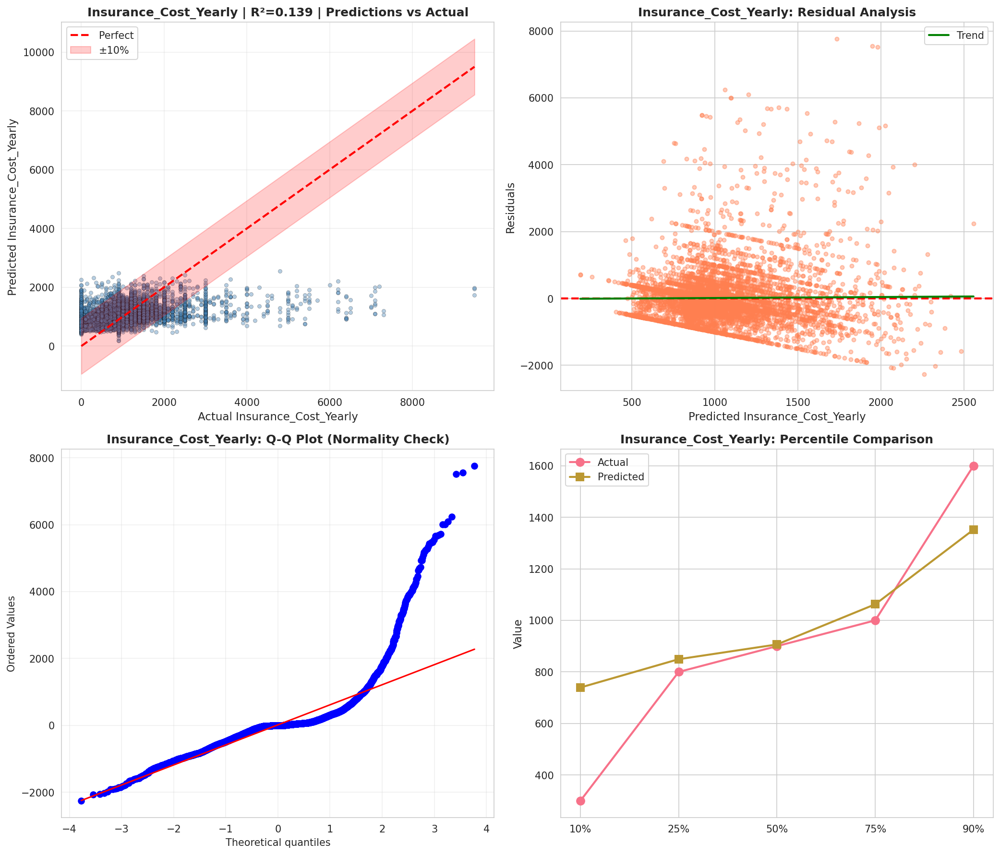
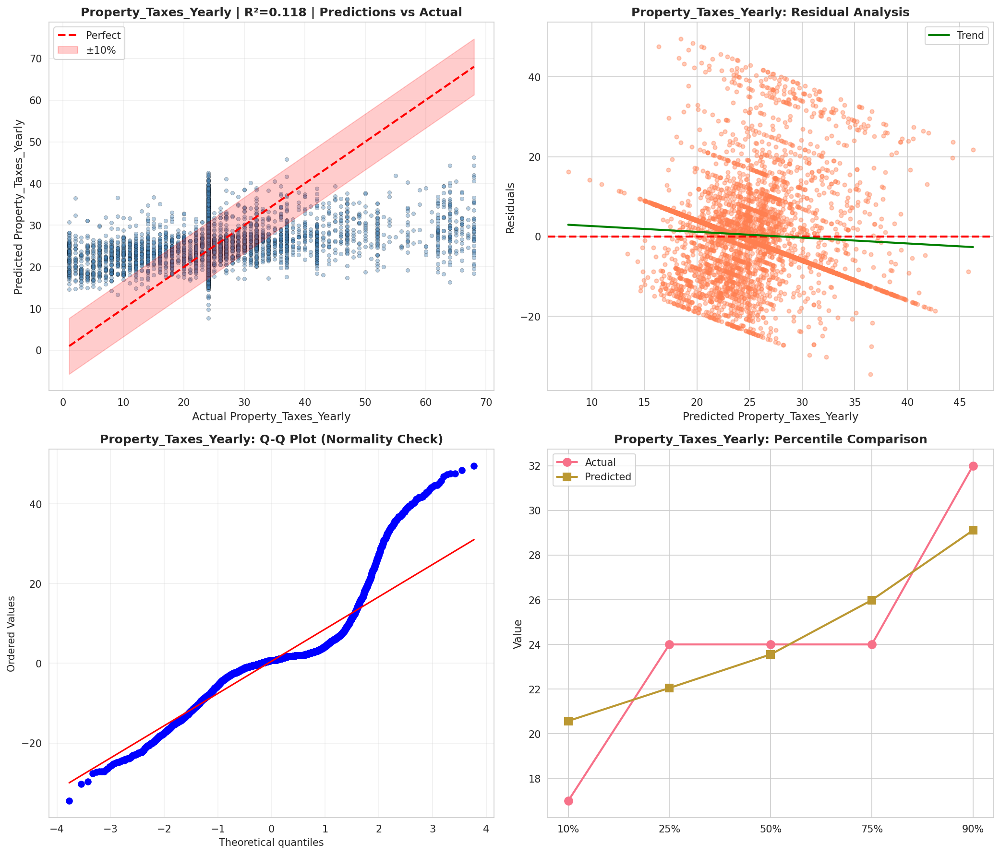
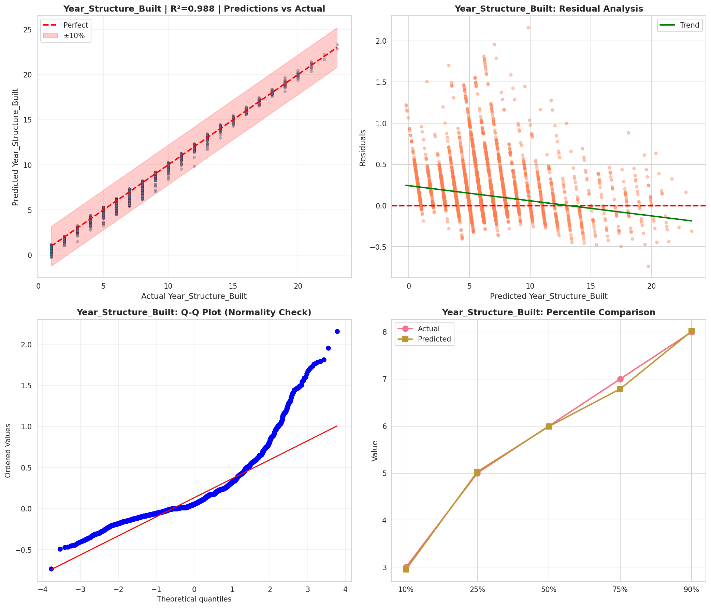
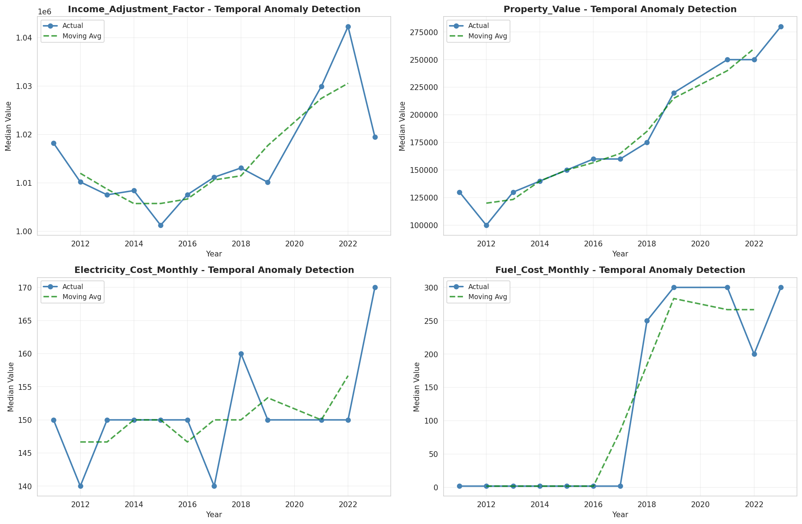
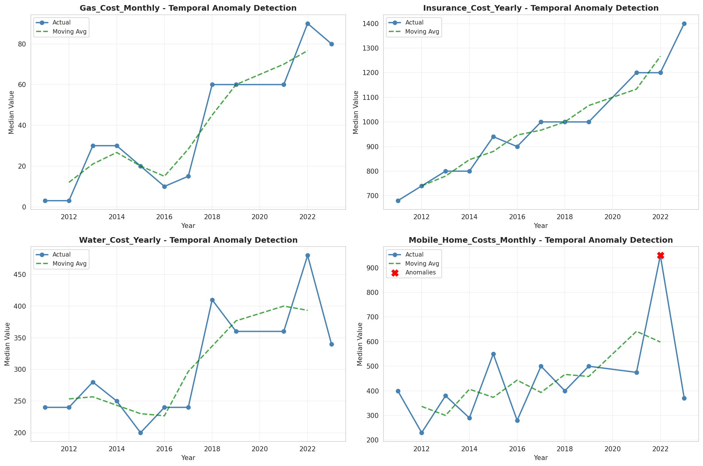
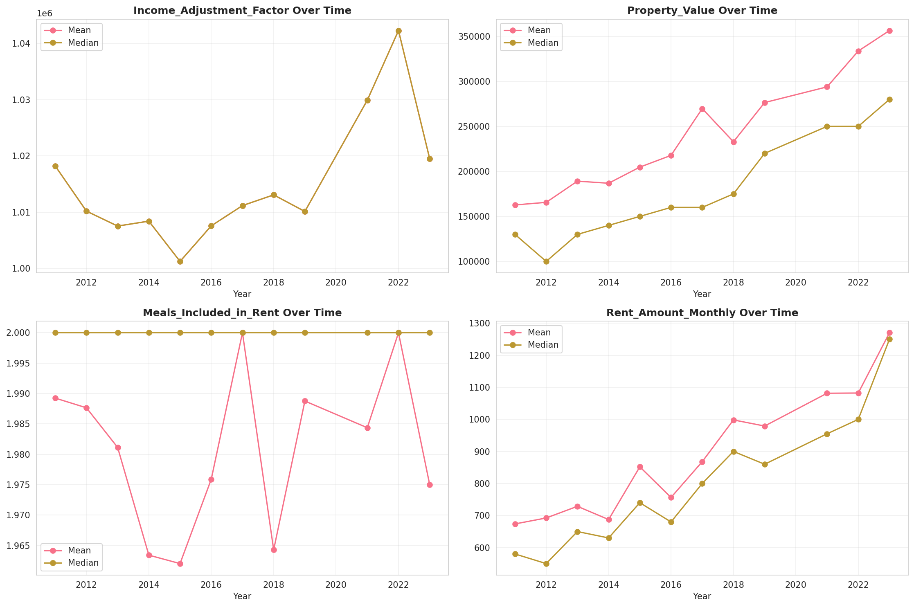
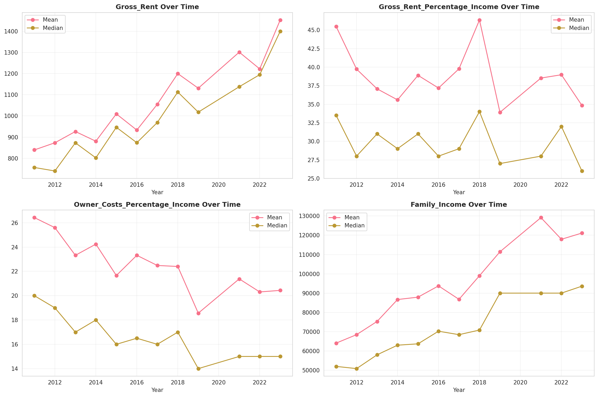
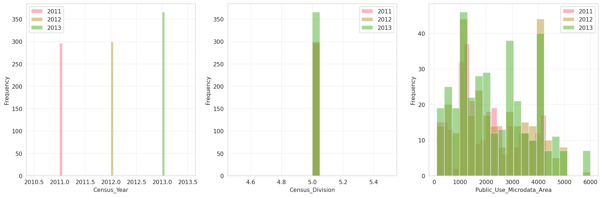
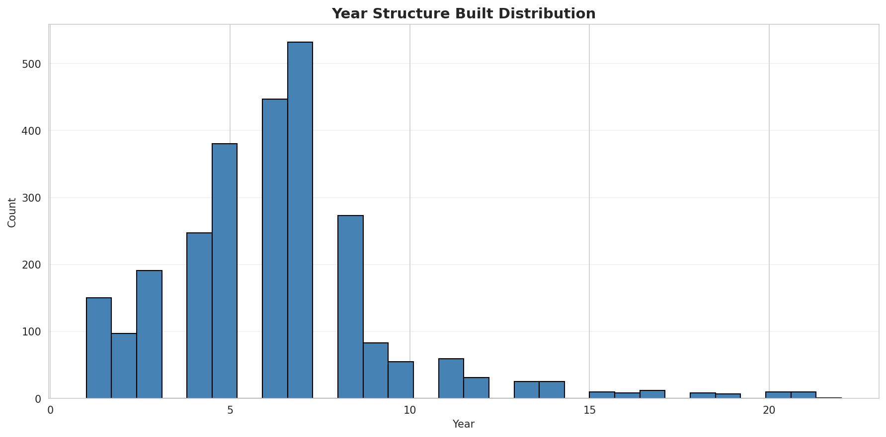
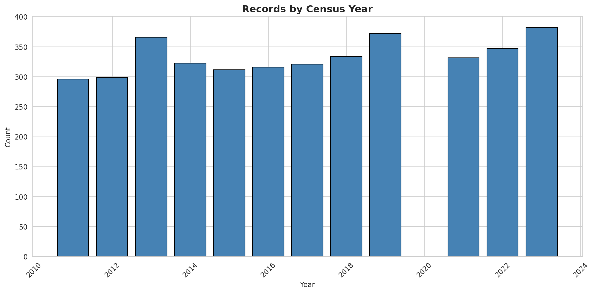
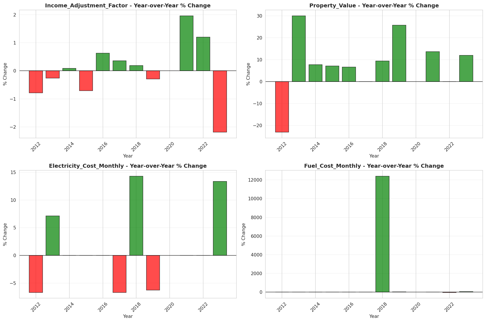
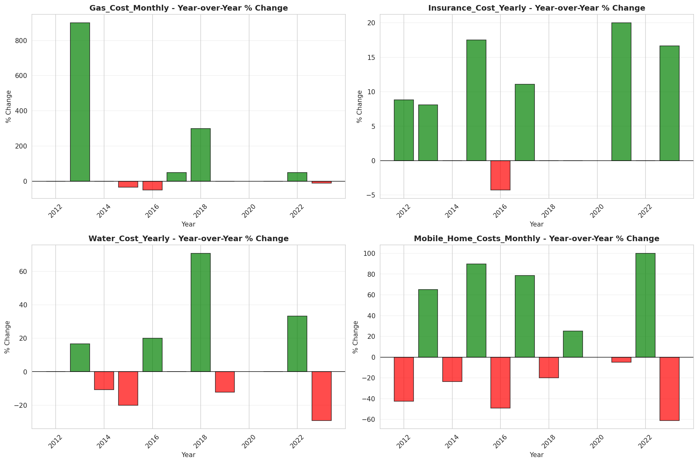
