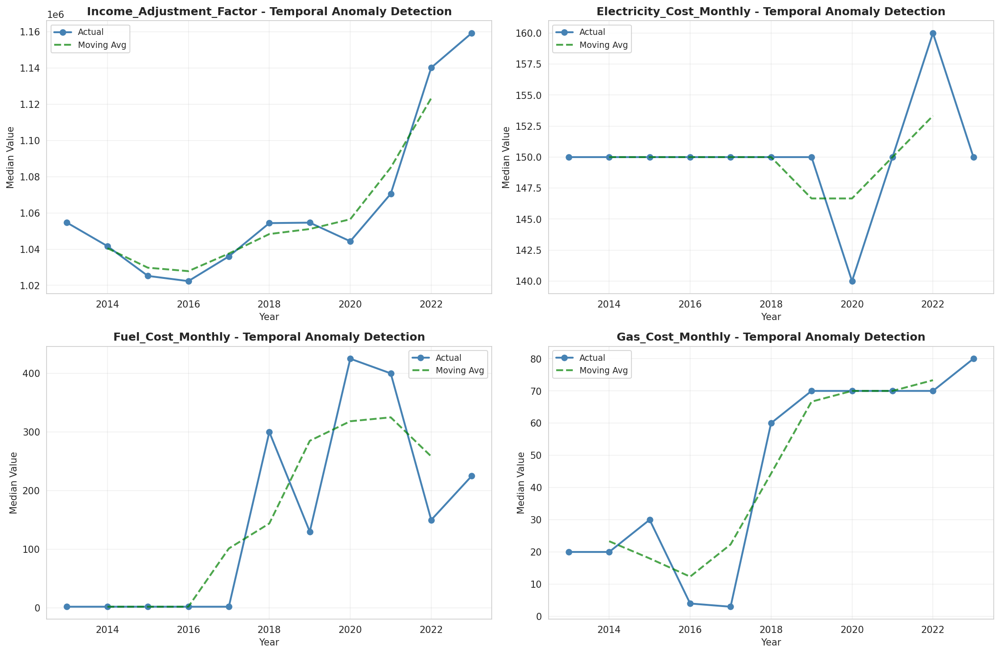
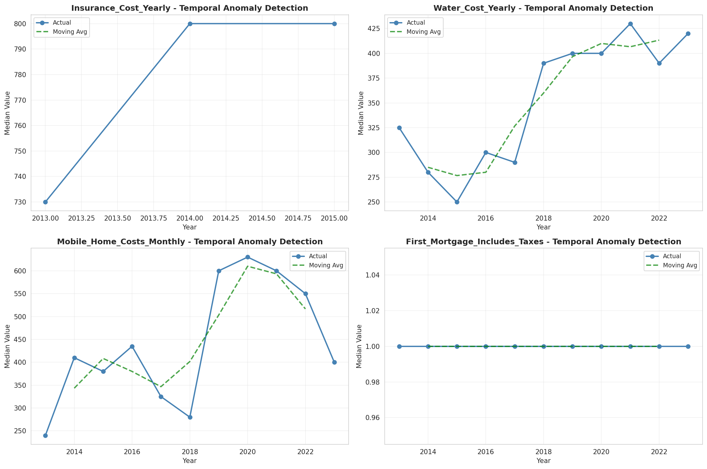
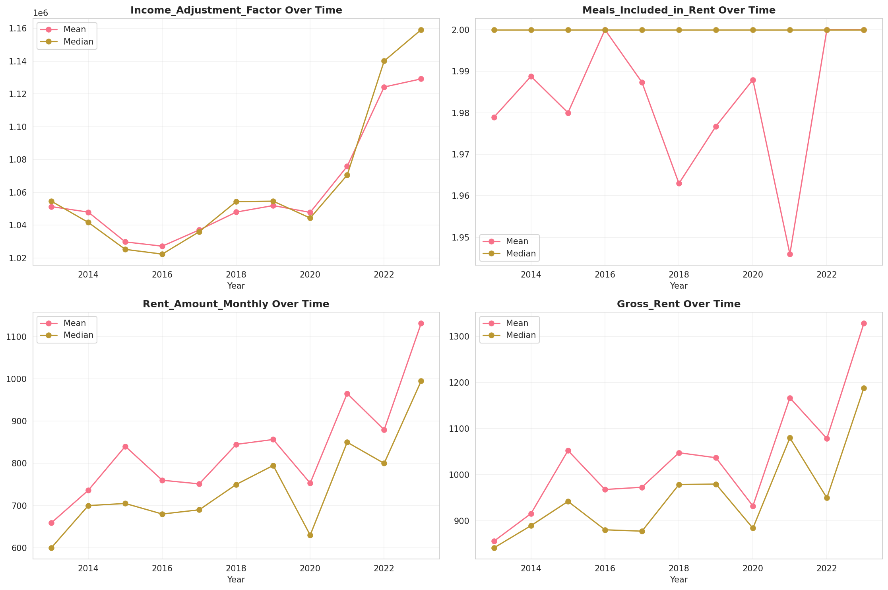
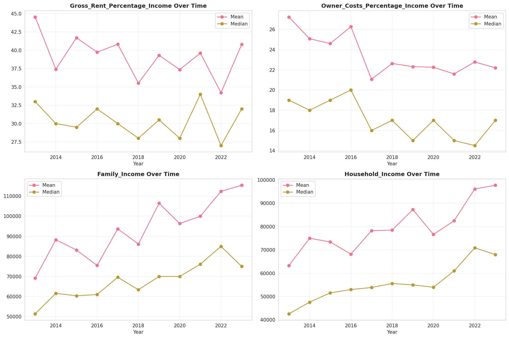
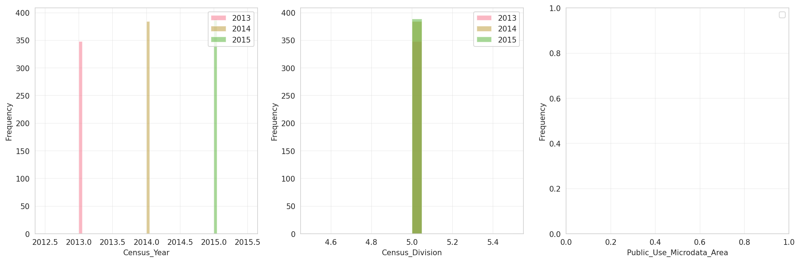
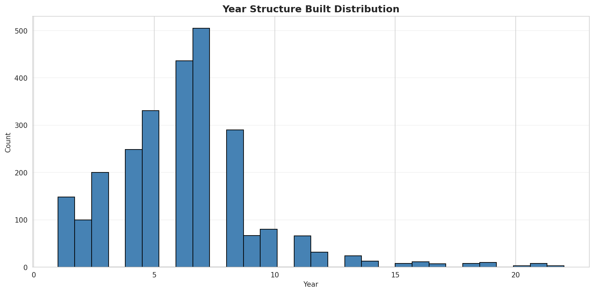
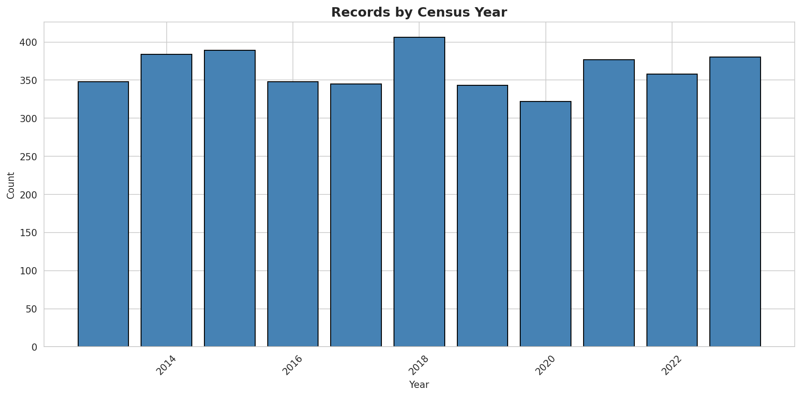
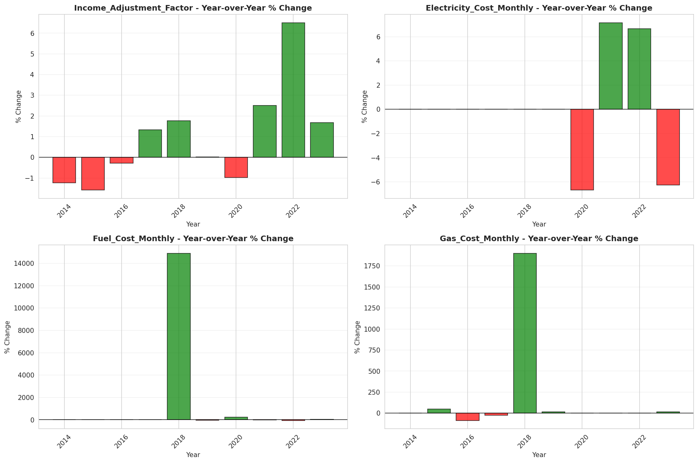
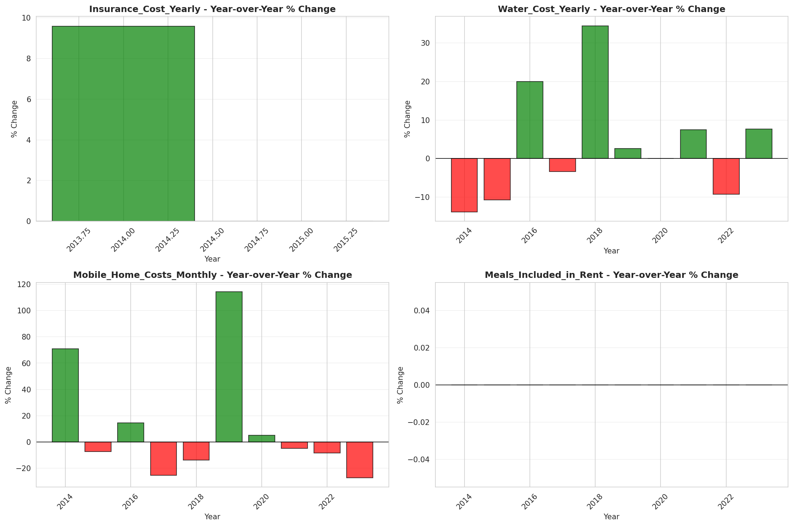

# Temporal Analysis

## Year Distribution

- 2013: 224,326 records

- 2014: 227,027 records

- 2015: 229,923 records

- 2016: 230,715 records

- 2017: 232,139 records

- 2018: 234,415 records

- 2019: 236,773 records

- 2020: 222,645 records

- 2021: 223,197 records

- 2022: 227,469 records

- 2023: 231,245 records

## Temporal Trends

- Census_Year: {np.int64(2013): {'mean': 2013.0, 'median': 2013.0, 'std': 0.0}, np.int64(2014): {'mean': 2014.0, 'median': 2014.0, 'std': 0.0}, np.int64(2015): {'mean': 2015.0, 'median': 2015.0, 'std': 0.0}, np.int64(2016): {'mean': 2016.0, 'median': 2016.0, 'std': 0.0}, np.int64(2017): {'mean': 2017.0, 'median': 2017.0, 'std': 0.0}, np.int64(2018): {'mean': 2018.0, 'median': 2018.0, 'std': 0.0}, np.int64(2019): {'mean': 2019.0, 'median': 2019.0, 'std': 0.0}, np.int64(2020): {'mean': 2020.0, 'median': 2020.0, 'std': 0.0}, np.int64(2021): {'mean': 2021.0, 'median': 2021.0, 'std': 0.0}, np.int64(2022): {'mean': 2022.0, 'median': 2022.0, 'std': 0.0}, np.int64(2023): {'mean': 2023.0, 'median': 2023.0, 'std': 0.0}}

- Census_Division: {np.int64(2013): {'mean': 5.0, 'median': 5.0, 'std': 0.0}, np.int64(2014): {'mean': 5.0, 'median': 5.0, 'std': 0.0}, np.int64(2015): {'mean': 5.0, 'median': 5.0, 'std': 0.0}, np.int64(2016): {'mean': 5.0, 'median': 5.0, 'std': 0.0}, np.int64(2017): {'mean': 5.0, 'median': 5.0, 'std': 0.0}, np.int64(2018): {'mean': 5.0, 'median': 5.0, 'std': 0.0}, np.int64(2019): {'mean': 5.0, 'median': 5.0, 'std': 0.0}, np.int64(2020): {'mean': 5.0, 'median': 5.0, 'std': 0.0}, np.int64(2021): {'mean': 5.0, 'median': 5.0, 'std': 0.0}, np.int64(2022): {'mean': 5.0, 'median': 5.0, 'std': 0.0}, np.int64(2023): {'mean': 5.0, 'median': 5.0, 'std': 0.0}}

- Public_Use_Microdata_Area: {np.int64(2013): {'mean': None, 'median': None, 'std': None}, np.int64(2014): {'mean': None, 'median': None, 'std': None}, np.int64(2015): {'mean': None, 'median': None, 'std': None}, np.int64(2016): {'mean': 2383.33910235572, 'median': 2200.0, 'std': 1399.188974864284}, np.int64(2017): {'mean': 2388.8304377980435, 'median': 2200.0, 'std': 1398.7046964427773}, np.int64(2018): {'mean': 2393.2189962246443, 'median': 2200.0, 'std': 1398.0659144325587}, np.int64(2019): {'mean': 2396.8719659758503, 'median': 2200.0, 'std': 1396.475245461121}, np.int64(2020): {'mean': 2395.1256978598217, 'median': 2200.0, 'std': 1394.7865034518309}, np.int64(2021): {'mean': 2392.89785705005, 'median': 2200.0, 'std': 1391.0239550235876}, np.int64(2022): {'mean': None, 'median': None, 'std': None}, np.int64(2023): {'mean': 2277.4917684706697, 'median': 1800.0, 'std': 1341.638708732826}}

- Census_Region: {np.int64(2013): {'mean': 3.0, 'median': 3.0, 'std': 0.0}, np.int64(2014): {'mean': 3.0, 'median': 3.0, 'std': 0.0}, np.int64(2015): {'mean': 3.0, 'median': 3.0, 'std': 0.0}, np.int64(2016): {'mean': 3.0, 'median': 3.0, 'std': 0.0}, np.int64(2017): {'mean': 3.0, 'median': 3.0, 'std': 0.0}, np.int64(2018): {'mean': 3.0, 'median': 3.0, 'std': 0.0}, np.int64(2019): {'mean': 3.0, 'median': 3.0, 'std': 0.0}, np.int64(2020): {'mean': 3.0, 'median': 3.0, 'std': 0.0}, np.int64(2021): {'mean': 3.0, 'median': 3.0, 'std': 0.0}, np.int64(2022): {'mean': 3.0, 'median': 3.0, 'std': 0.0}, np.int64(2023): {'mean': 3.0, 'median': 3.0, 'std': 0.0}}

- State_Code: {np.int64(2013): {'mean': 13.0, 'median': 13.0, 'std': 0.0}, np.int64(2014): {'mean': 13.0, 'median': 13.0, 'std': 0.0}, np.int64(2015): {'mean': 13.0, 'median': 13.0, 'std': 0.0}, np.int64(2016): {'mean': 13.0, 'median': 13.0, 'std': 0.0}, np.int64(2017): {'mean': 13.0, 'median': 13.0, 'std': 0.0}, np.int64(2018): {'mean': 13.0, 'median': 13.0, 'std': 0.0}, np.int64(2019): {'mean': 13.0, 'median': 13.0, 'std': 0.0}, np.int64(2020): {'mean': 13.0, 'median': 13.0, 'std': 0.0}, np.int64(2021): {'mean': 13.0, 'median': 13.0, 'std': 0.0}, np.int64(2022): {'mean': 13.0, 'median': 13.0, 'std': 0.0}, np.int64(2023): {'mean': None, 'median': None, 'std': None}}

- Housing_Adjustment_Factor: {np.int64(2013): {'mean': 1040175.5994178116, 'median': 1035725.0, 'std': 32070.02907404293}, np.int64(2014): {'mean': 1036662.0301329797, 'median': 1031130.0, 'std': 29614.37718464046}, np.int64(2015): {'mean': 1020917.9568203269, 'median': 1017534.0, 'std': 20287.380285243336}, np.int64(2016): {'mean': 1020334.8250352166, 'median': 1013801.0, 'std': 15769.46271986757}, np.int64(2017): {'mean': 1029124.6189782845, 'median': 1034680.0, 'std': 17981.01143210355}, np.int64(2018): {'mean': 1038146.3338779515, 'median': 1046406.0, 'std': 23507.631049754364}, np.int64(2019): {'mean': 1040620.8148099657, 'median': 1042936.0, 'std': 29190.33050312233}, np.int64(2020): {'mean': 1037743.8238900491, 'median': 1030827.0, 'std': 27874.197812249124}, np.int64(2021): {'mean': 1058994.3893242292, 'median': 1059761.0, 'std': 36027.75763206696}, np.int64(2022): {'mean': 1102897.3513313902, 'median': 1133141.0, 'std': 63175.22512157076}, np.int64(2023): {'mean': 1100892.2412722437, 'median': 1125501.0, 'std': 77094.2636943008}}

- Income_Adjustment_Factor: {np.int64(2013): {'mean': 1049164.2597068553, 'median': 1054614.0, 'std': 29657.483498979793}, np.int64(2014): {'mean': 1047509.7511793751, 'median': 1041654.0, 'std': 31048.846101420935}, np.int64(2015): {'mean': 1030330.1990057541, 'median': 1025215.0, 'std': 25654.602542643832}, np.int64(2016): {'mean': 1027496.6612313894, 'median': 1022342.0, 'std': 17521.74919063219}, np.int64(2017): {'mean': 1036525.2721386756, 'median': 1035988.0, 'std': 16848.212988452542}, np.int64(2018): {'mean': 1046744.8588955485, 'median': 1054346.0, 'std': 20527.74853539285}, np.int64(2019): {'mean': 1049591.4921929443, 'median': 1054606.0, 'std': 26250.35961369058}, np.int64(2020): {'mean': 1048005.1304588021, 'median': 1044328.0, 'std': 28189.041575825875}, np.int64(2021): {'mean': 1074250.8101452976, 'median': 1070512.0, 'std': 30956.61189910148}, np.int64(2022): {'mean': 1125906.1601668799, 'median': 1140108.0, 'std': 51114.1283889943}, np.int64(2023): {'mean': 1125519.8077580056, 'median': 1159185.0, 'std': 71074.8175886574}}

- Housing_Unit_Weight: {np.int64(2013): {'mean': 18.2538448507975, 'median': 15.0, 'std': 15.823647681919502}, np.int64(2014): {'mean': 18.123377395640166, 'median': 14.0, 'std': 16.197343421280703}, np.int64(2015): {'mean': 17.975865833344205, 'median': 14.0, 'std': 16.64795915602372}, np.int64(2016): {'mean': 18.015811715753202, 'median': 14.0, 'std': 16.21561442439271}, np.int64(2017): {'mean': 18.10677223560022, 'median': 14.0, 'std': 16.18872335624268}, np.int64(2018): {'mean': 18.091858456156817, 'median': 14.0, 'std': 16.204601425412687}, np.int64(2019): {'mean': 18.091070350082145, 'median': 14.0, 'std': 16.528450921686467}, np.int64(2020): {'mean': 19.446540456780973, 'median': 14.0, 'std': 22.325509897350283}, np.int64(2021): {'mean': 19.60169267508076, 'median': 14.0, 'std': 22.966882908542864}, np.int64(2022): {'mean': 19.461025458414113, 'median': 14.0, 'std': 23.25484242871895}, np.int64(2023): {'mean': 19.39014032735843, 'median': 13.0, 'std': 23.19231350956535}}

- Number_of_Persons: {np.int64(2013): {'mean': 2.130952274814333, 'median': 2.0, 'std': 1.4965901969654871}, np.int64(2014): {'mean': 2.114933466063508, 'median': 2.0, 'std': 1.4944478351159265}, np.int64(2015): {'mean': 2.098820039752439, 'median': 2.0, 'std': 1.4850145963390329}, np.int64(2016): {'mean': 2.1075049303252933, 'median': 2.0, 'std': 1.4832802504524873}, np.int64(2017): {'mean': 2.1099599808735285, 'median': 2.0, 'std': 1.4805675962396063}, np.int64(2018): {'mean': 2.1077618753066143, 'median': 2.0, 'std': 1.4770489382080603}, np.int64(2019): {'mean': 2.104226410950573, 'median': 2.0, 'std': 1.4701512411300943}, np.int64(2020): {'mean': 2.0872599878730713, 'median': 2.0, 'std': 1.4683970035843394}, np.int64(2021): {'mean': 2.0777967445799, 'median': 2.0, 'std': 1.4632378382436417}, np.int64(2022): {'mean': 2.0807582571691086, 'median': 2.0, 'std': 1.4589633308647736}, np.int64(2023): {'mean': 2.090765205734178, 'median': 2.0, 'std': 1.4570086591476739}}

- Housing_Unit_Type: {np.int64(2013): {'mean': 1.1207127127484109, 'median': 1.0, 'std': 0.4160183947975414}, np.int64(2014): {'mean': 1.1325128729181992, 'median': 1.0, 'std': 0.4375870168406329}, np.int64(2015): {'mean': 1.1448615406027236, 'median': 1.0, 'std': 0.45845909720906436}, np.int64(2016): {'mean': 1.1425178250222137, 'median': 1.0, 'std': 0.45573912691866925}, np.int64(2017): {'mean': 1.1398687855121286, 'median': 1.0, 'std': 0.45222333218102473}, np.int64(2018): {'mean': 1.138911759059787, 'median': 1.0, 'std': 0.4503732651991653}, np.int64(2019): {'mean': 1.1376043721201319, 'median': 1.0, 'std': 0.44775776580983284}, np.int64(2020): {'mean': None, 'median': None, 'std': None}, np.int64(2021): {'mean': None, 'median': None, 'std': None}, np.int64(2022): {'mean': None, 'median': None, 'std': None}, np.int64(2023): {'mean': None, 'median': None, 'std': None}}

- Building_Type: {np.int64(2013): {'mean': 2.7019008175664454, 'median': 2.0, 'std': 1.8733884619641394}, np.int64(2014): {'mean': 2.708238097553859, 'median': 2.0, 'std': 1.884833125607594}, np.int64(2015): {'mean': 2.7091140613349602, 'median': 2.0, 'std': 1.889692621375362}, np.int64(2016): {'mean': 2.716778368384562, 'median': 2.0, 'std': 1.8987386492819502}, np.int64(2017): {'mean': 2.7252856385746957, 'median': 2.0, 'std': 1.908869011358587}, np.int64(2018): {'mean': 2.728169333572772, 'median': 2.0, 'std': 1.9167462419990866}, np.int64(2019): {'mean': 2.7255771982158055, 'median': 2.0, 'std': 1.9191013587068453}, np.int64(2020): {'mean': 2.7207153277327834, 'median': 2.0, 'std': 1.9151253026163007}, np.int64(2021): {'mean': 2.713853348449267, 'median': 2.0, 'std': 1.9116094852988625}, np.int64(2022): {'mean': 2.7030186756197727, 'median': 2.0, 'std': 1.9028463548142087}, np.int64(2023): {'mean': 2.6948886195923114, 'median': 2.0, 'std': 1.894454030946412}}

- Year_Structure_Built: {np.int64(2013): {'mean': 5.874131885091378, 'median': 6.0, 'std': 2.497584095844925}, np.int64(2014): {'mean': 5.9079803530613235, 'median': 6.0, 'std': 2.5730823791687305}, np.int64(2015): {'mean': 5.948125768623692, 'median': 6.0, 'std': 2.681183862557808}, np.int64(2016): {'mean': 6.066842885756105, 'median': 6.0, 'std': 2.8182385670656673}, np.int64(2017): {'mean': 6.186532851420195, 'median': 6.0, 'std': 3.012502899818604}, np.int64(2018): {'mean': 6.314939084903075, 'median': 6.0, 'std': 3.256405272840655}, np.int64(2019): {'mean': 6.469529357858218, 'median': 6.0, 'std': 3.5389907154766047}, np.int64(2020): {'mean': 6.603098747421902, 'median': 6.0, 'std': 3.7901973748722324}, np.int64(2021): {'mean': None, 'median': None, 'std': None}, np.int64(2022): {'mean': None, 'median': None, 'std': None}, np.int64(2023): {'mean': None, 'median': None, 'std': None}}

- Bathtub_or_Shower: {np.int64(2013): {'mean': 1.009069419889233, 'median': 1.0, 'std': 0.09480089348114115}, np.int64(2014): {'mean': 1.0089772893060351, 'median': 1.0, 'std': 0.09432253627062682}, np.int64(2015): {'mean': 1.0089039305115766, 'median': 1.0, 'std': 0.09393983851248118}, np.int64(2016): {'mean': 1.0080502272552192, 'median': 1.0, 'std': 0.08936139851291405}, np.int64(2017): {'mean': 1.0081979345215644, 'median': 1.0, 'std': 0.09017076694833781}, np.int64(2018): {'mean': 1.0082464580399422, 'median': 1.0, 'std': 0.0904350187668644}, np.int64(2019): {'mean': 1.0085375774974519, 'median': 1.0, 'std': 0.0920039501613285}, np.int64(2020): {'mean': 1.0086573771316465, 'median': 1.0, 'std': 0.09264162199787665}, np.int64(2021): {'mean': 1.0091454773665884, 'median': 1.0, 'std': 0.09519392561384055}, np.int64(2022): {'mean': 1.008393536976528, 'median': 1.0, 'std': 0.09123117393285973}, np.int64(2023): {'mean': 1.008054266544498, 'median': 1.0, 'std': 0.08938363772042868}}

- Refrigerator: {np.int64(2013): {'mean': 1.0226027330357403, 'median': 1.0, 'std': 0.14863363478760527}, np.int64(2014): {'mean': 1.0225064436123135, 'median': 1.0, 'std': 0.1483240054629406}, np.int64(2015): {'mean': 1.022010477490825, 'median': 1.0, 'std': 0.14671782643900635}, np.int64(2016): {'mean': 1.020241121639319, 'median': 1.0, 'std': 0.1408244088127898}, np.int64(2017): {'mean': 1.0202107494640547, 'median': 1.0, 'std': 0.14072089261346624}, np.int64(2018): {'mean': 1.0197725962401822, 'median': 1.0, 'std': 0.1392182900038491}, np.int64(2019): {'mean': 1.0195485276653045, 'median': 1.0, 'std': 0.1384430292411532}, np.int64(2020): {'mean': 1.0195180844106846, 'median': 1.0, 'std': 0.13833735959664653}, np.int64(2021): {'mean': 1.019895335654709, 'median': 1.0, 'std': 0.13964100387824185}, np.int64(2022): {'mean': 1.0182709313828353, 'median': 1.0, 'std': 0.13392981022238584}, np.int64(2023): {'mean': 1.0169065705080838, 'median': 1.0, 'std': 0.12892176022110324}}

- Hot_and_Cold_Running_Water: {np.int64(2013): {'mean': 1.0169569336862772, 'median': 1.0, 'std': 0.12911033071933214}, np.int64(2014): {'mean': 1.0175898458396149, 'median': 1.0, 'std': 0.13145541905888802}, np.int64(2015): {'mean': 1.0184227599763724, 'median': 1.0, 'std': 0.1344747167548509}, np.int64(2016): {'mean': 1.0174967259841305, 'median': 1.0, 'std': 0.13111320807761437}, np.int64(2017): {'mean': 1.0173460082218073, 'median': 1.0, 'std': 0.13055728859041937}, np.int64(2018): {'mean': 1.0172065064317648, 'median': 1.0, 'std': 0.13004046479198442}, np.int64(2019): {'mean': 1.017178017374391, 'median': 1.0, 'std': 0.1299346452300441}, np.int64(2020): {'mean': 1.0172141455807637, 'median': 1.0, 'std': 0.1300688428375097}, np.int64(2021): {'mean': 1.0181087537452425, 'median': 1.0, 'std': 0.13334510405230512}, np.int64(2022): {'mean': 1.0171517931192982, 'median': 1.0, 'std': 0.12983718009763515}, np.int64(2023): {'mean': 1.0164090286603809, 'median': 1.0, 'std': 0.12704271701379338}}

- Running_Water: {np.int64(2013): {'mean': 9.0, 'median': 9.0, 'std': 0.0}, np.int64(2014): {'mean': 9.0, 'median': 9.0, 'std': 0.0}, np.int64(2015): {'mean': 9.0, 'median': 9.0, 'std': 0.0}, np.int64(2016): {'mean': 9.0, 'median': 9.0, 'std': 0.0}, np.int64(2017): {'mean': 9.0, 'median': 9.0, 'std': 0.0}, np.int64(2018): {'mean': 9.0, 'median': 9.0, 'std': 0.0}, np.int64(2019): {'mean': 9.0, 'median': 9.0, 'std': 0.0}, np.int64(2020): {'mean': 9.0, 'median': 9.0, 'std': 0.0}, np.int64(2021): {'mean': 9.0, 'median': 9.0, 'std': 0.0}, np.int64(2022): {'mean': 9.0, 'median': 9.0, 'std': 0.0}, np.int64(2023): {'mean': 9.0, 'median': 9.0, 'std': 0.0}}

- Sink_with_Faucet: {np.int64(2013): {'mean': 1.0086933588599, 'median': 1.0, 'std': 0.092832249031883}, np.int64(2014): {'mean': 1.0086563244662743, 'median': 1.0, 'std': 0.09263603103227791}, np.int64(2015): {'mean': 1.0085940601729464, 'median': 1.0, 'std': 0.09230516537744941}, np.int64(2016): {'mean': 1.0076794931053077, 'median': 1.0, 'std': 0.0872957913181544}, np.int64(2017): {'mean': 1.007873263847443, 'median': 1.0, 'std': 0.08838163191230222}, np.int64(2018): {'mean': 1.0080432501913934, 'median': 1.0, 'std': 0.08932297589480552}, np.int64(2019): {'mean': 1.008345879426589, 'median': 1.0, 'std': 0.09097397660528579}, np.int64(2020): {'mean': 1.0084964032395995, 'median': 1.0, 'std': 0.0917837499193528}, np.int64(2021): {'mean': 1.0089733986557616, 'median': 1.0, 'std': 0.09430228937112636}, np.int64(2022): {'mean': 1.0082636369995104, 'median': 1.0, 'std': 0.09052839470836757}, np.int64(2023): {'mean': 1.0079114079941673, 'median': 1.0, 'std': 0.08859377112650167}}

- Stove_or_Range: {np.int64(2013): {'mean': 1.0205270715102024, 'median': 1.0, 'std': 0.14179495421335941}, np.int64(2014): {'mean': 1.0208821669989787, 'median': 1.0, 'std': 0.1429902148134702}, np.int64(2015): {'mean': 1.0208242551007563, 'median': 1.0, 'std': 0.14279602314636708}, np.int64(2016): {'mean': 1.019412988213543, 'median': 1.0, 'std': 0.1379717933361296}, np.int64(2017): {'mean': 1.0199147262023558, 'median': 1.0, 'std': 0.1397076342714988}, np.int64(2018): {'mean': 1.0200939481867244, 'median': 1.0, 'std': 0.14032203848498773}, np.int64(2019): {'mean': 1.0200347861865176, 'median': 1.0, 'std': 0.14011953941749264}, np.int64(2020): {'mean': 1.020182101715378, 'median': 1.0, 'std': 0.14062319851994382}, np.int64(2021): {'mean': 1.0208569519799173, 'median': 1.0, 'std': 0.14290571329661245}, np.int64(2022): {'mean': 1.0190803081627147, 'median': 1.0, 'std': 0.13680768806191174}, np.int64(2023): {'mean': 1.0178228356929624, 'median': 1.0, 'std': 0.13230747694111258}}

- Telephone_Service: {np.int64(2013): {'mean': 1.125091669902075, 'median': 1.0, 'std': 0.8281518172716291}, np.int64(2014): {'mean': 1.1254904279218756, 'median': 1.0, 'std': 0.8271832819336475}, np.int64(2015): {'mean': 1.12476749406709, 'median': 1.0, 'std': 0.824940848283921}, np.int64(2016): {'mean': 1.1233450289918059, 'median': 1.0, 'std': 0.8213813719957754}, np.int64(2017): {'mean': 1.0260798310720307, 'median': 1.0, 'std': 0.15937316870084842}, np.int64(2018): {'mean': 1.0239770153161953, 'median': 1.0, 'std': 0.15297790571829947}, np.int64(2019): {'mean': 1.020243081218691, 'median': 1.0, 'std': 0.1408311069292358}, np.int64(2020): {'mean': 1.0167891451591482, 'median': 1.0, 'std': 0.12848097567426092}, np.int64(2021): {'mean': 1.0117288830006346, 'median': 1.0, 'std': 0.107663275210653}, np.int64(2022): {'mean': 1.0096586123538356, 'median': 1.0, 'std': 0.09780273961508218}, np.int64(2023): {'mean': 1.0081820766915437, 'median': 1.0, 'std': 0.09008425973980516}}

- Lot_Acreage: {np.int64(2013): {'mean': 1.3790479103195983, 'median': 1.0, 'std': 0.5720393834103246}, np.int64(2014): {'mean': 1.382578491254628, 'median': 1.0, 'std': 0.573443132525422}, np.int64(2015): {'mean': 1.3861179095672287, 'median': 1.0, 'std': 0.5752900007266106}, np.int64(2016): {'mean': 1.384607789039584, 'median': 1.0, 'std': 0.5746114025899602}, np.int64(2017): {'mean': 1.3828364960727477, 'median': 1.0, 'std': 0.5734911211517575}, np.int64(2018): {'mean': 1.3794253083183259, 'median': 1.0, 'std': 0.5718505606354687}, np.int64(2019): {'mean': 1.3782096352335687, 'median': 1.0, 'std': 0.5721037538061694}, np.int64(2020): {'mean': 1.377555086024751, 'median': 1.0, 'std': 0.5718376961944358}, np.int64(2021): {'mean': 1.3770635650658405, 'median': 1.0, 'std': 0.5709324285038129}, np.int64(2022): {'mean': 1.3773274201602739, 'median': 1.0, 'std': 0.5700724681502506}, np.int64(2023): {'mean': 1.3792940352106509, 'median': 1.0, 'std': 0.5703694556967286}}

- Agricultural_Sales: {np.int64(2013): {'mean': 1.1040978500915457, 'median': 1.0, 'std': 0.6201241589641243}, np.int64(2014): {'mean': 1.1041884816753926, 'median': 1.0, 'std': 0.621718736149274}, np.int64(2015): {'mean': 1.1052319878592711, 'median': 1.0, 'std': 0.6270900929649975}, np.int64(2016): {'mean': 1.1060617261134726, 'median': 1.0, 'std': 0.6327288644625448}, np.int64(2017): {'mean': 1.105579525758749, 'median': 1.0, 'std': 0.6305905591540504}, np.int64(2018): {'mean': 1.1095885371640886, 'median': 1.0, 'std': 0.6414176001859917}, np.int64(2019): {'mean': 1.1119607270603693, 'median': 1.0, 'std': 0.644972144546767}, np.int64(2020): {'mean': 1.113775399807227, 'median': 1.0, 'std': 0.648602046703295}, np.int64(2021): {'mean': 1.1154976237897103, 'median': 1.0, 'std': 0.6514176161407477}, np.int64(2022): {'mean': 1.115895441946412, 'median': 1.0, 'std': 0.6527467317264026}, np.int64(2023): {'mean': 1.114292129785562, 'median': 1.0, 'std': 0.6463492291686067}}

- Business_On_Property: {np.int64(2013): {'mean': 1.9869255290367356, 'median': 2.0, 'std': 0.1135940362177848}, np.int64(2014): {'mean': 1.9871093039493526, 'median': 2.0, 'std': 0.11280337169785834}, np.int64(2015): {'mean': 1.9871260930262442, 'median': 2.0, 'std': 0.11273084637230384}, np.int64(2016): {'mean': 3.4106758051868846, 'median': 2.0, 'std': 2.8226234668645356}, np.int64(2017): {'mean': 4.834548293964767, 'median': 2.0, 'std': 3.445037083284313}, np.int64(2018): {'mean': 6.240465497982538, 'median': 9.0, 'std': 3.426652102592142}, np.int64(2019): {'mean': 7.632438057203926, 'median': 9.0, 'std': 2.7790206100807415}, np.int64(2020): {'mean': None, 'median': None, 'std': None}, np.int64(2021): {'mean': None, 'median': None, 'std': None}, np.int64(2022): {'mean': None, 'median': None, 'std': None}, np.int64(2023): {'mean': None, 'median': None, 'std': None}}

- Tenure: {np.int64(2013): {'mean': 1.862139251973599, 'median': 2.0, 'std': 0.9030008936320219}, np.int64(2014): {'mean': 1.8880480699981728, 'median': 2.0, 'std': 0.9040594963296634}, np.int64(2015): {'mean': 1.9054422423192867, 'median': 2.0, 'std': 0.9018939020130501}, np.int64(2016): {'mean': 1.908731462734664, 'median': 2.0, 'std': 0.8996796527626093}, np.int64(2017): {'mean': 1.9135609868839198, 'median': 2.0, 'std': 0.8963594747771981}, np.int64(2018): {'mean': 1.913168395020678, 'median': 2.0, 'std': 0.892257275989717}, np.int64(2019): {'mean': 1.9058162930114149, 'median': 2.0, 'std': 0.8870657844569224}, np.int64(2020): {'mean': 1.89899397937049, 'median': 2.0, 'std': 0.8827899020200718}, np.int64(2021): {'mean': 1.8876487681054541, 'median': 2.0, 'std': 0.876518457879388}, np.int64(2022): {'mean': 1.8713971625775259, 'median': 2.0, 'std': 0.8699046917656098}, np.int64(2023): {'mean': 1.8580503586700503, 'median': 2.0, 'std': 0.863266989560753}}

- Vacancy_Status: {np.int64(2013): {'mean': 4.553610276597949, 'median': 5.0, 'std': 2.411242481860981}, np.int64(2014): {'mean': 4.644777187244481, 'median': 5.0, 'std': 2.395523224435331}, np.int64(2015): {'mean': 4.748842949706881, 'median': 5.0, 'std': 2.371569726070527}, np.int64(2016): {'mean': 4.849910629797077, 'median': 5.0, 'std': 2.343671726919058}, np.int64(2017): {'mean': 4.90302108465331, 'median': 5.0, 'std': 2.3241814374268213}, np.int64(2018): {'mean': 4.961474124411918, 'median': 5.0, 'std': 2.3133508510502585}, np.int64(2019): {'mean': 4.996062165284049, 'median': 5.0, 'std': 2.3155246105864173}, np.int64(2020): {'mean': 5.0000553158535235, 'median': 5.0, 'std': 2.319324571539415}, np.int64(2021): {'mean': 5.000836027198751, 'median': 5.0, 'std': 2.326565769638189}, np.int64(2022): {'mean': 4.980418207024029, 'median': 5.0, 'std': 2.3389166249985425}, np.int64(2023): {'mean': 4.9306048751128495, 'median': 5.0, 'std': 2.3608880594676673}}

- Vehicles_Available: {np.int64(2013): {'mean': 1.8307827531167766, 'median': 2.0, 'std': 1.0452632216273277}, np.int64(2014): {'mean': 1.8250905612107793, 'median': 2.0, 'std': 1.0476466095864585}, np.int64(2015): {'mean': 1.8294903042353494, 'median': 2.0, 'std': 1.0535566497678777}, np.int64(2016): {'mean': 1.8498892269205085, 'median': 2.0, 'std': 1.0605288353026272}, np.int64(2017): {'mean': 1.869884492349391, 'median': 2.0, 'std': 1.0678585254014947}, np.int64(2018): {'mean': 1.889903156757206, 'median': 2.0, 'std': 1.0763210535125078}, np.int64(2019): {'mean': 1.9107128192494047, 'median': 2.0, 'std': 1.0837713376397342}, np.int64(2020): {'mean': 1.9276362388773296, 'median': 2.0, 'std': 1.0896495438353848}, np.int64(2021): {'mean': 1.9420959463822491, 'median': 2.0, 'std': 1.0919802631907065}, np.int64(2022): {'mean': 1.9524671574364751, 'median': 2.0, 'std': 1.0908689605016377}, np.int64(2023): {'mean': 1.96200297237409, 'median': 2.0, 'std': 1.0934903659507234}}

- Condo_Fee_Monthly: {np.int64(2013): {'mean': 246.76571208917932, 'median': 200.0, 'std': 205.21575625040316}, np.int64(2014): {'mean': 257.7226426672121, 'median': 220.0, 'std': 205.11260325241412}, np.int64(2015): {'mean': 271.7253310551047, 'median': 230.0, 'std': 210.6967692136966}, np.int64(2016): {'mean': 282.6167867740568, 'median': 240.0, 'std': 210.5309807670309}, np.int64(2017): {'mean': 291.9067203731185, 'median': 250.0, 'std': 210.93923757841287}, np.int64(2018): {'mean': 298.98123324396784, 'median': 250.0, 'std': 211.43840207920772}, np.int64(2019): {'mean': 304.35661396838105, 'median': 260.0, 'std': 213.55390776100936}, np.int64(2020): {'mean': 309.574322883344, 'median': 270.0, 'std': 217.2467565496202}, np.int64(2021): {'mean': 321.80883907802917, 'median': 280.0, 'std': 243.80235052847178}, np.int64(2022): {'mean': 332.23980719019886, 'median': 290.0, 'std': 253.02271857870295}, np.int64(2023): {'mean': 344.99941417691855, 'median': 300.0, 'std': 267.03605832353304}}

- Electricity_Cost_Monthly: {np.int64(2013): {'mean': 161.1146466934127, 'median': 140.0, 'std': 97.46833164620203}, np.int64(2014): {'mean': 164.46783330287752, 'median': 150.0, 'std': 98.90028511793804}, np.int64(2015): {'mean': 165.1107316186689, 'median': 150.0, 'std': 99.28438338391172}, np.int64(2016): {'mean': 163.50273487602956, 'median': 150.0, 'std': 98.58228211502762}, np.int64(2017): {'mean': 162.6633889598008, 'median': 150.0, 'std': 98.36837139933198}, np.int64(2018): {'mean': 169.16803199794666, 'median': 150.0, 'std': 97.40763657591718}, np.int64(2019): {'mean': 169.93262214613682, 'median': 150.0, 'std': 97.95844842625226}, np.int64(2020): {'mean': 169.64319420065198, 'median': 150.0, 'std': 98.16244611462716}, np.int64(2021): {'mean': 170.4796289288704, 'median': 150.0, 'std': 99.33268752838336}, np.int64(2022): {'mean': 177.68698060941827, 'median': 150.0, 'std': 128.8087270245365}, np.int64(2023): {'mean': 184.4288749689561, 'median': 150.0, 'std': 148.95399114605485}}

- Fuel_Cost_Monthly: {np.int64(2013): {'mean': 41.729627712350634, 'median': 2.0, 'std': 237.60633485482538}, np.int64(2014): {'mean': 37.89902290634305, 'median': 2.0, 'std': 225.56767472115038}, np.int64(2015): {'mean': 32.9628204305903, 'median': 2.0, 'std': 210.7088073183434}, np.int64(2016): {'mean': 28.298032585305872, 'median': 2.0, 'std': 190.66398793264653}, np.int64(2017): {'mean': 23.3677440026894, 'median': 2.0, 'std': 168.74075737027596}, np.int64(2018): {'mean': 469.88826685327734, 'median': 220.0, 'std': 641.4834486764955}, np.int64(2019): {'mean': 474.27858880778587, 'median': 240.0, 'std': 642.8499045348839}, np.int64(2020): {'mean': 473.87179842170843, 'median': 230.0, 'std': 647.1917742411712}, np.int64(2021): {'mean': 476.6842027486331, 'median': 240.0, 'std': 650.7762649259914}, np.int64(2022): {'mean': 491.8264609908039, 'median': 250.0, 'std': 669.144920280757}, np.int64(2023): {'mean': 498.4840279890478, 'median': 250.0, 'std': 681.22241900187}}

- Gas_Cost_Monthly: {np.int64(2013): {'mean': 54.648160131141886, 'median': 30.0, 'std': 77.99034584447887}, np.int64(2014): {'mean': 53.37293482817555, 'median': 20.0, 'std': 77.3432173092291}, np.int64(2015): {'mean': 50.957897718769374, 'median': 20.0, 'std': 73.99817608405996}, np.int64(2016): {'mean': 48.8208126185908, 'median': 20.0, 'std': 70.26082838470933}, np.int64(2017): {'mean': 47.88210235480126, 'median': 20.0, 'std': 69.19088738000836}, np.int64(2018): {'mean': 89.40392432378181, 'median': 60.0, 'std': 75.73632362795892}, np.int64(2019): {'mean': 87.4415428202197, 'median': 60.0, 'std': 73.47878189975684}, np.int64(2020): {'mean': 87.21866114443289, 'median': 60.0, 'std': 74.45064187895008}, np.int64(2021): {'mean': 90.0236414275536, 'median': 70.0, 'std': 77.45617489208205}, np.int64(2022): {'mean': 99.25157816953447, 'median': 70.0, 'std': 113.97635496064326}, np.int64(2023): {'mean': 106.95321896823842, 'median': 70.0, 'std': 142.41960718419998}}

- House_Heating_Fuel: {np.int64(2013): {'mean': 2.1795813381648763, 'median': 3.0, 'std': 1.1368725818513417}, np.int64(2014): {'mean': 2.201207124506885, 'median': 3.0, 'std': 1.146392756925219}, np.int64(2015): {'mean': 2.2131357834648195, 'median': 3.0, 'std': 1.1537149278758936}, np.int64(2016): {'mean': 2.2145393641943247, 'median': 3.0, 'std': 1.155250932127598}, np.int64(2017): {'mean': 2.2211716751498343, 'median': 3.0, 'std': 1.1576869306171071}, np.int64(2018): {'mean': 2.2252956212722625, 'median': 3.0, 'std': 1.1560561985339914}, np.int64(2019): {'mean': 2.2290999425145768, 'median': 3.0, 'std': 1.1536404246684413}, np.int64(2020): {'mean': 2.2331555181725617, 'median': 3.0, 'std': 1.150384715039995}, np.int64(2021): {'mean': 2.2371995413099386, 'median': 3.0, 'std': 1.150214097563428}, np.int64(2022): {'mean': 2.2411590334824605, 'median': 3.0, 'std': 1.1574357826243842}, np.int64(2023): {'mean': 2.2446896980947835, 'median': 3.0, 'std': 1.1590816627546379}}

- Insurance_Cost_Yearly: {np.int64(2013): {'mean': 863.3591946753666, 'median': 700.0, 'std': 636.1359978005952}, np.int64(2014): {'mean': 907.3647842768912, 'median': 770.0, 'std': 667.562035979503}, np.int64(2015): {'mean': 959.2062931478162, 'median': 800.0, 'std': 700.4891891750088}}

- Water_Cost_Yearly: {np.int64(2013): {'mean': 360.2390966740003, 'median': 270.0, 'std': 428.50361972709266}, np.int64(2014): {'mean': 365.24325224925025, 'median': 260.0, 'std': 436.65452218764506}, np.int64(2015): {'mean': 368.22445641716376, 'median': 250.0, 'std': 444.9885877251114}, np.int64(2016): {'mean': 370.41730180099006, 'median': 250.0, 'std': 449.5626985769188}, np.int64(2017): {'mean': 370.6859231945035, 'median': 250.0, 'std': 452.6772119055497}, np.int64(2018): {'mean': 488.4515120059005, 'median': 400.0, 'std': 466.04272958836185}, np.int64(2019): {'mean': 488.9739611667439, 'median': 400.0, 'std': 473.09043706495856}, np.int64(2020): {'mean': 491.6408645985638, 'median': 400.0, 'std': 481.66316921952387}, np.int64(2021): {'mean': 494.1149364063658, 'median': 400.0, 'std': 494.57126135383265}, np.int64(2022): {'mean': 498.3614565889137, 'median': 400.0, 'std': 517.1770523365518}, np.int64(2023): {'mean': 508.2013194122618, 'median': 400.0, 'std': 541.812087564825}}

- Mobile_Home_Costs_Monthly: {np.int64(2013): {'mean': 803.5321343227267, 'median': 370.0, 'std': 1327.602313130287}, np.int64(2014): {'mean': 784.4736649150678, 'median': 380.0, 'std': 1291.4518149278642}, np.int64(2015): {'mean': 785.5524356000489, 'median': 380.0, 'std': 1299.8818860228673}, np.int64(2016): {'mean': 820.7111002205341, 'median': 380.0, 'std': 1397.3434967931755}, np.int64(2017): {'mean': 836.2318381277425, 'median': 380.0, 'std': 1420.1098196688947}, np.int64(2018): {'mean': 838.5631255275533, 'median': 380.0, 'std': 1423.2839878119432}, np.int64(2019): {'mean': 853.1336109458656, 'median': 400.0, 'std': 1461.216553802188}, np.int64(2020): {'mean': 879.4500257599176, 'median': 400.0, 'std': 1573.3936878525076}, np.int64(2021): {'mean': 936.9953513082746, 'median': 400.0, 'std': 1955.8796613916568}, np.int64(2022): {'mean': 1088.0605981112276, 'median': 400.0, 'std': 2763.0752582209275}, np.int64(2023): {'mean': 1202.231179300481, 'median': 430.0, 'std': 3016.1466480371882}}

- First_Mortgage_Includes_Insurance: {np.int64(2013): {'mean': 1.3716463023258527, 'median': 1.0, 'std': 0.4832474041226663}, np.int64(2014): {'mean': 1.3666108695913968, 'median': 1.0, 'std': 0.48188186963959473}, np.int64(2015): {'mean': 1.3608688152966686, 'median': 1.0, 'std': 0.48025551014321544}, np.int64(2016): {'mean': 1.3503304656057304, 'median': 1.0, 'std': 0.47707633745763534}, np.int64(2017): {'mean': 1.34073772413708, 'median': 1.0, 'std': 0.4739602300508954}, np.int64(2018): {'mean': 1.3311659578652375, 'median': 1.0, 'std': 0.4706355157913898}, np.int64(2019): {'mean': 1.321688500727802, 'median': 1.0, 'std': 0.46712702351028484}, np.int64(2020): {'mean': 1.3127113977817981, 'median': 1.0, 'std': 0.46360090287169087}, np.int64(2021): {'mean': 1.3036783914294008, 'median': 1.0, 'std': 0.4598484706367755}, np.int64(2022): {'mean': 1.2973865057569076, 'median': 1.0, 'std': 0.45711099968680236}, np.int64(2023): {'mean': 1.2935314597103789, 'median': 1.0, 'std': 0.4553826497693997}}

- First_Mortgage_Payment_Monthly: {np.int64(2013): {'mean': 1091.944216877312, 'median': 940.0, 'std': 721.6746630352711}, np.int64(2014): {'mean': 1072.4659738195305, 'median': 910.0, 'std': 704.850519092115}, np.int64(2015): {'mean': 1061.176424206584, 'median': 900.0, 'std': 697.9233116731876}, np.int64(2016): {'mean': 1074.9719504240052, 'median': 900.0, 'std': 708.6701951984874}, np.int64(2017): {'mean': 1089.2372490220034, 'median': 920.0, 'std': 719.3951767123666}, np.int64(2018): {'mean': 1117.761375648369, 'median': 950.0, 'std': 736.0154649840442}, np.int64(2019): {'mean': 1157.6998786996603, 'median': 990.0, 'std': 760.4548250076888}, np.int64(2020): {'mean': 1195.0282650305462, 'median': 1000.0, 'std': 778.3945625515252}, np.int64(2021): {'mean': 1235.5849011795128, 'median': 1100.0, 'std': 794.6262066089897}, np.int64(2022): {'mean': 1292.0049768563288, 'median': 1100.0, 'std': 821.4393143614525}, np.int64(2023): {'mean': 1364.3559967707756, 'median': 1200.0, 'std': 861.7885928379532}}

- First_Mortgage_Includes_Taxes: {np.int64(2013): {'mean': 1.3056518339576841, 'median': 1.0, 'std': 0.46068564891700586}, np.int64(2014): {'mean': 1.3003167186502729, 'median': 1.0, 'std': 0.45839842673868136}, np.int64(2015): {'mean': 1.2931697220579539, 'median': 1.0, 'std': 0.45521839720033314}, np.int64(2016): {'mean': 1.281123459981046, 'median': 1.0, 'std': 0.44955038381672013}, np.int64(2017): {'mean': 1.2702972862907704, 'median': 1.0, 'std': 0.4441160854703959}, np.int64(2018): {'mean': 1.2598023550234765, 'median': 1.0, 'std': 0.4385287391571847}, np.int64(2019): {'mean': 1.2493813682678312, 'median': 1.0, 'std': 0.4326575690785387}, np.int64(2020): {'mean': 1.2389417656467134, 'median': 1.0, 'std': 0.4264398929882193}, np.int64(2021): {'mean': 1.2279072222075627, 'median': 1.0, 'std': 0.4194852106242316}, np.int64(2022): {'mean': 1.2170863471679625, 'median': 1.0, 'std': 0.41226454665875006}, np.int64(2023): {'mean': 1.2096851506130482, 'median': 1.0, 'std': 0.407086451059085}}

- First_Mortgage_Status: {np.int64(2013): {'mean': 1.6900199554661797, 'median': 1.0, 'std': 0.9452321537350546}, np.int64(2014): {'mean': 1.7180665104219386, 'median': 1.0, 'std': 0.9535847702258052}, np.int64(2015): {'mean': 1.7455857120574014, 'median': 1.0, 'std': 0.9610519892375156}, np.int64(2016): {'mean': 1.7535036778939217, 'median': 1.0, 'std': 0.9630844641035332}, np.int64(2017): {'mean': 1.7669181017928195, 'median': 1.0, 'std': 0.9663754438566271}, np.int64(2018): {'mean': 1.7802787277184275, 'median': 1.0, 'std': 0.969720645853471}, np.int64(2019): {'mean': 1.7892233843965748, 'median': 1.0, 'std': 0.9721045787217149}, np.int64(2020): {'mean': 1.8011045346137695, 'median': 1.0, 'std': 0.9749705291278384}, np.int64(2021): {'mean': 1.815804805845117, 'median': 1.0, 'std': 0.9781519971016904}, np.int64(2022): {'mean': 1.8274276316791278, 'median': 1.0, 'std': 0.9807012192369235}, np.int64(2023): {'mean': 1.839287688599627, 'median': 1.0, 'std': 0.9829752558031333}}

- Second_Mortgage_Payment_Monthly: {np.int64(2013): {'mean': 365.89602513920283, 'median': 280.0, 'std': 340.5743677725156}, np.int64(2014): {'mean': 361.2473404255319, 'median': 270.0, 'std': 331.70527727959256}, np.int64(2015): {'mean': 358.2063986409966, 'median': 260.0, 'std': 338.74433982781744}, np.int64(2016): {'mean': 368.16511398924484, 'median': 260.0, 'std': 378.7457177889748}, np.int64(2017): {'mean': 369.44042219840026, 'median': 260.0, 'std': 386.46275186236085}, np.int64(2018): {'mean': 378.4580732700136, 'median': 260.0, 'std': 402.5399132892696}, np.int64(2019): {'mean': 389.890111975707, 'median': 280.0, 'std': 416.5162873961686}, np.int64(2020): {'mean': 405.95984103743984, 'median': 300.0, 'std': 428.8797139949002}, np.int64(2021): {'mean': 422.6248624862486, 'median': 300.0, 'std': 453.9817521294054}, np.int64(2022): {'mean': 444.43405976185124, 'median': 300.0, 'std': 488.73737376404017}, np.int64(2023): {'mean': 486.85336827164537, 'median': 330.0, 'std': 548.3210764206345}}

- Second_Mortgage_Status: {np.int64(2013): {'mean': 2.740024974034007, 'median': 3.0, 'std': 0.5767725795057748}, np.int64(2014): {'mean': 2.7678199400281795, 'median': 3.0, 'std': 0.5496339279051018}, np.int64(2015): {'mean': 2.788451113739405, 'median': 3.0, 'std': 0.5272578483918857}, np.int64(2016): {'mean': 2.804206821007028, 'median': 3.0, 'std': 0.508679613460676}, np.int64(2017): {'mean': 2.8205052262658423, 'median': 3.0, 'std': 0.4872276321952068}, np.int64(2018): {'mean': 2.837963076771799, 'median': 3.0, 'std': 0.46186301365253013}, np.int64(2019): {'mean': 2.849344978165939, 'median': 3.0, 'std': 0.44341455031538735}, np.int64(2020): {'mean': 2.855503778830716, 'median': 3.0, 'std': 0.4290159102435286}, np.int64(2021): {'mean': 2.86375338133633, 'median': 3.0, 'std': 0.41149762326437533}, np.int64(2022): {'mean': 2.8724152822232383, 'median': 3.0, 'std': 0.3941857394033029}, np.int64(2023): {'mean': 2.87388390096708, 'median': 3.0, 'std': 0.3865107173761723}}

- Property_Taxes_Yearly: {np.int64(2013): {'mean': 25.775997965929317, 'median': 24.0, 'std': 16.023950148804413}, np.int64(2014): {'mean': 25.64545942957697, 'median': 24.0, 'std': 16.0368775040995}, np.int64(2015): {'mean': 25.608992356886603, 'median': 24.0, 'std': 16.102342686812023}, np.int64(2016): {'mean': 26.084963221060782, 'median': 24.0, 'std': 16.322883934967933}, np.int64(2017): {'mean': 26.615742092083636, 'median': 24.0, 'std': 16.535030450586213}}

- Meals_Included_in_Rent: {np.int64(2013): {'mean': 1.9840990028490029, 'median': 2.0, 'std': 0.12509370120357444}, np.int64(2014): {'mean': 1.9838497944519293, 'median': 2.0, 'std': 0.12605415847930154}, np.int64(2015): {'mean': 1.9833265347746278, 'median': 2.0, 'std': 0.12804584901996366}, np.int64(2016): {'mean': 1.9838189886446083, 'median': 2.0, 'std': 0.1261723219752341}, np.int64(2017): {'mean': 1.984170405831429, 'median': 2.0, 'std': 0.12481697794726103}, np.int64(2018): {'mean': 1.983567488292252, 'median': 2.0, 'std': 0.12713281886468825}, np.int64(2019): {'mean': 1.9830388929938874, 'median': 2.0, 'std': 0.12912671241744733}, np.int64(2020): {'mean': 1.9832629064853942, 'median': 2.0, 'std': 0.1282858744048329}, np.int64(2021): {'mean': 1.9827566583200547, 'median': 2.0, 'std': 0.130178071549323}, np.int64(2022): {'mean': 1.9820447619232486, 'median': 2.0, 'std': 0.1327900213924519}, np.int64(2023): {'mean': 1.9816875061533918, 'median': 2.0, 'std': 0.1340802014022013}}

- Rent_Amount_Monthly: {np.int64(2013): {'mean': 665.1173789173789, 'median': 600.0, 'std': 390.4133542723461}, np.int64(2014): {'mean': 675.8471344180745, 'median': 620.0, 'std': 397.3543441648229}, np.int64(2015): {'mean': 692.3478822489632, 'median': 640.0, 'std': 407.08037654234295}, np.int64(2016): {'mean': 721.0197242985136, 'median': 650.0, 'std': 420.58008632839415}, np.int64(2017): {'mean': 749.5401911561108, 'median': 690.0, 'std': 436.444322207477}, np.int64(2018): {'mean': 778.3342832858357, 'median': 700.0, 'std': 452.1797612652303}, np.int64(2019): {'mean': 811.7303351917781, 'median': 740.0, 'std': 472.6385305657848}, np.int64(2020): {'mean': 841.916773837957, 'median': 750.0, 'std': 497.39512542943277}, np.int64(2021): {'mean': 883.6969421048638, 'median': 800.0, 'std': 531.1068072582542}, np.int64(2022): {'mean': 948.1038103926859, 'median': 850.0, 'std': 582.0857939446664}, np.int64(2023): {'mean': 1034.7159988185488, 'median': 900.0, 'std': 649.0879139643316}}

- Gross_Rent: {np.int64(2013): {'mean': 854.4022072468015, 'median': 800.0, 'std': 416.1640032697494}, np.int64(2014): {'mean': 869.088948787062, 'median': 813.0, 'std': 422.01658443176166}, np.int64(2015): {'mean': 885.5466489763577, 'median': 830.0, 'std': 429.12980942124403}, np.int64(2016): {'mean': 910.9847143713989, 'median': 850.0, 'std': 440.481002642635}, np.int64(2017): {'mean': 937.8315921512409, 'median': 878.0, 'std': 454.43114352465835}, np.int64(2018): {'mean': 966.1455604595893, 'median': 900.0, 'std': 467.8912685304283}, np.int64(2019): {'mean': 997.8395523730704, 'median': 930.0, 'std': 485.9920576306049}, np.int64(2020): {'mean': 1025.9092434652136, 'median': 955.0, 'std': 507.9760934841769}, np.int64(2021): {'mean': 1066.4779640228944, 'median': 990.0, 'std': 538.6269434435873}, np.int64(2022): {'mean': 1136.7867188481018, 'median': 1045.0, 'std': 594.225094341943}, np.int64(2023): {'mean': 1228.94804228078, 'median': 1113.0, 'std': 668.1624812624976}}

- Gross_Rent_Percentage_Income: {np.int64(2013): {'mean': 41.32623898455817, 'median': 32.0, 'std': 28.104470224868532}, np.int64(2014): {'mean': 41.30767579382892, 'median': 32.0, 'std': 28.091830702975336}, np.int64(2015): {'mean': 40.87375288529406, 'median': 31.0, 'std': 27.970944924158633}, np.int64(2016): {'mean': 39.808685688524896, 'median': 30.0, 'std': 27.53576914866088}, np.int64(2017): {'mean': 39.103332902009356, 'median': 30.0, 'std': 27.240357047504467}, np.int64(2018): {'mean': 38.5900782328578, 'median': 29.0, 'std': 26.985360406004645}, np.int64(2019): {'mean': 37.97891387984611, 'median': 29.0, 'std': 26.748916619039196}, np.int64(2020): {'mean': 37.676607131996676, 'median': 29.0, 'std': 26.62051942455567}, np.int64(2021): {'mean': 37.84572603832189, 'median': 29.0, 'std': 26.778391429802838}, np.int64(2022): {'mean': 38.32661870503597, 'median': 29.0, 'std': 27.13630793453507}, np.int64(2023): {'mean': 38.80979695099344, 'median': 29.0, 'std': 27.432186334539757}}

- Selected_Monthly_Owner_Costs: {np.int64(2013): {'mean': 1162.8666877307091, 'median': 983.0, 'std': 917.861186263001}, np.int64(2014): {'mean': 1133.624291321413, 'median': 953.0, 'std': 888.5694320552693}, np.int64(2015): {'mean': 1108.4900184886144, 'median': 926.0, 'std': 871.588906988535}, np.int64(2016): {'mean': 1111.6048237189416, 'median': 925.0, 'std': 879.6658862000824}, np.int64(2017): {'mean': 1112.3582383133048, 'median': 923.0, 'std': 882.7900537782555}, np.int64(2018): {'mean': 1127.2115914388642, 'median': 930.0, 'std': 896.1145774419472}, np.int64(2019): {'mean': 1148.9382474547638, 'median': 943.0, 'std': 918.0994235721367}, np.int64(2020): {'mean': 1167.6512707935426, 'median': 953.0, 'std': 936.7057124946775}, np.int64(2021): {'mean': 1190.6813603899427, 'median': 970.0, 'std': 954.8088063388448}, np.int64(2022): {'mean': 1238.8928544233434, 'median': 1002.5, 'std': 990.9755290080237}, np.int64(2023): {'mean': 1300.5953384833117, 'median': 1049.0, 'std': 1044.294279051423}}

- Owner_Costs_Percentage_Income: {np.int64(2013): {'mean': 25.85509794464066, 'median': 19.0, 'std': 22.08976324901122}, np.int64(2014): {'mean': 25.315315102753463, 'median': 19.0, 'std': 21.967069246292983}, np.int64(2015): {'mean': 24.413953158491992, 'median': 18.0, 'std': 21.602873877660915}, np.int64(2016): {'mean': 23.578804964067594, 'median': 17.0, 'std': 21.2072121772713}, np.int64(2017): {'mean': 22.945235878336437, 'median': 17.0, 'std': 20.985233911615083}, np.int64(2018): {'mean': 22.495628181415185, 'median': 16.0, 'std': 20.793002691185414}, np.int64(2019): {'mean': 21.99423829513398, 'median': 16.0, 'std': 20.564611818119033}, np.int64(2020): {'mean': 21.623775921658986, 'median': 16.0, 'std': 20.41814862711236}, np.int64(2021): {'mean': 21.467630476099593, 'median': 15.0, 'std': 20.48024990331453}, np.int64(2022): {'mean': 21.42192772751382, 'median': 15.0, 'std': 20.57704928813015}, np.int64(2023): {'mean': 21.516810380102818, 'median': 15.0, 'std': 20.81641149735017}}

- Satellite_Internet: {np.int64(2013): {'mean': None, 'median': None, 'std': None}, np.int64(2014): {'mean': None, 'median': None, 'std': None}, np.int64(2015): {'mean': None, 'median': None, 'std': None}, np.int64(2016): {'mean': None, 'median': None, 'std': None}, np.int64(2017): {'mean': 1.9199243422163677, 'median': 2.0, 'std': 0.27141120910254074}, np.int64(2018): {'mean': 1.9121050274834028, 'median': 2.0, 'std': 0.283143014381271}, np.int64(2019): {'mean': 1.907335546600061, 'median': 2.0, 'std': 0.28996254271002}, np.int64(2020): {'mean': 1.903464327041887, 'median': 2.0, 'std': 0.2953254255967246}, np.int64(2021): {'mean': 1.9047769489164985, 'median': 2.0, 'std': 0.2935237249650491}, np.int64(2022): {'mean': 1.9070257044024768, 'median': 2.0, 'std': 0.2903973134748251}, np.int64(2023): {'mean': 1.9126242051171611, 'median': 2.0, 'std': 0.28238580414264847}}

- Smartphone: {np.int64(2013): {'mean': None, 'median': None, 'std': None}, np.int64(2014): {'mean': None, 'median': None, 'std': None}, np.int64(2015): {'mean': None, 'median': None, 'std': None}, np.int64(2016): {'mean': None, 'median': None, 'std': None}, np.int64(2017): {'mean': 1.2933337535521623, 'median': 1.0, 'std': 0.4552912819497724}, np.int64(2018): {'mean': 1.2443005881252727, 'median': 1.0, 'std': 0.42967286386860587}, np.int64(2019): {'mean': 1.2044222714954422, 'median': 1.0, 'std': 0.4032798546357697}, np.int64(2020): {'mean': 1.1737460710965515, 'median': 1.0, 'std': 0.37889202721048726}, np.int64(2021): {'mean': 1.1445875686086773, 'median': 1.0, 'std': 0.3516855017027564}, np.int64(2022): {'mean': 1.1221382395729647, 'median': 1.0, 'std': 0.3274462954757736}, np.int64(2023): {'mean': 1.1047627734289072, 'median': 1.0, 'std': 0.3062483272329709}}

- Tablet_Computer: {np.int64(2013): {'mean': None, 'median': None, 'std': None}, np.int64(2014): {'mean': None, 'median': None, 'std': None}, np.int64(2015): {'mean': None, 'median': None, 'std': None}, np.int64(2016): {'mean': None, 'median': None, 'std': None}, np.int64(2017): {'mean': 1.4586268299216818, 'median': 1.0, 'std': 0.49828662935809803}, np.int64(2018): {'mean': 1.4206290654419251, 'median': 1.0, 'std': 0.4936613423057981}, np.int64(2019): {'mean': 1.3930514494538884, 'median': 1.0, 'std': 0.4884293520993576}, np.int64(2020): {'mean': 1.3703738545309665, 'median': 1.0, 'std': 0.482906153256332}, np.int64(2021): {'mean': 1.3585297424878369, 'median': 1.0, 'std': 0.479570064217685}, np.int64(2022): {'mean': 1.3521346298990384, 'median': 1.0, 'std': 0.47763697517349624}, np.int64(2023): {'mean': 1.3476497320034553, 'median': 1.0, 'std': 0.4762253800882443}}

- Food_Stamp_SNAP: {np.int64(2013): {'mean': 1.8659642961662277, 'median': 2.0, 'std': 0.3406915027922779}, np.int64(2014): {'mean': 1.8561884516940697, 'median': 2.0, 'std': 0.3508993878542392}, np.int64(2015): {'mean': 1.8547822327380188, 'median': 2.0, 'std': 0.3523210994105022}, np.int64(2016): {'mean': 1.8593765500040151, 'median': 2.0, 'std': 0.3476335228033417}, np.int64(2017): {'mean': 1.8662477179182722, 'median': 2.0, 'std': 0.3403867695603909}, np.int64(2018): {'mean': 1.8740135169658825, 'median': 2.0, 'std': 0.33183489962450097}, np.int64(2019): {'mean': 1.8825915022022992, 'median': 2.0, 'std': 0.32190715801151937}, np.int64(2020): {'mean': 1.8875576217082912, 'median': 2.0, 'std': 0.31591071161559436}, np.int64(2021): {'mean': 1.8906579620472095, 'median': 2.0, 'std': 0.31206863212543623}, np.int64(2022): {'mean': 1.8924899004077904, 'median': 2.0, 'std': 0.3097614156919271}, np.int64(2023): {'mean': 1.8937706751153147, 'median': 2.0, 'std': 0.3081316241245226}}

- Family_Type_Employment_Status: {np.int64(2013): {'mean': 3.2619102380064873, 'median': 2.0, 'std': 2.444720145830365}, np.int64(2014): {'mean': 3.301413845994898, 'median': 2.0, 'std': 2.448117853941954}, np.int64(2015): {'mean': 3.3090104547332295, 'median': 2.0, 'std': 2.4410254252772567}, np.int64(2016): {'mean': 3.2925037055725506, 'median': 2.0, 'std': 2.429166203661922}, np.int64(2017): {'mean': 3.28635502606572, 'median': 2.0, 'std': 2.422047580558489}, np.int64(2018): {'mean': 3.2788992107285044, 'median': 2.0, 'std': 2.416089715966624}, np.int64(2019): {'mean': 3.2633205226748654, 'median': 2.0, 'std': 2.4039503495179635}, np.int64(2020): {'mean': 3.2639667928780334, 'median': 2.0, 'std': 2.3984581977756654}, np.int64(2021): {'mean': None, 'median': None, 'std': None}, np.int64(2022): {'mean': None, 'median': None, 'std': None}, np.int64(2023): {'mean': None, 'median': None, 'std': None}}

- Family_Income: {np.int64(2013): {'mean': 76973.79735651001, 'median': 58000.0, 'std': 73935.23001714144}, np.int64(2014): {'mean': 77785.1472158351, 'median': 58000.0, 'std': 75664.92385850157}, np.int64(2015): {'mean': 80402.0904732844, 'median': 59700.0, 'std': 79848.82794084783}, np.int64(2016): {'mean': 84356.8177379466, 'median': 62000.0, 'std': 84471.00621845717}, np.int64(2017): {'mean': 87931.00840720168, 'median': 64700.0, 'std': 88994.35961391809}, np.int64(2018): {'mean': 91783.3588295848, 'median': 67000.0, 'std': 93338.20527300457}, np.int64(2019): {'mean': 96691.81687707744, 'median': 70500.0, 'std': 98451.8596553611}, np.int64(2020): {'mean': 100404.83689126915, 'median': 73500.0, 'std': 101981.30099902826}, np.int64(2021): {'mean': 104220.63523252028, 'median': 76300.0, 'std': 105461.85198865399}, np.int64(2022): {'mean': 109631.58017048665, 'median': 80100.0, 'std': 109678.13043531615}, np.int64(2023): {'mean': 115495.04648052031, 'median': 85000.0, 'std': 114341.64767432491}}

- Family_Presence_Children: {np.int64(2013): {'mean': 3.062305320641362, 'median': 4.0, 'std': 1.0800765511324506}, np.int64(2014): {'mean': 3.0746267472040767, 'median': 4.0, 'std': 1.0768509124132197}, np.int64(2015): {'mean': 3.0897763122433775, 'median': 4.0, 'std': 1.0732769192594611}, np.int64(2016): {'mean': 3.0956593471343834, 'median': 4.0, 'std': 1.0716353883480783}, np.int64(2017): {'mean': 3.1046057037833124, 'median': 4.0, 'std': 1.0695925216416744}, np.int64(2018): {'mean': 3.1181924773982534, 'median': 4.0, 'std': 1.0665843384967932}, np.int64(2019): {'mean': 3.1343134336333174, 'median': 4.0, 'std': 1.0625256065447921}, np.int64(2020): {'mean': 3.146970793316669, 'median': 4.0, 'std': 1.0591092115555658}, np.int64(2021): {'mean': 3.1587092933852525, 'median': 4.0, 'std': 1.0565630230131187}, np.int64(2022): {'mean': 3.173079575231003, 'median': 4.0, 'std': 1.0524524619637947}, np.int64(2023): {'mean': 3.1830686318864045, 'median': 4.0, 'std': 1.0510749206469152}}

- Household_Family_Type: {np.int64(2013): {'mean': 2.7014958371079763, 'median': 2.0, 'std': 1.9956040288771557}, np.int64(2014): {'mean': 2.716954563532586, 'median': 2.0, 'std': 1.9979266144854837}, np.int64(2015): {'mean': 2.7238845060184294, 'median': 2.0, 'std': 2.001866068124894}, np.int64(2016): {'mean': 2.7169138302044797, 'median': 2.0, 'std': 2.003009672238534}, np.int64(2017): {'mean': 2.715002337467236, 'median': 2.0, 'std': 2.0052902595392252}, np.int64(2018): {'mean': 2.7152216380224026, 'median': 2.0, 'std': 2.0073089511401916}, np.int64(2019): {'mean': 2.713127207029646, 'median': 1.0, 'std': 2.0093479486262957}, np.int64(2020): {'mean': 2.710279339501527, 'median': 1.0, 'std': 2.0103590718533013}, np.int64(2021): {'mean': 2.7066554591910577, 'median': 1.0, 'std': 2.0118118348827383}, np.int64(2022): {'mean': 2.701901094934424, 'median': 1.0, 'std': 2.0135602766538514}, np.int64(2023): {'mean': 2.69151156489594, 'median': 1.0, 'std': 2.01284604138804}}

- Household_Income: {np.int64(2013): {'mean': 66308.2756763582, 'median': 48000.0, 'std': 68583.95025555066}, np.int64(2014): {'mean': 66917.47804637665, 'median': 48000.0, 'std': 69984.86693685559}, np.int64(2015): {'mean': 69001.99819164234, 'median': 49000.0, 'std': 73808.28429374176}, np.int64(2016): {'mean': 72326.96954555756, 'median': 50880.0, 'std': 77915.04705908426}, np.int64(2017): {'mean': 75324.84137182687, 'median': 53000.0, 'std': 81975.38763222411}, np.int64(2018): {'mean': 78503.29005733611, 'median': 55000.0, 'std': 85853.61380828964}, np.int64(2019): {'mean': 82530.3336793565, 'median': 58000.0, 'std': 90727.0462568752}, np.int64(2020): {'mean': 85613.41284702708, 'median': 60000.0, 'std': 93914.31518104409}, np.int64(2021): {'mean': 88902.33773553971, 'median': 62600.0, 'std': 97249.95043302543}, np.int64(2022): {'mean': 93539.54737297825, 'median': 66000.0, 'std': 101327.3610551005}, np.int64(2023): {'mean': 98570.68824624227, 'median': 70000.0, 'std': 105802.84619424297}}

- Number_Persons_Family: {np.int64(2013): {'mean': 3.0134739912339796, 'median': 3.0, 'std': 1.2487108761138315}, np.int64(2014): {'mean': 3.009175549858319, 'median': 3.0, 'std': 1.2516000048838145}, np.int64(2015): {'mean': 2.9987555287813694, 'median': 3.0, 'std': 1.2499635119733457}, np.int64(2016): {'mean': 2.9969360097419178, 'median': 3.0, 'std': 1.2482689847845148}, np.int64(2017): {'mean': 2.9903509181813934, 'median': 3.0, 'std': 1.245756926993702}, np.int64(2018): {'mean': 2.9833533894905737, 'median': 3.0, 'std': 1.243185076414341}, np.int64(2019): {'mean': 2.9727342813742776, 'median': 3.0, 'std': 1.2384470833320746}, np.int64(2020): {'mean': 2.969485922904881, 'median': 3.0, 'std': 1.239444640712165}, np.int64(2021): {'mean': 2.9656737518291623, 'median': 3.0, 'std': 1.2380567282091388}, np.int64(2022): {'mean': 2.96371291586556, 'median': 3.0, 'std': 1.239047347393294}, np.int64(2023): {'mean': 2.9639656800882603, 'median': 3.0, 'std': 1.2414463405601506}}

- Workers_In_Family: {np.int64(2013): {'mean': 1.400169613772004, 'median': 1.0, 'std': 0.8591193253767233}, np.int64(2014): {'mean': 1.3849603530522991, 'median': 1.0, 'std': 0.8631331486086621}, np.int64(2015): {'mean': 1.3828770272198354, 'median': 1.0, 'std': 0.86727451685319}, np.int64(2016): {'mean': 1.397069568291629, 'median': 1.0, 'std': 0.8694555103548701}, np.int64(2017): {'mean': 1.4089061258819682, 'median': 1.0, 'std': 0.8726109695872136}, np.int64(2018): {'mean': 1.421672992070104, 'median': 1.0, 'std': 0.8768576259514153}, np.int64(2019): {'mean': 1.4311601670139764, 'median': 2.0, 'std': 0.8812822806191779}, np.int64(2020): {'mean': 1.4366448493619262, 'median': 2.0, 'std': 0.884116621784403}, np.int64(2021): {'mean': 1.4334184875616955, 'median': 2.0, 'std': 0.8889766057935147}, np.int64(2022): {'mean': 1.436751117492922, 'median': 2.0, 'std': 0.8949024740025352}, np.int64(2023): {'mean': 1.4436110515830496, 'median': 2.0, 'std': 0.8996614381850511}}

- Work_Experience_Householder_Spouse: {np.int64(2013): {'mean': 6.598435431841419, 'median': 6.0, 'std': 4.809891463123239}, np.int64(2014): {'mean': 6.674323541317755, 'median': 6.0, 'std': 4.814670622804919}, np.int64(2015): {'mean': 6.673916834445695, 'median': 6.0, 'std': 4.807028344706995}, np.int64(2016): {'mean': 6.615940605727305, 'median': 6.0, 'std': 4.794707808613591}, np.int64(2017): {'mean': 6.587830786723361, 'median': 6.0, 'std': 4.782842328140645}, np.int64(2018): {'mean': 6.548327625042426, 'median': 6.0, 'std': 4.780590528494027}, np.int64(2019): {'mean': 6.500324410146023, 'median': 6.0, 'std': 4.768512581907469}, np.int64(2020): {'mean': 6.494548414682279, 'median': 6.0, 'std': 4.761086755357851}, np.int64(2021): {'mean': 6.50656018254421, 'median': 6.0, 'std': 4.746662507274045}, np.int64(2022): {'mean': 6.498065175594442, 'median': 6.0, 'std': 4.740700901289519}, np.int64(2023): {'mean': 6.478399250740132, 'median': 6.0, 'std': 4.728450319973103}}

- Work_Status_Householder_Spouse: {np.int64(2013): {'mean': 6.1103982107876185, 'median': 3.0, 'std': 5.024458969821697}, np.int64(2014): {'mean': 6.188576378678662, 'median': 3.0, 'std': 5.03348621717947}, np.int64(2015): {'mean': 6.195700530680988, 'median': 3.0, 'std': 5.029147308092315}, np.int64(2016): {'mean': 6.1498785833674985, 'median': 3.0, 'std': 5.016331437871018}, np.int64(2017): {'mean': 6.127894234231413, 'median': 3.0, 'std': 5.010112694998904}, np.int64(2018): {'mean': 6.104281623245093, 'median': 3.0, 'std': 5.006510032450727}, np.int64(2019): {'mean': 6.072252113758648, 'median': 3.0, 'std': 4.990427219349636}, np.int64(2020): {'mean': 6.077566136689396, 'median': 3.0, 'std': 4.983237150429217}, np.int64(2021): {'mean': 6.0900590838256985, 'median': 3.0, 'std': 4.9712265066639585}, np.int64(2022): {'mean': 6.089570792986129, 'median': 3.0, 'std': 4.962895275891992}, np.int64(2023): {'mean': 6.073558138790149, 'median': 3.0, 'std': 4.951011057387274}}

- Complete_Kitchen_Facilities: {np.int64(2013): {'mean': 1.0264463697900896, 'median': 1.0, 'std': 0.1604589824891355}, np.int64(2014): {'mean': 1.0265525458347518, 'median': 1.0, 'std': 0.16077199334513334}, np.int64(2015): {'mean': 1.0261937270623323, 'median': 1.0, 'std': 0.15971142484603504}, np.int64(2016): {'mean': 1.024574377936985, 'median': 1.0, 'std': 0.15482439503486053}, np.int64(2017): {'mean': 1.0247370406268055, 'median': 1.0, 'std': 0.15532300098640908}, np.int64(2018): {'mean': 1.0243565872423277, 'median': 1.0, 'std': 0.1541540015721895}, np.int64(2019): {'mean': 1.0241352546779006, 'median': 1.0, 'std': 0.15346939200498685}, np.int64(2020): {'mean': 1.0240605664268827, 'median': 1.0, 'std': 0.15323763797975984}, np.int64(2021): {'mean': 1.02443011579885, 'median': 1.0, 'std': 0.15438071727088923}, np.int64(2022): {'mean': 1.0223278075881572, 'median': 1.0, 'std': 0.14774770948956553}, np.int64(2023): {'mean': 1.0209016837604312, 'median': 1.0, 'std': 0.14305559824676242}}

- Complete_Plumbing_Facilities: {np.int64(2013): {'mean': 1.0181193041405785, 'median': 1.0, 'std': 0.1333832142665372}, np.int64(2014): {'mean': 1.018795895540534, 'median': 1.0, 'std': 0.1358039010489848}, np.int64(2015): {'mean': 1.0196961333991807, 'median': 1.0, 'std': 0.13895427022481374}, np.int64(2016): {'mean': 1.018724481935136, 'median': 1.0, 'std': 0.13555059637293707}, np.int64(2017): {'mean': 1.0185444249748141, 'median': 1.0, 'std': 0.13490965931785884}, np.int64(2018): {'mean': 1.018317060952903, 'median': 1.0, 'std': 0.13409560472996362}, np.int64(2019): {'mean': 1.0182206678573766, 'median': 1.0, 'std': 0.13374886451937193}, np.int64(2020): {'mean': 1.0181950802354243, 'median': 1.0, 'std': 0.1336566839139549}, np.int64(2021): {'mean': 1.0191361648716495, 'median': 1.0, 'std': 0.13700389433722246}, np.int64(2022): {'mean': 1.0180560968054597, 'median': 1.0, 'std': 0.1331546572832382}, np.int64(2023): {'mean': 1.0172169183932847, 'median': 1.0, 'std': 0.13007912771752997}}

- Plumbing_Facilities_for_Project: {np.int64(2013): {'mean': None, 'median': None, 'std': None}, np.int64(2014): {'mean': None, 'median': None, 'std': None}, np.int64(2015): {'mean': None, 'median': None, 'std': None}, np.int64(2016): {'mean': None, 'median': None, 'std': None}, np.int64(2017): {'mean': 9.0, 'median': 9.0, 'std': 0.0}, np.int64(2018): {'mean': 9.0, 'median': 9.0, 'std': 0.0}, np.int64(2019): {'mean': 9.0, 'median': 9.0, 'std': 0.0}, np.int64(2020): {'mean': 9.0, 'median': 9.0, 'std': 0.0}, np.int64(2021): {'mean': 9.0, 'median': 9.0, 'std': 0.0}, np.int64(2022): {'mean': 9.0, 'median': 9.0, 'std': 0.0}, np.int64(2023): {'mean': 9.0, 'median': 9.0, 'std': 0.0}}

- Response_Mode: {np.int64(2013): {'mean': 1.5273254734950232, 'median': 1.0, 'std': 0.623019742532165}, np.int64(2014): {'mean': 1.6648397607353014, 'median': 2.0, 'std': 0.7093987470329843}, np.int64(2015): {'mean': 1.8126882220220977, 'median': 2.0, 'std': 0.7667317444317797}, np.int64(2016): {'mean': 1.9641784146059627, 'median': 2.0, 'std': 0.7988456952135159}, np.int64(2017): {'mean': 2.1269271353065036, 'median': 2.0, 'std': 0.79879616285973}, np.int64(2018): {'mean': 2.162504843908018, 'median': 2.0, 'std': 0.8033769665462386}, np.int64(2019): {'mean': 2.1976220088087604, 'median': 2.0, 'std': 0.8098135637197004}, np.int64(2020): {'mean': 2.2374163690326476, 'median': 2.0, 'std': 0.8061947234225645}, np.int64(2021): {'mean': 2.2866983156530893, 'median': 3.0, 'std': 0.8006111568095778}, np.int64(2022): {'mean': 2.34357045075292, 'median': 3.0, 'std': 0.7958259544453083}, np.int64(2023): {'mean': 2.3953585749613295, 'median': 3.0, 'std': 0.7861189847095088}}

- Specified_Rent_Unit: {np.int64(2013): {'mean': 0.2928343280228958, 'median': 0.0, 'std': 0.45506416660821813}, np.int64(2014): {'mean': 0.3005981617468268, 'median': 0.0, 'std': 0.4585192791146423}, np.int64(2015): {'mean': 0.30396343530004166, 'median': 0.0, 'std': 0.4599681398396288}, np.int64(2016): {'mean': 0.30390570834296277, 'median': 0.0, 'std': 0.4599435262356594}, np.int64(2017): {'mean': 0.3041495776893952, 'median': 0.0, 'std': 0.460047413412767}, np.int64(2018): {'mean': 0.3009271948810525, 'median': 0.0, 'std': 0.45866219860133856}, np.int64(2019): {'mean': 0.2952056780033477, 'median': 0.0, 'std': 0.45613622798097836}, np.int64(2020): {'mean': 0.29009004477086375, 'median': 0.0, 'std': 0.4538048552599517}, np.int64(2021): {'mean': 0.28253299862337033, 'median': 0.0, 'std': 0.4502323058724759}, np.int64(2022): {'mean': 0.27295982093787785, 'median': 0.0, 'std': 0.44548147952156797}, np.int64(2023): {'mean': 0.2655444881230357, 'median': 0.0, 'std': 0.44162379205229463}}

- Specified_Value_Unit: {np.int64(2013): {'mean': 0.541322758041357, 'median': 1.0, 'std': 0.49829072067571567}, np.int64(2014): {'mean': 0.5311481787676895, 'median': 1.0, 'std': 0.499030061241838}, np.int64(2015): {'mean': 0.5263147701633598, 'median': 1.0, 'std': 0.4993082614531568}, np.int64(2016): {'mean': 0.5293217009475387, 'median': 1.0, 'std': 0.49914069900389596}, np.int64(2017): {'mean': 0.5310657314878033, 'median': 1.0, 'std': 0.49903517848659507}, np.int64(2018): {'mean': 0.5359725149570428, 'median': 1.0, 'std': 0.4987054777110007}, np.int64(2019): {'mean': 0.5437539157837645, 'median': 1.0, 'std': 0.49808308021731285}, np.int64(2020): {'mean': 0.5498365108908899, 'median': 1.0, 'std': 0.4975113740438865}, np.int64(2021): {'mean': 0.558764879747348, 'median': 1.0, 'std': 0.49653593698900644}, np.int64(2022): {'mean': 0.5722243872218392, 'median': 1.0, 'std': 0.49475737576416257}, np.int64(2023): {'mean': 0.5835082119035655, 'median': 1.0, 'std': 0.4929782710593273}}

- Moved_When: {np.int64(2013): {'mean': 4.036344419999137, 'median': 4.0, 'std': 1.7955529239550916}, np.int64(2014): {'mean': 4.0679132112586736, 'median': 4.0, 'std': 1.8010469214418627}, np.int64(2015): {'mean': 4.091469346303918, 'median': 4.0, 'std': 1.8100552394728822}, np.int64(2016): {'mean': 4.088624703188603, 'median': 4.0, 'std': 1.8178397267209356}, np.int64(2017): {'mean': 4.083766250820749, 'median': 4.0, 'std': 1.8277793958872237}, np.int64(2018): {'mean': 4.087528705175764, 'median': 4.0, 'std': 1.8381973610266618}, np.int64(2019): {'mean': 4.090745312604257, 'median': 4.0, 'std': 1.8484955795393758}, np.int64(2020): {'mean': 4.102566514675284, 'median': 4.0, 'std': 1.8534404539372598}, np.int64(2021): {'mean': 4.118791819285023, 'median': 4.0, 'std': 1.8518551141130724}, np.int64(2022): {'mean': 4.1279410638693514, 'median': 4.0, 'std': 1.8468943459152563}, np.int64(2023): {'mean': 4.147910485398347, 'median': 4.0, 'std': 1.8340703700454686}}

- Household_Language: {np.int64(2013): {'mean': 1.2048283076657607, 'median': 1.0, 'std': 0.6561482593780731}, np.int64(2014): {'mean': 1.2038621534757232, 'median': 1.0, 'std': 0.6556375996918513}, np.int64(2015): {'mean': 1.204022619887542, 'median': 1.0, 'std': 0.6570878957252976}, np.int64(2016): {'mean': 1.210818660758769, 'median': 1.0, 'std': 0.667793896898431}, np.int64(2017): {'mean': 1.2153358861627193, 'median': 1.0, 'std': 0.676737945976641}, np.int64(2018): {'mean': 1.2192844822211601, 'median': 1.0, 'std': 0.6840344695415049}, np.int64(2019): {'mean': 1.2241777531411677, 'median': 1.0, 'std': 0.6927044033538565}, np.int64(2020): {'mean': 1.229060604719111, 'median': 1.0, 'std': 0.7009632888263344}, np.int64(2021): {'mean': 1.2349394907649658, 'median': 1.0, 'std': 0.7107223207736351}, np.int64(2022): {'mean': 1.2448616838581945, 'median': 1.0, 'std': 0.7262605879261573}, np.int64(2023): {'mean': 1.2579902673527092, 'median': 1.0, 'std': 0.7456581982598188}}

- Household_Language_Detailed: {np.int64(2013): {'mean': None, 'median': None, 'std': None}, np.int64(2014): {'mean': None, 'median': None, 'std': None}, np.int64(2015): {'mean': None, 'median': None, 'std': None}, np.int64(2016): {'mean': None, 'median': None, 'std': None}, np.int64(2017): {'mean': None, 'median': None, 'std': None}, np.int64(2018): {'mean': None, 'median': None, 'std': None}, np.int64(2019): {'mean': None, 'median': None, 'std': None}, np.int64(2020): {'mean': None, 'median': None, 'std': None}, np.int64(2021): {'mean': 8521.915593235435, 'median': 9500.0, 'std': 2613.861117866385}, np.int64(2022): {'mean': 8489.187156123866, 'median': 9500.0, 'std': 2649.6344419385327}, np.int64(2023): {'mean': 8442.745786901165, 'median': 9500.0, 'std': 2699.23140148266}}

- Limited_English_Speaking_Household: {np.int64(2013): {'mean': 1.0226262887709763, 'median': 1.0, 'std': 0.14870931065763757}, np.int64(2014): {'mean': 1.022094785609098, 'median': 1.0, 'std': 0.1469922521238799}, np.int64(2015): {'mean': 1.0217700382699422, 'median': 1.0, 'std': 0.14593223609327327}, np.int64(2016): {'mean': 1.021884308383773, 'median': 1.0, 'std': 0.14630618196998776}, np.int64(2017): {'mean': 1.02196168654827, 'median': 1.0, 'std': 0.14655880628017245}, np.int64(2018): {'mean': 1.0219196159521187, 'median': 1.0, 'std': 0.1464215072155908}, np.int64(2019): {'mean': 1.0213311981604665, 'median': 1.0, 'std': 0.14448628064869226}, np.int64(2020): {'mean': 1.0208453229447962, 'median': 1.0, 'std': 0.1428667505170113}, np.int64(2021): {'mean': 1.0205464201022032, 'median': 1.0, 'std': 0.141860412899741}, np.int64(2022): {'mean': 1.0203071504358954, 'median': 1.0, 'std': 0.14104920732212164}, np.int64(2023): {'mean': 1.0208710021836755, 'median': 1.0, 'std': 0.14295283520834703}}

- Household_Grandchildren: {np.int64(2013): {'mean': 0.047813942452870885, 'median': 0.0, 'std': 0.21337294782340072}, np.int64(2014): {'mean': 0.047978630778987646, 'median': 0.0, 'std': 0.21372161158995562}, np.int64(2015): {'mean': 0.047805357791888485, 'median': 0.0, 'std': 0.2133547488629413}, np.int64(2016): {'mean': 0.04703350753150937, 'median': 0.0, 'std': 0.2117111103882974}, np.int64(2017): {'mean': 0.04607699459493531, 'median': 0.0, 'std': 0.20965241721353375}, np.int64(2018): {'mean': 0.04556931773311997, 'median': 0.0, 'std': 0.20854970865526046}, np.int64(2019): {'mean': 0.04489508910240617, 'median': 0.0, 'std': 0.2070742382881288}, np.int64(2020): {'mean': 0.04420293062995263, 'median': 0.0, 'std': 0.20554626084420619}, np.int64(2021): {'mean': 0.04400418610347246, 'median': 0.0, 'std': 0.20510497772115366}, np.int64(2022): {'mean': 0.043841130593627285, 'median': 0.0, 'std': 0.20474206975397094}, np.int64(2023): {'mean': 0.0437969128085716, 'median': 0.0, 'std': 0.2046435142634078}}

- Household_Children_Present: {np.int64(2013): {'mean': 3.3475475605021354, 'median': 4.0, 'std': 1.0151905190928516}, np.int64(2014): {'mean': 3.3587728821575604, 'median': 4.0, 'std': 1.0090247847816014}, np.int64(2015): {'mean': 3.3716620699976483, 'median': 4.0, 'std': 1.0021956588301941}, np.int64(2016): {'mean': 3.3755843412446866, 'median': 4.0, 'std': 0.9994352839509729}, np.int64(2017): {'mean': 3.3816847623399884, 'median': 4.0, 'std': 0.9957236653152601}, np.int64(2018): {'mean': 3.392360605997631, 'median': 4.0, 'std': 0.9894072742334398}, np.int64(2019): {'mean': 3.40396854726123, 'median': 4.0, 'std': 0.9830109632454836}, np.int64(2020): {'mean': 3.4121696400903097, 'median': 4.0, 'std': 0.978115353258587}, np.int64(2021): {'mean': 3.419823871923047, 'median': 4.0, 'std': 0.9743788988631259}, np.int64(2022): {'mean': 3.4292175758304984, 'median': 4.0, 'std': 0.9687964081936806}, np.int64(2023): {'mean': 3.4341919595671277, 'median': 4.0, 'std': 0.967179817328452}}

- Household_Own_Children_Present: {np.int64(2013): {'mean': 3.4326118372805317, 'median': 4.0, 'std': 0.9694849965042605}, np.int64(2014): {'mean': 3.4459427502660405, 'median': 4.0, 'std': 0.9605204503499003}, np.int64(2015): {'mean': 3.4595974173134074, 'median': 4.0, 'std': 0.9518379386462968}, np.int64(2016): {'mean': 3.4612771235040336, 'median': 4.0, 'std': 0.9504969934381629}, np.int64(2017): {'mean': 3.4659386375455017, 'median': 4.0, 'std': 0.947483743308073}, np.int64(2018): {'mean': 3.475503439389846, 'median': 4.0, 'std': 0.9410235843170467}, np.int64(2019): {'mean': 3.486244559415291, 'median': 4.0, 'std': 0.9342339174448496}, np.int64(2020): {'mean': 3.4930441807959625, 'median': 4.0, 'std': 0.9296498016617775}, np.int64(2021): {'mean': 3.500757061266296, 'median': 4.0, 'std': 0.9250212626277017}, np.int64(2022): {'mean': 3.5087069710460397, 'median': 4.0, 'std': 0.9192447459339208}, np.int64(2023): {'mean': 3.5133461742755507, 'median': 4.0, 'std': 0.9170116368698656}}

- Household_Related_Children_Present: {np.int64(2013): {'mean': 3.3535492429144558, 'median': 4.0, 'std': 1.0130920370950818}, np.int64(2014): {'mean': 3.365141726951231, 'median': 4.0, 'std': 1.0065907260424944}, np.int64(2015): {'mean': 3.378118786479379, 'median': 4.0, 'std': 0.9995582528797672}, np.int64(2016): {'mean': 3.3820929221832365, 'median': 4.0, 'std': 0.9968003039714217}, np.int64(2017): {'mean': 3.3884082636032713, 'median': 4.0, 'std': 0.9930462182980483}, np.int64(2018): {'mean': 3.3988808994368127, 'median': 4.0, 'std': 0.9868571815332028}, np.int64(2019): {'mean': 3.410563973063973, 'median': 4.0, 'std': 0.9803086564853408}, np.int64(2020): {'mean': 3.418638496613396, 'median': 4.0, 'std': 0.97542939823792}, np.int64(2021): {'mean': 3.426008394473453, 'median': 4.0, 'std': 0.9717968445352786}, np.int64(2022): {'mean': 3.435091499764824, 'median': 4.0, 'std': 0.9662122625262729}, np.int64(2023): {'mean': 3.4402332830783924, 'median': 4.0, 'std': 0.9642613616019284}}

- Number_Own_Children: {np.int64(2013): {'mean': 0.5130171260946464, 'median': 0.0, 'std': 0.9584220550863812}, np.int64(2014): {'mean': 0.5031441132525717, 'median': 0.0, 'std': 0.9551501871126046}, np.int64(2015): {'mean': 0.4917099608748637, 'median': 0.0, 'std': 0.948165500141332}, np.int64(2016): {'mean': 0.4892248004494525, 'median': 0.0, 'std': 0.9460451219935626}, np.int64(2017): {'mean': 0.48454907893285426, 'median': 0.0, 'std': 0.9420055545620866}, np.int64(2018): {'mean': 0.47568528024273155, 'median': 0.0, 'std': 0.9343461695617965}, np.int64(2019): {'mean': 0.465436889217377, 'median': 0.0, 'std': 0.9258956378964127}, np.int64(2020): {'mean': 0.45934968347425736, 'median': 0.0, 'std': 0.9220835810034866}, np.int64(2021): {'mean': 0.4520880417719687, 'median': 0.0, 'std': 0.9159430642018351}, np.int64(2022): {'mean': 0.44467901248072106, 'median': 0.0, 'std': 0.9096943210510927}, np.int64(2023): {'mean': 0.43926752976398065, 'median': 0.0, 'std': 0.9050674975787072}}

- Number_Related_Children: {np.int64(2013): {'mean': 0.5858569518139856, 'median': 0.0, 'std': 1.0132635242881745}, np.int64(2014): {'mean': 0.5770603347271339, 'median': 0.0, 'std': 1.0110471887331098}, np.int64(2015): {'mean': 0.5658392662433456, 'median': 0.0, 'std': 1.005461011937351}, np.int64(2016): {'mean': 0.5616460137591825, 'median': 0.0, 'std': 1.0016906391940357}, np.int64(2017): {'mean': 0.5544997557478056, 'median': 0.0, 'std': 0.9953266956325297}, np.int64(2018): {'mean': 0.544712067998088, 'median': 0.0, 'std': 0.9874500398536402}, np.int64(2019): {'mean': 0.5326435082532643, 'median': 0.0, 'std': 0.9777418981315832}, np.int64(2020): {'mean': 0.5258090220903979, 'median': 0.0, 'std': 0.9737199742133638}, np.int64(2021): {'mean': 0.517785373131005, 'median': 0.0, 'std': 0.9674930809980087}, np.int64(2022): {'mean': 0.5098281576443049, 'median': 0.0, 'std': 0.9618570968567937}, np.int64(2023): {'mean': 0.5028355590370367, 'median': 0.0, 'std': 0.9560028955173973}}

- Multigenerational_Household: {np.int64(2013): {'mean': 1.0426211121176825, 'median': 1.0, 'std': 0.20200191324102929}, np.int64(2014): {'mean': 1.042765314787544, 'median': 1.0, 'std': 0.20232810643830798}, np.int64(2015): {'mean': 1.042599362880294, 'median': 1.0, 'std': 0.20195265572944524}, np.int64(2016): {'mean': 1.0425283822890277, 'median': 1.0, 'std': 0.2017918105636598}, np.int64(2017): {'mean': 1.0420586520430515, 'median': 1.0, 'std': 0.20072352493848708}, np.int64(2018): {'mean': 1.0420571915459589, 'median': 1.0, 'std': 0.2007201870832051}, np.int64(2019): {'mean': 1.041789849716679, 'median': 1.0, 'std': 0.20010912949320642}, np.int64(2020): {'mean': 1.0418013192261721, 'median': 1.0, 'std': 0.20013543060555122}, np.int64(2021): {'mean': 1.0419890671446543, 'median': 1.0, 'std': 0.2005647259845986}, np.int64(2022): {'mean': 1.042331630588158, 'median': 1.0, 'std': 0.20134518956450229}, np.int64(2023): {'mean': 1.042589721165557, 'median': 1.0, 'std': 0.20193081882717578}}

- Grandparent_Grandchildren: {np.int64(2013): {'mean': 0.009210128984944567, 'median': 0.0, 'std': 0.09552670682112831}, np.int64(2014): {'mean': 0.009142113919016242, 'median': 0.0, 'std': 0.09517659564171047}, np.int64(2015): {'mean': 0.009310927244350373, 'median': 0.0, 'std': 0.09604313188178507}, np.int64(2016): {'mean': 0.008750543265102769, 'median': 0.0, 'std': 0.09313440412241598}, np.int64(2017): {'mean': 0.008273058195055074, 'median': 0.0, 'std': 0.09057956612863849}, np.int64(2018): {'mean': 0.00798541116814564, 'median': 0.0, 'std': 0.08900385122771787}, np.int64(2019): {'mean': 0.007888847827872218, 'median': 0.0, 'std': 0.08846837897869231}, np.int64(2020): {'mean': 0.007520253220594094, 'median': 0.0, 'std': 0.0863929413432854}, np.int64(2021): {'mean': 0.007509379766424333, 'median': 0.0, 'std': 0.08633093576573898}, np.int64(2022): {'mean': 0.007432646766060314, 'median': 0.0, 'std': 0.08589204198785436}, np.int64(2023): {'mean': 0.00730753341238203, 'median': 0.0, 'std': 0.0851714288279351}}

- Nonrelative_Present: {np.int64(2013): {'mean': 0.0832039170009922, 'median': 0.0, 'std': 0.27619094216261636}, np.int64(2014): {'mean': 0.08517590910556697, 'median': 0.0, 'std': 0.2791440352331147}, np.int64(2015): {'mean': 0.08647082718662476, 'median': 0.0, 'std': 0.2810587935870592}, np.int64(2016): {'mean': 0.08731462734664024, 'median': 0.0, 'std': 0.28229630811097856}, np.int64(2017): {'mean': 0.08919144644573662, 'median': 0.0, 'std': 0.28502062915138365}, np.int64(2018): {'mean': 0.0903800993370602, 'median': 0.0, 'std': 0.2867262877890219}, np.int64(2019): {'mean': 0.09090909090909091, 'median': 0.0, 'std': 0.2874805250541471}, np.int64(2020): {'mean': 0.0915489840187702, 'median': 0.0, 'std': 0.2883890215822473}, np.int64(2021): {'mean': 0.09295710357266118, 'median': 0.0, 'std': 0.29037312173619223}, np.int64(2022): {'mean': 0.09337570142527428, 'median': 0.0, 'std': 0.29095900538684744}, np.int64(2023): {'mean': 0.09318446424834884, 'median': 0.0, 'std': 0.2906915431295952}}

- Unmarried_Partner_Household: {np.int64(2013): {'mean': 0.12565786635606746, 'median': 0.0, 'std': 0.6285212689161518}, np.int64(2014): {'mean': 0.12922574195698208, 'median': 0.0, 'std': 0.637021558504722}, np.int64(2015): {'mean': 0.13157163320719217, 'median': 0.0, 'std': 0.6429112396406529}, np.int64(2016): {'mean': 0.13292769538993185, 'median': 0.0, 'std': 0.6469752498479507}, np.int64(2017): {'mean': 0.1355941106331122, 'median': 0.0, 'std': 0.6545174912426643}, np.int64(2018): {'mean': 0.1392433342338785, 'median': 0.0, 'std': 0.6641552273312475}, np.int64(2019): {'mean': 0.1397819660014782, 'median': 0.0, 'std': 0.6651622143711371}, np.int64(2020): {'mean': 0.14134645181282926, 'median': 0.0, 'std': 0.668037286459773}, np.int64(2021): {'mean': 0.14523329733581233, 'median': 0.0, 'std': 0.6764167024881853}, np.int64(2022): {'mean': 0.14898108749630828, 'median': 0.0, 'std': 0.6856152597031053}, np.int64(2023): {'mean': 0.1507379964910963, 'median': 0.0, 'std': 0.6894614914273416}}

- Subfamilies_Present: {np.int64(2013): {'mean': 0.034904663301842026, 'median': 0.0, 'std': 0.18353884992279265}, np.int64(2014): {'mean': 0.03536993045328976, 'median': 0.0, 'std': 0.18471351289989124}, np.int64(2015): {'mean': 0.03514848309922391, 'median': 0.0, 'std': 0.18415550086853025}, np.int64(2016): {'mean': 0.03501277335509927, 'median': 0.0, 'std': 0.1838125625017799}, np.int64(2017): {'mean': 0.034174296264779885, 'median': 0.0, 'std': 0.18167715077701635}, np.int64(2018): {'mean': 0.034087366736632096, 'median': 0.0, 'std': 0.18145409675436935}, np.int64(2019): {'mean': 0.03353658536585366, 'median': 0.0, 'std': 0.18003346679663276}, np.int64(2020): {'mean': 0.03325180397538625, 'median': 0.0, 'std': 0.17929389112482205}, np.int64(2021): {'mean': 0.032670533616860196, 'median': 0.0, 'std': 0.17777329882208612}, np.int64(2022): {'mean': 0.03264020301681233, 'median': 0.0, 'std': 0.17769353633116805}, np.int64(2023): {'mean': 0.03250296432614563, 'median': 0.0, 'std': 0.17733214699249394}}

- Persons_Under_18: {np.int64(2013): {'mean': 0.32331435227125666, 'median': 0.0, 'std': 0.4677428370830674}, np.int64(2014): {'mean': 0.3179262826369705, 'median': 0.0, 'std': 0.46567190909382555}, np.int64(2015): {'mean': 0.31158467491929104, 'median': 0.0, 'std': 0.4631423234534306}, np.int64(2016): {'mean': 0.30970350975757127, 'median': 0.0, 'std': 0.4623725542366454}, np.int64(2017): {'mean': 0.3068070197555377, 'median': 0.0, 'std': 0.46116980552000464}, np.int64(2018): {'mean': 0.3018921839605977, 'median': 0.0, 'std': 0.45907993659994023}, np.int64(2019): {'mean': 0.2960807259587747, 'median': 0.0, 'std': 0.4565282022026412}, np.int64(2020): {'mean': 0.29224954623932003, 'median': 0.0, 'std': 0.4547976402212594}, np.int64(2021): {'mean': 0.288033978690952, 'median': 0.0, 'std': 0.4528482608636324}, np.int64(2022): {'mean': 0.2832937727655572, 'median': 0.0, 'std': 0.45059906961971974}, np.int64(2023): {'mean': 0.28005773058701705, 'median': 0.0, 'std': 0.4490283731695}}

- Persons_60_And_Over: {np.int64(2013): {'mean': 0.5143598205426858, 'median': 0.0, 'std': 0.7323932964415415}, np.int64(2014): {'mean': 0.5327202760370199, 'median': 0.0, 'std': 0.7398884884957532}, np.int64(2015): {'mean': 0.5504511149594852, 'median': 0.0, 'std': 0.7476949197181832}, np.int64(2016): {'mean': 0.5618262187688817, 'median': 0.0, 'std': 0.7535488506427608}, np.int64(2017): {'mean': 0.5738088109382962, 'median': 0.0, 'std': 0.7592599258638636}, np.int64(2018): {'mean': 0.5880681227789438, 'median': 0.0, 'std': 0.7649353946227214}, np.int64(2019): {'mean': 0.6038689742958036, 'median': 0.0, 'std': 0.7712744552292498}, np.int64(2020): {'mean': 0.6172916021072203, 'median': 0.0, 'std': 0.7759930830817382}, np.int64(2021): {'mean': 0.6348459714320704, 'median': 0.0, 'std': 0.781961588775229}, np.int64(2022): {'mean': 0.6519782106955733, 'median': 0.0, 'std': 0.7865943318603453}, np.int64(2023): {'mean': 0.6686393072329558, 'median': 0.0, 'std': 0.7915542706731228}}

- Persons_65_And_Over: {np.int64(2013): {'mean': 0.3565042491695785, 'median': 0.0, 'std': 0.636342717225167}, np.int64(2014): {'mean': 0.3716341864539777, 'median': 0.0, 'std': 0.6467956246397627}, np.int64(2015): {'mean': 0.38832232270754496, 'median': 0.0, 'std': 0.6581946771219714}, np.int64(2016): {'mean': 0.3996417100395391, 'median': 0.0, 'std': 0.6667920667478191}, np.int64(2017): {'mean': 0.41043823571124666, 'median': 0.0, 'std': 0.674498319207187}, np.int64(2018): {'mean': 0.42160061514162805, 'median': 0.0, 'std': 0.6813034018745472}, np.int64(2019): {'mean': 0.43545721442062907, 'median': 0.0, 'std': 0.6896924757530297}, np.int64(2020): {'mean': 0.447064943113905, 'median': 0.0, 'std': 0.6963987074436764}, np.int64(2021): {'mean': 0.46264793311141045, 'median': 0.0, 'std': 0.7046911984382773}, np.int64(2022): {'mean': 0.47855525535708426, 'median': 0.0, 'std': 0.7127150475269256}, np.int64(2023): {'mean': 0.49497540011696345, 'median': 0.0, 'std': 0.721267990222954}}

- Same_Sex_Married_Couple: {np.int64(2013): {'mean': None, 'median': None, 'std': None}, np.int64(2014): {'mean': None, 'median': None, 'std': None}, np.int64(2015): {'mean': None, 'median': None, 'std': None}, np.int64(2016): {'mean': None, 'median': None, 'std': None}, np.int64(2017): {'mean': 0.006707743057197036, 'median': 0.0, 'std': 0.11501625072032254}, np.int64(2018): {'mean': 0.008011388432843575, 'median': 0.0, 'std': 0.12583316699202826}, np.int64(2019): {'mean': None, 'median': None, 'std': None}, np.int64(2020): {'mean': None, 'median': None, 'std': None}, np.int64(2021): {'mean': None, 'median': None, 'std': None}, np.int64(2022): {'mean': None, 'median': None, 'std': None}, np.int64(2023): {'mean': None, 'median': None, 'std': None}}

- Flag_Lot_Acreage: {np.int64(2013): {'mean': 0.03657559803471483, 'median': 0.0, 'std': 0.18771786212904326}, np.int64(2014): {'mean': 0.037684190050089966, 'median': 0.0, 'std': 0.19043179416067174}, np.int64(2015): {'mean': 0.038133418547676455, 'median': 0.0, 'std': 0.19151876808621926}, np.int64(2016): {'mean': 0.039423002850319695, 'median': 0.0, 'std': 0.19459961979824647}, np.int64(2017): {'mean': 0.03945226147448232, 'median': 0.0, 'std': 0.19466885081055976}, np.int64(2018): {'mean': 0.039280549700859146, 'median': 0.0, 'std': 0.19426210761708768}, np.int64(2019): {'mean': 0.03956461160100618, 'median': 0.0, 'std': 0.19493442686859747}, np.int64(2020): {'mean': 0.04075154685849389, 'median': 0.0, 'std': 0.19771457946269483}, np.int64(2021): {'mean': 0.04057514778524577, 'median': 0.0, 'std': 0.19730433901089256}, np.int64(2022): {'mean': 0.04023901595771256, 'median': 0.0, 'std': 0.1965197967229943}, np.int64(2023): {'mean': 0.03986246169913004, 'median': 0.0, 'std': 0.1956364853199533}}

- Flag_Agricultural_Sales: {np.int64(2013): {'mean': 0.010622503101282514, 'median': 0.0, 'std': 0.10251691010585169}, np.int64(2014): {'mean': 0.011014929728152507, 'median': 0.0, 'std': 0.10437266897135894}, np.int64(2015): {'mean': 0.010932612884796019, 'median': 0.0, 'std': 0.10398626454759607}, np.int64(2016): {'mean': 0.011150912872660042, 'median': 0.0, 'std': 0.10500772878684163}, np.int64(2017): {'mean': 0.01079529991453522, 'median': 0.0, 'std': 0.10333833945353689}, np.int64(2018): {'mean': 0.010557356596693856, 'median': 0.0, 'std': 0.1022054214974394}, np.int64(2019): {'mean': 0.010566771710975417, 'median': 0.0, 'std': 0.1022504959907677}, np.int64(2020): {'mean': 0.010629307309220785, 'median': 0.0, 'std': 0.10254939315907173}, np.int64(2021): {'mean': 0.010436067697789295, 'median': 0.0, 'std': 0.10162287368614066}, np.int64(2022): {'mean': 0.0107816980924688, 'median': 0.0, 'std': 0.10327393846083797}, np.int64(2023): {'mean': 0.010931142178740678, 'median': 0.0, 'std': 0.10397935165006064}}

- Flag_Bedrooms: {np.int64(2013): {'mean': 0.037278880998661806, 'median': 0.0, 'std': 0.18944482392095952}, np.int64(2014): {'mean': 0.04004765841560084, 'median': 0.0, 'std': 0.1960714931557658}, np.int64(2015): {'mean': 0.04131443124267689, 'median': 0.0, 'std': 0.1990169359213484}, np.int64(2016): {'mean': 0.043722556043448116, 'median': 0.0, 'std': 0.20447761600130845}, np.int64(2017): {'mean': 0.046447004674302794, 'median': 0.0, 'std': 0.2104516379033934}, np.int64(2018): {'mean': 0.048850221638327834, 'median': 0.0, 'std': 0.21555532251041243}, np.int64(2019): {'mean': 0.051108575917111626, 'median': 0.0, 'std': 0.22021969969617627}, np.int64(2020): {'mean': 0.05521907540620755, 'median': 0.0, 'std': 0.22840794985333082}, np.int64(2021): {'mean': 0.05808668718114827, 'median': 0.0, 'std': 0.23390788969814508}, np.int64(2022): {'mean': 0.05938927026189834, 'median': 0.0, 'std': 0.23635241470539586}, np.int64(2023): {'mean': 0.06011881890461975, 'median': 0.0, 'std': 0.23770743545326317}}

- Flag_Building_Type: {np.int64(2013): {'mean': 0.01283491409203239, 'median': 0.0, 'std': 0.11256216483611338}, np.int64(2014): {'mean': 0.013563196031707435, 'median': 0.0, 'std': 0.11566892759094344}, np.int64(2015): {'mean': 0.013421259041919646, 'median': 0.0, 'std': 0.11507038262668477}, np.int64(2016): {'mean': 0.013953085278483938, 'median': 0.0, 'std': 0.11729647451210362}, np.int64(2017): {'mean': 0.014271185955128603, 'median': 0.0, 'std': 0.11860685634996317}, np.int64(2018): {'mean': 0.014016615785941797, 'median': 0.0, 'std': 0.1175594129745769}, np.int64(2019): {'mean': 0.013928501295130869, 'median': 0.0, 'std': 0.11719454920605217}, np.int64(2020): {'mean': 0.016404245686402738, 'median': 0.0, 'std': 0.12702451565372147}, np.int64(2021): {'mean': 0.016949753016438578, 'median': 0.0, 'std': 0.12908347384758515}, np.int64(2022): {'mean': 0.017806289157348842, 'median': 0.0, 'std': 0.132247164820553}, np.int64(2023): {'mean': 0.018438605306456222, 'median': 0.0, 'std': 0.13453145467847205}}

- Flag_Kitchen: {np.int64(2013): {'mean': 0.03004092716137414, 'median': 0.0, 'std': 0.17070035784087675}, np.int64(2014): {'mean': 0.033550551962262316, 'median': 0.0, 'std': 0.18006962573339766}, np.int64(2015): {'mean': 0.035402686188498, 'median': 0.0, 'std': 0.1847958369163074}, np.int64(2016): {'mean': 0.0372082274092905, 'median': 0.0, 'std': 0.18927215248143806}, np.int64(2017): {'mean': 0.038898411500981174, 'median': 0.0, 'std': 0.19335331283259014}, np.int64(2018): {'mean': 0.039299452756538095, 'median': 0.0, 'std': 0.19430693294801013}, np.int64(2019): {'mean': 0.038727685876995294, 'median': 0.0, 'std': 0.1929456563014023}, np.int64(2020): {'mean': 0.04071633381960863, 'median': 0.0, 'std': 0.1976327666713419}, np.int64(2021): {'mean': 0.04156206980322293, 'median': 0.0, 'std': 0.19958673745184002}, np.int64(2022): {'mean': 0.041273219620891914, 'median': 0.0, 'std': 0.1989219411238589}, np.int64(2023): {'mean': 0.04038956048828067, 'median': 0.0, 'std': 0.19687162015378312}}

- Flag_Plumbing: {np.int64(2013): {'mean': 0.023135079168172538, 'median': 0.0, 'std': 0.15033282295028705}, np.int64(2014): {'mean': 0.02643096824393328, 'median': 0.0, 'std': 0.1604135196965088}, np.int64(2015): {'mean': 0.028488704257812122, 'median': 0.0, 'std': 0.1663647558620577}, np.int64(2016): {'mean': 0.029971689392188583, 'median': 0.0, 'std': 0.17050961031076153}, np.int64(2017): {'mean': 0.031158835578176402, 'median': 0.0, 'std': 0.17374724941356476}, np.int64(2018): {'mean': 0.031114429647552528, 'median': 0.0, 'std': 0.17362737220937804}, np.int64(2019): {'mean': 0.03078858040565182, 'median': 0.0, 'std': 0.17274485012500174}, np.int64(2020): {'mean': 0.03256200010060868, 'median': 0.0, 'std': 0.1774876748345147}, np.int64(2021): {'mean': 0.03409689043647259, 'median': 0.0, 'std': 0.1814785364303358}, np.int64(2022): {'mean': 0.03466830540483828, 'median': 0.0, 'std': 0.18293873621886192}, np.int64(2023): {'mean': 0.03493137863427226, 'median': 0.0, 'std': 0.18360649086660522}}

- Flag_Rooms: {np.int64(2013): {'mean': 0.046983209119235765, 'median': 0.0, 'std': 0.21160341647065184}, np.int64(2014): {'mean': 0.05044011087876283, 'median': 0.0, 'std': 0.21885186546426114}, np.int64(2015): {'mean': 0.049032139364184796, 'median': 0.0, 'std': 0.21593567198242575}, np.int64(2016): {'mean': 0.048349510823511285, 'median': 0.0, 'std': 0.21450421245801837}, np.int64(2017): {'mean': 0.04767406883973205, 'median': 0.0, 'std': 0.2130762041440328}, np.int64(2018): {'mean': 0.046553500373335346, 'median': 0.0, 'std': 0.21068099519500746}, np.int64(2019): {'mean': 0.0454184161063784, 'median': 0.0, 'std': 0.2082205232378965}, np.int64(2020): {'mean': 0.048744906685446954, 'median': 0.0, 'std': 0.21533479517775614}, np.int64(2021): {'mean': 0.05106688800712608, 'median': 0.0, 'std': 0.2201347455892817}, np.int64(2022): {'mean': 0.05135046014568782, 'median': 0.0, 'std': 0.2207121060800205}, np.int64(2023): {'mean': 0.051236957999586205, 'median': 0.0, 'std': 0.22048122732952574}}

- Flag_Condo_Fee: {np.int64(2013): {'mean': 0.0030133721441339364, 'median': 0.0, 'std': 0.054811553574181576}, np.int64(2014): {'mean': 0.0029908087341341243, 'median': 0.0, 'std': 0.05460657742830213}, np.int64(2015): {'mean': 0.003263322003699077, 'median': 0.0, 'std': 0.057032345925967724}, np.int64(2016): {'mean': 0.003331792619983052, 'median': 0.0, 'std': 0.057625582567373664}, np.int64(2017): {'mean': 0.0032849032911102306, 'median': 0.0, 'std': 0.05721999942353296}, np.int64(2018): {'mean': 0.003412001550050566, 'median': 0.0, 'std': 0.05831274187385207}, np.int64(2019): {'mean': 0.0035674543431301955, 'median': 0.0, 'std': 0.05962167586599217}, np.int64(2020): {'mean': 0.003405603903616882, 'median': 0.0, 'std': 0.058258242670689006}, np.int64(2021): {'mean': 0.0035124301562879587, 'median': 0.0, 'std': 0.05916173345356253}, np.int64(2022): {'mean': 0.0036771685801932513, 'median': 0.0, 'std': 0.06052821916807393}, np.int64(2023): {'mean': 0.0037980669760293204, 'median': 0.0, 'std': 0.06151146480274493}}

- Flag_Electricity: {np.int64(2013): {'mean': 0.06009650605116384, 'median': 0.0, 'std': 0.23766613532468062}, np.int64(2014): {'mean': 0.06354131206536011, 'median': 0.0, 'std': 0.24393462874506458}, np.int64(2015): {'mean': 0.06497109490747466, 'median': 0.0, 'std': 0.24647544678819444}, np.int64(2016): {'mean': 0.06554290886680533, 'median': 0.0, 'std': 0.247481980866075}, np.int64(2017): {'mean': 0.06578878262820911, 'median': 0.0, 'std': 0.24791311413044984}, np.int64(2018): {'mean': 0.06411443909908036, 'median': 0.0, 'std': 0.24495726436078388}, np.int64(2019): {'mean': 0.06309671869009435, 'median': 0.0, 'std': 0.2431374080232485}, np.int64(2020): {'mean': 0.06200010060868253, 'median': 0.0, 'std': 0.24115634075229672}, np.int64(2021): {'mean': 0.06345149404810106, 'median': 0.0, 'std': 0.24377387619037258}, np.int64(2022): {'mean': 0.06362600797386013, 'median': 0.0, 'std': 0.24408612566910456}, np.int64(2023): {'mean': 0.06402033517571602, 'median': 0.0, 'std': 0.24478976090721558}}

- Flag_Food_Stamp: {np.int64(2013): {'mean': 0.017505772848443783, 'median': 0.0, 'std': 0.1311464732154952}, np.int64(2014): {'mean': 0.019367740400921478, 'median': 0.0, 'std': 0.13781405839420094}, np.int64(2015): {'mean': 0.020106731383985072, 'median': 0.0, 'std': 0.1403657238392858}, np.int64(2016): {'mean': 0.02069219599939319, 'median': 0.0, 'std': 0.1423520876416269}, np.int64(2017): {'mean': 0.021706822205661263, 'median': 0.0, 'std': 0.14572483506215825}, np.int64(2018): {'mean': 0.02182027600622827, 'median': 0.0, 'std': 0.14609668926594094}, np.int64(2019): {'mean': 0.02242654356704523, 'median': 0.0, 'std': 0.14806649284822346}, np.int64(2020): {'mean': 0.02598755866963103, 'median': 0.0, 'std': 0.15909845741919013}, np.int64(2021): {'mean': 0.031653651258753475, 'median': 0.0, 'std': 0.17507665450195797}, np.int64(2022): {'mean': 0.03637418725188927, 'median': 0.0, 'std': 0.1872198169161655}, np.int64(2023): {'mean': 0.04114683560725637, 'median': 0.0, 'std': 0.19863016926465468}}

- Flag_Fuel: {np.int64(2013): {'mean': 0.11793176201685926, 'median': 0.0, 'std': 0.3225280911332543}, np.int64(2014): {'mean': 0.11340271361182706, 'median': 0.0, 'std': 0.3170852048085172}, np.int64(2015): {'mean': 0.10655182097241185, 'median': 0.0, 'std': 0.3085433378751236}, np.int64(2016): {'mean': 0.10033414220784223, 'median': 0.0, 'std': 0.3004457300902905}, np.int64(2017): {'mean': 0.09083139565418753, 'median': 0.0, 'std': 0.2873698792645061}, np.int64(2018): {'mean': 0.08830562460421727, 'median': 0.0, 'std': 0.28373953148945014}, np.int64(2019): {'mean': 0.08690468397871684, 'median': 0.0, 'std': 0.2816959902083758}, np.int64(2020): {'mean': 0.083993158609588, 'median': 0.0, 'std': 0.27737825248459835}, np.int64(2021): {'mean': 0.08221313466677464, 'median': 0.0, 'std': 0.27468985609374647}, np.int64(2022): {'mean': 0.0811025510357025, 'median': 0.0, 'std': 0.2729932226100139}, np.int64(2023): {'mean': 0.07984807732095883, 'median': 0.0, 'std': 0.2710585246902826}}

- Flag_Gas: {np.int64(2013): {'mean': 0.10014456372036688, 'median': 0.0, 'std': 0.3001933879957272}, np.int64(2014): {'mean': 0.10206681904391382, 'median': 0.0, 'std': 0.3027368976451612}, np.int64(2015): {'mean': 0.10160842072645228, 'median': 0.0, 'std': 0.3021334002369301}, np.int64(2016): {'mean': 0.10118634927971651, 'median': 0.0, 'std': 0.30157604329535614}, np.int64(2017): {'mean': 0.09880015087637209, 'median': 0.0, 'std': 0.2983942127228856}, np.int64(2018): {'mean': 0.09719478653724374, 'median': 0.0, 'std': 0.29622352149234876}, np.int64(2019): {'mean': 0.09614827144446834, 'median': 0.0, 'std': 0.2947951622206307}, np.int64(2020): {'mean': 0.0937723225514362, 'median': 0.0, 'std': 0.2915124380854643}, np.int64(2021): {'mean': 0.09271499716576241, 'median': 0.0, 'std': 0.2900333639532035}, np.int64(2022): {'mean': 0.0911747954075362, 'median': 0.0, 'std': 0.2878582395607002}, np.int64(2023): {'mean': 0.0895033448605405, 'median': 0.0, 'std': 0.2854696088309863}}

- Flag_House_Heating_Fuel: {np.int64(2013): {'mean': 0.03212635650585581, 'median': 0.0, 'std': 0.17633605866576757}, np.int64(2014): {'mean': 0.03322958712250158, 'median': 0.0, 'std': 0.17923598380902592}, np.int64(2015): {'mean': 0.03419709690226496, 'median': 0.0, 'std': 0.18173556442614633}, np.int64(2016): {'mean': 0.03470456821508358, 'median': 0.0, 'std': 0.1830309330552354}, np.int64(2017): {'mean': 0.03388033975831133, 'median': 0.0, 'std': 0.180921581411148}, np.int64(2018): {'mean': 0.03327882952279236, 'median': 0.0, 'std': 0.17936415768849875}, np.int64(2019): {'mean': 0.033163766259269305, 'median': 0.0, 'std': 0.17906445985842695}, np.int64(2020): {'mean': 0.031747069772121335, 'median': 0.0, 'std': 0.17532640407328923}, np.int64(2021): {'mean': 0.03208761843064216, 'median': 0.0, 'std': 0.17623325555565628}, np.int64(2022): {'mean': 0.03337929794058575, 'median': 0.0, 'std': 0.1796253924473413}, np.int64(2023): {'mean': 0.03448309835564883, 'median': 0.0, 'std': 0.1824669238404317}}

- Flag_Insurance: {np.int64(2013): {'mean': 0.14562841263174345, 'median': 0.0, 'std': 0.35273415730389057}, np.int64(2014): {'mean': 0.15129115401449206, 'median': 0.0, 'std': 0.3583333157374712}, np.int64(2015): {'mean': 0.15135713524871935, 'median': 0.0, 'std': 0.3583975094382501}, np.int64(2016): {'mean': 0.15012807179724214, 'median': 0.0, 'std': 0.35719777178501777}, np.int64(2017): {'mean': 0.14698987313970865, 'median': 0.0, 'std': 0.3540966661672363}, np.int64(2018): {'mean': 0.1425668459306447, 'median': 0.0, 'std': 0.34963140313681795}, np.int64(2019): {'mean': 0.13834054928510647, 'median': 0.0, 'std': 0.3452578732624291}, np.int64(2020): {'mean': 0.13778359072387947, 'median': 0.0, 'std': 0.34467357088415873}, np.int64(2021): {'mean': 0.13978358571544255, 'median': 0.0, 'std': 0.34676323832737105}, np.int64(2022): {'mean': 0.14225046714030196, 'median': 0.0, 'std': 0.3493077172761483}, np.int64(2023): {'mean': 0.1390703356683317, 'median': 0.0, 'std': 0.3460207612499629}}

- Flag_Mobile_Home: {np.int64(2013): {'mean': 0.014295203024116744, 'median': 0.0, 'std': 0.11870517686010564}, np.int64(2014): {'mean': 0.014783835043524778, 'median': 0.0, 'std': 0.12068696738964046}, np.int64(2015): {'mean': 0.014752733153221198, 'median': 0.0, 'std': 0.12056185297583465}, np.int64(2016): {'mean': 0.014468261304984208, 'median': 0.0, 'std': 0.1194110521393053}, np.int64(2017): {'mean': 0.01416137087417579, 'median': 0.0, 'std': 0.11815622330788844}, np.int64(2018): {'mean': 0.013822859465232555, 'median': 0.0, 'std': 0.11675552424769224}, np.int64(2019): {'mean': 0.013661994221004498, 'median': 0.0, 'std': 0.11608362132540846}, np.int64(2020): {'mean': 0.013567080839076413, 'median': 0.0, 'std': 0.11568527338990549}, np.int64(2021): {'mean': 0.013422139444489433, 'median': 0.0, 'std': 0.1150741180156736}, np.int64(2022): {'mean': 0.013429659162444917, 'median': 0.0, 'std': 0.11510590607394161}, np.int64(2023): {'mean': 0.013576488438309737, 'median': 0.0, 'std': 0.11572481744309307}}

- Flag_First_Mortgage_Insurance: {np.int64(2013): {'mean': 0.043764712777283964, 'median': 0.0, 'std': 0.20457166734986404}, np.int64(2014): {'mean': 0.044283421679715995, 'median': 0.0, 'std': 0.20572458789184944}, np.int64(2015): {'mean': 0.043522257405416924, 'median': 0.0, 'std': 0.20403007638179332}, np.int64(2016): {'mean': 0.04319293582928896, 'median': 0.0, 'std': 0.2032916749512433}, np.int64(2017): {'mean': 0.04194458635523746, 'median': 0.0, 'std': 0.2004630387348817}, np.int64(2018): {'mean': 0.04007447803937506, 'median': 0.0, 'std': 0.19613438261361157}, np.int64(2019): {'mean': 0.03908770420520109, 'median': 0.0, 'std': 0.19380410521825636}, np.int64(2020): {'mean': 0.036893203883495145, 'median': 0.0, 'std': 0.18850006401449915}, np.int64(2021): {'mean': 0.03569114908089724, 'median': 0.0, 'std': 0.1855194468236209}, np.int64(2022): {'mean': 0.03503802072404249, 'median': 0.0, 'std': 0.1838763898665276}, np.int64(2023): {'mean': 0.03448309835564883, 'median': 0.0, 'std': 0.1824669238404334}}

- Flag_First_Mortgage_Payment: {np.int64(2013): {'mean': 0.04523476952831202, 'median': 0.0, 'std': 0.2078191427280027}, np.int64(2014): {'mean': 0.046987307299518555, 'median': 0.0, 'std': 0.21161218778857752}, np.int64(2015): {'mean': 0.04520717737171852, 'median': 0.0, 'std': 0.20775874824544108}, np.int64(2016): {'mean': 0.044228102611509126, 'median': 0.0, 'std': 0.2056019967801889}, np.int64(2017): {'mean': 0.04236952297283748, 'median': 0.0, 'std': 0.20143122950978423}, np.int64(2018): {'mean': 0.03949793484116707, 'median': 0.0, 'std': 0.19477686533726532}, np.int64(2019): {'mean': 0.037072536679789415, 'median': 0.0, 'std': 0.18894001856064896}, np.int64(2020): {'mean': 0.036581316967654307, 'median': 0.0, 'std': 0.18773199382543393}, np.int64(2021): {'mean': 0.037411936189165114, 'median': 0.0, 'std': 0.18976950620112756}, np.int64(2022): {'mean': 0.03904993155270442, 'median': 0.0, 'std': 0.19371427897855636}, np.int64(2023): {'mean': 0.04022207115341038, 'median': 0.0, 'std': 0.1964801422971305}}

- Flag_First_Mortgage_Taxes: {np.int64(2013): {'mean': 0.04106391083934868, 'median': 0.0, 'std': 0.19843855064936763}, np.int64(2014): {'mean': 0.04175947089432476, 'median': 0.0, 'std': 0.20003952630915667}, np.int64(2015): {'mean': 0.04119822986569058, 'median': 0.0, 'std': 0.19874890433705655}, np.int64(2016): {'mean': 0.04076149757337647, 'median': 0.0, 'std': 0.19773767002207987}, np.int64(2017): {'mean': 0.039786481286077834, 'median': 0.0, 'std': 0.1954576670257283}, np.int64(2018): {'mean': 0.03781556288574048, 'median': 0.0, 'std': 0.1907504077051694}, np.int64(2019): {'mean': 0.03679200291755113, 'median': 0.0, 'std': 0.18825120752301966}, np.int64(2020): {'mean': 0.03462447809245938, 'median': 0.0, 'std': 0.1828272183115178}, np.int64(2021): {'mean': 0.033312413960644584, 'median': 0.0, 'std': 0.17945155340619334}, np.int64(2022): {'mean': 0.032455009642575215, 'median': 0.0, 'std': 0.17720564009101525}, np.int64(2023): {'mean': 0.03168011507502537, 'median': 0.0, 'std': 0.17514747072619485}}

- Flag_First_Mortgage_Status: {np.int64(2013): {'mean': 0.016903210682086795, 'median': 0.0, 'std': 0.1289091668945504}, np.int64(2014): {'mean': 0.017901084472110102, 'median': 0.0, 'std': 0.13259231178202446}, np.int64(2015): {'mean': 0.017551249648975007, 'median': 0.0, 'std': 0.1313136960563166}, np.int64(2016): {'mean': 0.017559317463985827, 'median': 0.0, 'std': 0.13134333212394175}, np.int64(2017): {'mean': 0.01752266726507928, 'median': 0.0, 'std': 0.1312086338415499}, np.int64(2018): {'mean': 0.016804816498587, 'median': 0.0, 'std': 0.12853984877241795}, np.int64(2019): {'mean': 0.01696294149000832, 'median': 0.0, 'std': 0.12913279239729564}, np.int64(2020): {'mean': 0.017651793349766083, 'median': 0.0, 'std': 0.13168255302246334}, np.int64(2021): {'mean': 0.01937909952222852, 'median': 0.0, 'std': 0.13785371305852723}, np.int64(2022): {'mean': 0.021188684712771168, 'median': 0.0, 'std': 0.14401329095700513}, np.int64(2023): {'mean': 0.023113528212100613, 'median': 0.0, 'std': 0.15026444774256265}}

- Flag_Meals_Included_Rent: {np.int64(2013): {'mean': 0.007081668734188343, 'median': 0.0, 'std': 0.08385435613965486}, np.int64(2014): {'mean': 0.007712882361523124, 'median': 0.0, 'std': 0.08748389009771283}, np.int64(2015): {'mean': 0.007862959842740803, 'median': 0.0, 'std': 0.08832424059323482}, np.int64(2016): {'mean': 0.007761343502041445, 'median': 0.0, 'std': 0.08775615151087061}, np.int64(2017): {'mean': 0.007973529790921636, 'median': 0.0, 'std': 0.0889381266970905}, np.int64(2018): {'mean': 0.007915654565560523, 'median': 0.0, 'std': 0.08861734643930855}, np.int64(2019): {'mean': 0.008233665921693676, 'median': 0.0, 'std': 0.09036542949276338}, np.int64(2020): {'mean': 0.008858594496705065, 'median': 0.0, 'std': 0.09370252914561306}, np.int64(2021): {'mean': 0.009646530083407564, 'median': 0.0, 'std': 0.0977421244523591}, np.int64(2022): {'mean': 0.010292075102171328, 'median': 0.0, 'std': 0.10092670203703265}, np.int64(2023): {'mean': 0.011029665316899674, 'median': 0.0, 'std': 0.10444168485207109}}

- Flag_Rent_Amount: {np.int64(2013): {'mean': 0.023418345917540072, 'median': 0.0, 'std': 0.15122843213901624}, np.int64(2014): {'mean': 0.02550697855371298, 'median': 0.0, 'std': 0.15765942242212308}, np.int64(2015): {'mean': 0.02676505049918175, 'median': 0.0, 'std': 0.16139643333141324}, np.int64(2016): {'mean': 0.026466566520298898, 'median': 0.0, 'std': 0.16051857037195602}, np.int64(2017): {'mean': 0.02669938837774478, 'median': 0.0, 'std': 0.16120376891707563}, np.int64(2018): {'mean': 0.026322505032938575, 'median': 0.0, 'std': 0.1600929476331986}, np.int64(2019): {'mean': 0.02593534631892948, 'median': 0.0, 'std': 0.15894282697925094}, np.int64(2020): {'mean': 0.025484179284672268, 'median': 0.0, 'std': 0.15759080182862992}, np.int64(2021): {'mean': 0.02575613409992712, 'median': 0.0, 'std': 0.15840733144242092}, np.int64(2022): {'mean': 0.0254104339658463, 'median': 0.0, 'std': 0.15736857227724987}, np.int64(2023): {'mean': 0.02544852658646883, 'median': 0.0, 'std': 0.15748339993398922}}

- Flag_Second_Mortgage_Payment: {np.int64(2013): {'mean': 0.04123973158033543, 'median': 0.0, 'std': 0.1988446861885819}, np.int64(2014): {'mean': 0.04139960122550212, 'median': 0.0, 'std': 0.19921312015115125}, np.int64(2015): {'mean': 0.03952299334747117, 'median': 0.0, 'std': 0.19483611097932332}, np.int64(2016): {'mean': 0.03847931592327247, 'median': 0.0, 'std': 0.1923508157215036}, np.int64(2017): {'mean': 0.03658752023223502, 'median': 0.0, 'std': 0.18774728198954987}, np.int64(2018): {'mean': 0.03449807661408467, 'median': 0.0, 'std': 0.18250511425795682}, np.int64(2019): {'mean': 0.03323857526253285, 'median': 0.0, 'std': 0.17925937247803506}, np.int64(2020): {'mean': 0.03157603501182152, 'median': 0.0, 'std': 0.17486893049114643}, np.int64(2021): {'mean': 0.0304225038464653, 'median': 0.0, 'std': 0.17174726895997552}, np.int64(2022): {'mean': 0.03017676389180331, 'median': 0.0, 'std': 0.17107388179262617}, np.int64(2023): {'mean': 0.029763840037832886, 'median': 0.0, 'std': 0.16993556461808687}}

- Flag_Second_Mortgage_Home_Equity: {np.int64(2013): {'mean': 0.018324428338396318, 'median': 0.0, 'std': 0.1341220769292034}, np.int64(2014): {'mean': 0.018508972426202402, 'median': 0.0, 'std': 0.13478308021186305}, np.int64(2015): {'mean': 0.017284954826714695, 'median': 0.0, 'std': 0.1303313753712922}, np.int64(2016): {'mean': 0.01666377782913489, 'median': 0.0, 'std': 0.1280084967203055}, np.int64(2017): {'mean': 0.015813371657205064, 'median': 0.0, 'std': 0.12475328950564693}, np.int64(2018): {'mean': 0.014692400026464278, 'median': 0.0, 'std': 0.12031875091160613}, np.int64(2019): {'mean': 0.014279168497928726, 'median': 0.0, 'std': 0.11863953664385883}, np.int64(2020): {'mean': 0.014306554655666784, 'median': 0.0, 'std': 0.11875162351931098}, np.int64(2021): {'mean': 0.01534537209490647, 'median': 0.0, 'std': 0.12292261030346407}, np.int64(2022): {'mean': 0.016537266304945192, 'median': 0.0, 'std': 0.12752986467831368}, np.int64(2023): {'mean': 0.017615937102828598, 'median': 0.0, 'std': 0.13155113497578325}}

- Flag_Second_Mortgage_Status: {np.int64(2013): {'mean': 0.016331793273879874, 'median': 0.0, 'std': 0.12674835013935845}, np.int64(2014): {'mean': 0.016690171667558235, 'median': 0.0, 'std': 0.1281081170301606}, np.int64(2015): {'mean': 0.015716236237399414, 'median': 0.0, 'std': 0.12437568514008136}, np.int64(2016): {'mean': 0.015253062167783684, 'median': 0.0, 'std': 0.12255806208416825}, np.int64(2017): {'mean': 0.014667475160306146, 'median': 0.0, 'std': 0.12021817390374032}, np.int64(2018): {'mean': 0.013638554672362788, 'median': 0.0, 'std': 0.11598537870206498}, np.int64(2019): {'mean': 0.013390811584174156, 'median': 0.0, 'std': 0.11494154827896869}, np.int64(2020): {'mean': 0.013632476482720458, 'median': 0.0, 'std': 0.11595990561571555}, np.int64(2021): {'mean': 0.0149151753178395, 'median': 0.0, 'std': 0.12121380789872634}, np.int64(2022): {'mean': 0.01626747404498536, 'median': 0.0, 'std': 0.12650266118241896}, np.int64(2023): {'mean': 0.017537118592301403, 'median': 0.0, 'std': 0.13126177257585234}}

- Flag_Property_Taxes: {np.int64(2013): {'mean': 0.10587338953085165, 'median': 0.0, 'std': 0.30767625396480136}, np.int64(2014): {'mean': 0.10868063998443807, 'median': 0.0, 'std': 0.3112388625542424}, np.int64(2015): {'mean': 0.10667286407343927, 'median': 0.0, 'std': 0.30869762799890593}, np.int64(2016): {'mean': 0.10488406132039134, 'median': 0.0, 'std': 0.3064047111691214}, np.int64(2017): {'mean': 0.10206118132379693, 'median': 0.0, 'std': 0.30272947355119284}, np.int64(2018): {'mean': 0.09774770091585305, 'median': 0.0, 'std': 0.29697391242868415}, np.int64(2019): {'mean': 0.09422661517313609, 'median': 0.0, 'std': 0.2921444150035327}, np.int64(2020): {'mean': 0.09375220081493033, 'median': 0.0, 'std': 0.2914843959096805}, np.int64(2021): {'mean': 0.0962324884606041, 'median': 0.0, 'std': 0.2949105572946217}, np.int64(2022): {'mean': 0.09925857090040668, 'median': 0.0, 'std': 0.2990096214054543}, np.int64(2023): {'mean': 0.10062168100178327, 'median': 0.0, 'std': 0.3008278645979663}}

- Flag_Property_Value: {np.int64(2013): {'mean': 0.08613751135508953, 'median': 0.0, 'std': 0.28056768335880466}, np.int64(2014): {'mean': 0.08866410543208676, 'median': 0.0, 'std': 0.284258992459739}, np.int64(2015): {'mean': 0.08685084584918998, 'median': 0.0, 'std': 0.28161704567141854}, np.int64(2016): {'mean': 0.08365592019104845, 'median': 0.0, 'std': 0.27687176868621816}, np.int64(2017): {'mean': 0.07908595656097363, 'median': 0.0, 'std': 0.26987351810772836}, np.int64(2018): {'mean': 0.07511129174030982, 'median': 0.0, 'std': 0.26357145879594873}, np.int64(2019): {'mean': 0.07217198589850289, 'median': 0.0, 'std': 0.25877307325536925}, np.int64(2020): {'mean': 0.07097942552442275, 'median': 0.0, 'std': 0.2567911182107268}, np.int64(2021): {'mean': 0.0730221070532027, 'median': 0.0, 'std': 0.2601734450790586}, np.int64(2022): {'mean': 0.07519210208139733, 'median': 0.0, 'std': 0.26370172030429995}, np.int64(2023): {'mean': 0.07802047310810944, 'median': 0.0, 'std': 0.26820446163414574}}

- Flag_Water_Cost: {np.int64(2013): {'mean': 0.07359563183136837, 'median': 0.0, 'std': 0.2611123279164317}, np.int64(2014): {'mean': 0.07688566843359432, 'median': 0.0, 'std': 0.26641059960141295}, np.int64(2015): {'mean': 0.07772903775576408, 'median': 0.0, 'std': 0.2677453669754409}, np.int64(2016): {'mean': 0.07708862953547492, 'median': 0.0, 'std': 0.2667326663197808}, np.int64(2017): {'mean': 0.07576763128870385, 'median': 0.0, 'std': 0.2646265891542911}, np.int64(2018): {'mean': 0.07359904728599378, 'median': 0.0, 'std': 0.26111788475556463}, np.int64(2019): {'mean': 0.07184469650922488, 'median': 0.0, 'std': 0.2582311907475504}, np.int64(2020): {'mean': 0.07032546908798229, 'median': 0.0, 'std': 0.25569537808876425}, np.int64(2021): {'mean': 0.07198963478824197, 'median': 0.0, 'std': 0.2584714014995402}, np.int64(2022): {'mean': 0.07391808307603145, 'median': 0.0, 'std': 0.26163818926096993}, np.int64(2023): {'mean': 0.0761583857969044, 'median': 0.0, 'std': 0.26525201727296766}}

- Flag_Moved_When: {np.int64(2013): {'mean': 0.04159125558339203, 'median': 0.0, 'std': 0.19965370203768745}, np.int64(2014): {'mean': 0.03547634100082673, 'median': 0.0, 'std': 0.18498090884032176}, np.int64(2015): {'mean': 0.0335821979490457, 'median': 0.0, 'std': 0.18015157802842305}, np.int64(2016): {'mean': 0.03216239118711964, 'median': 0.0, 'std': 0.17643163450391414}, np.int64(2017): {'mean': 0.03145963340861237, 'median': 0.0, 'std': 0.17455678261199864}, np.int64(2018): {'mean': 0.03026851790591949, 'median': 0.0, 'std': 0.17132563568409326}, np.int64(2019): {'mean': 0.030157379440615677, 'median': 0.0, 'std': 0.17102060886622827}, np.int64(2020): {'mean': 0.02996126565722622, 'median': 0.0, 'std': 0.17048089165840505}, np.int64(2021): {'mean': 0.03179407239452587, 'median': 0.0, 'std': 0.17545188843091306}, np.int64(2022): {'mean': 0.03398383244901426, 'median': 0.0, 'std': 0.18118801174546548}, np.int64(2023): {'mean': 0.03648311806027646, 'median': 0.0, 'std': 0.18748939522674377}}

- Flag_Telephone: {np.int64(2013): {'mean': 0.013782392529572071, 'median': 0.0, 'std': 0.11658689707807988}, np.int64(2014): {'mean': 0.014793561250790255, 'median': 0.0, 'std': 0.12072606460490633}, np.int64(2015): {'mean': 0.015178804868837695, 'median': 0.0, 'std': 0.12226398131915915}, np.int64(2016): {'mean': 0.016394152992835684, 'median': 0.0, 'std': 0.12698607159928307}, np.int64(2017): {'mean': 0.016916297035470273, 'median': 0.0, 'std': 0.12895819218717455}, np.int64(2018): {'mean': 0.01667722087275408, 'median': 0.0, 'std': 0.12805923892993884}, np.int64(2019): {'mean': 0.01606523345084581, 'median': 0.0, 'std': 0.12572674986908625}, np.int64(2020): {'mean': 0.015624528396800643, 'median': 0.0, 'std': 0.12401806271535225}, np.int64(2021): {'mean': 0.015279577293707993, 'median': 0.0, 'std': 0.12266290377402336}, np.int64(2022): {'mean': 0.01555802032435025, 'median': 0.0, 'std': 0.12375800923269716}, np.int64(2023): {'mean': 0.015694735908728163, 'median': 0.0, 'std': 0.12429194372587277}}

- Flag_Tenure: {np.int64(2013): {'mean': 0.01346493841390156, 'median': 0.0, 'std': 0.1152549292819775}, np.int64(2014): {'mean': 0.014209988814861645, 'median': 0.0, 'std': 0.11835595952780173}, np.int64(2015): {'mean': 0.013934481790275881, 'median': 0.0, 'std': 0.1172193607499794}, np.int64(2016): {'mean': 0.013929011632385795, 'median': 0.0, 'std': 0.11719667400539785}, np.int64(2017): {'mean': 0.013932191574796006, 'median': 0.0, 'std': 0.11720985968111387}, np.int64(2018): {'mean': 0.013567668213566723, 'median': 0.0, 'std': 0.11568772554071005}, np.int64(2019): {'mean': 0.01415760386762547, 'median': 0.0, 'std': 0.11814072700920425}, np.int64(2020): {'mean': 0.015106393681774737, 'median': 0.0, 'std': 0.12197649525970057}, np.int64(2021): {'mean': 0.017212932221232487, 'median': 0.0, 'std': 0.13006434101439257}, np.int64(2022): {'mean': 0.01935010042267454, 'median': 0.0, 'std': 0.13775256383149717}, np.int64(2023): {'mean': 0.021758835062414408, 'median': 0.0, 'std': 0.145895486615657}}

- Flag_Vacancy_Status: {np.int64(2013): {'mean': 0.0031940767945925356, 'median': 0.0, 'std': 0.056425971129032}, np.int64(2014): {'mean': 0.0038126732480669163, 'median': 0.0, 'std': 0.06162917524673629}, np.int64(2015): {'mean': 0.004251033708082774, 'median': 0.0, 'std': 0.06506137806280073}, np.int64(2016): {'mean': 0.004554733841768739, 'median': 0.0, 'std': 0.06733505826410323}, np.int64(2017): {'mean': 0.004984649761510291, 'median': 0.0, 'std': 0.0704260371545846}, np.int64(2018): {'mean': 0.005127453852915324, 'median': 0.0, 'std': 0.07142259570267616}, np.int64(2019): {'mean': 0.005217927977632108, 'median': 0.0, 'std': 0.07204668954792283}, np.int64(2020): {'mean': 0.0070526686453040895, 'median': 0.0, 'std': 0.0836837125026814}, np.int64(2021): {'mean': 0.007556279860717467, 'median': 0.0, 'std': 0.08659803952733455}, np.int64(2022): {'mean': 0.008508448494659112, 'median': 0.0, 'std': 0.09184822778314074}, np.int64(2023): {'mean': 0.008965605572468694, 'median': 0.0, 'std': 0.09426169561072101}}

- Flag_Vehicles: {np.int64(2013): {'mean': 0.013748205163269094, 'median': 0.0, 'std': 0.11644422802461035}, np.int64(2014): {'mean': 0.014365608131109275, 'median': 0.0, 'std': 0.11899288336831941}, np.int64(2015): {'mean': 0.01368271214013886, 'median': 0.0, 'std': 0.11617039584339199}, np.int64(2016): {'mean': 0.013640127879208073, 'median': 0.0, 'std': 0.1159919806223076}, np.int64(2017): {'mean': 0.013464283838562283, 'median': 0.0, 'std': 0.11525215972016063}, np.int64(2018): {'mean': 0.012901335500883718, 'median': 0.0, 'std': 0.11284924113856705}, np.int64(2019): {'mean': 0.013185086825199413, 'median': 0.0, 'std': 0.11406709054659962}, np.int64(2020): {'mean': 0.014055032949343528, 'median': 0.0, 'std': 0.11771813245066697}, np.int64(2021): {'mean': 0.015836302534618187, 'median': 0.0, 'std': 0.12484227223779411}, np.int64(2022): {'mean': 0.017851254534008813, 'median': 0.0, 'std': 0.13241100725202673}, np.int64(2023): {'mean': 0.01994600932028887, 'median': 0.0, 'std': 0.13981510050882087}}

- Flag_Year_Built: {np.int64(2013): {'mean': 0.13041991853639, 'median': 0.0, 'std': 0.336765671164655}, np.int64(2014): {'mean': 0.13574381170062735, 'median': 0.0, 'std': 0.34251715258538973}, np.int64(2015): {'mean': 0.1400565513368, 'median': 0.0, 'std': 0.3470465342111436}, np.int64(2016): {'mean': 0.1416637778291349, 'median': 0.0, 'std': 0.3487058034086351}, np.int64(2017): {'mean': 0.1422678246587377, 'median': 0.0, 'std': 0.34932545478105154}, np.int64(2018): {'mean': 0.1419146905097209, 'median': 0.0, 'std': 0.34896344595022155}, np.int64(2019): {'mean': 0.13992556504175277, 'median': 0.0, 'std': 0.3469105994046253}, np.int64(2020): {'mean': 0.13970521656018914, 'median': 0.0, 'std': 0.34668180457770675}, np.int64(2021): {'mean': None, 'median': None, 'std': None}, np.int64(2022): {'mean': None, 'median': None, 'std': None}, np.int64(2023): {'mean': None, 'median': None, 'std': None}}

- Flag_Business_On_Property: {np.int64(2013): {'mean': 0.025562382175683993, 'median': 0.0, 'std': 0.1578260702381692}, np.int64(2014): {'mean': 0.024913679910518894, 'median': 0.0, 'std': 0.15586246053405578}, np.int64(2015): {'mean': 0.023908433314934783, 'median': 0.0, 'std': 0.1527643057862353}, np.int64(2016): {'mean': 0.01878707341499114, 'median': 0.0, 'std': 0.13577263363141703}, np.int64(2017): {'mean': 0.013540676938355542, 'median': 0.0, 'std': 0.11557417870003339}, np.int64(2018): {'mean': 0.008978951447501488, 'median': 0.0, 'std': 0.09433118217222772}, np.int64(2019): {'mean': 0.004507242446628452, 'median': 0.0, 'std': 0.06698468624367437}, np.int64(2020): {'mean': None, 'median': None, 'std': None}, np.int64(2021): {'mean': None, 'median': None, 'std': None}, np.int64(2022): {'mean': None, 'median': None, 'std': None}, np.int64(2023): {'mean': None, 'median': None, 'std': None}}

- Weight_Replicate_1: {np.int64(2013): {'mean': 18.253590756310015, 'median': 13.0, 'std': 19.60866433113692}, np.int64(2014): {'mean': 18.122870847960815, 'median': 13.0, 'std': 19.910946442235222}, np.int64(2015): {'mean': 17.974047833405095, 'median': 12.0, 'std': 20.350071886063727}, np.int64(2016): {'mean': 18.016791279283964, 'median': 12.0, 'std': 19.918794867167346}, np.int64(2017): {'mean': 18.10580298872658, 'median': 13.0, 'std': 19.95625297307424}, np.int64(2018): {'mean': 18.091363607277692, 'median': 13.0, 'std': 19.893442650523237}, np.int64(2019): {'mean': 18.0914293437174, 'median': 12.0, 'std': 20.24658511156757}, np.int64(2020): {'mean': 19.445633182869592, 'median': 12.0, 'std': 25.770113248651704}, np.int64(2021): {'mean': 19.601419373916315, 'median': 12.0, 'std': 26.831850729027078}, np.int64(2022): {'mean': 19.460889176107514, 'median': 12.0, 'std': 27.077759079267544}, np.int64(2023): {'mean': 19.391446301541656, 'median': 12.0, 'std': 26.978779681744868}}

- Weight_Replicate_2: {np.int64(2013): {'mean': 18.25365316548238, 'median': 13.0, 'std': 19.63328140966506}, np.int64(2014): {'mean': 18.12432441956243, 'median': 13.0, 'std': 19.94350419413441}, np.int64(2015): {'mean': 17.975918024730017, 'median': 12.0, 'std': 20.29050566349433}, np.int64(2016): {'mean': 18.01622781353618, 'median': 12.0, 'std': 19.89435755955337}, np.int64(2017): {'mean': 18.10496728253331, 'median': 13.0, 'std': 19.867904070921167}, np.int64(2018): {'mean': 18.090937013416376, 'median': 13.0, 'std': 19.863631786609126}, np.int64(2019): {'mean': 18.091627846080424, 'median': 12.0, 'std': 20.182268086607206}, np.int64(2020): {'mean': 19.44590716162501, 'median': 12.0, 'std': 26.073322710402117}, np.int64(2021): {'mean': 19.601656832305093, 'median': 12.0, 'std': 26.709131697440323}, np.int64(2022): {'mean': 19.46042757474645, 'median': 12.0, 'std': 26.98384727538569}, np.int64(2023): {'mean': 19.390624662154856, 'median': 12.0, 'std': 26.91765527198948}}

- Weight_Replicate_3: {np.int64(2013): {'mean': 18.25385822419158, 'median': 13.0, 'std': 19.643183088849447}, np.int64(2014): {'mean': 18.124460967197734, 'median': 13.0, 'std': 19.911289304964672}, np.int64(2015): {'mean': 17.97482635491012, 'median': 12.0, 'std': 20.33025087901031}, np.int64(2016): {'mean': 18.01662223955963, 'median': 13.0, 'std': 19.88746755672123}, np.int64(2017): {'mean': 18.10684115982235, 'median': 13.0, 'std': 19.914610871225637}, np.int64(2018): {'mean': 18.09119723567178, 'median': 13.0, 'std': 19.945536000073712}, np.int64(2019): {'mean': 18.091526483171645, 'median': 12.0, 'std': 20.291421422843744}, np.int64(2020): {'mean': 19.445920635990028, 'median': 12.0, 'std': 26.14398033685531}, np.int64(2021): {'mean': 19.601262561772785, 'median': 12.0, 'std': 26.8820749750514}, np.int64(2022): {'mean': 19.46130241923075, 'median': 12.0, 'std': 27.05026916325418}, np.int64(2023): {'mean': 19.390443036606197, 'median': 12.0, 'std': 27.042540698896968}}

- Weight_Replicate_4: {np.int64(2013): {'mean': 18.25427725720603, 'median': 13.0, 'std': 19.528512335322645}, np.int64(2014): {'mean': 18.123372990877737, 'median': 13.0, 'std': 19.82034657946074}, np.int64(2015): {'mean': 17.9745088573131, 'median': 12.0, 'std': 20.249865275538973}, np.int64(2016): {'mean': 18.01721171141885, 'median': 13.0, 'std': 19.851318345935276}, np.int64(2017): {'mean': 18.10597960704578, 'median': 13.0, 'std': 19.859143585807754}, np.int64(2018): {'mean': 18.091683552673675, 'median': 13.0, 'std': 19.850567699621095}, np.int64(2019): {'mean': 18.091775666989058, 'median': 13.0, 'std': 20.141420683171166}, np.int64(2020): {'mean': 19.444402524197713, 'median': 12.0, 'std': 26.04422751539034}, np.int64(2021): {'mean': 19.60083244846481, 'median': 12.0, 'std': 26.705343647512954}, np.int64(2022): {'mean': 19.461161740720712, 'median': 12.0, 'std': 26.81570220284548}, np.int64(2023): {'mean': 19.39083223421047, 'median': 12.0, 'std': 26.823273016497616}}

- Weight_Replicate_5: {np.int64(2013): {'mean': 18.254865686545475, 'median': 13.0, 'std': 19.56109621918853}, np.int64(2014): {'mean': 18.12411299096583, 'median': 13.0, 'std': 19.862983733730136}, np.int64(2015): {'mean': 17.976148536684022, 'median': 12.0, 'std': 20.24767111858441}, np.int64(2016): {'mean': 18.01603276770041, 'median': 13.0, 'std': 19.831529676612128}, np.int64(2017): {'mean': 18.106306997100877, 'median': 13.0, 'std': 19.85732724363195}, np.int64(2018): {'mean': 18.09077917368769, 'median': 13.0, 'std': 19.86024531299537}, np.int64(2019): {'mean': 18.090098955539695, 'median': 13.0, 'std': 20.138944836955428}, np.int64(2020): {'mean': 19.44567809741966, 'median': 13.0, 'std': 25.882467134079047}, np.int64(2021): {'mean': 19.60210038665394, 'median': 12.0, 'std': 26.61250964349599}, np.int64(2022): {'mean': 19.460955119159095, 'median': 12.0, 'std': 26.855623567058718}, np.int64(2023): {'mean': 19.391126294622588, 'median': 12.0, 'std': 26.72279325400202}}

- Weight_Replicate_6: {np.int64(2013): {'mean': 18.25250305359165, 'median': 13.0, 'std': 19.520103222594205}, np.int64(2014): {'mean': 18.124910252965506, 'median': 13.0, 'std': 19.881500119549315}, np.int64(2015): {'mean': 17.974839402756576, 'median': 12.0, 'std': 20.28312674784875}, np.int64(2016): {'mean': 18.01699499382355, 'median': 12.0, 'std': 19.917287199103022}, np.int64(2017): {'mean': 18.107108241183084, 'median': 13.0, 'std': 19.937040757730443}, np.int64(2018): {'mean': 18.09173047799842, 'median': 13.0, 'std': 19.93854432593232}, np.int64(2019): {'mean': 18.09109569080934, 'median': 12.0, 'std': 20.23196785016017}, np.int64(2020): {'mean': 19.44543106739428, 'median': 12.0, 'std': 26.004199385778684}, np.int64(2021): {'mean': 19.60098926060834, 'median': 12.0, 'std': 26.662126325293208}, np.int64(2022): {'mean': 19.461421116723596, 'median': 12.0, 'std': 26.95490779563891}, np.int64(2023): {'mean': 19.39126900041082, 'median': 12.0, 'std': 26.929169672625118}}

- Weight_Replicate_7: {np.int64(2013): {'mean': 18.252529800379804, 'median': 13.0, 'std': 19.469508025021426}, np.int64(2014): {'mean': 18.12464596721976, 'median': 13.0, 'std': 19.8012381641931}, np.int64(2015): {'mean': 17.974695876445594, 'median': 12.0, 'std': 20.17586029381999}, np.int64(2016): {'mean': 18.018100253559588, 'median': 13.0, 'std': 19.829575299116833}, np.int64(2017): {'mean': 18.10607007008732, 'median': 13.0, 'std': 19.793633870851554}, np.int64(2018): {'mean': 18.091419064479663, 'median': 13.0, 'std': 19.850848292041313}, np.int64(2019): {'mean': 18.091180159899988, 'median': 13.0, 'std': 20.15283960211432}, np.int64(2020): {'mean': 19.446091311280288, 'median': 13.0, 'std': 25.858572511132298}, np.int64(2021): {'mean': 19.60069355770911, 'median': 12.0, 'std': 26.68863521719401}, np.int64(2022): {'mean': 19.46100347739692, 'median': 12.0, 'std': 26.89792714615429}, np.int64(2023): {'mean': 19.39128629808212, 'median': 12.0, 'std': 26.76272500185097}}

- Weight_Replicate_8: {np.int64(2013): {'mean': 18.25235148845876, 'median': 13.0, 'std': 19.567518309828774}, np.int64(2014): {'mean': 18.125082038700242, 'median': 13.0, 'std': 19.912273026910995}, np.int64(2015): {'mean': 17.97445666592729, 'median': 12.0, 'std': 20.32722764800062}, np.int64(2016): {'mean': 18.015586329454088, 'median': 12.0, 'std': 19.924563206517064}, np.int64(2017): {'mean': 18.10484666514459, 'median': 13.0, 'std': 19.967035220220286}, np.int64(2018): {'mean': 18.091201501610392, 'median': 13.0, 'std': 19.99660563172848}, np.int64(2019): {'mean': 18.09176299662546, 'median': 12.0, 'std': 20.309724534173643}, np.int64(2020): {'mean': 19.446244020750523, 'median': 12.0, 'std': 26.206697143119662}, np.int64(2021): {'mean': 19.6008548501996, 'median': 12.0, 'std': 26.692518460273845}, np.int64(2022): {'mean': 19.46090236471783, 'median': 12.0, 'std': 26.92730581012864}, np.int64(2023): {'mean': 19.390918722566976, 'median': 12.0, 'std': 26.849047088213073}}

- Weight_Replicate_9: {np.int64(2013): {'mean': 18.25297558018241, 'median': 13.0, 'std': 19.754790678974224}, np.int64(2014): {'mean': 18.123839895695227, 'median': 13.0, 'std': 20.074802548521202}, np.int64(2015): {'mean': 17.974874197013783, 'median': 12.0, 'std': 20.42486842251737}, np.int64(2016): {'mean': 18.016102117330906, 'median': 12.0, 'std': 20.055915748172556}, np.int64(2017): {'mean': 18.105992530337428, 'median': 12.0, 'std': 20.092587069118203}, np.int64(2018): {'mean': 18.089819337499733, 'median': 12.0, 'std': 20.11508984985251}, np.int64(2019): {'mean': 18.090943646446174, 'median': 12.0, 'std': 20.454808656208108}, np.int64(2020): {'mean': 19.44615868310539, 'median': 12.0, 'std': 26.12479515480889}, np.int64(2021): {'mean': 19.601741958897296, 'median': 12.0, 'std': 26.8705746505598}, np.int64(2022): {'mean': 19.45960548470341, 'median': 12.0, 'std': 27.043478487189432}, np.int64(2023): {'mean': 19.389824644857185, 'median': 12.0, 'std': 26.904895766515853}}

- Weight_Replicate_10: {np.int64(2013): {'mean': 18.25323859026595, 'median': 13.0, 'std': 19.836419188773736}, np.int64(2014): {'mean': 18.12550489589344, 'median': 13.0, 'std': 20.129777358119483}, np.int64(2015): {'mean': 17.974695876445594, 'median': 12.0, 'std': 20.502016945436175}, np.int64(2016): {'mean': 18.01653555252151, 'median': 12.0, 'std': 20.13774289336539}, np.int64(2017): {'mean': 18.10591929835142, 'median': 12.0, 'std': 20.11337242452714}, np.int64(2018): {'mean': 18.090433632660027, 'median': 12.0, 'std': 20.108983430104537}, np.int64(2019): {'mean': 18.090724026810488, 'median': 12.0, 'std': 20.395193436589576}, np.int64(2020): {'mean': 19.4455074221294, 'median': 12.0, 'std': 26.08288796862032}, np.int64(2021): {'mean': 19.600819007423937, 'median': 12.0, 'std': 26.718988672472488}, np.int64(2022): {'mean': 19.46121009895854, 'median': 12.0, 'std': 26.97403001201341}, np.int64(2023): {'mean': 19.3922419944215, 'median': 12.0, 'std': 26.889028905214875}}

- Weight_Replicate_11: {np.int64(2013): {'mean': 18.253884970979733, 'median': 13.0, 'std': 19.78238316175388}, np.int64(2014): {'mean': 18.124866205341213, 'median': 13.0, 'std': 20.067335343300442}, np.int64(2015): {'mean': 17.97516994820005, 'median': 12.0, 'std': 20.479940411136916}, np.int64(2016): {'mean': 18.016518215113884, 'median': 12.0, 'std': 20.0022667527366}, np.int64(2017): {'mean': 18.106001145865193, 'median': 13.0, 'std': 20.021520509265372}, np.int64(2018): {'mean': 18.09182432864791, 'median': 13.0, 'std': 19.992998177269317}, np.int64(2019): {'mean': 18.090736697174087, 'median': 12.0, 'std': 20.287672157389395}, np.int64(2020): {'mean': 19.446571896966024, 'median': 12.0, 'std': 26.036942369978355}, np.int64(2021): {'mean': 19.600254483707218, 'median': 12.0, 'std': 26.700997699153326}, np.int64(2022): {'mean': 19.460889176107514, 'median': 12.0, 'std': 26.923526812231113}, np.int64(2023): {'mean': 19.390334926160566, 'median': 12.0, 'std': 26.88224653817022}}

- Weight_Replicate_12: {np.int64(2013): {'mean': 18.253309915034368, 'median': 13.0, 'std': 19.581646567121567}, np.int64(2014): {'mean': 18.12448299100988, 'median': 13.0, 'std': 19.960638125350105}, np.int64(2015): {'mean': 17.97522213958586, 'median': 12.0, 'std': 20.33122462775025}, np.int64(2016): {'mean': 18.01632750363002, 'median': 13.0, 'std': 19.858819023458185}, np.int64(2017): {'mean': 18.106052839031786, 'median': 13.0, 'std': 19.87528858453068}, np.int64(2018): {'mean': 18.091141778469808, 'median': 13.0, 'std': 19.866533147055982}, np.int64(2019): {'mean': 18.090255223357392, 'median': 13.0, 'std': 20.122298232138082}, np.int64(2020): {'mean': 19.44617664892542, 'median': 12.0, 'std': 25.897070197452425}, np.int64(2021): {'mean': 19.59997222184886, 'median': 12.0, 'std': 26.633937575266835}, np.int64(2022): {'mean': 19.463720331122044, 'median': 12.0, 'std': 26.919872278715342}, np.int64(2023): {'mean': 19.39147657246643, 'median': 12.0, 'std': 26.792557808728613}}

- Weight_Replicate_13: {np.int64(2013): {'mean': 18.25409448748696, 'median': 13.0, 'std': 19.169114127366733}, np.int64(2014): {'mean': 18.12473406246834, 'median': 13.0, 'std': 19.487635729306138}, np.int64(2015): {'mean': 17.974969881221103, 'median': 13.0, 'std': 19.899252925947795}, np.int64(2016): {'mean': 18.01706000910214, 'median': 13.0, 'std': 19.48524092269295}, np.int64(2017): {'mean': 18.10587622071259, 'median': 13.0, 'std': 19.529711807674747}, np.int64(2018): {'mean': 18.091256958812362, 'median': 13.0, 'std': 19.49380006843704}, np.int64(2019): {'mean': 18.090863400810058, 'median': 13.0, 'std': 19.76578081210311}, np.int64(2020): {'mean': 19.445309798109097, 'median': 13.0, 'std': 25.491543379415713}, np.int64(2021): {'mean': 19.60078764499523, 'median': 13.0, 'std': 26.264154334161027}, np.int64(2022): {'mean': 19.46049791400147, 'median': 12.0, 'std': 26.455800785183246}, np.int64(2023): {'mean': 19.391437652706003, 'median': 12.0, 'std': 26.424816630085477}}

- Weight_Replicate_14: {np.int64(2013): {'mean': 18.254000873728412, 'median': 13.0, 'std': 19.57376504654821}, np.int64(2014): {'mean': 18.1239720385681, 'median': 13.0, 'std': 19.89179163932149}, np.int64(2015): {'mean': 17.9745175558774, 'median': 12.0, 'std': 20.31194642712579}, np.int64(2016): {'mean': 18.01654422122532, 'median': 13.0, 'std': 19.87538523125783}, np.int64(2017): {'mean': 18.105277441532873, 'median': 13.0, 'std': 19.81193642239701}, np.int64(2018): {'mean': 18.092029093701342, 'median': 13.0, 'std': 19.851479527117633}, np.int64(2019): {'mean': 18.090808495901136, 'median': 13.0, 'std': 20.147354356045273}, np.int64(2020): {'mean': 19.44691773900155, 'median': 13.0, 'std': 25.736757875807506}, np.int64(2021): {'mean': 19.60166579299901, 'median': 12.0, 'std': 26.491661257607618}, np.int64(2022): {'mean': 19.461772812998696, 'median': 12.0, 'std': 26.6837198186461}, np.int64(2023): {'mean': 19.39110467253346, 'median': 12.0, 'std': 26.59905059547454}}

- Weight_Replicate_15: {np.int64(2013): {'mean': 18.25308256733504, 'median': 13.0, 'std': 19.236388993539933}, np.int64(2014): {'mean': 18.122941324159683, 'median': 13.0, 'std': 19.5397354952426}, np.int64(2015): {'mean': 17.97511340753209, 'median': 13.0, 'std': 19.93049434563241}, np.int64(2016): {'mean': 18.016635242615347, 'median': 13.0, 'std': 19.533273100101802}, np.int64(2017): {'mean': 18.106281150517578, 'median': 13.0, 'std': 19.505640096373185}, np.int64(2018): {'mean': 18.09160249984003, 'median': 13.0, 'std': 19.471836216862634}, np.int64(2019): {'mean': 18.09137443880848, 'median': 13.0, 'std': 19.776212599322605}, np.int64(2020): {'mean': 19.445745469244763, 'median': 13.0, 'std': 25.358346213606136}, np.int64(2021): {'mean': 19.600142475033266, 'median': 13.0, 'std': 26.19208520022983}, np.int64(2022): {'mean': 19.4612057027551, 'median': 12.0, 'std': 26.415253453003345}, np.int64(2023): {'mean': 19.391048455101732, 'median': 12.0, 'std': 26.27872074695413}}

- Weight_Replicate_16: {np.int64(2013): {'mean': 18.254112318679066, 'median': 13.0, 'std': 19.41398326924791}, np.int64(2014): {'mean': 18.123293705154012, 'median': 13.0, 'std': 19.754378064252197}, np.int64(2015): {'mean': 17.975000326196163, 'median': 12.0, 'std': 20.144393160466088}, np.int64(2016): {'mean': 18.01520057213445, 'median': 13.0, 'std': 19.7383297502057}, np.int64(2017): {'mean': 18.10569098686563, 'median': 13.0, 'std': 19.7632163527168}, np.int64(2018): {'mean': 18.09197363649937, 'median': 13.0, 'std': 19.735879946135668}, np.int64(2019): {'mean': 18.09141244989927, 'median': 13.0, 'std': 19.993664154145083}, np.int64(2020): {'mean': 19.445588268319522, 'median': 13.0, 'std': 25.78402489337732}, np.int64(2021): {'mean': 19.600747321872607, 'median': 12.0, 'std': 26.42815407644373}, np.int64(2022): {'mean': 19.460067086064473, 'median': 12.0, 'std': 26.638314116234664}, np.int64(2023): {'mean': 19.39203442236589, 'median': 12.0, 'std': 26.50538058082727}}

- Weight_Replicate_17: {np.int64(2013): {'mean': 18.252632329734404, 'median': 13.0, 'std': 19.446602652167332}, np.int64(2014): {'mean': 18.125130491086964, 'median': 13.0, 'std': 19.78843454299071}, np.int64(2015): {'mean': 17.976387747202324, 'median': 12.0, 'std': 20.157608606169063}, np.int64(2016): {'mean': 18.016466202891014, 'median': 13.0, 'std': 19.785831814765952}, np.int64(2017): {'mean': 18.105841758601528, 'median': 13.0, 'std': 19.745206202459173}, np.int64(2018): {'mean': 18.091534244822217, 'median': 13.0, 'std': 19.79622538767533}, np.int64(2019): {'mean': 18.092155777896973, 'median': 13.0, 'std': 20.10539580611471}, np.int64(2020): {'mean': 19.44640571313077, 'median': 13.0, 'std': 25.84825160559197}, np.int64(2021): {'mean': 19.601880849652996, 'median': 12.0, 'std': 26.522181681077825}, np.int64(2022): {'mean': 19.46164971930241, 'median': 12.0, 'std': 26.717999526128082}, np.int64(2023): {'mean': 19.391134943458237, 'median': 12.0, 'std': 26.612180415905637}}

- Weight_Replicate_18: {np.int64(2013): {'mean': 18.253657623280404, 'median': 13.0, 'std': 19.47910645864299}, np.int64(2014): {'mean': 18.12421870526413, 'median': 13.0, 'std': 19.800528440886}, np.int64(2015): {'mean': 17.974478412338044, 'median': 12.0, 'std': 20.17882453013751}, np.int64(2016): {'mean': 18.016310166222397, 'median': 13.0, 'std': 19.788259685412076}, np.int64(2017): {'mean': 18.10522574836628, 'median': 13.0, 'std': 19.80250783327549}, np.int64(2018): {'mean': 18.09186698803404, 'median': 13.0, 'std': 19.781868932072634}, np.int64(2019): {'mean': 18.091796784261717, 'median': 13.0, 'std': 20.092092995076563}, np.int64(2020): {'mean': 19.44562419995958, 'median': 13.0, 'std': 25.92774153264959}, np.int64(2021): {'mean': 19.601222238650163, 'median': 12.0, 'std': 26.547823515260742}, np.int64(2022): {'mean': 19.460401197525815, 'median': 12.0, 'std': 26.735414189175486}, np.int64(2023): {'mean': 19.3904949296201, 'median': 12.0, 'std': 26.725817292281167}}

- Weight_Replicate_19: {np.int64(2013): {'mean': 18.2537423214429, 'median': 13.0, 'std': 19.145196933506003}, np.int64(2014): {'mean': 18.125077633937813, 'median': 13.0, 'std': 19.49506622298154}, np.int64(2015): {'mean': 17.975761450572584, 'median': 13.0, 'std': 19.907769820709653}, np.int64(2016): {'mean': 18.015985089829442, 'median': 13.0, 'std': 19.502946098933926}, np.int64(2017): {'mean': 18.105583292768557, 'median': 13.0, 'std': 19.4534674456515}, np.int64(2018): {'mean': 18.091222831303458, 'median': 13.0, 'std': 19.480838604387625}, np.int64(2019): {'mean': 18.09001870990358, 'median': 13.0, 'std': 19.717618993261976}, np.int64(2020): {'mean': 19.44510768263379, 'median': 13.0, 'std': 25.5211261391583}, np.int64(2021): {'mean': 19.601495539814604, 'median': 13.0, 'std': 26.208653526846575}, np.int64(2022): {'mean': 19.460748497597475, 'median': 12.0, 'std': 26.477996960470133}, np.int64(2023): {'mean': 19.391684144522042, 'median': 12.0, 'std': 26.38194372285846}}

- Weight_Replicate_20: {np.int64(2013): {'mean': 18.25286859302979, 'median': 13.0, 'std': 19.65341092337512}, np.int64(2014): {'mean': 18.125998229285504, 'median': 13.0, 'std': 19.994504149687177}, np.int64(2015): {'mean': 17.97499597691401, 'median': 12.0, 'std': 20.388109269209075}, np.int64(2016): {'mean': 18.01632750363002, 'median': 13.0, 'std': 20.03718115788123}, np.int64(2017): {'mean': 18.104609738131032, 'median': 13.0, 'std': 20.006642106823232}, np.int64(2018): {'mean': 18.092144274043896, 'median': 13.0, 'std': 19.992051975937088}, np.int64(2019): {'mean': 18.090504407174805, 'median': 12.0, 'std': 20.265572819738207}, np.int64(2020): {'mean': 19.445022344988658, 'median': 12.0, 'std': 26.047971712746918}, np.int64(2021): {'mean': 19.600904134016137, 'median': 12.0, 'std': 26.831845992421545}, np.int64(2022): {'mean': 19.462243206766637, 'median': 12.0, 'std': 27.05971047249481}, np.int64(2023): {'mean': 19.3914030573634, 'median': 12.0, 'std': 26.933083721057624}}

- Weight_Replicate_21: {np.int64(2013): {'mean': 18.2525119691877, 'median': 13.0, 'std': 19.342771933619915}, np.int64(2014): {'mean': 18.123932395706237, 'median': 13.0, 'std': 19.681915402235337}, np.int64(2015): {'mean': 17.97543525441126, 'median': 12.0, 'std': 20.094291439101394}, np.int64(2016): {'mean': 18.015811715753202, 'median': 13.0, 'std': 19.691772885101926}, np.int64(2017): {'mean': 18.10632853592029, 'median': 13.0, 'std': 19.66888155055521}, np.int64(2018): {'mean': 18.092054689333022, 'median': 13.0, 'std': 19.646836515240903}, np.int64(2019): {'mean': 18.092328939532802, 'median': 13.0, 'std': 19.946747625920885}, np.int64(2020): {'mean': 19.4443261694626, 'median': 13.0, 'std': 25.6869100093855}, np.int64(2021): {'mean': 19.60196149589824, 'median': 13.0, 'std': 26.169655697438227}, np.int64(2022): {'mean': 19.461838756050273, 'median': 12.0, 'std': 26.457079590753608}, np.int64(2023): {'mean': 19.391982529351985, 'median': 12.0, 'std': 26.459366479233882}}

- Weight_Replicate_22: {np.int64(2013): {'mean': 18.25478990397903, 'median': 13.0, 'std': 19.446672844294557}, np.int64(2014): {'mean': 18.12367251472292, 'median': 13.0, 'std': 19.82649701112814}, np.int64(2015): {'mean': 17.975774498419035, 'median': 12.0, 'std': 20.236994198832495}, np.int64(2016): {'mean': 18.01582471880892, 'median': 13.0, 'std': 19.869198873190776}, np.int64(2017): {'mean': 18.106440537781243, 'median': 13.0, 'std': 19.8401540968514}, np.int64(2018): {'mean': 18.09161956359448, 'median': 13.0, 'std': 19.792940384833873}, np.int64(2019): {'mean': 18.091539153535244, 'median': 13.0, 'std': 20.086019674343678}, np.int64(2020): {'mean': 19.445965550540098, 'median': 13.0, 'std': 25.93586150013113}, np.int64(2021): {'mean': 19.600146955380225, 'median': 12.0, 'std': 26.61122389528286}, np.int64(2022): {'mean': 19.460941930548778, 'median': 12.0, 'std': 26.844866899492313}, np.int64(2023): {'mean': 19.391692793357695, 'median': 12.0, 'std': 26.757766360156484}}

- Weight_Replicate_23: {np.int64(2013): {'mean': 18.253532804935674, 'median': 13.0, 'std': 19.47916140590342}, np.int64(2014): {'mean': 18.123434657551744, 'median': 13.0, 'std': 19.82469242045735}, np.int64(2015): {'mean': 17.974930737681746, 'median': 12.0, 'std': 20.19155721339613}, np.int64(2016): {'mean': 18.01532193398782, 'median': 13.0, 'std': 19.798322251304004}, np.int64(2017): {'mean': 18.10623807287875, 'median': 13.0, 'std': 19.797320991250484}, np.int64(2018): {'mean': 18.09098393874112, 'median': 13.0, 'std': 19.803267381641373}, np.int64(2019): {'mean': 18.090960540264305, 'median': 13.0, 'std': 20.075646516461795}, np.int64(2020): {'mean': 19.44552089649442, 'median': 13.0, 'std': 25.855733175860074}, np.int64(2021): {'mean': 19.601679234039885, 'median': 12.0, 'std': 26.43739658752471}, np.int64(2022): {'mean': 19.461245268586048, 'median': 12.0, 'std': 26.645651259400946}, np.int64(2023): {'mean': 19.390620337737033, 'median': 12.0, 'std': 26.599086651580283}}

- Weight_Replicate_24: {np.int64(2013): {'mean': 18.25289088201992, 'median': 13.0, 'std': 19.54514638296312}, np.int64(2014): {'mean': 18.123685729010205, 'median': 13.0, 'std': 19.85942918831024}, np.int64(2015): {'mean': 17.975300426664578, 'median': 12.0, 'std': 20.271315241901924}, np.int64(2016): {'mean': 18.016509546410074, 'median': 13.0, 'std': 19.886485566954455}, np.int64(2017): {'mean': 18.106591309517142, 'median': 13.0, 'std': 19.875839360283052}, np.int64(2018): {'mean': 18.09087302433718, 'median': 13.0, 'std': 19.94944019894882}, np.int64(2019): {'mean': 18.09060154662905, 'median': 12.0, 'std': 20.22351205438691}, np.int64(2020): {'mean': 19.44531878101911, 'median': 12.0, 'std': 25.90910030576623}, np.int64(2021): {'mean': 19.601051985465755, 'median': 12.0, 'std': 26.484703760729126}, np.int64(2022): {'mean': 19.461838756050273, 'median': 12.0, 'std': 26.683890926095685}, np.int64(2023): {'mean': 19.391891716577657, 'median': 12.0, 'std': 26.636117523556095}}

- Weight_Replicate_25: {np.int64(2013): {'mean': 18.254714121412587, 'median': 13.0, 'std': 19.350414166857494}, np.int64(2014): {'mean': 18.124293586225427, 'median': 13.0, 'std': 19.738915301149767}, np.int64(2015): {'mean': 17.97490464198884, 'median': 12.0, 'std': 20.14934424367362}, np.int64(2016): {'mean': 18.01608911427519, 'median': 13.0, 'std': 19.787812477254462}, np.int64(2017): {'mean': 18.104868203964003, 'median': 13.0, 'std': 19.807701553463186}, np.int64(2018): {'mean': 18.09160249984003, 'median': 13.0, 'std': 19.800615695060475}, np.int64(2019): {'mean': 18.090821166264735, 'median': 13.0, 'std': 20.089415551264555}, np.int64(2020): {'mean': 19.44611826001033, 'median': 13.0, 'std': 25.924961546118432}, np.int64(2021): {'mean': 19.601356649058904, 'median': 12.0, 'std': 26.28350444162866}, np.int64(2022): {'mean': 19.46141672052016, 'median': 12.0, 'std': 26.55607228199181}, np.int64(2023): {'mean': 19.391281973664295, 'median': 12.0, 'std': 26.455196621399057}}

- Weight_Replicate_26: {np.int64(2013): {'mean': 18.25352834713765, 'median': 13.0, 'std': 19.558364573649058}, np.int64(2014): {'mean': 18.125650253053603, 'median': 13.0, 'std': 19.91722447726802}, np.int64(2015): {'mean': 17.975226488868014, 'median': 12.0, 'std': 20.31464499626507}, np.int64(2016): {'mean': 18.01536527750688, 'median': 13.0, 'std': 19.93138564899834}, np.int64(2017): {'mean': 18.105566061713024, 'median': 13.0, 'std': 19.882388705052822}, np.int64(2018): {'mean': 18.090075293816522, 'median': 13.0, 'std': 19.869289810008823}, np.int64(2019): {'mean': 18.09137866226301, 'median': 13.0, 'std': 20.15483153020726}, np.int64(2020): {'mean': 19.444784297873294, 'median': 13.0, 'std': 25.88066581116681}, np.int64(2021): {'mean': 19.600612911463863, 'median': 12.0, 'std': 26.56845754341232}, np.int64(2022): {'mean': 19.46089796851439, 'median': 12.0, 'std': 26.85974149268878}, np.int64(2023): {'mean': 19.390901424895674, 'median': 12.0, 'std': 26.647856929705288}}

- Weight_Replicate_27: {np.int64(2013): {'mean': 18.253773526029082, 'median': 13.0, 'std': 19.531335449500894}, np.int64(2014): {'mean': 18.125689895915464, 'median': 13.0, 'std': 19.88372887689251}, np.int64(2015): {'mean': 17.975722307033223, 'median': 12.0, 'std': 20.25231523760588}, np.int64(2016): {'mean': 18.016682920486314, 'median': 13.0, 'std': 19.854929185751757}, np.int64(2017): {'mean': 18.105975299281894, 'median': 13.0, 'std': 19.844762998505807}, np.int64(2018): {'mean': 18.09119723567178, 'median': 13.0, 'std': 19.81749344894961}, np.int64(2019): {'mean': 18.091167489536392, 'median': 13.0, 'std': 20.162708821002507}, np.int64(2020): {'mean': 19.446697657706213, 'median': 13.0, 'std': 25.90988569231617}, np.int64(2021): {'mean': 19.60152242189635, 'median': 12.0, 'std': 26.550966966480544}, np.int64(2022): {'mean': 19.46148266357174, 'median': 12.0, 'std': 26.78656694883527}, np.int64(2023): {'mean': 19.39046898311315, 'median': 12.0, 'std': 26.74387979731213}}

- Weight_Replicate_28: {np.int64(2013): {'mean': 18.25269473890677, 'median': 13.0, 'std': 19.60621718615075}, np.int64(2014): {'mean': 18.125385967307853, 'median': 13.0, 'std': 19.908038597669808}, np.int64(2015): {'mean': 17.97535261805039, 'median': 12.0, 'std': 20.29914472763165}, np.int64(2016): {'mean': 18.016275491407146, 'median': 12.0, 'std': 19.949546471990274}, np.int64(2017): {'mean': 18.10677223560022, 'median': 13.0, 'std': 19.912883476755976}, np.int64(2018): {'mean': 18.090497621739225, 'median': 13.0, 'std': 19.919364672169344}, np.int64(2019): {'mean': 18.090449502265884, 'median': 12.0, 'std': 20.233787961730446}, np.int64(2020): {'mean': 19.445970041995103, 'median': 12.0, 'std': 26.1056259606868}, np.int64(2021): {'mean': 19.60196149589824, 'median': 12.0, 'std': 26.43938179325975}, np.int64(2022): {'mean': 19.46140353190984, 'median': 12.0, 'std': 26.707721735554575}, np.int64(2023): {'mean': 19.3922419944215, 'median': 12.0, 'std': 26.76345614797242}}

- Weight_Replicate_29: {np.int64(2013): {'mean': 18.253497142551467, 'median': 13.0, 'std': 19.541183026794194}, np.int64(2014): {'mean': 18.124729657705913, 'median': 13.0, 'std': 19.826753876442062}, np.int64(2015): {'mean': 17.97548309651492, 'median': 12.0, 'std': 20.22517794928075}, np.int64(2016): {'mean': 18.015425958433564, 'median': 13.0, 'std': 19.839600794829746}, np.int64(2017): {'mean': 18.105699602393393, 'median': 13.0, 'std': 19.85211757378405}, np.int64(2018): {'mean': 18.09160249984003, 'median': 13.0, 'std': 19.820420328524094}, np.int64(2019): {'mean': 18.091720762080136, 'median': 13.0, 'std': 20.133195072198347}, np.int64(2020): {'mean': 19.446383255855736, 'median': 13.0, 'std': 25.82903958794507}, np.int64(2021): {'mean': 19.600102151910644, 'median': 12.0, 'std': 26.631243408703018}, np.int64(2022): {'mean': 19.461117778686326, 'median': 12.0, 'std': 26.820181810978337}, np.int64(2023): {'mean': 19.391247378321694, 'median': 12.0, 'std': 26.74427217858455}}

- Weight_Replicate_30: {np.int64(2013): {'mean': 18.253956295748154, 'median': 13.0, 'std': 19.66338993876808}, np.int64(2014): {'mean': 18.12382227664551, 'median': 13.0, 'std': 19.99403968783417}, np.int64(2015): {'mean': 17.97513080466069, 'median': 12.0, 'std': 20.37596941924962}, np.int64(2016): {'mean': 18.016574561688664, 'median': 12.0, 'std': 19.960380651887988}, np.int64(2017): {'mean': 18.106246688406515, 'median': 13.0, 'std': 19.958895065401034}, np.int64(2018): {'mean': 18.091423330418277, 'median': 13.0, 'std': 19.93078342639388}, np.int64(2019): {'mean': 18.09074092062862, 'median': 12.0, 'std': 20.23600631329378}, np.int64(2020): {'mean': 19.445965550540098, 'median': 12.0, 'std': 25.97588974089855}, np.int64(2021): {'mean': 19.601441775651107, 'median': 12.0, 'std': 26.608026115863638}, np.int64(2022): {'mean': 19.460581441866804, 'median': 12.0, 'std': 26.858303776223085}, np.int64(2023): {'mean': 19.391312244589074, 'median': 12.0, 'std': 26.81603845590107}}

- Weight_Replicate_31: {np.int64(2013): {'mean': 18.253283168246213, 'median': 13.0, 'std': 19.543935189295247}, np.int64(2014): {'mean': 18.123487514700894, 'median': 13.0, 'std': 19.832698525606563}, np.int64(2015): {'mean': 17.97489594342454, 'median': 12.0, 'std': 20.216369155665316}, np.int64(2016): {'mean': 18.01605443945994, 'median': 13.0, 'std': 19.844328421144024}, np.int64(2017): {'mean': 18.10566083251845, 'median': 13.0, 'std': 19.82120260855404}, np.int64(2018): {'mean': 18.091180171917326, 'median': 13.0, 'std': 19.85708847518418}, np.int64(2019): {'mean': 18.09079160208301, 'median': 13.0, 'std': 20.16408197185418}, np.int64(2020): {'mean': 19.444856161153407, 'median': 13.0, 'std': 25.9065945693363}, np.int64(2021): {'mean': 19.601083347894463, 'median': 12.0, 'std': 26.78253589245167}, np.int64(2022): {'mean': 19.461161740720712, 'median': 12.0, 'std': 26.987593136355695}, np.int64(2023): {'mean': 19.3917792817142, 'median': 12.0, 'std': 26.992156813302437}}

- Weight_Replicate_32: {np.int64(2013): {'mean': 18.253929548959995, 'median': 13.0, 'std': 19.552431536987665}, np.int64(2014): {'mean': 18.12387513379466, 'median': 13.0, 'std': 19.881536173144188}, np.int64(2015): {'mean': 17.97556573287579, 'median': 12.0, 'std': 20.3313684779406}, np.int64(2016): {'mean': 18.01665258002297, 'median': 13.0, 'std': 19.937126049732303}, np.int64(2017): {'mean': 18.106470692128422, 'median': 13.0, 'std': 19.933767645198735}, np.int64(2018): {'mean': 18.091039395943092, 'median': 13.0, 'std': 20.016975370366527}, np.int64(2019): {'mean': 18.090571982447322, 'median': 12.0, 'std': 20.281068685188224}, np.int64(2020): {'mean': 19.446297918210604, 'median': 12.0, 'std': 26.078313162253256}, np.int64(2021): {'mean': 19.601446255998063, 'median': 12.0, 'std': 26.71052677169883}, np.int64(2022): {'mean': 19.460880383700637, 'median': 12.0, 'std': 26.916683122298377}, np.int64(2023): {'mean': 19.392211723496725, 'median': 12.0, 'std': 26.832706830304414}}

- Weight_Replicate_33: {np.int64(2013): {'mean': 18.25259220955217, 'median': 13.0, 'std': 19.559028537091038}, np.int64(2014): {'mean': 18.125346324445992, 'median': 13.0, 'std': 19.899385507913838}, np.int64(2015): {'mean': 17.97610069458036, 'median': 12.0, 'std': 20.2832993872525}, np.int64(2016): {'mean': 18.016418525020047, 'median': 13.0, 'std': 19.847462401295804}, np.int64(2017): {'mean': 18.104988821352723, 'median': 13.0, 'std': 19.78278332562728}, np.int64(2018): {'mean': 18.09174327581426, 'median': 13.0, 'std': 19.855238446835784}, np.int64(2019): {'mean': 18.090394597356962, 'median': 13.0, 'std': 20.12501728442807}, np.int64(2020): {'mean': 19.44552089649442, 'median': 13.0, 'std': 25.80374160501388}, np.int64(2021): {'mean': 19.601096788935337, 'median': 12.0, 'std': 26.673016032632418}, np.int64(2022): {'mean': 19.461188117941347, 'median': 12.0, 'std': 26.864435162893784}, np.int64(2023): {'mean': 19.391139267876063, 'median': 12.0, 'std': 26.775560169522908}}

- Weight_Replicate_34: {np.int64(2013): {'mean': 18.253278710448186, 'median': 13.0, 'std': 19.597867007247075}, np.int64(2014): {'mean': 18.123280490866726, 'median': 13.0, 'std': 19.894913195384067}, np.int64(2015): {'mean': 17.975918024730017, 'median': 12.0, 'std': 20.296427546636966}, np.int64(2016): {'mean': 18.016041436404223, 'median': 13.0, 'std': 19.909880619104328}, np.int64(2017): {'mean': 18.106711926905863, 'median': 13.0, 'std': 19.922505411434937}, np.int64(2018): {'mean': 18.09087302433718, 'median': 13.0, 'std': 19.893844288657256}, np.int64(2019): {'mean': 18.091484248626323, 'median': 13.0, 'std': 20.196823623738744}, np.int64(2020): {'mean': 19.446396730220755, 'median': 12.0, 'std': 25.897564247071433}, np.int64(2021): {'mean': 19.602194473940063, 'median': 12.0, 'std': 26.723775951424695}, np.int64(2022): {'mean': 19.461091401465694, 'median': 12.0, 'std': 26.9135971864287}, np.int64(2023): {'mean': 19.3913684620208, 'median': 12.0, 'std': 26.800978612724045}}

- Weight_Replicate_35: {np.int64(2013): {'mean': 18.25390280217184, 'median': 13.0, 'std': 19.50175655352914}, np.int64(2014): {'mean': 18.12356239566219, 'median': 13.0, 'std': 19.78212016855555}, np.int64(2015): {'mean': 17.975396110871902, 'median': 12.0, 'std': 20.198548415529267}, np.int64(2016): {'mean': 18.016726264005374, 'median': 13.0, 'std': 19.823396801449434}, np.int64(2017): {'mean': 18.105790065434935, 'median': 13.0, 'std': 19.786261946069352}, np.int64(2018): {'mean': 18.091227097242072, 'median': 13.0, 'std': 19.779056600505303}, np.int64(2019): {'mean': 18.09090141190085, 'median': 13.0, 'std': 20.09434109615089}, np.int64(2020): {'mean': 19.445426575939276, 'median': 13.0, 'std': 25.957769863010032}, np.int64(2021): {'mean': 19.60215415081744, 'median': 12.0, 'std': 26.266382306983232}, np.int64(2022): {'mean': 19.46090236471783, 'median': 12.0, 'std': 26.490677748843222}, np.int64(2023): {'mean': 19.390823585374818, 'median': 12.0, 'std': 26.47690200589942}}

- Weight_Replicate_36: {np.int64(2013): {'mean': 18.253996415930388, 'median': 13.0, 'std': 19.557852844834425}, np.int64(2014): {'mean': 18.123337752778305, 'median': 13.0, 'std': 19.93944691232536}, np.int64(2015): {'mean': 17.975378713743297, 'median': 12.0, 'std': 20.368095111054114}, np.int64(2016): {'mean': 18.016037102052316, 'median': 12.0, 'std': 19.964186042005863}, np.int64(2017): {'mean': 18.10608730114285, 'median': 13.0, 'std': 19.970022980273473}, np.int64(2018): {'mean': 18.09035684576499, 'median': 13.0, 'std': 19.969535052189507}, np.int64(2019): {'mean': 18.08994691117653, 'median': 12.0, 'std': 20.268580505391174}, np.int64(2020): {'mean': 19.447263581037078, 'median': 12.0, 'std': 26.009623454248658}, np.int64(2021): {'mean': 19.601289443854533, 'median': 12.0, 'std': 26.64224340117125}, np.int64(2022): {'mean': 19.460339650677675, 'median': 12.0, 'std': 26.843277458593835}, np.int64(2023): {'mean': 19.39066790633311, 'median': 12.0, 'std': 26.876717560926853}}

- Weight_Replicate_37: {np.int64(2013): {'mean': 18.253483769157388, 'median': 13.0, 'std': 19.54230474100104}, np.int64(2014): {'mean': 18.12258894316535, 'median': 13.0, 'std': 19.884531761667752}, np.int64(2015): {'mean': 17.976122440991116, 'median': 12.0, 'std': 20.305655010471156}, np.int64(2016): {'mean': 18.015391283618317, 'median': 13.0, 'std': 19.915883943553247}, np.int64(2017): {'mean': 18.10543682879654, 'median': 13.0, 'std': 19.949392904719815}, np.int64(2018): {'mean': 18.092221060938932, 'median': 13.0, 'std': 19.928857912685096}, np.int64(2019): {'mean': 18.09116326608186, 'median': 13.0, 'std': 20.214896293816853}, np.int64(2020): {'mean': 19.445754452154777, 'median': 12.0, 'std': 25.990955195568116}, np.int64(2021): {'mean': 19.601634430570304, 'median': 12.0, 'std': 26.618151249296016}, np.int64(2022): {'mean': 19.462115716866915, 'median': 12.0, 'std': 26.805582659363427}, np.int64(2023): {'mean': 19.39068520400441, 'median': 12.0, 'std': 26.720499254634092}}

- Weight_Replicate_38: {np.int64(2013): {'mean': 18.253300999438316, 'median': 13.0, 'std': 19.542864036273183}, np.int64(2014): {'mean': 18.12566346734089, 'median': 13.0, 'std': 19.85610671360631}, np.int64(2015): {'mean': 17.976296412277154, 'median': 12.0, 'std': 20.23495535411171}, np.int64(2016): {'mean': 18.015777040937955, 'median': 13.0, 'std': 19.824766604550664}, np.int64(2017): {'mean': 18.105854681893177, 'median': 13.0, 'std': 19.7704169737668}, np.int64(2018): {'mean': 18.09137640509353, 'median': 13.0, 'std': 19.807150020849754}, np.int64(2019): {'mean': 18.09079160208301, 'median': 13.0, 'std': 20.08592539701591}, np.int64(2020): {'mean': 19.44672909789126, 'median': 13.0, 'std': 25.77502970017529}, np.int64(2021): {'mean': 19.601670273345967, 'median': 12.0, 'std': 26.56251673973783}, np.int64(2022): {'mean': 19.460854006480005, 'median': 12.0, 'std': 26.66202372365685}, np.int64(2023): {'mean': 19.390490605202274, 'median': 12.0, 'std': 26.607735182432396}}

- Weight_Replicate_39: {np.int64(2013): {'mean': 18.252030527000883, 'median': 13.0, 'std': 19.46373664649896}, np.int64(2014): {'mean': 18.12436406242429, 'median': 13.0, 'std': 19.807654572364285}, np.int64(2015): {'mean': 17.974569747263214, 'median': 12.0, 'std': 20.246756147891716}, np.int64(2016): {'mean': 18.015907071495135, 'median': 13.0, 'std': 19.829898928517974}, np.int64(2017): {'mean': 18.10595376046248, 'median': 13.0, 'std': 19.755651583909053}, np.int64(2018): {'mean': 18.091721946121194, 'median': 13.0, 'std': 19.766337582382906}, np.int64(2019): {'mean': 18.091028115536822, 'median': 13.0, 'std': 19.990016288971884}, np.int64(2020): {'mean': 19.44596105908509, 'median': 13.0, 'std': 25.76728854122664}, np.int64(2021): {'mean': 19.60041129585075, 'median': 12.0, 'std': 26.33342288324269}, np.int64(2022): {'mean': 19.461847548457154, 'median': 12.0, 'std': 26.59284030529593}, np.int64(2023): {'mean': 19.3909576423274, 'median': 12.0, 'std': 26.503126847596576}}

- Weight_Replicate_40: {np.int64(2013): {'mean': 18.253122687517273, 'median': 13.0, 'std': 19.698654455347793}, np.int64(2014): {'mean': 18.12437727671158, 'median': 13.0, 'std': 20.067600351250622}, np.int64(2015): {'mean': 17.97388256068336, 'median': 12.0, 'std': 20.455954693715537}, np.int64(2016): {'mean': 18.016115120386623, 'median': 12.0, 'std': 20.0526118339653}, np.int64(2017): {'mean': 18.10602699244849, 'median': 13.0, 'std': 20.017576790539838}, np.int64(2018): {'mean': 18.091419064479663, 'median': 13.0, 'std': 19.99743587714884}, np.int64(2019): {'mean': 18.090876071173657, 'median': 12.0, 'std': 20.350124425977434}, np.int64(2020): {'mean': 19.44605987109524, 'median': 12.0, 'std': 26.05492105799546}, np.int64(2021): {'mean': 19.601150553098833, 'median': 12.0, 'std': 26.709522621176426}, np.int64(2022): {'mean': 19.461838756050273, 'median': 12.0, 'std': 26.952901752202735}, np.int64(2023): {'mean': 19.39115224112954, 'median': 12.0, 'std': 26.82075740032577}}

- Weight_Replicate_41: {np.int64(2013): {'mean': 18.253465937965284, 'median': 13.0, 'std': 19.61543789158782}, np.int64(2014): {'mean': 18.122800371761947, 'median': 13.0, 'std': 19.89028421976531}, np.int64(2015): {'mean': 17.974739369267102, 'median': 12.0, 'std': 20.319362542722917}, np.int64(2016): {'mean': 18.016669917430598, 'median': 12.0, 'std': 19.92051112257235}, np.int64(2017): {'mean': 18.105837450837644, 'median': 13.0, 'std': 19.881983722867695}, np.int64(2018): {'mean': 18.090932747477765, 'median': 13.0, 'std': 19.868139474914614}, np.int64(2019): {'mean': 18.091180159899988, 'median': 13.0, 'std': 20.18929898788591}, np.int64(2020): {'mean': 19.44589368725999, 'median': 12.0, 'std': 25.82040214503878}, np.int64(2021): {'mean': 19.600563627647325, 'median': 12.0, 'std': 26.499328701410164}, np.int64(2022): {'mean': 19.460880383700637, 'median': 12.0, 'std': 26.8966963923409}, np.int64(2023): {'mean': 19.39125170273952, 'median': 12.0, 'std': 26.81288646114556}}

- Weight_Replicate_42: {np.int64(2013): {'mean': 18.254237137023797, 'median': 13.0, 'std': 19.562685107157613}, np.int64(2014): {'mean': 18.12535513397085, 'median': 13.0, 'std': 19.89867578314919}, np.int64(2015): {'mean': 17.97565271851881, 'median': 12.0, 'std': 20.27156336969627}, np.int64(2016): {'mean': 18.01621914483237, 'median': 13.0, 'std': 19.84745514016775}, np.int64(2017): {'mean': 18.1066774647948, 'median': 13.0, 'std': 19.82544055283141}, np.int64(2018): {'mean': 18.09134654352324, 'median': 13.0, 'std': 19.853274381697446}, np.int64(2019): {'mean': 18.091547600444308, 'median': 13.0, 'std': 20.138324138959717}, np.int64(2020): {'mean': 19.445341238294144, 'median': 12.0, 'std': 25.764863350475572}, np.int64(2021): {'mean': 19.602552901696708, 'median': 12.0, 'std': 26.612095597271605}, np.int64(2022): {'mean': 19.461148552110398, 'median': 12.0, 'std': 26.85472922091243}, np.int64(2023): {'mean': 19.391394408527752, 'median': 12.0, 'std': 26.75397777562711}}

- Weight_Replicate_43: {np.int64(2013): {'mean': 18.25345702236923, 'median': 13.0, 'std': 19.608478049818082}, np.int64(2014): {'mean': 18.124143824302838, 'median': 13.0, 'std': 19.915990113234884}, np.int64(2015): {'mean': 17.97468282859914, 'median': 12.0, 'std': 20.320951389042698}, np.int64(2016): {'mean': 18.016379515852893, 'median': 12.0, 'std': 19.902908167857753}, np.int64(2017): {'mean': 18.10567806357398, 'median': 13.0, 'std': 19.927212005059133}, np.int64(2018): {'mean': 18.09107778939061, 'median': 13.0, 'std': 19.95106864746637}, np.int64(2019): {'mean': 18.09007783826703, 'median': 13.0, 'std': 20.219296854304535}, np.int64(2020): {'mean': 19.445538862314447, 'median': 12.0, 'std': 26.030939850689588}, np.int64(2021): {'mean': 19.60097133922051, 'median': 12.0, 'std': 26.651133987822522}, np.int64(2022): {'mean': 19.461557399030198, 'median': 12.0, 'std': 26.897032926021478}, np.int64(2023): {'mean': 19.390961966745227, 'median': 12.0, 'std': 26.777285900755913}}

- Weight_Replicate_44: {np.int64(2013): {'mean': 18.253711116856717, 'median': 13.0, 'std': 19.737631152684628}, np.int64(2014): {'mean': 18.124306800512713, 'median': 13.0, 'std': 20.075711545230465}, np.int64(2015): {'mean': 17.975396110871902, 'median': 12.0, 'std': 20.482280642565016}, np.int64(2016): {'mean': 18.01647053724292, 'median': 12.0, 'std': 20.02639660519947}, np.int64(2017): {'mean': 18.105790065434935, 'median': 13.0, 'std': 19.99988455191283}, np.int64(2018): {'mean': 18.090190474159076, 'median': 13.0, 'std': 19.988058708829808}, np.int64(2019): {'mean': 18.091931934806755, 'median': 12.0, 'std': 20.291924116989794}, np.int64(2020): {'mean': 19.44615868310539, 'median': 12.0, 'std': 26.145138547092657}, np.int64(2021): {'mean': 19.600612911463863, 'median': 12.0, 'std': 26.700251654162994}, np.int64(2022): {'mean': 19.46039680132238, 'median': 12.0, 'std': 26.886295411470627}, np.int64(2023): {'mean': 19.391666846850743, 'median': 12.0, 'std': 26.81768343349122}}

- Weight_Replicate_45: {np.int64(2013): {'mean': 18.25347039576331, 'median': 13.0, 'std': 19.6356905097731}, np.int64(2014): {'mean': 18.12403370524211, 'median': 13.0, 'std': 19.97946519374034}, np.int64(2015): {'mean': 17.97468717788129, 'median': 12.0, 'std': 20.39064399601978}, np.int64(2016): {'mean': 18.015907071495135, 'median': 12.0, 'std': 19.91209101589873}, np.int64(2017): {'mean': 18.106431922253478, 'median': 13.0, 'std': 19.953903509940265}, np.int64(2018): {'mean': 18.090945545293604, 'median': 13.0, 'std': 19.967875448967348}, np.int64(2019): {'mean': 18.091045009354954, 'median': 13.0, 'std': 20.264471442060092}, np.int64(2020): {'mean': 19.446324866940646, 'median': 12.0, 'std': 26.374958149876043}, np.int64(2021): {'mean': 19.602481216145378, 'median': 12.0, 'std': 26.69260743704035}, np.int64(2022): {'mean': 19.461676096523043, 'median': 12.0, 'std': 26.88541641375487}, np.int64(2023): {'mean': 19.39134251551385, 'median': 12.0, 'std': 26.845311843351624}}

- Weight_Replicate_46: {np.int64(2013): {'mean': 18.253586298511987, 'median': 13.0, 'std': 19.559031058093183}, np.int64(2014): {'mean': 18.125535729230442, 'median': 13.0, 'std': 19.941740557087865}, np.int64(2015): {'mean': 17.974482761620195, 'median': 12.0, 'std': 20.34097280752545}, np.int64(2016): {'mean': 18.015352274451164, 'median': 12.0, 'std': 19.95446127817062}, np.int64(2017): {'mean': 18.104885435019536, 'median': 13.0, 'std': 19.940522776531775}, np.int64(2018): {'mean': 18.08961030650769, 'median': 13.0, 'std': 19.979674721380142}, np.int64(2019): {'mean': 18.091370215353948, 'median': 12.0, 'std': 20.28838606266998}, np.int64(2020): {'mean': 19.446522490960948, 'median': 12.0, 'std': 26.017828198468692}, np.int64(2021): {'mean': 19.600913094710055, 'median': 12.0, 'std': 26.74352459043938}, np.int64(2022): {'mean': 19.461487059775177, 'median': 12.0, 'std': 26.92950375151519}, np.int64(2023): {'mean': 19.39004086574845, 'median': 12.0, 'std': 26.858957471924626}}

- Weight_Replicate_47: {np.int64(2013): {'mean': 18.25341244438897, 'median': 13.0, 'std': 19.38247219835772}, np.int64(2014): {'mean': 18.12554894351773, 'median': 13.0, 'std': 19.741339008359002}, np.int64(2015): {'mean': 17.974935086963896, 'median': 12.0, 'std': 20.159656081662046}, np.int64(2016): {'mean': 18.016097782979, 'median': 13.0, 'std': 19.773989349791474}, np.int64(2017): {'mean': 18.105402366685478, 'median': 13.0, 'std': 19.764988273613504}, np.int64(2018): {'mean': 18.0912697566282, 'median': 13.0, 'std': 19.814117408930045}, np.int64(2019): {'mean': 18.09123506480891, 'median': 13.0, 'std': 20.10187667013569}, np.int64(2020): {'mean': 19.445687080329673, 'median': 13.0, 'std': 25.87886191685716}, np.int64(2021): {'mean': 19.601083347894463, 'median': 12.0, 'std': 26.469370373290346}, np.int64(2022): {'mean': 19.46014182152293, 'median': 12.0, 'std': 26.711037947369014}, np.int64(2023): {'mean': 19.391740361953772, 'median': 12.0, 'std': 26.53231663825513}}

- Weight_Replicate_48: {np.int64(2013): {'mean': 18.253987500334336, 'median': 13.0, 'std': 19.68433274948947}, np.int64(2014): {'mean': 18.125183348236114, 'median': 13.0, 'std': 20.044711007486356}, np.int64(2015): {'mean': 17.975413508000504, 'median': 12.0, 'std': 20.395477983813677}, np.int64(2016): {'mean': 18.01675227011681, 'median': 12.0, 'std': 20.012118290550184}, np.int64(2017): {'mean': 18.10685839087788, 'median': 13.0, 'std': 19.960704280862984}, np.int64(2018): {'mean': 18.090753578056013, 'median': 13.0, 'std': 20.001524947663068}, np.int64(2019): {'mean': 18.090626887356244, 'median': 12.0, 'std': 20.236626790131414}, np.int64(2020): {'mean': 19.446113768555325, 'median': 12.0, 'std': 25.992381233859433}, np.int64(2021): {'mean': 19.600608431116907, 'median': 12.0, 'std': 26.697163592204895}, np.int64(2022): {'mean': 19.460818836852493, 'median': 12.0, 'std': 26.94780204187171}, np.int64(2023): {'mean': 19.39084088304612, 'median': 12.0, 'std': 26.89207007814686}}

- Weight_Replicate_49: {np.int64(2013): {'mean': 18.252690281108745, 'median': 13.0, 'std': 19.730018522520172}, np.int64(2014): {'mean': 18.122822395574094, 'median': 13.0, 'std': 20.055339252820158}, np.int64(2015): {'mean': 17.97533957020394, 'median': 12.0, 'std': 20.415762541792574}, np.int64(2016): {'mean': 18.016474871594824, 'median': 12.0, 'std': 20.022937164331317}, np.int64(2017): {'mean': 18.106160533128858, 'median': 13.0, 'std': 19.99134463003707}, np.int64(2018): {'mean': 18.091841392402362, 'median': 13.0, 'std': 20.032648847094702}, np.int64(2019): {'mean': 18.09200795698834, 'median': 12.0, 'std': 20.28973115322635}, np.int64(2020): {'mean': 19.447034516831728, 'median': 12.0, 'std': 25.89087436929344}, np.int64(2021): {'mean': 19.599828850746203, 'median': 12.0, 'std': 26.558193885760236}, np.int64(2022): {'mean': 19.461873925677786, 'median': 12.0, 'std': 26.771422461689426}, np.int64(2023): {'mean': 19.39196090726286, 'median': 12.0, 'std': 26.772516982205175}}

- Weight_Replicate_50: {np.int64(2013): {'mean': 18.252369319650864, 'median': 13.0, 'std': 19.695130461482666}, np.int64(2014): {'mean': 18.12401608619239, 'median': 13.0, 'std': 20.04647517949821}, np.int64(2015): {'mean': 17.97573970416183, 'median': 12.0, 'std': 20.408159187491844}, np.int64(2016): {'mean': 18.015937411958475, 'median': 12.0, 'std': 20.049970990299464}, np.int64(2017): {'mean': 18.105535907365844, 'median': 12.0, 'std': 20.049970901585695}, np.int64(2018): {'mean': 18.090638397713455, 'median': 13.0, 'std': 20.03932877574509}, np.int64(2019): {'mean': 18.09132798080862, 'median': 12.0, 'std': 20.33527566989933}, np.int64(2020): {'mean': 19.446567405511015, 'median': 12.0, 'std': 26.03744175488282}, np.int64(2021): {'mean': 19.601146072751874, 'median': 12.0, 'std': 26.762358275002494}, np.int64(2022): {'mean': 19.46045834817052, 'median': 12.0, 'std': 26.997446291932203}, np.int64(2023): {'mean': 19.391243053903867, 'median': 12.0, 'std': 27.003459332990115}}

- Weight_Replicate_51: {np.int64(2013): {'mean': 18.25308256733504, 'median': 13.0, 'std': 19.597190548152767}, np.int64(2014): {'mean': 18.12437727671158, 'median': 13.0, 'std': 19.94725089485748}, np.int64(2015): {'mean': 17.97633120653436, 'median': 12.0, 'std': 20.33889350805685}, np.int64(2016): {'mean': 18.015993758533256, 'median': 13.0, 'std': 19.96545155516636}, np.int64(2017): {'mean': 18.105553138421378, 'median': 13.0, 'std': 19.98028267479734}, np.int64(2018): {'mean': 18.09164942516477, 'median': 13.0, 'std': 20.00488232528761}, np.int64(2019): {'mean': 18.09074514408315, 'median': 12.0, 'std': 20.28767774044777}, np.int64(2020): {'mean': 19.445970041995103, 'median': 12.0, 'std': 25.995360004103766}, np.int64(2021): {'mean': 19.60141489356936, 'median': 12.0, 'std': 26.550657220632836}, np.int64(2022): {'mean': 19.461091401465694, 'median': 12.0, 'std': 26.812062994890812}, np.int64(2023): {'mean': 19.391921987502432, 'median': 12.0, 'std': 26.726693772916942}}

- Weight_Replicate_52: {np.int64(2013): {'mean': 18.254304003994186, 'median': 13.0, 'std': 19.419577029446515}, np.int64(2014): {'mean': 18.12503358631352, 'median': 13.0, 'std': 19.745492297775332}, np.int64(2015): {'mean': 17.975678814211715, 'median': 12.0, 'std': 20.190317374958138}, np.int64(2016): {'mean': 18.015304596580197, 'median': 13.0, 'std': 19.77667329911985}, np.int64(2017): {'mean': 18.105574677240792, 'median': 13.0, 'std': 19.729369227906965}, np.int64(2018): {'mean': 18.091107650960904, 'median': 13.0, 'std': 19.786843194165087}, np.int64(2019): {'mean': 18.09137443880848, 'median': 13.0, 'std': 20.068614679684742}, np.int64(2020): {'mean': 19.444869635518426, 'median': 13.0, 'std': 25.65694530225597}, np.int64(2021): {'mean': 19.600635313198655, 'median': 12.0, 'std': 26.449165507035037}, np.int64(2022): {'mean': 19.460335254474234, 'median': 12.0, 'std': 26.70491087465617}, np.int64(2023): {'mean': 19.39036519708534, 'median': 12.0, 'std': 26.603623589837927}}

- Weight_Replicate_53: {np.int64(2013): {'mean': 18.253804730615265, 'median': 13.0, 'std': 19.270789047127472}, np.int64(2014): {'mean': 18.12437727671158, 'median': 13.0, 'std': 19.538678143970568}, np.int64(2015): {'mean': 17.97556573287579, 'median': 12.0, 'std': 19.996079017388737}, np.int64(2016): {'mean': 18.015872396679885, 'median': 13.0, 'std': 19.60508798315385}, np.int64(2017): {'mean': 18.10649653871172, 'median': 13.0, 'std': 19.584229271804123}, np.int64(2018): {'mean': 18.09138493697076, 'median': 13.0, 'std': 19.610423152080035}, np.int64(2019): {'mean': 18.091686974443878, 'median': 13.0, 'std': 19.917018500098536}, np.int64(2020): {'mean': 19.445466999034338, 'median': 13.0, 'std': 25.527427646551285}, np.int64(2021): {'mean': 19.601634430570304, 'median': 13.0, 'std': 26.581009768347965}, np.int64(2022): {'mean': 19.461082609058817, 'median': 12.0, 'std': 26.84329295810275}, np.int64(2023): {'mean': 19.39101385975913, 'median': 12.0, 'std': 26.763942858124672}}

- Weight_Replicate_54: {np.int64(2013): {'mean': 18.253029073758725, 'median': 13.0, 'std': 19.416527536819494}, np.int64(2014): {'mean': 18.12326287181701, 'median': 13.0, 'std': 19.797829477262553}, np.int64(2015): {'mean': 17.974565397981063, 'median': 12.0, 'std': 20.244114715848163}, np.int64(2016): {'mean': 18.017007996879265, 'median': 13.0, 'std': 19.78863967191586}, np.int64(2017): {'mean': 18.10575560332387, 'median': 13.0, 'std': 19.761959480718215}, np.int64(2018): {'mean': 18.091717680182583, 'median': 13.0, 'std': 19.804372931849898}, np.int64(2019): {'mean': 18.089676610086453, 'median': 13.0, 'std': 20.056620697167528}, np.int64(2020): {'mean': 19.44446540456781, 'median': 13.0, 'std': 25.794140608501106}, np.int64(2021): {'mean': 19.60192117277562, 'median': 12.0, 'std': 26.60083466043489}, np.int64(2022): {'mean': 19.461078212855377, 'median': 12.0, 'std': 26.83420656464136}, np.int64(2023): {'mean': 19.39187874332418, 'median': 12.0, 'std': 26.730021661056334}}

- Weight_Replicate_55: {np.int64(2013): {'mean': 18.253822561807368, 'median': 13.0, 'std': 19.18792464051394}, np.int64(2014): {'mean': 18.124214300501702, 'median': 13.0, 'std': 19.484146806148996}, np.int64(2015): {'mean': 17.975300426664578, 'median': 12.0, 'std': 19.94529543377173}, np.int64(2016): {'mean': 18.022668660468543, 'median': 13.0, 'std': 19.50210493941151}, np.int64(2017): {'mean': 18.105729756740573, 'median': 13.0, 'std': 19.485679922216814}, np.int64(2018): {'mean': 18.091393468847983, 'median': 13.0, 'std': 19.485150619677015}, np.int64(2019): {'mean': 18.090183424630343, 'median': 13.0, 'std': 19.805584054436792}, np.int64(2020): {'mean': 19.4455074221294, 'median': 13.0, 'std': 25.572563462482883}, np.int64(2021): {'mean': 19.601114710323166, 'median': 13.0, 'std': 26.17761005939532}, np.int64(2022): {'mean': 19.461680492726483, 'median': 12.0, 'std': 26.41699458671966}, np.int64(2023): {'mean': 19.392574974594044, 'median': 12.0, 'std': 26.321272252785995}}

- Weight_Replicate_56: {np.int64(2013): {'mean': 18.253684370068562, 'median': 13.0, 'std': 19.537883923051837}, np.int64(2014): {'mean': 18.122853228911097, 'median': 13.0, 'std': 19.82950334509884}, np.int64(2015): {'mean': 17.97459584295612, 'median': 12.0, 'std': 20.221194709267333}, np.int64(2016): {'mean': 18.015317599635914, 'median': 13.0, 'std': 19.85360023661921}, np.int64(2017): {'mean': 18.10589345176812, 'median': 13.0, 'std': 19.871352926614495}, np.int64(2018): {'mean': 18.09118443785594, 'median': 13.0, 'std': 19.81574733175382}, np.int64(2019): {'mean': 18.09227403462388, 'median': 13.0, 'std': 20.093272235439365}, np.int64(2020): {'mean': 19.445853264164928, 'median': 13.0, 'std': 25.857478587800628}, np.int64(2021): {'mean': 19.60198837797999, 'median': 12.0, 'std': 26.58071023683119}, np.int64(2022): {'mean': 19.460036312640405, 'median': 12.0, 'std': 26.771534730656015}, np.int64(2023): {'mean': 19.39199550260546, 'median': 12.0, 'std': 26.831893365247605}}

- Weight_Replicate_57: {np.int64(2013): {'mean': 18.253621960896197, 'median': 13.0, 'std': 19.517498477721325}, np.int64(2014): {'mean': 18.124623943407613, 'median': 13.0, 'std': 19.794366414132345}, np.int64(2015): {'mean': 17.974835053474425, 'median': 12.0, 'std': 20.20348662372038}, np.int64(2016): {'mean': 18.016830288451118, 'median': 13.0, 'std': 19.840554565540817}, np.int64(2017): {'mean': 18.105570369476908, 'median': 13.0, 'std': 19.85957146018983}, np.int64(2018): {'mean': 18.091423330418277, 'median': 13.0, 'std': 19.834749029114075}, np.int64(2019): {'mean': 18.091391332626607, 'median': 13.0, 'std': 20.177717099768174}, np.int64(2020): {'mean': 19.446226054930495, 'median': 13.0, 'std': 26.222851478757754}, np.int64(2021): {'mean': 19.601132631711, 'median': 12.0, 'std': 26.754043471325662}, np.int64(2022): {'mean': 19.460924345735023, 'median': 12.0, 'std': 26.951440752625388}, np.int64(2023): {'mean': 19.3909403446561, 'median': 12.0, 'std': 26.836909810297108}}

- Weight_Replicate_58: {np.int64(2013): {'mean': 18.252881966423864, 'median': 13.0, 'std': 19.521104378505783}, np.int64(2014): {'mean': 18.125174538711253, 'median': 13.0, 'std': 19.81646989832625}, np.int64(2015): {'mean': 17.97433053674491, 'median': 12.0, 'std': 20.21921967839067}, np.int64(2016): {'mean': 18.01698199076783, 'median': 13.0, 'std': 19.805612751340135}, np.int64(2017): {'mean': 18.105445444324307, 'median': 13.0, 'std': 19.8138867915896}, np.int64(2018): {'mean': 18.090851694644115, 'median': 13.0, 'std': 19.807533536182515}, np.int64(2019): {'mean': 18.091294193172363, 'median': 13.0, 'std': 20.17283167127392}, np.int64(2020): {'mean': 19.445826315434886, 'median': 13.0, 'std': 25.852258109460895}, np.int64(2021): {'mean': 19.60190325138779, 'median': 12.0, 'std': 26.568462069178114}, np.int64(2022): {'mean': 19.4622959612079, 'median': 12.0, 'std': 26.800534723095605}, np.int64(2023): {'mean': 19.39116953880084, 'median': 12.0, 'std': 26.702798525664754}}

- Weight_Replicate_59: {np.int64(2013): {'mean': 18.253006784768594, 'median': 13.0, 'std': 19.212375319462787}, np.int64(2014): {'mean': 18.12446977672259, 'median': 13.0, 'std': 19.57488795753324}, np.int64(2015): {'mean': 17.97570490990462, 'median': 12.0, 'std': 19.97569877037047}, np.int64(2016): {'mean': 18.015313265284007, 'median': 13.0, 'std': 19.570507258718568}, np.int64(2017): {'mean': 18.10467866235316, 'median': 13.0, 'std': 19.568244405511184}, np.int64(2018): {'mean': 18.090540281125353, 'median': 13.0, 'std': 19.556805093858248}, np.int64(2019): {'mean': 18.08984554826775, 'median': 13.0, 'std': 19.88865260238461}, np.int64(2020): {'mean': 19.4462305463855, 'median': 13.0, 'std': 25.590914529145195}, np.int64(2021): {'mean': 19.602006299367822, 'median': 13.0, 'std': 26.163849157399422}, np.int64(2022): {'mean': 19.460572649459927, 'median': 12.0, 'std': 26.387075135609365}, np.int64(2023): {'mean': 19.391312244589074, 'median': 12.0, 'std': 26.365384705923233}}

- Weight_Replicate_60: {np.int64(2013): {'mean': 18.25314943430543, 'median': 13.0, 'std': 19.662884465934013}, np.int64(2014): {'mean': 18.12372537187207, 'median': 13.0, 'std': 20.047379160702004}, np.int64(2015): {'mean': 17.974661082188383, 'median': 12.0, 'std': 20.45211724186426}, np.int64(2016): {'mean': 18.016518215113884, 'median': 12.0, 'std': 20.053935488692964}, np.int64(2017): {'mean': 18.105475598671486, 'median': 13.0, 'std': 20.0782162185301}, np.int64(2018): {'mean': 18.090570142695647, 'median': 12.0, 'std': 20.082131490281412}, np.int64(2019): {'mean': 18.090952093355238, 'median': 12.0, 'std': 20.358063032505918}, np.int64(2020): {'mean': 19.44536369556918, 'median': 12.0, 'std': 26.058288135749084}, np.int64(2021): {'mean': 19.60166579299901, 'median': 12.0, 'std': 26.794521460821638}, np.int64(2022): {'mean': 19.460924345735023, 'median': 12.0, 'std': 26.959930604266123}, np.int64(2023): {'mean': 19.39174901078942, 'median': 12.0, 'std': 26.919054581214652}}

- Weight_Replicate_61: {np.int64(2013): {'mean': 18.25338123980279, 'median': 13.0, 'std': 19.270659872733834}, np.int64(2014): {'mean': 18.123844300457655, 'median': 13.0, 'std': 19.628089552733925}, np.int64(2015): {'mean': 17.975400460154052, 'median': 12.0, 'std': 20.073948725688684}, np.int64(2016): {'mean': 18.01578137528986, 'median': 13.0, 'std': 19.66161522547168}, np.int64(2017): {'mean': 18.10662146386432, 'median': 13.0, 'std': 19.66815676354216}, np.int64(2018): {'mean': 18.090446430475865, 'median': 13.0, 'std': 19.683678562860873}, np.int64(2019): {'mean': 18.09135754499035, 'median': 13.0, 'std': 19.997744205406942}, np.int64(2020): {'mean': 19.44554784522446, 'median': 13.0, 'std': 25.668833292923168}, np.int64(2021): {'mean': 19.599470422989555, 'median': 13.0, 'std': 26.447798453137764}, np.int64(2022): {'mean': 19.46042757474645, 'median': 12.0, 'std': 26.661655228561255}, np.int64(2023): {'mean': 19.391381435274276, 'median': 12.0, 'std': 26.55888969275865}}

- Weight_Replicate_62: {np.int64(2013): {'mean': 18.25465617003825, 'median': 13.0, 'std': 19.535493450192064}, np.int64(2014): {'mean': 18.124104181440973, 'median': 13.0, 'std': 19.88099415193724}, np.int64(2015): {'mean': 17.976157235248323, 'median': 12.0, 'std': 20.23828433718018}, np.int64(2016): {'mean': 18.01649220900245, 'median': 13.0, 'std': 19.848847611557247}, np.int64(2017): {'mean': 18.1068023899474, 'median': 13.0, 'std': 19.88135671677819}, np.int64(2018): {'mean': 18.092195465307253, 'median': 13.0, 'std': 19.90637211901381}, np.int64(2019): {'mean': 18.090774708264878, 'median': 13.0, 'std': 20.174680629345634}, np.int64(2020): {'mean': 19.44650003368591, 'median': 12.0, 'std': 26.098639679574035}, np.int64(2021): {'mean': 19.601078867547503, 'median': 12.0, 'std': 26.677099230340602}, np.int64(2022): {'mean': 19.460577045663364, 'median': 12.0, 'std': 26.888240577184146}, np.int64(2023): {'mean': 19.3905295249627, 'median': 12.0, 'std': 26.80741195477807}}

- Weight_Replicate_63: {np.int64(2013): {'mean': 18.252685823310717, 'median': 13.0, 'std': 19.497869447490142}, np.int64(2014): {'mean': 18.12371215758478, 'median': 13.0, 'std': 19.799570237717855}, np.int64(2015): {'mean': 17.975330871639635, 'median': 12.0, 'std': 20.206934136072675}, np.int64(2016): {'mean': 18.016015430292786, 'median': 13.0, 'std': 19.78597129015552}, np.int64(2017): {'mean': 18.105600523824087, 'median': 13.0, 'std': 19.74313391172915}, np.int64(2018): {'mean': 18.08989612439477, 'median': 13.0, 'std': 19.73605303699734}, np.int64(2019): {'mean': 18.09158983498963, 'median': 13.0, 'std': 20.0726216644631}, np.int64(2020): {'mean': 19.44552089649442, 'median': 13.0, 'std': 25.869833952226635}, np.int64(2021): {'mean': 19.60092653575093, 'median': 12.0, 'std': 26.528512487588987}, np.int64(2022): {'mean': 19.46059463047712, 'median': 12.0, 'std': 26.723732802745648}, np.int64(2023): {'mean': 19.391351164349498, 'median': 12.0, 'std': 26.65891136948656}}

- Weight_Replicate_64: {np.int64(2013): {'mean': 18.253461480167257, 'median': 13.0, 'std': 19.48266823858305}, np.int64(2014): {'mean': 18.124170252877413, 'median': 13.0, 'std': 19.82131485689862}, np.int64(2015): {'mean': 17.975504842925677, 'median': 12.0, 'std': 20.25410037634609}, np.int64(2016): {'mean': 18.01619747307284, 'median': 13.0, 'std': 19.85514024801664}, np.int64(2017): {'mean': 18.106462076600657, 'median': 13.0, 'std': 19.84579808837728}, np.int64(2018): {'mean': 18.089768146236377, 'median': 13.0, 'std': 19.816551183460053}, np.int64(2019): {'mean': 18.091826348443444, 'median': 13.0, 'std': 20.123889164528407}, np.int64(2020): {'mean': 19.445669114509645, 'median': 13.0, 'std': 26.003095481771837}, np.int64(2021): {'mean': 19.601302884895407, 'median': 12.0, 'std': 26.362343030903443}, np.int64(2022): {'mean': 19.460607819087436, 'median': 12.0, 'std': 26.56688543224738}, np.int64(2023): {'mean': 19.39147657246643, 'median': 12.0, 'std': 26.524346718593687}}

- Weight_Replicate_65: {np.int64(2013): {'mean': 18.253711116856717, 'median': 13.0, 'std': 19.33573513545727}, np.int64(2014): {'mean': 18.124927872015224, 'median': 13.0, 'std': 19.68362579221678}, np.int64(2015): {'mean': 17.975235187432315, 'median': 12.0, 'std': 20.081622809444116}, np.int64(2016): {'mean': 18.015850724920355, 'median': 13.0, 'std': 19.710161893523484}, np.int64(2017): {'mean': 18.105583292768557, 'median': 13.0, 'std': 19.72183226621522}, np.int64(2018): {'mean': 18.091299618198494, 'median': 13.0, 'std': 19.754432763766395}, np.int64(2019): {'mean': 18.090508630629337, 'median': 13.0, 'std': 20.00187918798692}, np.int64(2020): {'mean': 19.44638774731074, 'median': 13.0, 'std': 25.606219890791515}, np.int64(2021): {'mean': 19.600043907400188, 'median': 12.0, 'std': 26.228269808226667}, np.int64(2022): {'mean': 19.45998795440258, 'median': 12.0, 'std': 26.45418095196491}, np.int64(2023): {'mean': 19.389751129754156, 'median': 12.0, 'std': 26.423946376280735}}

- Weight_Replicate_66: {np.int64(2013): {'mean': 18.253818104009344, 'median': 13.0, 'std': 19.620306225478803}, np.int64(2014): {'mean': 18.12611715787109, 'median': 13.0, 'std': 19.947015062142448}, np.int64(2015): {'mean': 17.97436098171997, 'median': 12.0, 'std': 20.38104960157748}, np.int64(2016): {'mean': 18.01583772186464, 'median': 13.0, 'std': 19.940092290859383}, np.int64(2017): {'mean': 18.106462076600657, 'median': 13.0, 'std': 19.924628253823695}, np.int64(2018): {'mean': 18.089943049719515, 'median': 13.0, 'std': 19.94254714734502}, np.int64(2019): {'mean': 18.091594058444162, 'median': 13.0, 'std': 20.241906037249624}, np.int64(2020): {'mean': 19.445480473399357, 'median': 12.0, 'std': 26.036186426785793}, np.int64(2021): {'mean': 19.60064427389257, 'median': 12.0, 'std': 26.581534534757928}, np.int64(2022): {'mean': 19.460308877253603, 'median': 12.0, 'std': 26.815967850477865}, np.int64(2023): {'mean': 19.390689528422236, 'median': 12.0, 'std': 26.731570210248307}}

- Weight_Replicate_67: {np.int64(2013): {'mean': 18.252382693044943, 'median': 13.0, 'std': 19.54686323326289}, np.int64(2014): {'mean': 18.123690133772634, 'median': 13.0, 'std': 19.865663478835234}, np.int64(2015): {'mean': 17.975235187432315, 'median': 12.0, 'std': 20.237634637294438}, np.int64(2016): {'mean': 18.015829053160825, 'median': 13.0, 'std': 19.855732674184786}, np.int64(2017): {'mean': 18.106095916670615, 'median': 13.0, 'std': 19.895101793127594}, np.int64(2018): {'mean': 18.09156837233112, 'median': 13.0, 'std': 19.889847578375498}, np.int64(2019): {'mean': 18.09070290953783, 'median': 12.0, 'std': 20.20272533413758}, np.int64(2020): {'mean': 19.445296323744078, 'median': 12.0, 'std': 26.059712187936697}, np.int64(2021): {'mean': 19.60129392420149, 'median': 12.0, 'std': 26.576134825242743}, np.int64(2022): {'mean': 19.460673762139017, 'median': 12.0, 'std': 26.816075277055972}, np.int64(2023): {'mean': 19.392267940928452, 'median': 12.0, 'std': 26.77528581082763}}

- Weight_Replicate_68: {np.int64(2013): {'mean': 18.252913171010047, 'median': 13.0, 'std': 19.442412168603802}, np.int64(2014): {'mean': 18.12489263391579, 'median': 13.0, 'std': 19.757711843794283}, np.int64(2015): {'mean': 17.97469152716344, 'median': 12.0, 'std': 20.18579678329091}, np.int64(2016): {'mean': 18.015855059272262, 'median': 12.0, 'std': 19.86655202586403}, np.int64(2017): {'mean': 18.105561753949143, 'median': 13.0, 'std': 19.865403634373436}, np.int64(2018): {'mean': 18.0913337457074, 'median': 13.0, 'std': 19.854115762749753}, np.int64(2019): {'mean': 18.090166530812212, 'median': 12.0, 'std': 20.186006589693584}, np.int64(2020): {'mean': 19.446014956545174, 'median': 12.0, 'std': 25.962043200512387}, np.int64(2021): {'mean': 19.600590509729074, 'median': 12.0, 'std': 26.54695591409417}, np.int64(2022): {'mean': 19.459253788428313, 'median': 12.0, 'std': 26.809063976749794}, np.int64(2023): {'mean': 19.39040411684577, 'median': 12.0, 'std': 26.716753356421624}}

- Weight_Replicate_69: {np.int64(2013): {'mean': 18.254023162718543, 'median': 13.0, 'std': 19.690708518986824}, np.int64(2014): {'mean': 18.123901562369234, 'median': 13.0, 'std': 20.007135109536822}, np.int64(2015): {'mean': 17.975226488868014, 'median': 12.0, 'std': 20.39081977599221}, np.int64(2016): {'mean': 18.01605443945994, 'median': 12.0, 'std': 19.962494039117455}, np.int64(2017): {'mean': 18.10537652010218, 'median': 13.0, 'std': 19.984644429490572}, np.int64(2018): {'mean': 18.090971140925284, 'median': 13.0, 'std': 19.975198243920495}, np.int64(2019): {'mean': 18.089866665540413, 'median': 12.0, 'std': 20.276811578799915}, np.int64(2020): {'mean': 19.4463607985807, 'median': 12.0, 'std': 25.931071823297803}, np.int64(2021): {'mean': 19.601361129405863, 'median': 12.0, 'std': 26.760046057404125}, np.int64(2022): {'mean': 19.46161894587834, 'median': 12.0, 'std': 26.964575784064873}, np.int64(2023): {'mean': 19.39018357153668, 'median': 12.0, 'std': 26.84619148184247}}

- Weight_Replicate_70: {np.int64(2013): {'mean': 18.253037989354777, 'median': 13.0, 'std': 19.799134399442053}, np.int64(2014): {'mean': 18.12427596717571, 'median': 13.0, 'std': 20.14115522350655}, np.int64(2015): {'mean': 17.975691862058166, 'median': 12.0, 'std': 20.52968048934268}, np.int64(2016): {'mean': 18.01773616799948, 'median': 12.0, 'std': 20.11071040440907}, np.int64(2017): {'mean': 18.10617776418439, 'median': 13.0, 'std': 20.087436160429064}, np.int64(2018): {'mean': 18.090181942281852, 'median': 13.0, 'std': 20.057146333743848}, np.int64(2019): {'mean': 18.09056775899279, 'median': 12.0, 'std': 20.313951845295588}, np.int64(2020): {'mean': 19.446091311280288, 'median': 12.0, 'std': 26.129587469218286}, np.int64(2021): {'mean': 19.601168474486663, 'median': 12.0, 'std': 26.67315215518364}, np.int64(2022): {'mean': 19.461469474961422, 'median': 12.0, 'std': 26.946730649669593}, np.int64(2023): {'mean': 19.390166273865383, 'median': 12.0, 'std': 26.891603881148537}}

- Weight_Replicate_71: {np.int64(2013): {'mean': 18.254179185649456, 'median': 13.0, 'std': 19.621860906105372}, np.int64(2014): {'mean': 18.12493668154008, 'median': 13.0, 'std': 19.988559964945924}, np.int64(2015): {'mean': 17.97543525441126, 'median': 12.0, 'std': 20.332066118144915}, np.int64(2016): {'mean': 18.01647920594673, 'median': 12.0, 'std': 19.92949849063137}, np.int64(2017): {'mean': 18.104657123533745, 'median': 13.0, 'std': 19.934426957527677}, np.int64(2018): {'mean': 18.091227097242072, 'median': 13.0, 'std': 19.893355999588827}, np.int64(2019): {'mean': 18.09137866226301, 'median': 13.0, 'std': 20.198601402155113}, np.int64(2020): {'mean': 19.445996990725146, 'median': 12.0, 'std': 25.879518605115067}, np.int64(2021): {'mean': 19.600984780261385, 'median': 12.0, 'std': 26.571379087885937}, np.int64(2022): {'mean': 19.461570587640512, 'median': 12.0, 'std': 26.820382930569295}, np.int64(2023): {'mean': 19.39171441544682, 'median': 12.0, 'std': 26.82281130873551}}

- Weight_Replicate_72: {np.int64(2013): {'mean': 18.253434733379102, 'median': 13.0, 'std': 19.770256479130225}, np.int64(2014): {'mean': 18.12250084791677, 'median': 13.0, 'std': 20.07284138809753}, np.int64(2015): {'mean': 17.975452651539864, 'median': 12.0, 'std': 20.46411453947648}, np.int64(2016): {'mean': 18.01652254946579, 'median': 12.0, 'std': 20.088899207175434}, np.int64(2017): {'mean': 18.106337151448056, 'median': 13.0, 'std': 20.06248499960929}, np.int64(2018): {'mean': 18.090702386792653, 'median': 13.0, 'std': 20.066998690621652}, np.int64(2019): {'mean': 18.090664898447034, 'median': 12.0, 'std': 20.342630535469787}, np.int64(2020): {'mean': 19.446297918210604, 'median': 12.0, 'std': 26.04579682560119}, np.int64(2021): {'mean': 19.60138353114065, 'median': 12.0, 'std': 26.974340451619923}, np.int64(2022): {'mean': 19.4613419850617, 'median': 12.0, 'std': 27.1985257862054}, np.int64(2023): {'mean': 19.390974939998703, 'median': 12.0, 'std': 27.086022443448417}}

- Weight_Replicate_73: {np.int64(2013): {'mean': 18.253804730615265, 'median': 13.0, 'std': 19.385477660690057}, np.int64(2014): {'mean': 18.12458870530818, 'median': 13.0, 'std': 19.724463621722325}, np.int64(2015): {'mean': 17.974987278349708, 'median': 12.0, 'std': 20.139116459264088}, np.int64(2016): {'mean': 18.016682920486314, 'median': 13.0, 'std': 19.723771290274797}, np.int64(2017): {'mean': 18.1056479092268, 'median': 13.0, 'std': 19.681190016699958}, np.int64(2018): {'mean': 18.09031418637886, 'median': 13.0, 'std': 19.660375285610225}, np.int64(2019): {'mean': 18.09084650699193, 'median': 13.0, 'std': 19.9234854327086}, np.int64(2020): {'mean': 19.445610725594555, 'median': 13.0, 'std': 25.590726299903125}, np.int64(2021): {'mean': 19.60064875423953, 'median': 12.0, 'std': 26.45352956839958}, np.int64(2022): {'mean': 19.461320004044506, 'median': 12.0, 'std': 26.723372110685013}, np.int64(2023): {'mean': 19.388393262557027, 'median': 12.0, 'std': 26.63722070533159}}

- Weight_Replicate_74: {np.int64(2013): {'mean': 18.25390280217184, 'median': 13.0, 'std': 19.672513222171737}, np.int64(2014): {'mean': 18.125363943495707, 'median': 13.0, 'std': 19.974368118876082}, np.int64(2015): {'mean': 17.97601370893734, 'median': 12.0, 'std': 20.354300894263005}, np.int64(2016): {'mean': 18.0171033526212, 'median': 12.0, 'std': 19.934673222899203}, np.int64(2017): {'mean': 18.10632853592029, 'median': 13.0, 'std': 19.921960724060803}, np.int64(2018): {'mean': 18.090813301196597, 'median': 13.0, 'std': 19.902427012764615}, np.int64(2019): {'mean': 18.090310128266314, 'median': 12.0, 'std': 20.201154210507138}, np.int64(2020): {'mean': 19.446567405511015, 'median': 12.0, 'std': 25.905955457860106}, np.int64(2021): {'mean': 19.600769723607396, 'median': 12.0, 'std': 26.579941365227103}, np.int64(2022): {'mean': 19.461152948313835, 'median': 12.0, 'std': 26.806676805775354}, np.int64(2023): {'mean': 19.3904603342775, 'median': 12.0, 'std': 26.80620694495393}}

- Weight_Replicate_75: {np.int64(2013): {'mean': 18.253724490250796, 'median': 13.0, 'std': 19.44793685493308}, np.int64(2014): {'mean': 18.123130728944133, 'median': 13.0, 'std': 19.78947611081726}, np.int64(2015): {'mean': 17.974695876445594, 'median': 12.0, 'std': 20.177501573594004}, np.int64(2016): {'mean': 18.016097782979, 'median': 13.0, 'std': 19.832133822686114}, np.int64(2017): {'mean': 18.10596668375413, 'median': 13.0, 'std': 19.785494735224717}, np.int64(2018): {'mean': 18.09155130857667, 'median': 13.0, 'std': 19.762149524949738}, np.int64(2019): {'mean': 18.089410532450913, 'median': 13.0, 'std': 20.058886412474234}, np.int64(2020): {'mean': 19.44546250757933, 'median': 13.0, 'std': 25.566744746153944}, np.int64(2021): {'mean': 19.60133872767107, 'median': 12.0, 'std': 26.33521628752353}, np.int64(2022): {'mean': 19.461284834416997, 'median': 12.0, 'std': 26.60408273847299}, np.int64(2023): {'mean': 19.391217107396916, 'median': 12.0, 'std': 26.70806892450678}}

- Weight_Replicate_76: {np.int64(2013): {'mean': 18.253260879256082, 'median': 13.0, 'std': 19.542821102264007}, np.int64(2014): {'mean': 18.122527276491343, 'median': 13.0, 'std': 19.85346722285621}, np.int64(2015): {'mean': 17.97473501998495, 'median': 12.0, 'std': 20.19957468509349}, np.int64(2016): {'mean': 18.01663090826344, 'median': 13.0, 'std': 19.84005925984761}, np.int64(2017): {'mean': 18.106716234669744, 'median': 13.0, 'std': 19.747842140472798}, np.int64(2018): {'mean': 18.090570142695647, 'median': 13.0, 'std': 19.76873661547905}, np.int64(2019): {'mean': 18.09176722007999, 'median': 13.0, 'std': 20.075820298269264}, np.int64(2020): {'mean': 19.44590716162501, 'median': 13.0, 'std': 25.905909529932924}, np.int64(2021): {'mean': 19.601181915527537, 'median': 12.0, 'std': 26.47900185505489}, np.int64(2022): {'mean': 19.461232079975733, 'median': 12.0, 'std': 26.72166103974575}, np.int64(2023): {'mean': 19.391074401608684, 'median': 12.0, 'std': 26.679998582722963}}

- Weight_Replicate_77: {np.int64(2013): {'mean': 18.254161354457352, 'median': 13.0, 'std': 19.56145268764523}, np.int64(2014): {'mean': 18.123412633739598, 'median': 13.0, 'std': 19.861312532290338}, np.int64(2015): {'mean': 17.976566067770513, 'median': 12.0, 'std': 20.226742219133467}, np.int64(2016): {'mean': 18.016483540298637, 'median': 13.0, 'std': 19.86520020594591}, np.int64(2017): {'mean': 18.106242380642634, 'median': 13.0, 'std': 19.80344301386037}, np.int64(2018): {'mean': 18.091116182838128, 'median': 13.0, 'std': 19.82398452787256}, np.int64(2019): {'mean': 18.090407267720558, 'median': 13.0, 'std': 20.10972707917247}, np.int64(2020): {'mean': 19.44643266186081, 'median': 13.0, 'std': 26.019633840485728}, np.int64(2021): {'mean': 19.601715076815548, 'median': 12.0, 'std': 26.57706278426857}, np.int64(2022): {'mean': 19.461372758485773, 'median': 12.0, 'std': 26.788228130130996}, np.int64(2023): {'mean': 19.392613894354472, 'median': 12.0, 'std': 26.655410172400874}}

- Weight_Replicate_78: {np.int64(2013): {'mean': 18.254286172802082, 'median': 13.0, 'std': 19.49338376201036}, np.int64(2014): {'mean': 18.125346324445992, 'median': 13.0, 'std': 19.851350006925163}, np.int64(2015): {'mean': 17.975613574979448, 'median': 12.0, 'std': 20.22243589642722}, np.int64(2016): {'mean': 18.01606744251566, 'median': 13.0, 'std': 19.7904472904573}, np.int64(2017): {'mean': 18.105204209546866, 'median': 13.0, 'std': 19.795317363544648}, np.int64(2018): {'mean': 18.091427596356887, 'median': 13.0, 'std': 19.79764000570454}, np.int64(2019): {'mean': 18.09014541353955, 'median': 13.0, 'std': 20.080896857412363}, np.int64(2020): {'mean': 19.44573199487974, 'median': 13.0, 'std': 26.204343187672627}, np.int64(2021): {'mean': 19.601679234039885, 'median': 12.0, 'std': 26.589934275767227}, np.int64(2022): {'mean': 19.46250258276952, 'median': 12.0, 'std': 26.797577628848074}, np.int64(2023): {'mean': 19.392155506064995, 'median': 12.0, 'std': 26.73485121213369}}

- Weight_Replicate_79: {np.int64(2013): {'mean': 18.251642698572613, 'median': 13.0, 'std': 19.27656924315357}, np.int64(2014): {'mean': 18.12432441956243, 'median': 13.0, 'std': 19.628185146423917}, np.int64(2015): {'mean': 17.974761115677858, 'median': 12.0, 'std': 19.98694550276526}, np.int64(2016): {'mean': 18.01701666558308, 'median': 13.0, 'std': 19.58548210554511}, np.int64(2017): {'mean': 18.106505154239485, 'median': 13.0, 'std': 19.62252606409214}, np.int64(2018): {'mean': 18.092063221210246, 'median': 13.0, 'std': 19.63404475641051}, np.int64(2019): {'mean': 18.091872806443302, 'median': 13.0, 'std': 19.92274883606951}, np.int64(2020): {'mean': 19.446023939455188, 'median': 13.0, 'std': 25.516881970280327}, np.int64(2021): {'mean': 19.602127268735693, 'median': 12.0, 'std': 26.272379286211187}, np.int64(2022): {'mean': 19.46046274437396, 'median': 12.0, 'std': 26.495615746521196}, np.int64(2023): {'mean': 19.39100521092348, 'median': 12.0, 'std': 26.41508092020449}}

- Weight_Replicate_80: {np.int64(2013): {'mean': 18.253153892103455, 'median': 13.0, 'std': 19.80761078407058}, np.int64(2014): {'mean': 18.125077633937813, 'median': 13.0, 'std': 20.1833715649916}, np.int64(2015): {'mean': 17.975865833344205, 'median': 12.0, 'std': 20.54479601872102}, np.int64(2016): {'mean': 18.01530026222829, 'median': 12.0, 'std': 20.106622177965274}, np.int64(2017): {'mean': 18.10596668375413, 'median': 12.0, 'std': 20.111952679716158}, np.int64(2018): {'mean': 18.091448926049953, 'median': 12.0, 'std': 20.13167030951112}, np.int64(2019): {'mean': 18.090576205901854, 'median': 12.0, 'std': 20.4103047384824}, np.int64(2020): {'mean': 19.44508971681376, 'median': 12.0, 'std': 26.197604372846527}, np.int64(2021): {'mean': 19.600680116668237, 'median': 12.0, 'std': 26.62662439937351}, np.int64(2022): {'mean': 19.461267249603242, 'median': 12.0, 'std': 26.862016826692805}, np.int64(2023): {'mean': 19.391307920171247, 'median': 12.0, 'std': 26.864302645741283}}

- Property_Value_is_zero: {np.int64(2013): {'mean': 0.0, 'median': 0.0, 'std': 0.0}, np.int64(2014): {'mean': 0.0, 'median': 0.0, 'std': 0.0}, np.int64(2015): {'mean': 0.0, 'median': 0.0, 'std': 0.0}, np.int64(2016): {'mean': 0.0, 'median': 0.0, 'std': 0.0}, np.int64(2017): {'mean': 0.0, 'median': 0.0, 'std': 0.0}, np.int64(2018): {'mean': 0.0, 'median': 0.0, 'std': 0.0}, np.int64(2019): {'mean': 0.0, 'median': 0.0, 'std': 0.0}, np.int64(2020): {'mean': 0.0, 'median': 0.0, 'std': 0.0}, np.int64(2021): {'mean': 0.0, 'median': 0.0, 'std': 0.0}, np.int64(2022): {'mean': 0.0, 'median': 0.0, 'std': 0.0}, np.int64(2023): {'mean': 0.0, 'median': 0.0, 'std': 0.0}}

- Gross_Rent_is_zero: {np.int64(2013): {'mean': 0.0, 'median': 0.0, 'std': 0.0}, np.int64(2014): {'mean': 0.0, 'median': 0.0, 'std': 0.0}, np.int64(2015): {'mean': 0.0, 'median': 0.0, 'std': 0.0}, np.int64(2016): {'mean': 0.0, 'median': 0.0, 'std': 0.0}, np.int64(2017): {'mean': 0.0, 'median': 0.0, 'std': 0.0}, np.int64(2018): {'mean': 0.0, 'median': 0.0, 'std': 0.0}, np.int64(2019): {'mean': 0.0, 'median': 0.0, 'std': 0.0}, np.int64(2020): {'mean': 0.0, 'median': 0.0, 'std': 0.0}, np.int64(2021): {'mean': 0.0, 'median': 0.0, 'std': 0.0}, np.int64(2022): {'mean': 0.0, 'median': 0.0, 'std': 0.0}, np.int64(2023): {'mean': 0.0, 'median': 0.0, 'std': 0.0}}

- Total_Monthly_Utility_Cost: {np.int64(2013): {'mean': 215.7628068245546, 'median': 193.0, 'std': 123.60622355436233}, np.int64(2014): {'mean': 217.8407681310531, 'median': 200.0, 'std': 124.3506373879597}, np.int64(2015): {'mean': 216.06862933743827, 'median': 200.0, 'std': 123.10012227672343}, np.int64(2016): {'mean': 212.32354749462036, 'median': 193.0, 'std': 120.89019885747027}, np.int64(2017): {'mean': 210.5454913146021, 'median': 190.0, 'std': 120.2055469389814}, np.int64(2018): {'mean': 215.62056000212726, 'median': 190.0, 'std': 119.32212533032309}, np.int64(2019): {'mean': 215.20491803278688, 'median': 190.0, 'std': 118.82084613926165}, np.int64(2020): {'mean': 214.6830879395419, 'median': 190.0, 'std': 119.58763598190438}, np.int64(2021): {'mean': 216.95415123368852, 'median': 200.0, 'std': 122.20385025926218}, np.int64(2022): {'mean': 229.21005892326545, 'median': 200.0, 'std': 168.80820937360627}, np.int64(2023): {'mean': 240.20221957682116, 'median': 200.0, 'std': 201.613101717911}}

- Years_Since_Start: {np.int64(2013): {'mean': 0.0, 'median': 0.0, 'std': 0.0}, np.int64(2014): {'mean': 1.0, 'median': 1.0, 'std': 0.0}, np.int64(2015): {'mean': 2.0, 'median': 2.0, 'std': 0.0}, np.int64(2016): {'mean': 3.0, 'median': 3.0, 'std': 0.0}, np.int64(2017): {'mean': 4.0, 'median': 4.0, 'std': 0.0}, np.int64(2018): {'mean': 5.0, 'median': 5.0, 'std': 0.0}, np.int64(2019): {'mean': 6.0, 'median': 6.0, 'std': 0.0}, np.int64(2020): {'mean': 7.0, 'median': 7.0, 'std': 0.0}, np.int64(2021): {'mean': 8.0, 'median': 8.0, 'std': 0.0}, np.int64(2022): {'mean': 9.0, 'median': 9.0, 'std': 0.0}, np.int64(2023): {'mean': 10.0, 'median': 10.0, 'std': 0.0}}

- Decade: {np.int64(2013): {'mean': 2010.0, 'median': 2010.0, 'std': 0.0}, np.int64(2014): {'mean': 2010.0, 'median': 2010.0, 'std': 0.0}, np.int64(2015): {'mean': 2010.0, 'median': 2010.0, 'std': 0.0}, np.int64(2016): {'mean': 2010.0, 'median': 2010.0, 'std': 0.0}, np.int64(2017): {'mean': 2010.0, 'median': 2010.0, 'std': 0.0}, np.int64(2018): {'mean': 2010.0, 'median': 2010.0, 'std': 0.0}, np.int64(2019): {'mean': 2010.0, 'median': 2010.0, 'std': 0.0}, np.int64(2020): {'mean': 2020.0, 'median': 2020.0, 'std': 0.0}, np.int64(2021): {'mean': 2020.0, 'median': 2020.0, 'std': 0.0}, np.int64(2022): {'mean': 2020.0, 'median': 2020.0, 'std': 0.0}, np.int64(2023): {'mean': 2020.0, 'median': 2020.0, 'std': 0.0}}

## Growth Rates

- sample_growth: 308.44%

## Visualizations

