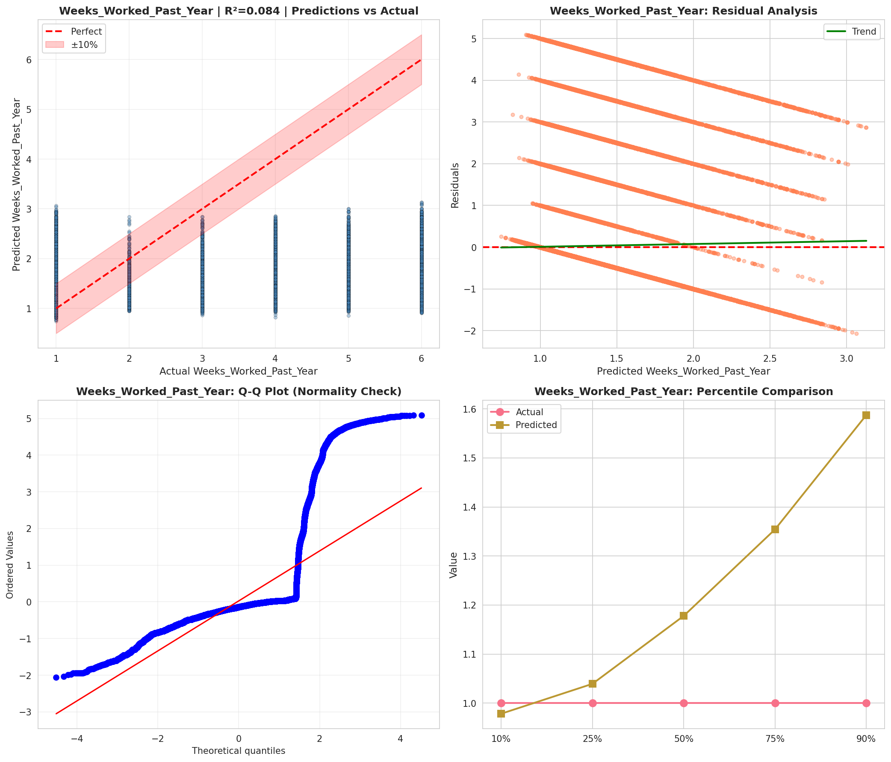
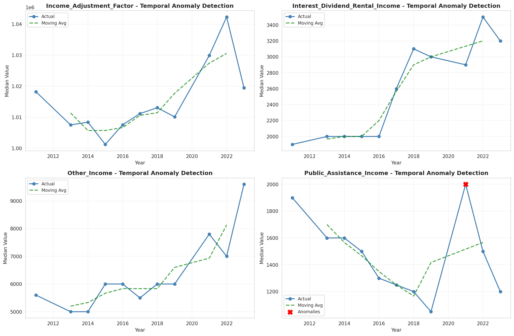
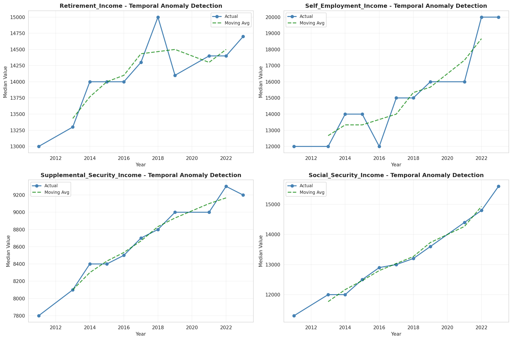
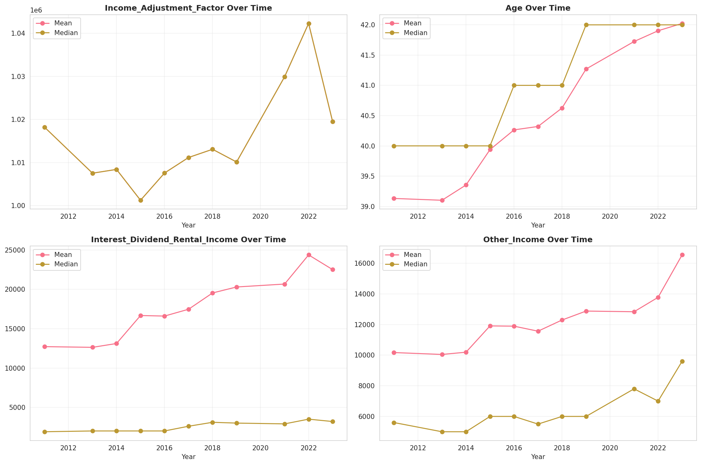
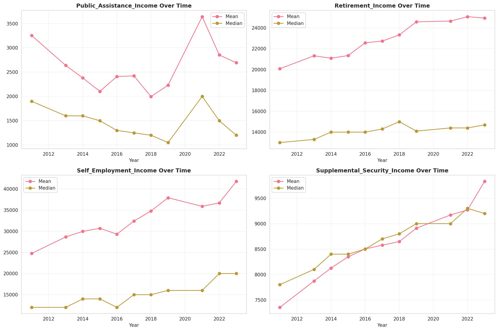
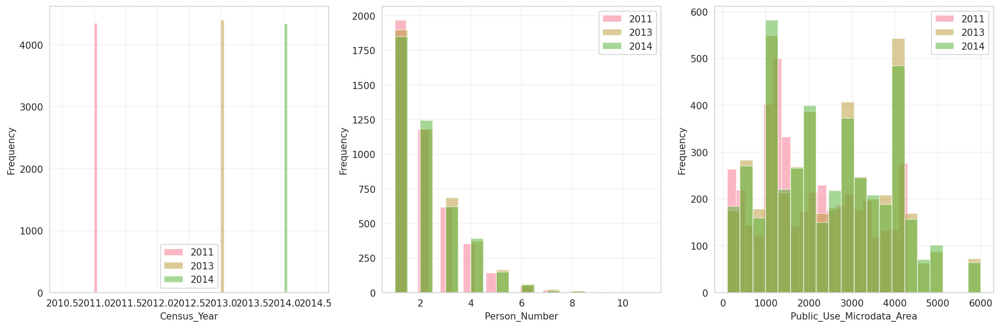
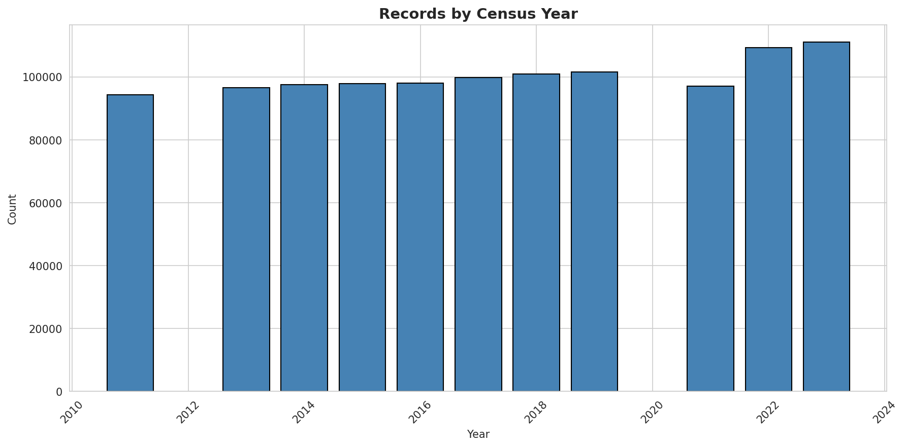
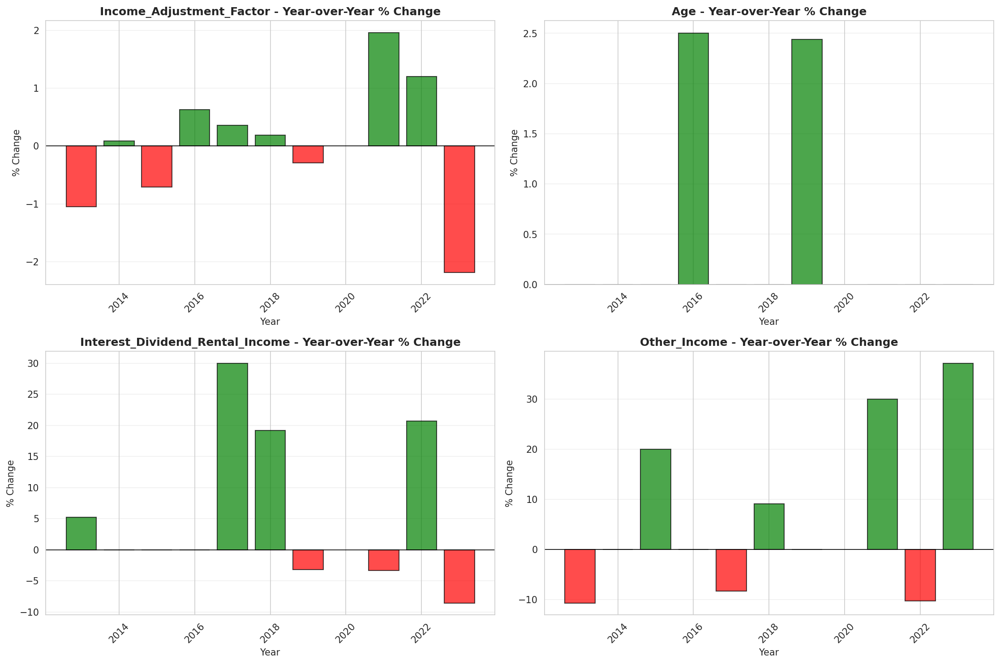
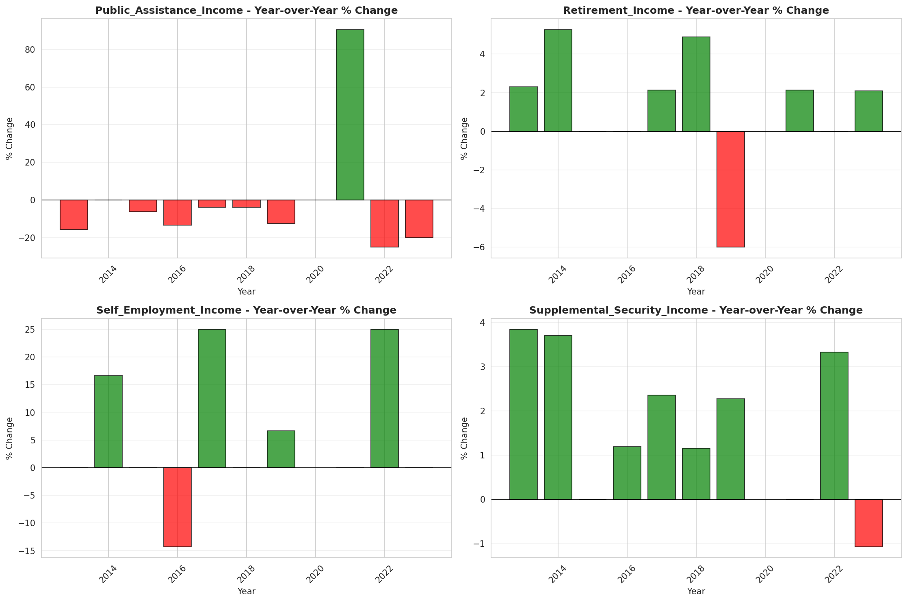

# Temporal Analysis

## Year Distribution

- 2011: 94,398 records

- 2013: 96,568 records

- 2014: 97,519 records

- 2015: 97,854 records

- 2016: 98,064 records

- 2017: 99,799 records

- 2018: 100,855 records

- 2019: 101,652 records

- 2021: 97,104 records

- 2022: 109,349 records

- 2023: 111,026 records

## Temporal Trends

- Census_Year: {np.int64(2011): {'mean': 2011.0, 'median': 2011.0, 'std': 0.0}, np.int64(2013): {'mean': 2013.0, 'median': 2013.0, 'std': 0.0}, np.int64(2014): {'mean': 2014.0, 'median': 2014.0, 'std': 0.0}, np.int64(2015): {'mean': 2015.0, 'median': 2015.0, 'std': 0.0}, np.int64(2016): {'mean': 2016.0, 'median': 2016.0, 'std': 0.0}, np.int64(2017): {'mean': 2017.0, 'median': 2017.0, 'std': 0.0}, np.int64(2018): {'mean': 2018.0, 'median': 2018.0, 'std': 0.0}, np.int64(2019): {'mean': 2019.0, 'median': 2019.0, 'std': 0.0}, np.int64(2021): {'mean': 2021.0, 'median': 2021.0, 'std': 0.0}, np.int64(2022): {'mean': 2022.0, 'median': 2022.0, 'std': 0.0}, np.int64(2023): {'mean': 2023.0, 'median': 2023.0, 'std': 0.0}}

- Person_Number: {np.int64(2011): {'mean': 2.060022458102926, 'median': 2.0, 'std': 1.2955961443617088}, np.int64(2013): {'mean': 2.082884599453235, 'median': 2.0, 'std': 1.3170793835298051}, np.int64(2014): {'mean': 2.084496354556548, 'median': 2.0, 'std': 1.3130302285957047}, np.int64(2015): {'mean': 2.0728227767899114, 'median': 2.0, 'std': 1.306052682052318}, np.int64(2016): {'mean': 2.065314488497308, 'median': 2.0, 'std': 1.2966390640249799}, np.int64(2017): {'mean': 2.0669846391246405, 'median': 2.0, 'std': 1.2875328007918856}, np.int64(2018): {'mean': 2.0677011551236926, 'median': 2.0, 'std': 1.306840646668507}, np.int64(2019): {'mean': 2.055886750875536, 'median': 2.0, 'std': 1.2875729370090603}, np.int64(2021): {'mean': 2.0366205305651675, 'median': 2.0, 'std': 1.281175009269994}, np.int64(2022): {'mean': 2.0561047654756788, 'median': 2.0, 'std': 1.2961980827794353}, np.int64(2023): {'mean': 2.0714427251274476, 'median': 2.0, 'std': 1.3175664052310854}}

- Public_Use_Microdata_Area: {np.int64(2011): {'mean': 2026.5929680713575, 'median': 1800.0, 'std': 1171.0395045921473}, np.int64(2013): {'mean': 2445.199165354983, 'median': 2400.0, 'std': 1403.473678800787}, np.int64(2014): {'mean': 2446.8968816333227, 'median': 2400.0, 'std': 1397.283616692158}, np.int64(2015): {'mean': 2474.8667606842846, 'median': 2500.0, 'std': 1400.8359232883843}, np.int64(2016): {'mean': 2481.37256281612, 'median': 2500.0, 'std': 1399.6986529006483}, np.int64(2017): {'mean': 2483.2860349302096, 'median': 2500.0, 'std': 1397.1018453471227}, np.int64(2018): {'mean': 2484.5794853998314, 'median': 2500.0, 'std': 1393.4190209535718}, np.int64(2019): {'mean': 2486.004003856294, 'median': 2500.0, 'std': 1390.74945503601}, np.int64(2021): {'mean': 2481.537197231834, 'median': 2500.0, 'std': 1380.5662041951916}, np.int64(2022): {'mean': 2165.0956661697865, 'median': 1606.0, 'std': 1304.2976879369605}, np.int64(2023): {'mean': 2155.350368382181, 'median': 1606.0, 'std': 1306.8685927127249}}

- State_Code: {np.int64(2011): {'mean': 13.0, 'median': 13.0, 'std': 0.0}, np.int64(2013): {'mean': 13.0, 'median': 13.0, 'std': 0.0}, np.int64(2014): {'mean': 13.0, 'median': 13.0, 'std': 0.0}, np.int64(2015): {'mean': 13.0, 'median': 13.0, 'std': 0.0}, np.int64(2016): {'mean': 13.0, 'median': 13.0, 'std': 0.0}, np.int64(2017): {'mean': 13.0, 'median': 13.0, 'std': 0.0}, np.int64(2018): {'mean': 13.0, 'median': 13.0, 'std': 0.0}, np.int64(2019): {'mean': 13.0, 'median': 13.0, 'std': 0.0}, np.int64(2021): {'mean': 13.0, 'median': 13.0, 'std': 0.0}, np.int64(2022): {'mean': 13.0, 'median': 13.0, 'std': 0.0}, np.int64(2023): {'mean': None, 'median': None, 'std': None}}

- Income_Adjustment_Factor: {np.int64(2011): {'mean': 1018237.0, 'median': 1018237.0, 'std': 0.0}, np.int64(2013): {'mean': 1007549.0, 'median': 1007549.0, 'std': 0.0}, np.int64(2014): {'mean': 1008425.0, 'median': 1008425.0, 'std': 0.0}, np.int64(2015): {'mean': 1001264.0, 'median': 1001264.0, 'std': 0.0}, np.int64(2016): {'mean': 1007588.0, 'median': 1007588.0, 'std': 0.0}, np.int64(2017): {'mean': 1011189.0, 'median': 1011189.0, 'std': 0.0}, np.int64(2018): {'mean': 1013097.0, 'median': 1013097.0, 'std': 0.0}, np.int64(2019): {'mean': 1010145.0, 'median': 1010145.0, 'std': 0.0}, np.int64(2021): {'mean': 1029928.0, 'median': 1029928.0, 'std': 0.0}, np.int64(2022): {'mean': 1042311.0, 'median': 1042311.0, 'std': 0.0}, np.int64(2023): {'mean': 1019518.0, 'median': 1019518.0, 'std': 0.0}}

- Person_Weight: {np.int64(2011): {'mean': 103.97688510349795, 'median': 75.0, 'std': 101.77859789531729}, np.int64(2013): {'mean': 103.47285850385221, 'median': 80.0, 'std': 86.48575989620957}, np.int64(2014): {'mean': 103.54231483095602, 'median': 81.0, 'std': 85.79920817658744}, np.int64(2015): {'mean': 104.38878328939032, 'median': 81.0, 'std': 86.43138009000597}, np.int64(2016): {'mean': 105.13920500897373, 'median': 81.0, 'std': 89.28606015239055}, np.int64(2017): {'mean': 104.50384272387498, 'median': 81.0, 'std': 87.21512155105913}, np.int64(2018): {'mean': 104.30295969461108, 'median': 81.0, 'std': 88.58701256143424}, np.int64(2019): {'mean': 104.44873686695786, 'median': 78.0, 'std': 95.77143832281224}, np.int64(2021): {'mean': 111.21648953699126, 'median': 80.0, 'std': 105.16596560918646}, np.int64(2022): {'mean': 99.7985898362125, 'median': 71.0, 'std': 91.56823035563923}, np.int64(2023): {'mean': 99.33913677877254, 'median': 70.0, 'std': 89.45850650578251}}

- Age: {np.int64(2011): {'mean': 39.13132693489269, 'median': 40.0, 'std': 22.997356972142168}, np.int64(2013): {'mean': 39.101255074144646, 'median': 40.0, 'std': 22.956730228772933}, np.int64(2014): {'mean': 39.35349008911084, 'median': 40.0, 'std': 23.134852496733327}, np.int64(2015): {'mean': 39.93826517056022, 'median': 40.0, 'std': 23.170757875380495}, np.int64(2016): {'mean': 40.26413362701909, 'median': 41.0, 'std': 23.253714667111883}, np.int64(2017): {'mean': 40.320884978807406, 'median': 41.0, 'std': 23.205073155305474}, np.int64(2018): {'mean': 40.6261464478707, 'median': 41.0, 'std': 23.268345380792432}, np.int64(2019): {'mean': 41.26981269429032, 'median': 42.0, 'std': 23.47081241871849}, np.int64(2021): {'mean': 41.7246457406492, 'median': 42.0, 'std': 23.54837998219698}, np.int64(2022): {'mean': 41.90224876313455, 'median': 42.0, 'std': 23.5397218260788}, np.int64(2023): {'mean': 42.023715165817016, 'median': 42.0, 'std': 23.57787760091311}}

- Citizenship_Status: {np.int64(2011): {'mean': 1.279529227314138, 'median': 1.0, 'std': 0.9509460898647292}, np.int64(2013): {'mean': 1.303071410819319, 'median': 1.0, 'std': 0.9832811236336173}, np.int64(2014): {'mean': 1.3089961956131626, 'median': 1.0, 'std': 0.9921863856578076}, np.int64(2015): {'mean': 1.3153780121405358, 'median': 1.0, 'std': 0.9989525707541863}, np.int64(2016): {'mean': 1.327123103279491, 'median': 1.0, 'std': 1.0156943185104463}, np.int64(2017): {'mean': 1.3296526017294763, 'median': 1.0, 'std': 1.0184757838358247}, np.int64(2018): {'mean': 1.3259729314362203, 'median': 1.0, 'std': 1.0102461277545296}, np.int64(2019): {'mean': 1.3234269861881713, 'median': 1.0, 'std': 1.003862110354583}, np.int64(2021): {'mean': 1.3357019278299556, 'median': 1.0, 'std': 1.0168694841247483}, np.int64(2022): {'mean': 1.367794858663545, 'median': 1.0, 'std': 1.0566152759155798}, np.int64(2023): {'mean': 1.3947093473600778, 'median': 1.0, 'std': 1.0949666927723982}}

- Class_of_Worker: {np.int64(2011): {'mean': 2.2627843562063426, 'median': 1.0, 'std': 2.051314147415436}, np.int64(2013): {'mean': 2.23632539840818, 'median': 1.0, 'std': 2.0406366366763207}, np.int64(2014): {'mean': 2.2148390022675737, 'median': 1.0, 'std': 2.0157147910510336}, np.int64(2015): {'mean': 2.1919679576583344, 'median': 1.0, 'std': 1.9924804192134753}, np.int64(2016): {'mean': 2.1823130213487913, 'median': 1.0, 'std': 1.9786216644596712}, np.int64(2017): {'mean': 2.17245350476125, 'median': 1.0, 'std': 1.9676062955738431}, np.int64(2018): {'mean': 2.132423838342394, 'median': 1.0, 'std': 1.9409074219305331}, np.int64(2019): {'mean': 2.1501892428588403, 'median': 1.0, 'std': 1.9449812750922175}, np.int64(2021): {'mean': 2.1582606542006473, 'median': 1.0, 'std': 1.9355491095210655}, np.int64(2022): {'mean': 2.181139107934943, 'median': 1.0, 'std': 1.9459823020435227}, np.int64(2023): {'mean': 2.17008784375283, 'median': 1.0, 'std': 1.948316708494841}}

- English_Speaking_Ability: {np.int64(2011): {'mean': 1.6823201338538762, 'median': 1.0, 'std': 0.9178219409356101}, np.int64(2013): {'mean': 1.6225625319040327, 'median': 1.0, 'std': 0.8904465200959755}, np.int64(2014): {'mean': 1.6463728009488041, 'median': 1.0, 'std': 0.9066720215000573}, np.int64(2015): {'mean': 1.622459688960977, 'median': 1.0, 'std': 0.8832124413347517}, np.int64(2016): {'mean': 1.62012987012987, 'median': 1.0, 'std': 0.8855789626557398}, np.int64(2017): {'mean': 1.601606208265656, 'median': 1.0, 'std': 0.8812791591579314}, np.int64(2018): {'mean': 1.5783909693603297, 'median': 1.0, 'std': 0.8685645832340919}, np.int64(2019): {'mean': 1.5723461195361284, 'median': 1.0, 'std': 0.8720349401494656}, np.int64(2021): {'mean': 1.552037752037752, 'median': 1.0, 'std': 0.8573463867003496}, np.int64(2022): {'mean': 1.5827497498928111, 'median': 1.0, 'std': 0.8867347759200582}, np.int64(2023): {'mean': 1.6058080306939206, 'median': 1.0, 'std': 0.9012505665351235}}

- Fertility_Status: {np.int64(2011): {'mean': 1.9469944134078212, 'median': 2.0, 'std': 0.2240496326238069}, np.int64(2013): {'mean': 1.947909315455187, 'median': 2.0, 'std': 0.22221481300750073}, np.int64(2014): {'mean': 1.9468694096601074, 'median': 2.0, 'std': 0.22429886470770283}, np.int64(2015): {'mean': 1.946116850730317, 'median': 2.0, 'std': 0.22579199676248438}, np.int64(2016): {'mean': 1.9478607232366631, 'median': 2.0, 'std': 0.22231280776183823}, np.int64(2017): {'mean': 1.9474194971327745, 'median': 2.0, 'std': 0.2231994424608582}, np.int64(2018): {'mean': 1.9515004413062667, 'median': 2.0, 'std': 0.2148240864094689}, np.int64(2019): {'mean': 1.94943392849152, 'median': 2.0, 'std': 0.21911479266658132}, np.int64(2021): {'mean': 1.9493484956171523, 'median': 2.0, 'std': 0.21929023692052227}, np.int64(2022): {'mean': 1.950094996833439, 'median': 2.0, 'std': 0.21775329110853114}, np.int64(2023): {'mean': 1.9488740855776696, 'median': 2.0, 'std': 0.22025902471934006}}

- Marital_Status: {np.int64(2011): {'mean': 3.0069598932180766, 'median': 3.0, 'std': 1.8414558773407492}, np.int64(2013): {'mean': 2.99754577085577, 'median': 3.0, 'std': 1.8483027682984947}, np.int64(2014): {'mean': 3.012038679641916, 'median': 3.0, 'std': 1.8504281779483112}, np.int64(2015): {'mean': 2.973940768900607, 'median': 3.0, 'std': 1.8502089515640279}, np.int64(2016): {'mean': 2.9691222059063467, 'median': 3.0, 'std': 1.847870756426031}, np.int64(2017): {'mean': 2.9637270914538223, 'median': 3.0, 'std': 1.8519543691411697}, np.int64(2018): {'mean': 2.962619602399484, 'median': 3.0, 'std': 1.8496951749086037}, np.int64(2019): {'mean': 2.938948569629717, 'median': 3.0, 'std': 1.8457585097000913}, np.int64(2021): {'mean': 2.9743058988301203, 'median': 3.0, 'std': 1.8479221185487045}, np.int64(2022): {'mean': 2.931942678945395, 'median': 3.0, 'std': 1.8471009205021196}, np.int64(2023): {'mean': 2.927305315871958, 'median': 3.0, 'std': 1.850587110120744}}

- Mobility_Status: {np.int64(2011): {'mean': 1.3036637446617216, 'median': 1.0, 'std': 0.7147232036434591}, np.int64(2013): {'mean': 1.3001140919225012, 'median': 1.0, 'std': 0.7106147306902202}, np.int64(2014): {'mean': 1.2923304966156335, 'median': 1.0, 'std': 0.7031206379153275}, np.int64(2015): {'mean': 1.2897257089725709, 'median': 1.0, 'std': 0.7003826834191419}, np.int64(2016): {'mean': 1.3023603226770242, 'median': 1.0, 'std': 0.7125592710073945}, np.int64(2017): {'mean': 1.2846337660233693, 'median': 1.0, 'std': 0.6948661575855267}, np.int64(2018): {'mean': 1.280261341124207, 'median': 1.0, 'std': 0.6906579112197153}, np.int64(2019): {'mean': 1.2675648038758227, 'median': 1.0, 'std': 0.6776758035197039}, np.int64(2021): {'mean': 1.2665683300785309, 'median': 1.0, 'std': 0.6773326161178082}, np.int64(2022): {'mean': 1.2514830293469135, 'median': 1.0, 'std': 0.6589806658490628}, np.int64(2023): {'mean': 1.2298749227357015, 'median': 1.0, 'std': 0.6332835179428076}}

- Military_Service: {np.int64(2011): {'mean': 4.749835744646616, 'median': 5.0, 'std': 0.707264965933718}, np.int64(2013): {'mean': 3.7731303946761545, 'median': 4.0, 'std': 0.6400218923617716}, np.int64(2014): {'mean': 3.7770993959792833, 'median': 4.0, 'std': 0.6353031446307418}, np.int64(2015): {'mean': 3.781156228670041, 'median': 4.0, 'std': 0.6296492825873967}, np.int64(2016): {'mean': 3.783317108162115, 'median': 4.0, 'std': 0.6256726018388031}, np.int64(2017): {'mean': 3.790976463064441, 'median': 4.0, 'std': 0.6172475117758954}, np.int64(2018): {'mean': 3.8008947992881157, 'median': 4.0, 'std': 0.6023893875333456}, np.int64(2019): {'mean': 3.795788831248093, 'median': 4.0, 'std': 0.612592129454212}, np.int64(2021): {'mean': 3.807997068078707, 'median': 4.0, 'std': 0.6001244632066681}, np.int64(2022): {'mean': 3.80239615000617, 'median': 4.0, 'std': 0.6061115841248185}, np.int64(2023): {'mean': 3.8109808501729874, 'median': 4.0, 'std': 0.5931836263018181}}

- Travel_Time_To_Work_Minutes: {np.int64(2011): {'mean': 26.351369863013698, 'median': 20.0, 'std': 22.205389794225653}, np.int64(2013): {'mean': 26.896816313790772, 'median': 20.0, 'std': 21.69799550009133}, np.int64(2014): {'mean': 27.539997956681653, 'median': 20.0, 'std': 22.826083718152265}, np.int64(2015): {'mean': 28.16496003996004, 'median': 20.0, 'std': 23.64600348535862}, np.int64(2016): {'mean': 28.318614782544486, 'median': 20.0, 'std': 23.33241011788163}, np.int64(2017): {'mean': 28.698191239036912, 'median': 20.0, 'std': 23.391855903652804}, np.int64(2018): {'mean': 28.877900049064273, 'median': 20.0, 'std': 23.579287553571813}, np.int64(2019): {'mean': 29.206080449017772, 'median': 22.0, 'std': 24.25351673850947}, np.int64(2021): {'mean': 26.749081793272314, 'median': 20.0, 'std': 22.053953330107568}, np.int64(2022): {'mean': 28.0668082128984, 'median': 20.0, 'std': 22.894065876947096}, np.int64(2023): {'mean': 28.618289797244003, 'median': 20.0, 'std': 23.357263377211535}}

- Vehicle_Occupancy: {np.int64(2011): {'mean': 1.173915578358209, 'median': 1.0, 'std': 0.6218391701846416}, np.int64(2013): {'mean': 1.1632405955034535, 'median': 1.0, 'std': 0.6085611358343849}, np.int64(2014): {'mean': 1.164902280130293, 'median': 1.0, 'std': 0.6124742404763777}, np.int64(2015): {'mean': 1.1627544277028814, 'median': 1.0, 'std': 0.6118767985009287}, np.int64(2016): {'mean': 1.1571227227645247, 'median': 1.0, 'std': 0.5758365595353554}, np.int64(2017): {'mean': 1.1660614313814495, 'median': 1.0, 'std': 0.6023995066988554}, np.int64(2018): {'mean': 1.1558194186765616, 'median': 1.0, 'std': 0.5899140211832449}, np.int64(2019): {'mean': 1.1551292537239448, 'median': 1.0, 'std': 0.5728979972271095}, np.int64(2021): {'mean': 1.1492413793103449, 'median': 1.0, 'std': 0.5475866543935749}, np.int64(2022): {'mean': 1.174821260463578, 'median': 1.0, 'std': 0.632355010559776}, np.int64(2023): {'mean': 1.1634751946716293, 'median': 1.0, 'std': 0.559347121167462}}

- Transportation_To_Work: {np.int64(2011): {'mean': 1.8431981218207905, 'median': 1.0, 'std': 2.6963338254468177}, np.int64(2013): {'mean': 1.8582983970406906, 'median': 1.0, 'std': 2.7287717990097473}, np.int64(2014): {'mean': 1.8958847139610233, 'median': 1.0, 'std': 2.78159227663763}, np.int64(2015): {'mean': 1.8677213695395514, 'median': 1.0, 'std': 2.7414716563333994}, np.int64(2016): {'mean': 1.9411914578218372, 'median': 1.0, 'std': 2.845497988616368}, np.int64(2017): {'mean': 1.9425716457280815, 'median': 1.0, 'std': 2.84407047616645}, np.int64(2018): {'mean': 1.9610435163871534, 'median': 1.0, 'std': 2.8726029231361103}, np.int64(2019): {'mean': None, 'median': None, 'std': None}, np.int64(2021): {'mean': None, 'median': None, 'std': None}, np.int64(2022): {'mean': None, 'median': None, 'std': None}, np.int64(2023): {'mean': None, 'median': None, 'std': None}}

- Language_Other_Than_English: {np.int64(2011): {'mean': 1.8991801711631673, 'median': 2.0, 'std': 0.3010916977669976}, np.int64(2013): {'mean': 1.8925998618436202, 'median': 2.0, 'std': 0.30962299597334114}, np.int64(2014): {'mean': 1.8900862537206422, 'median': 2.0, 'std': 0.31278391493970736}, np.int64(2015): {'mean': 1.8867885805636266, 'median': 2.0, 'std': 0.316852770822813}, np.int64(2016): {'mean': 1.8838825037431197, 'median': 2.0, 'std': 0.3203674903345737}, np.int64(2017): {'mean': 1.8826929183867895, 'median': 2.0, 'std': 0.32178754839553747}, np.int64(2018): {'mean': 1.8833122510636964, 'median': 2.0, 'std': 0.3210495222070023}, np.int64(2019): {'mean': 1.8839292185671834, 'median': 2.0, 'std': 0.320311438239577}, np.int64(2021): {'mean': 1.873955032606227, 'median': 2.0, 'std': 0.3319018302445892}, np.int64(2022): {'mean': 1.8657405186556784, 'median': 2.0, 'std': 0.3409325273138884}, np.int64(2023): {'mean': 1.8570820806625448, 'median': 2.0, 'std': 0.3499907795046688}}

- Grandparents_Living_With_Grandchildren: {np.int64(2011): {'mean': 1.9563771551356606, 'median': 2.0, 'std': 0.20425622084153217}, np.int64(2013): {'mean': 1.9596584951819862, 'median': 2.0, 'std': 0.19676054512524388}, np.int64(2014): {'mean': 1.9583778190239975, 'median': 2.0, 'std': 0.19972588777246178}, np.int64(2015): {'mean': 1.9580814122668047, 'median': 2.0, 'std': 0.20040476291240364}, np.int64(2016): {'mean': 1.9601527771091105, 'median': 2.0, 'std': 0.1956017272838503}, np.int64(2017): {'mean': 1.961957804313966, 'median': 2.0, 'std': 0.19129966750730978}, np.int64(2018): {'mean': 1.9624742204096823, 'median': 2.0, 'std': 0.19004777168747694}, np.int64(2019): {'mean': 1.962145828904613, 'median': 2.0, 'std': 0.190844926212807}, np.int64(2021): {'mean': 1.9634757134757135, 'median': 2.0, 'std': 0.18759215674996824}, np.int64(2022): {'mean': 1.9644255556329686, 'median': 2.0, 'std': 0.18522791731969648}, np.int64(2023): {'mean': 1.9644233660443375, 'median': 2.0, 'std': 0.18523338258780944}}

- Months_Responsible_For_Grandchildren: {np.int64(2011): {'mean': 3.7217125382262997, 'median': 4.0, 'std': 1.374904424281921}, np.int64(2013): {'mean': 3.7257785467128026, 'median': 4.0, 'std': 1.3139517077541008}, np.int64(2014): {'mean': 3.805691056910569, 'median': 4.0, 'std': 1.2815775986082043}, np.int64(2015): {'mean': 3.748936170212766, 'median': 4.0, 'std': 1.4066452685717186}, np.int64(2016): {'mean': 3.7271010387157695, 'median': 4.0, 'std': 1.371507318726474}, np.int64(2017): {'mean': 3.8440366972477062, 'median': 4.0, 'std': 1.3213851787002417}, np.int64(2018): {'mean': 3.803125, 'median': 4.0, 'std': 1.3360294094438385}, np.int64(2019): {'mean': 3.923312883435583, 'median': 4.0, 'std': 1.2746037039433509}, np.int64(2021): {'mean': 4.056947608200455, 'median': 5.0, 'std': 1.2001295158109446}, np.int64(2022): {'mean': 3.9315508021390375, 'median': 5.0, 'std': 1.2963543228374297}, np.int64(2023): {'mean': 3.759713701431493, 'median': 4.0, 'std': 1.3770054584444735}}

- Grandparents_Responsible_For_Grandchildren: {np.int64(2011): {'mean': 1.488663017982799, 'median': 1.0, 'std': 0.49996919244999577}, np.int64(2013): {'mean': 1.523102310231023, 'median': 2.0, 'std': 0.49956905515615013}, np.int64(2014): {'mean': 1.5146014206787688, 'median': 2.0, 'std': 0.49988539840808016}, np.int64(2015): {'mean': 1.5468569224836097, 'median': 2.0, 'std': 0.49789560389288917}, np.int64(2016): {'mean': 1.5734997986306887, 'median': 2.0, 'std': 0.4946678969404185}, np.int64(2017): {'mean': 1.5942928039702233, 'median': 2.0, 'std': 0.49112994466480836}, np.int64(2018): {'mean': 1.603305785123967, 'median': 2.0, 'std': 0.48931263163278993}, np.int64(2019): {'mean': 1.6077015643802648, 'median': 2.0, 'std': 0.4883605628133331}, np.int64(2021): {'mean': 1.6213885295385941, 'median': 2.0, 'std': 0.48514566847910723}, np.int64(2022): {'mean': 1.6337641989815903, 'median': 2.0, 'std': 0.481869370414967}, np.int64(2023): {'mean': 1.6242796772954284, 'median': 2.0, 'std': 0.4844013891008646}}

- Interest_Dividend_Rental_Income: {np.int64(2011): {'mean': 12719.85806119825, 'median': 1900.0, 'std': 36780.01448436201}, np.int64(2013): {'mean': 12630.339841089672, 'median': 2000.0, 'std': 34033.09827044639}, np.int64(2014): {'mean': 13117.480028278544, 'median': 2000.0, 'std': 34081.636431566054}, np.int64(2015): {'mean': 16675.17151521959, 'median': 2000.0, 'std': 48666.94378239916}, np.int64(2016): {'mean': 16606.55135813741, 'median': 2000.0, 'std': 45472.96293991156}, np.int64(2017): {'mean': 17473.107180263003, 'median': 2600.0, 'std': 48873.542449509885}, np.int64(2018): {'mean': 19545.165608770916, 'median': 3100.0, 'std': 54819.04006961148}, np.int64(2019): {'mean': 20303.732805106196, 'median': 3000.0, 'std': 56259.1271055177}, np.int64(2021): {'mean': 20676.651911963607, 'median': 2900.0, 'std': 57940.63966642657}, np.int64(2022): {'mean': 24382.952295229523, 'median': 3500.0, 'std': 64514.89534888997}, np.int64(2023): {'mean': 22513.49292121474, 'median': 3200.0, 'std': 62538.62474839325}}

- Military_Service_Period_1: {np.int64(2011): {'mean': 0.17804371718158504, 'median': 0.0, 'std': 0.38257290149351014}, np.int64(2013): {'mean': 0.2026556658501998, 'median': 0.0, 'std': 0.40200395603886585}, np.int64(2014): {'mean': 0.20513154467309194, 'median': 0.0, 'std': 0.4038240126047056}, np.int64(2015): {'mean': 0.21520635333940893, 'median': 0.0, 'std': 0.4109921775933976}, np.int64(2016): {'mean': 0.2304044262942959, 'median': 0.0, 'std': 0.42111944709724475}, np.int64(2017): {'mean': 0.23929000400373682, 'median': 0.0, 'std': 0.4266785612266269}, np.int64(2018): {'mean': 0.24575920562681008, 'median': 0.0, 'std': 0.4305661222115363}, np.int64(2019): {'mean': 0.2660124651902931, 'median': 0.0, 'std': 0.4419001343709526}, np.int64(2021): {'mean': 0.29430051813471503, 'median': 0.0, 'std': 0.45576142167752176}, np.int64(2022): {'mean': 0.30771198362962016, 'median': 0.0, 'std': 0.4615761766149904}, np.int64(2023): {'mean': 0.32567549928207806, 'median': 0.0, 'std': 0.4686572716694695}}

- Military_Service_Period_2: {np.int64(2011): {'mean': 0.1887898400293076, 'median': 0.0, 'std': 0.39136548176466646}, np.int64(2013): {'mean': 0.21425808946757768, 'median': 0.0, 'std': 0.41033311655612437}, np.int64(2014): {'mean': 0.2099505079447773, 'median': 0.0, 'std': 0.4072995193011578}, np.int64(2015): {'mean': 0.21546673610207004, 'median': 0.0, 'std': 0.41117250912391273}, np.int64(2016): {'mean': 0.2405480173890133, 'median': 0.0, 'std': 0.4274444266165374}, np.int64(2017): {'mean': 0.23141598825570533, 'median': 0.0, 'std': 0.42176577501679924}, np.int64(2018): {'mean': 0.2380361329471797, 'median': 0.0, 'std': 0.42591072960279114}, np.int64(2019): {'mean': 0.23445166423551253, 'median': 0.0, 'std': 0.4236837094195805}, np.int64(2021): {'mean': 0.23108808290155441, 'median': 0.0, 'std': 0.42155982868460934}, np.int64(2022): {'mean': 0.24440465532676814, 'median': 0.0, 'std': 0.42976114417491934}, np.int64(2023): {'mean': 0.2622373058347474, 'median': 0.0, 'std': 0.4398797088977836}}

- Military_Service_Period_3: {np.int64(2011): {'mean': 0.211869581145439, 'median': 0.0, 'std': 0.4086578704666842}, np.int64(2013): {'mean': None, 'median': None, 'std': None}, np.int64(2014): {'mean': None, 'median': None, 'std': None}, np.int64(2015): {'mean': None, 'median': None, 'std': None}, np.int64(2016): {'mean': None, 'median': None, 'std': None}, np.int64(2017): {'mean': None, 'median': None, 'std': None}, np.int64(2018): {'mean': None, 'median': None, 'std': None}, np.int64(2019): {'mean': None, 'median': None, 'std': None}, np.int64(2021): {'mean': None, 'median': None, 'std': None}, np.int64(2022): {'mean': None, 'median': None, 'std': None}, np.int64(2023): {'mean': None, 'median': None, 'std': None}}

- Military_Service_Period_4: {np.int64(2011): {'mean': 0.1500793747710343, 'median': 0.0, 'std': 0.3571710156109732}, np.int64(2013): {'mean': None, 'median': None, 'std': None}, np.int64(2014): {'mean': None, 'median': None, 'std': None}, np.int64(2015): {'mean': None, 'median': None, 'std': None}, np.int64(2016): {'mean': None, 'median': None, 'std': None}, np.int64(2017): {'mean': None, 'median': None, 'std': None}, np.int64(2018): {'mean': None, 'median': None, 'std': None}, np.int64(2019): {'mean': None, 'median': None, 'std': None}, np.int64(2021): {'mean': None, 'median': None, 'std': None}, np.int64(2022): {'mean': None, 'median': None, 'std': None}, np.int64(2023): {'mean': None, 'median': None, 'std': None}}

- Military_Service_Period_5: {np.int64(2011): {'mean': 0.3518134082305532, 'median': 0.0, 'std': 0.4775652673953025}, np.int64(2013): {'mean': 0.34510764470800565, 'median': 0.0, 'std': 0.47543401022755605}, np.int64(2014): {'mean': 0.35946861161760874, 'median': 0.0, 'std': 0.47987594353620133}, np.int64(2015): {'mean': 0.36570759015753157, 'median': 0.0, 'std': 0.48165937394198444}, np.int64(2016): {'mean': 0.3475167962060335, 'median': 0.0, 'std': 0.47621292217609384}, np.int64(2017): {'mean': 0.35539837181369277, 'median': 0.0, 'std': 0.47866579899231554}, np.int64(2018): {'mean': 0.3446421183285064, 'median': 0.0, 'std': 0.47528421207512256}, np.int64(2019): {'mean': 0.34319055828139505, 'median': 0.0, 'std': 0.47480595438487316}, np.int64(2021): {'mean': 0.3314581791265729, 'median': 0.0, 'std': 0.4707721995442433}, np.int64(2022): {'mean': 0.32101291725284564, 'median': 0.0, 'std': 0.4668956028131363}, np.int64(2023): {'mean': 0.32097637384153505, 'median': 0.0, 'std': 0.46688220607595193}}

- Military_Service_Period_6: {np.int64(2011): {'mean': 0.10098913176211992, 'median': 0.0, 'std': 0.3013327317863332}, np.int64(2013): {'mean': None, 'median': None, 'std': None}, np.int64(2014): {'mean': None, 'median': None, 'std': None}, np.int64(2015): {'mean': None, 'median': None, 'std': None}, np.int64(2016): {'mean': None, 'median': None, 'std': None}, np.int64(2017): {'mean': None, 'median': None, 'std': None}, np.int64(2018): {'mean': None, 'median': None, 'std': None}, np.int64(2019): {'mean': None, 'median': None, 'std': None}, np.int64(2021): {'mean': None, 'median': None, 'std': None}, np.int64(2022): {'mean': None, 'median': None, 'std': None}, np.int64(2023): {'mean': None, 'median': None, 'std': None}}

- Military_Service_Period_7: {np.int64(2011): {'mean': 0.11075833435095861, 'median': 0.0, 'std': 0.31385180326744344}, np.int64(2013): {'mean': None, 'median': None, 'std': None}, np.int64(2014): {'mean': None, 'median': None, 'std': None}, np.int64(2015): {'mean': None, 'median': None, 'std': None}, np.int64(2016): {'mean': None, 'median': None, 'std': None}, np.int64(2017): {'mean': None, 'median': None, 'std': None}, np.int64(2018): {'mean': None, 'median': None, 'std': None}, np.int64(2019): {'mean': None, 'median': None, 'std': None}, np.int64(2021): {'mean': None, 'median': None, 'std': None}, np.int64(2022): {'mean': None, 'median': None, 'std': None}, np.int64(2023): {'mean': None, 'median': None, 'std': None}}

- Military_Service_Period_8: {np.int64(2011): {'mean': 0.09805837098546831, 'median': 0.0, 'std': 0.2974117152955642}, np.int64(2013): {'mean': 0.08676034549439217, 'median': 0.0, 'std': 0.2815016938608055}, np.int64(2014): {'mean': 0.08882521489971347, 'median': 0.0, 'std': 0.28450982173896366}, np.int64(2015): {'mean': 0.07420908735841687, 'median': 0.0, 'std': 0.26212791590675266}, np.int64(2016): {'mean': 0.06902911342379134, 'median': 0.0, 'std': 0.2535203381711111}, np.int64(2017): {'mean': 0.059522220739356736, 'median': 0.0, 'std': 0.23661529506299417}, np.int64(2018): {'mean': 0.05199282857536892, 'median': 0.0, 'std': 0.22202786517480416}, np.int64(2019): {'mean': 0.055165097467179416, 'median': 0.0, 'std': 0.22831737167527857}, np.int64(2021): {'mean': 0.03789785344189489, 'median': 0.0, 'std': 0.19096335948735688}, np.int64(2022): {'mean': 0.03274075968793964, 'median': 0.0, 'std': 0.17796868572297936}, np.int64(2023): {'mean': 0.026367314971935778, 'median': 0.0, 'std': 0.1602355488633497}}

- Military_Service_Period_9: {np.int64(2011): {'mean': 0.01978263524239834, 'median': 0.0, 'std': 0.13926108875620882}, np.int64(2013): {'mean': 0.015212066520562072, 'median': 0.0, 'std': 0.12240339474751515}, np.int64(2014): {'mean': 0.014717374316228184, 'median': 0.0, 'std': 0.1204269989197257}, np.int64(2015): {'mean': 0.01080588465043614, 'median': 0.0, 'std': 0.10339491921527394}, np.int64(2016): {'mean': 0.010538795942563562, 'median': 0.0, 'std': 0.10212298272219826}, np.int64(2017): {'mean': 0.0077405578539970635, 'median': 0.0, 'std': 0.08764511850171361}, np.int64(2018): {'mean': 0.008136808716039168, 'median': 0.0, 'std': 0.08984271949529839}, np.int64(2019): {'mean': 0.006365203553905317, 'median': 0.0, 'std': 0.07953317896089018}, np.int64(2021): {'mean': None, 'median': None, 'std': None}, np.int64(2022): {'mean': None, 'median': None, 'std': None}, np.int64(2023): {'mean': None, 'median': None, 'std': None}}

- Military_Service_Period_10: {np.int64(2011): {'mean': 0.057516180241787764, 'median': 0.0, 'std': 0.23284048118994888}, np.int64(2013): {'mean': 0.04486270465386103, 'median': 0.0, 'std': 0.20701586206253506}, np.int64(2014): {'mean': 0.038812190674654856, 'median': 0.0, 'std': 0.1931596851170901}, np.int64(2015): {'mean': 0.030334591850019528, 'median': 0.0, 'std': 0.171517446307609}, np.int64(2016): {'mean': 0.026346989856408907, 'median': 0.0, 'std': 0.16017554682561597}, np.int64(2017): {'mean': 0.023355131456025625, 'median': 0.0, 'std': 0.1510387825276737}, np.int64(2018): {'mean': 0.018066473589849676, 'median': 0.0, 'std': 0.13320106241666485}, np.int64(2019): {'mean': 0.011271714626707334, 'median': 0.0, 'std': 0.10557528663521289}, np.int64(2021): {'mean': 0.0076980014803849, 'median': 0.0, 'std': 0.0874063684687363}, np.int64(2022): {'mean': 0.005115743701240568, 'median': 0.0, 'std': 0.07134580488467354}, np.int64(2023): {'mean': 0.003002219031458034, 'median': 0.0, 'std': 0.05471376856213682}}

- Military_Service_Period_11: {np.int64(2011): {'mean': 0.0021980705824887043, 'median': 0.0, 'std': 0.046834890075377104}, np.int64(2013): {'mean': 0.0018048214515921104, 'median': 0.0, 'std': 0.04244757179357154}, np.int64(2014): {'mean': 0.0011721802552748112, 'median': 0.0, 'std': 0.034219274642046604}, np.int64(2015): {'mean': 0.0010415310506444472, 'median': 0.0, 'std': 0.03225804920463902}, np.int64(2016): {'mean': 0.0003952048478461336, 'median': 0.0, 'std': 0.019877140376480373}, np.int64(2017): {'mean': 0.0012011210463098892, 'median': 0.0, 'std': 0.03463868476803142}, np.int64(2018): {'mean': 0.00013791201213625708, 'median': 0.0, 'std': 0.011743594515149834}, np.int64(2019): {'mean': 0.0, 'median': 0.0, 'std': 0.0}, np.int64(2021): {'mean': None, 'median': None, 'std': None}, np.int64(2022): {'mean': None, 'median': None, 'std': None}, np.int64(2023): {'mean': None, 'median': None, 'std': None}}

- Temporary_Absence_From_Work: {np.int64(2011): {'mean': 2.5046239495521165, 'median': 3.0, 'std': 0.5282598168627828}, np.int64(2013): {'mean': 2.571149365777893, 'median': 3.0, 'std': 0.5214300094897213}, np.int64(2014): {'mean': 2.570423076923077, 'median': 3.0, 'std': 0.5205450423330048}, np.int64(2015): {'mean': 2.5796956499721477, 'median': 3.0, 'std': 0.5173544607517602}, np.int64(2016): {'mean': 2.5843881325649867, 'median': 3.0, 'std': 0.5183147309882579}, np.int64(2017): {'mean': 2.595191963569498, 'median': 3.0, 'std': 0.5144761955204576}, np.int64(2018): {'mean': 2.595298610013255, 'median': 3.0, 'std': 0.5157019168229356}, np.int64(2019): {'mean': 2.6120680329346717, 'median': 3.0, 'std': 0.5092821105079535}, np.int64(2021): {'mean': 2.5913674617797917, 'median': 3.0, 'std': 0.5151303615049773}, np.int64(2022): {'mean': 2.604022467437695, 'median': 3.0, 'std': 0.5122082590419201}, np.int64(2023): {'mean': 2.6065988195469143, 'median': 3.0, 'std': 0.5111478361355472}}

- Available_For_Work: {np.int64(2011): {'mean': 4.474993733591905, 'median': 5.0, 'std': 1.2660205589560958}, np.int64(2013): {'mean': 4.635827077400983, 'median': 5.0, 'std': 1.0834863133197663}, np.int64(2014): {'mean': 4.669012820512821, 'median': 5.0, 'std': 1.0290583382097558}, np.int64(2015): {'mean': 4.704360155973059, 'median': 5.0, 'std': 0.9717431424946039}, np.int64(2016): {'mean': 4.728100858099096, 'median': 5.0, 'std': 0.9330162184990688}, np.int64(2017): {'mean': 4.7358418383087955, 'median': 5.0, 'std': 0.9190800104011306}, np.int64(2018): {'mean': 4.753718184139801, 'median': 5.0, 'std': 0.8884951187994037}, np.int64(2019): {'mean': 4.757401286134984, 'median': 5.0, 'std': 0.8785317533603494}, np.int64(2021): {'mean': 4.773380309745531, 'median': 5.0, 'std': 0.8503549211242737}, np.int64(2022): {'mean': 4.799982309104177, 'median': 5.0, 'std': 0.7983774080492401}, np.int64(2023): {'mean': 4.790350230014756, 'median': 5.0, 'std': 0.8165714626951779}}

- On_Layoff_From_Work: {np.int64(2011): {'mean': 2.4660624530019395, 'median': 2.0, 'std': 0.5355802916624668}, np.int64(2013): {'mean': 2.5502200362412633, 'median': 3.0, 'std': 0.5200412265644995}, np.int64(2014): {'mean': 2.556807692307692, 'median': 3.0, 'std': 0.5121166155608484}, np.int64(2015): {'mean': 2.5672887020813286, 'median': 3.0, 'std': 0.5076467265106837}, np.int64(2016): {'mean': 2.574410528699766, 'median': 3.0, 'std': 0.5062046435992823}, np.int64(2017): {'mean': 2.5850600387506018, 'median': 3.0, 'std': 0.5040802745107439}, np.int64(2018): {'mean': 2.587260278970218, 'median': 3.0, 'std': 0.5025728994423696}, np.int64(2019): {'mean': 2.6041228439209085, 'median': 3.0, 'std': 0.4983660329974153}, np.int64(2021): {'mean': 2.5780090632936608, 'median': 3.0, 'std': 0.5111482683019339}, np.int64(2022): {'mean': 2.5989142212688794, 'median': 3.0, 'std': 0.49795430049659484}, np.int64(2023): {'mean': 2.599828573908515, 'median': 3.0, 'std': 0.49973657486672696}}

- Looking_For_Work: {np.int64(2011): {'mean': 2.4363530824131607, 'median': 3.0, 'std': 0.6320088323723053}, np.int64(2013): {'mean': 2.5206445767538184, 'median': 3.0, 'std': 0.6102545514244355}, np.int64(2014): {'mean': 2.5320128205128207, 'median': 3.0, 'std': 0.5937755830561124}, np.int64(2015): {'mean': 2.5473236440978377, 'median': 3.0, 'std': 0.5810563641023091}, np.int64(2016): {'mean': 2.5590603689071187, 'median': 3.0, 'std': 0.5720953253106031}, np.int64(2017): {'mean': 2.570559415532327, 'median': 3.0, 'std': 0.5660859000416967}, np.int64(2018): {'mean': 2.5744913718670572, 'median': 3.0, 'std': 0.5608042762277187}, np.int64(2019): {'mean': 2.584037502253741, 'median': 3.0, 'std': 0.5538658110253305}, np.int64(2021): {'mean': 2.557977690354066, 'median': 3.0, 'std': 0.5656154112968629}, np.int64(2022): {'mean': 2.57844806616395, 'median': 3.0, 'std': 0.5507383935872251}, np.int64(2023): {'mean': 2.578150768162486, 'median': 3.0, 'std': 0.5550521926743064}}

- Informed_Of_Recall: {np.int64(2011): {'mean': 2.88655822482553, 'median': 3.0, 'std': 0.33481996452539126}, np.int64(2013): {'mean': 2.9369660885322286, 'median': 3.0, 'std': 0.25690290962454343}, np.int64(2014): {'mean': 2.939769230769231, 'median': 3.0, 'std': 0.24938637615510273}, np.int64(2015): {'mean': 2.943662328454955, 'median': 3.0, 'std': 0.24177762811518713}, np.int64(2016): {'mean': 2.9494702936661716, 'median': 3.0, 'std': 0.2292531354865056}, np.int64(2017): {'mean': 2.949759968407153, 'median': 3.0, 'std': 0.23010690901518194}, np.int64(2018): {'mean': 2.9498364363804406, 'median': 3.0, 'std': 0.22904916636774275}, np.int64(2019): {'mean': 2.9399843740609413, 'median': 3.0, 'std': 0.2473345655824399}, np.int64(2021): {'mean': 2.9512225486778547, 'median': 3.0, 'std': 0.22836498507787711}, np.int64(2022): {'mean': 2.9549656133212445, 'median': 3.0, 'std': 0.21737669644192942}, np.int64(2023): {'mean': 2.953834302577901, 'median': 3.0, 'std': 0.21944897881325412}}

- Other_Income: {np.int64(2011): {'mean': 10167.574935873947, 'median': 5600.0, 'std': 13031.498036991614}, np.int64(2013): {'mean': 10044.598826623507, 'median': 5000.0, 'std': 13229.77946191779}, np.int64(2014): {'mean': 10190.720140258602, 'median': 5000.0, 'std': 13388.178715894086}, np.int64(2015): {'mean': 11907.485497545738, 'median': 6000.0, 'std': 15268.970603767597}, np.int64(2016): {'mean': 11890.078747203579, 'median': 6000.0, 'std': 14629.320487110283}, np.int64(2017): {'mean': 11563.144065804936, 'median': 5500.0, 'std': 14920.152706705694}, np.int64(2018): {'mean': 12291.507943713119, 'median': 6000.0, 'std': 15001.522551235064}, np.int64(2019): {'mean': 12875.092650334076, 'median': 6000.0, 'std': 15588.899070185094}, np.int64(2021): {'mean': 12831.704512372635, 'median': 7800.0, 'std': 14616.233135048024}, np.int64(2022): {'mean': 13772.224498506188, 'median': 7000.0, 'std': 16813.679398680953}, np.int64(2023): {'mean': 16541.164762741653, 'median': 9600.0, 'std': 18512.44030580846}}

- Public_Assistance_Income: {np.int64(2011): {'mean': 3254.050724637681, 'median': 1900.0, 'std': 4182.294275265776}, np.int64(2013): {'mean': 2638.100616016427, 'median': 1600.0, 'std': 3723.347793796051}, np.int64(2014): {'mean': 2380.2105263157896, 'median': 1600.0, 'std': 3233.245656177577}, np.int64(2015): {'mean': 2104.3724696356276, 'median': 1500.0, 'std': 2399.304131437477}, np.int64(2016): {'mean': 2409.506781750925, 'median': 1300.0, 'std': 3233.87754158476}, np.int64(2017): {'mean': 2422.347222222222, 'median': 1250.0, 'std': 3415.6634482406707}, np.int64(2018): {'mean': 1995.6953642384105, 'median': 1200.0, 'std': 2421.9972460647655}, np.int64(2019): {'mean': 2231.4809384164223, 'median': 1050.0, 'std': 2997.808549628128}, np.int64(2021): {'mean': 3641.739534883721, 'median': 2000.0, 'std': 4520.84623666805}, np.int64(2022): {'mean': 2854.982778415614, 'median': 1500.0, 'std': 3900.5725154109}, np.int64(2023): {'mean': 2692.348484848485, 'median': 1200.0, 'std': 4027.6196619545717}}

- Retirement_Income: {np.int64(2011): {'mean': 20077.376224452775, 'median': 13000.0, 'std': 24076.58677836825}, np.int64(2013): {'mean': 21318.3812551513, 'median': 13300.0, 'std': 24633.32115795635}, np.int64(2014): {'mean': 21086.44170222581, 'median': 14000.0, 'std': 23040.856012269123}, np.int64(2015): {'mean': 21343.25635663181, 'median': 14000.0, 'std': 22606.032593954213}, np.int64(2016): {'mean': 22567.40448602105, 'median': 14000.0, 'std': 26668.837143346704}, np.int64(2017): {'mean': 22728.677647058823, 'median': 14300.0, 'std': 27462.86611067346}, np.int64(2018): {'mean': 23323.141418293937, 'median': 15000.0, 'std': 26390.25550619636}, np.int64(2019): {'mean': 24577.028601694914, 'median': 14100.0, 'std': 32228.53263209644}, np.int64(2021): {'mean': 24647.461901660696, 'median': 14400.0, 'std': 30827.486494793542}, np.int64(2022): {'mean': 25071.05455815578, 'median': 14400.0, 'std': 31138.036479457627}, np.int64(2023): {'mean': 24930.900068728522, 'median': 14700.0, 'std': 29356.22841991427}}

- Self_Employment_Income: {np.int64(2011): {'mean': 24750.582894736843, 'median': 12000.0, 'std': 44393.86048200681}, np.int64(2013): {'mean': 28664.093218119928, 'median': 12000.0, 'std': 52504.27223674495}, np.int64(2014): {'mean': 29975.67626275844, 'median': 14000.0, 'std': 50241.354017957485}, np.int64(2015): {'mean': 30705.566890047157, 'median': 14000.0, 'std': 52864.179161309396}, np.int64(2016): {'mean': 29321.28970373968, 'median': 12000.0, 'std': 53292.92327429675}, np.int64(2017): {'mean': 32413.18357044516, 'median': 15000.0, 'std': 58479.26296948363}, np.int64(2018): {'mean': 34807.38564814815, 'median': 15000.0, 'std': 62513.042521664815}, np.int64(2019): {'mean': 37937.591373439274, 'median': 16000.0, 'std': 72437.62062093591}, np.int64(2021): {'mean': 35904.27963231737, 'median': 16000.0, 'std': 64987.58248135218}, np.int64(2022): {'mean': 36714.43793243793, 'median': 20000.0, 'std': 58153.15503925528}, np.int64(2023): {'mean': 41795.88417294724, 'median': 20000.0, 'std': 74917.4188535954}}

- Supplemental_Security_Income: {np.int64(2011): {'mean': 7354.311176040906, 'median': 7800.0, 'std': 3926.1252376095927}, np.int64(2013): {'mean': 7870.900321543409, 'median': 8100.0, 'std': 4553.337265195176}, np.int64(2014): {'mean': 8126.539039039039, 'median': 8400.0, 'std': 4401.4384059400645}, np.int64(2015): {'mean': 8347.278382581648, 'median': 8400.0, 'std': 4639.5627983058475}, np.int64(2016): {'mean': 8502.72286460276, 'median': 8500.0, 'std': 4684.476193781717}, np.int64(2017): {'mean': 8575.725069527214, 'median': 8700.0, 'std': 4814.121500279644}, np.int64(2018): {'mean': 8646.835535976505, 'median': 8800.0, 'std': 4827.070688256331}, np.int64(2019): {'mean': 8909.511278195489, 'median': 9000.0, 'std': 5039.509539518205}, np.int64(2021): {'mean': 9170.201820340324, 'median': 9000.0, 'std': 5410.202898838452}, np.int64(2022): {'mean': 9269.41694169417, 'median': 9300.0, 'std': 5689.108971109344}, np.int64(2023): {'mean': 9829.508196721312, 'median': 9200.0, 'std': 6264.838066893434}}

- Social_Security_Income: {np.int64(2011): {'mean': 11797.82719097161, 'median': 11300.0, 'std': 6052.882435212886}, np.int64(2013): {'mean': 12517.402191845393, 'median': 12000.0, 'std': 6691.47359533481}, np.int64(2014): {'mean': 12946.711128694964, 'median': 12000.0, 'std': 6792.245534163953}, np.int64(2015): {'mean': 13309.806574300463, 'median': 12500.0, 'std': 6949.777700820198}, np.int64(2016): {'mean': 13562.94821781649, 'median': 12900.0, 'std': 7234.768394351227}, np.int64(2017): {'mean': 13792.391617341225, 'median': 13000.0, 'std': 7414.0968991790505}, np.int64(2018): {'mean': 13915.7406256474, 'median': 13200.0, 'std': 7504.270072251978}, np.int64(2019): {'mean': 14311.238527533918, 'median': 13600.0, 'std': 7743.437764365574}, np.int64(2021): {'mean': 15133.735916390517, 'median': 14400.0, 'std': 8484.852606261149}, np.int64(2022): {'mean': 15680.628243649277, 'median': 14800.0, 'std': 8848.502299267526}, np.int64(2023): {'mean': 16877.165181569875, 'median': 15600.0, 'std': 9660.932876202683}}

- Wage_Income: {np.int64(2011): {'mean': 38390.61593943302, 'median': 28000.0, 'std': 44069.80919050785}, np.int64(2013): {'mean': 43451.26379728474, 'median': 30000.0, 'std': 54362.64671557371}, np.int64(2014): {'mean': 43716.94389587074, 'median': 30000.0, 'std': 53540.876767762085}, np.int64(2015): {'mean': 45366.09237468934, 'median': 30200.0, 'std': 56795.60966354137}, np.int64(2016): {'mean': 46825.22553429611, 'median': 32000.0, 'std': 58842.00554012002}, np.int64(2017): {'mean': 48755.853834083064, 'median': 33600.0, 'std': 62204.58927666727}, np.int64(2018): {'mean': 50863.1873945777, 'median': 35000.0, 'std': 63402.48323937296}, np.int64(2019): {'mean': 52930.74154812488, 'median': 36000.0, 'std': 65365.07726909036}, np.int64(2021): {'mean': 54573.294982718005, 'median': 38000.0, 'std': 68799.64216636628}, np.int64(2022): {'mean': 59169.756855334024, 'median': 40000.0, 'std': 72554.51050983145}, np.int64(2023): {'mean': 62515.00092169297, 'median': 43000.0, 'std': 76106.46009131806}}

- Relationship_To_Householder: {np.int64(2011): {'mean': 2.613243924659421, 'median': 1.0, 'std': 4.3764469548015015}, np.int64(2013): {'mean': 2.561749233700605, 'median': 1.0, 'std': 4.305920187453169}, np.int64(2014): {'mean': 2.5760108286590304, 'median': 1.0, 'std': 4.314169026268698}, np.int64(2015): {'mean': 2.5477037218713594, 'median': 1.0, 'std': 4.294859711849853}, np.int64(2016): {'mean': 2.5380975689345733, 'median': 1.0, 'std': 4.285952845502624}, np.int64(2017): {'mean': 2.5303159350294093, 'median': 1.0, 'std': 4.270956245060944}, np.int64(2018): {'mean': 2.571335085023053, 'median': 1.0, 'std': 4.333029604592421}, np.int64(2019): {'mean': None, 'median': None, 'std': None}, np.int64(2021): {'mean': None, 'median': None, 'std': None}, np.int64(2022): {'mean': None, 'median': None, 'std': None}, np.int64(2023): {'mean': None, 'median': None, 'std': None}}

- School_Enrollment: {np.int64(2011): {'mean': 1.3094578161461015, 'median': 1.0, 'std': 0.5466648817185259}, np.int64(2013): {'mean': 1.3105812635046958, 'median': 1.0, 'std': 0.5477008107970427}, np.int64(2014): {'mean': 1.3078007568610408, 'median': 1.0, 'std': 0.5465658233710972}, np.int64(2015): {'mean': 1.2968807765841703, 'median': 1.0, 'std': 0.5396487331446178}, np.int64(2016): {'mean': 1.2926649465536306, 'median': 1.0, 'std': 0.5383617788879538}, np.int64(2017): {'mean': 1.289062257493766, 'median': 1.0, 'std': 0.5343707461763865}, np.int64(2018): {'mean': 1.2883177379152535, 'median': 1.0, 'std': 0.5364841327947911}, np.int64(2019): {'mean': 1.2826947411044187, 'median': 1.0, 'std': 0.5345742467067813}, np.int64(2021): {'mean': 1.2781036271624282, 'median': 1.0, 'std': 0.5370537889961038}, np.int64(2022): {'mean': 1.2761146317155267, 'median': 1.0, 'std': 0.534985143159046}, np.int64(2023): {'mean': 1.2728241530135667, 'median': 1.0, 'std': 0.5334210691413448}}

- School_Grade_Attending: {np.int64(2011): {'mean': 9.654981322605805, 'median': 10.0, 'std': 4.930740001552554}, np.int64(2013): {'mean': 9.573015746143394, 'median': 10.0, 'std': 4.8875370151119855}, np.int64(2014): {'mean': 9.498799807969275, 'median': 10.0, 'std': 4.882688469389317}, np.int64(2015): {'mean': 9.554003801338732, 'median': 10.0, 'std': 4.89051198085487}, np.int64(2016): {'mean': 9.60155922541705, 'median': 10.0, 'std': 4.839064076950362}, np.int64(2017): {'mean': 9.598570775686568, 'median': 10.0, 'std': 4.863191458615389}, np.int64(2018): {'mean': 9.636145574855252, 'median': 10.0, 'std': 4.8506151376924524}, np.int64(2019): {'mean': 9.53976581189407, 'median': 10.0, 'std': 4.890031659616363}, np.int64(2021): {'mean': 9.859499276934201, 'median': 11.0, 'std': 4.822450656702515}, np.int64(2022): {'mean': 9.71359380045205, 'median': 10.0, 'std': 4.859751135003511}, np.int64(2023): {'mean': 9.724640019360303, 'median': 10.0, 'std': 4.8520674753740565}}

- Educational_Attainment: {np.int64(2011): {'mean': 15.393748835986372, 'median': 16.0, 'std': 5.669737195068892}, np.int64(2013): {'mean': 15.617846522473954, 'median': 16.0, 'std': 5.738000783459527}, np.int64(2014): {'mean': 15.620233842500822, 'median': 16.0, 'std': 5.737991946472193}, np.int64(2015): {'mean': 15.780608634111818, 'median': 17.0, 'std': 5.667345472443829}, np.int64(2016): {'mean': 15.873371597072298, 'median': 17.0, 'std': 5.658207010208498}, np.int64(2017): {'mean': 15.949341417736711, 'median': 17.0, 'std': 5.627567440638862}, np.int64(2018): {'mean': 16.02924651656928, 'median': 17.0, 'std': 5.6541586138287725}, np.int64(2019): {'mean': 16.08858632383459, 'median': 17.0, 'std': 5.638284066713858}, np.int64(2021): {'mean': 16.216676900925318, 'median': 17.0, 'std': 5.618913057621858}, np.int64(2022): {'mean': 16.332255213524135, 'median': 18.0, 'std': 5.590910378926234}, np.int64(2023): {'mean': 16.365872192156573, 'median': 18.0, 'std': 5.611488824952644}}

- Sex: {np.int64(2011): {'mean': 1.5192059153795632, 'median': 2.0, 'std': 0.49963364307867425}, np.int64(2013): {'mean': 1.5177077292684948, 'median': 2.0, 'std': 0.49968892518561997}, np.int64(2014): {'mean': 1.5146074098380828, 'median': 2.0, 'std': 0.4997891405573254}, np.int64(2015): {'mean': 1.5175874261655118, 'median': 2.0, 'std': 0.4996931399694361}, np.int64(2016): {'mean': 1.5180800293685757, 'median': 2.0, 'std': 0.49967555332046315}, np.int64(2017): {'mean': 1.5148348179841482, 'median': 2.0, 'std': 0.4997823836735609}, np.int64(2018): {'mean': 1.5145704228843389, 'median': 2.0, 'std': 0.49979013545963485}, np.int64(2019): {'mean': 1.5155038759689923, 'median': 2.0, 'std': 0.4997620302310488}, np.int64(2021): {'mean': 1.5108440434997528, 'median': 2.0, 'std': 0.499884966862684}, np.int64(2022): {'mean': 1.5125698451746243, 'median': 2.0, 'std': 0.4998442595709405}, np.int64(2023): {'mean': 1.5135553834237025, 'median': 2.0, 'std': 0.4998184687167111}}

- Hours_Worked_Per_Week: {np.int64(2011): {'mean': 38.410376088322415, 'median': 40.0, 'std': 13.079630966759638}, np.int64(2013): {'mean': 38.73805799027066, 'median': 40.0, 'std': 13.183533865708064}, np.int64(2014): {'mean': 38.5394424170415, 'median': 40.0, 'std': 12.950826675437941}, np.int64(2015): {'mean': 38.70447184853015, 'median': 40.0, 'std': 13.028426926100616}, np.int64(2016): {'mean': 38.75088019211592, 'median': 40.0, 'std': 13.111195291269365}, np.int64(2017): {'mean': 38.93361913981469, 'median': 40.0, 'std': 13.020388748453511}, np.int64(2018): {'mean': 39.014561687362324, 'median': 40.0, 'std': 12.749927373347882}, np.int64(2019): {'mean': 38.87664624063807, 'median': 40.0, 'std': 12.948830847971918}, np.int64(2021): {'mean': 38.59638165427935, 'median': 40.0, 'std': 12.83650006463205}, np.int64(2022): {'mean': 38.680102332903964, 'median': 40.0, 'std': 12.952801193857388}, np.int64(2023): {'mean': 38.42281972694344, 'median': 40.0, 'std': 12.81187970811683}}

- When_Last_Worked: {np.int64(2011): {'mean': 1.7186316803208401, 'median': 1.0, 'std': 0.9029340657815699}, np.int64(2013): {'mean': 1.6941625679523686, 'median': 1.0, 'std': 0.8992128169465581}, np.int64(2014): {'mean': 1.6989871794871796, 'median': 1.0, 'std': 0.9038261752053514}, np.int64(2015): {'mean': 1.6911302982731553, 'median': 1.0, 'std': 0.9029775336546091}, np.int64(2016): {'mean': 1.6766274944009663, 'median': 1.0, 'std': 0.8992002046317921}, np.int64(2017): {'mean': 1.6633757450852142, 'median': 1.0, 'std': 0.8940883927430654}, np.int64(2018): {'mean': 1.6699176709513444, 'median': 1.0, 'std': 0.8992516200350252}, np.int64(2019): {'mean': 1.6793196706532845, 'median': 1.0, 'std': 0.9012574221061882}, np.int64(2021): {'mean': 1.7018823763756785, 'median': 1.0, 'std': 0.8994440540677426}, np.int64(2022): {'mean': 1.667565953870989, 'median': 1.0, 'std': 0.8905757797148454}, np.int64(2023): {'mean': 1.6619542574429302, 'median': 1.0, 'std': 0.8909322842027697}}

- Weeks_Worked_Past_Year: {np.int64(2011): {'mean': 1.9502513239386052, 'median': 1.0, 'std': 1.6864531450162759}, np.int64(2013): {'mean': 1.8906414075391638, 'median': 1.0, 'std': 1.6350846599616127}, np.int64(2014): {'mean': 1.8793813120597471, 'median': 1.0, 'std': 1.6248823915153368}, np.int64(2015): {'mean': 1.8584122238830758, 'median': 1.0, 'std': 1.6126972684423138}, np.int64(2016): {'mean': 1.8612043877322588, 'median': 1.0, 'std': 1.615665673432171}, np.int64(2017): {'mean': 1.8263626844735958, 'median': 1.0, 'std': 1.5856986252979484}, np.int64(2018): {'mean': 1.7877151601395738, 'median': 1.0, 'std': 1.5562930302178601}}

- Year_Of_Entry: {np.int64(2011): {'mean': 1992.5254343993956, 'median': 1996.0, 'std': 14.225133006342864}, np.int64(2013): {'mean': 1993.36595840868, 'median': 1997.0, 'std': 14.689949716046137}, np.int64(2014): {'mean': 1993.9612513721186, 'median': 1998.0, 'std': 14.87154099463084}, np.int64(2015): {'mean': 1994.9081589064501, 'median': 1999.0, 'std': 14.955575272351165}, np.int64(2016): {'mean': 1995.601908866995, 'median': 1999.0, 'std': 15.104891069416352}, np.int64(2017): {'mean': 1996.3876426997797, 'median': 2000.0, 'std': 15.52484378900233}, np.int64(2018): {'mean': 1996.7005469915464, 'median': 2000.0, 'std': 15.585105036685743}, np.int64(2019): {'mean': 1996.9289940828403, 'median': 2000.0, 'std': 16.25062875031347}, np.int64(2021): {'mean': 1998.3522367379255, 'median': 2000.0, 'std': 15.764453796717175}, np.int64(2022): {'mean': 1999.4839894593947, 'median': 2001.0, 'std': 16.103050044089546}, np.int64(2023): {'mean': 2000.3603917785858, 'median': 2002.0, 'std': 16.419792047296976}}

- Ancestry_Recode: {np.int64(2011): {'mean': 1.6131485836564334, 'median': 1.0, 'std': 1.0393742050262413}, np.int64(2013): {'mean': 1.7030175627537072, 'median': 1.0, 'std': 1.1111731903534414}, np.int64(2014): {'mean': 1.705113875244824, 'median': 1.0, 'std': 1.1099585742593565}, np.int64(2015): {'mean': 1.7142784147812047, 'median': 1.0, 'std': 1.1206280758505143}, np.int64(2016): {'mean': 1.8042910752161854, 'median': 1.0, 'std': 1.1588582888920964}, np.int64(2017): {'mean': 1.8266816300764537, 'median': 1.0, 'std': 1.1701268731598746}, np.int64(2018): {'mean': 1.853651281542809, 'median': 1.0, 'std': 1.189135401003322}, np.int64(2019): {'mean': 1.8808975721087633, 'median': 1.0, 'std': 1.2013174590430755}, np.int64(2021): {'mean': 1.948580902949415, 'median': 1.0, 'std': 1.2285805873885558}, np.int64(2022): {'mean': 1.9553356683645942, 'median': 1.0, 'std': 1.227571061553402}, np.int64(2023): {'mean': 1.961306360672275, 'median': 1.0, 'std': 1.228116793731278}}

- First_Ancestry_Code: {np.int64(2011): {'mean': 628.0401173753681, 'median': 902.0, 'std': 404.78315613201715}, np.int64(2013): {'mean': 619.5996292767791, 'median': 902.0, 'std': 408.6368436615666}, np.int64(2014): {'mean': 614.4829417857032, 'median': 902.0, 'std': 409.5747687107175}, np.int64(2015): {'mean': 613.4283422241298, 'median': 902.0, 'std': 409.8489783112765}, np.int64(2016): {'mean': 626.223639663893, 'median': 902.0, 'std': 407.40255904134233}, np.int64(2017): {'mean': 631.8656800168338, 'median': 902.0, 'std': 405.55845000477166}, np.int64(2018): {'mean': 630.7756779534976, 'median': 902.0, 'std': 405.6353798488872}, np.int64(2019): {'mean': 626.7055345689214, 'median': 902.0, 'std': 408.44000151851776}, np.int64(2021): {'mean': 606.3684297248311, 'median': 902.0, 'std': 419.373101947536}, np.int64(2022): {'mean': 601.0524833331809, 'median': 902.0, 'std': 419.38077873210045}, np.int64(2023): {'mean': 603.3117648118458, 'median': 902.0, 'std': 418.30268374342955}}

- Second_Ancestry_Code: {np.int64(2011): {'mean': 878.8734189283671, 'median': 999.0, 'std': 307.1389236242502}, np.int64(2013): {'mean': 874.4076298566813, 'median': 999.0, 'std': 312.7239649152239}, np.int64(2014): {'mean': 872.0103056840205, 'median': 999.0, 'std': 315.60056741224895}, np.int64(2015): {'mean': 876.4579271159074, 'median': 999.0, 'std': 310.6438329017825}, np.int64(2016): {'mean': 865.0555045684451, 'median': 999.0, 'std': 321.3536408955685}, np.int64(2017): {'mean': 865.8825940139681, 'median': 999.0, 'std': 320.95205489457845}, np.int64(2018): {'mean': 866.9779485399831, 'median': 999.0, 'std': 319.673821267031}, np.int64(2019): {'mean': 863.3022468815174, 'median': 999.0, 'std': 323.5698713810836}, np.int64(2021): {'mean': 862.930610479486, 'median': 999.0, 'std': 324.7549554077599}, np.int64(2022): {'mean': 858.5177916579026, 'median': 999.0, 'std': 328.6874238845471}, np.int64(2023): {'mean': 859.1922612721345, 'median': 999.0, 'std': 327.6759483597265}}

- Decade_Of_Entry: {np.int64(2011): {'mean': 5.774741878619995, 'median': 6.0, 'std': 1.384972199743593}, np.int64(2013): {'mean': 5.810804701627487, 'median': 6.0, 'std': 1.386987886933201}, np.int64(2014): {'mean': 5.841053787047201, 'median': 6.0, 'std': 1.391907901430552}, np.int64(2015): {'mean': 5.897479709525844, 'median': 6.0, 'std': 1.3647732624907698}, np.int64(2016): {'mean': 5.943247126436781, 'median': 6.0, 'std': 1.3421844374145206}, np.int64(2017): {'mean': 6.20218305627879, 'median': 7.0, 'std': 1.5680457238312129}, np.int64(2018): {'mean': 6.218100447538538, 'median': 7.0, 'std': 1.5639890785839823}, np.int64(2019): {'mean': 6.225246548323471, 'median': 7.0, 'std': 1.614839486475515}, np.int64(2021): {'mean': 6.3571852731591445, 'median': 7.0, 'std': 1.5422364777741036}, np.int64(2022): {'mean': 6.439511299209455, 'median': 7.0, 'std': 1.5399936373967358}, np.int64(2023): {'mean': 6.4896490316836095, 'median': 7.0, 'std': 1.5407256128407516}}

- Drives_Alone_To_Work: {np.int64(2011): {'mean': 1.166132229477612, 'median': 1.0, 'std': 0.5384716133664906}, np.int64(2013): {'mean': 1.155728005723878, 'median': 1.0, 'std': 0.5276163147657935}, np.int64(2014): {'mean': 1.1574918566775245, 'median': 1.0, 'std': 0.5302600468111285}, np.int64(2015): {'mean': 1.1556436690457308, 'median': 1.0, 'std': 0.5354930044815754}, np.int64(2016): {'mean': 1.1521114997128987, 'median': 1.0, 'std': 0.5221453514181197}, np.int64(2017): {'mean': 1.160336914308771, 'median': 1.0, 'std': 0.5424640223698279}, np.int64(2018): {'mean': 1.1491898577612862, 'median': 1.0, 'std': 0.5132625562117163}, np.int64(2019): {'mean': 1.1503705356036384, 'median': 1.0, 'std': 0.5188343315665149}, np.int64(2021): {'mean': 1.1455938697318007, 'median': 1.0, 'std': 0.5061668836816916}, np.int64(2022): {'mean': 1.1678243391089738, 'median': 1.0, 'std': 0.5575849610008733}, np.int64(2023): {'mean': 1.1601204760272295, 'median': 1.0, 'std': 0.5218250649590537}}

- Employment_Status_Parents: {np.int64(2011): {'mean': 3.4741793639431435, 'median': 2.0, 'std': 2.7223483761312077}, np.int64(2013): {'mean': 3.358448267459428, 'median': 2.0, 'std': 2.6772901398748776}, np.int64(2014): {'mean': 3.3852922690131995, 'median': 2.0, 'std': 2.6877485303995345}, np.int64(2015): {'mean': 3.2788042661859698, 'median': 2.0, 'std': 2.6534962702023472}, np.int64(2016): {'mean': 3.3215434083601285, 'median': 2.0, 'std': 2.667567864768115}, np.int64(2017): {'mean': 3.2400099651220726, 'median': 2.0, 'std': 2.642603080073972}, np.int64(2018): {'mean': 3.247537688442211, 'median': 2.0, 'std': 2.6424027024943673}, np.int64(2019): {'mean': 3.200285466687057, 'median': 2.0, 'std': 2.6122054616058175}, np.int64(2021): {'mean': 3.2110589287711058, 'median': 2.0, 'std': 2.6279529237430284}, np.int64(2022): {'mean': 3.1182774457997926, 'median': 2.0, 'std': 2.608867479529416}, np.int64(2023): {'mean': 3.0503925417075566, 'median': 2.0, 'std': 2.5773975074790605}}

- Employment_Status_Recode: {np.int64(2011): {'mean': 3.253505890423609, 'median': 2.0, 'std': 2.3864188922765543}, np.int64(2013): {'mean': 3.1834455086720164, 'median': 1.0, 'std': 2.391742923532485}, np.int64(2014): {'mean': 3.1918333333333333, 'median': 1.0, 'std': 2.4073242754611255}, np.int64(2015): {'mean': 3.1801286271332354, 'median': 1.0, 'std': 2.4147147298743334}, np.int64(2016): {'mean': 3.158370869926269, 'median': 1.0, 'std': 2.417931058118135}, np.int64(2017): {'mean': 3.125186656958448, 'median': 1.0, 'std': 2.4158402623452}, np.int64(2018): {'mean': 3.116270019822208, 'median': 1.0, 'std': 2.4193556075711067}, np.int64(2019): {'mean': 3.1408738505919827, 'median': 1.0, 'std': 2.424742836131303}, np.int64(2021): {'mean': 3.2644415118768983, 'median': 1.0, 'std': 2.4333706568431346}, np.int64(2022): {'mean': 3.158709449149731, 'median': 1.0, 'std': 2.4298016579960553}, np.int64(2023): {'mean': 3.1278751844457946, 'median': 1.0, 'std': 2.424810508449927}}

- Hispanic_Origin: {np.int64(2011): {'mean': 1.2489883260238563, 'median': 1.0, 'std': 1.6909290524647866}, np.int64(2013): {'mean': 1.2711146549581642, 'median': 1.0, 'std': 1.8134803329510825}, np.int64(2014): {'mean': 1.2831038054122785, 'median': 1.0, 'std': 1.8350587392535314}, np.int64(2015): {'mean': 1.3115355529666646, 'median': 1.0, 'std': 1.931702128809001}, np.int64(2016): {'mean': 1.3167931147006038, 'median': 1.0, 'std': 1.9680107586370779}, np.int64(2017): {'mean': 1.3534203749536569, 'median': 1.0, 'std': 2.107402717779446}, np.int64(2018): {'mean': 1.3353527341232463, 'median': 1.0, 'std': 2.02766012795239}, np.int64(2019): {'mean': 1.338429150434817, 'median': 1.0, 'std': 2.064058009150414}, np.int64(2021): {'mean': 1.4310018124897017, 'median': 1.0, 'std': 2.4122333591368075}, np.int64(2022): {'mean': 1.4824461129045534, 'median': 1.0, 'std': 2.5649366430283926}, np.int64(2023): {'mean': 1.5265973735881686, 'median': 1.0, 'std': 2.6765731365895373}}

- Time_Of_Arrival_At_Work: {np.int64(2011): {'mean': 103.26898630136986, 'median': 92.0, 'std': 41.73786203398158}, np.int64(2013): {'mean': 104.79389273266399, 'median': 93.0, 'std': 42.8605735300474}, np.int64(2014): {'mean': 103.49844196975889, 'median': 92.0, 'std': 41.90029650559786}, np.int64(2015): {'mean': 103.55751748251748, 'median': 92.0, 'std': 41.97908706456035}, np.int64(2016): {'mean': 103.16352851411553, 'median': 92.0, 'std': 41.26579806929904}, np.int64(2017): {'mean': 103.24395693199915, 'median': 92.0, 'std': 41.993778918052456}, np.int64(2018): {'mean': 103.17758930866101, 'median': 92.0, 'std': 41.433925313781884}, np.int64(2019): {'mean': 102.15858278765201, 'median': 93.0, 'std': 39.68546781999071}, np.int64(2021): {'mean': 102.86355156532385, 'median': 93.0, 'std': 41.62030685514158}, np.int64(2022): {'mean': 102.94289092093517, 'median': 93.0, 'std': 41.169017410750214}, np.int64(2023): {'mean': 102.17294576161092, 'median': 93.0, 'std': 40.13054607411457}}

- Time_Of_Departure_For_Work: {np.int64(2011): {'mean': 54.43317808219178, 'median': 49.0, 'std': 28.382106829677824}, np.int64(2013): {'mean': 55.39660822972481, 'median': 49.0, 'std': 28.89504487998846}, np.int64(2014): {'mean': 54.404270535349404, 'median': 49.0, 'std': 28.506173113826193}, np.int64(2015): {'mean': 54.37097902097902, 'median': 49.0, 'std': 28.637602509114206}, np.int64(2016): {'mean': 54.096359743040686, 'median': 49.0, 'std': 28.353422260708005}, np.int64(2017): {'mean': 54.026121265419626, 'median': 49.0, 'std': 28.705247953079184}, np.int64(2018): {'mean': 54.01058386486297, 'median': 49.0, 'std': 28.49927290657576}, np.int64(2019): {'mean': 53.52399438727783, 'median': 49.0, 'std': 27.467462613334057}, np.int64(2021): {'mean': 54.27484988048738, 'median': 49.0, 'std': 28.565004197705736}, np.int64(2022): {'mean': 54.252973677226336, 'median': 49.0, 'std': 28.310336240230274}, np.int64(2023): {'mean': 53.650605484155335, 'median': 49.0, 'std': 27.82276782088074}}

- Language_Spoken_At_Home: {np.int64(2011): {'mean': 656.6576687116565, 'median': 625.0, 'std': 57.3347871781011}, np.int64(2013): {'mean': 658.7193466054109, 'median': 625.0, 'std': 56.10861236787008}, np.int64(2014): {'mean': 656.6525004941689, 'median': 625.0, 'std': 54.107997715654065}, np.int64(2015): {'mean': 657.4364087396241, 'median': 625.0, 'std': 54.78005629247717}, np.int64(2016): {'mean': 1641.5867346938776, 'median': 1200.0, 'std': 1042.904636526776}, np.int64(2017): {'mean': 1667.6703663598628, 'median': 1200.0, 'std': 1094.664807499011}, np.int64(2018): {'mean': 1706.167263931195, 'median': 1200.0, 'std': 1126.845355742432}, np.int64(2019): {'mean': 1677.078768956289, 'median': 1200.0, 'std': 1099.0504426130285}, np.int64(2021): {'mean': 1668.4438438438438, 'median': 1200.0, 'std': 1033.9965652481142}, np.int64(2022): {'mean': 1699.4306845791052, 'median': 1200.0, 'std': 1092.3296605968883}, np.int64(2023): {'mean': 1718.3222200171992, 'median': 1200.0, 'std': 1120.6316390351546}}

- Migration_PUMA: {np.int64(2011): {'mean': 1918.5187682469068, 'median': 1600.0, 'std': 1233.132937268124}, np.int64(2013): {'mean': 2698.6864371914426, 'median': 1800.0, 'std': 4762.324920508886}, np.int64(2014): {'mean': 2661.5562299427934, 'median': 1800.0, 'std': 4779.298134841807}, np.int64(2015): {'mean': 2779.1870574213, 'median': 1800.0, 'std': 5169.447143752101}, np.int64(2016): {'mean': 2728.7704095289077, 'median': 1800.0, 'std': 4910.544249703819}, np.int64(2017): {'mean': 2713.501850171054, 'median': 1900.0, 'std': 4658.497863819111}, np.int64(2018): {'mean': 2641.3311351199663, 'median': 1900.0, 'std': 4080.6957809794253}, np.int64(2019): {'mean': 2889.7623429739992, 'median': 2100.0, 'std': 5246.4584417671185}, np.int64(2021): {'mean': 2891.15350269438, 'median': 2100.0, 'std': 5161.518160049723}, np.int64(2022): {'mean': 3274.7172913973864, 'median': 1800.0, 'std': 7142.249504788557}, np.int64(2023): {'mean': 2804.977249942161, 'median': 1700.0, 'std': 4402.702456460242}}

- Migration_State_Or_Country: {np.int64(2011): {'mean': 22.203253162797164, 'median': 13.0, 'std': 41.96948565264192}, np.int64(2013): {'mean': 23.487589138782226, 'median': 13.0, 'std': 46.51097333663302}, np.int64(2014): {'mean': 23.329287009906515, 'median': 13.0, 'std': 46.54701297347094}, np.int64(2015): {'mean': 24.0, 'median': 13.0, 'std': 48.63618770764074}, np.int64(2016): {'mean': 24.777168094218414, 'median': 13.0, 'std': 49.91874544036214}, np.int64(2017): {'mean': 25.048942260699572, 'median': 13.0, 'std': 52.82623001441906}, np.int64(2018): {'mean': 24.86466956643749, 'median': 13.0, 'std': 52.44852139832336}, np.int64(2019): {'mean': 24.045866199240432, 'median': 13.0, 'std': 49.09324251756745}, np.int64(2021): {'mean': 22.239491916859123, 'median': 13.0, 'std': 43.120247656974534}, np.int64(2022): {'mean': 27.601034037052994, 'median': 13.0, 'std': 56.76266969675608}, np.int64(2023): {'mean': 29.479833423305312, 'median': 13.0, 'std': 60.95666606515504}}

- Place_Of_Birth: {np.int64(2011): {'mean': 38.81233712578656, 'median': 13.0, 'std': 74.14494186616437}, np.int64(2013): {'mean': 40.57535622566482, 'median': 13.0, 'std': 75.84984179853011}, np.int64(2014): {'mean': 41.314072129533734, 'median': 13.0, 'std': 77.43619772623357}, np.int64(2015): {'mean': 41.89312649457355, 'median': 13.0, 'std': 78.29528699657591}, np.int64(2016): {'mean': 42.71334026758036, 'median': 13.0, 'std': 79.16433335690846}, np.int64(2017): {'mean': 42.99514023186605, 'median': 13.0, 'std': 79.6149210163523}, np.int64(2018): {'mean': 43.13081156115215, 'median': 13.0, 'std': 80.05132787854599}, np.int64(2019): {'mean': 42.72212056821312, 'median': 13.0, 'std': 78.59630217011009}, np.int64(2021): {'mean': 43.95624279123414, 'median': 13.0, 'std': 80.42631568314641}, np.int64(2022): {'mean': 46.99415632516072, 'median': 13.0, 'std': 85.11018817549424}, np.int64(2023): {'mean': 48.996829571451734, 'median': 13.0, 'std': 87.84911451357814}}

- Place_Of_Work_PUMA: {np.int64(2011): {'mean': 1933.629111777749, 'median': 1500.0, 'std': 1141.9422480331227}, np.int64(2013): {'mean': 2228.560049321825, 'median': 1700.0, 'std': 1687.7928824237933}, np.int64(2014): {'mean': 2222.6908699646983, 'median': 1700.0, 'std': 1740.9273123616686}, np.int64(2015): {'mean': 2235.864580873672, 'median': 1800.0, 'std': 1661.4356180521452}, np.int64(2016): {'mean': 2257.2192754898783, 'median': 1800.0, 'std': 1778.506956925804}, np.int64(2017): {'mean': 2273.2568739661106, 'median': 1900.0, 'std': 1692.1303790780476}, np.int64(2018): {'mean': 2267.629705140853, 'median': 1800.0, 'std': 1697.5544281370476}, np.int64(2019): {'mean': 2272.6943157345167, 'median': 1900.0, 'std': 1732.202727138866}, np.int64(2021): {'mean': 2334.4134075565557, 'median': 2200.0, 'std': 1709.7567570882318}, np.int64(2022): {'mean': 2110.777717620165, 'median': 1600.0, 'std': 1432.174788575083}, np.int64(2023): {'mean': 2108.5382559500586, 'median': 1600.0, 'std': 1533.6515364361453}}

- Place_Of_Work_State_Or_Country: {np.int64(2011): {'mean': 13.911595148037042, 'median': 13.0, 'std': 11.032977734629238}, np.int64(2013): {'mean': 13.733390875462392, 'median': 13.0, 'std': 8.93328953737009}, np.int64(2014): {'mean': 13.671550848687074, 'median': 13.0, 'std': 7.185113196808783}, np.int64(2015): {'mean': 13.613293978748525, 'median': 13.0, 'std': 6.891127370572934}, np.int64(2016): {'mean': 13.646245425487562, 'median': 13.0, 'std': 7.16474475635395}, np.int64(2017): {'mean': 13.680131443644655, 'median': 13.0, 'std': 8.46309584344786}, np.int64(2018): {'mean': 13.732083744382331, 'median': 13.0, 'std': 9.480557738827653}, np.int64(2019): {'mean': 13.719028040636081, 'median': 13.0, 'std': 8.761391776623654}, np.int64(2021): {'mean': 13.54475897192941, 'median': 13.0, 'std': 6.654185304788505}, np.int64(2022): {'mean': 13.593314483947944, 'median': 13.0, 'std': 7.55473199500435}, np.int64(2023): {'mean': 13.51453374951229, 'median': 13.0, 'std': 5.916259782861744}}

- Married_Spouse_Present: {np.int64(2011): {'mean': 3.0904806418945237, 'median': 3.0, 'std': 2.1818985718617103}, np.int64(2013): {'mean': 3.058773337408624, 'median': 2.0, 'std': 2.1883804087814624}, np.int64(2014): {'mean': 3.0805160086253642, 'median': 2.0, 'std': 2.195596031371692}, np.int64(2015): {'mean': 3.0460660720514228, 'median': 2.0, 'std': 2.1929408778503636}, np.int64(2016): {'mean': 3.0545652604476135, 'median': 2.0, 'std': 2.1903112295457343}, np.int64(2017): {'mean': 3.0459680750261184, 'median': 2.0, 'std': 2.196987891484401}, np.int64(2018): {'mean': 3.0618784927064513, 'median': 2.0, 'std': 2.19535419654228}, np.int64(2019): {'mean': 3.0372254827716776, 'median': 2.0, 'std': 2.186933437500114}, np.int64(2021): {'mean': 3.1195268448149056, 'median': 3.0, 'std': 2.2080675400822796}, np.int64(2022): {'mean': 3.057937086921963, 'median': 2.0, 'std': 2.1946559577958826}, np.int64(2023): {'mean': 3.058671996921564, 'median': 2.0, 'std': 2.201161964334442}}

- Nativity: {np.int64(2011): {'mean': 1.072427381936058, 'median': 1.0, 'std': 0.25919561719799905}, np.int64(2013): {'mean': 1.0793741197912352, 'median': 1.0, 'std': 0.27032318734318445}, np.int64(2014): {'mean': 1.0808047662506794, 'median': 1.0, 'std': 0.2725364519835113}, np.int64(2015): {'mean': 1.0832158113107282, 'median': 1.0, 'std': 0.2762095575954566}, np.int64(2016): {'mean': 1.085852096589982, 'median': 1.0, 'std': 0.2801469514707824}, np.int64(2017): {'mean': 1.0869146985440736, 'median': 1.0, 'std': 0.2817114284737689}, np.int64(2018): {'mean': 1.0867879629170591, 'median': 1.0, 'std': 0.28152548420481693}, np.int64(2019): {'mean': 1.0854680675244954, 'median': 1.0, 'std': 0.2795783358841194}, np.int64(2021): {'mean': 1.089491679024551, 'median': 1.0, 'std': 0.285453599642672}, np.int64(2022): {'mean': 1.0986200148149503, 'median': 1.0, 'std': 0.29815251204652954}, np.int64(2023): {'mean': 1.1063534667555348, 'median': 1.0, 'std': 0.3082908738670514}}

- Nativity_Of_Parent: {np.int64(2011): {'mean': 3.4399222824419673, 'median': 1.0, 'std': 2.7172013057793007}, np.int64(2013): {'mean': 3.364639265840086, 'median': 1.0, 'std': 2.6762695274500095}, np.int64(2014): {'mean': 3.4107721317023643, 'median': 1.0, 'std': 2.6884812688898565}, np.int64(2015): {'mean': 3.3180111161183716, 'median': 1.0, 'std': 2.661539264591457}, np.int64(2016): {'mean': 3.373291800643087, 'median': 1.0, 'std': 2.6627070131644537}, np.int64(2017): {'mean': 3.3175884404583957, 'median': 1.0, 'std': 2.6492020548189394}, np.int64(2018): {'mean': 3.3255778894472363, 'median': 1.0, 'std': 2.6423737138934675}, np.int64(2019): {'mean': 3.2553907325279097, 'median': 1.0, 'std': 2.62977302825945}, np.int64(2021): {'mean': 3.2533825338253384, 'median': 1.0, 'std': 2.6217693658267422}, np.int64(2022): {'mean': 3.2457405303965627, 'median': 1.0, 'std': 2.608578483182188}, np.int64(2023): {'mean': 3.194210009813543, 'median': 1.0, 'std': 2.577264899252402}}

- Own_Child: {np.int64(2011): {'mean': 0.18856331701942838, 'median': 0.0, 'std': 0.39116341007879923}, np.int64(2013): {'mean': 0.19482644354237427, 'median': 0.0, 'std': 0.3960690910657782}, np.int64(2014): {'mean': 0.19281370809790913, 'median': 0.0, 'std': 0.39451004809185625}, np.int64(2015): {'mean': 0.18513295317513848, 'median': 0.0, 'std': 0.38840736928030717}, np.int64(2016): {'mean': 0.18466511665850874, 'median': 0.0, 'std': 0.38802763655108524}, np.int64(2017): {'mean': 0.1930763178599528, 'median': 0.0, 'std': 0.39471443822695906}, np.int64(2018): {'mean': 0.18852126519871443, 'median': 0.0, 'std': 0.39112988758851197}, np.int64(2019): {'mean': 0.18487542281989935, 'median': 0.0, 'std': 0.38819847366772425}, np.int64(2021): {'mean': 0.17957750355015906, 'median': 0.0, 'std': 0.38383726450817995}, np.int64(2022): {'mean': 0.1792814011417716, 'median': 0.0, 'std': 0.38358963294709175}, np.int64(2023): {'mean': 0.17736425575525233, 'median': 0.0, 'std': 0.3819784825017003}}

- Presence_And_Age_Own_Children: {np.int64(2011): {'mean': 3.4615605803162985, 'median': 4.0, 'std': 0.9599773772810427}, np.int64(2013): {'mean': 3.4522309373794524, 'median': 4.0, 'std': 0.9634098811350092}, np.int64(2014): {'mean': 3.4574238304576523, 'median': 4.0, 'std': 0.9586770255170535}, np.int64(2015): {'mean': 3.4740772402695366, 'median': 4.0, 'std': 0.9497742881754816}, np.int64(2016): {'mean': 3.475696694750486, 'median': 4.0, 'std': 0.9483482830014842}, np.int64(2017): {'mean': 3.480470287288469, 'median': 4.0, 'std': 0.9447469926080655}, np.int64(2018): {'mean': 3.501625187988163, 'median': 4.0, 'std': 0.9263004542436246}, np.int64(2019): {'mean': 3.5152213026268444, 'median': 4.0, 'std': 0.9182806882450925}, np.int64(2021): {'mean': 3.5195854290504496, 'median': 4.0, 'std': 0.9190035364002831}, np.int64(2022): {'mean': 3.527490217998882, 'median': 4.0, 'std': 0.9095515521170625}, np.int64(2023): {'mean': 3.5297943859955474, 'median': 4.0, 'std': 0.911594739673207}}

- Total_Person_Earnings: {np.int64(2011): {'mean': 38245.69434013177, 'median': 27000.0, 'std': 45556.90198289967}, np.int64(2013): {'mean': 43470.85689762462, 'median': 30000.0, 'std': 56107.61834001963}, np.int64(2014): {'mean': 43813.506417612305, 'median': 30000.0, 'std': 54943.7663359024}, np.int64(2015): {'mean': 45432.30091880431, 'median': 30000.0, 'std': 58515.695498029876}, np.int64(2016): {'mean': 46795.255657031026, 'median': 31200.0, 'std': 60647.467303477046}, np.int64(2017): {'mean': 48882.66230734226, 'median': 32700.0, 'std': 64149.010358424544}, np.int64(2018): {'mean': 51174.31680231083, 'median': 35000.0, 'std': 66257.30348825455}, np.int64(2019): {'mean': 53458.62458368229, 'median': 35000.0, 'std': 69477.67525202935}, np.int64(2021): {'mean': 54754.84563744397, 'median': 37000.0, 'std': 71199.34220034772}, np.int64(2022): {'mean': 59273.636806388655, 'median': 40000.0, 'std': 74548.4242912202}, np.int64(2023): {'mean': 62799.402863520634, 'median': 42000.0, 'std': 79130.65538718876}}

- Total_Person_Income: {np.int64(2011): {'mean': 35105.02248122653, 'median': 22700.0, 'std': 44466.934888341515}, np.int64(2013): {'mean': 39644.24954665285, 'median': 25000.0, 'std': 53186.40434303455}, np.int64(2014): {'mean': 39857.11233913474, 'median': 25000.0, 'std': 52070.25275849818}, np.int64(2015): {'mean': 41987.05962998452, 'median': 26000.0, 'std': 56880.93949020693}, np.int64(2016): {'mean': 43234.52724006028, 'median': 27000.0, 'std': 58538.896847903656}, np.int64(2017): {'mean': 45054.87181532064, 'median': 28300.0, 'std': 62013.93236043908}, np.int64(2018): {'mean': 46966.82995561511, 'median': 30000.0, 'std': 64580.19092839591}, np.int64(2019): {'mean': 49741.361368535225, 'median': 31000.0, 'std': 68221.25803308873}, np.int64(2021): {'mean': 50315.04156757614, 'median': 31500.0, 'std': 68826.6189233489}, np.int64(2022): {'mean': 54448.479474838095, 'median': 35000.0, 'std': 72701.36635236457}, np.int64(2023): {'mean': 57556.82121736979, 'median': 37400.0, 'std': 76237.3854157532}}

- Poverty_Status: {np.int64(2011): {'mean': 274.62610553015384, 'median': 259.0, 'std': 167.4330102800341}, np.int64(2013): {'mean': 287.01432782763254, 'median': 277.0, 'std': 168.65517841855436}, np.int64(2014): {'mean': 287.1552021974013, 'median': 276.0, 'std': 167.65953468508135}, np.int64(2015): {'mean': 295.9736307882984, 'median': 290.0, 'std': 167.52623675754555}, np.int64(2016): {'mean': 303.3300218515163, 'median': 305.0, 'std': 166.5657089808455}, np.int64(2017): {'mean': 307.0844732848396, 'median': 310.0, 'std': 166.97180517336324}, np.int64(2018): {'mean': 312.86215159279277, 'median': 322.0, 'std': 166.48029831703462}, np.int64(2019): {'mean': 321.07505219099335, 'median': 337.0, 'std': 164.86367017698691}, np.int64(2021): {'mean': 319.35702698555366, 'median': 333.0, 'std': 166.2466954148791}, np.int64(2022): {'mean': 326.61697305221736, 'median': 348.0, 'std': 163.5290404451212}, np.int64(2023): {'mean': 326.37084827214335, 'median': 346.0, 'std': 164.00613320996223}}

- Quarter_Of_Birth: {np.int64(2011): {'mean': 2.525826818364796, 'median': 3.0, 'std': 1.1163000353872816}, np.int64(2013): {'mean': 2.5200791152348603, 'median': 3.0, 'std': 1.1150490274553406}, np.int64(2014): {'mean': 2.5224110173402106, 'median': 3.0, 'std': 1.1155882387768135}, np.int64(2015): {'mean': 2.5186502340221146, 'median': 3.0, 'std': 1.1134415615798683}, np.int64(2016): {'mean': 2.5167543644966552, 'median': 3.0, 'std': 1.114479024344145}, np.int64(2017): {'mean': 2.51699916832834, 'median': 3.0, 'std': 1.1168117977817382}, np.int64(2018): {'mean': 2.519329730801646, 'median': 3.0, 'std': 1.1172469249872823}, np.int64(2019): {'mean': 2.5228721520481643, 'median': 3.0, 'std': 1.1154708594494376}, np.int64(2021): {'mean': 2.5250865051903113, 'median': 3.0, 'std': 1.1162277920882029}, np.int64(2022): {'mean': 2.52916807652562, 'median': 3.0, 'std': 1.112553360135333}, np.int64(2023): {'mean': 2.5307405472592004, 'median': 3.0, 'std': 1.1150748276730527}}

- Race_Recode: {np.int64(2011): {'mean': 1.7197504184410686, 'median': 1.0, 'std': 1.619520964773976}, np.int64(2013): {'mean': 1.7375010355397233, 'median': 1.0, 'std': 1.6655642084179607}, np.int64(2014): {'mean': 1.7432602877387997, 'median': 1.0, 'std': 1.677349450015073}, np.int64(2015): {'mean': 1.7671837635661292, 'median': 1.0, 'std': 1.7255572303816629}, np.int64(2016): {'mean': 1.7960515581660956, 'median': 1.0, 'std': 1.767571260432269}, np.int64(2017): {'mean': 1.7879838475335423, 'median': 1.0, 'std': 1.7708710258977496}, np.int64(2018): {'mean': 1.8045610034207527, 'median': 1.0, 'std': 1.800175553082838}, np.int64(2019): {'mean': 1.7956065793098022, 'median': 1.0, 'std': 1.802209579873552}, np.int64(2021): {'mean': 2.3341571922886803, 'median': 1.0, 'std': 2.4893649726696814}, np.int64(2022): {'mean': 2.3762357223202772, 'median': 1.0, 'std': 2.536448797792446}, np.int64(2023): {'mean': 2.4203249689261974, 'median': 1.0, 'std': 2.578108686903498}}

- Race_Two_Categories: {np.int64(2011): {'mean': 5.08795737197822, 'median': 1.0, 'std': 14.351858903952696}, np.int64(2013): {'mean': 5.39064700521912, 'median': 1.0, 'std': 14.875059042966544}, np.int64(2014): {'mean': 5.469600795742368, 'median': 1.0, 'std': 15.029741303310725}, np.int64(2015): {'mean': 5.690661597890736, 'median': 1.0, 'std': 15.402575489756858}, np.int64(2016): {'mean': 5.9449849078153045, 'median': 1.0, 'std': 15.775750931891448}, np.int64(2017): {'mean': 5.914428000280564, 'median': 1.0, 'std': 15.756704767062212}, np.int64(2018): {'mean': 6.129026820683159, 'median': 1.0, 'std': 16.068298456935487}, np.int64(2019): {'mean': 6.121748711289498, 'median': 1.0, 'std': 16.097144259749683}, np.int64(2021): {'mean': 10.699178200692042, 'median': 1.0, 'std': 22.083295801017243}, np.int64(2022): {'mean': 11.214862504458203, 'median': 1.0, 'std': 22.589583564854824}, np.int64(2023): {'mean': 2552.0888890890424, 'median': 1000.0, 'std': 2482.32208838548}}

- Race_Three_Categories: {np.int64(2011): {'mean': 58.71968685777241, 'median': 69.0, 'std': 15.751858242900278}, np.int64(2013): {'mean': 2.2904067600033136, 'median': 1.0, 'std': 5.161502450879076}, np.int64(2014): {'mean': 2.266819799218614, 'median': 1.0, 'std': 4.8798200063958}, np.int64(2015): {'mean': 2.3841948208555603, 'median': 1.0, 'std': 5.500170889778397}, np.int64(2016): {'mean': 2.4445362212432697, 'median': 1.0, 'std': 5.722725115082944}, np.int64(2017): {'mean': 2.42828084449744, 'median': 1.0, 'std': 5.630066914472394}, np.int64(2018): {'mean': 2.44737494422686, 'median': 1.0, 'std': 5.514265822014606}, np.int64(2019): {'mean': 2.4419194900247905, 'median': 1.0, 'std': 5.606761655414671}, np.int64(2021): {'mean': 4.13964409293129, 'median': 1.0, 'std': 8.791053509959912}, np.int64(2022): {'mean': 4.239471783006703, 'median': 1.0, 'std': 8.933644944667664}, np.int64(2023): {'mean': 4.326716264658729, 'median': 1.0, 'std': 8.81481255962367}}

- Number_Of_Races: {np.int64(2011): {'mean': 1.020138138519884, 'median': 1.0, 'std': 0.1517827154809464}, np.int64(2013): {'mean': 1.0223365918316627, 'median': 1.0, 'std': 0.16195255024754573}, np.int64(2014): {'mean': 1.0210625621673726, 'median': 1.0, 'std': 0.1540665936612836}, np.int64(2015): {'mean': 1.0245672123776237, 'median': 1.0, 'std': 0.1711081615163653}, np.int64(2016): {'mean': 1.0262583618861152, 'median': 1.0, 'std': 0.17789560590434866}, np.int64(2017): {'mean': 1.0276255273098929, 'median': 1.0, 'std': 0.18247087813464372}, np.int64(2018): {'mean': 1.0270883942293392, 'median': 1.0, 'std': 0.17627980104578653}, np.int64(2019): {'mean': 1.0271121079762326, 'median': 1.0, 'std': 0.17562335572970186}, np.int64(2021): {'mean': 1.0844043499752842, 'median': 1.0, 'std': 0.3021029647794146}, np.int64(2022): {'mean': 1.0860273070627076, 'median': 1.0, 'std': 0.3073245466075793}, np.int64(2023): {'mean': 1.0871597643795148, 'median': 1.0, 'std': 0.30279869898379064}}

- Race_American_Indian_Alaska_Native: {np.int64(2011): {'mean': 0.007690840907646349, 'median': 0.0, 'std': 0.08736001786024572}, np.int64(2013): {'mean': 0.007269488857592577, 'median': 0.0, 'std': 0.08495126909778844}, np.int64(2014): {'mean': 0.007588264850952122, 'median': 0.0, 'std': 0.08677995339375706}, np.int64(2015): {'mean': 0.008400269789686676, 'median': 0.0, 'std': 0.09126768530989846}, np.int64(2016): {'mean': 0.009922091695219449, 'median': 0.0, 'std': 0.09911480196456464}, np.int64(2017): {'mean': 0.010491087085040932, 'median': 0.0, 'std': 0.1018878216332945}, np.int64(2018): {'mean': 0.00905260026771107, 'median': 0.0, 'std': 0.09471398863422716}, np.int64(2019): {'mean': 0.008086412466060677, 'median': 0.0, 'std': 0.0895606013096791}, np.int64(2021): {'mean': 0.025714697643763388, 'median': 0.0, 'std': 0.15828363774532953}, np.int64(2022): {'mean': 0.02484704935573256, 'median': 0.0, 'std': 0.15565954862194947}, np.int64(2023): {'mean': 0.02259831030569416, 'median': 0.0, 'std': 0.1486197349608809}}

- Race_Asian: {np.int64(2011): {'mean': 0.03265959024555605, 'median': 0.0, 'std': 0.17774497487179136}, np.int64(2013): {'mean': 0.04008574268908956, 'median': 0.0, 'std': 0.19616134784999123}, np.int64(2014): {'mean': 0.039664065464165954, 'median': 0.0, 'std': 0.1951697158323024}, np.int64(2015): {'mean': 0.042103542011568254, 'median': 0.0, 'std': 0.20082640742443336}, np.int64(2016): {'mean': 0.04508280306738457, 'median': 0.0, 'std': 0.20748682594800333}, np.int64(2017): {'mean': 0.044158759105802664, 'median': 0.0, 'std': 0.20544874310156366}, np.int64(2018): {'mean': 0.04712706360616727, 'median': 0.0, 'std': 0.21191165314950125}, np.int64(2019): {'mean': 0.04779050092472357, 'median': 0.0, 'std': 0.21332373665551077}, np.int64(2021): {'mean': 0.05638284725654968, 'median': 0.0, 'std': 0.23066072423150003}, np.int64(2022): {'mean': 0.05974448783253619, 'median': 0.0, 'std': 0.23701391886079107}, np.int64(2023): {'mean': 0.06245383964116513, 'median': 0.0, 'std': 0.24197910022186842}}

- Race_Black: {np.int64(2011): {'mean': 0.2999851691773131, 'median': 0.0, 'std': 0.4582535237563338}, np.int64(2013): {'mean': 0.2834789992544114, 'median': 0.0, 'std': 0.4506892051428358}, np.int64(2014): {'mean': 0.2805607112460136, 'median': 0.0, 'std': 0.44927549275304873}, np.int64(2015): {'mean': 0.27716802583440636, 'median': 0.0, 'std': 0.44760245609985805}, np.int64(2016): {'mean': 0.27649290259422415, 'median': 0.0, 'std': 0.4472657122662538}, np.int64(2017): {'mean': 0.2708143368170022, 'median': 0.0, 'std': 0.4443826172654996}, np.int64(2018): {'mean': 0.2639135392395023, 'median': 0.0, 'std': 0.4407551579140252}, np.int64(2019): {'mean': 0.25611891551568094, 'median': 0.0, 'std': 0.4364904247593819}, np.int64(2021): {'mean': 0.2640982863733729, 'median': 0.0, 'std': 0.4408541516135612}, np.int64(2022): {'mean': 0.25136032336829783, 'median': 0.0, 'std': 0.43379722465308257}, np.int64(2023): {'mean': 0.2470502404842109, 'median': 0.0, 'std': 0.43129815047962705}}

- Race_Native_Hawaiian_Pacific_Islander: {np.int64(2011): {'mean': 0.0013241805970465475, 'median': 0.0, 'std': 0.03636538397982722}, np.int64(2013): {'mean': None, 'median': None, 'std': None}, np.int64(2014): {'mean': None, 'median': None, 'std': None}, np.int64(2015): {'mean': None, 'median': None, 'std': None}, np.int64(2016): {'mean': None, 'median': None, 'std': None}, np.int64(2017): {'mean': None, 'median': None, 'std': None}, np.int64(2018): {'mean': None, 'median': None, 'std': None}, np.int64(2019): {'mean': None, 'median': None, 'std': None}, np.int64(2021): {'mean': None, 'median': None, 'std': None}, np.int64(2022): {'mean': None, 'median': None, 'std': None}, np.int64(2023): {'mean': None, 'median': None, 'std': None}}

- Race_Some_Other: {np.int64(2011): {'mean': 0.021748342125892498, 'median': 0.0, 'std': 0.1458614997945616}, np.int64(2013): {'mean': 0.020338000165686355, 'median': 0.0, 'std': 0.1411544269295418}, np.int64(2014): {'mean': 0.02246741660599473, 'median': 0.0, 'std': 0.1481987078662671}, np.int64(2015): {'mean': 0.02339199215157275, 'median': 0.0, 'std': 0.1511457585088582}, np.int64(2016): {'mean': 0.024025126448033937, 'median': 0.0, 'std': 0.15312791665128606}, np.int64(2017): {'mean': 0.02269561819256706, 'median': 0.0, 'std': 0.14893202933435346}, np.int64(2018): {'mean': 0.024391453076198503, 'median': 0.0, 'std': 0.15426193971008229}, np.int64(2019): {'mean': 0.024328099791445325, 'median': 0.0, 'std': 0.15406646896457446}, np.int64(2021): {'mean': 0.07168602735211732, 'median': 0.0, 'std': 0.25796865344431114}, np.int64(2022): {'mean': 0.07656219992866876, 'median': 0.0, 'std': 0.2658967394201856}, np.int64(2023): {'mean': 0.08248518365067642, 'median': 0.0, 'std': 0.27510372550999984}}

- Race_White: {np.int64(2011): {'mean': 0.6567300154664294, 'median': 1.0, 'std': 0.4748032123078539}, np.int64(2013): {'mean': 0.6695074973075967, 'median': 1.0, 'std': 0.47039292053567394}, np.int64(2014): {'mean': 0.6694797936812313, 'median': 1.0, 'std': 0.4704028790499083}, np.int64(2015): {'mean': 0.6719091708054857, 'median': 1.0, 'std': 0.46952048925880646}, np.int64(2016): {'mean': 0.6691446402349486, 'median': 1.0, 'std': 0.47052348327263477}, np.int64(2017): {'mean': 0.6775618994178298, 'median': 1.0, 'std': 0.46741198210456036}, np.int64(2018): {'mean': 0.680709930097665, 'median': 1.0, 'std': 0.4662038998113475}, np.int64(2019): {'mean': 0.6891551568095069, 'median': 1.0, 'std': 0.4628416943862086}, np.int64(2021): {'mean': 0.6642671774592189, 'median': 1.0, 'std': 0.4722484421444659}, np.int64(2022): {'mean': 0.6714647596228589, 'median': 1.0, 'std': 0.4696827159032723}, np.int64(2023): {'mean': 0.6705726586565309, 'median': 1.0, 'std': 0.4700074018625281}}

- Related_Child: {np.int64(2011): {'mean': 0.21853217229178584, 'median': 0.0, 'std': 0.41325255121904225}, np.int64(2013): {'mean': 0.2223510893877889, 'median': 0.0, 'std': 0.415827936792779}, np.int64(2014): {'mean': 0.22139275423250854, 'median': 0.0, 'std': 0.4151864283174842}, np.int64(2015): {'mean': 0.2134404316634987, 'median': 0.0, 'std': 0.4097381230327543}, np.int64(2016): {'mean': 0.211423152227117, 'median': 0.0, 'std': 0.4083198539083221}, np.int64(2017): {'mean': 0.2190715971675846, 'median': 0.0, 'std': 0.41361942313573463}, np.int64(2018): {'mean': 0.21584514733261911, 'median': 0.0, 'std': 0.4114095042473822}, np.int64(2019): {'mean': 0.21163682864450128, 'median': 0.0, 'std': 0.4084708093120688}, np.int64(2021): {'mean': 0.20617342389449697, 'median': 0.0, 'std': 0.4045587038598698}, np.int64(2022): {'mean': 0.20436548321750847, 'median': 0.0, 'std': 0.40323914554273077}, np.int64(2023): {'mean': 0.20168529729934903, 'median': 0.0, 'std': 0.40126034693374013}}

- Subfamily_Number: {np.int64(2011): {'mean': 1.0054021608643458, 'median': 1.0, 'std': 0.07331159897801874}, np.int64(2013): {'mean': 1.0142857142857142, 'median': 1.0, 'std': 0.11868409365165201}, np.int64(2014): {'mean': 1.0147183696575148, 'median': 1.0, 'std': 0.12505338019656642}, np.int64(2015): {'mean': 1.0201793721973094, 'median': 1.0, 'std': 0.14649161751125397}, np.int64(2016): {'mean': 1.0177599541678601, 'median': 1.0, 'std': 0.13209669424640752}, np.int64(2017): {'mean': 1.0154032014497132, 'median': 1.0, 'std': 0.12316868388780483}, np.int64(2018): {'mean': 1.0098579298347348, 'median': 1.0, 'std': 0.10725540130696563}, np.int64(2019): {'mean': 1.0152403282532239, 'median': 1.0, 'std': 0.1272208205557896}, np.int64(2021): {'mean': 1.01664, 'median': 1.0, 'std': 0.12793884582661708}, np.int64(2022): {'mean': 1.0143379252178801, 'median': 1.0, 'std': 0.12353615963479608}, np.int64(2023): {'mean': 1.0153674210673374, 'median': 1.0, 'std': 0.12748896185331976}}

- Subfamily_Relationship: {np.int64(2011): {'mean': 3.820828331332533, 'median': 4.0, 'std': 1.4638682971550583}, np.int64(2013): {'mean': 3.753191489361702, 'median': 4.0, 'std': 1.484242918615386}, np.int64(2014): {'mean': 3.8061137843192756, 'median': 4.0, 'std': 1.4349018637211364}, np.int64(2015): {'mean': 3.744114349775785, 'median': 4.0, 'std': 1.4822921128652196}, np.int64(2016): {'mean': 3.704096247493555, 'median': 4.0, 'std': 1.5037042536430874}, np.int64(2017): {'mean': 3.6493506493506493, 'median': 4.0, 'std': 1.5234219812314398}, np.int64(2018): {'mean': 3.694404175123224, 'median': 4.0, 'std': 1.5115470095624322}, np.int64(2019): {'mean': 3.6213364595545134, 'median': 3.0, 'std': 1.5740089468253167}, np.int64(2021): {'mean': 3.65536, 'median': 4.0, 'std': 1.538226392745656}, np.int64(2022): {'mean': 3.5836378971043015, 'median': 3.0, 'std': 1.5611250058588328}, np.int64(2023): {'mean': 3.5046102263202012, 'median': 3.0, 'std': 1.6028790763812368}}

- Veteran_Period_Of_Service: {np.int64(2011): {'mean': 6.9493222615704, 'median': 6.0, 'std': 3.897376278811286}, np.int64(2013): {'mean': 6.687636973056594, 'median': 6.0, 'std': 3.919643873506305}, np.int64(2014): {'mean': 6.53998437092993, 'median': 6.0, 'std': 3.865479746650211}, np.int64(2015): {'mean': 6.439656294753287, 'median': 6.0, 'std': 3.8709030878058264}, np.int64(2016): {'mean': 6.219206955605322, 'median': 6.0, 'std': 3.871132982725309}, np.int64(2017): {'mean': 6.252101961831042, 'median': 6.0, 'std': 3.9244530837668736}, np.int64(2018): {'mean': 6.105226865259964, 'median': 6.0, 'std': 3.9093647407361836}, np.int64(2019): {'mean': 6.02320647129028, 'median': 6.0, 'std': 3.9504715305891303}, np.int64(2021): {'mean': 5.770244263508512, 'median': 6.0, 'std': 3.9761544771999127}, np.int64(2022): {'mean': 5.6752781685637546, 'median': 6.0, 'std': 3.980968592247553}, np.int64(2023): {'mean': 5.428925727711787, 'median': 6.0, 'std': 3.8985260329514855}}

- World_Area_Of_Birth: {np.int64(2011): {'mean': 1.24226148859086, 'median': 1.0, 'std': 0.8638757810347388}, np.int64(2013): {'mean': 1.2720569961063706, 'median': 1.0, 'std': 0.9232484249376761}, np.int64(2014): {'mean': 1.27336211404957, 'median': 1.0, 'std': 0.9224237703624736}, np.int64(2015): {'mean': 1.280765221656754, 'median': 1.0, 'std': 0.9320372366627898}, np.int64(2016): {'mean': 1.2923193016805352, 'median': 1.0, 'std': 0.9507753256870949}, np.int64(2017): {'mean': 1.2947925329913126, 'median': 1.0, 'std': 0.9547845286010843}, np.int64(2018): {'mean': 1.2933518417530117, 'median': 1.0, 'std': 0.9530956209716704}, np.int64(2019): {'mean': 1.2908747491441388, 'median': 1.0, 'std': 0.9421982839578722}, np.int64(2021): {'mean': 1.3031903938045806, 'median': 1.0, 'std': 0.9585004564912665}, np.int64(2022): {'mean': 1.333866793477764, 'median': 1.0, 'std': 1.0053774603962344}, np.int64(2023): {'mean': 1.3540431970889701, 'median': 1.0, 'std': 1.0305806882090747}}

- Flag_Age: {np.int64(2011): {'mean': 0.012701540286870485, 'median': 0.0, 'std': 0.11198367741172549}, np.int64(2013): {'mean': 0.014984259796205782, 'median': 0.0, 'std': 0.12149026544968079}, np.int64(2014): {'mean': 0.014602282632102462, 'median': 0.0, 'std': 0.11995500626007867}, np.int64(2015): {'mean': 0.01676988166043289, 'median': 0.0, 'std': 0.12840880512582822}, np.int64(2016): {'mean': 0.01551027900146843, 'median': 0.0, 'std': 0.12357129909503019}, np.int64(2017): {'mean': 0.015751660838284953, 'median': 0.0, 'std': 0.12451386014571376}, np.int64(2018): {'mean': 0.016379951415398344, 'median': 0.0, 'std': 0.12693229832958036}, np.int64(2019): {'mean': 0.01461850234132137, 'median': 0.0, 'std': 0.12002059589516097}, np.int64(2021): {'mean': 0.014242461690558577, 'median': 0.0, 'std': 0.11848948712992281}, np.int64(2022): {'mean': 0.011906830423689289, 'median': 0.0, 'std': 0.1084673471868547}, np.int64(2023): {'mean': 0.012402500315241476, 'median': 0.0, 'std': 0.11067424553516135}}

- Flag_Ancestry: {np.int64(2011): {'mean': 0.0, 'median': 0.0, 'std': 0.0}, np.int64(2013): {'mean': 0.0, 'median': 0.0, 'std': 0.0}, np.int64(2014): {'mean': 0.0, 'median': 0.0, 'std': 0.0}, np.int64(2015): {'mean': 0.0, 'median': 0.0, 'std': 0.0}, np.int64(2016): {'mean': 0.0, 'median': 0.0, 'std': 0.0}, np.int64(2017): {'mean': 0.0, 'median': 0.0, 'std': 0.0}, np.int64(2018): {'mean': 0.0, 'median': 0.0, 'std': 0.0}, np.int64(2019): {'mean': 0.0, 'median': 0.0, 'std': 0.0}, np.int64(2021): {'mean': 0.0, 'median': 0.0, 'std': 0.0}, np.int64(2022): {'mean': 0.0, 'median': 0.0, 'std': 0.0}, np.int64(2023): {'mean': 0.0, 'median': 0.0, 'std': 0.0}}

- Flag_Citizenship: {np.int64(2011): {'mean': 0.03038199961863599, 'median': 0.0, 'std': 0.1716369592852972}, np.int64(2013): {'mean': 0.05688219700107696, 'median': 0.0, 'std': 0.23161858345811556}, np.int64(2014): {'mean': 0.055455859883714965, 'median': 0.0, 'std': 0.22886905563025312}, np.int64(2015): {'mean': 0.060876407709444684, 'median': 0.0, 'std': 0.2391046945217948}, np.int64(2016): {'mean': 0.06074604340022842, 'median': 0.0, 'std': 0.23886511558011372}, np.int64(2017): {'mean': 0.0617942063547731, 'median': 0.0, 'std': 0.24078260598735143}, np.int64(2018): {'mean': 0.06375489564225868, 'median': 0.0, 'std': 0.24431700876446039}, np.int64(2019): {'mean': 0.0727678747097942, 'median': 0.0, 'std': 0.2597563760301393}, np.int64(2021): {'mean': 0.09749340912835723, 'median': 0.0, 'std': 0.29662998911112626}, np.int64(2022): {'mean': 0.10038500580709471, 'median': 0.0, 'std': 0.30051403010825833}, np.int64(2023): {'mean': 0.10114747896889018, 'median': 0.0, 'std': 0.30152526486475756}}

- Flag_English_Ability: {np.int64(2011): {'mean': 0.004481027140405517, 'median': 0.0, 'std': 0.06679067894155953}, np.int64(2013): {'mean': 0.007321265843757766, 'median': 0.0, 'std': 0.08525104204957963}, np.int64(2014): {'mean': 0.0070037633691895935, 'median': 0.0, 'std': 0.08339533551139147}, np.int64(2015): {'mean': 0.007592944590921169, 'median': 0.0, 'std': 0.086806502000727}, np.int64(2016): {'mean': 0.008331293848914994, 'median': 0.0, 'std': 0.09089536645225371}, np.int64(2017): {'mean': 0.008587260393390715, 'median': 0.0, 'std': 0.09226919670096595}, np.int64(2018): {'mean': 0.00898319369391701, 'median': 0.0, 'std': 0.09435350653843448}, np.int64(2019): {'mean': 0.009975209538425215, 'median': 0.0, 'std': 0.09937706921689822}, np.int64(2021): {'mean': 0.014798566485417696, 'median': 0.0, 'std': 0.12074650744761042}, np.int64(2022): {'mean': 0.017238383524312065, 'median': 0.0, 'std': 0.13015904343224008}, np.int64(2023): {'mean': 0.017797632986867942, 'median': 0.0, 'std': 0.1322158640135587}}

- Flag_Fertility: {np.int64(2011): {'mean': 0.010604038221148753, 'median': 0.0, 'std': 0.1024290180458515}, np.int64(2013): {'mean': 0.017231380995774998, 'median': 0.0, 'std': 0.13013314669842974}, np.int64(2014): {'mean': 0.017001815030917054, 'median': 0.0, 'std': 0.12927847731848674}, np.int64(2015): {'mean': 0.01777137367915466, 'median': 0.0, 'std': 0.132120136020842}, np.int64(2016): {'mean': 0.017498776309348995, 'median': 0.0, 'std': 0.131121106076393}, np.int64(2017): {'mean': 0.018036252868265212, 'median': 0.0, 'std': 0.13308314663655552}, np.int64(2018): {'mean': 0.018719944474740964, 'median': 0.0, 'std': 0.13553483055367213}, np.int64(2019): {'mean': 0.020983354975799787, 'median': 0.0, 'std': 0.14332918713132228}, np.int64(2021): {'mean': 0.027990608007909045, 'median': 0.0, 'std': 0.16494670066313222}, np.int64(2022): {'mean': 0.028916588171816842, 'median': 0.0, 'std': 0.1675728972685357}, np.int64(2023): {'mean': 0.03046133338137013, 'median': 0.0, 'std': 0.17185373594169967}}

- Flag_Hispanic_Origin: {np.int64(2011): {'mean': 0.02522299201254264, 'median': 0.0, 'std': 0.15680259292520446}, np.int64(2013): {'mean': 0.03201888824455306, 'median': 0.0, 'std': 0.17605112892372446}, np.int64(2014): {'mean': 0.028671335842246126, 'median': 0.0, 'std': 0.16688192210150135}, np.int64(2015): {'mean': 0.026324933063543648, 'median': 0.0, 'std': 0.16010057122313548}, np.int64(2016): {'mean': 0.02617678250938163, 'median': 0.0, 'std': 0.15966157495675448}, np.int64(2017): {'mean': 0.0250202907844768, 'median': 0.0, 'std': 0.15618745234511464}, np.int64(2018): {'mean': 0.02354865896584205, 'median': 0.0, 'std': 0.15163887239385254}, np.int64(2019): {'mean': 0.023619800889308623, 'median': 0.0, 'std': 0.15186221639577696}, np.int64(2021): {'mean': 0.0067041522491349485, 'median': 0.0, 'std': 0.08160438205481968}, np.int64(2022): {'mean': 0.007590375769325737, 'median': 0.0, 'std': 0.08679188241407296}, np.int64(2023): {'mean': 0.006935312449336191, 'median': 0.0, 'std': 0.08298961334749551}}

- Flag_Marital_Status: {np.int64(2011): {'mean': 0.03371893472319329, 'median': 0.0, 'std': 0.18050571548641794}, np.int64(2013): {'mean': 0.045170242730511144, 'median': 0.0, 'std': 0.20767844985449577}, np.int64(2014): {'mean': 0.04362226848101396, 'median': 0.0, 'std': 0.20425423859871122}, np.int64(2015): {'mean': 0.04492407055409079, 'median': 0.0, 'std': 0.2071384486567893}, np.int64(2016): {'mean': 0.045358133463860334, 'median': 0.0, 'std': 0.20808943931227947}, np.int64(2017): {'mean': 0.04640327057385345, 'median': 0.0, 'std': 0.2103579103566896}, np.int64(2018): {'mean': 0.048733330028258394, 'median': 0.0, 'std': 0.21531105924001628}, np.int64(2019): {'mean': 0.05277810569393617, 'median': 0.0, 'std': 0.2235912991584203}, np.int64(2021): {'mean': 0.06500247157686605, 'median': 0.0, 'std': 0.2465314912332812}, np.int64(2022): {'mean': 0.06715196298091432, 'median': 0.0, 'std': 0.2502861356972726}, np.int64(2023): {'mean': 0.06994757984616216, 'median': 0.0, 'std': 0.25505980057268823}}

- Flag_Mobility_Status: {np.int64(2011): {'mean': 0.04884637386385305, 'median': 0.0, 'std': 0.21554790141674102}, np.int64(2013): {'mean': 0.07745837130312319, 'median': 0.0, 'std': 0.2673187460836839}, np.int64(2014): {'mean': 0.07520585732011198, 'median': 0.0, 'std': 0.26372457137299743}, np.int64(2015): {'mean': 0.07843317595601611, 'median': 0.0, 'std': 0.2688534015758706}, np.int64(2016): {'mean': 0.07834679393049437, 'median': 0.0, 'std': 0.26871790070652435}, np.int64(2017): {'mean': 0.08028136554474494, 'median': 0.0, 'std': 0.2717296593090383}, np.int64(2018): {'mean': 0.0820187397749244, 'median': 0.0, 'std': 0.2743946293968899}, np.int64(2019): {'mean': 0.09238381930508008, 'median': 0.0, 'std': 0.2895684273320281}, np.int64(2021): {'mean': 0.11742049761080903, 'median': 0.0, 'std': 0.32192233783793117}, np.int64(2022): {'mean': 0.12210445454462318, 'median': 0.0, 'std': 0.3274079061891395}, np.int64(2023): {'mean': 0.12219660259758976, 'median': 0.0, 'std': 0.32751421196840175}}

- Flag_Race: {np.int64(2011): {'mean': 0.013008750185385283, 'median': 0.0, 'std': 0.11331221743578238}, np.int64(2013): {'mean': 0.013886587689503769, 'median': 0.0, 'std': 0.1170209048740383}, np.int64(2014): {'mean': 0.012653944359560701, 'median': 0.0, 'std': 0.11177633993747499}, np.int64(2015): {'mean': 0.012682159135037913, 'median': 0.0, 'std': 0.11189928478432663}, np.int64(2016): {'mean': 0.012828356991352586, 'median': 0.0, 'std': 0.11253408100476146}, np.int64(2017): {'mean': 0.013266665998657301, 'median': 0.0, 'std': 0.11441500226596027}, np.int64(2018): {'mean': 0.014416736899509196, 'median': 0.0, 'std': 0.11920165889139707}, np.int64(2019): {'mean': 0.013683941289891, 'median': 0.0, 'std': 0.11617583146018032}, np.int64(2021): {'mean': 0.013500988630746415, 'median': 0.0, 'std': 0.11540731821423895}, np.int64(2022): {'mean': 0.014046767688776303, 'median': 0.0, 'std': 0.11768424984311705}, np.int64(2023): {'mean': 0.013834597301532974, 'median': 0.0, 'std': 0.11680464076004707}}

- Flag_Sex: {np.int64(2011): {'mean': 0.0018750397254179113, 'median': 0.0, 'std': 0.0432613427616579}, np.int64(2013): {'mean': 0.0007455886007787259, 'median': 0.0, 'std': 0.02729542843786383}, np.int64(2014): {'mean': 0.0006460279535270049, 'median': 0.0, 'std': 0.02540899883575159}, np.int64(2015): {'mean': 0.0005211846219878595, 'median': 0.0, 'std': 0.022823634942783628}, np.int64(2016): {'mean': 0.0007036221243269702, 'median': 0.0, 'std': 0.0265166779666959}, np.int64(2017): {'mean': 0.0007114299742482389, 'median': 0.0, 'std': 0.026663288718163012}, np.int64(2018): {'mean': 0.0006643200634574389, 'median': 0.0, 'std': 0.025765972228561074}, np.int64(2019): {'mean': 0.0007378113563923976, 'median': 0.0, 'std': 0.027152794399820154}, np.int64(2021): {'mean': 0.0004634206623826001, 'median': 0.0, 'std': 0.021522329658416387}, np.int64(2022): {'mean': 0.0006035720491271068, 'median': 0.0, 'std': 0.024560400369551354}, np.int64(2023): {'mean': 0.0005854484535153928, 'median': 0.0, 'std': 0.02418906723417176}}

- Flag_Education: {np.int64(2011): {'mean': 0.060043644992478655, 'median': 0.0, 'std': 0.2375689448811936}, np.int64(2013): {'mean': 0.08534918399469804, 'median': 0.0, 'std': 0.27940205651622335}, np.int64(2014): {'mean': 0.08249674422420246, 'median': 0.0, 'std': 0.2751214415337106}, np.int64(2015): {'mean': 0.08570932205121916, 'median': 0.0, 'std': 0.2799357694022281}, np.int64(2016): {'mean': 0.08347609724261706, 'median': 0.0, 'std': 0.2766019136275755}, np.int64(2017): {'mean': 0.08494073086904678, 'median': 0.0, 'std': 0.2787948743068097}, np.int64(2018): {'mean': 0.08536017054186704, 'median': 0.0, 'std': 0.2794182992468526}, np.int64(2019): {'mean': 0.09303309329870539, 'median': 0.0, 'std': 0.29048023499855113}, np.int64(2021): {'mean': 0.1220753007085187, 'median': 0.0, 'std': 0.32737444214377787}, np.int64(2022): {'mean': 0.12093389057055849, 'median': 0.0, 'std': 0.3260519236087548}, np.int64(2023): {'mean': 0.12179129212977141, 'median': 0.0, 'std': 0.3270460772755167}}

- Flag_School_Enrollment: {np.int64(2011): {'mean': 0.04078476238903367, 'median': 0.0, 'std': 0.19779226471305597}, np.int64(2013): {'mean': 0.06606743434678154, 'median': 0.0, 'std': 0.24840122267497725}, np.int64(2014): {'mean': 0.06482839241583692, 'median': 0.0, 'std': 0.24622407201491386}, np.int64(2015): {'mean': 0.06880658940871094, 'median': 0.0, 'std': 0.2531262480329082}, np.int64(2016): {'mean': 0.06808818730624898, 'median': 0.0, 'std': 0.25189845793676535}, np.int64(2017): {'mean': 0.06865800258519625, 'median': 0.0, 'std': 0.25287293647463394}, np.int64(2018): {'mean': 0.07104258589063507, 'median': 0.0, 'std': 0.2568972386922051}, np.int64(2019): {'mean': 0.08047062527053082, 'median': 0.0, 'std': 0.2720217485275139}, np.int64(2021): {'mean': 0.10472277146152578, 'median': 0.0, 'std': 0.30619744958031203}, np.int64(2022): {'mean': 0.10788393126594664, 'median': 0.0, 'std': 0.31023518306602305}, np.int64(2023): {'mean': 0.10915461243312377, 'median': 0.0, 'std': 0.31183450555610515}}

- Flag_School_Grade: {np.int64(2011): {'mean': 0.017775800334752855, 'median': 0.0, 'std': 0.13213631680512075}, np.int64(2013): {'mean': 0.026924032805898435, 'median': 0.0, 'std': 0.1618622889019097}, np.int64(2014): {'mean': 0.026671725509900636, 'median': 0.0, 'std': 0.16112296788174776}, np.int64(2015): {'mean': 0.027408179532773316, 'median': 0.0, 'std': 0.1632704616457334}, np.int64(2016): {'mean': 0.02682941752325012, 'median': 0.0, 'std': 0.16158547624071615}, np.int64(2017): {'mean': 0.027134540426256775, 'median': 0.0, 'std': 0.16247621874910892}, np.int64(2018): {'mean': 0.02822864508452729, 'median': 0.0, 'std': 0.16562626807444575}, np.int64(2019): {'mean': 0.03144060126706803, 'median': 0.0, 'std': 0.1745061300755649}, np.int64(2021): {'mean': 0.03879345855989454, 'median': 0.0, 'std': 0.19310336647217755}, np.int64(2022): {'mean': 0.04062222791246376, 'median': 0.0, 'std': 0.19741433310647089}, np.int64(2023): {'mean': 0.0408102606596653, 'median': 0.0, 'std': 0.19785129734437287}}

- Flag_Interest_Dividend_Income: {np.int64(2011): {'mean': 0.07733214686751838, 'median': 0.0, 'std': 0.26711915281134224}, np.int64(2013): {'mean': 0.1098500538480656, 'median': 0.0, 'std': 0.3127043845393573}, np.int64(2014): {'mean': 0.1069022446907782, 'median': 0.0, 'std': 0.30899050764093994}, np.int64(2015): {'mean': 0.13122611237149223, 'median': 0.0, 'std': 0.3376492038723851}, np.int64(2016): {'mean': 0.12986417033773862, 'median': 0.0, 'std': 0.33615564834648864}, np.int64(2017): {'mean': 0.13311756630827964, 'median': 0.0, 'std': 0.33970345326031104}, np.int64(2018): {'mean': 0.13492637945565417, 'median': 0.0, 'std': 0.3416466140788895}, np.int64(2019): {'mean': 0.14730649667493015, 'median': 0.0, 'std': 0.35441293484334346}, np.int64(2021): {'mean': 0.17544076454111057, 'median': 0.0, 'std': 0.38034562236215275}, np.int64(2022): {'mean': 0.1772581367913744, 'median': 0.0, 'std': 0.38188875793223076}, np.int64(2023): {'mean': 0.17767009529299443, 'median': 0.0, 'std': 0.3822365085680959}}

- Flag_Other_Income: {np.int64(2011): {'mean': 0.0660077544015763, 'median': 0.0, 'std': 0.24829696707968094}, np.int64(2013): {'mean': 0.09656407919807804, 'median': 0.0, 'std': 0.29536479345937755}, np.int64(2014): {'mean': 0.09410473856376705, 'median': 0.0, 'std': 0.29197587388569923}, np.int64(2015): {'mean': 0.11314815950293294, 'median': 0.0, 'std': 0.31677543935330615}, np.int64(2016): {'mean': 0.11271210637950727, 'median': 0.0, 'std': 0.3162421655789774}, np.int64(2017): {'mean': 0.11741600617240654, 'median': 0.0, 'std': 0.32191695522193275}, np.int64(2018): {'mean': 0.12094591244856477, 'median': 0.0, 'std': 0.32606602535048523}, np.int64(2019): {'mean': 0.13521622791484672, 'median': 0.0, 'std': 0.341956064369788}, np.int64(2021): {'mean': 0.16457612456747406, 'median': 0.0, 'std': 0.370799460244333}, np.int64(2022): {'mean': 0.1652232759330218, 'median': 0.0, 'std': 0.37138363771007044}, np.int64(2023): {'mean': 0.1662943814962261, 'median': 0.0, 'std': 0.37234635611460737}}

- Flag_Public_Assistance: {np.int64(2011): {'mean': 0.06220470772685862, 'median': 0.0, 'std': 0.24152825930232213}, np.int64(2013): {'mean': 0.09439980117637313, 'median': 0.0, 'std': 0.2923856425862233}, np.int64(2014): {'mean': 0.09246403265004768, 'median': 0.0, 'std': 0.2896813694702359}, np.int64(2015): {'mean': 0.11443579209843235, 'median': 0.0, 'std': 0.3183414475414589}, np.int64(2016): {'mean': 0.1139154021863273, 'median': 0.0, 'std': 0.31771010789068155}, np.int64(2017): {'mean': 0.11841802022064349, 'median': 0.0, 'std': 0.32310406802243363}, np.int64(2018): {'mean': 0.12261167021962223, 'median': 0.0, 'std': 0.32799255359945473}, np.int64(2019): {'mean': 0.1355507023964113, 'median': 0.0, 'std': 0.34231252126044376}, np.int64(2021): {'mean': 0.16212514417531718, 'median': 0.0, 'std': 0.3685674710746391}, np.int64(2022): {'mean': 0.16518669580883227, 'median': 0.0, 'std': 0.37135065968485453}, np.int64(2023): {'mean': 0.166483526381208, 'median': 0.0, 'std': 0.37251578717470657}}

- Flag_Retirement_Income: {np.int64(2011): {'mean': 0.07031928642555986, 'median': 0.0, 'std': 0.25568569950328895}, np.int64(2013): {'mean': 0.1006855272968271, 'median': 0.0, 'std': 0.30091342535604443}, np.int64(2014): {'mean': 0.09893456659727848, 'median': 0.0, 'std': 0.29857567262585644}, np.int64(2015): {'mean': 0.11800233000183948, 'median': 0.0, 'std': 0.32261252878578867}, np.int64(2016): {'mean': 0.11728055147658673, 'median': 0.0, 'std': 0.321755931459269}, np.int64(2017): {'mean': 0.12227577430635578, 'median': 0.0, 'std': 0.327605684841655}, np.int64(2018): {'mean': 0.12564572901690546, 'median': 0.0, 'std': 0.3314513072579586}, np.int64(2019): {'mean': 0.1411580687049935, 'median': 0.0, 'std': 0.34818624467195863}, np.int64(2021): {'mean': 0.1707035755478662, 'median': 0.0, 'std': 0.37625167470228743}, np.int64(2022): {'mean': 0.17402079580060173, 'median': 0.0, 'std': 0.3791290979679376}, np.int64(2023): {'mean': 0.17332876983769568, 'median': 0.0, 'std': 0.3785329549162217}}

- Flag_Self_Employment_Income: {np.int64(2011): {'mean': 0.056230004872984594, 'median': 0.0, 'std': 0.23036656355877597}, np.int64(2013): {'mean': 0.08476928174964792, 'median': 0.0, 'std': 0.2785395017534616}, np.int64(2014): {'mean': 0.0825275074600847, 'median': 0.0, 'std': 0.2751681202663025}, np.int64(2015): {'mean': 0.0917795900014307, 'median': 0.0, 'std': 0.2887160347310007}, np.int64(2016): {'mean': 0.0919603524229075, 'median': 0.0, 'std': 0.2889714476133763}, np.int64(2017): {'mean': 0.09336766901471959, 'median': 0.0, 'std': 0.29094844150183286}, np.int64(2018): {'mean': 0.0966932725199544, 'median': 0.0, 'std': 0.2955411132316172}, np.int64(2019): {'mean': 0.10822216975563688, 'median': 0.0, 'std': 0.3106623265787281}, np.int64(2021): {'mean': 0.1277187345526446, 'median': 0.0, 'std': 0.3337780800186067}, np.int64(2022): {'mean': 0.12775608373190428, 'median': 0.0, 'std': 0.3338195408935348}, np.int64(2023): {'mean': 0.129005818456938, 'median': 0.0, 'std': 0.3352078896974076}}

- Flag_Social_Security_Income: {np.int64(2011): {'mean': 0.08435560075425327, 'median': 0.0, 'std': 0.27792184444400925}, np.int64(2013): {'mean': 0.11169331455554635, 'median': 0.0, 'std': 0.31499038952122976}, np.int64(2014): {'mean': 0.10991704180723756, 'median': 0.0, 'std': 0.3127879297242706}, np.int64(2015): {'mean': 0.1276697937743986, 'median': 0.0, 'std': 0.3337234718595627}, np.int64(2016): {'mean': 0.12533651492902595, 'median': 0.0, 'std': 0.3311017832652777}, np.int64(2017): {'mean': 0.13026182627080432, 'median': 0.0, 'std': 0.3365929561315759}, np.int64(2018): {'mean': 0.1339546874225373, 'median': 0.0, 'std': 0.3406053132658474}, np.int64(2019): {'mean': 0.14418801400857828, 'median': 0.0, 'std': 0.351282001476107}, np.int64(2021): {'mean': 0.1755643433844126, 'median': 0.0, 'std': 0.3804510419411059}, np.int64(2022): {'mean': 0.17634363368663636, 'median': 0.0, 'std': 0.3811140050447443}, np.int64(2023): {'mean': 0.17649919838596365, 'median': 0.0, 'std': 0.3812460366938124}}

- Flag_Supplemental_Security_Income: {np.int64(2011): {'mean': 0.06253310451492616, 'median': 0.0, 'std': 0.24212256478430216}, np.int64(2013): {'mean': 0.09404771767044984, 'median': 0.0, 'std': 0.2918966029073122}, np.int64(2014): {'mean': 0.09294599001220274, 'median': 0.0, 'std': 0.2903582226849583}, np.int64(2015): {'mean': 0.11029697304146995, 'median': 0.0, 'std': 0.3132611588211709}, np.int64(2016): {'mean': 0.10910221895904715, 'median': 0.0, 'std': 0.31176901059250506}, np.int64(2017): {'mean': 0.11431978276335435, 'median': 0.0, 'std': 0.31820085573329426}, np.int64(2018): {'mean': 0.11891329135888157, 'median': 0.0, 'std': 0.32368805871462347}, np.int64(2019): {'mean': 0.13141895880061386, 'median': 0.0, 'std': 0.33785964394818113}, np.int64(2021): {'mean': 0.15832509474377987, 'median': 0.0, 'std': 0.36504743727002203}, np.int64(2022): {'mean': 0.16122689736531656, 'median': 0.0, 'std': 0.367741786652804}, np.int64(2023): {'mean': 0.16144866968097563, 'median': 0.0, 'std': 0.3679459418599661}}

- Flag_Wage_Income: {np.int64(2011): {'mean': 0.1335515582957266, 'median': 0.0, 'std': 0.3401716705013428}, np.int64(2013): {'mean': 0.15206900836716097, 'median': 0.0, 'std': 0.35908962717101317}, np.int64(2014): {'mean': 0.1501553543412053, 'median': 0.0, 'std': 0.35722546447547504}, np.int64(2015): {'mean': 0.15013182905144398, 'median': 0.0, 'std': 0.35720241722986107}, np.int64(2016): {'mean': 0.14922907488986784, 'median': 0.0, 'std': 0.3563159451565809}, np.int64(2017): {'mean': 0.15162476577921621, 'median': 0.0, 'std': 0.3586585913264258}, np.int64(2018): {'mean': 0.1517822616627832, 'median': 0.0, 'std': 0.3588114870648757}, np.int64(2019): {'mean': 0.1571046314878212, 'median': 0.0, 'std': 0.3639011802298205}, np.int64(2021): {'mean': 0.18699538638985005, 'median': 0.0, 'std': 0.3899098325208034}, np.int64(2022): {'mean': 0.17907799796980312, 'median': 0.0, 'std': 0.3834193696564111}, np.int64(2023): {'mean': 0.17677841226379407, 'median': 0.0, 'std': 0.3814827859646842}}

- Flag_Class_Worker: {np.int64(2011): {'mean': 0.049545541219093624, 'median': 0.0, 'std': 0.21700525206378904}, np.int64(2013): {'mean': 0.07065487532101732, 'median': 0.0, 'std': 0.25624879294434777}, np.int64(2014): {'mean': 0.06927880720680073, 'median': 0.0, 'std': 0.25392895715616576}, np.int64(2015): {'mean': 0.0693277740306988, 'median': 0.0, 'std': 0.2540119941059508}, np.int64(2016): {'mean': 0.07228952520802741, 'median': 0.0, 'std': 0.25896801663055274}, np.int64(2017): {'mean': 0.0758825238729847, 'median': 0.0, 'std': 0.26481138402019955}, np.int64(2018): {'mean': 0.0773585841058946, 'median': 0.0, 'std': 0.26716089023211187}, np.int64(2019): {'mean': 0.08416951953724472, 'median': 0.0, 'std': 0.2776432420358895}, np.int64(2021): {'mean': 0.10308535178777394, 'median': 0.0, 'std': 0.304071889865882}, np.int64(2022): {'mean': 0.11351727039113298, 'median': 0.0, 'std': 0.3172255033836761}, np.int64(2023): {'mean': 0.11350494478770738, 'median': 0.0, 'std': 0.3172104641921144}}

- Flag_Employment_Status: {np.int64(2011): {'mean': 0.049725629780291956, 'median': 0.0, 'std': 0.2173786836387234}, np.int64(2013): {'mean': 0.07244635904233286, 'median': 0.0, 'std': 0.2592268889830511}, np.int64(2014): {'mean': 0.0717398660773798, 'median': 0.0, 'std': 0.2580580178453665}, np.int64(2015): {'mean': 0.07530606822408895, 'median': 0.0, 'std': 0.2638859146336586}, np.int64(2016): {'mean': 0.07362538750203948, 'median': 0.0, 'std': 0.26116160769974645}, np.int64(2017): {'mean': 0.07504083207246566, 'median': 0.0, 'std': 0.26345853771762207}, np.int64(2018): {'mean': 0.07591096128104705, 'median': 0.0, 'std': 0.2648569100162441}, np.int64(2019): {'mean': 0.09102624640931807, 'median': 0.0, 'std': 0.28764784518584036}, np.int64(2021): {'mean': 0.0964120942494645, 'median': 0.0, 'std': 0.2951570759622886}, np.int64(2022): {'mean': 0.0978243971138282, 'median': 0.0, 'std': 0.2970784265867674}, np.int64(2023): {'mean': 0.09935510601120458, 'median': 0.0, 'std': 0.29913955756195176}}

- Flag_Grandparents_Living_Grandchildren: {np.int64(2011): {'mean': 0.006133604525519609, 'median': 0.0, 'std': 0.0780771925673049}, np.int64(2013): {'mean': 0.0073316212409908045, 'median': 0.0, 'std': 0.0853108664647712}, np.int64(2014): {'mean': 0.006890964837621387, 'median': 0.0, 'std': 0.08272574942425766}, np.int64(2015): {'mean': 0.007633821816175118, 'median': 0.0, 'std': 0.08703806063025632}, np.int64(2016): {'mean': 0.007066813509544787, 'median': 0.0, 'std': 0.08376720844768719}, np.int64(2017): {'mean': 0.014509163418471128, 'median': 0.0, 'std': 0.11957755170290271}, np.int64(2018): {'mean': 0.0027762629517624313, 'median': 0.0, 'std': 0.052617323828808384}, np.int64(2019): {'mean': 0.0031479951206075632, 'median': 0.0, 'std': 0.05601889072891131}, np.int64(2021): {'mean': 0.0024818751029823693, 'median': 0.0, 'std': 0.0497568175702778}, np.int64(2022): {'mean': 0.002450868320697949, 'median': 0.0, 'std': 0.049445767500484225}, np.int64(2023): {'mean': 0.0025399455983283197, 'median': 0.0, 'std': 0.050334055010690305}}

- Flag_Months_Responsible_Grandchildren: {np.int64(2011): {'mean': 0.0019597872836288905, 'median': 0.0, 'std': 0.044226318384676125}, np.int64(2013): {'mean': 0.0021746334189379503, 'median': 0.0, 'std': 0.04658247373085485}, np.int64(2014): {'mean': 0.0021534265117566834, 'median': 0.0, 'std': 0.04635527263226325}, np.int64(2015): {'mean': 0.002432194902610011, 'median': 0.0, 'std': 0.049257528619601074}, np.int64(2016): {'mean': 0.0018763256648719204, 'median': 0.0, 'std': 0.04327613851592769}, np.int64(2017): {'mean': 0.0012525175602961954, 'median': 0.0, 'std': 0.03536893120897587}, np.int64(2018): {'mean': 0.0013088096772594319, 'median': 0.0, 'std': 0.03615397149379659}, np.int64(2019): {'mean': 0.0015444851060480856, 'median': 0.0, 'std': 0.039269770082552106}, np.int64(2021): {'mean': 0.0016683143845773604, 'median': 0.0, 'std': 0.040811129167204294}, np.int64(2022): {'mean': 0.0016278155264337123, 'median': 0.0, 'std': 0.040313528813200064}, np.int64(2023): {'mean': 0.0017563453605461783, 'median': 0.0, 'std': 0.04187214352173355}}

- Flag_Grandparents_Responsible: {np.int64(2011): {'mean': 0.0033475285493336725, 'median': 0.0, 'std': 0.05776121488913416}, np.int64(2013): {'mean': 0.004214646673846409, 'median': 0.0, 'std': 0.06478369307245563}, np.int64(2014): {'mean': 0.004153036844102175, 'median': 0.0, 'std': 0.06431043103256359}, np.int64(2015): {'mean': 0.00462934576000981, 'median': 0.0, 'std': 0.06788197115596556}, np.int64(2016): {'mean': 0.00441548376570403, 'median': 0.0, 'std': 0.06630257986695214}, np.int64(2017): {'mean': 0.002835699756510586, 'median': 0.0, 'std': 0.05317599925926576}, np.int64(2018): {'mean': 0.0028754152000396607, 'median': 0.0, 'std': 0.053546014008121416}, np.int64(2019): {'mean': 0.003580844449691103, 'median': 0.0, 'std': 0.05973321608138614}, np.int64(2021): {'mean': 0.004047207118141374, 'median': 0.0, 'std': 0.06348912303320645}, np.int64(2022): {'mean': 0.004170134157605465, 'median': 0.0, 'std': 0.06444208342406765}, np.int64(2023): {'mean': 0.004233242663880533, 'median': 0.0, 'std': 0.06492580602314259}}

- Flag_Industry: {np.int64(2011): {'mean': 0.05240577130871417, 'median': 0.0, 'std': 0.22284508635374006}, np.int64(2013): {'mean': 0.07560475519840941, 'median': 0.0, 'std': 0.26436603397996294}, np.int64(2014): {'mean': 0.07928711328048893, 'median': 0.0, 'std': 0.2701877412739588}, np.int64(2015): {'mean': 0.07484619943998201, 'median': 0.0, 'std': 0.26314435867934316}, np.int64(2016): {'mean': 0.07812245064447708, 'median': 0.0, 'std': 0.2683655487740721}, np.int64(2017): {'mean': 0.08155392338600587, 'median': 0.0, 'std': 0.2736852782143508}, np.int64(2018): {'mean': 0.08727380893361757, 'median': 0.0, 'std': 0.2822372778951006}, np.int64(2019): {'mean': 0.09208869476252311, 'median': 0.0, 'std': 0.2891525368444578}, np.int64(2021): {'mean': 0.11183885318833416, 'median': 0.0, 'std': 0.3151697115044183}, np.int64(2022): {'mean': 0.11829097659786555, 'median': 0.0, 'std': 0.3229538283912805}, np.int64(2023): {'mean': 0.12020607785563742, 'median': 0.0, 'std': 0.32520382723703745}}

- Flag_Departure_Time_Work: {np.int64(2011): {'mean': 0.05254348609080701, 'median': 0.0, 'std': 0.22312148156500974}, np.int64(2013): {'mean': 0.07624678982685776, 'median': 0.0, 'std': 0.2653939453707444}, np.int64(2014): {'mean': 0.07684656323383135, 'median': 0.0, 'std': 0.26634920014974967}, np.int64(2015): {'mean': 0.07821857052343287, 'median': 0.0, 'std': 0.26851659645647613}, np.int64(2016): {'mean': 0.08345570239843368, 'median': 0.0, 'std': 0.27657119906641836}, np.int64(2017): {'mean': 0.08934959268128939, 'median': 0.0, 'std': 0.28524911617449755}, np.int64(2018): {'mean': 0.09345099400128898, 'median': 0.0, 'std': 0.29106484797527704}, np.int64(2019): {'mean': 0.09808956046118128, 'median': 0.0, 'std': 0.29743716798823777}, np.int64(2021): {'mean': 0.10211731751524139, 'median': 0.0, 'std': 0.30280408720379753}, np.int64(2022): {'mean': 0.1102433492761708, 'median': 0.0, 'std': 0.31319426919818594}, np.int64(2023): {'mean': 0.11537837983895664, 'median': 0.0, 'std': 0.3194794650881994}}

- Flag_Travel_Time_Work: {np.int64(2011): {'mean': 0.04076357549948092, 'median': 0.0, 'std': 0.19774306723689009}, np.int64(2013): {'mean': 0.056592245878551904, 'median': 0.0, 'std': 0.2310630140477685}, np.int64(2014): {'mean': 0.056809442262533455, 'median': 0.0, 'std': 0.23147932735174653}, np.int64(2015): {'mean': 0.05730986980603757, 'median': 0.0, 'std': 0.23243493871856508}, np.int64(2016): {'mean': 0.06106216348507097, 'median': 0.0, 'std': 0.23944552686619114}, np.int64(2017): {'mean': 0.06391847613703544, 'median': 0.0, 'std': 0.24460887981729382}, np.int64(2018): {'mean': 0.06825640771404491, 'median': 0.0, 'std': 0.2521866394349436}, np.int64(2019): {'mean': 0.0705347656711132, 'median': 0.0, 'std': 0.25604737345043654}, np.int64(2021): {'mean': 0.07888449497446037, 'median': 0.0, 'std': 0.26955978877146847}, np.int64(2022): {'mean': 0.08557920054138583, 'median': 0.0, 'std': 0.27974294741905287}, np.int64(2023): {'mean': 0.08967268927998848, 'median': 0.0, 'std': 0.2857135511847261}}

- Flag_Vehicle_Occupancy: {np.int64(2011): {'mean': 0.029174346914129536, 'median': 0.0, 'std': 0.16829588360902933}, np.int64(2013): {'mean': 0.04241570706652307, 'median': 0.0, 'std': 0.20153668516204795}, np.int64(2014): {'mean': 0.041971308155333835, 'median': 0.0, 'std': 0.20052463633753217}, np.int64(2015): {'mean': 0.043667095877531835, 'median': 0.0, 'std': 0.20435436716795383}, np.int64(2016): {'mean': 0.04551109479523576, 'median': 0.0, 'std': 0.20842331449390666}, np.int64(2017): {'mean': 0.04720488181244301, 'median': 0.0, 'std': 0.2120778904593579}, np.int64(2018): {'mean': 0.05171781270140301, 'median': 0.0, 'std': 0.2214578217827891}, np.int64(2019): {'mean': 0.054794790068075395, 'median': 0.0, 'std': 0.22758038263578853}, np.int64(2021): {'mean': 0.060934667984841, 'median': 0.0, 'std': 0.23921167093274096}, np.int64(2022): {'mean': 0.0670696577014879, 'median': 0.0, 'std': 0.25014374055566413}, np.int64(2023): {'mean': 0.07032586961612595, 'median': 0.0, 'std': 0.2556965595320299}}

- Flag_Transportation_Work: {np.int64(2011): {'mean': 0.02615521515286341, 'median': 0.0, 'std': 0.15959758677038632}, np.int64(2013): {'mean': 0.04063457874244056, 'median': 0.0, 'std': 0.19744319042635874}, np.int64(2014): {'mean': 0.040566453716711616, 'median': 0.0, 'std': 0.19728460574444365}, np.int64(2015): {'mean': 0.04184805935373107, 'median': 0.0, 'std': 0.20024287514845257}, np.int64(2016): {'mean': 0.043899902104747916, 'median': 0.0, 'std': 0.2048734456137546}, np.int64(2017): {'mean': 0.045541538492369665, 'median': 0.0, 'std': 0.20848966957383483}, np.int64(2018): {'mean': 0.049486887115165336, 'median': 0.0, 'std': 0.21688338229367107}, np.int64(2019): {'mean': None, 'median': None, 'std': None}, np.int64(2021): {'mean': None, 'median': None, 'std': None}, np.int64(2022): {'mean': None, 'median': None, 'std': None}, np.int64(2023): {'mean': None, 'median': None, 'std': None}}

- Flag_Language_Home: {np.int64(2011): {'mean': 0.0070976080001694955, 'median': 0.0, 'std': 0.08394823771884095}, np.int64(2013): {'mean': 0.009361279098666225, 'median': 0.0, 'std': 0.0963002678375354}, np.int64(2014): {'mean': 0.009239225176632246, 'median': 0.0, 'std': 0.09567630721971486}, np.int64(2015): {'mean': 0.009248472213706133, 'median': 0.0, 'std': 0.09572372545636368}, np.int64(2016): {'mean': 0.010615516397454724, 'median': 0.0, 'std': 0.10248382463552197}, np.int64(2017): {'mean': 0.010581268349382259, 'median': 0.0, 'std': 0.10232013494156385}, np.int64(2018): {'mean': 0.010609290565663577, 'median': 0.0, 'std': 0.10245407555515673}, np.int64(2019): {'mean': 0.011726281824263173, 'median': 0.0, 'std': 0.1076517075775906}, np.int64(2021): {'mean': 0.016981792717086833, 'median': 0.0, 'std': 0.12920365067472928}, np.int64(2022): {'mean': 0.019515496255109788, 'median': 0.0, 'std': 0.13832865447736717}, np.int64(2023): {'mean': 0.020445661376614487, 'median': 0.0, 'std': 0.14151966893691872}}

- Flag_Language_Other: {np.int64(2011): {'mean': 0.03988431958304201, 'median': 0.0, 'std': 0.19568844191585924}, np.int64(2013): {'mean': 0.06581890481318864, 'median': 0.0, 'std': 0.24796655683573712}, np.int64(2014): {'mean': 0.0647155938842687, 'median': 0.0, 'std': 0.2460246054211114}, np.int64(2015): {'mean': 0.06847957160667933, 'median': 0.0, 'std': 0.2525683507026996}, np.int64(2016): {'mean': 0.06833292543644967, 'median': 0.0, 'std': 0.25231762908747196}, np.int64(2017): {'mean': 0.07021112435996353, 'median': 0.0, 'std': 0.25550377005565417}, np.int64(2018): {'mean': 0.0708839422933915, 'median': 0.0, 'std': 0.25663215316024024}, np.int64(2019): {'mean': 0.08061818754180931, 'median': 0.0, 'std': 0.27224919564611877}, np.int64(2021): {'mean': 0.10965562695666502, 'median': 0.0, 'std': 0.31246163904344476}, np.int64(2022): {'mean': 0.11256618716220541, 'median': 0.0, 'std': 0.31606321238254337}, np.int64(2023): {'mean': 0.11336083439914975, 'median': 0.0, 'std': 0.3170347944886806}}

- Flag_Migration_State: {np.int64(2011): {'mean': 0.015413462149621814, 'median': 0.0, 'std': 0.12319110398405958}, np.int64(2013): {'mean': 0.02046226493248281, 'median': 0.0, 'std': 0.1415760156505959}, np.int64(2014): {'mean': 0.019780760672279248, 'median': 0.0, 'std': 0.13924683482680014}, np.int64(2015): {'mean': 0.020826946266887403, 'median': 0.0, 'std': 0.14280543750996755}, np.int64(2016): {'mean': 0.021424783814651654, 'median': 0.0, 'std': 0.144796326790621}, np.int64(2017): {'mean': 0.02343710858826241, 'median': 0.0, 'std': 0.15128793696345771}, np.int64(2018): {'mean': 0.02428238560309355, 'median': 0.0, 'std': 0.15392526197412254}, np.int64(2019): {'mean': 0.02285247707866053, 'median': 0.0, 'std': 0.1494338015497147}, np.int64(2021): {'mean': 0.030863816114681166, 'median': 0.0, 'std': 0.17294955624614644}, np.int64(2022): {'mean': 0.030498678543013653, 'median': 0.0, 'std': 0.1719557488354209}, np.int64(2023): {'mean': 0.02878605011438762, 'median': 0.0, 'std': 0.1672054581796759}}

- Flag_Military_Periods: {np.int64(2011): {'mean': 0.006271319307612449, 'median': 0.0, 'std': 0.0789433713537386}, np.int64(2013): {'mean': 0.00822218540303206, 'median': 0.0, 'std': 0.0903031866272221}, np.int64(2014): {'mean': 0.0076087736748736146, 'median': 0.0, 'std': 0.08689624657411223}, np.int64(2015): {'mean': 0.007603163897234656, 'median': 0.0, 'std': 0.08686445133123542}, np.int64(2016): {'mean': 0.007729645945504977, 'median': 0.0, 'std': 0.08757840334838478}, np.int64(2017): {'mean': 0.007454984518882954, 'median': 0.0, 'std': 0.08602024103985036}, np.int64(2018): {'mean': 0.007694214466313023, 'median': 0.0, 'std': 0.08737899766926732}, np.int64(2019): {'mean': 0.0078109628930075154, 'median': 0.0, 'std': 0.08803424329471872}, np.int64(2021): {'mean': 0.008918273191629593, 'median': 0.0, 'std': 0.0940150446431875}, np.int64(2022): {'mean': 0.009391946885659678, 'median': 0.0, 'std': 0.09645632847620507}, np.int64(2023): {'mean': 0.009331147659106876, 'median': 0.0, 'std': 0.09614655793991994}}

- Flag_Military_Service: {np.int64(2011): {'mean': 0.03560456789338757, 'median': 0.0, 'std': 0.1853031202873707}, np.int64(2013): {'mean': 0.06041338745754287, 'median': 0.0, 'std': 0.23825238275674232}, np.int64(2014): {'mean': 0.0590654128938976, 'median': 0.0, 'std': 0.23574829756689428}, np.int64(2015): {'mean': 0.06128517996198418, 'median': 0.0, 'std': 0.2398539026045357}, np.int64(2016): {'mean': 0.06010360580845162, 'median': 0.0, 'std': 0.23767990753821883}, np.int64(2017): {'mean': 0.06231525365985631, 'median': 0.0, 'std': 0.24172845989768885}, np.int64(2018): {'mean': 0.06377472609191413, 'median': 0.0, 'std': 0.24435241439992897}, np.int64(2019): {'mean': 0.06991500413174359, 'median': 0.0, 'std': 0.2550049725718998}, np.int64(2021): {'mean': 0.08990360850222442, 'median': 0.0, 'std': 0.28604508788075306}, np.int64(2022): {'mean': 0.09294095053452707, 'median': 0.0, 'std': 0.2903509965683418}, np.int64(2023): {'mean': 0.09549114621800299, 'median': 0.0, 'std': 0.29389345887272994}}

- Flag_Occupation: {np.int64(2011): {'mean': 0.05483167016250344, 'median': 0.0, 'std': 0.22765260183547265}, np.int64(2013): {'mean': 0.07834893546516444, 'median': 0.0, 'std': 0.2687212822824988}, np.int64(2014): {'mean': 0.08315302658969022, 'median': 0.0, 'std': 0.2761147995828917}, np.int64(2015): {'mean': 0.07895436057800397, 'median': 0.0, 'std': 0.269668894544944}, np.int64(2016): {'mean': 0.08194648392886278, 'median': 0.0, 'std': 0.2742845691490355}, np.int64(2017): {'mean': 0.08627340955320194, 'median': 0.0, 'std': 0.28076876296330855}, np.int64(2018): {'mean': 0.09288582618610877, 'median': 0.0, 'std': 0.2902738102647562}, np.int64(2019): {'mean': 0.09682052492818637, 'median': 0.0, 'std': 0.29571467860258394}, np.int64(2021): {'mean': 0.11923298731257209, 'median': 0.0, 'std': 0.3240641349252434}, np.int64(2022): {'mean': 0.12583562721195438, 'median': 0.0, 'std': 0.33166553650943575}, np.int64(2023): {'mean': 0.12659196944859763, 'median': 0.0, 'std': 0.3325168245209658}}

- Flag_Place_Birth: {np.int64(2011): {'mean': 0.07035106675988897, 'median': 0.0, 'std': 0.25573909948083745}, np.int64(2013): {'mean': 0.09850053848065612, 'median': 0.0, 'std': 0.2979917816813944}, np.int64(2014): {'mean': 0.09586849742101539, 'median': 0.0, 'std': 0.2944123255937233}, np.int64(2015): {'mean': 0.10128354487297402, 'median': 0.0, 'std': 0.3017053506895885}, np.int64(2016): {'mean': 0.09693669440365475, 'median': 0.0, 'std': 0.2958730544894072}, np.int64(2017): {'mean': 0.10387879638072525, 'median': 0.0, 'std': 0.30510477676909614}, np.int64(2018): {'mean': 0.11580982598780427, 'median': 0.0, 'std': 0.319998321090671}, np.int64(2019): {'mean': 0.10692362176838625, 'median': 0.0, 'std': 0.3090176374843841}, np.int64(2021): {'mean': 0.130509556763882, 'median': 0.0, 'std': 0.3368649298759257}, np.int64(2022): {'mean': 0.13236517937978398, 'median': 0.0, 'std': 0.3388889035287697}, np.int64(2023): {'mean': 0.13274368166015169, 'median': 0.0, 'std': 0.339299032636751}}

- Flag_Place_Work: {np.int64(2011): {'mean': 0.031928642555986354, 'median': 0.0, 'std': 0.17581106841987046}, np.int64(2013): {'mean': 0.05139383646756689, 'median': 0.0, 'std': 0.22080084895114646}, np.int64(2014): {'mean': 0.051702745106081895, 'median': 0.0, 'std': 0.22142735609936318}, np.int64(2015): {'mean': 0.05202648844196456, 'median': 0.0, 'std': 0.22208159978028735}, np.int64(2016): {'mean': 0.05792135748082885, 'median': 0.0, 'std': 0.23359586955134115}, np.int64(2017): {'mean': 0.061804226495255465, 'median': 0.0, 'std': 0.24080084115483663}, np.int64(2018): {'mean': 0.07218283674582321, 'median': 0.0, 'std': 0.25879169012717307}, np.int64(2019): {'mean': 0.07023964112855625, 'median': 0.0, 'std': 0.25555170982820613}, np.int64(2021): {'mean': 0.07916254737188994, 'median': 0.0, 'std': 0.269993683577655}, np.int64(2022): {'mean': 0.0887708163769216, 'median': 0.0, 'std': 0.2844139558638637}, np.int64(2023): {'mean': 0.09295120061967467, 'median': 0.0, 'std': 0.29036534626748456}}

- Flag_Relationship: {np.int64(2011): {'mean': 0.010826500561452573, 'median': 0.0, 'std': 0.10348623529964013}, np.int64(2013): {'mean': 0.010779968519592412, 'median': 0.0, 'std': 0.10326602164764374}, np.int64(2014): {'mean': 0.01015186784113865, 'median': 0.0, 'std': 0.10024425403055412}, np.int64(2015): {'mean': 0.010086455331412104, 'median': 0.0, 'std': 0.09992407511806975}, np.int64(2016): {'mean': 0.010635911241638114, 'median': 0.0, 'std': 0.10258116757041552}, np.int64(2017): {'mean': 0.01077165101854728, 'median': 0.0, 'std': 0.1032265921397513}, np.int64(2018): {'mean': 0.010728273263596252, 'median': 0.0, 'std': 0.10302078746283053}, np.int64(2019): {'mean': None, 'median': None, 'std': None}, np.int64(2021): {'mean': None, 'median': None, 'std': None}, np.int64(2022): {'mean': None, 'median': None, 'std': None}, np.int64(2023): {'mean': None, 'median': None, 'std': None}}

- Flag_Hours_Worked: {np.int64(2011): {'mean': 0.04083772961291553, 'median': 0.0, 'std': 0.19791519497680315}, np.int64(2013): {'mean': 0.056871841603843926, 'median': 0.0, 'std': 0.23159877089296355}, np.int64(2014): {'mean': 0.05593781724587003, 'median': 0.0, 'std': 0.22980278365623372}, np.int64(2015): {'mean': 0.057984344022727737, 'median': 0.0, 'std': 0.2337150360530286}, np.int64(2016): {'mean': 0.060909202153695545, 'median': 0.0, 'std': 0.2391649107577372}, np.int64(2017): {'mean': 0.064259160913436, 'median': 0.0, 'std': 0.24521525986045714}, np.int64(2018): {'mean': 0.06547022953745477, 'median': 0.0, 'std': 0.24735497819873117}, np.int64(2019): {'mean': 0.07394837288002204, 'median': 0.0, 'std': 0.26168814399225493}, np.int64(2021): {'mean': 0.08881199538638986, 'median': 0.0, 'std': 0.2844736512391997}, np.int64(2022): {'mean': 0.09482482693028743, 'median': 0.0, 'std': 0.29297416964859063}, np.int64(2023): {'mean': 0.09587844288725164, 'median': 0.0, 'std': 0.29442579345868364}}

- Flag_When_Last_Worked: {np.int64(2011): {'mean': 0.0560393228670099, 'median': 0.0, 'std': 0.2299988642304795}, np.int64(2013): {'mean': 0.08384765139590755, 'median': 0.0, 'std': 0.27716063615237874}, np.int64(2014): {'mean': 0.08263005157969217, 'median': 0.0, 'std': 0.2753236340597734}, np.int64(2015): {'mean': 0.08520857604185827, 'median': 0.0, 'std': 0.27919325062430894}, np.int64(2016): {'mean': 0.08422050905531082, 'median': 0.0, 'std': 0.2777196453594902}, np.int64(2017): {'mean': 0.08634355053657852, 'median': 0.0, 'std': 0.28087209241486605}, np.int64(2018): {'mean': 0.08809677259431857, 'median': 0.0, 'std': 0.28343699089483493}, np.int64(2019): {'mean': 0.10453311297367489, 'median': 0.0, 'std': 0.30595238538338715}, np.int64(2021): {'mean': 0.1245365793376174, 'median': 0.0, 'std': 0.3301944011400043}, np.int64(2022): {'mean': 0.11864763280871339, 'median': 0.0, 'std': 0.3233749037041186}, np.int64(2023): {'mean': 0.12026912615063139, 'median': 0.0, 'std': 0.32527744530527214}}

- Flag_Weeks_Worked: {np.int64(2011): {'mean': 0.03836945698002076, 'median': 0.0, 'std': 0.1920875649908475}, np.int64(2013): {'mean': 0.052667550327230556, 'median': 0.0, 'std': 0.22337008784521678}, np.int64(2014): {'mean': 0.051425875983141744, 'median': 0.0, 'std': 0.22086592197694357}, np.int64(2015): {'mean': 0.05398859525415415, 'median': 0.0, 'std': 0.22599634683121053}, np.int64(2016): {'mean': 0.054811143742861806, 'median': 0.0, 'std': 0.22761241303253726}, np.int64(2017): {'mean': 0.057164901451918354, 'median': 0.0, 'std': 0.23215860000351143}, np.int64(2018): {'mean': 0.06106786971394576, 'median': 0.0, 'std': 0.2394559532213478}, np.int64(2019): {'mean': None, 'median': None, 'std': None}, np.int64(2021): {'mean': None, 'median': None, 'std': None}, np.int64(2022): {'mean': None, 'median': None, 'std': None}, np.int64(2023): {'mean': None, 'median': None, 'std': None}}

- Flag_Year_Entry: {np.int64(2011): {'mean': 0.008125172143477617, 'median': 0.0, 'std': 0.08977326493016034}, np.int64(2013): {'mean': 0.010603926766630767, 'median': 0.0, 'std': 0.10242847332828382}, np.int64(2014): {'mean': 0.010910694326233861, 'median': 0.0, 'std': 0.10388340453953143}, np.int64(2015): {'mean': 0.011292333476403621, 'median': 0.0, 'std': 0.10566423604469462}, np.int64(2016): {'mean': 0.012909936368086147, 'median': 0.0, 'std': 0.11288666821589458}, np.int64(2017): {'mean': 0.01330674656058678, 'median': 0.0, 'std': 0.1145853769862716}, np.int64(2018): {'mean': 0.014406821674681474, 'median': 0.0, 'std': 0.11916126029132919}, np.int64(2019): {'mean': 0.019920906622594735, 'median': 0.0, 'std': 0.13972922447183622}, np.int64(2021): {'mean': 0.023191629593013675, 'median': 0.0, 'std': 0.1505124951829887}, np.int64(2022): {'mean': 0.026246239105981766, 'median': 0.0, 'std': 0.1598674693735085}, np.int64(2023): {'mean': 0.026336173508907823, 'median': 0.0, 'std': 0.16013372672871723}}

- Person_Weight_Replicate_1: {np.int64(2011): {'mean': 103.97688510349795, 'median': 68.0, 'std': 121.40041970323145}, np.int64(2013): {'mean': 103.47285850385221, 'median': 73.0, 'std': 108.05378244087939}, np.int64(2014): {'mean': 103.54231483095602, 'median': 74.0, 'std': 105.53287579906898}, np.int64(2015): {'mean': 104.38878328939032, 'median': 75.0, 'std': 106.4039146273602}, np.int64(2016): {'mean': 105.13920500897373, 'median': 75.0, 'std': 109.56163572996554}, np.int64(2017): {'mean': None, 'median': None, 'std': None}, np.int64(2018): {'mean': None, 'median': None, 'std': None}, np.int64(2019): {'mean': None, 'median': None, 'std': None}, np.int64(2021): {'mean': None, 'median': None, 'std': None}, np.int64(2022): {'mean': None, 'median': None, 'std': None}, np.int64(2023): {'mean': None, 'median': None, 'std': None}}

- Person_Weight_Replicate_2: {np.int64(2011): {'mean': 103.97688510349795, 'median': 67.0, 'std': 121.76345097525497}, np.int64(2013): {'mean': 103.47285850385221, 'median': 73.0, 'std': 107.19126033126565}, np.int64(2014): {'mean': 103.54231483095602, 'median': 74.0, 'std': 106.073801372333}, np.int64(2015): {'mean': 104.38878328939032, 'median': 74.0, 'std': 106.88234179923377}, np.int64(2016): {'mean': 105.13920500897373, 'median': 74.0, 'std': 109.97543163444844}, np.int64(2017): {'mean': None, 'median': None, 'std': None}, np.int64(2018): {'mean': None, 'median': None, 'std': None}, np.int64(2019): {'mean': None, 'median': None, 'std': None}, np.int64(2021): {'mean': None, 'median': None, 'std': None}, np.int64(2022): {'mean': None, 'median': None, 'std': None}, np.int64(2023): {'mean': None, 'median': None, 'std': None}}

- Person_Weight_Replicate_3: {np.int64(2011): {'mean': 103.97688510349795, 'median': 68.0, 'std': 123.38308873605502}, np.int64(2013): {'mean': 103.47285850385221, 'median': 73.0, 'std': 106.9786523624467}, np.int64(2014): {'mean': 103.54231483095602, 'median': 73.0, 'std': 106.42906613340139}, np.int64(2015): {'mean': 104.38878328939032, 'median': 75.0, 'std': 106.8769300252879}, np.int64(2016): {'mean': 105.13920500897373, 'median': 75.0, 'std': 110.72125956290867}, np.int64(2017): {'mean': None, 'median': None, 'std': None}, np.int64(2018): {'mean': None, 'median': None, 'std': None}, np.int64(2019): {'mean': None, 'median': None, 'std': None}, np.int64(2021): {'mean': None, 'median': None, 'std': None}, np.int64(2022): {'mean': None, 'median': None, 'std': None}, np.int64(2023): {'mean': None, 'median': None, 'std': None}}

- Person_Weight_Replicate_4: {np.int64(2011): {'mean': 103.97688510349795, 'median': 68.0, 'std': 120.76847047181815}, np.int64(2013): {'mean': 103.47285850385221, 'median': 74.0, 'std': 106.23734771608923}, np.int64(2014): {'mean': 103.54231483095602, 'median': 74.0, 'std': 106.33467765367192}, np.int64(2015): {'mean': 104.38878328939032, 'median': 75.0, 'std': 106.95794880069249}, np.int64(2016): {'mean': 105.13920500897373, 'median': 75.0, 'std': 109.19464861399054}, np.int64(2017): {'mean': None, 'median': None, 'std': None}, np.int64(2018): {'mean': None, 'median': None, 'std': None}, np.int64(2019): {'mean': None, 'median': None, 'std': None}, np.int64(2021): {'mean': None, 'median': None, 'std': None}, np.int64(2022): {'mean': None, 'median': None, 'std': None}, np.int64(2023): {'mean': None, 'median': None, 'std': None}}

- Person_Weight_Replicate_5: {np.int64(2011): {'mean': 103.97688510349795, 'median': 68.0, 'std': 120.12448201077157}, np.int64(2013): {'mean': 103.47285850385221, 'median': 74.0, 'std': 105.834828353256}, np.int64(2014): {'mean': 103.54231483095602, 'median': 74.0, 'std': 106.32320710078879}, np.int64(2015): {'mean': 104.38878328939032, 'median': 75.0, 'std': 106.22886176649753}, np.int64(2016): {'mean': 105.13920500897373, 'median': 75.0, 'std': 108.8123504897597}, np.int64(2017): {'mean': None, 'median': None, 'std': None}, np.int64(2018): {'mean': None, 'median': None, 'std': None}, np.int64(2019): {'mean': None, 'median': None, 'std': None}, np.int64(2021): {'mean': None, 'median': None, 'std': None}, np.int64(2022): {'mean': None, 'median': None, 'std': None}, np.int64(2023): {'mean': None, 'median': None, 'std': None}}

- Person_Weight_Replicate_6: {np.int64(2011): {'mean': 103.97688510349795, 'median': 68.0, 'std': 120.9264376284737}, np.int64(2013): {'mean': 103.47285850385221, 'median': 74.0, 'std': 107.07152381725042}, np.int64(2014): {'mean': 103.54231483095602, 'median': 74.0, 'std': 106.41893822736607}, np.int64(2015): {'mean': 104.38878328939032, 'median': 74.0, 'std': 107.71102201266214}, np.int64(2016): {'mean': 105.13920500897373, 'median': 75.0, 'std': 109.99209212352828}, np.int64(2017): {'mean': None, 'median': None, 'std': None}, np.int64(2018): {'mean': None, 'median': None, 'std': None}, np.int64(2019): {'mean': None, 'median': None, 'std': None}, np.int64(2021): {'mean': None, 'median': None, 'std': None}, np.int64(2022): {'mean': None, 'median': None, 'std': None}, np.int64(2023): {'mean': None, 'median': None, 'std': None}}

- Person_Weight_Replicate_7: {np.int64(2011): {'mean': 103.97688510349795, 'median': 68.0, 'std': 121.62224205038356}, np.int64(2013): {'mean': 103.47285850385221, 'median': 74.0, 'std': 106.69773157847366}, np.int64(2014): {'mean': 103.54231483095602, 'median': 74.0, 'std': 105.21415244650716}, np.int64(2015): {'mean': 104.38878328939032, 'median': 75.0, 'std': 106.27802828224233}, np.int64(2016): {'mean': 105.13920500897373, 'median': 75.0, 'std': 109.90299649534069}, np.int64(2017): {'mean': None, 'median': None, 'std': None}, np.int64(2018): {'mean': None, 'median': None, 'std': None}, np.int64(2019): {'mean': None, 'median': None, 'std': None}, np.int64(2021): {'mean': None, 'median': None, 'std': None}, np.int64(2022): {'mean': None, 'median': None, 'std': None}, np.int64(2023): {'mean': None, 'median': None, 'std': None}}

- Person_Weight_Replicate_8: {np.int64(2011): {'mean': 103.97688510349795, 'median': 68.0, 'std': 121.76904119110222}, np.int64(2013): {'mean': 103.47285850385221, 'median': 74.0, 'std': 106.75844223611958}, np.int64(2014): {'mean': 103.54231483095602, 'median': 74.0, 'std': 106.9277816783639}, np.int64(2015): {'mean': 104.38878328939032, 'median': 74.0, 'std': 107.61205983624681}, np.int64(2016): {'mean': 105.13920500897373, 'median': 75.0, 'std': 110.12909791607952}, np.int64(2017): {'mean': None, 'median': None, 'std': None}, np.int64(2018): {'mean': None, 'median': None, 'std': None}, np.int64(2019): {'mean': None, 'median': None, 'std': None}, np.int64(2021): {'mean': None, 'median': None, 'std': None}, np.int64(2022): {'mean': None, 'median': None, 'std': None}, np.int64(2023): {'mean': None, 'median': None, 'std': None}}

- Person_Weight_Replicate_9: {np.int64(2011): {'mean': 103.97688510349795, 'median': 67.0, 'std': 122.61509315475115}, np.int64(2013): {'mean': 103.47285850385221, 'median': 74.0, 'std': 107.56847215435957}, np.int64(2014): {'mean': 103.54231483095602, 'median': 73.0, 'std': 107.23180093148773}, np.int64(2015): {'mean': 104.38878328939032, 'median': 74.0, 'std': 108.68056801182063}, np.int64(2016): {'mean': 105.13920500897373, 'median': 74.0, 'std': 111.04284420327392}, np.int64(2017): {'mean': None, 'median': None, 'std': None}, np.int64(2018): {'mean': None, 'median': None, 'std': None}, np.int64(2019): {'mean': None, 'median': None, 'std': None}, np.int64(2021): {'mean': None, 'median': None, 'std': None}, np.int64(2022): {'mean': None, 'median': None, 'std': None}, np.int64(2023): {'mean': None, 'median': None, 'std': None}}

- Person_Weight_Replicate_10: {np.int64(2011): {'mean': 103.97688510349795, 'median': 68.0, 'std': 123.0351733557505}, np.int64(2013): {'mean': 103.47285850385221, 'median': 73.0, 'std': 107.73222721153361}, np.int64(2014): {'mean': 103.54231483095602, 'median': 73.0, 'std': 107.62533413090827}, np.int64(2015): {'mean': 104.38878328939032, 'median': 74.0, 'std': 108.36362200663878}, np.int64(2016): {'mean': 105.13920500897373, 'median': 74.0, 'std': 111.7701916397763}, np.int64(2017): {'mean': None, 'median': None, 'std': None}, np.int64(2018): {'mean': None, 'median': None, 'std': None}, np.int64(2019): {'mean': None, 'median': None, 'std': None}, np.int64(2021): {'mean': None, 'median': None, 'std': None}, np.int64(2022): {'mean': None, 'median': None, 'std': None}, np.int64(2023): {'mean': None, 'median': None, 'std': None}}

- Person_Weight_Replicate_11: {np.int64(2011): {'mean': 103.97688510349795, 'median': 67.0, 'std': 124.09052869102453}, np.int64(2013): {'mean': 103.47285850385221, 'median': 74.0, 'std': 107.32325313654088}, np.int64(2014): {'mean': 103.54231483095602, 'median': 74.0, 'std': 106.67743316460573}, np.int64(2015): {'mean': 104.38878328939032, 'median': 75.0, 'std': 107.4734717888359}, np.int64(2016): {'mean': 105.13920500897373, 'median': 74.0, 'std': 110.9711637926824}, np.int64(2017): {'mean': None, 'median': None, 'std': None}, np.int64(2018): {'mean': None, 'median': None, 'std': None}, np.int64(2019): {'mean': None, 'median': None, 'std': None}, np.int64(2021): {'mean': None, 'median': None, 'std': None}, np.int64(2022): {'mean': None, 'median': None, 'std': None}, np.int64(2023): {'mean': None, 'median': None, 'std': None}}

- Person_Weight_Replicate_12: {np.int64(2011): {'mean': 103.97688510349795, 'median': 68.0, 'std': 121.92420880100863}, np.int64(2013): {'mean': 103.47285850385221, 'median': 73.0, 'std': 106.92892029999193}, np.int64(2014): {'mean': 103.54231483095602, 'median': 74.0, 'std': 106.32321076576146}, np.int64(2015): {'mean': 104.38878328939032, 'median': 76.0, 'std': 105.56373339896311}, np.int64(2016): {'mean': 105.13920500897373, 'median': 75.0, 'std': 108.80540745963366}, np.int64(2017): {'mean': None, 'median': None, 'std': None}, np.int64(2018): {'mean': None, 'median': None, 'std': None}, np.int64(2019): {'mean': None, 'median': None, 'std': None}, np.int64(2021): {'mean': None, 'median': None, 'std': None}, np.int64(2022): {'mean': None, 'median': None, 'std': None}, np.int64(2023): {'mean': None, 'median': None, 'std': None}}

- Person_Weight_Replicate_13: {np.int64(2011): {'mean': 103.97688510349795, 'median': 69.0, 'std': 120.29172132293348}, np.int64(2013): {'mean': 103.47285850385221, 'median': 75.0, 'std': 105.22784716709823}, np.int64(2014): {'mean': 103.54231483095602, 'median': 75.0, 'std': 103.83745024962681}, np.int64(2015): {'mean': 104.38878328939032, 'median': 76.0, 'std': 104.53596212245245}, np.int64(2016): {'mean': 105.13920500897373, 'median': 76.0, 'std': 107.49053110708314}, np.int64(2017): {'mean': None, 'median': None, 'std': None}, np.int64(2018): {'mean': None, 'median': None, 'std': None}, np.int64(2019): {'mean': None, 'median': None, 'std': None}, np.int64(2021): {'mean': None, 'median': None, 'std': None}, np.int64(2022): {'mean': None, 'median': None, 'std': None}, np.int64(2023): {'mean': None, 'median': None, 'std': None}}

- Person_Weight_Replicate_14: {np.int64(2011): {'mean': 103.97688510349795, 'median': 68.0, 'std': 123.11551709394935}, np.int64(2013): {'mean': 103.47285850385221, 'median': 74.0, 'std': 106.56272261990213}, np.int64(2014): {'mean': 103.54231483095602, 'median': 75.0, 'std': 105.38148586976716}, np.int64(2015): {'mean': 104.38878328939032, 'median': 75.0, 'std': 107.99798936561352}, np.int64(2016): {'mean': 105.13920500897373, 'median': 75.0, 'std': 108.78149338375277}, np.int64(2017): {'mean': None, 'median': None, 'std': None}, np.int64(2018): {'mean': None, 'median': None, 'std': None}, np.int64(2019): {'mean': None, 'median': None, 'std': None}, np.int64(2021): {'mean': None, 'median': None, 'std': None}, np.int64(2022): {'mean': None, 'median': None, 'std': None}, np.int64(2023): {'mean': None, 'median': None, 'std': None}}

- Person_Weight_Replicate_15: {np.int64(2011): {'mean': 103.97688510349795, 'median': 70.0, 'std': 119.61288660005077}, np.int64(2013): {'mean': 103.47285850385221, 'median': 75.0, 'std': 104.88449546912811}, np.int64(2014): {'mean': 103.54231483095602, 'median': 75.0, 'std': 103.80593259308954}, np.int64(2015): {'mean': 104.38878328939032, 'median': 75.0, 'std': 105.46696839981145}, np.int64(2016): {'mean': 105.13920500897373, 'median': 76.0, 'std': 108.0858001340437}, np.int64(2017): {'mean': None, 'median': None, 'std': None}, np.int64(2018): {'mean': None, 'median': None, 'std': None}, np.int64(2019): {'mean': None, 'median': None, 'std': None}, np.int64(2021): {'mean': None, 'median': None, 'std': None}, np.int64(2022): {'mean': None, 'median': None, 'std': None}, np.int64(2023): {'mean': None, 'median': None, 'std': None}}

- Person_Weight_Replicate_16: {np.int64(2011): {'mean': 103.97688510349795, 'median': 69.0, 'std': 120.92304216385645}, np.int64(2013): {'mean': 103.47285850385221, 'median': 74.0, 'std': 106.5947705528786}, np.int64(2014): {'mean': 103.54231483095602, 'median': 74.0, 'std': 105.67783993175233}, np.int64(2015): {'mean': 104.38878328939032, 'median': 75.0, 'std': 106.17831116644795}, np.int64(2016): {'mean': 105.13920500897373, 'median': 75.0, 'std': 108.0979315748865}, np.int64(2017): {'mean': None, 'median': None, 'std': None}, np.int64(2018): {'mean': None, 'median': None, 'std': None}, np.int64(2019): {'mean': None, 'median': None, 'std': None}, np.int64(2021): {'mean': None, 'median': None, 'std': None}, np.int64(2022): {'mean': None, 'median': None, 'std': None}, np.int64(2023): {'mean': None, 'median': None, 'std': None}}

- Person_Weight_Replicate_17: {np.int64(2011): {'mean': 103.97688510349795, 'median': 68.0, 'std': 120.44532731831879}, np.int64(2013): {'mean': 103.47285850385221, 'median': 74.0, 'std': 106.35612325234031}, np.int64(2014): {'mean': 103.54231483095602, 'median': 74.0, 'std': 105.07674064773256}, np.int64(2015): {'mean': 104.38878328939032, 'median': 75.0, 'std': 105.96477464126492}, np.int64(2016): {'mean': 105.13920500897373, 'median': 75.0, 'std': 109.83881470293367}, np.int64(2017): {'mean': None, 'median': None, 'std': None}, np.int64(2018): {'mean': None, 'median': None, 'std': None}, np.int64(2019): {'mean': None, 'median': None, 'std': None}, np.int64(2021): {'mean': None, 'median': None, 'std': None}, np.int64(2022): {'mean': None, 'median': None, 'std': None}, np.int64(2023): {'mean': None, 'median': None, 'std': None}}

- Person_Weight_Replicate_18: {np.int64(2011): {'mean': 103.97688510349795, 'median': 68.0, 'std': 121.80595048015016}, np.int64(2013): {'mean': 103.47285850385221, 'median': 73.0, 'std': 106.87317829997554}, np.int64(2014): {'mean': 103.54231483095602, 'median': 74.0, 'std': 105.72905060162506}, np.int64(2015): {'mean': 104.38878328939032, 'median': 75.0, 'std': 106.38814589164791}, np.int64(2016): {'mean': 105.13920500897373, 'median': 74.0, 'std': 110.63736043269739}, np.int64(2017): {'mean': None, 'median': None, 'std': None}, np.int64(2018): {'mean': None, 'median': None, 'std': None}, np.int64(2019): {'mean': None, 'median': None, 'std': None}, np.int64(2021): {'mean': None, 'median': None, 'std': None}, np.int64(2022): {'mean': None, 'median': None, 'std': None}, np.int64(2023): {'mean': None, 'median': None, 'std': None}}

- Person_Weight_Replicate_19: {np.int64(2011): {'mean': 103.97688510349795, 'median': 69.0, 'std': 120.175553969037}, np.int64(2013): {'mean': 103.47285850385221, 'median': 75.0, 'std': 104.25048849182409}, np.int64(2014): {'mean': 103.54231483095602, 'median': 75.0, 'std': 104.37823186276285}, np.int64(2015): {'mean': 104.38878328939032, 'median': 76.0, 'std': 103.6043796671475}, np.int64(2016): {'mean': 105.13920500897373, 'median': 76.0, 'std': 107.03877319988767}, np.int64(2017): {'mean': None, 'median': None, 'std': None}, np.int64(2018): {'mean': None, 'median': None, 'std': None}, np.int64(2019): {'mean': None, 'median': None, 'std': None}, np.int64(2021): {'mean': None, 'median': None, 'std': None}, np.int64(2022): {'mean': None, 'median': None, 'std': None}, np.int64(2023): {'mean': None, 'median': None, 'std': None}}

- Person_Weight_Replicate_20: {np.int64(2011): {'mean': 103.97688510349795, 'median': 68.0, 'std': 123.23486946278211}, np.int64(2013): {'mean': 103.47285850385221, 'median': 74.0, 'std': 107.63909065216907}, np.int64(2014): {'mean': 103.54231483095602, 'median': 74.0, 'std': 107.06510678064564}, np.int64(2015): {'mean': 104.38878328939032, 'median': 75.0, 'std': 106.82428883524433}, np.int64(2016): {'mean': 105.13920500897373, 'median': 75.0, 'std': 110.12404612682859}, np.int64(2017): {'mean': None, 'median': None, 'std': None}, np.int64(2018): {'mean': None, 'median': None, 'std': None}, np.int64(2019): {'mean': None, 'median': None, 'std': None}, np.int64(2021): {'mean': None, 'median': None, 'std': None}, np.int64(2022): {'mean': None, 'median': None, 'std': None}, np.int64(2023): {'mean': None, 'median': None, 'std': None}}

- Person_Weight_Replicate_21: {np.int64(2011): {'mean': 103.97688510349795, 'median': 69.0, 'std': 120.39415615840997}, np.int64(2013): {'mean': 103.47285850385221, 'median': 74.0, 'std': 105.33191764420987}, np.int64(2014): {'mean': 103.54231483095602, 'median': 74.0, 'std': 105.51862374924346}, np.int64(2015): {'mean': 104.38878328939032, 'median': 75.0, 'std': 105.28333562443318}, np.int64(2016): {'mean': 105.13920500897373, 'median': 75.0, 'std': 108.78215614620974}, np.int64(2017): {'mean': None, 'median': None, 'std': None}, np.int64(2018): {'mean': None, 'median': None, 'std': None}, np.int64(2019): {'mean': None, 'median': None, 'std': None}, np.int64(2021): {'mean': None, 'median': None, 'std': None}, np.int64(2022): {'mean': None, 'median': None, 'std': None}, np.int64(2023): {'mean': None, 'median': None, 'std': None}}

- Person_Weight_Replicate_22: {np.int64(2011): {'mean': 103.97688510349795, 'median': 68.0, 'std': 120.15019554335963}, np.int64(2013): {'mean': 103.47285850385221, 'median': 74.0, 'std': 106.89807195972959}, np.int64(2014): {'mean': 103.54231483095602, 'median': 74.0, 'std': 105.73529813444057}, np.int64(2015): {'mean': 104.38878328939032, 'median': 75.0, 'std': 107.26759218114603}, np.int64(2016): {'mean': 105.13920500897373, 'median': 75.0, 'std': 110.25370280868354}, np.int64(2017): {'mean': None, 'median': None, 'std': None}, np.int64(2018): {'mean': None, 'median': None, 'std': None}, np.int64(2019): {'mean': None, 'median': None, 'std': None}, np.int64(2021): {'mean': None, 'median': None, 'std': None}, np.int64(2022): {'mean': None, 'median': None, 'std': None}, np.int64(2023): {'mean': None, 'median': None, 'std': None}}

- Person_Weight_Replicate_23: {np.int64(2011): {'mean': 103.97688510349795, 'median': 68.0, 'std': 121.43784989819696}, np.int64(2013): {'mean': 103.47285850385221, 'median': 74.0, 'std': 106.24845823327028}, np.int64(2014): {'mean': 103.54231483095602, 'median': 74.0, 'std': 105.971773447221}, np.int64(2015): {'mean': 104.38878328939032, 'median': 75.0, 'std': 106.62757045873997}, np.int64(2016): {'mean': 105.13920500897373, 'median': 76.0, 'std': 109.04771864109823}, np.int64(2017): {'mean': None, 'median': None, 'std': None}, np.int64(2018): {'mean': None, 'median': None, 'std': None}, np.int64(2019): {'mean': None, 'median': None, 'std': None}, np.int64(2021): {'mean': None, 'median': None, 'std': None}, np.int64(2022): {'mean': None, 'median': None, 'std': None}, np.int64(2023): {'mean': None, 'median': None, 'std': None}}

- Person_Weight_Replicate_24: {np.int64(2011): {'mean': 103.97688510349795, 'median': 68.0, 'std': 120.63908093483289}, np.int64(2013): {'mean': 103.47285850385221, 'median': 74.0, 'std': 105.80045821452346}, np.int64(2014): {'mean': 103.54231483095602, 'median': 74.0, 'std': 106.52165127784184}, np.int64(2015): {'mean': 104.38878328939032, 'median': 74.0, 'std': 107.31325854526573}, np.int64(2016): {'mean': 105.13920500897373, 'median': 75.0, 'std': 109.1824596118133}, np.int64(2017): {'mean': None, 'median': None, 'std': None}, np.int64(2018): {'mean': None, 'median': None, 'std': None}, np.int64(2019): {'mean': None, 'median': None, 'std': None}, np.int64(2021): {'mean': None, 'median': None, 'std': None}, np.int64(2022): {'mean': None, 'median': None, 'std': None}, np.int64(2023): {'mean': None, 'median': None, 'std': None}}

- Person_Weight_Replicate_25: {np.int64(2011): {'mean': 103.97688510349795, 'median': 69.0, 'std': 120.0269722947169}, np.int64(2013): {'mean': 103.47285850385221, 'median': 74.0, 'std': 106.61945998303202}, np.int64(2014): {'mean': 103.54231483095602, 'median': 74.0, 'std': 105.43953572790619}, np.int64(2015): {'mean': 104.38878328939032, 'median': 75.0, 'std': 106.35370523030879}, np.int64(2016): {'mean': 105.13920500897373, 'median': 75.0, 'std': 108.92131769502247}, np.int64(2017): {'mean': None, 'median': None, 'std': None}, np.int64(2018): {'mean': None, 'median': None, 'std': None}, np.int64(2019): {'mean': None, 'median': None, 'std': None}, np.int64(2021): {'mean': None, 'median': None, 'std': None}, np.int64(2022): {'mean': None, 'median': None, 'std': None}, np.int64(2023): {'mean': None, 'median': None, 'std': None}}

- Person_Weight_Replicate_26: {np.int64(2011): {'mean': 103.97688510349795, 'median': 68.0, 'std': 120.93540200640024}, np.int64(2013): {'mean': 103.47285850385221, 'median': 74.0, 'std': 106.40872525173087}, np.int64(2014): {'mean': 103.54231483095602, 'median': 73.0, 'std': 105.91551966792436}, np.int64(2015): {'mean': 104.38878328939032, 'median': 74.0, 'std': 107.05664639131611}, np.int64(2016): {'mean': 105.13920500897373, 'median': 75.0, 'std': 109.48446396625505}, np.int64(2017): {'mean': None, 'median': None, 'std': None}, np.int64(2018): {'mean': None, 'median': None, 'std': None}, np.int64(2019): {'mean': None, 'median': None, 'std': None}, np.int64(2021): {'mean': None, 'median': None, 'std': None}, np.int64(2022): {'mean': None, 'median': None, 'std': None}, np.int64(2023): {'mean': None, 'median': None, 'std': None}}

- Person_Weight_Replicate_27: {np.int64(2011): {'mean': 103.97688510349795, 'median': 68.0, 'std': 121.50766096280296}, np.int64(2013): {'mean': 103.47285850385221, 'median': 74.0, 'std': 107.27927132684182}, np.int64(2014): {'mean': 103.54231483095602, 'median': 74.0, 'std': 106.68005968989765}, np.int64(2015): {'mean': 104.38878328939032, 'median': 74.0, 'std': 107.80836265213883}, np.int64(2016): {'mean': 105.13920500897373, 'median': 75.0, 'std': 109.21616395530026}, np.int64(2017): {'mean': None, 'median': None, 'std': None}, np.int64(2018): {'mean': None, 'median': None, 'std': None}, np.int64(2019): {'mean': None, 'median': None, 'std': None}, np.int64(2021): {'mean': None, 'median': None, 'std': None}, np.int64(2022): {'mean': None, 'median': None, 'std': None}, np.int64(2023): {'mean': None, 'median': None, 'std': None}}

- Person_Weight_Replicate_28: {np.int64(2011): {'mean': 103.97688510349795, 'median': 68.0, 'std': 122.49441176314771}, np.int64(2013): {'mean': 103.47285850385221, 'median': 74.0, 'std': 106.80229577428487}, np.int64(2014): {'mean': 103.54231483095602, 'median': 74.0, 'std': 106.0089134676469}, np.int64(2015): {'mean': 104.38878328939032, 'median': 74.0, 'std': 107.7149583357731}, np.int64(2016): {'mean': 105.13920500897373, 'median': 75.0, 'std': 110.83179977153003}, np.int64(2017): {'mean': None, 'median': None, 'std': None}, np.int64(2018): {'mean': None, 'median': None, 'std': None}, np.int64(2019): {'mean': None, 'median': None, 'std': None}, np.int64(2021): {'mean': None, 'median': None, 'std': None}, np.int64(2022): {'mean': None, 'median': None, 'std': None}, np.int64(2023): {'mean': None, 'median': None, 'std': None}}

- Person_Weight_Replicate_29: {np.int64(2011): {'mean': 103.97688510349795, 'median': 68.0, 'std': 121.31093238275938}, np.int64(2013): {'mean': 103.47285850385221, 'median': 73.0, 'std': 107.80027188362537}, np.int64(2014): {'mean': 103.54231483095602, 'median': 74.0, 'std': 105.41137986908632}, np.int64(2015): {'mean': 104.38878328939032, 'median': 75.0, 'std': 107.67919360220884}, np.int64(2016): {'mean': 105.13920500897373, 'median': 75.0, 'std': 109.62957602876432}, np.int64(2017): {'mean': None, 'median': None, 'std': None}, np.int64(2018): {'mean': None, 'median': None, 'std': None}, np.int64(2019): {'mean': None, 'median': None, 'std': None}, np.int64(2021): {'mean': None, 'median': None, 'std': None}, np.int64(2022): {'mean': None, 'median': None, 'std': None}, np.int64(2023): {'mean': None, 'median': None, 'std': None}}

- Person_Weight_Replicate_30: {np.int64(2011): {'mean': 103.97688510349795, 'median': 68.0, 'std': 122.03151799380076}, np.int64(2013): {'mean': 103.47285850385221, 'median': 74.0, 'std': 106.63185358810473}, np.int64(2014): {'mean': 103.54231483095602, 'median': 74.0, 'std': 106.84360644037328}, np.int64(2015): {'mean': 104.38878328939032, 'median': 74.0, 'std': 107.69057214575795}, np.int64(2016): {'mean': 105.13920500897373, 'median': 75.0, 'std': 110.30393365292761}, np.int64(2017): {'mean': None, 'median': None, 'std': None}, np.int64(2018): {'mean': None, 'median': None, 'std': None}, np.int64(2019): {'mean': None, 'median': None, 'std': None}, np.int64(2021): {'mean': None, 'median': None, 'std': None}, np.int64(2022): {'mean': None, 'median': None, 'std': None}, np.int64(2023): {'mean': None, 'median': None, 'std': None}}

- Person_Weight_Replicate_31: {np.int64(2011): {'mean': 103.97688510349795, 'median': 68.0, 'std': 121.81698317903715}, np.int64(2013): {'mean': 103.47285850385221, 'median': 74.0, 'std': 105.47615201880413}, np.int64(2014): {'mean': 103.54231483095602, 'median': 74.0, 'std': 105.11617630268576}, np.int64(2015): {'mean': 104.38878328939032, 'median': 75.0, 'std': 106.36939721603969}, np.int64(2016): {'mean': 105.13920500897373, 'median': 75.0, 'std': 110.90299189367587}, np.int64(2017): {'mean': None, 'median': None, 'std': None}, np.int64(2018): {'mean': None, 'median': None, 'std': None}, np.int64(2019): {'mean': None, 'median': None, 'std': None}, np.int64(2021): {'mean': None, 'median': None, 'std': None}, np.int64(2022): {'mean': None, 'median': None, 'std': None}, np.int64(2023): {'mean': None, 'median': None, 'std': None}}

- Person_Weight_Replicate_32: {np.int64(2011): {'mean': 103.97688510349795, 'median': 68.0, 'std': 120.7158480896022}, np.int64(2013): {'mean': 103.47285850385221, 'median': 73.0, 'std': 106.97654675403795}, np.int64(2014): {'mean': 103.54231483095602, 'median': 74.0, 'std': 106.60266542243737}, np.int64(2015): {'mean': 104.38878328939032, 'median': 75.0, 'std': 108.17817366173547}, np.int64(2016): {'mean': 105.13920500897373, 'median': 75.0, 'std': 110.41773500294119}, np.int64(2017): {'mean': None, 'median': None, 'std': None}, np.int64(2018): {'mean': None, 'median': None, 'std': None}, np.int64(2019): {'mean': None, 'median': None, 'std': None}, np.int64(2021): {'mean': None, 'median': None, 'std': None}, np.int64(2022): {'mean': None, 'median': None, 'std': None}, np.int64(2023): {'mean': None, 'median': None, 'std': None}}

- Person_Weight_Replicate_33: {np.int64(2011): {'mean': 103.97688510349795, 'median': 68.0, 'std': 121.28004643059019}, np.int64(2013): {'mean': 103.47285850385221, 'median': 74.0, 'std': 105.63474669659509}, np.int64(2014): {'mean': 103.54231483095602, 'median': 74.0, 'std': 105.35721578809184}, np.int64(2015): {'mean': 104.38878328939032, 'median': 75.0, 'std': 107.14783035068645}, np.int64(2016): {'mean': 105.13920500897373, 'median': 75.0, 'std': 110.01802602075281}, np.int64(2017): {'mean': None, 'median': None, 'std': None}, np.int64(2018): {'mean': None, 'median': None, 'std': None}, np.int64(2019): {'mean': None, 'median': None, 'std': None}, np.int64(2021): {'mean': None, 'median': None, 'std': None}, np.int64(2022): {'mean': None, 'median': None, 'std': None}, np.int64(2023): {'mean': None, 'median': None, 'std': None}}

- Person_Weight_Replicate_34: {np.int64(2011): {'mean': 103.97688510349795, 'median': 68.0, 'std': 121.4123855157475}, np.int64(2013): {'mean': 103.47285850385221, 'median': 74.0, 'std': 107.20068380801091}, np.int64(2014): {'mean': 103.54231483095602, 'median': 74.0, 'std': 105.68817042355943}, np.int64(2015): {'mean': 104.38878328939032, 'median': 74.0, 'std': 107.70179861828348}, np.int64(2016): {'mean': 105.13920500897373, 'median': 74.0, 'std': 109.54226757070779}, np.int64(2017): {'mean': None, 'median': None, 'std': None}, np.int64(2018): {'mean': None, 'median': None, 'std': None}, np.int64(2019): {'mean': None, 'median': None, 'std': None}, np.int64(2021): {'mean': None, 'median': None, 'std': None}, np.int64(2022): {'mean': None, 'median': None, 'std': None}, np.int64(2023): {'mean': None, 'median': None, 'std': None}}

- Person_Weight_Replicate_35: {np.int64(2011): {'mean': 103.97688510349795, 'median': 69.0, 'std': 121.10323808574596}, np.int64(2013): {'mean': 103.47285850385221, 'median': 74.0, 'std': 106.31781137011029}, np.int64(2014): {'mean': 103.54231483095602, 'median': 75.0, 'std': 104.87661601726917}, np.int64(2015): {'mean': 104.38878328939032, 'median': 75.0, 'std': 105.46814501097623}, np.int64(2016): {'mean': 105.13920500897373, 'median': 75.0, 'std': 108.93361548788383}, np.int64(2017): {'mean': None, 'median': None, 'std': None}, np.int64(2018): {'mean': None, 'median': None, 'std': None}, np.int64(2019): {'mean': None, 'median': None, 'std': None}, np.int64(2021): {'mean': None, 'median': None, 'std': None}, np.int64(2022): {'mean': None, 'median': None, 'std': None}, np.int64(2023): {'mean': None, 'median': None, 'std': None}}

- Person_Weight_Replicate_36: {np.int64(2011): {'mean': 103.97688510349795, 'median': 68.0, 'std': 121.05891247513672}, np.int64(2013): {'mean': 103.47285850385221, 'median': 73.0, 'std': 108.0468321489001}, np.int64(2014): {'mean': 103.54231483095602, 'median': 74.0, 'std': 106.38462317810996}, np.int64(2015): {'mean': 104.38878328939032, 'median': 74.0, 'std': 108.17665101057544}, np.int64(2016): {'mean': 105.13920500897373, 'median': 75.0, 'std': 110.25830296052432}, np.int64(2017): {'mean': None, 'median': None, 'std': None}, np.int64(2018): {'mean': None, 'median': None, 'std': None}, np.int64(2019): {'mean': None, 'median': None, 'std': None}, np.int64(2021): {'mean': None, 'median': None, 'std': None}, np.int64(2022): {'mean': None, 'median': None, 'std': None}, np.int64(2023): {'mean': None, 'median': None, 'std': None}}

- Person_Weight_Replicate_37: {np.int64(2011): {'mean': 103.97688510349795, 'median': 68.0, 'std': 119.68445928883817}, np.int64(2013): {'mean': 103.47285850385221, 'median': 74.0, 'std': 107.42968331387512}, np.int64(2014): {'mean': 103.54231483095602, 'median': 74.0, 'std': 106.4485499341086}, np.int64(2015): {'mean': 104.38878328939032, 'median': 74.0, 'std': 108.45686946427267}, np.int64(2016): {'mean': 105.13920500897373, 'median': 75.0, 'std': 110.44959006491908}, np.int64(2017): {'mean': None, 'median': None, 'std': None}, np.int64(2018): {'mean': None, 'median': None, 'std': None}, np.int64(2019): {'mean': None, 'median': None, 'std': None}, np.int64(2021): {'mean': None, 'median': None, 'std': None}, np.int64(2022): {'mean': None, 'median': None, 'std': None}, np.int64(2023): {'mean': None, 'median': None, 'std': None}}

- Person_Weight_Replicate_38: {np.int64(2011): {'mean': 103.97688510349795, 'median': 68.0, 'std': 120.99616168169307}, np.int64(2013): {'mean': 103.47285850385221, 'median': 74.0, 'std': 106.02708560434934}, np.int64(2014): {'mean': 103.54231483095602, 'median': 74.0, 'std': 106.4247820051283}, np.int64(2015): {'mean': 104.38878328939032, 'median': 75.0, 'std': 106.47367940809175}, np.int64(2016): {'mean': 105.13920500897373, 'median': 75.0, 'std': 109.02726859615134}, np.int64(2017): {'mean': None, 'median': None, 'std': None}, np.int64(2018): {'mean': None, 'median': None, 'std': None}, np.int64(2019): {'mean': None, 'median': None, 'std': None}, np.int64(2021): {'mean': None, 'median': None, 'std': None}, np.int64(2022): {'mean': None, 'median': None, 'std': None}, np.int64(2023): {'mean': None, 'median': None, 'std': None}}

- Person_Weight_Replicate_39: {np.int64(2011): {'mean': 103.97688510349795, 'median': 68.0, 'std': 121.4200974486665}, np.int64(2013): {'mean': 103.47285850385221, 'median': 74.0, 'std': 106.00079272370763}, np.int64(2014): {'mean': 103.54231483095602, 'median': 74.0, 'std': 106.55768753766051}, np.int64(2015): {'mean': 104.38878328939032, 'median': 75.0, 'std': 106.19329037963386}, np.int64(2016): {'mean': 105.13920500897373, 'median': 75.0, 'std': 109.20482627376146}, np.int64(2017): {'mean': None, 'median': None, 'std': None}, np.int64(2018): {'mean': None, 'median': None, 'std': None}, np.int64(2019): {'mean': None, 'median': None, 'std': None}, np.int64(2021): {'mean': None, 'median': None, 'std': None}, np.int64(2022): {'mean': None, 'median': None, 'std': None}, np.int64(2023): {'mean': None, 'median': None, 'std': None}}

- Person_Weight_Replicate_40: {np.int64(2011): {'mean': 103.97688510349795, 'median': 67.0, 'std': 122.17388322784741}, np.int64(2013): {'mean': 103.47285850385221, 'median': 73.0, 'std': 108.48234997459296}, np.int64(2014): {'mean': 103.54231483095602, 'median': 73.0, 'std': 107.63784325667264}, np.int64(2015): {'mean': 104.38878328939032, 'median': 74.0, 'std': 107.6244539924915}, np.int64(2016): {'mean': 105.13920500897373, 'median': 75.0, 'std': 110.2170434578752}, np.int64(2017): {'mean': None, 'median': None, 'std': None}, np.int64(2018): {'mean': None, 'median': None, 'std': None}, np.int64(2019): {'mean': None, 'median': None, 'std': None}, np.int64(2021): {'mean': None, 'median': None, 'std': None}, np.int64(2022): {'mean': None, 'median': None, 'std': None}, np.int64(2023): {'mean': None, 'median': None, 'std': None}}

- Person_Weight_Replicate_41: {np.int64(2011): {'mean': 103.97688510349795, 'median': 68.0, 'std': 120.76825652766283}, np.int64(2013): {'mean': 103.47285850385221, 'median': 74.0, 'std': 106.68171899025025}, np.int64(2014): {'mean': 103.54231483095602, 'median': 74.0, 'std': 106.22768326066179}, np.int64(2015): {'mean': 104.38878328939032, 'median': 75.0, 'std': 107.47758273404924}, np.int64(2016): {'mean': 105.13920500897373, 'median': 75.0, 'std': 110.03256388637791}, np.int64(2017): {'mean': None, 'median': None, 'std': None}, np.int64(2018): {'mean': None, 'median': None, 'std': None}, np.int64(2019): {'mean': None, 'median': None, 'std': None}, np.int64(2021): {'mean': None, 'median': None, 'std': None}, np.int64(2022): {'mean': None, 'median': None, 'std': None}, np.int64(2023): {'mean': None, 'median': None, 'std': None}}

- Person_Weight_Replicate_42: {np.int64(2011): {'mean': 103.97688510349795, 'median': 68.0, 'std': 121.12222068929768}, np.int64(2013): {'mean': 103.47285850385221, 'median': 74.0, 'std': 106.38395284530789}, np.int64(2014): {'mean': 103.54231483095602, 'median': 74.0, 'std': 105.52216723916167}, np.int64(2015): {'mean': 104.38878328939032, 'median': 75.0, 'std': 106.72950903938354}, np.int64(2016): {'mean': 105.13920500897373, 'median': 75.0, 'std': 109.67979760482453}, np.int64(2017): {'mean': None, 'median': None, 'std': None}, np.int64(2018): {'mean': None, 'median': None, 'std': None}, np.int64(2019): {'mean': None, 'median': None, 'std': None}, np.int64(2021): {'mean': None, 'median': None, 'std': None}, np.int64(2022): {'mean': None, 'median': None, 'std': None}, np.int64(2023): {'mean': None, 'median': None, 'std': None}}

- Person_Weight_Replicate_43: {np.int64(2011): {'mean': 103.97688510349795, 'median': 67.0, 'std': 123.39014494764203}, np.int64(2013): {'mean': 103.47285850385221, 'median': 73.0, 'std': 107.05859097765695}, np.int64(2014): {'mean': 103.54231483095602, 'median': 73.0, 'std': 106.39553446202241}, np.int64(2015): {'mean': 104.38878328939032, 'median': 74.0, 'std': 107.48206671225236}, np.int64(2016): {'mean': 105.13920500897373, 'median': 75.0, 'std': 110.8154542666354}, np.int64(2017): {'mean': None, 'median': None, 'std': None}, np.int64(2018): {'mean': None, 'median': None, 'std': None}, np.int64(2019): {'mean': None, 'median': None, 'std': None}, np.int64(2021): {'mean': None, 'median': None, 'std': None}, np.int64(2022): {'mean': None, 'median': None, 'std': None}, np.int64(2023): {'mean': None, 'median': None, 'std': None}}

- Person_Weight_Replicate_44: {np.int64(2011): {'mean': 103.97688510349795, 'median': 67.0, 'std': 123.37175627826119}, np.int64(2013): {'mean': 103.47285850385221, 'median': 74.0, 'std': 107.12673312539148}, np.int64(2014): {'mean': 103.54231483095602, 'median': 74.0, 'std': 106.91456383518259}, np.int64(2015): {'mean': 104.38878328939032, 'median': 74.0, 'std': 107.48620328462677}, np.int64(2016): {'mean': 105.13920500897373, 'median': 75.0, 'std': 110.79979330628167}, np.int64(2017): {'mean': None, 'median': None, 'std': None}, np.int64(2018): {'mean': None, 'median': None, 'std': None}, np.int64(2019): {'mean': None, 'median': None, 'std': None}, np.int64(2021): {'mean': None, 'median': None, 'std': None}, np.int64(2022): {'mean': None, 'median': None, 'std': None}, np.int64(2023): {'mean': None, 'median': None, 'std': None}}

- Person_Weight_Replicate_45: {np.int64(2011): {'mean': 103.97688510349795, 'median': 68.0, 'std': 122.39593382596811}, np.int64(2013): {'mean': 103.47285850385221, 'median': 73.0, 'std': 107.03283090630399}, np.int64(2014): {'mean': 103.54231483095602, 'median': 74.0, 'std': 106.45379494865377}, np.int64(2015): {'mean': 104.38878328939032, 'median': 74.0, 'std': 106.19635442768123}, np.int64(2016): {'mean': 105.13920500897373, 'median': 75.0, 'std': 110.11762493820864}, np.int64(2017): {'mean': None, 'median': None, 'std': None}, np.int64(2018): {'mean': None, 'median': None, 'std': None}, np.int64(2019): {'mean': None, 'median': None, 'std': None}, np.int64(2021): {'mean': None, 'median': None, 'std': None}, np.int64(2022): {'mean': None, 'median': None, 'std': None}, np.int64(2023): {'mean': None, 'median': None, 'std': None}}

- Person_Weight_Replicate_46: {np.int64(2011): {'mean': 103.97688510349795, 'median': 68.0, 'std': 121.05917315955688}, np.int64(2013): {'mean': 103.47285850385221, 'median': 74.0, 'std': 107.00601298515728}, np.int64(2014): {'mean': 103.54231483095602, 'median': 73.0, 'std': 106.80616495767269}, np.int64(2015): {'mean': 104.38878328939032, 'median': 74.0, 'std': 107.55967629177903}, np.int64(2016): {'mean': 105.13920500897373, 'median': 74.0, 'std': 109.8555970921824}, np.int64(2017): {'mean': None, 'median': None, 'std': None}, np.int64(2018): {'mean': None, 'median': None, 'std': None}, np.int64(2019): {'mean': None, 'median': None, 'std': None}, np.int64(2021): {'mean': None, 'median': None, 'std': None}, np.int64(2022): {'mean': None, 'median': None, 'std': None}, np.int64(2023): {'mean': None, 'median': None, 'std': None}}

- Person_Weight_Replicate_47: {np.int64(2011): {'mean': 103.97688510349795, 'median': 68.0, 'std': 121.40229493382996}, np.int64(2013): {'mean': 103.47285850385221, 'median': 74.0, 'std': 106.67669379580518}, np.int64(2014): {'mean': 103.54231483095602, 'median': 74.0, 'std': 106.46189315664037}, np.int64(2015): {'mean': 104.38878328939032, 'median': 75.0, 'std': 106.34523119681063}, np.int64(2016): {'mean': 105.13920500897373, 'median': 76.0, 'std': 108.75490643602014}, np.int64(2017): {'mean': None, 'median': None, 'std': None}, np.int64(2018): {'mean': None, 'median': None, 'std': None}, np.int64(2019): {'mean': None, 'median': None, 'std': None}, np.int64(2021): {'mean': None, 'median': None, 'std': None}, np.int64(2022): {'mean': None, 'median': None, 'std': None}, np.int64(2023): {'mean': None, 'median': None, 'std': None}}

- Person_Weight_Replicate_48: {np.int64(2011): {'mean': 103.97688510349795, 'median': 68.0, 'std': 121.8742673847801}, np.int64(2013): {'mean': 103.47285850385221, 'median': 74.0, 'std': 107.41540979147406}, np.int64(2014): {'mean': 103.54231483095602, 'median': 73.0, 'std': 108.06849616795421}, np.int64(2015): {'mean': 104.38878328939032, 'median': 74.0, 'std': 107.1445994149091}, np.int64(2016): {'mean': 105.13920500897373, 'median': 75.0, 'std': 110.66447714816792}, np.int64(2017): {'mean': None, 'median': None, 'std': None}, np.int64(2018): {'mean': None, 'median': None, 'std': None}, np.int64(2019): {'mean': None, 'median': None, 'std': None}, np.int64(2021): {'mean': None, 'median': None, 'std': None}, np.int64(2022): {'mean': None, 'median': None, 'std': None}, np.int64(2023): {'mean': None, 'median': None, 'std': None}}

- Person_Weight_Replicate_49: {np.int64(2011): {'mean': 103.97688510349795, 'median': 68.0, 'std': 121.93239852600428}, np.int64(2013): {'mean': 103.47285850385221, 'median': 74.0, 'std': 107.60262469099852}, np.int64(2014): {'mean': 103.54231483095602, 'median': 74.0, 'std': 106.59712066672016}, np.int64(2015): {'mean': 104.38878328939032, 'median': 74.0, 'std': 108.36739863945455}, np.int64(2016): {'mean': 105.13920500897373, 'median': 74.0, 'std': 110.63939987560398}, np.int64(2017): {'mean': None, 'median': None, 'std': None}, np.int64(2018): {'mean': None, 'median': None, 'std': None}, np.int64(2019): {'mean': None, 'median': None, 'std': None}, np.int64(2021): {'mean': None, 'median': None, 'std': None}, np.int64(2022): {'mean': None, 'median': None, 'std': None}, np.int64(2023): {'mean': None, 'median': None, 'std': None}}

- Person_Weight_Replicate_50: {np.int64(2011): {'mean': 103.97688510349795, 'median': 68.0, 'std': 121.909969893283}, np.int64(2013): {'mean': 103.47285850385221, 'median': 74.0, 'std': 107.27249529653899}, np.int64(2014): {'mean': 103.54231483095602, 'median': 74.0, 'std': 106.87839585444254}, np.int64(2015): {'mean': 104.38878328939032, 'median': 74.0, 'std': 107.34847804602258}, np.int64(2016): {'mean': 105.13920500897373, 'median': 74.0, 'std': 111.00895884093815}, np.int64(2017): {'mean': None, 'median': None, 'std': None}, np.int64(2018): {'mean': None, 'median': None, 'std': None}, np.int64(2019): {'mean': None, 'median': None, 'std': None}, np.int64(2021): {'mean': None, 'median': None, 'std': None}, np.int64(2022): {'mean': None, 'median': None, 'std': None}, np.int64(2023): {'mean': None, 'median': None, 'std': None}}

- Person_Weight_Replicate_51: {np.int64(2011): {'mean': 103.97688510349795, 'median': 68.0, 'std': 122.27998777593268}, np.int64(2013): {'mean': 103.47285850385221, 'median': 74.0, 'std': 107.22519711935774}, np.int64(2014): {'mean': 103.54231483095602, 'median': 74.0, 'std': 106.18784013174071}, np.int64(2015): {'mean': 104.38878328939032, 'median': 74.0, 'std': 106.8558820360504}, np.int64(2016): {'mean': 105.13920500897373, 'median': 74.0, 'std': 111.02237468684994}, np.int64(2017): {'mean': None, 'median': None, 'std': None}, np.int64(2018): {'mean': None, 'median': None, 'std': None}, np.int64(2019): {'mean': None, 'median': None, 'std': None}, np.int64(2021): {'mean': None, 'median': None, 'std': None}, np.int64(2022): {'mean': None, 'median': None, 'std': None}, np.int64(2023): {'mean': None, 'median': None, 'std': None}}

- Person_Weight_Replicate_52: {np.int64(2011): {'mean': 103.97688510349795, 'median': 69.0, 'std': 120.17548441812876}, np.int64(2013): {'mean': 103.47285850385221, 'median': 74.0, 'std': 105.67788241537122}, np.int64(2014): {'mean': 103.54231483095602, 'median': 74.0, 'std': 105.05014546385344}, np.int64(2015): {'mean': 104.38878328939032, 'median': 75.0, 'std': 106.5438264912116}, np.int64(2016): {'mean': 105.13920500897373, 'median': 75.0, 'std': 108.76083426261688}, np.int64(2017): {'mean': None, 'median': None, 'std': None}, np.int64(2018): {'mean': None, 'median': None, 'std': None}, np.int64(2019): {'mean': None, 'median': None, 'std': None}, np.int64(2021): {'mean': None, 'median': None, 'std': None}, np.int64(2022): {'mean': None, 'median': None, 'std': None}, np.int64(2023): {'mean': None, 'median': None, 'std': None}}

- Person_Weight_Replicate_53: {np.int64(2011): {'mean': 103.97688510349795, 'median': 68.0, 'std': 118.94100679754962}, np.int64(2013): {'mean': 103.47285850385221, 'median': 75.0, 'std': 104.91843538300671}, np.int64(2014): {'mean': 103.54231483095602, 'median': 75.0, 'std': 104.28084271014868}, np.int64(2015): {'mean': 104.38878328939032, 'median': 76.0, 'std': 105.2695415741586}, np.int64(2016): {'mean': 105.13920500897373, 'median': 75.0, 'std': 109.03220809023485}, np.int64(2017): {'mean': None, 'median': None, 'std': None}, np.int64(2018): {'mean': None, 'median': None, 'std': None}, np.int64(2019): {'mean': None, 'median': None, 'std': None}, np.int64(2021): {'mean': None, 'median': None, 'std': None}, np.int64(2022): {'mean': None, 'median': None, 'std': None}, np.int64(2023): {'mean': None, 'median': None, 'std': None}}

- Person_Weight_Replicate_54: {np.int64(2011): {'mean': 103.97688510349795, 'median': 69.0, 'std': 121.08060634149173}, np.int64(2013): {'mean': 103.47285850385221, 'median': 74.0, 'std': 105.43732288007868}, np.int64(2014): {'mean': 103.54231483095602, 'median': 74.0, 'std': 105.7174161738049}, np.int64(2015): {'mean': 104.38878328939032, 'median': 75.0, 'std': 107.32520711392539}, np.int64(2016): {'mean': 105.13920500897373, 'median': 75.0, 'std': 109.72093077465075}, np.int64(2017): {'mean': None, 'median': None, 'std': None}, np.int64(2018): {'mean': None, 'median': None, 'std': None}, np.int64(2019): {'mean': None, 'median': None, 'std': None}, np.int64(2021): {'mean': None, 'median': None, 'std': None}, np.int64(2022): {'mean': None, 'median': None, 'std': None}, np.int64(2023): {'mean': None, 'median': None, 'std': None}}

- Person_Weight_Replicate_55: {np.int64(2011): {'mean': 103.97688510349795, 'median': 69.0, 'std': 119.8286594690538}, np.int64(2013): {'mean': 103.47285850385221, 'median': 75.0, 'std': 104.95429051229512}, np.int64(2014): {'mean': 103.54231483095602, 'median': 75.0, 'std': 103.14972257506699}, np.int64(2015): {'mean': 104.38878328939032, 'median': 76.0, 'std': 105.52978067516355}, np.int64(2016): {'mean': 105.13920500897373, 'median': 76.0, 'std': 107.65524180787754}, np.int64(2017): {'mean': None, 'median': None, 'std': None}, np.int64(2018): {'mean': None, 'median': None, 'std': None}, np.int64(2019): {'mean': None, 'median': None, 'std': None}, np.int64(2021): {'mean': None, 'median': None, 'std': None}, np.int64(2022): {'mean': None, 'median': None, 'std': None}, np.int64(2023): {'mean': None, 'median': None, 'std': None}}

- Person_Weight_Replicate_56: {np.int64(2011): {'mean': 103.97688510349795, 'median': 68.0, 'std': 121.84060505371806}, np.int64(2013): {'mean': 103.47285850385221, 'median': 73.0, 'std': 107.45542833227042}, np.int64(2014): {'mean': 103.54231483095602, 'median': 74.0, 'std': 106.11119733979213}, np.int64(2015): {'mean': 104.38878328939032, 'median': 75.0, 'std': 106.13168858857816}, np.int64(2016): {'mean': 105.13920500897373, 'median': 75.0, 'std': 109.75652867432247}, np.int64(2017): {'mean': None, 'median': None, 'std': None}, np.int64(2018): {'mean': None, 'median': None, 'std': None}, np.int64(2019): {'mean': None, 'median': None, 'std': None}, np.int64(2021): {'mean': None, 'median': None, 'std': None}, np.int64(2022): {'mean': None, 'median': None, 'std': None}, np.int64(2023): {'mean': None, 'median': None, 'std': None}}

- Person_Weight_Replicate_57: {np.int64(2011): {'mean': 103.97688510349795, 'median': 69.0, 'std': 121.4323099517683}, np.int64(2013): {'mean': 103.47285850385221, 'median': 74.0, 'std': 105.46495375849048}, np.int64(2014): {'mean': 103.54231483095602, 'median': 74.0, 'std': 105.85857050063889}, np.int64(2015): {'mean': 104.38878328939032, 'median': 75.0, 'std': 107.26160970926365}, np.int64(2016): {'mean': 105.13920500897373, 'median': 75.0, 'std': 109.49133841717}, np.int64(2017): {'mean': None, 'median': None, 'std': None}, np.int64(2018): {'mean': None, 'median': None, 'std': None}, np.int64(2019): {'mean': None, 'median': None, 'std': None}, np.int64(2021): {'mean': None, 'median': None, 'std': None}, np.int64(2022): {'mean': None, 'median': None, 'std': None}, np.int64(2023): {'mean': None, 'median': None, 'std': None}}

- Person_Weight_Replicate_58: {np.int64(2011): {'mean': 103.97688510349795, 'median': 68.0, 'std': 121.08597069326748}, np.int64(2013): {'mean': 103.47285850385221, 'median': 74.0, 'std': 106.6605024163662}, np.int64(2014): {'mean': 103.54231483095602, 'median': 75.0, 'std': 104.3519857697138}, np.int64(2015): {'mean': 104.38878328939032, 'median': 75.0, 'std': 106.18921565541555}, np.int64(2016): {'mean': 105.13920500897373, 'median': 75.0, 'std': 109.65074916429424}, np.int64(2017): {'mean': None, 'median': None, 'std': None}, np.int64(2018): {'mean': None, 'median': None, 'std': None}, np.int64(2019): {'mean': None, 'median': None, 'std': None}, np.int64(2021): {'mean': None, 'median': None, 'std': None}, np.int64(2022): {'mean': None, 'median': None, 'std': None}, np.int64(2023): {'mean': None, 'median': None, 'std': None}}

- Person_Weight_Replicate_59: {np.int64(2011): {'mean': 103.97688510349795, 'median': 68.0, 'std': 120.45256081548341}, np.int64(2013): {'mean': 103.47285850385221, 'median': 75.0, 'std': 104.09213208537724}, np.int64(2014): {'mean': 103.54231483095602, 'median': 74.0, 'std': 105.73807898589101}, np.int64(2015): {'mean': 104.38878328939032, 'median': 75.0, 'std': 105.66501961556037}, np.int64(2016): {'mean': 105.13920500897373, 'median': 76.0, 'std': 107.24286084163019}, np.int64(2017): {'mean': None, 'median': None, 'std': None}, np.int64(2018): {'mean': None, 'median': None, 'std': None}, np.int64(2019): {'mean': None, 'median': None, 'std': None}, np.int64(2021): {'mean': None, 'median': None, 'std': None}, np.int64(2022): {'mean': None, 'median': None, 'std': None}, np.int64(2023): {'mean': None, 'median': None, 'std': None}}

- Person_Weight_Replicate_60: {np.int64(2011): {'mean': 103.97688510349795, 'median': 67.0, 'std': 122.41058024046279}, np.int64(2013): {'mean': 103.47285850385221, 'median': 74.0, 'std': 107.49040493739278}, np.int64(2014): {'mean': 103.54231483095602, 'median': 73.0, 'std': 107.70843184023876}, np.int64(2015): {'mean': 104.38878328939032, 'median': 74.0, 'std': 108.78466279619938}, np.int64(2016): {'mean': 105.13920500897373, 'median': 75.0, 'std': 110.37421196299995}, np.int64(2017): {'mean': None, 'median': None, 'std': None}, np.int64(2018): {'mean': None, 'median': None, 'std': None}, np.int64(2019): {'mean': None, 'median': None, 'std': None}, np.int64(2021): {'mean': None, 'median': None, 'std': None}, np.int64(2022): {'mean': None, 'median': None, 'std': None}, np.int64(2023): {'mean': None, 'median': None, 'std': None}}

- Person_Weight_Replicate_61: {np.int64(2011): {'mean': 103.97688510349795, 'median': 69.0, 'std': 120.18781854089596}, np.int64(2013): {'mean': 103.47285850385221, 'median': 75.0, 'std': 105.87852719492399}, np.int64(2014): {'mean': 103.54231483095602, 'median': 74.0, 'std': 105.54138871759082}, np.int64(2015): {'mean': 104.38878328939032, 'median': 75.0, 'std': 106.30195491581341}, np.int64(2016): {'mean': 105.13920500897373, 'median': 75.0, 'std': 108.43937794327692}, np.int64(2017): {'mean': None, 'median': None, 'std': None}, np.int64(2018): {'mean': None, 'median': None, 'std': None}, np.int64(2019): {'mean': None, 'median': None, 'std': None}, np.int64(2021): {'mean': None, 'median': None, 'std': None}, np.int64(2022): {'mean': None, 'median': None, 'std': None}, np.int64(2023): {'mean': None, 'median': None, 'std': None}}

- Person_Weight_Replicate_62: {np.int64(2011): {'mean': 103.97688510349795, 'median': 68.0, 'std': 121.9395471977504}, np.int64(2013): {'mean': 103.47285850385221, 'median': 73.0, 'std': 106.73638471967148}, np.int64(2014): {'mean': 103.54231483095602, 'median': 74.0, 'std': 105.82972120949873}, np.int64(2015): {'mean': 104.38878328939032, 'median': 75.0, 'std': 106.95080649412941}, np.int64(2016): {'mean': 105.13920500897373, 'median': 75.0, 'std': 108.90315175230276}, np.int64(2017): {'mean': None, 'median': None, 'std': None}, np.int64(2018): {'mean': None, 'median': None, 'std': None}, np.int64(2019): {'mean': None, 'median': None, 'std': None}, np.int64(2021): {'mean': None, 'median': None, 'std': None}, np.int64(2022): {'mean': None, 'median': None, 'std': None}, np.int64(2023): {'mean': None, 'median': None, 'std': None}}

- Person_Weight_Replicate_63: {np.int64(2011): {'mean': 103.97688510349795, 'median': 68.0, 'std': 120.85974084684041}, np.int64(2013): {'mean': 103.47285850385221, 'median': 74.0, 'std': 106.46386274149138}, np.int64(2014): {'mean': 103.54231483095602, 'median': 74.0, 'std': 105.0062557106234}, np.int64(2015): {'mean': 104.38878328939032, 'median': 75.0, 'std': 107.47132154800714}, np.int64(2016): {'mean': 105.13920500897373, 'median': 75.0, 'std': 108.70777002338605}, np.int64(2017): {'mean': None, 'median': None, 'std': None}, np.int64(2018): {'mean': None, 'median': None, 'std': None}, np.int64(2019): {'mean': None, 'median': None, 'std': None}, np.int64(2021): {'mean': None, 'median': None, 'std': None}, np.int64(2022): {'mean': None, 'median': None, 'std': None}, np.int64(2023): {'mean': None, 'median': None, 'std': None}}

- Person_Weight_Replicate_64: {np.int64(2011): {'mean': 103.97688510349795, 'median': 68.0, 'std': 121.02975576876725}, np.int64(2013): {'mean': 103.47285850385221, 'median': 74.0, 'std': 105.6567028228198}, np.int64(2014): {'mean': 103.54231483095602, 'median': 74.0, 'std': 106.01585757635188}, np.int64(2015): {'mean': 104.38878328939032, 'median': 74.0, 'std': 106.888038117441}, np.int64(2016): {'mean': 105.13920500897373, 'median': 75.0, 'std': 108.53075236564833}, np.int64(2017): {'mean': None, 'median': None, 'std': None}, np.int64(2018): {'mean': None, 'median': None, 'std': None}, np.int64(2019): {'mean': None, 'median': None, 'std': None}, np.int64(2021): {'mean': None, 'median': None, 'std': None}, np.int64(2022): {'mean': None, 'median': None, 'std': None}, np.int64(2023): {'mean': None, 'median': None, 'std': None}}

- Person_Weight_Replicate_65: {np.int64(2011): {'mean': 103.97688510349795, 'median': 69.0, 'std': 119.65320591051655}, np.int64(2013): {'mean': 103.47285850385221, 'median': 74.0, 'std': 106.2597866668891}, np.int64(2014): {'mean': 103.54231483095602, 'median': 74.0, 'std': 105.92987775596197}, np.int64(2015): {'mean': 104.38878328939032, 'median': 75.0, 'std': 106.5323565463029}, np.int64(2016): {'mean': 105.13920500897373, 'median': 75.0, 'std': 108.56961854233676}, np.int64(2017): {'mean': None, 'median': None, 'std': None}, np.int64(2018): {'mean': None, 'median': None, 'std': None}, np.int64(2019): {'mean': None, 'median': None, 'std': None}, np.int64(2021): {'mean': None, 'median': None, 'std': None}, np.int64(2022): {'mean': None, 'median': None, 'std': None}, np.int64(2023): {'mean': None, 'median': None, 'std': None}}

- Person_Weight_Replicate_66: {np.int64(2011): {'mean': 103.97688510349795, 'median': 68.0, 'std': 122.66481266536776}, np.int64(2013): {'mean': 103.47285850385221, 'median': 74.0, 'std': 107.2013926508828}, np.int64(2014): {'mean': 103.54231483095602, 'median': 74.0, 'std': 105.48129233493859}, np.int64(2015): {'mean': 104.38878328939032, 'median': 74.0, 'std': 106.88003710298219}, np.int64(2016): {'mean': 105.13920500897373, 'median': 75.0, 'std': 110.23851808727152}, np.int64(2017): {'mean': None, 'median': None, 'std': None}, np.int64(2018): {'mean': None, 'median': None, 'std': None}, np.int64(2019): {'mean': None, 'median': None, 'std': None}, np.int64(2021): {'mean': None, 'median': None, 'std': None}, np.int64(2022): {'mean': None, 'median': None, 'std': None}, np.int64(2023): {'mean': None, 'median': None, 'std': None}}

- Person_Weight_Replicate_67: {np.int64(2011): {'mean': 103.97688510349795, 'median': 68.0, 'std': 122.879359397045}, np.int64(2013): {'mean': 103.47285850385221, 'median': 74.0, 'std': 106.29249236589322}, np.int64(2014): {'mean': 103.54231483095602, 'median': 74.0, 'std': 105.22430470729013}, np.int64(2015): {'mean': 104.38878328939032, 'median': 74.0, 'std': 106.81033145892312}, np.int64(2016): {'mean': 105.13920500897373, 'median': 75.0, 'std': 109.44021402091106}, np.int64(2017): {'mean': None, 'median': None, 'std': None}, np.int64(2018): {'mean': None, 'median': None, 'std': None}, np.int64(2019): {'mean': None, 'median': None, 'std': None}, np.int64(2021): {'mean': None, 'median': None, 'std': None}, np.int64(2022): {'mean': None, 'median': None, 'std': None}, np.int64(2023): {'mean': None, 'median': None, 'std': None}}

- Person_Weight_Replicate_68: {np.int64(2011): {'mean': 103.97688510349795, 'median': 68.0, 'std': 119.47060854256874}, np.int64(2013): {'mean': 103.47285850385221, 'median': 74.0, 'std': 105.89662896034685}, np.int64(2014): {'mean': 103.54231483095602, 'median': 73.0, 'std': 106.01676273680347}, np.int64(2015): {'mean': 104.38878328939032, 'median': 74.0, 'std': 107.74469067504242}, np.int64(2016): {'mean': 105.13920500897373, 'median': 75.0, 'std': 110.06367145979692}, np.int64(2017): {'mean': None, 'median': None, 'std': None}, np.int64(2018): {'mean': None, 'median': None, 'std': None}, np.int64(2019): {'mean': None, 'median': None, 'std': None}, np.int64(2021): {'mean': None, 'median': None, 'std': None}, np.int64(2022): {'mean': None, 'median': None, 'std': None}, np.int64(2023): {'mean': None, 'median': None, 'std': None}}

- Person_Weight_Replicate_69: {np.int64(2011): {'mean': 103.97688510349795, 'median': 68.0, 'std': 121.1552816903311}, np.int64(2013): {'mean': 103.47285850385221, 'median': 73.0, 'std': 108.06806287201856}, np.int64(2014): {'mean': 103.54231483095602, 'median': 73.0, 'std': 107.12958966172275}, np.int64(2015): {'mean': 104.38878328939032, 'median': 74.0, 'std': 107.55035345021345}, np.int64(2016): {'mean': 105.13920500897373, 'median': 75.0, 'std': 109.59674868236905}, np.int64(2017): {'mean': None, 'median': None, 'std': None}, np.int64(2018): {'mean': None, 'median': None, 'std': None}, np.int64(2019): {'mean': None, 'median': None, 'std': None}, np.int64(2021): {'mean': None, 'median': None, 'std': None}, np.int64(2022): {'mean': None, 'median': None, 'std': None}, np.int64(2023): {'mean': None, 'median': None, 'std': None}}

- Person_Weight_Replicate_70: {np.int64(2011): {'mean': 103.97688510349795, 'median': 67.0, 'std': 123.55297470748118}, np.int64(2013): {'mean': 103.47285850385221, 'median': 73.0, 'std': 108.23223774884511}, np.int64(2014): {'mean': 103.54231483095602, 'median': 73.0, 'std': 107.41133214535712}, np.int64(2015): {'mean': 104.38878328939032, 'median': 74.0, 'std': 108.0719761707141}, np.int64(2016): {'mean': 105.13920500897373, 'median': 74.0, 'std': 110.4691380207089}, np.int64(2017): {'mean': None, 'median': None, 'std': None}, np.int64(2018): {'mean': None, 'median': None, 'std': None}, np.int64(2019): {'mean': None, 'median': None, 'std': None}, np.int64(2021): {'mean': None, 'median': None, 'std': None}, np.int64(2022): {'mean': None, 'median': None, 'std': None}, np.int64(2023): {'mean': None, 'median': None, 'std': None}}

- Person_Weight_Replicate_71: {np.int64(2011): {'mean': 103.97688510349795, 'median': 67.0, 'std': 122.06224946781629}, np.int64(2013): {'mean': 103.47285850385221, 'median': 74.0, 'std': 106.42343349025658}, np.int64(2014): {'mean': 103.54231483095602, 'median': 73.0, 'std': 107.27702268689838}, np.int64(2015): {'mean': 104.38878328939032, 'median': 75.0, 'std': 106.08592464531738}, np.int64(2016): {'mean': 105.13920500897373, 'median': 75.0, 'std': 110.20186210585071}, np.int64(2017): {'mean': None, 'median': None, 'std': None}, np.int64(2018): {'mean': None, 'median': None, 'std': None}, np.int64(2019): {'mean': None, 'median': None, 'std': None}, np.int64(2021): {'mean': None, 'median': None, 'std': None}, np.int64(2022): {'mean': None, 'median': None, 'std': None}, np.int64(2023): {'mean': None, 'median': None, 'std': None}}

- Person_Weight_Replicate_72: {np.int64(2011): {'mean': 103.97688510349795, 'median': 67.0, 'std': 121.90051509403527}, np.int64(2013): {'mean': 103.47285850385221, 'median': 73.0, 'std': 107.42980207038677}, np.int64(2014): {'mean': 103.54231483095602, 'median': 74.0, 'std': 106.41772398947317}, np.int64(2015): {'mean': 104.38878328939032, 'median': 75.0, 'std': 108.0867626323842}, np.int64(2016): {'mean': 105.13920500897373, 'median': 75.0, 'std': 110.3047853854265}, np.int64(2017): {'mean': None, 'median': None, 'std': None}, np.int64(2018): {'mean': None, 'median': None, 'std': None}, np.int64(2019): {'mean': None, 'median': None, 'std': None}, np.int64(2021): {'mean': None, 'median': None, 'std': None}, np.int64(2022): {'mean': None, 'median': None, 'std': None}, np.int64(2023): {'mean': None, 'median': None, 'std': None}}

- Person_Weight_Replicate_73: {np.int64(2011): {'mean': 103.97688510349795, 'median': 68.0, 'std': 120.77157371592708}, np.int64(2013): {'mean': 103.47285850385221, 'median': 74.0, 'std': 106.31276556526157}, np.int64(2014): {'mean': 103.54231483095602, 'median': 74.0, 'std': 105.26917353136538}, np.int64(2015): {'mean': 104.38878328939032, 'median': 76.0, 'std': 105.40023277971812}, np.int64(2016): {'mean': 105.13920500897373, 'median': 75.0, 'std': 109.72904641702961}, np.int64(2017): {'mean': None, 'median': None, 'std': None}, np.int64(2018): {'mean': None, 'median': None, 'std': None}, np.int64(2019): {'mean': None, 'median': None, 'std': None}, np.int64(2021): {'mean': None, 'median': None, 'std': None}, np.int64(2022): {'mean': None, 'median': None, 'std': None}, np.int64(2023): {'mean': None, 'median': None, 'std': None}}

- Person_Weight_Replicate_74: {np.int64(2011): {'mean': 103.97688510349795, 'median': 68.0, 'std': 122.58763705178626}, np.int64(2013): {'mean': 103.47285850385221, 'median': 74.0, 'std': 106.5517436147978}, np.int64(2014): {'mean': 103.54231483095602, 'median': 74.0, 'std': 105.98075086885727}, np.int64(2015): {'mean': 104.38878328939032, 'median': 74.0, 'std': 107.07912524375236}, np.int64(2016): {'mean': 105.13920500897373, 'median': 74.0, 'std': 110.49363402077132}, np.int64(2017): {'mean': None, 'median': None, 'std': None}, np.int64(2018): {'mean': None, 'median': None, 'std': None}, np.int64(2019): {'mean': None, 'median': None, 'std': None}, np.int64(2021): {'mean': None, 'median': None, 'std': None}, np.int64(2022): {'mean': None, 'median': None, 'std': None}, np.int64(2023): {'mean': None, 'median': None, 'std': None}}

- Person_Weight_Replicate_75: {np.int64(2011): {'mean': 103.97688510349795, 'median': 68.0, 'std': 121.09846988151097}, np.int64(2013): {'mean': 103.47285850385221, 'median': 74.0, 'std': 106.15728545488902}, np.int64(2014): {'mean': 103.54231483095602, 'median': 74.0, 'std': 105.40885977645974}, np.int64(2015): {'mean': 104.38878328939032, 'median': 75.0, 'std': 106.93118051504302}, np.int64(2016): {'mean': 105.13920500897373, 'median': 75.0, 'std': 110.38749737596761}, np.int64(2017): {'mean': None, 'median': None, 'std': None}, np.int64(2018): {'mean': None, 'median': None, 'std': None}, np.int64(2019): {'mean': None, 'median': None, 'std': None}, np.int64(2021): {'mean': None, 'median': None, 'std': None}, np.int64(2022): {'mean': None, 'median': None, 'std': None}, np.int64(2023): {'mean': None, 'median': None, 'std': None}}

- Person_Weight_Replicate_76: {np.int64(2011): {'mean': 103.97688510349795, 'median': 68.0, 'std': 122.09179595555432}, np.int64(2013): {'mean': 103.47285850385221, 'median': 74.0, 'std': 106.43404881060916}, np.int64(2014): {'mean': 103.54231483095602, 'median': 74.0, 'std': 105.94642891640032}, np.int64(2015): {'mean': 104.38878328939032, 'median': 75.0, 'std': 106.24840135069145}, np.int64(2016): {'mean': 105.13920500897373, 'median': 75.0, 'std': 109.73402020876387}, np.int64(2017): {'mean': None, 'median': None, 'std': None}, np.int64(2018): {'mean': None, 'median': None, 'std': None}, np.int64(2019): {'mean': None, 'median': None, 'std': None}, np.int64(2021): {'mean': None, 'median': None, 'std': None}, np.int64(2022): {'mean': None, 'median': None, 'std': None}, np.int64(2023): {'mean': None, 'median': None, 'std': None}}

- Person_Weight_Replicate_77: {np.int64(2011): {'mean': 103.97688510349795, 'median': 69.0, 'std': 122.11515152481157}, np.int64(2013): {'mean': 103.47285850385221, 'median': 74.0, 'std': 106.85572991500875}, np.int64(2014): {'mean': 103.54231483095602, 'median': 74.0, 'std': 105.83113637169842}, np.int64(2015): {'mean': 104.38878328939032, 'median': 75.0, 'std': 107.44711308448935}, np.int64(2016): {'mean': 105.13920500897373, 'median': 75.0, 'std': 109.58041242295192}, np.int64(2017): {'mean': None, 'median': None, 'std': None}, np.int64(2018): {'mean': None, 'median': None, 'std': None}, np.int64(2019): {'mean': None, 'median': None, 'std': None}, np.int64(2021): {'mean': None, 'median': None, 'std': None}, np.int64(2022): {'mean': None, 'median': None, 'std': None}, np.int64(2023): {'mean': None, 'median': None, 'std': None}}

- Person_Weight_Replicate_78: {np.int64(2011): {'mean': 103.97688510349795, 'median': 68.0, 'std': 121.62996828699872}, np.int64(2013): {'mean': 103.47285850385221, 'median': 74.0, 'std': 106.88500254969016}, np.int64(2014): {'mean': 103.54231483095602, 'median': 74.0, 'std': 106.45992645608567}, np.int64(2015): {'mean': 104.38878328939032, 'median': 75.0, 'std': 105.67960896279503}, np.int64(2016): {'mean': 105.13920500897373, 'median': 75.0, 'std': 108.91201998572178}, np.int64(2017): {'mean': None, 'median': None, 'std': None}, np.int64(2018): {'mean': None, 'median': None, 'std': None}, np.int64(2019): {'mean': None, 'median': None, 'std': None}, np.int64(2021): {'mean': None, 'median': None, 'std': None}, np.int64(2022): {'mean': None, 'median': None, 'std': None}, np.int64(2023): {'mean': None, 'median': None, 'std': None}}

- Person_Weight_Replicate_79: {np.int64(2011): {'mean': 103.97688510349795, 'median': 68.0, 'std': 119.87708929237994}, np.int64(2013): {'mean': 103.47285850385221, 'median': 74.0, 'std': 105.65851395000631}, np.int64(2014): {'mean': 103.54231483095602, 'median': 74.0, 'std': 104.79658701108072}, np.int64(2015): {'mean': 104.38878328939032, 'median': 75.0, 'std': 105.75189525203253}, np.int64(2016): {'mean': 105.13920500897373, 'median': 75.0, 'std': 108.33338655609994}, np.int64(2017): {'mean': None, 'median': None, 'std': None}, np.int64(2018): {'mean': None, 'median': None, 'std': None}, np.int64(2019): {'mean': None, 'median': None, 'std': None}, np.int64(2021): {'mean': None, 'median': None, 'std': None}, np.int64(2022): {'mean': None, 'median': None, 'std': None}, np.int64(2023): {'mean': None, 'median': None, 'std': None}}

- Person_Weight_Replicate_80: {np.int64(2011): {'mean': 103.97688510349795, 'median': 67.0, 'std': 123.46998271697998}, np.int64(2013): {'mean': 103.47285850385221, 'median': 74.0, 'std': 107.99199877536391}, np.int64(2014): {'mean': 103.54231483095602, 'median': 73.0, 'std': 108.63675876558564}, np.int64(2015): {'mean': 104.38878328939032, 'median': 74.0, 'std': 108.38069931336751}, np.int64(2016): {'mean': 105.13920500897373, 'median': 75.0, 'std': 111.10933197284871}, np.int64(2017): {'mean': None, 'median': None, 'std': None}, np.int64(2018): {'mean': None, 'median': None, 'std': None}, np.int64(2019): {'mean': None, 'median': None, 'std': None}, np.int64(2021): {'mean': None, 'median': None, 'std': None}, np.int64(2022): {'mean': None, 'median': None, 'std': None}, np.int64(2023): {'mean': None, 'median': None, 'std': None}}

- Total_Person_Income_is_zero: {np.int64(2011): {'mean': 0.1378842772092629, 'median': 0.0, 'std': 0.3447803106141696}, np.int64(2013): {'mean': 0.13305649904730346, 'median': 0.0, 'std': 0.3396375445111578}, np.int64(2014): {'mean': 0.12974907453932055, 'median': 0.0, 'std': 0.33602888280123006}, np.int64(2015): {'mean': 0.1266887403683038, 'median': 0.0, 'std': 0.3326256666202293}, np.int64(2016): {'mean': 0.11936082558329254, 'median': 0.0, 'std': 0.3242142668055788}, np.int64(2017): {'mean': 0.12028176635036424, 'median': 0.0, 'std': 0.3252923659055077}, np.int64(2018): {'mean': 0.11744583808437856, 'median': 0.0, 'std': 0.32195238925533426}, np.int64(2019): {'mean': 0.11426238539330263, 'median': 0.0, 'std': 0.31813124383602565}, np.int64(2021): {'mean': 0.12476314055033778, 'median': 0.0, 'std': 0.3304518480226678}, np.int64(2022): {'mean': 0.11332522473913799, 'median': 0.0, 'std': 0.31699138332457705}, np.int64(2023): {'mean': 0.11395528975194999, 'median': 0.0, 'std': 0.3177583848140647}}

- Wage_Income_is_zero: {np.int64(2011): {'mean': 0.3723701773342656, 'median': 0.0, 'std': 0.48343883190448717}, np.int64(2013): {'mean': 0.3562360202137354, 'median': 0.0, 'std': 0.47888860183107}, np.int64(2014): {'mean': 0.35624852592828066, 'median': 0.0, 'std': 0.4788923317690054}, np.int64(2015): {'mean': 0.3557238334661843, 'median': 0.0, 'std': 0.4787345087830016}, np.int64(2016): {'mean': 0.34998572360907165, 'median': 0.0, 'std': 0.47696754268231895}, np.int64(2017): {'mean': 0.3459253098728444, 'median': 0.0, 'std': 0.4756713750603903}, np.int64(2018): {'mean': 0.34656685340340093, 'median': 0.0, 'std': 0.4758786766943739}, np.int64(2019): {'mean': 0.3521327666942116, 'median': 0.0, 'std': 0.47763744159552574}, np.int64(2021): {'mean': 0.37235335310594825, 'median': 0.0, 'std': 0.4834343185218491}, np.int64(2022): {'mean': 0.3559794785503297, 'median': 0.0, 'std': 0.4788112216655795}, np.int64(2023): {'mean': 0.35402518329040045, 'median': 0.0, 'std': 0.4782190007780311}}

- Income_Per_Hour: {np.int64(2011): {'mean': 21.006958786812458, 'median': 14.423076923076923, 'std': 35.16858293414808}, np.int64(2013): {'mean': 23.3785391346922, 'median': 15.384615384615385, 'std': 40.42885097662244}, np.int64(2014): {'mean': 23.98369485988737, 'median': 15.865384615384615, 'std': 46.65965957289615}, np.int64(2015): {'mean': 25.467021436094395, 'median': 16.346153846153847, 'std': 78.42459472025298}, np.int64(2016): {'mean': 25.861436004152775, 'median': 16.826923076923077, 'std': 50.959112994000144}, np.int64(2017): {'mean': 26.675274035251654, 'median': 17.307692307692307, 'std': 50.9308197774789}, np.int64(2018): {'mean': 28.077403362679, 'median': 18.008814102564102, 'std': 65.31106621795502}, np.int64(2019): {'mean': 30.248015813402933, 'median': 19.23076923076923, 'std': 64.77906333940568}, np.int64(2021): {'mean': 30.970057993869712, 'median': 19.23076923076923, 'std': 58.40187566753373}, np.int64(2022): {'mean': 33.4702362283397, 'median': 21.367521367521366, 'std': 84.64808925782631}, np.int64(2023): {'mean': 35.1619064043331, 'median': 22.692307692307693, 'std': 56.49088410451828}}

- Income_Per_Week_Worked: {np.int64(2011): {'mean': 37557.838374157305, 'median': 25175.0, 'std': 48244.13883235553}, np.int64(2013): {'mean': 42806.196592030195, 'median': 28333.333333333332, 'std': 58456.530780514026}, np.int64(2014): {'mean': 43083.28397288879, 'median': 29000.0, 'std': 57256.29253904891}, np.int64(2015): {'mean': 44891.237063581095, 'median': 30000.0, 'std': 61397.54075353896}, np.int64(2016): {'mean': 46105.74242232904, 'median': 30000.0, 'std': 62778.477552747725}, np.int64(2017): {'mean': 48159.00189653127, 'median': 31200.0, 'std': 66734.05455129726}, np.int64(2018): {'mean': 50720.552041639035, 'median': 33300.0, 'std': 69494.84130940409}}

- Total_Annual_Hours: {np.int64(2011): {'mean': 66.57362445022889, 'median': 40.0, 'std': 57.284834874346984}, np.int64(2013): {'mean': 64.50588260506183, 'median': 40.0, 'std': 54.26479006750481}, np.int64(2014): {'mean': 63.78076466095222, 'median': 40.0, 'std': 53.37927543854492}, np.int64(2015): {'mean': 63.09047500415213, 'median': 40.0, 'std': 52.05014496702111}, np.int64(2016): {'mean': 63.16669719356086, 'median': 40.0, 'std': 52.38625891775509}, np.int64(2017): {'mean': 62.54655550506747, 'median': 40.0, 'std': 51.78235463838716}, np.int64(2018): {'mean': 61.38879900192986, 'median': 40.0, 'std': 49.74956942288671}}

- Years_Since_Start: {np.int64(2011): {'mean': 0.0, 'median': 0.0, 'std': 0.0}, np.int64(2013): {'mean': 2.0, 'median': 2.0, 'std': 0.0}, np.int64(2014): {'mean': 3.0, 'median': 3.0, 'std': 0.0}, np.int64(2015): {'mean': 4.0, 'median': 4.0, 'std': 0.0}, np.int64(2016): {'mean': 5.0, 'median': 5.0, 'std': 0.0}, np.int64(2017): {'mean': 6.0, 'median': 6.0, 'std': 0.0}, np.int64(2018): {'mean': 7.0, 'median': 7.0, 'std': 0.0}, np.int64(2019): {'mean': 8.0, 'median': 8.0, 'std': 0.0}, np.int64(2021): {'mean': 10.0, 'median': 10.0, 'std': 0.0}, np.int64(2022): {'mean': 11.0, 'median': 11.0, 'std': 0.0}, np.int64(2023): {'mean': 12.0, 'median': 12.0, 'std': 0.0}}

- Decade: {np.int64(2011): {'mean': 2010.0, 'median': 2010.0, 'std': 0.0}, np.int64(2013): {'mean': 2010.0, 'median': 2010.0, 'std': 0.0}, np.int64(2014): {'mean': 2010.0, 'median': 2010.0, 'std': 0.0}, np.int64(2015): {'mean': 2010.0, 'median': 2010.0, 'std': 0.0}, np.int64(2016): {'mean': 2010.0, 'median': 2010.0, 'std': 0.0}, np.int64(2017): {'mean': 2010.0, 'median': 2010.0, 'std': 0.0}, np.int64(2018): {'mean': 2010.0, 'median': 2010.0, 'std': 0.0}, np.int64(2019): {'mean': 2010.0, 'median': 2010.0, 'std': 0.0}, np.int64(2021): {'mean': 2020.0, 'median': 2020.0, 'std': 0.0}, np.int64(2022): {'mean': 2020.0, 'median': 2020.0, 'std': 0.0}, np.int64(2023): {'mean': 2020.0, 'median': 2020.0, 'std': 0.0}}

## Growth Rates

- sample_growth: 1761.48%

## Visualizations

