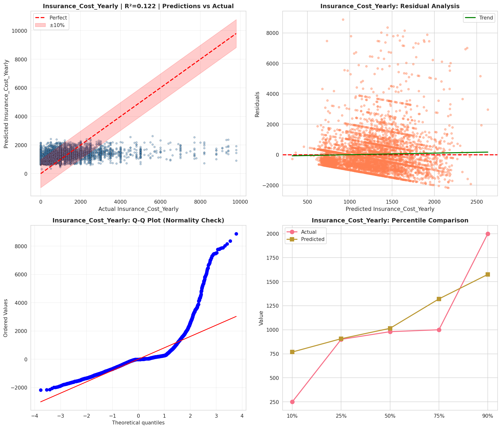
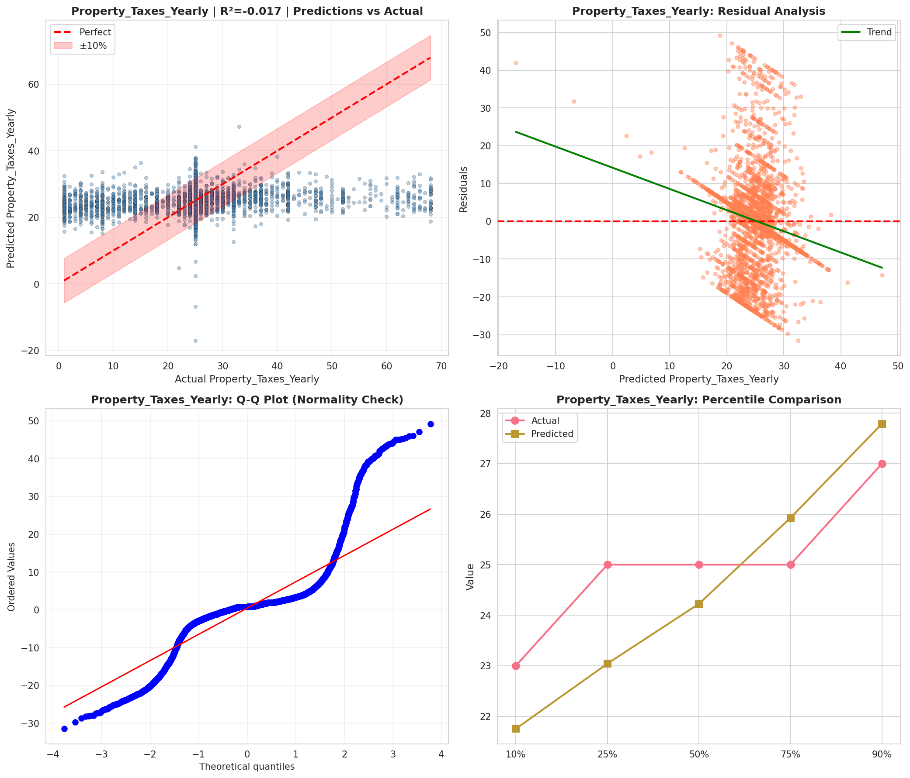
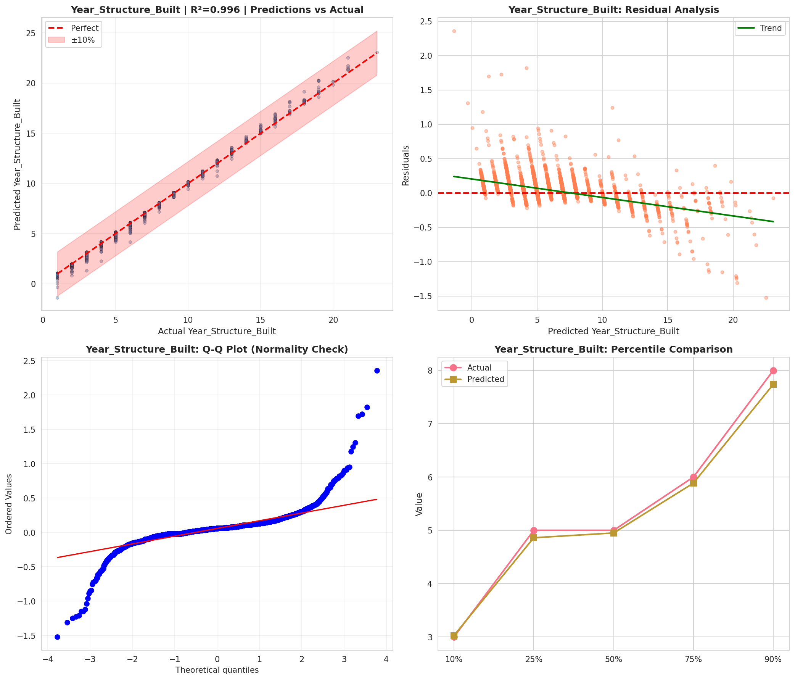
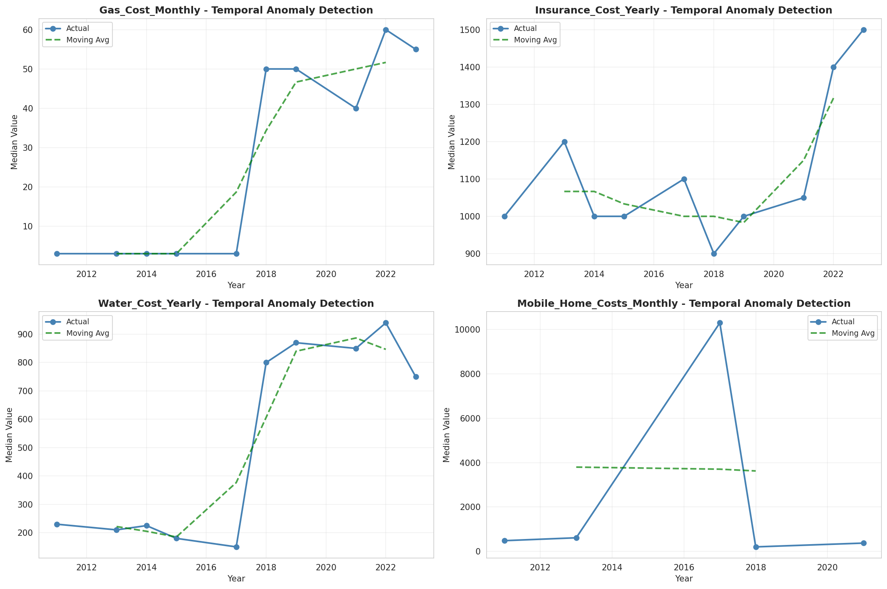
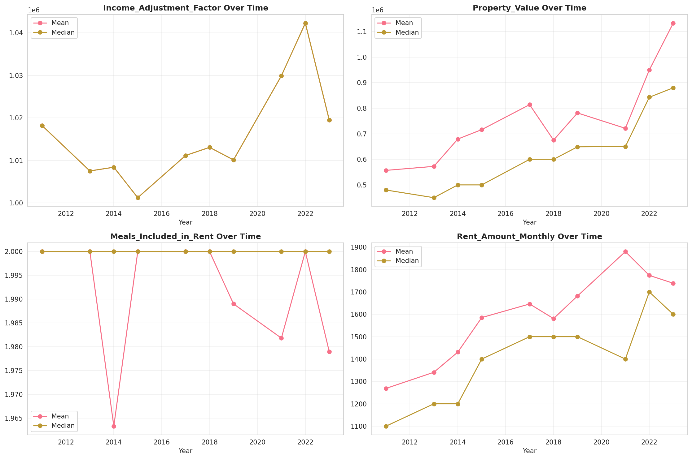
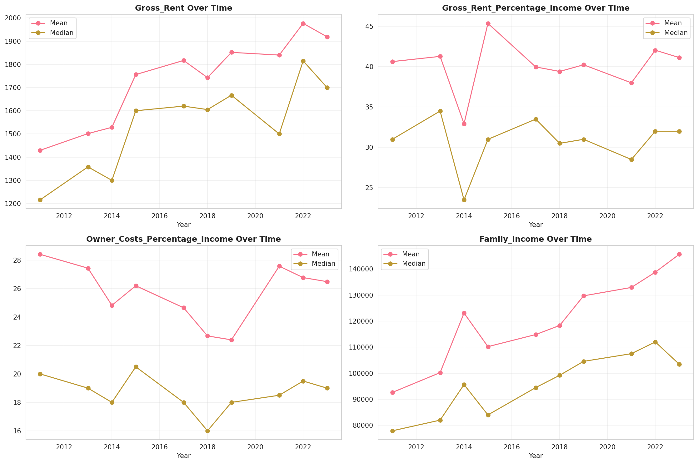
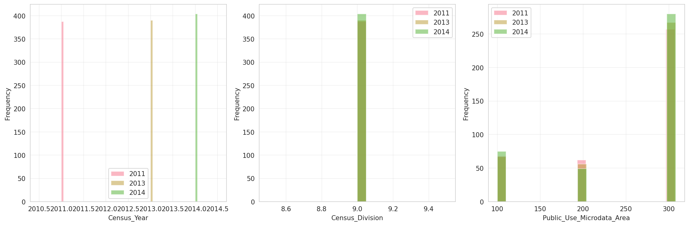
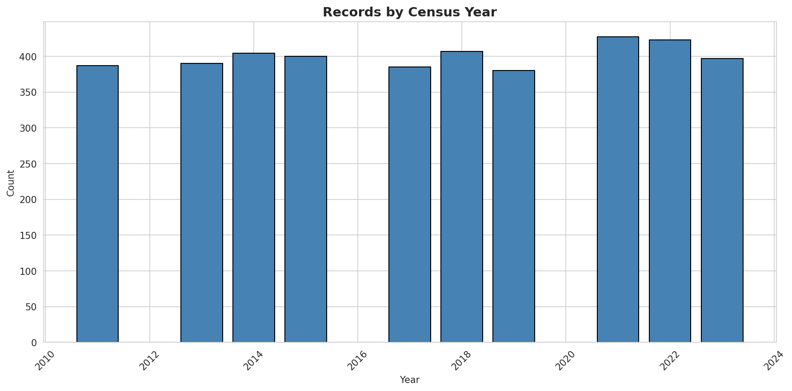
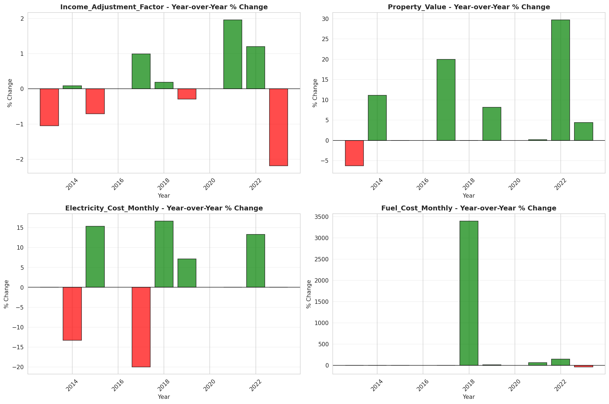

# Temporal Analysis

## Year Distribution

- 2011: 6,129 records

- 2013: 6,055 records

- 2014: 6,121 records

- 2015: 6,095 records

- 2017: 6,266 records

- 2018: 6,340 records

- 2019: 6,335 records

- 2021: 6,398 records

- 2022: 6,487 records

- 2023: 6,474 records

## Temporal Trends

- Census_Year: {np.int64(2011): {'mean': 2011.0, 'median': 2011.0, 'std': 0.0}, np.int64(2013): {'mean': 2013.0, 'median': 2013.0, 'std': 0.0}, np.int64(2014): {'mean': 2014.0, 'median': 2014.0, 'std': 0.0}, np.int64(2015): {'mean': 2015.0, 'median': 2015.0, 'std': 0.0}, np.int64(2017): {'mean': 2017.0, 'median': 2017.0, 'std': 0.0}, np.int64(2018): {'mean': 2018.0, 'median': 2018.0, 'std': 0.0}, np.int64(2019): {'mean': 2019.0, 'median': 2019.0, 'std': 0.0}, np.int64(2021): {'mean': 2021.0, 'median': 2021.0, 'std': 0.0}, np.int64(2022): {'mean': 2022.0, 'median': 2022.0, 'std': 0.0}, np.int64(2023): {'mean': 2023.0, 'median': 2023.0, 'std': 0.0}}

- Census_Division: {np.int64(2011): {'mean': 9.0, 'median': 9.0, 'std': 0.0}, np.int64(2013): {'mean': 9.0, 'median': 9.0, 'std': 0.0}, np.int64(2014): {'mean': 9.0, 'median': 9.0, 'std': 0.0}, np.int64(2015): {'mean': 9.0, 'median': 9.0, 'std': 0.0}, np.int64(2017): {'mean': 9.0, 'median': 9.0, 'std': 0.0}, np.int64(2018): {'mean': 9.0, 'median': 9.0, 'std': 0.0}, np.int64(2019): {'mean': 9.0, 'median': 9.0, 'std': 0.0}, np.int64(2021): {'mean': 9.0, 'median': 9.0, 'std': 0.0}, np.int64(2022): {'mean': 9.0, 'median': 9.0, 'std': 0.0}, np.int64(2023): {'mean': 9.0, 'median': 9.0, 'std': 0.0}}

- Public_Use_Microdata_Area: {np.int64(2011): {'mean': 251.6808614782183, 'median': 302.0, 'std': 80.31337302057362}, np.int64(2013): {'mean': 252.0171758876961, 'median': 303.0, 'std': 80.65837878978815}, np.int64(2014): {'mean': 251.77879431465448, 'median': 302.0, 'std': 80.92060024313638}, np.int64(2015): {'mean': 251.06972928630026, 'median': 302.0, 'std': 81.00203533510833}, np.int64(2017): {'mean': 250.74210022342803, 'median': 302.0, 'std': 81.08073994542428}, np.int64(2018): {'mean': 251.4604100946372, 'median': 303.0, 'std': 80.83874977219534}, np.int64(2019): {'mean': 251.36953433307025, 'median': 302.0, 'std': 80.77679772984442}, np.int64(2021): {'mean': 252.0861206627071, 'median': 302.0, 'std': 80.40415687408014}, np.int64(2022): {'mean': 255.93124710960382, 'median': 303.0, 'std': 78.32670667236837}, np.int64(2023): {'mean': 256.0347544022243, 'median': 303.0, 'std': 77.95530373581866}}

- Census_Region: {np.int64(2011): {'mean': 4.0, 'median': 4.0, 'std': 0.0}, np.int64(2013): {'mean': 4.0, 'median': 4.0, 'std': 0.0}, np.int64(2014): {'mean': 4.0, 'median': 4.0, 'std': 0.0}, np.int64(2015): {'mean': 4.0, 'median': 4.0, 'std': 0.0}, np.int64(2017): {'mean': 4.0, 'median': 4.0, 'std': 0.0}, np.int64(2018): {'mean': 4.0, 'median': 4.0, 'std': 0.0}, np.int64(2019): {'mean': 4.0, 'median': 4.0, 'std': 0.0}, np.int64(2021): {'mean': 4.0, 'median': 4.0, 'std': 0.0}, np.int64(2022): {'mean': 4.0, 'median': 4.0, 'std': 0.0}, np.int64(2023): {'mean': 4.0, 'median': 4.0, 'std': 0.0}}

- State_Code: {np.int64(2011): {'mean': 15.0, 'median': 15.0, 'std': 0.0}, np.int64(2013): {'mean': 15.0, 'median': 15.0, 'std': 0.0}, np.int64(2014): {'mean': 15.0, 'median': 15.0, 'std': 0.0}, np.int64(2015): {'mean': 15.0, 'median': 15.0, 'std': 0.0}, np.int64(2017): {'mean': 15.0, 'median': 15.0, 'std': 0.0}, np.int64(2018): {'mean': 15.0, 'median': 15.0, 'std': 0.0}, np.int64(2019): {'mean': 15.0, 'median': 15.0, 'std': 0.0}, np.int64(2021): {'mean': 15.0, 'median': 15.0, 'std': 0.0}, np.int64(2022): {'mean': 15.0, 'median': 15.0, 'std': 0.0}, np.int64(2023): {'mean': None, 'median': None, 'std': None}}

- Housing_Adjustment_Factor: {np.int64(2011): {'mean': 1000000.0, 'median': 1000000.0, 'std': 0.0}, np.int64(2013): {'mean': 1000000.0, 'median': 1000000.0, 'std': 0.0}, np.int64(2014): {'mean': 1000000.0, 'median': 1000000.0, 'std': 0.0}, np.int64(2015): {'mean': 1000000.0, 'median': 1000000.0, 'std': 0.0}, np.int64(2017): {'mean': 1000000.0, 'median': 1000000.0, 'std': 0.0}, np.int64(2018): {'mean': 1000000.0, 'median': 1000000.0, 'std': 0.0}, np.int64(2019): {'mean': 1000000.0, 'median': 1000000.0, 'std': 0.0}, np.int64(2021): {'mean': 1000000.0, 'median': 1000000.0, 'std': 0.0}, np.int64(2022): {'mean': 1000000.0, 'median': 1000000.0, 'std': 0.0}, np.int64(2023): {'mean': 1000000.0, 'median': 1000000.0, 'std': 0.0}}

- Income_Adjustment_Factor: {np.int64(2011): {'mean': 1018237.0, 'median': 1018237.0, 'std': 0.0}, np.int64(2013): {'mean': 1007549.0, 'median': 1007549.0, 'std': 0.0}, np.int64(2014): {'mean': 1008425.0, 'median': 1008425.0, 'std': 0.0}, np.int64(2015): {'mean': 1001264.0, 'median': 1001264.0, 'std': 0.0}, np.int64(2017): {'mean': 1011189.0, 'median': 1011189.0, 'std': 0.0}, np.int64(2018): {'mean': 1013097.0, 'median': 1013097.0, 'std': 0.0}, np.int64(2019): {'mean': 1010145.0, 'median': 1010145.0, 'std': 0.0}, np.int64(2021): {'mean': 1029928.0, 'median': 1029928.0, 'std': 0.0}, np.int64(2022): {'mean': 1042311.0, 'median': 1042311.0, 'std': 0.0}, np.int64(2023): {'mean': 1019518.0, 'median': 1019518.0, 'std': 0.0}}

- Housing_Unit_Weight: {np.int64(2011): {'mean': 85.22010115842716, 'median': 66.0, 'std': 88.43164971657774}, np.int64(2013): {'mean': 86.92072667217175, 'median': 71.0, 'std': 84.00642599423871}, np.int64(2014): {'mean': 86.60643685672275, 'median': 70.0, 'std': 82.27092469434982}, np.int64(2015): {'mean': 87.3524200164069, 'median': 71.0, 'std': 82.21473141317068}, np.int64(2017): {'mean': 86.65097350781998, 'median': 69.0, 'std': 83.65762483471957}, np.int64(2018): {'mean': 86.16104100946372, 'median': 69.0, 'std': 85.41115963267308}, np.int64(2019): {'mean': 86.87103393843725, 'median': 66.0, 'std': 89.51231023743536}, np.int64(2021): {'mean': 88.28977805564239, 'median': 67.0, 'std': 85.84355510475129}, np.int64(2022): {'mean': 87.56867581316479, 'median': 66.0, 'std': 90.38101003109398}, np.int64(2023): {'mean': 88.35990114303367, 'median': 65.0, 'std': 92.22905498484866}}

- Number_of_Persons: {np.int64(2011): {'mean': 2.3284385707293196, 'median': 2.0, 'std': 1.896637688919267}, np.int64(2013): {'mean': 2.3593724194880266, 'median': 2.0, 'std': 1.9248348928972538}, np.int64(2014): {'mean': 2.339813755922235, 'median': 2.0, 'std': 1.9375540214978522}, np.int64(2015): {'mean': 2.317309269893355, 'median': 2.0, 'std': 1.8923404533034658}, np.int64(2017): {'mean': 2.303383338653048, 'median': 2.0, 'std': 1.9009918137679755}, np.int64(2018): {'mean': 2.271293375394322, 'median': 2.0, 'std': 1.9036325565321082}, np.int64(2019): {'mean': 2.245935280189424, 'median': 2.0, 'std': 1.8396757392589795}, np.int64(2021): {'mean': 2.3380743982494527, 'median': 2.0, 'std': 1.9115073673115395}, np.int64(2022): {'mean': 2.3115461692616, 'median': 2.0, 'std': 1.8764393259385743}, np.int64(2023): {'mean': 2.319894964473278, 'median': 2.0, 'std': 1.8542812507780062}}

- Housing_Unit_Type: {np.int64(2011): {'mean': 1.2373959862946646, 'median': 1.0, 'std': 0.6004769698949541}, np.int64(2013): {'mean': 1.2186622625928984, 'median': 1.0, 'std': 0.5887519576015152}, np.int64(2014): {'mean': 1.2252899852965202, 'median': 1.0, 'std': 0.5979711217637644}, np.int64(2015): {'mean': 1.2168990976210008, 'median': 1.0, 'std': 0.5924892824989434}, np.int64(2017): {'mean': 1.2250239387168849, 'median': 1.0, 'std': 0.598043664364654}, np.int64(2018): {'mean': 1.228864353312303, 'median': 1.0, 'std': 0.5980087142848339}, np.int64(2019): {'mean': 1.217995264404104, 'median': 1.0, 'std': 0.5863875994389732}, np.int64(2021): {'mean': None, 'median': None, 'std': None}, np.int64(2022): {'mean': None, 'median': None, 'std': None}, np.int64(2023): {'mean': None, 'median': None, 'std': None}}

- Number_of_Bedrooms: {np.int64(2011): {'mean': 2.788667687595712, 'median': 3.0, 'std': 1.4479738282760233}, np.int64(2013): {'mean': 2.8291848755462663, 'median': 3.0, 'std': 1.8400211731754492}, np.int64(2014): {'mean': 2.7672576386269334, 'median': 3.0, 'std': 1.412531561220559}, np.int64(2015): {'mean': 2.677558685446009, 'median': 3.0, 'std': 1.2485429722338046}, np.int64(2017): {'mean': 2.67255985267035, 'median': 3.0, 'std': 1.2472708403876214}, np.int64(2018): {'mean': 2.6919275123558486, 'median': 3.0, 'std': 1.2535204182239024}, np.int64(2019): {'mean': 2.714155914955479, 'median': 3.0, 'std': 1.2975501378650183}, np.int64(2021): {'mean': 2.730265486725664, 'median': 3.0, 'std': 1.2604615930160497}, np.int64(2022): {'mean': 2.71431086076395, 'median': 3.0, 'std': 1.2682003528775394}, np.int64(2023): {'mean': 2.713162034609334, 'median': 3.0, 'std': 1.264517023999655}}

- Number_of_Rooms: {np.int64(2011): {'mean': 5.130168453292496, 'median': 5.0, 'std': 2.260190209691748}, np.int64(2013): {'mean': 5.193045791373741, 'median': 5.0, 'std': 2.7999927198948455}, np.int64(2014): {'mean': 5.134666163711807, 'median': 5.0, 'std': 2.490421126838572}, np.int64(2015): {'mean': 5.067417840375587, 'median': 5.0, 'std': 2.32343421320039}, np.int64(2017): {'mean': 5.079926335174954, 'median': 5.0, 'std': 2.322549648685384}, np.int64(2018): {'mean': 5.116602599304412, 'median': 5.0, 'std': 2.3963968186086837}, np.int64(2019): {'mean': 5.128475377067054, 'median': 5.0, 'std': 2.42653481948505}, np.int64(2021): {'mean': 5.195575221238938, 'median': 5.0, 'std': 2.3218957992913922}, np.int64(2022): {'mean': 5.167928181658159, 'median': 5.0, 'std': 2.4086769684835683}, np.int64(2023): {'mean': 5.153120083901416, 'median': 5.0, 'std': 2.404463608768495}}

- Building_Type: {np.int64(2011): {'mean': 3.6897013782542114, 'median': 2.0, 'std': 2.5353712920177807}, np.int64(2013): {'mean': 3.7562226866806006, 'median': 2.0, 'std': 2.588686672821555}, np.int64(2014): {'mean': 3.7487740475292344, 'median': 2.0, 'std': 2.570836360192962}, np.int64(2015): {'mean': 3.790610328638498, 'median': 2.0, 'std': 2.5953467330965116}, np.int64(2017): {'mean': 3.749355432780847, 'median': 2.0, 'std': 2.593184058853101}, np.int64(2018): {'mean': 3.784916712429068, 'median': 2.0, 'std': 2.600815195454143}, np.int64(2019): {'mean': 3.8119207704888245, 'median': 2.0, 'std': 2.626388538864786}, np.int64(2021): {'mean': 3.7568141592920354, 'median': 2.0, 'std': 2.594363986013138}, np.int64(2022): {'mean': 3.790881886991727, 'median': 2.0, 'std': 2.6059103894903815}, np.int64(2023): {'mean': 3.786925362698829, 'median': 2.0, 'std': 2.626427750818104}}

- Year_Structure_Built: {np.int64(2011): {'mean': 5.333078101071975, 'median': 5.0, 'std': 2.2855858675245293}, np.int64(2013): {'mean': 5.575907277218317, 'median': 5.0, 'std': 2.5184014918711957}, np.int64(2014): {'mean': 5.662580158430781, 'median': 5.0, 'std': 2.6485432493713117}, np.int64(2015): {'mean': 5.765070422535211, 'median': 5.0, 'std': 2.775574445879449}, np.int64(2017): {'mean': 5.963167587476979, 'median': 5.0, 'std': 3.1459445227218086}, np.int64(2018): {'mean': 5.985722130697419, 'median': 5.0, 'std': 3.3175323557120446}, np.int64(2019): {'mean': 6.071779029620207, 'median': 5.0, 'std': 3.5369125668965253}, np.int64(2021): {'mean': None, 'median': None, 'std': None}, np.int64(2022): {'mean': None, 'median': None, 'std': None}, np.int64(2023): {'mean': None, 'median': None, 'std': None}}

- Bathtub_or_Shower: {np.int64(2011): {'mean': 1.0095712098009189, 'median': 1.0, 'std': 0.09737256654950445}, np.int64(2013): {'mean': 1.00570017100513, 'median': 1.0, 'std': 0.07529114258413214}, np.int64(2014): {'mean': 1.0066012825348924, 'median': 1.0, 'std': 0.08098729945690107}, np.int64(2015): {'mean': 1.0061971830985916, 'median': 1.0, 'std': 0.07848525221660822}, np.int64(2017): {'mean': 1.007182320441989, 'median': 1.0, 'std': 0.0844514545035122}, np.int64(2018): {'mean': 1.0082372322899507, 'median': 1.0, 'std': 0.09039289778396599}, np.int64(2019): {'mean': 1.009085953116482, 'median': 1.0, 'std': 0.0948948626583969}, np.int64(2021): {'mean': 1.0065486725663717, 'median': 1.0, 'std': 0.08066560062772525}, np.int64(2022): {'mean': 1.0068649885583525, 'median': 1.0, 'std': 0.08257760482114512}, np.int64(2023): {'mean': 1.005768222338752, 'median': 1.0, 'std': 0.07573607174543885}}

- Refrigerator: {np.int64(2011): {'mean': 1.012633996937213, 'median': 1.0, 'std': 0.11169945126890475}, np.int64(2013): {'mean': 1.0083602508075242, 'median': 1.0, 'std': 0.09106004902483497}, np.int64(2014): {'mean': 1.0115050924179554, 'median': 1.0, 'std': 0.1066530386760678}, np.int64(2015): {'mean': 1.012394366197183, 'median': 1.0, 'std': 0.11064829437068781}, np.int64(2017): {'mean': 1.0121546961325967, 'median': 1.0, 'std': 0.10958636378786452}, np.int64(2018): {'mean': 1.0111660259930442, 'median': 1.0, 'std': 0.10508742712909243}, np.int64(2019): {'mean': 1.0116300199890969, 'median': 1.0, 'std': 0.1072233734839693}, np.int64(2021): {'mean': 1.0079646017699115, 'median': 1.0, 'std': 0.08889637547577729}, np.int64(2022): {'mean': 1.0103854955113536, 'median': 1.0, 'std': 0.10138760494986597}, np.int64(2023): {'mean': 1.0097884985142458, 'median': 1.0, 'std': 0.09846003420791692}}

- Hot_and_Cold_Running_Water: {np.int64(2011): {'mean': 1.0130168453292496, 'median': 1.0, 'std': 0.11335725315282334}, np.int64(2013): {'mean': 1.0108303249097472, 'median': 1.0, 'std': 0.10351359763579103}, np.int64(2014): {'mean': 1.009430403621275, 'median': 1.0, 'std': 0.09666040201675737}, np.int64(2015): {'mean': 1.0090140845070423, 'median': 1.0, 'std': 0.09452252974576122}, np.int64(2017): {'mean': 1.0112338858195211, 'median': 1.0, 'std': 0.10540271163497349}, np.int64(2018): {'mean': 1.0126304228445908, 'median': 1.0, 'std': 0.11168338494945618}, np.int64(2019): {'mean': 1.0114483009267672, 'median': 1.0, 'std': 0.10639217200620239}, np.int64(2021): {'mean': 1.0090265486725665, 'median': 1.0, 'std': 0.0945867515571613}, np.int64(2022): {'mean': 1.0107375462066537, 'median': 1.0, 'std': 0.10307337882683708}, np.int64(2023): {'mean': 1.0097884985142458, 'median': 1.0, 'std': 0.09846003420791712}}

- Running_Water: {np.int64(2011): {'mean': None, 'median': None, 'std': None}, np.int64(2013): {'mean': 9.0, 'median': 9.0, 'std': 0.0}, np.int64(2014): {'mean': 9.0, 'median': 9.0, 'std': 0.0}, np.int64(2015): {'mean': 9.0, 'median': 9.0, 'std': 0.0}, np.int64(2017): {'mean': 9.0, 'median': 9.0, 'std': 0.0}, np.int64(2018): {'mean': 9.0, 'median': 9.0, 'std': 0.0}, np.int64(2019): {'mean': 9.0, 'median': 9.0, 'std': 0.0}, np.int64(2021): {'mean': 9.0, 'median': 9.0, 'std': 0.0}, np.int64(2022): {'mean': 9.0, 'median': 9.0, 'std': 0.0}, np.int64(2023): {'mean': 9.0, 'median': 9.0, 'std': 0.0}}

- Sink_with_Faucet: {np.int64(2011): {'mean': 1.0089969372128638, 'median': 1.0, 'std': 0.09443357134562314}, np.int64(2013): {'mean': 1.0051301539046171, 'median': 1.0, 'std': 0.07144792066708583}, np.int64(2014): {'mean': 1.006412674462467, 'median': 1.0, 'std': 0.07982953101175938}, np.int64(2015): {'mean': 1.0061971830985916, 'median': 1.0, 'std': 0.0784852522166082}, np.int64(2017): {'mean': 1.0064456721915285, 'median': 1.0, 'std': 0.0800331501050014}, np.int64(2018): {'mean': 1.0076880834706206, 'median': 1.0, 'std': 0.08735200959365594}, np.int64(2019): {'mean': 1.0076322006178449, 'median': 1.0, 'std': 0.08703635282363846}, np.int64(2021): {'mean': 1.004778761061947, 'median': 1.0, 'std': 0.06896931499021183}, np.int64(2022): {'mean': 1.0049287097342017, 'median': 1.0, 'std': 0.07003771133005807}, np.int64(2023): {'mean': 1.0036706869428422, 'median': 1.0, 'std': 0.060480181655745036}}

- Stove_or_Range: {np.int64(2011): {'mean': 1.0237366003062787, 'median': 1.0, 'std': 0.15224194844951477}, np.int64(2013): {'mean': 1.0163404902147064, 'median': 1.0, 'std': 0.12679326964473164}, np.int64(2014): {'mean': 1.0173519426631459, 'median': 1.0, 'std': 0.13059122973651607}, np.int64(2015): {'mean': 1.019718309859155, 'median': 1.0, 'std': 0.13904362175216925}, np.int64(2017): {'mean': 1.0211786372007365, 'median': 1.0, 'std': 0.1439927808214722}, np.int64(2018): {'mean': 1.0197693574958815, 'median': 1.0, 'std': 0.13921953125122122}, np.int64(2019): {'mean': 1.0219880065418863, 'median': 1.0, 'std': 0.14665756920194203}, np.int64(2021): {'mean': 1.0191150442477876, 'median': 1.0, 'std': 0.13694151467842575}, np.int64(2022): {'mean': 1.0218271431086077, 'median': 1.0, 'std': 0.1461317140860035}, np.int64(2023): {'mean': 1.021150148575424, 'median': 1.0, 'std': 0.1438973216038107}}

- Telephone_Service: {np.int64(2011): {'mean': 1.028735632183908, 'median': 1.0, 'std': 0.1670803330598013}, np.int64(2013): {'mean': 1.0225148683092609, 'median': 1.0, 'std': 0.14836652113260945}, np.int64(2014): {'mean': 1.022283531409168, 'median': 1.0, 'std': 0.14761978302403483}, np.int64(2015): {'mean': 1.0280851063829788, 'median': 1.0, 'std': 0.16523359872873955}, np.int64(2017): {'mean': 1.0172916666666667, 'median': 1.0, 'std': 0.13036949722525323}, np.int64(2018): {'mean': 1.0154102457309455, 'median': 1.0, 'std': 0.12319062623761624}, np.int64(2019): {'mean': 1.010849539406346, 'median': 1.0, 'std': 0.1036051361891455}, np.int64(2021): {'mean': 1.0073398135290617, 'median': 1.0, 'std': 0.08536618938179437}, np.int64(2022): {'mean': 1.009514563106796, 'median': 1.0, 'std': 0.09708690159344441}, np.int64(2023): {'mean': 1.0082883577486508, 'median': 1.0, 'std': 0.0906710843662941}}

- Lot_Acreage: {np.int64(2011): {'mean': 1.1261759822910902, 'median': 1.0, 'std': 0.3684422937124446}, np.int64(2013): {'mean': 1.1321070234113713, 'median': 1.0, 'std': 0.3812519071428108}, np.int64(2014): {'mean': 1.128781570913128, 'median': 1.0, 'std': 0.37415288405759245}, np.int64(2015): {'mean': 1.1460423634336678, 'median': 1.0, 'std': 0.3956389677425873}, np.int64(2017): {'mean': 1.1415573989831416, 'median': 1.0, 'std': 0.3795199181752308}, np.int64(2018): {'mean': 1.1314301104228386, 'median': 1.0, 'std': 0.3720654236135379}, np.int64(2019): {'mean': 1.133225458468177, 'median': 1.0, 'std': 0.3717087829824531}, np.int64(2021): {'mean': 1.126063418406806, 'median': 1.0, 'std': 0.369461851789273}, np.int64(2022): {'mean': 1.131708581799326, 'median': 1.0, 'std': 0.36831596421176477}, np.int64(2023): {'mean': 1.1361767728674204, 'median': 1.0, 'std': 0.37795399033159177}}

- Agricultural_Sales: {np.int64(2011): {'mean': 1.5694050991501416, 'median': 1.0, 'std': 1.3594676170860946}, np.int64(2013): {'mean': 1.633879781420765, 'median': 1.0, 'std': 1.438168442046924}, np.int64(2014): {'mean': 1.4750733137829912, 'median': 1.0, 'std': 1.2235893716813793}, np.int64(2015): {'mean': 1.4267352185089974, 'median': 1.0, 'std': 1.0902117851184232}, np.int64(2017): {'mean': 1.5306603773584906, 'median': 1.0, 'std': 1.2842024459596864}, np.int64(2018): {'mean': 1.429708222811671, 'median': 1.0, 'std': 1.1650806609649589}, np.int64(2019): {'mean': 1.4692307692307693, 'median': 1.0, 'std': 1.2031778500689656}, np.int64(2021): {'mean': 1.3655352480417755, 'median': 1.0, 'std': 0.9277923260051864}, np.int64(2022): {'mean': 1.5825471698113207, 'median': 1.0, 'std': 1.3307695644639448}, np.int64(2023): {'mean': 1.4642857142857142, 'median': 1.0, 'std': 1.197116948081903}}

- Tenure: {np.int64(2011): {'mean': 2.0174542358450402, 'median': 2.0, 'std': 0.9343546878482508}, np.int64(2013): {'mean': 1.981945624468989, 'median': 2.0, 'std': 0.9293579840968728}, np.int64(2014): {'mean': 1.9758064516129032, 'median': 2.0, 'std': 0.9291663027389612}, np.int64(2015): {'mean': 1.9714893617021276, 'median': 2.0, 'std': 0.9219578590039356}, np.int64(2017): {'mean': 1.9602083333333333, 'median': 2.0, 'std': 0.9172241969540196}, np.int64(2018): {'mean': 1.9743856726364015, 'median': 2.0, 'std': 0.9173112859669152}, np.int64(2019): {'mean': 1.936949846468782, 'median': 2.0, 'std': 0.895271561973813}, np.int64(2021): {'mean': 1.9244197579845268, 'median': 2.0, 'std': 0.8962226648763782}, np.int64(2022): {'mean': 1.92873786407767, 'median': 2.0, 'std': 0.8935198395415743}, np.int64(2023): {'mean': 1.925597532767926, 'median': 2.0, 'std': 0.8922346321664358}}

- Vacancy_Status: {np.int64(2011): {'mean': 4.328897338403042, 'median': 5.0, 'std': 2.0067034138968527}, np.int64(2013): {'mean': 4.302702702702702, 'median': 5.0, 'std': 1.98784480738356}, np.int64(2014): {'mean': 4.235593220338983, 'median': 5.0, 'std': 2.15615065352609}, np.int64(2015): {'mean': 4.2928, 'median': 5.0, 'std': 2.135407245132437}, np.int64(2017): {'mean': 4.457142857142857, 'median': 5.0, 'std': 2.113753454864988}, np.int64(2018): {'mean': 4.48714069591528, 'median': 5.0, 'std': 2.1423368350992686}, np.int64(2019): {'mean': 4.689320388349515, 'median': 5.0, 'std': 2.083488190076872}, np.int64(2021): {'mean': 4.579638752052545, 'median': 5.0, 'std': 2.1614092626951127}, np.int64(2022): {'mean': 4.80225988700565, 'median': 5.0, 'std': 1.8399329808014049}, np.int64(2023): {'mean': 4.696060037523452, 'median': 5.0, 'std': 1.9671941613804098}}

- Property_Value: {np.int64(2011): {'mean': 560277.2237196766, 'median': 475000.0, 'std': 480725.60224936315}, np.int64(2013): {'mean': 587778.1754735792, 'median': 500000.0, 'std': 571140.8710990563}, np.int64(2014): {'mean': 623683.9796921061, 'median': 500000.0, 'std': 635642.8776897053}, np.int64(2015): {'mean': 664246.0608041844, 'median': 520000.0, 'std': 667871.9300957496}, np.int64(2017): {'mean': 706954.2035398231, 'median': 600000.0, 'std': 675239.1755634791}, np.int64(2018): {'mean': 734027.3737694506, 'median': 625000.0, 'std': 720536.5967496178}, np.int64(2019): {'mean': 771904.6841946207, 'median': 650000.0, 'std': 776865.2927558881}, np.int64(2021): {'mean': 822457.5792507204, 'median': 700000.0, 'std': 839797.3069557645}, np.int64(2022): {'mean': 963680.5999439305, 'median': 800000.0, 'std': 941933.0868992779}, np.int64(2023): {'mean': 996203.9966694422, 'median': 800000.0, 'std': 1079690.8506703314}}

- Vehicles_Available: {np.int64(2011): {'mean': 1.8284376330353342, 'median': 2.0, 'std': 1.1350870244907338}, np.int64(2013): {'mean': 1.8785046728971964, 'median': 2.0, 'std': 1.1778806114547973}, np.int64(2014): {'mean': 1.8662988115449914, 'median': 2.0, 'std': 1.1660819132900084}, np.int64(2015): {'mean': 1.9161702127659574, 'median': 2.0, 'std': 1.1678617453957272}, np.int64(2017): {'mean': 1.9095833333333334, 'median': 2.0, 'std': 1.1860443594052072}, np.int64(2018): {'mean': 1.9216992919616827, 'median': 2.0, 'std': 1.194878933730607}, np.int64(2019): {'mean': 1.9660184237461618, 'median': 2.0, 'std': 1.2162191399515527}, np.int64(2021): {'mean': 1.951993652053164, 'median': 2.0, 'std': 1.2056729715164938}, np.int64(2022): {'mean': 1.9411650485436893, 'median': 2.0, 'std': 1.1948595968349263}, np.int64(2023): {'mean': 1.963762528912876, 'median': 2.0, 'std': 1.227628992415153}}

- Condo_Fee_Monthly: {np.int64(2011): {'mean': 470.72106261859585, 'median': 410.0, 'std': 244.98050669795452}, np.int64(2013): {'mean': 494.6111111111111, 'median': 450.0, 'std': 236.3488836166452}, np.int64(2014): {'mean': 512.5545927209705, 'median': 470.0, 'std': 266.26881301012645}, np.int64(2015): {'mean': 528.0623853211009, 'median': 470.0, 'std': 283.4378299625132}, np.int64(2017): {'mean': 550.2401433691756, 'median': 500.0, 'std': 282.41547192140473}, np.int64(2018): {'mean': 566.3801652892562, 'median': 500.0, 'std': 291.05987118212533}, np.int64(2019): {'mean': 606.342229199372, 'median': 550.0, 'std': 288.2106404369217}, np.int64(2021): {'mean': 641.9536231884058, 'median': 580.0, 'std': 355.7386854980179}, np.int64(2022): {'mean': 717.2902338376891, 'median': 620.0, 'std': 411.67560874171966}, np.int64(2023): {'mean': 735.1347708894879, 'median': 660.0, 'std': 431.1271617348819}}

- Electricity_Cost_Monthly: {np.int64(2011): {'mean': 169.20221370796082, 'median': 150.0, 'std': 123.74877706376326}, np.int64(2013): {'mean': 168.5231520815633, 'median': 150.0, 'std': 126.40829245087066}, np.int64(2014): {'mean': 168.23323429541597, 'median': 150.0, 'std': 130.08919810702386}, np.int64(2015): {'mean': 153.22744680851065, 'median': 130.0, 'std': 123.61013292858388}, np.int64(2017): {'mean': 136.19291666666666, 'median': 120.0, 'std': 113.85027928275956}, np.int64(2018): {'mean': 167.1405304792927, 'median': 140.0, 'std': 119.0823234093395}, np.int64(2019): {'mean': 166.97563197449327, 'median': 140.0, 'std': 120.21802175457488}, np.int64(2021): {'mean': 179.11229946524065, 'median': 150.0, 'std': 146.47463188193979}, np.int64(2022): {'mean': 223.94762112614578, 'median': 170.0, 'std': 260.43970150554}, np.int64(2023): {'mean': 232.32262238516282, 'median': 180.0, 'std': 229.66590759326212}}

- Fuel_Cost_Monthly: {np.int64(2011): {'mean': 18.21115368241805, 'median': 2.0, 'std': 190.90739062125004}, np.int64(2013): {'mean': 11.952421410365336, 'median': 2.0, 'std': 166.03362847142023}, np.int64(2014): {'mean': 8.891129032258064, 'median': 2.0, 'std': 106.48087950873555}, np.int64(2015): {'mean': 12.258085106382978, 'median': 2.0, 'std': 127.57997624611198}, np.int64(2017): {'mean': 6.452708333333334, 'median': 2.0, 'std': 73.92814449875871}, np.int64(2018): {'mean': 448.1818181818182, 'median': 200.0, 'std': 664.0004899980897}, np.int64(2019): {'mean': 426.56, 'median': 200.0, 'std': 723.4371830627991}, np.int64(2021): {'mean': 423.0120481927711, 'median': 200.0, 'std': 593.4001548327317}, np.int64(2022): {'mean': 795.8823529411765, 'median': 300.0, 'std': 1024.2887126912892}, np.int64(2023): {'mean': 488.0, 'median': 210.0, 'std': 838.7842133241058}}

- Gas_Cost_Monthly: {np.int64(2011): {'mean': 19.151128139633887, 'median': 3.0, 'std': 50.27225578516405}, np.int64(2013): {'mean': 16.406542056074766, 'median': 3.0, 'std': 46.15500684190506}, np.int64(2014): {'mean': 17.801782682512734, 'median': 3.0, 'std': 49.32997654222035}, np.int64(2015): {'mean': 15.635531914893617, 'median': 3.0, 'std': 42.719360327500894}, np.int64(2017): {'mean': 15.52375, 'median': 3.0, 'std': 41.79114687062109}, np.int64(2018): {'mean': 67.46049661399549, 'median': 50.0, 'std': 71.05171282485958}, np.int64(2019): {'mean': 69.66843783209352, 'median': 50.0, 'std': 79.9806396294488}, np.int64(2021): {'mean': 79.59871931696905, 'median': 50.0, 'std': 98.39776853698952}, np.int64(2022): {'mean': 92.63966770508827, 'median': 60.0, 'std': 118.97884106118912}, np.int64(2023): {'mean': 97.04942166140904, 'median': 50.0, 'std': 155.1154296074274}}

- House_Heating_Fuel: {np.int64(2011): {'mean': 6.267560664112389, 'median': 9.0, 'std': 3.0369478449850957}, np.int64(2013): {'mean': 6.607901444350042, 'median': 9.0, 'std': 2.9718667434789956}, np.int64(2014): {'mean': 6.588497453310696, 'median': 9.0, 'std': 2.9737797260467675}, np.int64(2015): {'mean': 6.631914893617021, 'median': 9.0, 'std': 2.9401786534397636}, np.int64(2017): {'mean': 6.5372916666666665, 'median': 9.0, 'std': 2.9718876194155195}, np.int64(2018): {'mean': 6.434194085797585, 'median': 9.0, 'std': 2.9956472390763254}, np.int64(2019): {'mean': 6.3291709314227225, 'median': 9.0, 'std': 3.000433122647322}, np.int64(2021): {'mean': 5.841301329101369, 'median': 7.0, 'std': 3.037759756457482}, np.int64(2022): {'mean': 5.9615533980582525, 'median': 7.0, 'std': 3.0345453119223356}, np.int64(2023): {'mean': 5.837895142636854, 'median': 7.0, 'std': 3.034937929984436}}

- Insurance_Cost_Yearly: {np.int64(2011): {'mean': 1283.9086722947045, 'median': 1000.0, 'std': 1172.888193355558}, np.int64(2013): {'mean': 1279.203626747261, 'median': 1000.0, 'std': 1160.163287899603}, np.int64(2014): {'mean': 1298.0471733433171, 'median': 1000.0, 'std': 1259.9321410381724}, np.int64(2015): {'mean': 1337.6251386321626, 'median': 1000.0, 'std': 1245.4821978996633}, np.int64(2017): {'mean': 1391.1072714182865, 'median': 1000.0, 'std': 1341.467367701327}, np.int64(2018): {'mean': 1392.612053410321, 'median': 1000.0, 'std': 1323.3234970947099}, np.int64(2019): {'mean': 1494.4681864579788, 'median': 1100.0, 'std': 1410.2005964342814}, np.int64(2021): {'mean': 1595.4836198507946, 'median': 1200.0, 'std': 1533.5600552941005}, np.int64(2022): {'mean': 1607.5793499043978, 'median': 1200.0, 'std': 1537.7347216579665}, np.int64(2023): {'mean': 1727.6785603475023, 'median': 1200.0, 'std': 1635.7628306608156}}

- Water_Cost_Yearly: {np.int64(2011): {'mean': 581.3765432098766, 'median': 200.0, 'std': 801.0957567712728}, np.int64(2013): {'mean': 641.2049702633815, 'median': 200.0, 'std': 864.6712422481485}, np.int64(2014): {'mean': 623.7790747028862, 'median': 170.0, 'std': 842.7761101601468}, np.int64(2015): {'mean': 616.9108510638298, 'median': 160.0, 'std': 838.7381204766514}, np.int64(2017): {'mean': 628.6225, 'median': 150.0, 'std': 876.3495609775982}, np.int64(2018): {'mean': 1049.1986301369864, 'median': 850.0, 'std': 930.2206681945531}, np.int64(2019): {'mean': 1020.6201859229748, 'median': 800.0, 'std': 919.4539687382892}, np.int64(2021): {'mean': 1054.9996922129885, 'median': 800.0, 'std': 1011.7049394681441}, np.int64(2022): {'mean': 1119.8012919101816, 'median': 840.0, 'std': 1126.8386312203888}, np.int64(2023): {'mean': 1149.2763395544853, 'median': 875.0, 'std': 1173.7815986327516}}

- Mobile_Home_Costs_Monthly: {np.int64(2011): {'mean': 330.0, 'median': 480.0, 'std': 259.8076211353316}, np.int64(2013): {'mean': 532.5, 'median': 610.0, 'std': 155.0}, np.int64(2014): {'mean': 2300.0, 'median': 2300.0, 'std': 0.0}, np.int64(2015): {'mean': 733.3333333333334, 'median': 400.0, 'std': 577.3502691896258}, np.int64(2017): {'mean': 6244.0, 'median': 10300.0, 'std': 5554.788924882745}, np.int64(2018): {'mean': 980.0, 'median': 1500.0, 'std': 712.0393247567159}, np.int64(2019): {'mean': 1002.8571428571429, 'median': 200.0, 'std': 1122.5078215869187}, np.int64(2021): {'mean': 370.0, 'median': 370.0, 'std': 0.0}, np.int64(2022): {'mean': 6114.285714285715, 'median': 3000.0, 'std': 5126.216464225368}, np.int64(2023): {'mean': 6425.0, 'median': 2250.0, 'std': 7081.918626231979}}

- First_Mortgage_Includes_Insurance: {np.int64(2011): {'mean': 1.374730021598272, 'median': 1.0, 'std': 0.4841838666803532}, np.int64(2013): {'mean': 1.3213552361396304, 'median': 1.0, 'std': 0.4671167516473139}, np.int64(2014): {'mean': 1.353846153846154, 'median': 1.0, 'std': 0.4782848149486278}, np.int64(2015): {'mean': 1.332131822863028, 'median': 1.0, 'std': 0.47109930645750614}, np.int64(2017): {'mean': 1.36317907444668, 'median': 1.0, 'std': 0.481036829074205}, np.int64(2018): {'mean': 1.3317948717948718, 'median': 1.0, 'std': 0.47097854419953683}, np.int64(2019): {'mean': 1.339781746031746, 'median': 1.0, 'std': 0.47375251046861183}, np.int64(2021): {'mean': 1.331527093596059, 'median': 1.0, 'std': 0.47087801444729116}, np.int64(2022): {'mean': 1.3500986193293885, 'median': 1.0, 'std': 0.47711825105931477}, np.int64(2023): {'mean': 1.3307202351788339, 'median': 1.0, 'std': 0.4705877849667846}}

- First_Mortgage_Payment_Monthly: {np.int64(2011): {'mean': 1797.925485961123, 'median': 1600.0, 'std': 1147.8824517448666}, np.int64(2013): {'mean': 1807.7156057494867, 'median': 1600.0, 'std': 1110.624771409685}, np.int64(2014): {'mean': 1806.1025641025642, 'median': 1600.0, 'std': 1152.5849724737361}, np.int64(2015): {'mean': 1834.7868177136972, 'median': 1700.0, 'std': 1113.8834429339165}, np.int64(2017): {'mean': 1914.0835010060362, 'median': 1700.0, 'std': 1155.2297274874277}, np.int64(2018): {'mean': 1915.934358974359, 'median': 1800.0, 'std': 1138.9456061147168}, np.int64(2019): {'mean': 2047.6011904761904, 'median': 1800.0, 'std': 1239.97803057404}, np.int64(2021): {'mean': 770.5564601769911, 'median': 4.0, 'std': 1245.2786549172404}, np.int64(2022): {'mean': 925.9006160164271, 'median': 4.0, 'std': 1392.7067773117094}, np.int64(2023): {'mean': 2276.731994120529, 'median': 2000.0, 'std': 1447.3522652098989}}

- First_Mortgage_Includes_Taxes: {np.int64(2011): {'mean': 1.2343412526997841, 'median': 1.0, 'std': 0.423700795733096}, np.int64(2013): {'mean': 1.2084188911704312, 'median': 1.0, 'std': 0.40628215897196834}, np.int64(2014): {'mean': 1.2076923076923076, 'median': 1.0, 'std': 0.4057593426124639}, np.int64(2015): {'mean': 1.2131822863027806, 'median': 1.0, 'std': 0.40966085511508965}, np.int64(2017): {'mean': 1.2248490945674044, 'median': 1.0, 'std': 0.41758794928036697}, np.int64(2018): {'mean': 1.2015384615384614, 'median': 1.0, 'std': 0.4012521349994966}, np.int64(2019): {'mean': 1.2118055555555556, 'median': 1.0, 'std': 0.4086891395583472}, np.int64(2021): {'mean': 1.2019704433497538, 'median': 1.0, 'std': 0.4015691979135884}, np.int64(2022): {'mean': 1.220414201183432, 'median': 1.0, 'std': 0.41462821005779465}, np.int64(2023): {'mean': 1.2175404213620775, 'median': 1.0, 'std': 0.412674237067014}}

- First_Mortgage_Status: {np.int64(2011): {'mean': 1.745037645448323, 'median': 1.0, 'std': 0.9605453642247482}, np.int64(2013): {'mean': 1.692902791792802, 'median': 1.0, 'std': 0.9500691072311959}, np.int64(2014): {'mean': 1.7090788601722995, 'median': 1.0, 'std': 0.9562125665353706}, np.int64(2015): {'mean': 1.7175066312997347, 'median': 1.0, 'std': 0.9566587185461026}, np.int64(2017): {'mean': 1.7338014682413023, 'median': 1.0, 'std': 0.9625806138826093}, np.int64(2018): {'mean': 1.7477477477477477, 'median': 1.0, 'std': 0.9664860806743087}, np.int64(2019): {'mean': 1.7742230347349177, 'median': 1.0, 'std': 0.9729187758746501}, np.int64(2021): {'mean': 1.8211476842411884, 'median': 1.0, 'std': 0.9820926764284681}, np.int64(2022): {'mean': 1.852482269503546, 'median': 1.0, 'std': 0.9876207063028384}, np.int64(2023): {'mean': 1.8624161073825503, 'median': 1.0, 'std': 0.9886500968184233}}

- Second_Mortgage_Payment_Monthly: {np.int64(2011): {'mean': 576.2426966292135, 'median': 400.0, 'std': 564.2619946650162}, np.int64(2013): {'mean': 506.69584245076584, 'median': 350.0, 'std': 500.36414529754603}, np.int64(2014): {'mean': 542.1015228426396, 'median': 380.0, 'std': 584.2518800885351}, np.int64(2015): {'mean': 570.2903981264637, 'median': 400.0, 'std': 590.969244432681}, np.int64(2017): {'mean': 595.4517766497462, 'median': 425.0, 'std': 600.0557259612827}, np.int64(2018): {'mean': 617.3915343915344, 'median': 400.0, 'std': 641.1064375993476}, np.int64(2019): {'mean': 633.9207920792079, 'median': 400.0, 'std': 632.7865144476963}, np.int64(2021): {'mean': 730.9809523809524, 'median': 500.0, 'std': 661.9897032266351}, np.int64(2022): {'mean': 662.952380952381, 'median': 465.0, 'std': 648.863039131066}, np.int64(2023): {'mean': 890.3045454545454, 'median': 550.0, 'std': 871.7269472686539}}

- Second_Mortgage_Status: {np.int64(2011): {'mean': 2.7419006479481642, 'median': 3.0, 'std': 0.5493616499453694}, np.int64(2013): {'mean': 2.7530800821355235, 'median': 3.0, 'std': 0.5159159279758501}, np.int64(2014): {'mean': 2.7733333333333334, 'median': 3.0, 'std': 0.49926232568438905}, np.int64(2015): {'mean': 2.761071060762101, 'median': 3.0, 'std': 0.5101428577249684}, np.int64(2017): {'mean': 2.7882293762575454, 'median': 3.0, 'std': 0.4800208472471384}, np.int64(2018): {'mean': 2.8035897435897437, 'median': 3.0, 'std': 0.4640900948180163}, np.int64(2019): {'mean': 2.785218253968254, 'median': 3.0, 'std': 0.48296001302156805}, np.int64(2021): {'mean': 2.7880512091038407, 'median': 3.0, 'std': 0.4692937942356285}, np.int64(2022): {'mean': 2.7860508953817154, 'median': 3.0, 'std': 0.46411393808665946}, np.int64(2023): {'mean': 2.7901639344262295, 'median': 3.0, 'std': 0.45920423540505517}}

- Property_Taxes_Yearly: {np.int64(2011): {'mean': 23.794661190965094, 'median': 24.0, 'std': 15.033965842972862}, np.int64(2013): {'mean': 23.87588294651867, 'median': 24.0, 'std': 15.501499957893476}, np.int64(2014): {'mean': 24.445659377070907, 'median': 24.0, 'std': 16.039080422768475}, np.int64(2015): {'mean': 25.768899204244033, 'median': 25.0, 'std': 16.507477804451653}, np.int64(2017): {'mean': 27.82030003191829, 'median': 27.0, 'std': 17.28326681837264}}

- Meals_Included_in_Rent: {np.int64(2011): {'mean': 1.9884858952216464, 'median': 2.0, 'std': 0.10671497716103286}, np.int64(2013): {'mean': 1.9890616004605641, 'median': 2.0, 'std': 0.10404317831722312}, np.int64(2014): {'mean': 1.986013986013986, 'median': 2.0, 'std': 0.11746678871709941}, np.int64(2015): {'mean': 1.9912790697674418, 'median': 2.0, 'std': 0.09300486343601906}, np.int64(2017): {'mean': 1.991701244813278, 'median': 2.0, 'std': 0.09074561784133507}, np.int64(2018): {'mean': 1.9865967365967365, 'median': 2.0, 'std': 0.11502750321828537}, np.int64(2019): {'mean': 1.9883004926108374, 'median': 2.0, 'std': 0.10756278700483575}, np.int64(2021): {'mean': 1.9865030674846627, 'median': 2.0, 'std': 0.1154250358898248}, np.int64(2022): {'mean': 1.987913486005089, 'median': 2.0, 'std': 0.10930704781851293}, np.int64(2023): {'mean': 1.9885568976478067, 'median': 2.0, 'std': 0.10639245175227605}}

- Rent_Amount_Monthly: {np.int64(2011): {'mean': 1303.1986183074266, 'median': 1200.0, 'std': 754.7289059475224}, np.int64(2013): {'mean': 1389.9067357512954, 'median': 1200.0, 'std': 777.6680982400346}, np.int64(2014): {'mean': 1482.320512820513, 'median': 1300.0, 'std': 864.8138334921496}, np.int64(2015): {'mean': 1519.136046511628, 'median': 1300.0, 'std': 845.5217114955162}, np.int64(2017): {'mean': 1592.2098399525785, 'median': 1400.0, 'std': 874.6289346118023}, np.int64(2018): {'mean': 1633.3741258741259, 'median': 1500.0, 'std': 868.9353573675611}, np.int64(2019): {'mean': 1662.0825123152708, 'median': 1500.0, 'std': 898.1925662009518}, np.int64(2021): {'mean': 1874.839263803681, 'median': 1600.0, 'std': 1291.3503955189024}, np.int64(2022): {'mean': 1857.8753180661577, 'median': 1700.0, 'std': 1090.260599767639}, np.int64(2023): {'mean': 1994.5797838525111, 'median': 1800.0, 'std': 1229.678970713894}}

- Gross_Rent: {np.int64(2011): {'mean': 1441.629171817058, 'median': 1300.0, 'std': 771.901104075615}, np.int64(2013): {'mean': 1534.701929060361, 'median': 1400.0, 'std': 800.1873403872848}, np.int64(2014): {'mean': 1632.798969072165, 'median': 1490.0, 'std': 882.8427032802829}, np.int64(2015): {'mean': 1676.4371794871795, 'median': 1495.0, 'std': 880.8138678610178}, np.int64(2017): {'mean': 1717.8321405335068, 'median': 1575.0, 'std': 897.517048313395}, np.int64(2018): {'mean': 1766.8225496476618, 'median': 1620.0, 'std': 910.6814276803698}, np.int64(2019): {'mean': 1794.6061415220295, 'median': 1638.5, 'std': 919.1277295978138}, np.int64(2021): {'mean': 1912.594758064516, 'median': 1725.0, 'std': 1053.5921277453708}, np.int64(2022): {'mean': 2028.8548494983277, 'median': 1850.0, 'std': 1127.2553586370143}, np.int64(2023): {'mean': 2138.7850847457626, 'median': 1920.0, 'std': 1210.656726272271}}

- Gross_Rent_Percentage_Income: {np.int64(2011): {'mean': 41.697236180904525, 'median': 33.0, 'std': 26.790948355546586}, np.int64(2013): {'mean': 41.22853535353536, 'median': 32.0, 'std': 26.98289472674317}, np.int64(2014): {'mean': 42.6480996068152, 'median': 34.0, 'std': 27.579988343758878}, np.int64(2015): {'mean': 41.72543916720885, 'median': 32.0, 'std': 27.891789311931916}, np.int64(2017): {'mean': 41.943271767810025, 'median': 32.0, 'std': 28.165014946068002}, np.int64(2018): {'mean': 40.8310502283105, 'median': 31.0, 'std': 27.666788797325783}, np.int64(2019): {'mean': 40.77142857142857, 'median': 31.0, 'std': 27.460042138120734}, np.int64(2021): {'mean': 41.76912568306011, 'median': 32.0, 'std': 28.64409036498164}, np.int64(2022): {'mean': 42.38153428377461, 'median': 33.0, 'std': 27.750557888689475}, np.int64(2023): {'mean': 41.90840220385675, 'median': 33.0, 'std': 27.953007941779454}}

- Selected_Monthly_Owner_Costs: {np.int64(2011): {'mean': 1713.4309695101063, 'median': 1389.0, 'std': 1391.358314317786}, np.int64(2013): {'mean': 1737.523392797038, 'median': 1482.0, 'std': 1357.2372017916903}, np.int64(2014): {'mean': 1728.9970129439098, 'median': 1453.0, 'std': 1375.3939598572435}, np.int64(2015): {'mean': 1744.0275290215588, 'median': 1458.0, 'std': 1367.6085027618483}, np.int64(2017): {'mean': 1768.429073482428, 'median': 1483.0, 'std': 1402.5793965006465}, np.int64(2018): {'mean': 1789.0891535243, 'median': 1518.0, 'std': 1370.0048305648115}, np.int64(2019): {'mean': 1861.6455155582673, 'median': 1522.5, 'std': 1484.8371017808183}, np.int64(2021): {'mean': 1917.504806291873, 'median': 1650.0, 'std': 1472.730134082712}, np.int64(2022): {'mean': 2006.0051063829787, 'median': 1657.0, 'std': 1613.672250027063}, np.int64(2023): {'mean': 2113.6974272930647, 'median': 1738.5, 'std': 1731.209273838018}}

- Owner_Costs_Percentage_Income: {np.int64(2011): {'mean': 28.118597456170505, 'median': 22.0, 'std': 23.927188410099244}, np.int64(2013): {'mean': 26.160514730782257, 'median': 20.0, 'std': 22.830899490617536}, np.int64(2014): {'mean': 25.946063651591288, 'median': 20.0, 'std': 22.612381808978796}, np.int64(2015): {'mean': 25.538719409989945, 'median': 19.0, 'std': 22.974742480712287}, np.int64(2017): {'mean': 25.14018087855297, 'median': 18.0, 'std': 23.742990881376336}, np.int64(2018): {'mean': 24.63200518302559, 'median': 18.0, 'std': 22.58175869209414}, np.int64(2019): {'mean': 24.54771402270635, 'median': 18.0, 'std': 22.647791204224802}, np.int64(2021): {'mean': 25.63314656443527, 'median': 18.0, 'std': 24.108564888461686}, np.int64(2022): {'mean': 25.597134670487105, 'median': 18.0, 'std': 24.4373167705639}, np.int64(2023): {'mean': 25.875600791631324, 'median': 18.0, 'std': 24.569870267980328}}

- Satellite_Internet: {np.int64(2011): {'mean': None, 'median': None, 'std': None}, np.int64(2013): {'mean': 1.9614669146957215, 'median': 2.0, 'std': 0.19250489518612748}, np.int64(2014): {'mean': 1.9664862077855116, 'median': 2.0, 'std': 0.17999713983467427}, np.int64(2015): {'mean': 1.967016108412171, 'median': 2.0, 'std': 0.17861722206066094}, np.int64(2017): {'mean': 1.9515078407720146, 'median': 2.0, 'std': 0.21482970942793211}, np.int64(2018): {'mean': 1.9511385199240987, 'median': 2.0, 'std': 0.21560394641383665}, np.int64(2019): {'mean': 1.9530109489051095, 'median': 2.0, 'std': 0.21163954537150842}, np.int64(2021): {'mean': 1.9478428847392144, 'median': 2.0, 'std': 0.2223676322855569}, np.int64(2022): {'mean': 1.9457347972972974, 'median': 2.0, 'std': 0.22656418300140257}, np.int64(2023): {'mean': 1.9510734929810074, 'median': 2.0, 'std': 0.2157366732139425}}

- Smartphone: {np.int64(2011): {'mean': None, 'median': None, 'std': None}, np.int64(2013): {'mean': None, 'median': None, 'std': None}, np.int64(2014): {'mean': None, 'median': None, 'std': None}, np.int64(2015): {'mean': None, 'median': None, 'std': None}, np.int64(2017): {'mean': 1.1741666666666666, 'median': 1.0, 'std': 0.3792922491510041}, np.int64(2018): {'mean': 1.1422324031653477, 'median': 1.0, 'std': 0.34932471787231595}, np.int64(2019): {'mean': 1.1230296827021495, 'median': 1.0, 'std': 0.32850490265440324}, np.int64(2021): {'mean': 1.0876810156714938, 'median': 1.0, 'std': 0.2828584925368835}, np.int64(2022): {'mean': 1.0885436893203884, 'median': 1.0, 'std': 0.28411155919386194}, np.int64(2023): {'mean': 1.0686198920585968, 'median': 1.0, 'std': 0.25283101845278383}}

- Tablet_Computer: {np.int64(2011): {'mean': None, 'median': None, 'std': None}, np.int64(2013): {'mean': None, 'median': None, 'std': None}, np.int64(2014): {'mean': None, 'median': None, 'std': None}, np.int64(2015): {'mean': None, 'median': None, 'std': None}, np.int64(2017): {'mean': 1.3308333333333333, 'median': 1.0, 'std': 0.4705621849263016}, np.int64(2018): {'mean': 1.3059142024156603, 'median': 1.0, 'std': 0.46084154492123425}, np.int64(2019): {'mean': 1.3113613101330603, 'median': 1.0, 'std': 0.4630975559118026}, np.int64(2021): {'mean': 1.292997421146598, 'median': 1.0, 'std': 0.4551824178558461}, np.int64(2022): {'mean': 1.3128155339805825, 'median': 1.0, 'std': 0.46368494042500785}, np.int64(2023): {'mean': 1.2952968388589052, 'median': 1.0, 'std': 0.45622005073867694}}

- Food_Stamp_SNAP: {np.int64(2011): {'mean': 1.894877744065679, 'median': 2.0, 'std': 0.3067382593326595}, np.int64(2013): {'mean': 1.8752727272727272, 'median': 2.0, 'std': 0.33043945426494314}, np.int64(2014): {'mean': 1.88410775628277, 'median': 2.0, 'std': 0.32012460045278446}, np.int64(2015): {'mean': 1.8828153564899452, 'median': 2.0, 'std': 0.32166958044170546}, np.int64(2017): {'mean': 1.8908800567778565, 'median': 2.0, 'std': 0.3118173067936401}, np.int64(2018): {'mean': 1.9006867406233492, 'median': 2.0, 'std': 0.2991084915195728}, np.int64(2019): {'mean': 1.9046702816162322, 'median': 2.0, 'std': 0.2936955072755628}, np.int64(2021): {'mean': 1.882535843841769, 'median': 2.0, 'std': 0.32200037071012444}, np.int64(2022): {'mean': 1.8807924781732706, 'median': 2.0, 'std': 0.3240597480705796}, np.int64(2023): {'mean': 1.9010267631711832, 'median': 2.0, 'std': 0.29865121508795345}}

- Family_Type_Employment_Status: {np.int64(2011): {'mean': 3.1880747552654998, 'median': 2.0, 'std': 2.381354413828743}, np.int64(2013): {'mean': 3.115212860970527, 'median': 2.0, 'std': 2.3604854982848256}, np.int64(2014): {'mean': 3.224659158269117, 'median': 2.0, 'std': 2.3679916871283426}, np.int64(2015): {'mean': 3.040167865707434, 'median': 2.0, 'std': 2.3101767883436652}, np.int64(2017): {'mean': 3.2353113983548765, 'median': 2.0, 'std': 2.338809744849488}, np.int64(2018): {'mean': 3.1777188328912467, 'median': 2.0, 'std': 2.393105980399057}, np.int64(2019): {'mean': 3.2197480222677997, 'median': 2.0, 'std': 2.344782251124253}, np.int64(2021): {'mean': None, 'median': None, 'std': None}, np.int64(2022): {'mean': None, 'median': None, 'std': None}, np.int64(2023): {'mean': None, 'median': None, 'std': None}}

- Family_Income: {np.int64(2011): {'mean': 92153.41067700567, 'median': 75000.0, 'std': 75765.80540934952}, np.int64(2013): {'mean': 101247.87645478961, 'median': 83000.0, 'std': 78911.89255766524}, np.int64(2014): {'mean': 102679.94672619048, 'median': 83220.0, 'std': 86602.55622857135}, np.int64(2015): {'mean': 109359.74535092982, 'median': 89000.0, 'std': 88812.01015989052}, np.int64(2017): {'mean': 116068.98090481786, 'median': 95000.0, 'std': 97787.39220160084}, np.int64(2018): {'mean': 120726.19293078055, 'median': 98700.0, 'std': 98040.53231440068}, np.int64(2019): {'mean': 125029.25709271716, 'median': 101040.0, 'std': 100689.86896507473}, np.int64(2021): {'mean': 132080.45040972027, 'median': 105000.0, 'std': 110853.1448790899}, np.int64(2022): {'mean': 139038.8490140845, 'median': 110500.0, 'std': 118494.35422161045}, np.int64(2023): {'mean': 144521.4124546216, 'median': 114000.0, 'std': 122015.55251320518}}

- Family_Presence_Children: {np.int64(2011): {'mean': 3.115099377039454, 'median': 4.0, 'std': 1.070419846317931}, np.int64(2013): {'mean': 3.1100890207715133, 'median': 4.0, 'std': 1.0885623248499585}, np.int64(2014): {'mean': 3.1105868475375997, 'median': 4.0, 'std': 1.0722471003919474}, np.int64(2015): {'mean': 3.143324412726732, 'median': 4.0, 'std': 1.0735749838758706}, np.int64(2017): {'mean': 3.162350887401804, 'median': 4.0, 'std': 1.0490596993788406}, np.int64(2018): {'mean': 3.1657894736842107, 'median': 4.0, 'std': 1.0513292423905765}, np.int64(2019): {'mean': 3.216695753344968, 'median': 4.0, 'std': 1.050037291516455}, np.int64(2021): {'mean': 3.228075091061922, 'median': 4.0, 'std': 1.0238669330542445}, np.int64(2022): {'mean': 3.2223776223776226, 'median': 4.0, 'std': 1.034141546485423}, np.int64(2023): {'mean': 3.2099278979478645, 'median': 4.0, 'std': 1.0475629973215976}}

- Household_Family_Type: {np.int64(2011): {'mean': 2.4976585781183482, 'median': 1.0, 'std': 1.9187495398155336}, np.int64(2013): {'mean': 2.4968139337298214, 'median': 1.0, 'std': 1.933950375643228}, np.int64(2014): {'mean': 2.4993633276740237, 'median': 1.0, 'std': 1.91531594544427}, np.int64(2015): {'mean': 2.481276595744681, 'median': 1.0, 'std': 1.945159621868844}, np.int64(2017): {'mean': 2.49125, 'median': 1.0, 'std': 1.908057104202732}, np.int64(2018): {'mean': 2.5141607663473553, 'median': 1.0, 'std': 1.9254777331108663}, np.int64(2019): {'mean': 2.5480040941658135, 'median': 1.0, 'std': 1.9476141476494027}, np.int64(2021): {'mean': 2.5383852410236063, 'median': 1.0, 'std': 1.959856168589906}, np.int64(2022): {'mean': 2.588349514563107, 'median': 1.0, 'std': 1.9659808714049551}, np.int64(2023): {'mean': 2.5850038550501155, 'median': 1.0, 'std': 1.9785583480587599}}

- Household_Income: {np.int64(2011): {'mean': 82091.96430107526, 'median': 63450.0, 'std': 73400.73551220921}, np.int64(2013): {'mean': 91127.56122667811, 'median': 71140.0, 'std': 78716.66674710799}, np.int64(2014): {'mean': 92715.8210367821, 'median': 73060.0, 'std': 83975.62842227955}, np.int64(2015): {'mean': 98186.00344901919, 'median': 76500.0, 'std': 86308.78431550434}, np.int64(2017): {'mean': 103483.92804389112, 'median': 80880.0, 'std': 94839.17355929015}, np.int64(2018): {'mean': 107695.10823331228, 'median': 83100.0, 'std': 96251.55612128689}, np.int64(2019): {'mean': 112655.08393782383, 'median': 89300.0, 'std': 98942.43672307447}, np.int64(2021): {'mean': 116503.0839203059, 'median': 89510.0, 'std': 107040.69769229698}, np.int64(2022): {'mean': 123565.89850511408, 'median': 94800.0, 'std': 116996.1201423075}, np.int64(2023): {'mean': 128769.68215540804, 'median': 99000.0, 'std': 119137.64898155694}}

- Number_Persons_Family: {np.int64(2011): {'mean': 3.366063482646099, 'median': 3.0, 'std': 1.72933132841758}, np.int64(2013): {'mean': 3.355786350148368, 'median': 3.0, 'std': 1.7137382624967936}, np.int64(2014): {'mean': 3.340902388675907, 'median': 3.0, 'std': 1.7040570051790829}, np.int64(2015): {'mean': 3.308652988403211, 'median': 3.0, 'std': 1.6570669778488663}, np.int64(2017): {'mean': 3.3270293860925224, 'median': 3.0, 'std': 1.6734608387128396}, np.int64(2018): {'mean': 3.311988304093567, 'median': 3.0, 'std': 1.741910520307561}, np.int64(2019): {'mean': 3.220477021524142, 'median': 3.0, 'std': 1.621150431653295}, np.int64(2021): {'mean': 3.311852059400392, 'median': 3.0, 'std': 1.7092393230057743}, np.int64(2022): {'mean': 3.2383216783216784, 'median': 3.0, 'std': 1.6379787052851202}, np.int64(2023): {'mean': 3.246810870770937, 'median': 3.0, 'std': 1.6538391703520658}}

- Workers_In_Family: {np.int64(2011): {'mean': 1.5832097300504302, 'median': 2.0, 'std': 0.9310677433179259}, np.int64(2013): {'mean': 1.6136498516320474, 'median': 2.0, 'std': 0.9108319022617589}, np.int64(2014): {'mean': 1.5915659097611323, 'median': 2.0, 'std': 0.9254383932870227}, np.int64(2015): {'mean': 1.6190900981266727, 'median': 2.0, 'std': 0.9091795753360772}, np.int64(2017): {'mean': 1.5801571137620019, 'median': 2.0, 'std': 0.9426461150621298}, np.int64(2018): {'mean': 1.6222222222222222, 'median': 2.0, 'std': 0.9260316904702688}, np.int64(2019): {'mean': 1.6012216404886561, 'median': 2.0, 'std': 0.928687221888148}, np.int64(2021): {'mean': 1.5508545811151584, 'median': 2.0, 'std': 0.9624421090166438}, np.int64(2022): {'mean': 1.5351048951048951, 'median': 2.0, 'std': 0.9529127049720972}, np.int64(2023): {'mean': 1.5474209650582362, 'median': 2.0, 'std': 0.9650466942307934}}

- Work_Experience_Householder_Spouse: {np.int64(2011): {'mean': 6.47137347967962, 'median': 6.0, 'std': 4.725396613777959}, np.int64(2013): {'mean': 6.24540059347181, 'median': 5.0, 'std': 4.711947569619387}, np.int64(2014): {'mean': 6.4945443821881454, 'median': 6.0, 'std': 4.6897757703462695}, np.int64(2015): {'mean': 6.136187927445733, 'median': 5.0, 'std': 4.594879399417397}, np.int64(2017): {'mean': 6.469304626127436, 'median': 6.0, 'std': 4.658726075766517}, np.int64(2018): {'mean': 6.320760233918128, 'median': 5.0, 'std': 4.774258448500406}, np.int64(2019): {'mean': 6.431355439208843, 'median': 6.0, 'std': 4.670875593931096}, np.int64(2021): {'mean': 6.634351358924069, 'median': 6.0, 'std': 4.620333924371762}, np.int64(2022): {'mean': 6.712167832167832, 'median': 7.0, 'std': 4.629859195112123}, np.int64(2023): {'mean': 6.6114808652246255, 'median': 7.0, 'std': 4.624264673477161}}

- Work_Status_Householder_Spouse: {np.int64(2011): {'mean': 5.991990507267873, 'median': 3.0, 'std': 4.949081494487539}, np.int64(2013): {'mean': 5.79487942840131, 'median': 3.0, 'std': 4.934703835436213}, np.int64(2014): {'mean': 6.021339656194428, 'median': 3.0, 'std': 4.93330746509267}, np.int64(2015): {'mean': 5.625899280575539, 'median': 3.0, 'std': 4.855177681145122}, np.int64(2017): {'mean': 6.069330199764982, 'median': 3.0, 'std': 4.900348062051835}, np.int64(2018): {'mean': 5.915414087827881, 'median': 3.0, 'std': 5.001495172766786}, np.int64(2019): {'mean': 6.035159683562848, 'median': 3.0, 'std': 4.906744074083142}, np.int64(2021): {'mean': 6.164064717570253, 'median': 7.0, 'std': 4.8986656561791495}, np.int64(2022): {'mean': 6.2966317577129916, 'median': 7.0, 'std': 4.896642073990006}, np.int64(2023): {'mean': 6.225679843005326, 'median': 7.0, 'std': 4.872730434392369}}

- Complete_Kitchen_Facilities: {np.int64(2011): {'mean': 1.0275650842266462, 'median': 1.0, 'std': 0.16373876301640336}, np.int64(2013): {'mean': 1.0199505985179556, 'median': 1.0, 'std': 0.1398437983713049}, np.int64(2014): {'mean': 1.0213127121840815, 'median': 1.0, 'std': 0.14443827506369813}, np.int64(2015): {'mean': 1.024037558685446, 'median': 1.0, 'std': 0.1531801582225232}, np.int64(2017): {'mean': 1.0243093922651934, 'median': 1.0, 'std': 0.15402212359057363}, np.int64(2018): {'mean': 1.0223320519860881, 'median': 1.0, 'std': 0.14777458764825943}, np.int64(2019): {'mean': 1.0245320734145011, 'median': 1.0, 'std': 0.15470811278528787}, np.int64(2021): {'mean': 1.0212389380530973, 'median': 1.0, 'std': 0.14419266791168023}, np.int64(2022): {'mean': 1.0244675233233587, 'median': 1.0, 'std': 0.15450911264550815}, np.int64(2023): {'mean': 1.0251704247509177, 'median': 1.0, 'std': 0.15665619723504293}}

- Complete_Plumbing_Facilities: {np.int64(2011): {'mean': 1.0153139356814702, 'median': 1.0, 'std': 0.12281004101353982}, np.int64(2013): {'mean': 1.0117803534106022, 'median': 1.0, 'std': 0.10790639031317195}, np.int64(2014): {'mean': 1.0111278762731044, 'median': 1.0, 'std': 0.10491006856494739}, np.int64(2015): {'mean': 1.0101408450704226, 'median': 1.0, 'std': 0.10019927024553622}, np.int64(2017): {'mean': 1.0130755064456722, 'median': 1.0, 'std': 0.11360860240697106}, np.int64(2018): {'mean': 1.0144609189090243, 'median': 1.0, 'std': 0.11939183388101166}, np.int64(2019): {'mean': 1.0134472106123933, 'median': 1.0, 'std': 0.11519025276473455}, np.int64(2021): {'mean': 1.011504424778761, 'median': 1.0, 'std': 0.10664936053186301}, np.int64(2022): {'mean': 1.0128498503784544, 'median': 1.0, 'std': 0.1126364281710047}, np.int64(2023): {'mean': 1.0117112392938297, 'median': 1.0, 'std': 0.1075923306266305}}

- Plumbing_Facilities_for_Project: {np.int64(2011): {'mean': None, 'median': None, 'std': None}, np.int64(2013): {'mean': None, 'median': None, 'std': None}, np.int64(2014): {'mean': 9.0, 'median': 9.0, 'std': 0.0}, np.int64(2015): {'mean': 9.0, 'median': 9.0, 'std': 0.0}, np.int64(2017): {'mean': 9.0, 'median': 9.0, 'std': 0.0}, np.int64(2018): {'mean': 9.0, 'median': 9.0, 'std': 0.0}, np.int64(2019): {'mean': 9.0, 'median': 9.0, 'std': 0.0}, np.int64(2021): {'mean': 9.0, 'median': 9.0, 'std': 0.0}, np.int64(2022): {'mean': 9.0, 'median': 9.0, 'std': 0.0}, np.int64(2023): {'mean': 9.0, 'median': 9.0, 'std': 0.0}}

- Response_Mode: {np.int64(2011): {'mean': 1.371937212863706, 'median': 1.0, 'std': 0.4833680252041309}, np.int64(2013): {'mean': 2.079992399771993, 'median': 2.0, 'std': 0.798768912097061}, np.int64(2014): {'mean': 2.0990192380233874, 'median': 2.0, 'std': 0.7938899499306975}, np.int64(2015): {'mean': 2.1107981220657277, 'median': 2.0, 'std': 0.7935489699381735}, np.int64(2017): {'mean': 2.1955801104972377, 'median': 2.0, 'std': 0.7953509604192424}, np.int64(2018): {'mean': 2.2187442796997985, 'median': 2.0, 'std': 0.7972399047459217}, np.int64(2019): {'mean': 2.2253316372887517, 'median': 2.0, 'std': 0.8232124891001471}, np.int64(2021): {'mean': 2.4311504424778763, 'median': 3.0, 'std': 0.7744043928017876}, np.int64(2022): {'mean': 2.4347826086956523, 'median': 3.0, 'std': 0.7874552252553764}, np.int64(2023): {'mean': 2.4479986016430693, 'median': 3.0, 'std': 0.7949556419859654}}

- Specified_Rent_Unit: {np.int64(2011): {'mean': 0.3610260336906585, 'median': 0.0, 'std': 0.48034404760582466}, np.int64(2013): {'mean': 0.35170055101653047, 'median': 0.0, 'std': 0.47754644208281183}, np.int64(2014): {'mean': 0.34817050169747266, 'median': 0.0, 'std': 0.4764353216415533}, np.int64(2015): {'mean': 0.3436619718309859, 'median': 0.0, 'std': 0.47497451225645393}, np.int64(2017): {'mean': 0.3324125230202578, 'median': 0.0, 'std': 0.4711213360779491}, np.int64(2018): {'mean': 0.3375434742815303, 'median': 0.0, 'std': 0.4729152313885104}, np.int64(2019): {'mean': 0.31310194439396694, 'median': 0.0, 'std': 0.46379759170589846}, np.int64(2021): {'mean': 0.3070796460176991, 'median': 0.0, 'std': 0.4613235352445438}, np.int64(2022): {'mean': 0.29836296426685444, 'median': 0.0, 'std': 0.4575798967346775}, np.int64(2023): {'mean': 0.2966264639049117, 'median': 0.0, 'std': 0.45681033285340367}}

- Specified_Value_Unit: {np.int64(2011): {'mean': 0.46037519142419603, 'median': 0.0, 'std': 0.49847511386161164}, np.int64(2013): {'mean': 0.46513395401862057, 'median': 0.0, 'std': 0.498830269999004}, np.int64(2014): {'mean': 0.4594492644285175, 'median': 0.0, 'std': 0.49839992832981334}, np.int64(2015): {'mean': 0.4584037558685446, 'median': 0.0, 'std': 0.4983135405134687}, np.int64(2017): {'mean': 0.4755064456721915, 'median': 0.0, 'std': 0.49944569703527486}, np.int64(2018): {'mean': 0.4645799011532125, 'median': 0.0, 'std': 0.4987894923558175}, np.int64(2019): {'mean': 0.4835544248591677, 'median': 0.0, 'std': 0.49977488124625724}, np.int64(2021): {'mean': 0.49734513274336284, 'median': 0.0, 'std': 0.500037204668416}, np.int64(2022): {'mean': 0.4988558352402746, 'median': 0.0, 'std': 0.5000427029174929}, np.int64(2023): {'mean': 0.5020101380877469, 'median': 1.0, 'std': 0.5000396633589833}}

- Moved_When: {np.int64(2011): {'mean': 4.5438158129573445, 'median': 4.0, 'std': 1.9183620706892142}, np.int64(2013): {'mean': 4.335811384876806, 'median': 4.5, 'std': 1.9297235701667792}, np.int64(2014): {'mean': 4.32258064516129, 'median': 4.0, 'std': 1.935692819273473}, np.int64(2015): {'mean': 4.309787234042553, 'median': 4.0, 'std': 1.9409756909187745}, np.int64(2017): {'mean': 4.405208333333333, 'median': 5.0, 'std': 1.9425414656134263}, np.int64(2018): {'mean': 4.380049979175344, 'median': 5.0, 'std': 1.946129779357341}, np.int64(2019): {'mean': 4.410235414534289, 'median': 5.0, 'std': 1.9541157676842345}, np.int64(2021): {'mean': 4.462804999008133, 'median': 5.0, 'std': 1.95552107786518}, np.int64(2022): {'mean': 4.436893203883495, 'median': 5.0, 'std': 1.9511906962879555}, np.int64(2023): {'mean': 4.525250578257517, 'median': 5.0, 'std': 1.9245300014996167}}

- Household_Language: {np.int64(2011): {'mean': 1.8331204767986378, 'median': 1.0, 'std': 1.3059832222000836}, np.int64(2013): {'mean': 1.8173322005097705, 'median': 1.0, 'std': 1.3047368142010525}, np.int64(2014): {'mean': 1.816213921901528, 'median': 1.0, 'std': 1.3069415489405027}, np.int64(2015): {'mean': 1.833404255319149, 'median': 1.0, 'std': 1.3149131941758307}, np.int64(2017): {'mean': 1.8204166666666666, 'median': 1.0, 'std': 1.3207434404138683}, np.int64(2018): {'mean': 1.86484798000833, 'median': 1.0, 'std': 1.3439277167223354}, np.int64(2019): {'mean': 1.8771750255885364, 'median': 1.0, 'std': 1.3605161898698048}, np.int64(2021): {'mean': 1.8700654632017457, 'median': 1.0, 'std': 1.3438493690388431}, np.int64(2022): {'mean': 1.8172815533980582, 'median': 1.0, 'std': 1.3164231408456966}, np.int64(2023): {'mean': 1.825366229760987, 'median': 1.0, 'std': 1.3157542092020307}}

- Household_Language_Detailed: {np.int64(2011): {'mean': None, 'median': None, 'std': None}, np.int64(2013): {'mean': None, 'median': None, 'std': None}, np.int64(2014): {'mean': None, 'median': None, 'std': None}, np.int64(2015): {'mean': None, 'median': None, 'std': None}, np.int64(2017): {'mean': 7462.88375, 'median': 9500.0, 'std': 3199.1683454856443}, np.int64(2018): {'mean': 7338.746355685131, 'median': 9500.0, 'std': 3259.4616486348327}, np.int64(2019): {'mean': 7365.25076765609, 'median': 9500.0, 'std': 3243.557319728703}, np.int64(2021): {'mean': 7338.9349335449315, 'median': 9500.0, 'std': 3260.047919255924}, np.int64(2022): {'mean': 7440.965631067961, 'median': 9500.0, 'std': 3223.2127530660714}, np.int64(2023): {'mean': 7403.330570547417, 'median': 9500.0, 'std': 3240.443100678604}}

- Limited_English_Speaking_Household: {np.int64(2011): {'mean': 1.0523627075351214, 'median': 1.0, 'std': 0.22278110055954767}, np.int64(2013): {'mean': 1.0594732370433304, 'median': 1.0, 'std': 0.2365334114515807}, np.int64(2014): {'mean': 1.054541595925297, 'median': 1.0, 'std': 0.2271073673013989}, np.int64(2015): {'mean': 1.0585106382978724, 'median': 1.0, 'std': 0.2347314777931764}, np.int64(2017): {'mean': 1.04375, 'median': 1.0, 'std': 0.20455966155742128}, np.int64(2018): {'mean': 1.0503956684714701, 'median': 1.0, 'std': 0.2187827986444363}, np.int64(2019): {'mean': 1.046059365404299, 'median': 1.0, 'std': 0.2096351510527927}, np.int64(2021): {'mean': 1.0495933346558222, 'median': 1.0, 'std': 0.21712482070248929}, np.int64(2022): {'mean': 1.0436893203883495, 'median': 1.0, 'std': 0.2044227922193543}, np.int64(2023): {'mean': 1.0501156515034695, 'median': 1.0, 'std': 0.21820460708061296}}

- Household_Grandchildren: {np.int64(2011): {'mean': 0.08343976160068114, 'median': 0.0, 'std': 0.27657521581034594}, np.int64(2013): {'mean': 0.08644859813084112, 'median': 0.0, 'std': 0.281055183665585}, np.int64(2014): {'mean': 0.08701188455008489, 'median': 0.0, 'std': 0.28188238563681156}, np.int64(2015): {'mean': 0.07510638297872341, 'median': 0.0, 'std': 0.2635909657694386}, np.int64(2017): {'mean': 0.0825, 'median': 0.0, 'std': 0.2751536349337471}, np.int64(2018): {'mean': 0.08184089962515619, 'median': 0.0, 'std': 0.2741507218624669}, np.int64(2019): {'mean': 0.07471852610030706, 'median': 0.0, 'std': 0.26296354024821533}, np.int64(2021): {'mean': 0.07657210870858956, 'median': 0.0, 'std': 0.2659376814301824}, np.int64(2022): {'mean': 0.07378640776699029, 'median': 0.0, 'std': 0.26144836327516563}, np.int64(2023): {'mean': 0.07266769468003084, 'median': 0.0, 'std': 0.259615277606335}}

- Household_Children_Present: {np.int64(2011): {'mean': 3.3424861643252446, 'median': 4.0, 'std': 1.0176157351664286}, np.int64(2013): {'mean': 3.3498300764655906, 'median': 4.0, 'std': 1.0226695243508226}, np.int64(2014): {'mean': 3.3391341256366722, 'median': 4.0, 'std': 1.0219480263025726}, np.int64(2015): {'mean': 3.3695744680851063, 'median': 4.0, 'std': 1.0086927088233593}, np.int64(2017): {'mean': 3.38625, 'median': 4.0, 'std': 0.9851885496863073}, np.int64(2018): {'mean': 3.3937942523948355, 'median': 4.0, 'std': 0.9854529363901143}, np.int64(2019): {'mean': 3.433981576253838, 'median': 4.0, 'std': 0.9730141643121444}, np.int64(2021): {'mean': 3.4388018250347154, 'median': 4.0, 'std': 0.9496626764343971}, np.int64(2022): {'mean': 3.4405825242718446, 'median': 4.0, 'std': 0.9591904250939933}, np.int64(2023): {'mean': 3.4321511179645334, 'median': 4.0, 'std': 0.9720518242813926}}

- Household_Own_Children_Present: {np.int64(2011): {'mean': 3.478927203065134, 'median': 4.0, 'std': 0.9431818679355719}, np.int64(2013): {'mean': 3.487892948173322, 'median': 4.0, 'std': 0.9495797487210825}, np.int64(2014): {'mean': 3.4796264855687604, 'median': 4.0, 'std': 0.9453372532131521}, np.int64(2015): {'mean': 3.4912765957446807, 'median': 4.0, 'std': 0.9384826016613719}, np.int64(2017): {'mean': 3.517708333333333, 'median': 4.0, 'std': 0.9123375599124828}, np.int64(2018): {'mean': 3.526655560183257, 'median': 4.0, 'std': 0.9051092090663478}, np.int64(2019): {'mean': 3.5559877175025587, 'median': 4.0, 'std': 0.8963408825531102}, np.int64(2021): {'mean': 3.5598095615949217, 'median': 4.0, 'std': 0.8747128119609072}, np.int64(2022): {'mean': 3.5679611650485437, 'median': 4.0, 'std': 0.8745016162130171}, np.int64(2023): {'mean': 3.554356206630686, 'median': 4.0, 'std': 0.8911958842220922}}

- Household_Related_Children_Present: {np.int64(2011): {'mean': 3.351638995317156, 'median': 4.0, 'std': 1.0152228989440493}, np.int64(2013): {'mean': 3.3572642310960066, 'median': 4.0, 'std': 1.0216564657413902}, np.int64(2014): {'mean': 3.3465619694397284, 'median': 4.0, 'std': 1.0197648019550885}, np.int64(2015): {'mean': 3.3823404255319147, 'median': 4.0, 'std': 1.0028618609643514}, np.int64(2017): {'mean': 3.394791666666667, 'median': 4.0, 'std': 0.9835985438008177}, np.int64(2018): {'mean': 3.397750937109538, 'median': 4.0, 'std': 0.9848144760318003}, np.int64(2019): {'mean': 3.442169907881269, 'median': 4.0, 'std': 0.9688972470299982}, np.int64(2021): {'mean': 3.4493156119817496, 'median': 4.0, 'std': 0.944417614578666}, np.int64(2022): {'mean': 3.4520388349514564, 'median': 4.0, 'std': 0.9531309724571024}, np.int64(2023): {'mean': 3.4415959907478797, 'median': 4.0, 'std': 0.9667005955763569}}

- Number_Own_Children: {np.int64(2011): {'mean': 0.4746700723712218, 'median': 0.0, 'std': 0.9502737342608243}, np.int64(2013): {'mean': 0.4564570943075616, 'median': 0.0, 'std': 0.9305697161801272}, np.int64(2014): {'mean': 0.4634974533106961, 'median': 0.0, 'std': 0.9191148688895477}, np.int64(2015): {'mean': 0.45276595744680853, 'median': 0.0, 'std': 0.918527699774407}, np.int64(2017): {'mean': 0.45229166666666665, 'median': 0.0, 'std': 0.9362993921348896}, np.int64(2018): {'mean': 0.4331528529779259, 'median': 0.0, 'std': 0.8981735344236986}, np.int64(2019): {'mean': 0.3871033776867963, 'median': 0.0, 'std': 0.8574703659602793}, np.int64(2021): {'mean': 0.39694505058520135, 'median': 0.0, 'std': 0.8626639427556694}, np.int64(2022): {'mean': 0.38970873786407767, 'median': 0.0, 'std': 0.8695061207264341}, np.int64(2023): {'mean': 0.38492675404780263, 'median': 0.0, 'std': 0.8395815045539048}}

- Number_Related_Children: {np.int64(2011): {'mean': 0.6140911025968497, 'median': 0.0, 'std': 1.0863649846736931}, np.int64(2013): {'mean': 0.5996176720475785, 'median': 0.0, 'std': 1.0736901607313263}, np.int64(2014): {'mean': 0.6114176570458404, 'median': 0.0, 'std': 1.0608233376456626}, np.int64(2015): {'mean': 0.5851063829787234, 'median': 0.0, 'std': 1.0665209810119087}, np.int64(2017): {'mean': 0.59625, 'median': 0.0, 'std': 1.0691386288939757}, np.int64(2018): {'mean': 0.5699708454810496, 'median': 0.0, 'std': 1.032989465165227}, np.int64(2019): {'mean': 0.5099283520982599, 'median': 0.0, 'std': 0.988339932440431}, np.int64(2021): {'mean': 0.5254909740130926, 'median': 0.0, 'std': 0.9983095245033713}, np.int64(2022): {'mean': 0.5069902912621359, 'median': 0.0, 'std': 0.9883029577813688}, np.int64(2023): {'mean': 0.5052043176561295, 'median': 0.0, 'std': 0.980910870174839}}

- Multigenerational_Household: {np.int64(2011): {'mean': 1.0864197530864197, 'median': 1.0, 'std': 0.28101279020323183}, np.int64(2013): {'mean': 1.092820730671198, 'median': 1.0, 'std': 0.290211874243125}, np.int64(2014): {'mean': 1.091044142614601, 'median': 1.0, 'std': 0.28770240365164884}, np.int64(2015): {'mean': 1.0780851063829788, 'median': 1.0, 'std': 0.268334012681325}, np.int64(2017): {'mean': 1.0829166666666667, 'median': 1.0, 'std': 0.27578494943411075}, np.int64(2018): {'mean': 1.0841316118284048, 'median': 1.0, 'std': 0.277614000340453}, np.int64(2019): {'mean': 1.0796315250767656, 'median': 1.0, 'std': 0.2707496103485994}, np.int64(2021): {'mean': 1.0886728823646101, 'median': 1.0, 'std': 0.2842992015964463}, np.int64(2022): {'mean': 1.079611650485437, 'median': 1.0, 'std': 0.27071731796481296}, np.int64(2023): {'mean': 1.0805705474171163, 'median': 1.0, 'std': 0.2722006905925483}}

- Grandparent_Grandchildren: {np.int64(2011): {'mean': 0.00659855257556407, 'median': 0.0, 'std': 0.08097164475049058}, np.int64(2013): {'mean': 0.004672897196261682, 'median': 0.0, 'std': 0.0682059333481208}, np.int64(2014): {'mean': 0.0050933786078098476, 'median': 0.0, 'std': 0.07119348118022036}, np.int64(2015): {'mean': 0.005106382978723404, 'median': 0.0, 'std': 0.07128386197582942}, np.int64(2017): {'mean': 0.005, 'median': 0.0, 'std': 0.07054102830486066}, np.int64(2018): {'mean': 0.004789670970428988, 'median': 0.0, 'std': 0.06904869936742093}, np.int64(2019): {'mean': 0.00368474923234391, 'median': 0.0, 'std': 0.06059639864404271}, np.int64(2021): {'mean': 0.0027772267407260463, 'median': 0.0, 'std': 0.05263139043435529}, np.int64(2022): {'mean': 0.0036893203883495147, 'median': 0.0, 'std': 0.060633515253519024}, np.int64(2023): {'mean': 0.003469545104086353, 'median': 0.0, 'std': 0.058806240591862353}}

- Nonrelative_Present: {np.int64(2011): {'mean': 0.11430395913154534, 'median': 0.0, 'std': 0.3182139499396688}, np.int64(2013): {'mean': 0.1263806287170773, 'median': 0.0, 'std': 0.33231313794588746}, np.int64(2014): {'mean': 0.1288200339558574, 'median': 0.0, 'std': 0.3350361992464669}, np.int64(2015): {'mean': 0.12851063829787235, 'median': 0.0, 'std': 0.3346931252293347}, np.int64(2017): {'mean': 0.11604166666666667, 'median': 0.0, 'std': 0.32030824640732863}, np.int64(2018): {'mean': 0.124323198667222, 'median': 0.0, 'std': 0.32998426754759863}, np.int64(2019): {'mean': 0.1269191402251791, 'median': 0.0, 'std': 0.3329164468413591}, np.int64(2021): {'mean': 0.1319182701844872, 'median': 0.0, 'std': 0.33843546145887315}, np.int64(2022): {'mean': 0.13398058252427184, 'median': 0.0, 'std': 0.340664527742303}, np.int64(2023): {'mean': 0.13203546646106398, 'median': 0.0, 'std': 0.3385619532057705}}

- Unmarried_Partner_Household: {np.int64(2011): {'mean': 0.15261813537675606, 'median': 0.0, 'std': 0.6855627888352523}, np.int64(2013): {'mean': 0.16355140186915887, 'median': 0.0, 'std': 0.7125786320794858}, np.int64(2014): {'mean': 0.18399830220713073, 'median': 0.0, 'std': 0.7650663828401255}, np.int64(2015): {'mean': 0.1797872340425532, 'median': 0.0, 'std': 0.76709846066718}, np.int64(2017): {'mean': 0.15166666666666667, 'median': 0.0, 'std': 0.6964301355245448}, np.int64(2018): {'mean': 0.15451895043731778, 'median': 0.0, 'std': 0.7078202939904842}, np.int64(2019): {'mean': 0.1617195496417605, 'median': 0.0, 'std': 0.7106078127279728}, np.int64(2021): {'mean': 0.1936123784963301, 'median': 0.0, 'std': 0.7798344246559581}, np.int64(2022): {'mean': 0.17029126213592233, 'median': 0.0, 'std': 0.7275686227545907}, np.int64(2023): {'mean': 0.18696993060909792, 'median': 0.0, 'std': 0.7626118665071826}}

- Subfamilies_Present: {np.int64(2011): {'mean': 0.08109833971902937, 'median': 0.0, 'std': 0.2730151364992942}, np.int64(2013): {'mean': 0.08772302463891249, 'median': 0.0, 'std': 0.28292171608854383}, np.int64(2014): {'mean': 0.08276740237691002, 'median': 0.0, 'std': 0.27555956581055524}, np.int64(2015): {'mean': 0.07553191489361702, 'median': 0.0, 'std': 0.2642758117257097}, np.int64(2017): {'mean': 0.07666666666666666, 'median': 0.0, 'std': 0.2660895331409126}, np.int64(2018): {'mean': 0.07746772178259059, 'median': 0.0, 'std': 0.26735998132093364}, np.int64(2019): {'mean': 0.07471852610030706, 'median': 0.0, 'std': 0.26296354024821567}, np.int64(2021): {'mean': 0.07875421543344574, 'median': 0.0, 'std': 0.26938148455455874}, np.int64(2022): {'mean': 0.0716504854368932, 'median': 0.0, 'std': 0.2579333474848943}, np.int64(2023): {'mean': 0.06919814957594449, 'median': 0.0, 'std': 0.2538152540893693}}

- Persons_Under_18: {np.int64(2011): {'mean': 0.3275862068965517, 'median': 0.0, 'std': 0.46938297857976713}, np.int64(2013): {'mean': 0.3209430756159728, 'median': 0.0, 'std': 0.4668885507162755}, np.int64(2014): {'mean': 0.3280984719864177, 'median': 0.0, 'std': 0.4695707181816095}, np.int64(2015): {'mean': 0.3125531914893617, 'median': 0.0, 'std': 0.46358323889842784}, np.int64(2017): {'mean': 0.3127083333333333, 'median': 0.0, 'std': 0.4636449248174223}, np.int64(2018): {'mean': 0.3044564764681383, 'median': 0.0, 'std': 0.46022476948885405}, np.int64(2019): {'mean': 0.2788126919140225, 'median': 0.0, 'std': 0.44846108541280144}, np.int64(2021): {'mean': 0.28605435429478276, 'median': 0.0, 'std': 0.4519599340269661}, np.int64(2022): {'mean': 0.27864077669902915, 'median': 0.0, 'std': 0.4483738741096022}, np.int64(2023): {'mean': 0.2779491133384734, 'median': 0.0, 'std': 0.4480313553170125}}

- Persons_60_And_Over: {np.int64(2011): {'mean': 0.6834823329076203, 'median': 0.0, 'std': 0.7946942200303967}, np.int64(2013): {'mean': 0.6954120645709431, 'median': 0.0, 'std': 0.800363856679821}, np.int64(2014): {'mean': 0.7213497453310697, 'median': 0.0, 'std': 0.8045102397606829}, np.int64(2015): {'mean': 0.7059574468085107, 'median': 0.0, 'std': 0.8026919477279558}, np.int64(2017): {'mean': 0.7620833333333333, 'median': 1.0, 'std': 0.8102154569096215}, np.int64(2018): {'mean': 0.7700957934194086, 'median': 1.0, 'std': 0.8187281091498869}, np.int64(2019): {'mean': 0.8167860798362334, 'median': 1.0, 'std': 0.8188783430243651}, np.int64(2021): {'mean': 0.843483435826225, 'median': 1.0, 'std': 0.8268207938676924}, np.int64(2022): {'mean': 0.8475728155339806, 'median': 1.0, 'std': 0.8279146927271654}, np.int64(2023): {'mean': 0.8671935235158057, 'median': 1.0, 'std': 0.8307165010339614}}

- Persons_65_And_Over: {np.int64(2011): {'mean': 0.4991485738612175, 'median': 0.0, 'std': 0.719048971280037}, np.int64(2013): {'mean': 0.5150807136788446, 'median': 0.0, 'std': 0.7351575418148074}, np.int64(2014): {'mean': 0.5193123938879457, 'median': 0.0, 'std': 0.7290908451249117}, np.int64(2015): {'mean': 0.5185106382978724, 'median': 0.0, 'std': 0.7339674006635979}, np.int64(2017): {'mean': 0.57, 'median': 0.0, 'std': 0.7504225384722494}, np.int64(2018): {'mean': 0.5810079133694294, 'median': 0.0, 'std': 0.7580695400532936}, np.int64(2019): {'mean': 0.6245649948822928, 'median': 0.0, 'std': 0.7675668877919813}, np.int64(2021): {'mean': 0.6494743106526483, 'median': 0.0, 'std': 0.7765947630372173}, np.int64(2022): {'mean': 0.6636893203883495, 'median': 0.0, 'std': 0.7825924498077785}, np.int64(2023): {'mean': 0.6771395528141866, 'median': 0.0, 'std': 0.7898782220938514}}

- Same_Sex_Married_Couple: {np.int64(2011): {'mean': None, 'median': None, 'std': None}, np.int64(2013): {'mean': 0.004672897196261682, 'median': 0.0, 'std': 0.09657090294195715}, np.int64(2014): {'mean': 0.00700339558573854, 'median': 0.0, 'std': 0.1172537302729919}, np.int64(2015): {'mean': 0.01127659574468085, 'median': 0.0, 'std': 0.14905700638509403}, np.int64(2017): {'mean': 0.01375, 'median': 0.0, 'std': 0.1652774287804095}, np.int64(2018): {'mean': 0.011245314452311536, 'median': 0.0, 'std': 0.14956212769109242}, np.int64(2019): {'mean': None, 'median': None, 'std': None}, np.int64(2021): {'mean': None, 'median': None, 'std': None}, np.int64(2022): {'mean': None, 'median': None, 'std': None}, np.int64(2023): {'mean': None, 'median': None, 'std': None}}

- Flag_Access: {np.int64(2011): {'mean': None, 'median': None, 'std': None}, np.int64(2013): {'mean': 0.03629108873266198, 'median': 0.0, 'std': 0.187031259799433}, np.int64(2014): {'mean': 0.017163334590720482, 'median': 0.0, 'std': 0.12989201946197557}, np.int64(2015): {'mean': 0.018779342723004695, 'median': 0.0, 'std': 0.1357576519724193}, np.int64(2017): {'mean': 0.024677716390423574, 'median': 0.0, 'std': 0.15515527727727801}, np.int64(2018): {'mean': 0.019403258282994693, 'median': 0.0, 'std': 0.13795019148862037}, np.int64(2019): {'mean': 0.019262220606941667, 'median': 0.0, 'std': 0.13745770613915462}, np.int64(2021): {'mean': 0.020353982300884955, 'median': 0.0, 'std': 0.14122049242286117}, np.int64(2022): {'mean': 0.022179193803907763, 'median': 0.0, 'std': 0.14727897116939695}, np.int64(2023): {'mean': 0.02272330012235623, 'median': 0.0, 'std': 0.14903299664211347}}

- Flag_Lot_Acreage: {np.int64(2011): {'mean': 0.034647779479326186, 'median': 0.0, 'std': 0.18290356668725674}, np.int64(2013): {'mean': 0.026790803724111724, 'median': 0.0, 'std': 0.1614868772710892}, np.int64(2014): {'mean': 0.026405130139569973, 'median': 0.0, 'std': 0.16035195313398645}, np.int64(2015): {'mean': 0.02779342723004695, 'median': 0.0, 'std': 0.16439594868264543}, np.int64(2017): {'mean': 0.027440147329650093, 'median': 0.0, 'std': 0.16337717501723198}, np.int64(2018): {'mean': 0.02800658978583196, 'median': 0.0, 'std': 0.165006680602619}, np.int64(2019): {'mean': 0.028166454661093947, 'median': 0.0, 'std': 0.16546323039290525}, np.int64(2021): {'mean': 0.02831858407079646, 'median': 0.0, 'std': 0.16589609076544665}, np.int64(2022): {'mean': 0.029924309100510475, 'median': 0.0, 'std': 0.17039353138392527}, np.int64(2023): {'mean': 0.0284915224611082, 'median': 0.0, 'std': 0.16638688267730076}}

- Flag_Agricultural_Sales: {np.int64(2011): {'mean': 0.0030627871362940277, 'median': 0.0, 'std': 0.055262926804854784}, np.int64(2013): {'mean': 0.002660079802394072, 'median': 0.0, 'std': 0.05151221175096946}, np.int64(2014): {'mean': 0.003206337231233497, 'median': 0.0, 'std': 0.0565390090874324}, np.int64(2015): {'mean': 0.003568075117370892, 'median': 0.0, 'std': 0.05963230460884486}, np.int64(2017): {'mean': 0.004051565377532229, 'median': 0.0, 'std': 0.06352868213639244}, np.int64(2018): {'mean': 0.002562694490206846, 'median': 0.0, 'std': 0.05056278345659255}, np.int64(2019): {'mean': 0.004542976558240959, 'median': 0.0, 'std': 0.06725444124072372}, np.int64(2021): {'mean': 0.003008849557522124, 'median': 0.0, 'std': 0.05477524452946701}, np.int64(2022): {'mean': 0.0031684562577011088, 'median': 0.0, 'std': 0.05620474358984518}, np.int64(2023): {'mean': 0.003321097710190526, 'median': 0.0, 'std': 0.05753821950156436}}

- Flag_Bathtub: {np.int64(2011): {'mean': 0.010911179173047474, 'median': 0.0, 'std': 0.10389509907378718}, np.int64(2013): {'mean': 0.010450313509405283, 'median': 0.0, 'std': 0.10170088347286138}, np.int64(2014): {'mean': 0.012070916635231988, 'median': 0.0, 'std': 0.10921290776236117}, np.int64(2015): {'mean': 0.013145539906103286, 'median': 0.0, 'std': 0.11390860958933197}, np.int64(2017): {'mean': 0.013443830570902393, 'median': 0.0, 'std': 0.11517611297113092}, np.int64(2018): {'mean': 0.013911770089694308, 'median': 0.0, 'std': 0.1171355809287407}, np.int64(2019): {'mean': 0.014900963111030348, 'median': 0.0, 'std': 0.12116762081755421}, np.int64(2021): {'mean': 0.02070796460176991, 'median': 0.0, 'std': 0.14241746616326537}, np.int64(2022): {'mean': 0.022707269846857947, 'median': 0.0, 'std': 0.14898173285187857}, np.int64(2023): {'mean': 0.019402202412165705, 'median': 0.0, 'std': 0.1379459428001009}}

- Flag_Bedrooms: {np.int64(2011): {'mean': 0.03235068912710567, 'median': 0.0, 'std': 0.17694664606542887}, np.int64(2013): {'mean': 0.028500855025650768, 'median': 0.0, 'std': 0.1664145975321539}, np.int64(2014): {'mean': 0.02980007544322897, 'median': 0.0, 'std': 0.1700514187471409}, np.int64(2015): {'mean': 0.05107981220657277, 'median': 0.0, 'std': 0.2201812189391239}, np.int64(2017): {'mean': 0.054696132596685085, 'median': 0.0, 'std': 0.22740710066005088}, np.int64(2018): {'mean': 0.06461651107450118, 'median': 0.0, 'std': 0.24587046048220906}, np.int64(2019): {'mean': 0.05996729056878067, 'median': 0.0, 'std': 0.23744780524718134}, np.int64(2021): {'mean': 0.06955752212389381, 'median': 0.0, 'std': 0.2544223457290075}, np.int64(2022): {'mean': 0.0705861644076747, 'median': 0.0, 'std': 0.25615485113354175}, np.int64(2023): {'mean': 0.0702674357629785, 'median': 0.0, 'std': 0.25561953084520955}}

- Flag_Building_Type: {np.int64(2011): {'mean': 0.015888208269525268, 'median': 0.0, 'std': 0.1250550548592918}, np.int64(2013): {'mean': 0.019760592817784535, 'median': 0.0, 'std': 0.13918977304515992}, np.int64(2014): {'mean': 0.013391173142210487, 'median': 0.0, 'std': 0.11495365133674731}, np.int64(2015): {'mean': 0.01971830985915493, 'median': 0.0, 'std': 0.1390436217521692}, np.int64(2017): {'mean': 0.017679558011049725, 'median': 0.0, 'std': 0.13179601727530815}, np.int64(2018): {'mean': 0.01995240710232473, 'median': 0.0, 'std': 0.13984952133261655}, np.int64(2019): {'mean': 0.023078320915864075, 'median': 0.0, 'std': 0.15016594071177355}, np.int64(2021): {'mean': 0.018407079646017697, 'median': 0.0, 'std': 0.13443012144971575}, np.int64(2022): {'mean': 0.021475092413307518, 'median': 0.0, 'std': 0.14497452345735082}, np.int64(2023): {'mean': 0.017654256248907534, 'median': 0.0, 'std': 0.1317027539780215}}

- Flag_Kitchen: {np.int64(2011): {'mean': 0.013973966309341501, 'median': 0.0, 'std': 0.11739392086241317}, np.int64(2013): {'mean': 0.01596047881436443, 'median': 0.0, 'std': 0.1253344592599814}, np.int64(2014): {'mean': 0.017729158807996984, 'median': 0.0, 'std': 0.13197772893246965}, np.int64(2015): {'mean': 0.01896713615023474, 'median': 0.0, 'std': 0.13642169511197674}, np.int64(2017): {'mean': 0.023204419889502764, 'median': 0.0, 'std': 0.1505660976735321}, np.int64(2018): {'mean': 0.022881200805418268, 'median': 0.0, 'std': 0.1495384390840656}, np.int64(2019): {'mean': 0.019262220606941667, 'median': 0.0, 'std': 0.1374577061391545}, np.int64(2021): {'mean': 0.026902654867256636, 'median': 0.0, 'std': 0.16181327597746525}, np.int64(2022): {'mean': 0.027635979581059674, 'median': 0.0, 'std': 0.16394195082544627}, np.int64(2023): {'mean': 0.024820835518266037, 'median': 0.0, 'std': 0.15559239455746848}}

- Flag_Plumbing: {np.int64(2011): {'mean': 0.012633996937212864, 'median': 0.0, 'std': 0.11169945126890471}, np.int64(2013): {'mean': 0.013870416112483375, 'median': 0.0, 'std': 0.11696421275960656}, np.int64(2014): {'mean': 0.013956997359486986, 'median': 0.0, 'std': 0.11732346626223278}, np.int64(2015): {'mean': 0.02028169014084507, 'median': 0.0, 'std': 0.1409754425657511}, np.int64(2017): {'mean': 0.016390423572744013, 'median': 0.0, 'std': 0.12698325541009398}, np.int64(2018): {'mean': 0.017206663005674538, 'median': 0.0, 'std': 0.13005264241123576}, np.int64(2019): {'mean': 0.016354715609667454, 'median': 0.0, 'std': 0.12684700538951166}, np.int64(2021): {'mean': 0.022123893805309734, 'median': 0.0, 'std': 0.14709947963261075}, np.int64(2022): {'mean': 0.024467523323358564, 'median': 0.0, 'std': 0.15450911264550815}, np.int64(2023): {'mean': 0.021324943191749695, 'median': 0.0, 'std': 0.14447781360552184}}

- Flag_Plumbing_Project: {np.int64(2011): {'mean': None, 'median': None, 'std': None}, np.int64(2013): {'mean': None, 'median': None, 'std': None}, np.int64(2014): {'mean': 0.0, 'median': 0.0, 'std': 0.0}, np.int64(2015): {'mean': 0.0, 'median': 0.0, 'std': 0.0}, np.int64(2017): {'mean': 0.0, 'median': 0.0, 'std': 0.0}, np.int64(2018): {'mean': 0.0, 'median': 0.0, 'std': 0.0}, np.int64(2019): {'mean': 0.0, 'median': 0.0, 'std': 0.0}, np.int64(2021): {'mean': 0.0, 'median': 0.0, 'std': 0.0}, np.int64(2022): {'mean': 0.0, 'median': 0.0, 'std': 0.0}, np.int64(2023): {'mean': 0.0, 'median': 0.0, 'std': 0.0}}

- Flag_Refrigerator: {np.int64(2011): {'mean': 0.012442572741194487, 'median': 0.0, 'std': 0.11086075838081454}, np.int64(2013): {'mean': 0.01330039901197036, 'median': 0.0, 'std': 0.1145687235307758}, np.int64(2014): {'mean': 0.013768389287061486, 'median': 0.0, 'std': 0.11653918783756056}, np.int64(2015): {'mean': 0.014835680751173709, 'median': 0.0, 'std': 0.12090628004302519}, np.int64(2017): {'mean': 0.01841620626151013, 'median': 0.0, 'std': 0.1344633010467677}, np.int64(2018): {'mean': 0.018121911037891267, 'median': 0.0, 'std': 0.13340451667416617}, np.int64(2019): {'mean': 0.01689987279665637, 'median': 0.0, 'std': 0.12890805550424003}, np.int64(2021): {'mean': 0.023185840707964603, 'median': 0.0, 'std': 0.1505067000149214}, np.int64(2022): {'mean': 0.024643548671008625, 'median': 0.0, 'std': 0.1550499142632415}, np.int64(2023): {'mean': 0.021849327040727146, 'median': 0.0, 'std': 0.14620420753413121}}

- Flag_Rooms: {np.int64(2011): {'mean': 0.06527565084226647, 'median': 0.0, 'std': 0.24703526505984438}, np.int64(2013): {'mean': 0.06745202356070683, 'median': 0.0, 'std': 0.25082703629254194}, np.int64(2014): {'mean': 0.07468879668049792, 'median': 0.0, 'std': 0.2629133270974742}, np.int64(2015): {'mean': 0.04, 'median': 0.0, 'std': 0.19597758193754883}, np.int64(2017): {'mean': 0.04106813996316759, 'median': 0.0, 'std': 0.19846612246454143}, np.int64(2018): {'mean': 0.046677649643053265, 'median': 0.0, 'std': 0.21096680699703935}, np.int64(2019): {'mean': 0.04579320370706887, 'median': 0.0, 'std': 0.20905532299964394}, np.int64(2021): {'mean': 0.049734513274336284, 'median': 0.0, 'std': 0.21741517362342747}, np.int64(2022): {'mean': 0.05016722408026756, 'median': 0.0, 'std': 0.21830909938949913}, np.int64(2023): {'mean': 0.05156441181611606, 'median': 0.0, 'std': 0.2211652621159709}}

- Flag_Running_Water: {np.int64(2011): {'mean': 0.01052833078101072, 'median': 0.0, 'std': 0.10207585205363909}, np.int64(2013): {'mean': 0.008930267908037241, 'median': 0.0, 'std': 0.09408613177096498}, np.int64(2014): {'mean': 0.00943040362127499, 'median': 0.0, 'std': 0.09666040201675748}, np.int64(2015): {'mean': 0.011267605633802818, 'median': 0.0, 'std': 0.10555917406967844}, np.int64(2017): {'mean': 0.013443830570902393, 'median': 0.0, 'std': 0.11517611297113096}, np.int64(2018): {'mean': 0.015559216547684423, 'median': 0.0, 'std': 0.1237737114074039}, np.int64(2019): {'mean': 0.012902053425404325, 'median': 0.0, 'std': 0.1128623283606828}, np.int64(2021): {'mean': 0.019646017699115045, 'median': 0.0, 'std': 0.13879287139414445}, np.int64(2022): {'mean': 0.020418940327407147, 'median': 0.0, 'std': 0.14144090173444995}, np.int64(2023): {'mean': 0.01852822933053662, 'median': 0.0, 'std': 0.134863313145888}}

- Flag_Running_Water_Project: {np.int64(2011): {'mean': None, 'median': None, 'std': None}, np.int64(2013): {'mean': 0.0, 'median': 0.0, 'std': 0.0}, np.int64(2014): {'mean': 0.0, 'median': 0.0, 'std': 0.0}, np.int64(2015): {'mean': 0.0, 'median': 0.0, 'std': 0.0}, np.int64(2017): {'mean': 0.0, 'median': 0.0, 'std': 0.0}, np.int64(2018): {'mean': 0.0, 'median': 0.0, 'std': 0.0}, np.int64(2019): {'mean': 0.0, 'median': 0.0, 'std': 0.0}, np.int64(2021): {'mean': 0.0, 'median': 0.0, 'std': 0.0}, np.int64(2022): {'mean': 0.0, 'median': 0.0, 'std': 0.0}, np.int64(2023): {'mean': 0.0, 'median': 0.0, 'std': 0.0}}

- Flag_Sink: {np.int64(2011): {'mean': 0.01052833078101072, 'median': 0.0, 'std': 0.10207585205363902}, np.int64(2013): {'mean': 0.010070302109063272, 'median': 0.0, 'std': 0.09985382131195811}, np.int64(2014): {'mean': 0.011127876273104489, 'median': 0.0, 'std': 0.10491006856494749}, np.int64(2015): {'mean': 0.012018779342723005, 'median': 0.0, 'std': 0.10897962481804518}, np.int64(2017): {'mean': 0.014732965009208104, 'median': 0.0, 'std': 0.12049306420957406}, np.int64(2018): {'mean': 0.015376166941241077, 'median': 0.0, 'std': 0.1230549156366635}, np.int64(2019): {'mean': 0.014900963111030348, 'median': 0.0, 'std': 0.12116762081755418}, np.int64(2021): {'mean': 0.021238938053097345, 'median': 0.0, 'std': 0.14419266791167995}, np.int64(2022): {'mean': 0.02305932054215807, 'median': 0.0, 'std': 0.15010514449208257}, np.int64(2023): {'mean': 0.019926586261143155, 'median': 0.0, 'std': 0.1397602649983813}}

- Flag_Stove: {np.int64(2011): {'mean': 0.011868300153139357, 'median': 0.0, 'std': 0.10830368853779314}, np.int64(2013): {'mean': 0.011020330609918298, 'median': 0.0, 'std': 0.10440763461833315}, np.int64(2014): {'mean': 0.012825348924933987, 'median': 0.0, 'std': 0.11253109677166867}, np.int64(2015): {'mean': 0.013896713615023475, 'median': 0.0, 'std': 0.11707334835117797}, np.int64(2017): {'mean': 0.017679558011049725, 'median': 0.0, 'std': 0.13179601727530796}, np.int64(2018): {'mean': 0.018854109463664653, 'median': 0.0, 'std': 0.1360221261679802}, np.int64(2019): {'mean': 0.01671815373432673, 'median': 0.0, 'std': 0.12822497740426328}, np.int64(2021): {'mean': 0.024424778761061947, 'median': 0.0, 'std': 0.15437754717646146}, np.int64(2022): {'mean': 0.02517162471395881, 'median': 0.0, 'std': 0.15665993136762787}, np.int64(2023): {'mean': 0.02219891627337878, 'median': 0.0, 'std': 0.14734286262543395}}

- Flag_Condo_Fee: {np.int64(2011): {'mean': 0.009571209800918835, 'median': 0.0, 'std': 0.09737256654950453}, np.int64(2013): {'mean': 0.0148204446133384, 'median': 0.0, 'std': 0.12084524730855441}, np.int64(2014): {'mean': 0.017540550735571484, 'median': 0.0, 'std': 0.13128644518323127}, np.int64(2015): {'mean': 0.01596244131455399, 'median': 0.0, 'std': 0.12534190092611835}, np.int64(2017): {'mean': 0.01841620626151013, 'median': 0.0, 'std': 0.1344633010467673}, np.int64(2018): {'mean': 0.017938861431447923, 'median': 0.0, 'std': 0.13274141805802497}, np.int64(2019): {'mean': 0.01889878248228239, 'median': 0.0, 'std': 0.13617998561054184}, np.int64(2021): {'mean': 0.01982300884955752, 'median': 0.0, 'std': 0.13940407715217912}, np.int64(2022): {'mean': 0.01531420524555536, 'median': 0.0, 'std': 0.12281015933771817}, np.int64(2023): {'mean': 0.015906310085649362, 'median': 0.0, 'std': 0.125124082317954}}

- Flag_Electricity: {np.int64(2011): {'mean': 0.044793261868300155, 'median': 0.0, 'std': 0.2068695665421289}, np.int64(2013): {'mean': 0.05339160174805244, 'median': 0.0, 'std': 0.22483448023433109}, np.int64(2014): {'mean': 0.05922293474160694, 'median': 0.0, 'std': 0.2360637395544968}, np.int64(2015): {'mean': 0.06366197183098592, 'median': 0.0, 'std': 0.24417272877633062}, np.int64(2017): {'mean': 0.058011049723756904, 'median': 0.0, 'std': 0.23378587075508012}, np.int64(2018): {'mean': 0.05399963390078711, 'median': 0.0, 'std': 0.22603766499782493}, np.int64(2019): {'mean': 0.06269307650372524, 'median': 0.0, 'std': 0.2424321243101476}, np.int64(2021): {'mean': 0.05929203539823009, 'median': 0.0, 'std': 0.23619137077641722}, np.int64(2022): {'mean': 0.05139940151381799, 'median': 0.0, 'std': 0.2208304487729794}, np.int64(2023): {'mean': 0.0540115364446775, 'median': 0.0, 'std': 0.226060219728749}}

- Flag_Family_Income: {np.int64(2011): {'mean': 0.18683001531393567, 'median': 0.0, 'std': 0.3898123244545862}, np.int64(2013): {'mean': 0.21299638989169675, 'median': 0.0, 'std': 0.4094640207509221}, np.int64(2014): {'mean': 0.1967182195397963, 'median': 0.0, 'std': 0.397554991342446}, np.int64(2015): {'mean': 0.24469483568075118, 'median': 0.0, 'std': 0.42994649368934135}, np.int64(2017): {'mean': 0.24935543278084715, 'median': 0.0, 'std': 0.4326797640643115}, np.int64(2018): {'mean': 0.2463847702727439, 'median': 0.0, 'std': 0.4309446716211927}, np.int64(2019): {'mean': 0.24877339632927495, 'median': 0.0, 'std': 0.4323414858449612}, np.int64(2021): {'mean': 0.26424778761061946, 'median': 0.0, 'std': 0.440970873440362}, np.int64(2022): {'mean': 0.24749163879598662, 'median': 0.0, 'std': 0.43159276658822154}, np.int64(2023): {'mean': 0.24313931130921168, 'median': 0.0, 'std': 0.4290160351154359}}

- Flag_Food_Stamp: {np.int64(2011): {'mean': 0.020721161690324685, 'median': 0.0, 'std': 0.142460894538823}, np.int64(2013): {'mean': 0.02559867877786953, 'median': 0.0, 'std': 0.15794779698501646}, np.int64(2014): {'mean': 0.019604639764744324, 'median': 0.0, 'std': 0.138648614980408}, np.int64(2015): {'mean': 0.02461033634126333, 'median': 0.0, 'std': 0.15494710953208607}, np.int64(2017): {'mean': 0.03239706351739547, 'median': 0.0, 'std': 0.17706636434748196}, np.int64(2018): {'mean': 0.02965299684542587, 'median': 0.0, 'std': 0.1696414919099072}, np.int64(2019): {'mean': 0.03851617995264404, 'median': 0.0, 'std': 0.1924539697822085}, np.int64(2021): {'mean': 0.03376055017192873, 'median': 0.0, 'std': 0.1806263403009509}, np.int64(2022): {'mean': 0.05642053337444119, 'median': 0.0, 'std': 0.23074978832971563}, np.int64(2023): {'mean': 0.06780970033982082, 'median': 0.0, 'std': 0.25143848213179953}}

- Flag_Fuel: {np.int64(2011): {'mean': 0.07714395099540582, 'median': 0.0, 'std': 0.26684525936701553}, np.int64(2013): {'mean': 0.05358160744822345, 'median': 0.0, 'std': 0.2252115803621755}, np.int64(2014): {'mean': 0.05978875895888344, 'median': 0.0, 'std': 0.2371174132939954}, np.int64(2015): {'mean': 0.05727699530516432, 'median': 0.0, 'std': 0.23239294992866064}, np.int64(2017): {'mean': 0.057458563535911604, 'median': 0.0, 'std': 0.23273816302536338}, np.int64(2018): {'mean': 0.051070840197693576, 'median': 0.0, 'std': 0.2201623995257349}, np.int64(2019): {'mean': 0.060330728693439944, 'median': 0.0, 'std': 0.2381202124224613}, np.int64(2021): {'mean': 0.058938053097345136, 'median': 0.0, 'std': 0.23552956806508035}, np.int64(2022): {'mean': 0.05896849146277064, 'median': 0.0, 'std': 0.23558645558761018}, np.int64(2023): {'mean': 0.05715783953854221, 'median': 0.0, 'std': 0.23216425734814783}}

- Flag_Gas: {np.int64(2011): {'mean': 0.08518376722817764, 'median': 0.0, 'std': 0.2791816847372966}, np.int64(2013): {'mean': 0.06555196655899677, 'median': 0.0, 'std': 0.2475208016156396}, np.int64(2014): {'mean': 0.06657864956620144, 'median': 0.0, 'std': 0.24931437267816509}, np.int64(2015): {'mean': 0.07643192488262911, 'median': 0.0, 'std': 0.26571289879382737}, np.int64(2017): {'mean': 0.06813996316758748, 'median': 0.0, 'std': 0.2520091356730924}, np.int64(2018): {'mean': 0.06589785831960461, 'median': 0.0, 'std': 0.24812617824496994}, np.int64(2019): {'mean': 0.07377793930583318, 'median': 0.0, 'std': 0.2614329263160345}, np.int64(2021): {'mean': 0.06336283185840708, 'median': 0.0, 'std': 0.24363597707359355}, np.int64(2022): {'mean': 0.06636155606407322, 'median': 0.0, 'std': 0.2489349472986714}, np.int64(2023): {'mean': 0.061702499563013456, 'median': 0.0, 'std': 0.24063545596363778}}

- Flag_Gross_Rent: {np.int64(2011): {'mean': 0.1915945611866502, 'median': 0.0, 'std': 0.3936773696653187}, np.int64(2013): {'mean': 0.19726197884256377, 'median': 0.0, 'std': 0.39805563600673866}, np.int64(2014): {'mean': 0.15126050420168066, 'median': 0.0, 'std': 0.3583862819103051}, np.int64(2015): {'mean': 0.1469107551487414, 'median': 0.0, 'std': 0.3540979663581285}, np.int64(2017): {'mean': 0.06445672191528545, 'median': 0.0, 'std': 0.24558737815943815}, np.int64(2018): {'mean': 0.061870766977850995, 'median': 0.0, 'std': 0.24094273556963697}, np.int64(2019): {'mean': 0.05669634744684717, 'median': 0.0, 'std': 0.23128249409539842}, np.int64(2021): {'mean': 0.05451327433628319, 'median': 0.0, 'std': 0.22704779513429565}, np.int64(2022): {'mean': 0.051751452209118115, 'median': 0.0, 'std': 0.22154430495544208}, np.int64(2023): {'mean': 0.046670162558993186, 'median': 0.0, 'std': 0.21094984431758518}}

- Flag_House_Heating_Fuel: {np.int64(2011): {'mean': 0.026990811638591117, 'median': 0.0, 'std': 0.16207200846951658}, np.int64(2013): {'mean': 0.02527075812274368, 'median': 0.0, 'std': 0.15696123102348572}, np.int64(2014): {'mean': 0.027348170501697473, 'median': 0.0, 'std': 0.16311120758504513}, np.int64(2015): {'mean': 0.041502347417840375, 'median': 0.0, 'std': 0.19946772767554496}, np.int64(2017): {'mean': 0.0289134438305709, 'median': 0.0, 'std': 0.1675787228474668}, np.int64(2018): {'mean': 0.029837085850265423, 'median': 0.0, 'std': 0.1701532657192727}, np.int64(2019): {'mean': 0.03343630746865346, 'median': 0.0, 'std': 0.17978930650590058}, np.int64(2021): {'mean': 0.034336283185840706, 'median': 0.0, 'std': 0.1821075847702764}, np.int64(2022): {'mean': 0.032564689315261394, 'median': 0.0, 'std': 0.177509934495186}, np.int64(2023): {'mean': 0.036532074812095784, 'median': 0.0, 'std': 0.1876263193904832}}

- Flag_Household_Income: {np.int64(2011): {'mean': 0.25344563552833077, 'median': 0.0, 'std': 0.43502548413591985}, np.int64(2013): {'mean': 0.28861865855975677, 'median': 0.0, 'std': 0.45316326801883966}, np.int64(2014): {'mean': 0.26744624669935874, 'median': 0.0, 'std': 0.44266884988064387}, np.int64(2015): {'mean': 0.3301408450704225, 'median': 0.0, 'std': 0.4703077773151501}, np.int64(2017): {'mean': 0.33904235727440146, 'median': 0.0, 'std': 0.4734278342178049}, np.int64(2018): {'mean': 0.3353468790042101, 'median': 0.0, 'std': 0.47215480197055376}, np.int64(2019): {'mean': 0.3389060512447756, 'median': 0.0, 'std': 0.473380883645696}, np.int64(2021): {'mean': 0.3552212389380531, 'median': 0.0, 'std': 0.47862266496387645}, np.int64(2022): {'mean': 0.34078507305051925, 'median': 0.0, 'std': 0.47401493457451505}, np.int64(2023): {'mean': 0.33595525257822056, 'median': 0.0, 'std': 0.4723646075573851}}

- Flag_Insurance: {np.int64(2011): {'mean': 0.12844563552833077, 'median': 0.0, 'std': 0.3346173751872927}, np.int64(2013): {'mean': 0.1297738932167965, 'median': 0.0, 'std': 0.3360864349798236}, np.int64(2014): {'mean': 0.13560920407393437, 'median': 0.0, 'std': 0.34240540376905193}, np.int64(2015): {'mean': 0.14084507042253522, 'median': 0.0, 'std': 0.3478943306322797}, np.int64(2017): {'mean': 0.13720073664825047, 'median': 0.0, 'std': 0.3440908296122096}, np.int64(2018): {'mean': 0.12904997254255904, 'median': 0.0, 'std': 0.3352859301458542}, np.int64(2019): {'mean': 0.12702162456841723, 'median': 0.0, 'std': 0.33302745446634163}, np.int64(2021): {'mean': 0.11929203539823009, 'median': 0.0, 'std': 0.3241605218508892}, np.int64(2022): {'mean': 0.12339376870269318, 'median': 0.0, 'std': 0.3289176039153111}, np.int64(2023): {'mean': 0.12148225834644293, 'median': 0.0, 'std': 0.3267154378832792}}

- Flag_Mobile_Home: {np.int64(2011): {'mean': 0.0009571209800918836, 'median': 0.0, 'std': 0.030925523040372452}, np.int64(2013): {'mean': 0.0005700171005130154, 'median': 0.0, 'std': 0.02387049321549315}, np.int64(2014): {'mean': 0.000943040362127499, 'median': 0.0, 'std': 0.03069737395634008}, np.int64(2015): {'mean': 0.0011267605633802818, 'median': 0.0, 'std': 0.033551488395000564}, np.int64(2017): {'mean': 0.0011049723756906078, 'median': 0.0, 'std': 0.033225814035438284}, np.int64(2018): {'mean': 0.0003660992128866923, 'median': 0.0, 'std': 0.01913196765365925}, np.int64(2019): {'mean': 0.0007268762493185535, 'median': 0.0, 'std': 0.026953291366469016}, np.int64(2021): {'mean': 0.00035398230088495576, 'median': 0.0, 'std': 0.018812752006538563}, np.int64(2022): {'mean': 0.0001760253476500616, 'median': 0.0, 'std': 0.013267454452533897}, np.int64(2023): {'mean': 0.0008739730816290859, 'median': 0.0, 'std': 0.02955269719741218}}

- Flag_First_Mortgage_Insurance: {np.int64(2011): {'mean': 0.04019908116385911, 'median': 0.0, 'std': 0.19644465427518487}, np.int64(2013): {'mean': 0.04883146494394832, 'median': 0.0, 'std': 0.21553602909572103}, np.int64(2014): {'mean': 0.05054696341003395, 'median': 0.0, 'std': 0.21909135373208316}, np.int64(2015): {'mean': 0.04995305164319249, 'median': 0.0, 'std': 0.2178684424168578}, np.int64(2017): {'mean': 0.05230202578268876, 'median': 0.0, 'std': 0.22265590905336813}, np.int64(2018): {'mean': 0.05088779059125023, 'median': 0.0, 'std': 0.21978868476198146}, np.int64(2019): {'mean': 0.05342540432491368, 'median': 0.0, 'std': 0.22490069343223965}, np.int64(2021): {'mean': 0.030973451327433628, 'median': 0.0, 'std': 0.17326110299250289}, np.int64(2022): {'mean': 0.03379686674881183, 'median': 0.0, 'std': 0.18072185148137762}, np.int64(2023): {'mean': 0.03338577171823108, 'median': 0.0, 'std': 0.17965746234582514}}

- Flag_First_Mortgage_Payment: {np.int64(2011): {'mean': 0.031776416539050535, 'median': 0.0, 'std': 0.17542111191299026}, np.int64(2013): {'mean': 0.03819114573437203, 'median': 0.0, 'std': 0.19167567098677663}, np.int64(2014): {'mean': 0.04243681629573746, 'median': 0.0, 'std': 0.20160257594885317}, np.int64(2015): {'mean': 0.04225352112676056, 'median': 0.0, 'std': 0.20118588956794906}, np.int64(2017): {'mean': 0.04088397790055249, 'median': 0.0, 'std': 0.19803964510323935}, np.int64(2018): {'mean': 0.0404539630239795, 'median': 0.0, 'std': 0.19703945472323797}, np.int64(2019): {'mean': 0.0397964746501908, 'median': 0.0, 'std': 0.1954984923125381}, np.int64(2021): {'mean': 0.04017699115044248, 'median': 0.0, 'std': 0.19639151462117033}, np.int64(2022): {'mean': 0.044006336912515404, 'median': 0.0, 'std': 0.20512724313296193}, np.int64(2023): {'mean': 0.04334906484880266, 'median': 0.0, 'std': 0.2036594545120602}}

- Flag_First_Mortgage_Taxes: {np.int64(2011): {'mean': 0.04039050535987749, 'median': 0.0, 'std': 0.19689218696819435}, np.int64(2013): {'mean': 0.04408132243967319, 'median': 0.0, 'std': 0.20529531768577008}, np.int64(2014): {'mean': 0.044888721237268954, 'median': 0.0, 'std': 0.20707924038593822}, np.int64(2015): {'mean': 0.04751173708920188, 'median': 0.0, 'std': 0.21275072737320366}, np.int64(2017): {'mean': 0.049171270718232046, 'median': 0.0, 'std': 0.21624538990045963}, np.int64(2018): {'mean': 0.048691195313930076, 'median': 0.0, 'std': 0.21524136054523063}, np.int64(2019): {'mean': 0.05233508995093585, 'median': 0.0, 'std': 0.2227221194914124}, np.int64(2021): {'mean': 0.031327433628318586, 'median': 0.0, 'std': 0.17421652464486795}, np.int64(2022): {'mean': 0.033444816053511704, 'median': 0.0, 'std': 0.17981087724516195}, np.int64(2023): {'mean': 0.031113441705995455, 'median': 0.0, 'std': 0.173639470240015}}

- Flag_First_Mortgage_Status: {np.int64(2011): {'mean': 0.00937978560490046, 'median': 0.0, 'std': 0.09640323772466644}, np.int64(2013): {'mean': 0.008930267908037241, 'median': 0.0, 'std': 0.09408613177096489}, np.int64(2014): {'mean': 0.011693700490380989, 'median': 0.0, 'std': 0.10751343174673786}, np.int64(2015): {'mean': 0.011643192488262911, 'median': 0.0, 'std': 0.1072836894400016}, np.int64(2017): {'mean': 0.014364640883977901, 'median': 0.0, 'std': 0.11899960452828075}, np.int64(2018): {'mean': 0.012996522057477576, 'median': 0.0, 'std': 0.11326941772251325}, np.int64(2019): {'mean': 0.013992367799382155, 'median': 0.0, 'std': 0.11746952370833506}, np.int64(2021): {'mean': 0.018761061946902656, 'median': 0.0, 'std': 0.13569209012818073}, np.int64(2022): {'mean': 0.018306636155606407, 'median': 0.0, 'std': 0.13406963573203265}, np.int64(2023): {'mean': 0.02027617549379479, 'median': 0.0, 'std': 0.14095575586815742}}

- Flag_Meals_Included_Rent: {np.int64(2011): {'mean': 0.007274119448698315, 'median': 0.0, 'std': 0.08498581771847412}, np.int64(2013): {'mean': 0.010260307809234277, 'median': 0.0, 'std': 0.10078176310180086}, np.int64(2014): {'mean': 0.005469634100339495, 'median': 0.0, 'std': 0.07376139485711829}, np.int64(2015): {'mean': 0.005633802816901409, 'median': 0.0, 'std': 0.07485395988823233}, np.int64(2017): {'mean': 0.010681399631675874, 'median': 0.0, 'std': 0.10280687617646228}, np.int64(2018): {'mean': 0.007505033864177192, 'median': 0.0, 'std': 0.08631379996057399}, np.int64(2019): {'mean': 0.009267672178811557, 'median': 0.0, 'std': 0.09583032525952213}, np.int64(2021): {'mean': 0.012212389380530974, 'median': 0.0, 'std': 0.10984253453038748}, np.int64(2022): {'mean': 0.010561520859003696, 'median': 0.0, 'std': 0.1022341181822559}, np.int64(2023): {'mean': 0.011186855444852298, 'median': 0.0, 'std': 0.10518385605900848}}

- Flag_Rent_Amount: {np.int64(2011): {'mean': 0.035796324655436446, 'median': 0.0, 'std': 0.18579977410565587}, np.int64(2013): {'mean': 0.04560136804104123, 'median': 0.0, 'std': 0.20863881290705175}, np.int64(2014): {'mean': 0.052810260279139945, 'median': 0.0, 'std': 0.2236755974531584}, np.int64(2015): {'mean': 0.05727699530516432, 'median': 0.0, 'std': 0.23239294992866008}, np.int64(2017): {'mean': 0.05874769797421731, 'median': 0.0, 'std': 0.23517353450778283}, np.int64(2018): {'mean': 0.06022332051986088, 'median': 0.0, 'std': 0.2379219074488865}, np.int64(2019): {'mean': 0.051063056514628384, 'median': 0.0, 'std': 0.22014637785884042}, np.int64(2021): {'mean': 0.051150442477876104, 'median': 0.0, 'std': 0.22032400308308117}, np.int64(2022): {'mean': 0.04083788065481429, 'median': 0.0, 'std': 0.1979319183741781}, np.int64(2023): {'mean': 0.04334906484880266, 'median': 0.0, 'std': 0.20365945451205966}}

- Flag_Selected_Monthly_Owner_Costs: {np.int64(2011): {'mean': 0.29774127310061604, 'median': 0.0, 'std': 0.4573434043746335}, np.int64(2013): {'mean': 0.2959973091153717, 'median': 0.0, 'std': 0.4565665531873659}, np.int64(2014): {'mean': 0.2580376940133038, 'median': 0.0, 'std': 0.43761549447817605}, np.int64(2015): {'mean': 0.267508926119198, 'median': 0.0, 'std': 0.4427208289730287}, np.int64(2017): {'mean': 0.17292817679558012, 'median': 0.0, 'std': 0.3782199980386627}, np.int64(2018): {'mean': 0.1638293977667948, 'median': 0.0, 'std': 0.3701545712636473}, np.int64(2019): {'mean': 0.1789932763946938, 'median': 0.0, 'std': 0.38338152370850154}, np.int64(2021): {'mean': 0.15646017699115045, 'median': 0.0, 'std': 0.3633232080438071}, np.int64(2022): {'mean': 0.1659919028340081, 'median': 0.0, 'std': 0.37210611929788534}, np.int64(2023): {'mean': 0.15644118161160636, 'median': 0.0, 'std': 0.3633048437890165}}

- Flag_Second_Mortgage_Payment: {np.int64(2011): {'mean': 0.031010719754977028, 'median': 0.0, 'std': 0.17336322629888307}, np.int64(2013): {'mean': 0.036101083032490974, 'median': 0.0, 'std': 0.18655939502544233}, np.int64(2014): {'mean': 0.037910222557525464, 'median': 0.0, 'std': 0.19099716749255383}, np.int64(2015): {'mean': 0.042065727699530514, 'median': 0.0, 'std': 0.20075799121313373}, np.int64(2017): {'mean': 0.03996316758747698, 'median': 0.0, 'std': 0.19589073410392924}, np.int64(2018): {'mean': 0.03752516932088596, 'median': 0.0, 'std': 0.19006220930798837}, np.int64(2019): {'mean': 0.03997819371252044, 'median': 0.0, 'std': 0.19592578537269809}, np.int64(2021): {'mean': 0.03168141592920354, 'median': 0.0, 'std': 0.17516601969900197}, np.int64(2022): {'mean': 0.029748283752860413, 'median': 0.0, 'std': 0.16990704793396572}, np.int64(2023): {'mean': 0.031113441705995455, 'median': 0.0, 'std': 0.17363947024001475}}

- Flag_Second_Mortgage_Home_Equity: {np.int64(2011): {'mean': 0.01110260336906585, 'median': 0.0, 'std': 0.10479235506645593}, np.int64(2013): {'mean': 0.012540376211286338, 'median': 0.0, 'std': 0.11129001970247487}, np.int64(2014): {'mean': 0.014145605431912485, 'median': 0.0, 'std': 0.1181022354161899}, np.int64(2015): {'mean': 0.014272300469483568, 'median': 0.0, 'std': 0.11862227613733788}, np.int64(2017): {'mean': 0.017495395948434623, 'median': 0.0, 'std': 0.13112007195841913}, np.int64(2018): {'mean': 0.015376166941241077, 'median': 0.0, 'std': 0.12305491563666326}, np.int64(2019): {'mean': 0.015446120298019263, 'median': 0.0, 'std': 0.12333005176158435}, np.int64(2021): {'mean': 0.016814159292035398, 'median': 0.0, 'std': 0.12858604036389806}, np.int64(2022): {'mean': 0.014434078507305052, 'median': 0.0, 'std': 0.11928218817541729}, np.int64(2023): {'mean': 0.01800384548155917, 'median': 0.0, 'std': 0.1329766817427312}}

- Flag_Second_Mortgage_Status: {np.int64(2011): {'mean': 0.008996937212863706, 'median': 0.0, 'std': 0.0944335713456232}, np.int64(2013): {'mean': 0.010830324909747292, 'median': 0.0, 'std': 0.10351359763579107}, np.int64(2014): {'mean': 0.011316484345529988, 'median': 0.0, 'std': 0.10578531160934398}, np.int64(2015): {'mean': 0.011455399061032864, 'median': 0.0, 'std': 0.10642509054758223}, np.int64(2017): {'mean': 0.015469613259668509, 'median': 0.0, 'std': 0.1234224845243551}, np.int64(2018): {'mean': 0.013179571663920923, 'median': 0.0, 'std': 0.11405372291176015}, np.int64(2019): {'mean': 0.013083772487733963, 'median': 0.0, 'std': 0.11364389237864785}, np.int64(2021): {'mean': 0.01663716814159292, 'median': 0.0, 'std': 0.12791899363118236}, np.int64(2022): {'mean': 0.01425805315965499, 'median': 0.0, 'std': 0.11856321313762958}, np.int64(2023): {'mean': 0.01800384548155917, 'median': 0.0, 'std': 0.1329766817427312}}

- Flag_Property_Taxes: {np.int64(2011): {'mean': 0.11810872894333843, 'median': 0.0, 'std': 0.32276771751825417}, np.int64(2013): {'mean': 0.11818354550636519, 'median': 0.0, 'std': 0.32285600584807217}, np.int64(2014): {'mean': 0.11637118068653339, 'median': 0.0, 'std': 0.3206997458946089}, np.int64(2015): {'mean': 0.12244131455399061, 'median': 0.0, 'std': 0.3278255956034501}, np.int64(2017): {'mean': 0.11952117863720074, 'median': 0.0, 'std': 0.32443065594732584}, np.int64(2018): {'mean': 0.11129416071755446, 'median': 0.0, 'std': 0.31452484615832876}, np.int64(2019): {'mean': 0.10848628021079411, 'median': 0.0, 'std': 0.3110218412507934}, np.int64(2021): {'mean': 0.1031858407079646, 'median': 0.0, 'std': 0.30422837537672504}, np.int64(2022): {'mean': 0.1068473860235874, 'median': 0.0, 'std': 0.30894631145201107}, np.int64(2023): {'mean': 0.10575074287711939, 'median': 0.0, 'std': 0.30754520975271804}}

- Flag_Property_Value: {np.int64(2011): {'mean': 0.06584992343032159, 'median': 0.0, 'std': 0.24804331976836125}, np.int64(2013): {'mean': 0.06061181835455064, 'median': 0.0, 'std': 0.2386395743286234}, np.int64(2014): {'mean': 0.06506978498679744, 'median': 0.0, 'std': 0.2466722204438924}, np.int64(2015): {'mean': 0.06460093896713615, 'median': 0.0, 'std': 0.2458434617802452}, np.int64(2017): {'mean': 0.06206261510128913, 'median': 0.0, 'std': 0.2412914609188124}, np.int64(2018): {'mean': 0.06406736225517115, 'median': 0.0, 'std': 0.24489531133423398}, np.int64(2019): {'mean': 0.05615119025985826, 'median': 0.0, 'std': 0.2302343732635937}, np.int64(2021): {'mean': 0.06017699115044248, 'median': 0.0, 'std': 0.23783551568383643}, np.int64(2022): {'mean': 0.0660095053687731, 'median': 0.0, 'std': 0.24832056869943236}, np.int64(2023): {'mean': 0.06292606187729417, 'median': 0.0, 'std': 0.2428511507494047}}

- Flag_Water_Cost: {np.int64(2011): {'mean': 0.05551301684532925, 'median': 0.0, 'std': 0.22900078679188585}, np.int64(2013): {'mean': 0.058331749952498575, 'median': 0.0, 'std': 0.23439197028979658}, np.int64(2014): {'mean': 0.05846850245190494, 'median': 0.0, 'std': 0.23464935860564493}, np.int64(2015): {'mean': 0.07173708920187793, 'median': 0.0, 'std': 0.2580763199385276}, np.int64(2017): {'mean': 0.057458563535911604, 'median': 0.0, 'std': 0.23273816302536351}, np.int64(2018): {'mean': 0.05875892366831411, 'median': 0.0, 'std': 0.2351944689185941}, np.int64(2019): {'mean': 0.06360167181537343, 'median': 0.0, 'std': 0.24406417941981293}, np.int64(2021): {'mean': 0.07327433628318585, 'median': 0.0, 'std': 0.26060934111018047}, np.int64(2022): {'mean': 0.07076218975532476, 'median': 0.0, 'std': 0.2564497588683891}, np.int64(2023): {'mean': 0.06607236497115888, 'median': 0.0, 'std': 0.24843026277347183}}

- Flag_Broadband: {np.int64(2011): {'mean': None, 'median': None, 'std': None}, np.int64(2013): {'mean': 0.20273608208246247, 'median': 0.0, 'std': 0.4020757147019702}, np.int64(2014): {'mean': 0.1946435307431158, 'median': 0.0, 'std': 0.39596337959013256}, np.int64(2015): {'mean': 0.2056338028169014, 'median': 0.0, 'std': 0.40420195880312154}, np.int64(2017): {'mean': 0.0578268876611418, 'median': 0.0, 'std': 0.2334373026384298}, np.int64(2018): {'mean': 0.052901336262127036, 'median': 0.0, 'std': 0.22385700314703694}, np.int64(2019): {'mean': 0.05451571869889151, 'median': 0.0, 'std': 0.2270531288021831}, np.int64(2021): {'mean': 0.05752212389380531, 'median': 0.0, 'std': 0.23285816742091694}, np.int64(2022): {'mean': 0.057736314029220207, 'median': 0.0, 'std': 0.23326467806963916}, np.int64(2023): {'mean': 0.06152770494668764, 'median': 0.0, 'std': 0.24031675187978507}}

- Flag_Computer_Other: {np.int64(2011): {'mean': None, 'median': None, 'std': None}, np.int64(2013): {'mean': 0.03667110013300399, 'median': 0.0, 'std': 0.18797085951766265}, np.int64(2014): {'mean': 0.015277253866465485, 'median': 0.0, 'std': 0.12266497996307209}, np.int64(2015): {'mean': 0.01727699530516432, 'median': 0.0, 'std': 0.1303138127295611}, np.int64(2017): {'mean': 0.013259668508287293, 'median': 0.0, 'std': 0.11439519086008136}, np.int64(2018): {'mean': 0.013728720483250962, 'median': 0.0, 'std': 0.1163732001236641}, np.int64(2019): {'mean': 0.014174086861711793, 'median': 0.0, 'std': 0.11821895693333377}, np.int64(2021): {'mean': 0.01982300884955752, 'median': 0.0, 'std': 0.13940407715217887}, np.int64(2022): {'mean': 0.016898433374405913, 'median': 0.0, 'std': 0.12890229294340114}, np.int64(2023): {'mean': 0.01800384548155917, 'median': 0.0, 'std': 0.13297668174273103}}

- Flag_Dialup: {np.int64(2011): {'mean': None, 'median': None, 'std': None}, np.int64(2013): {'mean': 0.03743112293368801, 'median': 0.0, 'std': 0.1898338251799513}, np.int64(2014): {'mean': 0.02150132025650698, 'median': 0.0, 'std': 0.1450619948852046}, np.int64(2015): {'mean': 0.02779342723004695, 'median': 0.0, 'std': 0.16439594868264515}, np.int64(2017): {'mean': 0.025966850828729283, 'median': 0.0, 'std': 0.15905103670596574}, np.int64(2018): {'mean': 0.019037159070108, 'median': 0.0, 'std': 0.13666808213822396}, np.int64(2019): {'mean': 0.020534254043249135, 'median': 0.0, 'std': 0.1418317805040314}, np.int64(2021): {'mean': 0.024247787610619468, 'median': 0.0, 'std': 0.15383114355962732}, np.int64(2022): {'mean': 0.023587396585108257, 'median': 0.0, 'std': 0.15177314013513116}, np.int64(2023): {'mean': 0.026044397832546758, 'median': 0.0, 'std': 0.15928126633321227}}

- Flag_High_Speed: {np.int64(2011): {'mean': None, 'median': None, 'std': None}, np.int64(2013): {'mean': None, 'median': None, 'std': None}, np.int64(2014): {'mean': None, 'median': None, 'std': None}, np.int64(2015): {'mean': None, 'median': None, 'std': None}, np.int64(2017): {'mean': 0.025966850828729283, 'median': 0.0, 'std': 0.15905103670596574}, np.int64(2018): {'mean': 0.019037159070108, 'median': 0.0, 'std': 0.13666808213822396}, np.int64(2019): {'mean': 0.020715973105578774, 'median': 0.0, 'std': 0.1424447567869362}, np.int64(2021): {'mean': 0.024247787610619468, 'median': 0.0, 'std': 0.15383114355962732}, np.int64(2022): {'mean': 0.023587396585108257, 'median': 0.0, 'std': 0.15177314013513116}, np.int64(2023): {'mean': 0.026044397832546758, 'median': 0.0, 'std': 0.15928126633321227}}

- Flag_Hot_Water: {np.int64(2011): {'mean': None, 'median': None, 'std': None}, np.int64(2013): {'mean': None, 'median': None, 'std': None}, np.int64(2014): {'mean': 0.0, 'median': 0.0, 'std': 0.0}, np.int64(2015): {'mean': 0.0, 'median': 0.0, 'std': 0.0}, np.int64(2017): {'mean': 0.0, 'median': 0.0, 'std': 0.0}, np.int64(2018): {'mean': 0.0, 'median': 0.0, 'std': 0.0}, np.int64(2019): {'mean': 0.0, 'median': 0.0, 'std': 0.0}, np.int64(2021): {'mean': 0.0, 'median': 0.0, 'std': 0.0}, np.int64(2022): {'mean': 0.0, 'median': 0.0, 'std': 0.0}, np.int64(2023): {'mean': 0.0, 'median': 0.0, 'std': 0.0}}

- Flag_Laptop: {np.int64(2011): {'mean': None, 'median': None, 'std': None}, np.int64(2013): {'mean': 0.02926087782633479, 'median': 0.0, 'std': 0.16855289060626177}, np.int64(2014): {'mean': 0.01037344398340249, 'median': 0.0, 'std': 0.10133001642185648}, np.int64(2015): {'mean': 0.012394366197183098, 'median': 0.0, 'std': 0.11064829437068754}, np.int64(2017): {'mean': 0.010497237569060774, 'median': 0.0, 'std': 0.10192624208007015}, np.int64(2018): {'mean': 0.011166025993044115, 'median': 0.0, 'std': 0.10508742712909229}, np.int64(2019): {'mean': 0.010903143739778303, 'median': 0.0, 'std': 0.10385675355559798}, np.int64(2021): {'mean': 0.016814159292035398, 'median': 0.0, 'std': 0.12858604036389817}, np.int64(2022): {'mean': 0.014610103854955113, 'median': 0.0, 'std': 0.11999659720823795}, np.int64(2023): {'mean': 0.015906310085649362, 'median': 0.0, 'std': 0.12512408231795386}}

- Flag_Moved_When: {np.int64(2011): {'mean': 0.032794909446891826, 'median': 0.0, 'std': 0.1781139508969133}, np.int64(2013): {'mean': 0.028901734104046242, 'median': 0.0, 'std': 0.1675442027735313}, np.int64(2014): {'mean': 0.02791399471897397, 'median': 0.0, 'std': 0.16474198744175}, np.int64(2015): {'mean': 0.03436619718309859, 'median': 0.0, 'std': 0.1821850564674693}, np.int64(2017): {'mean': 0.035543278084714545, 'median': 0.0, 'std': 0.18516551433105918}, np.int64(2018): {'mean': 0.03459637561779242, 'median': 0.0, 'std': 0.1827719379183066}, np.int64(2019): {'mean': 0.039433036525531526, 'median': 0.0, 'std': 0.19464058306194193}, np.int64(2021): {'mean': 0.038584070796460174, 'median': 0.0, 'std': 0.19261855306910364}, np.int64(2022): {'mean': 0.043478260869565216, 'median': 0.0, 'std': 0.2039490708853636}, np.int64(2023): {'mean': 0.039678377905960495, 'median': 0.0, 'std': 0.19521953225001265}}

- Flag_Other_Service: {np.int64(2011): {'mean': None, 'median': None, 'std': None}, np.int64(2013): {'mean': 0.03781113433403002, 'median': 0.0, 'std': 0.1907573496656148}, np.int64(2014): {'mean': 0.02150132025650698, 'median': 0.0, 'std': 0.1450619948852046}, np.int64(2015): {'mean': 0.02779342723004695, 'median': 0.0, 'std': 0.16439594868264515}, np.int64(2017): {'mean': 0.025966850828729283, 'median': 0.0, 'std': 0.15905103670596574}, np.int64(2018): {'mean': 0.019037159070108, 'median': 0.0, 'std': 0.13666808213822396}, np.int64(2019): {'mean': 0.020715973105578774, 'median': 0.0, 'std': 0.1424447567869362}, np.int64(2021): {'mean': 0.024247787610619468, 'median': 0.0, 'std': 0.15383114355962732}, np.int64(2022): {'mean': 0.023587396585108257, 'median': 0.0, 'std': 0.15177314013513116}, np.int64(2023): {'mean': 0.026044397832546758, 'median': 0.0, 'std': 0.15928126633321227}}

- Flag_Satellite: {np.int64(2011): {'mean': None, 'median': None, 'std': None}, np.int64(2013): {'mean': 0.03781113433403002, 'median': 0.0, 'std': 0.1907573496656148}, np.int64(2014): {'mean': 0.02150132025650698, 'median': 0.0, 'std': 0.1450619948852046}, np.int64(2015): {'mean': 0.02779342723004695, 'median': 0.0, 'std': 0.16439594868264515}, np.int64(2017): {'mean': 0.025966850828729283, 'median': 0.0, 'std': 0.15905103670596574}, np.int64(2018): {'mean': 0.019037159070108, 'median': 0.0, 'std': 0.13666808213822396}, np.int64(2019): {'mean': 0.020715973105578774, 'median': 0.0, 'std': 0.1424447567869362}, np.int64(2021): {'mean': 0.024247787610619468, 'median': 0.0, 'std': 0.15383114355962732}, np.int64(2022): {'mean': 0.023587396585108257, 'median': 0.0, 'std': 0.15177314013513116}, np.int64(2023): {'mean': 0.026044397832546758, 'median': 0.0, 'std': 0.15928126633321227}}

- Flag_Smartphone: {np.int64(2011): {'mean': None, 'median': None, 'std': None}, np.int64(2013): {'mean': None, 'median': None, 'std': None}, np.int64(2014): {'mean': None, 'median': None, 'std': None}, np.int64(2015): {'mean': None, 'median': None, 'std': None}, np.int64(2017): {'mean': 0.011970534069981584, 'median': 0.0, 'std': 0.10876313214618157}, np.int64(2018): {'mean': 0.011898224418817499, 'median': 0.0, 'std': 0.10843804277041594}, np.int64(2019): {'mean': 0.012175177176085772, 'median': 0.0, 'std': 0.10967738216563326}, np.int64(2021): {'mean': 0.018407079646017697, 'median': 0.0, 'std': 0.13443012144971594}, np.int64(2022): {'mean': 0.01654638267910579, 'median': 0.0, 'std': 0.1275753298788245}, np.int64(2023): {'mean': 0.016780283167278448, 'median': 0.0, 'std': 0.12845851335406527}}

- Flag_Tablet: {np.int64(2011): {'mean': None, 'median': None, 'std': None}, np.int64(2013): {'mean': None, 'median': None, 'std': None}, np.int64(2014): {'mean': None, 'median': None, 'std': None}, np.int64(2015): {'mean': None, 'median': None, 'std': None}, np.int64(2017): {'mean': 0.011602209944751382, 'median': 0.0, 'std': 0.10709673643382578}, np.int64(2018): {'mean': 0.011532125205930808, 'median': 0.0, 'std': 0.10677650623342898}, np.int64(2019): {'mean': 0.011630019989096857, 'median': 0.0, 'std': 0.10722337348396943}, np.int64(2021): {'mean': 0.016991150442477877, 'median': 0.0, 'std': 0.1292494021591286}, np.int64(2022): {'mean': 0.015490230593205421, 'median': 0.0, 'std': 0.12350290789457187}, np.int64(2023): {'mean': 0.016780283167278448, 'median': 0.0, 'std': 0.1284585133540653}}

- Flag_Telephone: {np.int64(2011): {'mean': 0.008231240428790199, 'median': 0.0, 'std': 0.09036066676349891}, np.int64(2013): {'mean': 0.00855025650769523, 'median': 0.0, 'std': 0.09208018589359339}, np.int64(2014): {'mean': 0.00943040362127499, 'median': 0.0, 'std': 0.09666040201675752}, np.int64(2015): {'mean': 0.012018779342723005, 'median': 0.0, 'std': 0.10897962481804523}, np.int64(2017): {'mean': 0.010128913443830571, 'median': 0.0, 'std': 0.10014072779791253}, np.int64(2018): {'mean': 0.011349075599487462, 'median': 0.0, 'std': 0.10593549133934244}, np.int64(2019): {'mean': 0.00890423405415228, 'median': 0.0, 'std': 0.09394973455485323}, np.int64(2021): {'mean': 0.012566371681415929, 'median': 0.0, 'std': 0.1114031173720413}, np.int64(2022): {'mean': 0.013729977116704805, 'median': 0.0, 'std': 0.11637804305706372}, np.int64(2023): {'mean': 0.012760006991784653, 'median': 0.0, 'std': 0.1122470111814152}}

- Flag_Tenure: {np.int64(2011): {'mean': 0.008422664624808576, 'median': 0.0, 'std': 0.09139651182318716}, np.int64(2013): {'mean': 0.010070302109063272, 'median': 0.0, 'std': 0.09985382131195814}, np.int64(2014): {'mean': 0.010562052055827989, 'median': 0.0, 'std': 0.10223730499070591}, np.int64(2015): {'mean': 0.011267605633802818, 'median': 0.0, 'std': 0.10555917406967852}, np.int64(2017): {'mean': 0.011602209944751382, 'median': 0.0, 'std': 0.10709673643382582}, np.int64(2018): {'mean': 0.011898224418817499, 'median': 0.0, 'std': 0.10843804277041601}, np.int64(2019): {'mean': 0.015991277485008178, 'median': 0.0, 'std': 0.125452845721787}, np.int64(2021): {'mean': 0.018938053097345132, 'median': 0.0, 'std': 0.1363183487807147}, np.int64(2022): {'mean': 0.019010737546206653, 'median': 0.0, 'std': 0.13657456841153665}, np.int64(2023): {'mean': 0.018353434714210803, 'median': 0.0, 'std': 0.13423760986111588}}

- Flag_Vacancy_Status: {np.int64(2011): {'mean': 0.0030627871362940277, 'median': 0.0, 'std': 0.05526292680485474}, np.int64(2013): {'mean': 0.0039901197035911076, 'median': 0.0, 'std': 0.0630472355638483}, np.int64(2014): {'mean': 0.002829121086382497, 'median': 0.0, 'std': 0.05311919941137405}, np.int64(2015): {'mean': 0.003755868544600939, 'median': 0.0, 'std': 0.06117568803347368}, np.int64(2017): {'mean': 0.0038674033149171273, 'median': 0.0, 'std': 0.06207379569265939}, np.int64(2018): {'mean': 0.004942339373970346, 'median': 0.0, 'std': 0.07013425013696527}, np.int64(2019): {'mean': 0.0070870434308558964, 'median': 0.0, 'std': 0.08389336208847256}, np.int64(2021): {'mean': 0.006725663716814159, 'median': 0.0, 'std': 0.0817411264329838}, np.int64(2022): {'mean': 0.008625242034853018, 'median': 0.0, 'std': 0.0924789309277761}, np.int64(2023): {'mean': 0.009438909281594127, 'median': 0.0, 'std': 0.09670289993807057}}

- Flag_Vehicles: {np.int64(2011): {'mean': 0.006891271056661562, 'median': 0.0, 'std': 0.08273506968674933}, np.int64(2013): {'mean': 0.009310279308379252, 'median': 0.0, 'std': 0.09604869013595073}, np.int64(2014): {'mean': 0.00999622783855149, 'median': 0.0, 'std': 0.0994895479050055}, np.int64(2015): {'mean': 0.010140845070422535, 'median': 0.0, 'std': 0.10019927024553628}, np.int64(2017): {'mean': 0.009944751381215469, 'median': 0.0, 'std': 0.09923541136017729}, np.int64(2018): {'mean': 0.010250777960827384, 'median': 0.0, 'std': 0.10073508335403202}, np.int64(2019): {'mean': 0.015446120298019263, 'median': 0.0, 'std': 0.12333005176158478}, np.int64(2021): {'mean': 0.017876106194690267, 'median': 0.0, 'std': 0.13251286324821906}, np.int64(2022): {'mean': 0.01637035733145573, 'median': 0.0, 'std': 0.12690627902656662}, np.int64(2023): {'mean': 0.017129872399930083, 'median': 0.0, 'std': 0.12976664943288072}}

- Flag_Year_Built: {np.int64(2011): {'mean': 0.13284839203675344, 'median': 0.0, 'std': 0.3394432986544802}, np.int64(2013): {'mean': 0.11400342010260307, 'median': 0.0, 'std': 0.31784561628592206}, np.int64(2014): {'mean': 0.10901546586193889, 'median': 0.0, 'std': 0.31168801264913015}, np.int64(2015): {'mean': 0.12225352112676056, 'median': 0.0, 'std': 0.3276091469197245}, np.int64(2017): {'mean': 0.12265193370165746, 'median': 0.0, 'std': 0.32806745937820875}, np.int64(2018): {'mean': 0.12685337726523888, 'median': 0.0, 'std': 0.33283911506993896}, np.int64(2019): {'mean': 0.10994003270943122, 'median': 0.0, 'std': 0.3128434224095045}, np.int64(2021): {'mean': None, 'median': None, 'std': None}, np.int64(2022): {'mean': None, 'median': None, 'std': None}, np.int64(2023): {'mean': None, 'median': None, 'std': None}}

- Weight_Replicate_1: {np.int64(2011): {'mean': 85.22662750856584, 'median': 56.0, 'std': 107.72039328270313}, np.int64(2013): {'mean': 86.92287365813377, 'median': 62.0, 'std': 102.05120671120025}, np.int64(2014): {'mean': 86.60022872079726, 'median': 60.0, 'std': 101.17527885919219}, np.int64(2015): {'mean': 87.36357670221493, 'median': 60.0, 'std': 101.08456194335488}, np.int64(2017): {'mean': None, 'median': None, 'std': None}, np.int64(2018): {'mean': None, 'median': None, 'std': None}, np.int64(2019): {'mean': None, 'median': None, 'std': None}, np.int64(2021): {'mean': None, 'median': None, 'std': None}, np.int64(2022): {'mean': None, 'median': None, 'std': None}, np.int64(2023): {'mean': None, 'median': None, 'std': None}}

- Weight_Replicate_2: {np.int64(2011): {'mean': 85.22466960352423, 'median': 57.0, 'std': 104.60718486314795}, np.int64(2013): {'mean': 86.91445086705203, 'median': 60.0, 'std': 102.06397399589316}, np.int64(2014): {'mean': 86.60888743669335, 'median': 61.0, 'std': 101.1950211230054}, np.int64(2015): {'mean': 87.35849056603773, 'median': 60.0, 'std': 101.86353840249616}, np.int64(2017): {'mean': None, 'median': None, 'std': None}, np.int64(2018): {'mean': None, 'median': None, 'std': None}, np.int64(2019): {'mean': None, 'median': None, 'std': None}, np.int64(2021): {'mean': None, 'median': None, 'std': None}, np.int64(2022): {'mean': None, 'median': None, 'std': None}, np.int64(2023): {'mean': None, 'median': None, 'std': None}}

- Weight_Replicate_3: {np.int64(2011): {'mean': 85.22156958720835, 'median': 56.0, 'std': 105.0004717667046}, np.int64(2013): {'mean': 86.9139554087531, 'median': 60.0, 'std': 102.90500988256578}, np.int64(2014): {'mean': 86.59892174481294, 'median': 60.0, 'std': 99.89357110373406}, np.int64(2015): {'mean': 87.36423297785069, 'median': 60.0, 'std': 100.42076346365062}, np.int64(2017): {'mean': None, 'median': None, 'std': None}, np.int64(2018): {'mean': None, 'median': None, 'std': None}, np.int64(2019): {'mean': None, 'median': None, 'std': None}, np.int64(2021): {'mean': None, 'median': None, 'std': None}, np.int64(2022): {'mean': None, 'median': None, 'std': None}, np.int64(2023): {'mean': None, 'median': None, 'std': None}}

- Weight_Replicate_4: {np.int64(2011): {'mean': 85.2253222385381, 'median': 57.0, 'std': 105.5794961077494}, np.int64(2013): {'mean': 86.91230388109001, 'median': 62.0, 'std': 104.05985453396258}, np.int64(2014): {'mean': 86.61035778467571, 'median': 61.0, 'std': 99.78783187057824}, np.int64(2015): {'mean': 87.36275635767022, 'median': 61.0, 'std': 101.20112011462002}, np.int64(2017): {'mean': None, 'median': None, 'std': None}, np.int64(2018): {'mean': None, 'median': None, 'std': None}, np.int64(2019): {'mean': None, 'median': None, 'std': None}, np.int64(2021): {'mean': None, 'median': None, 'std': None}, np.int64(2022): {'mean': None, 'median': None, 'std': None}, np.int64(2023): {'mean': None, 'median': None, 'std': None}}

- Weight_Replicate_5: {np.int64(2011): {'mean': 85.2173274596182, 'median': 57.0, 'std': 104.88827398500513}, np.int64(2013): {'mean': 86.91725846407927, 'median': 63.0, 'std': 101.21788567731605}, np.int64(2014): {'mean': 86.60986766868159, 'median': 61.0, 'std': 99.28629657171693}, np.int64(2015): {'mean': 87.36439704675963, 'median': 61.0, 'std': 99.55222828202875}, np.int64(2017): {'mean': None, 'median': None, 'std': None}, np.int64(2018): {'mean': None, 'median': None, 'std': None}, np.int64(2019): {'mean': None, 'median': None, 'std': None}, np.int64(2021): {'mean': None, 'median': None, 'std': None}, np.int64(2022): {'mean': None, 'median': None, 'std': None}, np.int64(2023): {'mean': None, 'median': None, 'std': None}}

- Weight_Replicate_6: {np.int64(2011): {'mean': 85.22466960352423, 'median': 56.0, 'std': 106.59051764281637}, np.int64(2013): {'mean': 86.9195706028076, 'median': 61.0, 'std': 102.76152293755638}, np.int64(2014): {'mean': 86.60365953275608, 'median': 61.0, 'std': 101.55726392477617}, np.int64(2015): {'mean': 87.36439704675963, 'median': 60.0, 'std': 100.89067386313013}, np.int64(2017): {'mean': None, 'median': None, 'std': None}, np.int64(2018): {'mean': None, 'median': None, 'std': None}, np.int64(2019): {'mean': None, 'median': None, 'std': None}, np.int64(2021): {'mean': None, 'median': None, 'std': None}, np.int64(2022): {'mean': None, 'median': None, 'std': None}, np.int64(2023): {'mean': None, 'median': None, 'std': None}}

- Weight_Replicate_7: {np.int64(2011): {'mean': 85.22564855604503, 'median': 57.0, 'std': 104.15789922654471}, np.int64(2013): {'mean': 86.91527663088357, 'median': 63.0, 'std': 101.4215832627435}, np.int64(2014): {'mean': 86.61003104067963, 'median': 62.0, 'std': 100.06752960406855}, np.int64(2015): {'mean': 87.3622641509434, 'median': 61.0, 'std': 101.27821264811288}, np.int64(2017): {'mean': None, 'median': None, 'std': None}, np.int64(2018): {'mean': None, 'median': None, 'std': None}, np.int64(2019): {'mean': None, 'median': None, 'std': None}, np.int64(2021): {'mean': None, 'median': None, 'std': None}, np.int64(2022): {'mean': None, 'median': None, 'std': None}, np.int64(2023): {'mean': None, 'median': None, 'std': None}}

- Weight_Replicate_8: {np.int64(2011): {'mean': 85.2253222385381, 'median': 57.0, 'std': 104.46914000060275}, np.int64(2013): {'mean': 86.9103220478943, 'median': 62.0, 'std': 100.93125704969701}, np.int64(2014): {'mean': 86.61313510864238, 'median': 62.0, 'std': 100.19623222269247}, np.int64(2015): {'mean': 87.37112387202625, 'median': 62.0, 'std': 100.1004258759752}, np.int64(2017): {'mean': None, 'median': None, 'std': None}, np.int64(2018): {'mean': None, 'median': None, 'std': None}, np.int64(2019): {'mean': None, 'median': None, 'std': None}, np.int64(2021): {'mean': None, 'median': None, 'std': None}, np.int64(2022): {'mean': None, 'median': None, 'std': None}, np.int64(2023): {'mean': None, 'median': None, 'std': None}}

- Weight_Replicate_9: {np.int64(2011): {'mean': 85.22989068363518, 'median': 54.0, 'std': 107.29127003621257}, np.int64(2013): {'mean': 86.92436003303055, 'median': 61.0, 'std': 103.53474729643284}, np.int64(2014): {'mean': 86.6095409246855, 'median': 59.0, 'std': 101.86623197186307}, np.int64(2015): {'mean': 87.35963904840033, 'median': 60.0, 'std': 101.60144312150541}, np.int64(2017): {'mean': None, 'median': None, 'std': None}, np.int64(2018): {'mean': None, 'median': None, 'std': None}, np.int64(2019): {'mean': None, 'median': None, 'std': None}, np.int64(2021): {'mean': None, 'median': None, 'std': None}, np.int64(2022): {'mean': None, 'median': None, 'std': None}, np.int64(2023): {'mean': None, 'median': None, 'std': None}}

- Weight_Replicate_10: {np.int64(2011): {'mean': 85.22450644477077, 'median': 55.0, 'std': 107.91156648534245}, np.int64(2013): {'mean': 86.91692815854665, 'median': 60.0, 'std': 102.23437644097105}, np.int64(2014): {'mean': 86.60888743669335, 'median': 61.0, 'std': 101.0378057087467}, np.int64(2015): {'mean': 87.36784249384742, 'median': 60.0, 'std': 101.76081154444762}, np.int64(2017): {'mean': None, 'median': None, 'std': None}, np.int64(2018): {'mean': None, 'median': None, 'std': None}, np.int64(2019): {'mean': None, 'median': None, 'std': None}, np.int64(2021): {'mean': None, 'median': None, 'std': None}, np.int64(2022): {'mean': None, 'median': None, 'std': None}, np.int64(2023): {'mean': None, 'median': None, 'std': None}}

- Weight_Replicate_11: {np.int64(2011): {'mean': 85.22091695219449, 'median': 57.0, 'std': 107.3404478707528}, np.int64(2013): {'mean': 86.91692815854665, 'median': 62.0, 'std': 102.36929527745869}, np.int64(2014): {'mean': 86.60937755268746, 'median': 61.0, 'std': 98.99713884897105}, np.int64(2015): {'mean': 87.36472518457752, 'median': 62.0, 'std': 98.72216736957729}, np.int64(2017): {'mean': None, 'median': None, 'std': None}, np.int64(2018): {'mean': None, 'median': None, 'std': None}, np.int64(2019): {'mean': None, 'median': None, 'std': None}, np.int64(2021): {'mean': None, 'median': None, 'std': None}, np.int64(2022): {'mean': None, 'median': None, 'std': None}, np.int64(2023): {'mean': None, 'median': None, 'std': None}}

- Weight_Replicate_12: {np.int64(2011): {'mean': 85.22597487355196, 'median': 57.0, 'std': 105.44449156021223}, np.int64(2013): {'mean': 86.91940545004128, 'median': 61.0, 'std': 101.29101776135474}, np.int64(2014): {'mean': 86.61035778467571, 'median': 62.0, 'std': 99.26880693326426}, np.int64(2015): {'mean': 87.36374077112387, 'median': 62.0, 'std': 100.4847853577851}, np.int64(2017): {'mean': None, 'median': None, 'std': None}, np.int64(2018): {'mean': None, 'median': None, 'std': None}, np.int64(2019): {'mean': None, 'median': None, 'std': None}, np.int64(2021): {'mean': None, 'median': None, 'std': None}, np.int64(2022): {'mean': None, 'median': None, 'std': None}, np.int64(2023): {'mean': None, 'median': None, 'std': None}}

- Weight_Replicate_13: {np.int64(2011): {'mean': 85.22613803230543, 'median': 58.0, 'std': 105.54557732283146}, np.int64(2013): {'mean': 86.91412056151941, 'median': 63.0, 'std': 99.40914920969793}, np.int64(2014): {'mean': 86.61052115667374, 'median': 63.0, 'std': 97.24413005659333}, np.int64(2015): {'mean': 87.36570959803117, 'median': 62.0, 'std': 97.8829597824392}, np.int64(2017): {'mean': None, 'median': None, 'std': None}, np.int64(2018): {'mean': None, 'median': None, 'std': None}, np.int64(2019): {'mean': None, 'median': None, 'std': None}, np.int64(2021): {'mean': None, 'median': None, 'std': None}, np.int64(2022): {'mean': None, 'median': None, 'std': None}, np.int64(2023): {'mean': None, 'median': None, 'std': None}}

- Weight_Replicate_14: {np.int64(2011): {'mean': 85.22842225485397, 'median': 57.0, 'std': 104.31489330960865}, np.int64(2013): {'mean': 86.91692815854665, 'median': 63.0, 'std': 104.00373015506919}, np.int64(2014): {'mean': 86.60447639274628, 'median': 62.0, 'std': 99.48649975526033}, np.int64(2015): {'mean': 87.36800656275636, 'median': 60.0, 'std': 101.20730151571004}, np.int64(2017): {'mean': None, 'median': None, 'std': None}, np.int64(2018): {'mean': None, 'median': None, 'std': None}, np.int64(2019): {'mean': None, 'median': None, 'std': None}, np.int64(2021): {'mean': None, 'median': None, 'std': None}, np.int64(2022): {'mean': None, 'median': None, 'std': None}, np.int64(2023): {'mean': None, 'median': None, 'std': None}}

- Weight_Replicate_15: {np.int64(2011): {'mean': 85.2223853809757, 'median': 58.0, 'std': 104.00585873040495}, np.int64(2013): {'mean': 86.91544178364988, 'median': 64.0, 'std': 99.97569303709778}, np.int64(2014): {'mean': 86.61133801666395, 'median': 62.0, 'std': 97.88455950289331}, np.int64(2015): {'mean': 87.37555373256768, 'median': 63.0, 'std': 97.78283084531623}, np.int64(2017): {'mean': None, 'median': None, 'std': None}, np.int64(2018): {'mean': None, 'median': None, 'std': None}, np.int64(2019): {'mean': None, 'median': None, 'std': None}, np.int64(2021): {'mean': None, 'median': None, 'std': None}, np.int64(2022): {'mean': None, 'median': None, 'std': None}, np.int64(2023): {'mean': None, 'median': None, 'std': None}}

- Weight_Replicate_16: {np.int64(2011): {'mean': 85.22336433349649, 'median': 57.0, 'std': 105.28022039537747}, np.int64(2013): {'mean': 86.91230388109001, 'median': 64.0, 'std': 100.55101284046954}, np.int64(2014): {'mean': 86.61754615258944, 'median': 62.0, 'std': 99.86589347224758}, np.int64(2015): {'mean': 87.35340442986055, 'median': 61.0, 'std': 99.6378730097931}, np.int64(2017): {'mean': None, 'median': None, 'std': None}, np.int64(2018): {'mean': None, 'median': None, 'std': None}, np.int64(2019): {'mean': None, 'median': None, 'std': None}, np.int64(2021): {'mean': None, 'median': None, 'std': None}, np.int64(2022): {'mean': None, 'median': None, 'std': None}, np.int64(2023): {'mean': None, 'median': None, 'std': None}}

- Weight_Replicate_17: {np.int64(2011): {'mean': 85.22140642845488, 'median': 58.0, 'std': 104.27233134811439}, np.int64(2013): {'mean': 86.91610239471511, 'median': 61.0, 'std': 101.83462060494121}, np.int64(2014): {'mean': 86.60561999673256, 'median': 60.0, 'std': 100.94546509209245}, np.int64(2015): {'mean': 87.36931911402789, 'median': 62.0, 'std': 100.1509065353941}, np.int64(2017): {'mean': None, 'median': None, 'std': None}, np.int64(2018): {'mean': None, 'median': None, 'std': None}, np.int64(2019): {'mean': None, 'median': None, 'std': None}, np.int64(2021): {'mean': None, 'median': None, 'std': None}, np.int64(2022): {'mean': None, 'median': None, 'std': None}, np.int64(2023): {'mean': None, 'median': None, 'std': None}}

- Weight_Replicate_18: {np.int64(2011): {'mean': 85.22418012726382, 'median': 57.0, 'std': 105.440760205032}, np.int64(2013): {'mean': 86.91990090834021, 'median': 63.0, 'std': 100.17507152016479}, np.int64(2014): {'mean': 86.61166476066002, 'median': 60.0, 'std': 100.07140092060146}, np.int64(2015): {'mean': 87.36127973748975, 'median': 60.0, 'std': 100.2224916258939}, np.int64(2017): {'mean': None, 'median': None, 'std': None}, np.int64(2018): {'mean': None, 'median': None, 'std': None}, np.int64(2019): {'mean': None, 'median': None, 'std': None}, np.int64(2021): {'mean': None, 'median': None, 'std': None}, np.int64(2022): {'mean': None, 'median': None, 'std': None}, np.int64(2023): {'mean': None, 'median': None, 'std': None}}

- Weight_Replicate_19: {np.int64(2011): {'mean': 85.2272801435797, 'median': 58.0, 'std': 103.34421525888081}, np.int64(2013): {'mean': 86.9195706028076, 'median': 64.0, 'std': 100.0105080627723}, np.int64(2014): {'mean': 86.60856069269727, 'median': 62.0, 'std': 97.69091088987442}, np.int64(2015): {'mean': 87.36948318293683, 'median': 62.0, 'std': 98.12857007933135}, np.int64(2017): {'mean': None, 'median': None, 'std': None}, np.int64(2018): {'mean': None, 'median': None, 'std': None}, np.int64(2019): {'mean': None, 'median': None, 'std': None}, np.int64(2021): {'mean': None, 'median': None, 'std': None}, np.int64(2022): {'mean': None, 'median': None, 'std': None}, np.int64(2023): {'mean': None, 'median': None, 'std': None}}

- Weight_Replicate_20: {np.int64(2011): {'mean': 85.2272801435797, 'median': 56.0, 'std': 104.71895465745257}, np.int64(2013): {'mean': 86.91065235342693, 'median': 63.0, 'std': 101.27737074357375}, np.int64(2014): {'mean': 86.60218918477374, 'median': 60.0, 'std': 101.83450813694881}, np.int64(2015): {'mean': 87.37030352748154, 'median': 62.0, 'std': 99.75386612975797}, np.int64(2017): {'mean': None, 'median': None, 'std': None}, np.int64(2018): {'mean': None, 'median': None, 'std': None}, np.int64(2019): {'mean': None, 'median': None, 'std': None}, np.int64(2021): {'mean': None, 'median': None, 'std': None}, np.int64(2022): {'mean': None, 'median': None, 'std': None}, np.int64(2023): {'mean': None, 'median': None, 'std': None}}

- Weight_Replicate_21: {np.int64(2011): {'mean': 85.23086963615599, 'median': 57.0, 'std': 105.10324893764928}, np.int64(2013): {'mean': 86.91362510322048, 'median': 63.0, 'std': 100.38217672978499}, np.int64(2014): {'mean': 86.61035778467571, 'median': 63.0, 'std': 97.09101896980083}, np.int64(2015): {'mean': 87.36735028712059, 'median': 61.0, 'std': 99.72541930445398}, np.int64(2017): {'mean': None, 'median': None, 'std': None}, np.int64(2018): {'mean': None, 'median': None, 'std': None}, np.int64(2019): {'mean': None, 'median': None, 'std': None}, np.int64(2021): {'mean': None, 'median': None, 'std': None}, np.int64(2022): {'mean': None, 'median': None, 'std': None}, np.int64(2023): {'mean': None, 'median': None, 'std': None}}

- Weight_Replicate_22: {np.int64(2011): {'mean': 85.22140642845488, 'median': 57.0, 'std': 105.0558462633956}, np.int64(2013): {'mean': 86.91824938067712, 'median': 62.0, 'std': 100.73230094737822}, np.int64(2014): {'mean': 86.60741708871099, 'median': 61.0, 'std': 100.45964593466202}, np.int64(2015): {'mean': 87.36456111566858, 'median': 61.0, 'std': 101.32837592618056}, np.int64(2017): {'mean': None, 'median': None, 'std': None}, np.int64(2018): {'mean': None, 'median': None, 'std': None}, np.int64(2019): {'mean': None, 'median': None, 'std': None}, np.int64(2021): {'mean': None, 'median': None, 'std': None}, np.int64(2022): {'mean': None, 'median': None, 'std': None}, np.int64(2023): {'mean': None, 'median': None, 'std': None}}

- Weight_Replicate_23: {np.int64(2011): {'mean': 85.23054331864904, 'median': 56.0, 'std': 104.57911670983769}, np.int64(2013): {'mean': 86.9139554087531, 'median': 62.0, 'std': 101.4336415709643}, np.int64(2014): {'mean': 86.60986766868159, 'median': 61.0, 'std': 98.37354641690688}, np.int64(2015): {'mean': 87.35799835931091, 'median': 61.0, 'std': 100.50610103465715}, np.int64(2017): {'mean': None, 'median': None, 'std': None}, np.int64(2018): {'mean': None, 'median': None, 'std': None}, np.int64(2019): {'mean': None, 'median': None, 'std': None}, np.int64(2021): {'mean': None, 'median': None, 'std': None}, np.int64(2022): {'mean': None, 'median': None, 'std': None}, np.int64(2023): {'mean': None, 'median': None, 'std': None}}

- Weight_Replicate_24: {np.int64(2011): {'mean': 85.22613803230543, 'median': 56.0, 'std': 106.24267181968975}, np.int64(2013): {'mean': 86.90966143682907, 'median': 61.0, 'std': 103.38981020925141}, np.int64(2014): {'mean': 86.60545662473452, 'median': 62.0, 'std': 99.23013801502951}, np.int64(2015): {'mean': 87.36324856439704, 'median': 61.0, 'std': 99.62054670519322}, np.int64(2017): {'mean': None, 'median': None, 'std': None}, np.int64(2018): {'mean': None, 'median': None, 'std': None}, np.int64(2019): {'mean': None, 'median': None, 'std': None}, np.int64(2021): {'mean': None, 'median': None, 'std': None}, np.int64(2022): {'mean': None, 'median': None, 'std': None}, np.int64(2023): {'mean': None, 'median': None, 'std': None}}

- Weight_Replicate_25: {np.int64(2011): {'mean': 85.21814325338555, 'median': 57.0, 'std': 105.29333431135657}, np.int64(2013): {'mean': 86.91544178364988, 'median': 63.0, 'std': 100.20862175234228}, np.int64(2014): {'mean': 86.60447639274628, 'median': 61.0, 'std': 99.20560566643842}, np.int64(2015): {'mean': 87.35799835931091, 'median': 63.0, 'std': 98.7049676290598}, np.int64(2017): {'mean': None, 'median': None, 'std': None}, np.int64(2018): {'mean': None, 'median': None, 'std': None}, np.int64(2019): {'mean': None, 'median': None, 'std': None}, np.int64(2021): {'mean': None, 'median': None, 'std': None}, np.int64(2022): {'mean': None, 'median': None, 'std': None}, np.int64(2023): {'mean': None, 'median': None, 'std': None}}

- Weight_Replicate_26: {np.int64(2011): {'mean': 85.22401696851036, 'median': 56.0, 'std': 106.21574046396228}, np.int64(2013): {'mean': 86.91940545004128, 'median': 63.0, 'std': 101.20500009018315}, np.int64(2014): {'mean': 86.60463976474432, 'median': 61.0, 'std': 99.55804562694722}, np.int64(2015): {'mean': 87.36652994257588, 'median': 62.0, 'std': 99.53601513280458}, np.int64(2017): {'mean': None, 'median': None, 'std': None}, np.int64(2018): {'mean': None, 'median': None, 'std': None}, np.int64(2019): {'mean': None, 'median': None, 'std': None}, np.int64(2021): {'mean': None, 'median': None, 'std': None}, np.int64(2022): {'mean': None, 'median': None, 'std': None}, np.int64(2023): {'mean': None, 'median': None, 'std': None}}

- Weight_Replicate_27: {np.int64(2011): {'mean': 85.23396965247186, 'median': 56.0, 'std': 106.15513464827288}, np.int64(2013): {'mean': 86.91676300578035, 'median': 63.0, 'std': 100.59071813501613}, np.int64(2014): {'mean': 86.61934324456789, 'median': 62.0, 'std': 98.6887123206258}, np.int64(2015): {'mean': 87.3701394585726, 'median': 61.0, 'std': 100.47039427411393}, np.int64(2017): {'mean': None, 'median': None, 'std': None}, np.int64(2018): {'mean': None, 'median': None, 'std': None}, np.int64(2019): {'mean': None, 'median': None, 'std': None}, np.int64(2021): {'mean': None, 'median': None, 'std': None}, np.int64(2022): {'mean': None, 'median': None, 'std': None}, np.int64(2023): {'mean': None, 'median': None, 'std': None}}

- Weight_Replicate_28: {np.int64(2011): {'mean': 85.21912220590634, 'median': 56.0, 'std': 104.97158380784535}, np.int64(2013): {'mean': 86.91643270024773, 'median': 61.0, 'std': 102.04121681844845}, np.int64(2014): {'mean': 86.61509557261886, 'median': 61.0, 'std': 99.25160900324738}, np.int64(2015): {'mean': 87.36718621821164, 'median': 61.0, 'std': 100.34038740118939}, np.int64(2017): {'mean': None, 'median': None, 'std': None}, np.int64(2018): {'mean': None, 'median': None, 'std': None}, np.int64(2019): {'mean': None, 'median': None, 'std': None}, np.int64(2021): {'mean': None, 'median': None, 'std': None}, np.int64(2022): {'mean': None, 'median': None, 'std': None}, np.int64(2023): {'mean': None, 'median': None, 'std': None}}

- Weight_Replicate_29: {np.int64(2011): {'mean': 85.23266438244411, 'median': 56.0, 'std': 106.46130364774965}, np.int64(2013): {'mean': 86.9159372419488, 'median': 63.0, 'std': 99.20783379734594}, np.int64(2014): {'mean': 86.60055546479333, 'median': 61.0, 'std': 101.30998050546748}, np.int64(2015): {'mean': 87.36292042657917, 'median': 62.0, 'std': 100.56694163877627}, np.int64(2017): {'mean': None, 'median': None, 'std': None}, np.int64(2018): {'mean': None, 'median': None, 'std': None}, np.int64(2019): {'mean': None, 'median': None, 'std': None}, np.int64(2021): {'mean': None, 'median': None, 'std': None}, np.int64(2022): {'mean': None, 'median': None, 'std': None}, np.int64(2023): {'mean': None, 'median': None, 'std': None}}

- Weight_Replicate_30: {np.int64(2011): {'mean': 85.22352749224996, 'median': 56.0, 'std': 105.97247795889274}, np.int64(2013): {'mean': 86.92072667217175, 'median': 62.0, 'std': 100.35155083178674}, np.int64(2014): {'mean': 86.6025159287698, 'median': 61.0, 'std': 99.46253763282867}, np.int64(2015): {'mean': 87.35816242821986, 'median': 61.0, 'std': 99.58681551945887}, np.int64(2017): {'mean': None, 'median': None, 'std': None}, np.int64(2018): {'mean': None, 'median': None, 'std': None}, np.int64(2019): {'mean': None, 'median': None, 'std': None}, np.int64(2021): {'mean': None, 'median': None, 'std': None}, np.int64(2022): {'mean': None, 'median': None, 'std': None}, np.int64(2023): {'mean': None, 'median': None, 'std': None}}

- Weight_Replicate_31: {np.int64(2011): {'mean': 85.22271169848263, 'median': 56.0, 'std': 107.20700782071121}, np.int64(2013): {'mean': 86.91841453344344, 'median': 61.0, 'std': 102.69468421476134}, np.int64(2014): {'mean': 86.60071883679137, 'median': 61.0, 'std': 101.159501762656}, np.int64(2015): {'mean': 87.3583264971288, 'median': 60.0, 'std': 100.43243341410447}, np.int64(2017): {'mean': None, 'median': None, 'std': None}, np.int64(2018): {'mean': None, 'median': None, 'std': None}, np.int64(2019): {'mean': None, 'median': None, 'std': None}, np.int64(2021): {'mean': None, 'median': None, 'std': None}, np.int64(2022): {'mean': None, 'median': None, 'std': None}, np.int64(2023): {'mean': None, 'median': None, 'std': None}}

- Weight_Replicate_32: {np.int64(2011): {'mean': 85.21749061837167, 'median': 56.0, 'std': 103.76036476979786}, np.int64(2013): {'mean': 86.91312964492155, 'median': 63.0, 'std': 101.38925007492375}, np.int64(2014): {'mean': 86.61770952458748, 'median': 61.0, 'std': 100.45285812722969}, np.int64(2015): {'mean': 87.36915504511894, 'median': 60.0, 'std': 100.76558873370463}, np.int64(2017): {'mean': None, 'median': None, 'std': None}, np.int64(2018): {'mean': None, 'median': None, 'std': None}, np.int64(2019): {'mean': None, 'median': None, 'std': None}, np.int64(2021): {'mean': None, 'median': None, 'std': None}, np.int64(2022): {'mean': None, 'median': None, 'std': None}, np.int64(2023): {'mean': None, 'median': None, 'std': None}}

- Weight_Replicate_33: {np.int64(2011): {'mean': 85.22091695219449, 'median': 58.0, 'std': 104.94549660767815}, np.int64(2013): {'mean': 86.92254335260115, 'median': 61.0, 'std': 101.0482444975062}, np.int64(2014): {'mean': 86.60512988073845, 'median': 61.0, 'std': 99.75767911447969}, np.int64(2015): {'mean': 87.3552091878589, 'median': 61.0, 'std': 100.65071185963704}, np.int64(2017): {'mean': None, 'median': None, 'std': None}, np.int64(2018): {'mean': None, 'median': None, 'std': None}, np.int64(2019): {'mean': None, 'median': None, 'std': None}, np.int64(2021): {'mean': None, 'median': None, 'std': None}, np.int64(2022): {'mean': None, 'median': None, 'std': None}, np.int64(2023): {'mean': None, 'median': None, 'std': None}}

- Weight_Replicate_34: {np.int64(2011): {'mean': 85.23364333496492, 'median': 56.0, 'std': 107.26217805231326}, np.int64(2013): {'mean': 86.92270850536747, 'median': 61.0, 'std': 101.33461550347428}, np.int64(2014): {'mean': 86.61378859663454, 'median': 61.0, 'std': 101.24244908198361}, np.int64(2015): {'mean': 87.3571780147662, 'median': 60.0, 'std': 99.91868159318179}, np.int64(2017): {'mean': None, 'median': None, 'std': None}, np.int64(2018): {'mean': None, 'median': None, 'std': None}, np.int64(2019): {'mean': None, 'median': None, 'std': None}, np.int64(2021): {'mean': None, 'median': None, 'std': None}, np.int64(2022): {'mean': None, 'median': None, 'std': None}, np.int64(2023): {'mean': None, 'median': None, 'std': None}}

- Weight_Replicate_35: {np.int64(2011): {'mean': 85.21961168216674, 'median': 56.0, 'std': 104.14919066841438}, np.int64(2013): {'mean': 86.92386457473162, 'median': 62.0, 'std': 101.08907445822949}, np.int64(2014): {'mean': 86.60937755268746, 'median': 61.0, 'std': 99.0347574010511}, np.int64(2015): {'mean': 87.36374077112387, 'median': 61.0, 'std': 98.30168678944376}, np.int64(2017): {'mean': None, 'median': None, 'std': None}, np.int64(2018): {'mean': None, 'median': None, 'std': None}, np.int64(2019): {'mean': None, 'median': None, 'std': None}, np.int64(2021): {'mean': None, 'median': None, 'std': None}, np.int64(2022): {'mean': None, 'median': None, 'std': None}, np.int64(2023): {'mean': None, 'median': None, 'std': None}}

- Weight_Replicate_36: {np.int64(2011): {'mean': 85.2267906673193, 'median': 57.0, 'std': 105.79678470636858}, np.int64(2013): {'mean': 86.91692815854665, 'median': 62.0, 'std': 102.93466196623811}, np.int64(2014): {'mean': 86.59238686489135, 'median': 61.0, 'std': 101.39993619168477}, np.int64(2015): {'mean': 87.36636587366694, 'median': 61.0, 'std': 101.03815636927216}, np.int64(2017): {'mean': None, 'median': None, 'std': None}, np.int64(2018): {'mean': None, 'median': None, 'std': None}, np.int64(2019): {'mean': None, 'median': None, 'std': None}, np.int64(2021): {'mean': None, 'median': None, 'std': None}, np.int64(2022): {'mean': None, 'median': None, 'std': None}, np.int64(2023): {'mean': None, 'median': None, 'std': None}}

- Weight_Replicate_37: {np.int64(2011): {'mean': 85.22695382607277, 'median': 58.0, 'std': 104.87904828637714}, np.int64(2013): {'mean': 86.90800990916598, 'median': 60.0, 'std': 104.1925929505298}, np.int64(2014): {'mean': 86.61411534063062, 'median': 61.0, 'std': 100.50605007350666}, np.int64(2015): {'mean': 87.36735028712059, 'median': 62.0, 'std': 98.84126210231655}, np.int64(2017): {'mean': None, 'median': None, 'std': None}, np.int64(2018): {'mean': None, 'median': None, 'std': None}, np.int64(2019): {'mean': None, 'median': None, 'std': None}, np.int64(2021): {'mean': None, 'median': None, 'std': None}, np.int64(2022): {'mean': None, 'median': None, 'std': None}, np.int64(2023): {'mean': None, 'median': None, 'std': None}}

- Weight_Replicate_38: {np.int64(2011): {'mean': 85.22662750856584, 'median': 56.0, 'std': 106.6813110331808}, np.int64(2013): {'mean': 86.90999174236168, 'median': 64.0, 'std': 100.21903328488507}, np.int64(2014): {'mean': 86.60872406469531, 'median': 62.0, 'std': 101.57088214812775}, np.int64(2015): {'mean': 87.35816242821986, 'median': 60.0, 'std': 100.30382883355293}, np.int64(2017): {'mean': None, 'median': None, 'std': None}, np.int64(2018): {'mean': None, 'median': None, 'std': None}, np.int64(2019): {'mean': None, 'median': None, 'std': None}, np.int64(2021): {'mean': None, 'median': None, 'std': None}, np.int64(2022): {'mean': None, 'median': None, 'std': None}, np.int64(2023): {'mean': None, 'median': None, 'std': None}}

- Weight_Replicate_39: {np.int64(2011): {'mean': 85.22597487355196, 'median': 56.0, 'std': 105.53700644748051}, np.int64(2013): {'mean': 86.92023121387284, 'median': 62.0, 'std': 100.38657397202827}, np.int64(2014): {'mean': 86.60676360071884, 'median': 62.0, 'std': 99.8550554782933}, np.int64(2015): {'mean': 87.36242821985233, 'median': 62.0, 'std': 99.72723745165031}, np.int64(2017): {'mean': None, 'median': None, 'std': None}, np.int64(2018): {'mean': None, 'median': None, 'std': None}, np.int64(2019): {'mean': None, 'median': None, 'std': None}, np.int64(2021): {'mean': None, 'median': None, 'std': None}, np.int64(2022): {'mean': None, 'median': None, 'std': None}, np.int64(2023): {'mean': None, 'median': None, 'std': None}}

- Weight_Replicate_40: {np.int64(2011): {'mean': 85.22026431718062, 'median': 56.0, 'std': 105.7659744824389}, np.int64(2013): {'mean': 86.9232039636664, 'median': 62.0, 'std': 101.06522284261031}, np.int64(2014): {'mean': 86.60774383270707, 'median': 62.0, 'std': 99.34611971342802}, np.int64(2015): {'mean': 87.36751435602953, 'median': 63.0, 'std': 99.14282011529603}, np.int64(2017): {'mean': None, 'median': None, 'std': None}, np.int64(2018): {'mean': None, 'median': None, 'std': None}, np.int64(2019): {'mean': None, 'median': None, 'std': None}, np.int64(2021): {'mean': None, 'median': None, 'std': None}, np.int64(2022): {'mean': None, 'median': None, 'std': None}, np.int64(2023): {'mean': None, 'median': None, 'std': None}}

- Weight_Replicate_41: {np.int64(2011): {'mean': 85.22515907978463, 'median': 55.0, 'std': 106.6288961226145}, np.int64(2013): {'mean': 86.91940545004128, 'median': 62.0, 'std': 101.42586255302416}, np.int64(2014): {'mean': 86.6025159287698, 'median': 61.0, 'std': 101.05903270716719}, np.int64(2015): {'mean': 87.35931091058245, 'median': 60.0, 'std': 101.0303313295414}, np.int64(2017): {'mean': None, 'median': None, 'std': None}, np.int64(2018): {'mean': None, 'median': None, 'std': None}, np.int64(2019): {'mean': None, 'median': None, 'std': None}, np.int64(2021): {'mean': None, 'median': None, 'std': None}, np.int64(2022): {'mean': None, 'median': None, 'std': None}, np.int64(2023): {'mean': None, 'median': None, 'std': None}}

- Weight_Replicate_42: {np.int64(2011): {'mean': 85.22010115842716, 'median': 57.0, 'std': 105.89864273546802}, np.int64(2013): {'mean': 86.91180842279108, 'median': 62.0, 'std': 103.18263218210097}, np.int64(2014): {'mean': 86.6020258127757, 'median': 60.0, 'std': 99.7603701875033}, np.int64(2015): {'mean': 87.36406890894176, 'median': 60.0, 'std': 99.87984998190302}, np.int64(2017): {'mean': None, 'median': None, 'std': None}, np.int64(2018): {'mean': None, 'median': None, 'std': None}, np.int64(2019): {'mean': None, 'median': None, 'std': None}, np.int64(2021): {'mean': None, 'median': None, 'std': None}, np.int64(2022): {'mean': None, 'median': None, 'std': None}, np.int64(2023): {'mean': None, 'median': None, 'std': None}}

- Weight_Replicate_43: {np.int64(2011): {'mean': 85.2248327622777, 'median': 56.0, 'std': 107.64112736769255}, np.int64(2013): {'mean': 86.91808422791081, 'median': 62.0, 'std': 101.46226022213892}, np.int64(2014): {'mean': 86.60169906877961, 'median': 61.0, 'std': 100.07530411567421}, np.int64(2015): {'mean': 87.36981132075472, 'median': 60.0, 'std': 102.03735588632355}, np.int64(2017): {'mean': None, 'median': None, 'std': None}, np.int64(2018): {'mean': None, 'median': None, 'std': None}, np.int64(2019): {'mean': None, 'median': None, 'std': None}, np.int64(2021): {'mean': None, 'median': None, 'std': None}, np.int64(2022): {'mean': None, 'median': None, 'std': None}, np.int64(2023): {'mean': None, 'median': None, 'std': None}}

- Weight_Replicate_44: {np.int64(2011): {'mean': 85.23119595366292, 'median': 56.0, 'std': 107.51893344965971}, np.int64(2013): {'mean': 86.91180842279108, 'median': 62.0, 'std': 101.54170257270665}, np.int64(2014): {'mean': 86.60676360071884, 'median': 60.0, 'std': 101.45039716514268}, np.int64(2015): {'mean': 87.35881870385562, 'median': 59.0, 'std': 101.91631722973642}, np.int64(2017): {'mean': None, 'median': None, 'std': None}, np.int64(2018): {'mean': None, 'median': None, 'std': None}, np.int64(2019): {'mean': None, 'median': None, 'std': None}, np.int64(2021): {'mean': None, 'median': None, 'std': None}, np.int64(2022): {'mean': None, 'median': None, 'std': None}, np.int64(2023): {'mean': None, 'median': None, 'std': None}}

- Weight_Replicate_45: {np.int64(2011): {'mean': 85.2272801435797, 'median': 56.0, 'std': 107.33135900765221}, np.int64(2013): {'mean': 86.90999174236168, 'median': 62.0, 'std': 103.4435284844606}, np.int64(2014): {'mean': 86.60414964875021, 'median': 61.0, 'std': 100.08875950956343}, np.int64(2015): {'mean': 87.36521739130434, 'median': 61.0, 'std': 101.22315696885842}, np.int64(2017): {'mean': None, 'median': None, 'std': None}, np.int64(2018): {'mean': None, 'median': None, 'std': None}, np.int64(2019): {'mean': None, 'median': None, 'std': None}, np.int64(2021): {'mean': None, 'median': None, 'std': None}, np.int64(2022): {'mean': None, 'median': None, 'std': None}, np.int64(2023): {'mean': None, 'median': None, 'std': None}}

- Weight_Replicate_46: {np.int64(2011): {'mean': 85.22189590471528, 'median': 57.0, 'std': 103.99517824793648}, np.int64(2013): {'mean': 86.91742361684558, 'median': 61.0, 'std': 101.89568299678363}, np.int64(2014): {'mean': 86.61035778467571, 'median': 61.0, 'std': 100.6639492096179}, np.int64(2015): {'mean': 87.36210008203446, 'median': 61.0, 'std': 99.83782866402095}, np.int64(2017): {'mean': None, 'median': None, 'std': None}, np.int64(2018): {'mean': None, 'median': None, 'std': None}, np.int64(2019): {'mean': None, 'median': None, 'std': None}, np.int64(2021): {'mean': None, 'median': None, 'std': None}, np.int64(2022): {'mean': None, 'median': None, 'std': None}, np.int64(2023): {'mean': None, 'median': None, 'std': None}}

- Weight_Replicate_47: {np.int64(2011): {'mean': 85.21814325338555, 'median': 57.0, 'std': 106.30866015660925}, np.int64(2013): {'mean': 86.9121387283237, 'median': 62.0, 'std': 100.7856183941508}, np.int64(2014): {'mean': 86.60627348472472, 'median': 62.0, 'std': 98.02436431751373}, np.int64(2015): {'mean': 87.36144380639868, 'median': 62.0, 'std': 99.91056120082679}, np.int64(2017): {'mean': None, 'median': None, 'std': None}, np.int64(2018): {'mean': None, 'median': None, 'std': None}, np.int64(2019): {'mean': None, 'median': None, 'std': None}, np.int64(2021): {'mean': None, 'median': None, 'std': None}, np.int64(2022): {'mean': None, 'median': None, 'std': None}, np.int64(2023): {'mean': None, 'median': None, 'std': None}}

- Weight_Replicate_48: {np.int64(2011): {'mean': 85.22385380975689, 'median': 57.0, 'std': 103.42753835750915}, np.int64(2013): {'mean': 86.91428571428571, 'median': 61.0, 'std': 102.79322157338345}, np.int64(2014): {'mean': 86.59451070086587, 'median': 61.0, 'std': 100.80153085869999}, np.int64(2015): {'mean': 87.37046759639048, 'median': 61.0, 'std': 99.60778308097431}, np.int64(2017): {'mean': None, 'median': None, 'std': None}, np.int64(2018): {'mean': None, 'median': None, 'std': None}, np.int64(2019): {'mean': None, 'median': None, 'std': None}, np.int64(2021): {'mean': None, 'median': None, 'std': None}, np.int64(2022): {'mean': None, 'median': None, 'std': None}, np.int64(2023): {'mean': None, 'median': None, 'std': None}}

- Weight_Replicate_49: {np.int64(2011): {'mean': 85.22173274596182, 'median': 56.0, 'std': 104.82746273164436}, np.int64(2013): {'mean': 86.910156895128, 'median': 62.0, 'std': 101.63421779198902}, np.int64(2014): {'mean': 86.60218918477374, 'median': 61.0, 'std': 101.02360457576836}, np.int64(2015): {'mean': 87.36554552912223, 'median': 60.0, 'std': 100.19682596013003}, np.int64(2017): {'mean': None, 'median': None, 'std': None}, np.int64(2018): {'mean': None, 'median': None, 'std': None}, np.int64(2019): {'mean': None, 'median': None, 'std': None}, np.int64(2021): {'mean': None, 'median': None, 'std': None}, np.int64(2022): {'mean': None, 'median': None, 'std': None}, np.int64(2023): {'mean': None, 'median': None, 'std': None}}

- Weight_Replicate_50: {np.int64(2011): {'mean': 85.21765377712514, 'median': 57.0, 'std': 103.99574740397098}, np.int64(2013): {'mean': 86.92799339388935, 'median': 61.0, 'std': 102.7991783104398}, np.int64(2014): {'mean': 86.61574906061101, 'median': 60.0, 'std': 101.14073563862034}, np.int64(2015): {'mean': 87.3681706316653, 'median': 61.0, 'std': 101.09783482491247}, np.int64(2017): {'mean': None, 'median': None, 'std': None}, np.int64(2018): {'mean': None, 'median': None, 'std': None}, np.int64(2019): {'mean': None, 'median': None, 'std': None}, np.int64(2021): {'mean': None, 'median': None, 'std': None}, np.int64(2022): {'mean': None, 'median': None, 'std': None}, np.int64(2023): {'mean': None, 'median': None, 'std': None}}

- Weight_Replicate_51: {np.int64(2011): {'mean': 85.22564855604503, 'median': 58.0, 'std': 105.5303287306167}, np.int64(2013): {'mean': 86.91560693641618, 'median': 62.0, 'std': 102.85976600543658}, np.int64(2014): {'mean': 86.60153569678157, 'median': 61.0, 'std': 100.00341591025612}, np.int64(2015): {'mean': 87.36866283839213, 'median': 59.0, 'std': 99.97004524658155}, np.int64(2017): {'mean': None, 'median': None, 'std': None}, np.int64(2018): {'mean': None, 'median': None, 'std': None}, np.int64(2019): {'mean': None, 'median': None, 'std': None}, np.int64(2021): {'mean': None, 'median': None, 'std': None}, np.int64(2022): {'mean': None, 'median': None, 'std': None}, np.int64(2023): {'mean': None, 'median': None, 'std': None}}

- Weight_Replicate_52: {np.int64(2011): {'mean': 85.22548539729156, 'median': 58.0, 'std': 104.36622602635302}, np.int64(2013): {'mean': 86.91709331131297, 'median': 62.0, 'std': 101.30666170651683}, np.int64(2014): {'mean': 86.60790720470511, 'median': 62.0, 'std': 98.8201979973585}, np.int64(2015): {'mean': 87.36357670221493, 'median': 61.0, 'std': 99.99256479909577}, np.int64(2017): {'mean': None, 'median': None, 'std': None}, np.int64(2018): {'mean': None, 'median': None, 'std': None}, np.int64(2019): {'mean': None, 'median': None, 'std': None}, np.int64(2021): {'mean': None, 'median': None, 'std': None}, np.int64(2022): {'mean': None, 'median': None, 'std': None}, np.int64(2023): {'mean': None, 'median': None, 'std': None}}

- Weight_Replicate_53: {np.int64(2011): {'mean': 85.22597487355196, 'median': 58.0, 'std': 106.02688524941169}, np.int64(2013): {'mean': 86.91709331131297, 'median': 62.0, 'std': 100.55266538895101}, np.int64(2014): {'mean': 86.60153569678157, 'median': 62.0, 'std': 98.03270691505077}, np.int64(2015): {'mean': 87.36603773584906, 'median': 62.0, 'std': 98.50657433409343}, np.int64(2017): {'mean': None, 'median': None, 'std': None}, np.int64(2018): {'mean': None, 'median': None, 'std': None}, np.int64(2019): {'mean': None, 'median': None, 'std': None}, np.int64(2021): {'mean': None, 'median': None, 'std': None}, np.int64(2022): {'mean': None, 'median': None, 'std': None}, np.int64(2023): {'mean': None, 'median': None, 'std': None}}

- Weight_Replicate_54: {np.int64(2011): {'mean': 85.2277696198401, 'median': 58.0, 'std': 102.90234511178878}, np.int64(2013): {'mean': 86.91692815854665, 'median': 63.0, 'std': 100.13858023697502}, np.int64(2014): {'mean': 86.6082339487012, 'median': 62.0, 'std': 99.10032922474308}, np.int64(2015): {'mean': 87.36735028712059, 'median': 60.0, 'std': 99.36500268323242}, np.int64(2017): {'mean': None, 'median': None, 'std': None}, np.int64(2018): {'mean': None, 'median': None, 'std': None}, np.int64(2019): {'mean': None, 'median': None, 'std': None}, np.int64(2021): {'mean': None, 'median': None, 'std': None}, np.int64(2022): {'mean': None, 'median': None, 'std': None}, np.int64(2023): {'mean': None, 'median': None, 'std': None}}

- Weight_Replicate_55: {np.int64(2011): {'mean': 85.22026431718062, 'median': 58.0, 'std': 104.02958149287568}, np.int64(2013): {'mean': 86.92436003303055, 'median': 63.0, 'std': 102.02233196789646}, np.int64(2014): {'mean': 86.60774383270707, 'median': 62.0, 'std': 97.5914463003988}, np.int64(2015): {'mean': 87.36981132075472, 'median': 64.0, 'std': 97.37839980114258}, np.int64(2017): {'mean': None, 'median': None, 'std': None}, np.int64(2018): {'mean': None, 'median': None, 'std': None}, np.int64(2019): {'mean': None, 'median': None, 'std': None}, np.int64(2021): {'mean': None, 'median': None, 'std': None}, np.int64(2022): {'mean': None, 'median': None, 'std': None}, np.int64(2023): {'mean': None, 'median': None, 'std': None}}

- Weight_Replicate_56: {np.int64(2011): {'mean': 85.22271169848263, 'median': 56.0, 'std': 106.35327341496794}, np.int64(2013): {'mean': 86.9157720891825, 'median': 63.0, 'std': 102.64762874084887}, np.int64(2014): {'mean': 86.60431302074825, 'median': 61.0, 'std': 100.03159275959895}, np.int64(2015): {'mean': 87.36784249384742, 'median': 60.0, 'std': 100.54336239592672}, np.int64(2017): {'mean': None, 'median': None, 'std': None}, np.int64(2018): {'mean': None, 'median': None, 'std': None}, np.int64(2019): {'mean': None, 'median': None, 'std': None}, np.int64(2021): {'mean': None, 'median': None, 'std': None}, np.int64(2022): {'mean': None, 'median': None, 'std': None}, np.int64(2023): {'mean': None, 'median': None, 'std': None}}

- Weight_Replicate_57: {np.int64(2011): {'mean': 85.2258117147985, 'median': 56.0, 'std': 105.80642045312543}, np.int64(2013): {'mean': 86.92287365813377, 'median': 62.0, 'std': 100.06789814346129}, np.int64(2014): {'mean': 86.60790720470511, 'median': 62.0, 'std': 99.02921185292253}, np.int64(2015): {'mean': 87.35931091058245, 'median': 62.0, 'std': 99.98425631656136}, np.int64(2017): {'mean': None, 'median': None, 'std': None}, np.int64(2018): {'mean': None, 'median': None, 'std': None}, np.int64(2019): {'mean': None, 'median': None, 'std': None}, np.int64(2021): {'mean': None, 'median': None, 'std': None}, np.int64(2022): {'mean': None, 'median': None, 'std': None}, np.int64(2023): {'mean': None, 'median': None, 'std': None}}

- Weight_Replicate_58: {np.int64(2011): {'mean': 85.23152227116985, 'median': 57.0, 'std': 105.70100793886192}, np.int64(2013): {'mean': 86.91841453344344, 'median': 62.0, 'std': 101.00367126160154}, np.int64(2014): {'mean': 86.62408103251103, 'median': 61.0, 'std': 100.44243629186026}, np.int64(2015): {'mean': 87.36833470057424, 'median': 61.0, 'std': 99.2696070717752}, np.int64(2017): {'mean': None, 'median': None, 'std': None}, np.int64(2018): {'mean': None, 'median': None, 'std': None}, np.int64(2019): {'mean': None, 'median': None, 'std': None}, np.int64(2021): {'mean': None, 'median': None, 'std': None}, np.int64(2022): {'mean': None, 'median': None, 'std': None}, np.int64(2023): {'mean': None, 'median': None, 'std': None}}

- Weight_Replicate_59: {np.int64(2011): {'mean': 85.22972752488171, 'median': 57.0, 'std': 106.09932300433688}, np.int64(2013): {'mean': 86.91924029727498, 'median': 64.0, 'std': 99.12654673534804}, np.int64(2014): {'mean': 86.61019441267767, 'median': 62.0, 'std': 99.29109011283721}, np.int64(2015): {'mean': 87.37899917965545, 'median': 63.0, 'std': 98.32980053758}, np.int64(2017): {'mean': None, 'median': None, 'std': None}, np.int64(2018): {'mean': None, 'median': None, 'std': None}, np.int64(2019): {'mean': None, 'median': None, 'std': None}, np.int64(2021): {'mean': None, 'median': None, 'std': None}, np.int64(2022): {'mean': None, 'median': None, 'std': None}, np.int64(2023): {'mean': None, 'median': None, 'std': None}}

- Weight_Replicate_60: {np.int64(2011): {'mean': 85.22254853972916, 'median': 57.0, 'std': 105.56393571725818}, np.int64(2013): {'mean': 86.91643270024773, 'median': 60.0, 'std': 104.81478915493771}, np.int64(2014): {'mean': 86.61150138866198, 'median': 62.0, 'std': 98.90478697871153}, np.int64(2015): {'mean': 87.36111566858081, 'median': 62.0, 'std': 100.24477114794078}, np.int64(2017): {'mean': None, 'median': None, 'std': None}, np.int64(2018): {'mean': None, 'median': None, 'std': None}, np.int64(2019): {'mean': None, 'median': None, 'std': None}, np.int64(2021): {'mean': None, 'median': None, 'std': None}, np.int64(2022): {'mean': None, 'median': None, 'std': None}, np.int64(2023): {'mean': None, 'median': None, 'std': None}}

- Weight_Replicate_61: {np.int64(2011): {'mean': 85.21977484092021, 'median': 56.0, 'std': 105.37280807684164}, np.int64(2013): {'mean': 86.92254335260115, 'median': 63.0, 'std': 99.3133085052338}, np.int64(2014): {'mean': 86.61182813265806, 'median': 63.0, 'std': 97.50022431987203}, np.int64(2015): {'mean': 87.36406890894176, 'median': 61.0, 'std': 98.69463163517088}, np.int64(2017): {'mean': None, 'median': None, 'std': None}, np.int64(2018): {'mean': None, 'median': None, 'std': None}, np.int64(2019): {'mean': None, 'median': None, 'std': None}, np.int64(2021): {'mean': None, 'median': None, 'std': None}, np.int64(2022): {'mean': None, 'median': None, 'std': None}, np.int64(2023): {'mean': None, 'median': None, 'std': None}}

- Weight_Replicate_62: {np.int64(2011): {'mean': 85.22254853972916, 'median': 56.0, 'std': 106.34958890078265}, np.int64(2013): {'mean': 86.91296449215524, 'median': 60.0, 'std': 102.08797317499459}, np.int64(2014): {'mean': 86.61052115667374, 'median': 62.0, 'std': 99.65992130957657}, np.int64(2015): {'mean': 87.36275635767022, 'median': 60.0, 'std': 100.98388072205603}, np.int64(2017): {'mean': None, 'median': None, 'std': None}, np.int64(2018): {'mean': None, 'median': None, 'std': None}, np.int64(2019): {'mean': None, 'median': None, 'std': None}, np.int64(2021): {'mean': None, 'median': None, 'std': None}, np.int64(2022): {'mean': None, 'median': None, 'std': None}, np.int64(2023): {'mean': None, 'median': None, 'std': None}}

- Weight_Replicate_63: {np.int64(2011): {'mean': 85.21602218959048, 'median': 57.0, 'std': 104.14634178383352}, np.int64(2013): {'mean': 86.91379025598678, 'median': 62.0, 'std': 101.57421560093105}, np.int64(2014): {'mean': 86.60169906877961, 'median': 61.0, 'std': 99.50576800564738}, np.int64(2015): {'mean': 87.3591468416735, 'median': 61.0, 'std': 99.60877922410843}, np.int64(2017): {'mean': None, 'median': None, 'std': None}, np.int64(2018): {'mean': None, 'median': None, 'std': None}, np.int64(2019): {'mean': None, 'median': None, 'std': None}, np.int64(2021): {'mean': None, 'median': None, 'std': None}, np.int64(2022): {'mean': None, 'median': None, 'std': None}, np.int64(2023): {'mean': None, 'median': None, 'std': None}}

- Weight_Replicate_64: {np.int64(2011): {'mean': 85.22418012726382, 'median': 56.0, 'std': 105.02467537402447}, np.int64(2013): {'mean': 86.9139554087531, 'median': 62.0, 'std': 102.03053768138233}, np.int64(2014): {'mean': 86.60512988073845, 'median': 62.0, 'std': 98.88778432502515}, np.int64(2015): {'mean': 87.37194421657097, 'median': 61.0, 'std': 100.36691776786819}, np.int64(2017): {'mean': None, 'median': None, 'std': None}, np.int64(2018): {'mean': None, 'median': None, 'std': None}, np.int64(2019): {'mean': None, 'median': None, 'std': None}, np.int64(2021): {'mean': None, 'median': None, 'std': None}, np.int64(2022): {'mean': None, 'median': None, 'std': None}, np.int64(2023): {'mean': None, 'median': None, 'std': None}}

- Weight_Replicate_65: {np.int64(2011): {'mean': 85.22711698482624, 'median': 57.0, 'std': 105.96991254630385}, np.int64(2013): {'mean': 86.91857968620974, 'median': 63.0, 'std': 100.52236121395059}, np.int64(2014): {'mean': 86.60627348472472, 'median': 62.0, 'std': 97.98147343813301}, np.int64(2015): {'mean': 87.35668580803937, 'median': 60.0, 'std': 100.5023896192283}, np.int64(2017): {'mean': None, 'median': None, 'std': None}, np.int64(2018): {'mean': None, 'median': None, 'std': None}, np.int64(2019): {'mean': None, 'median': None, 'std': None}, np.int64(2021): {'mean': None, 'median': None, 'std': None}, np.int64(2022): {'mean': None, 'median': None, 'std': None}, np.int64(2023): {'mean': None, 'median': None, 'std': None}}

- Weight_Replicate_66: {np.int64(2011): {'mean': 85.21879588839941, 'median': 56.0, 'std': 106.12327921234926}, np.int64(2013): {'mean': 86.91725846407927, 'median': 63.0, 'std': 99.35366908359116}, np.int64(2014): {'mean': 86.61084790066982, 'median': 61.0, 'std': 100.93941838032063}, np.int64(2015): {'mean': 87.35865463494667, 'median': 61.0, 'std': 101.86737420118335}, np.int64(2017): {'mean': None, 'median': None, 'std': None}, np.int64(2018): {'mean': None, 'median': None, 'std': None}, np.int64(2019): {'mean': None, 'median': None, 'std': None}, np.int64(2021): {'mean': None, 'median': None, 'std': None}, np.int64(2022): {'mean': None, 'median': None, 'std': None}, np.int64(2023): {'mean': None, 'median': None, 'std': None}}

- Weight_Replicate_67: {np.int64(2011): {'mean': 85.21569587208354, 'median': 55.0, 'std': 106.7970373574345}, np.int64(2013): {'mean': 86.9250206440958, 'median': 62.0, 'std': 102.11561391764121}, np.int64(2014): {'mean': 86.60676360071884, 'median': 61.0, 'std': 100.27709687092371}, np.int64(2015): {'mean': 87.3622641509434, 'median': 61.0, 'std': 100.24918585691601}, np.int64(2017): {'mean': None, 'median': None, 'std': None}, np.int64(2018): {'mean': None, 'median': None, 'std': None}, np.int64(2019): {'mean': None, 'median': None, 'std': None}, np.int64(2021): {'mean': None, 'median': None, 'std': None}, np.int64(2022): {'mean': None, 'median': None, 'std': None}, np.int64(2023): {'mean': None, 'median': None, 'std': None}}

- Weight_Replicate_68: {np.int64(2011): {'mean': 85.22254853972916, 'median': 58.0, 'std': 104.58542771925377}, np.int64(2013): {'mean': 86.92171758876961, 'median': 63.0, 'std': 102.19621916094742}, np.int64(2014): {'mean': 86.60627348472472, 'median': 61.0, 'std': 99.51358425276959}, np.int64(2015): {'mean': 87.36045939294503, 'median': 61.0, 'std': 99.26305504864364}, np.int64(2017): {'mean': None, 'median': None, 'std': None}, np.int64(2018): {'mean': None, 'median': None, 'std': None}, np.int64(2019): {'mean': None, 'median': None, 'std': None}, np.int64(2021): {'mean': None, 'median': None, 'std': None}, np.int64(2022): {'mean': None, 'median': None, 'std': None}, np.int64(2023): {'mean': None, 'median': None, 'std': None}}

- Weight_Replicate_69: {np.int64(2011): {'mean': 85.22466960352423, 'median': 56.0, 'std': 105.418762442282}, np.int64(2013): {'mean': 86.91940545004128, 'median': 61.0, 'std': 102.13761928003579}, np.int64(2014): {'mean': 86.61166476066002, 'median': 60.0, 'std': 101.66587425529816}, np.int64(2015): {'mean': 87.36095159967186, 'median': 62.0, 'std': 99.68018098667392}, np.int64(2017): {'mean': None, 'median': None, 'std': None}, np.int64(2018): {'mean': None, 'median': None, 'std': None}, np.int64(2019): {'mean': None, 'median': None, 'std': None}, np.int64(2021): {'mean': None, 'median': None, 'std': None}, np.int64(2022): {'mean': None, 'median': None, 'std': None}, np.int64(2023): {'mean': None, 'median': None, 'std': None}}

- Weight_Replicate_70: {np.int64(2011): {'mean': 85.22156958720835, 'median': 55.0, 'std': 106.15041724682185}, np.int64(2013): {'mean': 86.90586292320397, 'median': 60.0, 'std': 102.31720979804248}, np.int64(2014): {'mean': 86.60431302074825, 'median': 60.0, 'std': 101.8312358550848}, np.int64(2015): {'mean': 87.36177194421657, 'median': 61.0, 'std': 102.64931594099598}, np.int64(2017): {'mean': None, 'median': None, 'std': None}, np.int64(2018): {'mean': None, 'median': None, 'std': None}, np.int64(2019): {'mean': None, 'median': None, 'std': None}, np.int64(2021): {'mean': None, 'median': None, 'std': None}, np.int64(2022): {'mean': None, 'median': None, 'std': None}, np.int64(2023): {'mean': None, 'median': None, 'std': None}}

- Weight_Replicate_71: {np.int64(2011): {'mean': 85.2253222385381, 'median': 57.0, 'std': 105.03382041888514}, np.int64(2013): {'mean': 86.92601156069364, 'median': 61.0, 'std': 103.03696230858374}, np.int64(2014): {'mean': 86.60807057670316, 'median': 61.0, 'std': 99.64818731672324}, np.int64(2015): {'mean': 87.36374077112387, 'median': 60.0, 'std': 102.21817547076505}, np.int64(2017): {'mean': None, 'median': None, 'std': None}, np.int64(2018): {'mean': None, 'median': None, 'std': None}, np.int64(2019): {'mean': None, 'median': None, 'std': None}, np.int64(2021): {'mean': None, 'median': None, 'std': None}, np.int64(2022): {'mean': None, 'median': None, 'std': None}, np.int64(2023): {'mean': None, 'median': None, 'std': None}}

- Weight_Replicate_72: {np.int64(2011): {'mean': 85.2124326970142, 'median': 56.0, 'std': 105.52857863807075}, np.int64(2013): {'mean': 86.91312964492155, 'median': 61.0, 'std': 102.26769892868433}, np.int64(2014): {'mean': 86.60512988073845, 'median': 60.0, 'std': 102.10855478660032}, np.int64(2015): {'mean': 87.36423297785069, 'median': 60.0, 'std': 100.82139794388341}, np.int64(2017): {'mean': None, 'median': None, 'std': None}, np.int64(2018): {'mean': None, 'median': None, 'std': None}, np.int64(2019): {'mean': None, 'median': None, 'std': None}, np.int64(2021): {'mean': None, 'median': None, 'std': None}, np.int64(2022): {'mean': None, 'median': None, 'std': None}, np.int64(2023): {'mean': None, 'median': None, 'std': None}}

- Weight_Replicate_73: {np.int64(2011): {'mean': 85.2253222385381, 'median': 57.0, 'std': 105.43819405694646}, np.int64(2013): {'mean': 86.92023121387284, 'median': 62.0, 'std': 101.03161024580216}, np.int64(2014): {'mean': 86.6025159287698, 'median': 61.0, 'std': 100.41311394028864}, np.int64(2015): {'mean': 87.36423297785069, 'median': 61.0, 'std': 99.95594976850357}, np.int64(2017): {'mean': None, 'median': None, 'std': None}, np.int64(2018): {'mean': None, 'median': None, 'std': None}, np.int64(2019): {'mean': None, 'median': None, 'std': None}, np.int64(2021): {'mean': None, 'median': None, 'std': None}, np.int64(2022): {'mean': None, 'median': None, 'std': None}, np.int64(2023): {'mean': None, 'median': None, 'std': None}}

- Weight_Replicate_74: {np.int64(2011): {'mean': 85.21765377712514, 'median': 56.0, 'std': 108.20487051382982}, np.int64(2013): {'mean': 86.91857968620974, 'median': 62.0, 'std': 101.98498116154906}, np.int64(2014): {'mean': 86.61640254860318, 'median': 61.0, 'std': 100.67693697868019}, np.int64(2015): {'mean': 87.36210008203446, 'median': 59.0, 'std': 99.38736184069185}, np.int64(2017): {'mean': None, 'median': None, 'std': None}, np.int64(2018): {'mean': None, 'median': None, 'std': None}, np.int64(2019): {'mean': None, 'median': None, 'std': None}, np.int64(2021): {'mean': None, 'median': None, 'std': None}, np.int64(2022): {'mean': None, 'median': None, 'std': None}, np.int64(2023): {'mean': None, 'median': None, 'std': None}}

- Weight_Replicate_75: {np.int64(2011): {'mean': 85.21422744330233, 'median': 57.0, 'std': 102.99553980888356}, np.int64(2013): {'mean': 86.91412056151941, 'median': 63.0, 'std': 101.18310320281519}, np.int64(2014): {'mean': 86.61395196863258, 'median': 61.0, 'std': 98.9346707672318}, np.int64(2015): {'mean': 87.36849876948318, 'median': 61.0, 'std': 98.54305937338697}, np.int64(2017): {'mean': None, 'median': None, 'std': None}, np.int64(2018): {'mean': None, 'median': None, 'std': None}, np.int64(2019): {'mean': None, 'median': None, 'std': None}, np.int64(2021): {'mean': None, 'median': None, 'std': None}, np.int64(2022): {'mean': None, 'median': None, 'std': None}, np.int64(2023): {'mean': None, 'median': None, 'std': None}}

- Weight_Replicate_76: {np.int64(2011): {'mean': 85.21096426823298, 'median': 57.0, 'std': 106.9136768863212}, np.int64(2013): {'mean': 86.91709331131297, 'median': 63.0, 'std': 99.85829767033795}, np.int64(2014): {'mean': 86.59908511681098, 'median': 62.0, 'std': 99.61372631194509}, np.int64(2015): {'mean': 87.36406890894176, 'median': 61.0, 'std': 100.63837519413259}, np.int64(2017): {'mean': None, 'median': None, 'std': None}, np.int64(2018): {'mean': None, 'median': None, 'std': None}, np.int64(2019): {'mean': None, 'median': None, 'std': None}, np.int64(2021): {'mean': None, 'median': None, 'std': None}, np.int64(2022): {'mean': None, 'median': None, 'std': None}, np.int64(2023): {'mean': None, 'median': None, 'std': None}}

- Weight_Replicate_77: {np.int64(2011): {'mean': 85.22760646108664, 'median': 57.0, 'std': 104.68925443873914}, np.int64(2013): {'mean': 86.91362510322048, 'median': 61.0, 'std': 101.86738094835202}, np.int64(2014): {'mean': 86.60807057670316, 'median': 61.0, 'std': 100.03327449779181}, np.int64(2015): {'mean': 87.36341263330598, 'median': 61.0, 'std': 100.28646860960852}, np.int64(2017): {'mean': None, 'median': None, 'std': None}, np.int64(2018): {'mean': None, 'median': None, 'std': None}, np.int64(2019): {'mean': None, 'median': None, 'std': None}, np.int64(2021): {'mean': None, 'median': None, 'std': None}, np.int64(2022): {'mean': None, 'median': None, 'std': None}, np.int64(2023): {'mean': None, 'median': None, 'std': None}}

- Weight_Replicate_78: {np.int64(2011): {'mean': 85.22173274596182, 'median': 57.0, 'std': 105.30981712281609}, np.int64(2013): {'mean': 86.91461601981833, 'median': 61.0, 'std': 100.62348485685507}, np.int64(2014): {'mean': 86.6082339487012, 'median': 60.0, 'std': 101.30192088021363}, np.int64(2015): {'mean': 87.36193601312551, 'median': 61.0, 'std': 100.74639853634048}, np.int64(2017): {'mean': None, 'median': None, 'std': None}, np.int64(2018): {'mean': None, 'median': None, 'std': None}, np.int64(2019): {'mean': None, 'median': None, 'std': None}, np.int64(2021): {'mean': None, 'median': None, 'std': None}, np.int64(2022): {'mean': None, 'median': None, 'std': None}, np.int64(2023): {'mean': None, 'median': None, 'std': None}}

- Weight_Replicate_79: {np.int64(2011): {'mean': 85.2253222385381, 'median': 57.0, 'std': 106.26473928636284}, np.int64(2013): {'mean': 86.91461601981833, 'median': 63.0, 'std': 99.90913352355501}, np.int64(2014): {'mean': 86.60529325273649, 'median': 63.0, 'std': 98.26170737054997}, np.int64(2015): {'mean': 87.36915504511894, 'median': 63.0, 'std': 97.21076898685051}, np.int64(2017): {'mean': None, 'median': None, 'std': None}, np.int64(2018): {'mean': None, 'median': None, 'std': None}, np.int64(2019): {'mean': None, 'median': None, 'std': None}, np.int64(2021): {'mean': None, 'median': None, 'std': None}, np.int64(2022): {'mean': None, 'median': None, 'std': None}, np.int64(2023): {'mean': None, 'median': None, 'std': None}}

- Weight_Replicate_80: {np.int64(2011): {'mean': 85.22091695219449, 'median': 57.0, 'std': 104.417116491774}, np.int64(2013): {'mean': 86.91147811725847, 'median': 62.0, 'std': 102.77990905183182}, np.int64(2014): {'mean': 86.6152589446169, 'median': 61.0, 'std': 100.99183534495378}, np.int64(2015): {'mean': 87.35652173913043, 'median': 61.0, 'std': 100.48774576669305}, np.int64(2017): {'mean': None, 'median': None, 'std': None}, np.int64(2018): {'mean': None, 'median': None, 'std': None}, np.int64(2019): {'mean': None, 'median': None, 'std': None}, np.int64(2021): {'mean': None, 'median': None, 'std': None}, np.int64(2022): {'mean': None, 'median': None, 'std': None}, np.int64(2023): {'mean': None, 'median': None, 'std': None}}

- Property_Value_is_zero: {np.int64(2011): {'mean': 0.0, 'median': 0.0, 'std': 0.0}, np.int64(2013): {'mean': 0.0, 'median': 0.0, 'std': 0.0}, np.int64(2014): {'mean': 0.0, 'median': 0.0, 'std': 0.0}, np.int64(2015): {'mean': 0.0, 'median': 0.0, 'std': 0.0}, np.int64(2017): {'mean': 0.0, 'median': 0.0, 'std': 0.0}, np.int64(2018): {'mean': 0.0, 'median': 0.0, 'std': 0.0}, np.int64(2019): {'mean': 0.0, 'median': 0.0, 'std': 0.0}, np.int64(2021): {'mean': 0.0, 'median': 0.0, 'std': 0.0}, np.int64(2022): {'mean': 0.0, 'median': 0.0, 'std': 0.0}, np.int64(2023): {'mean': 0.0, 'median': 0.0, 'std': 0.0}}

- Gross_Rent_is_zero: {np.int64(2011): {'mean': 0.0, 'median': 0.0, 'std': 0.0}, np.int64(2013): {'mean': 0.0, 'median': 0.0, 'std': 0.0}, np.int64(2014): {'mean': 0.0, 'median': 0.0, 'std': 0.0}, np.int64(2015): {'mean': 0.0, 'median': 0.0, 'std': 0.0}, np.int64(2017): {'mean': 0.0, 'median': 0.0, 'std': 0.0}, np.int64(2018): {'mean': 0.0, 'median': 0.0, 'std': 0.0}, np.int64(2019): {'mean': 0.0, 'median': 0.0, 'std': 0.0}, np.int64(2021): {'mean': 0.0, 'median': 0.0, 'std': 0.0}, np.int64(2022): {'mean': 0.0, 'median': 0.0, 'std': 0.0}, np.int64(2023): {'mean': 0.0, 'median': 0.0, 'std': 0.0}}

- Annual_Rent_to_Value_Ratio: {}

- Total_Monthly_Utility_Cost: {np.int64(2011): {'mean': 188.35334184759472, 'median': 163.0, 'std': 138.64193450122718}, np.int64(2013): {'mean': 184.92969413763805, 'median': 163.0, 'std': 136.81433031349056}, np.int64(2014): {'mean': 186.0350169779287, 'median': 163.0, 'std': 143.04944439289574}, np.int64(2015): {'mean': 168.86297872340427, 'median': 143.0, 'std': 134.47271547149427}, np.int64(2017): {'mean': 151.71666666666667, 'median': 123.0, 'std': 124.47542327509397}, np.int64(2018): {'mean': 179.04739990796133, 'median': 150.0, 'std': 129.13098606340543}, np.int64(2019): {'mean': 180.2635973820808, 'median': 150.0, 'std': 131.16486973090534}, np.int64(2021): {'mean': 194.30214554302145, 'median': 150.0, 'std': 160.40975136783663}, np.int64(2022): {'mean': 240.53051541945223, 'median': 180.0, 'std': 275.02771643685327}, np.int64(2023): {'mean': 249.4293026231606, 'median': 190.0, 'std': 251.9818412038122}}

- Property_Tax_Rate: {np.int64(2011): {'mean': 0.005690486808512385, 'median': 0.004625, 'std': 0.008705838914616253}, np.int64(2013): {'mean': 0.012158545979002395, 'median': 0.004571428571428572, 'std': 0.10149490351591678}, np.int64(2014): {'mean': 0.01717343618483497, 'median': 0.004363636363636364, 'std': 0.15705212817675482}, np.int64(2015): {'mean': 0.008033172805085228, 'median': 0.004333333333333333, 'std': 0.07501979669862596}, np.int64(2017): {'mean': 0.01044742398761345, 'median': 0.004352941176470589, 'std': 0.15501157854110545}}

- Years_Since_Start: {np.int64(2011): {'mean': 0.0, 'median': 0.0, 'std': 0.0}, np.int64(2013): {'mean': 2.0, 'median': 2.0, 'std': 0.0}, np.int64(2014): {'mean': 3.0, 'median': 3.0, 'std': 0.0}, np.int64(2015): {'mean': 4.0, 'median': 4.0, 'std': 0.0}, np.int64(2017): {'mean': 6.0, 'median': 6.0, 'std': 0.0}, np.int64(2018): {'mean': 7.0, 'median': 7.0, 'std': 0.0}, np.int64(2019): {'mean': 8.0, 'median': 8.0, 'std': 0.0}, np.int64(2021): {'mean': 10.0, 'median': 10.0, 'std': 0.0}, np.int64(2022): {'mean': 11.0, 'median': 11.0, 'std': 0.0}, np.int64(2023): {'mean': 12.0, 'median': 12.0, 'std': 0.0}}

- Decade: {np.int64(2011): {'mean': 2010.0, 'median': 2010.0, 'std': 0.0}, np.int64(2013): {'mean': 2010.0, 'median': 2010.0, 'std': 0.0}, np.int64(2014): {'mean': 2010.0, 'median': 2010.0, 'std': 0.0}, np.int64(2015): {'mean': 2010.0, 'median': 2010.0, 'std': 0.0}, np.int64(2017): {'mean': 2010.0, 'median': 2010.0, 'std': 0.0}, np.int64(2018): {'mean': 2010.0, 'median': 2010.0, 'std': 0.0}, np.int64(2019): {'mean': 2010.0, 'median': 2010.0, 'std': 0.0}, np.int64(2021): {'mean': 2020.0, 'median': 2020.0, 'std': 0.0}, np.int64(2022): {'mean': 2020.0, 'median': 2020.0, 'std': 0.0}, np.int64(2023): {'mean': 2020.0, 'median': 2020.0, 'std': 0.0}}

## Growth Rates

- sample_growth: 562.90%

## Visualizations

