# Temporal Analysis

## Year Distribution

- 2013: 29,384 records

- 2014: 29,998 records

- 2015: 30,464 records

- 2017: 30,705 records

- 2018: 30,990 records

- 2019: 31,204 records

- 2020: 31,519 records

- 2022: 31,970 records

- 2023: 32,104 records

## Temporal Trends

- Census_Year: {np.int64(2013): {'mean': 2013.0, 'median': 2013.0, 'std': 0.0}, np.int64(2014): {'mean': 2014.0, 'median': 2014.0, 'std': 0.0}, np.int64(2015): {'mean': 2015.0, 'median': 2015.0, 'std': 0.0}, np.int64(2017): {'mean': 2017.0, 'median': 2017.0, 'std': 0.0}, np.int64(2018): {'mean': 2018.0, 'median': 2018.0, 'std': 0.0}, np.int64(2019): {'mean': 2019.0, 'median': 2019.0, 'std': 0.0}, np.int64(2020): {'mean': 2020.0, 'median': 2020.0, 'std': 0.0}, np.int64(2022): {'mean': 2022.0, 'median': 2022.0, 'std': 0.0}, np.int64(2023): {'mean': 2023.0, 'median': 2023.0, 'std': 0.0}}

- Census_Division: {np.int64(2013): {'mean': 9.0, 'median': 9.0, 'std': 0.0}, np.int64(2014): {'mean': 9.0, 'median': 9.0, 'std': 0.0}, np.int64(2015): {'mean': 9.0, 'median': 9.0, 'std': 0.0}, np.int64(2017): {'mean': 9.0, 'median': 9.0, 'std': 0.0}, np.int64(2018): {'mean': 9.0, 'median': 9.0, 'std': 0.0}, np.int64(2019): {'mean': 9.0, 'median': 9.0, 'std': 0.0}, np.int64(2020): {'mean': 9.0, 'median': 9.0, 'std': 0.0}, np.int64(2022): {'mean': 9.0, 'median': 9.0, 'std': 0.0}, np.int64(2023): {'mean': 9.0, 'median': 9.0, 'std': 0.0}}

- Public_Use_Microdata_Area: {np.int64(2013): {'mean': None, 'median': None, 'std': None}, np.int64(2014): {'mean': None, 'median': None, 'std': None}, np.int64(2015): {'mean': None, 'median': None, 'std': None}, np.int64(2017): {'mean': 251.27363621560008, 'median': 302.0, 'std': 80.97969184164101}, np.int64(2018): {'mean': 251.16656986124556, 'median': 302.0, 'std': 81.01283292139667}, np.int64(2019): {'mean': 251.08768106652994, 'median': 302.0, 'std': 80.98262269064129}, np.int64(2020): {'mean': 250.91227513563248, 'median': 302.0, 'std': 80.99661727300139}, np.int64(2022): {'mean': None, 'median': None, 'std': None}, np.int64(2023): {'mean': 253.1446860204336, 'median': 303.0, 'std': 79.73955067738204}}

- Census_Region: {np.int64(2013): {'mean': 4.0, 'median': 4.0, 'std': 0.0}, np.int64(2014): {'mean': 4.0, 'median': 4.0, 'std': 0.0}, np.int64(2015): {'mean': 4.0, 'median': 4.0, 'std': 0.0}, np.int64(2017): {'mean': 4.0, 'median': 4.0, 'std': 0.0}, np.int64(2018): {'mean': 4.0, 'median': 4.0, 'std': 0.0}, np.int64(2019): {'mean': 4.0, 'median': 4.0, 'std': 0.0}, np.int64(2020): {'mean': 4.0, 'median': 4.0, 'std': 0.0}, np.int64(2022): {'mean': 4.0, 'median': 4.0, 'std': 0.0}, np.int64(2023): {'mean': 4.0, 'median': 4.0, 'std': 0.0}}

- State_Code: {np.int64(2013): {'mean': 15.0, 'median': 15.0, 'std': 0.0}, np.int64(2014): {'mean': 15.0, 'median': 15.0, 'std': 0.0}, np.int64(2015): {'mean': 15.0, 'median': 15.0, 'std': 0.0}, np.int64(2017): {'mean': 15.0, 'median': 15.0, 'std': 0.0}, np.int64(2018): {'mean': 15.0, 'median': 15.0, 'std': 0.0}, np.int64(2019): {'mean': 15.0, 'median': 15.0, 'std': 0.0}, np.int64(2020): {'mean': 15.0, 'median': 15.0, 'std': 0.0}, np.int64(2022): {'mean': 15.0, 'median': 15.0, 'std': 0.0}, np.int64(2023): {'mean': None, 'median': None, 'std': None}}

- Housing_Adjustment_Factor: {np.int64(2013): {'mean': 1039676.2928124149, 'median': 1035725.0, 'std': 31920.04574440756}, np.int64(2014): {'mean': 1036466.5302686846, 'median': 1031130.0, 'std': 29496.322577842428}, np.int64(2015): {'mean': 1020987.3761160715, 'median': 1017534.0, 'std': 20315.29392455719}, np.int64(2017): {'mean': 1029124.5167887966, 'median': 1034680.0, 'std': 17994.65779830976}, np.int64(2018): {'mean': 1038138.8952242659, 'median': 1046406.0, 'std': 23506.633252633103}, np.int64(2019): {'mean': 1040675.1533777721, 'median': 1042936.0, 'std': 29142.838707485003}, np.int64(2020): {'mean': 1035227.7303531204, 'median': 1030827.0, 'std': 28546.592765565285}, np.int64(2022): {'mean': 1105783.6684704411, 'median': 1133141.0, 'std': 60789.56843645053}, np.int64(2023): {'mean': 1107856.509469225, 'median': 1125501.0, 'std': 76543.98981437736}}

- Income_Adjustment_Factor: {np.int64(2013): {'mean': 1048763.394976858, 'median': 1054614.0, 'std': 29582.474008656725}, np.int64(2014): {'mean': 1047337.5201346757, 'median': 1041654.0, 'std': 30966.90337066941}, np.int64(2015): {'mean': 1030426.0223214285, 'median': 1025215.0, 'std': 25687.47502794172}, np.int64(2017): {'mean': 1036534.3530369647, 'median': 1035988.0, 'std': 16862.517336237834}, np.int64(2018): {'mean': 1046746.0935463053, 'median': 1054346.0, 'std': 20533.2173924118}, np.int64(2019): {'mean': 1049651.7604473785, 'median': 1054606.0, 'std': 26202.55919804538}, np.int64(2020): {'mean': 1045209.0882642216, 'median': 1044328.0, 'std': 29194.207290903774}, np.int64(2022): {'mean': 1127584.3248357836, 'median': 1140108.0, 'std': 48928.89103365491}, np.int64(2023): {'mean': 1131249.7220907053, 'median': 1159185.0, 'std': 69835.53440416788}}

- Housing_Unit_Weight: {np.int64(2013): {'mean': 17.770351211543698, 'median': 14.0, 'std': 16.242523410955968}, np.int64(2014): {'mean': 17.49623308220548, 'median': 14.0, 'std': 16.564355514134444}, np.int64(2015): {'mean': 17.31184348739496, 'median': 14.0, 'std': 16.970403636199737}, np.int64(2017): {'mean': 17.44155674971503, 'median': 14.0, 'std': 16.57381142159738}, np.int64(2018): {'mean': 17.394417554049692, 'median': 14.0, 'std': 16.63776601985654}, np.int64(2019): {'mean': 17.39116779900013, 'median': 14.0, 'std': 16.90791213414971}, np.int64(2020): {'mean': 17.341000666264794, 'median': 13.0, 'std': 18.855368883845564}, np.int64(2022): {'mean': 17.5437284954645, 'median': 13.0, 'std': 19.25886109627186}, np.int64(2023): {'mean': 17.59609394467979, 'median': 13.0, 'std': 19.517402381928576}}

- Number_of_Persons: {np.int64(2013): {'mean': 2.376905799074326, 'median': 2.0, 'std': 1.9069028296259258}, np.int64(2014): {'mean': 2.3550903393559572, 'median': 2.0, 'std': 1.9116706581704537}, np.int64(2015): {'mean': 2.3357733718487395, 'median': 2.0, 'std': 1.9049774744070427}, np.int64(2017): {'mean': 2.3257449926722034, 'median': 2.0, 'std': 1.920633236163547}, np.int64(2018): {'mean': 2.3080348499515972, 'median': 2.0, 'std': 1.9163632918200013}, np.int64(2019): {'mean': 2.289193693116267, 'median': 2.0, 'std': 1.8968895047089542}, np.int64(2020): {'mean': 2.286811129794727, 'median': 2.0, 'std': 1.9127921041478737}, np.int64(2022): {'mean': 2.2944010009383797, 'median': 2.0, 'std': 1.9009300138485827}, np.int64(2023): {'mean': 2.304105407425866, 'median': 2.0, 'std': 1.8910618632902887}}

- Housing_Unit_Type: {np.int64(2013): {'mean': 1.1830928396406208, 'median': 1.0, 'std': 0.5398385611275206}, np.int64(2014): {'mean': 1.2075471698113207, 'median': 1.0, 'std': 0.5732014480225599}, np.int64(2015): {'mean': 1.2254792542016806, 'median': 1.0, 'std': 0.5966946290054107}, np.int64(2017): {'mean': 1.220713238886175, 'median': 1.0, 'std': 0.5933348087599688}, np.int64(2018): {'mean': 1.2227815424330428, 'median': 1.0, 'std': 0.5951907529252165}, np.int64(2019): {'mean': 1.2213177797718242, 'median': 1.0, 'std': 0.5928669192604087}, np.int64(2020): {'mean': None, 'median': None, 'std': None}, np.int64(2022): {'mean': None, 'median': None, 'std': None}, np.int64(2023): {'mean': None, 'median': None, 'std': None}}

- Building_Type: {np.int64(2013): {'mean': 3.737580496780129, 'median': 2.0, 'std': 2.5748389334954718}, np.int64(2014): {'mean': 3.7341897609880683, 'median': 2.0, 'std': 2.57185176785803}, np.int64(2015): {'mean': 3.748197890583504, 'median': 2.0, 'std': 2.576696867864702}, np.int64(2017): {'mean': 3.766297017833059, 'median': 2.0, 'std': 2.5885838947949886}, np.int64(2018): {'mean': 3.772051167633497, 'median': 2.0, 'std': 2.591056219940527}, np.int64(2019): {'mean': 3.78470453622707, 'median': 2.0, 'std': 2.602208496261897}, np.int64(2020): {'mean': 3.7725818903716775, 'median': 2.0, 'std': 2.6008142925499964}, np.int64(2022): {'mean': 3.7749729534799856, 'median': 2.0, 'std': 2.603117547920188}, np.int64(2023): {'mean': 3.775475203658711, 'median': 2.0, 'std': 2.6083487624374753}}

- Year_Structure_Built: {np.int64(2013): {'mean': 5.381171419809874, 'median': 5.0, 'std': 2.326887802704722}, np.int64(2014): {'mean': 5.472267754355202, 'median': 5.0, 'std': 2.436351052251153}, np.int64(2015): {'mean': 5.57052887168981, 'median': 5.0, 'std': 2.5471863386169007}, np.int64(2017): {'mean': 5.766746590738798, 'median': 5.0, 'std': 2.8488568450634446}, np.int64(2018): {'mean': 5.8485795031979775, 'median': 5.0, 'std': 3.007653369911111}, np.int64(2019): {'mean': 5.930314103273909, 'median': 5.0, 'std': 3.184890419328554}, np.int64(2020): {'mean': 6.003271938531672, 'median': 5.0, 'std': 3.346424281303141}, np.int64(2022): {'mean': None, 'median': None, 'std': None}, np.int64(2023): {'mean': None, 'median': None, 'std': None}}

- Bathtub_or_Shower: {np.int64(2013): {'mean': 1.0083946642134314, 'median': 1.0, 'std': 0.09123876873204775}, np.int64(2014): {'mean': 1.007890824533984, 'median': 1.0, 'std': 0.08848083327836849}, np.int64(2015): {'mean': 1.0074740116852567, 'median': 1.0, 'std': 0.08613032151088296}, np.int64(2017): {'mean': 1.0067810579949048, 'median': 1.0, 'std': 0.08206904155916883}, np.int64(2018): {'mean': 1.0072884129109028, 'median': 1.0, 'std': 0.085062100891784}, np.int64(2019): {'mean': 1.0077879895175876, 'median': 1.0, 'std': 0.08790689371510074}, np.int64(2020): {'mean': 1.0073894342119776, 'median': 1.0, 'std': 0.08564519914676753}, np.int64(2022): {'mean': 1.0069960331770647, 'median': 1.0, 'std': 0.08335070024890445}, np.int64(2023): {'mean': 1.0065027869086751, 'median': 1.0, 'std': 0.08037867571960715}}

- Refrigerator: {np.int64(2013): {'mean': 1.0118061944188899, 'median': 1.0, 'std': 0.10801507033342737}, np.int64(2014): {'mean': 1.011245377959059, 'median': 1.0, 'std': 0.10544829681959289}, np.int64(2015): {'mean': 1.0111541088094695, 'median': 1.0, 'std': 0.10502434545953918}, np.int64(2017): {'mean': 1.0112018582346771, 'median': 1.0, 'std': 0.10524633766652314}, np.int64(2018): {'mean': 1.011750706529823, 'median': 1.0, 'std': 0.10776390521200394}, np.int64(2019): {'mean': 1.0117742590336987, 'median': 1.0, 'std': 0.10787054900935322}, np.int64(2020): {'mean': 1.011396639829418, 'median': 1.0, 'std': 0.10614692953167816}, np.int64(2022): {'mean': 1.0103137396321673, 'median': 1.0, 'std': 0.10103333370012986}, np.int64(2023): {'mean': 1.0100400171502073, 'median': 1.0, 'std': 0.09969739386106034}}

- Hot_and_Cold_Running_Water: {np.int64(2013): {'mean': 1.0124961668199939, 'median': 1.0, 'std': 0.11108773860255726}, np.int64(2014): {'mean': 1.0116265772119086, 'median': 1.0, 'std': 0.10719999058885021}, np.int64(2015): {'mean': 1.01119204795508, 'median': 1.0, 'std': 0.10520078848557808}, np.int64(2017): {'mean': 1.0104151056496329, 'median': 1.0, 'std': 0.10152348186627635}, np.int64(2018): {'mean': 1.0107838762457237, 'median': 1.0, 'std': 0.1032859184789248}, np.int64(2019): {'mean': 1.0111837005868674, 'median': 1.0, 'std': 0.10516193995884571}, np.int64(2020): {'mean': 1.011065769640822, 'median': 1.0, 'std': 0.10461223977604178}, np.int64(2022): {'mean': 1.0104579877389108, 'median': 1.0, 'std': 0.10172999280924479}, np.int64(2023): {'mean': 1.00989709875661, 'median': 1.0, 'std': 0.09899240538990889}}

- Running_Water: {np.int64(2013): {'mean': 9.0, 'median': 9.0, 'std': 0.0}, np.int64(2014): {'mean': 9.0, 'median': 9.0, 'std': 0.0}, np.int64(2015): {'mean': 9.0, 'median': 9.0, 'std': 0.0}, np.int64(2017): {'mean': 9.0, 'median': 9.0, 'std': 0.0}, np.int64(2018): {'mean': 9.0, 'median': 9.0, 'std': 0.0}, np.int64(2019): {'mean': 9.0, 'median': 9.0, 'std': 0.0}, np.int64(2020): {'mean': 9.0, 'median': 9.0, 'std': 0.0}, np.int64(2022): {'mean': 9.0, 'median': 9.0, 'std': 0.0}, np.int64(2023): {'mean': 9.0, 'median': 9.0, 'std': 0.0}}

- Sink_with_Faucet: {np.int64(2013): {'mean': 1.0078580190125728, 'median': 1.0, 'std': 0.08829818461503339}, np.int64(2014): {'mean': 1.0073571455799946, 'median': 1.0, 'std': 0.08545932593943258}, np.int64(2015): {'mean': 1.0069428636467106, 'median': 1.0, 'std': 0.08303566630393837}, np.int64(2017): {'mean': 1.0061441630451071, 'median': 1.0, 'std': 0.07814500039849315}, np.int64(2018): {'mean': 1.0066562546482225, 'median': 1.0, 'std': 0.08131540322658923}, np.int64(2019): {'mean': 1.0069021518473407, 'median': 1.0, 'std': 0.08279350914131713}, np.int64(2020): {'mean': 1.0062497702290356, 'median': 1.0, 'std': 0.07880951044175147}, np.int64(2022): {'mean': 1.0055896141363145, 'median': 1.0, 'std': 0.07455582340401234}, np.int64(2023): {'mean': 1.004787766185508, 'median': 1.0, 'std': 0.06902907889062396}}

- Stove_or_Range: {np.int64(2013): {'mean': 1.020852499233364, 'median': 1.0, 'std': 0.14289316003653996}, np.int64(2014): {'mean': 1.0202416803263066, 'median': 1.0, 'std': 0.14082865732983882}, np.int64(2015): {'mean': 1.0198421731542606, 'median': 1.0, 'std': 0.1394603857902937}, np.int64(2017): {'mean': 1.019069384085119, 'median': 1.0, 'std': 0.13677150105771313}, np.int64(2018): {'mean': 1.0197456492637216, 'median': 1.0, 'std': 0.13912756155638414}, np.int64(2019): {'mean': 1.020669545639095, 'median': 1.0, 'std': 0.14227811740266777}, np.int64(2020): {'mean': 1.0200360280872027, 'median': 1.0, 'std': 0.14012604156779196}, np.int64(2022): {'mean': 1.0198701767039307, 'median': 1.0, 'std': 0.1395566377056463}, np.int64(2023): {'mean': 1.0201514934972131, 'median': 1.0, 'std': 0.14052087506079444}}

- Telephone_Service: {np.int64(2013): {'mean': 1.0247060828079742, 'median': 1.0, 'std': 0.15523117831423322}, np.int64(2014): {'mean': 1.0248489490256147, 'median': 1.0, 'std': 0.1556679473777981}, np.int64(2015): {'mean': 1.0254273322561442, 'median': 1.0, 'std': 0.157422478603299}, np.int64(2017): {'mean': 1.0243727295767509, 'median': 1.0, 'std': 0.15420669276888083}, np.int64(2018): {'mean': 1.0229299899023898, 'median': 1.0, 'std': 0.14968349316369775}, np.int64(2019): {'mean': 1.0205922893780544, 'median': 1.0, 'std': 0.14201791945375777}, np.int64(2020): {'mean': 1.0165702152462635, 'median': 1.0, 'std': 0.12765704715851925}, np.int64(2022): {'mean': 1.0101395197923426, 'median': 1.0, 'std': 0.1001854131942867}, np.int64(2023): {'mean': 1.008745307882757, 'median': 1.0, 'std': 0.093108397355704}}

- Lot_Acreage: {np.int64(2013): {'mean': 1.134640229174858, 'median': 1.0, 'std': 0.37804802694468687}, np.int64(2014): {'mean': 1.1332515611061553, 'median': 1.0, 'std': 0.3773285677022801}, np.int64(2015): {'mean': 1.1339082058414465, 'median': 1.0, 'std': 0.3799441658789758}, np.int64(2017): {'mean': 1.135352422907489, 'median': 1.0, 'std': 0.3802277544372826}, np.int64(2018): {'mean': 1.1351927809680065, 'median': 1.0, 'std': 0.3783841282834317}, np.int64(2019): {'mean': 1.13605220228385, 'median': 1.0, 'std': 0.37786355797795196}, np.int64(2020): {'mean': 1.1347242438945495, 'median': 1.0, 'std': 0.37557547781460127}, np.int64(2022): {'mean': 1.1322471434617012, 'median': 1.0, 'std': 0.3731011556899478}, np.int64(2023): {'mean': 1.1332075669444008, 'median': 1.0, 'std': 0.3742992169735692}}

- Agricultural_Sales: {np.int64(2013): {'mean': 1.5542490646712988, 'median': 1.0, 'std': 1.3352969827163037}, np.int64(2014): {'mean': 1.5226404800872886, 'median': 1.0, 'std': 1.2914123518408476}, np.int64(2015): {'mean': 1.5073730202075368, 'median': 1.0, 'std': 1.2600742592887002}, np.int64(2017): {'mean': 1.5002663825253064, 'median': 1.0, 'std': 1.2380020931863844}, np.int64(2018): {'mean': 1.4602754237288136, 'median': 1.0, 'std': 1.1790029867682732}, np.int64(2019): {'mean': 1.4594734124935467, 'median': 1.0, 'std': 1.1759181094992617}, np.int64(2020): {'mean': 1.4572014351614557, 'median': 1.0, 'std': 1.1789122147862827}, np.int64(2022): {'mean': 1.4552352048558421, 'median': 1.0, 'std': 1.159428938475909}, np.int64(2023): {'mean': 1.4618811881188118, 'median': 1.0, 'std': 1.1662381265200334}}

- Business_On_Property: {np.int64(2013): {'mean': 1.983373588721002, 'median': 2.0, 'std': 0.12787060710591194}, np.int64(2014): {'mean': 1.9837756467439787, 'median': 2.0, 'std': 0.12634086259091856}, np.int64(2015): {'mean': 1.9837552155771905, 'median': 2.0, 'std': 0.12641906704859904}, np.int64(2017): {'mean': 4.835132158590309, 'median': 2.0, 'std': 3.4479473720767992}, np.int64(2018): {'mean': 6.240634399781241, 'median': 9.0, 'std': 3.4283714077952485}, np.int64(2019): {'mean': 7.6311038607939095, 'median': 9.0, 'std': 2.7810156410256273}, np.int64(2020): {'mean': None, 'median': None, 'std': None}, np.int64(2022): {'mean': None, 'median': None, 'std': None}, np.int64(2023): {'mean': None, 'median': None, 'std': None}}

- Tenure: {np.int64(2013): {'mean': 1.982961322201397, 'median': 2.0, 'std': 0.9337862402307737}, np.int64(2014): {'mean': 1.9876606246276913, 'median': 2.0, 'std': 0.9321572478067257}, np.int64(2015): {'mean': 1.985245343991836, 'median': 2.0, 'std': 0.9303206195127476}, np.int64(2017): {'mean': 1.9719945932246346, 'median': 2.0, 'std': 0.9244340503748741}, np.int64(2018): {'mean': 1.970506563446651, 'median': 2.0, 'std': 0.922008640263655}, np.int64(2019): {'mean': 1.9626164320621529, 'median': 2.0, 'std': 0.9152824295959878}, np.int64(2020): {'mean': 1.9482076689287646, 'median': 2.0, 'std': 0.9102347876489489}, np.int64(2022): {'mean': 1.9325924724205061, 'median': 2.0, 'std': 0.8995812065385139}, np.int64(2023): {'mean': 1.9231291430396933, 'median': 2.0, 'std': 0.8943875336536585}}

- Vacancy_Status: {np.int64(2013): {'mean': 4.26646248085758, 'median': 5.0, 'std': 2.061347712152337}, np.int64(2014): {'mean': 4.290003661662395, 'median': 5.0, 'std': 2.054951769882533}, np.int64(2015): {'mean': 4.288028169014084, 'median': 5.0, 'std': 2.0764189508984088}, np.int64(2017): {'mean': 4.320079522862823, 'median': 5.0, 'std': 2.115554966044801}, np.int64(2018): {'mean': 4.358514724711908, 'median': 5.0, 'std': 2.1440639937569976}, np.int64(2019): {'mean': 4.446383248730965, 'median': 5.0, 'std': 2.132618236435854}, np.int64(2020): {'mean': 4.546197360150849, 'median': 5.0, 'std': 2.158502993711817}, np.int64(2022): {'mean': 4.663955757970071, 'median': 5.0, 'std': 2.1109685423479565}, np.int64(2023): {'mean': 4.709436524100475, 'median': 5.0, 'std': 2.0764078346100225}}

- Vehicles_Available: {np.int64(2013): {'mean': 1.8610495825523938, 'median': 2.0, 'std': 1.166240489418974}, np.int64(2014): {'mean': 1.8612458514169008, 'median': 2.0, 'std': 1.1657736668260428}, np.int64(2015): {'mean': 1.868313632111574, 'median': 2.0, 'std': 1.1610386241119757}, np.int64(2017): {'mean': 1.89862296189913, 'median': 2.0, 'std': 1.1805084063735414}, np.int64(2018): {'mean': 1.9072702793672165, 'median': 2.0, 'std': 1.1839238099727212}, np.int64(2019): {'mean': 1.927321331606867, 'median': 2.0, 'std': 1.194031717570591}, np.int64(2020): {'mean': 1.9409634039718555, 'median': 2.0, 'std': 1.2083391598143391}, np.int64(2022): {'mean': 1.9529931862426995, 'median': 2.0, 'std': 1.2100860372369941}, np.int64(2023): {'mean': 1.96122514176184, 'median': 2.0, 'std': 1.216530670240806}}

- Condo_Fee_Monthly: {np.int64(2013): {'mean': 462.4808860307253, 'median': 420.0, 'std': 247.6952437652325}, np.int64(2014): {'mean': 481.8399417970171, 'median': 430.0, 'std': 251.59617488407798}, np.int64(2015): {'mean': 496.9277372262774, 'median': 450.0, 'std': 258.2063030964454}, np.int64(2017): {'mean': 525.6830161054173, 'median': 480.0, 'std': 270.1298828411788}, np.int64(2018): {'mean': 539.9372355430183, 'median': 500.0, 'std': 280.08198398389527}, np.int64(2019): {'mean': 560.4028975508796, 'median': 500.0, 'std': 285.51855009520483}, np.int64(2020): {'mean': 587.4544235924933, 'median': 530.0, 'std': 318.68199901155674}, np.int64(2022): {'mean': 641.3706293706293, 'median': 570.0, 'std': 361.4968766808352}, np.int64(2023): {'mean': 674.9206071220082, 'median': 600.0, 'std': 387.95833187543894}}

- Electricity_Cost_Monthly: {np.int64(2013): {'mean': 163.4854319304822, 'median': 150.0, 'std': 121.80671293044097}, np.int64(2014): {'mean': 168.34737469151563, 'median': 150.0, 'std': 125.60717740537312}, np.int64(2015): {'mean': 168.26018368908922, 'median': 150.0, 'std': 127.5522828129279}, np.int64(2017): {'mean': 152.12689025935626, 'median': 130.0, 'std': 123.0185641944754}, np.int64(2018): {'mean': 166.07408454686836, 'median': 140.0, 'std': 117.50789488583347}, np.int64(2019): {'mean': 161.93868299294294, 'median': 140.0, 'std': 116.39741803263021}, np.int64(2020): {'mean': 163.47577154028767, 'median': 140.0, 'std': 122.33700276894756}, np.int64(2022): {'mean': 183.55173664641336, 'median': 150.0, 'std': 169.2060050038023}, np.int64(2023): {'mean': 196.80078595989818, 'median': 150.0, 'std': 191.47280473927145}}

- Fuel_Cost_Monthly: {np.int64(2013): {'mean': 15.55073266314534, 'median': 2.0, 'std': 170.58958147205698}, np.int64(2014): {'mean': 14.117989958301422, 'median': 2.0, 'std': 162.06589708587236}, np.int64(2015): {'mean': 13.564546304957904, 'median': 2.0, 'std': 157.2023847326962}, np.int64(2017): {'mean': 9.663301512207484, 'median': 2.0, 'std': 122.47124035149085}, np.int64(2018): {'mean': 501.0265486725664, 'median': 200.0, 'std': 751.0506935377243}, np.int64(2019): {'mean': 470.0, 'median': 200.0, 'std': 736.7009953474757}, np.int64(2020): {'mean': 474.09366391184574, 'median': 150.0, 'std': 809.8708048106222}, np.int64(2022): {'mean': 552.8621553884711, 'median': 200.0, 'std': 849.0628582340231}, np.int64(2023): {'mean': 557.7493975903615, 'median': 200.0, 'std': 875.9785996786942}}

- Gas_Cost_Monthly: {np.int64(2013): {'mean': 17.250638950417446, 'median': 3.0, 'std': 45.89490111628432}, np.int64(2014): {'mean': 17.665943323972428, 'median': 3.0, 'std': 47.50981763636913}, np.int64(2015): {'mean': 17.630453269835872, 'median': 3.0, 'std': 47.67075857738645}, np.int64(2017): {'mean': 16.07679310636141, 'median': 3.0, 'std': 44.50473758745614}, np.int64(2018): {'mean': 72.01403032360263, 'median': 50.0, 'std': 78.41012295102654}, np.int64(2019): {'mean': 69.92939060040477, 'median': 50.0, 'std': 76.45605912093698}, np.int64(2020): {'mean': 70.15931156222419, 'median': 50.0, 'std': 77.76006901392599}, np.int64(2022): {'mean': 76.84476843910807, 'median': 50.0, 'std': 92.7128528772824}, np.int64(2023): {'mean': 82.66610277014168, 'median': 50.0, 'std': 111.34990977162641}}

- House_Heating_Fuel: {np.int64(2013): {'mean': 6.393508263758732, 'median': 9.0, 'std': 3.019868679901611}, np.int64(2014): {'mean': 6.428006127138116, 'median': 9.0, 'std': 3.0126302244387855}, np.int64(2015): {'mean': 6.487498936984437, 'median': 9.0, 'std': 2.996048656389113}, np.int64(2017): {'mean': 6.578609444960716, 'median': 9.0, 'std': 2.96542409006157}, np.int64(2018): {'mean': 6.543630090878492, 'median': 9.0, 'std': 2.9707537528175694}, np.int64(2019): {'mean': 6.491040474499812, 'median': 9.0, 'std': 2.9772833053992387}, np.int64(2020): {'mean': 6.386527332528415, 'median': 9.0, 'std': 3.000093541195832}, np.int64(2022): {'mean': 6.1295019467878005, 'median': 9.0, 'std': 3.030377535198678}, np.int64(2023): {'mean': 6.010662087692676, 'median': 7.0, 'std': 3.035578028185159}}

- Insurance_Cost_Yearly: {np.int64(2013): {'mean': 1274.9772500957488, 'median': 1000.0, 'std': 1171.9924147938216}, np.int64(2014): {'mean': 1284.4224236423186, 'median': 1000.0, 'std': 1183.0378934402504}, np.int64(2015): {'mean': 1292.2648498080252, 'median': 1000.0, 'std': 1197.58152114734}}

- Water_Cost_Yearly: {np.int64(2013): {'mean': 581.5294343158971, 'median': 200.0, 'std': 797.997900890605}, np.int64(2014): {'mean': 606.3784358777976, 'median': 200.0, 'std': 827.1655258306752}, np.int64(2015): {'mean': 618.5494089633472, 'median': 190.0, 'std': 842.5733037864154}, np.int64(2017): {'mean': 628.6435752302103, 'median': 160.0, 'std': 860.7632131959342}, np.int64(2018): {'mean': 1039.8125043563114, 'median': 900.0, 'std': 901.8718423335963}, np.int64(2019): {'mean': 1037.4379823594268, 'median': 840.0, 'std': 911.8430214843198}, np.int64(2020): {'mean': 1053.8924059231083, 'median': 840.0, 'std': 954.3147200214421}, np.int64(2022): {'mean': 1070.8760587056313, 'median': 810.0, 'std': 1017.068130658117}, np.int64(2023): {'mean': 1091.2770811015187, 'median': 820.0, 'std': 1066.854285606787}}

- Mobile_Home_Costs_Monthly: {np.int64(2013): {'mean': 492.94117647058823, 'median': 480.0, 'std': 260.642588276608}, np.int64(2014): {'mean': 680.0, 'median': 480.0, 'std': 679.6763935874189}, np.int64(2015): {'mean': 660.0, 'median': 400.0, 'std': 683.4105647412835}, np.int64(2017): {'mean': 2696.6666666666665, 'median': 610.0, 'std': 3994.965879823303}, np.int64(2018): {'mean': 2701.25, 'median': 1450.0, 'std': 3841.808384949289}, np.int64(2019): {'mean': 2173.3333333333335, 'median': 400.0, 'std': 3485.467448325021}, np.int64(2020): {'mean': 4810.0, 'median': 1850.0, 'std': 5310.42534937686}, np.int64(2022): {'mean': 4565.357142857143, 'median': 2200.0, 'std': 5169.752828924155}, np.int64(2023): {'mean': 5623.548387096775, 'median': 2400.0, 'std': 5771.590507758438}}

- First_Mortgage_Includes_Insurance: {np.int64(2013): {'mean': 1.352850380736777, 'median': 1.0, 'std': 0.47788125019959843}, np.int64(2014): {'mean': 1.3511046571932372, 'median': 1.0, 'std': 0.477340351035018}, np.int64(2015): {'mean': 1.3472495597223662, 'median': 1.0, 'std': 0.4761205592783546}, np.int64(2017): {'mean': 1.3361250127668267, 'median': 1.0, 'std': 0.472406373490495}, np.int64(2018): {'mean': 1.338200755641785, 'median': 1.0, 'std': 0.4731214030905152}, np.int64(2019): {'mean': 1.3354295567501775, 'median': 1.0, 'std': 0.4721643590601077}, np.int64(2020): {'mean': 1.3341777282399432, 'median': 1.0, 'std': 0.47172610921850594}, np.int64(2022): {'mean': 1.3359061748195669, 'median': 1.0, 'std': 0.4723299479890944}, np.int64(2023): {'mean': 1.335651137379557, 'median': 1.0, 'std': 0.47224104448092813}}

- First_Mortgage_Payment_Monthly: {np.int64(2013): {'mean': 1822.0952870961103, 'median': 1600.0, 'std': 1150.5695151965347}, np.int64(2014): {'mean': 1810.051032050617, 'median': 1600.0, 'std': 1135.378516539176}, np.int64(2015): {'mean': 1809.0525225318554, 'median': 1600.0, 'std': 1129.1356846548024}, np.int64(2017): {'mean': 1846.7235216014708, 'median': 1600.0, 'std': 1136.9040200582533}, np.int64(2018): {'mean': 1868.2642703972226, 'median': 1700.0, 'std': 1142.543929272492}, np.int64(2019): {'mean': 1917.2305507657977, 'median': 1700.0, 'std': 1162.6328097949322}, np.int64(2020): {'mean': 1957.5340966663289, 'median': 1800.0, 'std': 1179.5525560338258}, np.int64(2022): {'mean': 2073.080593424218, 'median': 1900.0, 'std': 1227.3230194228822}, np.int64(2023): {'mean': 2144.8087811661867, 'median': 1900.0, 'std': 1290.1787114123606}}

- First_Mortgage_Includes_Taxes: {np.int64(2013): {'mean': 1.223914385676065, 'median': 1.0, 'std': 0.41688681599186084}, np.int64(2014): {'mean': 1.221346333367908, 'median': 1.0, 'std': 0.41517467760519006}, np.int64(2015): {'mean': 1.219828032735937, 'median': 1.0, 'std': 0.41415146683026133}, np.int64(2017): {'mean': 1.2124399959146155, 'median': 1.0, 'std': 0.4090554166134916}, np.int64(2018): {'mean': 1.2110691310119472, 'median': 1.0, 'std': 0.40808817497917454}, np.int64(2019): {'mean': 1.211887615376813, 'median': 1.0, 'std': 0.4086663596326699}, np.int64(2020): {'mean': 1.2133954807984597, 'median': 1.0, 'std': 0.4097253469025934}, np.int64(2022): {'mean': 1.2113071371291098, 'median': 1.0, 'std': 0.4082562165344591}, np.int64(2023): {'mean': 1.2144630972484354, 'median': 1.0, 'std': 0.41046974745341697}}

- First_Mortgage_Status: {np.int64(2013): {'mean': 1.7029170587444549, 'median': 1.0, 'std': 0.9500141828487584}, np.int64(2014): {'mean': 1.7111051321719244, 'median': 1.0, 'std': 0.9531680323565864}, np.int64(2015): {'mean': 1.7109710300429184, 'median': 1.0, 'std': 0.954405726982189}, np.int64(2017): {'mean': 1.7157320360265598, 'median': 1.0, 'std': 0.9571635626780491}, np.int64(2018): {'mean': 1.7266388635475043, 'median': 1.0, 'std': 0.9604173237791174}, np.int64(2019): {'mean': 1.7400384368994235, 'median': 1.0, 'std': 0.9639898555483998}, np.int64(2020): {'mean': 1.7625542077807805, 'median': 1.0, 'std': 0.9698448234556085}, np.int64(2022): {'mean': 1.806120612061206, 'median': 1.0, 'std': 0.9793405940397066}, np.int64(2023): {'mean': 1.8284596976594876, 'median': 1.0, 'std': 0.9833674891368999}}

- Second_Mortgage_Payment_Monthly: {np.int64(2013): {'mean': 577.4743969530258, 'median': 400.0, 'std': 578.7579240339601}, np.int64(2014): {'mean': 558.7544097693351, 'median': 400.0, 'std': 578.6149845031937}, np.int64(2015): {'mean': 549.5218198700093, 'median': 390.0, 'std': 557.2749400339229}, np.int64(2017): {'mean': 538.6579710144928, 'median': 380.0, 'std': 557.3167868376108}, np.int64(2018): {'mean': 560.9422400803617, 'median': 400.0, 'std': 586.4083062911383}, np.int64(2019): {'mean': 579.3863068465768, 'median': 400.0, 'std': 597.0175267045381}, np.int64(2020): {'mean': 607.8558116723884, 'median': 400.0, 'std': 620.0775449340343}, np.int64(2022): {'mean': 670.1054144705319, 'median': 470.0, 'std': 654.9156470128141}, np.int64(2023): {'mean': 724.4625407166124, 'median': 500.0, 'std': 711.4703296022565}}

- Second_Mortgage_Status: {np.int64(2013): {'mean': 2.7342045688413252, 'median': 3.0, 'std': 0.5530841424911979}, np.int64(2014): {'mean': 2.749922207239913, 'median': 3.0, 'std': 0.5362446685702954}, np.int64(2015): {'mean': 2.7577955039883975, 'median': 3.0, 'std': 0.5215741229389432}, np.int64(2017): {'mean': 2.7714227351649474, 'median': 3.0, 'std': 0.4974340780772868}, np.int64(2018): {'mean': 2.7814765648932913, 'median': 3.0, 'std': 0.4872097603488784}, np.int64(2019): {'mean': 2.783852317679278, 'median': 3.0, 'std': 0.4839050098196546}, np.int64(2020): {'mean': 2.784425736620565, 'median': 3.0, 'std': 0.47671024433959625}, np.int64(2022): {'mean': 2.785435757457594, 'median': 3.0, 'std': 0.47113669640378364}, np.int64(2023): {'mean': 2.78301254428804, 'median': 3.0, 'std': 0.46996623837595436}}

- Property_Taxes_Yearly: {np.int64(2013): {'mean': 24.095375722543352, 'median': 24.0, 'std': 15.208292911353473}, np.int64(2014): {'mean': 24.12948140176229, 'median': 24.0, 'std': 15.402544575799745}, np.int64(2015): {'mean': 24.321888412017167, 'median': 24.0, 'std': 15.686817654120588}, np.int64(2017): {'mean': 25.793110249161792, 'median': 25.0, 'std': 16.52813813751693}}

- Meals_Included_in_Rent: {np.int64(2013): {'mean': 1.9883816453467902, 'median': 2.0, 'std': 0.10716676864385173}, np.int64(2014): {'mean': 1.9875378523177265, 'median': 2.0, 'std': 0.11094267026696025}, np.int64(2015): {'mean': 1.988044109112014, 'median': 2.0, 'std': 0.10869369313422833}, np.int64(2017): {'mean': 1.988562091503268, 'median': 2.0, 'std': 0.10634097323009724}, np.int64(2018): {'mean': 1.988065988065988, 'median': 2.0, 'std': 0.10859544682980966}, np.int64(2019): {'mean': 1.9885274985215848, 'median': 2.0, 'std': 0.10649988107775438}, np.int64(2020): {'mean': 1.988574206879786, 'median': 2.0, 'std': 0.106285546932941}, np.int64(2022): {'mean': 1.9881752551655465, 'median': 2.0, 'std': 0.10810353767938564}, np.int64(2023): {'mean': 1.9885946014446838, 'median': 2.0, 'std': 0.10619201713486397}}

- Rent_Amount_Monthly: {np.int64(2013): {'mean': 1316.1647693932637, 'median': 1200.0, 'std': 751.6267978660645}, np.int64(2014): {'mean': 1357.4416491963661, 'median': 1200.0, 'std': 781.0651299648996}, np.int64(2015): {'mean': 1405.0962275101567, 'median': 1200.0, 'std': 805.5310618024633}, np.int64(2017): {'mean': 1501.2061157796452, 'median': 1300.0, 'std': 850.5065891298702}, np.int64(2018): {'mean': 1550.3610623610623, 'median': 1400.0, 'std': 867.4009134735649}, np.int64(2019): {'mean': 1585.6293317563573, 'median': 1400.0, 'std': 874.0392224470736}, np.int64(2020): {'mean': 1662.1509663303757, 'median': 1500.0, 'std': 1031.2771783508947}, np.int64(2022): {'mean': 1787.352999751058, 'median': 1600.0, 'std': 1154.2562215485507}, np.int64(2023): {'mean': 1862.1464960081105, 'median': 1600.0, 'std': 1221.2356130749959}}

- Gross_Rent: {np.int64(2013): {'mean': 1442.2570449352627, 'median': 1300.0, 'std': 766.5012581918577}, np.int64(2014): {'mean': 1494.669781538073, 'median': 1350.0, 'std': 798.8537139627248}, np.int64(2015): {'mean': 1549.4454844421957, 'median': 1400.0, 'std': 827.0279840498093}, np.int64(2017): {'mean': 1644.777250577071, 'median': 1480.0, 'std': 876.9764487642128}, np.int64(2018): {'mean': 1692.171955624355, 'median': 1510.0, 'std': 897.8531692208677}, np.int64(2019): {'mean': 1724.0754741491296, 'median': 1557.0, 'std': 905.1839113474596}, np.int64(2020): {'mean': 1764.7440523924085, 'median': 1600.0, 'std': 949.5153253858905}, np.int64(2022): {'mean': 1878.2200108313025, 'median': 1700.0, 'std': 1027.5577525365115}, np.int64(2023): {'mean': 1954.6891780821918, 'median': 1760.0, 'std': 1091.911085971013}}

- Gross_Rent_Percentage_Income: {np.int64(2013): {'mean': 41.08181465684374, 'median': 32.0, 'std': 26.93936662320088}, np.int64(2014): {'mean': 41.41408559311142, 'median': 33.0, 'std': 27.056414965284098}, np.int64(2015): {'mean': 41.65346534653465, 'median': 33.0, 'std': 27.311016110090986}, np.int64(2017): {'mean': 41.717855283706406, 'median': 32.0, 'std': 27.62756507510306}, np.int64(2018): {'mean': 41.64129437966724, 'median': 32.0, 'std': 27.769090039767775}, np.int64(2019): {'mean': 41.269763758743565, 'median': 32.0, 'std': 27.74390398637354}, np.int64(2020): {'mean': 41.07506447672051, 'median': 32.0, 'std': 27.57930703750675}, np.int64(2022): {'mean': 41.30136232282923, 'median': 32.0, 'std': 27.721969117911307}, np.int64(2023): {'mean': 41.524352908433066, 'median': 32.0, 'std': 27.780109429629736}}

- Selected_Monthly_Owner_Costs: {np.int64(2013): {'mean': 1756.4076540220608, 'median': 1465.0, 'std': 1412.4671101317037}, np.int64(2014): {'mean': 1741.8777269054672, 'median': 1455.0, 'std': 1389.5892295145516}, np.int64(2015): {'mean': 1739.533530240988, 'median': 1457.0, 'std': 1376.5363531702317}, np.int64(2017): {'mean': 1742.4655830481706, 'median': 1470.0, 'std': 1370.6355673817475}, np.int64(2018): {'mean': 1752.8714453430732, 'median': 1477.0, 'std': 1373.2077874075349}, np.int64(2019): {'mean': 1780.3443610950824, 'median': 1492.0, 'std': 1397.5683980589}, np.int64(2020): {'mean': 1801.3980374889923, 'median': 1503.0, 'std': 1419.0479418107677}, np.int64(2022): {'mean': 1887.5066930788162, 'median': 1568.0, 'std': 1489.2925579241373}, np.int64(2023): {'mean': 1952.583839327417, 'median': 1619.0, 'std': 1564.340474959936}}

- Owner_Costs_Percentage_Income: {np.int64(2013): {'mean': 27.967768147345613, 'median': 21.0, 'std': 23.990532569861575}, np.int64(2014): {'mean': 27.543142043142044, 'median': 21.0, 'std': 23.765017797921498}, np.int64(2015): {'mean': 26.915499627900683, 'median': 21.0, 'std': 23.404398374313082}, np.int64(2017): {'mean': 25.540565661930685, 'median': 19.0, 'std': 23.07483677192602}, np.int64(2018): {'mean': 25.23552250592261, 'median': 19.0, 'std': 23.022846665258044}, np.int64(2019): {'mean': 24.953522947640593, 'median': 19.0, 'std': 23.021293034116443}, np.int64(2020): {'mean': 24.661468238874097, 'median': 18.0, 'std': 23.004428220901193}, np.int64(2022): {'mean': 24.915647329538572, 'median': 18.0, 'std': 23.38177003373306}, np.int64(2023): {'mean': 25.167413345908983, 'median': 18.0, 'std': 23.77786397454039}}

- Satellite_Internet: {np.int64(2013): {'mean': None, 'median': None, 'std': None}, np.int64(2014): {'mean': None, 'median': None, 'std': None}, np.int64(2015): {'mean': None, 'median': None, 'std': None}, np.int64(2017): {'mean': 1.9592622618565059, 'median': 2.0, 'std': 0.19768701267437377}, np.int64(2018): {'mean': 1.957154886324236, 'median': 2.0, 'std': 0.20251281758308565}, np.int64(2019): {'mean': 1.954527882478013, 'median': 2.0, 'std': 0.20834227029213337}, np.int64(2020): {'mean': 1.9511434511434511, 'median': 2.0, 'std': 0.21557314833783192}, np.int64(2022): {'mean': 1.9493207007508044, 'median': 2.0, 'std': 0.219346889845695}, np.int64(2023): {'mean': 1.949356633628934, 'median': 2.0, 'std': 0.21927313085658792}}

- Smartphone: {np.int64(2013): {'mean': None, 'median': None, 'std': None}, np.int64(2014): {'mean': None, 'median': None, 'std': None}, np.int64(2015): {'mean': None, 'median': None, 'std': None}, np.int64(2017): {'mean': 1.2581735236968827, 'median': 1.0, 'std': 0.4376391728196983}, np.int64(2018): {'mean': 1.2174772803769776, 'median': 1.0, 'std': 0.41253857187371407}, np.int64(2019): {'mean': 1.182490288626206, 'median': 1.0, 'std': 0.3862561519405888}, np.int64(2020): {'mean': 1.152670802281527, 'median': 1.0, 'std': 0.3596773755379675}, np.int64(2022): {'mean': 1.108573977936405, 'median': 1.0, 'std': 0.3111102615657692}, np.int64(2023): {'mean': 1.093842344860634, 'median': 1.0, 'std': 0.2916150802699238}}

- Tablet_Computer: {np.int64(2013): {'mean': None, 'median': None, 'std': None}, np.int64(2014): {'mean': None, 'median': None, 'std': None}, np.int64(2015): {'mean': None, 'median': None, 'std': None}, np.int64(2017): {'mean': 1.4211371124440315, 'median': 1.0, 'std': 0.4937519040988189}, np.int64(2018): {'mean': 1.3816896667788623, 'median': 1.0, 'std': 0.4858112749821092}, np.int64(2019): {'mean': 1.3483981454408756, 'median': 1.0, 'std': 0.47647283284324243}, np.int64(2020): {'mean': 1.3198301344768726, 'median': 1.0, 'std': 0.4664202792352267}, np.int64(2022): {'mean': 1.3043478260869565, 'median': 1.0, 'std': 0.4601399940856123}, np.int64(2023): {'mean': 1.302172350451242, 'median': 1.0, 'std': 0.4592087127143952}}

- Food_Stamp_SNAP: {np.int64(2013): {'mean': 1.8958239952188853, 'median': 2.0, 'std': 0.3054944366043605}, np.int64(2014): {'mean': 1.8882898742069167, 'median': 2.0, 'std': 0.31501525828936927}, np.int64(2015): {'mean': 1.8835794960903562, 'median': 2.0, 'std': 0.320734304577269}, np.int64(2017): {'mean': 1.8852168887925742, 'median': 2.0, 'std': 0.3187657738855242}, np.int64(2018): {'mean': 1.8903323046005884, 'median': 2.0, 'std': 0.3124807130805824}, np.int64(2019): {'mean': 1.8944816768857835, 'median': 2.0, 'std': 0.3072256033231516}, np.int64(2020): {'mean': 1.8952606133323924, 'median': 2.0, 'std': 0.3062227240628051}, np.int64(2022): {'mean': 1.8910575858250276, 'median': 2.0, 'std': 0.31157234169715525}, np.int64(2023): {'mean': 1.891213389121339, 'median': 2.0, 'std': 0.31137663583787223}}

- Family_Type_Employment_Status: {np.int64(2013): {'mean': 3.15427753251402, 'median': 2.0, 'std': 2.369297257567111}, np.int64(2014): {'mean': 3.1727651966626937, 'median': 2.0, 'std': 2.37251573259629}, np.int64(2015): {'mean': 3.148427747726327, 'median': 2.0, 'std': 2.360460468775922}, np.int64(2017): {'mean': 3.137994644451056, 'median': 2.0, 'std': 2.340546814695825}, np.int64(2018): {'mean': 3.1505433814359525, 'median': 2.0, 'std': 2.347262920805476}, np.int64(2019): {'mean': 3.1497215309870836, 'median': 2.0, 'std': 2.3425681183397375}, np.int64(2020): {'mean': 3.2019372748213337, 'median': 2.0, 'std': 2.352043216487735}, np.int64(2022): {'mean': None, 'median': None, 'std': None}, np.int64(2023): {'mean': None, 'median': None, 'std': None}}

- Family_Income: {np.int64(2013): {'mean': 95169.56811768237, 'median': 78900.0, 'std': 75362.61634900843}, np.int64(2014): {'mean': 96958.18809566625, 'median': 80000.0, 'std': 78062.80573226094}, np.int64(2015): {'mean': 100290.10708529815, 'median': 81000.0, 'std': 81684.48668823206}, np.int64(2017): {'mean': 108692.81502442512, 'median': 88340.0, 'std': 89417.07323654793}, np.int64(2018): {'mean': 112602.57777777778, 'median': 91400.0, 'std': 93146.77269666923}, np.int64(2019): {'mean': 117092.29634673455, 'median': 95300.0, 'std': 95904.78607211607}, np.int64(2020): {'mean': 121050.14117230805, 'median': 98600.0, 'std': 99528.52287376417}, np.int64(2022): {'mean': 129328.72847567318, 'median': 103900.0, 'std': 107546.91396623805}, np.int64(2023): {'mean': 134108.66270294992, 'median': 107400.0, 'std': 112407.48180312593}}

- Family_Presence_Children: {np.int64(2013): {'mean': 3.1105944076790077, 'median': 4.0, 'std': 1.076211328513156}, np.int64(2014): {'mean': 3.1104831032841505, 'median': 4.0, 'std': 1.076417176597207}, np.int64(2015): {'mean': 3.1197416755539757, 'median': 4.0, 'std': 1.0756479676536024}, np.int64(2017): {'mean': 3.135047281323877, 'median': 4.0, 'std': 1.0685587933301466}, np.int64(2018): {'mean': 3.146199175014732, 'median': 4.0, 'std': 1.061053325314116}, np.int64(2019): {'mean': 3.1675383440089324, 'median': 4.0, 'std': 1.0567286193784788}, np.int64(2020): {'mean': 3.179050295684759, 'median': 4.0, 'std': 1.0492739250311707}, np.int64(2022): {'mean': 3.20714982498422, 'median': 4.0, 'std': 1.0391230535992628}, np.int64(2023): {'mean': 3.215749730312837, 'median': 4.0, 'std': 1.0382791363059438}}

- Household_Family_Type: {np.int64(2013): {'mean': 2.5153348100187425, 'median': 1.0, 'std': 1.9381872833669744}, np.int64(2014): {'mean': 2.513743511190537, 'median': 1.0, 'std': 1.9342525029685271}, np.int64(2015): {'mean': 2.4942597159622415, 'median': 1.0, 'std': 1.9278865108832803}, np.int64(2017): {'mean': 2.4980146996705246, 'median': 1.0, 'std': 1.9323935071654197}, np.int64(2018): {'mean': 2.5015146415348366, 'median': 1.0, 'std': 1.9307001862520343}, np.int64(2019): {'mean': 2.51142391712961, 'median': 1.0, 'std': 1.937258628171625}, np.int64(2020): {'mean': 2.5205878679378824, 'median': 1.0, 'std': 1.9377068121975654}, np.int64(2022): {'mean': 2.5439649578195977, 'median': 1.0, 'std': 1.9496849033360866}, np.int64(2023): {'mean': 2.558182253813593, 'median': 1.0, 'std': 1.9602874957158027}}

- Household_Income: {np.int64(2013): {'mean': 85000.86971330029, 'median': 67500.0, 'std': 73593.69522072737}, np.int64(2014): {'mean': 86822.73727061256, 'median': 69000.0, 'std': 76188.53910197815}, np.int64(2015): {'mean': 89937.55688029957, 'median': 70600.0, 'std': 79467.5017716547}, np.int64(2017): {'mean': 97440.91356019152, 'median': 76000.0, 'std': 87359.64303389016}, np.int64(2018): {'mean': 100768.97951273533, 'median': 79000.0, 'std': 90825.15824018489}, np.int64(2019): {'mean': 104776.31812801218, 'median': 82000.0, 'std': 93801.1947965485}, np.int64(2020): {'mean': 108539.35945923181, 'median': 84600.0, 'std': 97618.99991805574}, np.int64(2022): {'mean': 115634.01597142388, 'median': 89450.0, 'std': 105463.19035293873}, np.int64(2023): {'mean': 119879.34554571555, 'median': 92000.0, 'std': 110095.03792860858}}

- Number_Persons_Family: {np.int64(2013): {'mean': 3.3447206820485302, 'median': 3.0, 'std': 1.7144540796832244}, np.int64(2014): {'mean': 3.3497144217039505, 'median': 3.0, 'std': 1.7076502608243644}, np.int64(2015): {'mean': 3.3402061855670104, 'median': 3.0, 'std': 1.693399839051724}, np.int64(2017): {'mean': 3.3377659574468086, 'median': 3.0, 'std': 1.6992133293035536}, np.int64(2018): {'mean': 3.3289923394225105, 'median': 3.0, 'std': 1.7050160468509041}, np.int64(2019): {'mean': 3.3046953046953047, 'median': 3.0, 'std': 1.6891262009757968}, np.int64(2020): {'mean': 3.3123719187306047, 'median': 3.0, 'std': 1.712441741209854}, np.int64(2022): {'mean': 3.2856487060308717, 'median': 3.0, 'std': 1.6975830392707407}, np.int64(2023): {'mean': 3.2725827513768238, 'median': 3.0, 'std': 1.6799361457222914}}

- Workers_In_Family: {np.int64(2013): {'mean': 1.604244917426817, 'median': 2.0, 'std': 0.9241757132597702}, np.int64(2014): {'mean': 1.5995954307472633, 'median': 2.0, 'std': 0.9232870251113245}, np.int64(2015): {'mean': 1.5989453726744876, 'median': 2.0, 'std': 0.9233291184600653}, np.int64(2017): {'mean': 1.60774231678487, 'median': 2.0, 'std': 0.9251043508503461}, np.int64(2018): {'mean': 1.6094873305833823, 'median': 2.0, 'std': 0.9281156081583464}, np.int64(2019): {'mean': 1.6113886113886113, 'median': 2.0, 'std': 0.9287345002352283}, np.int64(2020): {'mean': 1.6109256982258915, 'median': 2.0, 'std': 0.9366764451476455}, np.int64(2022): {'mean': 1.5844953233488266, 'median': 2.0, 'std': 0.9447715533300539}, np.int64(2023): {'mean': 1.5695792880258899, 'median': 2.0, 'std': 0.9524220109530095}}

- Work_Experience_Householder_Spouse: {np.int64(2013): {'mean': 6.377392237524593, 'median': 6.0, 'std': 4.709046577797041}, np.int64(2014): {'mean': 6.4083174678724415, 'median': 6.0, 'std': 4.709927669090337}, np.int64(2015): {'mean': 6.352529920606707, 'median': 5.0, 'std': 4.688738144653914}, np.int64(2017): {'mean': 6.301950354609929, 'median': 5.0, 'std': 4.661243447248131}, np.int64(2018): {'mean': 6.316971125515616, 'median': 6.0, 'std': 4.67406653879323}, np.int64(2019): {'mean': 6.304695304695304, 'median': 6.0, 'std': 4.669879897643318}, np.int64(2020): {'mean': 6.397447157327712, 'median': 6.0, 'std': 4.683132772208179}, np.int64(2022): {'mean': 6.542319389453147, 'median': 6.0, 'std': 4.672454816211917}, np.int64(2023): {'mean': 6.599500369045591, 'median': 6.0, 'std': 4.641294247002806}}

- Work_Status_Householder_Spouse: {np.int64(2013): {'mean': 5.911108459611025, 'median': 3.0, 'std': 4.931495099029149}, np.int64(2014): {'mean': 5.936769964243147, 'median': 3.0, 'std': 4.940554381134492}, np.int64(2015): {'mean': 5.874933127266242, 'median': 3.0, 'std': 4.927176602514625}, np.int64(2017): {'mean': 5.849211544183278, 'median': 3.0, 'std': 4.902876641365505}, np.int64(2018): {'mean': 5.87338915612566, 'median': 3.0, 'std': 4.916526556593382}, np.int64(2019): {'mean': 5.876525654698424, 'median': 3.0, 'std': 4.911280669423473}, np.int64(2020): {'mean': 6.004488807512846, 'median': 3.0, 'std': 4.922012340941911}, np.int64(2022): {'mean': 6.137441307750275, 'median': 6.0, 'std': 4.923773306566179}, np.int64(2023): {'mean': 6.198737446197992, 'median': 7.0, 'std': 4.896863116150817}}

- Complete_Kitchen_Facilities: {np.int64(2013): {'mean': 1.0246090156393743, 'median': 1.0, 'std': 0.1549333150677894}, np.int64(2014): {'mean': 1.0239774330042313, 'median': 1.0, 'std': 0.1529817238983714}, np.int64(2015): {'mean': 1.023674026860915, 'median': 1.0, 'std': 0.152034352221365}, np.int64(2017): {'mean': 1.0228532893750937, 'median': 1.0, 'std': 0.1494384595394021}, np.int64(2018): {'mean': 1.0233154841588576, 'median': 1.0, 'std': 0.15090632584031954}, np.int64(2019): {'mean': 1.023954526999594, 'median': 1.0, 'std': 0.15291033531884826}, np.int64(2020): {'mean': 1.0230138597845668, 'median': 1.0, 'std': 0.1499501539452141}, np.int64(2022): {'mean': 1.0223945185719436, 'median': 1.0, 'std': 0.14796551505146488}, np.int64(2023): {'mean': 1.0229741317707588, 'median': 1.0, 'std': 0.1498236398797969}}

- Complete_Plumbing_Facilities: {np.int64(2013): {'mean': 1.0144510886231217, 'median': 1.0, 'std': 0.11934320513927002}, np.int64(2014): {'mean': 1.0136469332520108, 'median': 1.0, 'std': 0.11602244440216766}, np.int64(2015): {'mean': 1.0128993095075498, 'median': 1.0, 'std': 0.11284236977355129}, np.int64(2017): {'mean': 1.011913682002098, 'median': 1.0, 'std': 0.10849971069678273}, np.int64(2018): {'mean': 1.0124572363528186, 'median': 1.0, 'std': 0.11091668537123481}, np.int64(2019): {'mean': 1.0129184660244344, 'median': 1.0, 'std': 0.11292497481485288}, np.int64(2020): {'mean': 1.0128671740009558, 'median': 1.0, 'std': 0.11270349065195222}, np.int64(2022): {'mean': 1.0124413992066355, 'median': 1.0, 'std': 0.11084698411991951}, np.int64(2023): {'mean': 1.0118979562669717, 'median': 1.0, 'std': 0.10842884749879998}}

- Plumbing_Facilities_for_Project: {np.int64(2013): {'mean': None, 'median': None, 'std': None}, np.int64(2014): {'mean': None, 'median': None, 'std': None}, np.int64(2015): {'mean': None, 'median': None, 'std': None}, np.int64(2017): {'mean': 9.0, 'median': 9.0, 'std': 0.0}, np.int64(2018): {'mean': 9.0, 'median': 9.0, 'std': 0.0}, np.int64(2019): {'mean': 9.0, 'median': 9.0, 'std': 0.0}, np.int64(2020): {'mean': 9.0, 'median': 9.0, 'std': 0.0}, np.int64(2022): {'mean': 9.0, 'median': 9.0, 'std': 0.0}, np.int64(2023): {'mean': 9.0, 'median': 9.0, 'std': 0.0}}

- Response_Mode: {np.int64(2013): {'mean': 1.5167126648267402, 'median': 1.0, 'std': 0.6291714254218722}, np.int64(2014): {'mean': 1.66191438264781, 'median': 2.0, 'std': 0.7200489700026435}, np.int64(2015): {'mean': 1.8086349495409364, 'median': 2.0, 'std': 0.7746592323479287}, np.int64(2017): {'mean': 2.131050502023078, 'median': 2.0, 'std': 0.7960880277407485}, np.int64(2018): {'mean': 2.1588576528335564, 'median': 2.0, 'std': 0.795971787970287}, np.int64(2019): {'mean': 2.184069685896726, 'median': 2.0, 'std': 0.8017091147459926}, np.int64(2020): {'mean': 2.236020734531819, 'median': 2.0, 'std': 0.7989594999192615}, np.int64(2022): {'mean': 2.3376848178867653, 'median': 3.0, 'std': 0.7961898376715584}, np.int64(2023): {'mean': 2.383450050021438, 'median': 3.0, 'std': 0.7942430077166219}}

- Specified_Rent_Unit: {np.int64(2013): {'mean': 0.35138761116222017, 'median': 0.0, 'std': 0.4774129183279593}, np.int64(2014): {'mean': 0.35199939008119546, 'median': 0.0, 'std': 0.4776028839849308}, np.int64(2015): {'mean': 0.35089915775096747, 'median': 0.0, 'std': 0.47726049546073196}, np.int64(2017): {'mean': 0.3435860932114491, 'median': 0.0, 'std': 0.47491382334432797}, np.int64(2018): {'mean': 0.34077048936486687, 'median': 0.0, 'std': 0.47397712696810074}, np.int64(2019): {'mean': 0.3337024323626029, 'median': 0.0, 'std': 0.47154355688267713}, np.int64(2020): {'mean': 0.3239954413440682, 'median': 0.0, 'std': 0.46800688843891675}, np.int64(2022): {'mean': 0.3100973674720519, 'median': 0.0, 'std': 0.46254157157884823}, np.int64(2023): {'mean': 0.30198656567100185, 'median': 0.0, 'std': 0.45912766368481583}}

- Specified_Value_Unit: {np.int64(2013): {'mean': 0.46481140754369826, 'median': 0.0, 'std': 0.49876978538463285}, np.int64(2014): {'mean': 0.462661533183395, 'median': 0.0, 'std': 0.49861339341523936}, np.int64(2015): {'mean': 0.4617573412246756, 'median': 0.0, 'std': 0.4985448111332765}, np.int64(2017): {'mean': 0.46643188970478044, 'median': 0.0, 'std': 0.4988812546159338}, np.int64(2018): {'mean': 0.46630968317715304, 'median': 0.0, 'std': 0.4988729468855788}, np.int64(2019): {'mean': 0.47115491086258443, 'median': 0.0, 'std': 0.49917647975176566}, np.int64(2020): {'mean': 0.47895297966986505, 'median': 0.0, 'std': 0.499566009477999}, np.int64(2022): {'mean': 0.4885322755138839, 'median': 0.0, 'std': 0.49987748737492516}, np.int64(2023): {'mean': 0.4959625553808775, 'median': 0.0, 'std': 0.49999263112296205}}

- Moved_When: {np.int64(2013): {'mean': 4.340986539444539, 'median': 4.0, 'std': 1.9308757773041811}, np.int64(2014): {'mean': 4.338609480044251, 'median': 4.0, 'std': 1.9316800577555027}, np.int64(2015): {'mean': 4.339867335657794, 'median': 5.0, 'std': 1.931717396409544}, np.int64(2017): {'mean': 4.346878432035144, 'median': 5.0, 'std': 1.9361173594180063}, np.int64(2018): {'mean': 4.355772467182767, 'median': 5.0, 'std': 1.9394371829886754}, np.int64(2019): {'mean': 4.37341798588196, 'median': 5.0, 'std': 1.943195432308858}, np.int64(2020): {'mean': 4.41900162371456, 'median': 5.0, 'std': 1.9403972436140782}, np.int64(2022): {'mean': 4.445814406229721, 'median': 5.0, 'std': 1.9469084640264052}, np.int64(2023): {'mean': 4.474882197907515, 'median': 5.0, 'std': 1.942349292488335}}

- Household_Language: {np.int64(2013): {'mean': 1.8567047197137503, 'median': 1.0, 'std': 1.3198566204299358}, np.int64(2014): {'mean': 1.843289932771679, 'median': 1.0, 'std': 1.3149889996518922}, np.int64(2015): {'mean': 1.8305978399523768, 'median': 1.0, 'std': 1.3101878982474737}, np.int64(2017): {'mean': 1.829221931232576, 'median': 1.0, 'std': 1.3176090543375802}, np.int64(2018): {'mean': 1.8387748232918208, 'median': 1.0, 'std': 1.3255436223859502}, np.int64(2019): {'mean': 1.8510504991437284, 'median': 1.0, 'std': 1.336381948313142}, np.int64(2020): {'mean': 1.8623589658187267, 'median': 1.0, 'std': 1.3466055860031954}, np.int64(2022): {'mean': 1.86340038935756, 'median': 1.0, 'std': 1.3460613885956416}, np.int64(2023): {'mean': 1.8552431914383836, 'median': 1.0, 'std': 1.340337269572398}}

- Household_Language_Detailed: {np.int64(2013): {'mean': None, 'median': None, 'std': None}, np.int64(2014): {'mean': None, 'median': None, 'std': None}, np.int64(2015): {'mean': None, 'median': None, 'std': None}, np.int64(2017): {'mean': None, 'median': None, 'std': None}, np.int64(2018): {'mean': None, 'median': None, 'std': None}, np.int64(2019): {'mean': None, 'median': None, 'std': None}, np.int64(2020): {'mean': None, 'median': None, 'std': None}, np.int64(2022): {'mean': 7355.625851719663, 'median': 9500.0, 'std': 3256.3196074812795}, np.int64(2023): {'mean': 7368.745707211884, 'median': 9500.0, 'std': 3252.471561622236}}

- Limited_English_Speaking_Household: {np.int64(2013): {'mean': 1.0583574714602146, 'median': 1.0, 'std': 0.23442315980511502}, np.int64(2014): {'mean': 1.0574419198366096, 'median': 1.0, 'std': 0.23269002882302942}, np.int64(2015): {'mean': 1.0579130878476062, 'median': 1.0, 'std': 0.23358399365484178}, np.int64(2017): {'mean': 1.053434147165667, 'median': 1.0, 'std': 0.22490236914905629}, np.int64(2018): {'mean': 1.0516240323123527, 'median': 1.0, 'std': 0.22127144315725886}, np.int64(2019): {'mean': 1.049914372833215, 'median': 1.0, 'std': 0.2177726087585244}, np.int64(2020): {'mean': 1.048461634539323, 'median': 1.0, 'std': 0.21474409062067407}, np.int64(2022): {'mean': 1.0481018818948735, 'median': 1.0, 'std': 0.21398585935846695}, np.int64(2023): {'mean': 1.04807922689881, 'median': 1.0, 'std': 0.21393794087720067}}

- Household_Grandchildren: {np.int64(2013): {'mean': 0.08361731129664338, 'median': 0.0, 'std': 0.2768189312138314}, np.int64(2014): {'mean': 0.08454599608543954, 'median': 0.0, 'std': 0.2782108265720103}, np.int64(2015): {'mean': 0.08346798197125606, 'median': 0.0, 'std': 0.2765941629331296}, np.int64(2017): {'mean': 0.08262228605220917, 'median': 0.0, 'std': 0.2753162648377176}, np.int64(2018): {'mean': 0.0817064961292494, 'median': 0.0, 'std': 0.2739228021553993}, np.int64(2019): {'mean': 0.07923645628837558, 'median': 0.0, 'std': 0.27011310190441323}, np.int64(2020): {'mean': 0.0816436987384987, 'median': 0.0, 'std': 0.27382681924354924}, np.int64(2022): {'mean': 0.07872323166774821, 'median': 0.0, 'std': 0.2693117637486431}, np.int64(2023): {'mean': 0.07687085696030668, 'median': 0.0, 'std': 0.2663917456156616}}

- Household_Children_Present: {np.int64(2013): {'mean': 3.348440960981428, 'median': 4.0, 'std': 1.0161581249992546}, np.int64(2014): {'mean': 3.3474597906561145, 'median': 4.0, 'std': 1.016661406199121}, np.int64(2015): {'mean': 3.350710094395782, 'median': 4.0, 'std': 1.0172919857566551}, np.int64(2017): {'mean': 3.365506462786179, 'median': 4.0, 'std': 1.0068047230361277}, np.int64(2018): {'mean': 3.374326825984517, 'median': 4.0, 'std': 0.9993605526793192}, np.int64(2019): {'mean': 3.393425504364897, 'median': 4.0, 'std': 0.9895723060857606}, np.int64(2020): {'mean': 3.401598734335318, 'median': 4.0, 'std': 0.9813011233921278}, np.int64(2022): {'mean': 3.424075275794938, 'median': 4.0, 'std': 0.9668164702014823}, np.int64(2023): {'mean': 3.431554987620797, 'median': 4.0, 'std': 0.9641798565445305}}

- Household_Own_Children_Present: {np.int64(2013): {'mean': 3.481853808144488, 'median': 4.0, 'std': 0.9435904447726374}, np.int64(2014): {'mean': 3.4820866309250276, 'median': 4.0, 'std': 0.9437604228058246}, np.int64(2015): {'mean': 3.485840632706863, 'median': 4.0, 'std': 0.9424658652494587}, np.int64(2017): {'mean': 3.4991129509166172, 'median': 4.0, 'std': 0.9315816859664373}, np.int64(2018): {'mean': 3.5069000336587006, 'median': 4.0, 'std': 0.9227052867848836}, np.int64(2019): {'mean': 3.522283948038929, 'median': 4.0, 'std': 0.9129020786763029}, np.int64(2020): {'mean': 3.534451892251967, 'median': 4.0, 'std': 0.9017484025467458}, np.int64(2022): {'mean': 3.552968851395198, 'median': 4.0, 'std': 0.8865204925198262}, np.int64(2023): {'mean': 3.558302052551713, 'median': 4.0, 'std': 0.883795318894161}}

- Household_Related_Children_Present: {np.int64(2013): {'mean': 3.3567473164082466, 'median': 4.0, 'std': 1.0138390901661463}, np.int64(2014): {'mean': 3.3555867585737382, 'median': 4.0, 'std': 1.0146235440156002}, np.int64(2015): {'mean': 3.3591291776511607, 'median': 4.0, 'std': 1.0148113261615888}, np.int64(2017): {'mean': 3.374757117512883, 'median': 4.0, 'std': 1.0037978583304874}, np.int64(2018): {'mean': 3.3828677213059577, 'median': 4.0, 'std': 0.9963940483969597}, np.int64(2019): {'mean': 3.402113529092352, 'median': 4.0, 'std': 0.9862008031005902}, np.int64(2020): {'mean': 3.4103418127315877, 'median': 4.0, 'std': 0.9781029844306364}, np.int64(2022): {'mean': 3.4335253082414017, 'median': 4.0, 'std': 0.9625948500137916}, np.int64(2023): {'mean': 3.442057343662647, 'median': 4.0, 'std': 0.958972792610068}}

- Number_Own_Children: {np.int64(2013): {'mean': 0.46830805929459873, 'median': 0.0, 'std': 0.9402018951631542}, np.int64(2014): {'mean': 0.4656199472385329, 'median': 0.0, 'std': 0.9333273767702237}, np.int64(2015): {'mean': 0.46207160472829323, 'median': 0.0, 'std': 0.9318685285133927}, np.int64(2017): {'mean': 0.45425361155698235, 'median': 0.0, 'std': 0.9285494374792088}, np.int64(2018): {'mean': 0.4495540222147425, 'median': 0.0, 'std': 0.9221270573799805}, np.int64(2019): {'mean': 0.43406708157553986, 'median': 0.0, 'std': 0.9101941664076572}, np.int64(2020): {'mean': 0.42520504600524583, 'median': 0.0, 'std': 0.9020747743621979}, np.int64(2022): {'mean': 0.4026606099935107, 'median': 0.0, 'std': 0.8730022061345625}, np.int64(2023): {'mean': 0.39313952559699705, 'median': 0.0, 'std': 0.8611187797935456}}

- Number_Related_Children: {np.int64(2013): {'mean': 0.6086641676605895, 'median': 0.0, 'std': 1.079340265270502}, np.int64(2014): {'mean': 0.6082035571440728, 'median': 0.0, 'std': 1.0736532508688519}, np.int64(2015): {'mean': 0.6043881282421975, 'median': 0.0, 'std': 1.07473086894672}, np.int64(2017): {'mean': 0.5949987327870238, 'median': 0.0, 'std': 1.0685705110565857}, np.int64(2018): {'mean': 0.589027263547627, 'median': 0.0, 'std': 1.0604963925327848}, np.int64(2019): {'mean': 0.5684808487531849, 'median': 0.0, 'std': 1.0464758787305068}, np.int64(2020): {'mean': 0.5639285565593904, 'median': 0.0, 'std': 1.043291974449388}, np.int64(2022): {'mean': 0.5342715768981181, 'median': 0.0, 'std': 1.011694758023353}, np.int64(2023): {'mean': 0.5214040412107659, 'median': 0.0, 'std': 1.0011180889258569}}

- Multigenerational_Household: {np.int64(2013): {'mean': 1.08719543363435, 'median': 1.0, 'std': 0.282127241692136}, np.int64(2014): {'mean': 1.088503106118628, 'median': 1.0, 'std': 0.28403122884448134}, np.int64(2015): {'mean': 1.0873798792414322, 'median': 1.0, 'std': 0.2823969314297366}, np.int64(2017): {'mean': 1.0865928867111598, 'median': 1.0, 'std': 0.2812434884787375}, np.int64(2018): {'mean': 1.084861999326826, 'median': 1.0, 'std': 0.27868209122845355}, np.int64(2019): {'mean': 1.0825780042604736, 'median': 1.0, 'std': 0.27524905450165243}, np.int64(2020): {'mean': 1.0856405345767934, 'median': 1.0, 'std': 0.2798383349876917}, np.int64(2022): {'mean': 1.08505029201817, 'median': 1.0, 'std': 0.2789621767754545}, np.int64(2023): {'mean': 1.0842983787237441, 'median': 1.0, 'std': 0.2778403223062859}}

- Grandparent_Grandchildren: {np.int64(2013): {'mean': 0.005196796728573863, 'median': 0.0, 'std': 0.07190278337924888}, np.int64(2014): {'mean': 0.005233597140668879, 'median': 0.0, 'std': 0.0721555828257083}, np.int64(2015): {'mean': 0.005570201547750659, 'median': 0.0, 'std': 0.0744272123730771}, np.int64(2017): {'mean': 0.004899890174875391, 'median': 0.0, 'std': 0.06982898552308185}, np.int64(2018): {'mean': 0.004922584988219455, 'median': 0.0, 'std': 0.06998970813039564}, np.int64(2019): {'mean': 0.004636397811286079, 'median': 0.0, 'std': 0.06793448605909308}, np.int64(2020): {'mean': 0.004329905491485907, 'median': 0.0, 'std': 0.0656607714457941}, np.int64(2022): {'mean': 0.003690785204412719, 'median': 0.0, 'std': 0.06064084806231878}, np.int64(2023): {'mean': 0.003434230492772143, 'median': 0.0, 'std': 0.058502762558810734}}

- Nonrelative_Present: {np.int64(2013): {'mean': 0.11846140739478617, 'median': 0.0, 'std': 0.3231605651109302}, np.int64(2014): {'mean': 0.12164922134286443, 'median': 0.0, 'std': 0.3268871899201084}, np.int64(2015): {'mean': 0.1241602177055872, 'median': 0.0, 'std': 0.32977125727321427}, np.int64(2017): {'mean': 0.12258173523696883, 'median': 0.0, 'std': 0.3279634077211239}, np.int64(2018): {'mean': 0.12218108381016493, 'median': 0.0, 'std': 0.32750172404001293}, np.int64(2019): {'mean': 0.12184119293262603, 'median': 0.0, 'std': 0.32710913465373476}, np.int64(2020): {'mean': 0.12390191098713518, 'median': 0.0, 'std': 0.3294764740878505}, np.int64(2022): {'mean': 0.13120538611291369, 'median': 0.0, 'std': 0.33763168718656206}, np.int64(2023): {'mean': 0.13269706892420732, 'median': 0.0, 'std': 0.33925381770579505}}

- Unmarried_Partner_Household: {np.int64(2013): {'mean': 0.16318793661611858, 'median': 0.0, 'std': 0.7131154409731723}, np.int64(2014): {'mean': 0.16734745979065613, 'median': 0.0, 'std': 0.7234756248349784}, np.int64(2015): {'mean': 0.17135810868271112, 'median': 0.0, 'std': 0.734969785225259}, np.int64(2017): {'mean': 0.16423080172340965, 'median': 0.0, 'std': 0.7231433354821404}, np.int64(2018): {'mean': 0.1624032312352743, 'median': 0.0, 'std': 0.7221680100376582}, np.int64(2019): {'mean': 0.1580134497305877, 'median': 0.0, 'std': 0.7109724569718923}, np.int64(2020): {'mean': 0.16087264249136102, 'median': 0.0, 'std': 0.7157503852124536}, np.int64(2022): {'mean': 0.1748458792991564, 'median': 0.0, 'std': 0.74361309194685}, np.int64(2023): {'mean': 0.18125549077549716, 'median': 0.0, 'std': 0.7541607846955185}}

- Subfamilies_Present: {np.int64(2013): {'mean': 0.08297836087919577, 'median': 0.0, 'std': 0.2758553859385812}, np.int64(2014): {'mean': 0.08331205854820867, 'median': 0.0, 'std': 0.2763592031160813}, np.int64(2015): {'mean': 0.08261756952121779, 'median': 0.0, 'std': 0.27530915274236156}, np.int64(2017): {'mean': 0.08008786009968742, 'median': 0.0, 'std': 0.27143490363023776}, np.int64(2018): {'mean': 0.07804611242006058, 'median': 0.0, 'std': 0.2682497796267857}, np.int64(2019): {'mean': 0.07643790986174345, 'median': 0.0, 'std': 0.2657030384369518}, np.int64(2020): {'mean': 0.07881260668637328, 'median': 0.0, 'std': 0.269451670055578}, np.int64(2022): {'mean': 0.07791207008436081, 'median': 0.0, 'std': 0.26803860412688524}, np.int64(2023): {'mean': 0.07619199744429359, 'median': 0.0, 'std': 0.2653103613336819}}

- Persons_Under_18: {np.int64(2013): {'mean': 0.32450161867439087, 'median': 0.0, 'std': 0.46819830815459906}, np.int64(2014): {'mean': 0.32503616713471195, 'median': 0.0, 'std': 0.4683983266802195}, np.int64(2015): {'mean': 0.32243388043200955, 'median': 0.0, 'std': 0.46741797469565843}, np.int64(2017): {'mean': 0.31684548449776123, 'median': 0.0, 'std': 0.46525645290080314}, np.int64(2018): {'mean': 0.31353079771120834, 'median': 0.0, 'std': 0.46393781091799563}, np.int64(2019): {'mean': 0.30357963326511006, 'median': 0.0, 'std': 0.459812864909616}, np.int64(2020): {'mean': 0.30109496648486617, 'median': 0.0, 'std': 0.45874344602469036}, np.int64(2022): {'mean': 0.2893413367942894, 'median': 0.0, 'std': 0.4534658395354759}, np.int64(2023): {'mean': 0.2840827409951282, 'median': 0.0, 'std': 0.4509854311764911}}

- Persons_60_And_Over: {np.int64(2013): {'mean': 0.6782245697733856, 'median': 0.0, 'std': 0.795710234586493}, np.int64(2014): {'mean': 0.6896008850310612, 'median': 0.0, 'std': 0.7974427890183954}, np.int64(2015): {'mean': 0.7007398588315333, 'median': 0.0, 'std': 0.8006090913443218}, np.int64(2017): {'mean': 0.7260285545323985, 'median': 1.0, 'std': 0.8050610096095026}, np.int64(2018): {'mean': 0.7409962975429149, 'median': 1.0, 'std': 0.8087535258957241}, np.int64(2019): {'mean': 0.7603274717012656, 'median': 1.0, 'std': 0.8121045154736595}, np.int64(2020): {'mean': 0.7878762646238394, 'median': 1.0, 'std': 0.8168593030647019}, np.int64(2022): {'mean': 0.8251135626216742, 'median': 1.0, 'std': 0.824288799650432}, np.int64(2023): {'mean': 0.8443814391821739, 'median': 1.0, 'std': 0.8263306542090587}}

- Persons_65_And_Over: {np.int64(2013): {'mean': 0.4904157437382859, 'median': 0.0, 'std': 0.7209874763827697}, np.int64(2014): {'mean': 0.49727682750404223, 'median': 0.0, 'std': 0.7212520293852588}, np.int64(2015): {'mean': 0.5091844544604133, 'median': 0.0, 'std': 0.7278797365695485}, np.int64(2017): {'mean': 0.5334966630058292, 'median': 0.0, 'std': 0.7377303484950463}, np.int64(2018): {'mean': 0.546743520700101, 'median': 0.0, 'std': 0.7425332146738317}, np.int64(2019): {'mean': 0.5680213859070214, 'median': 0.0, 'std': 0.7507300032111438}, np.int64(2020): {'mean': 0.5912402681210708, 'median': 0.0, 'std': 0.7589584044086203}, np.int64(2022): {'mean': 0.631570408825438, 'median': 0.0, 'std': 0.7728191679733062}, np.int64(2023): {'mean': 0.6507068125549078, 'median': 0.0, 'std': 0.7788930309334826}}

- Same_Sex_Married_Couple: {np.int64(2013): {'mean': None, 'median': None, 'std': None}, np.int64(2014): {'mean': None, 'median': None, 'std': None}, np.int64(2015): {'mean': None, 'median': None, 'std': None}, np.int64(2017): {'mean': 0.009504097321956577, 'median': 0.0, 'std': 0.1367751981401651}, np.int64(2018): {'mean': 0.010812857623695726, 'median': 0.0, 'std': 0.14594288818623263}, np.int64(2019): {'mean': None, 'median': None, 'std': None}, np.int64(2020): {'mean': None, 'median': None, 'std': None}, np.int64(2022): {'mean': None, 'median': None, 'std': None}, np.int64(2023): {'mean': None, 'median': None, 'std': None}}

- Flag_Lot_Acreage: {np.int64(2013): {'mean': 0.03150873965041398, 'median': 0.0, 'std': 0.17469146731242355}, np.int64(2014): {'mean': 0.031296458658941026, 'median': 0.0, 'std': 0.17412106724866117}, np.int64(2015): {'mean': 0.029782229304196068, 'median': 0.0, 'std': 0.169989247967297}, np.int64(2017): {'mean': 0.026300014985763523, 'median': 0.0, 'std': 0.1600290087271167}, np.int64(2018): {'mean': 0.026550647032574745, 'median': 0.0, 'std': 0.1607689998207468}, np.int64(2019): {'mean': 0.026907319233750414, 'median': 0.0, 'std': 0.16181557979596753}, np.int64(2020): {'mean': 0.026616668504834382, 'median': 0.0, 'std': 0.16096326901091496}, np.int64(2022): {'mean': 0.028164442841687704, 'median': 0.0, 'std': 0.16544544145396975}, np.int64(2023): {'mean': 0.028262112333857368, 'median': 0.0, 'std': 0.16572370569825273}}

- Flag_Agricultural_Sales: {np.int64(2013): {'mean': 0.003526525605642441, 'median': 0.0, 'std': 0.05928089008545856}, np.int64(2014): {'mean': 0.003545153051500019, 'median': 0.0, 'std': 0.059436685711343515}, np.int64(2015): {'mean': 0.0033007056681083544, 'median': 0.0, 'std': 0.057357962198419245}, np.int64(2017): {'mean': 0.003184474748988461, 'median': 0.0, 'std': 0.05634228251108521}, np.int64(2018): {'mean': 0.003160791313401755, 'median': 0.0, 'std': 0.056133037340005895}, np.int64(2019): {'mean': 0.003432620972206843, 'median': 0.0, 'std': 0.0584890105312971}, np.int64(2020): {'mean': 0.0032719385316716297, 'median': 0.0, 'std': 0.05710825551692895}, np.int64(2022): {'mean': 0.0032095203750450775, 'median': 0.0, 'std': 0.05656266196442301}, np.int64(2023): {'mean': 0.0033585822495355152, 'median': 0.0, 'std': 0.057856907771193504}}

- Flag_Bedrooms: {np.int64(2013): {'mean': 0.02924716344679546, 'median': 0.0, 'std': 0.1685017959143503}, np.int64(2014): {'mean': 0.030991499256661458, 'median': 0.0, 'std': 0.17329792570773261}, np.int64(2015): {'mean': 0.03444874421428029, 'median': 0.0, 'std': 0.18238226398734725}, np.int64(2017): {'mean': 0.04428293121534542, 'median': 0.0, 'std': 0.20572685494286863}, np.int64(2018): {'mean': 0.051502305518369776, 'median': 0.0, 'std': 0.22102405894112076}, np.int64(2019): {'mean': 0.0574687188572694, 'median': 0.0, 'std': 0.23274033717466638}, np.int64(2020): {'mean': 0.05948310723870446, 'median': 0.0, 'std': 0.2365310211970542}, np.int64(2022): {'mean': 0.06527226830147854, 'median': 0.0, 'std': 0.24701012040145112}, np.int64(2023): {'mean': 0.0664213234243247, 'median': 0.0, 'std': 0.2490215791326076}}

- Flag_Building_Type: {np.int64(2013): {'mean': 0.0166360012266176, 'median': 0.0, 'std': 0.12790571446632124}, np.int64(2014): {'mean': 0.016849006975946327, 'median': 0.0, 'std': 0.12870800062545126}, np.int64(2015): {'mean': 0.017034676379087944, 'median': 0.0, 'std': 0.1294029809383425}, np.int64(2017): {'mean': 0.017833058594335382, 'median': 0.0, 'std': 0.13234688069891593}, np.int64(2018): {'mean': 0.017886360255838167, 'median': 0.0, 'std': 0.13254090545429165}, np.int64(2019): {'mean': 0.019820617871774998, 'median': 0.0, 'std': 0.13938607563955666}, np.int64(2020): {'mean': 0.020146318150068013, 'median': 0.0, 'std': 0.14050327315291464}, np.int64(2022): {'mean': 0.020843851424450055, 'median': 0.0, 'std': 0.14286399585824522}, np.int64(2023): {'mean': 0.020365871087608976, 'median': 0.0, 'std': 0.1412508946973367}}

- Flag_Kitchen: {np.int64(2013): {'mean': 0.01349279362158847, 'median': 0.0, 'std': 0.11537438357792157}, np.int64(2014): {'mean': 0.01490489078641406, 'median': 0.0, 'std': 0.12117464562835584}, np.int64(2015): {'mean': 0.015858562865164277, 'median': 0.0, 'std': 0.12493062470963158}, np.int64(2017): {'mean': 0.01929417053798891, 'median': 0.0, 'std': 0.1375594942045196}, np.int64(2018): {'mean': 0.020675293767663246, 'median': 0.0, 'std': 0.14229750157500828}, np.int64(2019): {'mean': 0.02096482486251061, 'median': 0.0, 'std': 0.14326918229621083}, np.int64(2020): {'mean': 0.022131539281644057, 'median': 0.0, 'std': 0.14711400308150047}, np.int64(2022): {'mean': 0.02434186801298233, 'median': 0.0, 'std': 0.1541109923233681}, np.int64(2023): {'mean': 0.024724882092325283, 'median': 0.0, 'std': 0.15528819625627477}}

- Flag_Plumbing: {np.int64(2013): {'mean': 0.012342839619748544, 'median': 0.0, 'std': 0.11041268600735206}, np.int64(2014): {'mean': 0.013380093775016201, 'median': 0.0, 'std': 0.11489808574756155}, np.int64(2015): {'mean': 0.01468244935124061, 'median': 0.0, 'std': 0.12028060489535017}, np.int64(2017): {'mean': 0.01580998051850742, 'median': 0.0, 'std': 0.12474216610068714}, np.int64(2018): {'mean': 0.016473300609846794, 'median': 0.0, 'std': 0.12728917267667514}, np.int64(2019): {'mean': 0.016941645443472483, 'median': 0.0, 'std': 0.1290551852366365}, np.int64(2020): {'mean': 0.017094959744127055, 'median': 0.0, 'std': 0.1296276970504745}, np.int64(2022): {'mean': 0.02026685899747566, 'median': 0.0, 'std': 0.1409142629451234}, np.int64(2023): {'mean': 0.021080463055595255, 'median': 0.0, 'std': 0.1436551930075991}}

- Flag_Rooms: {np.int64(2013): {'mean': 0.0683839313094143, 'median': 0.0, 'std': 0.25240842174440453}, np.int64(2014): {'mean': 0.07097930088057028, 'median': 0.0, 'std': 0.25679515863433333}, np.int64(2015): {'mean': 0.06464830412019121, 'median': 0.0, 'std': 0.2459089163085622}, np.int64(2017): {'mean': 0.05226285029222239, 'median': 0.0, 'std': 0.22256077935560625}, np.int64(2018): {'mean': 0.04815558530417968, 'median': 0.0, 'std': 0.21409887772296451}, np.int64(2019): {'mean': 0.04248329826892555, 'median': 0.0, 'std': 0.20169275924244429}, np.int64(2020): {'mean': 0.043858681666115215, 'median': 0.0, 'std': 0.2047843730370038}, np.int64(2022): {'mean': 0.04789037143887487, 'median': 0.0, 'std': 0.21353811869935516}, np.int64(2023): {'mean': 0.04887809061026154, 'median': 0.0, 'std': 0.21561698440063493}}

- Flag_Condo_Fee: {np.int64(2013): {'mean': 0.01215118061944189, 'median': 0.0, 'std': 0.10956271977056561}, np.int64(2014): {'mean': 0.013723173102580718, 'median': 0.0, 'std': 0.11634158151592225}, np.int64(2015): {'mean': 0.014189240458304879, 'median': 0.0, 'std': 0.11827272138094726}, np.int64(2017): {'mean': 0.017083770418102804, 'median': 0.0, 'std': 0.1295860499017934}, np.int64(2018): {'mean': 0.01770043135504983, 'median': 0.0, 'std': 0.13186270383541637}, np.int64(2019): {'mean': 0.017975122725427232, 'median': 0.0, 'std': 0.13286334801871216}, np.int64(2020): {'mean': 0.01823462372706886, 'median': 0.0, 'std': 0.13380127200762842}, np.int64(2022): {'mean': 0.017850703209520376, 'median': 0.0, 'std': 0.13241105644433107}, np.int64(2023): {'mean': 0.017436044018865227, 'median': 0.0, 'std': 0.13089171299285182}}

- Flag_Electricity: {np.int64(2013): {'mean': 0.046419809874271696, 'median': 0.0, 'std': 0.21039654927803958}, np.int64(2014): {'mean': 0.050585140853123926, 'median': 0.0, 'std': 0.21915317749500482}, np.int64(2015): {'mean': 0.05478412626147659, 'median': 0.0, 'std': 0.22756271760099067}, np.int64(2017): {'mean': 0.057845047205155105, 'median': 0.0, 'std': 0.23345457709844927}, np.int64(2018): {'mean': 0.05793544548564629, 'median': 0.0, 'std': 0.23362568197349115}, np.int64(2019): {'mean': 0.058649835750931974, 'median': 0.0, 'std': 0.2349724885800014}, np.int64(2020): {'mean': 0.05687290908422484, 'median': 0.0, 'std': 0.23160387150441653}, np.int64(2022): {'mean': 0.05640100973674721, 'median': 0.0, 'std': 0.23069862402143185}, np.int64(2023): {'mean': 0.05638130627411748, 'median': 0.0, 'std': 0.2306606935461662}}

- Flag_Food_Stamp: {np.int64(2013): {'mean': 0.01776476994282603, 'median': 0.0, 'std': 0.13209760309979535}, np.int64(2014): {'mean': 0.019801320088005867, 'median': 0.0, 'std': 0.1393193269067232}, np.int64(2015): {'mean': 0.02271533613445378, 'median': 0.0, 'std': 0.1489969072508448}, np.int64(2017): {'mean': 0.0259241165933887, 'median': 0.0, 'std': 0.15891154523082704}, np.int64(2018): {'mean': 0.02675056469828977, 'median': 0.0, 'std': 0.16135616543079834}, np.int64(2019): {'mean': 0.03054095628765543, 'median': 0.0, 'std': 0.17207310994580785}, np.int64(2020): {'mean': 0.03534376090612012, 'median': 0.0, 'std': 0.1846501048485776}, np.int64(2022): {'mean': 0.041445104785736625, 'median': 0.0, 'std': 0.19932047250693927}, np.int64(2023): {'mean': 0.04909045601794169, 'median': 0.0, 'std': 0.2160602629679281}}

- Flag_Fuel: {np.int64(2013): {'mean': 0.07106715731370745, 'median': 0.0, 'std': 0.25694191385954085}, np.int64(2014): {'mean': 0.06907330461632295, 'median': 0.0, 'std': 0.25358358482671095}, np.int64(2015): {'mean': 0.06571060019728356, 'median': 0.0, 'std': 0.24778023830524717}, np.int64(2017): {'mean': 0.056271542035066686, 'median': 0.0, 'std': 0.23044965874592951}, np.int64(2018): {'mean': 0.055741484456343894, 'median': 0.0, 'std': 0.22942608546086127}, np.int64(2019): {'mean': 0.055881593031410326, 'median': 0.0, 'std': 0.2296971658232748}, np.int64(2020): {'mean': 0.05385831403257233, 'median': 0.0, 'std': 0.2257420419044089}, np.int64(2022): {'mean': 0.05535521096285611, 'median': 0.0, 'std': 0.22867640317700988}, np.int64(2023): {'mean': 0.05655995426611405, 'median': 0.0, 'std': 0.2310039663557812}}

- Flag_Gas: {np.int64(2013): {'mean': 0.08226004293161607, 'median': 0.0, 'std': 0.2747657587375085}, np.int64(2014): {'mean': 0.07963252392025312, 'median': 0.0, 'std': 0.27072860767814527}, np.int64(2015): {'mean': 0.07720616131724714, 'median': 0.0, 'std': 0.26692334679252144}, np.int64(2017): {'mean': 0.06822268844597633, 'median': 0.0, 'std': 0.2521323756822572}, np.int64(2018): {'mean': 0.06827309236947791, 'median': 0.0, 'std': 0.25221864081196205}, np.int64(2019): {'mean': 0.06972280662901857, 'median': 0.0, 'std': 0.25468398258663133}, np.int64(2020): {'mean': 0.06565935075916327, 'median': 0.0, 'std': 0.24769024176497761}, np.int64(2022): {'mean': 0.06509195816804904, 'median': 0.0, 'std': 0.2466925004605934}, np.int64(2023): {'mean': 0.06424181792196655, 'median': 0.0, 'std': 0.24518759084973313}}

- Flag_House_Heating_Fuel: {np.int64(2013): {'mean': 0.028058877644894203, 'median': 0.0, 'std': 0.165144247368516}, np.int64(2014): {'mean': 0.027903785308580797, 'median': 0.0, 'std': 0.16470032824095746}, np.int64(2015): {'mean': 0.030806586235677974, 'median': 0.0, 'std': 0.17279662407794785}, np.int64(2017): {'mean': 0.03008392027573805, 'median': 0.0, 'std': 0.1708214600890424}, np.int64(2018): {'mean': 0.0309757548713372, 'median': 0.0, 'std': 0.17325522705230945}, np.int64(2019): {'mean': 0.032185435352305024, 'median': 0.0, 'std': 0.1764955604885535}, np.int64(2020): {'mean': 0.030917980956582478, 'median': 0.0, 'std': 0.17309870293116764}, np.int64(2022): {'mean': 0.03303281644428417, 'median': 0.0, 'std': 0.17872549175816796}, np.int64(2023): {'mean': 0.03437187366014006, 'median': 0.0, 'std': 0.18218571262582728}}

- Flag_Insurance: {np.int64(2013): {'mean': 0.1321680466114689, 'median': 0.0, 'std': 0.3386798648858868}, np.int64(2014): {'mean': 0.13349597834788243, 'median': 0.0, 'std': 0.340116467986681}, np.int64(2015): {'mean': 0.1341907580241293, 'median': 0.0, 'std': 0.34086361870803633}, np.int64(2017): {'mean': 0.13490933613067585, 'median': 0.0, 'std': 0.3416331069228146}, np.int64(2018): {'mean': 0.1347240815112301, 'median': 0.0, 'std': 0.34143496951843744}, np.int64(2019): {'mean': 0.13298638024581996, 'median': 0.0, 'std': 0.33956628045323406}, np.int64(2020): {'mean': 0.1311348847468843, 'median': 0.0, 'std': 0.3375540188854653}, np.int64(2022): {'mean': 0.1259646592138478, 'median': 0.0, 'std': 0.3318155124876715}, np.int64(2023): {'mean': 0.12444619122481064, 'median': 0.0, 'std': 0.33009578901720965}}

- Flag_Mobile_Home: {np.int64(2013): {'mean': 0.0006899724011039559, 'median': 0.0, 'std': 0.026258765581013525}, np.int64(2014): {'mean': 0.0008005184309838753, 'median': 0.0, 'std': 0.028282646510931236}, np.int64(2015): {'mean': 0.0009105394946505805, 'median': 0.0, 'std': 0.030161978174923065}, np.int64(2017): {'mean': 0.0008242169938558369, 'median': 0.0, 'std': 0.02869788345349523}, np.int64(2018): {'mean': 0.0007809013833110219, 'median': 0.0, 'std': 0.027934219036346637}, np.int64(2019): {'mean': 0.0007381980585391061, 'median': 0.0, 'std': 0.02716027153538011}, np.int64(2020): {'mean': 0.000661740377192015, 'median': 0.0, 'std': 0.025716274797417102}, np.int64(2022): {'mean': 0.0004688063469166967, 'median': 0.0, 'std': 0.021647250779636994}, np.int64(2023): {'mean': 0.0005716735743890238, 'median': 0.0, 'std': 0.0239032880255665}}

- Flag_First_Mortgage_Insurance: {np.int64(2013): {'mean': 0.04553817847286108, 'median': 0.0, 'std': 0.20848529662500057}, np.int64(2014): {'mean': 0.04616322952007014, 'median': 0.0, 'std': 0.20984247503297665}, np.int64(2015): {'mean': 0.04734805372183019, 'median': 0.0, 'std': 0.2123862681220025}, np.int64(2017): {'mean': 0.050539487486887455, 'median': 0.0, 'std': 0.21905945653575598}, np.int64(2018): {'mean': 0.05094451881600476, 'median': 0.0, 'std': 0.21988854628482868}, np.int64(2019): {'mean': 0.0515262244860296, 'median': 0.0, 'std': 0.22107255952912153}, np.int64(2020): {'mean': 0.0482335208264402, 'median': 0.0, 'std': 0.21426324009090764}, np.int64(2022): {'mean': 0.04042553191489362, 'median': 0.0, 'std': 0.1969586434456083}, np.int64(2023): {'mean': 0.03694440474489067, 'median': 0.0, 'std': 0.18862870139553536}}

- Flag_First_Mortgage_Payment: {np.int64(2013): {'mean': 0.03442195645507513, 'median': 0.0, 'std': 0.1823139036251193}, np.int64(2014): {'mean': 0.036442648572408795, 'median': 0.0, 'std': 0.18739242394959454}, np.int64(2015): {'mean': 0.038090902192882616, 'median': 0.0, 'std': 0.19141937076872753}, np.int64(2017): {'mean': 0.0404990259253709, 'median': 0.0, 'std': 0.1971301871937273}, np.int64(2018): {'mean': 0.04094154395359215, 'median': 0.0, 'std': 0.1981585075101778}, np.int64(2019): {'mean': 0.04041634370501605, 'median': 0.0, 'std': 0.19693728542628747}, np.int64(2020): {'mean': 0.03926326238005955, 'median': 0.0, 'std': 0.19422421433234913}, np.int64(2022): {'mean': 0.04020915975477822, 'median': 0.0, 'std': 0.1964529841879141}, np.int64(2023): {'mean': 0.04080320137201658, 'median': 0.0, 'std': 0.19783755602898706}}

- Flag_First_Mortgage_Taxes: {np.int64(2013): {'mean': 0.04316160686905857, 'median': 0.0, 'std': 0.20322466797873126}, np.int64(2014): {'mean': 0.04330423512369916, 'median': 0.0, 'std': 0.20354497702919025}, np.int64(2015): {'mean': 0.044388800364215796, 'median': 0.0, 'std': 0.20596126855958474}, np.int64(2017): {'mean': 0.04653079574404316, 'median': 0.0, 'std': 0.21063556914192988}, np.int64(2018): {'mean': 0.04744905548118399, 'median': 0.0, 'std': 0.21260132498935763}, np.int64(2019): {'mean': 0.04894253128114273, 'median': 0.0, 'std': 0.21575188997435576}, np.int64(2020): {'mean': 0.045954192860556596, 'median': 0.0, 'std': 0.20938962933301378}, np.int64(2022): {'mean': 0.03959610530111792, 'median': 0.0, 'std': 0.1950118590533881}, np.int64(2023): {'mean': 0.03608689438330713, 'median': 0.0, 'std': 0.18650971374799377}}

- Flag_First_Mortgage_Status: {np.int64(2013): {'mean': 0.00908463661453542, 'median': 0.0, 'std': 0.09488124721077314}, np.int64(2014): {'mean': 0.009758700872946289, 'median': 0.0, 'std': 0.09830481684517588}, np.int64(2015): {'mean': 0.010357386751650353, 'median': 0.0, 'std': 0.10124475387172512}, np.int64(2017): {'mean': 0.011576502322793347, 'median': 0.0, 'std': 0.10697156453390987}, np.int64(2018): {'mean': 0.012382864792503346, 'median': 0.0, 'std': 0.11058925912374576}, np.int64(2019): {'mean': 0.012844646218580445, 'median': 0.0, 'std': 0.11260608022856358}, np.int64(2020): {'mean': 0.014705341715378111, 'median': 0.0, 'std': 0.1203728679051681}, np.int64(2022): {'mean': 0.01702127659574468, 'median': 0.0, 'std': 0.12935283581838025}, np.int64(2023): {'mean': 0.018472202372445335, 'median': 0.0, 'std': 0.13465373350836454}}

- Flag_Meals_Included_Rent: {np.int64(2013): {'mean': 0.007513032812020853, 'median': 0.0, 'std': 0.08635318746491487}, np.int64(2014): {'mean': 0.00739526550527961, 'median': 0.0, 'std': 0.08567879192801954}, np.int64(2015): {'mean': 0.007322255102815084, 'median': 0.0, 'std': 0.08525793487685736}, np.int64(2017): {'mean': 0.00783006144163045, 'median': 0.0, 'std': 0.08814217289152997}, np.int64(2018): {'mean': 0.007288412910902871, 'median': 0.0, 'std': 0.08506210089178386}, np.int64(2019): {'mean': 0.008046358838076256, 'median': 0.0, 'std': 0.08934153322521496}, np.int64(2020): {'mean': 0.008823205029226866, 'median': 0.0, 'std': 0.09351832762984642}, np.int64(2022): {'mean': 0.00984493328525063, 'median': 0.0, 'std': 0.09873379421228808}, np.int64(2023): {'mean': 0.010575961126196942, 'median': 0.0, 'std': 0.1022960608443318}}

- Flag_Rent_Amount: {np.int64(2013): {'mean': 0.03932842686292548, 'median': 0.0, 'std': 0.1943788825967587}, np.int64(2014): {'mean': 0.04254183661800023, 'median': 0.0, 'std': 0.2018256215554694}, np.int64(2015): {'mean': 0.046892783974504894, 'median': 0.0, 'std': 0.21141321268187455}, np.int64(2017): {'mean': 0.05402367750636895, 'median': 0.0, 'std': 0.22606864990504363}, np.int64(2018): {'mean': 0.05693142942138926, 'median': 0.0, 'std': 0.23171585693084926}, np.int64(2019): {'mean': 0.056545971284095525, 'median': 0.0, 'std': 0.23097725770554206}, np.int64(2020): {'mean': 0.054483291055475905, 'median': 0.0, 'std': 0.22697302919067752}, np.int64(2022): {'mean': 0.04998196898665705, 'median': 0.0, 'std': 0.21791164307046915}, np.int64(2023): {'mean': 0.04662712591110476, 'median': 0.0, 'std': 0.21084265551895973}}

- Flag_Second_Mortgage_Payment: {np.int64(2013): {'mean': 0.03423029745476847, 'median': 0.0, 'std': 0.1818236822708797}, np.int64(2014): {'mean': 0.03526093088857546, 'median': 0.0, 'std': 0.1844421167715254}, np.int64(2015): {'mean': 0.03699066697017983, 'median': 0.0, 'std': 0.1887424410681558}, np.int64(2017): {'mean': 0.0381762325790499, 'median': 0.0, 'std': 0.19162511198975993}, np.int64(2018): {'mean': 0.03845009668302841, 'median': 0.0, 'std': 0.19228380488287491}, np.int64(2019): {'mean': 0.03886612778208393, 'median': 0.0, 'std': 0.19327941104524743}, np.int64(2020): {'mean': 0.03753538472850263, 'median': 0.0, 'std': 0.1900731643372724}, np.int64(2022): {'mean': 0.034799855751893254, 'median': 0.0, 'std': 0.1832758497902969}, np.int64(2023): {'mean': 0.033514363298556525, 'median': 0.0, 'std': 0.17997863238565084}}

- Flag_Second_Mortgage_Home_Equity: {np.int64(2013): {'mean': 0.012841153020545846, 'median': 0.0, 'std': 0.1125910464115817}, np.int64(2014): {'mean': 0.013189494148591469, 'median': 0.0, 'std': 0.11408780637164455}, np.int64(2015): {'mean': 0.012975187798770771, 'median': 0.0, 'std': 0.11316942254455234}, np.int64(2017): {'mean': 0.014423797392477147, 'median': 0.0, 'std': 0.11923205972361627}, np.int64(2018): {'mean': 0.014985869403540086, 'median': 0.0, 'std': 0.1214983211915841}, np.int64(2019): {'mean': 0.01524378990883254, 'median': 0.0, 'std': 0.1225233482583444}, np.int64(2020): {'mean': 0.015771478989743026, 'median': 0.0, 'std': 0.12459257654117777}, np.int64(2022): {'mean': 0.01579516768842409, 'median': 0.0, 'std': 0.12468456598583592}, np.int64(2023): {'mean': 0.016328426468486493, 'median': 0.0, 'std': 0.12673745642089673}}

- Flag_Second_Mortgage_Status: {np.int64(2013): {'mean': 0.010157927016252684, 'median': 0.0, 'std': 0.1002752659741088}, np.int64(2014): {'mean': 0.010597339229215111, 'median': 0.0, 'std': 0.10239841470690622}, np.int64(2015): {'mean': 0.010471204188481676, 'median': 0.0, 'std': 0.10179366971919204}, np.int64(2017): {'mean': 0.011951146410909635, 'median': 0.0, 'std': 0.10866811362375901}, np.int64(2018): {'mean': 0.012420050572661014, 'median': 0.0, 'std': 0.11075309948924196}, np.int64(2019): {'mean': 0.012770826412726534, 'median': 0.0, 'std': 0.11228623144810963}, np.int64(2020): {'mean': 0.01400683798389765, 'median': 0.0, 'std': 0.11752086715960729}, np.int64(2022): {'mean': 0.014965741074648395, 'median': 0.0, 'std': 0.12141787062012738}, np.int64(2023): {'mean': 0.01593540088609404, 'median': 0.0, 'std': 0.1252278890547954}}

- Flag_Property_Taxes: {np.int64(2013): {'mean': 0.12066850659306962, 'median': 0.0, 'std': 0.3257478865036337}, np.int64(2014): {'mean': 0.1210688827049899, 'median': 0.0, 'std': 0.3262135265244255}, np.int64(2015): {'mean': 0.11992563927460353, 'median': 0.0, 'std': 0.324880723805788}, np.int64(2017): {'mean': 0.11887456915929867, 'median': 0.0, 'std': 0.32364692222125657}, np.int64(2018): {'mean': 0.11746987951807229, 'median': 0.0, 'std': 0.32198534460990313}, np.int64(2019): {'mean': 0.11586018528771269, 'median': 0.0, 'std': 0.32006309349475476}, np.int64(2020): {'mean': 0.11451784860850704, 'median': 0.0, 'std': 0.31844503297875854}, np.int64(2022): {'mean': 0.10901550667147494, 'median': 0.0, 'std': 0.3116642886957284}, np.int64(2023): {'mean': 0.10790338716592826, 'median': 0.0, 'std': 0.3102638968150782}}

- Flag_Property_Value: {np.int64(2013): {'mean': 0.06378411530205458, 'median': 0.0, 'std': 0.24437264788695445}, np.int64(2014): {'mean': 0.06613807036938207, 'median': 0.0, 'std': 0.24852802767370935}, np.int64(2015): {'mean': 0.06559678276045224, 'median': 0.0, 'std': 0.24758063408971157}, np.int64(2017): {'mean': 0.06267795594185524, 'median': 0.0, 'std': 0.24238735708762446}, np.int64(2018): {'mean': 0.06336456938866578, 'median': 0.0, 'std': 0.2436220592935139}, np.int64(2019): {'mean': 0.06156571808216144, 'median': 0.0, 'std': 0.24036953426252908}, np.int64(2020): {'mean': 0.0614683283702805, 'median': 0.0, 'std': 0.24019178573076277}, np.int64(2022): {'mean': 0.062098809953119366, 'median': 0.0, 'std': 0.24133928021684037}, np.int64(2023): {'mean': 0.06188366442761183, 'median': 0.0, 'std': 0.24094844018498132}}

- Flag_Water_Cost: {np.int64(2013): {'mean': 0.05531278748850046, 'median': 0.0, 'std': 0.22859415142984194}, np.int64(2014): {'mean': 0.05698928830099493, 'median': 0.0, 'std': 0.23182656884049593}, np.int64(2015): {'mean': 0.06001972835571743, 'median': 0.0, 'std': 0.2375278953543982}, np.int64(2017): {'mean': 0.06196613217443429, 'median': 0.0, 'std': 0.24109854497274924}, np.int64(2018): {'mean': 0.062025881302989735, 'median': 0.0, 'std': 0.2412070373171381}, np.int64(2019): {'mean': 0.06304211419923966, 'median': 0.0, 'std': 0.24304317785938728}, np.int64(2020): {'mean': 0.060071320907319585, 'median': 0.0, 'std': 0.23762330093750306}, np.int64(2022): {'mean': 0.06473133790119005, 'median': 0.0, 'std': 0.24605563417959173}, np.int64(2023): {'mean': 0.06617121623552952, 'median': 0.0, 'std': 0.24858558743544074}}

- Flag_Moved_When: {np.int64(2013): {'mean': 0.028348761230601687, 'median': 0.0, 'std': 0.16597001662295438}, np.int64(2014): {'mean': 0.03255441619334426, 'median': 0.0, 'std': 0.17747063643943775}, np.int64(2015): {'mean': 0.032134456332043405, 'median': 0.0, 'std': 0.17636046345490586}, np.int64(2017): {'mean': 0.032032069533942754, 'median': 0.0, 'std': 0.17608855079447272}, np.int64(2018): {'mean': 0.03231444295701324, 'median': 0.0, 'std': 0.1768371640355877}, np.int64(2019): {'mean': 0.03462148894548407, 'median': 0.0, 'std': 0.18282252357970044}, np.int64(2020): {'mean': 0.03514576669975369, 'median': 0.0, 'std': 0.1841515367677808}, np.int64(2022): {'mean': 0.03865849260728453, 'median': 0.0, 'std': 0.1927831782459203}, np.int64(2023): {'mean': 0.03965985422323853, 'median': 0.0, 'std': 0.19516226855180888}}

- Flag_Telephone: {np.int64(2013): {'mean': 0.008203005213124809, 'median': 0.0, 'std': 0.09019993230146388}, np.int64(2014): {'mean': 0.008767582815537682, 'median': 0.0, 'std': 0.09322576687291645}, np.int64(2015): {'mean': 0.009560664693831095, 'median': 0.0, 'std': 0.09731196048608987}, np.int64(2017): {'mean': 0.01071482092012588, 'median': 0.0, 'std': 0.1029582957847224}, np.int64(2018): {'mean': 0.011267291387773316, 'median': 0.0, 'std': 0.10554976935161124}, np.int64(2019): {'mean': 0.011146790683940502, 'median': 0.0, 'std': 0.10499022143646412}, np.int64(2020): {'mean': 0.011396639829418036, 'median': 0.0, 'std': 0.10614692953167783}, np.int64(2022): {'mean': 0.011972592859718717, 'median': 0.0, 'std': 0.10876431621650161}, np.int64(2023): {'mean': 0.0122552522509647, 'median': 0.0, 'std': 0.1100249679284371}}

- Flag_Tenure: {np.int64(2013): {'mean': 0.008394664213431463, 'median': 0.0, 'std': 0.09123876873204734}, np.int64(2014): {'mean': 0.009263141844241986, 'median': 0.0, 'std': 0.09580023956189387}, np.int64(2015): {'mean': 0.009750360421883299, 'median': 0.0, 'std': 0.09826320379934667}, np.int64(2017): {'mean': 0.010490034467256106, 'median': 0.0, 'std': 0.10188416235621184}, np.int64(2018): {'mean': 0.010858247806038971, 'median': 0.0, 'std': 0.10363756878482158}, np.int64(2019): {'mean': 0.011958808548333517, 'median': 0.0, 'std': 0.10870249115084038}, np.int64(2020): {'mean': 0.013602441086724752, 'median': 0.0, 'std': 0.1158356938534556}, np.int64(2022): {'mean': 0.01709340064911648, 'median': 0.0, 'std': 0.1296218431095866}, np.int64(2023): {'mean': 0.01836501357724739, 'median': 0.0, 'std': 0.13426981790586834}}

- Flag_Vacancy_Status: {np.int64(2013): {'mean': 0.002989880404783809, 'median': 0.0, 'std': 0.05459904110114211}, np.int64(2014): {'mean': 0.0031639537986505547, 'median': 0.0, 'std': 0.056161049025750684}, np.int64(2015): {'mean': 0.0031868882312770315, 'median': 0.0, 'std': 0.05636357424567777}, np.int64(2017): {'mean': 0.003783905289974524, 'median': 0.0, 'std': 0.06139811545465943}, np.int64(2018): {'mean': 0.003978878476870445, 'median': 0.0, 'std': 0.06295390676845712}, np.int64(2019): {'mean': 0.004835197283431144, 'median': 0.0, 'std': 0.06936855022960961}, np.int64(2020): {'mean': 0.005220396308959229, 'median': 0.0, 'std': 0.07206479512036354}, np.int64(2022): {'mean': 0.0066354129102055535, 'median': 0.0, 'std': 0.08118880411092419}, np.int64(2023): {'mean': 0.007538945262255252, 'median': 0.0, 'std': 0.08650073357440365}}

- Flag_Vehicles: {np.int64(2013): {'mean': 0.008126341613002146, 'median': 0.0, 'std': 0.08978091758721939}, np.int64(2014): {'mean': 0.008920062516677468, 'median': 0.0, 'std': 0.0940256986851564}, np.int64(2015): {'mean': 0.009181273237726686, 'median': 0.0, 'std': 0.09537988574174248}, np.int64(2017): {'mean': 0.009141315750037465, 'median': 0.0, 'std': 0.09517400618045252}, np.int64(2018): {'mean': 0.009333630819574595, 'median': 0.0, 'std': 0.09616058447683956}, np.int64(2019): {'mean': 0.01044550252832835, 'median': 0.0, 'std': 0.10166993427085819}, np.int64(2020): {'mean': 0.011323113120841145, 'median': 0.0, 'std': 0.10580790049570087}, np.int64(2022): {'mean': 0.014929679047962496, 'median': 0.0, 'std': 0.12127371564787293}, np.int64(2023): {'mean': 0.01629269687008718, 'median': 0.0, 'std': 0.1266010172402711}}

- Flag_Year_Built: {np.int64(2013): {'mean': 0.1256133088009813, 'median': 0.0, 'std': 0.33141939558899675}, np.int64(2014): {'mean': 0.12327983837151679, 'median': 0.0, 'std': 0.32876441421537994}, np.int64(2015): {'mean': 0.12083617876925412, 'median': 0.0, 'std': 0.32594298163948254}, np.int64(2017): {'mean': 0.11812528098306609, 'median': 0.0, 'std': 0.32276245421838307}, np.int64(2018): {'mean': 0.12070504239178938, 'median': 0.0, 'std': 0.32579024234159143}, np.int64(2019): {'mean': 0.1208061122799247, 'median': 0.0, 'std': 0.3259078334972664}, np.int64(2020): {'mean': 0.11753244366015955, 'median': 0.0, 'std': 0.3220595931347051}, np.int64(2022): {'mean': None, 'median': None, 'std': None}, np.int64(2023): {'mean': None, 'median': None, 'std': None}}

- Flag_Business_On_Property: {np.int64(2013): {'mean': 0.023612388837779823, 'median': 0.0, 'std': 0.15184112650628578}, np.int64(2014): {'mean': 0.02283383524568292, 'median': 0.0, 'std': 0.14937637629509298}, np.int64(2015): {'mean': 0.021701191289172167, 'median': 0.0, 'std': 0.14570880232124958}, np.int64(2017): {'mean': 0.011613966731604976, 'median': 0.0, 'std': 0.10714248728452452}, np.int64(2018): {'mean': 0.007846199613267886, 'median': 0.0, 'std': 0.08823222910848899}, np.int64(2019): {'mean': 0.004392278448307681, 'median': 0.0, 'std': 0.06612977960646185}, np.int64(2020): {'mean': None, 'median': None, 'std': None}, np.int64(2022): {'mean': None, 'median': None, 'std': None}, np.int64(2023): {'mean': None, 'median': None, 'std': None}}

- Weight_Replicate_1: {np.int64(2013): {'mean': 17.76820718758508, 'median': 13.0, 'std': 19.902344933996716}, np.int64(2014): {'mean': 17.49993332888859, 'median': 13.0, 'std': 20.233575802475745}, np.int64(2015): {'mean': 17.309020483193276, 'median': 12.0, 'std': 20.71801355781509}, np.int64(2017): {'mean': 17.44227324539977, 'median': 12.0, 'std': 20.516325628430607}, np.int64(2018): {'mean': 17.397515327525007, 'median': 12.0, 'std': 20.402005490280445}, np.int64(2019): {'mean': 17.39123189334701, 'median': 12.0, 'std': 20.53054270353722}, np.int64(2020): {'mean': 17.341508296583015, 'median': 11.0, 'std': 22.489038163330914}, np.int64(2022): {'mean': 17.543884892086332, 'median': 11.0, 'std': 22.582971071661134}, np.int64(2023): {'mean': 17.595190630451032, 'median': 11.0, 'std': 22.98216195587367}}

- Weight_Replicate_2: {np.int64(2013): {'mean': 17.76895589436428, 'median': 13.0, 'std': 19.891558820140215}, np.int64(2014): {'mean': 17.495266351090073, 'median': 13.0, 'std': 20.272467163287054}, np.int64(2015): {'mean': 17.311974789915965, 'median': 12.0, 'std': 20.62316033489104}, np.int64(2017): {'mean': 17.446767627422243, 'median': 12.0, 'std': 20.41732815545475}, np.int64(2018): {'mean': 17.39212649241691, 'median': 12.0, 'std': 20.479338380165917}, np.int64(2019): {'mean': 17.39430842199718, 'median': 12.0, 'std': 20.729716117535588}, np.int64(2020): {'mean': 17.34074685110568, 'median': 11.0, 'std': 22.677385162146585}, np.int64(2022): {'mean': 17.547075383171723, 'median': 11.0, 'std': 22.96278485512329}, np.int64(2023): {'mean': 17.59450535758784, 'median': 11.0, 'std': 23.080250877877724}}

- Weight_Replicate_3: {np.int64(2013): {'mean': 17.770147018785735, 'median': 13.0, 'std': 20.114852109725952}, np.int64(2014): {'mean': 17.494132942196146, 'median': 12.0, 'std': 20.35594717451874}, np.int64(2015): {'mean': 17.31161370798319, 'median': 12.0, 'std': 20.70481717995212}, np.int64(2017): {'mean': 17.443510828855235, 'median': 12.0, 'std': 20.364383736926083}, np.int64(2018): {'mean': 17.397644401419814, 'median': 12.0, 'std': 20.483012568155665}, np.int64(2019): {'mean': 17.39443661069094, 'median': 12.0, 'std': 20.76166966679224}, np.int64(2020): {'mean': 17.3423966496399, 'median': 11.0, 'std': 22.413072029719874}, np.int64(2022): {'mean': 17.540068814513607, 'median': 11.0, 'std': 23.001705510132975}, np.int64(2023): {'mean': 17.594256167455768, 'median': 11.0, 'std': 23.154936850405814}}

- Weight_Replicate_4: {np.int64(2013): {'mean': 17.767662673563844, 'median': 13.0, 'std': 19.89904995534774}, np.int64(2014): {'mean': 17.498399893326223, 'median': 13.0, 'std': 20.23028028798783}, np.int64(2015): {'mean': 17.310858718487395, 'median': 12.0, 'std': 20.68814354467823}, np.int64(2017): {'mean': 17.447093307278944, 'median': 13.0, 'std': 20.33327733653829}, np.int64(2018): {'mean': 17.39699903194579, 'median': 12.0, 'std': 20.30417530221209}, np.int64(2019): {'mean': 17.392097167029867, 'median': 12.0, 'std': 20.644074053311666}, np.int64(2020): {'mean': 17.341159300739236, 'median': 11.0, 'std': 22.46668290299475}, np.int64(2022): {'mean': 17.545136065060994, 'median': 11.0, 'std': 22.962321503887374}, np.int64(2023): {'mean': 17.59746449040618, 'median': 11.0, 'std': 23.249696603676952}}

- Weight_Replicate_5: {np.int64(2013): {'mean': 17.770010890280425, 'median': 13.0, 'std': 19.987602710445987}, np.int64(2014): {'mean': 17.496266417761184, 'median': 13.0, 'std': 20.151237595549574}, np.int64(2015): {'mean': 17.311351102941178, 'median': 12.0, 'std': 20.518553973835182}, np.int64(2017): {'mean': 17.444292460511317, 'median': 13.0, 'std': 20.15306927541885}, np.int64(2018): {'mean': 17.395611487576637, 'median': 12.0, 'std': 20.224944144573403}, np.int64(2019): {'mean': 17.39427637482374, 'median': 12.0, 'std': 20.46143981809589}, np.int64(2020): {'mean': 17.339953678733462, 'median': 11.0, 'std': 22.25640206988538}, np.int64(2022): {'mean': 17.5434469815452, 'median': 11.0, 'std': 22.456464289669814}, np.int64(2023): {'mean': 17.598212060802393, 'median': 11.0, 'std': 22.580023678320902}}

- Weight_Replicate_6: {np.int64(2013): {'mean': 17.76858154097468, 'median': 13.0, 'std': 19.964593062693723}, np.int64(2014): {'mean': 17.49793319554637, 'median': 12.0, 'std': 20.267410355564746}, np.int64(2015): {'mean': 17.309611344537814, 'median': 12.0, 'std': 20.63851391849441}, np.int64(2017): {'mean': 17.442989741084514, 'median': 12.0, 'std': 20.38923485675616}, np.int64(2018): {'mean': 17.39761213294611, 'median': 12.0, 'std': 20.493100540114987}, np.int64(2019): {'mean': 17.39123189334701, 'median': 12.0, 'std': 20.68839000920942}, np.int64(2020): {'mean': 17.343126368222343, 'median': 11.0, 'std': 22.413833065658565}, np.int64(2022): {'mean': 17.544385361276195, 'median': 11.0, 'std': 22.7128264727844}, np.int64(2023): {'mean': 17.59562671318216, 'median': 11.0, 'std': 22.815471870157864}}

- Weight_Replicate_7: {np.int64(2013): {'mean': 17.768853797985297, 'median': 13.0, 'std': 19.876010224013086}, np.int64(2014): {'mean': 17.497566504433628, 'median': 13.0, 'std': 20.105966006770213}, np.int64(2015): {'mean': 17.31062893907563, 'median': 12.0, 'std': 20.459626442412496}, np.int64(2017): {'mean': 17.442859469141833, 'median': 13.0, 'std': 20.220757613453685}, np.int64(2018): {'mean': 17.394740238786706, 'median': 12.0, 'std': 20.226878105897534}, np.int64(2019): {'mean': 17.389789770542237, 'median': 12.0, 'std': 20.439048477301082}, np.int64(2020): {'mean': 17.340715124210792, 'median': 11.0, 'std': 22.480011399093325}, np.int64(2022): {'mean': 17.546137003440727, 'median': 11.0, 'std': 22.594850625639364}, np.int64(2023): {'mean': 17.598398953401446, 'median': 11.0, 'std': 22.91496801663457}}

- Weight_Replicate_8: {np.int64(2013): {'mean': 17.76970460114348, 'median': 13.0, 'std': 20.03712868445892}, np.int64(2014): {'mean': 17.496266417761184, 'median': 13.0, 'std': 20.1348531314656}, np.int64(2015): {'mean': 17.31089154411765, 'median': 12.0, 'std': 20.504278872047355}, np.int64(2017): {'mean': 17.44106822992998, 'median': 12.0, 'std': 20.17008321266155}, np.int64(2018): {'mean': 17.397579864472412, 'median': 12.0, 'std': 20.191637635916138}, np.int64(2019): {'mean': 17.39075118574542, 'median': 12.0, 'std': 20.388090059803208}, np.int64(2020): {'mean': 17.34138138900346, 'median': 11.0, 'std': 22.34830819379321}, np.int64(2022): {'mean': 17.543572098842667, 'median': 11.0, 'std': 22.651198357139894}, np.int64(2023): {'mean': 17.596280837278844, 'median': 11.0, 'std': 22.967362660096935}}

- Weight_Replicate_9: {np.int64(2013): {'mean': 17.76834331609039, 'median': 13.0, 'std': 20.089064283661827}, np.int64(2014): {'mean': 17.494266284418963, 'median': 12.0, 'std': 20.361210057710107}, np.int64(2015): {'mean': 17.314174107142858, 'median': 12.0, 'std': 20.803048651460706}, np.int64(2017): {'mean': 17.44100309395864, 'median': 12.0, 'std': 20.33165394645907}, np.int64(2018): {'mean': 17.39596644078735, 'median': 12.0, 'std': 20.26162586549716}, np.int64(2019): {'mean': 17.39764132803487, 'median': 12.0, 'std': 20.534204661508547}, np.int64(2020): {'mean': 17.33941432152035, 'median': 11.0, 'std': 22.36504034613515}, np.int64(2022): {'mean': 17.543228026274633, 'median': 11.0, 'std': 22.711791643285675}, np.int64(2023): {'mean': 17.597962870670322, 'median': 11.0, 'std': 23.163951879821912}}

- Weight_Replicate_10: {np.int64(2013): {'mean': 17.768411380343043, 'median': 13.0, 'std': 20.1291536868046}, np.int64(2014): {'mean': 17.49273284885659, 'median': 12.0, 'std': 20.47530352231205}, np.int64(2015): {'mean': 17.31184348739496, 'median': 12.0, 'std': 20.744699628539387}, np.int64(2017): {'mean': 17.44491125223905, 'median': 12.0, 'std': 20.438770157230447}, np.int64(2018): {'mean': 17.396644078735076, 'median': 12.0, 'std': 20.425780506733282}, np.int64(2019): {'mean': 17.391328034867325, 'median': 12.0, 'std': 20.67866923327158}, np.int64(2020): {'mean': 17.343062914432565, 'median': 11.0, 'std': 22.452740632794477}, np.int64(2022): {'mean': 17.54360337816703, 'median': 11.0, 'std': 23.102372053752834}, np.int64(2023): {'mean': 17.59531522551707, 'median': 11.0, 'std': 23.24063738310462}}

- Weight_Replicate_11: {np.int64(2013): {'mean': 17.769262183501226, 'median': 13.0, 'std': 19.99633053292917}, np.int64(2014): {'mean': 17.497299819987997, 'median': 13.0, 'std': 20.14344604459156}, np.int64(2015): {'mean': 17.3125, 'median': 12.0, 'std': 20.47171529063646}, np.int64(2017): {'mean': 17.44136134180101, 'median': 13.0, 'std': 20.19110323355719}, np.int64(2018): {'mean': 17.395224265892224, 'median': 12.0, 'std': 20.221803489886888}, np.int64(2019): {'mean': 17.389950006409435, 'median': 12.0, 'std': 20.478250667156242}, np.int64(2020): {'mean': 17.339033598781686, 'median': 11.0, 'std': 22.342244079708557}, np.int64(2022): {'mean': 17.548420394119486, 'median': 11.0, 'std': 22.65889707939828}, np.int64(2023): {'mean': 17.595190630451032, 'median': 11.0, 'std': 22.98488612344819}}

- Weight_Replicate_12: {np.int64(2013): {'mean': 17.772086849986387, 'median': 13.0, 'std': 19.75796668636975}, np.int64(2014): {'mean': 17.498599906660445, 'median': 13.0, 'std': 20.113575108126085}, np.int64(2015): {'mean': 17.314568014705884, 'median': 12.0, 'std': 20.377991349056447}, np.int64(2017): {'mean': 17.44211040547142, 'median': 13.0, 'std': 20.142345637526596}, np.int64(2018): {'mean': 17.396966763472086, 'median': 13.0, 'std': 20.26645929097085}, np.int64(2019): {'mean': 17.394949365465965, 'median': 12.0, 'std': 20.449318307365967}, np.int64(2020): {'mean': 17.342587011009233, 'median': 11.0, 'std': 22.03585413563535}, np.int64(2022): {'mean': 17.5430716296528, 'median': 11.0, 'std': 22.525066542403717}, np.int64(2023): {'mean': 17.596280837278844, 'median': 11.0, 'std': 22.848332561524845}}

- Weight_Replicate_13: {np.int64(2013): {'mean': 17.771406207459844, 'median': 13.0, 'std': 19.725707781377103}, np.int64(2014): {'mean': 17.49983332222148, 'median': 13.0, 'std': 19.87937882016885}, np.int64(2015): {'mean': 17.31076024159664, 'median': 12.0, 'std': 20.197894197332968}, np.int64(2017): {'mean': 17.443022309070184, 'median': 13.0, 'std': 19.738192101783333}, np.int64(2018): {'mean': 17.396579541787673, 'median': 13.0, 'std': 19.845744182289266}, np.int64(2019): {'mean': 17.394596846558134, 'median': 12.0, 'std': 20.05434906975269}, np.int64(2020): {'mean': 17.340651670421018, 'median': 11.0, 'std': 22.16514361997462}, np.int64(2022): {'mean': 17.544604316546764, 'median': 11.0, 'std': 22.481985513472857}, np.int64(2023): {'mean': 17.598492399700973, 'median': 11.0, 'std': 22.78901642121099}}

- Weight_Replicate_14: {np.int64(2013): {'mean': 17.769126054995915, 'median': 13.0, 'std': 19.86952621613839}, np.int64(2014): {'mean': 17.496366424428295, 'median': 13.0, 'std': 20.186554596975213}, np.int64(2015): {'mean': 17.31279543067227, 'median': 12.0, 'std': 20.682897278745216}, np.int64(2017): {'mean': 17.447125875264614, 'median': 13.0, 'std': 20.236964493707355}, np.int64(2018): {'mean': 17.396418199419166, 'median': 12.0, 'std': 20.31484331306621}, np.int64(2019): {'mean': 17.392609921804898, 'median': 12.0, 'std': 20.682091448952}, np.int64(2020): {'mean': 17.338303880199245, 'median': 11.0, 'std': 22.264883458029292}, np.int64(2022): {'mean': 17.54619956208946, 'median': 11.0, 'std': 22.92712606665875}, np.int64(2023): {'mean': 17.595751308248193, 'median': 11.0, 'std': 23.07146609454792}}

- Weight_Replicate_15: {np.int64(2013): {'mean': 17.771508303838825, 'median': 13.0, 'std': 19.52520338583816}, np.int64(2014): {'mean': 17.499499966664445, 'median': 13.0, 'std': 19.89664554810825}, np.int64(2015): {'mean': 17.30888918067227, 'median': 13.0, 'std': 20.147556123585037}, np.int64(2017): {'mean': 17.44504152418173, 'median': 13.0, 'std': 19.87572409099485}, np.int64(2018): {'mean': 17.395805098418844, 'median': 13.0, 'std': 19.91992509721425}, np.int64(2019): {'mean': 17.393475195487756, 'median': 13.0, 'std': 20.16813830994667}, np.int64(2020): {'mean': 17.33716171198325, 'median': 11.0, 'std': 22.03684848701164}, np.int64(2022): {'mean': 17.542477322489834, 'median': 12.0, 'std': 22.241423856164204}, np.int64(2023): {'mean': 17.598492399700973, 'median': 11.0, 'std': 22.542910289453655}}

- Weight_Replicate_16: {np.int64(2013): {'mean': 17.769364279880207, 'median': 13.0, 'std': 19.80311316630077}, np.int64(2014): {'mean': 17.498799919994667, 'median': 13.0, 'std': 20.02864523350401}, np.int64(2015): {'mean': 17.31236869747899, 'median': 12.0, 'std': 20.35079990902312}, np.int64(2017): {'mean': 17.444194756554307, 'median': 13.0, 'std': 19.96555676984394}, np.int64(2018): {'mean': 17.397160374314296, 'median': 13.0, 'std': 20.01161990215247}, np.int64(2019): {'mean': 17.394596846558134, 'median': 12.0, 'std': 20.282655033700916}, np.int64(2020): {'mean': 17.34138138900346, 'median': 11.0, 'std': 22.114908776323578}, np.int64(2022): {'mean': 17.54369721614013, 'median': 11.0, 'std': 22.586871618849436}, np.int64(2023): {'mean': 17.59780712683778, 'median': 11.0, 'std': 22.85029463788629}}

- Weight_Replicate_17: {np.int64(2013): {'mean': 17.771406207459844, 'median': 13.0, 'std': 19.98344577077271}, np.int64(2014): {'mean': 17.498466564437628, 'median': 13.0, 'std': 20.203097060314402}, np.int64(2015): {'mean': 17.30921743697479, 'median': 12.0, 'std': 20.518993398821944}, np.int64(2017): {'mean': 17.443282852955544, 'median': 13.0, 'std': 20.212689330281997}, np.int64(2018): {'mean': 17.39651500484027, 'median': 12.0, 'std': 20.239129674717148}, np.int64(2019): {'mean': 17.392257402897066, 'median': 12.0, 'std': 20.533818147211235}, np.int64(2020): {'mean': 17.34058821663124, 'median': 11.0, 'std': 22.152532952455022}, np.int64(2022): {'mean': 17.545229903034095, 'median': 11.0, 'std': 22.61326992666605}, np.int64(2023): {'mean': 17.595720159481683, 'median': 11.0, 'std': 22.75918760087887}}

- Weight_Replicate_18: {np.int64(2013): {'mean': 17.76970460114348, 'median': 13.0, 'std': 19.801333158365473}, np.int64(2014): {'mean': 17.496166411094073, 'median': 13.0, 'std': 20.052061668457544}, np.int64(2015): {'mean': 17.310858718487395, 'median': 12.0, 'std': 20.368204188113076}, np.int64(2017): {'mean': 17.44100309395864, 'median': 12.0, 'std': 20.190940885328583}, np.int64(2018): {'mean': 17.39619232010326, 'median': 12.0, 'std': 20.193887029767115}, np.int64(2019): {'mean': 17.392738110498655, 'median': 12.0, 'std': 20.501990991145806}, np.int64(2020): {'mean': 17.3381452457248, 'median': 11.0, 'std': 22.343015855275137}, np.int64(2022): {'mean': 17.5436346574914, 'median': 11.0, 'std': 22.691545591870906}, np.int64(2023): {'mean': 17.59727759780713, 'median': 11.0, 'std': 23.14215148207268}}

- Weight_Replicate_19: {np.int64(2013): {'mean': 17.76779880206915, 'median': 13.0, 'std': 19.46861257989947}, np.int64(2014): {'mean': 17.49649976665111, 'median': 13.0, 'std': 19.711016128843536}, np.int64(2015): {'mean': 17.309742647058822, 'median': 13.0, 'std': 20.073311511196135}, np.int64(2017): {'mean': 17.443250284969874, 'median': 13.0, 'std': 19.736498082324367}, np.int64(2018): {'mean': 17.394191674733786, 'median': 13.0, 'std': 19.768738262835196}, np.int64(2019): {'mean': 17.391360082040762, 'median': 13.0, 'std': 20.033250179021312}, np.int64(2020): {'mean': 17.340429582156794, 'median': 12.0, 'std': 21.752719907118664}, np.int64(2022): {'mean': 17.546543634657493, 'median': 11.0, 'std': 22.06651883505452}, np.int64(2023): {'mean': 17.59478569648642, 'median': 11.0, 'std': 22.432469735704792}}

- Weight_Replicate_20: {np.int64(2013): {'mean': 17.76970460114348, 'median': 13.0, 'std': 19.939238769988417}, np.int64(2014): {'mean': 17.492166144409627, 'median': 13.0, 'std': 20.25884738555492}, np.int64(2015): {'mean': 17.310825892857142, 'median': 12.0, 'std': 20.599702891946514}, np.int64(2017): {'mean': 17.443347988926885, 'median': 13.0, 'std': 20.231256245731352}, np.int64(2018): {'mean': 17.399386898999676, 'median': 12.0, 'std': 20.319516677869945}, np.int64(2019): {'mean': 17.390847327265735, 'median': 12.0, 'std': 20.5197934776679}, np.int64(2020): {'mean': 17.33925568704591, 'median': 11.0, 'std': 22.436543438527888}, np.int64(2022): {'mean': 17.54094463559587, 'median': 11.0, 'std': 22.873143028659367}, np.int64(2023): {'mean': 17.595439820583106, 'median': 11.0, 'std': 23.02039712946023}}

- Weight_Replicate_21: {np.int64(2013): {'mean': 17.76967056901715, 'median': 13.0, 'std': 19.65592394069349}, np.int64(2014): {'mean': 17.497499833322223, 'median': 13.0, 'std': 19.79177140053657}, np.int64(2015): {'mean': 17.31279543067227, 'median': 12.0, 'std': 20.25524060007919}, np.int64(2017): {'mean': 17.443478260869565, 'median': 13.0, 'std': 19.8783315190839}, np.int64(2018): {'mean': 17.396289125524362, 'median': 13.0, 'std': 19.936080189895396}, np.int64(2019): {'mean': 17.393186770926803, 'median': 12.0, 'std': 20.378181819063016}, np.int64(2020): {'mean': 17.340873758685238, 'median': 11.0, 'std': 22.12295941362967}, np.int64(2022): {'mean': 17.546137003440727, 'median': 11.0, 'std': 22.581300212106665}, np.int64(2023): {'mean': 17.596966110142038, 'median': 11.0, 'std': 22.79349220853108}}

- Weight_Replicate_22: {np.int64(2013): {'mean': 17.770419275796353, 'median': 13.0, 'std': 19.877182410366203}, np.int64(2014): {'mean': 17.497633175545037, 'median': 13.0, 'std': 20.228643821775822}, np.int64(2015): {'mean': 17.312106092436974, 'median': 12.0, 'std': 20.565667333154913}, np.int64(2017): {'mean': 17.44582315583781, 'median': 13.0, 'std': 20.197913511729944}, np.int64(2018): {'mean': 17.399612778315586, 'median': 12.0, 'std': 20.178353157530797}, np.int64(2019): {'mean': 17.393763620048713, 'median': 12.0, 'std': 20.377532165250035}, np.int64(2020): {'mean': 17.338906691202133, 'median': 11.0, 'std': 22.42826682331138}, np.int64(2022): {'mean': 17.541538942758837, 'median': 11.0, 'std': 22.505313608431372}, np.int64(2023): {'mean': 17.596280837278844, 'median': 11.0, 'std': 22.71216539576347}}

- Weight_Replicate_23: {np.int64(2013): {'mean': 17.774332970323986, 'median': 13.0, 'std': 19.775681589796644}, np.int64(2014): {'mean': 17.49486632442163, 'median': 13.0, 'std': 19.950888721471646}, np.int64(2015): {'mean': 17.310858718487395, 'median': 12.0, 'std': 20.301919784836517}, np.int64(2017): {'mean': 17.44175215762905, 'median': 13.0, 'std': 20.137960591995885}, np.int64(2018): {'mean': 17.396869958050985, 'median': 13.0, 'std': 20.076702683814748}, np.int64(2019): {'mean': 17.393923855915908, 'median': 12.0, 'std': 20.510775632775903}, np.int64(2020): {'mean': 17.341159300739236, 'median': 11.0, 'std': 22.402347482528235}, np.int64(2022): {'mean': 17.540162652486707, 'median': 11.0, 'std': 22.711138925869662}, np.int64(2023): {'mean': 17.594038126090208, 'median': 11.0, 'std': 23.07314320491867}}

- Weight_Replicate_24: {np.int64(2013): {'mean': 17.772631364007623, 'median': 13.0, 'std': 20.12353363267486}, np.int64(2014): {'mean': 17.49866657777185, 'median': 13.0, 'std': 20.266204712791705}, np.int64(2015): {'mean': 17.310399159663866, 'median': 12.0, 'std': 20.546213643972855}, np.int64(2017): {'mean': 17.438462791076372, 'median': 13.0, 'std': 20.299328244637827}, np.int64(2018): {'mean': 17.39432074862859, 'median': 12.0, 'std': 20.323983216787138}, np.int64(2019): {'mean': 17.390847327265735, 'median': 12.0, 'std': 20.645273675320674}, np.int64(2020): {'mean': 17.339858498048795, 'median': 11.0, 'std': 22.410614827589963}, np.int64(2022): {'mean': 17.546355958711292, 'median': 11.0, 'std': 22.727439660290116}, np.int64(2023): {'mean': 17.59503488661849, 'median': 11.0, 'std': 23.145166261197566}}

- Weight_Replicate_25: {np.int64(2013): {'mean': 17.768649605227335, 'median': 13.0, 'std': 19.65795842076642}, np.int64(2014): {'mean': 17.493666244416293, 'median': 13.0, 'std': 19.9646337777515}, np.int64(2015): {'mean': 17.311318277310924, 'median': 12.0, 'std': 20.248864828697638}, np.int64(2017): {'mean': 17.44168702165771, 'median': 13.0, 'std': 19.965557759120106}, np.int64(2018): {'mean': 17.397257179735398, 'median': 13.0, 'std': 20.152049061552294}, np.int64(2019): {'mean': 17.392097167029867, 'median': 12.0, 'std': 20.539311979113915}, np.int64(2020): {'mean': 17.339699863574353, 'median': 11.0, 'std': 22.159092423663083}, np.int64(2022): {'mean': 17.542664998436035, 'median': 11.0, 'std': 22.599270482389578}, np.int64(2023): {'mean': 17.59310366309494, 'median': 11.0, 'std': 22.866285505923113}}

- Weight_Replicate_26: {np.int64(2013): {'mean': 17.769364279880207, 'median': 13.0, 'std': 19.895607812133665}, np.int64(2014): {'mean': 17.498399893326223, 'median': 13.0, 'std': 20.171000661839585}, np.int64(2015): {'mean': 17.30980829831933, 'median': 12.0, 'std': 20.443636946709184}, np.int64(2017): {'mean': 17.444455300439667, 'median': 13.0, 'std': 20.099720065083638}, np.int64(2018): {'mean': 17.40135527589545, 'median': 12.0, 'std': 20.198738240990995}, np.int64(2019): {'mean': 17.392866299192413, 'median': 12.0, 'std': 20.40838451498851}, np.int64(2020): {'mean': 17.341984200006344, 'median': 11.0, 'std': 22.027299885242545}, np.int64(2022): {'mean': 17.544948389114793, 'median': 11.0, 'std': 22.530544751803063}, np.int64(2023): {'mean': 17.59257413406429, 'median': 11.0, 'std': 22.7019402572877}}

- Weight_Replicate_27: {np.int64(2013): {'mean': 17.773243942281514, 'median': 13.0, 'std': 19.944888950689403}, np.int64(2014): {'mean': 17.50010000666711, 'median': 13.0, 'std': 20.135846854706365}, np.int64(2015): {'mean': 17.310169380252102, 'median': 12.0, 'std': 20.524976685548108}, np.int64(2017): {'mean': 17.442826901156163, 'median': 13.0, 'std': 20.141251366270744}, np.int64(2018): {'mean': 17.397515327525007, 'median': 12.0, 'std': 20.220190664599816}, np.int64(2019): {'mean': 17.39200102550955, 'median': 12.0, 'std': 20.54224469359262}, np.int64(2020): {'mean': 17.343285002696785, 'median': 11.0, 'std': 22.31790231546503}, np.int64(2022): {'mean': 17.53984985924304, 'median': 11.0, 'std': 22.524539210148617}, np.int64(2023): {'mean': 17.59447420882133, 'median': 11.0, 'std': 22.908366209040814}}

- Weight_Replicate_28: {np.int64(2013): {'mean': 17.768513476722024, 'median': 13.0, 'std': 19.935543812795473}, np.int64(2014): {'mean': 17.499399959997334, 'median': 13.0, 'std': 20.175459215478508}, np.int64(2015): {'mean': 17.30879070378151, 'median': 12.0, 'std': 20.458356220045122}, np.int64(2017): {'mean': 17.443282852955544, 'median': 13.0, 'std': 20.13499700488361}, np.int64(2018): {'mean': 17.3945788964182, 'median': 12.0, 'std': 20.132739897048108}, np.int64(2019): {'mean': 17.394949365465965, 'median': 12.0, 'std': 20.539621666432257}, np.int64(2020): {'mean': 17.337542434721914, 'median': 11.0, 'std': 22.531643876136915}, np.int64(2022): {'mean': 17.54454175789803, 'median': 11.0, 'std': 22.87888068938134}, np.int64(2023): {'mean': 17.597589085472215, 'median': 11.0, 'std': 23.377719709544575}}

- Weight_Replicate_29: {np.int64(2013): {'mean': 17.769023958616934, 'median': 13.0, 'std': 19.946802754378414}, np.int64(2014): {'mean': 17.498899926661778, 'median': 13.0, 'std': 20.28545617176167}, np.int64(2015): {'mean': 17.30780593487395, 'median': 12.0, 'std': 20.607551964501404}, np.int64(2017): {'mean': 17.442403517342452, 'median': 13.0, 'std': 20.050532493280176}, np.int64(2018): {'mean': 17.395772829945145, 'median': 13.0, 'std': 20.111088147499885}, np.int64(2019): {'mean': 17.394981412639407, 'median': 12.0, 'std': 20.334114969261876}, np.int64(2020): {'mean': 17.34261873790412, 'median': 11.0, 'std': 22.308214192670494}, np.int64(2022): {'mean': 17.54454175789803, 'median': 11.0, 'std': 22.717689947118597}, np.int64(2023): {'mean': 17.599769499127834, 'median': 11.0, 'std': 23.005429867577615}}

- Weight_Replicate_30: {np.int64(2013): {'mean': 17.770793629185953, 'median': 13.0, 'std': 19.863368930850427}, np.int64(2014): {'mean': 17.49866657777185, 'median': 13.0, 'std': 20.13897231843545}, np.int64(2015): {'mean': 17.309184611344538, 'median': 12.0, 'std': 20.44159016516672}, np.int64(2017): {'mean': 17.442305813385442, 'median': 12.0, 'std': 20.236275372635955}, np.int64(2018): {'mean': 17.397192642787996, 'median': 12.0, 'std': 20.339942272833532}, np.int64(2019): {'mean': 17.393347006794002, 'median': 12.0, 'std': 20.646727247951386}, np.int64(2020): {'mean': 17.341191027634125, 'median': 11.0, 'std': 22.465508129440458}, np.int64(2022): {'mean': 17.541726618705034, 'median': 11.0, 'std': 22.97280258541349}, np.int64(2023): {'mean': 17.596841515076004, 'median': 11.0, 'std': 23.2504454585589}}

- Weight_Replicate_31: {np.int64(2013): {'mean': 17.766573645521373, 'median': 13.0, 'std': 19.954726971252924}, np.int64(2014): {'mean': 17.49649976665111, 'median': 13.0, 'std': 20.216550364492132}, np.int64(2015): {'mean': 17.30954569327731, 'median': 12.0, 'std': 20.539828332950933}, np.int64(2017): {'mean': 17.44149161374369, 'median': 12.0, 'std': 20.319038172652974}, np.int64(2018): {'mean': 17.395224265892224, 'median': 12.0, 'std': 20.359899766765565}, np.int64(2019): {'mean': 17.39437251634406, 'median': 12.0, 'std': 20.5358923463586}, np.int64(2020): {'mean': 17.34560106602367, 'median': 11.0, 'std': 22.208865783406395}, np.int64(2022): {'mean': 17.54360337816703, 'median': 11.0, 'std': 22.778704877145618}, np.int64(2023): {'mean': 17.596716920009968, 'median': 11.0, 'std': 23.086310194685524}}

- Weight_Replicate_32: {np.int64(2013): {'mean': 17.768071059079773, 'median': 13.0, 'std': 19.913634787070436}, np.int64(2014): {'mean': 17.498633242216147, 'median': 13.0, 'std': 20.11211818436547}, np.int64(2015): {'mean': 17.310694590336134, 'median': 12.0, 'std': 20.427768101414692}, np.int64(2017): {'mean': 17.444553004396678, 'median': 12.0, 'std': 20.2308329727498}, np.int64(2018): {'mean': 17.396869958050985, 'median': 12.0, 'std': 20.275063148884165}, np.int64(2019): {'mean': 17.39443661069094, 'median': 12.0, 'std': 20.55800687739464}, np.int64(2020): {'mean': 17.338779783622577, 'median': 11.0, 'std': 22.339075233725875}, np.int64(2022): {'mean': 17.544854551141697, 'median': 11.0, 'std': 22.790422661512025}, np.int64(2023): {'mean': 17.595066035385, 'median': 11.0, 'std': 23.22053707404913}}

- Weight_Replicate_33: {np.int64(2013): {'mean': 17.76905799074326, 'median': 13.0, 'std': 19.78409896040144}, np.int64(2014): {'mean': 17.49379958663911, 'median': 13.0, 'std': 20.12946425244709}, np.int64(2015): {'mean': 17.314009978991596, 'median': 12.0, 'std': 20.503793480106097}, np.int64(2017): {'mean': 17.439863214460186, 'median': 13.0, 'std': 20.22073442818181}, np.int64(2018): {'mean': 17.39916101968377, 'median': 12.0, 'std': 20.33824973169313}, np.int64(2019): {'mean': 17.393987950262787, 'median': 12.0, 'std': 20.65407898746907}, np.int64(2020): {'mean': 17.339858498048795, 'median': 11.0, 'std': 22.344905409489254}, np.int64(2022): {'mean': 17.54691898654989, 'median': 11.0, 'std': 22.803257556988743}, np.int64(2023): {'mean': 17.59693496137553, 'median': 11.0, 'std': 23.088512538059717}}

- Weight_Replicate_34: {np.int64(2013): {'mean': 17.768377348216717, 'median': 13.0, 'std': 20.003416289437773}, np.int64(2014): {'mean': 17.49586639109274, 'median': 12.0, 'std': 20.309067237787087}, np.int64(2015): {'mean': 17.30921743697479, 'median': 12.0, 'std': 20.587664373572046}, np.int64(2017): {'mean': 17.439798078488845, 'median': 12.0, 'std': 20.144036579193333}, np.int64(2018): {'mean': 17.39777347531462, 'median': 12.0, 'std': 20.195576105006353}, np.int64(2019): {'mean': 17.39052685553134, 'median': 12.0, 'std': 20.40373748303383}, np.int64(2020): {'mean': 17.34157175037279, 'median': 11.0, 'std': 22.008465854734112}, np.int64(2022): {'mean': 17.547919924929623, 'median': 11.0, 'std': 22.648979938215838}, np.int64(2023): {'mean': 17.595470969349613, 'median': 11.0, 'std': 22.925911138600938}}

- Weight_Replicate_35: {np.int64(2013): {'mean': 17.768751701606316, 'median': 13.0, 'std': 19.807115070935843}, np.int64(2014): {'mean': 17.495899726648442, 'median': 13.0, 'std': 20.033627591601864}, np.int64(2015): {'mean': 17.31220456932773, 'median': 12.0, 'std': 20.268324156959977}, np.int64(2017): {'mean': 17.443315420941214, 'median': 13.0, 'std': 20.031202528289565}, np.int64(2018): {'mean': 17.395030655050014, 'median': 12.0, 'std': 20.090103300588538}, np.int64(2019): {'mean': 17.39123189334701, 'median': 12.0, 'std': 20.274863361322346}, np.int64(2020): {'mean': 17.339319140835688, 'median': 11.0, 'std': 22.22197774439559}, np.int64(2022): {'mean': 17.547044103847355, 'median': 11.0, 'std': 22.80382245201654}, np.int64(2023): {'mean': 17.59662347371044, 'median': 11.0, 'std': 23.138724316605238}}

- Weight_Replicate_36: {np.int64(2013): {'mean': 17.76956847263817, 'median': 13.0, 'std': 20.177361437532426}, np.int64(2014): {'mean': 17.49666644442963, 'median': 13.0, 'std': 20.418586241164846}, np.int64(2015): {'mean': 17.31076024159664, 'median': 12.0, 'std': 20.762125407875423}, np.int64(2017): {'mean': 17.44478098029637, 'median': 12.0, 'std': 20.294341555818253}, np.int64(2018): {'mean': 17.399870926105194, 'median': 12.0, 'std': 20.368299486676648}, np.int64(2019): {'mean': 17.390943468786052, 'median': 12.0, 'std': 20.59296281832464}, np.int64(2020): {'mean': 17.33950950220502, 'median': 11.0, 'std': 22.321206129186713}, np.int64(2022): {'mean': 17.546700031279325, 'median': 11.0, 'std': 23.06745550381752}, np.int64(2023): {'mean': 17.59453650635435, 'median': 11.0, 'std': 23.367956664548913}}

- Weight_Replicate_37: {np.int64(2013): {'mean': 17.77007895453308, 'median': 13.0, 'std': 19.86413766903235}, np.int64(2014): {'mean': 17.49506633775585, 'median': 13.0, 'std': 20.096885682662787}, np.int64(2015): {'mean': 17.31030068277311, 'median': 12.0, 'std': 20.558544884603148}, np.int64(2017): {'mean': 17.442598925256473, 'median': 12.0, 'std': 20.224486852347656}, np.int64(2018): {'mean': 17.39674088415618, 'median': 12.0, 'std': 20.32599136653387}, np.int64(2019): {'mean': 17.391776695295476, 'median': 12.0, 'std': 20.543373002966348}, np.int64(2020): {'mean': 17.34261873790412, 'median': 11.0, 'std': 22.327137762378765}, np.int64(2022): {'mean': 17.543947450735065, 'median': 11.0, 'std': 22.852647755939042}, np.int64(2023): {'mean': 17.59662347371044, 'median': 11.0, 'std': 23.090112524396005}}

- Weight_Replicate_38: {np.int64(2013): {'mean': 17.767934930574462, 'median': 13.0, 'std': 20.063526503223468}, np.int64(2014): {'mean': 17.498366557770517, 'median': 13.0, 'std': 20.29815218594047}, np.int64(2015): {'mean': 17.309644170168067, 'median': 12.0, 'std': 20.74266663275515}, np.int64(2017): {'mean': 17.439081582804103, 'median': 13.0, 'std': 20.334750902287826}, np.int64(2018): {'mean': 17.3999677315263, 'median': 12.0, 'std': 20.260929314889584}, np.int64(2019): {'mean': 17.392097167029867, 'median': 12.0, 'std': 20.404063127438487}, np.int64(2020): {'mean': 17.342428376534787, 'median': 11.0, 'std': 22.356999637372155}, np.int64(2022): {'mean': 17.543572098842667, 'median': 11.0, 'std': 22.499058480769264}, np.int64(2023): {'mean': 17.59453650635435, 'median': 11.0, 'std': 22.83926238094063}}

- Weight_Replicate_39: {np.int64(2013): {'mean': 17.769772665396133, 'median': 13.0, 'std': 19.78789746176268}, np.int64(2014): {'mean': 17.497066471098073, 'median': 13.0, 'std': 20.113773832495}, np.int64(2015): {'mean': 17.31171218487395, 'median': 12.0, 'std': 20.46524326660873}, np.int64(2017): {'mean': 17.444292460511317, 'median': 13.0, 'std': 20.187656108787888}, np.int64(2018): {'mean': 17.398709261051952, 'median': 13.0, 'std': 20.13398402862446}, np.int64(2019): {'mean': 17.393635431354955, 'median': 12.0, 'std': 20.548706388251723}, np.int64(2020): {'mean': 17.34052476284146, 'median': 11.0, 'std': 22.185935959908743}, np.int64(2022): {'mean': 17.545323741007195, 'median': 11.0, 'std': 22.678722740378298}, np.int64(2023): {'mean': 17.59933341639671, 'median': 11.0, 'std': 22.916695746843015}}

- Weight_Replicate_40: {np.int64(2013): {'mean': 17.769262183501226, 'median': 13.0, 'std': 19.805255792746134}, np.int64(2014): {'mean': 17.498333222214814, 'median': 13.0, 'std': 20.06528117851612}, np.int64(2015): {'mean': 17.312401523109244, 'median': 12.0, 'std': 20.414562293432304}, np.int64(2017): {'mean': 17.446604787493893, 'median': 13.0, 'std': 20.09925273596503}, np.int64(2018): {'mean': 17.394675701839304, 'median': 12.0, 'std': 20.24908281506653}, np.int64(2019): {'mean': 17.39443661069094, 'median': 12.0, 'std': 20.559292942652917}, np.int64(2020): {'mean': 17.335924363082587, 'median': 11.0, 'std': 22.305362517947007}, np.int64(2022): {'mean': 17.545323741007195, 'median': 11.0, 'std': 22.821623824670883}, np.int64(2023): {'mean': 17.596218539745827, 'median': 11.0, 'std': 23.03457309843897}}

- Weight_Replicate_41: {np.int64(2013): {'mean': 17.77055540430166, 'median': 13.0, 'std': 19.930293291869027}, np.int64(2014): {'mean': 17.496399759983998, 'median': 13.0, 'std': 20.20738324324945}, np.int64(2015): {'mean': 17.31076024159664, 'median': 12.0, 'std': 20.541116478860168}, np.int64(2017): {'mean': 17.44595342778049, 'median': 12.0, 'std': 20.404790535594888}, np.int64(2018): {'mean': 17.39370764762827, 'median': 12.0, 'std': 20.507897523181175}, np.int64(2019): {'mean': 17.395398025894117, 'median': 12.0, 'std': 20.740594920073434}, np.int64(2020): {'mean': 17.341064120054572, 'median': 11.0, 'std': 22.576871638081638}, np.int64(2022): {'mean': 17.545918048170158, 'median': 11.0, 'std': 22.752129387602846}, np.int64(2023): {'mean': 17.594287316222278, 'median': 11.0, 'std': 22.958065098896903}}

- Weight_Replicate_42: {np.int64(2013): {'mean': 17.773243942281514, 'median': 13.0, 'std': 19.97777593494313}, np.int64(2014): {'mean': 17.495833055537037, 'median': 13.0, 'std': 20.27363479985442}, np.int64(2015): {'mean': 17.31486344537815, 'median': 12.0, 'std': 20.591089565597837}, np.int64(2017): {'mean': 17.444097052597296, 'median': 12.0, 'std': 20.37385748785287}, np.int64(2018): {'mean': 17.397257179735398, 'median': 12.0, 'std': 20.264416197875683}, np.int64(2019): {'mean': 17.394949365465965, 'median': 12.0, 'std': 20.57624228948913}, np.int64(2020): {'mean': 17.34077857800057, 'median': 11.0, 'std': 22.19061797591742}, np.int64(2022): {'mean': 17.545980606818894, 'median': 11.0, 'std': 22.870781141036343}, np.int64(2023): {'mean': 17.59584475454772, 'median': 11.0, 'std': 23.159658486139225}}

- Weight_Replicate_43: {np.int64(2013): {'mean': 17.768377348216717, 'median': 13.0, 'std': 20.226066035606742}, np.int64(2014): {'mean': 17.497733182212148, 'median': 12.0, 'std': 20.410098041706927}, np.int64(2015): {'mean': 17.312434348739497, 'median': 12.0, 'std': 20.737282130647255}, np.int64(2017): {'mean': 17.4409379579873, 'median': 12.0, 'std': 20.373671132369353}, np.int64(2018): {'mean': 17.395837366892547, 'median': 12.0, 'std': 20.36272710539087}, np.int64(2019): {'mean': 17.394019997436224, 'median': 12.0, 'std': 20.843039195993768}, np.int64(2020): {'mean': 17.33792315746058, 'median': 11.0, 'std': 22.50913315945624}, np.int64(2022): {'mean': 17.543009071004068, 'median': 11.0, 'std': 22.95816082717979}, np.int64(2023): {'mean': 17.596436581111387, 'median': 11.0, 'std': 23.199126389415188}}

- Weight_Replicate_44: {np.int64(2013): {'mean': 17.773958616934387, 'median': 13.0, 'std': 20.138911654366723}, np.int64(2014): {'mean': 17.498633242216147, 'median': 12.0, 'std': 20.337248465962183}, np.int64(2015): {'mean': 17.311055672268907, 'median': 12.0, 'std': 20.790247642126904}, np.int64(2017): {'mean': 17.44211040547142, 'median': 12.0, 'std': 20.457507651432493}, np.int64(2018): {'mean': 17.39545014520813, 'median': 12.0, 'std': 20.47890338450816}, np.int64(2019): {'mean': 17.396840148698885, 'median': 12.0, 'std': 20.650047847937916}, np.int64(2020): {'mean': 17.337510707827025, 'median': 11.0, 'std': 22.34809014438155}, np.int64(2022): {'mean': 17.54472943384423, 'median': 11.0, 'std': 22.647382961057925}, np.int64(2023): {'mean': 17.59388238225766, 'median': 11.0, 'std': 23.02593313664785}}

- Weight_Replicate_45: {np.int64(2013): {'mean': 17.771746528723114, 'median': 13.0, 'std': 20.170644998272383}, np.int64(2014): {'mean': 17.497299819987997, 'median': 13.0, 'std': 20.28118278964637}, np.int64(2015): {'mean': 17.311252626050422, 'median': 12.0, 'std': 20.741567173765063}, np.int64(2017): {'mean': 17.44139390978668, 'median': 13.0, 'std': 20.318808677467832}, np.int64(2018): {'mean': 17.397257179735398, 'median': 12.0, 'std': 20.354564961811608}, np.int64(2019): {'mean': 17.39107165747981, 'median': 12.0, 'std': 20.712471262662323}, np.int64(2020): {'mean': 17.344522351597448, 'median': 11.0, 'std': 22.616903633418097}, np.int64(2022): {'mean': 17.54360337816703, 'median': 11.0, 'std': 22.995401823344533}, np.int64(2023): {'mean': 17.59441191128831, 'median': 11.0, 'std': 23.14164916680436}}

- Weight_Replicate_46: {np.int64(2013): {'mean': 17.771099918322896, 'median': 13.0, 'std': 19.818820312224535}, np.int64(2014): {'mean': 17.497533168877926, 'median': 13.0, 'std': 20.201334608728544}, np.int64(2015): {'mean': 17.31089154411765, 'median': 12.0, 'std': 20.62088844238189}, np.int64(2017): {'mean': 17.444325028496987, 'median': 13.0, 'std': 20.329523079785158}, np.int64(2018): {'mean': 17.39838657631494, 'median': 12.0, 'std': 20.43472919783954}, np.int64(2019): {'mean': 17.393603384181514, 'median': 12.0, 'std': 20.620617742375174}, np.int64(2020): {'mean': 17.337764522986134, 'median': 11.0, 'std': 22.53776305088945}, np.int64(2022): {'mean': 17.544197685329998, 'median': 11.0, 'std': 22.765702439542423}, np.int64(2023): {'mean': 17.59478569648642, 'median': 11.0, 'std': 22.921028888541155}}

- Weight_Replicate_47: {np.int64(2013): {'mean': 17.771099918322896, 'median': 13.0, 'std': 20.057188103292344}, np.int64(2014): {'mean': 17.497599839989334, 'median': 13.0, 'std': 20.237300521714623}, np.int64(2015): {'mean': 17.312729779411764, 'median': 12.0, 'std': 20.59444814673175}, np.int64(2017): {'mean': 17.44123106985833, 'median': 13.0, 'std': 20.13974287678709}, np.int64(2018): {'mean': 17.396611810261376, 'median': 12.0, 'std': 20.23814639327439}, np.int64(2019): {'mean': 17.39421228047686, 'median': 12.0, 'std': 20.41233743020947}, np.int64(2020): {'mean': 17.340651670421018, 'median': 11.0, 'std': 22.15924819792431}, np.int64(2022): {'mean': 17.54629340006256, 'median': 11.0, 'std': 22.653199399106185}, np.int64(2023): {'mean': 17.598492399700973, 'median': 11.0, 'std': 22.927782815610367}}

- Weight_Replicate_48: {np.int64(2013): {'mean': 17.768785733732642, 'median': 13.0, 'std': 20.091421527944334}, np.int64(2014): {'mean': 17.496433095539704, 'median': 13.0, 'std': 20.282043948824487}, np.int64(2015): {'mean': 17.31410845588235, 'median': 12.0, 'std': 20.557560923047383}, np.int64(2017): {'mean': 17.439309558703794, 'median': 13.0, 'std': 20.232756116130133}, np.int64(2018): {'mean': 17.396063246208453, 'median': 12.0, 'std': 20.265605983601894}, np.int64(2019): {'mean': 17.391776695295476, 'median': 12.0, 'std': 20.541842560238845}, np.int64(2020): {'mean': 17.340429582156794, 'median': 11.0, 'std': 22.31821332025073}, np.int64(2022): {'mean': 17.545386299655927, 'median': 11.0, 'std': 22.73556184938452}, np.int64(2023): {'mean': 17.593570894592574, 'median': 11.0, 'std': 23.032474316913554}}

- Weight_Replicate_49: {np.int64(2013): {'mean': 17.76647154914239, 'median': 13.0, 'std': 19.86287910055068}, np.int64(2014): {'mean': 17.498533235549036, 'median': 13.0, 'std': 20.246729139612366}, np.int64(2015): {'mean': 17.309447216386555, 'median': 12.0, 'std': 20.54415168772209}, np.int64(2017): {'mean': 17.44136134180101, 'median': 12.0, 'std': 20.27561256278057}, np.int64(2018): {'mean': 17.3973217166828, 'median': 12.0, 'std': 20.352315523270253}, np.int64(2019): {'mean': 17.39526983720036, 'median': 12.0, 'std': 20.678514443298635}, np.int64(2020): {'mean': 17.34350709096101, 'median': 11.0, 'std': 22.227785064134505}, np.int64(2022): {'mean': 17.543665936815763, 'median': 11.0, 'std': 22.979035731598103}, np.int64(2023): {'mean': 17.59774482930476, 'median': 11.0, 'std': 23.19488427105331}}

- Weight_Replicate_50: {np.int64(2013): {'mean': 17.77103185407024, 'median': 13.0, 'std': 19.90772839226328}, np.int64(2014): {'mean': 17.49866657777185, 'median': 12.0, 'std': 20.24838877409504}, np.int64(2015): {'mean': 17.311186974789916, 'median': 12.0, 'std': 20.582420065184706}, np.int64(2017): {'mean': 17.442989741084514, 'median': 12.0, 'std': 20.29305590467246}, np.int64(2018): {'mean': 17.397450790577604, 'median': 12.0, 'std': 20.427128974362056}, np.int64(2019): {'mean': 17.394019997436224, 'median': 12.0, 'std': 20.588440303210948}, np.int64(2020): {'mean': 17.341762111742124, 'median': 11.0, 'std': 22.386315186692322}, np.int64(2022): {'mean': 17.54491710979043, 'median': 11.0, 'std': 23.039765728232982}, np.int64(2023): {'mean': 17.59587590331423, 'median': 11.0, 'std': 23.291110083604146}}

- Weight_Replicate_51: {np.int64(2013): {'mean': 17.76745848080588, 'median': 13.0, 'std': 19.991714619617593}, np.int64(2014): {'mean': 17.49453296886459, 'median': 13.0, 'std': 20.2809570410787}, np.int64(2015): {'mean': 17.308856355042018, 'median': 12.0, 'std': 20.803267145473182}, np.int64(2017): {'mean': 17.440351734245237, 'median': 13.0, 'std': 20.278944056564786}, np.int64(2018): {'mean': 17.39348176831236, 'median': 12.0, 'std': 20.329884430377607}, np.int64(2019): {'mean': 17.393026535059608, 'median': 12.0, 'std': 20.52757821198374}, np.int64(2020): {'mean': 17.34023922078746, 'median': 11.0, 'std': 22.4710481883195}, np.int64(2022): {'mean': 17.541476384110105, 'median': 11.0, 'std': 22.71146987144515}, np.int64(2023): {'mean': 17.592169200099676, 'median': 11.0, 'std': 22.85106646428516}}

- Weight_Replicate_52: {np.int64(2013): {'mean': 17.7696025047645, 'median': 13.0, 'std': 19.750914803373945}, np.int64(2014): {'mean': 17.495133008867256, 'median': 13.0, 'std': 20.102980856029944}, np.int64(2015): {'mean': 17.313189338235293, 'median': 12.0, 'std': 20.46022116170825}, np.int64(2017): {'mean': 17.44598599576616, 'median': 13.0, 'std': 20.061084956139386}, np.int64(2018): {'mean': 17.39564375605034, 'median': 13.0, 'std': 20.15677846828701}, np.int64(2019): {'mean': 17.3915523650814, 'median': 12.0, 'std': 20.405024612255826}, np.int64(2020): {'mean': 17.340302674577238, 'median': 11.0, 'std': 22.36992628910747}, np.int64(2022): {'mean': 17.543353143572098, 'median': 11.0, 'std': 22.40049501407985}, np.int64(2023): {'mean': 17.594038126090208, 'median': 11.0, 'std': 22.64291544284802}}

- Weight_Replicate_53: {np.int64(2013): {'mean': 17.768853797985297, 'median': 13.0, 'std': 19.79349370500983}, np.int64(2014): {'mean': 17.495633042202815, 'median': 13.0, 'std': 20.02967838981089}, np.int64(2015): {'mean': 17.313747373949578, 'median': 12.0, 'std': 20.341666185586913}, np.int64(2017): {'mean': 17.4409379579873, 'median': 13.0, 'std': 19.802244325033573}, np.int64(2018): {'mean': 17.39783801226202, 'median': 13.0, 'std': 19.921416216507893}, np.int64(2019): {'mean': 17.392257402897066, 'median': 12.0, 'std': 20.153589954925994}, np.int64(2020): {'mean': 17.342206288270567, 'median': 11.0, 'std': 21.99116558437935}, np.int64(2022): {'mean': 17.54444791992493, 'median': 11.0, 'std': 22.598873949908683}, np.int64(2023): {'mean': 17.59690381260902, 'median': 11.0, 'std': 22.895765354175136}}

- Weight_Replicate_54: {np.int64(2013): {'mean': 17.766097195752792, 'median': 13.0, 'std': 19.568177446941377}, np.int64(2014): {'mean': 17.49659977331822, 'median': 13.0, 'std': 19.903944043113963}, np.int64(2015): {'mean': 17.311580882352942, 'median': 12.0, 'std': 20.175820484144094}, np.int64(2017): {'mean': 17.440188894316886, 'median': 13.0, 'std': 19.936440176617676}, np.int64(2018): {'mean': 17.399677315262988, 'median': 13.0, 'std': 20.016202089388255}, np.int64(2019): {'mean': 17.38924496859377, 'median': 12.0, 'std': 20.380873457826354}, np.int64(2020): {'mean': 17.34052476284146, 'median': 11.0, 'std': 22.199529098438298}, np.int64(2022): {'mean': 17.543384422896466, 'median': 11.0, 'std': 22.483607373221233}, np.int64(2023): {'mean': 17.593041365561923, 'median': 11.0, 'std': 22.71759978753408}}

- Weight_Replicate_55: {np.int64(2013): {'mean': 17.77045330792268, 'median': 13.0, 'std': 19.712286363017974}, np.int64(2014): {'mean': 17.495733048869926, 'median': 13.0, 'std': 19.89387028882304}, np.int64(2015): {'mean': 17.308035714285715, 'median': 12.0, 'std': 20.209604300746488}, np.int64(2017): {'mean': 17.442826901156163, 'median': 13.0, 'std': 19.79380245861683}, np.int64(2018): {'mean': 17.397160374314296, 'median': 13.0, 'std': 19.80205356301782}, np.int64(2019): {'mean': 17.392641968978335, 'median': 13.0, 'std': 20.088935797913216}, np.int64(2020): {'mean': 17.34134966210857, 'median': 11.0, 'std': 22.00154626189666}, np.int64(2022): {'mean': 17.54482327181733, 'median': 11.0, 'std': 22.498063331036576}, np.int64(2023): {'mean': 17.592542985297783, 'median': 11.0, 'std': 22.76349931495421}}

- Weight_Replicate_56: {np.int64(2013): {'mean': 17.771133950449226, 'median': 13.0, 'std': 20.006796887988084}, np.int64(2014): {'mean': 17.49873324888326, 'median': 13.0, 'std': 20.357343241964728}, np.int64(2015): {'mean': 17.312664128151262, 'median': 12.0, 'std': 20.629551678631483}, np.int64(2017): {'mean': 17.443608532812245, 'median': 13.0, 'std': 20.275243056135317}, np.int64(2018): {'mean': 17.401484349790255, 'median': 12.0, 'std': 20.304753809359653}, np.int64(2019): {'mean': 17.394885271119087, 'median': 12.0, 'std': 20.587356639334818}, np.int64(2020): {'mean': 17.3392874139408, 'median': 11.0, 'std': 22.532218234553824}, np.int64(2022): {'mean': 17.54885830466062, 'median': 11.0, 'std': 22.593578143399743}, np.int64(2023): {'mean': 17.596062795913284, 'median': 11.0, 'std': 22.87303314690917}}

- Weight_Replicate_57: {np.int64(2013): {'mean': 17.767526545058534, 'median': 13.0, 'std': 19.714983203150773}, np.int64(2014): {'mean': 17.494266284418963, 'median': 13.0, 'std': 19.968078430559732}, np.int64(2015): {'mean': 17.312664128151262, 'median': 12.0, 'std': 20.32444296375826}, np.int64(2017): {'mean': 17.440579710144927, 'median': 13.0, 'std': 20.09076414647022}, np.int64(2018): {'mean': 17.399612778315586, 'median': 12.0, 'std': 20.24215530147266}, np.int64(2019): {'mean': 17.389309062940647, 'median': 12.0, 'std': 20.668400820382416}, np.int64(2020): {'mean': 17.34074685110568, 'median': 11.0, 'std': 22.574027650687}, np.int64(2022): {'mean': 17.54216452924617, 'median': 11.0, 'std': 22.82621422012614}, np.int64(2023): {'mean': 17.596187390979317, 'median': 11.0, 'std': 23.092975504616398}}

- Weight_Replicate_58: {np.int64(2013): {'mean': 17.765927035121155, 'median': 13.0, 'std': 19.888813943039338}, np.int64(2014): {'mean': 17.495833055537037, 'median': 13.0, 'std': 20.161013845678994}, np.int64(2015): {'mean': 17.31437106092437, 'median': 12.0, 'std': 20.530983028153734}, np.int64(2017): {'mean': 17.442501221299462, 'median': 13.0, 'std': 20.038091279697177}, np.int64(2018): {'mean': 17.395321071313326, 'median': 12.0, 'std': 20.04473998187119}, np.int64(2019): {'mean': 17.390142289450072, 'median': 12.0, 'std': 20.26064054653356}, np.int64(2020): {'mean': 17.341222754529014, 'median': 11.0, 'std': 22.11038505188065}, np.int64(2022): {'mean': 17.543102908977165, 'median': 11.0, 'std': 22.714217126643206}, np.int64(2023): {'mean': 17.59534637428358, 'median': 11.0, 'std': 23.121653289659402}}

- Weight_Replicate_59: {np.int64(2013): {'mean': 17.771372175333514, 'median': 13.0, 'std': 19.64797752277801}, np.int64(2014): {'mean': 17.498899926661778, 'median': 13.0, 'std': 19.789187535560576}, np.int64(2015): {'mean': 17.31437106092437, 'median': 12.0, 'std': 20.24497269987955}, np.int64(2017): {'mean': 17.44139390978668, 'median': 13.0, 'std': 19.963685756114376}, np.int64(2018): {'mean': 17.397483059051307, 'median': 13.0, 'std': 20.061987101488985}, np.int64(2019): {'mean': 17.39475708242533, 'median': 12.0, 'std': 20.303093372573095}, np.int64(2020): {'mean': 17.340683397315903, 'median': 11.0, 'std': 22.209393917298335}, np.int64(2022): {'mean': 17.54682514857679, 'median': 11.0, 'std': 22.310170366833454}, np.int64(2023): {'mean': 17.596156242212807, 'median': 11.0, 'std': 22.58016082234564}}

- Weight_Replicate_60: {np.int64(2013): {'mean': 17.770997821943915, 'median': 13.0, 'std': 20.019024104201588}, np.int64(2014): {'mean': 17.49916661110741, 'median': 13.0, 'std': 20.178372067854497}, np.int64(2015): {'mean': 17.3117450105042, 'median': 12.0, 'std': 20.595495936376118}, np.int64(2017): {'mean': 17.443022309070184, 'median': 13.0, 'std': 20.09367277274048}, np.int64(2018): {'mean': 17.397483059051307, 'median': 13.0, 'std': 20.07081094818556}, np.int64(2019): {'mean': 17.392641968978335, 'median': 12.0, 'std': 20.563239551141105}, np.int64(2020): {'mean': 17.34344363717123, 'median': 11.0, 'std': 22.294760014153532}, np.int64(2022): {'mean': 17.5428839537066, 'median': 11.0, 'std': 22.93343487246438}, np.int64(2023): {'mean': 17.59478569648642, 'median': 11.0, 'std': 23.234898278123715}}

- Weight_Replicate_61: {np.int64(2013): {'mean': 17.771712496596788, 'median': 13.0, 'std': 19.549375544473293}, np.int64(2014): {'mean': 17.499333288885925, 'median': 13.0, 'std': 19.870455448282154}, np.int64(2015): {'mean': 17.31437106092437, 'median': 12.0, 'std': 20.14165788714082}, np.int64(2017): {'mean': 17.44149161374369, 'median': 13.0, 'std': 19.707472748728456}, np.int64(2018): {'mean': 17.39674088415618, 'median': 13.0, 'std': 19.872632508683253}, np.int64(2019): {'mean': 17.3915523650814, 'median': 12.0, 'std': 20.176481566337028}, np.int64(2020): {'mean': 17.341635204162568, 'median': 11.0, 'std': 22.0679825149185}, np.int64(2022): {'mean': 17.542571160462934, 'median': 11.0, 'std': 22.530198113649035}, np.int64(2023): {'mean': 17.592761026663343, 'median': 11.0, 'std': 22.938994785789284}}

- Weight_Replicate_62: {np.int64(2013): {'mean': 17.773346038660495, 'median': 13.0, 'std': 19.930132263114324}, np.int64(2014): {'mean': 17.49919994666311, 'median': 13.0, 'std': 20.117613871068485}, np.int64(2015): {'mean': 17.31279543067227, 'median': 12.0, 'std': 20.545786659349538}, np.int64(2017): {'mean': 17.447549259078325, 'median': 12.0, 'std': 20.2949988465484}, np.int64(2018): {'mean': 17.396579541787673, 'median': 12.0, 'std': 20.268245350234853}, np.int64(2019): {'mean': 17.391392129214204, 'median': 12.0, 'std': 20.49147041661043}, np.int64(2020): {'mean': 17.34192074621657, 'median': 11.0, 'std': 22.229715016476295}, np.int64(2022): {'mean': 17.546574913981857, 'median': 11.0, 'std': 22.797332916912136}, np.int64(2023): {'mean': 17.596436581111387, 'median': 11.0, 'std': 23.167224452469487}}

- Weight_Replicate_63: {np.int64(2013): {'mean': 17.768547508848354, 'median': 13.0, 'std': 19.72197154040513}, np.int64(2014): {'mean': 17.494399626641776, 'median': 13.0, 'std': 19.918760696238245}, np.int64(2015): {'mean': 17.312335871848738, 'median': 12.0, 'std': 20.268037081178615}, np.int64(2017): {'mean': 17.443706236769255, 'median': 12.0, 'std': 20.12809337357457}, np.int64(2018): {'mean': 17.39970958373669, 'median': 12.0, 'std': 20.165856705708045}, np.int64(2019): {'mean': 17.393763620048713, 'median': 12.0, 'std': 20.37006036419903}, np.int64(2020): {'mean': 17.34131793521368, 'median': 11.0, 'std': 22.083064106669376}, np.int64(2022): {'mean': 17.54160150140757, 'median': 11.0, 'std': 22.466413892708957}, np.int64(2023): {'mean': 17.59456765512086, 'median': 11.0, 'std': 22.759750827976664}}

- Weight_Replicate_64: {np.int64(2013): {'mean': 17.76670977402668, 'median': 13.0, 'std': 19.961991071800863}, np.int64(2014): {'mean': 17.49873324888326, 'median': 13.0, 'std': 20.15537163213192}, np.int64(2015): {'mean': 17.312335871848738, 'median': 12.0, 'std': 20.568815280382967}, np.int64(2017): {'mean': 17.443380556912555, 'median': 13.0, 'std': 20.26664664971769}, np.int64(2018): {'mean': 17.395159728944822, 'median': 12.0, 'std': 20.268276266452247}, np.int64(2019): {'mean': 17.393186770926803, 'median': 12.0, 'std': 20.368285735235176}, np.int64(2020): {'mean': 17.34293600685301, 'median': 11.0, 'std': 22.29891865325136}, np.int64(2022): {'mean': 17.544479199249295, 'median': 11.0, 'std': 22.734106589999314}, np.int64(2023): {'mean': 17.59559556441565, 'median': 11.0, 'std': 23.009442944255568}}

- Weight_Replicate_65: {np.int64(2013): {'mean': 17.769738633269807, 'median': 13.0, 'std': 19.68278889957121}, np.int64(2014): {'mean': 17.499466631108742, 'median': 13.0, 'std': 19.96526093526688}, np.int64(2015): {'mean': 17.307576155462186, 'median': 12.0, 'std': 20.404878311448226}, np.int64(2017): {'mean': 17.44517179612441, 'median': 13.0, 'std': 20.046654438564573}, np.int64(2018): {'mean': 17.397418522103905, 'median': 13.0, 'std': 20.07536334450385}, np.int64(2019): {'mean': 17.39196897833611, 'median': 12.0, 'std': 20.395872864111222}, np.int64(2020): {'mean': 17.340334401472127, 'median': 11.0, 'std': 22.014549810360844}, np.int64(2022): {'mean': 17.546418517360024, 'median': 11.0, 'std': 22.376679968299776}, np.int64(2023): {'mean': 17.59634313481186, 'median': 11.0, 'std': 22.689662754150497}}

- Weight_Replicate_66: {np.int64(2013): {'mean': 17.765995099373807, 'median': 13.0, 'std': 19.72939398226686}, np.int64(2014): {'mean': 17.497099806653775, 'median': 13.0, 'std': 20.028367094489266}, np.int64(2015): {'mean': 17.313025210084035, 'median': 12.0, 'std': 20.511099821511678}, np.int64(2017): {'mean': 17.443120013027194, 'median': 13.0, 'std': 20.21235049330639}, np.int64(2018): {'mean': 17.39970958373669, 'median': 12.0, 'std': 20.29739505302191}, np.int64(2019): {'mean': 17.390078195103193, 'median': 12.0, 'std': 20.424175380671404}, np.int64(2020): {'mean': 17.34004885941813, 'median': 11.0, 'std': 22.473730782863218}, np.int64(2022): {'mean': 17.544760713168596, 'median': 11.0, 'std': 22.59947127878769}, np.int64(2023): {'mean': 17.59288562172938, 'median': 11.0, 'std': 22.908092594597523}}

- Weight_Replicate_67: {np.int64(2013): {'mean': 17.770215083038387, 'median': 13.0, 'std': 19.917925810230763}, np.int64(2014): {'mean': 17.492766184412293, 'median': 13.0, 'std': 20.260544085489567}, np.int64(2015): {'mean': 17.31161370798319, 'median': 12.0, 'std': 20.563412077312762}, np.int64(2017): {'mean': 17.44106822992998, 'median': 13.0, 'std': 20.308790337857246}, np.int64(2018): {'mean': 17.39838657631494, 'median': 12.0, 'std': 20.334491535585663}, np.int64(2019): {'mean': 17.396199205230097, 'median': 12.0, 'std': 20.68993512972895}, np.int64(2020): {'mean': 17.337447254037247, 'median': 11.0, 'std': 22.353593237418494}, np.int64(2022): {'mean': 17.5434469815452, 'median': 11.0, 'std': 22.765004502850147}, np.int64(2023): {'mean': 17.59777597807127, 'median': 11.0, 'std': 23.016020338022308}}

- Weight_Replicate_68: {np.int64(2013): {'mean': 17.771576368091477, 'median': 13.0, 'std': 19.935259902149557}, np.int64(2014): {'mean': 17.495666377758518, 'median': 13.0, 'std': 20.098489814334794}, np.int64(2015): {'mean': 17.31108849789916, 'median': 12.0, 'std': 20.38875756383221}, np.int64(2017): {'mean': 17.444357596482657, 'median': 13.0, 'std': 19.947695076207786}, np.int64(2018): {'mean': 17.39674088415618, 'median': 12.0, 'std': 20.06110343137099}, np.int64(2019): {'mean': 17.390847327265735, 'median': 12.0, 'std': 20.31230637511335}, np.int64(2020): {'mean': 17.342269742060346, 'median': 11.0, 'std': 22.17322699778617}, np.int64(2022): {'mean': 17.54573037222396, 'median': 11.0, 'std': 22.62968793162542}, np.int64(2023): {'mean': 17.5936643408921, 'median': 11.0, 'std': 22.902525928415045}}

- Weight_Replicate_69: {np.int64(2013): {'mean': 17.77463925946093, 'median': 13.0, 'std': 20.111931670030806}, np.int64(2014): {'mean': 17.498266551103406, 'median': 13.0, 'std': 20.227574310124307}, np.int64(2015): {'mean': 17.310990021008404, 'median': 12.0, 'std': 20.633873693718826}, np.int64(2017): {'mean': 17.442794333170493, 'median': 12.0, 'std': 20.28858993268603}, np.int64(2018): {'mean': 17.398547918683445, 'median': 12.0, 'std': 20.386534339197993}, np.int64(2019): {'mean': 17.390911421612614, 'median': 12.0, 'std': 20.5471246268743}, np.int64(2020): {'mean': 17.34001713252324, 'median': 11.0, 'std': 22.385774128163973}, np.int64(2022): {'mean': 17.54554269627776, 'median': 11.0, 'std': 22.750956007255706}, np.int64(2023): {'mean': 17.594038126090208, 'median': 11.0, 'std': 23.0808668585573}}

- Weight_Replicate_70: {np.int64(2013): {'mean': 17.77205281786006, 'median': 13.0, 'std': 20.1235583748687}, np.int64(2014): {'mean': 17.496366424428295, 'median': 12.0, 'std': 20.400694162133494}, np.int64(2015): {'mean': 17.31187631302521, 'median': 12.0, 'std': 20.78345028864559}, np.int64(2017): {'mean': 17.44217554144276, 'median': 12.0, 'std': 20.50046833966118}, np.int64(2018): {'mean': 17.398838334946756, 'median': 12.0, 'std': 20.506485231846646}, np.int64(2019): {'mean': 17.393571337008076, 'median': 12.0, 'std': 20.739038831187855}, np.int64(2020): {'mean': 17.341064120054572, 'median': 11.0, 'std': 22.4245911215712}, np.int64(2022): {'mean': 17.545386299655927, 'median': 11.0, 'std': 23.001764987610272}, np.int64(2023): {'mean': 17.594629952653875, 'median': 11.0, 'std': 23.26031301619094}}

- Weight_Replicate_71: {np.int64(2013): {'mean': 17.771576368091477, 'median': 13.0, 'std': 20.009475021860634}, np.int64(2014): {'mean': 17.499066604440294, 'median': 13.0, 'std': 20.286654167109315}, np.int64(2015): {'mean': 17.311580882352942, 'median': 12.0, 'std': 20.611323531607663}, np.int64(2017): {'mean': 17.44188242957173, 'median': 13.0, 'std': 20.280718293418296}, np.int64(2018): {'mean': 17.3973217166828, 'median': 12.0, 'std': 20.321446918700175}, np.int64(2019): {'mean': 17.39341110114088, 'median': 12.0, 'std': 20.50705231082258}, np.int64(2020): {'mean': 17.33925568704591, 'median': 11.0, 'std': 22.134799328095973}, np.int64(2022): {'mean': 17.54638723803566, 'median': 11.0, 'std': 23.008028597714883}, np.int64(2023): {'mean': 17.597059556441565, 'median': 11.0, 'std': 23.40651982480007}}

- Weight_Replicate_72: {np.int64(2013): {'mean': 17.76905799074326, 'median': 13.0, 'std': 19.974658780950804}, np.int64(2014): {'mean': 17.49649976665111, 'median': 13.0, 'std': 20.2370664450576}, np.int64(2015): {'mean': 17.312401523109244, 'median': 12.0, 'std': 20.632451522505367}, np.int64(2017): {'mean': 17.444162188568637, 'median': 12.0, 'std': 20.379685220829906}, np.int64(2018): {'mean': 17.397902549209423, 'median': 12.0, 'std': 20.407150417736304}, np.int64(2019): {'mean': 17.390911421612614, 'median': 12.0, 'std': 20.744218143117227}, np.int64(2020): {'mean': 17.3384307877788, 'median': 11.0, 'std': 22.576438370064913}, np.int64(2022): {'mean': 17.543665936815763, 'median': 11.0, 'std': 22.87458345656934}, np.int64(2023): {'mean': 17.59182656366808, 'median': 11.0, 'std': 23.124619085027685}}

- Weight_Replicate_73: {np.int64(2013): {'mean': 17.770351211543698, 'median': 13.0, 'std': 19.857380689419283}, np.int64(2014): {'mean': 17.497266484432295, 'median': 13.0, 'std': 20.18463238374279}, np.int64(2015): {'mean': 17.310990021008404, 'median': 12.0, 'std': 20.602175850059695}, np.int64(2017): {'mean': 17.443054877055854, 'median': 13.0, 'std': 20.184782363901117}, np.int64(2018): {'mean': 17.396353662471764, 'median': 12.0, 'std': 20.180145311728392}, np.int64(2019): {'mean': 17.390783232918857, 'median': 12.0, 'std': 20.263081412475643}, np.int64(2020): {'mean': 17.341508296583015, 'median': 11.0, 'std': 22.043499217550707}, np.int64(2022): {'mean': 17.545949327494526, 'median': 11.0, 'std': 22.576978262442193}, np.int64(2023): {'mean': 17.598897333665587, 'median': 11.0, 'std': 22.9518578087562}}

- Weight_Replicate_74: {np.int64(2013): {'mean': 17.768921862237953, 'median': 13.0, 'std': 20.02392553491648}, np.int64(2014): {'mean': 17.498133208880592, 'median': 13.0, 'std': 20.285906396194246}, np.int64(2015): {'mean': 17.309447216386555, 'median': 12.0, 'std': 20.67638537300621}, np.int64(2017): {'mean': 17.441263637844, 'median': 12.0, 'std': 20.170367971458845}, np.int64(2018): {'mean': 17.40193610842207, 'median': 12.0, 'std': 20.287920353738425}, np.int64(2019): {'mean': 17.393763620048713, 'median': 12.0, 'std': 20.594795201974943}, np.int64(2020): {'mean': 17.339826771153906, 'median': 11.0, 'std': 22.34528429659197}, np.int64(2022): {'mean': 17.542821395057867, 'median': 11.0, 'std': 22.75386077205585}, np.int64(2023): {'mean': 17.598430102167953, 'median': 11.0, 'std': 22.865738722297202}}

- Weight_Replicate_75: {np.int64(2013): {'mean': 17.771474271712496, 'median': 13.0, 'std': 19.715307285935022}, np.int64(2014): {'mean': 17.49926661777452, 'median': 13.0, 'std': 19.982470135265867}, np.int64(2015): {'mean': 17.311515231092436, 'median': 12.0, 'std': 20.287106207649227}, np.int64(2017): {'mean': 17.44116593388699, 'median': 13.0, 'std': 20.127668636936686}, np.int64(2018): {'mean': 17.393449499838656, 'median': 12.0, 'std': 20.15139356066039}, np.int64(2019): {'mean': 17.396391488270734, 'median': 12.0, 'std': 20.353139746124842}, np.int64(2020): {'mean': 17.339731590469242, 'median': 11.0, 'std': 22.041343101145856}, np.int64(2022): {'mean': 17.5426962777604, 'median': 11.0, 'std': 22.502752477142444}, np.int64(2023): {'mean': 17.596436581111387, 'median': 11.0, 'std': 22.820007599841684}}

- Weight_Replicate_76: {np.int64(2013): {'mean': 17.77031717941737, 'median': 13.0, 'std': 19.970579448690323}, np.int64(2014): {'mean': 17.499099939996, 'median': 13.0, 'std': 20.168344637140812}, np.int64(2015): {'mean': 17.311580882352942, 'median': 12.0, 'std': 20.565182068972955}, np.int64(2017): {'mean': 17.444553004396678, 'median': 13.0, 'std': 20.212894268119513}, np.int64(2018): {'mean': 17.39651500484027, 'median': 12.0, 'std': 20.206852166817313}, np.int64(2019): {'mean': 17.39107165747981, 'median': 12.0, 'std': 20.418325439043667}, np.int64(2020): {'mean': 17.342999460642787, 'median': 11.0, 'std': 22.22240239595396}, np.int64(2022): {'mean': 17.545323741007195, 'median': 11.0, 'std': 22.781762233818807}, np.int64(2023): {'mean': 17.59961375529529, 'median': 11.0, 'std': 23.01648343356127}}

- Weight_Replicate_77: {np.int64(2013): {'mean': 17.76871766947999, 'median': 13.0, 'std': 19.781906725311604}, np.int64(2014): {'mean': 17.498133208880592, 'median': 13.0, 'std': 20.119537588156977}, np.int64(2015): {'mean': 17.313517594537814, 'median': 12.0, 'std': 20.50757824083481}, np.int64(2017): {'mean': 17.44536720403843, 'median': 12.0, 'std': 20.186973375637127}, np.int64(2018): {'mean': 17.397515327525007, 'median': 12.0, 'std': 20.21690283181415}, np.int64(2019): {'mean': 17.39164850660172, 'median': 12.0, 'std': 20.54419756456304}, np.int64(2020): {'mean': 17.338748056727688, 'median': 11.0, 'std': 22.535528834941953}, np.int64(2022): {'mean': 17.54435408195183, 'median': 11.0, 'std': 22.6589067846874}, np.int64(2023): {'mean': 17.594692250186892, 'median': 11.0, 'std': 22.896698369761676}}

- Weight_Replicate_78: {np.int64(2013): {'mean': 17.77103185407024, 'median': 13.0, 'std': 19.982199053546537}, np.int64(2014): {'mean': 17.494366291086074, 'median': 13.0, 'std': 20.20757249635377}, np.int64(2015): {'mean': 17.308692226890756, 'median': 12.0, 'std': 20.60130376729251}, np.int64(2017): {'mean': 17.442501221299462, 'median': 12.0, 'std': 20.227620125530102}, np.int64(2018): {'mean': 17.398192965472735, 'median': 12.0, 'std': 20.282738237691962}, np.int64(2019): {'mean': 17.391776695295476, 'median': 12.0, 'std': 20.373042101435853}, np.int64(2020): {'mean': 17.341508296583015, 'median': 11.0, 'std': 22.29089933826013}, np.int64(2022): {'mean': 17.54748201438849, 'median': 11.0, 'std': 22.624027373676032}, np.int64(2023): {'mean': 17.59637428357837, 'median': 11.0, 'std': 22.919663220737494}}

- Weight_Replicate_79: {np.int64(2013): {'mean': 17.771746528723114, 'median': 13.0, 'std': 19.619461217926304}, np.int64(2014): {'mean': 17.500666711114075, 'median': 13.0, 'std': 20.034140516482065}, np.int64(2015): {'mean': 17.310070903361346, 'median': 12.0, 'std': 20.2239059206497}, np.int64(2017): {'mean': 17.44484611626771, 'median': 13.0, 'std': 19.845241237023547}, np.int64(2018): {'mean': 17.395385608260728, 'median': 13.0, 'std': 19.864020572615825}, np.int64(2019): {'mean': 17.390366619664146, 'median': 12.0, 'std': 20.212111084299174}, np.int64(2020): {'mean': 17.339541229099908, 'median': 11.0, 'std': 22.164459962218423}, np.int64(2022): {'mean': 17.546762589928058, 'median': 11.0, 'std': 22.468454528546793}, np.int64(2023): {'mean': 17.59388238225766, 'median': 11.0, 'std': 22.64382815628389}}

- Weight_Replicate_80: {np.int64(2013): {'mean': 17.771576368091477, 'median': 13.0, 'std': 19.929142100179583}, np.int64(2014): {'mean': 17.49593306220415, 'median': 13.0, 'std': 20.188569157493895}, np.int64(2015): {'mean': 17.31128545168067, 'median': 12.0, 'std': 20.687087472442723}, np.int64(2017): {'mean': 17.447418987135645, 'median': 13.0, 'std': 20.371047858815828}, np.int64(2018): {'mean': 17.395708292997742, 'median': 12.0, 'std': 20.37566010961322}, np.int64(2019): {'mean': 17.389885912062557, 'median': 12.0, 'std': 20.500909756307415}, np.int64(2020): {'mean': 17.341032393159683, 'median': 11.0, 'std': 22.459114055044655}, np.int64(2022): {'mean': 17.544291523303098, 'median': 11.0, 'std': 22.810446890014774}, np.int64(2023): {'mean': 17.59391353102417, 'median': 11.0, 'std': 22.923440504395852}}

- Property_Value_is_zero: {np.int64(2013): {'mean': 0.0, 'median': 0.0, 'std': 0.0}, np.int64(2014): {'mean': 0.0, 'median': 0.0, 'std': 0.0}, np.int64(2015): {'mean': 0.0, 'median': 0.0, 'std': 0.0}, np.int64(2017): {'mean': 0.0, 'median': 0.0, 'std': 0.0}, np.int64(2018): {'mean': 0.0, 'median': 0.0, 'std': 0.0}, np.int64(2019): {'mean': 0.0, 'median': 0.0, 'std': 0.0}, np.int64(2020): {'mean': 0.0, 'median': 0.0, 'std': 0.0}, np.int64(2022): {'mean': 0.0, 'median': 0.0, 'std': 0.0}, np.int64(2023): {'mean': 0.0, 'median': 0.0, 'std': 0.0}}

- Gross_Rent_is_zero: {np.int64(2013): {'mean': 0.0, 'median': 0.0, 'std': 0.0}, np.int64(2014): {'mean': 0.0, 'median': 0.0, 'std': 0.0}, np.int64(2015): {'mean': 0.0, 'median': 0.0, 'std': 0.0}, np.int64(2017): {'mean': 0.0, 'median': 0.0, 'std': 0.0}, np.int64(2018): {'mean': 0.0, 'median': 0.0, 'std': 0.0}, np.int64(2019): {'mean': 0.0, 'median': 0.0, 'std': 0.0}, np.int64(2020): {'mean': 0.0, 'median': 0.0, 'std': 0.0}, np.int64(2022): {'mean': 0.0, 'median': 0.0, 'std': 0.0}, np.int64(2023): {'mean': 0.0, 'median': 0.0, 'std': 0.0}}

- Total_Monthly_Utility_Cost: {np.int64(2013): {'mean': 180.73607088089963, 'median': 153.0, 'std': 133.8626751229106}, np.int64(2014): {'mean': 186.01331801548804, 'median': 163.0, 'std': 137.9253404936671}, np.int64(2015): {'mean': 185.89063695892509, 'median': 163.0, 'std': 139.80727699204485}, np.int64(2017): {'mean': 168.20368336571767, 'median': 143.0, 'std': 134.0974173579397}, np.int64(2018): {'mean': 179.34724361667367, 'median': 150.0, 'std': 128.82989993441052}, np.int64(2019): {'mean': 174.72481606589238, 'median': 150.0, 'std': 127.14978914365385}, np.int64(2020): {'mean': 176.46111315886472, 'median': 150.0, 'std': 133.44967375566895}, np.int64(2022): {'mean': 197.79396714247238, 'median': 160.0, 'std': 181.64656193231386}, np.int64(2023): {'mean': 212.09884620485388, 'median': 160.0, 'std': 206.7171667906948}}

- Years_Since_Start: {np.int64(2013): {'mean': 0.0, 'median': 0.0, 'std': 0.0}, np.int64(2014): {'mean': 1.0, 'median': 1.0, 'std': 0.0}, np.int64(2015): {'mean': 2.0, 'median': 2.0, 'std': 0.0}, np.int64(2017): {'mean': 4.0, 'median': 4.0, 'std': 0.0}, np.int64(2018): {'mean': 5.0, 'median': 5.0, 'std': 0.0}, np.int64(2019): {'mean': 6.0, 'median': 6.0, 'std': 0.0}, np.int64(2020): {'mean': 7.0, 'median': 7.0, 'std': 0.0}, np.int64(2022): {'mean': 9.0, 'median': 9.0, 'std': 0.0}, np.int64(2023): {'mean': 10.0, 'median': 10.0, 'std': 0.0}}

- Decade: {np.int64(2013): {'mean': 2010.0, 'median': 2010.0, 'std': 0.0}, np.int64(2014): {'mean': 2010.0, 'median': 2010.0, 'std': 0.0}, np.int64(2015): {'mean': 2010.0, 'median': 2010.0, 'std': 0.0}, np.int64(2017): {'mean': 2010.0, 'median': 2010.0, 'std': 0.0}, np.int64(2018): {'mean': 2010.0, 'median': 2010.0, 'std': 0.0}, np.int64(2019): {'mean': 2010.0, 'median': 2010.0, 'std': 0.0}, np.int64(2020): {'mean': 2020.0, 'median': 2020.0, 'std': 0.0}, np.int64(2022): {'mean': 2020.0, 'median': 2020.0, 'std': 0.0}, np.int64(2023): {'mean': 2020.0, 'median': 2020.0, 'std': 0.0}}

## Growth Rates

- sample_growth: 925.67%

## Visualizations

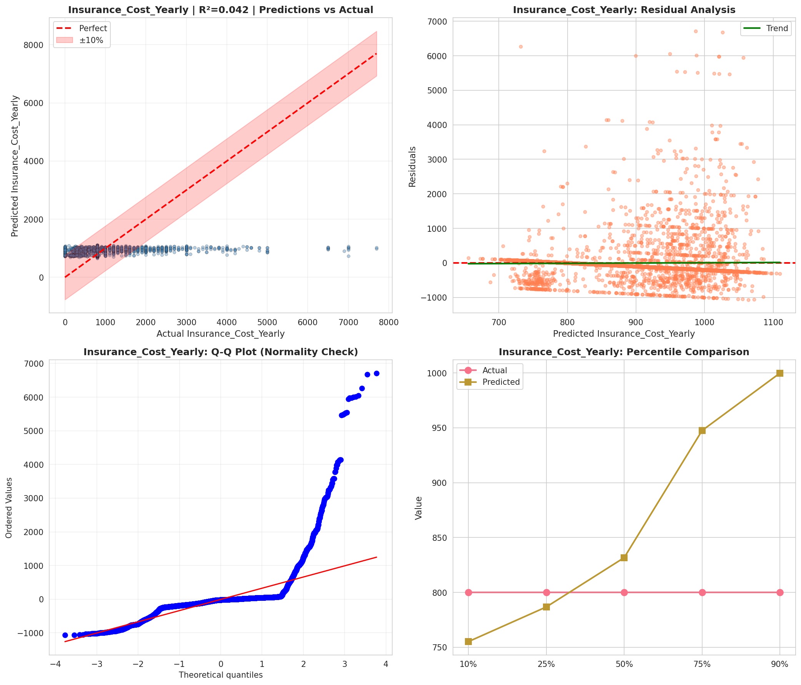
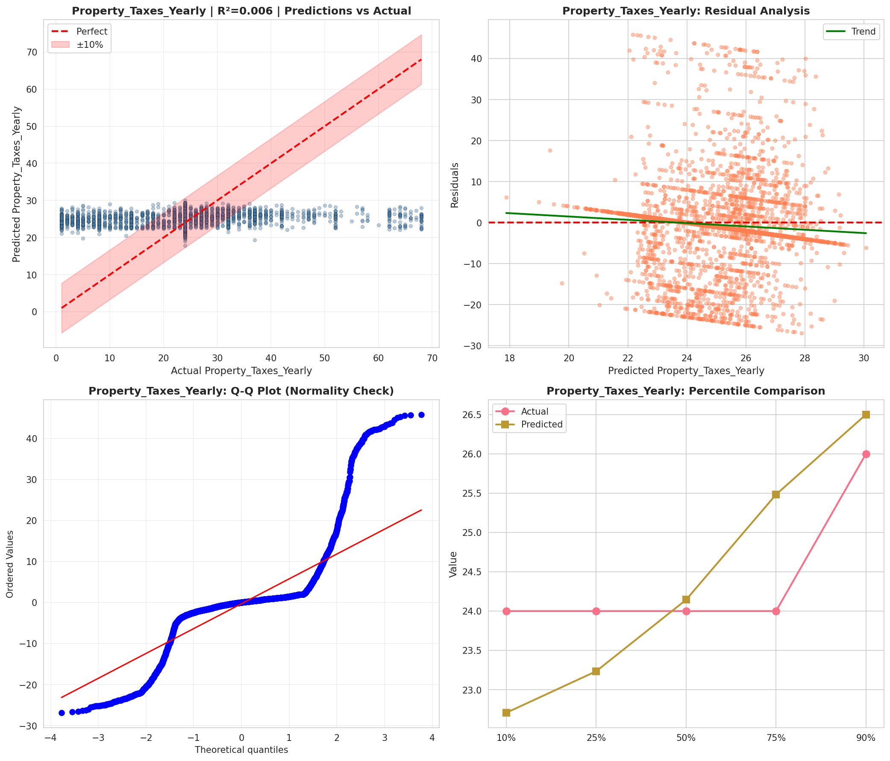
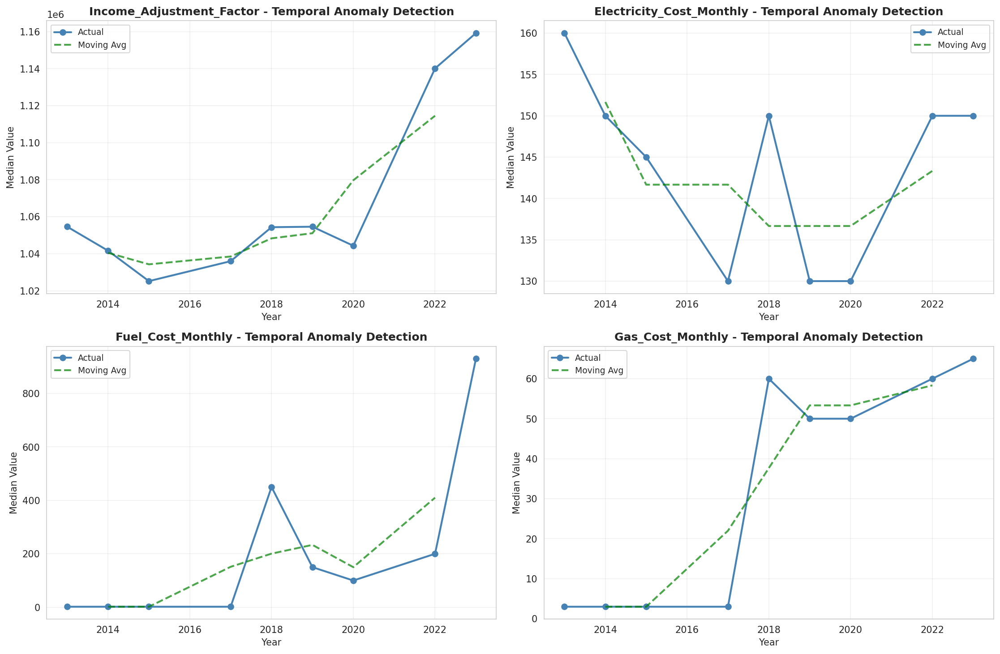
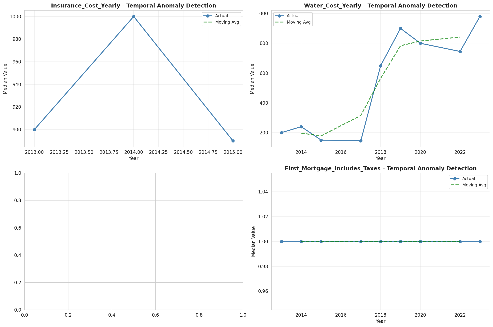
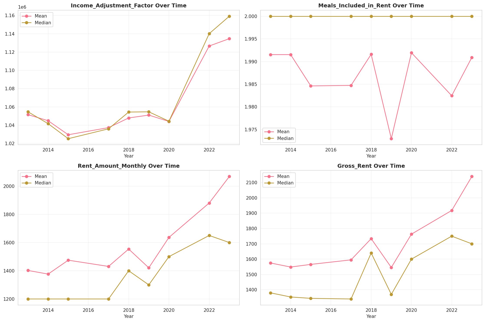
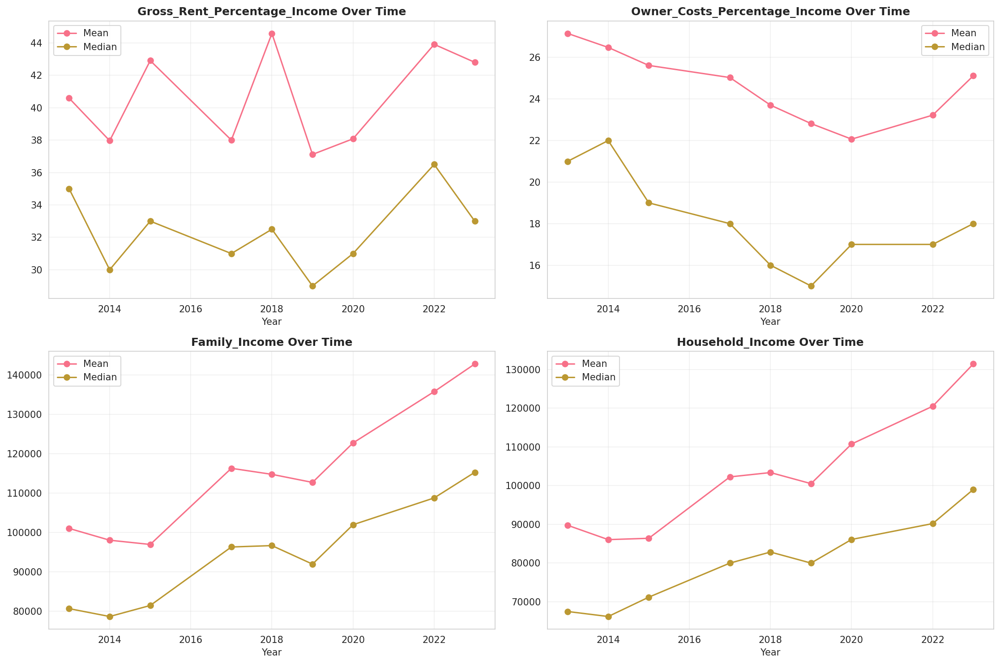
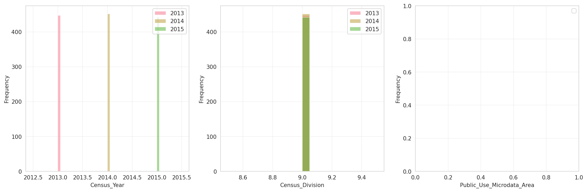
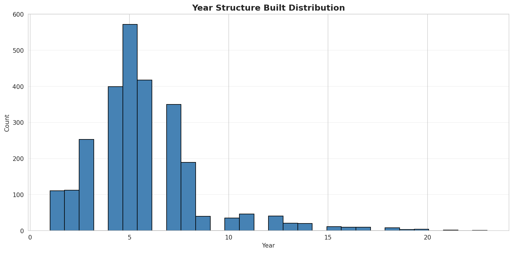
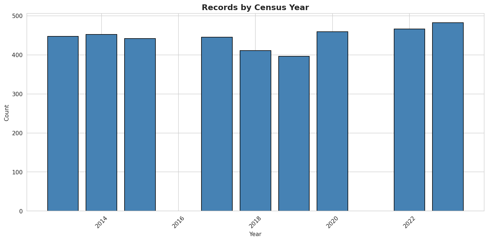
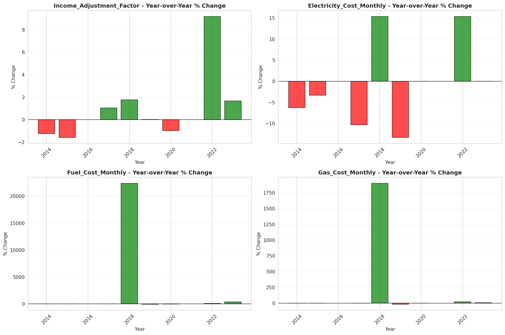
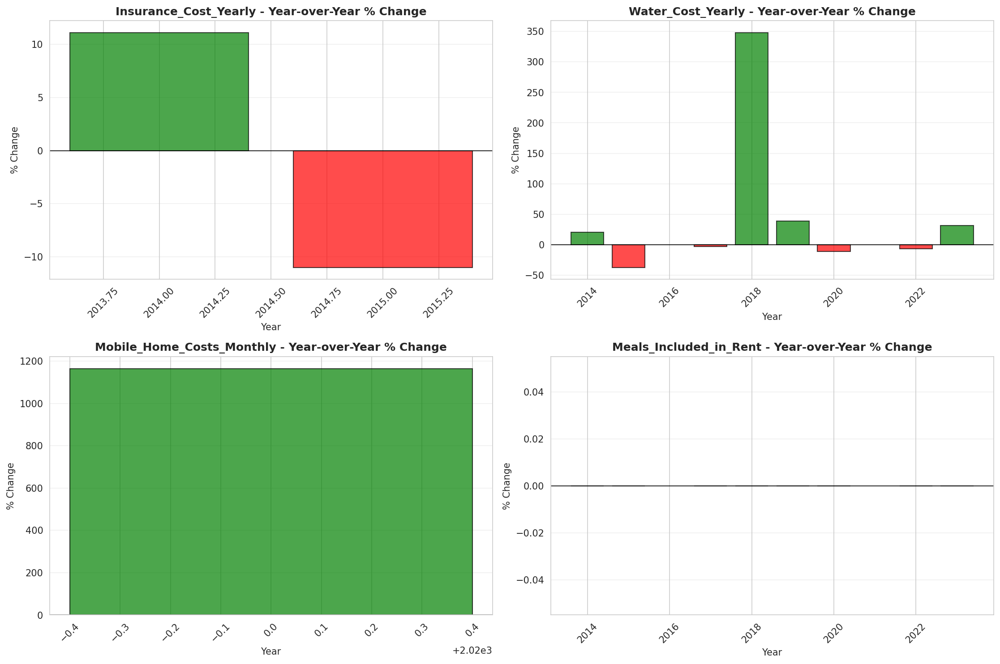
