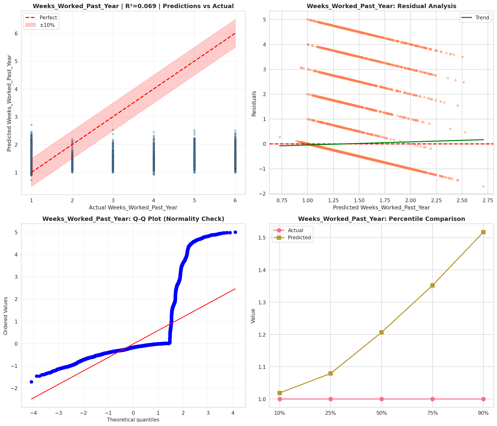
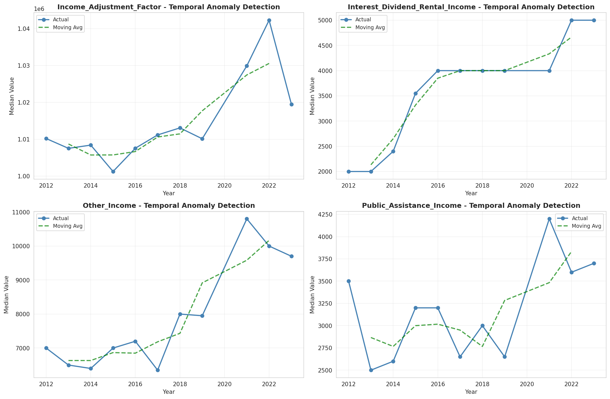
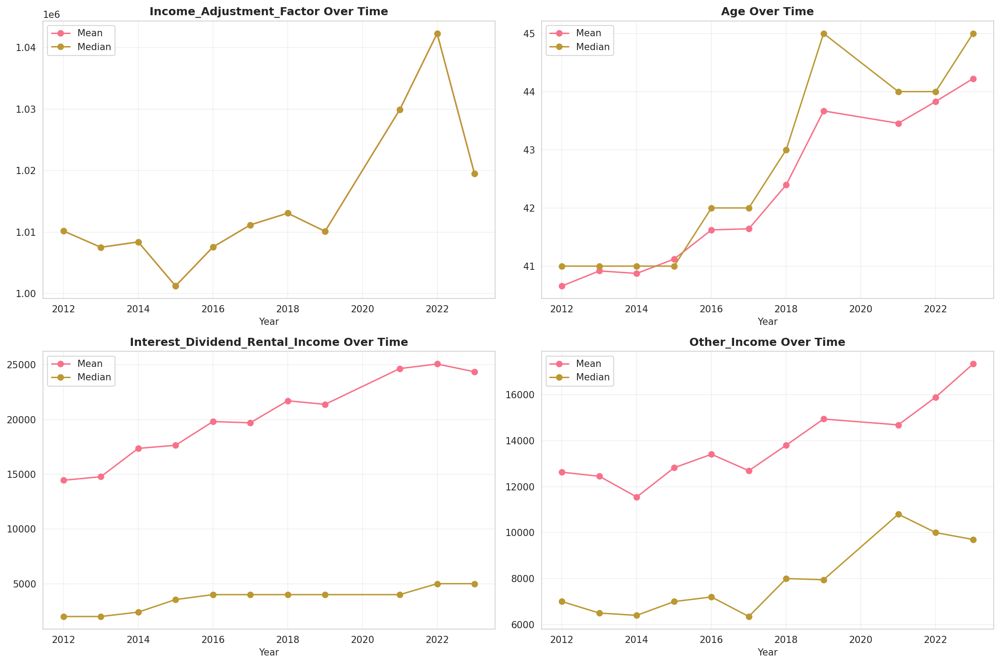
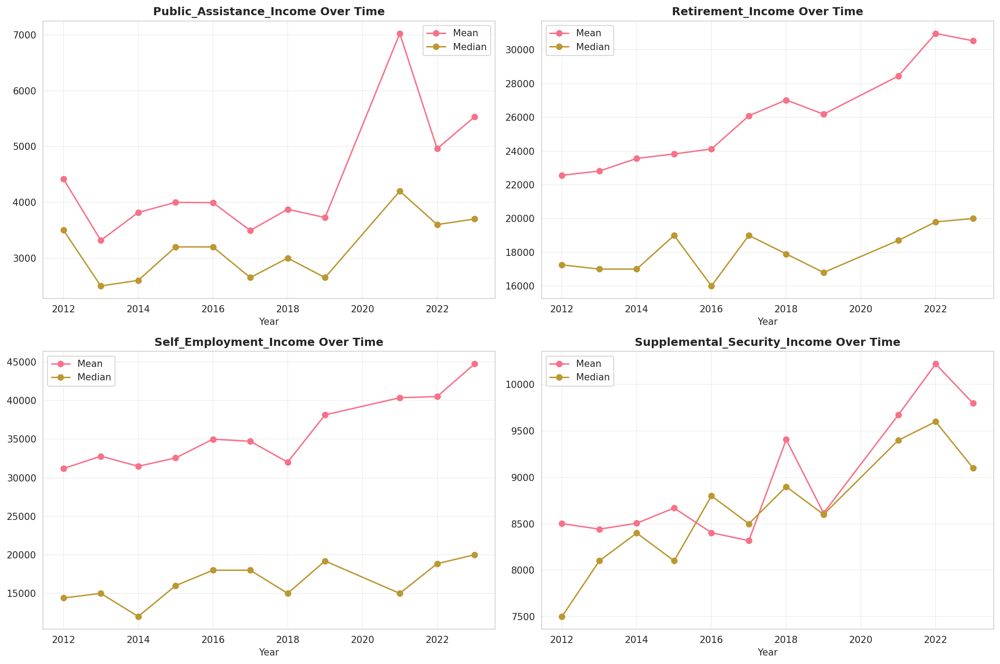
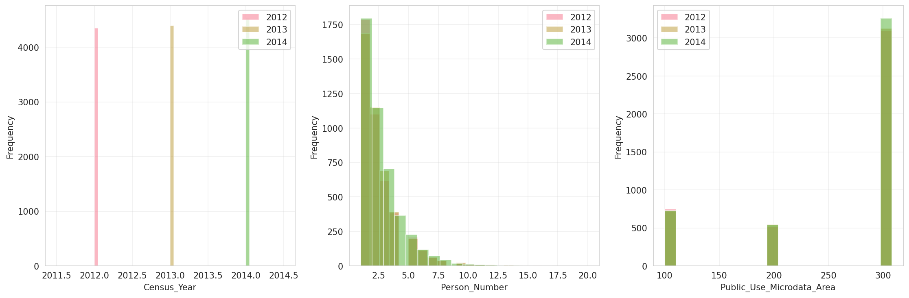
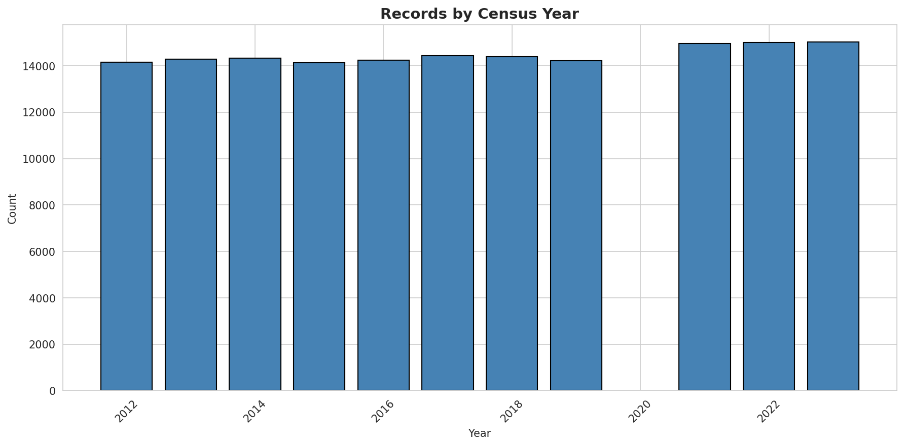
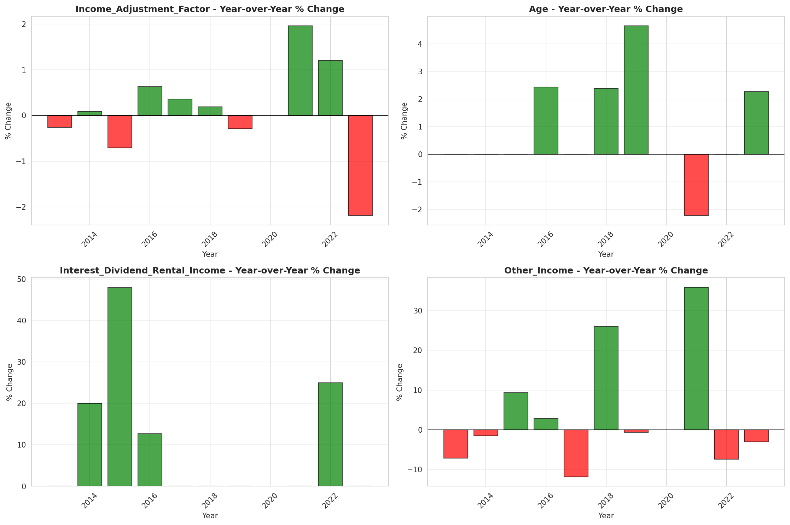
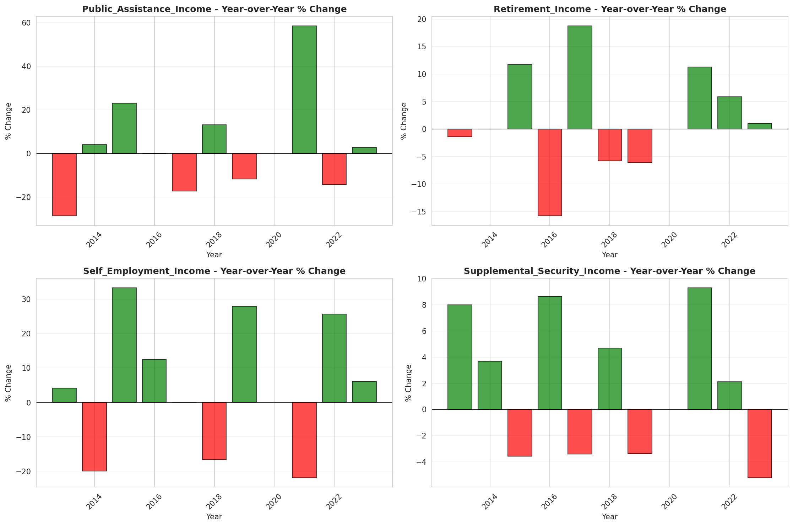

# Temporal Analysis

## Year Distribution

- 2012: 14,154 records

- 2013: 14,286 records

- 2014: 14,322 records

- 2015: 14,124 records

- 2016: 14,247 records

- 2017: 14,433 records

- 2018: 14,400 records

- 2019: 14,228 records

- 2021: 14,959 records

- 2022: 14,995 records

- 2023: 15,019 records

## Temporal Trends

- Census_Year: {np.int64(2012): {'mean': 2012.0, 'median': 2012.0, 'std': 0.0}, np.int64(2013): {'mean': 2013.0, 'median': 2013.0, 'std': 0.0}, np.int64(2014): {'mean': 2014.0, 'median': 2014.0, 'std': 0.0}, np.int64(2015): {'mean': 2015.0, 'median': 2015.0, 'std': 0.0}, np.int64(2016): {'mean': 2016.0, 'median': 2016.0, 'std': 0.0}, np.int64(2017): {'mean': 2017.0, 'median': 2017.0, 'std': 0.0}, np.int64(2018): {'mean': 2018.0, 'median': 2018.0, 'std': 0.0}, np.int64(2019): {'mean': 2019.0, 'median': 2019.0, 'std': 0.0}, np.int64(2021): {'mean': 2021.0, 'median': 2021.0, 'std': 0.0}, np.int64(2022): {'mean': 2022.0, 'median': 2022.0, 'std': 0.0}, np.int64(2023): {'mean': 2023.0, 'median': 2023.0, 'std': 0.0}}

- Person_Number: {np.int64(2012): {'mean': 2.4184682775187225, 'median': 2.0, 'std': 1.7681323822792596}, np.int64(2013): {'mean': 2.464720705585888, 'median': 2.0, 'std': 1.831389648844662}, np.int64(2014): {'mean': 2.4720011171624074, 'median': 2.0, 'std': 1.8811720322893157}, np.int64(2015): {'mean': 2.431180968564146, 'median': 2.0, 'std': 1.7694030687018618}, np.int64(2016): {'mean': 2.4754685196883552, 'median': 2.0, 'std': 1.8944708528802165}, np.int64(2017): {'mean': 2.436014688560937, 'median': 2.0, 'std': 1.8003748909938868}, np.int64(2018): {'mean': 2.433263888888889, 'median': 2.0, 'std': 1.846717752070135}, np.int64(2019): {'mean': 2.37630025302221, 'median': 2.0, 'std': 1.7638244573871427}, np.int64(2021): {'mean': 2.45029747977806, 'median': 2.0, 'std': 1.803318763388499}, np.int64(2022): {'mean': 2.4172724241413803, 'median': 2.0, 'std': 1.8386301024779204}, np.int64(2023): {'mean': 2.4008922032092683, 'median': 2.0, 'std': 1.8327169034343669}}

- Public_Use_Microdata_Area: {np.int64(2012): {'mean': 255.9601526070369, 'median': 303.0, 'std': 79.18129775806918}, np.int64(2013): {'mean': 258.67562648747025, 'median': 303.0, 'std': 77.7499509483038}, np.int64(2014): {'mean': 258.25003491132526, 'median': 303.0, 'std': 78.13758016860587}, np.int64(2015): {'mean': 257.363069951855, 'median': 303.0, 'std': 78.49288900525886}, np.int64(2016): {'mean': 256.914578507756, 'median': 303.0, 'std': 78.82720874872967}, np.int64(2017): {'mean': 256.82581583870297, 'median': 303.0, 'std': 78.44056516304039}, np.int64(2018): {'mean': 257.45256944444446, 'median': 303.0, 'std': 78.06866560985162}, np.int64(2019): {'mean': 256.58490300815293, 'median': 303.0, 'std': 77.95867560490714}, np.int64(2021): {'mean': 257.0798850190521, 'median': 303.0, 'std': 78.29169145929738}, np.int64(2022): {'mean': 259.65641880626873, 'median': 303.0, 'std': 77.03139571423407}, np.int64(2023): {'mean': 259.9735668153672, 'median': 303.0, 'std': 76.58556357963157}}

- State_Code: {np.int64(2012): {'mean': 15.0, 'median': 15.0, 'std': 0.0}, np.int64(2013): {'mean': 15.0, 'median': 15.0, 'std': 0.0}, np.int64(2014): {'mean': 15.0, 'median': 15.0, 'std': 0.0}, np.int64(2015): {'mean': 15.0, 'median': 15.0, 'std': 0.0}, np.int64(2016): {'mean': 15.0, 'median': 15.0, 'std': 0.0}, np.int64(2017): {'mean': 15.0, 'median': 15.0, 'std': 0.0}, np.int64(2018): {'mean': 15.0, 'median': 15.0, 'std': 0.0}, np.int64(2019): {'mean': 15.0, 'median': 15.0, 'std': 0.0}, np.int64(2021): {'mean': 15.0, 'median': 15.0, 'std': 0.0}, np.int64(2022): {'mean': 15.0, 'median': 15.0, 'std': 0.0}, np.int64(2023): {'mean': None, 'median': None, 'std': None}}

- Income_Adjustment_Factor: {np.int64(2012): {'mean': 1010207.0, 'median': 1010207.0, 'std': 0.0}, np.int64(2013): {'mean': 1007549.0, 'median': 1007549.0, 'std': 0.0}, np.int64(2014): {'mean': 1008425.0, 'median': 1008425.0, 'std': 0.0}, np.int64(2015): {'mean': 1001264.0, 'median': 1001264.0, 'std': 0.0}, np.int64(2016): {'mean': 1007588.0, 'median': 1007588.0, 'std': 0.0}, np.int64(2017): {'mean': 1011189.0, 'median': 1011189.0, 'std': 0.0}, np.int64(2018): {'mean': 1013097.0, 'median': 1013097.0, 'std': 0.0}, np.int64(2019): {'mean': 1010145.0, 'median': 1010145.0, 'std': 0.0}, np.int64(2021): {'mean': 1029928.0, 'median': 1029928.0, 'std': 0.0}, np.int64(2022): {'mean': 1042311.0, 'median': 1042311.0, 'std': 0.0}, np.int64(2023): {'mean': 1019518.0, 'median': 1019518.0, 'std': 0.0}}

- Person_Weight: {np.int64(2012): {'mean': 98.36887099053271, 'median': 78.0, 'std': 81.87776600948396}, np.int64(2013): {'mean': 98.28181436371273, 'median': 78.0, 'std': 81.34661506581035}, np.int64(2014): {'mean': 99.11751152073732, 'median': 78.0, 'std': 82.25920362981061}, np.int64(2015): {'mean': 101.35960067969414, 'median': 80.0, 'std': 83.93612199648493}, np.int64(2016): {'mean': 100.27072366112164, 'median': 79.0, 'std': 82.71222997491844}, np.int64(2017): {'mean': 98.90791935148617, 'median': 77.0, 'std': 83.1867125524836}, np.int64(2018): {'mean': 98.64520833333333, 'median': 77.0, 'std': 84.28290322592743}, np.int64(2019): {'mean': 99.51307281416925, 'median': 77.0, 'std': 88.06557609298036}, np.int64(2021): {'mean': 96.36693629253293, 'median': 72.0, 'std': 84.14311203555403}, np.int64(2022): {'mean': 96.04508169389797, 'median': 72.0, 'std': 87.07970937766794}, np.int64(2023): {'mean': 95.55483054797257, 'median': 70.0, 'std': 89.48962789583561}}

- Age: {np.int64(2012): {'mean': 40.6589656634167, 'median': 41.0, 'std': 23.859187983160812}, np.int64(2013): {'mean': 40.917891642167156, 'median': 41.0, 'std': 23.839430026826108}, np.int64(2014): {'mean': 40.87410976120653, 'median': 41.0, 'std': 23.934429694244503}, np.int64(2015): {'mean': 41.12156612857547, 'median': 41.0, 'std': 23.661605529214516}, np.int64(2016): {'mean': 41.62272759177371, 'median': 42.0, 'std': 23.89884204698432}, np.int64(2017): {'mean': 41.64193168433451, 'median': 42.0, 'std': 24.073545249051605}, np.int64(2018): {'mean': 42.39743055555556, 'median': 43.0, 'std': 24.033110978158067}, np.int64(2019): {'mean': 43.66790834973292, 'median': 45.0, 'std': 24.05137285834553}, np.int64(2021): {'mean': 43.455378033291, 'median': 44.0, 'std': 23.97153675641837}, np.int64(2022): {'mean': 43.82987662554185, 'median': 44.0, 'std': 24.193554215486458}, np.int64(2023): {'mean': 44.223117384646116, 'median': 45.0, 'std': 24.218062229057754}}

- Citizenship_Status: {np.int64(2012): {'mean': 1.6440582167585136, 'median': 1.0, 'std': 1.3254106678936655}, np.int64(2013): {'mean': 1.5911381772364552, 'median': 1.0, 'std': 1.278256767455134}, np.int64(2014): {'mean': 1.5932830610249966, 'median': 1.0, 'std': 1.2712511364348016}, np.int64(2015): {'mean': 1.6019541206457095, 'median': 1.0, 'std': 1.2817430553545985}, np.int64(2016): {'mean': 1.605671369411104, 'median': 1.0, 'std': 1.2868371549480289}, np.int64(2017): {'mean': 1.588166008452851, 'median': 1.0, 'std': 1.2634547155863103}, np.int64(2018): {'mean': 1.6147222222222222, 'median': 1.0, 'std': 1.2950267045470087}, np.int64(2019): {'mean': 1.6319932527410739, 'median': 1.0, 'std': 1.3006347880924751}, np.int64(2021): {'mean': 1.6320609666421553, 'median': 1.0, 'std': 1.2986067276531115}, np.int64(2022): {'mean': 1.6092697565855285, 'median': 1.0, 'std': 1.2794147859340832}, np.int64(2023): {'mean': 1.6274052866369266, 'median': 1.0, 'std': 1.293801360043441}}

- Class_of_Worker: {np.int64(2012): {'mean': 2.577717133364974, 'median': 1.0, 'std': 2.0765604713565278}, np.int64(2013): {'mean': 2.5385250737463125, 'median': 1.0, 'std': 2.0209012740203343}, np.int64(2014): {'mean': 2.551336146272855, 'median': 1.0, 'std': 2.045047560576146}, np.int64(2015): {'mean': 2.5966406158870874, 'median': 1.0, 'std': 2.0620106498127955}, np.int64(2016): {'mean': 2.592266728409354, 'median': 1.0, 'std': 2.0695324080099295}, np.int64(2017): {'mean': 2.555477610195253, 'median': 1.0, 'std': 2.054619184816681}, np.int64(2018): {'mean': 2.5763738146921056, 'median': 1.0, 'std': 2.046231936989087}, np.int64(2019): {'mean': 2.620188983636783, 'median': 1.0, 'std': 2.0806639531384983}, np.int64(2021): {'mean': 2.6094783646025377, 'median': 1.0, 'std': 2.0501502931768694}, np.int64(2022): {'mean': 2.659632926695241, 'median': 1.0, 'std': 2.06438684082586}, np.int64(2023): {'mean': 2.6390904168922575, 'median': 1.0, 'std': 2.0603859886677127}}

- English_Speaking_Ability: {np.int64(2012): {'mean': 1.7118644067796611, 'median': 2.0, 'std': 0.8064156319776026}, np.int64(2013): {'mean': 1.6940954773869348, 'median': 1.0, 'std': 0.8134220030237084}, np.int64(2014): {'mean': 1.708043065231159, 'median': 1.0, 'std': 0.8261668697016912}, np.int64(2015): {'mean': 1.6542553191489362, 'median': 1.0, 'std': 0.8089778182240733}, np.int64(2016): {'mean': 1.6260554885404102, 'median': 1.0, 'std': 0.8012638594655966}, np.int64(2017): {'mean': 1.6213978138456442, 'median': 1.0, 'std': 0.8222102663407145}, np.int64(2018): {'mean': 1.6340665873959572, 'median': 1.0, 'std': 0.812212751498904}, np.int64(2019): {'mean': 1.5740352976368532, 'median': 1.0, 'std': 0.781562342965049}, np.int64(2021): {'mean': 1.6415584415584417, 'median': 1.0, 'std': 0.8139260596669465}, np.int64(2022): {'mean': 1.58984375, 'median': 1.0, 'std': 0.8096830430621753}, np.int64(2023): {'mean': 1.606453558504222, 'median': 1.0, 'std': 0.785890257854141}}

- Fertility_Status: {np.int64(2012): {'mean': 1.9387422613229064, 'median': 2.0, 'std': 0.2398415553750336}, np.int64(2013): {'mean': 1.9436258808456117, 'median': 2.0, 'std': 0.2306796965619309}, np.int64(2014): {'mean': 1.9386701097482246, 'median': 2.0, 'std': 0.2399731720368697}, np.int64(2015): {'mean': 1.9434881455017863, 'median': 2.0, 'std': 0.23094498732948449}, np.int64(2016): {'mean': 1.9377496671105192, 'median': 2.0, 'std': 0.24164988705833695}, np.int64(2017): {'mean': 1.9413528823725426, 'median': 2.0, 'std': 0.23500220374680697}, np.int64(2018): {'mean': 1.94119612429001, 'median': 2.0, 'std': 0.2352965743469555}, np.int64(2019): {'mean': 1.9376750700280112, 'median': 2.0, 'std': 0.24178710183693874}, np.int64(2021): {'mean': 1.9485562562230334, 'median': 2.0, 'std': 0.22093774227372898}, np.int64(2022): {'mean': 1.9491356382978724, 'median': 2.0, 'std': 0.21975721453927305}, np.int64(2023): {'mean': 1.9436528497409327, 'median': 2.0, 'std': 0.2306282147847166}}

- Marital_Status: {np.int64(2012): {'mean': 2.970397060901512, 'median': 3.0, 'std': 1.8726236052277896}, np.int64(2013): {'mean': 2.9531009379812403, 'median': 3.0, 'std': 1.8723449783031956}, np.int64(2014): {'mean': 2.975981008239073, 'median': 3.0, 'std': 1.8671343635559325}, np.int64(2015): {'mean': 2.938756726139904, 'median': 3.0, 'std': 1.8764882845626527}, np.int64(2016): {'mean': 2.9394258440373413, 'median': 3.0, 'std': 1.87692948134205}, np.int64(2017): {'mean': 2.958290029792836, 'median': 3.0, 'std': 1.8690294926281084}, np.int64(2018): {'mean': 2.948611111111111, 'median': 3.0, 'std': 1.8712643128739157}, np.int64(2019): {'mean': 2.913410177115547, 'median': 3.0, 'std': 1.8640691327069798}, np.int64(2021): {'mean': 2.942108429707868, 'median': 3.0, 'std': 1.871630160713452}, np.int64(2022): {'mean': 2.9535845281760587, 'median': 3.0, 'std': 1.866486850933215}, np.int64(2023): {'mean': 2.939010586590319, 'median': 3.0, 'std': 1.866109163579474}}

- Mobility_Status: {np.int64(2012): {'mean': 1.2516248839368616, 'median': 1.0, 'std': 0.6517298703061862}, np.int64(2013): {'mean': 1.26335526781292, 'median': 1.0, 'std': 0.6687280920171907}, np.int64(2014): {'mean': 1.2613636363636365, 'median': 1.0, 'std': 0.6680800415711812}, np.int64(2015): {'mean': 1.2463716308000286, 'median': 1.0, 'std': 0.6499955097944723}, np.int64(2016): {'mean': 1.24103401747035, 'median': 1.0, 'std': 0.6432522648125537}, np.int64(2017): {'mean': 1.2393084622383985, 'median': 1.0, 'std': 0.6411615116106114}, np.int64(2018): {'mean': 1.2352116624614522, 'median': 1.0, 'std': 0.6381830536167147}, np.int64(2019): {'mean': 1.237862010221465, 'median': 1.0, 'std': 0.6408805924833518}, np.int64(2021): {'mean': 1.2332929129614658, 'median': 1.0, 'std': 0.6361680108951303}, np.int64(2022): {'mean': 1.2204666173603174, 'median': 1.0, 'std': 0.619310573500409}, np.int64(2023): {'mean': 1.2115371701027466, 'median': 1.0, 'std': 0.6077437334483651}}

- Military_Service: {np.int64(2012): {'mean': 4.592007026789635, 'median': 5.0, 'std': 0.9907279491570088}, np.int64(2013): {'mean': 3.6528344474346732, 'median': 4.0, 'std': 0.8229583046445752}, np.int64(2014): {'mean': 3.650716456795484, 'median': 4.0, 'std': 0.8241818988758216}, np.int64(2015): {'mean': 3.6613890832750173, 'median': 4.0, 'std': 0.8146500618302951}, np.int64(2016): {'mean': 3.6692913385826773, 'median': 4.0, 'std': 0.8057228402269146}, np.int64(2017): {'mean': 3.6672400447234885, 'median': 4.0, 'std': 0.8108349223963736}, np.int64(2018): {'mean': 3.6737298953280573, 'median': 4.0, 'std': 0.8063091861799095}, np.int64(2019): {'mean': 3.677517544601336, 'median': 4.0, 'std': 0.807857777496375}, np.int64(2021): {'mean': 3.702632854143111, 'median': 4.0, 'std': 0.7805431252573256}, np.int64(2022): {'mean': 3.6858474644378365, 'median': 4.0, 'std': 0.8036135305712817}, np.int64(2023): {'mean': 3.7083400032015366, 'median': 4.0, 'std': 0.7763200206661046}}

- Travel_Time_To_Work_Minutes: {np.int64(2012): {'mean': 25.680333119795, 'median': 20.0, 'std': 20.615166613223558}, np.int64(2013): {'mean': 26.665565518326254, 'median': 20.0, 'std': 20.810356925428835}, np.int64(2014): {'mean': 27.744846970643348, 'median': 20.0, 'std': 22.117602982639074}, np.int64(2015): {'mean': 27.91873937895875, 'median': 20.0, 'std': 21.63231933804938}, np.int64(2016): {'mean': 27.21907645722937, 'median': 20.0, 'std': 21.235084894139124}, np.int64(2017): {'mean': 27.239250614250615, 'median': 20.0, 'std': 22.48340485134684}, np.int64(2018): {'mean': 27.314556106354214, 'median': 20.0, 'std': 21.561633620809722}, np.int64(2019): {'mean': 27.902862362971984, 'median': 20.0, 'std': 22.828756607520383}, np.int64(2021): {'mean': 25.09779077322937, 'median': 20.0, 'std': 20.383357326067046}, np.int64(2022): {'mean': 25.850417257124864, 'median': 20.0, 'std': 20.283020696287494}, np.int64(2023): {'mean': 26.697099892588614, 'median': 20.0, 'std': 20.860869739988622}}

- Vehicle_Occupancy: {np.int64(2012): {'mean': 1.293782087849401, 'median': 1.0, 'std': 0.781965157938557}, np.int64(2013): {'mean': 1.2600954478707782, 'median': 1.0, 'std': 0.6842727926075792}, np.int64(2014): {'mean': 1.2694021537318976, 'median': 1.0, 'std': 0.701252027265992}, np.int64(2015): {'mean': 1.2555273649873142, 'median': 1.0, 'std': 0.7039218466360097}, np.int64(2016): {'mean': 1.2807235325412307, 'median': 1.0, 'std': 0.7508555659229562}, np.int64(2017): {'mean': 1.2400072020165647, 'median': 1.0, 'std': 0.6534440197355337}, np.int64(2018): {'mean': 1.270995670995671, 'median': 1.0, 'std': 0.7213998168048977}, np.int64(2019): {'mean': 1.2756511099458137, 'median': 1.0, 'std': 0.7416549958032401}, np.int64(2021): {'mean': 1.27156432748538, 'median': 1.0, 'std': 0.7459701531892737}, np.int64(2022): {'mean': 1.2923354373309288, 'median': 1.0, 'std': 0.7493532873231188}, np.int64(2023): {'mean': 1.3050342045255219, 'median': 1.0, 'std': 0.8392295462422571}}

- Transportation_To_Work: {np.int64(2012): {'mean': 2.33363802559415, 'median': 1.0, 'std': 3.2116496369964747}, np.int64(2013): {'mean': 2.2372601918465227, 'median': 1.0, 'std': 3.1184437653995576}, np.int64(2014): {'mean': 2.3004904146232725, 'median': 1.0, 'std': 3.178414685662597}, np.int64(2015): {'mean': 2.324901301359848, 'median': 1.0, 'std': 3.222019274520018}, np.int64(2016): {'mean': 2.369120800571837, 'median': 1.0, 'std': 3.2738627066740156}, np.int64(2017): {'mean': 2.2974433893352812, 'median': 1.0, 'std': 3.1816339287161757}, np.int64(2018): {'mean': 2.1996013667425967, 'median': 1.0, 'std': 3.094555232888215}, np.int64(2019): {'mean': None, 'median': None, 'std': None}, np.int64(2021): {'mean': None, 'median': None, 'std': None}, np.int64(2022): {'mean': None, 'median': None, 'std': None}, np.int64(2023): {'mean': None, 'median': None, 'std': None}}

- Language_Other_Than_English: {np.int64(2012): {'mean': 1.756783090990856, 'median': 2.0, 'std': 0.4290410713805436}, np.int64(2013): {'mean': 1.7636053159106095, 'median': 2.0, 'std': 0.4248830903562758}, np.int64(2014): {'mean': 1.7662645252016875, 'median': 2.0, 'std': 0.4232215255666414}, np.int64(2015): {'mean': 1.7606351108448173, 'median': 2.0, 'std': 0.426711818592051}, np.int64(2016): {'mean': 1.754315773875676, 'median': 2.0, 'std': 0.4305080938755885}, np.int64(2017): {'mean': 1.7794257324468474, 'median': 2.0, 'std': 0.41464903458290825}, np.int64(2018): {'mean': 1.754183412495433, 'median': 2.0, 'std': 0.4305860434446439}, np.int64(2019): {'mean': 1.7535387791212032, 'median': 2.0, 'std': 0.4309661013078128}, np.int64(2021): {'mean': 1.7578616352201257, 'median': 2.0, 'std': 0.42839257894352084}, np.int64(2022): {'mean': 1.7682289853053834, 'median': 2.0, 'std': 0.42197821320289436}, np.int64(2023): {'mean': 1.7693538290324824, 'median': 2.0, 'std': 0.421261033293345}}

- Grandparents_Living_With_Grandchildren: {np.int64(2012): {'mean': 1.9293667753908448, 'median': 2.0, 'std': 0.2562255963732611}, np.int64(2013): {'mean': 1.9303596807696513, 'median': 2.0, 'std': 0.2545537844907951}, np.int64(2014): {'mean': 1.9317260273972603, 'median': 2.0, 'std': 0.25222927918811483}, np.int64(2015): {'mean': 1.9393538427610542, 'median': 2.0, 'std': 0.23869328265510378}, np.int64(2016): {'mean': 1.9356763206421521, 'median': 2.0, 'std': 0.24534195081423268}, np.int64(2017): {'mean': 1.9344104429702547, 'median': 2.0, 'std': 0.24757650406595114}, np.int64(2018): {'mean': 1.9372503678789152, 'median': 2.0, 'std': 0.24252484012737605}, np.int64(2019): {'mean': 1.9432323441216006, 'median': 2.0, 'std': 0.23141008267193014}, np.int64(2021): {'mean': 1.9416080103103004, 'median': 2.0, 'std': 0.23449481142372583}, np.int64(2022): {'mean': 1.9427252185872876, 'median': 2.0, 'std': 0.23237832479764997}, np.int64(2023): {'mean': 1.9444875776397517, 'median': 2.0, 'std': 0.22898882551345176}}

- Months_Responsible_For_Grandchildren: {np.int64(2012): {'mean': 3.75, 'median': 4.0, 'std': 1.3498109233503086}, np.int64(2013): {'mean': 4.069444444444445, 'median': 5.0, 'std': 1.260773310135228}, np.int64(2014): {'mean': 3.891891891891892, 'median': 4.0, 'std': 1.2073197116722296}, np.int64(2015): {'mean': 3.675213675213675, 'median': 4.0, 'std': 1.4070577018598422}, np.int64(2016): {'mean': 3.9185185185185185, 'median': 5.0, 'std': 1.3441517985295879}, np.int64(2017): {'mean': 4.015037593984962, 'median': 5.0, 'std': 1.3979691027388086}, np.int64(2018): {'mean': 4.014814814814815, 'median': 5.0, 'std': 1.2928343569095573}, np.int64(2019): {'mean': 3.9313725490196076, 'median': 4.0, 'std': 1.2044455930284752}, np.int64(2021): {'mean': 3.8365384615384617, 'median': 4.0, 'std': 1.3300892511339515}, np.int64(2022): {'mean': 3.9326923076923075, 'median': 4.5, 'std': 1.3742741990989955}, np.int64(2023): {'mean': 3.933333333333333, 'median': 5.0, 'std': 1.442931489035873}}

- Grandparents_Responsible_For_Grandchildren: {np.int64(2012): {'mean': 1.694267515923567, 'median': 2.0, 'std': 0.46108422784042147}, np.int64(2013): {'mean': 1.7739403453689169, 'median': 2.0, 'std': 0.41860694727864156}, np.int64(2014): {'mean': 1.7624398073836276, 'median': 2.0, 'std': 0.4259302123685557}, np.int64(2015): {'mean': 1.7872727272727273, 'median': 2.0, 'std': 0.4096088789089819}, np.int64(2016): {'mean': 1.7723440134907251, 'median': 2.0, 'std': 0.4196733805230867}, np.int64(2017): {'mean': 1.7830342577487766, 'median': 2.0, 'std': 0.41251570831763806}, np.int64(2018): {'mean': 1.7738693467336684, 'median': 2.0, 'std': 0.4186755279045853}, np.int64(2019): {'mean': 1.814207650273224, 'median': 2.0, 'std': 0.3892937183393108}, np.int64(2021): {'mean': 1.8234295415959254, 'median': 2.0, 'std': 0.38162887625786}, np.int64(2022): {'mean': 1.8216123499142367, 'median': 2.0, 'std': 0.3831674922699484}, np.int64(2023): {'mean': 1.8164335664335665, 'median': 2.0, 'std': 0.3874690529996455}}

- Interest_Dividend_Rental_Income: {np.int64(2012): {'mean': 14452.720844327177, 'median': 2000.0, 'std': 34650.30580095883}, np.int64(2013): {'mean': 14773.772330097087, 'median': 2000.0, 'std': 42514.414200402825}, np.int64(2014): {'mean': 17365.454875518673, 'median': 2400.0, 'std': 45882.88219129909}, np.int64(2015): {'mean': 17649.738636363636, 'median': 3550.0, 'std': 42486.27427796667}, np.int64(2016): {'mean': 19817.46304347826, 'median': 4000.0, 'std': 48021.33420469556}, np.int64(2017): {'mean': 19702.36800836383, 'median': 4000.0, 'std': 46164.61163094567}, np.int64(2018): {'mean': 21717.775342465753, 'median': 4000.0, 'std': 53289.64975317179}, np.int64(2019): {'mean': 21389.2004048583, 'median': 4000.0, 'std': 53219.64121074879}, np.int64(2021): {'mean': 24659.559357179885, 'median': 4000.0, 'std': 64051.12575546389}, np.int64(2022): {'mean': 25080.026343519494, 'median': 5000.0, 'std': 57834.51163679953}, np.int64(2023): {'mean': 24367.174020823004, 'median': 5000.0, 'std': 59565.57674348242}}

- Military_Service_Period_1: {np.int64(2012): {'mean': 0.4195064629847238, 'median': 0.0, 'std': 0.49362329139626454}, np.int64(2013): {'mean': 0.45426642111724985, 'median': 0.0, 'std': 0.4980569422003646}, np.int64(2014): {'mean': 0.4586374695863747, 'median': 0.0, 'std': 0.49843782005143056}, np.int64(2015): {'mean': 0.4682190056639396, 'median': 0.0, 'std': 0.4991460338312212}, np.int64(2016): {'mean': 0.46474358974358976, 'median': 0.0, 'std': 0.49891537100515015}, np.int64(2017): {'mean': 0.4678548695098663, 'median': 0.0, 'std': 0.4991245015982481}, np.int64(2018): {'mean': 0.5025773195876289, 'median': 1.0, 'std': 0.5001545155973028}, np.int64(2019): {'mean': 0.48865845755022685, 'median': 0.0, 'std': 0.5000334119881323}, np.int64(2021): {'mean': 0.537568306010929, 'median': 1.0, 'std': 0.4987569943555592}, np.int64(2022): {'mean': 0.5374759769378603, 'median': 1.0, 'std': 0.4987533531467098}, np.int64(2023): {'mean': 0.5757363253856943, 'median': 1.0, 'std': 0.49440410835341286}}

- Military_Service_Period_2: {np.int64(2012): {'mean': 0.18801410105757932, 'median': 0.0, 'std': 0.39083826436240143}, np.int64(2013): {'mean': 0.2019643953345611, 'median': 0.0, 'std': 0.4015890686489244}, np.int64(2014): {'mean': 0.18126520681265207, 'median': 0.0, 'std': 0.3853549780938481}, np.int64(2015): {'mean': 0.20516047828823158, 'median': 0.0, 'std': 0.4039459680914054}, np.int64(2016): {'mean': 0.1737179487179487, 'median': 0.0, 'std': 0.37898825162115596}, np.int64(2017): {'mean': 0.17950350095480586, 'median': 0.0, 'std': 0.38389556429724303}, np.int64(2018): {'mean': 0.17332474226804123, 'median': 0.0, 'std': 0.3786497817352946}, np.int64(2019): {'mean': 0.17239144523655217, 'median': 0.0, 'std': 0.3778427705439393}, np.int64(2021): {'mean': 0.16598360655737704, 'median': 0.0, 'std': 0.3721930569450641}, np.int64(2022): {'mean': 0.15054452274183217, 'median': 0.0, 'std': 0.35771894600448173}, np.int64(2023): {'mean': 0.1718092566619916, 'median': 0.0, 'std': 0.37734690830253564}}

- Military_Service_Period_3: {np.int64(2012): {'mean': 0.13513513513513514, 'median': 0.0, 'std': 0.34196833064563414}, np.int64(2013): {'mean': None, 'median': None, 'std': None}, np.int64(2014): {'mean': None, 'median': None, 'std': None}, np.int64(2015): {'mean': None, 'median': None, 'std': None}, np.int64(2016): {'mean': None, 'median': None, 'std': None}, np.int64(2017): {'mean': None, 'median': None, 'std': None}, np.int64(2018): {'mean': None, 'median': None, 'std': None}, np.int64(2019): {'mean': None, 'median': None, 'std': None}, np.int64(2021): {'mean': None, 'median': None, 'std': None}, np.int64(2022): {'mean': None, 'median': None, 'std': None}, np.int64(2023): {'mean': None, 'median': None, 'std': None}}

- Military_Service_Period_4: {np.int64(2012): {'mean': 0.10340775558166862, 'median': 0.0, 'std': 0.30458019896246635}, np.int64(2013): {'mean': None, 'median': None, 'std': None}, np.int64(2014): {'mean': None, 'median': None, 'std': None}, np.int64(2015): {'mean': None, 'median': None, 'std': None}, np.int64(2016): {'mean': None, 'median': None, 'std': None}, np.int64(2017): {'mean': None, 'median': None, 'std': None}, np.int64(2018): {'mean': None, 'median': None, 'std': None}, np.int64(2019): {'mean': None, 'median': None, 'std': None}, np.int64(2021): {'mean': None, 'median': None, 'std': None}, np.int64(2022): {'mean': None, 'median': None, 'std': None}, np.int64(2023): {'mean': None, 'median': None, 'std': None}}

- Military_Service_Period_5: {np.int64(2012): {'mean': 0.26321974148061106, 'median': 0.0, 'std': 0.44051006978882307}, np.int64(2013): {'mean': 0.2596685082872928, 'median': 0.0, 'std': 0.43858734375801856}, np.int64(2014): {'mean': 0.25121654501216545, 'median': 0.0, 'std': 0.43384476757871876}, np.int64(2015): {'mean': 0.2599118942731278, 'median': 0.0, 'std': 0.43872409728930606}, np.int64(2016): {'mean': 0.2641025641025641, 'median': 0.0, 'std': 0.4409955379841894}, np.int64(2017): {'mean': 0.25334182049649906, 'median': 0.0, 'std': 0.43506347398561124}, np.int64(2018): {'mean': 0.2609536082474227, 'median': 0.0, 'std': 0.43929621683432196}, np.int64(2019): {'mean': 0.26830848995463386, 'median': 0.0, 'std': 0.44322269653993734}, np.int64(2021): {'mean': 0.23770491803278687, 'median': 0.0, 'std': 0.4258229044448201}, np.int64(2022): {'mean': 0.23062139654067906, 'median': 0.0, 'std': 0.4213655283606059}, np.int64(2023): {'mean': 0.2370266479663394, 'median': 0.0, 'std': 0.42540795115209445}}

- Military_Service_Period_6: {np.int64(2012): {'mean': 0.07109283196239718, 'median': 0.0, 'std': 0.257055372688822}, np.int64(2013): {'mean': None, 'median': None, 'std': None}, np.int64(2014): {'mean': None, 'median': None, 'std': None}, np.int64(2015): {'mean': None, 'median': None, 'std': None}, np.int64(2016): {'mean': None, 'median': None, 'std': None}, np.int64(2017): {'mean': None, 'median': None, 'std': None}, np.int64(2018): {'mean': None, 'median': None, 'std': None}, np.int64(2019): {'mean': None, 'median': None, 'std': None}, np.int64(2021): {'mean': None, 'median': None, 'std': None}, np.int64(2022): {'mean': None, 'median': None, 'std': None}, np.int64(2023): {'mean': None, 'median': None, 'std': None}}

- Military_Service_Period_7: {np.int64(2012): {'mean': 0.08284371327849589, 'median': 0.0, 'std': 0.2757268587986702}, np.int64(2013): {'mean': None, 'median': None, 'std': None}, np.int64(2014): {'mean': None, 'median': None, 'std': None}, np.int64(2015): {'mean': None, 'median': None, 'std': None}, np.int64(2016): {'mean': None, 'median': None, 'std': None}, np.int64(2017): {'mean': None, 'median': None, 'std': None}, np.int64(2018): {'mean': None, 'median': None, 'std': None}, np.int64(2019): {'mean': None, 'median': None, 'std': None}, np.int64(2021): {'mean': None, 'median': None, 'std': None}, np.int64(2022): {'mean': None, 'median': None, 'std': None}, np.int64(2023): {'mean': None, 'median': None, 'std': None}}

- Military_Service_Period_8: {np.int64(2012): {'mean': 0.07403055229142186, 'median': 0.0, 'std': 0.26189755527666675}, np.int64(2013): {'mean': 0.08594229588704727, 'median': 0.0, 'std': 0.28036488879612614}, np.int64(2014): {'mean': 0.06630170316301703, 'median': 0.0, 'std': 0.24888444271969845}, np.int64(2015): {'mean': 0.05852737570799245, 'median': 0.0, 'std': 0.23481188416273438}, np.int64(2016): {'mean': 0.05897435897435897, 'median': 0.0, 'std': 0.23565224671512275}, np.int64(2017): {'mean': 0.052196053469127944, 'median': 0.0, 'std': 0.22249300227388755}, np.int64(2018): {'mean': 0.05219072164948454, 'median': 0.0, 'std': 0.2224831313687485}, np.int64(2019): {'mean': 0.05184705119896306, 'median': 0.0, 'std': 0.22179002336531237}, np.int64(2021): {'mean': 0.03483606557377049, 'median': 0.0, 'std': 0.18342708634574373}, np.int64(2022): {'mean': 0.03971812940422806, 'median': 0.0, 'std': 0.19535876919955575}, np.int64(2023): {'mean': 0.033660589060308554, 'median': 0.0, 'std': 0.18041723908199167}}

- Military_Service_Period_9: {np.int64(2012): {'mean': 0.020564042303172738, 'median': 0.0, 'std': 0.14196127375024042}, np.int64(2013): {'mean': 0.019643953345610803, 'median': 0.0, 'std': 0.13881605715095216}, np.int64(2014): {'mean': 0.010948905109489052, 'median': 0.0, 'std': 0.10409427263140723}, np.int64(2015): {'mean': 0.01762114537444934, 'median': 0.0, 'std': 0.13161132746586485}, np.int64(2016): {'mean': 0.010897435897435897, 'median': 0.0, 'std': 0.10385372228115268}, np.int64(2017): {'mean': 0.009548058561425843, 'median': 0.0, 'std': 0.09727752380662329}, np.int64(2018): {'mean': 0.010309278350515464, 'median': 0.0, 'std': 0.10104244387936182}, np.int64(2019): {'mean': 0.009721322099805573, 'median': 0.0, 'std': 0.09814815876555223}, np.int64(2021): {'mean': None, 'median': None, 'std': None}, np.int64(2022): {'mean': None, 'median': None, 'std': None}, np.int64(2023): {'mean': None, 'median': None, 'std': None}}

- Military_Service_Period_10: {np.int64(2012): {'mean': 0.0499412455934195, 'median': 0.0, 'std': 0.21788761149530095}, np.int64(2013): {'mean': 0.04788213627992634, 'median': 0.0, 'std': 0.21358239778845278}, np.int64(2014): {'mean': 0.04318734793187348, 'median': 0.0, 'std': 0.2033404813791905}, np.int64(2015): {'mean': 0.04405286343612335, 'median': 0.0, 'std': 0.20527719718051188}, np.int64(2016): {'mean': 0.029487179487179487, 'median': 0.0, 'std': 0.16922187261213917}, np.int64(2017): {'mean': 0.02864417568427753, 'median': 0.0, 'std': 0.16685745106887567}, np.int64(2018): {'mean': 0.01610824742268041, 'median': 0.0, 'std': 0.12593248274046162}, np.int64(2019): {'mean': 0.012313674659753726, 'median': 0.0, 'std': 0.11031742956957583}, np.int64(2021): {'mean': 0.00819672131147541, 'median': 0.0, 'std': 0.09019474390412378}, np.int64(2022): {'mean': 0.0064061499039077515, 'median': 0.0, 'std': 0.07980721362614923}, np.int64(2023): {'mean': 0.004908835904628331, 'median': 0.0, 'std': 0.06991542835363311}}

- Military_Service_Period_11: {np.int64(2012): {'mean': 0.0035252643948296123, 'median': 0.0, 'std': 0.05928660949680547}, np.int64(2013): {'mean': 0.0012277470841006752, 'median': 0.0, 'std': 0.03502845899693737}, np.int64(2014): {'mean': 0.0012165450121654502, 'median': 0.0, 'std': 0.0348683892787159}, np.int64(2015): {'mean': 0.0006293266205160479, 'median': 0.0, 'std': 0.02508638316928227}, np.int64(2016): {'mean': 0.001282051282051282, 'median': 0.0, 'std': 0.035794258298724436}, np.int64(2017): {'mean': 0.0, 'median': 0.0, 'std': 0.0}, np.int64(2018): {'mean': 0.0, 'median': 0.0, 'std': 0.0}, np.int64(2019): {'mean': 0.0006480881399870382, 'median': 0.0, 'std': 0.0254575752966978}, np.int64(2021): {'mean': None, 'median': None, 'std': None}, np.int64(2022): {'mean': None, 'median': None, 'std': None}, np.int64(2023): {'mean': None, 'median': None, 'std': None}}

- Temporary_Absence_From_Work: {np.int64(2012): {'mean': 2.5413566360962103, 'median': 3.0, 'std': 0.5332041008190251}, np.int64(2013): {'mean': 2.5931783210805266, 'median': 3.0, 'std': 0.5236099327921313}, np.int64(2014): {'mean': 2.5796358040523213, 'median': 3.0, 'std': 0.5253548446214307}, np.int64(2015): {'mean': 2.6034304430270643, 'median': 3.0, 'std': 0.515126207615395}, np.int64(2016): {'mean': 2.612608769834499, 'median': 3.0, 'std': 0.5131041471926162}, np.int64(2017): {'mean': 2.595369349503859, 'median': 3.0, 'std': 0.5255561428084286}, np.int64(2018): {'mean': 2.6159791649164075, 'median': 3.0, 'std': 0.5152391808140006}, np.int64(2019): {'mean': 2.6134902746472997, 'median': 3.0, 'std': 0.5151292597502841}, np.int64(2021): {'mean': 2.5928668099673593, 'median': 3.0, 'std': 0.5199767928871134}, np.int64(2022): {'mean': 2.58993890343569, 'median': 3.0, 'std': 0.5282680685730458}, np.int64(2023): {'mean': 2.5922797600252605, 'median': 3.0, 'std': 0.5213621597893894}}

- Available_For_Work: {np.int64(2012): {'mean': 4.586174078560305, 'median': 5.0, 'std': 1.1139021218161766}, np.int64(2013): {'mean': 4.747307232005471, 'median': 5.0, 'std': 0.902488659641823}, np.int64(2014): {'mean': 4.750363341027614, 'median': 5.0, 'std': 0.8962540295868511}, np.int64(2015): {'mean': 4.77012584037235, 'median': 5.0, 'std': 0.8651876947312095}, np.int64(2016): {'mean': 4.7912472274355915, 'median': 5.0, 'std': 0.8231663023525714}, np.int64(2017): {'mean': 4.798914426257315, 'median': 5.0, 'std': 0.8064743375043656}, np.int64(2018): {'mean': 4.7966899101066955, 'median': 5.0, 'std': 0.810574830751325}, np.int64(2019): {'mean': 4.797311962601219, 'median': 5.0, 'std': 0.8087161597965169}, np.int64(2021): {'mean': 4.755911153570576, 'median': 5.0, 'std': 0.8993815814482511}, np.int64(2022): {'mean': 4.823375386812664, 'median': 5.0, 'std': 0.7572761692801863}, np.int64(2023): {'mean': 4.824755288916956, 'median': 5.0, 'std': 0.7623075962827682}}

- On_Layoff_From_Work: {np.int64(2012): {'mean': 2.5218030801176674, 'median': 3.0, 'std': 0.5224066239847128}, np.int64(2013): {'mean': 2.583604034877757, 'median': 3.0, 'std': 0.5096936080326907}, np.int64(2014): {'mean': 2.5730529195520218, 'median': 3.0, 'std': 0.5093035164223628}, np.int64(2015): {'mean': 2.5930873987243577, 'median': 3.0, 'std': 0.502897869859775}, np.int64(2016): {'mean': 2.604845589489848, 'median': 3.0, 'std': 0.4996069413599512}, np.int64(2017): {'mean': 2.595708591298448, 'median': 3.0, 'std': 0.5018830406481392}, np.int64(2018): {'mean': 2.613206754599681, 'median': 3.0, 'std': 0.4964335836636714}, np.int64(2019): {'mean': 2.6111528508222723, 'median': 3.0, 'std': 0.4953237647431858}, np.int64(2021): {'mean': 2.5676299657670567, 'median': 3.0, 'std': 0.5294509793143135}, np.int64(2022): {'mean': 2.5897802110608583, 'median': 3.0, 'std': 0.5038467869929338}, np.int64(2023): {'mean': 2.5884906851910325, 'median': 3.0, 'std': 0.503230421870462}}

- Looking_For_Work: {np.int64(2012): {'mean': 2.5174770721578126, 'median': 3.0, 'std': 0.582990535195662}, np.int64(2013): {'mean': 2.5764233202256794, 'median': 3.0, 'std': 0.5613721717381792}, np.int64(2014): {'mean': 2.5657860989997436, 'median': 3.0, 'std': 0.5627234012079765}, np.int64(2015): {'mean': 2.5852439234614724, 'median': 3.0, 'std': 0.5567674381175417}, np.int64(2016): {'mean': 2.6019450605698684, 'median': 3.0, 'std': 0.5430589584823519}, np.int64(2017): {'mean': 2.5949452972606224, 'median': 3.0, 'std': 0.5434051170767539}, np.int64(2018): {'mean': 2.611274468621356, 'median': 3.0, 'std': 0.5356056196440059}, np.int64(2019): {'mean': 2.5964604724935305, 'median': 3.0, 'std': 0.5425068990509946}, np.int64(2021): {'mean': 2.5537775654804555, 'median': 3.0, 'std': 0.5746726605303065}, np.int64(2022): {'mean': 2.579782591446481, 'median': 3.0, 'std': 0.5451033343867405}, np.int64(2023): {'mean': 2.580281023050205, 'median': 3.0, 'std': 0.5390970026250905}}

- Informed_Of_Recall: {np.int64(2012): {'mean': 2.89851185326181, 'median': 3.0, 'std': 0.3224938521355613}, np.int64(2013): {'mean': 2.945118823730552, 'median': 3.0, 'std': 0.24266028042986265}, np.int64(2014): {'mean': 2.943147815679234, 'median': 3.0, 'std': 0.25003305141074345}, np.int64(2015): {'mean': 2.9507843475262887, 'median': 3.0, 'std': 0.2317184991377337}, np.int64(2016): {'mean': 2.9527384405391572, 'median': 3.0, 'std': 0.22621796277087663}, np.int64(2017): {'mean': 2.9530150114494105, 'median': 3.0, 'std': 0.2274560264416598}, np.int64(2018): {'mean': 2.9562295219692514, 'median': 3.0, 'std': 0.22116911461546096}, np.int64(2019): {'mean': 2.9423991985975455, 'median': 3.0, 'std': 0.2455575312864715}, np.int64(2021): {'mean': 2.939893320595494, 'median': 3.0, 'std': 0.26222034801211036}, np.int64(2022): {'mean': 2.952392287550583, 'median': 3.0, 'std': 0.22909940994898673}, np.int64(2023): {'mean': 2.9541364066940323, 'median': 3.0, 'std': 0.21986906477205545}}

- Other_Income: {np.int64(2012): {'mean': 12626.120058565153, 'median': 7000.0, 'std': 15258.082374244477}, np.int64(2013): {'mean': 12449.142424242424, 'median': 6500.0, 'std': 15066.984509225209}, np.int64(2014): {'mean': 11547.970247933885, 'median': 6400.0, 'std': 13901.301380040508}, np.int64(2015): {'mean': 12819.024822695035, 'median': 7000.0, 'std': 16786.472021227502}, np.int64(2016): {'mean': 13406.447140381282, 'median': 7200.0, 'std': 16048.76012088703}, np.int64(2017): {'mean': 12690.75165562914, 'median': 6350.0, 'std': 15273.056553144046}, np.int64(2018): {'mean': 13801.782820097245, 'median': 8000.0, 'std': 15723.003065185148}, np.int64(2019): {'mean': 14939.5, 'median': 7950.0, 'std': 17390.249758051166}, np.int64(2021): {'mean': 14685.008563273073, 'median': 10800.0, 'std': 13598.308277517572}, np.int64(2022): {'mean': 15891.758241758242, 'median': 10000.0, 'std': 18360.204159180303}, np.int64(2023): {'mean': 17333.711001642037, 'median': 9700.0, 'std': 20015.054975680192}}

- Public_Assistance_Income: {np.int64(2012): {'mean': 4417.851851851852, 'median': 3500.0, 'std': 4374.051040608873}, np.int64(2013): {'mean': 3316.632302405498, 'median': 2500.0, 'std': 3331.1363390230454}, np.int64(2014): {'mean': 3817.1052631578946, 'median': 2600.0, 'std': 3708.453071390205}, np.int64(2015): {'mean': 3998.725490196078, 'median': 3200.0, 'std': 3542.6838985522454}, np.int64(2016): {'mean': 3993.246753246753, 'median': 3200.0, 'std': 3928.490950974888}, np.int64(2017): {'mean': 3494.639175257732, 'median': 2650.0, 'std': 3150.8622265477316}, np.int64(2018): {'mean': 3874.878048780488, 'median': 3000.0, 'std': 3256.7949708216465}, np.int64(2019): {'mean': 3726.144578313253, 'median': 2650.0, 'std': 3673.3773845432015}, np.int64(2021): {'mean': 7025.972972972973, 'median': 4200.0, 'std': 7560.744772632039}, np.int64(2022): {'mean': 4959.037037037037, 'median': 3600.0, 'std': 5549.2969344795965}, np.int64(2023): {'mean': 5530.733944954129, 'median': 3700.0, 'std': 5544.321328892559}}

- Retirement_Income: {np.int64(2012): {'mean': 22564.38654353562, 'median': 17250.0, 'std': 20675.162435532005}, np.int64(2013): {'mean': 22815.80624601657, 'median': 17000.0, 'std': 22013.149296898377}, np.int64(2014): {'mean': 23562.220922677065, 'median': 17000.0, 'std': 21973.018940645958}, np.int64(2015): {'mean': 23827.20472440945, 'median': 19000.0, 'std': 21053.339159190116}, np.int64(2016): {'mean': 24122.036685642, 'median': 16000.0, 'std': 24072.93496594471}, np.int64(2017): {'mean': 26091.684073107048, 'median': 19000.0, 'std': 27258.36721180523}, np.int64(2018): {'mean': 27026.349306431275, 'median': 17900.0, 'std': 33185.296171576636}, np.int64(2019): {'mean': 26185.04936014625, 'median': 16800.0, 'std': 30033.383741895603}, np.int64(2021): {'mean': 28444.19670672007, 'median': 18700.0, 'std': 33176.773198157265}, np.int64(2022): {'mean': 30974.330113397733, 'median': 19800.0, 'std': 38257.4276473448}, np.int64(2023): {'mean': 30538.403501458943, 'median': 20000.0, 'std': 34576.95691789559}}

- Self_Employment_Income: {np.int64(2012): {'mean': 31181.149791955617, 'median': 14400.0, 'std': 49289.4744428799}, np.int64(2013): {'mean': 32787.8358433735, 'median': 15000.0, 'std': 53574.036227420765}, np.int64(2014): {'mean': 31478.051649928264, 'median': 12000.0, 'std': 53339.10759258341}, np.int64(2015): {'mean': 32558.14152202937, 'median': 16000.0, 'std': 48470.06425852902}, np.int64(2016): {'mean': 34989.53576072822, 'median': 18000.0, 'std': 57147.33331095802}, np.int64(2017): {'mean': 34719.07458563536, 'median': 18000.0, 'std': 57035.30608388938}, np.int64(2018): {'mean': 32009.443243243244, 'median': 15000.0, 'std': 49424.093000626}, np.int64(2019): {'mean': 38142.26373626374, 'median': 19200.0, 'std': 60110.58402830371}, np.int64(2021): {'mean': 40364.8275862069, 'median': 15000.0, 'std': 68265.43320042855}, np.int64(2022): {'mean': 40516.010178117045, 'median': 18850.0, 'std': 64140.65813322278}, np.int64(2023): {'mean': 44740.40401505646, 'median': 20000.0, 'std': 85745.82689977407}}

- Supplemental_Security_Income: {np.int64(2012): {'mean': 8501.25786163522, 'median': 7500.0, 'std': 5053.742560737156}, np.int64(2013): {'mean': 8441.587301587302, 'median': 8100.0, 'std': 4616.484312629628}, np.int64(2014): {'mean': 8505.280528052805, 'median': 8400.0, 'std': 4364.6577098731}, np.int64(2015): {'mean': 8669.55017301038, 'median': 8100.0, 'std': 5181.394345771951}, np.int64(2016): {'mean': 8403.272727272728, 'median': 8800.0, 'std': 4511.197364217732}, np.int64(2017): {'mean': 8317.586206896553, 'median': 8500.0, 'std': 4839.271410724997}, np.int64(2018): {'mean': 9407.232704402515, 'median': 8900.0, 'std': 5051.080830328359}, np.int64(2019): {'mean': 8614.828897338402, 'median': 8600.0, 'std': 4991.700045159079}, np.int64(2021): {'mean': 9673.125, 'median': 9400.0, 'std': 5978.170549517823}, np.int64(2022): {'mean': 10221.944444444445, 'median': 9600.0, 'std': 5749.311849069593}, np.int64(2023): {'mean': 9798.051948051949, 'median': 9100.0, 'std': 6849.103898011887}}

- Social_Security_Income: {np.int64(2012): {'mean': 12471.012658227848, 'median': 12000.0, 'std': 6475.6644134615335}, np.int64(2013): {'mean': 12886.232697343808, 'median': 12500.0, 'std': 6600.1455244816125}, np.int64(2014): {'mean': 13423.032942067399, 'median': 12800.0, 'std': 7095.742225419142}, np.int64(2015): {'mean': 13594.007662835249, 'median': 13200.0, 'std': 7323.560295931448}, np.int64(2016): {'mean': 13801.348230912477, 'median': 13200.0, 'std': 7588.057743108165}, np.int64(2017): {'mean': 14237.78469425119, 'median': 14000.0, 'std': 7577.300564528341}, np.int64(2018): {'mean': 14533.710758377425, 'median': 14100.0, 'std': 7598.584056404976}, np.int64(2019): {'mean': 14869.235294117647, 'median': 14400.0, 'std': 8151.17563746668}, np.int64(2021): {'mean': 15737.002551020409, 'median': 15000.0, 'std': 8707.396368766069}, np.int64(2022): {'mean': 16240.507566204287, 'median': 15200.0, 'std': 9463.99579589561}, np.int64(2023): {'mean': 17159.477477477478, 'median': 16200.0, 'std': 10267.812456003687}}

- Wage_Income: {np.int64(2012): {'mean': 40566.85693430657, 'median': 31000.0, 'std': 40148.11288471831}, np.int64(2013): {'mean': 42756.55152887882, 'median': 33500.0, 'std': 42805.58737533288}, np.int64(2014): {'mean': 43495.83178902352, 'median': 34000.0, 'std': 43898.63607778504}, np.int64(2015): {'mean': 46092.07792207792, 'median': 35000.0, 'std': 48631.74420802243}, np.int64(2016): {'mean': 47268.32220367279, 'median': 36000.0, 'std': 48158.26946078226}, np.int64(2017): {'mean': 49317.10255325152, 'median': 37900.0, 'std': 53109.58331808866}, np.int64(2018): {'mean': 49868.21237481136, 'median': 39000.0, 'std': 51837.354523938775}, np.int64(2019): {'mean': 51582.49965069163, 'median': 40000.0, 'std': 51076.66179778611}, np.int64(2021): {'mean': 52360.5696919464, 'median': 40000.0, 'std': 54404.031016062756}, np.int64(2022): {'mean': 56980.893519144905, 'median': 42000.0, 'std': 64899.94234270134}, np.int64(2023): {'mean': 60160.49762066621, 'median': 45000.0, 'std': 63391.016495332304}}

- Relationship_To_Householder: {np.int64(2012): {'mean': 3.319344354952664, 'median': 1.0, 'std': 4.811654780628559}, np.int64(2013): {'mean': 3.3401931961360773, 'median': 1.0, 'std': 4.801635040236548}, np.int64(2014): {'mean': 3.4171903365451755, 'median': 1.0, 'std': 4.888708260333908}, np.int64(2015): {'mean': 3.343174738034551, 'median': 1.0, 'std': 4.8466217522283195}, np.int64(2016): {'mean': 3.3032919211061977, 'median': 1.0, 'std': 4.805470901300347}, np.int64(2017): {'mean': 3.3650661678098803, 'median': 1.0, 'std': 4.854789009599765}, np.int64(2018): {'mean': 3.4135416666666667, 'median': 1.0, 'std': 4.893719812370354}, np.int64(2019): {'mean': None, 'median': None, 'std': None}, np.int64(2021): {'mean': None, 'median': None, 'std': None}, np.int64(2022): {'mean': None, 'median': None, 'std': None}, np.int64(2023): {'mean': None, 'median': None, 'std': None}}

- School_Enrollment: {np.int64(2012): {'mean': 1.3004602235371465, 'median': 1.0, 'std': 0.5707669574185834}, np.int64(2013): {'mean': 1.2977983777520279, 'median': 1.0, 'std': 0.5721280993652261}, np.int64(2014): {'mean': 1.2991904004626282, 'median': 1.0, 'std': 0.5703999474804288}, np.int64(2015): {'mean': 1.286759862402108, 'median': 1.0, 'std': 0.5683082772472539}, np.int64(2016): {'mean': 1.2867497825456653, 'median': 1.0, 'std': 0.5597090491164793}, np.int64(2017): {'mean': 1.2860719650904928, 'median': 1.0, 'std': 0.5583045571274766}, np.int64(2018): {'mean': 1.278659233847913, 'median': 1.0, 'std': 0.5533833433234013}, np.int64(2019): {'mean': 1.2569921225699212, 'median': 1.0, 'std': 0.539568747051068}, np.int64(2021): {'mean': 1.2783872737246298, 'median': 1.0, 'std': 0.5662420206652675}, np.int64(2022): {'mean': 1.2710567661725527, 'median': 1.0, 'std': 0.5613384761518977}, np.int64(2023): {'mean': 1.2696613872200984, 'median': 1.0, 'std': 0.5524845055426059}}

- School_Grade_Attending: {np.int64(2012): {'mean': 9.774533413606262, 'median': 11.0, 'std': 4.989121726291748}, np.int64(2013): {'mean': 9.88501213592233, 'median': 11.0, 'std': 4.917758214594561}, np.int64(2014): {'mean': 9.694219826295297, 'median': 11.0, 'std': 4.960804986313927}, np.int64(2015): {'mean': 9.834995175297523, 'median': 11.0, 'std': 4.832801390587526}, np.int64(2016): {'mean': 9.876169681846537, 'median': 11.0, 'std': 4.912267408877096}, np.int64(2017): {'mean': 9.530172413793103, 'median': 10.0, 'std': 4.922092240548551}, np.int64(2018): {'mean': 9.74264938349668, 'median': 10.0, 'std': 4.8456412659582515}, np.int64(2019): {'mean': 9.676213761788334, 'median': 11.0, 'std': 4.988696172634424}, np.int64(2021): {'mean': 10.05867587072482, 'median': 11.0, 'std': 4.8389644323145}, np.int64(2022): {'mean': 9.803732303732303, 'median': 10.0, 'std': 4.865830253621391}, np.int64(2023): {'mean': 10.0364269876465, 'median': 11.0, 'std': 4.851822430015549}}

- Educational_Attainment: {np.int64(2012): {'mean': 16.10000730513551, 'median': 18.0, 'std': 5.584587375991792}, np.int64(2013): {'mean': 16.219510428736964, 'median': 18.0, 'std': 5.551706316819213}, np.int64(2014): {'mean': 16.171967616018506, 'median': 18.0, 'std': 5.592333265910391}, np.int64(2015): {'mean': 16.31874405328259, 'median': 18.0, 'std': 5.512557825716983}, np.int64(2016): {'mean': 16.41403305305886, 'median': 18.0, 'std': 5.508364874949088}, np.int64(2017): {'mean': 16.279991415694973, 'median': 18.0, 'std': 5.594005448002351}, np.int64(2018): {'mean': 16.385577472841625, 'median': 18.0, 'std': 5.541410177503929}, np.int64(2019): {'mean': 16.61429500614295, 'median': 18.0, 'std': 5.387382148661033}, np.int64(2021): {'mean': 16.652358749314317, 'median': 18.0, 'std': 5.494359839621756}, np.int64(2022): {'mean': 16.721429059361977, 'median': 18.0, 'std': 5.444787947014515}, np.int64(2023): {'mean': 16.818951392681594, 'median': 18.0, 'std': 5.364821598780413}}

- Sex: {np.int64(2012): {'mean': 1.5012717253073335, 'median': 2.0, 'std': 0.5000160464424669}, np.int64(2013): {'mean': 1.502729945401092, 'median': 2.0, 'std': 0.5000100476504878}, np.int64(2014): {'mean': 1.5037704231252618, 'median': 2.0, 'std': 0.5000032397877882}, np.int64(2015): {'mean': 1.4993627867459642, 'median': 1.0, 'std': 0.5000172952528621}, np.int64(2016): {'mean': 1.4989120516599985, 'median': 1.0, 'std': 0.5000163648031407}, np.int64(2017): {'mean': 1.5051617820272984, 'median': 2.0, 'std': 0.4999906766896127}, np.int64(2018): {'mean': 1.500138888888889, 'median': 2.0, 'std': 0.5000173427245936}, np.int64(2019): {'mean': 1.5066066910317684, 'median': 2.0, 'std': 0.4999739201072862}, np.int64(2021): {'mean': 1.4993649308108832, 'median': 1.0, 'std': 0.5000163098585176}, np.int64(2022): {'mean': 1.4986328776258753, 'median': 1.0, 'std': 0.5000148039686058}, np.int64(2023): {'mean': 1.5046940541980158, 'median': 2.0, 'std': 0.499994611049602}}

- Hours_Worked_Per_Week: {np.int64(2012): {'mean': 38.5801172780581, 'median': 40.0, 'std': 13.84088611162731}, np.int64(2013): {'mean': 38.57754583166064, 'median': 40.0, 'std': 13.743011228519592}, np.int64(2014): {'mean': 38.22909139569116, 'median': 40.0, 'std': 13.781532830329503}, np.int64(2015): {'mean': 38.353103993673386, 'median': 40.0, 'std': 13.433910419890708}, np.int64(2016): {'mean': 38.375797837697014, 'median': 40.0, 'std': 13.034831395131686}, np.int64(2017): {'mean': 38.704452371515394, 'median': 40.0, 'std': 13.294556202599823}, np.int64(2018): {'mean': 38.11391427468143, 'median': 40.0, 'std': 13.135220192639647}, np.int64(2019): {'mean': 38.364656747585485, 'median': 40.0, 'std': 13.392399702862557}, np.int64(2021): {'mean': 37.47301339576018, 'median': 40.0, 'std': 13.5035676206661}, np.int64(2022): {'mean': 37.85279187817259, 'median': 40.0, 'std': 13.20792182580413}, np.int64(2023): {'mean': 37.58265201839551, 'median': 40.0, 'std': 13.637982738024498}}

- When_Last_Worked: {np.int64(2012): {'mean': 1.6439695449039626, 'median': 1.0, 'std': 0.886670477428797}, np.int64(2013): {'mean': 1.6419900837750043, 'median': 1.0, 'std': 0.8896858705065518}, np.int64(2014): {'mean': 1.63802684449004, 'median': 1.0, 'std': 0.8859079552809442}, np.int64(2015): {'mean': 1.6125667988277883, 'median': 1.0, 'std': 0.8777281290090115}, np.int64(2016): {'mean': 1.6131206278792014, 'median': 1.0, 'std': 0.8794064421083428}, np.int64(2017): {'mean': 1.6367568484437283, 'median': 1.0, 'std': 0.8881096363618892}, np.int64(2018): {'mean': 1.6155591027472065, 'median': 1.0, 'std': 0.8793261373939439}, np.int64(2019): {'mean': 1.6408715251690458, 'median': 1.0, 'std': 0.88949591374599}, np.int64(2021): {'mean': 1.6587055170766658, 'median': 1.0, 'std': 0.8755285278969728}, np.int64(2022): {'mean': 1.6565897008648733, 'median': 1.0, 'std': 0.8883791996619131}, np.int64(2023): {'mean': 1.6567729712661825, 'median': 1.0, 'std': 0.880283622624875}}

- Weeks_Worked_Past_Year: {np.int64(2012): {'mean': 1.789035865266603, 'median': 1.0, 'std': 1.5774529078319997}, np.int64(2013): {'mean': 1.7615415495784825, 'median': 1.0, 'std': 1.5200774028558615}, np.int64(2014): {'mean': 1.755921316740265, 'median': 1.0, 'std': 1.5244615225878764}, np.int64(2015): {'mean': 1.7096349018057204, 'median': 1.0, 'std': 1.4738839829999482}, np.int64(2016): {'mean': 1.7174677608440798, 'median': 1.0, 'std': 1.4965736258783489}, np.int64(2017): {'mean': 1.6846346941471793, 'median': 1.0, 'std': 1.4559340836328736}, np.int64(2018): {'mean': 1.6738318959969107, 'median': 1.0, 'std': 1.4391846920439426}}

- Year_Of_Entry: {np.int64(2012): {'mean': 1988.5932262569831, 'median': 1990.0, 'std': 16.469736517422795}, np.int64(2013): {'mean': 1989.1986531986531, 'median': 1992.0, 'std': 16.514232601758028}, np.int64(2014): {'mean': 1989.8959325760352, 'median': 1992.0, 'std': 16.54621676300878}, np.int64(2015): {'mean': 1991.0373244641537, 'median': 1993.0, 'std': 16.479340454709504}, np.int64(2016): {'mean': 1991.6066471877282, 'median': 1993.0, 'std': 17.094071846654007}, np.int64(2017): {'mean': 1990.8218475073313, 'median': 1992.0, 'std': 17.83289809456813}, np.int64(2018): {'mean': 1992.6775936599424, 'median': 1994.0, 'std': 17.4536755862111}, np.int64(2019): {'mean': 1992.7155835080364, 'median': 1994.0, 'std': 17.71503906907893}, np.int64(2021): {'mean': 1993.6763925729442, 'median': 1995.0, 'std': 17.859189041432998}, np.int64(2022): {'mean': 1994.4536117767889, 'median': 1996.0, 'std': 17.998039889431197}, np.int64(2023): {'mean': 1994.6425716189208, 'median': 1996.0, 'std': 18.40509650223588}}

- Ancestry_Recode: {np.int64(2012): {'mean': 1.5312985728415995, 'median': 1.0, 'std': 0.8148204482630484}, np.int64(2013): {'mean': 1.611577768444631, 'median': 1.0, 'std': 0.896680185107637}, np.int64(2014): {'mean': 1.6277754503560955, 'median': 1.0, 'std': 0.9138840518253596}, np.int64(2015): {'mean': 1.6518691588785046, 'median': 1.0, 'std': 0.9478074309496586}, np.int64(2016): {'mean': 1.6965676984628342, 'median': 1.0, 'std': 0.9575894469017237}, np.int64(2017): {'mean': 1.7063673525947483, 'median': 1.0, 'std': 0.9629206844165898}, np.int64(2018): {'mean': 1.7422916666666666, 'median': 1.0, 'std': 0.9859293568230956}, np.int64(2019): {'mean': 1.7775513072814169, 'median': 1.0, 'std': 1.0376665854754767}, np.int64(2021): {'mean': 1.8586803930744034, 'median': 1.0, 'std': 1.0978729130506302}, np.int64(2022): {'mean': 1.9055018339446481, 'median': 2.0, 'std': 1.1117707288711687}, np.int64(2023): {'mean': 1.9152406951195153, 'median': 2.0, 'std': 1.127540602205051}}

- First_Ancestry_Code: {np.int64(2012): {'mean': 650.9169845979935, 'median': 740.0, 'std': 301.61503235701355}, np.int64(2013): {'mean': 651.5447291054179, 'median': 740.0, 'std': 308.8377361684146}, np.int64(2014): {'mean': 653.661639435833, 'median': 740.0, 'std': 308.5504493809585}, np.int64(2015): {'mean': 656.1974653072784, 'median': 740.0, 'std': 310.2737931002029}, np.int64(2016): {'mean': 664.7052712851828, 'median': 740.0, 'std': 304.3359255310985}, np.int64(2017): {'mean': 660.3047183537726, 'median': 740.0, 'std': 308.52262378195604}, np.int64(2018): {'mean': 669.065625, 'median': 740.0, 'std': 306.1111820346923}, np.int64(2019): {'mean': 666.703964014619, 'median': 740.0, 'std': 314.2030331025697}, np.int64(2021): {'mean': 670.9576174878, 'median': 740.0, 'std': 318.62370091446223}, np.int64(2022): {'mean': 665.1593197732577, 'median': 740.0, 'std': 325.07210642474575}, np.int64(2023): {'mean': 676.9500632532126, 'median': 740.0, 'std': 319.9271000565736}}

- Second_Ancestry_Code: {np.int64(2012): {'mean': 836.000070651406, 'median': 999.0, 'std': 309.05583637568594}, np.int64(2013): {'mean': 830.3410331793364, 'median': 999.0, 'std': 315.22076584610596}, np.int64(2014): {'mean': 833.771191174417, 'median': 999.0, 'std': 312.1707356561297}, np.int64(2015): {'mean': 836.1486830926083, 'median': 999.0, 'std': 311.6433074370052}, np.int64(2016): {'mean': 823.4450761563838, 'median': 999.0, 'std': 319.6465298219938}, np.int64(2017): {'mean': 825.7827201551999, 'median': 999.0, 'std': 316.18880337964276}, np.int64(2018): {'mean': 827.4159027777778, 'median': 999.0, 'std': 312.4732810477158}, np.int64(2019): {'mean': 830.594531908912, 'median': 999.0, 'std': 316.2346541652487}, np.int64(2021): {'mean': 830.3543686075272, 'median': 999.0, 'std': 319.146590082823}, np.int64(2022): {'mean': 826.475225075025, 'median': 999.0, 'std': 320.9376050703316}, np.int64(2023): {'mean': 834.9480657833411, 'median': 999.0, 'std': 313.2174599540856}}

- Decade_Of_Entry: {np.int64(2012): {'mean': 5.368365921787709, 'median': 6.0, 'std': 1.555176134436608}, np.int64(2013): {'mean': 5.404414515525627, 'median': 6.0, 'std': 1.56110901063399}, np.int64(2014): {'mean': 5.45547819714181, 'median': 6.0, 'std': 1.5272261047825555}, np.int64(2015): {'mean': 5.531042128603104, 'median': 6.0, 'std': 1.5021724823738576}, np.int64(2016): {'mean': 5.547114682249817, 'median': 6.0, 'std': 1.5143235503426322}, np.int64(2017): {'mean': 5.6436950146627565, 'median': 6.0, 'std': 1.7900093062767766}, np.int64(2018): {'mean': 5.83321325648415, 'median': 6.0, 'std': 1.7383618402042365}, np.int64(2019): {'mean': 5.807477288609364, 'median': 6.0, 'std': 1.7515080620553434}, np.int64(2021): {'mean': 5.892572944297083, 'median': 6.0, 'std': 1.7456122328987767}, np.int64(2022): {'mean': 5.953098254022595, 'median': 6.0, 'std': 1.747461413217847}, np.int64(2023): {'mean': 5.949033977348434, 'median': 6.0, 'std': 1.7716342277397805}}

- Drives_Alone_To_Work: {np.int64(2012): {'mean': 1.2819927742916903, 'median': 1.0, 'std': 0.6849471991329841}, np.int64(2013): {'mean': 1.2562408223201176, 'median': 1.0, 'std': 0.6529491093393294}, np.int64(2014): {'mean': 1.2653174897883401, 'median': 1.0, 'std': 0.6692421894166312}, np.int64(2015): {'mean': 1.2480971366437115, 'median': 1.0, 'std': 0.6399421959257671}, np.int64(2016): {'mean': 1.2746940946976415, 'median': 1.0, 'std': 0.7059141597046137}, np.int64(2017): {'mean': 1.2365862441483615, 'median': 1.0, 'std': 0.624132847050195}, np.int64(2018): {'mean': 1.2640692640692641, 'median': 1.0, 'std': 0.6674549281441996}, np.int64(2019): {'mean': 1.268659325292781, 'median': 1.0, 'std': 0.6875606288619309}, np.int64(2021): {'mean': 1.2637061403508771, 'median': 1.0, 'std': 0.6846452931153937}, np.int64(2022): {'mean': 1.2860234445446348, 'median': 1.0, 'std': 0.7007477475205754}, np.int64(2023): {'mean': 1.2922294334327311, 'median': 1.0, 'std': 0.7371288258829353}}

- Employment_Status_Parents: {np.int64(2012): {'mean': 3.0771189523463076, 'median': 2.0, 'std': 2.5909687216058943}, np.int64(2013): {'mean': 2.9141081871345027, 'median': 2.0, 'std': 2.4997853965643295}, np.int64(2014): {'mean': 3.1529197080291973, 'median': 2.0, 'std': 2.601774792512096}, np.int64(2015): {'mean': 2.8766184310738767, 'median': 2.0, 'std': 2.4597347415383313}, np.int64(2016): {'mean': 2.919195751138088, 'median': 2.0, 'std': 2.4736784135645538}, np.int64(2017): {'mean': 2.983150183150183, 'median': 2.0, 'std': 2.5158511704626436}, np.int64(2018): {'mean': 2.9025229357798166, 'median': 1.0, 'std': 2.514519469781394}, np.int64(2019): {'mean': 2.9948979591836733, 'median': 2.0, 'std': 2.5129133759126256}, np.int64(2021): {'mean': 2.9821711568938194, 'median': 2.0, 'std': 2.4994805407260485}, np.int64(2022): {'mean': 3.008403361344538, 'median': 2.0, 'std': 2.504665265107676}, np.int64(2023): {'mean': 2.933548127265405, 'median': 2.0, 'std': 2.4785977880168053}}

- Employment_Status_Recode: {np.int64(2012): {'mean': 3.116456134279287, 'median': 1.0, 'std': 2.3645672987411532}, np.int64(2013): {'mean': 3.122926996067704, 'median': 1.0, 'std': 2.3710522141395716}, np.int64(2014): {'mean': 3.1002821236214415, 'median': 1.0, 'std': 2.3690998616195134}, np.int64(2015): {'mean': 3.041199793139114, 'median': 1.0, 'std': 2.3645863389477557}, np.int64(2016): {'mean': 3.0201330830916224, 'median': 1.0, 'std': 2.3656683425555585}, np.int64(2017): {'mean': 3.092782630820117, 'median': 1.0, 'std': 2.3762411747549383}, np.int64(2018): {'mean': 3.049147273796522, 'median': 1.0, 'std': 2.3679767312554354}, np.int64(2019): {'mean': 3.119709491610318, 'median': 1.0, 'std': 2.379862373071807}, np.int64(2021): {'mean': 3.212244248069421, 'median': 1.0, 'std': 2.37318748864511}, np.int64(2022): {'mean': 3.1855907323653097, 'median': 1.0, 'std': 2.3858963620252123}, np.int64(2023): {'mean': 3.196716135143669, 'median': 1.0, 'std': 2.3966072864472667}}

- Hispanic_Origin: {np.int64(2012): {'mean': 1.6705524939946306, 'median': 1.0, 'std': 3.5183682526725835}, np.int64(2013): {'mean': 1.6707965840683185, 'median': 1.0, 'std': 3.4952516050536806}, np.int64(2014): {'mean': 1.7505934925289763, 'median': 1.0, 'std': 3.7150542896149172}, np.int64(2015): {'mean': 1.6822429906542056, 'median': 1.0, 'std': 3.558315498459781}, np.int64(2016): {'mean': 1.7435249526216046, 'median': 1.0, 'std': 3.682400823263263}, np.int64(2017): {'mean': 1.7400401856855816, 'median': 1.0, 'std': 3.7043098922423012}, np.int64(2018): {'mean': 1.7674305555555556, 'median': 1.0, 'std': 3.7545918358059422}, np.int64(2019): {'mean': 1.689063817824009, 'median': 1.0, 'std': 3.5881142317484116}, np.int64(2021): {'mean': 1.7021191256100006, 'median': 1.0, 'std': 3.579299008112028}, np.int64(2022): {'mean': 1.657619206402134, 'median': 1.0, 'std': 3.3881862979476685}, np.int64(2023): {'mean': 1.7003129369465344, 'median': 1.0, 'std': 3.5552270908731765}}

- Time_Of_Arrival_At_Work: {np.int64(2012): {'mean': 98.55397181294042, 'median': 88.0, 'std': 42.47027550013105}, np.int64(2013): {'mean': 98.2567248702218, 'median': 88.0, 'std': 41.44942216749798}, np.int64(2014): {'mean': 98.86555277951281, 'median': 88.0, 'std': 42.81683627043388}, np.int64(2015): {'mean': 98.22323497605439, 'median': 88.0, 'std': 41.80909070690847}, np.int64(2016): {'mean': 97.79288417865254, 'median': 87.0, 'std': 40.73956051144534}, np.int64(2017): {'mean': 97.32340294840294, 'median': 88.0, 'std': 40.4079582401786}, np.int64(2018): {'mean': 97.25446898002103, 'median': 88.0, 'std': 40.89210439871765}, np.int64(2019): {'mean': 98.64037758830695, 'median': 88.0, 'std': 40.87340309087264}, np.int64(2021): {'mean': 97.49382716049382, 'median': 88.0, 'std': 39.25383404813869}, np.int64(2022): {'mean': 97.65517241379311, 'median': 89.0, 'std': 38.85953065149548}, np.int64(2023): {'mean': 98.23799294153751, 'median': 89.0, 'std': 38.877035125923264}}

- Time_Of_Departure_For_Work: {np.int64(2012): {'mean': 50.393497757847534, 'median': 43.0, 'std': 29.691920644026187}, np.int64(2013): {'mean': 50.116092496460595, 'median': 43.0, 'std': 29.17604150142959}, np.int64(2014): {'mean': 50.208619612742034, 'median': 43.0, 'std': 29.923274483277357}, np.int64(2015): {'mean': 49.778618878418044, 'median': 43.0, 'std': 29.4093633943605}, np.int64(2016): {'mean': 49.64178652535958, 'median': 43.0, 'std': 28.984149647475395}, np.int64(2017): {'mean': 49.42644348894349, 'median': 43.0, 'std': 28.49276979595435}, np.int64(2018): {'mean': 49.26453357368184, 'median': 43.0, 'std': 29.020796061151536}, np.int64(2019): {'mean': 50.28303897685749, 'median': 43.0, 'std': 28.791820188771595}, np.int64(2021): {'mean': 50.32098765432099, 'median': 43.0, 'std': 27.73426099399498}, np.int64(2022): {'mean': 50.32435836876083, 'median': 43.0, 'std': 27.513964448027128}, np.int64(2023): {'mean': 50.71305815559307, 'median': 43.0, 'std': 27.948264651778945}}

- Language_Spoken_At_Home: {np.int64(2012): {'mean': 734.2662557781202, 'median': 742.0, 'std': 62.62059131910237}, np.int64(2013): {'mean': 733.8652638190955, 'median': 742.0, 'std': 63.55339481503709}, np.int64(2014): {'mean': 735.3359721342622, 'median': 742.0, 'std': 63.959656604532924}, np.int64(2015): {'mean': 736.398310387985, 'median': 742.0, 'std': 67.33815338782803}, np.int64(2016): {'mean': 2659.370325693607, 'median': 2910.0, 'std': 836.143326899863}, np.int64(2017): {'mean': 2639.046041735674, 'median': 2910.0, 'std': 810.2882122708329}, np.int64(2018): {'mean': 2629.4595719381687, 'median': 2910.0, 'std': 818.799319584078}, np.int64(2019): {'mean': 2631.6592880646126, 'median': 2910.0, 'std': 911.4095650425667}, np.int64(2021): {'mean': 2632.6161616161617, 'median': 2910.0, 'std': 871.0830231533764}, np.int64(2022): {'mean': 2581.9588341346152, 'median': 2910.0, 'std': 813.869493197037}, np.int64(2023): {'mean': 2555.958082026538, 'median': 2575.0, 'std': 816.1449626459189}}

- Migration_PUMA: {np.int64(2012): {'mean': 2192.017130620985, 'median': 300.0, 'std': 7160.944619632819}, np.int64(2013): {'mean': 1948.1122607346094, 'median': 300.0, 'std': 6353.648653940685}, np.int64(2014): {'mean': 2550.7831325301204, 'median': 300.0, 'std': 8112.549053975173}, np.int64(2015): {'mean': 2365.7251396648044, 'median': 300.0, 'std': 8101.656550023464}, np.int64(2016): {'mean': 1861.0378745053702, 'median': 300.0, 'std': 6544.78277393176}, np.int64(2017): {'mean': 1928.7896803140775, 'median': 300.0, 'std': 6607.984922780272}, np.int64(2018): {'mean': 2411.1089965397923, 'median': 300.0, 'std': 8098.281391855511}, np.int64(2019): {'mean': 2716.113544668588, 'median': 300.0, 'std': 8889.932650463448}, np.int64(2021): {'mean': 2888.3967543368776, 'median': 300.0, 'std': 8589.952685865575}, np.int64(2022): {'mean': 2427.140762463343, 'median': 300.0, 'std': 7162.018075873688}, np.int64(2023): {'mean': 2896.1991473812423, 'median': 300.0, 'std': 8127.583052055231}}

- Migration_State_Or_Country: {np.int64(2012): {'mean': 48.063704496788006, 'median': 15.0, 'std': 91.42245366630634}, np.int64(2013): {'mean': 35.05535437144335, 'median': 15.0, 'std': 68.94097258055716}, np.int64(2014): {'mean': 34.38082765845993, 'median': 15.0, 'std': 72.78451776551557}, np.int64(2015): {'mean': 35.82569832402235, 'median': 15.0, 'std': 71.76233840183464}, np.int64(2016): {'mean': 37.181458451102316, 'median': 15.0, 'std': 73.50346573476}, np.int64(2017): {'mean': 39.554683118339874, 'median': 15.0, 'std': 81.8263347360671}, np.int64(2018): {'mean': 34.366205305651675, 'median': 15.0, 'std': 69.92690297547048}, np.int64(2019): {'mean': 36.55619596541787, 'median': 15.0, 'std': 75.27538167201146}, np.int64(2021): {'mean': 34.81869054280918, 'median': 15.0, 'std': 70.31000486222916}, np.int64(2022): {'mean': 39.30615835777126, 'median': 15.0, 'std': 80.22263689426035}, np.int64(2023): {'mean': 37.95736906211937, 'median': 15.0, 'std': 73.17812372211759}}

- Place_Of_Birth: {np.int64(2012): {'mean': 63.372474212236824, 'median': 15.0, 'std': 99.88447305281026}, np.int64(2013): {'mean': 59.43728125437491, 'median': 15.0, 'std': 95.53512285680712}, np.int64(2014): {'mean': 59.94665549504259, 'median': 15.0, 'std': 95.45888466999621}, np.int64(2015): {'mean': 61.23888416879071, 'median': 15.0, 'std': 98.13202513483535}, np.int64(2016): {'mean': 61.90734891556117, 'median': 15.0, 'std': 100.4276429920851}, np.int64(2017): {'mean': 59.91394720432343, 'median': 15.0, 'std': 95.93886530494152}, np.int64(2018): {'mean': 61.922152777777775, 'median': 15.0, 'std': 98.94607610378564}, np.int64(2019): {'mean': 63.070073095305034, 'median': 15.0, 'std': 99.35087665442535}, np.int64(2021): {'mean': 62.59469215856675, 'median': 15.0, 'std': 98.47695278531371}, np.int64(2022): {'mean': 62.08602867622541, 'median': 15.0, 'std': 98.67346882308527}, np.int64(2023): {'mean': 61.95798655036953, 'median': 15.0, 'std': 96.5970078263074}}

- Place_Of_Work_PUMA: {np.int64(2012): {'mean': 278.80712979890313, 'median': 300.0, 'std': 565.2650867410192}, np.int64(2013): {'mean': 289.40497601918463, 'median': 300.0, 'std': 925.3958098295388}, np.int64(2014): {'mean': 279.47718828949326, 'median': 300.0, 'std': 567.1961310362444}, np.int64(2015): {'mean': 271.68957449919577, 'median': 300.0, 'std': 334.9793360734029}, np.int64(2016): {'mean': 271.151393852752, 'median': 300.0, 'std': 349.0819019164794}, np.int64(2017): {'mean': 274.05288531775017, 'median': 300.0, 'std': 545.8014922786751}, np.int64(2018): {'mean': 290.67938496583145, 'median': 300.0, 'std': 869.0648270642259}, np.int64(2019): {'mean': 281.30243621161884, 'median': 300.0, 'std': 690.9192196994246}, np.int64(2021): {'mean': 273.7276428675294, 'median': 300.0, 'std': 345.63016296520027}, np.int64(2022): {'mean': 298.8868376550169, 'median': 300.0, 'std': 871.150396225787}, np.int64(2023): {'mean': 324.52071088720965, 'median': 300.0, 'std': 889.5688440263559}}

- Place_Of_Work_State_Or_Country: {np.int64(2012): {'mean': 15.47151127361365, 'median': 15.0, 'std': 12.622797245516216}, np.int64(2013): {'mean': 15.44904076738609, 'median': 15.0, 'std': 12.450066199931948}, np.int64(2014): {'mean': 15.145043840095111, 'median': 15.0, 'std': 7.293433974046722}, np.int64(2015): {'mean': 15.232051469513086, 'median': 15.0, 'std': 8.777586641407972}, np.int64(2016): {'mean': 15.169120800571838, 'median': 15.0, 'std': 6.009464107865977}, np.int64(2017): {'mean': 15.592695398100803, 'median': 15.0, 'std': 14.619668998318096}, np.int64(2018): {'mean': 15.594533029612757, 'median': 15.0, 'std': 14.975299944881812}, np.int64(2019): {'mean': 15.200230647253855, 'median': 15.0, 'std': 6.506948637390005}, np.int64(2021): {'mean': 15.106877999127526, 'median': 15.0, 'std': 6.624917757407597}, np.int64(2022): {'mean': 15.33793686583991, 'median': 15.0, 'std': 11.033216728298406}, np.int64(2023): {'mean': 15.5, 'median': 15.0, 'std': 14.517731249882226}}

- Married_Spouse_Present: {np.int64(2012): {'mean': 3.0765750384155712, 'median': 2.0, 'std': 2.215341065406082}, np.int64(2013): {'mean': 3.06046040981533, 'median': 2.0, 'std': 2.2120594720661733}, np.int64(2014): {'mean': 3.0928408803440424, 'median': 2.0, 'std': 2.207081287196561}, np.int64(2015): {'mean': 3.0480687425557256, 'median': 2.0, 'std': 2.213251112441394}, np.int64(2016): {'mean': 3.055849945327614, 'median': 2.0, 'std': 2.2171581689759825}, np.int64(2017): {'mean': 3.061552633782765, 'median': 2.0, 'std': 2.2050603978056142}, np.int64(2018): {'mean': 3.0904572564612325, 'median': 2.0, 'std': 2.212308836157749}, np.int64(2019): {'mean': 3.089575607746189, 'median': 2.0, 'std': 2.2099619985735677}, np.int64(2021): {'mean': 3.1223833790670326, 'median': 2.0, 'std': 2.2297115454162677}, np.int64(2022): {'mean': 3.136470588235294, 'median': 2.0, 'std': 2.2212074960098276}, np.int64(2023): {'mean': 3.1355009334163038, 'median': 2.0, 'std': 2.2217404178185842}}

- Nativity: {np.int64(2012): {'mean': 1.1741557156987423, 'median': 1.0, 'std': 0.3792567264797443}, np.int64(2013): {'mean': 1.1598768024639508, 'median': 1.0, 'std': 0.3665045881059594}, np.int64(2014): {'mean': 1.1591956430666108, 'median': 1.0, 'std': 0.36587120257883654}, np.int64(2015): {'mean': 1.1624893797790994, 'median': 1.0, 'std': 0.3689122077821429}, np.int64(2016): {'mean': 1.164034533586018, 'median': 1.0, 'std': 0.3703199036521768}, np.int64(2017): {'mean': 1.1608813136562046, 'median': 1.0, 'std': 0.36743417190366423}, np.int64(2018): {'mean': 1.1684027777777777, 'median': 1.0, 'std': 0.37423656705063846}, np.int64(2019): {'mean': 1.1717036828788305, 'median': 1.0, 'std': 0.37713594996717764}, np.int64(2021): {'mean': 1.1742095059830202, 'median': 1.0, 'std': 0.3793022167627621}, np.int64(2022): {'mean': 1.1652550850283427, 'median': 1.0, 'std': 0.37142299601681267}, np.int64(2023): {'mean': 1.1727811438844131, 'median': 1.0, 'std': 0.37807054540552615}}

- Nativity_Of_Parent: {np.int64(2012): {'mean': 3.288468534012368, 'median': 3.0, 'std': 2.5254342624915}, np.int64(2013): {'mean': 3.0982044705020155, 'median': 2.0, 'std': 2.467210274842404}, np.int64(2014): {'mean': 3.3386861313868614, 'median': 3.0, 'std': 2.561667269663405}, np.int64(2015): {'mean': 3.0152322924600155, 'median': 1.0, 'std': 2.4746632831695043}, np.int64(2016): {'mean': 3.084597875569044, 'median': 1.0, 'std': 2.4792217878094682}, np.int64(2017): {'mean': 3.1578754578754578, 'median': 2.0, 'std': 2.504444980467518}, np.int64(2018): {'mean': 3.162461773700306, 'median': 2.0, 'std': 2.488209577391712}, np.int64(2019): {'mean': 3.182823129251701, 'median': 2.0, 'std': 2.490081221432939}, np.int64(2021): {'mean': 3.1497622820919178, 'median': 2.0, 'std': 2.4924292706496503}, np.int64(2022): {'mean': 3.1760704281712684, 'median': 2.0, 'std': 2.507676685405972}, np.int64(2023): {'mean': 3.1526379379782523, 'median': 2.0, 'std': 2.475109795911197}}

- Own_Child: {np.int64(2012): {'mean': 0.15373745937544156, 'median': 0.0, 'std': 0.3607096415633824}, np.int64(2013): {'mean': 0.1504269914601708, 'median': 0.0, 'std': 0.35750196930583433}, np.int64(2014): {'mean': 0.15249266862170088, 'median': 0.0, 'std': 0.3595103323325369}, np.int64(2015): {'mean': 0.15066553384310394, 'median': 0.0, 'std': 0.3577352254633894}, np.int64(2016): {'mean': 0.14894363725696638, 'median': 0.0, 'std': 0.35604540170306337}, np.int64(2017): {'mean': 0.15966757372949916, 'median': 0.0, 'std': 0.3663109447653361}, np.int64(2018): {'mean': 0.15381202395918064, 'median': 0.0, 'std': 0.3607818046791647}, np.int64(2019): {'mean': 0.14116154075843534, 'median': 0.0, 'std': 0.34820110702204427}, np.int64(2021): {'mean': 0.14080641756385898, 'median': 0.0, 'std': 0.3478339892209128}, np.int64(2022): {'mean': 0.14144760025371766, 'median': 0.0, 'std': 0.3484949583488375}, np.int64(2023): {'mean': 0.13998317678396185, 'median': 0.0, 'std': 0.34698173783448094}}

- Presence_And_Age_Own_Children: {np.int64(2012): {'mean': 3.497735917406267, 'median': 4.0, 'std': 0.9423818977024729}, np.int64(2013): {'mean': 3.4987584249733947, 'median': 4.0, 'std': 0.9472040692844641}, np.int64(2014): {'mean': 3.49179450588655, 'median': 4.0, 'std': 0.946105454106025}, np.int64(2015): {'mean': 3.5040738728951655, 'median': 4.0, 'std': 0.9397513617179567}, np.int64(2016): {'mean': 3.5328688817434797, 'median': 4.0, 'std': 0.9075007672849046}, np.int64(2017): {'mean': 3.5255616486821157, 'median': 4.0, 'std': 0.9110818427355029}, np.int64(2018): {'mean': 3.5368809272918864, 'median': 4.0, 'std': 0.9033531428111914}, np.int64(2019): {'mean': 3.569148013187576, 'median': 4.0, 'std': 0.8904985087131033}, np.int64(2021): {'mean': 3.5804230201672405, 'median': 4.0, 'std': 0.8635414991356303}, np.int64(2022): {'mean': 3.583483828599573, 'median': 4.0, 'std': 0.8666696797810254}, np.int64(2023): {'mean': 3.583997397950886, 'median': 4.0, 'std': 0.8702284476312823}}

- Total_Person_Earnings: {np.int64(2012): {'mean': 41020.99986338798, 'median': 30000.0, 'std': 42620.54269195323}, np.int64(2013): {'mean': 43380.52975073707, 'median': 33000.0, 'std': 45354.78160886035}, np.int64(2014): {'mean': 43843.791336998795, 'median': 33000.0, 'std': 46153.151500592154}, np.int64(2015): {'mean': 46348.666490486255, 'median': 35000.0, 'std': 49881.89013632228}, np.int64(2016): {'mean': 47854.55130548303, 'median': 35500.0, 'std': 51201.99093192035}, np.int64(2017): {'mean': 49584.959105346745, 'median': 37000.0, 'std': 55995.85049049003}, np.int64(2018): {'mean': 49873.76907216495, 'median': 38000.0, 'std': 53856.44353228693}, np.int64(2019): {'mean': 52297.33002351711, 'median': 40000.0, 'std': 55379.848198326166}, np.int64(2021): {'mean': 53080.557454023736, 'median': 40000.0, 'std': 58717.242587814755}, np.int64(2022): {'mean': 57590.5986775178, 'median': 41750.0, 'std': 68169.8596798905}, np.int64(2023): {'mean': 61170.853742802305, 'median': 45000.0, 'std': 69423.35649098585}}

- Total_Person_Income: {np.int64(2012): {'mean': 40058.28949960599, 'median': 29000.0, 'std': 43933.34772782907}, np.int64(2013): {'mean': 41992.80053934316, 'median': 30000.0, 'std': 47786.25497537291}, np.int64(2014): {'mean': 42768.399787295755, 'median': 30000.0, 'std': 49343.222434740026}, np.int64(2015): {'mean': 45379.276109977654, 'median': 32000.0, 'std': 51034.143254932664}, np.int64(2016): {'mean': 46870.103048312885, 'median': 32000.0, 'std': 54216.6263467684}, np.int64(2017): {'mean': 48181.34290378337, 'median': 35000.0, 'std': 57459.294610697965}, np.int64(2018): {'mean': 49038.22973733584, 'median': 34600.0, 'std': 57528.425176791825}, np.int64(2019): {'mean': 51842.41656561888, 'median': 36440.0, 'std': 58260.68265904304}, np.int64(2021): {'mean': 52889.434782608696, 'median': 36000.0, 'std': 63632.83233925106}, np.int64(2022): {'mean': 56889.69327544963, 'median': 40000.0, 'std': 69826.7110680993}, np.int64(2023): {'mean': 59511.41420223127, 'median': 40145.0, 'std': 71022.64206938219}}

- Poverty_Status: {np.int64(2012): {'mean': 326.9270771513353, 'median': 343.0, 'std': 160.59194078694765}, np.int64(2013): {'mean': 338.0090447827046, 'median': 365.0, 'std': 157.53765705619506}, np.int64(2014): {'mean': 334.4902652266549, 'median': 356.0, 'std': 157.91069041379478}, np.int64(2015): {'mean': 343.49651387034567, 'median': 380.0, 'std': 158.076186946267}, np.int64(2016): {'mean': 351.9600944161688, 'median': 401.0, 'std': 157.3464417463453}, np.int64(2017): {'mean': 348.21790675685503, 'median': 389.0, 'std': 158.2556598692857}, np.int64(2018): {'mean': 356.89545687321674, 'median': 405.0, 'std': 156.06151179721735}, np.int64(2019): {'mean': 361.30110782865586, 'median': 419.0, 'std': 156.38108266425206}, np.int64(2021): {'mean': 354.5075075075075, 'median': 408.0, 'std': 159.56054307002466}, np.int64(2022): {'mean': 353.99572319988783, 'median': 405.0, 'std': 158.52006865989233}, np.int64(2023): {'mean': 354.3530517085392, 'median': 404.0, 'std': 158.8361812896686}}

- Quarter_Of_Birth: {np.int64(2012): {'mean': 2.5255758089585982, 'median': 3.0, 'std': 1.1120137984086036}, np.int64(2013): {'mean': 2.527509449811004, 'median': 3.0, 'std': 1.124353780447632}, np.int64(2014): {'mean': 2.527370478983382, 'median': 3.0, 'std': 1.1083274927446762}, np.int64(2015): {'mean': 2.5140894930614555, 'median': 3.0, 'std': 1.1165271523283016}, np.int64(2016): {'mean': 2.52551414332842, 'median': 3.0, 'std': 1.1139762629792718}, np.int64(2017): {'mean': 2.5006582138155617, 'median': 3.0, 'std': 1.1225565898088259}, np.int64(2018): {'mean': 2.539375, 'median': 3.0, 'std': 1.1125206638913494}, np.int64(2019): {'mean': 2.5132133820635367, 'median': 3.0, 'std': 1.1181837902132106}, np.int64(2021): {'mean': 2.5156761815629385, 'median': 3.0, 'std': 1.1231222220072403}, np.int64(2022): {'mean': 2.518172724241414, 'median': 3.0, 'std': 1.1202180520937166}, np.int64(2023): {'mean': 2.5232705240029296, 'median': 3.0, 'std': 1.1253982870782222}}

- Race_Recode: {np.int64(2012): {'mean': 5.566059064575385, 'median': 6.0, 'std': 2.876662637518366}, np.int64(2013): {'mean': 5.499930001399972, 'median': 6.0, 'std': 2.935420894844823}, np.int64(2014): {'mean': 5.528138528138528, 'median': 6.0, 'std': 2.9312724349068526}, np.int64(2015): {'mean': 5.511823845935996, 'median': 6.0, 'std': 2.961135420402116}, np.int64(2016): {'mean': 5.544956833017477, 'median': 6.0, 'std': 2.942437071927885}, np.int64(2017): {'mean': 5.53682533083905, 'median': 6.0, 'std': 2.950401591204231}, np.int64(2018): {'mean': 5.585694444444444, 'median': 6.0, 'std': 2.9215053702527283}, np.int64(2019): {'mean': 5.466615125105426, 'median': 6.0, 'std': 2.932515045446645}, np.int64(2021): {'mean': 5.755932883214118, 'median': 6.0, 'std': 2.8784475014307187}, np.int64(2022): {'mean': 5.709903301100367, 'median': 6.0, 'std': 2.937003408168535}, np.int64(2023): {'mean': 5.754311205805979, 'median': 6.0, 'std': 2.917649512116031}}

- Race_Two_Categories: {np.int64(2012): {'mean': 42.155715698742405, 'median': 48.0, 'std': 25.507073736761523}, np.int64(2013): {'mean': 41.44645107097858, 'median': 48.0, 'std': 26.015208571308868}, np.int64(2014): {'mean': 41.72385141739981, 'median': 48.0, 'std': 25.9651902791509}, np.int64(2015): {'mean': 41.5250637213254, 'median': 48.0, 'std': 26.1801044816077}, np.int64(2016): {'mean': 41.87611426967081, 'median': 48.0, 'std': 26.02724619878677}, np.int64(2017): {'mean': 41.857617958844315, 'median': 48.0, 'std': 26.117504819365248}, np.int64(2018): {'mean': 42.30201388888889, 'median': 48.0, 'std': 25.904681840540203}, np.int64(2019): {'mean': 41.236997469777904, 'median': 48.0, 'std': 26.042310363053623}, np.int64(2021): {'mean': 43.63299685807875, 'median': 48.0, 'std': 25.309097534691226}, np.int64(2022): {'mean': 43.21900633544515, 'median': 48.0, 'std': 25.8374021027385}, np.int64(2023): {'mean': 5055.756974498968, 'median': 4008.0, 'std': 3029.969772260467}}

- Race_Three_Categories: {np.int64(2012): {'mean': 18.94284301257595, 'median': 7.0, 'std': 26.45122420729102}, np.int64(2013): {'mean': 19.129917401651966, 'median': 7.0, 'std': 26.73572406122995}, np.int64(2014): {'mean': 19.44442117022762, 'median': 7.0, 'std': 26.99139336746608}, np.int64(2015): {'mean': 19.529524214103652, 'median': 7.0, 'std': 27.197610655666722}, np.int64(2016): {'mean': 19.528953463887134, 'median': 7.0, 'std': 27.03789672881724}, np.int64(2017): {'mean': 20.337421187556295, 'median': 7.0, 'std': 28.122276609727226}, np.int64(2018): {'mean': 20.647152777777777, 'median': 7.0, 'std': 28.106931458840155}, np.int64(2019): {'mean': 18.933581669946584, 'median': 7.0, 'std': 26.75569416961959}, np.int64(2021): {'mean': 21.052811016779195, 'median': 7.0, 'std': 28.061202617582445}, np.int64(2022): {'mean': 21.269489829943314, 'median': 7.0, 'std': 28.101860292999266}, np.int64(2023): {'mean': 21.924961715160798, 'median': 7.0, 'std': 28.65300510966848}}

- Number_Of_Races: {np.int64(2012): {'mean': 1.3203334746361453, 'median': 1.0, 'std': 0.642673795068525}, np.int64(2013): {'mean': 1.3276634467310653, 'median': 1.0, 'std': 0.6475071286740545}, np.int64(2014): {'mean': 1.3314481217707024, 'median': 1.0, 'std': 0.6529471982548479}, np.int64(2015): {'mean': 1.3416879071084677, 'median': 1.0, 'std': 0.6677345611767755}, np.int64(2016): {'mean': 1.3411244472520532, 'median': 1.0, 'std': 0.6660651544714343}, np.int64(2017): {'mean': 1.3484376082588512, 'median': 1.0, 'std': 0.68484076859554}, np.int64(2018): {'mean': 1.3540972222222223, 'median': 1.0, 'std': 0.6878878428028179}, np.int64(2019): {'mean': 1.317472589260613, 'median': 1.0, 'std': 0.6460990922402953}, np.int64(2021): {'mean': 1.3824453506250418, 'median': 1.0, 'std': 0.7081474425895983}, np.int64(2022): {'mean': 1.385461820606869, 'median': 1.0, 'std': 0.7020440571189777}, np.int64(2023): {'mean': 1.4043544843198614, 'median': 1.0, 'std': 0.72037094145753}}

- Race_American_Indian_Alaska_Native: {np.int64(2012): {'mean': 0.022961706937968066, 'median': 0.0, 'std': 0.14978668863115813}, np.int64(2013): {'mean': 0.02134957300853983, 'median': 0.0, 'std': 0.14455182938253122}, np.int64(2014): {'mean': 0.020527859237536656, 'median': 0.0, 'std': 0.14180222218799834}, np.int64(2015): {'mean': 0.02690455961483999, 'median': 0.0, 'std': 0.16181025323025638}, np.int64(2016): {'mean': 0.020284972274864883, 'median': 0.0, 'std': 0.14097832172815783}, np.int64(2017): {'mean': 0.02528926765052311, 'median': 0.0, 'std': 0.15700773414975702}, np.int64(2018): {'mean': 0.019930555555555556, 'median': 0.0, 'std': 0.13976653779125955}, np.int64(2019): {'mean': 0.018203542310936183, 'median': 0.0, 'std': 0.13369154637990277}, np.int64(2021): {'mean': 0.028277291262784946, 'median': 0.0, 'std': 0.1657694876958117}, np.int64(2022): {'mean': 0.030210070023341112, 'median': 0.0, 'std': 0.17117060388848712}, np.int64(2023): {'mean': 0.029629136427192223, 'median': 0.0, 'std': 0.1695675828526039}}

- Race_Asian: {np.int64(2012): {'mean': 0.5623145400593472, 'median': 1.0, 'std': 0.4961192274349813}, np.int64(2013): {'mean': 0.5544589108217836, 'median': 1.0, 'std': 0.4970427751136325}, np.int64(2014): {'mean': 0.5576036866359447, 'median': 1.0, 'std': 0.4966880715970737}, np.int64(2015): {'mean': 0.5509062588501841, 'median': 1.0, 'std': 0.49741941150308705}, np.int64(2016): {'mean': 0.5585737348213659, 'median': 1.0, 'std': 0.4965746928141026}, np.int64(2017): {'mean': 0.5517910344349755, 'median': 1.0, 'std': 0.4973276842384376}, np.int64(2018): {'mean': 0.5648611111111111, 'median': 1.0, 'std': 0.4957924025352856}, np.int64(2019): {'mean': 0.5592493674444757, 'median': 1.0, 'std': 0.4964945497495394}, np.int64(2021): {'mean': 0.5820576241727389, 'median': 1.0, 'std': 0.4932370724328608}, np.int64(2022): {'mean': 0.5692564188062688, 'median': 1.0, 'std': 0.49519683147081883}, np.int64(2023): {'mean': 0.5931153871762435, 'median': 1.0, 'std': 0.49126937012475597}}

- Race_Black: {np.int64(2012): {'mean': 0.027130139889783807, 'median': 0.0, 'std': 0.16246833633373697}, np.int64(2013): {'mean': 0.029329413411731765, 'median': 0.0, 'std': 0.16873408625475506}, np.int64(2014): {'mean': 0.02946515849741656, 'median': 0.0, 'std': 0.16911226977162747}, np.int64(2015): {'mean': 0.029028603794958936, 'median': 0.0, 'std': 0.16789264338950874}, np.int64(2016): {'mean': 0.026672281883905382, 'median': 0.0, 'std': 0.16112943117279532}, np.int64(2017): {'mean': 0.026744266611238136, 'median': 0.0, 'std': 0.16134067799827914}, np.int64(2018): {'mean': 0.03270833333333333, 'median': 0.0, 'std': 0.17787831665049053}, np.int64(2019): {'mean': 0.02656733202136632, 'median': 0.0, 'std': 0.16082079053193768}, np.int64(2021): {'mean': 0.028945785146065914, 'median': 0.0, 'std': 0.16765979181564952}, np.int64(2022): {'mean': 0.03347782594198066, 'median': 0.0, 'std': 0.17988668408969816}, np.int64(2023): {'mean': 0.029362807110992744, 'median': 0.0, 'std': 0.1688269244949261}}

- Race_Some_Other: {np.int64(2012): {'mean': 0.022467147096227214, 'median': 0.0, 'std': 0.14820231502864156}, np.int64(2013): {'mean': 0.020929581408371832, 'median': 0.0, 'std': 0.14315365349703169}, np.int64(2014): {'mean': 0.020597681888004468, 'median': 0.0, 'std': 0.14203811477442363}, np.int64(2015): {'mean': 0.01770036816765789, 'median': 0.0, 'std': 0.1318646891755676}, np.int64(2016): {'mean': 0.022671439601319576, 'median': 0.0, 'std': 0.14885899627755944}, np.int64(2017): {'mean': 0.023210697706644495, 'median': 0.0, 'std': 0.15057732953324995}, np.int64(2018): {'mean': 0.023055555555555555, 'median': 0.0, 'std': 0.15008517977689506}, np.int64(2019): {'mean': 0.02382625808265392, 'median': 0.0, 'std': 0.1525129578995297}, np.int64(2021): {'mean': 0.048866902867838756, 'median': 0.0, 'std': 0.21559692940210487}, np.int64(2022): {'mean': 0.049016338779593195, 'median': 0.0, 'std': 0.21590934703772108}, np.int64(2023): {'mean': 0.046940541980158464, 'median': 0.0, 'std': 0.21151857223244774}}

- Race_White: {np.int64(2012): {'mean': 0.40483255616786773, 'median': 0.0, 'std': 0.49087695180165525}, np.int64(2013): {'mean': 0.4243315133697326, 'median': 0.0, 'std': 0.494258414380269}, np.int64(2014): {'mean': 0.4216589861751152, 'median': 0.0, 'std': 0.4938417903346244}, np.int64(2015): {'mean': 0.43571226281506653, 'median': 0.0, 'std': 0.4958674175947149}, np.int64(2016): {'mean': 0.4295641187618446, 'median': 0.0, 'std': 0.49503129917889815}, np.int64(2017): {'mean': 0.4347675465946096, 'median': 0.0, 'std': 0.4957436381732749}, np.int64(2018): {'mean': 0.4254861111111111, 'median': 0.0, 'std': 0.4944336730795653}, np.int64(2019): {'mean': 0.4238824852403711, 'median': 0.0, 'std': 0.4941895273309096}, np.int64(2021): {'mean': 0.42509526037836753, 'median': 0.0, 'std': 0.4943739660907578}, np.int64(2022): {'mean': 0.44041347115705237, 'median': 0.0, 'std': 0.49645330305891017}, np.int64(2023): {'mean': 0.4402423596777415, 'median': 0.0, 'std': 0.49643270776012544}}

- Related_Child: {np.int64(2012): {'mean': 0.20312279214356366, 'median': 0.0, 'std': 0.40233737109191553}, np.int64(2013): {'mean': 0.19760604787904243, 'median': 0.0, 'std': 0.39820722912635403}, np.int64(2014): {'mean': 0.20115905599776568, 'median': 0.0, 'std': 0.4008806693501405}, np.int64(2015): {'mean': 0.19470404984423675, 'median': 0.0, 'std': 0.39598672310791133}, np.int64(2016): {'mean': 0.19442689689057346, 'median': 0.0, 'std': 0.39577275421103814}, np.int64(2017): {'mean': 0.21048760756049129, 'median': 0.0, 'std': 0.4076699615201979}, np.int64(2018): {'mean': 0.20239591806551802, 'median': 0.0, 'std': 0.40180063324060855}, np.int64(2019): {'mean': 0.1859510301582562, 'median': 0.0, 'std': 0.38908166915034104}, np.int64(2021): {'mean': 0.18640489761452397, 'median': 0.0, 'std': 0.3894467670845652}, np.int64(2022): {'mean': 0.18401578687715836, 'median': 0.0, 'std': 0.38751072272183273}, np.int64(2023): {'mean': 0.18372353848310669, 'median': 0.0, 'std': 0.3872721433027721}}

- Subfamily_Number: {np.int64(2012): {'mean': 1.0500821018062398, 'median': 1.0, 'std': 0.26574493641909847}, np.int64(2013): {'mean': 1.0424, 'median': 1.0, 'std': 0.22054739382349964}, np.int64(2014): {'mean': 1.0721476510067114, 'median': 1.0, 'std': 0.3144909151240607}, np.int64(2015): {'mean': 1.0662313432835822, 'median': 1.0, 'std': 0.25619782313980355}, np.int64(2016): {'mean': 1.0663716814159292, 'median': 1.0, 'std': 0.2628826434520703}, np.int64(2017): {'mean': 1.0925925925925926, 'median': 1.0, 'std': 0.33575828602465824}, np.int64(2018): {'mean': 1.0707506471095771, 'median': 1.0, 'std': 0.2882237408959831}, np.int64(2019): {'mean': 1.0452830188679245, 'median': 1.0, 'std': 0.21691113199319223}, np.int64(2021): {'mean': 1.0742904841402336, 'median': 1.0, 'std': 0.2808094085010135}, np.int64(2022): {'mean': 1.0519598906107566, 'median': 1.0, 'std': 0.2454667203482543}, np.int64(2023): {'mean': 1.0447343895619758, 'median': 1.0, 'std': 0.206816554063108}}

- Subfamily_Relationship: {np.int64(2012): {'mean': 3.2889983579638753, 'median': 3.0, 'std': 1.606854815375851}, np.int64(2013): {'mean': 3.2808, 'median': 3.0, 'std': 1.5876926574055528}, np.int64(2014): {'mean': 3.2768456375838926, 'median': 3.0, 'std': 1.5771885996148627}, np.int64(2015): {'mean': 3.296641791044776, 'median': 3.0, 'std': 1.628890633825169}, np.int64(2016): {'mean': 3.2238938053097344, 'median': 3.0, 'std': 1.6110652768213585}, np.int64(2017): {'mean': 3.243265993265993, 'median': 3.0, 'std': 1.5819900789498142}, np.int64(2018): {'mean': 3.2303710094909404, 'median': 3.0, 'std': 1.5840011155555112}, np.int64(2019): {'mean': 3.147169811320755, 'median': 3.0, 'std': 1.6534056504621406}, np.int64(2021): {'mean': 3.1235392320534223, 'median': 3.0, 'std': 1.6380286952297478}, np.int64(2022): {'mean': 3.1832269826800363, 'median': 3.0, 'std': 1.6137443923815211}, np.int64(2023): {'mean': 3.200372786579683, 'median': 3.0, 'std': 1.6554748188437955}}

- Veteran_Period_Of_Service: {np.int64(2012): {'mean': 5.390129259694477, 'median': 6.0, 'std': 4.247276969175453}, np.int64(2013): {'mean': 5.084100675260896, 'median': 4.0, 'std': 4.133184918699843}, np.int64(2014): {'mean': 5.032846715328467, 'median': 4.0, 'std': 4.171040808074721}, np.int64(2015): {'mean': 4.84078036500944, 'median': 4.0, 'std': 4.040468885080279}, np.int64(2016): {'mean': 4.816666666666666, 'median': 4.0, 'std': 4.049213503615469}, np.int64(2017): {'mean': 4.8631444939528965, 'median': 4.0, 'std': 4.133410250258568}, np.int64(2018): {'mean': 4.502577319587629, 'median': 3.0, 'std': 3.94530543858001}, np.int64(2019): {'mean': 4.54050550874919, 'median': 4.0, 'std': 3.931087512500313}, np.int64(2021): {'mean': 4.312158469945355, 'median': 2.0, 'std': 3.993530617603357}, np.int64(2022): {'mean': 4.2549647661755285, 'median': 2.0, 'std': 4.010764683712668}, np.int64(2023): {'mean': 3.9389901823281908, 'median': 2.0, 'std': 3.782479660627594}}

- World_Area_Of_Birth: {np.int64(2012): {'mean': 1.6730252932033347, 'median': 1.0, 'std': 1.4533116736165659}, np.int64(2013): {'mean': 1.619137617247655, 'median': 1.0, 'std': 1.3999031861981206}, np.int64(2014): {'mean': 1.6245636084345763, 'median': 1.0, 'std': 1.3959821074959764}, np.int64(2015): {'mean': 1.627584253752478, 'median': 1.0, 'std': 1.398380963028656}, np.int64(2016): {'mean': 1.649680634519548, 'median': 1.0, 'std': 1.4566253495249804}, np.int64(2017): {'mean': 1.6233631261691956, 'median': 1.0, 'std': 1.402222508175707}, np.int64(2018): {'mean': 1.641875, 'median': 1.0, 'std': 1.4271228353313246}, np.int64(2019): {'mean': 1.6755692999718865, 'median': 1.0, 'std': 1.4644741738717433}, np.int64(2021): {'mean': 1.660939902399893, 'median': 1.0, 'std': 1.4287061194042818}, np.int64(2022): {'mean': 1.6454151383794597, 'median': 1.0, 'std': 1.4226223536584455}, np.int64(2023): {'mean': 1.659964045542313, 'median': 1.0, 'std': 1.4221118835688409}}

- Flag_Age: {np.int64(2012): {'mean': 0.016320474777448073, 'median': 0.0, 'std': 0.12670931775744682}, np.int64(2013): {'mean': 0.018479630407391853, 'median': 0.0, 'std': 0.1346826024408551}, np.int64(2014): {'mean': 0.02269236140203882, 'median': 0.0, 'std': 0.14892604449954264}, np.int64(2015): {'mean': 0.030303030303030304, 'median': 0.0, 'std': 0.17142589445250397}, np.int64(2016): {'mean': 0.02870779813294027, 'median': 0.0, 'std': 0.16698987321636546}, np.int64(2017): {'mean': 0.029862121527056053, 'median': 0.0, 'std': 0.17021275685373366}, np.int64(2018): {'mean': 0.026319444444444444, 'median': 0.0, 'std': 0.1600890722263448}, np.int64(2019): {'mean': 0.022701714928310374, 'median': 0.0, 'std': 0.14895605567170916}, np.int64(2021): {'mean': 0.018249883013570427, 'median': 0.0, 'std': 0.133858218247561}, np.int64(2022): {'mean': 0.01833944648216072, 'median': 0.0, 'std': 0.13418014708807002}, np.int64(2023): {'mean': 0.02383647379985352, 'median': 0.0, 'std': 0.1525445694777896}}

- Flag_Ancestry: {np.int64(2012): {'mean': 0.0, 'median': 0.0, 'std': 0.0}, np.int64(2013): {'mean': 0.0, 'median': 0.0, 'std': 0.0}, np.int64(2014): {'mean': 0.0, 'median': 0.0, 'std': 0.0}, np.int64(2015): {'mean': 0.0, 'median': 0.0, 'std': 0.0}, np.int64(2016): {'mean': 0.0, 'median': 0.0, 'std': 0.0}, np.int64(2017): {'mean': 0.0, 'median': 0.0, 'std': 0.0}, np.int64(2018): {'mean': 0.0, 'median': 0.0, 'std': 0.0}, np.int64(2019): {'mean': 0.0, 'median': 0.0, 'std': 0.0}, np.int64(2021): {'mean': 0.0, 'median': 0.0, 'std': 0.0}, np.int64(2022): {'mean': 0.0, 'median': 0.0, 'std': 0.0}, np.int64(2023): {'mean': 0.0, 'median': 0.0, 'std': 0.0}}

- Flag_Citizenship: {np.int64(2012): {'mean': 0.044298431538787625, 'median': 0.0, 'std': 0.2057646029251434}, np.int64(2013): {'mean': 0.06873862522749545, 'median': 0.0, 'std': 0.2530179989788322}, np.int64(2014): {'mean': 0.07059069962295769, 'median': 0.0, 'std': 0.2561488511974596}, np.int64(2015): {'mean': 0.08276692155196828, 'median': 0.0, 'std': 0.2755393504265545}, np.int64(2016): {'mean': 0.07692847617042184, 'median': 0.0, 'std': 0.2664872798384252}, np.int64(2017): {'mean': 0.07808494422503984, 'median': 0.0, 'std': 0.26831450533035744}, np.int64(2018): {'mean': 0.08861111111111111, 'median': 0.0, 'std': 0.2841914684940258}, np.int64(2019): {'mean': 0.11238403148720832, 'median': 0.0, 'std': 0.31584944600518705}, np.int64(2021): {'mean': 0.12012835082558995, 'median': 0.0, 'std': 0.3251224330019844}, np.int64(2022): {'mean': 0.1233077692564188, 'median': 0.0, 'std': 0.3288011147267354}, np.int64(2023): {'mean': 0.12510819628470604, 'median': 0.0, 'std': 0.33085257115035177}}

- Flag_English_Ability: {np.int64(2012): {'mean': 0.014978098064151476, 'median': 0.0, 'std': 0.12146932571514218}, np.int64(2013): {'mean': 0.018409631807363852, 'median': 0.0, 'std': 0.13443207309842525}, np.int64(2014): {'mean': 0.02108644044127915, 'median': 0.0, 'std': 0.14367756901059542}, np.int64(2015): {'mean': 0.022727272727272728, 'median': 0.0, 'std': 0.14903796988140314}, np.int64(2016): {'mean': 0.02344353197164315, 'median': 0.0, 'std': 0.15131272194766593}, np.int64(2017): {'mean': 0.01995427146123467, 'median': 0.0, 'std': 0.1398479658874519}, np.int64(2018): {'mean': 0.027916666666666666, 'median': 0.0, 'std': 0.16473982838501222}, np.int64(2019): {'mean': 0.029659825695811076, 'median': 0.0, 'std': 0.1696530086917051}, np.int64(2021): {'mean': 0.033290995387392205, 'median': 0.0, 'std': 0.17940138391741237}, np.int64(2022): {'mean': 0.03154384794931644, 'median': 0.0, 'std': 0.17478807456384254}, np.int64(2023): {'mean': 0.029429389440042614, 'median': 0.0, 'std': 0.16901243272296693}}

- Flag_Fertility: {np.int64(2012): {'mean': 0.016320474777448073, 'median': 0.0, 'std': 0.12670931775744687}, np.int64(2013): {'mean': 0.020579588408231837, 'median': 0.0, 'std': 0.14197704020212484}, np.int64(2014): {'mean': 0.016757436112274822, 'median': 0.0, 'std': 0.12836578581982022}, np.int64(2015): {'mean': 0.026125743415463042, 'median': 0.0, 'std': 0.15951485977566832}, np.int64(2016): {'mean': 0.022601249385835614, 'median': 0.0, 'std': 0.14863372279910386}, np.int64(2017): {'mean': 0.02203284140511328, 'median': 0.0, 'std': 0.14679539616004397}, np.int64(2018): {'mean': 0.02361111111111111, 'median': 0.0, 'std': 0.15183947971684522}, np.int64(2019): {'mean': 0.02973010964295755, 'median': 0.0, 'std': 0.16984774886056456}, np.int64(2021): {'mean': 0.031619760679189785, 'median': 0.0, 'std': 0.1749914240060012}, np.int64(2022): {'mean': 0.03067689229743248, 'median': 0.0, 'std': 0.1724465243422292}, np.int64(2023): {'mean': 0.029762301085291962, 'median': 0.0, 'std': 0.1699365449586498}}

- Flag_Hispanic_Origin: {np.int64(2012): {'mean': 0.0423908435777872, 'median': 0.0, 'std': 0.2014862977338}, np.int64(2013): {'mean': 0.035839283214335715, 'median': 0.0, 'std': 0.18589579863997985}, np.int64(2014): {'mean': 0.03567937438905181, 'median': 0.0, 'std': 0.18549598147404767}, np.int64(2015): {'mean': 0.03561314075332767, 'median': 0.0, 'std': 0.18533018317799982}, np.int64(2016): {'mean': 0.034533586018109075, 'median': 0.0, 'std': 0.182601636992416}, np.int64(2017): {'mean': 0.03873068662093813, 'median': 0.0, 'std': 0.19295906369445706}, np.int64(2018): {'mean': 0.035347222222222224, 'median': 0.0, 'std': 0.1846622976418072}, np.int64(2019): {'mean': 0.03816418330053416, 'median': 0.0, 'std': 0.19159921334757468}, np.int64(2021): {'mean': 0.01644494952871181, 'median': 0.0, 'std': 0.12718331058872315}, np.int64(2022): {'mean': 0.02280760253417806, 'median': 0.0, 'std': 0.14929468250111896}, np.int64(2023): {'mean': 0.028896730807643652, 'median': 0.0, 'std': 0.16752187407821875}}

- Flag_Marital_Status: {np.int64(2012): {'mean': 0.054542885403419526, 'median': 0.0, 'std': 0.22709381907380236}, np.int64(2013): {'mean': 0.06341873162536749, 'median': 0.0, 'std': 0.2437231094665084}, np.int64(2014): {'mean': 0.06332914397430527, 'median': 0.0, 'std': 0.24356252906866124}, np.int64(2015): {'mean': 0.06825261965448881, 'median': 0.0, 'std': 0.2521878316782584}, np.int64(2016): {'mean': 0.06801431880395872, 'median': 0.0, 'std': 0.2517793097086103}, np.int64(2017): {'mean': 0.06824637982401441, 'median': 0.0, 'std': 0.25217695684436753}, np.int64(2018): {'mean': 0.06784722222222223, 'median': 0.0, 'std': 0.25149228399056595}, np.int64(2019): {'mean': 0.08033455158841721, 'median': 0.0, 'std': 0.27181998531484547}, np.int64(2021): {'mean': 0.0896450297479778, 'median': 0.0, 'std': 0.2856820859844693}, np.int64(2022): {'mean': 0.0962320773591197, 'median': 0.0, 'std': 0.294919082231175}, np.int64(2023): {'mean': 0.09880817631000732, 'median': 0.0, 'std': 0.29841422524839445}}

- Flag_Mobility_Status: {np.int64(2012): {'mean': 0.057863501483679525, 'median': 0.0, 'std': 0.23349340148200498}, np.int64(2013): {'mean': 0.08238835223295535, 'median': 0.0, 'std': 0.2749650958753213}, np.int64(2014): {'mean': 0.07729367406786762, 'median': 0.0, 'std': 0.2670661754538834}, np.int64(2015): {'mean': 0.08991787029170206, 'median': 0.0, 'std': 0.2860741882380574}, np.int64(2016): {'mean': 0.08457920965817366, 'median': 0.0, 'std': 0.278264266211954}, np.int64(2017): {'mean': 0.08868565093882076, 'median': 0.0, 'std': 0.28429932526633006}, np.int64(2018): {'mean': 0.09159722222222222, 'median': 0.0, 'std': 0.2884665488067253}, np.int64(2019): {'mean': 0.11407084621872364, 'median': 0.0, 'std': 0.31790846412830925}, np.int64(2021): {'mean': 0.13109165051139782, 'median': 0.0, 'std': 0.3375118439035597}, np.int64(2022): {'mean': 0.14084694898299432, 'median': 0.0, 'std': 0.34787520240133973}, np.int64(2023): {'mean': 0.13422997536453826, 'median': 0.0, 'std': 0.3409105854594026}}

- Flag_Race: {np.int64(2012): {'mean': 0.023668220997597852, 'median': 0.0, 'std': 0.1520186470240277}, np.int64(2013): {'mean': 0.020579588408231837, 'median': 0.0, 'std': 0.14197704020212487}, np.int64(2014): {'mean': 0.021016617790811338, 'median': 0.0, 'std': 0.14344461043614534}, np.int64(2015): {'mean': 0.02102803738317757, 'median': 0.0, 'std': 0.14348280956032897}, np.int64(2016): {'mean': 0.02604056994454973, 'median': 0.0, 'std': 0.15926154269914788}, np.int64(2017): {'mean': 0.026882837940830042, 'median': 0.0, 'std': 0.16174660309916378}, np.int64(2018): {'mean': 0.026458333333333334, 'median': 0.0, 'std': 0.16049946674340856}, np.int64(2019): {'mean': 0.028675850435760472, 'median': 0.0, 'std': 0.16689968194189417}, np.int64(2021): {'mean': 0.02981482719433117, 'median': 0.0, 'std': 0.17008185406420606}, np.int64(2022): {'mean': 0.03654551517172391, 'median': 0.0, 'std': 0.1876493771938268}, np.int64(2023): {'mean': 0.04734003595445769, 'median': 0.0, 'std': 0.21237222027333508}}

- Flag_Sex: {np.int64(2012): {'mean': 0.002967359050445104, 'median': 0.0, 'std': 0.05439451140940265}, np.int64(2013): {'mean': 0.000629987400251995, 'median': 0.0, 'std': 0.025092520592147043}, np.int64(2014): {'mean': 0.0003491132523390588, 'median': 0.0, 'std': 0.018681962998577696}, np.int64(2015): {'mean': 0.0004956103086944209, 'median': 0.0, 'std': 0.02225757745462184}, np.int64(2016): {'mean': 0.0009124728012915, 'median': 0.0, 'std': 0.030194439676731428}, np.int64(2017): {'mean': 0.0006928566479595372, 'median': 0.0, 'std': 0.026313961555071}, np.int64(2018): {'mean': 0.0009027777777777777, 'median': 0.0, 'std': 0.03003373787451805}, np.int64(2019): {'mean': 0.0008434073657576609, 'median': 0.0, 'std': 0.029030247362696347}, np.int64(2021): {'mean': 0.00040109632996858076, 'median': 0.0, 'std': 0.020024041944228146}, np.int64(2022): {'mean': 0.0004668222740913638, 'median': 0.0, 'std': 0.0216017469307525}, np.int64(2023): {'mean': 0.0006658232904987017, 'median': 0.0, 'std': 0.025795818950802653}}

- Flag_Education: {np.int64(2012): {'mean': 0.06874381800197824, 'median': 0.0, 'std': 0.25302693290878303}, np.int64(2013): {'mean': 0.09596808063838723, 'median': 0.0, 'std': 0.2945577727971364}, np.int64(2014): {'mean': 0.09160731741376903, 'median': 0.0, 'std': 0.2884808963115304}, np.int64(2015): {'mean': 0.10145851033701501, 'median': 0.0, 'std': 0.30194558461402776}, np.int64(2016): {'mean': 0.1028988558994876, 'median': 0.0, 'std': 0.3038373925564383}, np.int64(2017): {'mean': 0.10018707129494908, 'median': 0.0, 'std': 0.3002596685363806}, np.int64(2018): {'mean': 0.10791666666666666, 'median': 0.0, 'std': 0.31028590952378676}, np.int64(2019): {'mean': 0.13213382063536688, 'median': 0.0, 'std': 0.3386480982094171}, np.int64(2021): {'mean': 0.14339193796376762, 'median': 0.0, 'std': 0.3504838110329922}, np.int64(2022): {'mean': 0.14164721573857952, 'median': 0.0, 'std': 0.3486995709887529}, np.int64(2023): {'mean': 0.14428390705106864, 'median': 0.0, 'std': 0.3513890755593414}}

- Flag_School_Enrollment: {np.int64(2012): {'mean': 0.05136357213508549, 'median': 0.0, 'std': 0.220746004155735}, np.int64(2013): {'mean': 0.0756684866302674, 'median': 0.0, 'std': 0.26447620497851554}, np.int64(2014): {'mean': 0.07806172322301355, 'median': 0.0, 'std': 0.26827805714255665}, np.int64(2015): {'mean': 0.08715661285754743, 'median': 0.0, 'std': 0.2820744069933925}, np.int64(2016): {'mean': 0.08577244332140099, 'median': 0.0, 'std': 0.2800375611904069}, np.int64(2017): {'mean': 0.08265779810157278, 'median': 0.0, 'std': 0.27537381955777795}, np.int64(2018): {'mean': 0.08979166666666667, 'median': 0.0, 'std': 0.28589298573350425}, np.int64(2019): {'mean': 0.11161090806859714, 'median': 0.0, 'std': 0.31489821004086077}, np.int64(2021): {'mean': 0.1292198676382111, 'median': 0.0, 'std': 0.33545434261874074}, np.int64(2022): {'mean': 0.13111037012337445, 'median': 0.0, 'std': 0.33753227801892505}, np.int64(2023): {'mean': 0.1289699713695985, 'median': 0.0, 'std': 0.3351778602367416}}

- Flag_School_Grade: {np.int64(2012): {'mean': 0.02154867881870849, 'median': 0.0, 'std': 0.14520958302714643}, np.int64(2013): {'mean': 0.02981940361192776, 'median': 0.0, 'std': 0.17009477357018388}, np.int64(2014): {'mean': 0.028347996089931573, 'median': 0.0, 'std': 0.16597081238588576}, np.int64(2015): {'mean': 0.03157745681110167, 'median': 0.0, 'std': 0.17487849015105836}, np.int64(2016): {'mean': 0.03298940127746192, 'median': 0.0, 'std': 0.1786150609078772}, np.int64(2017): {'mean': 0.03332640476685374, 'median': 0.0, 'std': 0.1794936983764883}, np.int64(2018): {'mean': 0.03152777777777778, 'median': 0.0, 'std': 0.17474523614283188}, np.int64(2019): {'mean': 0.03858588698341299, 'median': 0.0, 'std': 0.19261262631799553}, np.int64(2021): {'mean': 0.04425429507320008, 'median': 0.0, 'std': 0.20566642915572061}, np.int64(2022): {'mean': 0.04541513837945982, 'median': 0.0, 'std': 0.2082198235412253}, np.int64(2023): {'mean': 0.04421066648911379, 'median': 0.0, 'std': 0.2055696892868635}}

- Flag_Interest_Dividend_Income: {np.int64(2012): {'mean': 0.10866186237106118, 'median': 0.0, 'std': 0.3112254896767381}, np.int64(2013): {'mean': 0.1379672406551869, 'median': 0.0, 'std': 0.3448776693802387}, np.int64(2014): {'mean': 0.11974584555229717, 'median': 0.0, 'std': 0.3246754353501313}, np.int64(2015): {'mean': 0.15222316624185783, 'median': 0.0, 'std': 0.359249789935031}, np.int64(2016): {'mean': 0.16136730539762756, 'median': 0.0, 'std': 0.367882314752192}, np.int64(2017): {'mean': 0.1688491651077392, 'median': 0.0, 'std': 0.3746316173435518}, np.int64(2018): {'mean': 0.17090277777777776, 'median': 0.0, 'std': 0.3764370584052833}, np.int64(2019): {'mean': 0.18871239808827664, 'median': 0.0, 'std': 0.3912937389311636}, np.int64(2021): {'mean': 0.2024867972458052, 'median': 0.0, 'std': 0.40186650786286515}, np.int64(2022): {'mean': 0.1991997332444148, 'median': 0.0, 'std': 0.39941186560819353}, np.int64(2023): {'mean': 0.1910247020440775, 'median': 0.0, 'std': 0.3931215526901007}}

- Flag_Other_Income: {np.int64(2012): {'mean': 0.08555885262116716, 'median': 0.0, 'std': 0.2797214032075574}, np.int64(2013): {'mean': 0.11780764384712306, 'median': 0.0, 'std': 0.3223914984801637}, np.int64(2014): {'mean': 0.106828655215752, 'median': 0.0, 'std': 0.30890606391631803}, np.int64(2015): {'mean': 0.12977909940526763, 'median': 0.0, 'std': 0.3360721371944405}, np.int64(2016): {'mean': 0.1381343440724363, 'median': 0.0, 'std': 0.3450530452260295}, np.int64(2017): {'mean': 0.14702418069701378, 'median': 0.0, 'std': 0.35414228859459757}, np.int64(2018): {'mean': 0.14777777777777779, 'median': 0.0, 'std': 0.35489188857914006}, np.int64(2019): {'mean': 0.17008715209446162, 'median': 0.0, 'std': 0.3757225500171217}, np.int64(2021): {'mean': 0.18905007019185774, 'median': 0.0, 'std': 0.39156147732717}, np.int64(2022): {'mean': 0.18492830943647884, 'median': 0.0, 'std': 0.388252343820145}, np.int64(2023): {'mean': 0.1742459551235102, 'median': 0.0, 'std': 0.37933347207499907}}

- Flag_Public_Assistance: {np.int64(2012): {'mean': 0.08386321887805567, 'median': 0.0, 'std': 0.277192366311188}, np.int64(2013): {'mean': 0.11640767184656307, 'median': 0.0, 'std': 0.3207243771942629}, np.int64(2014): {'mean': 0.10194106968300516, 'median': 0.0, 'std': 0.30258136201890024}, np.int64(2015): {'mean': 0.1308411214953271, 'median': 0.0, 'std': 0.3372384537040581}, np.int64(2016): {'mean': 0.1360988278234014, 'median': 0.0, 'std': 0.34290551198273506}, np.int64(2017): {'mean': 0.14633132404905425, 'median': 0.0, 'std': 0.35345031236355456}, np.int64(2018): {'mean': 0.14791666666666667, 'median': 0.0, 'std': 0.3550296883203722}, np.int64(2019): {'mean': 0.17001686814731515, 'median': 0.0, 'std': 0.3756608194065492}, np.int64(2021): {'mean': 0.18450431178554716, 'median': 0.0, 'std': 0.3879078881830846}, np.int64(2022): {'mean': 0.1817939313104368, 'median': 0.0, 'std': 0.385687461740427}, np.int64(2023): {'mean': 0.17611026033690658, 'median': 0.0, 'std': 0.3809266306998678}}

- Flag_Retirement_Income: {np.int64(2012): {'mean': 0.0897272855729829, 'median': 0.0, 'std': 0.2858007535851289}, np.int64(2013): {'mean': 0.12333753324933501, 'median': 0.0, 'std': 0.32883575732695425}, np.int64(2014): {'mean': 0.11206535400083788, 'median': 0.0, 'std': 0.3154578557286465}, np.int64(2015): {'mean': 0.13516001132823563, 'median': 0.0, 'std': 0.34190650675637124}, np.int64(2016): {'mean': 0.14045062118340704, 'median': 0.0, 'std': 0.34746614000234033}, np.int64(2017): {'mean': 0.15097346359038316, 'median': 0.0, 'std': 0.3580354152410541}, np.int64(2018): {'mean': 0.1545138888888889, 'median': 0.0, 'std': 0.36145320559687133}, np.int64(2019): {'mean': 0.1796457689063818, 'median': 0.0, 'std': 0.38390562032395503}, np.int64(2021): {'mean': 0.19406377431646502, 'median': 0.0, 'std': 0.39549144359911004}, np.int64(2022): {'mean': 0.1891297099033011, 'median': 0.0, 'std': 0.39162468104543185}, np.int64(2023): {'mean': 0.1839003928357414, 'median': 0.0, 'std': 0.3874158382940298}}

- Flag_Self_Employment_Income: {np.int64(2012): {'mean': 0.06945033206160803, 'median': 0.0, 'std': 0.25422735837828253}, np.int64(2013): {'mean': 0.09309813803723925, 'median': 0.0, 'std': 0.2905800839493174}, np.int64(2014): {'mean': 0.08692919983242564, 'median': 0.0, 'std': 0.2817411159827566}, np.int64(2015): {'mean': 0.10386576040781648, 'median': 0.0, 'std': 0.30509712342963824}, np.int64(2016): {'mean': 0.10339018740787534, 'median': 0.0, 'std': 0.3044785110503469}, np.int64(2017): {'mean': 0.106284209796993, 'median': 0.0, 'std': 0.3082117101912531}, np.int64(2018): {'mean': 0.110625, 'median': 0.0, 'std': 0.3136780870377441}, np.int64(2019): {'mean': 0.12904132696092213, 'median': 0.0, 'std': 0.3352574572495576}, np.int64(2021): {'mean': 0.14559796777859482, 'median': 0.0, 'std': 0.352714496616874}, np.int64(2022): {'mean': 0.14518172724241413, 'median': 0.0, 'std': 0.3522957141772271}, np.int64(2023): {'mean': 0.14335175444437045, 'median': 0.0, 'std': 0.3504428711382686}}

- Flag_Social_Security_Income: {np.int64(2012): {'mean': 0.10145541896283736, 'median': 0.0, 'std': 0.3019414812836893}, np.int64(2013): {'mean': 0.13117737645247096, 'median': 0.0, 'std': 0.33760605837202806}, np.int64(2014): {'mean': 0.12072336265884653, 'median': 0.0, 'std': 0.3258168879991808}, np.int64(2015): {'mean': 0.1452138204474653, 'median': 0.0, 'std': 0.3523287609302942}, np.int64(2016): {'mean': 0.1457850775601881, 'median': 0.0, 'std': 0.3529030040218036}, np.int64(2017): {'mean': 0.15485346081895657, 'median': 0.0, 'std': 0.3617774658578073}, np.int64(2018): {'mean': 0.16006944444444443, 'median': 0.0, 'std': 0.36668318022569835}, np.int64(2019): {'mean': 0.18027832443070002, 'median': 0.0, 'std': 0.38443261740632534}, np.int64(2021): {'mean': 0.19125610000668494, 'median': 0.0, 'std': 0.3933033752520844}, np.int64(2022): {'mean': 0.18746248749583194, 'median': 0.0, 'std': 0.39029535230142426}, np.int64(2023): {'mean': 0.1832345695452427, 'median': 0.0, 'std': 0.38687159035162266}}

- Flag_Supplemental_Security_Income: {np.int64(2012): {'mean': 0.08103716263953653, 'median': 0.0, 'std': 0.27290181879712727}, np.int64(2013): {'mean': 0.11451770964580708, 'median': 0.0, 'std': 0.3184501568793513}, np.int64(2014): {'mean': 0.10263929618768329, 'median': 0.0, 'std': 0.303497780046459}, np.int64(2015): {'mean': 0.12560181251770036, 'median': 0.0, 'std': 0.3314117885695808}, np.int64(2016): {'mean': 0.13041342036920053, 'median': 0.0, 'std': 0.3367695364641839}, np.int64(2017): {'mean': 0.14064989953578605, 'median': 0.0, 'std': 0.3476720872633879}, np.int64(2018): {'mean': 0.1428472222222222, 'median': 0.0, 'std': 0.3499291311471465}, np.int64(2019): {'mean': 0.16903289288726456, 'median': 0.0, 'std': 0.3747941392830801}, np.int64(2021): {'mean': 0.17868841500100274, 'median': 0.0, 'std': 0.38310400251328386}, np.int64(2022): {'mean': 0.1749249749916639, 'median': 0.0, 'std': 0.3799155876173167}, np.int64(2023): {'mean': 0.1689193687995206, 'median': 0.0, 'std': 0.3746931590882699}}

- Flag_Wage_Income: {np.int64(2012): {'mean': 0.1572700296735905, 'median': 0.0, 'std': 0.36406803206028115}, np.int64(2013): {'mean': 0.16757664846703066, 'median': 0.0, 'std': 0.37350298589692477}, np.int64(2014): {'mean': 0.15123586091328026, 'median': 0.0, 'std': 0.35829113664447687}, np.int64(2015): {'mean': 0.16886151231945626, 'median': 0.0, 'std': 0.37464281586051607}, np.int64(2016): {'mean': 0.16979013125570294, 'median': 0.0, 'std': 0.37546149921453026}, np.int64(2017): {'mean': 0.18374558303886926, 'median': 0.0, 'std': 0.38728998974210876}, np.int64(2018): {'mean': 0.18256944444444445, 'median': 0.0, 'std': 0.3863265546898132}, np.int64(2019): {'mean': 0.19194545965701434, 'median': 0.0, 'std': 0.39384426128763245}, np.int64(2021): {'mean': 0.20322214051741427, 'median': 0.0, 'std': 0.40240989959437484}, np.int64(2022): {'mean': 0.19313104368122708, 'median': 0.0, 'std': 0.39476807946933357}, np.int64(2023): {'mean': 0.18356748119049204, 'median': 0.0, 'std': 0.3871439531087545}}

- Flag_Class_Worker: {np.int64(2012): {'mean': 0.050939663699307615, 'median': 0.0, 'std': 0.21988230995682834}, np.int64(2013): {'mean': 0.0741985160296794, 'median': 0.0, 'std': 0.26210285196053884}, np.int64(2014): {'mean': 0.07198715263231392, 'median': 0.0, 'std': 0.25847566097459684}, np.int64(2015): {'mean': 0.07497875955819881, 'median': 0.0, 'std': 0.2633663913540819}, np.int64(2016): {'mean': 0.08001684565171616, 'median': 0.0, 'std': 0.2713287994655543}, np.int64(2017): {'mean': 0.08085637081687799, 'median': 0.0, 'std': 0.27262385751591117}, np.int64(2018): {'mean': 0.08763888888888889, 'median': 0.0, 'std': 0.2827788306955378}, np.int64(2019): {'mean': 0.099522069159404, 'median': 0.0, 'std': 0.2993722198515705}, np.int64(2021): {'mean': 0.11972725449562137, 'median': 0.0, 'std': 0.32465317637600644}, np.int64(2022): {'mean': 0.1201733911303768, 'median': 0.0, 'std': 0.3251750279440145}, np.int64(2023): {'mean': 0.12211199147746188, 'median': 0.0, 'std': 0.32742600867875193}}

- Flag_Employment_Status: {np.int64(2012): {'mean': 0.06167867740568037, 'median': 0.0, 'std': 0.24057952397717894}, np.int64(2013): {'mean': 0.08336833263334734, 'median': 0.0, 'std': 0.27644783102517223}, np.int64(2014): {'mean': 0.07869012707722385, 'median': 0.0, 'std': 0.26926391019433865}, np.int64(2015): {'mean': 0.09522798074199944, 'median': 0.0, 'std': 0.2935399684628671}, np.int64(2016): {'mean': 0.09131747034463396, 'median': 0.0, 'std': 0.2880701557753549}, np.int64(2017): {'mean': 0.09152636319545486, 'median': 0.0, 'std': 0.2883661725801999}, np.int64(2018): {'mean': 0.09145833333333334, 'median': 0.0, 'std': 0.2882697996569595}, np.int64(2019): {'mean': 0.11147034017430418, 'median': 0.0, 'std': 0.3147247450991564}, np.int64(2021): {'mean': 0.11805601978741895, 'median': 0.0, 'std': 0.3226852285471367}, np.int64(2022): {'mean': 0.1193731243747916, 'median': 0.0, 'std': 0.3242378641804536}, np.int64(2023): {'mean': 0.11758439310207071, 'median': 0.0, 'std': 0.32212608172951857}}

- Flag_Grandparents_Living_Grandchildren: {np.int64(2012): {'mean': 0.014483538222410625, 'median': 0.0, 'std': 0.1194770851494742}, np.int64(2013): {'mean': 0.011689766204675907, 'median': 0.0, 'std': 0.10748918238261812}, np.int64(2014): {'mean': 0.013266303588884235, 'median': 0.0, 'std': 0.11441688180442819}, np.int64(2015): {'mean': 0.01281506655338431, 'median': 0.0, 'std': 0.11247993769639321}, np.int64(2016): {'mean': 0.014810135467115884, 'median': 0.0, 'std': 0.12079660408107781}, np.int64(2017): {'mean': 0.024319268343379753, 'median': 0.0, 'std': 0.15404377833528465}, np.int64(2018): {'mean': 0.006944444444444444, 'median': 0.0, 'std': 0.08304636098691287}, np.int64(2019): {'mean': 0.008363789710430138, 'median': 0.0, 'std': 0.09107370474876587}, np.int64(2021): {'mean': 0.004211511464670099, 'median': 0.0, 'std': 0.06476152411628996}, np.int64(2022): {'mean': 0.006668889629876626, 'median': 0.0, 'std': 0.0813932266555739}, np.int64(2023): {'mean': 0.007590385511685198, 'median': 0.0, 'std': 0.08679443036474394}}

- Flag_Months_Responsible_Grandchildren: {np.int64(2012): {'mean': 0.002260844990815317, 'median': 0.0, 'std': 0.047496241459210685}, np.int64(2013): {'mean': 0.0014699706005879883, 'median': 0.0, 'std': 0.038313346745541384}, np.int64(2014): {'mean': 0.001466275659824047, 'median': 0.0, 'std': 0.0382652313698551}, np.int64(2015): {'mean': 0.0018408382894364204, 'median': 0.0, 'std': 0.04286700021202783}, np.int64(2016): {'mean': 0.0016143749561311153, 'median': 0.0, 'std': 0.040148248877992024}, np.int64(2017): {'mean': 0.0015242846255109819, 'median': 0.0, 'std': 0.03901367246607764}, np.int64(2018): {'mean': 0.0018055555555555555, 'median': 0.0, 'std': 0.042454925424443096}, np.int64(2019): {'mean': 0.0013353949957829632, 'median': 0.0, 'std': 0.03651993228460102}, np.int64(2021): {'mean': 0.0014038371548900327, 'median': 0.0, 'std': 0.03744275786195274}, np.int64(2022): {'mean': 0.0018672890963654552, 'median': 0.0, 'std': 0.04317321659322895}, np.int64(2023): {'mean': 0.0015313935681470138, 'median': 0.0, 'std': 0.039104350349664786}}

- Flag_Grandparents_Responsible: {np.int64(2012): {'mean': 0.005086901229334464, 'median': 0.0, 'std': 0.07114339223701792}, np.int64(2013): {'mean': 0.005879882402351953, 'median': 0.0, 'std': 0.07645729904595802}, np.int64(2014): {'mean': 0.005446166736489317, 'median': 0.0, 'std': 0.07359948522633541}, np.int64(2015): {'mean': 0.006372132540356839, 'median': 0.0, 'std': 0.0795737191573068}, np.int64(2016): {'mean': 0.005825787885168808, 'median': 0.0, 'std': 0.07610686329291977}, np.int64(2017): {'mean': 0.006027852837247973, 'median': 0.0, 'std': 0.07740757703532991}, np.int64(2018): {'mean': 0.0059722222222222225, 'median': 0.0, 'std': 0.0770517168746469}, np.int64(2019): {'mean': 0.007028394714647174, 'median': 0.0, 'std': 0.08354332366067731}, np.int64(2021): {'mean': 0.006083294337856809, 'median': 0.0, 'std': 0.077760478943504}, np.int64(2022): {'mean': 0.007335778592864288, 'median': 0.0, 'std': 0.08533727558279491}, np.int64(2023): {'mean': 0.006391903588787536, 'median': 0.0, 'std': 0.07969611065145002}}

- Flag_Industry: {np.int64(2012): {'mean': 0.05404832556167868, 'median': 0.0, 'std': 0.22612102185039668}, np.int64(2013): {'mean': 0.07818843623127537, 'median': 0.0, 'std': 0.26847728055384046}, np.int64(2014): {'mean': 0.08141321044546851, 'median': 0.0, 'std': 0.273478192309585}, np.int64(2015): {'mean': 0.08071367884451996, 'median': 0.0, 'std': 0.27240454229141603}, np.int64(2016): {'mean': 0.08331578577946235, 'median': 0.0, 'std': 0.27636864279775253}, np.int64(2017): {'mean': 0.08494422503983926, 'median': 0.0, 'std': 0.27880833834426594}, np.int64(2018): {'mean': 0.09861111111111111, 'median': 0.0, 'std': 0.29814951452380495}, np.int64(2019): {'mean': 0.10584762440258645, 'median': 0.0, 'std': 0.3076533068661498}, np.int64(2021): {'mean': 0.12474095862022863, 'median': 0.0, 'std': 0.3304360013837363}, np.int64(2022): {'mean': 0.12170723574524842, 'median': 0.0, 'std': 0.32695827512053627}, np.int64(2023): {'mean': 0.12397629669085825, 'median': 0.0, 'std': 0.3295654810249938}}

- Flag_Departure_Time_Work: {np.int64(2012): {'mean': 0.05524939946304931, 'median': 0.0, 'std': 0.22847448734419723}, np.int64(2013): {'mean': 0.08056838863222736, 'median': 0.0, 'std': 0.27218065516004925}, np.int64(2014): {'mean': 0.08357771260997067, 'median': 0.0, 'std': 0.2767631240395746}, np.int64(2015): {'mean': 0.08892664967431323, 'median': 0.0, 'std': 0.2846479181401098}, np.int64(2016): {'mean': 0.09300203551624904, 'median': 0.0, 'std': 0.29044548206652343}, np.int64(2017): {'mean': 0.09706921637913116, 'median': 0.0, 'std': 0.29606225138831904}, np.int64(2018): {'mean': 0.10395833333333333, 'median': 0.0, 'std': 0.305217082635405}, np.int64(2019): {'mean': 0.1189204385718302, 'median': 0.0, 'std': 0.32370624432748707}, np.int64(2021): {'mean': 0.1209305434855271, 'median': 0.0, 'std': 0.32605743992002545}, np.int64(2022): {'mean': 0.12497499166388797, 'median': 0.0, 'std': 0.3307015821795233}, np.int64(2023): {'mean': 0.13163326453159332, 'median': 0.0, 'std': 0.3381028829563273}}

- Flag_Travel_Time_Work: {np.int64(2012): {'mean': 0.044651688568602514, 'median': 0.0, 'std': 0.2065452234529092}, np.int64(2013): {'mean': 0.05970880582388352, 'median': 0.0, 'std': 0.2369548365912482}, np.int64(2014): {'mean': 0.05886049434436531, 'median': 0.0, 'std': 0.2353716310669211}, np.int64(2015): {'mean': 0.06655338431039366, 'median': 0.0, 'std': 0.24925575245433093}, np.int64(2016): {'mean': 0.07089211763880116, 'median': 0.0, 'std': 0.2566535579309137}, np.int64(2017): {'mean': 0.07136423473983233, 'median': 0.0, 'std': 0.257441202441762}, np.int64(2018): {'mean': 0.07673611111111112, 'median': 0.0, 'std': 0.2661815182955913}, np.int64(2019): {'mean': 0.0848327242057914, 'median': 0.0, 'std': 0.27864240536398593}, np.int64(2021): {'mean': 0.0938565412126479, 'median': 0.0, 'std': 0.29163877766353496}, np.int64(2022): {'mean': 0.09616538846282094, 'median': 0.0, 'std': 0.29482775200182154}, np.int64(2023): {'mean': 0.09867501165190759, 'median': 0.0, 'std': 0.2982351016191534}}

- Flag_Vehicle_Occupancy: {np.int64(2012): {'mean': 0.029320333474636147, 'median': 0.0, 'std': 0.16870880962976254}, np.int64(2013): {'mean': 0.04367912641747165, 'median': 0.0, 'std': 0.2043873393028741}, np.int64(2014): {'mean': 0.04349951124144673, 'median': 0.0, 'std': 0.203985806119661}, np.int64(2015): {'mean': 0.049136222033418296, 'median': 0.0, 'std': 0.21616003776826126}, np.int64(2016): {'mean': 0.04892258019232119, 'median': 0.0, 'std': 0.215713762798662}, np.int64(2017): {'mean': 0.05189496293216934, 'median': 0.0, 'std': 0.22182264306269348}, np.int64(2018): {'mean': 0.057847222222222223, 'median': 0.0, 'std': 0.23346242985207183}, np.int64(2019): {'mean': 0.06655889794770874, 'median': 0.0, 'std': 0.2492652763958408}, np.int64(2021): {'mean': 0.07299953205428171, 'median': 0.0, 'std': 0.2601444299130955}, np.int64(2022): {'mean': 0.0715571857285762, 'median': 0.0, 'std': 0.25776187807457296}, np.int64(2023): {'mean': 0.07517144949730342, 'median': 0.0, 'std': 0.2636765667182045}}

- Flag_Transportation_Work: {np.int64(2012): {'mean': 0.03327681220856295, 'median': 0.0, 'std': 0.17936482084396768}, np.int64(2013): {'mean': 0.04899902001959961, 'median': 0.0, 'std': 0.21587352336019347}, np.int64(2014): {'mean': 0.04845691942466136, 'median': 0.0, 'std': 0.21473720229900356}, np.int64(2015): {'mean': 0.05586236193712829, 'median': 0.0, 'std': 0.22966386941464798}, np.int64(2016): {'mean': 0.05580122130974942, 'median': 0.0, 'std': 0.22954551490456138}, np.int64(2017): {'mean': 0.05729924478625372, 'median': 0.0, 'std': 0.23242156554380727}, np.int64(2018): {'mean': 0.06131944444444445, 'median': 0.0, 'std': 0.23992367043198243}, np.int64(2019): {'mean': None, 'median': None, 'std': None}, np.int64(2021): {'mean': None, 'median': None, 'std': None}, np.int64(2022): {'mean': None, 'median': None, 'std': None}, np.int64(2023): {'mean': None, 'median': None, 'std': None}}

- Flag_Language_Home: {np.int64(2012): {'mean': 0.023597569591634872, 'median': 0.0, 'std': 0.15179707597838585}, np.int64(2013): {'mean': 0.023379532409351814, 'median': 0.0, 'std': 0.15111097994084466}, np.int64(2014): {'mean': 0.02534562211981567, 'median': 0.0, 'std': 0.1571780726565294}, np.int64(2015): {'mean': 0.027683375814216937, 'median': 0.0, 'std': 0.16406984005717662}, np.int64(2016): {'mean': 0.030322173089071383, 'median': 0.0, 'std': 0.17147828678195717}, np.int64(2017): {'mean': 0.023626411695420218, 'median': 0.0, 'std': 0.15188746746338358}, np.int64(2018): {'mean': 0.030347222222222223, 'median': 0.0, 'std': 0.1715468214756319}, np.int64(2019): {'mean': 0.03324430700028114, 'median': 0.0, 'std': 0.17928017758679035}, np.int64(2021): {'mean': 0.03904004278360853, 'median': 0.0, 'std': 0.19369673700629747}, np.int64(2022): {'mean': 0.03621207069023007, 'median': 0.0, 'std': 0.18682367161236182}, np.int64(2023): {'mean': 0.03595445768692989, 'median': 0.0, 'std': 0.1861828205610389}}

- Flag_Language_Other: {np.int64(2012): {'mean': 0.0410484668644906, 'median': 0.0, 'std': 0.1984093533959414}, np.int64(2013): {'mean': 0.06873862522749545, 'median': 0.0, 'std': 0.2530179989788319}, np.int64(2014): {'mean': 0.06800726155564865, 'median': 0.0, 'std': 0.2517671538519906}, np.int64(2015): {'mean': 0.08411214953271028, 'median': 0.0, 'std': 0.27756575900837666}, np.int64(2016): {'mean': 0.08184179125429915, 'median': 0.0, 'std': 0.27413315593373716}, np.int64(2017): {'mean': 0.08217279844800111, 'median': 0.0, 'std': 0.274637316400946}, np.int64(2018): {'mean': 0.09152777777777778, 'median': 0.0, 'std': 0.2883681993740457}, np.int64(2019): {'mean': 0.10837784649985943, 'median': 0.0, 'std': 0.31086794792953476}, np.int64(2021): {'mean': 0.1210642422621833, 'median': 0.0, 'std': 0.3262128220538066}, np.int64(2022): {'mean': 0.12917639213071025, 'median': 0.0, 'std': 0.33540625243306127}, np.int64(2023): {'mean': 0.12524136094280577, 'median': 0.0, 'std': 0.33100340999581457}}

- Flag_Migration_State: {np.int64(2012): {'mean': 0.014130281192595733, 'median': 0.0, 'std': 0.11803220167897374}, np.int64(2013): {'mean': 0.020649587008259834, 'median': 0.0, 'std': 0.1422132105612638}, np.int64(2014): {'mean': 0.016478145510403577, 'median': 0.0, 'std': 0.12730965359648863}, np.int64(2015): {'mean': 0.01819597847635231, 'median': 0.0, 'std': 0.13366431757711816}, np.int64(2016): {'mean': 0.0209868744297045, 'median': 0.0, 'std': 0.1433452747412495}, np.int64(2017): {'mean': 0.02348784036582831, 'median': 0.0, 'std': 0.15145214088319456}, np.int64(2018): {'mean': 0.022708333333333334, 'median': 0.0, 'std': 0.14897720025183273}, np.int64(2019): {'mean': 0.021647455721113297, 'median': 0.0, 'std': 0.14553464199032468}, np.int64(2021): {'mean': 0.026338659001270137, 'median': 0.0, 'std': 0.16014571023305738}, np.int64(2022): {'mean': 0.030410136712237412, 'median': 0.0, 'std': 0.17171874322466307}, np.int64(2023): {'mean': 0.030627871362940276, 'median': 0.0, 'std': 0.17231303434941272}}

- Flag_Military_Periods: {np.int64(2012): {'mean': 0.008548820121520419, 'median': 0.0, 'std': 0.09206702265823989}, np.int64(2013): {'mean': 0.010779784404311914, 'median': 0.0, 'std': 0.1032682290952959}, np.int64(2014): {'mean': 0.008867476609412093, 'median': 0.0, 'std': 0.09375211022296674}, np.int64(2015): {'mean': 0.01005380911922968, 'median': 0.0, 'std': 0.09976690212321325}, np.int64(2016): {'mean': 0.010317961676142346, 'median': 0.0, 'std': 0.10105552009061088}, np.int64(2017): {'mean': 0.010739278043372826, 'median': 0.0, 'std': 0.10307609853230619}, np.int64(2018): {'mean': 0.009930555555555555, 'median': 0.0, 'std': 0.09915958069151239}, np.int64(2019): {'mean': 0.010612876019117234, 'median': 0.0, 'std': 0.10247429400639418}, np.int64(2021): {'mean': 0.013236178888963166, 'median': 0.0, 'std': 0.11428847551018471}, np.int64(2022): {'mean': 0.01760586862287429, 'median': 0.0, 'std': 0.1315182707248358}, np.int64(2023): {'mean': 0.019375457753512217, 'median': 0.0, 'std': 0.13784525578390894}}

- Flag_Military_Service: {np.int64(2012): {'mean': 0.04281475201356507, 'median': 0.0, 'std': 0.2024463994228684}, np.int64(2013): {'mean': 0.06852862942741145, 'median': 0.0, 'std': 0.2526597017167222}, np.int64(2014): {'mean': 0.06689009914816367, 'median': 0.0, 'std': 0.2498402932394473}, np.int64(2015): {'mean': 0.07575757575757576, 'median': 0.0, 'std': 0.2646192041922067}, np.int64(2016): {'mean': 0.07194497087106057, 'median': 0.0, 'std': 0.25840584143806383}, np.int64(2017): {'mean': 0.07122566341024042, 'median': 0.0, 'std': 0.25721032643397185}, np.int64(2018): {'mean': 0.08027777777777778, 'median': 0.0, 'std': 0.27173219139142046}, np.int64(2019): {'mean': 0.0927748102333427, 'median': 0.0, 'std': 0.29012680136384067}, np.int64(2021): {'mean': 0.10802861153820442, 'median': 0.0, 'std': 0.31042691983801785}, np.int64(2022): {'mean': 0.11250416805601868, 'median': 0.0, 'std': 0.3159962647802066}, np.int64(2023): {'mean': 0.11125907184233305, 'median': 0.0, 'std': 0.3144631534963616}}

- Flag_Occupation: {np.int64(2012): {'mean': 0.05574395930479017, 'median': 0.0, 'std': 0.22943471711202215}, np.int64(2013): {'mean': 0.08084838303233935, 'median': 0.0, 'std': 0.2726116726922011}, np.int64(2014): {'mean': 0.08476469766792348, 'median': 0.0, 'std': 0.27854095011645424}, np.int64(2015): {'mean': 0.08404134806003966, 'median': 0.0, 'std': 0.27745963750836716}, np.int64(2016): {'mean': 0.08752719870850004, 'median': 0.0, 'std': 0.2826159840016194}, np.int64(2017): {'mean': 0.09034850689392365, 'median': 0.0, 'std': 0.2866903362134997}, np.int64(2018): {'mean': 0.10402777777777777, 'median': 0.0, 'std': 0.30530717698205345}, np.int64(2019): {'mean': 0.10978352544278887, 'median': 0.0, 'std': 0.3126307284875035}, np.int64(2021): {'mean': 0.13182699378300688, 'median': 0.0, 'std': 0.3383138909741073}, np.int64(2022): {'mean': 0.12510836945648549, 'median': 0.0, 'std': 0.3308527850159085}, np.int64(2023): {'mean': 0.130767694253945, 'median': 0.0, 'std': 0.3371573418221482}}

- Flag_Place_Birth: {np.int64(2012): {'mean': 0.09015119400876077, 'median': 0.0, 'std': 0.28640836535416825}, np.int64(2013): {'mean': 0.10891782164356713, 'median': 0.0, 'std': 0.31154698512869555}, np.int64(2014): {'mean': 0.10340734534282921, 'median': 0.0, 'std': 0.30450080505610777}, np.int64(2015): {'mean': 0.11788445199660152, 'median': 0.0, 'std': 0.32248266771756645}, np.int64(2016): {'mean': 0.12072717063241384, 'median': 0.0, 'std': 0.3258213809232887}, np.int64(2017): {'mean': 0.12090348506893923, 'median': 0.0, 'std': 0.3260263746415903}, np.int64(2018): {'mean': 0.14256944444444444, 'median': 0.0, 'std': 0.3496453741574006}, np.int64(2019): {'mean': 0.15089963452347485, 'median': 0.0, 'std': 0.3579636027090182}, np.int64(2021): {'mean': 0.15268400294137308, 'median': 0.0, 'std': 0.35969465825552277}, np.int64(2022): {'mean': 0.1551183727909303, 'median': 0.0, 'std': 0.3620295620812598}, np.int64(2023): {'mean': 0.1484120114521606, 'median': 0.0, 'std': 0.3555197630735682}}

- Flag_Place_Work: {np.int64(2012): {'mean': 0.03850501624982337, 'median': 0.0, 'std': 0.19241880324291677}, np.int64(2013): {'mean': 0.05515889682206356, 'median': 0.0, 'std': 0.2282981411517799}, np.int64(2014): {'mean': 0.05711492808267002, 'median': 0.0, 'std': 0.23207019085071495}, np.int64(2015): {'mean': 0.06435853865760408, 'median': 0.0, 'std': 0.24539922754449242}, np.int64(2016): {'mean': 0.06892679160525023, 'median': 0.0, 'std': 0.253338496561281}, np.int64(2017): {'mean': 0.06866209381279013, 'median': 0.0, 'std': 0.25288740902969825}, np.int64(2018): {'mean': 0.0804861111111111, 'median': 0.0, 'std': 0.27205373887788176}, np.int64(2019): {'mean': 0.08623840314872083, 'median': 0.0, 'std': 0.28072563087409075}, np.int64(2021): {'mean': 0.095995721639147, 'median': 0.0, 'std': 0.2945952217538217}, np.int64(2022): {'mean': 0.09749916638879627, 'median': 0.0, 'std': 0.29664616548165545}, np.int64(2023): {'mean': 0.10440109195019642, 'median': 0.0, 'std': 0.30579033652528104}}

- Flag_Relationship: {np.int64(2012): {'mean': 0.026494277236116998, 'median': 0.0, 'std': 0.16060558179285372}, np.int64(2013): {'mean': 0.020859582808343834, 'median': 0.0, 'std': 0.142919174350882}, np.int64(2014): {'mean': 0.02143555369361821, 'median': 0.0, 'std': 0.14483623662119482}, np.int64(2015): {'mean': 0.01954120645709431, 'median': 0.0, 'std': 0.13842219588410762}, np.int64(2016): {'mean': 0.02323296132519127, 'median': 0.0, 'std': 0.15064788012122082}, np.int64(2017): {'mean': 0.021270699092357792, 'median': 0.0, 'std': 0.14429032870973477}, np.int64(2018): {'mean': 0.021180555555555557, 'median': 0.0, 'std': 0.14399090054559074}, np.int64(2019): {'mean': None, 'median': None, 'std': None}, np.int64(2021): {'mean': None, 'median': None, 'std': None}, np.int64(2022): {'mean': None, 'median': None, 'std': None}, np.int64(2023): {'mean': None, 'median': None, 'std': None}}

- Flag_Hours_Worked: {np.int64(2012): {'mean': 0.051080966511233575, 'median': 0.0, 'std': 0.2201706751757209}, np.int64(2013): {'mean': 0.06866862662746745, 'median': 0.0, 'std': 0.2528986423365229}, np.int64(2014): {'mean': 0.06214215891635246, 'median': 0.0, 'std': 0.2414219968964404}, np.int64(2015): {'mean': 0.07037666383460776, 'median': 0.0, 'std': 0.2557897993484329}, np.int64(2016): {'mean': 0.07327858496525584, 'median': 0.0, 'std': 0.2606023806894744}, np.int64(2017): {'mean': 0.07309637635973117, 'median': 0.0, 'std': 0.2603036511081695}, np.int64(2018): {'mean': 0.08444444444444445, 'median': 0.0, 'std': 0.2780628519209555}, np.int64(2019): {'mean': 0.09664042732639865, 'median': 0.0, 'std': 0.2954779034489678}, np.int64(2021): {'mean': 0.1065579249949863, 'median': 0.0, 'std': 0.30856068823789773}, np.int64(2022): {'mean': 0.10690230076692231, 'median': 0.0, 'std': 0.3089992983021949}, np.int64(2023): {'mean': 0.10320261002729876, 'median': 0.0, 'std': 0.30423345318631106}}

- Flag_When_Last_Worked: {np.int64(2012): {'mean': 0.0705101031510527, 'median': 0.0, 'std': 0.25601378715601397}, np.int64(2013): {'mean': 0.09435811283774324, 'median': 0.0, 'std': 0.2923365209902891}, np.int64(2014): {'mean': 0.08804636223991062, 'median': 0.0, 'std': 0.28337220590875084}, np.int64(2015): {'mean': 0.09806003964882469, 'median': 0.0, 'std': 0.29740633937548705}, np.int64(2016): {'mean': 0.09721344844528673, 'median': 0.0, 'std': 0.29625859383741765}, np.int64(2017): {'mean': 0.09803921568627451, 'median': 0.0, 'std': 0.2973779666661197}, np.int64(2018): {'mean': 0.10138888888888889, 'median': 0.0, 'std': 0.3018534571024605}, np.int64(2019): {'mean': 0.12967388248524037, 'median': 0.0, 'std': 0.3359560974138167}, np.int64(2021): {'mean': 0.14085166120729994, 'median': 0.0, 'std': 0.3478800955687393}, np.int64(2022): {'mean': 0.13724574858286095, 'median': 0.0, 'std': 0.3441180759485166}, np.int64(2023): {'mean': 0.13516212797123645, 'median': 0.0, 'std': 0.34190804418986837}}

- Flag_Weeks_Worked: {np.int64(2012): {'mean': 0.04542885403419528, 'median': 0.0, 'std': 0.20825017953223282}, np.int64(2013): {'mean': 0.06355872882542349, 'median': 0.0, 'std': 0.243973734969615}, np.int64(2014): {'mean': 0.06060606060606061, 'median': 0.0, 'std': 0.23861462971083883}, np.int64(2015): {'mean': 0.0698102520532427, 'median': 0.0, 'std': 0.254835983932323}, np.int64(2016): {'mean': 0.06836526988137853, 'median': 0.0, 'std': 0.2523805273520885}, np.int64(2017): {'mean': 0.06949352179034157, 'median': 0.0, 'std': 0.25430032015339565}, np.int64(2018): {'mean': 0.07659722222222222, 'median': 0.0, 'std': 0.2659605232413903}, np.int64(2019): {'mean': None, 'median': None, 'std': None}, np.int64(2021): {'mean': None, 'median': None, 'std': None}, np.int64(2022): {'mean': None, 'median': None, 'std': None}, np.int64(2023): {'mean': None, 'median': None, 'std': None}}

- Flag_Year_Entry: {np.int64(2012): {'mean': 0.02628232301822806, 'median': 0.0, 'std': 0.15997928216684296}, np.int64(2013): {'mean': 0.029259414811703768, 'median': 0.0, 'std': 0.1685386892885396}, np.int64(2014): {'mean': 0.02932551319648094, 'median': 0.0, 'std': 0.16872319090630122}, np.int64(2015): {'mean': 0.03426791277258567, 'median': 0.0, 'std': 0.181922967681215}, np.int64(2016): {'mean': 0.03474415666456096, 'median': 0.0, 'std': 0.18313752858641652}, np.int64(2017): {'mean': 0.03963140026328553, 'median': 0.0, 'std': 0.19509841010041923}, np.int64(2018): {'mean': 0.04597222222222222, 'median': 0.0, 'std': 0.20943214406127153}, np.int64(2019): {'mean': 0.05636772561147034, 'median': 0.0, 'std': 0.2306385566535931}, np.int64(2021): {'mean': 0.05454910087572699, 'median': 0.0, 'std': 0.22710557975655027}, np.int64(2022): {'mean': 0.052284094698232746, 'median': 0.0, 'std': 0.22260676725166298}, np.int64(2023): {'mean': 0.051468140355549634, 'median': 0.0, 'std': 0.2209579634103071}}

- Person_Weight_Replicate_1: {np.int64(2012): {'mean': None, 'median': None, 'std': None}, np.int64(2013): {'mean': None, 'median': None, 'std': None}, np.int64(2014): {'mean': None, 'median': None, 'std': None}, np.int64(2015): {'mean': None, 'median': None, 'std': None}, np.int64(2016): {'mean': None, 'median': None, 'std': None}, np.int64(2017): {'mean': 98.90791935148617, 'median': 69.0, 'std': 104.0372984404981}, np.int64(2018): {'mean': 98.64520833333333, 'median': 71.0, 'std': 103.40925028551578}, np.int64(2019): {'mean': 99.51307281416925, 'median': 70.0, 'std': 106.45114950960007}, np.int64(2021): {'mean': 96.36693629253293, 'median': 67.0, 'std': 102.35582475229583}, np.int64(2022): {'mean': 96.04508169389797, 'median': 67.0, 'std': 103.70249909386133}, np.int64(2023): {'mean': 95.55483054797257, 'median': 66.0, 'std': 106.56917809013561}}

- Person_Weight_Replicate_2: {np.int64(2012): {'mean': None, 'median': None, 'std': None}, np.int64(2013): {'mean': None, 'median': None, 'std': None}, np.int64(2014): {'mean': None, 'median': None, 'std': None}, np.int64(2015): {'mean': None, 'median': None, 'std': None}, np.int64(2016): {'mean': None, 'median': None, 'std': None}, np.int64(2017): {'mean': 98.90791935148617, 'median': 70.0, 'std': 104.38798202681627}, np.int64(2018): {'mean': 98.64520833333333, 'median': 70.0, 'std': 104.55370026583853}, np.int64(2019): {'mean': 99.51307281416925, 'median': 70.0, 'std': 107.79343577278851}, np.int64(2021): {'mean': 96.36693629253293, 'median': 67.0, 'std': 101.80106025419838}, np.int64(2022): {'mean': 96.04508169389797, 'median': 67.0, 'std': 106.24164194378525}, np.int64(2023): {'mean': 95.55483054797257, 'median': 65.0, 'std': 108.3661139327737}}

- Person_Weight_Replicate_3: {np.int64(2012): {'mean': None, 'median': None, 'std': None}, np.int64(2013): {'mean': None, 'median': None, 'std': None}, np.int64(2014): {'mean': None, 'median': None, 'std': None}, np.int64(2015): {'mean': None, 'median': None, 'std': None}, np.int64(2016): {'mean': None, 'median': None, 'std': None}, np.int64(2017): {'mean': 98.90791935148617, 'median': 70.0, 'std': 103.80964899811657}, np.int64(2018): {'mean': 98.64520833333333, 'median': 70.0, 'std': 106.86148736762296}, np.int64(2019): {'mean': 99.51307281416925, 'median': 70.0, 'std': 107.60670174800953}, np.int64(2021): {'mean': 96.36693629253293, 'median': 66.0, 'std': 103.86768561444443}, np.int64(2022): {'mean': 96.04508169389797, 'median': 67.0, 'std': 103.84183816069833}, np.int64(2023): {'mean': 95.55483054797257, 'median': 64.0, 'std': 111.57212360897469}}

- Person_Weight_Replicate_4: {np.int64(2012): {'mean': None, 'median': None, 'std': None}, np.int64(2013): {'mean': None, 'median': None, 'std': None}, np.int64(2014): {'mean': None, 'median': None, 'std': None}, np.int64(2015): {'mean': None, 'median': None, 'std': None}, np.int64(2016): {'mean': None, 'median': None, 'std': None}, np.int64(2017): {'mean': 98.90791935148617, 'median': 71.0, 'std': 102.72853579495613}, np.int64(2018): {'mean': 98.64520833333333, 'median': 69.0, 'std': 104.04017010216212}, np.int64(2019): {'mean': 99.51307281416925, 'median': 70.0, 'std': 110.1612582370372}, np.int64(2021): {'mean': 96.36693629253293, 'median': 67.0, 'std': 102.25862100923675}, np.int64(2022): {'mean': 96.04508169389797, 'median': 66.0, 'std': 107.18583561426145}, np.int64(2023): {'mean': 95.55483054797257, 'median': 65.0, 'std': 108.3434225805908}}

- Person_Weight_Replicate_5: {np.int64(2012): {'mean': None, 'median': None, 'std': None}, np.int64(2013): {'mean': None, 'median': None, 'std': None}, np.int64(2014): {'mean': None, 'median': None, 'std': None}, np.int64(2015): {'mean': None, 'median': None, 'std': None}, np.int64(2016): {'mean': None, 'median': None, 'std': None}, np.int64(2017): {'mean': 98.90791935148617, 'median': 70.0, 'std': 103.85701498229336}, np.int64(2018): {'mean': 98.64520833333333, 'median': 70.0, 'std': 104.33660088588695}, np.int64(2019): {'mean': 99.51307281416925, 'median': 71.0, 'std': 106.56648567450108}, np.int64(2021): {'mean': 96.36693629253293, 'median': 66.0, 'std': 102.57497262557898}, np.int64(2022): {'mean': 96.04508169389797, 'median': 68.0, 'std': 101.96931629124674}, np.int64(2023): {'mean': 95.55483054797257, 'median': 66.0, 'std': 105.93810385433369}}

- Person_Weight_Replicate_6: {np.int64(2012): {'mean': None, 'median': None, 'std': None}, np.int64(2013): {'mean': None, 'median': None, 'std': None}, np.int64(2014): {'mean': None, 'median': None, 'std': None}, np.int64(2015): {'mean': None, 'median': None, 'std': None}, np.int64(2016): {'mean': None, 'median': None, 'std': None}, np.int64(2017): {'mean': 98.90791935148617, 'median': 71.0, 'std': 102.95814968486543}, np.int64(2018): {'mean': 98.64520833333333, 'median': 69.0, 'std': 105.47529048651056}, np.int64(2019): {'mean': 99.51307281416925, 'median': 69.0, 'std': 109.38066397981116}, np.int64(2021): {'mean': 96.36693629253293, 'median': 67.0, 'std': 101.55740542956951}, np.int64(2022): {'mean': 96.04508169389797, 'median': 66.0, 'std': 105.97427323154001}, np.int64(2023): {'mean': 95.55483054797257, 'median': 66.0, 'std': 107.40138067975028}}

- Person_Weight_Replicate_7: {np.int64(2012): {'mean': None, 'median': None, 'std': None}, np.int64(2013): {'mean': None, 'median': None, 'std': None}, np.int64(2014): {'mean': None, 'median': None, 'std': None}, np.int64(2015): {'mean': None, 'median': None, 'std': None}, np.int64(2016): {'mean': None, 'median': None, 'std': None}, np.int64(2017): {'mean': 98.90791935148617, 'median': 71.0, 'std': 101.8156548152931}, np.int64(2018): {'mean': 98.64520833333333, 'median': 71.0, 'std': 101.58078921688148}, np.int64(2019): {'mean': 99.51307281416925, 'median': 70.0, 'std': 107.05457872602942}, np.int64(2021): {'mean': 96.36693629253293, 'median': 66.0, 'std': 103.41555832343957}, np.int64(2022): {'mean': 96.04508169389797, 'median': 66.0, 'std': 106.72975060489921}, np.int64(2023): {'mean': 95.55483054797257, 'median': 67.0, 'std': 107.10952198643557}}

- Person_Weight_Replicate_8: {np.int64(2012): {'mean': None, 'median': None, 'std': None}, np.int64(2013): {'mean': None, 'median': None, 'std': None}, np.int64(2014): {'mean': None, 'median': None, 'std': None}, np.int64(2015): {'mean': None, 'median': None, 'std': None}, np.int64(2016): {'mean': None, 'median': None, 'std': None}, np.int64(2017): {'mean': 98.90791935148617, 'median': 70.0, 'std': 102.35123412271358}, np.int64(2018): {'mean': 98.64520833333333, 'median': 70.0, 'std': 102.5848700212996}, np.int64(2019): {'mean': 99.51307281416925, 'median': 69.0, 'std': 109.47636427699852}, np.int64(2021): {'mean': 96.36693629253293, 'median': 67.0, 'std': 102.64085312888942}, np.int64(2022): {'mean': 96.04508169389797, 'median': 67.0, 'std': 105.60593139947376}, np.int64(2023): {'mean': 95.55483054797257, 'median': 65.0, 'std': 106.33314513592416}}

- Person_Weight_Replicate_9: {np.int64(2012): {'mean': None, 'median': None, 'std': None}, np.int64(2013): {'mean': None, 'median': None, 'std': None}, np.int64(2014): {'mean': None, 'median': None, 'std': None}, np.int64(2015): {'mean': None, 'median': None, 'std': None}, np.int64(2016): {'mean': None, 'median': None, 'std': None}, np.int64(2017): {'mean': 98.90791935148617, 'median': 71.0, 'std': 102.58928180732059}, np.int64(2018): {'mean': 98.64520833333333, 'median': 70.0, 'std': 103.61036972116361}, np.int64(2019): {'mean': 99.51307281416925, 'median': 69.0, 'std': 108.655130954992}, np.int64(2021): {'mean': 96.36693629253293, 'median': 67.0, 'std': 103.28147803043376}, np.int64(2022): {'mean': 96.04508169389797, 'median': 67.0, 'std': 106.4746563395662}, np.int64(2023): {'mean': 95.55483054797257, 'median': 66.0, 'std': 106.50851435501994}}

- Person_Weight_Replicate_10: {np.int64(2012): {'mean': None, 'median': None, 'std': None}, np.int64(2013): {'mean': None, 'median': None, 'std': None}, np.int64(2014): {'mean': None, 'median': None, 'std': None}, np.int64(2015): {'mean': None, 'median': None, 'std': None}, np.int64(2016): {'mean': None, 'median': None, 'std': None}, np.int64(2017): {'mean': 98.90791935148617, 'median': 70.0, 'std': 103.47436625725494}, np.int64(2018): {'mean': 98.64520833333333, 'median': 70.0, 'std': 104.07806452266486}, np.int64(2019): {'mean': 99.51307281416925, 'median': 68.0, 'std': 109.67117204608205}, np.int64(2021): {'mean': 96.36693629253293, 'median': 67.0, 'std': 103.19063905290139}, np.int64(2022): {'mean': 96.04508169389797, 'median': 66.0, 'std': 106.51429553372729}, np.int64(2023): {'mean': 95.55483054797257, 'median': 67.0, 'std': 105.67097148576453}}

- Person_Weight_Replicate_11: {np.int64(2012): {'mean': None, 'median': None, 'std': None}, np.int64(2013): {'mean': None, 'median': None, 'std': None}, np.int64(2014): {'mean': None, 'median': None, 'std': None}, np.int64(2015): {'mean': None, 'median': None, 'std': None}, np.int64(2016): {'mean': None, 'median': None, 'std': None}, np.int64(2017): {'mean': 98.90791935148617, 'median': 71.0, 'std': 102.64782639104497}, np.int64(2018): {'mean': 98.64520833333333, 'median': 70.0, 'std': 104.19399133520875}, np.int64(2019): {'mean': 99.51307281416925, 'median': 69.0, 'std': 107.6742399051971}, np.int64(2021): {'mean': 96.36693629253293, 'median': 67.0, 'std': 103.45739705240821}, np.int64(2022): {'mean': 96.04508169389797, 'median': 68.0, 'std': 104.2069076412807}, np.int64(2023): {'mean': 95.55483054797257, 'median': 65.0, 'std': 107.78516535015108}}

- Person_Weight_Replicate_12: {np.int64(2012): {'mean': None, 'median': None, 'std': None}, np.int64(2013): {'mean': None, 'median': None, 'std': None}, np.int64(2014): {'mean': None, 'median': None, 'std': None}, np.int64(2015): {'mean': None, 'median': None, 'std': None}, np.int64(2016): {'mean': None, 'median': None, 'std': None}, np.int64(2017): {'mean': 98.90791935148617, 'median': 69.0, 'std': 104.51458201473704}, np.int64(2018): {'mean': 98.64520833333333, 'median': 70.0, 'std': 104.40612310691597}, np.int64(2019): {'mean': 99.51307281416925, 'median': 71.0, 'std': 104.3457415452214}, np.int64(2021): {'mean': 96.36693629253293, 'median': 66.0, 'std': 102.77811088941917}, np.int64(2022): {'mean': 96.04508169389797, 'median': 67.0, 'std': 103.29751329123336}, np.int64(2023): {'mean': 95.55483054797257, 'median': 66.0, 'std': 108.16861821484876}}

- Person_Weight_Replicate_13: {np.int64(2012): {'mean': None, 'median': None, 'std': None}, np.int64(2013): {'mean': None, 'median': None, 'std': None}, np.int64(2014): {'mean': None, 'median': None, 'std': None}, np.int64(2015): {'mean': None, 'median': None, 'std': None}, np.int64(2016): {'mean': None, 'median': None, 'std': None}, np.int64(2017): {'mean': 98.90791935148617, 'median': 71.0, 'std': 102.1521308223295}, np.int64(2018): {'mean': 98.64520833333333, 'median': 70.0, 'std': 102.24348597146516}, np.int64(2019): {'mean': 99.51307281416925, 'median': 71.0, 'std': 104.86110216071299}, np.int64(2021): {'mean': 96.36693629253293, 'median': 66.0, 'std': 102.00461900103255}, np.int64(2022): {'mean': 96.04508169389797, 'median': 67.0, 'std': 103.92834266205607}, np.int64(2023): {'mean': 95.55483054797257, 'median': 67.0, 'std': 106.62016885802667}}

- Person_Weight_Replicate_14: {np.int64(2012): {'mean': None, 'median': None, 'std': None}, np.int64(2013): {'mean': None, 'median': None, 'std': None}, np.int64(2014): {'mean': None, 'median': None, 'std': None}, np.int64(2015): {'mean': None, 'median': None, 'std': None}, np.int64(2016): {'mean': None, 'median': None, 'std': None}, np.int64(2017): {'mean': 98.90791935148617, 'median': 71.0, 'std': 102.83584137141406}, np.int64(2018): {'mean': 98.64520833333333, 'median': 70.0, 'std': 105.21975996273405}, np.int64(2019): {'mean': 99.51307281416925, 'median': 71.0, 'std': 108.33970254902816}, np.int64(2021): {'mean': 96.36693629253293, 'median': 67.0, 'std': 101.94288586254773}, np.int64(2022): {'mean': 96.04508169389797, 'median': 67.0, 'std': 106.41289387684625}, np.int64(2023): {'mean': 95.55483054797257, 'median': 65.0, 'std': 108.02244159896968}}

- Person_Weight_Replicate_15: {np.int64(2012): {'mean': None, 'median': None, 'std': None}, np.int64(2013): {'mean': None, 'median': None, 'std': None}, np.int64(2014): {'mean': None, 'median': None, 'std': None}, np.int64(2015): {'mean': None, 'median': None, 'std': None}, np.int64(2016): {'mean': None, 'median': None, 'std': None}, np.int64(2017): {'mean': 98.90791935148617, 'median': 72.0, 'std': 99.56000159711107}, np.int64(2018): {'mean': 98.64520833333333, 'median': 71.0, 'std': 102.47786213562964}, np.int64(2019): {'mean': 99.51307281416925, 'median': 71.0, 'std': 104.68296216454961}, np.int64(2021): {'mean': 96.36693629253293, 'median': 68.0, 'std': 100.71043830932264}, np.int64(2022): {'mean': 96.04508169389797, 'median': 69.0, 'std': 101.10624852623171}, np.int64(2023): {'mean': 95.55483054797257, 'median': 67.0, 'std': 105.74769382876796}}

- Person_Weight_Replicate_16: {np.int64(2012): {'mean': None, 'median': None, 'std': None}, np.int64(2013): {'mean': None, 'median': None, 'std': None}, np.int64(2014): {'mean': None, 'median': None, 'std': None}, np.int64(2015): {'mean': None, 'median': None, 'std': None}, np.int64(2016): {'mean': None, 'median': None, 'std': None}, np.int64(2017): {'mean': 98.90791935148617, 'median': 72.0, 'std': 101.17091112751513}, np.int64(2018): {'mean': 98.64520833333333, 'median': 71.0, 'std': 101.43109752058562}, np.int64(2019): {'mean': 99.51307281416925, 'median': 70.0, 'std': 108.72734809915718}, np.int64(2021): {'mean': 96.36693629253293, 'median': 67.0, 'std': 104.44481448629864}, np.int64(2022): {'mean': 96.04508169389797, 'median': 67.0, 'std': 103.83403313730989}, np.int64(2023): {'mean': 95.55483054797257, 'median': 66.0, 'std': 107.2907185261833}}

- Person_Weight_Replicate_17: {np.int64(2012): {'mean': None, 'median': None, 'std': None}, np.int64(2013): {'mean': None, 'median': None, 'std': None}, np.int64(2014): {'mean': None, 'median': None, 'std': None}, np.int64(2015): {'mean': None, 'median': None, 'std': None}, np.int64(2016): {'mean': None, 'median': None, 'std': None}, np.int64(2017): {'mean': 98.90791935148617, 'median': 71.0, 'std': 102.93367999238707}, np.int64(2018): {'mean': 98.64520833333333, 'median': 69.0, 'std': 103.80262164641705}, np.int64(2019): {'mean': 99.51307281416925, 'median': 71.0, 'std': 107.12919823002507}, np.int64(2021): {'mean': 96.36693629253293, 'median': 66.0, 'std': 105.52379582795506}, np.int64(2022): {'mean': 96.04508169389797, 'median': 66.0, 'std': 106.51819696887105}, np.int64(2023): {'mean': 95.55483054797257, 'median': 65.0, 'std': 107.11853644187927}}

- Person_Weight_Replicate_18: {np.int64(2012): {'mean': None, 'median': None, 'std': None}, np.int64(2013): {'mean': None, 'median': None, 'std': None}, np.int64(2014): {'mean': None, 'median': None, 'std': None}, np.int64(2015): {'mean': None, 'median': None, 'std': None}, np.int64(2016): {'mean': None, 'median': None, 'std': None}, np.int64(2017): {'mean': 98.90791935148617, 'median': 72.0, 'std': 100.75096855735516}, np.int64(2018): {'mean': 98.64520833333333, 'median': 70.0, 'std': 102.50938728824931}, np.int64(2019): {'mean': 99.51307281416925, 'median': 70.0, 'std': 109.2792455533654}, np.int64(2021): {'mean': 96.36693629253293, 'median': 67.0, 'std': 100.71471522703669}, np.int64(2022): {'mean': 96.04508169389797, 'median': 67.0, 'std': 106.32655157209162}, np.int64(2023): {'mean': 95.55483054797257, 'median': 65.0, 'std': 108.12270814118547}}

- Person_Weight_Replicate_19: {np.int64(2012): {'mean': None, 'median': None, 'std': None}, np.int64(2013): {'mean': None, 'median': None, 'std': None}, np.int64(2014): {'mean': None, 'median': None, 'std': None}, np.int64(2015): {'mean': None, 'median': None, 'std': None}, np.int64(2016): {'mean': None, 'median': None, 'std': None}, np.int64(2017): {'mean': 98.90791935148617, 'median': 72.0, 'std': 100.10619659949977}, np.int64(2018): {'mean': 98.64520833333333, 'median': 73.0, 'std': 99.02116691537627}, np.int64(2019): {'mean': 99.51307281416925, 'median': 71.0, 'std': 104.12915017538421}, np.int64(2021): {'mean': 96.36693629253293, 'median': 68.0, 'std': 101.0669233238635}, np.int64(2022): {'mean': 96.04508169389797, 'median': 69.0, 'std': 100.55391789721635}, np.int64(2023): {'mean': 95.55483054797257, 'median': 67.0, 'std': 103.99493595247057}}

- Person_Weight_Replicate_20: {np.int64(2012): {'mean': None, 'median': None, 'std': None}, np.int64(2013): {'mean': None, 'median': None, 'std': None}, np.int64(2014): {'mean': None, 'median': None, 'std': None}, np.int64(2015): {'mean': None, 'median': None, 'std': None}, np.int64(2016): {'mean': None, 'median': None, 'std': None}, np.int64(2017): {'mean': 98.90791935148617, 'median': 70.0, 'std': 105.15918426093211}, np.int64(2018): {'mean': 98.64520833333333, 'median': 69.0, 'std': 107.31841628092074}, np.int64(2019): {'mean': 99.51307281416925, 'median': 69.0, 'std': 107.99155607688863}, np.int64(2021): {'mean': 96.36693629253293, 'median': 66.0, 'std': 100.41110738263085}, np.int64(2022): {'mean': 96.04508169389797, 'median': 67.0, 'std': 108.17399909690519}, np.int64(2023): {'mean': 95.55483054797257, 'median': 66.0, 'std': 106.79653508696686}}

- Person_Weight_Replicate_21: {np.int64(2012): {'mean': None, 'median': None, 'std': None}, np.int64(2013): {'mean': None, 'median': None, 'std': None}, np.int64(2014): {'mean': None, 'median': None, 'std': None}, np.int64(2015): {'mean': None, 'median': None, 'std': None}, np.int64(2016): {'mean': None, 'median': None, 'std': None}, np.int64(2017): {'mean': 98.90791935148617, 'median': 72.0, 'std': 101.90762680132649}, np.int64(2018): {'mean': 98.64520833333333, 'median': 70.0, 'std': 101.5259736514848}, np.int64(2019): {'mean': 99.51307281416925, 'median': 70.0, 'std': 107.047114571414}, np.int64(2021): {'mean': 96.36693629253293, 'median': 67.0, 'std': 102.96425258432215}, np.int64(2022): {'mean': 96.04508169389797, 'median': 67.0, 'std': 104.26617097001586}, np.int64(2023): {'mean': 95.55483054797257, 'median': 66.0, 'std': 104.92639379773723}}

- Person_Weight_Replicate_22: {np.int64(2012): {'mean': None, 'median': None, 'std': None}, np.int64(2013): {'mean': None, 'median': None, 'std': None}, np.int64(2014): {'mean': None, 'median': None, 'std': None}, np.int64(2015): {'mean': None, 'median': None, 'std': None}, np.int64(2016): {'mean': None, 'median': None, 'std': None}, np.int64(2017): {'mean': 98.90791935148617, 'median': 70.0, 'std': 103.49734169733964}, np.int64(2018): {'mean': 98.64520833333333, 'median': 73.0, 'std': 100.65958195296378}, np.int64(2019): {'mean': 99.51307281416925, 'median': 70.0, 'std': 109.85212926905548}, np.int64(2021): {'mean': 96.36693629253293, 'median': 66.0, 'std': 104.06895453599208}, np.int64(2022): {'mean': 96.04508169389797, 'median': 68.0, 'std': 104.07876820457378}, np.int64(2023): {'mean': 95.55483054797257, 'median': 67.0, 'std': 104.45609611339707}}

- Person_Weight_Replicate_23: {np.int64(2012): {'mean': None, 'median': None, 'std': None}, np.int64(2013): {'mean': None, 'median': None, 'std': None}, np.int64(2014): {'mean': None, 'median': None, 'std': None}, np.int64(2015): {'mean': None, 'median': None, 'std': None}, np.int64(2016): {'mean': None, 'median': None, 'std': None}, np.int64(2017): {'mean': 98.90791935148617, 'median': 70.0, 'std': 102.21814264210028}, np.int64(2018): {'mean': 98.64520833333333, 'median': 71.0, 'std': 101.83533781626619}, np.int64(2019): {'mean': 99.51307281416925, 'median': 70.0, 'std': 109.95600843324188}, np.int64(2021): {'mean': 96.36693629253293, 'median': 67.0, 'std': 103.378954541971}, np.int64(2022): {'mean': 96.04508169389797, 'median': 68.0, 'std': 104.2296305983871}, np.int64(2023): {'mean': 95.55483054797257, 'median': 66.0, 'std': 106.70776284080281}}

- Person_Weight_Replicate_24: {np.int64(2012): {'mean': None, 'median': None, 'std': None}, np.int64(2013): {'mean': None, 'median': None, 'std': None}, np.int64(2014): {'mean': None, 'median': None, 'std': None}, np.int64(2015): {'mean': None, 'median': None, 'std': None}, np.int64(2016): {'mean': None, 'median': None, 'std': None}, np.int64(2017): {'mean': 98.90791935148617, 'median': 70.0, 'std': 106.25935547204226}, np.int64(2018): {'mean': 98.64520833333333, 'median': 68.0, 'std': 105.78481591204512}, np.int64(2019): {'mean': 99.51307281416925, 'median': 70.0, 'std': 107.5610116890416}, np.int64(2021): {'mean': 96.36693629253293, 'median': 67.0, 'std': 103.09921425560783}, np.int64(2022): {'mean': 96.04508169389797, 'median': 67.0, 'std': 106.80656015199443}, np.int64(2023): {'mean': 95.55483054797257, 'median': 65.0, 'std': 107.83928906055024}}

- Person_Weight_Replicate_25: {np.int64(2012): {'mean': None, 'median': None, 'std': None}, np.int64(2013): {'mean': None, 'median': None, 'std': None}, np.int64(2014): {'mean': None, 'median': None, 'std': None}, np.int64(2015): {'mean': None, 'median': None, 'std': None}, np.int64(2016): {'mean': None, 'median': None, 'std': None}, np.int64(2017): {'mean': 98.90791935148617, 'median': 71.0, 'std': 102.63493586456661}, np.int64(2018): {'mean': 98.64520833333333, 'median': 70.0, 'std': 104.91516134757252}, np.int64(2019): {'mean': 99.51307281416925, 'median': 71.0, 'std': 106.90004309991956}, np.int64(2021): {'mean': 96.36693629253293, 'median': 67.0, 'std': 101.63713342938625}, np.int64(2022): {'mean': 96.04508169389797, 'median': 67.0, 'std': 104.18653352757437}, np.int64(2023): {'mean': 95.55483054797257, 'median': 64.0, 'std': 107.81449816197946}}

- Person_Weight_Replicate_26: {np.int64(2012): {'mean': None, 'median': None, 'std': None}, np.int64(2013): {'mean': None, 'median': None, 'std': None}, np.int64(2014): {'mean': None, 'median': None, 'std': None}, np.int64(2015): {'mean': None, 'median': None, 'std': None}, np.int64(2016): {'mean': None, 'median': None, 'std': None}, np.int64(2017): {'mean': 98.90791935148617, 'median': 72.0, 'std': 101.5328317573614}, np.int64(2018): {'mean': 98.64520833333333, 'median': 71.0, 'std': 102.25477250743302}, np.int64(2019): {'mean': 99.51307281416925, 'median': 71.0, 'std': 105.32258552204506}, np.int64(2021): {'mean': 96.36693629253293, 'median': 66.0, 'std': 103.78288882187417}, np.int64(2022): {'mean': 96.04508169389797, 'median': 66.0, 'std': 106.8022115248854}, np.int64(2023): {'mean': 95.55483054797257, 'median': 65.0, 'std': 107.87052569057471}}

- Person_Weight_Replicate_27: {np.int64(2012): {'mean': None, 'median': None, 'std': None}, np.int64(2013): {'mean': None, 'median': None, 'std': None}, np.int64(2014): {'mean': None, 'median': None, 'std': None}, np.int64(2015): {'mean': None, 'median': None, 'std': None}, np.int64(2016): {'mean': None, 'median': None, 'std': None}, np.int64(2017): {'mean': 98.90791935148617, 'median': 71.0, 'std': 102.98769200810612}, np.int64(2018): {'mean': 98.64520833333333, 'median': 70.0, 'std': 103.27821337651659}, np.int64(2019): {'mean': 99.51307281416925, 'median': 71.0, 'std': 107.73696213306575}, np.int64(2021): {'mean': 96.36693629253293, 'median': 66.0, 'std': 104.21977318912204}, np.int64(2022): {'mean': 96.04508169389797, 'median': 67.0, 'std': 106.02549125990284}, np.int64(2023): {'mean': 95.55483054797257, 'median': 65.0, 'std': 109.60843806402788}}

- Person_Weight_Replicate_28: {np.int64(2012): {'mean': None, 'median': None, 'std': None}, np.int64(2013): {'mean': None, 'median': None, 'std': None}, np.int64(2014): {'mean': None, 'median': None, 'std': None}, np.int64(2015): {'mean': None, 'median': None, 'std': None}, np.int64(2016): {'mean': None, 'median': None, 'std': None}, np.int64(2017): {'mean': 98.90791935148617, 'median': 71.0, 'std': 100.13945397719377}, np.int64(2018): {'mean': 98.64520833333333, 'median': 70.0, 'std': 102.56209953325403}, np.int64(2019): {'mean': 99.51307281416925, 'median': 68.0, 'std': 109.18115660390632}, np.int64(2021): {'mean': 96.36693629253293, 'median': 66.0, 'std': 103.38025631531889}, np.int64(2022): {'mean': 96.04508169389797, 'median': 67.0, 'std': 105.37626123036759}, np.int64(2023): {'mean': 95.55483054797257, 'median': 65.0, 'std': 109.40247266510602}}

- Person_Weight_Replicate_29: {np.int64(2012): {'mean': None, 'median': None, 'std': None}, np.int64(2013): {'mean': None, 'median': None, 'std': None}, np.int64(2014): {'mean': None, 'median': None, 'std': None}, np.int64(2015): {'mean': None, 'median': None, 'std': None}, np.int64(2016): {'mean': None, 'median': None, 'std': None}, np.int64(2017): {'mean': 98.90791935148617, 'median': 71.0, 'std': 102.00086294280392}, np.int64(2018): {'mean': 98.64520833333333, 'median': 71.0, 'std': 102.26534134076249}, np.int64(2019): {'mean': 99.51307281416925, 'median': 70.0, 'std': 106.75353212472506}, np.int64(2021): {'mean': 96.36693629253293, 'median': 66.0, 'std': 102.53320415708889}, np.int64(2022): {'mean': 96.04508169389797, 'median': 68.0, 'std': 103.8628584512511}, np.int64(2023): {'mean': 95.55483054797257, 'median': 66.0, 'std': 105.85711139470122}}

- Person_Weight_Replicate_30: {np.int64(2012): {'mean': None, 'median': None, 'std': None}, np.int64(2013): {'mean': None, 'median': None, 'std': None}, np.int64(2014): {'mean': None, 'median': None, 'std': None}, np.int64(2015): {'mean': None, 'median': None, 'std': None}, np.int64(2016): {'mean': None, 'median': None, 'std': None}, np.int64(2017): {'mean': 98.90791935148617, 'median': 71.0, 'std': 102.56015102203203}, np.int64(2018): {'mean': 98.64520833333333, 'median': 70.0, 'std': 105.50911379225457}, np.int64(2019): {'mean': 99.51307281416925, 'median': 70.0, 'std': 107.91092109567467}, np.int64(2021): {'mean': 96.36693629253293, 'median': 66.0, 'std': 104.79828799354759}, np.int64(2022): {'mean': 96.04508169389797, 'median': 67.0, 'std': 104.72870989397063}, np.int64(2023): {'mean': 95.55483054797257, 'median': 65.0, 'std': 108.2835634357181}}

- Person_Weight_Replicate_31: {np.int64(2012): {'mean': None, 'median': None, 'std': None}, np.int64(2013): {'mean': None, 'median': None, 'std': None}, np.int64(2014): {'mean': None, 'median': None, 'std': None}, np.int64(2015): {'mean': None, 'median': None, 'std': None}, np.int64(2016): {'mean': None, 'median': None, 'std': None}, np.int64(2017): {'mean': 98.90791935148617, 'median': 71.0, 'std': 103.2176061135324}, np.int64(2018): {'mean': 98.64520833333333, 'median': 71.0, 'std': 103.42983534886191}, np.int64(2019): {'mean': 99.51307281416925, 'median': 70.0, 'std': 106.06237781050261}, np.int64(2021): {'mean': 96.36693629253293, 'median': 67.0, 'std': 104.31169443218188}, np.int64(2022): {'mean': 96.04508169389797, 'median': 68.0, 'std': 104.56640388502865}, np.int64(2023): {'mean': 95.55483054797257, 'median': 65.0, 'std': 109.82323707237431}}

- Person_Weight_Replicate_32: {np.int64(2012): {'mean': None, 'median': None, 'std': None}, np.int64(2013): {'mean': None, 'median': None, 'std': None}, np.int64(2014): {'mean': None, 'median': None, 'std': None}, np.int64(2015): {'mean': None, 'median': None, 'std': None}, np.int64(2016): {'mean': None, 'median': None, 'std': None}, np.int64(2017): {'mean': 98.90791935148617, 'median': 70.0, 'std': 103.08560563312625}, np.int64(2018): {'mean': 98.64520833333333, 'median': 69.0, 'std': 103.07825623992774}, np.int64(2019): {'mean': 99.51307281416925, 'median': 70.0, 'std': 107.66659152194848}, np.int64(2021): {'mean': 96.36693629253293, 'median': 66.0, 'std': 102.5932683928502}, np.int64(2022): {'mean': 96.04508169389797, 'median': 67.0, 'std': 104.18185276251155}, np.int64(2023): {'mean': 95.55483054797257, 'median': 65.0, 'std': 107.69494138223817}}

- Person_Weight_Replicate_33: {np.int64(2012): {'mean': None, 'median': None, 'std': None}, np.int64(2013): {'mean': None, 'median': None, 'std': None}, np.int64(2014): {'mean': None, 'median': None, 'std': None}, np.int64(2015): {'mean': None, 'median': None, 'std': None}, np.int64(2016): {'mean': None, 'median': None, 'std': None}, np.int64(2017): {'mean': 98.90791935148617, 'median': 70.0, 'std': 105.62319765345148}, np.int64(2018): {'mean': 98.64520833333333, 'median': 69.0, 'std': 102.79753418681588}, np.int64(2019): {'mean': 99.51307281416925, 'median': 70.0, 'std': 106.05483322051434}, np.int64(2021): {'mean': 96.36693629253293, 'median': 65.0, 'std': 105.10769882283215}, np.int64(2022): {'mean': 96.04508169389797, 'median': 67.0, 'std': 106.30528943006217}, np.int64(2023): {'mean': 95.55483054797257, 'median': 65.0, 'std': 108.27366077242633}}

- Person_Weight_Replicate_34: {np.int64(2012): {'mean': None, 'median': None, 'std': None}, np.int64(2013): {'mean': None, 'median': None, 'std': None}, np.int64(2014): {'mean': None, 'median': None, 'std': None}, np.int64(2015): {'mean': None, 'median': None, 'std': None}, np.int64(2016): {'mean': None, 'median': None, 'std': None}, np.int64(2017): {'mean': 98.90791935148617, 'median': 71.0, 'std': 100.98844451059088}, np.int64(2018): {'mean': 98.64520833333333, 'median': 71.0, 'std': 103.17785279914452}, np.int64(2019): {'mean': 99.51307281416925, 'median': 69.0, 'std': 107.68914211635865}, np.int64(2021): {'mean': 96.36693629253293, 'median': 67.0, 'std': 103.03546307494854}, np.int64(2022): {'mean': 96.04508169389797, 'median': 67.0, 'std': 105.20524967640863}, np.int64(2023): {'mean': 95.55483054797257, 'median': 65.0, 'std': 106.66351506771325}}

- Person_Weight_Replicate_35: {np.int64(2012): {'mean': None, 'median': None, 'std': None}, np.int64(2013): {'mean': None, 'median': None, 'std': None}, np.int64(2014): {'mean': None, 'median': None, 'std': None}, np.int64(2015): {'mean': None, 'median': None, 'std': None}, np.int64(2016): {'mean': None, 'median': None, 'std': None}, np.int64(2017): {'mean': 98.90791935148617, 'median': 71.0, 'std': 101.10380847247946}, np.int64(2018): {'mean': 98.64520833333333, 'median': 71.0, 'std': 102.69837961455313}, np.int64(2019): {'mean': 99.51307281416925, 'median': 69.0, 'std': 108.3795927250239}, np.int64(2021): {'mean': 96.36693629253293, 'median': 67.0, 'std': 102.81912706238573}, np.int64(2022): {'mean': 96.04508169389797, 'median': 68.0, 'std': 102.35472972916693}, np.int64(2023): {'mean': 95.55483054797257, 'median': 66.0, 'std': 107.7092476749078}}

- Person_Weight_Replicate_36: {np.int64(2012): {'mean': None, 'median': None, 'std': None}, np.int64(2013): {'mean': None, 'median': None, 'std': None}, np.int64(2014): {'mean': None, 'median': None, 'std': None}, np.int64(2015): {'mean': None, 'median': None, 'std': None}, np.int64(2016): {'mean': None, 'median': None, 'std': None}, np.int64(2017): {'mean': 98.90791935148617, 'median': 70.0, 'std': 105.23868270310832}, np.int64(2018): {'mean': 98.64520833333333, 'median': 70.0, 'std': 104.59971832819043}, np.int64(2019): {'mean': 99.51307281416925, 'median': 69.0, 'std': 107.51296892923006}, np.int64(2021): {'mean': 96.36693629253293, 'median': 67.0, 'std': 103.77932585463371}, np.int64(2022): {'mean': 96.04508169389797, 'median': 65.0, 'std': 107.02497203693834}, np.int64(2023): {'mean': 95.55483054797257, 'median': 66.0, 'std': 105.66436433507025}}

- Person_Weight_Replicate_37: {np.int64(2012): {'mean': None, 'median': None, 'std': None}, np.int64(2013): {'mean': None, 'median': None, 'std': None}, np.int64(2014): {'mean': None, 'median': None, 'std': None}, np.int64(2015): {'mean': None, 'median': None, 'std': None}, np.int64(2016): {'mean': None, 'median': None, 'std': None}, np.int64(2017): {'mean': 98.90791935148617, 'median': 71.0, 'std': 103.65868695060145}, np.int64(2018): {'mean': 98.64520833333333, 'median': 70.0, 'std': 105.37740137177263}, np.int64(2019): {'mean': 99.51307281416925, 'median': 70.0, 'std': 108.0224291225551}, np.int64(2021): {'mean': 96.36693629253293, 'median': 66.0, 'std': 100.93056689914563}, np.int64(2022): {'mean': 96.04508169389797, 'median': 67.0, 'std': 107.2523043623526}, np.int64(2023): {'mean': 95.55483054797257, 'median': 66.0, 'std': 106.67494857222151}}

- Person_Weight_Replicate_38: {np.int64(2012): {'mean': None, 'median': None, 'std': None}, np.int64(2013): {'mean': None, 'median': None, 'std': None}, np.int64(2014): {'mean': None, 'median': None, 'std': None}, np.int64(2015): {'mean': None, 'median': None, 'std': None}, np.int64(2016): {'mean': None, 'median': None, 'std': None}, np.int64(2017): {'mean': 98.90791935148617, 'median': 69.0, 'std': 104.95998954754921}, np.int64(2018): {'mean': 98.64520833333333, 'median': 71.0, 'std': 99.55464562268463}, np.int64(2019): {'mean': 99.51307281416925, 'median': 71.0, 'std': 106.48675576621373}, np.int64(2021): {'mean': 96.36693629253293, 'median': 66.0, 'std': 103.91866004355182}, np.int64(2022): {'mean': 96.04508169389797, 'median': 67.0, 'std': 106.12131860292304}, np.int64(2023): {'mean': 95.55483054797257, 'median': 66.0, 'std': 110.07023133501984}}

- Person_Weight_Replicate_39: {np.int64(2012): {'mean': None, 'median': None, 'std': None}, np.int64(2013): {'mean': None, 'median': None, 'std': None}, np.int64(2014): {'mean': None, 'median': None, 'std': None}, np.int64(2015): {'mean': None, 'median': None, 'std': None}, np.int64(2016): {'mean': None, 'median': None, 'std': None}, np.int64(2017): {'mean': 98.90791935148617, 'median': 72.0, 'std': 99.80522558098727}, np.int64(2018): {'mean': 98.64520833333333, 'median': 71.0, 'std': 102.35562428339847}, np.int64(2019): {'mean': 99.51307281416925, 'median': 70.0, 'std': 108.45708154463588}, np.int64(2021): {'mean': 96.36693629253293, 'median': 67.0, 'std': 102.62430846916654}, np.int64(2022): {'mean': 96.04508169389797, 'median': 69.0, 'std': 104.30490388043933}, np.int64(2023): {'mean': 95.55483054797257, 'median': 67.0, 'std': 104.54924510911657}}

- Person_Weight_Replicate_40: {np.int64(2012): {'mean': None, 'median': None, 'std': None}, np.int64(2013): {'mean': None, 'median': None, 'std': None}, np.int64(2014): {'mean': None, 'median': None, 'std': None}, np.int64(2015): {'mean': None, 'median': None, 'std': None}, np.int64(2016): {'mean': None, 'median': None, 'std': None}, np.int64(2017): {'mean': 98.90791935148617, 'median': 70.0, 'std': 106.12705114929165}, np.int64(2018): {'mean': 98.64520833333333, 'median': 70.0, 'std': 104.61894197660986}, np.int64(2019): {'mean': 99.51307281416925, 'median': 69.0, 'std': 108.01506048147729}, np.int64(2021): {'mean': 96.36693629253293, 'median': 67.0, 'std': 100.40235437571042}, np.int64(2022): {'mean': 96.04508169389797, 'median': 66.0, 'std': 110.5476760668981}, np.int64(2023): {'mean': 95.55483054797257, 'median': 67.0, 'std': 105.02223622808059}}

- Person_Weight_Replicate_41: {np.int64(2012): {'mean': None, 'median': None, 'std': None}, np.int64(2013): {'mean': None, 'median': None, 'std': None}, np.int64(2014): {'mean': None, 'median': None, 'std': None}, np.int64(2015): {'mean': None, 'median': None, 'std': None}, np.int64(2016): {'mean': None, 'median': None, 'std': None}, np.int64(2017): {'mean': 98.90791935148617, 'median': 70.0, 'std': 104.4136405381674}, np.int64(2018): {'mean': 98.64520833333333, 'median': 70.0, 'std': 103.79236057023766}, np.int64(2019): {'mean': 99.51307281416925, 'median': 69.0, 'std': 107.88899408105574}, np.int64(2021): {'mean': 96.36693629253293, 'median': 67.0, 'std': 103.17022143347906}, np.int64(2022): {'mean': 96.04508169389797, 'median': 67.0, 'std': 103.42576753759788}, np.int64(2023): {'mean': 95.55483054797257, 'median': 65.0, 'std': 108.95922771311407}}

- Person_Weight_Replicate_42: {np.int64(2012): {'mean': None, 'median': None, 'std': None}, np.int64(2013): {'mean': None, 'median': None, 'std': None}, np.int64(2014): {'mean': None, 'median': None, 'std': None}, np.int64(2015): {'mean': None, 'median': None, 'std': None}, np.int64(2016): {'mean': None, 'median': None, 'std': None}, np.int64(2017): {'mean': 98.90791935148617, 'median': 70.0, 'std': 104.7560936214822}, np.int64(2018): {'mean': 98.64520833333333, 'median': 70.0, 'std': 104.5203305811044}, np.int64(2019): {'mean': 99.51307281416925, 'median': 71.0, 'std': 104.22249213738199}, np.int64(2021): {'mean': 96.36693629253293, 'median': 66.0, 'std': 102.83663893366398}, np.int64(2022): {'mean': 96.04508169389797, 'median': 67.0, 'std': 107.03152495371882}, np.int64(2023): {'mean': 95.55483054797257, 'median': 67.0, 'std': 107.28063856373889}}

- Person_Weight_Replicate_43: {np.int64(2012): {'mean': None, 'median': None, 'std': None}, np.int64(2013): {'mean': None, 'median': None, 'std': None}, np.int64(2014): {'mean': None, 'median': None, 'std': None}, np.int64(2015): {'mean': None, 'median': None, 'std': None}, np.int64(2016): {'mean': None, 'median': None, 'std': None}, np.int64(2017): {'mean': 98.90791935148617, 'median': 69.0, 'std': 104.02791385717471}, np.int64(2018): {'mean': 98.64520833333333, 'median': 71.0, 'std': 102.98478050798168}, np.int64(2019): {'mean': 99.51307281416925, 'median': 69.0, 'std': 110.02643648931836}, np.int64(2021): {'mean': 96.36693629253293, 'median': 66.0, 'std': 105.8118775092272}, np.int64(2022): {'mean': 96.04508169389797, 'median': 68.0, 'std': 106.24613027179255}, np.int64(2023): {'mean': 95.55483054797257, 'median': 67.0, 'std': 108.62093550806017}}

- Person_Weight_Replicate_44: {np.int64(2012): {'mean': None, 'median': None, 'std': None}, np.int64(2013): {'mean': None, 'median': None, 'std': None}, np.int64(2014): {'mean': None, 'median': None, 'std': None}, np.int64(2015): {'mean': None, 'median': None, 'std': None}, np.int64(2016): {'mean': None, 'median': None, 'std': None}, np.int64(2017): {'mean': 98.90791935148617, 'median': 71.0, 'std': 102.84380197303855}, np.int64(2018): {'mean': 98.64520833333333, 'median': 69.0, 'std': 102.99641937943643}, np.int64(2019): {'mean': 99.51307281416925, 'median': 70.0, 'std': 107.60815641850365}, np.int64(2021): {'mean': 96.36693629253293, 'median': 67.0, 'std': 103.4568981871376}, np.int64(2022): {'mean': 96.04508169389797, 'median': 66.0, 'std': 103.54798908107958}, np.int64(2023): {'mean': 95.55483054797257, 'median': 65.0, 'std': 108.8777837469634}}

- Person_Weight_Replicate_45: {np.int64(2012): {'mean': None, 'median': None, 'std': None}, np.int64(2013): {'mean': None, 'median': None, 'std': None}, np.int64(2014): {'mean': None, 'median': None, 'std': None}, np.int64(2015): {'mean': None, 'median': None, 'std': None}, np.int64(2016): {'mean': None, 'median': None, 'std': None}, np.int64(2017): {'mean': 98.90791935148617, 'median': 70.0, 'std': 103.71808896178032}, np.int64(2018): {'mean': 98.64520833333333, 'median': 69.0, 'std': 106.30345543994876}, np.int64(2019): {'mean': 99.51307281416925, 'median': 70.0, 'std': 108.05429706713787}, np.int64(2021): {'mean': 96.36693629253293, 'median': 66.0, 'std': 103.91898942732944}, np.int64(2022): {'mean': 96.04508169389797, 'median': 67.0, 'std': 105.12327967624606}, np.int64(2023): {'mean': 95.55483054797257, 'median': 66.0, 'std': 105.61487350115048}}

- Person_Weight_Replicate_46: {np.int64(2012): {'mean': None, 'median': None, 'std': None}, np.int64(2013): {'mean': None, 'median': None, 'std': None}, np.int64(2014): {'mean': None, 'median': None, 'std': None}, np.int64(2015): {'mean': None, 'median': None, 'std': None}, np.int64(2016): {'mean': None, 'median': None, 'std': None}, np.int64(2017): {'mean': 98.90791935148617, 'median': 71.0, 'std': 104.15011692711882}, np.int64(2018): {'mean': 98.64520833333333, 'median': 69.0, 'std': 105.86581651778751}, np.int64(2019): {'mean': 99.51307281416925, 'median': 69.0, 'std': 109.1691391036177}, np.int64(2021): {'mean': 96.36693629253293, 'median': 67.0, 'std': 103.58492039142087}, np.int64(2022): {'mean': 96.04508169389797, 'median': 68.0, 'std': 104.15654789581298}, np.int64(2023): {'mean': 95.55483054797257, 'median': 66.0, 'std': 107.33844848007485}}

- Person_Weight_Replicate_47: {np.int64(2012): {'mean': None, 'median': None, 'std': None}, np.int64(2013): {'mean': None, 'median': None, 'std': None}, np.int64(2014): {'mean': None, 'median': None, 'std': None}, np.int64(2015): {'mean': None, 'median': None, 'std': None}, np.int64(2016): {'mean': None, 'median': None, 'std': None}, np.int64(2017): {'mean': 98.90791935148617, 'median': 71.0, 'std': 101.05717884916683}, np.int64(2018): {'mean': 98.64520833333333, 'median': 69.0, 'std': 105.94757720293993}, np.int64(2019): {'mean': 99.51307281416925, 'median': 71.0, 'std': 107.69552012860692}, np.int64(2021): {'mean': 96.36693629253293, 'median': 67.0, 'std': 103.24254221092573}, np.int64(2022): {'mean': 96.04508169389797, 'median': 67.0, 'std': 105.29926404770625}, np.int64(2023): {'mean': 95.55483054797257, 'median': 67.0, 'std': 106.98263425574055}}

- Person_Weight_Replicate_48: {np.int64(2012): {'mean': None, 'median': None, 'std': None}, np.int64(2013): {'mean': None, 'median': None, 'std': None}, np.int64(2014): {'mean': None, 'median': None, 'std': None}, np.int64(2015): {'mean': None, 'median': None, 'std': None}, np.int64(2016): {'mean': None, 'median': None, 'std': None}, np.int64(2017): {'mean': 98.90791935148617, 'median': 70.0, 'std': 101.74615528537707}, np.int64(2018): {'mean': 98.64520833333333, 'median': 72.0, 'std': 101.76654683890989}, np.int64(2019): {'mean': 99.51307281416925, 'median': 70.0, 'std': 108.71291794789194}, np.int64(2021): {'mean': 96.36693629253293, 'median': 67.0, 'std': 102.3022464305089}, np.int64(2022): {'mean': 96.04508169389797, 'median': 68.0, 'std': 103.59342357158245}, np.int64(2023): {'mean': 95.55483054797257, 'median': 64.0, 'std': 108.14525924246641}}

- Person_Weight_Replicate_49: {np.int64(2012): {'mean': None, 'median': None, 'std': None}, np.int64(2013): {'mean': None, 'median': None, 'std': None}, np.int64(2014): {'mean': None, 'median': None, 'std': None}, np.int64(2015): {'mean': None, 'median': None, 'std': None}, np.int64(2016): {'mean': None, 'median': None, 'std': None}, np.int64(2017): {'mean': 98.90791935148617, 'median': 69.0, 'std': 104.17520880065376}, np.int64(2018): {'mean': 98.64520833333333, 'median': 70.0, 'std': 103.10182074680661}, np.int64(2019): {'mean': 99.51307281416925, 'median': 70.0, 'std': 109.49433881185287}, np.int64(2021): {'mean': 96.36693629253293, 'median': 66.0, 'std': 104.97849660642567}, np.int64(2022): {'mean': 96.04508169389797, 'median': 66.0, 'std': 106.51930018941849}, np.int64(2023): {'mean': 95.55483054797257, 'median': 66.0, 'std': 107.04953580498908}}

- Person_Weight_Replicate_50: {np.int64(2012): {'mean': None, 'median': None, 'std': None}, np.int64(2013): {'mean': None, 'median': None, 'std': None}, np.int64(2014): {'mean': None, 'median': None, 'std': None}, np.int64(2015): {'mean': None, 'median': None, 'std': None}, np.int64(2016): {'mean': None, 'median': None, 'std': None}, np.int64(2017): {'mean': 98.90791935148617, 'median': 71.0, 'std': 102.40825102010473}, np.int64(2018): {'mean': 98.64520833333333, 'median': 69.0, 'std': 105.77525859848721}, np.int64(2019): {'mean': 99.51307281416925, 'median': 69.0, 'std': 108.64876657698166}, np.int64(2021): {'mean': 96.36693629253293, 'median': 65.0, 'std': 105.29189617106049}, np.int64(2022): {'mean': 96.04508169389797, 'median': 66.0, 'std': 106.87811971887179}, np.int64(2023): {'mean': 95.55483054797257, 'median': 66.0, 'std': 107.56038964955289}}

- Person_Weight_Replicate_51: {np.int64(2012): {'mean': None, 'median': None, 'std': None}, np.int64(2013): {'mean': None, 'median': None, 'std': None}, np.int64(2014): {'mean': None, 'median': None, 'std': None}, np.int64(2015): {'mean': None, 'median': None, 'std': None}, np.int64(2016): {'mean': None, 'median': None, 'std': None}, np.int64(2017): {'mean': 98.90791935148617, 'median': 71.0, 'std': 100.3184434348094}, np.int64(2018): {'mean': 98.64520833333333, 'median': 70.0, 'std': 104.61689536648937}, np.int64(2019): {'mean': 99.51307281416925, 'median': 70.0, 'std': 107.68963882121558}, np.int64(2021): {'mean': 96.36693629253293, 'median': 68.0, 'std': 105.23733639080028}, np.int64(2022): {'mean': 96.04508169389797, 'median': 68.0, 'std': 105.73937280393429}, np.int64(2023): {'mean': 95.55483054797257, 'median': 66.0, 'std': 106.16333636595174}}

- Person_Weight_Replicate_52: {np.int64(2012): {'mean': None, 'median': None, 'std': None}, np.int64(2013): {'mean': None, 'median': None, 'std': None}, np.int64(2014): {'mean': None, 'median': None, 'std': None}, np.int64(2015): {'mean': None, 'median': None, 'std': None}, np.int64(2016): {'mean': None, 'median': None, 'std': None}, np.int64(2017): {'mean': 98.90791935148617, 'median': 71.0, 'std': 101.70165496744181}, np.int64(2018): {'mean': 98.64520833333333, 'median': 71.0, 'std': 99.56712698746654}, np.int64(2019): {'mean': 99.51307281416925, 'median': 70.0, 'std': 107.00476625833176}, np.int64(2021): {'mean': 96.36693629253293, 'median': 66.0, 'std': 102.47710126351546}, np.int64(2022): {'mean': 96.04508169389797, 'median': 66.0, 'std': 104.97319650167154}, np.int64(2023): {'mean': 95.55483054797257, 'median': 66.0, 'std': 104.87886829124662}}

- Person_Weight_Replicate_53: {np.int64(2012): {'mean': None, 'median': None, 'std': None}, np.int64(2013): {'mean': None, 'median': None, 'std': None}, np.int64(2014): {'mean': None, 'median': None, 'std': None}, np.int64(2015): {'mean': None, 'median': None, 'std': None}, np.int64(2016): {'mean': None, 'median': None, 'std': None}, np.int64(2017): {'mean': 98.90791935148617, 'median': 72.0, 'std': 98.2718357507915}, np.int64(2018): {'mean': 98.64520833333333, 'median': 71.0, 'std': 101.78971089491704}, np.int64(2019): {'mean': 99.51307281416925, 'median': 70.0, 'std': 105.35805948222558}, np.int64(2021): {'mean': 96.36693629253293, 'median': 67.0, 'std': 100.47194320282341}, np.int64(2022): {'mean': 96.04508169389797, 'median': 68.0, 'std': 104.79848213147527}, np.int64(2023): {'mean': 95.55483054797257, 'median': 67.0, 'std': 105.34120173953237}}

- Person_Weight_Replicate_54: {np.int64(2012): {'mean': None, 'median': None, 'std': None}, np.int64(2013): {'mean': None, 'median': None, 'std': None}, np.int64(2014): {'mean': None, 'median': None, 'std': None}, np.int64(2015): {'mean': None, 'median': None, 'std': None}, np.int64(2016): {'mean': None, 'median': None, 'std': None}, np.int64(2017): {'mean': 98.90791935148617, 'median': 70.0, 'std': 102.62274862589409}, np.int64(2018): {'mean': 98.64520833333333, 'median': 71.0, 'std': 103.79632166925347}, np.int64(2019): {'mean': 99.51307281416925, 'median': 71.0, 'std': 106.94361988585824}, np.int64(2021): {'mean': 96.36693629253293, 'median': 67.0, 'std': 101.6683608673977}, np.int64(2022): {'mean': 96.04508169389797, 'median': 67.0, 'std': 105.66313318310519}, np.int64(2023): {'mean': 95.55483054797257, 'median': 66.0, 'std': 105.15987536700945}}

- Person_Weight_Replicate_55: {np.int64(2012): {'mean': None, 'median': None, 'std': None}, np.int64(2013): {'mean': None, 'median': None, 'std': None}, np.int64(2014): {'mean': None, 'median': None, 'std': None}, np.int64(2015): {'mean': None, 'median': None, 'std': None}, np.int64(2016): {'mean': None, 'median': None, 'std': None}, np.int64(2017): {'mean': 98.90791935148617, 'median': 72.0, 'std': 99.89914766981992}, np.int64(2018): {'mean': 98.64520833333333, 'median': 71.0, 'std': 102.06907739435282}, np.int64(2019): {'mean': 99.51307281416925, 'median': 69.0, 'std': 106.29609831275481}, np.int64(2021): {'mean': 96.36693629253293, 'median': 68.0, 'std': 99.8321906905815}, np.int64(2022): {'mean': 96.04508169389797, 'median': 68.0, 'std': 103.88671208531643}, np.int64(2023): {'mean': 95.55483054797257, 'median': 66.0, 'std': 106.43159283029318}}

- Person_Weight_Replicate_56: {np.int64(2012): {'mean': None, 'median': None, 'std': None}, np.int64(2013): {'mean': None, 'median': None, 'std': None}, np.int64(2014): {'mean': None, 'median': None, 'std': None}, np.int64(2015): {'mean': None, 'median': None, 'std': None}, np.int64(2016): {'mean': None, 'median': None, 'std': None}, np.int64(2017): {'mean': 98.90791935148617, 'median': 72.0, 'std': 100.01338554566091}, np.int64(2018): {'mean': 98.64520833333333, 'median': 70.0, 'std': 103.11490928877083}, np.int64(2019): {'mean': 99.51307281416925, 'median': 70.0, 'std': 110.0297123933643}, np.int64(2021): {'mean': 96.36693629253293, 'median': 68.0, 'std': 102.19143756138817}, np.int64(2022): {'mean': 96.04508169389797, 'median': 68.0, 'std': 102.91104755306112}, np.int64(2023): {'mean': 95.55483054797257, 'median': 65.0, 'std': 108.29461315588765}}

- Person_Weight_Replicate_57: {np.int64(2012): {'mean': None, 'median': None, 'std': None}, np.int64(2013): {'mean': None, 'median': None, 'std': None}, np.int64(2014): {'mean': None, 'median': None, 'std': None}, np.int64(2015): {'mean': None, 'median': None, 'std': None}, np.int64(2016): {'mean': None, 'median': None, 'std': None}, np.int64(2017): {'mean': 98.90791935148617, 'median': 71.0, 'std': 103.16969404557719}, np.int64(2018): {'mean': 98.64520833333333, 'median': 70.0, 'std': 106.38604504610788}, np.int64(2019): {'mean': 99.51307281416925, 'median': 70.0, 'std': 108.20645868312134}, np.int64(2021): {'mean': 96.36693629253293, 'median': 66.0, 'std': 103.38335062879764}, np.int64(2022): {'mean': 96.04508169389797, 'median': 67.0, 'std': 105.8183590484016}, np.int64(2023): {'mean': 95.55483054797257, 'median': 65.0, 'std': 106.09103576814803}}

- Person_Weight_Replicate_58: {np.int64(2012): {'mean': None, 'median': None, 'std': None}, np.int64(2013): {'mean': None, 'median': None, 'std': None}, np.int64(2014): {'mean': None, 'median': None, 'std': None}, np.int64(2015): {'mean': None, 'median': None, 'std': None}, np.int64(2016): {'mean': None, 'median': None, 'std': None}, np.int64(2017): {'mean': 98.90791935148617, 'median': 72.0, 'std': 100.2710118595954}, np.int64(2018): {'mean': 98.64520833333333, 'median': 71.0, 'std': 102.84112297142735}, np.int64(2019): {'mean': 99.51307281416925, 'median': 70.0, 'std': 105.57484338252196}, np.int64(2021): {'mean': 96.36693629253293, 'median': 68.0, 'std': 100.78542101329997}, np.int64(2022): {'mean': 96.04508169389797, 'median': 67.0, 'std': 108.21351625848504}, np.int64(2023): {'mean': 95.55483054797257, 'median': 65.0, 'std': 109.89412500531333}}

- Person_Weight_Replicate_59: {np.int64(2012): {'mean': None, 'median': None, 'std': None}, np.int64(2013): {'mean': None, 'median': None, 'std': None}, np.int64(2014): {'mean': None, 'median': None, 'std': None}, np.int64(2015): {'mean': None, 'median': None, 'std': None}, np.int64(2016): {'mean': None, 'median': None, 'std': None}, np.int64(2017): {'mean': 98.90791935148617, 'median': 72.0, 'std': 101.30495505164981}, np.int64(2018): {'mean': 98.64520833333333, 'median': 72.0, 'std': 100.5690028778316}, np.int64(2019): {'mean': 99.51307281416925, 'median': 70.0, 'std': 106.4558295594089}, np.int64(2021): {'mean': 96.36693629253293, 'median': 67.0, 'std': 101.50493830077673}, np.int64(2022): {'mean': 96.04508169389797, 'median': 67.0, 'std': 104.74128824538904}, np.int64(2023): {'mean': 95.55483054797257, 'median': 67.0, 'std': 106.06082576186853}}

- Person_Weight_Replicate_60: {np.int64(2012): {'mean': None, 'median': None, 'std': None}, np.int64(2013): {'mean': None, 'median': None, 'std': None}, np.int64(2014): {'mean': None, 'median': None, 'std': None}, np.int64(2015): {'mean': None, 'median': None, 'std': None}, np.int64(2016): {'mean': None, 'median': None, 'std': None}, np.int64(2017): {'mean': 98.90791935148617, 'median': 71.0, 'std': 102.60977121412665}, np.int64(2018): {'mean': 98.64520833333333, 'median': 70.0, 'std': 105.39416634040244}, np.int64(2019): {'mean': 99.51307281416925, 'median': 69.0, 'std': 109.74801728499109}, np.int64(2021): {'mean': 96.36693629253293, 'median': 66.0, 'std': 104.38703953897935}, np.int64(2022): {'mean': 96.04508169389797, 'median': 67.0, 'std': 106.78482086656963}, np.int64(2023): {'mean': 95.55483054797257, 'median': 67.0, 'std': 105.26480303798553}}

- Person_Weight_Replicate_61: {np.int64(2012): {'mean': None, 'median': None, 'std': None}, np.int64(2013): {'mean': None, 'median': None, 'std': None}, np.int64(2014): {'mean': None, 'median': None, 'std': None}, np.int64(2015): {'mean': None, 'median': None, 'std': None}, np.int64(2016): {'mean': None, 'median': None, 'std': None}, np.int64(2017): {'mean': 98.90791935148617, 'median': 71.0, 'std': 101.99145878574907}, np.int64(2018): {'mean': 98.64520833333333, 'median': 71.0, 'std': 103.78640525513968}, np.int64(2019): {'mean': 99.51307281416925, 'median': 69.0, 'std': 108.97762312796206}, np.int64(2021): {'mean': 96.36693629253293, 'median': 67.0, 'std': 101.53741591274299}, np.int64(2022): {'mean': 96.04508169389797, 'median': 67.0, 'std': 104.06569961448801}, np.int64(2023): {'mean': 95.55483054797257, 'median': 66.0, 'std': 107.77817255098006}}

- Person_Weight_Replicate_62: {np.int64(2012): {'mean': None, 'median': None, 'std': None}, np.int64(2013): {'mean': None, 'median': None, 'std': None}, np.int64(2014): {'mean': None, 'median': None, 'std': None}, np.int64(2015): {'mean': None, 'median': None, 'std': None}, np.int64(2016): {'mean': None, 'median': None, 'std': None}, np.int64(2017): {'mean': 98.90791935148617, 'median': 70.0, 'std': 105.73631289581505}, np.int64(2018): {'mean': 98.64520833333333, 'median': 71.0, 'std': 103.07778798064426}, np.int64(2019): {'mean': 99.51307281416925, 'median': 70.0, 'std': 106.61685298309747}, np.int64(2021): {'mean': 96.36693629253293, 'median': 66.0, 'std': 104.49315425638235}, np.int64(2022): {'mean': 96.04508169389797, 'median': 68.0, 'std': 106.42071782626714}, np.int64(2023): {'mean': 95.55483054797257, 'median': 67.0, 'std': 108.66814737369863}}

- Person_Weight_Replicate_63: {np.int64(2012): {'mean': None, 'median': None, 'std': None}, np.int64(2013): {'mean': None, 'median': None, 'std': None}, np.int64(2014): {'mean': None, 'median': None, 'std': None}, np.int64(2015): {'mean': None, 'median': None, 'std': None}, np.int64(2016): {'mean': None, 'median': None, 'std': None}, np.int64(2017): {'mean': 98.90791935148617, 'median': 70.0, 'std': 102.24021640425696}, np.int64(2018): {'mean': 98.64520833333333, 'median': 71.0, 'std': 103.31307192494947}, np.int64(2019): {'mean': 99.51307281416925, 'median': 71.0, 'std': 103.67982063154537}, np.int64(2021): {'mean': 96.36693629253293, 'median': 67.0, 'std': 103.15884589023473}, np.int64(2022): {'mean': 96.04508169389797, 'median': 67.0, 'std': 103.16220243378571}, np.int64(2023): {'mean': 95.55483054797257, 'median': 67.0, 'std': 105.7146313109421}}

- Person_Weight_Replicate_64: {np.int64(2012): {'mean': None, 'median': None, 'std': None}, np.int64(2013): {'mean': None, 'median': None, 'std': None}, np.int64(2014): {'mean': None, 'median': None, 'std': None}, np.int64(2015): {'mean': None, 'median': None, 'std': None}, np.int64(2016): {'mean': None, 'median': None, 'std': None}, np.int64(2017): {'mean': 98.90791935148617, 'median': 71.0, 'std': 103.92131777068852}, np.int64(2018): {'mean': 98.64520833333333, 'median': 69.0, 'std': 105.6792751673715}, np.int64(2019): {'mean': 99.51307281416925, 'median': 70.0, 'std': 105.88821506997266}, np.int64(2021): {'mean': 96.36693629253293, 'median': 66.0, 'std': 103.85479519117942}, np.int64(2022): {'mean': 96.04508169389797, 'median': 68.0, 'std': 103.48031071110533}, np.int64(2023): {'mean': 95.55483054797257, 'median': 65.0, 'std': 107.73424264993812}}

- Person_Weight_Replicate_65: {np.int64(2012): {'mean': None, 'median': None, 'std': None}, np.int64(2013): {'mean': None, 'median': None, 'std': None}, np.int64(2014): {'mean': None, 'median': None, 'std': None}, np.int64(2015): {'mean': None, 'median': None, 'std': None}, np.int64(2016): {'mean': None, 'median': None, 'std': None}, np.int64(2017): {'mean': 98.90791935148617, 'median': 71.0, 'std': 100.89455437263359}, np.int64(2018): {'mean': 98.64520833333333, 'median': 71.0, 'std': 102.7187366293907}, np.int64(2019): {'mean': 99.51307281416925, 'median': 71.0, 'std': 105.60663059268241}, np.int64(2021): {'mean': 96.36693629253293, 'median': 67.0, 'std': 101.58023486865316}, np.int64(2022): {'mean': 96.04508169389797, 'median': 67.0, 'std': 103.38771353200246}, np.int64(2023): {'mean': 95.55483054797257, 'median': 65.0, 'std': 105.35462048655867}}

- Person_Weight_Replicate_66: {np.int64(2012): {'mean': None, 'median': None, 'std': None}, np.int64(2013): {'mean': None, 'median': None, 'std': None}, np.int64(2014): {'mean': None, 'median': None, 'std': None}, np.int64(2015): {'mean': None, 'median': None, 'std': None}, np.int64(2016): {'mean': None, 'median': None, 'std': None}, np.int64(2017): {'mean': 98.90791935148617, 'median': 70.0, 'std': 104.90258739720723}, np.int64(2018): {'mean': 98.64520833333333, 'median': 70.0, 'std': 103.39839403346122}, np.int64(2019): {'mean': 99.51307281416925, 'median': 71.0, 'std': 105.33278040435385}, np.int64(2021): {'mean': 96.36693629253293, 'median': 67.0, 'std': 99.76257309843945}, np.int64(2022): {'mean': 96.04508169389797, 'median': 67.0, 'std': 103.9876858599576}, np.int64(2023): {'mean': 95.55483054797257, 'median': 65.0, 'std': 107.97995601679055}}

- Person_Weight_Replicate_67: {np.int64(2012): {'mean': None, 'median': None, 'std': None}, np.int64(2013): {'mean': None, 'median': None, 'std': None}, np.int64(2014): {'mean': None, 'median': None, 'std': None}, np.int64(2015): {'mean': None, 'median': None, 'std': None}, np.int64(2016): {'mean': None, 'median': None, 'std': None}, np.int64(2017): {'mean': 98.90791935148617, 'median': 71.0, 'std': 102.14636301838559}, np.int64(2018): {'mean': 98.64520833333333, 'median': 71.0, 'std': 102.90332621497522}, np.int64(2019): {'mean': 99.51307281416925, 'median': 70.0, 'std': 110.37438623113825}, np.int64(2021): {'mean': 96.36693629253293, 'median': 66.0, 'std': 104.64743554394396}, np.int64(2022): {'mean': 96.04508169389797, 'median': 67.0, 'std': 103.77330129120885}, np.int64(2023): {'mean': 95.55483054797257, 'median': 65.0, 'std': 106.48598994173611}}

- Person_Weight_Replicate_68: {np.int64(2012): {'mean': None, 'median': None, 'std': None}, np.int64(2013): {'mean': None, 'median': None, 'std': None}, np.int64(2014): {'mean': None, 'median': None, 'std': None}, np.int64(2015): {'mean': None, 'median': None, 'std': None}, np.int64(2016): {'mean': None, 'median': None, 'std': None}, np.int64(2017): {'mean': 98.90791935148617, 'median': 71.0, 'std': 101.22813902156082}, np.int64(2018): {'mean': 98.64520833333333, 'median': 70.0, 'std': 102.7870748035722}, np.int64(2019): {'mean': 99.51307281416925, 'median': 71.0, 'std': 105.98402152435938}, np.int64(2021): {'mean': 96.36693629253293, 'median': 66.0, 'std': 103.28352476530596}, np.int64(2022): {'mean': 96.04508169389797, 'median': 67.0, 'std': 105.7972961002778}, np.int64(2023): {'mean': 95.55483054797257, 'median': 64.0, 'std': 109.80112459403603}}

- Person_Weight_Replicate_69: {np.int64(2012): {'mean': None, 'median': None, 'std': None}, np.int64(2013): {'mean': None, 'median': None, 'std': None}, np.int64(2014): {'mean': None, 'median': None, 'std': None}, np.int64(2015): {'mean': None, 'median': None, 'std': None}, np.int64(2016): {'mean': None, 'median': None, 'std': None}, np.int64(2017): {'mean': 98.90791935148617, 'median': 70.0, 'std': 105.14916307618493}, np.int64(2018): {'mean': 98.64520833333333, 'median': 70.0, 'std': 104.21902949753775}, np.int64(2019): {'mean': 99.51307281416925, 'median': 70.0, 'std': 107.62302598146414}, np.int64(2021): {'mean': 96.36693629253293, 'median': 67.0, 'std': 101.32247303055519}, np.int64(2022): {'mean': 96.04508169389797, 'median': 67.0, 'std': 106.47271267200722}, np.int64(2023): {'mean': 95.55483054797257, 'median': 66.0, 'std': 106.69408552651517}}

- Person_Weight_Replicate_70: {np.int64(2012): {'mean': None, 'median': None, 'std': None}, np.int64(2013): {'mean': None, 'median': None, 'std': None}, np.int64(2014): {'mean': None, 'median': None, 'std': None}, np.int64(2015): {'mean': None, 'median': None, 'std': None}, np.int64(2016): {'mean': None, 'median': None, 'std': None}, np.int64(2017): {'mean': 98.90791935148617, 'median': 70.0, 'std': 104.32918591853753}, np.int64(2018): {'mean': 98.64520833333333, 'median': 71.0, 'std': 101.52445503983313}, np.int64(2019): {'mean': 99.51307281416925, 'median': 70.0, 'std': 109.61601207815876}, np.int64(2021): {'mean': 96.36693629253293, 'median': 66.0, 'std': 103.12838612646628}, np.int64(2022): {'mean': 96.04508169389797, 'median': 67.0, 'std': 105.85014471525069}, np.int64(2023): {'mean': 95.55483054797257, 'median': 64.0, 'std': 109.8210500958262}}

- Person_Weight_Replicate_71: {np.int64(2012): {'mean': None, 'median': None, 'std': None}, np.int64(2013): {'mean': None, 'median': None, 'std': None}, np.int64(2014): {'mean': None, 'median': None, 'std': None}, np.int64(2015): {'mean': None, 'median': None, 'std': None}, np.int64(2016): {'mean': None, 'median': None, 'std': None}, np.int64(2017): {'mean': 98.90791935148617, 'median': 72.0, 'std': 101.03357786914813}, np.int64(2018): {'mean': 98.64520833333333, 'median': 70.0, 'std': 103.2576001041123}, np.int64(2019): {'mean': 99.51307281416925, 'median': 70.0, 'std': 106.44519284500315}, np.int64(2021): {'mean': 96.36693629253293, 'median': 66.0, 'std': 104.12537533371385}, np.int64(2022): {'mean': 96.04508169389797, 'median': 68.0, 'std': 104.5485654101963}, np.int64(2023): {'mean': 95.55483054797257, 'median': 64.0, 'std': 111.86411017314312}}

- Person_Weight_Replicate_72: {np.int64(2012): {'mean': None, 'median': None, 'std': None}, np.int64(2013): {'mean': None, 'median': None, 'std': None}, np.int64(2014): {'mean': None, 'median': None, 'std': None}, np.int64(2015): {'mean': None, 'median': None, 'std': None}, np.int64(2016): {'mean': None, 'median': None, 'std': None}, np.int64(2017): {'mean': 98.90791935148617, 'median': 70.0, 'std': 104.23211874303458}, np.int64(2018): {'mean': 98.64520833333333, 'median': 71.0, 'std': 101.76678227943766}, np.int64(2019): {'mean': 99.51307281416925, 'median': 68.0, 'std': 109.37392217174302}, np.int64(2021): {'mean': 96.36693629253293, 'median': 66.0, 'std': 103.3349743301922}, np.int64(2022): {'mean': 96.04508169389797, 'median': 67.0, 'std': 103.77624345260209}, np.int64(2023): {'mean': 95.55483054797257, 'median': 66.0, 'std': 105.49767893571536}}

- Person_Weight_Replicate_73: {np.int64(2012): {'mean': None, 'median': None, 'std': None}, np.int64(2013): {'mean': None, 'median': None, 'std': None}, np.int64(2014): {'mean': None, 'median': None, 'std': None}, np.int64(2015): {'mean': None, 'median': None, 'std': None}, np.int64(2016): {'mean': None, 'median': None, 'std': None}, np.int64(2017): {'mean': 98.90791935148617, 'median': 70.0, 'std': 102.9056984627669}, np.int64(2018): {'mean': 98.64520833333333, 'median': 70.0, 'std': 101.89894972925765}, np.int64(2019): {'mean': 99.51307281416925, 'median': 71.0, 'std': 103.43390252474782}, np.int64(2021): {'mean': 96.36693629253293, 'median': 66.0, 'std': 102.98326664121372}, np.int64(2022): {'mean': 96.04508169389797, 'median': 68.0, 'std': 105.36904268196595}, np.int64(2023): {'mean': 95.55483054797257, 'median': 65.0, 'std': 107.95778116522793}}

- Person_Weight_Replicate_74: {np.int64(2012): {'mean': None, 'median': None, 'std': None}, np.int64(2013): {'mean': None, 'median': None, 'std': None}, np.int64(2014): {'mean': None, 'median': None, 'std': None}, np.int64(2015): {'mean': None, 'median': None, 'std': None}, np.int64(2016): {'mean': None, 'median': None, 'std': None}, np.int64(2017): {'mean': 98.90791935148617, 'median': 69.0, 'std': 104.17953474189014}, np.int64(2018): {'mean': 98.64520833333333, 'median': 70.0, 'std': 105.50587130129502}, np.int64(2019): {'mean': 99.51307281416925, 'median': 70.0, 'std': 106.98485974320205}, np.int64(2021): {'mean': 96.36693629253293, 'median': 67.0, 'std': 102.71884723943457}, np.int64(2022): {'mean': 96.04508169389797, 'median': 67.0, 'std': 104.55023929192755}, np.int64(2023): {'mean': 95.55483054797257, 'median': 65.0, 'std': 108.35021788692245}}

- Person_Weight_Replicate_75: {np.int64(2012): {'mean': None, 'median': None, 'std': None}, np.int64(2013): {'mean': None, 'median': None, 'std': None}, np.int64(2014): {'mean': None, 'median': None, 'std': None}, np.int64(2015): {'mean': None, 'median': None, 'std': None}, np.int64(2016): {'mean': None, 'median': None, 'std': None}, np.int64(2017): {'mean': 98.90791935148617, 'median': 72.0, 'std': 103.03587633240451}, np.int64(2018): {'mean': 98.64520833333333, 'median': 70.0, 'std': 104.48289368375593}, np.int64(2019): {'mean': 99.51307281416925, 'median': 70.0, 'std': 106.283437820853}, np.int64(2021): {'mean': 96.36693629253293, 'median': 67.0, 'std': 100.95047592009554}, np.int64(2022): {'mean': 96.04508169389797, 'median': 67.0, 'std': 106.83157068699239}, np.int64(2023): {'mean': 95.55483054797257, 'median': 65.0, 'std': 106.29210988899108}}

- Person_Weight_Replicate_76: {np.int64(2012): {'mean': None, 'median': None, 'std': None}, np.int64(2013): {'mean': None, 'median': None, 'std': None}, np.int64(2014): {'mean': None, 'median': None, 'std': None}, np.int64(2015): {'mean': None, 'median': None, 'std': None}, np.int64(2016): {'mean': None, 'median': None, 'std': None}, np.int64(2017): {'mean': 98.90791935148617, 'median': 71.0, 'std': 103.50570998769454}, np.int64(2018): {'mean': 98.64520833333333, 'median': 71.0, 'std': 101.35433412813225}, np.int64(2019): {'mean': 99.51307281416925, 'median': 70.0, 'std': 107.11299560006015}, np.int64(2021): {'mean': 96.36693629253293, 'median': 67.0, 'std': 104.70339840248569}, np.int64(2022): {'mean': 96.04508169389797, 'median': 66.0, 'std': 106.354730813874}, np.int64(2023): {'mean': 95.55483054797257, 'median': 67.0, 'std': 106.4829583953316}}

- Person_Weight_Replicate_77: {np.int64(2012): {'mean': None, 'median': None, 'std': None}, np.int64(2013): {'mean': None, 'median': None, 'std': None}, np.int64(2014): {'mean': None, 'median': None, 'std': None}, np.int64(2015): {'mean': None, 'median': None, 'std': None}, np.int64(2016): {'mean': None, 'median': None, 'std': None}, np.int64(2017): {'mean': 98.90791935148617, 'median': 71.0, 'std': 103.27951473615894}, np.int64(2018): {'mean': 98.64520833333333, 'median': 71.0, 'std': 102.99999102195412}, np.int64(2019): {'mean': 99.51307281416925, 'median': 70.0, 'std': 106.68673141908599}, np.int64(2021): {'mean': 96.36693629253293, 'median': 67.0, 'std': 104.04570028344378}, np.int64(2022): {'mean': 96.04508169389797, 'median': 67.0, 'std': 104.79335265347613}, np.int64(2023): {'mean': 95.55483054797257, 'median': 67.0, 'std': 105.48779375001952}}

- Person_Weight_Replicate_78: {np.int64(2012): {'mean': None, 'median': None, 'std': None}, np.int64(2013): {'mean': None, 'median': None, 'std': None}, np.int64(2014): {'mean': None, 'median': None, 'std': None}, np.int64(2015): {'mean': None, 'median': None, 'std': None}, np.int64(2016): {'mean': None, 'median': None, 'std': None}, np.int64(2017): {'mean': 98.90791935148617, 'median': 70.0, 'std': 103.96763119344796}, np.int64(2018): {'mean': 98.64520833333333, 'median': 71.0, 'std': 101.67337267640383}, np.int64(2019): {'mean': 99.51307281416925, 'median': 71.0, 'std': 105.05752525851373}, np.int64(2021): {'mean': 96.36693629253293, 'median': 66.0, 'std': 103.10730779058068}, np.int64(2022): {'mean': 96.04508169389797, 'median': 67.0, 'std': 104.8648912958426}, np.int64(2023): {'mean': 95.55483054797257, 'median': 65.0, 'std': 109.89168616071407}}

- Person_Weight_Replicate_79: {np.int64(2012): {'mean': None, 'median': None, 'std': None}, np.int64(2013): {'mean': None, 'median': None, 'std': None}, np.int64(2014): {'mean': None, 'median': None, 'std': None}, np.int64(2015): {'mean': None, 'median': None, 'std': None}, np.int64(2016): {'mean': None, 'median': None, 'std': None}, np.int64(2017): {'mean': 98.90791935148617, 'median': 71.0, 'std': 100.99224555889354}, np.int64(2018): {'mean': 98.64520833333333, 'median': 71.0, 'std': 102.28197610989578}, np.int64(2019): {'mean': 99.51307281416925, 'median': 71.0, 'std': 108.85511684646518}, np.int64(2021): {'mean': 96.36693629253293, 'median': 67.0, 'std': 101.7822069676914}, np.int64(2022): {'mean': 96.04508169389797, 'median': 69.0, 'std': 101.07691486555765}, np.int64(2023): {'mean': 95.55483054797257, 'median': 67.0, 'std': 105.58155118073418}}

- Person_Weight_Replicate_80: {np.int64(2012): {'mean': None, 'median': None, 'std': None}, np.int64(2013): {'mean': None, 'median': None, 'std': None}, np.int64(2014): {'mean': None, 'median': None, 'std': None}, np.int64(2015): {'mean': None, 'median': None, 'std': None}, np.int64(2016): {'mean': None, 'median': None, 'std': None}, np.int64(2017): {'mean': 98.90791935148617, 'median': 71.0, 'std': 104.49610262866265}, np.int64(2018): {'mean': 98.64520833333333, 'median': 71.0, 'std': 103.9035885666144}, np.int64(2019): {'mean': 99.51307281416925, 'median': 71.0, 'std': 102.85678870551692}, np.int64(2021): {'mean': 96.36693629253293, 'median': 66.0, 'std': 104.00977527376777}, np.int64(2022): {'mean': 96.04508169389797, 'median': 67.0, 'std': 106.24907363318907}, np.int64(2023): {'mean': 95.55483054797257, 'median': 66.0, 'std': 105.24716819677455}}

- Total_Person_Income_is_zero: {np.int64(2012): {'mean': 0.10986293627243182, 'median': 0.0, 'std': 0.3127298853838681}, np.int64(2013): {'mean': 0.10289794204115918, 'median': 0.0, 'std': 0.30383616898724153}, np.int64(2014): {'mean': 0.10529255690546013, 'median': 0.0, 'std': 0.3069407313148356}, np.int64(2015): {'mean': 0.10259133389974512, 'median': 0.0, 'std': 0.30343511827617525}, np.int64(2016): {'mean': 0.10163543202077631, 'median': 0.0, 'std': 0.3021788877359097}, np.int64(2017): {'mean': 0.10462135384189011, 'median': 0.0, 'std': 0.30607550865246363}, np.int64(2018): {'mean': 0.09708333333333333, 'median': 0.0, 'std': 0.29608148796773703}, np.int64(2019): {'mean': 0.09804610626932808, 'median': 0.0, 'std': 0.29738742941936214}, np.int64(2021): {'mean': 0.10669162377164249, 'median': 0.0, 'std': 0.30873110133399834}, np.int64(2022): {'mean': 0.0966322107369123, 'median': 0.0, 'std': 0.29546615464758597}, np.int64(2023): {'mean': 0.10253678673680006, 'median': 0.0, 'std': 0.3033630195256994}}

- Wage_Income_is_zero: {np.int64(2012): {'mean': 0.34364843860392824, 'median': 0.0, 'std': 0.4749422344828494}, np.int64(2013): {'mean': 0.33564328713425734, 'median': 0.0, 'std': 0.4722313848077289}, np.int64(2014): {'mean': 0.33822091886608013, 'median': 0.0, 'std': 0.47312065927209335}, np.int64(2015): {'mean': 0.33064287737184933, 'median': 0.0, 'std': 0.47046130104041245}, np.int64(2016): {'mean': 0.3299642029901032, 'median': 0.0, 'std': 0.47021627686287304}, np.int64(2017): {'mean': 0.33617404558996744, 'median': 0.0, 'std': 0.4724156216671593}, np.int64(2018): {'mean': 0.3321527777777778, 'median': 0.0, 'std': 0.471001821372733}, np.int64(2019): {'mean': 0.34987348889513636, 'median': 0.0, 'std': 0.47694655750568776}, np.int64(2021): {'mean': 0.3687412260177819, 'median': 0.0, 'std': 0.48247973625937635}, np.int64(2022): {'mean': 0.35738579526508835, 'median': 0.0, 'std': 0.47924576730575863}, np.int64(2023): {'mean': 0.36626939210333576, 'median': 0.0, 'std': 0.4818003532303145}}

- Income_Per_Hour: {np.int64(2012): {'mean': 24.685538995903304, 'median': 16.974587912087912, 'std': 54.96977278968208}, np.int64(2013): {'mean': 26.893037693654783, 'median': 17.692307692307693, 'std': 95.10994946439726}, np.int64(2014): {'mean': 26.56512351961307, 'median': 17.75147928994083, 'std': 62.273186519857596}, np.int64(2015): {'mean': 26.85618215252745, 'median': 19.126819126819125, 'std': 37.80886469927634}, np.int64(2016): {'mean': 28.229366625079283, 'median': 19.23076923076923, 'std': 47.401790099731066}, np.int64(2017): {'mean': 28.243165372303853, 'median': 19.23076923076923, 'std': 45.31912408300909}, np.int64(2018): {'mean': 30.914075441831237, 'median': 20.096153846153847, 'std': 85.04135915444019}, np.int64(2019): {'mean': 32.85467178310325, 'median': 21.634615384615383, 'std': 75.23131299172566}, np.int64(2021): {'mean': 34.311432606952955, 'median': 22.692307692307693, 'std': 54.49141413859534}, np.int64(2022): {'mean': 35.75987819984428, 'median': 23.46153846153846, 'std': 78.98558720574233}, np.int64(2023): {'mean': 39.384803803476046, 'median': 24.48135198135198, 'std': 83.69236262351232}}

- Income_Per_Week_Worked: {np.int64(2012): {'mean': 41110.37664892649, 'median': 30000.0, 'std': 46382.87018243178}, np.int64(2013): {'mean': 43664.614647208466, 'median': 31800.0, 'std': 49729.37587398061}, np.int64(2014): {'mean': 43883.84278224007, 'median': 32000.0, 'std': 51053.96564294244}, np.int64(2015): {'mean': 46586.47709873284, 'median': 34350.0, 'std': 52940.5685873197}, np.int64(2016): {'mean': 47950.216970882226, 'median': 35000.0, 'std': 55643.459457582656}, np.int64(2017): {'mean': 49497.25546448087, 'median': 36000.0, 'std': 58760.91868133259}, np.int64(2018): {'mean': 50577.66702730551, 'median': 36100.0, 'std': 60144.19072298475}}

- Total_Annual_Hours: {np.int64(2012): {'mean': 61.61666439383608, 'median': 40.0, 'std': 53.55908913397723}, np.int64(2013): {'mean': 59.9255988224274, 'median': 40.0, 'std': 49.02769100352576}, np.int64(2014): {'mean': 59.210491101298004, 'median': 40.0, 'std': 48.06495133992789}, np.int64(2015): {'mean': 57.70792144457625, 'median': 40.0, 'std': 46.71518274284878}, np.int64(2016): {'mean': 57.821154096652336, 'median': 40.0, 'std': 45.48610907041461}, np.int64(2017): {'mean': 58.03606817281015, 'median': 40.0, 'std': 47.076894883753575}, np.int64(2018): {'mean': 56.341485390655166, 'median': 40.0, 'std': 45.31860129101025}}

- Years_Since_Start: {np.int64(2012): {'mean': 0.0, 'median': 0.0, 'std': 0.0}, np.int64(2013): {'mean': 1.0, 'median': 1.0, 'std': 0.0}, np.int64(2014): {'mean': 2.0, 'median': 2.0, 'std': 0.0}, np.int64(2015): {'mean': 3.0, 'median': 3.0, 'std': 0.0}, np.int64(2016): {'mean': 4.0, 'median': 4.0, 'std': 0.0}, np.int64(2017): {'mean': 5.0, 'median': 5.0, 'std': 0.0}, np.int64(2018): {'mean': 6.0, 'median': 6.0, 'std': 0.0}, np.int64(2019): {'mean': 7.0, 'median': 7.0, 'std': 0.0}, np.int64(2021): {'mean': 9.0, 'median': 9.0, 'std': 0.0}, np.int64(2022): {'mean': 10.0, 'median': 10.0, 'std': 0.0}, np.int64(2023): {'mean': 11.0, 'median': 11.0, 'std': 0.0}}

- Decade: {np.int64(2012): {'mean': 2010.0, 'median': 2010.0, 'std': 0.0}, np.int64(2013): {'mean': 2010.0, 'median': 2010.0, 'std': 0.0}, np.int64(2014): {'mean': 2010.0, 'median': 2010.0, 'std': 0.0}, np.int64(2015): {'mean': 2010.0, 'median': 2010.0, 'std': 0.0}, np.int64(2016): {'mean': 2010.0, 'median': 2010.0, 'std': 0.0}, np.int64(2017): {'mean': 2010.0, 'median': 2010.0, 'std': 0.0}, np.int64(2018): {'mean': 2010.0, 'median': 2010.0, 'std': 0.0}, np.int64(2019): {'mean': 2010.0, 'median': 2010.0, 'std': 0.0}, np.int64(2021): {'mean': 2020.0, 'median': 2020.0, 'std': 0.0}, np.int64(2022): {'mean': 2020.0, 'median': 2020.0, 'std': 0.0}, np.int64(2023): {'mean': 2020.0, 'median': 2020.0, 'std': 0.0}}

## Growth Rates

- sample_growth: 611.13%

## Visualizations

