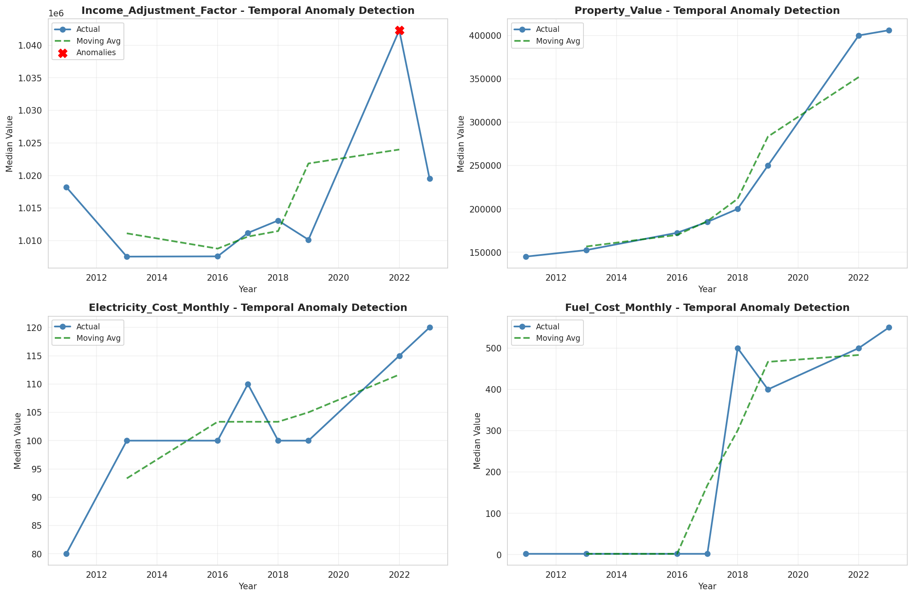
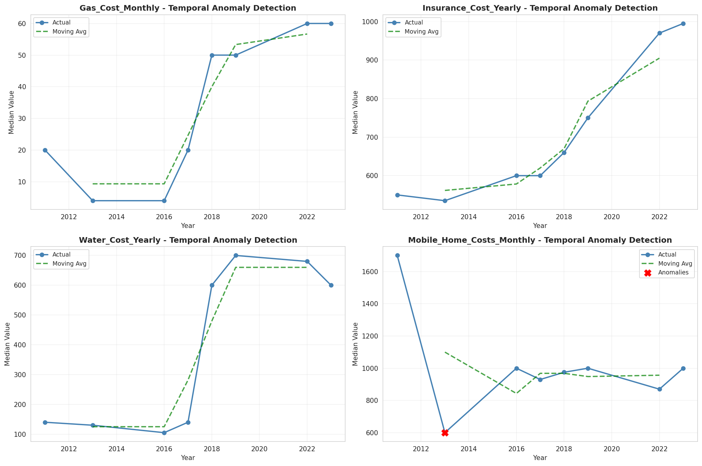
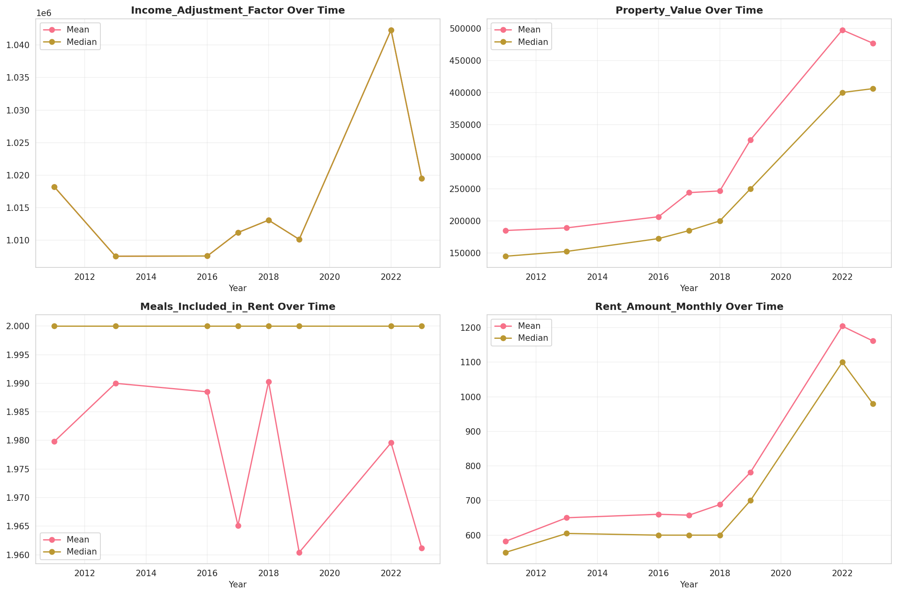
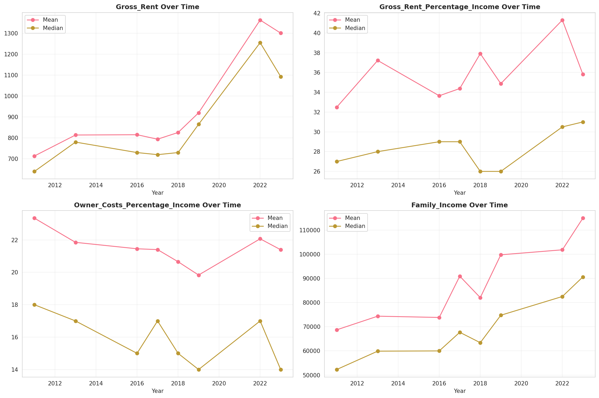
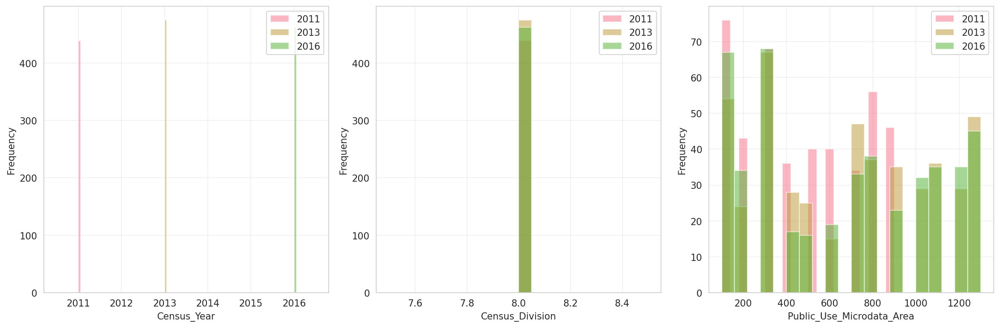
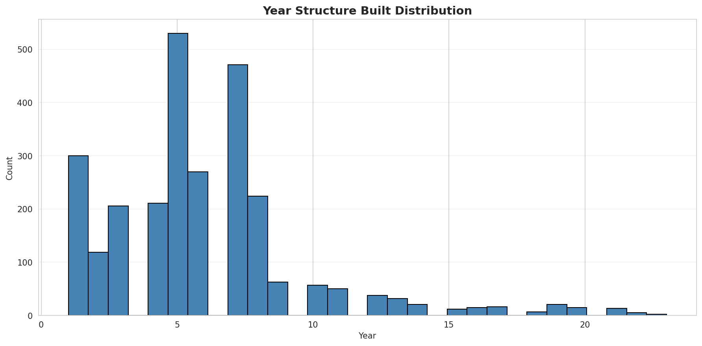
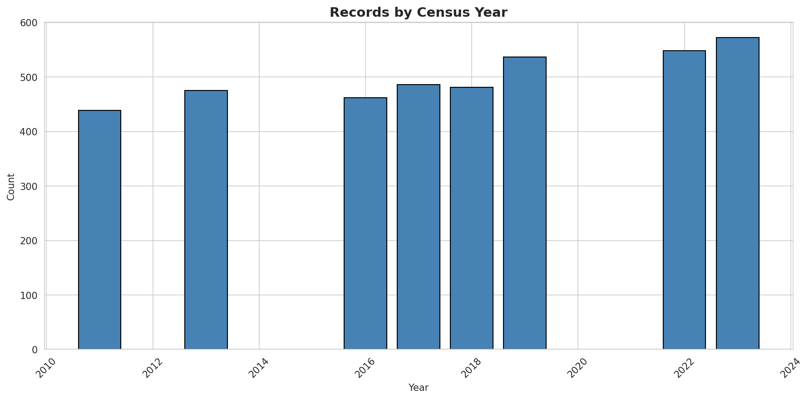
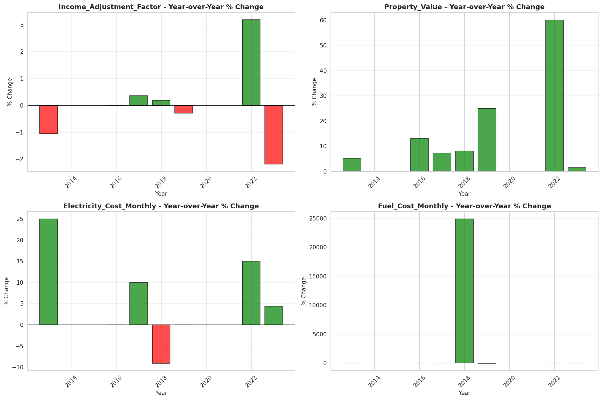
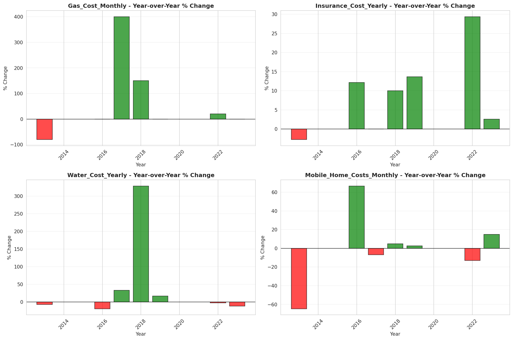

# Temporal Analysis

## Year Distribution

- 2011: 7,245 records

- 2013: 7,218 records

- 2016: 7,453 records

- 2017: 7,708 records

- 2018: 7,848 records

- 2019: 7,969 records

- 2022: 9,083 records

- 2023: 9,331 records

## Temporal Trends

- Census_Year: {np.int64(2011): {'mean': 2011.0, 'median': 2011.0, 'std': 0.0}, np.int64(2013): {'mean': 2013.0, 'median': 2013.0, 'std': 0.0}, np.int64(2016): {'mean': 2016.0, 'median': 2016.0, 'std': 0.0}, np.int64(2017): {'mean': 2017.0, 'median': 2017.0, 'std': 0.0}, np.int64(2018): {'mean': 2018.0, 'median': 2018.0, 'std': 0.0}, np.int64(2019): {'mean': 2019.0, 'median': 2019.0, 'std': 0.0}, np.int64(2022): {'mean': 2022.0, 'median': 2022.0, 'std': 0.0}, np.int64(2023): {'mean': 2023.0, 'median': 2023.0, 'std': 0.0}}

- Census_Division: {np.int64(2011): {'mean': 8.0, 'median': 8.0, 'std': 0.0}, np.int64(2013): {'mean': 8.0, 'median': 8.0, 'std': 0.0}, np.int64(2016): {'mean': 8.0, 'median': 8.0, 'std': 0.0}, np.int64(2017): {'mean': 8.0, 'median': 8.0, 'std': 0.0}, np.int64(2018): {'mean': 8.0, 'median': 8.0, 'std': 0.0}, np.int64(2019): {'mean': 8.0, 'median': 8.0, 'std': 0.0}, np.int64(2022): {'mean': 8.0, 'median': 8.0, 'std': 0.0}, np.int64(2023): {'mean': 8.0, 'median': 8.0, 'std': 0.0}}

- Public_Use_Microdata_Area: {np.int64(2011): {'mean': 476.7701863354037, 'median': 400.0, 'std': 277.0537044643258}, np.int64(2013): {'mean': 664.4750623441397, 'median': 701.0, 'std': 404.6892265676637}, np.int64(2016): {'mean': 665.8522742519791, 'median': 701.0, 'std': 404.06233647766436}, np.int64(2017): {'mean': 663.5408666320706, 'median': 701.0, 'std': 401.57110490376607}, np.int64(2018): {'mean': 660.2452854230377, 'median': 701.0, 'std': 401.4642231512572}, np.int64(2019): {'mean': 658.3133391893588, 'median': 701.0, 'std': 400.0036948549296}, np.int64(2022): {'mean': 669.5145876912915, 'median': 701.0, 'std': 378.88574347468}, np.int64(2023): {'mean': 670.5781802593506, 'median': 701.0, 'std': 378.63002551089556}}

- Census_Region: {np.int64(2011): {'mean': 4.0, 'median': 4.0, 'std': 0.0}, np.int64(2013): {'mean': 4.0, 'median': 4.0, 'std': 0.0}, np.int64(2016): {'mean': 4.0, 'median': 4.0, 'std': 0.0}, np.int64(2017): {'mean': 4.0, 'median': 4.0, 'std': 0.0}, np.int64(2018): {'mean': 4.0, 'median': 4.0, 'std': 0.0}, np.int64(2019): {'mean': 4.0, 'median': 4.0, 'std': 0.0}, np.int64(2022): {'mean': 4.0, 'median': 4.0, 'std': 0.0}, np.int64(2023): {'mean': 4.0, 'median': 4.0, 'std': 0.0}}

- State_Code: {np.int64(2011): {'mean': 16.0, 'median': 16.0, 'std': 0.0}, np.int64(2013): {'mean': 16.0, 'median': 16.0, 'std': 0.0}, np.int64(2016): {'mean': 16.0, 'median': 16.0, 'std': 0.0}, np.int64(2017): {'mean': 16.0, 'median': 16.0, 'std': 0.0}, np.int64(2018): {'mean': 16.0, 'median': 16.0, 'std': 0.0}, np.int64(2019): {'mean': 16.0, 'median': 16.0, 'std': 0.0}, np.int64(2022): {'mean': 16.0, 'median': 16.0, 'std': 0.0}, np.int64(2023): {'mean': None, 'median': None, 'std': None}}

- Housing_Adjustment_Factor: {np.int64(2011): {'mean': 1000000.0, 'median': 1000000.0, 'std': 0.0}, np.int64(2013): {'mean': 1000000.0, 'median': 1000000.0, 'std': 0.0}, np.int64(2016): {'mean': 1000000.0, 'median': 1000000.0, 'std': 0.0}, np.int64(2017): {'mean': 1000000.0, 'median': 1000000.0, 'std': 0.0}, np.int64(2018): {'mean': 1000000.0, 'median': 1000000.0, 'std': 0.0}, np.int64(2019): {'mean': 1000000.0, 'median': 1000000.0, 'std': 0.0}, np.int64(2022): {'mean': 1000000.0, 'median': 1000000.0, 'std': 0.0}, np.int64(2023): {'mean': 1000000.0, 'median': 1000000.0, 'std': 0.0}}

- Income_Adjustment_Factor: {np.int64(2011): {'mean': 1018237.0, 'median': 1018237.0, 'std': 0.0}, np.int64(2013): {'mean': 1007549.0, 'median': 1007549.0, 'std': 0.0}, np.int64(2016): {'mean': 1007588.0, 'median': 1007588.0, 'std': 0.0}, np.int64(2017): {'mean': 1011189.0, 'median': 1011189.0, 'std': 0.0}, np.int64(2018): {'mean': 1013097.0, 'median': 1013097.0, 'std': 0.0}, np.int64(2019): {'mean': 1010145.0, 'median': 1010145.0, 'std': 0.0}, np.int64(2022): {'mean': 1042311.0, 'median': 1042311.0, 'std': 0.0}, np.int64(2023): {'mean': 1019518.0, 'median': 1019518.0, 'std': 0.0}}

- Housing_Unit_Weight: {np.int64(2011): {'mean': 93.08405797101449, 'median': 68.0, 'std': 99.30428740800282}, np.int64(2013): {'mean': 93.68135217511777, 'median': 71.0, 'std': 92.63184740351576}, np.int64(2016): {'mean': 94.03314101704012, 'median': 72.0, 'std': 90.50318779669892}, np.int64(2017): {'mean': 93.64530358069538, 'median': 71.0, 'std': 92.05024286564624}, np.int64(2018): {'mean': 93.74401121304791, 'median': 71.0, 'std': 93.31160036212978}, np.int64(2019): {'mean': 94.2543606475091, 'median': 71.0, 'std': 95.28609650478612}, np.int64(2022): {'mean': 87.74281625013762, 'median': 72.0, 'std': 87.65066320370009}, np.int64(2023): {'mean': 87.37584396099025, 'median': 71.0, 'std': 86.3395816320754}}

- Number_of_Persons: {np.int64(2011): {'mean': 2.178329882677709, 'median': 2.0, 'std': 1.6104468870744697}, np.int64(2013): {'mean': 2.1870324189526182, 'median': 2.0, 'std': 1.621248773898158}, np.int64(2016): {'mean': 2.140748691801959, 'median': 2.0, 'std': 1.6176095256071266}, np.int64(2017): {'mean': 2.1453035806953813, 'median': 2.0, 'std': 1.6385163877668627}, np.int64(2018): {'mean': 2.1293323139653415, 'median': 2.0, 'std': 1.5935917172060132}, np.int64(2019): {'mean': 2.1784414606600575, 'median': 2.0, 'std': 1.628847632162965}, np.int64(2022): {'mean': 2.189144555763514, 'median': 2.0, 'std': 1.5698887608868775}, np.int64(2023): {'mean': 2.191297824456114, 'median': 2.0, 'std': 1.5669254780412578}}

- Housing_Unit_Type: {np.int64(2011): {'mean': 1.097032436162871, 'median': 1.0, 'std': 0.37868130437615805}, np.int64(2013): {'mean': 1.0910224438902743, 'median': 1.0, 'std': 0.37208955640900543}, np.int64(2016): {'mean': 1.0860056353146383, 'median': 1.0, 'std': 0.36261677700804584}, np.int64(2017): {'mean': 1.0914634146341464, 'median': 1.0, 'std': 0.3730436696045989}, np.int64(2018): {'mean': 1.0877930682976555, 'median': 1.0, 'std': 0.36133197649817916}, np.int64(2019): {'mean': 1.0799347471451877, 'median': 1.0, 'std': 0.3445796516101599}, np.int64(2022): {'mean': None, 'median': None, 'std': None}, np.int64(2023): {'mean': None, 'median': None, 'std': None}}

- Number_of_Bedrooms: {np.int64(2011): {'mean': 2.9473606168446027, 'median': 3.0, 'std': 1.1954429897382588}, np.int64(2013): {'mean': 2.9798876072167997, 'median': 3.0, 'std': 1.2088066576825547}, np.int64(2016): {'mean': 2.9353688115280354, 'median': 3.0, 'std': 1.1431327913734335}, np.int64(2017): {'mean': 2.9556725308214435, 'median': 3.0, 'std': 1.1348417428702946}, np.int64(2018): {'mean': 2.9521544107652575, 'median': 3.0, 'std': 1.148512428465643}, np.int64(2019): {'mean': 2.9784345047923324, 'median': 3.0, 'std': 1.1262062950730747}, np.int64(2022): {'mean': 3.0396486825595983, 'median': 3.0, 'std': 1.132099938981665}, np.int64(2023): {'mean': 3.049429657794677, 'median': 3.0, 'std': 1.11589681101118}}

- Number_of_Rooms: {np.int64(2011): {'mean': 6.144869513641756, 'median': 6.0, 'std': 2.467209319828166}, np.int64(2013): {'mean': 6.255693581780538, 'median': 6.0, 'std': 2.6442947825036116}, np.int64(2016): {'mean': 6.276786988158083, 'median': 6.0, 'std': 2.5770388380462386}, np.int64(2017): {'mean': 6.294639146696218, 'median': 6.0, 'std': 2.5612016214062847}, np.int64(2018): {'mean': 6.332472475193693, 'median': 6.0, 'std': 2.579744274689735}, np.int64(2019): {'mean': 6.369275825346113, 'median': 6.0, 'std': 2.5888454449136384}, np.int64(2022): {'mean': 6.385445420326223, 'median': 6.0, 'std': 2.6010006006491957}, np.int64(2023): {'mean': 6.414816631914633, 'median': 6.0, 'std': 2.6081863778133805}}

- Building_Type: {np.int64(2011): {'mean': 2.388493475682088, 'median': 2.0, 'std': 1.4520946375427404}, np.int64(2013): {'mean': 2.3955930198166224, 'median': 2.0, 'std': 1.4791750016141358}, np.int64(2016): {'mean': 2.4556998145241833, 'median': 2.0, 'std': 1.563007670604648}, np.int64(2017): {'mean': 2.4337165812439396, 'median': 2.0, 'std': 1.5319192485613173}, np.int64(2018): {'mean': 2.4539893978523857, 'median': 2.0, 'std': 1.5902980135956808}, np.int64(2019): {'mean': 2.4512779552715656, 'median': 2.0, 'std': 1.5613392605272465}, np.int64(2022): {'mean': 2.4799247176913424, 'median': 2.0, 'std': 1.580535066791015}, np.int64(2023): {'mean': 2.4457254998160187, 'median': 2.0, 'std': 1.5076771778888067}}

- Year_Structure_Built: {np.int64(2011): {'mean': 5.331850533807829, 'median': 5.0, 'std': 2.801487881023515}, np.int64(2013): {'mean': 5.5226264418811, 'median': 5.0, 'std': 2.8985467839450143}, np.int64(2016): {'mean': 5.999001284063347, 'median': 6.0, 'std': 3.6051751434860324}, np.int64(2017): {'mean': 6.241584707023134, 'median': 6.0, 'std': 4.039611916027006}, np.int64(2018): {'mean': 6.271985863803181, 'median': 6.0, 'std': 4.168467630683322}, np.int64(2019): {'mean': 6.547124600638978, 'median': 6.0, 'std': 4.598473838326705}, np.int64(2022): {'mean': None, 'median': None, 'std': None}, np.int64(2023): {'mean': None, 'median': None, 'std': None}}

- Bathtub_or_Shower: {np.int64(2011): {'mean': 1.0118623962040332, 'median': 1.0, 'std': 0.10827473439456023}, np.int64(2013): {'mean': 1.007985803016859, 'median': 1.0, 'std': 0.0890123681946892}, np.int64(2016): {'mean': 1.01141389641889, 'median': 1.0, 'std': 0.1062319607883382}, np.int64(2017): {'mean': 1.0110818672946391, 'median': 1.0, 'std': 0.10469277820252164}, np.int64(2018): {'mean': 1.0122332472475193, 'median': 1.0, 'std': 0.10993287767929537}, np.int64(2019): {'mean': 1.0065228966986155, 'median': 1.0, 'std': 0.08050597057567523}, np.int64(2022): {'mean': 1.0072772898368882, 'median': 1.0, 'std': 0.08500139671662582}, np.int64(2023): {'mean': 1.0066233288360114, 'median': 1.0, 'std': 0.08111884767937222}}

- Refrigerator: {np.int64(2011): {'mean': 1.016755634638197, 'median': 1.0, 'std': 0.12836403936958019}, np.int64(2013): {'mean': 1.0113871635610765, 'median': 1.0, 'std': 0.10610919437479391}, np.int64(2016): {'mean': 1.0141246968183764, 'median': 1.0, 'std': 0.11801346024959518}, np.int64(2017): {'mean': 1.013298240753567, 'median': 1.0, 'std': 0.114556603555072}, np.int64(2018): {'mean': 1.01481582166644, 'median': 1.0, 'std': 0.1208234139888109}, np.int64(2019): {'mean': 1.0119808306709266, 'median': 1.0, 'std': 0.10880655477169394}, np.int64(2022): {'mean': 1.0089084065244667, 'median': 1.0, 'std': 0.09396890305691286}, np.int64(2023): {'mean': 1.006991291549123, 'median': 1.0, 'std': 0.08332625644102508}}

- Hot_and_Cold_Running_Water: {np.int64(2011): {'mean': 1.013938315539739, 'median': 1.0, 'std': 0.11724366578763981}, np.int64(2013): {'mean': 1.010204081632653, 'median': 1.0, 'std': 0.10050598094830848}, np.int64(2016): {'mean': 1.0146953916393209, 'median': 1.0, 'std': 0.1203391176368331}, np.int64(2017): {'mean': 1.0153760908713119, 'median': 1.0, 'std': 0.12305187600599912}, np.int64(2018): {'mean': 1.0142721217887727, 'median': 1.0, 'std': 0.11861846752958498}, np.int64(2019): {'mean': 1.009185303514377, 'median': 1.0, 'std': 0.09540516440121327}, np.int64(2022): {'mean': 1.0095357590966123, 'median': 1.0, 'std': 0.0971906044391546}, np.int64(2023): {'mean': 1.0089537593523856, 'median': 1.0, 'std': 0.09420550972590623}}

- Running_Water: {np.int64(2011): {'mean': None, 'median': None, 'std': None}, np.int64(2013): {'mean': 9.0, 'median': 9.0, 'std': 0.0}, np.int64(2016): {'mean': 9.0, 'median': 9.0, 'std': 0.0}, np.int64(2017): {'mean': 9.0, 'median': 9.0, 'std': 0.0}, np.int64(2018): {'mean': 9.0, 'median': 9.0, 'std': 0.0}, np.int64(2019): {'mean': 9.0, 'median': 9.0, 'std': 0.0}, np.int64(2022): {'mean': 9.0, 'median': 9.0, 'std': 0.0}, np.int64(2023): {'mean': 9.0, 'median': 9.0, 'std': 0.0}}

- Sink_with_Faucet: {np.int64(2011): {'mean': 1.0102313167259787, 'median': 1.0, 'std': 0.1006386540249563}, np.int64(2013): {'mean': 1.0057675244010649, 'median': 1.0, 'std': 0.07573049716730171}, np.int64(2016): {'mean': 1.008988443429876, 'median': 1.0, 'std': 0.09438708801287342}, np.int64(2017): {'mean': 1.0087269704945283, 'median': 1.0, 'std': 0.09301617593574033}, np.int64(2018): {'mean': 1.0104662226451, 'median': 1.0, 'std': 0.10177469602774485}, np.int64(2019): {'mean': 1.0054579339723109, 'median': 1.0, 'std': 0.07368084976283033}, np.int64(2022): {'mean': 1.0060225846925972, 'median': 1.0, 'std': 0.07737612271407557}, np.int64(2023): {'mean': 1.0046608610327488, 'median': 1.0, 'std': 0.06811539096888762}}

- Stove_or_Range: {np.int64(2011): {'mean': 1.0163107947805456, 'median': 1.0, 'std': 0.12667727587131422}, np.int64(2013): {'mean': 1.0140490979000296, 'median': 1.0, 'std': 0.11770203700985543}, np.int64(2016): {'mean': 1.0168354972178628, 'median': 1.0, 'std': 0.12866400091891186}, np.int64(2017): {'mean': 1.015514614212495, 'median': 1.0, 'std': 0.12359622585110963}, np.int64(2018): {'mean': 1.0176702460241946, 'median': 1.0, 'std': 0.1317587497555556}, np.int64(2019): {'mean': 1.0138445154419595, 'median': 1.0, 'std': 0.11685316661292726}, np.int64(2022): {'mean': 1.0102885821831868, 'median': 1.0, 'std': 0.1009158315240954}, np.int64(2023): {'mean': 1.009934993254017, 'median': 1.0, 'std': 0.09918415081858889}}

- Telephone_Service: {np.int64(2011): {'mean': 1.0299950008331944, 'median': 1.0, 'std': 0.17058766067627576}, np.int64(2013): {'mean': 1.0271711951992, 'median': 1.0, 'std': 0.16259559743893395}, np.int64(2016): {'mean': 1.0363164721141376, 'median': 1.0, 'std': 0.18709158437721346}, np.int64(2017): {'mean': 1.0189603412861432, 'median': 1.0, 'std': 0.13639569713002372}, np.int64(2018): {'mean': 1.0177277632187451, 'median': 1.0, 'std': 0.13197035428843543}, np.int64(2019): {'mean': 1.0103355302576393, 'median': 1.0, 'std': 0.10114464623748158}, np.int64(2022): {'mean': 1.009556313993174, 'median': 1.0, 'std': 0.09729482607717091}, np.int64(2023): {'mean': 1.0085219707057258, 'median': 1.0, 'std': 0.09192644858964193}}

- Lot_Acreage: {np.int64(2011): {'mean': 1.383724832214765, 'median': 1.0, 'std': 0.6348154489757131}, np.int64(2013): {'mean': 1.3726968174204355, 'median': 1.0, 'std': 0.6204410988848009}, np.int64(2016): {'mean': 1.3588407684793227, 'median': 1.0, 'std': 0.6113398019161423}, np.int64(2017): {'mean': 1.3610414052697617, 'median': 1.0, 'std': 0.6111233866710676}, np.int64(2018): {'mean': 1.3525492019215868, 'median': 1.0, 'std': 0.6110359529326028}, np.int64(2019): {'mean': 1.3603644646924828, 'median': 1.0, 'std': 0.6112373072384715}, np.int64(2022): {'mean': 1.327122742141943, 'median': 1.0, 'std': 0.5818029676639492}, np.int64(2023): {'mean': 1.3325031133250311, 'median': 1.0, 'std': 0.5822823446158776}}

- Agricultural_Sales: {np.int64(2011): {'mean': 1.5317410433689505, 'median': 1.0, 'std': 1.3990443902375878}, np.int64(2013): {'mean': 1.4095846645367411, 'median': 1.0, 'std': 1.2032713906938741}, np.int64(2016): {'mean': 1.4466580976863752, 'median': 1.0, 'std': 1.2589416833703257}, np.int64(2017): {'mean': 1.4383813611281422, 'median': 1.0, 'std': 1.232872183204179}, np.int64(2018): {'mean': 1.4238787113076437, 'median': 1.0, 'std': 1.2272139066346692}, np.int64(2019): {'mean': 1.3824228028503562, 'median': 1.0, 'std': 1.164875047798766}, np.int64(2022): {'mean': 1.330813953488372, 'median': 1.0, 'std': 1.063095806452543}, np.int64(2023): {'mean': 1.3539823008849559, 'median': 1.0, 'std': 1.1295329454419434}}

- Tenure: {np.int64(2011): {'mean': 1.8311948008665222, 'median': 2.0, 'std': 0.8755950674900844}, np.int64(2013): {'mean': 1.8264710785130855, 'median': 2.0, 'std': 0.8725326182128105}, np.int64(2016): {'mean': 1.8406290531776912, 'median': 2.0, 'std': 0.8672498612965426}, np.int64(2017): {'mean': 1.8274608942960973, 'median': 2.0, 'std': 0.8679927380246261}, np.int64(2018): {'mean': 1.8362879605364575, 'median': 2.0, 'std': 0.8519931660125665}, np.int64(2019): {'mean': 1.8118633912522468, 'median': 2.0, 'std': 0.8454948172841494}, np.int64(2022): {'mean': 1.795221843003413, 'median': 2.0, 'std': 0.8423550868655436}, np.int64(2023): {'mean': 1.800665778961385, 'median': 2.0, 'std': 0.8293295752759444}}

- Vacancy_Status: {np.int64(2011): {'mean': 4.831763122476447, 'median': 5.0, 'std': 1.6645869105058566}, np.int64(2013): {'mean': 4.859764089121887, 'median': 5.0, 'std': 1.5732319399643326}, np.int64(2016): {'mean': 4.904875148632581, 'median': 5.0, 'std': 1.5722254518033796}, np.int64(2017): {'mean': 5.013483146067416, 'median': 5.0, 'std': 1.6216470824814413}, np.int64(2018): {'mean': 5.064367816091954, 'median': 5.0, 'std': 1.5789158136167027}, np.int64(2019): {'mean': 5.2009569377990434, 'median': 5.0, 'std': 1.5156821884376084}, np.int64(2022): {'mean': 4.995348837209303, 'median': 5.0, 'std': 1.5082516545953097}, np.int64(2023): {'mean': 5.07153965785381, 'median': 5.0, 'std': 1.5671417598747048}}

- Property_Value: {np.int64(2011): {'mean': 180764.6694671678, 'median': 150000.0, 'std': 179984.13646629557}, np.int64(2013): {'mean': 197002.07883726052, 'median': 150000.0, 'std': 243464.76173791612}, np.int64(2016): {'mean': 216512.3083567264, 'median': 175000.0, 'std': 206186.3876840133}, np.int64(2017): {'mean': 233479.7311489183, 'median': 185000.0, 'std': 230924.4558410263}, np.int64(2018): {'mean': 251795.14425030476, 'median': 200000.0, 'std': 228820.38337256704}, np.int64(2019): {'mean': 288172.91910902696, 'median': 225000.0, 'std': 337210.2543450425}, np.int64(2022): {'mean': 477842.5730376628, 'median': 400000.0, 'std': 471544.4410134176}, np.int64(2023): {'mean': 486045.29592884023, 'median': 400000.0, 'std': 506024.7362647686}}

- Vehicles_Available: {np.int64(2011): {'mean': 2.0983169471754706, 'median': 2.0, 'std': 1.1190764794512835}, np.int64(2013): {'mean': 2.0931821970328386, 'median': 2.0, 'std': 1.1364780623070319}, np.int64(2016): {'mean': 2.1301880674448768, 'median': 2.0, 'std': 1.1469362592798866}, np.int64(2017): {'mean': 2.1924474640543528, 'median': 2.0, 'std': 1.1836431971679349}, np.int64(2018): {'mean': 2.1940804686295667, 'median': 2.0, 'std': 1.1840139771373648}, np.int64(2019): {'mean': 2.239664469742361, 'median': 2.0, 'std': 1.2078728539141894}, np.int64(2022): {'mean': 2.2507849829351536, 'median': 2.0, 'std': 1.1758485778292562}, np.int64(2023): {'mean': 2.236750998668442, 'median': 2.0, 'std': 1.1776007265128965}}

- Condo_Fee_Monthly: {np.int64(2011): {'mean': 166.5151515151515, 'median': 110.0, 'std': 150.81820359668302}, np.int64(2013): {'mean': 151.30434782608697, 'median': 110.0, 'std': 145.60131951848615}, np.int64(2016): {'mean': 252.8985507246377, 'median': 200.0, 'std': 215.1271952704435}, np.int64(2017): {'mean': 159.82456140350877, 'median': 130.0, 'std': 116.30457594593994}, np.int64(2018): {'mean': 216.76470588235293, 'median': 165.0, 'std': 218.4097284509134}, np.int64(2019): {'mean': 263.38709677419354, 'median': 195.0, 'std': 215.17010844557913}, np.int64(2022): {'mean': 217.31645569620252, 'median': 190.0, 'std': 151.29115624023646}, np.int64(2023): {'mean': 258.02564102564105, 'median': 200.0, 'std': 228.84634295668496}}

- Electricity_Cost_Monthly: {np.int64(2011): {'mean': 107.38376937177136, 'median': 90.0, 'std': 76.35568869784886}, np.int64(2013): {'mean': 116.95115852642107, 'median': 100.0, 'std': 84.17930565212995}, np.int64(2016): {'mean': 110.73459792477303, 'median': 90.0, 'std': 79.22768373134838}, np.int64(2017): {'mean': 123.60262284721125, 'median': 100.0, 'std': 90.59979724665381}, np.int64(2018): {'mean': 124.07265095253472, 'median': 100.0, 'std': 84.94945572864002}, np.int64(2019): {'mean': 120.01274677444427, 'median': 100.0, 'std': 83.19968164932605}, np.int64(2022): {'mean': 147.7502119242724, 'median': 110.0, 'std': 214.19603929394506}, np.int64(2023): {'mean': 147.76584022038568, 'median': 110.0, 'std': 154.1988712786822}}

- Fuel_Cost_Monthly: {np.int64(2011): {'mean': 148.06832194634228, 'median': 2.0, 'std': 419.41055422819306}, np.int64(2013): {'mean': 106.11518586431072, 'median': 2.0, 'std': 335.12697682812797}, np.int64(2016): {'mean': 89.746271076524, 'median': 2.0, 'std': 287.22185561540164}, np.int64(2017): {'mean': 96.5490598830779, 'median': 2.0, 'std': 315.6291368949211}, np.int64(2018): {'mean': 644.7194388777555, 'median': 500.0, 'std': 559.4424716448746}, np.int64(2019): {'mean': 641.7363896848137, 'median': 500.0, 'std': 574.8986237373492}, np.int64(2022): {'mean': 787.5705394190871, 'median': 590.0, 'std': 751.6481594196869}, np.int64(2023): {'mean': 799.3165938864629, 'median': 600.0, 'std': 766.9428973890364}}

- Gas_Cost_Monthly: {np.int64(2011): {'mean': 43.69871688051991, 'median': 10.0, 'std': 64.73363020887992}, np.int64(2013): {'mean': 41.06951158526421, 'median': 10.0, 'std': 63.426219321171004}, np.int64(2016): {'mean': 34.916504539559014, 'median': 10.0, 'std': 52.3519881492681}, np.int64(2017): {'mean': 37.56580818454732, 'median': 10.0, 'std': 57.887113923752295}, np.int64(2018): {'mean': 66.2474407721556, 'median': 50.0, 'std': 65.4029117214686}, np.int64(2019): {'mean': 63.118701007838744, 'median': 50.0, 'std': 65.1136001272156}, np.int64(2022): {'mean': 93.90308988764045, 'median': 50.0, 'std': 211.6350568846172}, np.int64(2023): {'mean': 93.13603925066904, 'median': 60.0, 'std': 131.1583706187756}}

- House_Heating_Fuel: {np.int64(2011): {'mean': 2.5194134310948177, 'median': 3.0, 'std': 1.6927289768929077}, np.int64(2013): {'mean': 2.4937489581596934, 'median': 2.0, 'std': 1.7347206354000593}, np.int64(2016): {'mean': 2.4571984435797667, 'median': 2.0, 'std': 1.7097048595718785}, np.int64(2017): {'mean': 2.434191815452678, 'median': 2.0, 'std': 1.6845415674690216}, np.int64(2018): {'mean': 2.4122090334515183, 'median': 2.0, 'std': 1.674745439051251}, np.int64(2019): {'mean': 2.4236069502696225, 'median': 2.0, 'std': 1.668659761588831}, np.int64(2022): {'mean': 2.303344709897611, 'median': 2.0, 'std': 1.6258412960901276}, np.int64(2023): {'mean': 2.2496671105193076, 'median': 2.0, 'std': 1.585108242550472}}

- Insurance_Cost_Yearly: {np.int64(2011): {'mean': 627.694742215416, 'median': 520.0, 'std': 442.5468250299194}, np.int64(2013): {'mean': 702.2207036193369, 'median': 580.0, 'std': 534.0269067194702}, np.int64(2016): {'mean': 766.3626508992363, 'median': 600.0, 'std': 600.8848744768256}, np.int64(2017): {'mean': 826.6799525504152, 'median': 650.0, 'std': 665.6615879032453}, np.int64(2018): {'mean': 862.723641430562, 'median': 700.0, 'std': 686.270448670594}, np.int64(2019): {'mean': 887.1873740765615, 'median': 730.0, 'std': 655.0510907707165}, np.int64(2022): {'mean': 1096.1240279162512, 'median': 900.0, 'std': 901.7864872235662}, np.int64(2023): {'mean': 1212.0584080931476, 'median': 1000.0, 'std': 1039.546474427516}}

- Water_Cost_Yearly: {np.int64(2011): {'mean': 347.9700049991668, 'median': 130.0, 'std': 420.46832433230486}, np.int64(2013): {'mean': 366.07767961326886, 'median': 130.0, 'std': 445.5075857601906}, np.int64(2016): {'mean': 376.71676394293127, 'median': 100.0, 'std': 465.99722810585075}, np.int64(2017): {'mean': 383.93600884815925, 'median': 100.0, 'std': 482.5163722361282}, np.int64(2018): {'mean': 623.8539713862851, 'median': 600.0, 'std': 465.60192982499916}, np.int64(2019): {'mean': 655.971543751482, 'median': 630.0, 'std': 502.9283725906239}, np.int64(2022): {'mean': 685.2054460475513, 'median': 600.0, 'std': 577.4455665920727}, np.int64(2023): {'mean': 708.5825242718447, 'median': 650.0, 'std': 601.210086285564}}

- Mobile_Home_Costs_Monthly: {np.int64(2011): {'mean': 1514.4475524475524, 'median': 655.0, 'std': 1610.952241784274}, np.int64(2013): {'mean': 1501.806896551724, 'median': 745.0, 'std': 1657.9049074977775}, np.int64(2016): {'mean': 1513.0114942528735, 'median': 600.0, 'std': 1661.594180026562}, np.int64(2017): {'mean': 1522.753036437247, 'median': 560.0, 'std': 1959.7916430808464}, np.int64(2018): {'mean': 1842.1834862385322, 'median': 800.0, 'std': 2198.3255737475993}, np.int64(2019): {'mean': 1963.5, 'median': 810.0, 'std': 2262.255075300633}, np.int64(2022): {'mean': 2110.8912280701757, 'median': 870.0, 'std': 2642.5977466884865}, np.int64(2023): {'mean': 3122.472843450479, 'median': 1000.0, 'std': 6009.619884844452}}

- First_Mortgage_Includes_Insurance: {np.int64(2011): {'mean': 1.3202638329058263, 'median': 1.0, 'std': 0.4666633802060464}, np.int64(2013): {'mean': 1.3173674588665447, 'median': 1.0, 'std': 0.46553689014698335}, np.int64(2016): {'mean': 1.2937956204379562, 'median': 1.0, 'std': 0.45558259847516847}, np.int64(2017): {'mean': 1.2851182197496522, 'median': 1.0, 'std': 0.4515492403426373}, np.int64(2018): {'mean': 1.2819787985865725, 'median': 1.0, 'std': 0.4500425802595012}, np.int64(2019): {'mean': 1.278443113772455, 'median': 1.0, 'std': 0.44830726692918516}, np.int64(2022): {'mean': 1.2686474775611265, 'median': 1.0, 'std': 0.44332475550926587}, np.int64(2023): {'mean': 1.2694795195565136, 'median': 1.0, 'std': 0.44375776628822244}}

- First_Mortgage_Payment_Monthly: {np.int64(2011): {'mean': 955.5045804323928, 'median': 830.0, 'std': 578.6215981822412}, np.int64(2013): {'mean': 919.7001828153565, 'median': 800.0, 'std': 582.413361274107}, np.int64(2016): {'mean': 972.7554744525547, 'median': 850.0, 'std': 564.6634360149502}, np.int64(2017): {'mean': 984.787899860918, 'median': 880.0, 'std': 552.9364490943008}, np.int64(2018): {'mean': 1051.3759717314488, 'median': 930.0, 'std': 589.8371536159941}, np.int64(2019): {'mean': 1101.799733865602, 'median': 970.0, 'std': 669.3168154773904}, np.int64(2022): {'mean': 632.6456505576208, 'median': 4.0, 'std': 832.1937187769871}, np.int64(2023): {'mean': 1433.963658761934, 'median': 1300.0, 'std': 855.0304566845575}}

- First_Mortgage_Includes_Taxes: {np.int64(2011): {'mean': 1.2722609014290949, 'median': 1.0, 'std': 0.44520504610629996}, np.int64(2013): {'mean': 1.263254113345521, 'median': 1.0, 'std': 0.4404796540970477}, np.int64(2016): {'mean': 1.2218978102189781, 'median': 1.0, 'std': 0.41559861566381556}, np.int64(2017): {'mean': 1.2138386648122392, 'median': 1.0, 'std': 0.4100855567743727}, np.int64(2018): {'mean': 1.2024734982332155, 'median': 1.0, 'std': 0.40191424492423466}, np.int64(2019): {'mean': 1.195276114437791, 'median': 1.0, 'std': 0.39647906316616993}, np.int64(2022): {'mean': 1.167440420922315, 'median': 1.0, 'std': 0.3734264124776417}, np.int64(2023): {'mean': 1.164767477671697, 'median': 1.0, 'std': 0.3710276977658681}}

- First_Mortgage_Status: {np.int64(2011): {'mean': 1.7861960431654675, 'median': 1.0, 'std': 0.9701727104802723}, np.int64(2013): {'mean': 1.7869623655913978, 'median': 1.0, 'std': 0.970827128019062}, np.int64(2016): {'mean': 1.8100877192982456, 'median': 1.0, 'std': 0.9758586260865566}, np.int64(2017): {'mean': 1.7867036011080333, 'median': 1.0, 'std': 0.9707453900260623}, np.int64(2018): {'mean': 1.846327916066653, 'median': 1.0, 'std': 0.9827950978627675}, np.int64(2019): {'mean': 1.8206650831353919, 'median': 1.0, 'std': 0.9784373503949657}, np.int64(2022): {'mean': 1.8609976921711344, 'median': 1.0, 'std': 0.9862478749842067}, np.int64(2023): {'mean': 1.8888697746430414, 'median': 1.0, 'std': 0.9908571958270602}}

- Second_Mortgage_Payment_Monthly: {np.int64(2011): {'mean': 379.6267190569745, 'median': 250.0, 'std': 463.7425404808316}, np.int64(2013): {'mean': 327.74429223744295, 'median': 220.0, 'std': 349.238135696852}, np.int64(2016): {'mean': 308.167701863354, 'median': 230.0, 'std': 328.1934832422442}, np.int64(2017): {'mean': 278.89487870619945, 'median': 200.0, 'std': 257.5647223843839}, np.int64(2018): {'mean': 347.98192771084337, 'median': 210.0, 'std': 400.050404269754}, np.int64(2019): {'mean': 328.1095100864553, 'median': 200.0, 'std': 330.6524284430834}, np.int64(2022): {'mean': 417.48091603053433, 'median': 250.0, 'std': 539.8692476946849}, np.int64(2023): {'mean': 496.3600713012478, 'median': 360.0, 'std': 501.78271347836295}}

- Second_Mortgage_Status: {np.int64(2011): {'mean': 2.773543422499084, 'median': 3.0, 'std': 0.5469355561711683}, np.int64(2013): {'mean': 2.7956124314442414, 'median': 3.0, 'std': 0.526804332852731}, np.int64(2016): {'mean': 2.8554744525547444, 'median': 3.0, 'std': 0.4516683944244619}, np.int64(2017): {'mean': 2.8414464534075106, 'median': 3.0, 'std': 0.4574787551270925}, np.int64(2018): {'mean': 2.858303886925795, 'median': 3.0, 'std': 0.4229957037358875}, np.int64(2019): {'mean': 2.860944777112442, 'median': 3.0, 'std': 0.42307601769628866}, np.int64(2022): {'mean': 2.82611293695847, 'median': 3.0, 'std': 0.43488005275463076}, np.int64(2023): {'mean': 2.809409649385676, 'median': 3.0, 'std': 0.45702107882415544}}

- Property_Taxes_Yearly: {np.int64(2011): {'mean': 22.427607913669064, 'median': 22.0, 'std': 12.43905484328469}, np.int64(2013): {'mean': 22.68122759856631, 'median': 22.0, 'std': 13.14214491092235}, np.int64(2016): {'mean': 25.034868421052632, 'median': 24.0, 'std': 13.599667879131903}, np.int64(2017): {'mean': 25.83763051353079, 'median': 24.0, 'std': 13.87820202947909}}

- Meals_Included_in_Rent: {np.int64(2011): {'mean': 1.9775967413441955, 'median': 2.0, 'std': 0.14804131617126937}, np.int64(2013): {'mean': 1.9675638371290545, 'median': 2.0, 'std': 0.17721662529938834}, np.int64(2016): {'mean': 1.9662118258609487, 'median': 2.0, 'std': 0.18074224752976994}, np.int64(2017): {'mean': 1.97264631043257, 'median': 2.0, 'std': 0.16316372330827558}, np.int64(2018): {'mean': 1.9640795381654907, 'median': 2.0, 'std': 0.18615157691371595}, np.int64(2019): {'mean': 1.9703608247422681, 'median': 2.0, 'std': 0.16964444544736498}, np.int64(2022): {'mean': 1.9754871150219988, 'median': 2.0, 'std': 0.15468368512527692}, np.int64(2023): {'mean': 1.9770328988206083, 'median': 2.0, 'std': 0.14984509031299081}}

- Rent_Amount_Monthly: {np.int64(2011): {'mean': 571.8560760353021, 'median': 530.0, 'std': 318.1763609433056}, np.int64(2013): {'mean': 637.6218081435472, 'median': 580.0, 'std': 393.0511761054639}, np.int64(2016): {'mean': 681.9415204678363, 'median': 600.0, 'std': 413.57692360728953}, np.int64(2017): {'mean': 679.7671755725191, 'median': 630.0, 'std': 360.43999456130064}, np.int64(2018): {'mean': 735.7985888389993, 'median': 660.0, 'std': 417.0030158743799}, np.int64(2019): {'mean': 780.479381443299, 'median': 700.0, 'std': 420.8905079597961}, np.int64(2022): {'mean': 1067.2168447517286, 'median': 950.0, 'std': 615.1499506248952}, np.int64(2023): {'mean': 1177.3817504655494, 'median': 1000.0, 'std': 669.218875439409}}

- Gross_Rent: {np.int64(2011): {'mean': 707.4971223021582, 'median': 650.0, 'std': 351.441216076663}, np.int64(2013): {'mean': 769.7470930232558, 'median': 710.0, 'std': 394.57883276256797}, np.int64(2016): {'mean': 800.1267991775188, 'median': 750.0, 'std': 402.74838678815456}, np.int64(2017): {'mean': 820.869623655914, 'median': 770.0, 'std': 381.84546452820337}, np.int64(2018): {'mean': 869.0114555256065, 'median': 810.0, 'std': 432.7503853552557}, np.int64(2019): {'mean': 906.5587449933245, 'median': 835.0, 'std': 439.55789969163675}, np.int64(2022): {'mean': 1211.1834743005857, 'median': 1080.0, 'std': 668.8292438740233}, np.int64(2023): {'mean': 1324.2323037323038, 'median': 1200.0, 'std': 696.3698295884714}}

- Gross_Rent_Percentage_Income: {np.int64(2011): {'mean': 38.06268221574344, 'median': 30.0, 'std': 25.72548523003076}, np.int64(2013): {'mean': 37.160237388724035, 'median': 28.0, 'std': 26.643671257128428}, np.int64(2016): {'mean': 35.32727272727273, 'median': 28.0, 'std': 25.072502793611257}, np.int64(2017): {'mean': 34.43424657534246, 'median': 26.0, 'std': 25.17971985061534}, np.int64(2018): {'mean': 35.144520547945206, 'median': 27.0, 'std': 24.746535625668994}, np.int64(2019): {'mean': 34.708192281651996, 'median': 28.0, 'std': 24.059366937808157}, np.int64(2022): {'mean': 37.0935441370224, 'median': 29.0, 'std': 25.907633669538512}, np.int64(2023): {'mean': 36.76601307189542, 'median': 29.0, 'std': 25.255194994659444}}

- Selected_Monthly_Owner_Costs: {np.int64(2011): {'mean': 934.4830069772676, 'median': 807.0, 'std': 741.9707881634231}, np.int64(2013): {'mean': 911.1203765971756, 'median': 793.0, 'std': 712.4229412121844}, np.int64(2016): {'mean': 920.0691244239631, 'median': 800.0, 'std': 683.1005751655035}, np.int64(2017): {'mean': 960.3523139262103, 'median': 850.0, 'std': 674.2116025240987}, np.int64(2018): {'mean': 976.1763737394525, 'median': 840.0, 'std': 727.3458633339137}, np.int64(2019): {'mean': 1012.2416864608076, 'median': 854.0, 'std': 766.5130076089125}, np.int64(2022): {'mean': 1213.8985970520334, 'median': 1000.0, 'std': 925.3253296743422}, np.int64(2023): {'mean': 1292.791157749871, 'median': 1058.0, 'std': 1010.6065336253196}}

- Owner_Costs_Percentage_Income: {np.int64(2011): {'mean': 24.012217194570137, 'median': 18.0, 'std': 20.542899330240463}, np.int64(2013): {'mean': 22.648545003383713, 'median': 18.0, 'std': 19.826688342957144}, np.int64(2016): {'mean': 21.248728719876187, 'median': 16.0, 'std': 19.50071829946469}, np.int64(2017): {'mean': 21.248170469220835, 'median': 16.0, 'std': 18.734062387278943}, np.int64(2018): {'mean': 20.729925496688743, 'median': 15.0, 'std': 19.038090313711646}, np.int64(2019): {'mean': 20.469838741787775, 'median': 16.0, 'std': 18.657294010301005}, np.int64(2022): {'mean': 21.433982490619975, 'median': 15.0, 'std': 20.433695037249574}, np.int64(2023): {'mean': 21.900450138504155, 'median': 16.0, 'std': 21.129957637299}}

- Satellite_Internet: {np.int64(2011): {'mean': None, 'median': None, 'std': None}, np.int64(2013): {'mean': 1.8510308135668365, 'median': 2.0, 'std': 0.35609756838223633}, np.int64(2016): {'mean': 1.849138784399129, 'median': 2.0, 'std': 0.3579489851677209}, np.int64(2017): {'mean': 1.835725075528701, 'median': 2.0, 'std': 0.370559848937986}, np.int64(2018): {'mean': 1.8376623376623376, 'median': 2.0, 'std': 0.3687935442958414}, np.int64(2019): {'mean': 1.8500426985482494, 'median': 2.0, 'std': 0.35706005666625934}, np.int64(2022): {'mean': 1.8718787158145065, 'median': 2.0, 'std': 0.3342496467853214}, np.int64(2023): {'mean': 1.8585597240189737, 'median': 2.0, 'std': 0.34850018922681525}}

- Smartphone: {np.int64(2011): {'mean': None, 'median': None, 'std': None}, np.int64(2013): {'mean': None, 'median': None, 'std': None}, np.int64(2016): {'mean': 1.292963683527886, 'median': 1.0, 'std': 0.4551588200417864}, np.int64(2017): {'mean': 1.2166218991941855, 'median': 1.0, 'std': 0.41197532548207727}, np.int64(2018): {'mean': 1.1755819330969632, 'median': 1.0, 'std': 0.38049341073869625}, np.int64(2019): {'mean': 1.152186938286399, 'median': 1.0, 'std': 0.35922890174697725}, np.int64(2022): {'mean': 1.0876450511945392, 'median': 1.0, 'std': 0.28279730230459665}, np.int64(2023): {'mean': 1.0793608521970706, 'median': 1.0, 'std': 0.2703191398216463}}

- Tablet_Computer: {np.int64(2011): {'mean': None, 'median': None, 'std': None}, np.int64(2013): {'mean': None, 'median': None, 'std': None}, np.int64(2016): {'mean': 1.422503242542153, 'median': 1.0, 'std': 0.4939977905623184}, np.int64(2017): {'mean': 1.3626165270974877, 'median': 1.0, 'std': 0.48079341267843767}, np.int64(2018): {'mean': 1.3596423616463698, 'median': 1.0, 'std': 0.47993253751028064}, np.int64(2019): {'mean': 1.360545236668664, 'median': 1.0, 'std': 0.48019465705581066}, np.int64(2022): {'mean': 1.353174061433447, 'median': 1.0, 'std': 0.47798884365953664}, np.int64(2023): {'mean': 1.340878828229028, 'median': 1.0, 'std': 0.4740362582990251}}

- Food_Stamp_SNAP: {np.int64(2011): {'mean': 1.8761919409412489, 'median': 2.0, 'std': 0.3293877808549413}, np.int64(2013): {'mean': 1.878853601859024, 'median': 2.0, 'std': 0.326322608926576}, np.int64(2016): {'mean': 1.8989715668481548, 'median': 2.0, 'std': 0.301389161736228}, np.int64(2017): {'mean': 1.902757406864183, 'median': 2.0, 'std': 0.29630954894715217}, np.int64(2018): {'mean': 1.9131556319862424, 'median': 2.0, 'std': 0.28162704064422545}, np.int64(2019): {'mean': 1.9205103042198233, 'median': 2.0, 'std': 0.2705205049367392}, np.int64(2022): {'mean': 1.9298411945958758, 'median': 2.0, 'std': 0.2554295981783423}, np.int64(2023): {'mean': 1.9340469613259668, 'median': 2.0, 'std': 0.2482142759627904}}

- Family_Type_Employment_Status: {np.int64(2011): {'mean': 2.849701314217443, 'median': 2.0, 'std': 2.133031561893794}, np.int64(2013): {'mean': 2.856531049250535, 'median': 2.0, 'std': 2.123422124535464}, np.int64(2016): {'mean': 2.89728453364817, 'median': 2.0, 'std': 2.1066464075576206}, np.int64(2017): {'mean': 2.841091492776886, 'median': 2.0, 'std': 2.0680441278638857}, np.int64(2018): {'mean': 2.893306379155436, 'median': 2.0, 'std': 2.096220589930554}, np.int64(2019): {'mean': 2.8890597539543057, 'median': 2.0, 'std': 2.0979620530499514}, np.int64(2022): {'mean': None, 'median': None, 'std': None}, np.int64(2023): {'mean': None, 'median': None, 'std': None}}

- Family_Income: {np.int64(2011): {'mean': 64582.10014443909, 'median': 52000.0, 'std': 52276.271311583776}, np.int64(2013): {'mean': 69549.77178324183, 'median': 55000.0, 'std': 60919.44190489025}, np.int64(2016): {'mean': 79033.32654511012, 'median': 61620.0, 'std': 74153.3089576118}, np.int64(2017): {'mean': 81194.40598388953, 'median': 63100.0, 'std': 73137.71142635049}, np.int64(2018): {'mean': 84687.77303370787, 'median': 65000.0, 'std': 76735.02442951308}, np.int64(2019): {'mean': 90439.16317991632, 'median': 70000.0, 'std': 78375.37725786577}, np.int64(2022): {'mean': 106388.10611122027, 'median': 82000.0, 'std': 99002.17115771533}, np.int64(2023): {'mean': 112443.13929590865, 'median': 88000.0, 'std': 101451.68101949691}}

- Family_Presence_Children: {np.int64(2011): {'mean': 3.126642771804062, 'median': 4.0, 'std': 1.0563564462008894}, np.int64(2013): {'mean': 3.1469610636277303, 'median': 4.0, 'std': 1.0490274472303427}, np.int64(2016): {'mean': 3.1938895417156288, 'median': 4.0, 'std': 1.030225066596185}, np.int64(2017): {'mean': 3.143444495203289, 'median': 4.0, 'std': 1.0582656436336746}, np.int64(2018): {'mean': 3.1875698636262015, 'median': 4.0, 'std': 1.0484280852800254}, np.int64(2019): {'mean': 3.188881593346465, 'median': 4.0, 'std': 1.0382352315362195}, np.int64(2022): {'mean': 3.163544106167057, 'median': 4.0, 'std': 1.0442998507239876}, np.int64(2023): {'mean': 3.188221927665215, 'median': 4.0, 'std': 1.043278214359414}}

- Household_Family_Type: {np.int64(2011): {'mean': 2.497250458256957, 'median': 1.0, 'std': 1.986127078535903}, np.int64(2013): {'mean': 2.466077679613269, 'median': 1.0, 'std': 1.9640333356678918}, np.int64(2016): {'mean': 2.5217250324254215, 'median': 1.0, 'std': 1.9998819831263681}, np.int64(2017): {'mean': 2.4950229104123873, 'median': 1.0, 'std': 1.98509351768861}, np.int64(2018): {'mean': 2.5053183289656236, 'median': 1.0, 'std': 1.9810840946820216}, np.int64(2019): {'mean': 2.5196225284601557, 'median': 1.0, 'std': 1.9821083410024327}, np.int64(2022): {'mean': 2.484368600682594, 'median': 1.0, 'std': 1.9925948451523374}, np.int64(2023): {'mean': 2.4535286284953397, 'median': 1.0, 'std': 1.9837964430655721}}

- Household_Income: {np.int64(2011): {'mean': 55451.57526881721, 'median': 43000.0, 'std': 49344.33312725861}, np.int64(2013): {'mean': 60333.85552933243, 'median': 46250.0, 'std': 56946.09383140982}, np.int64(2016): {'mean': 67638.73167131376, 'median': 50600.0, 'std': 69087.30311995793}, np.int64(2017): {'mean': 70208.53608577373, 'median': 53000.0, 'std': 68872.39541313832}, np.int64(2018): {'mean': 72988.0121325245, 'median': 55000.0, 'std': 72037.35851081127}, np.int64(2019): {'mean': 77060.14650354932, 'median': 58200.0, 'std': 72933.96385697763}, np.int64(2022): {'mean': 92560.50550660794, 'median': 70000.0, 'std': 92895.21086232268}, np.int64(2023): {'mean': 97904.67746270662, 'median': 73800.0, 'std': 95957.82899885993}}

- Number_Persons_Family: {np.int64(2011): {'mean': 3.053046594982079, 'median': 2.0, 'std': 1.3950047163645183}, np.int64(2013): {'mean': 3.048670465337132, 'median': 2.0, 'std': 1.4043578539170258}, np.int64(2016): {'mean': 3.03689776733255, 'median': 2.0, 'std': 1.4196226289690361}, np.int64(2017): {'mean': 3.0449977158519874, 'median': 2.0, 'std': 1.4145475650518746}, np.int64(2018): {'mean': 3.001564945226917, 'median': 2.0, 'std': 1.381499037189236}, np.int64(2019): {'mean': 3.0499015101772815, 'median': 2.0, 'std': 1.429810102732987}, np.int64(2022): {'mean': 3.0554254488680717, 'median': 2.0, 'std': 1.3898673482948778}, np.int64(2023): {'mean': 3.054535125923121, 'median': 2.0, 'std': 1.4021286498418122}}

- Workers_In_Family: {np.int64(2011): {'mean': 1.4301075268817205, 'median': 2.0, 'std': 0.8826734620651389}, np.int64(2013): {'mean': 1.4420702754036088, 'median': 2.0, 'std': 0.8789019113334227}, np.int64(2016): {'mean': 1.4291421856639248, 'median': 2.0, 'std': 0.8924784127372977}, np.int64(2017): {'mean': 1.4568296025582457, 'median': 2.0, 'std': 0.8983447315870897}, np.int64(2018): {'mean': 1.4330427006483344, 'median': 2.0, 'std': 0.8989902267199383}, np.int64(2019): {'mean': 1.444955132414095, 'median': 2.0, 'std': 0.9087536710422093}, np.int64(2022): {'mean': 1.4383294301327088, 'median': 2.0, 'std': 0.9323718230724709}, np.int64(2023): {'mean': 1.4385533042984284, 'median': 2.0, 'std': 0.941298923961414}}

- Work_Experience_Householder_Spouse: {np.int64(2011): {'mean': 5.958900836320191, 'median': 5.0, 'std': 4.252626309883369}, np.int64(2013): {'mean': 5.967473884140551, 'median': 5.0, 'std': 4.23116592920074}, np.int64(2016): {'mean': 6.032667450058755, 'median': 5.0, 'std': 4.213799035248334}, np.int64(2017): {'mean': 5.87756966651439, 'median': 5.0, 'std': 4.169045535437122}, np.int64(2018): {'mean': 6.018108651911469, 'median': 5.0, 'std': 4.206475893816382}, np.int64(2019): {'mean': 5.998686802363756, 'median': 5.0, 'std': 4.232877119993308}, np.int64(2022): {'mean': 6.015417642466823, 'median': 5.0, 'std': 4.243003725905166}, np.int64(2023): {'mean': 6.011361484567317, 'median': 5.0, 'std': 4.1457654169309714}}

- Work_Status_Householder_Spouse: {np.int64(2011): {'mean': 5.356750298685783, 'median': 3.0, 'std': 4.558583288427361}, np.int64(2013): {'mean': 5.346181299072091, 'median': 3.0, 'std': 4.5469497024734}, np.int64(2016): {'mean': 5.4023612750885475, 'median': 3.0, 'std': 4.549428748061818}, np.int64(2017): {'mean': 5.301994955285485, 'median': 3.0, 'std': 4.4883455770740905}, np.int64(2018): {'mean': 5.400943396226415, 'median': 3.0, 'std': 4.529176391605961}, np.int64(2019): {'mean': 5.401801405975395, 'median': 3.0, 'std': 4.53003612049782}, np.int64(2022): {'mean': 5.445816186556927, 'median': 3.0, 'std': 4.549668576752329}, np.int64(2023): {'mean': 5.447363411383971, 'median': 3.0, 'std': 4.45722446806638}}

- Complete_Kitchen_Facilities: {np.int64(2011): {'mean': 1.022835112692764, 'median': 1.0, 'std': 0.1493886859227679}, np.int64(2013): {'mean': 1.0177462289263532, 'median': 1.0, 'std': 0.13203741325310347}, np.int64(2016): {'mean': 1.0202596661435297, 'median': 1.0, 'std': 0.1408972832811858}, np.int64(2017): {'mean': 1.0196703144479844, 'median': 1.0, 'std': 0.13887427676725822}, np.int64(2018): {'mean': 1.0226994698926193, 'median': 1.0, 'std': 0.14895375039380565}, np.int64(2019): {'mean': 1.0171725239616614, 'median': 1.0, 'std': 0.12992257477905148}, np.int64(2022): {'mean': 1.0127979924717692, 'median': 1.0, 'std': 0.11240902668132463}, np.int64(2023): {'mean': 1.0116521525818718, 'median': 1.0, 'std': 0.10732097944090578}}

- Complete_Plumbing_Facilities: {np.int64(2011): {'mean': 1.0169039145907472, 'median': 1.0, 'std': 0.12892104858977677}, np.int64(2013): {'mean': 1.0137533274179238, 'median': 1.0, 'std': 0.11647394404159833}, np.int64(2016): {'mean': 1.0168354972178628, 'median': 1.0, 'std': 0.128664000918912}, np.int64(2017): {'mean': 1.0175924643302396, 'median': 1.0, 'std': 0.13147381471379618}, np.int64(2018): {'mean': 1.0178061709936115, 'median': 1.0, 'std': 0.13225539232196842}, np.int64(2019): {'mean': 1.0102502662406816, 'median': 1.0, 'std': 0.10073007989045127}, np.int64(2022): {'mean': 1.0112923462986199, 'median': 1.0, 'std': 0.10567038490677087}, np.int64(2023): {'mean': 1.0106709186802405, 'median': 1.0, 'std': 0.10275380869117272}}

- Plumbing_Facilities_for_Project: {np.int64(2011): {'mean': None, 'median': None, 'std': None}, np.int64(2013): {'mean': None, 'median': None, 'std': None}, np.int64(2016): {'mean': 9.0, 'median': 9.0, 'std': 0.0}, np.int64(2017): {'mean': 9.0, 'median': 9.0, 'std': 0.0}, np.int64(2018): {'mean': 9.0, 'median': 9.0, 'std': 0.0}, np.int64(2019): {'mean': 9.0, 'median': 9.0, 'std': 0.0}, np.int64(2022): {'mean': 9.0, 'median': 9.0, 'std': 0.0}, np.int64(2023): {'mean': 9.0, 'median': 9.0, 'std': 0.0}}

- Response_Mode: {np.int64(2011): {'mean': 1.399614472123369, 'median': 1.0, 'std': 0.48985541418079886}, np.int64(2013): {'mean': 2.0779355220349007, 'median': 2.0, 'std': 0.7872230667129337}, np.int64(2016): {'mean': 2.1760593522613783, 'median': 2.0, 'std': 0.80050130192046}, np.int64(2017): {'mean': 2.204044881562543, 'median': 2.0, 'std': 0.7981727790297267}, np.int64(2018): {'mean': 2.2188392007611797, 'median': 2.0, 'std': 0.8171347511723356}, np.int64(2019): {'mean': 2.2306975505857296, 'median': 2.0, 'std': 0.833591228930863}, np.int64(2022): {'mean': 2.4823086574654956, 'median': 3.0, 'std': 0.7697706210116089}, np.int64(2023): {'mean': 2.4584815405372256, 'median': 3.0, 'std': 0.7942225756611764}}

- Specified_Rent_Unit: {np.int64(2011): {'mean': 0.2354685646500593, 'median': 0.0, 'std': 0.42432277512536826}, np.int64(2013): {'mean': 0.2311446317657498, 'median': 0.0, 'std': 0.421595868752703}, np.int64(2016): {'mean': 0.23412755029248108, 'median': 0.0, 'std': 0.4234824993098917}, np.int64(2017): {'mean': 0.2311954564344092, 'median': 0.0, 'std': 0.4216263066729355}, np.int64(2018): {'mean': 0.22495582438493952, 'median': 0.0, 'std': 0.41758161273656097}, np.int64(2019): {'mean': 0.21831735889243875, 'median': 0.0, 'std': 0.4131314686154094}, np.int64(2022): {'mean': 0.2148055207026349, 'median': 0.0, 'std': 0.41071312860244746}, np.int64(2023): {'mean': 0.20961609223598676, 'median': 0.0, 'std': 0.4070595897573627}}

- Specified_Value_Unit: {np.int64(2011): {'mean': 0.5354389086595492, 'median': 1.0, 'std': 0.49877948332293015}, np.int64(2013): {'mean': 0.5393374741200828, 'median': 1.0, 'std': 0.49848702192886896}, np.int64(2016): {'mean': 0.5534313026109288, 'median': 1.0, 'std': 0.49717236652836305}, np.int64(2017): {'mean': 0.5594957750380939, 'median': 1.0, 'std': 0.4964820218096599}, np.int64(2018): {'mean': 0.5526709256490417, 'median': 1.0, 'std': 0.49725182987622335}, np.int64(2019): {'mean': 0.5658945686900958, 'median': 1.0, 'std': 0.4956718796090576}, np.int64(2022): {'mean': 0.6180677540777917, 'median': 1.0, 'std': 0.4858905511882998}, np.int64(2023): {'mean': 0.6260272292407703, 'median': 1.0, 'std': 0.4838862019849623}}

- Moved_When: {np.int64(2011): {'mean': 4.171485696708705, 'median': 4.0, 'std': 1.8145777536277965}, np.int64(2013): {'mean': 4.097849641606935, 'median': 4.0, 'std': 1.8181572012889864}, np.int64(2016): {'mean': 4.031128404669261, 'median': 4.0, 'std': 1.8417189108292753}, np.int64(2017): {'mean': 4.0546689840417125, 'median': 4.0, 'std': 1.8457028257307517}, np.int64(2018): {'mean': 3.9966086018190228, 'median': 4.0, 'std': 1.853230355050519}, np.int64(2019): {'mean': 4.013031755542241, 'median': 4.0, 'std': 1.8504323307883053}, np.int64(2022): {'mean': 4.016518771331058, 'median': 4.0, 'std': 1.7861121973805243}, np.int64(2023): {'mean': 4.04647137150466, 'median': 4.0, 'std': 1.7416269065755574}}

- Household_Language: {np.int64(2011): {'mean': 1.1621396433927678, 'median': 1.0, 'std': 0.5635065996328771}, np.int64(2013): {'mean': 1.1650275045840974, 'median': 1.0, 'std': 0.5626212248258133}, np.int64(2016): {'mean': 1.1523994811932554, 'median': 1.0, 'std': 0.5403673158239279}, np.int64(2017): {'mean': 1.1665349976299573, 'median': 1.0, 'std': 0.571730814258343}, np.int64(2018): {'mean': 1.1567750886388162, 'median': 1.0, 'std': 0.5555150198032459}, np.int64(2019): {'mean': 1.164919113241462, 'median': 1.0, 'std': 0.5724543461928469}, np.int64(2022): {'mean': 1.1632764505119455, 'median': 1.0, 'std': 0.5665345618533799}, np.int64(2023): {'mean': 1.166444740346205, 'median': 1.0, 'std': 0.5651041190882202}}

- Household_Language_Detailed: {np.int64(2011): {'mean': None, 'median': None, 'std': None}, np.int64(2013): {'mean': None, 'median': None, 'std': None}, np.int64(2016): {'mean': 8728.539883268482, 'median': 9500.0, 'std': 2378.364688035888}, np.int64(2017): {'mean': 8678.756991625849, 'median': 9500.0, 'std': 2440.884264841532}, np.int64(2018): {'mean': 8721.786650223525, 'median': 9500.0, 'std': 2380.707537947534}, np.int64(2019): {'mean': 8701.38481126423, 'median': 9500.0, 'std': 2410.0912901857473}, np.int64(2022): {'mean': 8691.492559726963, 'median': 9500.0, 'std': 2424.002816782184}, np.int64(2023): {'mean': 8676.011318242343, 'median': 9500.0, 'std': 2446.087750360992}}

- Limited_English_Speaking_Household: {np.int64(2011): {'mean': 1.0149975004165972, 'median': 1.0, 'std': 0.12155261204001766}, np.int64(2013): {'mean': 1.0163360560093349, 'median': 1.0, 'std': 0.12677487280466557}, np.int64(2016): {'mean': 1.0149156939040207, 'median': 1.0, 'std': 0.12122540383215027}, np.int64(2017): {'mean': 1.0154842787170169, 'median': 1.0, 'std': 0.12347843895646664}, np.int64(2018): {'mean': 1.0129489748728226, 'median': 1.0, 'std': 0.11306312184178806}, np.int64(2019): {'mean': 1.011983223487118, 'median': 1.0, 'std': 0.10881819502589514}, np.int64(2022): {'mean': 1.0107849829351536, 'median': 1.0, 'std': 0.1032962910777846}, np.int64(2023): {'mean': 1.0126498002663116, 'median': 1.0, 'std': 0.1117651382495448}}

- Household_Grandchildren: {np.int64(2011): {'mean': 0.03182802866188968, 'median': 0.0, 'std': 0.1755566606187201}, np.int64(2013): {'mean': 0.029504917486247707, 'median': 0.0, 'std': 0.1692310589635615}, np.int64(2016): {'mean': 0.02756160830090791, 'median': 0.0, 'std': 0.16372633288087596}, np.int64(2017): {'mean': 0.028282509085163533, 'median': 0.0, 'std': 0.16579189299108374}, np.int64(2018): {'mean': 0.029905965777709265, 'median': 0.0, 'std': 0.17034104598009897}, np.int64(2019): {'mean': 0.03025763930497304, 'median': 0.0, 'std': 0.17130823211705387}, np.int64(2022): {'mean': 0.02757679180887372, 'median': 0.0, 'std': 0.16376804875271936}, np.int64(2023): {'mean': 0.02929427430093209, 'median': 0.0, 'std': 0.16864135534449165}}

- Household_Children_Present: {np.int64(2011): {'mean': 3.3716047325445757, 'median': 4.0, 'std': 0.995935192538954}, np.int64(2013): {'mean': 3.388231371895316, 'median': 4.0, 'std': 0.9837635824075448}, np.int64(2016): {'mean': 3.4309338521400776, 'median': 4.0, 'std': 0.953480802040189}, np.int64(2017): {'mean': 3.3953231158160846, 'median': 4.0, 'std': 0.9854264836356246}, np.int64(2018): {'mean': 3.426699552952058, 'median': 4.0, 'std': 0.9712880618750698}, np.int64(2019): {'mean': 3.433193529059317, 'median': 4.0, 'std': 0.9594945855862638}, np.int64(2022): {'mean': 3.4054607508532424, 'median': 4.0, 'std': 0.9708884917452212}, np.int64(2023): {'mean': 3.417842876165113, 'median': 4.0, 'std': 0.9710696691705428}}

- Household_Own_Children_Present: {np.int64(2011): {'mean': 3.4297617063822696, 'median': 4.0, 'std': 0.9647663412488472}, np.int64(2013): {'mean': 3.4425737622937156, 'median': 4.0, 'std': 0.954095318164672}, np.int64(2016): {'mean': 3.4831387808041505, 'median': 4.0, 'std': 0.9212767447808925}, np.int64(2017): {'mean': 3.4458840259124663, 'median': 4.0, 'std': 0.9542071389613094}, np.int64(2018): {'mean': 3.4818868506243255, 'median': 4.0, 'std': 0.9387355527582786}, np.int64(2019): {'mean': 3.4898142600359496, 'median': 4.0, 'std': 0.9263764832488292}, np.int64(2022): {'mean': 3.460887372013652, 'median': 4.0, 'std': 0.9372767698608848}, np.int64(2023): {'mean': 3.474167776298269, 'median': 4.0, 'std': 0.9345678356151258}}

- Household_Related_Children_Present: {np.int64(2011): {'mean': 3.3802699550074986, 'median': 4.0, 'std': 0.9923225250788247}, np.int64(2013): {'mean': 3.394399066511085, 'median': 4.0, 'std': 0.9815615734532189}, np.int64(2016): {'mean': 3.437905317769131, 'median': 4.0, 'std': 0.9500426911887532}, np.int64(2017): {'mean': 3.399431189761416, 'median': 4.0, 'std': 0.9839288515304718}, np.int64(2018): {'mean': 3.431940804686296, 'median': 4.0, 'std': 0.9686499584996098}, np.int64(2019): {'mean': 3.43858597962852, 'median': 4.0, 'std': 0.9575108375324859}, np.int64(2022): {'mean': 3.4125597269624572, 'median': 4.0, 'std': 0.9666224129847528}, np.int64(2023): {'mean': 3.421837549933422, 'median': 4.0, 'std': 0.9694781861208055}}

- Number_Own_Children: {np.int64(2011): {'mean': 0.606065655724046, 'median': 0.0, 'std': 1.1378883373843314}, np.int64(2013): {'mean': 0.5952658776462744, 'median': 0.0, 'std': 1.1282620485674442}, np.int64(2016): {'mean': 0.5852788586251622, 'median': 0.0, 'std': 1.1578192319280531}, np.int64(2017): {'mean': 0.5923526623479223, 'median': 0.0, 'std': 1.1294437358604204}, np.int64(2018): {'mean': 0.5492523508555572, 'median': 0.0, 'std': 1.1041936343603111}, np.int64(2019): {'mean': 0.5624625524266027, 'median': 0.0, 'std': 1.119319825276336}, np.int64(2022): {'mean': 0.5821160409556314, 'median': 0.0, 'std': 1.1304736493835075}, np.int64(2023): {'mean': 0.5615179760319574, 'median': 0.0, 'std': 1.1003140446316175}}

- Number_Related_Children: {np.int64(2011): {'mean': 0.6548908515247459, 'median': 0.0, 'std': 1.1676385680443355}, np.int64(2013): {'mean': 0.6424404067344558, 'median': 0.0, 'std': 1.156482423532475}, np.int64(2016): {'mean': 0.6285667963683528, 'median': 0.0, 'std': 1.1840548198965144}, np.int64(2017): {'mean': 0.634697424553642, 'median': 0.0, 'std': 1.1642469640478212}, np.int64(2018): {'mean': 0.5993525512563589, 'median': 0.0, 'std': 1.1382751231781119}, np.int64(2019): {'mean': 0.6202816057519472, 'median': 0.0, 'std': 1.1680140237332879}, np.int64(2022): {'mean': 0.6238907849829352, 'median': 0.0, 'std': 1.1545518819641292}, np.int64(2023): {'mean': 0.6083888149134488, 'median': 0.0, 'std': 1.134060355163873}}

- Multigenerational_Household: {np.int64(2011): {'mean': 1.0261623062822862, 'median': 1.0, 'std': 0.15963109446140777}, np.int64(2013): {'mean': 1.0253375562593765, 'median': 1.0, 'std': 0.15716132412915643}, np.int64(2016): {'mean': 1.0243190661478598, 'median': 1.0, 'std': 0.15405030570717612}, np.int64(2017): {'mean': 1.0249644493600885, 'median': 1.0, 'std': 0.15602907491517526}, np.int64(2018): {'mean': 1.026977030985047, 'median': 1.0, 'std': 0.16202875624526672}, np.int64(2019): {'mean': 1.0268124625524266, 'median': 1.0, 'std': 0.16154709391081143}, np.int64(2022): {'mean': 1.025665529010239, 'median': 1.0, 'std': 0.15814621081743999}, np.int64(2023): {'mean': 1.0288948069241013, 'median': 1.0, 'std': 0.16752204001959067}}

- Grandparent_Grandchildren: {np.int64(2011): {'mean': 0.0066655557407098815, 'median': 0.0, 'std': 0.08137708294351227}, np.int64(2013): {'mean': 0.0073345557592932155, 'median': 0.0, 'std': 0.08533448257145}, np.int64(2016): {'mean': 0.005512321660181583, 'median': 0.0, 'std': 0.07404609972602594}, np.int64(2017): {'mean': 0.004424079633433402, 'median': 0.0, 'std': 0.06637170472017943}, np.int64(2018): {'mean': 0.006166178510867889, 'median': 0.0, 'std': 0.07828857887202717}, np.int64(2019): {'mean': 0.0043439185140802875, 'median': 0.0, 'std': 0.06577002990285148}, np.int64(2022): {'mean': 0.005324232081911262, 'median': 0.0, 'std': 0.07277779689594563}, np.int64(2023): {'mean': 0.004127829560585885, 'median': 0.0, 'std': 0.0641197164074954}}

- Nonrelative_Present: {np.int64(2011): {'mean': 0.08798533577737044, 'median': 0.0, 'std': 0.2832971769213236}, np.int64(2013): {'mean': 0.09284880813468911, 'median': 0.0, 'std': 0.2902446375525984}, np.int64(2016): {'mean': 0.08852140077821012, 'median': 0.0, 'std': 0.2840747186711294}, np.int64(2017): {'mean': 0.09432769789856217, 'median': 0.0, 'std': 0.29230717340006823}, np.int64(2018): {'mean': 0.09588407584399568, 'median': 0.0, 'std': 0.29445489570325184}, np.int64(2019): {'mean': 0.1012582384661474, 'median': 0.0, 'std': 0.3016929586813142}, np.int64(2022): {'mean': 0.10020477815699659, 'median': 0.0, 'std': 0.3002933421184929}, np.int64(2023): {'mean': 0.09800266311584555, 'median': 0.0, 'std': 0.2973380457158411}}

- Unmarried_Partner_Household: {np.int64(2011): {'mean': 0.14180969838360274, 'median': 0.0, 'std': 0.6668732946464353}, np.int64(2013): {'mean': 0.1393565594265711, 'median': 0.0, 'std': 0.6550262125795326}, np.int64(2016): {'mean': 0.1511024643320363, 'median': 0.0, 'std': 0.6929388002128085}, np.int64(2017): {'mean': 0.1632169379048823, 'median': 0.0, 'std': 0.7133808795152429}, np.int64(2018): {'mean': 0.16617851086788962, 'median': 0.0, 'std': 0.7234731777953275}, np.int64(2019): {'mean': 0.15892750149790294, 'median': 0.0, 'std': 0.7044404819754478}, np.int64(2022): {'mean': 0.17228668941979522, 'median': 0.0, 'std': 0.7359251133927619}, np.int64(2023): {'mean': 0.1766977363515313, 'median': 0.0, 'std': 0.7378908462866498}}

- Subfamilies_Present: {np.int64(2011): {'mean': 0.023329445092484587, 'median': 0.0, 'std': 0.15096019215180104}, np.int64(2013): {'mean': 0.022337056176029338, 'median': 0.0, 'std': 0.1477895564524122}, np.int64(2016): {'mean': 0.023346303501945526, 'median': 0.0, 'std': 0.15101308193488652}, np.int64(2017): {'mean': 0.020382366882603888, 'median': 0.0, 'std': 0.14131553818498985}, np.int64(2018): {'mean': 0.02296901495298289, 'median': 0.0, 'std': 0.14981621836925396}, np.int64(2019): {'mean': 0.026662672258837627, 'median': 0.0, 'std': 0.16110761022713255}, np.int64(2022): {'mean': 0.025802047781569967, 'median': 0.0, 'std': 0.15855514547773716}, np.int64(2023): {'mean': 0.02663115845539281, 'median': 0.0, 'std': 0.16101363908322963}}

- Persons_Under_18: {np.int64(2011): {'mean': 0.3194467588735211, 'median': 0.0, 'std': 0.4663011479075618}, np.int64(2013): {'mean': 0.3112185364227371, 'median': 0.0, 'std': 0.46303055822383354}, np.int64(2016): {'mean': 0.29361219195849547, 'median': 0.0, 'std': 0.45545329504438276}, np.int64(2017): {'mean': 0.3051034918628535, 'median': 0.0, 'std': 0.4604876278882905}, np.int64(2018): {'mean': 0.2893479266224757, 'median': 0.0, 'std': 0.4534946603752236}, np.int64(2019): {'mean': 0.2901437986818454, 'median': 0.0, 'std': 0.45386256758535515}, np.int64(2022): {'mean': 0.3027986348122867, 'median': 0.0, 'std': 0.4595002134954844}, np.int64(2023): {'mean': 0.29267643142476696, 'median': 0.0, 'std': 0.45502143585616756}}

- Persons_60_And_Over: {np.int64(2011): {'mean': 0.5840693217797034, 'median': 0.0, 'std': 0.7711287211140715}, np.int64(2013): {'mean': 0.6139356559426571, 'median': 0.0, 'std': 0.7879421176631323}, np.int64(2016): {'mean': 0.6566147859922179, 'median': 0.0, 'std': 0.8018049725456623}, np.int64(2017): {'mean': 0.6444936008848159, 'median': 0.0, 'std': 0.8019916936437982}, np.int64(2018): {'mean': 0.677663018344381, 'median': 0.0, 'std': 0.8109063627216101}, np.int64(2019): {'mean': 0.6912822049131216, 'median': 0.0, 'std': 0.8123330827635924}, np.int64(2022): {'mean': 0.6951535836177475, 'median': 0.0, 'std': 0.8199683919973482}, np.int64(2023): {'mean': 0.7209054593874834, 'median': 0.0, 'std': 0.8343263102127342}}

- Persons_65_And_Over: {np.int64(2011): {'mean': 0.41676387268788534, 'median': 0.0, 'std': 0.6921793546964049}, np.int64(2013): {'mean': 0.43723953992332054, 'median': 0.0, 'std': 0.6987008244431585}, np.int64(2016): {'mean': 0.4724383916990921, 'median': 0.0, 'std': 0.7254231697352365}, np.int64(2017): {'mean': 0.46547637857481433, 'median': 0.0, 'std': 0.7202492225552447}, np.int64(2018): {'mean': 0.49807306921535377, 'median': 0.0, 'std': 0.7360299193286672}, np.int64(2019): {'mean': 0.512133013780707, 'median': 0.0, 'std': 0.7445197759372224}, np.int64(2022): {'mean': 0.5299658703071672, 'median': 0.0, 'std': 0.7578708148256154}, np.int64(2023): {'mean': 0.5523302263648469, 'median': 0.0, 'std': 0.7673013713431794}}

- Same_Sex_Married_Couple: {np.int64(2011): {'mean': None, 'median': None, 'std': None}, np.int64(2013): {'mean': 0.0030005000833472247, 'median': 0.0, 'std': 0.0774144441634656}, np.int64(2016): {'mean': 0.00632295719844358, 'median': 0.0, 'std': 0.1115608592077024}, np.int64(2017): {'mean': 0.00537209669774056, 'median': 0.0, 'std': 0.10352307613930052}, np.int64(2018): {'mean': 0.006474487436411284, 'median': 0.0, 'std': 0.11361798216959165}, np.int64(2019): {'mean': None, 'median': None, 'std': None}, np.int64(2022): {'mean': None, 'median': None, 'std': None}, np.int64(2023): {'mean': None, 'median': None, 'std': None}}

- Flag_Access: {np.int64(2011): {'mean': None, 'median': None, 'std': None}, np.int64(2013): {'mean': 0.03637976929902396, 'median': 0.0, 'std': 0.18724707409793354}, np.int64(2016): {'mean': 0.020687687259238124, 'median': 0.0, 'std': 0.14234675196507712}, np.int64(2017): {'mean': 0.01925474442443552, 'median': 0.0, 'std': 0.13742858319383533}, np.int64(2018): {'mean': 0.021747995106701102, 'median': 0.0, 'std': 0.14586950337572233}, np.int64(2019): {'mean': 0.021033013844515443, 'median': 0.0, 'std': 0.14350389391664806}, np.int64(2022): {'mean': 0.02095357590966123, 'median': 0.0, 'std': 0.1432379064950406}, np.int64(2023): {'mean': 0.022323071262112106, 'median': 0.0, 'std': 0.14774108764389512}}

- Flag_Lot_Acreage: {np.int64(2011): {'mean': 0.028618030842230132, 'median': 0.0, 'std': 0.16674280135722896}, np.int64(2013): {'mean': 0.033865720201123925, 'median': 0.0, 'std': 0.18089685609370185}, np.int64(2016): {'mean': 0.035240405193322874, 'median': 0.0, 'std': 0.184400028259168}, np.int64(2017): {'mean': 0.037816872142956086, 'median': 0.0, 'std': 0.19076634251788746}, np.int64(2018): {'mean': 0.03833084137556069, 'median': 0.0, 'std': 0.19200676828266502}, np.int64(2019): {'mean': 0.03887113951011715, 'median': 0.0, 'std': 0.19330066757398598}, np.int64(2022): {'mean': 0.028230865746549563, 'median': 0.0, 'std': 0.1656421641407327}, np.int64(2023): {'mean': 0.031154176376793817, 'median': 0.0, 'std': 0.17374491725195865}}

- Flag_Agricultural_Sales: {np.int64(2011): {'mean': 0.011565836298932384, 'median': 0.0, 'std': 0.1069287759562068}, np.int64(2013): {'mean': 0.011091393078970719, 'median': 0.0, 'std': 0.10473775049664437}, np.int64(2016): {'mean': 0.007419032672278499, 'median': 0.0, 'std': 0.08581981953042883}, np.int64(2017): {'mean': 0.008588447153345339, 'median': 0.0, 'std': 0.0922814465370169}, np.int64(2018): {'mean': 0.007339948348511621, 'median': 0.0, 'std': 0.08536430167642826}, np.int64(2019): {'mean': 0.007055378061767838, 'median': 0.0, 'std': 0.08370503219135669}, np.int64(2022): {'mean': 0.0075282308657465494, 'median': 0.0, 'std': 0.08644358960309241}, np.int64(2023): {'mean': 0.009444376303201276, 'median': 0.0, 'std': 0.09672811200825104}}

- Flag_Bathtub: {np.int64(2011): {'mean': 0.01112099644128114, 'median': 0.0, 'std': 0.10487588284890562}, np.int64(2013): {'mean': 0.021591245193729666, 'median': 0.0, 'std': 0.14535538473641182}, np.int64(2016): {'mean': 0.03010415180482237, 'median': 0.0, 'std': 0.17088609719570663}, np.int64(2017): {'mean': 0.03310707854273445, 'median': 0.0, 'std': 0.1789285745153486}, np.int64(2018): {'mean': 0.034524942231888, 'median': 0.0, 'std': 0.1825856018275043}, np.int64(2019): {'mean': 0.03194888178913738, 'median': 0.0, 'std': 0.1758757187780033}, np.int64(2022): {'mean': 0.02409033877038896, 'median': 0.0, 'std': 0.15333931175521393}, np.int64(2023): {'mean': 0.02477615601619036, 'median': 0.0, 'std': 0.15545179986430263}}

- Flag_Bedrooms: {np.int64(2011): {'mean': 0.028173190984578884, 'median': 0.0, 'std': 0.16547967464850538}, np.int64(2013): {'mean': 0.04288671990535345, 'median': 0.0, 'std': 0.20261668334781652}, np.int64(2016): {'mean': 0.06363247253531175, 'median': 0.0, 'std': 0.2441144878312808}, np.int64(2017): {'mean': 0.06455187699127303, 'median': 0.0, 'std': 0.2457504792459368}, np.int64(2018): {'mean': 0.06374881065651761, 'median': 0.0, 'std': 0.24432153725662561}, np.int64(2019): {'mean': 0.059637912673056445, 'median': 0.0, 'std': 0.23683052715333822}, np.int64(2022): {'mean': 0.06148055207026349, 'median': 0.0, 'std': 0.24022475815706154}, np.int64(2023): {'mean': 0.0551944069667607, 'median': 0.0, 'std': 0.22837333767810342}}

- Flag_Building_Type: {np.int64(2011): {'mean': 0.005782918149466192, 'median': 0.0, 'std': 0.0758309215663666}, np.int64(2013): {'mean': 0.007837917775805975, 'median': 0.0, 'std': 0.08819090099423615}, np.int64(2016): {'mean': 0.010272506777000999, 'median': 0.0, 'std': 0.100838649086307}, np.int64(2017): {'mean': 0.010112203906358221, 'median': 0.0, 'std': 0.10005665416130845}, np.int64(2018): {'mean': 0.01155362240043496, 'median': 0.0, 'std': 0.10687230091352354}, np.int64(2019): {'mean': 0.011448349307774228, 'median': 0.0, 'std': 0.10638980856861016}, np.int64(2022): {'mean': 0.01066499372647428, 'median': 0.0, 'std': 0.10272573033270067}, np.int64(2023): {'mean': 0.013859928860542131, 'median': 0.0, 'std': 0.11691667056322054}}

- Flag_Kitchen: {np.int64(2011): {'mean': 0.014531435349940688, 'median': 0.0, 'std': 0.119676215100908}, np.int64(2013): {'mean': 0.028541851523217983, 'median': 0.0, 'std': 0.16652722085920507}, np.int64(2016): {'mean': 0.038807247824225996, 'median': 0.0, 'std': 0.19314908233492162}, np.int64(2017): {'mean': 0.03920210555478598, 'median': 0.0, 'std': 0.19408894538580657}, np.int64(2018): {'mean': 0.042136740519233384, 'median': 0.0, 'std': 0.20091471440181893}, np.int64(2019): {'mean': 0.035942492012779555, 'median': 0.0, 'std': 0.18615918617783964}, np.int64(2022): {'mean': 0.027352572145545796, 'median': 0.0, 'std': 0.163118813845388}, np.int64(2023): {'mean': 0.03139948485220164, 'median': 0.0, 'std': 0.174405527471156}}

- Flag_Plumbing: {np.int64(2011): {'mean': 0.01230723606168446, 'median': 0.0, 'std': 0.11026137458882349}, np.int64(2013): {'mean': 0.024105294291629695, 'median': 0.0, 'std': 0.15338744563875975}, np.int64(2016): {'mean': 0.03153088885718362, 'median': 0.0, 'std': 0.17475997628097334}, np.int64(2017): {'mean': 0.0350464053192963, 'median': 0.0, 'std': 0.18390986935535444}, np.int64(2018): {'mean': 0.035204567078972404, 'median': 0.0, 'std': 0.1843090417827919}, np.int64(2019): {'mean': 0.03301384451544196, 'median': 0.0, 'std': 0.17868458488652855}, np.int64(2022): {'mean': 0.025972396486825595, 'median': 0.0, 'std': 0.15906289836963786}, np.int64(2023): {'mean': 0.026493315344045136, 'median': 0.0, 'std': 0.16060692202109514}}

- Flag_Plumbing_Project: {np.int64(2011): {'mean': None, 'median': None, 'std': None}, np.int64(2013): {'mean': None, 'median': None, 'std': None}, np.int64(2016): {'mean': 0.0, 'median': 0.0, 'std': 0.0}, np.int64(2017): {'mean': 0.0, 'median': 0.0, 'std': 0.0}, np.int64(2018): {'mean': 0.0, 'median': 0.0, 'std': 0.0}, np.int64(2019): {'mean': 0.0, 'median': 0.0, 'std': 0.0}, np.int64(2022): {'mean': 0.0, 'median': 0.0, 'std': 0.0}, np.int64(2023): {'mean': 0.0, 'median': 0.0, 'std': 0.0}}

- Flag_Refrigerator: {np.int64(2011): {'mean': 0.013790035587188613, 'median': 0.0, 'std': 0.11662712974651283}, np.int64(2013): {'mean': 0.023661638568470866, 'median': 0.0, 'std': 0.15200388924032995}, np.int64(2016): {'mean': 0.035097731488086745, 'median': 0.0, 'std': 0.18403997715884216}, np.int64(2017): {'mean': 0.03615459204876022, 'median': 0.0, 'std': 0.1866876144118712}, np.int64(2018): {'mean': 0.03873861628381134, 'median': 0.0, 'std': 0.1929844505280439}, np.int64(2019): {'mean': 0.034211927582534614, 'median': 0.0, 'std': 0.18178523226925605}, np.int64(2022): {'mean': 0.025595984943538267, 'median': 0.0, 'std': 0.1579365702737348}, np.int64(2023): {'mean': 0.029069054335827304, 'median': 0.0, 'std': 0.16801043610191943}}

- Flag_Rooms: {np.int64(2011): {'mean': 0.03558718861209965, 'median': 0.0, 'std': 0.18527231431408497}, np.int64(2013): {'mean': 0.05353445726116533, 'median': 0.0, 'std': 0.22511333452590526}, np.int64(2016): {'mean': 0.05564274504208874, 'median': 0.0, 'std': 0.2292468714256436}, np.int64(2017): {'mean': 0.0531929630142679, 'median': 0.0, 'std': 0.22443361865582534}, np.int64(2018): {'mean': 0.05545738752208781, 'median': 0.0, 'std': 0.22888640558740642}, np.int64(2019): {'mean': 0.048722044728434506, 'median': 0.0, 'std': 0.2153006683605141}, np.int64(2022): {'mean': 0.045796737766624844, 'median': 0.0, 'std': 0.20905712197953927}, np.int64(2023): {'mean': 0.041702440819330305, 'median': 0.0, 'std': 0.19992060805284248}}

- Flag_Running_Water: {np.int64(2011): {'mean': 0.009934756820877817, 'median': 0.0, 'std': 0.09918425345897129}, np.int64(2013): {'mean': 0.01892931085477669, 'median': 0.0, 'std': 0.13628550483152516}, np.int64(2016): {'mean': 0.02896276216293337, 'median': 0.0, 'std': 0.16771384465018546}, np.int64(2017): {'mean': 0.030890705083806622, 'median': 0.0, 'std': 0.17303357159095356}, np.int64(2018): {'mean': 0.030447193149381543, 'median': 0.0, 'std': 0.17182600109192483}, np.int64(2019): {'mean': 0.029286474973375932, 'median': 0.0, 'std': 0.16861957866568725}, np.int64(2022): {'mean': 0.021957340025094103, 'median': 0.0, 'std': 0.14655343765515763}, np.int64(2023): {'mean': 0.02305899668833558, 'median': 0.0, 'std': 0.15010010914480984}}

- Flag_Running_Water_Project: {np.int64(2011): {'mean': None, 'median': None, 'std': None}, np.int64(2013): {'mean': 0.0, 'median': 0.0, 'std': 0.0}, np.int64(2016): {'mean': 0.0, 'median': 0.0, 'std': 0.0}, np.int64(2017): {'mean': 0.0, 'median': 0.0, 'std': 0.0}, np.int64(2018): {'mean': 0.0, 'median': 0.0, 'std': 0.0}, np.int64(2019): {'mean': 0.0, 'median': 0.0, 'std': 0.0}, np.int64(2022): {'mean': 0.0, 'median': 0.0, 'std': 0.0}, np.int64(2023): {'mean': 0.0, 'median': 0.0, 'std': 0.0}}

- Flag_Sink: {np.int64(2011): {'mean': 0.010972716488730723, 'median': 0.0, 'std': 0.10418217410446066}, np.int64(2013): {'mean': 0.020112392783200237, 'median': 0.0, 'std': 0.14039515438950026}, np.int64(2016): {'mean': 0.030817520331002997, 'median': 0.0, 'std': 0.17283536307574268}, np.int64(2017): {'mean': 0.032552985178002494, 'median': 0.0, 'std': 0.17747577720333457}, np.int64(2018): {'mean': 0.034524942231888, 'median': 0.0, 'std': 0.18258560182750408}, np.int64(2019): {'mean': 0.03221512247071352, 'median': 0.0, 'std': 0.17658272633921754}, np.int64(2022): {'mean': 0.023462986198243413, 'median': 0.0, 'std': 0.15137816777070834}, np.int64(2023): {'mean': 0.025389427204709922, 'median': 0.0, 'std': 0.15731446093201293}}

- Flag_Stove: {np.int64(2011): {'mean': 0.01230723606168446, 'median': 0.0, 'std': 0.11026137458882355}, np.int64(2013): {'mean': 0.021739130434782608, 'median': 0.0, 'std': 0.14584130455868952}, np.int64(2016): {'mean': 0.03267227849907262, 'median': 0.0, 'std': 0.1777900743410764}, np.int64(2017): {'mean': 0.034353788613381356, 'median': 0.0, 'std': 0.1821488451147933}, np.int64(2018): {'mean': 0.03765121652847628, 'median': 0.0, 'std': 0.1903641986909084}, np.int64(2019): {'mean': 0.03314696485623003, 'median': 0.0, 'std': 0.17903214911897763}, np.int64(2022): {'mean': 0.024592220828105395, 'median': 0.0, 'std': 0.15488851990190017}, np.int64(2023): {'mean': 0.027719857721084262, 'median': 0.0, 'std': 0.16417908918672286}}

- Flag_Condo_Fee: {np.int64(2011): {'mean': 0.0011862396204033216, 'median': 0.0, 'std': 0.03442394760804408}, np.int64(2013): {'mean': 0.0028098195800059155, 'median': 0.0, 'std': 0.05293712231034292}, np.int64(2016): {'mean': 0.0022827792837779998, 'median': 0.0, 'std': 0.04772727939011657}, np.int64(2017): {'mean': 0.001662280094195872, 'median': 0.0, 'std': 0.04073999058371396}, np.int64(2018): {'mean': 0.003398124235422047, 'median': 0.0, 'std': 0.05819825916686533}, np.int64(2019): {'mean': 0.001597444089456869, 'median': 0.0, 'std': 0.03993876065561165}, np.int64(2022): {'mean': 0.0026348808030112925, 'median': 0.0, 'std': 0.051266636093079763}, np.int64(2023): {'mean': 0.002330430516374341, 'median': 0.0, 'std': 0.0482212071190598}}

- Flag_Electricity: {np.int64(2011): {'mean': 0.04744958481613286, 'median': 0.0, 'std': 0.2126142626593265}, np.int64(2013): {'mean': 0.060189293108547766, 'median': 0.0, 'std': 0.23785480591665895}, np.int64(2016): {'mean': 0.05435868169496362, 'median': 0.0, 'std': 0.22674027087986112}, np.int64(2017): {'mean': 0.05042249619060812, 'median': 0.0, 'std': 0.2188303029619197}, np.int64(2018): {'mean': 0.05110778850074759, 'median': 0.0, 'std': 0.22023254786513222}, np.int64(2019): {'mean': 0.051118210862619806, 'median': 0.0, 'std': 0.22025348410679968}, np.int64(2022): {'mean': 0.05809284818067754, 'median': 0.0, 'std': 0.23393361352475242}, np.int64(2023): {'mean': 0.05924199681098982, 'median': 0.0, 'std': 0.23609154850669062}}

- Flag_Family_Income: {np.int64(2011): {'mean': 0.14872479240806644, 'median': 0.0, 'std': 0.3558433706095264}, np.int64(2013): {'mean': 0.17864537119195503, 'median': 0.0, 'std': 0.3830834179815078}, np.int64(2016): {'mean': 0.19389356541589384, 'median': 0.0, 'std': 0.39537470028366833}, np.int64(2017): {'mean': 0.17966477351433716, 'median': 0.0, 'std': 0.3839345801188211}, np.int64(2018): {'mean': 0.18118798423270355, 'median': 0.0, 'std': 0.38520003507598577}, np.int64(2019): {'mean': 0.18357294994675186, 'median': 0.0, 'std': 0.3871613047793433}, np.int64(2022): {'mean': 0.2121706398996236, 'median': 0.0, 'std': 0.40887068252315045}, np.int64(2023): {'mean': 0.2283821906046854, 'median': 0.0, 'std': 0.4198158916267629}}

- Flag_Food_Stamp: {np.int64(2011): {'mean': 0.00800552104899931, 'median': 0.0, 'std': 0.08912086713571844}, np.int64(2013): {'mean': 0.01884178442781934, 'median': 0.0, 'std': 0.13597548729985967}, np.int64(2016): {'mean': 0.02146786528914531, 'median': 0.0, 'std': 0.14494762855360618}, np.int64(2017): {'mean': 0.026206538661131294, 'median': 0.0, 'std': 0.15975940421877266}, np.int64(2018): {'mean': 0.0254841997961264, 'median': 0.0, 'std': 0.1576005083414571}, np.int64(2019): {'mean': 0.02622662818421383, 'median': 0.0, 'std': 0.15981863886292916}, np.int64(2022): {'mean': 0.049102719365848285, 'median': 0.0, 'std': 0.21609438547930548}, np.int64(2023): {'mean': 0.0555138784696174, 'median': 0.0, 'std': 0.22899281101731966}}

- Flag_Fuel: {np.int64(2011): {'mean': 0.10928232502965599, 'median': 0.0, 'std': 0.312016240173742}, np.int64(2013): {'mean': 0.09242827565808932, 'median': 0.0, 'std': 0.2896509912775533}, np.int64(2016): {'mean': 0.07333428449136824, 'median': 0.0, 'std': 0.26070301912274435}, np.int64(2017): {'mean': 0.07771159440365702, 'median': 0.0, 'std': 0.2677357506738865}, np.int64(2018): {'mean': 0.07706945765937202, 'median': 0.0, 'std': 0.266719751761588}, np.int64(2019): {'mean': 0.07827476038338659, 'median': 0.0, 'std': 0.268621346679115}, np.int64(2022): {'mean': 0.07139272271016311, 'median': 0.0, 'std': 0.2574958661151122}, np.int64(2023): {'mean': 0.07960260026983933, 'median': 0.0, 'std': 0.2706935791463818}}

- Flag_Gas: {np.int64(2011): {'mean': 0.09015421115065243, 'median': 0.0, 'std': 0.28642380145736457}, np.int64(2013): {'mean': 0.09494232475598935, 'median': 0.0, 'std': 0.29315693600836323}, np.int64(2016): {'mean': 0.08118133827935511, 'median': 0.0, 'std': 0.2731328839178124}, np.int64(2017): {'mean': 0.07674193101537609, 'median': 0.0, 'std': 0.26619996833024745}, np.int64(2018): {'mean': 0.08957455484572516, 'median': 0.0, 'std': 0.28559068662641424}, np.int64(2019): {'mean': 0.08519701810436635, 'median': 0.0, 'std': 0.27919323557290826}, np.int64(2022): {'mean': 0.07603513174404015, 'median': 0.0, 'std': 0.26507094591839525}, np.int64(2023): {'mean': 0.0803385256960628, 'median': 0.0, 'std': 0.2718332398966207}}

- Flag_Gross_Rent: {np.int64(2011): {'mean': 0.21007194244604316, 'median': 0.0, 'std': 0.40750606121252947}, np.int64(2013): {'mean': 0.23837209302325582, 'median': 0.0, 'std': 0.426242742183689}, np.int64(2016): {'mean': 0.12521739130434784, 'median': 0.0, 'std': 0.331037221699693}, np.int64(2017): {'mean': 0.04266518908436071, 'median': 0.0, 'std': 0.20211513915733456}, np.int64(2018): {'mean': 0.03588419192605682, 'median': 0.0, 'std': 0.18601403136759004}, np.int64(2019): {'mean': 0.034345047923322686, 'median': 0.0, 'std': 0.18212600361385947}, np.int64(2022): {'mean': 0.03124215809284818, 'median': 0.0, 'std': 0.17398242333184175}, np.int64(2023): {'mean': 0.02747454924567644, 'median': 0.0, 'std': 0.16347163691504113}}

- Flag_House_Heating_Fuel: {np.int64(2011): {'mean': 0.030100830367734283, 'median': 0.0, 'std': 0.17087744151898074}, np.int64(2013): {'mean': 0.031203785862170954, 'median': 0.0, 'std': 0.17388093874348942}, np.int64(2016): {'mean': 0.028820088457697245, 'median': 0.0, 'std': 0.1673125365691407}, np.int64(2017): {'mean': 0.032830031860368473, 'median': 0.0, 'std': 0.17820387173546254}, np.int64(2018): {'mean': 0.03221421775180101, 'median': 0.0, 'std': 0.17658057696744675}, np.int64(2019): {'mean': 0.03354632587859425, 'median': 0.0, 'std': 0.18007022620025853}, np.int64(2022): {'mean': 0.036010037641154326, 'median': 0.0, 'std': 0.18632678517663853}, np.int64(2023): {'mean': 0.03851343063902858, 'median': 0.0, 'std': 0.1924439886329517}}

- Flag_Household_Income: {np.int64(2011): {'mean': 0.21619217081850534, 'median': 0.0, 'std': 0.41167735706692693}, np.int64(2013): {'mean': 0.24889086069210292, 'median': 0.0, 'std': 0.4324024173535957}, np.int64(2016): {'mean': 0.2832073048937081, 'median': 0.0, 'std': 0.45058838686306035}, np.int64(2017): {'mean': 0.2663803850948885, 'median': 0.0, 'std': 0.44209608658428584}, np.int64(2018): {'mean': 0.26817996465950794, 'median': 0.0, 'std': 0.44304192962276073}, np.int64(2019): {'mean': 0.2716986155484558, 'median': 0.0, 'std': 0.44486494918681957}, np.int64(2022): {'mean': 0.3041405269761606, 'median': 0.0, 'std': 0.46007132558075414}, np.int64(2023): {'mean': 0.3137495400466086, 'median': 0.0, 'std': 0.4640443709222112}}

- Flag_Insurance: {np.int64(2011): {'mean': 0.14620403321470937, 'median': 0.0, 'std': 0.3533368452097121}, np.int64(2013): {'mean': 0.1647441585329784, 'median': 0.0, 'std': 0.37097691747859085}, np.int64(2016): {'mean': 0.1411042944785276, 'median': 0.0, 'std': 0.3481539403833351}, np.int64(2017): {'mean': 0.13741515445352542, 'median': 0.0, 'std': 0.3443089478002894}, np.int64(2018): {'mean': 0.13388609487562866, 'median': 0.0, 'std': 0.3405530392750539}, np.int64(2019): {'mean': 0.1327209797657082, 'median': 0.0, 'std': 0.33929551470937847}, np.int64(2022): {'mean': 0.13588456712672523, 'median': 0.0, 'std': 0.3426874467119984}, np.int64(2023): {'mean': 0.12719244449895745, 'median': 0.0, 'std': 0.33320886037706193}}

- Flag_Mobile_Home: {np.int64(2011): {'mean': 0.011862396204033215, 'median': 0.0, 'std': 0.10827473439456003}, np.int64(2013): {'mean': 0.01419698314108252, 'median': 0.0, 'std': 0.1183110258355642}, np.int64(2016): {'mean': 0.011413896418889999, 'median': 0.0, 'std': 0.10623196078833853}, np.int64(2017): {'mean': 0.011081867294639147, 'median': 0.0, 'std': 0.10469277820252172}, np.int64(2018): {'mean': 0.013864346880521952, 'median': 0.0, 'std': 0.11693581744763296}, np.int64(2019): {'mean': 0.011315228966986156, 'median': 0.0, 'std': 0.10577657586553887}, np.int64(2022): {'mean': 0.01066499372647428, 'median': 0.0, 'std': 0.10272573033270044}, np.int64(2023): {'mean': 0.010916227155648228, 'median': 0.0, 'std': 0.10391529054155138}}

- Flag_First_Mortgage_Insurance: {np.int64(2011): {'mean': 0.03825622775800712, 'median': 0.0, 'std': 0.19182842652475235}, np.int64(2013): {'mean': 0.05042886719905353, 'median': 0.0, 'std': 0.2188444177996306}, np.int64(2016): {'mean': 0.03481238407761449, 'median': 0.0, 'std': 0.18331742028997822}, np.int64(2017): {'mean': 0.036985732095858155, 'median': 0.0, 'std': 0.18873982699924785}, np.int64(2018): {'mean': 0.031670517874133476, 'median': 0.0, 'std': 0.17513327843923396}, np.int64(2019): {'mean': 0.035010649627263045, 'median': 0.0, 'std': 0.1838189383514718}, np.int64(2022): {'mean': 0.029234629861982435, 'median': 0.0, 'std': 0.1684741154439503}, np.int64(2023): {'mean': 0.03262602722924077, 'median': 0.0, 'std': 0.1776666575686251}}

- Flag_First_Mortgage_Payment: {np.int64(2011): {'mean': 0.036773428232502965, 'median': 0.0, 'std': 0.1882190113481747}, np.int64(2013): {'mean': 0.04525288376220053, 'median': 0.0, 'std': 0.2078736409677644}, np.int64(2016): {'mean': 0.03809387929804537, 'median': 0.0, 'std': 0.19143658051411117}, np.int64(2017): {'mean': 0.03587754536639424, 'median': 0.0, 'std': 0.1859976863812197}, np.int64(2018): {'mean': 0.03031126817996466, 'median': 0.0, 'std': 0.17145404899977118}, np.int64(2019): {'mean': 0.03461128860489883, 'median': 0.0, 'std': 0.1828053497422462}, np.int64(2022): {'mean': 0.0396486825595985, 'median': 0.0, 'std': 0.1951446710240471}, np.int64(2023): {'mean': 0.040966515393106834, 'median': 0.0, 'std': 0.19822482052549048}}

- Flag_First_Mortgage_Taxes: {np.int64(2011): {'mean': 0.03825622775800712, 'median': 0.0, 'std': 0.19182842652475218}, np.int64(2013): {'mean': 0.04687962141378291, 'median': 0.0, 'std': 0.21139662079632368}, np.int64(2016): {'mean': 0.03552575260379512, 'median': 0.0, 'std': 0.1851176996630702}, np.int64(2017): {'mean': 0.036708685413492176, 'median': 0.0, 'std': 0.18805865269395397}, np.int64(2018): {'mean': 0.031262742965882835, 'median': 0.0, 'std': 0.17403879155988378}, np.int64(2019): {'mean': 0.03354632587859425, 'median': 0.0, 'std': 0.18007022620025845}, np.int64(2022): {'mean': 0.028105395232120453, 'median': 0.0, 'std': 0.16528432989434175}, np.int64(2023): {'mean': 0.03029559671286643, 'median': 0.0, 'std': 0.17140996844731984}}

- Flag_First_Mortgage_Status: {np.int64(2011): {'mean': 0.01112099644128114, 'median': 0.0, 'std': 0.10487588284890556}, np.int64(2013): {'mean': 0.017598343685300208, 'median': 0.0, 'std': 0.1314960041141213}, np.int64(2016): {'mean': 0.015123412755029248, 'median': 0.0, 'std': 0.12205253183056447}, np.int64(2017): {'mean': 0.013990857459481922, 'median': 0.0, 'std': 0.11746073632058139}, np.int64(2018): {'mean': 0.014000271849938834, 'median': 0.0, 'std': 0.11749953547711467}, np.int64(2019): {'mean': 0.014776357827476038, 'median': 0.0, 'std': 0.12066463982062922}, np.int64(2022): {'mean': 0.01982434127979925, 'median': 0.0, 'std': 0.13940507572676536}, np.int64(2023): {'mean': 0.023794922114559056, 'median': 0.0, 'std': 0.15241907113950132}}

- Flag_Meals_Included_Rent: {np.int64(2011): {'mean': 0.00370699881376038, 'median': 0.0, 'std': 0.06077667883933308}, np.int64(2013): {'mean': 0.005323868677905945, 'median': 0.0, 'std': 0.07277574009271766}, np.int64(2016): {'mean': 0.0055642745042088744, 'median': 0.0, 'std': 0.07439155143173223}, np.int64(2017): {'mean': 0.0051253636237706054, 'median': 0.0, 'std': 0.07141288898321393}, np.int64(2018): {'mean': 0.005980698654342803, 'median': 0.0, 'std': 0.0771086121792784}, np.int64(2019): {'mean': 0.004792332268370607, 'median': 0.0, 'std': 0.06906519241942873}, np.int64(2022): {'mean': 0.007653701380175659, 'median': 0.0, 'std': 0.08715546637381202}, np.int64(2023): {'mean': 0.0062553661228995465, 'median': 0.0, 'std': 0.07884794898314333}}

- Flag_Rent_Amount: {np.int64(2011): {'mean': 0.014086595492289442, 'median': 0.0, 'std': 0.11785679005185765}, np.int64(2013): {'mean': 0.017006802721088437, 'median': 0.0, 'std': 0.1293060092572506}, np.int64(2016): {'mean': 0.018262234270223998, 'median': 0.0, 'std': 0.13390774209254933}, np.int64(2017): {'mean': 0.019808837789167474, 'median': 0.0, 'std': 0.13935256631455467}, np.int64(2018): {'mean': 0.01590322142177518, 'median': 0.0, 'std': 0.12510969797398366}, np.int64(2019): {'mean': 0.012247071352502662, 'median': 0.0, 'std': 0.10999405064676009}, np.int64(2022): {'mean': 0.01819322459222083, 'median': 0.0, 'std': 0.13365804366265976}, np.int64(2023): {'mean': 0.013614620385134306, 'median': 0.0, 'std': 0.11589180236286308}}

- Flag_Selected_Monthly_Owner_Costs: {np.int64(2011): {'mean': 0.3235161870503597, 'median': 0.0, 'std': 0.46787036398794085}, np.int64(2013): {'mean': 0.3131720430107527, 'median': 0.0, 'std': 0.46383564946853273}, np.int64(2016): {'mean': 0.23551194223291982, 'median': 0.0, 'std': 0.4243576429886847}, np.int64(2017): {'mean': 0.17730987671422635, 'median': 0.0, 'std': 0.38195718828589037}, np.int64(2018): {'mean': 0.17697431018078022, 'median': 0.0, 'std': 0.38167290246833796}, np.int64(2019): {'mean': 0.1766506922257721, 'median': 0.0, 'std': 0.3813982032700849}, np.int64(2022): {'mean': 0.17151819322459222, 'median': 0.0, 'std': 0.3769847930324071}, np.int64(2023): {'mean': 0.1820188887526064, 'median': 0.0, 'std': 0.3858837608344684}}

- Flag_Second_Mortgage_Payment: {np.int64(2011): {'mean': 0.03158362989323844, 'median': 0.0, 'std': 0.1749018015764328}, np.int64(2013): {'mean': 0.034900916888494525, 'median': 0.0, 'std': 0.18354243329794642}, np.int64(2016): {'mean': 0.034241689256669997, 'median': 0.0, 'std': 0.18186235111062413}, np.int64(2017): {'mean': 0.0311677517661726, 'median': 0.0, 'std': 0.17378292922804411}, np.int64(2018): {'mean': 0.025010194372706265, 'median': 0.0, 'std': 0.15616657609178208}, np.int64(2019): {'mean': 0.02862087326943557, 'median': 0.0, 'std': 0.16674957376186392}, np.int64(2022): {'mean': 0.02986198243412798, 'median': 0.0, 'std': 0.17021715485472116}, np.int64(2023): {'mean': 0.03078621366368208, 'median': 0.0, 'std': 0.17274861206352526}}

- Flag_Second_Mortgage_Home_Equity: {np.int64(2011): {'mean': 0.011417556346381969, 'median': 0.0, 'std': 0.10624909254444324}, np.int64(2013): {'mean': 0.013753327417923691, 'median': 0.0, 'std': 0.1164739440415985}, np.int64(2016): {'mean': 0.011271222713653873, 'median': 0.0, 'std': 0.10557354053382796}, np.int64(2017): {'mean': 0.011774484000554093, 'median': 0.0, 'std': 0.107877048469925}, np.int64(2018): {'mean': 0.009650672828598614, 'median': 0.0, 'std': 0.097769303092178}, np.int64(2019): {'mean': 0.012513312034078808, 'median': 0.0, 'std': 0.11116822480818248}, np.int64(2022): {'mean': 0.015683814303638646, 'median': 0.0, 'std': 0.12425686905902036}, np.int64(2023): {'mean': 0.017539555991659513, 'median': 0.0, 'std': 0.1312784589890991}}

- Flag_Second_Mortgage_Status: {np.int64(2011): {'mean': 0.010824436536180308, 'median': 0.0, 'std': 0.10348360265528454}, np.int64(2013): {'mean': 0.013161786453711919, 'median': 0.0, 'std': 0.11397576466326187}, np.int64(2016): {'mean': 0.010415180482237123, 'median': 0.0, 'std': 0.10152918399805058}, np.int64(2017): {'mean': 0.011220390635822136, 'median': 0.0, 'std': 0.10533769756846044}, np.int64(2018): {'mean': 0.009514747859181731, 'median': 0.0, 'std': 0.09708500704519687}, np.int64(2019): {'mean': 0.01264643237486688, 'median': 0.0, 'std': 0.11175044765686365}, np.int64(2022): {'mean': 0.015683814303638646, 'median': 0.0, 'std': 0.12425686905902023}, np.int64(2023): {'mean': 0.017294247516251686, 'median': 0.0, 'std': 0.13037346855389487}}

- Flag_Property_Taxes: {np.int64(2011): {'mean': 0.10364768683274021, 'median': 0.0, 'std': 0.30482555964977115}, np.int64(2013): {'mean': 0.12170955338657202, 'median': 0.0, 'std': 0.32697423251672203}, np.int64(2016): {'mean': 0.10372378370666287, 'median': 0.0, 'std': 0.3049236395833839}, np.int64(2017): {'mean': 0.09336473195733482, 'median': 0.0, 'std': 0.2909630321857871}, np.int64(2018): {'mean': 0.0959630284083186, 'median': 0.0, 'std': 0.2945605527594326}, np.int64(2019): {'mean': 0.0994408945686901, 'median': 0.0, 'std': 0.2992729955904034}, np.int64(2022): {'mean': 0.10050188205771644, 'median': 0.0, 'std': 0.30068687679335077}, np.int64(2023): {'mean': 0.10376548509751012, 'median': 0.0, 'std': 0.3049747812913199}}

- Flag_Property_Value: {np.int64(2011): {'mean': 0.07591933570581258, 'median': 0.0, 'std': 0.26488864524950567}, np.int64(2013): {'mean': 0.08178053830227744, 'median': 0.0, 'std': 0.27405033948084523}, np.int64(2016): {'mean': 0.07076615779711799, 'median': 0.0, 'std': 0.25645212424165625}, np.int64(2017): {'mean': 0.06288959689707715, 'median': 0.0, 'std': 0.242781095708586}, np.int64(2018): {'mean': 0.06021476145167867, 'median': 0.0, 'std': 0.23790047677785184}, np.int64(2019): {'mean': 0.057641107561235354, 'median': 0.0, 'std': 0.23307904700974502}, np.int64(2022): {'mean': 0.07415307402760352, 'median': 0.0, 'std': 0.2620362776852675}, np.int64(2023): {'mean': 0.07800809517968846, 'median': 0.0, 'std': 0.26820077365368455}}

- Flag_Water_Cost: {np.int64(2011): {'mean': 0.06776393831553974, 'median': 0.0, 'std': 0.25135901716052317}, np.int64(2013): {'mean': 0.0771960958296362, 'median': 0.0, 'std': 0.26692207674991963}, np.int64(2016): {'mean': 0.06134969325153374, 'median': 0.0, 'std': 0.23998776126454677}, np.int64(2017): {'mean': 0.059149466685136445, 'median': 0.0, 'std': 0.23592057409174635}, np.int64(2018): {'mean': 0.055321462552670925, 'median': 0.0, 'std': 0.22862218368738552}, np.int64(2019): {'mean': 0.05990415335463259, 'median': 0.0, 'std': 0.23732497450027726}, np.int64(2022): {'mean': 0.0740276035131744, 'median': 0.0, 'std': 0.2618322348428742}, np.int64(2023): {'mean': 0.07923463755672759, 'median': 0.0, 'std': 0.27012119370898957}}

- Flag_Broadband: {np.int64(2011): {'mean': None, 'median': None, 'std': None}, np.int64(2013): {'mean': 0.20763087843833186, 'median': 0.0, 'std': 0.4056410118313989}, np.int64(2016): {'mean': 0.061920388072478245, 'median': 0.0, 'std': 0.24102809416542753}, np.int64(2017): {'mean': 0.05998060673223438, 'median': 0.0, 'std': 0.23746735561477542}, np.int64(2018): {'mean': 0.06605953513660459, 'median': 0.0, 'std': 0.24840301945954513}, np.int64(2019): {'mean': 0.06456336528221512, 'median': 0.0, 'std': 0.2457701731509907}, np.int64(2022): {'mean': 0.07139272271016311, 'median': 0.0, 'std': 0.2574958661151124}, np.int64(2023): {'mean': 0.07629093585183368, 'median': 0.0, 'std': 0.26547932789626966}}

- Flag_Computer_Other: {np.int64(2011): {'mean': None, 'median': None, 'std': None}, np.int64(2013): {'mean': 0.03223898254954156, 'median': 0.0, 'std': 0.17664723377691263}, np.int64(2016): {'mean': 0.013411328292195749, 'median': 0.0, 'std': 0.11503630999421557}, np.int64(2017): {'mean': 0.012882670730018008, 'median': 0.0, 'std': 0.11277619132488134}, np.int64(2018): {'mean': 0.014272121788772598, 'median': 0.0, 'std': 0.11861846752958512}, np.int64(2019): {'mean': 0.0154419595314164, 'median': 0.0, 'std': 0.1233107034386164}, np.int64(2022): {'mean': 0.019949811794228358, 'median': 0.0, 'std': 0.13983658422585854}, np.int64(2023): {'mean': 0.019624678032626026, 'median': 0.0, 'std': 0.1387152123833678}}

- Flag_Dialup: {np.int64(2011): {'mean': None, 'median': None, 'std': None}, np.int64(2013): {'mean': 0.0375628512274475, 'median': 0.0, 'std': 0.19015054708274914}, np.int64(2016): {'mean': 0.021829076901127124, 'median': 0.0, 'std': 0.1461356054749087}, np.int64(2017): {'mean': 0.021886687906912314, 'median': 0.0, 'std': 0.14632370508882336}, np.int64(2018): {'mean': 0.02596166915862444, 'median': 0.0, 'std': 0.1590317533856817}, np.int64(2019): {'mean': 0.022896698615548456, 'median': 0.0, 'std': 0.14958415167184028}, np.int64(2022): {'mean': 0.024341279799247176, 'median': 0.0, 'std': 0.15411606678988404}, np.int64(2023): {'mean': 0.02722924077026861, 'median': 0.0, 'std': 0.16276073991575649}}

- Flag_High_Speed: {np.int64(2011): {'mean': None, 'median': None, 'std': None}, np.int64(2013): {'mean': None, 'median': None, 'std': None}, np.int64(2016): {'mean': 0.021829076901127124, 'median': 0.0, 'std': 0.1461356054749087}, np.int64(2017): {'mean': 0.021886687906912314, 'median': 0.0, 'std': 0.14632370508882336}, np.int64(2018): {'mean': 0.026097594128041322, 'median': 0.0, 'std': 0.15943639771621537}, np.int64(2019): {'mean': 0.022896698615548456, 'median': 0.0, 'std': 0.14958415167184028}, np.int64(2022): {'mean': 0.024341279799247176, 'median': 0.0, 'std': 0.15411606678988404}, np.int64(2023): {'mean': 0.02722924077026861, 'median': 0.0, 'std': 0.16276073991575649}}

- Flag_Hot_Water: {np.int64(2011): {'mean': None, 'median': None, 'std': None}, np.int64(2013): {'mean': None, 'median': None, 'std': None}, np.int64(2016): {'mean': 0.0, 'median': 0.0, 'std': 0.0}, np.int64(2017): {'mean': 0.0, 'median': 0.0, 'std': 0.0}, np.int64(2018): {'mean': 0.0, 'median': 0.0, 'std': 0.0}, np.int64(2019): {'mean': 0.0, 'median': 0.0, 'std': 0.0}, np.int64(2022): {'mean': 0.0, 'median': 0.0, 'std': 0.0}, np.int64(2023): {'mean': 0.0, 'median': 0.0, 'std': 0.0}}

- Flag_Laptop: {np.int64(2011): {'mean': None, 'median': None, 'std': None}, np.int64(2013): {'mean': 0.02735876959479444, 'median': 0.0, 'std': 0.16313860110012116}, np.int64(2016): {'mean': 0.010843201597945499, 'median': 0.0, 'std': 0.10357198974769317}, np.int64(2017): {'mean': 0.011220390635822136, 'median': 0.0, 'std': 0.10533769756846054}, np.int64(2018): {'mean': 0.012505097186353132, 'median': 0.0, 'std': 0.11113234658840654}, np.int64(2019): {'mean': 0.011448349307774228, 'median': 0.0, 'std': 0.10638980856861023}, np.int64(2022): {'mean': 0.01756587202007528, 'median': 0.0, 'std': 0.13137533145837302}, np.int64(2023): {'mean': 0.017539555991659513, 'median': 0.0, 'std': 0.1312784589890993}}

- Flag_Moved_When: {np.int64(2011): {'mean': 0.02443064182194617, 'median': 0.0, 'std': 0.1543926024901711}, np.int64(2013): {'mean': 0.022166805209199225, 'median': 0.0, 'std': 0.14723600559028382}, np.int64(2016): {'mean': 0.027393351405335997, 'median': 0.0, 'std': 0.16323834566591341}, np.int64(2017): {'mean': 0.019947361130350463, 'median': 0.0, 'std': 0.13982908262062899}, np.int64(2018): {'mean': 0.024194644556204976, 'median': 0.0, 'std': 0.15366350658405864}, np.int64(2019): {'mean': 0.022497337593184237, 'median': 0.0, 'std': 0.1483041983936524}, np.int64(2022): {'mean': 0.028858218318695106, 'median': 0.0, 'std': 0.16741845286431428}, np.int64(2023): {'mean': 0.028701091622715565, 'median': 0.0, 'std': 0.16697532349296276}}

- Flag_Other_Service: {np.int64(2011): {'mean': None, 'median': None, 'std': None}, np.int64(2013): {'mean': 0.03771073646850044, 'median': 0.0, 'std': 0.19050985321252906}, np.int64(2016): {'mean': 0.021829076901127124, 'median': 0.0, 'std': 0.1461356054749087}, np.int64(2017): {'mean': 0.021886687906912314, 'median': 0.0, 'std': 0.14632370508882336}, np.int64(2018): {'mean': 0.026097594128041322, 'median': 0.0, 'std': 0.15943639771621537}, np.int64(2019): {'mean': 0.022896698615548456, 'median': 0.0, 'std': 0.14958415167184028}, np.int64(2022): {'mean': 0.024341279799247176, 'median': 0.0, 'std': 0.15411606678988404}, np.int64(2023): {'mean': 0.02722924077026861, 'median': 0.0, 'std': 0.16276073991575649}}

- Flag_Satellite: {np.int64(2011): {'mean': None, 'median': None, 'std': None}, np.int64(2013): {'mean': 0.03771073646850044, 'median': 0.0, 'std': 0.19050985321252906}, np.int64(2016): {'mean': 0.021829076901127124, 'median': 0.0, 'std': 0.1461356054749087}, np.int64(2017): {'mean': 0.021886687906912314, 'median': 0.0, 'std': 0.14632370508882336}, np.int64(2018): {'mean': 0.026097594128041322, 'median': 0.0, 'std': 0.15943639771621537}, np.int64(2019): {'mean': 0.022896698615548456, 'median': 0.0, 'std': 0.14958415167184028}, np.int64(2022): {'mean': 0.024341279799247176, 'median': 0.0, 'std': 0.15411606678988404}, np.int64(2023): {'mean': 0.02722924077026861, 'median': 0.0, 'std': 0.16276073991575649}}

- Flag_Smartphone: {np.int64(2011): {'mean': None, 'median': None, 'std': None}, np.int64(2013): {'mean': None, 'median': None, 'std': None}, np.int64(2016): {'mean': 0.012983307176487373, 'median': 0.0, 'std': 0.11321028883766326}, np.int64(2017): {'mean': 0.011635960659371104, 'median': 0.0, 'std': 0.10724811605019696}, np.int64(2018): {'mean': 0.014000271849938834, 'median': 0.0, 'std': 0.11749953547711472}, np.int64(2019): {'mean': 0.013178913738019169, 'median': 0.0, 'std': 0.11404806645378694}, np.int64(2022): {'mean': 0.01819322459222083, 'median': 0.0, 'std': 0.13365804366265951}, np.int64(2023): {'mean': 0.018152827180179076, 'median': 0.0, 'std': 0.13351212835259255}}

- Flag_Tablet: {np.int64(2011): {'mean': None, 'median': None, 'std': None}, np.int64(2013): {'mean': None, 'median': None, 'std': None}, np.int64(2016): {'mean': 0.013839349407904123, 'median': 0.0, 'std': 0.11683222705670163}, np.int64(2017): {'mean': 0.011635960659371104, 'median': 0.0, 'std': 0.1072481160501974}, np.int64(2018): {'mean': 0.013456571972271306, 'median': 0.0, 'std': 0.11522715547675329}, np.int64(2019): {'mean': 0.013045793397231097, 'median': 0.0, 'std': 0.11347825740826482}, np.int64(2022): {'mean': 0.01831869510664994, 'median': 0.0, 'std': 0.1341095714360569}, np.int64(2023): {'mean': 0.01790751870477125, 'median': 0.0, 'std': 0.13262351542471426}}

- Flag_Telephone: {np.int64(2011): {'mean': 0.00860023724792408, 'median': 0.0, 'std': 0.09234466757793139}, np.int64(2013): {'mean': 0.00916888494528246, 'median': 0.0, 'std': 0.09532135229388287}, np.int64(2016): {'mean': 0.014267370523612499, 'median': 0.0, 'std': 0.11859940760618291}, np.int64(2017): {'mean': 0.009835157223992242, 'median': 0.0, 'std': 0.09869030394470538}, np.int64(2018): {'mean': 0.013864346880521952, 'median': 0.0, 'std': 0.116935817447633}, np.int64(2019): {'mean': 0.009984025559105431, 'median': 0.0, 'std': 0.09942666028421078}, np.int64(2022): {'mean': 0.012421580928481807, 'median': 0.0, 'std': 0.11076472647669454}, np.int64(2023): {'mean': 0.014473200049061694, 'median': 0.0, 'std': 0.11943816915256389}}

- Flag_Tenure: {np.int64(2011): {'mean': 0.00800711743772242, 'median': 0.0, 'std': 0.0891301378373919}, np.int64(2013): {'mean': 0.01064773735581189, 'median': 0.0, 'std': 0.1026446352823802}, np.int64(2016): {'mean': 0.010557854187473249, 'median': 0.0, 'std': 0.10221485478973731}, np.int64(2017): {'mean': 0.010250727247541211, 'median': 0.0, 'std': 0.10073259374433263}, np.int64(2018): {'mean': 0.012233247247519369, 'median': 0.0, 'std': 0.10993287767929517}, np.int64(2019): {'mean': 0.011714589989350373, 'median': 0.0, 'std': 0.10760529614202775}, np.int64(2022): {'mean': 0.018820577164366373, 'median': 0.0, 'std': 0.1358995228629829}, np.int64(2023): {'mean': 0.02023794922114559, 'median': 0.0, 'std': 0.14082189803073678}}

- Flag_Vacancy_Status: {np.int64(2011): {'mean': 0.0007413997627520759, 'median': 0.0, 'std': 0.027220579689848225}, np.int64(2013): {'mean': 0.003105590062111801, 'median': 0.0, 'std': 0.05564533479838257}, np.int64(2016): {'mean': 0.0032814952204308747, 'median': 0.0, 'std': 0.05719435044546037}, np.int64(2017): {'mean': 0.0027704668236597867, 'median': 0.0, 'std': 0.05256590245917586}, np.int64(2018): {'mean': 0.0036699741742558106, 'median': 0.0, 'std': 0.06047315554669496}, np.int64(2019): {'mean': 0.0026624068157614484, 'median': 0.0, 'std': 0.051533211909031464}, np.int64(2022): {'mean': 0.005018820577164366, 'median': 0.0, 'std': 0.07067006897817868}, np.int64(2023): {'mean': 0.005764749172083895, 'median': 0.0, 'std': 0.07571142529454525}}

- Flag_Vehicles: {np.int64(2011): {'mean': 0.008748517200474495, 'median': 0.0, 'std': 0.09313037484540157}, np.int64(2013): {'mean': 0.01020408163265306, 'median': 0.0, 'std': 0.10050598094830847}, np.int64(2016): {'mean': 0.010843201597945499, 'median': 0.0, 'std': 0.10357198974769291}, np.int64(2017): {'mean': 0.010943343953456157, 'median': 0.0, 'std': 0.10404367690422779}, np.int64(2018): {'mean': 0.012097322278102488, 'median': 0.0, 'std': 0.10932795492840172}, np.int64(2019): {'mean': 0.012912673056443025, 'median': 0.0, 'std': 0.11290541572580266}, np.int64(2022): {'mean': 0.01656210790464241, 'median': 0.0, 'std': 0.1276316903517848}, np.int64(2023): {'mean': 0.019502023794922115, 'median': 0.0, 'std': 0.13828969776319122}}

- Flag_Year_Built: {np.int64(2011): {'mean': 0.09148873072360617, 'median': 0.0, 'std': 0.2883242437180344}, np.int64(2013): {'mean': 0.10263235729074238, 'median': 0.0, 'std': 0.30350054138103405}, np.int64(2016): {'mean': 0.11299757454701098, 'median': 0.0, 'std': 0.31661242046758775}, np.int64(2017): {'mean': 0.11123424296994043, 'median': 0.0, 'std': 0.31444376705533095}, np.int64(2018): {'mean': 0.1049340763898328, 'median': 0.0, 'std': 0.3064892888944877}, np.int64(2019): {'mean': 0.10503194888178914, 'median': 0.0, 'std': 0.30661499246723145}, np.int64(2022): {'mean': None, 'median': None, 'std': None}, np.int64(2023): {'mean': None, 'median': None, 'std': None}}

- Weight_Replicate_1: {np.int64(2011): {'mean': 93.07950310559006, 'median': 56.0, 'std': 118.24506613908127}, np.int64(2013): {'mean': 93.68135217511777, 'median': 60.0, 'std': 112.5488781845548}, np.int64(2016): {'mean': 94.03756876425601, 'median': 61.0, 'std': 108.1344858331596}, np.int64(2017): {'mean': None, 'median': None, 'std': None}, np.int64(2018): {'mean': None, 'median': None, 'std': None}, np.int64(2019): {'mean': None, 'median': None, 'std': None}, np.int64(2022): {'mean': None, 'median': None, 'std': None}, np.int64(2023): {'mean': None, 'median': None, 'std': None}}

- Weight_Replicate_2: {np.int64(2011): {'mean': 93.08626639061421, 'median': 56.0, 'std': 119.98746890874811}, np.int64(2013): {'mean': 93.69201995012469, 'median': 60.0, 'std': 110.74808063620917}, np.int64(2016): {'mean': 94.0391788541527, 'median': 60.0, 'std': 107.2853738581241}, np.int64(2017): {'mean': None, 'median': None, 'std': None}, np.int64(2018): {'mean': None, 'median': None, 'std': None}, np.int64(2019): {'mean': None, 'median': None, 'std': None}, np.int64(2022): {'mean': None, 'median': None, 'std': None}, np.int64(2023): {'mean': None, 'median': None, 'std': None}}

- Weight_Replicate_3: {np.int64(2011): {'mean': 93.08626639061421, 'median': 57.0, 'std': 115.52930256866648}, np.int64(2013): {'mean': 93.68924909947354, 'median': 59.0, 'std': 114.78740823994337}, np.int64(2016): {'mean': 94.04065476989132, 'median': 62.0, 'std': 108.84363318256464}, np.int64(2017): {'mean': None, 'median': None, 'std': None}, np.int64(2018): {'mean': None, 'median': None, 'std': None}, np.int64(2019): {'mean': None, 'median': None, 'std': None}, np.int64(2022): {'mean': None, 'median': None, 'std': None}, np.int64(2023): {'mean': None, 'median': None, 'std': None}}

- Weight_Replicate_4: {np.int64(2011): {'mean': 93.07191166321601, 'median': 56.0, 'std': 118.88923702807861}, np.int64(2013): {'mean': 93.67816569686894, 'median': 61.0, 'std': 109.47799565998565}, np.int64(2016): {'mean': 94.04159398899772, 'median': 62.0, 'std': 108.06566281968557}, np.int64(2017): {'mean': None, 'median': None, 'std': None}, np.int64(2018): {'mean': None, 'median': None, 'std': None}, np.int64(2019): {'mean': None, 'median': None, 'std': None}, np.int64(2022): {'mean': None, 'median': None, 'std': None}, np.int64(2023): {'mean': None, 'median': None, 'std': None}}

- Weight_Replicate_5: {np.int64(2011): {'mean': 93.08999309868875, 'median': 57.0, 'std': 118.99204839848696}, np.int64(2013): {'mean': 93.67913549459684, 'median': 61.0, 'std': 110.90117764837923}, np.int64(2016): {'mean': 94.04280155642023, 'median': 60.0, 'std': 110.81749935101983}, np.int64(2017): {'mean': None, 'median': None, 'std': None}, np.int64(2018): {'mean': None, 'median': None, 'std': None}, np.int64(2019): {'mean': None, 'median': None, 'std': None}, np.int64(2022): {'mean': None, 'median': None, 'std': None}, np.int64(2023): {'mean': None, 'median': None, 'std': None}}

- Weight_Replicate_6: {np.int64(2011): {'mean': 93.08599033816425, 'median': 57.0, 'std': 116.93954144749641}, np.int64(2013): {'mean': 93.68564699362705, 'median': 59.0, 'std': 113.54171802053921}, np.int64(2016): {'mean': 94.02898161814035, 'median': 61.0, 'std': 109.10594169743297}, np.int64(2017): {'mean': None, 'median': None, 'std': None}, np.int64(2018): {'mean': None, 'median': None, 'std': None}, np.int64(2019): {'mean': None, 'median': None, 'std': None}, np.int64(2022): {'mean': None, 'median': None, 'std': None}, np.int64(2023): {'mean': None, 'median': None, 'std': None}}

- Weight_Replicate_7: {np.int64(2011): {'mean': 93.09220151828848, 'median': 56.0, 'std': 120.16000652715736}, np.int64(2013): {'mean': 93.68758658908285, 'median': 60.0, 'std': 110.49510462338796}, np.int64(2016): {'mean': 94.02992083724675, 'median': 61.0, 'std': 111.8230214566948}, np.int64(2017): {'mean': None, 'median': None, 'std': None}, np.int64(2018): {'mean': None, 'median': None, 'std': None}, np.int64(2019): {'mean': None, 'median': None, 'std': None}, np.int64(2022): {'mean': None, 'median': None, 'std': None}, np.int64(2023): {'mean': None, 'median': None, 'std': None}}

- Weight_Replicate_8: {np.int64(2011): {'mean': 93.09151138716356, 'median': 56.0, 'std': 117.39052040305954}, np.int64(2013): {'mean': 93.68633970628983, 'median': 61.0, 'std': 109.08280232308343}, np.int64(2016): {'mean': 94.03461693277875, 'median': 61.0, 'std': 109.93909104489964}, np.int64(2017): {'mean': None, 'median': None, 'std': None}, np.int64(2018): {'mean': None, 'median': None, 'std': None}, np.int64(2019): {'mean': None, 'median': None, 'std': None}, np.int64(2022): {'mean': None, 'median': None, 'std': None}, np.int64(2023): {'mean': None, 'median': None, 'std': None}}

- Weight_Replicate_9: {np.int64(2011): {'mean': 93.07066942719116, 'median': 56.0, 'std': 118.98919475027245}, np.int64(2013): {'mean': 93.6857855361596, 'median': 59.0, 'std': 111.69718049471608}, np.int64(2016): {'mean': 94.02321212934389, 'median': 59.0, 'std': 110.75107306822102}, np.int64(2017): {'mean': None, 'median': None, 'std': None}, np.int64(2018): {'mean': None, 'median': None, 'std': None}, np.int64(2019): {'mean': None, 'median': None, 'std': None}, np.int64(2022): {'mean': None, 'median': None, 'std': None}, np.int64(2023): {'mean': None, 'median': None, 'std': None}}

- Weight_Replicate_10: {np.int64(2011): {'mean': 93.09427191166321, 'median': 55.0, 'std': 118.10954225581426}, np.int64(2013): {'mean': 93.68855638681075, 'median': 60.0, 'std': 109.69121250068034}, np.int64(2016): {'mean': 94.02710317992755, 'median': 60.0, 'std': 109.65110734297323}, np.int64(2017): {'mean': None, 'median': None, 'std': None}, np.int64(2018): {'mean': None, 'median': None, 'std': None}, np.int64(2019): {'mean': None, 'median': None, 'std': None}, np.int64(2022): {'mean': None, 'median': None, 'std': None}, np.int64(2023): {'mean': None, 'median': None, 'std': None}}

- Weight_Replicate_11: {np.int64(2011): {'mean': 93.09247757073844, 'median': 55.0, 'std': 116.65066640829427}, np.int64(2013): {'mean': 93.68246051537822, 'median': 61.0, 'std': 110.16741149776412}, np.int64(2016): {'mean': 94.03260432040788, 'median': 60.0, 'std': 113.22815468352726}, np.int64(2017): {'mean': None, 'median': None, 'std': None}, np.int64(2018): {'mean': None, 'median': None, 'std': None}, np.int64(2019): {'mean': None, 'median': None, 'std': None}, np.int64(2022): {'mean': None, 'median': None, 'std': None}, np.int64(2023): {'mean': None, 'median': None, 'std': None}}

- Weight_Replicate_12: {np.int64(2011): {'mean': 93.08737060041408, 'median': 56.0, 'std': 117.25411888348401}, np.int64(2013): {'mean': 93.68758658908285, 'median': 60.0, 'std': 111.24827680512676}, np.int64(2016): {'mean': 94.02401717429223, 'median': 62.0, 'std': 109.19543554061553}, np.int64(2017): {'mean': None, 'median': None, 'std': None}, np.int64(2018): {'mean': None, 'median': None, 'std': None}, np.int64(2019): {'mean': None, 'median': None, 'std': None}, np.int64(2022): {'mean': None, 'median': None, 'std': None}, np.int64(2023): {'mean': None, 'median': None, 'std': None}}

- Weight_Replicate_13: {np.int64(2011): {'mean': 93.09510006901311, 'median': 57.0, 'std': 117.69865279941365}, np.int64(2013): {'mean': 93.68384594070379, 'median': 62.0, 'std': 110.253425012985}, np.int64(2016): {'mean': 94.02763987655977, 'median': 63.0, 'std': 107.63236636381596}, np.int64(2017): {'mean': None, 'median': None, 'std': None}, np.int64(2018): {'mean': None, 'median': None, 'std': None}, np.int64(2019): {'mean': None, 'median': None, 'std': None}, np.int64(2022): {'mean': None, 'median': None, 'std': None}, np.int64(2023): {'mean': None, 'median': None, 'std': None}}

- Weight_Replicate_14: {np.int64(2011): {'mean': 93.08599033816425, 'median': 56.0, 'std': 118.14654901509888}, np.int64(2013): {'mean': 93.68453865336659, 'median': 62.0, 'std': 108.65288260177036}, np.int64(2016): {'mean': 94.04535086542332, 'median': 61.0, 'std': 107.22707973240632}, np.int64(2017): {'mean': None, 'median': None, 'std': None}, np.int64(2018): {'mean': None, 'median': None, 'std': None}, np.int64(2019): {'mean': None, 'median': None, 'std': None}, np.int64(2022): {'mean': None, 'median': None, 'std': None}, np.int64(2023): {'mean': None, 'median': None, 'std': None}}

- Weight_Replicate_15: {np.int64(2011): {'mean': 93.08295376121463, 'median': 57.0, 'std': 115.00615494103823}, np.int64(2013): {'mean': 93.68204488778055, 'median': 61.0, 'std': 110.99661972454548}, np.int64(2016): {'mean': 94.03112840466926, 'median': 63.0, 'std': 105.74400212431456}, np.int64(2017): {'mean': None, 'median': None, 'std': None}, np.int64(2018): {'mean': None, 'median': None, 'std': None}, np.int64(2019): {'mean': None, 'median': None, 'std': None}, np.int64(2022): {'mean': None, 'median': None, 'std': None}, np.int64(2023): {'mean': None, 'median': None, 'std': None}}

- Weight_Replicate_16: {np.int64(2011): {'mean': 93.08088336783989, 'median': 57.0, 'std': 117.32813870399131}, np.int64(2013): {'mean': 93.67747298420615, 'median': 61.0, 'std': 110.02478537014782}, np.int64(2016): {'mean': 94.03475110693681, 'median': 61.0, 'std': 108.50711566136886}, np.int64(2017): {'mean': None, 'median': None, 'std': None}, np.int64(2018): {'mean': None, 'median': None, 'std': None}, np.int64(2019): {'mean': None, 'median': None, 'std': None}, np.int64(2022): {'mean': None, 'median': None, 'std': None}, np.int64(2023): {'mean': None, 'median': None, 'std': None}}

- Weight_Replicate_17: {np.int64(2011): {'mean': 93.09882677708765, 'median': 57.0, 'std': 117.67882830696026}, np.int64(2013): {'mean': 93.68135217511777, 'median': 61.0, 'std': 109.87252814720371}, np.int64(2016): {'mean': 94.04467999463303, 'median': 62.0, 'std': 108.07204593415545}, np.int64(2017): {'mean': None, 'median': None, 'std': None}, np.int64(2018): {'mean': None, 'median': None, 'std': None}, np.int64(2019): {'mean': None, 'median': None, 'std': None}, np.int64(2022): {'mean': None, 'median': None, 'std': None}, np.int64(2023): {'mean': None, 'median': None, 'std': None}}

- Weight_Replicate_18: {np.int64(2011): {'mean': 93.08709454796411, 'median': 57.0, 'std': 116.37758434252706}, np.int64(2013): {'mean': 93.67982820725963, 'median': 61.0, 'std': 110.41114359286479}, np.int64(2016): {'mean': 94.0403864215752, 'median': 63.0, 'std': 106.00362366050614}, np.int64(2017): {'mean': None, 'median': None, 'std': None}, np.int64(2018): {'mean': None, 'median': None, 'std': None}, np.int64(2019): {'mean': None, 'median': None, 'std': None}, np.int64(2022): {'mean': None, 'median': None, 'std': None}, np.int64(2023): {'mean': None, 'median': None, 'std': None}}

- Weight_Replicate_19: {np.int64(2011): {'mean': 93.08819875776398, 'median': 57.0, 'std': 116.47870331965589}, np.int64(2013): {'mean': 93.67802715433638, 'median': 61.0, 'std': 108.20700383509022}, np.int64(2016): {'mean': 94.03475110693681, 'median': 62.0, 'std': 109.12603452719043}, np.int64(2017): {'mean': None, 'median': None, 'std': None}, np.int64(2018): {'mean': None, 'median': None, 'std': None}, np.int64(2019): {'mean': None, 'median': None, 'std': None}, np.int64(2022): {'mean': None, 'median': None, 'std': None}, np.int64(2023): {'mean': None, 'median': None, 'std': None}}

- Weight_Replicate_20: {np.int64(2011): {'mean': 93.09717046238785, 'median': 56.0, 'std': 120.6645353563574}, np.int64(2013): {'mean': 93.67802715433638, 'median': 60.0, 'std': 111.01050568700391}, np.int64(2016): {'mean': 94.04360660136858, 'median': 62.0, 'std': 108.8835814218781}, np.int64(2017): {'mean': None, 'median': None, 'std': None}, np.int64(2018): {'mean': None, 'median': None, 'std': None}, np.int64(2019): {'mean': None, 'median': None, 'std': None}, np.int64(2022): {'mean': None, 'median': None, 'std': None}, np.int64(2023): {'mean': None, 'median': None, 'std': None}}

- Weight_Replicate_21: {np.int64(2011): {'mean': 93.09565217391304, 'median': 57.0, 'std': 117.32423483046367}, np.int64(2013): {'mean': 93.67955112219451, 'median': 62.0, 'std': 109.42270054196146}, np.int64(2016): {'mean': 94.0441432980008, 'median': 62.0, 'std': 106.7196240802467}, np.int64(2017): {'mean': None, 'median': None, 'std': None}, np.int64(2018): {'mean': None, 'median': None, 'std': None}, np.int64(2019): {'mean': None, 'median': None, 'std': None}, np.int64(2022): {'mean': None, 'median': None, 'std': None}, np.int64(2023): {'mean': None, 'median': None, 'std': None}}

- Weight_Replicate_22: {np.int64(2011): {'mean': 93.09744651483781, 'median': 57.0, 'std': 114.7518685300488}, np.int64(2013): {'mean': 93.68827930174564, 'median': 61.0, 'std': 109.21100682231781}, np.int64(2016): {'mean': 94.03408023614652, 'median': 61.0, 'std': 109.1366385319387}, np.int64(2017): {'mean': None, 'median': None, 'std': None}, np.int64(2018): {'mean': None, 'median': None, 'std': None}, np.int64(2019): {'mean': None, 'median': None, 'std': None}, np.int64(2022): {'mean': None, 'median': None, 'std': None}, np.int64(2023): {'mean': None, 'median': None, 'std': None}}

- Weight_Replicate_23: {np.int64(2011): {'mean': 93.07881297446515, 'median': 56.0, 'std': 116.44867910118498}, np.int64(2013): {'mean': 93.69091160986423, 'median': 61.0, 'std': 111.05656522457039}, np.int64(2016): {'mean': 94.03045753387897, 'median': 63.0, 'std': 108.3775520347407}, np.int64(2017): {'mean': None, 'median': None, 'std': None}, np.int64(2018): {'mean': None, 'median': None, 'std': None}, np.int64(2019): {'mean': None, 'median': None, 'std': None}, np.int64(2022): {'mean': None, 'median': None, 'std': None}, np.int64(2023): {'mean': None, 'median': None, 'std': None}}

- Weight_Replicate_24: {np.int64(2011): {'mean': 93.07135955831608, 'median': 57.0, 'std': 115.88256166791142}, np.int64(2013): {'mean': 93.67982820725963, 'median': 61.0, 'std': 108.78868179813212}, np.int64(2016): {'mean': 94.03716624178183, 'median': 61.0, 'std': 109.58981046289601}, np.int64(2017): {'mean': None, 'median': None, 'std': None}, np.int64(2018): {'mean': None, 'median': None, 'std': None}, np.int64(2019): {'mean': None, 'median': None, 'std': None}, np.int64(2022): {'mean': None, 'median': None, 'std': None}, np.int64(2023): {'mean': None, 'median': None, 'std': None}}

- Weight_Replicate_25: {np.int64(2011): {'mean': 93.08571428571429, 'median': 56.0, 'std': 116.8037141693888}, np.int64(2013): {'mean': 93.68536990856192, 'median': 61.0, 'std': 108.36538788662908}, np.int64(2016): {'mean': 94.02670065745338, 'median': 61.0, 'std': 110.59877270913884}, np.int64(2017): {'mean': None, 'median': None, 'std': None}, np.int64(2018): {'mean': None, 'median': None, 'std': None}, np.int64(2019): {'mean': None, 'median': None, 'std': None}, np.int64(2022): {'mean': None, 'median': None, 'std': None}, np.int64(2023): {'mean': None, 'median': None, 'std': None}}

- Weight_Replicate_26: {np.int64(2011): {'mean': 93.09109730848861, 'median': 57.0, 'std': 114.86242814185978}, np.int64(2013): {'mean': 93.68772513161541, 'median': 59.0, 'std': 110.01460226082003}, np.int64(2016): {'mean': 94.03421441030457, 'median': 61.0, 'std': 108.9379611125219}, np.int64(2017): {'mean': None, 'median': None, 'std': None}, np.int64(2018): {'mean': None, 'median': None, 'std': None}, np.int64(2019): {'mean': None, 'median': None, 'std': None}, np.int64(2022): {'mean': None, 'median': None, 'std': None}, np.int64(2023): {'mean': None, 'median': None, 'std': None}}

- Weight_Replicate_27: {np.int64(2011): {'mean': 93.0807453416149, 'median': 56.0, 'std': 115.4565301246441}, np.int64(2013): {'mean': 93.68453865336659, 'median': 60.0, 'std': 110.69064472564447}, np.int64(2016): {'mean': 94.04119146652354, 'median': 62.0, 'std': 109.7739212600654}, np.int64(2017): {'mean': None, 'median': None, 'std': None}, np.int64(2018): {'mean': None, 'median': None, 'std': None}, np.int64(2019): {'mean': None, 'median': None, 'std': None}, np.int64(2022): {'mean': None, 'median': None, 'std': None}, np.int64(2023): {'mean': None, 'median': None, 'std': None}}

- Weight_Replicate_28: {np.int64(2011): {'mean': 93.08654244306418, 'median': 56.0, 'std': 118.77524419280421}, np.int64(2013): {'mean': 93.6812136325852, 'median': 61.0, 'std': 110.79202027817064}, np.int64(2016): {'mean': 94.03770293841406, 'median': 61.0, 'std': 109.7898033208973}, np.int64(2017): {'mean': None, 'median': None, 'std': None}, np.int64(2018): {'mean': None, 'median': None, 'std': None}, np.int64(2019): {'mean': None, 'median': None, 'std': None}, np.int64(2022): {'mean': None, 'median': None, 'std': None}, np.int64(2023): {'mean': None, 'median': None, 'std': None}}

- Weight_Replicate_29: {np.int64(2011): {'mean': 93.08405797101449, 'median': 57.0, 'std': 115.3368412178736}, np.int64(2013): {'mean': 93.68786367414796, 'median': 61.0, 'std': 109.65579042224381}, np.int64(2016): {'mean': 94.03501945525292, 'median': 62.0, 'std': 107.54533918865398}, np.int64(2017): {'mean': None, 'median': None, 'std': None}, np.int64(2018): {'mean': None, 'median': None, 'std': None}, np.int64(2019): {'mean': None, 'median': None, 'std': None}, np.int64(2022): {'mean': None, 'median': None, 'std': None}, np.int64(2023): {'mean': None, 'median': None, 'std': None}}

- Weight_Replicate_30: {np.int64(2011): {'mean': 93.08654244306418, 'median': 56.0, 'std': 117.64706994683127}, np.int64(2013): {'mean': 93.68550845109449, 'median': 59.0, 'std': 113.17870944731936}, np.int64(2016): {'mean': 94.03528780356903, 'median': 60.0, 'std': 110.39804021746797}, np.int64(2017): {'mean': None, 'median': None, 'std': None}, np.int64(2018): {'mean': None, 'median': None, 'std': None}, np.int64(2019): {'mean': None, 'median': None, 'std': None}, np.int64(2022): {'mean': None, 'median': None, 'std': None}, np.int64(2023): {'mean': None, 'median': None, 'std': None}}

- Weight_Replicate_31: {np.int64(2011): {'mean': 93.08198757763975, 'median': 56.0, 'std': 115.85186810002925}, np.int64(2013): {'mean': 93.68772513161541, 'median': 60.0, 'std': 108.75698874620745}, np.int64(2016): {'mean': 94.03072588219509, 'median': 61.0, 'std': 107.15396187915792}, np.int64(2017): {'mean': None, 'median': None, 'std': None}, np.int64(2018): {'mean': None, 'median': None, 'std': None}, np.int64(2019): {'mean': None, 'median': None, 'std': None}, np.int64(2022): {'mean': None, 'median': None, 'std': None}, np.int64(2023): {'mean': None, 'median': None, 'std': None}}

- Weight_Replicate_32: {np.int64(2011): {'mean': 93.07177363699103, 'median': 56.0, 'std': 117.69353264009433}, np.int64(2013): {'mean': 93.68467719589914, 'median': 61.0, 'std': 110.2179308716012}, np.int64(2016): {'mean': 94.04025224741714, 'median': 61.0, 'std': 108.81698918016396}, np.int64(2017): {'mean': None, 'median': None, 'std': None}, np.int64(2018): {'mean': None, 'median': None, 'std': None}, np.int64(2019): {'mean': None, 'median': None, 'std': None}, np.int64(2022): {'mean': None, 'median': None, 'std': None}, np.int64(2023): {'mean': None, 'median': None, 'std': None}}

- Weight_Replicate_33: {np.int64(2011): {'mean': 93.09178743961353, 'median': 57.0, 'std': 114.88350638294192}, np.int64(2013): {'mean': 93.6773344416736, 'median': 60.0, 'std': 113.47961510538558}, np.int64(2016): {'mean': 94.03931302831074, 'median': 62.0, 'std': 108.40274592886098}, np.int64(2017): {'mean': None, 'median': None, 'std': None}, np.int64(2018): {'mean': None, 'median': None, 'std': None}, np.int64(2019): {'mean': None, 'median': None, 'std': None}, np.int64(2022): {'mean': None, 'median': None, 'std': None}, np.int64(2023): {'mean': None, 'median': None, 'std': None}}

- Weight_Replicate_34: {np.int64(2011): {'mean': 93.08819875776398, 'median': 56.0, 'std': 119.05092586277658}, np.int64(2013): {'mean': 93.67913549459684, 'median': 61.0, 'std': 108.60421773063212}, np.int64(2016): {'mean': 94.03488528109486, 'median': 63.0, 'std': 106.35191139140805}, np.int64(2017): {'mean': None, 'median': None, 'std': None}, np.int64(2018): {'mean': None, 'median': None, 'std': None}, np.int64(2019): {'mean': None, 'median': None, 'std': None}, np.int64(2022): {'mean': None, 'median': None, 'std': None}, np.int64(2023): {'mean': None, 'median': None, 'std': None}}

- Weight_Replicate_35: {np.int64(2011): {'mean': 93.08709454796411, 'median': 56.0, 'std': 120.53613554802604}, np.int64(2013): {'mean': 93.68924909947354, 'median': 60.0, 'std': 111.49025286587744}, np.int64(2016): {'mean': 94.03045753387897, 'median': 61.0, 'std': 108.87421280752321}, np.int64(2017): {'mean': None, 'median': None, 'std': None}, np.int64(2018): {'mean': None, 'median': None, 'std': None}, np.int64(2019): {'mean': None, 'median': None, 'std': None}, np.int64(2022): {'mean': None, 'median': None, 'std': None}, np.int64(2023): {'mean': None, 'median': None, 'std': None}}

- Weight_Replicate_36: {np.int64(2011): {'mean': 93.08944099378883, 'median': 56.0, 'std': 119.9819688058155}, np.int64(2013): {'mean': 93.69008035466888, 'median': 59.0, 'std': 112.70927709421296}, np.int64(2016): {'mean': 94.0391788541527, 'median': 60.0, 'std': 111.0022864173459}, np.int64(2017): {'mean': None, 'median': None, 'std': None}, np.int64(2018): {'mean': None, 'median': None, 'std': None}, np.int64(2019): {'mean': None, 'median': None, 'std': None}, np.int64(2022): {'mean': None, 'median': None, 'std': None}, np.int64(2023): {'mean': None, 'median': None, 'std': None}}

- Weight_Replicate_37: {np.int64(2011): {'mean': 93.08833678398896, 'median': 55.0, 'std': 120.79851857792366}, np.int64(2013): {'mean': 93.68827930174564, 'median': 61.0, 'std': 110.64959705319767}, np.int64(2016): {'mean': 94.03971555078492, 'median': 61.0, 'std': 108.43372546675053}, np.int64(2017): {'mean': None, 'median': None, 'std': None}, np.int64(2018): {'mean': None, 'median': None, 'std': None}, np.int64(2019): {'mean': None, 'median': None, 'std': None}, np.int64(2022): {'mean': None, 'median': None, 'std': None}, np.int64(2023): {'mean': None, 'median': None, 'std': None}}

- Weight_Replicate_38: {np.int64(2011): {'mean': 93.07287784679089, 'median': 56.0, 'std': 116.68392457907933}, np.int64(2013): {'mean': 93.69728456636187, 'median': 61.0, 'std': 110.5522005616351}, np.int64(2016): {'mean': 94.03770293841406, 'median': 61.0, 'std': 106.43523504927215}, np.int64(2017): {'mean': None, 'median': None, 'std': None}, np.int64(2018): {'mean': None, 'median': None, 'std': None}, np.int64(2019): {'mean': None, 'median': None, 'std': None}, np.int64(2022): {'mean': None, 'median': None, 'std': None}, np.int64(2023): {'mean': None, 'median': None, 'std': None}}

- Weight_Replicate_39: {np.int64(2011): {'mean': 93.07384403036576, 'median': 55.0, 'std': 116.92432523553045}, np.int64(2013): {'mean': 93.6867553338875, 'median': 61.0, 'std': 109.30885492987971}, np.int64(2016): {'mean': 94.02898161814035, 'median': 61.0, 'std': 108.15450602683681}, np.int64(2017): {'mean': None, 'median': None, 'std': None}, np.int64(2018): {'mean': None, 'median': None, 'std': None}, np.int64(2019): {'mean': None, 'median': None, 'std': None}, np.int64(2022): {'mean': None, 'median': None, 'std': None}, np.int64(2023): {'mean': None, 'median': None, 'std': None}}

- Weight_Replicate_40: {np.int64(2011): {'mean': 93.07743271221533, 'median': 55.0, 'std': 120.76969103093488}, np.int64(2013): {'mean': 93.68093654752009, 'median': 61.0, 'std': 109.6951045483677}, np.int64(2016): {'mean': 94.03864215752046, 'median': 62.0, 'std': 109.82955055873528}, np.int64(2017): {'mean': None, 'median': None, 'std': None}, np.int64(2018): {'mean': None, 'median': None, 'std': None}, np.int64(2019): {'mean': None, 'median': None, 'std': None}, np.int64(2022): {'mean': None, 'median': None, 'std': None}, np.int64(2023): {'mean': None, 'median': None, 'std': None}}

- Weight_Replicate_41: {np.int64(2011): {'mean': 93.08902691511388, 'median': 56.0, 'std': 118.42401728963578}, np.int64(2013): {'mean': 93.68176780271543, 'median': 60.0, 'std': 112.35952140696669}, np.int64(2016): {'mean': 94.02670065745338, 'median': 61.0, 'std': 109.3672829876761}, np.int64(2017): {'mean': None, 'median': None, 'std': None}, np.int64(2018): {'mean': None, 'median': None, 'std': None}, np.int64(2019): {'mean': None, 'median': None, 'std': None}, np.int64(2022): {'mean': None, 'median': None, 'std': None}, np.int64(2023): {'mean': None, 'median': None, 'std': None}}

- Weight_Replicate_42: {np.int64(2011): {'mean': 93.07481021394065, 'median': 57.0, 'std': 116.14959903384896}, np.int64(2013): {'mean': 93.69631476863397, 'median': 61.0, 'std': 111.53252437572834}, np.int64(2016): {'mean': 94.02965248893064, 'median': 60.0, 'std': 108.98564692417263}, np.int64(2017): {'mean': None, 'median': None, 'std': None}, np.int64(2018): {'mean': None, 'median': None, 'std': None}, np.int64(2019): {'mean': None, 'median': None, 'std': None}, np.int64(2022): {'mean': None, 'median': None, 'std': None}, np.int64(2023): {'mean': None, 'median': None, 'std': None}}

- Weight_Replicate_43: {np.int64(2011): {'mean': 93.09565217391304, 'median': 57.0, 'std': 117.37006556439903}, np.int64(2013): {'mean': 93.68523136602937, 'median': 60.0, 'std': 112.43808873053715}, np.int64(2016): {'mean': 94.03340936535623, 'median': 62.0, 'std': 110.18138602427487}, np.int64(2017): {'mean': None, 'median': None, 'std': None}, np.int64(2018): {'mean': None, 'median': None, 'std': None}, np.int64(2019): {'mean': None, 'median': None, 'std': None}, np.int64(2022): {'mean': None, 'median': None, 'std': None}, np.int64(2023): {'mean': None, 'median': None, 'std': None}}

- Weight_Replicate_44: {np.int64(2011): {'mean': 93.08391994478951, 'median': 56.0, 'std': 119.35641710353316}, np.int64(2013): {'mean': 93.68883347187587, 'median': 58.0, 'std': 112.09292098404055}, np.int64(2016): {'mean': 94.03676371930766, 'median': 61.0, 'std': 109.57234239913225}, np.int64(2017): {'mean': None, 'median': None, 'std': None}, np.int64(2018): {'mean': None, 'median': None, 'std': None}, np.int64(2019): {'mean': None, 'median': None, 'std': None}, np.int64(2022): {'mean': None, 'median': None, 'std': None}, np.int64(2023): {'mean': None, 'median': None, 'std': None}}

- Weight_Replicate_45: {np.int64(2011): {'mean': 93.07342995169083, 'median': 56.0, 'std': 117.65663510634647}, np.int64(2013): {'mean': 93.67996674979219, 'median': 60.0, 'std': 110.89895981583845}, np.int64(2016): {'mean': 94.04749765195223, 'median': 60.0, 'std': 110.15093533053168}, np.int64(2017): {'mean': None, 'median': None, 'std': None}, np.int64(2018): {'mean': None, 'median': None, 'std': None}, np.int64(2019): {'mean': None, 'median': None, 'std': None}, np.int64(2022): {'mean': None, 'median': None, 'std': None}, np.int64(2023): {'mean': None, 'median': None, 'std': None}}

- Weight_Replicate_46: {np.int64(2011): {'mean': 93.09289164941339, 'median': 57.0, 'std': 117.59251118311094}, np.int64(2013): {'mean': 93.67442504848988, 'median': 60.0, 'std': 110.06888952137591}, np.int64(2016): {'mean': 94.03971555078492, 'median': 61.0, 'std': 110.89765138490885}, np.int64(2017): {'mean': None, 'median': None, 'std': None}, np.int64(2018): {'mean': None, 'median': None, 'std': None}, np.int64(2019): {'mean': None, 'median': None, 'std': None}, np.int64(2022): {'mean': None, 'median': None, 'std': None}, np.int64(2023): {'mean': None, 'median': None, 'std': None}}

- Weight_Replicate_47: {np.int64(2011): {'mean': 93.08212560386474, 'median': 57.0, 'std': 118.1287728546896}, np.int64(2013): {'mean': 93.68259905791078, 'median': 61.0, 'std': 111.0267147537203}, np.int64(2016): {'mean': 94.03045753387897, 'median': 61.0, 'std': 110.20636725011144}, np.int64(2017): {'mean': None, 'median': None, 'std': None}, np.int64(2018): {'mean': None, 'median': None, 'std': None}, np.int64(2019): {'mean': None, 'median': None, 'std': None}, np.int64(2022): {'mean': None, 'median': None, 'std': None}, np.int64(2023): {'mean': None, 'median': None, 'std': None}}

- Weight_Replicate_48: {np.int64(2011): {'mean': 93.07798481711525, 'median': 56.0, 'std': 120.85608660322943}, np.int64(2013): {'mean': 93.68467719589914, 'median': 60.0, 'std': 109.95752283345794}, np.int64(2016): {'mean': 94.03569032604321, 'median': 60.0, 'std': 110.77045636118706}, np.int64(2017): {'mean': None, 'median': None, 'std': None}, np.int64(2018): {'mean': None, 'median': None, 'std': None}, np.int64(2019): {'mean': None, 'median': None, 'std': None}, np.int64(2022): {'mean': None, 'median': None, 'std': None}, np.int64(2023): {'mean': None, 'median': None, 'std': None}}

- Weight_Replicate_49: {np.int64(2011): {'mean': 93.08681849551415, 'median': 56.0, 'std': 119.4621553871177}, np.int64(2013): {'mean': 93.68620116375727, 'median': 60.0, 'std': 112.92263599007231}, np.int64(2016): {'mean': 94.03958137662686, 'median': 60.0, 'std': 107.45321500223945}, np.int64(2017): {'mean': None, 'median': None, 'std': None}, np.int64(2018): {'mean': None, 'median': None, 'std': None}, np.int64(2019): {'mean': None, 'median': None, 'std': None}, np.int64(2022): {'mean': None, 'median': None, 'std': None}, np.int64(2023): {'mean': None, 'median': None, 'std': None}}

- Weight_Replicate_50: {np.int64(2011): {'mean': 93.08806073153899, 'median': 56.0, 'std': 114.43646153916269}, np.int64(2013): {'mean': 93.68356885563868, 'median': 59.0, 'std': 111.68102780026368}, np.int64(2016): {'mean': 94.02415134845029, 'median': 60.0, 'std': 110.7224213809092}, np.int64(2017): {'mean': None, 'median': None, 'std': None}, np.int64(2018): {'mean': None, 'median': None, 'std': None}, np.int64(2019): {'mean': None, 'median': None, 'std': None}, np.int64(2022): {'mean': None, 'median': None, 'std': None}, np.int64(2023): {'mean': None, 'median': None, 'std': None}}

- Weight_Replicate_51: {np.int64(2011): {'mean': 93.08985507246376, 'median': 56.0, 'std': 118.32796944230715}, np.int64(2013): {'mean': 93.69021889720145, 'median': 61.0, 'std': 110.28183083697502}, np.int64(2016): {'mean': 94.03649537099155, 'median': 61.0, 'std': 110.41944141578362}, np.int64(2017): {'mean': None, 'median': None, 'std': None}, np.int64(2018): {'mean': None, 'median': None, 'std': None}, np.int64(2019): {'mean': None, 'median': None, 'std': None}, np.int64(2022): {'mean': None, 'median': None, 'std': None}, np.int64(2023): {'mean': None, 'median': None, 'std': None}}

- Weight_Replicate_52: {np.int64(2011): {'mean': 93.09703243616288, 'median': 57.0, 'std': 117.42016260727848}, np.int64(2013): {'mean': 93.68633970628983, 'median': 62.0, 'std': 108.23245135736703}, np.int64(2016): {'mean': 94.04481416879109, 'median': 63.0, 'std': 107.07174181268557}, np.int64(2017): {'mean': None, 'median': None, 'std': None}, np.int64(2018): {'mean': None, 'median': None, 'std': None}, np.int64(2019): {'mean': None, 'median': None, 'std': None}, np.int64(2022): {'mean': None, 'median': None, 'std': None}, np.int64(2023): {'mean': None, 'median': None, 'std': None}}

- Weight_Replicate_53: {np.int64(2011): {'mean': 93.08088336783989, 'median': 57.0, 'std': 114.73680936274341}, np.int64(2013): {'mean': 93.69770019395955, 'median': 63.0, 'std': 110.41327154701698}, np.int64(2016): {'mean': 94.03018918556286, 'median': 62.0, 'std': 109.84413040955452}, np.int64(2017): {'mean': None, 'median': None, 'std': None}, np.int64(2018): {'mean': None, 'median': None, 'std': None}, np.int64(2019): {'mean': None, 'median': None, 'std': None}, np.int64(2022): {'mean': None, 'median': None, 'std': None}, np.int64(2023): {'mean': None, 'median': None, 'std': None}}

- Weight_Replicate_54: {np.int64(2011): {'mean': 93.08461007591443, 'median': 56.0, 'std': 116.07209027143897}, np.int64(2013): {'mean': 93.68440011083402, 'median': 62.0, 'std': 106.13691583418286}, np.int64(2016): {'mean': 94.03367771367235, 'median': 62.0, 'std': 109.04896701502612}, np.int64(2017): {'mean': None, 'median': None, 'std': None}, np.int64(2018): {'mean': None, 'median': None, 'std': None}, np.int64(2019): {'mean': None, 'median': None, 'std': None}, np.int64(2022): {'mean': None, 'median': None, 'std': None}, np.int64(2023): {'mean': None, 'median': None, 'std': None}}

- Weight_Replicate_55: {np.int64(2011): {'mean': 93.08378191856453, 'median': 58.0, 'std': 116.31505331115777}, np.int64(2013): {'mean': 93.68841784427819, 'median': 62.0, 'std': 109.8096557200818}, np.int64(2016): {'mean': 94.04548503958138, 'median': 63.0, 'std': 105.60796028189506}, np.int64(2017): {'mean': None, 'median': None, 'std': None}, np.int64(2018): {'mean': None, 'median': None, 'std': None}, np.int64(2019): {'mean': None, 'median': None, 'std': None}, np.int64(2022): {'mean': None, 'median': None, 'std': None}, np.int64(2023): {'mean': None, 'median': None, 'std': None}}

- Weight_Replicate_56: {np.int64(2011): {'mean': 93.08378191856453, 'median': 56.0, 'std': 116.29287898654171}, np.int64(2013): {'mean': 93.6792740371294, 'median': 61.0, 'std': 112.19269516289388}, np.int64(2016): {'mean': 94.04709512947807, 'median': 60.0, 'std': 108.3440267666771}, np.int64(2017): {'mean': None, 'median': None, 'std': None}, np.int64(2018): {'mean': None, 'median': None, 'std': None}, np.int64(2019): {'mean': None, 'median': None, 'std': None}, np.int64(2022): {'mean': None, 'median': None, 'std': None}, np.int64(2023): {'mean': None, 'median': None, 'std': None}}

- Weight_Replicate_57: {np.int64(2011): {'mean': 93.0847481021394, 'median': 57.0, 'std': 114.2448630382452}, np.int64(2013): {'mean': 93.68204488778055, 'median': 59.0, 'std': 110.61934381408194}, np.int64(2016): {'mean': 94.03542197772708, 'median': 62.0, 'std': 106.6103581804466}, np.int64(2017): {'mean': None, 'median': None, 'std': None}, np.int64(2018): {'mean': None, 'median': None, 'std': None}, np.int64(2019): {'mean': None, 'median': None, 'std': None}, np.int64(2022): {'mean': None, 'median': None, 'std': None}, np.int64(2023): {'mean': None, 'median': None, 'std': None}}

- Weight_Replicate_58: {np.int64(2011): {'mean': 93.09316770186335, 'median': 56.0, 'std': 118.19128808274476}, np.int64(2013): {'mean': 93.67234691050152, 'median': 60.0, 'std': 111.12463128168179}, np.int64(2016): {'mean': 94.03595867435932, 'median': 61.0, 'std': 107.67662241095735}, np.int64(2017): {'mean': None, 'median': None, 'std': None}, np.int64(2018): {'mean': None, 'median': None, 'std': None}, np.int64(2019): {'mean': None, 'median': None, 'std': None}, np.int64(2022): {'mean': None, 'median': None, 'std': None}, np.int64(2023): {'mean': None, 'median': None, 'std': None}}

- Weight_Replicate_59: {np.int64(2011): {'mean': 93.09095928226363, 'median': 56.0, 'std': 117.4812514018908}, np.int64(2013): {'mean': 93.67788861180382, 'median': 61.0, 'std': 107.68382820814668}, np.int64(2016): {'mean': 94.03595867435932, 'median': 62.0, 'std': 107.39808508517181}, np.int64(2017): {'mean': None, 'median': None, 'std': None}, np.int64(2018): {'mean': None, 'median': None, 'std': None}, np.int64(2019): {'mean': None, 'median': None, 'std': None}, np.int64(2022): {'mean': None, 'median': None, 'std': None}, np.int64(2023): {'mean': None, 'median': None, 'std': None}}

- Weight_Replicate_60: {np.int64(2011): {'mean': 93.08571428571429, 'median': 56.0, 'std': 117.67295257387242}, np.int64(2013): {'mean': 93.6828761429759, 'median': 60.0, 'std': 109.74289116861638}, np.int64(2016): {'mean': 94.02924996645646, 'median': 62.0, 'std': 110.73946882139767}, np.int64(2017): {'mean': None, 'median': None, 'std': None}, np.int64(2018): {'mean': None, 'median': None, 'std': None}, np.int64(2019): {'mean': None, 'median': None, 'std': None}, np.int64(2022): {'mean': None, 'median': None, 'std': None}, np.int64(2023): {'mean': None, 'median': None, 'std': None}}

- Weight_Replicate_61: {np.int64(2011): {'mean': 93.09316770186335, 'median': 56.0, 'std': 116.9047773269857}, np.int64(2013): {'mean': 93.67303962316431, 'median': 61.0, 'std': 111.03369745013738}, np.int64(2016): {'mean': 94.03622702267543, 'median': 63.0, 'std': 107.81458372157908}, np.int64(2017): {'mean': None, 'median': None, 'std': None}, np.int64(2018): {'mean': None, 'median': None, 'std': None}, np.int64(2019): {'mean': None, 'median': None, 'std': None}, np.int64(2022): {'mean': None, 'median': None, 'std': None}, np.int64(2023): {'mean': None, 'median': None, 'std': None}}

- Weight_Replicate_62: {np.int64(2011): {'mean': 93.08488612836439, 'median': 55.0, 'std': 120.13514660766849}, np.int64(2013): {'mean': 93.674702133555, 'median': 61.0, 'std': 111.09470910491514}, np.int64(2016): {'mean': 94.02844492150811, 'median': 59.0, 'std': 111.99897316745015}, np.int64(2017): {'mean': None, 'median': None, 'std': None}, np.int64(2018): {'mean': None, 'median': None, 'std': None}, np.int64(2019): {'mean': None, 'median': None, 'std': None}, np.int64(2022): {'mean': None, 'median': None, 'std': None}, np.int64(2023): {'mean': None, 'median': None, 'std': None}}

- Weight_Replicate_63: {np.int64(2011): {'mean': 93.08999309868875, 'median': 57.0, 'std': 117.51112082698769}, np.int64(2013): {'mean': 93.67664172901081, 'median': 62.0, 'std': 109.65310239890772}, np.int64(2016): {'mean': 94.0291157922984, 'median': 62.0, 'std': 108.29290877258968}, np.int64(2017): {'mean': None, 'median': None, 'std': None}, np.int64(2018): {'mean': None, 'median': None, 'std': None}, np.int64(2019): {'mean': None, 'median': None, 'std': None}, np.int64(2022): {'mean': None, 'median': None, 'std': None}, np.int64(2023): {'mean': None, 'median': None, 'std': None}}

- Weight_Replicate_64: {np.int64(2011): {'mean': 93.08309178743961, 'median': 58.0, 'std': 115.61113989562504}, np.int64(2013): {'mean': 93.6893876420061, 'median': 62.0, 'std': 109.76633804904846}, np.int64(2016): {'mean': 94.03260432040788, 'median': 62.0, 'std': 110.25628240423069}, np.int64(2017): {'mean': None, 'median': None, 'std': None}, np.int64(2018): {'mean': None, 'median': None, 'std': None}, np.int64(2019): {'mean': None, 'median': None, 'std': None}, np.int64(2022): {'mean': None, 'median': None, 'std': None}, np.int64(2023): {'mean': None, 'median': None, 'std': None}}

- Weight_Replicate_65: {np.int64(2011): {'mean': 93.08336783988958, 'median': 58.0, 'std': 114.88943358726874}, np.int64(2013): {'mean': 93.67788861180382, 'median': 62.0, 'std': 108.05269454545952}, np.int64(2016): {'mean': 94.03528780356903, 'median': 61.0, 'std': 109.43113514264637}, np.int64(2017): {'mean': None, 'median': None, 'std': None}, np.int64(2018): {'mean': None, 'median': None, 'std': None}, np.int64(2019): {'mean': None, 'median': None, 'std': None}, np.int64(2022): {'mean': None, 'median': None, 'std': None}, np.int64(2023): {'mean': None, 'median': None, 'std': None}}

- Weight_Replicate_66: {np.int64(2011): {'mean': 93.07315389924085, 'median': 56.0, 'std': 119.44584292056388}, np.int64(2013): {'mean': 93.68661679135495, 'median': 60.0, 'std': 110.8709990471138}, np.int64(2016): {'mean': 94.03381188783041, 'median': 62.0, 'std': 106.9237689276904}, np.int64(2017): {'mean': None, 'median': None, 'std': None}, np.int64(2018): {'mean': None, 'median': None, 'std': None}, np.int64(2019): {'mean': None, 'median': None, 'std': None}, np.int64(2022): {'mean': None, 'median': None, 'std': None}, np.int64(2023): {'mean': None, 'median': None, 'std': None}}

- Weight_Replicate_67: {np.int64(2011): {'mean': 93.09192546583851, 'median': 56.0, 'std': 118.14751725477625}, np.int64(2013): {'mean': 93.68024383485731, 'median': 60.0, 'std': 109.85607877533367}, np.int64(2016): {'mean': 94.03367771367235, 'median': 61.0, 'std': 109.84329988507369}, np.int64(2017): {'mean': None, 'median': None, 'std': None}, np.int64(2018): {'mean': None, 'median': None, 'std': None}, np.int64(2019): {'mean': None, 'median': None, 'std': None}, np.int64(2022): {'mean': None, 'median': None, 'std': None}, np.int64(2023): {'mean': None, 'median': None, 'std': None}}

- Weight_Replicate_68: {np.int64(2011): {'mean': 93.09730848861284, 'median': 56.0, 'std': 117.98573040136175}, np.int64(2013): {'mean': 93.68343031310613, 'median': 62.0, 'std': 110.41799456331609}, np.int64(2016): {'mean': 94.04172816315578, 'median': 61.0, 'std': 107.98663091354223}, np.int64(2017): {'mean': None, 'median': None, 'std': None}, np.int64(2018): {'mean': None, 'median': None, 'std': None}, np.int64(2019): {'mean': None, 'median': None, 'std': None}, np.int64(2022): {'mean': None, 'median': None, 'std': None}, np.int64(2023): {'mean': None, 'median': None, 'std': None}}

- Weight_Replicate_69: {np.int64(2011): {'mean': 93.10269151138716, 'median': 57.0, 'std': 116.12393748337213}, np.int64(2013): {'mean': 93.69271266278747, 'median': 60.5, 'std': 111.75551962620634}, np.int64(2016): {'mean': 94.0497786126392, 'median': 60.0, 'std': 107.49210018042699}, np.int64(2017): {'mean': None, 'median': None, 'std': None}, np.int64(2018): {'mean': None, 'median': None, 'std': None}, np.int64(2019): {'mean': None, 'median': None, 'std': None}, np.int64(2022): {'mean': None, 'median': None, 'std': None}, np.int64(2023): {'mean': None, 'median': None, 'std': None}}

- Weight_Replicate_70: {np.int64(2011): {'mean': 93.08888888888889, 'median': 56.0, 'std': 117.5207165704868}, np.int64(2013): {'mean': 93.68453865336659, 'median': 60.0, 'std': 111.48503833374097}, np.int64(2016): {'mean': 94.04642425868778, 'median': 60.0, 'std': 110.24919800094051}, np.int64(2017): {'mean': None, 'median': None, 'std': None}, np.int64(2018): {'mean': None, 'median': None, 'std': None}, np.int64(2019): {'mean': None, 'median': None, 'std': None}, np.int64(2022): {'mean': None, 'median': None, 'std': None}, np.int64(2023): {'mean': None, 'median': None, 'std': None}}

- Weight_Replicate_71: {np.int64(2011): {'mean': 93.07798481711525, 'median': 55.0, 'std': 119.32450276471592}, np.int64(2013): {'mean': 93.68786367414796, 'median': 60.0, 'std': 112.2370273385126}, np.int64(2016): {'mean': 94.04736347779418, 'median': 61.0, 'std': 107.0953745685801}, np.int64(2017): {'mean': None, 'median': None, 'std': None}, np.int64(2018): {'mean': None, 'median': None, 'std': None}, np.int64(2019): {'mean': None, 'median': None, 'std': None}, np.int64(2022): {'mean': None, 'median': None, 'std': None}, np.int64(2023): {'mean': None, 'median': None, 'std': None}}

- Weight_Replicate_72: {np.int64(2011): {'mean': 93.08198757763975, 'median': 55.0, 'std': 116.32068058412598}, np.int64(2013): {'mean': 93.68149071765032, 'median': 59.0, 'std': 108.78609089276014}, np.int64(2016): {'mean': 94.02750570240171, 'median': 61.0, 'std': 108.07867465090243}, np.int64(2017): {'mean': None, 'median': None, 'std': None}, np.int64(2018): {'mean': None, 'median': None, 'std': None}, np.int64(2019): {'mean': None, 'median': None, 'std': None}, np.int64(2022): {'mean': None, 'median': None, 'std': None}, np.int64(2023): {'mean': None, 'median': None, 'std': None}}

- Weight_Replicate_73: {np.int64(2011): {'mean': 93.08295376121463, 'median': 58.0, 'std': 116.42203588515866}, np.int64(2013): {'mean': 93.68232197284567, 'median': 61.0, 'std': 108.76341895634664}, np.int64(2016): {'mean': 94.03649537099155, 'median': 63.0, 'std': 108.46380108172696}, np.int64(2017): {'mean': None, 'median': None, 'std': None}, np.int64(2018): {'mean': None, 'median': None, 'std': None}, np.int64(2019): {'mean': None, 'median': None, 'std': None}, np.int64(2022): {'mean': None, 'median': None, 'std': None}, np.int64(2023): {'mean': None, 'median': None, 'std': None}}

- Weight_Replicate_74: {np.int64(2011): {'mean': 93.08295376121463, 'median': 56.0, 'std': 116.9689540667081}, np.int64(2013): {'mean': 93.68703241895261, 'median': 61.0, 'std': 110.24905987742834}, np.int64(2016): {'mean': 94.0291157922984, 'median': 61.0, 'std': 109.06087219307815}, np.int64(2017): {'mean': None, 'median': None, 'std': None}, np.int64(2018): {'mean': None, 'median': None, 'std': None}, np.int64(2019): {'mean': None, 'median': None, 'std': None}, np.int64(2022): {'mean': None, 'median': None, 'std': None}, np.int64(2023): {'mean': None, 'median': None, 'std': None}}

- Weight_Replicate_75: {np.int64(2011): {'mean': 93.09454796411318, 'median': 56.0, 'std': 118.12951613999046}, np.int64(2013): {'mean': 93.69520642837351, 'median': 61.0, 'std': 112.48079875807035}, np.int64(2016): {'mean': 94.03059170803704, 'median': 62.0, 'std': 106.90156115254159}, np.int64(2017): {'mean': None, 'median': None, 'std': None}, np.int64(2018): {'mean': None, 'median': None, 'std': None}, np.int64(2019): {'mean': None, 'median': None, 'std': None}, np.int64(2022): {'mean': None, 'median': None, 'std': None}, np.int64(2023): {'mean': None, 'median': None, 'std': None}}

- Weight_Replicate_76: {np.int64(2011): {'mean': 93.09579020013803, 'median': 57.0, 'std': 116.98904643304054}, np.int64(2013): {'mean': 93.69700748129675, 'median': 62.0, 'std': 109.89555193056006}, np.int64(2016): {'mean': 94.0410572923655, 'median': 62.0, 'std': 108.49431705205168}, np.int64(2017): {'mean': None, 'median': None, 'std': None}, np.int64(2018): {'mean': None, 'median': None, 'std': None}, np.int64(2019): {'mean': None, 'median': None, 'std': None}, np.int64(2022): {'mean': None, 'median': None, 'std': None}, np.int64(2023): {'mean': None, 'median': None, 'std': None}}

- Weight_Replicate_77: {np.int64(2011): {'mean': 93.08599033816425, 'median': 56.0, 'std': 115.45460013306341}, np.int64(2013): {'mean': 93.68564699362705, 'median': 61.0, 'std': 109.46355250497594}, np.int64(2016): {'mean': 94.02602978666309, 'median': 62.0, 'std': 106.4826732798944}, np.int64(2017): {'mean': None, 'median': None, 'std': None}, np.int64(2018): {'mean': None, 'median': None, 'std': None}, np.int64(2019): {'mean': None, 'median': None, 'std': None}, np.int64(2022): {'mean': None, 'median': None, 'std': None}, np.int64(2023): {'mean': None, 'median': None, 'std': None}}

- Weight_Replicate_78: {np.int64(2011): {'mean': 93.07646652864044, 'median': 56.0, 'std': 118.57300558259922}, np.int64(2013): {'mean': 93.69146577999446, 'median': 61.0, 'std': 113.36935182881291}, np.int64(2016): {'mean': 94.028176573192, 'median': 61.0, 'std': 106.55567398785911}, np.int64(2017): {'mean': None, 'median': None, 'std': None}, np.int64(2018): {'mean': None, 'median': None, 'std': None}, np.int64(2019): {'mean': None, 'median': None, 'std': None}, np.int64(2022): {'mean': None, 'median': None, 'std': None}, np.int64(2023): {'mean': None, 'median': None, 'std': None}}

- Weight_Replicate_79: {np.int64(2011): {'mean': 93.10282953761215, 'median': 57.0, 'std': 116.59787587818015}, np.int64(2013): {'mean': 93.68703241895261, 'median': 62.0, 'std': 105.78610370741761}, np.int64(2016): {'mean': 94.03582450020126, 'median': 62.0, 'std': 107.30099571552422}, np.int64(2017): {'mean': None, 'median': None, 'std': None}, np.int64(2018): {'mean': None, 'median': None, 'std': None}, np.int64(2019): {'mean': None, 'median': None, 'std': None}, np.int64(2022): {'mean': None, 'median': None, 'std': None}, np.int64(2023): {'mean': None, 'median': None, 'std': None}}

- Weight_Replicate_80: {np.int64(2011): {'mean': 93.09924085576259, 'median': 56.0, 'std': 117.46105340757839}, np.int64(2013): {'mean': 93.68412302576891, 'median': 59.0, 'std': 109.8826649453579}, np.int64(2016): {'mean': 94.03314101704012, 'median': 61.0, 'std': 109.10512199473901}, np.int64(2017): {'mean': None, 'median': None, 'std': None}, np.int64(2018): {'mean': None, 'median': None, 'std': None}, np.int64(2019): {'mean': None, 'median': None, 'std': None}, np.int64(2022): {'mean': None, 'median': None, 'std': None}, np.int64(2023): {'mean': None, 'median': None, 'std': None}}

- Property_Value_is_zero: {np.int64(2011): {'mean': 0.0, 'median': 0.0, 'std': 0.0}, np.int64(2013): {'mean': 0.0, 'median': 0.0, 'std': 0.0}, np.int64(2016): {'mean': 0.0, 'median': 0.0, 'std': 0.0}, np.int64(2017): {'mean': 0.0, 'median': 0.0, 'std': 0.0}, np.int64(2018): {'mean': 0.0, 'median': 0.0, 'std': 0.0}, np.int64(2019): {'mean': 0.0, 'median': 0.0, 'std': 0.0}, np.int64(2022): {'mean': 0.0, 'median': 0.0, 'std': 0.0}, np.int64(2023): {'mean': 0.0, 'median': 0.0, 'std': 0.0}}

- Gross_Rent_is_zero: {np.int64(2011): {'mean': 0.0, 'median': 0.0, 'std': 0.0}, np.int64(2013): {'mean': 0.0, 'median': 0.0, 'std': 0.0}, np.int64(2016): {'mean': 0.0, 'median': 0.0, 'std': 0.0}, np.int64(2017): {'mean': 0.0, 'median': 0.0, 'std': 0.0}, np.int64(2018): {'mean': 0.0, 'median': 0.0, 'std': 0.0}, np.int64(2019): {'mean': 0.0, 'median': 0.0, 'std': 0.0}, np.int64(2022): {'mean': 0.0, 'median': 0.0, 'std': 0.0}, np.int64(2023): {'mean': 0.0, 'median': 0.0, 'std': 0.0}}

- Annual_Rent_to_Value_Ratio: {}

- Total_Monthly_Utility_Cost: {np.int64(2011): {'mean': 151.0824862522913, 'median': 132.0, 'std': 99.96106589509847}, np.int64(2013): {'mean': 158.0206701116853, 'median': 134.0, 'std': 105.93163082677832}, np.int64(2016): {'mean': 145.65110246433204, 'median': 130.0, 'std': 95.49572909177382}, np.int64(2017): {'mean': 161.16843103175856, 'median': 140.0, 'std': 108.67451930466444}, np.int64(2018): {'mean': 159.63516765602438, 'median': 140.0, 'std': 103.15700110027842}, np.int64(2019): {'mean': 153.67462640579262, 'median': 130.0, 'std': 101.08745608001351}, np.int64(2022): {'mean': 202.99242424242425, 'median': 150.0, 'std': 298.63392250445213}, np.int64(2023): {'mean': 203.71815199562602, 'median': 160.0, 'std': 206.62912738922958}}

- Property_Tax_Rate: {np.int64(2011): {'mean': 0.018348257020123385, 'median': 0.014666666666666666, 'std': 0.026498705525200318}, np.int64(2013): {'mean': 0.06364905060315287, 'median': 0.014285714285714287, 'std': 0.5793094219724831}, np.int64(2016): {'mean': 0.021069523296900552, 'median': 0.013454545454545455, 'std': 0.09666927742307276}, np.int64(2017): {'mean': 0.02136396855270372, 'median': 0.012857142857142857, 'std': 0.11650304742633436}}

- Years_Since_Start: {np.int64(2011): {'mean': 0.0, 'median': 0.0, 'std': 0.0}, np.int64(2013): {'mean': 2.0, 'median': 2.0, 'std': 0.0}, np.int64(2016): {'mean': 5.0, 'median': 5.0, 'std': 0.0}, np.int64(2017): {'mean': 6.0, 'median': 6.0, 'std': 0.0}, np.int64(2018): {'mean': 7.0, 'median': 7.0, 'std': 0.0}, np.int64(2019): {'mean': 8.0, 'median': 8.0, 'std': 0.0}, np.int64(2022): {'mean': 11.0, 'median': 11.0, 'std': 0.0}, np.int64(2023): {'mean': 12.0, 'median': 12.0, 'std': 0.0}}

- Decade: {np.int64(2011): {'mean': 2010.0, 'median': 2010.0, 'std': 0.0}, np.int64(2013): {'mean': 2010.0, 'median': 2010.0, 'std': 0.0}, np.int64(2016): {'mean': 2010.0, 'median': 2010.0, 'std': 0.0}, np.int64(2017): {'mean': 2010.0, 'median': 2010.0, 'std': 0.0}, np.int64(2018): {'mean': 2010.0, 'median': 2010.0, 'std': 0.0}, np.int64(2019): {'mean': 2010.0, 'median': 2010.0, 'std': 0.0}, np.int64(2022): {'mean': 2020.0, 'median': 2020.0, 'std': 0.0}, np.int64(2023): {'mean': 2020.0, 'median': 2020.0, 'std': 0.0}}

## Growth Rates

- sample_growth: 2879.23%

## Visualizations

