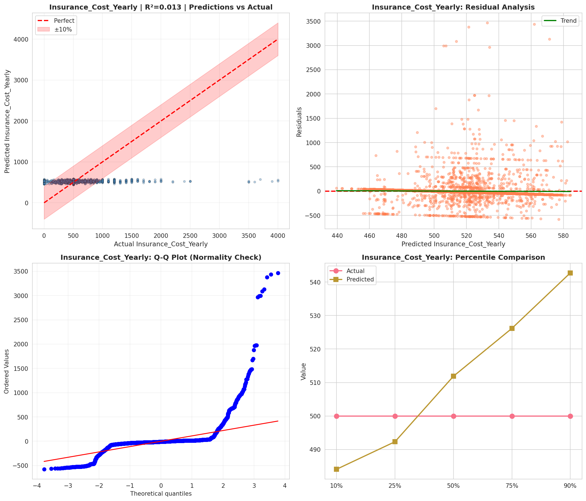
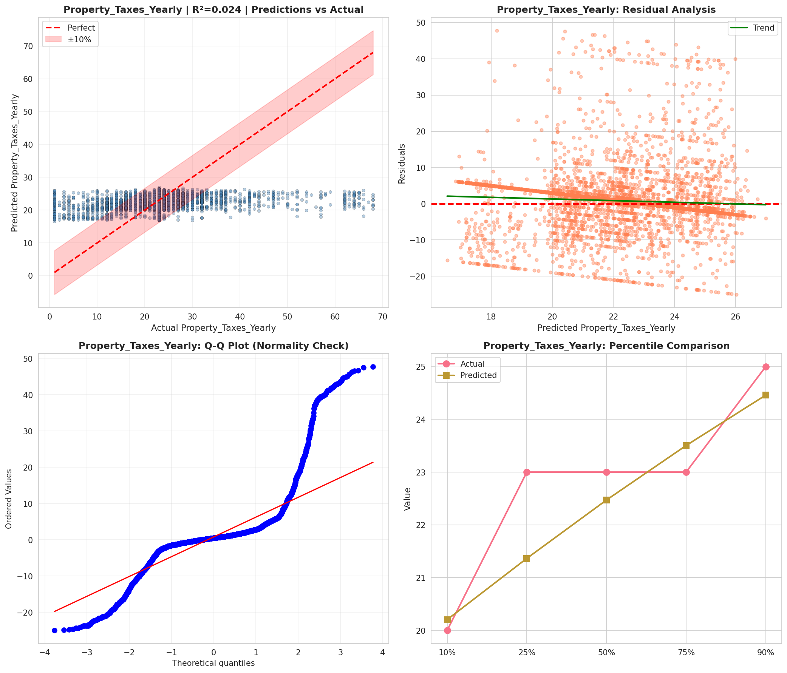
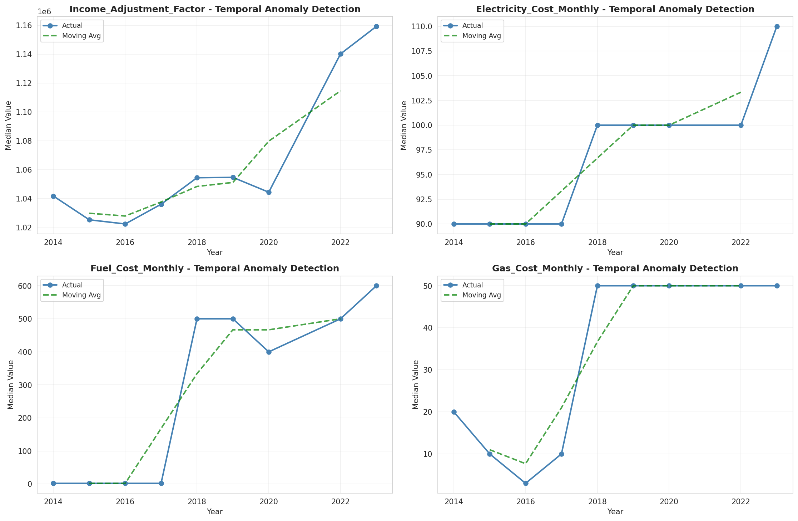
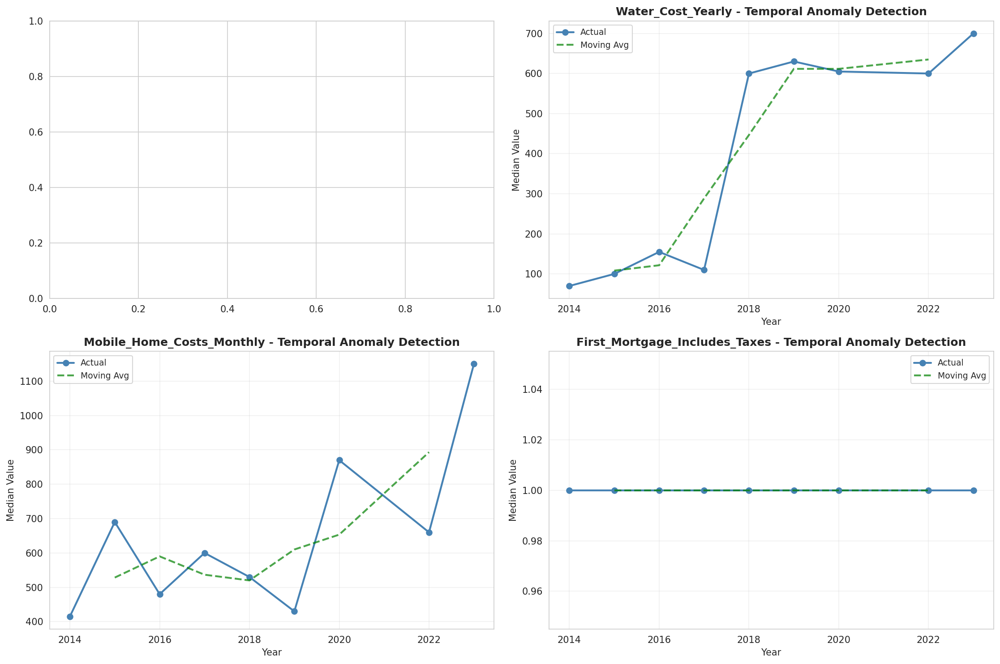
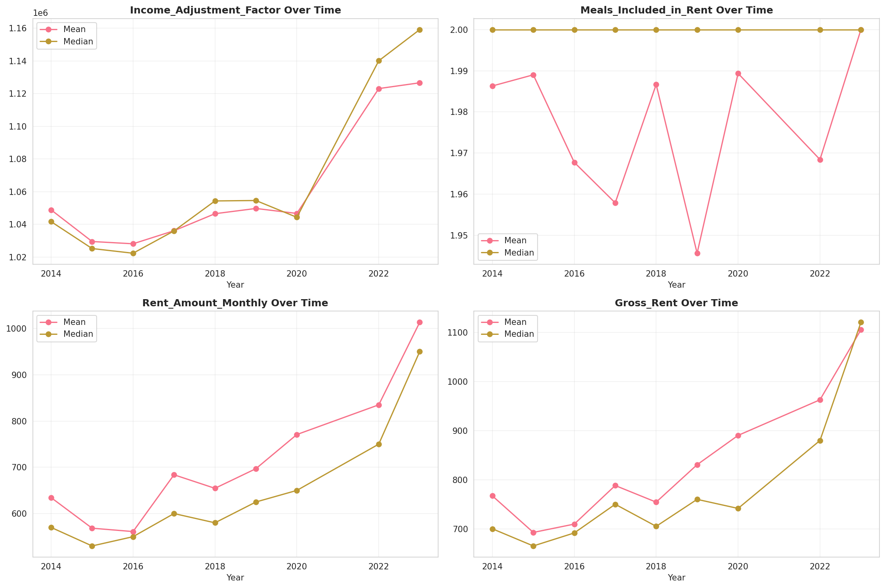
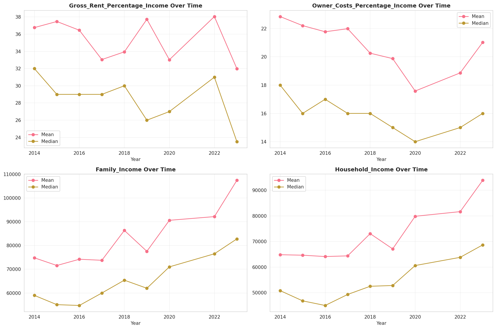
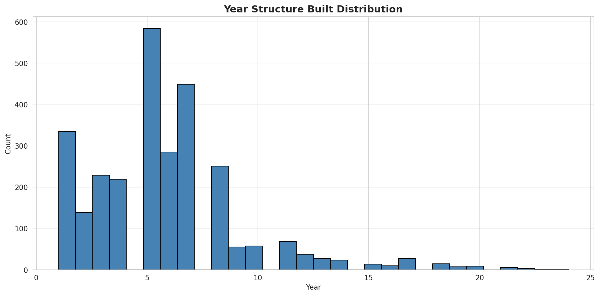
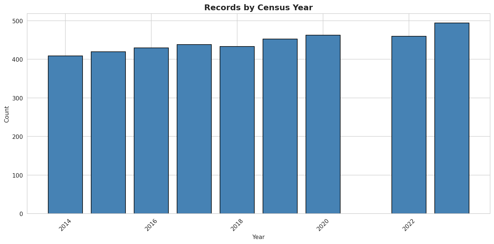
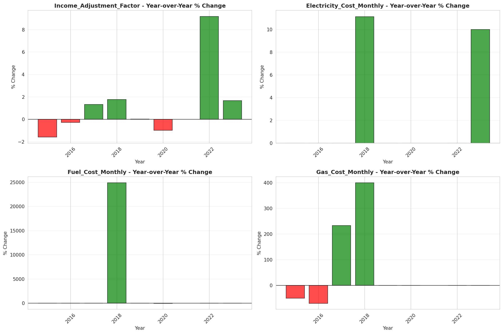
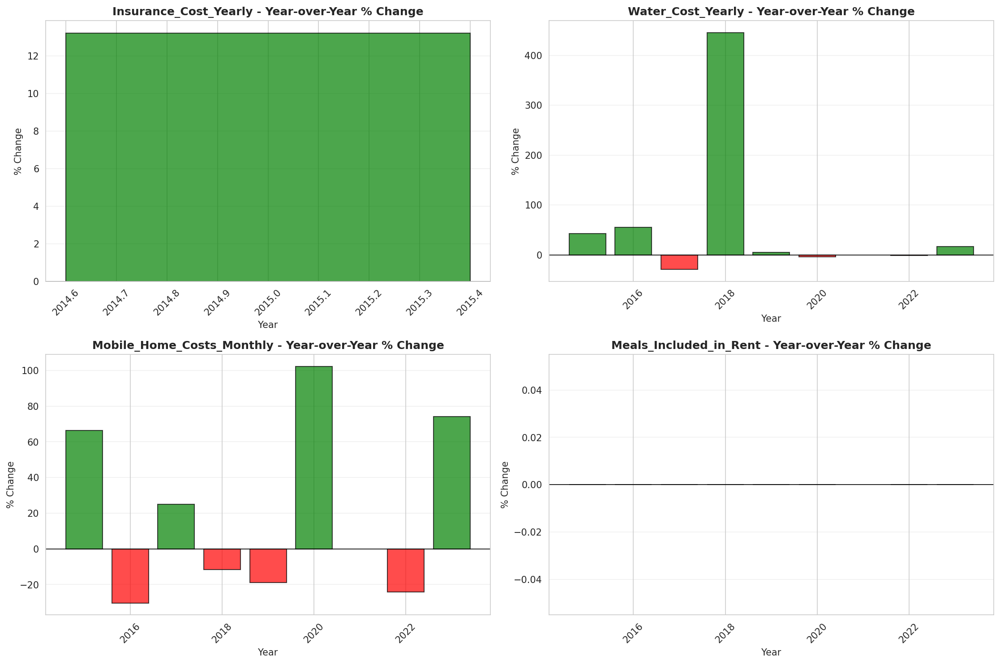

# Temporal Analysis

## Year Distribution

- 2014: 35,894 records

- 2015: 36,308 records

- 2016: 36,516 records

- 2017: 37,053 records

- 2018: 37,683 records

- 2019: 38,369 records

- 2020: 38,398 records

- 2022: 40,560 records

- 2023: 42,043 records

## Temporal Trends

- Census_Year: {np.int64(2014): {'mean': 2014.0, 'median': 2014.0, 'std': 0.0}, np.int64(2015): {'mean': 2015.0, 'median': 2015.0, 'std': 0.0}, np.int64(2016): {'mean': 2016.0, 'median': 2016.0, 'std': 0.0}, np.int64(2017): {'mean': 2017.0, 'median': 2017.0, 'std': 0.0}, np.int64(2018): {'mean': 2018.0, 'median': 2018.0, 'std': 0.0}, np.int64(2019): {'mean': 2019.0, 'median': 2019.0, 'std': 0.0}, np.int64(2020): {'mean': 2020.0, 'median': 2020.0, 'std': 0.0}, np.int64(2022): {'mean': 2022.0, 'median': 2022.0, 'std': 0.0}, np.int64(2023): {'mean': 2023.0, 'median': 2023.0, 'std': 0.0}}

- Census_Division: {np.int64(2014): {'mean': 8.0, 'median': 8.0, 'std': 0.0}, np.int64(2015): {'mean': 8.0, 'median': 8.0, 'std': 0.0}, np.int64(2016): {'mean': 8.0, 'median': 8.0, 'std': 0.0}, np.int64(2017): {'mean': 8.0, 'median': 8.0, 'std': 0.0}, np.int64(2018): {'mean': 8.0, 'median': 8.0, 'std': 0.0}, np.int64(2019): {'mean': 8.0, 'median': 8.0, 'std': 0.0}, np.int64(2020): {'mean': 8.0, 'median': 8.0, 'std': 0.0}, np.int64(2022): {'mean': 8.0, 'median': 8.0, 'std': 0.0}, np.int64(2023): {'mean': 8.0, 'median': 8.0, 'std': 0.0}}

- Public_Use_Microdata_Area: {np.int64(2014): {'mean': None, 'median': None, 'std': None}, np.int64(2015): {'mean': None, 'median': None, 'std': None}, np.int64(2016): {'mean': 667.1171541242195, 'median': 701.0, 'std': 404.5183128026535}, np.int64(2017): {'mean': 666.360834480339, 'median': 701.0, 'std': 403.8018921318383}, np.int64(2018): {'mean': 665.4483984820741, 'median': 701.0, 'std': 403.15361657128125}, np.int64(2019): {'mean': 663.0686491699028, 'median': 701.0, 'std': 402.28595864689237}, np.int64(2020): {'mean': 661.5040366685765, 'median': 701.0, 'std': 402.58771428686833}, np.int64(2022): {'mean': None, 'median': None, 'std': None}, np.int64(2023): {'mean': 664.5256998786956, 'median': 701.0, 'std': 392.0276301348483}}

- Census_Region: {np.int64(2014): {'mean': 4.0, 'median': 4.0, 'std': 0.0}, np.int64(2015): {'mean': 4.0, 'median': 4.0, 'std': 0.0}, np.int64(2016): {'mean': 4.0, 'median': 4.0, 'std': 0.0}, np.int64(2017): {'mean': 4.0, 'median': 4.0, 'std': 0.0}, np.int64(2018): {'mean': 4.0, 'median': 4.0, 'std': 0.0}, np.int64(2019): {'mean': 4.0, 'median': 4.0, 'std': 0.0}, np.int64(2020): {'mean': 4.0, 'median': 4.0, 'std': 0.0}, np.int64(2022): {'mean': 4.0, 'median': 4.0, 'std': 0.0}, np.int64(2023): {'mean': 4.0, 'median': 4.0, 'std': 0.0}}

- State_Code: {np.int64(2014): {'mean': 16.0, 'median': 16.0, 'std': 0.0}, np.int64(2015): {'mean': 16.0, 'median': 16.0, 'std': 0.0}, np.int64(2016): {'mean': 16.0, 'median': 16.0, 'std': 0.0}, np.int64(2017): {'mean': 16.0, 'median': 16.0, 'std': 0.0}, np.int64(2018): {'mean': 16.0, 'median': 16.0, 'std': 0.0}, np.int64(2019): {'mean': 16.0, 'median': 16.0, 'std': 0.0}, np.int64(2020): {'mean': 16.0, 'median': 16.0, 'std': 0.0}, np.int64(2022): {'mean': 16.0, 'median': 16.0, 'std': 0.0}, np.int64(2023): {'mean': None, 'median': None, 'std': None}}

- Housing_Adjustment_Factor: {np.int64(2014): {'mean': 1036828.5374714436, 'median': 1031130.0, 'std': 29728.41461652371}, np.int64(2015): {'mean': 1020848.9549686019, 'median': 1017534.0, 'std': 20300.675684597325}, np.int64(2016): {'mean': 1020225.418309782, 'median': 1013801.0, 'std': 15744.25568995792}, np.int64(2017): {'mean': 1028932.527568618, 'median': 1034680.0, 'std': 18042.560185298116}, np.int64(2018): {'mean': 1037843.8534883104, 'median': 1046406.0, 'std': 23570.51348348015}, np.int64(2019): {'mean': 1040266.3228908754, 'median': 1042936.0, 'std': 29180.295508720497}, np.int64(2020): {'mean': 1035392.4413511121, 'median': 1030827.0, 'std': 28347.519761638163}, np.int64(2022): {'mean': 1102626.8553500986, 'median': 1133141.0, 'std': 62346.88220806609}, np.int64(2023): {'mean': 1102327.4095568822, 'median': 1125501.0, 'std': 77104.83941548366}}

- Income_Adjustment_Factor: {np.int64(2014): {'mean': 1047667.5486710871, 'median': 1041654.0, 'std': 31142.829056174145}, np.int64(2015): {'mean': 1030241.527239176, 'median': 1025215.0, 'std': 25678.75177737662}, np.int64(2016): {'mean': 1027369.5228393034, 'median': 1022342.0, 'std': 17490.56600069638}, np.int64(2017): {'mean': 1036346.4875718565, 'median': 1035988.0, 'std': 16884.975003500254}, np.int64(2018): {'mean': 1046477.6259586551, 'median': 1054346.0, 'std': 20575.983665400316}, np.int64(2019): {'mean': 1049278.1416247492, 'median': 1054606.0, 'std': 26261.75204752242}, np.int64(2020): {'mean': 1045432.3346007605, 'median': 1044328.0, 'std': 28953.752534123505}, np.int64(2022): {'mean': 1125199.6690088757, 'median': 1140108.0, 'std': 50217.903260602165}, np.int64(2023): {'mean': 1126358.6126108984, 'median': 1159185.0, 'std': 70818.59377312893}}

- Housing_Unit_Weight: {np.int64(2014): {'mean': 18.8171003510336, 'median': 15.0, 'std': 18.216186341946635}, np.int64(2015): {'mean': 18.736972568029085, 'median': 14.0, 'std': 18.89032589960531}, np.int64(2016): {'mean': 18.786641472231352, 'median': 14.0, 'std': 18.601233303863594}, np.int64(2017): {'mean': 18.924135697514373, 'median': 14.0, 'std': 18.639848812843805}, np.int64(2018): {'mean': 18.88732319613619, 'median': 14.0, 'std': 18.63646869595766}, np.int64(2019): {'mean': 18.85881831687039, 'median': 14.0, 'std': 18.73908371329419}, np.int64(2020): {'mean': 19.204411688108756, 'median': 13.0, 'std': 22.74435855545105}, np.int64(2022): {'mean': 18.70998520710059, 'median': 13.0, 'std': 21.971395413701703}, np.int64(2023): {'mean': 18.473538995790026, 'median': 14.0, 'std': 21.774169114117175}}

- Number_of_Persons: {np.int64(2014): {'mean': 2.18317824706079, 'median': 2.0, 'std': 1.6067118422121638}, np.int64(2015): {'mean': 2.153464801145753, 'median': 2.0, 'std': 1.6026056238276056}, np.int64(2016): {'mean': 2.145936028042502, 'median': 2.0, 'std': 1.6040762373671118}, np.int64(2017): {'mean': 2.1483820473375976, 'median': 2.0, 'std': 1.6184909623939217}, np.int64(2018): {'mean': 2.137011384443914, 'median': 2.0, 'std': 1.6127017773001893}, np.int64(2019): {'mean': 2.144621960436811, 'median': 2.0, 'std': 1.6155656776683107}, np.int64(2020): {'mean': 2.13677795718527, 'median': 2.0, 'std': 1.6198115368859594}, np.int64(2022): {'mean': 2.1542652859960554, 'median': 2.0, 'std': 1.6018074718397624}, np.int64(2023): {'mean': 2.167138405917751, 'median': 2.0, 'std': 1.5956755461676633}}

- Housing_Unit_Type: {np.int64(2014): {'mean': 1.083941605839416, 'median': 1.0, 'std': 0.35596668679148696}, np.int64(2015): {'mean': 1.0904208438911536, 'median': 1.0, 'std': 0.3696916914381648}, np.int64(2016): {'mean': 1.0882079088618688, 'median': 1.0, 'std': 0.36642920675684415}, np.int64(2017): {'mean': 1.0891425795482148, 'median': 1.0, 'std': 0.36883629887296}, np.int64(2018): {'mean': 1.088501446275509, 'median': 1.0, 'std': 0.3666562487564718}, np.int64(2019): {'mean': 1.087023378248065, 'median': 1.0, 'std': 0.3621631383261445}, np.int64(2020): {'mean': None, 'median': None, 'std': None}, np.int64(2022): {'mean': None, 'median': None, 'std': None}, np.int64(2023): {'mean': None, 'median': None, 'std': None}}

- Building_Type: {np.int64(2014): {'mean': 2.3965358993338266, 'median': 2.0, 'std': 1.4755884002352901}, np.int64(2015): {'mean': 2.3901449445800136, 'median': 2.0, 'std': 1.4636484368187186}, np.int64(2016): {'mean': 2.403874205029465, 'median': 2.0, 'std': 1.4869659176561814}, np.int64(2017): {'mean': 2.416211240867514, 'median': 2.0, 'std': 1.5061064958285146}, np.int64(2018): {'mean': 2.4280139136336643, 'median': 2.0, 'std': 1.5290642879352616}, np.int64(2019): {'mean': 2.4381211481872187, 'median': 2.0, 'std': 1.5450947325049955}, np.int64(2020): {'mean': 2.4449909179823948, 'median': 2.0, 'std': 1.552620192033467}, np.int64(2022): {'mean': 2.4579935622317595, 'median': 2.0, 'std': 1.5602926677402107}, np.int64(2023): {'mean': 2.456140350877193, 'median': 2.0, 'std': 1.5432802202153906}}

- Year_Structure_Built: {np.int64(2014): {'mean': 5.455070318282753, 'median': 5.0, 'std': 2.834583945800936}, np.int64(2015): {'mean': 5.517331608502631, 'median': 5.0, 'std': 2.9615168313148605}, np.int64(2016): {'mean': 5.652313437190035, 'median': 5.0, 'std': 3.136656962729859}, np.int64(2017): {'mean': 5.824800092043951, 'median': 5.0, 'std': 3.402234683931419}, np.int64(2018): {'mean': 5.975622861344419, 'median': 5.0, 'std': 3.6592603462027227}, np.int64(2019): {'mean': 6.171922713897063, 'median': 6.0, 'std': 3.981182949763548}, np.int64(2020): {'mean': 6.355679754086908, 'median': 6.0, 'std': 4.300080417448391}, np.int64(2022): {'mean': None, 'median': None, 'std': None}, np.int64(2023): {'mean': None, 'median': None, 'std': None}}

- Bathtub_or_Shower: {np.int64(2014): {'mean': 1.0100666173205033, 'median': 1.0, 'std': 0.0998277295844122}, np.int64(2015): {'mean': 1.0097021726986741, 'median': 1.0, 'std': 0.09802205381099009}, np.int64(2016): {'mean': 1.0096271661123752, 'median': 1.0, 'std': 0.09764610563063571}, np.int64(2017): {'mean': 1.0101248346085256, 'median': 1.0, 'std': 0.10011298926906737}, np.int64(2018): {'mean': 1.0109725403693335, 'median': 1.0, 'std': 0.10417509602440496}, np.int64(2019): {'mean': 1.0100216534340125, 'median': 1.0, 'std': 0.09960670321437154}, np.int64(2020): {'mean': 1.0097247450048903, 'median': 1.0, 'std': 0.09813482286650467}, np.int64(2022): {'mean': 1.0083154506437768, 'median': 1.0, 'std': 0.09081038007541288}, np.int64(2023): {'mean': 1.007196134047694, 'median': 1.0, 'std': 0.08452536507655281}}

- Refrigerator: {np.int64(2014): {'mean': 1.012701702442635, 'median': 1.0, 'std': 0.11198544771599239}, np.int64(2015): {'mean': 1.0127892276482522, 'median': 1.0, 'std': 0.1123656287146371}, np.int64(2016): {'mean': 1.0122819301009394, 'median': 1.0, 'std': 0.11014280824084634}, np.int64(2017): {'mean': 1.0127998619340735, 'median': 1.0, 'std': 0.11241169395699425}, np.int64(2018): {'mean': 1.0134894375159074, 'median': 1.0, 'std': 0.11535965037205345}, np.int64(2019): {'mean': 1.0134917550385876, 'median': 1.0, 'std': 0.11536939405093662}, np.int64(2020): {'mean': 1.012966326673187, 'median': 1.0, 'std': 0.11313071509225403}, np.int64(2022): {'mean': 1.0114002145922747, 'median': 1.0, 'std': 0.1061628561277398}, np.int64(2023): {'mean': 1.009796197079525, 'median': 1.0, 'std': 0.09849104715012687}}

- Hot_and_Cold_Running_Water: {np.int64(2014): {'mean': 1.0125832716506291, 'median': 1.0, 'std': 0.11146883335600845}, np.int64(2015): {'mean': 1.0124070208449711, 'median': 1.0, 'std': 0.11069528868238238}, np.int64(2016): {'mean': 1.012573662407375, 'median': 1.0, 'std': 0.11142678149242627}, np.int64(2017): {'mean': 1.0132600816890065, 'median': 1.0, 'std': 0.11438806006478018}, np.int64(2018): {'mean': 1.014055032380306, 'median': 1.0, 'std': 0.11771949856498859}, np.int64(2019): {'mean': 1.0131586252845484, 'median': 1.0, 'std': 0.11395541392378815}, np.int64(2020): {'mean': 1.0131060500209585, 'median': 1.0, 'std': 0.11373057165128919}, np.int64(2022): {'mean': 1.0113465665236052, 'median': 1.0, 'std': 0.1059156403325}, np.int64(2023): {'mean': 1.0102689358125854, 'median': 1.0, 'std': 0.10081543385387896}}

- Running_Water: {np.int64(2014): {'mean': 9.0, 'median': 9.0, 'std': 0.0}, np.int64(2015): {'mean': 9.0, 'median': 9.0, 'std': 0.0}, np.int64(2016): {'mean': 9.0, 'median': 9.0, 'std': 0.0}, np.int64(2017): {'mean': 9.0, 'median': 9.0, 'std': 0.0}, np.int64(2018): {'mean': 9.0, 'median': 9.0, 'std': 0.0}, np.int64(2019): {'mean': 9.0, 'median': 9.0, 'std': 0.0}, np.int64(2020): {'mean': 9.0, 'median': 9.0, 'std': 0.0}, np.int64(2022): {'mean': 9.0, 'median': 9.0, 'std': 0.0}, np.int64(2023): {'mean': 9.0, 'median': 9.0, 'std': 0.0}}

- Sink_with_Faucet: {np.int64(2014): {'mean': 1.008142116950407, 'median': 1.0, 'std': 0.08986691268524583}, np.int64(2015): {'mean': 1.0080263428689031, 'median': 1.0, 'std': 0.0892309070926172}, np.int64(2016): {'mean': 1.0077892525818308, 'median': 1.0, 'std': 0.08791362579416052}, np.int64(2017): {'mean': 1.0081113731806939, 'median': 1.0, 'std': 0.0896984405291874}, np.int64(2018): {'mean': 1.009049517830378, 'median': 1.0, 'std': 0.09469887890938021}, np.int64(2019): {'mean': 1.0083560046638165, 'median': 1.0, 'std': 0.09102973078837631}, np.int64(2020): {'mean': 1.007824507475199, 'median': 1.0, 'std': 0.08811073434294947}, np.int64(2022): {'mean': 1.0066523605150215, 'median': 1.0, 'std': 0.08129135178746393}, np.int64(2023): {'mean': 1.005489021956088, 'median': 1.0, 'std': 0.07388528924048703}}

- Stove_or_Range: {np.int64(2014): {'mean': 1.0140932642487046, 'median': 1.0, 'std': 0.11787729023068605}, np.int64(2015): {'mean': 1.0142886543380472, 'median': 1.0, 'std': 0.11867983315950688}, np.int64(2016): {'mean': 1.0144115759379193, 'median': 1.0, 'std': 0.11918178049572704}, np.int64(2017): {'mean': 1.0150146695046884, 'median': 1.0, 'std': 0.12161272388222642}, np.int64(2018): {'mean': 1.0157518169735018, 'median': 1.0, 'std': 0.12451560419686933}, np.int64(2019): {'mean': 1.0155182943756593, 'median': 1.0, 'std': 0.12360380674672206}, np.int64(2020): {'mean': 1.0151180662288668, 'median': 1.0, 'std': 0.12202428609272539}, np.int64(2022): {'mean': 1.0133851931330473, 'median': 1.0, 'std': 0.11491903230681903}, np.int64(2023): {'mean': 1.0118184683265048, 'median': 1.0, 'std': 0.10806987954173393}}

- Telephone_Service: {np.int64(2014): {'mean': 1.0285029302077784, 'median': 1.0, 'std': 0.1664074374589527}, np.int64(2015): {'mean': 1.029569266589057, 'median': 1.0, 'std': 0.16939858182334477}, np.int64(2016): {'mean': 1.0308613389785657, 'median': 1.0, 'std': 0.1729448064584283}, np.int64(2017): {'mean': 1.0279084967320262, 'median': 1.0, 'std': 0.1647133848835733}, np.int64(2018): {'mean': 1.0259264024704067, 'median': 1.0, 'std': 0.15891833279346976}, np.int64(2019): {'mean': 1.0224336757199572, 'median': 1.0, 'std': 0.14809151534786189}, np.int64(2020): {'mean': 1.0179779563573992, 'median': 1.0, 'std': 0.132873286372008}, np.int64(2022): {'mean': 1.0109790946006918, 'median': 1.0, 'std': 0.10420595335410113}, np.int64(2023): {'mean': 1.0091630675849188, 'median': 1.0, 'std': 0.09528573203383871}}

- Lot_Acreage: {np.int64(2014): {'mean': 1.3692683579891558, 'median': 1.0, 'std': 0.6227509913914457}, np.int64(2015): {'mean': 1.3712871287128714, 'median': 1.0, 'std': 0.621941734118015}, np.int64(2016): {'mean': 1.3663143989431967, 'median': 1.0, 'std': 0.6172129595816579}, np.int64(2017): {'mean': 1.365323159199113, 'median': 1.0, 'std': 0.6153184667357422}, np.int64(2018): {'mean': 1.3612636039680246, 'median': 1.0, 'std': 0.6134514966031119}, np.int64(2019): {'mean': 1.3603560943271142, 'median': 1.0, 'std': 0.6126052868744298}, np.int64(2020): {'mean': 1.360313979724791, 'median': 1.0, 'std': 0.6121391164637758}, np.int64(2022): {'mean': 1.3517489774739027, 'median': 1.0, 'std': 0.6041189465526797}, np.int64(2023): {'mean': 1.3474475190839694, 'median': 1.0, 'std': 0.5981817663587737}}

- Agricultural_Sales: {np.int64(2014): {'mean': 1.463082068433239, 'median': 1.0, 'std': 1.289793307661302}, np.int64(2015): {'mean': 1.4556625285026603, 'median': 1.0, 'std': 1.2806971589114182}, np.int64(2016): {'mean': 1.4384781778852271, 'median': 1.0, 'std': 1.2504519009564836}, np.int64(2017): {'mean': 1.4347115747140882, 'median': 1.0, 'std': 1.2411239748097906}, np.int64(2018): {'mean': 1.4374921630094044, 'median': 1.0, 'std': 1.245638986215694}, np.int64(2019): {'mean': 1.4287306501547987, 'median': 1.0, 'std': 1.2312369090182511}, np.int64(2020): {'mean': 1.4131826741996234, 'median': 1.0, 'std': 1.2070452724338063}, np.int64(2022): {'mean': 1.3761223004125211, 'median': 1.0, 'std': 1.1514393196439554}, np.int64(2023): {'mean': 1.3624660446439116, 'median': 1.0, 'std': 1.1317942177399936}}

- Business_On_Property: {np.int64(2014): {'mean': 1.9795501706941563, 'median': 2.0, 'std': 0.14153552295186927}, np.int64(2015): {'mean': 1.9797660974151106, 'median': 2.0, 'std': 0.14080181269327974}, np.int64(2016): {'mean': 3.4032694848084546, 'median': 2.0, 'std': 2.826106493530978}, np.int64(2017): {'mean': 4.84490967194939, 'median': 2.0, 'std': 3.4527411578824907}, np.int64(2018): {'mean': 6.255064368037497, 'median': 9.0, 'std': 3.427244285156153}, np.int64(2019): {'mean': 7.64308488808915, 'median': 9.0, 'std': 2.7734052477576157}, np.int64(2020): {'mean': None, 'median': None, 'std': None}, np.int64(2022): {'mean': None, 'median': None, 'std': None}, np.int64(2023): {'mean': None, 'median': None, 'std': None}}

- Tenure: {np.int64(2014): {'mean': 1.8224560468833244, 'median': 2.0, 'std': 0.8748259009828553}, np.int64(2015): {'mean': 1.834159321470148, 'median': 2.0, 'std': 0.8738087454079623}, np.int64(2016): {'mean': 1.8360677427890977, 'median': 2.0, 'std': 0.8721210591711699}, np.int64(2017): {'mean': 1.836437908496732, 'median': 2.0, 'std': 0.8704879835219254}, np.int64(2018): {'mean': 1.8383299022130726, 'median': 2.0, 'std': 0.8662518809099395}, np.int64(2019): {'mean': 1.8300144936668978, 'median': 2.0, 'std': 0.8605355404821832}, np.int64(2020): {'mean': 1.8231744115872057, 'median': 2.0, 'std': 0.8526280100461247}, np.int64(2022): {'mean': 1.8128139569860129, 'median': 2.0, 'std': 0.842916603313815}, np.int64(2023): {'mean': 1.8057079491070387, 'median': 2.0, 'std': 0.8381498760892447}}

- Vacancy_Status: {np.int64(2014): {'mean': 4.812717071867486, 'median': 5.0, 'std': 1.638470127262426}, np.int64(2015): {'mean': 4.869554204660588, 'median': 5.0, 'std': 1.5856447175698862}, np.int64(2016): {'mean': 4.883835887296095, 'median': 5.0, 'std': 1.5678635181757672}, np.int64(2017): {'mean': 4.904704752760441, 'median': 5.0, 'std': 1.5711357853175427}, np.int64(2018): {'mean': 4.945237538029487, 'median': 5.0, 'std': 1.573360985355397}, np.int64(2019): {'mean': 5.022175536881419, 'median': 5.0, 'std': 1.5726542834370054}, np.int64(2020): {'mean': 5.108554160855416, 'median': 5.0, 'std': 1.543773839413954}, np.int64(2022): {'mean': 5.15910780669145, 'median': 5.0, 'std': 1.471077364997726}, np.int64(2023): {'mean': 5.165966386554622, 'median': 5.0, 'std': 1.4619874174377776}}

- Vehicles_Available: {np.int64(2014): {'mean': 2.1014917421417154, 'median': 2.0, 'std': 1.1282905793186921}, np.int64(2015): {'mean': 2.1073673706968234, 'median': 2.0, 'std': 1.1312458652021404}, np.int64(2016): {'mean': 2.1138197935961895, 'median': 2.0, 'std': 1.1368784790243853}, np.int64(2017): {'mean': 2.1362745098039215, 'median': 2.0, 'std': 1.1491266332109789}, np.int64(2018): {'mean': 2.1566520844055583, 'median': 2.0, 'std': 1.1588685445578524}, np.int64(2019): {'mean': 2.182273615224652, 'median': 2.0, 'std': 1.1745661891151928}, np.int64(2020): {'mean': 2.2037607597751165, 'median': 2.0, 'std': 1.186848965591416}, np.int64(2022): {'mean': 2.238141073845691, 'median': 2.0, 'std': 1.1980717511982426}, np.int64(2023): {'mean': 2.246177191548967, 'median': 2.0, 'std': 1.1960876438849943}}

- Condo_Fee_Monthly: {np.int64(2014): {'mean': 175.19783197831978, 'median': 120.0, 'std': 176.577075164212}, np.int64(2015): {'mean': 184.56441717791412, 'median': 130.0, 'std': 181.32300246321392}, np.int64(2016): {'mean': 202.51671732522797, 'median': 140.0, 'std': 195.59593240800547}, np.int64(2017): {'mean': 199.69131832797427, 'median': 140.0, 'std': 181.2464581772698}, np.int64(2018): {'mean': 214.20645161290324, 'median': 150.0, 'std': 194.84497851891095}, np.int64(2019): {'mean': 222.4393442622951, 'median': 170.0, 'std': 198.71992595925755}, np.int64(2020): {'mean': 229.34579439252337, 'median': 170.0, 'std': 204.75719322546422}, np.int64(2022): {'mean': 251.70501474926255, 'median': 180.0, 'std': 248.31471311608954}, np.int64(2023): {'mean': 259.92550143266476, 'median': 200.0, 'std': 248.9871093870356}}

- Electricity_Cost_Monthly: {np.int64(2014): {'mean': 111.13429009057006, 'median': 90.0, 'std': 79.24032338687617}, np.int64(2015): {'mean': 113.2668551471811, 'median': 100.0, 'std': 80.43226708386517}, np.int64(2016): {'mean': 113.91800079386081, 'median': 100.0, 'std': 80.93815625874683}, np.int64(2017): {'mean': 117.23588235294118, 'median': 100.0, 'std': 84.16785703474555}, np.int64(2018): {'mean': 122.69351425788466, 'median': 100.0, 'std': 82.90616682472034}, np.int64(2019): {'mean': 122.00631495855808, 'median': 100.0, 'std': 83.20890870274759}, np.int64(2020): {'mean': 122.73532823010902, 'median': 100.0, 'std': 83.61084755633391}, np.int64(2022): {'mean': 129.33495813023373, 'median': 100.0, 'std': 126.18235109500999}, np.int64(2023): {'mean': 134.36679770184458, 'median': 100.0, 'std': 138.99898421566684}}

- Fuel_Cost_Monthly: {np.int64(2014): {'mean': 126.08477623867874, 'median': 2.0, 'std': 375.2376655616346}, np.int64(2015): {'mean': 123.27061367038084, 'median': 2.0, 'std': 370.14594486387983}, np.int64(2016): {'mean': 111.50860015877217, 'median': 2.0, 'std': 343.710294901016}, np.int64(2017): {'mean': 103.31415032679739, 'median': 2.0, 'std': 326.82961335481207}, np.int64(2018): {'mean': 622.584511248258, 'median': 500.0, 'std': 570.3683851319793}, np.int64(2019): {'mean': 617.4667199680192, 'median': 500.0, 'std': 555.4305017055547}, np.int64(2020): {'mean': 621.4262125902993, 'median': 500.0, 'std': 551.9998782430163}, np.int64(2022): {'mean': 673.0463114754099, 'median': 500.0, 'std': 612.2818458258735}, np.int64(2023): {'mean': 703.0450187578158, 'median': 500.0, 'std': 656.0660154991435}}

- Gas_Cost_Monthly: {np.int64(2014): {'mean': 41.98351758124667, 'median': 10.0, 'std': 62.40163404893368}, np.int64(2015): {'mean': 40.565175453184764, 'median': 10.0, 'std': 61.83555391845982}, np.int64(2016): {'mean': 38.79071844403281, 'median': 10.0, 'std': 59.42506867637436}, np.int64(2017): {'mean': 38.12921568627451, 'median': 10.0, 'std': 58.92071296297357}, np.int64(2018): {'mean': 68.08361858190709, 'median': 50.0, 'std': 65.49036333180543}, np.int64(2019): {'mean': 66.09390787518574, 'median': 50.0, 'std': 64.61369331909555}, np.int64(2020): {'mean': 64.96284387281172, 'median': 50.0, 'std': 64.62538841200785}, np.int64(2022): {'mean': 71.59960378604447, 'median': 50.0, 'std': 119.49127548724644}, np.int64(2023): {'mean': 77.57082705203514, 'median': 50.0, 'std': 129.6304360299627}}

- House_Heating_Fuel: {np.int64(2014): {'mean': 2.482818327117741, 'median': 2.0, 'std': 1.7077346317275515}, np.int64(2015): {'mean': 2.5095958756028605, 'median': 3.0, 'std': 1.7178147435073394}, np.int64(2016): {'mean': 2.4969568668960043, 'median': 2.0, 'std': 1.7212143419345964}, np.int64(2017): {'mean': 2.4826143790849673, 'median': 2.0, 'std': 1.7149448045135365}, np.int64(2018): {'mean': 2.465774575398868, 'median': 2.0, 'std': 1.7029885435185668}, np.int64(2019): {'mean': 2.4422143802382004, 'median': 2.0, 'std': 1.687858975117282}, np.int64(2020): {'mean': 2.428580503763936, 'median': 2.0, 'std': 1.6837900931096779}, np.int64(2022): {'mean': 2.386915325612874, 'median': 2.0, 'std': 1.6549632945767674}, np.int64(2023): {'mean': 2.3520485584218513, 'median': 2.0, 'std': 1.6369575881385252}}

- Insurance_Cost_Yearly: {np.int64(2014): {'mean': 664.2270335896399, 'median': 550.0, 'std': 495.42505710207587}, np.int64(2015): {'mean': 689.6459854014598, 'median': 570.0, 'std': 509.0279218594261}}

- Water_Cost_Yearly: {np.int64(2014): {'mean': 357.15290356952585, 'median': 140.0, 'std': 431.6376597223949}, np.int64(2015): {'mean': 363.3284882754033, 'median': 120.0, 'std': 443.3356158292485}, np.int64(2016): {'mean': 369.10862662079916, 'median': 110.0, 'std': 452.3570734245418}, np.int64(2017): {'mean': 374.604477124183, 'median': 100.0, 'std': 463.03128015685184}, np.int64(2018): {'mean': 613.4560224964849, 'median': 600.0, 'std': 461.5047325266726}, np.int64(2019): {'mean': 624.569025786514, 'median': 600.0, 'std': 473.4947993299622}, np.int64(2020): {'mean': 639.5425817905149, 'median': 600.0, 'std': 486.73496629287104}, np.int64(2022): {'mean': 668.4515496639283, 'median': 620.0, 'std': 529.5201173426885}, np.int64(2023): {'mean': 685.5519471829415, 'median': 640.0, 'std': 556.6419110662548}}

- Mobile_Home_Costs_Monthly: {np.int64(2014): {'mean': 1515.3817683344757, 'median': 680.0, 'std': 1672.5250680106922}, np.int64(2015): {'mean': 1535.8595773687798, 'median': 650.0, 'std': 1770.5776982251314}, np.int64(2016): {'mean': 1535.9708737864078, 'median': 645.0, 'std': 1781.6329422353595}, np.int64(2017): {'mean': 1529.3949458483755, 'median': 600.0, 'std': 1830.4954241425476}, np.int64(2018): {'mean': 1606.9493670886077, 'median': 620.0, 'std': 1956.9048279176475}, np.int64(2019): {'mean': 1709.3572909467864, 'median': 680.0, 'std': 2048.4341187990094}, np.int64(2020): {'mean': 1802.0797101449275, 'median': 745.0, 'std': 2186.989860330674}, np.int64(2022): {'mean': 2138.0880330123796, 'median': 880.0, 'std': 3134.1570964539173}, np.int64(2023): {'mean': 2419.25, 'median': 950.0, 'std': 4094.622123415661}}

- First_Mortgage_Includes_Insurance: {np.int64(2014): {'mean': 1.3229836089248321, 'median': 1.0, 'std': 0.4676333902447641}, np.int64(2015): {'mean': 1.3170013977782682, 'median': 1.0, 'std': 0.46532509165010205}, np.int64(2016): {'mean': 1.3116730373419583, 'median': 1.0, 'std': 0.46319404803936626}, np.int64(2017): {'mean': 1.302613379922836, 'median': 1.0, 'std': 0.45940601445117907}, np.int64(2018): {'mean': 1.2954742625795257, 'median': 1.0, 'std': 0.4562721486666335}, np.int64(2019): {'mean': 1.2873555117000282, 'median': 1.0, 'std': 0.45254475590883136}, np.int64(2020): {'mean': 1.2821155084806413, 'median': 1.0, 'std': 0.45004537939346295}, np.int64(2022): {'mean': 1.2726274617443216, 'median': 1.0, 'std': 0.4453261021495175}, np.int64(2023): {'mean': 1.2701801200800533, 'median': 1.0, 'std': 0.44406753761362033}}

- First_Mortgage_Payment_Monthly: {np.int64(2014): {'mean': 939.8482200880931, 'median': 820.0, 'std': 573.4331937907768}, np.int64(2015): {'mean': 933.1964981976017, 'median': 820.0, 'std': 558.7712500652196}, np.int64(2016): {'mean': 936.6890620405763, 'median': 820.0, 'std': 556.0876980765738}, np.int64(2017): {'mean': 947.9237096891607, 'median': 830.0, 'std': 559.0679952384361}, np.int64(2018): {'mean': 974.6704742625795, 'median': 860.0, 'std': 561.9937438412225}, np.int64(2019): {'mean': 1014.5551170002819, 'median': 900.0, 'std': 589.4564056443093}, np.int64(2020): {'mean': 1053.0959708008302, 'median': 920.0, 'std': 608.1651940523562}, np.int64(2022): {'mean': 1168.8642009195087, 'median': 1000.0, 'std': 674.740984467017}, np.int64(2023): {'mean': 1248.468579052702, 'median': 1100.0, 'std': 735.8991490611669}}

- First_Mortgage_Includes_Taxes: {np.int64(2014): {'mean': 1.269838977543505, 'median': 1.0, 'std': 0.44389202684138335}, np.int64(2015): {'mean': 1.2631501508129184, 'median': 1.0, 'std': 0.44035941552635727}, np.int64(2016): {'mean': 1.2530138194648632, 'median': 1.0, 'std': 0.4347547819850461}, np.int64(2017): {'mean': 1.2402271238261628, 'median': 1.0, 'std': 0.4272368668241757}, np.int64(2018): {'mean': 1.2279496818970503, 'median': 1.0, 'std': 0.4195251466069382}, np.int64(2019): {'mean': 1.2148294333239358, 'median': 1.0, 'std': 0.4107184406635989}, np.int64(2020): {'mean': 1.2050382881271022, 'median': 1.0, 'std': 0.40374404583341883}, np.int64(2022): {'mean': 1.1869896383723324, 'median': 1.0, 'std': 0.38991658872051493}, np.int64(2023): {'mean': 1.1792528352234823, 'median': 1.0, 'std': 0.38357668277601453}}

- First_Mortgage_Status: {np.int64(2014): {'mean': 1.7693860160559716, 'median': 1.0, 'std': 0.9670797396055993}, np.int64(2015): {'mean': 1.7898332509326262, 'median': 1.0, 'std': 0.9716694440556315}, np.int64(2016): {'mean': 1.7946871785698315, 'median': 1.0, 'std': 0.9728517187951649}, np.int64(2017): {'mean': 1.7978441420745714, 'median': 1.0, 'std': 0.973447681449421}, np.int64(2018): {'mean': 1.8101853861850388, 'median': 1.0, 'std': 0.9760978649050633}, np.int64(2019): {'mean': 1.812161933739013, 'median': 1.0, 'std': 0.9764600307154121}, np.int64(2020): {'mean': 1.8301567848539915, 'median': 1.0, 'std': 0.9798148781441738}, np.int64(2022): {'mean': 1.8569846543268471, 'median': 1.0, 'std': 0.9848124167500196}, np.int64(2023): {'mean': 1.866023784113432, 'median': 1.0, 'std': 0.9865895848840422}}

- Second_Mortgage_Payment_Monthly: {np.int64(2014): {'mean': 342.8602409638554, 'median': 250.0, 'std': 360.79412064849095}, np.int64(2015): {'mean': 334.0716582452917, 'median': 240.0, 'std': 356.3866899926432}, np.int64(2016): {'mean': 318.22814070351757, 'median': 230.0, 'std': 317.3889424450469}, np.int64(2017): {'mean': 307.62978723404257, 'median': 220.0, 'std': 310.5130215075792}, np.int64(2018): {'mean': 310.21533258173616, 'median': 210.0, 'std': 319.68260639914917}, np.int64(2019): {'mean': 313.82101616628177, 'median': 210.0, 'std': 327.21103604784366}, np.int64(2020): {'mean': 321.9437751004016, 'median': 200.0, 'std': 353.2923113051028}, np.int64(2022): {'mean': 364.82229965156796, 'median': 230.0, 'std': 443.9914449263824}, np.int64(2023): {'mean': 400.2931188561215, 'median': 250.0, 'std': 468.3344172499824}}

- Second_Mortgage_Status: {np.int64(2014): {'mean': 2.7807783955520256, 'median': 3.0, 'std': 0.5372090192783323}, np.int64(2015): {'mean': 2.806812329875671, 'median': 3.0, 'std': 0.5089465324133916}, np.int64(2016): {'mean': 2.8232872684504557, 'median': 3.0, 'std': 0.4897825847501661}, np.int64(2017): {'mean': 2.8319866055179443, 'median': 3.0, 'std': 0.4773727700805752}, np.int64(2018): {'mean': 2.844563331405437, 'median': 3.0, 'std': 0.45582938973305204}, np.int64(2019): {'mean': 2.8531857908091345, 'median': 3.0, 'std': 0.44164558339611365}, np.int64(2020): {'mean': 2.8504233971394006, 'median': 3.0, 'std': 0.43830843981554424}, np.int64(2022): {'mean': 2.843438426300189, 'median': 3.0, 'std': 0.4298182302130622}, np.int64(2023): {'mean': 2.833300762165331, 'median': 3.0, 'std': 0.43722672435920656}}

- Property_Taxes_Yearly: {np.int64(2014): {'mean': 22.859084181728484, 'median': 22.0, 'std': 12.76755150681383}, np.int64(2015): {'mean': 23.058699267382803, 'median': 22.0, 'std': 12.951627945204281}, np.int64(2016): {'mean': 23.587227762622422, 'median': 23.0, 'std': 13.201480022615753}, np.int64(2017): {'mean': 24.252915709489308, 'median': 24.0, 'std': 13.489147651966322}}

- Meals_Included_in_Rent: {np.int64(2014): {'mean': 1.9721353812695392, 'median': 2.0, 'std': 0.16459606378732616}, np.int64(2015): {'mean': 1.973119005808456, 'median': 2.0, 'std': 0.1617465310523495}, np.int64(2016): {'mean': 1.970812692462177, 'median': 2.0, 'std': 0.1683425164947017}, np.int64(2017): {'mean': 1.9716283979941938, 'median': 2.0, 'std': 0.1660430438383985}, np.int64(2018): {'mean': 1.9708636836628513, 'median': 2.0, 'std': 0.16819949853511576}, np.int64(2019): {'mean': 1.9700699663125163, 'median': 2.0, 'std': 0.17040536711974516}, np.int64(2020): {'mean': 1.9690253671562084, 'median': 2.0, 'std': 0.17326053465683985}, np.int64(2022): {'mean': 1.970844327176781, 'median': 2.0, 'std': 0.16825383891239104}, np.int64(2023): {'mean': 1.97353249475891, 'median': 2.0, 'std': 0.16053147051586503}}

- Rent_Amount_Monthly: {np.int64(2014): {'mean': 612.1071088759005, 'median': 550.0, 'std': 363.23849296708937}, np.int64(2015): {'mean': 626.4557611779009, 'median': 580.0, 'std': 365.13377572814386}, np.int64(2016): {'mean': 648.6565805328692, 'median': 600.0, 'std': 383.3661280376098}, np.int64(2017): {'mean': 664.9802058590657, 'median': 600.0, 'std': 386.60994107710536}, np.int64(2018): {'mean': 684.4973985431842, 'median': 610.0, 'std': 392.3858372042125}, np.int64(2019): {'mean': 709.2790878465923, 'median': 650.0, 'std': 398.5547190113714}, np.int64(2020): {'mean': 738.3308411214954, 'median': 650.0, 'std': 419.94771437829047}, np.int64(2022): {'mean': 859.5390501319262, 'median': 750.0, 'std': 501.5655018943001}, np.int64(2023): {'mean': 951.9074947589098, 'median': 820.0, 'std': 564.3632462906905}}

- Gross_Rent: {np.int64(2014): {'mean': 743.2345750035955, 'median': 690.0, 'std': 374.5058348168643}, np.int64(2015): {'mean': 757.6562277580072, 'median': 700.0, 'std': 374.23293773294563}, np.int64(2016): {'mean': 776.2191993233719, 'median': 720.0, 'std': 383.8968060154129}, np.int64(2017): {'mean': 795.2152584769316, 'median': 740.0, 'std': 389.27304311211014}, np.int64(2018): {'mean': 815.0068455640745, 'median': 755.0, 'std': 398.2469237850064}, np.int64(2019): {'mean': 839.1352821210061, 'median': 780.0, 'std': 409.68668693465565}, np.int64(2020): {'mean': 868.3030472462958, 'median': 800.0, 'std': 429.0212887271714}, np.int64(2022): {'mean': 991.7377071634023, 'median': 890.0, 'std': 527.0224833015874}, np.int64(2023): {'mean': 1086.544702211369, 'median': 961.0, 'std': 592.371302114312}}

- Gross_Rent_Percentage_Income: {np.int64(2014): {'mean': 37.47626697823865, 'median': 29.0, 'std': 25.953811569713526}, np.int64(2015): {'mean': 36.935254924681345, 'median': 29.0, 'std': 25.857828061315953}, np.int64(2016): {'mean': 36.38279230106291, 'median': 28.0, 'std': 25.724236978478775}, np.int64(2017): {'mean': 35.807370659107015, 'median': 28.0, 'std': 25.634890414575526}, np.int64(2018): {'mean': 35.417887540114414, 'median': 27.0, 'std': 25.25302994622393}, np.int64(2019): {'mean': 35.03003460207612, 'median': 27.0, 'std': 24.96365709020186}, np.int64(2020): {'mean': 34.898764730938524, 'median': 27.0, 'std': 24.806146511510406}, np.int64(2022): {'mean': 35.41990560799556, 'median': 28.0, 'std': 24.870423006371833}, np.int64(2023): {'mean': 35.758317294473464, 'median': 28.0, 'std': 24.981536208864952}}

- Selected_Monthly_Owner_Costs: {np.int64(2014): {'mean': 932.0599982049902, 'median': 805.0, 'std': 716.6540777297073}, np.int64(2015): {'mean': 917.1999910055765, 'median': 793.0, 'std': 696.7763953165951}, np.int64(2016): {'mean': 914.3492617449665, 'median': 793.0, 'std': 684.5880227000209}, np.int64(2017): {'mean': 922.6345592785784, 'median': 801.0, 'std': 684.7568448750444}, np.int64(2018): {'mean': 936.1673327541268, 'median': 810.0, 'std': 688.8330302988263}, np.int64(2019): {'mean': 960.5580451509259, 'median': 829.5, 'std': 708.5513693363205}, np.int64(2020): {'mean': 980.8501669978439, 'median': 842.0, 'std': 726.2917518595447}, np.int64(2022): {'mean': 1067.7903398077456, 'median': 893.0, 'std': 810.1612553708848}, np.int64(2023): {'mean': 1134.6176952693172, 'median': 935.0, 'std': 875.2152154807605}}

- Owner_Costs_Percentage_Income: {np.int64(2014): {'mean': 23.40431778149135, 'median': 18.0, 'std': 20.23299306717101}, np.int64(2015): {'mean': 22.86897488119484, 'median': 17.0, 'std': 20.141705918154784}, np.int64(2016): {'mean': 22.31119920713578, 'median': 17.0, 'std': 19.93052337130604}, np.int64(2017): {'mean': 21.93031436459168, 'median': 17.0, 'std': 19.711995378717923}, np.int64(2018): {'mean': 21.537253357833485, 'median': 16.0, 'std': 19.550291144320447}, np.int64(2019): {'mean': 21.16680144711641, 'median': 16.0, 'std': 19.274437187138204}, np.int64(2020): {'mean': 20.806369209809265, 'median': 16.0, 'std': 18.984345888597584}, np.int64(2022): {'mean': 20.942361276968395, 'median': 15.0, 'std': 19.65157320447439}, np.int64(2023): {'mean': 21.19404588352643, 'median': 15.0, 'std': 20.10157642742218}}

- Satellite_Internet: {np.int64(2014): {'mean': None, 'median': None, 'std': None}, np.int64(2015): {'mean': None, 'median': None, 'std': None}, np.int64(2016): {'mean': None, 'median': None, 'std': None}, np.int64(2017): {'mean': 1.847786360993438, 'median': 2.0, 'std': 0.3592353083588062}, np.int64(2018): {'mean': 1.8449683405678787, 'median': 2.0, 'std': 0.36194206846560323}, np.int64(2019): {'mean': 1.8449096818078754, 'median': 2.0, 'std': 0.3619976014939584}, np.int64(2020): {'mean': 1.846792424860097, 'median': 2.0, 'std': 0.36019414524065335}, np.int64(2022): {'mean': 1.8578333615007605, 'median': 2.0, 'std': 0.34922687144083053}, np.int64(2023): {'mean': 1.8616039744499646, 'median': 2.0, 'std': 0.3453207386888998}}

- Smartphone: {np.int64(2014): {'mean': None, 'median': None, 'std': None}, np.int64(2015): {'mean': None, 'median': None, 'std': None}, np.int64(2016): {'mean': None, 'median': None, 'std': None}, np.int64(2017): {'mean': 1.3280065359477125, 'median': 1.0, 'std': 0.4694948900354818}, np.int64(2018): {'mean': 1.2745110653628409, 'median': 1.0, 'std': 0.4462747435420263}, np.int64(2019): {'mean': 1.227928665952486, 'median': 1.0, 'std': 0.4195029607149141}, np.int64(2020): {'mean': 1.1918495696089952, 'median': 1.0, 'std': 0.39376165008026975}, np.int64(2022): {'mean': 1.1293126785982854, 'median': 1.0, 'std': 0.3355507361874644}, np.int64(2023): {'mean': 1.1096066300922143, 'median': 1.0, 'std': 0.312403368659132}}

- Tablet_Computer: {np.int64(2014): {'mean': None, 'median': None, 'std': None}, np.int64(2015): {'mean': None, 'median': None, 'std': None}, np.int64(2016): {'mean': None, 'median': None, 'std': None}, np.int64(2017): {'mean': 1.4759150326797386, 'median': 1.0, 'std': 0.49942773810948377}, np.int64(2018): {'mean': 1.4326106536284098, 'median': 1.0, 'std': 0.4954458314064814}, np.int64(2019): {'mean': 1.3989224273741256, 'median': 1.0, 'std': 0.48968446946607197}, np.int64(2020): {'mean': 1.3711209224025664, 'median': 1.0, 'std': 0.48311240597407584}, np.int64(2022): {'mean': 1.3599338246352835, 'median': 1.0, 'std': 0.4799879129052522}, np.int64(2023): {'mean': 1.3558130033850824, 'median': 1.0, 'std': 0.47876591248030037}}

- Food_Stamp_SNAP: {np.int64(2014): {'mean': 1.8812478616528256, 'median': 2.0, 'std': 0.32350165848368656}, np.int64(2015): {'mean': 1.8823856613102596, 'median': 2.0, 'std': 0.32215588339564577}, np.int64(2016): {'mean': 1.8870033877425316, 'median': 2.0, 'std': 0.3165935324202235}, np.int64(2017): {'mean': 1.8936357831361936, 'median': 2.0, 'std': 0.30830789894013205}, np.int64(2018): {'mean': 1.9005686920083806, 'median': 2.0, 'std': 0.2992447213238688}, np.int64(2019): {'mean': 1.9072905970368197, 'median': 2.0, 'std': 0.29002902858228546}, np.int64(2020): {'mean': 1.9115732050680432, 'median': 2.0, 'std': 0.2839187578743065}, np.int64(2022): {'mean': 1.9207939767282682, 'median': 2.0, 'std': 0.2700637442993144}, np.int64(2023): {'mean': 1.9251994246109585, 'median': 2.0, 'std': 0.2630727263713348}}

- Family_Type_Employment_Status: {np.int64(2014): {'mean': 2.847992761560074, 'median': 2.0, 'std': 2.12100369556101}, np.int64(2015): {'mean': 2.862364664175529, 'median': 2.0, 'std': 2.114410382191969}, np.int64(2016): {'mean': 2.8719652074173196, 'median': 2.0, 'std': 2.109124418174561}, np.int64(2017): {'mean': 2.864944160514859, 'median': 2.0, 'std': 2.095271765305056}, np.int64(2018): {'mean': 2.8725036247135307, 'median': 2.0, 'std': 2.0899157054289015}, np.int64(2019): {'mean': 2.8743797096122035, 'median': 2.0, 'std': 2.09131424759166}, np.int64(2020): {'mean': 2.8841793531072137, 'median': 2.0, 'std': 2.0854168613161503}, np.int64(2022): {'mean': None, 'median': None, 'std': None}, np.int64(2023): {'mean': None, 'median': None, 'std': None}}

- Family_Income: {np.int64(2014): {'mean': 67940.79699392083, 'median': 54100.0, 'std': 57614.65684376169}, np.int64(2015): {'mean': 70090.73137990762, 'median': 55235.0, 'std': 61402.60396084264}, np.int64(2016): {'mean': 72999.0627247878, 'median': 57600.0, 'std': 65791.82272059524}, np.int64(2017): {'mean': 75774.03356596876, 'median': 60000.0, 'std': 69171.23017963194}, np.int64(2018): {'mean': 78856.92482648659, 'median': 61300.0, 'std': 72285.75221811832}, np.int64(2019): {'mean': 82538.38385373492, 'median': 64000.0, 'std': 74932.01330118466}, np.int64(2020): {'mean': 85652.15154323848, 'median': 66100.0, 'std': 76346.39841686982}, np.int64(2022): {'mean': 95039.8456687396, 'median': 73470.0, 'std': 87274.3513120666}, np.int64(2023): {'mean': 100857.39426371673, 'median': 78000.0, 'std': 92467.1421016085}}

- Family_Presence_Children: {np.int64(2014): {'mean': 3.135902926481085, 'median': 4.0, 'std': 1.0560989855084038}, np.int64(2015): {'mean': 3.1537836027934563, 'median': 4.0, 'std': 1.0508384533369892}, np.int64(2016): {'mean': 3.16733409610984, 'median': 4.0, 'std': 1.045579999923954}, np.int64(2017): {'mean': 3.163860195273808, 'median': 4.0, 'std': 1.0456276818891892}, np.int64(2018): {'mean': 3.1721181623334265, 'median': 4.0, 'std': 1.0455404421163466}, np.int64(2019): {'mean': 3.178586135895676, 'median': 4.0, 'std': 1.0437483206935623}, np.int64(2020): {'mean': 3.184113527460376, 'median': 4.0, 'std': 1.042661891922125}, np.int64(2022): {'mean': 3.1866149623110105, 'median': 4.0, 'std': 1.0419883815129256}, np.int64(2023): {'mean': 3.1867923734163894, 'median': 4.0, 'std': 1.041059076432275}}

- Household_Family_Type: {np.int64(2014): {'mean': 2.4839837506659563, 'median': 1.0, 'std': 1.9794850087516416}, np.int64(2015): {'mean': 2.5024114418759353, 'median': 1.0, 'std': 1.9903478770596352}, np.int64(2016): {'mean': 2.507376290023816, 'median': 1.0, 'std': 1.9931439089793572}, np.int64(2017): {'mean': 2.503888888888889, 'median': 1.0, 'std': 1.9908409615818878}, np.int64(2018): {'mean': 2.5114835306227485, 'median': 1.0, 'std': 1.9938618160749173}, np.int64(2019): {'mean': 2.515312874157162, 'median': 1.0, 'std': 1.9932856536656594}, np.int64(2020): {'mean': 2.51157767684147, 'median': 1.0, 'std': 1.9925097171403032}, np.int64(2022): {'mean': 2.510482779365318, 'median': 1.0, 'std': 1.9946354231801615}, np.int64(2023): {'mean': 2.4989786389634645, 'median': 1.0, 'std': 1.9949667036047682}}

- Household_Income: {np.int64(2014): {'mean': 58759.99300887335, 'median': 45200.0, 'std': 54317.61498763202}, np.int64(2015): {'mean': 60488.27810253309, 'median': 46000.0, 'std': 57545.51036942513}, np.int64(2016): {'mean': 62948.06783457591, 'median': 48000.0, 'std': 61506.9890572574}, np.int64(2017): {'mean': 65255.54510594691, 'median': 49500.0, 'std': 64593.58863302856}, np.int64(2018): {'mean': 67821.80935345388, 'median': 51000.0, 'std': 67568.4274884291}, np.int64(2019): {'mean': 70893.97851071281, 'median': 53440.0, 'std': 69988.47932293742}, np.int64(2020): {'mean': 73579.58310880164, 'median': 55700.0, 'std': 71491.40877449169}, np.int64(2022): {'mean': 81823.47938722887, 'median': 61000.0, 'std': 81702.10614044085}, np.int64(2023): {'mean': 87017.0931218177, 'median': 65000.0, 'std': 86751.57628859648}}

- Number_Persons_Family: {np.int64(2014): {'mean': 3.039685938615275, 'median': 2.0, 'std': 1.3878372457773527}, np.int64(2015): {'mean': 3.0271214005548646, 'median': 2.0, 'std': 1.3883311528238618}, np.int64(2016): {'mean': 3.023932112890923, 'median': 2.0, 'std': 1.3933604875835006}, np.int64(2017): {'mean': 3.034715343615867, 'median': 2.0, 'std': 1.4053209112307326}, np.int64(2018): {'mean': 3.025067561271084, 'median': 2.0, 'std': 1.400614828550705}, np.int64(2019): {'mean': 3.0301532830016016, 'median': 2.0, 'std': 1.4074532770649837}, np.int64(2020): {'mean': 3.032712863988205, 'median': 2.0, 'std': 1.4156589971106948}, np.int64(2022): {'mean': 3.0347697268092895, 'median': 2.0, 'std': 1.407979961205047}, np.int64(2023): {'mean': 3.045414369291637, 'median': 2.0, 'std': 1.4115323291024122}}

- Workers_In_Family: {np.int64(2014): {'mean': 1.4406376397811087, 'median': 2.0, 'std': 0.8799041132323708}, np.int64(2015): {'mean': 1.4375777288816607, 'median': 2.0, 'std': 0.8804947114629154}, np.int64(2016): {'mean': 1.4373569794050343, 'median': 2.0, 'std': 0.8825061040266232}, np.int64(2017): {'mean': 1.4407339276449225, 'median': 2.0, 'std': 0.887432755360689}, np.int64(2018): {'mean': 1.4388686981641972, 'median': 2.0, 'std': 0.8915179921196902}, np.int64(2019): {'mean': 1.4425074353694807, 'median': 2.0, 'std': 0.8968363753986585}, np.int64(2020): {'mean': 1.4388591964614819, 'median': 2.0, 'std': 0.9040210835024097}, np.int64(2022): {'mean': 1.4355365779268878, 'median': 2.0, 'std': 0.9172844351385203}, np.int64(2023): {'mean': 1.4366766278042005, 'median': 2.0, 'std': 0.9260582979207561}}

- Work_Experience_Householder_Spouse: {np.int64(2014): {'mean': 5.951368070425886, 'median': 5.0, 'std': 4.2389280934410305}, np.int64(2015): {'mean': 5.9727350999713, 'median': 5.0, 'std': 4.227394735818607}, np.int64(2016): {'mean': 5.987652555301297, 'median': 5.0, 'std': 4.219641919246943}, np.int64(2017): {'mean': 5.96207726050658, 'median': 5.0, 'std': 4.201367197269802}, np.int64(2018): {'mean': 5.972695927686143, 'median': 5.0, 'std': 4.196625747855724}, np.int64(2019): {'mean': 5.97565774422329, 'median': 5.0, 'std': 4.203117428295281}, np.int64(2020): {'mean': 5.997880575009215, 'median': 5.0, 'std': 4.192033167501116}, np.int64(2022): {'mean': 6.038124700448782, 'median': 5.0, 'std': 4.202435443312793}, np.int64(2023): {'mean': 6.035944273748895, 'median': 5.0, 'std': 4.189153470751302}}

- Work_Status_Householder_Spouse: {np.int64(2014): {'mean': 5.344254488308967, 'median': 3.0, 'std': 4.539590919662106}, np.int64(2015): {'mean': 5.3628916355274505, 'median': 3.0, 'std': 4.538111584751908}, np.int64(2016): {'mean': 5.372108583444848, 'median': 3.0, 'std': 4.536325804827807}, np.int64(2017): {'mean': 5.354580730645466, 'median': 3.0, 'std': 4.520488624585883}, np.int64(2018): {'mean': 5.365885599363922, 'median': 3.0, 'std': 4.517115755662568}, np.int64(2019): {'mean': 5.365419959566256, 'median': 3.0, 'std': 4.5208844415531315}, np.int64(2020): {'mean': 5.393966035815094, 'median': 3.0, 'std': 4.514677452723715}, np.int64(2022): {'mean': 5.443219115137193, 'median': 3.0, 'std': 4.5204474750031105}, np.int64(2023): {'mean': 5.452097074243193, 'median': 3.0, 'std': 4.504789243140687}}

- Complete_Kitchen_Facilities: {np.int64(2014): {'mean': 1.0192746113989637, 'median': 1.0, 'std': 0.1374905831257269}, np.int64(2015): {'mean': 1.0189927380707378, 'median': 1.0, 'std': 0.13650114204057529}, np.int64(2016): {'mean': 1.0184958282280179, 'median': 1.0, 'std': 0.13473775337542}, np.int64(2017): {'mean': 1.0190128286256688, 'median': 1.0, 'std': 0.13657187657411246}, np.int64(2018): {'mean': 1.0200220581997115, 'median': 1.0, 'std': 0.1400775866534429}, np.int64(2019): {'mean': 1.0195713730498028, 'median': 1.0, 'std': 0.13852388640698982}, np.int64(2020): {'mean': 1.0189185412882493, 'median': 1.0, 'std': 0.13623930698936706}, np.int64(2022): {'mean': 1.0167381974248928, 'median': 1.0, 'std': 0.12829057508042652}, np.int64(2023): {'mean': 1.0144973211471793, 'median': 1.0, 'std': 0.11953043153831652}}

- Complete_Plumbing_Facilities: {np.int64(2014): {'mean': 1.0156328645447816, 'median': 1.0, 'std': 0.12405214114157145}, np.int64(2015): {'mean': 1.015582277364537, 'median': 1.0, 'std': 0.12385443471421165}, np.int64(2016): {'mean': 1.0155785051636619, 'median': 1.0, 'std': 0.12383966549073815}, np.int64(2017): {'mean': 1.0162227463613875, 'median': 1.0, 'std': 0.12633300412754617}, np.int64(2018): {'mean': 1.0170244054183988, 'median': 1.0, 'std': 0.12936401470817754}, np.int64(2019): {'mean': 1.0154905335628228, 'median': 1.0, 'std': 0.12349494043452633}, np.int64(2020): {'mean': 1.0152577895766381, 'median': 1.0, 'std': 0.1225781763364569}, np.int64(2022): {'mean': 1.0132242489270387, 'median': 1.0, 'std': 0.11423536323504939}, np.int64(2023): {'mean': 1.011792205063557, 'median': 1.0, 'std': 0.10795116961408771}}

- Plumbing_Facilities_for_Project: {np.int64(2014): {'mean': None, 'median': None, 'std': None}, np.int64(2015): {'mean': None, 'median': None, 'std': None}, np.int64(2016): {'mean': None, 'median': None, 'std': None}, np.int64(2017): {'mean': 9.0, 'median': 9.0, 'std': 0.0}, np.int64(2018): {'mean': 9.0, 'median': 9.0, 'std': 0.0}, np.int64(2019): {'mean': 9.0, 'median': 9.0, 'std': 0.0}, np.int64(2020): {'mean': 9.0, 'median': 9.0, 'std': 0.0}, np.int64(2022): {'mean': 9.0, 'median': 9.0, 'std': 0.0}, np.int64(2023): {'mean': 9.0, 'median': 9.0, 'std': 0.0}}

- Response_Mode: {np.int64(2014): {'mean': 1.6673279052553664, 'median': 2.0, 'std': 0.7154550237605017}, np.int64(2015): {'mean': 1.8236850615940963, 'median': 2.0, 'std': 0.770761854354402}, np.int64(2016): {'mean': 1.9791703133204972, 'median': 2.0, 'std': 0.7994500181536212}, np.int64(2017): {'mean': 2.1395616406834264, 'median': 2.0, 'std': 0.7964188311929092}, np.int64(2018): {'mean': 2.1678402760102937, 'median': 2.0, 'std': 0.8023732466727753}, np.int64(2019): {'mean': 2.194186885792016, 'median': 2.0, 'std': 0.8105016889615126}, np.int64(2020): {'mean': 2.2388989800195613, 'median': 2.0, 'std': 0.8037792992896762}, np.int64(2022): {'mean': 2.3409603004291846, 'median': 3.0, 'std': 0.796648159786878}, np.int64(2023): {'mean': 2.3897205588822357, 'median': 3.0, 'std': 0.7906534881511521}}

- Specified_Rent_Unit: {np.int64(2014): {'mean': 0.23372316802368615, 'median': 0.0, 'std': 0.4232043850778885}, np.int64(2015): {'mean': 0.23379296151471496, 'median': 0.0, 'std': 0.42324824801005095}, np.int64(2016): {'mean': 0.23353171130170955, 'median': 0.0, 'std': 0.42308376608277926}, np.int64(2017): {'mean': 0.233043778404188, 'median': 0.0, 'std': 0.42277596545609236}, np.int64(2018): {'mean': 0.23172421594411924, 'median': 0.0, 'std': 0.42193973316178984}, np.int64(2019): {'mean': 0.22783299094997503, 'median': 0.0, 'std': 0.41944010674308896}, np.int64(2020): {'mean': 0.22188067626100322, 'median': 0.0, 'std': 0.4155171073914714}, np.int64(2022): {'mean': 0.21561158798283261, 'median': 0.0, 'std': 0.4112514654069999}, np.int64(2023): {'mean': 0.21252232377350563, 'median': 0.0, 'std': 0.4090977647419629}}

- Specified_Value_Unit: {np.int64(2014): {'mean': 0.5396299037749815, 'median': 1.0, 'std': 0.4984343751882636}, np.int64(2015): {'mean': 0.5340017052303531, 'median': 1.0, 'std': 0.4988498776154509}, np.int64(2016): {'mean': 0.5376918139914815, 'median': 1.0, 'std': 0.4985845758059952}, np.int64(2017): {'mean': 0.5428292009434506, 'median': 1.0, 'std': 0.4981694469987722}, np.int64(2018): {'mean': 0.5455445264556997, 'median': 1.0, 'std': 0.4979284161234755}, np.int64(2019): {'mean': 0.5520792848814613, 'median': 1.0, 'std': 0.49728725419590913}, np.int64(2020): {'mean': 0.5604582925806902, 'median': 1.0, 'std': 0.49633827081386067}, np.int64(2022): {'mean': 0.5781920600858369, 'median': 1.0, 'std': 0.4938547801950544}, np.int64(2023): {'mean': 0.5933658997793886, 'median': 1.0, 'std': 0.49121191536715236}}

- Moved_When: {np.int64(2014): {'mean': 4.063265849760255, 'median': 4.0, 'std': 1.8167505499844945}, np.int64(2015): {'mean': 4.090240819584886, 'median': 4.0, 'std': 1.8284379124349939}, np.int64(2016): {'mean': 4.080149515398102, 'median': 4.0, 'std': 1.8349241582049745}, np.int64(2017): {'mean': 4.068695055393967, 'median': 4.0, 'std': 1.8416246216126546}, np.int64(2018): {'mean': 4.048026506256635, 'median': 4.0, 'std': 1.8486733118031837}, np.int64(2019): {'mean': 4.03762170337461, 'median': 4.0, 'std': 1.8485058219618646}, np.int64(2020): {'mean': 4.035797096845917, 'median': 4.0, 'std': 1.8498927856670755}, np.int64(2022): {'mean': 4.030891863438111, 'median': 4.0, 'std': 1.8336655267837931}, np.int64(2023): {'mean': 4.04079607797362, 'median': 4.0, 'std': 1.810055207332283}}

- Household_Language: {np.int64(2014): {'mean': 1.1571323921150773, 'median': 1.0, 'std': 0.5485181614808904}, np.int64(2015): {'mean': 1.15666056876767, 'median': 1.0, 'std': 0.5549899648940142}, np.int64(2016): {'mean': 1.1547036252976979, 'median': 1.0, 'std': 0.5503178732799542}, np.int64(2017): {'mean': 1.1562091503267973, 'median': 1.0, 'std': 0.5530552730231593}, np.int64(2018): {'mean': 1.154625579001544, 'median': 1.0, 'std': 0.5516905195553473}, np.int64(2019): {'mean': 1.1588316844161572, 'median': 1.0, 'std': 0.5598200965210133}, np.int64(2020): {'mean': 1.1612298700886192, 'median': 1.0, 'std': 0.5611005112556414}, np.int64(2022): {'mean': 1.1636637088283952, 'median': 1.0, 'std': 0.5642592080456427}, np.int64(2023): {'mean': 1.1655772148943622, 'median': 1.0, 'std': 0.5660741331342871}}

- Household_Language_Detailed: {np.int64(2014): {'mean': None, 'median': None, 'std': None}, np.int64(2015): {'mean': None, 'median': None, 'std': None}, np.int64(2016): {'mean': None, 'median': None, 'std': None}, np.int64(2017): {'mean': None, 'median': None, 'std': None}, np.int64(2018): {'mean': None, 'median': None, 'std': None}, np.int64(2019): {'mean': None, 'median': None, 'std': None}, np.int64(2020): {'mean': None, 'median': None, 'std': None}, np.int64(2022): {'mean': 8686.083651676943, 'median': 9500.0, 'std': 2432.3247741272735}, np.int64(2023): {'mean': 8677.117602427921, 'median': 9500.0, 'std': 2444.9213953681246}}

- Limited_English_Speaking_Household: {np.int64(2014): {'mean': 1.0158164624400638, 'median': 1.0, 'std': 0.12476706415179732}, np.int64(2015): {'mean': 1.0151671378679528, 'median': 1.0, 'std': 0.12221944460726437}, np.int64(2016): {'mean': 1.0151495104525006, 'median': 1.0, 'std': 0.12214948349776404}, np.int64(2017): {'mean': 1.0152614379084968, 'median': 1.0, 'std': 0.1225928936187851}, np.int64(2018): {'mean': 1.014571538857437, 'median': 1.0, 'std': 0.11983184475232718}, np.int64(2019): {'mean': 1.0140210473249731, 'median': 1.0, 'std': 0.11757930579495607}, np.int64(2020): {'mean': 1.0139122701140297, 'median': 1.0, 'std': 0.11712879500018834}, np.int64(2022): {'mean': 1.0127838772747781, 'median': 1.0, 'std': 0.11234246475623172}, np.int64(2023): {'mean': 1.0127232403408428, 'median': 1.0, 'std': 0.11207910630061693}}

- Household_Grandchildren: {np.int64(2014): {'mean': 0.02930207778369739, 'median': 0.0, 'std': 0.16865471578963215}, np.int64(2015): {'mean': 0.029203392649259936, 'median': 0.0, 'std': 0.16837902931710044}, np.int64(2016): {'mean': 0.028347446414395343, 'median': 0.0, 'std': 0.16596620080474742}, np.int64(2017): {'mean': 0.02862745098039216, 'median': 0.0, 'std': 0.16675979376340339}, np.int64(2018): {'mean': 0.028724909933093155, 'median': 0.0, 'std': 0.16703498722399235}, np.int64(2019): {'mean': 0.029270905539101392, 'median': 0.0, 'std': 0.16856753817833192}, np.int64(2020): {'mean': 0.0306514626941524, 'median': 0.0, 'std': 0.1723742855088499}, np.int64(2022): {'mean': 0.031433298240336895, 'median': 0.0, 'std': 0.17448828560630208}, np.int64(2023): {'mean': 0.03125364771798763, 'median': 0.0, 'std': 0.1740050021682853}}

- Household_Children_Present: {np.int64(2014): {'mean': 3.3818593500266383, 'median': 4.0, 'std': 0.9897553382760045}, np.int64(2015): {'mean': 3.3977049725594544, 'median': 4.0, 'std': 0.9806476563009264}, np.int64(2016): {'mean': 3.4096652553585605, 'median': 4.0, 'std': 0.9720600758126325}, np.int64(2017): {'mean': 3.407875816993464, 'median': 4.0, 'std': 0.9724513797310729}, np.int64(2018): {'mean': 3.4155944415851778, 'median': 4.0, 'std': 0.9699794640450263}, np.int64(2019): {'mean': 3.421545150923184, 'median': 4.0, 'std': 0.9670362954430028}, np.int64(2020): {'mean': 3.424641870215672, 'median': 4.0, 'std': 0.9664987866598248}, np.int64(2022): {'mean': 3.4268611821326513, 'median': 4.0, 'std': 0.9645910829445901}, np.int64(2023): {'mean': 3.424915372942687, 'median': 4.0, 'std': 0.9647507844344144}}

- Household_Own_Children_Present: {np.int64(2014): {'mean': 3.4358351092168355, 'median': 4.0, 'std': 0.9605164220312971}, np.int64(2015): {'mean': 3.4523532346582404, 'median': 4.0, 'std': 0.9505116827489845}, np.int64(2016): {'mean': 3.463118549880921, 'median': 4.0, 'std': 0.941736178541052}, np.int64(2017): {'mean': 3.46062091503268, 'median': 4.0, 'std': 0.9421751342234381}, np.int64(2018): {'mean': 3.4685409161091094, 'median': 4.0, 'std': 0.9391228442885794}, np.int64(2019): {'mean': 3.4754867981599347, 'median': 4.0, 'std': 0.9353731450781556}, np.int64(2020): {'mean': 3.479973318934028, 'median': 4.0, 'std': 0.9330576789699192}, np.int64(2022): {'mean': 3.4841329523236575, 'median': 4.0, 'std': 0.9304227230885317}, np.int64(2023): {'mean': 3.4823742266837865, 'median': 4.0, 'std': 0.9297618918312937}}

- Household_Related_Children_Present: {np.int64(2014): {'mean': 3.387786361214704, 'median': 4.0, 'std': 0.9877178553594781}, np.int64(2015): {'mean': 3.4046898386828537, 'median': 4.0, 'std': 0.9776156685092843}, np.int64(2016): {'mean': 3.4163138396401163, 'median': 4.0, 'std': 0.9690775562644873}, np.int64(2017): {'mean': 3.41437908496732, 'median': 4.0, 'std': 0.9695800129794079}, np.int64(2018): {'mean': 3.4218991250643334, 'median': 4.0, 'std': 0.9670209459700783}, np.int64(2019): {'mean': 3.427594681454408, 'median': 4.0, 'std': 0.9643438803538682}, np.int64(2020): {'mean': 3.4297875043674364, 'median': 4.0, 'std': 0.9644191797053138}, np.int64(2022): {'mean': 3.4323356895773802, 'median': 4.0, 'std': 0.9621184827784313}, np.int64(2023): {'mean': 3.430109723357068, 'median': 4.0, 'std': 0.9625068191326622}}

- Number_Own_Children: {np.int64(2014): {'mean': 0.6031233351092168, 'median': 0.0, 'std': 1.1364944174196534}, np.int64(2015): {'mean': 0.5872276733743556, 'median': 0.0, 'std': 1.1283912788622308}, np.int64(2016): {'mean': 0.58309076475258, 'median': 0.0, 'std': 1.1325338522230537}, np.int64(2017): {'mean': 0.587156862745098, 'median': 0.0, 'std': 1.1366854219142568}, np.int64(2018): {'mean': 0.5776827071538857, 'median': 0.0, 'std': 1.1316982926471955}, np.int64(2019): {'mean': 0.5704518243115508, 'median': 0.0, 'std': 1.1243532374788139}, np.int64(2020): {'mean': 0.5674490995140234, 'median': 0.0, 'std': 1.1272440625627045}, np.int64(2022): {'mean': 0.5574372086027974, 'median': 0.0, 'std': 1.113431490959882}, np.int64(2023): {'mean': 0.5598809384848838, 'median': 0.0, 'std': 1.112307936963376}}

- Number_Related_Children: {np.int64(2014): {'mean': 0.6489744272775706, 'median': 0.0, 'std': 1.163980069627237}, np.int64(2015): {'mean': 0.634159321470148, 'median': 0.0, 'std': 1.158751989308551}, np.int64(2016): {'mean': 0.6289031489812119, 'median': 0.0, 'std': 1.1621485605760316}, np.int64(2017): {'mean': 0.6331372549019608, 'median': 0.0, 'std': 1.168443522031022}, np.int64(2018): {'mean': 0.6242923314462172, 'median': 0.0, 'std': 1.1645813411856512}, np.int64(2019): {'mean': 0.6195727519062323, 'median': 0.0, 'std': 1.1611051964945496}, np.int64(2020): {'mean': 0.6163326239557857, 'median': 0.0, 'std': 1.162031437870615}, np.int64(2022): {'mean': 0.6081516017446232, 'median': 0.0, 'std': 1.148340457110339}, np.int64(2023): {'mean': 0.6098692657873235, 'median': 0.0, 'std': 1.1471191744514955}}

- Multigenerational_Household: {np.int64(2014): {'mean': 1.025273042088439, 'median': 1.0, 'std': 0.15695584005777943}, np.int64(2015): {'mean': 1.0246798603026774, 'median': 1.0, 'std': 0.15515013841079747}, np.int64(2016): {'mean': 1.0243119872982271, 'median': 1.0, 'std': 0.15401850287268906}, np.int64(2017): {'mean': 1.0245424836601307, 'median': 1.0, 'std': 0.15472857699642684}, np.int64(2018): {'mean': 1.024897066392177, 'median': 1.0, 'std': 0.15581393846868558}, np.int64(2019): {'mean': 1.0256159808431533, 'median': 1.0, 'std': 0.1579892047771566}, np.int64(2020): {'mean': 1.0274433821427438, 'median': 1.0, 'std': 0.16337408213380653}, np.int64(2022): {'mean': 1.0286659648067378, 'median': 1.0, 'std': 0.16686840575719064}, np.int64(2023): {'mean': 1.0290358351815105, 'median': 1.0, 'std': 0.16790943450146326}}

- Grandparent_Grandchildren: {np.int64(2014): {'mean': 0.006359882791688865, 'median': 0.0, 'std': 0.0794961955878574}, np.int64(2015): {'mean': 0.006419424580076501, 'median': 0.0, 'std': 0.07986505946110821}, np.int64(2016): {'mean': 0.006185498809208785, 'median': 0.0, 'std': 0.07840562324158996}, np.int64(2017): {'mean': 0.005915032679738562, 'median': 0.0, 'std': 0.07668270491285305}, np.int64(2018): {'mean': 0.005693515182707154, 'median': 0.0, 'std': 0.07524148571500602}, np.int64(2019): {'mean': 0.0051988153002709685, 'median': 0.0, 'std': 0.07191627477432468}, np.int64(2020): {'mean': 0.005082107804211797, 'median': 0.0, 'std': 0.07110865343317507}, np.int64(2022): {'mean': 0.005083471198676493, 'median': 0.0, 'std': 0.07111808248160564}, np.int64(2023): {'mean': 0.004669079024162484, 'median': 0.0, 'std': 0.06817194690548245}}

- Nonrelative_Present: {np.int64(2014): {'mean': 0.08807272242940863, 'median': 0.0, 'std': 0.28340535003236184}, np.int64(2015): {'mean': 0.08960585398303675, 'median': 0.0, 'std': 0.2856210047385312}, np.int64(2016): {'mean': 0.08970627150039694, 'median': 0.0, 'std': 0.28576521398419835}, np.int64(2017): {'mean': 0.09176470588235294, 'median': 0.0, 'std': 0.2886982306561841}, np.int64(2018): {'mean': 0.09241507977354606, 'median': 0.0, 'std': 0.28961566059541166}, np.int64(2019): {'mean': 0.0947759783225156, 'median': 0.0, 'std': 0.292909876104596}, np.int64(2020): {'mean': 0.09656004828002414, 'median': 0.0, 'std': 0.2953624491077858}, np.int64(2022): {'mean': 0.09926304707474808, 'median': 0.0, 'std': 0.2990193707185107}, np.int64(2023): {'mean': 0.099626473678067, 'median': 0.0, 'std': 0.2995056879755199}}

- Unmarried_Partner_Household: {np.int64(2014): {'mean': 0.14554475226425145, 'median': 0.0, 'std': 0.6755411868791502}, np.int64(2015): {'mean': 0.14698153999667388, 'median': 0.0, 'std': 0.6800952551705299}, np.int64(2016): {'mean': 0.14884890182587987, 'median': 0.0, 'std': 0.6853147533290184}, np.int64(2017): {'mean': 0.15189542483660132, 'median': 0.0, 'std': 0.6912257715600943}, np.int64(2018): {'mean': 0.15729541945445188, 'median': 0.0, 'std': 0.704767468944332}, np.int64(2019): {'mean': 0.15842208078643896, 'median': 0.0, 'std': 0.707439875926595}, np.int64(2020): {'mean': 0.16373916081694884, 'median': 0.0, 'std': 0.7155892643374521}, np.int64(2022): {'mean': 0.16907805685065425, 'median': 0.0, 'std': 0.7272522313742453}, np.int64(2023): {'mean': 0.17129683669896112, 'median': 0.0, 'std': 0.7303118127727085}}

- Subfamilies_Present: {np.int64(2014): {'mean': 0.022642514651038892, 'median': 0.0, 'std': 0.14876346352815575}, np.int64(2015): {'mean': 0.022517877931149177, 'median': 0.0, 'std': 0.14836291732386678}, np.int64(2016): {'mean': 0.022525800476316485, 'median': 0.0, 'std': 0.14838839957121713}, np.int64(2017): {'mean': 0.0219281045751634, 'median': 0.0, 'std': 0.14645123324421364}, np.int64(2018): {'mean': 0.022066392177045806, 'median': 0.0, 'std': 0.1469018743141859}, np.int64(2019): {'mean': 0.02353645472304493, 'median': 0.0, 'std': 0.15160215755909498}, np.int64(2020): {'mean': 0.02452117015532192, 'median': 0.0, 'std': 0.15466299546126008}, np.int64(2022): {'mean': 0.026409986464129943, 'median': 0.0, 'std': 0.16035358594963425}, np.int64(2023): {'mean': 0.02710984008404342, 'median': 0.0, 'std': 0.16240586917535157}}

- Persons_Under_18: {np.int64(2014): {'mean': 0.31403169952051146, 'median': 0.0, 'std': 0.464136794847085}, np.int64(2015): {'mean': 0.30643605521370365, 'median': 0.0, 'std': 0.46102068134823854}, np.int64(2016): {'mean': 0.30123709976184176, 'median': 0.0, 'std': 0.45880308664913716}, np.int64(2017): {'mean': 0.30215686274509806, 'median': 0.0, 'std': 0.459200374622765}, np.int64(2018): {'mean': 0.297735460627895, 'median': 0.0, 'std': 0.4572699225237207}, np.int64(2019): {'mean': 0.2947570735396055, 'median': 0.0, 'std': 0.45594066617782236}, np.int64(2020): {'mean': 0.2926658831750468, 'median': 0.0, 'std': 0.4549935599382938}, np.int64(2022): {'mean': 0.29117160475259435, 'median': 0.0, 'std': 0.4543092665771164}, np.int64(2023): {'mean': 0.29184662075405626, 'median': 0.0, 'std': 0.454618743497068}}

- Persons_60_And_Over: {np.int64(2014): {'mean': 0.6000932338838573, 'median': 0.0, 'std': 0.7818816669158314}, np.int64(2015): {'mean': 0.6153334442042242, 'median': 0.0, 'std': 0.7853419322686701}, np.int64(2016): {'mean': 0.6299616300608627, 'median': 0.0, 'std': 0.791468616802573}, np.int64(2017): {'mean': 0.6365032679738563, 'median': 0.0, 'std': 0.7954621834419474}, np.int64(2018): {'mean': 0.6494467318579517, 'median': 0.0, 'std': 0.8002008321392181}, np.int64(2019): {'mean': 0.6612577982229504, 'median': 0.0, 'std': 0.804389417563541}, np.int64(2020): {'mean': 0.6807483403741702, 'median': 0.0, 'std': 0.810565702334675}, np.int64(2022): {'mean': 0.7027823732892164, 'median': 0.0, 'std': 0.8165615285023332}, np.int64(2023): {'mean': 0.7115092797945605, 'median': 0.0, 'std': 0.8214729309524784}}

- Persons_65_And_Over: {np.int64(2014): {'mean': 0.4258457645178476, 'median': 0.0, 'std': 0.6948834378230696}, np.int64(2015): {'mean': 0.4373191418593048, 'median': 0.0, 'std': 0.6993051349218802}, np.int64(2016): {'mean': 0.44856443503572374, 'median': 0.0, 'std': 0.7061358384316071}, np.int64(2017): {'mean': 0.45656862745098037, 'median': 0.0, 'std': 0.712695051621097}, np.int64(2018): {'mean': 0.46895908389089036, 'median': 0.0, 'std': 0.7203694933169738}, np.int64(2019): {'mean': 0.4803705337450375, 'median': 0.0, 'std': 0.72757070736332}, np.int64(2020): {'mean': 0.49868182828828256, 'median': 0.0, 'std': 0.7369708823551702}, np.int64(2022): {'mean': 0.5251616784478869, 'median': 0.0, 'std': 0.7495677625040427}, np.int64(2023): {'mean': 0.5362437259250613, 'median': 0.0, 'std': 0.7559452069270278}}

- Same_Sex_Married_Couple: {np.int64(2014): {'mean': None, 'median': None, 'std': None}, np.int64(2015): {'mean': None, 'median': None, 'std': None}, np.int64(2016): {'mean': None, 'median': None, 'std': None}, np.int64(2017): {'mean': 0.0044444444444444444, 'median': 0.0, 'std': 0.09382997410132914}, np.int64(2018): {'mean': 0.0051466803911477095, 'median': 0.0, 'std': 0.10100924290112963}, np.int64(2019): {'mean': None, 'median': None, 'std': None}, np.int64(2020): {'mean': None, 'median': None, 'std': None}, np.int64(2022): {'mean': None, 'median': None, 'std': None}, np.int64(2023): {'mean': None, 'median': None, 'std': None}}

- Flag_Lot_Acreage: {np.int64(2014): {'mean': 0.03197631384159882, 'median': 0.0, 'std': 0.17593960808602682}, np.int64(2015): {'mean': 0.032840384558845144, 'median': 0.0, 'std': 0.1782212881353527}, np.int64(2016): {'mean': 0.03416185308361048, 'median': 0.0, 'std': 0.18164741526128503}, np.int64(2017): {'mean': 0.034487717885290224, 'median': 0.0, 'std': 0.1824808839627016}, np.int64(2018): {'mean': 0.03540623851135432, 'median': 0.0, 'std': 0.184806933422272}, np.int64(2019): {'mean': 0.03683859863416801, 'median': 0.0, 'std': 0.18836799438311264}, np.int64(2020): {'mean': 0.03954170741930977, 'median': 0.0, 'std': 0.1948825854469495}, np.int64(2022): {'mean': 0.036722103004291844, 'median': 0.0, 'std': 0.18808120332208694}, np.int64(2023): {'mean': 0.035219035612984555, 'median': 0.0, 'std': 0.1843354213309754}}

- Flag_Agricultural_Sales: {np.int64(2014): {'mean': 0.011428571428571429, 'median': 0.0, 'std': 0.10629343206492699}, np.int64(2015): {'mean': 0.011083997295151854, 'median': 0.0, 'std': 0.1046970131947796}, np.int64(2016): {'mean': 0.010239803955890076, 'median': 0.0, 'std': 0.10067395913892323}, np.int64(2017): {'mean': 0.009578323649542657, 'median': 0.0, 'std': 0.09740047352507193}, np.int64(2018): {'mean': 0.008823279884618647, 'median': 0.0, 'std': 0.0935183240985128}, np.int64(2019): {'mean': 0.008078396535450559, 'median': 0.0, 'std': 0.08951736424969299}, np.int64(2020): {'mean': 0.007545060779656281, 'median': 0.0, 'std': 0.08653520726694405}, np.int64(2022): {'mean': 0.007591201716738197, 'median': 0.0, 'std': 0.0867973355555293}, np.int64(2023): {'mean': 0.008036558462023322, 'median': 0.0, 'std': 0.08928707389992425}}

- Flag_Bedrooms: {np.int64(2014): {'mean': 0.035766099185788304, 'median': 0.0, 'std': 0.18570919859376728}, np.int64(2015): {'mean': 0.04242495516420192, 'median': 0.0, 'std': 0.2015596010543732}, np.int64(2016): {'mean': 0.04956531886341094, 'median': 0.0, 'std': 0.21704831807565214}, np.int64(2017): {'mean': 0.05542771673474084, 'median': 0.0, 'std': 0.22881650057395309}, np.int64(2018): {'mean': 0.05955713922117587, 'median': 0.0, 'std': 0.23666784822747106}, np.int64(2019): {'mean': 0.062156459941147074, 'median': 0.0, 'std': 0.24144285604605414}, np.int64(2020): {'mean': 0.06796143635601509, 'median': 0.0, 'std': 0.25168323278310917}, np.int64(2022): {'mean': 0.06923283261802575, 'median': 0.0, 'std': 0.25385306002369723}, np.int64(2023): {'mean': 0.06728647967223447, 'median': 0.0, 'std': 0.2505207728417074}}

- Flag_Building_Type: {np.int64(2014): {'mean': 0.007224278312361214, 'median': 0.0, 'std': 0.08468943541276604}, np.int64(2015): {'mean': 0.008173345485549642, 'median': 0.0, 'std': 0.09003766019119713}, np.int64(2016): {'mean': 0.009072874730147616, 'median': 0.0, 'std': 0.09481993443123245}, np.int64(2017): {'mean': 0.009808433527009146, 'median': 0.0, 'std': 0.09855205490878972}, np.int64(2018): {'mean': 0.010548344221034473, 'median': 0.0, 'std': 0.10216345638937661}, np.int64(2019): {'mean': 0.011159846760313142, 'median': 0.0, 'std': 0.10505051612500166}, np.int64(2020): {'mean': 0.013664943412044153, 'median': 0.0, 'std': 0.11609732722296512}, np.int64(2022): {'mean': 0.014028969957081545, 'median': 0.0, 'std': 0.11761177238379544}, np.int64(2023): {'mean': 0.014471057884231538, 'median': 0.0, 'std': 0.11942370340576708}}

- Flag_Kitchen: {np.int64(2014): {'mean': 0.022057735011102888, 'median': 0.0, 'std': 0.14687351711425542}, np.int64(2015): {'mean': 0.024931643783259343, 'median': 0.0, 'std': 0.1559191190038397}, np.int64(2016): {'mean': 0.02981504171771982, 'median': 0.0, 'std': 0.1700792429946775}, np.int64(2017): {'mean': 0.03336593223264109, 'median': 0.0, 'std': 0.1795928020053927}, np.int64(2018): {'mean': 0.036113232091852604, 'median': 0.0, 'std': 0.1865745185684148}, np.int64(2019): {'mean': 0.037366054078063406, 'median': 0.0, 'std': 0.18965977607335716}, np.int64(2020): {'mean': 0.04225234036607517, 'median': 0.0, 'std': 0.20116712199175965}, np.int64(2022): {'mean': 0.040236051502145924, 'median': 0.0, 'std': 0.1965150059312989}, np.int64(2023): {'mean': 0.037976678222502364, 'median': 0.0, 'std': 0.19114238062961894}}

- Flag_Plumbing: {np.int64(2014): {'mean': 0.018001480384900074, 'median': 0.0, 'std': 0.13295845400827885}, np.int64(2015): {'mean': 0.021256578367094936, 'median': 0.0, 'std': 0.1442405904429669}, np.int64(2016): {'mean': 0.025118151584106425, 'median': 0.0, 'std': 0.15648624360484592}, np.int64(2017): {'mean': 0.028792498417994594, 'median': 0.0, 'std': 0.16722528161256323}, np.int64(2018): {'mean': 0.031022878312264926, 'median': 0.0, 'std': 0.17338197559031285}, np.int64(2019): {'mean': 0.03270223752151463, 'median': 0.0, 'std': 0.17785859371774365}, np.int64(2020): {'mean': 0.03691490848120721, 'median': 0.0, 'std': 0.1885555396566762}, np.int64(2022): {'mean': 0.03484442060085837, 'median': 0.0, 'std': 0.1833880832497566}, np.int64(2023): {'mean': 0.03298665826242252, 'median': 0.0, 'std': 0.178603965299798}}

- Flag_Rooms: {np.int64(2014): {'mean': 0.04509252405625463, 'median': 0.0, 'std': 0.20751015216533997}, np.int64(2015): {'mean': 0.0487460676800047, 'median': 0.0, 'std': 0.21533985210549086}, np.int64(2016): {'mean': 0.05274520100355914, 'median': 0.0, 'std': 0.22352763230420403}, np.int64(2017): {'mean': 0.054392222286141635, 'median': 0.0, 'std': 0.2267932713045407}, np.int64(2018): {'mean': 0.054777862617007435, 'median': 0.0, 'std': 0.2275493631562578}, np.int64(2019): {'mean': 0.05324523902059852, 'median': 0.0, 'std': 0.22452523913528752}, np.int64(2020): {'mean': 0.057286572586279165, 'median': 0.0, 'std': 0.23239262117514012}, np.int64(2022): {'mean': 0.056625536480686696, 'median': 0.0, 'std': 0.23112879105116188}, np.int64(2023): {'mean': 0.05365584620233218, 'median': 0.0, 'std': 0.22534025377781436}}

- Flag_Condo_Fee: {np.int64(2014): {'mean': 0.001776461880088823, 'median': 0.0, 'std': 0.04211126415037127}, np.int64(2015): {'mean': 0.0020874371563813837, 'median': 0.0, 'std': 0.04564143959096102}, np.int64(2016): {'mean': 0.002304685220841356, 'median': 0.0, 'std': 0.04795248407526893}, np.int64(2017): {'mean': 0.0023873899787148363, 'median': 0.0, 'std': 0.04880326685872781}, np.int64(2018): {'mean': 0.002516897146573909, 'median': 0.0, 'std': 0.05010622092509735}, np.int64(2019): {'mean': 0.002470712342457387, 'median': 0.0, 'std': 0.04964550678960695}, np.int64(2020): {'mean': 0.0021237948861254716, 'median': 0.0, 'std': 0.046036329195146455}, np.int64(2022): {'mean': 0.002145922746781116, 'median': 0.0, 'std': 0.04627499543671442}, np.int64(2023): {'mean': 0.0019434814581363589, 'median': 0.0, 'std': 0.04404265298845275}}

- Flag_Electricity: {np.int64(2014): {'mean': 0.05344189489267209, 'median': 0.0, 'std': 0.22491633230632077}, np.int64(2015): {'mean': 0.05668420897891983, 'median': 0.0, 'std': 0.23124160861786003}, np.int64(2016): {'mean': 0.05802555575004376, 'median': 0.0, 'std': 0.23379517797451135}, np.int64(2017): {'mean': 0.058016452856238854, 'median': 0.0, 'std': 0.23377792037141726}, np.int64(2018): {'mean': 0.05616357003478408, 'median': 0.0, 'std': 0.2302405754104914}, np.int64(2019): {'mean': 0.054161345844206316, 'median': 0.0, 'std': 0.22633894191681067}, np.int64(2020): {'mean': 0.0514740813189884, 'median': 0.0, 'std': 0.22096575457298562}, np.int64(2022): {'mean': 0.054184549356223174, 'median': 0.0, 'std': 0.22638453723242227}, np.int64(2023): {'mean': 0.05586196028994642, 'median': 0.0, 'std': 0.22965797804603125}}

- Flag_Food_Stamp: {np.int64(2014): {'mean': 0.014737839193179919, 'median': 0.0, 'std': 0.12050327731019904}, np.int64(2015): {'mean': 0.017874848518232896, 'median': 0.0, 'std': 0.13249838426779648}, np.int64(2016): {'mean': 0.020566327089495014, 'median': 0.0, 'std': 0.14192922505788458}, np.int64(2017): {'mean': 0.023156019755485386, 'median': 0.0, 'std': 0.15040089425608955}, np.int64(2018): {'mean': 0.024467266406602448, 'median': 0.0, 'std': 0.15449677246950944}, np.int64(2019): {'mean': 0.02525476295968099, 'median': 0.0, 'std': 0.15689997294092578}, np.int64(2020): {'mean': 0.02622532423563727, 'median': 0.0, 'std': 0.15980682618984088}, np.int64(2022): {'mean': 0.034368836291913216, 'median': 0.0, 'std': 0.18217694047057317}, np.int64(2023): {'mean': 0.040720215017957806, 'median': 0.0, 'std': 0.19764363948083802}}

- Flag_Fuel: {np.int64(2014): {'mean': 0.1039822353811991, 'median': 0.0, 'std': 0.3052420166608117}, np.int64(2015): {'mean': 0.0974627348366801, 'median': 0.0, 'std': 0.2965911940890373}, np.int64(2016): {'mean': 0.09020362914989206, 'median': 0.0, 'std': 0.2864774487905364}, np.int64(2017): {'mean': 0.08191911637807053, 'median': 0.0, 'std': 0.27424539756551825}, np.int64(2018): {'mean': 0.07890048358360906, 'median': 0.0, 'std': 0.269587189176198}, np.int64(2019): {'mean': 0.077008494808728, 'median': 0.0, 'std': 0.2666086266028052}, np.int64(2020): {'mean': 0.07385776163196871, 'median': 0.0, 'std': 0.2615429299857665}, np.int64(2022): {'mean': 0.07290772532188841, 'median': 0.0, 'std': 0.2599884652328033}, np.int64(2023): {'mean': 0.07353713625380817, 'median': 0.0, 'std': 0.26101956860246545}}

- Flag_Gas: {np.int64(2014): {'mean': 0.09276091783863805, 'median': 0.0, 'std': 0.29010139901308485}, np.int64(2015): {'mean': 0.09431687884044336, 'median': 0.0, 'std': 0.2922733595595334}, np.int64(2016): {'mean': 0.09244996790944629, 'median': 0.0, 'std': 0.28966432147424176}, np.int64(2017): {'mean': 0.08804579186561583, 'median': 0.0, 'std': 0.28336555897702825}, np.int64(2018): {'mean': 0.08704504963094935, 'median': 0.0, 'std': 0.2819050485000139}, np.int64(2019): {'mean': 0.08578091166509355, 'median': 0.0, 'std': 0.28004414650744514}, np.int64(2020): {'mean': 0.08198966047226491, 'median': 0.0, 'std': 0.274352801021017}, np.int64(2022): {'mean': 0.08210836909871244, 'median': 0.0, 'std': 0.2745334342347948}, np.int64(2023): {'mean': 0.08028679483138985, 'median': 0.0, 'std': 0.27174025237170846}}

- Flag_House_Heating_Fuel: {np.int64(2014): {'mean': 0.031354552183567724, 'median': 0.0, 'std': 0.17427662923097162}, np.int64(2015): {'mean': 0.03295798665216241, 'median': 0.0, 'std': 0.1785292548629125}, np.int64(2016): {'mean': 0.032674018320788846, 'median': 0.0, 'std': 0.17778455764222625}, np.int64(2017): {'mean': 0.03284818500834148, 'median': 0.0, 'std': 0.17824167743992783}, np.int64(2018): {'mean': 0.03303074008088006, 'median': 0.0, 'std': 0.17871937097846782}, np.int64(2019): {'mean': 0.03286880239853423, 'median': 0.0, 'std': 0.17829561611259515}, np.int64(2020): {'mean': 0.031828978622327794, 'median': 0.0, 'std': 0.17554701907536874}, np.int64(2022): {'mean': 0.03347639484978541, 'median': 0.0, 'std': 0.1798793867346374}, np.int64(2023): {'mean': 0.03479882340581994, 'median': 0.0, 'std': 0.18327233136918508}}

- Flag_Insurance: {np.int64(2014): {'mean': 0.15277572168763878, 'median': 0.0, 'std': 0.3597765041594811}, np.int64(2015): {'mean': 0.15250051450915827, 'median': 0.0, 'std': 0.35951065010611527}, np.int64(2016): {'mean': 0.15140906704008403, 'median': 0.0, 'std': 0.35845238159537884}, np.int64(2017): {'mean': 0.1489098544555025, 'median': 0.0, 'std': 0.35600471232658026}, np.int64(2018): {'mean': 0.14275614377421453, 'median': 0.0, 'std': 0.3498289411584651}, np.int64(2019): {'mean': 0.1381655654877575, 'median': 0.0, 'std': 0.3450784660553852}, np.int64(2020): {'mean': 0.13723627218108145, 'median': 0.0, 'std': 0.3441014190460429}, np.int64(2022): {'mean': 0.13575643776824034, 'median': 0.0, 'std': 0.3425343408048626}, np.int64(2023): {'mean': 0.13428406345204327, 'median': 0.0, 'std': 0.34096173830511084}}

- Flag_Mobile_Home: {np.int64(2014): {'mean': 0.01314581791265729, 'median': 0.0, 'std': 0.11390078795277422}, np.int64(2015): {'mean': 0.01334783759150913, 'median': 0.0, 'std': 0.11476088196679586}, np.int64(2016): {'mean': 0.013244646712176907, 'median': 0.0, 'std': 0.11432238332153304}, np.int64(2017): {'mean': 0.013001208076856698, 'median': 0.0, 'std': 0.11328082705092227}, np.int64(2018): {'mean': 0.012952122394728656, 'median': 0.0, 'std': 0.11306956473331967}, np.int64(2019): {'mean': 0.012436844150796735, 'median': 0.0, 'std': 0.11082648614310439}, np.int64(2020): {'mean': 0.011597037865027245, 'median': 0.0, 'std': 0.10706477900697393}, np.int64(2022): {'mean': 0.01121244635193133, 'median': 0.0, 'std': 0.10529494193678196}, np.int64(2023): {'mean': 0.010636621493854397, 'median': 0.0, 'std': 0.10258537988101085}}

- Flag_First_Mortgage_Insurance: {np.int64(2014): {'mean': 0.04444115470022206, 'median': 0.0, 'std': 0.2060761893838396}, np.int64(2015): {'mean': 0.04442419075059536, 'median': 0.0, 'std': 0.20603866174995633}, np.int64(2016): {'mean': 0.04367232627341152, 'median': 0.0, 'std': 0.2043679834230038}, np.int64(2017): {'mean': 0.04280043720876719, 'median': 0.0, 'std': 0.20240982739527708}, np.int64(2018): {'mean': 0.03902604564350556, 'median': 0.0, 'std': 0.19365968607461662}, np.int64(2019): {'mean': 0.03658875131863861, 'median': 0.0, 'std': 0.18775247852373503}, np.int64(2020): {'mean': 0.03291882073494481, 'median': 0.0, 'std': 0.17842662812648666}, np.int64(2022): {'mean': 0.0296137339055794, 'median': 0.0, 'std': 0.16952147806776946}, np.int64(2023): {'mean': 0.029861329971635677, 'median': 0.0, 'std': 0.1702069087933232}}

- Flag_First_Mortgage_Payment: {np.int64(2014): {'mean': 0.040888230940044415, 'median': 0.0, 'std': 0.19803420071254452}, np.int64(2015): {'mean': 0.04119013318437068, 'median': 0.0, 'std': 0.19873265276876578}, np.int64(2016): {'mean': 0.04142598751385729, 'median': 0.0, 'std': 0.19927627448218932}, np.int64(2017): {'mean': 0.041304723005235, 'median': 0.0, 'std': 0.1989969394244949}, np.int64(2018): {'mean': 0.03826249257656741, 'median': 0.0, 'std': 0.19183199659918054}, np.int64(2019): {'mean': 0.036200099938926214, 'median': 0.0, 'std': 0.18679031370856916}, np.int64(2020): {'mean': 0.034120441525778956, 'median': 0.0, 'std': 0.18154106415010826}, np.int64(2022): {'mean': 0.034468884120171676, 'median': 0.0, 'std': 0.1824326530433037}, np.int64(2023): {'mean': 0.03666351507511293, 'median': 0.0, 'std': 0.18793676958466807}}

- Flag_First_Mortgage_Taxes: {np.int64(2014): {'mean': 0.04230940044411547, 'median': 0.0, 'std': 0.20129708094589832}, np.int64(2015): {'mean': 0.04239555464087261, 'median': 0.0, 'std': 0.20149284163500697}, np.int64(2016): {'mean': 0.041805239512223584, 'median': 0.0, 'std': 0.20014677140569137}, np.int64(2017): {'mean': 0.040988321923718575, 'median': 0.0, 'std': 0.1982660083701648}, np.int64(2018): {'mean': 0.03783829642826843, 'median': 0.0, 'std': 0.19080772874533378}, np.int64(2019): {'mean': 0.03564488368219421, 'median': 0.0, 'std': 0.18540571791397875}, np.int64(2020): {'mean': 0.03238787201341344, 'median': 0.0, 'std': 0.17703043111135308}, np.int64(2022): {'mean': 0.028487124463519312, 'median': 0.0, 'std': 0.16636210684737576}, np.int64(2023): {'mean': 0.028338060720663936, 'median': 0.0, 'std': 0.16593895930006589}}

- Flag_First_Mortgage_Status: {np.int64(2014): {'mean': 0.015840118430792006, 'median': 0.0, 'std': 0.12485860263975045}, np.int64(2015): {'mean': 0.015435274747890512, 'median': 0.0, 'std': 0.12327803476301974}, np.int64(2016): {'mean': 0.016220316237820175, 'median': 0.0, 'std': 0.12632372348903959}, np.int64(2017): {'mean': 0.01633780130012081, 'median': 0.0, 'std': 0.1267727881706217}, np.int64(2018): {'mean': 0.015610418257402222, 'median': 0.0, 'std': 0.1239643806856923}, np.int64(2019): {'mean': 0.014657709177724723, 'median': 0.0, 'std': 0.12018012188407332}, np.int64(2020): {'mean': 0.01506217688975828, 'median': 0.0, 'std': 0.1218019798544227}, np.int64(2022): {'mean': 0.01684549356223176, 'median': 0.0, 'std': 0.12869408367527038}, np.int64(2023): {'mean': 0.018883286059460026, 'median': 0.0, 'std': 0.1361146360669134}}

- Flag_Meals_Included_Rent: {np.int64(2014): {'mean': 0.004707623982235381, 'median': 0.0, 'std': 0.0684514498643842}, np.int64(2015): {'mean': 0.004792285302678388, 'median': 0.0, 'std': 0.06906127372748261}, np.int64(2016): {'mean': 0.00516366182391038, 'median': 0.0, 'std': 0.07167390241706183}, np.int64(2017): {'mean': 0.005407582120462521, 'median': 0.0, 'std': 0.07333822251508924}, np.int64(2018): {'mean': 0.005542829671106586, 'median': 0.0, 'std': 0.07424461324375291}, np.int64(2019): {'mean': 0.005302315251790572, 'median': 0.0, 'std': 0.07262470051521411}, np.int64(2020): {'mean': 0.005477155232639374, 'median': 0.0, 'std': 0.07380588205844632}, np.int64(2022): {'mean': 0.0067328326180257515, 'median': 0.0, 'std': 0.08177824266605063}, np.int64(2023): {'mean': 0.006775921840529467, 'median': 0.0, 'std': 0.08203770767379777}}

- Flag_Rent_Amount: {np.int64(2014): {'mean': 0.015899333826794967, 'median': 0.0, 'std': 0.12508800215270435}, np.int64(2015): {'mean': 0.01669949725105107, 'median': 0.0, 'std': 0.1281448665836739}, np.int64(2016): {'mean': 0.017533111616780443, 'median': 0.0, 'std': 0.13124863487991378}, np.int64(2017): {'mean': 0.018322498993269286, 'median': 0.0, 'std': 0.13411674916245517}, np.int64(2018): {'mean': 0.01807075591753627, 'median': 0.0, 'std': 0.13320925461025837}, np.int64(2019): {'mean': 0.016739770140469713, 'median': 0.0, 'std': 0.1282965594990472}, np.int64(2020): {'mean': 0.01595640631549532, 'median': 0.0, 'std': 0.12530857196077194}, np.int64(2022): {'mean': 0.015611587982832619, 'median': 0.0, 'std': 0.12396886118182343}, np.int64(2023): {'mean': 0.015127639457926252, 'median': 0.0, 'std': 0.122062218903222}}

- Flag_Second_Mortgage_Payment: {np.int64(2014): {'mean': 0.03446336047372317, 'median': 0.0, 'std': 0.18241881071526275}, np.int64(2015): {'mean': 0.034663217005262696, 'median': 0.0, 'std': 0.18292802467607278}, np.int64(2016): {'mean': 0.03518291615613513, 'median': 0.0, 'std': 0.18424458983476935}, np.int64(2017): {'mean': 0.03477535523212334, 'median': 0.0, 'std': 0.18321297828689173}, np.int64(2018): {'mean': 0.03271966290546082, 'median': 0.0, 'std': 0.17790441708447435}, np.int64(2019): {'mean': 0.030953306312808838, 'median': 0.0, 'std': 0.1731936253311314}, np.int64(2020): {'mean': 0.02869917563224815, 'median': 0.0, 'std': 0.16696200748854004}, np.int64(2022): {'mean': 0.02636802575107296, 'median': 0.0, 'std': 0.1602293407411496}, np.int64(2023): {'mean': 0.027576426095178064, 'median': 0.0, 'std': 0.16375796503462134}}

- Flag_Second_Mortgage_Home_Equity: {np.int64(2014): {'mean': 0.014389341228719467, 'median': 0.0, 'std': 0.11909117517708177}, np.int64(2015): {'mean': 0.014053450151412695, 'median': 0.0, 'std': 0.11771303272974191}, np.int64(2016): {'mean': 0.014003150708909505, 'median': 0.0, 'std': 0.11750517132238256}, np.int64(2017): {'mean': 0.013605246505206236, 'median': 0.0, 'std': 0.11584701030797957}, np.int64(2018): {'mean': 0.012754164192189135, 'median': 0.0, 'std': 0.11221341979583901}, np.int64(2019): {'mean': 0.011937149519737938, 'median': 0.0, 'std': 0.10860470256555585}, np.int64(2020): {'mean': 0.011848539891015789, 'median': 0.0, 'std': 0.10820572620267564}, np.int64(2022): {'mean': 0.013143776824034335, 'median': 0.0, 'std': 0.11389190444978349}, np.int64(2023): {'mean': 0.014759953776657212, 'median': 0.0, 'std': 0.12059220320622109}}

- Flag_Second_Mortgage_Status: {np.int64(2014): {'mean': 0.012968171724648408, 'median': 0.0, 'std': 0.11313875214298545}, np.int64(2015): {'mean': 0.012289418751653779, 'median': 0.0, 'std': 0.11017597661868052}, np.int64(2016): {'mean': 0.012194410409008694, 'median': 0.0, 'std': 0.10975453606215642}, np.int64(2017): {'mean': 0.012138296036357361, 'median': 0.0, 'std': 0.109504806836691}, np.int64(2018): {'mean': 0.01139673651763242, 'median': 0.0, 'std': 0.10614692434094186}, np.int64(2019): {'mean': 0.011021042696130143, 'median': 0.0, 'std': 0.10440249950840051}, np.int64(2020): {'mean': 0.011485259186810115, 'median': 0.0, 'std': 0.10655357939856587}, np.int64(2022): {'mean': 0.013063304721030043, 'median': 0.0, 'std': 0.11354734974048139}, np.int64(2023): {'mean': 0.014654900724866058, 'median': 0.0, 'std': 0.12016868920240047}}

- Flag_Property_Taxes: {np.int64(2014): {'mean': 0.11191709844559586, 'median': 0.0, 'std': 0.31526909833750666}, np.int64(2015): {'mean': 0.11260400435127746, 'median': 0.0, 'std': 0.3161127654329642}, np.int64(2016): {'mean': 0.11255032382286015, 'median': 0.0, 'std': 0.3160469307202619}, np.int64(2017): {'mean': 0.1096473566127826, 'median': 0.0, 'std': 0.31245419173956795}, np.int64(2018): {'mean': 0.10449365119764713, 'median': 0.0, 'std': 0.305904191539036}, np.int64(2019): {'mean': 0.10046638165565487, 'median': 0.0, 'std': 0.30062501011583886}, np.int64(2020): {'mean': 0.09839318150062876, 'median': 0.0, 'std': 0.29784969771781056}, np.int64(2022): {'mean': 0.09978540772532189, 'median': 0.0, 'std': 0.2997176834154426}, np.int64(2023): {'mean': 0.10137619497846412, 'median': 0.0, 'std': 0.3018301752502756}}

- Flag_Property_Value: {np.int64(2014): {'mean': 0.08008882309400445, 'median': 0.0, 'std': 0.2714346788997657}, np.int64(2015): {'mean': 0.07967541822244437, 'median': 0.0, 'std': 0.27079402112364626}, np.int64(2016): {'mean': 0.07859268335375459, 'median': 0.0, 'std': 0.26910590135413903}, np.int64(2017): {'mean': 0.07461312776850947, 'median': 0.0, 'std': 0.2627698517930064}, np.int64(2018): {'mean': 0.07024688215831, 'median': 0.0, 'std': 0.25556624341148426}, np.int64(2019): {'mean': 0.06473821553495086, 'median': 0.0, 'std': 0.24606677928941878}, np.int64(2020): {'mean': 0.06337851054911275, 'median': 0.0, 'std': 0.24364591898580276}, np.int64(2022): {'mean': 0.06590665236051502, 'median': 0.0, 'std': 0.24812218148836335}, np.int64(2023): {'mean': 0.06959764681163988, 'median': 0.0, 'std': 0.25447104955385835}}

- Flag_Water_Cost: {np.int64(2014): {'mean': 0.07401924500370097, 'median': 0.0, 'std': 0.26180608426128255}, np.int64(2015): {'mean': 0.07306030047334842, 'median': 0.0, 'std': 0.260239282398656}, np.int64(2016): {'mean': 0.07170780092187409, 'median': 0.0, 'std': 0.25800723672929504}, np.int64(2017): {'mean': 0.0688603808318472, 'median': 0.0, 'std': 0.25322020679206536}, np.int64(2018): {'mean': 0.06444953479822403, 'median': 0.0, 'std': 0.24555548753848233}, np.int64(2019): {'mean': 0.060823940924990286, 'median': 0.0, 'std': 0.23901040772075893}, np.int64(2020): {'mean': 0.058488193377113314, 'median': 0.0, 'std': 0.2346675595257852}, np.int64(2022): {'mean': 0.06555793991416309, 'median': 0.0, 'std': 0.24751109008564318}, np.int64(2023): {'mean': 0.0704643344889169, 'median': 0.0, 'std': 0.25593130390699415}}

- Flag_Moved_When: {np.int64(2014): {'mean': 0.025640266469282014, 'median': 0.0, 'std': 0.15806195908897333}, np.int64(2015): {'mean': 0.024461235409990296, 'median': 0.0, 'std': 0.15447842883099958}, np.int64(2016): {'mean': 0.024709726355096565, 'median': 0.0, 'std': 0.1552412923461201}, np.int64(2017): {'mean': 0.024132773399298164, 'median': 0.0, 'std': 0.15346354636785703}, np.int64(2018): {'mean': 0.02423573993948135, 'median': 0.0, 'std': 0.15378243605099756}, np.int64(2019): {'mean': 0.023457886846926877, 'median': 0.0, 'std': 0.15135471695079009}, np.int64(2020): {'mean': 0.023305854408271622, 'median': 0.0, 'std': 0.15087520562452164}, np.int64(2022): {'mean': 0.025992489270386266, 'median': 0.0, 'std': 0.15911492353322534}, np.int64(2023): {'mean': 0.026919844521483348, 'median': 0.0, 'std': 0.16185133450496142}}

- Flag_Telephone: {np.int64(2014): {'mean': 0.009444855662472242, 'median': 0.0, 'std': 0.0967260428812192}, np.int64(2015): {'mean': 0.01023138211860171, 'median': 0.0, 'std': 0.10063299000628845}, np.int64(2016): {'mean': 0.011377559950988972, 'median': 0.0, 'std': 0.10605865940064871}, np.int64(2017): {'mean': 0.011563021342691136, 'median': 0.0, 'std': 0.10690952548507124}, np.int64(2018): {'mean': 0.012499646503209751, 'median': 0.0, 'std': 0.1111024501021909}, np.int64(2019): {'mean': 0.012075953583920938, 'median': 0.0, 'std': 0.10922662737684254}, np.int64(2020): {'mean': 0.011652927204135811, 'median': 0.0, 'std': 0.10731942202266302}, np.int64(2022): {'mean': 0.011963519313304721, 'median': 0.0, 'std': 0.10872309137479377}, np.int64(2023): {'mean': 0.012133627481878349, 'median': 0.0, 'std': 0.10948386810996256}}

- Flag_Tenure: {np.int64(2014): {'mean': 0.010599555884529977, 'median': 0.0, 'std': 0.10240857293596864}, np.int64(2015): {'mean': 0.01067238996854144, 'median': 0.0, 'std': 0.10275602413075886}, np.int64(2016): {'mean': 0.011173347336484042, 'median': 0.0, 'std': 0.10511339579583016}, np.int64(2017): {'mean': 0.011591785077374446, 'median': 0.0, 'std': 0.10704085745002402}, np.int64(2018): {'mean': 0.011905771895591189, 'median': 0.0, 'std': 0.1084636214781794}, np.int64(2019): {'mean': 0.011270890011659542, 'median': 0.0, 'std': 0.10556593399919748}, np.int64(2020): {'mean': 0.011932373899678637, 'median': 0.0, 'std': 0.10858324838318445}, np.int64(2022): {'mean': 0.015396995708154506, 'median': 0.0, 'std': 0.12312731172514618}, np.int64(2023): {'mean': 0.017044857653114823, 'median': 0.0, 'std': 0.1294402198531951}}

- Flag_Vacancy_Status: {np.int64(2014): {'mean': 0.001776461880088823, 'median': 0.0, 'std': 0.042111264150371384}, np.int64(2015): {'mean': 0.0024990444829917973, 'median': 0.0, 'std': 0.04992867464114625}, np.int64(2016): {'mean': 0.003004842756286831, 'median': 0.0, 'std': 0.0547348250788282}, np.int64(2017): {'mean': 0.0033365932232641087, 'median': 0.0, 'std': 0.05766763411427349}, np.int64(2018): {'mean': 0.003450128672831651, 'median': 0.0, 'std': 0.05863721105109393}, np.int64(2019): {'mean': 0.0034423407917383822, 'median': 0.0, 'std': 0.058571207239364625}, np.int64(2020): {'mean': 0.005477155232639374, 'median': 0.0, 'std': 0.0738058820584466}, np.int64(2022): {'mean': 0.00625, 'median': 0.0, 'std': 0.07881055834639017}, np.int64(2023): {'mean': 0.0066446055257905244, 'median': 0.0, 'std': 0.08124424962561015}}

- Flag_Vehicles: {np.int64(2014): {'mean': 0.010836417468541821, 'median': 0.0, 'std': 0.10353408568674781}, np.int64(2015): {'mean': 0.01061358892188281, 'median': 0.0, 'std': 0.10247560389823462}, np.int64(2016): {'mean': 0.011027481183266234, 'median': 0.0, 'std': 0.10443272480852103}, np.int64(2017): {'mean': 0.01101651038370822, 'median': 0.0, 'std': 0.10438132149385039}, np.int64(2018): {'mean': 0.01139673651763242, 'median': 0.0, 'std': 0.10614692434094228}, np.int64(2019): {'mean': 0.01143745488867914, 'median': 0.0, 'std': 0.10633415916141789}, np.int64(2020): {'mean': 0.012044152577895767, 'median': 0.0, 'std': 0.10908447869442016}, np.int64(2022): {'mean': 0.014887339055793992, 'median': 0.0, 'std': 0.12110367292361918}, np.int64(2023): {'mean': 0.016414539342367897, 'median': 0.0, 'std': 0.12706504741567504}}

- Flag_Year_Built: {np.int64(2014): {'mean': 0.09809030347890452, 'median': 0.0, 'std': 0.2974411122749268}, np.int64(2015): {'mean': 0.1034310410725311, 'median': 0.0, 'std': 0.3045255117323695}, np.int64(2016): {'mean': 0.1077367407666725, 'median': 0.0, 'std': 0.3100521568165142}, np.int64(2017): {'mean': 0.10694356555255134, 'median': 0.0, 'std': 0.3090459295090499}, np.int64(2018): {'mean': 0.10734990526286022, 'median': 0.0, 'std': 0.3095619697435189}, np.int64(2019): {'mean': 0.10904447282216423, 'median': 0.0, 'std': 0.3116993309453216}, np.int64(2020): {'mean': 0.11233757160821574, 'median': 0.0, 'std': 0.3157857315861325}, np.int64(2022): {'mean': None, 'median': None, 'std': None}, np.int64(2023): {'mean': None, 'median': None, 'std': None}}

- Flag_Business_On_Property: {np.int64(2014): {'mean': 0.023330866025166545, 'median': 0.0, 'std': 0.1509543354546521}, np.int64(2015): {'mean': 0.02352041866345221, 'median': 0.0, 'std': 0.15155158803903315}, np.int64(2016): {'mean': 0.018816733765097148, 'median': 0.0, 'std': 0.13587936902557327}, np.int64(2017): {'mean': 0.013260081689006501, 'median': 0.0, 'std': 0.1143880600647807}, np.int64(2018): {'mean': 0.008823279884618647, 'median': 0.0, 'std': 0.09351832409851277}, np.int64(2019): {'mean': 0.0047748598078951755, 'median': 0.0, 'std': 0.06893614760367127}, np.int64(2020): {'mean': None, 'median': None, 'std': None}, np.int64(2022): {'mean': None, 'median': None, 'std': None}, np.int64(2023): {'mean': None, 'median': None, 'std': None}}

- Weight_Replicate_1: {np.int64(2014): {'mean': 18.815735220371092, 'median': 12.0, 'std': 22.075556873152397}, np.int64(2015): {'mean': 18.73311666850281, 'median': 12.0, 'std': 22.79815347623001}, np.int64(2016): {'mean': 18.788038120276042, 'median': 12.0, 'std': 22.563685587682055}, np.int64(2017): {'mean': 18.929236499068903, 'median': 12.0, 'std': 22.484531404748303}, np.int64(2018): {'mean': 18.889207334872488, 'median': 12.0, 'std': 22.355339942463}, np.int64(2019): {'mean': 18.86348354140061, 'median': 12.0, 'std': 22.4267578915551}, np.int64(2020): {'mean': 19.205922183447054, 'median': 11.0, 'std': 26.196962101114458}, np.int64(2022): {'mean': 18.71060157790927, 'median': 11.0, 'std': 25.16647353827821}, np.int64(2023): {'mean': 18.47158861165949, 'median': 11.0, 'std': 24.985698212872315}}

- Weight_Replicate_2: {np.int64(2014): {'mean': 18.81450938875578, 'median': 12.0, 'std': 22.21615883317674}, np.int64(2015): {'mean': 18.732923873526495, 'median': 12.0, 'std': 22.7997307803544}, np.int64(2016): {'mean': 18.788202431810713, 'median': 12.0, 'std': 22.336992990478922}, np.int64(2017): {'mean': 18.928534801500554, 'median': 12.0, 'std': 22.304238991211314}, np.int64(2018): {'mean': 18.88753549345859, 'median': 12.0, 'std': 22.21759319219562}, np.int64(2019): {'mean': 18.859365633714717, 'median': 12.0, 'std': 22.355192166227912}, np.int64(2020): {'mean': 19.203317881139643, 'median': 11.0, 'std': 26.375094112228524}, np.int64(2022): {'mean': 18.711932938856016, 'median': 11.0, 'std': 25.231928558944254}, np.int64(2023): {'mean': 18.474466617510643, 'median': 11.0, 'std': 25.023030797818926}}

- Weight_Replicate_3: {np.int64(2014): {'mean': 18.816961051986404, 'median': 12.0, 'std': 21.963994563851372}, np.int64(2015): {'mean': 18.731932356505453, 'median': 12.0, 'std': 22.62121061728715}, np.int64(2016): {'mean': 18.78844889911272, 'median': 12.0, 'std': 22.533985328906798}, np.int64(2017): {'mean': 18.92753623188406, 'median': 12.0, 'std': 22.7604199632938}, np.int64(2018): {'mean': 18.88841121991349, 'median': 12.0, 'std': 22.578578395373377}, np.int64(2019): {'mean': 18.860799082592717, 'median': 12.0, 'std': 22.484384076772596}, np.int64(2020): {'mean': 19.202015729985938, 'median': 11.0, 'std': 26.105715813891205}, np.int64(2022): {'mean': 18.705818540433924, 'median': 11.0, 'std': 25.061040807118683}, np.int64(2023): {'mean': 18.47006636063078, 'median': 11.0, 'std': 24.870738125780417}}

- Weight_Replicate_4: {np.int64(2014): {'mean': 18.818242603220593, 'median': 12.0, 'std': 21.972859848841967}, np.int64(2015): {'mean': 18.73256582571334, 'median': 12.0, 'std': 22.634112759421225}, np.int64(2016): {'mean': 18.78634023441779, 'median': 12.0, 'std': 22.342479492686373}, np.int64(2017): {'mean': 18.92651067389955, 'median': 12.0, 'std': 22.371325834615575}, np.int64(2018): {'mean': 18.888464294244088, 'median': 12.0, 'std': 22.34980845775914}, np.int64(2019): {'mean': 18.859574135369698, 'median': 12.0, 'std': 22.469995159796238}, np.int64(2020): {'mean': 19.205818011354758, 'median': 11.0, 'std': 26.021999833915757}, np.int64(2022): {'mean': 18.707716962524653, 'median': 11.0, 'std': 25.279193008607127}, np.int64(2023): {'mean': 18.474752039578526, 'median': 11.0, 'std': 25.133333586943206}}

- Weight_Replicate_5: {np.int64(2014): {'mean': 18.815846659608848, 'median': 13.0, 'std': 22.013712472039018}, np.int64(2015): {'mean': 18.73110609232125, 'median': 12.0, 'std': 22.636098962761785}, np.int64(2016): {'mean': 18.786367619673566, 'median': 12.0, 'std': 22.379826779662235}, np.int64(2017): {'mean': 18.925835964699214, 'median': 12.0, 'std': 22.485598325681384}, np.int64(2018): {'mean': 18.89045458164159, 'median': 12.0, 'std': 22.47405535908074}, np.int64(2019): {'mean': 18.861163960488938, 'median': 12.0, 'std': 22.479082471949148}, np.int64(2020): {'mean': 19.202067816032084, 'median': 11.0, 'std': 26.334564028930423}, np.int64(2022): {'mean': 18.711686390532545, 'median': 11.0, 'std': 25.752033884891187}, np.int64(2023): {'mean': 18.472016744761316, 'median': 11.0, 'std': 25.507941953432606}}

- Weight_Replicate_6: {np.int64(2014): {'mean': 18.82016493007188, 'median': 12.0, 'std': 22.08675660263565}, np.int64(2015): {'mean': 18.7345764018949, 'median': 12.0, 'std': 22.692104057306814}, np.int64(2016): {'mean': 18.78409464344397, 'median': 12.0, 'std': 22.41388761447893}, np.int64(2017): {'mean': 18.928318894556448, 'median': 12.0, 'std': 22.448672136248366}, np.int64(2018): {'mean': 18.89127723376589, 'median': 12.0, 'std': 22.413237326230416}, np.int64(2019): {'mean': 18.860877270713335, 'median': 12.0, 'std': 22.495629824681615}, np.int64(2020): {'mean': 19.20425542997031, 'median': 11.0, 'std': 26.367115082708548}, np.int64(2022): {'mean': 18.71025641025641, 'median': 11.0, 'std': 25.610757861702965}, np.int64(2023): {'mean': 18.469495516495016, 'median': 11.0, 'std': 25.42859183325196}}

- Weight_Replicate_7: {np.int64(2014): {'mean': 18.818270463030032, 'median': 13.0, 'std': 21.809561405928847}, np.int64(2015): {'mean': 18.730252285997576, 'median': 12.0, 'std': 22.4657039725798}, np.int64(2016): {'mean': 18.786778398510243, 'median': 12.0, 'std': 22.125677559471896}, np.int64(2017): {'mean': 18.930073138477315, 'median': 12.0, 'std': 22.40081345316356}, np.int64(2018): {'mean': 18.88811931109519, 'median': 12.0, 'std': 22.266821147197085}, np.int64(2019): {'mean': 18.85850556438792, 'median': 12.0, 'std': 22.21921384745385}, np.int64(2020): {'mean': 19.203343924162716, 'median': 11.0, 'std': 26.362842423601023}, np.int64(2022): {'mean': 18.71042899408284, 'median': 11.0, 'std': 25.585979999931762}, np.int64(2023): {'mean': 18.470922626834433, 'median': 11.0, 'std': 25.52096420178627}}

- Weight_Replicate_8: {np.int64(2014): {'mean': 18.816961051986404, 'median': 12.0, 'std': 21.858181728868196}, np.int64(2015): {'mean': 18.734989533987, 'median': 12.0, 'std': 22.52072800163516}, np.int64(2016): {'mean': 18.787380874137366, 'median': 12.0, 'std': 22.200751637595165}, np.int64(2017): {'mean': 18.92642970879551, 'median': 12.0, 'std': 22.227459478259384}, np.int64(2018): {'mean': 18.888464294244088, 'median': 12.0, 'std': 22.27167362086024}, np.int64(2019): {'mean': 18.8598608251453, 'median': 12.0, 'std': 22.378942633322772}, np.int64(2020): {'mean': 19.204541903224126, 'median': 11.0, 'std': 26.15602023001173}, np.int64(2022): {'mean': 18.711242603550296, 'median': 11.0, 'std': 25.51350292809356}, np.int64(2023): {'mean': 18.4723021668292, 'median': 11.0, 'std': 25.14745936138021}}

- Weight_Replicate_9: {np.int64(2014): {'mean': 18.816236696940994, 'median': 12.0, 'std': 22.193530743833154}, np.int64(2015): {'mean': 18.732428115015974, 'median': 12.0, 'std': 22.676448620437682}, np.int64(2016): {'mean': 18.787709497206706, 'median': 12.0, 'std': 22.502082198006782}, np.int64(2017): {'mean': 18.92427063935444, 'median': 12.0, 'std': 22.535316306585077}, np.int64(2018): {'mean': 18.88984422683969, 'median': 12.0, 'std': 22.45910350320934}, np.int64(2019): {'mean': 18.860121452214027, 'median': 12.0, 'std': 22.534309324737848}, np.int64(2020): {'mean': 19.205531538100942, 'median': 11.0, 'std': 26.15014810139631}, np.int64(2022): {'mean': 18.709516765285997, 'median': 11.0, 'std': 25.30656315610342}, np.int64(2023): {'mean': 18.47263515924173, 'median': 11.0, 'std': 25.127093938359348}}

- Weight_Replicate_10: {np.int64(2014): {'mean': 18.81632027636931, 'median': 12.0, 'std': 21.923333385333784}, np.int64(2015): {'mean': 18.732014982923875, 'median': 12.0, 'std': 22.472856783938173}, np.int64(2016): {'mean': 18.789653850366964, 'median': 12.0, 'std': 22.315190363744193}, np.int64(2017): {'mean': 18.927860092300218, 'median': 12.0, 'std': 22.407876449325155}, np.int64(2018): {'mean': 18.88910118621129, 'median': 12.0, 'std': 22.56755191164955}, np.int64(2019): {'mean': 18.860121452214027, 'median': 12.0, 'std': 22.597320035932434}, np.int64(2020): {'mean': 19.204515860201052, 'median': 11.0, 'std': 26.568255530153092}, np.int64(2022): {'mean': 18.709442800788956, 'median': 11.0, 'std': 25.5663812974084}, np.int64(2023): {'mean': 18.475441809575912, 'median': 11.0, 'std': 25.481729222762848}}

- Weight_Replicate_11: {np.int64(2014): {'mean': 18.820304229119074, 'median': 12.0, 'std': 21.95909236397495}, np.int64(2015): {'mean': 18.73256582571334, 'median': 12.0, 'std': 22.66097273506735}, np.int64(2016): {'mean': 18.78987293241319, 'median': 12.0, 'std': 22.431585518917668}, np.int64(2017): {'mean': 18.927401290043992, 'median': 12.0, 'std': 22.57200427572569}, np.int64(2018): {'mean': 18.88803969959929, 'median': 12.0, 'std': 22.729569214779858}, np.int64(2019): {'mean': 18.858010372957335, 'median': 12.0, 'std': 22.869678998320637}, np.int64(2020): {'mean': 19.203890827647275, 'median': 11.0, 'std': 26.47912905101721}, np.int64(2022): {'mean': 18.710108481262328, 'median': 11.0, 'std': 25.85487486895038}, np.int64(2023): {'mean': 18.47258758889708, 'median': 11.0, 'std': 25.558606312243146}}

- Weight_Replicate_12: {np.int64(2014): {'mean': 18.81804758455452, 'median': 12.0, 'std': 21.872075137510432}, np.int64(2015): {'mean': 18.73085821306599, 'median': 12.0, 'std': 22.482530528976568}, np.int64(2016): {'mean': 18.78858582539161, 'median': 12.0, 'std': 22.23178158297399}, np.int64(2017): {'mean': 18.929182522332873, 'median': 12.0, 'std': 22.441112603773608}, np.int64(2018): {'mean': 18.888331608417587, 'median': 12.0, 'std': 22.505083845218568}, np.int64(2019): {'mean': 18.859417759128462, 'median': 12.0, 'std': 22.510506130328487}, np.int64(2020): {'mean': 19.204333559039533, 'median': 11.0, 'std': 26.37447651432023}, np.int64(2022): {'mean': 18.711587771203156, 'median': 11.0, 'std': 25.26407980687344}, np.int64(2023): {'mean': 18.470875056489785, 'median': 11.0, 'std': 24.88962986971277}}

- Weight_Replicate_13: {np.int64(2014): {'mean': 18.817768986460134, 'median': 13.0, 'std': 21.649957748666715}, np.int64(2015): {'mean': 18.736421725239616, 'median': 12.0, 'std': 22.38052782862505}, np.int64(2016): {'mean': 18.789763391390075, 'median': 12.0, 'std': 22.11197216402219}, np.int64(2017): {'mean': 18.928642754972607, 'median': 13.0, 'std': 22.07215927683737}, np.int64(2018): {'mean': 18.890056524162087, 'median': 12.0, 'std': 22.094805822972422}, np.int64(2019): {'mean': 18.862493158539447, 'median': 12.0, 'std': 22.108593134229654}, np.int64(2020): {'mean': 19.205062763685607, 'median': 12.0, 'std': 25.946176735485924}, np.int64(2022): {'mean': 18.709418145956608, 'median': 11.0, 'std': 25.140931792565116}, np.int64(2023): {'mean': 18.47303950717123, 'median': 12.0, 'std': 24.739282836662404}}

- Weight_Replicate_14: {np.int64(2014): {'mean': 18.819496294645344, 'median': 13.0, 'std': 21.905929931230364}, np.int64(2015): {'mean': 18.733860306268593, 'median': 12.0, 'std': 22.44454015250312}, np.int64(2016): {'mean': 18.789462153576515, 'median': 12.0, 'std': 22.142011982813194}, np.int64(2017): {'mean': 18.92780611556419, 'median': 12.0, 'std': 22.150888862486536}, np.int64(2018): {'mean': 18.886978212987287, 'median': 12.0, 'std': 22.254638285576174}, np.int64(2019): {'mean': 18.85892256769788, 'median': 12.0, 'std': 22.42688248655056}, np.int64(2020): {'mean': 19.20563571019324, 'median': 11.0, 'std': 26.077221244493582}, np.int64(2022): {'mean': 18.712524654832347, 'median': 11.0, 'std': 25.662580974381918}, np.int64(2023): {'mean': 18.470946412006754, 'median': 11.0, 'std': 25.39200923587254}}

- Weight_Replicate_15: {np.int64(2014): {'mean': 18.815373042848385, 'median': 13.0, 'std': 21.640255471535976}, np.int64(2015): {'mean': 18.735430208218574, 'median': 12.0, 'std': 22.291868120954717}, np.int64(2016): {'mean': 18.78666885748713, 'median': 12.0, 'std': 21.94406402165886}, np.int64(2017): {'mean': 18.92804901087631, 'median': 13.0, 'std': 21.99058748885315}, np.int64(2018): {'mean': 18.889340020698988, 'median': 13.0, 'std': 21.847603506783145}, np.int64(2019): {'mean': 18.861137897782065, 'median': 12.0, 'std': 21.906414737214483}, np.int64(2020): {'mean': 19.205557581124015, 'median': 12.0, 'std': 25.75030631332671}, np.int64(2022): {'mean': 18.707273175542408, 'median': 11.0, 'std': 24.90799038005911}, np.int64(2023): {'mean': 18.47111290821302, 'median': 11.0, 'std': 24.67714832513492}}

- Weight_Replicate_16: {np.int64(2014): {'mean': 18.816654594082575, 'median': 13.0, 'std': 21.90097234712729}, np.int64(2015): {'mean': 18.732538283573867, 'median': 12.0, 'std': 22.492780723046906}, np.int64(2016): {'mean': 18.788859677949393, 'median': 12.0, 'std': 22.224773909500534}, np.int64(2017): {'mean': 18.9276171969881, 'median': 12.0, 'std': 22.294931276673736}, np.int64(2018): {'mean': 18.89196720006369, 'median': 12.0, 'std': 22.177261609589426}, np.int64(2019): {'mean': 18.860851208006462, 'median': 12.0, 'std': 22.265488609556648}, np.int64(2020): {'mean': 19.20342205323194, 'median': 11.0, 'std': 26.24991133113837}, np.int64(2022): {'mean': 18.71060157790927, 'median': 11.0, 'std': 25.221903336826}, np.int64(2023): {'mean': 18.473800632685585, 'median': 11.0, 'std': 24.97325808758218}}

- Weight_Replicate_17: {np.int64(2014): {'mean': 18.815930239037165, 'median': 12.0, 'std': 21.875988008279858}, np.int64(2015): {'mean': 18.73636664096067, 'median': 12.0, 'std': 22.373959395642295}, np.int64(2016): {'mean': 18.786121152371564, 'median': 12.0, 'std': 22.268036939864032}, np.int64(2017): {'mean': 18.927914069036245, 'median': 12.0, 'std': 22.302888359401507}, np.int64(2018): {'mean': 18.886872064326088, 'median': 12.0, 'std': 22.319263739615568}, np.int64(2019): {'mean': 18.86064270635148, 'median': 12.0, 'std': 22.427832238019707}, np.int64(2020): {'mean': 19.20495859159331, 'median': 11.0, 'std': 26.279212300553123}, np.int64(2022): {'mean': 18.71084812623274, 'median': 11.0, 'std': 25.305818461564815}, np.int64(2023): {'mean': 18.473657921651643, 'median': 11.0, 'std': 25.086549947200222}}

- Weight_Replicate_18: {np.int64(2014): {'mean': 18.818131163982837, 'median': 12.0, 'std': 21.965384331490544}, np.int64(2015): {'mean': 18.73061033381073, 'median': 12.0, 'std': 22.580438989564325}, np.int64(2016): {'mean': 18.788010735020265, 'median': 12.0, 'std': 22.32667964918181}, np.int64(2017): {'mean': 18.925862953067227, 'median': 12.0, 'std': 22.334543654749204}, np.int64(2018): {'mean': 18.89000344983149, 'median': 12.0, 'std': 22.263875241404072}, np.int64(2019): {'mean': 18.859365633714717, 'median': 12.0, 'std': 22.391262091271688}, np.int64(2020): {'mean': 19.20448981717798, 'median': 11.0, 'std': 26.252797457127564}, np.int64(2022): {'mean': 18.71018244575937, 'median': 11.0, 'std': 25.262329961583}, np.int64(2023): {'mean': 18.47303950717123, 'median': 11.0, 'std': 25.01930855628575}}

- Weight_Replicate_19: {np.int64(2014): {'mean': 18.817796846269573, 'median': 13.0, 'std': 21.589913861759083}, np.int64(2015): {'mean': 18.733887848408063, 'median': 12.0, 'std': 22.295347355128314}, np.int64(2016): {'mean': 18.790420637528754, 'median': 12.0, 'std': 22.118623273752743}, np.int64(2017): {'mean': 18.92597090653928, 'median': 12.0, 'std': 22.2999363747464}, np.int64(2018): {'mean': 18.88849083140939, 'median': 12.0, 'std': 22.22722082347754}, np.int64(2019): {'mean': 18.86168521462639, 'median': 12.0, 'std': 22.178019470392723}, np.int64(2020): {'mean': 19.2053752799625, 'median': 12.0, 'std': 26.33644953028099}, np.int64(2022): {'mean': 18.70870315581854, 'median': 11.0, 'std': 24.97192650824183}, np.int64(2023): {'mean': 18.471802678210402, 'median': 11.0, 'std': 24.846474663870804}}

- Weight_Replicate_20: {np.int64(2014): {'mean': 18.81882765921881, 'median': 12.0, 'std': 21.998171786028383}, np.int64(2015): {'mean': 18.731519224413354, 'median': 12.0, 'std': 22.63611664278233}, np.int64(2016): {'mean': 18.787517800416257, 'median': 12.0, 'std': 22.23721362359885}, np.int64(2017): {'mean': 18.931638463822093, 'median': 12.0, 'std': 22.36189387663494}, np.int64(2018): {'mean': 18.88843775707879, 'median': 12.0, 'std': 22.330605372848392}, np.int64(2019): {'mean': 18.860590580937735, 'median': 12.0, 'std': 22.494085323866283}, np.int64(2020): {'mean': 19.20566175321631, 'median': 11.0, 'std': 26.24903764360273}, np.int64(2022): {'mean': 18.711242603550296, 'median': 11.0, 'std': 25.253563136327195}, np.int64(2023): {'mean': 18.472920581309612, 'median': 11.0, 'std': 25.16383588810427}}

- Weight_Replicate_21: {np.int64(2014): {'mean': 18.8196077338831, 'median': 13.0, 'std': 21.84214736597026}, np.int64(2015): {'mean': 18.732345488597556, 'median': 12.0, 'std': 22.35090546272501}, np.int64(2016): {'mean': 18.78524482418666, 'median': 12.0, 'std': 22.040749912695535}, np.int64(2017): {'mean': 18.92683453431571, 'median': 12.0, 'std': 22.070800323860656}, np.int64(2018): {'mean': 18.89127723376589, 'median': 12.0, 'std': 21.987041820953966}, np.int64(2019): {'mean': 18.85993901326592, 'median': 12.0, 'std': 22.032713253276725}, np.int64(2020): {'mean': 19.202953278816604, 'median': 11.0, 'std': 25.854506151190773}, np.int64(2022): {'mean': 18.71008382642998, 'median': 11.0, 'std': 25.1353965036023}, np.int64(2023): {'mean': 18.476345646124205, 'median': 11.0, 'std': 25.030069555343236}}

- Weight_Replicate_22: {np.int64(2014): {'mean': 18.816988911795843, 'median': 13.0, 'std': 21.63348975496363}, np.int64(2015): {'mean': 18.73027982813705, 'median': 12.0, 'std': 22.338131974115647}, np.int64(2016): {'mean': 18.7899824734363, 'median': 12.0, 'std': 22.13379725320349}, np.int64(2017): {'mean': 18.925862953067227, 'median': 12.0, 'std': 22.141864294114473}, np.int64(2018): {'mean': 18.887455881962687, 'median': 12.0, 'std': 22.33286721941201}, np.int64(2019): {'mean': 18.859183194766608, 'median': 12.0, 'std': 22.439503838934737}, np.int64(2020): {'mean': 19.20488046252409, 'median': 11.0, 'std': 26.266072919123893}, np.int64(2022): {'mean': 18.711143984220907, 'median': 11.0, 'std': 25.400679142939932}, np.int64(2023): {'mean': 18.472730299931023, 'median': 11.0, 'std': 25.182373419755624}}

- Weight_Replicate_23: {np.int64(2014): {'mean': 18.817434668746866, 'median': 13.0, 'std': 22.0778116584404}, np.int64(2015): {'mean': 18.733144210642283, 'median': 12.0, 'std': 22.555662479446575}, np.int64(2016): {'mean': 18.78812027604338, 'median': 12.0, 'std': 22.34989927752123}, np.int64(2017): {'mean': 18.929668312957116, 'median': 12.0, 'std': 22.454280630995527}, np.int64(2018): {'mean': 18.887349733301487, 'median': 12.0, 'std': 22.35811896773124}, np.int64(2019): {'mean': 18.858792254163518, 'median': 12.0, 'std': 22.29609845858694}, np.int64(2020): {'mean': 19.20430751601646, 'median': 12.0, 'std': 25.964748093151695}, np.int64(2022): {'mean': 18.710379684418147, 'median': 11.0, 'std': 25.359073160056475}, np.int64(2023): {'mean': 18.47125561924696, 'median': 11.0, 'std': 25.153120356907444}}

- Weight_Replicate_24: {np.int64(2014): {'mean': 18.81788042569789, 'median': 12.0, 'std': 22.102894509122734}, np.int64(2015): {'mean': 18.737468326539606, 'median': 12.0, 'std': 22.712530088054088}, np.int64(2016): {'mean': 18.78650454595246, 'median': 12.0, 'std': 22.574516762275625}, np.int64(2017): {'mean': 18.927671173724125, 'median': 12.0, 'std': 22.5533027978925}, np.int64(2018): {'mean': 18.889074649045988, 'median': 12.0, 'std': 22.562190665838692}, np.int64(2019): {'mean': 18.859808699731555, 'median': 12.0, 'std': 22.703590143301373}, np.int64(2020): {'mean': 19.20584405437783, 'median': 11.0, 'std': 26.27308004839112}, np.int64(2022): {'mean': 18.712993096646944, 'median': 11.0, 'std': 25.56089979691485}, np.int64(2023): {'mean': 18.47496610612944, 'median': 11.0, 'std': 25.394550084857443}}

- Weight_Replicate_25: {np.int64(2014): {'mean': 18.815373042848385, 'median': 13.0, 'std': 21.72080503411886}, np.int64(2015): {'mean': 18.734521317615954, 'median': 12.0, 'std': 22.39663541365571}, np.int64(2016): {'mean': 18.790228940738306, 'median': 12.0, 'std': 22.246310870692692}, np.int64(2017): {'mean': 18.92804901087631, 'median': 12.0, 'std': 22.296212187464185}, np.int64(2018): {'mean': 18.88658015550779, 'median': 12.0, 'std': 22.298978603975318}, np.int64(2019): {'mean': 18.859417759128462, 'median': 12.0, 'std': 22.277453110771134}, np.int64(2020): {'mean': 19.203031407885828, 'median': 11.0, 'std': 26.197211827264635}, np.int64(2022): {'mean': 18.709270216962526, 'median': 11.0, 'std': 25.248907460558275}, np.int64(2023): {'mean': 18.474609328544584, 'median': 11.0, 'std': 25.02278284725579}}

- Weight_Replicate_26: {np.int64(2014): {'mean': 18.816877472558087, 'median': 13.0, 'std': 21.60198578522526}, np.int64(2015): {'mean': 18.73394293268701, 'median': 12.0, 'std': 22.29710586799736}, np.int64(2016): {'mean': 18.787736882462482, 'median': 12.0, 'std': 22.13621316786155}, np.int64(2017): {'mean': 18.9272123714679, 'median': 12.0, 'std': 22.22492964867446}, np.int64(2018): {'mean': 18.888331608417587, 'median': 12.0, 'std': 22.28241638176174}, np.int64(2019): {'mean': 18.862206468763844, 'median': 12.0, 'std': 22.318387422933203}, np.int64(2020): {'mean': 19.208213969477576, 'median': 11.0, 'std': 26.246335527803115}, np.int64(2022): {'mean': 18.711316568047337, 'median': 11.0, 'std': 25.319260211129375}, np.int64(2023): {'mean': 18.472754085103347, 'median': 11.0, 'std': 25.11691681884657}}

- Weight_Replicate_27: {np.int64(2014): {'mean': 18.815261603610633, 'median': 12.0, 'std': 21.796543147214962}, np.int64(2015): {'mean': 18.733226837060702, 'median': 12.0, 'std': 22.42756142507634}, np.int64(2016): {'mean': 18.786641472231352, 'median': 12.0, 'std': 22.272966259153318}, np.int64(2017): {'mean': 18.92691549941975, 'median': 12.0, 'std': 22.395159854463007}, np.int64(2018): {'mean': 18.89101186211289, 'median': 12.0, 'std': 22.29295005004982}, np.int64(2019): {'mean': 18.857827934009226, 'median': 12.0, 'std': 22.340017984534086}, np.int64(2020): {'mean': 19.202770977655085, 'median': 11.0, 'std': 25.970939636068717}, np.int64(2022): {'mean': 18.712820512820514, 'median': 11.0, 'std': 25.53459913886659}, np.int64(2023): {'mean': 18.472159455795257, 'median': 11.0, 'std': 25.480284571169353}}

- Weight_Replicate_28: {np.int64(2014): {'mean': 18.81807544436396, 'median': 12.0, 'std': 22.132446938735463}, np.int64(2015): {'mean': 18.7354026660791, 'median': 12.0, 'std': 22.952112932615478}, np.int64(2016): {'mean': 18.786887939533354, 'median': 12.0, 'std': 22.71064017379962}, np.int64(2017): {'mean': 18.92405473241033, 'median': 12.0, 'std': 22.89395610214966}, np.int64(2018): {'mean': 18.89098532494759, 'median': 12.0, 'std': 22.833515095026275}, np.int64(2019): {'mean': 18.85788005942297, 'median': 12.0, 'std': 22.726648981203272}, np.int64(2020): {'mean': 19.2053752799625, 'median': 11.0, 'std': 26.189557441701265}, np.int64(2022): {'mean': 18.7098865877712, 'median': 11.0, 'std': 25.4126093875166}, np.int64(2023): {'mean': 18.471826463382726, 'median': 11.0, 'std': 25.339550058472543}}

- Weight_Replicate_29: {np.int64(2014): {'mean': 18.812475622666742, 'median': 13.0, 'std': 21.701024528575523}, np.int64(2015): {'mean': 18.732097609342294, 'median': 12.0, 'std': 22.475186915053968}, np.int64(2016): {'mean': 18.788503669624273, 'median': 12.0, 'std': 22.195590053519997}, np.int64(2017): {'mean': 18.92659163900359, 'median': 12.0, 'std': 22.359602106482097}, np.int64(2018): {'mean': 18.889340020698988, 'median': 12.0, 'std': 22.293268580399605}, np.int64(2019): {'mean': 18.859417759128462, 'median': 12.0, 'std': 22.357553268678952}, np.int64(2020): {'mean': 19.20248450440127, 'median': 11.0, 'std': 26.17544777612512}, np.int64(2022): {'mean': 18.710453648915188, 'median': 11.0, 'std': 25.32304636350949}, np.int64(2023): {'mean': 18.473277358894464, 'median': 11.0, 'std': 25.07928853188648}}

- Weight_Replicate_30: {np.int64(2014): {'mean': 18.816598874463697, 'median': 12.0, 'std': 22.120537664472902}, np.int64(2015): {'mean': 18.731684477250194, 'median': 12.0, 'std': 22.73821487215154}, np.int64(2016): {'mean': 18.787490415160477, 'median': 12.0, 'std': 22.579430247229748}, np.int64(2017): {'mean': 18.925350174074975, 'median': 12.0, 'std': 22.64339764092794}, np.int64(2018): {'mean': 18.887455881962687, 'median': 12.0, 'std': 22.40217705414907}, np.int64(2019): {'mean': 18.858740128749773, 'median': 12.0, 'std': 22.458470135454775}, np.int64(2020): {'mean': 19.205609667170165, 'median': 11.0, 'std': 26.243911962875856}, np.int64(2022): {'mean': 18.71023175542406, 'median': 11.0, 'std': 25.472513032402993}, np.int64(2023): {'mean': 18.474490402682967, 'median': 11.0, 'std': 25.215766197356853}}

- Weight_Replicate_31: {np.int64(2014): {'mean': 18.815958098846604, 'median': 13.0, 'std': 21.654321837173136}, np.int64(2015): {'mean': 18.73636664096067, 'median': 12.0, 'std': 22.303962164156022}, np.int64(2016): {'mean': 18.785655603023333, 'median': 12.0, 'std': 22.031635058466367}, np.int64(2017): {'mean': 18.926618627371603, 'median': 12.0, 'std': 22.100763348402605}, np.int64(2018): {'mean': 18.88960539235199, 'median': 12.0, 'std': 22.364645004368764}, np.int64(2019): {'mean': 18.859782637024683, 'median': 12.0, 'std': 22.351338901106068}, np.int64(2020): {'mean': 19.20342205323194, 'median': 11.0, 'std': 26.228417645523052}, np.int64(2022): {'mean': 18.7107741617357, 'median': 11.0, 'std': 25.365022292880553}, np.int64(2023): {'mean': 18.473610351306995, 'median': 11.0, 'std': 25.220419047033506}}

- Weight_Replicate_32: {np.int64(2014): {'mean': 18.81807544436396, 'median': 13.0, 'std': 21.92341219697438}, np.int64(2015): {'mean': 18.730307370276524, 'median': 12.0, 'std': 22.669182687411922}, np.int64(2016): {'mean': 18.78844889911272, 'median': 12.0, 'std': 22.312821326683505}, np.int64(2017): {'mean': 18.928615766604594, 'median': 12.0, 'std': 22.464081342777845}, np.int64(2018): {'mean': 18.886872064326088, 'median': 12.0, 'std': 22.311816904958683}, np.int64(2019): {'mean': 18.857906122129844, 'median': 12.0, 'std': 22.506808640029984}, np.int64(2020): {'mean': 19.205036720662534, 'median': 11.0, 'std': 26.450271539097074}, np.int64(2022): {'mean': 18.712278106508876, 'median': 11.0, 'std': 25.538678033131383}, np.int64(2023): {'mean': 18.473943343719526, 'median': 11.0, 'std': 25.32693707525506}}

- Weight_Replicate_33: {np.int64(2014): {'mean': 18.818549061124422, 'median': 13.0, 'std': 21.88026828435713}, np.int64(2015): {'mean': 18.734218354081744, 'median': 12.0, 'std': 22.511748848837662}, np.int64(2016): {'mean': 18.78842151385694, 'median': 12.0, 'std': 22.37681561713497}, np.int64(2017): {'mean': 18.930370010525465, 'median': 12.0, 'std': 22.368022105142025}, np.int64(2018): {'mean': 18.88952578085609, 'median': 12.0, 'std': 22.253943935736668}, np.int64(2019): {'mean': 18.85910500664599, 'median': 12.0, 'std': 22.357075667531376}, np.int64(2020): {'mean': 19.203630397416532, 'median': 11.0, 'std': 26.24692319113609}, np.int64(2022): {'mean': 18.71000986193294, 'median': 11.0, 'std': 25.60397484951851}, np.int64(2023): {'mean': 18.47551316509288, 'median': 11.0, 'std': 25.370232976814155}}

- Weight_Replicate_34: {np.int64(2014): {'mean': 18.81448152894634, 'median': 13.0, 'std': 21.904257486704154}, np.int64(2015): {'mean': 18.734025559105433, 'median': 12.0, 'std': 22.557066130198262}, np.int64(2016): {'mean': 18.787955964508708, 'median': 12.0, 'std': 22.127189593839855}, np.int64(2017): {'mean': 18.926159825115374, 'median': 12.0, 'std': 22.208250986698637}, np.int64(2018): {'mean': 18.88679245283019, 'median': 12.0, 'std': 22.347354493739203}, np.int64(2019): {'mean': 18.861216085902683, 'median': 12.0, 'std': 22.32030923926743}, np.int64(2020): {'mean': 19.206312828793166, 'median': 11.0, 'std': 26.09816750671673}, np.int64(2022): {'mean': 18.70897435897436, 'median': 11.0, 'std': 25.539412920061793}, np.int64(2023): {'mean': 18.473705491996288, 'median': 11.0, 'std': 25.27748750120859}}

- Weight_Replicate_35: {np.int64(2014): {'mean': 18.8176018276035, 'median': 12.0, 'std': 22.108573793093584}, np.int64(2015): {'mean': 18.731684477250194, 'median': 12.0, 'std': 22.818562874094656}, np.int64(2016): {'mean': 18.788640595903164, 'median': 12.0, 'std': 22.36101947111227}, np.int64(2017): {'mean': 18.92753623188406, 'median': 12.0, 'std': 22.400628279751665}, np.int64(2018): {'mean': 18.890932250616988, 'median': 12.0, 'std': 22.3596316382516}, np.int64(2019): {'mean': 18.859626260783443, 'median': 12.0, 'std': 22.446073330558693}, np.int64(2020): {'mean': 19.203135579978124, 'median': 11.0, 'std': 26.211032881575246}, np.int64(2022): {'mean': 18.70983727810651, 'median': 11.0, 'std': 25.016526047411258}, np.int64(2023): {'mean': 18.474490402682967, 'median': 11.0, 'std': 24.808744374027658}}

- Weight_Replicate_36: {np.int64(2014): {'mean': 18.818159023792276, 'median': 12.0, 'std': 22.307193963257127}, np.int64(2015): {'mean': 18.732978957805443, 'median': 12.0, 'std': 23.01687475065643}, np.int64(2016): {'mean': 18.78812027604338, 'median': 12.0, 'std': 22.841447373234164}, np.int64(2017): {'mean': 18.92651067389955, 'median': 12.0, 'std': 22.701117468851358}, np.int64(2018): {'mean': 18.88878274022769, 'median': 12.0, 'std': 22.566360271501363}, np.int64(2019): {'mean': 18.8621543433501, 'median': 12.0, 'std': 22.66903878396976}, np.int64(2020): {'mean': 19.20248450440127, 'median': 11.0, 'std': 26.3143734594971}, np.int64(2022): {'mean': 18.71129191321499, 'median': 11.0, 'std': 25.531600045053302}, np.int64(2023): {'mean': 18.474490402682967, 'median': 11.0, 'std': 25.243892575017416}}

- Weight_Replicate_37: {np.int64(2014): {'mean': 18.815345183038946, 'median': 12.0, 'std': 22.176471684086337}, np.int64(2015): {'mean': 18.732455657155448, 'median': 12.0, 'std': 22.829856157547912}, np.int64(2016): {'mean': 18.790228940738306, 'median': 12.0, 'std': 22.39502274572694}, np.int64(2017): {'mean': 18.924297627722453, 'median': 12.0, 'std': 22.34964073712678}, np.int64(2018): {'mean': 18.88652708117719, 'median': 12.0, 'std': 22.33818363267214}, np.int64(2019): {'mean': 18.8601475149209, 'median': 12.0, 'std': 22.511800463803624}, np.int64(2020): {'mean': 19.204932548570238, 'median': 11.0, 'std': 25.93456920761882}, np.int64(2022): {'mean': 18.712820512820514, 'median': 11.0, 'std': 25.35798426324445}, np.int64(2023): {'mean': 18.471469685797874, 'median': 11.0, 'std': 25.143540412362498}}

- Weight_Replicate_38: {np.int64(2014): {'mean': 18.81629241655987, 'median': 13.0, 'std': 21.955842646859963}, np.int64(2015): {'mean': 18.735457750358048, 'median': 12.0, 'std': 22.588696512111824}, np.int64(2016): {'mean': 18.787846423485597, 'median': 12.0, 'std': 22.260265389385623}, np.int64(2017): {'mean': 18.927428278412005, 'median': 12.0, 'std': 22.09010373699772}, np.int64(2018): {'mean': 18.88899503755009, 'median': 12.0, 'std': 22.322184909380006}, np.int64(2019): {'mean': 18.8587140660429, 'median': 12.0, 'std': 22.319133986179487}, np.int64(2020): {'mean': 19.205609667170165, 'median': 11.0, 'std': 26.396962671805277}, np.int64(2022): {'mean': 18.7082100591716, 'median': 11.0, 'std': 25.6232009588702}, np.int64(2023): {'mean': 18.475227743025, 'median': 11.0, 'std': 25.342612586201756}}

- Weight_Replicate_39: {np.int64(2014): {'mean': 18.815623781133336, 'median': 13.0, 'std': 21.842869845554645}, np.int64(2015): {'mean': 18.735264955381734, 'median': 12.0, 'std': 22.35972475381774}, np.int64(2016): {'mean': 18.788202431810713, 'median': 12.0, 'std': 22.149967464478674}, np.int64(2017): {'mean': 18.927050441259816, 'median': 12.0, 'std': 22.298885756571558}, np.int64(2018): {'mean': 18.89034843298039, 'median': 12.0, 'std': 22.272997815982546}, np.int64(2019): {'mean': 18.860851208006462, 'median': 12.0, 'std': 22.387575957455105}, np.int64(2020): {'mean': 19.207068076462317, 'median': 11.0, 'std': 26.226411065686435}, np.int64(2022): {'mean': 18.708925049309666, 'median': 11.0, 'std': 25.823386653099337}, np.int64(2023): {'mean': 18.473515210617702, 'median': 11.0, 'std': 25.505594519079892}}

- Weight_Replicate_40: {np.int64(2014): {'mean': 18.815205883991755, 'median': 12.0, 'std': 22.019257964341357}, np.int64(2015): {'mean': 18.7341632698028, 'median': 12.0, 'std': 22.64888624019609}, np.int64(2016): {'mean': 18.78412202869975, 'median': 12.0, 'std': 22.205304253958904}, np.int64(2017): {'mean': 18.928615766604594, 'median': 12.0, 'std': 22.300047871527077}, np.int64(2018): {'mean': 18.888358145582888, 'median': 12.0, 'std': 22.35213033591073}, np.int64(2019): {'mean': 18.85931350830097, 'median': 12.0, 'std': 22.46499139932333}, np.int64(2020): {'mean': 19.204385645085683, 'median': 11.0, 'std': 26.45415523857449}, np.int64(2022): {'mean': 18.71094674556213, 'median': 11.0, 'std': 25.520260361881363}, np.int64(2023): {'mean': 18.474300121304378, 'median': 11.0, 'std': 25.159712936874076}}

- Weight_Replicate_41: {np.int64(2014): {'mean': 18.81581879979941, 'median': 12.0, 'std': 22.101856400232236}, np.int64(2015): {'mean': 18.732290404318608, 'median': 12.0, 'std': 22.829680491961014}, np.int64(2016): {'mean': 18.789297842041844, 'median': 12.0, 'std': 22.455037221838868}, np.int64(2017): {'mean': 18.92683453431571, 'median': 12.0, 'std': 22.47636051605019}, np.int64(2018): {'mean': 18.890932250616988, 'median': 12.0, 'std': 22.30328066735658}, np.int64(2019): {'mean': 18.859730511610937, 'median': 12.0, 'std': 22.295296611176425}, np.int64(2020): {'mean': 19.203864784624198, 'median': 11.0, 'std': 25.99196334774199}, np.int64(2022): {'mean': 18.713806706114397, 'median': 11.0, 'std': 25.396824408047156}, np.int64(2023): {'mean': 18.473871988202553, 'median': 11.0, 'std': 25.163472975888034}}

- Weight_Replicate_42: {np.int64(2014): {'mean': 18.816598874463697, 'median': 13.0, 'std': 22.025224488301625}, np.int64(2015): {'mean': 18.733750137710697, 'median': 12.0, 'std': 22.77992004552363}, np.int64(2016): {'mean': 18.78891444846095, 'median': 12.0, 'std': 22.691802384469305}, np.int64(2017): {'mean': 18.928939627020753, 'median': 12.0, 'std': 22.55901247823698}, np.int64(2018): {'mean': 18.88533290873869, 'median': 12.0, 'std': 22.66313839769979}, np.int64(2019): {'mean': 18.860199640334645, 'median': 12.0, 'std': 22.610817424581757}, np.int64(2020): {'mean': 19.204698161362572, 'median': 11.0, 'std': 26.273262472984612}, np.int64(2022): {'mean': 18.70880177514793, 'median': 11.0, 'std': 25.522487404094406}, np.int64(2023): {'mean': 18.47491853578479, 'median': 11.0, 'std': 25.22113902479618}}

- Weight_Replicate_43: {np.int64(2014): {'mean': 18.81804758455452, 'median': 12.0, 'std': 22.135168722893415}, np.int64(2015): {'mean': 18.732180235760715, 'median': 12.0, 'std': 22.668692159571698}, np.int64(2016): {'mean': 18.787380874137366, 'median': 12.0, 'std': 22.344330400736663}, np.int64(2017): {'mean': 18.93082881278169, 'median': 12.0, 'std': 22.47680904129906}, np.int64(2018): {'mean': 18.88583711487939, 'median': 12.0, 'std': 22.54370397727789}, np.int64(2019): {'mean': 18.86032995386901, 'median': 12.0, 'std': 22.50845598459932}, np.int64(2020): {'mean': 19.203500182301163, 'median': 11.0, 'std': 26.939057857161885}, np.int64(2022): {'mean': 18.70973865877712, 'median': 11.0, 'std': 25.567819599618232}, np.int64(2023): {'mean': 18.473705491996288, 'median': 11.0, 'std': 25.286808121783558}}

- Weight_Replicate_44: {np.int64(2014): {'mean': 18.82116788321168, 'median': 12.0, 'std': 22.062147119332437}, np.int64(2015): {'mean': 18.733557342734382, 'median': 12.0, 'std': 22.79824923957845}, np.int64(2016): {'mean': 18.789927702924746, 'median': 12.0, 'std': 22.515237760442595}, np.int64(2017): {'mean': 18.932151242814346, 'median': 12.0, 'std': 22.49017648029165}, np.int64(2018): {'mean': 18.890189209988588, 'median': 12.0, 'std': 22.51004623476337}, np.int64(2019): {'mean': 18.8587140660429, 'median': 12.0, 'std': 22.475563071647624}, np.int64(2020): {'mean': 19.2023542892859, 'median': 11.0, 'std': 26.245569168152755}, np.int64(2022): {'mean': 18.710281065088758, 'median': 11.0, 'std': 25.139425070729175}, np.int64(2023): {'mean': 18.474752039578526, 'median': 11.0, 'std': 24.965747883212064}}

- Weight_Replicate_45: {np.int64(2014): {'mean': 18.815233743801194, 'median': 12.0, 'std': 21.8451495761195}, np.int64(2015): {'mean': 18.7319874407844, 'median': 12.0, 'std': 22.397617320244233}, np.int64(2016): {'mean': 18.787983349764488, 'median': 12.0, 'std': 22.194377734967354}, np.int64(2017): {'mean': 18.925269208970935, 'median': 12.0, 'std': 22.329892470998832}, np.int64(2018): {'mean': 18.89260409203089, 'median': 12.0, 'std': 22.379673935169816}, np.int64(2019): {'mean': 18.86168521462639, 'median': 12.0, 'std': 22.3820295820763}, np.int64(2020): {'mean': 19.204333559039533, 'median': 11.0, 'std': 26.41205709774977}, np.int64(2022): {'mean': 18.70890039447732, 'median': 11.0, 'std': 25.225288795695604}, np.int64(2023): {'mean': 18.472135670622933, 'median': 11.0, 'std': 24.921722324828224}}

- Weight_Replicate_46: {np.int64(2014): {'mean': 18.815874519418287, 'median': 12.0, 'std': 21.917161493315607}, np.int64(2015): {'mean': 18.732593367852814, 'median': 12.0, 'std': 22.457787941164362}, np.int64(2016): {'mean': 18.788476284368496, 'median': 12.0, 'std': 22.246040679544226}, np.int64(2017): {'mean': 18.92715839473187, 'median': 12.0, 'std': 22.299279464511525}, np.int64(2018): {'mean': 18.88756203062389, 'median': 12.0, 'std': 22.37068151255155}, np.int64(2019): {'mean': 18.8607208944721, 'median': 12.0, 'std': 22.374604061604558}, np.int64(2020): {'mean': 19.202744934632012, 'median': 11.0, 'std': 26.372746347206718}, np.int64(2022): {'mean': 18.71084812623274, 'median': 11.0, 'std': 25.521360589089106}, np.int64(2023): {'mean': 18.470589634421902, 'median': 11.0, 'std': 25.321609752589996}}

- Weight_Replicate_47: {np.int64(2014): {'mean': 18.8196077338831, 'median': 13.0, 'std': 21.750201522417196}, np.int64(2015): {'mean': 18.733474716315964, 'median': 12.0, 'std': 22.32807842862328}, np.int64(2016): {'mean': 18.786449775440904, 'median': 12.0, 'std': 22.110039824151784}, np.int64(2017): {'mean': 18.931044719725797, 'median': 12.0, 'std': 22.188683054816057}, np.int64(2018): {'mean': 18.887960088103387, 'median': 12.0, 'std': 22.190629728664433}, np.int64(2019): {'mean': 18.860173577627773, 'median': 12.0, 'std': 22.490312083094267}, np.int64(2020): {'mean': 19.20448981717798, 'median': 11.0, 'std': 26.488825926214254}, np.int64(2022): {'mean': 18.710404339250495, 'median': 11.0, 'std': 25.28608392615855}, np.int64(2023): {'mean': 18.47077991580049, 'median': 11.0, 'std': 25.082809833706143}}

- Weight_Replicate_48: {np.int64(2014): {'mean': 18.819663453501978, 'median': 12.0, 'std': 21.936591440029076}, np.int64(2015): {'mean': 18.73573317175278, 'median': 12.0, 'std': 22.726729587521383}, np.int64(2016): {'mean': 18.78759995618359, 'median': 12.0, 'std': 22.359269213597493}, np.int64(2017): {'mean': 18.926942487787763, 'median': 12.0, 'std': 22.471313434883808}, np.int64(2018): {'mean': 18.88902157471539, 'median': 12.0, 'std': 22.439482678848886}, np.int64(2019): {'mean': 18.858948630404754, 'median': 12.0, 'std': 22.574142639736998}, np.int64(2020): {'mean': 19.202588676493566, 'median': 11.0, 'std': 26.278111277141168}, np.int64(2022): {'mean': 18.70931952662722, 'median': 11.0, 'std': 25.66071360308137}, np.int64(2023): {'mean': 18.473562780962347, 'median': 11.0, 'std': 25.587938088860945}}

- Weight_Replicate_49: {np.int64(2014): {'mean': 18.816543154844823, 'median': 12.0, 'std': 22.306753586838827}, np.int64(2015): {'mean': 18.73749586867908, 'median': 12.0, 'std': 23.013658463227404}, np.int64(2016): {'mean': 18.787216562602694, 'median': 12.0, 'std': 22.62498819878689}, np.int64(2017): {'mean': 18.926321755323457, 'median': 12.0, 'std': 22.65163905965182}, np.int64(2018): {'mean': 18.888464294244088, 'median': 12.0, 'std': 22.715126476563114}, np.int64(2019): {'mean': 18.86064270635148, 'median': 12.0, 'std': 22.703640049352998}, np.int64(2020): {'mean': 19.200687535809156, 'median': 11.0, 'std': 26.173102941741693}, np.int64(2022): {'mean': 18.709344181459567, 'median': 11.0, 'std': 25.79173800497294}, np.int64(2023): {'mean': 18.472801655447995, 'median': 11.0, 'std': 25.542957773149237}}

- Weight_Replicate_50: {np.int64(2014): {'mean': 18.816487435225945, 'median': 12.0, 'std': 21.86801487250242}, np.int64(2015): {'mean': 18.73394293268701, 'median': 12.0, 'std': 22.598824258602573}, np.int64(2016): {'mean': 18.787983349764488, 'median': 12.0, 'std': 22.5986955930127}, np.int64(2017): {'mean': 18.92891263865274, 'median': 12.0, 'std': 22.61503320270451}, np.int64(2018): {'mean': 18.890321895815088, 'median': 12.0, 'std': 22.554498923656944}, np.int64(2019): {'mean': 18.860851208006462, 'median': 12.0, 'std': 22.520673296430335}, np.int64(2020): {'mean': 19.202302203239753, 'median': 11.0, 'std': 26.39274395592605}, np.int64(2022): {'mean': 18.7125, 'median': 11.0, 'std': 25.121238342404954}, np.int64(2023): {'mean': 18.47403848440882, 'median': 11.0, 'std': 25.093961862550184}}

- Weight_Replicate_51: {np.int64(2014): {'mean': 18.818660500362178, 'median': 12.0, 'std': 21.982215643997158}, np.int64(2015): {'mean': 18.730803128787045, 'median': 12.0, 'std': 22.52390929494761}, np.int64(2016): {'mean': 18.791406506736774, 'median': 12.0, 'std': 22.2881544286217}, np.int64(2017): {'mean': 18.928561789868567, 'median': 12.0, 'std': 22.318974353442382}, np.int64(2018): {'mean': 18.89045458164159, 'median': 12.0, 'std': 22.443725542171688}, np.int64(2019): {'mean': 18.860590580937735, 'median': 12.0, 'std': 22.454981895380016}, np.int64(2020): {'mean': 19.204359602062606, 'median': 11.0, 'std': 26.548286307256948}, np.int64(2022): {'mean': 18.710034516765287, 'median': 11.0, 'std': 25.343020012002693}, np.int64(2023): {'mean': 18.475727231643795, 'median': 11.0, 'std': 25.05729222255403}}

- Weight_Replicate_52: {np.int64(2014): {'mean': 18.814676547612414, 'median': 13.0, 'std': 21.777568297227848}, np.int64(2015): {'mean': 18.733695053431752, 'median': 12.0, 'std': 22.533273749141156}, np.int64(2016): {'mean': 18.785135283163545, 'median': 12.0, 'std': 22.20638765109715}, np.int64(2017): {'mean': 18.92985723153321, 'median': 12.0, 'std': 22.233972377025534}, np.int64(2018): {'mean': 18.89024228431919, 'median': 12.0, 'std': 22.374841075158216}, np.int64(2019): {'mean': 18.858766191456645, 'median': 12.0, 'std': 22.365795928432526}, np.int64(2020): {'mean': 19.2046721183395, 'median': 11.0, 'std': 26.084539887305528}, np.int64(2022): {'mean': 18.70766765285996, 'median': 11.0, 'std': 25.376043015902848}, np.int64(2023): {'mean': 18.469043598220868, 'median': 11.0, 'std': 25.180983480180867}}

- Weight_Replicate_53: {np.int64(2014): {'mean': 18.815345183038946, 'median': 13.0, 'std': 21.451643695581254}, np.int64(2015): {'mean': 18.73383276412912, 'median': 12.0, 'std': 22.061864357317184}, np.int64(2016): {'mean': 18.786367619673566, 'median': 12.0, 'std': 21.966199903755047}, np.int64(2017): {'mean': 18.925377162442988, 'median': 13.0, 'std': 22.12480831885856}, np.int64(2018): {'mean': 18.88854390573999, 'median': 13.0, 'std': 22.099917302802787}, np.int64(2019): {'mean': 18.863144726211264, 'median': 12.0, 'std': 22.18546622728939}, np.int64(2020): {'mean': 19.204593989270276, 'median': 12.0, 'std': 25.939166226929487}, np.int64(2022): {'mean': 18.712130177514794, 'median': 12.0, 'std': 25.091784387080192}, np.int64(2023): {'mean': 18.473515210617702, 'median': 12.0, 'std': 24.790901043315028}}

- Weight_Replicate_54: {np.int64(2014): {'mean': 18.818521201314983, 'median': 13.0, 'std': 21.4432245958041}, np.int64(2015): {'mean': 18.733860306268593, 'median': 12.0, 'std': 22.080890814742855}, np.int64(2016): {'mean': 18.788202431810713, 'median': 12.0, 'std': 21.89921517529628}, np.int64(2017): {'mean': 18.92961433622109, 'median': 12.0, 'std': 21.999465385011156}, np.int64(2018): {'mean': 18.888198922591087, 'median': 12.0, 'std': 22.116220790869992}, np.int64(2019): {'mean': 18.85824493731919, 'median': 12.0, 'std': 22.2339754933268}, np.int64(2020): {'mean': 19.20253659044742, 'median': 11.0, 'std': 25.567031430177444}, np.int64(2022): {'mean': 18.710379684418147, 'median': 11.0, 'std': 25.443125160215878}, np.int64(2023): {'mean': 18.473729277168612, 'median': 11.0, 'std': 25.231367295100927}}

- Weight_Replicate_55: {np.int64(2014): {'mean': 18.81701677160528, 'median': 13.0, 'std': 21.787060698472313}, np.int64(2015): {'mean': 18.73027982813705, 'median': 12.0, 'std': 22.461062810135545}, np.int64(2016): {'mean': 18.788503669624273, 'median': 12.0, 'std': 22.065205060819718}, np.int64(2017): {'mean': 18.927104417995842, 'median': 13.0, 'std': 22.0353825353264}, np.int64(2018): {'mean': 18.89074649045989, 'median': 13.0, 'std': 21.96765019753942}, np.int64(2019): {'mean': 18.858088561077953, 'median': 12.0, 'std': 21.989840214752103}, np.int64(2020): {'mean': 19.2046721183395, 'median': 12.0, 'std': 25.945610180784925}, np.int64(2022): {'mean': 18.710404339250495, 'median': 11.0, 'std': 25.227814502173008}, np.int64(2023): {'mean': 18.47318221820517, 'median': 11.0, 'std': 25.057539280533277}}

- Weight_Replicate_56: {np.int64(2014): {'mean': 18.814983005516243, 'median': 12.0, 'std': 22.079783743094062}, np.int64(2015): {'mean': 18.735705629613307, 'median': 12.0, 'std': 22.733614939615318}, np.int64(2016): {'mean': 18.78759995618359, 'median': 12.0, 'std': 22.481724210194365}, np.int64(2017): {'mean': 18.927104417995842, 'median': 12.0, 'std': 22.37884730208498}, np.int64(2018): {'mean': 18.89098532494759, 'median': 12.0, 'std': 22.444671676246408}, np.int64(2019): {'mean': 18.860668769058353, 'median': 12.0, 'std': 22.43691063171952}, np.int64(2020): {'mean': 19.201572998593676, 'median': 11.0, 'std': 26.15789323349151}, np.int64(2022): {'mean': 18.70912228796844, 'median': 11.0, 'std': 25.524038105961676}, np.int64(2023): {'mean': 18.47244487786314, 'median': 11.0, 'std': 25.299131780932825}}

- Weight_Replicate_57: {np.int64(2014): {'mean': 18.81476012704073, 'median': 12.0, 'std': 21.87768974199297}, np.int64(2015): {'mean': 18.73352980059491, 'median': 12.0, 'std': 22.48649879741033}, np.int64(2016): {'mean': 18.788531054880053, 'median': 12.0, 'std': 22.199305739592223}, np.int64(2017): {'mean': 18.929641324589102, 'median': 12.0, 'std': 22.265105021601364}, np.int64(2018): {'mean': 18.88941963219489, 'median': 12.0, 'std': 22.235940080221273}, np.int64(2019): {'mean': 18.86108577236832, 'median': 12.0, 'std': 22.41830897347425}, np.int64(2020): {'mean': 19.204359602062606, 'median': 11.0, 'std': 26.19149103080856}, np.int64(2022): {'mean': 18.7082100591716, 'median': 11.0, 'std': 25.65366248370098}, np.int64(2023): {'mean': 18.471089123040695, 'median': 11.0, 'std': 25.304425748043617}}

- Weight_Replicate_58: {np.int64(2014): {'mean': 18.818994818075446, 'median': 12.0, 'std': 21.862744074126617}, np.int64(2015): {'mean': 18.732923873526495, 'median': 12.0, 'std': 22.492160790309768}, np.int64(2016): {'mean': 18.784286340234416, 'median': 12.0, 'std': 22.11242967283178}, np.int64(2017): {'mean': 18.927428278412005, 'median': 12.0, 'std': 22.260614860012822}, np.int64(2018): {'mean': 18.88899503755009, 'median': 12.0, 'std': 22.26183425811775}, np.int64(2019): {'mean': 18.859365633714717, 'median': 12.0, 'std': 22.3410199465437}, np.int64(2020): {'mean': 19.205088806708684, 'median': 11.0, 'std': 26.42860042210028}, np.int64(2022): {'mean': 18.70983727810651, 'median': 11.0, 'std': 25.435206494241783}, np.int64(2023): {'mean': 18.473420069928405, 'median': 11.0, 'std': 25.12540690591907}}

- Weight_Replicate_59: {np.int64(2014): {'mean': 18.816013818465482, 'median': 13.0, 'std': 21.623336676547076}, np.int64(2015): {'mean': 18.731078550181778, 'median': 12.0, 'std': 22.357340390103936}, np.int64(2016): {'mean': 18.789434768320735, 'median': 12.0, 'std': 21.96076067175357}, np.int64(2017): {'mean': 18.93082881278169, 'median': 12.0, 'std': 22.112200585222805}, np.int64(2018): {'mean': 18.890321895815088, 'median': 12.0, 'std': 22.010831841108157}, np.int64(2019): {'mean': 18.859183194766608, 'median': 12.0, 'std': 22.076169985865295}, np.int64(2020): {'mean': 19.204359602062606, 'median': 12.0, 'std': 26.220839948261148}, np.int64(2022): {'mean': 18.70663214990138, 'median': 11.0, 'std': 25.174385857359848}, np.int64(2023): {'mean': 18.476202935090264, 'median': 11.0, 'std': 24.976578601587587}}

- Weight_Replicate_60: {np.int64(2014): {'mean': 18.81829832283947, 'median': 12.0, 'std': 22.08821019598673}, np.int64(2015): {'mean': 18.733639969152804, 'median': 12.0, 'std': 22.713595690794627}, np.int64(2016): {'mean': 18.787189177346917, 'median': 12.0, 'std': 22.46202951683098}, np.int64(2017): {'mean': 18.927050441259816, 'median': 12.0, 'std': 22.40817252890195}, np.int64(2018): {'mean': 18.887349733301487, 'median': 12.0, 'std': 22.51619895831512}, np.int64(2019): {'mean': 18.860486330110245, 'median': 12.0, 'std': 22.60409509993344}, np.int64(2020): {'mean': 19.205427366008646, 'median': 11.0, 'std': 26.477563602009038}, np.int64(2022): {'mean': 18.70877712031558, 'median': 11.0, 'std': 25.559112433569464}, np.int64(2023): {'mean': 18.475418024403588, 'median': 11.0, 'std': 25.332706138468485}}

- Weight_Replicate_61: {np.int64(2014): {'mean': 18.819217696550954, 'median': 13.0, 'std': 21.8271118007553}, np.int64(2015): {'mean': 18.73190481436598, 'median': 12.0, 'std': 22.592494557980014}, np.int64(2016): {'mean': 18.788941833716727, 'median': 12.0, 'std': 22.354817633226833}, np.int64(2017): {'mean': 18.925539092651068, 'median': 12.0, 'std': 22.403504719263253}, np.int64(2018): {'mean': 18.891409919592387, 'median': 12.0, 'std': 22.28699376337531}, np.int64(2019): {'mean': 18.85949594724908, 'median': 12.0, 'std': 22.303984433456883}, np.int64(2020): {'mean': 19.204281472993387, 'median': 12.0, 'std': 25.92450169055079}, np.int64(2022): {'mean': 18.707889546351083, 'median': 11.0, 'std': 25.230098701820282}, np.int64(2023): {'mean': 18.47299193682658, 'median': 11.0, 'std': 25.041627529524455}}

- Weight_Replicate_62: {np.int64(2014): {'mean': 18.81707249122416, 'median': 12.0, 'std': 22.03406289148977}, np.int64(2015): {'mean': 18.728131541258126, 'median': 12.0, 'std': 22.803765399062126}, np.int64(2016): {'mean': 18.78743564464892, 'median': 12.0, 'std': 22.549801610270876}, np.int64(2017): {'mean': 18.927239359835912, 'median': 12.0, 'std': 22.644232158818156}, np.int64(2018): {'mean': 18.89202027439429, 'median': 12.0, 'std': 22.513965866870926}, np.int64(2019): {'mean': 18.8604342046965, 'median': 12.0, 'std': 22.597114359725794}, np.int64(2020): {'mean': 19.20185947184749, 'median': 11.0, 'std': 26.651150713282576}, np.int64(2022): {'mean': 18.709615384615386, 'median': 11.0, 'std': 25.202414791723967}, np.int64(2023): {'mean': 18.47165996717646, 'median': 11.0, 'std': 24.897692276624035}}

- Weight_Replicate_63: {np.int64(2014): {'mean': 18.815874519418287, 'median': 13.0, 'std': 21.94863737972598}, np.int64(2015): {'mean': 18.733419632037016, 'median': 12.0, 'std': 22.65459175716646}, np.int64(2016): {'mean': 18.788941833716727, 'median': 12.0, 'std': 22.395359776610526}, np.int64(2017): {'mean': 18.927671173724125, 'median': 12.0, 'std': 22.24643982833614}, np.int64(2018): {'mean': 18.889207334872488, 'median': 12.0, 'std': 22.34837061968235}, np.int64(2019): {'mean': 18.86178946545388, 'median': 12.0, 'std': 22.422337279337565}, np.int64(2020): {'mean': 19.204541903224126, 'median': 12.0, 'std': 25.7102477230252}, np.int64(2022): {'mean': 18.712721893491125, 'median': 11.0, 'std': 25.58221512884043}, np.int64(2023): {'mean': 18.474799609923174, 'median': 11.0, 'std': 25.3013040783276}}

- Weight_Replicate_64: {np.int64(2014): {'mean': 18.81762968741294, 'median': 12.0, 'std': 21.862897755640425}, np.int64(2015): {'mean': 18.735044618265945, 'median': 12.0, 'std': 22.538456425560053}, np.int64(2016): {'mean': 18.78968123562274, 'median': 12.0, 'std': 22.39768451083873}, np.int64(2017): {'mean': 18.92858877823658, 'median': 12.0, 'std': 22.580376334059565}, np.int64(2018): {'mean': 18.88732319613619, 'median': 12.0, 'std': 22.58033066877137}, np.int64(2019): {'mean': 18.859157132059735, 'median': 12.0, 'std': 22.63165015985413}, np.int64(2020): {'mean': 19.203500182301163, 'median': 11.0, 'std': 26.377390862124177}, np.int64(2022): {'mean': 18.709418145956608, 'median': 11.0, 'std': 25.335596170236872}, np.int64(2023): {'mean': 18.475013676474084, 'median': 11.0, 'std': 25.11141365037745}}

- Weight_Replicate_65: {np.int64(2014): {'mean': 18.817685407031817, 'median': 13.0, 'std': 21.667680868239778}, np.int64(2015): {'mean': 18.73556791891594, 'median': 12.0, 'std': 22.30726258211652}, np.int64(2016): {'mean': 18.78634023441779, 'median': 12.0, 'std': 22.15760522794514}, np.int64(2017): {'mean': 18.929236499068903, 'median': 12.0, 'std': 22.224542122136363}, np.int64(2018): {'mean': 18.88952578085609, 'median': 12.0, 'std': 22.225730537377412}, np.int64(2019): {'mean': 18.85681148844119, 'median': 12.0, 'std': 22.24967981181886}, np.int64(2020): {'mean': 19.200661492786082, 'median': 11.0, 'std': 25.925683717291424}, np.int64(2022): {'mean': 18.71163708086785, 'median': 11.0, 'std': 25.155709429251328}, np.int64(2023): {'mean': 18.473919558547202, 'median': 11.0, 'std': 24.959695474748532}}

- Weight_Replicate_66: {np.int64(2014): {'mean': 18.8160973978938, 'median': 13.0, 'std': 21.970227952951934}, np.int64(2015): {'mean': 18.73361242701333, 'median': 12.0, 'std': 22.639040742409275}, np.int64(2016): {'mean': 18.789489538832292, 'median': 12.0, 'std': 22.30306410919903}, np.int64(2017): {'mean': 18.928237929452408, 'median': 12.0, 'std': 22.403929138103717}, np.int64(2018): {'mean': 18.889711541013188, 'median': 12.0, 'std': 22.287864167651538}, np.int64(2019): {'mean': 18.85834918814668, 'median': 12.0, 'std': 22.3997367162705}, np.int64(2020): {'mean': 19.20615657065472, 'median': 11.0, 'std': 26.08502391519647}, np.int64(2022): {'mean': 18.712993096646944, 'median': 11.0, 'std': 25.208853168674352}, np.int64(2023): {'mean': 18.475275313369647, 'median': 11.0, 'std': 25.01337021699577}}

- Weight_Replicate_67: {np.int64(2014): {'mean': 18.815874519418287, 'median': 12.0, 'std': 21.71946886164801}, np.int64(2015): {'mean': 18.73149168227388, 'median': 12.0, 'std': 22.485125935267806}, np.int64(2016): {'mean': 18.789626465111184, 'median': 12.0, 'std': 22.16581352774991}, np.int64(2017): {'mean': 18.929182522332873, 'median': 12.0, 'std': 22.397210946005043}, np.int64(2018): {'mean': 18.88963192951729, 'median': 12.0, 'std': 22.434754032608797}, np.int64(2019): {'mean': 18.8572806171649, 'median': 12.0, 'std': 22.515760204487936}, np.int64(2020): {'mean': 19.203343924162716, 'median': 11.0, 'std': 26.449494431362258}, np.int64(2022): {'mean': 18.70803747534517, 'median': 11.0, 'std': 25.555727517515667}, np.int64(2023): {'mean': 18.474870965440143, 'median': 11.0, 'std': 25.33170467830627}}

- Weight_Replicate_68: {np.int64(2014): {'mean': 18.81801972474508, 'median': 12.0, 'std': 21.9849420920527}, np.int64(2015): {'mean': 18.731877272226505, 'median': 12.0, 'std': 22.45399309380987}, np.int64(2016): {'mean': 18.787517800416257, 'median': 12.0, 'std': 22.141775106439017}, np.int64(2017): {'mean': 18.93010012684533, 'median': 12.0, 'std': 22.302620014935975}, np.int64(2018): {'mean': 18.88941963219489, 'median': 12.0, 'std': 22.201419689747496}, np.int64(2019): {'mean': 18.85738486799239, 'median': 12.0, 'std': 22.198068930214347}, np.int64(2020): {'mean': 19.2037606125319, 'median': 11.0, 'std': 26.177309837005097}, np.int64(2022): {'mean': 18.71050295857988, 'median': 11.0, 'std': 25.280136492138574}, np.int64(2023): {'mean': 18.47518017268035, 'median': 11.0, 'std': 25.022461176981672}}

- Weight_Replicate_69: {np.int64(2014): {'mean': 18.81863264055274, 'median': 12.0, 'std': 22.02664094024611}, np.int64(2015): {'mean': 18.733860306268593, 'median': 12.0, 'std': 22.779038682601993}, np.int64(2016): {'mean': 18.788339358089605, 'median': 12.0, 'std': 22.5751242241717}, np.int64(2017): {'mean': 18.92707742962783, 'median': 12.0, 'std': 22.467009510262034}, np.int64(2018): {'mean': 18.88918079770719, 'median': 12.0, 'std': 22.26602196793594}, np.int64(2019): {'mean': 18.8612942740233, 'median': 12.0, 'std': 22.4067464503893}, np.int64(2020): {'mean': 19.204411688108756, 'median': 11.0, 'std': 26.172683557536892}, np.int64(2022): {'mean': 18.708826429980277, 'median': 11.0, 'std': 25.34994225788435}, np.int64(2023): {'mean': 18.47277787027567, 'median': 11.0, 'std': 25.100253574716636}}

- Weight_Replicate_70: {np.int64(2014): {'mean': 18.815428762467263, 'median': 12.0, 'std': 22.06095191274746}, np.int64(2015): {'mean': 18.73140905585546, 'median': 12.0, 'std': 22.705416126516962}, np.int64(2016): {'mean': 18.79096834264432, 'median': 12.0, 'std': 22.541569287041245}, np.int64(2017): {'mean': 18.928453836396514, 'median': 12.0, 'std': 22.622473258168192}, np.int64(2018): {'mean': 18.88912772337659, 'median': 12.0, 'std': 22.51393707352207}, np.int64(2019): {'mean': 18.862675597487556, 'median': 12.0, 'std': 22.64004318466601}, np.int64(2020): {'mean': 19.20329183811657, 'median': 11.0, 'std': 26.12143720341171}, np.int64(2022): {'mean': 18.71171104536489, 'median': 11.0, 'std': 25.37517400991117}, np.int64(2023): {'mean': 18.473491425445378, 'median': 11.0, 'std': 25.270687745983064}}

- Weight_Replicate_71: {np.int64(2014): {'mean': 18.81679389312977, 'median': 12.0, 'std': 22.110595265557098}, np.int64(2015): {'mean': 18.734383606918584, 'median': 12.0, 'std': 22.754440757810556}, np.int64(2016): {'mean': 18.789599079855407, 'median': 12.0, 'std': 22.253574849544872}, np.int64(2017): {'mean': 18.925997894907294, 'median': 12.0, 'std': 22.378607894220647}, np.int64(2018): {'mean': 18.88766817928509, 'median': 12.0, 'std': 22.44031974369151}, np.int64(2019): {'mean': 18.862753785608174, 'median': 12.0, 'std': 22.414734685969528}, np.int64(2020): {'mean': 19.204541903224126, 'median': 11.0, 'std': 26.354137260957494}, np.int64(2022): {'mean': 18.709072978303748, 'median': 11.0, 'std': 25.59182908755926}, np.int64(2023): {'mean': 18.472278381656874, 'median': 11.0, 'std': 25.45011772999721}}

- Weight_Replicate_72: {np.int64(2014): {'mean': 18.817768986460134, 'median': 12.0, 'std': 21.96860342837522}, np.int64(2015): {'mean': 18.73361242701333, 'median': 12.0, 'std': 22.518565281547826}, np.int64(2016): {'mean': 18.78812027604338, 'median': 12.0, 'std': 22.27330006006163}, np.int64(2017): {'mean': 18.92707742962783, 'median': 12.0, 'std': 22.33159352081372}, np.int64(2018): {'mean': 18.887455881962687, 'median': 12.0, 'std': 22.442714495012936}, np.int64(2019): {'mean': 18.858870442284136, 'median': 12.0, 'std': 22.422364429092728}, np.int64(2020): {'mean': 19.20248450440127, 'median': 11.0, 'std': 26.244941513518537}, np.int64(2022): {'mean': 18.71008382642998, 'median': 11.0, 'std': 25.554062892652258}, np.int64(2023): {'mean': 18.473943343719526, 'median': 11.0, 'std': 25.297362947879943}}

- Weight_Replicate_73: {np.int64(2014): {'mean': 18.815456622276702, 'median': 13.0, 'std': 21.705129089140367}, np.int64(2015): {'mean': 18.732207777900186, 'median': 12.0, 'std': 22.45225023936319}, np.int64(2016): {'mean': 18.787298718370028, 'median': 12.0, 'std': 22.202808953641355}, np.int64(2017): {'mean': 18.928642754972607, 'median': 12.0, 'std': 22.309918557285492}, np.int64(2018): {'mean': 18.88960539235199, 'median': 12.0, 'std': 22.299888718243295}, np.int64(2019): {'mean': 18.862493158539447, 'median': 12.0, 'std': 22.509604632619858}, np.int64(2020): {'mean': 19.20495859159331, 'median': 11.0, 'std': 26.15479919136814}, np.int64(2022): {'mean': 18.708999013806707, 'median': 11.0, 'std': 25.38320830532247}, np.int64(2023): {'mean': 18.472801655447995, 'median': 11.0, 'std': 25.136581218390983}}

- Weight_Replicate_74: {np.int64(2014): {'mean': 18.81353429542542, 'median': 12.0, 'std': 22.127517482161505}, np.int64(2015): {'mean': 18.733860306268593, 'median': 12.0, 'std': 22.77070985774385}, np.int64(2016): {'mean': 18.78921568627451, 'median': 12.0, 'std': 22.467254058895033}, np.int64(2017): {'mean': 18.9288316735487, 'median': 12.0, 'std': 22.57483346896363}, np.int64(2018): {'mean': 18.89074649045989, 'median': 12.0, 'std': 22.48466809705615}, np.int64(2019): {'mean': 18.859730511610937, 'median': 12.0, 'std': 22.483501659963785}, np.int64(2020): {'mean': 19.206443043908536, 'median': 11.0, 'std': 26.306847510770144}, np.int64(2022): {'mean': 18.7090483234714, 'median': 11.0, 'std': 25.111298631279837}, np.int64(2023): {'mean': 18.47225459648455, 'median': 11.0, 'std': 24.929327053549315}}

- Weight_Replicate_75: {np.int64(2014): {'mean': 18.817406808937427, 'median': 13.0, 'std': 22.00018317259977}, np.int64(2015): {'mean': 18.733584884873856, 'median': 12.0, 'std': 22.635362913873166}, np.int64(2016): {'mean': 18.787161792091137, 'median': 12.0, 'std': 22.318654882942045}, np.int64(2017): {'mean': 18.926159825115374, 'median': 12.0, 'std': 22.318823239830376}, np.int64(2018): {'mean': 18.89026882148449, 'median': 12.0, 'std': 22.042720234902948}, np.int64(2019): {'mean': 18.8584273762673, 'median': 12.0, 'std': 22.22301533991886}, np.int64(2020): {'mean': 19.207953539246837, 'median': 11.0, 'std': 25.603062276858306}, np.int64(2022): {'mean': 18.711513806706115, 'median': 11.0, 'std': 25.102509539553477}, np.int64(2023): {'mean': 18.47322978854982, 'median': 11.0, 'std': 24.957433253915262}}

- Weight_Replicate_76: {np.int64(2014): {'mean': 18.819245556360393, 'median': 13.0, 'std': 21.820359357717376}, np.int64(2015): {'mean': 18.73377767985017, 'median': 12.0, 'std': 22.481686891586197}, np.int64(2016): {'mean': 18.78858582539161, 'median': 12.0, 'std': 22.137217800707695}, np.int64(2017): {'mean': 18.92502631365881, 'median': 12.0, 'std': 22.254042522440965}, np.int64(2018): {'mean': 18.88976461534379, 'median': 12.0, 'std': 22.210295502774784}, np.int64(2019): {'mean': 18.858792254163518, 'median': 12.0, 'std': 22.545728330245343}, np.int64(2020): {'mean': 19.20342205323194, 'median': 11.0, 'std': 26.16619164863666}, np.int64(2022): {'mean': 18.70939349112426, 'median': 11.0, 'std': 25.348898818205903}, np.int64(2023): {'mean': 18.47303950717123, 'median': 11.0, 'std': 25.206074310726596}}

- Weight_Replicate_77: {np.int64(2014): {'mean': 18.814983005516243, 'median': 13.0, 'std': 21.855529664563377}, np.int64(2015): {'mean': 18.733639969152804, 'median': 12.0, 'std': 22.444132574281273}, np.int64(2016): {'mean': 18.78842151385694, 'median': 12.0, 'std': 22.213453767155087}, np.int64(2017): {'mean': 18.92364990689013, 'median': 12.0, 'std': 22.100340527468298}, np.int64(2018): {'mean': 18.88992383833559, 'median': 12.0, 'std': 22.046552093546346}, np.int64(2019): {'mean': 18.858661940629155, 'median': 12.0, 'std': 22.22464522065791}, np.int64(2020): {'mean': 19.20462003229335, 'median': 11.0, 'std': 26.03077410729868}, np.int64(2022): {'mean': 18.712549309664695, 'median': 11.0, 'std': 25.5057734873004}, np.int64(2023): {'mean': 18.473491425445378, 'median': 11.0, 'std': 25.430494155081607}}

- Weight_Replicate_78: {np.int64(2014): {'mean': 18.81955201426422, 'median': 13.0, 'std': 21.986468408784447}, np.int64(2015): {'mean': 18.731353971576514, 'median': 12.0, 'std': 22.558174276037988}, np.int64(2016): {'mean': 18.787846423485597, 'median': 12.0, 'std': 22.237789419720883}, np.int64(2017): {'mean': 18.92826491782042, 'median': 12.0, 'std': 22.2193408412738}, np.int64(2018): {'mean': 18.88949924369079, 'median': 12.0, 'std': 22.087859045017833}, np.int64(2019): {'mean': 18.860564518230863, 'median': 12.0, 'std': 22.256221555787015}, np.int64(2020): {'mean': 19.204698161362572, 'median': 11.0, 'std': 26.291867831074953}, np.int64(2022): {'mean': 18.71067554240631, 'median': 11.0, 'std': 25.586666957836577}, np.int64(2023): {'mean': 18.473134647860523, 'median': 11.0, 'std': 25.146548448110437}}

- Weight_Replicate_79: {np.int64(2014): {'mean': 18.81551234189558, 'median': 13.0, 'std': 21.60983683087196}, np.int64(2015): {'mean': 18.73427343836069, 'median': 12.0, 'std': 22.293301153969328}, np.int64(2016): {'mean': 18.785737758790667, 'median': 12.0, 'std': 21.996118072253513}, np.int64(2017): {'mean': 18.929803254797182, 'median': 12.0, 'std': 22.124465384227676}, np.int64(2018): {'mean': 18.88878274022769, 'median': 12.0, 'std': 22.24549691078666}, np.int64(2019): {'mean': 18.8587140660429, 'median': 12.0, 'std': 22.327456226047524}, np.int64(2020): {'mean': 19.20185947184749, 'median': 11.0, 'std': 26.12007088744565}, np.int64(2022): {'mean': 18.71102071005917, 'median': 11.0, 'std': 25.4082016736589}, np.int64(2023): {'mean': 18.471017767523726, 'median': 11.0, 'std': 25.159822816401963}}

- Weight_Replicate_80: {np.int64(2014): {'mean': 18.81604167827492, 'median': 12.0, 'std': 21.82194578107133}, np.int64(2015): {'mean': 18.732813704968603, 'median': 12.0, 'std': 22.47826995821334}, np.int64(2016): {'mean': 18.784231569722863, 'median': 12.0, 'std': 22.24503782433397}, np.int64(2017): {'mean': 18.9272123714679, 'median': 12.0, 'std': 22.351228677605846}, np.int64(2018): {'mean': 18.88880927739299, 'median': 12.0, 'std': 22.339693132495785}, np.int64(2019): {'mean': 18.859991138679664, 'median': 12.0, 'std': 22.36123801130359}, np.int64(2020): {'mean': 19.204333559039533, 'median': 11.0, 'std': 26.177507334027908}, np.int64(2022): {'mean': 18.70922090729783, 'median': 11.0, 'std': 25.19961607243254}, np.int64(2023): {'mean': 18.473871988202553, 'median': 11.0, 'std': 25.03212058052198}}

- Property_Value_is_zero: {np.int64(2014): {'mean': 0.0, 'median': 0.0, 'std': 0.0}, np.int64(2015): {'mean': 0.0, 'median': 0.0, 'std': 0.0}, np.int64(2016): {'mean': 0.0, 'median': 0.0, 'std': 0.0}, np.int64(2017): {'mean': 0.0, 'median': 0.0, 'std': 0.0}, np.int64(2018): {'mean': 0.0, 'median': 0.0, 'std': 0.0}, np.int64(2019): {'mean': 0.0, 'median': 0.0, 'std': 0.0}, np.int64(2020): {'mean': 0.0, 'median': 0.0, 'std': 0.0}, np.int64(2022): {'mean': 0.0, 'median': 0.0, 'std': 0.0}, np.int64(2023): {'mean': 0.0, 'median': 0.0, 'std': 0.0}}

- Gross_Rent_is_zero: {np.int64(2014): {'mean': 0.0, 'median': 0.0, 'std': 0.0}, np.int64(2015): {'mean': 0.0, 'median': 0.0, 'std': 0.0}, np.int64(2016): {'mean': 0.0, 'median': 0.0, 'std': 0.0}, np.int64(2017): {'mean': 0.0, 'median': 0.0, 'std': 0.0}, np.int64(2018): {'mean': 0.0, 'median': 0.0, 'std': 0.0}, np.int64(2019): {'mean': 0.0, 'median': 0.0, 'std': 0.0}, np.int64(2020): {'mean': 0.0, 'median': 0.0, 'std': 0.0}, np.int64(2022): {'mean': 0.0, 'median': 0.0, 'std': 0.0}, np.int64(2023): {'mean': 0.0, 'median': 0.0, 'std': 0.0}}

- Total_Monthly_Utility_Cost: {np.int64(2014): {'mean': 153.11780767181673, 'median': 133.0, 'std': 101.47148316607361}, np.int64(2015): {'mean': 153.83203060036587, 'median': 133.0, 'std': 102.29798947533723}, np.int64(2016): {'mean': 152.70871923789363, 'median': 132.0, 'std': 101.46485385825186}, np.int64(2017): {'mean': 155.3650980392157, 'median': 133.0, 'std': 103.86409340028393}, np.int64(2018): {'mean': 158.9728864432216, 'median': 140.0, 'std': 101.66675973283708}, np.int64(2019): {'mean': 157.32404476784023, 'median': 130.0, 'std': 101.367690272536}, np.int64(2020): {'mean': 157.624182254512, 'median': 130.0, 'std': 101.61210255158684}, np.int64(2022): {'mean': 168.67714631197097, 'median': 140.0, 'std': 169.35377051717356}, np.int64(2023): {'mean': 178.05795536357093, 'median': 140.0, 'std': 187.86902496787508}}

- Years_Since_Start: {np.int64(2014): {'mean': 0.0, 'median': 0.0, 'std': 0.0}, np.int64(2015): {'mean': 1.0, 'median': 1.0, 'std': 0.0}, np.int64(2016): {'mean': 2.0, 'median': 2.0, 'std': 0.0}, np.int64(2017): {'mean': 3.0, 'median': 3.0, 'std': 0.0}, np.int64(2018): {'mean': 4.0, 'median': 4.0, 'std': 0.0}, np.int64(2019): {'mean': 5.0, 'median': 5.0, 'std': 0.0}, np.int64(2020): {'mean': 6.0, 'median': 6.0, 'std': 0.0}, np.int64(2022): {'mean': 8.0, 'median': 8.0, 'std': 0.0}, np.int64(2023): {'mean': 9.0, 'median': 9.0, 'std': 0.0}}

- Decade: {np.int64(2014): {'mean': 2010.0, 'median': 2010.0, 'std': 0.0}, np.int64(2015): {'mean': 2010.0, 'median': 2010.0, 'std': 0.0}, np.int64(2016): {'mean': 2010.0, 'median': 2010.0, 'std': 0.0}, np.int64(2017): {'mean': 2010.0, 'median': 2010.0, 'std': 0.0}, np.int64(2018): {'mean': 2010.0, 'median': 2010.0, 'std': 0.0}, np.int64(2019): {'mean': 2010.0, 'median': 2010.0, 'std': 0.0}, np.int64(2020): {'mean': 2020.0, 'median': 2020.0, 'std': 0.0}, np.int64(2022): {'mean': 2020.0, 'median': 2020.0, 'std': 0.0}, np.int64(2023): {'mean': 2020.0, 'median': 2020.0, 'std': 0.0}}

## Growth Rates

- sample_growth: 1713.10%

## Visualizations

