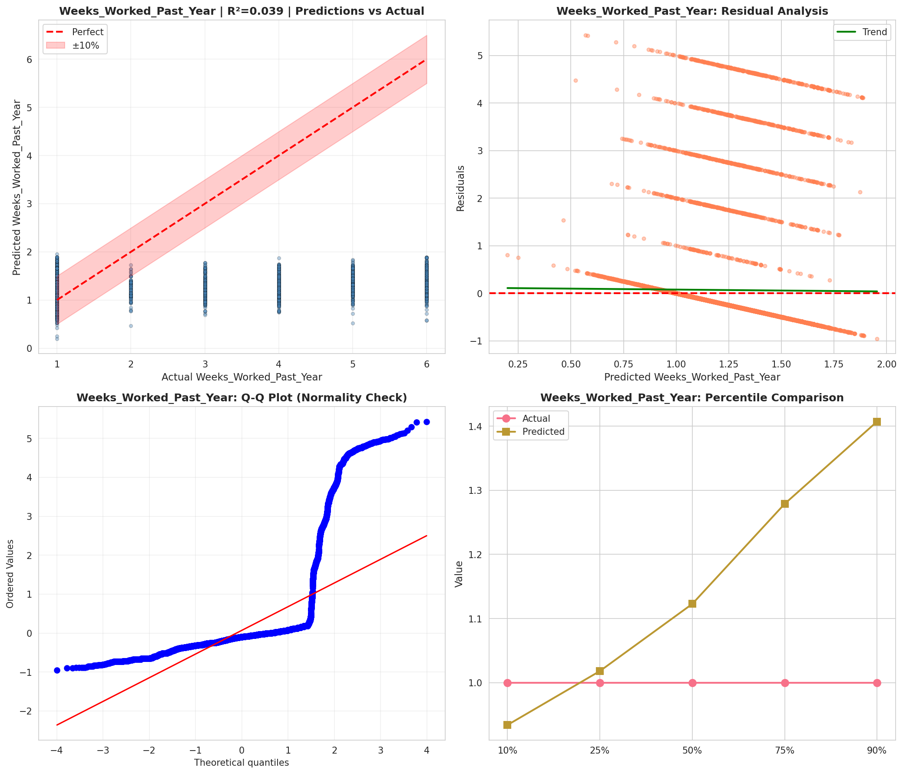
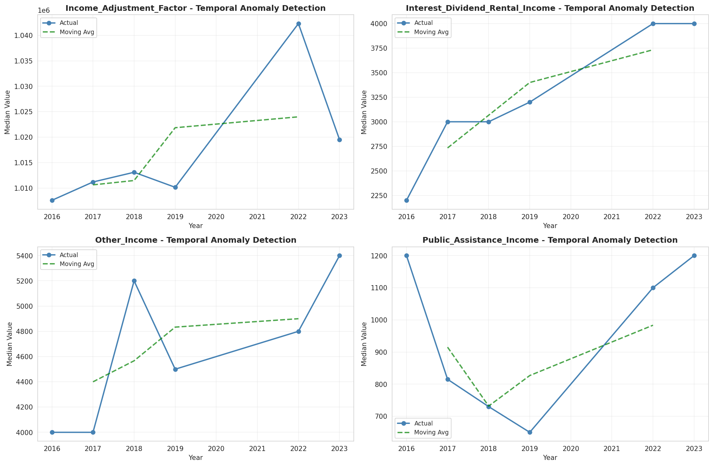
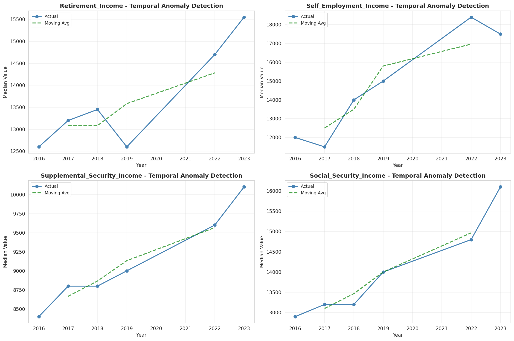
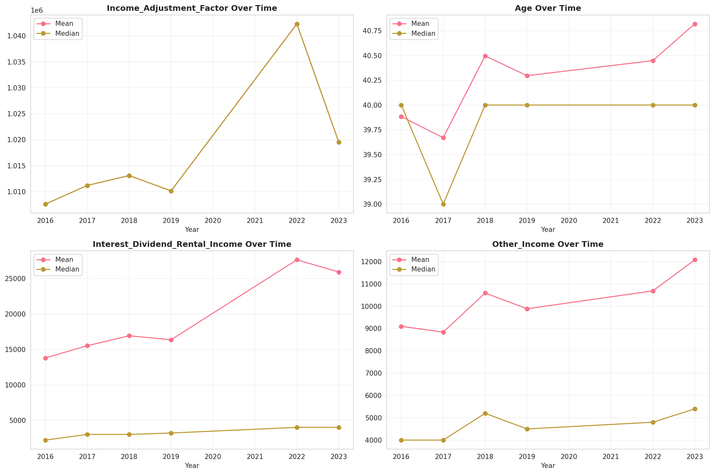
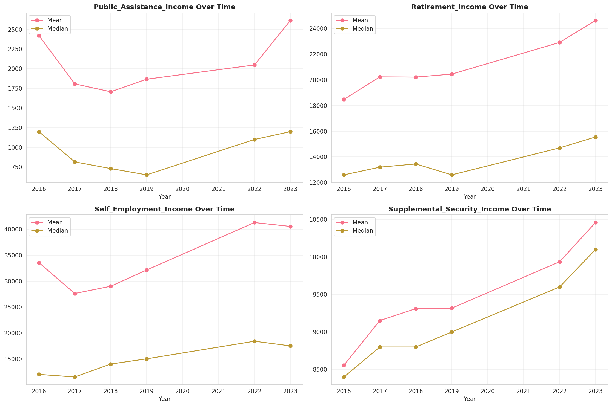
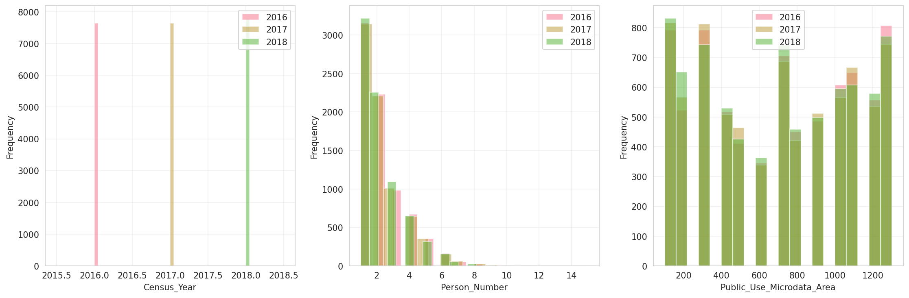
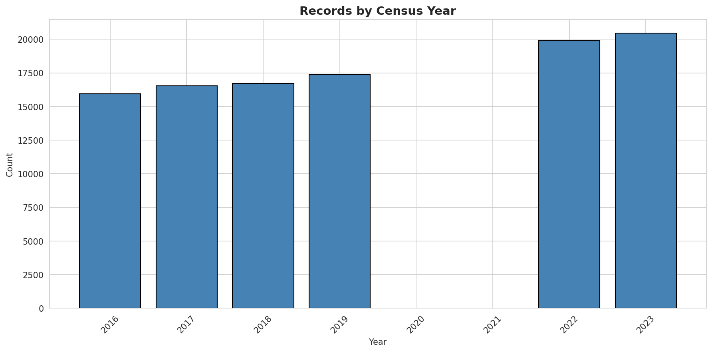
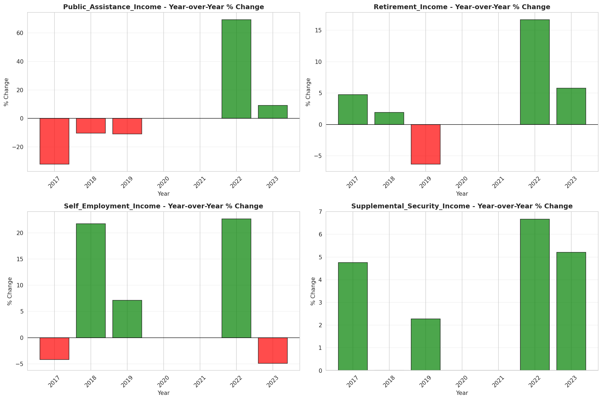

# Temporal Analysis

## Year Distribution

- 2016: 15,955 records

- 2017: 16,536 records

- 2018: 16,711 records

- 2019: 17,360 records

- 2022: 19,884 records

- 2023: 20,447 records

## Temporal Trends

- Census_Year: {np.int64(2016): {'mean': 2016.0, 'median': 2016.0, 'std': 0.0}, np.int64(2017): {'mean': 2017.0, 'median': 2017.0, 'std': 0.0}, np.int64(2018): {'mean': 2018.0, 'median': 2018.0, 'std': 0.0}, np.int64(2019): {'mean': 2019.0, 'median': 2019.0, 'std': 0.0}, np.int64(2022): {'mean': 2022.0, 'median': 2022.0, 'std': 0.0}, np.int64(2023): {'mean': 2023.0, 'median': 2023.0, 'std': 0.0}}

- Person_Number: {np.int64(2016): {'mean': 2.1814478219993734, 'median': 2.0, 'std': 1.419913104816463}, np.int64(2017): {'mean': 2.1982946298984034, 'median': 2.0, 'std': 1.4621686696616971}, np.int64(2018): {'mean': 2.1609119741487643, 'median': 2.0, 'std': 1.4114668404261692}, np.int64(2019): {'mean': 2.1980990783410137, 'median': 2.0, 'std': 1.4365577650866463}, np.int64(2022): {'mean': 2.157412995373164, 'median': 2.0, 'std': 1.4099269649153892}, np.int64(2023): {'mean': 2.155817479336822, 'median': 2.0, 'std': 1.4099110743392305}}

- Public_Use_Microdata_Area: {np.int64(2016): {'mean': 703.4999686618614, 'median': 702.0, 'std': 398.83780947509183}, np.int64(2017): {'mean': 693.6752539912917, 'median': 702.0, 'std': 397.90139033007426}, np.int64(2018): {'mean': 694.5370115492789, 'median': 702.0, 'std': 397.22220150734074}, np.int64(2019): {'mean': 693.2530529953917, 'median': 702.0, 'std': 395.42241691770136}, np.int64(2022): {'mean': 689.3112552806276, 'median': 701.0, 'std': 375.8531504961339}, np.int64(2023): {'mean': 686.5308358194357, 'median': 701.0, 'std': 373.0730775502319}}

- State_Code: {np.int64(2016): {'mean': 16.0, 'median': 16.0, 'std': 0.0}, np.int64(2017): {'mean': 16.0, 'median': 16.0, 'std': 0.0}, np.int64(2018): {'mean': 16.0, 'median': 16.0, 'std': 0.0}, np.int64(2019): {'mean': 16.0, 'median': 16.0, 'std': 0.0}, np.int64(2022): {'mean': 16.0, 'median': 16.0, 'std': 0.0}, np.int64(2023): {'mean': None, 'median': None, 'std': None}}

- Income_Adjustment_Factor: {np.int64(2016): {'mean': 1007588.0, 'median': 1007588.0, 'std': 0.0}, np.int64(2017): {'mean': 1011189.0, 'median': 1011189.0, 'std': 0.0}, np.int64(2018): {'mean': 1013097.0, 'median': 1013097.0, 'std': 0.0}, np.int64(2019): {'mean': 1010145.0, 'median': 1010145.0, 'std': 0.0}, np.int64(2022): {'mean': 1042311.0, 'median': 1042311.0, 'std': 0.0}, np.int64(2023): {'mean': 1019518.0, 'median': 1019518.0, 'std': 0.0}}

- Person_Weight: {np.int64(2016): {'mean': 105.49294891883422, 'median': 82.0, 'std': 96.94219096407497}, np.int64(2017): {'mean': 103.83061199806482, 'median': 80.0, 'std': 96.3227623229863}, np.int64(2018): {'mean': 104.97325115193586, 'median': 81.0, 'std': 97.10414894157482}, np.int64(2019): {'mean': 102.94153225806451, 'median': 78.0, 'std': 97.9028068935155}, np.int64(2022): {'mean': 97.5172500502917, 'median': 78.0, 'std': 84.35383533631963}, np.int64(2023): {'mean': 96.08871717122317, 'median': 76.0, 'std': 84.75720543402217}}

- Age: {np.int64(2016): {'mean': 39.884048887496085, 'median': 40.0, 'std': 24.24939821789733}, np.int64(2017): {'mean': 39.669871794871796, 'median': 39.0, 'std': 24.12112970204146}, np.int64(2018): {'mean': 40.49596074441984, 'median': 40.0, 'std': 24.483792655015694}, np.int64(2019): {'mean': 40.296198156682024, 'median': 40.0, 'std': 24.468056899991446}, np.int64(2022): {'mean': 40.448098974049486, 'median': 40.0, 'std': 24.318372971921264}, np.int64(2023): {'mean': 40.819044358585614, 'median': 40.0, 'std': 24.449352417123098}}

- Citizenship_Status: {np.int64(2016): {'mean': 1.1769351300532749, 'median': 1.0, 'std': 0.7687937036668336}, np.int64(2017): {'mean': 1.1780358006773102, 'median': 1.0, 'std': 0.763384257641192}, np.int64(2018): {'mean': 1.1689306444856682, 'median': 1.0, 'std': 0.7399883864801465}, np.int64(2019): {'mean': 1.1616359447004607, 'median': 1.0, 'std': 0.7214205291519888}, np.int64(2022): {'mean': 1.1810500905250452, 'median': 1.0, 'std': 0.7651377542875895}, np.int64(2023): {'mean': 1.1784124810485646, 'median': 1.0, 'std': 0.754624831208653}}

- Class_of_Worker: {np.int64(2016): {'mean': 2.303166429275775, 'median': 1.0, 'std': 2.0071136499547113}, np.int64(2017): {'mean': 2.3180488823898058, 'median': 1.0, 'std': 2.0194536277092636}, np.int64(2018): {'mean': 2.267252974650802, 'median': 1.0, 'std': 2.001517573210117}, np.int64(2019): {'mean': 2.3202836312793367, 'median': 1.0, 'std': 2.0130876814071135}, np.int64(2022): {'mean': 2.2981323693949567, 'median': 1.0, 'std': 2.0060004124400286}, np.int64(2023): {'mean': 2.27351150202977, 'median': 1.0, 'std': 1.9949921190674735}}

- English_Speaking_Ability: {np.int64(2016): {'mean': 1.56171875, 'median': 1.0, 'std': 0.858715251586503}, np.int64(2017): {'mean': 1.5679012345679013, 'median': 1.0, 'std': 0.884890190756636}, np.int64(2018): {'mean': 1.551453260015711, 'median': 1.0, 'std': 0.8914689186482381}, np.int64(2019): {'mean': 1.4703196347031964, 'median': 1.0, 'std': 0.8108848540793835}, np.int64(2022): {'mean': 1.530902348578492, 'median': 1.0, 'std': 0.8531490224618251}, np.int64(2023): {'mean': 1.5134328358208955, 'median': 1.0, 'std': 0.8503452672841831}}

- Fertility_Status: {np.int64(2016): {'mean': 1.9352562135624425, 'median': 2.0, 'std': 0.24611097943693855}, np.int64(2017): {'mean': 1.9341875364006988, 'median': 2.0, 'std': 0.2479901048706697}, np.int64(2018): {'mean': 1.93166618202966, 'median': 2.0, 'std': 0.25235456232093667}, np.int64(2019): {'mean': 1.9330876098667422, 'median': 2.0, 'std': 0.2499056406886992}, np.int64(2022): {'mean': 1.9446808510638298, 'median': 2.0, 'std': 0.2286291713189587}, np.int64(2023): {'mean': 1.947246645071726, 'median': 2.0, 'std': 0.22356655167138273}}

- Marital_Status: {np.int64(2016): {'mean': 2.809025383892197, 'median': 2.0, 'std': 1.8489245583201177}, np.int64(2017): {'mean': 2.817549588776004, 'median': 2.0, 'std': 1.8511358098403707}, np.int64(2018): {'mean': 2.7905571180659448, 'median': 2.0, 'std': 1.8469725485363122}, np.int64(2019): {'mean': 2.814861751152074, 'median': 2.0, 'std': 1.8473791760660823}, np.int64(2022): {'mean': 2.8624019312009654, 'median': 2.0, 'std': 1.863219084953712}, np.int64(2023): {'mean': 2.8544040690565855, 'median': 2.0, 'std': 1.8639214875700583}}

- Mobility_Status: {np.int64(2016): {'mean': 1.3109941668780116, 'median': 1.0, 'std': 0.722193342786533}, np.int64(2017): {'mean': 1.2961875038247352, 'median': 1.0, 'std': 0.7080777364629083}, np.int64(2018): {'mean': 1.3072030047858485, 'median': 1.0, 'std': 0.7192618074970443}, np.int64(2019): {'mean': 1.2960135213894393, 'median': 1.0, 'std': 0.7081383265587827}, np.int64(2022): {'mean': 1.2748781478472786, 'median': 1.0, 'std': 0.6866444232486071}, np.int64(2023): {'mean': 1.2599160286490492, 'median': 1.0, 'std': 0.6694390778695944}}

- Military_Service: {np.int64(2016): {'mean': 3.779729175215429, 'median': 4.0, 'std': 0.6166326376160493}, np.int64(2017): {'mean': 3.780457052797478, 'median': 4.0, 'std': 0.6153238829237409}, np.int64(2018): {'mean': 3.7744976816074187, 'median': 4.0, 'std': 0.6263394633444744}, np.int64(2019): {'mean': 3.771592946802152, 'median': 4.0, 'std': 0.6294688335072943}, np.int64(2022): {'mean': 3.8106767982484384, 'median': 4.0, 'std': 0.5797651478527852}, np.int64(2023): {'mean': 3.8142412935323384, 'median': 4.0, 'std': 0.5768368607884239}}

- Travel_Time_To_Work_Minutes: {np.int64(2016): {'mean': 21.105715178013742, 'median': 15.0, 'std': 22.45344127212745}, np.int64(2017): {'mean': 21.396105826397147, 'median': 15.0, 'std': 21.501450640828267}, np.int64(2018): {'mean': 21.776239392585975, 'median': 15.0, 'std': 21.760762289792538}, np.int64(2019): {'mean': 22.79498085920885, 'median': 15.0, 'std': 23.730249100967967}, np.int64(2022): {'mean': 22.49446149739757, 'median': 15.0, 'std': 22.332848957810175}, np.int64(2023): {'mean': 22.546044940901417, 'median': 15.0, 'std': 22.410215848265885}}

- Vehicle_Occupancy: {np.int64(2016): {'mean': 1.163255033557047, 'median': 1.0, 'std': 0.5776146405608727}, np.int64(2017): {'mean': 1.1885687143761874, 'median': 1.0, 'std': 0.6671116481497419}, np.int64(2018): {'mean': 1.165873015873016, 'median': 1.0, 'std': 0.5852696080571482}, np.int64(2019): {'mean': 1.1637762026843614, 'median': 1.0, 'std': 0.6133432163466294}, np.int64(2022): {'mean': 1.1682389937106918, 'median': 1.0, 'std': 0.6083740977411515}, np.int64(2023): {'mean': 1.188666012063403, 'median': 1.0, 'std': 0.6410530116715083}}

- Transportation_To_Work: {np.int64(2016): {'mean': 2.11331569664903, 'median': 1.0, 'std': 3.053004091824233}, np.int64(2017): {'mean': 2.093784838350056, 'median': 1.0, 'std': 3.057130416551377}, np.int64(2018): {'mean': 2.130990415335463, 'median': 1.0, 'std': 3.0975049347996944}, np.int64(2019): {'mean': None, 'median': None, 'std': None}, np.int64(2022): {'mean': None, 'median': None, 'std': None}, np.int64(2023): {'mean': None, 'median': None, 'std': None}}

- Language_Other_Than_English: {np.int64(2016): {'mean': 1.9144156191495052, 'median': 2.0, 'std': 0.27975869533750336}, np.int64(2017): {'mean': 1.9163924908070447, 'median': 2.0, 'std': 0.27680721928935526}, np.int64(2018): {'mean': 1.918668540761564, 'median': 2.0, 'std': 0.2733522030249008}, np.int64(2019): {'mean': 1.9193568184607832, 'median': 2.0, 'std': 0.27229471023545465}, np.int64(2022): {'mean': 1.9139956413118588, 'median': 2.0, 'std': 0.2803779370125175}, np.int64(2023): {'mean': 1.9134098428453268, 'median': 2.0, 'std': 0.28124080567240395}}

- Grandparents_Living_With_Grandchildren: {np.int64(2016): {'mean': 1.9744805325801897, 'median': 2.0, 'std': 0.15770457460097487}, np.int64(2017): {'mean': 1.9731261604612529, 'median': 2.0, 'std': 0.16172257775182608}, np.int64(2018): {'mean': 1.9722302020492195, 'median': 2.0, 'std': 0.16432048519129536}, np.int64(2019): {'mean': 1.9731680236861584, 'median': 2.0, 'std': 0.16159962120817692}, np.int64(2022): {'mean': 1.9752587322121604, 'median': 2.0, 'std': 0.1553418441589081}, np.int64(2023): {'mean': 1.9729814149617366, 'median': 2.0, 'std': 0.16214386850646345}}

- Months_Responsible_For_Grandchildren: {np.int64(2016): {'mean': 3.6534653465346536, 'median': 4.0, 'std': 1.2282967358448562}, np.int64(2017): {'mean': 3.5943396226415096, 'median': 4.0, 'std': 1.3854915021773215}, np.int64(2018): {'mean': 3.638655462184874, 'median': 4.0, 'std': 1.4885500420695756}, np.int64(2019): {'mean': 3.6721311475409837, 'median': 4.0, 'std': 1.3693373130361464}, np.int64(2022): {'mean': 3.378640776699029, 'median': 3.0, 'std': 1.442468641412428}, np.int64(2023): {'mean': 3.7570093457943927, 'median': 4.0, 'std': 1.265217719315661}}

- Grandparents_Responsible_For_Grandchildren: {np.int64(2016): {'mean': 1.6007905138339922, 'median': 2.0, 'std': 0.49070665718096695}, np.int64(2017): {'mean': 1.6145454545454545, 'median': 2.0, 'std': 0.48758985015834627}, np.int64(2018): {'mean': 1.589655172413793, 'median': 2.0, 'std': 0.4927465764883342}, np.int64(2019): {'mean': 1.5793103448275863, 'median': 2.0, 'std': 0.49452316017349207}, np.int64(2022): {'mean': 1.6633986928104576, 'median': 2.0, 'std': 0.4733212452221151}, np.int64(2023): {'mean': 1.6907514450867052, 'median': 2.0, 'std': 0.46285316989512315}}

- Interest_Dividend_Rental_Income: {np.int64(2016): {'mean': 13787.789504373179, 'median': 2200.0, 'std': 36361.21679847823}, np.int64(2017): {'mean': 15517.935196950444, 'median': 3000.0, 'std': 40625.596035839946}, np.int64(2018): {'mean': 16926.737160120847, 'median': 3000.0, 'std': 45607.883254786895}, np.int64(2019): {'mean': 16360.062182023743, 'median': 3200.0, 'std': 42237.19927033531}, np.int64(2022): {'mean': 27641.630498533723, 'median': 4000.0, 'std': 76821.99305728124}, np.int64(2023): {'mean': 25917.565351102, 'median': 4000.0, 'std': 69306.17321354095}}

- Military_Service_Period_1: {np.int64(2016): {'mean': 0.1608910891089109, 'median': 0.0, 'std': 0.36758213901297787}, np.int64(2017): {'mean': 0.17763679619349723, 'median': 0.0, 'std': 0.3823583435717518}, np.int64(2018): {'mean': 0.17261904761904762, 'median': 0.0, 'std': 0.3780582723587318}, np.int64(2019): {'mean': 0.18642857142857142, 'median': 0.0, 'std': 0.38959129154941147}, np.int64(2022): {'mean': 0.26416539050535986, 'median': 0.0, 'std': 0.44105667290833944}, np.int64(2023): {'mean': 0.28108903605592345, 'median': 0.0, 'std': 0.44969633693646827}}

- Military_Service_Period_2: {np.int64(2016): {'mean': 0.18729372937293728, 'median': 0.0, 'std': 0.39030818820174307}, np.int64(2017): {'mean': 0.19904837430610625, 'median': 0.0, 'std': 0.3994429236391238}, np.int64(2018): {'mean': 0.18452380952380953, 'median': 0.0, 'std': 0.3880551726304946}, np.int64(2019): {'mean': 0.18857142857142858, 'median': 0.0, 'std': 0.3913075740154727}, np.int64(2022): {'mean': 0.22817764165390506, 'median': 0.0, 'std': 0.41981848183624787}, np.int64(2023): {'mean': 0.22369389256806477, 'median': 0.0, 'std': 0.41687265501616544}}

- Military_Service_Period_5: {np.int64(2016): {'mean': 0.3919141914191419, 'median': 0.0, 'std': 0.48837920914044886}, np.int64(2017): {'mean': 0.3973037272006344, 'median': 0.0, 'std': 0.4895339804283591}, np.int64(2018): {'mean': 0.41369047619047616, 'median': 0.0, 'std': 0.4926776529568589}, np.int64(2019): {'mean': 0.41785714285714287, 'median': 0.0, 'std': 0.49338263755398015}, np.int64(2022): {'mean': 0.37059724349157736, 'median': 0.0, 'std': 0.4831497345703342}, np.int64(2023): {'mean': 0.37527593818984545, 'median': 0.0, 'std': 0.4843723232322286}}

- Military_Service_Period_8: {np.int64(2016): {'mean': 0.09488448844884488, 'median': 0.0, 'std': 0.2931762952098675}, np.int64(2017): {'mean': 0.08326724821570182, 'median': 0.0, 'std': 0.27639536172306667}, np.int64(2018): {'mean': 0.08556547619047619, 'median': 0.0, 'std': 0.27982545649800195}, np.int64(2019): {'mean': 0.06714285714285714, 'median': 0.0, 'std': 0.25035867255584576}, np.int64(2022): {'mean': 0.04058192955589587, 'median': 0.0, 'std': 0.19739521733432527}, np.int64(2023): {'mean': 0.03826342899190582, 'median': 0.0, 'std': 0.19190215522880053}}

- Military_Service_Period_9: {np.int64(2016): {'mean': 0.015676567656765675, 'median': 0.0, 'std': 0.12427210101402032}, np.int64(2017): {'mean': 0.016653449643140365, 'median': 0.0, 'std': 0.12801995614986877}, np.int64(2018): {'mean': 0.012648809523809524, 'median': 0.0, 'std': 0.11179497455226543}, np.int64(2019): {'mean': 0.008571428571428572, 'median': 0.0, 'std': 0.09221731666727004}, np.int64(2022): {'mean': None, 'median': None, 'std': None}, np.int64(2023): {'mean': None, 'median': None, 'std': None}}

- Military_Service_Period_10: {np.int64(2016): {'mean': 0.036303630363036306, 'median': 0.0, 'std': 0.18712179641081886}, np.int64(2017): {'mean': 0.028548770816812053, 'median': 0.0, 'std': 0.16660056844210935}, np.int64(2018): {'mean': 0.029017857142857144, 'median': 0.0, 'std': 0.16791903070303754}, np.int64(2019): {'mean': 0.012142857142857143, 'median': 0.0, 'std': 0.10956268724540395}, np.int64(2022): {'mean': 0.006125574272588055, 'median': 0.0, 'std': 0.0780558568338624}, np.int64(2023): {'mean': 0.006622516556291391, 'median': 0.0, 'std': 0.0811387897615657}}

- Military_Service_Period_11: {np.int64(2016): {'mean': 0.0049504950495049506, 'median': 0.0, 'std': 0.07021435288247234}, np.int64(2017): {'mean': 0.0, 'median': 0.0, 'std': 0.0}, np.int64(2018): {'mean': 0.0, 'median': 0.0, 'std': 0.0}, np.int64(2019): {'mean': 0.0014285714285714286, 'median': 0.0, 'std': 0.03778293650610288}, np.int64(2022): {'mean': None, 'median': None, 'std': None}, np.int64(2023): {'mean': None, 'median': None, 'std': None}}

- Temporary_Absence_From_Work: {np.int64(2016): {'mean': 2.5723960012899063, 'median': 3.0, 'std': 0.5169066501318678}, np.int64(2017): {'mean': 2.576396939485277, 'median': 3.0, 'std': 0.518421777793662}, np.int64(2018): {'mean': 2.5757276388783343, 'median': 3.0, 'std': 0.5162128545391896}, np.int64(2019): {'mean': 2.585023515579071, 'median': 3.0, 'std': 0.5147652884167856}, np.int64(2022): {'mean': 2.59432650998231, 'median': 3.0, 'std': 0.5094774069496135}, np.int64(2023): {'mean': 2.5889106008793354, 'median': 3.0, 'std': 0.5140199993210051}}

- Available_For_Work: {np.int64(2016): {'mean': 4.744114801676878, 'median': 5.0, 'std': 0.8958422231412116}, np.int64(2017): {'mean': 4.766287966612567, 'median': 5.0, 'std': 0.864048733682374}, np.int64(2018): {'mean': 4.7597841781290375, 'median': 5.0, 'std': 0.8744606305408208}, np.int64(2019): {'mean': 4.760141093474426, 'median': 5.0, 'std': 0.8677146296768276}, np.int64(2022): {'mean': 4.822592873388931, 'median': 5.0, 'std': 0.7563400978529107}, np.int64(2023): {'mean': 4.79195163654128, 'median': 5.0, 'std': 0.8211025626333902}}

- On_Layoff_From_Work: {np.int64(2016): {'mean': 2.556433408577878, 'median': 3.0, 'std': 0.5121672537513161}, np.int64(2017): {'mean': 2.5667362238194604, 'median': 3.0, 'std': 0.5086303607998024}, np.int64(2018): {'mean': 2.563340679382932, 'median': 3.0, 'std': 0.509296128262761}, np.int64(2019): {'mean': 2.5771604938271606, 'median': 3.0, 'std': 0.5040427056587202}, np.int64(2022): {'mean': 2.586555471316654, 'median': 3.0, 'std': 0.501493252870798}, np.int64(2023): {'mean': 2.5831094284318517, 'median': 3.0, 'std': 0.5016545490569906}}

- Looking_For_Work: {np.int64(2016): {'mean': 2.5553047404063207, 'median': 3.0, 'std': 0.5544641889357358}, np.int64(2017): {'mean': 2.564881366411624, 'median': 3.0, 'std': 0.5493346847175967}, np.int64(2018): {'mean': 2.56197279428528, 'median': 3.0, 'std': 0.5464592036140458}, np.int64(2019): {'mean': 2.565843621399177, 'median': 3.0, 'std': 0.5423901898487097}, np.int64(2022): {'mean': 2.5754359363153903, 'median': 3.0, 'std': 0.5388155547701483}, np.int64(2023): {'mean': 2.570285784074255, 'median': 3.0, 'std': 0.5438399552703252}}

- Informed_Of_Recall: {np.int64(2016): {'mean': 2.9379232505643342, 'median': 3.0, 'std': 0.26212450488613703}, np.int64(2017): {'mean': 2.947677563953938, 'median': 3.0, 'std': 0.24134063375074846}, np.int64(2018): {'mean': 2.9435367429135955, 'median': 3.0, 'std': 0.2488837826250375}, np.int64(2019): {'mean': 2.9337154614932395, 'median': 3.0, 'std': 0.2678494340866766}, np.int64(2022): {'mean': 2.9552691432903715, 'median': 3.0, 'std': 0.2211891892685294}, np.int64(2023): {'mean': 2.951514411333659, 'median': 3.0, 'std': 0.22803541208844408}}

- Other_Income: {np.int64(2016): {'mean': 9096.98224852071, 'median': 4000.0, 'std': 12873.083016757086}, np.int64(2017): {'mean': 8837.182108626199, 'median': 4000.0, 'std': 12239.27956736868}, np.int64(2018): {'mean': 10588.048245614034, 'median': 5200.0, 'std': 13654.013226753243}, np.int64(2019): {'mean': 9883.739644970414, 'median': 4500.0, 'std': 13109.06780619052}, np.int64(2022): {'mean': 10684.428861788618, 'median': 4800.0, 'std': 14688.651287784765}, np.int64(2023): {'mean': 12075.869662921348, 'median': 5400.0, 'std': 15128.53849294024}}

- Public_Assistance_Income: {np.int64(2016): {'mean': 2423.452914798206, 'median': 1200.0, 'std': 3813.0003090751557}, np.int64(2017): {'mean': 1807.451923076923, 'median': 815.0, 'std': 2222.790331448476}, np.int64(2018): {'mean': 1706.7156862745098, 'median': 730.0, 'std': 2014.2510734135908}, np.int64(2019): {'mean': 1866.7777777777778, 'median': 650.0, 'std': 2482.0543967757208}, np.int64(2022): {'mean': 2047.7333333333333, 'median': 1100.0, 'std': 2742.58801786092}, np.int64(2023): {'mean': 2614.1203703703704, 'median': 1200.0, 'std': 3354.178673161299}}

- Retirement_Income: {np.int64(2016): {'mean': 18482.417794970985, 'median': 12600.0, 'std': 18398.108665650314}, np.int64(2017): {'mean': 20235.12239902081, 'median': 13200.0, 'std': 22556.2894965354}, np.int64(2018): {'mean': 20220.227272727272, 'median': 13450.0, 'std': 22062.280648470456}, np.int64(2019): {'mean': 20449.89438107309, 'median': 12600.0, 'std': 22836.4872274599}, np.int64(2022): {'mean': 22916.035458317616, 'median': 14700.0, 'std': 25912.000125480332}, np.int64(2023): {'mean': 24631.432568149212, 'median': 15550.0, 'std': 28897.54334654571}}

- Self_Employment_Income: {np.int64(2016): {'mean': 33578.8393442623, 'median': 12000.0, 'std': 74381.8510943237}, np.int64(2017): {'mean': 27610.31236442516, 'median': 11500.0, 'std': 51595.522928411985}, np.int64(2018): {'mean': 29009.130801687763, 'median': 14000.0, 'std': 43872.646122987935}, np.int64(2019): {'mean': 32141.434146341464, 'median': 15000.0, 'std': 54980.73851280896}, np.int64(2022): {'mean': 41302.71225577265, 'median': 18400.0, 'std': 70977.29067001493}, np.int64(2023): {'mean': 40554.33248515691, 'median': 17500.0, 'std': 73912.09921481714}}

- Supplemental_Security_Income: {np.int64(2016): {'mean': 8557.42092457421, 'median': 8400.0, 'std': 5323.524613238508}, np.int64(2017): {'mean': 9152.722772277228, 'median': 8800.0, 'std': 5647.65416176438}, np.int64(2018): {'mean': 9311.401425178146, 'median': 8800.0, 'std': 5442.295837577396}, np.int64(2019): {'mean': 9317.631578947368, 'median': 9000.0, 'std': 4980.031860432848}, np.int64(2022): {'mean': 9936.017897091722, 'median': 9600.0, 'std': 5890.147224944171}, np.int64(2023): {'mean': 10459.35960591133, 'median': 10100.0, 'std': 6234.907591560805}}

- Social_Security_Income: {np.int64(2016): {'mean': 13733.325322919796, 'median': 12900.0, 'std': 7364.870938781916}, np.int64(2017): {'mean': 13839.045790251108, 'median': 13200.0, 'std': 7146.570203057488}, np.int64(2018): {'mean': 13835.101586418035, 'median': 13200.0, 'std': 7263.763921732891}, np.int64(2019): {'mean': 14426.232519879353, 'median': 14000.0, 'std': 7331.340194643478}, np.int64(2022): {'mean': 15745.305197901764, 'median': 14800.0, 'std': 8543.248896494355}, np.int64(2023): {'mean': 17074.969837587007, 'median': 16100.0, 'std': 9430.62096945868}}

- Wage_Income: {np.int64(2016): {'mean': 37679.68933899001, 'median': 27600.0, 'std': 45449.42757900341}, np.int64(2017): {'mean': 38867.47292418773, 'median': 29000.0, 'std': 46695.98435852954}, np.int64(2018): {'mean': 40951.56842644798, 'median': 30000.0, 'std': 49927.18372120251}, np.int64(2019): {'mean': 42155.481444706464, 'median': 30400.0, 'std': 49104.84073673628}, np.int64(2022): {'mean': 48548.103485370055, 'median': 36000.0, 'std': 56541.04454083935}, np.int64(2023): {'mean': 50950.262064624425, 'median': 38000.0, 'std': 60881.703030847835}}

- Relationship_To_Householder: {np.int64(2016): {'mean': 2.131306800376058, 'median': 1.0, 'std': 3.755051023537532}, np.int64(2017): {'mean': 2.19236816642477, 'median': 1.0, 'std': 3.832910791070063}, np.int64(2018): {'mean': 2.2091436778170066, 'median': 1.0, 'std': 3.8776164336901657}, np.int64(2019): {'mean': None, 'median': None, 'std': None}, np.int64(2022): {'mean': None, 'median': None, 'std': None}, np.int64(2023): {'mean': None, 'median': None, 'std': None}}

- School_Enrollment: {np.int64(2016): {'mean': 1.2982570239334028, 'median': 1.0, 'std': 0.53569760237137}, np.int64(2017): {'mean': 1.2886087065612846, 'median': 1.0, 'std': 0.5235266271129406}, np.int64(2018): {'mean': 1.283111553289392, 'median': 1.0, 'std': 0.5239131496378922}, np.int64(2019): {'mean': 1.29445141253061, 'median': 1.0, 'std': 0.5372491364210098}, np.int64(2022): {'mean': 1.3055800674798859, 'median': 1.0, 'std': 0.55116392542725}, np.int64(2023): {'mean': 1.3012771972335806, 'median': 1.0, 'std': 0.5575691568281929}}

- School_Grade_Attending: {np.int64(2016): {'mean': 9.117824016044121, 'median': 9.0, 'std': 4.727229184777375}, np.int64(2017): {'mean': 9.180113496175672, 'median': 9.0, 'std': 4.67530418128172}, np.int64(2018): {'mean': 9.233785822021115, 'median': 9.0, 'std': 4.737318584788164}, np.int64(2019): {'mean': 9.17258405831178, 'median': 9.0, 'std': 4.747909459782032}, np.int64(2022): {'mean': 9.547052947052947, 'median': 10.0, 'std': 4.7572186099727825}, np.int64(2023): {'mean': 9.577000402090873, 'median': 10.0, 'std': 4.728120071871661}}

- Educational_Attainment: {np.int64(2016): {'mean': 15.637682101977108, 'median': 17.0, 'std': 5.726711208682512}, np.int64(2017): {'mean': 15.687868523397315, 'median': 17.0, 'std': 5.690746462984214}, np.int64(2018): {'mean': 15.841997264021888, 'median': 17.0, 'std': 5.643843022262331}, np.int64(2019): {'mean': 15.809114256704294, 'median': 17.0, 'std': 5.72143290433624}, np.int64(2022): {'mean': 15.974617181417077, 'median': 18.0, 'std': 5.696306924030984}, np.int64(2023): {'mean': 16.07713665505578, 'median': 18.0, 'std': 5.635708865614509}}

- Sex: {np.int64(2016): {'mean': 1.5061109370103416, 'median': 2.0, 'std': 0.4999783236896894}, np.int64(2017): {'mean': 1.4998185776487662, 'median': 1.0, 'std': 0.5000150862999488}, np.int64(2018): {'mean': 1.5010472144096703, 'median': 2.0, 'std': 0.500013864185273}, np.int64(2019): {'mean': 1.499884792626728, 'median': 1.0, 'std': 0.5000143882707264}, np.int64(2022): {'mean': 1.5009052504526252, 'median': 2.0, 'std': 0.5000117538975463}, np.int64(2023): {'mean': 1.500904778207072, 'median': 2.0, 'std': 0.5000114085367312}}

- Hours_Worked_Per_Week: {np.int64(2016): {'mean': 38.03042210673089, 'median': 40.0, 'std': 14.544951562663993}, np.int64(2017): {'mean': 37.7950377562028, 'median': 40.0, 'std': 14.327410654534445}, np.int64(2018): {'mean': 37.75459536882311, 'median': 40.0, 'std': 14.417442681184413}, np.int64(2019): {'mean': 37.97424103035878, 'median': 40.0, 'std': 14.380295404341863}, np.int64(2022): {'mean': 37.03427540589296, 'median': 40.0, 'std': 14.01943223120374}, np.int64(2023): {'mean': 36.84932042632248, 'median': 40.0, 'std': 14.153577753653913}}

- When_Last_Worked: {np.int64(2016): {'mean': 1.6306836504353435, 'median': 1.0, 'std': 0.8754198404265019}, np.int64(2017): {'mean': 1.6169719452817064, 'median': 1.0, 'std': 0.8717280525248858}, np.int64(2018): {'mean': 1.6315829470324492, 'median': 1.0, 'std': 0.8770742953670769}, np.int64(2019): {'mean': 1.6276455026455026, 'median': 1.0, 'std': 0.8758571382390546}, np.int64(2022): {'mean': 1.6375410664644934, 'median': 1.0, 'std': 0.8757948884114852}, np.int64(2023): {'mean': 1.6569980459208598, 'median': 1.0, 'std': 0.8879295076874832}}

- Weeks_Worked_Past_Year: {np.int64(2016): {'mean': 2.0025351755609075, 'median': 1.0, 'std': 1.7155013525288985}, np.int64(2017): {'mean': 1.964281433537097, 'median': 1.0, 'std': 1.6730247254186519}, np.int64(2018): {'mean': 1.9760085939365004, 'median': 1.0, 'std': 1.688396797102138}}

- Year_Of_Entry: {np.int64(2016): {'mean': 1993.1633136094674, 'median': 1997.0, 'std': 17.773704641540185}, np.int64(2017): {'mean': 1993.1155555555556, 'median': 1997.5, 'std': 18.229289289804225}, np.int64(2018): {'mean': 1992.452787258248, 'median': 1996.0, 'std': 18.505610510179416}, np.int64(2019): {'mean': 1991.8272727272727, 'median': 1995.0, 'std': 18.66615102046244}, np.int64(2022): {'mean': 1996.2179372197309, 'median': 1999.0, 'std': 18.556625002090914}, np.int64(2023): {'mean': 1996.3861646234675, 'median': 1999.0, 'std': 18.771346630948518}}

- Ancestry_Recode: {np.int64(2016): {'mean': 1.9060482607333125, 'median': 2.0, 'std': 1.1077175321598194}, np.int64(2017): {'mean': 1.9355345911949686, 'median': 2.0, 'std': 1.1283326439666688}, np.int64(2018): {'mean': 1.9654718448925856, 'median': 2.0, 'std': 1.139914987709279}, np.int64(2019): {'mean': 1.9877304147465438, 'median': 2.0, 'std': 1.1443534015106023}, np.int64(2022): {'mean': 2.0226815530074433, 'median': 2.0, 'std': 1.165282000851084}, np.int64(2023): {'mean': 2.0678339120653395, 'median': 2.0, 'std': 1.1832265874264576}}

- First_Ancestry_Code: {np.int64(2016): {'mean': 433.049388906299, 'median': 195.0, 'std': 437.71793949064204}, np.int64(2017): {'mean': 455.07039187227866, 'median': 200.0, 'std': 440.7630132751796}, np.int64(2018): {'mean': 445.135240260906, 'median': 195.0, 'std': 438.705283549564}, np.int64(2019): {'mean': 454.1014400921659, 'median': 195.0, 'std': 439.81485942247474}, np.int64(2022): {'mean': 439.93904646952325, 'median': 195.0, 'std': 442.412391488358}, np.int64(2023): {'mean': 442.23064508240816, 'median': 195.0, 'std': 444.27405361965805}}

- Second_Ancestry_Code: {np.int64(2016): {'mean': 735.0577248511438, 'median': 999.0, 'std': 419.9124063099484}, np.int64(2017): {'mean': 748.3162191582003, 'median': 999.0, 'std': 413.0764125656226}, np.int64(2018): {'mean': 743.4212793968045, 'median': 999.0, 'std': 415.69150424582443}, np.int64(2019): {'mean': 745.0896889400922, 'median': 999.0, 'std': 413.6409969066491}, np.int64(2022): {'mean': 753.1718467109233, 'median': 999.0, 'std': 409.6902101460125}, np.int64(2023): {'mean': 748.9331442265369, 'median': 999.0, 'std': 412.15597658760794}}

- Decade_Of_Entry: {np.int64(2016): {'mean': 5.693491124260355, 'median': 6.0, 'std': 1.5606286713191582}, np.int64(2017): {'mean': 5.842222222222222, 'median': 6.0, 'std': 1.815026745331509}, np.int64(2018): {'mean': 5.7815699658703075, 'median': 6.0, 'std': 1.849109073611631}, np.int64(2019): {'mean': 5.728409090909091, 'median': 6.0, 'std': 1.8332319051663277}, np.int64(2022): {'mean': 6.109417040358744, 'median': 6.0, 'std': 1.7655823623284685}, np.int64(2023): {'mean': 6.110332749562172, 'median': 6.0, 'std': 1.7861326947110716}}

- Drives_Alone_To_Work: {np.int64(2016): {'mean': 1.1590604026845637, 'median': 1.0, 'std': 0.5336803257489103}, np.int64(2017): {'mean': 1.1798606713109563, 'median': 1.0, 'std': 0.58045198723399}, np.int64(2018): {'mean': 1.1615873015873015, 'median': 1.0, 'std': 0.5377485841596409}, np.int64(2019): {'mean': 1.1572915095762328, 'median': 1.0, 'std': 0.5501878131971362}, np.int64(2022): {'mean': 1.1623785020011435, 'median': 1.0, 'std': 0.5489007823525953}, np.int64(2023): {'mean': 1.1815121335390657, 'median': 1.0, 'std': 0.5696597645635317}}

- Employment_Status_Parents: {np.int64(2016): {'mean': 2.593117940635671, 'median': 2.0, 'std': 2.222794282424047}, np.int64(2017): {'mean': 2.654934965570008, 'median': 2.0, 'std': 2.2384697196568153}, np.int64(2018): {'mean': 2.6149348923731064, 'median': 2.0, 'std': 2.2282703840837983}, np.int64(2019): {'mean': 2.6038346613545817, 'median': 2.0, 'std': 2.2362740842480027}, np.int64(2022): {'mean': 2.5625139789756206, 'median': 2.0, 'std': 2.188452373334324}, np.int64(2023): {'mean': 2.488496761224034, 'median': 2.0, 'std': 2.1533406919615627}}

- Employment_Status_Recode: {np.int64(2016): {'mean': 3.15486939696872, 'median': 1.0, 'std': 2.435750153575784}, np.int64(2017): {'mean': 3.1191745884535127, 'median': 1.0, 'std': 2.430518985128371}, np.int64(2018): {'mean': 3.1608024925906224, 'median': 1.0, 'std': 2.4366380298912733}, np.int64(2019): {'mean': 3.115593768371546, 'median': 1.0, 'std': 2.4341578917361515}, np.int64(2022): {'mean': 3.189284811726055, 'median': 1.0, 'std': 2.4485210056143125}, np.int64(2023): {'mean': 3.187896922325354, 'median': 1.0, 'std': 2.440708709114707}}

- Hispanic_Origin: {np.int64(2016): {'mean': 1.268505170792855, 'median': 1.0, 'std': 1.9393415756495724}, np.int64(2017): {'mean': 1.3244436381228835, 'median': 1.0, 'std': 2.2353830540502657}, np.int64(2018): {'mean': 1.3085991263239782, 'median': 1.0, 'std': 2.141348008374883}, np.int64(2019): {'mean': 1.3107142857142857, 'median': 1.0, 'std': 2.146192283606684}, np.int64(2022): {'mean': 1.4410078455039228, 'median': 1.0, 'std': 2.6684161429024265}, np.int64(2023): {'mean': 1.438255000733604, 'median': 1.0, 'std': 2.6386597976348933}}

- Time_Of_Arrival_At_Work: {np.int64(2016): {'mean': 102.14803247970019, 'median': 92.0, 'std': 41.777535040353776}, np.int64(2017): {'mean': 100.63510701545779, 'median': 91.0, 'std': 39.9995971209883}, np.int64(2018): {'mean': 101.88849188625875, 'median': 92.0, 'std': 41.39039265329409}, np.int64(2019): {'mean': 100.93421239188997, 'median': 92.0, 'std': 39.507600083318486}, np.int64(2022): {'mean': 101.33858267716535, 'median': 92.0, 'std': 39.301105380249254}, np.int64(2023): {'mean': 101.86725548772569, 'median': 92.0, 'std': 39.9146958923958}}

- Time_Of_Departure_For_Work: {np.int64(2016): {'mean': 54.37070580886946, 'median': 49.0, 'std': 28.555225391221935}, np.int64(2017): {'mean': 53.41513079667063, 'median': 49.0, 'std': 27.75278841318716}, np.int64(2018): {'mean': 54.106744082179546, 'median': 49.0, 'std': 28.457868465849213}, np.int64(2019): {'mean': 53.64624982277045, 'median': 49.0, 'std': 27.492051120841143}, np.int64(2022): {'mean': 54.06152408914987, 'median': 49.0, 'std': 27.532901827593545}, np.int64(2023): {'mean': 54.238472528899855, 'median': 49.0, 'std': 27.903463851976223}}

- Language_Spoken_At_Home: {np.int64(2016): {'mean': 1571.7171875, 'median': 1200.0, 'std': 1247.1300901606494}, np.int64(2017): {'mean': 1688.1234567901236, 'median': 1200.0, 'std': 1423.758016576538}, np.int64(2018): {'mean': 1669.1948153967007, 'median': 1200.0, 'std': 1335.156002146355}, np.int64(2019): {'mean': 1617.3401826484019, 'median': 1200.0, 'std': 1313.3652678085111}, np.int64(2022): {'mean': 1607.1817058096415, 'median': 1200.0, 'std': 1235.6969321851557}, np.int64(2023): {'mean': 1583.7832835820896, 'median': 1200.0, 'std': 1156.4075971145483}}

- Migration_PUMA: {np.int64(2016): {'mean': 2188.3505237711524, 'median': 490.0, 'std': 6153.409186876683}, np.int64(2017): {'mean': 2433.176134041684, 'median': 490.0, 'std': 6771.879467542951}, np.int64(2018): {'mean': 2299.1825645035183, 'median': 490.0, 'std': 6085.080662524849}, np.int64(2019): {'mean': 2652.84171539961, 'median': 490.0, 'std': 7421.841497789207}, np.int64(2022): {'mean': 3263.9129480614483, 'median': 490.0, 'std': 7836.051422064286}, np.int64(2023): {'mean': 3510.6127946127945, 'median': 500.0, 'std': 8234.448591474102}}

- Migration_State_Or_Country: {np.int64(2016): {'mean': 25.180902497985496, 'median': 16.0, 'std': 42.3970967744802}, np.int64(2017): {'mean': 25.08295872496935, 'median': 16.0, 'std': 37.04221895389287}, np.int64(2018): {'mean': 24.180218921032058, 'median': 16.0, 'std': 38.61102271525924}, np.int64(2019): {'mean': 24.96803118908382, 'median': 16.0, 'std': 41.94711670736657}, np.int64(2022): {'mean': 24.699341623994147, 'median': 16.0, 'std': 38.46819462063426}, np.int64(2023): {'mean': 29.387205387205388, 'median': 16.0, 'std': 52.649190083762335}}

- Place_Of_Birth: {np.int64(2016): {'mean': 35.38376684424945, 'median': 16.0, 'std': 58.88686275150302}, np.int64(2017): {'mean': 35.60679729075955, 'median': 16.0, 'std': 59.547446299647895}, np.int64(2018): {'mean': 35.1604930883849, 'median': 16.0, 'std': 56.94751200650038}, np.int64(2019): {'mean': 34.748905529953916, 'median': 16.0, 'std': 57.17551980064586}, np.int64(2022): {'mean': 35.80682961174814, 'median': 16.0, 'std': 58.9880236590264}, np.int64(2023): {'mean': 35.652125006113366, 'median': 16.0, 'std': 59.93752027690659}}

- Place_Of_Work_PUMA: {np.int64(2016): {'mean': 1026.9988242210463, 'median': 490.0, 'std': 2467.993334159474}, np.int64(2017): {'mean': 1032.664994425864, 'median': 490.0, 'std': 2297.4609096065747}, np.int64(2018): {'mean': 1054.887762189193, 'median': 490.0, 'std': 2471.0102169483994}, np.int64(2019): {'mean': 1042.5390080252598, 'median': 490.0, 'std': 2479.294053563913}, np.int64(2022): {'mean': 1381.0593190998268, 'median': 490.0, 'std': 4312.150390896713}, np.int64(2023): {'mean': 1405.162222972213, 'median': 490.0, 'std': 4316.128284199848}}

- Place_Of_Work_State_Or_Country: {np.int64(2016): {'mean': 17.923721340388006, 'median': 16.0, 'std': 14.563800300634975}, np.int64(2017): {'mean': 17.883639910813823, 'median': 16.0, 'std': 7.963311685915756}, np.int64(2018): {'mean': 18.00666759272121, 'median': 16.0, 'std': 13.5716721955857}, np.int64(2019): {'mean': 17.778844888830417, 'median': 16.0, 'std': 9.744453471335172}, np.int64(2022): {'mean': 17.445124062319678, 'median': 16.0, 'std': 8.095789038079012}, np.int64(2023): {'mean': 17.554730565867928, 'median': 16.0, 'std': 8.308395488677492}}

- Married_Spouse_Present: {np.int64(2016): {'mean': 2.6684877276326207, 'median': 1.0, 'std': 2.087426360266015}, np.int64(2017): {'mean': 2.6958339668541886, 'median': 1.0, 'std': 2.1031709125221503}, np.int64(2018): {'mean': 2.686264269193464, 'median': 1.0, 'std': 2.0951785751099217}, np.int64(2019): {'mean': 2.7082161148380584, 'median': 1.0, 'std': 2.1014648549209762}, np.int64(2022): {'mean': 2.8254854519511134, 'median': 1.0, 'std': 2.1633859801570265}, np.int64(2023): {'mean': 2.8287547984644914, 'median': 1.0, 'std': 2.169917389255443}}

- Nativity: {np.int64(2016): {'mean': 1.045064243183955, 'median': 1.0, 'std': 0.20745157149598764}, np.int64(2017): {'mean': 1.0449927431059507, 'median': 1.0, 'std': 0.2072944640040431}, np.int64(2018): {'mean': 1.0427263479145472, 'median': 1.0, 'std': 0.2022455309589784}, np.int64(2019): {'mean': 1.0409562211981567, 'median': 1.0, 'std': 0.19819453039344812}, np.int64(2022): {'mean': 1.0466203983101992, 'median': 1.0, 'std': 0.21082972322627358}, np.int64(2023): {'mean': 1.046314862816061, 'median': 1.0, 'std': 0.2101712554399051}}

- Nativity_Of_Parent: {np.int64(2016): {'mean': 2.3617021276595747, 'median': 1.0, 'std': 2.308278424013755}, np.int64(2017): {'mean': 2.4108645753634277, 'median': 1.0, 'std': 2.328127541449894}, np.int64(2018): {'mean': 2.3832048897156524, 'median': 1.0, 'std': 2.3217655011376026}, np.int64(2019): {'mean': 2.3715139442231075, 'median': 1.0, 'std': 2.307910550076182}, np.int64(2022): {'mean': 2.316931335271751, 'median': 1.0, 'std': 2.2744524280383143}, np.int64(2023): {'mean': 2.27831136922046, 'median': 1.0, 'std': 2.245103103031583}}

- Own_Child: {np.int64(2016): {'mean': 0.22626136007521153, 'median': 0.0, 'std': 0.418423386365438}, np.int64(2017): {'mean': 0.23362622297002555, 'median': 0.0, 'std': 0.42315029143797867}, np.int64(2018): {'mean': 0.21966707768187424, 'median': 0.0, 'std': 0.41403384082287}, np.int64(2019): {'mean': 0.22214991421641128, 'median': 0.0, 'std': 0.41570368465118773}, np.int64(2022): {'mean': 0.22715891534814342, 'median': 0.0, 'std': 0.41900727395709647}, np.int64(2023): {'mean': 0.218848928330479, 'median': 0.0, 'std': 0.41347665875347916}}

- Presence_And_Age_Own_Children: {np.int64(2016): {'mean': 3.4895799413871704, 'median': 4.0, 'std': 0.9216879791264}, np.int64(2017): {'mean': 3.4558823529411766, 'median': 4.0, 'std': 0.955162039148159}, np.int64(2018): {'mean': 3.4847684177805407, 'median': 4.0, 'std': 0.9403975088922154}, np.int64(2019): {'mean': 3.4832780958119915, 'median': 4.0, 'std': 0.9373668450371774}, np.int64(2022): {'mean': 3.479818835753297, 'median': 4.0, 'std': 0.9308414658153653}, np.int64(2023): {'mean': 3.4841177233242577, 'median': 4.0, 'std': 0.9340482389552668}}

- Total_Person_Earnings: {np.int64(2016): {'mean': 38888.48964026948, 'median': 27000.0, 'std': 52188.12598365619}, np.int64(2017): {'mean': 39244.26264568065, 'median': 28000.0, 'std': 49282.41514004551}, np.int64(2018): {'mean': 41487.776103336924, 'median': 30000.0, 'std': 51257.09025293681}, np.int64(2019): {'mean': 42944.55021330566, 'median': 30000.0, 'std': 52239.41644511899}, np.int64(2022): {'mean': 49951.709508986845, 'median': 36000.0, 'std': 61049.51962040302}, np.int64(2023): {'mean': 52191.393734703866, 'median': 38000.0, 'std': 65587.47479850642}}

- Total_Person_Income: {np.int64(2016): {'mean': 36968.881306166026, 'median': 25000.0, 'std': 49353.25080265346}, np.int64(2017): {'mean': 37752.32981260648, 'median': 25000.0, 'std': 47964.76923019463}, np.int64(2018): {'mean': 39551.24872502299, 'median': 26490.0, 'std': 50366.68509998394}, np.int64(2019): {'mean': 41394.883668543844, 'median': 28835.0, 'std': 51637.29106485932}, np.int64(2022): {'mean': 47884.10503556982, 'median': 32300.0, 'std': 62342.49545867714}, np.int64(2023): {'mean': 50203.099966136135, 'median': 34000.0, 'std': 65656.82021034513}}

- Poverty_Status: {np.int64(2016): {'mean': 287.2127139364303, 'median': 277.0, 'std': 155.40156251483575}, np.int64(2017): {'mean': 289.7088120226045, 'median': 274.0, 'std': 153.9343927413095}, np.int64(2018): {'mean': 295.84372305038806, 'median': 282.0, 'std': 154.48152605260162}, np.int64(2019): {'mean': 302.22319423099657, 'median': 296.0, 'std': 155.3050331452426}, np.int64(2022): {'mean': 313.470840844025, 'median': 315.0, 'std': 155.68440761191405}, np.int64(2023): {'mean': 314.06120867768595, 'median': 316.0, 'std': 154.00775727367048}}

- Quarter_Of_Birth: {np.int64(2016): {'mean': 2.5176433719837044, 'median': 3.0, 'std': 1.1130693449211277}, np.int64(2017): {'mean': 2.5111877116594097, 'median': 3.0, 'std': 1.1107940118496267}, np.int64(2018): {'mean': 2.5176829633175752, 'median': 3.0, 'std': 1.104599076294232}, np.int64(2019): {'mean': 2.4971774193548386, 'median': 2.0, 'std': 1.104533016581959}, np.int64(2022): {'mean': 2.504123918728626, 'median': 3.0, 'std': 1.1112412003768055}, np.int64(2023): {'mean': 2.515038881009439, 'median': 3.0, 'std': 1.1098591882702076}}

- Race_Recode: {np.int64(2016): {'mean': 1.4562206204951427, 'median': 1.0, 'std': 1.680179086147626}, np.int64(2017): {'mean': 1.4642597968069666, 'median': 1.0, 'std': 1.700475351814783}, np.int64(2018): {'mean': 1.4501825145113996, 'median': 1.0, 'std': 1.672609577076133}, np.int64(2019): {'mean': 1.510483870967742, 'median': 1.0, 'std': 1.7956571445153156}, np.int64(2022): {'mean': 2.0907262120297725, 'median': 1.0, 'std': 2.6028540805156544}, np.int64(2023): {'mean': 2.076539345625275, 'median': 1.0, 'std': 2.593202650489506}}

- Race_Two_Categories: {np.int64(2016): {'mean': 5.1570040739580065, 'median': 1.0, 'std': 15.17424536844795}, np.int64(2017): {'mean': 5.1917029511369135, 'median': 1.0, 'std': 15.231526957763219}, np.int64(2018): {'mean': 5.083657471126803, 'median': 1.0, 'std': 15.021972829005016}, np.int64(2019): {'mean': 5.580011520737327, 'median': 1.0, 'std': 16.00323802132965}, np.int64(2022): {'mean': 10.55944477972239, 'median': 1.0, 'std': 22.678382762559657}, np.int64(2023): {'mean': 2083.8784662786716, 'median': 1000.0, 'std': 2584.9343842653047}}

- Race_Three_Categories: {np.int64(2016): {'mean': 1.970479473519273, 'median': 1.0, 'std': 4.443840476352309}, np.int64(2017): {'mean': 2.085208030962748, 'median': 1.0, 'std': 5.432428148648186}, np.int64(2018): {'mean': 2.070013763389384, 'median': 1.0, 'std': 5.507353681933602}, np.int64(2019): {'mean': 2.2182603686635947, 'median': 1.0, 'std': 5.711722096760718}, np.int64(2022): {'mean': 4.031231140615571, 'median': 1.0, 'std': 8.89617109519542}, np.int64(2023): {'mean': 4.127206925221304, 'median': 1.0, 'std': 9.492157460338445}}

- Number_Of_Races: {np.int64(2016): {'mean': 1.022062049514259, 'median': 1.0, 'std': 0.15639679436576995}, np.int64(2017): {'mean': 1.0267295597484276, 'median': 1.0, 'std': 0.17565558821820257}, np.int64(2018): {'mean': 1.0259709173598228, 'median': 1.0, 'std': 0.1758502678091787}, np.int64(2019): {'mean': 1.0316244239631336, 'median': 1.0, 'std': 0.18862737441445698}, np.int64(2022): {'mean': 1.0937940052303359, 'median': 1.0, 'std': 0.3130125775804443}, np.int64(2023): {'mean': 1.094683816696826, 'median': 1.0, 'std': 0.3174697705491157}}

- Race_American_Indian_Alaska_Native: {np.int64(2016): {'mean': 0.028392353494202445, 'median': 0.0, 'std': 0.16609622773467786}, np.int64(2017): {'mean': 0.02896710208030963, 'median': 0.0, 'std': 0.1677191408181135}, np.int64(2018): {'mean': 0.028903117706899645, 'median': 0.0, 'std': 0.16753927059098622}, np.int64(2019): {'mean': 0.026728110599078342, 'median': 0.0, 'std': 0.1612923348312173}, np.int64(2022): {'mean': 0.0452122309394488, 'median': 0.0, 'std': 0.20777453216924413}, np.int64(2023): {'mean': 0.039614613390717465, 'median': 0.0, 'std': 0.195056803434918}}

- Race_Asian: {np.int64(2016): {'mean': 0.01573174553431526, 'median': 0.0, 'std': 0.12443965715645433}, np.int64(2017): {'mean': 0.01989598451862603, 'median': 0.0, 'std': 0.13964710395631205}, np.int64(2018): {'mean': 0.017892406199509304, 'median': 0.0, 'std': 0.1325643979423436}, np.int64(2019): {'mean': 0.021140552995391707, 'median': 0.0, 'std': 0.14385695017095515}, np.int64(2022): {'mean': 0.024290887145443574, 'median': 0.0, 'std': 0.15395464254908872}, np.int64(2023): {'mean': 0.028512740255294176, 'median': 0.0, 'std': 0.16643653047063725}}

- Race_Black: {np.int64(2016): {'mean': 0.008085239736759637, 'median': 0.0, 'std': 0.08955652584917333}, np.int64(2017): {'mean': 0.0073778422835026605, 'median': 0.0, 'std': 0.08557951057504272}, np.int64(2018): {'mean': 0.008856441864640057, 'median': 0.0, 'std': 0.09369381311825643}, np.int64(2019): {'mean': 0.009965437788018432, 'median': 0.0, 'std': 0.0993312448114251}, np.int64(2022): {'mean': 0.012774089720378193, 'median': 0.0, 'std': 0.11230114250625049}, np.int64(2023): {'mean': 0.013400498850687143, 'median': 0.0, 'std': 0.11498509515473272}}

- Race_Some_Other: {np.int64(2016): {'mean': 0.029959260419931057, 'median': 0.0, 'std': 0.17048027665553903}, np.int64(2017): {'mean': 0.025943396226415096, 'median': 0.0, 'std': 0.1589712700847538}, np.int64(2018): {'mean': 0.0260307581832326, 'median': 0.0, 'std': 0.15923151401739352}, np.int64(2019): {'mean': 0.0293778801843318, 'median': 0.0, 'std': 0.1688681823008856}, np.int64(2022): {'mean': 0.08650170991752162, 'median': 0.0, 'std': 0.28111054463713064}, np.int64(2023): {'mean': 0.08504915146476255, 'median': 0.0, 'std': 0.27896164470691387}}

- Race_White: {np.int64(2016): {'mean': 0.9369476653086807, 'median': 1.0, 'std': 0.24306468423726799}, np.int64(2017): {'mean': 0.9407353652636672, 'median': 1.0, 'std': 0.23612646946755242}, np.int64(2018): {'mean': 0.9408174256477769, 'median': 1.0, 'std': 0.23597315394244925}, np.int64(2019): {'mean': 0.9400345622119816, 'median': 1.0, 'std': 0.23742963450635524}, np.int64(2022): {'mean': 0.9210923355461678, 'median': 1.0, 'std': 0.26960137312499716}, np.int64(2023): {'mean': 0.9225314227025969, 'median': 1.0, 'std': 0.2673400311234177}}

- Related_Child: {np.int64(2016): {'mean': 0.2429959260419931, 'median': 0.0, 'std': 0.4289060921976175}, np.int64(2017): {'mean': 0.2503271639558796, 'median': 0.0, 'std': 0.43321492389431665}, np.int64(2018): {'mean': 0.23970406905055486, 'median': 0.0, 'std': 0.4269159927986956}, np.int64(2019): {'mean': 0.24498609714251907, 'median': 0.0, 'std': 0.4300916796463365}, np.int64(2022): {'mean': 0.24346065739704864, 'median': 0.0, 'std': 0.42918222070190765}, np.int64(2023): {'mean': 0.2371166121749961, 'median': 0.0, 'std': 0.42532541968581267}}

- Subfamily_Number: {np.int64(2016): {'mean': 1.0127877237851663, 'median': 1.0, 'std': 0.11250141174127505}, np.int64(2017): {'mean': 1.0396600566572238, 'median': 1.0, 'std': 0.19543627773696112}, np.int64(2018): {'mean': 1.0294840294840295, 'median': 1.0, 'std': 0.16936706025374065}, np.int64(2019): {'mean': 1.0156862745098039, 'median': 1.0, 'std': 0.12438066454641963}, np.int64(2022): {'mean': 1.0242914979757085, 'median': 1.0, 'std': 0.1541087181397485}, np.int64(2023): {'mean': 1.0128913443830572, 'median': 1.0, 'std': 0.11290985684895079}}

- Subfamily_Relationship: {np.int64(2016): {'mean': 3.659846547314578, 'median': 4.0, 'std': 1.629660646437086}, np.int64(2017): {'mean': 3.5155807365439093, 'median': 3.0, 'std': 1.5058260964698693}, np.int64(2018): {'mean': 3.5479115479115477, 'median': 3.0, 'std': 1.5399569157940056}, np.int64(2019): {'mean': 3.5941176470588236, 'median': 4.0, 'std': 1.582680296616778}, np.int64(2022): {'mean': 3.1842105263157894, 'median': 3.0, 'std': 1.7044488036756775}, np.int64(2023): {'mean': 3.451197053406998, 'median': 3.0, 'std': 1.5936084989150203}}

- Veteran_Period_Of_Service: {np.int64(2016): {'mean': 6.90016501650165, 'median': 6.0, 'std': 3.748814287303509}, np.int64(2017): {'mean': 6.6486915146708965, 'median': 6.0, 'std': 3.7599994027565353}, np.int64(2018): {'mean': 6.730654761904762, 'median': 6.0, 'std': 3.7287493710072166}, np.int64(2019): {'mean': 6.485, 'median': 6.0, 'std': 3.7523102247646687}, np.int64(2022): {'mean': 5.990811638591118, 'median': 6.0, 'std': 3.901064766691022}, np.int64(2023): {'mean': 5.783664459161148, 'median': 6.0, 'std': 3.842671558457825}}

- World_Area_Of_Birth: {np.int64(2016): {'mean': 1.1578188655593857, 'median': 1.0, 'std': 0.7349941347518942}, np.int64(2017): {'mean': 1.1704765360425737, 'median': 1.0, 'std': 0.7840420280299573}, np.int64(2018): {'mean': 1.1539704386332357, 'median': 1.0, 'std': 0.7155967015168696}, np.int64(2019): {'mean': 1.1562211981566821, 'median': 1.0, 'std': 0.7411100372087228}, np.int64(2022): {'mean': 1.1703882518607926, 'median': 1.0, 'std': 0.7623226843034041}, np.int64(2023): {'mean': 1.1755269721719568, 'median': 1.0, 'std': 0.787043971262421}}

- Flag_Age: {np.int64(2016): {'mean': 0.012221874020683171, 'median': 0.0, 'std': 0.10987837149719759}, np.int64(2017): {'mean': 0.01469521044992743, 'median': 0.0, 'std': 0.12033344054440852}, np.int64(2018): {'mean': 0.011549278918077912, 'median': 0.0, 'std': 0.10684837973443387}, np.int64(2019): {'mean': 0.011981566820276499, 'median': 0.0, 'std': 0.10880574814339755}, np.int64(2022): {'mean': 0.012070006035003017, 'median': 0.0, 'std': 0.10920128531182866}, np.int64(2023): {'mean': 0.00953685137183939, 'median': 0.0, 'std': 0.09719239594900744}}

- Flag_Ancestry: {np.int64(2016): {'mean': 0.0, 'median': 0.0, 'std': 0.0}, np.int64(2017): {'mean': 0.0, 'median': 0.0, 'std': 0.0}, np.int64(2018): {'mean': 0.0, 'median': 0.0, 'std': 0.0}, np.int64(2019): {'mean': 0.0, 'median': 0.0, 'std': 0.0}, np.int64(2022): {'mean': 0.0, 'median': 0.0, 'std': 0.0}, np.int64(2023): {'mean': 0.0, 'median': 0.0, 'std': 0.0}}

- Flag_Citizenship: {np.int64(2016): {'mean': 0.054214979630209964, 'median': 0.0, 'std': 0.2264485142064358}, np.int64(2017): {'mean': 0.05358006773101113, 'median': 0.0, 'std': 0.2251939405383176}, np.int64(2018): {'mean': 0.053856741068757104, 'median': 0.0, 'std': 0.22574153794374727}, np.int64(2019): {'mean': 0.06451612903225806, 'median': 0.0, 'std': 0.24567717624659835}, np.int64(2022): {'mean': 0.07830416415208208, 'median': 0.0, 'std': 0.26865638256766255}, np.int64(2023): {'mean': 0.09170049395999413, 'median': 0.0, 'std': 0.2886097487940146}}

- Flag_English_Ability: {np.int64(2016): {'mean': 0.006831714196176747, 'median': 0.0, 'std': 0.08237394712612932}, np.int64(2017): {'mean': 0.006047411707789066, 'median': 0.0, 'std': 0.07753195497137025}, np.int64(2018): {'mean': 0.006163604811202202, 'median': 0.0, 'std': 0.07826864870880898}, np.int64(2019): {'mean': 0.007142857142857143, 'median': 0.0, 'std': 0.08421546932819528}, np.int64(2022): {'mean': 0.010611546972440152, 'median': 0.0, 'std': 0.10246692187923492}, np.int64(2023): {'mean': 0.01217782559788722, 'median': 0.0, 'std': 0.10968187871095479}}

- Flag_Fertility: {np.int64(2016): {'mean': 0.014666248824819806, 'median': 0.0, 'std': 0.12021670337885423}, np.int64(2017): {'mean': 0.0174770198355104, 'median': 0.0, 'std': 0.1310443135421566}, np.int64(2018): {'mean': 0.01478068338220334, 'median': 0.0, 'std': 0.12067761287012127}, np.int64(2019): {'mean': 0.015610599078341014, 'median': 0.0, 'std': 0.12396690492352522}, np.int64(2022): {'mean': 0.023134178233755784, 'median': 0.0, 'std': 0.15033337829539856}, np.int64(2023): {'mean': 0.028952902626302148, 'median': 0.0, 'std': 0.1676782845910863}}

- Flag_Hispanic_Origin: {np.int64(2016): {'mean': 0.01836414916953933, 'median': 0.0, 'std': 0.13426852618937657}, np.int64(2017): {'mean': 0.01826318335752298, 'median': 0.0, 'std': 0.13390565274052077}, np.int64(2018): {'mean': 0.017593202082460655, 'median': 0.0, 'std': 0.1314713491775435}, np.int64(2019): {'mean': 0.01947004608294931, 'median': 0.0, 'std': 0.1381740321540219}, np.int64(2022): {'mean': 0.008046670690002011, 'median': 0.0, 'std': 0.08934384827926437}, np.int64(2023): {'mean': 0.009439037511615397, 'median': 0.0, 'std': 0.09669746316113355}}

- Flag_Marital_Status: {np.int64(2016): {'mean': 0.039423378251331874, 'median': 0.0, 'std': 0.194606138511328}, np.int64(2017): {'mean': 0.03634494436381229, 'median': 0.0, 'std': 0.1871526317098768}, np.int64(2018): {'mean': 0.03985398839088026, 'median': 0.0, 'std': 0.1956219261359502}, np.int64(2019): {'mean': 0.044182027649769584, 'median': 0.0, 'std': 0.20550525254836763}, np.int64(2022): {'mean': 0.05210219271776303, 'median': 0.0, 'std': 0.22223869631623783}, np.int64(2023): {'mean': 0.0642147992370519, 'median': 0.0, 'std': 0.2451411793614642}}

- Flag_Mobility_Status: {np.int64(2016): {'mean': 0.06938263867126293, 'median': 0.0, 'std': 0.2541116591203996}, np.int64(2017): {'mean': 0.07111756168359942, 'median': 0.0, 'std': 0.25702888798096823}, np.int64(2018): {'mean': 0.06875710609777991, 'median': 0.0, 'std': 0.2530482133312085}, np.int64(2019): {'mean': 0.07857142857142857, 'median': 0.0, 'std': 0.2690764386067112}, np.int64(2022): {'mean': 0.1011868839267753, 'median': 0.0, 'std': 0.3015836079957683}, np.int64(2023): {'mean': 0.12114246588741624, 'median': 0.0, 'std': 0.3263007448250868}}

- Flag_Race: {np.int64(2016): {'mean': 0.01855217800062676, 'median': 0.0, 'std': 0.1349412315525191}, np.int64(2017): {'mean': 0.021347363328495406, 'median': 0.0, 'std': 0.14454382341739347}, np.int64(2018): {'mean': 0.018371132786787148, 'median': 0.0, 'std': 0.13429338583497674}, np.int64(2019): {'mean': 0.02108294930875576, 'median': 0.0, 'std': 0.14366505308176294}, np.int64(2022): {'mean': 0.015992757996378996, 'median': 0.0, 'std': 0.12545031354161154}, np.int64(2023): {'mean': 0.018535726512446813, 'median': 0.0, 'std': 0.13488158925884233}}

- Flag_Sex: {np.int64(2016): {'mean': 0.0006267627702914447, 'median': 0.0, 'std': 0.025028168125489178}, np.int64(2017): {'mean': 0.000362844702467344, 'median': 0.0, 'std': 0.019045602701595502}, np.int64(2018): {'mean': 0.0007180898809167614, 'median': 0.0, 'std': 0.02678837752910898}, np.int64(2019): {'mean': 0.0008640552995391706, 'median': 0.0, 'std': 0.029382961739885555}, np.int64(2022): {'mean': 0.0004023335345001006, 'median': 0.0, 'std': 0.020054722365010585}, np.int64(2023): {'mean': 0.00039125544089597497, 'median': 0.0, 'std': 0.019776791666679793}}

- Flag_Education: {np.int64(2016): {'mean': 0.07157630836728299, 'median': 0.0, 'std': 0.2577931452624368}, np.int64(2017): {'mean': 0.07492743105950653, 'median': 0.0, 'std': 0.26328217381570734}, np.int64(2018): {'mean': 0.06672251810184908, 'median': 0.0, 'std': 0.24954829237723217}, np.int64(2019): {'mean': 0.08006912442396313, 'median': 0.0, 'std': 0.2714080009103629}, np.int64(2022): {'mean': 0.10033192516596258, 'median': 0.0, 'std': 0.30044961272725035}, np.int64(2023): {'mean': 0.11277938083826478, 'median': 0.0, 'std': 0.31633065923518855}}

- Flag_School_Enrollment: {np.int64(2016): {'mean': 0.05904105296145409, 'median': 0.0, 'std': 0.23570890784706203}, np.int64(2017): {'mean': 0.060655539429124335, 'median': 0.0, 'std': 0.23870460987226846}, np.int64(2018): {'mean': 0.058225121177667406, 'median': 0.0, 'std': 0.2341756563070337}, np.int64(2019): {'mean': 0.06814516129032258, 'median': 0.0, 'std': 0.2520020960397111}, np.int64(2022): {'mean': 0.08816133574733453, 'median': 0.0, 'std': 0.2835365192077281}, np.int64(2023): {'mean': 0.10226439086418546, 'median': 0.0, 'std': 0.30300309472582987}}

- Flag_School_Grade: {np.int64(2016): {'mean': 0.02387966154810404, 'median': 0.0, 'std': 0.1526790239420515}, np.int64(2017): {'mean': 0.024068698597000483, 'median': 0.0, 'std': 0.1532671423732454}, np.int64(2018): {'mean': 0.021423014780683383, 'median': 0.0, 'std': 0.14479407377592884}, np.int64(2019): {'mean': 0.030184331797235023, 'median': 0.0, 'std': 0.17109916497386096}, np.int64(2022): {'mean': 0.036813518406759206, 'median': 0.0, 'std': 0.18830843479785067}, np.int64(2023): {'mean': 0.042059959896317306, 'median': 0.0, 'std': 0.20073089017738618}}

- Flag_Interest_Dividend_Income: {np.int64(2016): {'mean': 0.11394547163898465, 'median': 0.0, 'std': 0.3177549833514392}, np.int64(2017): {'mean': 0.12004112239961297, 'median': 0.0, 'std': 0.32501944507312713}, np.int64(2018): {'mean': 0.12010053258332834, 'median': 0.0, 'std': 0.3250887860222831}, np.int64(2019): {'mean': 0.12033410138248848, 'median': 0.0, 'std': 0.3253611890617214}, np.int64(2022): {'mean': 0.14499094749547375, 'median': 0.0, 'std': 0.3521005645304354}, np.int64(2023): {'mean': 0.16628356238078937, 'median': 0.0, 'std': 0.3723440878077557}}

- Flag_Other_Income: {np.int64(2016): {'mean': 0.09714822939517392, 'median': 0.0, 'std': 0.29616878402298363}, np.int64(2017): {'mean': 0.10474117077890663, 'median': 0.0, 'std': 0.3062288832742137}, np.int64(2018): {'mean': 0.10280653461791635, 'median': 0.0, 'std': 0.30371511478213}, np.int64(2019): {'mean': 0.10627880184331798, 'median': 0.0, 'std': 0.30820300102989356}, np.int64(2022): {'mean': 0.13649165157915913, 'median': 0.0, 'std': 0.34331852322557427}, np.int64(2023): {'mean': 0.15586638626693403, 'median': 0.0, 'std': 0.36273749599274013}}

- Flag_Public_Assistance: {np.int64(2016): {'mean': 0.09915387026010655, 'median': 0.0, 'std': 0.2988778663897809}, np.int64(2017): {'mean': 0.10734155781325593, 'median': 0.0, 'std': 0.30955636436742656}, np.int64(2018): {'mean': 0.10508048590748609, 'median': 0.0, 'std': 0.30666627638460897}, np.int64(2019): {'mean': 0.1097926267281106, 'median': 0.0, 'std': 0.31264010659153363}, np.int64(2022): {'mean': 0.13649165157915913, 'median': 0.0, 'std': 0.34331852322557393}, np.int64(2023): {'mean': 0.15503496845503006, 'median': 0.0, 'std': 0.36194686639019075}}

- Flag_Retirement_Income: {np.int64(2016): {'mean': 0.10141021623315576, 'median': 0.0, 'std': 0.3018805990531124}, np.int64(2017): {'mean': 0.10970004837929366, 'median': 0.0, 'std': 0.31252496601716784}, np.int64(2018): {'mean': 0.10705523308000718, 'median': 0.0, 'std': 0.3091927084210527}, np.int64(2019): {'mean': 0.1146889400921659, 'median': 0.0, 'std': 0.3186553565566654}, np.int64(2022): {'mean': 0.14368336350834843, 'median': 0.0, 'std': 0.3507771980652764}, np.int64(2023): {'mean': 0.16144177629970166, 'median': 0.0, 'std': 0.3679469396899608}}

- Flag_Self_Employment_Income: {np.int64(2016): {'mean': 0.08072704481353808, 'median': 0.0, 'std': 0.27242400877881096}, np.int64(2017): {'mean': 0.0803096274794388, 'median': 0.0, 'std': 0.27178016502577923}, np.int64(2018): {'mean': 0.07713482137514212, 'median': 0.0, 'std': 0.26681323193001677}, np.int64(2019): {'mean': 0.08035714285714286, 'median': 0.0, 'std': 0.2718531397635538}, np.int64(2022): {'mean': 0.10113659223496278, 'median': 0.0, 'std': 0.3015170875625692}, np.int64(2023): {'mean': 0.11449112339218467, 'median': 0.0, 'std': 0.3184146112002238}}

- Flag_Social_Security_Income: {np.int64(2016): {'mean': 0.10849263553744908, 'median': 0.0, 'std': 0.3110113279695832}, np.int64(2017): {'mean': 0.11290517658442187, 'median': 0.0, 'std': 0.31648642149934575}, np.int64(2018): {'mean': 0.11184249895278559, 'median': 0.0, 'std': 0.31518200924254075}, np.int64(2019): {'mean': 0.11209677419354838, 'median': 0.0, 'std': 0.31549456587522934}, np.int64(2022): {'mean': 0.14388453027559847, 'median': 0.0, 'std': 0.35098143477150967}, np.int64(2023): {'mean': 0.16330023964395754, 'median': 0.0, 'std': 0.3696484194702654}}

- Flag_Supplemental_Security_Income: {np.int64(2016): {'mean': 0.09533061736132874, 'median': 0.0, 'std': 0.29368026229970523}, np.int64(2017): {'mean': 0.10062893081761007, 'median': 0.0, 'std': 0.3008458450850846}, np.int64(2018): {'mean': 0.09963497097720064, 'median': 0.0, 'std': 0.29952163869752785}, np.int64(2019): {'mean': 0.10236175115207373, 'median': 0.0, 'std': 0.30313217612950677}, np.int64(2022): {'mean': 0.13035606517803258, 'median': 0.0, 'std': 0.3367032268501583}, np.int64(2023): {'mean': 0.14735658042744657, 'median': 0.0, 'std': 0.35446969366573905}}

- Flag_Wage_Income: {np.int64(2016): {'mean': 0.12052648072704482, 'median': 0.0, 'std': 0.3255863821827846}, np.int64(2017): {'mean': 0.11768263183357523, 'median': 0.0, 'std': 0.3222416944050764}, np.int64(2018): {'mean': 0.11297947459757046, 'median': 0.0, 'std': 0.3165771789484936}, np.int64(2019): {'mean': 0.1162442396313364, 'median': 0.0, 'std': 0.32052680767581415}, np.int64(2022): {'mean': 0.1363910681955341, 'median': 0.0, 'std': 0.34321198812852843}, np.int64(2023): {'mean': 0.15068225167506236, 'median': 0.0, 'std': 0.3577476344840399}}

- Flag_Class_Worker: {np.int64(2016): {'mean': 0.06543403321842682, 'median': 0.0, 'std': 0.2472979044826039}, np.int64(2017): {'mean': 0.06597726173197871, 'median': 0.0, 'std': 0.2482498531008317}, np.int64(2018): {'mean': 0.06618395069116151, 'median': 0.0, 'std': 0.24861080822005382}, np.int64(2019): {'mean': 0.06843317972350231, 'median': 0.0, 'std': 0.2524950535903434}, np.int64(2022): {'mean': 0.09087708710521022, 'median': 0.0, 'std': 0.2874414677368006}, np.int64(2023): {'mean': 0.10055264831026556, 'median': 0.0, 'std': 0.3007428081863854}}

- Flag_Employment_Status: {np.int64(2016): {'mean': 0.06367909746161078, 'median': 0.0, 'std': 0.24418805715483255}, np.int64(2017): {'mean': 0.06361877116594097, 'median': 0.0, 'std': 0.2440799579407656}, np.int64(2018): {'mean': 0.06367063610795284, 'median': 0.0, 'std': 0.24417259045734155}, np.int64(2019): {'mean': 0.06394009216589862, 'median': 0.0, 'std': 0.24465323349624388}, np.int64(2022): {'mean': 0.0743814121907061, 'median': 0.0, 'std': 0.2623971806420365}, np.int64(2023): {'mean': 0.08788575341125837, 'median': 0.0, 'std': 0.2831356007644179}}

- Flag_Grandparents_Living_Grandchildren: {np.int64(2016): {'mean': 0.00407395800689439, 'median': 0.0, 'std': 0.06369941278588159}, np.int64(2017): {'mean': 0.010280599903241412, 'median': 0.0, 'std': 0.1008738049482237}, np.int64(2018): {'mean': 0.002034587995930824, 'median': 0.0, 'std': 0.0450618459297435}, np.int64(2019): {'mean': 0.0020161290322580645, 'median': 0.0, 'std': 0.0448573312288976}, np.int64(2022): {'mean': 0.0010058338362502514, 'median': 0.0, 'std': 0.03169972667533278}, np.int64(2023): {'mean': 0.0011248593925759281, 'median': 0.0, 'std': 0.033520874662631456}}

- Flag_Months_Responsible_Grandchildren: {np.int64(2016): {'mean': 0.0014415543716703228, 'median': 0.0, 'std': 0.03794161988283866}, np.int64(2017): {'mean': 0.0013304305757135945, 'median': 0.0, 'std': 0.03645189823080024}, np.int64(2018): {'mean': 0.0009574531745556819, 'median': 0.0, 'std': 0.030928849013970278}, np.int64(2019): {'mean': 0.0009216589861751152, 'median': 0.0, 'std': 0.030345717588608417}, np.int64(2022): {'mean': 0.000704083685375176, 'median': 0.0, 'std': 0.026525899380553063}, np.int64(2023): {'mean': 0.0011248593925759281, 'median': 0.0, 'std': 0.03352087466263128}}

- Flag_Grandparents_Responsible: {np.int64(2016): {'mean': 0.002820432466311501, 'median': 0.0, 'std': 0.05303445968132747}, np.int64(2017): {'mean': 0.0021165940977261734, 'median': 0.0, 'std': 0.04595913253221135}, np.int64(2018): {'mean': 0.002094428819340554, 'median': 0.0, 'std': 0.045718347133196405}, np.int64(2019): {'mean': 0.002131336405529954, 'median': 0.0, 'std': 0.0461185031075177}, np.int64(2022): {'mean': 0.0020116676725005027, 'median': 0.0, 'std': 0.04480760914625815}, np.int64(2023): {'mean': 0.0027876950163838216, 'median': 0.0, 'std': 0.052726271791837497}}

- Flag_Industry: {np.int64(2016): {'mean': 0.06712629269821373, 'median': 0.0, 'std': 0.25024843372824646}, np.int64(2017): {'mean': 0.0706337687469763, 'median': 0.0, 'std': 0.25621984603319176}, np.int64(2018): {'mean': 0.06857758362755072, 'median': 0.0, 'std': 0.2527420052042465}, np.int64(2019): {'mean': 0.07206221198156681, 'median': 0.0, 'std': 0.2585983405265524}, np.int64(2022): {'mean': 0.09384429692214846, 'median': 0.0, 'std': 0.29161930963917154}, np.int64(2023): {'mean': 0.10128625226194551, 'median': 0.0, 'std': 0.30171476505224093}}

- Flag_Departure_Time_Work: {np.int64(2016): {'mean': 0.07383265434033219, 'median': 0.0, 'std': 0.261506557572074}, np.int64(2017): {'mean': 0.07897919690372521, 'median': 0.0, 'std': 0.26971444641173614}, np.int64(2018): {'mean': 0.07324516785350967, 'median': 0.0, 'std': 0.2605463020204801}, np.int64(2019): {'mean': 0.08461981566820277, 'median': 0.0, 'std': 0.27832312994594427}, np.int64(2022): {'mean': 0.0956045061355864, 'median': 0.0, 'std': 0.2940554933953954}, np.int64(2023): {'mean': 0.10568787597202524, 'median': 0.0, 'std': 0.3074452335837273}}

- Flag_Travel_Time_Work: {np.int64(2016): {'mean': 0.052083986211219055, 'median': 0.0, 'std': 0.22220337349223568}, np.int64(2017): {'mean': 0.05370101596516691, 'median': 0.0, 'std': 0.22543356041559845}, np.int64(2018): {'mean': 0.04996708754712465, 'median': 0.0, 'std': 0.21788349764420067}, np.int64(2019): {'mean': 0.057027649769585256, 'median': 0.0, 'std': 0.2319021232689853}, np.int64(2022): {'mean': 0.06653590826795414, 'median': 0.0, 'std': 0.24922280171910585}, np.int64(2023): {'mean': 0.07683278720594708, 'median': 0.0, 'std': 0.2663324597760574}}

- Flag_Vehicle_Occupancy: {np.int64(2016): {'mean': 0.03892196803509872, 'median': 0.0, 'std': 0.19341507986933262}, np.int64(2017): {'mean': 0.04130382196419932, 'median': 0.0, 'std': 0.19899801768647854}, np.int64(2018): {'mean': 0.0391358985099635, 'median': 0.0, 'std': 0.19392403245478393}, np.int64(2019): {'mean': 0.04544930875576037, 'median': 0.0, 'std': 0.2082934667545448}, np.int64(2022): {'mean': 0.0524039428686381, 'median': 0.0, 'std': 0.22284583715947853}, np.int64(2023): {'mean': 0.058639409204284246, 'median': 0.0, 'std': 0.23495431200039424}}

- Flag_Transportation_Work: {np.int64(2016): {'mean': 0.03879661548104043, 'median': 0.0, 'std': 0.19311596397828953}, np.int64(2017): {'mean': 0.04039671020803096, 'median': 0.0, 'std': 0.19689377954165393}, np.int64(2018): {'mean': 0.0385374902758662, 'median': 0.0, 'std': 0.19249563500259734}, np.int64(2019): {'mean': None, 'median': None, 'std': None}, np.int64(2022): {'mean': None, 'median': None, 'std': None}, np.int64(2023): {'mean': None, 'median': None, 'std': None}}

- Flag_Language_Home: {np.int64(2016): {'mean': 0.008962707615167658, 'median': 0.0, 'std': 0.09424931955520777}, np.int64(2017): {'mean': 0.00822447992259313, 'median': 0.0, 'std': 0.09031794483930414}, np.int64(2018): {'mean': 0.008377715277362216, 'median': 0.0, 'std': 0.09114837531865151}, np.int64(2019): {'mean': 0.010080645161290322, 'median': 0.0, 'std': 0.09989795101106508}, np.int64(2022): {'mean': 0.01171796419231543, 'median': 0.0, 'std': 0.10761615096003076}, np.int64(2023): {'mean': 0.014134102802367095, 'median': 0.0, 'std': 0.11804664950336673}}

- Flag_Language_Other: {np.int64(2016): {'mean': 0.0606079598871827, 'median': 0.0, 'std': 0.23861727464734955}, np.int64(2017): {'mean': 0.061683599419448475, 'median': 0.0, 'std': 0.2405872676578428}, np.int64(2018): {'mean': 0.06169588893543175, 'median': 0.0, 'std': 0.24060958124507015}, np.int64(2019): {'mean': 0.06923963133640552, 'median': 0.0, 'std': 0.25386850395691357}, np.int64(2022): {'mean': 0.09449808891571113, 'median': 0.0, 'std': 0.2925277827710948}, np.int64(2023): {'mean': 0.11008949968210495, 'median': 0.0, 'std': 0.313008934981799}}

- Flag_Migration_State: {np.int64(2016): {'mean': 0.02369163271701661, 'median': 0.0, 'std': 0.1520913839460955}, np.int64(2017): {'mean': 0.026064344460570876, 'median': 0.0, 'std': 0.15933150861137613}, np.int64(2018): {'mean': 0.02489378253844773, 'median': 0.0, 'std': 0.15580608074580155}, np.int64(2019): {'mean': 0.02534562211981567, 'median': 0.0, 'std': 0.1571771123216842}, np.int64(2022): {'mean': 0.03299134982900825, 'median': 0.0, 'std': 0.1786183786680898}, np.int64(2023): {'mean': 0.034626106519293785, 'median': 0.0, 'std': 0.18283537449117948}}

- Flag_Military_Periods: {np.int64(2016): {'mean': 0.005578188655593857, 'median': 0.0, 'std': 0.07448100535411122}, np.int64(2017): {'mean': 0.005986937590711176, 'median': 0.0, 'std': 0.07714566791419207}, np.int64(2018): {'mean': 0.007240739632577344, 'median': 0.0, 'std': 0.0847864464543794}, np.int64(2019): {'mean': 0.007546082949308756, 'median': 0.0, 'std': 0.08654230762079483}, np.int64(2022): {'mean': 0.007392878696439348, 'median': 0.0, 'std': 0.08566558883987269}, np.int64(2023): {'mean': 0.008167457328703477, 'median': 0.0, 'std': 0.09000636739518457}}

- Flag_Military_Service: {np.int64(2016): {'mean': 0.05195863365716077, 'median': 0.0, 'std': 0.22195049359205046}, np.int64(2017): {'mean': 0.05224963715529753, 'median': 0.0, 'std': 0.22253675518528554}, np.int64(2018): {'mean': 0.05236072048351385, 'median': 0.0, 'std': 0.2227600611823952}, np.int64(2019): {'mean': 0.05351382488479263, 'median': 0.0, 'std': 0.2250622430157797}, np.int64(2022): {'mean': 0.07196741098370549, 'median': 0.0, 'std': 0.25844044148627476}, np.int64(2023): {'mean': 0.08548931383577053, 'median': 0.0, 'std': 0.2796152979184868}}

- Flag_Occupation: {np.int64(2016): {'mean': 0.06881855217800063, 'median': 0.0, 'std': 0.25315326535934873}, np.int64(2017): {'mean': 0.07389937106918239, 'median': 0.0, 'std': 0.26161497093639313}, np.int64(2018): {'mean': 0.07318532703009993, 'median': 0.0, 'std': 0.2604482561618976}, np.int64(2019): {'mean': 0.07759216589861752, 'median': 0.0, 'std': 0.2675364362410259}, np.int64(2022): {'mean': 0.09972842486421243, 'median': 0.0, 'std': 0.2996450928808715}, np.int64(2023): {'mean': 0.10466083043967331, 'median': 0.0, 'std': 0.3061233806070899}}

- Flag_Place_Birth: {np.int64(2016): {'mean': 0.08912566593544344, 'median': 0.0, 'std': 0.2849339750347597}, np.int64(2017): {'mean': 0.08653846153846154, 'median': 0.0, 'std': 0.28116603093945486}, np.int64(2018): {'mean': 0.1001136975644785, 'median': 0.0, 'std': 0.30016051799564314}, np.int64(2019): {'mean': 0.0957373271889401, 'median': 0.0, 'std': 0.2942391518943667}, np.int64(2022): {'mean': 0.1107925970629652, 'median': 0.0, 'std': 0.31388302337789625}, np.int64(2023): {'mean': 0.12735364601163984, 'median': 0.0, 'std': 0.333376859397546}}

- Flag_Place_Work: {np.int64(2016): {'mean': 0.046819178940770916, 'median': 0.0, 'std': 0.2112579954998337}, np.int64(2017): {'mean': 0.05200774068698597, 'median': 0.0, 'std': 0.2220493578631523}, np.int64(2018): {'mean': 0.052480402130333316, 'median': 0.0, 'std': 0.22300041560044523}, np.int64(2019): {'mean': 0.05599078341013825, 'median': 0.0, 'std': 0.22991054879776693}, np.int64(2022): {'mean': 0.07126332729833032, 'median': 0.0, 'std': 0.2572706633041668}, np.int64(2023): {'mean': 0.07888687827065095, 'median': 0.0, 'std': 0.2695687159919811}}

- Flag_Relationship: {np.int64(2016): {'mean': 0.009777499216546538, 'median': 0.0, 'std': 0.09839972860268588}, np.int64(2017): {'mean': 0.009494436381228833, 'median': 0.0, 'std': 0.09697866162040658}, np.int64(2018): {'mean': 0.008676919394410867, 'median': 0.0, 'std': 0.09274775050472661}, np.int64(2019): {'mean': None, 'median': None, 'std': None}, np.int64(2022): {'mean': None, 'median': None, 'std': None}, np.int64(2023): {'mean': None, 'median': None, 'std': None}}

- Flag_Hours_Worked: {np.int64(2016): {'mean': 0.05509244750861799, 'median': 0.0, 'std': 0.22816777313305525}, np.int64(2017): {'mean': 0.05666424770198355, 'median': 0.0, 'std': 0.2312069278323381}, np.int64(2018): {'mean': 0.05170247142600682, 'median': 0.0, 'std': 0.2214322921465208}, np.int64(2019): {'mean': 0.05904377880184332, 'median': 0.0, 'std': 0.23571340966142917}, np.int64(2022): {'mean': 0.07448199557433112, 'median': 0.0, 'std': 0.2625602691058989}, np.int64(2023): {'mean': 0.0874455910402504, 'median': 0.0, 'std': 0.2824938274653144}}

- Flag_When_Last_Worked: {np.int64(2016): {'mean': 0.07195236602945786, 'median': 0.0, 'std': 0.25841712121477234}, np.int64(2017): {'mean': 0.07281083696178035, 'median': 0.0, 'std': 0.25983360406636696}, np.int64(2018): {'mean': 0.07055233080007181, 'median': 0.0, 'std': 0.2560832358776909}, np.int64(2019): {'mean': 0.07644009216589862, 'median': 0.0, 'std': 0.26570862115776067}, np.int64(2022): {'mean': 0.09183262924964795, 'median': 0.0, 'std': 0.28879680047134904}, np.int64(2023): {'mean': 0.10710617694527315, 'median': 0.0, 'std': 0.3092557537399389}}

- Flag_Weeks_Worked: {np.int64(2016): {'mean': 0.04869946725164525, 'median': 0.0, 'std': 0.21524575019940842}, np.int64(2017): {'mean': 0.048923560716013545, 'median': 0.0, 'std': 0.21571476527234085}, np.int64(2018): {'mean': 0.0490694751959787, 'median': 0.0, 'std': 0.21601956911200262}, np.int64(2019): {'mean': None, 'median': None, 'std': None}, np.int64(2022): {'mean': None, 'median': None, 'std': None}, np.int64(2023): {'mean': None, 'median': None, 'std': None}}

- Flag_Year_Entry: {np.int64(2016): {'mean': 0.007458476966468191, 'median': 0.0, 'std': 0.08604250170612754}, np.int64(2017): {'mean': 0.007135945815191098, 'median': 0.0, 'std': 0.08417513040680484}, np.int64(2018): {'mean': 0.006762013045299504, 'median': 0.0, 'std': 0.08195541566696088}, np.int64(2019): {'mean': 0.009101382488479262, 'median': 0.0, 'std': 0.09496876779646345}, np.int64(2022): {'mean': 0.010963588815127741, 'median': 0.0, 'std': 0.10413421097411789}, np.int64(2023): {'mean': 0.012226732527999218, 'median': 0.0, 'std': 0.10989918211382156}}

- Person_Weight_Replicate_1: {np.int64(2016): {'mean': 105.49294891883422, 'median': 73.0, 'std': 116.86745270439614}, np.int64(2017): {'mean': None, 'median': None, 'std': None}, np.int64(2018): {'mean': None, 'median': None, 'std': None}, np.int64(2019): {'mean': None, 'median': None, 'std': None}, np.int64(2022): {'mean': None, 'median': None, 'std': None}, np.int64(2023): {'mean': None, 'median': None, 'std': None}}

- Person_Weight_Replicate_2: {np.int64(2016): {'mean': 105.49294891883422, 'median': 71.0, 'std': 114.63498107731372}, np.int64(2017): {'mean': None, 'median': None, 'std': None}, np.int64(2018): {'mean': None, 'median': None, 'std': None}, np.int64(2019): {'mean': None, 'median': None, 'std': None}, np.int64(2022): {'mean': None, 'median': None, 'std': None}, np.int64(2023): {'mean': None, 'median': None, 'std': None}}

- Person_Weight_Replicate_3: {np.int64(2016): {'mean': 105.49294891883422, 'median': 73.0, 'std': 115.02312447893323}, np.int64(2017): {'mean': None, 'median': None, 'std': None}, np.int64(2018): {'mean': None, 'median': None, 'std': None}, np.int64(2019): {'mean': None, 'median': None, 'std': None}, np.int64(2022): {'mean': None, 'median': None, 'std': None}, np.int64(2023): {'mean': None, 'median': None, 'std': None}}

- Person_Weight_Replicate_4: {np.int64(2016): {'mean': 105.49294891883422, 'median': 72.0, 'std': 115.89475865267238}, np.int64(2017): {'mean': None, 'median': None, 'std': None}, np.int64(2018): {'mean': None, 'median': None, 'std': None}, np.int64(2019): {'mean': None, 'median': None, 'std': None}, np.int64(2022): {'mean': None, 'median': None, 'std': None}, np.int64(2023): {'mean': None, 'median': None, 'std': None}}

- Person_Weight_Replicate_5: {np.int64(2016): {'mean': 105.49294891883422, 'median': 70.0, 'std': 118.3871841998641}, np.int64(2017): {'mean': None, 'median': None, 'std': None}, np.int64(2018): {'mean': None, 'median': None, 'std': None}, np.int64(2019): {'mean': None, 'median': None, 'std': None}, np.int64(2022): {'mean': None, 'median': None, 'std': None}, np.int64(2023): {'mean': None, 'median': None, 'std': None}}

- Person_Weight_Replicate_6: {np.int64(2016): {'mean': 105.49294891883422, 'median': 72.0, 'std': 116.05525293921224}, np.int64(2017): {'mean': None, 'median': None, 'std': None}, np.int64(2018): {'mean': None, 'median': None, 'std': None}, np.int64(2019): {'mean': None, 'median': None, 'std': None}, np.int64(2022): {'mean': None, 'median': None, 'std': None}, np.int64(2023): {'mean': None, 'median': None, 'std': None}}

- Person_Weight_Replicate_7: {np.int64(2016): {'mean': 105.49294891883422, 'median': 71.0, 'std': 120.39869154795919}, np.int64(2017): {'mean': None, 'median': None, 'std': None}, np.int64(2018): {'mean': None, 'median': None, 'std': None}, np.int64(2019): {'mean': None, 'median': None, 'std': None}, np.int64(2022): {'mean': None, 'median': None, 'std': None}, np.int64(2023): {'mean': None, 'median': None, 'std': None}}

- Person_Weight_Replicate_8: {np.int64(2016): {'mean': 105.49294891883422, 'median': 72.0, 'std': 117.40451644285449}, np.int64(2017): {'mean': None, 'median': None, 'std': None}, np.int64(2018): {'mean': None, 'median': None, 'std': None}, np.int64(2019): {'mean': None, 'median': None, 'std': None}, np.int64(2022): {'mean': None, 'median': None, 'std': None}, np.int64(2023): {'mean': None, 'median': None, 'std': None}}

- Person_Weight_Replicate_9: {np.int64(2016): {'mean': 105.49294891883422, 'median': 72.0, 'std': 115.71978631813788}, np.int64(2017): {'mean': None, 'median': None, 'std': None}, np.int64(2018): {'mean': None, 'median': None, 'std': None}, np.int64(2019): {'mean': None, 'median': None, 'std': None}, np.int64(2022): {'mean': None, 'median': None, 'std': None}, np.int64(2023): {'mean': None, 'median': None, 'std': None}}

- Person_Weight_Replicate_10: {np.int64(2016): {'mean': 105.49294891883422, 'median': 70.0, 'std': 118.52830465519536}, np.int64(2017): {'mean': None, 'median': None, 'std': None}, np.int64(2018): {'mean': None, 'median': None, 'std': None}, np.int64(2019): {'mean': None, 'median': None, 'std': None}, np.int64(2022): {'mean': None, 'median': None, 'std': None}, np.int64(2023): {'mean': None, 'median': None, 'std': None}}

- Person_Weight_Replicate_11: {np.int64(2016): {'mean': 105.49294891883422, 'median': 71.0, 'std': 119.53574373438983}, np.int64(2017): {'mean': None, 'median': None, 'std': None}, np.int64(2018): {'mean': None, 'median': None, 'std': None}, np.int64(2019): {'mean': None, 'median': None, 'std': None}, np.int64(2022): {'mean': None, 'median': None, 'std': None}, np.int64(2023): {'mean': None, 'median': None, 'std': None}}

- Person_Weight_Replicate_12: {np.int64(2016): {'mean': 105.49294891883422, 'median': 72.0, 'std': 117.13782169501229}, np.int64(2017): {'mean': None, 'median': None, 'std': None}, np.int64(2018): {'mean': None, 'median': None, 'std': None}, np.int64(2019): {'mean': None, 'median': None, 'std': None}, np.int64(2022): {'mean': None, 'median': None, 'std': None}, np.int64(2023): {'mean': None, 'median': None, 'std': None}}

- Person_Weight_Replicate_13: {np.int64(2016): {'mean': 105.49294891883422, 'median': 74.0, 'std': 117.36247154761352}, np.int64(2017): {'mean': None, 'median': None, 'std': None}, np.int64(2018): {'mean': None, 'median': None, 'std': None}, np.int64(2019): {'mean': None, 'median': None, 'std': None}, np.int64(2022): {'mean': None, 'median': None, 'std': None}, np.int64(2023): {'mean': None, 'median': None, 'std': None}}

- Person_Weight_Replicate_14: {np.int64(2016): {'mean': 105.49294891883422, 'median': 71.0, 'std': 115.9262311088046}, np.int64(2017): {'mean': None, 'median': None, 'std': None}, np.int64(2018): {'mean': None, 'median': None, 'std': None}, np.int64(2019): {'mean': None, 'median': None, 'std': None}, np.int64(2022): {'mean': None, 'median': None, 'std': None}, np.int64(2023): {'mean': None, 'median': None, 'std': None}}

- Person_Weight_Replicate_15: {np.int64(2016): {'mean': 105.49294891883422, 'median': 73.0, 'std': 114.9103094266703}, np.int64(2017): {'mean': None, 'median': None, 'std': None}, np.int64(2018): {'mean': None, 'median': None, 'std': None}, np.int64(2019): {'mean': None, 'median': None, 'std': None}, np.int64(2022): {'mean': None, 'median': None, 'std': None}, np.int64(2023): {'mean': None, 'median': None, 'std': None}}

- Person_Weight_Replicate_16: {np.int64(2016): {'mean': 105.49294891883422, 'median': 71.0, 'std': 117.77702067368033}, np.int64(2017): {'mean': None, 'median': None, 'std': None}, np.int64(2018): {'mean': None, 'median': None, 'std': None}, np.int64(2019): {'mean': None, 'median': None, 'std': None}, np.int64(2022): {'mean': None, 'median': None, 'std': None}, np.int64(2023): {'mean': None, 'median': None, 'std': None}}

- Person_Weight_Replicate_17: {np.int64(2016): {'mean': 105.49294891883422, 'median': 71.0, 'std': 116.86460097184268}, np.int64(2017): {'mean': None, 'median': None, 'std': None}, np.int64(2018): {'mean': None, 'median': None, 'std': None}, np.int64(2019): {'mean': None, 'median': None, 'std': None}, np.int64(2022): {'mean': None, 'median': None, 'std': None}, np.int64(2023): {'mean': None, 'median': None, 'std': None}}

- Person_Weight_Replicate_18: {np.int64(2016): {'mean': 105.49294891883422, 'median': 73.0, 'std': 113.06592532577045}, np.int64(2017): {'mean': None, 'median': None, 'std': None}, np.int64(2018): {'mean': None, 'median': None, 'std': None}, np.int64(2019): {'mean': None, 'median': None, 'std': None}, np.int64(2022): {'mean': None, 'median': None, 'std': None}, np.int64(2023): {'mean': None, 'median': None, 'std': None}}

- Person_Weight_Replicate_19: {np.int64(2016): {'mean': 105.49294891883422, 'median': 72.0, 'std': 115.76678105846004}, np.int64(2017): {'mean': None, 'median': None, 'std': None}, np.int64(2018): {'mean': None, 'median': None, 'std': None}, np.int64(2019): {'mean': None, 'median': None, 'std': None}, np.int64(2022): {'mean': None, 'median': None, 'std': None}, np.int64(2023): {'mean': None, 'median': None, 'std': None}}

- Person_Weight_Replicate_20: {np.int64(2016): {'mean': 105.49294891883422, 'median': 72.0, 'std': 116.69763587870452}, np.int64(2017): {'mean': None, 'median': None, 'std': None}, np.int64(2018): {'mean': None, 'median': None, 'std': None}, np.int64(2019): {'mean': None, 'median': None, 'std': None}, np.int64(2022): {'mean': None, 'median': None, 'std': None}, np.int64(2023): {'mean': None, 'median': None, 'std': None}}

- Person_Weight_Replicate_21: {np.int64(2016): {'mean': 105.49294891883422, 'median': 72.0, 'std': 114.60701693722484}, np.int64(2017): {'mean': None, 'median': None, 'std': None}, np.int64(2018): {'mean': None, 'median': None, 'std': None}, np.int64(2019): {'mean': None, 'median': None, 'std': None}, np.int64(2022): {'mean': None, 'median': None, 'std': None}, np.int64(2023): {'mean': None, 'median': None, 'std': None}}

- Person_Weight_Replicate_22: {np.int64(2016): {'mean': 105.49294891883422, 'median': 71.0, 'std': 117.32802942371191}, np.int64(2017): {'mean': None, 'median': None, 'std': None}, np.int64(2018): {'mean': None, 'median': None, 'std': None}, np.int64(2019): {'mean': None, 'median': None, 'std': None}, np.int64(2022): {'mean': None, 'median': None, 'std': None}, np.int64(2023): {'mean': None, 'median': None, 'std': None}}

- Person_Weight_Replicate_23: {np.int64(2016): {'mean': 105.49294891883422, 'median': 70.0, 'std': 120.01078467812484}, np.int64(2017): {'mean': None, 'median': None, 'std': None}, np.int64(2018): {'mean': None, 'median': None, 'std': None}, np.int64(2019): {'mean': None, 'median': None, 'std': None}, np.int64(2022): {'mean': None, 'median': None, 'std': None}, np.int64(2023): {'mean': None, 'median': None, 'std': None}}

- Person_Weight_Replicate_24: {np.int64(2016): {'mean': 105.49294891883422, 'median': 72.0, 'std': 116.2959334486382}, np.int64(2017): {'mean': None, 'median': None, 'std': None}, np.int64(2018): {'mean': None, 'median': None, 'std': None}, np.int64(2019): {'mean': None, 'median': None, 'std': None}, np.int64(2022): {'mean': None, 'median': None, 'std': None}, np.int64(2023): {'mean': None, 'median': None, 'std': None}}

- Person_Weight_Replicate_25: {np.int64(2016): {'mean': 105.49294891883422, 'median': 71.0, 'std': 119.0423542625001}, np.int64(2017): {'mean': None, 'median': None, 'std': None}, np.int64(2018): {'mean': None, 'median': None, 'std': None}, np.int64(2019): {'mean': None, 'median': None, 'std': None}, np.int64(2022): {'mean': None, 'median': None, 'std': None}, np.int64(2023): {'mean': None, 'median': None, 'std': None}}

- Person_Weight_Replicate_26: {np.int64(2016): {'mean': 105.49294891883422, 'median': 71.0, 'std': 117.75693502962514}, np.int64(2017): {'mean': None, 'median': None, 'std': None}, np.int64(2018): {'mean': None, 'median': None, 'std': None}, np.int64(2019): {'mean': None, 'median': None, 'std': None}, np.int64(2022): {'mean': None, 'median': None, 'std': None}, np.int64(2023): {'mean': None, 'median': None, 'std': None}}

- Person_Weight_Replicate_27: {np.int64(2016): {'mean': 105.49294891883422, 'median': 71.0, 'std': 119.40697769802053}, np.int64(2017): {'mean': None, 'median': None, 'std': None}, np.int64(2018): {'mean': None, 'median': None, 'std': None}, np.int64(2019): {'mean': None, 'median': None, 'std': None}, np.int64(2022): {'mean': None, 'median': None, 'std': None}, np.int64(2023): {'mean': None, 'median': None, 'std': None}}

- Person_Weight_Replicate_28: {np.int64(2016): {'mean': 105.49294891883422, 'median': 71.0, 'std': 117.45304539978503}, np.int64(2017): {'mean': None, 'median': None, 'std': None}, np.int64(2018): {'mean': None, 'median': None, 'std': None}, np.int64(2019): {'mean': None, 'median': None, 'std': None}, np.int64(2022): {'mean': None, 'median': None, 'std': None}, np.int64(2023): {'mean': None, 'median': None, 'std': None}}

- Person_Weight_Replicate_29: {np.int64(2016): {'mean': 105.49294891883422, 'median': 72.0, 'std': 116.6418166795994}, np.int64(2017): {'mean': None, 'median': None, 'std': None}, np.int64(2018): {'mean': None, 'median': None, 'std': None}, np.int64(2019): {'mean': None, 'median': None, 'std': None}, np.int64(2022): {'mean': None, 'median': None, 'std': None}, np.int64(2023): {'mean': None, 'median': None, 'std': None}}

- Person_Weight_Replicate_30: {np.int64(2016): {'mean': 105.49294891883422, 'median': 71.0, 'std': 117.89001561910263}, np.int64(2017): {'mean': None, 'median': None, 'std': None}, np.int64(2018): {'mean': None, 'median': None, 'std': None}, np.int64(2019): {'mean': None, 'median': None, 'std': None}, np.int64(2022): {'mean': None, 'median': None, 'std': None}, np.int64(2023): {'mean': None, 'median': None, 'std': None}}

- Person_Weight_Replicate_31: {np.int64(2016): {'mean': 105.49294891883422, 'median': 72.0, 'std': 115.69297182855325}, np.int64(2017): {'mean': None, 'median': None, 'std': None}, np.int64(2018): {'mean': None, 'median': None, 'std': None}, np.int64(2019): {'mean': None, 'median': None, 'std': None}, np.int64(2022): {'mean': None, 'median': None, 'std': None}, np.int64(2023): {'mean': None, 'median': None, 'std': None}}

- Person_Weight_Replicate_32: {np.int64(2016): {'mean': 105.49294891883422, 'median': 71.0, 'std': 117.87605915791177}, np.int64(2017): {'mean': None, 'median': None, 'std': None}, np.int64(2018): {'mean': None, 'median': None, 'std': None}, np.int64(2019): {'mean': None, 'median': None, 'std': None}, np.int64(2022): {'mean': None, 'median': None, 'std': None}, np.int64(2023): {'mean': None, 'median': None, 'std': None}}

- Person_Weight_Replicate_33: {np.int64(2016): {'mean': 105.49294891883422, 'median': 73.0, 'std': 116.70640236212388}, np.int64(2017): {'mean': None, 'median': None, 'std': None}, np.int64(2018): {'mean': None, 'median': None, 'std': None}, np.int64(2019): {'mean': None, 'median': None, 'std': None}, np.int64(2022): {'mean': None, 'median': None, 'std': None}, np.int64(2023): {'mean': None, 'median': None, 'std': None}}

- Person_Weight_Replicate_34: {np.int64(2016): {'mean': 105.49294891883422, 'median': 72.0, 'std': 115.08387040252097}, np.int64(2017): {'mean': None, 'median': None, 'std': None}, np.int64(2018): {'mean': None, 'median': None, 'std': None}, np.int64(2019): {'mean': None, 'median': None, 'std': None}, np.int64(2022): {'mean': None, 'median': None, 'std': None}, np.int64(2023): {'mean': None, 'median': None, 'std': None}}

- Person_Weight_Replicate_35: {np.int64(2016): {'mean': 105.49294891883422, 'median': 71.0, 'std': 115.77113573954671}, np.int64(2017): {'mean': None, 'median': None, 'std': None}, np.int64(2018): {'mean': None, 'median': None, 'std': None}, np.int64(2019): {'mean': None, 'median': None, 'std': None}, np.int64(2022): {'mean': None, 'median': None, 'std': None}, np.int64(2023): {'mean': None, 'median': None, 'std': None}}

- Person_Weight_Replicate_36: {np.int64(2016): {'mean': 105.49294891883422, 'median': 70.0, 'std': 117.79348027920061}, np.int64(2017): {'mean': None, 'median': None, 'std': None}, np.int64(2018): {'mean': None, 'median': None, 'std': None}, np.int64(2019): {'mean': None, 'median': None, 'std': None}, np.int64(2022): {'mean': None, 'median': None, 'std': None}, np.int64(2023): {'mean': None, 'median': None, 'std': None}}

- Person_Weight_Replicate_37: {np.int64(2016): {'mean': 105.49294891883422, 'median': 71.0, 'std': 117.2452773274129}, np.int64(2017): {'mean': None, 'median': None, 'std': None}, np.int64(2018): {'mean': None, 'median': None, 'std': None}, np.int64(2019): {'mean': None, 'median': None, 'std': None}, np.int64(2022): {'mean': None, 'median': None, 'std': None}, np.int64(2023): {'mean': None, 'median': None, 'std': None}}

- Person_Weight_Replicate_38: {np.int64(2016): {'mean': 105.49294891883422, 'median': 72.0, 'std': 112.07168655916507}, np.int64(2017): {'mean': None, 'median': None, 'std': None}, np.int64(2018): {'mean': None, 'median': None, 'std': None}, np.int64(2019): {'mean': None, 'median': None, 'std': None}, np.int64(2022): {'mean': None, 'median': None, 'std': None}, np.int64(2023): {'mean': None, 'median': None, 'std': None}}

- Person_Weight_Replicate_39: {np.int64(2016): {'mean': 105.49294891883422, 'median': 71.0, 'std': 117.19638529573092}, np.int64(2017): {'mean': None, 'median': None, 'std': None}, np.int64(2018): {'mean': None, 'median': None, 'std': None}, np.int64(2019): {'mean': None, 'median': None, 'std': None}, np.int64(2022): {'mean': None, 'median': None, 'std': None}, np.int64(2023): {'mean': None, 'median': None, 'std': None}}

- Person_Weight_Replicate_40: {np.int64(2016): {'mean': 105.49294891883422, 'median': 72.0, 'std': 117.29109813703201}, np.int64(2017): {'mean': None, 'median': None, 'std': None}, np.int64(2018): {'mean': None, 'median': None, 'std': None}, np.int64(2019): {'mean': None, 'median': None, 'std': None}, np.int64(2022): {'mean': None, 'median': None, 'std': None}, np.int64(2023): {'mean': None, 'median': None, 'std': None}}

- Person_Weight_Replicate_41: {np.int64(2016): {'mean': 105.49294891883422, 'median': 71.0, 'std': 116.80231265042852}, np.int64(2017): {'mean': None, 'median': None, 'std': None}, np.int64(2018): {'mean': None, 'median': None, 'std': None}, np.int64(2019): {'mean': None, 'median': None, 'std': None}, np.int64(2022): {'mean': None, 'median': None, 'std': None}, np.int64(2023): {'mean': None, 'median': None, 'std': None}}

- Person_Weight_Replicate_42: {np.int64(2016): {'mean': 105.49294891883422, 'median': 71.0, 'std': 115.0253897542862}, np.int64(2017): {'mean': None, 'median': None, 'std': None}, np.int64(2018): {'mean': None, 'median': None, 'std': None}, np.int64(2019): {'mean': None, 'median': None, 'std': None}, np.int64(2022): {'mean': None, 'median': None, 'std': None}, np.int64(2023): {'mean': None, 'median': None, 'std': None}}

- Person_Weight_Replicate_43: {np.int64(2016): {'mean': 105.49294891883422, 'median': 71.0, 'std': 116.39478894958818}, np.int64(2017): {'mean': None, 'median': None, 'std': None}, np.int64(2018): {'mean': None, 'median': None, 'std': None}, np.int64(2019): {'mean': None, 'median': None, 'std': None}, np.int64(2022): {'mean': None, 'median': None, 'std': None}, np.int64(2023): {'mean': None, 'median': None, 'std': None}}

- Person_Weight_Replicate_44: {np.int64(2016): {'mean': 105.49294891883422, 'median': 71.0, 'std': 117.25190841142908}, np.int64(2017): {'mean': None, 'median': None, 'std': None}, np.int64(2018): {'mean': None, 'median': None, 'std': None}, np.int64(2019): {'mean': None, 'median': None, 'std': None}, np.int64(2022): {'mean': None, 'median': None, 'std': None}, np.int64(2023): {'mean': None, 'median': None, 'std': None}}

- Person_Weight_Replicate_45: {np.int64(2016): {'mean': 105.49294891883422, 'median': 71.0, 'std': 117.12274005923939}, np.int64(2017): {'mean': None, 'median': None, 'std': None}, np.int64(2018): {'mean': None, 'median': None, 'std': None}, np.int64(2019): {'mean': None, 'median': None, 'std': None}, np.int64(2022): {'mean': None, 'median': None, 'std': None}, np.int64(2023): {'mean': None, 'median': None, 'std': None}}

- Person_Weight_Replicate_46: {np.int64(2016): {'mean': 105.49294891883422, 'median': 71.0, 'std': 118.33171015826835}, np.int64(2017): {'mean': None, 'median': None, 'std': None}, np.int64(2018): {'mean': None, 'median': None, 'std': None}, np.int64(2019): {'mean': None, 'median': None, 'std': None}, np.int64(2022): {'mean': None, 'median': None, 'std': None}, np.int64(2023): {'mean': None, 'median': None, 'std': None}}

- Person_Weight_Replicate_47: {np.int64(2016): {'mean': 105.49294891883422, 'median': 71.0, 'std': 121.66527755120484}, np.int64(2017): {'mean': None, 'median': None, 'std': None}, np.int64(2018): {'mean': None, 'median': None, 'std': None}, np.int64(2019): {'mean': None, 'median': None, 'std': None}, np.int64(2022): {'mean': None, 'median': None, 'std': None}, np.int64(2023): {'mean': None, 'median': None, 'std': None}}

- Person_Weight_Replicate_48: {np.int64(2016): {'mean': 105.49294891883422, 'median': 70.0, 'std': 117.63762366901062}, np.int64(2017): {'mean': None, 'median': None, 'std': None}, np.int64(2018): {'mean': None, 'median': None, 'std': None}, np.int64(2019): {'mean': None, 'median': None, 'std': None}, np.int64(2022): {'mean': None, 'median': None, 'std': None}, np.int64(2023): {'mean': None, 'median': None, 'std': None}}

- Person_Weight_Replicate_49: {np.int64(2016): {'mean': 105.49294891883422, 'median': 71.0, 'std': 115.21983336669999}, np.int64(2017): {'mean': None, 'median': None, 'std': None}, np.int64(2018): {'mean': None, 'median': None, 'std': None}, np.int64(2019): {'mean': None, 'median': None, 'std': None}, np.int64(2022): {'mean': None, 'median': None, 'std': None}, np.int64(2023): {'mean': None, 'median': None, 'std': None}}

- Person_Weight_Replicate_50: {np.int64(2016): {'mean': 105.49294891883422, 'median': 69.0, 'std': 119.68103893957841}, np.int64(2017): {'mean': None, 'median': None, 'std': None}, np.int64(2018): {'mean': None, 'median': None, 'std': None}, np.int64(2019): {'mean': None, 'median': None, 'std': None}, np.int64(2022): {'mean': None, 'median': None, 'std': None}, np.int64(2023): {'mean': None, 'median': None, 'std': None}}

- Person_Weight_Replicate_51: {np.int64(2016): {'mean': 105.49294891883422, 'median': 71.0, 'std': 116.66483816957992}, np.int64(2017): {'mean': None, 'median': None, 'std': None}, np.int64(2018): {'mean': None, 'median': None, 'std': None}, np.int64(2019): {'mean': None, 'median': None, 'std': None}, np.int64(2022): {'mean': None, 'median': None, 'std': None}, np.int64(2023): {'mean': None, 'median': None, 'std': None}}

- Person_Weight_Replicate_52: {np.int64(2016): {'mean': 105.49294891883422, 'median': 72.0, 'std': 114.23706954383864}, np.int64(2017): {'mean': None, 'median': None, 'std': None}, np.int64(2018): {'mean': None, 'median': None, 'std': None}, np.int64(2019): {'mean': None, 'median': None, 'std': None}, np.int64(2022): {'mean': None, 'median': None, 'std': None}, np.int64(2023): {'mean': None, 'median': None, 'std': None}}

- Person_Weight_Replicate_53: {np.int64(2016): {'mean': 105.49294891883422, 'median': 71.0, 'std': 120.67117158125694}, np.int64(2017): {'mean': None, 'median': None, 'std': None}, np.int64(2018): {'mean': None, 'median': None, 'std': None}, np.int64(2019): {'mean': None, 'median': None, 'std': None}, np.int64(2022): {'mean': None, 'median': None, 'std': None}, np.int64(2023): {'mean': None, 'median': None, 'std': None}}

- Person_Weight_Replicate_54: {np.int64(2016): {'mean': 105.49294891883422, 'median': 71.0, 'std': 117.67745514632388}, np.int64(2017): {'mean': None, 'median': None, 'std': None}, np.int64(2018): {'mean': None, 'median': None, 'std': None}, np.int64(2019): {'mean': None, 'median': None, 'std': None}, np.int64(2022): {'mean': None, 'median': None, 'std': None}, np.int64(2023): {'mean': None, 'median': None, 'std': None}}

- Person_Weight_Replicate_55: {np.int64(2016): {'mean': 105.49294891883422, 'median': 73.0, 'std': 115.07051867035631}, np.int64(2017): {'mean': None, 'median': None, 'std': None}, np.int64(2018): {'mean': None, 'median': None, 'std': None}, np.int64(2019): {'mean': None, 'median': None, 'std': None}, np.int64(2022): {'mean': None, 'median': None, 'std': None}, np.int64(2023): {'mean': None, 'median': None, 'std': None}}

- Person_Weight_Replicate_56: {np.int64(2016): {'mean': 105.49294891883422, 'median': 70.0, 'std': 115.97156184328819}, np.int64(2017): {'mean': None, 'median': None, 'std': None}, np.int64(2018): {'mean': None, 'median': None, 'std': None}, np.int64(2019): {'mean': None, 'median': None, 'std': None}, np.int64(2022): {'mean': None, 'median': None, 'std': None}, np.int64(2023): {'mean': None, 'median': None, 'std': None}}

- Person_Weight_Replicate_57: {np.int64(2016): {'mean': 105.49294891883422, 'median': 73.0, 'std': 113.75280441055943}, np.int64(2017): {'mean': None, 'median': None, 'std': None}, np.int64(2018): {'mean': None, 'median': None, 'std': None}, np.int64(2019): {'mean': None, 'median': None, 'std': None}, np.int64(2022): {'mean': None, 'median': None, 'std': None}, np.int64(2023): {'mean': None, 'median': None, 'std': None}}

- Person_Weight_Replicate_58: {np.int64(2016): {'mean': 105.49294891883422, 'median': 71.0, 'std': 118.01700634626569}, np.int64(2017): {'mean': None, 'median': None, 'std': None}, np.int64(2018): {'mean': None, 'median': None, 'std': None}, np.int64(2019): {'mean': None, 'median': None, 'std': None}, np.int64(2022): {'mean': None, 'median': None, 'std': None}, np.int64(2023): {'mean': None, 'median': None, 'std': None}}

- Person_Weight_Replicate_59: {np.int64(2016): {'mean': 105.49294891883422, 'median': 71.0, 'std': 115.90356747546012}, np.int64(2017): {'mean': None, 'median': None, 'std': None}, np.int64(2018): {'mean': None, 'median': None, 'std': None}, np.int64(2019): {'mean': None, 'median': None, 'std': None}, np.int64(2022): {'mean': None, 'median': None, 'std': None}, np.int64(2023): {'mean': None, 'median': None, 'std': None}}

- Person_Weight_Replicate_60: {np.int64(2016): {'mean': 105.49294891883422, 'median': 72.0, 'std': 118.39622687651625}, np.int64(2017): {'mean': None, 'median': None, 'std': None}, np.int64(2018): {'mean': None, 'median': None, 'std': None}, np.int64(2019): {'mean': None, 'median': None, 'std': None}, np.int64(2022): {'mean': None, 'median': None, 'std': None}, np.int64(2023): {'mean': None, 'median': None, 'std': None}}

- Person_Weight_Replicate_61: {np.int64(2016): {'mean': 105.49294891883422, 'median': 73.0, 'std': 114.3276424385003}, np.int64(2017): {'mean': None, 'median': None, 'std': None}, np.int64(2018): {'mean': None, 'median': None, 'std': None}, np.int64(2019): {'mean': None, 'median': None, 'std': None}, np.int64(2022): {'mean': None, 'median': None, 'std': None}, np.int64(2023): {'mean': None, 'median': None, 'std': None}}

- Person_Weight_Replicate_62: {np.int64(2016): {'mean': 105.49294891883422, 'median': 69.0, 'std': 118.50311319678242}, np.int64(2017): {'mean': None, 'median': None, 'std': None}, np.int64(2018): {'mean': None, 'median': None, 'std': None}, np.int64(2019): {'mean': None, 'median': None, 'std': None}, np.int64(2022): {'mean': None, 'median': None, 'std': None}, np.int64(2023): {'mean': None, 'median': None, 'std': None}}

- Person_Weight_Replicate_63: {np.int64(2016): {'mean': 105.49294891883422, 'median': 72.0, 'std': 119.30225144773448}, np.int64(2017): {'mean': None, 'median': None, 'std': None}, np.int64(2018): {'mean': None, 'median': None, 'std': None}, np.int64(2019): {'mean': None, 'median': None, 'std': None}, np.int64(2022): {'mean': None, 'median': None, 'std': None}, np.int64(2023): {'mean': None, 'median': None, 'std': None}}

- Person_Weight_Replicate_64: {np.int64(2016): {'mean': 105.49294891883422, 'median': 72.0, 'std': 118.19707886395301}, np.int64(2017): {'mean': None, 'median': None, 'std': None}, np.int64(2018): {'mean': None, 'median': None, 'std': None}, np.int64(2019): {'mean': None, 'median': None, 'std': None}, np.int64(2022): {'mean': None, 'median': None, 'std': None}, np.int64(2023): {'mean': None, 'median': None, 'std': None}}

- Person_Weight_Replicate_65: {np.int64(2016): {'mean': 105.49294891883422, 'median': 72.0, 'std': 118.53994448204273}, np.int64(2017): {'mean': None, 'median': None, 'std': None}, np.int64(2018): {'mean': None, 'median': None, 'std': None}, np.int64(2019): {'mean': None, 'median': None, 'std': None}, np.int64(2022): {'mean': None, 'median': None, 'std': None}, np.int64(2023): {'mean': None, 'median': None, 'std': None}}

- Person_Weight_Replicate_66: {np.int64(2016): {'mean': 105.49294891883422, 'median': 73.0, 'std': 114.69020357176859}, np.int64(2017): {'mean': None, 'median': None, 'std': None}, np.int64(2018): {'mean': None, 'median': None, 'std': None}, np.int64(2019): {'mean': None, 'median': None, 'std': None}, np.int64(2022): {'mean': None, 'median': None, 'std': None}, np.int64(2023): {'mean': None, 'median': None, 'std': None}}

- Person_Weight_Replicate_67: {np.int64(2016): {'mean': 105.49294891883422, 'median': 71.0, 'std': 119.38396468534206}, np.int64(2017): {'mean': None, 'median': None, 'std': None}, np.int64(2018): {'mean': None, 'median': None, 'std': None}, np.int64(2019): {'mean': None, 'median': None, 'std': None}, np.int64(2022): {'mean': None, 'median': None, 'std': None}, np.int64(2023): {'mean': None, 'median': None, 'std': None}}

- Person_Weight_Replicate_68: {np.int64(2016): {'mean': 105.49294891883422, 'median': 71.0, 'std': 114.69730097519165}, np.int64(2017): {'mean': None, 'median': None, 'std': None}, np.int64(2018): {'mean': None, 'median': None, 'std': None}, np.int64(2019): {'mean': None, 'median': None, 'std': None}, np.int64(2022): {'mean': None, 'median': None, 'std': None}, np.int64(2023): {'mean': None, 'median': None, 'std': None}}

- Person_Weight_Replicate_69: {np.int64(2016): {'mean': 105.49294891883422, 'median': 71.0, 'std': 116.60547598099652}, np.int64(2017): {'mean': None, 'median': None, 'std': None}, np.int64(2018): {'mean': None, 'median': None, 'std': None}, np.int64(2019): {'mean': None, 'median': None, 'std': None}, np.int64(2022): {'mean': None, 'median': None, 'std': None}, np.int64(2023): {'mean': None, 'median': None, 'std': None}}

- Person_Weight_Replicate_70: {np.int64(2016): {'mean': 105.49294891883422, 'median': 71.0, 'std': 119.10806795246816}, np.int64(2017): {'mean': None, 'median': None, 'std': None}, np.int64(2018): {'mean': None, 'median': None, 'std': None}, np.int64(2019): {'mean': None, 'median': None, 'std': None}, np.int64(2022): {'mean': None, 'median': None, 'std': None}, np.int64(2023): {'mean': None, 'median': None, 'std': None}}

- Person_Weight_Replicate_71: {np.int64(2016): {'mean': 105.49294891883422, 'median': 72.0, 'std': 114.39525903092414}, np.int64(2017): {'mean': None, 'median': None, 'std': None}, np.int64(2018): {'mean': None, 'median': None, 'std': None}, np.int64(2019): {'mean': None, 'median': None, 'std': None}, np.int64(2022): {'mean': None, 'median': None, 'std': None}, np.int64(2023): {'mean': None, 'median': None, 'std': None}}

- Person_Weight_Replicate_72: {np.int64(2016): {'mean': 105.49294891883422, 'median': 72.0, 'std': 116.70539641447532}, np.int64(2017): {'mean': None, 'median': None, 'std': None}, np.int64(2018): {'mean': None, 'median': None, 'std': None}, np.int64(2019): {'mean': None, 'median': None, 'std': None}, np.int64(2022): {'mean': None, 'median': None, 'std': None}, np.int64(2023): {'mean': None, 'median': None, 'std': None}}

- Person_Weight_Replicate_73: {np.int64(2016): {'mean': 105.49294891883422, 'median': 73.0, 'std': 118.52597940834299}, np.int64(2017): {'mean': None, 'median': None, 'std': None}, np.int64(2018): {'mean': None, 'median': None, 'std': None}, np.int64(2019): {'mean': None, 'median': None, 'std': None}, np.int64(2022): {'mean': None, 'median': None, 'std': None}, np.int64(2023): {'mean': None, 'median': None, 'std': None}}

- Person_Weight_Replicate_74: {np.int64(2016): {'mean': 105.49294891883422, 'median': 72.0, 'std': 116.63848384237127}, np.int64(2017): {'mean': None, 'median': None, 'std': None}, np.int64(2018): {'mean': None, 'median': None, 'std': None}, np.int64(2019): {'mean': None, 'median': None, 'std': None}, np.int64(2022): {'mean': None, 'median': None, 'std': None}, np.int64(2023): {'mean': None, 'median': None, 'std': None}}

- Person_Weight_Replicate_75: {np.int64(2016): {'mean': 105.49294891883422, 'median': 72.0, 'std': 112.90907600009956}, np.int64(2017): {'mean': None, 'median': None, 'std': None}, np.int64(2018): {'mean': None, 'median': None, 'std': None}, np.int64(2019): {'mean': None, 'median': None, 'std': None}, np.int64(2022): {'mean': None, 'median': None, 'std': None}, np.int64(2023): {'mean': None, 'median': None, 'std': None}}

- Person_Weight_Replicate_76: {np.int64(2016): {'mean': 105.49294891883422, 'median': 72.0, 'std': 116.01665335581247}, np.int64(2017): {'mean': None, 'median': None, 'std': None}, np.int64(2018): {'mean': None, 'median': None, 'std': None}, np.int64(2019): {'mean': None, 'median': None, 'std': None}, np.int64(2022): {'mean': None, 'median': None, 'std': None}, np.int64(2023): {'mean': None, 'median': None, 'std': None}}

- Person_Weight_Replicate_77: {np.int64(2016): {'mean': 105.49294891883422, 'median': 73.0, 'std': 113.87421004103837}, np.int64(2017): {'mean': None, 'median': None, 'std': None}, np.int64(2018): {'mean': None, 'median': None, 'std': None}, np.int64(2019): {'mean': None, 'median': None, 'std': None}, np.int64(2022): {'mean': None, 'median': None, 'std': None}, np.int64(2023): {'mean': None, 'median': None, 'std': None}}

- Person_Weight_Replicate_78: {np.int64(2016): {'mean': 105.49294891883422, 'median': 71.0, 'std': 113.06636105869785}, np.int64(2017): {'mean': None, 'median': None, 'std': None}, np.int64(2018): {'mean': None, 'median': None, 'std': None}, np.int64(2019): {'mean': None, 'median': None, 'std': None}, np.int64(2022): {'mean': None, 'median': None, 'std': None}, np.int64(2023): {'mean': None, 'median': None, 'std': None}}

- Person_Weight_Replicate_79: {np.int64(2016): {'mean': 105.49294891883422, 'median': 71.0, 'std': 115.20169316837305}, np.int64(2017): {'mean': None, 'median': None, 'std': None}, np.int64(2018): {'mean': None, 'median': None, 'std': None}, np.int64(2019): {'mean': None, 'median': None, 'std': None}, np.int64(2022): {'mean': None, 'median': None, 'std': None}, np.int64(2023): {'mean': None, 'median': None, 'std': None}}

- Person_Weight_Replicate_80: {np.int64(2016): {'mean': 105.49294891883422, 'median': 71.0, 'std': 116.3982526191177}, np.int64(2017): {'mean': None, 'median': None, 'std': None}, np.int64(2018): {'mean': None, 'median': None, 'std': None}, np.int64(2019): {'mean': None, 'median': None, 'std': None}, np.int64(2022): {'mean': None, 'median': None, 'std': None}, np.int64(2023): {'mean': None, 'median': None, 'std': None}}

- Total_Person_Income_is_zero: {np.int64(2016): {'mean': 0.0866812911313068, 'median': 0.0, 'std': 0.2813762732416769}, np.int64(2017): {'mean': 0.08442186744073536, 'median': 0.0, 'std': 0.2780278589583857}, np.int64(2018): {'mean': 0.08551253665250434, 'median': 0.0, 'std': 0.2796512516845503}, np.int64(2019): {'mean': 0.08122119815668202, 'median': 0.0, 'std': 0.27318238231989034}, np.int64(2022): {'mean': 0.08821162743914705, 'median': 0.0, 'std': 0.2836095580279418}, np.int64(2023): {'mean': 0.09233628405145008, 'median': 0.0, 'std': 0.2895071567400709}}

- Wage_Income_is_zero: {np.int64(2016): {'mean': 0.333625822626136, 'median': 0.0, 'std': 0.4715226061849846}, np.int64(2017): {'mean': 0.3264392839864538, 'median': 0.0, 'std': 0.46892427481309634}, np.int64(2018): {'mean': 0.33504877027107893, 'median': 0.0, 'std': 0.47202163574474504}, np.int64(2019): {'mean': 0.3344470046082949, 'median': 0.0, 'std': 0.4718103735476211}, np.int64(2022): {'mean': 0.3431402132367733, 'median': 0.0, 'std': 0.4747697793277795}, np.int64(2023): {'mean': 0.34919548099965764, 'median': 0.0, 'std': 0.4767275029654319}}

- Income_Per_Hour: {np.int64(2016): {'mean': 22.743860866618736, 'median': 15.187246963562753, 'std': 38.210796951637114}, np.int64(2017): {'mean': 23.971690858998908, 'median': 15.384615384615385, 'std': 59.30184189394067}, np.int64(2018): {'mean': 26.37054412453816, 'median': 16.483516483516482, 'std': 72.38612471489779}, np.int64(2019): {'mean': 26.548282055057506, 'median': 16.826923076923077, 'std': 88.26776912185481}, np.int64(2022): {'mean': 31.20874884789556, 'median': 19.23076923076923, 'std': 72.13125512320109}, np.int64(2023): {'mean': 31.64800426170299, 'median': 20.626923076923077, 'std': 58.51861934282392}}

- Income_Per_Week_Worked: {np.int64(2016): {'mean': 37918.28592996701, 'median': 26000.0, 'std': 53829.34091855654}, np.int64(2017): {'mean': 38482.45106391489, 'median': 26000.0, 'std': 51905.834139529106}, np.int64(2018): {'mean': 40483.76371202167, 'median': 28400.0, 'std': 53555.28152702586}}

- Total_Annual_Hours: {np.int64(2016): {'mean': 67.26936240334643, 'median': 40.0, 'std': 60.99973460863691}, np.int64(2017): {'mean': 65.77657916816493, 'median': 40.0, 'std': 59.23352387342703}, np.int64(2018): {'mean': 64.80448794461685, 'median': 40.0, 'std': 56.64373577954013}}

- Years_Since_Start: {np.int64(2016): {'mean': 0.0, 'median': 0.0, 'std': 0.0}, np.int64(2017): {'mean': 1.0, 'median': 1.0, 'std': 0.0}, np.int64(2018): {'mean': 2.0, 'median': 2.0, 'std': 0.0}, np.int64(2019): {'mean': 3.0, 'median': 3.0, 'std': 0.0}, np.int64(2022): {'mean': 6.0, 'median': 6.0, 'std': 0.0}, np.int64(2023): {'mean': 7.0, 'median': 7.0, 'std': 0.0}}

- Decade: {np.int64(2016): {'mean': 2010.0, 'median': 2010.0, 'std': 0.0}, np.int64(2017): {'mean': 2010.0, 'median': 2010.0, 'std': 0.0}, np.int64(2018): {'mean': 2010.0, 'median': 2010.0, 'std': 0.0}, np.int64(2019): {'mean': 2010.0, 'median': 2010.0, 'std': 0.0}, np.int64(2022): {'mean': 2020.0, 'median': 2020.0, 'std': 0.0}, np.int64(2023): {'mean': 2020.0, 'median': 2020.0, 'std': 0.0}}

## Growth Rates

- sample_growth: 2815.42%

## Visualizations

