# Temporal Analysis

## Year Distribution

- 2011: 58,856 records

- 2013: 58,206 records

- 2016: 58,535 records

- 2017: 59,067 records

- 2018: 59,110 records

- 2019: 59,113 records

- 2022: 59,637 records

- 2023: 59,707 records

## Temporal Trends

- Census_Year: {np.int64(2011): {'mean': 2011.0, 'median': 2011.0, 'std': 0.0}, np.int64(2013): {'mean': 2013.0, 'median': 2013.0, 'std': 0.0}, np.int64(2016): {'mean': 2016.0, 'median': 2016.0, 'std': 0.0}, np.int64(2017): {'mean': 2017.0, 'median': 2017.0, 'std': 0.0}, np.int64(2018): {'mean': 2018.0, 'median': 2018.0, 'std': 0.0}, np.int64(2019): {'mean': 2019.0, 'median': 2019.0, 'std': 0.0}, np.int64(2022): {'mean': 2022.0, 'median': 2022.0, 'std': 0.0}, np.int64(2023): {'mean': 2023.0, 'median': 2023.0, 'std': 0.0}}

- Census_Division: {np.int64(2011): {'mean': 3.0, 'median': 3.0, 'std': 0.0}, np.int64(2013): {'mean': 3.0, 'median': 3.0, 'std': 0.0}, np.int64(2016): {'mean': 3.0, 'median': 3.0, 'std': 0.0}, np.int64(2017): {'mean': 3.0, 'median': 3.0, 'std': 0.0}, np.int64(2018): {'mean': 3.0, 'median': 3.0, 'std': 0.0}, np.int64(2019): {'mean': 3.0, 'median': 3.0, 'std': 0.0}, np.int64(2022): {'mean': 3.0, 'median': 3.0, 'std': 0.0}, np.int64(2023): {'mean': 3.0, 'median': 3.0, 'std': 0.0}}

- Public_Use_Microdata_Area: {np.int64(2011): {'mean': 2408.1707387522088, 'median': 3003.0, 'std': 1154.5351556624178}, np.int64(2013): {'mean': 2457.513675566093, 'median': 3106.0, 'std': 1170.5872043991772}, np.int64(2016): {'mean': 2457.718254036047, 'median': 3106.0, 'std': 1170.2954072236937}, np.int64(2017): {'mean': 2463.0495031066416, 'median': 3106.0, 'std': 1168.846290081236}, np.int64(2018): {'mean': 2451.8091862629, 'median': 3105.0, 'std': 1169.6338067195386}, np.int64(2019): {'mean': 2445.685991237122, 'median': 3105.0, 'std': 1170.0347015038146}, np.int64(2022): {'mean': 8448.474504083035, 'median': 7300.0, 'std': 6016.175373688694}, np.int64(2023): {'mean': 8501.08977171856, 'median': 7300.0, 'std': 6028.1088095602345}}

- Census_Region: {np.int64(2011): {'mean': 2.0, 'median': 2.0, 'std': 0.0}, np.int64(2013): {'mean': 2.0, 'median': 2.0, 'std': 0.0}, np.int64(2016): {'mean': 2.0, 'median': 2.0, 'std': 0.0}, np.int64(2017): {'mean': 2.0, 'median': 2.0, 'std': 0.0}, np.int64(2018): {'mean': 2.0, 'median': 2.0, 'std': 0.0}, np.int64(2019): {'mean': 2.0, 'median': 2.0, 'std': 0.0}, np.int64(2022): {'mean': 2.0, 'median': 2.0, 'std': 0.0}, np.int64(2023): {'mean': 2.0, 'median': 2.0, 'std': 0.0}}

- State_Code: {np.int64(2011): {'mean': 17.0, 'median': 17.0, 'std': 0.0}, np.int64(2013): {'mean': 17.0, 'median': 17.0, 'std': 0.0}, np.int64(2016): {'mean': 17.0, 'median': 17.0, 'std': 0.0}, np.int64(2017): {'mean': 17.0, 'median': 17.0, 'std': 0.0}, np.int64(2018): {'mean': 17.0, 'median': 17.0, 'std': 0.0}, np.int64(2019): {'mean': 17.0, 'median': 17.0, 'std': 0.0}, np.int64(2022): {'mean': 17.0, 'median': 17.0, 'std': 0.0}, np.int64(2023): {'mean': None, 'median': None, 'std': None}}

- Housing_Adjustment_Factor: {np.int64(2011): {'mean': 1000000.0, 'median': 1000000.0, 'std': 0.0}, np.int64(2013): {'mean': 1000000.0, 'median': 1000000.0, 'std': 0.0}, np.int64(2016): {'mean': 1000000.0, 'median': 1000000.0, 'std': 0.0}, np.int64(2017): {'mean': 1000000.0, 'median': 1000000.0, 'std': 0.0}, np.int64(2018): {'mean': 1000000.0, 'median': 1000000.0, 'std': 0.0}, np.int64(2019): {'mean': 1000000.0, 'median': 1000000.0, 'std': 0.0}, np.int64(2022): {'mean': 1000000.0, 'median': 1000000.0, 'std': 0.0}, np.int64(2023): {'mean': 1000000.0, 'median': 1000000.0, 'std': 0.0}}

- Income_Adjustment_Factor: {np.int64(2011): {'mean': 1018237.0, 'median': 1018237.0, 'std': 0.0}, np.int64(2013): {'mean': 1007549.0, 'median': 1007549.0, 'std': 0.0}, np.int64(2016): {'mean': 1007588.0, 'median': 1007588.0, 'std': 0.0}, np.int64(2017): {'mean': 1011189.0, 'median': 1011189.0, 'std': 0.0}, np.int64(2018): {'mean': 1013097.0, 'median': 1013097.0, 'std': 0.0}, np.int64(2019): {'mean': 1010145.0, 'median': 1010145.0, 'std': 0.0}, np.int64(2022): {'mean': 1042311.0, 'median': 1042311.0, 'std': 0.0}, np.int64(2023): {'mean': 1019518.0, 'median': 1019518.0, 'std': 0.0}}

- Housing_Unit_Weight: {np.int64(2011): {'mean': 89.98588079380183, 'median': 69.0, 'std': 89.89163954655459}, np.int64(2013): {'mean': 90.87813971068275, 'median': 75.0, 'std': 82.05246054823678}, np.int64(2016): {'mean': 91.00820022208934, 'median': 75.0, 'std': 81.20665190778426}, np.int64(2017): {'mean': 90.73452181421098, 'median': 75.0, 'std': 80.69977129457695}, np.int64(2018): {'mean': 90.95205548976485, 'median': 75.0, 'std': 82.02919056929419}, np.int64(2019): {'mean': 91.15101585099724, 'median': 71.0, 'std': 88.47543179563083}, np.int64(2022): {'mean': 91.427486292067, 'median': 70.0, 'std': 93.372094721687}, np.int64(2023): {'mean': 91.62622473076858, 'median': 69.0, 'std': 96.0671532008561}}

- Number_of_Persons: {np.int64(2011): {'mean': 2.1583865706130214, 'median': 2.0, 'std': 1.4819591350873746}, np.int64(2013): {'mean': 2.2002886300381403, 'median': 2.0, 'std': 1.4941459236229993}, np.int64(2016): {'mean': 2.1582642863244215, 'median': 2.0, 'std': 1.453331132817175}, np.int64(2017): {'mean': 2.141331030863257, 'median': 2.0, 'std': 1.465296062211718}, np.int64(2018): {'mean': 2.139333446117408, 'median': 2.0, 'std': 1.4532037279492453}, np.int64(2019): {'mean': 2.1147124997885407, 'median': 2.0, 'std': 1.425966196525964}, np.int64(2022): {'mean': 2.14708989385784, 'median': 2.0, 'std': 1.4231830006343593}, np.int64(2023): {'mean': 2.1351767799420505, 'median': 2.0, 'std': 1.409099851870549}}

- Housing_Unit_Type: {np.int64(2011): {'mean': 1.147189751257306, 'median': 1.0, 'std': 0.4690740899091628}, np.int64(2013): {'mean': 1.1327010961069306, 'median': 1.0, 'std': 0.44498014738163744}, np.int64(2016): {'mean': 1.1331169385837534, 'median': 1.0, 'std': 0.4491567330493144}, np.int64(2017): {'mean': 1.13782653596763, 'median': 1.0, 'std': 0.4574272999233785}, np.int64(2018): {'mean': 1.1331923532397226, 'median': 1.0, 'std': 0.44816922002928333}, np.int64(2019): {'mean': 1.1297514929034222, 'median': 1.0, 'std': 0.44204686922214165}, np.int64(2022): {'mean': None, 'median': None, 'std': None}, np.int64(2023): {'mean': None, 'median': None, 'std': None}}

- Number_of_Bedrooms: {np.int64(2011): {'mean': 2.7457620719598292, 'median': 3.0, 'std': 1.163148397128727}, np.int64(2013): {'mean': 2.7750259948955476, 'median': 3.0, 'std': 1.1846627773036356}, np.int64(2016): {'mean': 2.743420311620049, 'median': 3.0, 'std': 1.071081869002963}, np.int64(2017): {'mean': 2.7509142473318904, 'median': 3.0, 'std': 1.0802893159237914}, np.int64(2018): {'mean': 2.7695727386023323, 'median': 3.0, 'std': 1.0887126097760433}, np.int64(2019): {'mean': 2.7685826172491232, 'median': 3.0, 'std': 1.0804623884246416}, np.int64(2022): {'mean': 2.808006895539906, 'median': 3.0, 'std': 1.1152935141678288}, np.int64(2023): {'mean': 2.8032571146570158, 'median': 3.0, 'std': 1.0807149449399607}}

- Number_of_Rooms: {np.int64(2011): {'mean': 5.996866387284328, 'median': 6.0, 'std': 2.32082820446635}, np.int64(2013): {'mean': 6.120389450798752, 'median': 6.0, 'std': 2.467696388455738}, np.int64(2016): {'mean': 6.108597709780364, 'median': 6.0, 'std': 2.393606133220748}, np.int64(2017): {'mean': 6.123423389805209, 'median': 6.0, 'std': 2.4207662488899904}, np.int64(2018): {'mean': 6.165566116701698, 'median': 6.0, 'std': 2.453925487363152}, np.int64(2019): {'mean': 6.19381600193018, 'median': 6.0, 'std': 2.4547311238394336}, np.int64(2022): {'mean': 6.263204225352113, 'median': 6.0, 'std': 2.517947727438987}, np.int64(2023): {'mean': 6.26724059147155, 'median': 6.0, 'std': 2.52391839259846}}

- Building_Type: {np.int64(2011): {'mean': 3.1071469022539357, 'median': 2.0, 'std': 2.0788808732617037}, np.int64(2013): {'mean': 3.1280083183665752, 'median': 2.0, 'std': 2.0875651433445372}, np.int64(2016): {'mean': 3.126149802890933, 'median': 2.0, 'std': 2.0967434754304954}, np.int64(2017): {'mean': 3.1310545563101724, 'median': 2.0, 'std': 2.105738620865903}, np.int64(2018): {'mean': 3.1310987518833353, 'median': 2.0, 'std': 2.1112652068720856}, np.int64(2019): {'mean': 3.1211744399695625, 'median': 2.0, 'std': 2.121214703976992}, np.int64(2022): {'mean': 3.0508912852112675, 'median': 2.0, 'std': 2.0670255925941103}, np.int64(2023): {'mean': 3.0354224927345506, 'median': 2.0, 'std': 2.0493961787955595}}

- Year_Structure_Built: {np.int64(2011): {'mean': 4.098538905878355, 'median': 4.0, 'std': 2.652978606864609}, np.int64(2013): {'mean': 4.265752906701957, 'median': 4.0, 'std': 2.749279550304656}, np.int64(2016): {'mean': 4.437675990238408, 'median': 4.0, 'std': 3.082685337086451}, np.int64(2017): {'mean': 4.519255168296142, 'median': 4.0, 'std': 3.230097776824461}, np.int64(2018): {'mean': 4.609252060043526, 'median': 4.0, 'std': 3.3443175364635405}, np.int64(2019): {'mean': 4.7129229227371425, 'median': 4.0, 'std': 3.560359508867725}, np.int64(2022): {'mean': None, 'median': None, 'std': None}, np.int64(2023): {'mean': None, 'median': None, 'std': None}}

- Bathtub_or_Shower: {np.int64(2011): {'mean': 1.0091931891116397, 'median': 1.0, 'std': 0.09544027627252011}, np.int64(2013): {'mean': 1.0073920030248606, 'median': 1.0, 'std': 0.08565920869560378}, np.int64(2016): {'mean': 1.0066641636943872, 'median': 1.0, 'std': 0.08136262586042832}, np.int64(2017): {'mean': 1.0073139786551235, 'median': 1.0, 'std': 0.08520927086174881}, np.int64(2018): {'mean': 1.0070497200572905, 'median': 1.0, 'std': 0.08366690930790789}, np.int64(2019): {'mean': 1.0059946920064586, 'median': 1.0, 'std': 0.07719369318342047}, np.int64(2022): {'mean': 1.0057401701877935, 'median': 1.0, 'std': 0.07554684177250208}, np.int64(2023): {'mean': 1.0060865273893733, 'median': 1.0, 'std': 0.07777912410994486}}

- Refrigerator: {np.int64(2011): {'mean': 1.0199343073960812, 'median': 1.0, 'std': 0.13977589060327691}, np.int64(2013): {'mean': 1.0185650817657623, 'median': 1.0, 'std': 0.13498431010763398}, np.int64(2016): {'mean': 1.0183405293786372, 'median': 1.0, 'std': 0.13418081959183945}, np.int64(2017): {'mean': 1.0192551682961415, 'median': 1.0, 'std': 0.13742182921180965}, np.int64(2018): {'mean': 1.0170569743866371, 'median': 1.0, 'std': 0.12948492529867237}, np.int64(2019): {'mean': 1.0157569458621778, 'median': 1.0, 'std': 0.12453494431846528}, np.int64(2022): {'mean': 1.0107100938967135, 'median': 1.0, 'std': 0.10293484395459254}, np.int64(2023): {'mean': 1.011368828937508, 'median': 1.0, 'std': 0.10601784805068507}}

- Hot_and_Cold_Running_Water: {np.int64(2011): {'mean': 1.0135726960395666, 'median': 1.0, 'std': 0.11570968284171802}, np.int64(2013): {'mean': 1.0135173456848474, 'median': 1.0, 'std': 0.11547674723260275}, np.int64(2016): {'mean': 1.0145485263750704, 'median': 1.0, 'std': 0.11973777973675323}, np.int64(2017): {'mean': 1.0156914695126502, 'median': 1.0, 'std': 0.12428006872248498}, np.int64(2018): {'mean': 1.0159037220289802, 'median': 1.0, 'std': 0.12510429560170572}, np.int64(2019): {'mean': 1.0148289749633452, 'median': 1.0, 'std': 0.12086913421494419}, np.int64(2022): {'mean': 1.0116637323943662, 'median': 1.0, 'std': 0.10736806393665353}, np.int64(2023): {'mean': 1.013214892800351, 'median': 1.0, 'std': 0.11419499884416583}}

- Running_Water: {np.int64(2011): {'mean': None, 'median': None, 'std': None}, np.int64(2013): {'mean': 9.0, 'median': 9.0, 'std': 0.0}, np.int64(2016): {'mean': 9.0, 'median': 9.0, 'std': 0.0}, np.int64(2017): {'mean': 9.0, 'median': 9.0, 'std': 0.0}, np.int64(2018): {'mean': 9.0, 'median': 9.0, 'std': 0.0}, np.int64(2019): {'mean': 9.0, 'median': 9.0, 'std': 0.0}, np.int64(2022): {'mean': 9.0, 'median': 9.0, 'std': 0.0}, np.int64(2023): {'mean': 9.0, 'median': 9.0, 'std': 0.0}}

- Sink_with_Faucet: {np.int64(2011): {'mean': 1.0087967682259222, 'median': 1.0, 'std': 0.09337852909129918}, np.int64(2013): {'mean': 1.0071840438604782, 'median': 1.0, 'std': 0.08445453343777042}, np.int64(2016): {'mean': 1.0064576684813216, 'median': 1.0, 'std': 0.08010048341785816}, np.int64(2017): {'mean': 1.0065489961937457, 'median': 1.0, 'std': 0.08066119411783165}, np.int64(2018): {'mean': 1.0068079090790722, 'median': 1.0, 'std': 0.08222947905791297}, np.int64(2019): {'mean': 1.005976132588482, 'median': 1.0, 'std': 0.07707482520591069}, np.int64(2022): {'mean': 1.0051899941314555, 'median': 1.0, 'std': 0.07185508179991246}, np.int64(2023): {'mean': 1.0057575259088667, 'median': 1.0, 'std': 0.07566030290413692}}

- Stove_or_Range: {np.int64(2011): {'mean': 1.0223317098954203, 'median': 1.0, 'std': 0.1477613507721682}, np.int64(2013): {'mean': 1.0212496455241515, 'median': 1.0, 'std': 0.14421682042189551}, np.int64(2016): {'mean': 1.0209686502721982, 'median': 1.0, 'std': 0.1432806733685341}, np.int64(2017): {'mean': 1.0215687737890888, 'median': 1.0, 'std': 0.14527200537688895}, np.int64(2018): {'mean': 1.020349323859303, 'median': 1.0, 'std': 0.14119348319508923}, np.int64(2019): {'mean': 1.019097641097975, 'median': 1.0, 'std': 0.136869532332931}, np.int64(2022): {'mean': 1.0139011150234742, 'median': 1.0, 'std': 0.11708170403892144}, np.int64(2023): {'mean': 1.0146588437425745, 'median': 1.0, 'std': 0.12018413394557326}}

- Telephone_Service: {np.int64(2011): {'mean': 1.0243651753325271, 'median': 1.0, 'std': 0.15418168712402275}, np.int64(2013): {'mean': 1.0231111469007308, 'median': 1.0, 'std': 0.15025803243675334}, np.int64(2016): {'mean': 1.1448317307692308, 'median': 1.0, 'std': 0.9025613615090439}, np.int64(2017): {'mean': 1.0141685011006605, 'median': 1.0, 'std': 0.11818643833207844}, np.int64(2018): {'mean': 1.0150903632423405, 'median': 1.0, 'std': 0.12191365667166912}, np.int64(2019): {'mean': 1.0093300915218724, 'median': 1.0, 'std': 0.09614168516408281}, np.int64(2022): {'mean': 1.0075917090038056, 'median': 1.0, 'std': 0.08679988766812109}, np.int64(2023): {'mean': 1.0066866497578972, 'median': 1.0, 'std': 0.08149887175270026}}

- Lot_Acreage: {np.int64(2011): {'mean': 1.1931304303643107, 'median': 1.0, 'std': 0.47449152625720215}, np.int64(2013): {'mean': 1.197275788184879, 'median': 1.0, 'std': 0.47653050446861084}, np.int64(2016): {'mean': 1.1893960443557554, 'median': 1.0, 'std': 0.46336725867780515}, np.int64(2017): {'mean': 1.1898854722702554, 'median': 1.0, 'std': 0.4621463117761018}, np.int64(2018): {'mean': 1.1952077873455635, 'median': 1.0, 'std': 0.472387507717281}, np.int64(2019): {'mean': 1.2001630757066615, 'median': 1.0, 'std': 0.4768226203886328}, np.int64(2022): {'mean': 1.210187744210426, 'median': 1.0, 'std': 0.48236696610087376}, np.int64(2023): {'mean': 1.2070754940524147, 'median': 1.0, 'std': 0.47852306033159525}}

- Agricultural_Sales: {np.int64(2011): {'mean': 1.4966810487885829, 'median': 1.0, 'std': 1.3647873769911274}, np.int64(2013): {'mean': 1.4622366288492707, 'median': 1.0, 'std': 1.3157463216618757}, np.int64(2016): {'mean': 1.4445921249376974, 'median': 1.0, 'std': 1.2888219657628515}, np.int64(2017): {'mean': 1.4331638510742988, 'median': 1.0, 'std': 1.2705666496125794}, np.int64(2018): {'mean': 1.445359160613398, 'median': 1.0, 'std': 1.27481845946629}, np.int64(2019): {'mean': 1.4617760617760618, 'median': 1.0, 'std': 1.306177521682223}, np.int64(2022): {'mean': 1.3882287152243813, 'median': 1.0, 'std': 1.206160133478365}, np.int64(2023): {'mean': 1.4188923249929717, 'median': 1.0, 'std': 1.2526760822363547}}

- Tenure: {np.int64(2011): {'mean': 1.822652156388553, 'median': 2.0, 'std': 0.8641277459062827}, np.int64(2013): {'mean': 1.8360074889779157, 'median': 2.0, 'std': 0.8646308504755651}, np.int64(2016): {'mean': 1.849579326923077, 'median': 2.0, 'std': 0.8574268576617029}, np.int64(2017): {'mean': 1.8495097058234942, 'median': 2.0, 'std': 0.8547158557416437}, np.int64(2018): {'mean': 1.8491162494781002, 'median': 2.0, 'std': 0.8478814532878475}, np.int64(2019): {'mean': 1.838858249817154, 'median': 2.0, 'std': 0.8418978883982299}, np.int64(2022): {'mean': 1.8232078351073078, 'median': 2.0, 'std': 0.8298417276511346}, np.int64(2023): {'mean': 1.8206133271846898, 'median': 2.0, 'std': 0.821679965657368}}

- Vacancy_Status: {np.int64(2011): {'mean': 4.82737030411449, 'median': 6.0, 'std': 2.4244656776851414}, np.int64(2013): {'mean': 4.8808193668528865, 'median': 7.0, 'std': 2.4143981489967166}, np.int64(2016): {'mean': 4.91820895522388, 'median': 7.0, 'std': 2.372933197523234}, np.int64(2017): {'mean': 4.877826806398235, 'median': 7.0, 'std': 2.4221322766483886}, np.int64(2018): {'mean': 4.921766743648961, 'median': 7.0, 'std': 2.4017391179118293}, np.int64(2019): {'mean': 5.143985419198056, 'median': 7.0, 'std': 2.351111952144408}, np.int64(2022): {'mean': 5.038391886997465, 'median': 7.0, 'std': 2.3636690390321333}, np.int64(2023): {'mean': 5.22647169103862, 'median': 7.0, 'std': 2.281338486130859}}

- Property_Value: {np.int64(2011): {'mean': 207721.5279466191, 'median': 150000.0, 'std': 241083.98181422107}, np.int64(2013): {'mean': 207714.16369331337, 'median': 150000.0, 'std': 253557.68385953488}, np.int64(2016): {'mean': 231242.83543616877, 'median': 160000.0, 'std': 279709.89961635246}, np.int64(2017): {'mean': 240198.7456069208, 'median': 170000.0, 'std': 302859.9675213838}, np.int64(2018): {'mean': 244855.12036121724, 'median': 175000.0, 'std': 287383.34346492484}, np.int64(2019): {'mean': 251583.12221841834, 'median': 180000.0, 'std': 303031.9246165352}, np.int64(2022): {'mean': 283723.64191456616, 'median': 215000.0, 'std': 325776.6786995737}, np.int64(2023): {'mean': 296321.1781136216, 'median': 225000.0, 'std': 357279.02085964644}}

- Vehicles_Available: {np.int64(2011): {'mean': 1.7108827085852478, 'median': 2.0, 'std': 1.034953364000319}, np.int64(2013): {'mean': 1.7480522617921204, 'median': 2.0, 'std': 1.0460475778072453}, np.int64(2016): {'mean': 1.7638621794871794, 'median': 2.0, 'std': 1.0599189124454054}, np.int64(2017): {'mean': 1.7799279567740645, 'median': 2.0, 'std': 1.0677472580256258}, np.int64(2018): {'mean': 1.789410899258405, 'median': 2.0, 'std': 1.0616573253841264}, np.int64(2019): {'mean': 1.7869694992982663, 'median': 2.0, 'std': 1.0652133936857355}, np.int64(2022): {'mean': 1.7846504529912879, 'median': 2.0, 'std': 1.0512435832479134}, np.int64(2023): {'mean': 1.7796672046729691, 'median': 2.0, 'std': 1.0547748956214291}}

- Condo_Fee_Monthly: {np.int64(2011): {'mean': 288.1198434206564, 'median': 230.0, 'std': 218.4328384431629}, np.int64(2013): {'mean': 295.78175895765474, 'median': 240.0, 'std': 214.90725134162423}, np.int64(2016): {'mean': 327.8237650200267, 'median': 260.0, 'std': 238.31958380015996}, np.int64(2017): {'mean': 335.21075057358246, 'median': 260.0, 'std': 244.75267642829473}, np.int64(2018): {'mean': 337.41564561734214, 'median': 270.0, 'std': 233.43171086955417}, np.int64(2019): {'mean': 353.7841504779525, 'median': 280.0, 'std': 256.3651203352994}, np.int64(2022): {'mean': 397.8195211786372, 'median': 300.0, 'std': 342.78616675509693}, np.int64(2023): {'mean': 404.0723338485317, 'median': 310.0, 'std': 332.7217396752566}}

- Electricity_Cost_Monthly: {np.int64(2011): {'mean': 119.34143490528012, 'median': 100.0, 'std': 79.82397493574638}, np.int64(2013): {'mean': 109.46214241137037, 'median': 90.0, 'std': 74.94493590629152}, np.int64(2016): {'mean': 120.18916266025641, 'median': 100.0, 'std': 81.73896582147573}, np.int64(2017): {'mean': 118.70034020412247, 'median': 100.0, 'std': 81.14309966664365}, np.int64(2018): {'mean': 130.16406911215242, 'median': 110.0, 'std': 83.80368140003603}, np.int64(2019): {'mean': 129.18812611394506, 'median': 110.0, 'std': 83.77157090995073}, np.int64(2022): {'mean': 165.098307928961, 'median': 130.0, 'std': 217.3524220709489}, np.int64(2023): {'mean': 172.02698680424646, 'median': 130.0, 'std': 227.5111462134244}}

- Fuel_Cost_Monthly: {np.int64(2011): {'mean': 48.38605401047965, 'median': 2.0, 'std': 275.88029391687866}, np.int64(2013): {'mean': 23.6987296921869, 'median': 2.0, 'std': 185.55932522035366}, np.int64(2016): {'mean': 22.553145032051283, 'median': 2.0, 'std': 174.67395324957278}, np.int64(2017): {'mean': 20.380528316990194, 'median': 2.0, 'std': 171.95051390503295}, np.int64(2018): {'mean': 758.8575780654988, 'median': 500.0, 'std': 808.3236220869112}, np.int64(2019): {'mean': 810.516507703595, 'median': 500.0, 'std': 941.9211833781316}, np.int64(2022): {'mean': 843.6377708978329, 'median': 500.0, 'std': 1039.9950330859097}, np.int64(2023): {'mean': 825.0992248062015, 'median': 480.0, 'std': 980.9747014351987}}

- Gas_Cost_Monthly: {np.int64(2011): {'mean': 75.4024586860137, 'median': 50.0, 'std': 80.58231168344257}, np.int64(2013): {'mean': 68.30290097235923, 'median': 50.0, 'std': 73.96690562377294}, np.int64(2016): {'mean': 58.05741185897436, 'median': 40.0, 'std': 65.46753933865004}, np.int64(2017): {'mean': 63.177846708024816, 'median': 50.0, 'std': 70.17084991216875}, np.int64(2018): {'mean': 92.06265019840161, 'median': 70.0, 'std': 74.64510481979073}, np.int64(2019): {'mean': 93.62615227979417, 'median': 80.0, 'std': 75.50876146098061}, np.int64(2022): {'mean': 145.32466200717812, 'median': 100.0, 'std': 208.83086680692304}, np.int64(2023): {'mean': 133.86035988074957, 'median': 100.0, 'std': 180.48968975648253}}

- House_Heating_Fuel: {np.int64(2011): {'mean': 1.4492946392583637, 'median': 1.0, 'std': 1.0586446321077299}, np.int64(2013): {'mean': 1.4869647494614782, 'median': 1.0, 'std': 1.1281601851472678}, np.int64(2016): {'mean': 1.4956129807692307, 'median': 1.0, 'std': 1.142951027331532}, np.int64(2017): {'mean': 1.4948969381628978, 'median': 1.0, 'std': 1.1190354611941233}, np.int64(2018): {'mean': 1.5074258902121398, 'median': 1.0, 'std': 1.1314815270078555}, np.int64(2019): {'mean': 1.5055051493407658, 'median': 1.0, 'std': 1.1255821509857105}, np.int64(2022): {'mean': 1.5389340699673537, 'median': 1.0, 'std': 1.151298955986721}, np.int64(2023): {'mean': 1.5327030973791407, 'median': 1.0, 'std': 1.1291293208644484}}

- Insurance_Cost_Yearly: {np.int64(2011): {'mean': 823.3357389682272, 'median': 700.0, 'std': 591.8827214324896}, np.int64(2013): {'mean': 903.6644237298599, 'median': 800.0, 'std': 693.5765898291456}, np.int64(2016): {'mean': 999.2649016780686, 'median': 890.0, 'std': 719.6274174888425}, np.int64(2017): {'mean': 1031.525544990369, 'median': 900.0, 'std': 758.5560792892938}, np.int64(2018): {'mean': 1067.121725356403, 'median': 940.0, 'std': 772.187535248718}, np.int64(2019): {'mean': 1105.0311132570841, 'median': 1000.0, 'std': 820.882722008422}, np.int64(2022): {'mean': 1247.3136962750716, 'median': 1100.0, 'std': 919.9845557012438}, np.int64(2023): {'mean': 1477.457110862262, 'median': 1200.0, 'std': 1203.882817582158}}

- Water_Cost_Yearly: {np.int64(2011): {'mean': 340.2174929463926, 'median': 250.0, 'std': 392.2057708274444}, np.int64(2013): {'mean': 368.8340345861937, 'median': 250.0, 'std': 429.07486738560664}, np.int64(2016): {'mean': 398.01792868589746, 'median': 250.0, 'std': 470.41667058715456}, np.int64(2017): {'mean': 411.58995397238346, 'median': 270.0, 'std': 486.15622629612204}, np.int64(2018): {'mean': 591.6891774161819, 'median': 500.0, 'std': 502.7255463368048}, np.int64(2019): {'mean': 601.5910735493137, 'median': 500.0, 'std': 518.0899000085107}, np.int64(2022): {'mean': 643.6079320710933, 'median': 540.0, 'std': 603.5469704267449}, np.int64(2023): {'mean': 659.3780382962094, 'median': 570.0, 'std': 622.3021588834292}}

- Mobile_Home_Costs_Monthly: {np.int64(2011): {'mean': 1513.2309217046582, 'median': 360.0, 'std': 2145.5782851653435}, np.int64(2013): {'mean': 1749.1434782608696, 'median': 450.0, 'std': 2323.4108948134967}, np.int64(2016): {'mean': 1759.7519209659715, 'median': 400.0, 'std': 2535.439710858879}, np.int64(2017): {'mean': 1764.5550239234449, 'median': 400.0, 'std': 2521.738989012396}, np.int64(2018): {'mean': 1909.9469434832756, 'median': 500.0, 'std': 2607.177779532318}, np.int64(2019): {'mean': 1950.309050772627, 'median': 570.0, 'std': 2731.4903857759587}, np.int64(2022): {'mean': 2636.3646055437102, 'median': 600.0, 'std': 4672.2971507828315}, np.int64(2023): {'mean': 2152.523076923077, 'median': 600.0, 'std': 3193.9061116040803}}

- First_Mortgage_Includes_Insurance: {np.int64(2011): {'mean': 1.5611963793781976, 'median': 2.0, 'std': 0.4962517221051546}, np.int64(2013): {'mean': 1.5362131862265327, 'median': 2.0, 'std': 0.49869797400854265}, np.int64(2016): {'mean': 1.4984480555048385, 'median': 1.0, 'std': 0.5000090031547663}, np.int64(2017): {'mean': 1.4801778266648333, 'median': 1.0, 'std': 0.4996183762274701}, np.int64(2018): {'mean': 1.471389771210238, 'median': 1.0, 'std': 0.49919227377331254}, np.int64(2019): {'mean': 1.4601612682793494, 'median': 1.0, 'std': 0.4984217016444732}, np.int64(2022): {'mean': 1.4203185417050268, 'median': 1.0, 'std': 0.49362139486275497}, np.int64(2023): {'mean': 1.410560691780507, 'median': 1.0, 'std': 0.4919468891333932}}

- First_Mortgage_Payment_Monthly: {np.int64(2011): {'mean': 1161.432944160217, 'median': 980.0, 'std': 843.1450640437464}, np.int64(2013): {'mean': 1149.9404751312395, 'median': 990.0, 'std': 817.4787960482589}, np.int64(2016): {'mean': 1195.0315866350193, 'median': 1000.0, 'std': 851.4699446288199}, np.int64(2017): {'mean': 1226.9065493377332, 'median': 1000.0, 'std': 873.4652918791985}, np.int64(2018): {'mean': 1273.342632233117, 'median': 1100.0, 'std': 921.3352083244981}, np.int64(2019): {'mean': 1310.5481299257438, 'median': 1100.0, 'std': 966.2092279180148}, np.int64(2022): {'mean': 669.3294675338992, 'median': 4.0, 'std': 961.556753598252}, np.int64(2023): {'mean': 1476.0677061772687, 'median': 1200.0, 'std': 1033.7380961101462}}

- First_Mortgage_Includes_Taxes: {np.int64(2011): {'mean': 1.4449691722418996, 'median': 1.0, 'std': 0.4969732466382525}, np.int64(2013): {'mean': 1.4145386600231338, 'median': 1.0, 'std': 0.49265318116471}, np.int64(2016): {'mean': 1.3892185503012597, 'median': 1.0, 'std': 0.4875841692156442}, np.int64(2017): {'mean': 1.372015216096063, 'median': 1.0, 'std': 0.48335349668417377}, np.int64(2018): {'mean': 1.3575473000966718, 'median': 1.0, 'std': 0.4792888514828491}, np.int64(2019): {'mean': 1.3466812445902236, 'median': 1.0, 'std': 0.4759240252851953}, np.int64(2022): {'mean': 1.3085527527158902, 'median': 1.0, 'std': 0.4619066710933118}, np.int64(2023): {'mean': 1.2963985097281634, 'median': 1.0, 'std': 0.4566793469287858}}

- First_Mortgage_Status: {np.int64(2011): {'mean': 1.751593932065516, 'median': 1.0, 'std': 0.9642474803675508}, np.int64(2013): {'mean': 1.7656409831080146, 'median': 1.0, 'std': 0.9677740623280101}, np.int64(2016): {'mean': 1.8007276335372913, 'median': 1.0, 'std': 0.9756730757436546}, np.int64(2017): {'mean': 1.8099094153170463, 'median': 1.0, 'std': 0.9778156739907742}, np.int64(2018): {'mean': 1.8296101501924849, 'median': 1.0, 'std': 0.9815997239205005}, np.int64(2019): {'mean': 1.8361866666666666, 'median': 1.0, 'std': 0.9829976056617297}, np.int64(2022): {'mean': 1.9004788832849355, 'median': 1.0, 'std': 0.9914191155994081}, np.int64(2023): {'mean': 1.9107070910556003, 'median': 1.0, 'std': 0.9931822607757465}}

- Second_Mortgage_Payment_Monthly: {np.int64(2011): {'mean': 357.1216416331711, 'median': 250.0, 'std': 361.5114837881641}, np.int64(2013): {'mean': 357.823784304285, 'median': 250.0, 'std': 401.75218416801823}, np.int64(2016): {'mean': 377.2715396578538, 'median': 250.0, 'std': 417.06392850028647}, np.int64(2017): {'mean': 389.07579787234044, 'median': 260.0, 'std': 413.2228610921635}, np.int64(2018): {'mean': 401.7848938391925, 'median': 290.0, 'std': 443.29504967570887}, np.int64(2019): {'mean': 410.46118721461187, 'median': 300.0, 'std': 410.4248910388813}, np.int64(2022): {'mean': 429.90905587668595, 'median': 300.0, 'std': 507.46710834431894}, np.int64(2023): {'mean': 488.6478761413259, 'median': 340.0, 'std': 501.25804823843276}}

- Second_Mortgage_Status: {np.int64(2011): {'mean': 2.763785036512309, 'median': 3.0, 'std': 0.5260390721625565}, np.int64(2013): {'mean': 2.7895720259809593, 'median': 3.0, 'std': 0.5021055317177201}, np.int64(2016): {'mean': 2.8341245207230235, 'median': 3.0, 'std': 0.44526020875863936}, np.int64(2017): {'mean': 2.846280764471332, 'median': 3.0, 'std': 0.42937479378856014}, np.int64(2018): {'mean': 2.8530129355982137, 'median': 3.0, 'std': 0.41768685669443334}, np.int64(2019): {'mean': 2.86743200765341, 'median': 3.0, 'std': 0.39944307141526414}, np.int64(2022): {'mean': 2.8738578114553155, 'median': 3.0, 'std': 0.3735849714236496}, np.int64(2023): {'mean': 2.8778776094050333, 'median': 3.0, 'std': 0.3714414905570222}}

- Property_Taxes_Yearly: {np.int64(2011): {'mean': 41.0680169286578, 'median': 42.0, 'std': 20.17709720323205}, np.int64(2013): {'mean': 42.41677034088082, 'median': 44.0, 'std': 20.549548465536663}, np.int64(2016): {'mean': 44.24483214817265, 'median': 47.0, 'std': 20.071444397102713}, np.int64(2017): {'mean': 44.81221520724677, 'median': 48.0, 'std': 20.028779400869453}}

- Meals_Included_in_Rent: {np.int64(2011): {'mean': 1.9768398598202042, 'median': 2.0, 'std': 0.15041765787562264}, np.int64(2013): {'mean': 1.974876626289816, 'median': 2.0, 'std': 0.15650565890480575}, np.int64(2016): {'mean': 1.9737637261404672, 'median': 2.0, 'std': 0.1598430941529187}, np.int64(2017): {'mean': 1.9722120120561641, 'median': 2.0, 'std': 0.16437092758398758}, np.int64(2018): {'mean': 1.9724681895974403, 'median': 2.0, 'std': 0.16363313299558066}, np.int64(2019): {'mean': 1.9703982777179763, 'median': 2.0, 'std': 0.1694923866172653}, np.int64(2022): {'mean': 1.9703589410427156, 'median': 2.0, 'std': 0.16960189422352995}, np.int64(2023): {'mean': 1.9688404000330606, 'median': 2.0, 'std': 0.17375607799863194}}

- Rent_Amount_Monthly: {np.int64(2011): {'mean': 743.5572146884047, 'median': 650.0, 'std': 468.23152226277665}, np.int64(2013): {'mean': 808.1631523852251, 'median': 700.0, 'std': 500.93120733144457}, np.int64(2016): {'mean': 883.671162207974, 'median': 780.0, 'std': 548.6714040346719}, np.int64(2017): {'mean': 908.9690509446446, 'median': 800.0, 'std': 559.7259846682465}, np.int64(2018): {'mean': 932.8438127836893, 'median': 800.0, 'std': 590.8026611563769}, np.int64(2019): {'mean': 960.9658619098877, 'median': 840.0, 'std': 608.0171676765094}, np.int64(2022): {'mean': 1094.272697742407, 'median': 920.0, 'std': 763.4072996318814}, np.int64(2023): {'mean': 1161.1533184560708, 'median': 980.0, 'std': 813.5564638693753}}

- Gross_Rent: {np.int64(2011): {'mean': 891.2886647841872, 'median': 804.0, 'std': 489.7118599313425}, np.int64(2013): {'mean': 944.5979324494949, 'median': 850.0, 'std': 517.1640591463722}, np.int64(2016): {'mean': 1023.4473868136988, 'median': 913.0, 'std': 557.9895298658687}, np.int64(2017): {'mean': 1053.2215006650497, 'median': 943.0, 'std': 571.4030509456672}, np.int64(2018): {'mean': 1080.3969104665825, 'median': 960.0, 'std': 600.2542390572328}, np.int64(2019): {'mean': 1105.917198481299, 'median': 980.0, 'std': 613.6393287049274}, np.int64(2022): {'mean': 1286.1973583297827, 'median': 1107.0, 'std': 813.0340638825757}, np.int64(2023): {'mean': 1352.0746409837475, 'median': 1167.0, 'std': 842.8514751433532}}

- Gross_Rent_Percentage_Income: {np.int64(2011): {'mean': 40.925201094618124, 'median': 31.0, 'std': 28.388057036971205}, np.int64(2013): {'mean': 39.341806074386874, 'median': 29.0, 'std': 28.32201958704978}, np.int64(2016): {'mean': 37.64253249342158, 'median': 28.0, 'std': 27.15527809914282}, np.int64(2017): {'mean': 37.573645280591734, 'median': 28.0, 'std': 27.50704375341602}, np.int64(2018): {'mean': 37.281717473922534, 'median': 28.0, 'std': 27.128503922599748}, np.int64(2019): {'mean': 35.636205612118204, 'median': 27.0, 'std': 26.28300530481786}, np.int64(2022): {'mean': 38.23646573659735, 'median': 28.0, 'std': 28.044556831083426}, np.int64(2023): {'mean': 37.399222408765574, 'median': 28.0, 'std': 27.66820455692384}}

- Selected_Monthly_Owner_Costs: {np.int64(2011): {'mean': 1302.837282172503, 'median': 1020.0, 'std': 1041.4664910925724}, np.int64(2013): {'mean': 1280.0637774151617, 'median': 1008.0, 'std': 1007.7047905392719}, np.int64(2016): {'mean': 1307.049601588133, 'median': 1030.0, 'std': 1005.8138254772034}, np.int64(2017): {'mean': 1328.2262891976495, 'median': 1045.0, 'std': 1022.4554122033911}, np.int64(2018): {'mean': 1369.9019448287086, 'median': 1070.0, 'std': 1083.4621195259874}, np.int64(2019): {'mean': 1381.221072285943, 'median': 1068.0, 'std': 1118.285438043834}, np.int64(2022): {'mean': 1495.8425397472483, 'median': 1185.0, 'std': 1152.155775845343}, np.int64(2023): {'mean': 1555.4078523219503, 'median': 1213.0, 'std': 1221.7532753807286}}

- Owner_Costs_Percentage_Income: {np.int64(2011): {'mean': 26.29072757943641, 'median': 20.0, 'std': 21.72185684371552}, np.int64(2013): {'mean': 24.275686361864455, 'median': 18.0, 'std': 20.941576965264254}, np.int64(2016): {'mean': 23.35578526175392, 'median': 17.0, 'std': 20.641865260333297}, np.int64(2017): {'mean': 23.05090225771686, 'median': 17.0, 'std': 20.30710727889686}, np.int64(2018): {'mean': 22.973956484944445, 'median': 17.0, 'std': 20.383412741761425}, np.int64(2019): {'mean': 21.782259796027912, 'median': 16.0, 'std': 19.820557955471564}, np.int64(2022): {'mean': 23.20026184730708, 'median': 17.0, 'std': 21.480334943686778}, np.int64(2023): {'mean': 22.93113597726523, 'median': 16.0, 'std': 21.10443402041524}}

- Satellite_Internet: {np.int64(2011): {'mean': None, 'median': None, 'std': None}, np.int64(2013): {'mean': 1.9252465640534864, 'median': 2.0, 'std': 0.26299657503952084}, np.int64(2016): {'mean': 1.911137440758294, 'median': 2.0, 'std': 0.28454869993622295}, np.int64(2017): {'mean': 1.9044265355800818, 'median': 2.0, 'std': 0.29400887778860685}, np.int64(2018): {'mean': 1.9049091790338588, 'median': 2.0, 'std': 0.2933437280838912}, np.int64(2019): {'mean': 1.9104725124943207, 'median': 2.0, 'std': 0.2855068619834306}, np.int64(2022): {'mean': 1.9144606748740192, 'median': 2.0, 'std': 0.2796855595604201}, np.int64(2023): {'mean': 1.916027163971995, 'median': 2.0, 'std': 0.27734998850604586}}

- Smartphone: {np.int64(2011): {'mean': None, 'median': None, 'std': None}, np.int64(2013): {'mean': None, 'median': None, 'std': None}, np.int64(2016): {'mean': 1.2624198717948718, 'median': 1.0, 'std': 0.4399540431420846}, np.int64(2017): {'mean': 1.1972983790274165, 'median': 1.0, 'std': 0.39796343809472023}, np.int64(2018): {'mean': 1.1689563989899994, 'median': 1.0, 'std': 0.374717127852858}, np.int64(2019): {'mean': 1.1532744272470299, 'median': 1.0, 'std': 0.36025538532669743}, np.int64(2022): {'mean': 1.103347692545444, 'median': 1.0, 'std': 0.3044154022107858}, np.int64(2023): {'mean': 1.0961878410575667, 'median': 1.0, 'std': 0.29485150627064566}}

- Tablet_Computer: {np.int64(2011): {'mean': None, 'median': None, 'std': None}, np.int64(2013): {'mean': None, 'median': None, 'std': None}, np.int64(2016): {'mean': 1.4162259615384616, 'median': 1.0, 'std': 0.49293689048745254}, np.int64(2017): {'mean': 1.3630578347008204, 'median': 1.0, 'std': 0.4808861311883298}, np.int64(2018): {'mean': 1.35658190349325, 'median': 1.0, 'std': 0.4789945837006729}, np.int64(2019): {'mean': 1.369230465120876, 'median': 1.0, 'std': 0.4826012148688117}, np.int64(2022): {'mean': 1.3576989201614929, 'median': 1.0, 'std': 0.47932748818098647}, np.int64(2023): {'mean': 1.3577741910690955, 'median': 1.0, 'std': 0.4793498037048582}}

- Food_Stamp_SNAP: {np.int64(2011): {'mean': 1.8857338474289216, 'median': 2.0, 'std': 0.31813711274794415}, np.int64(2013): {'mean': 1.8832023861486977, 'median': 2.0, 'std': 0.3211818914450654}, np.int64(2016): {'mean': 1.8817975899247985, 'median': 2.0, 'std': 0.32285056777184196}, np.int64(2017): {'mean': 1.8876102523403258, 'median': 2.0, 'std': 0.31584820986142453}, np.int64(2018): {'mean': 1.8934874025087158, 'median': 2.0, 'std': 0.3084953392376781}, np.int64(2019): {'mean': 1.8986761254724924, 'median': 2.0, 'std': 0.3017598022362396}, np.int64(2022): {'mean': 1.8816899922638723, 'median': 2.0, 'std': 0.32297768324751197}, np.int64(2023): {'mean': 1.8790322580645162, 'median': 2.0, 'std': 0.3260926426483017}}

- Family_Type_Employment_Status: {np.int64(2011): {'mean': 3.0739452731765353, 'median': 2.0, 'std': 2.356955595338183}, np.int64(2013): {'mean': 3.0366878210939863, 'median': 2.0, 'std': 2.338833032824067}, np.int64(2016): {'mean': 3.0501136852454986, 'median': 2.0, 'std': 2.31629564627477}, np.int64(2017): {'mean': 3.045450349263009, 'median': 2.0, 'std': 2.311251658041888}, np.int64(2018): {'mean': 3.0226136049829706, 'median': 2.0, 'std': 2.298660400559684}, np.int64(2019): {'mean': 3.0050007717240317, 'median': 2.0, 'std': 2.2720807072165305}, np.int64(2022): {'mean': None, 'median': None, 'std': None}, np.int64(2023): {'mean': None, 'median': None, 'std': None}}

- Family_Income: {np.int64(2011): {'mean': 84582.68433519965, 'median': 64375.0, 'std': 80569.40727492182}, np.int64(2013): {'mean': 93854.6461701805, 'median': 70500.0, 'std': 94511.0272364315}, np.int64(2016): {'mean': 102990.96363076923, 'median': 78000.0, 'std': 101571.23304215804}, np.int64(2017): {'mean': 105785.94380914219, 'median': 80000.0, 'std': 104073.70027850222}, np.int64(2018): {'mean': 110747.9552843035, 'median': 82775.0, 'std': 110128.39732274995}, np.int64(2019): {'mean': 118651.1785427353, 'median': 89000.0, 'std': 116715.84389829375}, np.int64(2022): {'mean': 127732.79667221298, 'median': 95500.0, 'std': 125474.52624945359}, np.int64(2023): {'mean': 134726.0487944891, 'median': 102000.0, 'std': 131713.57188684106}}

- Family_Presence_Children: {np.int64(2011): {'mean': 3.11826972941643, 'median': 4.0, 'std': 1.066553873325529}, np.int64(2013): {'mean': 3.1125530697660415, 'median': 4.0, 'std': 1.073696300924489}, np.int64(2016): {'mean': 3.1486391544735315, 'median': 4.0, 'std': 1.0610449019904635}, np.int64(2017): {'mean': 3.148942681396701, 'median': 4.0, 'std': 1.06330554378691}, np.int64(2018): {'mean': 3.158928897824895, 'median': 4.0, 'std': 1.064612790742803}, np.int64(2019): {'mean': 3.194837481968018, 'median': 4.0, 'std': 1.0490893426580339}, np.int64(2022): {'mean': 3.1934408505270744, 'median': 4.0, 'std': 1.0500887739890827}, np.int64(2023): {'mean': 3.221792101788501, 'median': 4.0, 'std': 1.0410898310720855}}

- Household_Family_Type: {np.int64(2011): {'mean': 2.7300483675937124, 'median': 1.0, 'std': 2.027755362779331}, np.int64(2013): {'mean': 2.6881807017897046, 'median': 1.0, 'std': 2.016237191209918}, np.int64(2016): {'mean': 2.7321113782051283, 'median': 1.0, 'std': 2.038337881645907}, np.int64(2017): {'mean': 2.730478286972183, 'median': 1.0, 'std': 2.028761561379748}, np.int64(2018): {'mean': 2.729765194743225, 'median': 1.0, 'std': 2.0342666943924197}, np.int64(2019): {'mean': 2.7522781632370674, 'median': 1.0, 'std': 2.045740637254857}, np.int64(2022): {'mean': 2.7670137346185792, 'median': 1.0, 'std': 2.0538144655184536}, np.int64(2023): {'mean': 2.7739989239873952, 'median': 1.0, 'std': 2.0586848558676696}}

- Household_Income: {np.int64(2011): {'mean': 71645.68828174417, 'median': 52000.0, 'std': 74205.49240690941}, np.int64(2013): {'mean': 79821.14647783854, 'median': 57735.0, 'std': 86901.26753811473}, np.int64(2016): {'mean': 86558.7813223409, 'median': 62000.0, 'std': 92809.3874173897}, np.int64(2017): {'mean': 89242.55418878936, 'median': 64500.0, 'std': 95294.08423746315}, np.int64(2018): {'mean': 93029.38119011192, 'median': 66000.0, 'std': 100953.27808006851}, np.int64(2019): {'mean': 98715.16157475907, 'median': 71000.0, 'std': 105854.71481696423}, np.int64(2022): {'mean': 106096.99725920125, 'median': 76200.0, 'std': 113818.96832415303}, np.int64(2023): {'mean': 111644.19332048812, 'median': 80000.0, 'std': 119843.90868111589}}

- Number_Persons_Family: {np.int64(2011): {'mean': 3.0249229736737746, 'median': 3.0, 'std': 1.2823559523806658}, np.int64(2013): {'mean': 3.0412212821053264, 'median': 3.0, 'std': 1.2863512078100285}, np.int64(2016): {'mean': 2.9981061184592357, 'median': 3.0, 'std': 1.2417848640907043}, np.int64(2017): {'mean': 2.9985616794687395, 'median': 3.0, 'std': 1.2628447940634742}, np.int64(2018): {'mean': 2.9813867056601473, 'median': 3.0, 'std': 1.248763315460488}, np.int64(2019): {'mean': 2.948374819680182, 'median': 2.0, 'std': 1.2280880752811207}, np.int64(2022): {'mean': 2.958104333723759, 'median': 2.0, 'std': 1.2359561337031826}, np.int64(2023): {'mean': 2.9371023886688272, 'median': 2.0, 'std': 1.219313693527346}}

- Workers_In_Family: {np.int64(2011): {'mean': 1.4787224306763065, 'median': 2.0, 'std': 0.8879989105529836}, np.int64(2013): {'mean': 1.5238926861582005, 'median': 2.0, 'std': 0.8896302997683849}, np.int64(2016): {'mean': 1.521336713810062, 'median': 2.0, 'std': 0.8924876937654902}, np.int64(2017): {'mean': 1.5255990451999877, 'median': 2.0, 'std': 0.8913602454906225}, np.int64(2018): {'mean': 1.5287576920733565, 'median': 2.0, 'std': 0.8945524009983938}, np.int64(2019): {'mean': 1.5146864737116725, 'median': 2.0, 'std': 0.8991883408179941}, np.int64(2022): {'mean': 1.4956903024296484, 'median': 2.0, 'std': 0.9164003006351985}, np.int64(2023): {'mean': 1.502640739407034, 'median': 2.0, 'std': 0.9187952577766891}}

- Work_Experience_Householder_Spouse: {np.int64(2011): {'mean': 6.322808944205485, 'median': 5.0, 'std': 4.655581244287379}, np.int64(2013): {'mean': 6.211435970009936, 'median': 5.0, 'std': 4.63159259904958}, np.int64(2016): {'mean': 6.161987964688273, 'median': 5.0, 'std': 4.6103751421225345}, np.int64(2017): {'mean': 6.150044373718518, 'median': 5.0, 'std': 4.613602346745541}, np.int64(2018): {'mean': 6.086242612563212, 'median': 5.0, 'std': 4.59674658008446}, np.int64(2019): {'mean': 6.024891808109021, 'median': 5.0, 'std': 4.571097220109369}, np.int64(2022): {'mean': 6.152866624620836, 'median': 5.0, 'std': 4.587331043783332}, np.int64(2023): {'mean': 6.121864121954147, 'median': 5.0, 'std': 4.569818059564592}}

- Work_Status_Householder_Spouse: {np.int64(2011): {'mean': 5.763918123303133, 'median': 3.0, 'std': 4.892355489100733}, np.int64(2013): {'mean': 5.652372317920822, 'median': 3.0, 'std': 4.875946765911667}, np.int64(2016): {'mean': 5.665243040619431, 'median': 3.0, 'std': 4.856793317114387}, np.int64(2017): {'mean': 5.643813275071545, 'median': 3.0, 'std': 4.852578469956194}, np.int64(2018): {'mean': 5.597741707833451, 'median': 3.0, 'std': 4.837184628806329}, np.int64(2019): {'mean': 5.5752739620311775, 'median': 3.0, 'std': 4.798846852322445}, np.int64(2022): {'mean': 5.716139767054909, 'median': 3.0, 'std': 4.810040537143976}, np.int64(2023): {'mean': 5.705545974403195, 'median': 3.0, 'std': 4.7891277948587145}}

- Complete_Kitchen_Facilities: {np.int64(2011): {'mean': 1.0248234983199305, 'median': 1.0, 'std': 0.15558839682075415}, np.int64(2013): {'mean': 1.0239153039039606, 'median': 1.0, 'std': 0.15278679087730013}, np.int64(2016): {'mean': 1.0231650084475314, 'median': 1.0, 'std': 0.15042877259983803}, np.int64(2017): {'mean': 1.024498096872901, 'median': 1.0, 'std': 0.15459102826876372}, np.int64(2018): {'mean': 1.022860437863879, 'median': 1.0, 'std': 0.14945987339394642}, np.int64(2019): {'mean': 1.02134333067315, 'median': 1.0, 'std': 0.14452743885297614}, np.int64(2022): {'mean': 1.0157350352112675, 'median': 1.0, 'std': 0.1244497003240126}, np.int64(2023): {'mean': 1.0166328526256145, 'median': 1.0, 'std': 0.12789253223297647}}

- Complete_Plumbing_Facilities: {np.int64(2011): {'mean': 1.0147997130667874, 'median': 1.0, 'std': 0.12075163273160307}, np.int64(2013): {'mean': 1.014784006049721, 'median': 1.0, 'std': 0.12068850229077945}, np.int64(2016): {'mean': 1.0154683686878168, 'median': 1.0, 'std': 0.12340739097964176}, np.int64(2017): {'mean': 1.0172027763265916, 'median': 1.0, 'std': 0.13002752119766878}, np.int64(2018): {'mean': 1.0169825710087237, 'median': 1.0, 'std': 0.12920709663934435}, np.int64(2019): {'mean': 1.0156270299363412, 'median': 1.0, 'std': 0.12402867157759767}, np.int64(2022): {'mean': 1.0129658157276995, 'median': 1.0, 'std': 0.11312797202365305}, np.int64(2023): {'mean': 1.014348120122096, 'median': 1.0, 'std': 0.11892228582514489}}

- Plumbing_Facilities_for_Project: {np.int64(2011): {'mean': None, 'median': None, 'std': None}, np.int64(2013): {'mean': None, 'median': None, 'std': None}, np.int64(2016): {'mean': 9.0, 'median': 9.0, 'std': 0.0}, np.int64(2017): {'mean': 9.0, 'median': 9.0, 'std': 0.0}, np.int64(2018): {'mean': 9.0, 'median': 9.0, 'std': 0.0}, np.int64(2019): {'mean': 9.0, 'median': 9.0, 'std': 0.0}, np.int64(2022): {'mean': 9.0, 'median': 9.0, 'std': 0.0}, np.int64(2023): {'mean': 9.0, 'median': 9.0, 'std': 0.0}}

- Response_Mode: {np.int64(2011): {'mean': 1.3165892702080266, 'median': 1.0, 'std': 0.46515007100026057}, np.int64(2013): {'mean': 2.0832592872672273, 'median': 2.0, 'std': 0.8435409598725042}, np.int64(2016): {'mean': 2.1737563356485827, 'median': 2.0, 'std': 0.8483293470446579}, np.int64(2017): {'mean': 2.216863198746175, 'median': 2.0, 'std': 0.8466349434741071}, np.int64(2018): {'mean': 2.2479864585852196, 'median': 3.0, 'std': 0.8581047921672718}, np.int64(2019): {'mean': 2.247489838718658, 'median': 3.0, 'std': 0.8677886953402468}, np.int64(2022): {'mean': 2.474013350938967, 'median': 3.0, 'std': 0.7989895056672232}, np.int64(2023): {'mean': 2.4586828974063715, 'median': 3.0, 'std': 0.816351274844686}}

- Specified_Rent_Unit: {np.int64(2011): {'mean': 0.26107146902253936, 'median': 0.0, 'std': 0.4392229488665852}, np.int64(2013): {'mean': 0.26605539275924, 'median': 0.0, 'std': 0.44189773982736846}, np.int64(2016): {'mean': 0.26716726112258304, 'median': 0.0, 'std': 0.4424845660388089}, np.int64(2017): {'mean': 0.2656914695126502, 'median': 0.0, 'std': 0.4417048254170573}, np.int64(2018): {'mean': 0.2610070497200573, 'median': 0.0, 'std': 0.43918783858184174}, np.int64(2019): {'mean': 0.2526122380802138, 'median': 0.0, 'std': 0.4345144408674881}, np.int64(2022): {'mean': 0.238006161971831, 'median': 0.0, 'std': 0.4258668276348553}, np.int64(2023): {'mean': 0.23218365593756282, 'median': 0.0, 'std': 0.42222939782448515}}

- Specified_Value_Unit: {np.int64(2011): {'mean': 0.5817570883829803, 'median': 1.0, 'std': 0.49327514806932804}, np.int64(2013): {'mean': 0.5789772190188108, 'median': 1.0, 'std': 0.49372786774436056}, np.int64(2016): {'mean': 0.5888117139102684, 'median': 1.0, 'std': 0.49205388380118037}, np.int64(2017): {'mean': 0.5891297858049108, 'median': 1.0, 'std': 0.491996339083547}, np.int64(2018): {'mean': 0.5923996949461505, 'median': 1.0, 'std': 0.4913927022860919}, np.int64(2019): {'mean': 0.5993021658840779, 'median': 1.0, 'std': 0.4900444232669184}, np.int64(2022): {'mean': 0.6256051936619719, 'median': 1.0, 'std': 0.4839706921632238}, np.int64(2023): {'mean': 0.6313355632322568, 'median': 1.0, 'std': 0.4824471205198291}}

- Moved_When: {np.int64(2011): {'mean': 4.647093798421679, 'median': 5.0, 'std': 1.8919318827777354}, np.int64(2013): {'mean': 4.33513176172166, 'median': 5.0, 'std': 1.8114099321339232}, np.int64(2016): {'mean': 4.3454396121717185, 'median': 5.0, 'std': 1.8547848280698376}, np.int64(2017): {'mean': 4.322893736241745, 'median': 5.0, 'std': 1.8577734014033005}, np.int64(2018): {'mean': 4.331312006680319, 'median': 5.0, 'std': 1.8694413745768985}, np.int64(2019): {'mean': 4.364071240783569, 'median': 5.0, 'std': 1.8647566769860444}, np.int64(2022): {'mean': 4.380686537755713, 'median': 5.0, 'std': 1.8656887587940547}, np.int64(2023): {'mean': 4.4215855814310965, 'median': 5.0, 'std': 1.8484300663426023}}

- Household_Language: {np.int64(2011): {'mean': 1.2895002015316406, 'median': 1.0, 'std': 0.7353139629955199}, np.int64(2013): {'mean': 1.302095705916695, 'median': 1.0, 'std': 0.7512103273860447}, np.int64(2016): {'mean': 1.3091546474358975, 'median': 1.0, 'std': 0.7635317644643846}, np.int64(2017): {'mean': 1.3196317790674406, 'median': 1.0, 'std': 0.7769112246236914}, np.int64(2018): {'mean': 1.3119669165158956, 'median': 1.0, 'std': 0.7675356702517114}, np.int64(2019): {'mean': 1.313566190278519, 'median': 1.0, 'std': 0.7760766722801623}, np.int64(2022): {'mean': 1.3204357988680047, 'median': 1.0, 'std': 0.7832398406619662}, np.int64(2023): {'mean': 1.3251095227115517, 'median': 1.0, 'std': 0.7873823248578423}}

- Household_Language_Detailed: {np.int64(2011): {'mean': None, 'median': None, 'std': None}, np.int64(2013): {'mean': None, 'median': None, 'std': None}, np.int64(2016): {'mean': 8103.248297275641, 'median': 9500.0, 'std': 3047.7833852161198}, np.int64(2017): {'mean': 8065.5523914348605, 'median': 9500.0, 'std': 3077.829244555177}, np.int64(2018): {'mean': 8094.217269419647, 'median': 9500.0, 'std': 3054.2724985926297}, np.int64(2019): {'mean': 8117.105141433909, 'median': 9500.0, 'std': 3030.9052159904513}, np.int64(2022): {'mean': 8083.50087893832, 'median': 9500.0, 'std': 3057.3798292317256}, np.int64(2023): {'mean': 8063.762643148106, 'median': 9500.0, 'std': 3074.7097273154827}}

- Limited_English_Speaking_Household: {np.int64(2011): {'mean': 1.0353083434099153, 'median': 1.0, 'std': 0.18455988393934702}, np.int64(2013): {'mean': 1.033921848891752, 'median': 1.0, 'std': 0.18102987822629044}, np.int64(2016): {'mean': 1.032872596153846, 'median': 1.0, 'std': 0.17830486658376932}, np.int64(2017): {'mean': 1.0325795477286372, 'median': 1.0, 'std': 0.17753521214654183}, np.int64(2018): {'mean': 1.0315923414915402, 'median': 1.0, 'std': 0.1749139037780823}, np.int64(2019): {'mean': 1.0294530431516733, 'median': 1.0, 'std': 0.16907432231663844}, np.int64(2022): {'mean': 1.029188479146947, 'median': 1.0, 'std': 0.16833614949926212}, np.int64(2023): {'mean': 1.028283759895473, 'median': 1.0, 'std': 0.1657839465067491}}

- Household_Grandchildren: {np.int64(2011): {'mean': 0.036195082627972594, 'median': 0.0, 'std': 0.18677714442296056}, np.int64(2013): {'mean': 0.03670001811849496, 'median': 0.0, 'std': 0.18802616445614997}, np.int64(2016): {'mean': 0.03427483974358975, 'median': 0.0, 'std': 0.18193608267692732}, np.int64(2017): {'mean': 0.033119871923153896, 'median': 0.0, 'std': 0.17895135334274254}, np.int64(2018): {'mean': 0.03135375867347953, 'median': 0.0, 'std': 0.17427364783525387}, np.int64(2019): {'mean': 0.02992745458498883, 'median': 0.0, 'std': 0.17038889615870068}, np.int64(2022): {'mean': 0.031409971603531206, 'median': 0.0, 'std': 0.1744246914779914}, np.int64(2023): {'mean': 0.027515179463530857, 'median': 0.0, 'std': 0.16358058722291263}}

- Household_Children_Present: {np.int64(2011): {'mean': 3.404191858121725, 'median': 4.0, 'std': 0.9837709274938528}, np.int64(2013): {'mean': 3.3938558170434643, 'median': 4.0, 'std': 0.9924076087380507}, np.int64(2016): {'mean': 3.426081730769231, 'median': 4.0, 'std': 0.9739000829411021}, np.int64(2017): {'mean': 3.4298579147488493, 'median': 4.0, 'std': 0.9719870319473741}, np.int64(2018): {'mean': 3.438773684315168, 'median': 4.0, 'std': 0.9683608586276218}, np.int64(2019): {'mean': 3.4687382632588113, 'median': 4.0, 'std': 0.9468751230665903}, np.int64(2022): {'mean': 3.4686383217107424, 'median': 4.0, 'std': 0.9478219165896576}, np.int64(2023): {'mean': 3.4894320190607946, 'median': 4.0, 'std': 0.9342176778099199}}

- Household_Own_Children_Present: {np.int64(2011): {'mean': 3.465739621120516, 'median': 4.0, 'std': 0.947127590796643}, np.int64(2013): {'mean': 3.4563646246451794, 'median': 4.0, 'std': 0.9574797129059576}, np.int64(2016): {'mean': 3.4877203525641027, 'median': 4.0, 'std': 0.9362208055502514}, np.int64(2017): {'mean': 3.4864318591154695, 'median': 4.0, 'std': 0.9376625869193476}, np.int64(2018): {'mean': 3.493866433385689, 'median': 4.0, 'std': 0.934493100005853}, np.int64(2019): {'mean': 3.523572318092866, 'median': 4.0, 'std': 0.9098611519236925}, np.int64(2022): {'mean': 3.522997276257075, 'median': 4.0, 'std': 0.9117490878698234}, np.int64(2023): {'mean': 3.5399661824609945, 'median': 4.0, 'std': 0.899968405277372}}

- Household_Related_Children_Present: {np.int64(2011): {'mean': 3.4096130592503022, 'median': 4.0, 'std': 0.9818031855354863}, np.int64(2013): {'mean': 3.399975842006724, 'median': 4.0, 'std': 0.9905463918225957}, np.int64(2016): {'mean': 3.4330528846153845, 'median': 4.0, 'std': 0.9707584134486191}, np.int64(2017): {'mean': 3.4352211326796076, 'median': 4.0, 'std': 0.9698656672784485}, np.int64(2018): {'mean': 3.4440622701155137, 'median': 4.0, 'std': 0.9663792022108122}, np.int64(2019): {'mean': 3.4756567633279962, 'median': 4.0, 'std': 0.9428945835979777}, np.int64(2022): {'mean': 3.474568740703537, 'median': 4.0, 'std': 0.9447540260550656}, np.int64(2023): {'mean': 3.4948505111059873, 'median': 4.0, 'std': 0.9314413341877256}}

- Number_Own_Children: {np.int64(2011): {'mean': 0.498931882305522, 'median': 0.0, 'std': 0.9654435910558806}, np.int64(2013): {'mean': 0.49173595313349305, 'median': 0.0, 'std': 0.9491930778131842}, np.int64(2016): {'mean': 0.46678685897435895, 'median': 0.0, 'std': 0.9271522110332888}, np.int64(2017): {'mean': 0.47126275765459275, 'median': 0.0, 'std': 0.9381526246912698}, np.int64(2018): {'mean': 0.460365429349663, 'median': 0.0, 'std': 0.9234804266284364}, np.int64(2019): {'mean': 0.43766431437664316, 'median': 0.0, 'std': 0.9102905104753237}, np.int64(2022): {'mean': 0.436726099638766, 'median': 0.0, 'std': 0.909480521283758}, np.int64(2023): {'mean': 0.4161863038967028, 'median': 0.0, 'std': 0.8809962675354313}}

- Number_Related_Children: {np.int64(2011): {'mean': 0.5518540910923015, 'median': 0.0, 'std': 1.0082348957572624}, np.int64(2013): {'mean': 0.5467960461417671, 'median': 0.0, 'std': 0.9966673468437707}, np.int64(2016): {'mean': 0.5152844551282051, 'median': 0.0, 'std': 0.9642993071260516}, np.int64(2017): {'mean': 0.5169501701020612, 'median': 0.0, 'std': 0.9736069888158426}, np.int64(2018): {'mean': 0.5055569914706642, 'median': 0.0, 'std': 0.9613856164830415}, np.int64(2019): {'mean': 0.4776532447765324, 'median': 0.0, 'std': 0.9398573074599054}, np.int64(2022): {'mean': 0.47858674445109817, 'median': 0.0, 'std': 0.9439331554303212}, np.int64(2023): {'mean': 0.4553839059257551, 'median': 0.0, 'std': 0.9142405474898546}}

- Multigenerational_Household: {np.int64(2011): {'mean': 1.0346634421604193, 'median': 1.0, 'std': 0.18292775162483815}, np.int64(2013): {'mean': 1.0363779115414813, 'median': 1.0, 'std': 0.18723051250816772}, np.int64(2016): {'mean': 1.033994391025641, 'median': 1.0, 'std': 0.1812165286213908}, np.int64(2017): {'mean': 1.0339603762257354, 'median': 1.0, 'std': 0.18112903030928906}, np.int64(2018): {'mean': 1.0316718690975606, 'median': 1.0, 'std': 0.17512673002957718}, np.int64(2019): {'mean': 1.0298681531558245, 'median': 1.0, 'std': 0.17022520191753285}, np.int64(2022): {'mean': 1.031081577066471, 'median': 1.0, 'std': 0.17353989280835783}, np.int64(2023): {'mean': 1.0283798324494657, 'median': 1.0, 'std': 0.16605706067111628}}

- Grandparent_Grandchildren: {np.int64(2011): {'mean': 0.004816606207174526, 'median': 0.0, 'std': 0.06923512920529724}, np.int64(2013): {'mean': 0.004670545366698206, 'median': 0.0, 'std': 0.0681822921383863}, np.int64(2016): {'mean': 0.004206730769230769, 'median': 0.0, 'std': 0.06472339686770653}, np.int64(2017): {'mean': 0.0037222333400040025, 'median': 0.0, 'std': 0.06089706505690874}, np.int64(2018): {'mean': 0.0037377974829512694, 'median': 0.0, 'std': 0.06102376906704873}, np.int64(2019): {'mean': 0.003913894324853229, 'median': 0.0, 'std': 0.062439192990421936}, np.int64(2022): {'mean': 0.004558888867425194, 'median': 0.0, 'std': 0.06736611214455868}, np.int64(2023): {'mean': 0.0035931135193297977, 'median': 0.0, 'std': 0.05983537288042188}}

- Nonrelative_Present: {np.int64(2011): {'mean': 0.0851068117694478, 'median': 0.0, 'std': 0.279043386573255}, np.int64(2013): {'mean': 0.08853904535663237, 'median': 0.0, 'std': 0.28408010746858703}, np.int64(2016): {'mean': 0.09389022435897436, 'median': 0.0, 'std': 0.29167885488443646}, np.int64(2017): {'mean': 0.09417650590354212, 'median': 0.0, 'std': 0.2920770426508084}, np.int64(2018): {'mean': 0.09469749686860052, 'median': 0.0, 'std': 0.29279956533840734}, np.int64(2019): {'mean': 0.09391369665342268, 'median': 0.0, 'std': 0.2917114950274286}, np.int64(2022): {'mean': 0.09710819634129851, 'median': 0.0, 'std': 0.29610789973521345}, np.int64(2023): {'mean': 0.09466989470448083, 'median': 0.0, 'std': 0.29276125529270575}}

- Unmarried_Partner_Household: {np.int64(2011): {'mean': 0.14677549375251914, 'median': 0.0, 'std': 0.6817790184662215}, np.int64(2013): {'mean': 0.1523161476053389, 'median': 0.0, 'std': 0.6889011516984439}, np.int64(2016): {'mean': 0.16115785256410256, 'median': 0.0, 'std': 0.709665819209197}, np.int64(2017): {'mean': 0.167060236141685, 'median': 0.0, 'std': 0.7238456144146749}, np.int64(2018): {'mean': 0.16678927172594787, 'median': 0.0, 'std': 0.720446638761506}, np.int64(2019): {'mean': 0.16636027594931704, 'median': 0.0, 'std': 0.7193008331529782}, np.int64(2022): {'mean': 0.19041087951783955, 'median': 0.0, 'std': 0.768619661718049}, np.int64(2023): {'mean': 0.184401660133733, 'median': 0.0, 'std': 0.7566205336195363}}

- Subfamilies_Present: {np.int64(2011): {'mean': 0.02962515114873035, 'median': 0.0, 'std': 0.16955259046365637}, np.int64(2013): {'mean': 0.030459203188855113, 'median': 0.0, 'std': 0.17184887156704734}, np.int64(2016): {'mean': 0.027764423076923075, 'median': 0.0, 'std': 0.16429881507587674}, np.int64(2017): {'mean': 0.027256353812287373, 'median': 0.0, 'std': 0.16283112597724536}, np.int64(2018): {'mean': 0.026144700479153828, 'median': 0.0, 'std': 0.159567106078453}, np.int64(2019): {'mean': 0.023127557374132718, 'median': 0.0, 'std': 0.1503100797201416}, np.int64(2022): {'mean': 0.023335329456989976, 'median': 0.0, 'std': 0.150967652567621}, np.int64(2023): {'mean': 0.022461763123510874, 'median': 0.0, 'std': 0.1481811534118905}}

- Persons_Under_18: {np.int64(2011): {'mean': 0.29647319629181784, 'median': 0.0, 'std': 0.4567067371304302}, np.int64(2013): {'mean': 0.2992974050288889, 'median': 0.0, 'std': 0.45795490000433836}, np.int64(2016): {'mean': 0.2832532051282051, 'median': 0.0, 'std': 0.45058283801970406}, np.int64(2017): {'mean': 0.28180908545127076, 'median': 0.0, 'std': 0.4498852911288733}, np.int64(2018): {'mean': 0.27723323458655585, 'median': 0.0, 'std': 0.44763707637082717}, np.int64(2019): {'mean': 0.2633971812054004, 'median': 0.0, 'std': 0.44048035304391153}, np.int64(2022): {'mean': 0.26294743755674466, 'median': 0.0, 'std': 0.44023837466380816}, np.int64(2023): {'mean': 0.2522673122742295, 'median': 0.0, 'std': 0.43431801701800815}}

- Persons_60_And_Over: {np.int64(2011): {'mean': 0.548024989923418, 'median': 0.0, 'std': 0.7455242273371623}, np.int64(2013): {'mean': 0.5590360960682866, 'median': 0.0, 'std': 0.7533027970531795}, np.int64(2016): {'mean': 0.6061899038461539, 'median': 0.0, 'std': 0.769533027064738}, np.int64(2017): {'mean': 0.6065639383630178, 'median': 0.0, 'std': 0.7690693405068569}, np.int64(2018): {'mean': 0.6251068652205897, 'median': 0.0, 'std': 0.7779955403548208}, np.int64(2019): {'mean': 0.659392358022495, 'median': 0.0, 'std': 0.788046089229564}, np.int64(2022): {'mean': 0.6824231653369908, 'median': 0.0, 'std': 0.7956270395645427}, np.int64(2023): {'mean': 0.6947390669433556, 'median': 0.0, 'std': 0.79682082062528}}

- Persons_65_And_Over: {np.int64(2011): {'mean': 0.3854695687222894, 'median': 0.0, 'std': 0.6554664749514979}, np.int64(2013): {'mean': 0.3972781994242345, 'median': 0.0, 'std': 0.6670842898477527}, np.int64(2016): {'mean': 0.4328125, 'median': 0.0, 'std': 0.6856928945146322}, np.int64(2017): {'mean': 0.4321392835701421, 'median': 0.0, 'std': 0.686746016128192}, np.int64(2018): {'mean': 0.44927132830983957, 'median': 0.0, 'std': 0.6980342293287572}, np.int64(2019): {'mean': 0.4787404376445472, 'median': 0.0, 'std': 0.7115153954178557}, np.int64(2022): {'mean': 0.5081422527865243, 'median': 0.0, 'std': 0.7279358652864817}, np.int64(2023): {'mean': 0.5198293751441089, 'median': 0.0, 'std': 0.7325595330974513}}

- Same_Sex_Married_Couple: {np.int64(2011): {'mean': None, 'median': None, 'std': None}, np.int64(2013): {'mean': 0.004730940349888269, 'median': 0.0, 'std': 0.09643010150006895}, np.int64(2016): {'mean': 0.007572115384615385, 'median': 0.0, 'std': 0.12250333160786069}, np.int64(2017): {'mean': 0.007164298579147488, 'median': 0.0, 'std': 0.11932112508406034}, np.int64(2018): {'mean': 0.009165556593832634, 'median': 0.0, 'std': 0.13441922438080262}, np.int64(2019): {'mean': None, 'median': None, 'std': None}, np.int64(2022): {'mean': None, 'median': None, 'std': None}, np.int64(2023): {'mean': None, 'median': None, 'std': None}}

- Flag_Access: {np.int64(2011): {'mean': None, 'median': None, 'std': None}, np.int64(2013): {'mean': 0.04280177710558654, 'median': 0.0, 'std': 0.202411856239028}, np.int64(2016): {'mean': 0.02691946686690445, 'median': 0.0, 'std': 0.16184962439359082}, np.int64(2017): {'mean': 0.023677140085080976, 'median': 0.0, 'std': 0.15204264020764185}, np.int64(2018): {'mean': 0.02286043786387902, 'median': 0.0, 'std': 0.1494598733939478}, np.int64(2019): {'mean': 0.023459104322488447, 'median': 0.0, 'std': 0.15135785387052783}, np.int64(2022): {'mean': 0.024611208920187793, 'median': 0.0, 'std': 0.15493849607315127}, np.int64(2023): {'mean': 0.026100784120195206, 'median': 0.0, 'std': 0.15943650087626732}}

- Flag_Lot_Acreage: {np.int64(2011): {'mean': 0.03280854758938347, 'median': 0.0, 'std': 0.17813687383406382}, np.int64(2013): {'mean': 0.0317610360147462, 'median': 0.0, 'std': 0.17536491667481138}, np.int64(2016): {'mean': 0.032757649709029474, 'median': 0.0, 'std': 0.17800331709842088}, np.int64(2017): {'mean': 0.030804537652063587, 'median': 0.0, 'std': 0.17278939542654603}, np.int64(2018): {'mean': 0.031082011123304998, 'median': 0.0, 'std': 0.17354100351154658}, np.int64(2019): {'mean': 0.03056736140754626, 'median': 0.0, 'std': 0.1721439740610359}, np.int64(2022): {'mean': 0.030553110328638496, 'median': 0.0, 'std': 0.17210508704857302}, np.int64(2023): {'mean': 0.03264425801027216, 'median': 0.0, 'std': 0.17770533933791202}}

- Flag_Agricultural_Sales: {np.int64(2011): {'mean': 0.005455506474874467, 'median': 0.0, 'std': 0.07366034447844055}, np.int64(2013): {'mean': 0.005539275924000378, 'median': 0.0, 'std': 0.0742205934376084}, np.int64(2016): {'mean': 0.005556598460672048, 'median': 0.0, 'std': 0.07433590254141216}, np.int64(2017): {'mean': 0.0053548772296440035, 'median': 0.0, 'std': 0.07298151751107854}, np.int64(2018): {'mean': 0.005301240676326705, 'median': 0.0, 'std': 0.07261704765586295}, np.int64(2019): {'mean': 0.005178077615485979, 'median': 0.0, 'std': 0.07177298052854594}, np.int64(2022): {'mean': 0.005831866197183099, 'median': 0.0, 'std': 0.07614434886342115}, np.int64(2023): {'mean': 0.005830637348979181, 'median': 0.0, 'std': 0.07613637086973364}}

- Flag_Bathtub: {np.int64(2011): {'mean': 0.016404273794691736, 'median': 0.0, 'std': 0.12702550211814936}, np.int64(2013): {'mean': 0.018716324794404007, 'median': 0.0, 'std': 0.1355225855855581}, np.int64(2016): {'mean': 0.0224892059320443, 'median': 0.0, 'std': 0.1482695323926112}, np.int64(2017): {'mean': 0.02289349951488917, 'median': 0.0, 'std': 0.14956538561143912}, np.int64(2018): {'mean': 0.0233254589758375, 'median': 0.0, 'std': 0.15093642933443507}, np.int64(2019): {'mean': 0.024943857760620625, 'median': 0.0, 'std': 0.15595548443354684}, np.int64(2022): {'mean': 0.02833406690140845, 'median': 0.0, 'std': 0.1659269491812633}, np.int64(2023): {'mean': 0.03123686278810477, 'median': 0.0, 'std': 0.17395882935312282}}

- Flag_Bedrooms: {np.int64(2011): {'mean': 0.03469626609280024, 'median': 0.0, 'std': 0.18301111295997835}, np.int64(2013): {'mean': 0.03554211173078741, 'median': 0.0, 'std': 0.18514728756255325}, np.int64(2016): {'mean': 0.04317627182278956, 'median': 0.0, 'std': 0.2032556442298508}, np.int64(2017): {'mean': 0.0438838719307411, 'median': 0.0, 'std': 0.20483862084112409}, np.int64(2018): {'mean': 0.04588828332806309, 'median': 0.0, 'std': 0.2092447447101029}, np.int64(2019): {'mean': 0.0444683654720588, 'median': 0.0, 'std': 0.20613519487430393}, np.int64(2022): {'mean': 0.05296361502347418, 'median': 0.0, 'std': 0.22396292190964495}, np.int64(2023): {'mean': 0.053974520663120765, 'median': 0.0, 'std': 0.2259694782269149}}

- Flag_Building_Type: {np.int64(2011): {'mean': 0.01168497753614981, 'median': 0.0, 'std': 0.10746467718400117}, np.int64(2013): {'mean': 0.012685509027318272, 'median': 0.0, 'std': 0.11191435866129686}, np.int64(2016): {'mean': 0.011901633189412427, 'median': 0.0, 'std': 0.10844447926400859}, np.int64(2017): {'mean': 0.01140010448540936, 'median': 0.0, 'std': 0.10616191589544784}, np.int64(2018): {'mean': 0.011272111753873626, 'median': 0.0, 'std': 0.10557110666135391}, np.int64(2019): {'mean': 0.012007943430894006, 'median': 0.0, 'std': 0.10892186609623744}, np.int64(2022): {'mean': 0.014542987089201879, 'median': 0.0, 'std': 0.11971529329458358}, np.int64(2023): {'mean': 0.015810348924347937, 'median': 0.0, 'std': 0.1247423993953826}}

- Flag_Kitchen: {np.int64(2011): {'mean': 0.024143919658700493, 'median': 0.0, 'std': 0.15349734712949753}, np.int64(2013): {'mean': 0.02962472823518291, 'median': 0.0, 'std': 0.1695513113996109}, np.int64(2016): {'mean': 0.033283273887741695, 'median': 0.0, 'std': 0.17937698176252367}, np.int64(2017): {'mean': 0.034032390476901264, 'median': 0.0, 'std': 0.18131409282493666}, np.int64(2018): {'mean': 0.03428135637357936, 'median': 0.0, 'std': 0.18195263337604056}, np.int64(2019): {'mean': 0.03177372357602866, 'median': 0.0, 'std': 0.17539876009121058}, np.int64(2022): {'mean': 0.03550469483568075, 'median': 0.0, 'std': 0.1850533423137689}, np.int64(2023): {'mean': 0.03697611083694321, 'median': 0.0, 'std': 0.1887048725664038}}

- Flag_Plumbing: {np.int64(2011): {'mean': 0.01791444859742515, 'median': 0.0, 'std': 0.13264182316033904}, np.int64(2013): {'mean': 0.022818791946308724, 'median': 0.0, 'std': 0.1493268771598441}, np.int64(2016): {'mean': 0.024704336399474378, 'median': 0.0, 'std': 0.15522398162409157}, np.int64(2017): {'mean': 0.025319053660720948, 'median': 0.0, 'std': 0.15709379248026184}, np.int64(2018): {'mean': 0.025483156935324863, 'median': 0.0, 'std': 0.15758879270284337}, np.int64(2019): {'mean': 0.026911156066145765, 'median': 0.0, 'std': 0.16182531250957413}, np.int64(2022): {'mean': 0.030076291079812207, 'median': 0.0, 'std': 0.17079883720431024}, np.int64(2023): {'mean': 0.03264425801027216, 'median': 0.0, 'std': 0.177705339337911}}

- Flag_Plumbing_Project: {np.int64(2011): {'mean': None, 'median': None, 'std': None}, np.int64(2013): {'mean': None, 'median': None, 'std': None}, np.int64(2016): {'mean': 0.0, 'median': 0.0, 'std': 0.0}, np.int64(2017): {'mean': 0.0, 'median': 0.0, 'std': 0.0}, np.int64(2018): {'mean': 0.0, 'median': 0.0, 'std': 0.0}, np.int64(2019): {'mean': 0.0, 'median': 0.0, 'std': 0.0}, np.int64(2022): {'mean': 0.0, 'median': 0.0, 'std': 0.0}, np.int64(2023): {'mean': 0.0, 'median': 0.0, 'std': 0.0}}

- Flag_Refrigerator: {np.int64(2011): {'mean': 0.022822516706308756, 'median': 0.0, 'std': 0.1493387774083121}, np.int64(2013): {'mean': 0.024255600718404387, 'median': 0.0, 'std': 0.15384314739138347}, np.int64(2016): {'mean': 0.02857142857142857, 'median': 0.0, 'std': 0.16660018930805556}, np.int64(2017): {'mean': 0.028901410553026346, 'median': 0.0, 'std': 0.16753102008746087}, np.int64(2018): {'mean': 0.02944513680921114, 'median': 0.0, 'std': 0.1690522177156076}, np.int64(2019): {'mean': 0.029119726805367382, 'median': 0.0, 'std': 0.16814366783632326}, np.int64(2022): {'mean': 0.03181851525821596, 'median': 0.0, 'std': 0.17551826775175858}, np.int64(2023): {'mean': 0.03386887463215807, 'median': 0.0, 'std': 0.18089326150590934}}

- Flag_Rooms: {np.int64(2011): {'mean': 0.041303280854758935, 'median': 0.0, 'std': 0.19899263138477266}, np.int64(2013): {'mean': 0.04319879005577087, 'median': 0.0, 'std': 0.2033062616294543}, np.int64(2016): {'mean': 0.03756335648582692, 'median': 0.0, 'std': 0.1901394998693689}, np.int64(2017): {'mean': 0.03754011493395029, 'median': 0.0, 'std': 0.19008295255149238}, np.int64(2018): {'mean': 0.039657000427819424, 'median': 0.0, 'std': 0.19515386534380721}, np.int64(2019): {'mean': 0.04062656595089178, 'median': 0.0, 'std': 0.1974253567202618}, np.int64(2022): {'mean': 0.04471097417840376, 'median': 0.0, 'std': 0.20667047753125786}, np.int64(2023): {'mean': 0.04671821023194604, 'median': 0.0, 'std': 0.21103656814722785}}

- Flag_Running_Water: {np.int64(2011): {'mean': 0.015403782987880848, 'median': 0.0, 'std': 0.12315353329846702}, np.int64(2013): {'mean': 0.01697702996502505, 'median': 0.0, 'std': 0.129186399953075}, np.int64(2016): {'mean': 0.02046179838558288, 'median': 0.0, 'std': 0.14157503118364287}, np.int64(2017): {'mean': 0.02074781700126875, 'median': 0.0, 'std': 0.14254025459939176}, np.int64(2018): {'mean': 0.021037555105001767, 'median': 0.0, 'std': 0.14351083398574596}, np.int64(2019): {'mean': 0.022308420407936007, 'median': 0.0, 'std': 0.14768601690500738}, np.int64(2022): {'mean': 0.025528169014084508, 'median': 0.0, 'std': 0.15772424615149558}, np.int64(2023): {'mean': 0.027544735062418894, 'median': 0.0, 'std': 0.16366585542770146}}

- Flag_Running_Water_Project: {np.int64(2011): {'mean': None, 'median': None, 'std': None}, np.int64(2013): {'mean': 0.0, 'median': 0.0, 'std': 0.0}, np.int64(2016): {'mean': 0.0, 'median': 0.0, 'std': 0.0}, np.int64(2017): {'mean': 0.0, 'median': 0.0, 'std': 0.0}, np.int64(2018): {'mean': 0.0, 'median': 0.0, 'std': 0.0}, np.int64(2019): {'mean': 0.0, 'median': 0.0, 'std': 0.0}, np.int64(2022): {'mean': 0.0, 'median': 0.0, 'std': 0.0}, np.int64(2023): {'mean': 0.0, 'median': 0.0, 'std': 0.0}}

- Flag_Sink: {np.int64(2011): {'mean': 0.01644202816476007, 'median': 0.0, 'std': 0.12716915174796334}, np.int64(2013): {'mean': 0.01862179790150298, 'median': 0.0, 'std': 0.13518643440540073}, np.int64(2016): {'mean': 0.023352731368500093, 'median': 0.0, 'std': 0.1510225462008634}, np.int64(2017): {'mean': 0.02378908873796552, 'median': 0.0, 'std': 0.15239291749770567}, np.int64(2018): {'mean': 0.024460110489016203, 'median': 0.0, 'std': 0.1544741316273352}, np.int64(2019): {'mean': 0.025240808448247064, 'median': 0.0, 'std': 0.15685715372956113}, np.int64(2022): {'mean': 0.029636150234741785, 'median': 0.0, 'std': 0.16958294796256218}, np.int64(2023): {'mean': 0.0313648078083018, 'median': 0.0, 'std': 0.17430321841635787}}

- Flag_Stove: {np.int64(2011): {'mean': 0.021010306943028655, 'median': 0.0, 'std': 0.14341988089158908}, np.int64(2013): {'mean': 0.023480480196615937, 'median': 0.0, 'std': 0.15142516547376403}, np.int64(2016): {'mean': 0.0271071897878731, 'median': 0.0, 'std': 0.16239730640986774}, np.int64(2017): {'mean': 0.02714754832450183, 'median': 0.0, 'std': 0.16251477386609434}, np.int64(2018): {'mean': 0.027882665873030635, 'median': 0.0, 'std': 0.1646381699553789}, np.int64(2019): {'mean': 0.02860006310202112, 'median': 0.0, 'std': 0.16668117806683475}, np.int64(2022): {'mean': 0.03161678403755869, 'median': 0.0, 'std': 0.17497921164901842}, np.int64(2023): {'mean': 0.033978541792326955, 'median': 0.0, 'std': 0.18117560667332244}}

- Flag_Condo_Fee: {np.int64(2011): {'mean': 0.005323366179635293, 'median': 0.0, 'std': 0.07276762954268971}, np.int64(2013): {'mean': 0.007032800831836657, 'median': 0.0, 'std': 0.08356717399487101}, np.int64(2016): {'mean': 0.006326262436643514, 'median': 0.0, 'std': 0.07928656159520861}, np.int64(2017): {'mean': 0.00679155160832898, 'median': 0.0, 'std': 0.08213131129069542}, np.int64(2018): {'mean': 0.006993917523855583, 'median': 0.0, 'std': 0.08333745752566542}, np.int64(2019): {'mean': 0.007238173010894378, 'median': 0.0, 'std': 0.08476977780295879}, np.int64(2022): {'mean': 0.0067488262910798125, 'median': 0.0, 'std': 0.08187430958381048}, np.int64(2023): {'mean': 0.006415528869879915, 'median': 0.0, 'std': 0.07984038058006264}}

- Flag_Electricity: {np.int64(2011): {'mean': 0.056782572582776455, 'median': 0.0, 'std': 0.23142887262161166}, np.int64(2013): {'mean': 0.06297381605066642, 'median': 0.0, 'std': 0.24291815521800553}, np.int64(2016): {'mean': 0.06756147925661724, 'median': 0.0, 'std': 0.2509942397669064}, np.int64(2017): {'mean': 0.06220613478617807, 'median': 0.0, 'std': 0.24153181995506331}, np.int64(2018): {'mean': 0.06035974033221108, 'median': 0.0, 'std': 0.23815435556080353}, np.int64(2019): {'mean': 0.06321337762847758, 'median': 0.0, 'std': 0.24334860915776135}, np.int64(2022): {'mean': 0.06631455399061033, 'median': 0.0, 'std': 0.24883341706372986}, np.int64(2023): {'mean': 0.06748185922392207, 'median': 0.0, 'std': 0.25085694750367715}}

- Flag_Family_Income: {np.int64(2011): {'mean': 0.17393438290482124, 'median': 0.0, 'std': 0.37905662597611095}, np.int64(2013): {'mean': 0.18725777483694112, 'median': 0.0, 'std': 0.3901220038750888}, np.int64(2016): {'mean': 0.21623803266378824, 'median': 0.0, 'std': 0.4116823137629768}, np.int64(2017): {'mean': 0.21020225389954475, 'median': 0.0, 'std': 0.4074559656958201}, np.int64(2018): {'mean': 0.2090734919365339, 'median': 0.0, 'std': 0.4066507627334789}, np.int64(2019): {'mean': 0.20972142313617045, 'median': 0.0, 'std': 0.4071135270146064}, np.int64(2022): {'mean': 0.23129401408450703, 'median': 0.0, 'std': 0.42166379243393126}, np.int64(2023): {'mean': 0.23013653561441028, 'median': 0.0, 'std': 0.4209239230612597}}

- Flag_Food_Stamp: {np.int64(2011): {'mean': 0.01515563408998233, 'median': 0.0, 'std': 0.12217280569189068}, np.int64(2013): {'mean': 0.017936295227296156, 'median': 0.0, 'std': 0.13272108789076442}, np.int64(2016): {'mean': 0.02080806355172119, 'median': 0.0, 'std': 0.1427425519343953}, np.int64(2017): {'mean': 0.021467147476594377, 'median': 0.0, 'std': 0.14493676102739758}, np.int64(2018): {'mean': 0.023210962612079174, 'median': 0.0, 'std': 0.15057422552644323}, np.int64(2019): {'mean': 0.02704988750359481, 'median': 0.0, 'std': 0.16223019544924008}, np.int64(2022): {'mean': 0.0358334590941865, 'median': 0.0, 'std': 0.18587630737102942}, np.int64(2023): {'mean': 0.039643592878556955, 'median': 0.0, 'std': 0.19512205431404056}}

- Flag_Fuel: {np.int64(2011): {'mean': 0.12708120965001699, 'median': 0.0, 'std': 0.3330670651975636}, np.int64(2013): {'mean': 0.09840249550997258, 'median': 0.0, 'std': 0.29786090997943326}, np.int64(2016): {'mean': 0.09027595269382392, 'median': 0.0, 'std': 0.28657939002150634}, np.int64(2017): {'mean': 0.08689081274721994, 'median': 0.0, 'std': 0.28167761676114245}, np.int64(2018): {'mean': 0.08731236398132475, 'median': 0.0, 'std': 0.2822948766556075}, np.int64(2019): {'mean': 0.09023589020248325, 'median': 0.0, 'std': 0.28652207237030475}, np.int64(2022): {'mean': 0.08274647887323944, 'median': 0.0, 'std': 0.2755011634623044}, np.int64(2023): {'mean': 0.0903109063990788, 'median': 0.0, 'std': 0.28662928710564367}}

- Flag_Gas: {np.int64(2011): {'mean': 0.07496130177067996, 'median': 0.0, 'std': 0.2633313768163268}, np.int64(2013): {'mean': 0.0794214954154457, 'median': 0.0, 'std': 0.27039804686819835}, np.int64(2016): {'mean': 0.08259808522620612, 'median': 0.0, 'std': 0.2752763412506621}, np.int64(2017): {'mean': 0.07715127994626465, 'median': 0.0, 'std': 0.26683382171615094}, np.int64(2018): {'mean': 0.07568683618236267, 'median': 0.0, 'std': 0.2644988474822829}, np.int64(2019): {'mean': 0.07811659026372933, 'median': 0.0, 'std': 0.2683574578044023}, np.int64(2022): {'mean': 0.08105927230046948, 'median': 0.0, 'std': 0.27292862210170754}, np.int64(2023): {'mean': 0.08340187530843889, 'median': 0.0, 'std': 0.2764912291526575}}

- Flag_Gross_Rent: {np.int64(2011): {'mean': 0.20233965308592175, 'median': 0.0, 'std': 0.4017603018834466}, np.int64(2013): {'mean': 0.19239267676767677, 'median': 0.0, 'std': 0.39419537942758276}, np.int64(2016): {'mean': 0.15511185061933813, 'median': 0.0, 'std': 0.3620224317552613}, np.int64(2017): {'mean': 0.045283230091797896, 'median': 0.0, 'std': 0.20792658757109625}, np.int64(2018): {'mean': 0.04371198452409739, 'median': 0.0, 'std': 0.20445543398505905}, np.int64(2019): {'mean': 0.04381878584287597, 'median': 0.0, 'std': 0.20469361856210322}, np.int64(2022): {'mean': 0.03755868544600939, 'median': 0.0, 'std': 0.19012809769143837}, np.int64(2023): {'mean': 0.0383469503390543, 'median': 0.0, 'std': 0.19203420469769}}

- Flag_House_Heating_Fuel: {np.int64(2011): {'mean': 0.02714539207913316, 'median': 0.0, 'std': 0.16250851761039478}, np.int64(2013): {'mean': 0.027148123641175914, 'median': 0.0, 'std': 0.16251646792027089}, np.int64(2016): {'mean': 0.029322320255303173, 'median': 0.0, 'std': 0.16870997631127652}, np.int64(2017): {'mean': 0.02595342936040003, 'median': 0.0, 'std': 0.15899786334352564}, np.int64(2018): {'mean': 0.02617138818102342, 'median': 0.0, 'std': 0.1596462360970338}, np.int64(2019): {'mean': 0.028859894953694253, 'median': 0.0, 'std': 0.167414221592564}, np.int64(2022): {'mean': 0.032423708920187796, 'median': 0.0, 'std': 0.1771242145376961}, np.int64(2023): {'mean': 0.035660104914916564, 'median': 0.0, 'std': 0.1854429572438767}}

- Flag_Household_Income: {np.int64(2011): {'mean': 0.2564276815041341, 'median': 0.0, 'std': 0.4366647742731747}, np.int64(2013): {'mean': 0.2754702712921826, 'median': 0.0, 'std': 0.4467551614186415}, np.int64(2016): {'mean': 0.32190726487704147, 'median': 0.0, 'std': 0.4672120240802517}, np.int64(2017): {'mean': 0.3153780132845735, 'median': 0.0, 'std': 0.46467058294752667}, np.int64(2018): {'mean': 0.3115269433232269, 'median': 0.0, 'std': 0.46312190236622786}, np.int64(2019): {'mean': 0.317180453220987, 'median': 0.0, 'std': 0.46538267364979663}, np.int64(2022): {'mean': 0.34367664319248825, 'median': 0.0, 'std': 0.47493909592477007}, np.int64(2023): {'mean': 0.34164975964614064, 'median': 0.0, 'std': 0.4742671321168743}}

- Flag_Insurance: {np.int64(2011): {'mean': 0.13459432929361573, 'median': 0.0, 'std': 0.34129297479880644}, np.int64(2013): {'mean': 0.14415351167407128, 'median': 0.0, 'std': 0.3512486429990948}, np.int64(2016): {'mean': 0.13517927538952507, 'median': 0.0, 'std': 0.34191816788003887}, np.int64(2017): {'mean': 0.1328457347563251, 'median': 0.0, 'std': 0.3394111001802296}, np.int64(2018): {'mean': 0.13041052063763695, 'median': 0.0, 'std': 0.3367576668569452}, np.int64(2019): {'mean': 0.13242144726341382, 'median': 0.0, 'std': 0.3389515302002411}, np.int64(2022): {'mean': 0.1499963321596244, 'median': 0.0, 'std': 0.3570711004020331}, np.int64(2023): {'mean': 0.119500648864031, 'median': 0.0, 'std': 0.3243796649316162}}

- Flag_Mobile_Home: {np.int64(2011): {'mean': 0.005247857439498622, 'median': 0.0, 'std': 0.07225244617694056}, np.int64(2013): {'mean': 0.005293506002457699, 'median': 0.0, 'std': 0.07256434623508394}, np.int64(2016): {'mean': 0.004674300732119392, 'median': 0.0, 'std': 0.06820952267540034}, np.int64(2017): {'mean': 0.004254048809612658, 'median': 0.0, 'std': 0.06508479787679936}, np.int64(2018): {'mean': 0.00409218578523465, 'median': 0.0, 'std': 0.0638397651058163}, np.int64(2019): {'mean': 0.004565616822256454, 'median': 0.0, 'std': 0.06741554950585796}, np.int64(2022): {'mean': 0.005189994131455399, 'median': 0.0, 'std': 0.07185508179991197}, np.int64(2023): {'mean': 0.004916744347571786, 'median': 0.0, 'std': 0.06994754749050286}}

- Flag_First_Mortgage_Insurance: {np.int64(2011): {'mean': 0.042152754181296485, 'median': 0.0, 'std': 0.20093944782929385}, np.int64(2013): {'mean': 0.041005766140466963, 'median': 0.0, 'std': 0.19830541278141567}, np.int64(2016): {'mean': 0.03902759526938239, 'median': 0.0, 'std': 0.19366245411651145}, np.int64(2017): {'mean': 0.035804910814239865, 'median': 0.0, 'std': 0.1858051757089272}, np.int64(2018): {'mean': 0.03597403322110824, 'median': 0.0, 'std': 0.18622713884496156}, np.int64(2019): {'mean': 0.03561552309719567, 'median': 0.0, 'std': 0.18533131166896333}, np.int64(2022): {'mean': 0.03009463028169014, 'median': 0.0, 'std': 0.17084928686313877}, np.int64(2023): {'mean': 0.03112719562793588, 'median': 0.0, 'std': 0.17366302012637963}}

- Flag_First_Mortgage_Payment: {np.int64(2011): {'mean': 0.041586438630271456, 'median': 0.0, 'std': 0.19964408119104668}, np.int64(2013): {'mean': 0.04559977313545704, 'median': 0.0, 'std': 0.20861748874743083}, np.int64(2016): {'mean': 0.03940304111131969, 'median': 0.0, 'std': 0.19455372526729245}, np.int64(2017): {'mean': 0.03573027837898351, 'median': 0.0, 'std': 0.1856186101592008}, np.int64(2018): {'mean': 0.03485798255240788, 'median': 0.0, 'std': 0.18342172554755423}, np.int64(2019): {'mean': 0.03531857240956924, 'median': 0.0, 'std': 0.18458549023516407}, np.int64(2022): {'mean': 0.03986942488262911, 'median': 0.0, 'std': 0.1956541741875193}, np.int64(2023): {'mean': 0.04001023560161576, 'median': 0.0, 'std': 0.19598499611830678}}

- Flag_First_Mortgage_Taxes: {np.int64(2011): {'mean': 0.03477177483293691, 'median': 0.0, 'std': 0.18320298056837078}, np.int64(2013): {'mean': 0.03851025616787976, 'median': 0.0, 'std': 0.19242639206860623}, np.int64(2016): {'mean': 0.03726299981227708, 'median': 0.0, 'std': 0.1894073444085901}, np.int64(2017): {'mean': 0.033565937756548994, 'median': 0.0, 'std': 0.18011071829769704}, np.int64(2018): {'mean': 0.03381633526162088, 'median': 0.0, 'std': 0.18075784487512134}, np.int64(2019): {'mean': 0.033629665373693884, 'median': 0.0, 'std': 0.1802756615544729}, np.int64(2022): {'mean': 0.027820569248826293, 'median': 0.0, 'std': 0.16445996837340016}, np.int64(2023): {'mean': 0.029098353164811464, 'median': 0.0, 'std': 0.16808377493633664}}

- Flag_First_Mortgage_Status: {np.int64(2011): {'mean': 0.011817117831388984, 'median': 0.0, 'std': 0.10806337954894078}, np.int64(2013): {'mean': 0.014179033935154552, 'median': 0.0, 'std': 0.11822966292766313}, np.int64(2016): {'mean': 0.0148676553407171, 'median': 0.0, 'std': 0.12102430797552592}, np.int64(2017): {'mean': 0.012855436972908425, 'median': 0.0, 'std': 0.11265172653902193}, np.int64(2018): {'mean': 0.013839028291884452, 'median': 0.0, 'std': 0.11682364250333149}, np.int64(2019): {'mean': 0.015552792264434588, 'median': 0.0, 'std': 0.12373838161190963}, np.int64(2022): {'mean': 0.02257555751173709, 'median': 0.0, 'std': 0.14854732038383842}, np.int64(2023): {'mean': 0.024748222478112262, 'median': 0.0, 'std': 0.15535826054694504}}

- Flag_Meals_Included_Rent: {np.int64(2011): {'mean': 0.005210103069430287, 'median': 0.0, 'std': 0.07199344231899445}, np.int64(2013): {'mean': 0.005860667359863881, 'median': 0.0, 'std': 0.07633105586081966}, np.int64(2016): {'mean': 0.0068143420311620045, 'median': 0.0, 'std': 0.08226806078516863}, np.int64(2017): {'mean': 0.007164713784610792, 'median': 0.0, 'std': 0.0843416468045428}, np.int64(2018): {'mean': 0.00790535890329421, 'median': 0.0, 'std': 0.08856077060705425}, np.int64(2019): {'mean': 0.007832074386147251, 'median': 0.0, 'std': 0.08815257920171975}, np.int64(2022): {'mean': 0.010178257042253521, 'median': 0.0, 'std': 0.10037352684074417}, np.int64(2023): {'mean': 0.01010765659556579, 'median': 0.0, 'std': 0.1000283697559578}}

- Flag_Rent_Amount: {np.int64(2011): {'mean': 0.02123683316343867, 'median': 0.0, 'std': 0.14417427810117323}, np.int64(2013): {'mean': 0.021949144531619245, 'median': 0.0, 'std': 0.14651889107743188}, np.int64(2016): {'mean': 0.025323822038670923, 'median': 0.0, 'std': 0.15710820930910047}, np.int64(2017): {'mean': 0.024554071199343233, 'median': 0.0, 'std': 0.15476309533843077}, np.int64(2018): {'mean': 0.02449731217797288, 'median': 0.0, 'std': 0.15458861015703299}, np.int64(2019): {'mean': 0.023681817338208275, 'median': 0.0, 'std': 0.1520572852112937}, np.int64(2022): {'mean': 0.02305237676056338, 'median': 0.0, 'std': 0.15007124211635242}, np.int64(2023): {'mean': 0.022536601414706366, 'median': 0.0, 'std': 0.14842205245950157}}

- Flag_Selected_Monthly_Owner_Costs: {np.int64(2011): {'mean': 0.3273881499395405, 'median': 0.0, 'std': 0.46926666296686664}, np.int64(2013): {'mean': 0.2950982831550137, 'median': 0.0, 'std': 0.4560932333182195}, np.int64(2016): {'mean': 0.2578976584578119, 'median': 0.0, 'std': 0.4374828973007585}, np.int64(2017): {'mean': 0.18141279199940294, 'median': 0.0, 'std': 0.3853634151293038}, np.int64(2018): {'mean': 0.18040959059541303, 'median': 0.0, 'std': 0.3845318200426086}, np.int64(2019): {'mean': 0.18332993077337095, 'median': 0.0, 'std': 0.3869403649464371}, np.int64(2022): {'mean': 0.17669821009389672, 'median': 0.0, 'std': 0.38141659718122095}, np.int64(2023): {'mean': 0.176966240792528, 'median': 0.0, 'std': 0.38164361990797546}}

- Flag_Second_Mortgage_Payment: {np.int64(2011): {'mean': 0.038377317174462945, 'median': 0.0, 'std': 0.19210724964757378}, np.int64(2013): {'mean': 0.03726250118158616, 'median': 0.0, 'std': 0.18940613879119048}, np.int64(2016): {'mean': 0.034916463300168954, 'median': 0.0, 'std': 0.18356997706129258}, np.int64(2017): {'mean': 0.03166281065751175, 'median': 0.0, 'std': 0.17510239619216622}, np.int64(2018): {'mean': 0.03080299845612991, 'median': 0.0, 'std': 0.17278521078325554}, np.int64(2019): {'mean': 0.03216347135353835, 'median': 0.0, 'std': 0.17643571126772406}, np.int64(2022): {'mean': 0.02760049882629108, 'median': 0.0, 'std': 0.16382674842772832}, np.int64(2023): {'mean': 0.028385516623713695, 'median': 0.0, 'std': 0.16607312599657395}}

- Flag_Second_Mortgage_Home_Equity: {np.int64(2011): {'mean': 0.015517046098085853, 'median': 0.0, 'std': 0.12359836470133927}, np.int64(2013): {'mean': 0.014632763021079498, 'median': 0.0, 'std': 0.12007879855557062}, np.int64(2016): {'mean': 0.01422939740942369, 'median': 0.0, 'std': 0.11843641746186925}, np.int64(2017): {'mean': 0.012015822076274349, 'median': 0.0, 'std': 0.10895716405494785}, np.int64(2018): {'mean': 0.012871784379010808, 'median': 0.0, 'std': 0.11272239304825936}, np.int64(2019): {'mean': 0.013307102689259664, 'median': 0.0, 'std': 0.11458737887480434}, np.int64(2022): {'mean': 0.017147153755868543, 'median': 0.0, 'std': 0.12982079168046287}, np.int64(2023): {'mean': 0.018021969987753832, 'median': 0.0, 'std': 0.13303195878427015}}

- Flag_Second_Mortgage_Status: {np.int64(2011): {'mean': 0.012100275606901498, 'median': 0.0, 'std': 0.10933473645921209}, np.int64(2013): {'mean': 0.013025805841761981, 'median': 0.0, 'std': 0.11338596596851935}, np.int64(2016): {'mean': 0.012389712783930917, 'median': 0.0, 'std': 0.11061843204024321}, np.int64(2017): {'mean': 0.010914993656243004, 'median': 0.0, 'std': 0.10390408078488704}, np.int64(2018): {'mean': 0.011625527798962074, 'median': 0.0, 'std': 0.10719416325999176}, np.int64(2019): {'mean': 0.012471928880310313, 'median': 0.0, 'std': 0.11098021652258207}, np.int64(2022): {'mean': 0.017202171361502348, 'median': 0.0, 'std': 0.13002525414276964}, np.int64(2023): {'mean': 0.018003692127725686, 'median': 0.0, 'std': 0.132965718694371}}

- Flag_Property_Taxes: {np.int64(2011): {'mean': 0.07505568769585079, 'median': 0.0, 'std': 0.2634836654582003}, np.int64(2013): {'mean': 0.08896871159844975, 'median': 0.0, 'std': 0.2847012685726469}, np.int64(2016): {'mean': 0.07674113009198423, 'median': 0.0, 'std': 0.2661827551181068}, np.int64(2017): {'mean': 0.07332636763937607, 'median': 0.0, 'std': 0.2606738945178244}, np.int64(2018): {'mean': 0.07191086475325979, 'median': 0.0, 'std': 0.25834266724919236}, np.int64(2019): {'mean': 0.0733468198437297, 'median': 0.0, 'std': 0.2607073556981076}, np.int64(2022): {'mean': 0.0903755868544601, 'median': 0.0, 'std': 0.28672172538717433}, np.int64(2023): {'mean': 0.08820895249584179, 'median': 0.0, 'std': 0.2836011341240715}}

- Flag_Property_Value: {np.int64(2011): {'mean': 0.0835315437761921, 'median': 0.0, 'std': 0.2766865918730663}, np.int64(2013): {'mean': 0.07573494659230551, 'median': 0.0, 'std': 0.26457605304087806}, np.int64(2016): {'mean': 0.06985169889243477, 'median': 0.0, 'std': 0.25489931102059943}, np.int64(2017): {'mean': 0.06563922680797074, 'median': 0.0, 'std': 0.24765270652386862}, np.int64(2018): {'mean': 0.06610740127601793, 'median': 0.0, 'std': 0.2484720530727836}, np.int64(2019): {'mean': 0.06505076000816615, 'median': 0.0, 'std': 0.24661769486324842}, np.int64(2022): {'mean': 0.07588761737089202, 'median': 0.0, 'std': 0.264820643131147}, np.int64(2023): {'mean': 0.08086125276452633, 'median': 0.0, 'std': 0.27262441022551154}}

- Flag_Water_Cost: {np.int64(2011): {'mean': 0.05987843092837996, 'median': 0.0, 'std': 0.2372637079526827}, np.int64(2013): {'mean': 0.06240665469326023, 'median': 0.0, 'std': 0.24189495727876148}, np.int64(2016): {'mean': 0.06461422939740942, 'median': 0.0, 'std': 0.24584622299514958}, np.int64(2017): {'mean': 0.06086275095156355, 'median': 0.0, 'std': 0.23908062026677362}, np.int64(2018): {'mean': 0.05918788713007571, 'median': 0.0, 'std': 0.23597821286829274}, np.int64(2019): {'mean': 0.06252667916334144, 'median': 0.0, 'std': 0.24211191931723763}, np.int64(2022): {'mean': 0.0737419307511737, 'median': 0.0, 'std': 0.2613528478229217}, np.int64(2023): {'mean': 0.0762369541774049, 'median': 0.0, 'std': 0.2653792912696889}}

- Flag_Broadband: {np.int64(2011): {'mean': None, 'median': None, 'std': None}, np.int64(2013): {'mean': 0.21975612061631533, 'median': 0.0, 'std': 0.4140852686454235}, np.int64(2016): {'mean': 0.06724235029097053, 'median': 0.0, 'std': 0.25044359455555926}, np.int64(2017): {'mean': 0.06326964698858124, 'median': 0.0, 'std': 0.24344959351332326}, np.int64(2018): {'mean': 0.06417291345027064, 'median': 0.0, 'std': 0.24506298724905531}, np.int64(2019): {'mean': 0.06853993058777677, 'median': 0.0, 'std': 0.25267250226137095}, np.int64(2022): {'mean': 0.07220143779342723, 'median': 0.0, 'std': 0.2588235281231801}, np.int64(2023): {'mean': 0.07687667927839009, 'median': 0.0, 'std': 0.266398109234698}}

- Flag_Computer_Other: {np.int64(2011): {'mean': None, 'median': None, 'std': None}, np.int64(2013): {'mean': 0.039776916532753566, 'median': 0.0, 'std': 0.19543652561143457}, np.int64(2016): {'mean': 0.017739816031537452, 'median': 0.0, 'std': 0.13200546228922969}, np.int64(2017): {'mean': 0.015934024927233375, 'median': 0.0, 'std': 0.12522150112466854}, np.int64(2018): {'mean': 0.014917877271628133, 'median': 0.0, 'std': 0.12122544105940579}, np.int64(2019): {'mean': 0.01770568474972625, 'median': 0.0, 'std': 0.1318806895350822}, np.int64(2022): {'mean': 0.02098004694835681, 'median': 0.0, 'std': 0.14331874012284535}, np.int64(2023): {'mean': 0.02321288223574784, 'median': 0.0, 'std': 0.1505804063437236}}

- Flag_Dialup: {np.int64(2011): {'mean': None, 'median': None, 'std': None}, np.int64(2013): {'mean': 0.04075999621892428, 'median': 0.0, 'std': 0.19773557625102506}, np.int64(2016): {'mean': 0.026450159564482822, 'median': 0.0, 'std': 0.1604712810112492}, np.int64(2017): {'mean': 0.02315471303828644, 'median': 0.0, 'std': 0.15039612471755567}, np.int64(2018): {'mean': 0.023771879243317647, 'median': 0.0, 'std': 0.152339123911877}, np.int64(2019): {'mean': 0.024869620088714017, 'median': 0.0, 'std': 0.15572916290926989}, np.int64(2022): {'mean': 0.027838908450704226, 'median': 0.0, 'std': 0.16451261339627532}, np.int64(2023): {'mean': 0.030103635466359597, 'median': 0.0, 'std': 0.17087404798252345}}

- Flag_High_Speed: {np.int64(2011): {'mean': None, 'median': None, 'std': None}, np.int64(2013): {'mean': None, 'median': None, 'std': None}, np.int64(2016): {'mean': 0.02650647644077342, 'median': 0.0, 'std': 0.16063737907035636}, np.int64(2017): {'mean': 0.0232293454735428, 'median': 0.0, 'std': 0.1506325540446218}, np.int64(2018): {'mean': 0.023809080932274324, 'median': 0.0, 'std': 0.15245537356939515}, np.int64(2019): {'mean': 0.024869620088714017, 'median': 0.0, 'std': 0.15572916290926989}, np.int64(2022): {'mean': 0.027875586854460094, 'median': 0.0, 'std': 0.1646178468048411}, np.int64(2023): {'mean': 0.030121913326387747, 'median': 0.0, 'std': 0.17092430387097188}}

- Flag_Hot_Water: {np.int64(2011): {'mean': None, 'median': None, 'std': None}, np.int64(2013): {'mean': None, 'median': None, 'std': None}, np.int64(2016): {'mean': 0.0, 'median': 0.0, 'std': 0.0}, np.int64(2017): {'mean': 0.0, 'median': 0.0, 'std': 0.0}, np.int64(2018): {'mean': 0.0, 'median': 0.0, 'std': 0.0}, np.int64(2019): {'mean': 0.0, 'median': 0.0, 'std': 0.0}, np.int64(2022): {'mean': 0.0, 'median': 0.0, 'std': 0.0}, np.int64(2023): {'mean': 0.0, 'median': 0.0, 'std': 0.0}}

- Flag_Laptop: {np.int64(2011): {'mean': None, 'median': None, 'std': None}, np.int64(2013): {'mean': 0.032214765100671144, 'median': 0.0, 'std': 0.17657169488289937}, np.int64(2016): {'mean': 0.013309555096677304, 'median': 0.0, 'std': 0.114597807002953}, np.int64(2017): {'mean': 0.01173595044406299, 'median': 0.0, 'std': 0.10769602739231889}, np.int64(2018): {'mean': 0.011346515131786984, 'median': 0.0, 'std': 0.10591496773383659}, np.int64(2019): {'mean': 0.013047270837586533, 'median': 0.0, 'std': 0.11347809725260781}, np.int64(2022): {'mean': 0.01773400821596244, 'median': 0.0, 'std': 0.1319842135802084}, np.int64(2023): {'mean': 0.019922867430681217, 'median': 0.0, 'std': 0.13973655099173674}}

- Flag_Moved_When: {np.int64(2011): {'mean': 0.02664129400570885, 'median': 0.0, 'std': 0.16103408353448664}, np.int64(2013): {'mean': 0.022849878019448166, 'median': 0.0, 'std': 0.1494260509399058}, np.int64(2016): {'mean': 0.026994556035291908, 'median': 0.0, 'std': 0.16206894538810834}, np.int64(2017): {'mean': 0.023975669826106424, 'median': 0.0, 'std': 0.15297474858945623}, np.int64(2018): {'mean': 0.02343706404270754, 'median': 0.0, 'std': 0.1512884457303286}, np.int64(2019): {'mean': 0.02464690707299419, 'median': 0.0, 'std': 0.15504800292480356}, np.int64(2022): {'mean': 0.03378080985915493, 'median': 0.0, 'std': 0.18066617099177829}, np.int64(2023): {'mean': 0.035038657673959535, 'median': 0.0, 'std': 0.1838792216251654}}

- Flag_Other_Service: {np.int64(2011): {'mean': None, 'median': None, 'std': None}, np.int64(2013): {'mean': 0.04083561773324511, 'median': 0.0, 'std': 0.19791111782510243}, np.int64(2016): {'mean': 0.02650647644077342, 'median': 0.0, 'std': 0.16063737907035636}, np.int64(2017): {'mean': 0.0232293454735428, 'median': 0.0, 'std': 0.1506325540446218}, np.int64(2018): {'mean': 0.023809080932274324, 'median': 0.0, 'std': 0.15245537356939515}, np.int64(2019): {'mean': 0.024869620088714017, 'median': 0.0, 'std': 0.15572916290926989}, np.int64(2022): {'mean': 0.027875586854460094, 'median': 0.0, 'std': 0.1646178468048411}, np.int64(2023): {'mean': 0.030121913326387747, 'median': 0.0, 'std': 0.17092430387097188}}

- Flag_Satellite: {np.int64(2011): {'mean': None, 'median': None, 'std': None}, np.int64(2013): {'mean': 0.04083561773324511, 'median': 0.0, 'std': 0.19791111782510243}, np.int64(2016): {'mean': 0.02650647644077342, 'median': 0.0, 'std': 0.16063737907035636}, np.int64(2017): {'mean': 0.0232293454735428, 'median': 0.0, 'std': 0.1506325540446218}, np.int64(2018): {'mean': 0.023809080932274324, 'median': 0.0, 'std': 0.15245537356939515}, np.int64(2019): {'mean': 0.024869620088714017, 'median': 0.0, 'std': 0.15572916290926989}, np.int64(2022): {'mean': 0.027875586854460094, 'median': 0.0, 'std': 0.1646178468048411}, np.int64(2023): {'mean': 0.030121913326387747, 'median': 0.0, 'std': 0.17092430387097188}}

- Flag_Smartphone: {np.int64(2011): {'mean': None, 'median': None, 'std': None}, np.int64(2013): {'mean': None, 'median': None, 'std': None}, np.int64(2016): {'mean': 0.016200488079594517, 'median': 0.0, 'std': 0.12624710477706452}, np.int64(2017): {'mean': 0.013527128890215687, 'median': 0.0, 'std': 0.11551794083765045}, np.int64(2018): {'mean': 0.013039191979315861, 'median': 0.0, 'std': 0.11344342569647554}, np.int64(2019): {'mean': 0.015367198084668065, 'median': 0.0, 'std': 0.12300946360478991}, np.int64(2022): {'mean': 0.01923782276995305, 'median': 0.0, 'std': 0.13736111156532227}, np.int64(2023): {'mean': 0.021147484052567125, 'median': 0.0, 'std': 0.1438771918489157}}

- Flag_Tablet: {np.int64(2011): {'mean': None, 'median': None, 'std': None}, np.int64(2013): {'mean': None, 'median': None, 'std': None}, np.int64(2016): {'mean': 0.016819973718791063, 'median': 0.0, 'std': 0.12859771633773381}, np.int64(2017): {'mean': 0.013153966713933875, 'median': 0.0, 'std': 0.11393499057765519}, np.int64(2018): {'mean': 0.012704376778705753, 'median': 0.0, 'std': 0.11199646826417563}, np.int64(2019): {'mean': 0.01516304448692489, 'median': 0.0, 'std': 0.12220230654162814}, np.int64(2022): {'mean': 0.01896273474178404, 'median': 0.0, 'std': 0.13639461355224655}, np.int64(2023): {'mean': 0.021092650472482682, 'median': 0.0, 'std': 0.1436945648663208}}

- Flag_Telephone: {np.int64(2011): {'mean': 0.010646732359270586, 'median': 0.0, 'std': 0.10263322217316918}, np.int64(2013): {'mean': 0.013101427356082806, 'median': 0.0, 'std': 0.11371026516688185}, np.int64(2016): {'mean': 0.01815280645766848, 'median': 0.0, 'std': 0.13350511849931915}, np.int64(2017): {'mean': 0.015318307336368386, 'median': 0.0, 'std': 0.12281668548889373}, np.int64(2018): {'mean': 0.013299603802012611, 'median': 0.0, 'std': 0.11455552557173879}, np.int64(2019): {'mean': 0.011302685547781221, 'median': 0.0, 'std': 0.10571254538286971}, np.int64(2022): {'mean': 0.014176203051643193, 'median': 0.0, 'std': 0.1182179961685143}, np.int64(2023): {'mean': 0.016705964065727184, 'median': 0.0, 'std': 0.12816854170961237}}

- Flag_Tenure: {np.int64(2011): {'mean': 0.009325329406878847, 'median': 0.0, 'std': 0.0961173347320839}, np.int64(2013): {'mean': 0.011078551848000755, 'median': 0.0, 'std': 0.10467103068540891}, np.int64(2016): {'mean': 0.012464801952318378, 'median': 0.0, 'std': 0.11094891502477082}, np.int64(2017): {'mean': 0.011064258526755728, 'median': 0.0, 'std': 0.10460422968442754}, np.int64(2018): {'mean': 0.011885939621658823, 'median': 0.0, 'std': 0.10837380922391907}, np.int64(2019): {'mean': 0.014569143111672019, 'median': 0.0, 'std': 0.11982132381594165}, np.int64(2022): {'mean': 0.021273474178403758, 'median': 0.0, 'std': 0.14429586037278724}, np.int64(2023): {'mean': 0.023943996636873754, 'median': 0.0, 'std': 0.1528761225168369}}

- Flag_Vacancy_Status: {np.int64(2011): {'mean': 0.002378525314305131, 'median': 0.0, 'std': 0.04871255203278667}, np.int64(2013): {'mean': 0.003251725115795444, 'median': 0.0, 'std': 0.05693164915861339}, np.int64(2016): {'mean': 0.003416557161629435, 'median': 0.0, 'std': 0.058351934136524224}, np.int64(2017): {'mean': 0.003974177177401298, 'median': 0.0, 'std': 0.0629162693624193}, np.int64(2018): {'mean': 0.004240992541061364, 'median': 0.0, 'std': 0.06498526814807135}, np.int64(2019): {'mean': 0.004064512536886843, 'median': 0.0, 'std': 0.06362442459071224}, np.int64(2022): {'mean': 0.006803843896713615, 'median': 0.0, 'std': 0.08220508217451425}, np.int64(2023): {'mean': 0.006378973149823618, 'median': 0.0, 'std': 0.07961405468711832}}

- Flag_Vehicles: {np.int64(2011): {'mean': 0.010212557103484728, 'median': 0.0, 'std': 0.10054079570007393}, np.int64(2013): {'mean': 0.010246715190471689, 'median': 0.0, 'std': 0.10070705911185321}, np.int64(2016): {'mean': 0.011732682560540641, 'median': 0.0, 'std': 0.10768121651332195}, np.int64(2017): {'mean': 0.010112694977237107, 'median': 0.0, 'std': 0.10005306170568362}, np.int64(2018): {'mean': 0.010900094864306839, 'median': 0.0, 'std': 0.10383392191837312}, np.int64(2019): {'mean': 0.013288543271283013, 'median': 0.0, 'std': 0.11450852039841315}, np.int64(2022): {'mean': 0.01879768192488263, 'median': 0.0, 'std': 0.1358111458592828}, np.int64(2023): {'mean': 0.020873316152144907, 'median': 0.0, 'std': 0.14296151365929974}}

- Flag_Year_Built: {np.int64(2011): {'mean': 0.13246120738475478, 'median': 0.0, 'std': 0.3389946979527115}, np.int64(2013): {'mean': 0.1168163342470933, 'median': 0.0, 'std': 0.3212043412069776}, np.int64(2016): {'mean': 0.12504223765721795, 'median': 0.0, 'std': 0.33076990538973944}, np.int64(2017): {'mean': 0.11918799910441077, 'median': 0.0, 'std': 0.32401262132844355}, np.int64(2018): {'mean': 0.11791075314819292, 'median': 0.0, 'std': 0.3225054140774308}, np.int64(2019): {'mean': 0.11066980939477739, 'median': 0.0, 'std': 0.313725723160038}, np.int64(2022): {'mean': None, 'median': None, 'std': None}, np.int64(2023): {'mean': None, 'median': None, 'std': None}}

- Weight_Replicate_1: {np.int64(2011): {'mean': 89.98540505640887, 'median': 59.0, 'std': 109.70827795579224}, np.int64(2013): {'mean': 90.87910181080989, 'median': 66.0, 'std': 101.39757201229985}, np.int64(2016): {'mean': 91.00775604339285, 'median': 66.0, 'std': 101.52918123241864}, np.int64(2017): {'mean': None, 'median': None, 'std': None}, np.int64(2018): {'mean': None, 'median': None, 'std': None}, np.int64(2019): {'mean': None, 'median': None, 'std': None}, np.int64(2022): {'mean': None, 'median': None, 'std': None}, np.int64(2023): {'mean': None, 'median': None, 'std': None}}

- Weight_Replicate_2: {np.int64(2011): {'mean': 89.98848035884193, 'median': 59.0, 'std': 108.96673788360046}, np.int64(2013): {'mean': 90.88075112531354, 'median': 66.0, 'std': 101.29094293461515}, np.int64(2016): {'mean': 91.00818313829333, 'median': 66.0, 'std': 100.27680443541298}, np.int64(2017): {'mean': None, 'median': None, 'std': None}, np.int64(2018): {'mean': None, 'median': None, 'std': None}, np.int64(2019): {'mean': None, 'median': None, 'std': None}, np.int64(2022): {'mean': None, 'median': None, 'std': None}, np.int64(2023): {'mean': None, 'median': None, 'std': None}}

- Weight_Replicate_3: {np.int64(2011): {'mean': 89.99339064836211, 'median': 58.0, 'std': 109.65748951172516}, np.int64(2013): {'mean': 90.87475517987836, 'median': 65.0, 'std': 101.69981556671036}, np.int64(2016): {'mean': 91.00770479200479, 'median': 66.0, 'std': 101.14917562903081}, np.int64(2017): {'mean': None, 'median': None, 'std': None}, np.int64(2018): {'mean': None, 'median': None, 'std': None}, np.int64(2019): {'mean': None, 'median': None, 'std': None}, np.int64(2022): {'mean': None, 'median': None, 'std': None}, np.int64(2023): {'mean': None, 'median': None, 'std': None}}

- Weight_Replicate_4: {np.int64(2011): {'mean': 89.98910901182548, 'median': 59.0, 'std': 109.04381332448786}, np.int64(2013): {'mean': 90.8751846888637, 'median': 66.0, 'std': 100.76767857070182}, np.int64(2016): {'mean': 91.00944733919877, 'median': 67.0, 'std': 99.54801704541157}, np.int64(2017): {'mean': None, 'median': None, 'std': None}, np.int64(2018): {'mean': None, 'median': None, 'std': None}, np.int64(2019): {'mean': None, 'median': None, 'std': None}, np.int64(2022): {'mean': None, 'median': None, 'std': None}, np.int64(2023): {'mean': None, 'median': None, 'std': None}}

- Weight_Replicate_5: {np.int64(2011): {'mean': 89.98863327443252, 'median': 59.0, 'std': 108.66824271467122}, np.int64(2013): {'mean': 90.87635295330378, 'median': 66.0, 'std': 101.63044665273554}, np.int64(2016): {'mean': 91.0062355855471, 'median': 66.0, 'std': 100.17757278030972}, np.int64(2017): {'mean': None, 'median': None, 'std': None}, np.int64(2018): {'mean': None, 'median': None, 'std': None}, np.int64(2019): {'mean': None, 'median': None, 'std': None}, np.int64(2022): {'mean': None, 'median': None, 'std': None}, np.int64(2023): {'mean': None, 'median': None, 'std': None}}

- Weight_Replicate_6: {np.int64(2011): {'mean': 89.99021340220199, 'median': 59.0, 'std': 109.48515348572896}, np.int64(2013): {'mean': 90.87872384290279, 'median': 66.0, 'std': 101.17482158199135}, np.int64(2016): {'mean': 91.00765354061673, 'median': 66.0, 'std': 100.0241793103114}, np.int64(2017): {'mean': None, 'median': None, 'std': None}, np.int64(2018): {'mean': None, 'median': None, 'std': None}, np.int64(2019): {'mean': None, 'median': None, 'std': None}, np.int64(2022): {'mean': None, 'median': None, 'std': None}, np.int64(2023): {'mean': None, 'median': None, 'std': None}}

- Weight_Replicate_7: {np.int64(2011): {'mean': 89.98718907163246, 'median': 59.0, 'std': 107.78747739296192}, np.int64(2013): {'mean': 90.8825207023331, 'median': 66.0, 'std': 101.30468702401082}, np.int64(2016): {'mean': 91.00872981976595, 'median': 66.0, 'std': 99.6952835560181}, np.int64(2017): {'mean': None, 'median': None, 'std': None}, np.int64(2018): {'mean': None, 'median': None, 'std': None}, np.int64(2019): {'mean': None, 'median': None, 'std': None}, np.int64(2022): {'mean': None, 'median': None, 'std': None}, np.int64(2023): {'mean': None, 'median': None, 'std': None}}

- Weight_Replicate_8: {np.int64(2011): {'mean': 89.9941382356939, 'median': 58.0, 'std': 109.7500694761723}, np.int64(2013): {'mean': 90.87836305535512, 'median': 66.0, 'std': 101.31269155009747}, np.int64(2016): {'mean': 91.00625266934313, 'median': 66.0, 'std': 100.27343623177283}, np.int64(2017): {'mean': None, 'median': None, 'std': None}, np.int64(2018): {'mean': None, 'median': None, 'std': None}, np.int64(2019): {'mean': None, 'median': None, 'std': None}, np.int64(2022): {'mean': None, 'median': None, 'std': None}, np.int64(2023): {'mean': None, 'median': None, 'std': None}}

- Weight_Replicate_9: {np.int64(2011): {'mean': 89.98115740111459, 'median': 58.0, 'std': 109.7893846483136}, np.int64(2013): {'mean': 90.87783046421332, 'median': 66.0, 'std': 101.46695740792691}, np.int64(2016): {'mean': 91.00961817715897, 'median': 65.0, 'std': 100.81401372559021}, np.int64(2017): {'mean': None, 'median': None, 'std': None}, np.int64(2018): {'mean': None, 'median': None, 'std': None}, np.int64(2019): {'mean': None, 'median': None, 'std': None}, np.int64(2022): {'mean': None, 'median': None, 'std': None}, np.int64(2023): {'mean': None, 'median': None, 'std': None}}

- Weight_Replicate_10: {np.int64(2011): {'mean': 89.98780073399483, 'median': 58.0, 'std': 109.72877903471034}, np.int64(2013): {'mean': 90.87683400336735, 'median': 66.0, 'std': 102.03180603558084}, np.int64(2016): {'mean': 91.00755103784061, 'median': 65.0, 'std': 100.81718100143492}, np.int64(2017): {'mean': None, 'median': None, 'std': None}, np.int64(2018): {'mean': None, 'median': None, 'std': None}, np.int64(2019): {'mean': None, 'median': None, 'std': None}, np.int64(2022): {'mean': None, 'median': None, 'std': None}, np.int64(2023): {'mean': None, 'median': None, 'std': None}}

- Weight_Replicate_11: {np.int64(2011): {'mean': 89.98586380318065, 'median': 59.0, 'std': 107.95303668706156}, np.int64(2013): {'mean': 90.87360409579769, 'median': 66.0, 'std': 100.93256741393364}, np.int64(2016): {'mean': 91.00972067993509, 'median': 66.0, 'std': 100.29740357755549}, np.int64(2017): {'mean': None, 'median': None, 'std': None}, np.int64(2018): {'mean': None, 'median': None, 'std': None}, np.int64(2019): {'mean': None, 'median': None, 'std': None}, np.int64(2022): {'mean': None, 'median': None, 'std': None}, np.int64(2023): {'mean': None, 'median': None, 'std': None}}

- Weight_Replicate_12: {np.int64(2011): {'mean': 89.98764781840424, 'median': 60.0, 'std': 108.23546623080149}, np.int64(2013): {'mean': 90.87884410541868, 'median': 67.0, 'std': 100.88299444901345}, np.int64(2016): {'mean': 91.005261809174, 'median': 67.0, 'std': 99.49464548638815}, np.int64(2017): {'mean': None, 'median': None, 'std': None}, np.int64(2018): {'mean': None, 'median': None, 'std': None}, np.int64(2019): {'mean': None, 'median': None, 'std': None}, np.int64(2022): {'mean': None, 'median': None, 'std': None}, np.int64(2023): {'mean': None, 'median': None, 'std': None}}

- Weight_Replicate_13: {np.int64(2011): {'mean': 89.99333967649858, 'median': 60.0, 'std': 107.17549987360393}, np.int64(2013): {'mean': 90.87726351235268, 'median': 68.0, 'std': 99.09806547759894}, np.int64(2016): {'mean': 91.01089946186042, 'median': 68.0, 'std': 98.22913665040248}, np.int64(2017): {'mean': None, 'median': None, 'std': None}, np.int64(2018): {'mean': None, 'median': None, 'std': None}, np.int64(2019): {'mean': None, 'median': None, 'std': None}, np.int64(2022): {'mean': None, 'median': None, 'std': None}, np.int64(2023): {'mean': None, 'median': None, 'std': None}}

- Weight_Replicate_14: {np.int64(2011): {'mean': 89.98375696615469, 'median': 59.0, 'std': 109.21547706752676}, np.int64(2013): {'mean': 90.8723327492011, 'median': 67.0, 'std': 100.41785393013241}, np.int64(2016): {'mean': 91.00761937302468, 'median': 67.0, 'std': 100.09740554553912}, np.int64(2017): {'mean': None, 'median': None, 'std': None}, np.int64(2018): {'mean': None, 'median': None, 'std': None}, np.int64(2019): {'mean': None, 'median': None, 'std': None}, np.int64(2022): {'mean': None, 'median': None, 'std': None}, np.int64(2023): {'mean': None, 'median': None, 'std': None}}

- Weight_Replicate_15: {np.int64(2011): {'mean': 89.98885415250781, 'median': 61.0, 'std': 106.17479642525701}, np.int64(2013): {'mean': 90.87825997319864, 'median': 68.0, 'std': 99.6427596589277}, np.int64(2016): {'mean': 91.00503971982575, 'median': 68.0, 'std': 98.73570145501074}, np.int64(2017): {'mean': None, 'median': None, 'std': None}, np.int64(2018): {'mean': None, 'median': None, 'std': None}, np.int64(2019): {'mean': None, 'median': None, 'std': None}, np.int64(2022): {'mean': None, 'median': None, 'std': None}, np.int64(2023): {'mean': None, 'median': None, 'std': None}}

- Weight_Replicate_16: {np.int64(2011): {'mean': 89.98808957455485, 'median': 59.0, 'std': 108.24817063357273}, np.int64(2013): {'mean': 90.88027007524997, 'median': 67.0, 'std': 100.51081206355005}, np.int64(2016): {'mean': 91.00828564106945, 'median': 67.0, 'std': 99.73427751281554}, np.int64(2017): {'mean': None, 'median': None, 'std': None}, np.int64(2018): {'mean': None, 'median': None, 'std': None}, np.int64(2019): {'mean': None, 'median': None, 'std': None}, np.int64(2022): {'mean': None, 'median': None, 'std': None}, np.int64(2023): {'mean': None, 'median': None, 'std': None}}

- Weight_Replicate_17: {np.int64(2011): {'mean': 89.98557496262063, 'median': 60.0, 'std': 107.59206276951318}, np.int64(2013): {'mean': 90.8771604301962, 'median': 66.0, 'std': 100.85096597785414}, np.int64(2016): {'mean': 91.00512513880584, 'median': 67.0, 'std': 99.61027831203143}, np.int64(2017): {'mean': None, 'median': None, 'std': None}, np.int64(2018): {'mean': None, 'median': None, 'std': None}, np.int64(2019): {'mean': None, 'median': None, 'std': None}, np.int64(2022): {'mean': None, 'median': None, 'std': None}, np.int64(2023): {'mean': None, 'median': None, 'std': None}}

- Weight_Replicate_18: {np.int64(2011): {'mean': 89.9957693353269, 'median': 59.0, 'std': 108.7107830654886}, np.int64(2013): {'mean': 90.87879256434044, 'median': 67.0, 'std': 100.2961675472374}, np.int64(2016): {'mean': 91.00662851285556, 'median': 67.0, 'std': 99.41367279130743}, np.int64(2017): {'mean': None, 'median': None, 'std': None}, np.int64(2018): {'mean': None, 'median': None, 'std': None}, np.int64(2019): {'mean': None, 'median': None, 'std': None}, np.int64(2022): {'mean': None, 'median': None, 'std': None}, np.int64(2023): {'mean': None, 'median': None, 'std': None}}

- Weight_Replicate_19: {np.int64(2011): {'mean': 89.98241470708169, 'median': 60.0, 'std': 106.4843256534752}, np.int64(2013): {'mean': 90.87525341030134, 'median': 68.0, 'std': 98.88443848487864}, np.int64(2016): {'mean': 91.01115571880072, 'median': 68.0, 'std': 98.95972406992271}, np.int64(2017): {'mean': None, 'median': None, 'std': None}, np.int64(2018): {'mean': None, 'median': None, 'std': None}, np.int64(2019): {'mean': None, 'median': None, 'std': None}, np.int64(2022): {'mean': None, 'median': None, 'std': None}, np.int64(2023): {'mean': None, 'median': None, 'std': None}}

- Weight_Replicate_20: {np.int64(2011): {'mean': 89.9732057904037, 'median': 59.0, 'std': 108.71819858555283}, np.int64(2013): {'mean': 90.8808198467512, 'median': 66.0, 'std': 100.72006437415236}, np.int64(2016): {'mean': 91.00688476979585, 'median': 66.0, 'std': 101.06268475115102}, np.int64(2017): {'mean': None, 'median': None, 'std': None}, np.int64(2018): {'mean': None, 'median': None, 'std': None}, np.int64(2019): {'mean': None, 'median': None, 'std': None}, np.int64(2022): {'mean': None, 'median': None, 'std': None}, np.int64(2023): {'mean': None, 'median': None, 'std': None}}

- Weight_Replicate_21: {np.int64(2011): {'mean': 89.98489533777355, 'median': 60.0, 'std': 107.35135113954868}, np.int64(2013): {'mean': 90.87600934611552, 'median': 67.0, 'std': 99.07400596268533}, np.int64(2016): {'mean': 91.00662851285556, 'median': 67.0, 'std': 98.8081551079631}, np.int64(2017): {'mean': None, 'median': None, 'std': None}, np.int64(2018): {'mean': None, 'median': None, 'std': None}, np.int64(2019): {'mean': None, 'median': None, 'std': None}, np.int64(2022): {'mean': None, 'median': None, 'std': None}, np.int64(2023): {'mean': None, 'median': None, 'std': None}}

- Weight_Replicate_22: {np.int64(2011): {'mean': 89.97930542340627, 'median': 60.0, 'std': 108.44858123458907}, np.int64(2013): {'mean': 90.87793354636979, 'median': 66.0, 'std': 101.00770554585542}, np.int64(2016): {'mean': 91.00867856837789, 'median': 67.0, 'std': 100.15676641582077}, np.int64(2017): {'mean': None, 'median': None, 'std': None}, np.int64(2018): {'mean': None, 'median': None, 'std': None}, np.int64(2019): {'mean': None, 'median': None, 'std': None}, np.int64(2022): {'mean': None, 'median': None, 'std': None}, np.int64(2023): {'mean': None, 'median': None, 'std': None}}

- Weight_Replicate_23: {np.int64(2011): {'mean': 89.98610167187712, 'median': 60.0, 'std': 107.7248161495859}, np.int64(2013): {'mean': 90.8783286946363, 'median': 66.0, 'std': 101.04590761538836}, np.int64(2016): {'mean': 91.00678226701973, 'median': 66.0, 'std': 100.60542787819104}, np.int64(2017): {'mean': None, 'median': None, 'std': None}, np.int64(2018): {'mean': None, 'median': None, 'std': None}, np.int64(2019): {'mean': None, 'median': None, 'std': None}, np.int64(2022): {'mean': None, 'median': None, 'std': None}, np.int64(2023): {'mean': None, 'median': None, 'std': None}}

- Weight_Replicate_24: {np.int64(2011): {'mean': 89.99082506456436, 'median': 59.0, 'std': 108.79192650754416}, np.int64(2013): {'mean': 90.87604370683435, 'median': 66.0, 'std': 100.96687295766003}, np.int64(2016): {'mean': 91.0078072947809, 'median': 66.0, 'std': 100.26891759046684}, np.int64(2017): {'mean': None, 'median': None, 'std': None}, np.int64(2018): {'mean': None, 'median': None, 'std': None}, np.int64(2019): {'mean': None, 'median': None, 'std': None}, np.int64(2022): {'mean': None, 'median': None, 'std': None}, np.int64(2023): {'mean': None, 'median': None, 'std': None}}

- Weight_Replicate_25: {np.int64(2011): {'mean': 89.98307734130759, 'median': 60.0, 'std': 107.92387191778262}, np.int64(2013): {'mean': 90.87667938013263, 'median': 67.0, 'std': 99.42678326220799}, np.int64(2016): {'mean': 91.00910566327838, 'median': 67.0, 'std': 98.91970467981238}, np.int64(2017): {'mean': None, 'median': None, 'std': None}, np.int64(2018): {'mean': None, 'median': None, 'std': None}, np.int64(2019): {'mean': None, 'median': None, 'std': None}, np.int64(2022): {'mean': None, 'median': None, 'std': None}, np.int64(2023): {'mean': None, 'median': None, 'std': None}}

- Weight_Replicate_26: {np.int64(2011): {'mean': 89.98824249014544, 'median': 60.0, 'std': 107.80856806373768}, np.int64(2013): {'mean': 90.87825997319864, 'median': 67.0, 'std': 100.7021675116135}, np.int64(2016): {'mean': 91.00837106004954, 'median': 66.0, 'std': 100.4810835334385}, np.int64(2017): {'mean': None, 'median': None, 'std': None}, np.int64(2018): {'mean': None, 'median': None, 'std': None}, np.int64(2019): {'mean': None, 'median': None, 'std': None}, np.int64(2022): {'mean': None, 'median': None, 'std': None}, np.int64(2023): {'mean': None, 'median': None, 'std': None}}

- Weight_Replicate_27: {np.int64(2011): {'mean': 90.00025485931765, 'median': 59.0, 'std': 108.73519128166204}, np.int64(2013): {'mean': 90.87676528192969, 'median': 66.0, 'std': 101.1261158940719}, np.int64(2016): {'mean': 91.00666268044759, 'median': 66.0, 'std': 99.98296309937076}, np.int64(2017): {'mean': None, 'median': None, 'std': None}, np.int64(2018): {'mean': None, 'median': None, 'std': None}, np.int64(2019): {'mean': None, 'median': None, 'std': None}, np.int64(2022): {'mean': None, 'median': None, 'std': None}, np.int64(2023): {'mean': None, 'median': None, 'std': None}}

- Weight_Replicate_28: {np.int64(2011): {'mean': 89.98788568710071, 'median': 58.0, 'std': 108.9700865443811}, np.int64(2013): {'mean': 90.87463491736247, 'median': 66.0, 'std': 100.55790733511631}, np.int64(2016): {'mean': 91.00662851285556, 'median': 66.0, 'std': 100.47208921816144}, np.int64(2017): {'mean': None, 'median': None, 'std': None}, np.int64(2018): {'mean': None, 'median': None, 'std': None}, np.int64(2019): {'mean': None, 'median': None, 'std': None}, np.int64(2022): {'mean': None, 'median': None, 'std': None}, np.int64(2023): {'mean': None, 'median': None, 'std': None}}

- Weight_Replicate_29: {np.int64(2011): {'mean': 89.99507271985864, 'median': 59.0, 'std': 108.26269747917551}, np.int64(2013): {'mean': 90.87700580696148, 'median': 66.0, 'std': 101.53459723129355}, np.int64(2016): {'mean': 91.00770479200479, 'median': 66.0, 'std': 100.37547845385816}, np.int64(2017): {'mean': None, 'median': None, 'std': None}, np.int64(2018): {'mean': None, 'median': None, 'std': None}, np.int64(2019): {'mean': None, 'median': None, 'std': None}, np.int64(2022): {'mean': None, 'median': None, 'std': None}, np.int64(2023): {'mean': None, 'median': None, 'std': None}}

- Weight_Replicate_30: {np.int64(2011): {'mean': 89.97767432377327, 'median': 58.0, 'std': 108.36866039672856}, np.int64(2013): {'mean': 90.8793766965605, 'median': 66.0, 'std': 100.73886630285209}, np.int64(2016): {'mean': 91.01048945075595, 'median': 66.0, 'std': 100.27792703319484}, np.int64(2017): {'mean': None, 'median': None, 'std': None}, np.int64(2018): {'mean': None, 'median': None, 'std': None}, np.int64(2019): {'mean': None, 'median': None, 'std': None}, np.int64(2022): {'mean': None, 'median': None, 'std': None}, np.int64(2023): {'mean': None, 'median': None, 'std': None}}

- Weight_Replicate_31: {np.int64(2011): {'mean': 89.97656993339676, 'median': 59.0, 'std': 107.85191683270175}, np.int64(2013): {'mean': 90.8806824038759, 'median': 67.0, 'std': 100.2303535625057}, np.int64(2016): {'mean': 91.00784146237294, 'median': 66.0, 'std': 99.76800911558502}, np.int64(2017): {'mean': None, 'median': None, 'std': None}, np.int64(2018): {'mean': None, 'median': None, 'std': None}, np.int64(2019): {'mean': None, 'median': None, 'std': None}, np.int64(2022): {'mean': None, 'median': None, 'std': None}, np.int64(2023): {'mean': None, 'median': None, 'std': None}}

- Weight_Replicate_32: {np.int64(2011): {'mean': 89.99247315481854, 'median': 59.0, 'std': 108.84031599374808}, np.int64(2013): {'mean': 90.8753393120984, 'median': 67.0, 'std': 100.45920657454023}, np.int64(2016): {'mean': 91.01007943965149, 'median': 66.0, 'std': 99.80091674139352}, np.int64(2017): {'mean': None, 'median': None, 'std': None}, np.int64(2018): {'mean': None, 'median': None, 'std': None}, np.int64(2019): {'mean': None, 'median': None, 'std': None}, np.int64(2022): {'mean': None, 'median': None, 'std': None}, np.int64(2023): {'mean': None, 'median': None, 'std': None}}

- Weight_Replicate_33: {np.int64(2011): {'mean': 89.98516718771238, 'median': 59.0, 'std': 108.14882231956881}, np.int64(2013): {'mean': 90.87068343469745, 'median': 67.0, 'std': 100.29968372336734}, np.int64(2016): {'mean': 91.00618433415904, 'median': 66.0, 'std': 99.19383679283682}, np.int64(2017): {'mean': None, 'median': None, 'std': None}, np.int64(2018): {'mean': None, 'median': None, 'std': None}, np.int64(2019): {'mean': None, 'median': None, 'std': None}, np.int64(2022): {'mean': None, 'median': None, 'std': None}, np.int64(2023): {'mean': None, 'median': None, 'std': None}}

- Weight_Replicate_34: {np.int64(2011): {'mean': 89.98615264374065, 'median': 59.0, 'std': 108.60010434810506}, np.int64(2013): {'mean': 90.87358691543827, 'median': 66.0, 'std': 100.45408558946019}, np.int64(2016): {'mean': 91.00919108225848, 'median': 66.0, 'std': 100.34360663955069}, np.int64(2017): {'mean': None, 'median': None, 'std': None}, np.int64(2018): {'mean': None, 'median': None, 'std': None}, np.int64(2019): {'mean': None, 'median': None, 'std': None}, np.int64(2022): {'mean': None, 'median': None, 'std': None}, np.int64(2023): {'mean': None, 'median': None, 'std': None}}

- Weight_Replicate_35: {np.int64(2011): {'mean': 90.00091749354357, 'median': 59.0, 'std': 108.21890817454955}, np.int64(2013): {'mean': 90.87856921966808, 'median': 67.0, 'std': 100.80440743416013}, np.int64(2016): {'mean': 91.00898607670625, 'median': 67.0, 'std': 99.20251276826674}, np.int64(2017): {'mean': None, 'median': None, 'std': None}, np.int64(2018): {'mean': None, 'median': None, 'std': None}, np.int64(2019): {'mean': None, 'median': None, 'std': None}, np.int64(2022): {'mean': None, 'median': None, 'std': None}, np.int64(2023): {'mean': None, 'median': None, 'std': None}}

- Weight_Replicate_36: {np.int64(2011): {'mean': 89.9873759684654, 'median': 59.0, 'std': 108.77631824887487}, np.int64(2013): {'mean': 90.87363845651652, 'median': 66.0, 'std': 100.93185100206446}, np.int64(2016): {'mean': 91.00753395404459, 'median': 66.0, 'std': 100.81797922258514}, np.int64(2017): {'mean': None, 'median': None, 'std': None}, np.int64(2018): {'mean': None, 'median': None, 'std': None}, np.int64(2019): {'mean': None, 'median': None, 'std': None}, np.int64(2022): {'mean': None, 'median': None, 'std': None}, np.int64(2023): {'mean': None, 'median': None, 'std': None}}

- Weight_Replicate_37: {np.int64(2011): {'mean': 89.97794617371211, 'median': 59.0, 'std': 109.36028978708286}, np.int64(2013): {'mean': 90.87408514586126, 'median': 66.5, 'std': 101.0030088806192}, np.int64(2016): {'mean': 91.00638933971129, 'median': 67.0, 'std': 100.24217043044548}, np.int64(2017): {'mean': None, 'median': None, 'std': None}, np.int64(2018): {'mean': None, 'median': None, 'std': None}, np.int64(2019): {'mean': None, 'median': None, 'std': None}, np.int64(2022): {'mean': None, 'median': None, 'std': None}, np.int64(2023): {'mean': None, 'median': None, 'std': None}}

- Weight_Replicate_38: {np.int64(2011): {'mean': 89.99277898599973, 'median': 59.0, 'std': 108.17389945281785}, np.int64(2013): {'mean': 90.87461773700306, 'median': 66.0, 'std': 100.31164726884612}, np.int64(2016): {'mean': 91.00577432305458, 'median': 66.0, 'std': 100.05339795229003}, np.int64(2017): {'mean': None, 'median': None, 'std': None}, np.int64(2018): {'mean': None, 'median': None, 'std': None}, np.int64(2019): {'mean': None, 'median': None, 'std': None}, np.int64(2022): {'mean': None, 'median': None, 'std': None}, np.int64(2023): {'mean': None, 'median': None, 'std': None}}

- Weight_Replicate_39: {np.int64(2011): {'mean': 89.98280549136877, 'median': 60.0, 'std': 107.15218714001534}, np.int64(2013): {'mean': 90.87429131017421, 'median': 67.0, 'std': 100.41879089923744}, np.int64(2016): {'mean': 91.00681643461176, 'median': 67.0, 'std': 99.93247269697135}, np.int64(2017): {'mean': None, 'median': None, 'std': None}, np.int64(2018): {'mean': None, 'median': None, 'std': None}, np.int64(2019): {'mean': None, 'median': None, 'std': None}, np.int64(2022): {'mean': None, 'median': None, 'std': None}, np.int64(2023): {'mean': None, 'median': None, 'std': None}}

- Weight_Replicate_40: {np.int64(2011): {'mean': 89.99004349599021, 'median': 59.0, 'std': 109.54456300874054}, np.int64(2013): {'mean': 90.87889564649693, 'median': 66.0, 'std': 101.29572517344604}, np.int64(2016): {'mean': 91.00755103784061, 'median': 66.0, 'std': 100.81353661234199}, np.int64(2017): {'mean': None, 'median': None, 'std': None}, np.int64(2018): {'mean': None, 'median': None, 'std': None}, np.int64(2019): {'mean': None, 'median': None, 'std': None}, np.int64(2022): {'mean': None, 'median': None, 'std': None}, np.int64(2023): {'mean': None, 'median': None, 'std': None}}

- Weight_Replicate_41: {np.int64(2011): {'mean': 89.98243169770286, 'median': 59.0, 'std': 108.66604061159074}, np.int64(2013): {'mean': 90.87903308937223, 'median': 66.0, 'std': 100.7758732980397}, np.int64(2016): {'mean': 91.00773895959682, 'median': 66.0, 'std': 100.68082699785035}, np.int64(2017): {'mean': None, 'median': None, 'std': None}, np.int64(2018): {'mean': None, 'median': None, 'std': None}, np.int64(2019): {'mean': None, 'median': None, 'std': None}, np.int64(2022): {'mean': None, 'median': None, 'std': None}, np.int64(2023): {'mean': None, 'median': None, 'std': None}}

- Weight_Replicate_42: {np.int64(2011): {'mean': 89.98960173983961, 'median': 59.0, 'std': 108.29626795108206}, np.int64(2013): {'mean': 90.87633577294437, 'median': 66.0, 'std': 100.79581542366685}, np.int64(2016): {'mean': 91.00633808832322, 'median': 66.0, 'std': 99.83950925718672}, np.int64(2017): {'mean': None, 'median': None, 'std': None}, np.int64(2018): {'mean': None, 'median': None, 'std': None}, np.int64(2019): {'mean': None, 'median': None, 'std': None}, np.int64(2022): {'mean': None, 'median': None, 'std': None}, np.int64(2023): {'mean': None, 'median': None, 'std': None}}

- Weight_Replicate_43: {np.int64(2011): {'mean': 89.98484436591002, 'median': 58.0, 'std': 108.70293073856894}, np.int64(2013): {'mean': 90.8789987286534, 'median': 65.0, 'std': 101.350528570788}, np.int64(2016): {'mean': 91.01173656786538, 'median': 65.0, 'std': 101.16622560289798}, np.int64(2017): {'mean': None, 'median': None, 'std': None}, np.int64(2018): {'mean': None, 'median': None, 'std': None}, np.int64(2019): {'mean': None, 'median': None, 'std': None}, np.int64(2022): {'mean': None, 'median': None, 'std': None}, np.int64(2023): {'mean': None, 'median': None, 'std': None}}

- Weight_Replicate_44: {np.int64(2011): {'mean': 89.98926192741607, 'median': 58.5, 'std': 109.82005138979564}, np.int64(2013): {'mean': 90.8799092877023, 'median': 66.0, 'std': 101.32688018225384}, np.int64(2016): {'mean': 91.00625266934313, 'median': 66.0, 'std': 100.75095537637078}, np.int64(2017): {'mean': None, 'median': None, 'std': None}, np.int64(2018): {'mean': None, 'median': None, 'std': None}, np.int64(2019): {'mean': None, 'median': None, 'std': None}, np.int64(2022): {'mean': None, 'median': None, 'std': None}, np.int64(2023): {'mean': None, 'median': None, 'std': None}}

- Weight_Replicate_45: {np.int64(2011): {'mean': 89.98664537175479, 'median': 59.0, 'std': 108.4955310444549}, np.int64(2013): {'mean': 90.88124935573653, 'median': 66.0, 'std': 101.344001645157}, np.int64(2016): {'mean': 91.00811480310925, 'median': 66.0, 'std': 99.86474444944218}, np.int64(2017): {'mean': None, 'median': None, 'std': None}, np.int64(2018): {'mean': None, 'median': None, 'std': None}, np.int64(2019): {'mean': None, 'median': None, 'std': None}, np.int64(2022): {'mean': None, 'median': None, 'std': None}, np.int64(2023): {'mean': None, 'median': None, 'std': None}}

- Weight_Replicate_46: {np.int64(2011): {'mean': 89.9955484572516, 'median': 59.0, 'std': 108.67874286251829}, np.int64(2013): {'mean': 90.87855203930866, 'median': 66.0, 'std': 100.86887322072425}, np.int64(2016): {'mean': 91.00522764158195, 'median': 66.0, 'std': 100.64600954180383}, np.int64(2017): {'mean': None, 'median': None, 'std': None}, np.int64(2018): {'mean': None, 'median': None, 'std': None}, np.int64(2019): {'mean': None, 'median': None, 'std': None}, np.int64(2022): {'mean': None, 'median': None, 'std': None}, np.int64(2023): {'mean': None, 'median': None, 'std': None}}

- Weight_Replicate_47: {np.int64(2011): {'mean': 89.98875220878075, 'median': 59.0, 'std': 107.56606144418812}, np.int64(2013): {'mean': 90.87685118372676, 'median': 67.0, 'std': 100.63172007432757}, np.int64(2016): {'mean': 91.00756812163662, 'median': 66.0, 'std': 99.48477804203004}, np.int64(2017): {'mean': None, 'median': None, 'std': None}, np.int64(2018): {'mean': None, 'median': None, 'std': None}, np.int64(2019): {'mean': None, 'median': None, 'std': None}, np.int64(2022): {'mean': None, 'median': None, 'std': None}, np.int64(2023): {'mean': None, 'median': None, 'std': None}}

- Weight_Replicate_48: {np.int64(2011): {'mean': 89.99009446785375, 'median': 58.0, 'std': 110.09470511898019}, np.int64(2013): {'mean': 90.87698862660207, 'median': 66.0, 'std': 100.8761992779637}, np.int64(2016): {'mean': 91.00613308277099, 'median': 66.0, 'std': 100.61623745121594}, np.int64(2017): {'mean': None, 'median': None, 'std': None}, np.int64(2018): {'mean': None, 'median': None, 'std': None}, np.int64(2019): {'mean': None, 'median': None, 'std': None}, np.int64(2022): {'mean': None, 'median': None, 'std': None}, np.int64(2023): {'mean': None, 'median': None, 'std': None}}

- Weight_Replicate_49: {np.int64(2011): {'mean': 89.98523515019708, 'median': 59.0, 'std': 109.65581560503054}, np.int64(2013): {'mean': 90.8742741298148, 'median': 66.0, 'std': 100.524676825852}, np.int64(2016): {'mean': 91.00891774152217, 'median': 66.0, 'std': 100.14858126263634}, np.int64(2017): {'mean': None, 'median': None, 'std': None}, np.int64(2018): {'mean': None, 'median': None, 'std': None}, np.int64(2019): {'mean': None, 'median': None, 'std': None}, np.int64(2022): {'mean': None, 'median': None, 'std': None}, np.int64(2023): {'mean': None, 'median': None, 'std': None}}

- Weight_Replicate_50: {np.int64(2011): {'mean': 89.99476688867745, 'median': 58.0, 'std': 110.08251154179125}, np.int64(2013): {'mean': 90.87561419784902, 'median': 66.0, 'std': 101.10629524760479}, np.int64(2016): {'mean': 91.01028444520372, 'median': 66.0, 'std': 100.76435727822134}, np.int64(2017): {'mean': None, 'median': None, 'std': None}, np.int64(2018): {'mean': None, 'median': None, 'std': None}, np.int64(2019): {'mean': None, 'median': None, 'std': None}, np.int64(2022): {'mean': None, 'median': None, 'std': None}, np.int64(2023): {'mean': None, 'median': None, 'std': None}}

- Weight_Replicate_51: {np.int64(2011): {'mean': 89.98362104118526, 'median': 59.0, 'std': 108.86761194966705}, np.int64(2013): {'mean': 90.87405078514243, 'median': 66.0, 'std': 101.63783713966848}, np.int64(2016): {'mean': 91.0113265567609, 'median': 66.0, 'std': 99.82845619590945}, np.int64(2017): {'mean': None, 'median': None, 'std': None}, np.int64(2018): {'mean': None, 'median': None, 'std': None}, np.int64(2019): {'mean': None, 'median': None, 'std': None}, np.int64(2022): {'mean': None, 'median': None, 'std': None}, np.int64(2023): {'mean': None, 'median': None, 'std': None}}

- Weight_Replicate_52: {np.int64(2011): {'mean': 89.9887861900231, 'median': 59.0, 'std': 108.6755708015715}, np.int64(2013): {'mean': 90.87594062467787, 'median': 67.0, 'std': 99.51617335816843}, np.int64(2016): {'mean': 91.00531306056206, 'median': 67.0, 'std': 99.49666930668413}, np.int64(2017): {'mean': None, 'median': None, 'std': None}, np.int64(2018): {'mean': None, 'median': None, 'std': None}, np.int64(2019): {'mean': None, 'median': None, 'std': None}, np.int64(2022): {'mean': None, 'median': None, 'std': None}, np.int64(2023): {'mean': None, 'median': None, 'std': None}}

- Weight_Replicate_53: {np.int64(2011): {'mean': 89.98982261791491, 'median': 60.0, 'std': 106.43354537967534}, np.int64(2013): {'mean': 90.87614678899082, 'median': 67.0, 'std': 100.41115887745933}, np.int64(2016): {'mean': 91.00770479200479, 'median': 67.0, 'std': 98.9498832678845}, np.int64(2017): {'mean': None, 'median': None, 'std': None}, np.int64(2018): {'mean': None, 'median': None, 'std': None}, np.int64(2019): {'mean': None, 'median': None, 'std': None}, np.int64(2022): {'mean': None, 'median': None, 'std': None}, np.int64(2023): {'mean': None, 'median': None, 'std': None}}

- Weight_Replicate_54: {np.int64(2011): {'mean': 89.97993407638984, 'median': 60.0, 'std': 107.349020827256}, np.int64(2013): {'mean': 90.87640449438203, 'median': 66.0, 'std': 100.50395519981005}, np.int64(2016): {'mean': 91.01050653455198, 'median': 67.0, 'std': 99.47844570550741}, np.int64(2017): {'mean': None, 'median': None, 'std': None}, np.int64(2018): {'mean': None, 'median': None, 'std': None}, np.int64(2019): {'mean': None, 'median': None, 'std': None}, np.int64(2022): {'mean': None, 'median': None, 'std': None}, np.int64(2023): {'mean': None, 'median': None, 'std': None}}

- Weight_Replicate_55: {np.int64(2011): {'mean': 89.98735897784422, 'median': 61.0, 'std': 106.65802735377665}, np.int64(2013): {'mean': 90.87961722159227, 'median': 68.0, 'std': 99.02939368683853}, np.int64(2016): {'mean': 91.00755103784061, 'median': 68.0, 'std': 98.23453114360566}, np.int64(2017): {'mean': None, 'median': None, 'std': None}, np.int64(2018): {'mean': None, 'median': None, 'std': None}, np.int64(2019): {'mean': None, 'median': None, 'std': None}, np.int64(2022): {'mean': None, 'median': None, 'std': None}, np.int64(2023): {'mean': None, 'median': None, 'std': None}}

- Weight_Replicate_56: {np.int64(2011): {'mean': 89.97984912328394, 'median': 59.0, 'std': 108.75844170658407}, np.int64(2013): {'mean': 90.88056214136, 'median': 67.0, 'std': 101.58431475128322}, np.int64(2016): {'mean': 91.00584265823866, 'median': 67.0, 'std': 99.61822123699426}, np.int64(2017): {'mean': None, 'median': None, 'std': None}, np.int64(2018): {'mean': None, 'median': None, 'std': None}, np.int64(2019): {'mean': None, 'median': None, 'std': None}, np.int64(2022): {'mean': None, 'median': None, 'std': None}, np.int64(2023): {'mean': None, 'median': None, 'std': None}}

- Weight_Replicate_57: {np.int64(2011): {'mean': 89.9899755335055, 'median': 59.0, 'std': 108.9609540595483}, np.int64(2013): {'mean': 90.87463491736247, 'median': 66.0, 'std': 100.78793813590794}, np.int64(2016): {'mean': 91.00616725036303, 'median': 67.0, 'std': 99.37467696450413}, np.int64(2017): {'mean': None, 'median': None, 'std': None}, np.int64(2018): {'mean': None, 'median': None, 'std': None}, np.int64(2019): {'mean': None, 'median': None, 'std': None}, np.int64(2022): {'mean': None, 'median': None, 'std': None}, np.int64(2023): {'mean': None, 'median': None, 'std': None}}

- Weight_Replicate_58: {np.int64(2011): {'mean': 89.99068913959495, 'median': 59.0, 'std': 108.49964382826123}, np.int64(2013): {'mean': 90.87676528192969, 'median': 67.0, 'std': 100.10118178411898}, np.int64(2016): {'mean': 91.00703852396002, 'median': 67.0, 'std': 99.36684883717892}, np.int64(2017): {'mean': None, 'median': None, 'std': None}, np.int64(2018): {'mean': None, 'median': None, 'std': None}, np.int64(2019): {'mean': None, 'median': None, 'std': None}, np.int64(2022): {'mean': None, 'median': None, 'std': None}, np.int64(2023): {'mean': None, 'median': None, 'std': None}}

- Weight_Replicate_59: {np.int64(2011): {'mean': 89.97502378686964, 'median': 60.0, 'std': 107.35821602486295}, np.int64(2013): {'mean': 90.87884410541868, 'median': 67.0, 'std': 99.47898526687159}, np.int64(2016): {'mean': 91.00756812163662, 'median': 68.0, 'std': 98.70874583357525}, np.int64(2017): {'mean': None, 'median': None, 'std': None}, np.int64(2018): {'mean': None, 'median': None, 'std': None}, np.int64(2019): {'mean': None, 'median': None, 'std': None}, np.int64(2022): {'mean': None, 'median': None, 'std': None}, np.int64(2023): {'mean': None, 'median': None, 'std': None}}

- Weight_Replicate_60: {np.int64(2011): {'mean': 89.98564292510534, 'median': 59.0, 'std': 108.49915993470862}, np.int64(2013): {'mean': 90.87978902518641, 'median': 66.0, 'std': 100.81775405357945}, np.int64(2016): {'mean': 91.00700435636799, 'median': 66.0, 'std': 101.62142348177699}, np.int64(2017): {'mean': None, 'median': None, 'std': None}, np.int64(2018): {'mean': None, 'median': None, 'std': None}, np.int64(2019): {'mean': None, 'median': None, 'std': None}, np.int64(2022): {'mean': None, 'median': None, 'std': None}, np.int64(2023): {'mean': None, 'median': None, 'std': None}}

- Weight_Replicate_61: {np.int64(2011): {'mean': 89.98007000135925, 'median': 60.0, 'std': 107.40185378260936}, np.int64(2013): {'mean': 90.88126653609594, 'median': 67.0, 'std': 99.55980465053926}, np.int64(2016): {'mean': 91.00977193132314, 'median': 67.0, 'std': 98.59845494963531}, np.int64(2017): {'mean': None, 'median': None, 'std': None}, np.int64(2018): {'mean': None, 'median': None, 'std': None}, np.int64(2019): {'mean': None, 'median': None, 'std': None}, np.int64(2022): {'mean': None, 'median': None, 'std': None}, np.int64(2023): {'mean': None, 'median': None, 'std': None}}

- Weight_Replicate_62: {np.int64(2011): {'mean': 89.9848613565312, 'median': 59.0, 'std': 108.97006262185916}, np.int64(2013): {'mean': 90.87123320619867, 'median': 66.0, 'std': 101.50752084006005}, np.int64(2016): {'mean': 91.00555223370633, 'median': 66.0, 'std': 99.75769831706418}, np.int64(2017): {'mean': None, 'median': None, 'std': None}, np.int64(2018): {'mean': None, 'median': None, 'std': None}, np.int64(2019): {'mean': None, 'median': None, 'std': None}, np.int64(2022): {'mean': None, 'median': None, 'std': None}, np.int64(2023): {'mean': None, 'median': None, 'std': None}}

- Weight_Replicate_63: {np.int64(2011): {'mean': 89.9945120293598, 'median': 59.0, 'std': 107.75445750177072}, np.int64(2013): {'mean': 90.87616396935024, 'median': 67.0, 'std': 100.29840413401595}, np.int64(2016): {'mean': 91.01002818826343, 'median': 67.0, 'std': 99.67110494551224}, np.int64(2017): {'mean': None, 'median': None, 'std': None}, np.int64(2018): {'mean': None, 'median': None, 'std': None}, np.int64(2019): {'mean': None, 'median': None, 'std': None}, np.int64(2022): {'mean': None, 'median': None, 'std': None}, np.int64(2023): {'mean': None, 'median': None, 'std': None}}

- Weight_Replicate_64: {np.int64(2011): {'mean': 89.99641497893163, 'median': 59.0, 'std': 108.92545699751713}, np.int64(2013): {'mean': 90.87539085317665, 'median': 66.0, 'std': 101.05222795161946}, np.int64(2016): {'mean': 91.01084821047236, 'median': 67.0, 'std': 100.10463331341866}, np.int64(2017): {'mean': None, 'median': None, 'std': None}, np.int64(2018): {'mean': None, 'median': None, 'std': None}, np.int64(2019): {'mean': None, 'median': None, 'std': None}, np.int64(2022): {'mean': None, 'median': None, 'std': None}, np.int64(2023): {'mean': None, 'median': None, 'std': None}}

- Weight_Replicate_65: {np.int64(2011): {'mean': 89.98842938697838, 'median': 60.0, 'std': 107.88370045278629}, np.int64(2013): {'mean': 90.87374153867299, 'median': 67.0, 'std': 100.58995678498832}, np.int64(2016): {'mean': 91.00541556333818, 'median': 67.0, 'std': 99.40439871527586}, np.int64(2017): {'mean': None, 'median': None, 'std': None}, np.int64(2018): {'mean': None, 'median': None, 'std': None}, np.int64(2019): {'mean': None, 'median': None, 'std': None}, np.int64(2022): {'mean': None, 'median': None, 'std': None}, np.int64(2023): {'mean': None, 'median': None, 'std': None}}

- Weight_Replicate_66: {np.int64(2011): {'mean': 89.97932241402745, 'median': 59.0, 'std': 108.73202126393869}, np.int64(2013): {'mean': 90.87673092121088, 'median': 66.0, 'std': 100.77856036596597}, np.int64(2016): {'mean': 91.00804646792517, 'median': 66.0, 'std': 100.06008148383594}, np.int64(2017): {'mean': None, 'median': None, 'std': None}, np.int64(2018): {'mean': None, 'median': None, 'std': None}, np.int64(2019): {'mean': None, 'median': None, 'std': None}, np.int64(2022): {'mean': None, 'median': None, 'std': None}, np.int64(2023): {'mean': None, 'median': None, 'std': None}}

- Weight_Replicate_67: {np.int64(2011): {'mean': 89.99124983009379, 'median': 58.0, 'std': 108.15452282249042}, np.int64(2013): {'mean': 90.87647321581967, 'median': 66.0, 'std': 101.01543086301714}, np.int64(2016): {'mean': 91.00695310497993, 'median': 66.0, 'std': 100.81998253875332}, np.int64(2017): {'mean': None, 'median': None, 'std': None}, np.int64(2018): {'mean': None, 'median': None, 'std': None}, np.int64(2019): {'mean': None, 'median': None, 'std': None}, np.int64(2022): {'mean': None, 'median': None, 'std': None}, np.int64(2023): {'mean': None, 'median': None, 'std': None}}

- Weight_Replicate_68: {np.int64(2011): {'mean': 89.98966970232432, 'median': 59.0, 'std': 108.37307710852623}, np.int64(2013): {'mean': 90.8736212761571, 'median': 66.0, 'std': 100.84214337718923}, np.int64(2016): {'mean': 91.00954984197489, 'median': 67.0, 'std': 100.35984472254697}, np.int64(2017): {'mean': None, 'median': None, 'std': None}, np.int64(2018): {'mean': None, 'median': None, 'std': None}, np.int64(2019): {'mean': None, 'median': None, 'std': None}, np.int64(2022): {'mean': None, 'median': None, 'std': None}, np.int64(2023): {'mean': None, 'median': None, 'std': None}}

- Weight_Replicate_69: {np.int64(2011): {'mean': 89.99315277966562, 'median': 59.0, 'std': 109.25487315666754}, np.int64(2013): {'mean': 90.87487544239426, 'median': 66.0, 'std': 101.65745447483093}, np.int64(2016): {'mean': 91.00908857948237, 'median': 66.0, 'std': 99.91929595829737}, np.int64(2017): {'mean': None, 'median': None, 'std': None}, np.int64(2018): {'mean': None, 'median': None, 'std': None}, np.int64(2019): {'mean': None, 'median': None, 'std': None}, np.int64(2022): {'mean': None, 'median': None, 'std': None}, np.int64(2023): {'mean': None, 'median': None, 'std': None}}

- Weight_Replicate_70: {np.int64(2011): {'mean': 89.9745480494767, 'median': 58.0, 'std': 108.81842613345529}, np.int64(2013): {'mean': 90.87750403738447, 'median': 66.0, 'std': 101.51309312936363}, np.int64(2016): {'mean': 91.0069189373879, 'median': 65.0, 'std': 101.421464167541}, np.int64(2017): {'mean': None, 'median': None, 'std': None}, np.int64(2018): {'mean': None, 'median': None, 'std': None}, np.int64(2019): {'mean': None, 'median': None, 'std': None}, np.int64(2022): {'mean': None, 'median': None, 'std': None}, np.int64(2023): {'mean': None, 'median': None, 'std': None}}

- Weight_Replicate_71: {np.int64(2011): {'mean': 89.97556748674731, 'median': 59.0, 'std': 108.3893439551854}, np.int64(2013): {'mean': 90.87436003161186, 'median': 66.0, 'std': 100.91189840398798}, np.int64(2016): {'mean': 91.01124113778081, 'median': 66.0, 'std': 100.21929985659652}, np.int64(2017): {'mean': None, 'median': None, 'std': None}, np.int64(2018): {'mean': None, 'median': None, 'std': None}, np.int64(2019): {'mean': None, 'median': None, 'std': None}, np.int64(2022): {'mean': None, 'median': None, 'std': None}, np.int64(2023): {'mean': None, 'median': None, 'std': None}}

- Weight_Replicate_72: {np.int64(2011): {'mean': 89.99345861084682, 'median': 59.0, 'std': 108.84754786050702}, np.int64(2013): {'mean': 90.88092292890768, 'median': 66.0, 'std': 101.59597116457631}, np.int64(2016): {'mean': 91.00642350730332, 'median': 66.0, 'std': 101.91339360169513}, np.int64(2017): {'mean': None, 'median': None, 'std': None}, np.int64(2018): {'mean': None, 'median': None, 'std': None}, np.int64(2019): {'mean': None, 'median': None, 'std': None}, np.int64(2022): {'mean': None, 'median': None, 'std': None}, np.int64(2023): {'mean': None, 'median': None, 'std': None}}

- Weight_Replicate_73: {np.int64(2011): {'mean': 89.98537107516651, 'median': 60.0, 'std': 107.08387914522466}, np.int64(2013): {'mean': 90.87887846613751, 'median': 67.0, 'std': 100.44979232515355}, np.int64(2016): {'mean': 91.0062355855471, 'median': 67.0, 'std': 99.68758941673217}, np.int64(2017): {'mean': None, 'median': None, 'std': None}, np.int64(2018): {'mean': None, 'median': None, 'std': None}, np.int64(2019): {'mean': None, 'median': None, 'std': None}, np.int64(2022): {'mean': None, 'median': None, 'std': None}, np.int64(2023): {'mean': None, 'median': None, 'std': None}}

- Weight_Replicate_74: {np.int64(2011): {'mean': 89.99434212314802, 'median': 59.0, 'std': 108.44896996357167}, np.int64(2013): {'mean': 90.87875820362162, 'median': 66.0, 'std': 100.63410512741218}, np.int64(2016): {'mean': 91.00702144016401, 'median': 66.0, 'std': 100.32447189130404}, np.int64(2017): {'mean': None, 'median': None, 'std': None}, np.int64(2018): {'mean': None, 'median': None, 'std': None}, np.int64(2019): {'mean': None, 'median': None, 'std': None}, np.int64(2022): {'mean': None, 'median': None, 'std': None}, np.int64(2023): {'mean': None, 'median': None, 'std': None}}

- Weight_Replicate_75: {np.int64(2011): {'mean': 90.00203887454126, 'median': 60.0, 'std': 108.46453018054515}, np.int64(2013): {'mean': 90.87645603546027, 'median': 67.0, 'std': 100.34059946310825}, np.int64(2016): {'mean': 91.00739728367644, 'median': 67.0, 'std': 98.88171536951229}, np.int64(2017): {'mean': None, 'median': None, 'std': None}, np.int64(2018): {'mean': None, 'median': None, 'std': None}, np.int64(2019): {'mean': None, 'median': None, 'std': None}, np.int64(2022): {'mean': None, 'median': None, 'std': None}, np.int64(2023): {'mean': None, 'median': None, 'std': None}}

- Weight_Replicate_76: {np.int64(2011): {'mean': 89.98307734130759, 'median': 59.0, 'std': 108.39908433225621}, np.int64(2013): {'mean': 90.8806824038759, 'median': 67.0, 'std': 100.71650332703211}, np.int64(2016): {'mean': 91.00937900401469, 'median': 67.0, 'std': 99.23912535871841}, np.int64(2017): {'mean': None, 'median': None, 'std': None}, np.int64(2018): {'mean': None, 'median': None, 'std': None}, np.int64(2019): {'mean': None, 'median': None, 'std': None}, np.int64(2022): {'mean': None, 'median': None, 'std': None}, np.int64(2023): {'mean': None, 'median': None, 'std': None}}

- Weight_Replicate_77: {np.int64(2011): {'mean': 89.97697770830501, 'median': 59.0, 'std': 108.36163615431387}, np.int64(2013): {'mean': 90.87784764457273, 'median': 66.0, 'std': 100.45212690525533}, np.int64(2016): {'mean': 91.00963526095498, 'median': 67.0, 'std': 99.7667651625152}, np.int64(2017): {'mean': None, 'median': None, 'std': None}, np.int64(2018): {'mean': None, 'median': None, 'std': None}, np.int64(2019): {'mean': None, 'median': None, 'std': None}, np.int64(2022): {'mean': None, 'median': None, 'std': None}, np.int64(2023): {'mean': None, 'median': None, 'std': None}}

- Weight_Replicate_78: {np.int64(2011): {'mean': 89.9851501970912, 'median': 59.0, 'std': 108.3232587382614}, np.int64(2013): {'mean': 90.87410232622067, 'median': 67.0, 'std': 100.37246359358467}, np.int64(2016): {'mean': 91.00380968651234, 'median': 67.0, 'std': 100.09003362752215}, np.int64(2017): {'mean': None, 'median': None, 'std': None}, np.int64(2018): {'mean': None, 'median': None, 'std': None}, np.int64(2019): {'mean': None, 'median': None, 'std': None}, np.int64(2022): {'mean': None, 'median': None, 'std': None}, np.int64(2023): {'mean': None, 'median': None, 'std': None}}

- Weight_Replicate_79: {np.int64(2011): {'mean': 89.98198994155226, 'median': 60.0, 'std': 106.71977800325804}, np.int64(2013): {'mean': 90.87721197127443, 'median': 67.0, 'std': 100.06700404777447}, np.int64(2016): {'mean': 91.00317758605962, 'median': 67.0, 'std': 99.1284014473248}, np.int64(2017): {'mean': None, 'median': None, 'std': None}, np.int64(2018): {'mean': None, 'median': None, 'std': None}, np.int64(2019): {'mean': None, 'median': None, 'std': None}, np.int64(2022): {'mean': None, 'median': None, 'std': None}, np.int64(2023): {'mean': None, 'median': None, 'std': None}}

- Weight_Replicate_80: {np.int64(2011): {'mean': 89.97969620769335, 'median': 59.0, 'std': 108.98853472110555}, np.int64(2013): {'mean': 90.8758547228808, 'median': 66.0, 'std': 101.71188204092564}, np.int64(2016): {'mean': 91.00958400956692, 'median': 65.0, 'std': 100.82284380828655}, np.int64(2017): {'mean': None, 'median': None, 'std': None}, np.int64(2018): {'mean': None, 'median': None, 'std': None}, np.int64(2019): {'mean': None, 'median': None, 'std': None}, np.int64(2022): {'mean': None, 'median': None, 'std': None}, np.int64(2023): {'mean': None, 'median': None, 'std': None}}

- Property_Value_is_zero: {np.int64(2011): {'mean': 0.0, 'median': 0.0, 'std': 0.0}, np.int64(2013): {'mean': 0.0, 'median': 0.0, 'std': 0.0}, np.int64(2016): {'mean': 0.0, 'median': 0.0, 'std': 0.0}, np.int64(2017): {'mean': 0.0, 'median': 0.0, 'std': 0.0}, np.int64(2018): {'mean': 0.0, 'median': 0.0, 'std': 0.0}, np.int64(2019): {'mean': 0.0, 'median': 0.0, 'std': 0.0}, np.int64(2022): {'mean': 0.0, 'median': 0.0, 'std': 0.0}, np.int64(2023): {'mean': 0.0, 'median': 0.0, 'std': 0.0}}

- Gross_Rent_is_zero: {np.int64(2011): {'mean': 0.0, 'median': 0.0, 'std': 0.0}, np.int64(2013): {'mean': 0.0, 'median': 0.0, 'std': 0.0}, np.int64(2016): {'mean': 0.0, 'median': 0.0, 'std': 0.0}, np.int64(2017): {'mean': 0.0, 'median': 0.0, 'std': 0.0}, np.int64(2018): {'mean': 0.0, 'median': 0.0, 'std': 0.0}, np.int64(2019): {'mean': 0.0, 'median': 0.0, 'std': 0.0}, np.int64(2022): {'mean': 0.0, 'median': 0.0, 'std': 0.0}, np.int64(2023): {'mean': 0.0, 'median': 0.0, 'std': 0.0}}

- Annual_Rent_to_Value_Ratio: {}

- Total_Monthly_Utility_Cost: {np.int64(2011): {'mean': 194.74389359129384, 'median': 171.5, 'std': 121.93461333210485}, np.int64(2013): {'mean': 177.7650433837296, 'median': 160.0, 'std': 112.47807939669099}, np.int64(2016): {'mean': 178.24657451923076, 'median': 160.0, 'std': 111.24822186719207}, np.int64(2017): {'mean': 181.8781869121473, 'median': 160.0, 'std': 114.36421012476052}, np.int64(2018): {'mean': 196.441416001637, 'median': 180.0, 'std': 118.08341547989814}, np.int64(2019): {'mean': 197.25563818115324, 'median': 180.0, 'std': 119.55163352636606}, np.int64(2022): {'mean': 270.68082574811115, 'median': 220.0, 'std': 330.134853138381}, np.int64(2023): {'mean': 269.6648620981554, 'median': 210.0, 'std': 314.05804771017915}}

- Property_Tax_Rate: {np.int64(2011): {'mean': 0.02827726313093619, 'median': 0.025714285714285714, 'std': 0.024511079979694036}, np.int64(2013): {'mean': 0.07060590141465055, 'median': 0.02702702702702703, 'std': 0.4991447972889545}, np.int64(2016): {'mean': 0.03825791918128794, 'median': 0.025599999999999998, 'std': 0.18621683651016896}, np.int64(2017): {'mean': 0.038832097750000134, 'median': 0.0252, 'std': 0.19906211057658077}}

- Years_Since_Start: {np.int64(2011): {'mean': 0.0, 'median': 0.0, 'std': 0.0}, np.int64(2013): {'mean': 2.0, 'median': 2.0, 'std': 0.0}, np.int64(2016): {'mean': 5.0, 'median': 5.0, 'std': 0.0}, np.int64(2017): {'mean': 6.0, 'median': 6.0, 'std': 0.0}, np.int64(2018): {'mean': 7.0, 'median': 7.0, 'std': 0.0}, np.int64(2019): {'mean': 8.0, 'median': 8.0, 'std': 0.0}, np.int64(2022): {'mean': 11.0, 'median': 11.0, 'std': 0.0}, np.int64(2023): {'mean': 12.0, 'median': 12.0, 'std': 0.0}}

- Decade: {np.int64(2011): {'mean': 2010.0, 'median': 2010.0, 'std': 0.0}, np.int64(2013): {'mean': 2010.0, 'median': 2010.0, 'std': 0.0}, np.int64(2016): {'mean': 2010.0, 'median': 2010.0, 'std': 0.0}, np.int64(2017): {'mean': 2010.0, 'median': 2010.0, 'std': 0.0}, np.int64(2018): {'mean': 2010.0, 'median': 2010.0, 'std': 0.0}, np.int64(2019): {'mean': 2010.0, 'median': 2010.0, 'std': 0.0}, np.int64(2022): {'mean': 2020.0, 'median': 2020.0, 'std': 0.0}, np.int64(2023): {'mean': 2020.0, 'median': 2020.0, 'std': 0.0}}

## Growth Rates

- sample_growth: 144.59%

## Visualizations

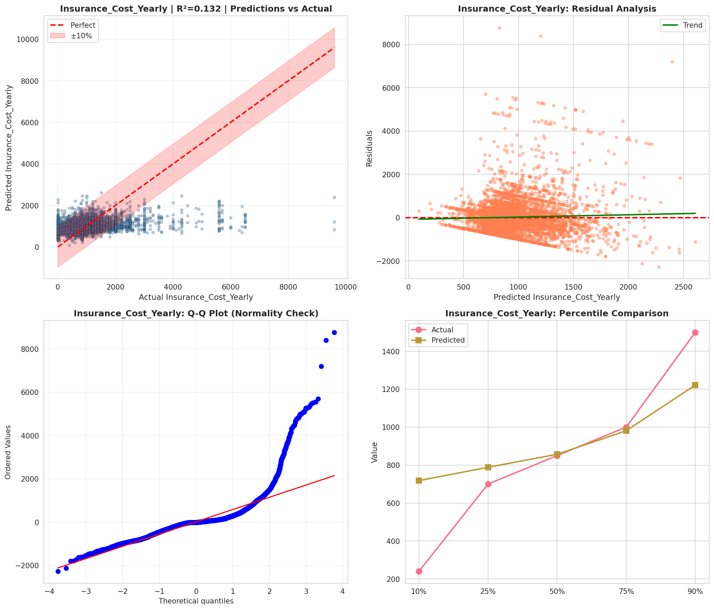
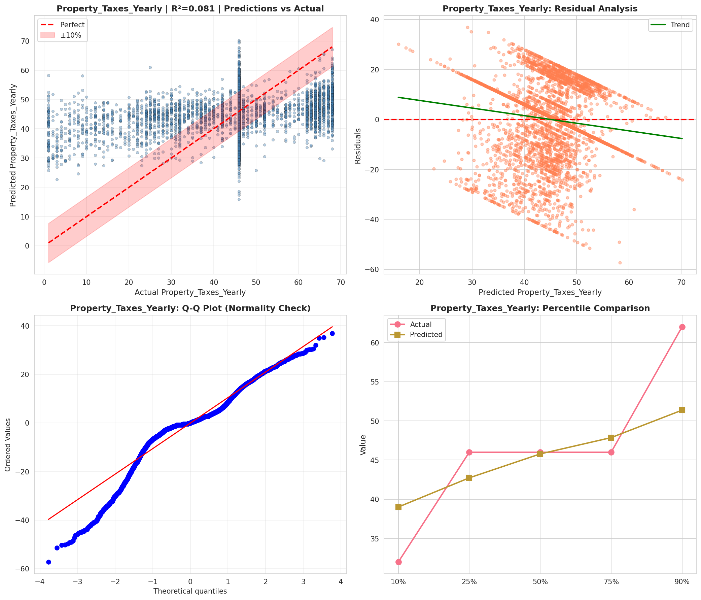
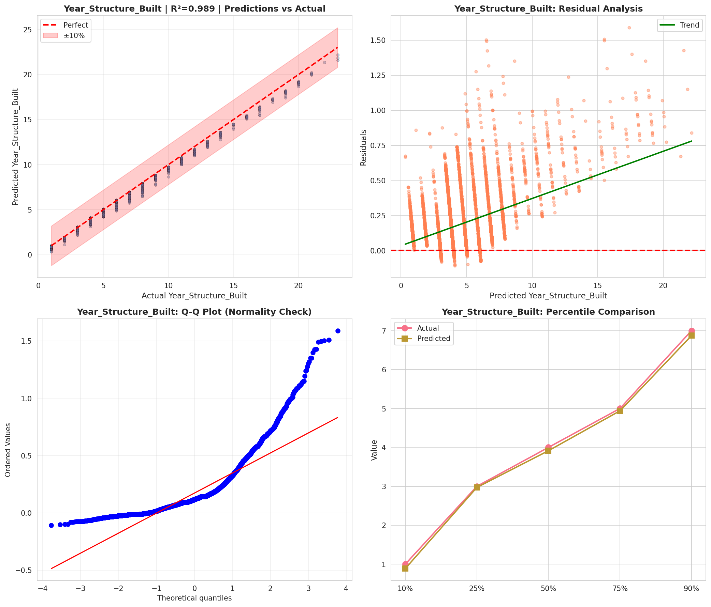
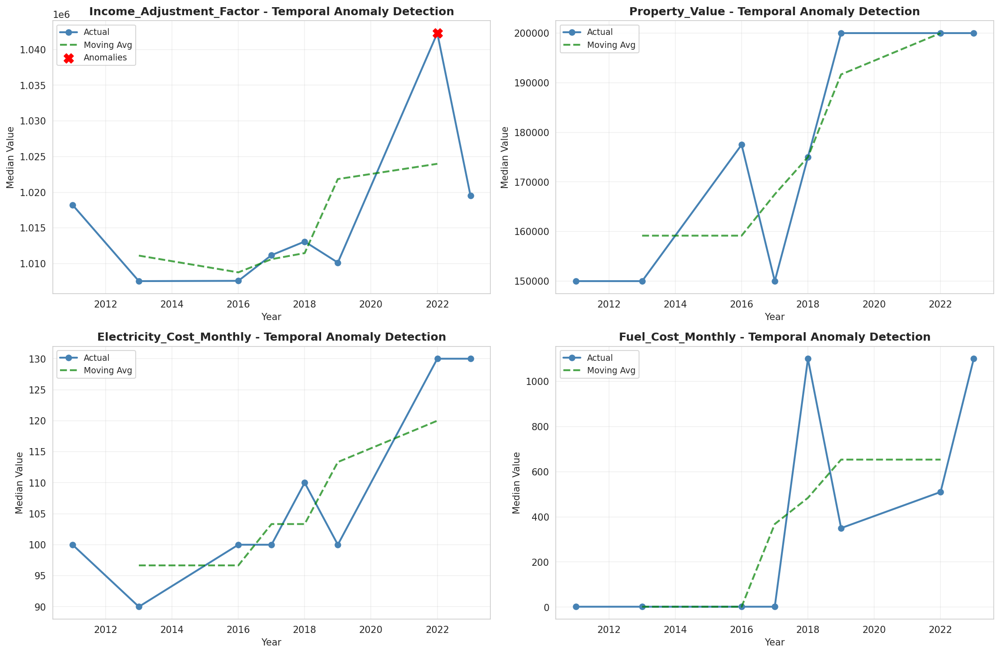

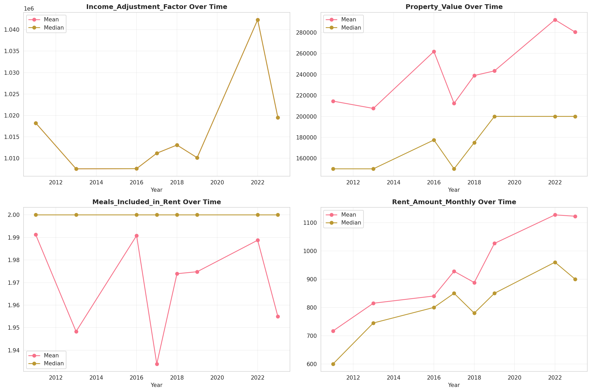
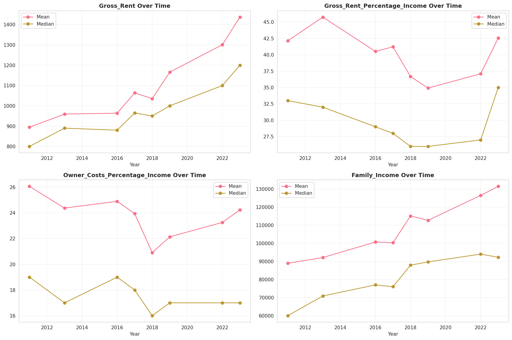
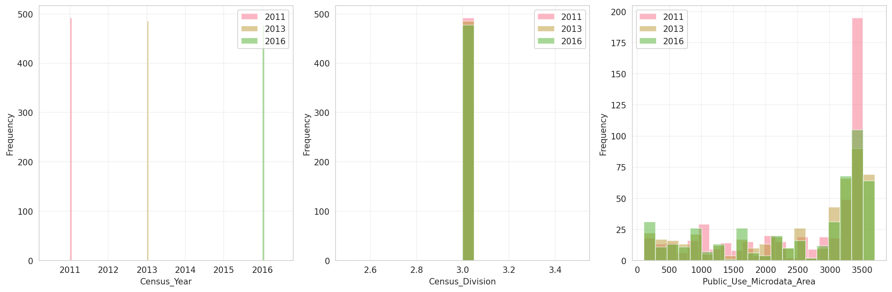
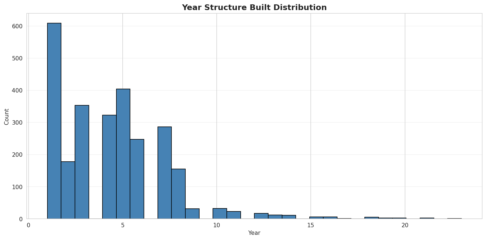
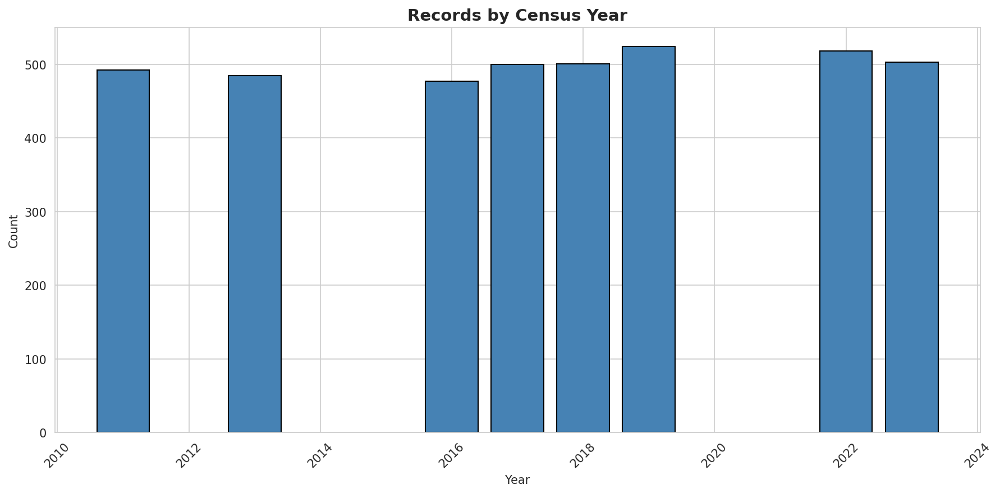
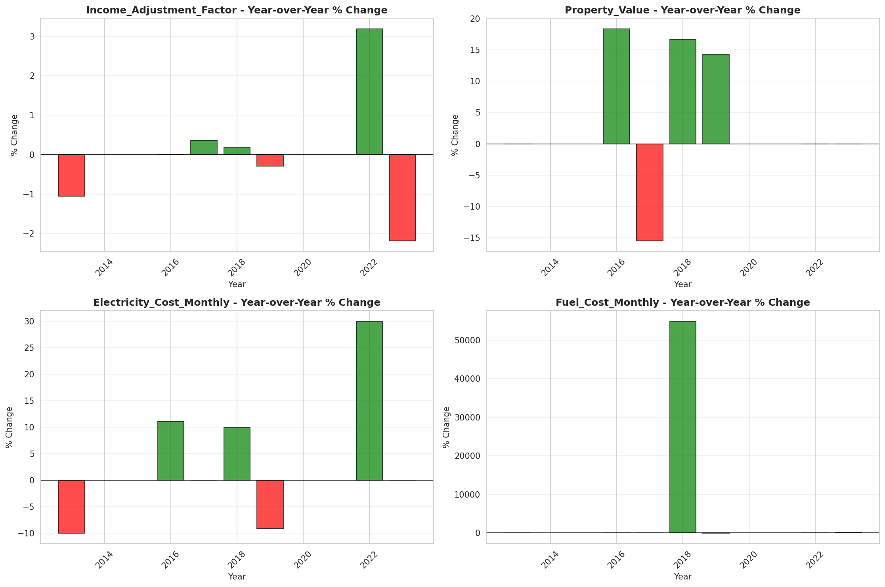
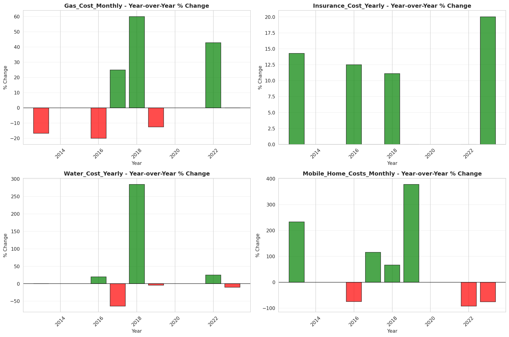
