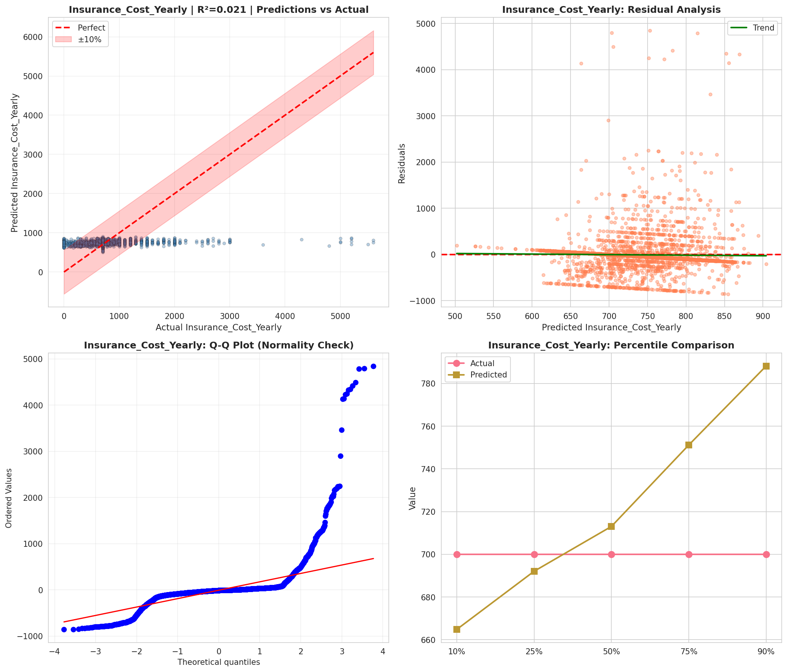
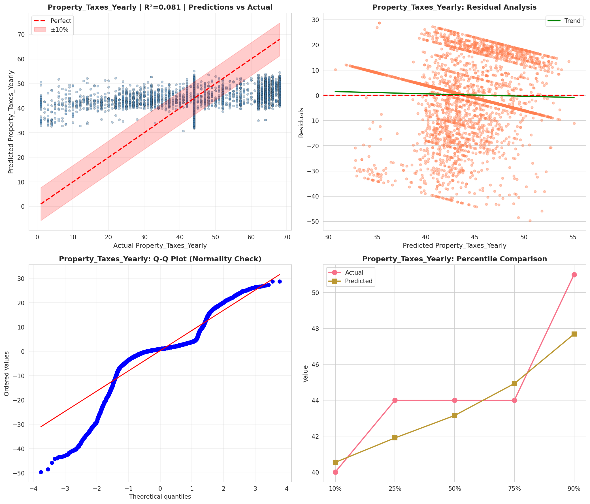
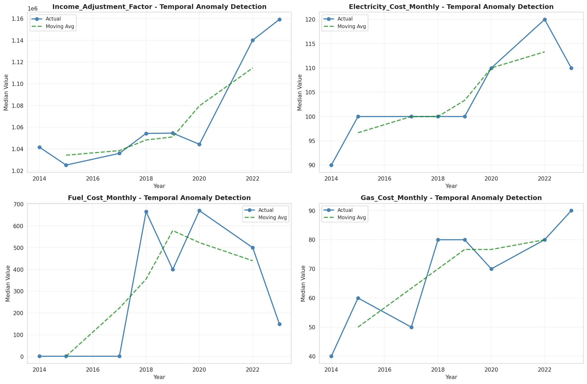
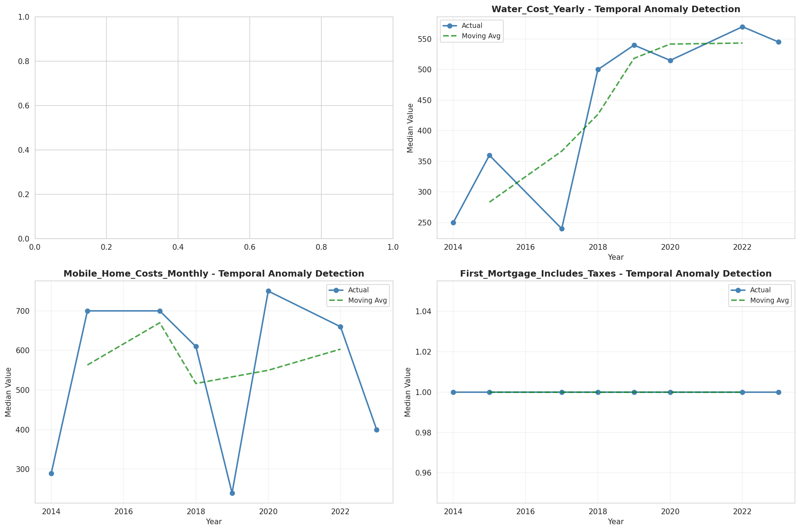
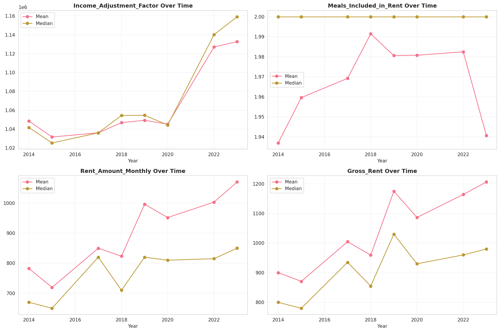
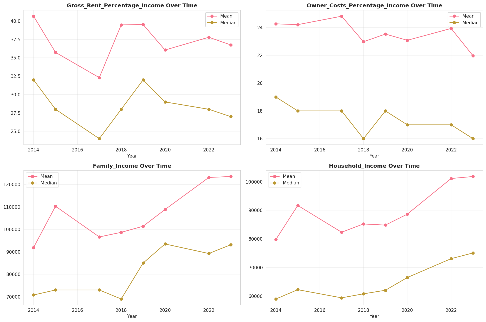
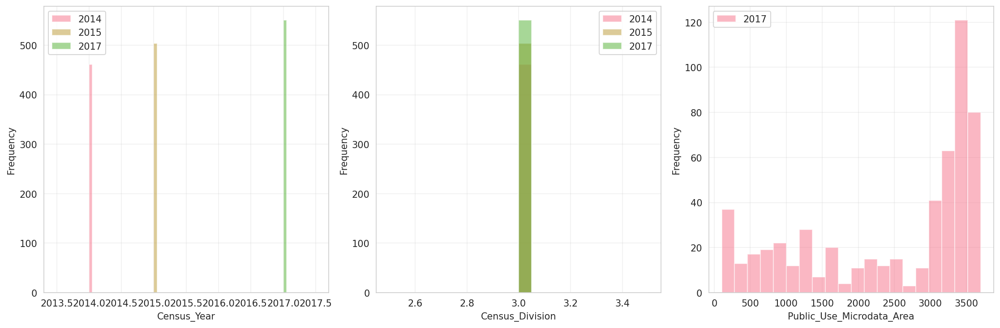
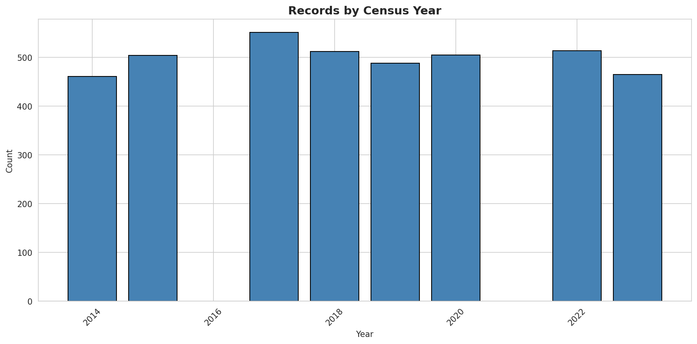
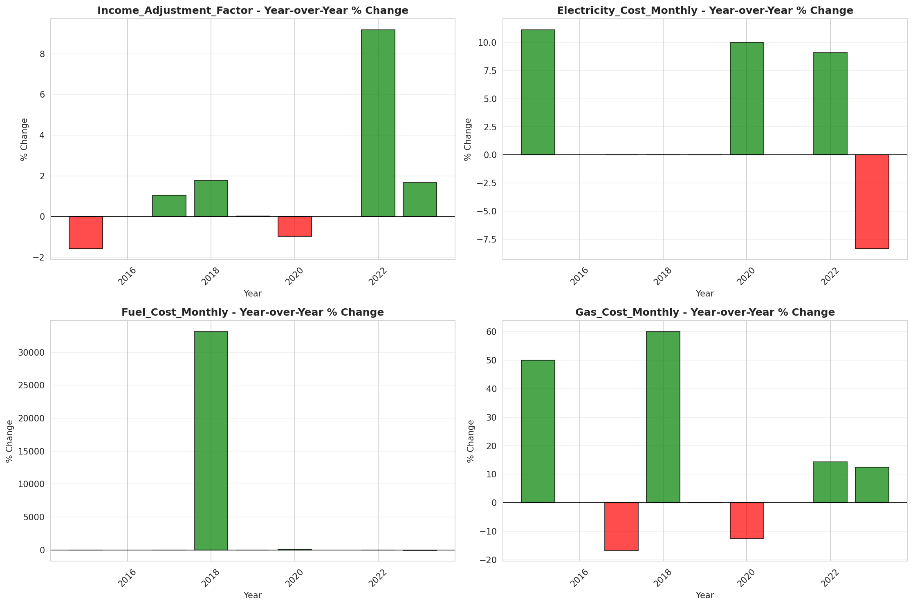
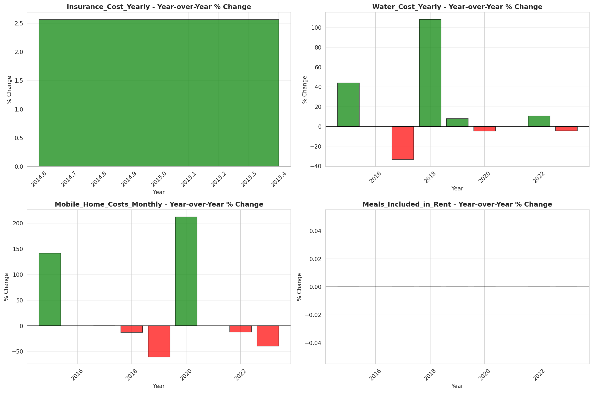

# Temporal Analysis

## Year Distribution

- 2014: 290,023 records

- 2015: 292,561 records

- 2017: 292,928 records

- 2018: 293,832 records

- 2019: 294,349 records

- 2020: 292,160 records

- 2022: 293,713 records

- 2023: 294,310 records

## Temporal Trends

- Census_Year: {np.int64(2014): {'mean': 2014.0, 'median': 2014.0, 'std': 0.0}, np.int64(2015): {'mean': 2015.0, 'median': 2015.0, 'std': 0.0}, np.int64(2017): {'mean': 2017.0, 'median': 2017.0, 'std': 0.0}, np.int64(2018): {'mean': 2018.0, 'median': 2018.0, 'std': 0.0}, np.int64(2019): {'mean': 2019.0, 'median': 2019.0, 'std': 0.0}, np.int64(2020): {'mean': 2020.0, 'median': 2020.0, 'std': 0.0}, np.int64(2022): {'mean': 2022.0, 'median': 2022.0, 'std': 0.0}, np.int64(2023): {'mean': 2023.0, 'median': 2023.0, 'std': 0.0}}

- Census_Division: {np.int64(2014): {'mean': 3.0, 'median': 3.0, 'std': 0.0}, np.int64(2015): {'mean': 3.0, 'median': 3.0, 'std': 0.0}, np.int64(2017): {'mean': 3.0, 'median': 3.0, 'std': 0.0}, np.int64(2018): {'mean': 3.0, 'median': 3.0, 'std': 0.0}, np.int64(2019): {'mean': 3.0, 'median': 3.0, 'std': 0.0}, np.int64(2020): {'mean': 3.0, 'median': 3.0, 'std': 0.0}, np.int64(2022): {'mean': 3.0, 'median': 3.0, 'std': 0.0}, np.int64(2023): {'mean': 3.0, 'median': 3.0, 'std': 0.0}}

- Public_Use_Microdata_Area: {np.int64(2014): {'mean': None, 'median': None, 'std': None}, np.int64(2015): {'mean': None, 'median': None, 'std': None}, np.int64(2017): {'mean': 2459.6652317292987, 'median': 3106.0, 'std': 1170.2487745477033}, np.int64(2018): {'mean': 2458.5110437256662, 'median': 3106.0, 'std': 1170.0623756527114}, np.int64(2019): {'mean': 2455.608926818165, 'median': 3105.0, 'std': 1169.8048749230993}, np.int64(2020): {'mean': 2452.466087075575, 'median': 3105.0, 'std': 1170.5052359887384}, np.int64(2022): {'mean': None, 'median': None, 'std': None}, np.int64(2023): {'mean': 8342.836413985253, 'median': 7300.0, 'std': 6005.961014818494}}

- Census_Region: {np.int64(2014): {'mean': 2.0, 'median': 2.0, 'std': 0.0}, np.int64(2015): {'mean': 2.0, 'median': 2.0, 'std': 0.0}, np.int64(2017): {'mean': 2.0, 'median': 2.0, 'std': 0.0}, np.int64(2018): {'mean': 2.0, 'median': 2.0, 'std': 0.0}, np.int64(2019): {'mean': 2.0, 'median': 2.0, 'std': 0.0}, np.int64(2020): {'mean': 2.0, 'median': 2.0, 'std': 0.0}, np.int64(2022): {'mean': 2.0, 'median': 2.0, 'std': 0.0}, np.int64(2023): {'mean': 2.0, 'median': 2.0, 'std': 0.0}}

- State_Code: {np.int64(2014): {'mean': 17.0, 'median': 17.0, 'std': 0.0}, np.int64(2015): {'mean': 17.0, 'median': 17.0, 'std': 0.0}, np.int64(2017): {'mean': 17.0, 'median': 17.0, 'std': 0.0}, np.int64(2018): {'mean': 17.0, 'median': 17.0, 'std': 0.0}, np.int64(2019): {'mean': 17.0, 'median': 17.0, 'std': 0.0}, np.int64(2020): {'mean': 17.0, 'median': 17.0, 'std': 0.0}, np.int64(2022): {'mean': 17.0, 'median': 17.0, 'std': 0.0}, np.int64(2023): {'mean': None, 'median': None, 'std': None}}

- Housing_Adjustment_Factor: {np.int64(2014): {'mean': 1036811.5735303751, 'median': 1031130.0, 'std': 29656.78380083157}, np.int64(2015): {'mean': 1021005.1747601355, 'median': 1017534.0, 'std': 20309.704414136697}, np.int64(2017): {'mean': 1029252.8899012727, 'median': 1034680.0, 'std': 17963.035619985978}, np.int64(2018): {'mean': 1038385.977459909, 'median': 1046406.0, 'std': 23442.582627218744}, np.int64(2019): {'mean': 1040981.2688713059, 'median': 1042936.0, 'std': 29159.063513317393}, np.int64(2020): {'mean': 1035835.9865861172, 'median': 1030827.0, 'std': 28502.383095228593}, np.int64(2022): {'mean': 1105786.6242624603, 'median': 1133141.0, 'std': 60903.23181152968}, np.int64(2023): {'mean': 1107454.4440352009, 'median': 1125501.0, 'std': 76554.30549032241}}

- Income_Adjustment_Factor: {np.int64(2014): {'mean': 1047666.0020067374, 'median': 1041654.0, 'std': 31082.210834850215}, np.int64(2015): {'mean': 1030444.7915409094, 'median': 1025215.0, 'std': 25682.267307378992}, np.int64(2017): {'mean': 1036647.0638382128, 'median': 1035988.0, 'std': 16844.40488202958}, np.int64(2018): {'mean': 1046956.8727776416, 'median': 1054346.0, 'std': 20473.858244632567}, np.int64(2019): {'mean': 1049916.9530115612, 'median': 1054606.0, 'std': 26196.848623669535}, np.int64(2020): {'mean': 1045860.0909843921, 'median': 1044328.0, 'std': 29090.170291734285}, np.int64(2022): {'mean': 1127695.0021040947, 'median': 1140108.0, 'std': 49059.32511020578}, np.int64(2023): {'mean': 1130978.419380925, 'median': 1159185.0, 'std': 69930.60208906449}}

- Housing_Unit_Weight: {np.int64(2014): {'mean': 18.27245770163056, 'median': 15.0, 'std': 16.22528167228403}, np.int64(2015): {'mean': 18.128441589959017, 'median': 15.0, 'std': 16.60513510520448}, np.int64(2017): {'mean': 18.21214428118855, 'median': 15.0, 'std': 16.26166244240749}, np.int64(2018): {'mean': 18.19838547197038, 'median': 15.0, 'std': 16.274708278728077}, np.int64(2019): {'mean': 18.21074642686063, 'median': 15.0, 'std': 16.580763689071535}, np.int64(2020): {'mean': 18.391925657174152, 'median': 14.0, 'std': 19.585030397814677}, np.int64(2022): {'mean': 18.47843643284431, 'median': 14.0, 'std': 20.134251238436487}, np.int64(2023): {'mean': 18.49580714212905, 'median': 13.0, 'std': 20.898190967571928}}

- Number_of_Persons: {np.int64(2014): {'mean': 2.1913158611558394, 'median': 2.0, 'std': 1.4887392126482022}, np.int64(2015): {'mean': 2.172552048974402, 'median': 2.0, 'std': 1.4815209708303345}, np.int64(2017): {'mean': 2.1649620384531354, 'median': 2.0, 'std': 1.4717508623837998}, np.int64(2018): {'mean': 2.152808407525389, 'median': 2.0, 'std': 1.4634606882580645}, np.int64(2019): {'mean': 2.1434453658752024, 'median': 2.0, 'std': 1.4541547762520513}, np.int64(2020): {'mean': 2.1251197973713034, 'median': 2.0, 'std': 1.4480263584289537}, np.int64(2022): {'mean': 2.120192160374243, 'median': 2.0, 'std': 1.4366052207306697}, np.int64(2023): {'mean': 2.1193877204308382, 'median': 2.0, 'std': 1.4276881090853242}}

- Housing_Unit_Type: {np.int64(2014): {'mean': 1.1257520955234586, 'median': 1.0, 'std': 0.4335282693540199}, np.int64(2015): {'mean': 1.1373901511137847, 'median': 1.0, 'std': 0.45316845107589404}, np.int64(2017): {'mean': 1.135514529167577, 'median': 1.0, 'std': 0.45208479919290456}, np.int64(2018): {'mean': 1.1356046992839446, 'median': 1.0, 'std': 0.4526958723187963}, np.int64(2019): {'mean': 1.133956629715066, 'median': 1.0, 'std': 0.45025895407317706}, np.int64(2020): {'mean': None, 'median': None, 'std': None}, np.int64(2022): {'mean': None, 'median': None, 'std': None}, np.int64(2023): {'mean': None, 'median': None, 'std': None}}

- Building_Type: {np.int64(2014): {'mean': 3.131576960251299, 'median': 2.0, 'std': 2.10007794804786}, np.int64(2015): {'mean': 3.1303504734598406, 'median': 2.0, 'std': 2.0954930478981013}, np.int64(2017): {'mean': 3.134071155754714, 'median': 2.0, 'std': 2.099734698691557}, np.int64(2018): {'mean': 3.1346740409331746, 'median': 2.0, 'std': 2.1044621159428263}, np.int64(2019): {'mean': 3.1301656443092924, 'median': 2.0, 'std': 2.108387380068831}, np.int64(2020): {'mean': 3.1229699256683396, 'median': 2.0, 'std': 2.1062919482158526}, np.int64(2022): {'mean': 3.100519434535805, 'median': 2.0, 'std': 2.099069527722536}, np.int64(2023): {'mean': 3.080981567460243, 'median': 2.0, 'std': 2.086556183032802}}

- Year_Structure_Built: {np.int64(2014): {'mean': 4.206679654464178, 'median': 4.0, 'std': 2.7052573312645856}, np.int64(2015): {'mean': 4.23724676500547, 'median': 4.0, 'std': 2.7683074860376804}, np.int64(2017): {'mean': 4.369699407536616, 'median': 4.0, 'std': 2.967348640006688}, np.int64(2018): {'mean': 4.4385590203616685, 'median': 4.0, 'std': 3.08807550154481}, np.int64(2019): {'mean': 4.527723193939077, 'median': 4.0, 'std': 3.238216188426243}, np.int64(2020): {'mean': 4.60937915220907, 'median': 4.0, 'std': 3.390894385998572}, np.int64(2022): {'mean': None, 'median': None, 'std': None}, np.int64(2023): {'mean': None, 'median': None, 'std': None}}

- Bathtub_or_Shower: {np.int64(2014): {'mean': 1.007917270750272, 'median': 1.0, 'std': 0.08862627843604272}, np.int64(2015): {'mean': 1.0076923076923077, 'median': 1.0, 'std': 0.08736798550649773}, np.int64(2017): {'mean': 1.0072516616041622, 'median': 1.0, 'std': 0.0848475224836909}, np.int64(2018): {'mean': 1.0071831650891432, 'median': 1.0, 'std': 0.08444876524346323}, np.int64(2019): {'mean': 1.0069037141085317, 'median': 1.0, 'std': 0.08280143991992542}, np.int64(2020): {'mean': 1.0068561276166035, 'median': 1.0, 'std': 0.08251755558855436}, np.int64(2022): {'mean': 1.0066068758216218, 'median': 1.0, 'std': 0.0810138860665671}, np.int64(2023): {'mean': 1.0064106654255698, 'median': 1.0, 'std': 0.07980972811300413}}

- Refrigerator: {np.int64(2014): {'mean': 1.0184887338407635, 'median': 1.0, 'std': 0.13471068656947643}, np.int64(2015): {'mean': 1.0187912626853284, 'median': 1.0, 'std': 0.1357874099165166}, np.int64(2017): {'mean': 1.018849057171213, 'median': 1.0, 'std': 0.13599205763055272}, np.int64(2018): {'mean': 1.0185443317820395, 'median': 1.0, 'std': 0.13490925742763643}, np.int64(2019): {'mean': 1.0178868956448324, 'median': 1.0, 'std': 0.13254063616671088}, np.int64(2020): {'mean': 1.0173870788948196, 'median': 1.0, 'std': 0.13070896389142567}, np.int64(2022): {'mean': 1.0148070860061549, 'median': 1.0, 'std': 0.12078034260205407}, np.int64(2023): {'mean': 1.0136470605897963, 'median': 1.0, 'std': 0.11602098452419257}}

- Hot_and_Cold_Running_Water: {np.int64(2014): {'mean': 1.012874531835206, 'median': 1.0, 'std': 0.11273343003603627}, np.int64(2015): {'mean': 1.0135360470819028, 'median': 1.0, 'std': 0.11555463160857014}, np.int64(2017): {'mean': 1.0145935460587652, 'median': 1.0, 'std': 0.11991925839114848}, np.int64(2018): {'mean': 1.0150707824666323, 'median': 1.0, 'std': 0.12183476352478925}, np.int64(2019): {'mean': 1.015219551557445, 'median': 1.0, 'std': 0.12242537645253515}, np.int64(2020): {'mean': 1.0157850380010174, 'median': 1.0, 'std': 0.12464320902262568}, np.int64(2022): {'mean': 1.0151272595778982, 'median': 1.0, 'std': 0.1220593368587021}, np.int64(2023): {'mean': 1.0145778832042818, 'median': 1.0, 'std': 0.11985584025632023}}

- Running_Water: {np.int64(2014): {'mean': 9.0, 'median': 9.0, 'std': 0.0}, np.int64(2015): {'mean': 9.0, 'median': 9.0, 'std': 0.0}, np.int64(2017): {'mean': 9.0, 'median': 9.0, 'std': 0.0}, np.int64(2018): {'mean': 9.0, 'median': 9.0, 'std': 0.0}, np.int64(2019): {'mean': 9.0, 'median': 9.0, 'std': 0.0}, np.int64(2020): {'mean': 9.0, 'median': 9.0, 'std': 0.0}, np.int64(2022): {'mean': 9.0, 'median': 9.0, 'std': 0.0}, np.int64(2023): {'mean': 9.0, 'median': 9.0, 'std': 0.0}}

- Sink_with_Faucet: {np.int64(2014): {'mean': 1.0076303310378156, 'median': 1.0, 'std': 0.08701803074561879}, np.int64(2015): {'mean': 1.0074319990945788, 'median': 1.0, 'std': 0.08588825480610204}, np.int64(2017): {'mean': 1.006902048058705, 'median': 1.0, 'std': 0.08279151864219017}, np.int64(2018): {'mean': 1.0068271918583303, 'median': 1.0, 'std': 0.08234443950371254}, np.int64(2019): {'mean': 1.0065861731457475, 'median': 1.0, 'std': 0.08088769938347554}, np.int64(2020): {'mean': 1.006616960374164, 'median': 1.0, 'std': 0.08107528084101874}, np.int64(2022): {'mean': 1.0063658039558387, 'median': 1.0, 'std': 0.07953178183381307}, np.int64(2023): {'mean': 1.0061516865529911, 'median': 1.0, 'std': 0.0781912159569285}}

- Stove_or_Range: {np.int64(2014): {'mean': 1.0207842515404133, 'median': 1.0, 'std': 0.14266163909421778}, np.int64(2015): {'mean': 1.0212623080695666, 'median': 1.0, 'std': 0.1442577583141383}, np.int64(2017): {'mean': 1.0212813148476738, 'median': 1.0, 'std': 0.14432081896351612}, np.int64(2018): {'mean': 1.021099844870613, 'median': 1.0, 'std': 0.14371749654120256}, np.int64(2019): {'mean': 1.020733556981792, 'median': 1.0, 'std': 0.1424912363864752}, np.int64(2020): {'mean': 1.0203747712725975, 'median': 1.0, 'std': 0.14127885808345045}, np.int64(2022): {'mean': 1.0181180574127715, 'median': 1.0, 'std': 0.13337863553912327}, np.int64(2023): {'mean': 1.01695748617841, 'median': 1.0, 'std': 0.12911232477453394}}

- Telephone_Service: {np.int64(2014): {'mean': 1.0242494737562333, 'median': 1.0, 'std': 0.15382305422765757}, np.int64(2015): {'mean': 1.0250716332378222, 'median': 1.0, 'std': 0.15634303570071859}, np.int64(2017): {'mean': 1.0469236822664054, 'median': 1.0, 'std': 0.4279823931503803}, np.int64(2018): {'mean': 1.0452484700906732, 'median': 1.0, 'std': 0.425795868222853}, np.int64(2019): {'mean': 1.041795702700977, 'median': 1.0, 'std': 0.4214978948099142}, np.int64(2020): {'mean': 1.0385363970662929, 'median': 1.0, 'std': 0.4209073428882756}, np.int64(2022): {'mean': 1.0094297946168242, 'median': 1.0, 'std': 0.09664838904146048}, np.int64(2023): {'mean': 1.0077249795609085, 'median': 1.0, 'std': 0.08755189787738536}}

- Lot_Acreage: {np.int64(2014): {'mean': 1.1920061138708444, 'median': 1.0, 'std': 0.47268683269810535}, np.int64(2015): {'mean': 1.19218933102359, 'median': 1.0, 'std': 0.47184795173333616}, np.int64(2017): {'mean': 1.1915111561866125, 'median': 1.0, 'std': 0.4680112465816343}, np.int64(2018): {'mean': 1.1911178879234174, 'median': 1.0, 'std': 0.4671940654607601}, np.int64(2019): {'mean': 1.1926148505613356, 'median': 1.0, 'std': 0.46819197999449397}, np.int64(2020): {'mean': 1.194838840771126, 'median': 1.0, 'std': 0.4697238078689928}, np.int64(2022): {'mean': 1.2010718915146077, 'median': 1.0, 'std': 0.4757337949559758}, np.int64(2023): {'mean': 1.2034807144936044, 'median': 1.0, 'std': 0.47696822520808674}}

- Agricultural_Sales: {np.int64(2014): {'mean': 1.4827077747989277, 'median': 1.0, 'std': 1.3443218440073563}, np.int64(2015): {'mean': 1.4811897052441834, 'median': 1.0, 'std': 1.343926094721732}, np.int64(2017): {'mean': 1.4555761835300358, 'median': 1.0, 'std': 1.3078311974162644}, np.int64(2018): {'mean': 1.4521183212428368, 'median': 1.0, 'std': 1.2994943140133597}, np.int64(2019): {'mean': 1.452628491347, 'median': 1.0, 'std': 1.2973562683450923}, np.int64(2020): {'mean': 1.4410766721044046, 'median': 1.0, 'std': 1.2797038058561532}, np.int64(2022): {'mean': 1.4227458508793658, 'median': 1.0, 'std': 1.254652291819831}, np.int64(2023): {'mean': 1.4177028451001055, 'median': 1.0, 'std': 1.250384305674441}}

- Business_On_Property: {np.int64(2014): {'mean': 1.9855406954528085, 'median': 2.0, 'std': 0.1193746441375925}, np.int64(2015): {'mean': 1.9858001732307535, 'median': 2.0, 'std': 0.11831425531367772}, np.int64(2017): {'mean': 4.813326572008114, 'median': 2.0, 'std': 3.441761206163005}, np.int64(2018): {'mean': 6.219932243096824, 'median': 9.0, 'std': 3.431615628229168}, np.int64(2019): {'mean': 7.61673672910417, 'median': 9.0, 'std': 2.791181491972855}, np.int64(2020): {'mean': None, 'median': None, 'std': None}, np.int64(2022): {'mean': None, 'median': None, 'std': None}, np.int64(2023): {'mean': None, 'median': None, 'std': None}}

- Tenure: {np.int64(2014): {'mean': 1.8259431133506936, 'median': 2.0, 'std': 0.8643442605888442}, np.int64(2015): {'mean': 1.838334245516886, 'median': 2.0, 'std': 0.8640861927329785}, np.int64(2017): {'mean': 1.8487095686249317, 'median': 2.0, 'std': 0.8601709270968906}, np.int64(2018): {'mean': 1.851318445419884, 'median': 2.0, 'std': 0.856794300083069}, np.int64(2019): {'mean': 1.848054083391865, 'median': 2.0, 'std': 0.8525418120767903}, np.int64(2020): {'mean': 1.8441559496962678, 'median': 2.0, 'std': 0.8482452648352662}, np.int64(2022): {'mean': 1.8355207672350782, 'median': 2.0, 'std': 0.838551204516633}, np.int64(2023): {'mean': 1.8296994955033998, 'median': 2.0, 'std': 0.8331707215433449}}

- Vacancy_Status: {np.int64(2014): {'mean': 4.821456872904602, 'median': 5.0, 'std': 2.419466680608978}, np.int64(2015): {'mean': 4.832227716801351, 'median': 5.0, 'std': 2.4106399443064217}, np.int64(2017): {'mean': 4.853989612842304, 'median': 5.0, 'std': 2.40392037394478}, np.int64(2018): {'mean': 4.862620737809845, 'median': 5.0, 'std': 2.401660849559933}, np.int64(2019): {'mean': 4.926224716473752, 'median': 7.0, 'std': 2.394196622694106}, np.int64(2020): {'mean': 4.970131145646773, 'median': 7.0, 'std': 2.3957047618367797}, np.int64(2022): {'mean': 5.04349936298004, 'median': 7.0, 'std': 2.3817732399066807}, np.int64(2023): {'mean': 5.101491776106082, 'median': 7.0, 'std': 2.360341026300233}}

- Vehicles_Available: {np.int64(2014): {'mean': 1.734129172217549, 'median': 2.0, 'std': 1.0440766889351967}, np.int64(2015): {'mean': 1.7365748044171148, 'median': 2.0, 'std': 1.0457520284849964}, np.int64(2017): {'mean': 1.75766068159188, 'median': 2.0, 'std': 1.053948213958263}, np.int64(2018): {'mean': 1.7659679279741116, 'median': 2.0, 'std': 1.0571227289589908}, np.int64(2019): {'mean': 1.7758085371304515, 'median': 2.0, 'std': 1.0610584062134767}, np.int64(2020): {'mean': 1.7856890351679162, 'median': 2.0, 'std': 1.0659577645396472}, np.int64(2022): {'mean': 1.7886047277488173, 'median': 2.0, 'std': 1.0622911747389407}, np.int64(2023): {'mean': 1.7865879678557897, 'median': 2.0, 'std': 1.0608686370906}}

- Condo_Fee_Monthly: {np.int64(2014): {'mean': 294.43211076026233, 'median': 230.0, 'std': 219.88993159890833}, np.int64(2015): {'mean': 299.48031094685865, 'median': 240.0, 'std': 219.28666982251406}, np.int64(2017): {'mean': 316.60220188353895, 'median': 250.0, 'std': 228.05644416737087}, np.int64(2018): {'mean': 325.1610610149411, 'median': 260.0, 'std': 231.58411688066278}, np.int64(2019): {'mean': 334.9651779935275, 'median': 260.0, 'std': 239.74358960009243}, np.int64(2020): {'mean': 347.54038246697775, 'median': 270.0, 'std': 261.5588819507463}, np.int64(2022): {'mean': 372.68117048346056, 'median': 290.0, 'std': 302.351837694119}, np.int64(2023): {'mean': 386.23687547552623, 'median': 300.0, 'std': 320.295727104732}}

- Electricity_Cost_Monthly: {np.int64(2014): {'mean': 114.52026692532772, 'median': 100.0, 'std': 78.55341976517364}, np.int64(2015): {'mean': 115.04670648079585, 'median': 100.0, 'std': 78.56339947406883}, np.int64(2017): {'mean': 116.15529743359137, 'median': 100.0, 'std': 79.97411376223427}, np.int64(2018): {'mean': 123.77021580701185, 'median': 100.0, 'std': 80.33268317969656}, np.int64(2019): {'mean': 125.98741706229796, 'median': 100.0, 'std': 81.32877320541651}, np.int64(2020): {'mean': 128.03296717187678, 'median': 100.0, 'std': 83.75694055717456}, np.int64(2022): {'mean': 138.68673761785342, 'median': 110.0, 'std': 127.0197988843007}, np.int64(2023): {'mean': 147.32144934591315, 'median': 120.0, 'std': 159.69867809719025}}

- Fuel_Cost_Monthly: {np.int64(2014): {'mean': 40.228005425442426, 'median': 2.0, 'std': 251.67650705214405}, np.int64(2015): {'mean': 34.55371687968835, 'median': 2.0, 'std': 234.5184687063406}, np.int64(2017): {'mean': 24.012948479105773, 'median': 2.0, 'std': 190.20311221462043}, np.int64(2018): {'mean': 766.0115999434149, 'median': 500.0, 'std': 830.9662926328058}, np.int64(2019): {'mean': 763.5395872969414, 'median': 500.0, 'std': 841.6078375792554}, np.int64(2020): {'mean': 736.878587196468, 'median': 500.0, 'std': 817.190685064709}, np.int64(2022): {'mean': 757.9260713117435, 'median': 490.0, 'std': 882.9104369175284}, np.int64(2023): {'mean': 771.9517320637005, 'median': 450.0, 'std': 919.8654993609075}}

- Gas_Cost_Monthly: {np.int64(2014): {'mean': 73.45819632212961, 'median': 50.0, 'std': 80.19287850944335}, np.int64(2015): {'mean': 71.51756221628409, 'median': 50.0, 'std': 79.33187097457727}, np.int64(2017): {'mean': 67.56617576205312, 'median': 50.0, 'std': 76.69290379924779}, np.int64(2018): {'mean': 92.96352163225998, 'median': 70.0, 'std': 76.94338787657118}, np.int64(2019): {'mean': 89.76244795910395, 'median': 70.0, 'std': 73.3624477844589}, np.int64(2020): {'mean': 88.84569680636339, 'median': 70.0, 'std': 72.16783299191731}, np.int64(2022): {'mean': 103.7741010591648, 'median': 80.0, 'std': 118.82757383361606}, np.int64(2023): {'mean': 112.39818989413219, 'median': 80.0, 'std': 140.604299136823}}

- House_Heating_Fuel: {np.int64(2014): {'mean': 1.4592145987869225, 'median': 1.0, 'std': 1.0822784053501155}, np.int64(2015): {'mean': 1.4702923279997424, 'median': 1.0, 'std': 1.1020275552007663}, np.int64(2017): {'mean': 1.488765939678155, 'median': 1.0, 'std': 1.1293425175850826}, np.int64(2018): {'mean': 1.492883118131428, 'median': 1.0, 'std': 1.1300319386530753}, np.int64(2019): {'mean': 1.4980325330438669, 'median': 1.0, 'std': 1.129095191499284}, np.int64(2020): {'mean': 1.502240913431259, 'median': 1.0, 'std': 1.1299547209764453}, np.int64(2022): {'mean': 1.5173575691371015, 'median': 1.0, 'std': 1.1384347188946833}, np.int64(2023): {'mean': 1.5225348461584478, 'median': 1.0, 'std': 1.1379025776896725}}

- Insurance_Cost_Yearly: {np.int64(2014): {'mean': 861.3749792078659, 'median': 730.0, 'std': 634.2972164565032}, np.int64(2015): {'mean': 897.401343310327, 'median': 790.0, 'std': 658.6212882045814}}

- Water_Cost_Yearly: {np.int64(2014): {'mean': 354.29209245791054, 'median': 250.0, 'std': 411.201531904384}, np.int64(2015): {'mean': 366.19226682978655, 'median': 250.0, 'std': 426.8415614556729}, np.int64(2017): {'mean': 388.34291186201136, 'median': 260.0, 'std': 456.848020833513}, np.int64(2018): {'mean': 567.3667736299375, 'median': 500.0, 'std': 470.1551354927371}, np.int64(2019): {'mean': 579.7800663963307, 'median': 500.0, 'std': 486.50283894564933}, np.int64(2020): {'mean': 595.78992944195, 'median': 500.0, 'std': 508.9385271855915}, np.int64(2022): {'mean': 621.078606954078, 'median': 530.0, 'std': 557.5372759555802}, np.int64(2023): {'mean': 634.8907823222619, 'median': 540.0, 'std': 581.5944651996261}}

- Mobile_Home_Costs_Monthly: {np.int64(2014): {'mean': 1696.5478315003113, 'median': 400.0, 'std': 2325.17703614671}, np.int64(2015): {'mean': 1719.1819529760644, 'median': 420.0, 'std': 2344.0473026217833}, np.int64(2017): {'mean': 1799.8826174949404, 'median': 460.0, 'std': 2468.550361771543}, np.int64(2018): {'mean': 1832.223486572599, 'median': 500.0, 'std': 2525.61912302609}, np.int64(2019): {'mean': 1841.819497851165, 'median': 500.0, 'std': 2574.88410756904}, np.int64(2020): {'mean': 1907.5614898102601, 'median': 500.0, 'std': 2780.5937969966412}, np.int64(2022): {'mean': 2227.5063410051666, 'median': 580.0, 'std': 3670.659345487561}, np.int64(2023): {'mean': 2275.655428970007, 'median': 600.0, 'std': 3755.6667030633866}}

- First_Mortgage_Includes_Insurance: {np.int64(2014): {'mean': 1.546568563044716, 'median': 2.0, 'std': 0.49782882577485127}, np.int64(2015): {'mean': 1.5344990716938018, 'median': 2.0, 'std': 0.49881062032975143}, np.int64(2017): {'mean': 1.5098389005187949, 'median': 2.0, 'std': 0.49990546165510846}, np.int64(2018): {'mean': 1.4967511341245474, 'median': 1.0, 'std': 0.499991735887194}, np.int64(2019): {'mean': 1.4838783485717946, 'median': 1.0, 'std': 0.49974231165137906}, np.int64(2020): {'mean': 1.4691585447231648, 'median': 1.0, 'std': 0.4990502433269183}, np.int64(2022): {'mean': 1.441215436152696, 'median': 1.0, 'std': 0.4965346998357415}, np.int64(2023): {'mean': 1.4287079438368089, 'median': 1.0, 'std': 0.4948936855781012}}

- First_Mortgage_Payment_Monthly: {np.int64(2014): {'mean': 1171.1667673980642, 'median': 1000.0, 'std': 833.0071018710406}, np.int64(2015): {'mean': 1162.4730255641246, 'median': 990.0, 'std': 825.9937072072412}, np.int64(2017): {'mean': 1179.8456539546737, 'median': 1000.0, 'std': 836.343958711546}, np.int64(2018): {'mean': 1204.619914768822, 'median': 1000.0, 'std': 858.2423938469202}, np.int64(2019): {'mean': 1235.1694352159468, 'median': 1000.0, 'std': 888.9951090495127}, np.int64(2020): {'mean': 1270.4300980272371, 'median': 1100.0, 'std': 912.4202260277831}, np.int64(2022): {'mean': 1340.4056059200939, 'median': 1100.0, 'std': 950.0433092987909}, np.int64(2023): {'mean': 1382.0950308443403, 'median': 1200.0, 'std': 974.1144735665877}}

- First_Mortgage_Includes_Taxes: {np.int64(2014): {'mean': 1.4292033460342486, 'median': 1.0, 'std': 0.4949646247119217}, np.int64(2015): {'mean': 1.4196658097686374, 'median': 1.0, 'std': 0.4935064252871998}, np.int64(2017): {'mean': 1.3961408937835624, 'median': 1.0, 'std': 0.48909657871945555}, np.int64(2018): {'mean': 1.3846675525821381, 'median': 1.0, 'std': 0.48651885456682725}, np.int64(2019): {'mean': 1.3727977448907682, 'median': 1.0, 'std': 0.4835511620140259}, np.int64(2020): {'mean': 1.3585278057124597, 'median': 1.0, 'std': 0.4795704117260225}, np.int64(2022): {'mean': 1.3301568976285558, 'median': 1.0, 'std': 0.47027163787011544}, np.int64(2023): {'mean': 1.3175831661809787, 'median': 1.0, 'std': 0.46553855832137536}}

- First_Mortgage_Status: {np.int64(2014): {'mean': 1.7504736413103341, 'median': 1.0, 'std': 0.9642356540969985}, np.int64(2015): {'mean': 1.7681341487036166, 'median': 1.0, 'std': 0.9685541258452014}, np.int64(2017): {'mean': 1.7930942953836626, 'median': 1.0, 'std': 0.9741492837215828}, np.int64(2018): {'mean': 1.8059828918595877, 'median': 1.0, 'std': 0.9769075398466929}, np.int64(2019): {'mean': 1.8143635728172307, 'median': 1.0, 'std': 0.9786756782666143}, np.int64(2020): {'mean': 1.8312964651908354, 'median': 1.0, 'std': 0.9818431894081164}, np.int64(2022): {'mean': 1.8693166524908216, 'median': 1.0, 'std': 0.9878638983800292}, np.int64(2023): {'mean': 1.8857986722378943, 'median': 1.0, 'std': 0.9900946047196523}}

- Second_Mortgage_Payment_Monthly: {np.int64(2014): {'mean': 361.0247492224802, 'median': 250.0, 'std': 381.379084724069}, np.int64(2015): {'mean': 357.8183574879227, 'median': 250.0, 'std': 378.27162533509795}, np.int64(2017): {'mean': 366.8241876236225, 'median': 250.0, 'std': 400.7688629080875}, np.int64(2018): {'mean': 375.2212745217497, 'median': 250.0, 'std': 408.4359530702087}, np.int64(2019): {'mean': 384.617913758236, 'median': 270.0, 'std': 409.16225221523615}, np.int64(2020): {'mean': 402.2155598243688, 'median': 280.0, 'std': 442.23265197262407}, np.int64(2022): {'mean': 419.54240776128177, 'median': 300.0, 'std': 476.6980131478635}, np.int64(2023): {'mean': 436.5280712345306, 'median': 300.0, 'std': 488.89314031355457}}

- Second_Mortgage_Status: {np.int64(2014): {'mean': 2.7716725791617396, 'median': 3.0, 'std': 0.5182218778940306}, np.int64(2015): {'mean': 2.789979648671808, 'median': 3.0, 'std': 0.49978288038448143}, np.int64(2017): {'mean': 2.8179666879038865, 'median': 3.0, 'std': 0.46702059461077566}, np.int64(2018): {'mean': 2.8307931998350364, 'median': 3.0, 'std': 0.449810044860309}, np.int64(2019): {'mean': 2.8427189441988596, 'median': 3.0, 'std': 0.43402079026752594}, np.int64(2020): {'mean': 2.848334640230014, 'median': 3.0, 'std': 0.4225747609584103}, np.int64(2022): {'mean': 2.861100287596252, 'median': 3.0, 'std': 0.39888694541095404}, np.int64(2023): {'mean': 2.8661815968571904, 'median': 3.0, 'std': 0.38947817892723985}}

- Property_Taxes_Yearly: {np.int64(2014): {'mean': 42.08745291124182, 'median': 43.0, 'std': 20.28366779193803}, np.int64(2015): {'mean': 42.433747475026976, 'median': 44.0, 'std': 20.313311856558293}, np.int64(2017): {'mean': 43.55135039483289, 'median': 46.0, 'std': 20.262116826094463}}

- Meals_Included_in_Rent: {np.int64(2014): {'mean': 1.975526474127557, 'median': 2.0, 'std': 0.1545151498505867}, np.int64(2015): {'mean': 1.9754301578111313, 'median': 2.0, 'std': 0.15481124263593934}, np.int64(2017): {'mean': 1.9744502463778775, 'median': 2.0, 'std': 0.1577888777131}, np.int64(2018): {'mean': 1.9739750183688465, 'median': 2.0, 'std': 0.1592107234261162}, np.int64(2019): {'mean': 1.9728731060887115, 'median': 2.0, 'std': 0.16245435413557263}, np.int64(2020): {'mean': 1.9720992231908927, 'median': 2.0, 'std': 0.16468982673027155}, np.int64(2022): {'mean': 1.97103242591535, 'median': 2.0, 'std': 0.16771672537879048}, np.int64(2023): {'mean': 1.9702898080912863, 'median': 2.0, 'std': 0.16978799622967902}}

- Rent_Amount_Monthly: {np.int64(2014): {'mean': 784.5744885679903, 'median': 700.0, 'std': 489.81499445048536}, np.int64(2015): {'mean': 804.7431523627132, 'median': 700.0, 'std': 504.04279337449475}, np.int64(2017): {'mean': 858.1294991542252, 'median': 750.0, 'std': 534.0645638875019}, np.int64(2018): {'mean': 882.7045995591477, 'median': 780.0, 'std': 551.883547749364}, np.int64(2019): {'mean': 908.7243830412394, 'median': 800.0, 'std': 569.9992474350219}, np.int64(2020): {'mean': 941.8670691160924, 'median': 800.0, 'std': 605.4267089697843}, np.int64(2022): {'mean': 1013.1130147852022, 'median': 860.0, 'std': 682.7328203536052}, np.int64(2023): {'mean': 1059.6294411307053, 'median': 900.0, 'std': 728.5196304407217}}

- Gross_Rent: {np.int64(2014): {'mean': 927.3898337443322, 'median': 840.0, 'std': 509.2000123158485}, np.int64(2015): {'mean': 948.654944606597, 'median': 850.0, 'std': 523.2324610482952}, np.int64(2017): {'mean': 1001.8413493705946, 'median': 900.0, 'std': 549.6283188657886}, np.int64(2018): {'mean': 1028.6307266306799, 'median': 920.0, 'std': 565.916669293501}, np.int64(2019): {'mean': 1054.0996846118844, 'median': 940.0, 'std': 580.8658627474277}, np.int64(2020): {'mean': 1086.592046745658, 'median': 960.0, 'std': 612.7402291580721}, np.int64(2022): {'mean': 1168.3089021915926, 'median': 1020.0, 'std': 697.5120107601462}, np.int64(2023): {'mean': 1223.8321212741985, 'median': 1060.0, 'std': 748.4974646352873}}

- Gross_Rent_Percentage_Income: {np.int64(2014): {'mean': 39.9016224526512, 'median': 30.0, 'std': 28.182175543853813}, np.int64(2015): {'mean': 39.442984438561375, 'median': 29.0, 'std': 28.07058251633235}, np.int64(2017): {'mean': 38.34227833517354, 'median': 29.0, 'std': 27.652503670831685}, np.int64(2018): {'mean': 37.93579125763438, 'median': 28.0, 'std': 27.41292193537473}, np.int64(2019): {'mean': 37.297097829414895, 'median': 28.0, 'std': 27.15050080464219}, np.int64(2020): {'mean': 36.908824557606835, 'median': 28.0, 'std': 27.048688638301996}, np.int64(2022): {'mean': 37.08104154476302, 'median': 28.0, 'std': 27.290686585563144}, np.int64(2023): {'mean': 37.100655496354456, 'median': 28.0, 'std': 27.401103771036045}}

- Selected_Monthly_Owner_Costs: {np.int64(2014): {'mean': 1312.2614303107766, 'median': 1034.0, 'std': 1036.0422042573964}, np.int64(2015): {'mean': 1296.7605498898226, 'median': 1023.0, 'std': 1017.7104669637772}, np.int64(2017): {'mean': 1300.5478948824343, 'median': 1026.0, 'std': 1008.153384365345}, np.int64(2018): {'mean': 1318.7200540063925, 'median': 1038.0, 'std': 1024.2649359164334}, np.int64(2019): {'mean': 1337.5563805433992, 'median': 1050.0, 'std': 1047.5972442071154}, np.int64(2020): {'mean': 1358.2575140993033, 'median': 1061.0, 'std': 1078.0146072594548}, np.int64(2022): {'mean': 1412.5491648808434, 'median': 1104.0, 'std': 1128.2946953044575}, np.int64(2023): {'mean': 1450.9708479394155, 'median': 1135.0, 'std': 1158.08079925509}}

- Owner_Costs_Percentage_Income: {np.int64(2014): {'mean': 25.33349965626594, 'median': 19.0, 'std': 21.26271729189065}, np.int64(2015): {'mean': 24.685668115457485, 'median': 18.0, 'std': 21.055675703385987}, np.int64(2017): {'mean': 23.598550756925956, 'median': 18.0, 'std': 20.58909917815021}, np.int64(2018): {'mean': 23.33671550380286, 'median': 17.0, 'std': 20.474407434777817}, np.int64(2019): {'mean': 22.904534579953253, 'median': 17.0, 'std': 20.31838854906046}, np.int64(2020): {'mean': 22.539812861460703, 'median': 17.0, 'std': 20.20144890012944}, np.int64(2022): {'mean': 22.395172529731077, 'median': 16.0, 'std': 20.483607438097735}, np.int64(2023): {'mean': 22.394752728613174, 'median': 16.0, 'std': 20.63517411758039}}

- Satellite_Internet: {np.int64(2014): {'mean': None, 'median': None, 'std': None}, np.int64(2015): {'mean': None, 'median': None, 'std': None}, np.int64(2017): {'mean': 1.9186461557102685, 'median': 2.0, 'std': 0.273378443962404}, np.int64(2018): {'mean': 1.91450709823685, 'median': 2.0, 'std': 0.2796144652472426}, np.int64(2019): {'mean': 1.9111488047875205, 'median': 2.0, 'std': 0.2845295170167637}, np.int64(2020): {'mean': 1.9087486817152126, 'median': 2.0, 'std': 0.28796685116621235}, np.int64(2022): {'mean': 1.9115326719744645, 'median': 2.0, 'std': 0.28397398740825575}, np.int64(2023): {'mean': 1.9137602761664116, 'median': 2.0, 'std': 0.28071833646087935}}

- Smartphone: {np.int64(2014): {'mean': None, 'median': None, 'std': None}, np.int64(2015): {'mean': None, 'median': None, 'std': None}, np.int64(2017): {'mean': 1.3058651591558796, 'median': 1.0, 'std': 0.4607738230542473}, np.int64(2018): {'mean': 1.2570127519143892, 'median': 1.0, 'std': 0.43698737058876924}, np.int64(2019): {'mean': 1.2167526020049806, 'median': 1.0, 'std': 0.41203348050175137}, np.int64(2020): {'mean': 1.1828528473618984, 'median': 1.0, 'std': 0.3865466216458573}, np.int64(2022): {'mean': 1.1341577040779445, 'median': 1.0, 'std': 0.3408223599234253}, np.int64(2023): {'mean': 1.119296496440607, 'median': 1.0, 'std': 0.3241377197889676}}

- Tablet_Computer: {np.int64(2014): {'mean': None, 'median': None, 'std': None}, np.int64(2015): {'mean': None, 'median': None, 'std': None}, np.int64(2017): {'mean': 1.4655710981916295, 'median': 1.0, 'std': 0.49881424370514166}, np.int64(2018): {'mean': 1.4251105379513633, 'median': 1.0, 'std': 0.49436074608103187}, np.int64(2019): {'mean': 1.3965862652448757, 'median': 1.0, 'std': 0.4891896917248366}, np.int64(2020): {'mean': 1.3721338453099288, 'median': 1.0, 'std': 0.48337479855816534}, np.int64(2022): {'mean': 1.359709716543908, 'median': 1.0, 'std': 0.4799162024285038}, np.int64(2023): {'mean': 1.3599353925302597, 'median': 1.0, 'std': 0.4799821085495193}}

- Food_Stamp_SNAP: {np.int64(2014): {'mean': 1.8878290170968284, 'median': 2.0, 'std': 0.3155772765404842}, np.int64(2015): {'mean': 1.8831251653205499, 'median': 2.0, 'std': 0.3212716633873823}, np.int64(2017): {'mean': 1.8831019189518232, 'median': 2.0, 'std': 0.321299383365089}, np.int64(2018): {'mean': 1.8851709404798913, 'median': 2.0, 'std': 0.31881611318156106}, np.int64(2019): {'mean': 1.8885778901541248, 'median': 2.0, 'std': 0.3146547002639153}, np.int64(2020): {'mean': 1.8916940451371833, 'median': 2.0, 'std': 0.31076699692915677}, np.int64(2022): {'mean': 1.8903221152111964, 'median': 2.0, 'std': 0.31248839755749186}, np.int64(2023): {'mean': 1.8873786895601241, 'median': 2.0, 'std': 0.31612989349186377}}

- Family_Type_Employment_Status: {np.int64(2014): {'mean': 3.040229640654901, 'median': 2.0, 'std': 2.3448990748863063}, np.int64(2015): {'mean': 3.0500674277973383, 'median': 2.0, 'std': 2.3403935001726657}, np.int64(2017): {'mean': 3.046177115353998, 'median': 2.0, 'std': 2.324917282070625}, np.int64(2018): {'mean': 3.0433887977789653, 'median': 2.0, 'std': 2.316858542184449}, np.int64(2019): {'mean': 3.031445457844144, 'median': 2.0, 'std': 2.303087434960262}, np.int64(2020): {'mean': 3.0267973610274934, 'median': 2.0, 'std': 2.293246386710821}, np.int64(2022): {'mean': None, 'median': None, 'std': None}, np.int64(2023): {'mean': None, 'median': None, 'std': None}}

- Family_Income: {np.int64(2014): {'mean': 89786.50773247886, 'median': 68900.0, 'std': 86516.05506798357}, np.int64(2015): {'mean': 92507.63539263804, 'median': 70000.0, 'std': 90303.85787785769}, np.int64(2017): {'mean': 99617.82320041748, 'median': 75000.0, 'std': 98589.40856325757}, np.int64(2018): {'mean': 103019.69254765392, 'median': 77700.0, 'std': 101829.79294099513}, np.int64(2019): {'mean': 107608.26158373659, 'median': 80560.0, 'std': 106669.67993428769}, np.int64(2020): {'mean': 111782.5737009544, 'median': 84000.0, 'std': 110240.23249596388}, np.int64(2022): {'mean': 119730.60781693044, 'median': 90000.0, 'std': 117492.18445087198}, np.int64(2023): {'mean': 124644.54299963887, 'median': 94000.0, 'std': 121987.10803475782}}

- Family_Presence_Children: {np.int64(2014): {'mean': 3.116997725549659, 'median': 4.0, 'std': 1.069690660115417}, np.int64(2015): {'mean': 3.1261737124914046, 'median': 4.0, 'std': 1.0677534037515146}, np.int64(2017): {'mean': 3.137058497383124, 'median': 4.0, 'std': 1.066075170242159}, np.int64(2018): {'mean': 3.1464132598844525, 'median': 4.0, 'std': 1.0641760766437758}, np.int64(2019): {'mean': 3.1580964840955916, 'median': 4.0, 'std': 1.0605949648821904}, np.int64(2020): {'mean': 3.1689082229174717, 'median': 4.0, 'std': 1.058297254077762}, np.int64(2022): {'mean': 3.1869360010419445, 'median': 4.0, 'std': 1.053149104824643}, np.int64(2023): {'mean': 3.199802145484898, 'median': 4.0, 'std': 1.048292868087814}}

- Household_Family_Type: {np.int64(2014): {'mean': 2.71140912585175, 'median': 1.0, 'std': 2.0254363059536575}, np.int64(2015): {'mean': 2.718127233508258, 'median': 1.0, 'std': 2.0278488924076745}, np.int64(2017): {'mean': 2.7193733337616033, 'median': 1.0, 'std': 2.029240522373283}, np.int64(2018): {'mean': 2.7276721348242607, 'median': 1.0, 'std': 2.0327704118645387}, np.int64(2019): {'mean': 2.733015133133261, 'median': 1.0, 'std': 2.0362343857074516}, np.int64(2020): {'mean': 2.732321570061559, 'median': 1.0, 'std': 2.0371803577640706}, np.int64(2022): {'mean': 2.745363416573627, 'median': 1.0, 'std': 2.0441429284050967}, np.int64(2023): {'mean': 2.754435781371513, 'median': 1.0, 'std': 2.049151586649192}}

- Household_Income: {np.int64(2014): {'mean': 76082.86891033089, 'median': 55300.0, 'std': 79650.05666411952}, np.int64(2015): {'mean': 78296.28581856738, 'median': 57000.0, 'std': 83039.56588041695}, np.int64(2017): {'mean': 84152.5215155054, 'median': 60200.0, 'std': 90365.64857351572}, np.int64(2018): {'mean': 86803.31418484326, 'median': 62200.0, 'std': 93281.99041549188}, np.int64(2019): {'mean': 90447.45973564008, 'median': 65000.0, 'std': 97504.81068930362}, np.int64(2020): {'mean': 93828.46131666083, 'median': 67800.0, 'std': 100858.28024785563}, np.int64(2022): {'mean': 100041.03466379293, 'median': 72000.0, 'std': 107274.16639279226}, np.int64(2023): {'mean': 103855.47185493316, 'median': 75000.0, 'std': 111210.20284780764}}

- Number_Persons_Family: {np.int64(2014): {'mean': 3.0345231235784684, 'median': 3.0, 'std': 1.28213037801361}, np.int64(2015): {'mean': 3.0259966287143474, 'median': 3.0, 'std': 1.2783967012288564}, np.int64(2017): {'mean': 3.0129899407166403, 'median': 3.0, 'std': 1.2661597095026826}, np.int64(2018): {'mean': 3.0009282896263634, 'median': 3.0, 'std': 1.2585029598506485}, np.int64(2019): {'mean': 2.988653245379682, 'median': 3.0, 'std': 1.2504323160791133}, np.int64(2020): {'mean': 2.980231094270009, 'median': 3.0, 'std': 1.244311827200495}, np.int64(2022): {'mean': 2.965733671551815, 'median': 2.0, 'std': 1.2378804876722416}, np.int64(2023): {'mean': 2.956657495285498, 'median': 2.0, 'std': 1.231865548288852}}

- Workers_In_Family: {np.int64(2014): {'mean': 1.5079363153904473, 'median': 2.0, 'std': 0.8910409422636688}, np.int64(2015): {'mean': 1.506623906918438, 'median': 2.0, 'std': 0.8917992894550077}, np.int64(2017): {'mean': 1.5187446306823376, 'median': 2.0, 'std': 0.8916752576023432}, np.int64(2018): {'mean': 1.5197078330544393, 'median': 2.0, 'std': 0.892674426281437}, np.int64(2019): {'mean': 1.5212843352427998, 'median': 2.0, 'std': 0.8938277089374417}, np.int64(2020): {'mean': 1.5235643860545702, 'median': 2.0, 'std': 0.8961814134368464}, np.int64(2022): {'mean': 1.5073525307466649, 'median': 2.0, 'std': 0.9054392434697454}, np.int64(2023): {'mean': 1.5020372832101896, 'median': 2.0, 'std': 0.9103299940975472}}

- Work_Experience_Householder_Spouse: {np.int64(2014): {'mean': 6.22537680060652, 'median': 5.0, 'std': 4.643356204447738}, np.int64(2015): {'mean': 6.225358883702816, 'median': 5.0, 'std': 4.640500427936337}, np.int64(2017): {'mean': 6.184089150474937, 'median': 5.0, 'std': 4.619618147927666}, np.int64(2018): {'mean': 6.158926848334575, 'median': 5.0, 'std': 4.612730305157019}, np.int64(2019): {'mean': 6.1157051066509345, 'median': 5.0, 'std': 4.599413167625679}, np.int64(2020): {'mean': 6.100147082652972, 'median': 5.0, 'std': 4.586449230840963}, np.int64(2022): {'mean': 6.117739724753004, 'median': 5.0, 'std': 4.571169081737191}, np.int64(2023): {'mean': 6.124982224008408, 'median': 5.0, 'std': 4.565654411045041}}

- Work_Status_Householder_Spouse: {np.int64(2014): {'mean': 5.674171501473224, 'median': 3.0, 'std': 4.881055787153362}, np.int64(2015): {'mean': 5.683431068044106, 'median': 3.0, 'std': 4.8808261376889}, np.int64(2017): {'mean': 5.657777423977073, 'median': 3.0, 'std': 4.866435775600139}, np.int64(2018): {'mean': 5.646857936083829, 'median': 3.0, 'std': 4.858718200422557}, np.int64(2019): {'mean': 5.621941094348673, 'median': 3.0, 'std': 4.840302576115583}, np.int64(2020): {'mean': 5.621851796106763, 'median': 3.0, 'std': 4.825624080516873}, np.int64(2022): {'mean': 5.657781497280114, 'median': 3.0, 'std': 4.8048511242555785}, np.int64(2023): {'mean': 5.679798476743245, 'median': 3.0, 'std': 4.794947913945631}}

- Complete_Kitchen_Facilities: {np.int64(2014): {'mean': 1.0233704844750513, 'median': 1.0, 'std': 0.1510774341338109}, np.int64(2015): {'mean': 1.0237786245142793, 'median': 1.0, 'std': 0.1523590794953569}, np.int64(2017): {'mean': 1.0238864996541457, 'median': 1.0, 'std': 0.15269584945243866}, np.int64(2018): {'mean': 1.0236740933923874, 'median': 1.0, 'std': 0.15203196145395514}, np.int64(2019): {'mean': 1.023217848043574, 'median': 1.0, 'std': 0.15059503411121303}, np.int64(2020): {'mean': 1.022849962416576, 'median': 1.0, 'std': 0.14942532047068074}, np.int64(2022): {'mean': 1.020389406398198, 'median': 1.0, 'std': 0.14132853123492822}, np.int64(2023): {'mean': 1.0191193967668928, 'median': 1.0, 'std': 0.13694493719577142}}

- Complete_Plumbing_Facilities: {np.int64(2014): {'mean': 1.0143885163706656, 'median': 1.0, 'std': 0.11908627339052465}, np.int64(2015): {'mean': 1.0149998113705814, 'median': 1.0, 'std': 0.12155193445166379}, np.int64(2017): {'mean': 1.015958166671679, 'median': 1.0, 'std': 0.1253138564658043}, np.int64(2018): {'mean': 1.0163972511372408, 'median': 1.0, 'std': 0.12699780205598715}, np.int64(2019): {'mean': 1.0163626990234682, 'median': 1.0, 'std': 0.12686615479129926}, np.int64(2020): {'mean': 1.0168442072175359, 'median': 1.0, 'std': 0.12868777241691323}, np.int64(2022): {'mean': 1.0161329812679627, 'median': 1.0, 'std': 0.1259871738395837}, np.int64(2023): {'mean': 1.015595032109627, 'median': 1.0, 'std': 0.12390272274496748}}

- Plumbing_Facilities_for_Project: {np.int64(2014): {'mean': None, 'median': None, 'std': None}, np.int64(2015): {'mean': None, 'median': None, 'std': None}, np.int64(2017): {'mean': 9.0, 'median': 9.0, 'std': 0.0}, np.int64(2018): {'mean': 9.0, 'median': 9.0, 'std': 0.0}, np.int64(2019): {'mean': 9.0, 'median': 9.0, 'std': 0.0}, np.int64(2020): {'mean': 9.0, 'median': 9.0, 'std': 0.0}, np.int64(2022): {'mean': 9.0, 'median': 9.0, 'std': 0.0}, np.int64(2023): {'mean': 9.0, 'median': 9.0, 'std': 0.0}}

- Response_Mode: {np.int64(2014): {'mean': 1.6207147819258185, 'median': 1.0, 'std': 0.7486066622495047}, np.int64(2015): {'mean': 1.7894782510280303, 'median': 2.0, 'std': 0.8161929318947792}, np.int64(2017): {'mean': 2.1429769029502874, 'median': 2.0, 'std': 0.8469541583556279}, np.int64(2018): {'mean': 2.1759669357074873, 'median': 2.0, 'std': 0.8501359300474477}, np.int64(2019): {'mean': 2.205232327911477, 'median': 2.0, 'std': 0.8544550751493585}, np.int64(2020): {'mean': 2.2568390442421435, 'median': 3.0, 'std': 0.8454830214536386}, np.int64(2022): {'mean': 2.363099430844392, 'median': 3.0, 'std': 0.8272167684355838}, np.int64(2023): {'mean': 2.405955012742511, 'median': 3.0, 'std': 0.8169959055667321}}

- Specified_Rent_Unit: {np.int64(2014): {'mean': 0.26364851395433125, 'median': 0.0, 'std': 0.4406117429427779}, np.int64(2015): {'mean': 0.267053985739616, 'median': 0.0, 'std': 0.4424216234260315}, np.int64(2017): {'mean': 0.26826260864334905, 'median': 0.0, 'std': 0.4430558874333798}, np.int64(2018): {'mean': 0.2672384720879516, 'median': 0.0, 'std': 0.4425187056939708}, np.int64(2019): {'mean': 0.2635552633348526, 'median': 0.0, 'std': 0.44056170010266255}, np.int64(2020): {'mean': 0.2592686797208956, 'median': 0.0, 'std': 0.438234138918854}, np.int64(2022): {'mean': 0.2488728006900682, 'median': 0.0, 'std': 0.4323607682328571}, np.int64(2023): {'mean': 0.24299724881864349, 'median': 0.0, 'std': 0.42889424839803164}}

- Specified_Value_Unit: {np.int64(2014): {'mean': 0.5807961821916153, 'median': 1.0, 'std': 0.4934297277026018}, np.int64(2015): {'mean': 0.578624514279247, 'median': 1.0, 'std': 0.49378042243842984}, np.int64(2017): {'mean': 0.5818170882078735, 'median': 1.0, 'std': 0.4932614709636147}, np.int64(2018): {'mean': 0.5845117920816565, 'median': 1.0, 'std': 0.4928069267082312}, np.int64(2019): {'mean': 0.5894157993439977, 'median': 1.0, 'std': 0.4919407676812666}, np.int64(2020): {'mean': 0.5939737447516077, 'median': 1.0, 'std': 0.4910904711474025}, np.int64(2022): {'mean': 0.6060283033437421, 'median': 1.0, 'std': 0.4886296125232579}, np.int64(2023): {'mean': 0.6139751004950625, 'median': 1.0, 'std': 0.4868373096250197}}

- Moved_When: {np.int64(2014): {'mean': 4.339947435995476, 'median': 4.0, 'std': 1.811212340409108}, np.int64(2015): {'mean': 4.354355139886031, 'median': 5.0, 'std': 1.8194057888120467}, np.int64(2017): {'mean': 4.342660290769805, 'median': 5.0, 'std': 1.8397508886915779}, np.int64(2018): {'mean': 4.341872023773765, 'median': 5.0, 'std': 1.8513418773821277}, np.int64(2019): {'mean': 4.343984834879777, 'median': 5.0, 'std': 1.8568268960013494}, np.int64(2020): {'mean': 4.3535903520462895, 'median': 5.0, 'std': 1.8599154858264857}, np.int64(2022): {'mean': 4.374412645884706, 'median': 5.0, 'std': 1.8643761250133972}, np.int64(2023): {'mean': 4.392849309059004, 'median': 5.0, 'std': 1.859990819139453}}

- Household_Language: {np.int64(2014): {'mean': 1.2996631234932121, 'median': 1.0, 'std': 0.7475630523266019}, np.int64(2015): {'mean': 1.300763014712984, 'median': 1.0, 'std': 0.7493725761987842}, np.int64(2017): {'mean': 1.3078887354254327, 'median': 1.0, 'std': 0.7604887051623135}, np.int64(2018): {'mean': 1.3098627086604082, 'median': 1.0, 'std': 0.76373766044534}, np.int64(2019): {'mean': 1.3119133516378265, 'median': 1.0, 'std': 0.7677877698387023}, np.int64(2020): {'mean': 1.315320696450702, 'median': 1.0, 'std': 0.7731109220636221}, np.int64(2022): {'mean': 1.319536703106049, 'median': 1.0, 'std': 0.7794555931644938}, np.int64(2023): {'mean': 1.322211808809747, 'median': 1.0, 'std': 0.7834637519008202}}

- Household_Language_Detailed: {np.int64(2014): {'mean': None, 'median': None, 'std': None}, np.int64(2015): {'mean': None, 'median': None, 'std': None}, np.int64(2017): {'mean': None, 'median': None, 'std': None}, np.int64(2018): {'mean': None, 'median': None, 'std': None}, np.int64(2019): {'mean': None, 'median': None, 'std': None}, np.int64(2020): {'mean': None, 'median': None, 'std': None}, np.int64(2022): {'mean': 8078.362753917702, 'median': 9500.0, 'std': 3064.7953137443487}, np.int64(2023): {'mean': 8072.152130650661, 'median': 9500.0, 'std': 3068.9534170594616}}

- Limited_English_Speaking_Household: {np.int64(2014): {'mean': 1.0351365818907747, 'median': 1.0, 'std': 0.1841253349038068}, np.int64(2015): {'mean': 1.034770290718264, 'median': 1.0, 'std': 0.18319785114542614}, np.int64(2017): {'mean': 1.0334532489641217, 'median': 1.0, 'std': 0.17981729316436526}, np.int64(2018): {'mean': 1.0329851654865272, 'median': 1.0, 'std': 0.17859807415779103}, np.int64(2019): {'mean': 1.032197816231403, 'median': 1.0, 'std': 0.17652546903995328}, np.int64(2020): {'mean': 1.0310558501452631, 'median': 1.0, 'std': 0.1734690363956268}, np.int64(2022): {'mean': 1.0299440156145832, 'median': 1.0, 'std': 0.17043323678488628}, np.int64(2023): {'mean': 1.0292687790384654, 'median': 1.0, 'std': 0.1685592801459452}}

- Household_Grandchildren: {np.int64(2014): {'mean': 0.03523720211382965, 'median': 0.0, 'std': 0.1843791705348759}, np.int64(2015): {'mean': 0.03502784842728824, 'median': 0.0, 'std': 0.1838505759813411}, np.int64(2017): {'mean': 0.03433655606591077, 'median': 0.0, 'std': 0.18209253173219164}, np.int64(2018): {'mean': 0.03326551536317324, 'median': 0.0, 'std': 0.17932944445275092}, np.int64(2019): {'mean': 0.03243726454249409, 'median': 0.0, 'std': 0.17715872449238262}, np.int64(2020): {'mean': 0.031876638020357166, 'median': 0.0, 'std': 0.17567197660732203}, np.int64(2022): {'mean': 0.03060667153953044, 'median': 0.0, 'std': 0.17224988346723294}, np.int64(2023): {'mean': 0.029815150850465613, 'median': 0.0, 'std': 0.1700774029427323}}

- Household_Children_Present: {np.int64(2014): {'mean': 3.4003276194462666, 'median': 4.0, 'std': 0.9882884323091113}, np.int64(2015): {'mean': 3.4087803032742023, 'median': 4.0, 'std': 0.9832907676255286}, np.int64(2017): {'mean': 3.417382680756753, 'median': 4.0, 'std': 0.9792210131847906}, np.int64(2018): {'mean': 3.4263721123962707, 'median': 4.0, 'std': 0.9743419708639157}, np.int64(2019): {'mean': 3.436925324053381, 'median': 4.0, 'std': 0.9675346687925072}, np.int64(2020): {'mean': 3.444509457345442, 'median': 4.0, 'std': 0.9635762519730294}, np.int64(2022): {'mean': 3.460734624374493, 'median': 4.0, 'std': 0.9532534197810811}, np.int64(2023): {'mean': 3.471096133522104, 'median': 4.0, 'std': 0.9462443821238998}}

- Household_Own_Children_Present: {np.int64(2014): {'mean': 3.4598102705074076, 'median': 4.0, 'std': 0.9536662995149858}, np.int64(2015): {'mean': 3.469113196613116, 'median': 4.0, 'std': 0.947538621323814}, np.int64(2017): {'mean': 3.4773471878713904, 'median': 4.0, 'std': 0.9434877451335516}, np.int64(2018): {'mean': 3.4848490916663994, 'median': 4.0, 'std': 0.9388217253651358}, np.int64(2019): {'mean': 3.4945006704552712, 'median': 4.0, 'std': 0.9317236912897838}, np.int64(2020): {'mean': 3.5014485687003516, 'median': 4.0, 'std': 0.9274501204078759}, np.int64(2022): {'mean': 3.515634663732239, 'median': 4.0, 'std': 0.9173279660474264}, np.int64(2023): {'mean': 3.5250513469859817, 'median': 4.0, 'std': 0.9102230090583268}}

- Household_Related_Children_Present: {np.int64(2014): {'mean': 3.4058536820964425, 'median': 4.0, 'std': 0.9863972033731495}, np.int64(2015): {'mean': 3.4144505972119377, 'median': 4.0, 'std': 0.9813387770261958}, np.int64(2017): {'mean': 3.423453409565413, 'median': 4.0, 'std': 0.976886534238634}, np.int64(2018): {'mean': 3.432275479798789, 'median': 4.0, 'std': 0.9719804192290326}, np.int64(2019): {'mean': 3.4429634122980652, 'median': 4.0, 'std': 0.9649196192686016}, np.int64(2020): {'mean': 3.4507832022917047, 'median': 4.0, 'std': 0.9605980219142048}, np.int64(2022): {'mean': 3.4669475256829374, 'median': 4.0, 'std': 0.9500289274844631}, np.int64(2023): {'mean': 3.477329557917406, 'median': 4.0, 'std': 0.9428467397215208}}

- Number_Own_Children: {np.int64(2014): {'mean': 0.4967097187061044, 'median': 0.0, 'std': 0.9563858790791143}, np.int64(2015): {'mean': 0.48845014648594703, 'median': 0.0, 'std': 0.9507861913593346}, np.int64(2017): {'mean': 0.4777527061317573, 'median': 0.0, 'std': 0.9397579146818039}, np.int64(2018): {'mean': 0.47146839255390727, 'median': 0.0, 'std': 0.9345975342081603}, np.int64(2019): {'mean': 0.46327661068897263, 'median': 0.0, 'std': 0.9291322435565289}, np.int64(2020): {'mean': 0.4553706751183438, 'median': 0.0, 'std': 0.9203215606858427}, np.int64(2022): {'mean': 0.44270636711941463, 'median': 0.0, 'std': 0.9110844398064393}, np.int64(2023): {'mean': 0.4336596941115476, 'median': 0.0, 'std': 0.9023987046878238}}

- Number_Related_Children: {np.int64(2014): {'mean': 0.5482514217637517, 'median': 0.0, 'std': 0.9995456707868452}, np.int64(2015): {'mean': 0.5396236437976885, 'median': 0.0, 'std': 0.9932502398896954}, np.int64(2017): {'mean': 0.5272941894452832, 'median': 0.0, 'std': 0.97997613250026}, np.int64(2018): {'mean': 0.519035756624267, 'median': 0.0, 'std': 0.9728674493371041}, np.int64(2019): {'mean': 0.5089433944192581, 'median': 0.0, 'std': 0.9650542849677761}, np.int64(2020): {'mean': 0.49967696714816845, 'median': 0.0, 'std': 0.9550111128443411}, np.int64(2022): {'mean': 0.4847227688575812, 'median': 0.0, 'std': 0.9445809553308834}, np.int64(2023): {'mean': 0.47445412670242676, 'median': 0.0, 'std': 0.9349273630885928}}

- Multigenerational_Household: {np.int64(2014): {'mean': 1.0348105723680767, 'median': 1.0, 'std': 0.1833001136081589}, np.int64(2015): {'mean': 1.0347421203438396, 'median': 1.0, 'std': 0.18312629624124538}, np.int64(2017): {'mean': 1.0345092024539877, 'median': 1.0, 'std': 0.18253342481483825}, np.int64(2018): {'mean': 1.0335658902310083, 'median': 1.0, 'std': 0.18010927561775603}, np.int64(2019): {'mean': 1.0326208415809974, 'median': 1.0, 'std': 0.17764247299781094}, np.int64(2020): {'mean': 1.0322910952642166, 'median': 1.0, 'std': 0.17677247354470113}, np.int64(2022): {'mean': 1.0308877982955686, 'median': 1.0, 'std': 0.17301405269313286}, np.int64(2023): {'mean': 1.0302099742766555, 'median': 1.0, 'std': 0.17116497472457748}}

- Grandparent_Grandchildren: {np.int64(2014): {'mean': 0.0043347192092055425, 'median': 0.0, 'std': 0.06569586584743346}, np.int64(2015): {'mean': 0.004346286339783008, 'median': 0.0, 'std': 0.06578307950997474}, np.int64(2017): {'mean': 0.004139498281566184, 'median': 0.0, 'std': 0.0642057582077294}, np.int64(2018): {'mean': 0.003952933260709365, 'median': 0.0, 'std': 0.06274809437997961}, np.int64(2019): {'mean': 0.00395488793819041, 'median': 0.0, 'std': 0.06276354451762649}, np.int64(2020): {'mean': 0.003819507933605575, 'median': 0.0, 'std': 0.06168415317864122}, np.int64(2022): {'mean': 0.003839388268178861, 'median': 0.0, 'std': 0.06184385762644206}, np.int64(2023): {'mean': 0.0038086502223374343, 'median': 0.0, 'std': 0.06159674940585316}}

- Nonrelative_Present: {np.int64(2014): {'mean': 0.08782133068232585, 'median': 0.0, 'std': 0.283035451813373}, np.int64(2015): {'mean': 0.08833826985608963, 'median': 0.0, 'std': 0.2837867932706764}, np.int64(2017): {'mean': 0.09144236019657598, 'median': 0.0, 'std': 0.28823772919433266}, np.int64(2018): {'mean': 0.09267565922270994, 'median': 0.0, 'std': 0.2899779615410576}, np.int64(2019): {'mean': 0.09327708958559479, 'median': 0.0, 'std': 0.2908209271589903}, np.int64(2020): {'mean': 0.09467910038398245, 'median': 0.0, 'std': 0.2927717824894507}, np.int64(2022): {'mean': 0.09564333850071084, 'median': 0.0, 'std': 0.29410208716972286}, np.int64(2023): {'mean': 0.09563101956170611, 'median': 0.0, 'std': 0.2940851451123202}}

- Unmarried_Partner_Household: {np.int64(2014): {'mean': 0.15211362840549145, 'median': 0.0, 'std': 0.6891074390032377}, np.int64(2015): {'mean': 0.15340781043752616, 'median': 0.0, 'std': 0.6923099440680214}, np.int64(2017): {'mean': 0.15898724825747598, 'median': 0.0, 'std': 0.7048971542051558}, np.int64(2018): {'mean': 0.16188603377014515, 'median': 0.0, 'std': 0.7111784928035906}, np.int64(2019): {'mean': 0.16398617585083966, 'median': 0.0, 'std': 0.7161222414808459}, np.int64(2020): {'mean': 0.16826151439426262, 'median': 0.0, 'std': 0.724124808415837}, np.int64(2022): {'mean': 0.17804560679202242, 'median': 0.0, 'std': 0.7444017746302481}, np.int64(2023): {'mean': 0.18162276416279488, 'median': 0.0, 'std': 0.7516312798416931}}

- Subfamilies_Present: {np.int64(2014): {'mean': 0.02918791430376843, 'median': 0.0, 'std': 0.16833328253713775}, np.int64(2015): {'mean': 0.029108045458935642, 'median': 0.0, 'std': 0.16810972868893453}, np.int64(2017): {'mean': 0.028454533774451545, 'median': 0.0, 'std': 0.16626780890369103}, np.int64(2018): {'mean': 0.02759043286020954, 'median': 0.0, 'std': 0.16379654552562442}, np.int64(2019): {'mean': 0.026478992401506928, 'median': 0.0, 'std': 0.16055515637224926}, np.int64(2020): {'mean': 0.025765425326588244, 'median': 0.0, 'std': 0.15843506613153369}, np.int64(2022): {'mean': 0.024020273255206868, 'median': 0.0, 'std': 0.15311235704176446}, np.int64(2023): {'mean': 0.023270653452710923, 'median': 0.0, 'std': 0.15076213313478665}}

- Persons_Under_18: {np.int64(2014): {'mean': 0.29683770762983025, 'median': 0.0, 'std': 0.45686532265084073}, np.int64(2015): {'mean': 0.29269421460996103, 'median': 0.0, 'std': 0.45500015877273925}, np.int64(2017): {'mean': 0.2877653936337648, 'median': 0.0, 'std': 0.4527220944141383}, np.int64(2018): {'mean': 0.28334962032616706, 'median': 0.0, 'std': 0.4506255943195475}, np.int64(2019): {'mean': 0.2784983398250431, 'median': 0.0, 'std': 0.4482608798940843}, np.int64(2020): {'mean': 0.27455354421893097, 'median': 0.0, 'std': 0.4462899336570264}, np.int64(2022): {'mean': 0.26685354902449016, 'median': 0.0, 'std': 0.4423160839498997}, np.int64(2023): {'mean': 0.2617440028714431, 'median': 0.0, 'std': 0.43958486151727494}}

- Persons_60_And_Over: {np.int64(2014): {'mean': 0.5524613718963692, 'median': 0.0, 'std': 0.7493646597712096}, np.int64(2015): {'mean': 0.5651580760439135, 'median': 0.0, 'std': 0.754235314146065}, np.int64(2017): {'mean': 0.5875317187550188, 'median': 0.0, 'std': 0.7630393689608793}, np.int64(2018): {'mean': 0.6007697606613053, 'median': 0.0, 'std': 0.7679560556113781}, np.int64(2019): {'mean': 0.6164716493199668, 'median': 0.0, 'std': 0.7740394591778526}, np.int64(2020): {'mean': 0.6319985372097275, 'median': 0.0, 'std': 0.7793968789041749}, np.int64(2022): {'mean': 0.6614390477031944, 'median': 0.0, 'std': 0.7892394841126423}, np.int64(2023): {'mean': 0.6756385969809966, 'median': 0.0, 'std': 0.792901735794964}}

- Persons_65_And_Over: {np.int64(2014): {'mean': 0.3928133011885261, 'median': 0.0, 'std': 0.6620698521966621}, np.int64(2015): {'mean': 0.4018946588970091, 'median': 0.0, 'std': 0.6678178095344147}, np.int64(2017): {'mean': 0.41923361063822956, 'median': 0.0, 'std': 0.6791331775327601}, np.int64(2018): {'mean': 0.4296522059530294, 'median': 0.0, 'std': 0.6853242955467266}, np.int64(2019): {'mean': 0.442149288040355, 'median': 0.0, 'std': 0.6926572773593084}, np.int64(2020): {'mean': 0.45467178643262024, 'median': 0.0, 'std': 0.6998886303034176}, np.int64(2022): {'mean': 0.4829998634527185, 'median': 0.0, 'std': 0.7153651401840538}, np.int64(2023): {'mean': 0.49740971903726894, 'median': 0.0, 'std': 0.7222698729094161}}

- Same_Sex_Married_Couple: {np.int64(2014): {'mean': None, 'median': None, 'std': None}, np.int64(2015): {'mean': None, 'median': None, 'std': None}, np.int64(2017): {'mean': 0.006480262101307295, 'median': 0.0, 'std': 0.11316430938683006}, np.int64(2018): {'mean': 0.007369196757553427, 'median': 0.0, 'std': 0.12068138562306564}, np.int64(2019): {'mean': None, 'median': None, 'std': None}, np.int64(2020): {'mean': None, 'median': None, 'std': None}, np.int64(2022): {'mean': None, 'median': None, 'std': None}, np.int64(2023): {'mean': None, 'median': None, 'std': None}}

- Flag_Lot_Acreage: {np.int64(2014): {'mean': 0.03384000845717047, 'median': 0.0, 'std': 0.18081754816788234}, np.int64(2015): {'mean': 0.03299883049760441, 'median': 0.0, 'std': 0.17863378198648813}, np.int64(2017): {'mean': 0.03126221767766383, 'median': 0.0, 'std': 0.174025875298811}, np.int64(2018): {'mean': 0.031127048719620496, 'median': 0.0, 'std': 0.1736613617454159}, np.int64(2019): {'mean': 0.031152636337146315, 'median': 0.0, 'std': 0.1737304300937639}, np.int64(2020): {'mean': 0.031441001617226114, 'median': 0.0, 'std': 0.17450667792903896}, np.int64(2022): {'mean': 0.031700950350495895, 'median': 0.0, 'std': 0.17520306995569718}, np.int64(2023): {'mean': 0.0320195472749042, 'median': 0.0, 'std': 0.1760522996131215}}

- Flag_Agricultural_Sales: {np.int64(2014): {'mean': 0.005897366195481455, 'median': 0.0, 'std': 0.07656767857165103}, np.int64(2015): {'mean': 0.005809786094239258, 'median': 0.0, 'std': 0.0760003570416191}, np.int64(2017): {'mean': 0.005511112447745933, 'median': 0.0, 'std': 0.07403215984339587}, np.int64(2018): {'mean': 0.005463252321320174, 'median': 0.0, 'std': 0.07371177351624428}, np.int64(2019): {'mean': 0.005342159726840057, 'median': 0.0, 'std': 0.07289472482193295}, np.int64(2020): {'mean': 0.00524649411193027, 'median': 0.0, 'std': 0.07224256518381089}, np.int64(2022): {'mean': 0.005442950719637187, 'median': 0.0, 'std': 0.07357544018086562}, np.int64(2023): {'mean': 0.00555115583396827, 'median': 0.0, 'std': 0.07429913339024138}}

- Flag_Bedrooms: {np.int64(2014): {'mean': 0.035119910595626434, 'median': 0.0, 'std': 0.1840832160060179}, np.int64(2015): {'mean': 0.03655260874485985, 'median': 0.0, 'std': 0.18766099327437216}, np.int64(2017): {'mean': 0.04008901987910138, 'median': 0.0, 'std': 0.1961683843772673}, np.int64(2018): {'mean': 0.04215847178818469, 'median': 0.0, 'std': 0.20095095510310002}, np.int64(2019): {'mean': 0.04367495759894203, 'median': 0.0, 'std': 0.2043712595061147}, np.int64(2020): {'mean': 0.04758668863462079, 'median': 0.0, 'std': 0.21289050649797278}, np.int64(2022): {'mean': 0.05229376113544849, 'median': 0.0, 'std': 0.22261920483009812}, np.int64(2023): {'mean': 0.05393141188525359, 'median': 0.0, 'std': 0.2258827266588398}}

- Flag_Building_Type: {np.int64(2014): {'mean': 0.01196463090491724, 'median': 0.0, 'std': 0.10872682808145089}, np.int64(2015): {'mean': 0.012110008676953258, 'median': 0.0, 'std': 0.10937733540266327}, np.int64(2017): {'mean': 0.012153769811434243, 'median': 0.0, 'std': 0.1095723542923338}, np.int64(2018): {'mean': 0.011870770475954945, 'median': 0.0, 'std': 0.10830465935134352}, np.int64(2019): {'mean': 0.011950747528784155, 'median': 0.0, 'std': 0.1086644894812625}, np.int64(2020): {'mean': 0.013511051045122886, 'median': 0.0, 'std': 0.11544935315556235}, np.int64(2022): {'mean': 0.015217661527566945, 'median': 0.0, 'std': 0.12241789392982433}, np.int64(2023): {'mean': 0.016135509756747525, 'median': 0.0, 'std': 0.12599688355808839}}

- Flag_Kitchen: {np.int64(2014): {'mean': 0.026836414159719706, 'median': 0.0, 'std': 0.16160544433131316}, np.int64(2015): {'mean': 0.028871618817670804, 'median': 0.0, 'std': 0.16744597403620015}, np.int64(2017): {'mean': 0.032619319719707676, 'median': 0.0, 'std': 0.1776384483341225}, np.int64(2018): {'mean': 0.033547666689149186, 'median': 0.0, 'std': 0.18006205107736598}, np.int64(2019): {'mean': 0.03349496790968388, 'median': 0.0, 'std': 0.17992547338647655}, np.int64(2020): {'mean': 0.035503048433264746, 'median': 0.0, 'std': 0.1850478640271289}, np.int64(2022): {'mean': 0.037528109356225116, 'median': 0.0, 'std': 0.19005232547611214}, np.int64(2023): {'mean': 0.03806989426906028, 'median': 0.0, 'std': 0.19136539621508153}}

- Flag_Plumbing: {np.int64(2014): {'mean': 0.020467107647698442, 'median': 0.0, 'std': 0.14159195190748813}, np.int64(2015): {'mean': 0.022499717055872035, 'median': 0.0, 'std': 0.14830226822586628}, np.int64(2017): {'mean': 0.02529623169227993, 'median': 0.0, 'std': 0.15702364485958806}, np.int64(2018): {'mean': 0.025824921123826224, 'median': 0.0, 'std': 0.15861301599274025}, np.int64(2019): {'mean': 0.02630733482266271, 'median': 0.0, 'std': 0.16004797608973007}, np.int64(2020): {'mean': 0.028073678695893157, 'median': 0.0, 'std': 0.16518368819298362}, np.int64(2022): {'mean': 0.031331809056015306, 'median': 0.0, 'std': 0.1742132059259581}, np.int64(2023): {'mean': 0.03278147062466455, 'median': 0.0, 'std': 0.17806449622156043}}

- Flag_Rooms: {np.int64(2014): {'mean': 0.04269360879545729, 'median': 0.0, 'std': 0.2021658202390537}, np.int64(2015): {'mean': 0.04215867506696344, 'median': 0.0, 'std': 0.20095142081169423}, np.int64(2017): {'mean': 0.040344651288683045, 'median': 0.0, 'std': 0.19676662814037005}, np.int64(2018): {'mean': 0.03964042956601242, 'median': 0.0, 'std': 0.19511332235000725}, np.int64(2019): {'mean': 0.03869890392331199, 'median': 0.0, 'std': 0.19287674233739144}, np.int64(2020): {'mean': 0.04172898934756695, 'median': 0.0, 'std': 0.19996957919049566}, np.int64(2022): {'mean': 0.045777287263495316, 'median': 0.0, 'std': 0.20900213341725823}, np.int64(2023): {'mean': 0.0472054678321967, 'median': 0.0, 'std': 0.2120784771091409}}

- Flag_Condo_Fee: {np.int64(2014): {'mean': 0.005787876042044219, 'median': 0.0, 'std': 0.07585775015663511}, np.int64(2015): {'mean': 0.0061681819896631076, 'median': 0.0, 'std': 0.07829532966384949}, np.int64(2017): {'mean': 0.006785510210219241, 'median': 0.0, 'std': 0.08209441148508084}, np.int64(2018): {'mean': 0.006778479732008363, 'median': 0.0, 'std': 0.0820521612878429}, np.int64(2019): {'mean': 0.006885035228367989, 'median': 0.0, 'std': 0.08269012675179155}, np.int64(2020): {'mean': 0.0067232569263592674, 'median': 0.0, 'std': 0.08171952089123578}, np.int64(2022): {'mean': 0.006904448905948071, 'median': 0.0, 'std': 0.08280581694001175}, np.int64(2023): {'mean': 0.006785997124959183, 'median': 0.0, 'std': 0.08209733652947124}}

- Flag_Electricity: {np.int64(2014): {'mean': 0.059177540171559746, 'median': 0.0, 'std': 0.235957134064482}, np.int64(2015): {'mean': 0.0615686422454446, 'median': 0.0, 'std': 0.2403708853224983}, np.int64(2017): {'mean': 0.06547171513638687, 'median': 0.0, 'std': 0.24735682660251873}, np.int64(2018): {'mean': 0.06493701147357929, 'median': 0.0, 'std': 0.2464151447033008}, np.int64(2019): {'mean': 0.06430017707578395, 'median': 0.0, 'std': 0.24528736019227276}, np.int64(2020): {'mean': 0.06419932122058812, 'median': 0.0, 'std': 0.24510813215768326}, np.int64(2022): {'mean': 0.06625709561136202, 'median': 0.0, 'std': 0.24873143333951486}, np.int64(2023): {'mean': 0.06769857861885441, 'median': 0.0, 'std': 0.2512284179091564}}

- Flag_Food_Stamp: {np.int64(2014): {'mean': 0.016922795778265862, 'median': 0.0, 'std': 0.12898244889871077}, np.int64(2015): {'mean': 0.018673028872611182, 'median': 0.0, 'std': 0.1353676826270766}, np.int64(2017): {'mean': 0.020708160367052655, 'median': 0.0, 'std': 0.14240576424868687}, np.int64(2018): {'mean': 0.02176073402488497, 'median': 0.0, 'std': 0.14590160015121661}, np.int64(2019): {'mean': 0.022993113616829004, 'median': 0.0, 'std': 0.14988164217916214}, np.int64(2020): {'mean': 0.027248767798466595, 'median': 0.0, 'std': 0.1628077491320233}, np.int64(2022): {'mean': 0.03427836016791902, 'median': 0.0, 'std': 0.18194358163718638}, np.int64(2023): {'mean': 0.03758961639088036, 'median': 0.0, 'std': 0.1902018928692897}}

- Flag_Fuel: {np.int64(2014): {'mean': 0.11744140389029842, 'median': 0.0, 'std': 0.32194613194273636}, np.int64(2015): {'mean': 0.11003131248349493, 'median': 0.0, 'std': 0.31292937252132214}, np.int64(2017): {'mean': 0.0921175302998406, 'median': 0.0, 'std': 0.289192332727944}, np.int64(2018): {'mean': 0.08990384975681408, 'median': 0.0, 'std': 0.2860444967969069}, np.int64(2019): {'mean': 0.08901607130849291, 'median': 0.0, 'std': 0.28476747233622035}, np.int64(2020): {'mean': 0.08585344742496602, 'median': 0.0, 'std': 0.2801480518143808}, np.int64(2022): {'mean': 0.08360296970404661, 'median': 0.0, 'std': 0.2767919828058407}, np.int64(2023): {'mean': 0.08423193997695463, 'median': 0.0, 'std': 0.2777358633397446}}

- Flag_Gas: {np.int64(2014): {'mean': 0.07699423100157061, 'median': 0.0, 'std': 0.2665827970946269}, np.int64(2015): {'mean': 0.0787754178141623, 'median': 0.0, 'std': 0.2693884279986365}, np.int64(2017): {'mean': 0.08095621184325283, 'median': 0.0, 'std': 0.2727683693315483}, np.int64(2018): {'mean': 0.08019889535885849, 'median': 0.0, 'std': 0.27160137877885376}, np.int64(2019): {'mean': 0.07896309800434845, 'median': 0.0, 'std': 0.26968166206504596}, np.int64(2020): {'mean': 0.07876954148222949, 'median': 0.0, 'std': 0.2693792425122665}, np.int64(2022): {'mean': 0.0803786334991958, 'median': 0.0, 'std': 0.27187899368501095}, np.int64(2023): {'mean': 0.08194616992767358, 'median': 0.0, 'std': 0.274283206793074}}

- Flag_House_Heating_Fuel: {np.int64(2014): {'mean': 0.027440497764890662, 'median': 0.0, 'std': 0.1633634524825176}, np.int64(2015): {'mean': 0.028592447278077488, 'median': 0.0, 'std': 0.16665840518995903}, np.int64(2017): {'mean': 0.028548013593576133, 'median': 0.0, 'std': 0.16653266577516634}, np.int64(2018): {'mean': 0.028346710432638624, 'median': 0.0, 'std': 0.165961675236588}, np.int64(2019): {'mean': 0.028593629754708947, 'median': 0.0, 'std': 0.16666174683348733}, np.int64(2020): {'mean': 0.02816099372091081, 'median': 0.0, 'std': 0.16543293520657204}, np.int64(2022): {'mean': 0.03014528346661343, 'median': 0.0, 'std': 0.1709872962487029}, np.int64(2023): {'mean': 0.03207960034680649, 'median': 0.0, 'std': 0.1762118501440834}}

- Flag_Insurance: {np.int64(2014): {'mean': 0.1370552434456929, 'median': 0.0, 'std': 0.3439063102454465}, np.int64(2015): {'mean': 0.13848794658014865, 'median': 0.0, 'std': 0.3454120515235953}, np.int64(2017): {'mean': 0.13829283329824668, 'median': 0.0, 'std': 0.3452077252097939}, np.int64(2018): {'mean': 0.1355433650336863, 'median': 0.0, 'std': 0.34230366676668667}, np.int64(2019): {'mean': 0.1331542651354966, 'median': 0.0, 'std': 0.3397420168485489}, np.int64(2020): {'mean': 0.13505736217513117, 'median': 0.0, 'std': 0.3417854803405683}, np.int64(2022): {'mean': 0.1418293587865045, 'median': 0.0, 'std': 0.3488756945383412}, np.int64(2023): {'mean': 0.13954832583295487, 'median': 0.0, 'std': 0.34651845732928604}}

- Flag_Mobile_Home: {np.int64(2014): {'mean': 0.004889301679352422, 'median': 0.0, 'std': 0.06975252524406446}, np.int64(2015): {'mean': 0.0049307730033576035, 'median': 0.0, 'std': 0.07004626321990773}, np.int64(2017): {'mean': 0.004732940362695859, 'median': 0.0, 'std': 0.06863350017701779}, np.int64(2018): {'mean': 0.004492756881524614, 'median': 0.0, 'std': 0.06687741604088646}, np.int64(2019): {'mean': 0.0044455734789787885, 'median': 0.0, 'std': 0.06652688846864664}, np.int64(2020): {'mean': 0.004377140167189292, 'median': 0.0, 'std': 0.06601512974640841}, np.int64(2022): {'mean': 0.004591665693590125, 'median': 0.0, 'std': 0.06760620915303907}, np.int64(2023): {'mean': 0.004759205948256772, 'median': 0.0, 'std': 0.06882277010453372}}

- Flag_First_Mortgage_Insurance: {np.int64(2014): {'mean': 0.04210462728041561, 'median': 0.0, 'std': 0.20082823485827592}, np.int64(2015): {'mean': 0.04129097974120044, 'median': 0.0, 'std': 0.19896277057678413}, np.int64(2017): {'mean': 0.03904017924272954, 'median': 0.0, 'std': 0.1936909514703057}, np.int64(2018): {'mean': 0.03803292939739353, 'median': 0.0, 'std': 0.19127614271483734}, np.int64(2019): {'mean': 0.03716723574988232, 'median': 0.0, 'std': 0.18917178971757018}, np.int64(2020): {'mean': 0.03517656616580744, 'median': 0.0, 'std': 0.1842262310382383}, np.int64(2022): {'mean': 0.03211152587190797, 'median': 0.0, 'std': 0.17629660476159903}, np.int64(2023): {'mean': 0.03113001114735147, 'median': 0.0, 'std': 0.17366936044474302}}

- Flag_First_Mortgage_Payment: {np.int64(2014): {'mean': 0.043082487616286094, 'median': 0.0, 'std': 0.2030432036016447}, np.int64(2015): {'mean': 0.04292451050665862, 'median': 0.0, 'std': 0.20268732543124518}, np.int64(2017): {'mean': 0.041288231932874196, 'median': 0.0, 'std': 0.19895643403272173}, np.int64(2018): {'mean': 0.03913831995623403, 'median': 0.0, 'std': 0.19392434809126843}, np.int64(2019): {'mean': 0.03710372755732548, 'median': 0.0, 'std': 0.1890163337582218}, np.int64(2020): {'mean': 0.03648249523563668, 'median': 0.0, 'std': 0.18748774952898317}, np.int64(2022): {'mean': 0.03740380667543063, 'median': 0.0, 'std': 0.18974956533017232}, np.int64(2023): {'mean': 0.0384527326024374, 'median': 0.0, 'std': 0.1922869177400201}}

- Flag_First_Mortgage_Taxes: {np.int64(2014): {'mean': 0.03657726229310136, 'median': 0.0, 'std': 0.18772186666386687}, np.int64(2015): {'mean': 0.03674123816350398, 'median': 0.0, 'std': 0.1881261627182697}, np.int64(2017): {'mean': 0.036649273706053954, 'median': 0.0, 'std': 0.18789954009814985}, np.int64(2018): {'mean': 0.035709735680508406, 'median': 0.0, 'std': 0.1855658359932241}, np.int64(2019): {'mean': 0.03502290030708079, 'median': 0.0, 'std': 0.1838380347398972}, np.int64(2020): {'mean': 0.03313795014691702, 'median': 0.0, 'std': 0.17899706154126124}, np.int64(2022): {'mean': 0.029907978348733055, 'median': 0.0, 'std': 0.17033379132381152}, np.int64(2023): {'mean': 0.028953087290893326, 'median': 0.0, 'std': 0.1676750176722678}}

- Flag_First_Mortgage_Status: {np.int64(2014): {'mean': 0.013263410656034796, 'median': 0.0, 'std': 0.11440079547850143}, np.int64(2015): {'mean': 0.013581318142377485, 'median': 0.0, 'std': 0.11574504948784752}, np.int64(2017): {'mean': 0.014082283239601817, 'median': 0.0, 'std': 0.11783049152224255}, np.int64(2018): {'mean': 0.014014104034113477, 'median': 0.0, 'std': 0.11754897149095374}, np.int64(2019): {'mean': 0.014278135997190697, 'median': 0.0, 'std': 0.11863525364813106}, np.int64(2020): {'mean': 0.015671148837950906, 'median': 0.0, 'std': 0.12419992951859642}, np.int64(2022): {'mean': 0.019018310161555817, 'median': 0.0, 'std': 0.1365894736617034}, np.int64(2023): {'mean': 0.021240020868442486, 'median': 0.0, 'std': 0.1441837730450577}}

- Flag_Meals_Included_Rent: {np.int64(2014): {'mean': 0.005987978736257098, 'median': 0.0, 'std': 0.0771501478894881}, np.int64(2015): {'mean': 0.006349266231561474, 'median': 0.0, 'std': 0.07942906804851095}, np.int64(2017): {'mean': 0.006883251631529879, 'median': 0.0, 'std': 0.08267949066485154}, np.int64(2018): {'mean': 0.007291830601707173, 'median': 0.0, 'std': 0.08508047327189787}, np.int64(2019): {'mean': 0.007381893440724442, 'median': 0.0, 'std': 0.0856003999031879}, np.int64(2020): {'mean': 0.00805576013423736, 'median': 0.0, 'std': 0.08939180722401682}, np.int64(2022): {'mean': 0.00939050252183772, 'median': 0.0, 'std': 0.09644872225102416}, np.int64(2023): {'mean': 0.009837443840994478, 'median': 0.0, 'std': 0.09869501051027886}}

- Flag_Rent_Amount: {np.int64(2014): {'mean': 0.02180364262413918, 'median': 0.0, 'std': 0.1460422004696826}, np.int64(2015): {'mean': 0.023208963669973968, 'median': 0.0, 'std': 0.15056690606305695}, np.int64(2017): {'mean': 0.024788728158551623, 'median': 0.0, 'std': 0.155480989169318}, np.int64(2018): {'mean': 0.02529283482092673, 'median': 0.0, 'std': 0.15701337428806286}, np.int64(2019): {'mean': 0.025179130460770617, 'median': 0.0, 'std': 0.15666918505406688}, np.int64(2020): {'mean': 0.024744318828915698, 'median': 0.0, 'std': 0.1553451934484675}, np.int64(2022): {'mean': 0.024325657956689933, 'median': 0.0, 'std': 0.15405846202560863}, np.int64(2023): {'mean': 0.023923642519076235, 'median': 0.0, 'std': 0.15281161439125812}}

- Flag_Second_Mortgage_Payment: {np.int64(2014): {'mean': 0.0377287966654585, 'median': 0.0, 'std': 0.19053994762191478}, np.int64(2015): {'mean': 0.03699400158448712, 'median': 0.0, 'std': 0.1887473968877498}, np.int64(2017): {'mean': 0.03529969023488015, 'median': 0.0, 'std': 0.18453658206970452}, np.int64(2018): {'mean': 0.03400481125924593, 'median': 0.0, 'std': 0.18124184714641908}, np.int64(2019): {'mean': 0.033181162722932436, 'median': 0.0, 'std': 0.1791097233766987}, np.int64(2020): {'mean': 0.03147516836614607, 'median': 0.0, 'std': 0.17459839023116347}, np.int64(2022): {'mean': 0.028954991129308688, 'median': 0.0, 'std': 0.167680367146998}, np.int64(2023): {'mean': 0.02846515608168719, 'median': 0.0, 'std': 0.16629790969490313}}

- Flag_Second_Mortgage_Home_Equity: {np.int64(2014): {'mean': 0.015343723571342274, 'median': 0.0, 'std': 0.12291603133939506}, np.int64(2015): {'mean': 0.014871543365903347, 'median': 0.0, 'std': 0.12103898476888858}, np.int64(2017): {'mean': 0.014040931099816547, 'median': 0.0, 'std': 0.1176598291542002}, np.int64(2018): {'mean': 0.013688107496421532, 'median': 0.0, 'std': 0.11619291629971289}, np.int64(2019): {'mean': 0.013351663541067385, 'median': 0.0, 'std': 0.1147756325828637}, np.int64(2020): {'mean': 0.01365910695710934, 'median': 0.0, 'std': 0.11607147324083635}, np.int64(2022): {'mean': 0.015074525107258147, 'median': 0.0, 'std': 0.12184966034517629}, np.int64(2023): {'mean': 0.016124249805765847, 'median': 0.0, 'std': 0.12595363399990087}}

- Flag_Second_Mortgage_Status: {np.int64(2014): {'mean': 0.012663102573396158, 'median': 0.0, 'std': 0.1118159005293902}, np.int64(2015): {'mean': 0.012464631984004226, 'median': 0.0, 'std': 0.11094733602692956}, np.int64(2017): {'mean': 0.012270307659920002, 'median': 0.0, 'std': 0.11008993038244204}, np.int64(2018): {'mean': 0.011990677248439338, 'median': 0.0, 'std': 0.10884367367510929}, np.int64(2019): {'mean': 0.011879767784161804, 'median': 0.0, 'std': 0.10834520180721362}, np.int64(2020): {'mean': 0.012637900794946358, 'median': 0.0, 'std': 0.11170600534269476}, np.int64(2022): {'mean': 0.014660182837943205, 'median': 0.0, 'std': 0.12018866955319032}, np.int64(2023): {'mean': 0.015959103858034538, 'median': 0.0, 'std': 0.12531747605955118}}

- Flag_Property_Taxes: {np.int64(2014): {'mean': 0.080792406669083, 'median': 0.0, 'std': 0.27251655744911296}, np.int64(2015): {'mean': 0.08147281850077338, 'median': 0.0, 'std': 0.2735603784706853}, np.int64(2017): {'mean': 0.08094493398694776, 'median': 0.0, 'std': 0.27275104273643574}, np.int64(2018): {'mean': 0.07753471675772088, 'median': 0.0, 'std': 0.2674385022004449}, np.int64(2019): {'mean': 0.07445401633281282, 'median': 0.0, 'std': 0.26250880598622944}, np.int64(2020): {'mean': 0.07544397792068759, 'median': 0.0, 'std': 0.26410688919032793}, np.int64(2022): {'mean': 0.0821038040387071, 'median': 0.0, 'std': 0.2745233200926741}, np.int64(2023): {'mean': 0.08541423483003104, 'median': 0.0, 'std': 0.27949765030061363}}

- Flag_Property_Value: {np.int64(2014): {'mean': 0.08084903950706777, 'median': 0.0, 'std': 0.27260365530807656}, np.int64(2015): {'mean': 0.07925453653751839, 'median': 0.0, 'std': 0.2701361328568076}, np.int64(2017): {'mean': 0.07234368891161168, 'median': 0.0, 'std': 0.2590566190491256}, np.int64(2018): {'mean': 0.07041525214146001, 'median': 0.0, 'std': 0.25584602729195693}, np.int64(2019): {'mean': 0.067520416016019, 'median': 0.0, 'std': 0.2509215906366853}, np.int64(2020): {'mean': 0.06776784833000524, 'median': 0.0, 'std': 0.25134758183962663}, np.int64(2022): {'mean': 0.0714552077173131, 'median': 0.0, 'std': 0.2575841822194195}, np.int64(2023): {'mean': 0.07446580915884413, 'median': 0.0, 'std': 0.2625279244331727}}

- Flag_Water_Cost: {np.int64(2014): {'mean': 0.06098601546454029, 'median': 0.0, 'std': 0.2393051140174655}, np.int64(2015): {'mean': 0.06266269287358056, 'median': 0.0, 'std': 0.24235573313478667}, np.int64(2017): {'mean': 0.06382890740128117, 'median': 0.0, 'std': 0.2444483639081078}, np.int64(2018): {'mean': 0.06317588075271477, 'median': 0.0, 'std': 0.24327949074022134}, np.int64(2019): {'mean': 0.06270500070979744, 'median': 0.0, 'std': 0.2424320588529453}, np.int64(2020): {'mean': 0.06276052146051463, 'median': 0.0, 'std': 0.24253218696138448}, np.int64(2022): {'mean': 0.06823087151246228, 'median': 0.0, 'std': 0.2521421407829199}, np.int64(2023): {'mean': 0.07169961453434473, 'median': 0.0, 'std': 0.2579903673145735}}

- Flag_Moved_When: {np.int64(2014): {'mean': 0.026636311465506827, 'median': 0.0, 'std': 0.16101837244450037}, np.int64(2015): {'mean': 0.025578149168144264, 'median': 0.0, 'std': 0.157873371666265}, np.int64(2017): {'mean': 0.025311268834020028, 'median': 0.0, 'std': 0.15706909705043884}, np.int64(2018): {'mean': 0.024966838283234784, 'median': 0.0, 'std': 0.1560243137684039}, np.int64(2019): {'mean': 0.024861589497986416, 'median': 0.0, 'std': 0.1557035048873671}, np.int64(2020): {'mean': 0.02530617203337712, 'median': 0.0, 'std': 0.1570536956889115}, np.int64(2022): {'mean': 0.028868355927542836, 'median': 0.0, 'std': 0.16743679271492423}, np.int64(2023): {'mean': 0.031231350706186593, 'median': 0.0, 'std': 0.17394271183313287}}

- Flag_Telephone: {np.int64(2014): {'mean': 0.01169279328259031, 'median': 0.0, 'std': 0.1074993744084829}, np.int64(2015): {'mean': 0.01254385633983476, 'median': 0.0, 'std': 0.11129489987116409}, np.int64(2017): {'mean': 0.014984511744007698, 'median': 0.0, 'std': 0.12149087059928897}, np.int64(2018): {'mean': 0.01501832325367027, 'median': 0.0, 'std': 0.1216257729690914}, np.int64(2019): {'mean': 0.014640506272367959, 'median': 0.0, 'std': 0.12010918258637757}, np.int64(2020): {'mean': 0.014414571738783816, 'median': 0.0, 'std': 0.11919247373008729}, np.int64(2022): {'mean': 0.013654461147878756, 'median': 0.0, 'std': 0.11605200372873907}, np.int64(2023): {'mean': 0.014352684184648183, 'median': 0.0, 'std': 0.118940059435562}}

- Flag_Tenure: {np.int64(2014): {'mean': 0.010650749063670412, 'median': 0.0, 'std': 0.10265159712374983}, np.int64(2015): {'mean': 0.010706605802240917, 'median': 0.0, 'std': 0.10291751237640034}, np.int64(2017): {'mean': 0.011563561998135394, 'median': 0.0, 'std': 0.10691065896469627}, np.int64(2018): {'mean': 0.011724634096989591, 'median': 0.0, 'std': 0.10764390586820544}, np.int64(2019): {'mean': 0.012275760043633864, 'median': 0.0, 'std': 0.11011408200445598}, np.int64(2020): {'mean': 0.014145034052859757, 'median': 0.0, 'std': 0.11808897071277073}, np.int64(2022): {'mean': 0.018249893589371746, 'median': 0.0, 'std': 0.13385403416334904}, np.int64(2023): {'mean': 0.020703296538315735, 'median': 0.0, 'std': 0.1423894172623483}}

- Flag_Vacancy_Status: {np.int64(2014): {'mean': 0.00284296846683581, 'median': 0.0, 'std': 0.05324374799306182}, np.int64(2015): {'mean': 0.003191609763458709, 'median': 0.0, 'std': 0.05640421431792726}, np.int64(2017): {'mean': 0.0037367297224143634, 'median': 0.0, 'std': 0.06101459307731823}, np.int64(2018): {'mean': 0.003934440972144158, 'median': 0.0, 'std': 0.06260172386702192}, np.int64(2019): {'mean': 0.003963658370753357, 'median': 0.0, 'std': 0.06283281413224451}, np.int64(2020): {'mean': 0.005151586476041517, 'median': 0.0, 'std': 0.07158957388573793}, np.int64(2022): {'mean': 0.006215134039724123, 'median': 0.0, 'std': 0.07859089905339924}, np.int64(2023): {'mean': 0.006647124396185129, 'median': 0.0, 'std': 0.08125862979688378}}

- Flag_Vehicles: {np.int64(2014): {'mean': 0.010673402198864323, 'median': 0.0, 'std': 0.10275952779218818}, np.int64(2015): {'mean': 0.010427434262647603, 'median': 0.0, 'std': 0.10158120793587308}, np.int64(2017): {'mean': 0.010702685633514782, 'median': 0.0, 'std': 0.10289887248035397}, np.int64(2018): {'mean': 0.010832827476636915, 'median': 0.0, 'std': 0.10351578371181273}, np.int64(2019): {'mean': 0.011229742754462384, 'median': 0.0, 'std': 0.10537398688946771}, np.int64(2020): {'mean': 0.012804938234110564, 'median': 0.0, 'std': 0.11243228975745002}, np.int64(2022): {'mean': 0.016178182242797035, 'median': 0.0, 'std': 0.1261606460652105}, np.int64(2023): {'mean': 0.018207340737376655, 'median': 0.0, 'std': 0.13370078748672815}}

- Flag_Year_Built: {np.int64(2014): {'mean': 0.12569092062341428, 'median': 0.0, 'std': 0.33150132428126783}, np.int64(2015): {'mean': 0.1250499867959407, 'median': 0.0, 'std': 0.3307762088907098}, np.int64(2017): {'mean': 0.12136101169889628, 'median': 0.0, 'std': 0.3265469604848441}, np.int64(2018): {'mean': 0.1215667318659742, 'median': 0.0, 'std': 0.3267853450137682}, np.int64(2019): {'mean': 0.11990720332334635, 'median': 0.0, 'std': 0.3248535980260053}, np.int64(2020): {'mean': 0.11964056580136212, 'median': 0.0, 'std': 0.32454136973571174}, np.int64(2022): {'mean': None, 'median': None, 'std': None}, np.int64(2023): {'mean': None, 'median': None, 'std': None}}

- Flag_Business_On_Property: {np.int64(2014): {'mean': 0.02578681889573517, 'median': 0.0, 'std': 0.15849906534574865}, np.int64(2015): {'mean': 0.024880220319160977, 'median': 0.0, 'std': 0.15576034952412787}, np.int64(2017): {'mean': 0.013225166160416229, 'median': 0.0, 'std': 0.11423795428966191}, np.int64(2018): {'mean': 0.008906824943606347, 'median': 0.0, 'std': 0.09395491733026444}, np.int64(2019): {'mean': 0.004572589864092468, 'median': 0.0, 'std': 0.06746627520585917}, np.int64(2020): {'mean': None, 'median': None, 'std': None}, np.int64(2022): {'mean': None, 'median': None, 'std': None}, np.int64(2023): {'mean': None, 'median': None, 'std': None}}

- Weight_Replicate_1: {np.int64(2014): {'mean': 18.27569537588398, 'median': 13.0, 'std': 20.22969894719566}, np.int64(2015): {'mean': 18.13041724631786, 'median': 13.0, 'std': 20.570878866043998}, np.int64(2017): {'mean': 18.21095286213677, 'median': 13.0, 'std': 20.25915492831714}, np.int64(2018): {'mean': 18.1995459990743, 'median': 13.0, 'std': 20.234684036728353}, np.int64(2019): {'mean': 18.210450859354033, 'median': 13.0, 'std': 20.467949007873013}, np.int64(2020): {'mean': 18.39249726177437, 'median': 12.0, 'std': 23.3434265174231}, np.int64(2022): {'mean': 18.478371743845184, 'median': 12.0, 'std': 23.682627499183862}, np.int64(2023): {'mean': 18.49511739322483, 'median': 12.0, 'std': 24.469480855151122}}

- Weight_Replicate_2: {np.int64(2014): {'mean': 18.275043703430416, 'median': 13.0, 'std': 20.159042851921967}, np.int64(2015): {'mean': 18.129825916646443, 'median': 13.0, 'std': 20.517831649908903}, np.int64(2017): {'mean': 18.21071048175661, 'median': 13.0, 'std': 20.18317065175847}, np.int64(2018): {'mean': 18.198392278580958, 'median': 13.0, 'std': 20.180500507033972}, np.int64(2019): {'mean': 18.2106954669457, 'median': 13.0, 'std': 20.474577449691537}, np.int64(2020): {'mean': 18.391792168674698, 'median': 12.0, 'std': 23.314805240595597}, np.int64(2022): {'mean': 18.478252579899426, 'median': 12.0, 'std': 23.882495577569795}, np.int64(2023): {'mean': 18.495813937684755, 'median': 12.0, 'std': 24.62775270335497}}

- Weight_Replicate_3: {np.int64(2014): {'mean': 18.274243766873663, 'median': 13.0, 'std': 20.2601669698559}, np.int64(2015): {'mean': 18.130140380980375, 'median': 13.0, 'std': 20.634233337731008}, np.int64(2017): {'mean': 18.212226212584664, 'median': 13.0, 'std': 20.29866453896147}, np.int64(2018): {'mean': 18.198943614037955, 'median': 13.0, 'std': 20.294053866698782}, np.int64(2019): {'mean': 18.21176562515925, 'median': 13.0, 'std': 20.542087780181884}, np.int64(2020): {'mean': 18.391881161007667, 'median': 12.0, 'std': 23.471346054088315}, np.int64(2022): {'mean': 18.477105201336, 'median': 12.0, 'std': 23.981926765228366}, np.int64(2023): {'mean': 18.495715402127008, 'median': 12.0, 'std': 24.69620204468202}}

- Weight_Replicate_4: {np.int64(2014): {'mean': 18.275160935512012, 'median': 13.0, 'std': 20.165730394943324}, np.int64(2015): {'mean': 18.128817579923503, 'median': 13.0, 'std': 20.474599289476068}, np.int64(2017): {'mean': 18.21181996941228, 'median': 13.0, 'std': 20.181540030710515}, np.int64(2018): {'mean': 18.197640148111848, 'median': 13.0, 'std': 20.168962183349045}, np.int64(2019): {'mean': 18.210936677209705, 'median': 13.0, 'std': 20.400751437011426}, np.int64(2020): {'mean': 18.391836664841183, 'median': 12.0, 'std': 23.161142781458853}, np.int64(2022): {'mean': 18.476621736184644, 'median': 12.0, 'std': 23.826003995625634}, np.int64(2023): {'mean': 18.495555706567906, 'median': 12.0, 'std': 24.6126979114518}}

- Weight_Replicate_5: {np.int64(2014): {'mean': 18.273623126441695, 'median': 13.0, 'std': 20.028293450267498}, np.int64(2015): {'mean': 18.131206825243282, 'median': 13.0, 'std': 20.415083660774453}, np.int64(2017): {'mean': 18.210833378850776, 'median': 13.0, 'std': 20.17324151020286}, np.int64(2018): {'mean': 18.19879386860519, 'median': 13.0, 'std': 20.12423882158303}, np.int64(2019): {'mean': 18.210654699013755, 'median': 13.0, 'std': 20.427258131637828}, np.int64(2020): {'mean': 18.39118633625411, 'median': 12.0, 'std': 23.436587585631933}, np.int64(2022): {'mean': 18.476941776496105, 'median': 12.0, 'std': 23.90819597439948}, np.int64(2023): {'mean': 18.495358635452416, 'median': 12.0, 'std': 24.726783812312593}}

- Weight_Replicate_6: {np.int64(2014): {'mean': 18.274298934912057, 'median': 13.0, 'std': 20.160681239288326}, np.int64(2015): {'mean': 18.13026343224148, 'median': 13.0, 'std': 20.4741646814513}, np.int64(2017): {'mean': 18.21144786432161, 'median': 13.0, 'std': 20.129321062752766}, np.int64(2018): {'mean': 18.19847395790792, 'median': 13.0, 'std': 20.151151537902162}, np.int64(2019): {'mean': 18.210467845992344, 'median': 13.0, 'std': 20.452357138816673}, np.int64(2020): {'mean': 18.392021495071194, 'median': 12.0, 'std': 23.525777112497327}, np.int64(2022): {'mean': 18.476417455134776, 'median': 12.0, 'std': 23.96303561449887}, np.int64(2023): {'mean': 18.49543678434304, 'median': 12.0, 'std': 24.74982994239718}}

- Weight_Replicate_7: {np.int64(2014): {'mean': 18.275316095620003, 'median': 13.0, 'std': 19.989825645817337}, np.int64(2015): {'mean': 18.129395237232576, 'median': 13.0, 'std': 20.306405086842087}, np.int64(2017): {'mean': 18.211601485689314, 'median': 13.0, 'std': 20.032332106450387}, np.int64(2018): {'mean': 18.198446731465598, 'median': 13.0, 'std': 20.016931530078775}, np.int64(2019): {'mean': 18.21026400633262, 'median': 13.0, 'std': 20.29666081289672}, np.int64(2020): {'mean': 18.390604463307778, 'median': 12.0, 'std': 23.21799038770389}, np.int64(2022): {'mean': 18.47815043937449, 'median': 12.0, 'std': 23.669209648151323}, np.int64(2023): {'mean': 18.495518331011517, 'median': 12.0, 'std': 24.568059736866953}}

- Weight_Replicate_8: {np.int64(2014): {'mean': 18.274195494840065, 'median': 13.0, 'std': 20.143383573754427}, np.int64(2015): {'mean': 18.130427500589622, 'median': 13.0, 'std': 20.438569625611194}, np.int64(2017): {'mean': 18.21222279877649, 'median': 13.0, 'std': 20.110244087552037}, np.int64(2018): {'mean': 18.19924310490348, 'median': 13.0, 'std': 20.087463011868476}, np.int64(2019): {'mean': 18.21142249506538, 'median': 13.0, 'std': 20.460096267555112}, np.int64(2020): {'mean': 18.391124726177438, 'median': 12.0, 'std': 23.360354507020244}, np.int64(2022): {'mean': 18.477064345126024, 'median': 12.0, 'std': 23.900533507303262}, np.int64(2023): {'mean': 18.496629404369543, 'median': 12.0, 'std': 24.69549733612286}}

- Weight_Replicate_9: {np.int64(2014): {'mean': 18.2734955503529, 'median': 13.0, 'std': 20.3049499596991}, np.int64(2015): {'mean': 18.13088210663759, 'median': 13.0, 'std': 20.615329777266712}, np.int64(2017): {'mean': 18.21192579746559, 'median': 13.0, 'std': 20.29527639105053}, np.int64(2018): {'mean': 18.19911037599717, 'median': 13.0, 'std': 20.326135005720904}, np.int64(2019): {'mean': 18.21081437341387, 'median': 13.0, 'std': 20.602341561771482}, np.int64(2020): {'mean': 18.392305585980285, 'median': 12.0, 'std': 23.514830855461497}, np.int64(2022): {'mean': 18.477278840228387, 'median': 12.0, 'std': 24.04838689451097}, np.int64(2023): {'mean': 18.49589208657538, 'median': 11.0, 'std': 24.815035946710495}}

- Weight_Replicate_10: {np.int64(2014): {'mean': 18.274247214876063, 'median': 13.0, 'std': 20.263910433080277}, np.int64(2015): {'mean': 18.129279022152645, 'median': 13.0, 'std': 20.615221922832177}, np.int64(2017): {'mean': 18.211645865195543, 'median': 13.0, 'std': 20.30143057228091}, np.int64(2018): {'mean': 18.19817787034768, 'median': 13.0, 'std': 20.32064295292902}, np.int64(2019): {'mean': 18.211113338248133, 'median': 13.0, 'std': 20.571810249672463}, np.int64(2020): {'mean': 18.39185377875137, 'median': 12.0, 'std': 23.54278873469332}, np.int64(2022): {'mean': 18.47728905428088, 'median': 12.0, 'std': 23.95022697461154}, np.int64(2023): {'mean': 18.495514933233665, 'median': 11.0, 'std': 24.78328876950593}}

- Weight_Replicate_11: {np.int64(2014): {'mean': 18.27594363205677, 'median': 13.0, 'std': 20.09445359362947}, np.int64(2015): {'mean': 18.13022583324503, 'median': 13.0, 'std': 20.371768884417015}, np.int64(2017): {'mean': 18.211864348918507, 'median': 13.0, 'std': 20.172345980045876}, np.int64(2018): {'mean': 18.19678932178932, 'median': 13.0, 'std': 20.19605806992476}, np.int64(2019): {'mean': 18.210817770741535, 'median': 13.0, 'std': 20.489825088451045}, np.int64(2020): {'mean': 18.391217141292444, 'median': 12.0, 'std': 23.25086026286015}, np.int64(2022): {'mean': 18.478633904525847, 'median': 12.0, 'std': 23.82846118001411}, np.int64(2023): {'mean': 18.49670075770446, 'median': 12.0, 'std': 24.60876817715026}}

- Weight_Replicate_12: {np.int64(2014): {'mean': 18.2735438223865, 'median': 14.0, 'std': 20.039434909909343}, np.int64(2015): {'mean': 18.129959222179306, 'median': 13.0, 'std': 20.33251844874281}, np.int64(2017): {'mean': 18.211519554293204, 'median': 14.0, 'std': 19.99680767419966}, np.int64(2018): {'mean': 18.198371858749216, 'median': 13.0, 'std': 20.01893792010808}, np.int64(2019): {'mean': 18.210406694094424, 'median': 13.0, 'std': 20.40034291206497}, np.int64(2020): {'mean': 18.39047439759036, 'median': 12.0, 'std': 23.282660680816896}, np.int64(2022): {'mean': 18.477323101122526, 'median': 12.0, 'std': 23.73026866711875}, np.int64(2023): {'mean': 18.495817335462608, 'median': 12.0, 'std': 24.514061086573356}}

- Weight_Replicate_13: {np.int64(2014): {'mean': 18.273861038607283, 'median': 14.0, 'std': 19.709965420370047}, np.int64(2015): {'mean': 18.130800072463522, 'median': 13.0, 'std': 20.06255237770657}, np.int64(2017): {'mean': 18.21108258684728, 'median': 14.0, 'std': 19.704455216584087}, np.int64(2018): {'mean': 18.197521032426692, 'median': 14.0, 'std': 19.675270479663386}, np.int64(2019): {'mean': 18.21107257031619, 'median': 14.0, 'std': 19.983869831639154}, np.int64(2020): {'mean': 18.392110487404164, 'median': 13.0, 'std': 22.847911756013463}, np.int64(2022): {'mean': 18.479675737880175, 'median': 12.0, 'std': 23.37319596412249}, np.int64(2023): {'mean': 18.49631680880704, 'median': 12.0, 'std': 24.194244888870198}}

- Weight_Replicate_14: {np.int64(2014): {'mean': 18.27410239877527, 'median': 14.0, 'std': 19.95928940623774}, np.int64(2015): {'mean': 18.130249759879135, 'median': 13.0, 'std': 20.35984277060419}, np.int64(2017): {'mean': 18.2123286268298, 'median': 14.0, 'std': 20.022833510847093}, np.int64(2018): {'mean': 18.198000898472596, 'median': 13.0, 'std': 20.031255590689035}, np.int64(2019): {'mean': 18.210335350213523, 'median': 13.0, 'std': 20.337873820052266}, np.int64(2020): {'mean': 18.392243975903614, 'median': 12.0, 'std': 23.120399706553812}, np.int64(2022): {'mean': 18.47786785058884, 'median': 12.0, 'std': 23.726142200212838}, np.int64(2023): {'mean': 18.495419795453774, 'median': 12.0, 'std': 24.549662381516715}}

- Weight_Replicate_15: {np.int64(2014): {'mean': 18.27426100688566, 'median': 14.0, 'std': 19.64178648521375}, np.int64(2015): {'mean': 18.130622331753035, 'median': 13.0, 'std': 20.015300517636636}, np.int64(2017): {'mean': 18.21251297247105, 'median': 14.0, 'std': 19.695082309440078}, np.int64(2018): {'mean': 18.198014511693756, 'median': 14.0, 'std': 19.69432818060737}, np.int64(2019): {'mean': 18.210009206757963, 'median': 14.0, 'std': 19.999464578194118}, np.int64(2020): {'mean': 18.39193592552026, 'median': 13.0, 'std': 23.027801373386183}, np.int64(2022): {'mean': 18.47841600473932, 'median': 12.0, 'std': 23.408740920344442}, np.int64(2023): {'mean': 18.495565899901464, 'median': 12.0, 'std': 24.23303716464751}}

- Weight_Replicate_16: {np.int64(2014): {'mean': 18.27461270313044, 'median': 14.0, 'std': 19.921674346046565}, np.int64(2015): {'mean': 18.132249342872086, 'median': 13.0, 'std': 20.208659626886412}, np.int64(2017): {'mean': 18.211181587284248, 'median': 14.0, 'std': 19.942067989490337}, np.int64(2018): {'mean': 18.19877004546816, 'median': 13.0, 'std': 19.930721024257025}, np.int64(2019): {'mean': 18.209988822791992, 'median': 13.0, 'std': 20.257978051831046}, np.int64(2020): {'mean': 18.391477272727272, 'median': 12.0, 'std': 23.163721225775305}, np.int64(2022): {'mean': 18.477908706798814, 'median': 12.0, 'std': 23.784233871241693}, np.int64(2023): {'mean': 18.49616051102579, 'median': 12.0, 'std': 24.51128803959216}}

- Weight_Replicate_17: {np.int64(2014): {'mean': 18.276153960203157, 'median': 14.0, 'std': 19.947258553707265}, np.int64(2015): {'mean': 18.12980199001234, 'median': 13.0, 'std': 20.276990486995327}, np.int64(2017): {'mean': 18.210771930303693, 'median': 14.0, 'std': 20.043128225904454}, np.int64(2018): {'mean': 18.198878951237443, 'median': 13.0, 'std': 20.023233636019608}, np.int64(2019): {'mean': 18.209965041498357, 'median': 13.0, 'std': 20.308978806068385}, np.int64(2020): {'mean': 18.391850355969332, 'median': 12.0, 'std': 23.23610971327572}, np.int64(2022): {'mean': 18.47640724108228, 'median': 12.0, 'std': 23.787910365637046}, np.int64(2023): {'mean': 18.496354184363426, 'median': 12.0, 'std': 24.636063416961193}}

- Weight_Replicate_18: {np.int64(2014): {'mean': 18.27571606389838, 'median': 14.0, 'std': 19.977633382350287}, np.int64(2015): {'mean': 18.128944049275194, 'median': 13.0, 'std': 20.31320989291363}, np.int64(2017): {'mean': 18.21113379396985, 'median': 14.0, 'std': 19.984145826402987}, np.int64(2018): {'mean': 18.19785115303983, 'median': 13.0, 'std': 20.010389918358122}, np.int64(2019): {'mean': 18.21041348874975, 'median': 13.0, 'std': 20.301379282948634}, np.int64(2020): {'mean': 18.392243975903614, 'median': 12.0, 'std': 23.233200614279188}, np.int64(2022): {'mean': 18.47696220460109, 'median': 12.0, 'std': 23.80891799438753}, np.int64(2023): {'mean': 18.496204682137883, 'median': 12.0, 'std': 24.618799775545263}}

- Weight_Replicate_19: {np.int64(2014): {'mean': 18.27340935029291, 'median': 14.0, 'std': 19.64293453902364}, np.int64(2015): {'mean': 18.131695612197113, 'median': 13.0, 'std': 19.98597940500791}, np.int64(2017): {'mean': 18.212260350666376, 'median': 14.0, 'std': 19.76109252110806}, np.int64(2018): {'mean': 18.199049116501946, 'median': 14.0, 'std': 19.739690754235443}, np.int64(2019): {'mean': 18.210681877635054, 'median': 13.0, 'std': 20.05170968711801}, np.int64(2020): {'mean': 18.392394578313255, 'median': 13.0, 'std': 22.9242543082807}, np.int64(2022): {'mean': 18.477632927381492, 'median': 12.0, 'std': 23.489333007755747}, np.int64(2023): {'mean': 18.49511739322483, 'median': 12.0, 'std': 24.225901283905248}}

- Weight_Replicate_20: {np.int64(2014): {'mean': 18.27411963878727, 'median': 13.0, 'std': 20.072902642475448}, np.int64(2015): {'mean': 18.130902615181107, 'median': 13.0, 'std': 20.39097641114034}, np.int64(2017): {'mean': 18.2123286268298, 'median': 13.0, 'std': 20.133722968936958}, np.int64(2018): {'mean': 18.198868741321572, 'median': 13.0, 'std': 20.119329925951046}, np.int64(2019): {'mean': 18.211582169465498, 'median': 13.0, 'std': 20.45468931918083}, np.int64(2020): {'mean': 18.392196056955093, 'median': 12.0, 'std': 23.38883248672444}, np.int64(2022): {'mean': 18.478014252007913, 'median': 12.0, 'std': 23.8557644566443}, np.int64(2023): {'mean': 18.496812884373618, 'median': 12.0, 'std': 24.696518925837378}}

- Weight_Replicate_21: {np.int64(2014): {'mean': 18.274188598835266, 'median': 14.0, 'std': 19.852610917745505}, np.int64(2015): {'mean': 18.130492444310757, 'median': 13.0, 'std': 20.184553814943442}, np.int64(2017): {'mean': 18.21181996941228, 'median': 14.0, 'std': 19.873194072549904}, np.int64(2018): {'mean': 18.19740872335212, 'median': 14.0, 'std': 19.930023508580895}, np.int64(2019): {'mean': 18.211697678606008, 'median': 13.0, 'std': 20.2195847070872}, np.int64(2020): {'mean': 18.39203860898138, 'median': 13.0, 'std': 23.158013347423257}, np.int64(2022): {'mean': 18.47708477323101, 'median': 12.0, 'std': 23.64727075206441}, np.int64(2023): {'mean': 18.49545717101016, 'median': 12.0, 'std': 24.425727141363787}}

- Weight_Replicate_22: {np.int64(2014): {'mean': 18.273436934312105, 'median': 14.0, 'std': 20.027414529148174}, np.int64(2015): {'mean': 18.129241423156195, 'median': 13.0, 'std': 20.343528230587417}, np.int64(2017): {'mean': 18.21245493773214, 'median': 14.0, 'std': 20.069452891524296}, np.int64(2018): {'mean': 18.19814383729478, 'median': 13.0, 'std': 20.015169370680233}, np.int64(2019): {'mean': 18.210681877635054, 'median': 13.0, 'std': 20.298307908455875}, np.int64(2020): {'mean': 18.391063116100767, 'median': 12.0, 'std': 23.23746871407553}, np.int64(2022): {'mean': 18.47706094044186, 'median': 12.0, 'std': 23.735783232988684}, np.int64(2023): {'mean': 18.495576093235023, 'median': 12.0, 'std': 24.63142021143008}}

- Weight_Replicate_23: {np.int64(2014): {'mean': 18.27479889526003, 'median': 14.0, 'std': 19.98452631492136}, np.int64(2015): {'mean': 18.12907393671747, 'median': 13.0, 'std': 20.291412138716698}, np.int64(2017): {'mean': 18.211304484378413, 'median': 13.0, 'std': 20.073526873933915}, np.int64(2018): {'mean': 18.19819148356884, 'median': 13.0, 'std': 20.047519986381815}, np.int64(2019): {'mean': 18.209336535880876, 'median': 13.0, 'std': 20.368045598967907}, np.int64(2020): {'mean': 18.39266155531216, 'median': 12.0, 'std': 23.32537247050485}, np.int64(2022): {'mean': 18.478167462795312, 'median': 12.0, 'std': 23.69498414901647}, np.int64(2023): {'mean': 18.495402806564506, 'median': 12.0, 'std': 24.482502349992206}}

- Weight_Replicate_24: {np.int64(2014): {'mean': 18.27391620664568, 'median': 13.0, 'std': 20.175449614768127}, np.int64(2015): {'mean': 18.129043173902193, 'median': 13.0, 'std': 20.485052210636457}, np.int64(2017): {'mean': 18.211365932925496, 'median': 13.0, 'std': 20.179013981130712}, np.int64(2018): {'mean': 18.198327615780446, 'median': 13.0, 'std': 20.193749584389884}, np.int64(2019): {'mean': 18.21092648522672, 'median': 13.0, 'std': 20.45485163460606}, np.int64(2020): {'mean': 18.39215156078861, 'median': 12.0, 'std': 23.34911851693253}, np.int64(2022): {'mean': 18.476788565708702, 'median': 12.0, 'std': 24.03029359726738}, np.int64(2023): {'mean': 18.495766368794808, 'median': 12.0, 'std': 24.883220260589706}}

- Weight_Replicate_25: {np.int64(2014): {'mean': 18.273581750412898, 'median': 14.0, 'std': 19.896105566394386}, np.int64(2015): {'mean': 18.12959006839599, 'median': 13.0, 'std': 20.24071285730883}, np.int64(2017): {'mean': 18.21142396766441, 'median': 14.0, 'std': 19.939291915453044}, np.int64(2018): {'mean': 18.198320809169864, 'median': 13.0, 'std': 19.936665772964282}, np.int64(2019): {'mean': 18.21109295428216, 'median': 13.0, 'std': 20.22180140810525}, np.int64(2020): {'mean': 18.392230284775465, 'median': 12.0, 'std': 23.051951256230367}, np.int64(2022): {'mean': 18.478283222056906, 'median': 12.0, 'std': 23.610828214440275}, np.int64(2023): {'mean': 18.495090211002005, 'median': 12.0, 'std': 24.432823000109053}}

- Weight_Replicate_26: {np.int64(2014): {'mean': 18.275595383814387, 'median': 13.0, 'std': 20.02538290868436}, np.int64(2015): {'mean': 18.12895430354695, 'median': 13.0, 'std': 20.378821934697285}, np.int64(2017): {'mean': 18.212451523923967, 'median': 13.0, 'std': 20.115944726335652}, np.int64(2018): {'mean': 18.19805875466253, 'median': 13.0, 'std': 20.108107526105112}, np.int64(2019): {'mean': 18.210882319967112, 'median': 13.0, 'std': 20.384939500227926}, np.int64(2020): {'mean': 18.391179490690032, 'median': 12.0, 'std': 23.308648423468508}, np.int64(2022): {'mean': 18.477200532492603, 'median': 12.0, 'std': 23.749337585582513}, np.int64(2023): {'mean': 18.495990622133125, 'median': 12.0, 'std': 24.54756791325217}}

- Weight_Replicate_27: {np.int64(2014): {'mean': 18.274243766873663, 'median': 13.0, 'std': 20.045054664064722}, np.int64(2015): {'mean': 18.129959222179306, 'median': 13.0, 'std': 20.412367286602088}, np.int64(2017): {'mean': 18.21174827944068, 'median': 13.0, 'std': 20.121210167880967}, np.int64(2018): {'mean': 18.199692341201775, 'median': 13.0, 'std': 20.09338873519879}, np.int64(2019): {'mean': 18.209941260204722, 'median': 13.0, 'std': 20.388706782323048}, np.int64(2020): {'mean': 18.391032311062432, 'median': 12.0, 'std': 23.290289243583747}, np.int64(2022): {'mean': 18.47660471276382, 'median': 12.0, 'std': 23.853894123653028}, np.int64(2023): {'mean': 18.49536203323027, 'median': 12.0, 'std': 24.62528180559358}}

- Weight_Replicate_28: {np.int64(2014): {'mean': 18.275271271588807, 'median': 13.0, 'std': 20.138907792755283}, np.int64(2015): {'mean': 18.129825916646443, 'median': 13.0, 'std': 20.46850800727461}, np.int64(2017): {'mean': 18.210758275071008, 'median': 13.0, 'std': 20.147632258996836}, np.int64(2018): {'mean': 18.19811320754717, 'median': 13.0, 'std': 20.17284587300069}, np.int64(2019): {'mean': 18.211524414895244, 'median': 13.0, 'std': 20.39764607325417}, np.int64(2020): {'mean': 18.392312431544358, 'median': 12.0, 'std': 23.447768541464505}, np.int64(2022): {'mean': 18.477094987283504, 'median': 12.0, 'std': 23.858161738894445}, np.int64(2023): {'mean': 18.49509700655771, 'median': 12.0, 'std': 24.657202541938045}}

- Weight_Replicate_29: {np.int64(2014): {'mean': 18.273798974564087, 'median': 13.0, 'std': 20.097952868940066}, np.int64(2015): {'mean': 18.131066683529248, 'median': 13.0, 'std': 20.45845474157247}, np.int64(2017): {'mean': 18.211263518680358, 'median': 13.0, 'std': 20.120248502181248}, np.int64(2018): {'mean': 18.19774224727055, 'median': 13.0, 'std': 20.068657536542734}, np.int64(2019): {'mean': 18.21066149366908, 'median': 13.0, 'std': 20.365696804603946}, np.int64(2020): {'mean': 18.3922610898138, 'median': 12.0, 'std': 23.376414913972617}, np.int64(2022): {'mean': 18.477094987283504, 'median': 12.0, 'std': 23.77540759955931}, np.int64(2023): {'mean': 18.495766368794808, 'median': 12.0, 'std': 24.582402948864438}}

- Weight_Replicate_30: {np.int64(2014): {'mean': 18.274178254828065, 'median': 13.0, 'std': 20.118771391188535}, np.int64(2015): {'mean': 18.13089236090935, 'median': 13.0, 'std': 20.447782225681603}, np.int64(2017): {'mean': 18.211263518680358, 'median': 13.0, 'std': 20.167838342719794}, np.int64(2018): {'mean': 18.197915815840343, 'median': 13.0, 'std': 20.23302856917797}, np.int64(2019): {'mean': 18.210732837549983, 'median': 13.0, 'std': 20.50933313818617}, np.int64(2020): {'mean': 18.391867469879518, 'median': 12.0, 'std': 23.586234994179833}, np.int64(2022): {'mean': 18.47735714796417, 'median': 12.0, 'std': 23.93046288012483}, np.int64(2023): {'mean': 18.496330399918453, 'median': 12.0, 'std': 24.62075623233187}}

- Weight_Replicate_31: {np.int64(2014): {'mean': 18.274788551252833, 'median': 13.0, 'std': 20.006127710692336}, np.int64(2015): {'mean': 18.130068601078065, 'median': 13.0, 'std': 20.31231987568887}, np.int64(2017): {'mean': 18.212082832641467, 'median': 13.0, 'std': 20.052762623127027}, np.int64(2018): {'mean': 18.197531242342563, 'median': 13.0, 'std': 20.1029560779905}, np.int64(2019): {'mean': 18.20975780451097, 'median': 13.0, 'std': 20.389954180259036}, np.int64(2020): {'mean': 18.3922610898138, 'median': 12.0, 'std': 23.25251383359373}, np.int64(2022): {'mean': 18.47776230537974, 'median': 12.0, 'std': 23.871930924388916}, np.int64(2023): {'mean': 18.495630457680676, 'median': 12.0, 'std': 24.552787261439203}}

- Weight_Replicate_32: {np.int64(2014): {'mean': 18.27338521427611, 'median': 13.0, 'std': 20.069791187488917}, np.int64(2015): {'mean': 18.130533461397793, 'median': 13.0, 'std': 20.40035491469425}, np.int64(2017): {'mean': 18.21180290037142, 'median': 13.0, 'std': 20.101889982055873}, np.int64(2018): {'mean': 18.19674167551526, 'median': 13.0, 'std': 20.1455345192342}, np.int64(2019): {'mean': 18.210712453584012, 'median': 13.0, 'std': 20.427604380896696}, np.int64(2020): {'mean': 18.392507530120483, 'median': 12.0, 'std': 23.212034493106536}, np.int64(2022): {'mean': 18.477694211696452, 'median': 12.0, 'std': 23.929924966024103}, np.int64(2023): {'mean': 18.495453773232306, 'median': 12.0, 'std': 24.63212590735865}}

- Weight_Replicate_33: {np.int64(2014): {'mean': 18.273502446357703, 'median': 13.0, 'std': 20.05890217100386}, np.int64(2015): {'mean': 18.129562723671302, 'median': 13.0, 'std': 20.4350267843692}, np.int64(2017): {'mean': 18.213161596023596, 'median': 13.0, 'std': 20.094743024161573}, np.int64(2018): {'mean': 18.198235726537614, 'median': 13.0, 'std': 20.107792834679707}, np.int64(2019): {'mean': 18.210148497192108, 'median': 13.0, 'std': 20.331935183642273}, np.int64(2020): {'mean': 18.391412239868565, 'median': 12.0, 'std': 23.248815728529397}, np.int64(2022): {'mean': 18.477656760170643, 'median': 12.0, 'std': 23.805311329443363}, np.int64(2023): {'mean': 18.495334851007442, 'median': 12.0, 'std': 24.557684515432825}}

- Weight_Replicate_34: {np.int64(2014): {'mean': 18.273688638487293, 'median': 14.0, 'std': 19.99476123630969}, np.int64(2015): {'mean': 18.130359138777894, 'median': 13.0, 'std': 20.353245994573307}, np.int64(2017): {'mean': 18.212000901245357, 'median': 13.0, 'std': 20.061342525223072}, np.int64(2018): {'mean': 18.197946445587956, 'median': 13.0, 'std': 20.070030630590402}, np.int64(2019): {'mean': 18.210736234877647, 'median': 13.0, 'std': 20.394933034632224}, np.int64(2020): {'mean': 18.392240553121578, 'median': 12.0, 'std': 23.232297046515093}, np.int64(2022): {'mean': 18.477071154494354, 'median': 12.0, 'std': 23.74517995515331}, np.int64(2023): {'mean': 18.495185348781895, 'median': 12.0, 'std': 24.551110422643188}}

- Weight_Replicate_35: {np.int64(2014): {'mean': 18.274385134972054, 'median': 14.0, 'std': 20.01017810159755}, np.int64(2015): {'mean': 18.129439672410196, 'median': 13.0, 'std': 20.320929956964633}, np.int64(2017): {'mean': 18.211939452698275, 'median': 14.0, 'std': 19.995443325541153}, np.int64(2018): {'mean': 18.1995800321272, 'median': 13.0, 'std': 19.95185429083214}, np.int64(2019): {'mean': 18.209686460630067, 'median': 13.0, 'std': 20.248395737372043}, np.int64(2020): {'mean': 18.39280873493976, 'median': 12.0, 'std': 23.130938606602328}, np.int64(2022): {'mean': 18.478238961162766, 'median': 12.0, 'std': 23.672881086741064}, np.int64(2023): {'mean': 18.496659984370222, 'median': 12.0, 'std': 24.51439081808125}}

- Weight_Replicate_36: {np.int64(2014): {'mean': 18.274195494840065, 'median': 13.0, 'std': 20.078801539803443}, np.int64(2015): {'mean': 18.130379647321412, 'median': 13.0, 'std': 20.394051064863078}, np.int64(2017): {'mean': 18.211598071881145, 'median': 13.0, 'std': 20.134270692651803}, np.int64(2018): {'mean': 18.198749625636417, 'median': 13.0, 'std': 20.1492131701306}, np.int64(2019): {'mean': 18.210576560477527, 'median': 13.0, 'std': 20.457661380820564}, np.int64(2020): {'mean': 18.39241169222344, 'median': 12.0, 'std': 23.370813315285417}, np.int64(2022): {'mean': 18.478579429579217, 'median': 12.0, 'std': 24.002651507367855}, np.int64(2023): {'mean': 18.496642995480954, 'median': 12.0, 'std': 24.761516126864468}}

- Weight_Replicate_37: {np.int64(2014): {'mean': 18.27370932650169, 'median': 13.0, 'std': 20.066065209945446}, np.int64(2015): {'mean': 18.12923800506561, 'median': 13.0, 'std': 20.41185652413293}, np.int64(2017): {'mean': 18.210816309809918, 'median': 13.0, 'std': 20.085507439340486}, np.int64(2018): {'mean': 18.19774224727055, 'median': 13.0, 'std': 20.068662624052426}, np.int64(2019): {'mean': 18.211425892393045, 'median': 13.0, 'std': 20.37811119535297}, np.int64(2020): {'mean': 18.392575985761226, 'median': 12.0, 'std': 23.20938676067594}, np.int64(2022): {'mean': 18.478671356051656, 'median': 12.0, 'std': 23.887952682648482}, np.int64(2023): {'mean': 18.494696068771024, 'median': 12.0, 'std': 24.692364758198504}}

- Weight_Replicate_38: {np.int64(2014): {'mean': 18.27500922340642, 'median': 13.0, 'std': 20.035470038120152}, np.int64(2015): {'mean': 18.1300104935381, 'median': 13.0, 'std': 20.355850607486353}, np.int64(2017): {'mean': 18.212253523050034, 'median': 13.0, 'std': 20.0544846123802}, np.int64(2018): {'mean': 18.198365052138637, 'median': 13.0, 'std': 20.05483412310876}, np.int64(2019): {'mean': 18.21192529955937, 'median': 13.0, 'std': 20.359128069825477}, np.int64(2020): {'mean': 18.39154230558598, 'median': 12.0, 'std': 23.194590849324882}, np.int64(2022): {'mean': 18.47670344860459, 'median': 12.0, 'std': 23.822348170569335}, np.int64(2023): {'mean': 18.49593625768747, 'median': 12.0, 'std': 24.64660902707023}}

- Weight_Replicate_39: {np.int64(2014): {'mean': 18.273519686369703, 'median': 14.0, 'std': 19.888113907228096}, np.int64(2015): {'mean': 18.130396737774344, 'median': 13.0, 'std': 20.215012758390557}, np.int64(2017): {'mean': 18.21211355691501, 'median': 14.0, 'std': 19.995268443871197}, np.int64(2018): {'mean': 18.198327615780446, 'median': 13.0, 'std': 19.984039005734775}, np.int64(2019): {'mean': 18.209931068221735, 'median': 13.0, 'std': 20.323198889307925}, np.int64(2020): {'mean': 18.392315854326398, 'median': 12.0, 'std': 23.201317147263588}, np.int64(2022): {'mean': 18.477680592959793, 'median': 12.0, 'std': 23.741836138775415}, np.int64(2023): {'mean': 18.494964493221435, 'median': 12.0, 'std': 24.523353649570666}}

- Weight_Replicate_40: {np.int64(2014): {'mean': 18.27411963878727, 'median': 13.0, 'std': 20.172661734036893}, np.int64(2015): {'mean': 18.130468517676654, 'median': 13.0, 'std': 20.570049956466047}, np.int64(2017): {'mean': 18.211328381035614, 'median': 13.0, 'std': 20.245523270076554}, np.int64(2018): {'mean': 18.198293582727544, 'median': 13.0, 'std': 20.27503067221526}, np.int64(2019): {'mean': 18.209995617447316, 'median': 13.0, 'std': 20.50745048185282}, np.int64(2020): {'mean': 18.392575985761226, 'median': 12.0, 'std': 23.26134950021681}, np.int64(2022): {'mean': 18.47734352922751, 'median': 12.0, 'std': 23.841219219459294}, np.int64(2023): {'mean': 18.493153477625633, 'median': 12.0, 'std': 24.629992019549867}}

- Weight_Replicate_41: {np.int64(2014): {'mean': 18.27497819138482, 'median': 13.0, 'std': 20.13922502573426}, np.int64(2015): {'mean': 18.130177979976825, 'median': 13.0, 'std': 20.444763011676436}, np.int64(2017): {'mean': 18.21199065982084, 'median': 13.0, 'std': 20.22210613755582}, np.int64(2018): {'mean': 18.199219281766453, 'median': 13.0, 'std': 20.19785428520871}, np.int64(2019): {'mean': 18.211395316444086, 'median': 13.0, 'std': 20.466890896838642}, np.int64(2020): {'mean': 18.392343236582693, 'median': 12.0, 'std': 23.41754532079476}, np.int64(2022): {'mean': 18.478170867479477, 'median': 12.0, 'std': 24.0178355597645}, np.int64(2023): {'mean': 18.49660561992457, 'median': 12.0, 'std': 24.78307575144224}}

- Weight_Replicate_42: {np.int64(2014): {'mean': 18.274126534792067, 'median': 13.0, 'std': 20.09499485839623}, np.int64(2015): {'mean': 18.130912869452867, 'median': 13.0, 'std': 20.369215564245273}, np.int64(2017): {'mean': 18.210198410530914, 'median': 13.0, 'std': 20.099159705780707}, np.int64(2018): {'mean': 18.198542024013722, 'median': 13.0, 'std': 20.07530376649435}, np.int64(2019): {'mean': 18.21046444866468, 'median': 13.0, 'std': 20.325051918623465}, np.int64(2020): {'mean': 18.391511500547644, 'median': 12.0, 'std': 23.254402540735036}, np.int64(2022): {'mean': 18.47799041921876, 'median': 12.0, 'std': 23.800002338158002}, np.int64(2023): {'mean': 18.495195542115457, 'median': 12.0, 'std': 24.64519468206978}}

- Weight_Replicate_43: {np.int64(2014): {'mean': 18.273871382614484, 'median': 13.0, 'std': 20.273422164357147}, np.int64(2015): {'mean': 18.129043173902193, 'median': 13.0, 'std': 20.59195241718087}, np.int64(2017): {'mean': 18.210942620712256, 'median': 13.0, 'std': 20.31962310875703}, np.int64(2018): {'mean': 18.19698671349615, 'median': 13.0, 'std': 20.287003587213164}, np.int64(2019): {'mean': 18.21171466524432, 'median': 13.0, 'std': 20.564950631984086}, np.int64(2020): {'mean': 18.39236035049288, 'median': 12.0, 'std': 23.468990235541575}, np.int64(2022): {'mean': 18.477963181745444, 'median': 12.0, 'std': 23.97674584217199}, np.int64(2023): {'mean': 18.496337195474158, 'median': 11.0, 'std': 24.792318723460436}}

- Weight_Replicate_44: {np.int64(2014): {'mean': 18.275160935512012, 'median': 13.0, 'std': 20.25873325292827}, np.int64(2015): {'mean': 18.129825916646443, 'median': 13.0, 'std': 20.581886826209654}, np.int64(2017): {'mean': 18.211997487437184, 'median': 13.0, 'std': 20.286784007222714}, np.int64(2018): {'mean': 18.19879727191048, 'median': 13.0, 'std': 20.272130829029294}, np.int64(2019): {'mean': 18.211853955678464, 'median': 13.0, 'std': 20.532158764501755}, np.int64(2020): {'mean': 18.391336938663745, 'median': 12.0, 'std': 23.36291918721479}, np.int64(2022): {'mean': 18.477564833698203, 'median': 12.0, 'std': 23.936481812593943}, np.int64(2023): {'mean': 18.49579015323978, 'median': 12.0, 'std': 24.739135361178974}}

- Weight_Replicate_45: {np.int64(2014): {'mean': 18.27301627801933, 'median': 13.0, 'std': 20.116184491063297}, np.int64(2015): {'mean': 18.129914787001685, 'median': 13.0, 'std': 20.429126621466583}, np.int64(2017): {'mean': 18.210734378413807, 'median': 13.0, 'std': 20.13565536917825}, np.int64(2018): {'mean': 18.19837526205451, 'median': 13.0, 'std': 20.160984290059545}, np.int64(2019): {'mean': 18.210053372017573, 'median': 13.0, 'std': 20.49128360812238}, np.int64(2020): {'mean': 18.391552573932092, 'median': 12.0, 'std': 23.463748992203556}, np.int64(2022): {'mean': 18.477520572804064, 'median': 12.0, 'std': 23.931196590513405}, np.int64(2023): {'mean': 18.496568244368184, 'median': 12.0, 'std': 24.74923924189293}}

- Weight_Replicate_46: {np.int64(2014): {'mean': 18.275960872068765, 'median': 13.0, 'std': 20.02122165367651}, np.int64(2015): {'mean': 18.130588150847174, 'median': 13.0, 'std': 20.394061546827164}, np.int64(2017): {'mean': 18.212226212584664, 'median': 13.0, 'std': 20.121506112133353}, np.int64(2018): {'mean': 18.19821871001116, 'median': 13.0, 'std': 20.11275600640617}, np.int64(2019): {'mean': 18.21092648522672, 'median': 13.0, 'std': 20.42866412463177}, np.int64(2020): {'mean': 18.3922884720701, 'median': 12.0, 'std': 23.40123995360577}, np.int64(2022): {'mean': 18.477932539587965, 'median': 12.0, 'std': 23.89944439418745}, np.int64(2023): {'mean': 18.495864904352555, 'median': 12.0, 'std': 24.7523213470069}}

- Weight_Replicate_47: {np.int64(2014): {'mean': 18.274926471348824, 'median': 14.0, 'std': 19.933777080147824}, np.int64(2015): {'mean': 18.129887442276996, 'median': 13.0, 'std': 20.27851030439385}, np.int64(2017): {'mean': 18.211758520865196, 'median': 14.0, 'std': 19.98969073236469}, np.int64(2018): {'mean': 18.19817787034768, 'median': 13.0, 'std': 19.990070987831427}, np.int64(2019): {'mean': 18.209995617447316, 'median': 13.0, 'std': 20.28010899496748}, np.int64(2020): {'mean': 18.39169290799562, 'median': 12.0, 'std': 23.15719570557562}, np.int64(2022): {'mean': 18.477214151229262, 'median': 12.0, 'std': 23.822771418841928}, np.int64(2023): {'mean': 18.496272637694947, 'median': 12.0, 'std': 24.58833805092565}}

- Weight_Replicate_48: {np.int64(2014): {'mean': 18.275105767473615, 'median': 13.0, 'std': 20.19649332592436}, np.int64(2015): {'mean': 18.130471935767243, 'median': 13.0, 'std': 20.497256227054024}, np.int64(2017): {'mean': 18.2109255516714, 'median': 13.0, 'std': 20.19417611958073}, np.int64(2018): {'mean': 18.197371286993928, 'median': 13.0, 'std': 20.218138309154618}, np.int64(2019): {'mean': 18.21057995780519, 'median': 13.0, 'std': 20.523929023515915}, np.int64(2020): {'mean': 18.391391703176343, 'median': 12.0, 'std': 23.41302461869857}, np.int64(2022): {'mean': 18.476628545552973, 'median': 12.0, 'std': 24.011564796345244}, np.int64(2023): {'mean': 18.495762971016955, 'median': 12.0, 'std': 24.8310412224731}}

- Weight_Replicate_49: {np.int64(2014): {'mean': 18.275088527461616, 'median': 13.0, 'std': 20.176919941028764}, np.int64(2015): {'mean': 18.12919356988799, 'median': 13.0, 'std': 20.500962537564885}, np.int64(2017): {'mean': 18.212731456194014, 'median': 13.0, 'std': 20.16301556153387}, np.int64(2018): {'mean': 18.1976911976912, 'median': 13.0, 'std': 20.188073689299404}, np.int64(2019): {'mean': 18.210732837549983, 'median': 13.0, 'std': 20.440389334025916}, np.int64(2020): {'mean': 18.39187773822563, 'median': 12.0, 'std': 23.492067157711965}, np.int64(2022): {'mean': 18.47750014469908, 'median': 12.0, 'std': 23.871723588669415}, np.int64(2023): {'mean': 18.494828582107303, 'median': 11.0, 'std': 24.654086469747146}}

- Weight_Replicate_50: {np.int64(2014): {'mean': 18.274567879099244, 'median': 13.0, 'std': 20.251238396085483}, np.int64(2015): {'mean': 18.129289276424405, 'median': 13.0, 'std': 20.548917259149537}, np.int64(2017): {'mean': 18.210734378413807, 'median': 13.0, 'std': 20.166326904575044}, np.int64(2018): {'mean': 18.19839908519154, 'median': 13.0, 'std': 20.20681415166992}, np.int64(2019): {'mean': 18.21158556679316, 'median': 13.0, 'std': 20.497216930468813}, np.int64(2020): {'mean': 18.391662102957284, 'median': 12.0, 'std': 23.476920576367036}, np.int64(2022): {'mean': 18.47743545569995, 'median': 12.0, 'std': 23.945009519829274}, np.int64(2023): {'mean': 18.495215928782578, 'median': 11.0, 'std': 24.737077060678242}}

- Weight_Replicate_51: {np.int64(2014): {'mean': 18.27588156801357, 'median': 13.0, 'std': 20.124789311965753}, np.int64(2015): {'mean': 18.129135462348025, 'median': 13.0, 'std': 20.449624244501212}, np.int64(2017): {'mean': 18.211652692811885, 'median': 13.0, 'std': 20.177733481203536}, np.int64(2018): {'mean': 18.197582291921915, 'median': 13.0, 'std': 20.203617294333505}, np.int64(2019): {'mean': 18.21034893952417, 'median': 13.0, 'std': 20.492200631427046}, np.int64(2020): {'mean': 18.391925657174152, 'median': 12.0, 'std': 23.33266258629418}, np.int64(2022): {'mean': 18.47800403795542, 'median': 12.0, 'std': 23.87293376972909}, np.int64(2023): {'mean': 18.496571642146037, 'median': 12.0, 'std': 24.650332725301933}}

- Weight_Replicate_52: {np.int64(2014): {'mean': 18.27372656651369, 'median': 14.0, 'std': 19.923675199908917}, np.int64(2015): {'mean': 18.131097446344523, 'median': 13.0, 'std': 20.222681560464945}, np.int64(2017): {'mean': 18.212683662879616, 'median': 14.0, 'std': 19.912046050890584}, np.int64(2018): {'mean': 18.197160282065944, 'median': 14.0, 'std': 19.957014336406868}, np.int64(2019): {'mean': 18.210919690571398, 'median': 13.0, 'std': 20.230831319440675}, np.int64(2020): {'mean': 18.393103094194963, 'median': 13.0, 'std': 23.093574145471198}, np.int64(2022): {'mean': 18.477622713328998, 'median': 12.0, 'std': 23.55069955666013}, np.int64(2023): {'mean': 18.496075566579457, 'median': 12.0, 'std': 24.3679951398878}}

- Weight_Replicate_53: {np.int64(2014): {'mean': 18.27405412674167, 'median': 14.0, 'std': 19.804234226866047}, np.int64(2015): {'mean': 18.130625749843624, 'median': 13.0, 'std': 20.156469556769448}, np.int64(2017): {'mean': 18.211779003714224, 'median': 14.0, 'std': 19.85661596549626}, np.int64(2018): {'mean': 18.198460344686758, 'median': 14.0, 'std': 19.826297373104634}, np.int64(2019): {'mean': 18.21072944022232, 'median': 13.0, 'std': 20.1148013202898}, np.int64(2020): {'mean': 18.391799014238774, 'median': 13.0, 'std': 23.128560564878153}, np.int64(2022): {'mean': 18.477643141433983, 'median': 12.0, 'std': 23.604591991818275}, np.int64(2023): {'mean': 18.496863851041418, 'median': 12.0, 'std': 24.397371470950098}}

- Weight_Replicate_54: {np.int64(2014): {'mean': 18.275067839447217, 'median': 14.0, 'std': 19.8917953239239}, np.int64(2015): {'mean': 18.13033521214379, 'median': 13.0, 'std': 20.198013747016507}, np.int64(2017): {'mean': 18.211604899497488, 'median': 14.0, 'std': 19.933613639011526}, np.int64(2018): {'mean': 18.19742573987857, 'median': 14.0, 'std': 19.958494436145852}, np.int64(2019): {'mean': 18.21043047538806, 'median': 13.0, 'std': 20.235612919403493}, np.int64(2020): {'mean': 18.392035186199344, 'median': 13.0, 'std': 23.0892724942562}, np.int64(2022): {'mean': 18.477752091327247, 'median': 12.0, 'std': 23.59357141598179}, np.int64(2023): {'mean': 18.495817335462608, 'median': 12.0, 'std': 24.35995511348288}}

- Weight_Replicate_55: {np.int64(2014): {'mean': 18.27464028714964, 'median': 14.0, 'std': 19.71001370647724}, np.int64(2015): {'mean': 18.129091027170404, 'median': 13.0, 'std': 19.99081239092458}, np.int64(2017): {'mean': 18.211198656325102, 'median': 14.0, 'std': 19.677013536167077}, np.int64(2018): {'mean': 18.19887554793215, 'median': 14.0, 'std': 19.694798779024644}, np.int64(2019): {'mean': 18.21086193600114, 'median': 13.0, 'std': 20.042127265253853}, np.int64(2020): {'mean': 18.390974123767798, 'median': 13.0, 'std': 22.914478922830973}, np.int64(2022): {'mean': 18.477908706798814, 'median': 12.0, 'std': 23.394654467460494}, np.int64(2023): {'mean': 18.495977031021713, 'median': 12.0, 'std': 24.146899299428334}}

- Weight_Replicate_56: {np.int64(2014): {'mean': 18.27393344665768, 'median': 13.0, 'std': 20.079336252174514}, np.int64(2015): {'mean': 18.129832752827614, 'median': 13.0, 'std': 20.350271248770536}, np.int64(2017): {'mean': 18.211864348918507, 'median': 13.0, 'std': 20.072394254991828}, np.int64(2018): {'mean': 18.197667374554168, 'median': 13.0, 'std': 20.053989012278407}, np.int64(2019): {'mean': 18.21081437341387, 'median': 13.0, 'std': 20.312615606529647}, np.int64(2020): {'mean': 18.391200027382258, 'median': 12.0, 'std': 23.09629401619549}, np.int64(2022): {'mean': 18.477088177915174, 'median': 12.0, 'std': 23.820266676526444}, np.int64(2023): {'mean': 18.495722197682717, 'median': 12.0, 'std': 24.689407514157082}}

- Weight_Replicate_57: {np.int64(2014): {'mean': 18.273985166693677, 'median': 13.0, 'std': 20.03495891237444}, np.int64(2015): {'mean': 18.13025659606031, 'median': 13.0, 'std': 20.353128253802947}, np.int64(2017): {'mean': 18.212949939916975, 'median': 13.0, 'std': 20.073815431753438}, np.int64(2018): {'mean': 18.196125677257754, 'median': 13.0, 'std': 20.057261676535564}, np.int64(2019): {'mean': 18.2117520358486, 'median': 13.0, 'std': 20.345459168853623}, np.int64(2020): {'mean': 18.39192907995619, 'median': 12.0, 'std': 23.267373228768744}, np.int64(2022): {'mean': 18.477952967692953, 'median': 12.0, 'std': 23.75816402377437}, np.int64(2023): {'mean': 18.495640651014238, 'median': 12.0, 'std': 24.59234974195575}}

- Weight_Replicate_58: {np.int64(2014): {'mean': 18.275367815656, 'median': 14.0, 'std': 19.92886104943913}, np.int64(2015): {'mean': 18.12850311558957, 'median': 13.0, 'std': 20.333851022877866}, np.int64(2017): {'mean': 18.21089824120603, 'median': 14.0, 'std': 20.022864398967982}, np.int64(2018): {'mean': 18.19850458765553, 'median': 13.0, 'std': 20.003799682530627}, np.int64(2019): {'mean': 18.21064790435843, 'median': 13.0, 'std': 20.339478329581834}, np.int64(2020): {'mean': 18.391723713033954, 'median': 12.0, 'std': 23.13487674360123}, np.int64(2022): {'mean': 18.47869178415664, 'median': 12.0, 'std': 23.588970346825132}, np.int64(2023): {'mean': 18.496449322143317, 'median': 12.0, 'std': 24.40097500330989}}

- Weight_Replicate_59: {np.int64(2014): {'mean': 18.274395478979255, 'median': 14.0, 'std': 19.78826835230041}, np.int64(2015): {'mean': 18.129593486486577, 'median': 13.0, 'std': 20.14592280018129}, np.int64(2017): {'mean': 18.210915310246886, 'median': 14.0, 'std': 19.88587075476617}, np.int64(2018): {'mean': 18.197555065479595, 'median': 14.0, 'std': 19.883289540085617}, np.int64(2019): {'mean': 18.209611719421503, 'median': 13.0, 'std': 20.16462662974207}, np.int64(2020): {'mean': 18.39287034501643, 'median': 13.0, 'std': 22.933619124718053}, np.int64(2022): {'mean': 18.478276412688576, 'median': 12.0, 'std': 23.549837511068258}, np.int64(2023): {'mean': 18.49621487547144, 'median': 12.0, 'std': 24.31411852861944}}

- Weight_Replicate_60: {np.int64(2014): {'mean': 18.27477820724563, 'median': 13.0, 'std': 20.084124300828943}, np.int64(2015): {'mean': 18.131193152880936, 'median': 13.0, 'std': 20.443006080867516}, np.int64(2017): {'mean': 18.212096487874152, 'median': 13.0, 'std': 20.216459615494408}, np.int64(2018): {'mean': 18.198242533148193, 'median': 13.0, 'std': 20.205982476441775}, np.int64(2019): {'mean': 18.21143608437603, 'median': 13.0, 'std': 20.48621111981614}, np.int64(2020): {'mean': 18.391898274917853, 'median': 12.0, 'std': 23.348825479148207}, np.int64(2022): {'mean': 18.477558024329873, 'median': 12.0, 'std': 23.82231168874668}, np.int64(2023): {'mean': 18.49118616424858, 'median': 12.0, 'std': 24.641328410936993}}

- Weight_Replicate_61: {np.int64(2014): {'mean': 18.272530109680957, 'median': 14.0, 'std': 19.813173853155156}, np.int64(2015): {'mean': 18.129196987978574, 'median': 13.0, 'std': 20.155107508251003}, np.int64(2017): {'mean': 18.212390075376884, 'median': 14.0, 'std': 19.825639985066882}, np.int64(2018): {'mean': 18.198511394266113, 'median': 14.0, 'std': 19.81728858880731}, np.int64(2019): {'mean': 18.21058335513285, 'median': 13.0, 'std': 20.149133631277024}, np.int64(2020): {'mean': 18.392196056955093, 'median': 13.0, 'std': 22.901733109903574}, np.int64(2022): {'mean': 18.476860064076156, 'median': 12.0, 'std': 23.684287486166895}, np.int64(2023): {'mean': 18.496547857701064, 'median': 12.0, 'std': 24.496768055206523}}

- Weight_Replicate_62: {np.int64(2014): {'mean': 18.27388862262648, 'median': 13.0, 'std': 20.087404429502957}, np.int64(2015): {'mean': 18.130123290527447, 'median': 13.0, 'std': 20.43827697309896}, np.int64(2017): {'mean': 18.21084362027529, 'median': 13.0, 'std': 20.12828852408173}, np.int64(2018): {'mean': 18.198348035612188, 'median': 13.0, 'std': 20.074366903466547}, np.int64(2019): {'mean': 18.210335350213523, 'median': 13.0, 'std': 20.35853079943874}, np.int64(2020): {'mean': 18.391747672508213, 'median': 12.0, 'std': 23.190789391711846}, np.int64(2022): {'mean': 18.477152866914302, 'median': 12.0, 'std': 23.86497130959766}, np.int64(2023): {'mean': 18.495878495463966, 'median': 12.0, 'std': 24.62554833483946}}

- Weight_Replicate_63: {np.int64(2014): {'mean': 18.27391965464808, 'median': 14.0, 'std': 19.92639253613878}, np.int64(2015): {'mean': 18.13058473275659, 'median': 13.0, 'std': 20.27584209930377}, np.int64(2017): {'mean': 18.21061489512781, 'median': 14.0, 'std': 20.006576761773587}, np.int64(2018): {'mean': 18.197939638977374, 'median': 13.0, 'std': 20.015836224220354}, np.int64(2019): {'mean': 18.210325158230535, 'median': 13.0, 'std': 20.25647733170842}, np.int64(2020): {'mean': 18.391425930996714, 'median': 12.0, 'std': 23.228321509959414}, np.int64(2022): {'mean': 18.477353743280005, 'median': 12.0, 'std': 23.75312699776643}, np.int64(2023): {'mean': 18.496452719921173, 'median': 12.0, 'std': 24.507822857829147}}

- Weight_Replicate_64: {np.int64(2014): {'mean': 18.274592015116042, 'median': 13.0, 'std': 20.11616638580456}, np.int64(2015): {'mean': 18.1310290845328, 'median': 13.0, 'std': 20.465912114843295}, np.int64(2017): {'mean': 18.21181996941228, 'median': 13.0, 'std': 20.122715538051303}, np.int64(2018): {'mean': 18.198661139698874, 'median': 13.0, 'std': 20.110704073027478}, np.int64(2019): {'mean': 18.210508613924286, 'median': 13.0, 'std': 20.42152657171143}, np.int64(2020): {'mean': 18.39148069550931, 'median': 12.0, 'std': 23.2348174152721}, np.int64(2022): {'mean': 18.47731969643836, 'median': 12.0, 'std': 23.8288346031783}, np.int64(2023): {'mean': 18.49572559546057, 'median': 12.0, 'std': 24.614337647934853}}

- Weight_Replicate_65: {np.int64(2014): {'mean': 18.275036807425618, 'median': 14.0, 'std': 19.934792443163804}, np.int64(2015): {'mean': 18.131305949870285, 'median': 13.0, 'std': 20.293293727489004}, np.int64(2017): {'mean': 18.211103069696307, 'median': 14.0, 'std': 19.92978709042046}, np.int64(2018): {'mean': 18.198633913256554, 'median': 14.0, 'std': 19.93241229506847}, np.int64(2019): {'mean': 18.21132057523552, 'median': 13.0, 'std': 20.254452515193847}, np.int64(2020): {'mean': 18.392428806133626, 'median': 13.0, 'std': 23.0926437681606}, np.int64(2022): {'mean': 18.47712222475682, 'median': 12.0, 'std': 23.640941227521786}, np.int64(2023): {'mean': 18.49593285990962, 'median': 12.0, 'std': 24.428058268915052}}

- Weight_Replicate_66: {np.int64(2014): {'mean': 18.27496439937522, 'median': 13.0, 'std': 20.073520031543826}, np.int64(2015): {'mean': 18.13072829256121, 'median': 13.0, 'std': 20.413520695860015}, np.int64(2017): {'mean': 18.211973590779987, 'median': 13.0, 'std': 20.096641918050064}, np.int64(2018): {'mean': 18.19817787034768, 'median': 13.0, 'std': 20.119412271240776}, np.int64(2019): {'mean': 18.210454256681693, 'median': 13.0, 'std': 20.38839147883394}, np.int64(2020): {'mean': 18.392014649507118, 'median': 12.0, 'std': 23.369777482421203}, np.int64(2022): {'mean': 18.476958799916925, 'median': 12.0, 'std': 23.836862550031363}, np.int64(2023): {'mean': 18.495888688797525, 'median': 12.0, 'std': 24.652600941058004}}

- Weight_Replicate_67: {np.int64(2014): {'mean': 18.27337142226651, 'median': 13.0, 'std': 20.044704575124214}, np.int64(2015): {'mean': 18.130160889523893, 'median': 13.0, 'std': 20.43134938886212}, np.int64(2017): {'mean': 18.211263518680358, 'median': 13.0, 'std': 20.15393339537563}, np.int64(2018): {'mean': 18.198228919927033, 'median': 13.0, 'std': 20.1622445688787}, np.int64(2019): {'mean': 18.210848346690494, 'median': 13.0, 'std': 20.486291554409153}, np.int64(2020): {'mean': 18.392120755750273, 'median': 12.0, 'std': 23.281410659674947}, np.int64(2022): {'mean': 18.477748686643082, 'median': 12.0, 'std': 23.887389704994447}, np.int64(2023): {'mean': 18.495657639903502, 'median': 12.0, 'std': 24.65710108743272}}

- Weight_Replicate_68: {np.int64(2014): {'mean': 18.274043782734473, 'median': 13.0, 'std': 20.051903387162035}, np.int64(2015): {'mean': 18.130034420172205, 'median': 13.0, 'std': 20.39891275484251}, np.int64(2017): {'mean': 18.2109255516714, 'median': 13.0, 'std': 20.0939141982355}, np.int64(2018): {'mean': 18.198395681886247, 'median': 13.0, 'std': 20.13828313056376}, np.int64(2019): {'mean': 18.211198271439685, 'median': 13.0, 'std': 20.465021784457814}, np.int64(2020): {'mean': 18.39202491785323, 'median': 12.0, 'std': 23.372481362319355}, np.int64(2022): {'mean': 18.47783039906303, 'median': 12.0, 'std': 23.94008341699476}, np.int64(2023): {'mean': 18.49521932656043, 'median': 12.0, 'std': 24.671229345457473}}

- Weight_Replicate_69: {np.int64(2014): {'mean': 18.274412718991254, 'median': 13.0, 'std': 20.18934262897313}, np.int64(2015): {'mean': 18.129603740758338, 'median': 13.0, 'std': 20.525126395700283}, np.int64(2017): {'mean': 18.211536623334062, 'median': 13.0, 'std': 20.18161700806847}, np.int64(2018): {'mean': 18.199141005744778, 'median': 13.0, 'std': 20.177600345120762}, np.int64(2019): {'mean': 18.20974081787266, 'median': 13.0, 'std': 20.492859971726222}, np.int64(2020): {'mean': 18.39212417853231, 'median': 12.0, 'std': 23.587406809704145}, np.int64(2022): {'mean': 18.47774528195892, 'median': 12.0, 'std': 23.991387041386602}, np.int64(2023): {'mean': 18.49493731099861, 'median': 12.0, 'std': 24.78540251331809}}

- Weight_Replicate_70: {np.int64(2014): {'mean': 18.27501267140882, 'median': 13.0, 'std': 20.168826389108354}, np.int64(2015): {'mean': 18.13019165233917, 'median': 13.0, 'std': 20.49526564262605}, np.int64(2017): {'mean': 18.211570761415775, 'median': 13.0, 'std': 20.297059989786035}, np.int64(2018): {'mean': 18.198695172751776, 'median': 13.0, 'std': 20.329661940838566}, np.int64(2019): {'mean': 18.20950979959164, 'median': 13.0, 'std': 20.60192810263049}, np.int64(2020): {'mean': 18.39180243702081, 'median': 12.0, 'std': 23.3827769891524}, np.int64(2022): {'mean': 18.47738098075332, 'median': 12.0, 'std': 24.003937915507894}, np.int64(2023): {'mean': 18.495141177669804, 'median': 11.0, 'std': 24.7467415964793}}

- Weight_Replicate_71: {np.int64(2014): {'mean': 18.2735472703889, 'median': 13.0, 'std': 20.095923631258668}, np.int64(2015): {'mean': 18.13034546641555, 'median': 13.0, 'std': 20.472763425297615}, np.int64(2017): {'mean': 18.21168341708543, 'median': 13.0, 'std': 20.17958796058646}, np.int64(2018): {'mean': 18.196925454000926, 'median': 13.0, 'std': 20.127714369545046}, np.int64(2019): {'mean': 18.210851744018154, 'median': 13.0, 'std': 20.376216420371513}, np.int64(2020): {'mean': 18.393592552026288, 'median': 12.0, 'std': 23.369847552498477}, np.int64(2022): {'mean': 18.477765710063906, 'median': 12.0, 'std': 23.878261996129254}, np.int64(2023): {'mean': 18.495864904352555, 'median': 12.0, 'std': 24.704824297482492}}

- Weight_Replicate_72: {np.int64(2014): {'mean': 18.274688559183236, 'median': 13.0, 'std': 20.187216776224588}, np.int64(2015): {'mean': 18.12975755483472, 'median': 13.0, 'std': 20.527578718623865}, np.int64(2017): {'mean': 18.211621968538346, 'median': 13.0, 'std': 20.259799895331362}, np.int64(2018): {'mean': 18.19769460099649, 'median': 13.0, 'std': 20.240680051049555}, np.int64(2019): {'mean': 18.209995617447316, 'median': 13.0, 'std': 20.556626593237212}, np.int64(2020): {'mean': 18.39218921139102, 'median': 12.0, 'std': 23.487989364307666}, np.int64(2022): {'mean': 18.476877087496977, 'median': 12.0, 'std': 24.025883379423252}, np.int64(2023): {'mean': 18.496007611022392, 'median': 11.0, 'std': 24.836431756973866}}

- Weight_Replicate_73: {np.int64(2014): {'mean': 18.272940421966535, 'median': 14.0, 'std': 19.91380815297572}, np.int64(2015): {'mean': 18.130359138777894, 'median': 13.0, 'std': 20.285497348186297}, np.int64(2017): {'mean': 18.21163562377103, 'median': 14.0, 'std': 20.021067522648284}, np.int64(2018): {'mean': 18.198293582727544, 'median': 13.0, 'std': 20.02960663323795}, np.int64(2019): {'mean': 18.210518805907274, 'median': 13.0, 'std': 20.29379863022763}, np.int64(2020): {'mean': 18.39024164841183, 'median': 12.0, 'std': 23.259642104173878}, np.int64(2022): {'mean': 18.47770102106478, 'median': 12.0, 'std': 23.666733959867425}, np.int64(2023): {'mean': 18.49518874655975, 'median': 12.0, 'std': 24.505386598588917}}

- Weight_Replicate_74: {np.int64(2014): {'mean': 18.273598990424897, 'median': 13.0, 'std': 20.12950275939321}, np.int64(2015): {'mean': 18.131500781033697, 'median': 13.0, 'std': 20.452561118255232}, np.int64(2017): {'mean': 18.21142396766441, 'median': 13.0, 'std': 20.147552509622116}, np.int64(2018): {'mean': 18.197126249013042, 'median': 13.0, 'std': 20.16058321303074}, np.int64(2019): {'mean': 18.21039650211144, 'median': 13.0, 'std': 20.42282321976592}, np.int64(2020): {'mean': 18.39105627053669, 'median': 12.0, 'std': 23.26865366160768}, np.int64(2022): {'mean': 18.477466097857434, 'median': 12.0, 'std': 23.89098508644823}, np.int64(2023): {'mean': 18.49547755767728, 'median': 12.0, 'std': 24.692298725670113}}

- Weight_Replicate_75: {np.int64(2014): {'mean': 18.27501267140882, 'median': 14.0, 'std': 19.94465718999112}, np.int64(2015): {'mean': 18.130759055376487, 'median': 13.0, 'std': 20.264251072307577}, np.int64(2017): {'mean': 18.21086751693249, 'median': 14.0, 'std': 19.944134863338007}, np.int64(2018): {'mean': 18.198940210732662, 'median': 13.0, 'std': 19.94206138850048}, np.int64(2019): {'mean': 18.210919690571398, 'median': 13.0, 'std': 20.25090245678828}, np.int64(2020): {'mean': 18.392144715224536, 'median': 12.0, 'std': 23.02926846535046}, np.int64(2022): {'mean': 18.476608117447984, 'median': 12.0, 'std': 23.713164920656617}, np.int64(2023): {'mean': 18.496248853249973, 'median': 12.0, 'std': 24.471017473099774}}

- Weight_Replicate_76: {np.int64(2014): {'mean': 18.273105926081726, 'median': 13.0, 'std': 20.03412494266778}, np.int64(2015): {'mean': 18.130557388031896, 'median': 13.0, 'std': 20.38482398198049}, np.int64(2017): {'mean': 18.210464687568276, 'median': 14.0, 'std': 20.00681774177783}, np.int64(2018): {'mean': 18.20056018405075, 'median': 13.0, 'std': 20.028099127585538}, np.int64(2019): {'mean': 18.21031836357521, 'median': 13.0, 'std': 20.28309441978893}, np.int64(2020): {'mean': 18.39156626506024, 'median': 12.0, 'std': 23.230611791512597}, np.int64(2022): {'mean': 18.47786104122051, 'median': 12.0, 'std': 23.7386754532342}, np.int64(2023): {'mean': 18.49571879990486, 'median': 12.0, 'std': 24.499731840533663}}

- Weight_Replicate_77: {np.int64(2014): {'mean': 18.27447133503205, 'median': 13.0, 'std': 20.026066574100188}, np.int64(2015): {'mean': 18.13149736294311, 'median': 13.0, 'std': 20.349527806364097}, np.int64(2017): {'mean': 18.211676589469086, 'median': 14.0, 'std': 20.0158714451271}, np.int64(2018): {'mean': 18.197323640719866, 'median': 13.0, 'std': 20.029075113048876}, np.int64(2019): {'mean': 18.21086193600114, 'median': 13.0, 'std': 20.309123245874364}, np.int64(2020): {'mean': 18.39282927163198, 'median': 12.0, 'std': 23.201477819179956}, np.int64(2022): {'mean': 18.477782733484727, 'median': 12.0, 'std': 23.738844619790374}, np.int64(2023): {'mean': 18.494781013217356, 'median': 12.0, 'std': 24.566508910553832}}

- Weight_Replicate_78: {np.int64(2014): {'mean': 18.274198942842464, 'median': 14.0, 'std': 19.96916120011484}, np.int64(2015): {'mean': 18.130711202108277, 'median': 13.0, 'std': 20.303867818130755}, np.int64(2017): {'mean': 18.211068931614594, 'median': 13.0, 'std': 20.07780256454184}, np.int64(2018): {'mean': 18.19748699937379, 'median': 13.0, 'std': 20.077805563232893}, np.int64(2019): {'mean': 18.209795175115254, 'median': 13.0, 'std': 20.363276001028098}, np.int64(2020): {'mean': 18.392750547645125, 'median': 12.0, 'std': 23.12367326571576}, np.int64(2022): {'mean': 18.477724853853932, 'median': 12.0, 'std': 23.65988453704879}, np.int64(2023): {'mean': 18.49562366212497, 'median': 12.0, 'std': 24.420762773417756}}

- Weight_Replicate_79: {np.int64(2014): {'mean': 18.272416325601764, 'median': 14.0, 'std': 19.83083461468359}, np.int64(2015): {'mean': 18.12917306134447, 'median': 13.0, 'std': 20.133381748727924}, np.int64(2017): {'mean': 18.21156051999126, 'median': 14.0, 'std': 19.88435854963698}, np.int64(2018): {'mean': 18.19784094312396, 'median': 14.0, 'std': 19.85665549024743}, np.int64(2019): {'mean': 18.21097404781399, 'median': 13.0, 'std': 20.12311473231873}, np.int64(2020): {'mean': 18.391453313253013, 'median': 13.0, 'std': 23.014447142132582}, np.int64(2022): {'mean': 18.478467075001788, 'median': 12.0, 'std': 23.416795952544373}, np.int64(2023): {'mean': 18.496541062145358, 'median': 12.0, 'std': 24.209217291043956}}

- Weight_Replicate_80: {np.int64(2014): {'mean': 18.27376449454009, 'median': 13.0, 'std': 20.208201601944086}, np.int64(2015): {'mean': 18.130779563920004, 'median': 13.0, 'std': 20.54325349171452}, np.int64(2017): {'mean': 18.211263518680358, 'median': 13.0, 'std': 20.2907235180677}, np.int64(2018): {'mean': 18.1974835960685, 'median': 13.0, 'std': 20.315003320255933}, np.int64(2019): {'mean': 18.209628706059814, 'median': 13.0, 'std': 20.554622407411962}, np.int64(2020): {'mean': 18.391614184008763, 'median': 12.0, 'std': 23.39091597163585}, np.int64(2022): {'mean': 18.47725160275507, 'median': 12.0, 'std': 23.98961032631084}, np.int64(2023): {'mean': 18.495793551017634, 'median': 11.0, 'std': 24.73097780114061}}

- Property_Value_is_zero: {np.int64(2014): {'mean': 0.0, 'median': 0.0, 'std': 0.0}, np.int64(2015): {'mean': 0.0, 'median': 0.0, 'std': 0.0}, np.int64(2017): {'mean': 0.0, 'median': 0.0, 'std': 0.0}, np.int64(2018): {'mean': 0.0, 'median': 0.0, 'std': 0.0}, np.int64(2019): {'mean': 0.0, 'median': 0.0, 'std': 0.0}, np.int64(2020): {'mean': 0.0, 'median': 0.0, 'std': 0.0}, np.int64(2022): {'mean': 0.0, 'median': 0.0, 'std': 0.0}, np.int64(2023): {'mean': 0.0, 'median': 0.0, 'std': 0.0}}

- Gross_Rent_is_zero: {np.int64(2014): {'mean': 0.0, 'median': 0.0, 'std': 0.0}, np.int64(2015): {'mean': 0.0, 'median': 0.0, 'std': 0.0}, np.int64(2017): {'mean': 0.0, 'median': 0.0, 'std': 0.0}, np.int64(2018): {'mean': 0.0, 'median': 0.0, 'std': 0.0}, np.int64(2019): {'mean': 0.0, 'median': 0.0, 'std': 0.0}, np.int64(2020): {'mean': 0.0, 'median': 0.0, 'std': 0.0}, np.int64(2022): {'mean': 0.0, 'median': 0.0, 'std': 0.0}, np.int64(2023): {'mean': 0.0, 'median': 0.0, 'std': 0.0}}

- Total_Monthly_Utility_Cost: {np.int64(2014): {'mean': 187.9784632474573, 'median': 170.0, 'std': 120.145352710229}, np.int64(2015): {'mean': 186.56426869707994, 'median': 163.0, 'std': 119.67492398849532}, np.int64(2017): {'mean': 183.7214731956445, 'median': 160.0, 'std': 117.95412577829715}, np.int64(2018): {'mean': 191.21164285037156, 'median': 170.0, 'std': 117.25484655696908}, np.int64(2019): {'mean': 191.00905317353764, 'median': 170.0, 'std': 115.96751922775266}, np.int64(2020): {'mean': 192.28690949817792, 'median': 170.0, 'std': 117.25577006676662}, np.int64(2022): {'mean': 213.715608176399, 'median': 180.0, 'std': 188.81358588783579}, np.int64(2023): {'mean': 228.8026373950199, 'median': 190.0, 'std': 231.19152027935456}}

- Years_Since_Start: {np.int64(2014): {'mean': 0.0, 'median': 0.0, 'std': 0.0}, np.int64(2015): {'mean': 1.0, 'median': 1.0, 'std': 0.0}, np.int64(2017): {'mean': 3.0, 'median': 3.0, 'std': 0.0}, np.int64(2018): {'mean': 4.0, 'median': 4.0, 'std': 0.0}, np.int64(2019): {'mean': 5.0, 'median': 5.0, 'std': 0.0}, np.int64(2020): {'mean': 6.0, 'median': 6.0, 'std': 0.0}, np.int64(2022): {'mean': 8.0, 'median': 8.0, 'std': 0.0}, np.int64(2023): {'mean': 9.0, 'median': 9.0, 'std': 0.0}}

- Decade: {np.int64(2014): {'mean': 2010.0, 'median': 2010.0, 'std': 0.0}, np.int64(2015): {'mean': 2010.0, 'median': 2010.0, 'std': 0.0}, np.int64(2017): {'mean': 2010.0, 'median': 2010.0, 'std': 0.0}, np.int64(2018): {'mean': 2010.0, 'median': 2010.0, 'std': 0.0}, np.int64(2019): {'mean': 2010.0, 'median': 2010.0, 'std': 0.0}, np.int64(2020): {'mean': 2020.0, 'median': 2020.0, 'std': 0.0}, np.int64(2022): {'mean': 2020.0, 'median': 2020.0, 'std': 0.0}, np.int64(2023): {'mean': 2020.0, 'median': 2020.0, 'std': 0.0}}

## Growth Rates

- sample_growth: 147.82%

## Visualizations

