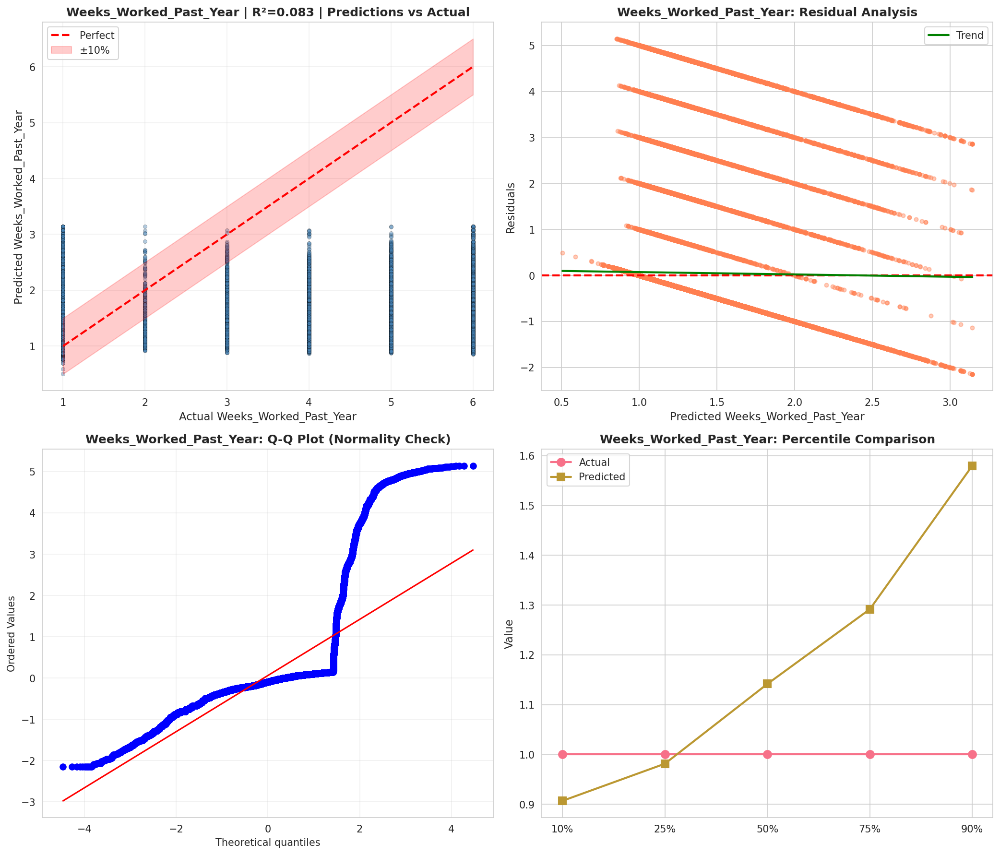
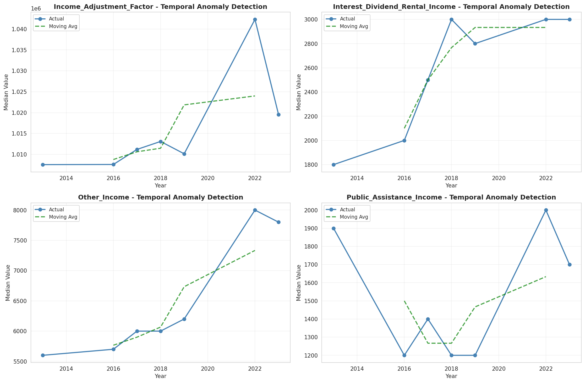
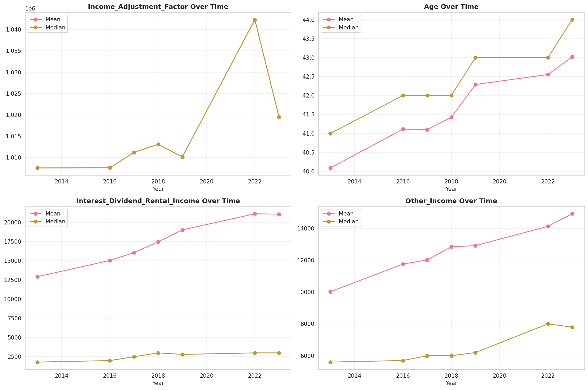
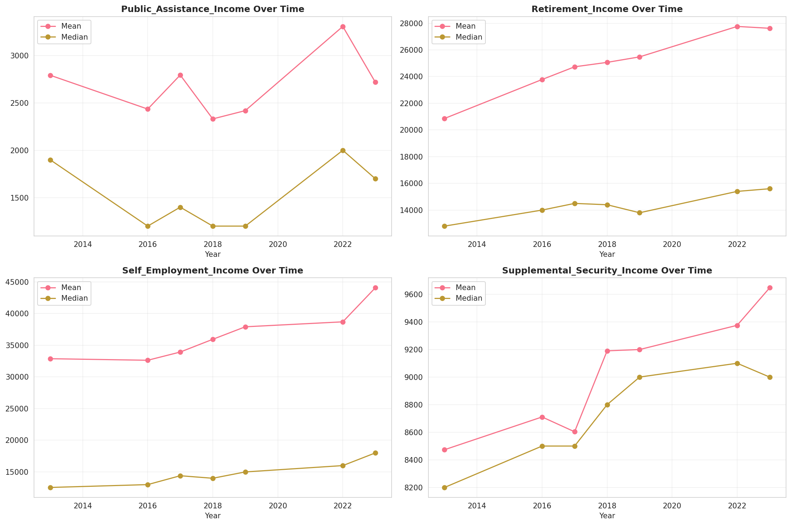
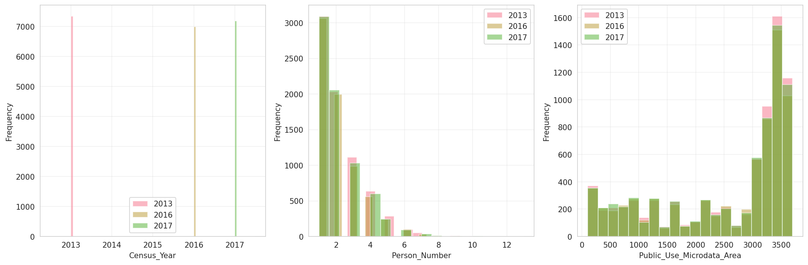
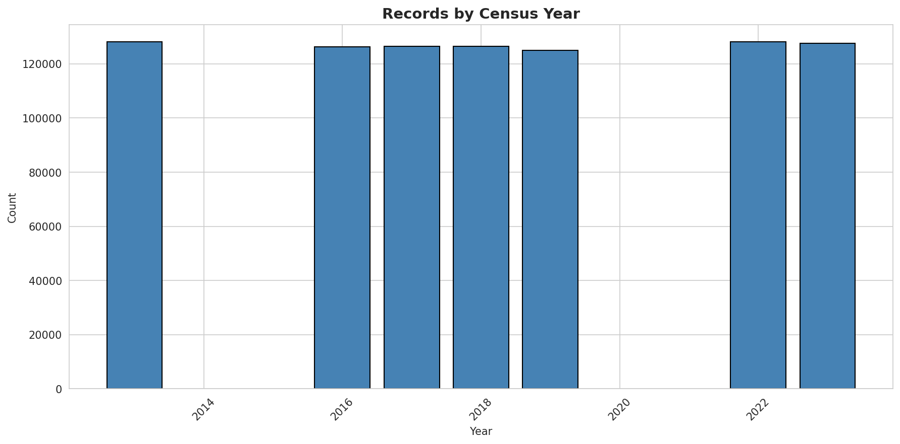
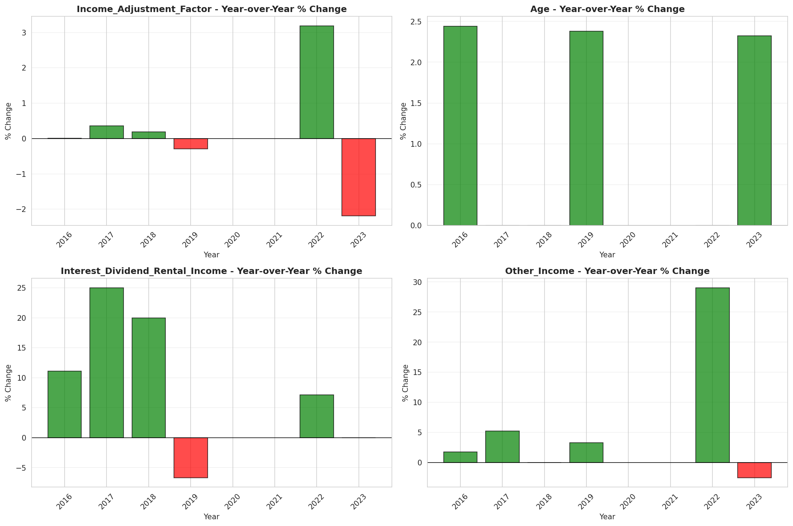
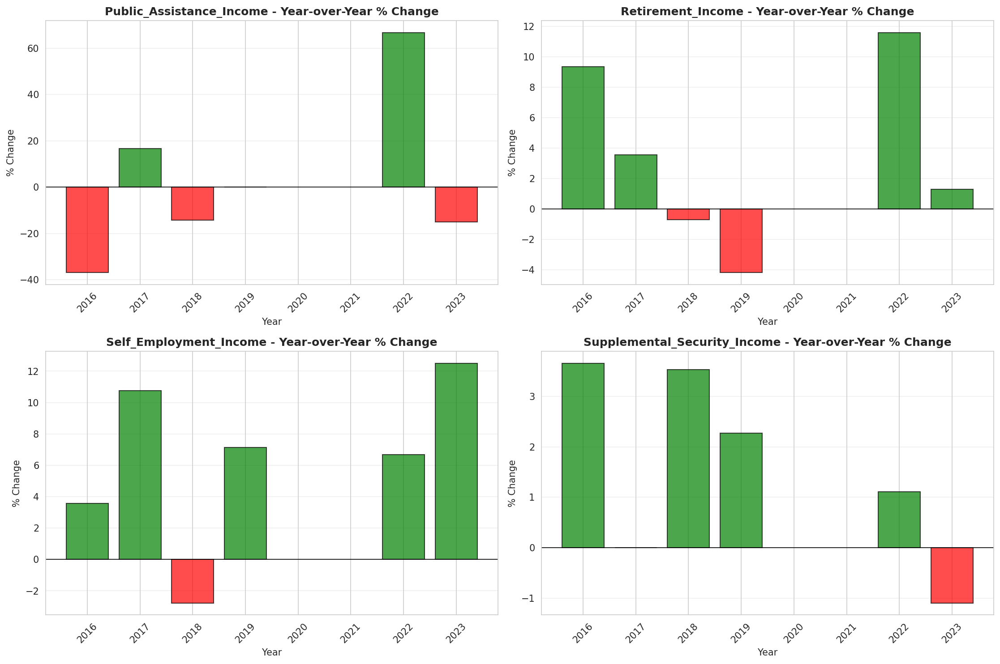

# Temporal Analysis

## Year Distribution

- 2013: 128,070 records

- 2016: 126,334 records

- 2017: 126,482 records

- 2018: 126,456 records

- 2019: 125,007 records

- 2022: 128,046 records

- 2023: 127,485 records

## Temporal Trends

- Census_Year: {np.int64(2013): {'mean': 2013.0, 'median': 2013.0, 'std': 0.0}, np.int64(2016): {'mean': 2016.0, 'median': 2016.0, 'std': 0.0}, np.int64(2017): {'mean': 2017.0, 'median': 2017.0, 'std': 0.0}, np.int64(2018): {'mean': 2018.0, 'median': 2018.0, 'std': 0.0}, np.int64(2019): {'mean': 2019.0, 'median': 2019.0, 'std': 0.0}, np.int64(2022): {'mean': 2022.0, 'median': 2022.0, 'std': 0.0}, np.int64(2023): {'mean': 2023.0, 'median': 2023.0, 'std': 0.0}}

- Person_Number: {np.int64(2013): {'mean': 2.1074490513000703, 'median': 2.0, 'std': 1.3390373033305587}, np.int64(2016): {'mean': 2.0684455491000047, 'median': 2.0, 'std': 1.2898601075176432}, np.int64(2017): {'mean': 2.0720023402539494, 'median': 2.0, 'std': 1.3130660899167335}, np.int64(2018): {'mean': 2.063223571835263, 'median': 2.0, 'std': 1.3026694701850832}, np.int64(2019): {'mean': 2.0381178653995375, 'median': 2.0, 'std': 1.2832629903116752}, np.int64(2022): {'mean': 2.045210315043031, 'median': 2.0, 'std': 1.2887692039472165}, np.int64(2023): {'mean': 2.0325450052947405, 'median': 2.0, 'std': 1.2795102160832361}}

- Public_Use_Microdata_Area: {np.int64(2013): {'mean': 2520.5336925119077, 'median': 3108.0, 'std': 1144.6861316421625}, np.int64(2016): {'mean': 2518.5086279228076, 'median': 3108.0, 'std': 1142.8625220209888}, np.int64(2017): {'mean': 2524.6609478028495, 'median': 3108.0, 'std': 1139.1394542650808}, np.int64(2018): {'mean': 2504.3682782944265, 'median': 3107.0, 'std': 1146.1722935539449}, np.int64(2019): {'mean': 2501.0670042477623, 'median': 3107.0, 'std': 1147.454539067246}, np.int64(2022): {'mean': 8443.595496930791, 'median': 7300.0, 'std': 5973.478041510125}, np.int64(2023): {'mean': 8486.80833823587, 'median': 7300.0, 'std': 5993.96549574607}}

- State_Code: {np.int64(2013): {'mean': 17.0, 'median': 17.0, 'std': 0.0}, np.int64(2016): {'mean': 17.0, 'median': 17.0, 'std': 0.0}, np.int64(2017): {'mean': 17.0, 'median': 17.0, 'std': 0.0}, np.int64(2018): {'mean': 17.0, 'median': 17.0, 'std': 0.0}, np.int64(2019): {'mean': 17.0, 'median': 17.0, 'std': 0.0}, np.int64(2022): {'mean': 17.0, 'median': 17.0, 'std': 0.0}, np.int64(2023): {'mean': None, 'median': None, 'std': None}}

- Income_Adjustment_Factor: {np.int64(2013): {'mean': 1007549.0, 'median': 1007549.0, 'std': 0.0}, np.int64(2016): {'mean': 1007588.0, 'median': 1007588.0, 'std': 0.0}, np.int64(2017): {'mean': 1011189.0, 'median': 1011189.0, 'std': 0.0}, np.int64(2018): {'mean': 1013097.0, 'median': 1013097.0, 'std': 0.0}, np.int64(2019): {'mean': 1010145.0, 'median': 1010145.0, 'std': 0.0}, np.int64(2022): {'mean': 1042311.0, 'median': 1042311.0, 'std': 0.0}, np.int64(2023): {'mean': 1019518.0, 'median': 1019518.0, 'std': 0.0}}

- Person_Weight: {np.int64(2013): {'mean': 100.5866713516046, 'median': 80.0, 'std': 81.27080437189548}, np.int64(2016): {'mean': 101.33090854401824, 'median': 81.0, 'std': 81.69492713242151}, np.int64(2017): {'mean': 101.21616514602869, 'median': 80.0, 'std': 82.66048801117265}, np.int64(2018): {'mean': 100.75504523312456, 'median': 81.0, 'std': 83.46568335538036}, np.int64(2019): {'mean': 101.36889134208484, 'median': 78.0, 'std': 91.51064697634207}, np.int64(2022): {'mean': 98.26181216125455, 'median': 74.0, 'std': 91.18397533147063}, np.int64(2023): {'mean': 98.4405145703416, 'median': 73.0, 'std': 93.89266259856834}}

- Age: {np.int64(2013): {'mean': 40.0885219020848, 'median': 41.0, 'std': 23.306265900221234}, np.int64(2016): {'mean': 41.11308911298621, 'median': 42.0, 'std': 23.560448554748575}, np.int64(2017): {'mean': 41.09709682010089, 'median': 42.0, 'std': 23.54166343594016}, np.int64(2018): {'mean': 41.42436895046498, 'median': 42.0, 'std': 23.61976794344676}, np.int64(2019): {'mean': 42.28915980705081, 'median': 43.0, 'std': 23.752678939759818}, np.int64(2022): {'mean': 42.553230870156035, 'median': 43.0, 'std': 23.924152651169486}, np.int64(2023): {'mean': 43.01740596932972, 'median': 44.0, 'std': 23.900215751124012}}

- Citizenship_Status: {np.int64(2013): {'mean': 1.4031467166393379, 'median': 1.0, 'std': 1.1154325211523075}, np.int64(2016): {'mean': 1.3936074215967198, 'median': 1.0, 'std': 1.0974732751791902}, np.int64(2017): {'mean': 1.4101690359102481, 'median': 1.0, 'std': 1.117158851978684}, np.int64(2018): {'mean': 1.4010723097361928, 'median': 1.0, 'std': 1.1039965521378137}, np.int64(2019): {'mean': 1.3944099130448695, 'median': 1.0, 'std': 1.0896343967717748}, np.int64(2022): {'mean': 1.4051044156006436, 'median': 1.0, 'std': 1.1047677241957707}, np.int64(2023): {'mean': 1.4119543475703025, 'median': 1.0, 'std': 1.1163909738754816}}

- Class_of_Worker: {np.int64(2013): {'mean': 2.0354017915098015, 'median': 1.0, 'std': 1.8836258416465064}, np.int64(2016): {'mean': 2.0235010664349473, 'median': 1.0, 'std': 1.85774785223686}, np.int64(2017): {'mean': 2.008470145351877, 'median': 1.0, 'std': 1.8548230373470664}, np.int64(2018): {'mean': 1.9915602994395307, 'median': 1.0, 'std': 1.8287610883047902}, np.int64(2019): {'mean': 2.014655172413793, 'median': 1.0, 'std': 1.8238041839903987}, np.int64(2022): {'mean': 2.0335622450560233, 'median': 1.0, 'std': 1.818371663824929}, np.int64(2023): {'mean': 2.02690335102896, 'median': 1.0, 'std': 1.8140194329838584}}

- English_Speaking_Ability: {np.int64(2013): {'mean': 1.6254648152506472, 'median': 1.0, 'std': 0.8853720211538695}, np.int64(2016): {'mean': 1.5886025065027194, 'median': 1.0, 'std': 0.8641735548167634}, np.int64(2017): {'mean': 1.573190864899569, 'median': 1.0, 'std': 0.8561976430815238}, np.int64(2018): {'mean': 1.557117168275601, 'median': 1.0, 'std': 0.835481547043875}, np.int64(2019): {'mean': 1.5354197810676569, 'median': 1.0, 'std': 0.8172709573028685}, np.int64(2022): {'mean': 1.5476694915254237, 'median': 1.0, 'std': 0.8301097082806747}, np.int64(2023): {'mean': 1.5645763174660963, 'median': 1.0, 'std': 0.8549215875894066}}

- Fertility_Status: {np.int64(2013): {'mean': 1.951542600286045, 'median': 2.0, 'std': 0.21473437158284361}, np.int64(2016): {'mean': 1.949703295917638, 'median': 2.0, 'std': 0.21856041098465373}, np.int64(2017): {'mean': 1.9477157360406092, 'median': 2.0, 'std': 0.22260372050116795}, np.int64(2018): {'mean': 1.9471787850399942, 'median': 2.0, 'std': 0.22368043485969114}, np.int64(2019): {'mean': 1.9529217116642852, 'median': 2.0, 'std': 0.21181031628676433}, np.int64(2022): {'mean': 1.9473198464264618, 'median': 2.0, 'std': 0.2233982931628319}, np.int64(2023): {'mean': 1.9507392822646556, 'median': 2.0, 'std': 0.21641589444525067}}

- Marital_Status: {np.int64(2013): {'mean': 2.97517763722964, 'median': 3.0, 'std': 1.8655385314172441}, np.int64(2016): {'mean': 2.9603194706096536, 'median': 3.0, 'std': 1.8627608205018649}, np.int64(2017): {'mean': 2.966738350120966, 'median': 3.0, 'std': 1.8633707378587314}, np.int64(2018): {'mean': 2.950417536534447, 'median': 3.0, 'std': 1.8627644530770777}, np.int64(2019): {'mean': 2.916500675962146, 'median': 3.0, 'std': 1.8580241559960666}, np.int64(2022): {'mean': 2.942317604610843, 'median': 3.0, 'std': 1.8616482947345228}, np.int64(2023): {'mean': 2.92152017884457, 'median': 3.0, 'std': 1.8603672098994988}}

- Mobility_Status: {np.int64(2013): {'mean': 1.238828214327958, 'median': 1.0, 'std': 0.6449744204487302}, np.int64(2016): {'mean': 1.240300285415051, 'median': 1.0, 'std': 0.6466210316443152}, np.int64(2017): {'mean': 1.2381017024946497, 'median': 1.0, 'std': 0.644070529321176}, np.int64(2018): {'mean': 1.2305492539221012, 'median': 1.0, 'std': 0.635461248396059}, np.int64(2019): {'mean': 1.2216645012387324, 'median': 1.0, 'std': 0.6245132355425469}, np.int64(2022): {'mean': 1.206539647004107, 'median': 1.0, 'std': 0.6046284574711059}, np.int64(2023): {'mean': 1.1915502986668776, 'median': 1.0, 'std': 0.5831726318335596}}

- Military_Service: {np.int64(2013): {'mean': 3.831410564284524, 'median': 4.0, 'std': 0.5481130938340144}, np.int64(2016): {'mean': 3.8454911140179195, 'median': 4.0, 'std': 0.526890734359627}, np.int64(2017): {'mean': 3.8514194251598144, 'median': 4.0, 'std': 0.5167452773899638}, np.int64(2018): {'mean': 3.8534806067193483, 'median': 4.0, 'std': 0.5132031118701726}, np.int64(2019): {'mean': 3.8550131109867123, 'median': 4.0, 'std': 0.5113525149698389}, np.int64(2022): {'mean': 3.869833323743215, 'median': 4.0, 'std': 0.4871567714182858}, np.int64(2023): {'mean': 3.8704283423684815, 'median': 4.0, 'std': 0.4866427254351845}}

- Travel_Time_To_Work_Minutes: {np.int64(2013): {'mean': 27.991507468798403, 'median': 20.0, 'std': 22.719912864492727}, np.int64(2016): {'mean': 28.52383404051343, 'median': 22.0, 'std': 23.050347809073255}, np.int64(2017): {'mean': 28.72515748653249, 'median': 25.0, 'std': 23.304374737372854}, np.int64(2018): {'mean': 28.92511861617382, 'median': 25.0, 'std': 23.66272791588194}, np.int64(2019): {'mean': 29.31456283335387, 'median': 25.0, 'std': 24.173829031346074}, np.int64(2022): {'mean': 27.406924038762114, 'median': 20.0, 'std': 22.69285878749558}, np.int64(2023): {'mean': 27.665037786237853, 'median': 20.0, 'std': 22.81697419822402}}

- Vehicle_Occupancy: {np.int64(2013): {'mean': 1.1441511599311418, 'median': 1.0, 'std': 0.5397232374953047}, np.int64(2016): {'mean': 1.1347862842532837, 'median': 1.0, 'std': 0.5352805432736615}, np.int64(2017): {'mean': 1.1353582713281012, 'median': 1.0, 'std': 0.5400957793372011}, np.int64(2018): {'mean': 1.1422585713710165, 'median': 1.0, 'std': 0.5588828794148221}, np.int64(2019): {'mean': 1.1407931203130095, 'median': 1.0, 'std': 0.5452419950399765}, np.int64(2022): {'mean': 1.1504873379166305, 'median': 1.0, 'std': 0.5694405492039998}, np.int64(2023): {'mean': 1.1539036154864046, 'median': 1.0, 'std': 0.5884727284683011}}

- Transportation_To_Work: {np.int64(2013): {'mean': 2.0368974748077546, 'median': 1.0, 'std': 2.75076456015457}, np.int64(2016): {'mean': 2.1294902093180283, 'median': 1.0, 'std': 2.8544829185972227}, np.int64(2017): {'mean': 2.141332087871762, 'median': 1.0, 'std': 2.8690796262755103}, np.int64(2018): {'mean': 2.130617930942983, 'median': 1.0, 'std': 2.869205026203902}, np.int64(2019): {'mean': None, 'median': None, 'std': None}, np.int64(2022): {'mean': None, 'median': None, 'std': None}, np.int64(2023): {'mean': None, 'median': None, 'std': None}}

- Language_Other_Than_English: {np.int64(2013): {'mean': 1.8248152912461244, 'median': 2.0, 'std': 0.3801265816512848}, np.int64(2016): {'mean': 1.8236991086987335, 'median': 2.0, 'std': 0.3810775483163498}, np.int64(2017): {'mean': 1.8182075864943728, 'median': 2.0, 'std': 0.3856749563521343}, np.int64(2018): {'mean': 1.823638396955484, 'median': 2.0, 'std': 0.3811291123875514}, np.int64(2019): {'mean': 1.8255944020655839, 'median': 2.0, 'std': 0.3794594791895404}, np.int64(2022): {'mean': 1.8217961555508133, 'median': 2.0, 'std': 0.3826858192640869}, np.int64(2023): {'mean': 1.8193388198732232, 'median': 2.0, 'std': 0.3847387881586987}}

- Grandparents_Living_With_Grandchildren: {np.int64(2013): {'mean': 1.9672038450664404, 'median': 2.0, 'std': 0.1781037817740094}, np.int64(2016): {'mean': 1.9695497325810518, 'median': 2.0, 'std': 0.17182377590354436}, np.int64(2017): {'mean': 1.9712389651414788, 'median': 2.0, 'std': 0.16713521399467038}, np.int64(2018): {'mean': 1.971935957661168, 'median': 2.0, 'std': 0.16515684352658458}, np.int64(2019): {'mean': 1.9732831790123457, 'median': 2.0, 'std': 0.16125553004103219}, np.int64(2022): {'mean': 1.9727234430948537, 'median': 2.0, 'std': 0.1628890936400381}, np.int64(2023): {'mean': 1.9760492301954522, 'median': 2.0, 'std': 0.15289670660627278}}

- Months_Responsible_For_Grandchildren: {np.int64(2013): {'mean': 3.7867924528301886, 'median': 4.0, 'std': 1.3450202263152038}, np.int64(2016): {'mean': 3.774487471526196, 'median': 4.0, 'std': 1.3179527502730586}, np.int64(2017): {'mean': 3.8383561643835615, 'median': 4.0, 'std': 1.3276246243596563}, np.int64(2018): {'mean': 3.8116531165311653, 'median': 4.0, 'std': 1.3006729200858107}, np.int64(2019): {'mean': 3.852054794520548, 'median': 4.0, 'std': 1.3281906573355713}, np.int64(2022): {'mean': 3.968545216251638, 'median': 5.0, 'std': 1.2534702931621267}, np.int64(2023): {'mean': 3.744, 'median': 4.0, 'std': 1.385039108954449}}

- Grandparents_Responsible_For_Grandchildren: {np.int64(2013): {'mean': 1.6026986506746628, 'median': 2.0, 'std': 0.489431068483427}, np.int64(2016): {'mean': 1.6471061093247588, 'median': 2.0, 'std': 0.47796612221745427}, np.int64(2017): {'mean': 1.689229459344402, 'median': 2.0, 'std': 0.46290758794282977}, np.int64(2018): {'mean': 1.680795847750865, 'median': 2.0, 'std': 0.46626912353320543}, np.int64(2019): {'mean': 1.6705776173285198, 'median': 2.0, 'std': 0.470109569212733}, np.int64(2022): {'mean': 1.6726726726726726, 'median': 2.0, 'std': 0.4693385214815199}, np.int64(2023): {'mean': 1.6958637469586375, 'median': 2.0, 'std': 0.46015261526214796}}

- Interest_Dividend_Rental_Income: {np.int64(2013): {'mean': 12910.16237113402, 'median': 1800.0, 'std': 35618.470774600624}, np.int64(2016): {'mean': 15025.853582139287, 'median': 2000.0, 'std': 40803.20927192659}, np.int64(2017): {'mean': 16047.401492433224, 'median': 2500.0, 'std': 41565.66877415802}, np.int64(2018): {'mean': 17450.647864295934, 'median': 3000.0, 'std': 44723.0821673637}, np.int64(2019): {'mean': 18996.603988222698, 'median': 2800.0, 'std': 51685.735237033514}, np.int64(2022): {'mean': 21097.257782175202, 'median': 3000.0, 'std': 56697.04035322206}, np.int64(2023): {'mean': 21045.407363154358, 'median': 3000.0, 'std': 59433.66863403626}}

- Military_Service_Period_1: {np.int64(2013): {'mean': 0.1052897361444262, 'median': 0.0, 'std': 0.30694576398317597}, np.int64(2016): {'mean': 0.1261799000555247, 'median': 0.0, 'std': 0.33207505203580095}, np.int64(2017): {'mean': 0.14610154780847678, 'median': 0.0, 'std': 0.35323354131466383}, np.int64(2018): {'mean': 0.1574033552151714, 'median': 0.0, 'std': 0.36420720663820755}, np.int64(2019): {'mean': 0.16005349977708427, 'median': 0.0, 'std': 0.3666829128985739}, np.int64(2022): {'mean': 0.2040453074433657, 'median': 0.0, 'std': 0.40303486731893134}, np.int64(2023): {'mean': 0.23306188925081434, 'median': 0.0, 'std': 0.42281575323027526}}

- Military_Service_Period_2: {np.int64(2013): {'mean': 0.13874510794091655, 'median': 0.0, 'std': 0.3457021705220442}, np.int64(2016): {'mean': 0.14325374791782344, 'median': 0.0, 'std': 0.3503557487074248}, np.int64(2017): {'mean': 0.15839722262404166, 'median': 0.0, 'std': 0.365139464973555}, np.int64(2018): {'mean': 0.15900802334062727, 'median': 0.0, 'std': 0.3657102436105553}, np.int64(2019): {'mean': 0.1613909942041908, 'median': 0.0, 'std': 0.3679185476612665}, np.int64(2022): {'mean': 0.18673139158576052, 'median': 0.0, 'std': 0.38972728442375393}, np.int64(2023): {'mean': 0.18648208469055375, 'median': 0.0, 'std': 0.3895269293726923}}

- Military_Service_Period_5: {np.int64(2013): {'mean': 0.364726675924757, 'median': 0.0, 'std': 0.4813838208607945}, np.int64(2016): {'mean': 0.3947806774014436, 'median': 0.0, 'std': 0.48883746265951006}, np.int64(2017): {'mean': 0.3737885143931723, 'median': 0.0, 'std': 0.4838434925577841}, np.int64(2018): {'mean': 0.39051787016776074, 'median': 0.0, 'std': 0.4879020285769285}, np.int64(2019): {'mean': 0.3999108337048596, 'median': 0.0, 'std': 0.48991614380199866}, np.int64(2022): {'mean': 0.38915857605177995, 'median': 0.0, 'std': 0.48759886181135287}, np.int64(2023): {'mean': 0.3799674267100977, 'median': 0.0, 'std': 0.48541792062276334}}

- Military_Service_Period_8: {np.int64(2013): {'mean': 0.12422673904809999, 'median': 0.0, 'std': 0.3298608691969347}, np.int64(2016): {'mean': 0.10882842865074958, 'median': 0.0, 'std': 0.3114454466986247}, np.int64(2017): {'mean': 0.09836539852451902, 'median': 0.0, 'std': 0.29782961262174174}, np.int64(2018): {'mean': 0.0913202042304887, 'median': 0.0, 'std': 0.28808493790727624}, np.int64(2019): {'mean': 0.08039827611829395, 'median': 0.0, 'std': 0.27192900245312046}, np.int64(2022): {'mean': 0.05631067961165048, 'median': 0.0, 'std': 0.23053933945414098}, np.int64(2023): {'mean': 0.04478827361563518, 'median': 0.0, 'std': 0.2068556334642472}}

- Military_Service_Period_9: {np.int64(2013): {'mean': 0.016159575811134957, 'median': 0.0, 'std': 0.12609699163747737}, np.int64(2016): {'mean': 0.013603553581343698, 'median': 0.0, 'std': 0.1158462766566965}, np.int64(2017): {'mean': 0.014176189787357154, 'median': 0.0, 'std': 0.11822540889821084}, np.int64(2018): {'mean': 0.009773887673231218, 'median': 0.0, 'std': 0.09838582655803167}, np.int64(2019): {'mean': 0.007281914103135681, 'median': 0.0, 'std': 0.08502918486249794}, np.int64(2022): {'mean': None, 'median': None, 'std': None}, np.int64(2023): {'mean': None, 'median': None, 'std': None}}

- Military_Service_Period_10: {np.int64(2013): {'mean': 0.0758742583007196, 'median': 0.0, 'std': 0.2648135352081776}, np.int64(2016): {'mean': 0.051776790671848975, 'median': 0.0, 'std': 0.22159144988500956}, np.int64(2017): {'mean': 0.037176334442354984, 'median': 0.0, 'std': 0.18920738137480822}, np.int64(2018): {'mean': 0.032968636032093365, 'median': 0.0, 'std': 0.17856751277194458}, np.int64(2019): {'mean': 0.02779016198543617, 'median': 0.0, 'std': 0.16438334653432665}, np.int64(2022): {'mean': 0.011488673139158577, 'median': 0.0, 'std': 0.10657636453322655}, np.int64(2023): {'mean': 0.008143322475570033, 'median': 0.0, 'std': 0.08987949967958311}}

- Military_Service_Period_11: {np.int64(2013): {'mean': 0.002651180406514329, 'median': 0.0, 'std': 0.051424561315560856}, np.int64(2016): {'mean': 0.001110494169905608, 'median': 0.0, 'std': 0.033307881536680975}, np.int64(2017): {'mean': 0.0014465499783017503, 'median': 0.0, 'std': 0.038008768063226846}, np.int64(2018): {'mean': 0.001312910284463895, 'median': 0.0, 'std': 0.03621295145986402}, np.int64(2019): {'mean': 0.0001486104919007282, 'median': 0.0, 'std': 0.01219059030156983}, np.int64(2022): {'mean': None, 'median': None, 'std': None}, np.int64(2023): {'mean': None, 'median': None, 'std': None}}

- Temporary_Absence_From_Work: {np.int64(2013): {'mean': 2.600187022201656, 'median': 3.0, 'std': 0.5138921932368937}, np.int64(2016): {'mean': 2.6078848815042046, 'median': 3.0, 'std': 0.5115516961059425}, np.int64(2017): {'mean': 2.6125413115324405, 'median': 3.0, 'std': 0.5111019369902615}, np.int64(2018): {'mean': 2.617539292257256, 'median': 3.0, 'std': 0.5090347094197759}, np.int64(2019): {'mean': 2.6246515139781614, 'median': 3.0, 'std': 0.5055557330050763}, np.int64(2022): {'mean': 2.6124806377271526, 'median': 3.0, 'std': 0.5106790449903778}, np.int64(2023): {'mean': 2.613768654260271, 'median': 3.0, 'std': 0.507687789399221}}

- Available_For_Work: {np.int64(2013): {'mean': 4.6411969420906, 'median': 5.0, 'std': 1.0789910209666318}, np.int64(2016): {'mean': 4.716403611484754, 'median': 5.0, 'std': 0.9558199722176725}, np.int64(2017): {'mean': 4.726106955799076, 'median': 5.0, 'std': 0.9371285953564291}, np.int64(2018): {'mean': 4.742599556455501, 'median': 5.0, 'std': 0.9062958979660494}, np.int64(2019): {'mean': 4.750106481840006, 'median': 5.0, 'std': 0.8923988452203733}, np.int64(2022): {'mean': 4.7956382938531865, 'median': 5.0, 'std': 0.8095604985679411}, np.int64(2023): {'mean': 4.78618244736372, 'median': 5.0, 'std': 0.8275674269103245}}

- On_Layoff_From_Work: {np.int64(2013): {'mean': 2.569540445961188, 'median': 3.0, 'std': 0.5259222708408015}, np.int64(2016): {'mean': 2.5890049062775193, 'median': 3.0, 'std': 0.5111555280132845}, np.int64(2017): {'mean': 2.595620494385497, 'median': 3.0, 'std': 0.5082055424323242}, np.int64(2018): {'mean': 2.6021502265933854, 'median': 3.0, 'std': 0.5052188893686259}, np.int64(2019): {'mean': 2.6102571052427788, 'median': 3.0, 'std': 0.5026109344061424}, np.int64(2022): {'mean': 2.603677887339907, 'median': 3.0, 'std': 0.5016047713974987}, np.int64(2023): {'mean': 2.6017603415363495, 'median': 3.0, 'std': 0.5031034421648548}}

- Looking_For_Work: {np.int64(2013): {'mean': 2.5500766405414, 'median': 3.0, 'std': 0.6035071100476221}, np.int64(2016): {'mean': 2.5791633200112254, 'median': 3.0, 'std': 0.5702782615745166}, np.int64(2017): {'mean': 2.585705726599795, 'median': 3.0, 'std': 0.5663210333945148}, np.int64(2018): {'mean': 2.595111368238357, 'median': 3.0, 'std': 0.557066712882467}, np.int64(2019): {'mean': 2.5947591574382405, 'median': 3.0, 'std': 0.5520137248947871}, np.int64(2022): {'mean': 2.5884619743851296, 'median': 3.0, 'std': 0.5493580252310839}, np.int64(2023): {'mean': 2.5833764328634703, 'median': 3.0, 'std': 0.5540206365438216}}

- Informed_Of_Recall: {np.int64(2013): {'mean': 2.9312934416905265, 'median': 3.0, 'std': 0.2741704992027247}, np.int64(2016): {'mean': 2.939769879133321, 'median': 3.0, 'std': 0.2571861007234565}, np.int64(2017): {'mean': 2.9428209736959086, 'median': 3.0, 'std': 0.24998278274627006}, np.int64(2018): {'mean': 2.9436119949860187, 'median': 3.0, 'std': 0.24919705296556832}, np.int64(2019): {'mean': 2.935017037094401, 'median': 3.0, 'std': 0.2624363243018878}, np.int64(2022): {'mean': 2.952671049151838, 'median': 3.0, 'std': 0.22729526386547816}, np.int64(2023): {'mean': 2.9485720733851783, 'median': 3.0, 'std': 0.23529999853257802}}

- Other_Income: {np.int64(2013): {'mean': 10021.16755534012, 'median': 5600.0, 'std': 13215.986154652086}, np.int64(2016): {'mean': 11759.518924111431, 'median': 5700.0, 'std': 15956.795118126041}, np.int64(2017): {'mean': 12011.281206030151, 'median': 6000.0, 'std': 15841.519537609816}, np.int64(2018): {'mean': 12837.303480641376, 'median': 6000.0, 'std': 17387.78968354542}, np.int64(2019): {'mean': 12916.48132408857, 'median': 6200.0, 'std': 16948.02791901364}, np.int64(2022): {'mean': 14127.422634836428, 'median': 8000.0, 'std': 17178.93242630408}, np.int64(2023): {'mean': 14914.33395696913, 'median': 7800.0, 'std': 18382.692517921485}}

- Public_Assistance_Income: {np.int64(2013): {'mean': 2792.439189189189, 'median': 1900.0, 'std': 3487.443650396423}, np.int64(2016): {'mean': 2435.462962962963, 'median': 1200.0, 'std': 3500.2590124380054}, np.int64(2017): {'mean': 2794.9703703703703, 'median': 1400.0, 'std': 4268.623101101206}, np.int64(2018): {'mean': 2331.5356083086053, 'median': 1200.0, 'std': 3144.622130785745}, np.int64(2019): {'mean': 2418.9583333333335, 'median': 1200.0, 'std': 3325.738631880093}, np.int64(2022): {'mean': 3307.7406417112297, 'median': 2000.0, 'std': 4262.252687113785}, np.int64(2023): {'mean': 2718.936335403727, 'median': 1700.0, 'std': 3215.331092561654}}

- Retirement_Income: {np.int64(2013): {'mean': 20862.122019147086, 'median': 12800.0, 'std': 23054.36919921902}, np.int64(2016): {'mean': 23780.364985881402, 'median': 14000.0, 'std': 28524.604255845912}, np.int64(2017): {'mean': 24731.842621382446, 'median': 14500.0, 'std': 28085.638284747816}, np.int64(2018): {'mean': 25064.01122244489, 'median': 14400.0, 'std': 30016.054714148024}, np.int64(2019): {'mean': 25475.889862741857, 'median': 13800.0, 'std': 32522.81494157475}, np.int64(2022): {'mean': 27755.75415463412, 'median': 15400.0, 'std': 35180.245266517915}, np.int64(2023): {'mean': 27617.14470796081, 'median': 15600.0, 'std': 33203.09769193341}}

- Self_Employment_Income: {np.int64(2013): {'mean': 32865.750861738794, 'median': 12550.0, 'std': 61729.38994343079}, np.int64(2016): {'mean': 32620.285497053792, 'median': 13000.0, 'std': 59226.40462812156}, np.int64(2017): {'mean': 33919.01940101714, 'median': 14400.0, 'std': 68284.04796756731}, np.int64(2018): {'mean': 35927.134069981585, 'median': 14000.0, 'std': 69313.94710044768}, np.int64(2019): {'mean': 37901.86214863304, 'median': 15000.0, 'std': 71898.17580893065}, np.int64(2022): {'mean': 38685.006681514475, 'median': 16000.0, 'std': 68607.12118649474}, np.int64(2023): {'mean': 44057.32854713773, 'median': 18000.0, 'std': 82662.5651583664}}

- Supplemental_Security_Income: {np.int64(2013): {'mean': 8473.499508035422, 'median': 8200.0, 'std': 5205.697929369347}, np.int64(2016): {'mean': 8710.859447719517, 'median': 8500.0, 'std': 5135.934306824122}, np.int64(2017): {'mean': 8603.462068965517, 'median': 8500.0, 'std': 5065.316011761672}, np.int64(2018): {'mean': 9190.109215017064, 'median': 8800.0, 'std': 5357.843035735476}, np.int64(2019): {'mean': 9199.430199430199, 'median': 9000.0, 'std': 5264.375676234943}, np.int64(2022): {'mean': 9375.049019607843, 'median': 9100.0, 'std': 5620.671688281232}, np.int64(2023): {'mean': 9646.920562275252, 'median': 9000.0, 'std': 6205.397911595599}}

- Social_Security_Income: {np.int64(2013): {'mean': 13111.389413139212, 'median': 12700.0, 'std': 6835.4883416670955}, np.int64(2016): {'mean': 13917.817673709616, 'median': 13200.0, 'std': 7589.1405401399215}, np.int64(2017): {'mean': 14117.715050282706, 'median': 13500.0, 'std': 7695.237474175764}, np.int64(2018): {'mean': 14402.463129907357, 'median': 14000.0, 'std': 7795.174877408596}, np.int64(2019): {'mean': 14871.738045403317, 'median': 14400.0, 'std': 8017.610135445064}, np.int64(2022): {'mean': 16351.945217289078, 'median': 15600.0, 'std': 9285.796021079615}, np.int64(2023): {'mean': 17391.72371165881, 'median': 16900.0, 'std': 9943.41501512189}}

- Wage_Income: {np.int64(2013): {'mean': 46429.372699989, 'median': 32000.0, 'std': 59859.95749569241}, np.int64(2016): {'mean': 50210.03805450285, 'median': 35000.0, 'std': 63745.6911110075}, np.int64(2017): {'mean': 51593.55026051793, 'median': 36000.0, 'std': 64840.6986118595}, np.int64(2018): {'mean': 53621.76038081062, 'median': 38000.0, 'std': 67786.02375036712}, np.int64(2019): {'mean': 56211.89887710934, 'median': 40000.0, 'std': 70296.9050024862}, np.int64(2022): {'mean': 61685.31730649383, 'median': 45000.0, 'std': 76447.81382936287}, np.int64(2023): {'mean': 64806.37604731395, 'median': 46500.0, 'std': 80342.97616283239}}

- Relationship_To_Householder: {np.int64(2013): {'mean': 2.4018037011009605, 'median': 1.0, 'std': 4.140498975302241}, np.int64(2016): {'mean': 2.4047920591448064, 'median': 1.0, 'std': 4.181181139677103}, np.int64(2017): {'mean': 2.424787716829272, 'median': 1.0, 'std': 4.216503248125113}, np.int64(2018): {'mean': 2.4143575631049536, 'median': 1.0, 'std': 4.217187495961}, np.int64(2019): {'mean': None, 'median': None, 'std': None}, np.int64(2022): {'mean': None, 'median': None, 'std': None}, np.int64(2023): {'mean': None, 'median': None, 'std': None}}

- School_Enrollment: {np.int64(2013): {'mean': 1.3109145540813778, 'median': 1.0, 'std': 0.5625038353551169}, np.int64(2016): {'mean': 1.2942290425271405, 'median': 1.0, 'std': 0.5509730745753326}, np.int64(2017): {'mean': 1.2936042480647976, 'median': 1.0, 'std': 0.5518464721141692}, np.int64(2018): {'mean': 1.2901451664232266, 'median': 1.0, 'std': 0.5521141295569352}, np.int64(2019): {'mean': 1.2799881406323348, 'median': 1.0, 'std': 0.5459125239371488}, np.int64(2022): {'mean': 1.271324995177159, 'median': 1.0, 'std': 0.5385642043008213}, np.int64(2023): {'mean': 1.2676873489121676, 'median': 1.0, 'std': 0.5355960413582177}}

- School_Grade_Attending: {np.int64(2013): {'mean': 9.714400868082468, 'median': 10.0, 'std': 4.900159828215725}, np.int64(2016): {'mean': 9.634914321699645, 'median': 10.0, 'std': 4.908468061330263}, np.int64(2017): {'mean': 9.701474651309876, 'median': 10.0, 'std': 4.861349318810476}, np.int64(2018): {'mean': 9.680972236346994, 'median': 10.0, 'std': 4.902841464007358}, np.int64(2019): {'mean': 9.60636748036812, 'median': 10.0, 'std': 4.911994094407594}, np.int64(2022): {'mean': 9.54981971368391, 'median': 10.0, 'std': 4.902822983669212}, np.int64(2023): {'mean': 9.647984338747099, 'median': 10.0, 'std': 4.915011767868805}}

- Educational_Attainment: {np.int64(2013): {'mean': 15.92343137017972, 'median': 17.0, 'std': 5.6467481016074155}, np.int64(2016): {'mean': 16.180605664843686, 'median': 18.0, 'std': 5.563994525110628}, np.int64(2017): {'mean': 16.228757636810037, 'median': 18.0, 'std': 5.570305216607964}, np.int64(2018): {'mean': 16.29510644721703, 'median': 18.0, 'std': 5.568827163525583}, np.int64(2019): {'mean': 16.422333495301547, 'median': 18.0, 'std': 5.523399483642573}, np.int64(2022): {'mean': 16.45148221979294, 'median': 18.0, 'std': 5.588240227463927}, np.int64(2023): {'mean': 16.532820306204673, 'median': 18.0, 'std': 5.528012235267234}}

- Sex: {np.int64(2013): {'mean': 1.5131256344186772, 'median': 2.0, 'std': 0.49982963942585984}, np.int64(2016): {'mean': 1.5122136558646129, 'median': 2.0, 'std': 0.49985278265372285}, np.int64(2017): {'mean': 1.5104362676112015, 'median': 2.0, 'std': 0.49989304860008027}, np.int64(2018): {'mean': 1.5101932688049597, 'median': 2.0, 'std': 0.4998980630461277}, np.int64(2019): {'mean': 1.5094594702696649, 'median': 2.0, 'std': 0.49991250995589065}, np.int64(2022): {'mean': 1.510176030489043, 'median': 2.0, 'std': 0.49989838970871747}, np.int64(2023): {'mean': 1.509856061497431, 'median': 2.0, 'std': 0.49990480925889325}}

- Hours_Worked_Per_Week: {np.int64(2013): {'mean': 37.604044425817264, 'median': 40.0, 'std': 13.301796411188118}, np.int64(2016): {'mean': 37.954130913338425, 'median': 40.0, 'std': 13.028921404488985}, np.int64(2017): {'mean': 37.91700026688017, 'median': 40.0, 'std': 13.10436184321364}, np.int64(2018): {'mean': 38.112607949840296, 'median': 40.0, 'std': 13.132009060161725}, np.int64(2019): {'mean': 38.14172755780282, 'median': 40.0, 'std': 13.095715635175297}, np.int64(2022): {'mean': 37.9285417223658, 'median': 40.0, 'std': 13.024155463454214}, np.int64(2023): {'mean': 37.7629628540337, 'median': 40.0, 'std': 12.849810642121907}}

- When_Last_Worked: {np.int64(2013): {'mean': 1.62391184891691, 'median': 1.0, 'std': 0.8778256851887152}, np.int64(2016): {'mean': 1.625971336500963, 'median': 1.0, 'std': 0.8823228624785461}, np.int64(2017): {'mean': 1.6165806613710596, 'median': 1.0, 'std': 0.8792660530032576}, np.int64(2018): {'mean': 1.6153987079355896, 'median': 1.0, 'std': 0.8783996581284192}, np.int64(2019): {'mean': 1.630169209323937, 'median': 1.0, 'std': 0.8852959502943425}, np.int64(2022): {'mean': 1.635970380445049, 'median': 1.0, 'std': 0.8804826968693383}, np.int64(2023): {'mean': 1.6331493375210404, 'median': 1.0, 'std': 0.8817570286823664}}

- Weeks_Worked_Past_Year: {np.int64(2013): {'mean': 1.9155190995090408, 'median': 1.0, 'std': 1.6411363108230819}, np.int64(2016): {'mean': 1.8601314823966335, 'median': 1.0, 'std': 1.5946798720423976}, np.int64(2017): {'mean': 1.835972481689055, 'median': 1.0, 'std': 1.5833028778595806}, np.int64(2018): {'mean': 1.8281675144918963, 'median': 1.0, 'std': 1.5785544766226205}}

- Year_Of_Entry: {np.int64(2013): {'mean': 1989.9529548989115, 'median': 1993.0, 'std': 15.952398743739337}, np.int64(2016): {'mean': 1991.7889383766535, 'median': 1995.0, 'std': 16.73386177761767}, np.int64(2017): {'mean': 1993.053133948457, 'median': 1996.0, 'std': 16.32257368434467}, np.int64(2018): {'mean': 1993.2808325768383, 'median': 1996.0, 'std': 16.504918698076597}, np.int64(2019): {'mean': 1993.3271861986912, 'median': 1996.0, 'std': 17.116193166215506}, np.int64(2022): {'mean': 1996.0409949622167, 'median': 1998.0, 'std': 17.1555240097202}, np.int64(2023): {'mean': 1997.0378911650118, 'median': 1999.0, 'std': 17.679528006361213}}

- Ancestry_Recode: {np.int64(2013): {'mean': 1.724744280471617, 'median': 1.0, 'std': 1.0305694811712287}, np.int64(2016): {'mean': 1.8266895689204807, 'median': 1.0, 'std': 1.0871063550860722}, np.int64(2017): {'mean': 1.8433452981451905, 'median': 1.0, 'std': 1.0996478740059543}, np.int64(2018): {'mean': 1.8987711140633896, 'median': 1.0, 'std': 1.1313525682792953}, np.int64(2019): {'mean': 1.9125328981577032, 'median': 2.0, 'std': 1.1363727791526743}, np.int64(2022): {'mean': 1.986840666635428, 'median': 2.0, 'std': 1.1751684738956267}, np.int64(2023): {'mean': 1.9835431619406205, 'median': 2.0, 'std': 1.173416343036396}}

- First_Ancestry_Code: {np.int64(2013): {'mean': 422.3282501756852, 'median': 210.0, 'std': 414.45804083489526}, np.int64(2016): {'mean': 439.80903003150377, 'median': 210.0, 'std': 418.8110178618021}, np.int64(2017): {'mean': 445.4531553896997, 'median': 210.0, 'std': 418.6148750381373}, np.int64(2018): {'mean': 455.7767840197381, 'median': 210.0, 'std': 422.3488873482234}, np.int64(2019): {'mean': 458.7028406409241, 'median': 210.0, 'std': 423.24816915228575}, np.int64(2022): {'mean': 462.7511050716149, 'median': 210.0, 'std': 428.560225253898}, np.int64(2023): {'mean': 464.1856767462839, 'median': 210.0, 'std': 428.2042388976934}}

- Second_Ancestry_Code: {np.int64(2013): {'mean': 762.5576091200124, 'median': 999.0, 'std': 403.6859216967401}, np.int64(2016): {'mean': 754.3063229217788, 'median': 999.0, 'std': 407.8096912481516}, np.int64(2017): {'mean': 759.5644597650258, 'median': 999.0, 'std': 404.6029962733962}, np.int64(2018): {'mean': 760.5726814069716, 'median': 999.0, 'std': 404.11841069894734}, np.int64(2019): {'mean': 759.3297815322342, 'median': 999.0, 'std': 404.5667612463542}, np.int64(2022): {'mean': 767.4166940005936, 'median': 999.0, 'std': 400.29662535271405}, np.int64(2023): {'mean': 768.1136055222183, 'median': 999.0, 'std': 399.7467239782307}}

- Decade_Of_Entry: {np.int64(2013): {'mean': 5.485679108346293, 'median': 6.0, 'std': 1.5206191988484363}, np.int64(2016): {'mean': 5.597088346739347, 'median': 6.0, 'std': 1.5177659175601006}, np.int64(2017): {'mean': 5.863888005090677, 'median': 6.0, 'std': 1.6432462207375564}, np.int64(2018): {'mean': 5.880365711321489, 'median': 6.0, 'std': 1.654446854145015}, np.int64(2019): {'mean': 5.872166038733558, 'median': 6.0, 'std': 1.7018818929989026}, np.int64(2022): {'mean': 6.105919395465995, 'median': 6.0, 'std': 1.6615484781067817}, np.int64(2023): {'mean': 6.172175443006158, 'median': 6.0, 'std': 1.6704604041408724}}

- Drives_Alone_To_Work: {np.int64(2013): {'mean': 1.1398270350028692, 'median': 1.0, 'std': 0.4893571705999352}, np.int64(2016): {'mean': 1.129899585558465, 'median': 1.0, 'std': 0.4743325770869613}, np.int64(2017): {'mean': 1.130506574253389, 'median': 1.0, 'std': 0.48191699971118107}, np.int64(2018): {'mean': 1.1367390516095242, 'median': 1.0, 'std': 0.49112949523903193}, np.int64(2019): {'mean': 1.1364933159439192, 'median': 1.0, 'std': 0.4958667944584931}, np.int64(2022): {'mean': 1.1456574710643113, 'median': 1.0, 'std': 0.5133346478677717}, np.int64(2023): {'mean': 1.148098348059931, 'median': 1.0, 'std': 0.5235647292093317}}

- Employment_Status_Parents: {np.int64(2013): {'mean': 3.0050659710407923, 'median': 2.0, 'std': 2.5428451174794087}, np.int64(2016): {'mean': 2.942224170219548, 'median': 2.0, 'std': 2.51902408675465}, np.int64(2017): {'mean': 2.954053518334985, 'median': 2.0, 'std': 2.527267629150622}, np.int64(2018): {'mean': 2.9038492575855392, 'median': 2.0, 'std': 2.5088784184986497}, np.int64(2019): {'mean': 2.8588730239673636, 'median': 2.0, 'std': 2.4861207295777596}, np.int64(2022): {'mean': 2.854913678618858, 'median': 1.0, 'std': 2.490611366107716}, np.int64(2023): {'mean': 2.8107159873521894, 'median': 1.0, 'std': 2.463427622314567}}

- Employment_Status_Recode: {np.int64(2013): {'mean': 2.9687557239398057, 'median': 1.0, 'std': 2.3638186179380525}, np.int64(2016): {'mean': 2.9883971859063068, 'median': 1.0, 'std': 2.3924838441805445}, np.int64(2017): {'mean': 2.9629307512417618, 'median': 1.0, 'std': 2.3895713304521293}, np.int64(2018): {'mean': 2.9631183106739947, 'median': 1.0, 'std': 2.3941433286436653}, np.int64(2019): {'mean': 2.9813269573298227, 'median': 1.0, 'std': 2.403070912552838}, np.int64(2022): {'mean': 3.025293739846613, 'median': 1.0, 'std': 2.413899662043788}, np.int64(2023): {'mean': 3.009760868134245, 'median': 1.0, 'std': 2.4095373793591404}}

- Hispanic_Origin: {np.int64(2013): {'mean': 1.3056921995783557, 'median': 1.0, 'std': 1.7968013772274951}, np.int64(2016): {'mean': 1.3070986432789273, 'median': 1.0, 'std': 1.7730514411560507}, np.int64(2017): {'mean': 1.3246074540250787, 'median': 1.0, 'std': 1.8379740018468007}, np.int64(2018): {'mean': 1.339525210349845, 'median': 1.0, 'std': 1.9358652117374608}, np.int64(2019): {'mean': 1.3354212164118808, 'median': 1.0, 'std': 1.9333770676503395}, np.int64(2022): {'mean': 1.4045655467566343, 'median': 1.0, 'std': 2.2152991671790785}, np.int64(2023): {'mean': 1.4180884025571636, 'median': 1.0, 'std': 2.252797980940616}}

- Time_Of_Arrival_At_Work: {np.int64(2013): {'mean': 104.60444745135044, 'median': 92.0, 'std': 44.19568903241683}, np.int64(2016): {'mean': 103.83815931968682, 'median': 92.0, 'std': 43.3649491293133}, np.int64(2017): {'mean': 103.98682201828423, 'median': 92.0, 'std': 43.358527084977645}, np.int64(2018): {'mean': 103.6715513769981, 'median': 92.0, 'std': 43.01440569963725}, np.int64(2019): {'mean': 102.97134256895914, 'median': 93.0, 'std': 41.99577615078462}, np.int64(2022): {'mean': 102.63965301656768, 'median': 92.0, 'std': 42.77470234727437}, np.int64(2023): {'mean': 102.5985567361782, 'median': 92.0, 'std': 42.061812197583464}}

- Time_Of_Departure_For_Work: {np.int64(2013): {'mean': 54.76922392151975, 'median': 49.0, 'std': 29.903789594875278}, np.int64(2016): {'mean': 54.227564045661936, 'median': 49.0, 'std': 29.563816209134245}, np.int64(2017): {'mean': 54.270367965747774, 'median': 49.0, 'std': 29.598344819350917}, np.int64(2018): {'mean': 54.011520212896336, 'median': 49.0, 'std': 29.391366299967306}, np.int64(2019): {'mean': 53.72092450139942, 'median': 49.0, 'std': 28.76474032866061}, np.int64(2022): {'mean': 53.79323616755236, 'median': 49.0, 'std': 29.286628318271184}, np.int64(2023): {'mean': 53.71610129363411, 'median': 49.0, 'std': 28.886549039312346}}

- Language_Spoken_At_Home: {np.int64(2013): {'mean': 650.705766062603, 'median': 625.0, 'std': 49.38146206895321}, np.int64(2016): {'mean': 1527.8785055568692, 'median': 1200.0, 'std': 815.498004828777}, np.int64(2017): {'mean': 1544.5171512427771, 'median': 1200.0, 'std': 874.2795530339621}, np.int64(2018): {'mean': 1526.404788945675, 'median': 1200.0, 'std': 831.8314655177902}, np.int64(2019): {'mean': 1572.1110093070358, 'median': 1200.0, 'std': 896.8946207164831}, np.int64(2022): {'mean': 1569.1169399410464, 'median': 1200.0, 'std': 884.5802928560065}, np.int64(2023): {'mean': 1577.9311458996997, 'median': 1200.0, 'std': 918.8155313995755}}

- Migration_PUMA: {np.int64(2013): {'mean': 2757.2126060763103, 'median': 3000.0, 'std': 4111.913864420788}, np.int64(2016): {'mean': 2706.1188254486133, 'median': 3000.0, 'std': 3814.8917600286795}, np.int64(2017): {'mean': 2726.1249835547956, 'median': 3100.0, 'std': 3887.4345380953428}, np.int64(2018): {'mean': 2777.707488087134, 'median': 3100.0, 'std': 4367.830113010113}, np.int64(2019): {'mean': 2778.1493603944828, 'median': 3000.0, 'std': 4444.0485938184065}, np.int64(2022): {'mean': 6587.609188544153, 'median': 3100.0, 'std': 6153.351790511147}, np.int64(2023): {'mean': 6417.3695321871255, 'median': 3100.0, 'std': 6273.7725854199}}

- Migration_State_Or_Country: {np.int64(2013): {'mean': 26.667292867785193, 'median': 17.0, 'std': 45.10811866545458}, np.int64(2016): {'mean': 26.61520391517129, 'median': 17.0, 'std': 44.28347574501697}, np.int64(2017): {'mean': 26.980726220234178, 'median': 17.0, 'std': 47.52600993636199}, np.int64(2018): {'mean': 26.327569775357386, 'median': 17.0, 'std': 44.93572215381029}, np.int64(2019): {'mean': 26.773958407775318, 'median': 17.0, 'std': 46.64443440734326}, np.int64(2022): {'mean': 28.954430190930786, 'median': 17.0, 'std': 51.490342790418126}, np.int64(2023): {'mean': 33.654298280687726, 'median': 17.0, 'std': 61.22644253745551}}

- Place_Of_Birth: {np.int64(2013): {'mean': 45.724252361989535, 'median': 17.0, 'std': 77.39418555735553}, np.int64(2016): {'mean': 45.324607785710896, 'median': 17.0, 'std': 76.56178575129586}, np.int64(2017): {'mean': 46.760100251419175, 'median': 17.0, 'std': 79.24715607396298}, np.int64(2018): {'mean': 45.965355538685394, 'median': 17.0, 'std': 77.456509955609}, np.int64(2019): {'mean': 45.82736166774661, 'median': 17.0, 'std': 77.6263864498105}, np.int64(2022): {'mean': 46.52297611795761, 'median': 17.0, 'std': 78.60818708284583}, np.int64(2023): {'mean': 47.18157430285916, 'median': 17.0, 'std': 79.78905038638418}}

- Place_Of_Work_PUMA: {np.int64(2013): {'mean': 2607.6726457399104, 'median': 3200.0, 'std': 1920.8438901099291}, np.int64(2016): {'mean': 2645.095965563808, 'median': 3200.0, 'std': 2177.6113038035132}, np.int64(2017): {'mean': 2646.9834698336977, 'median': 3200.0, 'std': 2026.5852250947858}, np.int64(2018): {'mean': 2655.642641546983, 'median': 3200.0, 'std': 2242.3139366580367}, np.int64(2019): {'mean': 2641.9569201039517, 'median': 3200.0, 'std': 2073.7514477141353}, np.int64(2022): {'mean': 7530.917547045229, 'median': 4300.0, 'std': 5775.887600819315}, np.int64(2023): {'mean': 7489.292111884456, 'median': 4300.0, 'std': 5766.121348929156}}

- Place_Of_Work_State_Or_Country: {np.int64(2013): {'mean': 17.45871199849955, 'median': 17.0, 'std': 5.063402862269048}, np.int64(2016): {'mean': 17.45094530722485, 'median': 17.0, 'std': 5.150617945934591}, np.int64(2017): {'mean': 17.535637437240414, 'median': 17.0, 'std': 6.8391426170758}, np.int64(2018): {'mean': 17.514610766526253, 'median': 17.0, 'std': 4.717137138892114}, np.int64(2019): {'mean': 17.531052175651364, 'median': 17.0, 'std': 6.362601781511988}, np.int64(2022): {'mean': 17.489881148894025, 'median': 17.0, 'std': 5.627237771303428}, np.int64(2023): {'mean': 17.477877985818385, 'median': 17.0, 'std': 4.974936851849686}}

- Married_Spouse_Present: {np.int64(2013): {'mean': 3.0495808996434803, 'median': 2.0, 'std': 2.2190513674220855}, np.int64(2016): {'mean': 3.0535870849693136, 'median': 2.0, 'std': 2.2184577807267325}, np.int64(2017): {'mean': 3.062772541178711, 'median': 2.0, 'std': 2.2205150640349993}, np.int64(2018): {'mean': 3.045406185880386, 'median': 2.0, 'std': 2.21760968827718}, np.int64(2019): {'mean': 3.020479020211944, 'median': 2.0, 'std': 2.2072224911822063}, np.int64(2022): {'mean': 3.056727421667008, 'median': 2.0, 'std': 2.2204799249201286}, np.int64(2023): {'mean': 3.0522415743883666, 'median': 2.0, 'std': 2.2188675655536576}}

- Nativity: {np.int64(2013): {'mean': 1.1115171390645742, 'median': 1.0, 'std': 0.3147726805382134}, np.int64(2016): {'mean': 1.109337153893647, 'median': 1.0, 'std': 0.31206299285908473}, np.int64(2017): {'mean': 1.113731598172072, 'median': 1.0, 'std': 0.317486249593624}, np.int64(2018): {'mean': 1.1114379705193902, 'median': 1.0, 'std': 0.3146749629184002}, np.int64(2019): {'mean': 1.1106498036109977, 'median': 1.0, 'std': 0.31369923778271336}, np.int64(2022): {'mean': 1.1126235883979194, 'median': 1.0, 'std': 0.31613335198515097}, np.int64(2023): {'mean': 1.1147585990508688, 'median': 1.0, 'std': 0.31873164240739715}}

- Nativity_Of_Parent: {np.int64(2013): {'mean': 3.163849943160288, 'median': 1.0, 'std': 2.5549811721899243}, np.int64(2016): {'mean': 3.089054468661593, 'median': 1.0, 'std': 2.5354669657484337}, np.int64(2017): {'mean': 3.1312586719524282, 'median': 1.0, 'std': 2.540243820390092}, np.int64(2018): {'mean': 3.0815445448676564, 'median': 1.0, 'std': 2.5297343903694274}, np.int64(2019): {'mean': 3.0203977562468127, 'median': 1.0, 'std': 2.5118664368045764}, np.int64(2022): {'mean': 3.0015355245683932, 'median': 1.0, 'std': 2.497917316221629}, np.int64(2023): {'mean': 2.9682938450210075, 'median': 1.0, 'std': 2.484612535114313}}

- Own_Child: {np.int64(2013): {'mean': 0.19072382290934645, 'median': 0.0, 'std': 0.3928733275245205}, np.int64(2016): {'mean': 0.18444757547453575, 'median': 0.0, 'std': 0.3878503037147842}, np.int64(2017): {'mean': 0.19460214360677955, 'median': 0.0, 'std': 0.39589574954829354}, np.int64(2018): {'mean': 0.19119456348518252, 'median': 0.0, 'std': 0.3932435368448308}, np.int64(2019): {'mean': 0.1848549363389689, 'median': 0.0, 'std': 0.38818146132448955}, np.int64(2022): {'mean': 0.1838990702554967, 'median': 0.0, 'std': 0.3874034370189793}, np.int64(2023): {'mean': 0.17683220534088775, 'median': 0.0, 'std': 0.3815281967004654}}

- Presence_And_Age_Own_Children: {np.int64(2013): {'mean': 3.4648767144547694, 'median': 4.0, 'std': 0.9581427176262702}, np.int64(2016): {'mean': 3.4937002652519893, 'median': 4.0, 'std': 0.9369335604031455}, np.int64(2017): {'mean': 3.4902053339627095, 'median': 4.0, 'std': 0.9384424738997559}, np.int64(2018): {'mean': 3.5011224549553948, 'median': 4.0, 'std': 0.9325502097910243}, np.int64(2019): {'mean': 3.528500157133878, 'median': 4.0, 'std': 0.909430493546559}, np.int64(2022): {'mean': 3.5315549275334646, 'median': 4.0, 'std': 0.9079219183329535}, np.int64(2023): {'mean': 3.5515786272310823, 'median': 4.0, 'std': 0.8935117252841187}}

- Total_Person_Earnings: {np.int64(2013): {'mean': 46849.371814857004, 'median': 32000.0, 'std': 62266.248254686616}, np.int64(2016): {'mean': 50442.64151282936, 'median': 35000.0, 'std': 65700.84356280704}, np.int64(2017): {'mean': 51921.49607959608, 'median': 35000.0, 'std': 67644.47457144989}, np.int64(2018): {'mean': 54083.68963423664, 'median': 37250.0, 'std': 70477.88515317498}, np.int64(2019): {'mean': 56780.80955671389, 'median': 40000.0, 'std': 73254.19678051918}, np.int64(2022): {'mean': 61949.93395384798, 'median': 44000.0, 'std': 78342.60196650667}, np.int64(2023): {'mean': 65336.07934896178, 'median': 45800.0, 'std': 83704.54552651384}}

- Total_Person_Income: {np.int64(2013): {'mean': 43295.488748272764, 'median': 28000.0, 'std': 59891.31816383998}, np.int64(2016): {'mean': 46790.42143998609, 'median': 30000.0, 'std': 63055.43370293169}, np.int64(2017): {'mean': 48482.05157558792, 'median': 31200.0, 'std': 65024.14716752208}, np.int64(2018): {'mean': 50357.00420154453, 'median': 32100.0, 'std': 68096.12396205301}, np.int64(2019): {'mean': 53688.74169765562, 'median': 35000.0, 'std': 72156.08615019522}, np.int64(2022): {'mean': 57730.15941722973, 'median': 39000.0, 'std': 75764.09022192382}, np.int64(2023): {'mean': 60522.18104179095, 'median': 40000.0, 'std': 80527.36221055103}}

- Poverty_Status: {np.int64(2013): {'mean': 316.8654102031544, 'median': 330.0, 'std': 164.67474703727805}, np.int64(2016): {'mean': 329.00271267807085, 'median': 353.0, 'std': 163.47697379948497}, np.int64(2017): {'mean': 330.70550741303543, 'median': 356.0, 'std': 163.2682701280293}, np.int64(2018): {'mean': 335.2943656415904, 'median': 365.0, 'std': 161.994213493538}, np.int64(2019): {'mean': 345.5592107995846, 'median': 385.0, 'std': 159.94905412756586}, np.int64(2022): {'mean': 339.80015530713604, 'median': 373.0, 'std': 161.64209341347294}, np.int64(2023): {'mean': 342.14908251286596, 'median': 376.0, 'std': 159.69227090349338}}

- Quarter_Of_Birth: {np.int64(2013): {'mean': 2.5193878347778558, 'median': 3.0, 'std': 1.11205057884509}, np.int64(2016): {'mean': 2.5170975351053557, 'median': 3.0, 'std': 1.109606575550392}, np.int64(2017): {'mean': 2.514065242485097, 'median': 3.0, 'std': 1.1112608693468229}, np.int64(2018): {'mean': 2.5213671158347566, 'median': 3.0, 'std': 1.11064477582252}, np.int64(2019): {'mean': 2.5193069188125463, 'median': 3.0, 'std': 1.1116464841090918}, np.int64(2022): {'mean': 2.5146509848023366, 'median': 3.0, 'std': 1.113329175439071}, np.int64(2023): {'mean': 2.520076871788838, 'median': 3.0, 'std': 1.1101018517644852}}

- Race_Recode: {np.int64(2013): {'mean': 1.7713828375107363, 'median': 1.0, 'std': 1.9567533799598038}, np.int64(2016): {'mean': 1.8111434768154258, 'median': 1.0, 'std': 2.0127176574295436}, np.int64(2017): {'mean': 1.8289479925997376, 'median': 1.0, 'std': 2.0425504440849687}, np.int64(2018): {'mean': 1.7714382868349465, 'median': 1.0, 'std': 1.9726589528621994}, np.int64(2019): {'mean': 1.7738126664906766, 'median': 1.0, 'std': 1.9770525551420037}, np.int64(2022): {'mean': 2.4593583555909593, 'median': 1.0, 'std': 2.7696327767712208}, np.int64(2023): {'mean': 2.462454406400753, 'median': 1.0, 'std': 2.7737348441859138}}

- Race_Two_Categories: {np.int64(2013): {'mean': 6.9337159365971734, 'median': 1.0, 'std': 17.55608143629097}, np.int64(2016): {'mean': 7.361106273845521, 'median': 1.0, 'std': 18.092295356236257}, np.int64(2017): {'mean': 7.54597492133268, 'median': 1.0, 'std': 18.359046018055647}, np.int64(2018): {'mean': 7.04370690200544, 'median': 1.0, 'std': 17.617227450207075}, np.int64(2019): {'mean': 7.086211172174358, 'median': 1.0, 'std': 17.645742300933534}, np.int64(2022): {'mean': 13.034167408587539, 'median': 1.0, 'std': 24.357866857111972}, np.int64(2023): {'mean': 2447.954190689101, 'median': 1000.0, 'std': 2678.5847332679346}}

- Race_Three_Categories: {np.int64(2013): {'mean': 2.440782384633404, 'median': 1.0, 'std': 5.3381148695535465}, np.int64(2016): {'mean': 2.5295644877863444, 'median': 1.0, 'std': 5.588390354536161}, np.int64(2017): {'mean': 2.5880599611011843, 'median': 1.0, 'std': 5.777831404890525}, np.int64(2018): {'mean': 2.464857341684064, 'median': 1.0, 'std': 5.6251831744510365}, np.int64(2019): {'mean': 2.4662858879902725, 'median': 1.0, 'std': 5.5929827270537915}, np.int64(2022): {'mean': 4.645955359792574, 'median': 1.0, 'std': 9.276822203886127}, np.int64(2023): {'mean': 4.67895046476056, 'median': 1.0, 'std': 9.381261628724278}}

- Number_Of_Races: {np.int64(2013): {'mean': 1.022893729991411, 'median': 1.0, 'std': 0.1601538758227262}, np.int64(2016): {'mean': 1.0240077888771035, 'median': 1.0, 'std': 0.1654495794232202}, np.int64(2017): {'mean': 1.0251656362170112, 'median': 1.0, 'std': 0.1679787747844563}, np.int64(2018): {'mean': 1.0253210602897451, 'median': 1.0, 'std': 0.17112138120096368}, np.int64(2019): {'mean': 1.0246466197892918, 'median': 1.0, 'std': 0.16547868660960235}, np.int64(2022): {'mean': 1.0956999828186746, 'median': 1.0, 'std': 0.3131104125178773}, np.int64(2023): {'mean': 1.0953445503392556, 'median': 1.0, 'std': 0.31557827934193117}}

- Race_American_Indian_Alaska_Native: {np.int64(2013): {'mean': 0.0076989146560474744, 'median': 0.0, 'std': 0.08740538325359694}, np.int64(2016): {'mean': 0.007369354251428753, 'median': 0.0, 'std': 0.08552838576896069}, np.int64(2017): {'mean': 0.00685473031735741, 'median': 0.0, 'std': 0.08250937409693546}, np.int64(2018): {'mean': 0.006919402796229519, 'median': 0.0, 'std': 0.08289498779091839}, np.int64(2019): {'mean': 0.006807618773348693, 'median': 0.0, 'std': 0.08222730195981219}, np.int64(2022): {'mean': 0.021999906283679302, 'median': 0.0, 'std': 0.14668359976890438}, np.int64(2023): {'mean': 0.021280935011962192, 'median': 0.0, 'std': 0.1443198537789892}}

- Race_Asian: {np.int64(2013): {'mean': 0.04875458733505114, 'median': 0.0, 'std': 0.2153553799617121}, np.int64(2016): {'mean': 0.054815014168790664, 'median': 0.0, 'std': 0.2276197234417254}, np.int64(2017): {'mean': 0.05581821919324489, 'median': 0.0, 'std': 0.2295712575276768}, np.int64(2018): {'mean': 0.05599576137154425, 'median': 0.0, 'std': 0.22991444951578427}, np.int64(2019): {'mean': 0.05733278936379563, 'median': 0.0, 'std': 0.23247832796356474}, np.int64(2022): {'mean': 0.0644768286397076, 'median': 0.0, 'std': 0.24560138087819694}, np.int64(2023): {'mean': 0.06561556261520964, 'median': 0.0, 'std': 0.24760985740122612}}

- Race_Black: {np.int64(2013): {'mean': 0.12535332240181152, 'median': 0.0, 'std': 0.33112040569044826}, np.int64(2016): {'mean': 0.11680149445121661, 'median': 0.0, 'std': 0.32118487185511996}, np.int64(2017): {'mean': 0.11402412991571924, 'median': 0.0, 'std': 0.3178418261187424}, np.int64(2018): {'mean': 0.109460998291896, 'median': 0.0, 'std': 0.312217967142053}, np.int64(2019): {'mean': 0.10557808762709288, 'median': 0.0, 'std': 0.3072980807858696}, np.int64(2022): {'mean': 0.10255689361635663, 'median': 0.0, 'std': 0.30338044760651}, np.int64(2023): {'mean': 0.09979213240773424, 'median': 0.0, 'std': 0.29972381851201757}}

- Race_Some_Other: {np.int64(2013): {'mean': 0.04214882486140392, 'median': 0.0, 'std': 0.2009293822786466}, np.int64(2016): {'mean': 0.04473063466683553, 'median': 0.0, 'std': 0.20671270696470656}, np.int64(2017): {'mean': 0.04648092218655619, 'median': 0.0, 'std': 0.21052504950986778}, np.int64(2018): {'mean': 0.03845606376921617, 'median': 0.0, 'std': 0.19229531284577828}, np.int64(2019): {'mean': 0.038733830905469294, 'median': 0.0, 'std': 0.19296066724265037}, np.int64(2022): {'mean': 0.11043687424831701, 'median': 0.0, 'std': 0.31343474327092075}, np.int64(2023): {'mean': 0.11168372749735263, 'median': 0.0, 'std': 0.3149781750036948}}

- Race_White: {np.int64(2013): {'mean': 0.7977590380260795, 'median': 1.0, 'std': 0.40167252216196875}, np.int64(2016): {'mean': 0.7992622730223059, 'median': 1.0, 'std': 0.40055381902941006}, np.int64(2017): {'mean': 0.8006831011527332, 'median': 1.0, 'std': 0.39948834081751045}, np.int64(2018): {'mean': 0.8133184665021825, 'median': 1.0, 'std': 0.38965720733120307}, np.int64(2019): {'mean': 0.815058356732023, 'median': 1.0, 'std': 0.3882517710214488}, np.int64(2022): {'mean': 0.7947456382862409, 'median': 1.0, 'std': 0.40388894844683393}, np.int64(2023): {'mean': 0.7958034278542574, 'median': 1.0, 'std': 0.40311488032822396}}

- Related_Child: {np.int64(2013): {'mean': 0.21207933161552275, 'median': 0.0, 'std': 0.40878233021453286}, np.int64(2016): {'mean': 0.2036110627384552, 'median': 0.0, 'std': 0.4026845929633691}, np.int64(2017): {'mean': 0.21346819710604822, 'median': 0.0, 'std': 0.40975713955349563}, np.int64(2018): {'mean': 0.20996309049022766, 'median': 0.0, 'std': 0.4072836368178433}, np.int64(2019): {'mean': 0.20174493842621583, 'median': 0.0, 'std': 0.40130445152095173}, np.int64(2022): {'mean': 0.20152598485403092, 'median': 0.0, 'std': 0.40114158498167746}, np.int64(2023): {'mean': 0.19348676207659463, 'median': 0.0, 'std': 0.395032794812127}}

- Subfamily_Number: {np.int64(2013): {'mean': 1.0167835671342684, 'median': 1.0, 'std': 0.12847573226687356}, np.int64(2016): {'mean': 1.0177789934354486, 'median': 1.0, 'std': 0.13216534583359915}, np.int64(2017): {'mean': 1.0201761864165957, 'median': 1.0, 'std': 0.1503903304618505}, np.int64(2018): {'mean': 1.0194460813199764, 'median': 1.0, 'std': 0.1381070274334014}, np.int64(2019): {'mean': 1.0134093194770366, 'median': 1.0, 'std': 0.11503888943950075}, np.int64(2022): {'mean': 1.0197767145135566, 'median': 1.0, 'std': 0.14376406310074188}, np.int64(2023): {'mean': 1.0135896586012596, 'median': 1.0, 'std': 0.11579906909083429}}

- Subfamily_Relationship: {np.int64(2013): {'mean': 3.6720941883767537, 'median': 4.0, 'std': 1.5181002064023363}, np.int64(2016): {'mean': 3.566466083150985, 'median': 3.0, 'std': 1.5435181748745528}, np.int64(2017): {'mean': 3.506393861892583, 'median': 3.0, 'std': 1.5642035807356371}, np.int64(2018): {'mean': 3.5436063641720685, 'median': 3.0, 'std': 1.5816556571430556}, np.int64(2019): {'mean': 3.481729802212538, 'median': 3.0, 'std': 1.6130290141042858}, np.int64(2022): {'mean': 3.507496012759171, 'median': 3.0, 'std': 1.5992553551681092}, np.int64(2023): {'mean': 3.491879350348028, 'median': 3.0, 'std': 1.6361762213614561}}

- Veteran_Period_Of_Service: {np.int64(2013): {'mean': 7.643226865294786, 'median': 6.0, 'std': 3.6627692634036766}, np.int64(2016): {'mean': 7.258328706274292, 'median': 6.0, 'std': 3.6801573713857874}, np.int64(2017): {'mean': 7.177057717344134, 'median': 6.0, 'std': 3.8195192168306744}, np.int64(2018): {'mean': 6.978118161925602, 'median': 6.0, 'std': 3.779653068214324}, np.int64(2019): {'mean': 6.928072521920048, 'median': 6.0, 'std': 3.794693771250818}, np.int64(2022): {'mean': 6.488187702265372, 'median': 6.0, 'std': 3.867110765311381}, np.int64(2023): {'mean': 6.200814332247557, 'median': 6.0, 'std': 3.8914953554771694}}

- World_Area_Of_Birth: {np.int64(2013): {'mean': 1.3524400718357148, 'median': 1.0, 'std': 1.0157883195214532}, np.int64(2016): {'mean': 1.3467712571437618, 'median': 1.0, 'std': 1.0041167271202915}, np.int64(2017): {'mean': 1.3650796160718521, 'median': 1.0, 'std': 1.0366428850192357}, np.int64(2018): {'mean': 1.3565350793952047, 'median': 1.0, 'std': 1.0191680753327448}, np.int64(2019): {'mean': 1.3596038621837176, 'median': 1.0, 'std': 1.0315787615293697}, np.int64(2022): {'mean': 1.365142214516658, 'median': 1.0, 'std': 1.0329597965801374}, np.int64(2023): {'mean': 1.3681138957524415, 'median': 1.0, 'std': 1.0366423060849932}}

- Flag_Age: {np.int64(2013): {'mean': 0.010993987662996798, 'median': 0.0, 'std': 0.104274660386622}, np.int64(2016): {'mean': 0.011057989139898998, 'median': 0.0, 'std': 0.10457435908796117}, np.int64(2017): {'mean': 0.01151151942568903, 'median': 0.0, 'std': 0.10667283774381027}, np.int64(2018): {'mean': 0.010731005250838236, 'median': 0.0, 'std': 0.10303365822282186}, np.int64(2019): {'mean': 0.010783396129816731, 'median': 0.0, 'std': 0.10328213703513331}, np.int64(2022): {'mean': 0.010464989144526185, 'median': 0.0, 'std': 0.10176224260713246}, np.int64(2023): {'mean': 0.009248146840804801, 'median': 0.0, 'std': 0.09572194363629656}}

- Flag_Ancestry: {np.int64(2013): {'mean': 0.0, 'median': 0.0, 'std': 0.0}, np.int64(2016): {'mean': 0.0, 'median': 0.0, 'std': 0.0}, np.int64(2017): {'mean': 0.0, 'median': 0.0, 'std': 0.0}, np.int64(2018): {'mean': 0.0, 'median': 0.0, 'std': 0.0}, np.int64(2019): {'mean': 0.0, 'median': 0.0, 'std': 0.0}, np.int64(2022): {'mean': 0.0, 'median': 0.0, 'std': 0.0}, np.int64(2023): {'mean': 0.0, 'median': 0.0, 'std': 0.0}}

- Flag_Citizenship: {np.int64(2013): {'mean': 0.05157335831966893, 'median': 0.0, 'std': 0.2211649361053895}, np.int64(2016): {'mean': 0.05838491617458483, 'median': 0.0, 'std': 0.2344707932902935}, np.int64(2017): {'mean': 0.05771572239528154, 'median': 0.0, 'std': 0.23320602000416268}, np.int64(2018): {'mean': 0.06581735939773518, 'median': 0.0, 'std': 0.24796354736830686}, np.int64(2019): {'mean': 0.07164398793667555, 'median': 0.0, 'std': 0.2578985439910079}, np.int64(2022): {'mean': 0.0920216172313075, 'median': 0.0, 'std': 0.2890575924047718}, np.int64(2023): {'mean': 0.08957132211632741, 'median': 0.0, 'std': 0.2855677503596064}}

- Flag_English_Ability: {np.int64(2013): {'mean': 0.011111111111111112, 'median': 0.0, 'std': 0.10482242181798818}, np.int64(2016): {'mean': 0.013187265502556715, 'median': 0.0, 'std': 0.11407657314072923}, np.int64(2017): {'mean': 0.013756898214765738, 'median': 0.0, 'std': 0.11648069898701811}, np.int64(2018): {'mean': 0.016045106598342507, 'median': 0.0, 'std': 0.12564945682591747}, np.int64(2019): {'mean': 0.017918996536193974, 'median': 0.0, 'std': 0.13265763029626942}, np.int64(2022): {'mean': 0.024358433687893415, 'median': 0.0, 'std': 0.1541599364159265}, np.int64(2023): {'mean': 0.023916539200690277, 'median': 0.0, 'std': 0.15278979504780396}}

- Flag_Fertility: {np.int64(2013): {'mean': 0.015038650737877723, 'median': 0.0, 'std': 0.12170704738054348}, np.int64(2016): {'mean': 0.017168774834961292, 'median': 0.0, 'std': 0.1299005064398357}, np.int64(2017): {'mean': 0.01646084027766797, 'median': 0.0, 'std': 0.12723996627434275}, np.int64(2018): {'mean': 0.019477130385272347, 'median': 0.0, 'std': 0.1381952343660193}, np.int64(2019): {'mean': 0.01966289887766285, 'median': 0.0, 'std': 0.13883956024182104}, np.int64(2022): {'mean': 0.02614685347453259, 'median': 0.0, 'std': 0.1595725364504075}, np.int64(2023): {'mean': 0.026199160685570853, 'median': 0.0, 'std': 0.15972778340092034}}

- Flag_Hispanic_Origin: {np.int64(2013): {'mean': 0.024869212149605684, 'median': 0.0, 'std': 0.15572708111774136}, np.int64(2016): {'mean': 0.0209523960295724, 'median': 0.0, 'std': 0.14322554068937526}, np.int64(2017): {'mean': 0.01980518967125757, 'median': 0.0, 'std': 0.13933089254865655}, np.int64(2018): {'mean': 0.019390143607262607, 'median': 0.0, 'std': 0.13789240842502298}, np.int64(2019): {'mean': 0.019702896637788285, 'median': 0.0, 'std': 0.1389778651872033}, np.int64(2022): {'mean': 0.005911937897318151, 'median': 0.0, 'std': 0.07666180786702395}, np.int64(2023): {'mean': 0.006361532729340706, 'median': 0.0, 'std': 0.07950542883266588}}

- Flag_Marital_Status: {np.int64(2013): {'mean': 0.040165534473334895, 'median': 0.0, 'std': 0.1963480719057318}, np.int64(2016): {'mean': 0.04225307518166131, 'median': 0.0, 'std': 0.20116677942796515}, np.int64(2017): {'mean': 0.04176088297149001, 'median': 0.0, 'std': 0.20004306539261626}, np.int64(2018): {'mean': 0.04646675523502246, 'median': 0.0, 'std': 0.21049452789863093}, np.int64(2019): {'mean': 0.04880526690505332, 'median': 0.0, 'std': 0.21546156083175713}, np.int64(2022): {'mean': 0.05711228777158209, 'median': 0.0, 'std': 0.23205795594216513}, np.int64(2023): {'mean': 0.05729301486449386, 'median': 0.0, 'std': 0.23240255802671367}}

- Flag_Mobility_Status: {np.int64(2013): {'mean': 0.06887639572109003, 'median': 0.0, 'std': 0.25324481948953914}, np.int64(2016): {'mean': 0.07404974116231576, 'median': 0.0, 'std': 0.2618528589481356}, np.int64(2017): {'mean': 0.07321199854524754, 'median': 0.0, 'std': 0.26048519780266793}, np.int64(2018): {'mean': 0.08202062377427721, 'median': 0.0, 'std': 0.2743972238657846}, np.int64(2019): {'mean': 0.08508323533882102, 'median': 0.0, 'std': 0.2790066327631589}, np.int64(2022): {'mean': 0.10725832903800196, 'median': 0.0, 'std': 0.309442608095658}, np.int64(2023): {'mean': 0.10740087069066949, 'median': 0.0, 'std': 0.3096234416989751}}

- Flag_Race: {np.int64(2013): {'mean': 0.015460295151089248, 'median': 0.0, 'std': 0.12337501074799558}, np.int64(2016): {'mean': 0.015300710814190955, 'median': 0.0, 'std': 0.12274656135209927}, np.int64(2017): {'mean': 0.01528280703973688, 'median': 0.0, 'std': 0.12267584046152173}, np.int64(2018): {'mean': 0.013822989814639084, 'median': 0.0, 'std': 0.11675625279933965}, np.int64(2019): {'mean': 0.01592710808194741, 'median': 0.0, 'std': 0.1251940920792894}, np.int64(2022): {'mean': 0.011589584992893179, 'median': 0.0, 'std': 0.10702969669864308}, np.int64(2023): {'mean': 0.013272149664666432, 'median': 0.0, 'std': 0.11443820356226916}}

- Flag_Sex: {np.int64(2013): {'mean': 0.00037479503396579993, 'median': 0.0, 'std': 0.019356071090489816}, np.int64(2016): {'mean': 0.0006174109899156205, 'median': 0.0, 'std': 0.02484018272354049}, np.int64(2017): {'mean': 0.000711563700763745, 'median': 0.0, 'std': 0.026665764562727713}, np.int64(2018): {'mean': 0.0007117100018978934, 'median': 0.0, 'std': 0.02666850380005612}, np.int64(2019): {'mean': 0.0007919556504835729, 'median': 0.0, 'std': 0.028130673419863993}, np.int64(2022): {'mean': 0.00037486528278899773, 'median': 0.0, 'std': 0.019357884319240116}, np.int64(2023): {'mean': 0.0005412401458995176, 'median': 0.0, 'std': 0.023258362974630017}}

- Flag_Education: {np.int64(2013): {'mean': 0.07486530803466854, 'median': 0.0, 'std': 0.2631749123560635}, np.int64(2016): {'mean': 0.07723969794354647, 'median': 0.0, 'std': 0.26697245396970604}, np.int64(2017): {'mean': 0.07556806502110973, 'median': 0.0, 'std': 0.2643068006815012}, np.int64(2018): {'mean': 0.08158568988422851, 'median': 0.0, 'std': 0.27373355225275964}, np.int64(2019): {'mean': 0.08689913364851569, 'median': 0.0, 'std': 0.28168831883941964}, np.int64(2022): {'mean': 0.10899208097090109, 'median': 0.0, 'std': 0.31163049543282184}, np.int64(2023): {'mean': 0.10869514060477703, 'median': 0.0, 'std': 0.31125755726755366}}

- Flag_School_Enrollment: {np.int64(2013): {'mean': 0.05880377918325916, 'median': 0.0, 'std': 0.2352580007010779}, np.int64(2016): {'mean': 0.06424240505327149, 'median': 0.0, 'std': 0.24518522446172422}, np.int64(2017): {'mean': 0.0631631378377951, 'median': 0.0, 'std': 0.24325711439070644}, np.int64(2018): {'mean': 0.07093376352249003, 'median': 0.0, 'std': 0.25671518433108825}, np.int64(2019): {'mean': 0.07580375498972057, 'median': 0.0, 'std': 0.26468491863467475}, np.int64(2022): {'mean': 0.09577027005919747, 'median': 0.0, 'std': 0.2942770832797522}, np.int64(2023): {'mean': 0.09681923363532964, 'median': 0.0, 'std': 0.29571262327625836}}

- Flag_School_Grade: {np.int64(2013): {'mean': 0.024424143046771297, 'median': 0.0, 'std': 0.15436252892482227}, np.int64(2016): {'mean': 0.025400921367169566, 'median': 0.0, 'std': 0.15734011096001468}, np.int64(2017): {'mean': 0.025956262551193054, 'median': 0.0, 'std': 0.15900545549611197}, np.int64(2018): {'mean': 0.02800974251913709, 'median': 0.0, 'std': 0.16500124890037457}, np.int64(2019): {'mean': 0.029422352348268496, 'median': 0.0, 'std': 0.16898788706004322}, np.int64(2022): {'mean': 0.037080424222545025, 'median': 0.0, 'std': 0.18895963911095795}, np.int64(2023): {'mean': 0.03659254029885869, 'median': 0.0, 'std': 0.18775996065796985}}

- Flag_Interest_Dividend_Income: {np.int64(2013): {'mean': 0.10479425314281253, 'median': 0.0, 'std': 0.3062893242764021}, np.int64(2016): {'mean': 0.13555337438852566, 'median': 0.0, 'std': 0.3423150370906919}, np.int64(2017): {'mean': 0.1326117550323366, 'median': 0.0, 'std': 0.3391559919736756}, np.int64(2018): {'mean': 0.13754981970013286, 'median': 0.0, 'std': 0.34442822898220893}, np.int64(2019): {'mean': 0.14293599558424727, 'median': 0.0, 'std': 0.3500089666650281}, np.int64(2022): {'mean': 0.17182887399840682, 'median': 0.0, 'std': 0.3772331154815057}, np.int64(2023): {'mean': 0.17376161901400164, 'median': 0.0, 'std': 0.37890585234402996}}

- Flag_Other_Income: {np.int64(2013): {'mean': 0.08784258608573436, 'median': 0.0, 'std': 0.2830669387348064}, np.int64(2016): {'mean': 0.1160811816296484, 'median': 0.0, 'std': 0.3203235131716866}, np.int64(2017): {'mean': 0.1136446292753119, 'median': 0.0, 'std': 0.31738040883560537}, np.int64(2018): {'mean': 0.11981242487505535, 'median': 0.0, 'std': 0.3247433473878635}, np.int64(2019): {'mean': 0.12553696992968394, 'median': 0.0, 'std': 0.3313281112249865}, np.int64(2022): {'mean': 0.15832591412461147, 'median': 0.0, 'std': 0.365047749972334}, np.int64(2023): {'mean': 0.15919519943522767, 'median': 0.0, 'std': 0.3658594509699913}}

- Flag_Public_Assistance: {np.int64(2013): {'mean': 0.086882173811197, 'median': 0.0, 'std': 0.28166341818799023}, np.int64(2016): {'mean': 0.11890702423733912, 'median': 0.0, 'std': 0.323680356410209}, np.int64(2017): {'mean': 0.11683875966540694, 'median': 0.0, 'std': 0.3212293257767257}, np.int64(2018): {'mean': 0.123647750996394, 'median': 0.0, 'std': 0.32918056073759433}, np.int64(2019): {'mean': 0.12905677282072203, 'median': 0.0, 'std': 0.33526410690027597}, np.int64(2022): {'mean': 0.1586226824734861, 'median': 0.0, 'std': 0.36532529255466084}, np.int64(2023): {'mean': 0.15903047417343216, 'median': 0.0, 'std': 0.36570593586749706}}

- Flag_Retirement_Income: {np.int64(2013): {'mean': 0.09236355118294683, 'median': 0.0, 'std': 0.2895396003737025}, np.int64(2016): {'mean': 0.12089382114078553, 'median': 0.0, 'std': 0.32600513248665924}, np.int64(2017): {'mean': 0.11921854493129456, 'median': 0.0, 'std': 0.32404677699882595}, np.int64(2018): {'mean': 0.12506326311127983, 'median': 0.0, 'std': 0.3307919416167948}, np.int64(2019): {'mean': 0.13442447222955514, 'median': 0.0, 'std': 0.3411091676970148}, np.int64(2022): {'mean': 0.16700248348249846, 'median': 0.0, 'std': 0.37297954424986035}, np.int64(2023): {'mean': 0.16827862101423696, 'median': 0.0, 'std': 0.3741149884651961}}

- Flag_Self_Employment_Income: {np.int64(2013): {'mean': 0.07652846099789178, 'median': 0.0, 'std': 0.26584282476980425}, np.int64(2016): {'mean': 0.08830560260895721, 'median': 0.0, 'std': 0.2837399521089792}, np.int64(2017): {'mean': 0.08651033348618775, 'median': 0.0, 'std': 0.2811172717816181}, np.int64(2018): {'mean': 0.0929730499145948, 'median': 0.0, 'std': 0.29039581397516645}, np.int64(2019): {'mean': 0.097274552625053, 'median': 0.0, 'std': 0.29633244253817836}, np.int64(2022): {'mean': 0.11808256407853428, 'median': 0.0, 'std': 0.3227071202185473}, np.int64(2023): {'mean': 0.11773149782327333, 'median': 0.0, 'std': 0.3222911835882091}}

- Flag_Social_Security_Income: {np.int64(2013): {'mean': 0.1023737018817834, 'median': 0.0, 'std': 0.3031403050975365}, np.int64(2016): {'mean': 0.12788323016765082, 'median': 0.0, 'std': 0.3339610642395903}, np.int64(2017): {'mean': 0.12667415126263026, 'median': 0.0, 'std': 0.3326089074634653}, np.int64(2018): {'mean': 0.13293161257670652, 'median': 0.0, 'std': 0.3395021508492452}, np.int64(2019): {'mean': 0.13670434455670483, 'median': 0.0, 'std': 0.3435363311512261}, np.int64(2022): {'mean': 0.16790840791590522, 'median': 0.0, 'std': 0.37378639034647365}, np.int64(2023): {'mean': 0.16833352943483548, 'median': 0.0, 'std': 0.37416366801054396}}

- Flag_Supplemental_Security_Income: {np.int64(2013): {'mean': 0.08577340516904818, 'median': 0.0, 'std': 0.28003024913792923}, np.int64(2016): {'mean': 0.11216299650133772, 'median': 0.0, 'std': 0.3155681336429755}, np.int64(2017): {'mean': 0.11113834379595515, 'median': 0.0, 'std': 0.3143046187592479}, np.int64(2018): {'mean': 0.11731353197950276, 'median': 0.0, 'std': 0.32179478875645123}, np.int64(2019): {'mean': 0.12241714463990017, 'median': 0.0, 'std': 0.327768282093249}, np.int64(2022): {'mean': 0.15321837464661137, 'median': 0.0, 'std': 0.36019927481097835}, np.int64(2023): {'mean': 0.153900458877515, 'median': 0.0, 'std': 0.360854720154727}}

- Flag_Wage_Income: {np.int64(2013): {'mean': 0.1388537518544546, 'median': 0.0, 'std': 0.34579520111502904}, np.int64(2016): {'mean': 0.137239381322526, 'median': 0.0, 'std': 0.34410125076762493}, np.int64(2017): {'mean': 0.13773501367783558, 'median': 0.0, 'std': 0.34462300949372926}, np.int64(2018): {'mean': 0.1393607262605175, 'median': 0.0, 'std': 0.3463239274305679}, np.int64(2019): {'mean': 0.1435839592982793, 'median': 0.0, 'std': 0.35066877480628234}, np.int64(2022): {'mean': 0.1627774393577308, 'median': 0.0, 'std': 0.3691639323045709}, np.int64(2023): {'mean': 0.16012079852531672, 'median': 0.0, 'std': 0.3667194885728091}}

- Flag_Class_Worker: {np.int64(2013): {'mean': 0.06659639259779808, 'median': 0.0, 'std': 0.24932267940235509}, np.int64(2016): {'mean': 0.07526081656561179, 'median': 0.0, 'std': 0.2638127687465461}, np.int64(2017): {'mean': 0.07575781534131339, 'median': 0.0, 'std': 0.26461126647526856}, np.int64(2018): {'mean': 0.08294584677674448, 'median': 0.0, 'std': 0.2758014409029626}, np.int64(2019): {'mean': 0.08189941363283657, 'median': 0.0, 'std': 0.2742125109942277}, np.int64(2022): {'mean': 0.11071802321040876, 'median': 0.0, 'std': 0.31378386110765966}, np.int64(2023): {'mean': 0.10896968270776954, 'median': 0.0, 'std': 0.3116023950254686}}

- Flag_Employment_Status: {np.int64(2013): {'mean': 0.06669789958616382, 'median': 0.0, 'std': 0.24949904977277512}, np.int64(2016): {'mean': 0.0713188848607659, 'median': 0.0, 'std': 0.25735777779618046}, np.int64(2017): {'mean': 0.06961464872471973, 'median': 0.0, 'std': 0.2544974685298843}, np.int64(2018): {'mean': 0.07420762953122034, 'median': 0.0, 'std': 0.26210952011253086}, np.int64(2019): {'mean': 0.07972353548201301, 'median': 0.0, 'std': 0.2708657975559758}, np.int64(2022): {'mean': 0.09143589022694969, 'median': 0.0, 'std': 0.2882291050598058}, np.int64(2023): {'mean': 0.09140683217633447, 'median': 0.0, 'std': 0.2881879155600629}}

- Flag_Grandparents_Living_Grandchildren: {np.int64(2013): {'mean': 0.006035761692824237, 'median': 0.0, 'std': 0.07745565258995096}, np.int64(2016): {'mean': 0.005730840470498836, 'median': 0.0, 'std': 0.07548538296256876}, np.int64(2017): {'mean': 0.011582675795765406, 'median': 0.0, 'std': 0.10699816789499142}, np.int64(2018): {'mean': 0.002577971784652369, 'median': 0.0, 'std': 0.050708442887253374}, np.int64(2019): {'mean': 0.0029118369371315205, 'median': 0.0, 'std': 0.05388303414372099}, np.int64(2022): {'mean': 0.0018274682535963638, 'median': 0.0, 'std': 0.042709985476172815}, np.int64(2023): {'mean': 0.002266933364709574, 'median': 0.0, 'std': 0.04755851258838602}}

- Flag_Months_Responsible_Grandchildren: {np.int64(2013): {'mean': 0.001389864917623175, 'median': 0.0, 'std': 0.03725512086304352}, np.int64(2016): {'mean': 0.0011873288267608086, 'median': 0.0, 'std': 0.03443731209407849}, np.int64(2017): {'mean': 0.0007590012808146614, 'median': 0.0, 'std': 0.027539629522329002}, np.int64(2018): {'mean': 0.0007512494464477763, 'median': 0.0, 'std': 0.02739874097651336}, np.int64(2019): {'mean': 0.000967945795035478, 'median': 0.0, 'std': 0.031096890707481135}, np.int64(2022): {'mean': 0.0012729800228043046, 'median': 0.0, 'std': 0.03565626836436503}, np.int64(2023): {'mean': 0.001011883751029533, 'median': 0.0, 'std': 0.03179414681370575}}

- Flag_Grandparents_Responsible: {np.int64(2013): {'mean': 0.0033106894666978994, 'median': 0.0, 'std': 0.057443490207291406}, np.int64(2016): {'mean': 0.003443253597606345, 'median': 0.0, 'std': 0.05857836429774331}, np.int64(2017): {'mean': 0.0024509416359640105, 'median': 0.0, 'std': 0.049446474611544625}, np.int64(2018): {'mean': 0.002348643006263048, 'median': 0.0, 'std': 0.04840604726297942}, np.int64(2019): {'mean': 0.0028558400729559144, 'median': 0.0, 'std': 0.053363911314803045}, np.int64(2022): {'mean': 0.003522171719538291, 'median': 0.0, 'std': 0.05924350965571627}, np.int64(2023): {'mean': 0.003169000274542103, 'median': 0.0, 'std': 0.05620482622560548}}

- Flag_Industry: {np.int64(2013): {'mean': 0.06971968454751308, 'median': 0.0, 'std': 0.25467500185702296}, np.int64(2016): {'mean': 0.07919483274494593, 'median': 0.0, 'std': 0.2700436787632182}, np.int64(2017): {'mean': 0.0805727297164814, 'median': 0.0, 'std': 0.2721788945696961}, np.int64(2018): {'mean': 0.09143101157714936, 'median': 0.0, 'std': 0.28822220355757133}, np.int64(2019): {'mean': 0.08989096610589807, 'median': 0.0, 'std': 0.28602663297615366}, np.int64(2022): {'mean': 0.112561110850788, 'median': 0.0, 'std': 0.3160567786013085}, np.int64(2023): {'mean': 0.1139271286818057, 'median': 0.0, 'std': 0.31772398379483274}}

- Flag_Departure_Time_Work: {np.int64(2013): {'mean': 0.08070586398063559, 'median': 0.0, 'std': 0.27238393274168743}, np.int64(2016): {'mean': 0.09190716671679833, 'median': 0.0, 'std': 0.28889600215262984}, np.int64(2017): {'mean': 0.09551556743252004, 'median': 0.0, 'std': 0.29392690733681126}, np.int64(2018): {'mean': 0.10135541215916999, 'median': 0.0, 'std': 0.30179995503834156}, np.int64(2019): {'mean': 0.1047301351124337, 'median': 0.0, 'std': 0.30620660340631667}, np.int64(2022): {'mean': 0.11381066179341799, 'median': 0.0, 'std': 0.3175824030549679}, np.int64(2023): {'mean': 0.11838255481036984, 'median': 0.0, 'std': 0.32306182721455967}}

- Flag_Travel_Time_Work: {np.int64(2013): {'mean': 0.05318966190364644, 'median': 0.0, 'std': 0.22441237710924816}, np.int64(2016): {'mean': 0.06175693004258553, 'median': 0.0, 'std': 0.24071449953693722}, np.int64(2017): {'mean': 0.06433326481238437, 'median': 0.0, 'std': 0.24534663594242162}, np.int64(2018): {'mean': 0.06871164673878662, 'median': 0.0, 'std': 0.25296415234942166}, np.int64(2019): {'mean': 0.07184397673730271, 'median': 0.0, 'std': 0.25823042651404476}, np.int64(2022): {'mean': 0.08240007497305656, 'median': 0.0, 'std': 0.27497434992264913}, np.int64(2023): {'mean': 0.08558653959289328, 'median': 0.0, 'std': 0.2797536375563368}}

- Flag_Vehicle_Occupancy: {np.int64(2013): {'mean': 0.03733114702896853, 'median': 0.0, 'std': 0.18957271191069752}, np.int64(2016): {'mean': 0.042332230436778695, 'median': 0.0, 'std': 0.20134679933550947}, np.int64(2017): {'mean': 0.04376907386031214, 'median': 0.0, 'std': 0.20458170235845244}, np.int64(2018): {'mean': 0.048127411906117544, 'median': 0.0, 'std': 0.21403627356548216}, np.int64(2019): {'mean': 0.05165310742598415, 'median': 0.0, 'std': 0.22132658173144276}, np.int64(2022): {'mean': 0.06120456710869531, 'median': 0.0, 'std': 0.23970610507668705}, np.int64(2023): {'mean': 0.0647134957053771, 'median': 0.0, 'std': 0.2460205965963008}}

- Flag_Transportation_Work: {np.int64(2013): {'mean': 0.0396658077613805, 'median': 0.0, 'std': 0.1951735865653984}, np.int64(2016): {'mean': 0.045126410942422465, 'median': 0.0, 'std': 0.20758217423641026}, np.int64(2017): {'mean': 0.04576145222245063, 'median': 0.0, 'std': 0.20896814819769735}, np.int64(2018): {'mean': 0.050744923135319794, 'median': 0.0, 'std': 0.21947723534879535}, np.int64(2019): {'mean': None, 'median': None, 'std': None}, np.int64(2022): {'mean': None, 'median': None, 'std': None}, np.int64(2023): {'mean': None, 'median': None, 'std': None}}

- Flag_Language_Home: {np.int64(2013): {'mean': 0.01354727883188881, 'median': 0.0, 'std': 0.11560213845853864}, np.int64(2016): {'mean': 0.01564107841119572, 'median': 0.0, 'std': 0.12408286323731395}, np.int64(2017): {'mean': 0.016484559067693427, 'median': 0.0, 'std': 0.12733006936251315}, np.int64(2018): {'mean': 0.01859144682735497, 'median': 0.0, 'std': 0.1350775674165027}, np.int64(2019): {'mean': 0.020998824065852312, 'median': 0.0, 'std': 0.14338074455378344}, np.int64(2022): {'mean': 0.02697468097402496, 'median': 0.0, 'std': 0.16201003840308417}, np.int64(2023): {'mean': 0.027250264737027886, 'median': 0.0, 'std': 0.1628124557222718}}

- Flag_Language_Other: {np.int64(2013): {'mean': 0.05766377762161318, 'median': 0.0, 'std': 0.23310746591245926}, np.int64(2016): {'mean': 0.06447987081862365, 'median': 0.0, 'std': 0.2456067885129904}, np.int64(2017): {'mean': 0.063123606521086, 'median': 0.0, 'std': 0.24318611060912743}, np.int64(2018): {'mean': 0.07234136774846588, 'median': 0.0, 'std': 0.25905332452662866}, np.int64(2019): {'mean': 0.0768036989928564, 'median': 0.0, 'std': 0.266280787939671}, np.int64(2022): {'mean': 0.09943301625978164, 'median': 0.0, 'std': 0.29924369812954227}, np.int64(2023): {'mean': 0.09991763736910225, 'median': 0.0, 'std': 0.2998913279268358}}

- Flag_Migration_State: {np.int64(2013): {'mean': 0.014062622003591785, 'median': 0.0, 'std': 0.11774961964639903}, np.int64(2016): {'mean': 0.01706587300330869, 'median': 0.0, 'std': 0.1295174187628757}, np.int64(2017): {'mean': 0.017417498142028115, 'median': 0.0, 'std': 0.13082149750855326}, np.int64(2018): {'mean': 0.019461314607452394, 'median': 0.0, 'std': 0.13814022855509558}, np.int64(2019): {'mean': 0.01801499116049501, 'median': 0.0, 'std': 0.13300598772536393}, np.int64(2022): {'mean': 0.022273245552379615, 'median': 0.0, 'std': 0.14757140020722362}, np.int64(2023): {'mean': 0.020590657724438167, 'median': 0.0, 'std': 0.14201000221401197}}

- Flag_Military_Periods: {np.int64(2013): {'mean': 0.005910830014835637, 'median': 0.0, 'std': 0.07665466707282682}, np.int64(2016): {'mean': 0.005715009419475359, 'median': 0.0, 'std': 0.07538164939783387}, np.int64(2017): {'mean': 0.005020477222055312, 'median': 0.0, 'std': 0.07067751781695929}, np.int64(2018): {'mean': 0.005329917125324223, 'median': 0.0, 'std': 0.07281175065082596}, np.int64(2019): {'mean': 0.005247706128456806, 'median': 0.0, 'std': 0.07225101707369558}, np.int64(2022): {'mean': 0.006075941458538338, 'median': 0.0, 'std': 0.07771146348659258}, np.int64(2023): {'mean': 0.005953641604894693, 'median': 0.0, 'std': 0.07693011230709611}}

- Flag_Military_Service: {np.int64(2013): {'mean': 0.053658155696103695, 'median': 0.0, 'std': 0.22534274898533918}, np.int64(2016): {'mean': 0.05737172890908227, 'median': 0.0, 'std': 0.2325524493695215}, np.int64(2017): {'mean': 0.05629259499375405, 'median': 0.0, 'std': 0.23048678651109708}, np.int64(2018): {'mean': 0.062132283165686086, 'median': 0.0, 'std': 0.2413966100950139}, np.int64(2019): {'mean': 0.0647483740910509, 'median': 0.0, 'std': 0.24608231665144387}, np.int64(2022): {'mean': 0.0808459459881605, 'median': 0.0, 'std': 0.27259944854556084}, np.int64(2023): {'mean': 0.08203318037416167, 'median': 0.0, 'std': 0.27441634132015197}}

- Flag_Occupation: {np.int64(2013): {'mean': 0.07154681033809636, 'median': 0.0, 'std': 0.2577370422671606}, np.int64(2016): {'mean': 0.08321591970490921, 'median': 0.0, 'std': 0.2762094029915586}, np.int64(2017): {'mean': 0.08420961085371832, 'median': 0.0, 'std': 0.27770301045614654}, np.int64(2018): {'mean': 0.09606503447839565, 'median': 0.0, 'std': 0.2946815744634039}, np.int64(2019): {'mean': 0.09415472733526922, 'median': 0.0, 'std': 0.2920450255352027}, np.int64(2022): {'mean': 0.11823875794636303, 'median': 0.0, 'std': 0.3228918832950184}, np.int64(2023): {'mean': 0.11873553751421737, 'median': 0.0, 'std': 0.3234783307023741}}

- Flag_Place_Birth: {np.int64(2013): {'mean': 0.09032560318575779, 'median': 0.0, 'std': 0.28664879238861396}, np.int64(2016): {'mean': 0.09420266911520256, 'median': 0.0, 'std': 0.2921116253630552}, np.int64(2017): {'mean': 0.09134106038803941, 'median': 0.0, 'std': 0.28809464986952127}, np.int64(2018): {'mean': 0.11386569241475296, 'median': 0.0, 'std': 0.3176493261763793}, np.int64(2019): {'mean': 0.1027062484500868, 'median': 0.0, 'std': 0.3035760402360655}, np.int64(2022): {'mean': 0.12443184480577292, 'median': 0.0, 'std': 0.33007485766944406}, np.int64(2023): {'mean': 0.12449307761697455, 'median': 0.0, 'std': 0.3301445232151277}}

- Flag_Place_Work: {np.int64(2013): {'mean': 0.04866869680643398, 'median': 0.0, 'std': 0.21517531522433173}, np.int64(2016): {'mean': 0.05851948010828439, 'median': 0.0, 'std': 0.23472406494664813}, np.int64(2017): {'mean': 0.062372511503613164, 'median': 0.0, 'std': 0.2418318500353654}, np.int64(2018): {'mean': 0.07457139242107927, 'median': 0.0, 'std': 0.2626995348019158}, np.int64(2019): {'mean': 0.07231595030678283, 'median': 0.0, 'std': 0.25901137099185206}, np.int64(2022): {'mean': 0.08527404214110554, 'median': 0.0, 'std': 0.2792901520953615}, np.int64(2023): {'mean': 0.09063027022786994, 'median': 0.0, 'std': 0.2870837348766884}}

- Flag_Relationship: {np.int64(2013): {'mean': 0.009369875849144999, 'median': 0.0, 'std': 0.09634393469703627}, np.int64(2016): {'mean': 0.008659584909842165, 'median': 0.0, 'std': 0.09265346432358598}, np.int64(2017): {'mean': 0.009115921633117755, 'median': 0.0, 'std': 0.09504153314381751}, np.int64(2018): {'mean': 0.009497374580881887, 'median': 0.0, 'std': 0.09699097302548877}, np.int64(2019): {'mean': None, 'median': None, 'std': None}, np.int64(2022): {'mean': None, 'median': None, 'std': None}, np.int64(2023): {'mean': None, 'median': None, 'std': None}}

- Flag_Hours_Worked: {np.int64(2013): {'mean': 0.053314593581635046, 'median': 0.0, 'std': 0.2246609485292636}, np.int64(2016): {'mean': 0.061582788481327276, 'median': 0.0, 'std': 0.24039718402841714}, np.int64(2017): {'mean': 0.06226182381682769, 'median': 0.0, 'std': 0.2416314357134643}, np.int64(2018): {'mean': 0.06788922629214905, 'median': 0.0, 'std': 0.2515567126176093}, np.int64(2019): {'mean': 0.06997208156343245, 'median': 0.0, 'std': 0.255100979904114}, np.int64(2022): {'mean': 0.09124845758555519, 'median': 0.0, 'std': 0.2879632340692914}, np.int64(2023): {'mean': 0.092152017884457, 'median': 0.0, 'std': 0.2892415594683409}}

- Flag_When_Last_Worked: {np.int64(2013): {'mean': 0.07677051612399469, 'median': 0.0, 'std': 0.2662280176930101}, np.int64(2016): {'mean': 0.08230563427105926, 'median': 0.0, 'std': 0.2748308838429325}, np.int64(2017): {'mean': 0.08038297939627773, 'median': 0.0, 'std': 0.27188626384494735}, np.int64(2018): {'mean': 0.08622762067438476, 'median': 0.0, 'std': 0.28070098181843933}, np.int64(2019): {'mean': 0.09429871927172079, 'median': 0.0, 'std': 0.2922450239685977}, np.int64(2022): {'mean': 0.10967152429595614, 'median': 0.0, 'std': 0.3124811092333784}, np.int64(2023): {'mean': 0.11015413578068008, 'median': 0.0, 'std': 0.31308300981286014}}

- Flag_Weeks_Worked: {np.int64(2013): {'mean': 0.04926212227687983, 'median': 0.0, 'std': 0.2164156447436584}, np.int64(2016): {'mean': 0.05513955071477195, 'median': 0.0, 'std': 0.228253352784582}, np.int64(2017): {'mean': 0.055834031719928526, 'median': 0.0, 'std': 0.2296018497669076}, np.int64(2018): {'mean': 0.06364268994749162, 'median': 0.0, 'std': 0.2441163026443302}, np.int64(2019): {'mean': None, 'median': None, 'std': None}, np.int64(2022): {'mean': None, 'median': None, 'std': None}, np.int64(2023): {'mean': None, 'median': None, 'std': None}}

- Flag_Year_Entry: {np.int64(2013): {'mean': 0.013937690325603186, 'median': 0.0, 'std': 0.11723283851676636}, np.int64(2016): {'mean': 0.01674925198283914, 'median': 0.0, 'std': 0.12833099742625131}, np.int64(2017): {'mean': 0.017030091238278963, 'median': 0.0, 'std': 0.1293839232019231}, np.int64(2018): {'mean': 0.018694249383184664, 'median': 0.0, 'std': 0.13544341804890186}, np.int64(2019): {'mean': 0.026990488532642173, 'median': 0.0, 'std': 0.16205620058283404}, np.int64(2022): {'mean': 0.030293800665385878, 'median': 0.0, 'std': 0.17139520333617986}, np.int64(2023): {'mean': 0.028536690591049928, 'median': 0.0, 'std': 0.16650094696015705}}

- Person_Weight_Replicate_1: {np.int64(2013): {'mean': 100.5866713516046, 'median': 74.0, 'std': 102.60553053366625}, np.int64(2016): {'mean': 101.33090854401824, 'median': 74.0, 'std': 103.87706323005736}, np.int64(2017): {'mean': None, 'median': None, 'std': None}, np.int64(2018): {'mean': None, 'median': None, 'std': None}, np.int64(2019): {'mean': None, 'median': None, 'std': None}, np.int64(2022): {'mean': None, 'median': None, 'std': None}, np.int64(2023): {'mean': None, 'median': None, 'std': None}}

- Person_Weight_Replicate_2: {np.int64(2013): {'mean': 100.5866713516046, 'median': 74.0, 'std': 102.50710835286581}, np.int64(2016): {'mean': 101.33090854401824, 'median': 74.0, 'std': 102.59387288518951}, np.int64(2017): {'mean': None, 'median': None, 'std': None}, np.int64(2018): {'mean': None, 'median': None, 'std': None}, np.int64(2019): {'mean': None, 'median': None, 'std': None}, np.int64(2022): {'mean': None, 'median': None, 'std': None}, np.int64(2023): {'mean': None, 'median': None, 'std': None}}

- Person_Weight_Replicate_3: {np.int64(2013): {'mean': 100.5866713516046, 'median': 73.0, 'std': 102.80298968455281}, np.int64(2016): {'mean': 101.33090854401824, 'median': 74.0, 'std': 102.88037811840869}, np.int64(2017): {'mean': None, 'median': None, 'std': None}, np.int64(2018): {'mean': None, 'median': None, 'std': None}, np.int64(2019): {'mean': None, 'median': None, 'std': None}, np.int64(2022): {'mean': None, 'median': None, 'std': None}, np.int64(2023): {'mean': None, 'median': None, 'std': None}}

- Person_Weight_Replicate_4: {np.int64(2013): {'mean': 100.5866713516046, 'median': 74.0, 'std': 101.95510413837944}, np.int64(2016): {'mean': 101.33090854401824, 'median': 74.0, 'std': 102.22430863947478}, np.int64(2017): {'mean': None, 'median': None, 'std': None}, np.int64(2018): {'mean': None, 'median': None, 'std': None}, np.int64(2019): {'mean': None, 'median': None, 'std': None}, np.int64(2022): {'mean': None, 'median': None, 'std': None}, np.int64(2023): {'mean': None, 'median': None, 'std': None}}

- Person_Weight_Replicate_5: {np.int64(2013): {'mean': 100.5866713516046, 'median': 73.0, 'std': 103.50981550665858}, np.int64(2016): {'mean': 101.33090854401824, 'median': 74.0, 'std': 101.93926653936153}, np.int64(2017): {'mean': None, 'median': None, 'std': None}, np.int64(2018): {'mean': None, 'median': None, 'std': None}, np.int64(2019): {'mean': None, 'median': None, 'std': None}, np.int64(2022): {'mean': None, 'median': None, 'std': None}, np.int64(2023): {'mean': None, 'median': None, 'std': None}}

- Person_Weight_Replicate_6: {np.int64(2013): {'mean': 100.5866713516046, 'median': 74.0, 'std': 102.25009996652138}, np.int64(2016): {'mean': 101.33090854401824, 'median': 74.0, 'std': 102.87587650733671}, np.int64(2017): {'mean': None, 'median': None, 'std': None}, np.int64(2018): {'mean': None, 'median': None, 'std': None}, np.int64(2019): {'mean': None, 'median': None, 'std': None}, np.int64(2022): {'mean': None, 'median': None, 'std': None}, np.int64(2023): {'mean': None, 'median': None, 'std': None}}

- Person_Weight_Replicate_7: {np.int64(2013): {'mean': 100.5866713516046, 'median': 74.0, 'std': 101.53557919182676}, np.int64(2016): {'mean': 101.33090854401824, 'median': 75.0, 'std': 102.25329687857183}, np.int64(2017): {'mean': None, 'median': None, 'std': None}, np.int64(2018): {'mean': None, 'median': None, 'std': None}, np.int64(2019): {'mean': None, 'median': None, 'std': None}, np.int64(2022): {'mean': None, 'median': None, 'std': None}, np.int64(2023): {'mean': None, 'median': None, 'std': None}}

- Person_Weight_Replicate_8: {np.int64(2013): {'mean': 100.5866713516046, 'median': 74.0, 'std': 102.36895825420756}, np.int64(2016): {'mean': 101.33090854401824, 'median': 74.0, 'std': 103.21606238722832}, np.int64(2017): {'mean': None, 'median': None, 'std': None}, np.int64(2018): {'mean': None, 'median': None, 'std': None}, np.int64(2019): {'mean': None, 'median': None, 'std': None}, np.int64(2022): {'mean': None, 'median': None, 'std': None}, np.int64(2023): {'mean': None, 'median': None, 'std': None}}

- Person_Weight_Replicate_9: {np.int64(2013): {'mean': 100.5866713516046, 'median': 74.0, 'std': 102.84685693443089}, np.int64(2016): {'mean': 101.33090854401824, 'median': 73.0, 'std': 103.38995719881645}, np.int64(2017): {'mean': None, 'median': None, 'std': None}, np.int64(2018): {'mean': None, 'median': None, 'std': None}, np.int64(2019): {'mean': None, 'median': None, 'std': None}, np.int64(2022): {'mean': None, 'median': None, 'std': None}, np.int64(2023): {'mean': None, 'median': None, 'std': None}}

- Person_Weight_Replicate_10: {np.int64(2013): {'mean': 100.5866713516046, 'median': 73.0, 'std': 103.21777295748763}, np.int64(2016): {'mean': 101.33090854401824, 'median': 73.0, 'std': 103.42447264943675}, np.int64(2017): {'mean': None, 'median': None, 'std': None}, np.int64(2018): {'mean': None, 'median': None, 'std': None}, np.int64(2019): {'mean': None, 'median': None, 'std': None}, np.int64(2022): {'mean': None, 'median': None, 'std': None}, np.int64(2023): {'mean': None, 'median': None, 'std': None}}

- Person_Weight_Replicate_11: {np.int64(2013): {'mean': 100.5866713516046, 'median': 74.0, 'std': 102.38043454992642}, np.int64(2016): {'mean': 101.33090854401824, 'median': 74.0, 'std': 102.96312590855446}, np.int64(2017): {'mean': None, 'median': None, 'std': None}, np.int64(2018): {'mean': None, 'median': None, 'std': None}, np.int64(2019): {'mean': None, 'median': None, 'std': None}, np.int64(2022): {'mean': None, 'median': None, 'std': None}, np.int64(2023): {'mean': None, 'median': None, 'std': None}}

- Person_Weight_Replicate_12: {np.int64(2013): {'mean': 100.5866713516046, 'median': 74.0, 'std': 101.65121972973088}, np.int64(2016): {'mean': 101.33090854401824, 'median': 75.0, 'std': 101.73325182588928}, np.int64(2017): {'mean': None, 'median': None, 'std': None}, np.int64(2018): {'mean': None, 'median': None, 'std': None}, np.int64(2019): {'mean': None, 'median': None, 'std': None}, np.int64(2022): {'mean': None, 'median': None, 'std': None}, np.int64(2023): {'mean': None, 'median': None, 'std': None}}

- Person_Weight_Replicate_13: {np.int64(2013): {'mean': 100.5866713516046, 'median': 75.0, 'std': 99.64937984016318}, np.int64(2016): {'mean': 101.33090854401824, 'median': 75.0, 'std': 100.50915473334389}, np.int64(2017): {'mean': None, 'median': None, 'std': None}, np.int64(2018): {'mean': None, 'median': None, 'std': None}, np.int64(2019): {'mean': None, 'median': None, 'std': None}, np.int64(2022): {'mean': None, 'median': None, 'std': None}, np.int64(2023): {'mean': None, 'median': None, 'std': None}}

- Person_Weight_Replicate_14: {np.int64(2013): {'mean': 100.5866713516046, 'median': 74.0, 'std': 101.16787783116062}, np.int64(2016): {'mean': 101.33090854401824, 'median': 75.0, 'std': 101.93140230582021}, np.int64(2017): {'mean': None, 'median': None, 'std': None}, np.int64(2018): {'mean': None, 'median': None, 'std': None}, np.int64(2019): {'mean': None, 'median': None, 'std': None}, np.int64(2022): {'mean': None, 'median': None, 'std': None}, np.int64(2023): {'mean': None, 'median': None, 'std': None}}

- Person_Weight_Replicate_15: {np.int64(2013): {'mean': 100.5866713516046, 'median': 75.0, 'std': 100.43509028457072}, np.int64(2016): {'mean': 101.33090854401824, 'median': 75.0, 'std': 100.62725179897423}, np.int64(2017): {'mean': None, 'median': None, 'std': None}, np.int64(2018): {'mean': None, 'median': None, 'std': None}, np.int64(2019): {'mean': None, 'median': None, 'std': None}, np.int64(2022): {'mean': None, 'median': None, 'std': None}, np.int64(2023): {'mean': None, 'median': None, 'std': None}}

- Person_Weight_Replicate_16: {np.int64(2013): {'mean': 100.5866713516046, 'median': 74.0, 'std': 100.68045890830645}, np.int64(2016): {'mean': 101.33090854401824, 'median': 75.0, 'std': 101.9151164573847}, np.int64(2017): {'mean': None, 'median': None, 'std': None}, np.int64(2018): {'mean': None, 'median': None, 'std': None}, np.int64(2019): {'mean': None, 'median': None, 'std': None}, np.int64(2022): {'mean': None, 'median': None, 'std': None}, np.int64(2023): {'mean': None, 'median': None, 'std': None}}

- Person_Weight_Replicate_17: {np.int64(2013): {'mean': 100.5866713516046, 'median': 74.0, 'std': 102.13146864851396}, np.int64(2016): {'mean': 101.33090854401824, 'median': 75.0, 'std': 102.32540603019639}, np.int64(2017): {'mean': None, 'median': None, 'std': None}, np.int64(2018): {'mean': None, 'median': None, 'std': None}, np.int64(2019): {'mean': None, 'median': None, 'std': None}, np.int64(2022): {'mean': None, 'median': None, 'std': None}, np.int64(2023): {'mean': None, 'median': None, 'std': None}}

- Person_Weight_Replicate_18: {np.int64(2013): {'mean': 100.5866713516046, 'median': 74.0, 'std': 101.65133433694832}, np.int64(2016): {'mean': 101.33090854401824, 'median': 75.0, 'std': 102.0183003377111}, np.int64(2017): {'mean': None, 'median': None, 'std': None}, np.int64(2018): {'mean': None, 'median': None, 'std': None}, np.int64(2019): {'mean': None, 'median': None, 'std': None}, np.int64(2022): {'mean': None, 'median': None, 'std': None}, np.int64(2023): {'mean': None, 'median': None, 'std': None}}

- Person_Weight_Replicate_19: {np.int64(2013): {'mean': 100.5866713516046, 'median': 75.0, 'std': 100.02169397649087}, np.int64(2016): {'mean': 101.33090854401824, 'median': 76.0, 'std': 100.35319898154681}, np.int64(2017): {'mean': None, 'median': None, 'std': None}, np.int64(2018): {'mean': None, 'median': None, 'std': None}, np.int64(2019): {'mean': None, 'median': None, 'std': None}, np.int64(2022): {'mean': None, 'median': None, 'std': None}, np.int64(2023): {'mean': None, 'median': None, 'std': None}}

- Person_Weight_Replicate_20: {np.int64(2013): {'mean': 100.5866713516046, 'median': 74.0, 'std': 101.69456890991984}, np.int64(2016): {'mean': 101.33090854401824, 'median': 74.0, 'std': 103.21404366979125}, np.int64(2017): {'mean': None, 'median': None, 'std': None}, np.int64(2018): {'mean': None, 'median': None, 'std': None}, np.int64(2019): {'mean': None, 'median': None, 'std': None}, np.int64(2022): {'mean': None, 'median': None, 'std': None}, np.int64(2023): {'mean': None, 'median': None, 'std': None}}

- Person_Weight_Replicate_21: {np.int64(2013): {'mean': 100.5866713516046, 'median': 75.0, 'std': 100.84241663712051}, np.int64(2016): {'mean': 101.33090854401824, 'median': 75.0, 'std': 101.52184265006498}, np.int64(2017): {'mean': None, 'median': None, 'std': None}, np.int64(2018): {'mean': None, 'median': None, 'std': None}, np.int64(2019): {'mean': None, 'median': None, 'std': None}, np.int64(2022): {'mean': None, 'median': None, 'std': None}, np.int64(2023): {'mean': None, 'median': None, 'std': None}}

- Person_Weight_Replicate_22: {np.int64(2013): {'mean': 100.5866713516046, 'median': 74.0, 'std': 101.91673941513716}, np.int64(2016): {'mean': 101.33090854401824, 'median': 75.0, 'std': 101.76961727559993}, np.int64(2017): {'mean': None, 'median': None, 'std': None}, np.int64(2018): {'mean': None, 'median': None, 'std': None}, np.int64(2019): {'mean': None, 'median': None, 'std': None}, np.int64(2022): {'mean': None, 'median': None, 'std': None}, np.int64(2023): {'mean': None, 'median': None, 'std': None}}

- Person_Weight_Replicate_23: {np.int64(2013): {'mean': 100.5866713516046, 'median': 74.0, 'std': 102.25832906951335}, np.int64(2016): {'mean': 101.33090854401824, 'median': 75.0, 'std': 102.33632098728542}, np.int64(2017): {'mean': None, 'median': None, 'std': None}, np.int64(2018): {'mean': None, 'median': None, 'std': None}, np.int64(2019): {'mean': None, 'median': None, 'std': None}, np.int64(2022): {'mean': None, 'median': None, 'std': None}, np.int64(2023): {'mean': None, 'median': None, 'std': None}}

- Person_Weight_Replicate_24: {np.int64(2013): {'mean': 100.5866713516046, 'median': 74.0, 'std': 101.97900584079233}, np.int64(2016): {'mean': 101.33090854401824, 'median': 74.0, 'std': 102.98572583629368}, np.int64(2017): {'mean': None, 'median': None, 'std': None}, np.int64(2018): {'mean': None, 'median': None, 'std': None}, np.int64(2019): {'mean': None, 'median': None, 'std': None}, np.int64(2022): {'mean': None, 'median': None, 'std': None}, np.int64(2023): {'mean': None, 'median': None, 'std': None}}

- Person_Weight_Replicate_25: {np.int64(2013): {'mean': 100.5866713516046, 'median': 74.0, 'std': 101.2170279747815}, np.int64(2016): {'mean': 101.33090854401824, 'median': 75.0, 'std': 101.26745360106915}, np.int64(2017): {'mean': None, 'median': None, 'std': None}, np.int64(2018): {'mean': None, 'median': None, 'std': None}, np.int64(2019): {'mean': None, 'median': None, 'std': None}, np.int64(2022): {'mean': None, 'median': None, 'std': None}, np.int64(2023): {'mean': None, 'median': None, 'std': None}}

- Person_Weight_Replicate_26: {np.int64(2013): {'mean': 100.5866713516046, 'median': 74.0, 'std': 101.53558542088967}, np.int64(2016): {'mean': 101.33090854401824, 'median': 74.0, 'std': 103.46529109896626}, np.int64(2017): {'mean': None, 'median': None, 'std': None}, np.int64(2018): {'mean': None, 'median': None, 'std': None}, np.int64(2019): {'mean': None, 'median': None, 'std': None}, np.int64(2022): {'mean': None, 'median': None, 'std': None}, np.int64(2023): {'mean': None, 'median': None, 'std': None}}

- Person_Weight_Replicate_27: {np.int64(2013): {'mean': 100.5866713516046, 'median': 74.0, 'std': 101.98274242584353}, np.int64(2016): {'mean': 101.33090854401824, 'median': 74.0, 'std': 103.17381884133962}, np.int64(2017): {'mean': None, 'median': None, 'std': None}, np.int64(2018): {'mean': None, 'median': None, 'std': None}, np.int64(2019): {'mean': None, 'median': None, 'std': None}, np.int64(2022): {'mean': None, 'median': None, 'std': None}, np.int64(2023): {'mean': None, 'median': None, 'std': None}}

- Person_Weight_Replicate_28: {np.int64(2013): {'mean': 100.5866713516046, 'median': 74.0, 'std': 101.59631408201503}, np.int64(2016): {'mean': 101.33090854401824, 'median': 74.0, 'std': 102.5831678217559}, np.int64(2017): {'mean': None, 'median': None, 'std': None}, np.int64(2018): {'mean': None, 'median': None, 'std': None}, np.int64(2019): {'mean': None, 'median': None, 'std': None}, np.int64(2022): {'mean': None, 'median': None, 'std': None}, np.int64(2023): {'mean': None, 'median': None, 'std': None}}

- Person_Weight_Replicate_29: {np.int64(2013): {'mean': 100.5866713516046, 'median': 74.0, 'std': 102.15094610575287}, np.int64(2016): {'mean': 101.33090854401824, 'median': 74.0, 'std': 102.75593216942171}, np.int64(2017): {'mean': None, 'median': None, 'std': None}, np.int64(2018): {'mean': None, 'median': None, 'std': None}, np.int64(2019): {'mean': None, 'median': None, 'std': None}, np.int64(2022): {'mean': None, 'median': None, 'std': None}, np.int64(2023): {'mean': None, 'median': None, 'std': None}}

- Person_Weight_Replicate_30: {np.int64(2013): {'mean': 100.5866713516046, 'median': 74.0, 'std': 102.23743151178492}, np.int64(2016): {'mean': 101.33090854401824, 'median': 74.0, 'std': 102.95148747534955}, np.int64(2017): {'mean': None, 'median': None, 'std': None}, np.int64(2018): {'mean': None, 'median': None, 'std': None}, np.int64(2019): {'mean': None, 'median': None, 'std': None}, np.int64(2022): {'mean': None, 'median': None, 'std': None}, np.int64(2023): {'mean': None, 'median': None, 'std': None}}

- Person_Weight_Replicate_31: {np.int64(2013): {'mean': 100.5866713516046, 'median': 74.0, 'std': 101.04211951519659}, np.int64(2016): {'mean': 101.33090854401824, 'median': 75.0, 'std': 102.21933008486371}, np.int64(2017): {'mean': None, 'median': None, 'std': None}, np.int64(2018): {'mean': None, 'median': None, 'std': None}, np.int64(2019): {'mean': None, 'median': None, 'std': None}, np.int64(2022): {'mean': None, 'median': None, 'std': None}, np.int64(2023): {'mean': None, 'median': None, 'std': None}}

- Person_Weight_Replicate_32: {np.int64(2013): {'mean': 100.5866713516046, 'median': 74.0, 'std': 101.06033853587977}, np.int64(2016): {'mean': 101.33090854401824, 'median': 74.0, 'std': 102.79403159062291}, np.int64(2017): {'mean': None, 'median': None, 'std': None}, np.int64(2018): {'mean': None, 'median': None, 'std': None}, np.int64(2019): {'mean': None, 'median': None, 'std': None}, np.int64(2022): {'mean': None, 'median': None, 'std': None}, np.int64(2023): {'mean': None, 'median': None, 'std': None}}

- Person_Weight_Replicate_33: {np.int64(2013): {'mean': 100.5866713516046, 'median': 74.0, 'std': 101.81610236328312}, np.int64(2016): {'mean': 101.33090854401824, 'median': 74.0, 'std': 102.06028582669185}, np.int64(2017): {'mean': None, 'median': None, 'std': None}, np.int64(2018): {'mean': None, 'median': None, 'std': None}, np.int64(2019): {'mean': None, 'median': None, 'std': None}, np.int64(2022): {'mean': None, 'median': None, 'std': None}, np.int64(2023): {'mean': None, 'median': None, 'std': None}}

- Person_Weight_Replicate_34: {np.int64(2013): {'mean': 100.5866713516046, 'median': 74.0, 'std': 101.37670013256198}, np.int64(2016): {'mean': 101.33090854401824, 'median': 74.0, 'std': 102.4913926573373}, np.int64(2017): {'mean': None, 'median': None, 'std': None}, np.int64(2018): {'mean': None, 'median': None, 'std': None}, np.int64(2019): {'mean': None, 'median': None, 'std': None}, np.int64(2022): {'mean': None, 'median': None, 'std': None}, np.int64(2023): {'mean': None, 'median': None, 'std': None}}

- Person_Weight_Replicate_35: {np.int64(2013): {'mean': 100.5866713516046, 'median': 74.0, 'std': 101.81661610921448}, np.int64(2016): {'mean': 101.33090854401824, 'median': 75.0, 'std': 101.88726424382571}, np.int64(2017): {'mean': None, 'median': None, 'std': None}, np.int64(2018): {'mean': None, 'median': None, 'std': None}, np.int64(2019): {'mean': None, 'median': None, 'std': None}, np.int64(2022): {'mean': None, 'median': None, 'std': None}, np.int64(2023): {'mean': None, 'median': None, 'std': None}}

- Person_Weight_Replicate_36: {np.int64(2013): {'mean': 100.5866713516046, 'median': 74.0, 'std': 101.9262583876411}, np.int64(2016): {'mean': 101.33090854401824, 'median': 74.0, 'std': 103.16864964125551}, np.int64(2017): {'mean': None, 'median': None, 'std': None}, np.int64(2018): {'mean': None, 'median': None, 'std': None}, np.int64(2019): {'mean': None, 'median': None, 'std': None}, np.int64(2022): {'mean': None, 'median': None, 'std': None}, np.int64(2023): {'mean': None, 'median': None, 'std': None}}

- Person_Weight_Replicate_37: {np.int64(2013): {'mean': 100.5866713516046, 'median': 74.0, 'std': 102.06993576307143}, np.int64(2016): {'mean': 101.33090854401824, 'median': 75.0, 'std': 102.3507919183089}, np.int64(2017): {'mean': None, 'median': None, 'std': None}, np.int64(2018): {'mean': None, 'median': None, 'std': None}, np.int64(2019): {'mean': None, 'median': None, 'std': None}, np.int64(2022): {'mean': None, 'median': None, 'std': None}, np.int64(2023): {'mean': None, 'median': None, 'std': None}}

- Person_Weight_Replicate_38: {np.int64(2013): {'mean': 100.5866713516046, 'median': 74.0, 'std': 101.24299572606716}, np.int64(2016): {'mean': 101.33090854401824, 'median': 74.0, 'std': 102.4022031723661}, np.int64(2017): {'mean': None, 'median': None, 'std': None}, np.int64(2018): {'mean': None, 'median': None, 'std': None}, np.int64(2019): {'mean': None, 'median': None, 'std': None}, np.int64(2022): {'mean': None, 'median': None, 'std': None}, np.int64(2023): {'mean': None, 'median': None, 'std': None}}

- Person_Weight_Replicate_39: {np.int64(2013): {'mean': 100.5866713516046, 'median': 74.0, 'std': 101.22786659548943}, np.int64(2016): {'mean': 101.33090854401824, 'median': 75.0, 'std': 102.63525303954327}, np.int64(2017): {'mean': None, 'median': None, 'std': None}, np.int64(2018): {'mean': None, 'median': None, 'std': None}, np.int64(2019): {'mean': None, 'median': None, 'std': None}, np.int64(2022): {'mean': None, 'median': None, 'std': None}, np.int64(2023): {'mean': None, 'median': None, 'std': None}}

- Person_Weight_Replicate_40: {np.int64(2013): {'mean': 100.5866713516046, 'median': 74.0, 'std': 102.50450319752979}, np.int64(2016): {'mean': 101.33090854401824, 'median': 74.0, 'std': 103.02323210458502}, np.int64(2017): {'mean': None, 'median': None, 'std': None}, np.int64(2018): {'mean': None, 'median': None, 'std': None}, np.int64(2019): {'mean': None, 'median': None, 'std': None}, np.int64(2022): {'mean': None, 'median': None, 'std': None}, np.int64(2023): {'mean': None, 'median': None, 'std': None}}

- Person_Weight_Replicate_41: {np.int64(2013): {'mean': 100.5866713516046, 'median': 74.0, 'std': 102.00444655048193}, np.int64(2016): {'mean': 101.33090854401824, 'median': 74.0, 'std': 103.61040235186599}, np.int64(2017): {'mean': None, 'median': None, 'std': None}, np.int64(2018): {'mean': None, 'median': None, 'std': None}, np.int64(2019): {'mean': None, 'median': None, 'std': None}, np.int64(2022): {'mean': None, 'median': None, 'std': None}, np.int64(2023): {'mean': None, 'median': None, 'std': None}}

- Person_Weight_Replicate_42: {np.int64(2013): {'mean': 100.5866713516046, 'median': 74.0, 'std': 101.57078167824278}, np.int64(2016): {'mean': 101.33090854401824, 'median': 74.0, 'std': 102.66669308757216}, np.int64(2017): {'mean': None, 'median': None, 'std': None}, np.int64(2018): {'mean': None, 'median': None, 'std': None}, np.int64(2019): {'mean': None, 'median': None, 'std': None}, np.int64(2022): {'mean': None, 'median': None, 'std': None}, np.int64(2023): {'mean': None, 'median': None, 'std': None}}

- Person_Weight_Replicate_43: {np.int64(2013): {'mean': 100.5866713516046, 'median': 73.0, 'std': 102.42011619253216}, np.int64(2016): {'mean': 101.33090854401824, 'median': 74.0, 'std': 103.16427148105132}, np.int64(2017): {'mean': None, 'median': None, 'std': None}, np.int64(2018): {'mean': None, 'median': None, 'std': None}, np.int64(2019): {'mean': None, 'median': None, 'std': None}, np.int64(2022): {'mean': None, 'median': None, 'std': None}, np.int64(2023): {'mean': None, 'median': None, 'std': None}}

- Person_Weight_Replicate_44: {np.int64(2013): {'mean': 100.5866713516046, 'median': 74.0, 'std': 102.54229088946194}, np.int64(2016): {'mean': 101.33090854401824, 'median': 74.0, 'std': 103.34985092779974}, np.int64(2017): {'mean': None, 'median': None, 'std': None}, np.int64(2018): {'mean': None, 'median': None, 'std': None}, np.int64(2019): {'mean': None, 'median': None, 'std': None}, np.int64(2022): {'mean': None, 'median': None, 'std': None}, np.int64(2023): {'mean': None, 'median': None, 'std': None}}

- Person_Weight_Replicate_45: {np.int64(2013): {'mean': 100.5866713516046, 'median': 74.0, 'std': 102.77222343626255}, np.int64(2016): {'mean': 101.33090854401824, 'median': 74.0, 'std': 102.00393464535408}, np.int64(2017): {'mean': None, 'median': None, 'std': None}, np.int64(2018): {'mean': None, 'median': None, 'std': None}, np.int64(2019): {'mean': None, 'median': None, 'std': None}, np.int64(2022): {'mean': None, 'median': None, 'std': None}, np.int64(2023): {'mean': None, 'median': None, 'std': None}}

- Person_Weight_Replicate_46: {np.int64(2013): {'mean': 100.5866713516046, 'median': 74.0, 'std': 101.83087495628823}, np.int64(2016): {'mean': 101.33090854401824, 'median': 74.0, 'std': 103.07016563343825}, np.int64(2017): {'mean': None, 'median': None, 'std': None}, np.int64(2018): {'mean': None, 'median': None, 'std': None}, np.int64(2019): {'mean': None, 'median': None, 'std': None}, np.int64(2022): {'mean': None, 'median': None, 'std': None}, np.int64(2023): {'mean': None, 'median': None, 'std': None}}

- Person_Weight_Replicate_47: {np.int64(2013): {'mean': 100.5866713516046, 'median': 74.0, 'std': 100.80585749216708}, np.int64(2016): {'mean': 101.33090854401824, 'median': 74.0, 'std': 102.07720167859749}, np.int64(2017): {'mean': None, 'median': None, 'std': None}, np.int64(2018): {'mean': None, 'median': None, 'std': None}, np.int64(2019): {'mean': None, 'median': None, 'std': None}, np.int64(2022): {'mean': None, 'median': None, 'std': None}, np.int64(2023): {'mean': None, 'median': None, 'std': None}}

- Person_Weight_Replicate_48: {np.int64(2013): {'mean': 100.5866713516046, 'median': 73.0, 'std': 102.88693728734461}, np.int64(2016): {'mean': 101.33090854401824, 'median': 74.0, 'std': 103.76540619777391}, np.int64(2017): {'mean': None, 'median': None, 'std': None}, np.int64(2018): {'mean': None, 'median': None, 'std': None}, np.int64(2019): {'mean': None, 'median': None, 'std': None}, np.int64(2022): {'mean': None, 'median': None, 'std': None}, np.int64(2023): {'mean': None, 'median': None, 'std': None}}

- Person_Weight_Replicate_49: {np.int64(2013): {'mean': 100.5866713516046, 'median': 74.0, 'std': 102.08800447418174}, np.int64(2016): {'mean': 101.33090854401824, 'median': 74.0, 'std': 102.70309542612506}, np.int64(2017): {'mean': None, 'median': None, 'std': None}, np.int64(2018): {'mean': None, 'median': None, 'std': None}, np.int64(2019): {'mean': None, 'median': None, 'std': None}, np.int64(2022): {'mean': None, 'median': None, 'std': None}, np.int64(2023): {'mean': None, 'median': None, 'std': None}}

- Person_Weight_Replicate_50: {np.int64(2013): {'mean': 100.5866713516046, 'median': 74.0, 'std': 101.92026591541043}, np.int64(2016): {'mean': 101.33090854401824, 'median': 74.0, 'std': 102.8131872574109}, np.int64(2017): {'mean': None, 'median': None, 'std': None}, np.int64(2018): {'mean': None, 'median': None, 'std': None}, np.int64(2019): {'mean': None, 'median': None, 'std': None}, np.int64(2022): {'mean': None, 'median': None, 'std': None}, np.int64(2023): {'mean': None, 'median': None, 'std': None}}

- Person_Weight_Replicate_51: {np.int64(2013): {'mean': 100.5866713516046, 'median': 74.0, 'std': 102.60214082714629}, np.int64(2016): {'mean': 101.33090854401824, 'median': 74.0, 'std': 102.17446507450768}, np.int64(2017): {'mean': None, 'median': None, 'std': None}, np.int64(2018): {'mean': None, 'median': None, 'std': None}, np.int64(2019): {'mean': None, 'median': None, 'std': None}, np.int64(2022): {'mean': None, 'median': None, 'std': None}, np.int64(2023): {'mean': None, 'median': None, 'std': None}}

- Person_Weight_Replicate_52: {np.int64(2013): {'mean': 100.5866713516046, 'median': 75.0, 'std': 100.5574546252994}, np.int64(2016): {'mean': 101.33090854401824, 'median': 75.0, 'std': 102.18356940540649}, np.int64(2017): {'mean': None, 'median': None, 'std': None}, np.int64(2018): {'mean': None, 'median': None, 'std': None}, np.int64(2019): {'mean': None, 'median': None, 'std': None}, np.int64(2022): {'mean': None, 'median': None, 'std': None}, np.int64(2023): {'mean': None, 'median': None, 'std': None}}

- Person_Weight_Replicate_53: {np.int64(2013): {'mean': 100.5866713516046, 'median': 74.0, 'std': 100.89846501137174}, np.int64(2016): {'mean': 101.33090854401824, 'median': 75.0, 'std': 101.33433543279145}, np.int64(2017): {'mean': None, 'median': None, 'std': None}, np.int64(2018): {'mean': None, 'median': None, 'std': None}, np.int64(2019): {'mean': None, 'median': None, 'std': None}, np.int64(2022): {'mean': None, 'median': None, 'std': None}, np.int64(2023): {'mean': None, 'median': None, 'std': None}}

- Person_Weight_Replicate_54: {np.int64(2013): {'mean': 100.5866713516046, 'median': 74.0, 'std': 101.35805934942836}, np.int64(2016): {'mean': 101.33090854401824, 'median': 75.0, 'std': 101.59069668901205}, np.int64(2017): {'mean': None, 'median': None, 'std': None}, np.int64(2018): {'mean': None, 'median': None, 'std': None}, np.int64(2019): {'mean': None, 'median': None, 'std': None}, np.int64(2022): {'mean': None, 'median': None, 'std': None}, np.int64(2023): {'mean': None, 'median': None, 'std': None}}

- Person_Weight_Replicate_55: {np.int64(2013): {'mean': 100.5866713516046, 'median': 75.0, 'std': 99.56626523040273}, np.int64(2016): {'mean': 101.33090854401824, 'median': 75.0, 'std': 99.92582739021942}, np.int64(2017): {'mean': None, 'median': None, 'std': None}, np.int64(2018): {'mean': None, 'median': None, 'std': None}, np.int64(2019): {'mean': None, 'median': None, 'std': None}, np.int64(2022): {'mean': None, 'median': None, 'std': None}, np.int64(2023): {'mean': None, 'median': None, 'std': None}}

- Person_Weight_Replicate_56: {np.int64(2013): {'mean': 100.5866713516046, 'median': 74.0, 'std': 102.27323567865261}, np.int64(2016): {'mean': 101.33090854401824, 'median': 74.0, 'std': 102.49703466650965}, np.int64(2017): {'mean': None, 'median': None, 'std': None}, np.int64(2018): {'mean': None, 'median': None, 'std': None}, np.int64(2019): {'mean': None, 'median': None, 'std': None}, np.int64(2022): {'mean': None, 'median': None, 'std': None}, np.int64(2023): {'mean': None, 'median': None, 'std': None}}

- Person_Weight_Replicate_57: {np.int64(2013): {'mean': 100.5866713516046, 'median': 74.0, 'std': 102.21603414044067}, np.int64(2016): {'mean': 101.33090854401824, 'median': 74.0, 'std': 101.91487716063877}, np.int64(2017): {'mean': None, 'median': None, 'std': None}, np.int64(2018): {'mean': None, 'median': None, 'std': None}, np.int64(2019): {'mean': None, 'median': None, 'std': None}, np.int64(2022): {'mean': None, 'median': None, 'std': None}, np.int64(2023): {'mean': None, 'median': None, 'std': None}}

- Person_Weight_Replicate_58: {np.int64(2013): {'mean': 100.5866713516046, 'median': 74.0, 'std': 101.16742485179076}, np.int64(2016): {'mean': 101.33090854401824, 'median': 75.0, 'std': 101.27370865413256}, np.int64(2017): {'mean': None, 'median': None, 'std': None}, np.int64(2018): {'mean': None, 'median': None, 'std': None}, np.int64(2019): {'mean': None, 'median': None, 'std': None}, np.int64(2022): {'mean': None, 'median': None, 'std': None}, np.int64(2023): {'mean': None, 'median': None, 'std': None}}

- Person_Weight_Replicate_59: {np.int64(2013): {'mean': 100.5866713516046, 'median': 75.0, 'std': 100.46924796271487}, np.int64(2016): {'mean': 101.33090854401824, 'median': 75.0, 'std': 101.25022804904383}, np.int64(2017): {'mean': None, 'median': None, 'std': None}, np.int64(2018): {'mean': None, 'median': None, 'std': None}, np.int64(2019): {'mean': None, 'median': None, 'std': None}, np.int64(2022): {'mean': None, 'median': None, 'std': None}, np.int64(2023): {'mean': None, 'median': None, 'std': None}}

- Person_Weight_Replicate_60: {np.int64(2013): {'mean': 100.5866713516046, 'median': 74.0, 'std': 101.810185854068}, np.int64(2016): {'mean': 101.33090854401824, 'median': 74.0, 'std': 103.67551017892892}, np.int64(2017): {'mean': None, 'median': None, 'std': None}, np.int64(2018): {'mean': None, 'median': None, 'std': None}, np.int64(2019): {'mean': None, 'median': None, 'std': None}, np.int64(2022): {'mean': None, 'median': None, 'std': None}, np.int64(2023): {'mean': None, 'median': None, 'std': None}}

- Person_Weight_Replicate_61: {np.int64(2013): {'mean': 100.5866713516046, 'median': 75.0, 'std': 101.21261747655774}, np.int64(2016): {'mean': 101.33090854401824, 'median': 75.0, 'std': 101.398835554413}, np.int64(2017): {'mean': None, 'median': None, 'std': None}, np.int64(2018): {'mean': None, 'median': None, 'std': None}, np.int64(2019): {'mean': None, 'median': None, 'std': None}, np.int64(2022): {'mean': None, 'median': None, 'std': None}, np.int64(2023): {'mean': None, 'median': None, 'std': None}}

- Person_Weight_Replicate_62: {np.int64(2013): {'mean': 100.5866713516046, 'median': 74.0, 'std': 102.36421797475326}, np.int64(2016): {'mean': 101.33090854401824, 'median': 74.0, 'std': 102.04659181643743}, np.int64(2017): {'mean': None, 'median': None, 'std': None}, np.int64(2018): {'mean': None, 'median': None, 'std': None}, np.int64(2019): {'mean': None, 'median': None, 'std': None}, np.int64(2022): {'mean': None, 'median': None, 'std': None}, np.int64(2023): {'mean': None, 'median': None, 'std': None}}

- Person_Weight_Replicate_63: {np.int64(2013): {'mean': 100.5866713516046, 'median': 74.0, 'std': 101.84299956325809}, np.int64(2016): {'mean': 101.33090854401824, 'median': 75.0, 'std': 101.56307372771364}, np.int64(2017): {'mean': None, 'median': None, 'std': None}, np.int64(2018): {'mean': None, 'median': None, 'std': None}, np.int64(2019): {'mean': None, 'median': None, 'std': None}, np.int64(2022): {'mean': None, 'median': None, 'std': None}, np.int64(2023): {'mean': None, 'median': None, 'std': None}}

- Person_Weight_Replicate_64: {np.int64(2013): {'mean': 100.5866713516046, 'median': 74.0, 'std': 102.02686614740999}, np.int64(2016): {'mean': 101.33090854401824, 'median': 74.0, 'std': 102.6778180724263}, np.int64(2017): {'mean': None, 'median': None, 'std': None}, np.int64(2018): {'mean': None, 'median': None, 'std': None}, np.int64(2019): {'mean': None, 'median': None, 'std': None}, np.int64(2022): {'mean': None, 'median': None, 'std': None}, np.int64(2023): {'mean': None, 'median': None, 'std': None}}

- Person_Weight_Replicate_65: {np.int64(2013): {'mean': 100.5866713516046, 'median': 74.0, 'std': 101.69466895654149}, np.int64(2016): {'mean': 101.33090854401824, 'median': 75.0, 'std': 101.47079414516908}, np.int64(2017): {'mean': None, 'median': None, 'std': None}, np.int64(2018): {'mean': None, 'median': None, 'std': None}, np.int64(2019): {'mean': None, 'median': None, 'std': None}, np.int64(2022): {'mean': None, 'median': None, 'std': None}, np.int64(2023): {'mean': None, 'median': None, 'std': None}}

- Person_Weight_Replicate_66: {np.int64(2013): {'mean': 100.5866713516046, 'median': 74.0, 'std': 101.49122503262176}, np.int64(2016): {'mean': 101.33090854401824, 'median': 74.0, 'std': 102.9967971483126}, np.int64(2017): {'mean': None, 'median': None, 'std': None}, np.int64(2018): {'mean': None, 'median': None, 'std': None}, np.int64(2019): {'mean': None, 'median': None, 'std': None}, np.int64(2022): {'mean': None, 'median': None, 'std': None}, np.int64(2023): {'mean': None, 'median': None, 'std': None}}

- Person_Weight_Replicate_67: {np.int64(2013): {'mean': 100.5866713516046, 'median': 74.0, 'std': 101.60991553859921}, np.int64(2016): {'mean': 101.33090854401824, 'median': 74.0, 'std': 103.22051334981299}, np.int64(2017): {'mean': None, 'median': None, 'std': None}, np.int64(2018): {'mean': None, 'median': None, 'std': None}, np.int64(2019): {'mean': None, 'median': None, 'std': None}, np.int64(2022): {'mean': None, 'median': None, 'std': None}, np.int64(2023): {'mean': None, 'median': None, 'std': None}}

- Person_Weight_Replicate_68: {np.int64(2013): {'mean': 100.5866713516046, 'median': 74.0, 'std': 101.99894202652735}, np.int64(2016): {'mean': 101.33090854401824, 'median': 75.0, 'std': 102.57814796047418}, np.int64(2017): {'mean': None, 'median': None, 'std': None}, np.int64(2018): {'mean': None, 'median': None, 'std': None}, np.int64(2019): {'mean': None, 'median': None, 'std': None}, np.int64(2022): {'mean': None, 'median': None, 'std': None}, np.int64(2023): {'mean': None, 'median': None, 'std': None}}

- Person_Weight_Replicate_69: {np.int64(2013): {'mean': 100.5866713516046, 'median': 74.0, 'std': 102.1179146380157}, np.int64(2016): {'mean': 101.33090854401824, 'median': 74.0, 'std': 102.23233090208785}, np.int64(2017): {'mean': None, 'median': None, 'std': None}, np.int64(2018): {'mean': None, 'median': None, 'std': None}, np.int64(2019): {'mean': None, 'median': None, 'std': None}, np.int64(2022): {'mean': None, 'median': None, 'std': None}, np.int64(2023): {'mean': None, 'median': None, 'std': None}}

- Person_Weight_Replicate_70: {np.int64(2013): {'mean': 100.5866713516046, 'median': 73.0, 'std': 102.80905024956627}, np.int64(2016): {'mean': 101.33090854401824, 'median': 74.0, 'std': 103.89447129980142}, np.int64(2017): {'mean': None, 'median': None, 'std': None}, np.int64(2018): {'mean': None, 'median': None, 'std': None}, np.int64(2019): {'mean': None, 'median': None, 'std': None}, np.int64(2022): {'mean': None, 'median': None, 'std': None}, np.int64(2023): {'mean': None, 'median': None, 'std': None}}

- Person_Weight_Replicate_71: {np.int64(2013): {'mean': 100.5866713516046, 'median': 74.0, 'std': 102.47080312554905}, np.int64(2016): {'mean': 101.33090854401824, 'median': 74.0, 'std': 102.66583897171616}, np.int64(2017): {'mean': None, 'median': None, 'std': None}, np.int64(2018): {'mean': None, 'median': None, 'std': None}, np.int64(2019): {'mean': None, 'median': None, 'std': None}, np.int64(2022): {'mean': None, 'median': None, 'std': None}, np.int64(2023): {'mean': None, 'median': None, 'std': None}}

- Person_Weight_Replicate_72: {np.int64(2013): {'mean': 100.5866713516046, 'median': 74.0, 'std': 102.93322142485444}, np.int64(2016): {'mean': 101.33090854401824, 'median': 74.0, 'std': 104.70652820610707}, np.int64(2017): {'mean': None, 'median': None, 'std': None}, np.int64(2018): {'mean': None, 'median': None, 'std': None}, np.int64(2019): {'mean': None, 'median': None, 'std': None}, np.int64(2022): {'mean': None, 'median': None, 'std': None}, np.int64(2023): {'mean': None, 'median': None, 'std': None}}

- Person_Weight_Replicate_73: {np.int64(2013): {'mean': 100.5866713516046, 'median': 74.0, 'std': 101.36440181396108}, np.int64(2016): {'mean': 101.33090854401824, 'median': 75.0, 'std': 102.33864544600776}, np.int64(2017): {'mean': None, 'median': None, 'std': None}, np.int64(2018): {'mean': None, 'median': None, 'std': None}, np.int64(2019): {'mean': None, 'median': None, 'std': None}, np.int64(2022): {'mean': None, 'median': None, 'std': None}, np.int64(2023): {'mean': None, 'median': None, 'std': None}}

- Person_Weight_Replicate_74: {np.int64(2013): {'mean': 100.5866713516046, 'median': 74.0, 'std': 101.69408172830731}, np.int64(2016): {'mean': 101.33090854401824, 'median': 74.0, 'std': 103.24882814345048}, np.int64(2017): {'mean': None, 'median': None, 'std': None}, np.int64(2018): {'mean': None, 'median': None, 'std': None}, np.int64(2019): {'mean': None, 'median': None, 'std': None}, np.int64(2022): {'mean': None, 'median': None, 'std': None}, np.int64(2023): {'mean': None, 'median': None, 'std': None}}

- Person_Weight_Replicate_75: {np.int64(2013): {'mean': 100.5866713516046, 'median': 74.0, 'std': 101.67068942719294}, np.int64(2016): {'mean': 101.33090854401824, 'median': 75.0, 'std': 101.74770902623712}, np.int64(2017): {'mean': None, 'median': None, 'std': None}, np.int64(2018): {'mean': None, 'median': None, 'std': None}, np.int64(2019): {'mean': None, 'median': None, 'std': None}, np.int64(2022): {'mean': None, 'median': None, 'std': None}, np.int64(2023): {'mean': None, 'median': None, 'std': None}}

- Person_Weight_Replicate_76: {np.int64(2013): {'mean': 100.5866713516046, 'median': 74.0, 'std': 101.53467243609373}, np.int64(2016): {'mean': 101.33090854401824, 'median': 75.0, 'std': 101.91603930961669}, np.int64(2017): {'mean': None, 'median': None, 'std': None}, np.int64(2018): {'mean': None, 'median': None, 'std': None}, np.int64(2019): {'mean': None, 'median': None, 'std': None}, np.int64(2022): {'mean': None, 'median': None, 'std': None}, np.int64(2023): {'mean': None, 'median': None, 'std': None}}

- Person_Weight_Replicate_77: {np.int64(2013): {'mean': 100.5866713516046, 'median': 74.0, 'std': 102.41340185627934}, np.int64(2016): {'mean': 101.33090854401824, 'median': 75.0, 'std': 102.1627973086915}, np.int64(2017): {'mean': None, 'median': None, 'std': None}, np.int64(2018): {'mean': None, 'median': None, 'std': None}, np.int64(2019): {'mean': None, 'median': None, 'std': None}, np.int64(2022): {'mean': None, 'median': None, 'std': None}, np.int64(2023): {'mean': None, 'median': None, 'std': None}}

- Person_Weight_Replicate_78: {np.int64(2013): {'mean': 100.5866713516046, 'median': 74.0, 'std': 101.06106604780975}, np.int64(2016): {'mean': 101.33090854401824, 'median': 75.0, 'std': 102.46981832711037}, np.int64(2017): {'mean': None, 'median': None, 'std': None}, np.int64(2018): {'mean': None, 'median': None, 'std': None}, np.int64(2019): {'mean': None, 'median': None, 'std': None}, np.int64(2022): {'mean': None, 'median': None, 'std': None}, np.int64(2023): {'mean': None, 'median': None, 'std': None}}

- Person_Weight_Replicate_79: {np.int64(2013): {'mean': 100.5866713516046, 'median': 75.0, 'std': 100.41733230330328}, np.int64(2016): {'mean': 101.33090854401824, 'median': 75.0, 'std': 101.06920267057731}, np.int64(2017): {'mean': None, 'median': None, 'std': None}, np.int64(2018): {'mean': None, 'median': None, 'std': None}, np.int64(2019): {'mean': None, 'median': None, 'std': None}, np.int64(2022): {'mean': None, 'median': None, 'std': None}, np.int64(2023): {'mean': None, 'median': None, 'std': None}}

- Person_Weight_Replicate_80: {np.int64(2013): {'mean': 100.5866713516046, 'median': 74.0, 'std': 102.45445391673586}, np.int64(2016): {'mean': 101.33090854401824, 'median': 74.0, 'std': 103.50314875465719}, np.int64(2017): {'mean': None, 'median': None, 'std': None}, np.int64(2018): {'mean': None, 'median': None, 'std': None}, np.int64(2019): {'mean': None, 'median': None, 'std': None}, np.int64(2022): {'mean': None, 'median': None, 'std': None}, np.int64(2023): {'mean': None, 'median': None, 'std': None}}

- Total_Person_Income_is_zero: {np.int64(2013): {'mean': 0.1109939876629968, 'median': 0.0, 'std': 0.3141259187705932}, np.int64(2016): {'mean': 0.10197571516772999, 'median': 0.0, 'std': 0.3026175698252747}, np.int64(2017): {'mean': 0.10377761262472131, 'median': 0.0, 'std': 0.30497303994413066}, np.int64(2018): {'mean': 0.09936262415385588, 'median': 0.0, 'std': 0.29914946223461963}, np.int64(2019): {'mean': 0.09556264849168447, 'median': 0.0, 'std': 0.29399170075901754}, np.int64(2022): {'mean': 0.09837870765193758, 'median': 0.0, 'std': 0.29782718186982954}, np.int64(2023): {'mean': 0.0955955602619916, 'median': 0.0, 'std': 0.29403694886832876}}

- Wage_Income_is_zero: {np.int64(2013): {'mean': 0.3265635980323261, 'median': 0.0, 'std': 0.4689579210018538}, np.int64(2016): {'mean': 0.3272199091297671, 'median': 0.0, 'std': 0.4692001521655598}, np.int64(2017): {'mean': 0.3220616372290128, 'median': 0.0, 'std': 0.4672683011988624}, np.int64(2018): {'mean': 0.3224678939710255, 'median': 0.0, 'std': 0.46742280547352855}, np.int64(2019): {'mean': 0.3285815994304319, 'median': 0.0, 'std': 0.46969936851917643}, np.int64(2022): {'mean': 0.3377067616325383, 'median': 0.0, 'std': 0.4729298589822079}, np.int64(2023): {'mean': 0.33649448954778993, 'median': 0.0, 'std': 0.47251211558753814}}

- Income_Per_Hour: {np.int64(2013): {'mean': 26.309332588088186, 'median': 17.381656804733726, 'std': 56.60207365441243}, np.int64(2016): {'mean': 28.13357768879181, 'median': 18.923076923076923, 'std': 48.47648054126797}, np.int64(2017): {'mean': 29.293334482742136, 'median': 19.23076923076923, 'std': 74.78044918918982}, np.int64(2018): {'mean': 30.414875721197248, 'median': 19.45054945054945, 'std': 60.97701834672639}, np.int64(2019): {'mean': 32.629608860623364, 'median': 21.23717948717949, 'std': 59.278740853148946}, np.int64(2022): {'mean': 35.189496932206936, 'median': 23.393104643104643, 'std': 64.94210923073297}, np.int64(2023): {'mean': 37.84757267269936, 'median': 24.216524216524217, 'std': 81.67481479414297}}

- Income_Per_Week_Worked: {np.int64(2013): {'mean': 45768.61322150667, 'median': 30000.0, 'std': 65274.50822877159}, np.int64(2016): {'mean': 49353.76414671182, 'median': 33000.0, 'std': 67997.48253908228}, np.int64(2017): {'mean': 51070.94894861257, 'median': 34600.0, 'std': 70574.77424107832}, np.int64(2018): {'mean': 53289.51727618512, 'median': 35000.0, 'std': 73462.63786912593}}

- Total_Annual_Hours: {np.int64(2013): {'mean': 62.903858819303075, 'median': 40.0, 'std': 52.37782239565562}, np.int64(2016): {'mean': 61.643889363104066, 'median': 40.0, 'std': 49.93651469931919}, np.int64(2017): {'mean': 60.6963348456543, 'median': 40.0, 'std': 49.82847049330812}, np.int64(2018): {'mean': 60.71996628415947, 'median': 40.0, 'std': 49.192823345246914}}

- Years_Since_Start: {np.int64(2013): {'mean': 0.0, 'median': 0.0, 'std': 0.0}, np.int64(2016): {'mean': 3.0, 'median': 3.0, 'std': 0.0}, np.int64(2017): {'mean': 4.0, 'median': 4.0, 'std': 0.0}, np.int64(2018): {'mean': 5.0, 'median': 5.0, 'std': 0.0}, np.int64(2019): {'mean': 6.0, 'median': 6.0, 'std': 0.0}, np.int64(2022): {'mean': 9.0, 'median': 9.0, 'std': 0.0}, np.int64(2023): {'mean': 10.0, 'median': 10.0, 'std': 0.0}}

- Decade: {np.int64(2013): {'mean': 2010.0, 'median': 2010.0, 'std': 0.0}, np.int64(2016): {'mean': 2010.0, 'median': 2010.0, 'std': 0.0}, np.int64(2017): {'mean': 2010.0, 'median': 2010.0, 'std': 0.0}, np.int64(2018): {'mean': 2010.0, 'median': 2010.0, 'std': 0.0}, np.int64(2019): {'mean': 2010.0, 'median': 2010.0, 'std': 0.0}, np.int64(2022): {'mean': 2020.0, 'median': 2020.0, 'std': 0.0}, np.int64(2023): {'mean': 2020.0, 'median': 2020.0, 'std': 0.0}}

## Growth Rates

- sample_growth: -45.68%

## Visualizations

