# Temporal Analysis

## Year Distribution

- 2011: 31,662 records

- 2012: 31,541 records

- 2013: 31,465 records

- 2014: 31,625 records

- 2015: 31,897 records

- 2016: 31,906 records

- 2017: 32,211 records

- 2018: 32,422 records

- 2019: 32,627 records

- 2021: 32,720 records

- 2022: 33,089 records

- 2023: 33,359 records

## Temporal Trends

- Census_Year: {np.int64(2011): {'mean': 2011.0, 'median': 2011.0, 'std': 0.0}, np.int64(2012): {'mean': 2012.0, 'median': 2012.0, 'std': 0.0}, np.int64(2013): {'mean': 2013.0, 'median': 2013.0, 'std': 0.0}, np.int64(2014): {'mean': 2014.0, 'median': 2014.0, 'std': 0.0}, np.int64(2015): {'mean': 2015.0, 'median': 2015.0, 'std': 0.0}, np.int64(2016): {'mean': 2016.0, 'median': 2016.0, 'std': 0.0}, np.int64(2017): {'mean': 2017.0, 'median': 2017.0, 'std': 0.0}, np.int64(2018): {'mean': 2018.0, 'median': 2018.0, 'std': 0.0}, np.int64(2019): {'mean': 2019.0, 'median': 2019.0, 'std': 0.0}, np.int64(2021): {'mean': 2021.0, 'median': 2021.0, 'std': 0.0}, np.int64(2022): {'mean': 2022.0, 'median': 2022.0, 'std': 0.0}, np.int64(2023): {'mean': 2023.0, 'median': 2023.0, 'std': 0.0}}

- Census_Division: {np.int64(2011): {'mean': 3.0, 'median': 3.0, 'std': 0.0}, np.int64(2012): {'mean': 3.0, 'median': 3.0, 'std': 0.0}, np.int64(2013): {'mean': 3.0, 'median': 3.0, 'std': 0.0}, np.int64(2014): {'mean': 3.0, 'median': 3.0, 'std': 0.0}, np.int64(2015): {'mean': 3.0, 'median': 3.0, 'std': 0.0}, np.int64(2016): {'mean': 3.0, 'median': 3.0, 'std': 0.0}, np.int64(2017): {'mean': 3.0, 'median': 3.0, 'std': 0.0}, np.int64(2018): {'mean': 3.0, 'median': 3.0, 'std': 0.0}, np.int64(2019): {'mean': 3.0, 'median': 3.0, 'std': 0.0}, np.int64(2021): {'mean': 3.0, 'median': 3.0, 'std': 0.0}, np.int64(2022): {'mean': 3.0, 'median': 3.0, 'std': 0.0}, np.int64(2023): {'mean': 3.0, 'median': 3.0, 'std': 0.0}}

- Public_Use_Microdata_Area: {np.int64(2011): {'mean': 1920.5577664076811, 'median': 2002.0, 'std': 1026.9989558139243}, np.int64(2012): {'mean': 1729.4042357566343, 'median': 1801.0, 'std': 1027.6772856726207}, np.int64(2013): {'mean': 1729.9396472270778, 'median': 1801.0, 'std': 1027.0208152876025}, np.int64(2014): {'mean': 1732.5612648221345, 'median': 1801.0, 'std': 1024.7964584383792}, np.int64(2015): {'mean': 1730.09734457786, 'median': 1801.0, 'std': 1026.8479568609187}, np.int64(2016): {'mean': 1729.2751833510938, 'median': 1801.0, 'std': 1028.318449842198}, np.int64(2017): {'mean': 1723.229052187141, 'median': 1801.0, 'std': 1024.3245047489995}, np.int64(2018): {'mean': 1725.242242921473, 'median': 1801.0, 'std': 1028.9133828930612}, np.int64(2019): {'mean': 1726.1197780978944, 'median': 1801.0, 'std': 1027.0358984525365}, np.int64(2021): {'mean': 1720.5484718826406, 'median': 1801.0, 'std': 1030.0923428316244}, np.int64(2022): {'mean': 1778.8933180210947, 'median': 1801.0, 'std': 1067.3785939604195}, np.int64(2023): {'mean': 1778.942204502533, 'median': 1801.0, 'std': 1068.6914031393253}}

- Census_Region: {np.int64(2011): {'mean': 2.0, 'median': 2.0, 'std': 0.0}, np.int64(2012): {'mean': 2.0, 'median': 2.0, 'std': 0.0}, np.int64(2013): {'mean': 2.0, 'median': 2.0, 'std': 0.0}, np.int64(2014): {'mean': 2.0, 'median': 2.0, 'std': 0.0}, np.int64(2015): {'mean': 2.0, 'median': 2.0, 'std': 0.0}, np.int64(2016): {'mean': 2.0, 'median': 2.0, 'std': 0.0}, np.int64(2017): {'mean': 2.0, 'median': 2.0, 'std': 0.0}, np.int64(2018): {'mean': 2.0, 'median': 2.0, 'std': 0.0}, np.int64(2019): {'mean': 2.0, 'median': 2.0, 'std': 0.0}, np.int64(2021): {'mean': 2.0, 'median': 2.0, 'std': 0.0}, np.int64(2022): {'mean': 2.0, 'median': 2.0, 'std': 0.0}, np.int64(2023): {'mean': 2.0, 'median': 2.0, 'std': 0.0}}

- State_Code: {np.int64(2011): {'mean': 18.0, 'median': 18.0, 'std': 0.0}, np.int64(2012): {'mean': 18.0, 'median': 18.0, 'std': 0.0}, np.int64(2013): {'mean': 18.0, 'median': 18.0, 'std': 0.0}, np.int64(2014): {'mean': 18.0, 'median': 18.0, 'std': 0.0}, np.int64(2015): {'mean': 18.0, 'median': 18.0, 'std': 0.0}, np.int64(2016): {'mean': 18.0, 'median': 18.0, 'std': 0.0}, np.int64(2017): {'mean': 18.0, 'median': 18.0, 'std': 0.0}, np.int64(2018): {'mean': 18.0, 'median': 18.0, 'std': 0.0}, np.int64(2019): {'mean': 18.0, 'median': 18.0, 'std': 0.0}, np.int64(2021): {'mean': 18.0, 'median': 18.0, 'std': 0.0}, np.int64(2022): {'mean': 18.0, 'median': 18.0, 'std': 0.0}, np.int64(2023): {'mean': None, 'median': None, 'std': None}}

- Housing_Adjustment_Factor: {np.int64(2011): {'mean': 1000000.0, 'median': 1000000.0, 'std': 0.0}, np.int64(2012): {'mean': 1000000.0, 'median': 1000000.0, 'std': 0.0}, np.int64(2013): {'mean': 1000000.0, 'median': 1000000.0, 'std': 0.0}, np.int64(2014): {'mean': 1000000.0, 'median': 1000000.0, 'std': 0.0}, np.int64(2015): {'mean': 1000000.0, 'median': 1000000.0, 'std': 0.0}, np.int64(2016): {'mean': 1000000.0, 'median': 1000000.0, 'std': 0.0}, np.int64(2017): {'mean': 1000000.0, 'median': 1000000.0, 'std': 0.0}, np.int64(2018): {'mean': 1000000.0, 'median': 1000000.0, 'std': 0.0}, np.int64(2019): {'mean': 1000000.0, 'median': 1000000.0, 'std': 0.0}, np.int64(2021): {'mean': 1000000.0, 'median': 1000000.0, 'std': 0.0}, np.int64(2022): {'mean': 1000000.0, 'median': 1000000.0, 'std': 0.0}, np.int64(2023): {'mean': 1000000.0, 'median': 1000000.0, 'std': 0.0}}

- Income_Adjustment_Factor: {np.int64(2011): {'mean': 1018237.0, 'median': 1018237.0, 'std': 0.0}, np.int64(2012): {'mean': 1010207.0, 'median': 1010207.0, 'std': 0.0}, np.int64(2013): {'mean': 1007549.0, 'median': 1007549.0, 'std': 0.0}, np.int64(2014): {'mean': 1008425.0, 'median': 1008425.0, 'std': 0.0}, np.int64(2015): {'mean': 1001264.0, 'median': 1001264.0, 'std': 0.0}, np.int64(2016): {'mean': 1007588.0, 'median': 1007588.0, 'std': 0.0}, np.int64(2017): {'mean': 1011189.0, 'median': 1011189.0, 'std': 0.0}, np.int64(2018): {'mean': 1013097.0, 'median': 1013097.0, 'std': 0.0}, np.int64(2019): {'mean': 1010145.0, 'median': 1010145.0, 'std': 0.0}, np.int64(2021): {'mean': 1029928.0, 'median': 1029928.0, 'std': 0.0}, np.int64(2022): {'mean': 1042311.0, 'median': 1042311.0, 'std': 0.0}, np.int64(2023): {'mean': 1019518.0, 'median': 1019518.0, 'std': 0.0}}

- Housing_Unit_Weight: {np.int64(2011): {'mean': 88.45932032088939, 'median': 69.0, 'std': 86.98324223054105}, np.int64(2012): {'mean': 89.04061380425478, 'median': 73.0, 'std': 80.56628542176855}, np.int64(2013): {'mean': 89.29413634196726, 'median': 73.0, 'std': 79.73413320192513}, np.int64(2014): {'mean': 89.47446640316205, 'median': 72.0, 'std': 80.72359788024316}, np.int64(2015): {'mean': 89.08204533341694, 'median': 73.0, 'std': 80.9250064451745}, np.int64(2016): {'mean': 89.46890866921582, 'median': 72.0, 'std': 81.6671165963258}, np.int64(2017): {'mean': 89.57629381267269, 'median': 72.0, 'std': 81.5852090089065}, np.int64(2018): {'mean': 89.55573376102646, 'median': 72.0, 'std': 81.73754204312061}, np.int64(2019): {'mean': 89.53060348790879, 'median': 69.0, 'std': 87.32144960067622}, np.int64(2021): {'mean': 90.16262224938875, 'median': 69.0, 'std': 86.26009888994687}, np.int64(2022): {'mean': 89.97479524917647, 'median': 71.0, 'std': 88.42939868800532}, np.int64(2023): {'mean': 90.0080937677988, 'median': 69.0, 'std': 89.28241146039537}}

- Number_of_Persons: {np.int64(2011): {'mean': 2.0816436106373573, 'median': 2.0, 'std': 1.4394263364583297}, np.int64(2012): {'mean': 2.10424526806379, 'median': 2.0, 'std': 1.4476408284688722}, np.int64(2013): {'mean': 2.1091053551565233, 'median': 2.0, 'std': 1.4411548576716564}, np.int64(2014): {'mean': 2.104505928853755, 'median': 2.0, 'std': 1.4389904080361349}, np.int64(2015): {'mean': 2.0705709000846473, 'median': 2.0, 'std': 1.425564551217743}, np.int64(2016): {'mean': 2.0767880649407635, 'median': 2.0, 'std': 1.4331892126502446}, np.int64(2017): {'mean': 2.080158951910838, 'median': 2.0, 'std': 1.4442450707790582}, np.int64(2018): {'mean': 2.0874714699895134, 'median': 2.0, 'std': 1.4364801581584754}, np.int64(2019): {'mean': 2.067152971465351, 'median': 2.0, 'std': 1.4284018613922567}, np.int64(2021): {'mean': 2.0819682151589243, 'median': 2.0, 'std': 1.4269947814862753}, np.int64(2022): {'mean': 2.1107618846142224, 'median': 2.0, 'std': 1.4272859275076901}, np.int64(2023): {'mean': 2.1025210587847356, 'median': 2.0, 'std': 1.412870888757686}}

- Housing_Unit_Type: {np.int64(2011): {'mean': 1.170140862864001, 'median': 1.0, 'std': 0.5006060939669152}, np.int64(2012): {'mean': 1.1622649884277607, 'median': 1.0, 'std': 0.4911237418196221}, np.int64(2013): {'mean': 1.1614492293023995, 'median': 1.0, 'std': 0.4940479031798469}, np.int64(2014): {'mean': 1.1559209486166009, 'median': 1.0, 'std': 0.4826274181130878}, np.int64(2015): {'mean': 1.1640593159231276, 'median': 1.0, 'std': 0.4968699873124702}, np.int64(2016): {'mean': 1.1594057544035605, 'median': 1.0, 'std': 0.4921340947212159}, np.int64(2017): {'mean': 1.1583620502312875, 'median': 1.0, 'std': 0.4915048324944745}, np.int64(2018): {'mean': 1.1576398741595213, 'median': 1.0, 'std': 0.48908705813224745}, np.int64(2019): {'mean': 1.1579673276733993, 'median': 1.0, 'std': 0.48944716126192916}, np.int64(2021): {'mean': None, 'median': None, 'std': None}, np.int64(2022): {'mean': None, 'median': None, 'std': None}, np.int64(2023): {'mean': None, 'median': None, 'std': None}}

- Number_of_Bedrooms: {np.int64(2011): {'mean': 2.750776591566394, 'median': 3.0, 'std': 1.005810807913652}, np.int64(2012): {'mean': 2.7856710465406116, 'median': 3.0, 'std': 1.0298748427670223}, np.int64(2013): {'mean': 2.788289731268909, 'median': 3.0, 'std': 1.0284060332531193}, np.int64(2014): {'mean': 2.8018801243992084, 'median': 3.0, 'std': 1.072744472139149}, np.int64(2015): {'mean': 2.7769057506862813, 'median': 3.0, 'std': 0.9901284051782019}, np.int64(2016): {'mean': 2.795207734884047, 'median': 3.0, 'std': 1.011871804054933}, np.int64(2017): {'mean': 2.799369238233867, 'median': 3.0, 'std': 0.9950062209989281}, np.int64(2018): {'mean': 2.8023488083758092, 'median': 3.0, 'std': 1.0141190248851557}, np.int64(2019): {'mean': 2.8162678443052274, 'median': 3.0, 'std': 1.0172916079929}, np.int64(2021): {'mean': 2.821740898922107, 'median': 3.0, 'std': 1.0332188940008271}, np.int64(2022): {'mean': 2.8430121250797704, 'median': 3.0, 'std': 1.0184750218671892}, np.int64(2023): {'mean': 2.8508009458154326, 'median': 3.0, 'std': 1.0303718570980698}}

- Number_of_Rooms: {np.int64(2011): {'mean': 6.073981504623844, 'median': 6.0, 'std': 2.166140060649732}, np.int64(2012): {'mean': 6.1552540682975465, 'median': 6.0, 'std': 2.220816020479238}, np.int64(2013): {'mean': 6.2187221925609535, 'median': 6.0, 'std': 2.3195075009294794}, np.int64(2014): {'mean': 6.2120794458580715, 'median': 6.0, 'std': 2.3468183787317973}, np.int64(2015): {'mean': 6.196417259097628, 'median': 6.0, 'std': 2.274317360236367}, np.int64(2016): {'mean': 6.241890282351292, 'median': 6.0, 'std': 2.304015302909269}, np.int64(2017): {'mean': 6.254903999445484, 'median': 6.0, 'std': 2.2894411876836167}, np.int64(2018): {'mean': 6.257473481195757, 'median': 6.0, 'std': 2.3234945167944696}, np.int64(2019): {'mean': 6.3042689397829585, 'median': 6.0, 'std': 2.3370822323150797}, np.int64(2021): {'mean': 6.348010304386143, 'median': 6.0, 'std': 2.412932360219192}, np.int64(2022): {'mean': 6.3904208511067075, 'median': 6.0, 'std': 2.4133773638841265}, np.int64(2023): {'mean': 6.3955440103906485, 'median': 6.0, 'std': 2.45042176676369}}

- Building_Type: {np.int64(2011): {'mean': 2.608704966615489, 'median': 2.0, 'std': 1.6565059361029502}, np.int64(2012): {'mean': 2.5974789018267277, 'median': 2.0, 'std': 1.6428263263838854}, np.int64(2013): {'mean': 2.610286527851931, 'median': 2.0, 'std': 1.6556865772402365}, np.int64(2014): {'mean': 2.6043963811139386, 'median': 2.0, 'std': 1.6512469447445874}, np.int64(2015): {'mean': 2.6204687829942985, 'median': 2.0, 'std': 1.66734370533018}, np.int64(2016): {'mean': 2.609752679885098, 'median': 2.0, 'std': 1.6523431968190712}, np.int64(2017): {'mean': 2.61970610660567, 'median': 2.0, 'std': 1.662656847600757}, np.int64(2018): {'mean': 2.624810579969693, 'median': 2.0, 'std': 1.680638500958411}, np.int64(2019): {'mean': 2.6162404573619527, 'median': 2.0, 'std': 1.666185597287696}, np.int64(2021): {'mean': 2.6042302216798863, 'median': 2.0, 'std': 1.655501883876978}, np.int64(2022): {'mean': 2.5989319181809023, 'median': 2.0, 'std': 1.6620638380135635}, np.int64(2023): {'mean': 2.599893429247011, 'median': 2.0, 'std': 1.6684997101749803}}

- Year_Structure_Built: {np.int64(2011): {'mean': 4.328882065197986, 'median': 4.0, 'std': 2.666759655295349}, np.int64(2012): {'mean': 4.4618096357226795, 'median': 4.0, 'std': 2.764874958966356}, np.int64(2013): {'mean': 4.539063890371953, 'median': 4.0, 'std': 2.8773044341169767}, np.int64(2014): {'mean': 4.601251060220526, 'median': 4.0, 'std': 2.951525168514327}, np.int64(2015): {'mean': 4.67062011684381, 'median': 4.0, 'std': 3.1530618379240005}, np.int64(2016): {'mean': 4.776921460099489, 'median': 5.0, 'std': 3.3265727686213493}, np.int64(2017): {'mean': 4.877278713523255, 'median': 5.0, 'std': 3.525982519838165}, np.int64(2018): {'mean': 5.0307893649262985, 'median': 5.0, 'std': 3.7992615920736843}, np.int64(2019): {'mean': 5.123480880490226, 'median': 5.0, 'std': 4.0156557898978145}, np.int64(2021): {'mean': None, 'median': None, 'std': None}, np.int64(2022): {'mean': None, 'median': None, 'std': None}, np.int64(2023): {'mean': None, 'median': None, 'std': None}}

- Bathtub_or_Shower: {np.int64(2011): {'mean': 1.0119970007498125, 'median': 1.0, 'std': 0.10887376155968201}, np.int64(2012): {'mean': 1.010148488409358, 'median': 1.0, 'std': 0.10022900933606776}, np.int64(2013): {'mean': 1.008506851752981, 'median': 1.0, 'std': 0.09184108802684698}, np.int64(2014): {'mean': 1.0095419847328244, 'median': 1.0, 'std': 0.09721763870052384}, np.int64(2015): {'mean': 1.0081297951713943, 'median': 1.0, 'std': 0.0897996960190324}, np.int64(2016): {'mean': 1.0086877320815526, 'median': 1.0, 'std': 0.09280386360949888}, np.int64(2017): {'mean': 1.010709087128301, 'median': 1.0, 'std': 0.10293089801734458}, np.int64(2018): {'mean': 1.009367681498829, 'median': 1.0, 'std': 0.0963340420305604}, np.int64(2019): {'mean': 1.008969223922495, 'median': 1.0, 'std': 0.09428192430512883}, np.int64(2021): {'mean': 1.0079316656497865, 'median': 1.0, 'std': 0.08870750282924073}, np.int64(2022): {'mean': 1.0067510831961846, 'median': 1.0, 'std': 0.08188852972467596}, np.int64(2023): {'mean': 1.0059279981350118, 'median': 1.0, 'std': 0.07676622454959109}}

- Refrigerator: {np.int64(2011): {'mean': 1.0231370728746385, 'median': 1.0, 'std': 0.15034146389405878}, np.int64(2012): {'mean': 1.0210091514439341, 'median': 1.0, 'std': 0.1434172214823176}, np.int64(2013): {'mean': 1.02064424274782, 'median': 1.0, 'std': 0.1421927482211926}, np.int64(2014): {'mean': 1.0223706530958439, 'median': 1.0, 'std': 0.14788840357277333}, np.int64(2015): {'mean': 1.021327514605476, 'median': 1.0, 'std': 0.14447624836798195}, np.int64(2016): {'mean': 1.0194423036502487, 'median': 1.0, 'std': 0.13807595137211687}, np.int64(2017): {'mean': 1.022076661814653, 'median': 1.0, 'std': 0.14693546565979487}, np.int64(2018): {'mean': 1.0210084033613445, 'median': 1.0, 'std': 0.14341463908288687}, np.int64(2019): {'mean': 1.0183150183150182, 'median': 1.0, 'std': 0.13409024553385104}, np.int64(2021): {'mean': 1.0147786590739611, 'median': 1.0, 'std': 0.12066790733667869}, np.int64(2022): {'mean': 1.0137036912638968, 'median': 1.0, 'std': 0.11625985588282108}, np.int64(2023): {'mean': 1.0121890298731142, 'median': 1.0, 'std': 0.109730845366802}}

- Hot_and_Cold_Running_Water: {np.int64(2011): {'mean': 1.0187810190309565, 'median': 1.0, 'std': 0.13575327019048578}, np.int64(2012): {'mean': 1.017234625930278, 'median': 1.0, 'std': 0.1301468276486889}, np.int64(2013): {'mean': 1.017334045203773, 'median': 1.0, 'std': 0.13051506574794974}, np.int64(2014): {'mean': 1.0175289793610405, 'median': 1.0, 'std': 0.13123384811958824}, np.int64(2015): {'mean': 1.0164355599352433, 'median': 1.0, 'std': 0.12714559076031157}, np.int64(2016): {'mean': 1.016639809430393, 'median': 1.0, 'std': 0.12791989448545277}, np.int64(2017): {'mean': 1.0189921674637832, 'median': 1.0, 'std': 0.1364994900222844}, np.int64(2018): {'mean': 1.0187009229921478, 'median': 1.0, 'std': 0.13546892820323597}, np.int64(2019): {'mean': 1.0182807846359248, 'median': 1.0, 'std': 0.13396720474845333}, np.int64(2021): {'mean': 1.013660090841299, 'median': 1.0, 'std': 0.1160773426323708}, np.int64(2022): {'mean': 1.0110166929768583, 'median': 1.0, 'std': 0.10438242865307296}, np.int64(2023): {'mean': 1.0117893895494054, 'median': 1.0, 'std': 0.10793881532536698}}

- Running_Water: {np.int64(2011): {'mean': None, 'median': None, 'std': None}, np.int64(2012): {'mean': None, 'median': None, 'std': None}, np.int64(2013): {'mean': 9.0, 'median': 9.0, 'std': 0.0}, np.int64(2014): {'mean': 9.0, 'median': 9.0, 'std': 0.0}, np.int64(2015): {'mean': 9.0, 'median': 9.0, 'std': 0.0}, np.int64(2016): {'mean': 9.0, 'median': 9.0, 'std': 0.0}, np.int64(2017): {'mean': 9.0, 'median': 9.0, 'std': 0.0}, np.int64(2018): {'mean': 9.0, 'median': 9.0, 'std': 0.0}, np.int64(2019): {'mean': 9.0, 'median': 9.0, 'std': 0.0}, np.int64(2021): {'mean': 9.0, 'median': 9.0, 'std': 0.0}, np.int64(2022): {'mean': 9.0, 'median': 9.0, 'std': 0.0}, np.int64(2023): {'mean': 9.0, 'median': 9.0, 'std': 0.0}}

- Sink_with_Faucet: {np.int64(2011): {'mean': 1.0118184739529403, 'median': 1.0, 'std': 0.10807041517880782}, np.int64(2012): {'mean': 1.0098636185592706, 'median': 1.0, 'std': 0.09882649122126311}, np.int64(2013): {'mean': 1.007901761879338, 'median': 1.0, 'std': 0.08854153306570131}, np.int64(2014): {'mean': 1.0086584676279333, 'median': 1.0, 'std': 0.09264880961837738}, np.int64(2015): {'mean': 1.0084465404378125, 'median': 1.0, 'std': 0.09151770953644925}, np.int64(2016): {'mean': 1.0083724514818189, 'median': 1.0, 'std': 0.09111884760802694}, np.int64(2017): {'mean': 1.010119914050045, 'median': 1.0, 'std': 0.10008920311725127}, np.int64(2018): {'mean': 1.0088855214216834, 'median': 1.0, 'std': 0.09384493720748444}, np.int64(2019): {'mean': 1.0087295881688405, 'median': 1.0, 'std': 0.09302515093512473}, np.int64(2021): {'mean': 1.0071181614805775, 'median': 1.0, 'std': 0.08406980923991482}, np.int64(2022): {'mean': 1.0064823833674805, 'median': 1.0, 'std': 0.08025321424183941}, np.int64(2023): {'mean': 1.0055616611716123, 'median': 1.0, 'std': 0.07437011022327922}}

- Stove_or_Range: {np.int64(2011): {'mean': 1.0255650373121006, 'median': 1.0, 'std': 0.1578364840077975}, np.int64(2012): {'mean': 1.0230388491258056, 'median': 1.0, 'std': 0.1500295373211038}, np.int64(2013): {'mean': 1.021462893753337, 'median': 1.0, 'std': 0.14492406810221817}, np.int64(2014): {'mean': 1.0240316652530392, 'median': 1.0, 'std': 0.15315016563166628}, np.int64(2015): {'mean': 1.0239670584922926, 'median': 1.0, 'std': 0.15294921348967744}, np.int64(2016): {'mean': 1.0222097666923562, 'median': 1.0, 'std': 0.14736774998894137}, np.int64(2017): {'mean': 1.0246759548069593, 'median': 1.0, 'std': 0.1551382808588182}, np.int64(2018): {'mean': 1.0233158837305414, 'median': 1.0, 'std': 0.15090738086636263}, np.int64(2019): {'mean': 1.0216356851870871, 'median': 1.0, 'std': 0.14549332281105076}, np.int64(2021): {'mean': 1.018439427835401, 'median': 1.0, 'std': 0.1345363477102368}, np.int64(2022): {'mean': 1.0161891646794075, 'median': 1.0, 'std': 0.126204637770053}, np.int64(2023): {'mean': 1.0159856129483464, 'median': 1.0, 'std': 0.12542167678974828}}

- Telephone_Service: {np.int64(2011): {'mean': 1.033071835102292, 'median': 1.0, 'std': 0.1788276226142202}, np.int64(2012): {'mean': 1.0320765550239235, 'median': 1.0, 'std': 0.17620680495938046}, np.int64(2013): {'mean': 1.027736446530083, 'median': 1.0, 'std': 0.1642198677117481}, np.int64(2014): {'mean': 1.027070184776823, 'median': 1.0, 'std': 0.16229106955271602}, np.int64(2015): {'mean': 1.0281295018576087, 'median': 1.0, 'std': 0.16534590840096566}, np.int64(2016): {'mean': 1.0316238348616928, 'median': 1.0, 'std': 0.17499978180397854}, np.int64(2017): {'mean': 1.0195851242758363, 'median': 1.0, 'std': 0.13857223708399716}, np.int64(2018): {'mean': 1.0176437950804513, 'median': 1.0, 'std': 0.13165535580592722}, np.int64(2019): {'mean': 1.3076386850601702, 'median': 1.0, 'std': 1.4105955632910174}, np.int64(2021): {'mean': 1.0083613856010425, 'median': 1.0, 'std': 0.09105917287578169}, np.int64(2022): {'mean': 1.0088787868025713, 'median': 1.0, 'std': 0.09380973558349733}, np.int64(2023): {'mean': 1.009157894736842, 'median': 1.0, 'std': 0.09525936226397737}}

- Lot_Acreage: {np.int64(2011): {'mean': 1.3003106372260935, 'median': 1.0, 'std': 0.5640823489579185}, np.int64(2012): {'mean': 1.3020416666666668, 'median': 1.0, 'std': 0.5653103695518088}, np.int64(2013): {'mean': 1.2972284831788965, 'median': 1.0, 'std': 0.558265070946326}, np.int64(2014): {'mean': 1.2953106245602417, 'median': 1.0, 'std': 0.5570870420535292}, np.int64(2015): {'mean': 1.2913111902592562, 'median': 1.0, 'std': 0.5530433912972327}, np.int64(2016): {'mean': 1.2942432454627577, 'median': 1.0, 'std': 0.557882444195965}, np.int64(2017): {'mean': 1.29321351604115, 'median': 1.0, 'std': 0.5548419584772988}, np.int64(2018): {'mean': 1.2982271512992796, 'median': 1.0, 'std': 0.5567078159671468}, np.int64(2019): {'mean': 1.3050222453805764, 'median': 1.0, 'std': 0.561182924863618}, np.int64(2021): {'mean': 1.2976533228160125, 'median': 1.0, 'std': 0.5521837852931684}, np.int64(2022): {'mean': 1.306890493851259, 'median': 1.0, 'std': 0.5578340270569829}, np.int64(2023): {'mean': 1.3069842988630211, 'median': 1.0, 'std': 0.5571752994612985}}

- Agricultural_Sales: {np.int64(2011): {'mean': 1.353867941228536, 'median': 1.0, 'std': 1.1415115024290332}, np.int64(2012): {'mean': 1.3869057983632247, 'median': 1.0, 'std': 1.197371389262293}, np.int64(2013): {'mean': 1.34011934011934, 'median': 1.0, 'std': 1.1315794066073004}, np.int64(2014): {'mean': 1.3235035983851149, 'median': 1.0, 'std': 1.1043503470074316}, np.int64(2015): {'mean': 1.3412204234122043, 'median': 1.0, 'std': 1.1275851458720767}, np.int64(2016): {'mean': 1.3479097428721358, 'median': 1.0, 'std': 1.1385022881012474}, np.int64(2017): {'mean': 1.3335647344671988, 'median': 1.0, 'std': 1.1023706587714794}, np.int64(2018): {'mean': 1.3314140558848433, 'median': 1.0, 'std': 1.0921640315389884}, np.int64(2019): {'mean': 1.333114968883066, 'median': 1.0, 'std': 1.1092968867029176}, np.int64(2021): {'mean': 1.3067774519387423, 'median': 1.0, 'std': 1.0658105381857046}, np.int64(2022): {'mean': 1.3242779078844653, 'median': 1.0, 'std': 1.1085293915023096}, np.int64(2023): {'mean': 1.30527289546716, 'median': 1.0, 'std': 1.0745216193287044}}

- Tenure: {np.int64(2011): {'mean': 1.7982233502538072, 'median': 2.0, 'std': 0.8695270528567813}, np.int64(2012): {'mean': 1.7954832535885168, 'median': 2.0, 'std': 0.8666719747061487}, np.int64(2013): {'mean': 1.809927129830987, 'median': 2.0, 'std': 0.8690941084138052}, np.int64(2014): {'mean': 1.8110029655539504, 'median': 2.0, 'std': 0.8665903809311799}, np.int64(2015): {'mean': 1.8157934642505118, 'median': 2.0, 'std': 0.8656135948026652}, np.int64(2016): {'mean': 1.8101437790105288, 'median': 2.0, 'std': 0.8608314412995824}, np.int64(2017): {'mean': 1.8126705288731078, 'median': 2.0, 'std': 0.859257479869666}, np.int64(2018): {'mean': 1.8147216571111522, 'median': 2.0, 'std': 0.8612592135238352}, np.int64(2019): {'mean': 1.8034194305840916, 'median': 2.0, 'std': 0.8484658975738432}, np.int64(2021): {'mean': 1.7947297933181308, 'median': 2.0, 'std': 0.8387495358974945}, np.int64(2022): {'mean': 1.7819725112760592, 'median': 2.0, 'std': 0.8372823117145166}, np.int64(2023): {'mean': 1.784280701754386, 'median': 2.0, 'std': 0.8301859221705872}}

- Vacancy_Status: {np.int64(2011): {'mean': 4.694458312531204, 'median': 5.0, 'std': 2.3447827697672006}, np.int64(2012): {'mean': 4.606230847803881, 'median': 5.0, 'std': 2.3707685844403357}, np.int64(2013): {'mean': 4.799893842887474, 'median': 5.0, 'std': 2.313180040672901}, np.int64(2014): {'mean': 4.6594784353059175, 'median': 5.0, 'std': 2.355272491361954}, np.int64(2015): {'mean': 4.770137524557957, 'median': 5.0, 'std': 2.3384852361627004}, np.int64(2016): {'mean': 4.903273082559844, 'median': 5.0, 'std': 2.311606152880423}, np.int64(2017): {'mean': 4.912815626488804, 'median': 5.0, 'std': 2.3037919232781015}, np.int64(2018): {'mean': 4.998500749625188, 'median': 5.0, 'std': 2.3159226565506104}, np.int64(2019): {'mean': 5.10537084398977, 'median': 7.0, 'std': 2.2914881442234756}, np.int64(2021): {'mean': 5.181866666666667, 'median': 7.0, 'std': 2.2655820536846454}, np.int64(2022): {'mean': 5.201732673267327, 'median': 7.0, 'std': 2.2254140253489325}, np.int64(2023): {'mean': 5.070072036673215, 'median': 7.0, 'std': 2.3143382201325777}}

- Property_Value: {np.int64(2011): {'mean': 137242.728666326, 'median': 100000.0, 'std': 140801.14788037722}, np.int64(2012): {'mean': 141150.5602595954, 'median': 110000.0, 'std': 149402.86916502082}, np.int64(2013): {'mean': 141809.7412387938, 'median': 110000.0, 'std': 154885.24534702444}, np.int64(2014): {'mean': 145437.16078748924, 'median': 110000.0, 'std': 153484.1472080447}, np.int64(2015): {'mean': 154010.66403482133, 'median': 120000.0, 'std': 174314.85914022612}, np.int64(2016): {'mean': 156112.91631191465, 'median': 120000.0, 'std': 161036.17597265658}, np.int64(2017): {'mean': 167188.878393159, 'median': 125000.0, 'std': 196111.0817205244}, np.int64(2018): {'mean': 173451.79223857017, 'median': 130000.0, 'std': 185979.68329265685}, np.int64(2019): {'mean': 182207.84930115586, 'median': 140000.0, 'std': 196288.94173764362}, np.int64(2021): {'mean': 204573.64953886694, 'median': 160000.0, 'std': 196254.28605093464}, np.int64(2022): {'mean': 237636.6333913362, 'median': 189000.0, 'std': 240097.11822516462}, np.int64(2023): {'mean': 251625.35173160172, 'median': 200000.0, 'std': 256412.99997183282}}

- Vehicles_Available: {np.int64(2011): {'mean': 1.8283725580679895, 'median': 2.0, 'std': 1.0492437567724355}, np.int64(2012): {'mean': 1.8509473684210527, 'median': 2.0, 'std': 1.0618881199506294}, np.int64(2013): {'mean': 1.8648658959978635, 'median': 2.0, 'std': 1.0667417686119518}, np.int64(2014): {'mean': 1.8803132841609003, 'median': 2.0, 'std': 1.0789387496352023}, np.int64(2015): {'mean': 1.8709909773295927, 'median': 2.0, 'std': 1.0740131639303734}, np.int64(2016): {'mean': 1.9084116381750256, 'median': 2.0, 'std': 1.0795359911985143}, np.int64(2017): {'mean': 1.9329844888805832, 'median': 2.0, 'std': 1.0858499389999858}, np.int64(2018): {'mean': 1.9457370075827631, 'median': 2.0, 'std': 1.110346602950304}, np.int64(2019): {'mean': 1.9440857058996184, 'median': 2.0, 'std': 1.1055933677279057}, np.int64(2021): {'mean': 1.9391175299525827, 'median': 2.0, 'std': 1.0910811646135994}, np.int64(2022): {'mean': 1.944702915793586, 'median': 2.0, 'std': 1.10522050982305}, np.int64(2023): {'mean': 1.9429122807017545, 'median': 2.0, 'std': 1.1015034636220218}}

- Condo_Fee_Monthly: {np.int64(2011): {'mean': 192.05995717344754, 'median': 160.0, 'std': 149.89271070870421}, np.int64(2012): {'mean': 201.21108742004265, 'median': 160.0, 'std': 158.43211562502674}, np.int64(2013): {'mean': 213.21428571428572, 'median': 180.0, 'std': 149.50001924573692}, np.int64(2014): {'mean': 210.9049773755656, 'median': 180.0, 'std': 152.44669719404754}, np.int64(2015): {'mean': 209.9746835443038, 'median': 180.0, 'std': 136.0827956658448}, np.int64(2016): {'mean': 203.35, 'median': 180.0, 'std': 140.98399802572135}, np.int64(2017): {'mean': 227.64681724845997, 'median': 190.0, 'std': 163.16178477019852}, np.int64(2018): {'mean': 240.718954248366, 'median': 200.0, 'std': 151.95424748886876}, np.int64(2019): {'mean': 250.76923076923077, 'median': 200.0, 'std': 182.85934747238866}, np.int64(2021): {'mean': 241.85826771653544, 'median': 200.0, 'std': 165.48262924669052}, np.int64(2022): {'mean': 268.6456140350877, 'median': 210.0, 'std': 219.73968627877957}, np.int64(2023): {'mean': 270.07448789571697, 'median': 220.0, 'std': 184.98384873266113}}

- Electricity_Cost_Monthly: {np.int64(2011): {'mean': 127.60659898477158, 'median': 110.0, 'std': 84.64627815217517}, np.int64(2012): {'mean': 126.11318660287081, 'median': 110.0, 'std': 80.90854296884378}, np.int64(2013): {'mean': 134.31559269009193, 'median': 120.0, 'std': 86.64269698455823}, np.int64(2014): {'mean': 143.67979621321572, 'median': 120.0, 'std': 96.72845705849144}, np.int64(2015): {'mean': 141.91962999469254, 'median': 120.0, 'std': 95.406422199761}, np.int64(2016): {'mean': 137.43345031887995, 'median': 120.0, 'std': 86.58015713163117}, np.int64(2017): {'mean': 140.80231732386468, 'median': 120.0, 'std': 88.26256461032482}, np.int64(2018): {'mean': 157.108411431216, 'median': 140.0, 'std': 93.4191485358027}, np.int64(2019): {'mean': 157.07831417624521, 'median': 140.0, 'std': 93.3666642578017}, np.int64(2021): {'mean': 162.7715006210245, 'median': 140.0, 'std': 98.73921062122325}, np.int64(2022): {'mean': 194.3645829487132, 'median': 150.0, 'std': 220.70172978550497}, np.int64(2023): {'mean': 199.1696149086409, 'median': 150.0, 'std': 253.9862819088855}}

- Fuel_Cost_Monthly: {np.int64(2011): {'mean': 86.64816951238271, 'median': 2.0, 'std': 363.06449652797664}, np.int64(2012): {'mean': 78.7333971291866, 'median': 2.0, 'std': 344.0854944910897}, np.int64(2013): {'mean': 44.96280187707451, 'median': 2.0, 'std': 258.6099731779161}, np.int64(2014): {'mean': 59.206372139000834, 'median': 2.0, 'std': 321.82394138058373}, np.int64(2015): {'mean': 53.922132079763436, 'median': 2.0, 'std': 291.0960967816048}, np.int64(2016): {'mean': 45.7319144118646, 'median': 2.0, 'std': 254.58293117854475}, np.int64(2017): {'mean': 43.16258643244253, 'median': 2.0, 'std': 239.5194642904373}, np.int64(2018): {'mean': 765.6008202323992, 'median': 500.0, 'std': 792.5371399803934}, np.int64(2019): {'mean': 803.0134770889488, 'median': 600.0, 'std': 762.322166446357}, np.int64(2021): {'mean': 744.1894060995185, 'median': 500.0, 'std': 767.9897146756063}, np.int64(2022): {'mean': 849.5904173106646, 'median': 600.0, 'std': 865.3362220554607}, np.int64(2023): {'mean': 846.486915146709, 'median': 600.0, 'std': 847.3710123474517}}

- Gas_Cost_Monthly: {np.int64(2011): {'mean': 63.28518689432395, 'median': 40.0, 'std': 75.142977473409}, np.int64(2012): {'mean': 57.629129186602874, 'median': 40.0, 'std': 70.60846559654645}, np.int64(2013): {'mean': 59.73320361680211, 'median': 40.0, 'std': 73.77987442390597}, np.int64(2014): {'mean': 67.2615010265379, 'median': 40.0, 'std': 84.70863007554128}, np.int64(2015): {'mean': 63.80608840700584, 'median': 40.0, 'std': 81.30844322090745}, np.int64(2016): {'mean': 52.21970640401525, 'median': 30.0, 'std': 66.85495142283791}, np.int64(2017): {'mean': 54.017791067090265, 'median': 30.0, 'std': 69.04755378065404}, np.int64(2018): {'mean': 93.70907151744979, 'median': 70.0, 'std': 82.06703548715296}, np.int64(2019): {'mean': 94.5946135012242, 'median': 80.0, 'std': 80.21434547351902}, np.int64(2021): {'mean': 92.67903012152277, 'median': 70.0, 'std': 81.91621608378725}, np.int64(2022): {'mean': 131.45967013104382, 'median': 90.0, 'std': 215.91177492021947}, np.int64(2023): {'mean': 130.7202735495257, 'median': 90.0, 'std': 199.10504540797885}}

- House_Heating_Fuel: {np.int64(2011): {'mean': 1.8025303799415475, 'median': 1.0, 'std': 1.274907497905624}, np.int64(2012): {'mean': 1.8063923444976075, 'median': 1.0, 'std': 1.2673951551091651}, np.int64(2013): {'mean': 1.8270954942581359, 'median': 1.0, 'std': 1.285471850297924}, np.int64(2014): {'mean': 1.8004334271158087, 'median': 1.0, 'std': 1.2637363581320835}, np.int64(2015): {'mean': 1.798999165971643, 'median': 1.0, 'std': 1.2539401233853533}, np.int64(2016): {'mean': 1.815011887241028, 'median': 1.0, 'std': 1.2513889674768173}, np.int64(2017): {'mean': 1.8236217529433751, 'median': 1.0, 'std': 1.273455587190287}, np.int64(2018): {'mean': 1.8123913445533568, 'median': 1.0, 'std': 1.2482502201491277}, np.int64(2019): {'mean': 1.8143528030525389, 'median': 1.0, 'std': 1.2596881966273579}, np.int64(2021): {'mean': 1.8268722626416187, 'median': 1.0, 'std': 1.2619504764463094}, np.int64(2022): {'mean': 1.8284973541215328, 'median': 1.0, 'std': 1.23284958098125}, np.int64(2023): {'mean': 1.8280350877192983, 'median': 1.0, 'std': 1.2479844442081152}}

- Insurance_Cost_Yearly: {np.int64(2011): {'mean': 796.8725758477096, 'median': 700.0, 'std': 450.82282749364606}, np.int64(2012): {'mean': 831.685071330508, 'median': 750.0, 'std': 499.374427811558}, np.int64(2013): {'mean': 864.5331824139164, 'median': 790.0, 'std': 533.162267472579}, np.int64(2014): {'mean': 914.2653589265299, 'median': 800.0, 'std': 576.5918897725624}, np.int64(2015): {'mean': 959.2836402266289, 'median': 870.0, 'std': 603.4285686543844}, np.int64(2016): {'mean': 976.7029749355821, 'median': 900.0, 'std': 605.6352998278663}, np.int64(2017): {'mean': 1001.8111442436999, 'median': 900.0, 'std': 631.2844995728964}, np.int64(2018): {'mean': 1036.9286759112983, 'median': 950.0, 'std': 666.9905079869152}, np.int64(2019): {'mean': 1055.2087180957844, 'median': 980.0, 'std': 669.8903190431347}, np.int64(2021): {'mean': 1099.0991948293806, 'median': 1000.0, 'std': 711.6358368382456}, np.int64(2022): {'mean': 1175.18001713429, 'median': 1000.0, 'std': 781.0014640805616}, np.int64(2023): {'mean': 1355.659669541723, 'median': 1200.0, 'std': 1010.7795694162813}}

- Water_Cost_Yearly: {np.int64(2011): {'mean': 368.09840793724044, 'median': 250.0, 'std': 418.6492182130513}, np.int64(2012): {'mean': 380.51624880382775, 'median': 240.0, 'std': 444.47266828657763}, np.int64(2013): {'mean': 378.794170386479, 'median': 210.0, 'std': 452.7133834727257}, np.int64(2014): {'mean': 386.3165158543077, 'median': 230.0, 'std': 456.6639454667057}, np.int64(2015): {'mean': 390.53946470543633, 'median': 220.0, 'std': 460.0412855756103}, np.int64(2016): {'mean': 390.79418091248726, 'median': 160.0, 'std': 471.09217770216793}, np.int64(2017): {'mean': 401.16266118482525, 'median': 150.0, 'std': 484.73456305977567}, np.int64(2018): {'mean': 583.6242686205261, 'median': 530.0, 'std': 502.03856821363735}, np.int64(2019): {'mean': 591.4557267106779, 'median': 540.0, 'std': 514.1565779442951}, np.int64(2021): {'mean': 607.3025159139133, 'median': 510.0, 'std': 561.5043369584178}, np.int64(2022): {'mean': 615.1057797164667, 'median': 500.0, 'std': 599.0813627283853}, np.int64(2023): {'mean': 639.886313948404, 'median': 540.0, 'std': 628.510760925922}}

- Mobile_Home_Costs_Monthly: {np.int64(2011): {'mean': 1782.7437325905291, 'median': 1250.0, 'std': 1738.543152777076}, np.int64(2012): {'mean': 1733.25069637883, 'median': 1000.0, 'std': 1706.7142201882602}, np.int64(2013): {'mean': 1730.128205128205, 'median': 790.0, 'std': 1798.380603156918}, np.int64(2014): {'mean': 1840.3694083694083, 'median': 880.0, 'std': 1954.578147880669}, np.int64(2015): {'mean': 1713.3506097560976, 'median': 700.0, 'std': 1821.335659277375}, np.int64(2016): {'mean': 1724.388148148148, 'median': 640.0, 'std': 1939.4251459118573}, np.int64(2017): {'mean': 1811.9936, 'median': 700.0, 'std': 2052.43473301645}, np.int64(2018): {'mean': 1857.1510204081633, 'median': 760.0, 'std': 2028.7461122053849}, np.int64(2019): {'mean': 1804.9424572317264, 'median': 650.0, 'std': 1981.4413650109623}, np.int64(2021): {'mean': 2051.4427710843374, 'median': 800.0, 'std': 2425.3984480312447}, np.int64(2022): {'mean': 2577.317808219178, 'median': 790.0, 'std': 4179.978888288928}, np.int64(2023): {'mean': 2631.769436997319, 'median': 880.0, 'std': 4432.718169277839}}

- First_Mortgage_Includes_Insurance: {np.int64(2011): {'mean': 1.4298392899976013, 'median': 1.0, 'std': 0.49507279420654987}, np.int64(2012): {'mean': 1.422124950258655, 'median': 1.0, 'std': 0.49391790011995523}, np.int64(2013): {'mean': 1.4154269081500648, 'median': 1.0, 'std': 0.49281541053530353}, np.int64(2014): {'mean': 1.409492184336276, 'median': 1.0, 'std': 0.49176002406631913}, np.int64(2015): {'mean': 1.3979483839452902, 'median': 1.0, 'std': 0.4894946115135663}, np.int64(2016): {'mean': 1.3886908619572262, 'median': 1.0, 'std': 0.48747259040678}, np.int64(2017): {'mean': 1.3825211437776883, 'median': 1.0, 'std': 0.48602237103096546}, np.int64(2018): {'mean': 1.3660970935803258, 'median': 1.0, 'std': 0.48175568824387555}, np.int64(2019): {'mean': 1.3617679733375654, 'median': 1.0, 'std': 0.4805311957668062}, np.int64(2021): {'mean': 1.3371738951526624, 'median': 1.0, 'std': 0.47276426855918247}, np.int64(2022): {'mean': 1.330438938899068, 'median': 1.0, 'std': 0.4703899160860142}, np.int64(2023): {'mean': 1.3197679039821955, 'median': 1.0, 'std': 0.4664050623826745}}

- First_Mortgage_Payment_Monthly: {np.int64(2011): {'mean': 769.092987926761, 'median': 670.0, 'std': 490.4714826534375}, np.int64(2012): {'mean': 776.2903302825308, 'median': 670.0, 'std': 484.2641365718566}, np.int64(2013): {'mean': 771.8635187580854, 'median': 660.0, 'std': 491.1348317415069}, np.int64(2014): {'mean': 772.3218595610269, 'median': 660.0, 'std': 493.31571798697007}, np.int64(2015): {'mean': 791.4314092648376, 'median': 680.0, 'std': 519.870014079505}, np.int64(2016): {'mean': 795.0857096565132, 'median': 670.0, 'std': 522.2995184275217}, np.int64(2017): {'mean': 808.9045509464357, 'median': 700.0, 'std': 522.9872787403655}, np.int64(2018): {'mean': 832.1938677738742, 'median': 700.0, 'std': 543.8958417561522}, np.int64(2019): {'mean': 857.8876368830345, 'median': 720.0, 'std': 563.6001399574034}, np.int64(2021): {'mean': 383.60226425327096, 'median': 4.0, 'std': 592.7952115250102}, np.int64(2022): {'mean': 490.3337583678674, 'median': 4.0, 'std': 650.9741038312784}, np.int64(2023): {'mean': 1052.361815435975, 'median': 900.0, 'std': 694.6104315305873}}

- First_Mortgage_Includes_Taxes: {np.int64(2011): {'mean': 1.368673542816023, 'median': 1.0, 'std': 0.48246447846343504}, np.int64(2012): {'mean': 1.3561480302427378, 'median': 1.0, 'std': 0.4788787548850668}, np.int64(2013): {'mean': 1.352522639068564, 'median': 1.0, 'std': 0.4777749307185831}, np.int64(2014): {'mean': 1.3455900218676602, 'median': 1.0, 'std': 0.4755795169465853}, np.int64(2015): {'mean': 1.3281771554180575, 'median': 1.0, 'std': 0.4695688035867477}, np.int64(2016): {'mean': 1.3222618276085547, 'median': 1.0, 'std': 0.4673615699383809}, np.int64(2017): {'mean': 1.3126862666129682, 'median': 1.0, 'std': 0.46360638205025034}, np.int64(2018): {'mean': 1.2936761418077292, 'median': 1.0, 'std': 0.4554635325689781}, np.int64(2019): {'mean': 1.2860657038565306, 'median': 1.0, 'std': 0.4519384079113543}, np.int64(2021): {'mean': 1.2565220969467534, 'median': 1.0, 'std': 0.4367312763262567}, np.int64(2022): {'mean': 1.2405799410499483, 'median': 1.0, 'std': 0.4274526740610177}, np.int64(2023): {'mean': 1.230347349177331, 'median': 1.0, 'std': 0.42107189493744157}}

- First_Mortgage_Status: {np.int64(2011): {'mean': 1.7138397502601457, 'median': 1.0, 'std': 0.95019088637988}, np.int64(2012): {'mean': 1.7173542624051221, 'median': 1.0, 'std': 0.9514388249775008}, np.int64(2013): {'mean': 1.735248447204969, 'median': 1.0, 'std': 0.956229173894285}, np.int64(2014): {'mean': 1.744255538382277, 'median': 1.0, 'std': 0.9582044282614354}, np.int64(2015): {'mean': 1.7525990735975296, 'median': 1.0, 'std': 0.9601602214050609}, np.int64(2016): {'mean': 1.7586119167557115, 'median': 1.0, 'std': 0.9627938826702644}, np.int64(2017): {'mean': 1.7608267219162161, 'median': 1.0, 'std': 0.9629531655335003}, np.int64(2018): {'mean': 1.7623430543744685, 'median': 1.0, 'std': 0.9634618424865682}, np.int64(2019): {'mean': 1.7791540193870556, 'median': 1.0, 'std': 0.9686079749458804}, np.int64(2021): {'mean': 1.8572039333048311, 'median': 1.0, 'std': 0.9838784811780052}, np.int64(2022): {'mean': 1.8509881787957148, 'median': 1.0, 'std': 0.9836375235760533}, np.int64(2023): {'mean': 1.8646780647508185, 'median': 1.0, 'std': 0.98636241998085}}

- Second_Mortgage_Payment_Monthly: {np.int64(2011): {'mean': 280.3381324557795, 'median': 200.0, 'std': 257.7014175335773}, np.int64(2012): {'mean': 276.34275459847464, 'median': 200.0, 'std': 268.9805694459111}, np.int64(2013): {'mean': 262.991711360312, 'median': 200.0, 'std': 243.48765367517203}, np.int64(2014): {'mean': 264.1583166332665, 'median': 200.0, 'std': 260.7071220636457}, np.int64(2015): {'mean': 275.8550724637681, 'median': 200.0, 'std': 267.98160519781055}, np.int64(2016): {'mean': 304.43971631205676, 'median': 200.0, 'std': 347.6989248644359}, np.int64(2017): {'mean': 296.31751611013476, 'median': 200.0, 'std': 315.76358250888273}, np.int64(2018): {'mean': 311.3985419198056, 'median': 200.0, 'std': 358.94787876459907}, np.int64(2019): {'mean': 299.7061376317421, 'median': 200.0, 'std': 306.956993687181}, np.int64(2021): {'mean': 321.9397715472482, 'median': 200.0, 'std': 378.75850306412434}, np.int64(2022): {'mean': 357.5791106514995, 'median': 230.0, 'std': 435.407009639822}, np.int64(2023): {'mean': 413.00796019900497, 'median': 300.0, 'std': 503.22827306270744}}

- Second_Mortgage_Status: {np.int64(2011): {'mean': 2.7675701607100023, 'median': 3.0, 'std': 0.5363283001230429}, np.int64(2012): {'mean': 2.7898129725427774, 'median': 3.0, 'std': 0.5138867553271438}, np.int64(2013): {'mean': 2.808133893919793, 'median': 3.0, 'std': 0.4905265495456314}, np.int64(2014): {'mean': 2.8120191139548067, 'median': 3.0, 'std': 0.4781552687136595}, np.int64(2015): {'mean': 2.8304974354799315, 'median': 3.0, 'std': 0.45789103118475843}, np.int64(2016): {'mean': 2.831254050550875, 'median': 3.0, 'std': 0.4507235972336644}, np.int64(2017): {'mean': 2.845590012082159, 'median': 3.0, 'std': 0.4336977857751841}, np.int64(2018): {'mean': 2.8565154902587033, 'median': 3.0, 'std': 0.4064832667781508}, np.int64(2019): {'mean': 2.8620853832724964, 'median': 3.0, 'std': 0.4025851306344434}, np.int64(2021): {'mean': 2.833346465999527, 'median': 3.0, 'std': 0.42093817836710146}, np.int64(2022): {'mean': 2.8405973788479124, 'median': 3.0, 'std': 0.4080021146538069}, np.int64(2023): {'mean': 2.832990005340658, 'median': 3.0, 'std': 0.41428549057516717}}

- Property_Taxes_Yearly: {np.int64(2011): {'mean': 20.36493236212279, 'median': 18.0, 'std': 13.131090410818109}, np.int64(2012): {'mean': 20.481282594103373, 'median': 19.0, 'std': 13.100653732211864}, np.int64(2013): {'mean': 20.48385093167702, 'median': 19.0, 'std': 13.326743772006385}, np.int64(2014): {'mean': 20.817001545595055, 'median': 20.0, 'std': 13.551431654483348}, np.int64(2015): {'mean': 21.340916109109624, 'median': 20.0, 'std': 13.704185971627489}, np.int64(2016): {'mean': 21.489594463949523, 'median': 21.0, 'std': 13.552446019202309}, np.int64(2017): {'mean': 21.956389913588357, 'median': 22.0, 'std': 13.898029122423903}}

- Meals_Included_in_Rent: {np.int64(2011): {'mean': 1.980914336440302, 'median': 2.0, 'std': 0.13683629366438466}, np.int64(2012): {'mean': 1.9809199822511463, 'median': 2.0, 'std': 0.13681644384456065}, np.int64(2013): {'mean': 1.9807239552678046, 'median': 2.0, 'std': 0.13750367612455983}, np.int64(2014): {'mean': 1.9803579223046706, 'median': 2.0, 'std': 0.13877704642114827}, np.int64(2015): {'mean': 1.9793471981513575, 'median': 2.0, 'std': 0.14222934025129197}, np.int64(2016): {'mean': 1.9782512858192505, 'median': 2.0, 'std': 0.14587266554563116}, np.int64(2017): {'mean': 1.9791726515369146, 'median': 2.0, 'std': 0.14281631457499855}, np.int64(2018): {'mean': 1.9753546353345752, 'median': 2.0, 'std': 0.15505294414595033}, np.int64(2019): {'mean': 1.9762956419316844, 'median': 2.0, 'std': 0.15213766558740302}, np.int64(2021): {'mean': 1.9738300492610839, 'median': 2.0, 'std': 0.15965277391190277}, np.int64(2022): {'mean': 1.9763679619349723, 'median': 2.0, 'std': 0.15191189877237402}, np.int64(2023): {'mean': 1.9737503929581892, 'median': 2.0, 'std': 0.1598892851223533}}

- Rent_Amount_Monthly: {np.int64(2011): {'mean': 561.9760319573901, 'median': 530.0, 'std': 313.0752372676107}, np.int64(2012): {'mean': 567.908297589114, 'median': 540.0, 'std': 294.9665187961604}, np.int64(2013): {'mean': 594.1000588581519, 'median': 550.0, 'std': 326.9349738245148}, np.int64(2014): {'mean': 595.7477084242689, 'median': 550.0, 'std': 301.9498910232317}, np.int64(2015): {'mean': 612.0465049104564, 'median': 570.0, 'std': 333.8210796526859}, np.int64(2016): {'mean': 623.3275532696547, 'median': 580.0, 'std': 329.37392441066316}, np.int64(2017): {'mean': 645.8710140764148, 'median': 600.0, 'std': 337.00534878543056}, np.int64(2018): {'mean': 665.2165066628456, 'median': 600.0, 'std': 354.19703024802436}, np.int64(2019): {'mean': 692.4593639575971, 'median': 630.0, 'std': 380.541874454042}, np.int64(2021): {'mean': 744.4128694581281, 'median': 680.0, 'std': 438.06736042363593}, np.int64(2022): {'mean': 797.9704996034893, 'median': 720.0, 'std': 445.423949387507}, np.int64(2023): {'mean': 862.119773656083, 'median': 770.0, 'std': 497.47691287627606}}

- Gross_Rent: {np.int64(2011): {'mean': 719.8662016487001, 'median': 683.0, 'std': 337.8193298896449}, np.int64(2012): {'mean': 720.5880203368288, 'median': 690.0, 'std': 327.15372136496495}, np.int64(2013): {'mean': 757.1938711694809, 'median': 711.5, 'std': 356.6264242944468}, np.int64(2014): {'mean': 771.931179775281, 'median': 730.0, 'std': 339.31412302331}, np.int64(2015): {'mean': 780.1447775030903, 'median': 735.0, 'std': 363.6683966562759}, np.int64(2016): {'mean': 783.055808120395, 'median': 746.0, 'std': 351.972521691341}, np.int64(2017): {'mean': 812.935824781743, 'median': 770.0, 'std': 360.22951011218544}, np.int64(2018): {'mean': 840.7392362695878, 'median': 790.0, 'std': 381.34813935001995}, np.int64(2019): {'mean': 861.2227244389028, 'median': 814.0, 'std': 398.6198717321973}, np.int64(2021): {'mean': 914.5719178082192, 'median': 860.0, 'std': 445.5211289936203}, np.int64(2022): {'mean': 1003.6986870533489, 'median': 927.0, 'std': 507.33108149406553}, np.int64(2023): {'mean': 1069.7665510979032, 'median': 980.0, 'std': 566.828743935061}}

- Gross_Rent_Percentage_Income: {np.int64(2011): {'mean': 40.616199478487616, 'median': 31.0, 'std': 28.213209521195093}, np.int64(2012): {'mean': 38.811662855276055, 'median': 29.0, 'std': 27.349355239798534}, np.int64(2013): {'mean': 38.94796016704144, 'median': 29.0, 'std': 27.710839481222425}, np.int64(2014): {'mean': 37.94526248399488, 'median': 29.0, 'std': 26.72882060794391}, np.int64(2015): {'mean': 37.42328462515883, 'median': 28.0, 'std': 26.651938121556203}, np.int64(2016): {'mean': 36.63722804190169, 'median': 28.0, 'std': 26.670211725360378}, np.int64(2017): {'mean': 36.383878064110625, 'median': 27.0, 'std': 26.603169291618954}, np.int64(2018): {'mean': 36.65787022663769, 'median': 28.0, 'std': 26.445104874105528}, np.int64(2019): {'mean': 35.72098962490024, 'median': 27.0, 'std': 26.056569421239715}, np.int64(2021): {'mean': 36.73511259382819, 'median': 28.0, 'std': 26.701258091149}, np.int64(2022): {'mean': 37.792015014502645, 'median': 28.0, 'std': 27.125185286804214}, np.int64(2023): {'mean': 37.963200540175556, 'median': 28.0, 'std': 27.70474554109524}}

- Selected_Monthly_Owner_Costs: {np.int64(2011): {'mean': 887.3276786178905, 'median': 775.0, 'std': 619.3775455256011}, np.int64(2012): {'mean': 880.6675446751368, 'median': 773.0, 'std': 617.722470545188}, np.int64(2013): {'mean': 875.3896023198012, 'median': 760.0, 'std': 613.1014776663292}, np.int64(2014): {'mean': 895.8372584385468, 'median': 780.0, 'std': 615.9561815814784}, np.int64(2015): {'mean': 901.3987335255355, 'median': 776.0, 'std': 633.8553026966587}, np.int64(2016): {'mean': 885.3761706026058, 'median': 755.0, 'std': 641.3405697499887}, np.int64(2017): {'mean': 899.9528406793369, 'median': 777.0, 'std': 641.9376938458935}, np.int64(2018): {'mean': 934.5267660596357, 'median': 798.0, 'std': 662.610553733379}, np.int64(2019): {'mean': 942.7833537331701, 'median': 803.0, 'std': 667.9405346958316}, np.int64(2021): {'mean': 967.216521780438, 'median': 816.0, 'std': 691.3564642910601}, np.int64(2022): {'mean': 1076.976446681753, 'median': 898.0, 'std': 791.0661022015009}, np.int64(2023): {'mean': 1144.170016369589, 'median': 934.0, 'std': 870.9607601305981}}

- Owner_Costs_Percentage_Income: {np.int64(2011): {'mean': 22.51358567614261, 'median': 17.0, 'std': 18.918939407358987}, np.int64(2012): {'mean': 21.564765762958345, 'median': 17.0, 'std': 18.429558120931148}, np.int64(2013): {'mean': 21.197457538814213, 'median': 16.0, 'std': 18.59796251356625}, np.int64(2014): {'mean': 21.298306489201927, 'median': 16.0, 'std': 18.828634921005616}, np.int64(2015): {'mean': 20.512219166709905, 'median': 16.0, 'std': 17.937821224484296}, np.int64(2016): {'mean': 19.786950732356857, 'median': 15.0, 'std': 18.07124570651485}, np.int64(2017): {'mean': 19.68881421516216, 'median': 15.0, 'std': 18.308326197968956}, np.int64(2018): {'mean': 19.965058906454537, 'median': 15.0, 'std': 18.450913778671342}, np.int64(2019): {'mean': 19.06935960591133, 'median': 14.0, 'std': 17.521841903058903}, np.int64(2021): {'mean': 19.753937479055963, 'median': 14.0, 'std': 18.848594013786503}, np.int64(2022): {'mean': 20.423481254070147, 'median': 15.0, 'std': 19.577700277929505}, np.int64(2023): {'mean': 20.62515452589167, 'median': 15.0, 'std': 19.95448821246959}}

- Satellite_Internet: {np.int64(2011): {'mean': None, 'median': None, 'std': None}, np.int64(2012): {'mean': None, 'median': None, 'std': None}, np.int64(2013): {'mean': 1.928373628714453, 'median': 2.0, 'std': 0.25787511624353804}, np.int64(2014): {'mean': 1.9186211238784827, 'median': 2.0, 'std': 0.2734232565337731}, np.int64(2015): {'mean': 1.920278004905969, 'median': 2.0, 'std': 0.27086924537272156}, np.int64(2016): {'mean': 1.9012125199736818, 'median': 2.0, 'std': 0.29838347487254774}, np.int64(2017): {'mean': 1.897299990939567, 'median': 2.0, 'std': 0.3035735365709487}, np.int64(2018): {'mean': 1.8968653421633555, 'median': 2.0, 'std': 0.3041413884402665}, np.int64(2019): {'mean': 1.9027903566653728, 'median': 2.0, 'std': 0.29624941116734615}, np.int64(2021): {'mean': 1.906992864424057, 'median': 2.0, 'std': 0.29044835698169885}, np.int64(2022): {'mean': 1.9181080546210172, 'median': 2.0, 'std': 0.2742054533751271}, np.int64(2023): {'mean': 1.9171193543380414, 'median': 2.0, 'std': 0.2757070795825693}}

- Smartphone: {np.int64(2011): {'mean': None, 'median': None, 'std': None}, np.int64(2012): {'mean': None, 'median': None, 'std': None}, np.int64(2013): {'mean': None, 'median': None, 'std': None}, np.int64(2014): {'mean': None, 'median': None, 'std': None}, np.int64(2015): {'mean': None, 'median': None, 'std': None}, np.int64(2016): {'mean': 1.2977470847956527, 'median': 1.0, 'std': 0.4572763379154742}, np.int64(2017): {'mean': 1.2316950102784525, 'median': 1.0, 'std': 0.4219230808642162}, np.int64(2018): {'mean': 1.1951174403550953, 'median': 1.0, 'std': 0.396298415402722}, np.int64(2019): {'mean': 1.1733930143821545, 'median': 1.0, 'std': 0.3785936287357675}, np.int64(2021): {'mean': 1.1337097766677526, 'median': 1.0, 'std': 0.340346389923424}, np.int64(2022): {'mean': 1.1133643498952304, 'median': 1.0, 'std': 0.31704328399189485}, np.int64(2023): {'mean': 1.1049122807017544, 'median': 1.0, 'std': 0.30644573599898595}}

- Tablet_Computer: {np.int64(2011): {'mean': None, 'median': None, 'std': None}, np.int64(2012): {'mean': None, 'median': None, 'std': None}, np.int64(2013): {'mean': None, 'median': None, 'std': None}, np.int64(2014): {'mean': None, 'median': None, 'std': None}, np.int64(2015): {'mean': None, 'median': None, 'std': None}, np.int64(2016): {'mean': 1.4522057436129665, 'median': 1.0, 'std': 0.4977198584792067}, np.int64(2017): {'mean': 1.4016819286114746, 'median': 1.0, 'std': 0.49024742725200304}, np.int64(2018): {'mean': 1.384945441094877, 'median': 1.0, 'std': 0.4865914163096098}, np.int64(2019): {'mean': 1.399985324332257, 'median': 1.0, 'std': 0.48990393983626784}, np.int64(2021): {'mean': 1.3918268360661672, 'median': 1.0, 'std': 0.4881671767793818}, np.int64(2022): {'mean': 1.386546862236744, 'median': 1.0, 'std': 0.48696694701005844}, np.int64(2023): {'mean': 1.390736842105263, 'median': 1.0, 'std': 0.487924088006777}}

- Food_Stamp_SNAP: {np.int64(2011): {'mean': 1.8826663070231633, 'median': 2.0, 'std': 0.3218229163607357}, np.int64(2012): {'mean': 1.88432545718825, 'median': 2.0, 'std': 0.31983964878719834}, np.int64(2013): {'mean': 1.8827963895743889, 'median': 2.0, 'std': 0.32166818617393683}, np.int64(2014): {'mean': 1.8888326414903311, 'median': 2.0, 'std': 0.31434457475784083}, np.int64(2015): {'mean': 1.8966544991795318, 'median': 2.0, 'std': 0.3044147033293267}, np.int64(2016): {'mean': 1.9047188452392914, 'median': 2.0, 'std': 0.2936078054064608}, np.int64(2017): {'mean': 1.917441551540914, 'median': 2.0, 'std': 0.2752182161334369}, np.int64(2018): {'mean': 1.9201867131258012, 'median': 2.0, 'std': 0.27100837702271063}, np.int64(2019): {'mean': 1.9272300469483568, 'median': 2.0, 'std': 0.25976275123399345}, np.int64(2021): {'mean': 1.9145080239909225, 'median': 2.0, 'std': 0.2796169394694908}, np.int64(2022): {'mean': 1.922918056747053, 'median': 2.0, 'std': 0.2667256600129429}, np.int64(2023): {'mean': 1.927274440814275, 'median': 2.0, 'std': 0.25968956622833633}}

- Family_Type_Employment_Status: {np.int64(2011): {'mean': 3.096144914073386, 'median': 2.0, 'std': 2.341544398523026}, np.int64(2012): {'mean': 3.0881998277347114, 'median': 2.0, 'std': 2.3325083524951467}, np.int64(2013): {'mean': 3.059844335543384, 'median': 2.0, 'std': 2.3171095922071805}, np.int64(2014): {'mean': 3.119350768524891, 'median': 2.0, 'std': 2.3364130596124477}, np.int64(2015): {'mean': 3.0987668751095785, 'median': 2.0, 'std': 2.3060042075175238}, np.int64(2016): {'mean': 3.0641785838855946, 'median': 2.0, 'std': 2.298961616192286}, np.int64(2017): {'mean': 3.066731640199507, 'median': 2.0, 'std': 2.286752157546349}, np.int64(2018): {'mean': 3.064953645416047, 'median': 2.0, 'std': 2.2940590439365507}, np.int64(2019): {'mean': 3.053231499161025, 'median': 2.0, 'std': 2.281221385903101}, np.int64(2021): {'mean': None, 'median': None, 'std': None}, np.int64(2022): {'mean': None, 'median': None, 'std': None}, np.int64(2023): {'mean': None, 'median': None, 'std': None}}

- Family_Income: {np.int64(2011): {'mean': 68493.68125182802, 'median': 55000.0, 'std': 60291.86221817676}, np.int64(2012): {'mean': 71203.47210002315, 'median': 57600.0, 'std': 60534.97436466917}, np.int64(2013): {'mean': 74350.65223439402, 'median': 59500.0, 'std': 69513.91010964256}, np.int64(2014): {'mean': 76234.49991357954, 'median': 60700.0, 'std': 66927.2849727903}, np.int64(2015): {'mean': 79380.1560578556, 'median': 62900.0, 'std': 71201.99998681525}, np.int64(2016): {'mean': 82851.37230948226, 'median': 65030.0, 'std': 74788.71561799983}, np.int64(2017): {'mean': 84052.6108272576, 'median': 67700.0, 'std': 72411.8965657142}, np.int64(2018): {'mean': 87338.8836503208, 'median': 70000.0, 'std': 79937.49368279481}, np.int64(2019): {'mean': 93941.50161962054, 'median': 74200.0, 'std': 87839.67564937646}, np.int64(2021): {'mean': 95373.64970979857, 'median': 76000.0, 'std': 84028.54622465294}, np.int64(2022): {'mean': 103025.6612564867, 'median': 80600.0, 'std': 94696.39690164395}, np.int64(2023): {'mean': 108847.89613101781, 'median': 86000.0, 'std': 97238.5435279537}}

- Family_Presence_Children: {np.int64(2011): {'mean': 3.132605666511844, 'median': 4.0, 'std': 1.0646284339959506}, np.int64(2012): {'mean': 3.1352282515073213, 'median': 4.0, 'std': 1.0665394781556206}, np.int64(2013): {'mean': 3.1418627394580914, 'median': 4.0, 'std': 1.0604816100360888}, np.int64(2014): {'mean': 3.1659333752357006, 'median': 4.0, 'std': 1.0534875273060684}, np.int64(2015): {'mean': 3.154739102675721, 'median': 4.0, 'std': 1.0600570784325074}, np.int64(2016): {'mean': 3.167726274419142, 'median': 4.0, 'std': 1.0604866839875717}, np.int64(2017): {'mean': 3.1838582901406847, 'median': 4.0, 'std': 1.0467676771991035}, np.int64(2018): {'mean': 3.1747766205679815, 'median': 4.0, 'std': 1.0506864438615802}, np.int64(2019): {'mean': 3.1863432578457296, 'median': 4.0, 'std': 1.052888770646592}, np.int64(2021): {'mean': 3.199018169506828, 'median': 4.0, 'std': 1.0492381955182766}, np.int64(2022): {'mean': 3.19714144898965, 'median': 4.0, 'std': 1.0479283998422353}, np.int64(2023): {'mean': 3.2112437973717216, 'median': 4.0, 'std': 1.0512974790272172}}

- Household_Family_Type: {np.int64(2011): {'mean': 2.710775265343793, 'median': 1.0, 'std': 2.0128012117109972}, np.int64(2012): {'mean': 2.6934736842105265, 'median': 1.0, 'std': 2.0130805716141507}, np.int64(2013): {'mean': 2.699133951394453, 'median': 1.0, 'std': 2.0176573685338224}, np.int64(2014): {'mean': 2.6997946924188274, 'median': 1.0, 'std': 2.0116536161883003}, np.int64(2015): {'mean': 2.732163166274926, 'median': 1.0, 'std': 2.025866143264536}, np.int64(2016): {'mean': 2.7317257254990754, 'median': 1.0, 'std': 2.0354974792469553}, np.int64(2017): {'mean': 2.711119416931415, 'median': 1.0, 'std': 2.025850006906855}, np.int64(2018): {'mean': 2.734011466617348, 'median': 1.0, 'std': 2.0277380020027427}, np.int64(2019): {'mean': 2.7811491047842676, 'median': 2.0, 'std': 2.0459369009347306}, np.int64(2021): {'mean': 2.765881203170811, 'median': 2.0, 'std': 2.0449389051222604}, np.int64(2022): {'mean': 2.733956032247754, 'median': 1.0, 'std': 2.0415667778158304}, np.int64(2023): {'mean': 2.751684210526316, 'median': 1.0, 'std': 2.0396407431535026}}

- Household_Income: {np.int64(2011): {'mean': 58155.52757345787, 'median': 44900.0, 'std': 56093.066310630384}, np.int64(2012): {'mean': 60467.501975825195, 'median': 46200.0, 'std': 56472.514937379456}, np.int64(2013): {'mean': 62866.843640156054, 'median': 47600.0, 'std': 63844.15965659}, np.int64(2014): {'mean': 64576.332487407235, 'median': 50000.0, 'std': 62042.56982826462}, np.int64(2015): {'mean': 66674.98793699578, 'median': 50000.0, 'std': 65714.87758964021}, np.int64(2016): {'mean': 69389.44907937963, 'median': 52500.0, 'std': 68605.37368670468}, np.int64(2017): {'mean': 70773.07366189719, 'median': 54000.0, 'std': 67146.8879191037}, np.int64(2018): {'mean': 73428.48289655687, 'median': 55300.0, 'std': 73683.40549042572}, np.int64(2019): {'mean': 78226.76377397693, 'median': 59000.0, 'std': 80549.3688796288}, np.int64(2021): {'mean': 79136.26812204681, 'median': 60000.0, 'std': 76966.28624760924}, np.int64(2022): {'mean': 86127.75322667626, 'median': 65000.0, 'std': 86477.04679444716}, np.int64(2023): {'mean': 90764.07024265645, 'median': 69200.0, 'std': 89341.23112503438}}

- Number_Persons_Family: {np.int64(2011): {'mean': 2.937587087784487, 'median': 2.0, 'std': 1.2407915738992612}, np.int64(2012): {'mean': 2.9508469710020098, 'median': 2.0, 'std': 1.257615483450212}, np.int64(2013): {'mean': 2.9403440142668122, 'median': 2.0, 'std': 1.2411262924272255}, np.int64(2014): {'mean': 2.9290897662990685, 'median': 2.0, 'std': 1.2250947578505829}, np.int64(2015): {'mean': 2.9234430320970457, 'median': 2.0, 'std': 1.226970852889829}, np.int64(2016): {'mean': 2.9240550225407467, 'median': 2.0, 'std': 1.2443318874456337}, np.int64(2017): {'mean': 2.91103263655522, 'median': 2.0, 'std': 1.2514524024696383}, np.int64(2018): {'mean': 2.9317625633145523, 'median': 2.0, 'std': 1.2462621019339393}, np.int64(2019): {'mean': 2.9091274859179217, 'median': 2.0, 'std': 1.2433262796620335}, np.int64(2021): {'mean': 2.914964450964902, 'median': 2.0, 'std': 1.2573771123328872}, np.int64(2022): {'mean': 2.9161053611521823, 'median': 2.0, 'std': 1.2580403712738848}, np.int64(2023): {'mean': 2.903811549157533, 'median': 2.0, 'std': 1.2478867199492978}}

- Workers_In_Family: {np.int64(2011): {'mean': 1.4297491871806782, 'median': 2.0, 'std': 0.8831450727713924}, np.int64(2012): {'mean': 1.4443296009187483, 'median': 2.0, 'std': 0.8781178368217982}, np.int64(2013): {'mean': 1.449634700569522, 'median': 2.0, 'std': 0.8755114283718973}, np.int64(2014): {'mean': 1.4559739443460373, 'median': 2.0, 'std': 0.885416057943339}, np.int64(2015): {'mean': 1.441000638458413, 'median': 2.0, 'std': 0.8811177768187478}, np.int64(2016): {'mean': 1.4635880245058375, 'median': 2.0, 'std': 0.8775224717492265}, np.int64(2017): {'mean': 1.455260010252321, 'median': 2.0, 'std': 0.8923648547906039}, np.int64(2018): {'mean': 1.468840703431791, 'median': 2.0, 'std': 0.8863632116887668}, np.int64(2019): {'mean': 1.4687320381653064, 'median': 2.0, 'std': 0.8876824458459145}, np.int64(2021): {'mean': 1.4176729488771018, 'median': 2.0, 'std': 0.8979402859272553}, np.int64(2022): {'mean': 1.448989650073928, 'median': 2.0, 'std': 0.9060383373411248}, np.int64(2023): {'mean': 1.4482796226620862, 'median': 2.0, 'std': 0.9106587972357286}}

- Work_Experience_Householder_Spouse: {np.int64(2011): {'mean': 6.349105898745936, 'median': 5.0, 'std': 4.636842595026315}, np.int64(2012): {'mean': 6.285788113695091, 'median': 5.0, 'std': 4.629109738895908}, np.int64(2013): {'mean': 6.231778174078122, 'median': 5.0, 'std': 4.607810337348196}, np.int64(2014): {'mean': 6.325867093308954, 'median': 6.0, 'std': 4.637453611423645}, np.int64(2015): {'mean': 6.280689535086192, 'median': 6.0, 'std': 4.590160339411839}, np.int64(2016): {'mean': 6.174950872731476, 'median': 5.0, 'std': 4.58928358523297}, np.int64(2017): {'mean': 6.152531753716467, 'median': 5.0, 'std': 4.580098508187318}, np.int64(2018): {'mean': 6.151954925729896, 'median': 5.0, 'std': 4.593270921097378}, np.int64(2019): {'mean': 6.154672950913898, 'median': 5.0, 'std': 4.571208390049626}, np.int64(2021): {'mean': 6.299514727457398, 'median': 6.0, 'std': 4.5247357691512144}, np.int64(2022): {'mean': 6.142872789003888, 'median': 5.0, 'std': 4.555356516812078}, np.int64(2023): {'mean': 6.17770870821746, 'median': 5.0, 'std': 4.580432327581494}}

- Work_Status_Householder_Spouse: {np.int64(2011): {'mean': 5.807013469577334, 'median': 3.0, 'std': 4.881017771057983}, np.int64(2012): {'mean': 5.777146138386448, 'median': 3.0, 'std': 4.869740622626349}, np.int64(2013): {'mean': 5.702969155376189, 'median': 3.0, 'std': 4.850008660930286}, np.int64(2014): {'mean': 5.81417756366139, 'median': 3.0, 'std': 4.8908589246976035}, np.int64(2015): {'mean': 5.774589445386009, 'median': 3.0, 'std': 4.845585164543205}, np.int64(2016): {'mean': 5.691024299500058, 'median': 3.0, 'std': 4.839718010725244}, np.int64(2017): {'mean': 5.698618356934014, 'median': 3.0, 'std': 4.829204413553262}, np.int64(2018): {'mean': 5.683987638777612, 'median': 3.0, 'std': 4.836460016343414}, np.int64(2019): {'mean': 5.662385002603715, 'median': 3.0, 'std': 4.819968064970137}, np.int64(2021): {'mean': 5.811839563685945, 'median': 3.0, 'std': 4.7922276514179885}, np.int64(2022): {'mean': 5.677859391395593, 'median': 3.0, 'std': 4.796441583394798}, np.int64(2023): {'mean': 5.749065317791951, 'median': 3.0, 'std': 4.812494129621793}}

- Complete_Kitchen_Facilities: {np.int64(2011): {'mean': 1.0284214660620559, 'median': 1.0, 'std': 0.16617662988741416}, np.int64(2012): {'mean': 1.0263504611330698, 'median': 1.0, 'std': 0.16017811319077738}, np.int64(2013): {'mean': 1.0254137746930059, 'median': 1.0, 'std': 0.15738105463351196}, np.int64(2014): {'mean': 1.0272830081990387, 'median': 1.0, 'std': 0.1629097406225064}, np.int64(2015): {'mean': 1.0266417962975998, 'median': 1.0, 'std': 0.1610370257699722}, np.int64(2016): {'mean': 1.025187416800953, 'median': 1.0, 'std': 0.15669674848849607}, np.int64(2017): {'mean': 1.0270673043598808, 'median': 1.0, 'std': 0.16228240235163763}, np.int64(2018): {'mean': 1.026553244248519, 'median': 1.0, 'std': 0.16077642771922884}, np.int64(2019): {'mean': 1.0241689774400056, 'median': 1.0, 'std': 0.15357618758429178}, np.int64(2021): {'mean': 1.021185004406481, 'median': 1.0, 'std': 0.14400313501096107}, np.int64(2022): {'mean': 1.019178450273738, 'median': 1.0, 'std': 0.13715418018396336}, np.int64(2023): {'mean': 1.0183501515302895, 'median': 1.0, 'std': 0.1342163305884068}}

- Complete_Plumbing_Facilities: {np.int64(2011): {'mean': 1.0201378226871853, 'median': 1.0, 'std': 0.1404741803973087}, np.int64(2012): {'mean': 1.0183028878681053, 'median': 1.0, 'std': 0.1340467530394526}, np.int64(2013): {'mean': 1.018473037907101, 'median': 1.0, 'std': 0.13465671232670035}, np.int64(2014): {'mean': 1.0186245405711054, 'median': 1.0, 'std': 0.13519731146627578}, np.int64(2015): {'mean': 1.017420989652988, 'median': 1.0, 'std': 0.1308361617656134}, np.int64(2016): {'mean': 1.0176206824073426, 'median': 1.0, 'std': 0.13157051484495688}, np.int64(2017): {'mean': 1.0202744853399874, 'median': 1.0, 'std': 0.14094012565527392}, np.int64(2018): {'mean': 1.0196308031409285, 'median': 1.0, 'std': 0.13873030506949863}, np.int64(2019): {'mean': 1.0192393276505427, 'median': 1.0, 'std': 0.13736747033240937}, np.int64(2021): {'mean': 1.0145413870246085, 'median': 1.0, 'std': 0.11970973574465306}, np.int64(2022): {'mean': 1.0123266046417896, 'median': 1.0, 'std': 0.11034069235619051}, np.int64(2023): {'mean': 1.0124221533952775, 'median': 1.0, 'std': 0.11076214188214768}}

- Plumbing_Facilities_for_Project: {np.int64(2011): {'mean': None, 'median': None, 'std': None}, np.int64(2012): {'mean': None, 'median': None, 'std': None}, np.int64(2013): {'mean': None, 'median': None, 'std': None}, np.int64(2014): {'mean': 9.0, 'median': 9.0, 'std': 0.0}, np.int64(2015): {'mean': 9.0, 'median': 9.0, 'std': 0.0}, np.int64(2016): {'mean': 9.0, 'median': 9.0, 'std': 0.0}, np.int64(2017): {'mean': 9.0, 'median': 9.0, 'std': 0.0}, np.int64(2018): {'mean': 9.0, 'median': 9.0, 'std': 0.0}, np.int64(2019): {'mean': 9.0, 'median': 9.0, 'std': 0.0}, np.int64(2021): {'mean': 9.0, 'median': 9.0, 'std': 0.0}, np.int64(2022): {'mean': 9.0, 'median': 9.0, 'std': 0.0}, np.int64(2023): {'mean': 9.0, 'median': 9.0, 'std': 0.0}}

- Response_Mode: {np.int64(2011): {'mean': 1.3036383761202557, 'median': 1.0, 'std': 0.4598365606968429}, np.int64(2012): {'mean': 1.2939144678275114, 'median': 1.0, 'std': 0.4555613499057444}, np.int64(2013): {'mean': 2.017120484071899, 'median': 2.0, 'std': 0.8516075746536261}, np.int64(2014): {'mean': 2.0286966355668645, 'median': 2.0, 'std': 0.8481177423935332}, np.int64(2015): {'mean': 2.053494756106145, 'median': 2.0, 'std': 0.8531471520345264}, np.int64(2016): {'mean': 2.0895396903243886, 'median': 2.0, 'std': 0.8543037378850674}, np.int64(2017): {'mean': 2.1407430512234007, 'median': 2.0, 'std': 0.8584624439161664}, np.int64(2018): {'mean': 2.173026587684254, 'median': 2.0, 'std': 0.8719400612508473}, np.int64(2019): {'mean': 2.1817808359864435, 'median': 2.0, 'std': 0.8801657075494618}, np.int64(2021): {'mean': 2.360721307030032, 'median': 3.0, 'std': 0.8321202534198606}, np.int64(2022): {'mean': 2.410506163302321, 'median': 3.0, 'std': 0.8300983900112439}, np.int64(2023): {'mean': 2.4028707496586406, 'median': 3.0, 'std': 0.843148645470894}}

- Specified_Rent_Unit: {np.int64(2011): {'mean': 0.2545078016210233, 'median': 0.0, 'std': 0.43559195961660035}, np.int64(2012): {'mean': 0.2533917316526012, 'median': 0.0, 'std': 0.434961031401312}, np.int64(2013): {'mean': 0.2560597971169247, 'median': 0.0, 'std': 0.43646300872102245}, np.int64(2014): {'mean': 0.25671472999717276, 'median': 0.0, 'std': 0.4368283656934518}, np.int64(2015): {'mean': 0.2567396353910044, 'median': 0.0, 'std': 0.43684220389617606}, np.int64(2016): {'mean': 0.2516639809430393, 'median': 0.0, 'std': 0.4339767496819408}, np.int64(2017): {'mean': 0.25337908088999794, 'median': 0.0, 'std': 0.4349536514114337}, np.int64(2018): {'mean': 0.2532718005234881, 'median': 0.0, 'std': 0.4348927560677334}, np.int64(2019): {'mean': 0.24343569203382287, 'median': 0.0, 'std': 0.4291632102978708}, np.int64(2021): {'mean': 0.2319164802386279, 'median': 0.0, 'std': 0.4220631049669348}, np.int64(2022): {'mean': 0.22547274376112586, 'median': 0.0, 'std': 0.417900288730569}, np.int64(2023): {'mean': 0.22376527791654177, 'median': 0.0, 'std': 0.4167735153708687}}

- Specified_Value_Unit: {np.int64(2011): {'mean': 0.6079194487092513, 'median': 1.0, 'std': 0.4882232106196029}, np.int64(2012): {'mean': 0.6089805220240003, 'median': 1.0, 'std': 0.4879874233912081}, np.int64(2013): {'mean': 0.6107848371596369, 'median': 1.0, 'std': 0.48758094885662506}, np.int64(2014): {'mean': 0.6125600791631326, 'median': 1.0, 'std': 0.4871741129081836}, np.int64(2015): {'mean': 0.6121982121489407, 'median': 1.0, 'std': 0.4872575468146047}, np.int64(2016): {'mean': 0.6221537168079591, 'median': 1.0, 'std': 0.48485740670236677}, np.int64(2017): {'mean': 0.6231025161156165, 'median': 1.0, 'std': 0.4846172818980984}, np.int64(2018): {'mean': 0.6220209395233504, 'median': 1.0, 'std': 0.48489069677306923}, np.int64(2019): {'mean': 0.6338023347369142, 'median': 1.0, 'std': 0.4817726445357445}, np.int64(2021): {'mean': 0.6487356789370212, 'median': 1.0, 'std': 0.47737346199492603}, np.int64(2022): {'mean': 0.6579115305813993, 'median': 1.0, 'std': 0.47441701918660095}, np.int64(2023): {'mean': 0.6643354314450328, 'median': 1.0, 'std': 0.47223012680702053}}

- Moved_When: {np.int64(2011): {'mean': 4.380019555615496, 'median': 5.0, 'std': 1.7394499537602617}, np.int64(2012): {'mean': 4.259000101409593, 'median': 4.0, 'std': 1.7656219216367612}, np.int64(2013): {'mean': 4.265499217885621, 'median': 4.0, 'std': 1.8465905448468982}, np.int64(2014): {'mean': 4.27845791194586, 'median': 4.0, 'std': 1.8604254907037105}, np.int64(2015): {'mean': 4.277655622109333, 'median': 4.0, 'std': 1.8715271914321017}, np.int64(2016): {'mean': 4.290237367447828, 'median': 5.0, 'std': 1.8761645379196812}, np.int64(2017): {'mean': 4.243618015324238, 'median': 4.0, 'std': 1.8849912368299724}, np.int64(2018): {'mean': 4.21479563528759, 'median': 4.0, 'std': 1.8855473900292283}, np.int64(2019): {'mean': 4.272160258291752, 'median': 4.0, 'std': 1.886497855555735}, np.int64(2021): {'mean': 4.293698193795924, 'median': 4.0, 'std': 1.8685822656414965}, np.int64(2022): {'mean': 4.291543843449231, 'median': 4.0, 'std': 1.8583687663754804}, np.int64(2023): {'mean': 4.31361403508772, 'median': 4.0, 'std': 1.836857459441447}}

- Household_Language: {np.int64(2011): {'mean': 1.1312105829872328, 'median': 1.0, 'std': 0.5092804649348881}, np.int64(2012): {'mean': 1.1355406698564594, 'median': 1.0, 'std': 0.5202620304334746}, np.int64(2013): {'mean': 1.1307847850139254, 'median': 1.0, 'std': 0.5213367959633606}, np.int64(2014): {'mean': 1.121739791650825, 'median': 1.0, 'std': 0.5021602391549418}, np.int64(2015): {'mean': 1.1274546970960648, 'median': 1.0, 'std': 0.5163107978611159}, np.int64(2016): {'mean': 1.1278538812785388, 'median': 1.0, 'std': 0.5112084727216428}, np.int64(2017): {'mean': 1.1317510745655017, 'median': 1.0, 'std': 0.5239490369660907}, np.int64(2018): {'mean': 1.135306084705012, 'median': 1.0, 'std': 0.5310876506788678}, np.int64(2019): {'mean': 1.1332550631053713, 'median': 1.0, 'std': 0.5299338183204741}, np.int64(2021): {'mean': 1.143374235349477, 'median': 1.0, 'std': 0.5486897133811501}, np.int64(2022): {'mean': 1.1543843449231097, 'median': 1.0, 'std': 0.5718043328605589}, np.int64(2023): {'mean': 1.1543508771929825, 'median': 1.0, 'std': 0.5711894867532732}}

- Household_Language_Detailed: {np.int64(2011): {'mean': None, 'median': None, 'std': None}, np.int64(2012): {'mean': None, 'median': None, 'std': None}, np.int64(2013): {'mean': None, 'median': None, 'std': None}, np.int64(2014): {'mean': None, 'median': None, 'std': None}, np.int64(2015): {'mean': None, 'median': None, 'std': None}, np.int64(2016): {'mean': 8910.41280803049, 'median': 9500.0, 'std': 2101.2652834133783}, np.int64(2017): {'mean': 8908.029377686415, 'median': 9500.0, 'std': 2101.8756296939205}, np.int64(2018): {'mean': 8891.748252265581, 'median': 9500.0, 'std': 2128.8369102376278}, np.int64(2019): {'mean': 8915.228133255063, 'median': 9500.0, 'std': 2088.3229753303217}, np.int64(2021): {'mean': 8859.328229630433, 'median': 9500.0, 'std': 2178.574550019468}, np.int64(2022): {'mean': 8825.719963064246, 'median': 9500.0, 'std': 2227.069613839054}, np.int64(2023): {'mean': 8824.630385964912, 'median': 9500.0, 'std': 2226.9258132032614}}

- Limited_English_Speaking_Household: {np.int64(2011): {'mean': 1.0134594677741886, 'median': 1.0, 'std': 0.11523376738939654}, np.int64(2012): {'mean': 1.0125167464114833, 'median': 1.0, 'std': 0.11117801312254752}, np.int64(2013): {'mean': 1.0130479569646331, 'median': 1.0, 'std': 0.11348215327405776}, np.int64(2014): {'mean': 1.012318454870352, 'median': 1.0, 'std': 0.1103049098405781}, np.int64(2015): {'mean': 1.012131321555842, 'median': 1.0, 'std': 0.10947422954354176}, np.int64(2016): {'mean': 1.0121136646665911, 'median': 1.0, 'std': 0.1093954999579544}, np.int64(2017): {'mean': 1.012670528873108, 'median': 1.0, 'std': 0.11185014154802127}, np.int64(2018): {'mean': 1.0112446828185686, 'median': 1.0, 'std': 0.1054450150346059}, np.int64(2019): {'mean': 1.0123642500733783, 'median': 1.0, 'std': 0.11050711938675971}, np.int64(2021): {'mean': 1.0112571035581135, 'median': 1.0, 'std': 0.10550253112004815}, np.int64(2022): {'mean': 1.0118620591682352, 'median': 1.0, 'std': 0.10826710959846407}, np.int64(2023): {'mean': 1.0143157894736843, 'median': 1.0, 'std': 0.11879117298967894}}

- Household_Grandchildren: {np.int64(2011): {'mean': 0.03595600676818951, 'median': 0.0, 'std': 0.18618406320251726}, np.int64(2012): {'mean': 0.034679425837320574, 'median': 0.0, 'std': 0.18297006508489727}, np.int64(2013): {'mean': 0.0341078173286025, 'median': 0.0, 'std': 0.1815095894673576}, np.int64(2014): {'mean': 0.033115352444681015, 'median': 0.0, 'std': 0.17894117265991422}, np.int64(2015): {'mean': 0.03396770035635757, 'median': 0.0, 'std': 0.18114949550929035}, np.int64(2016): {'mean': 0.034039020340390205, 'median': 0.0, 'std': 0.1813328604991758}, np.int64(2017): {'mean': 0.030274715006540834, 'median': 0.0, 'std': 0.171345422976246}, np.int64(2018): {'mean': 0.03292028851488811, 'median': 0.0, 'std': 0.17843127743545031}, np.int64(2019): {'mean': 0.03191957734076901, 'median': 0.0, 'std': 0.1757892251715841}, np.int64(2021): {'mean': 0.030115466753538205, 'median': 0.0, 'std': 0.1709081118603474}, np.int64(2022): {'mean': 0.0299747842454807, 'median': 0.0, 'std': 0.17052075897246693}, np.int64(2023): {'mean': 0.028736842105263158, 'median': 0.0, 'std': 0.16706889411270212}}

- Household_Children_Present: {np.int64(2011): {'mean': 3.4099369327795723, 'median': 4.0, 'std': 0.9815055593141823}, np.int64(2012): {'mean': 3.406086124401914, 'median': 4.0, 'std': 0.9865275342334844}, np.int64(2013): {'mean': 3.4129945442753042, 'median': 4.0, 'std': 0.9785243399863945}, np.int64(2014): {'mean': 3.4275340278305833, 'median': 4.0, 'std': 0.9697406548385347}, np.int64(2015): {'mean': 3.4321025096671467, 'median': 4.0, 'std': 0.967824006330857}, np.int64(2016): {'mean': 3.4404317144043173, 'median': 4.0, 'std': 0.9674434965710188}, np.int64(2017): {'mean': 3.4457858344234724, 'median': 4.0, 'std': 0.9594474694029601}, np.int64(2018): {'mean': 3.4474570001849454, 'median': 4.0, 'std': 0.9574453821059487}, np.int64(2019): {'mean': 3.4649985324332255, 'median': 4.0, 'std': 0.9504820895364083}, np.int64(2021): {'mean': 3.4728707423896914, 'median': 4.0, 'std': 0.944687919186672}, np.int64(2022): {'mean': 3.464609155804951, 'median': 4.0, 'std': 0.9490123739214037}, np.int64(2023): {'mean': 3.4795438596491226, 'median': 4.0, 'std': 0.943787903726489}}

- Household_Own_Children_Present: {np.int64(2011): {'mean': 3.4773880941393633, 'median': 4.0, 'std': 0.9394977428909534}, np.int64(2012): {'mean': 3.4754066985645933, 'median': 4.0, 'std': 0.9440286264793302}, np.int64(2013): {'mean': 3.480294532829728, 'median': 4.0, 'std': 0.9371018854798046}, np.int64(2014): {'mean': 3.4929663143487186, 'median': 4.0, 'std': 0.9295596628541997}, np.int64(2015): {'mean': 3.49924179240276, 'median': 4.0, 'std': 0.9268765596332226}, np.int64(2016): {'mean': 3.5063964677912374, 'median': 4.0, 'std': 0.9266979996369449}, np.int64(2017): {'mean': 3.506746402541581, 'median': 4.0, 'std': 0.9207908192217187}, np.int64(2018): {'mean': 3.5101165156278897, 'median': 4.0, 'std': 0.9181970702241876}, np.int64(2019): {'mean': 3.529571470501908, 'median': 4.0, 'std': 0.9078666249239075}, np.int64(2021): {'mean': 3.5316176204437686, 'median': 4.0, 'std': 0.9056147007775837}, np.int64(2022): {'mean': 3.523564300174024, 'median': 4.0, 'std': 0.9097195622914377}, np.int64(2023): {'mean': 3.539824561403509, 'median': 4.0, 'std': 0.900849709080858}}

- Household_Related_Children_Present: {np.int64(2011): {'mean': 3.4180895246885092, 'median': 4.0, 'std': 0.9782570789782751}, np.int64(2012): {'mean': 3.413933014354067, 'median': 4.0, 'std': 0.9835916185910583}, np.int64(2013): {'mean': 3.4226851321964062, 'median': 4.0, 'std': 0.9746123270876736}, np.int64(2014): {'mean': 3.4375332674321344, 'median': 4.0, 'std': 0.9650141531710056}, np.int64(2015): {'mean': 3.4417317461520964, 'median': 4.0, 'std': 0.9632702182449617}, np.int64(2016): {'mean': 3.4483565417562927, 'median': 4.0, 'std': 0.9642268462879889}, np.int64(2017): {'mean': 3.454643991777238, 'median': 4.0, 'std': 0.955066409133752}, np.int64(2018): {'mean': 3.455446643240244, 'median': 4.0, 'std': 0.9545234911365071}, np.int64(2019): {'mean': 3.4734370413853832, 'median': 4.0, 'std': 0.946849644569175}, np.int64(2021): {'mean': 3.4803634126036123, 'median': 4.0, 'std': 0.9411499923837611}, np.int64(2022): {'mean': 3.473132791135419, 'median': 4.0, 'std': 0.9437384768589272}, np.int64(2023): {'mean': 3.488175438596491, 'median': 4.0, 'std': 0.9386420981844219}}

- Number_Own_Children: {np.int64(2011): {'mean': 0.4897708044916167, 'median': 0.0, 'std': 0.9711105828400519}, np.int64(2012): {'mean': 0.4951196172248804, 'median': 0.0, 'std': 0.985980189599416}, np.int64(2013): {'mean': 0.4905955514860173, 'median': 0.0, 'std': 0.974384471049497}, np.int64(2014): {'mean': 0.4776823055280967, 'median': 0.0, 'std': 0.9584025242042168}, np.int64(2015): {'mean': 0.4731594510576996, 'median': 0.0, 'std': 0.965482617876142}, np.int64(2016): {'mean': 0.46499867919544136, 'median': 0.0, 'std': 0.9595228303708749}, np.int64(2017): {'mean': 0.4746402541581013, 'median': 0.0, 'std': 0.9881094564828429}, np.int64(2018): {'mean': 0.4726465692620677, 'median': 0.0, 'std': 0.975669883065432}, np.int64(2019): {'mean': 0.4476078661579102, 'median': 0.0, 'std': 0.9528834867824194}, np.int64(2021): {'mean': 0.45296268143482826, 'median': 0.0, 'std': 0.9696327581499199}, np.int64(2022): {'mean': 0.45779024754057607, 'median': 0.0, 'std': 0.9645124483417423}, np.int64(2023): {'mean': 0.43933333333333335, 'median': 0.0, 'std': 0.9459609831261679}}

- Number_Related_Children: {np.int64(2011): {'mean': 0.5426857406552839, 'median': 0.0, 'std': 1.0091611826926534}, np.int64(2012): {'mean': 0.5481722488038278, 'median': 0.0, 'std': 1.0232450913407816}, np.int64(2013): {'mean': 0.541566517874175, 'median': 0.0, 'std': 1.011635159278956}, np.int64(2014): {'mean': 0.5299596988822143, 'median': 0.0, 'std': 1.0002070383234842}, np.int64(2015): {'mean': 0.524111001592236, 'median': 0.0, 'std': 1.0003063829655485}, np.int64(2016): {'mean': 0.5173402769915846, 'median': 0.0, 'std': 1.0000147584148005}, np.int64(2017): {'mean': 0.5208746028779667, 'median': 0.0, 'std': 1.020517107580512}, np.int64(2018): {'mean': 0.5205104494174219, 'median': 0.0, 'std': 1.0089005571602636}, np.int64(2019): {'mean': 0.4962943938949222, 'median': 0.0, 'std': 0.9884607709924468}, np.int64(2021): {'mean': 0.49730336265247765, 'median': 0.0, 'std': 1.0029015513865782}, np.int64(2022): {'mean': 0.5007280605178108, 'median': 0.0, 'std': 0.99418030729103}, np.int64(2023): {'mean': 0.482140350877193, 'median': 0.0, 'std': 0.9789516014923142}}

- Multigenerational_Household: {np.int64(2011): {'mean': 1.031725888324873, 'median': 1.0, 'std': 0.17527275233835743}, np.int64(2012): {'mean': 1.0309282296650717, 'median': 1.0, 'std': 0.17312660558069076}, np.int64(2013): {'mean': 1.0303689290755789, 'median': 1.0, 'std': 0.171603556815654}, np.int64(2014): {'mean': 1.0303779180290473, 'median': 1.0, 'std': 0.17162814468632281}, np.int64(2015): {'mean': 1.0297596481916749, 'median': 1.0, 'std': 0.16992676715993554}, np.int64(2016): {'mean': 1.0296614966602513, 'median': 1.0, 'std': 0.16965488044762117}, np.int64(2017): {'mean': 1.0267613530181274, 'median': 1.0, 'std': 0.16138821675976456}, np.int64(2018): {'mean': 1.0284076197521732, 'median': 1.0, 'std': 0.16613743663598673}, np.int64(2019): {'mean': 1.0272233636630466, 'median': 1.0, 'std': 0.16273667005748427}, np.int64(2021): {'mean': 1.0264958193071996, 'median': 1.0, 'std': 0.16060736142695298}, np.int64(2022): {'mean': 1.0271335724686579, 'median': 1.0, 'std': 0.16247547277210747}, np.int64(2023): {'mean': 1.0275789473684211, 'median': 1.0, 'std': 0.16376596123185186}}

- Grandparent_Grandchildren: {np.int64(2011): {'mean': 0.006460544531610522, 'median': 0.0, 'std': 0.08011899116085344}, np.int64(2012): {'mean': 0.006277511961722488, 'median': 0.0, 'std': 0.07898318551162929}, np.int64(2013): {'mean': 0.006333218877570486, 'median': 0.0, 'std': 0.07933063292061317}, np.int64(2014): {'mean': 0.0065014067371302565, 'median': 0.0, 'std': 0.08037029322360728}, np.int64(2015): {'mean': 0.006748047615437107, 'median': 0.0, 'std': 0.08187041940289483}, np.int64(2016): {'mean': 0.0069436582512547645, 'median': 0.0, 'std': 0.08304037624199992}, np.int64(2017): {'mean': 0.006914595402728462, 'median': 0.0, 'std': 0.08286760788729515}, np.int64(2018): {'mean': 0.007434806732014056, 'median': 0.0, 'std': 0.08590578183724835}, np.int64(2019): {'mean': 0.006897563839154681, 'median': 0.0, 'std': 0.08276616930733377}, np.int64(2021): {'mean': 0.006153400658775835, 'median': 0.0, 'std': 0.07820330995536837}, np.int64(2022): {'mean': 0.005220726639911922, 'median': 0.0, 'std': 0.07206701816149252}, np.int64(2023): {'mean': 0.004701754385964913, 'median': 0.0, 'std': 0.06840915213326466}}

- Nonrelative_Present: {np.int64(2011): {'mean': 0.08964005537609598, 'median': 0.0, 'std': 0.28567088428657617}, np.int64(2012): {'mean': 0.08960765550239234, 'median': 0.0, 'std': 0.2856243097232601}, np.int64(2013): {'mean': 0.0917553698828736, 'median': 0.0, 'std': 0.28868581804897425}, np.int64(2014): {'mean': 0.09622842369401566, 'median': 0.0, 'std': 0.2949098520383186}, np.int64(2015): {'mean': 0.09314580332094928, 'median': 0.0, 'std': 0.2906421597825166}, np.int64(2016): {'mean': 0.09683384278652024, 'median': 0.0, 'std': 0.2957369611543968}, np.int64(2017): {'mean': 0.10039245000934405, 'median': 0.0, 'std': 0.3005281712298057}, np.int64(2018): {'mean': 0.10031440724986129, 'median': 0.0, 'std': 0.30042430891898547}, np.int64(2019): {'mean': 0.1065086586439683, 'median': 0.0, 'std': 0.3084932023801365}, np.int64(2021): {'mean': 0.10149491439533789, 'median': 0.0, 'std': 0.3019884066599595}, np.int64(2022): {'mean': 0.10057889689952765, 'median': 0.0, 'std': 0.300775656114558}, np.int64(2023): {'mean': 0.09905263157894736, 'median': 0.0, 'std': 0.2987379104441779}}

- Unmarried_Partner_Household: {np.int64(2011): {'mean': 0.1645131518227965, 'median': 0.0, 'std': 0.71792078269208}, np.int64(2012): {'mean': 0.16133971291866028, 'median': 0.0, 'std': 0.7064285035804734}, np.int64(2013): {'mean': 0.16138262561519973, 'median': 0.0, 'std': 0.7086254297988728}, np.int64(2014): {'mean': 0.17173598965858108, 'median': 0.0, 'std': 0.7300902465947448}, np.int64(2015): {'mean': 0.170710440518614, 'median': 0.0, 'std': 0.729480152597384}, np.int64(2016): {'mean': 0.1751009472055549, 'median': 0.0, 'std': 0.7390106563039613}, np.int64(2017): {'mean': 0.18632031396000748, 'median': 0.0, 'std': 0.762530647104849}, np.int64(2018): {'mean': 0.18868133900499354, 'median': 0.0, 'std': 0.7678370530882627}, np.int64(2019): {'mean': 0.19481948928676254, 'median': 0.0, 'std': 0.7724742786450088}, np.int64(2021): {'mean': 0.20002171788467804, 'median': 0.0, 'std': 0.7828493526330706}, np.int64(2022): {'mean': 0.1996661576162233, 'median': 0.0, 'std': 0.7884996313427821}, np.int64(2023): {'mean': 0.19421052631578947, 'median': 0.0, 'std': 0.7731603522606472}}

- Subfamilies_Present: {np.int64(2011): {'mean': 0.02691893554837717, 'median': 0.0, 'std': 0.161849664239415}, np.int64(2012): {'mean': 0.027023923444976075, 'median': 0.0, 'std': 0.16215621326337634}, np.int64(2013): {'mean': 0.025409179352180383, 'median': 0.0, 'std': 0.157367397417605}, np.int64(2014): {'mean': 0.02524522849973386, 'median': 0.0, 'std': 0.1568720579453705}, np.int64(2015): {'mean': 0.025096671468648114, 'median': 0.0, 'std': 0.1564217252550691}, np.int64(2016): {'mean': 0.0253217102532171, 'median': 0.0, 'std': 0.1571033184047637}, np.int64(2017): {'mean': 0.022388338628293775, 'median': 0.0, 'std': 0.14794566235212261}, np.int64(2018): {'mean': 0.022341409284261142, 'median': 0.0, 'std': 0.14779404139212848}, np.int64(2019): {'mean': 0.022930730848253596, 'median': 0.0, 'std': 0.14968545179410533}, np.int64(2021): {'mean': 0.021428312882325263, 'median': 0.0, 'std': 0.14480987302586754}, np.int64(2022): {'mean': 0.021451148915012253, 'median': 0.0, 'std': 0.1448852740966753}, np.int64(2023): {'mean': 0.020912280701754386, 'median': 0.0, 'std': 0.14309324114843905}}

- Persons_Under_18: {np.int64(2011): {'mean': 0.2944546992770343, 'median': 0.0, 'std': 0.45580601011493055}, np.int64(2012): {'mean': 0.2938181818181818, 'median': 0.0, 'std': 0.45551838636892666}, np.int64(2013): {'mean': 0.2920911067872267, 'median': 0.0, 'std': 0.45473264809689123}, np.int64(2014): {'mean': 0.28625199604592805, 'median': 0.0, 'std': 0.45201721097701325}, np.int64(2015): {'mean': 0.2826977026309804, 'median': 0.0, 'std': 0.45031921933833086}, np.int64(2016): {'mean': 0.2772934827729348, 'median': 0.0, 'std': 0.44767105120581974}, np.int64(2017): {'mean': 0.2764343113436741, 'median': 0.0, 'std': 0.44724250587394965}, np.int64(2018): {'mean': 0.27678934714259296, 'median': 0.0, 'std': 0.44741972362619215}, np.int64(2019): {'mean': 0.26584972116231287, 'median': 0.0, 'std': 0.44179272056242713}, np.int64(2021): {'mean': 0.2623882433850943, 'median': 0.0, 'std': 0.4399405174126044}, np.int64(2022): {'mean': 0.266754270696452, 'median': 0.0, 'std': 0.44227070516186306}, np.int64(2023): {'mean': 0.25680701754385965, 'median': 0.0, 'std': 0.4368796976994829}}

- Persons_60_And_Over: {np.int64(2011): {'mean': 0.5498384863867097, 'median': 0.0, 'std': 0.7502492073156998}, np.int64(2012): {'mean': 0.5623732057416267, 'median': 0.0, 'std': 0.7549563901444293}, np.int64(2013): {'mean': 0.5650299492579451, 'median': 0.0, 'std': 0.7545842715007083}, np.int64(2014): {'mean': 0.5806022355714394, 'median': 0.0, 'std': 0.7633237455938179}, np.int64(2015): {'mean': 0.5979225111835621, 'median': 0.0, 'std': 0.7666110754397908}, np.int64(2016): {'mean': 0.6168912034416393, 'median': 0.0, 'std': 0.7725936054687769}, np.int64(2017): {'mean': 0.6150999813119044, 'median': 0.0, 'std': 0.7774841208539789}, np.int64(2018): {'mean': 0.6253745145182171, 'median': 0.0, 'std': 0.7768710534477431}, np.int64(2019): {'mean': 0.6454358673319636, 'median': 0.0, 'std': 0.7812584625119925}, np.int64(2021): {'mean': 0.6770188583631954, 'median': 0.0, 'std': 0.7935123731747827}, np.int64(2022): {'mean': 0.6760308271477785, 'median': 0.0, 'std': 0.7947197798773279}, np.int64(2023): {'mean': 0.6882807017543859, 'median': 0.0, 'std': 0.795101625215526}}

- Persons_65_And_Over: {np.int64(2011): {'mean': 0.3871712044300877, 'median': 0.0, 'std': 0.6597975888693496}, np.int64(2012): {'mean': 0.40091866028708134, 'median': 0.0, 'std': 0.671190571100628}, np.int64(2013): {'mean': 0.40120560070199535, 'median': 0.0, 'std': 0.6677540957229285}, np.int64(2014): {'mean': 0.41631815071097256, 'median': 0.0, 'std': 0.681109928955978}, np.int64(2015): {'mean': 0.4280460990219122, 'median': 0.0, 'std': 0.6859729418119858}, np.int64(2016): {'mean': 0.4394128080304917, 'median': 0.0, 'std': 0.6916328499049125}, np.int64(2017): {'mean': 0.44122593907680807, 'median': 0.0, 'std': 0.6977234145886485}, np.int64(2018): {'mean': 0.4472350656556316, 'median': 0.0, 'std': 0.6972154431481735}, np.int64(2019): {'mean': 0.46338420898150867, 'median': 0.0, 'std': 0.7010607954207198}, np.int64(2021): {'mean': 0.49755673797372135, 'median': 0.0, 'std': 0.7241424498627546}, np.int64(2022): {'mean': 0.5003018787512874, 'median': 0.0, 'std': 0.7258751333829865}, np.int64(2023): {'mean': 0.5145964912280702, 'median': 0.0, 'std': 0.7296108116981715}}

- Same_Sex_Married_Couple: {np.int64(2011): {'mean': None, 'median': None, 'std': None}, np.int64(2012): {'mean': None, 'median': None, 'std': None}, np.int64(2013): {'mean': 0.0027469383083438253, 'median': 0.0, 'std': 0.07303373715190191}, np.int64(2014): {'mean': 0.004752490304919778, 'median': 0.0, 'std': 0.09639838245170912}, np.int64(2015): {'mean': 0.008757297748123435, 'median': 0.0, 'std': 0.13133547597471398}, np.int64(2016): {'mean': 0.007434242801615155, 'median': 0.0, 'std': 0.12124586828816981}, np.int64(2017): {'mean': 0.008409643057372454, 'median': 0.0, 'std': 0.12898471721150007}, np.int64(2018): {'mean': 0.007101904938043278, 'median': 0.0, 'std': 0.11865881951685803}, np.int64(2019): {'mean': None, 'median': None, 'std': None}, np.int64(2021): {'mean': None, 'median': None, 'std': None}, np.int64(2022): {'mean': None, 'median': None, 'std': None}, np.int64(2023): {'mean': None, 'median': None, 'std': None}}

- Flag_Access: {np.int64(2011): {'mean': None, 'median': None, 'std': None}, np.int64(2012): {'mean': None, 'median': None, 'std': None}, np.int64(2013): {'mean': 0.0405410215340808, 'median': 0.0, 'std': 0.19722786733490152}, np.int64(2014): {'mean': 0.020780322307039863, 'median': 0.0, 'std': 0.14265069108560718}, np.int64(2015): {'mean': 0.020447666643204056, 'median': 0.0, 'std': 0.1415283170095268}, np.int64(2016): {'mean': 0.02918097106424718, 'median': 0.0, 'std': 0.16831647109085696}, np.int64(2017): {'mean': 0.025923615443266098, 'median': 0.0, 'std': 0.15891021611610945}, np.int64(2018): {'mean': 0.02527896404463425, 'median': 0.0, 'std': 0.15697384065599074}, np.int64(2019): {'mean': 0.023381602820855156, 'median': 0.0, 'std': 0.15111480807618674}, np.int64(2021): {'mean': 0.02677784556979188, 'median': 0.0, 'std': 0.16143629066348103}, np.int64(2022): {'mean': 0.024653209283579083, 'median': 0.0, 'std': 0.1550684887655874}, np.int64(2023): {'mean': 0.023145835414793352, 'median': 0.0, 'std': 0.15036907506305924}}

- Flag_Lot_Acreage: {np.int64(2011): {'mean': 0.03242046631199343, 'median': 0.0, 'std': 0.17711719219509606}, np.int64(2012): {'mean': 0.03400633835416444, 'median': 0.0, 'std': 0.18124866093596992}, np.int64(2013): {'mean': 0.03402740701192383, 'median': 0.0, 'std': 0.1813028200784505}, np.int64(2014): {'mean': 0.03357364998586373, 'median': 0.0, 'std': 0.18013219238412903}, np.int64(2015): {'mean': 0.0316745266417963, 'median': 0.0, 'std': 0.17513517774368828}, np.int64(2016): {'mean': 0.03303440061654873, 'median': 0.0, 'std': 0.17872953879279432}, np.int64(2017): {'mean': 0.03254314826367228, 'median': 0.0, 'std': 0.17744064628573622}, np.int64(2018): {'mean': 0.03357900537264086, 'median': 0.0, 'std': 0.18014597813338276}, np.int64(2019): {'mean': 0.03402827701893123, 'median': 0.0, 'std': 0.18130493289954108}, np.int64(2021): {'mean': 0.03379431902921836, 'median': 0.0, 'std': 0.18070243454205132}, np.int64(2022): {'mean': 0.032781379101870824, 'median': 0.0, 'std': 0.1780669123446368}, np.int64(2023): {'mean': 0.03057248476371266, 'median': 0.0, 'std': 0.17215921413201962}}

- Flag_Agricultural_Sales: {np.int64(2011): {'mean': 0.008319348734245011, 'median': 0.0, 'std': 0.09083188732771032}, np.int64(2012): {'mean': 0.009115835202791725, 'median': 0.0, 'std': 0.09504240320560386}, np.int64(2013): {'mean': 0.009040754582665955, 'median': 0.0, 'std': 0.09465378087347721}, np.int64(2014): {'mean': 0.007880972575629063, 'median': 0.0, 'std': 0.08842589654970838}, np.int64(2015): {'mean': 0.007672274231012881, 'median': 0.0, 'std': 0.08725639457549146}, np.int64(2016): {'mean': 0.008302389126322427, 'median': 0.0, 'std': 0.09074000164758511}, np.int64(2017): {'mean': 0.007901850696610521, 'median': 0.0, 'std': 0.08854198526099817}, np.int64(2018): {'mean': 0.008093401294944208, 'median': 0.0, 'std': 0.08960008170086675}, np.int64(2019): {'mean': 0.009208859676149395, 'median': 0.0, 'std': 0.09552156269833811}, np.int64(2021): {'mean': 0.007829977628635347, 'median': 0.0, 'std': 0.0881415476081421}, np.int64(2022): {'mean': 0.008296107211231652, 'median': 0.0, 'std': 0.09070588822841098}, np.int64(2023): {'mean': 0.007859593032937023, 'median': 0.0, 'std': 0.08830673548799094}}

- Flag_Bathtub: {np.int64(2011): {'mean': 0.01578176884350341, 'median': 0.0, 'std': 0.12463249671043665}, np.int64(2012): {'mean': 0.0151337107858847, 'median': 0.0, 'std': 0.12208690486466785}, np.int64(2013): {'mean': 0.021142552055525895, 'median': 0.0, 'std': 0.14386202140121987}, np.int64(2014): {'mean': 0.022794741306191687, 'median': 0.0, 'std': 0.14925122552771058}, np.int64(2015): {'mean': 0.02379108889983811, 'median': 0.0, 'std': 0.15240042781728577}, np.int64(2016): {'mean': 0.025432635045190218, 'median': 0.0, 'std': 0.15743787481605606}, np.int64(2017): {'mean': 0.023185693491370347, 'median': 0.0, 'std': 0.15049552171784583}, np.int64(2018): {'mean': 0.0234880837580934, 'median': 0.0, 'std': 0.15145026786439508}, np.int64(2019): {'mean': 0.02341583649994865, 'median': 0.0, 'std': 0.1512227428914555}, np.int64(2021): {'mean': 0.0310826384651888, 'median': 0.0, 'std': 0.17354402587010395}, np.int64(2022): {'mean': 0.03009438081483223, 'median': 0.0, 'std': 0.17084990332532835}, np.int64(2023): {'mean': 0.025843407599826822, 'median': 0.0, 'std': 0.15867061587133563}}

- Flag_Bedrooms: {np.int64(2011): {'mean': 0.03238476095261899, 'median': 0.0, 'std': 0.17702289996870965}, np.int64(2012): {'mean': 0.0316561620909447, 'median': 0.0, 'std': 0.17508609620211693}, np.int64(2013): {'mean': 0.03584267663285282, 'median': 0.0, 'std': 0.1859010738232024}, np.int64(2014): {'mean': 0.03816793893129771, 'median': 0.0, 'std': 0.191604918548436}, np.int64(2015): {'mean': 0.040191454916590416, 'median': 0.0, 'std': 0.19641145475823346}, np.int64(2016): {'mean': 0.04669655993834513, 'median': 0.0, 'std': 0.21099182621727844}, np.int64(2017): {'mean': 0.046232758023151035, 'median': 0.0, 'std': 0.2099924245841667}, np.int64(2018): {'mean': 0.04497864719658355, 'median': 0.0, 'std': 0.2072608210297271}, np.int64(2019): {'mean': 0.04662627092533635, 'median': 0.0, 'std': 0.21084065927020776}, np.int64(2021): {'mean': 0.057962172056131786, 'median': 0.0, 'std': 0.23367586426098416}, np.int64(2022): {'mean': 0.05373996574077184, 'median': 0.0, 'std': 0.22550762707760452}, np.int64(2023): {'mean': 0.048090052286275685, 'median': 0.0, 'std': 0.21396009849822706}}

- Flag_Building_Type: {np.int64(2011): {'mean': 0.007926589781126148, 'median': 0.0, 'std': 0.08867942119755351}, np.int64(2012): {'mean': 0.008937791546487198, 'median': 0.0, 'std': 0.09411813246572585}, np.int64(2013): {'mean': 0.01003737319807795, 'median': 0.0, 'std': 0.09968439210531586}, np.int64(2014): {'mean': 0.011945151258128357, 'median': 0.0, 'std': 0.10864106839250515}, np.int64(2015): {'mean': 0.01164918702048286, 'median': 0.0, 'std': 0.10730278971725045}, np.int64(2016): {'mean': 0.010859665101940728, 'median': 0.0, 'std': 0.1036441464075374}, np.int64(2017): {'mean': 0.010778401608095931, 'median': 0.0, 'std': 0.10325985281347089}, np.int64(2018): {'mean': 0.010779721724755475, 'median': 0.0, 'std': 0.10326609602674612}, np.int64(2019): {'mean': 0.010680907877169559, 'median': 0.0, 'std': 0.1027968279559554}, np.int64(2021): {'mean': 0.01843942783540099, 'median': 0.0, 'std': 0.13453634771023623}, np.int64(2022): {'mean': 0.015147952843180063, 'median': 0.0, 'std': 0.1221433316199218}, np.int64(2023): {'mean': 0.013321344123622073, 'median': 0.0, 'std': 0.11464869674143327}}

- Flag_Kitchen: {np.int64(2011): {'mean': 0.02256578712464741, 'median': 0.0, 'std': 0.14851720419552827}, np.int64(2012): {'mean': 0.021578891144108537, 'median': 0.0, 'std': 0.14530655334035425}, np.int64(2013): {'mean': 0.03029008720412885, 'median': 0.0, 'std': 0.17138740715908687}, np.int64(2014): {'mean': 0.032513429459994345, 'median': 0.0, 'std': 0.17736239198720424}, np.int64(2015): {'mean': 0.03389174350672204, 'median': 0.0, 'std': 0.1809537112830471}, np.int64(2016): {'mean': 0.03510124010369228, 'median': 0.0, 'std': 0.18403893491435608}, np.int64(2017): {'mean': 0.03323629306162057, 'median': 0.0, 'std': 0.17925611709997233}, np.int64(2018): {'mean': 0.033510125361620055, 'median': 0.0, 'std': 0.17996753127584675}, np.int64(2019): {'mean': 0.029920235527712162, 'median': 0.0, 'std': 0.17037021071990782}, np.int64(2021): {'mean': 0.03711612772015457, 'median': 0.0, 'std': 0.18904954963562018}, np.int64(2022): {'mean': 0.03496456521008968, 'median': 0.0, 'std': 0.18369316192504034}, np.int64(2023): {'mean': 0.03147167549205715, 'median': 0.0, 'std': 0.17459159285108417}}

- Flag_Plumbing: {np.int64(2011): {'mean': 0.017567036812225514, 'median': 0.0, 'std': 0.13137371225069036}, np.int64(2012): {'mean': 0.016558060036320908, 'median': 0.0, 'std': 0.12761062084908928}, np.int64(2013): {'mean': 0.02388325324790888, 'median': 0.0, 'std': 0.15268815696689556}, np.int64(2014): {'mean': 0.025798699462821602, 'median': 0.0, 'std': 0.15853710865954673}, np.int64(2015): {'mean': 0.02882381924403463, 'median': 0.0, 'std': 0.16731405173054364}, np.int64(2016): {'mean': 0.027149162754851817, 'median': 0.0, 'std': 0.162520801731487}, np.int64(2017): {'mean': 0.024987869966035903, 'median': 0.0, 'std': 0.15609074514750876}, np.int64(2018): {'mean': 0.02541672406667585, 'median': 0.0, 'std': 0.1573898577968413}, np.int64(2019): {'mean': 0.025367156208277702, 'median': 0.0, 'std': 0.1572402938343848}, np.int64(2021): {'mean': 0.03321808690936208, 'median': 0.0, 'std': 0.1792086331809855}, np.int64(2022): {'mean': 0.03163940482987942, 'median': 0.0, 'std': 0.175041086581057}, np.int64(2023): {'mean': 0.02717554201218903, 'median': 0.0, 'std': 0.1625973935826005}}

- Flag_Plumbing_Project: {np.int64(2011): {'mean': None, 'median': None, 'std': None}, np.int64(2012): {'mean': None, 'median': None, 'std': None}, np.int64(2013): {'mean': None, 'median': None, 'std': None}, np.int64(2014): {'mean': 0.0, 'median': 0.0, 'std': 0.0}, np.int64(2015): {'mean': 0.0, 'median': 0.0, 'std': 0.0}, np.int64(2016): {'mean': 0.0, 'median': 0.0, 'std': 0.0}, np.int64(2017): {'mean': 0.0, 'median': 0.0, 'std': 0.0}, np.int64(2018): {'mean': 0.0, 'median': 0.0, 'std': 0.0}, np.int64(2019): {'mean': 0.0, 'median': 0.0, 'std': 0.0}, np.int64(2021): {'mean': 0.0, 'median': 0.0, 'std': 0.0}, np.int64(2022): {'mean': 0.0, 'median': 0.0, 'std': 0.0}, np.int64(2023): {'mean': 0.0, 'median': 0.0, 'std': 0.0}}

- Flag_Refrigerator: {np.int64(2011): {'mean': 0.020816224515299745, 'median': 0.0, 'std': 0.14277127553299024}, np.int64(2012): {'mean': 0.020261368087455045, 'median': 0.0, 'std': 0.1408955355547425}, np.int64(2013): {'mean': 0.024559530165509876, 'median': 0.0, 'std': 0.1547811757453865}, np.int64(2014): {'mean': 0.027424370935821316, 'median': 0.0, 'std': 0.16331937259355025}, np.int64(2015): {'mean': 0.029281340184416135, 'median': 0.0, 'std': 0.16859698599492193}, np.int64(2016): {'mean': 0.03131787290688713, 'median': 0.0, 'std': 0.1741784330041408}, np.int64(2017): {'mean': 0.028730851874956678, 'median': 0.0, 'std': 0.16705195952999605}, np.int64(2018): {'mean': 0.029446204711392754, 'median': 0.0, 'std': 0.16905652912157698}, np.int64(2019): {'mean': 0.02783198110300914, 'median': 0.0, 'std': 0.16449403708234295}, np.int64(2021): {'mean': 0.03460782319842722, 'median': 0.0, 'std': 0.18278745657184495}, np.int64(2022): {'mean': 0.03200886709434723, 'median': 0.0, 'std': 0.17602653277598643}, np.int64(2023): {'mean': 0.02870749658640557, 'median': 0.0, 'std': 0.1669859421244764}}

- Flag_Rooms: {np.int64(2011): {'mean': 0.03695504695254758, 'median': 0.0, 'std': 0.18865482298089772}, np.int64(2012): {'mean': 0.037495994017733146, 'median': 0.0, 'std': 0.18997718183195691}, np.int64(2013): {'mean': 0.0401850863142908, 'median': 0.0, 'std': 0.19639658360556728}, np.int64(2014): {'mean': 0.04421119592875318, 'median': 0.0, 'std': 0.2055676519106014}, np.int64(2015): {'mean': 0.03867811642148237, 'median': 0.0, 'std': 0.19283005046443275}, np.int64(2016): {'mean': 0.040776290898900024, 'median': 0.0, 'std': 0.19777501167330938}, np.int64(2017): {'mean': 0.0402023982810009, 'median': 0.0, 'std': 0.19643701990663015}, np.int64(2018): {'mean': 0.04015704642512743, 'median': 0.0, 'std': 0.19633080645839723}, np.int64(2019): {'mean': 0.04032727397213379, 'median': 0.0, 'std': 0.19672902650236082}, np.int64(2021): {'mean': 0.051182970646057896, 'median': 0.0, 'std': 0.22037450015549487}, np.int64(2022): {'mean': 0.04463775904342861, 'median': 0.0, 'std': 0.20651068230203662}, np.int64(2023): {'mean': 0.03936457188530323, 'median': 0.0, 'std': 0.1944640372258621}}

- Flag_Running_Water: {np.int64(2011): {'mean': 0.014317849109151284, 'median': 0.0, 'std': 0.11879963059013308}, np.int64(2012): {'mean': 0.01431470996688388, 'median': 0.0, 'std': 0.11878679007104205}, np.int64(2013): {'mean': 0.01797472859939491, 'median': 0.0, 'std': 0.1328618306267536}, np.int64(2014): {'mean': 0.01940203562340967, 'median': 0.0, 'std': 0.13793574242538806}, np.int64(2015): {'mean': 0.021292320686985288, 'median': 0.0, 'std': 0.14435958990361933}, np.int64(2016): {'mean': 0.02413648146850697, 'median': 0.0, 'std': 0.15347552534851278}, np.int64(2017): {'mean': 0.020447771539474597, 'median': 0.0, 'std': 0.1415286344714061}, np.int64(2018): {'mean': 0.021042843366854937, 'median': 0.0, 'std': 0.14352961924248087}, np.int64(2019): {'mean': 0.02091677792612372, 'median': 0.0, 'std': 0.1431082367718426}, np.int64(2021): {'mean': 0.029421734119720697, 'median': 0.0, 'std': 0.16898835359734063}, np.int64(2022): {'mean': 0.0276760823564975, 'median': 0.0, 'std': 0.16404578841050851}, np.int64(2023): {'mean': 0.023212442135411463, 'median': 0.0, 'std': 0.15058014410459963}}

- Flag_Running_Water_Project: {np.int64(2011): {'mean': None, 'median': None, 'std': None}, np.int64(2012): {'mean': None, 'median': None, 'std': None}, np.int64(2013): {'mean': 0.0, 'median': 0.0, 'std': 0.0}, np.int64(2014): {'mean': 0.0, 'median': 0.0, 'std': 0.0}, np.int64(2015): {'mean': 0.0, 'median': 0.0, 'std': 0.0}, np.int64(2016): {'mean': 0.0, 'median': 0.0, 'std': 0.0}, np.int64(2017): {'mean': 0.0, 'median': 0.0, 'std': 0.0}, np.int64(2018): {'mean': 0.0, 'median': 0.0, 'std': 0.0}, np.int64(2019): {'mean': 0.0, 'median': 0.0, 'std': 0.0}, np.int64(2021): {'mean': 0.0, 'median': 0.0, 'std': 0.0}, np.int64(2022): {'mean': 0.0, 'median': 0.0, 'std': 0.0}, np.int64(2023): {'mean': 0.0, 'median': 0.0, 'std': 0.0}}

- Flag_Sink: {np.int64(2011): {'mean': 0.01578176884350341, 'median': 0.0, 'std': 0.12463249671043627}, np.int64(2012): {'mean': 0.015240536979667414, 'median': 0.0, 'std': 0.12251039734028302}, np.int64(2013): {'mean': 0.020857803879693895, 'median': 0.0, 'std': 0.14291075131247324}, np.int64(2014): {'mean': 0.02194656488549618, 'median': 0.0, 'std': 0.14651167798762835}, np.int64(2015): {'mean': 0.023474343633420144, 'median': 0.0, 'std': 0.15140708574404518}, np.int64(2016): {'mean': 0.02620332095565053, 'median': 0.0, 'std': 0.15974229508228716}, np.int64(2017): {'mean': 0.023462951410549663, 'median': 0.0, 'std': 0.1513711842827201}, np.int64(2018): {'mean': 0.024417963906874226, 'median': 0.0, 'std': 0.15434554543031173}, np.int64(2019): {'mean': 0.023073499709013727, 'median': 0.0, 'std': 0.15013955179049104}, np.int64(2021): {'mean': 0.0310826384651888, 'median': 0.0, 'std': 0.17354402587010473}, np.int64(2022): {'mean': 0.030195143250596176, 'median': 0.0, 'std': 0.1711267955732353}, np.int64(2023): {'mean': 0.026109834482299265, 'median': 0.0, 'std': 0.15946459762390222}}

- Flag_Stove: {np.int64(2011): {'mean': 0.01935230478094762, 'median': 0.0, 'std': 0.13776237045626935}, np.int64(2012): {'mean': 0.018658975180714313, 'median': 0.0, 'std': 0.135319879818634}, np.int64(2013): {'mean': 0.024417156077593878, 'median': 0.0, 'std': 0.15434314519494644}, np.int64(2014): {'mean': 0.02608142493638677, 'median': 0.0, 'std': 0.15938030598737796}, np.int64(2015): {'mean': 0.02801435911874428, 'median': 0.0, 'std': 0.16501670567057955}, np.int64(2016): {'mean': 0.030407062285434036, 'median': 0.0, 'std': 0.17170761686812894}, np.int64(2017): {'mean': 0.027344562279060097, 'median': 0.0, 'std': 0.16308819392506918}, np.int64(2018): {'mean': 0.027586444413831106, 'median': 0.0, 'std': 0.1637875343189944}, np.int64(2019): {'mean': 0.027695046386635173, 'median': 0.0, 'std': 0.16410043470204858}, np.int64(2021): {'mean': 0.0343027591349739, 'median': 0.0, 'std': 0.18200879849776222}, np.int64(2022): {'mean': 0.03177375474423135, 'median': 0.0, 'std': 0.17540016128766253}, np.int64(2023): {'mean': 0.02864088986578746, 'median': 0.0, 'std': 0.1667978292528104}}

- Flag_Condo_Fee: {np.int64(2011): {'mean': 0.0013210982968543579, 'median': 0.0, 'std': 0.036323547538743284}, np.int64(2012): {'mean': 0.001459957981697112, 'median': 0.0, 'std': 0.03818217408149486}, np.int64(2013): {'mean': 0.0018508631429079907, 'median': 0.0, 'std': 0.042982591914404726}, np.int64(2014): {'mean': 0.0019083969465648854, 'median': 0.0, 'std': 0.043644269788622736}, np.int64(2015): {'mean': 0.0025691560498345887, 'median': 0.0, 'std': 0.050622580698432035}, np.int64(2016): {'mean': 0.00196174595389897, 'median': 0.0, 'std': 0.044248910682294744}, np.int64(2017): {'mean': 0.0015942330352810702, 'median': 0.0, 'std': 0.03989669938547331}, np.int64(2018): {'mean': 0.0018253202920512468, 'median': 0.0, 'std': 0.042685492258351}, np.int64(2019): {'mean': 0.002156721782890007, 'median': 0.0, 'std': 0.04639120616936592}, np.int64(2021): {'mean': 0.002033760423022168, 'median': 0.0, 'std': 0.045052114712336284}, np.int64(2022): {'mean': 0.0019480737581029793, 'median': 0.0, 'std': 0.04409471705715847}, np.int64(2023): {'mean': 0.0025976621041063045, 'median': 0.0, 'std': 0.050901871721223874}}

- Flag_Electricity: {np.int64(2011): {'mean': 0.046452672546149175, 'median': 0.0, 'std': 0.21046710759277962}, np.int64(2012): {'mean': 0.04732400384574298, 'median': 0.0, 'std': 0.2123347544862054}, np.int64(2013): {'mean': 0.05691404164442072, 'median': 0.0, 'std': 0.2316824206807406}, np.int64(2014): {'mean': 0.058948261238337574, 'median': 0.0, 'std': 0.23553200264768723}, np.int64(2015): {'mean': 0.06556627014851833, 'median': 0.0, 'std': 0.24752674740478187}, np.int64(2016): {'mean': 0.06193512225881034, 'median': 0.0, 'std': 0.24104190142587154}, np.int64(2017): {'mean': 0.05815484854786165, 'median': 0.0, 'std': 0.23404008306324667}, np.int64(2018): {'mean': 0.05803140928502549, 'median': 0.0, 'std': 0.23380685940883167}, np.int64(2019): {'mean': 0.054979288624148435, 'median': 0.0, 'std': 0.22794373246888397}, np.int64(2021): {'mean': 0.06677513388922784, 'median': 0.0, 'std': 0.2496363910285922}, np.int64(2022): {'mean': 0.060423873979780336, 'median': 0.0, 'std': 0.23827449790797425}, np.int64(2023): {'mean': 0.05821427382022846, 'median': 0.0, 'std': 0.23415208321461478}}

- Flag_Family_Income: {np.int64(2011): {'mean': 0.15296175956010996, 'median': 0.0, 'std': 0.35995706130476723}, np.int64(2012): {'mean': 0.15564576434141653, 'median': 0.0, 'std': 0.3625256408253215}, np.int64(2013): {'mean': 0.1624132407901762, 'median': 0.0, 'std': 0.368836036945588}, np.int64(2014): {'mean': 0.1662425784563189, 'median': 0.0, 'std': 0.372304824260883}, np.int64(2015): {'mean': 0.20405433941014992, 'median': 0.0, 'std': 0.40301598261175886}, np.int64(2016): {'mean': 0.20402157920549288, 'median': 0.0, 'std': 0.4029918902081756}, np.int64(2017): {'mean': 0.19442711582449573, 'median': 0.0, 'std': 0.39576589145902635}, np.int64(2018): {'mean': 0.1959980713596914, 'median': 0.0, 'std': 0.3969738715877077}, np.int64(2019): {'mean': 0.19229057546814557, 'median': 0.0, 'std': 0.39410687286203283}, np.int64(2021): {'mean': 0.22178157413056743, 'median': 0.0, 'std': 0.4154519923765978}, np.int64(2022): {'mean': 0.2133812514694522, 'median': 0.0, 'std': 0.409701514310252}, np.int64(2023): {'mean': 0.2120091917274453, 'median': 0.0, 'std': 0.4087381291711066}}

- Flag_Food_Stamp: {np.int64(2011): {'mean': 0.014875876444949782, 'median': 0.0, 'std': 0.12105803403381421}, np.int64(2012): {'mean': 0.015693858786975684, 'median': 0.0, 'std': 0.12429019012050646}, np.int64(2013): {'mean': 0.020498967106308597, 'median': 0.0, 'std': 0.14170179111123724}, np.int64(2014): {'mean': 0.021723320158102768, 'median': 0.0, 'std': 0.14578096419712006}, np.int64(2015): {'mean': 0.02269805937862495, 'median': 0.0, 'std': 0.1489414413575287}, np.int64(2016): {'mean': 0.02375728703065254, 'median': 0.0, 'std': 0.1522944689709178}, np.int64(2017): {'mean': 0.024122194281456646, 'median': 0.0, 'std': 0.15343091234555253}, np.int64(2018): {'mean': 0.025229782246622662, 'median': 0.0, 'std': 0.15682473941754113}, np.int64(2019): {'mean': 0.02755386642964416, 'median': 0.0, 'std': 0.16369322570353834}, np.int64(2021): {'mean': 0.049052567237163815, 'median': 0.0, 'std': 0.2159811069330931}, np.int64(2022): {'mean': 0.04255190546707365, 'median': 0.0, 'std': 0.20184764578211997}, np.int64(2023): {'mean': 0.04433586138673221, 'median': 0.0, 'std': 0.2058432970676713}}

- Flag_Fuel: {np.int64(2011): {'mean': 0.12382618631056522, 'median': 0.0, 'std': 0.3293890341580471}, np.int64(2012): {'mean': 0.13538439625396148, 'median': 0.0, 'std': 0.34213978115649246}, np.int64(2013): {'mean': 0.10475173518419648, 'median': 0.0, 'std': 0.3062387095012875}, np.int64(2014): {'mean': 0.10259400621996041, 'median': 0.0, 'std': 0.3034332381029335}, np.int64(2015): {'mean': 0.09710002111635109, 'median': 0.0, 'std': 0.296099126360652}, np.int64(2016): {'mean': 0.09545995936383381, 'median': 0.0, 'std': 0.29385435249050973}, np.int64(2017): {'mean': 0.09405974908158314, 'median': 0.0, 'std': 0.29191688203518185}, np.int64(2018): {'mean': 0.09030169444827112, 'median': 0.0, 'std': 0.28661843569263323}, np.int64(2019): {'mean': 0.09472459005169286, 'median': 0.0, 'std': 0.29283916710845814}, np.int64(2021): {'mean': 0.09063792285268796, 'median': 0.0, 'std': 0.287098386774315}, np.int64(2022): {'mean': 0.08803278137910187, 'median': 0.0, 'std': 0.28334732639684124}, np.int64(2023): {'mean': 0.09161754421021082, 'median': 0.0, 'std': 0.2884901064622515}}

- Flag_Gas: {np.int64(2011): {'mean': 0.08194379976434463, 'median': 0.0, 'std': 0.27428397623520956}, np.int64(2012): {'mean': 0.08752626143930492, 'median': 0.0, 'std': 0.28260972914097493}, np.int64(2013): {'mean': 0.08841430859583556, 'median': 0.0, 'std': 0.2839015453856154}, np.int64(2014): {'mean': 0.09177975685609273, 'median': 0.0, 'std': 0.2887198972325114}, np.int64(2015): {'mean': 0.09410853804462589, 'median': 0.0, 'std': 0.29198479681916495}, np.int64(2016): {'mean': 0.0938485251874168, 'median': 0.0, 'std': 0.2916229735422047}, np.int64(2017): {'mean': 0.0849102377486657, 'median': 0.0, 'std': 0.27875290536953934}, np.int64(2018): {'mean': 0.08689213390274142, 'median': 0.0, 'std': 0.281681777184545}, np.int64(2019): {'mean': 0.08469412207729965, 'median': 0.0, 'std': 0.278430748452278}, np.int64(2021): {'mean': 0.08796013829570877, 'median': 0.0, 'std': 0.28324171956726457}, np.int64(2022): {'mean': 0.08410304638430793, 'median': 0.0, 'std': 0.2775469533147384}, np.int64(2023): {'mean': 0.08275885036800214, 'median': 0.0, 'std': 0.27552196135726265}}

- Flag_Gross_Rent: {np.int64(2011): {'mean': 0.20370957514267596, 'median': 0.0, 'std': 0.4027874172498358}, np.int64(2012): {'mean': 0.21703209405783286, 'median': 0.0, 'std': 0.41225740392759397}, np.int64(2013): {'mean': 0.20590994371482177, 'median': 0.0, 'std': 0.4043965966343451}, np.int64(2014): {'mean': 0.154368007617234, 'median': 0.0, 'std': 0.36132265953355214}, np.int64(2015): {'mean': 0.16384579219558063, 'median': 0.0, 'std': 0.370157335468288}, np.int64(2016): {'mean': 0.16413482079278424, 'median': 0.0, 'std': 0.3704198504662183}, np.int64(2017): {'mean': 0.04668330214181743, 'median': 0.0, 'std': 0.21096329984436807}, np.int64(2018): {'mean': 0.04449648711943794, 'median': 0.0, 'std': 0.20619896719941927}, np.int64(2019): {'mean': 0.04306596829961316, 'median': 0.0, 'std': 0.20300911688007603}, np.int64(2021): {'mean': 0.03813300793166565, 'median': 0.0, 'std': 0.1915205601169827}, np.int64(2022): {'mean': 0.03365465354515836, 'median': 0.0, 'std': 0.18034164857065502}, np.int64(2023): {'mean': 0.03416924767709062, 'median': 0.0, 'std': 0.18166675341052668}}

- Flag_House_Heating_Fuel: {np.int64(2011): {'mean': 0.023958296140250652, 'median': 0.0, 'std': 0.15292197736368288}, np.int64(2012): {'mean': 0.02656411352063526, 'median': 0.0, 'std': 0.16080852655655398}, np.int64(2013): {'mean': 0.025022245951236876, 'median': 0.0, 'std': 0.15619539536747862}, np.int64(2014): {'mean': 0.025303929884082556, 'median': 0.0, 'std': 0.15704939566027407}, np.int64(2015): {'mean': 0.033187865136904346, 'median': 0.0, 'std': 0.17913000874094653}, np.int64(2016): {'mean': 0.02756953688783017, 'median': 0.0, 'std': 0.1637388064064042}, np.int64(2017): {'mean': 0.025611700284189368, 'median': 0.0, 'std': 0.15797659959571272}, np.int64(2018): {'mean': 0.026932084309133488, 'median': 0.0, 'std': 0.1618877689496658}, np.int64(2019): {'mean': 0.026941905446578342, 'median': 0.0, 'std': 0.16191644968835972}, np.int64(2021): {'mean': 0.03148939054979324, 'median': 0.0, 'std': 0.1746391783695182}, np.int64(2022): {'mean': 0.03328519128069056, 'median': 0.0, 'std': 0.17938329942430076}, np.int64(2023): {'mean': 0.030872215006494154, 'median': 0.0, 'std': 0.17297432696082488}}

- Flag_Household_Income: {np.int64(2011): {'mean': 0.23122790730888707, 'median': 0.0, 'std': 0.42162531880513443}, np.int64(2012): {'mean': 0.23694049781006302, 'median': 0.0, 'std': 0.4252130484647777}, np.int64(2013): {'mean': 0.24840718989143976, 'median': 0.0, 'std': 0.43209686817474746}, np.int64(2014): {'mean': 0.2493285270002827, 'median': 0.0, 'std': 0.43263197680605536}, np.int64(2015): {'mean': 0.3111494333779123, 'median': 0.0, 'std': 0.4629719290160417}, np.int64(2016): {'mean': 0.3124430743361592, 'median': 0.0, 'std': 0.4634974923134212}, np.int64(2017): {'mean': 0.2999930685520205, 'median': 0.0, 'std': 0.4582624854265202}, np.int64(2018): {'mean': 0.30293428846948617, 'median': 0.0, 'std': 0.45953495853616566}, np.int64(2019): {'mean': 0.3075211392968402, 'median': 0.0, 'std': 0.46147500317849555}, np.int64(2021): {'mean': 0.3367568300454207, 'median': 0.0, 'std': 0.47260896992069634}, np.int64(2022): {'mean': 0.3239176435025023, 'median': 0.0, 'std': 0.4679768792016839}, np.int64(2023): {'mean': 0.32211010090918174, 'median': 0.0, 'std': 0.4672926877290178}}

- Flag_Insurance: {np.int64(2011): {'mean': 0.14678473238833148, 'median': 0.0, 'std': 0.3538975085929358}, np.int64(2012): {'mean': 0.14870206174554002, 'median': 0.0, 'std': 0.3558008803240629}, np.int64(2013): {'mean': 0.1571453995372842, 'median': 0.0, 'std': 0.3639442780111765}, np.int64(2014): {'mean': 0.16090613514277635, 'median': 0.0, 'std': 0.36745084367803665}, np.int64(2015): {'mean': 0.15865418455690858, 'median': 0.0, 'std': 0.3653597299044583}, np.int64(2016): {'mean': 0.15627408393470188, 'median': 0.0, 'std': 0.3631213484980729}, np.int64(2017): {'mean': 0.15072433631385596, 'median': 0.0, 'std': 0.3577861753376056}, np.int64(2018): {'mean': 0.14736878357900537, 'median': 0.0, 'std': 0.35447926989230405}, np.int64(2019): {'mean': 0.14607510869193113, 'median': 0.0, 'std': 0.353187544614835}, np.int64(2021): {'mean': 0.16032811334824756, 'median': 0.0, 'std': 0.36691630211206727}, np.int64(2022): {'mean': 0.15158029086756458, 'median': 0.0, 'std': 0.3586196117160699}, np.int64(2023): {'mean': 0.12518733140173843, 'median': 0.0, 'std': 0.3309367172325519}}

- Flag_Mobile_Home: {np.int64(2011): {'mean': 0.006641196843646231, 'median': 0.0, 'std': 0.0812239306365947}, np.int64(2012): {'mean': 0.007513442296050991, 'median': 0.0, 'std': 0.08635540529891925}, np.int64(2013): {'mean': 0.006513614522156967, 'median': 0.0, 'std': 0.0804451222173318}, np.int64(2014): {'mean': 0.0060785976816511164, 'median': 0.0, 'std': 0.07772941435137369}, np.int64(2015): {'mean': 0.005947772224959527, 'median': 0.0, 'std': 0.07689346082882437}, np.int64(2016): {'mean': 0.0064807678834162405, 'median': 0.0, 'std': 0.08024333677364871}, np.int64(2017): {'mean': 0.006168988701739793, 'median': 0.0, 'std': 0.07830162685853158}, np.int64(2018): {'mean': 0.007473481195756991, 'median': 0.0, 'std': 0.08612713710864178}, np.int64(2019): {'mean': 0.005682790729519702, 'median': 0.0, 'std': 0.075171071982209}, np.int64(2021): {'mean': 0.0070842654735272185, 'median': 0.0, 'std': 0.08387083576243609}, np.int64(2022): {'mean': 0.0073220703321801636, 'median': 0.0, 'std': 0.08525668158915949}, np.int64(2023): {'mean': 0.006227728377793319, 'median': 0.0, 'std': 0.07867115034454969}}

- Flag_First_Mortgage_Insurance: {np.int64(2011): {'mean': 0.04141821687435284, 'median': 0.0, 'std': 0.19925904204530268}, np.int64(2012): {'mean': 0.04038030124986647, 'median': 0.0, 'std': 0.19685302232575458}, np.int64(2013): {'mean': 0.043495283858337785, 'median': 0.0, 'std': 0.2039728536012408}, np.int64(2014): {'mean': 0.043857789086796724, 'median': 0.0, 'std': 0.20478223912697757}, np.int64(2015): {'mean': 0.045259379179277824, 'median': 0.0, 'std': 0.20787613762138613}, np.int64(2016): {'mean': 0.043929096896237654, 'median': 0.0, 'std': 0.20494097364778716}, np.int64(2017): {'mean': 0.041172800998128506, 'median': 0.0, 'std': 0.19869315460835651}, np.int64(2018): {'mean': 0.04094916655186665, 'median': 0.0, 'std': 0.1981758938329739}, np.int64(2019): {'mean': 0.03977953510663791, 'median': 0.0, 'std': 0.19544418990130882}, np.int64(2021): {'mean': 0.031624974577994715, 'median': 0.0, 'std': 0.1750024961415274}, np.int64(2022): {'mean': 0.03247909179457898, 'median': 0.0, 'std': 0.17727170074743348}, np.int64(2023): {'mean': 0.031771405734838644, 'median': 0.0, 'std': 0.17539386541156873}}

- Flag_First_Mortgage_Payment: {np.int64(2011): {'mean': 0.03513407362445103, 'median': 0.0, 'std': 0.18412191867928057}, np.int64(2012): {'mean': 0.03493216536694797, 'median': 0.0, 'std': 0.18361130049859778}, np.int64(2013): {'mean': 0.03886812600106781, 'median': 0.0, 'std': 0.19328405136175839}, np.int64(2014): {'mean': 0.03940486287814532, 'median': 0.0, 'std': 0.19455965004795958}, np.int64(2015): {'mean': 0.038502146829027944, 'median': 0.0, 'std': 0.19240850925531408}, np.int64(2016): {'mean': 0.03685279899110208, 'median': 0.0, 'std': 0.18840359248508093}, np.int64(2017): {'mean': 0.03358286546059472, 'median': 0.0, 'std': 0.18015599198948967}, np.int64(2018): {'mean': 0.03227028516324563, 'median': 0.0, 'std': 0.17672008776518908}, np.int64(2019): {'mean': 0.03276163089247201, 'median': 0.0, 'std': 0.17801514339569352}, np.int64(2021): {'mean': 0.039048200122025624, 'median': 0.0, 'std': 0.19371295807739597}, np.int64(2022): {'mean': 0.039263762469351426, 'median': 0.0, 'std': 0.19422509225004078}, np.int64(2023): {'mean': 0.03866520131881307, 'median': 0.0, 'std': 0.192798966438352}}

- Flag_First_Mortgage_Taxes: {np.int64(2011): {'mean': 0.03838326132752526, 'median': 0.0, 'std': 0.19212314933078897}, np.int64(2012): {'mean': 0.03799451625538582, 'median': 0.0, 'std': 0.191186386985587}, np.int64(2013): {'mean': 0.0400071187043958, 'median': 0.0, 'std': 0.1959793770537572}, np.int64(2014): {'mean': 0.04088917161436245, 'median': 0.0, 'std': 0.198036949260451}, np.int64(2015): {'mean': 0.042443865700007036, 'median': 0.0, 'std': 0.2016031110363558}, np.int64(2016): {'mean': 0.04056610383241085, 'median': 0.0, 'std': 0.19728623502620019}, np.int64(2017): {'mean': 0.03843487904623276, 'median': 0.0, 'std': 0.19224702861966816}, np.int64(2018): {'mean': 0.03867612618818019, 'median': 0.0, 'std': 0.19282521615319018}, np.int64(2019): {'mean': 0.03717777549553251, 'median': 0.0, 'std': 0.18920045972824137}, np.int64(2021): {'mean': 0.027591349739000747, 'median': 0.0, 'std': 0.16380163803073952}, np.int64(2022): {'mean': 0.02871729419272495, 'median': 0.0, 'std': 0.1670136164536364}, np.int64(2023): {'mean': 0.028307856262696905, 'median': 0.0, 'std': 0.16585366328970175}}

- Flag_First_Mortgage_Status: {np.int64(2011): {'mean': 0.0094976255936016, 'median': 0.0, 'std': 0.09699359055636599}, np.int64(2012): {'mean': 0.009614357440444397, 'median': 0.0, 'std': 0.097582071340345}, np.int64(2013): {'mean': 0.011674675209111942, 'median': 0.0, 'std': 0.10741875010431612}, np.int64(2014): {'mean': 0.01395957025728018, 'median': 0.0, 'std': 0.1173251342494153}, np.int64(2015): {'mean': 0.013831209966917717, 'median': 0.0, 'std': 0.1167920701779882}, np.int64(2016): {'mean': 0.013837315210537379, 'median': 0.0, 'std': 0.11681747285843871}, np.int64(2017): {'mean': 0.013239065640812366, 'median': 0.0, 'std': 0.11429893067068866}, np.int64(2018): {'mean': 0.013500482160077145, 'median': 0.0, 'std': 0.11540657622882942}, np.int64(2019): {'mean': 0.015473622950258465, 'median': 0.0, 'std': 0.12342897343523407}, np.int64(2021): {'mean': 0.02213409260389126, 'median': 0.0, 'std': 0.14712208612052538}, np.int64(2022): {'mean': 0.022637960568300138, 'median': 0.0, 'std': 0.14874887049576568}, np.int64(2023): {'mean': 0.022712891730775637, 'median': 0.0, 'std': 0.14898911215203844}}

- Flag_Meals_Included_Rent: {np.int64(2011): {'mean': 0.004498875281179705, 'median': 0.0, 'std': 0.06692380233803602}, np.int64(2012): {'mean': 0.005448135882918492, 'median': 0.0, 'std': 0.07361145732460467}, np.int64(2013): {'mean': 0.006584801566114967, 'median': 0.0, 'std': 0.0808806206436097}, np.int64(2014): {'mean': 0.006361323155216285, 'median': 0.0, 'std': 0.07950522067277913}, np.int64(2015): {'mean': 0.00707397761666784, 'median': 0.0, 'std': 0.08381040308872241}, np.int64(2016): {'mean': 0.0062705808169270655, 'median': 0.0, 'std': 0.07893971705796406}, np.int64(2017): {'mean': 0.006307617661329452, 'median': 0.0, 'std': 0.07917101018706763}, np.int64(2018): {'mean': 0.006784681085548974, 'median': 0.0, 'std': 0.08209068933335013}, np.int64(2019): {'mean': 0.006264763274109068, 'median': 0.0, 'std': 0.07890328982268177}, np.int64(2021): {'mean': 0.009626466002304929, 'median': 0.0, 'std': 0.09764282013144202}, np.int64(2022): {'mean': 0.008833506868639372, 'median': 0.0, 'std': 0.09357227211777079}, np.int64(2023): {'mean': 0.00809271655510041, 'median': 0.0, 'std': 0.0895962713304085}}

- Flag_Rent_Amount: {np.int64(2011): {'mean': 0.017174277859106652, 'median': 0.0, 'std': 0.12992276452917675}, np.int64(2012): {'mean': 0.01666488623010362, 'median': 0.0, 'std': 0.12801465284909697}, np.int64(2013): {'mean': 0.017262858159814914, 'median': 0.0, 'std': 0.13025150958162057}, np.int64(2014): {'mean': 0.01883658467627933, 'median': 0.0, 'std': 0.13595006780216826}, np.int64(2015): {'mean': 0.021221932850003518, 'median': 0.0, 'std': 0.14412596391530835}, np.int64(2016): {'mean': 0.020738457226931968, 'median': 0.0, 'std': 0.1425099472666648}, np.int64(2017): {'mean': 0.019927912941013377, 'median': 0.0, 'std': 0.1397550290100693}, np.int64(2018): {'mean': 0.017771042843366856, 'median': 0.0, 'std': 0.13212052852848888}, np.int64(2019): {'mean': 0.018280784635924825, 'median': 0.0, 'std': 0.13396720474845433}, np.int64(2021): {'mean': 0.021252796420581657, 'median': 0.0, 'std': 0.14422836116218618}, np.int64(2022): {'mean': 0.017532663822926814, 'median': 0.0, 'std': 0.13124727842893735}, np.int64(2023): {'mean': 0.01695141039730909, 'median': 0.0, 'std': 0.12909149883137605}}

- Flag_Selected_Monthly_Owner_Costs: {np.int64(2011): {'mean': 0.3176378772112383, 'median': 0.0, 'std': 0.4655699021251105}, np.int64(2012): {'mean': 0.3277224144162751, 'median': 0.0, 'std': 0.4693951535404885}, np.int64(2013): {'mean': 0.30522774327122154, 'median': 0.0, 'std': 0.46051573801820356}, np.int64(2014): {'mean': 0.2807419173986171, 'median': 0.0, 'std': 0.4493721483144883}, np.int64(2015): {'mean': 0.2708003354141433, 'median': 0.0, 'std': 0.4443835204698784}, np.int64(2016): {'mean': 0.2742857142857143, 'median': 0.0, 'std': 0.4461639100144209}, np.int64(2017): {'mean': 0.19466971650377765, 'median': 0.0, 'std': 0.39595309255312583}, np.int64(2018): {'mean': 0.19307067089130733, 'median': 0.0, 'std': 0.39471477382690956}, np.int64(2019): {'mean': 0.1920851733935846, 'median': 0.0, 'std': 0.3939464080426973}, np.int64(2021): {'mean': 0.18991932750322013, 'median': 0.0, 'std': 0.3922437910542422}, np.int64(2022): {'mean': 0.18214489638262857, 'median': 0.0, 'std': 0.38597038323740784}, np.int64(2023): {'mean': 0.17940520198488027, 'median': 0.0, 'std': 0.383697639470869}}

- Flag_Second_Mortgage_Payment: {np.int64(2011): {'mean': 0.031099368015139073, 'median': 0.0, 'std': 0.1735893811370621}, np.int64(2012): {'mean': 0.029911334259160347, 'median': 0.0, 'std': 0.17034576491581113}, np.int64(2013): {'mean': 0.03217654386901584, 'median': 0.0, 'std': 0.17647187412898496}, np.int64(2014): {'mean': 0.031099802092168505, 'median': 0.0, 'std': 0.1735905220525836}, np.int64(2015): {'mean': 0.034560427958048846, 'median': 0.0, 'std': 0.1826668527653189}, np.int64(2016): {'mean': 0.03282421355005955, 'median': 0.0, 'std': 0.17817939477137332}, np.int64(2017): {'mean': 0.030671657309211894, 'median': 0.0, 'std': 0.17242951363962425}, np.int64(2018): {'mean': 0.027999724479955915, 'median': 0.0, 'std': 0.16497477762226784}, np.int64(2019): {'mean': 0.03015987128136661, 'median': 0.0, 'std': 0.17102998223624113}, np.int64(2021): {'mean': 0.03043861433123178, 'median': 0.0, 'std': 0.1717937876212562}, np.int64(2022): {'mean': 0.03063178047223995, 'median': 0.0, 'std': 0.17232083988821023}, np.int64(2023): {'mean': 0.030539181403403604, 'median': 0.0, 'std': 0.17206837545788167}}

- Flag_Second_Mortgage_Home_Equity: {np.int64(2011): {'mean': 0.01135430428107259, 'median': 0.0, 'std': 0.10595180449642516}, np.int64(2012): {'mean': 0.011822098778620518, 'median': 0.0, 'std': 0.10808678349869014}, np.int64(2013): {'mean': 0.011283146467342943, 'median': 0.0, 'std': 0.10562307590108007}, np.int64(2014): {'mean': 0.013111393836584675, 'median': 0.0, 'std': 0.11375386804266406}, np.int64(2015): {'mean': 0.013584852537481523, 'median': 0.0, 'std': 0.11576172055058927}, np.int64(2016): {'mean': 0.012996566944580677, 'median': 0.0, 'std': 0.11326122715158236}, np.int64(2017): {'mean': 0.012684549802453732, 'median': 0.0, 'std': 0.11191106312164839}, np.int64(2018): {'mean': 0.011571841851494697, 'median': 0.0, 'std': 0.10695012044755807}, np.int64(2019): {'mean': 0.013111499092807503, 'median': 0.0, 'std': 0.11375425560920452}, np.int64(2021): {'mean': 0.0165412514405803, 'median': 0.0, 'std': 0.12754681441744514}, np.int64(2022): {'mean': 0.017062439122695058, 'median': 0.0, 'std': 0.12950627636872547}, np.int64(2023): {'mean': 0.01708462383854531, 'median': 0.0, 'std': 0.12958896071857137}}

- Flag_Second_Mortgage_Status: {np.int64(2011): {'mean': 0.009426214874852715, 'median': 0.0, 'std': 0.09663174816659739}, np.int64(2012): {'mean': 0.009400705052878966, 'median': 0.0, 'std': 0.09650214199444689}, np.int64(2013): {'mean': 0.01010856024203595, 'median': 0.0, 'std': 0.10003366146830424}, np.int64(2014): {'mean': 0.01166242578456319, 'median': 0.0, 'std': 0.10736303355961287}, np.int64(2015): {'mean': 0.011754768775955516, 'median': 0.0, 'std': 0.10778220184630331}, np.int64(2016): {'mean': 0.0119456316121348, 'median': 0.0, 'std': 0.10864320955618088}, np.int64(2017): {'mean': 0.011263602966659736, 'median': 0.0, 'std': 0.10553255515107944}, np.int64(2018): {'mean': 0.010848601735776278, 'median': 0.0, 'std': 0.10359188752729712}, np.int64(2019): {'mean': 0.01211872239909623, 'median': 0.0, 'std': 0.10941786335566382}, np.int64(2021): {'mean': 0.016676835468781778, 'median': 0.0, 'std': 0.12805965210577788}, np.int64(2022): {'mean': 0.017028851644107078, 'median': 0.0, 'std': 0.12938095721978213}, np.int64(2023): {'mean': 0.01708462383854531, 'median': 0.0, 'std': 0.12958896071857184}}

- Flag_Property_Taxes: {np.int64(2011): {'mean': 0.08808512157674867, 'median': 0.0, 'std': 0.28342371303299785}, np.int64(2012): {'mean': 0.09204857030943987, 'median': 0.0, 'std': 0.2890996491550772}, np.int64(2013): {'mean': 0.1000889838049475, 'median': 0.0, 'std': 0.3001239497115305}, np.int64(2014): {'mean': 0.10259400621996041, 'median': 0.0, 'std': 0.3034332381029352}, np.int64(2015): {'mean': 0.10132329133525726, 'median': 0.0, 'std': 0.3017616389296653}, np.int64(2016): {'mean': 0.09770195473971835, 'median': 0.0, 'std': 0.29691643791874495}, np.int64(2017): {'mean': 0.0915644278089693, 'median': 0.0, 'std': 0.2884150936955269}, np.int64(2018): {'mean': 0.08851081416173026, 'median': 0.0, 'std': 0.28404124443137013}, np.int64(2019): {'mean': 0.09082195063503475, 'median': 0.0, 'std': 0.28736066328453785}, np.int64(2021): {'mean': 0.10758592637787269, 'median': 0.0, 'std': 0.30986198432485873}, np.int64(2022): {'mean': 0.10412118362274544, 'median': 0.0, 'std': 0.3054228149430385}, np.int64(2023): {'mean': 0.09767875578645885, 'median': 0.0, 'std': 0.29688474502914947}}

- Flag_Property_Value: {np.int64(2011): {'mean': 0.06780447745206555, 'median': 0.0, 'std': 0.25141457236968845}, np.int64(2012): {'mean': 0.07296229035359471, 'median': 0.0, 'std': 0.26007922477079526}, np.int64(2013): {'mean': 0.06652429257875067, 'median': 0.0, 'std': 0.2492007653875078}, np.int64(2014): {'mean': 0.0693384223918575, 'median': 0.0, 'std': 0.2540332383929663}, np.int64(2015): {'mean': 0.06746674174702612, 'median': 0.0, 'std': 0.25083300183128315}, np.int64(2016): {'mean': 0.06417711763469487, 'median': 0.0, 'std': 0.2450724774378414}, np.int64(2017): {'mean': 0.06134331461842379, 'median': 0.0, 'std': 0.23996313886493426}, np.int64(2018): {'mean': 0.06023556963769114, 'median': 0.0, 'std': 0.2379268698762616}, np.int64(2019): {'mean': 0.06151792133100544, 'median': 0.0, 'std': 0.24028200761345503}, np.int64(2021): {'mean': 0.07338485526404989, 'median': 0.0, 'std': 0.26077159214953805}, np.int64(2022): {'mean': 0.07513518960131663, 'median': 0.0, 'std': 0.26361378369420607}, np.int64(2023): {'mean': 0.07176874146601392, 'median': 0.0, 'std': 0.2581089070357424}}

- Flag_Water_Cost: {np.int64(2011): {'mean': 0.05830685185846395, 'median': 0.0, 'std': 0.23432695840385945}, np.int64(2012): {'mean': 0.06110458284371328, 'median': 0.0, 'std': 0.23952631540983543}, np.int64(2013): {'mean': 0.06716497597437267, 'median': 0.0, 'std': 0.25031194962888803}, np.int64(2014): {'mean': 0.07177692960135708, 'median': 0.0, 'std': 0.2581227549727624}, np.int64(2015): {'mean': 0.07316815654254945, 'median': 0.0, 'std': 0.2604169045116373}, np.int64(2016): {'mean': 0.07279478736075107, 'median': 0.0, 'std': 0.25980390842089174}, np.int64(2017): {'mean': 0.06654190060303597, 'median': 0.0, 'std': 0.249231275814687}, np.int64(2018): {'mean': 0.06660697065711531, 'median': 0.0, 'std': 0.2493443870282385}, np.int64(2019): {'mean': 0.06569443018041149, 'median': 0.0, 'std': 0.24775143453344273}, np.int64(2021): {'mean': 0.07802860822995052, 'median': 0.0, 'std': 0.2682211458739811}, np.int64(2022): {'mean': 0.07547106438719646, 'median': 0.0, 'std': 0.264154361081995}, np.int64(2023): {'mean': 0.07370033636393912, 'median': 0.0, 'std': 0.2612869503690873}}

- Flag_Broadband: {np.int64(2011): {'mean': None, 'median': None, 'std': None}, np.int64(2012): {'mean': None, 'median': None, 'std': None}, np.int64(2013): {'mean': 0.2153408079729489, 'median': 0.0, 'std': 0.41106588135667094}, np.int64(2014): {'mean': 0.21017104891150692, 'median': 0.0, 'std': 0.4074371679693001}, np.int64(2015): {'mean': 0.22045470542690224, 'median': 0.0, 'std': 0.41456058269648777}, np.int64(2016): {'mean': 0.07030757374062915, 'median': 0.0, 'std': 0.2556691390999817}, np.int64(2017): {'mean': 0.06706175920149719, 'median': 0.0, 'std': 0.2501332605664995}, np.int64(2018): {'mean': 0.06719245075079212, 'median': 0.0, 'std': 0.2503593098029339}, np.int64(2019): {'mean': 0.06928896648522817, 'median': 0.0, 'std': 0.2539492337966492}, np.int64(2021): {'mean': 0.07697783201138905, 'median': 0.0, 'std': 0.26656078830027524}, np.int64(2022): {'mean': 0.07456420246532093, 'median': 0.0, 'std': 0.26269126353399774}, np.int64(2023): {'mean': 0.07663103207113597, 'median': 0.0, 'std': 0.26600953662674964}}

- Flag_Computer_Other: {np.int64(2011): {'mean': None, 'median': None, 'std': None}, np.int64(2012): {'mean': None, 'median': None, 'std': None}, np.int64(2013): {'mean': 0.036981669336180814, 'median': 0.0, 'std': 0.18872014503759132}, np.int64(2014): {'mean': 0.019861464517953068, 'median': 0.0, 'std': 0.13952660945533032}, np.int64(2015): {'mean': 0.019919757865840784, 'median': 0.0, 'std': 0.1397270490137523}, np.int64(2016): {'mean': 0.017270370629860577, 'median': 0.0, 'std': 0.13027931340708296}, np.int64(2017): {'mean': 0.015075899355375337, 'median': 0.0, 'std': 0.1218570114679731}, np.int64(2018): {'mean': 0.015532442485190798, 'median': 0.0, 'std': 0.12365966344080476}, np.int64(2019): {'mean': 0.016295231248502278, 'median': 0.0, 'std': 0.12661060564320428}, np.int64(2021): {'mean': 0.022066300589790522, 'median': 0.0, 'std': 0.14690170335175662}, np.int64(2022): {'mean': 0.02139522386054479, 'median': 0.0, 'std': 0.14470028167522536}, np.int64(2023): {'mean': 0.01881639857461618, 'median': 0.0, 'std': 0.13587846259725367}}

- Flag_Dialup: {np.int64(2011): {'mean': None, 'median': None, 'std': None}, np.int64(2012): {'mean': None, 'median': None, 'std': None}, np.int64(2013): {'mean': 0.03602064424274782, 'median': 0.0, 'std': 0.1863448239005973}, np.int64(2014): {'mean': 0.02205258693808312, 'median': 0.0, 'std': 0.14685718416579888}, np.int64(2015): {'mean': 0.024846906454564652, 'median': 0.0, 'std': 0.15566113984096844}, np.int64(2016): {'mean': 0.028270160442794085, 'median': 0.0, 'std': 0.16574655605796135}, np.int64(2017): {'mean': 0.024260067928190198, 'median': 0.0, 'std': 0.15385817316667838}, np.int64(2018): {'mean': 0.02421132387381182, 'median': 0.0, 'std': 0.1537073496873677}, np.int64(2019): {'mean': 0.02310773338810722, 'median': 0.0, 'std': 0.1502482574118255}, np.int64(2021): {'mean': 0.029726798183174023, 'median': 0.0, 'std': 0.1698354890844149}, np.int64(2022): {'mean': 0.02713868269908978, 'median': 0.0, 'std': 0.1624901886659866}, np.int64(2023): {'mean': 0.027475272254970526, 'median': 0.0, 'std': 0.16346642339520637}}

- Flag_High_Speed: {np.int64(2011): {'mean': None, 'median': None, 'std': None}, np.int64(2012): {'mean': None, 'median': None, 'std': None}, np.int64(2013): {'mean': None, 'median': None, 'std': None}, np.int64(2014): {'mean': None, 'median': None, 'std': None}, np.int64(2015): {'mean': None, 'median': None, 'std': None}, np.int64(2016): {'mean': 0.028270160442794085, 'median': 0.0, 'std': 0.16574655605796135}, np.int64(2017): {'mean': 0.024398696887779858, 'median': 0.0, 'std': 0.1542861804139009}, np.int64(2018): {'mean': 0.02424576387932222, 'median': 0.0, 'std': 0.15381391881014325}, np.int64(2019): {'mean': 0.023210434425387696, 'median': 0.0, 'std': 0.1505738567009338}, np.int64(2021): {'mean': 0.029726798183174023, 'median': 0.0, 'std': 0.1698354890844149}, np.int64(2022): {'mean': 0.02713868269908978, 'median': 0.0, 'std': 0.1624901886659866}, np.int64(2023): {'mean': 0.027541878975588636, 'median': 0.0, 'std': 0.1636588399154624}}

- Flag_Hot_Water: {np.int64(2011): {'mean': None, 'median': None, 'std': None}, np.int64(2012): {'mean': None, 'median': None, 'std': None}, np.int64(2013): {'mean': None, 'median': None, 'std': None}, np.int64(2014): {'mean': 0.0, 'median': 0.0, 'std': 0.0}, np.int64(2015): {'mean': 0.0, 'median': 0.0, 'std': 0.0}, np.int64(2016): {'mean': 0.0, 'median': 0.0, 'std': 0.0}, np.int64(2017): {'mean': 0.0, 'median': 0.0, 'std': 0.0}, np.int64(2018): {'mean': 0.0, 'median': 0.0, 'std': 0.0}, np.int64(2019): {'mean': 0.0, 'median': 0.0, 'std': 0.0}, np.int64(2021): {'mean': 0.0, 'median': 0.0, 'std': 0.0}, np.int64(2022): {'mean': 0.0, 'median': 0.0, 'std': 0.0}, np.int64(2023): {'mean': 0.0, 'median': 0.0, 'std': 0.0}}

- Flag_Laptop: {np.int64(2011): {'mean': None, 'median': None, 'std': None}, np.int64(2012): {'mean': None, 'median': None, 'std': None}, np.int64(2013): {'mean': 0.029151094500800855, 'median': 0.0, 'std': 0.1682329205871952}, np.int64(2014): {'mean': 0.011344359626802376, 'median': 0.0, 'std': 0.10590590878108792}, np.int64(2015): {'mean': 0.011332441754064898, 'median': 0.0, 'std': 0.1058508943992109}, np.int64(2016): {'mean': 0.012050725145379387, 'median': 0.0, 'std': 0.10911426234607641}, np.int64(2017): {'mean': 0.010293200249532126, 'median': 0.0, 'std': 0.10093365817391378}, np.int64(2018): {'mean': 0.011778481884557102, 'median': 0.0, 'std': 0.10788952746159952}, np.int64(2019): {'mean': 0.011502516175413372, 'median': 0.0, 'std': 0.10663300405800961}, np.int64(2021): {'mean': 0.018066571757846924, 'median': 0.0, 'std': 0.13319448969120706}, np.int64(2022): {'mean': 0.01847311322339032, 'median': 0.0, 'std': 0.13465684659552574}, np.int64(2023): {'mean': 0.01618543311020082, 'median': 0.0, 'std': 0.12619031336749031}}

- Flag_Moved_When: {np.int64(2011): {'mean': 0.024003537363400922, 'median': 0.0, 'std': 0.15306243007826165}, np.int64(2012): {'mean': 0.01975206873593101, 'median': 0.0, 'std': 0.13914933848680824}, np.int64(2013): {'mean': 0.021102812648975053, 'median': 0.0, 'std': 0.14372940023096847}, np.int64(2014): {'mean': 0.023996324568843652, 'median': 0.0, 'std': 0.15304028457178048}, np.int64(2015): {'mean': 0.025937917927782078, 'median': 0.0, 'std': 0.15895292243934653}, np.int64(2016): {'mean': 0.02501226091221187, 'median': 0.0, 'std': 0.15616498339637477}, np.int64(2017): {'mean': 0.023532265890344493, 'median': 0.0, 'std': 0.15158923032769062}, np.int64(2018): {'mean': 0.0233503237360518, 'median': 0.0, 'std': 0.15101613010475176}, np.int64(2019): {'mean': 0.023826640649070557, 'median': 0.0, 'std': 0.15251140321470585}, np.int64(2021): {'mean': 0.03345535895871466, 'median': 0.0, 'std': 0.17982545430893415}, np.int64(2022): {'mean': 0.0341584657239781, 'median': 0.0, 'std': 0.18163912873448096}, np.int64(2023): {'mean': 0.03330336030905518, 'median': 0.0, 'std': 0.17943054008022055}}

- Flag_Other_Service: {np.int64(2011): {'mean': None, 'median': None, 'std': None}, np.int64(2012): {'mean': None, 'median': None, 'std': None}, np.int64(2013): {'mean': 0.03609183128670582, 'median': 0.0, 'std': 0.18652198078430413}, np.int64(2014): {'mean': 0.022264631043257, 'median': 0.0, 'std': 0.14754554077769996}, np.int64(2015): {'mean': 0.02498768212852819, 'median': 0.0, 'std': 0.15609021538991147}, np.int64(2016): {'mean': 0.028270160442794085, 'median': 0.0, 'std': 0.16574655605796135}, np.int64(2017): {'mean': 0.024398696887779858, 'median': 0.0, 'std': 0.1542861804139009}, np.int64(2018): {'mean': 0.02424576387932222, 'median': 0.0, 'std': 0.15381391881014325}, np.int64(2019): {'mean': 0.023210434425387696, 'median': 0.0, 'std': 0.1505738567009338}, np.int64(2021): {'mean': 0.029726798183174023, 'median': 0.0, 'std': 0.1698354890844149}, np.int64(2022): {'mean': 0.02713868269908978, 'median': 0.0, 'std': 0.1624901886659866}, np.int64(2023): {'mean': 0.027541878975588636, 'median': 0.0, 'std': 0.1636588399154624}}

- Flag_Satellite: {np.int64(2011): {'mean': None, 'median': None, 'std': None}, np.int64(2012): {'mean': None, 'median': None, 'std': None}, np.int64(2013): {'mean': 0.03609183128670582, 'median': 0.0, 'std': 0.18652198078430413}, np.int64(2014): {'mean': 0.022264631043257, 'median': 0.0, 'std': 0.14754554077769996}, np.int64(2015): {'mean': 0.02498768212852819, 'median': 0.0, 'std': 0.15609021538991147}, np.int64(2016): {'mean': 0.028270160442794085, 'median': 0.0, 'std': 0.16574655605796135}, np.int64(2017): {'mean': 0.024398696887779858, 'median': 0.0, 'std': 0.1542861804139009}, np.int64(2018): {'mean': 0.02424576387932222, 'median': 0.0, 'std': 0.15381391881014325}, np.int64(2019): {'mean': 0.023210434425387696, 'median': 0.0, 'std': 0.1505738567009338}, np.int64(2021): {'mean': 0.029726798183174023, 'median': 0.0, 'std': 0.1698354890844149}, np.int64(2022): {'mean': 0.02713868269908978, 'median': 0.0, 'std': 0.1624901886659866}, np.int64(2023): {'mean': 0.027541878975588636, 'median': 0.0, 'std': 0.1636588399154624}}

- Flag_Smartphone: {np.int64(2011): {'mean': None, 'median': None, 'std': None}, np.int64(2012): {'mean': None, 'median': None, 'std': None}, np.int64(2013): {'mean': None, 'median': None, 'std': None}, np.int64(2014): {'mean': None, 'median': None, 'std': None}, np.int64(2015): {'mean': None, 'median': None, 'std': None}, np.int64(2016): {'mean': 0.015203531142717018, 'median': 0.0, 'std': 0.12236383576090414}, np.int64(2017): {'mean': 0.012580578082761489, 'median': 0.0, 'std': 0.11145733567452988}, np.int64(2018): {'mean': 0.013982642237222759, 'median': 0.0, 'std': 0.11742062339472122}, np.int64(2019): {'mean': 0.013933107391051316, 'median': 0.0, 'std': 0.1172153840640165}, np.int64(2021): {'mean': 0.020066436173818723, 'median': 0.0, 'std': 0.14022995706740707}, np.int64(2022): {'mean': 0.019984549759849528, 'median': 0.0, 'std': 0.13994936716268433}, np.int64(2023): {'mean': 0.017783994405035468, 'median': 0.0, 'std': 0.13216771807561722}}

- Flag_Tablet: {np.int64(2011): {'mean': None, 'median': None, 'std': None}, np.int64(2012): {'mean': None, 'median': None, 'std': None}, np.int64(2013): {'mean': None, 'median': None, 'std': None}, np.int64(2014): {'mean': None, 'median': None, 'std': None}, np.int64(2015): {'mean': None, 'median': None, 'std': None}, np.int64(2016): {'mean': 0.01635956000840748, 'median': 0.0, 'std': 0.1268561726663917}, np.int64(2017): {'mean': 0.012337977403479587, 'median': 0.0, 'std': 0.1103910053230264}, np.int64(2018): {'mean': 0.013638242182118749, 'median': 0.0, 'std': 0.11598579155868705}, np.int64(2019): {'mean': 0.013727705316490363, 'median': 0.0, 'std': 0.11636029794404591}, np.int64(2021): {'mean': 0.019863060131516508, 'median': 0.0, 'std': 0.1395319995597906}, np.int64(2022): {'mean': 0.019850199845497598, 'median': 0.0, 'std': 0.13948771600830823}, np.int64(2023): {'mean': 0.017251140640090586, 'median': 0.0, 'std': 0.1302079237808554}}

- Flag_Telephone: {np.int64(2011): {'mean': 0.009890384546720463, 'median': 0.0, 'std': 0.0989591557147187}, np.int64(2012): {'mean': 0.009400705052878966, 'median': 0.0, 'std': 0.09650214199444658}, np.int64(2013): {'mean': 0.010820430681615947, 'median': 0.0, 'std': 0.10345883212624864}, np.int64(2014): {'mean': 0.011980491942324003, 'median': 0.0, 'std': 0.1087997155151837}, np.int64(2015): {'mean': 0.013901597803899487, 'median': 0.0, 'std': 0.11708469519838113}, np.int64(2016): {'mean': 0.01544874938695439, 'median': 0.0, 'std': 0.12333133573917629}, np.int64(2017): {'mean': 0.012927150481735634, 'median': 0.0, 'std': 0.11296230125677774}, np.int64(2018): {'mean': 0.013810442209670754, 'median': 0.0, 'std': 0.11670553960639894}, np.int64(2019): {'mean': 0.00989353325801924, 'median': 0.0, 'std': 0.09897467661151425}, np.int64(2021): {'mean': 0.014812555081011456, 'median': 0.0, 'std': 0.120804130554541}, np.int64(2022): {'mean': 0.014812078057300239, 'median': 0.0, 'std': 0.12080219595987475}, np.int64(2023): {'mean': 0.01368768108702168, 'median': 0.0, 'std': 0.1161928487246912}}

- Flag_Tenure: {np.int64(2011): {'mean': 0.008176527296747243, 'median': 0.0, 'std': 0.09005532336955065}, np.int64(2012): {'mean': 0.007798312146138233, 'median': 0.0, 'std': 0.08796461792177994}, np.int64(2013): {'mean': 0.009788218544224951, 'median': 0.0, 'std': 0.09845178678530593}, np.int64(2014): {'mean': 0.01148572236358496, 'median': 0.0, 'std': 0.10655609701294472}, np.int64(2015): {'mean': 0.010628563384247202, 'median': 0.0, 'std': 0.10254738964363758}, np.int64(2016): {'mean': 0.011034820990681708, 'median': 0.0, 'std': 0.10446739217048835}, np.int64(2017): {'mean': 0.010223885769737298, 'median': 0.0, 'std': 0.100596762625221}, np.int64(2018): {'mean': 0.01136520181843229, 'median': 0.0, 'std': 0.1060019857760187}, np.int64(2019): {'mean': 0.012871863339153059, 'median': 0.0, 'std': 0.11272361539384346}, np.int64(2021): {'mean': 0.021456172462883873, 'median': 0.0, 'std': 0.14490174886525414}, np.int64(2022): {'mean': 0.021865448560776542, 'median': 0.0, 'std': 0.14624660369159062}, np.int64(2023): {'mean': 0.02018183634728744, 'median': 0.0, 'std': 0.14062428100852087}}

- Flag_Vacancy_Status: {np.int64(2011): {'mean': 0.0013210982968543579, 'median': 0.0, 'std': 0.03632354753874336}, np.int64(2012): {'mean': 0.0021365238756543103, 'median': 0.0, 'std': 0.046173965180029565}, np.int64(2013): {'mean': 0.0037373198077949813, 'median': 0.0, 'std': 0.061020363653345976}, np.int64(2014): {'mean': 0.005442465366129488, 'median': 0.0, 'std': 0.07357333917440603}, np.int64(2015): {'mean': 0.005419863447596256, 'median': 0.0, 'std': 0.07342123839119354}, np.int64(2016): {'mean': 0.005324739017725776, 'median': 0.0, 'std': 0.07277754954149059}, np.int64(2017): {'mean': 0.004297497747279407, 'median': 0.0, 'std': 0.0654154229893453}, np.int64(2018): {'mean': 0.005166000826560132, 'median': 0.0, 'std': 0.07169023829011319}, np.int64(2019): {'mean': 0.004587312998527952, 'median': 0.0, 'std': 0.06757533487552846}, np.int64(2021): {'mean': 0.008643481797844214, 'median': 0.0, 'std': 0.09256923072628756}, np.int64(2022): {'mean': 0.007053370503476304, 'median': 0.0, 'std': 0.08368904175500315}, np.int64(2023): {'mean': 0.005628267892230326, 'median': 0.0, 'std': 0.07481160928786908}}

- Flag_Vehicles: {np.int64(2011): {'mean': 0.008819223765487199, 'median': 0.0, 'std': 0.0934973645898286}, np.int64(2012): {'mean': 0.008795356621443578, 'median': 0.0, 'std': 0.09337188426533587}, np.int64(2013): {'mean': 0.010642463071720946, 'median': 0.0, 'std': 0.10261372148098384}, np.int64(2014): {'mean': 0.01014277636415041, 'median': 0.0, 'std': 0.10020107425206772}, np.int64(2015): {'mean': 0.00936158231857535, 'median': 0.0, 'std': 0.09630300874298998}, np.int64(2016): {'mean': 0.010229103902473202, 'median': 0.0, 'std': 0.10062218453370776}, np.int64(2017): {'mean': 0.008941567893532959, 'median': 0.0, 'std': 0.09413778936719845}, np.int64(2018): {'mean': 0.010848601735776278, 'median': 0.0, 'std': 0.10359188752729723}, np.int64(2019): {'mean': 0.011468282496319879, 'median': 0.0, 'std': 0.10647604944412933}, np.int64(2021): {'mean': 0.01843942783540099, 'median': 0.0, 'std': 0.1345363477102366}, np.int64(2022): {'mean': 0.019816612366909615, 'median': 0.0, 'std': 0.139372044052694}, np.int64(2023): {'mean': 0.01721783727978153, 'median': 0.0, 'std': 0.13008438383174112}}

- Flag_Year_Built: {np.int64(2011): {'mean': 0.10804441746706181, 'median': 0.0, 'std': 0.31044204354265253}, np.int64(2012): {'mean': 0.11202506854680767, 'median': 0.0, 'std': 0.31540290880821864}, np.int64(2013): {'mean': 0.10831108738209645, 'median': 0.0, 'std': 0.3107784314743348}, np.int64(2014): {'mean': 0.11598812553011026, 'median': 0.0, 'std': 0.32021633944415034}, np.int64(2015): {'mean': 0.12307313296262405, 'median': 0.0, 'std': 0.3285269172879695}, np.int64(2016): {'mean': 0.12215371680795908, 'median': 0.0, 'std': 0.32746899529472334}, np.int64(2017): {'mean': 0.10986345047480418, 'median': 0.0, 'std': 0.3127248984233351}, np.int64(2018): {'mean': 0.109622537539606, 'median': 0.0, 'std': 0.31242406829586705}, np.int64(2019): {'mean': 0.1011262880421759, 'median': 0.0, 'std': 0.30150103457334665}, np.int64(2021): {'mean': None, 'median': None, 'std': None}, np.int64(2022): {'mean': None, 'median': None, 'std': None}, np.int64(2023): {'mean': None, 'median': None, 'std': None}}

- Weight_Replicate_1: {np.int64(2011): {'mean': None, 'median': None, 'std': None}, np.int64(2012): {'mean': None, 'median': None, 'std': None}, np.int64(2013): {'mean': None, 'median': None, 'std': None}, np.int64(2014): {'mean': None, 'median': None, 'std': None}, np.int64(2015): {'mean': None, 'median': None, 'std': None}, np.int64(2016): {'mean': None, 'median': None, 'std': None}, np.int64(2017): {'mean': 89.57977088572227, 'median': 62.0, 'std': 100.81647494310481}, np.int64(2018): {'mean': 89.55591882055394, 'median': 63.0, 'std': 100.66294365914604}, np.int64(2019): {'mean': 89.53265700186962, 'median': 61.0, 'std': 105.41308606489129}, np.int64(2021): {'mean': 90.16442542787286, 'median': 60.0, 'std': 105.38475224926157}, np.int64(2022): {'mean': 89.96787452023331, 'median': 62.0, 'std': 106.60000447533295}, np.int64(2023): {'mean': 90.00935279834528, 'median': 62.0, 'std': 106.4680745519176}}

- Weight_Replicate_2: {np.int64(2011): {'mean': None, 'median': None, 'std': None}, np.int64(2012): {'mean': None, 'median': None, 'std': None}, np.int64(2013): {'mean': None, 'median': None, 'std': None}, np.int64(2014): {'mean': None, 'median': None, 'std': None}, np.int64(2015): {'mean': None, 'median': None, 'std': None}, np.int64(2016): {'mean': None, 'median': None, 'std': None}, np.int64(2017): {'mean': 89.57700785445965, 'median': 63.0, 'std': 99.5598945804975}, np.int64(2018): {'mean': 89.55860218370242, 'median': 62.0, 'std': 100.75449738946855}, np.int64(2019): {'mean': 89.5276917890091, 'median': 60.0, 'std': 106.69149978951498}, np.int64(2021): {'mean': 90.16411980440098, 'median': 61.0, 'std': 104.60135585501911}, np.int64(2022): {'mean': 89.9680860708997, 'median': 62.0, 'std': 104.67945775121001}, np.int64(2023): {'mean': 90.00521598369255, 'median': 61.0, 'std': 106.75969120103419}}

- Weight_Replicate_3: {np.int64(2011): {'mean': None, 'median': None, 'std': None}, np.int64(2012): {'mean': None, 'median': None, 'std': None}, np.int64(2013): {'mean': None, 'median': None, 'std': None}, np.int64(2014): {'mean': None, 'median': None, 'std': None}, np.int64(2015): {'mean': None, 'median': None, 'std': None}, np.int64(2016): {'mean': None, 'median': None, 'std': None}, np.int64(2017): {'mean': 89.57297196609854, 'median': 63.0, 'std': 98.68034741756412}, np.int64(2018): {'mean': 89.5600518166677, 'median': 63.0, 'std': 100.16909003670715}, np.int64(2019): {'mean': 89.52854997394796, 'median': 61.0, 'std': 105.82279986545115}, np.int64(2021): {'mean': 90.16751222493887, 'median': 61.0, 'std': 104.26195548364319}, np.int64(2022): {'mean': 89.98059778174016, 'median': 62.0, 'std': 104.68431427841051}, np.int64(2023): {'mean': 90.00686471417009, 'median': 61.0, 'std': 107.63565673713558}}

- Weight_Replicate_4: {np.int64(2011): {'mean': None, 'median': None, 'std': None}, np.int64(2012): {'mean': None, 'median': None, 'std': None}, np.int64(2013): {'mean': None, 'median': None, 'std': None}, np.int64(2014): {'mean': None, 'median': None, 'std': None}, np.int64(2015): {'mean': None, 'median': None, 'std': None}, np.int64(2016): {'mean': None, 'median': None, 'std': None}, np.int64(2017): {'mean': 89.57610754090217, 'median': 64.0, 'std': 98.39204763572035}, np.int64(2018): {'mean': 89.55588797729936, 'median': 63.0, 'std': 99.28397679489355}, np.int64(2019): {'mean': 89.52738529438808, 'median': 61.0, 'std': 104.5830506720367}, np.int64(2021): {'mean': 90.16494498777506, 'median': 61.0, 'std': 104.61918630546029}, np.int64(2022): {'mean': 89.97479524917647, 'median': 62.0, 'std': 104.82311724840223}, np.int64(2023): {'mean': 90.00248808417518, 'median': 61.0, 'std': 107.0607058994631}}

- Weight_Replicate_5: {np.int64(2011): {'mean': None, 'median': None, 'std': None}, np.int64(2012): {'mean': None, 'median': None, 'std': None}, np.int64(2013): {'mean': None, 'median': None, 'std': None}, np.int64(2014): {'mean': None, 'median': None, 'std': None}, np.int64(2015): {'mean': None, 'median': None, 'std': None}, np.int64(2016): {'mean': None, 'median': None, 'std': None}, np.int64(2017): {'mean': 89.57930520629598, 'median': 63.0, 'std': 100.2205203070678}, np.int64(2018): {'mean': 89.55391400900623, 'median': 63.0, 'std': 100.10315786816493}, np.int64(2019): {'mean': 89.52830477825114, 'median': 61.0, 'std': 105.83850907000691}, np.int64(2021): {'mean': 90.16292787286064, 'median': 61.0, 'std': 105.34986232066993}, np.int64(2022): {'mean': 89.97174287527577, 'median': 62.0, 'std': 105.36569402964216}, np.int64(2023): {'mean': 90.00599538355466, 'median': 61.0, 'std': 107.02179036511306}}

- Weight_Replicate_6: {np.int64(2011): {'mean': None, 'median': None, 'std': None}, np.int64(2012): {'mean': None, 'median': None, 'std': None}, np.int64(2013): {'mean': None, 'median': None, 'std': None}, np.int64(2014): {'mean': None, 'median': None, 'std': None}, np.int64(2015): {'mean': None, 'median': None, 'std': None}, np.int64(2016): {'mean': None, 'median': None, 'std': None}, np.int64(2017): {'mean': 89.57287883021328, 'median': 63.0, 'std': 99.98938435845136}, np.int64(2018): {'mean': 89.55277280858677, 'median': 63.0, 'std': 100.22095099377681}, np.int64(2019): {'mean': 89.52873387072057, 'median': 61.0, 'std': 104.45020503719223}, np.int64(2021): {'mean': 90.15718215158924, 'median': 60.0, 'std': 105.6813947075277}, np.int64(2022): {'mean': 89.96606122880716, 'median': 61.0, 'std': 106.49893084211571}, np.int64(2023): {'mean': 89.99835126952247, 'median': 61.0, 'std': 107.06857832126276}}

- Weight_Replicate_7: {np.int64(2011): {'mean': None, 'median': None, 'std': None}, np.int64(2012): {'mean': None, 'median': None, 'std': None}, np.int64(2013): {'mean': None, 'median': None, 'std': None}, np.int64(2014): {'mean': None, 'median': None, 'std': None}, np.int64(2015): {'mean': None, 'median': None, 'std': None}, np.int64(2016): {'mean': None, 'median': None, 'std': None}, np.int64(2017): {'mean': 89.5777529415417, 'median': 63.0, 'std': 99.85484995346373}, np.int64(2018): {'mean': 89.56218000123373, 'median': 63.0, 'std': 99.46385966557128}, np.int64(2019): {'mean': 89.52842737609954, 'median': 61.0, 'std': 103.8202628605469}, np.int64(2021): {'mean': 90.15999388753056, 'median': 61.0, 'std': 103.35103392010038}, np.int64(2022): {'mean': 89.97168243222823, 'median': 62.0, 'std': 105.42760581218}, np.int64(2023): {'mean': 90.002907761024, 'median': 61.0, 'std': 107.48953865775515}}

- Weight_Replicate_8: {np.int64(2011): {'mean': None, 'median': None, 'std': None}, np.int64(2012): {'mean': None, 'median': None, 'std': None}, np.int64(2013): {'mean': None, 'median': None, 'std': None}, np.int64(2014): {'mean': None, 'median': None, 'std': None}, np.int64(2015): {'mean': None, 'median': None, 'std': None}, np.int64(2016): {'mean': None, 'median': None, 'std': None}, np.int64(2017): {'mean': 89.58070224457484, 'median': 63.0, 'std': 100.06409665221472}, np.int64(2018): {'mean': 89.55548701498982, 'median': 63.0, 'std': 99.30202758807242}, np.int64(2019): {'mean': 89.52962270512153, 'median': 61.0, 'std': 105.36922092660664}, np.int64(2021): {'mean': 90.14694376528118, 'median': 61.0, 'std': 104.03994463473322}, np.int64(2022): {'mean': 89.96412705128593, 'median': 62.0, 'std': 107.34589377176641}, np.int64(2023): {'mean': 90.00302766869511, 'median': 61.0, 'std': 106.61401078576561}}

- Weight_Replicate_9: {np.int64(2011): {'mean': None, 'median': None, 'std': None}, np.int64(2012): {'mean': None, 'median': None, 'std': None}, np.int64(2013): {'mean': None, 'median': None, 'std': None}, np.int64(2014): {'mean': None, 'median': None, 'std': None}, np.int64(2015): {'mean': None, 'median': None, 'std': None}, np.int64(2016): {'mean': None, 'median': None, 'std': None}, np.int64(2017): {'mean': 89.57694576386949, 'median': 62.0, 'std': 100.22703349905741}, np.int64(2018): {'mean': 89.54839306643638, 'median': 61.0, 'std': 101.43201792452481}, np.int64(2019): {'mean': 89.52266527722439, 'median': 60.0, 'std': 105.72919290450933}, np.int64(2021): {'mean': 90.16800122249388, 'median': 60.0, 'std': 106.85955130927795}, np.int64(2022): {'mean': 89.965819456617, 'median': 60.0, 'std': 107.62845103694751}, np.int64(2023): {'mean': 90.00668485266345, 'median': 60.0, 'std': 108.18609344308348}}

- Weight_Replicate_10: {np.int64(2011): {'mean': None, 'median': None, 'std': None}, np.int64(2012): {'mean': None, 'median': None, 'std': None}, np.int64(2013): {'mean': None, 'median': None, 'std': None}, np.int64(2014): {'mean': None, 'median': None, 'std': None}, np.int64(2015): {'mean': None, 'median': None, 'std': None}, np.int64(2016): {'mean': None, 'median': None, 'std': None}, np.int64(2017): {'mean': 89.57399646083636, 'median': 62.0, 'std': 101.24275565276304}, np.int64(2018): {'mean': 89.55320461415089, 'median': 62.0, 'std': 101.19841716203463}, np.int64(2019): {'mean': 89.53593649431453, 'median': 60.0, 'std': 106.13821240075153}, np.int64(2021): {'mean': 90.15048899755502, 'median': 60.0, 'std': 104.5258546890981}, np.int64(2022): {'mean': 89.99522499924446, 'median': 61.0, 'std': 106.04426566481644}, np.int64(2023): {'mean': 90.00035972301328, 'median': 60.0, 'std': 107.77721462886062}}

- Weight_Replicate_11: {np.int64(2011): {'mean': None, 'median': None, 'std': None}, np.int64(2012): {'mean': None, 'median': None, 'std': None}, np.int64(2013): {'mean': None, 'median': None, 'std': None}, np.int64(2014): {'mean': None, 'median': None, 'std': None}, np.int64(2015): {'mean': None, 'median': None, 'std': None}, np.int64(2016): {'mean': None, 'median': None, 'std': None}, np.int64(2017): {'mean': 89.57772189624663, 'median': 62.0, 'std': 100.8340434615623}, np.int64(2018): {'mean': 89.55591882055394, 'median': 62.0, 'std': 99.71626353625821}, np.int64(2019): {'mean': 89.52674165568395, 'median': 60.0, 'std': 105.30463341762777}, np.int64(2021): {'mean': 90.1487163814181, 'median': 61.0, 'std': 104.02067405574806}, np.int64(2022): {'mean': 89.9873371815407, 'median': 62.0, 'std': 106.97289038588644}, np.int64(2023): {'mean': 90.00473635300818, 'median': 61.0, 'std': 107.38915121881737}}

- Weight_Replicate_12: {np.int64(2011): {'mean': None, 'median': None, 'std': None}, np.int64(2012): {'mean': None, 'median': None, 'std': None}, np.int64(2013): {'mean': None, 'median': None, 'std': None}, np.int64(2014): {'mean': None, 'median': None, 'std': None}, np.int64(2015): {'mean': None, 'median': None, 'std': None}, np.int64(2016): {'mean': None, 'median': None, 'std': None}, np.int64(2017): {'mean': 89.57930520629598, 'median': 63.0, 'std': 99.91225584894441}, np.int64(2018): {'mean': 89.55810869162914, 'median': 63.0, 'std': 100.11604876459397}, np.int64(2019): {'mean': 89.53277959971803, 'median': 61.0, 'std': 105.28954710515586}, np.int64(2021): {'mean': 90.15577628361858, 'median': 61.0, 'std': 103.82104893650647}, np.int64(2022): {'mean': 89.96844872918493, 'median': 62.0, 'std': 105.65412627336335}, np.int64(2023): {'mean': 90.00344734554393, 'median': 61.0, 'std': 106.49095941920405}}

- Weight_Replicate_13: {np.int64(2011): {'mean': None, 'median': None, 'std': None}, np.int64(2012): {'mean': None, 'median': None, 'std': None}, np.int64(2013): {'mean': None, 'median': None, 'std': None}, np.int64(2014): {'mean': None, 'median': None, 'std': None}, np.int64(2015): {'mean': None, 'median': None, 'std': None}, np.int64(2016): {'mean': None, 'median': None, 'std': None}, np.int64(2017): {'mean': 89.57790816801713, 'median': 64.0, 'std': 98.59721865040721}, np.int64(2018): {'mean': 89.55539448522607, 'median': 64.0, 'std': 97.60124561942773}, np.int64(2019): {'mean': 89.52720139761547, 'median': 62.0, 'std': 103.10826914504545}, np.int64(2021): {'mean': 90.16222493887531, 'median': 62.0, 'std': 102.45845103451884}, np.int64(2022): {'mean': 89.97633654688869, 'median': 63.0, 'std': 103.77830654718574}, np.int64(2023): {'mean': 90.00647501423903, 'median': 63.0, 'std': 104.37224094642423}}

- Weight_Replicate_14: {np.int64(2011): {'mean': None, 'median': None, 'std': None}, np.int64(2012): {'mean': None, 'median': None, 'std': None}, np.int64(2013): {'mean': None, 'median': None, 'std': None}, np.int64(2014): {'mean': None, 'median': None, 'std': None}, np.int64(2015): {'mean': None, 'median': None, 'std': None}, np.int64(2016): {'mean': None, 'median': None, 'std': None}, np.int64(2017): {'mean': 89.57427586849214, 'median': 63.0, 'std': 98.7476638663515}, np.int64(2018): {'mean': 89.55261859231386, 'median': 63.0, 'std': 99.6334498750397}, np.int64(2019): {'mean': 89.52787568578171, 'median': 61.0, 'std': 104.8957116519319}, np.int64(2021): {'mean': 90.17249388753056, 'median': 61.0, 'std': 104.45112427310153}, np.int64(2022): {'mean': 89.99038955544138, 'median': 62.0, 'std': 106.05370206621664}, np.int64(2023): {'mean': 90.00890314457867, 'median': 61.0, 'std': 106.45429652160367}}

- Weight_Replicate_15: {np.int64(2011): {'mean': None, 'median': None, 'std': None}, np.int64(2012): {'mean': None, 'median': None, 'std': None}, np.int64(2013): {'mean': None, 'median': None, 'std': None}, np.int64(2014): {'mean': None, 'median': None, 'std': None}, np.int64(2015): {'mean': None, 'median': None, 'std': None}, np.int64(2016): {'mean': None, 'median': None, 'std': None}, np.int64(2017): {'mean': 89.57728726211543, 'median': 64.0, 'std': 97.59074592215053}, np.int64(2018): {'mean': 89.55980507063106, 'median': 64.0, 'std': 98.03458843298004}, np.int64(2019): {'mean': 89.52812088147853, 'median': 62.0, 'std': 103.24972731112075}, np.int64(2021): {'mean': 90.1755195599022, 'median': 63.0, 'std': 102.62120570983129}, np.int64(2022): {'mean': 89.96893227356523, 'median': 63.0, 'std': 103.41211731556355}, np.int64(2023): {'mean': 90.01151113642496, 'median': 62.0, 'std': 105.34989873052328}}

- Weight_Replicate_16: {np.int64(2011): {'mean': None, 'median': None, 'std': None}, np.int64(2012): {'mean': None, 'median': None, 'std': None}, np.int64(2013): {'mean': None, 'median': None, 'std': None}, np.int64(2014): {'mean': None, 'median': None, 'std': None}, np.int64(2015): {'mean': None, 'median': None, 'std': None}, np.int64(2016): {'mean': None, 'median': None, 'std': None}, np.int64(2017): {'mean': 89.5775666697712, 'median': 64.0, 'std': 99.66615788999009}, np.int64(2018): {'mean': 89.56088458454136, 'median': 63.0, 'std': 98.8729778293923}, np.int64(2019): {'mean': 89.5307873846814, 'median': 61.0, 'std': 104.53586908667087}, np.int64(2021): {'mean': 90.16411980440098, 'median': 62.0, 'std': 103.43874707490232}, np.int64(2022): {'mean': 89.96736075432923, 'median': 62.0, 'std': 105.3835562590854}, np.int64(2023): {'mean': 90.00953265985191, 'median': 62.0, 'std': 104.66689873540307}}

- Weight_Replicate_17: {np.int64(2011): {'mean': None, 'median': None, 'std': None}, np.int64(2012): {'mean': None, 'median': None, 'std': None}, np.int64(2013): {'mean': None, 'median': None, 'std': None}, np.int64(2014): {'mean': None, 'median': None, 'std': None}, np.int64(2015): {'mean': None, 'median': None, 'std': None}, np.int64(2016): {'mean': None, 'median': None, 'std': None}, np.int64(2017): {'mean': 89.57632485796778, 'median': 63.0, 'std': 99.22247918604663}, np.int64(2018): {'mean': 89.55517858244401, 'median': 63.0, 'std': 99.19690641246683}, np.int64(2019): {'mean': 89.53495571152726, 'median': 61.0, 'std': 104.98677554523758}, np.int64(2021): {'mean': 90.16256112469438, 'median': 61.0, 'std': 104.16391781429896}, np.int64(2022): {'mean': 89.97573211641331, 'median': 62.0, 'std': 106.09633094876982}, np.int64(2023): {'mean': 90.01109145957612, 'median': 61.0, 'std': 106.07422085050281}}

- Weight_Replicate_18: {np.int64(2011): {'mean': None, 'median': None, 'std': None}, np.int64(2012): {'mean': None, 'median': None, 'std': None}, np.int64(2013): {'mean': None, 'median': None, 'std': None}, np.int64(2014): {'mean': None, 'median': None, 'std': None}, np.int64(2015): {'mean': None, 'median': None, 'std': None}, np.int64(2016): {'mean': None, 'median': None, 'std': None}, np.int64(2017): {'mean': 89.57545558970538, 'median': 63.0, 'std': 98.48510909733842}, np.int64(2018): {'mean': 89.55058293751156, 'median': 63.0, 'std': 98.25900158003316}, np.int64(2019): {'mean': 89.52346216323903, 'median': 61.0, 'std': 104.36733921202699}, np.int64(2021): {'mean': 90.1606968215159, 'median': 61.0, 'std': 102.82993994000137}, np.int64(2022): {'mean': 89.97270996403638, 'median': 62.0, 'std': 105.31904450320008}, np.int64(2023): {'mean': 90.00152882280643, 'median': 62.0, 'std': 105.65357034542211}}

- Weight_Replicate_19: {np.int64(2011): {'mean': None, 'median': None, 'std': None}, np.int64(2012): {'mean': None, 'median': None, 'std': None}, np.int64(2013): {'mean': None, 'median': None, 'std': None}, np.int64(2014): {'mean': None, 'median': None, 'std': None}, np.int64(2015): {'mean': None, 'median': None, 'std': None}, np.int64(2016): {'mean': None, 'median': None, 'std': None}, np.int64(2017): {'mean': 89.57570395206606, 'median': 64.0, 'std': 98.2305934638833}, np.int64(2018): {'mean': 89.55119980260316, 'median': 64.0, 'std': 98.77400038742303}, np.int64(2019): {'mean': 89.5291936126521, 'median': 62.0, 'std': 103.43101456031008}, np.int64(2021): {'mean': 90.15773227383863, 'median': 62.0, 'std': 102.051466210285}, np.int64(2022): {'mean': 89.98368037716462, 'median': 63.0, 'std': 104.72003311541077}, np.int64(2023): {'mean': 90.00488623759705, 'median': 62.0, 'std': 105.77723439782204}}

- Weight_Replicate_20: {np.int64(2011): {'mean': None, 'median': None, 'std': None}, np.int64(2012): {'mean': None, 'median': None, 'std': None}, np.int64(2013): {'mean': None, 'median': None, 'std': None}, np.int64(2014): {'mean': None, 'median': None, 'std': None}, np.int64(2015): {'mean': None, 'median': None, 'std': None}, np.int64(2016): {'mean': None, 'median': None, 'std': None}, np.int64(2017): {'mean': 89.57675949209897, 'median': 63.0, 'std': 99.34239333429542}, np.int64(2018): {'mean': 89.55681327493677, 'median': 62.0, 'std': 99.42550514829472}, np.int64(2019): {'mean': 89.52950010727312, 'median': 60.0, 'std': 106.96285648909115}, np.int64(2021): {'mean': 90.16800122249388, 'median': 60.0, 'std': 104.76620167144473}, np.int64(2022): {'mean': 89.977998730696, 'median': 62.0, 'std': 106.05850503975623}, np.int64(2023): {'mean': 90.00653496807459, 'median': 61.0, 'std': 106.65270913104447}}

- Weight_Replicate_21: {np.int64(2011): {'mean': None, 'median': None, 'std': None}, np.int64(2012): {'mean': None, 'median': None, 'std': None}, np.int64(2013): {'mean': None, 'median': None, 'std': None}, np.int64(2014): {'mean': None, 'median': None, 'std': None}, np.int64(2015): {'mean': None, 'median': None, 'std': None}, np.int64(2016): {'mean': None, 'median': None, 'std': None}, np.int64(2017): {'mean': 89.57710099034492, 'median': 64.0, 'std': 97.56301767351468}, np.int64(2018): {'mean': 89.55835543766578, 'median': 64.0, 'std': 99.09745401020851}, np.int64(2019): {'mean': 89.53124712661293, 'median': 62.0, 'std': 104.069849275747}, np.int64(2021): {'mean': 90.16360024449878, 'median': 61.0, 'std': 102.0810275184359}, np.int64(2022): {'mean': 89.99368370153223, 'median': 63.0, 'std': 105.01451723349474}, np.int64(2023): {'mean': 90.00644503732126, 'median': 62.0, 'std': 106.69943289157996}}

- Weight_Replicate_22: {np.int64(2011): {'mean': None, 'median': None, 'std': None}, np.int64(2012): {'mean': None, 'median': None, 'std': None}, np.int64(2013): {'mean': None, 'median': None, 'std': None}, np.int64(2014): {'mean': None, 'median': None, 'std': None}, np.int64(2015): {'mean': None, 'median': None, 'std': None}, np.int64(2016): {'mean': None, 'median': None, 'std': None}, np.int64(2017): {'mean': 89.57731830741051, 'median': 63.0, 'std': 99.90588837392846}, np.int64(2018): {'mean': 89.55576460428104, 'median': 64.0, 'std': 98.99759469561029}, np.int64(2019): {'mean': 89.53158427069604, 'median': 61.0, 'std': 105.78995754253691}, np.int64(2021): {'mean': 90.17203545232273, 'median': 62.0, 'std': 104.24056639230457}, np.int64(2022): {'mean': 89.97890537640907, 'median': 62.0, 'std': 104.57749185916056}, np.int64(2023): {'mean': 90.0016787073953, 'median': 61.0, 'std': 106.9356286181806}}

- Weight_Replicate_23: {np.int64(2011): {'mean': None, 'median': None, 'std': None}, np.int64(2012): {'mean': None, 'median': None, 'std': None}, np.int64(2013): {'mean': None, 'median': None, 'std': None}, np.int64(2014): {'mean': None, 'median': None, 'std': None}, np.int64(2015): {'mean': None, 'median': None, 'std': None}, np.int64(2016): {'mean': None, 'median': None, 'std': None}, np.int64(2017): {'mean': 89.57598335972183, 'median': 63.0, 'std': 98.60378486002323}, np.int64(2018): {'mean': 89.55012028869287, 'median': 63.0, 'std': 98.66122221002229}, np.int64(2019): {'mean': 89.52885646856897, 'median': 61.0, 'std': 103.92962196013187}, np.int64(2021): {'mean': 90.16610635696821, 'median': 62.0, 'std': 103.824549283362}, np.int64(2022): {'mean': 89.98522167487685, 'median': 62.0, 'std': 105.27177079228505}, np.int64(2023): {'mean': 90.0032674840373, 'median': 62.0, 'std': 105.36905791988318}}

- Weight_Replicate_24: {np.int64(2011): {'mean': None, 'median': None, 'std': None}, np.int64(2012): {'mean': None, 'median': None, 'std': None}, np.int64(2013): {'mean': None, 'median': None, 'std': None}, np.int64(2014): {'mean': None, 'median': None, 'std': None}, np.int64(2015): {'mean': None, 'median': None, 'std': None}, np.int64(2016): {'mean': None, 'median': None, 'std': None}, np.int64(2017): {'mean': 89.57557977088572, 'median': 63.0, 'std': 99.10811440346366}, np.int64(2018): {'mean': 89.55055209425699, 'median': 63.0, 'std': 99.53712010627544}, np.int64(2019): {'mean': 89.5308486836056, 'median': 61.0, 'std': 105.32194103816633}, np.int64(2021): {'mean': 90.17310513447433, 'median': 60.0, 'std': 103.6140344534313}, np.int64(2022): {'mean': 89.97419081870108, 'median': 62.0, 'std': 105.25686607814875}, np.int64(2023): {'mean': 90.01139122875387, 'median': 61.0, 'std': 107.44519106511221}}

- Weight_Replicate_25: {np.int64(2011): {'mean': None, 'median': None, 'std': None}, np.int64(2012): {'mean': None, 'median': None, 'std': None}, np.int64(2013): {'mean': None, 'median': None, 'std': None}, np.int64(2014): {'mean': None, 'median': None, 'std': None}, np.int64(2015): {'mean': None, 'median': None, 'std': None}, np.int64(2016): {'mean': None, 'median': None, 'std': None}, np.int64(2017): {'mean': 89.58029865573872, 'median': 64.0, 'std': 99.69278501147707}, np.int64(2018): {'mean': 89.55798531861082, 'median': 63.0, 'std': 98.55532104290292}, np.int64(2019): {'mean': 89.52683360407025, 'median': 61.0, 'std': 105.71326793736598}, np.int64(2021): {'mean': 90.16604523227385, 'median': 62.0, 'std': 102.44755417424012}, np.int64(2022): {'mean': 89.97736407869685, 'median': 62.0, 'std': 104.37593599310681}, np.int64(2023): {'mean': 90.01166102101382, 'median': 62.0, 'std': 105.84262300647399}}

- Weight_Replicate_26: {np.int64(2011): {'mean': None, 'median': None, 'std': None}, np.int64(2012): {'mean': None, 'median': None, 'std': None}, np.int64(2013): {'mean': None, 'median': None, 'std': None}, np.int64(2014): {'mean': None, 'median': None, 'std': None}, np.int64(2015): {'mean': None, 'median': None, 'std': None}, np.int64(2016): {'mean': None, 'median': None, 'std': None}, np.int64(2017): {'mean': 89.57741144329577, 'median': 63.0, 'std': 99.47134894964353}, np.int64(2018): {'mean': 89.55619640984517, 'median': 62.0, 'std': 99.07153459978925}, np.int64(2019): {'mean': 89.53045024059828, 'median': 60.0, 'std': 105.02567408873001}, np.int64(2021): {'mean': 90.1606968215159, 'median': 61.0, 'std': 104.3607708082777}, np.int64(2022): {'mean': 89.98706518782677, 'median': 63.0, 'std': 105.38301562675473}, np.int64(2023): {'mean': 90.00377709163944, 'median': 61.0, 'std': 106.46500042947686}}

- Weight_Replicate_27: {np.int64(2011): {'mean': None, 'median': None, 'std': None}, np.int64(2012): {'mean': None, 'median': None, 'std': None}, np.int64(2013): {'mean': None, 'median': None, 'std': None}, np.int64(2014): {'mean': None, 'median': None, 'std': None}, np.int64(2015): {'mean': None, 'median': None, 'std': None}, np.int64(2016): {'mean': None, 'median': None, 'std': None}, np.int64(2017): {'mean': 89.5794914780665, 'median': 63.0, 'std': 99.08089720839104}, np.int64(2018): {'mean': 89.56230337425205, 'median': 62.5, 'std': 100.18729901739837}, np.int64(2019): {'mean': 89.52398320409476, 'median': 61.0, 'std': 105.54911222620991}, np.int64(2021): {'mean': 90.16246943765282, 'median': 61.0, 'std': 103.56247737783877}, np.int64(2022): {'mean': 89.97981202212216, 'median': 62.0, 'std': 105.97798787027833}, np.int64(2023): {'mean': 90.00581552204802, 'median': 61.0, 'std': 106.82003848011952}}

- Weight_Replicate_28: {np.int64(2011): {'mean': None, 'median': None, 'std': None}, np.int64(2012): {'mean': None, 'median': None, 'std': None}, np.int64(2013): {'mean': None, 'median': None, 'std': None}, np.int64(2014): {'mean': None, 'median': None, 'std': None}, np.int64(2015): {'mean': None, 'median': None, 'std': None}, np.int64(2016): {'mean': None, 'median': None, 'std': None}, np.int64(2017): {'mean': 89.58054701809941, 'median': 62.0, 'std': 100.2890974456479}, np.int64(2018): {'mean': 89.56023687619518, 'median': 62.0, 'std': 99.55375028191487}, np.int64(2019): {'mean': 89.52398320409476, 'median': 61.0, 'std': 105.2325183341613}, np.int64(2021): {'mean': 90.17720048899756, 'median': 60.0, 'std': 104.15735717356124}, np.int64(2022): {'mean': 89.9731935084167, 'median': 62.0, 'std': 106.03623524493992}, np.int64(2023): {'mean': 90.0013489612998, 'median': 61.0, 'std': 106.86509756633025}}

- Weight_Replicate_29: {np.int64(2011): {'mean': None, 'median': None, 'std': None}, np.int64(2012): {'mean': None, 'median': None, 'std': None}, np.int64(2013): {'mean': None, 'median': None, 'std': None}, np.int64(2014): {'mean': None, 'median': None, 'std': None}, np.int64(2015): {'mean': None, 'median': None, 'std': None}, np.int64(2016): {'mean': None, 'median': None, 'std': None}, np.int64(2017): {'mean': 89.5799261121977, 'median': 63.0, 'std': 99.22623822079856}, np.int64(2018): {'mean': 89.55218678674974, 'median': 63.0, 'std': 99.12126033154209}, np.int64(2019): {'mean': 89.5291323137279, 'median': 60.0, 'std': 104.55875842068762}, np.int64(2021): {'mean': 90.16986552567238, 'median': 61.0, 'std': 104.62274727978443}, np.int64(2022): {'mean': 89.99032911239385, 'median': 62.0, 'std': 105.69103207424875}, np.int64(2023): {'mean': 89.99970023082227, 'median': 61.0, 'std': 106.90162501763452}}

- Weight_Replicate_30: {np.int64(2011): {'mean': None, 'median': None, 'std': None}, np.int64(2012): {'mean': None, 'median': None, 'std': None}, np.int64(2013): {'mean': None, 'median': None, 'std': None}, np.int64(2014): {'mean': None, 'median': None, 'std': None}, np.int64(2015): {'mean': None, 'median': None, 'std': None}, np.int64(2016): {'mean': None, 'median': None, 'std': None}, np.int64(2017): {'mean': 89.57877743627954, 'median': 63.0, 'std': 98.8182999573743}, np.int64(2018): {'mean': 89.55416075504287, 'median': 63.0, 'std': 100.2238407128682}, np.int64(2019): {'mean': 89.53330064057376, 'median': 61.0, 'std': 104.7438759503268}, np.int64(2021): {'mean': 90.1570293398533, 'median': 61.0, 'std': 103.96394953127255}, np.int64(2022): {'mean': 89.97600411012723, 'median': 62.0, 'std': 106.09684845476222}, np.int64(2023): {'mean': 90.00746425252555, 'median': 61.0, 'std': 106.63760493344027}}

- Weight_Replicate_31: {np.int64(2011): {'mean': None, 'median': None, 'std': None}, np.int64(2012): {'mean': None, 'median': None, 'std': None}, np.int64(2013): {'mean': None, 'median': None, 'std': None}, np.int64(2014): {'mean': None, 'median': None, 'std': None}, np.int64(2015): {'mean': None, 'median': None, 'std': None}, np.int64(2016): {'mean': None, 'median': None, 'std': None}, np.int64(2017): {'mean': 89.57480363850858, 'median': 63.0, 'std': 99.74211897876583}, np.int64(2018): {'mean': 89.54796126087224, 'median': 62.0, 'std': 99.28695863428003}, np.int64(2019): {'mean': 89.52576087289668, 'median': 61.0, 'std': 105.36584586785506}, np.int64(2021): {'mean': 90.16696210268948, 'median': 61.0, 'std': 104.0500683654596}, np.int64(2022): {'mean': 89.97156154613316, 'median': 62.0, 'std': 105.6074398035409}, np.int64(2023): {'mean': 90.00434665307714, 'median': 61.0, 'std': 107.64944733946804}}

- Weight_Replicate_32: {np.int64(2011): {'mean': None, 'median': None, 'std': None}, np.int64(2012): {'mean': None, 'median': None, 'std': None}, np.int64(2013): {'mean': None, 'median': None, 'std': None}, np.int64(2014): {'mean': None, 'median': None, 'std': None}, np.int64(2015): {'mean': None, 'median': None, 'std': None}, np.int64(2016): {'mean': None, 'median': None, 'std': None}, np.int64(2017): {'mean': 89.57610754090217, 'median': 63.0, 'std': 99.07380083645437}, np.int64(2018): {'mean': 89.55221763000432, 'median': 63.0, 'std': 100.64158992503164}, np.int64(2019): {'mean': 89.522849173997, 'median': 61.0, 'std': 104.90069561512166}, np.int64(2021): {'mean': 90.16283618581907, 'median': 61.0, 'std': 104.68351725593156}, np.int64(2022): {'mean': 89.97860316117139, 'median': 62.0, 'std': 105.36611198451804}, np.int64(2023): {'mean': 90.00365718396834, 'median': 61.0, 'std': 107.70416949867987}}

- Weight_Replicate_33: {np.int64(2011): {'mean': None, 'median': None, 'std': None}, np.int64(2012): {'mean': None, 'median': None, 'std': None}, np.int64(2013): {'mean': None, 'median': None, 'std': None}, np.int64(2014): {'mean': None, 'median': None, 'std': None}, np.int64(2015): {'mean': None, 'median': None, 'std': None}, np.int64(2016): {'mean': None, 'median': None, 'std': None}, np.int64(2017): {'mean': 89.58029865573872, 'median': 64.0, 'std': 98.20897623574527}, np.int64(2018): {'mean': 89.55382147924249, 'median': 63.0, 'std': 99.2746873309757}, np.int64(2019): {'mean': 89.52468814172312, 'median': 61.0, 'std': 103.59326792111526}, np.int64(2021): {'mean': 90.15641809290953, 'median': 61.0, 'std': 104.87675771532305}, np.int64(2022): {'mean': 89.981534648977, 'median': 62.0, 'std': 105.00571270808055}, np.int64(2023): {'mean': 89.99499385473186, 'median': 61.0, 'std': 107.18189732960471}}

- Weight_Replicate_34: {np.int64(2011): {'mean': None, 'median': None, 'std': None}, np.int64(2012): {'mean': None, 'median': None, 'std': None}, np.int64(2013): {'mean': None, 'median': None, 'std': None}, np.int64(2014): {'mean': None, 'median': None, 'std': None}, np.int64(2015): {'mean': None, 'median': None, 'std': None}, np.int64(2016): {'mean': None, 'median': None, 'std': None}, np.int64(2017): {'mean': 89.57402750613144, 'median': 63.0, 'std': 99.97976017332628}, np.int64(2018): {'mean': 89.55665905866387, 'median': 63.0, 'std': 99.34099897430373}, np.int64(2019): {'mean': 89.52796763416802, 'median': 61.0, 'std': 105.19698185209727}, np.int64(2021): {'mean': 90.17878973105134, 'median': 61.0, 'std': 104.14347088900064}, np.int64(2022): {'mean': 89.96210220919339, 'median': 61.0, 'std': 106.41906342308071}, np.int64(2023): {'mean': 90.002907761024, 'median': 61.0, 'std': 107.07055498486638}}

- Weight_Replicate_35: {np.int64(2011): {'mean': None, 'median': None, 'std': None}, np.int64(2012): {'mean': None, 'median': None, 'std': None}, np.int64(2013): {'mean': None, 'median': None, 'std': None}, np.int64(2014): {'mean': None, 'median': None, 'std': None}, np.int64(2015): {'mean': None, 'median': None, 'std': None}, np.int64(2016): {'mean': None, 'median': None, 'std': None}, np.int64(2017): {'mean': 89.57551768029555, 'median': 64.0, 'std': 99.10293837883701}, np.int64(2018): {'mean': 89.55329714391462, 'median': 63.0, 'std': 99.0234784429948}, np.int64(2019): {'mean': 89.53477181475465, 'median': 61.0, 'std': 104.37750563402737}, np.int64(2021): {'mean': 90.16503667481662, 'median': 61.0, 'std': 103.70211165837401}, np.int64(2022): {'mean': 89.97639698993623, 'median': 62.0, 'std': 105.77533616583419}, np.int64(2023): {'mean': 90.00419676848827, 'median': 62.0, 'std': 105.77901263829547}}

- Weight_Replicate_36: {np.int64(2011): {'mean': None, 'median': None, 'std': None}, np.int64(2012): {'mean': None, 'median': None, 'std': None}, np.int64(2013): {'mean': None, 'median': None, 'std': None}, np.int64(2014): {'mean': None, 'median': None, 'std': None}, np.int64(2015): {'mean': None, 'median': None, 'std': None}, np.int64(2016): {'mean': None, 'median': None, 'std': None}, np.int64(2017): {'mean': 89.57514513675453, 'median': 63.0, 'std': 99.90522656797036}, np.int64(2018): {'mean': 89.55810869162914, 'median': 62.0, 'std': 100.26166992383031}, np.int64(2019): {'mean': 89.52726269653968, 'median': 61.0, 'std': 104.77223745021654}, np.int64(2021): {'mean': 90.16748166259168, 'median': 61.0, 'std': 104.0265875672493}, np.int64(2022): {'mean': 89.98567499773338, 'median': 62.0, 'std': 105.32802554172041}, np.int64(2023): {'mean': 90.00848346772985, 'median': 61.0, 'std': 106.05494225353601}}

- Weight_Replicate_37: {np.int64(2011): {'mean': None, 'median': None, 'std': None}, np.int64(2012): {'mean': None, 'median': None, 'std': None}, np.int64(2013): {'mean': None, 'median': None, 'std': None}, np.int64(2014): {'mean': None, 'median': None, 'std': None}, np.int64(2015): {'mean': None, 'median': None, 'std': None}, np.int64(2016): {'mean': None, 'median': None, 'std': None}, np.int64(2017): {'mean': 89.57955356865666, 'median': 63.0, 'std': 99.93855499619626}, np.int64(2018): {'mean': 89.55934242181235, 'median': 62.0, 'std': 100.79985463512737}, np.int64(2019): {'mean': 89.52471879118521, 'median': 61.0, 'std': 104.43960276791265}, np.int64(2021): {'mean': 90.14306234718826, 'median': 61.0, 'std': 103.67265127783688}, np.int64(2022): {'mean': 89.98165553507208, 'median': 62.0, 'std': 106.14660657463298}, np.int64(2023): {'mean': 90.00791390629216, 'median': 61.0, 'std': 106.51529918603715}}

- Weight_Replicate_38: {np.int64(2011): {'mean': None, 'median': None, 'std': None}, np.int64(2012): {'mean': None, 'median': None, 'std': None}, np.int64(2013): {'mean': None, 'median': None, 'std': None}, np.int64(2014): {'mean': None, 'median': None, 'std': None}, np.int64(2015): {'mean': None, 'median': None, 'std': None}, np.int64(2016): {'mean': None, 'median': None, 'std': None}, np.int64(2017): {'mean': 89.57803234919749, 'median': 63.0, 'std': 99.5598915999276}, np.int64(2018): {'mean': 89.5569366479551, 'median': 63.0, 'std': 99.6179123440813}, np.int64(2019): {'mean': 89.53176816746866, 'median': 62.0, 'std': 104.39076607925102}, np.int64(2021): {'mean': 90.1408924205379, 'median': 61.0, 'std': 103.34092192356538}, np.int64(2022): {'mean': 89.9704433497537, 'median': 62.0, 'std': 106.77411479432213}, np.int64(2023): {'mean': 90.00668485266345, 'median': 62.0, 'std': 106.01334289566147}}

- Weight_Replicate_39: {np.int64(2011): {'mean': None, 'median': None, 'std': None}, np.int64(2012): {'mean': None, 'median': None, 'std': None}, np.int64(2013): {'mean': None, 'median': None, 'std': None}, np.int64(2014): {'mean': None, 'median': None, 'std': None}, np.int64(2015): {'mean': None, 'median': None, 'std': None}, np.int64(2016): {'mean': None, 'median': None, 'std': None}, np.int64(2017): {'mean': 89.57893266275497, 'median': 63.0, 'std': 99.35070863008343}, np.int64(2018): {'mean': 89.55582629079021, 'median': 63.0, 'std': 99.49621573214488}, np.int64(2019): {'mean': 89.52671100622184, 'median': 62.0, 'std': 103.87898361864903}, np.int64(2021): {'mean': 90.15929095354524, 'median': 61.0, 'std': 104.03532159548985}, np.int64(2022): {'mean': 89.97597388860346, 'median': 62.0, 'std': 106.18217767932012}, np.int64(2023): {'mean': 90.00872328307203, 'median': 62.0, 'std': 105.79426486465056}}

- Weight_Replicate_40: {np.int64(2011): {'mean': None, 'median': None, 'std': None}, np.int64(2012): {'mean': None, 'median': None, 'std': None}, np.int64(2013): {'mean': None, 'median': None, 'std': None}, np.int64(2014): {'mean': None, 'median': None, 'std': None}, np.int64(2015): {'mean': None, 'median': None, 'std': None}, np.int64(2016): {'mean': None, 'median': None, 'std': None}, np.int64(2017): {'mean': 89.57629381267269, 'median': 62.0, 'std': 100.81329401507156}, np.int64(2018): {'mean': 89.55354388995127, 'median': 62.0, 'std': 100.7341951589853}, np.int64(2019): {'mean': 89.52468814172312, 'median': 61.0, 'std': 105.48379157268278}, np.int64(2021): {'mean': 90.16531173594132, 'median': 61.0, 'std': 105.4652829578262}, np.int64(2022): {'mean': 89.96850917223246, 'median': 62.0, 'std': 106.33130737931387}, np.int64(2023): {'mean': 90.00425672232382, 'median': 60.0, 'std': 107.30550225158211}}

- Weight_Replicate_41: {np.int64(2011): {'mean': None, 'median': None, 'std': None}, np.int64(2012): {'mean': None, 'median': None, 'std': None}, np.int64(2013): {'mean': None, 'median': None, 'std': None}, np.int64(2014): {'mean': None, 'median': None, 'std': None}, np.int64(2015): {'mean': None, 'median': None, 'std': None}, np.int64(2016): {'mean': None, 'median': None, 'std': None}, np.int64(2017): {'mean': 89.57461736673807, 'median': 63.0, 'std': 99.20692961582233}, np.int64(2018): {'mean': 89.55983591388564, 'median': 62.0, 'std': 100.62403381922519}, np.int64(2019): {'mean': 89.5325344040212, 'median': 61.0, 'std': 106.0064890429039}, np.int64(2021): {'mean': 90.15602078239608, 'median': 60.0, 'std': 104.37033662057381}, np.int64(2022): {'mean': 89.97585300250839, 'median': 61.0, 'std': 106.74667671265883}, np.int64(2023): {'mean': 90.00002997691777, 'median': 61.0, 'std': 107.27267999529388}}

- Weight_Replicate_42: {np.int64(2011): {'mean': None, 'median': None, 'std': None}, np.int64(2012): {'mean': None, 'median': None, 'std': None}, np.int64(2013): {'mean': None, 'median': None, 'std': None}, np.int64(2014): {'mean': None, 'median': None, 'std': None}, np.int64(2015): {'mean': None, 'median': None, 'std': None}, np.int64(2016): {'mean': None, 'median': None, 'std': None}, np.int64(2017): {'mean': 89.57887057216479, 'median': 63.0, 'std': 99.190726997229}, np.int64(2018): {'mean': 89.55434581457035, 'median': 63.0, 'std': 99.9473223800338}, np.int64(2019): {'mean': 89.5309099825298, 'median': 61.0, 'std': 104.8603666156457}, np.int64(2021): {'mean': 90.1552261613692, 'median': 61.0, 'std': 104.44288879997931}, np.int64(2022): {'mean': 89.98198797183353, 'median': 62.0, 'std': 105.81108130535182}, np.int64(2023): {'mean': 89.99679246979825, 'median': 62.0, 'std': 106.43973389275254}}

- Weight_Replicate_43: {np.int64(2011): {'mean': None, 'median': None, 'std': None}, np.int64(2012): {'mean': None, 'median': None, 'std': None}, np.int64(2013): {'mean': None, 'median': None, 'std': None}, np.int64(2014): {'mean': None, 'median': None, 'std': None}, np.int64(2015): {'mean': None, 'median': None, 'std': None}, np.int64(2016): {'mean': None, 'median': None, 'std': None}, np.int64(2017): {'mean': 89.57343764552482, 'median': 63.0, 'std': 99.6268603433359}, np.int64(2018): {'mean': 89.55295786811425, 'median': 62.0, 'std': 99.47201204894812}, np.int64(2019): {'mean': 89.53207466208968, 'median': 61.0, 'std': 104.83147805241315}, np.int64(2021): {'mean': 90.16656479217603, 'median': 60.0, 'std': 105.26354610805576}, np.int64(2022): {'mean': 89.97216597660854, 'median': 61.0, 'std': 106.19761926555238}, np.int64(2023): {'mean': 90.00803381396325, 'median': 61.0, 'std': 107.07324993469709}}

- Weight_Replicate_44: {np.int64(2011): {'mean': None, 'median': None, 'std': None}, np.int64(2012): {'mean': None, 'median': None, 'std': None}, np.int64(2013): {'mean': None, 'median': None, 'std': None}, np.int64(2014): {'mean': None, 'median': None, 'std': None}, np.int64(2015): {'mean': None, 'median': None, 'std': None}, np.int64(2016): {'mean': None, 'median': None, 'std': None}, np.int64(2017): {'mean': 89.57579708795132, 'median': 63.0, 'std': 98.97027355653312}, np.int64(2018): {'mean': 89.5516316081673, 'median': 62.0, 'std': 100.542542774901}, np.int64(2019): {'mean': 89.53121647715082, 'median': 61.0, 'std': 105.30518724399192}, np.int64(2021): {'mean': 90.16335574572128, 'median': 60.0, 'std': 104.65288708571973}, np.int64(2022): {'mean': 89.98355949106954, 'median': 62.0, 'std': 107.21769686843272}, np.int64(2023): {'mean': 90.00635510656794, 'median': 61.0, 'std': 106.90876279213876}}

- Weight_Replicate_45: {np.int64(2011): {'mean': None, 'median': None, 'std': None}, np.int64(2012): {'mean': None, 'median': None, 'std': None}, np.int64(2013): {'mean': None, 'median': None, 'std': None}, np.int64(2014): {'mean': None, 'median': None, 'std': None}, np.int64(2015): {'mean': None, 'median': None, 'std': None}, np.int64(2016): {'mean': None, 'median': None, 'std': None}, np.int64(2017): {'mean': 89.57564186147589, 'median': 63.0, 'std': 101.21279596328759}, np.int64(2018): {'mean': 89.552094256986, 'median': 63.0, 'std': 98.93095196457811}, np.int64(2019): {'mean': 89.52784503631962, 'median': 61.0, 'std': 104.68837754128506}, np.int64(2021): {'mean': 90.17692542787286, 'median': 61.0, 'std': 104.63484988388564}, np.int64(2022): {'mean': 89.99295838496177, 'median': 62.0, 'std': 106.36395063715618}, np.int64(2023): {'mean': 89.99829131568693, 'median': 61.0, 'std': 107.09235050245806}}

- Weight_Replicate_46: {np.int64(2011): {'mean': None, 'median': None, 'std': None}, np.int64(2012): {'mean': None, 'median': None, 'std': None}, np.int64(2013): {'mean': None, 'median': None, 'std': None}, np.int64(2014): {'mean': None, 'median': None, 'std': None}, np.int64(2015): {'mean': None, 'median': None, 'std': None}, np.int64(2016): {'mean': None, 'median': None, 'std': None}, np.int64(2017): {'mean': 89.57495886498401, 'median': 63.0, 'std': 99.93719197427248}, np.int64(2018): {'mean': 89.55687496144593, 'median': 63.0, 'std': 99.55947052864043}, np.int64(2019): {'mean': 89.52894841695529, 'median': 61.0, 'std': 105.09193568199066}, np.int64(2021): {'mean': 90.14676039119804, 'median': 61.0, 'std': 104.75413592817523}, np.int64(2022): {'mean': 89.98304572516547, 'median': 61.0, 'std': 107.69324224869085}, np.int64(2023): {'mean': 90.0061752450613, 'median': 61.0, 'std': 106.77619288430128}}

- Weight_Replicate_47: {np.int64(2011): {'mean': None, 'median': None, 'std': None}, np.int64(2012): {'mean': None, 'median': None, 'std': None}, np.int64(2013): {'mean': None, 'median': None, 'std': None}, np.int64(2014): {'mean': None, 'median': None, 'std': None}, np.int64(2015): {'mean': None, 'median': None, 'std': None}, np.int64(2016): {'mean': None, 'median': None, 'std': None}, np.int64(2017): {'mean': 89.57502095557419, 'median': 63.0, 'std': 98.55146707632218}, np.int64(2018): {'mean': 89.5549009931528, 'median': 63.0, 'std': 99.47792527110505}, np.int64(2019): {'mean': 89.5307260857572, 'median': 61.0, 'std': 104.05296218910237}, np.int64(2021): {'mean': 90.16549511002445, 'median': 61.0, 'std': 103.52969041928148}, np.int64(2022): {'mean': 89.98126265526308, 'median': 62.0, 'std': 106.49384726946136}, np.int64(2023): {'mean': 90.0080937677988, 'median': 62.0, 'std': 106.74035329810408}}

- Weight_Replicate_48: {np.int64(2011): {'mean': None, 'median': None, 'std': None}, np.int64(2012): {'mean': None, 'median': None, 'std': None}, np.int64(2013): {'mean': None, 'median': None, 'std': None}, np.int64(2014): {'mean': None, 'median': None, 'std': None}, np.int64(2015): {'mean': None, 'median': None, 'std': None}, np.int64(2016): {'mean': None, 'median': None, 'std': None}, np.int64(2017): {'mean': 89.57666635621372, 'median': 63.0, 'std': 99.52191763681881}, np.int64(2018): {'mean': 89.55156992165813, 'median': 62.0, 'std': 99.99151305324656}, np.int64(2019): {'mean': 89.5260673675177, 'median': 60.0, 'std': 106.44642402348465}, np.int64(2021): {'mean': 90.16427261613691, 'median': 60.0, 'std': 103.92283994544881}, np.int64(2022): {'mean': 89.97881471183777, 'median': 61.0, 'std': 105.79776669102377}, np.int64(2023): {'mean': 90.00830360622321, 'median': 61.0, 'std': 106.93458475623534}}

- Weight_Replicate_49: {np.int64(2011): {'mean': None, 'median': None, 'std': None}, np.int64(2012): {'mean': None, 'median': None, 'std': None}, np.int64(2013): {'mean': None, 'median': None, 'std': None}, np.int64(2014): {'mean': None, 'median': None, 'std': None}, np.int64(2015): {'mean': None, 'median': None, 'std': None}, np.int64(2016): {'mean': None, 'median': None, 'std': None}, np.int64(2017): {'mean': 89.57753562447611, 'median': 62.0, 'std': 99.02428759882271}, np.int64(2018): {'mean': 89.55650484239096, 'median': 62.0, 'std': 100.38352074854947}, np.int64(2019): {'mean': 89.52438164710209, 'median': 61.0, 'std': 105.67541659420814}, np.int64(2021): {'mean': 90.1718826405868, 'median': 61.0, 'std': 105.1815615745486}, np.int64(2022): {'mean': 89.9652452476654, 'median': 61.0, 'std': 105.65645855796409}, np.int64(2023): {'mean': 90.00902305224977, 'median': 61.0, 'std': 107.5996225190163}}

- Weight_Replicate_50: {np.int64(2011): {'mean': None, 'median': None, 'std': None}, np.int64(2012): {'mean': None, 'median': None, 'std': None}, np.int64(2013): {'mean': None, 'median': None, 'std': None}, np.int64(2014): {'mean': None, 'median': None, 'std': None}, np.int64(2015): {'mean': None, 'median': None, 'std': None}, np.int64(2016): {'mean': None, 'median': None, 'std': None}, np.int64(2017): {'mean': 89.5747725932135, 'median': 63.0, 'std': 99.89815935946564}, np.int64(2018): {'mean': 89.55776941582876, 'median': 62.0, 'std': 101.01362066132144}, np.int64(2019): {'mean': 89.53170686854446, 'median': 61.0, 'std': 105.38977869895973}, np.int64(2021): {'mean': 90.1559902200489, 'median': 60.0, 'std': 105.12147943503811}, np.int64(2022): {'mean': 89.97011091299224, 'median': 61.0, 'std': 105.58408991657302}, np.int64(2023): {'mean': 90.0031475763662, 'median': 61.0, 'std': 106.96684285346228}}

- Weight_Replicate_51: {np.int64(2011): {'mean': None, 'median': None, 'std': None}, np.int64(2012): {'mean': None, 'median': None, 'std': None}, np.int64(2013): {'mean': None, 'median': None, 'std': None}, np.int64(2014): {'mean': None, 'median': None, 'std': None}, np.int64(2015): {'mean': None, 'median': None, 'std': None}, np.int64(2016): {'mean': None, 'median': None, 'std': None}, np.int64(2017): {'mean': 89.58029865573872, 'median': 62.0, 'std': 99.86140707355995}, np.int64(2018): {'mean': 89.55326630066004, 'median': 63.0, 'std': 99.21246003866567}, np.int64(2019): {'mean': 89.52845802556165, 'median': 60.0, 'std': 106.70012685103819}, np.int64(2021): {'mean': 90.1661369193154, 'median': 61.0, 'std': 104.19229843134792}, np.int64(2022): {'mean': 89.97098733718154, 'median': 62.0, 'std': 106.12405838683087}, np.int64(2023): {'mean': 90.00710452951228, 'median': 61.0, 'std': 106.68058664203045}}

- Weight_Replicate_52: {np.int64(2011): {'mean': None, 'median': None, 'std': None}, np.int64(2012): {'mean': None, 'median': None, 'std': None}, np.int64(2013): {'mean': None, 'median': None, 'std': None}, np.int64(2014): {'mean': None, 'median': None, 'std': None}, np.int64(2015): {'mean': None, 'median': None, 'std': None}, np.int64(2016): {'mean': None, 'median': None, 'std': None}, np.int64(2017): {'mean': 89.57682158268915, 'median': 64.0, 'std': 98.69556594022788}, np.int64(2018): {'mean': 89.5561655665906, 'median': 63.0, 'std': 99.99787993534807}, np.int64(2019): {'mean': 89.53035829221197, 'median': 61.0, 'std': 104.34095240745775}, np.int64(2021): {'mean': 90.16644254278728, 'median': 62.0, 'std': 103.25540905830873}, np.int64(2022): {'mean': 89.9948018979117, 'median': 62.0, 'std': 105.4426731024334}, np.int64(2023): {'mean': 90.01462873587337, 'median': 62.0, 'std': 105.41725198487896}}

- Weight_Replicate_53: {np.int64(2011): {'mean': None, 'median': None, 'std': None}, np.int64(2012): {'mean': None, 'median': None, 'std': None}, np.int64(2013): {'mean': None, 'median': None, 'std': None}, np.int64(2014): {'mean': None, 'median': None, 'std': None}, np.int64(2015): {'mean': None, 'median': None, 'std': None}, np.int64(2016): {'mean': None, 'median': None, 'std': None}, np.int64(2017): {'mean': 89.57753562447611, 'median': 64.0, 'std': 97.65268386368125}, np.int64(2018): {'mean': 89.55252606255011, 'median': 64.0, 'std': 98.55940412270802}, np.int64(2019): {'mean': 89.52781438685751, 'median': 62.0, 'std': 104.0213348394112}, np.int64(2021): {'mean': 90.1591075794621, 'median': 61.0, 'std': 103.01361440198349}, np.int64(2022): {'mean': 89.98476835202031, 'median': 63.0, 'std': 104.27147359470285}, np.int64(2023): {'mean': 90.00854342156539, 'median': 62.0, 'std': 105.77967198894736}}

- Weight_Replicate_54: {np.int64(2011): {'mean': None, 'median': None, 'std': None}, np.int64(2012): {'mean': None, 'median': None, 'std': None}, np.int64(2013): {'mean': None, 'median': None, 'std': None}, np.int64(2014): {'mean': None, 'median': None, 'std': None}, np.int64(2015): {'mean': None, 'median': None, 'std': None}, np.int64(2016): {'mean': None, 'median': None, 'std': None}, np.int64(2017): {'mean': 89.57725621682035, 'median': 64.0, 'std': 98.60859164601854}, np.int64(2018): {'mean': 89.54888655850965, 'median': 62.0, 'std': 98.94571380353037}, np.int64(2019): {'mean': 89.52701750084286, 'median': 62.0, 'std': 104.67523297980743}, np.int64(2021): {'mean': 90.16818459657702, 'median': 61.0, 'std': 103.64843431703305}, np.int64(2022): {'mean': 89.98099066154916, 'median': 63.0, 'std': 103.63721221363303}, np.int64(2023): {'mean': 90.0052759375281, 'median': 61.0, 'std': 106.52679251519577}}

- Weight_Replicate_55: {np.int64(2011): {'mean': None, 'median': None, 'std': None}, np.int64(2012): {'mean': None, 'median': None, 'std': None}, np.int64(2013): {'mean': None, 'median': None, 'std': None}, np.int64(2014): {'mean': None, 'median': None, 'std': None}, np.int64(2015): {'mean': None, 'median': None, 'std': None}, np.int64(2016): {'mean': None, 'median': None, 'std': None}, np.int64(2017): {'mean': 89.57706994504983, 'median': 64.0, 'std': 98.15671808227712}, np.int64(2018): {'mean': 89.55872555672074, 'median': 64.0, 'std': 97.40118621637076}, np.int64(2019): {'mean': 89.53005179759096, 'median': 62.0, 'std': 103.38371972750859}, np.int64(2021): {'mean': 90.16989608801956, 'median': 62.0, 'std': 103.00772295485676}, np.int64(2022): {'mean': 89.97255885641754, 'median': 63.0, 'std': 105.00877667269314}, np.int64(2023): {'mean': 90.00395695314607, 'median': 62.0, 'std': 105.41950797912202}}

- Weight_Replicate_56: {np.int64(2011): {'mean': None, 'median': None, 'std': None}, np.int64(2012): {'mean': None, 'median': None, 'std': None}, np.int64(2013): {'mean': None, 'median': None, 'std': None}, np.int64(2014): {'mean': None, 'median': None, 'std': None}, np.int64(2015): {'mean': None, 'median': None, 'std': None}, np.int64(2016): {'mean': None, 'median': None, 'std': None}, np.int64(2017): {'mean': 89.58181987519791, 'median': 63.0, 'std': 98.92708360531283}, np.int64(2018): {'mean': 89.55382147924249, 'median': 63.0, 'std': 99.6667089482126}, np.int64(2019): {'mean': 89.5307567352193, 'median': 61.0, 'std': 104.35233398664381}, np.int64(2021): {'mean': 90.15097799511003, 'median': 62.0, 'std': 103.65727821241865}, np.int64(2022): {'mean': 89.97216597660854, 'median': 62.0, 'std': 104.91697915329891}, np.int64(2023): {'mean': 90.00452651458377, 'median': 62.0, 'std': 105.7032820373056}}

- Weight_Replicate_57: {np.int64(2011): {'mean': None, 'median': None, 'std': None}, np.int64(2012): {'mean': None, 'median': None, 'std': None}, np.int64(2013): {'mean': None, 'median': None, 'std': None}, np.int64(2014): {'mean': None, 'median': None, 'std': None}, np.int64(2015): {'mean': None, 'median': None, 'std': None}, np.int64(2016): {'mean': None, 'median': None, 'std': None}, np.int64(2017): {'mean': 89.57694576386949, 'median': 63.0, 'std': 99.23326831831154}, np.int64(2018): {'mean': 89.55681327493677, 'median': 63.0, 'std': 99.30635664759474}, np.int64(2019): {'mean': 89.53244245563491, 'median': 61.0, 'std': 104.53488194784738}, np.int64(2021): {'mean': 90.17041564792176, 'median': 61.0, 'std': 103.59450429339445}, np.int64(2022): {'mean': 89.97313306536915, 'median': 62.0, 'std': 105.55992841186546}, np.int64(2023): {'mean': 90.00275787643514, 'median': 61.0, 'std': 105.3806796691363}}

- Weight_Replicate_58: {np.int64(2011): {'mean': None, 'median': None, 'std': None}, np.int64(2012): {'mean': None, 'median': None, 'std': None}, np.int64(2013): {'mean': None, 'median': None, 'std': None}, np.int64(2014): {'mean': None, 'median': None, 'std': None}, np.int64(2015): {'mean': None, 'median': None, 'std': None}, np.int64(2016): {'mean': None, 'median': None, 'std': None}, np.int64(2017): {'mean': 89.57663531091863, 'median': 63.0, 'std': 99.13067050465007}, np.int64(2018): {'mean': 89.55826290790205, 'median': 63.0, 'std': 99.63309505428798}, np.int64(2019): {'mean': 89.52723204707758, 'median': 61.0, 'std': 105.73006208913844}, np.int64(2021): {'mean': 90.15571515892421, 'median': 61.0, 'std': 104.04782078052895}, np.int64(2022): {'mean': 89.96400616519085, 'median': 62.0, 'std': 105.65304429117384}, np.int64(2023): {'mean': 90.00488623759705, 'median': 62.0, 'std': 105.9319774858103}}

- Weight_Replicate_59: {np.int64(2011): {'mean': None, 'median': None, 'std': None}, np.int64(2012): {'mean': None, 'median': None, 'std': None}, np.int64(2013): {'mean': None, 'median': None, 'std': None}, np.int64(2014): {'mean': None, 'median': None, 'std': None}, np.int64(2015): {'mean': None, 'median': None, 'std': None}, np.int64(2016): {'mean': None, 'median': None, 'std': None}, np.int64(2017): {'mean': 89.57579708795132, 'median': 64.0, 'std': 98.6310476825044}, np.int64(2018): {'mean': 89.55397569551539, 'median': 63.0, 'std': 99.59133966093397}, np.int64(2019): {'mean': 89.53360713519477, 'median': 62.0, 'std': 103.91486665849051}, np.int64(2021): {'mean': 90.15944376528117, 'median': 62.0, 'std': 102.92450093277434}, np.int64(2022): {'mean': 89.97062467889631, 'median': 63.0, 'std': 103.91831815138534}, np.int64(2023): {'mean': 90.00035972301328, 'median': 62.0, 'std': 106.10220844864008}}

- Weight_Replicate_60: {np.int64(2011): {'mean': None, 'median': None, 'std': None}, np.int64(2012): {'mean': None, 'median': None, 'std': None}, np.int64(2013): {'mean': None, 'median': None, 'std': None}, np.int64(2014): {'mean': None, 'median': None, 'std': None}, np.int64(2015): {'mean': None, 'median': None, 'std': None}, np.int64(2016): {'mean': None, 'median': None, 'std': None}, np.int64(2017): {'mean': 89.57576604265624, 'median': 62.0, 'std': 99.59977280143711}, np.int64(2018): {'mean': 89.55844796742953, 'median': 62.0, 'std': 100.37571022669324}, np.int64(2019): {'mean': 89.52873387072057, 'median': 60.0, 'std': 105.55989615246214}, np.int64(2021): {'mean': 90.15898533007335, 'median': 60.0, 'std': 105.28417443946252}, np.int64(2022): {'mean': 89.96518480461785, 'median': 62.0, 'std': 105.69998838750634}, np.int64(2023): {'mean': 90.00680476033455, 'median': 61.0, 'std': 106.33740991084522}}

- Weight_Replicate_61: {np.int64(2011): {'mean': None, 'median': None, 'std': None}, np.int64(2012): {'mean': None, 'median': None, 'std': None}, np.int64(2013): {'mean': None, 'median': None, 'std': None}, np.int64(2014): {'mean': None, 'median': None, 'std': None}, np.int64(2015): {'mean': None, 'median': None, 'std': None}, np.int64(2016): {'mean': None, 'median': None, 'std': None}, np.int64(2017): {'mean': 89.57946043277141, 'median': 64.0, 'std': 99.07095092884425}, np.int64(2018): {'mean': 89.55443834433409, 'median': 64.0, 'std': 98.38720879994092}, np.int64(2019): {'mean': 89.53213596101388, 'median': 62.0, 'std': 103.29144096073331}, np.int64(2021): {'mean': 90.16757334963326, 'median': 62.0, 'std': 103.71998019599998}, np.int64(2022): {'mean': 89.979963129741, 'median': 63.0, 'std': 105.12343528050843}, np.int64(2023): {'mean': 90.00428669924159, 'median': 62.0, 'std': 105.1471340121297}}

- Weight_Replicate_62: {np.int64(2011): {'mean': None, 'median': None, 'std': None}, np.int64(2012): {'mean': None, 'median': None, 'std': None}, np.int64(2013): {'mean': None, 'median': None, 'std': None}, np.int64(2014): {'mean': None, 'median': None, 'std': None}, np.int64(2015): {'mean': None, 'median': None, 'std': None}, np.int64(2016): {'mean': None, 'median': None, 'std': None}, np.int64(2017): {'mean': 89.57421377790196, 'median': 63.0, 'std': 99.60515363011659}, np.int64(2018): {'mean': 89.55823206464746, 'median': 63.0, 'std': 100.39315078554652}, np.int64(2019): {'mean': 89.52916296318999, 'median': 61.0, 'std': 105.34085995292607}, np.int64(2021): {'mean': 90.1632640586797, 'median': 61.0, 'std': 104.66910713553868}, np.int64(2022): {'mean': 89.97821028136238, 'median': 62.0, 'std': 105.4294577717939}, np.int64(2023): {'mean': 90.00626517581462, 'median': 61.0, 'std': 106.8216031432443}}

- Weight_Replicate_63: {np.int64(2011): {'mean': None, 'median': None, 'std': None}, np.int64(2012): {'mean': None, 'median': None, 'std': None}, np.int64(2013): {'mean': None, 'median': None, 'std': None}, np.int64(2014): {'mean': None, 'median': None, 'std': None}, np.int64(2015): {'mean': None, 'median': None, 'std': None}, np.int64(2016): {'mean': None, 'median': None, 'std': None}, np.int64(2017): {'mean': 89.57778398683679, 'median': 63.0, 'std': 98.07103373544763}, np.int64(2018): {'mean': 89.55582629079021, 'median': 63.0, 'std': 98.83095489984306}, np.int64(2019): {'mean': 89.52704815030496, 'median': 61.0, 'std': 104.5384848873103}, np.int64(2021): {'mean': 90.159902200489, 'median': 61.0, 'std': 104.48481869186982}, np.int64(2022): {'mean': 89.98286439602285, 'median': 62.0, 'std': 105.36949317520907}, np.int64(2023): {'mean': 90.0035972301328, 'median': 62.0, 'std': 106.95402342285459}}

- Weight_Replicate_64: {np.int64(2011): {'mean': None, 'median': None, 'std': None}, np.int64(2012): {'mean': None, 'median': None, 'std': None}, np.int64(2013): {'mean': None, 'median': None, 'std': None}, np.int64(2014): {'mean': None, 'median': None, 'std': None}, np.int64(2015): {'mean': None, 'median': None, 'std': None}, np.int64(2016): {'mean': None, 'median': None, 'std': None}, np.int64(2017): {'mean': 89.57576604265624, 'median': 63.0, 'std': 99.77611725637834}, np.int64(2018): {'mean': 89.56032940595891, 'median': 63.0, 'std': 99.44066754498685}, np.int64(2019): {'mean': 89.5340668771263, 'median': 61.0, 'std': 105.02908916890759}, np.int64(2021): {'mean': 90.16271393643032, 'median': 61.0, 'std': 103.68271609997235}, np.int64(2022): {'mean': 89.97926803469431, 'median': 62.0, 'std': 105.33267675841775}, np.int64(2023): {'mean': 90.00464642225487, 'median': 61.0, 'std': 107.9769215937019}}

- Weight_Replicate_65: {np.int64(2011): {'mean': None, 'median': None, 'std': None}, np.int64(2012): {'mean': None, 'median': None, 'std': None}, np.int64(2013): {'mean': None, 'median': None, 'std': None}, np.int64(2014): {'mean': None, 'median': None, 'std': None}, np.int64(2015): {'mean': None, 'median': None, 'std': None}, np.int64(2016): {'mean': None, 'median': None, 'std': None}, np.int64(2017): {'mean': 89.57803234919749, 'median': 64.0, 'std': 98.68802550152047}, np.int64(2018): {'mean': 89.56063783850472, 'median': 63.0, 'std': 99.14141210862611}, np.int64(2019): {'mean': 89.52876452018268, 'median': 62.0, 'std': 103.45061519713413}, np.int64(2021): {'mean': 90.15268948655256, 'median': 62.0, 'std': 102.98960412646552}, np.int64(2022): {'mean': 89.98235063011877, 'median': 62.0, 'std': 105.28939747154865}, np.int64(2023): {'mean': 90.00890314457867, 'median': 62.0, 'std': 106.06761833531122}}

- Weight_Replicate_66: {np.int64(2011): {'mean': None, 'median': None, 'std': None}, np.int64(2012): {'mean': None, 'median': None, 'std': None}, np.int64(2013): {'mean': None, 'median': None, 'std': None}, np.int64(2014): {'mean': None, 'median': None, 'std': None}, np.int64(2015): {'mean': None, 'median': None, 'std': None}, np.int64(2016): {'mean': None, 'median': None, 'std': None}, np.int64(2017): {'mean': 89.57623172208253, 'median': 63.0, 'std': 98.63296365880012}, np.int64(2018): {'mean': 89.55308124113256, 'median': 63.0, 'std': 99.64913712839426}, np.int64(2019): {'mean': 89.5291936126521, 'median': 61.0, 'std': 105.045987270548}, np.int64(2021): {'mean': 90.16454767726161, 'median': 61.0, 'std': 104.56797378303523}, np.int64(2022): {'mean': 89.968962495089, 'median': 62.0, 'std': 106.85547941851327}, np.int64(2023): {'mean': 90.0003297460955, 'median': 61.0, 'std': 106.23035842918291}}

- Weight_Replicate_67: {np.int64(2011): {'mean': None, 'median': None, 'std': None}, np.int64(2012): {'mean': None, 'median': None, 'std': None}, np.int64(2013): {'mean': None, 'median': None, 'std': None}, np.int64(2014): {'mean': None, 'median': None, 'std': None}, np.int64(2015): {'mean': None, 'median': None, 'std': None}, np.int64(2016): {'mean': None, 'median': None, 'std': None}, np.int64(2017): {'mean': 89.57539349911521, 'median': 63.0, 'std': 100.1097329720284}, np.int64(2018): {'mean': 89.55573376102646, 'median': 62.0, 'std': 100.92224722151948}, np.int64(2019): {'mean': 89.53357648573268, 'median': 61.0, 'std': 105.62771532743643}, np.int64(2021): {'mean': 90.16827628361858, 'median': 61.0, 'std': 104.14353477665755}, np.int64(2022): {'mean': 89.97270996403638, 'median': 62.0, 'std': 106.82177480592564}, np.int64(2023): {'mean': 90.00779399862107, 'median': 61.0, 'std': 106.326953345147}}

- Weight_Replicate_68: {np.int64(2011): {'mean': None, 'median': None, 'std': None}, np.int64(2012): {'mean': None, 'median': None, 'std': None}, np.int64(2013): {'mean': None, 'median': None, 'std': None}, np.int64(2014): {'mean': None, 'median': None, 'std': None}, np.int64(2015): {'mean': None, 'median': None, 'std': None}, np.int64(2016): {'mean': None, 'median': None, 'std': None}, np.int64(2017): {'mean': 89.57790816801713, 'median': 63.0, 'std': 99.82396540052287}, np.int64(2018): {'mean': 89.55342051693295, 'median': 63.0, 'std': 99.35769090036547}, np.int64(2019): {'mean': 89.52223618475496, 'median': 61.0, 'std': 104.81220820628506}, np.int64(2021): {'mean': 90.15849633251834, 'median': 61.0, 'std': 103.14433752790522}, np.int64(2022): {'mean': 89.98041645259754, 'median': 62.0, 'std': 106.40736288956442}, np.int64(2023): {'mean': 90.00845349081207, 'median': 62.0, 'std': 106.17849199853434}}

- Weight_Replicate_69: {np.int64(2011): {'mean': None, 'median': None, 'std': None}, np.int64(2012): {'mean': None, 'median': None, 'std': None}, np.int64(2013): {'mean': None, 'median': None, 'std': None}, np.int64(2014): {'mean': None, 'median': None, 'std': None}, np.int64(2015): {'mean': None, 'median': None, 'std': None}, np.int64(2016): {'mean': None, 'median': None, 'std': None}, np.int64(2017): {'mean': 89.57278569432802, 'median': 62.0, 'std': 100.7767415287648}, np.int64(2018): {'mean': 89.56208747147, 'median': 63.0, 'std': 99.64896168319554}, np.int64(2019): {'mean': 89.527661139547, 'median': 60.0, 'std': 105.785911341581}, np.int64(2021): {'mean': 90.15984107579462, 'median': 61.0, 'std': 104.07467015197064}, np.int64(2022): {'mean': 89.972891293179, 'median': 62.0, 'std': 105.79361572651912}, np.int64(2023): {'mean': 90.00422674540604, 'median': 61.0, 'std': 106.78371873935583}}

- Weight_Replicate_70: {np.int64(2011): {'mean': None, 'median': None, 'std': None}, np.int64(2012): {'mean': None, 'median': None, 'std': None}, np.int64(2013): {'mean': None, 'median': None, 'std': None}, np.int64(2014): {'mean': None, 'median': None, 'std': None}, np.int64(2015): {'mean': None, 'median': None, 'std': None}, np.int64(2016): {'mean': None, 'median': None, 'std': None}, np.int64(2017): {'mean': 89.57728726211543, 'median': 62.0, 'std': 100.35139415116886}, np.int64(2018): {'mean': 89.56091542779595, 'median': 62.0, 'std': 100.19499775021556}, np.int64(2019): {'mean': 89.52416710086737, 'median': 60.0, 'std': 105.55510740492677}, np.int64(2021): {'mean': 90.16436430317849, 'median': 60.0, 'std': 105.71828806066152}, np.int64(2022): {'mean': 89.96938559642177, 'median': 61.0, 'std': 106.44238981591043}, np.int64(2023): {'mean': 90.01040199046734, 'median': 60.0, 'std': 107.2140982483022}}

- Weight_Replicate_71: {np.int64(2011): {'mean': None, 'median': None, 'std': None}, np.int64(2012): {'mean': None, 'median': None, 'std': None}, np.int64(2013): {'mean': None, 'median': None, 'std': None}, np.int64(2014): {'mean': None, 'median': None, 'std': None}, np.int64(2015): {'mean': None, 'median': None, 'std': None}, np.int64(2016): {'mean': None, 'median': None, 'std': None}, np.int64(2017): {'mean': 89.58008133867312, 'median': 63.0, 'std': 100.02129425251711}, np.int64(2018): {'mean': 89.55110727283943, 'median': 62.0, 'std': 100.86016578726363}, np.int64(2019): {'mean': 89.53173751800657, 'median': 61.0, 'std': 105.16144172779018}, np.int64(2021): {'mean': 90.15764058679707, 'median': 61.0, 'std': 104.71752617789748}, np.int64(2022): {'mean': 89.969355374898, 'median': 62.0, 'std': 106.29940865732989}, np.int64(2023): {'mean': 90.00857339848316, 'median': 61.0, 'std': 107.3907940527546}}

- Weight_Replicate_72: {np.int64(2011): {'mean': None, 'median': None, 'std': None}, np.int64(2012): {'mean': None, 'median': None, 'std': None}, np.int64(2013): {'mean': None, 'median': None, 'std': None}, np.int64(2014): {'mean': None, 'median': None, 'std': None}, np.int64(2015): {'mean': None, 'median': None, 'std': None}, np.int64(2016): {'mean': None, 'median': None, 'std': None}, np.int64(2017): {'mean': 89.57315823786905, 'median': 62.0, 'std': 100.56151174889135}, np.int64(2018): {'mean': 89.55345136018752, 'median': 62.0, 'std': 101.0043883127412}, np.int64(2019): {'mean': 89.52410580194318, 'median': 61.0, 'std': 105.25229062530131}, np.int64(2021): {'mean': 90.15736552567238, 'median': 60.0, 'std': 104.84600994344393}, np.int64(2022): {'mean': 89.98047689564508, 'median': 61.0, 'std': 106.81687770908563}, np.int64(2023): {'mean': 90.00254803801073, 'median': 61.0, 'std': 108.05008115071186}}

- Weight_Replicate_73: {np.int64(2011): {'mean': None, 'median': None, 'std': None}, np.int64(2012): {'mean': None, 'median': None, 'std': None}, np.int64(2013): {'mean': None, 'median': None, 'std': None}, np.int64(2014): {'mean': None, 'median': None, 'std': None}, np.int64(2015): {'mean': None, 'median': None, 'std': None}, np.int64(2016): {'mean': None, 'median': None, 'std': None}, np.int64(2017): {'mean': 89.57977088572227, 'median': 64.0, 'std': 97.89754983262951}, np.int64(2018): {'mean': 89.55338967367837, 'median': 63.0, 'std': 97.66663362480169}, np.int64(2019): {'mean': 89.53066478683299, 'median': 62.0, 'std': 103.48856685313282}, np.int64(2021): {'mean': 90.1637836185819, 'median': 61.0, 'std': 103.41147709348903}, np.int64(2022): {'mean': 89.96152800024177, 'median': 63.0, 'std': 105.71555710631938}, np.int64(2023): {'mean': 90.00245810725741, 'median': 61.0, 'std': 106.34705007478554}}

- Weight_Replicate_74: {np.int64(2011): {'mean': None, 'median': None, 'std': None}, np.int64(2012): {'mean': None, 'median': None, 'std': None}, np.int64(2013): {'mean': None, 'median': None, 'std': None}, np.int64(2014): {'mean': None, 'median': None, 'std': None}, np.int64(2015): {'mean': None, 'median': None, 'std': None}, np.int64(2016): {'mean': None, 'median': None, 'std': None}, np.int64(2017): {'mean': 89.57356182670516, 'median': 63.0, 'std': 99.14678552818948}, np.int64(2018): {'mean': 89.55903398926655, 'median': 62.0, 'std': 100.55586577361181}, np.int64(2019): {'mean': 89.52523983204095, 'median': 61.0, 'std': 105.17145030649769}, np.int64(2021): {'mean': 90.16794009779952, 'median': 61.0, 'std': 104.4540880217329}, np.int64(2022): {'mean': 89.98017468040739, 'median': 62.0, 'std': 104.9203873764084}, np.int64(2023): {'mean': 90.00653496807459, 'median': 61.0, 'std': 107.15392910908028}}

- Weight_Replicate_75: {np.int64(2011): {'mean': None, 'median': None, 'std': None}, np.int64(2012): {'mean': None, 'median': None, 'std': None}, np.int64(2013): {'mean': None, 'median': None, 'std': None}, np.int64(2014): {'mean': None, 'median': None, 'std': None}, np.int64(2015): {'mean': None, 'median': None, 'std': None}, np.int64(2016): {'mean': None, 'median': None, 'std': None}, np.int64(2017): {'mean': 89.57520722734469, 'median': 63.0, 'std': 98.47450095384582}, np.int64(2018): {'mean': 89.55431497131578, 'median': 63.0, 'std': 99.06471691766212}, np.int64(2019): {'mean': 89.53409752658841, 'median': 61.0, 'std': 103.87523591343815}, np.int64(2021): {'mean': 90.15589853300733, 'median': 62.0, 'std': 103.01851237954052}, np.int64(2022): {'mean': 89.97733385717308, 'median': 63.0, 'std': 104.83705190849675}, np.int64(2023): {'mean': 90.01852573518391, 'median': 61.0, 'std': 105.74937148112063}}

- Weight_Replicate_76: {np.int64(2011): {'mean': None, 'median': None, 'std': None}, np.int64(2012): {'mean': None, 'median': None, 'std': None}, np.int64(2013): {'mean': None, 'median': None, 'std': None}, np.int64(2014): {'mean': None, 'median': None, 'std': None}, np.int64(2015): {'mean': None, 'median': None, 'std': None}, np.int64(2016): {'mean': None, 'median': None, 'std': None}, np.int64(2017): {'mean': 89.57793921331222, 'median': 64.0, 'std': 98.95486712398606}, np.int64(2018): {'mean': 89.55409906853372, 'median': 62.0, 'std': 99.64729115750067}, np.int64(2019): {'mean': 89.52741594385019, 'median': 61.0, 'std': 105.1495343608438}, np.int64(2021): {'mean': 90.16525061124695, 'median': 61.0, 'std': 104.86032728797889}, np.int64(2022): {'mean': 89.98023512345492, 'median': 62.0, 'std': 104.19610911541905}, np.int64(2023): {'mean': 90.00866332923648, 'median': 62.0, 'std': 106.00246076784887}}

- Weight_Replicate_77: {np.int64(2011): {'mean': None, 'median': None, 'std': None}, np.int64(2012): {'mean': None, 'median': None, 'std': None}, np.int64(2013): {'mean': None, 'median': None, 'std': None}, np.int64(2014): {'mean': None, 'median': None, 'std': None}, np.int64(2015): {'mean': None, 'median': None, 'std': None}, np.int64(2016): {'mean': None, 'median': None, 'std': None}, np.int64(2017): {'mean': 89.57890161745988, 'median': 63.0, 'std': 100.2147991454339}, np.int64(2018): {'mean': 89.55397569551539, 'median': 63.0, 'std': 99.66700131684658}, np.int64(2019): {'mean': 89.52251202991387, 'median': 61.0, 'std': 105.15374810418213}, np.int64(2021): {'mean': 90.16228606356968, 'median': 61.0, 'std': 103.45661947343095}, np.int64(2022): {'mean': 89.96995980537339, 'median': 62.0, 'std': 106.98195683332918}, np.int64(2023): {'mean': 90.00773404478552, 'median': 61.0, 'std': 106.03471230488846}}

- Weight_Replicate_78: {np.int64(2011): {'mean': None, 'median': None, 'std': None}, np.int64(2012): {'mean': None, 'median': None, 'std': None}, np.int64(2013): {'mean': None, 'median': None, 'std': None}, np.int64(2014): {'mean': None, 'median': None, 'std': None}, np.int64(2015): {'mean': None, 'median': None, 'std': None}, np.int64(2016): {'mean': None, 'median': None, 'std': None}, np.int64(2017): {'mean': 89.57713203564, 'median': 63.0, 'std': 99.9114086180428}, np.int64(2018): {'mean': 89.55416075504287, 'median': 63.0, 'std': 98.7561699885851}, np.int64(2019): {'mean': 89.53118582768873, 'median': 61.0, 'std': 105.4629257499083}, np.int64(2021): {'mean': 90.16130806845966, 'median': 62.0, 'std': 102.62497308593957}, np.int64(2022): {'mean': 89.98355949106954, 'median': 62.0, 'std': 105.06449948826119}, np.int64(2023): {'mean': 90.0055157528703, 'median': 62.0, 'std': 106.05081252010437}}

- Weight_Replicate_79: {np.int64(2011): {'mean': None, 'median': None, 'std': None}, np.int64(2012): {'mean': None, 'median': None, 'std': None}, np.int64(2013): {'mean': None, 'median': None, 'std': None}, np.int64(2014): {'mean': None, 'median': None, 'std': None}, np.int64(2015): {'mean': None, 'median': None, 'std': None}, np.int64(2016): {'mean': None, 'median': None, 'std': None}, np.int64(2017): {'mean': 89.58064015398466, 'median': 64.0, 'std': 98.86949292417515}, np.int64(2018): {'mean': 89.5550552094257, 'median': 64.0, 'std': 98.95549336952884}, np.int64(2019): {'mean': 89.52582217182089, 'median': 61.0, 'std': 103.52617694409113}, np.int64(2021): {'mean': 90.17946210268948, 'median': 62.0, 'std': 103.27242490959419}, np.int64(2022): {'mean': 89.98561455468585, 'median': 63.0, 'std': 103.88830402535932}, np.int64(2023): {'mean': 90.00437662999491, 'median': 62.0, 'std': 105.68603541929848}}

- Weight_Replicate_80: {np.int64(2011): {'mean': None, 'median': None, 'std': None}, np.int64(2012): {'mean': None, 'median': None, 'std': None}, np.int64(2013): {'mean': None, 'median': None, 'std': None}, np.int64(2014): {'mean': None, 'median': None, 'std': None}, np.int64(2015): {'mean': None, 'median': None, 'std': None}, np.int64(2016): {'mean': None, 'median': None, 'std': None}, np.int64(2017): {'mean': 89.58039179162398, 'median': 61.0, 'std': 101.02451628018166}, np.int64(2018): {'mean': 89.56085374128678, 'median': 61.0, 'std': 101.39891988058538}, np.int64(2019): {'mean': 89.52845802556165, 'median': 60.0, 'std': 106.24906464684337}, np.int64(2021): {'mean': 90.16372249388753, 'median': 61.0, 'std': 105.05074969833595}, np.int64(2022): {'mean': 89.98020490193116, 'median': 61.0, 'std': 107.55438326199265}, np.int64(2023): {'mean': 90.00278785335291, 'median': 60.0, 'std': 108.70793703633932}}

- Property_Value_is_zero: {np.int64(2011): {'mean': 0.0, 'median': 0.0, 'std': 0.0}, np.int64(2012): {'mean': 0.0, 'median': 0.0, 'std': 0.0}, np.int64(2013): {'mean': 0.0, 'median': 0.0, 'std': 0.0}, np.int64(2014): {'mean': 0.0, 'median': 0.0, 'std': 0.0}, np.int64(2015): {'mean': 0.0, 'median': 0.0, 'std': 0.0}, np.int64(2016): {'mean': 0.0, 'median': 0.0, 'std': 0.0}, np.int64(2017): {'mean': 0.0, 'median': 0.0, 'std': 0.0}, np.int64(2018): {'mean': 0.0, 'median': 0.0, 'std': 0.0}, np.int64(2019): {'mean': 0.0, 'median': 0.0, 'std': 0.0}, np.int64(2021): {'mean': 0.0, 'median': 0.0, 'std': 0.0}, np.int64(2022): {'mean': 0.0, 'median': 0.0, 'std': 0.0}, np.int64(2023): {'mean': 0.0, 'median': 0.0, 'std': 0.0}}

- Gross_Rent_is_zero: {np.int64(2011): {'mean': 0.0, 'median': 0.0, 'std': 0.0}, np.int64(2012): {'mean': 0.0, 'median': 0.0, 'std': 0.0}, np.int64(2013): {'mean': 0.0, 'median': 0.0, 'std': 0.0}, np.int64(2014): {'mean': 0.0, 'median': 0.0, 'std': 0.0}, np.int64(2015): {'mean': 0.0, 'median': 0.0, 'std': 0.0}, np.int64(2016): {'mean': 0.0, 'median': 0.0, 'std': 0.0}, np.int64(2017): {'mean': 0.0, 'median': 0.0, 'std': 0.0}, np.int64(2018): {'mean': 0.0, 'median': 0.0, 'std': 0.0}, np.int64(2019): {'mean': 0.0, 'median': 0.0, 'std': 0.0}, np.int64(2021): {'mean': 0.0, 'median': 0.0, 'std': 0.0}, np.int64(2022): {'mean': 0.0, 'median': 0.0, 'std': 0.0}, np.int64(2023): {'mean': 0.0, 'median': 0.0, 'std': 0.0}}

- Annual_Rent_to_Value_Ratio: {}

- Total_Monthly_Utility_Cost: {np.int64(2011): {'mean': 190.89178587909552, 'median': 170.0, 'std': 113.49681779722538}, np.int64(2012): {'mean': 183.74231578947368, 'median': 163.0, 'std': 109.02577051725733}, np.int64(2013): {'mean': 194.04879630689405, 'median': 180.0, 'std': 114.00405867550376}, np.int64(2014): {'mean': 210.94129723975362, 'median': 190.0, 'std': 128.22018860543827}, np.int64(2015): {'mean': 205.72571840169837, 'median': 183.0, 'std': 126.63008218585549}, np.int64(2016): {'mean': 189.6531567228952, 'median': 170.0, 'std': 111.88325837809705}, np.int64(2017): {'mean': 194.82010839095497, 'median': 180.0, 'std': 113.58345252308166}, np.int64(2018): {'mean': 216.1935927823228, 'median': 190.0, 'std': 122.72749794722291}, np.int64(2019): {'mean': 217.16139804940988, 'median': 190.0, 'std': 121.55382883529319}, np.int64(2021): {'mean': 221.19816595839856, 'median': 200.0, 'std': 128.03463251042197}, np.int64(2022): {'mean': 277.5423369406259, 'median': 220.0, 'std': 313.5610916345393}, np.int64(2023): {'mean': 282.64275931665827, 'median': 230.0, 'std': 338.0380285432516}}

- Property_Tax_Rate: {np.int64(2011): {'mean': 0.020300873773173238, 'median': 0.016, 'std': 0.02671756838857051}, np.int64(2012): {'mean': 0.020179723026319037, 'median': 0.016, 'std': 0.026731577911244014}, np.int64(2013): {'mean': 0.05775479215403249, 'median': 0.016, 'std': 0.5245725653073158}, np.int64(2014): {'mean': 0.06356831593659462, 'median': 0.01575757575757576, 'std': 0.563962596499398}, np.int64(2015): {'mean': 0.022552719162446368, 'median': 0.015333333333333334, 'std': 0.09054316455219076}, np.int64(2016): {'mean': 0.02131241369584857, 'median': 0.015135135135135135, 'std': 0.0727715551977392}, np.int64(2017): {'mean': 0.020113562584991952, 'median': 0.014782608695652172, 'std': 0.05667384607240375}}

- Years_Since_Start: {np.int64(2011): {'mean': 0.0, 'median': 0.0, 'std': 0.0}, np.int64(2012): {'mean': 1.0, 'median': 1.0, 'std': 0.0}, np.int64(2013): {'mean': 2.0, 'median': 2.0, 'std': 0.0}, np.int64(2014): {'mean': 3.0, 'median': 3.0, 'std': 0.0}, np.int64(2015): {'mean': 4.0, 'median': 4.0, 'std': 0.0}, np.int64(2016): {'mean': 5.0, 'median': 5.0, 'std': 0.0}, np.int64(2017): {'mean': 6.0, 'median': 6.0, 'std': 0.0}, np.int64(2018): {'mean': 7.0, 'median': 7.0, 'std': 0.0}, np.int64(2019): {'mean': 8.0, 'median': 8.0, 'std': 0.0}, np.int64(2021): {'mean': 10.0, 'median': 10.0, 'std': 0.0}, np.int64(2022): {'mean': 11.0, 'median': 11.0, 'std': 0.0}, np.int64(2023): {'mean': 12.0, 'median': 12.0, 'std': 0.0}}

- Decade: {np.int64(2011): {'mean': 2010.0, 'median': 2010.0, 'std': 0.0}, np.int64(2012): {'mean': 2010.0, 'median': 2010.0, 'std': 0.0}, np.int64(2013): {'mean': 2010.0, 'median': 2010.0, 'std': 0.0}, np.int64(2014): {'mean': 2010.0, 'median': 2010.0, 'std': 0.0}, np.int64(2015): {'mean': 2010.0, 'median': 2010.0, 'std': 0.0}, np.int64(2016): {'mean': 2010.0, 'median': 2010.0, 'std': 0.0}, np.int64(2017): {'mean': 2010.0, 'median': 2010.0, 'std': 0.0}, np.int64(2018): {'mean': 2010.0, 'median': 2010.0, 'std': 0.0}, np.int64(2019): {'mean': 2010.0, 'median': 2010.0, 'std': 0.0}, np.int64(2021): {'mean': 2020.0, 'median': 2020.0, 'std': 0.0}, np.int64(2022): {'mean': 2020.0, 'median': 2020.0, 'std': 0.0}, np.int64(2023): {'mean': 2020.0, 'median': 2020.0, 'std': 0.0}}

## Growth Rates

- sample_growth: 535.97%

## Visualizations

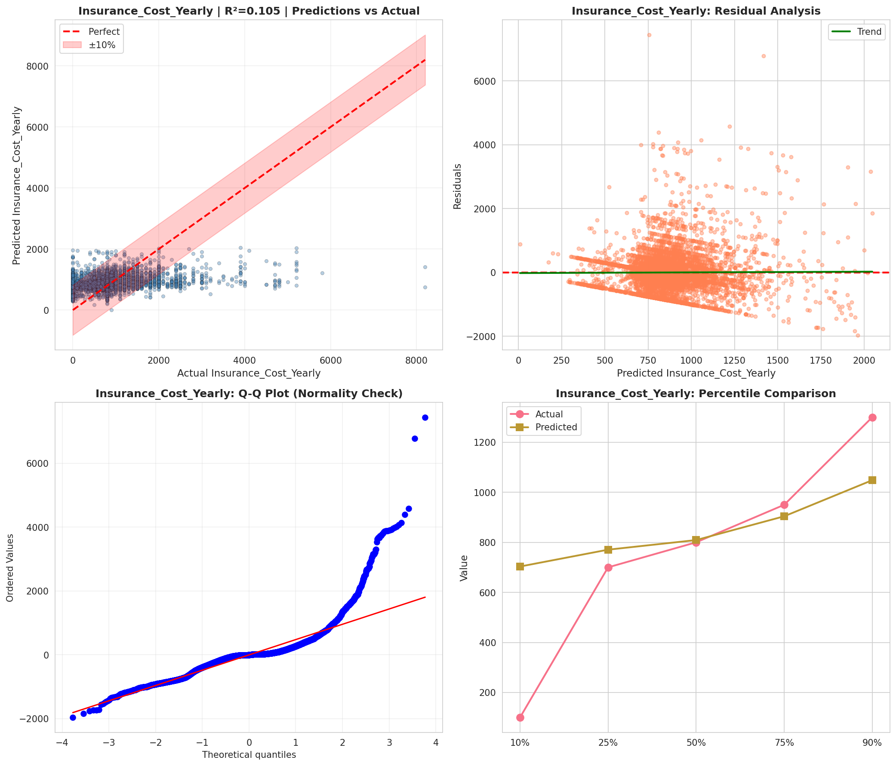
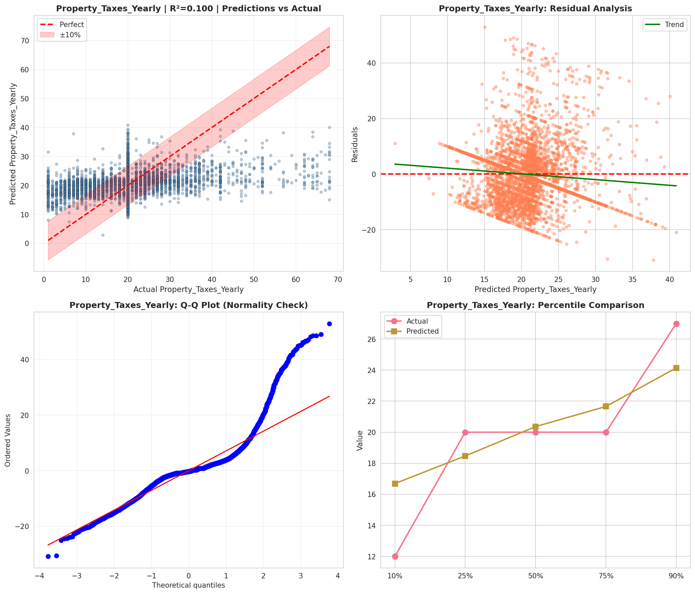
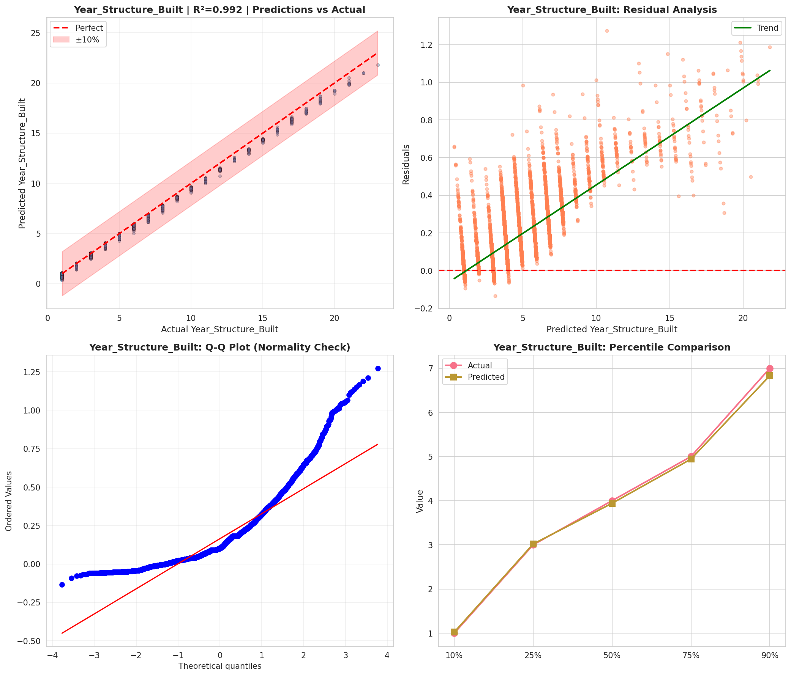
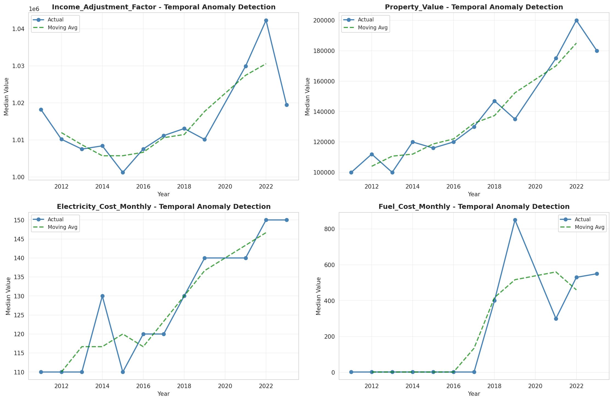
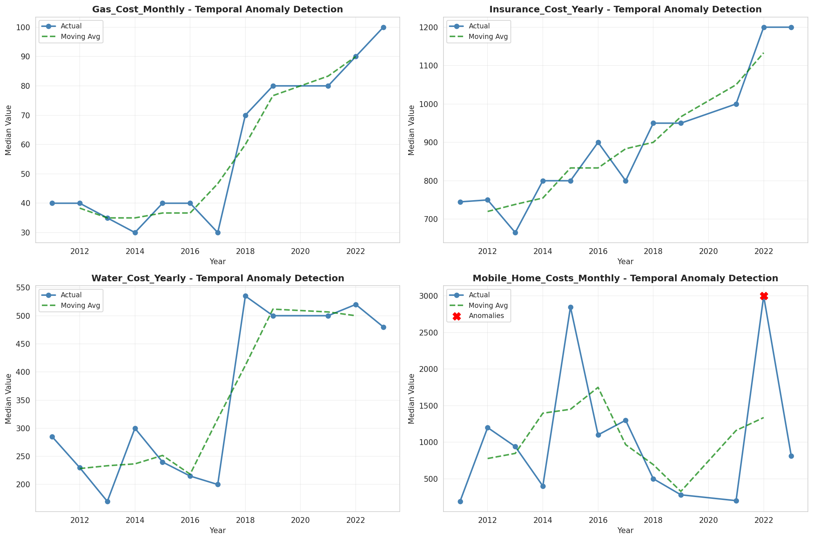
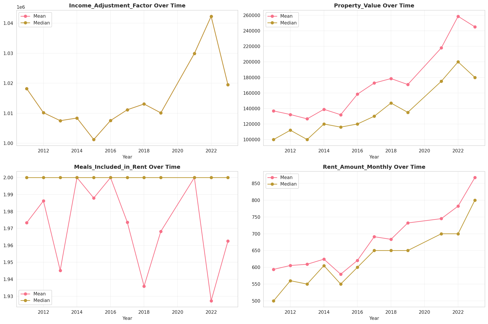
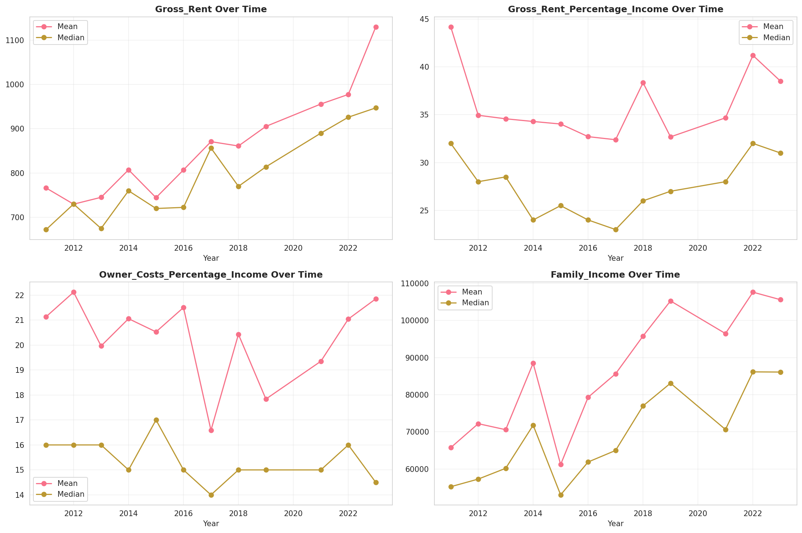
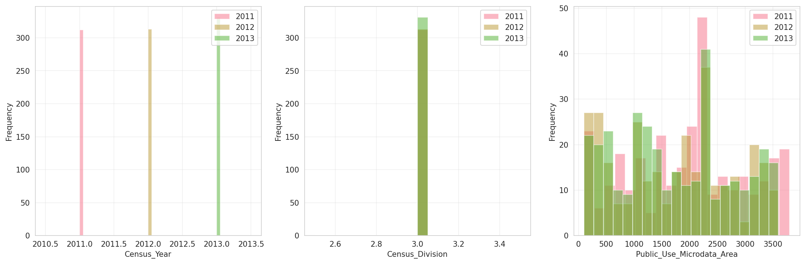
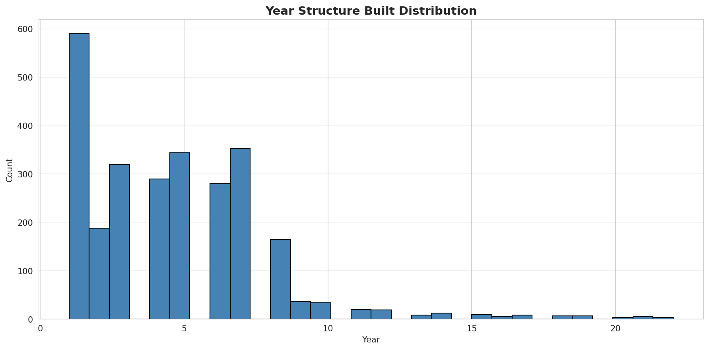
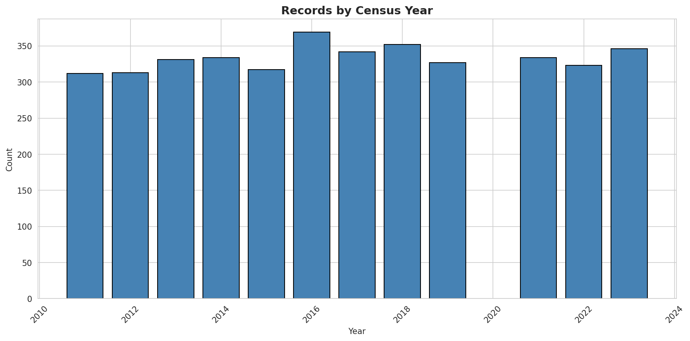
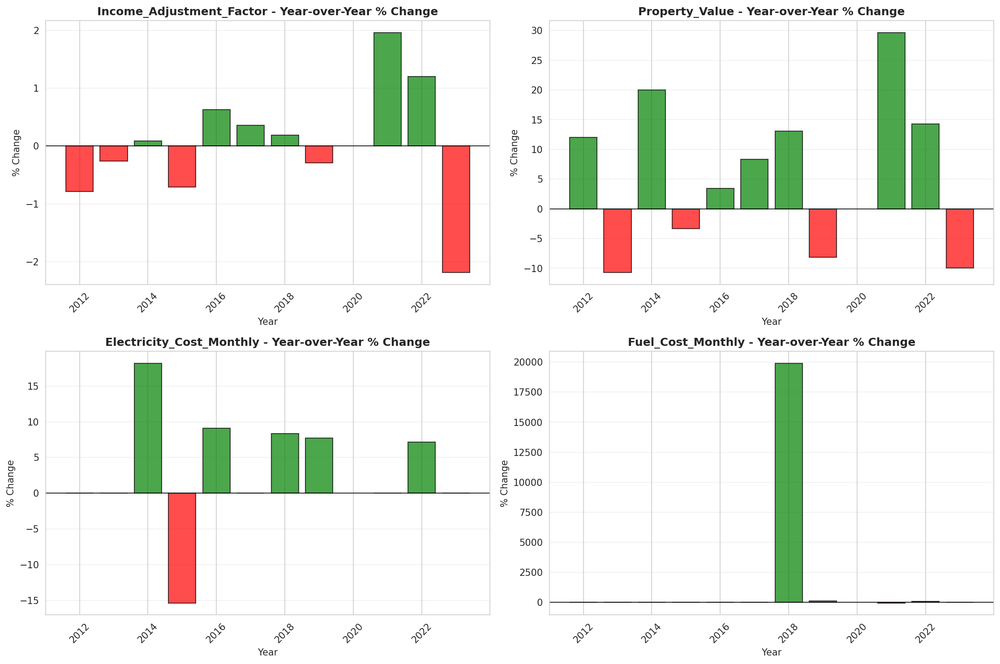
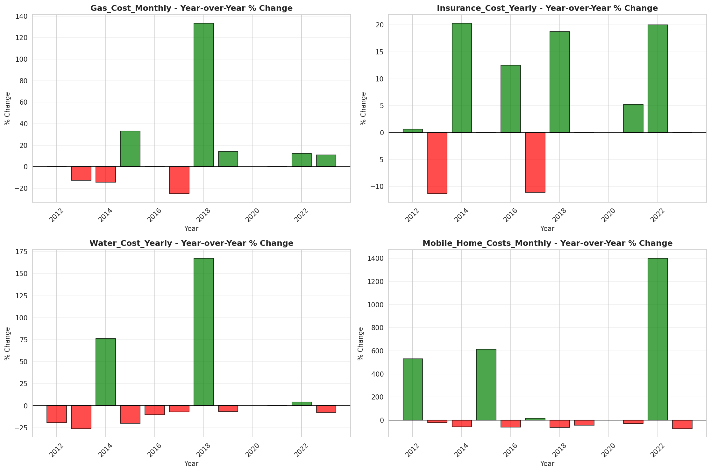
