# Temporal Analysis

## Year Distribution

- 2013: 154,499 records

- 2014: 156,134 records

- 2016: 158,434 records

- 2017: 159,104 records

- 2018: 160,061 records

- 2019: 161,063 records

- 2020: 157,857 records

- 2021: 158,671 records

- 2022: 159,549 records

- 2023: 160,486 records

## Temporal Trends

- Census_Year: {np.int64(2013): {'mean': 2013.0, 'median': 2013.0, 'std': 0.0}, np.int64(2014): {'mean': 2014.0, 'median': 2014.0, 'std': 0.0}, np.int64(2016): {'mean': 2016.0, 'median': 2016.0, 'std': 0.0}, np.int64(2017): {'mean': 2017.0, 'median': 2017.0, 'std': 0.0}, np.int64(2018): {'mean': 2018.0, 'median': 2018.0, 'std': 0.0}, np.int64(2019): {'mean': 2019.0, 'median': 2019.0, 'std': 0.0}, np.int64(2020): {'mean': 2020.0, 'median': 2020.0, 'std': 0.0}, np.int64(2021): {'mean': 2021.0, 'median': 2021.0, 'std': 0.0}, np.int64(2022): {'mean': 2022.0, 'median': 2022.0, 'std': 0.0}, np.int64(2023): {'mean': 2023.0, 'median': 2023.0, 'std': 0.0}}

- Census_Division: {np.int64(2013): {'mean': 3.0, 'median': 3.0, 'std': 0.0}, np.int64(2014): {'mean': 3.0, 'median': 3.0, 'std': 0.0}, np.int64(2016): {'mean': 3.0, 'median': 3.0, 'std': 0.0}, np.int64(2017): {'mean': 3.0, 'median': 3.0, 'std': 0.0}, np.int64(2018): {'mean': 3.0, 'median': 3.0, 'std': 0.0}, np.int64(2019): {'mean': 3.0, 'median': 3.0, 'std': 0.0}, np.int64(2020): {'mean': 3.0, 'median': 3.0, 'std': 0.0}, np.int64(2021): {'mean': 3.0, 'median': 3.0, 'std': 0.0}, np.int64(2022): {'mean': 3.0, 'median': 3.0, 'std': 0.0}, np.int64(2023): {'mean': 3.0, 'median': 3.0, 'std': 0.0}}

- Public_Use_Microdata_Area: {np.int64(2013): {'mean': None, 'median': None, 'std': None}, np.int64(2014): {'mean': None, 'median': None, 'std': None}, np.int64(2016): {'mean': 1730.2542951639168, 'median': 1801.0, 'std': 1026.9224393485733}, np.int64(2017): {'mean': 1729.0005342417537, 'median': 1801.0, 'std': 1026.2512768959916}, np.int64(2018): {'mean': 1728.0546416678642, 'median': 1801.0, 'std': 1026.6406699284787}, np.int64(2019): {'mean': 1726.7778074418086, 'median': 1801.0, 'std': 1027.0800647935343}, np.int64(2020): {'mean': 1728.4245297959546, 'median': 1801.0, 'std': 1027.3547365726993}, np.int64(2021): {'mean': 1726.6293336526523, 'median': 1801.0, 'std': 1027.7306500797947}, np.int64(2022): {'mean': None, 'median': None, 'std': None}, np.int64(2023): {'mean': 1777.9132821554529, 'median': 1801.0, 'std': 1070.303902569496}}

- Census_Region: {np.int64(2013): {'mean': 2.0, 'median': 2.0, 'std': 0.0}, np.int64(2014): {'mean': 2.0, 'median': 2.0, 'std': 0.0}, np.int64(2016): {'mean': 2.0, 'median': 2.0, 'std': 0.0}, np.int64(2017): {'mean': 2.0, 'median': 2.0, 'std': 0.0}, np.int64(2018): {'mean': 2.0, 'median': 2.0, 'std': 0.0}, np.int64(2019): {'mean': 2.0, 'median': 2.0, 'std': 0.0}, np.int64(2020): {'mean': 2.0, 'median': 2.0, 'std': 0.0}, np.int64(2021): {'mean': 2.0, 'median': 2.0, 'std': 0.0}, np.int64(2022): {'mean': 2.0, 'median': 2.0, 'std': 0.0}, np.int64(2023): {'mean': 2.0, 'median': 2.0, 'std': 0.0}}

- State_Code: {np.int64(2013): {'mean': 18.0, 'median': 18.0, 'std': 0.0}, np.int64(2014): {'mean': 18.0, 'median': 18.0, 'std': 0.0}, np.int64(2016): {'mean': 18.0, 'median': 18.0, 'std': 0.0}, np.int64(2017): {'mean': 18.0, 'median': 18.0, 'std': 0.0}, np.int64(2018): {'mean': 18.0, 'median': 18.0, 'std': 0.0}, np.int64(2019): {'mean': 18.0, 'median': 18.0, 'std': 0.0}, np.int64(2020): {'mean': 18.0, 'median': 18.0, 'std': 0.0}, np.int64(2021): {'mean': 18.0, 'median': 18.0, 'std': 0.0}, np.int64(2022): {'mean': 18.0, 'median': 18.0, 'std': 0.0}, np.int64(2023): {'mean': None, 'median': None, 'std': None}}

- Housing_Adjustment_Factor: {np.int64(2013): {'mean': 1040197.8141994446, 'median': 1035725.0, 'std': 32078.54424744359}, np.int64(2014): {'mean': 1036675.360254653, 'median': 1031130.0, 'std': 29596.069057635268}, np.int64(2016): {'mean': 1020364.8911029198, 'median': 1013801.0, 'std': 15763.617563656806}, np.int64(2017): {'mean': 1029195.0600864843, 'median': 1034680.0, 'std': 17966.10602064613}, np.int64(2018): {'mean': 1038289.8480829184, 'median': 1046406.0, 'std': 23466.872158647828}, np.int64(2019): {'mean': 1040848.6931449184, 'median': 1042936.0, 'std': 29186.018069042802}, np.int64(2020): {'mean': 1036229.0435964195, 'median': 1030827.0, 'std': 28363.224938427124}, np.int64(2021): {'mean': 1058235.4737097516, 'median': 1059761.0, 'std': 35505.71980427298}, np.int64(2022): {'mean': 1105199.8348469748, 'median': 1133141.0, 'std': 61349.127351164825}, np.int64(2023): {'mean': 1106013.5179641838, 'median': 1125501.0, 'std': 76713.3096433992}}

- Income_Adjustment_Factor: {np.int64(2013): {'mean': 1049183.9046854672, 'median': 1054614.0, 'std': 29659.46362641465}, np.int64(2014): {'mean': 1047529.3594092254, 'median': 1041654.0, 'std': 31034.52844883273}, np.int64(2016): {'mean': 1027524.4480982617, 'median': 1022342.0, 'std': 17520.314259064537}, np.int64(2017): {'mean': 1036586.1408072708, 'median': 1035988.0, 'std': 16840.393140488148}, np.int64(2018): {'mean': 1046866.1443262256, 'median': 1054346.0, 'std': 20488.71317741691}, np.int64(2019): {'mean': 1049793.3535883473, 'median': 1054606.0, 'std': 26230.092923765867}, np.int64(2020): {'mean': 1046307.9029438036, 'median': 1044328.0, 'std': 28892.68432488223}, np.int64(2021): {'mean': 1073179.4838439287, 'median': 1070512.0, 'std': 30692.744011337738}, np.int64(2022): {'mean': 1127355.1809851518, 'median': 1140108.0, 'std': 49464.073433942816}, np.int64(2023): {'mean': 1129784.802026345, 'median': 1159185.0, 'std': 70243.52472868093}}

- Housing_Unit_Weight: {np.int64(2013): {'mean': 18.12888756561531, 'median': 15.0, 'std': 15.510139410580061}, np.int64(2014): {'mean': 18.007717729642486, 'median': 15.0, 'std': 15.933995675091644}, np.int64(2016): {'mean': 17.866550109193735, 'median': 15.0, 'std': 16.15842209076916}, np.int64(2017): {'mean': 17.946613535800484, 'median': 15.0, 'std': 16.249803241482617}, np.int64(2018): {'mean': 17.934849838499073, 'median': 14.0, 'std': 16.299799769813916}, np.int64(2019): {'mean': 17.921856664783345, 'median': 14.0, 'std': 16.548246446185676}, np.int64(2020): {'mean': 18.39462298155926, 'median': 14.0, 'std': 20.67909715797867}, np.int64(2021): {'mean': 18.349679525559175, 'median': 14.0, 'std': 20.441035037707007}, np.int64(2022): {'mean': 18.374844091783714, 'median': 14.0, 'std': 20.785372321026124}, np.int64(2023): {'mean': 18.40250239896315, 'median': 13.0, 'std': 20.976191215437066}}

- Number_of_Persons: {np.int64(2013): {'mean': 2.136570463239244, 'median': 2.0, 'std': 1.4506567467855513}, np.int64(2014): {'mean': 2.1187121318867126, 'median': 2.0, 'std': 1.447212422765223}, np.int64(2016): {'mean': 2.0929535327013142, 'median': 2.0, 'std': 1.437361971881088}, np.int64(2017): {'mean': 2.088124748592116, 'median': 2.0, 'std': 1.4367083216263687}, np.int64(2018): {'mean': 2.0838680253153483, 'median': 2.0, 'std': 1.4357499628913801}, np.int64(2019): {'mean': 2.0764297200474346, 'median': 2.0, 'std': 1.4335980178086838}, np.int64(2020): {'mean': 2.0618217754043218, 'median': 2.0, 'std': 1.430500383834857}, np.int64(2021): {'mean': 2.062966767714327, 'median': 2.0, 'std': 1.4292497220243738}, np.int64(2022): {'mean': 2.069408144206482, 'median': 2.0, 'std': 1.4259260368690347}, np.int64(2023): {'mean': 2.0726418503794726, 'median': 2.0, 'std': 1.421129898984932}}

- Housing_Unit_Type: {np.int64(2013): {'mean': 1.1356254733040343, 'median': 1.0, 'std': 0.4517245770150696}, np.int64(2014): {'mean': 1.1485775039389243, 'median': 1.0, 'std': 0.47199569025574484}, np.int64(2016): {'mean': 1.1606220886930836, 'median': 1.0, 'std': 0.4913938678552725}, np.int64(2017): {'mean': 1.159838847546259, 'median': 1.0, 'std': 0.491469746660519}, np.int64(2018): {'mean': 1.159076851950194, 'median': 1.0, 'std': 0.49047904525838965}, np.int64(2019): {'mean': 1.1594717594978363, 'median': 1.0, 'std': 0.49179587456181345}, np.int64(2020): {'mean': None, 'median': None, 'std': None}, np.int64(2021): {'mean': None, 'median': None, 'std': None}, np.int64(2022): {'mean': None, 'median': None, 'std': None}, np.int64(2023): {'mean': None, 'median': None, 'std': None}}

- Building_Type: {np.int64(2013): {'mean': 2.6035707155691186, 'median': 2.0, 'std': 1.6498167345755324}, np.int64(2014): {'mean': 2.604904166548002, 'median': 2.0, 'std': 1.651206697120217}, np.int64(2016): {'mean': 2.6085029059490648, 'median': 2.0, 'std': 1.653924961758328}, np.int64(2017): {'mean': 2.6129531310432124, 'median': 2.0, 'std': 1.6578754347975413}, np.int64(2018): {'mean': 2.6158816872284243, 'median': 2.0, 'std': 1.6629514382331527}, np.int64(2019): {'mean': 2.618210341452579, 'median': 2.0, 'std': 1.6658866430768453}, np.int64(2020): {'mean': 2.6129094563949953, 'median': 2.0, 'std': 1.661837676750237}, np.int64(2021): {'mean': 2.6117304344736936, 'median': 2.0, 'std': 1.6624359178328272}, np.int64(2022): {'mean': 2.607416139597922, 'median': 2.0, 'std': 1.6623135840375514}, np.int64(2023): {'mean': 2.6022922435245874, 'median': 2.0, 'std': 1.6598430876139911}}

- Year_Structure_Built: {np.int64(2013): {'mean': 4.455223454923994, 'median': 4.0, 'std': 2.7167302653320324}, np.int64(2014): {'mean': 4.481773132458064, 'median': 4.0, 'std': 2.7883224993004103}, np.int64(2016): {'mean': 4.610602825346098, 'median': 4.0, 'std': 3.0244974212936238}, np.int64(2017): {'mean': 4.6940965507541925, 'median': 4.0, 'std': 3.180252267807432}, np.int64(2018): {'mean': 4.79281991812555, 'median': 5.0, 'std': 3.37031633120034}, np.int64(2019): {'mean': 4.8974948112258, 'median': 5.0, 'std': 3.584620249274717}, np.int64(2020): {'mean': 4.998240204880212, 'median': 5.0, 'std': 3.7784333464543525}, np.int64(2021): {'mean': None, 'median': None, 'std': None}, np.int64(2022): {'mean': None, 'median': None, 'std': None}, np.int64(2023): {'mean': None, 'median': None, 'std': None}}

- Bathtub_or_Shower: {np.int64(2013): {'mean': 1.009547100932607, 'median': 1.0, 'std': 0.09724207534827405}, np.int64(2014): {'mean': 1.0097471022128557, 'median': 1.0, 'std': 0.09824543212520699}, np.int64(2016): {'mean': 1.009000664620954, 'median': 1.0, 'std': 0.09444424664113432}, np.int64(2017): {'mean': 1.0091206357019795, 'median': 1.0, 'std': 0.09506583644549789}, np.int64(2018): {'mean': 1.0092912131669765, 'median': 1.0, 'std': 0.09594243497792823}, np.int64(2019): {'mean': 1.0091766682169359, 'median': 1.0, 'std': 0.0953547067172688}, np.int64(2020): {'mean': 1.009321191223916, 'median': 1.0, 'std': 0.09609564338433332}, np.int64(2021): {'mean': 1.0091584070482078, 'median': 1.0, 'std': 0.09526066923962902}, np.int64(2022): {'mean': 1.0083366275129886, 'median': 1.0, 'std': 0.0909240700387268}, np.int64(2023): {'mean': 1.007619781991518, 'median': 1.0, 'std': 0.08695846089566403}}

- Refrigerator: {np.int64(2013): {'mean': 1.0206556769243933, 'median': 1.0, 'std': 0.142229266220409}, np.int64(2014): {'mean': 1.0214521687124427, 'median': 1.0, 'std': 0.14488658540790636}, np.int64(2016): {'mean': 1.020956771356251, 'median': 1.0, 'std': 0.14324011365488448}, np.int64(2017): {'mean': 1.0211736577476178, 'median': 1.0, 'std': 0.14396346657705505}, np.int64(2018): {'mean': 1.0212440445419362, 'median': 1.0, 'std': 0.1441973660296557}, np.int64(2019): {'mean': 1.020428846113799, 'median': 1.0, 'std': 0.1414625295659101}, np.int64(2020): {'mean': 1.0201303392970835, 'median': 1.0, 'std': 0.1404466085178934}, np.int64(2021): {'mean': 1.0191481047284094, 'median': 1.0, 'std': 0.13704593484597816}, np.int64(2022): {'mean': 1.017407386491981, 'median': 1.0, 'std': 0.13078413561036376}, np.int64(2023): {'mean': 1.0155760400967369, 'median': 1.0, 'std': 0.12382864999053136}}

- Hot_and_Cold_Running_Water: {np.int64(2013): {'mean': 1.0169052847731226, 'median': 1.0, 'std': 0.12891708427550866}, np.int64(2014): {'mean': 1.0174152023467091, 'median': 1.0, 'std': 0.13081297683868687}, np.int64(2016): {'mean': 1.0170326795537141, 'median': 1.0, 'std': 0.1293935305918235}, np.int64(2017): {'mean': 1.0173903871171899, 'median': 1.0, 'std': 0.1307213896737255}, np.int64(2018): {'mean': 1.0176672767663784, 'median': 1.0, 'std': 0.13173938416337452}, np.int64(2019): {'mean': 1.0178188406300108, 'median': 1.0, 'std': 0.13229304983635706}, np.int64(2020): {'mean': 1.0179484794940947, 'median': 1.0, 'std': 0.13276467026756214}, np.int64(2021): {'mean': 1.0173150023091406, 'median': 1.0, 'std': 0.1304427610057369}, np.int64(2022): {'mean': 1.0156497063474137, 'median': 1.0, 'std': 0.12411648472778734}, np.int64(2023): {'mean': 1.0142161158038625, 'median': 1.0, 'std': 0.1183812320139169}}

- Running_Water: {np.int64(2013): {'mean': 9.0, 'median': 9.0, 'std': 0.0}, np.int64(2014): {'mean': 9.0, 'median': 9.0, 'std': 0.0}, np.int64(2016): {'mean': 9.0, 'median': 9.0, 'std': 0.0}, np.int64(2017): {'mean': 9.0, 'median': 9.0, 'std': 0.0}, np.int64(2018): {'mean': 9.0, 'median': 9.0, 'std': 0.0}, np.int64(2019): {'mean': 9.0, 'median': 9.0, 'std': 0.0}, np.int64(2020): {'mean': 9.0, 'median': 9.0, 'std': 0.0}, np.int64(2021): {'mean': 9.0, 'median': 9.0, 'std': 0.0}, np.int64(2022): {'mean': 9.0, 'median': 9.0, 'std': 0.0}, np.int64(2023): {'mean': 9.0, 'median': 9.0, 'std': 0.0}}

- Sink_with_Faucet: {np.int64(2013): {'mean': 1.0093189401933662, 'median': 1.0, 'std': 0.09608414735312389}, np.int64(2014): {'mean': 1.0093768689659102, 'median': 1.0, 'std': 0.09637950731792957}, np.int64(2016): {'mean': 1.0086471428369417, 'median': 1.0, 'std': 0.09258742014181334}, np.int64(2017): {'mean': 1.0087057417109102, 'median': 1.0, 'std': 0.09289786035909037}, np.int64(2018): {'mean': 1.0089000041915248, 'median': 1.0, 'std': 0.09391941087074283}, np.int64(2019): {'mean': 1.0089128910669787, 'median': 1.0, 'std': 0.09398676905645063}, np.int64(2020): {'mean': 1.0089563556503016, 'median': 1.0, 'std': 0.0942136022075104}, np.int64(2021): {'mean': 1.0086894738711856, 'median': 1.0, 'std': 0.09281178868070476}, np.int64(2022): {'mean': 1.007934266997967, 'median': 1.0, 'std': 0.08872074148038603}, np.int64(2023): {'mean': 1.0072412463636045, 'median': 1.0, 'std': 0.08478715178634333}}

- Stove_or_Range: {np.int64(2013): {'mean': 1.0221672418218635, 'median': 1.0, 'std': 0.14722774793606236}, np.int64(2014): {'mean': 1.023132458063965, 'median': 1.0, 'std': 0.15032467641478095}, np.int64(2016): {'mean': 1.0229435637824003, 'median': 1.0, 'std': 0.14972413019800151}, np.int64(2017): {'mean': 1.0232762561091382, 'median': 1.0, 'std': 0.15078007787144873}, np.int64(2018): {'mean': 1.0236401995165776, 'median': 1.0, 'std': 0.15192597450031223}, np.int64(2019): {'mean': 1.0231568571646732, 'median': 1.0, 'std': 0.1504020417185938}, np.int64(2020): {'mean': 1.0228916438346365, 'median': 1.0, 'std': 0.14955860553032624}, np.int64(2021): {'mean': 1.0220966997051406, 'median': 1.0, 'std': 0.14699860236528403}, np.int64(2022): {'mean': 1.0203297944431895, 'median': 1.0, 'std': 0.14112630687345962}, np.int64(2023): {'mean': 1.0188076127720724, 'median': 1.0, 'std': 0.13584555876084173}}

- Telephone_Service: {np.int64(2013): {'mean': 1.0284318522369347, 'median': 1.0, 'std': 0.16620377011117515}, np.int64(2014): {'mean': 1.0291930071319915, 'median': 1.0, 'std': 0.168347830723669}, np.int64(2016): {'mean': 1.0293274531422272, 'median': 1.0, 'std': 0.16872335372777908}, np.int64(2017): {'mean': 1.0268114571115063, 'median': 1.0, 'std': 0.16153266027305924}, np.int64(2018): {'mean': 1.024765170829291, 'median': 1.0, 'std': 0.15540926220692045}, np.int64(2019): {'mean': 1.0818828729941832, 'median': 1.0, 'std': 0.6608911952028642}, np.int64(2020): {'mean': 1.0801926411096128, 'median': 1.0, 'std': 0.668519827815805}, np.int64(2021): {'mean': 1.0748645943943225, 'median': 1.0, 'std': 0.662722632626169}, np.int64(2022): {'mean': 1.0720003023317335, 'median': 1.0, 'std': 0.6579038253904902}, np.int64(2023): {'mean': 1.0695970695970696, 'median': 1.0, 'std': 0.6532732406497906}}

- Lot_Acreage: {np.int64(2013): {'mean': 1.2995386698313471, 'median': 1.0, 'std': 0.5623534646691384}, np.int64(2014): {'mean': 1.2984617439133301, 'median': 1.0, 'std': 0.5609820233096768}, np.int64(2016): {'mean': 1.29601472404845, 'median': 1.0, 'std': 0.5583244835248016}, np.int64(2017): {'mean': 1.2942530442530442, 'median': 1.0, 'std': 0.5562165444037777}, np.int64(2018): {'mean': 1.2944735979009512, 'median': 1.0, 'std': 0.555914147953113}, np.int64(2019): {'mean': 1.2964528953628571, 'median': 1.0, 'std': 0.5567750139673358}, np.int64(2020): {'mean': 1.2995978215333055, 'median': 1.0, 'std': 0.5590748332068657}, np.int64(2021): {'mean': 1.3002717052621082, 'median': 1.0, 'std': 0.5578668875186616}, np.int64(2022): {'mean': 1.3030987122341873, 'median': 1.0, 'std': 0.5584629503152394}, np.int64(2023): {'mean': 1.3049010406039583, 'median': 1.0, 'std': 0.5585405158046718}}

- Agricultural_Sales: {np.int64(2013): {'mean': 1.3605733759617749, 'median': 1.0, 'std': 1.1516095710445613}, np.int64(2014): {'mean': 1.3510851595202082, 'median': 1.0, 'std': 1.1406137313805056}, np.int64(2016): {'mean': 1.3480123612866977, 'median': 1.0, 'std': 1.1405403198635153}, np.int64(2017): {'mean': 1.3372521494999123, 'median': 1.0, 'std': 1.1208791202541555}, np.int64(2018): {'mean': 1.3354818479548463, 'median': 1.0, 'std': 1.112886299374495}, np.int64(2019): {'mean': 1.3373295317921061, 'median': 1.0, 'std': 1.1137845892390636}, np.int64(2020): {'mean': 1.3353427730267768, 'median': 1.0, 'std': 1.1085844080200755}, np.int64(2021): {'mean': 1.3268055123821365, 'median': 1.0, 'std': 1.0936363921472247}, np.int64(2022): {'mean': 1.324942559805379, 'median': 1.0, 'std': 1.095167893551074}, np.int64(2023): {'mean': 1.3194485866719687, 'median': 1.0, 'std': 1.0913734880502424}}

- Business_On_Property: {np.int64(2013): {'mean': 1.9853076370200746, 'median': 2.0, 'std': 0.12031881996315212}, np.int64(2014): {'mean': 1.9856357095759154, 'median': 2.0, 'std': 0.118987712621008}, np.int64(2016): {'mean': 3.401702882630431, 'median': 2.0, 'std': 2.817883486780842}, np.int64(2017): {'mean': 4.818046068046068, 'median': 2.0, 'std': 3.442993566817601}, np.int64(2018): {'mean': 6.221556247950147, 'median': 9.0, 'std': 3.4316214511907908}, np.int64(2019): {'mean': 7.619887900413856, 'median': 9.0, 'std': 2.789474066094}, np.int64(2020): {'mean': None, 'median': None, 'std': None}, np.int64(2021): {'mean': None, 'median': None, 'std': None}, np.int64(2022): {'mean': None, 'median': None, 'std': None}, np.int64(2023): {'mean': None, 'median': None, 'std': None}}

- Tenure: {np.int64(2013): {'mean': 1.7829882878199443, 'median': 2.0, 'std': 0.8674087405148018}, np.int64(2014): {'mean': 1.796122887348168, 'median': 2.0, 'std': 0.8683960905051351}, np.int64(2016): {'mean': 1.80849332775729, 'median': 2.0, 'std': 0.8657672884798298}, np.int64(2017): {'mean': 1.8119111581974345, 'median': 2.0, 'std': 0.8642499559828255}, np.int64(2018): {'mean': 1.8128736773232859, 'median': 2.0, 'std': 0.8626839478865328}, np.int64(2019): {'mean': 1.8113169507851528, 'median': 2.0, 'std': 0.8590463688820141}, np.int64(2020): {'mean': 1.803914467347332, 'median': 2.0, 'std': 0.8542749648422181}, np.int64(2021): {'mean': 1.800715033268909, 'median': 2.0, 'std': 0.8496833956228154}, np.int64(2022): {'mean': 1.7943086051169646, 'median': 2.0, 'std': 0.8451071105999144}, np.int64(2023): {'mean': 1.7880466472303207, 'median': 2.0, 'std': 0.8385752297306958}}

- Vacancy_Status: {np.int64(2013): {'mean': 4.625846740050805, 'median': 5.0, 'std': 2.365965950608984}, np.int64(2014): {'mean': 4.666147617564621, 'median': 5.0, 'std': 2.3461004158702017}, np.int64(2016): {'mean': 4.74866417985684, 'median': 5.0, 'std': 2.339901304021459}, np.int64(2017): {'mean': 4.810636182902584, 'median': 5.0, 'std': 2.325878094456445}, np.int64(2018): {'mean': 4.849562739510661, 'median': 5.0, 'std': 2.3274299314710043}, np.int64(2019): {'mean': 4.936279345038469, 'median': 5.0, 'std': 2.3145817741605916}, np.int64(2020): {'mean': 4.991811463950469, 'median': 5.0, 'std': 2.3034832338207627}, np.int64(2021): {'mean': 5.04643365169681, 'median': 7.0, 'std': 2.2951103975041116}, np.int64(2022): {'mean': 5.103216155572176, 'median': 7.0, 'std': 2.2806013854657903}, np.int64(2023): {'mean': 5.121102982554868, 'median': 7.0, 'std': 2.2778540832404572}}

- Vehicles_Available: {np.int64(2013): {'mean': 1.8638191492614904, 'median': 2.0, 'std': 1.0568035730838157}, np.int64(2014): {'mean': 1.8614727218523304, 'median': 2.0, 'std': 1.0622422270921834}, np.int64(2016): {'mean': 1.8751929437706725, 'median': 2.0, 'std': 1.0724312858059715}, np.int64(2017): {'mean': 1.8916871618298081, 'median': 2.0, 'std': 1.0773620148731138}, np.int64(2018): {'mean': 1.9079635102918726, 'median': 2.0, 'std': 1.0863037253177865}, np.int64(2019): {'mean': 1.9207455030129252, 'median': 2.0, 'std': 1.0916704604717833}, np.int64(2020): {'mean': 1.9395261028703525, 'median': 2.0, 'std': 1.097042852180832}, np.int64(2021): {'mean': 1.9457384475527681, 'median': 2.0, 'std': 1.099194662259499}, np.int64(2022): {'mean': 1.9480971996523184, 'median': 2.0, 'std': 1.1031382287512572}, np.int64(2023): {'mean': 1.9474695372654556, 'median': 2.0, 'std': 1.101329096277369}}

- Condo_Fee_Monthly: {np.int64(2013): {'mean': 195.98387781077642, 'median': 160.0, 'std': 151.44462724695154}, np.int64(2014): {'mean': 201.85612788632326, 'median': 170.0, 'std': 149.34734570533672}, np.int64(2016): {'mean': 207.46229508196723, 'median': 170.0, 'std': 148.00890116529638}, np.int64(2017): {'mean': 213.47632311977716, 'median': 180.0, 'std': 149.43622383540233}, np.int64(2018): {'mean': 219.0900090009001, 'median': 180.0, 'std': 150.34669823613916}, np.int64(2019): {'mean': 227.56288478452066, 'median': 190.0, 'std': 157.99912777089682}, np.int64(2020): {'mean': 234.0600706713781, 'median': 200.0, 'std': 162.93161562457666}, np.int64(2021): {'mean': 241.55317324185248, 'median': 200.0, 'std': 166.62594406814748}, np.int64(2022): {'mean': 250.751966873706, 'median': 200.0, 'std': 181.33091963125153}, np.int64(2023): {'mean': 256.76133172884073, 'median': 210.0, 'std': 187.06666886560245}}

- Electricity_Cost_Monthly: {np.int64(2013): {'mean': 126.09203082474542, 'median': 110.0, 'std': 83.53573698593584}, np.int64(2014): {'mean': 130.97705990720002, 'median': 110.0, 'std': 86.91538404405233}, np.int64(2016): {'mean': 136.71234459947536, 'median': 120.0, 'std': 89.67865305702834}, np.int64(2017): {'mean': 139.6358772560445, 'median': 120.0, 'std': 90.88254569405476}, np.int64(2018): {'mean': 148.7402808874415, 'median': 130.0, 'std': 90.17376938717946}, np.int64(2019): {'mean': 150.2895833981519, 'median': 130.0, 'std': 90.08254417595639}, np.int64(2020): {'mean': 152.25389490573605, 'median': 130.0, 'std': 90.06087862535877}, np.int64(2021): {'mean': 156.37297004978447, 'median': 140.0, 'std': 93.09144928144501}, np.int64(2022): {'mean': 166.48588939678842, 'median': 140.0, 'std': 132.89700848396868}, np.int64(2023): {'mean': 175.35583918910515, 'median': 150.0, 'std': 172.04202294353607}}

- Fuel_Cost_Monthly: {np.int64(2013): {'mean': 80.07708479863001, 'median': 2.0, 'std': 352.57917367879685}, np.int64(2014): {'mean': 71.47554254351432, 'median': 2.0, 'std': 331.90921603134774}, np.int64(2016): {'mean': 56.471763677147095, 'median': 2.0, 'std': 296.25009512415045}, np.int64(2017): {'mean': 49.37598093003897, 'median': 2.0, 'std': 274.6679039931366}, np.int64(2018): {'mean': 800.909532328137, 'median': 580.0, 'std': 818.3945304103694}, np.int64(2019): {'mean': 781.2281438697821, 'median': 590.0, 'std': 778.3184944537229}, np.int64(2020): {'mean': 754.048134434634, 'median': 510.0, 'std': 755.5116956043257}, np.int64(2021): {'mean': 751.759322537513, 'median': 500.0, 'std': 756.141428206786}, np.int64(2022): {'mean': 779.8340018512805, 'median': 550.0, 'std': 788.3084060778755}, np.int64(2023): {'mean': 796.5334394904459, 'median': 600.0, 'std': 799.8911290167024}}

- Gas_Cost_Monthly: {np.int64(2013): {'mean': 65.06717684474481, 'median': 40.0, 'std': 80.76837962800904}, np.int64(2014): {'mean': 61.99426688783739, 'median': 40.0, 'std': 76.3673061321919}, np.int64(2016): {'mean': 60.12384138691404, 'median': 40.0, 'std': 75.91742199873673}, np.int64(2017): {'mean': 59.38077112263044, 'median': 30.0, 'std': 75.63979068069176}, np.int64(2018): {'mean': 92.66410345198152, 'median': 70.0, 'std': 79.42142388657707}, np.int64(2019): {'mean': 90.70308585540766, 'median': 70.0, 'std': 77.86960210087095}, np.int64(2020): {'mean': 89.29785327654561, 'median': 70.0, 'std': 77.43909221558157}, np.int64(2021): {'mean': 91.63157125812657, 'median': 70.0, 'std': 79.84218873933249}, np.int64(2022): {'mean': 101.52898550724638, 'median': 80.0, 'std': 124.25341065588316}, np.int64(2023): {'mean': 109.37038574189799, 'median': 80.0, 'std': 149.98023768000067}}

- House_Heating_Fuel: {np.int64(2013): {'mean': 1.8017568270083484, 'median': 1.0, 'std': 1.265954899276048}, np.int64(2014): {'mean': 1.8054334615002408, 'median': 1.0, 'std': 1.268525514389374}, np.int64(2016): {'mean': 1.8095806561989127, 'median': 1.0, 'std': 1.264423840073798}, np.int64(2017): {'mean': 1.8130538423701237, 'median': 1.0, 'std': 1.2656804426879347}, np.int64(2018): {'mean': 1.8101512382585414, 'median': 1.0, 'std': 1.258188562703553}, np.int64(2019): {'mean': 1.812914883925838, 'median': 1.0, 'std': 1.257392775378443}, np.int64(2020): {'mean': 1.8148102485070314, 'median': 1.0, 'std': 1.2554451951355383}, np.int64(2021): {'mean': 1.8173151111892012, 'median': 1.0, 'std': 1.2576492015575567}, np.int64(2022): {'mean': 1.818419560863157, 'median': 1.0, 'std': 1.2491855840381505}, np.int64(2023): {'mean': 1.8216864767885177, 'median': 1.0, 'std': 1.24911944115157}}

- Insurance_Cost_Yearly: {np.int64(2013): {'mean': 806.9751601902223, 'median': 700.0, 'std': 484.14356478550656}, np.int64(2014): {'mean': 838.6460449992258, 'median': 750.0, 'std': 510.59398332696827}}

- Water_Cost_Yearly: {np.int64(2013): {'mean': 364.44380141280084, 'median': 240.0, 'std': 426.2605326504029}, np.int64(2014): {'mean': 373.8494331863109, 'median': 240.0, 'std': 437.91230221813674}, np.int64(2016): {'mean': 385.4143101547352, 'median': 220.0, 'std': 457.14345151569677}, np.int64(2017): {'mean': 389.5711756025578, 'median': 200.0, 'std': 465.32597047612745}, np.int64(2018): {'mean': 567.1066258171697, 'median': 500.0, 'std': 475.57907919320525}, np.int64(2019): {'mean': 573.7719901719902, 'median': 520.0, 'std': 487.78067724824695}, np.int64(2020): {'mean': 584.3771891322477, 'median': 530.0, 'std': 506.1583408560558}, np.int64(2021): {'mean': 594.7555757654497, 'median': 540.0, 'std': 524.5060742191023}, np.int64(2022): {'mean': 603.6675231079223, 'median': 530.0, 'std': 548.1295950395511}, np.int64(2023): {'mean': 615.4662879542191, 'median': 530.0, 'std': 574.9232093409302}}

- Mobile_Home_Costs_Monthly: {np.int64(2013): {'mean': 1736.3886462882097, 'median': 1100.0, 'std': 1704.2981432909958}, np.int64(2014): {'mean': 1766.2105852702325, 'median': 1000.0, 'std': 1766.960909403861}, np.int64(2016): {'mean': 1748.6411149825783, 'median': 800.0, 'std': 1844.5870288823842}, np.int64(2017): {'mean': 1763.7547000895256, 'median': 700.0, 'std': 1912.7574396130499}, np.int64(2018): {'mean': 1791.0159574468084, 'median': 700.0, 'std': 1961.3016393069943}, np.int64(2019): {'mean': 1783.4433113377324, 'median': 700.0, 'std': 1966.4534388457953}, np.int64(2020): {'mean': 1805.6925015752993, 'median': 680.0, 'std': 2020.111218467155}, np.int64(2021): {'mean': 1874.6329434081567, 'median': 700.0, 'std': 2129.1413003966654}, np.int64(2022): {'mean': 2043.577111383109, 'median': 710.0, 'std': 2750.044814926489}, np.int64(2023): {'mean': 2219.1838975297346, 'median': 750.0, 'std': 3334.897733004761}}

- First_Mortgage_Includes_Insurance: {np.int64(2013): {'mean': 1.4266394209771012, 'median': 1.0, 'std': 0.49459280345117285}, np.int64(2014): {'mean': 1.4196427153632394, 'median': 1.0, 'std': 0.493504381094137}, np.int64(2016): {'mean': 1.406803754018124, 'median': 1.0, 'std': 0.4912416491031437}, np.int64(2017): {'mean': 1.3988049937658888, 'median': 1.0, 'std': 0.4896564643524341}, np.int64(2018): {'mean': 1.3888682506097265, 'median': 1.0, 'std': 0.48749725413164435}, np.int64(2019): {'mean': 1.379278728606357, 'median': 1.0, 'std': 0.48521146073874505}, np.int64(2020): {'mean': 1.3679459369264142, 'median': 1.0, 'std': 0.4822505625155523}, np.int64(2021): {'mean': 1.3573999363878333, 'median': 1.0, 'std': 0.4792380061389685}, np.int64(2022): {'mean': 1.3465386221294364, 'median': 1.0, 'std': 0.4758711880378691}, np.int64(2023): {'mean': 1.3368317426416605, 'median': 1.0, 'std': 0.47263077239244927}}

- First_Mortgage_Payment_Monthly: {np.int64(2013): {'mean': 794.4831222312348, 'median': 690.0, 'std': 509.05254085374554}, np.int64(2014): {'mean': 782.2579753870583, 'median': 680.0, 'std': 497.4099133735207}, np.int64(2016): {'mean': 781.3663075258048, 'median': 670.0, 'std': 502.4181715759479}, np.int64(2017): {'mean': 787.9350680894473, 'median': 670.0, 'std': 510.30583040032127}, np.int64(2018): {'mean': 800.0984284399076, 'median': 680.0, 'std': 521.1585497214982}, np.int64(2019): {'mean': 817.3294299317977, 'median': 700.0, 'std': 535.5132256130444}, np.int64(2020): {'mean': 838.1580176873018, 'median': 700.0, 'std': 543.5172862544645}, np.int64(2021): {'mean': 864.8559854026818, 'median': 730.0, 'std': 558.9118038478204}, np.int64(2022): {'mean': 899.8178872651357, 'median': 760.0, 'std': 578.1350998779067}, np.int64(2023): {'mean': 945.9715010345058, 'median': 800.0, 'std': 612.5229316919675}}

- First_Mortgage_Includes_Taxes: {np.int64(2013): {'mean': 1.364946652523866, 'median': 1.0, 'std': 0.4814189532523358}, np.int64(2014): {'mean': 1.3567129813418024, 'median': 1.0, 'std': 0.4790328528924204}, np.int64(2016): {'mean': 1.3410115172759138, 'median': 1.0, 'std': 0.47405304811150306}, np.int64(2017): {'mean': 1.3322376410771248, 'median': 1.0, 'std': 0.47101951486737414}, np.int64(2018): {'mean': 1.32038505645018, 'median': 1.0, 'std': 0.46662831992515147}, np.int64(2019): {'mean': 1.30842233946725, 'median': 1.0, 'std': 0.46184567880778726}, np.int64(2020): {'mean': 1.2953779409310862, 'median': 1.0, 'std': 0.4562162709529948}, np.int64(2021): {'mean': 1.281919078627986, 'median': 1.0, 'std': 0.44993788533158224}, np.int64(2022): {'mean': 1.2668726513569937, 'median': 1.0, 'std': 0.442328957945956}, np.int64(2023): {'mean': 1.2536040846292464, 'median': 1.0, 'std': 0.43507724755309013}}

- First_Mortgage_Status: {np.int64(2013): {'mean': 1.6988866656405521, 'median': 1.0, 'std': 0.9459440568405725}, np.int64(2014): {'mean': 1.715796533223277, 'median': 1.0, 'std': 0.9507448663559213}, np.int64(2016): {'mean': 1.7416752418193044, 'median': 1.0, 'std': 0.957879836231404}, np.int64(2017): {'mean': 1.7503842134382492, 'median': 1.0, 'std': 0.9601202151142232}, np.int64(2018): {'mean': 1.7557925371159933, 'median': 1.0, 'std': 0.9615399269083041}, np.int64(2019): {'mean': 1.7628538911661917, 'median': 1.0, 'std': 0.9636667425932836}, np.int64(2020): {'mean': 1.7779210330885387, 'median': 1.0, 'std': 0.9677229392845654}, np.int64(2021): {'mean': 1.798749364514489, 'median': 1.0, 'std': 0.9726122046968846}, np.int64(2022): {'mean': 1.8175259686480338, 'median': 1.0, 'std': 0.9768724224127666}, np.int64(2023): {'mean': 1.8384628930325384, 'median': 1.0, 'std': 0.9812345519173582}}

- Second_Mortgage_Payment_Monthly: {np.int64(2013): {'mean': 284.1959360271962, 'median': 200.0, 'std': 271.5446465373029}, np.int64(2014): {'mean': 275.6722551801221, 'median': 200.0, 'std': 260.33173073783206}, np.int64(2016): {'mean': 276.2340704836918, 'median': 200.0, 'std': 278.98183129362207}, np.int64(2017): {'mean': 279.8627012045624, 'median': 200.0, 'std': 288.3946950336938}, np.int64(2018): {'mean': 289.50066844919786, 'median': 200.0, 'std': 311.48471376237904}, np.int64(2019): {'mean': 297.3029209821948, 'median': 200.0, 'std': 321.0188455835868}, np.int64(2020): {'mean': 302.5051002462188, 'median': 200.0, 'std': 332.46440371960915}, np.int64(2021): {'mean': 306.43516585479006, 'median': 200.0, 'std': 340.2216038632233}, np.int64(2022): {'mean': 319.5646965758843, 'median': 200.0, 'std': 367.9034540994925}, np.int64(2023): {'mean': 341.41018126560294, 'median': 230.0, 'std': 404.52498194913824}}

- Second_Mortgage_Status: {np.int64(2013): {'mean': 2.760575903163412, 'median': 3.0, 'std': 0.5418237033768198}, np.int64(2014): {'mean': 2.7821675267963477, 'median': 3.0, 'std': 0.5188934294775353}, np.int64(2016): {'mean': 2.8142374852601484, 'median': 3.0, 'std': 0.47916785483767904}, np.int64(2017): {'mean': 2.825509658824101, 'median': 3.0, 'std': 0.46280970681404177}, np.int64(2018): {'mean': 2.8352526932954305, 'median': 3.0, 'std': 0.44615008799120304}, np.int64(2019): {'mean': 2.845306266889718, 'median': 3.0, 'std': 0.4308340031543209}, np.int64(2020): {'mean': 2.843796031181212, 'median': 3.0, 'std': 0.4266787229013997}, np.int64(2021): {'mean': 2.8441614007372302, 'median': 3.0, 'std': 0.4204094381980454}, np.int64(2022): {'mean': 2.8431120581680953, 'median': 3.0, 'std': 0.41504138348725617}, np.int64(2023): {'mean': 2.8382694166935223, 'median': 3.0, 'std': 0.41654247324511723}}

- Property_Taxes_Yearly: {np.int64(2013): {'mean': 20.987132522702787, 'median': 20.0, 'std': 13.462771151361682}, np.int64(2014): {'mean': 20.691776723070575, 'median': 19.0, 'std': 13.356085385657945}, np.int64(2016): {'mean': 20.924634698497634, 'median': 20.0, 'std': 13.455713139835563}, np.int64(2017): {'mean': 21.221798733632507, 'median': 20.0, 'std': 13.618687826600741}}

- Meals_Included_in_Rent: {np.int64(2013): {'mean': 1.981362158256052, 'median': 2.0, 'std': 0.13524430980433993}, np.int64(2014): {'mean': 1.9808565577419641, 'median': 2.0, 'std': 0.13703112124256084}, np.int64(2016): {'mean': 1.979917444890073, 'median': 2.0, 'std': 0.14028478967534888}, np.int64(2017): {'mean': 1.979569266589057, 'median': 2.0, 'std': 0.14147049522773517}, np.int64(2018): {'mean': 1.9784905769620473, 'median': 2.0, 'std': 0.1450771417832544}, np.int64(2019): {'mean': 1.9776855667111601, 'median': 2.0, 'std': 0.14770623694953167}, np.int64(2020): {'mean': 1.976697247706422, 'median': 2.0, 'std': 0.15086560266256452}, np.int64(2021): {'mean': 1.9757957457318391, 'median': 2.0, 'std': 0.15368518969556508}, np.int64(2022): {'mean': 1.9751685888951913, 'median': 2.0, 'std': 0.15561354442071867}, np.int64(2023): {'mean': 1.9748369058713886, 'median': 2.0, 'std': 0.1566227989792285}}

- Rent_Amount_Monthly: {np.int64(2013): {'mean': 570.0491990846682, 'median': 530.0, 'std': 311.4175849500052}, np.int64(2014): {'mean': 577.1754370343988, 'median': 540.0, 'std': 311.04492369483455}, np.int64(2016): {'mean': 598.7078076056091, 'median': 550.0, 'std': 318.3863286698228}, np.int64(2017): {'mean': 614.3243888242142, 'median': 570.0, 'std': 326.63194945876796}, np.int64(2018): {'mean': 628.5854731783575, 'median': 590.0, 'std': 332.68625465874527}, np.int64(2019): {'mean': 647.723231385294, 'median': 600.0, 'std': 348.595664233755}, np.int64(2020): {'mean': 666.3737003058104, 'median': 600.0, 'std': 369.85383447502}, np.int64(2021): {'mean': 691.067950974036, 'median': 630.0, 'std': 392.4424962425106}, np.int64(2022): {'mean': 722.2232306043991, 'median': 650.0, 'std': 415.3940886786432}, np.int64(2023): {'mean': 763.611273580358, 'median': 690.0, 'std': 447.20429936411915}}

- Gross_Rent: {np.int64(2013): {'mean': 726.5687306301653, 'median': 690.0, 'std': 340.7357209968974}, np.int64(2014): {'mean': 737.6657141042738, 'median': 700.0, 'std': 341.8912075092648}, np.int64(2016): {'mean': 762.7511972205702, 'median': 720.0, 'std': 348.80735293993513}, np.int64(2017): {'mean': 781.177448421576, 'median': 740.0, 'std': 354.9579292203402}, np.int64(2018): {'mean': 798.0155743024011, 'median': 755.0, 'std': 360.5969694211306}, np.int64(2019): {'mean': 815.7079922147734, 'median': 770.0, 'std': 372.88630288877226}, np.int64(2020): {'mean': 833.824823943662, 'median': 790.0, 'std': 388.08456662086655}, np.int64(2021): {'mean': 860.7433689400165, 'median': 810.0, 'std': 407.32033195134454}, np.int64(2022): {'mean': 899.9336074616388, 'median': 840.0, 'std': 440.7628321093369}, np.int64(2023): {'mean': 948.1617511991019, 'median': 878.0, 'std': 483.93624021375354}}

- Gross_Rent_Percentage_Income: {np.int64(2013): {'mean': 39.43521858556442, 'median': 30.0, 'std': 27.701544074206776}, np.int64(2014): {'mean': 39.23244212585588, 'median': 30.0, 'std': 27.553520919304145}, np.int64(2016): {'mean': 37.94989870405505, 'median': 29.0, 'std': 27.03582813178557}, np.int64(2017): {'mean': 37.46354382718019, 'median': 28.0, 'std': 26.888841543784316}, np.int64(2018): {'mean': 37.00617968626208, 'median': 28.0, 'std': 26.623548399314547}, np.int64(2019): {'mean': 36.56531103509439, 'median': 28.0, 'std': 26.490274447268067}, np.int64(2020): {'mean': 36.21973034307836, 'median': 27.0, 'std': 26.370286814524345}, np.int64(2021): {'mean': 36.23650601599785, 'median': 27.0, 'std': 26.37480706262469}, np.int64(2022): {'mean': 36.516119107039074, 'median': 28.0, 'std': 26.484775274902436}, np.int64(2023): {'mean': 36.782688894302716, 'median': 28.0, 'std': 26.756279251361875}}

- Selected_Monthly_Owner_Costs: {np.int64(2013): {'mean': 912.6117822137835, 'median': 798.0, 'std': 649.6762660944157}, np.int64(2014): {'mean': 895.5532163018463, 'median': 781.0, 'std': 628.880347911881}, np.int64(2016): {'mean': 887.7455816203642, 'median': 769.0, 'std': 624.6134605298247}, np.int64(2017): {'mean': 891.6252754348027, 'median': 770.0, 'std': 629.5194442270024}, np.int64(2018): {'mean': 903.5445653390874, 'median': 778.0, 'std': 639.6746715318707}, np.int64(2019): {'mean': 913.1247217157421, 'median': 782.0, 'std': 650.2484862538092}, np.int64(2020): {'mean': 923.2840195178312, 'median': 790.0, 'std': 656.8922972316851}, np.int64(2021): {'mean': 940.2622229001423, 'median': 801.0, 'std': 667.3269948255823}, np.int64(2022): {'mean': 977.761388697622, 'median': 827.0, 'std': 702.2760634703819}, np.int64(2023): {'mean': 1022.0202616105584, 'median': 854.0, 'std': 751.3381235134447}}

- Owner_Costs_Percentage_Income: {np.int64(2013): {'mean': 22.22185768671268, 'median': 17.0, 'std': 18.71816597459085}, np.int64(2014): {'mean': 21.858147932923792, 'median': 17.0, 'std': 18.751261646649642}, np.int64(2016): {'mean': 20.868853307924933, 'median': 16.0, 'std': 18.3861424294565}, np.int64(2017): {'mean': 20.49155689425745, 'median': 15.0, 'std': 18.362948552719025}, np.int64(2018): {'mean': 20.245617809468197, 'median': 15.0, 'std': 18.331577679552733}, np.int64(2019): {'mean': 19.797306342670534, 'median': 15.0, 'std': 18.064326304473123}, np.int64(2020): {'mean': 19.487499740443116, 'median': 15.0, 'std': 18.00208110041179}, np.int64(2021): {'mean': 19.484618298338468, 'median': 14.0, 'std': 18.172620486038166}, np.int64(2022): {'mean': 19.647099600152707, 'median': 14.0, 'std': 18.462897239500897}, np.int64(2023): {'mean': 19.7953150703823, 'median': 14.0, 'std': 18.80045920610581}}

- Satellite_Internet: {np.int64(2013): {'mean': None, 'median': None, 'std': None}, np.int64(2014): {'mean': None, 'median': None, 'std': None}, np.int64(2016): {'mean': None, 'median': None, 'std': None}, np.int64(2017): {'mean': 1.9124130333376341, 'median': 2.0, 'std': 0.28269468175378026}, np.int64(2018): {'mean': 1.9061827982681665, 'median': 2.0, 'std': 0.291575628167974}, np.int64(2019): {'mean': 1.903279788887152, 'median': 2.0, 'std': 0.29557776504825717}, np.int64(2020): {'mean': 1.901090299648231, 'median': 2.0, 'std': 0.29854211138071873}, np.int64(2021): {'mean': 1.9023613880419523, 'median': 2.0, 'std': 0.29682671913582387}, np.int64(2022): {'mean': 1.9067911537659086, 'median': 2.0, 'std': 0.29072614602848745}, np.int64(2023): {'mean': 1.9109467305381114, 'median': 2.0, 'std': 0.2848218236916206}}

- Smartphone: {np.int64(2013): {'mean': None, 'median': None, 'std': None}, np.int64(2014): {'mean': None, 'median': None, 'std': None}, np.int64(2016): {'mean': None, 'median': None, 'std': None}, np.int64(2017): {'mean': 1.3411101441598243, 'median': 1.0, 'std': 0.4740840796077897}, np.int64(2018): {'mean': 1.2884431709646609, 'median': 1.0, 'std': 0.45304001108695796}, np.int64(2019): {'mean': 1.2466043920760437, 'median': 1.0, 'std': 0.4310360230768294}, np.int64(2020): {'mean': 1.2107262569832402, 'median': 1.0, 'std': 0.40782592269144113}, np.int64(2021): {'mean': 1.176856145390098, 'median': 1.0, 'std': 0.38154837352901755}, np.int64(2022): {'mean': 1.152254260987869, 'median': 1.0, 'std': 0.35926852990086144}, np.int64(2023): {'mean': 1.1335052702399642, 'median': 1.0, 'std': 0.34012126932099457}}

- Tablet_Computer: {np.int64(2013): {'mean': None, 'median': None, 'std': None}, np.int64(2014): {'mean': None, 'median': None, 'std': None}, np.int64(2016): {'mean': None, 'median': None, 'std': None}, np.int64(2017): {'mean': 1.4968481592190397, 'median': 1.0, 'std': 0.4999919576353623}, np.int64(2018): {'mean': 1.4547902142604667, 'median': 1.0, 'std': 0.49795375292635763}, np.int64(2019): {'mean': 1.428499958931625, 'median': 1.0, 'std': 0.4948631858525121}, np.int64(2020): {'mean': 1.405632826045078, 'median': 1.0, 'std': 0.49101598170034416}, np.int64(2021): {'mean': 1.3932912156329496, 'median': 1.0, 'std': 0.4884824031402093}, np.int64(2022): {'mean': 1.3901591020747515, 'median': 1.0, 'std': 0.4877876336469775}, np.int64(2023): {'mean': 1.3913358750093443, 'median': 1.0, 'std': 0.4880511126538273}}

- Food_Stamp_SNAP: {np.int64(2013): {'mean': 1.8910727950858663, 'median': 2.0, 'std': 0.3115489337272066}, np.int64(2014): {'mean': 1.887325001194531, 'median': 2.0, 'std': 0.3161961826185015}, np.int64(2016): {'mean': 1.8914991751674914, 'median': 2.0, 'std': 0.3110129372734195}, np.int64(2017): {'mean': 1.8981643004750275, 'median': 2.0, 'std': 0.30243313890918794}, np.int64(2018): {'mean': 1.9056670491847028, 'median': 2.0, 'std': 0.292292345455738}, np.int64(2019): {'mean': 1.9133543150571475, 'median': 2.0, 'std': 0.28131607593889674}, np.int64(2020): {'mean': 1.9196241959375824, 'median': 2.0, 'std': 0.27187503406301783}, np.int64(2021): {'mean': 1.921554266977538, 'median': 2.0, 'std': 0.2688726199057109}, np.int64(2022): {'mean': 1.9226646248085757, 'median': 2.0, 'std': 0.2671237354377816}, np.int64(2023): {'mean': 1.924129788062084, 'median': 2.0, 'std': 0.26479121090267804}}

- Family_Type_Employment_Status: {np.int64(2013): {'mean': 3.0356804186136848, 'median': 2.0, 'std': 2.3206145823888478}, np.int64(2014): {'mean': 3.075760880796299, 'median': 2.0, 'std': 2.3293667609186732}, np.int64(2016): {'mean': 3.086106647863228, 'median': 2.0, 'std': 2.318392387088191}, np.int64(2017): {'mean': 3.081780047840808, 'median': 2.0, 'std': 2.3092031894118135}, np.int64(2018): {'mean': 3.082777559827383, 'median': 2.0, 'std': 2.3045615437957294}, np.int64(2019): {'mean': 3.0695040051784126, 'median': 2.0, 'std': 2.293373106269358}, np.int64(2020): {'mean': 3.0606735418105604, 'median': 2.0, 'std': 2.285682469724219}, np.int64(2021): {'mean': None, 'median': None, 'std': None}, np.int64(2022): {'mean': None, 'median': None, 'std': None}, np.int64(2023): {'mean': None, 'median': None, 'std': None}}

- Family_Income: {np.int64(2013): {'mean': 70878.38699177641, 'median': 57300.0, 'std': 61689.091127511965}, np.int64(2014): {'mean': 71978.4910851504, 'median': 58000.0, 'std': 63436.78234613223}, np.int64(2016): {'mean': 76792.16297749353, 'median': 61000.0, 'std': 68861.01204558134}, np.int64(2017): {'mean': 79376.52337304162, 'median': 63000.0, 'std': 71108.87191296976}, np.int64(2018): {'mean': 81985.82886507358, 'median': 65000.0, 'std': 73288.84985835348}, np.int64(2019): {'mean': 85532.2304292491, 'median': 68000.0, 'std': 77644.66073993577}, np.int64(2020): {'mean': 88381.99364757762, 'median': 70100.0, 'std': 79785.20404795396}, np.int64(2021): {'mean': 90967.65422534375, 'median': 72600.0, 'std': 81641.73194159077}, np.int64(2022): {'mean': 94955.13281323544, 'median': 75100.0, 'std': 86329.2457697672}, np.int64(2023): {'mean': 99454.94577947832, 'median': 79000.0, 'std': 90017.22093713829}}

- Family_Presence_Children: {np.int64(2013): {'mean': 3.1288642722548965, 'median': 4.0, 'std': 1.0665356234878955}, np.int64(2014): {'mean': 3.1405293213769694, 'median': 4.0, 'std': 1.0624273823366326}, np.int64(2016): {'mean': 3.153092249222619, 'median': 4.0, 'std': 1.0602655089045894}, np.int64(2017): {'mean': 3.16288000735869, 'median': 4.0, 'std': 1.0563056391235786}, np.int64(2018): {'mean': 3.169469940339605, 'median': 4.0, 'std': 1.0542907753613118}, np.int64(2019): {'mean': 3.173552959555234, 'median': 4.0, 'std': 1.0541900775072794}, np.int64(2020): {'mean': 3.1822303776488696, 'median': 4.0, 'std': 1.0521336132228147}, np.int64(2021): {'mean': 3.1886912474967604, 'median': 4.0, 'std': 1.0498060094331825}, np.int64(2022): {'mean': 3.191485384489567, 'median': 4.0, 'std': 1.0500293302499897}, np.int64(2023): {'mean': 3.199080614159005, 'median': 4.0, 'std': 1.050149993619298}}

- Household_Family_Type: {np.int64(2013): {'mean': 2.6764319133971437, 'median': 1.0, 'std': 2.0119580592645256}, np.int64(2014): {'mean': 2.6920630795220877, 'median': 1.0, 'std': 2.0130653617654084}, np.int64(2016): {'mean': 2.711333307987682, 'median': 1.0, 'std': 2.020849281351554}, np.int64(2017): {'mean': 2.714820840743123, 'median': 1.0, 'std': 2.023375667859938}, np.int64(2018): {'mean': 2.7218148591024978, 'median': 1.0, 'std': 2.0253825429450454}, np.int64(2019): {'mean': 2.7382152430874456, 'median': 1.0, 'std': 2.0323489510864428}, np.int64(2020): {'mean': 2.7322442689269892, 'median': 1.0, 'std': 2.0331601949488416}, np.int64(2021): {'mean': 2.73944829377478, 'median': 1.0, 'std': 2.035224714491243}, np.int64(2022): {'mean': 2.7440081629568045, 'median': 1.0, 'std': 2.038421928674171}, np.int64(2023): {'mean': 2.7476639007251253, 'median': 1.0, 'std': 2.040828602697908}}

- Household_Income: {np.int64(2013): {'mean': 60254.96646987002, 'median': 46100.0, 'std': 57419.65933742497}, np.int64(2014): {'mean': 61107.51049399901, 'median': 46800.0, 'std': 58939.222392081545}, np.int64(2016): {'mean': 64809.649996921085, 'median': 49500.0, 'std': 63556.25595915481}, np.int64(2017): {'mean': 66875.3649806163, 'median': 50500.0, 'std': 65587.54799077024}, np.int64(2018): {'mean': 68999.44560137614, 'median': 52020.0, 'std': 67652.10557152086}, np.int64(2019): {'mean': 71748.18970285956, 'median': 54100.0, 'std': 71519.48080245695}, np.int64(2020): {'mean': 74208.59487998753, 'median': 56055.0, 'std': 73719.0546263099}, np.int64(2021): {'mean': 76222.50066052239, 'median': 58000.0, 'std': 75374.0597633263}, np.int64(2022): {'mean': 79428.53522623051, 'median': 60000.0, 'std': 79401.4509867443}, np.int64(2023): {'mean': 83057.39136219656, 'median': 62900.0, 'std': 82740.16298642749}}

- Number_Persons_Family: {np.int64(2013): {'mean': 2.9493404899217723, 'median': 2.0, 'std': 1.2463059225101278}, np.int64(2014): {'mean': 2.94328371901016, 'median': 2.0, 'std': 1.2437446545475241}, np.int64(2016): {'mean': 2.9335828630657605, 'median': 2.0, 'std': 1.2391066640321333}, np.int64(2017): {'mean': 2.9255737478728787, 'median': 2.0, 'std': 1.2378683758940052}, np.int64(2018): {'mean': 2.9238756310234053, 'median': 2.0, 'std': 1.2388995402047331}, np.int64(2019): {'mean': 2.9198800785692134, 'median': 2.0, 'std': 1.242548843143096}, np.int64(2020): {'mean': 2.9138037172960813, 'median': 2.0, 'std': 1.2434221432434986}, np.int64(2021): {'mean': 2.911956649782071, 'median': 2.0, 'std': 1.2461533079412428}, np.int64(2022): {'mean': 2.9130312872397597, 'median': 2.0, 'std': 1.2476122084262236}, np.int64(2023): {'mean': 2.907262453393854, 'median': 2.0, 'std': 1.2479102852385107}}

- Workers_In_Family: {np.int64(2013): {'mean': 1.4578084851253355, 'median': 2.0, 'std': 0.8772302082392064}, np.int64(2014): {'mean': 1.447262803018141, 'median': 2.0, 'std': 0.8796963893371211}, np.int64(2016): {'mean': 1.4509155821720603, 'median': 2.0, 'std': 0.8795675170488588}, np.int64(2017): {'mean': 1.45311134618038, 'median': 2.0, 'std': 0.8824493789656794}, np.int64(2018): {'mean': 1.4569756769160165, 'median': 2.0, 'std': 0.8846340173878803}, np.int64(2019): {'mean': 1.45952651710948, 'median': 2.0, 'std': 0.8850986781892026}, np.int64(2020): {'mean': 1.4628033621404049, 'median': 2.0, 'std': 0.8877006835457171}, np.int64(2021): {'mean': 1.4532218164683708, 'median': 2.0, 'std': 0.8920899476535773}, np.int64(2022): {'mean': 1.4519008341706194, 'median': 2.0, 'std': 0.895028345400704}, np.int64(2023): {'mean': 1.4476853245640444, 'median': 2.0, 'std': 0.9000754700520089}}

- Work_Experience_Householder_Spouse: {np.int64(2013): {'mean': 6.217278593045166, 'median': 5.0, 'std': 4.599346788493643}, np.int64(2014): {'mean': 6.283776345664289, 'median': 5.0, 'std': 4.618418622357807}, np.int64(2016): {'mean': 6.259956236323851, 'median': 5.0, 'std': 4.611091198482183}, np.int64(2017): {'mean': 6.233098008554477, 'median': 5.0, 'std': 4.601390863205181}, np.int64(2018): {'mean': 6.2170032124827905, 'median': 5.0, 'std': 4.598589519104833}, np.int64(2019): {'mean': 6.182661934135107, 'median': 5.0, 'std': 4.584965539698488}, np.int64(2020): {'mean': 6.158186338344975, 'median': 5.0, 'std': 4.574248669738018}, np.int64(2021): {'mean': 6.1842737660501825, 'median': 5.0, 'std': 4.561255976028106}, np.int64(2022): {'mean': 6.181952005981728, 'median': 5.0, 'std': 4.55613941900559}, np.int64(2023): {'mean': 6.187154072392951, 'median': 5.0, 'std': 4.553703139223266}}

- Work_Status_Householder_Spouse: {np.int64(2013): {'mean': 5.680932740754281, 'median': 3.0, 'std': 4.844461013553202}, np.int64(2014): {'mean': 5.752373626625949, 'median': 3.0, 'std': 4.864568374793353}, np.int64(2016): {'mean': 5.752106717220173, 'median': 3.0, 'std': 4.859446452445699}, np.int64(2017): {'mean': 5.736286212833817, 'median': 3.0, 'std': 4.85130995975188}, np.int64(2018): {'mean': 5.732409480072923, 'median': 3.0, 'std': 4.848612596949633}, np.int64(2019): {'mean': 5.701940748789199, 'median': 3.0, 'std': 4.834201143442371}, np.int64(2020): {'mean': 5.688189201419487, 'median': 3.0, 'std': 4.823896167042454}, np.int64(2021): {'mean': 5.7134069737122815, 'median': 3.0, 'std': 4.8143356908763435}, np.int64(2022): {'mean': 5.708871328112138, 'median': 3.0, 'std': 4.807494618764503}, np.int64(2023): {'mean': 5.722467114469634, 'median': 3.0, 'std': 4.802636459546908}}

- Complete_Kitchen_Facilities: {np.int64(2013): {'mean': 1.0254042723098422, 'median': 1.0, 'std': 0.15735015662846913}, np.int64(2014): {'mean': 1.0263363996240709, 'median': 1.0, 'std': 0.16013424447498092}, np.int64(2016): {'mean': 1.026174752888273, 'median': 1.0, 'std': 0.15965530189634006}, np.int64(2017): {'mean': 1.0263211560774939, 'median': 1.0, 'std': 0.16008914092681278}, np.int64(2018): {'mean': 1.0265463233342182, 'median': 1.0, 'std': 0.1607538384586909}, np.int64(2019): {'mean': 1.0259195757352788, 'median': 1.0, 'std': 0.15889596152062335}, np.int64(2020): {'mean': 1.0256100265399997, 'median': 1.0, 'std': 0.15796940081829686}, np.int64(2021): {'mean': 1.0247681978045402, 'median': 1.0, 'std': 0.15541848604276123}, np.int64(2022): {'mean': 1.023125141179128, 'median': 1.0, 'std': 0.15030145870925213}, np.int64(2023): {'mean': 1.0214223125722899, 'median': 1.0, 'std': 0.14478792784307462}}

- Complete_Plumbing_Facilities: {np.int64(2013): {'mean': 1.0179676582152126, 'median': 1.0, 'std': 0.1328342850410079}, np.int64(2014): {'mean': 1.0185543815680802, 'median': 1.0, 'std': 0.13494534503751415}, np.int64(2016): {'mean': 1.0180861744700709, 'median': 1.0, 'std': 0.13326361216897128}, np.int64(2017): {'mean': 1.0184873949579831, 'median': 1.0, 'std': 0.13470612008490276}, np.int64(2018): {'mean': 1.0187221438251854, 'median': 1.0, 'std': 0.13554244168724408}, np.int64(2019): {'mean': 1.0188461832140552, 'median': 1.0, 'std': 0.13598210525135185}, np.int64(2020): {'mean': 1.0189929107440499, 'median': 1.0, 'std': 0.13650023214030285}, np.int64(2021): {'mean': 1.0183381292408256, 'median': 1.0, 'std': 0.13417142080799857}, np.int64(2022): {'mean': 1.0166803139823808, 'median': 1.0, 'std': 0.12807106187669076}, np.int64(2023): {'mean': 1.0151834846307526, 'median': 1.0, 'std': 0.12228266943806423}}

- Plumbing_Facilities_for_Project: {np.int64(2013): {'mean': None, 'median': None, 'std': None}, np.int64(2014): {'mean': None, 'median': None, 'std': None}, np.int64(2016): {'mean': None, 'median': None, 'std': None}, np.int64(2017): {'mean': 9.0, 'median': 9.0, 'std': 0.0}, np.int64(2018): {'mean': 9.0, 'median': 9.0, 'std': 0.0}, np.int64(2019): {'mean': 9.0, 'median': 9.0, 'std': 0.0}, np.int64(2020): {'mean': 9.0, 'median': 9.0, 'std': 0.0}, np.int64(2021): {'mean': 9.0, 'median': 9.0, 'std': 0.0}, np.int64(2022): {'mean': 9.0, 'median': 9.0, 'std': 0.0}, np.int64(2023): {'mean': 9.0, 'median': 9.0, 'std': 0.0}}

- Response_Mode: {np.int64(2013): {'mean': 1.4387388415138465, 'median': 1.0, 'std': 0.628498758058657}, np.int64(2014): {'mean': 1.5872255290063508, 'median': 1.0, 'std': 0.7360708821129093}, np.int64(2016): {'mean': 1.8977615000636339, 'median': 2.0, 'std': 0.8447779553416107}, np.int64(2017): {'mean': 2.0663127175556415, 'median': 2.0, 'std': 0.8543335034370351}, np.int64(2018): {'mean': 2.097613625249745, 'median': 2.0, 'std': 0.8589636832853593}, np.int64(2019): {'mean': 2.128216519391091, 'median': 2.0, 'std': 0.8651581533025027}, np.int64(2020): {'mean': 2.1787551237937177, 'median': 2.0, 'std': 0.8600751194742192}, np.int64(2021): {'mean': 2.2349923620732532, 'median': 3.0, 'std': 0.8567287386285322}, np.int64(2022): {'mean': 2.2910760673142083, 'median': 3.0, 'std': 0.8517378982718319}, np.int64(2023): {'mean': 2.3386351687638007, 'median': 3.0, 'std': 0.844297424909626}}

- Specified_Rent_Unit: {np.int64(2013): {'mean': 0.2499429598151898, 'median': 0.0, 'std': 0.4329813083026856}, np.int64(2014): {'mean': 0.25332497935237663, 'median': 0.0, 'std': 0.43491698165480774}, np.int64(2016): {'mean': 0.25491041757993127, 'median': 0.0, 'std': 0.43581239024866236}, np.int64(2017): {'mean': 0.25489961675046585, 'median': 0.0, 'std': 0.43580630757006056}, np.int64(2018): {'mean': 0.254341721040057, 'median': 0.0, 'std': 0.43549206063124013}, np.int64(2019): {'mean': 0.25166422557111223, 'median': 0.0, 'std': 0.4339707944513742}, np.int64(2020): {'mean': 0.2461352466932305, 'median': 0.0, 'std': 0.4307598105845872}, np.int64(2021): {'mean': 0.24203346477672386, 'median': 0.0, 'std': 0.42831597000164456}, np.int64(2022): {'mean': 0.23624209396882764, 'median': 0.0, 'std': 0.42477410546667965}, np.int64(2023): {'mean': 0.23014966177140653, 'median': 0.0, 'std': 0.4209299668468004}}

- Specified_Value_Unit: {np.int64(2013): {'mean': 0.6153566437555258, 'median': 1.0, 'std': 0.4865126230417353}, np.int64(2014): {'mean': 0.61260074616239, 'median': 1.0, 'std': 0.48715784061320133}, np.int64(2016): {'mean': 0.613360295261394, 'median': 1.0, 'std': 0.48698164259034404}, np.int64(2017): {'mean': 0.6162019619563307, 'median': 1.0, 'std': 0.48631138905114096}, np.int64(2018): {'mean': 0.6184455031925447, 'median': 1.0, 'std': 0.48576981302509054}, np.int64(2019): {'mean': 0.6227153775136921, 'median': 1.0, 'std': 0.48470874448108664}, np.int64(2020): {'mean': 0.6281896286546151, 'median': 1.0, 'std': 0.4832898612367878}, np.int64(2021): {'mean': 0.6337205584567835, 'median': 1.0, 'std': 0.48178881418424346}, np.int64(2022): {'mean': 0.6409673593855885, 'median': 1.0, 'std': 0.47971848834944775}, np.int64(2023): {'mean': 0.6497423854754477, 'median': 1.0, 'std': 0.47705221234281714}}

- Moved_When: {np.int64(2013): {'mean': 4.247500076450262, 'median': 4.0, 'std': 1.8406455551269731}, np.int64(2014): {'mean': 4.266161643186387, 'median': 4.0, 'std': 1.844460839443146}, np.int64(2016): {'mean': 4.278675436262024, 'median': 4.0, 'std': 1.8595230912682534}, np.int64(2017): {'mean': 4.27103560482803, 'median': 4.0, 'std': 1.8681137191646564}, np.int64(2018): {'mean': 4.260692341824035, 'median': 4.0, 'std': 1.876017985017218}, np.int64(2019): {'mean': 4.2595371967473845, 'median': 4.0, 'std': 1.8811893630673542}, np.int64(2020): {'mean': 4.271284916201117, 'median': 4.0, 'std': 1.8822118704924977}, np.int64(2021): {'mean': 4.272178636089318, 'median': 4.0, 'std': 1.8805759448130093}, np.int64(2022): {'mean': 4.282075507350441, 'median': 4.0, 'std': 1.874926817747222}, np.int64(2023): {'mean': 4.302392165657472, 'median': 4.0, 'std': 1.8644192087793645}}

- Household_Language: {np.int64(2013): {'mean': 1.132205437142595, 'median': 1.0, 'std': 0.5150782685887229}, np.int64(2014): {'mean': 1.1304397679236196, 'median': 1.0, 'std': 0.5139894665910064}, np.int64(2016): {'mean': 1.1286621297950805, 'median': 1.0, 'std': 0.5142989991058702}, np.int64(2017): {'mean': 1.1279276552272126, 'median': 1.0, 'std': 0.5150770695243793}, np.int64(2018): {'mean': 1.1288646225812031, 'median': 1.0, 'std': 0.517145598077825}, np.int64(2019): {'mean': 1.1311574561501758, 'median': 1.0, 'std': 0.52264057760571}, np.int64(2020): {'mean': 1.1316509343093817, 'median': 1.0, 'std': 0.5241831840527954}, np.int64(2021): {'mean': 1.1348937763076477, 'median': 1.0, 'std': 0.532026119814452}, np.int64(2022): {'mean': 1.1396772608744945, 'median': 1.0, 'std': 0.5423806563256695}, np.int64(2023): {'mean': 1.1436869253195783, 'median': 1.0, 'std': 0.5508968209081317}}

- Household_Language_Detailed: {np.int64(2013): {'mean': None, 'median': None, 'std': None}, np.int64(2014): {'mean': None, 'median': None, 'std': None}, np.int64(2016): {'mean': None, 'median': None, 'std': None}, np.int64(2017): {'mean': None, 'median': None, 'std': None}, np.int64(2018): {'mean': None, 'median': None, 'std': None}, np.int64(2019): {'mean': None, 'median': None, 'std': None}, np.int64(2020): {'mean': None, 'median': None, 'std': None}, np.int64(2021): {'mean': 8898.677853066774, 'median': 9500.0, 'std': 2116.658151239879}, np.int64(2022): {'mean': 8881.259952382752, 'median': 9500.0, 'std': 2143.7649800490726}, np.int64(2023): {'mean': 8867.075203707856, 'median': 9500.0, 'std': 2164.8358042440623}}

- Limited_English_Speaking_Household: {np.int64(2013): {'mean': 1.0129736093697441, 'median': 1.0, 'std': 0.11316091519260349}, np.int64(2014): {'mean': 1.0128651036928886, 'median': 1.0, 'std': 0.11269290074440644}, np.int64(2016): {'mean': 1.0124244382770027, 'median': 1.0, 'std': 0.11077077642185161}, np.int64(2017): {'mean': 1.0124560142267964, 'median': 1.0, 'std': 0.11090967055751616}, np.int64(2018): {'mean': 1.012093044243395, 'median': 1.0, 'std': 0.1093018406593535}, np.int64(2019): {'mean': 1.0121039701918266, 'median': 1.0, 'std': 0.10935059846293266}, np.int64(2020): {'mean': 1.0117048738200731, 'median': 1.0, 'std': 0.10755444615406082}, np.int64(2021): {'mean': 1.0115276196878604, 'median': 1.0, 'std': 0.1067465255641227}, np.int64(2022): {'mean': 1.0113676731793961, 'median': 1.0, 'std': 0.10601195276958247}, np.int64(2023): {'mean': 1.0120206324287957, 'median': 1.0, 'std': 0.10897809690824116}}

- Household_Grandchildren: {np.int64(2013): {'mean': 0.03380630561756521, 'median': 0.0, 'std': 0.18073098525934603}, np.int64(2014): {'mean': 0.03389415910532874, 'median': 0.0, 'std': 0.180957440842038}, np.int64(2016): {'mean': 0.03398091472455613, 'median': 0.0, 'std': 0.18118074335164522}, np.int64(2017): {'mean': 0.03309243633887018, 'median': 0.0, 'std': 0.17887864359914016}, np.int64(2018): {'mean': 0.03285728252449819, 'median': 0.0, 'std': 0.1782636263993319}, np.int64(2019): {'mean': 0.032615756815483524, 'median': 0.0, 'std': 0.1776294030346146}, np.int64(2020): {'mean': 0.03216335966095165, 'median': 0.0, 'std': 0.17643445759313542}, np.int64(2021): {'mean': 0.03135145871370404, 'median': 0.0, 'std': 0.17426639591364743}, np.int64(2022): {'mean': 0.03127621783001398, 'median': 0.0, 'std': 0.17406391076638136}, np.int64(2023): {'mean': 0.030402930402930402, 'median': 0.0, 'std': 0.17169395037458343}}

- Household_Children_Present: {np.int64(2013): {'mean': 3.400339439160882, 'median': 4.0, 'std': 0.9877185360524698}, np.int64(2014): {'mean': 3.410391456898463, 'median': 4.0, 'std': 0.9811487139845125}, np.int64(2016): {'mean': 3.423890810934114, 'median': 4.0, 'std': 0.9740732228276933}, np.int64(2017): {'mean': 3.43184380793825, 'median': 4.0, 'std': 0.9686263904171954}, np.int64(2018): {'mean': 3.4387338402183967, 'median': 4.0, 'std': 0.9643608073022745}, np.int64(2019): {'mean': 3.4462788318660724, 'median': 4.0, 'std': 0.960519976361565}, np.int64(2020): {'mean': 3.451219418223849, 'median': 4.0, 'std': 0.9584545093638166}, np.int64(2021): {'mean': 3.457972697340779, 'median': 4.0, 'std': 0.953745851879846}, np.int64(2022): {'mean': 3.461849514379653, 'median': 4.0, 'std': 0.9515633932641256}, np.int64(2023): {'mean': 3.468528070568887, 'median': 4.0, 'std': 0.9487065561250382}}

- Household_Own_Children_Present: {np.int64(2013): {'mean': 3.4649857802513684, 'median': 4.0, 'std': 0.9488603089100527}, np.int64(2014): {'mean': 3.4760317690855302, 'median': 4.0, 'std': 0.9411817218895472}, np.int64(2016): {'mean': 3.490917385849523, 'median': 4.0, 'std': 0.9329038702064224}, np.int64(2017): {'mean': 3.4971886942373906, 'median': 4.0, 'std': 0.9282238467229676}, np.int64(2018): {'mean': 3.503147350134242, 'median': 4.0, 'std': 0.9243989197684211}, np.int64(2019): {'mean': 3.5105247044943737, 'median': 4.0, 'std': 0.9200744020354013}, np.int64(2020): {'mean': 3.5148680408399153, 'median': 4.0, 'std': 0.9175272858805628}, np.int64(2021): {'mean': 3.5201179499323927, 'median': 4.0, 'std': 0.9131628128305}, np.int64(2022): {'mean': 3.5235554211858964, 'median': 4.0, 'std': 0.9108546770300169}, np.int64(2023): {'mean': 3.529737609329446, 'median': 4.0, 'std': 0.9072277403034491}}

- Household_Related_Children_Present: {np.int64(2013): {'mean': 3.408229106143543, 'median': 4.0, 'std': 0.9849419480953825}, np.int64(2014): {'mean': 3.4189452602450716, 'median': 4.0, 'std': 0.9778278813542487}, np.int64(2016): {'mean': 3.4329087936737253, 'median': 4.0, 'std': 0.9702086815335306}, np.int64(2017): {'mean': 3.4410609557682847, 'median': 4.0, 'std': 0.9644642715405327}, np.int64(2018): {'mean': 3.447608089103475, 'median': 4.0, 'std': 0.9603992649076502}, np.int64(2019): {'mean': 3.454843454821054, 'median': 4.0, 'std': 0.9567789128903006}, np.int64(2020): {'mean': 3.4593026391832016, 'median': 4.0, 'std': 0.9549422036123832}, np.int64(2021): {'mean': 3.465963346905724, 'median': 4.0, 'std': 0.9501650134723164}, np.int64(2022): {'mean': 3.4697781640905485, 'median': 4.0, 'std': 0.9477897858756199}, np.int64(2023): {'mean': 3.4765941541451744, 'median': 4.0, 'std': 0.9444704507775142}}

- Number_Own_Children: {np.int64(2013): {'mean': 0.5040518638573744, 'median': 0.0, 'std': 0.9861732751324167}, np.int64(2014): {'mean': 0.4945229668473234, 'median': 0.0, 'std': 0.9793180963845391}, np.int64(2016): {'mean': 0.48025700490438356, 'median': 0.0, 'std': 0.9688154613846497}, np.int64(2017): {'mean': 0.47618146732755684, 'median': 0.0, 'std': 0.9693092841394346}, np.int64(2018): {'mean': 0.47262143807955237, 'median': 0.0, 'std': 0.9695773085322971}, np.int64(2019): {'mean': 0.4665367412617698, 'median': 0.0, 'std': 0.9684344108667103}, np.int64(2020): {'mean': 0.46220766711616257, 'median': 0.0, 'std': 0.9653576873899342}, np.int64(2021): {'mean': 0.4596915273141181, 'median': 0.0, 'std': 0.9674424650875005}, np.int64(2022): {'mean': 0.4562639356033408, 'median': 0.0, 'std': 0.9625546493013176}, np.int64(2023): {'mean': 0.44934589220303506, 'median': 0.0, 'std': 0.9563399490589161}}

- Number_Related_Children: {np.int64(2013): {'mean': 0.5546390018653864, 'median': 0.0, 'std': 1.0221752324647166}, np.int64(2014): {'mean': 0.5459222284224768, 'median': 0.0, 'std': 1.0167416042590696}, np.int64(2016): {'mean': 0.532175037068015, 'median': 0.0, 'std': 1.0071319853504501}, np.int64(2017): {'mean': 0.5267244314957055, 'median': 0.0, 'std': 1.0066218605574067}, np.int64(2018): {'mean': 0.5225353277831675, 'median': 0.0, 'std': 1.0060684757154887}, np.int64(2019): {'mean': 0.5157366546448332, 'median': 0.0, 'std': 1.0037027109829857}, np.int64(2020): {'mean': 0.5107301098054324, 'median': 0.0, 'std': 1.000449943938724}, np.int64(2021): {'mean': 0.5065582912538291, 'median': 0.0, 'std': 1.0010617566483988}, np.int64(2022): {'mean': 0.5024224330146253, 'median': 0.0, 'std': 0.9955893236769839}, np.int64(2023): {'mean': 0.4944456903640577, 'median': 0.0, 'std': 0.9893253686231374}}

- Multigenerational_Household: {np.int64(2013): {'mean': 1.0298767621785268, 'median': 1.0, 'std': 0.17024794520482836}, np.int64(2014): {'mean': 1.0303166971158624, 'median': 1.0, 'std': 0.1714579240314603}, np.int64(2016): {'mean': 1.0302170855035546, 'median': 1.0, 'std': 0.17118480092493882}, np.int64(2017): {'mean': 1.0293768209164176, 'median': 1.0, 'std': 0.16886100523116904}, np.int64(2018): {'mean': 1.0289841993246547, 'median': 1.0, 'std': 0.1677627109192631}, np.int64(2019): {'mean': 1.028352112781225, 'median': 1.0, 'std': 0.16597733636226245}, np.int64(2020): {'mean': 1.0280947794259294, 'median': 1.0, 'std': 0.16524428341926184}, np.int64(2021): {'mean': 1.027440165618817, 'median': 1.0, 'std': 0.16336280727647248}, np.int64(2022): {'mean': 1.0275121877480065, 'median': 1.0, 'std': 0.1635709922297099}, np.int64(2023): {'mean': 1.0273454436719742, 'median': 1.0, 'std': 0.16308853183224817}}

- Grandparent_Grandchildren: {np.int64(2013): {'mean': 0.0062995015442952815, 'median': 0.0, 'std': 0.07911931294839133}, np.int64(2014): {'mean': 0.006268202631116275, 'median': 0.0, 'std': 0.07892375993319399}, np.int64(2016): {'mean': 0.006561989126715584, 'median': 0.0, 'std': 0.0807401944123674}, np.int64(2017): {'mean': 0.006689621249385145, 'median': 0.0, 'std': 0.0815163818014166}, np.int64(2018): {'mean': 0.00691138536049756, 'median': 0.0, 'std': 0.08284726749547627}, np.int64(2019): {'mean': 0.006989090746175041, 'median': 0.0, 'std': 0.08330843402527319}, np.int64(2020): {'mean': 0.0068349065690618376, 'median': 0.0, 'std': 0.08239079395806301}, np.int64(2021): {'mean': 0.006669060296555464, 'median': 0.0, 'std': 0.08139185793749949}, np.int64(2022): {'mean': 0.006311174936699293, 'median': 0.0, 'std': 0.0791921170864464}, np.int64(2023): {'mean': 0.0057411975779322715, 'median': 0.0, 'std': 0.0755531528173592}}

- Nonrelative_Present: {np.int64(2013): {'mean': 0.0889422341824409, 'median': 0.0, 'std': 0.28466143513628794}, np.int64(2014): {'mean': 0.09157691161069875, 'median': 0.0, 'std': 0.28842887649583077}, np.int64(2016): {'mean': 0.09352545337033799, 'median': 0.0, 'std': 0.2911684865787642}, np.int64(2017): {'mean': 0.09569034015664611, 'median': 0.0, 'std': 0.29416722081377755}, np.int64(2018): {'mean': 0.0974061623385902, 'median': 0.0, 'std': 0.29651115168784953}, np.int64(2019): {'mean': 0.09949000545089343, 'median': 0.0, 'std': 0.29931991789854157}, np.int64(2020): {'mean': 0.1005586592178771, 'median': 0.0, 'std': 0.3007445963421495}, np.int64(2021): {'mean': 0.10151027860324056, 'median': 0.0, 'std': 0.3020043686619963}, np.int64(2022): {'mean': 0.10153811269415366, 'median': 0.0, 'std': 0.302041079819948}, np.int64(2023): {'mean': 0.10125588697017268, 'median': 0.0, 'std': 0.30166838187762574}}

- Unmarried_Partner_Household: {np.int64(2013): {'mean': 0.16167701293538425, 'median': 0.0, 'std': 0.7105761745291177}, np.int64(2014): {'mean': 0.16520536007766456, 'median': 0.0, 'std': 0.7166986832260033}, np.int64(2016): {'mean': 0.1680796867277497, 'median': 0.0, 'std': 0.7229127925160188}, np.int64(2017): {'mean': 0.173105300995119, 'median': 0.0, 'std': 0.7343084262574442}, np.int64(2018): {'mean': 0.17858297798735043, 'median': 0.0, 'std': 0.7461539706284122}, np.int64(2019): {'mean': 0.18323215579101423, 'median': 0.0, 'std': 0.7546922464553665}, np.int64(2020): {'mean': 0.1872394528992487, 'median': 0.0, 'std': 0.7627215578112067}, np.int64(2021): {'mean': 0.1923943683490829, 'median': 0.0, 'std': 0.7716835287983874}, np.int64(2022): {'mean': 0.19517025055742412, 'median': 0.0, 'std': 0.7771194077724402}, np.int64(2023): {'mean': 0.19627719219555953, 'median': 0.0, 'std': 0.7781360024537227}}

- Subfamilies_Present: {np.int64(2013): {'mean': 0.02567199779823247, 'median': 0.0, 'std': 0.158155422143443}, np.int64(2014): {'mean': 0.025890734526330273, 'median': 0.0, 'std': 0.15880994043835445}, np.int64(2016): {'mean': 0.02561684978899745, 'median': 0.0, 'std': 0.15798992559758904}, np.int64(2017): {'mean': 0.024685005108025276, 'median': 0.0, 'std': 0.15516390631656965}, np.int64(2018): {'mean': 0.024065759688348412, 'median': 0.0, 'std': 0.1532539576403753}, np.int64(2019): {'mean': 0.02360311522292661, 'median': 0.0, 'std': 0.15180968434195768}, np.int64(2020): {'mean': 0.023402041995761895, 'median': 0.0, 'std': 0.15117725535053878}, np.int64(2021): {'mean': 0.022596884716163876, 'median': 0.0, 'std': 0.14861505388403837}, np.int64(2022): {'mean': 0.022395223158610787, 'median': 0.0, 'std': 0.14796568054238654}, np.int64(2023): {'mean': 0.02209015474321597, 'median': 0.0, 'std': 0.146977349599593}}

- Persons_Under_18: {np.int64(2013): {'mean': 0.29807956943212743, 'median': 0.0, 'std': 0.45741637409051383}, np.int64(2014): {'mean': 0.2937188023146485, 'median': 0.0, 'std': 0.4554664128754967}, np.int64(2016): {'mean': 0.2864007907843212, 'median': 0.0, 'std': 0.45208066961812116}, np.int64(2017): {'mean': 0.28291649324605544, 'median': 0.0, 'std': 0.45041790189835595}, np.int64(2018): {'mean': 0.2798622235257842, 'median': 0.0, 'std': 0.44893304073903284}, np.int64(2019): {'mean': 0.27575547142761136, 'median': 0.0, 'std': 0.4468958297850938}, np.int64(2020): {'mean': 0.2729647466769409, 'median': 0.0, 'std': 0.4454845934304838}, np.int64(2021): {'mean': 0.26985630581422887, 'median': 0.0, 'std': 0.4438866806156441}, np.int64(2022): {'mean': 0.2678659158761952, 'median': 0.0, 'std': 0.4428490140946283}, np.int64(2023): {'mean': 0.26370636166554534, 'median': 0.0, 'std': 0.440643583840471}}

- Persons_60_And_Over: {np.int64(2013): {'mean': 0.5437907097642274, 'median': 0.0, 'std': 0.7491201938041118}, np.int64(2014): {'mean': 0.5565017313998731, 'median': 0.0, 'std': 0.7538833578238328}, np.int64(2016): {'mean': 0.5846633463863438, 'median': 0.0, 'std': 0.7627443001546373}, np.int64(2017): {'mean': 0.5952325097430853, 'median': 0.0, 'std': 0.767261092916941}, np.int64(2018): {'mean': 0.6073144868352774, 'median': 0.0, 'std': 0.7716010973879851}, np.int64(2019): {'mean': 0.6203191386094995, 'median': 0.0, 'std': 0.7751786405097614}, np.int64(2020): {'mean': 0.6339587748025428, 'median': 0.0, 'std': 0.7806341887304}, np.int64(2021): {'mean': 0.6465016080609306, 'median': 0.0, 'std': 0.7850930794404051}, np.int64(2022): {'mean': 0.6591360870715393, 'median': 0.0, 'std': 0.7885673639800221}, np.int64(2023): {'mean': 0.6721686476788518, 'median': 0.0, 'std': 0.7921642467075193}}

- Persons_65_And_Over: {np.int64(2013): {'mean': 0.3857603743004801, 'median': 0.0, 'std': 0.6604176281483803}, np.int64(2014): {'mean': 0.3954777211261361, 'median': 0.0, 'std': 0.6669545882933966}, np.int64(2016): {'mean': 0.41725278485343875, 'median': 0.0, 'std': 0.6797885147380335}, np.int64(2017): {'mean': 0.4253358053653184, 'median': 0.0, 'std': 0.6851342537949239}, np.int64(2018): {'mean': 0.4345448939226436, 'median': 0.0, 'std': 0.6908958784263663}, np.int64(2019): {'mean': 0.44399393681443816, 'median': 0.0, 'std': 0.6948871928396156}, np.int64(2020): {'mean': 0.45564245810055864, 'median': 0.0, 'std': 0.7020617939183255}, np.int64(2021): {'mean': 0.46777384781097453, 'median': 0.0, 'std': 0.7089776728165702}, np.int64(2022): {'mean': 0.48006500132270136, 'median': 0.0, 'std': 0.7148020761791575}, np.int64(2023): {'mean': 0.49405696344471856, 'median': 0.0, 'std': 0.7213584717277309}}

- Same_Sex_Married_Couple: {np.int64(2013): {'mean': None, 'median': None, 'std': None}, np.int64(2014): {'mean': None, 'median': None, 'std': None}, np.int64(2016): {'mean': None, 'median': None, 'std': None}, np.int64(2017): {'mean': 0.006432328124408793, 'median': 0.0, 'std': 0.11257010438632836}, np.int64(2018): {'mean': 0.0072949334055306125, 'median': 0.0, 'std': 0.12000578805119808}, np.int64(2019): {'mean': None, 'median': None, 'std': None}, np.int64(2020): {'mean': None, 'median': None, 'std': None}, np.int64(2021): {'mean': None, 'median': None, 'std': None}, np.int64(2022): {'mean': None, 'median': None, 'std': None}, np.int64(2023): {'mean': None, 'median': None, 'std': None}}

- Flag_Lot_Acreage: {np.int64(2013): {'mean': 0.031799903031685825, 'median': 0.0, 'std': 0.17546762870782942}, np.int64(2014): {'mean': 0.03288668014695412, 'median': 0.0, 'std': 0.17834060913317265}, np.int64(2016): {'mean': 0.03325932943988009, 'median': 0.0, 'std': 0.17931361851083924}, np.int64(2017): {'mean': 0.032966492036145004, 'median': 0.0, 'std': 0.17854950748141743}, np.int64(2018): {'mean': 0.0328825115616224, 'median': 0.0, 'std': 0.1783296782819167}, np.int64(2019): {'mean': 0.032979085248609964, 'median': 0.0, 'std': 0.1785824363173598}, np.int64(2020): {'mean': 0.033872479236563675, 'median': 0.0, 'std': 0.18090154364292882}, np.int64(2021): {'mean': 0.034026075526661696, 'median': 0.0, 'std': 0.18129681531521752}, np.int64(2022): {'mean': 0.034066523605150216, 'median': 0.0, 'std': 0.18140073830676148}, np.int64(2023): {'mean': 0.033430303879990186, 'median': 0.0, 'std': 0.17975801838474742}}

- Flag_Agricultural_Sales: {np.int64(2013): {'mean': 0.008456207398111969, 'median': 0.0, 'std': 0.09156833370812628}, np.int64(2014): {'mean': 0.008558083900549653, 'median': 0.0, 'std': 0.09211353598636832}, np.int64(2016): {'mean': 0.008399677588132981, 'median': 0.0, 'std': 0.09126435172340373}, np.int64(2017): {'mean': 0.008157237790513696, 'median': 0.0, 'std': 0.08994861953997751}, np.int64(2018): {'mean': 0.0079708828748271, 'median': 0.0, 'std': 0.08892358034373825}, np.int64(2019): {'mean': 0.008239565184192808, 'median': 0.0, 'std': 0.09039762980230528}, np.int64(2020): {'mean': 0.008162301754787573, 'median': 0.0, 'std': 0.08997631076469766}, np.int64(2021): {'mean': 0.008064229635155778, 'median': 0.0, 'std': 0.08943855248513778}, np.int64(2022): {'mean': 0.008146035690083578, 'median': 0.0, 'std': 0.08988734520006379}, np.int64(2023): {'mean': 0.008096456485927588, 'median': 0.0, 'std': 0.08961562461245061}}

- Flag_Bedrooms: {np.int64(2013): {'mean': 0.0316359125003565, 'median': 0.0, 'std': 0.17502942601466323}, np.int64(2014): {'mean': 0.03391194144618802, 'median': 0.0, 'std': 0.1810031904023421}, np.int64(2016): {'mean': 0.03854094489302431, 'median': 0.0, 'std': 0.19249883755608801}, np.int64(2017): {'mean': 0.04146127070074892, 'median': 0.0, 'std': 0.19935524373844943}, np.int64(2018): {'mean': 0.04327749290933732, 'median': 0.0, 'std': 0.20348179467913896}, np.int64(2019): {'mean': 0.04496012105982882, 'median': 0.0, 'std': 0.20721729328267502}, np.int64(2020): {'mean': 0.04840867307155785, 'median': 0.0, 'std': 0.21462898914100206}, np.int64(2021): {'mean': 0.05075846388859284, 'median': 0.0, 'std': 0.21950486229335492}, np.int64(2022): {'mean': 0.0523068669527897, 'median': 0.0, 'std': 0.22264592640192882}, np.int64(2023): {'mean': 0.052910868879464446, 'median': 0.0, 'std': 0.22385633811121972}}

- Flag_Building_Type: {np.int64(2013): {'mean': 0.008513247582922169, 'median': 0.0, 'std': 0.09187400275292217}, np.int64(2014): {'mean': 0.0095050266283143, 'median': 0.0, 'std': 0.09702962500645589}, np.int64(2016): {'mean': 0.010690498748532885, 'median': 0.0, 'std': 0.10284107527634974}, np.int64(2017): {'mean': 0.011054463626454765, 'median': 0.0, 'std': 0.10455782772086622}, np.int64(2018): {'mean': 0.011198356922303103, 'median': 0.0, 'std': 0.1052284708591266}, np.int64(2019): {'mean': 0.010946751723228355, 'median': 0.0, 'std': 0.10405284957929058}, np.int64(2020): {'mean': 0.013134080650122684, 'median': 0.0, 'std': 0.11384932717718532}, np.int64(2021): {'mean': 0.014707449642971332, 'median': 0.0, 'std': 0.12037958102997978}, np.int64(2022): {'mean': 0.015600293652586401, 'median': 0.0, 'std': 0.12392349613840449}, np.int64(2023): {'mean': 0.01610178402439452, 'median': 0.0, 'std': 0.12586750029758764}}

- Flag_Kitchen: {np.int64(2013): {'mean': 0.0224239226535094, 'median': 0.0, 'std': 0.1480582542289833}, np.int64(2014): {'mean': 0.02556745364964543, 'median': 0.0, 'std': 0.15784149121035998}, np.int64(2016): {'mean': 0.030699831723630812, 'median': 0.0, 'std': 0.17250380417458358}, np.int64(2017): {'mean': 0.03301571674694983, 'median': 0.0, 'std': 0.17867821272005027}, np.int64(2018): {'mean': 0.0336509577634024, 'median': 0.0, 'std': 0.1803296924448426}, np.int64(2019): {'mean': 0.033117915327534865, 'median': 0.0, 'std': 0.17894507897162237}, np.int64(2020): {'mean': 0.034945525041312264, 'median': 0.0, 'std': 0.18364252387269964}, np.int64(2021): {'mean': 0.035368929624498203, 'median': 0.0, 'std': 0.18471115519439085}, np.int64(2022): {'mean': 0.03571831940365936, 'median': 0.0, 'std': 0.18558761864037984}, np.int64(2023): {'mean': 0.03527391258630963, 'median': 0.0, 'std': 0.18447195511519393}}

- Flag_Plumbing: {np.int64(2013): {'mean': 0.018081738584833015, 'median': 0.0, 'std': 0.13324757373979892}, np.int64(2014): {'mean': 0.020298749750804545, 'median': 0.0, 'std': 0.14102075060487668}, np.int64(2016): {'mean': 0.024463707453653293, 'median': 0.0, 'std': 0.1544843137994072}, np.int64(2017): {'mean': 0.02613128933581801, 'median': 0.0, 'std': 0.15952624865762308}, np.int64(2018): {'mean': 0.02642756346667039, 'median': 0.0, 'std': 0.16040363804395769}, np.int64(2019): {'mean': 0.026336065972053506, 'median': 0.0, 'std': 0.16013324326873807}, np.int64(2020): {'mean': 0.028085185529619642, 'median': 0.0, 'std': 0.1652168367734456}, np.int64(2021): {'mean': 0.02935095385271235, 'median': 0.0, 'std': 0.1687888556190252}, np.int64(2022): {'mean': 0.030720578269708608, 'median': 0.0, 'std': 0.17256023451326274}, np.int64(2023): {'mean': 0.031053941326977672, 'median': 0.0, 'std': 0.17346413168760472}}

- Flag_Rooms: {np.int64(2013): {'mean': 0.03627042751618515, 'median': 0.0, 'std': 0.18696291834180145}, np.int64(2014): {'mean': 0.03902400820209039, 'median': 0.0, 'std': 0.1936527872018521}, np.int64(2016): {'mean': 0.04027320163468473, 'median': 0.0, 'std': 0.19659995968471913}, np.int64(2017): {'mean': 0.040807285257199115, 'median': 0.0, 'std': 0.19784419622507846}, np.int64(2018): {'mean': 0.04079750743995641, 'median': 0.0, 'std': 0.19782149581700426}, np.int64(2019): {'mean': 0.040031653257994876, 'median': 0.0, 'std': 0.19603414690600865}, np.int64(2020): {'mean': 0.04242823111975907, 'median': 0.0, 'std': 0.2015647959452877}, np.int64(2021): {'mean': 0.044598387154072966, 'median': 0.0, 'std': 0.20642110783810866}, np.int64(2022): {'mean': 0.04550203297944432, 'median': 0.0, 'std': 0.20840322588218918}, np.int64(2023): {'mean': 0.04529809680698188, 'median': 0.0, 'std': 0.20795788608991858}}

- Flag_Condo_Fee: {np.int64(2013): {'mean': 0.001604255197786841, 'median': 0.0, 'std': 0.040021156694368315}, np.int64(2014): {'mean': 0.001658929741121522, 'median': 0.0, 'std': 0.040696308003178784}, np.int64(2016): {'mean': 0.0019514402477480662, 'median': 0.0, 'std': 0.04413214134179968}, np.int64(2017): {'mean': 0.001976020533736507, 'median': 0.0, 'std': 0.04440866745133606}, np.int64(2018): {'mean': 0.001970016626381457, 'median': 0.0, 'std': 0.04434128320365011}, np.int64(2019): {'mean': 0.0020199776483572933, 'median': 0.0, 'std': 0.04489890123503997}, np.int64(2020): {'mean': 0.0019100215324524819, 'median': 0.0, 'std': 0.04366219174299184}, np.int64(2021): {'mean': 0.0019254680450460052, 'median': 0.0, 'std': 0.04383804594358938}, np.int64(2022): {'mean': 0.0019976846622995256, 'median': 0.0, 'std': 0.04465095734457783}, np.int64(2023): {'mean': 0.0021590550629140234, 'median': 0.0, 'std': 0.04641560778853933}}

- Flag_Electricity: {np.int64(2013): {'mean': 0.04752160396999686, 'median': 0.0, 'std': 0.21275249436093577}, np.int64(2014): {'mean': 0.051270184831828665, 'median': 0.0, 'std': 0.2205490859267947}, np.int64(2016): {'mean': 0.058168474341388915, 'median': 0.0, 'std': 0.23406257772240144}, np.int64(2017): {'mean': 0.060307302837452975, 'median': 0.0, 'std': 0.2380561500492198}, np.int64(2018): {'mean': 0.060511645452894246, 'median': 0.0, 'std': 0.23843318428256796}, np.int64(2019): {'mean': 0.05969693393770694, 'median': 0.0, 'std': 0.2369253039836549}, np.int64(2020): {'mean': 0.05835223086222807, 'median': 0.0, 'std': 0.23440913184260026}, np.int64(2021): {'mean': 0.05939109737468471, 'median': 0.0, 'std': 0.2363560700407063}, np.int64(2022): {'mean': 0.05985995030494692, 'median': 0.0, 'std': 0.23722802092558895}, np.int64(2023): {'mean': 0.05988573831972241, 'median': 0.0, 'std': 0.23727585490918157}}

- Flag_Food_Stamp: {np.int64(2013): {'mean': 0.014666761597162441, 'median': 0.0, 'std': 0.12021539519045836}, np.int64(2014): {'mean': 0.01681888634121972, 'median': 0.0, 'std': 0.12859283538844216}, np.int64(2016): {'mean': 0.02088566848025045, 'median': 0.0, 'std': 0.14300205035453967}, np.int64(2017): {'mean': 0.022570142799678197, 'median': 0.0, 'std': 0.14852902110563027}, np.int64(2018): {'mean': 0.023516034511842362, 'median': 0.0, 'std': 0.1515360488392843}, np.int64(2019): {'mean': 0.024685992437741753, 'median': 0.0, 'std': 0.15516682538997503}, np.int64(2020): {'mean': 0.029596406874576358, 'median': 0.0, 'std': 0.16947165401792447}, np.int64(2021): {'mean': 0.03478266349868596, 'median': 0.0, 'std': 0.18322947745284593}, np.int64(2022): {'mean': 0.03854615196585375, 'median': 0.0, 'std': 0.1925112423154631}, np.int64(2023): {'mean': 0.0424398389890707, 'median': 0.0, 'std': 0.20159105208301}}

- Flag_Fuel: {np.int64(2013): {'mean': 0.12116048255996349, 'median': 0.0, 'std': 0.3263148467975285}, np.int64(2014): {'mean': 0.11799760772363511, 'median': 0.0, 'std': 0.32260643715679144}, np.int64(2016): {'mean': 0.1069898327134918, 'median': 0.0, 'std': 0.3091014136895887}, np.int64(2017): {'mean': 0.09875883407756408, 'median': 0.0, 'std': 0.29833898952283705}, np.int64(2018): {'mean': 0.09586715660933592, 'median': 0.0, 'std': 0.29441000392203936}, np.int64(2019): {'mean': 0.09431421411763073, 'median': 0.0, 'std': 0.2922663786235844}, np.int64(2020): {'mean': 0.09084405783001524, 'median': 0.0, 'std': 0.28738824927328027}, np.int64(2021): {'mean': 0.08986464883299584, 'median': 0.0, 'std': 0.28598876698567194}, np.int64(2022): {'mean': 0.08862519765077931, 'median': 0.0, 'std': 0.28420299462448034}, np.int64(2023): {'mean': 0.08891381304545933, 'median': 0.0, 'std': 0.2846202992755566}}

- Flag_Gas: {np.int64(2013): {'mean': 0.08244445712004107, 'median': 0.0, 'std': 0.2750416477218586}, np.int64(2014): {'mean': 0.08629282601885342, 'median': 0.0, 'std': 0.28079696504142443}, np.int64(2016): {'mean': 0.09115205678973938, 'median': 0.0, 'std': 0.28782624111696864}, np.int64(2017): {'mean': 0.09060159628705039, 'median': 0.0, 'std': 0.2870427258039047}, np.int64(2018): {'mean': 0.09027845696002683, 'median': 0.0, 'std': 0.28658128150780204}, np.int64(2019): {'mean': 0.08885125051193592, 'median': 0.0, 'std': 0.2845299066172043}, np.int64(2020): {'mean': 0.08672356193978067, 'median': 0.0, 'std': 0.28143054620099917}, np.int64(2021): {'mean': 0.08553767451774485, 'median': 0.0, 'std': 0.27968113365692654}, np.int64(2022): {'mean': 0.08536395979218432, 'median': 0.0, 'std': 0.27942352318029656}, np.int64(2023): {'mean': 0.08450457397217062, 'median': 0.0, 'std': 0.2781440153337508}}

- Flag_House_Heating_Fuel: {np.int64(2013): {'mean': 0.02372158685794142, 'median': 0.0, 'std': 0.15218093934314111}, np.int64(2014): {'mean': 0.02476290832455216, 'median': 0.0, 'std': 0.15540231220886597}, np.int64(2016): {'mean': 0.027539346974560574, 'median': 0.0, 'std': 0.1636493834298399}, np.int64(2017): {'mean': 0.02734081080130797, 'median': 0.0, 'std': 0.1630750682172842}, np.int64(2018): {'mean': 0.027712964386011486, 'median': 0.0, 'std': 0.1641497615787138}, np.int64(2019): {'mean': 0.028029792934937285, 'median': 0.0, 'std': 0.16505851313842113}, np.int64(2020): {'mean': 0.026811837841317986, 'median': 0.0, 'std': 0.161533742152702}, np.int64(2021): {'mean': 0.027638637251767382, 'median': 0.0, 'std': 0.16393576159682777}, np.int64(2022): {'mean': 0.029238197424892705, 'median': 0.0, 'std': 0.16847410956673903}, np.int64(2023): {'mean': 0.03005152290491045, 'median': 0.0, 'std': 0.1707297080345567}}

- Flag_Insurance: {np.int64(2013): {'mean': 0.1435558851210678, 'median': 0.0, 'std': 0.3506400855487062}, np.int64(2014): {'mean': 0.1503645373508387, 'median': 0.0, 'std': 0.35742964743275024}, np.int64(2016): {'mean': 0.15634854419729344, 'median': 0.0, 'std': 0.3631867419768212}, np.int64(2017): {'mean': 0.1567174149994726, 'median': 0.0, 'std': 0.3635354125581231}, np.int64(2018): {'mean': 0.15473712154024563, 'median': 0.0, 'std': 0.3616551651385106}, np.int64(2019): {'mean': 0.15176904228070054, 'median': 0.0, 'std': 0.35879812389142063}, np.int64(2020): {'mean': 0.15109915658599746, 'median': 0.0, 'std': 0.3581467842322902}, np.int64(2021): {'mean': 0.15198408469217378, 'median': 0.0, 'std': 0.35900673870074085}, np.int64(2022): {'mean': 0.15215580528574654, 'median': 0.0, 'std': 0.3591731154284424}, np.int64(2023): {'mean': 0.14745364691037818, 'median': 0.0, 'std': 0.35455881057139094}}

- Flag_Mobile_Home: {np.int64(2013): {'mean': 0.006958902546844252, 'median': 0.0, 'std': 0.08312957051732021}, np.int64(2014): {'mean': 0.006820835587958876, 'median': 0.0, 'std': 0.08230650048692702}, np.int64(2016): {'mean': 0.006504800825826888, 'median': 0.0, 'std': 0.08038988795224654}, np.int64(2017): {'mean': 0.006237474069125558, 'median': 0.0, 'std': 0.0787312617428977}, np.int64(2018): {'mean': 0.006433990471267098, 'median': 0.0, 'std': 0.07995397986377063}, np.int64(2019): {'mean': 0.006351476110814169, 'median': 0.0, 'std': 0.07944292713073706}, np.int64(2020): {'mean': 0.006352431164111626, 'median': 0.0, 'std': 0.07944886995460516}, np.int64(2021): {'mean': 0.006479803900671427, 'median': 0.0, 'std': 0.08023628719848772}, np.int64(2022): {'mean': 0.006720126496498758, 'median': 0.0, 'std': 0.08170075590225058}, np.int64(2023): {'mean': 0.0064631453506711995, 'median': 0.0, 'std': 0.08013375141891484}}

- Flag_First_Mortgage_Insurance: {np.int64(2013): {'mean': 0.04139691412600177, 'median': 0.0, 'std': 0.19920715993925933}, np.int64(2014): {'mean': 0.0422137100219292, 'median': 0.0, 'std': 0.20107710107992682}, np.int64(2016): {'mean': 0.043391263769673484, 'median': 0.0, 'std': 0.2037369762294749}, np.int64(2017): {'mean': 0.04353574065609508, 'median': 0.0, 'std': 0.2040604634981005}, np.int64(2018): {'mean': 0.043019015550556775, 'median': 0.0, 'std': 0.2029006344267177}, np.int64(2019): {'mean': 0.04219740248922332, 'median': 0.0, 'std': 0.20103995191897323}, np.int64(2020): {'mean': 0.039166171873323365, 'median': 0.0, 'std': 0.19399085561716103}, np.int64(2021): {'mean': 0.0366194180965576, 'median': 0.0, 'std': 0.18782621481464457}, np.int64(2022): {'mean': 0.034821831940365935, 'median': 0.0, 'std': 0.183328964456636}, np.int64(2023): {'mean': 0.03293259962847429, 'median': 0.0, 'std': 0.17846082697319524}}

- Flag_First_Mortgage_Payment: {np.int64(2013): {'mean': 0.035329264466816876, 'median': 0.0, 'std': 0.1846113499757456}, np.int64(2014): {'mean': 0.036930766382821174, 'median': 0.0, 'std': 0.1885925187026311}, np.int64(2016): {'mean': 0.037713703918435454, 'median': 0.0, 'std': 0.19050364052393642}, np.int64(2017): {'mean': 0.03742484441475335, 'median': 0.0, 'std': 0.18980115585284735}, np.int64(2018): {'mean': 0.03609601385997513, 'median': 0.0, 'std': 0.18652971534119683}, np.int64(2019): {'mean': 0.03476999326674117, 'median': 0.0, 'std': 0.18319736297416034}, np.int64(2020): {'mean': 0.033865325597865356, 'median': 0.0, 'std': 0.18088310970836743}, np.int64(2021): {'mean': 0.034345802692813246, 'median': 0.0, 'std': 0.18211645773816823}, np.int64(2022): {'mean': 0.035534786537158344, 'median': 0.0, 'std': 0.1851278137116117}, np.int64(2023): {'mean': 0.03685815428831797, 'median': 0.0, 'std': 0.1884141173109357}}

- Flag_First_Mortgage_Taxes: {np.int64(2013): {'mean': 0.03830961412314976, 'median': 0.0, 'std': 0.1919433517342558}, np.int64(2014): {'mean': 0.0392732036567653, 'median': 0.0, 'std': 0.19424491697788332}, np.int64(2016): {'mean': 0.04038632860556868, 'median': 0.0, 'std': 0.1968642859584623}, np.int64(2017): {'mean': 0.040462712281565345, 'median': 0.0, 'std': 0.19704251882025575}, np.int64(2018): {'mean': 0.040189736353094044, 'median': 0.0, 'std': 0.19640466115551683}, np.int64(2019): {'mean': 0.039441625422564054, 'median': 0.0, 'std': 0.19464389688382436}, np.int64(2020): {'mean': 0.036247487284407215, 'median': 0.0, 'std': 0.1869060107491566}, np.int64(2021): {'mean': 0.03355714234963942, 'median': 0.0, 'std': 0.18008689839310613}, np.int64(2022): {'mean': 0.03154647616896318, 'median': 0.0, 'std': 0.17478990723743965}, np.int64(2023): {'mean': 0.02941362027268585, 'median': 0.0, 'std': 0.16896348522367474}}

- Flag_First_Mortgage_Status: {np.int64(2013): {'mean': 0.009746741579442718, 'median': 0.0, 'std': 0.09824363300318567}, np.int64(2014): {'mean': 0.011021558966764447, 'median': 0.0, 'std': 0.10440384002728655}, np.int64(2016): {'mean': 0.012592445946519225, 'median': 0.0, 'std': 0.11150768657427622}, np.int64(2017): {'mean': 0.013311768221933125, 'median': 0.0, 'std': 0.11460653302924474}, np.int64(2018): {'mean': 0.013671356517122379, 'median': 0.0, 'std': 0.11612297244491318}, np.int64(2019): {'mean': 0.013980188947737417, 'median': 0.0, 'std': 0.11740885380684381}, np.int64(2020): {'mean': 0.014815185744228802, 'median': 0.0, 'std': 0.12081308053632074}, np.int64(2021): {'mean': 0.016547657110376923, 'median': 0.0, 'std': 0.12756938418647518}, np.int64(2022): {'mean': 0.01850152473458324, 'median': 0.0, 'std': 0.1347566195150137}, np.int64(2023): {'mean': 0.020405874312151694, 'median': 0.0, 'std': 0.1413846339999134}}

- Flag_Meals_Included_Rent: {np.int64(2013): {'mean': 0.005055186378803867, 'median': 0.0, 'std': 0.07092014756840015}, np.int64(2014): {'mean': 0.005603337795118617, 'median': 0.0, 'std': 0.07464569694528143}, np.int64(2016): {'mean': 0.006349251240861462, 'median': 0.0, 'std': 0.0794291058542106}, np.int64(2017): {'mean': 0.00651875813086741, 'median': 0.0, 'std': 0.08047552090769271}, np.int64(2018): {'mean': 0.006559736213376553, 'median': 0.0, 'std': 0.08072639964346677}, np.int64(2019): {'mean': 0.0065388967173627835, 'median': 0.0, 'std': 0.08059891215378594}, np.int64(2020): {'mean': 0.006867493150390947, 'median': 0.0, 'std': 0.08258558880792032}, np.int64(2021): {'mean': 0.0075668762655866995, 'median': 0.0, 'std': 0.08665836373800917}, np.int64(2022): {'mean': 0.008089564038852496, 'median': 0.0, 'std': 0.08957778538704847}, np.int64(2023): {'mean': 0.008355823490238688, 'median': 0.0, 'std': 0.09102780777685948}}

- Flag_Rent_Amount: {np.int64(2013): {'mean': 0.016185152439893904, 'median': 0.0, 'std': 0.1261875858154705}, np.int64(2014): {'mean': 0.017173126762167857, 'median': 0.0, 'std': 0.1299166296164607}, np.int64(2016): {'mean': 0.01895583805874118, 'median': 0.0, 'std': 0.13636951913319717}, np.int64(2017): {'mean': 0.019605499103407052, 'median': 0.0, 'std': 0.13864075401611112}, np.int64(2018): {'mean': 0.01969318038925293, 'median': 0.0, 'std': 0.13894421147053249}, np.int64(2019): {'mean': 0.01957504112841088, 'median': 0.0, 'std': 0.13853516562418683}, np.int64(2020): {'mean': 0.019221827182396328, 'median': 0.0, 'std': 0.13730434591090387}, np.int64(2021): {'mean': 0.019339941028100466, 'median': 0.0, 'std': 0.13771725550480146}, np.int64(2022): {'mean': 0.01884035464196973, 'median': 0.0, 'std': 0.13596148780981462}, np.int64(2023): {'mean': 0.018660404472328345, 'median': 0.0, 'std': 0.1353230288796152}}

- Flag_Second_Mortgage_Payment: {np.int64(2013): {'mean': 0.03093004021333029, 'median': 0.0, 'std': 0.17312881486943826}, np.int64(2014): {'mean': 0.03138438754877111, 'median': 0.0, 'std': 0.1743548800817902}, np.int64(2016): {'mean': 0.03212098929536038, 'median': 0.0, 'std': 0.17632200985133065}, np.int64(2017): {'mean': 0.032263281881790375, 'median': 0.0, 'std': 0.17669912870292825}, np.int64(2018): {'mean': 0.03141547790367876, 'median': 0.0, 'std': 0.17443840810799205}, np.int64(2019): {'mean': 0.03122288475020998, 'median': 0.0, 'std': 0.17392017187855668}, np.int64(2020): {'mean': 0.029680446959345873, 'median': 0.0, 'std': 0.16970481445869437}, np.int64(2021): {'mean': 0.029201747841841628, 'median': 0.0, 'std': 0.16837222807608446}, np.int64(2022): {'mean': 0.029202902642873278, 'median': 0.0, 'std': 0.16837545320974948}, np.int64(2023): {'mean': 0.029729066629280432, 'median': 0.0, 'std': 0.16983948725461676}}

- Flag_Second_Mortgage_Home_Equity: {np.int64(2013): {'mean': 0.011436557054444857, 'median': 0.0, 'std': 0.10632893692737487}, np.int64(2014): {'mean': 0.012053940136131917, 'median': 0.0, 'std': 0.10912711602493366}, np.int64(2016): {'mean': 0.012564164203798238, 'median': 0.0, 'std': 0.11138399211855819}, np.int64(2017): {'mean': 0.01273513589536233, 'median': 0.0, 'std': 0.11212957069385117}, np.int64(2018): {'mean': 0.01278415044779456, 'median': 0.0, 'std': 0.11234235226519484}, np.int64(2019): {'mean': 0.012786250268983277, 'median': 0.0, 'std': 0.11235145613031992}, np.int64(2020): {'mean': 0.012754937799111517, 'median': 0.0, 'std': 0.11221559357727}, np.int64(2021): {'mean': 0.01349959145973214, 'median': 0.0, 'std': 0.11540124397620427}, np.int64(2022): {'mean': 0.01441438897673368, 'median': 0.0, 'std': 0.11919192360114304}, np.int64(2023): {'mean': 0.015555010339630576, 'median': 0.0, 'std': 0.1237463508026467}}

- Flag_Second_Mortgage_Status: {np.int64(2013): {'mean': 0.009361720331973876, 'median': 0.0, 'std': 0.09630236055915369}, np.int64(2014): {'mean': 0.010145814940335488, 'median': 0.0, 'std': 0.10021451433811238}, np.int64(2016): {'mean': 0.010980386611422996, 'median': 0.0, 'std': 0.10421081760293564}, np.int64(2017): {'mean': 0.01134981189128371, 'median': 0.0, 'std': 0.10592956418789755}, np.int64(2018): {'mean': 0.01149176365389183, 'median': 0.0, 'std': 0.10658227985941005}, np.int64(2019): {'mean': 0.011585370086282893, 'median': 0.0, 'std': 0.10701041432961841}, np.int64(2020): {'mean': 0.011867886600519354, 'median': 0.0, 'std': 0.10829184530592774}, np.int64(2021): {'mean': 0.012860137127429038, 'median': 0.0, 'std': 0.1126713992012707}, np.int64(2022): {'mean': 0.014061441156539418, 'median': 0.0, 'std': 0.11774470218742546}, np.int64(2023): {'mean': 0.015351722687602959, 'median': 0.0, 'std': 0.12294776639344165}}

- Flag_Property_Taxes: {np.int64(2013): {'mean': 0.09052990331688675, 'median': 0.0, 'std': 0.28694045893101205}, np.int64(2014): {'mean': 0.09451627602312533, 'median': 0.0, 'std': 0.2925466782133574}, np.int64(2016): {'mean': 0.09875984558168474, 'median': 0.0, 'std': 0.29834035563497935}, np.int64(2017): {'mean': 0.0986252241482367, 'median': 0.0, 'std': 0.29815920991333095}, np.int64(2018): {'mean': 0.09628630908303411, 'median': 0.0, 'std': 0.2949845142513583}, np.int64(2019): {'mean': 0.0939393729045335, 'median': 0.0, 'std': 0.29174536491849995}, np.int64(2020): {'mean': 0.09342652140011017, 'median': 0.0, 'std': 0.2910302602865479}, np.int64(2021): {'mean': 0.09552737219794664, 'median': 0.0, 'std': 0.293943034026788}, np.int64(2022): {'mean': 0.09814067088321662, 'median': 0.0, 'std': 0.2975058056373925}, np.int64(2023): {'mean': 0.10000350495951772, 'median': 0.0, 'std': 0.300005724732247}}

- Flag_Property_Value: {np.int64(2013): {'mean': 0.06632347488805863, 'median': 0.0, 'std': 0.2488475699988242}, np.int64(2014): {'mean': 0.06855722951613362, 'median': 0.0, 'std': 0.2527005944887295}, np.int64(2016): {'mean': 0.06808122516509467, 'median': 0.0, 'std': 0.2518861261371189}, np.int64(2017): {'mean': 0.0657501494321578, 'median': 0.0, 'std': 0.24784571661866667}, np.int64(2018): {'mean': 0.0644796222039037, 'median': 0.0, 'std': 0.24560623349015193}, np.int64(2019): {'mean': 0.06292473327271086, 'median': 0.0, 'std': 0.24282837668888196}, np.int64(2020): {'mean': 0.06206496934665818, 'median': 0.0, 'std': 0.24127437776057817}, np.int64(2021): {'mean': 0.06400937866354045, 'median': 0.0, 'std': 0.2447705124980984}, np.int64(2022): {'mean': 0.06689067088321662, 'median': 0.0, 'std': 0.249833443776296}, np.int64(2023): {'mean': 0.06927201990817006, 'median': 0.0, 'std': 0.2539170319662401}}

- Flag_Water_Cost: {np.int64(2013): {'mean': 0.05834497903773208, 'median': 0.0, 'std': 0.23439546538081352}, np.int64(2014): {'mean': 0.06298237120154929, 'median': 0.0, 'std': 0.24293211460348982}, np.int64(2016): {'mean': 0.06922663574529463, 'median': 0.0, 'std': 0.2538400366974038}, np.int64(2017): {'mean': 0.07028585492774515, 'median': 0.0, 'std': 0.25562905360312116}, np.int64(2018): {'mean': 0.07015215234795244, 'median': 0.0, 'std': 0.25540415730067184}, np.int64(2019): {'mean': 0.06892913418621278, 'median': 0.0, 'std': 0.2533344708894748}, np.int64(2020): {'mean': 0.06725135740294301, 'median': 0.0, 'std': 0.2504577031585268}, np.int64(2021): {'mean': 0.06838608831574834, 'median': 0.0, 'std': 0.2524081692465824}, np.int64(2022): {'mean': 0.070250734131466, 'median': 0.0, 'std': 0.255570009094303}, np.int64(2023): {'mean': 0.07171848165153692, 'median': 0.0, 'std': 0.2580221070554875}}

- Flag_Moved_When: {np.int64(2013): {'mean': 0.022155483207011047, 'median': 0.0, 'std': 0.14718953086667938}, np.int64(2014): {'mean': 0.02521858001310056, 'median': 0.0, 'std': 0.15678896090417918}, np.int64(2016): {'mean': 0.02415967871940269, 'median': 0.0, 'std': 0.1535452875775345}, np.int64(2017): {'mean': 0.02442248866073626, 'median': 0.0, 'std': 0.1543573718893848}, np.int64(2018): {'mean': 0.024359744596426026, 'median': 0.0, 'std': 0.15416391753424388}, np.int64(2019): {'mean': 0.024323029827642458, 'median': 0.0, 'std': 0.1540505916266963}, np.int64(2020): {'mean': 0.024100608774653226, 'median': 0.0, 'std': 0.15336211293693433}, np.int64(2021): {'mean': 0.0258765853138655, 'median': 0.0, 'std': 0.1587676501825633}, np.int64(2022): {'mean': 0.028094646487463293, 'median': 0.0, 'std': 0.16524385033868708}, np.int64(2023): {'mean': 0.030156671690441974, 'median': 0.0, 'std': 0.17101886406261307}}

- Flag_Telephone: {np.int64(2013): {'mean': 0.00936885035507515, 'median': 0.0, 'std': 0.09633867952619213}, np.int64(2014): {'mean': 0.010430609745678238, 'median': 0.0, 'std': 0.10159668112934035}, np.int64(2016): {'mean': 0.012323769390669852, 'median': 0.0, 'std': 0.11032669740311436}, np.int64(2017): {'mean': 0.013023452058647727, 'median': 0.0, 'std': 0.1133751831102383}, np.int64(2018): {'mean': 0.013615469520629288, 'median': 0.0, 'std': 0.11588866351775397}, np.int64(2019): {'mean': 0.013181915993919243, 'median': 0.0, 'std': 0.1140536863999644}, np.int64(2020): {'mean': 0.012969546960061236, 'median': 0.0, 'std': 0.11314340187793952}, np.int64(2021): {'mean': 0.012853032079292337, 'median': 0.0, 'std': 0.11264067557483935}, np.int64(2022): {'mean': 0.013249661170092613, 'median': 0.0, 'std': 0.11434246778506159}, np.int64(2023): {'mean': 0.013227717219866111, 'median': 0.0, 'std': 0.11424900969523752}}

- Flag_Tenure: {np.int64(2013): {'mean': 0.008035536035136754, 'median': 0.0, 'std': 0.0892805859599003}, np.int64(2014): {'mean': 0.00921311195283798, 'median': 0.0, 'std': 0.09554211382035141}, np.int64(2016): {'mean': 0.010153145636834142, 'median': 0.0, 'std': 0.10025033830023497}, np.int64(2017): {'mean': 0.010632537533841989, 'median': 0.0, 'std': 0.10256490946738156}, np.int64(2018): {'mean': 0.010946865438084194, 'median': 0.0, 'std': 0.10405338635516577}, np.int64(2019): {'mean': 0.011231353385024399, 'median': 0.0, 'std': 0.10538162635659007}, np.int64(2020): {'mean': 0.01251886772206683, 'median': 0.0, 'std': 0.1111855840834619}, np.int64(2021): {'mean': 0.014693239546697929, 'median': 0.0, 'std': 0.12032228023649104}, np.int64(2022): {'mean': 0.017110910323017845, 'median': 0.0, 'std': 0.12968517953181596}, np.int64(2023): {'mean': 0.01892678139567488, 'median': 0.0, 'std': 0.13626697511384914}}

- Flag_Vacancy_Status: {np.int64(2013): {'mean': 0.0022388272538003025, 'median': 0.0, 'std': 0.047263419613834505}, np.int64(2014): {'mean': 0.0028194685728932306, 'median': 0.0, 'std': 0.05302394918952727}, np.int64(2016): {'mean': 0.004419022300154136, 'median': 0.0, 'std': 0.06632892015273634}, np.int64(2017): {'mean': 0.004845117963503393, 'median': 0.0, 'std': 0.06943829420387147}, np.int64(2018): {'mean': 0.0051276319282410965, 'median': 0.0, 'std': 0.07142391025850604}, np.int64(2019): {'mean': 0.004956233817618926, 'median': 0.0, 'std': 0.07022609057469567}, np.int64(2020): {'mean': 0.006495503938078104, 'median': 0.0, 'std': 0.08033279860470316}, np.int64(2021): {'mean': 0.007183203666204839, 'median': 0.0, 'std': 0.08444913215689792}, np.int64(2022): {'mean': 0.007743675175062119, 'median': 0.0, 'std': 0.08765708704495431}, np.int64(2023): {'mean': 0.007823069643545616, 'median': 0.0, 'std': 0.08810177997835304}}

- Flag_Vehicles: {np.int64(2013): {'mean': 0.008948178992099935, 'median': 0.0, 'std': 0.09417097384597155}, np.int64(2014): {'mean': 0.009718622732321363, 'median': 0.0, 'std': 0.09810320905986884}, np.int64(2016): {'mean': 0.009834976031223044, 'median': 0.0, 'std': 0.09868291712267181}, np.int64(2017): {'mean': 0.009859006364051896, 'median': 0.0, 'std': 0.09880220141303431}, np.int64(2018): {'mean': 0.009905970128400374, 'median': 0.0, 'std': 0.09903489486563469}, np.int64(2019): {'mean': 0.01017624478519516, 'median': 0.0, 'std': 0.10036313440383107}, np.int64(2020): {'mean': 0.011281288227256794, 'median': 0.0, 'std': 0.10561297531835591}, np.int64(2021): {'mean': 0.01299513304202636, 'median': 0.0, 'std': 0.11325347981888054}, np.int64(2022): {'mean': 0.015254404788796024, 'median': 0.0, 'std': 0.12256350991084258}, np.int64(2023): {'mean': 0.016564438680733238, 'median': 0.0, 'std': 0.12763295908468947}}

- Flag_Year_Built: {np.int64(2013): {'mean': 0.10405555714000514, 'median': 0.0, 'std': 0.3053336910509696}, np.int64(2014): {'mean': 0.10872753680972859, 'median': 0.0, 'std': 0.3112981681781425}, np.int64(2016): {'mean': 0.11634401911845808, 'median': 0.0, 'std': 0.3206381375272409}, np.int64(2017): {'mean': 0.1158820013360993, 'median': 0.0, 'std': 0.3200844944228918}, np.int64(2018): {'mean': 0.11609824933983486, 'median': 0.0, 'std': 0.32034381956211766}, np.int64(2019): {'mean': 0.11308404078827719, 'median': 0.0, 'std': 0.3166966004198136}, np.int64(2020): {'mean': 0.1104664887795177, 'median': 0.0, 'std': 0.3134714446068017}, np.int64(2021): {'mean': None, 'median': None, 'std': None}, np.int64(2022): {'mean': None, 'median': None, 'std': None}, np.int64(2023): {'mean': None, 'median': None, 'std': None}}

- Flag_Business_On_Property: {np.int64(2013): {'mean': 0.02567521318769073, 'median': 0.0, 'std': 0.15816502451984443}, np.int64(2014): {'mean': 0.02590208754592316, 'median': 0.0, 'std': 0.15884378820279627}, np.int64(2016): {'mean': 0.020108319074621378, 'median': 0.0, 'std': 0.14037134285631211}, np.int64(2017): {'mean': 0.014654899616750466, 'median': 0.0, 'std': 0.1201675292213853}, np.int64(2018): {'mean': 0.009647492769619829, 'median': 0.0, 'std': 0.09774704803377246}, np.int64(2019): {'mean': 0.004886818778156475, 'median': 0.0, 'std': 0.06973500940504682}, np.int64(2020): {'mean': None, 'median': None, 'std': None}, np.int64(2021): {'mean': None, 'median': None, 'std': None}, np.int64(2022): {'mean': None, 'median': None, 'std': None}, np.int64(2023): {'mean': None, 'median': None, 'std': None}}

- Weight_Replicate_1: {np.int64(2013): {'mean': 18.128363290377283, 'median': 14.0, 'std': 19.254746616033113}, np.int64(2014): {'mean': 18.008364609886378, 'median': 13.0, 'std': 19.64686657996174}, np.int64(2016): {'mean': 17.867080298420795, 'median': 13.0, 'std': 19.88586499801324}, np.int64(2017): {'mean': 17.94737404465004, 'median': 13.0, 'std': 20.025208710120033}, np.int64(2018): {'mean': 17.936186828771532, 'median': 13.0, 'std': 20.048070465836794}, np.int64(2019): {'mean': 17.922825229878992, 'median': 13.0, 'std': 20.319635531153065}, np.int64(2020): {'mean': 18.395022076943057, 'median': 12.0, 'std': 24.14044799241401}, np.int64(2021): {'mean': 18.349061895368404, 'median': 12.0, 'std': 23.968462721988}, np.int64(2022): {'mean': 18.375784241831663, 'median': 12.0, 'std': 24.272532562331985}, np.int64(2023): {'mean': 18.402452550378225, 'median': 12.0, 'std': 24.387739351311623}}

- Weight_Replicate_2: {np.int64(2013): {'mean': 18.128195004498412, 'median': 14.0, 'std': 19.294931097940406}, np.int64(2014): {'mean': 18.007877848514738, 'median': 13.0, 'std': 19.66797149727868}, np.int64(2016): {'mean': 17.867642046530417, 'median': 13.0, 'std': 19.844942225230714}, np.int64(2017): {'mean': 17.94778886765889, 'median': 13.0, 'std': 19.973631650475205}, np.int64(2018): {'mean': 17.934806105172402, 'median': 13.0, 'std': 20.04963176682876}, np.int64(2019): {'mean': 17.92170144601802, 'median': 13.0, 'std': 20.32394110324155}, np.int64(2020): {'mean': 18.395883616184268, 'median': 12.0, 'std': 24.204907365574662}, np.int64(2021): {'mean': 18.35029715574995, 'median': 12.0, 'std': 24.018218251739963}, np.int64(2022): {'mean': 18.374424158095632, 'median': 12.0, 'std': 24.22940623762466}, np.int64(2023): {'mean': 18.403767306805577, 'median': 12.0, 'std': 24.392255041415606}}

- Weight_Replicate_3: {np.int64(2013): {'mean': 18.12694580547447, 'median': 14.0, 'std': 19.342641909409785}, np.int64(2014): {'mean': 18.007852229495178, 'median': 13.0, 'std': 19.77859917425046}, np.int64(2016): {'mean': 17.867421134352476, 'median': 13.0, 'std': 19.845990150927296}, np.int64(2017): {'mean': 17.948316824215606, 'median': 13.0, 'std': 19.930995395870955}, np.int64(2018): {'mean': 17.935224695584807, 'median': 13.0, 'std': 19.992276155944758}, np.int64(2019): {'mean': 17.923570279952564, 'median': 13.0, 'std': 20.23726119555296}, np.int64(2020): {'mean': 18.396320720652234, 'median': 12.0, 'std': 24.12244501876995}, np.int64(2021): {'mean': 18.349320291672708, 'median': 12.0, 'std': 24.024903733338878}, np.int64(2022): {'mean': 18.37446176409755, 'median': 12.0, 'std': 24.28555577099044}, np.int64(2023): {'mean': 18.40409132260758, 'median': 12.0, 'std': 24.489047329326016}}

- Weight_Replicate_4: {np.int64(2013): {'mean': 18.128518631188552, 'median': 14.0, 'std': 19.267991238725752}, np.int64(2014): {'mean': 18.007634467828915, 'median': 13.0, 'std': 19.646164995776957}, np.int64(2016): {'mean': 17.866019919966675, 'median': 13.0, 'std': 19.823244392701273}, np.int64(2017): {'mean': 17.947763726870473, 'median': 13.0, 'std': 19.84882794241908}, np.int64(2018): {'mean': 17.935155971785758, 'median': 13.0, 'std': 19.906412921987137}, np.int64(2019): {'mean': 17.92383725622893, 'median': 13.0, 'std': 20.080308506863105}, np.int64(2020): {'mean': 18.394908049690542, 'median': 12.0, 'std': 24.07748058087394}, np.int64(2021): {'mean': 18.35029715574995, 'median': 12.0, 'std': 23.782006099181924}, np.int64(2022): {'mean': 18.373997956740563, 'median': 12.0, 'std': 24.105337139554702}, np.int64(2023): {'mean': 18.40229677355034, 'median': 12.0, 'std': 24.37453413976133}}

- Weight_Replicate_5: {np.int64(2013): {'mean': 18.127761344733624, 'median': 14.0, 'std': 19.160761784384523}, np.int64(2014): {'mean': 18.00845427645484, 'median': 13.0, 'std': 19.56237616127464}, np.int64(2016): {'mean': 17.866190337932515, 'median': 13.0, 'std': 19.78046388401845}, np.int64(2017): {'mean': 17.946079294046662, 'median': 13.0, 'std': 19.87670278026465}, np.int64(2018): {'mean': 17.935305914620052, 'median': 13.0, 'std': 19.94121861258111}, np.int64(2019): {'mean': 17.923005283646773, 'median': 13.0, 'std': 20.180037748006264}, np.int64(2020): {'mean': 18.394737008811774, 'median': 12.0, 'std': 24.125016890512043}, np.int64(2021): {'mean': 18.349540873883697, 'median': 12.0, 'std': 23.99996084165919}, np.int64(2022): {'mean': 18.374737541444947, 'median': 12.0, 'std': 24.262975212481816}, np.int64(2023): {'mean': 18.402602096132995, 'median': 12.0, 'std': 24.439498494538977}}

- Weight_Replicate_6: {np.int64(2013): {'mean': 18.128233839701227, 'median': 14.0, 'std': 19.360757545730397}, np.int64(2014): {'mean': 18.00894103782648, 'median': 13.0, 'std': 19.75939047468118}, np.int64(2016): {'mean': 17.86797025890907, 'median': 13.0, 'std': 19.8961341717317}, np.int64(2017): {'mean': 17.9463055611424, 'median': 13.0, 'std': 20.009161821817663}, np.int64(2018): {'mean': 17.93556206696197, 'median': 13.0, 'std': 19.986982110227252}, np.int64(2019): {'mean': 17.923092206155356, 'median': 13.0, 'std': 20.181245647470774}, np.int64(2020): {'mean': 18.396517100920452, 'median': 12.0, 'std': 23.948917300286343}, np.int64(2021): {'mean': 18.349036685972862, 'median': 12.0, 'std': 24.038013430493937}, np.int64(2022): {'mean': 18.374844091783714, 'median': 12.0, 'std': 24.33774246082384}, np.int64(2023): {'mean': 18.403063195543538, 'median': 12.0, 'std': 24.66045348081145}}

- Weight_Replicate_7: {np.int64(2013): {'mean': 18.127703091929398, 'median': 14.0, 'std': 19.200712593424818}, np.int64(2014): {'mean': 18.006782635428543, 'median': 13.0, 'std': 19.611698746751763}, np.int64(2016): {'mean': 17.866430185439995, 'median': 13.0, 'std': 19.761913648582716}, np.int64(2017): {'mean': 17.947185488736928, 'median': 13.0, 'std': 19.878002490097238}, np.int64(2018): {'mean': 17.935143476549566, 'median': 13.0, 'std': 19.96950813883392}, np.int64(2019): {'mean': 17.922477539844657, 'median': 13.0, 'std': 20.08209085205749}, np.int64(2020): {'mean': 18.395167778432377, 'median': 12.0, 'std': 24.190562527328712}, np.int64(2021): {'mean': 18.35142527620044, 'median': 12.0, 'std': 23.925590146075606}, np.int64(2022): {'mean': 18.37476887977988, 'median': 12.0, 'std': 24.263589402378468}, np.int64(2023): {'mean': 18.40327505202946, 'median': 12.0, 'std': 24.41320746028935}}

- Weight_Replicate_8: {np.int64(2013): {'mean': 18.12611732114771, 'median': 14.0, 'std': 19.243944495846133}, np.int64(2014): {'mean': 18.006058898125968, 'median': 13.0, 'std': 19.613184051706263}, np.int64(2016): {'mean': 17.866101973061337, 'median': 13.0, 'std': 19.803393771600742}, np.int64(2017): {'mean': 17.946431265084474, 'median': 13.0, 'std': 19.914499622997305}, np.int64(2018): {'mean': 17.935224695584807, 'median': 13.0, 'std': 19.94849553556546}, np.int64(2019): {'mean': 17.924023518747322, 'median': 13.0, 'std': 20.217894102880013}, np.int64(2020): {'mean': 18.39545284656366, 'median': 12.0, 'std': 24.025227157846974}, np.int64(2021): {'mean': 18.350101782934498, 'median': 12.0, 'std': 23.862642440974607}, np.int64(2022): {'mean': 18.37436148142577, 'median': 12.0, 'std': 24.227869811496067}, np.int64(2023): {'mean': 18.402265618184764, 'median': 12.0, 'std': 24.430670346696242}}

- Weight_Replicate_9: {np.int64(2013): {'mean': 18.12941831338714, 'median': 13.0, 'std': 19.416138026942107}, np.int64(2014): {'mean': 18.007865039004958, 'median': 13.0, 'std': 19.811406473714598}, np.int64(2016): {'mean': 17.866436497216508, 'median': 13.0, 'std': 20.016964121843614}, np.int64(2017): {'mean': 17.947298622284794, 'median': 13.0, 'std': 20.112827181460005}, np.int64(2018): {'mean': 17.935424619363868, 'median': 12.0, 'std': 20.18906582876675}, np.int64(2019): {'mean': 17.921037109702414, 'median': 12.0, 'std': 20.428244716334945}, np.int64(2020): {'mean': 18.394464610375213, 'median': 12.0, 'std': 24.215785245111295}, np.int64(2021): {'mean': 18.35000094535233, 'median': 12.0, 'std': 24.18075325005313}, np.int64(2022): {'mean': 18.374944374455495, 'median': 11.0, 'std': 24.545161467651837}, np.int64(2023): {'mean': 18.40303204017796, 'median': 11.0, 'std': 24.80848015939011}}

- Weight_Replicate_10: {np.int64(2013): {'mean': 18.12883578534489, 'median': 13.0, 'std': 19.46442614419282}, np.int64(2014): {'mean': 18.00857596679775, 'median': 13.0, 'std': 19.821024095816888}, np.int64(2016): {'mean': 17.86728858704571, 'median': 13.0, 'std': 20.055634122160853}, np.int64(2017): {'mean': 17.947512318986323, 'median': 13.0, 'std': 20.179971055837942}, np.int64(2018): {'mean': 17.934649914720012, 'median': 12.0, 'std': 20.246091318031144}, np.int64(2019): {'mean': 17.92228506857565, 'median': 12.0, 'std': 20.466415762967067}, np.int64(2020): {'mean': 18.396865517525356, 'median': 12.0, 'std': 24.320900276429647}, np.int64(2021): {'mean': 18.35026564400552, 'median': 12.0, 'std': 24.162402240282145}, np.int64(2022): {'mean': 18.374505637766454, 'median': 12.0, 'std': 24.464592770275708}, np.int64(2023): {'mean': 18.402695562229727, 'median': 11.0, 'std': 24.618618329831957}}

- Weight_Replicate_11: {np.int64(2013): {'mean': 18.12899759868996, 'median': 14.0, 'std': 19.26256647295134}, np.int64(2014): {'mean': 18.006782635428543, 'median': 13.0, 'std': 19.6674197649638}, np.int64(2016): {'mean': 17.867591552318316, 'median': 13.0, 'std': 19.895066022815545}, np.int64(2017): {'mean': 17.947462037409494, 'median': 13.0, 'std': 20.059842377235086}, np.int64(2018): {'mean': 17.93479360993621, 'median': 13.0, 'std': 20.05998103665533}, np.int64(2019): {'mean': 17.923663411211763, 'median': 12.0, 'std': 20.279743561431843}, np.int64(2020): {'mean': 18.395262801142806, 'median': 12.0, 'std': 24.105239935478}, np.int64(2021): {'mean': 18.349540873883697, 'median': 12.0, 'std': 23.908268287757547}, np.int64(2022): {'mean': 18.37614776651687, 'median': 12.0, 'std': 24.22481686461977}, np.int64(2023): {'mean': 18.40272048652219, 'median': 12.0, 'std': 24.473694594221392}}

- Weight_Replicate_12: {np.int64(2013): {'mean': 18.12639564010123, 'median': 14.0, 'std': 19.211055318270326}, np.int64(2014): {'mean': 18.007019611359475, 'median': 13.0, 'std': 19.604698633362624}, np.int64(2016): {'mean': 17.867616799424365, 'median': 13.0, 'std': 19.755132730442273}, np.int64(2017): {'mean': 17.947216914722446, 'median': 13.0, 'std': 19.93285819371768}, np.int64(2018): {'mean': 17.936293038279157, 'median': 13.0, 'std': 19.96474078338458}, np.int64(2019): {'mean': 17.92273830737041, 'median': 13.0, 'std': 20.191819351151757}, np.int64(2020): {'mean': 18.395148773890295, 'median': 12.0, 'std': 24.12032791992984}, np.int64(2021): {'mean': 18.349421129254875, 'median': 12.0, 'std': 23.83597391577656}, np.int64(2022): {'mean': 18.372211671649463, 'median': 12.0, 'std': 24.12888279464703}, np.int64(2023): {'mean': 18.403349824906847, 'median': 12.0, 'std': 24.358905528067407}}

- Weight_Replicate_13: {np.int64(2013): {'mean': 18.12710761881954, 'median': 14.0, 'std': 18.804809875368097}, np.int64(2014): {'mean': 18.008012348367426, 'median': 13.0, 'std': 19.194579152284515}, np.int64(2016): {'mean': 17.86673946248911, 'median': 13.0, 'std': 19.434874233501436}, np.int64(2017): {'mean': 17.947147777554303, 'median': 13.0, 'std': 19.592132268602885}, np.int64(2018): {'mean': 17.934125114799983, 'median': 13.0, 'std': 19.575525111763636}, np.int64(2019): {'mean': 17.922452704842204, 'median': 13.0, 'std': 19.819557270402683}, np.int64(2020): {'mean': 18.3954465117163, 'median': 12.0, 'std': 23.931682976223307}, np.int64(2021): {'mean': 18.35026564400552, 'median': 12.0, 'std': 23.51194586161305}, np.int64(2022): {'mean': 18.37444296109659, 'median': 12.0, 'std': 23.818271107234963}, np.int64(2023): {'mean': 18.40184813628603, 'median': 12.0, 'std': 23.98198654819214}}

- Weight_Replicate_14: {np.int64(2013): {'mean': 18.127308267367425, 'median': 14.0, 'std': 19.31590574555064}, np.int64(2014): {'mean': 18.008300562337478, 'median': 13.0, 'std': 19.73601361000865}, np.int64(2016): {'mean': 17.866632162288397, 'median': 13.0, 'std': 19.83134692449429}, np.int64(2017): {'mean': 17.946500402252614, 'median': 13.0, 'std': 19.900937643842987}, np.int64(2018): {'mean': 17.934593686157154, 'median': 13.0, 'std': 19.919074415269684}, np.int64(2019): {'mean': 17.922893526135734, 'median': 13.0, 'std': 20.128803711046764}, np.int64(2020): {'mean': 18.39489537999582, 'median': 12.0, 'std': 24.15142975971264}, np.int64(2021): {'mean': 18.349515664488155, 'median': 12.0, 'std': 23.779972454501433}, np.int64(2022): {'mean': 18.373584290719464, 'median': 12.0, 'std': 24.170139109376098}, np.int64(2023): {'mean': 18.40338721134554, 'median': 12.0, 'std': 24.344242911529587}}

- Weight_Replicate_15: {np.int64(2013): {'mean': 18.128246784768834, 'median': 14.0, 'std': 18.861582405858794}, np.int64(2014): {'mean': 18.00639194538025, 'median': 13.0, 'std': 19.314866086397156}, np.int64(2016): {'mean': 17.86771778784857, 'median': 13.0, 'std': 19.50523670924379}, np.int64(2017): {'mean': 17.947449467015286, 'median': 13.0, 'std': 19.609366475527583}, np.int64(2018): {'mean': 17.936486714440118, 'median': 13.0, 'std': 19.639599265956775}, np.int64(2019): {'mean': 17.92325984242191, 'median': 13.0, 'std': 19.808975782421083}, np.int64(2020): {'mean': 18.396187688857637, 'median': 12.0, 'std': 23.838709868462285}, np.int64(2021): {'mean': 18.349692130256948, 'median': 12.0, 'std': 23.661208388288923}, np.int64(2022): {'mean': 18.37464979410714, 'median': 12.0, 'std': 23.96425506927722}, np.int64(2023): {'mean': 18.403673840708848, 'median': 12.0, 'std': 24.089395927043658}}

- Weight_Replicate_16: {np.int64(2013): {'mean': 18.12705583854912, 'median': 14.0, 'std': 19.052933235332286}, np.int64(2014): {'mean': 18.0064880167036, 'median': 13.0, 'std': 19.445006943382932}, np.int64(2016): {'mean': 17.866221896815077, 'median': 13.0, 'std': 19.68957547236903}, np.int64(2017): {'mean': 17.9461421460177, 'median': 13.0, 'std': 19.82063075798793}, np.int64(2018): {'mean': 17.936255552570582, 'median': 13.0, 'std': 19.86919435997795}, np.int64(2019): {'mean': 17.92228506857565, 'median': 13.0, 'std': 20.105520372507232}, np.int64(2020): {'mean': 18.39608633129985, 'median': 12.0, 'std': 23.88106496100082}, np.int64(2021): {'mean': 18.350190015818896, 'median': 12.0, 'std': 23.766906119779392}, np.int64(2022): {'mean': 18.374518173100427, 'median': 12.0, 'std': 24.04043117525376}, np.int64(2023): {'mean': 18.4019976820408, 'median': 12.0, 'std': 24.221016849498483}}

- Weight_Replicate_17: {np.int64(2013): {'mean': 18.127301794833624, 'median': 14.0, 'std': 19.172967659992494}, np.int64(2014): {'mean': 18.00838382415105, 'median': 13.0, 'std': 19.51134907917821}, np.int64(2016): {'mean': 17.86730752237525, 'median': 13.0, 'std': 19.71247269201159}, np.int64(2017): {'mean': 17.947254625905067, 'median': 13.0, 'std': 19.82862209452693}, np.int64(2018): {'mean': 17.93462492424763, 'median': 13.0, 'std': 19.88514627376859}, np.int64(2019): {'mean': 17.922843856130832, 'median': 13.0, 'std': 20.133444585916784}, np.int64(2020): {'mean': 18.39445827552785, 'median': 12.0, 'std': 24.252910460863163}, np.int64(2021): {'mean': 18.348551405108683, 'median': 12.0, 'std': 23.838267574930526}, np.int64(2022): {'mean': 18.374894233119605, 'median': 12.0, 'std': 24.21196258102779}, np.int64(2023): {'mean': 18.402670637937266, 'median': 12.0, 'std': 24.35172133857664}}

- Weight_Replicate_18: {np.int64(2013): {'mean': 18.126777519595596, 'median': 14.0, 'std': 19.180670826788827}, np.int64(2014): {'mean': 18.007122087437715, 'median': 13.0, 'std': 19.516987452411325}, np.int64(2016): {'mean': 17.86870873676105, 'median': 13.0, 'std': 19.72017195195336}, np.int64(2017): {'mean': 17.9471414923572, 'median': 13.0, 'std': 19.810964597199785}, np.int64(2018): {'mean': 17.936036885937238, 'median': 13.0, 'std': 19.796262529993612}, np.int64(2019): {'mean': 17.92226644232381, 'median': 13.0, 'std': 20.074784554959106}, np.int64(2020): {'mean': 18.3946166467119, 'median': 12.0, 'std': 23.9013135101465}, np.int64(2021): {'mean': 18.34952196683704, 'median': 12.0, 'std': 23.80221633317407}, np.int64(2022): {'mean': 18.37390394173577, 'median': 12.0, 'std': 24.16523920812143}, np.int64(2023): {'mean': 18.40194783345588, 'median': 12.0, 'std': 24.325386969208157}}

- Weight_Replicate_19: {np.int64(2013): {'mean': 18.12706878361672, 'median': 14.0, 'std': 18.846768204666127}, np.int64(2014): {'mean': 18.007877848514738, 'median': 13.0, 'std': 19.20496127285993}, np.int64(2016): {'mean': 17.867825088049283, 'median': 13.0, 'std': 19.41300371705461}, np.int64(2017): {'mean': 17.947292337087692, 'median': 13.0, 'std': 19.54715578559587}, np.int64(2018): {'mean': 17.935899438339135, 'median': 13.0, 'std': 19.619182193334638}, np.int64(2019): {'mean': 17.92286869113328, 'median': 13.0, 'std': 19.880009541943}, np.int64(2020): {'mean': 18.396105335841934, 'median': 12.0, 'std': 23.623438794235316}, np.int64(2021): {'mean': 18.348229985315527, 'median': 12.0, 'std': 23.44370875752163}, np.int64(2022): {'mean': 18.373653235056317, 'median': 12.0, 'std': 23.72572596908601}, np.int64(2023): {'mean': 18.40214722779557, 'median': 12.0, 'std': 23.925532352666803}}

- Weight_Replicate_20: {np.int64(2013): {'mean': 18.12754775111813, 'median': 14.0, 'std': 19.357807518715966}, np.int64(2014): {'mean': 18.006680159350303, 'median': 13.0, 'std': 19.72525188374864}, np.int64(2016): {'mean': 17.866853074466338, 'median': 13.0, 'std': 19.977950496196037}, np.int64(2017): {'mean': 17.947480893000805, 'median': 13.0, 'std': 19.996784080890336}, np.int64(2018): {'mean': 17.936186828771532, 'median': 13.0, 'std': 20.021234543340114}, np.int64(2019): {'mean': 17.92361994995747, 'median': 12.0, 'std': 20.303716796453973}, np.int64(2020): {'mean': 18.396979544777867, 'median': 12.0, 'std': 24.393116942384523}, np.int64(2021): {'mean': 18.34950936213927, 'median': 12.0, 'std': 24.022676606934205}, np.int64(2022): {'mean': 18.375458323148376, 'median': 12.0, 'std': 24.304783881397732}, np.int64(2023): {'mean': 18.40201014418703, 'median': 12.0, 'std': 24.56729277064835}}

- Weight_Replicate_21: {np.int64(2013): {'mean': 18.12888109308151, 'median': 14.0, 'std': 19.07571381392088}, np.int64(2014): {'mean': 18.00680184969321, 'median': 13.0, 'std': 19.45159908238094}, np.int64(2016): {'mean': 17.866171402602976, 'median': 13.0, 'std': 19.691050641110493}, np.int64(2017): {'mean': 17.946424979887368, 'median': 13.0, 'std': 19.703567275668313}, np.int64(2018): {'mean': 17.934318790960948, 'median': 13.0, 'std': 19.750737169205422}, np.int64(2019): {'mean': 17.92306116240229, 'median': 13.0, 'std': 19.98998466713037}, np.int64(2020): {'mean': 18.394236555870187, 'median': 12.0, 'std': 23.858087618204202}, np.int64(2021): {'mean': 18.35025303930775, 'median': 12.0, 'std': 23.621076416421037}, np.int64(2022): {'mean': 18.374117042413303, 'median': 12.0, 'std': 23.973217896936617}, np.int64(2023): {'mean': 18.402533554328727, 'median': 12.0, 'std': 24.169602890752458}}

- Weight_Replicate_22: {np.int64(2013): {'mean': 18.12653803584489, 'median': 14.0, 'std': 19.245827351765946}, np.int64(2014): {'mean': 18.00817887199457, 'median': 13.0, 'std': 19.626494561769082}, np.int64(2016): {'mean': 17.86788820581441, 'median': 13.0, 'std': 19.708702424733342}, np.int64(2017): {'mean': 17.947499748592115, 'median': 13.0, 'std': 19.825462698347312}, np.int64(2018): {'mean': 17.93504976227813, 'median': 13.0, 'std': 19.857806529882335}, np.int64(2019): {'mean': 17.924433296287788, 'median': 13.0, 'std': 20.14071570321104}, np.int64(2020): {'mean': 18.395022076943057, 'median': 12.0, 'std': 24.068712848295306}, np.int64(2021): {'mean': 18.348784592017445, 'median': 12.0, 'std': 23.816762523834093}, np.int64(2022): {'mean': 18.374468031764536, 'median': 12.0, 'std': 24.093266496402503}, np.int64(2023): {'mean': 18.40181074984734, 'median': 12.0, 'std': 24.343284420202373}}

- Weight_Replicate_23: {np.int64(2013): {'mean': 18.127411827908272, 'median': 14.0, 'std': 19.123295118121277}, np.int64(2014): {'mean': 18.007544801260455, 'median': 13.0, 'std': 19.55382484183633}, np.int64(2016): {'mean': 17.867541058106216, 'median': 13.0, 'std': 19.683728858579574}, np.int64(2017): {'mean': 17.94677695092518, 'median': 13.0, 'std': 19.78542069038939}, np.int64(2018): {'mean': 17.934543705212388, 'median': 13.0, 'std': 19.78562214143595}, np.int64(2019): {'mean': 17.92228506857565, 'median': 13.0, 'std': 20.02054430328431}, np.int64(2020): {'mean': 18.395281805684892, 'median': 12.0, 'std': 23.908944757241542}, np.int64(2021): {'mean': 18.349610199721436, 'median': 12.0, 'std': 23.74425447194562}, np.int64(2022): {'mean': 18.37362816438837, 'median': 12.0, 'std': 24.064270917533435}, np.int64(2023): {'mean': 18.403524294954078, 'median': 12.0, 'std': 24.215021634227636}}

- Weight_Replicate_24: {np.int64(2013): {'mean': 18.128855202946298, 'median': 13.0, 'std': 19.328035859969667}, np.int64(2014): {'mean': 18.007083658908375, 'median': 13.0, 'std': 19.682342516598464}, np.int64(2016): {'mean': 17.867471628564576, 'median': 13.0, 'std': 19.92399390372616}, np.int64(2017): {'mean': 17.945978730893, 'median': 13.0, 'std': 19.951122951099}, np.int64(2018): {'mean': 17.935643285997212, 'median': 13.0, 'std': 19.984774609142914}, np.int64(2019): {'mean': 17.923675828712987, 'median': 13.0, 'std': 20.180441800380336}, np.int64(2020): {'mean': 18.396073661605122, 'median': 12.0, 'std': 24.232138088900935}, np.int64(2021): {'mean': 18.34971733965249, 'median': 12.0, 'std': 23.93672413609098}, np.int64(2022): {'mean': 18.3755836764881, 'median': 12.0, 'std': 24.216320939360497}, np.int64(2023): {'mean': 18.403094350909114, 'median': 12.0, 'std': 24.465814545997883}}

- Weight_Replicate_25: {np.int64(2013): {'mean': 18.12684871746743, 'median': 14.0, 'std': 19.14794475631819}, np.int64(2014): {'mean': 18.007000397094803, 'median': 13.0, 'std': 19.487257534903417}, np.int64(2016): {'mean': 17.86721915750407, 'median': 13.0, 'std': 19.745109994336467}, np.int64(2017): {'mean': 17.94627413515688, 'median': 13.0, 'std': 19.823582041433223}, np.int64(2018): {'mean': 17.934543705212388, 'median': 13.0, 'std': 19.862203865925586}, np.int64(2019): {'mean': 17.92343989618969, 'median': 13.0, 'std': 20.122345138475353}, np.int64(2020): {'mean': 18.395022076943057, 'median': 12.0, 'std': 23.92969837935339}, np.int64(2021): {'mean': 18.34863963799308, 'median': 12.0, 'std': 23.76157178015751}, np.int64(2022): {'mean': 18.374568314436317, 'median': 12.0, 'std': 24.020803039598714}, np.int64(2023): {'mean': 18.403119275201576, 'median': 12.0, 'std': 24.25718602646906}}

- Weight_Replicate_26: {np.int64(2013): {'mean': 18.12789079540968, 'median': 14.0, 'std': 19.251561236398327}, np.int64(2014): {'mean': 18.00636632636069, 'median': 13.0, 'std': 19.627833973661296}, np.int64(2016): {'mean': 17.866341820568817, 'median': 13.0, 'std': 19.768706330430543}, np.int64(2017): {'mean': 17.946512972646822, 'median': 13.0, 'std': 19.873123011802996}, np.int64(2018): {'mean': 17.93574949550484, 'median': 13.0, 'std': 19.870090905846332}, np.int64(2019): {'mean': 17.922378199834846, 'median': 13.0, 'std': 20.147577914739927}, np.int64(2020): {'mean': 18.394749678506496, 'median': 12.0, 'std': 23.94329457196292}, np.int64(2021): {'mean': 18.348148054780015, 'median': 12.0, 'std': 23.745828922362314}, np.int64(2022): {'mean': 18.3749882481244, 'median': 12.0, 'std': 24.05369958521311}, np.int64(2023): {'mean': 18.4023216978428, 'median': 12.0, 'std': 24.267383836717098}}

- Weight_Replicate_27: {np.int64(2013): {'mean': 18.126686904122355, 'median': 14.0, 'std': 19.207736310779225}, np.int64(2014): {'mean': 18.007877848514738, 'median': 13.0, 'std': 19.568988840621614}, np.int64(2016): {'mean': 17.865824254894783, 'median': 13.0, 'std': 19.722777090840342}, np.int64(2017): {'mean': 17.946550683829447, 'median': 13.0, 'std': 19.79729674264663}, np.int64(2018): {'mean': 17.935056009896226, 'median': 13.0, 'std': 19.90372427662994}, np.int64(2019): {'mean': 17.924054562500388, 'median': 13.0, 'std': 20.179714207012484}, np.int64(2020): {'mean': 18.395541534426727, 'median': 12.0, 'std': 24.241187260102723}, np.int64(2021): {'mean': 18.349956828910134, 'median': 12.0, 'std': 23.931858686600414}, np.int64(2022): {'mean': 18.37471873844399, 'median': 12.0, 'std': 24.274965356278226}, np.int64(2023): {'mean': 18.403268820956345, 'median': 12.0, 'std': 24.508211050948134}}

- Weight_Replicate_28: {np.int64(2013): {'mean': 18.12807849888996, 'median': 14.0, 'std': 19.240693121292395}, np.int64(2014): {'mean': 18.006757016408983, 'median': 13.0, 'std': 19.621771173569694}, np.int64(2016): {'mean': 17.867755658507644, 'median': 13.0, 'std': 19.799507464443625}, np.int64(2017): {'mean': 17.946512972646822, 'median': 13.0, 'std': 19.934471322966942}, np.int64(2018): {'mean': 17.93664290489251, 'median': 13.0, 'std': 20.002417774591787}, np.int64(2019): {'mean': 17.92392417873751, 'median': 13.0, 'std': 20.194583851643443}, np.int64(2020): {'mean': 18.395611217747707, 'median': 12.0, 'std': 24.138937922756448}, np.int64(2021): {'mean': 18.34921945409054, 'median': 12.0, 'std': 23.8932195799813}, np.int64(2022): {'mean': 18.373778588396043, 'median': 12.0, 'std': 24.19292197604423}, np.int64(2023): {'mean': 18.403412135638, 'median': 12.0, 'std': 24.414661524672418}}

- Weight_Replicate_29: {np.int64(2013): {'mean': 18.127372992705453, 'median': 14.0, 'std': 19.173543273467907}, np.int64(2014): {'mean': 18.007474348956666, 'median': 13.0, 'std': 19.535432809823313}, np.int64(2016): {'mean': 17.867522122776677, 'median': 13.0, 'std': 19.71411410096917}, np.int64(2017): {'mean': 17.94659468020917, 'median': 13.0, 'std': 19.791063915658196}, np.int64(2018): {'mean': 17.934718638519065, 'median': 13.0, 'std': 19.83238662225018}, np.int64(2019): {'mean': 17.922055344802967, 'median': 13.0, 'std': 20.07185925273198}, np.int64(2020): {'mean': 18.396111670689294, 'median': 12.0, 'std': 24.04794133598304}, np.int64(2021): {'mean': 18.349458943348186, 'median': 12.0, 'std': 24.06330669829086}, np.int64(2022): {'mean': 18.374405355094673, 'median': 12.0, 'std': 24.403512904591558}, np.int64(2023): {'mean': 18.401542813703376, 'median': 12.0, 'std': 24.613280231358765}}

- Weight_Replicate_30: {np.int64(2013): {'mean': 18.128279147437848, 'median': 14.0, 'std': 19.37826488535136}, np.int64(2014): {'mean': 18.007359063368646, 'median': 13.0, 'std': 19.71416130662476}, np.int64(2016): {'mean': 17.86629763813323, 'median': 13.0, 'std': 19.84187788297362}, np.int64(2017): {'mean': 17.946682672968624, 'median': 13.0, 'std': 19.90673980321725}, np.int64(2018): {'mean': 17.93536214318291, 'median': 13.0, 'std': 19.968715888840695}, np.int64(2019): {'mean': 17.92312324990842, 'median': 13.0, 'std': 20.20866917977924}, np.int64(2020): {'mean': 18.39602931767359, 'median': 12.0, 'std': 24.105134191068316}, np.int64(2021): {'mean': 18.349547176232583, 'median': 12.0, 'std': 23.964413710822573}, np.int64(2022): {'mean': 18.37466232944111, 'median': 12.0, 'std': 24.321623804203867}, np.int64(2023): {'mean': 18.402041299552607, 'median': 12.0, 'std': 24.380826676304554}}

- Weight_Replicate_31: {np.int64(2013): {'mean': 18.128557466391367, 'median': 14.0, 'std': 19.20856816130928}, np.int64(2014): {'mean': 18.007961110328306, 'median': 13.0, 'std': 19.554386247977657}, np.int64(2016): {'mean': 17.86632919701579, 'median': 13.0, 'std': 19.668959239310848}, np.int64(2017): {'mean': 17.9469717920354, 'median': 13.0, 'std': 19.81677407663925}, np.int64(2018): {'mean': 17.93504976227813, 'median': 13.0, 'std': 19.869677672882624}, np.int64(2019): {'mean': 17.922086388556032, 'median': 13.0, 'std': 20.169456218833215}, np.int64(2020): {'mean': 18.39551619503728, 'median': 12.0, 'std': 24.231217549421622}, np.int64(2021): {'mean': 18.350202620516665, 'median': 12.0, 'std': 23.996460592117412}, np.int64(2022): {'mean': 18.375170010467002, 'median': 12.0, 'std': 24.26258917746327}, np.int64(2023): {'mean': 18.400365140884563, 'median': 12.0, 'std': 24.45645072334438}}

- Weight_Replicate_32: {np.int64(2013): {'mean': 18.127787234868833, 'median': 14.0, 'std': 19.320217731499376}, np.int64(2014): {'mean': 18.00606530288086, 'median': 13.0, 'std': 19.650657900648856}, np.int64(2016): {'mean': 17.867465316788063, 'median': 13.0, 'std': 19.84786949569069}, np.int64(2017): {'mean': 17.946098149637972, 'median': 13.0, 'std': 19.910736126724636}, np.int64(2018): {'mean': 17.93528092414767, 'median': 13.0, 'std': 19.982586223691317}, np.int64(2019): {'mean': 17.921956004793156, 'median': 13.0, 'std': 20.18845703829649}, np.int64(2020): {'mean': 18.39561755259507, 'median': 12.0, 'std': 24.110715528275346}, np.int64(2021): {'mean': 18.3501458993767, 'median': 12.0, 'std': 23.91837322047312}, np.int64(2022): {'mean': 18.37344013437878, 'median': 12.0, 'std': 24.23110318440486}, np.int64(2023): {'mean': 18.40251486110938, 'median': 12.0, 'std': 24.396521660943687}}

- Weight_Replicate_33: {np.int64(2013): {'mean': 18.127101146285735, 'median': 14.0, 'std': 19.1694356321492}, np.int64(2014): {'mean': 18.008018753122318, 'median': 13.0, 'std': 19.592712647556993}, np.int64(2016): {'mean': 17.8680838708863, 'median': 13.0, 'std': 19.854504283222763}, np.int64(2017): {'mean': 17.947688304505228, 'median': 13.0, 'std': 19.88214990994452}, np.int64(2018): {'mean': 17.934618676629533, 'median': 13.0, 'std': 19.883717750108495}, np.int64(2019): {'mean': 17.92342126993785, 'median': 13.0, 'std': 20.0734871795128}, np.int64(2020): {'mean': 18.39512976934821, 'median': 12.0, 'std': 24.14174162161395}, np.int64(2021): {'mean': 18.350990414127345, 'median': 12.0, 'std': 23.69060070856514}, np.int64(2022): {'mean': 18.373941547737687, 'median': 12.0, 'std': 24.032465638992708}, np.int64(2023): {'mean': 18.403050733397304, 'median': 12.0, 'std': 24.196106486290866}}

- Weight_Replicate_34: {np.int64(2013): {'mean': 18.128065553822356, 'median': 14.0, 'std': 19.19700440913112}, np.int64(2014): {'mean': 18.006603302291623, 'median': 13.0, 'std': 19.557765994083418}, np.int64(2016): {'mean': 17.867061363091256, 'median': 13.0, 'std': 19.787121415989613}, np.int64(2017): {'mean': 17.94694036604988, 'median': 13.0, 'std': 19.9428903216299}, np.int64(2018): {'mean': 17.93558080981626, 'median': 13.0, 'std': 19.981707049313595}, np.int64(2019): {'mean': 17.922465122343432, 'median': 13.0, 'std': 20.20488118820865}, np.int64(2020): {'mean': 18.39441393159632, 'median': 12.0, 'std': 24.153336331727658}, np.int64(2021): {'mean': 18.350158504074468, 'median': 12.0, 'std': 23.803581022339117}, np.int64(2022): {'mean': 18.37541444947947, 'median': 12.0, 'std': 24.272190069603084}, np.int64(2023): {'mean': 18.40311304412846, 'median': 12.0, 'std': 24.570027874918342}}

- Weight_Replicate_35: {np.int64(2013): {'mean': 18.128272674904046, 'median': 14.0, 'std': 19.159304912373216}, np.int64(2014): {'mean': 18.00807639591633, 'median': 13.0, 'std': 19.54684450423781}, np.int64(2016): {'mean': 17.865893684436422, 'median': 13.0, 'std': 19.70749532554943}, np.int64(2017): {'mean': 17.946550683829447, 'median': 13.0, 'std': 19.831441113136346}, np.int64(2018): {'mean': 17.934874828971456, 'median': 13.0, 'std': 19.81923986292928}, np.int64(2019): {'mean': 17.921956004793156, 'median': 13.0, 'std': 20.057393495456388}, np.int64(2020): {'mean': 18.393482709034124, 'median': 12.0, 'std': 24.093794146485617}, np.int64(2021): {'mean': 18.351084949360626, 'median': 12.0, 'std': 23.887037087352297}, np.int64(2022): {'mean': 18.374066901077413, 'median': 12.0, 'std': 24.1636467036176}, np.int64(2023): {'mean': 18.403025809104843, 'median': 12.0, 'std': 24.369629031771012}}

- Weight_Replicate_36: {np.int64(2013): {'mean': 18.12713350895475, 'median': 14.0, 'std': 19.33880061441534}, np.int64(2014): {'mean': 18.00810201493589, 'median': 13.0, 'std': 19.691154320787692}, np.int64(2016): {'mean': 17.866733150712598, 'median': 13.0, 'std': 19.87010963630397}, np.int64(2017): {'mean': 17.946437550281576, 'median': 13.0, 'std': 19.929739559302096}, np.int64(2018): {'mean': 17.93583071454008, 'median': 13.0, 'std': 20.01230658438372}, np.int64(2019): {'mean': 17.92107436220609, 'median': 13.0, 'std': 20.235990014288138}, np.int64(2020): {'mean': 18.396827508441184, 'median': 12.0, 'std': 24.235311926652525}, np.int64(2021): {'mean': 18.35012699233004, 'median': 12.0, 'std': 23.940663411052316}, np.int64(2022): {'mean': 18.374549511435358, 'median': 12.0, 'std': 24.193646454020097}, np.int64(2023): {'mean': 18.402035068479492, 'median': 12.0, 'std': 24.381746445710895}}

- Weight_Replicate_37: {np.int64(2013): {'mean': 18.127949048213903, 'median': 14.0, 'std': 19.165539351512837}, np.int64(2014): {'mean': 18.00872327616022, 'median': 13.0, 'std': 19.62553765538835}, np.int64(2016): {'mean': 17.866404938333943, 'median': 13.0, 'std': 19.887387911865666}, np.int64(2017): {'mean': 17.94815340909091, 'median': 13.0, 'std': 20.0071018919841}, np.int64(2018): {'mean': 17.935224695584807, 'median': 13.0, 'std': 20.10452388406753}, np.int64(2019): {'mean': 17.922489957345885, 'median': 13.0, 'std': 20.24413958646437}, np.int64(2020): {'mean': 18.395326149616427, 'median': 12.0, 'std': 24.120190280311366}, np.int64(2021): {'mean': 18.349780363141342, 'median': 12.0, 'std': 23.944345407665864}, np.int64(2022): {'mean': 18.374693667776043, 'median': 12.0, 'std': 24.259822454602343}, np.int64(2023): {'mean': 18.403480677442268, 'median': 12.0, 'std': 24.419208118176453}}

- Weight_Replicate_38: {np.int64(2013): {'mean': 18.12780665247024, 'median': 14.0, 'std': 19.2789154381801}, np.int64(2014): {'mean': 18.007640872583806, 'median': 13.0, 'std': 19.631958483790758}, np.int64(2016): {'mean': 17.867907141143945, 'median': 13.0, 'std': 19.78444996871821}, np.int64(2017): {'mean': 17.947204344328238, 'median': 13.0, 'std': 19.920884686929583}, np.int64(2018): {'mean': 17.937017761978247, 'median': 13.0, 'std': 19.913353179770823}, np.int64(2019): {'mean': 17.921912543538863, 'median': 13.0, 'std': 20.113981326752047}, np.int64(2020): {'mean': 18.395288140532255, 'median': 12.0, 'std': 23.980768737756186}, np.int64(2021): {'mean': 18.34883501080853, 'median': 12.0, 'std': 23.80876548268484}, np.int64(2022): {'mean': 18.374981980457413, 'median': 12.0, 'std': 24.17877876476968}, np.int64(2023): {'mean': 18.402315466769686, 'median': 12.0, 'std': 24.30730910404977}}

- Weight_Replicate_39: {np.int64(2013): {'mean': 18.126958750542073, 'median': 14.0, 'std': 19.109739814624522}, np.int64(2014): {'mean': 18.007570420280015, 'median': 13.0, 'std': 19.495173109980186}, np.int64(2016): {'mean': 17.866954062890542, 'median': 13.0, 'std': 19.677045826651533}, np.int64(2017): {'mean': 17.947870575221238, 'median': 13.0, 'std': 19.789123794522304}, np.int64(2018): {'mean': 17.93559330505245, 'median': 13.0, 'std': 19.83452459246131}, np.int64(2019): {'mean': 17.92306116240229, 'median': 13.0, 'std': 20.040084840062246}, np.int64(2020): {'mean': 18.395839272252736, 'median': 12.0, 'std': 23.848466699065142}, np.int64(2021): {'mean': 18.350120689981157, 'median': 12.0, 'std': 23.843096408185936}, np.int64(2022): {'mean': 18.374944374455495, 'median': 12.0, 'std': 24.16053895042284}, np.int64(2023): {'mean': 18.401262415413182, 'median': 12.0, 'std': 24.315193426387598}}

- Weight_Replicate_40: {np.int64(2013): {'mean': 18.127495970847708, 'median': 13.0, 'std': 19.381633764403947}, np.int64(2014): {'mean': 18.00871687140533, 'median': 13.0, 'std': 19.797006310575114}, np.int64(2016): {'mean': 17.86810911799235, 'median': 13.0, 'std': 19.98567367448234}, np.int64(2017): {'mean': 17.947330048270313, 'median': 13.0, 'std': 20.119703408151604}, np.int64(2018): {'mean': 17.934137610036174, 'median': 12.0, 'std': 20.155461592451264}, np.int64(2019): {'mean': 17.924644393808634, 'median': 12.0, 'std': 20.35976792746593}, np.int64(2020): {'mean': 18.3969415356937, 'median': 12.0, 'std': 24.004843541488206}, np.int64(2021): {'mean': 18.350215225214438, 'median': 12.0, 'std': 24.13862037425736}, np.int64(2022): {'mean': 18.374994515791386, 'median': 12.0, 'std': 24.45470107220783}, np.int64(2023): {'mean': 18.40323766559077, 'median': 12.0, 'std': 24.646612464661096}}

- Weight_Replicate_41: {np.int64(2013): {'mean': 18.127929630612496, 'median': 14.0, 'std': 19.262055280283573}, np.int64(2014): {'mean': 18.00846068120973, 'median': 13.0, 'std': 19.716402754796967}, np.int64(2016): {'mean': 17.86653748564071, 'median': 13.0, 'std': 19.9179080813308}, np.int64(2017): {'mean': 17.946468976267095, 'median': 13.0, 'std': 20.007316103439955}, np.int64(2018): {'mean': 17.934749876609544, 'median': 13.0, 'std': 20.05580595590698}, np.int64(2019): {'mean': 17.922874899883897, 'median': 13.0, 'std': 20.299140901333594}, np.int64(2020): {'mean': 18.394578637627728, 'median': 12.0, 'std': 24.221214673755323}, np.int64(2021): {'mean': 18.348841313157415, 'median': 12.0, 'std': 23.943941784346066}, np.int64(2022): {'mean': 18.373358654707957, 'median': 12.0, 'std': 24.30410227737423}, np.int64(2023): {'mean': 18.402452550378225, 'median': 12.0, 'std': 24.45225764579908}}

- Weight_Replicate_42: {np.int64(2013): {'mean': 18.126978168143484, 'median': 14.0, 'std': 19.323674255646146}, np.int64(2014): {'mean': 18.00673780214431, 'median': 13.0, 'std': 19.689743957841316}, np.int64(2016): {'mean': 17.86762942297739, 'median': 13.0, 'std': 19.834761716098665}, np.int64(2017): {'mean': 17.947110066371682, 'median': 13.0, 'std': 19.90567057602842}, np.int64(2018): {'mean': 17.935043514660038, 'median': 13.0, 'std': 19.962565185694306}, np.int64(2019): {'mean': 17.922111223558485, 'median': 13.0, 'std': 20.19573475782409}, np.int64(2020): {'mean': 18.394775017895945, 'median': 12.0, 'std': 24.20391299108235}, np.int64(2021): {'mean': 18.350738320171928, 'median': 12.0, 'std': 23.74796534736335}, np.int64(2022): {'mean': 18.374248663420016, 'median': 12.0, 'std': 24.0668390109359}, np.int64(2023): {'mean': 18.40210984135688, 'median': 12.0, 'std': 24.24711236074787}}

- Weight_Replicate_43: {np.int64(2013): {'mean': 18.127366520171652, 'median': 14.0, 'std': 19.254129658265807}, np.int64(2014): {'mean': 18.00638554062536, 'median': 13.0, 'std': 19.640714656042366}, np.int64(2016): {'mean': 17.866335508792304, 'median': 13.0, 'std': 19.862184845715046}, np.int64(2017): {'mean': 17.946450120675784, 'median': 13.0, 'std': 19.988656606543433}, np.int64(2018): {'mean': 17.93674286678204, 'median': 13.0, 'std': 19.999671451994296}, np.int64(2019): {'mean': 17.922272651074426, 'median': 13.0, 'std': 20.24049043320369}, np.int64(2020): {'mean': 18.396073661605122, 'median': 12.0, 'std': 24.312396252424666}, np.int64(2021): {'mean': 18.350082875887843, 'median': 12.0, 'std': 24.058298973960323}, np.int64(2022): {'mean': 18.3743928197607, 'median': 12.0, 'std': 24.362003365552674}, np.int64(2023): {'mean': 18.401742208043068, 'median': 12.0, 'std': 24.55596583263447}}

- Weight_Replicate_44: {np.int64(2013): {'mean': 18.128188531964607, 'median': 13.0, 'std': 19.318085930869035}, np.int64(2014): {'mean': 18.007589634544686, 'median': 13.0, 'std': 19.70908556841259}, np.int64(2016): {'mean': 17.86776828206067, 'median': 13.0, 'std': 19.873751766152424}, np.int64(2017): {'mean': 17.946456405872887, 'median': 13.0, 'std': 19.926788634612937}, np.int64(2018): {'mean': 17.93536214318291, 'median': 13.0, 'std': 20.032998090023977}, np.int64(2019): {'mean': 17.92137238223552, 'median': 12.0, 'std': 20.231733304288692}, np.int64(2020): {'mean': 18.395953299505248, 'median': 12.0, 'std': 24.053810152105125}, np.int64(2021): {'mean': 18.348992569530665, 'median': 12.0, 'std': 24.008681747372663}, np.int64(2022): {'mean': 18.374806485781797, 'median': 12.0, 'std': 24.374232195129917}, np.int64(2023): {'mean': 18.400876088880025, 'median': 12.0, 'std': 24.52472394414207}}

- Weight_Replicate_45: {np.int64(2013): {'mean': 18.126583343581512, 'median': 14.0, 'std': 19.327538331983057}, np.int64(2014): {'mean': 18.007871443759846, 'median': 13.0, 'std': 19.727637198175504}, np.int64(2016): {'mean': 17.866752086042137, 'median': 13.0, 'std': 19.806109195922325}, np.int64(2017): {'mean': 17.94692151045857, 'median': 13.0, 'std': 19.989079680865032}, np.int64(2018): {'mean': 17.935568314580067, 'median': 13.0, 'std': 19.974467101131424}, np.int64(2019): {'mean': 17.92298044864432, 'median': 13.0, 'std': 20.19003413974195}, np.int64(2020): {'mean': 18.394394927054233, 'median': 12.0, 'std': 24.271779849959348}, np.int64(2021): {'mean': 18.34950936213927, 'median': 12.0, 'std': 23.984302215259813}, np.int64(2022): {'mean': 18.373408796043847, 'median': 12.0, 'std': 24.230461784956418}, np.int64(2023): {'mean': 18.402035068479492, 'median': 12.0, 'std': 24.45804242897555}}

- Weight_Replicate_46: {np.int64(2013): {'mean': 18.127716036997004, 'median': 14.0, 'std': 19.302299788312194}, np.int64(2014): {'mean': 18.00888979978736, 'median': 13.0, 'std': 19.669191223590737}, np.int64(2016): {'mean': 17.866972998220078, 'median': 13.0, 'std': 19.882892063230745}, np.int64(2017): {'mean': 17.94678952131939, 'median': 13.0, 'std': 20.0719568014984}, np.int64(2018): {'mean': 17.935412124127676, 'median': 13.0, 'std': 20.037633637238592}, np.int64(2019): {'mean': 17.92264517611121, 'median': 13.0, 'std': 20.26392143082848}, np.int64(2020): {'mean': 18.395053751179866, 'median': 12.0, 'std': 24.19993610367097}, np.int64(2021): {'mean': 18.35084546010298, 'median': 12.0, 'std': 23.9772280918728}, np.int64(2022): {'mean': 18.375558605820157, 'median': 12.0, 'std': 24.28699399618441}, np.int64(2023): {'mean': 18.40407262938823, 'median': 12.0, 'std': 24.52229411518031}}

- Weight_Replicate_47: {np.int64(2013): {'mean': 18.127463608178694, 'median': 14.0, 'std': 19.06016015420752}, np.int64(2014): {'mean': 18.00856315728797, 'median': 13.0, 'std': 19.447586661244838}, np.int64(2016): {'mean': 17.86730752237525, 'median': 13.0, 'std': 19.66031002640474}, np.int64(2017): {'mean': 17.947235770313757, 'median': 13.0, 'std': 19.75944407182725}, np.int64(2018): {'mean': 17.935368390801006, 'median': 13.0, 'std': 19.830764110607664}, np.int64(2019): {'mean': 17.92222298106952, 'median': 13.0, 'std': 20.040752815190782}, np.int64(2020): {'mean': 18.395883616184268, 'median': 12.0, 'std': 24.082940719183323}, np.int64(2021): {'mean': 18.349446338650417, 'median': 12.0, 'std': 23.89986004817678}, np.int64(2022): {'mean': 18.375195081134947, 'median': 12.0, 'std': 24.27959863487683}, np.int64(2023): {'mean': 18.402863801203843, 'median': 12.0, 'std': 24.469700093407027}}

- Weight_Replicate_48: {np.int64(2013): {'mean': 18.128635136797, 'median': 14.0, 'std': 19.26784500573444}, np.int64(2014): {'mean': 18.009222847041645, 'median': 13.0, 'std': 19.668653129080386}, np.int64(2016): {'mean': 17.866379691227895, 'median': 13.0, 'std': 19.927395189936306}, np.int64(2017): {'mean': 17.946318131536604, 'median': 13.0, 'std': 20.000921473521117}, np.int64(2018): {'mean': 17.935155971785758, 'median': 13.0, 'std': 20.097358308241372}, np.int64(2019): {'mean': 17.922235398570745, 'median': 12.0, 'std': 20.326490486173885}, np.int64(2020): {'mean': 18.395870946489545, 'median': 12.0, 'std': 24.24941595927139}, np.int64(2021): {'mean': 18.349818177234656, 'median': 12.0, 'std': 24.12418149503805}, np.int64(2022): {'mean': 18.3748503594507, 'median': 12.0, 'std': 24.431418104910335}, np.int64(2023): {'mean': 18.40419725085054, 'median': 12.0, 'std': 24.607999337297557}}

- Weight_Replicate_49: {np.int64(2013): {'mean': 18.129703104874466, 'median': 14.0, 'std': 19.370164273622276}, np.int64(2014): {'mean': 18.00650082621338, 'median': 13.0, 'std': 19.746791842948788}, np.int64(2016): {'mean': 17.867654670083443, 'median': 13.0, 'std': 19.876280498066343}, np.int64(2017): {'mean': 17.94771973049075, 'median': 13.0, 'std': 19.929845774269772}, np.int64(2018): {'mean': 17.936061876409617, 'median': 13.0, 'std': 20.00149651674049}, np.int64(2019): {'mean': 17.922707263617344, 'median': 12.0, 'std': 20.18526508845307}, np.int64(2020): {'mean': 18.39630805095751, 'median': 12.0, 'std': 24.23670497371822}, np.int64(2021): {'mean': 18.351154275198365, 'median': 12.0, 'std': 24.05273695605488}, np.int64(2022): {'mean': 18.374211057418098, 'median': 12.0, 'std': 24.36576656797129}, np.int64(2023): {'mean': 18.403156661640267, 'median': 12.0, 'std': 24.571733235930733}}

- Weight_Replicate_50: {np.int64(2013): {'mean': 18.12769014686179, 'median': 13.0, 'std': 19.45907068623319}, np.int64(2014): {'mean': 18.00631508832157, 'median': 13.0, 'std': 19.776236959821855}, np.int64(2016): {'mean': 17.867755658507644, 'median': 13.0, 'std': 19.944134231771507}, np.int64(2017): {'mean': 17.944520565164925, 'median': 13.0, 'std': 20.085217731159098}, np.int64(2018): {'mean': 17.93593067642961, 'median': 13.0, 'std': 20.094001566877466}, np.int64(2019): {'mean': 17.92236578233362, 'median': 13.0, 'std': 20.278558824067293}, np.int64(2020): {'mean': 18.394882710301097, 'median': 12.0, 'std': 24.516331841765236}, np.int64(2021): {'mean': 18.35083285540521, 'median': 12.0, 'std': 23.988415670685907}, np.int64(2022): {'mean': 18.374280001754947, 'median': 12.0, 'std': 24.394431922444056}, np.int64(2023): {'mean': 18.402371546427727, 'median': 12.0, 'std': 24.408105005849286}}

- Weight_Replicate_51: {np.int64(2013): {'mean': 18.1286286642632, 'median': 14.0, 'std': 19.140684992155588}, np.int64(2014): {'mean': 18.007128492192603, 'median': 13.0, 'std': 19.521371408737135}, np.int64(2016): {'mean': 17.864606082027848, 'median': 13.0, 'std': 19.805529932157}, np.int64(2017): {'mean': 17.947028358809334, 'median': 13.0, 'std': 19.933934483590296}, np.int64(2018): {'mean': 17.935855705012465, 'median': 13.0, 'std': 19.963779276721297}, np.int64(2019): {'mean': 17.922527209849562, 'median': 13.0, 'std': 20.26140301263366}, np.int64(2020): {'mean': 18.39640307366794, 'median': 12.0, 'std': 24.23483908522885}, np.int64(2021): {'mean': 18.34989380542128, 'median': 12.0, 'std': 23.9371336083806}, np.int64(2022): {'mean': 18.373358654707957, 'median': 12.0, 'std': 24.26191691146607}, np.int64(2023): {'mean': 18.40220330745361, 'median': 12.0, 'std': 24.500009833825743}}

- Weight_Replicate_52: {np.int64(2013): {'mean': 18.12868044453362, 'median': 14.0, 'std': 19.070697984067543}, np.int64(2014): {'mean': 18.005546517734768, 'median': 13.0, 'std': 19.43396476491785}, np.int64(2016): {'mean': 17.867894517590923, 'median': 13.0, 'std': 19.61416937454443}, np.int64(2017): {'mean': 17.94833567980692, 'median': 13.0, 'std': 19.69876972211874}, np.int64(2018): {'mean': 17.936124352590575, 'median': 13.0, 'std': 19.808200171856935}, np.int64(2019): {'mean': 17.922595506106305, 'median': 13.0, 'std': 20.06820769193931}, np.int64(2020): {'mean': 18.39534515415851, 'median': 12.0, 'std': 23.851247387688908}, np.int64(2021): {'mean': 18.35032236514549, 'median': 12.0, 'std': 23.84568583039866}, np.int64(2022): {'mean': 18.375765438830705, 'median': 12.0, 'std': 24.13335139961218}, np.int64(2023): {'mean': 18.40229677355034, 'median': 12.0, 'std': 24.273204248439633}}

- Weight_Replicate_53: {np.int64(2013): {'mean': 18.127450663111087, 'median': 14.0, 'std': 19.01456578051319}, np.int64(2014): {'mean': 18.009299704100325, 'median': 13.0, 'std': 19.41606915431827}, np.int64(2016): {'mean': 17.865325624550287, 'median': 13.0, 'std': 19.513562969907458}, np.int64(2017): {'mean': 17.94617985720032, 'median': 13.0, 'std': 19.568794879323203}, np.int64(2018): {'mean': 17.934649914720012, 'median': 13.0, 'std': 19.581361459164448}, np.int64(2019): {'mean': 17.924116650006518, 'median': 13.0, 'std': 19.838809242195452}, np.int64(2020): {'mean': 18.39589628587899, 'median': 12.0, 'std': 23.609529894080108}, np.int64(2021): {'mean': 18.350442109774313, 'median': 12.0, 'std': 23.60730716484845}, np.int64(2022): {'mean': 18.37410450707933, 'median': 12.0, 'std': 23.941039924110605}, np.int64(2023): {'mean': 18.402483705743805, 'median': 12.0, 'std': 24.185339310568757}}

- Weight_Replicate_54: {np.int64(2013): {'mean': 18.127470080712495, 'median': 14.0, 'std': 19.13729310922151}, np.int64(2014): {'mean': 18.00806358640655, 'median': 13.0, 'std': 19.535932220640714}, np.int64(2016): {'mean': 17.866215585038564, 'median': 13.0, 'std': 19.662787829019038}, np.int64(2017): {'mean': 17.94653811343524, 'median': 13.0, 'std': 19.768577950553656}, np.int64(2018): {'mean': 17.935043514660038, 'median': 13.0, 'std': 19.808980271813837}, np.int64(2019): {'mean': 17.922850064881445, 'median': 13.0, 'std': 20.061871944874238}, np.int64(2020): {'mean': 18.394306239191167, 'median': 12.0, 'std': 23.917044185046382}, np.int64(2021): {'mean': 18.349547176232583, 'median': 12.0, 'std': 23.831697287054478}, np.int64(2022): {'mean': 18.375646353157965, 'median': 12.0, 'std': 24.116428811357274}, np.int64(2023): {'mean': 18.401555275849606, 'median': 12.0, 'std': 24.321825312660458}}

- Weight_Replicate_55: {np.int64(2013): {'mean': 18.127515388449115, 'median': 14.0, 'std': 18.906500608211505}, np.int64(2014): {'mean': 18.007717729642486, 'median': 13.0, 'std': 19.258303630283613}, np.int64(2016): {'mean': 17.86697930999659, 'median': 13.0, 'std': 19.406077865359684}, np.int64(2017): {'mean': 17.94845509855189, 'median': 13.0, 'std': 19.525674651900992}, np.int64(2018): {'mean': 17.9343812671419, 'median': 13.0, 'std': 19.531993606643336}, np.int64(2019): {'mean': 17.922874899883897, 'median': 13.0, 'std': 19.79698873906684}, np.int64(2020): {'mean': 18.39589628587899, 'median': 12.0, 'std': 23.861625855344396}, np.int64(2021): {'mean': 18.35020892286555, 'median': 12.0, 'std': 23.7175013197196}, np.int64(2022): {'mean': 18.37505719246125, 'median': 12.0, 'std': 24.044085282345936}, np.int64(2023): {'mean': 18.402016375260146, 'median': 12.0, 'std': 24.288477539389497}}

- Weight_Replicate_56: {np.int64(2013): {'mean': 18.128499213587144, 'median': 14.0, 'std': 19.184351427685012}, np.int64(2014): {'mean': 18.007461539446886, 'median': 13.0, 'std': 19.55782987164668}, np.int64(2016): {'mean': 17.866335508792304, 'median': 13.0, 'std': 19.78632622203642}, np.int64(2017): {'mean': 17.948077986725664, 'median': 13.0, 'std': 19.869912194947425}, np.int64(2018): {'mean': 17.935343400328623, 'median': 13.0, 'std': 19.877847616646147}, np.int64(2019): {'mean': 17.924414670035947, 'median': 13.0, 'std': 20.08983404354036}, np.int64(2020): {'mean': 18.39517411327974, 'median': 12.0, 'std': 24.02771992986711}, np.int64(2021): {'mean': 18.349944224212365, 'median': 12.0, 'std': 23.838515118007905}, np.int64(2022): {'mean': 18.374793950447824, 'median': 12.0, 'std': 24.170753753721403}, np.int64(2023): {'mean': 18.403754844659346, 'median': 12.0, 'std': 24.30836148899746}}

- Weight_Replicate_57: {np.int64(2013): {'mean': 18.128110861558973, 'median': 14.0, 'std': 19.18019830116563}, np.int64(2014): {'mean': 18.009139585228073, 'median': 13.0, 'std': 19.546265700622353}, np.int64(2016): {'mean': 17.867900829367432, 'median': 13.0, 'std': 19.763910217065018}, np.int64(2017): {'mean': 17.945790174979887, 'median': 13.0, 'std': 19.855828997596507}, np.int64(2018): {'mean': 17.934549952830483, 'median': 13.0, 'std': 19.85287166798828}, np.int64(2019): {'mean': 17.92308599740474, 'median': 13.0, 'std': 20.100493387165226}, np.int64(2020): {'mean': 18.39414786800712, 'median': 12.0, 'std': 24.032188613635952}, np.int64(2021): {'mean': 18.349679525559175, 'median': 12.0, 'std': 23.759622197075654}, np.int64(2022): {'mean': 18.373358654707957, 'median': 12.0, 'std': 24.078936571014353}, np.int64(2023): {'mean': 18.40198521989457, 'median': 12.0, 'std': 24.254656752111448}}

- Weight_Replicate_58: {np.int64(2013): {'mean': 18.12772898206461, 'median': 14.0, 'std': 19.24722487584492}, np.int64(2014): {'mean': 18.0063599216058, 'median': 13.0, 'std': 19.61957050825937}, np.int64(2016): {'mean': 17.867452693235037, 'median': 13.0, 'std': 19.81543612644177}, np.int64(2017): {'mean': 17.947493463395013, 'median': 13.0, 'std': 19.88329958244542}, np.int64(2018): {'mean': 17.93483734326288, 'median': 13.0, 'std': 19.906572102059453}, np.int64(2019): {'mean': 17.922626549859373, 'median': 13.0, 'std': 20.18223002020319}, np.int64(2020): {'mean': 18.39630805095751, 'median': 12.0, 'std': 24.139361079923468}, np.int64(2021): {'mean': 18.348942150739582, 'median': 12.0, 'std': 23.77667136005149}, np.int64(2022): {'mean': 18.37388513873481, 'median': 12.0, 'std': 24.126328157598824}, np.int64(2023): {'mean': 18.40272048652219, 'median': 12.0, 'std': 24.30543675781229}}

- Weight_Replicate_59: {np.int64(2013): {'mean': 18.128240312235032, 'median': 14.0, 'std': 18.987388629507233}, np.int64(2014): {'mean': 18.008057181651658, 'median': 13.0, 'std': 19.39661011152999}, np.int64(2016): {'mean': 17.868412083264957, 'median': 13.0, 'std': 19.596689780646724}, np.int64(2017): {'mean': 17.94506109211585, 'median': 13.0, 'std': 19.717967504686925}, np.int64(2018): {'mean': 17.93546835269054, 'median': 13.0, 'std': 19.822835279782566}, np.int64(2019): {'mean': 17.92144688724288, 'median': 13.0, 'std': 20.034329688260094}, np.int64(2020): {'mean': 18.3957949283212, 'median': 12.0, 'std': 24.150884135888663}, np.int64(2021): {'mean': 18.350757227218583, 'median': 12.0, 'std': 23.647159961380204}, np.int64(2022): {'mean': 18.373778588396043, 'median': 12.0, 'std': 23.952803380958198}, np.int64(2023): {'mean': 18.40247124359757, 'median': 12.0, 'std': 24.072686321837338}}

- Weight_Replicate_60: {np.int64(2013): {'mean': 18.127949048213903, 'median': 13.0, 'std': 19.39728323358884}, np.int64(2014): {'mean': 18.00644958817426, 'median': 13.0, 'std': 19.749539204868405}, np.int64(2016): {'mean': 17.86624714392113, 'median': 13.0, 'std': 19.996490739324972}, np.int64(2017): {'mean': 17.946450120675784, 'median': 13.0, 'std': 20.09467040168695}, np.int64(2018): {'mean': 17.934350029051423, 'median': 13.0, 'std': 20.08830626060844}, np.int64(2019): {'mean': 17.92244028734098, 'median': 12.0, 'std': 20.29114267418209}, np.int64(2020): {'mean': 18.394946058774714, 'median': 12.0, 'std': 24.140601438163312}, np.int64(2021): {'mean': 18.34923205878831, 'median': 12.0, 'std': 23.981498378395383}, np.int64(2022): {'mean': 18.37459965277125, 'median': 12.0, 'std': 24.360412883163534}, np.int64(2023): {'mean': 18.40289495656942, 'median': 12.0, 'std': 24.460188357815806}}

- Weight_Replicate_61: {np.int64(2013): {'mean': 18.127308267367425, 'median': 14.0, 'std': 18.979952539129687}, np.int64(2014): {'mean': 18.007826610475618, 'median': 13.0, 'std': 19.33854646422294}, np.int64(2016): {'mean': 17.867282275269197, 'median': 13.0, 'std': 19.548236754444027}, np.int64(2017): {'mean': 17.946582109814965, 'median': 13.0, 'std': 19.637277454595168}, np.int64(2018): {'mean': 17.936455476349643, 'median': 13.0, 'std': 19.716813815217}, np.int64(2019): {'mean': 17.922179519815227, 'median': 13.0, 'std': 19.949040795745894}, np.int64(2020): {'mean': 18.39545284656366, 'median': 12.0, 'std': 23.872701068900625}, np.int64(2021): {'mean': 18.348828708459642, 'median': 12.0, 'std': 23.589449216210134}, np.int64(2022): {'mean': 18.374424158095632, 'median': 12.0, 'std': 23.889358290603255}, np.int64(2023): {'mean': 18.40257094076742, 'median': 12.0, 'std': 24.146413965785936}}

- Weight_Replicate_62: {np.int64(2013): {'mean': 18.12796199328151, 'median': 14.0, 'std': 19.277254134531034}, np.int64(2014): {'mean': 18.007807396210946, 'median': 13.0, 'std': 19.6618085236729}, np.int64(2016): {'mean': 17.86755368165924, 'median': 13.0, 'std': 19.825029885326547}, np.int64(2017): {'mean': 17.94511137369268, 'median': 13.0, 'std': 19.899361774147597}, np.int64(2018): {'mean': 17.93573700026865, 'median': 13.0, 'std': 20.013862338021404}, np.int64(2019): {'mean': 17.92288110863451, 'median': 13.0, 'std': 20.260757316395704}, np.int64(2020): {'mean': 18.394401261901596, 'median': 12.0, 'std': 24.098345592844254}, np.int64(2021): {'mean': 18.349925317165706, 'median': 12.0, 'std': 23.997913306143765}, np.int64(2022): {'mean': 18.374286269421933, 'median': 12.0, 'std': 24.290560655215103}, np.int64(2023): {'mean': 18.402782797253344, 'median': 12.0, 'std': 24.421983255757734}}

- Weight_Replicate_63: {np.int64(2013): {'mean': 18.12836976291109, 'median': 14.0, 'std': 19.070174681068224}, np.int64(2014): {'mean': 18.007980324592978, 'median': 13.0, 'std': 19.453281452365836}, np.int64(2016): {'mean': 17.86735801658735, 'median': 13.0, 'std': 19.71585014928332}, np.int64(2017): {'mean': 17.94753745977474, 'median': 13.0, 'std': 19.78948324023076}, np.int64(2018): {'mean': 17.936218066862008, 'median': 13.0, 'std': 19.82099637007721}, np.int64(2019): {'mean': 17.92206155355358, 'median': 13.0, 'std': 20.063071972620886}, np.int64(2020): {'mean': 18.396859182677993, 'median': 12.0, 'std': 23.931140362224422}, np.int64(2021): {'mean': 18.3491501282528, 'median': 12.0, 'std': 23.767854153245498}, np.int64(2022): {'mean': 18.374875430118646, 'median': 12.0, 'std': 24.116579719965195}, np.int64(2023): {'mean': 18.40198521989457, 'median': 12.0, 'std': 24.38100151866534}}

- Weight_Replicate_64: {np.int64(2013): {'mean': 18.12833092770827, 'median': 14.0, 'std': 19.21298051975976}, np.int64(2014): {'mean': 18.007698515377818, 'median': 13.0, 'std': 19.59791203419769}, np.int64(2016): {'mean': 17.866972998220078, 'median': 13.0, 'std': 19.823521931187262}, np.int64(2017): {'mean': 17.94771973049075, 'median': 13.0, 'std': 19.922775860796047}, np.int64(2018): {'mean': 17.935149724167662, 'median': 13.0, 'std': 19.90869494185878}, np.int64(2019): {'mean': 17.92379379497464, 'median': 13.0, 'std': 20.173328885009685}, np.int64(2020): {'mean': 18.394971398164163, 'median': 12.0, 'std': 24.00265983600919}, np.int64(2021): {'mean': 18.34999464300345, 'median': 12.0, 'std': 23.782681540270804}, np.int64(2022): {'mean': 18.37403556274248, 'median': 12.0, 'std': 24.047730176589415}, np.int64(2023): {'mean': 18.402708024375958, 'median': 12.0, 'std': 24.350066913425348}}

- Weight_Replicate_65: {np.int64(2013): {'mean': 18.128065553822356, 'median': 14.0, 'std': 19.13110077290582}, np.int64(2014): {'mean': 18.006231826508, 'median': 13.0, 'std': 19.488846830381508}, np.int64(2016): {'mean': 17.86951033237815, 'median': 13.0, 'std': 19.62327693775408}, np.int64(2017): {'mean': 17.94606043845535, 'median': 13.0, 'std': 19.72157045227589}, np.int64(2018): {'mean': 17.935031019423846, 'median': 13.0, 'std': 19.783986109538766}, np.int64(2019): {'mean': 17.922086388556032, 'median': 13.0, 'std': 19.99323519692436}, np.int64(2020): {'mean': 18.394882710301097, 'median': 12.0, 'std': 23.75431319811151}, np.int64(2021): {'mean': 18.349547176232583, 'median': 12.0, 'std': 23.59483239222299}, np.int64(2022): {'mean': 18.375884524503444, 'median': 12.0, 'std': 23.911717525032984}, np.int64(2023): {'mean': 18.40295103622746, 'median': 12.0, 'std': 24.1246221765408}}

- Weight_Replicate_66: {np.int64(2013): {'mean': 18.126887552670244, 'median': 14.0, 'std': 19.270872637990713}, np.int64(2014): {'mean': 18.007564015525126, 'median': 13.0, 'std': 19.667771184356425}, np.int64(2016): {'mean': 17.866890945125416, 'median': 13.0, 'std': 19.866716114254903}, np.int64(2017): {'mean': 17.94775744167337, 'median': 13.0, 'std': 19.91164429419508}, np.int64(2018): {'mean': 17.934818600408594, 'median': 13.0, 'std': 19.970386823598524}, np.int64(2019): {'mean': 17.922514792348334, 'median': 13.0, 'std': 20.134154900789625}, np.int64(2020): {'mean': 18.395693570763413, 'median': 12.0, 'std': 24.1253303693405}, np.int64(2021): {'mean': 18.349332896370477, 'median': 12.0, 'std': 23.96926297781279}, np.int64(2022): {'mean': 18.373740982394125, 'median': 12.0, 'std': 24.329102813731925}, np.int64(2023): {'mean': 18.401885522724722, 'median': 12.0, 'std': 24.49697217149242}}

- Weight_Replicate_67: {np.int64(2013): {'mean': 18.128162641829398, 'median': 14.0, 'std': 19.243334636137092}, np.int64(2014): {'mean': 18.007692110622926, 'median': 13.0, 'std': 19.534433724532278}, np.int64(2016): {'mean': 17.86742744612899, 'median': 13.0, 'std': 19.813192740344842}, np.int64(2017): {'mean': 17.946619820997586, 'median': 13.0, 'std': 19.925071241139324}, np.int64(2018): {'mean': 17.93400016243807, 'median': 13.0, 'std': 20.012941080254066}, np.int64(2019): {'mean': 17.92340264368601, 'median': 13.0, 'std': 20.298252049423173}, np.int64(2020): {'mean': 18.395433842021575, 'median': 12.0, 'std': 24.222015027452453}, np.int64(2021): {'mean': 18.350353876889915, 'median': 12.0, 'std': 23.901792787964354}, np.int64(2022): {'mean': 18.375144939799057, 'median': 12.0, 'std': 24.28710568102969}, np.int64(2023): {'mean': 18.40342459778423, 'median': 12.0, 'std': 24.42997406057121}}

- Weight_Replicate_68: {np.int64(2013): {'mean': 18.12879047760827, 'median': 14.0, 'std': 19.160803031563745}, np.int64(2014): {'mean': 18.009242061306313, 'median': 13.0, 'std': 19.574795690129054}, np.int64(2016): {'mean': 17.86821010641655, 'median': 13.0, 'std': 19.858418763527762}, np.int64(2017): {'mean': 17.947367759452938, 'median': 13.0, 'std': 19.983509737864477}, np.int64(2018): {'mean': 17.936149343062958, 'median': 13.0, 'std': 20.01091502828367}, np.int64(2019): {'mean': 17.92248374859527, 'median': 13.0, 'std': 20.23278296504322}, np.int64(2020): {'mean': 18.396175019162914, 'median': 12.0, 'std': 23.972811444257903}, np.int64(2021): {'mean': 18.350227829912207, 'median': 12.0, 'std': 23.800954566224068}, np.int64(2022): {'mean': 18.37415464841522, 'median': 12.0, 'std': 24.09964247595337}, np.int64(2023): {'mean': 18.402764104033995, 'median': 12.0, 'std': 24.356842606300454}}

- Weight_Replicate_69: {np.int64(2013): {'mean': 18.12867397199982, 'median': 14.0, 'std': 19.384421976413556}, np.int64(2014): {'mean': 18.008159657729898, 'median': 13.0, 'std': 19.753523667952386}, np.int64(2016): {'mean': 17.866215585038564, 'median': 13.0, 'std': 19.85506654364947}, np.int64(2017): {'mean': 17.946657532180208, 'median': 13.0, 'std': 19.980876868984353}, np.int64(2018): {'mean': 17.935743247886744, 'median': 13.0, 'std': 20.039240543495467}, np.int64(2019): {'mean': 17.922912152387575, 'median': 13.0, 'std': 20.31613633102795}, np.int64(2020): {'mean': 18.39487004060637, 'median': 12.0, 'std': 24.220444899529564}, np.int64(2021): {'mean': 18.350196318167782, 'median': 12.0, 'std': 24.204321462994894}, np.int64(2022): {'mean': 18.375376843477554, 'median': 12.0, 'std': 24.466931816945944}, np.int64(2023): {'mean': 18.40247124359757, 'median': 12.0, 'std': 24.498518187855257}}

- Weight_Replicate_70: {np.int64(2013): {'mean': 18.127716036997004, 'median': 13.0, 'std': 19.45858521021998}, np.int64(2014): {'mean': 18.006731397389423, 'median': 13.0, 'std': 19.83503083799102}, np.int64(2016): {'mean': 17.86723809283361, 'median': 13.0, 'std': 19.946789637881096}, np.int64(2017): {'mean': 17.94689008447305, 'median': 13.0, 'std': 20.080714488793895}, np.int64(2018): {'mean': 17.935655781233404, 'median': 13.0, 'std': 20.05694789987813}, np.int64(2019): {'mean': 17.92386209123138, 'median': 12.0, 'std': 20.341811785869144}, np.int64(2020): {'mean': 18.394768683048582, 'median': 12.0, 'std': 24.25154203238574}, np.int64(2021): {'mean': 18.35000094535233, 'median': 12.0, 'std': 24.20379974220324}, np.int64(2022): {'mean': 18.375339237475636, 'median': 12.0, 'std': 24.309722709390538}, np.int64(2023): {'mean': 18.403000884812382, 'median': 12.0, 'std': 24.659195128433847}}

- Weight_Replicate_71: {np.int64(2013): {'mean': 18.126201464087146, 'median': 14.0, 'std': 19.21076077742196}, np.int64(2014): {'mean': 18.007807396210946, 'median': 13.0, 'std': 19.60782833279719}, np.int64(2016): {'mean': 17.868386836158905, 'median': 13.0, 'std': 19.846552663493235}, np.int64(2017): {'mean': 17.94635584271923, 'median': 13.0, 'std': 19.983986214359945}, np.int64(2018): {'mean': 17.934462486177146, 'median': 13.0, 'std': 20.031794437870417}, np.int64(2019): {'mean': 17.923191546165164, 'median': 13.0, 'std': 20.277497217026276}, np.int64(2020): {'mean': 18.395497190495195, 'median': 12.0, 'std': 24.135254144033244}, np.int64(2021): {'mean': 18.348110240686704, 'median': 12.0, 'std': 24.044719100297108}, np.int64(2022): {'mean': 18.37464979410714, 'median': 12.0, 'std': 24.375098980837897}, np.int64(2023): {'mean': 18.40338721134554, 'median': 12.0, 'std': 24.561241195823843}}

- Weight_Replicate_72: {np.int64(2013): {'mean': 18.127981410882917, 'median': 13.0, 'std': 19.487773940105132}, np.int64(2014): {'mean': 18.0084158479255, 'median': 13.0, 'std': 19.85631021337776}, np.int64(2016): {'mean': 17.867591552318316, 'median': 13.0, 'std': 19.984593286886216}, np.int64(2017): {'mean': 17.947801438053098, 'median': 13.0, 'std': 20.090268107296072}, np.int64(2018): {'mean': 17.93589319072104, 'median': 13.0, 'std': 20.129878365232674}, np.int64(2019): {'mean': 17.92128545972694, 'median': 12.0, 'std': 20.32558831943945}, np.int64(2020): {'mean': 18.39499673755361, 'median': 12.0, 'std': 24.151930136649703}, np.int64(2021): {'mean': 18.35008917823673, 'median': 12.0, 'std': 24.136667853846355}, np.int64(2022): {'mean': 18.374499370099468, 'median': 12.0, 'std': 24.435749699259418}, np.int64(2023): {'mean': 18.40359906783146, 'median': 12.0, 'std': 24.67543119966533}}

- Weight_Replicate_73: {np.int64(2013): {'mean': 18.129178829636437, 'median': 14.0, 'std': 19.061486701504734}, np.int64(2014): {'mean': 18.007013206604583, 'median': 13.0, 'std': 19.4732687638432}, np.int64(2016): {'mean': 17.86733908125781, 'median': 13.0, 'std': 19.654841303980348}, np.int64(2017): {'mean': 17.945683326629123, 'median': 13.0, 'std': 19.69488202400592}, np.int64(2018): {'mean': 17.933975171965688, 'median': 13.0, 'std': 19.702417227167462}, np.int64(2019): {'mean': 17.92286869113328, 'median': 13.0, 'std': 19.940417823865545}, np.int64(2020): {'mean': 18.396624793325604, 'median': 12.0, 'std': 23.77264267372138}, np.int64(2021): {'mean': 18.349099709461715, 'median': 12.0, 'std': 23.41609699475648}, np.int64(2022): {'mean': 18.37495064212248, 'median': 12.0, 'std': 23.819888656192337}, np.int64(2023): {'mean': 18.402851339057612, 'median': 12.0, 'std': 24.0433930311726}}

- Weight_Replicate_74: {np.int64(2013): {'mean': 18.12686166253503, 'median': 14.0, 'std': 19.264873173613374}, np.int64(2014): {'mean': 18.00641115964492, 'median': 13.0, 'std': 19.654114005329948}, np.int64(2016): {'mean': 17.867743034954618, 'median': 13.0, 'std': 19.88058762083906}, np.int64(2017): {'mean': 17.946833517699115, 'median': 13.0, 'std': 19.97851766468372}, np.int64(2018): {'mean': 17.93611810497248, 'median': 13.0, 'std': 19.999477034213413}, np.int64(2019): {'mean': 17.923048744901063, 'median': 13.0, 'std': 20.227332114289936}, np.int64(2020): {'mean': 18.39445194068049, 'median': 12.0, 'std': 24.14472673885228}, np.int64(2021): {'mean': 18.350795041311898, 'median': 12.0, 'std': 23.904339116734324}, np.int64(2022): {'mean': 18.37524522247084, 'median': 12.0, 'std': 24.154621911747437}, np.int64(2023): {'mean': 18.402926111935, 'median': 12.0, 'std': 24.301445361627405}}

- Weight_Replicate_75: {np.int64(2013): {'mean': 18.127101146285735, 'median': 14.0, 'std': 19.1151353799242}, np.int64(2014): {'mean': 18.00825572905325, 'median': 13.0, 'std': 19.49695618837558}, np.int64(2016): {'mean': 17.865489730739615, 'median': 13.0, 'std': 19.745713634054095}, np.int64(2017): {'mean': 17.946864943684634, 'median': 13.0, 'std': 19.799409349766822}, np.int64(2018): {'mean': 17.935343400328623, 'median': 13.0, 'std': 19.84095481251757}, np.int64(2019): {'mean': 17.922018092299286, 'median': 13.0, 'std': 19.990000503324985}, np.int64(2020): {'mean': 18.39564289198452, 'median': 12.0, 'std': 24.049424200982923}, np.int64(2021): {'mean': 18.348570312155342, 'median': 12.0, 'std': 23.771147557215496}, np.int64(2022): {'mean': 18.37501958645933, 'median': 12.0, 'std': 24.011331045787973}, np.int64(2023): {'mean': 18.40288249442319, 'median': 12.0, 'std': 24.28133772777749}}

- Weight_Replicate_76: {np.int64(2013): {'mean': 18.128182059430806, 'median': 14.0, 'std': 19.16825320458104}, np.int64(2014): {'mean': 18.007743348662046, 'median': 13.0, 'std': 19.56966588846406}, np.int64(2016): {'mean': 17.866335508792304, 'median': 13.0, 'std': 19.772320403167747}, np.int64(2017): {'mean': 17.948348250201125, 'median': 13.0, 'std': 19.826617450604747}, np.int64(2018): {'mean': 17.934606181393345, 'median': 13.0, 'std': 19.875329682658943}, np.int64(2019): {'mean': 17.923253633671298, 'median': 13.0, 'std': 20.142406967807556}, np.int64(2020): {'mean': 18.39564289198452, 'median': 12.0, 'std': 24.044165938749675}, np.int64(2021): {'mean': 18.350158504074468, 'median': 12.0, 'std': 23.701313744826344}, np.int64(2022): {'mean': 18.375326702141663, 'median': 12.0, 'std': 23.937804000050274}, np.int64(2023): {'mean': 18.403312438468152, 'median': 12.0, 'std': 24.187901383109896}}

- Weight_Replicate_77: {np.int64(2013): {'mean': 18.1286286642632, 'median': 14.0, 'std': 19.144366164283223}, np.int64(2014): {'mean': 18.008082800671218, 'median': 13.0, 'std': 19.569818754859284}, np.int64(2016): {'mean': 17.865824254894783, 'median': 13.0, 'std': 19.786494860875834}, np.int64(2017): {'mean': 17.947883145615446, 'median': 13.0, 'std': 19.94421675818338}, np.int64(2018): {'mean': 17.935986904992472, 'median': 13.0, 'std': 19.985433925061166}, np.int64(2019): {'mean': 17.924321538776752, 'median': 13.0, 'std': 20.212435585041973}, np.int64(2020): {'mean': 18.394819361827476, 'median': 12.0, 'std': 24.221882907103524}, np.int64(2021): {'mean': 18.350063968841187, 'median': 12.0, 'std': 23.77096454202901}, np.int64(2022): {'mean': 18.374875430118646, 'median': 12.0, 'std': 24.144785678142476}, np.int64(2023): {'mean': 18.401717283750607, 'median': 12.0, 'std': 24.29160496471862}}

- Weight_Replicate_78: {np.int64(2013): {'mean': 18.128162641829398, 'median': 14.0, 'std': 19.21625690201394}, np.int64(2014): {'mean': 18.007301420574635, 'median': 13.0, 'std': 19.585630735592808}, np.int64(2016): {'mean': 17.865849502000835, 'median': 13.0, 'std': 19.76078829444539}, np.int64(2017): {'mean': 17.94715406275141, 'median': 13.0, 'std': 19.894207365292846}, np.int64(2018): {'mean': 17.937105228631584, 'median': 13.0, 'std': 19.91820425933913}, np.int64(2019): {'mean': 17.923092206155356, 'median': 13.0, 'std': 20.145613690643906}, np.int64(2020): {'mean': 18.39545284656366, 'median': 12.0, 'std': 23.993458714171435}, np.int64(2021): {'mean': 18.348507288666486, 'median': 12.0, 'std': 23.827102772266375}, np.int64(2022): {'mean': 18.37569022682687, 'median': 12.0, 'std': 24.13693138773485}, np.int64(2023): {'mean': 18.40260832720611, 'median': 12.0, 'std': 24.291701154514474}}

- Weight_Replicate_79: {np.int64(2013): {'mean': 18.128479795985733, 'median': 14.0, 'std': 18.99063318155952}, np.int64(2014): {'mean': 18.006148564694428, 'median': 13.0, 'std': 19.345362157616204}, np.int64(2016): {'mean': 17.86678995670121, 'median': 13.0, 'std': 19.445030654598426}, np.int64(2017): {'mean': 17.947411755832665, 'median': 13.0, 'std': 19.580507117806594}, np.int64(2018): {'mean': 17.93485608611717, 'median': 13.0, 'std': 19.679104990131226}, np.int64(2019): {'mean': 17.922117432309097, 'median': 13.0, 'std': 19.94334543124711}, np.int64(2020): {'mean': 18.394629316406622, 'median': 12.0, 'std': 23.94388801455791}, np.int64(2021): {'mean': 18.34988120072351, 'median': 12.0, 'std': 23.814964685758813}, np.int64(2022): {'mean': 18.374975712790427, 'median': 12.0, 'std': 24.050381435509856}, np.int64(2023): {'mean': 18.403630223197037, 'median': 12.0, 'std': 24.232472386862916}}

- Weight_Replicate_80: {np.int64(2013): {'mean': 18.1270170033463, 'median': 13.0, 'std': 19.46975374970361}, np.int64(2014): {'mean': 18.007564015525126, 'median': 13.0, 'std': 19.888295532784593}, np.int64(2016): {'mean': 17.86714972796243, 'median': 13.0, 'std': 20.114106110692827}, np.int64(2017): {'mean': 17.945167940466614, 'median': 13.0, 'std': 20.24885337085095}, np.int64(2018): {'mean': 17.93475612422764, 'median': 12.0, 'std': 20.254549928756173}, np.int64(2019): {'mean': 17.923613741206857, 'median': 12.0, 'std': 20.44695248172527}, np.int64(2020): {'mean': 18.395630222289792, 'median': 12.0, 'std': 24.622844912767867}, np.int64(2021): {'mean': 18.348387544037664, 'median': 12.0, 'std': 24.038412318855876}, np.int64(2022): {'mean': 18.374812753448783, 'median': 12.0, 'std': 24.345519502453953}, np.int64(2023): {'mean': 18.40194783345588, 'median': 12.0, 'std': 24.59148139940423}}

- Property_Value_is_zero: {np.int64(2013): {'mean': 0.0, 'median': 0.0, 'std': 0.0}, np.int64(2014): {'mean': 0.0, 'median': 0.0, 'std': 0.0}, np.int64(2016): {'mean': 0.0, 'median': 0.0, 'std': 0.0}, np.int64(2017): {'mean': 0.0, 'median': 0.0, 'std': 0.0}, np.int64(2018): {'mean': 0.0, 'median': 0.0, 'std': 0.0}, np.int64(2019): {'mean': 0.0, 'median': 0.0, 'std': 0.0}, np.int64(2020): {'mean': 0.0, 'median': 0.0, 'std': 0.0}, np.int64(2021): {'mean': 0.0, 'median': 0.0, 'std': 0.0}, np.int64(2022): {'mean': 0.0, 'median': 0.0, 'std': 0.0}, np.int64(2023): {'mean': 0.0, 'median': 0.0, 'std': 0.0}}

- Gross_Rent_is_zero: {np.int64(2013): {'mean': 0.0, 'median': 0.0, 'std': 0.0}, np.int64(2014): {'mean': 0.0, 'median': 0.0, 'std': 0.0}, np.int64(2016): {'mean': 0.0, 'median': 0.0, 'std': 0.0}, np.int64(2017): {'mean': 0.0, 'median': 0.0, 'std': 0.0}, np.int64(2018): {'mean': 0.0, 'median': 0.0, 'std': 0.0}, np.int64(2019): {'mean': 0.0, 'median': 0.0, 'std': 0.0}, np.int64(2020): {'mean': 0.0, 'median': 0.0, 'std': 0.0}, np.int64(2021): {'mean': 0.0, 'median': 0.0, 'std': 0.0}, np.int64(2022): {'mean': 0.0, 'median': 0.0, 'std': 0.0}, np.int64(2023): {'mean': 0.0, 'median': 0.0, 'std': 0.0}}

- Total_Monthly_Utility_Cost: {np.int64(2013): {'mean': 191.15920766949023, 'median': 170.0, 'std': 116.80895483849926}, np.int64(2014): {'mean': 192.9713267950374, 'median': 170.0, 'std': 116.36697772793264}, np.int64(2016): {'mean': 196.83618598638938, 'median': 180.0, 'std': 118.65543780943588}, np.int64(2017): {'mean': 199.01664837867494, 'median': 180.0, 'std': 119.3157414849505}, np.int64(2018): {'mean': 207.83255539418604, 'median': 180.0, 'std': 118.49630100023333}, np.int64(2019): {'mean': 207.96751027838414, 'median': 184.0, 'std': 117.86153551823142}, np.int64(2020): {'mean': 208.80273591283253, 'median': 190.0, 'std': 117.77339657900941}, np.int64(2021): {'mean': 214.2745549259589, 'median': 190.0, 'std': 121.57939308542875}, np.int64(2022): {'mean': 230.67942352510192, 'median': 200.0, 'std': 183.46801985832886}, np.int64(2023): {'mean': 244.6971705739693, 'median': 200.0, 'std': 234.44252719430548}}

- Years_Since_Start: {np.int64(2013): {'mean': 0.0, 'median': 0.0, 'std': 0.0}, np.int64(2014): {'mean': 1.0, 'median': 1.0, 'std': 0.0}, np.int64(2016): {'mean': 3.0, 'median': 3.0, 'std': 0.0}, np.int64(2017): {'mean': 4.0, 'median': 4.0, 'std': 0.0}, np.int64(2018): {'mean': 5.0, 'median': 5.0, 'std': 0.0}, np.int64(2019): {'mean': 6.0, 'median': 6.0, 'std': 0.0}, np.int64(2020): {'mean': 7.0, 'median': 7.0, 'std': 0.0}, np.int64(2021): {'mean': 8.0, 'median': 8.0, 'std': 0.0}, np.int64(2022): {'mean': 9.0, 'median': 9.0, 'std': 0.0}, np.int64(2023): {'mean': 10.0, 'median': 10.0, 'std': 0.0}}

- Decade: {np.int64(2013): {'mean': 2010.0, 'median': 2010.0, 'std': 0.0}, np.int64(2014): {'mean': 2010.0, 'median': 2010.0, 'std': 0.0}, np.int64(2016): {'mean': 2010.0, 'median': 2010.0, 'std': 0.0}, np.int64(2017): {'mean': 2010.0, 'median': 2010.0, 'std': 0.0}, np.int64(2018): {'mean': 2010.0, 'median': 2010.0, 'std': 0.0}, np.int64(2019): {'mean': 2010.0, 'median': 2010.0, 'std': 0.0}, np.int64(2020): {'mean': 2020.0, 'median': 2020.0, 'std': 0.0}, np.int64(2021): {'mean': 2020.0, 'median': 2020.0, 'std': 0.0}, np.int64(2022): {'mean': 2020.0, 'median': 2020.0, 'std': 0.0}, np.int64(2023): {'mean': 2020.0, 'median': 2020.0, 'std': 0.0}}

## Growth Rates

- sample_growth: 387.51%

## Visualizations

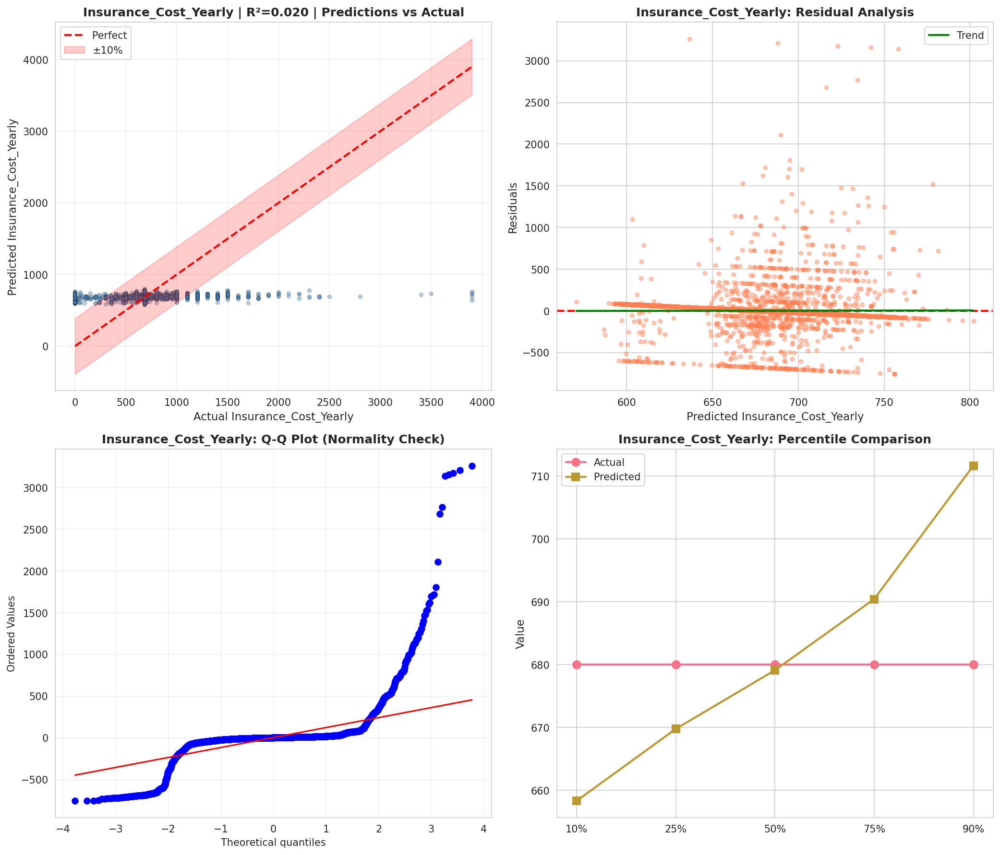
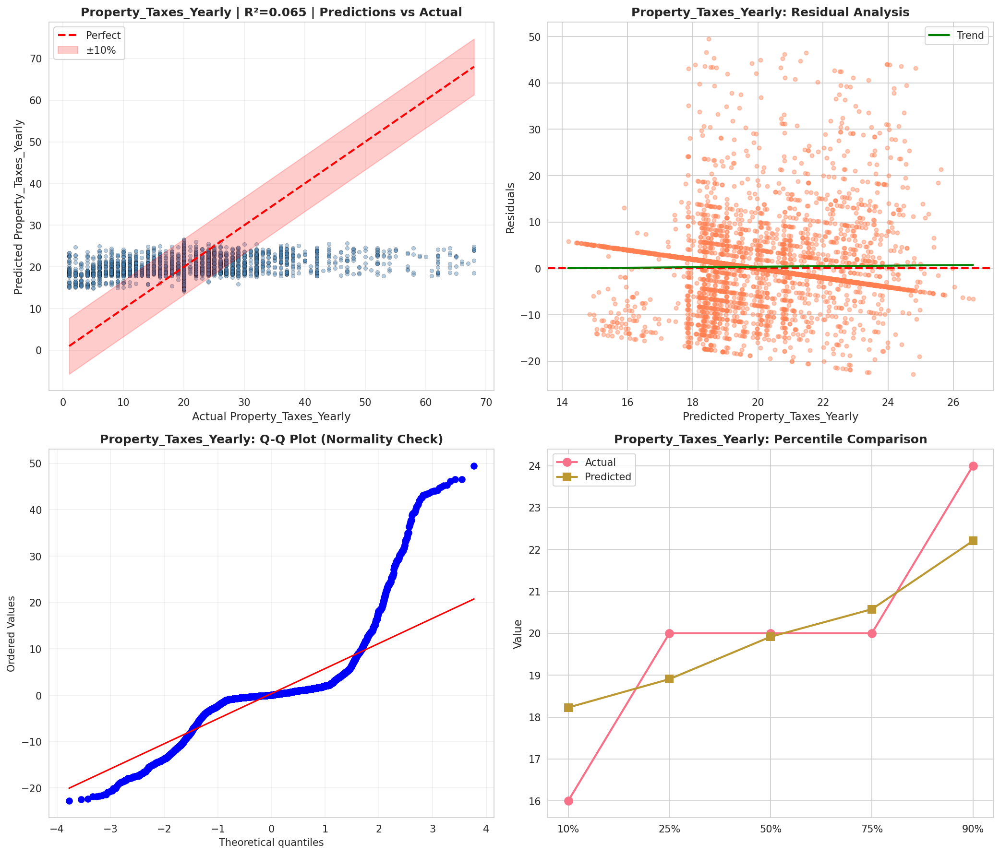
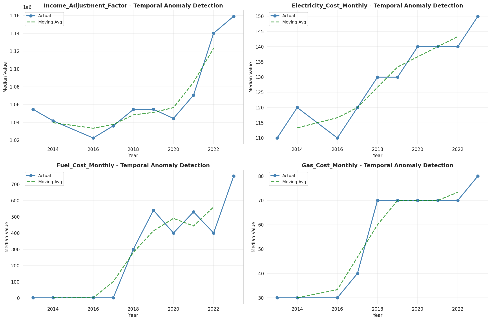
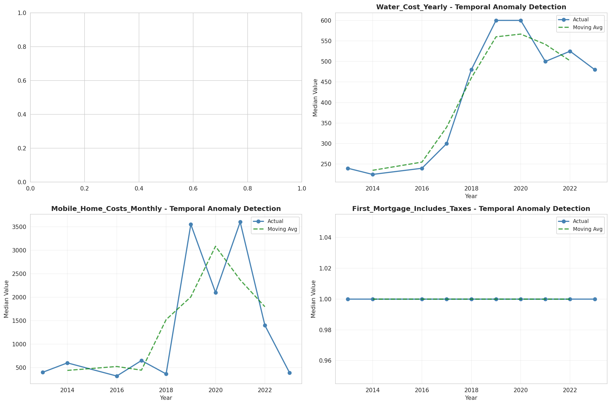
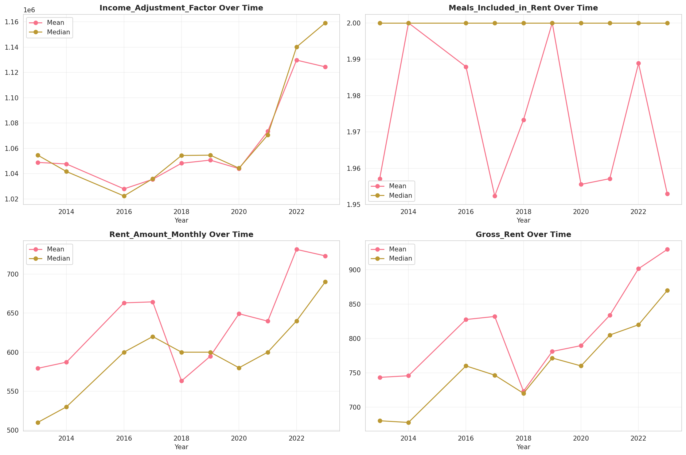
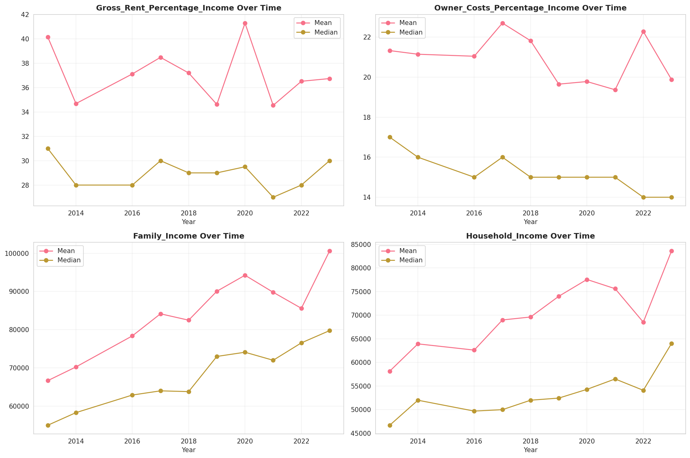
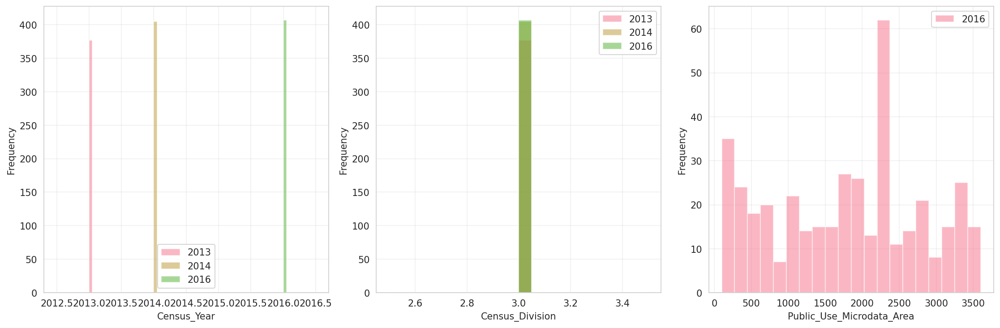
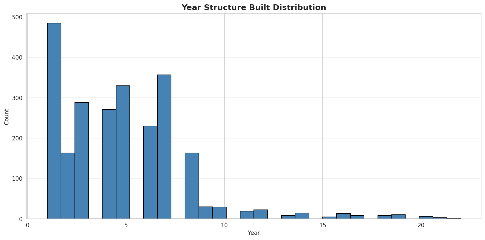
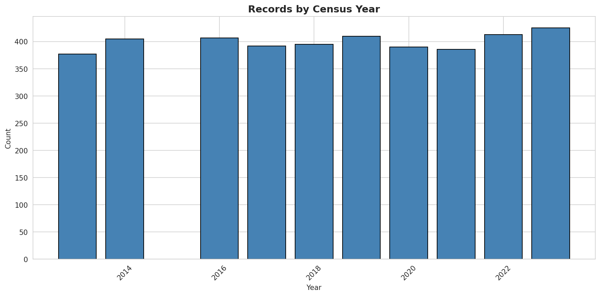
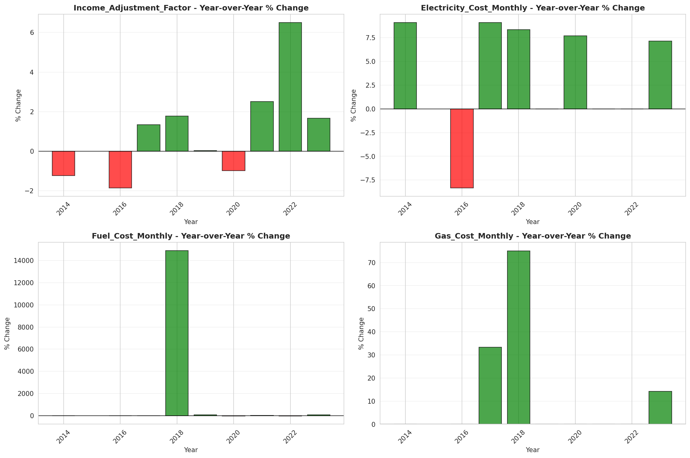
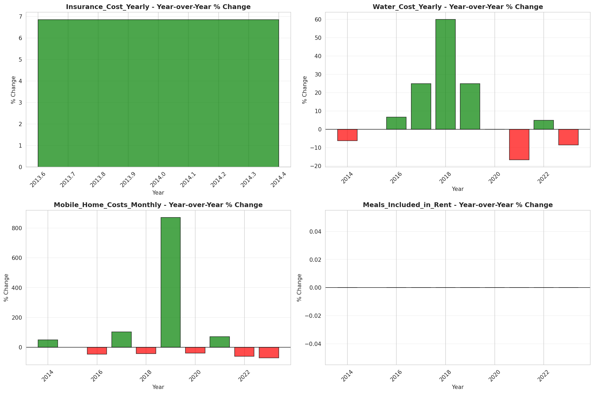
