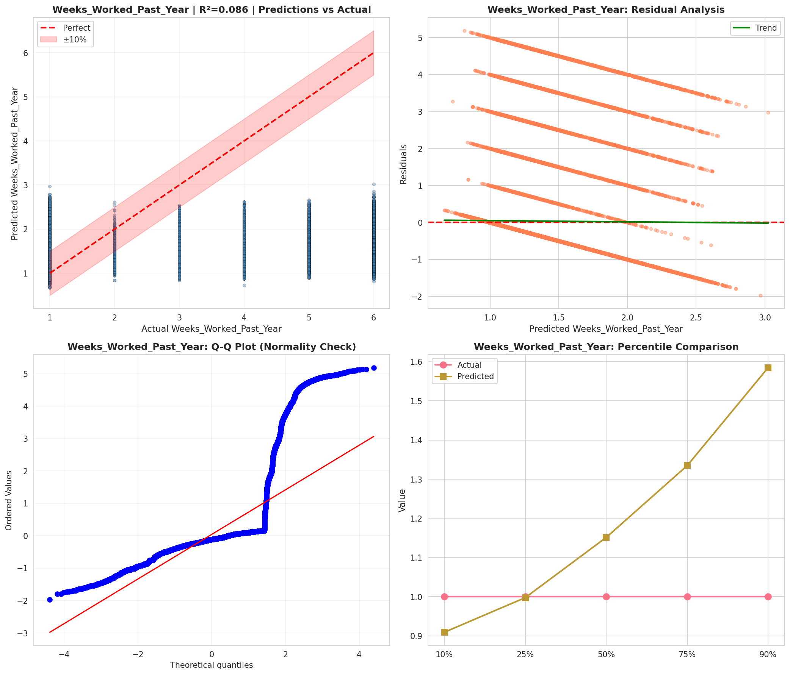
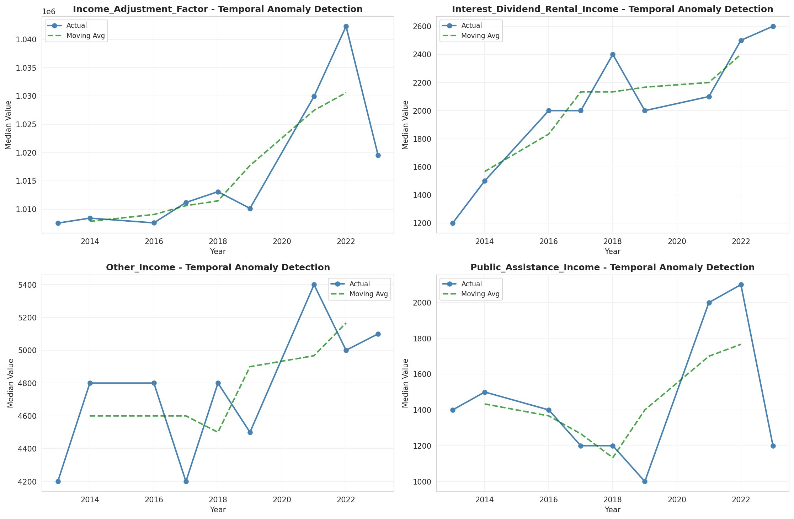
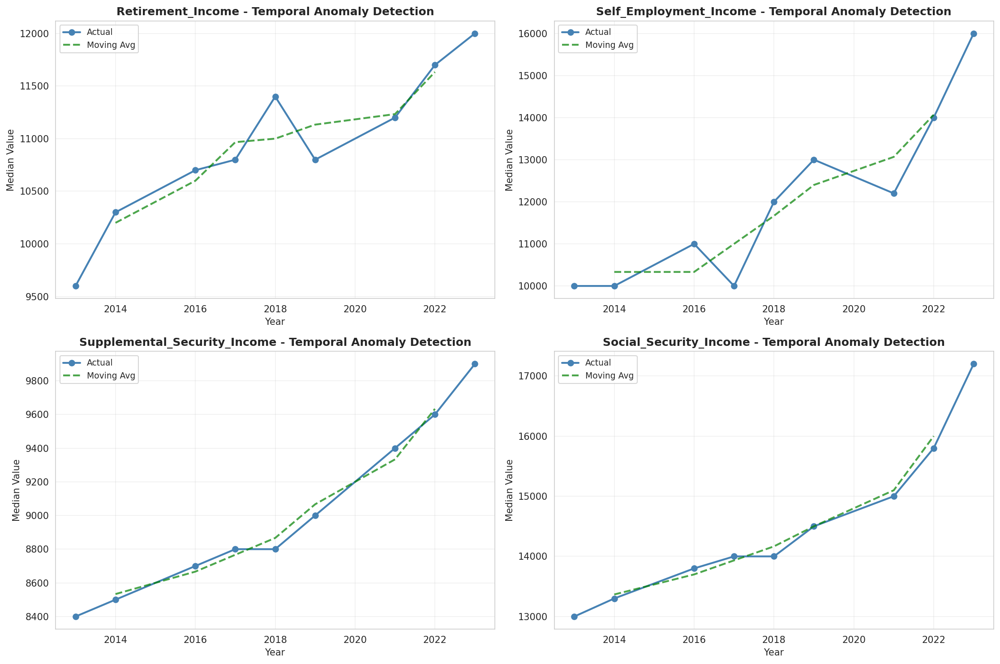
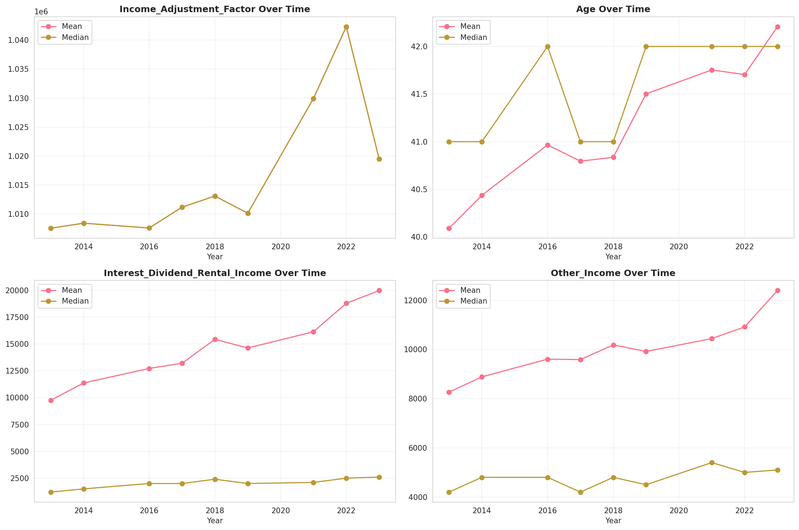
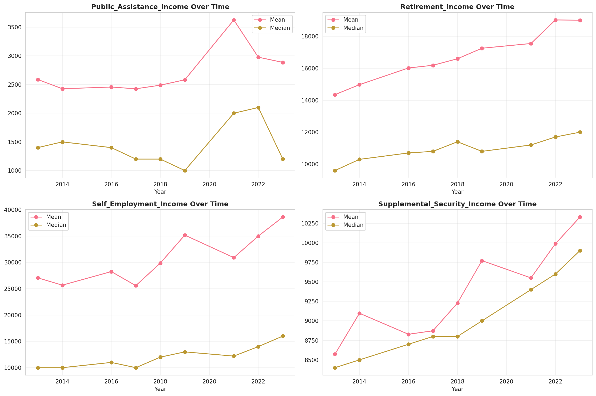
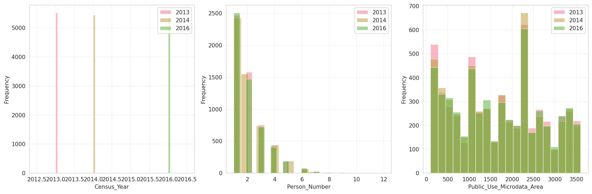
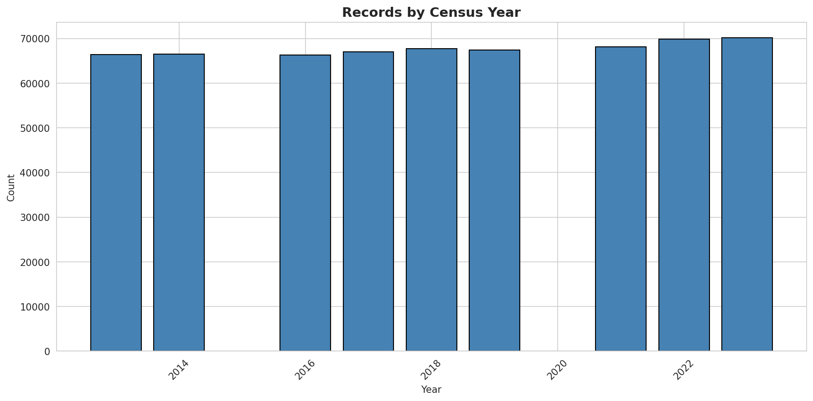
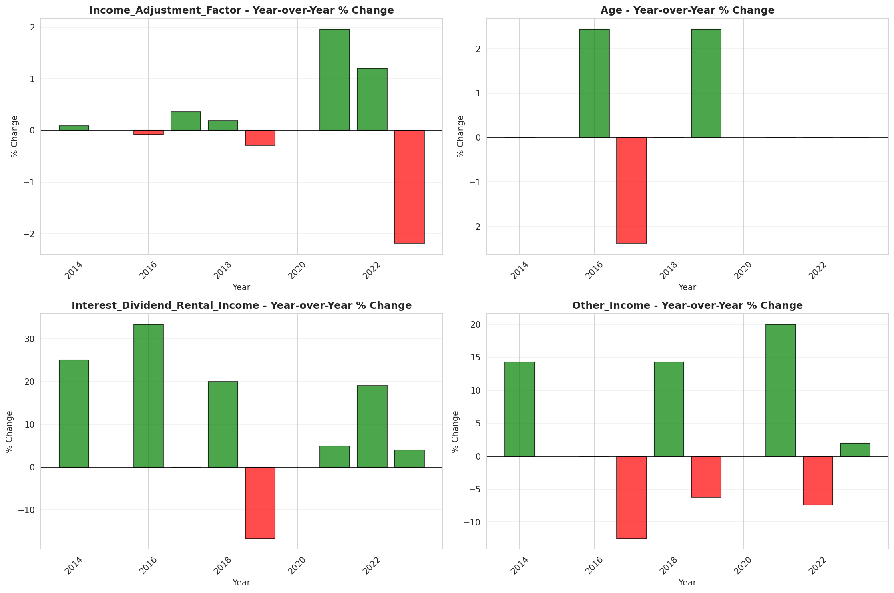

# Temporal Analysis

## Year Distribution

- 2013: 66,363 records

- 2014: 66,555 records

- 2016: 66,262 records

- 2017: 67,004 records

- 2018: 67,680 records

- 2019: 67,445 records

- 2021: 68,122 records

- 2022: 69,843 records

- 2023: 70,138 records

## Temporal Trends

- Census_Year: {np.int64(2013): {'mean': 2013.0, 'median': 2013.0, 'std': 0.0}, np.int64(2014): {'mean': 2014.0, 'median': 2014.0, 'std': 0.0}, np.int64(2016): {'mean': 2016.0, 'median': 2016.0, 'std': 0.0}, np.int64(2017): {'mean': 2017.0, 'median': 2017.0, 'std': 0.0}, np.int64(2018): {'mean': 2018.0, 'median': 2018.0, 'std': 0.0}, np.int64(2019): {'mean': 2019.0, 'median': 2019.0, 'std': 0.0}, np.int64(2021): {'mean': 2021.0, 'median': 2021.0, 'std': 0.0}, np.int64(2022): {'mean': 2022.0, 'median': 2022.0, 'std': 0.0}, np.int64(2023): {'mean': 2023.0, 'median': 2023.0, 'std': 0.0}}

- Person_Number: {np.int64(2013): {'mean': 2.046908668987237, 'median': 2.0, 'std': 1.289906365880581}, np.int64(2014): {'mean': 2.0442040417699645, 'median': 2.0, 'std': 1.2981128955981922}, np.int64(2016): {'mean': 2.0328997011862002, 'median': 2.0, 'std': 1.2904406796965395}, np.int64(2017): {'mean': 2.041430362366426, 'median': 2.0, 'std': 1.3210226364994926}, np.int64(2018): {'mean': 2.037972813238771, 'median': 2.0, 'std': 1.2905827954989741}, np.int64(2019): {'mean': 2.027073912076507, 'median': 2.0, 'std': 1.3061001793949643}, np.int64(2021): {'mean': 2.030004991045477, 'median': 2.0, 'std': 1.298792196827212}, np.int64(2022): {'mean': 2.037927924058245, 'median': 2.0, 'std': 1.31393250027968}, np.int64(2023): {'mean': 2.0259631013145514, 'median': 2.0, 'std': 1.2937895505097075}}

- Public_Use_Microdata_Area: {np.int64(2013): {'mean': 1711.9709024607084, 'median': 1801.0, 'std': 1030.0348162781358}, np.int64(2014): {'mean': 1719.7280895499962, 'median': 1801.0, 'std': 1028.1021644544314}, np.int64(2016): {'mean': 1721.1228154900245, 'median': 1801.0, 'std': 1030.6276854154385}, np.int64(2017): {'mean': 1713.1691988537998, 'median': 1801.0, 'std': 1025.3291871027943}, np.int64(2018): {'mean': 1712.0385786052009, 'median': 1801.0, 'std': 1029.9251891782608}, np.int64(2019): {'mean': 1712.44443620728, 'median': 1801.0, 'std': 1030.2139481259433}, np.int64(2021): {'mean': 1708.1160418073457, 'median': 1700.0, 'std': 1030.909067205787}, np.int64(2022): {'mean': 1777.9162263934825, 'median': 1801.0, 'std': 1069.2599012748615}, np.int64(2023): {'mean': 1774.4743648236333, 'median': 1801.0, 'std': 1070.1116534278633}}

- State_Code: {np.int64(2013): {'mean': 18.0, 'median': 18.0, 'std': 0.0}, np.int64(2014): {'mean': 18.0, 'median': 18.0, 'std': 0.0}, np.int64(2016): {'mean': 18.0, 'median': 18.0, 'std': 0.0}, np.int64(2017): {'mean': 18.0, 'median': 18.0, 'std': 0.0}, np.int64(2018): {'mean': 18.0, 'median': 18.0, 'std': 0.0}, np.int64(2019): {'mean': 18.0, 'median': 18.0, 'std': 0.0}, np.int64(2021): {'mean': 18.0, 'median': 18.0, 'std': 0.0}, np.int64(2022): {'mean': 18.0, 'median': 18.0, 'std': 0.0}, np.int64(2023): {'mean': None, 'median': None, 'std': None}}

- Income_Adjustment_Factor: {np.int64(2013): {'mean': 1007549.0, 'median': 1007549.0, 'std': 0.0}, np.int64(2014): {'mean': 1008425.0, 'median': 1008425.0, 'std': 0.0}, np.int64(2016): {'mean': 1007588.0, 'median': 1007588.0, 'std': 0.0}, np.int64(2017): {'mean': 1011189.0, 'median': 1011189.0, 'std': 0.0}, np.int64(2018): {'mean': 1013097.0, 'median': 1013097.0, 'std': 0.0}, np.int64(2019): {'mean': 1010145.0, 'median': 1010145.0, 'std': 0.0}, np.int64(2021): {'mean': 1029928.0, 'median': 1029928.0, 'std': 0.0}, np.int64(2022): {'mean': 1042311.0, 'median': 1042311.0, 'std': 0.0}, np.int64(2023): {'mean': 1019518.0, 'median': 1019518.0, 'std': 0.0}}

- Person_Weight: {np.int64(2013): {'mean': 99.01454123532692, 'median': 79.0, 'std': 79.54945583905368}, np.int64(2014): {'mean': 99.11884907219593, 'median': 79.0, 'std': 80.4895365512988}, np.int64(2016): {'mean': 100.10342277625185, 'median': 78.0, 'std': 83.41053530600884}, np.int64(2017): {'mean': 99.49880604143036, 'median': 78.0, 'std': 83.30610298046896}, np.int64(2018): {'mean': 98.87526595744681, 'median': 79.0, 'std': 82.20680285764897}, np.int64(2019): {'mean': 99.81791089035511, 'median': 77.0, 'std': 91.55738059003426}, np.int64(2021): {'mean': 99.9087666245853, 'median': 77.0, 'std': 88.37936806311029}, np.int64(2022): {'mean': 97.83424251535587, 'median': 76.0, 'std': 87.54493313606038}, np.int64(2023): {'mean': 97.83853260714591, 'median': 75.0, 'std': 88.76889158083999}}

- Age: {np.int64(2013): {'mean': 40.090351551316246, 'median': 41.0, 'std': 23.557447239799952}, np.int64(2014): {'mean': 40.43646608068515, 'median': 41.0, 'std': 23.656588791262877}, np.int64(2016): {'mean': 40.96614952763273, 'median': 42.0, 'std': 23.816201160118972}, np.int64(2017): {'mean': 40.79504208703958, 'median': 41.0, 'std': 23.81947598038627}, np.int64(2018): {'mean': 40.83590425531915, 'median': 41.0, 'std': 23.857752562712893}, np.int64(2019): {'mean': 41.5024983319742, 'median': 42.0, 'std': 23.96780320040012}, np.int64(2021): {'mean': 41.75345703297026, 'median': 42.0, 'std': 24.121760170724123}, np.int64(2022): {'mean': 41.704837993786064, 'median': 42.0, 'std': 24.087108604808943}, np.int64(2023): {'mean': 42.207861644187176, 'median': 42.0, 'std': 24.142868301244135}}

- Citizenship_Status: {np.int64(2013): {'mean': 1.1414040956557117, 'median': 1.0, 'std': 0.6940731228551497}, np.int64(2014): {'mean': 1.1377056569754338, 'median': 1.0, 'std': 0.6819676677365518}, np.int64(2016): {'mean': 1.1556699163925024, 'median': 1.0, 'std': 0.7243630184740814}, np.int64(2017): {'mean': 1.154348994089905, 'median': 1.0, 'std': 0.7206357553385365}, np.int64(2018): {'mean': 1.150147754137116, 'median': 1.0, 'std': 0.7083667107890753}, np.int64(2019): {'mean': 1.1475720957817481, 'median': 1.0, 'std': 0.7010863545582098}, np.int64(2021): {'mean': 1.159184991632659, 'median': 1.0, 'std': 0.7269381479388228}, np.int64(2022): {'mean': 1.1793021491058517, 'median': 1.0, 'std': 0.7680849282557587}, np.int64(2023): {'mean': 1.1783341412643646, 'median': 1.0, 'std': 0.7670424838252987}}

- Class_of_Worker: {np.int64(2013): {'mean': 1.9115138864139705, 'median': 1.0, 'std': 1.7619696353240766}, np.int64(2014): {'mean': 1.8805384751638452, 'median': 1.0, 'std': 1.7330660532032947}, np.int64(2016): {'mean': 1.9122158659444135, 'median': 1.0, 'std': 1.753767634093241}, np.int64(2017): {'mean': 1.8873020255515676, 'median': 1.0, 'std': 1.7400750261857039}, np.int64(2018): {'mean': 1.8665542216489732, 'median': 1.0, 'std': 1.7108771508752103}, np.int64(2019): {'mean': 1.9030264227141767, 'median': 1.0, 'std': 1.7187210707691392}, np.int64(2021): {'mean': 1.92912062102895, 'median': 1.0, 'std': 1.734117780992603}, np.int64(2022): {'mean': 1.9139306206995073, 'median': 1.0, 'std': 1.7060666206625068}, np.int64(2023): {'mean': 1.9492909732250656, 'median': 1.0, 'std': 1.7499552298429513}}

- English_Speaking_Ability: {np.int64(2013): {'mean': 1.5767644918748485, 'median': 1.0, 'std': 0.8437419884172783}, np.int64(2014): {'mean': 1.5726027397260274, 'median': 1.0, 'std': 0.8385615221021283}, np.int64(2016): {'mean': 1.5524601213210514, 'median': 1.0, 'std': 0.8293087092314214}, np.int64(2017): {'mean': 1.5259476534296028, 'median': 1.0, 'std': 0.800165862383959}, np.int64(2018): {'mean': 1.4907823741007193, 'median': 1.0, 'std': 0.7704373190241464}, np.int64(2019): {'mean': 1.504186046511628, 'median': 1.0, 'std': 0.7718176000889814}, np.int64(2021): {'mean': 1.4995810640971932, 'median': 1.0, 'std': 0.7908839453863052}, np.int64(2022): {'mean': 1.5127094709094333, 'median': 1.0, 'std': 0.8084874756303595}, np.int64(2023): {'mean': 1.5672143390589992, 'median': 1.0, 'std': 0.8353536113592693}}

- Fertility_Status: {np.int64(2013): {'mean': 1.9486098837604513, 'median': 2.0, 'std': 0.22079965173935195}, np.int64(2014): {'mean': 1.9470600258908497, 'median': 2.0, 'std': 0.2239213020929804}, np.int64(2016): {'mean': 1.944978783592645, 'median': 2.0, 'std': 0.22802973378579913}, np.int64(2017): {'mean': 1.9519425263304735, 'median': 2.0, 'std': 0.21389517062798613}, np.int64(2018): {'mean': 1.9452357903471167, 'median': 2.0, 'std': 0.22752729644646086}, np.int64(2019): {'mean': 1.948665297741273, 'median': 2.0, 'std': 0.2206873333108871}, np.int64(2021): {'mean': 1.9448295176083457, 'median': 2.0, 'std': 0.22832071759325195}, np.int64(2022): {'mean': 1.9415129025668958, 'median': 2.0, 'std': 0.2346702078421038}, np.int64(2023): {'mean': 1.9431357736419201, 'median': 2.0, 'std': 0.2315909530724839}}

- Marital_Status: {np.int64(2013): {'mean': 2.91859921944457, 'median': 3.0, 'std': 1.8388247682927186}, np.int64(2014): {'mean': 2.9173165051461196, 'median': 3.0, 'std': 1.835784673917643}, np.int64(2016): {'mean': 2.9087259666173675, 'median': 3.0, 'std': 1.8370971788866761}, np.int64(2017): {'mean': 2.91306489164826, 'median': 3.0, 'std': 1.841399657203353}, np.int64(2018): {'mean': 2.9317966903073285, 'median': 3.0, 'std': 1.8403418599956236}, np.int64(2019): {'mean': 2.92908295648306, 'median': 3.0, 'std': 1.8353178500014797}, np.int64(2021): {'mean': 2.9142861337013004, 'median': 3.0, 'std': 1.8378928027139871}, np.int64(2022): {'mean': 2.9012785819624014, 'median': 3.0, 'std': 1.8423300319129012}, np.int64(2023): {'mean': 2.8979012803330577, 'median': 3.0, 'std': 1.8397986899014371}}

- Mobility_Status: {np.int64(2013): {'mean': 1.2724352142269861, 'median': 1.0, 'std': 0.683386879706979}, np.int64(2014): {'mean': 1.2726900069838765, 'median': 1.0, 'std': 0.6839320673267699}, np.int64(2016): {'mean': 1.2765545128557259, 'median': 1.0, 'std': 0.6876184162842073}, np.int64(2017): {'mean': 1.2729478427294785, 'median': 1.0, 'std': 0.6842347813485183}, np.int64(2018): {'mean': 1.2722116073561023, 'median': 1.0, 'std': 0.6832117974694474}, np.int64(2019): {'mean': 1.259324140202728, 'median': 1.0, 'std': 0.6692103667741819}, np.int64(2021): {'mean': 1.2441027769952704, 'median': 1.0, 'std': 0.6524947264770707}, np.int64(2022): {'mean': 1.2371260776485564, 'median': 1.0, 'std': 0.6436031805506762}, np.int64(2023): {'mean': 1.2189822014860896, 'median': 1.0, 'std': 0.6212651048591848}}

- Military_Service: {np.int64(2013): {'mean': 3.802839656352163, 'median': 4.0, 'std': 0.5831948600623957}, np.int64(2014): {'mean': 3.8040509957754978, 'median': 4.0, 'std': 0.5803113077720091}, np.int64(2016): {'mean': 3.816898218061009, 'median': 4.0, 'std': 0.5631086224885377}, np.int64(2017): {'mean': 3.8195086353685235, 'median': 4.0, 'std': 0.5597588505320275}, np.int64(2018): {'mean': 3.8237834031355398, 'median': 4.0, 'std': 0.5541649245117934}, np.int64(2019): {'mean': 3.8240826111008666, 'median': 4.0, 'std': 0.5538668466655624}, np.int64(2021): {'mean': 3.8438058748403576, 'median': 4.0, 'std': 0.5249842128091193}, np.int64(2022): {'mean': 3.848245083745244, 'median': 4.0, 'std': 0.517192062814993}, np.int64(2023): {'mean': 3.8471404726346305, 'median': 4.0, 'std': 0.5200435272802061}}

- Travel_Time_To_Work_Minutes: {np.int64(2013): {'mean': 23.354422389001893, 'median': 20.0, 'std': 20.579332667140136}, np.int64(2014): {'mean': 23.56944347704952, 'median': 20.0, 'std': 21.081360990312582}, np.int64(2016): {'mean': 23.833259058654143, 'median': 20.0, 'std': 21.427862071465842}, np.int64(2017): {'mean': 23.931012315604278, 'median': 20.0, 'std': 21.237269881317008}, np.int64(2018): {'mean': 24.247854399732844, 'median': 20.0, 'std': 21.48128594910987}, np.int64(2019): {'mean': 24.515976916735365, 'median': 20.0, 'std': 22.178106431048146}, np.int64(2021): {'mean': 24.047465181058495, 'median': 20.0, 'std': 21.484336386770043}, np.int64(2022): {'mean': 24.31083809588994, 'median': 20.0, 'std': 21.67925422084529}, np.int64(2023): {'mean': 24.464609924237255, 'median': 20.0, 'std': 21.95181888033258}}

- Vehicle_Occupancy: {np.int64(2013): {'mean': 1.1444341544730505, 'median': 1.0, 'std': 0.5671168460441911}, np.int64(2014): {'mean': 1.142559033498078, 'median': 1.0, 'std': 0.5778639505879587}, np.int64(2016): {'mean': 1.1374458874458875, 'median': 1.0, 'std': 0.5583759094862887}, np.int64(2017): {'mean': 1.148578949240565, 'median': 1.0, 'std': 0.5722670112748495}, np.int64(2018): {'mean': 1.1447539428852436, 'median': 1.0, 'std': 0.5634676119012723}, np.int64(2019): {'mean': 1.15779612795781, 'median': 1.0, 'std': 0.6226679042955903}, np.int64(2021): {'mean': 1.1336948464869505, 'median': 1.0, 'std': 0.5475525702123178}, np.int64(2022): {'mean': 1.1675251233656305, 'median': 1.0, 'std': 0.6181418088466369}, np.int64(2023): {'mean': 1.1660047941039677, 'median': 1.0, 'std': 0.5985593245035796}}

- Transportation_To_Work: {np.int64(2013): {'mean': 1.7066264243081932, 'median': 1.0, 'std': 2.4806165181925346}, np.int64(2014): {'mean': 1.7058467538580506, 'median': 1.0, 'std': 2.491013053126938}, np.int64(2016): {'mean': 1.7435601438042152, 'median': 1.0, 'std': 2.5480874250368455}, np.int64(2017): {'mean': 1.761174636174636, 'median': 1.0, 'std': 2.586640866917267}, np.int64(2018): {'mean': 1.7502729082386181, 'median': 1.0, 'std': 2.565248214187912}, np.int64(2019): {'mean': None, 'median': None, 'std': None}, np.int64(2021): {'mean': None, 'median': None, 'std': None}, np.int64(2022): {'mean': None, 'median': None, 'std': None}, np.int64(2023): {'mean': None, 'median': None, 'std': None}}

- Language_Other_Than_English: {np.int64(2013): {'mean': 1.934286442893118, 'median': 2.0, 'std': 0.24778269526041743}, np.int64(2014): {'mean': 1.9362738873722303, 'median': 2.0, 'std': 0.24426633459613245}, np.int64(2016): {'mean': 1.9288659464297129, 'median': 2.0, 'std': 0.25705068756443417}, np.int64(2017): {'mean': 1.9301409161123546, 'median': 2.0, 'std': 0.2549113895567388}, np.int64(2018): {'mean': 1.9304956559784987, 'median': 2.0, 'std': 0.2543118180224419}, np.int64(2019): {'mean': 1.932660987221248, 'median': 2.0, 'std': 0.25061016277264675}, np.int64(2021): {'mean': 1.926144801980198, 'median': 2.0, 'std': 0.26153712153219666}, np.int64(2022): {'mean': 1.9197249093107618, 'median': 2.0, 'std': 0.27172065888912234}, np.int64(2023): {'mean': 1.919630263197383, 'median': 2.0, 'std': 0.2718667896094072}}

- Grandparents_Living_With_Grandchildren: {np.int64(2013): {'mean': 1.968126532378251, 'median': 2.0, 'std': 0.17566528238017046}, np.int64(2014): {'mean': 1.9692912447885647, 'median': 2.0, 'std': 0.17252952417367357}, np.int64(2016): {'mean': 1.9684663388804842, 'median': 2.0, 'std': 0.17475700630798877}, np.int64(2017): {'mean': 1.972152970506609, 'median': 2.0, 'std': 0.16453634603111458}, np.int64(2018): {'mean': 1.96970970830706, 'median': 2.0, 'std': 0.17138691873574793}, np.int64(2019): {'mean': 1.9699826689774698, 'median': 2.0, 'std': 0.1706369353231765}, np.int64(2021): {'mean': 1.9725603513003118, 'median': 2.0, 'std': 0.16336254645777507}, np.int64(2022): {'mean': 1.9728022343396727, 'median': 2.0, 'std': 0.16266110071953707}, np.int64(2023): {'mean': 1.974614311862634, 'median': 2.0, 'std': 0.15729524502041786}}

- Months_Responsible_For_Grandchildren: {np.int64(2013): {'mean': 3.6094674556213016, 'median': 4.0, 'std': 1.3525829382574732}, np.int64(2014): {'mean': 3.676328502415459, 'median': 4.0, 'std': 1.4038782854290481}, np.int64(2016): {'mean': 3.69375, 'median': 4.0, 'std': 1.3749235289590238}, np.int64(2017): {'mean': 3.742857142857143, 'median': 4.0, 'std': 1.2932820976904034}, np.int64(2018): {'mean': 3.763333333333333, 'median': 4.0, 'std': 1.352912725798774}, np.int64(2019): {'mean': 3.816013628620102, 'median': 4.0, 'std': 1.3155213295171717}, np.int64(2021): {'mean': 3.9763313609467454, 'median': 5.0, 'std': 1.303473602143481}, np.int64(2022): {'mean': 3.8818565400843883, 'median': 4.0, 'std': 1.2902168608749858}, np.int64(2023): {'mean': 3.9297520661157024, 'median': 5.0, 'std': 1.2866664281808744}}

- Grandparents_Responsible_For_Grandchildren: {np.int64(2013): {'mean': 1.4901960784313726, 'median': 1.0, 'std': 0.5000924812733334}, np.int64(2014): {'mean': 1.5182311869666407, 'median': 2.0, 'std': 0.49986144594740506}, np.int64(2016): {'mean': 1.52023988005997, 'median': 2.0, 'std': 0.4997775373358549}, np.int64(2017): {'mean': 1.527027027027027, 'median': 2.0, 'std': 0.4994799790584699}, np.int64(2018): {'mean': 1.5373939861218195, 'median': 2.0, 'std': 0.4987920529573773}, np.int64(2019): {'mean': 1.548113933795227, 'median': 2.0, 'std': 0.49787133870695344}, np.int64(2021): {'mean': 1.5796019900497513, 'median': 2.0, 'std': 0.49382763548914504}, np.int64(2022): {'mean': 1.6136919315403424, 'median': 2.0, 'std': 0.4871011360712747}, np.int64(2023): {'mean': 1.584549356223176, 'median': 2.0, 'std': 0.49301119824105416}}

- Interest_Dividend_Rental_Income: {np.int64(2013): {'mean': 9753.363304093567, 'median': 1200.0, 'std': 28858.50096822071}, np.int64(2014): {'mean': 11361.707771549765, 'median': 1500.0, 'std': 30427.630021585614}, np.int64(2016): {'mean': 12724.846234781302, 'median': 2000.0, 'std': 36343.56728432618}, np.int64(2017): {'mean': 13203.375282349145, 'median': 2000.0, 'std': 34916.26712329905}, np.int64(2018): {'mean': 15435.758022265882, 'median': 2400.0, 'std': 40959.12720213925}, np.int64(2019): {'mean': 14623.927419354839, 'median': 2000.0, 'std': 39842.82995958177}, np.int64(2021): {'mean': 16137.961639058412, 'median': 2100.0, 'std': 42843.98276582311}, np.int64(2022): {'mean': 18791.415694591728, 'median': 2500.0, 'std': 48127.3722804741}, np.int64(2023): {'mean': 19980.069633152172, 'median': 2600.0, 'std': 56824.4661975177}}

- Military_Service_Period_1: {np.int64(2013): {'mean': 0.08606470712624234, 'median': 0.0, 'std': 0.28048923304842804}, np.int64(2014): {'mean': 0.10492913052676116, 'median': 0.0, 'std': 0.30649450390915434}, np.int64(2016): {'mean': 0.10702113156100886, 'median': 0.0, 'std': 0.3091752397452578}, np.int64(2017): {'mean': 0.13879981676591846, 'median': 0.0, 'std': 0.34577711373117803}, np.int64(2018): {'mean': 0.14721516061936676, 'median': 0.0, 'std': 0.35436122480235727}, np.int64(2019): {'mean': 0.16847951862994678, 'median': 0.0, 'std': 0.37433487633172424}, np.int64(2021): {'mean': 0.17222653219550038, 'median': 0.0, 'std': 0.37762604558564866}, np.int64(2022): {'mean': 0.1876304801670146, 'median': 0.0, 'std': 0.3904677584833515}, np.int64(2023): {'mean': 0.18547770700636942, 'median': 0.0, 'std': 0.38873413491767694}}

- Military_Service_Period_2: {np.int64(2013): {'mean': 0.14442799746246562, 'median': 0.0, 'std': 0.3515603596706823}, np.int64(2014): {'mean': 0.13771948381637403, 'median': 0.0, 'std': 0.3446417780091227}, np.int64(2016): {'mean': 0.15246534878436718, 'median': 0.0, 'std': 0.3595122171921056}, np.int64(2017): {'mean': 0.15964269354099864, 'median': 0.0, 'std': 0.3663163095275317}, np.int64(2018): {'mean': 0.16200600878206609, 'median': 0.0, 'std': 0.3684989067205268}, np.int64(2019): {'mean': 0.17218236519324231, 'median': 0.0, 'std': 0.3775825640322446}, np.int64(2021): {'mean': 0.17274372898888027, 'median': 0.0, 'std': 0.37807445988267807}, np.int64(2022): {'mean': 0.18789144050104384, 'median': 0.0, 'std': 0.3906764351243015}, np.int64(2023): {'mean': 0.19796178343949045, 'median': 0.0, 'std': 0.3985139617930784}}

- Military_Service_Period_5: {np.int64(2013): {'mean': 0.3668851765700994, 'median': 0.0, 'std': 0.4820057805386667}, np.int64(2014): {'mean': 0.3818489528242014, 'median': 0.0, 'std': 0.4858912173586669}, np.int64(2016): {'mean': 0.3892297205180641, 'median': 0.0, 'std': 0.48763098211300127}, np.int64(2017): {'mean': 0.38341731562070547, 'median': 0.0, 'std': 0.4862742412679493}, np.int64(2018): {'mean': 0.38987751328865267, 'median': 0.0, 'std': 0.48777866369197753}, np.int64(2019): {'mean': 0.388798889146031, 'median': 0.0, 'std': 0.4875339176792259}, np.int64(2021): {'mean': 0.38634600465477115, 'median': 0.0, 'std': 0.48697442892278126}, np.int64(2022): {'mean': 0.38335073068893527, 'median': 0.0, 'std': 0.48626603135988294}, np.int64(2023): {'mean': 0.3872611464968153, 'median': 0.0, 'std': 0.4871862296452696}}

- Military_Service_Period_8: {np.int64(2013): {'mean': 0.11080566716007613, 'median': 0.0, 'std': 0.3139245299310188}, np.int64(2014): {'mean': 0.11339115718214512, 'median': 0.0, 'std': 0.317103886929625}, np.int64(2016): {'mean': 0.09475119291070211, 'median': 0.0, 'std': 0.29290424767871764}, np.int64(2017): {'mean': 0.07970682546953733, 'median': 0.0, 'std': 0.270869807107453}, np.int64(2018): {'mean': 0.07880748786688237, 'median': 0.0, 'std': 0.26946919906700706}, np.int64(2019): {'mean': 0.06803980560055543, 'median': 0.0, 'std': 0.25184334175339557}, np.int64(2021): {'mean': 0.058443237651926556, 'median': 0.0, 'std': 0.23461001547518973}, np.int64(2022): {'mean': 0.04462421711899791, 'median': 0.0, 'std': 0.20650429720579982}, np.int64(2023): {'mean': 0.03668789808917197, 'median': 0.0, 'std': 0.18801835767396655}}

- Military_Service_Period_9: {np.int64(2013): {'mean': 0.0148022837809262, 'median': 0.0, 'std': 0.12077359232845675}, np.int64(2014): {'mean': 0.014808546646921938, 'median': 0.0, 'std': 0.12079876080700726}, np.int64(2016): {'mean': 0.012042717564189957, 'median': 0.0, 'std': 0.10908892949530381}, np.int64(2017): {'mean': 0.013513513513513514, 'median': 0.0, 'std': 0.11547273491699347}, np.int64(2018): {'mean': 0.009475387104229259, 'median': 0.0, 'std': 0.09689052442679875}, np.int64(2019): {'mean': 0.009488544318444805, 'median': 0.0, 'std': 0.0969571422155551}, np.int64(2021): {'mean': None, 'median': None, 'std': None}, np.int64(2022): {'mean': None, 'median': None, 'std': None}, np.int64(2023): {'mean': None, 'median': None, 'std': None}}

- Military_Service_Period_10: {np.int64(2013): {'mean': 0.072319729329668, 'median': 0.0, 'std': 0.25904396523394047}, np.int64(2014): {'mean': 0.05521472392638037, 'median': 0.0, 'std': 0.22842306426366743}, np.int64(2016): {'mean': 0.04135423767325608, 'median': 0.0, 'std': 0.19913079800579425}, np.int64(2017): {'mean': 0.04054054054054054, 'median': 0.0, 'std': 0.19724582688995934}, np.int64(2018): {'mean': 0.026346198289808182, 'median': 0.0, 'std': 0.16018116577897107}, np.int64(2019): {'mean': 0.03077991205739412, 'median': 0.0, 'std': 0.17274088903478912}, np.int64(2021): {'mean': 0.012671321437807085, 'median': 0.0, 'std': 0.11186596957926395}, np.int64(2022): {'mean': 0.007828810020876827, 'median': 0.0, 'std': 0.08814503558449589}, np.int64(2023): {'mean': 0.0071337579617834395, 'median': 0.0, 'std': 0.08417049644157215}}

- Military_Service_Period_11: {np.int64(2013): {'mean': 0.0006343835906111228, 'median': 0.0, 'std': 0.02518164487952373}, np.int64(2014): {'mean': 0.001903955997461392, 'median': 0.0, 'std': 0.04359739728888132}, np.int64(2016): {'mean': 0.00022722108611679165, 'median': 0.0, 'std': 0.015073854388204487}, np.int64(2017): {'mean': 0.0006871278057718735, 'median': 0.0, 'std': 0.026207116792585652}, np.int64(2018): {'mean': 0.00023110700254217703, 'median': 0.0, 'std': 0.01520220387122134}, np.int64(2019): {'mean': 0.00023142791020597085, 'median': 0.0, 'std': 0.015212754852621885}, np.int64(2021): {'mean': None, 'median': None, 'std': None}, np.int64(2022): {'mean': None, 'median': None, 'std': None}, np.int64(2023): {'mean': None, 'median': None, 'std': None}}

- Temporary_Absence_From_Work: {np.int64(2013): {'mean': 2.582020579981291, 'median': 3.0, 'std': 0.5165400577522895}, np.int64(2014): {'mean': 2.58259110814221, 'median': 3.0, 'std': 0.5190224048121793}, np.int64(2016): {'mean': 2.593411083048581, 'median': 3.0, 'std': 0.5170257092364656}, np.int64(2017): {'mean': 2.598530603226044, 'median': 3.0, 'std': 0.5141445420564691}, np.int64(2018): {'mean': 2.603890652943538, 'median': 3.0, 'std': 0.5146546769596668}, np.int64(2019): {'mean': 2.6146808974079723, 'median': 3.0, 'std': 0.5088468942878271}, np.int64(2021): {'mean': 2.5902659163235584, 'median': 3.0, 'std': 0.5169563591732727}, np.int64(2022): {'mean': 2.601566734861599, 'median': 3.0, 'std': 0.5141778719872577}, np.int64(2023): {'mean': 2.600311688311688, 'median': 3.0, 'std': 0.5128758983633719}}

- Available_For_Work: {np.int64(2013): {'mean': 4.659120673526661, 'median': 5.0, 'std': 1.0358788220120958}, np.int64(2014): {'mean': 4.676297038521487, 'median': 5.0, 'std': 1.0100532114091103}, np.int64(2016): {'mean': 4.727250779973258, 'median': 5.0, 'std': 0.9220872022429684}, np.int64(2017): {'mean': 4.738509980113427, 'median': 5.0, 'std': 0.9045602965310875}, np.int64(2018): {'mean': 4.747819263476769, 'median': 5.0, 'std': 0.8847291498502473}, np.int64(2019): {'mean': 4.7454621360633125, 'median': 5.0, 'std': 0.8866492200887783}, np.int64(2021): {'mean': 4.7622934608676895, 'median': 5.0, 'std': 0.8633720119431257}, np.int64(2022): {'mean': 4.795047998741016, 'median': 5.0, 'std': 0.7982542590495246}, np.int64(2023): {'mean': 4.78978354978355, 'median': 5.0, 'std': 0.8102442450429761}}

- On_Layoff_From_Work: {np.int64(2013): {'mean': 2.5600935453695044, 'median': 3.0, 'std': 0.5172017070713792}, np.int64(2014): {'mean': 2.5664291546055074, 'median': 3.0, 'std': 0.5108022700915662}, np.int64(2016): {'mean': 2.580244391620859, 'median': 3.0, 'std': 0.5058989403857023}, np.int64(2017): {'mean': 2.588440008838477, 'median': 3.0, 'std': 0.502048442356832}, np.int64(2018): {'mean': 2.5935253111427423, 'median': 3.0, 'std': 0.5015111711201969}, np.int64(2019): {'mean': 2.6064764394104407, 'median': 3.0, 'std': 0.49773787541216474}, np.int64(2021): {'mean': 2.5763318290512234, 'median': 3.0, 'std': 0.5107123733213905}, np.int64(2022): {'mean': 2.59803458707094, 'median': 3.0, 'std': 0.4967126156329957}, np.int64(2023): {'mean': 2.594008658008658, 'median': 3.0, 'std': 0.49899250858346267}}

- Looking_For_Work: {np.int64(2013): {'mean': 2.5424321796071094, 'median': 3.0, 'std': 0.5885500918563926}, np.int64(2014): {'mean': 2.5522897647146143, 'median': 3.0, 'std': 0.578986775304829}, np.int64(2016): {'mean': 2.5768830782944585, 'median': 3.0, 'std': 0.554656610168701}, np.int64(2017): {'mean': 2.581037784488473, 'median': 3.0, 'std': 0.5543101147929216}, np.int64(2018): {'mean': 2.5884886309719333, 'median': 3.0, 'std': 0.5502707863969363}, np.int64(2019): {'mean': 2.587580773978073, 'median': 3.0, 'std': 0.5476417346111037}, np.int64(2021): {'mean': 2.558226505330912, 'median': 3.0, 'std': 0.5602628712699887}, np.int64(2022): {'mean': 2.5809508821626537, 'median': 3.0, 'std': 0.5439115963385316}, np.int64(2023): {'mean': 2.575930735930736, 'median': 3.0, 'std': 0.5435627091325581}}

- Informed_Of_Recall: {np.int64(2013): {'mean': 2.931318989710009, 'median': 3.0, 'std': 0.27201723672213884}, np.int64(2014): {'mean': 2.933125510279819, 'median': 3.0, 'std': 0.2680109794781991}, np.int64(2016): {'mean': 2.9378992720249593, 'median': 3.0, 'std': 0.25684801362881066}, np.int64(2017): {'mean': 2.941647639390145, 'median': 3.0, 'std': 0.24947996326587005}, np.int64(2018): {'mean': 2.940490528851418, 'median': 3.0, 'std': 0.25175043217240356}, np.int64(2019): {'mean': 2.9326217962680605, 'median': 3.0, 'std': 0.264078019549657}, np.int64(2021): {'mean': 2.9410992646397816, 'median': 3.0, 'std': 0.25210969989906945}, np.int64(2022): {'mean': 2.9491860322789347, 'median': 3.0, 'std': 0.23163218565366725}, np.int64(2023): {'mean': 2.9464242424242424, 'median': 3.0, 'std': 0.2375303316869778}}

- Other_Income: {np.int64(2013): {'mean': 8263.919481221292, 'median': 4200.0, 'std': 11305.415959546974}, np.int64(2014): {'mean': 8886.016028495102, 'median': 4800.0, 'std': 12141.302533205866}, np.int64(2016): {'mean': 9606.977279800809, 'median': 4800.0, 'std': 13466.82214891767}, np.int64(2017): {'mean': 9586.44990665837, 'median': 4200.0, 'std': 13408.863868727205}, np.int64(2018): {'mean': 10185.102673147023, 'median': 4800.0, 'std': 13886.693542087112}, np.int64(2019): {'mean': 9918.24660326087, 'median': 4500.0, 'std': 13461.281714212324}, np.int64(2021): {'mean': 10442.75033095049, 'median': 5400.0, 'std': 13338.745213161652}, np.int64(2022): {'mean': 10916.285172544558, 'median': 5000.0, 'std': 14005.221004377914}, np.int64(2023): {'mean': 12396.555062823356, 'median': 5100.0, 'std': 16298.995049912672}}

- Public_Assistance_Income: {np.int64(2013): {'mean': 2588.2370820668693, 'median': 1400.0, 'std': 3563.6342152946695}, np.int64(2014): {'mean': 2426.7078825347758, 'median': 1500.0, 'std': 2995.896132102969}, np.int64(2016): {'mean': 2456.6610455311975, 'median': 1400.0, 'std': 3292.761355771847}, np.int64(2017): {'mean': 2426.0504201680674, 'median': 1200.0, 'std': 3337.5692935175753}, np.int64(2018): {'mean': 2488.9347826086955, 'median': 1200.0, 'std': 3378.2802273068414}, np.int64(2019): {'mean': 2582.8513238289206, 'median': 1000.0, 'std': 4201.159171463603}, np.int64(2021): {'mean': 3627.0798898071625, 'median': 2000.0, 'std': 4105.902363648666}, np.int64(2022): {'mean': 2977.661795407098, 'median': 2100.0, 'std': 3171.6282070420434}, np.int64(2023): {'mean': 2886.640159045726, 'median': 1200.0, 'std': 3894.5814901992194}}

- Retirement_Income: {np.int64(2013): {'mean': 14348.712037037038, 'median': 9600.0, 'std': 15800.972703615676}, np.int64(2014): {'mean': 14972.308878019861, 'median': 10300.0, 'std': 16845.631207713406}, np.int64(2016): {'mean': 16016.737067122702, 'median': 10700.0, 'std': 19413.959744107415}, np.int64(2017): {'mean': 16185.354169709362, 'median': 10800.0, 'std': 19159.680121240344}, np.int64(2018): {'mean': 16593.0637079456, 'median': 11400.0, 'std': 19748.98761755122}, np.int64(2019): {'mean': 17251.272615762035, 'median': 10800.0, 'std': 21608.669063625443}, np.int64(2021): {'mean': 17547.224088488325, 'median': 11200.0, 'std': 21907.101209405402}, np.int64(2022): {'mean': 19021.980502512564, 'median': 11700.0, 'std': 24731.18532257736}, np.int64(2023): {'mean': 19006.91984103906, 'median': 12000.0, 'std': 24852.95495608356}}

- Self_Employment_Income: {np.int64(2013): {'mean': 27058.941198643046, 'median': 10000.0, 'std': 53204.230742623644}, np.int64(2014): {'mean': 25672.283899887934, 'median': 10000.0, 'std': 47224.19677175839}, np.int64(2016): {'mean': 28250.772524199554, 'median': 11000.0, 'std': 53972.11708553763}, np.int64(2017): {'mean': 25582.77315335583, 'median': 10000.0, 'std': 47737.48883747222}, np.int64(2018): {'mean': 29862.6691701089, 'median': 12000.0, 'std': 53161.991443627005}, np.int64(2019): {'mean': 35178.50736377025, 'median': 13000.0, 'std': 72208.46530170529}, np.int64(2021): {'mean': 30901.739196940725, 'median': 12200.0, 'std': 53949.346652289736}, np.int64(2022): {'mean': 34997.27802037846, 'median': 14000.0, 'std': 63724.83167276106}, np.int64(2023): {'mean': 38603.177219667494, 'median': 16000.0, 'std': 71327.49385331715}}

- Supplemental_Security_Income: {np.int64(2013): {'mean': 8572.925250147146, 'median': 8400.0, 'std': 4694.65240735221}, np.int64(2014): {'mean': 9097.590361445784, 'median': 8500.0, 'std': 4989.579881198961}, np.int64(2016): {'mean': 8828.384798099762, 'median': 8700.0, 'std': 5064.189468929238}, np.int64(2017): {'mean': 8872.71702367531, 'median': 8800.0, 'std': 4875.585753286031}, np.int64(2018): {'mean': 9227.513513513513, 'median': 8800.0, 'std': 5136.631272930922}, np.int64(2019): {'mean': 9772.148997134671, 'median': 9000.0, 'std': 5513.257917755653}, np.int64(2021): {'mean': 9550.448296473402, 'median': 9400.0, 'std': 5721.367350234238}, np.int64(2022): {'mean': 9988.342857142858, 'median': 9600.0, 'std': 6035.60060540569}, np.int64(2023): {'mean': 10330.057142857142, 'median': 9900.0, 'std': 6398.7794985051}}

- Social_Security_Income: {np.int64(2013): {'mean': 13163.815051118456, 'median': 13000.0, 'std': 6299.065736134257}, np.int64(2014): {'mean': 13638.673446827326, 'median': 13300.0, 'std': 6512.533268450473}, np.int64(2016): {'mean': 14017.836149368168, 'median': 13800.0, 'std': 6899.56998369792}, np.int64(2017): {'mean': 14108.085167190626, 'median': 14000.0, 'std': 7075.846074957411}, np.int64(2018): {'mean': 14427.66833533103, 'median': 14000.0, 'std': 7201.291755429956}, np.int64(2019): {'mean': 14859.888093417669, 'median': 14500.0, 'std': 7470.620545019517}, np.int64(2021): {'mean': 15393.706514439222, 'median': 15000.0, 'std': 7971.305862662644}, np.int64(2022): {'mean': 16262.305907312868, 'median': 15800.0, 'std': 8524.666440749483}, np.int64(2023): {'mean': 17484.151015960517, 'median': 17200.0, 'std': 9213.538685070751}}

- Wage_Income: {np.int64(2013): {'mean': 37002.1410576242, 'median': 28000.0, 'std': 43623.03612029591}, np.int64(2014): {'mean': 37415.60540441625, 'median': 29000.0, 'std': 42497.610524573785}, np.int64(2016): {'mean': 40128.676862745095, 'median': 30000.0, 'std': 47025.55676054957}, np.int64(2017): {'mean': 41493.625433042645, 'median': 32000.0, 'std': 45359.2728650301}, np.int64(2018): {'mean': 42757.62607487958, 'median': 33000.0, 'std': 49366.87840761554}, np.int64(2019): {'mean': 44560.58933599249, 'median': 34000.0, 'std': 52893.31549541174}, np.int64(2021): {'mean': 46760.80564499142, 'median': 36000.0, 'std': 52451.45050050748}, np.int64(2022): {'mean': 49995.17367396036, 'median': 40000.0, 'std': 57369.23831222928}, np.int64(2023): {'mean': 52706.64063795124, 'median': 40000.0, 'std': 57784.005071595006}}

- Relationship_To_Householder: {np.int64(2013): {'mean': 2.5248255805192654, 'median': 1.0, 'std': 4.402539620571009}, np.int64(2014): {'mean': 2.5430095409811435, 'median': 1.0, 'std': 4.408351988725222}, np.int64(2016): {'mean': 2.5239654704053605, 'median': 1.0, 'std': 4.408457845836239}, np.int64(2017): {'mean': 2.5448480687720134, 'median': 1.0, 'std': 4.435624452934435}, np.int64(2018): {'mean': 2.541947399527187, 'median': 1.0, 'std': 4.423085919552147}, np.int64(2019): {'mean': None, 'median': None, 'std': None}, np.int64(2021): {'mean': None, 'median': None, 'std': None}, np.int64(2022): {'mean': None, 'median': None, 'std': None}, np.int64(2023): {'mean': None, 'median': None, 'std': None}}

- School_Enrollment: {np.int64(2013): {'mean': 1.3063567628115373, 'median': 1.0, 'std': 0.5532072682140537}, np.int64(2014): {'mean': 1.2997703147308959, 'median': 1.0, 'std': 0.5492948081211769}, np.int64(2016): {'mean': 1.2883429837841212, 'median': 1.0, 'std': 0.5436075490780085}, np.int64(2017): {'mean': 1.292745315581854, 'median': 1.0, 'std': 0.5494910685939626}, np.int64(2018): {'mean': 1.289889150151159, 'median': 1.0, 'std': 0.5459951537713172}, np.int64(2019): {'mean': 1.2777233782129742, 'median': 1.0, 'std': 0.5354200228571598}, np.int64(2021): {'mean': 1.2760265261627908, 'median': 1.0, 'std': 0.5441262797858019}, np.int64(2022): {'mean': 1.2763622398487466, 'median': 1.0, 'std': 0.5424827014978195}, np.int64(2023): {'mean': 1.272478843441467, 'median': 1.0, 'std': 0.5389846880180429}}

- School_Grade_Attending: {np.int64(2013): {'mean': 9.741399976027807, 'median': 10.0, 'std': 4.828712079572717}, np.int64(2014): {'mean': 9.665790438928964, 'median': 10.0, 'std': 4.846912875927102}, np.int64(2016): {'mean': 9.635541008856373, 'median': 10.0, 'std': 4.853936352983772}, np.int64(2017): {'mean': 9.578365475218293, 'median': 10.0, 'std': 4.843291117069366}, np.int64(2018): {'mean': 9.548700281866584, 'median': 10.0, 'std': 4.838803378572557}, np.int64(2019): {'mean': 9.620835778082013, 'median': 10.0, 'std': 4.8384029898642975}, np.int64(2021): {'mean': 9.531322659934897, 'median': 10.0, 'std': 4.79316049674511}, np.int64(2022): {'mean': 9.541242428147957, 'median': 10.0, 'std': 4.832204808931383}, np.int64(2023): {'mean': 9.553420745164221, 'median': 10.0, 'std': 4.867484701315646}}

- Educational_Attainment: {np.int64(2013): {'mean': 15.517035377578642, 'median': 16.0, 'std': 5.468146926074073}, np.int64(2014): {'mean': 15.623921410391706, 'median': 16.0, 'std': 5.444873158422141}, np.int64(2016): {'mean': 15.727935323771323, 'median': 16.0, 'std': 5.414547132317069}, np.int64(2017): {'mean': 15.746255547337277, 'median': 16.0, 'std': 5.47319053433489}, np.int64(2018): {'mean': 15.774971753137692, 'median': 16.0, 'std': 5.461230894721884}, np.int64(2019): {'mean': 15.878687270501835, 'median': 16.0, 'std': 5.423551431743936}, np.int64(2021): {'mean': 15.930111434108527, 'median': 16.0, 'std': 5.46447473372801}, np.int64(2022): {'mean': 15.950414321797314, 'median': 17.0, 'std': 5.506561871681047}, np.int64(2023): {'mean': 16.041607898448518, 'median': 17.0, 'std': 5.448909305103884}}

- Sex: {np.int64(2013): {'mean': 1.5112638066392416, 'median': 2.0, 'std': 0.4998768768050144}, np.int64(2014): {'mean': 1.5111261362782662, 'median': 2.0, 'std': 0.4998799491675382}, np.int64(2016): {'mean': 1.5113187045365368, 'median': 2.0, 'std': 0.499875642487812}, np.int64(2017): {'mean': 1.5061339621515133, 'median': 2.0, 'std': 0.4999661039740508}, np.int64(2018): {'mean': 1.5086583924349881, 'median': 2.0, 'std': 0.4999287199599066}, np.int64(2019): {'mean': 1.5090518200014826, 'median': 2.0, 'std': 0.4999217639978804}, np.int64(2021): {'mean': 1.5078682363994012, 'median': 2.0, 'std': 0.49994175649510036}, np.int64(2022): {'mean': 1.5085405838809902, 'median': 2.0, 'std': 0.4999306320787148}, np.int64(2023): {'mean': 1.5062020587983689, 'median': 2.0, 'std': 0.49996509715244797}}

- Hours_Worked_Per_Week: {np.int64(2013): {'mean': 37.56630687332726, 'median': 40.0, 'std': 13.209366954099677}, np.int64(2014): {'mean': 37.68439592430859, 'median': 40.0, 'std': 13.120784417562321}, np.int64(2016): {'mean': 37.888287146396266, 'median': 40.0, 'std': 13.040880013957509}, np.int64(2017): {'mean': 38.030043653171276, 'median': 40.0, 'std': 13.090799005561342}, np.int64(2018): {'mean': 38.260568358546585, 'median': 40.0, 'std': 12.973668728135097}, np.int64(2019): {'mean': 37.88805865333296, 'median': 40.0, 'std': 13.10438039306246}, np.int64(2021): {'mean': 37.99902037053044, 'median': 40.0, 'std': 12.749830329042316}, np.int64(2022): {'mean': 37.73525223202059, 'median': 40.0, 'std': 12.818180270307032}, np.int64(2023): {'mean': 37.622866195067324, 'median': 40.0, 'std': 12.66804721773913}}

- When_Last_Worked: {np.int64(2013): {'mean': 1.6354724041159963, 'median': 1.0, 'std': 0.8802618793809832}, np.int64(2014): {'mean': 1.6355117642692794, 'median': 1.0, 'std': 0.8817291432420198}, np.int64(2016): {'mean': 1.6262071014708068, 'median': 1.0, 'std': 0.8808140073110896}, np.int64(2017): {'mean': 1.6257825734698388, 'median': 1.0, 'std': 0.8811964878924278}, np.int64(2018): {'mean': 1.6230519362020512, 'median': 1.0, 'std': 0.8784740828918298}, np.int64(2019): {'mean': 1.620525666158426, 'median': 1.0, 'std': 0.8768615619212042}, np.int64(2021): {'mean': 1.6516657976590734, 'median': 1.0, 'std': 0.882252701475692}, np.int64(2022): {'mean': 1.6293343125426218, 'median': 1.0, 'std': 0.8768771644527884}, np.int64(2023): {'mean': 1.6374372294372295, 'median': 1.0, 'std': 0.879762213953143}}

- Weeks_Worked_Past_Year: {np.int64(2013): {'mean': 1.9563836357754183, 'median': 1.0, 'std': 1.6714762489897632}, np.int64(2014): {'mean': 1.9453275109170305, 'median': 1.0, 'std': 1.6664171750237302}, np.int64(2016): {'mean': 1.8928962378291179, 'median': 1.0, 'std': 1.629017225958182}, np.int64(2017): {'mean': 1.8832491654540786, 'median': 1.0, 'std': 1.6216220450814658}, np.int64(2018): {'mean': 1.8554503039728545, 'median': 1.0, 'std': 1.5997280014418558}}

- Year_Of_Entry: {np.int64(2013): {'mean': 1992.7041292639137, 'median': 1998.0, 'std': 17.628736280767505}, np.int64(2014): {'mean': 1992.9141506002184, 'median': 1998.0, 'std': 17.488504641421805}, np.int64(2016): {'mean': 1994.6443148688047, 'median': 1999.0, 'std': 17.96626291918419}, np.int64(2017): {'mean': 1996.966129032258, 'median': 2001.0, 'std': 17.680224362555077}, np.int64(2018): {'mean': 1996.862080208673, 'median': 2001.0, 'std': 17.448037287761963}, np.int64(2019): {'mean': 1997.648693350976, 'median': 2001.0, 'std': 18.00377664934649}, np.int64(2021): {'mean': 1999.0587519025876, 'median': 2002.0, 'std': 17.454444454255707}, np.int64(2022): {'mean': 2001.0356861716084, 'median': 2005.0, 'std': 17.530050290024196}, np.int64(2023): {'mean': 2002.1465471797576, 'median': 2006.0, 'std': 17.869953217356972}}

- Ancestry_Recode: {np.int64(2013): {'mean': 1.90649910341606, 'median': 1.0, 'std': 1.1677173849148919}, np.int64(2014): {'mean': 1.9260461272631657, 'median': 1.0, 'std': 1.1749608872179589}, np.int64(2016): {'mean': 2.03196402161118, 'median': 2.0, 'std': 1.2129497274329273}, np.int64(2017): {'mean': 2.0715330428034147, 'median': 2.0, 'std': 1.2226693171827336}, np.int64(2018): {'mean': 2.108421985815603, 'median': 2.0, 'std': 1.239160657046505}, np.int64(2019): {'mean': 2.0961969011787382, 'median': 2.0, 'std': 1.237929530684119}, np.int64(2021): {'mean': 2.117362966442559, 'median': 2.0, 'std': 1.2381863949762844}, np.int64(2022): {'mean': 2.126784359205647, 'median': 2.0, 'std': 1.240226673562548}, np.int64(2023): {'mean': 2.101927628389746, 'median': 2.0, 'std': 1.2316799533281073}}

- First_Ancestry_Code: {np.int64(2013): {'mean': 504.1512288473999, 'median': 291.0, 'std': 446.02602016783607}, np.int64(2014): {'mean': 499.1972053189092, 'median': 261.0, 'std': 446.709156744878}, np.int64(2016): {'mean': 518.9692885816909, 'median': 615.0, 'std': 446.8704197746552}, np.int64(2017): {'mean': 539.8505313115635, 'median': 902.0, 'std': 445.9607897059142}, np.int64(2018): {'mean': 547.3063829787234, 'median': 902.0, 'std': 445.40905774855685}, np.int64(2019): {'mean': 542.8711097931648, 'median': 902.0, 'std': 446.1170101652201}, np.int64(2021): {'mean': 514.7662135580282, 'median': 553.0, 'std': 451.32232299963124}, np.int64(2022): {'mean': 524.950904170783, 'median': 680.0, 'std': 450.2277001029079}, np.int64(2023): {'mean': 523.018634691608, 'median': 680.0, 'std': 449.49225596641753}}

- Second_Ancestry_Code: {np.int64(2013): {'mean': 803.4863854858883, 'median': 999.0, 'std': 378.94676707639024}, np.int64(2014): {'mean': 797.2284726917587, 'median': 999.0, 'std': 383.7148883127681}, np.int64(2016): {'mean': 800.4015725453503, 'median': 999.0, 'std': 380.8139830826017}, np.int64(2017): {'mean': 797.816533341293, 'median': 999.0, 'std': 382.34922215756455}, np.int64(2018): {'mean': 804.5169326241135, 'median': 999.0, 'std': 377.7385227025342}, np.int64(2019): {'mean': 804.008436503818, 'median': 999.0, 'std': 377.93781859521044}, np.int64(2021): {'mean': 800.8758404039811, 'median': 999.0, 'std': 381.1676015539904}, np.int64(2022): {'mean': 804.5077387855619, 'median': 999.0, 'std': 377.9638325979657}, np.int64(2023): {'mean': 803.1064900624483, 'median': 999.0, 'std': 379.0703071770176}}

- Decade_Of_Entry: {np.int64(2013): {'mean': 5.693357271095152, 'median': 6.0, 'std': 1.660058066330888}, np.int64(2014): {'mean': 5.71007639141506, 'median': 6.0, 'std': 1.6078332273683633}, np.int64(2016): {'mean': 5.79527048914804, 'median': 6.0, 'std': 1.5833517928484044}, np.int64(2017): {'mean': 6.254516129032258, 'median': 7.0, 'std': 1.7753998930703325}, np.int64(2018): {'mean': 6.216498206716661, 'median': 7.0, 'std': 1.7348961659705533}, np.int64(2019): {'mean': 6.278862057558716, 'median': 7.0, 'std': 1.7739492266863264}, np.int64(2021): {'mean': 6.403348554033485, 'median': 7.0, 'std': 1.6919026153346943}, np.int64(2022): {'mean': 6.5547100498556805, 'median': 7.0, 'std': 1.6650918771088674}, np.int64(2023): {'mean': 6.621507643647865, 'median': 7.0, 'std': 1.669225251020496}}

- Drives_Alone_To_Work: {np.int64(2013): {'mean': 1.1384700870531579, 'median': 1.0, 'std': 0.4977685560582189}, np.int64(2014): {'mean': 1.1353834889254988, 'median': 1.0, 'std': 0.49480540462264844}, np.int64(2016): {'mean': 1.1316378066378066, 'median': 1.0, 'std': 0.488056924385712}, np.int64(2017): {'mean': 1.1429232027887455, 'median': 1.0, 'std': 0.510550837316093}, np.int64(2018): {'mean': 1.1399416909620992, 'median': 1.0, 'std': 0.5080659058670179}, np.int64(2019): {'mean': 1.149712025536049, 'median': 1.0, 'std': 0.5391894437303486}, np.int64(2021): {'mean': 1.1280380759177622, 'median': 1.0, 'std': 0.4805753611050292}, np.int64(2022): {'mean': 1.1606454633865215, 'median': 1.0, 'std': 0.5455124123175488}, np.int64(2023): {'mean': 1.1602089370684412, 'median': 1.0, 'std': 0.5356214313330918}}

- Employment_Status_Parents: {np.int64(2013): {'mean': 3.110344827586207, 'median': 2.0, 'std': 2.5762690989143593}, np.int64(2014): {'mean': 3.171008684034736, 'median': 2.0, 'std': 2.6001895028461695}, np.int64(2016): {'mean': 3.0644699140401146, 'median': 2.0, 'std': 2.5536381221330613}, np.int64(2017): {'mean': 3.054558932542624, 'median': 2.0, 'std': 2.5439694007168345}, np.int64(2018): {'mean': 3.0061942334636087, 'median': 2.0, 'std': 2.5190056286669553}, np.int64(2019): {'mean': 3.0355716041794714, 'median': 2.0, 'std': 2.5362607404952597}, np.int64(2021): {'mean': 3.0231578947368423, 'median': 2.0, 'std': 2.5152645853194167}, np.int64(2022): {'mean': 2.898552843151586, 'median': 2.0, 'std': 2.4837339605592477}, np.int64(2023): {'mean': 2.8748873535596275, 'median': 2.0, 'std': 2.4763176047382562}}

- Employment_Status_Recode: {np.int64(2013): {'mean': 3.071955098222638, 'median': 1.0, 'std': 2.4005418132302956}, np.int64(2014): {'mean': 3.0777666443999108, 'median': 1.0, 'std': 2.4060498180225447}, np.int64(2016): {'mean': 3.060225077997326, 'median': 1.0, 'std': 2.4184574873353584}, np.int64(2017): {'mean': 3.0435847388966635, 'median': 1.0, 'std': 2.4154848559619126}, np.int64(2018): {'mean': 3.0390525201649696, 'median': 1.0, 'std': 2.416624099971937}, np.int64(2019): {'mean': 3.0269730632396716, 'median': 1.0, 'std': 2.41891584665363}, np.int64(2021): {'mean': 3.13126809183912, 'median': 1.0, 'std': 2.4282527552633923}, np.int64(2022): {'mean': 3.062931682666247, 'median': 1.0, 'std': 2.427361563263916}, np.int64(2023): {'mean': 3.083948051948052, 'median': 1.0, 'std': 2.4313427116154025}}

- Hispanic_Origin: {np.int64(2013): {'mean': 1.1485616985368352, 'median': 1.0, 'std': 1.3482664430991083}, np.int64(2014): {'mean': 1.144346780857937, 'median': 1.0, 'std': 1.3367661883208495}, np.int64(2016): {'mean': 1.1767981648607044, 'median': 1.0, 'std': 1.4958215875563199}, np.int64(2017): {'mean': 1.1726613336517222, 'median': 1.0, 'std': 1.4871531762100256}, np.int64(2018): {'mean': 1.1750147754137117, 'median': 1.0, 'std': 1.5061154806821746}, np.int64(2019): {'mean': 1.180591593149974, 'median': 1.0, 'std': 1.5577394891084275}, np.int64(2021): {'mean': 1.231966178327119, 'median': 1.0, 'std': 1.7912542059504961}, np.int64(2022): {'mean': 1.2333376286814712, 'median': 1.0, 'std': 1.7567987879681255}, np.int64(2023): {'mean': 1.2647494938549717, 'median': 1.0, 'std': 1.9220923439557285}}

- Time_Of_Arrival_At_Work: {np.int64(2013): {'mean': 106.15722101423862, 'median': 91.0, 'std': 48.68109548438144}, np.int64(2014): {'mean': 106.19220589259595, 'median': 91.0, 'std': 48.38170240310247}, np.int64(2016): {'mean': 105.0247848891022, 'median': 91.0, 'std': 47.28206634396819}, np.int64(2017): {'mean': 104.93926783055893, 'median': 91.0, 'std': 47.38495171092603}, np.int64(2018): {'mean': 104.43713474703624, 'median': 91.0, 'std': 47.22745180138537}, np.int64(2019): {'mean': 104.52507831821929, 'median': 91.0, 'std': 46.61387691702218}, np.int64(2021): {'mean': 103.56839368616528, 'median': 91.0, 'std': 46.64318372802774}, np.int64(2022): {'mean': 103.75469696451182, 'median': 91.0, 'std': 46.32181187705153}, np.int64(2023): {'mean': 103.41485222851682, 'median': 91.0, 'std': 45.908314728301626}}

- Time_Of_Departure_For_Work: {np.int64(2013): {'mean': 56.030125552360246, 'median': 49.0, 'std': 32.361958536716365}, np.int64(2014): {'mean': 56.025771400710454, 'median': 49.0, 'std': 32.20644135365313}, np.int64(2016): {'mean': 55.26279524184978, 'median': 49.0, 'std': 31.74346056607851}, np.int64(2017): {'mean': 55.14213696034646, 'median': 49.0, 'std': 31.869602936959954}, np.int64(2018): {'mean': 54.718316914342964, 'median': 47.0, 'std': 31.774819588328796}, np.int64(2019): {'mean': 54.89658697444353, 'median': 49.0, 'std': 31.268498915488536}, np.int64(2021): {'mean': 54.318291550603526, 'median': 49.0, 'std': 31.440298309655716}, np.int64(2022): {'mean': 54.46774579925396, 'median': 49.0, 'std': 31.333432826244653}, np.int64(2023): {'mean': 54.24622892635315, 'median': 49.0, 'std': 31.095870419912462}}

- Language_Spoken_At_Home: {np.int64(2013): {'mean': 647.0048508367694, 'median': 625.0, 'std': 51.8148738361001}, np.int64(2014): {'mean': 647.3267745952677, 'median': 625.0, 'std': 54.94971037763248}, np.int64(2016): {'mean': 1521.1215457200628, 'median': 1200.0, 'std': 868.617948268845}, np.int64(2017): {'mean': 1563.4257671480145, 'median': 1200.0, 'std': 950.9107712461251}, np.int64(2018): {'mean': 1537.5492356115108, 'median': 1200.0, 'std': 925.8682546720858}, np.int64(2019): {'mean': 1553.899069767442, 'median': 1200.0, 'std': 946.159063667666}, np.int64(2021): {'mean': 1559.4467951403435, 'median': 1200.0, 'std': 976.3037964011878}, np.int64(2022): {'mean': 1629.2620975334212, 'median': 1200.0, 'std': 1132.6055382626598}, np.int64(2023): {'mean': 1577.7989171023153, 'median': 1200.0, 'std': 944.67965239328}}

- Migration_PUMA: {np.int64(2013): {'mean': 2093.428634458416, 'median': 1800.0, 'std': 3966.3238807222087}, np.int64(2014): {'mean': 1993.305127640845, 'median': 1800.0, 'std': 3053.188632615457}, np.int64(2016): {'mean': 2131.1139653858713, 'median': 1800.0, 'std': 3976.065756940379}, np.int64(2017): {'mean': 2086.5584415584417, 'median': 1800.0, 'std': 3239.984864371293}, np.int64(2018): {'mean': 2075.919021327271, 'median': 1800.0, 'std': 3480.894430908891}, np.int64(2019): {'mean': 2134.231917074838, 'median': 1800.0, 'std': 3656.0452462380804}, np.int64(2021): {'mean': 2271.995677752431, 'median': 1800.0, 'std': 4348.369750880805}, np.int64(2022): {'mean': 2207.590898174832, 'median': 1890.0, 'std': 3174.1964759331368}, np.int64(2023): {'mean': 2242.9176136363635, 'median': 1900.0, 'std': 3202.6562300273677}}

- Migration_State_Or_Country: {np.int64(2013): {'mean': 25.488197661592764, 'median': 18.0, 'std': 43.19348487820659}, np.int64(2014): {'mean': 24.112896126760564, 'median': 18.0, 'std': 35.232342318665076}, np.int64(2016): {'mean': 25.24436704038315, 'median': 18.0, 'std': 38.55410972746282}, np.int64(2017): {'mean': 24.894139473971407, 'median': 18.0, 'std': 40.003720787558166}, np.int64(2018): {'mean': 25.47060734004547, 'median': 18.0, 'std': 40.993549743872975}, np.int64(2019): {'mean': 25.68891673311311, 'median': 18.0, 'std': 41.41872472394364}, np.int64(2021): {'mean': 24.951134589986793, 'median': 18.0, 'std': 38.734060760391415}, np.int64(2022): {'mean': 27.354466858789625, 'median': 18.0, 'std': 47.810129974110495}, np.int64(2023): {'mean': 28.556172520661157, 'median': 18.0, 'std': 49.56438883615672}}

- Place_Of_Birth: {np.int64(2013): {'mean': 30.09442008348025, 'median': 18.0, 'std': 50.43800053959475}, np.int64(2014): {'mean': 29.539343400195328, 'median': 18.0, 'std': 48.09125570557435}, np.int64(2016): {'mean': 30.953774410672782, 'median': 18.0, 'std': 51.97392484604322}, np.int64(2017): {'mean': 30.965718464569278, 'median': 18.0, 'std': 52.43939281863775}, np.int64(2018): {'mean': 30.730333924349882, 'median': 18.0, 'std': 51.75350483068167}, np.int64(2019): {'mean': 30.657884201942323, 'median': 18.0, 'std': 51.8095496514689}, np.int64(2021): {'mean': 31.678415196265522, 'median': 18.0, 'std': 55.058402587156216}, np.int64(2022): {'mean': 33.489726959036695, 'median': 18.0, 'std': 59.69015063573739}, np.int64(2023): {'mean': 33.21206763808492, 'median': 18.0, 'std': 58.26771653762742}}

- Place_Of_Work_PUMA: {np.int64(2013): {'mean': 1802.0978703201301, 'median': 1800.0, 'std': 1285.790388161831}, np.int64(2014): {'mean': 1800.2682648018022, 'median': 1800.0, 'std': 1287.4843755292866}, np.int64(2016): {'mean': 1812.5345492925228, 'median': 1800.0, 'std': 1190.0315803092683}, np.int64(2017): {'mean': 1791.988273128898, 'median': 1800.0, 'std': 1148.3481021165476}, np.int64(2018): {'mean': 1790.8259487574649, 'median': 1800.0, 'std': 1111.486883227471}, np.int64(2019): {'mean': 1809.9786621988999, 'median': 1800.0, 'std': 1333.3076617874722}, np.int64(2021): {'mean': 1793.3482139928494, 'median': 1800.0, 'std': 1272.5804140020764}, np.int64(2022): {'mean': 1886.8758599413852, 'median': 1890.0, 'std': 1369.9342049206991}, np.int64(2023): {'mean': 1872.1497280186852, 'median': 1890.0, 'std': 1396.6989448279169}}

- Place_Of_Work_State_Or_Country: {np.int64(2013): {'mean': 18.396330710797614, 'median': 18.0, 'std': 6.270112504122694}, np.int64(2014): {'mean': 18.387250781696533, 'median': 18.0, 'std': 5.777477800121749}, np.int64(2016): {'mean': 18.35199050100597, 'median': 18.0, 'std': 5.180028189445348}, np.int64(2017): {'mean': 18.321303274428274, 'median': 18.0, 'std': 3.86603203898946}, np.int64(2018): {'mean': 18.297951582867785, 'median': 18.0, 'std': 4.129851736707426}, np.int64(2019): {'mean': 18.345040146677626, 'median': 18.0, 'std': 5.050470423945263}, np.int64(2021): {'mean': 18.303867222094663, 'median': 18.0, 'std': 4.672706424842019}, np.int64(2022): {'mean': 18.320808267777263, 'median': 18.0, 'std': 4.182459010507123}, np.int64(2023): {'mean': 18.338486124343095, 'median': 18.0, 'std': 4.93598430388557}}

- Married_Spouse_Present: {np.int64(2013): {'mean': 2.9626006692898907, 'median': 2.0, 'std': 2.159877727673115}, np.int64(2014): {'mean': 2.9744690176598425, 'median': 2.0, 'std': 2.159064309149202}, np.int64(2016): {'mean': 2.972215625742104, 'median': 2.0, 'std': 2.163213303694521}, np.int64(2017): {'mean': 2.9654078358141307, 'median': 2.0, 'std': 2.166972994441723}, np.int64(2018): {'mean': 2.992205459770115, 'median': 2.0, 'std': 2.1711822882413125}, np.int64(2019): {'mean': 3.0141673970985456, 'median': 2.0, 'std': 2.1700076319299555}, np.int64(2021): {'mean': 2.990952549575071, 'median': 2.0, 'std': 2.169650809269091}, np.int64(2022): {'mean': 2.9748888352693807, 'median': 2.0, 'std': 2.1738697940478913}, np.int64(2023): {'mean': 2.991950200392257, 'median': 2.0, 'std': 2.1744696018023215}}

- Nativity: {np.int64(2013): {'mean': 1.0364811717372633, 'median': 1.0, 'std': 0.18748553416461824}, np.int64(2014): {'mean': 1.0357148223273984, 'median': 1.0, 'std': 0.1855796089475922}, np.int64(2016): {'mean': 1.0404605958166069, 'median': 1.0, 'std': 0.19703837677245728}, np.int64(2017): {'mean': 1.040131932421945, 'median': 1.0, 'std': 0.19627005717113571}, np.int64(2018): {'mean': 1.039021867612293, 'median': 1.0, 'std': 0.19364843282131874}, np.int64(2019): {'mean': 1.0384461413003188, 'median': 1.0, 'std': 0.19227216035812156}, np.int64(2021): {'mean': 1.0420568979184404, 'median': 1.0, 'std': 0.20072046900060342}, np.int64(2022): {'mean': 1.0470340621107341, 'median': 1.0, 'std': 0.21171325152884582}, np.int64(2023): {'mean': 1.046736433887479, 'median': 1.0, 'std': 0.2110752824252277}}

- Nativity_Of_Parent: {np.int64(2013): {'mean': 2.918337692531241, 'median': 1.0, 'std': 2.6104631819184987}, np.int64(2014): {'mean': 2.987975951903808, 'median': 1.0, 'std': 2.6311509219362463}, np.int64(2016): {'mean': 2.9044638817674557, 'median': 1.0, 'std': 2.5893279513689547}, np.int64(2017): {'mean': 2.8851742031134173, 'median': 1.0, 'std': 2.5811628338139574}, np.int64(2018): {'mean': 2.848388761890716, 'median': 1.0, 'std': 2.5614899231568633}, np.int64(2019): {'mean': 2.8763060848186845, 'median': 1.0, 'std': 2.5703300274449736}, np.int64(2021): {'mean': 2.8594736842105264, 'median': 1.0, 'std': 2.5624371974725553}, np.int64(2022): {'mean': 2.791916386493203, 'median': 1.0, 'std': 2.5179508440230034}, np.int64(2023): {'mean': 2.755857614899369, 'median': 1.0, 'std': 2.5104108142553714}}

- Own_Child: {np.int64(2013): {'mean': 0.193767611470247, 'median': 0.0, 'std': 0.39525191751513017}, np.int64(2014): {'mean': 0.1887762001352265, 'median': 0.0, 'std': 0.3913336778027048}, np.int64(2016): {'mean': 0.1859587697322749, 'median': 0.0, 'std': 0.389076329613029}, np.int64(2017): {'mean': 0.19952236554747277, 'median': 0.0, 'std': 0.39964446773668355}, np.int64(2018): {'mean': 0.19874327308924628, 'median': 0.0, 'std': 0.3990574662190639}, np.int64(2019): {'mean': 0.1905386621687048, 'median': 0.0, 'std': 0.39272902774693225}, np.int64(2021): {'mean': 0.19280783927030692, 'median': 0.0, 'std': 0.3945064946463574}, np.int64(2022): {'mean': 0.19375591864957084, 'median': 0.0, 'std': 0.3952428504235285}, np.int64(2023): {'mean': 0.18742328533365266, 'median': 0.0, 'std': 0.3902538624472083}}

- Presence_And_Age_Own_Children: {np.int64(2013): {'mean': 3.482245919810419, 'median': 4.0, 'std': 0.9423100830152731}, np.int64(2014): {'mean': 3.500529420662532, 'median': 4.0, 'std': 0.9297242979957315}, np.int64(2016): {'mean': 3.506016778650875, 'median': 4.0, 'std': 0.9297468953268831}, np.int64(2017): {'mean': 3.5134439142619103, 'median': 4.0, 'std': 0.9190019410817687}, np.int64(2018): {'mean': 3.51627802185423, 'median': 4.0, 'std': 0.9169963023140334}, np.int64(2019): {'mean': 3.5328557035710286, 'median': 4.0, 'std': 0.9091671135708533}, np.int64(2021): {'mean': 3.534656016490595, 'median': 4.0, 'std': 0.9052742737587162}, np.int64(2022): {'mean': 3.5265272446819957, 'median': 4.0, 'std': 0.9101087463654272}, np.int64(2023): {'mean': 3.5439232409381662, 'median': 4.0, 'std': 0.9009495619398881}}

- Total_Person_Earnings: {np.int64(2013): {'mean': 37474.79780342736, 'median': 28000.0, 'std': 46228.72518462951}, np.int64(2014): {'mean': 37746.04739143107, 'median': 29000.0, 'std': 44559.344199817526}, np.int64(2016): {'mean': 40544.752343592256, 'median': 30000.0, 'std': 49272.39999255335}, np.int64(2017): {'mean': 41623.64348148995, 'median': 31200.0, 'std': 47101.88782257209}, np.int64(2018): {'mean': 43193.155150451494, 'median': 32100.0, 'std': 52187.11558037526}, np.int64(2019): {'mean': 45387.07397306492, 'median': 34000.0, 'std': 57453.70377833829}, np.int64(2021): {'mean': 47138.24195223261, 'median': 36000.0, 'std': 54462.345849073005}, np.int64(2022): {'mean': 50462.526859617385, 'median': 39000.0, 'std': 60322.90924321464}, np.int64(2023): {'mean': 53375.2209982506, 'median': 40000.0, 'std': 61422.10708837125}}

- Total_Person_Income: {np.int64(2013): {'mean': 34674.24344372531, 'median': 24000.0, 'std': 43749.45515463015}, np.int64(2014): {'mean': 35277.051247513264, 'median': 25000.0, 'std': 42502.48938381508}, np.int64(2016): {'mean': 38042.139726027395, 'median': 26400.0, 'std': 47406.235992223126}, np.int64(2017): {'mean': 38652.035703356116, 'median': 27600.0, 'std': 45737.36551007391}, np.int64(2018): {'mean': 40304.191210392135, 'median': 29000.0, 'std': 50403.67465514194}, np.int64(2019): {'mean': 42847.44320211976, 'median': 30000.0, 'std': 55205.814132378924}, np.int64(2021): {'mean': 43762.21063595393, 'median': 31300.0, 'std': 52504.199015085615}, np.int64(2022): {'mean': 47020.668447438205, 'median': 34000.0, 'std': 58382.13622755288}, np.int64(2023): {'mean': 49624.433932640204, 'median': 35500.0, 'std': 60672.11216866538}}

- Poverty_Status: {np.int64(2013): {'mean': 287.80604985025906, 'median': 281.0, 'std': 158.78546518300848}, np.int64(2014): {'mean': 292.07142631495816, 'median': 287.0, 'std': 158.52183270760986}, np.int64(2016): {'mean': 301.93240799492384, 'median': 300.0, 'std': 158.80017675418475}, np.int64(2017): {'mean': 304.3780128044188, 'median': 304.0, 'std': 159.21542162632906}, np.int64(2018): {'mean': 307.6578587628546, 'median': 310.0, 'std': 158.2302148280176}, np.int64(2019): {'mean': 314.40979156265604, 'median': 321.0, 'std': 158.31891395198483}, np.int64(2021): {'mean': 311.6197468977289, 'median': 317.0, 'std': 158.75372363354188}, np.int64(2022): {'mean': 313.24244923667555, 'median': 316.0, 'std': 157.96123851432688}, np.int64(2023): {'mean': 314.5176038462687, 'median': 321.0, 'std': 157.64023705715616}}

- Quarter_Of_Birth: {np.int64(2013): {'mean': 2.5148953483115593, 'median': 3.0, 'std': 1.113574158225537}, np.int64(2014): {'mean': 2.5242881827060324, 'median': 3.0, 'std': 1.1125169774850232}, np.int64(2016): {'mean': 2.52479550873804, 'median': 3.0, 'std': 1.1103845907650383}, np.int64(2017): {'mean': 2.5158796489761803, 'median': 3.0, 'std': 1.114426284469859}, np.int64(2018): {'mean': 2.511081560283688, 'median': 3.0, 'std': 1.1141612771207186}, np.int64(2019): {'mean': 2.5170879976276965, 'median': 3.0, 'std': 1.1092236671406532}, np.int64(2021): {'mean': 2.5239423387451922, 'median': 3.0, 'std': 1.1112395885920872}, np.int64(2022): {'mean': 2.5151983734948384, 'median': 3.0, 'std': 1.1087499428467447}, np.int64(2023): {'mean': 2.5196754968775843, 'median': 3.0, 'std': 1.1099714205224238}}

- Race_Recode: {np.int64(2013): {'mean': 1.4356795202145773, 'median': 1.0, 'std': 1.5489861318644227}, np.int64(2014): {'mean': 1.4036360904515062, 'median': 1.0, 'std': 1.4881745806342852}, np.int64(2016): {'mean': 1.44230479007576, 'median': 1.0, 'std': 1.5705967941327081}, np.int64(2017): {'mean': 1.4386603784848666, 'median': 1.0, 'std': 1.564501499742878}, np.int64(2018): {'mean': 1.459692671394799, 'median': 1.0, 'std': 1.6075721469594535}, np.int64(2019): {'mean': 1.427133219660464, 'median': 1.0, 'std': 1.5460775033240195}, np.int64(2021): {'mean': 1.874988990340859, 'median': 1.0, 'std': 2.3039770624589684}, np.int64(2022): {'mean': 1.875563764443108, 'median': 1.0, 'std': 2.3002843033018694}, np.int64(2023): {'mean': 1.8938093472867774, 'median': 1.0, 'std': 2.3222104537578487}}

- Race_Two_Categories: {np.int64(2013): {'mean': 4.261214833566897, 'median': 1.0, 'std': 13.606938395658458}, np.int64(2014): {'mean': 3.989076703478326, 'median': 1.0, 'std': 13.022224974312108}, np.int64(2016): {'mean': 4.380685762578854, 'median': 1.0, 'std': 13.821342466569483}, np.int64(2017): {'mean': 4.280639961793326, 'median': 1.0, 'std': 13.576579853972667}, np.int64(2018): {'mean': 4.504994089834516, 'median': 1.0, 'std': 14.066078106148908}, np.int64(2019): {'mean': 4.270057083549559, 'median': 1.0, 'std': 13.552163256866196}, np.int64(2021): {'mean': 8.069522327588738, 'median': 1.0, 'std': 19.91668055276617}, np.int64(2022): {'mean': 8.096187162636198, 'median': 1.0, 'std': 19.896358783639485}, np.int64(2023): {'mean': 1910.1994639139982, 'median': 1000.0, 'std': 2281.3224452619106}}

- Race_Three_Categories: {np.int64(2013): {'mean': 1.8529300965899673, 'median': 1.0, 'std': 4.230505770532807}, np.int64(2014): {'mean': 1.8160318533543687, 'median': 1.0, 'std': 4.3476634057235914}, np.int64(2016): {'mean': 1.8793727928526154, 'median': 1.0, 'std': 4.310045283375441}, np.int64(2017): {'mean': 1.889334965076712, 'median': 1.0, 'std': 4.624516530287793}, np.int64(2018): {'mean': 1.9502955082742317, 'median': 1.0, 'std': 4.7764282955949}, np.int64(2019): {'mean': 1.8619467714433984, 'median': 1.0, 'std': 4.40394720667532}, np.int64(2021): {'mean': 3.240685828366754, 'median': 1.0, 'std': 7.5156923614819355}, np.int64(2022): {'mean': 3.2291854588147704, 'median': 1.0, 'std': 7.485869039668617}, np.int64(2023): {'mean': 3.248538595340614, 'median': 1.0, 'std': 7.4142511727695055}}

- Number_Of_Races: {np.int64(2013): {'mean': 1.0210659554269699, 'median': 1.0, 'std': 0.1519663960041744}, np.int64(2014): {'mean': 1.020509353166554, 'median': 1.0, 'std': 0.1514722617967184}, np.int64(2016): {'mean': 1.0213848057710302, 'median': 1.0, 'std': 0.15278254185884965}, np.int64(2017): {'mean': 1.0247298668736196, 'median': 1.0, 'std': 0.16399590123306945}, np.int64(2018): {'mean': 1.0245862884160757, 'median': 1.0, 'std': 0.16978976556130687}, np.int64(2019): {'mean': 1.0215138260805101, 'median': 1.0, 'std': 0.15449416008645175}, np.int64(2021): {'mean': 1.0721059276004814, 'median': 1.0, 'std': 0.2772373043916042}, np.int64(2022): {'mean': 1.0707157481780565, 'median': 1.0, 'std': 0.2734318349306642}, np.int64(2023): {'mean': 1.0710884256750977, 'median': 1.0, 'std': 0.27274691458524436}}

- Race_American_Indian_Alaska_Native: {np.int64(2013): {'mean': 0.008694603920859516, 'median': 0.0, 'std': 0.09283931097429082}, np.int64(2014): {'mean': 0.007512583577492299, 'median': 0.0, 'std': 0.08634961897418346}, np.int64(2016): {'mean': 0.007862726751380882, 'median': 0.0, 'std': 0.08832339446242393}, np.int64(2017): {'mean': 0.008984538236523192, 'median': 0.0, 'std': 0.09436073969628608}, np.int64(2018): {'mean': 0.0076832151300236405, 'median': 0.0, 'std': 0.08731721472548719}, np.int64(2019): {'mean': 0.006479353547334865, 'median': 0.0, 'std': 0.08023382685997667}, np.int64(2021): {'mean': 0.022826693285575878, 'median': 0.0, 'std': 0.14935180882941512}, np.int64(2022): {'mean': 0.023023066019500882, 'median': 0.0, 'std': 0.14997775337070068}, np.int64(2023): {'mean': 0.021771365023239897, 'median': 0.0, 'std': 0.1459372342555241}}

- Race_Asian: {np.int64(2013): {'mean': 0.01845908111447644, 'median': 0.0, 'std': 0.1346054102246691}, np.int64(2014): {'mean': 0.018135376756066413, 'median': 0.0, 'std': 0.13344194398843864}, np.int64(2016): {'mean': 0.020841507953276387, 'median': 0.0, 'std': 0.1428546375889417}, np.int64(2017): {'mean': 0.022640439376753627, 'median': 0.0, 'std': 0.14875543732317703}, np.int64(2018): {'mean': 0.022266548463356975, 'median': 0.0, 'std': 0.14755023198716516}, np.int64(2019): {'mean': 0.022996515679442508, 'median': 0.0, 'std': 0.14989332565822006}, np.int64(2021): {'mean': 0.02577728193535128, 'median': 0.0, 'std': 0.1584713927542746}, np.int64(2022): {'mean': 0.026917514997923914, 'median': 0.0, 'std': 0.1618435584629103}, np.int64(2023): {'mean': 0.029014229091220166, 'median': 0.0, 'std': 0.1678475656011498}}

- Race_Black: {np.int64(2013): {'mean': 0.08325422298569986, 'median': 0.0, 'std': 0.276268180290575}, np.int64(2014): {'mean': 0.08149650664863646, 'median': 0.0, 'std': 0.27359815565145573}, np.int64(2016): {'mean': 0.07569949594035798, 'median': 0.0, 'std': 0.2645186916202613}, np.int64(2017): {'mean': 0.0804280341472151, 'median': 0.0, 'std': 0.27195674158242644}, np.int64(2018): {'mean': 0.07884160756501182, 'median': 0.0, 'std': 0.2694933794564214}, np.int64(2019): {'mean': 0.07216250278004299, 'median': 0.0, 'std': 0.2587587075312251}, np.int64(2021): {'mean': 0.07650979125686269, 'median': 0.0, 'std': 0.26581399570474185}, np.int64(2022): {'mean': 0.07435247626820153, 'median': 0.0, 'std': 0.2623455182919805}, np.int64(2023): {'mean': 0.07215774615757507, 'median': 0.0, 'std': 0.2587507688910991}}

- Race_Some_Other: {np.int64(2013): {'mean': 0.019649503488389616, 'median': 0.0, 'std': 0.13879369862722607}, np.int64(2014): {'mean': 0.016707985876342875, 'median': 0.0, 'std': 0.12817595692605904}, np.int64(2016): {'mean': 0.020600042256496937, 'median': 0.0, 'std': 0.1420421944477934}, np.int64(2017): {'mean': 0.015178198316518416, 'median': 0.0, 'std': 0.12226219245618725}, np.int64(2018): {'mean': 0.020050236406619387, 'median': 0.0, 'std': 0.14017315984735504}, np.int64(2019): {'mean': 0.01798502483505078, 'median': 0.0, 'std': 0.13289780128649403}, np.int64(2021): {'mean': 0.05639881389272188, 'median': 0.0, 'std': 0.2306919350813052}, np.int64(2022): {'mean': 0.056469510187134, 'median': 0.0, 'std': 0.2308277874979517}, np.int64(2023): {'mean': 0.0573013202543557, 'median': 0.0, 'std': 0.2324191238433342}}

- Race_White: {np.int64(2013): {'mean': 0.8900140138330094, 'median': 1.0, 'std': 0.3128746459702394}, np.int64(2014): {'mean': 0.8956952896100969, 'median': 1.0, 'std': 0.3056577195676352}, np.int64(2016): {'mean': 0.8952944372340105, 'median': 1.0, 'std': 0.3061759667824676}, np.int64(2017): {'mean': 0.896319622709092, 'median': 1.0, 'std': 0.3048477384200806}, np.int64(2018): {'mean': 0.8943114657210401, 'median': 1.0, 'std': 0.3074408310082239}, np.int64(2019): {'mean': 0.9007932389354288, 'median': 1.0, 'std': 0.2989416408692287}, np.int64(2021): {'mean': 0.8891107131323214, 'median': 1.0, 'std': 0.3139972933723719}, np.int64(2022): {'mean': 0.8886359406096531, 'median': 1.0, 'std': 0.31458468273115087}, np.int64(2023): {'mean': 0.8895035501440018, 'median': 1.0, 'std': 0.3135097857840148}}

- Related_Child: {np.int64(2013): {'mean': 0.21389931136325965, 'median': 0.0, 'std': 0.4100596660693135}, np.int64(2014): {'mean': 0.20943580497333034, 'median': 0.0, 'std': 0.40690900255413176}, np.int64(2016): {'mean': 0.20689082732184358, 'median': 0.0, 'std': 0.405079608553499}, np.int64(2017): {'mean': 0.21895768850063632, 'median': 0.0, 'std': 0.41354311277329153}, np.int64(2018): {'mean': 0.21886956792235668, 'median': 0.0, 'std': 0.41348317901046644}, np.int64(2019): {'mean': 0.2112636461603336, 'median': 0.0, 'std': 0.40820818272927323}, np.int64(2021): {'mean': 0.21168186860594107, 'median': 0.0, 'std': 0.4085036428453734}, np.int64(2022): {'mean': 0.21192899123664077, 'median': 0.0, 'std': 0.4086778736776331}, np.int64(2023): {'mean': 0.2056851181031644, 'median': 0.0, 'std': 0.40420439866566216}}

- Subfamily_Number: {np.int64(2013): {'mean': 1.0063547082611208, 'median': 1.0, 'std': 0.07948569584161916}, np.int64(2014): {'mean': 1.0135593220338983, 'median': 1.0, 'std': 0.11568503728903072}, np.int64(2016): {'mean': 1.0022497187851518, 'median': 1.0, 'std': 0.04739114604068726}, np.int64(2017): {'mean': 1.010807374443738, 'median': 1.0, 'std': 0.10342811862189324}, np.int64(2018): {'mean': 1.0076726342710998, 'median': 1.0, 'std': 0.08728479939377927}, np.int64(2019): {'mean': 1.0142063001852997, 'median': 1.0, 'std': 0.11837709511367216}, np.int64(2021): {'mean': 1.010939510939511, 'median': 1.0, 'std': 0.104051934609413}, np.int64(2022): {'mean': 1.0089171974522293, 'median': 1.0, 'std': 0.10673663028469083}, np.int64(2023): {'mean': 1.0146031746031745, 'median': 1.0, 'std': 0.11999610059348192}}

- Subfamily_Relationship: {np.int64(2013): {'mean': 3.8249566724436743, 'median': 4.0, 'std': 1.480892144743975}, np.int64(2014): {'mean': 3.6926553672316382, 'median': 4.0, 'std': 1.5136097337496752}, np.int64(2016): {'mean': 3.77615298087739, 'median': 4.0, 'std': 1.4755384710750556}, np.int64(2017): {'mean': 3.6478067387158295, 'median': 4.0, 'std': 1.544275510785417}, np.int64(2018): {'mean': 3.653452685421995, 'median': 4.0, 'std': 1.5473278631221181}, np.int64(2019): {'mean': 3.695491043854231, 'median': 4.0, 'std': 1.5443339327391992}, np.int64(2021): {'mean': 3.671171171171171, 'median': 4.0, 'std': 1.5453997681231797}, np.int64(2022): {'mean': 3.6904458598726113, 'median': 4.0, 'std': 1.5586181161713133}, np.int64(2023): {'mean': 3.686984126984127, 'median': 4.0, 'std': 1.5874914430335318}}

- Veteran_Period_Of_Service: {np.int64(2013): {'mean': 7.781137661239162, 'median': 6.0, 'std': 3.6136514253916183}, np.int64(2014): {'mean': 7.6016500951978, 'median': 6.0, 'std': 3.6724462463518646}, np.int64(2016): {'mean': 7.435128379913656, 'median': 6.0, 'std': 3.6836780394447586}, np.int64(2017): {'mean': 7.186211635364177, 'median': 6.0, 'std': 3.791580772123245}, np.int64(2018): {'mean': 7.081118557892304, 'median': 6.0, 'std': 3.8002155627284937}, np.int64(2019): {'mean': 6.845174728072205, 'median': 6.0, 'std': 3.821764605188588}, np.int64(2021): {'mean': 6.853116110680114, 'median': 6.0, 'std': 3.866251031491172}, np.int64(2022): {'mean': 6.5662839248434235, 'median': 6.0, 'std': 3.874942893562577}, np.int64(2023): {'mean': 6.625987261146497, 'median': 6.0, 'std': 3.8760401681559955}}

- World_Area_Of_Birth: {np.int64(2013): {'mean': 1.1269834094299533, 'median': 1.0, 'std': 0.6501502749500935}, np.int64(2014): {'mean': 1.1221546089700247, 'median': 1.0, 'std': 0.6272943945957632}, np.int64(2016): {'mean': 1.136367752256195, 'median': 1.0, 'std': 0.6592734701457658}, np.int64(2017): {'mean': 1.138991701987941, 'median': 1.0, 'std': 0.6746940118322893}, np.int64(2018): {'mean': 1.1358156028368793, 'median': 1.0, 'std': 0.6670657931509292}, np.int64(2019): {'mean': 1.1361109051820002, 'median': 1.0, 'std': 0.6712921464426133}, np.int64(2021): {'mean': 1.144314612019612, 'median': 1.0, 'std': 0.6903172965561754}, np.int64(2022): {'mean': 1.166029523359535, 'median': 1.0, 'std': 0.7440640852052232}, np.int64(2023): {'mean': 1.1601129202429497, 'median': 1.0, 'std': 0.717767877085369}}

- Flag_Age: {np.int64(2013): {'mean': 0.01015626177237316, 'median': 0.0, 'std': 0.10026596435566033}, np.int64(2014): {'mean': 0.01029223950116445, 'median': 0.0, 'std': 0.10092800582848567}, np.int64(2016): {'mean': 0.009492620204642178, 'median': 0.0, 'std': 0.09696727420844777}, np.int64(2017): {'mean': 0.009685988896185303, 'median': 0.0, 'std': 0.0979403577469589}, np.int64(2018): {'mean': 0.009131205673758865, 'median': 0.0, 'std': 0.09512076768015035}, np.int64(2019): {'mean': 0.009444732745199792, 'median': 0.0, 'std': 0.09672470462138992}, np.int64(2021): {'mean': 0.008543495493379525, 'median': 0.0, 'std': 0.09203601753178528}, np.int64(2022): {'mean': 0.008576378448806609, 'median': 0.0, 'std': 0.09221141971154823}, np.int64(2023): {'mean': 0.00881120077561379, 'median': 0.0, 'std': 0.09345420289100101}}

- Flag_Ancestry: {np.int64(2013): {'mean': 0.0, 'median': 0.0, 'std': 0.0}, np.int64(2014): {'mean': 0.0, 'median': 0.0, 'std': 0.0}, np.int64(2016): {'mean': 0.0, 'median': 0.0, 'std': 0.0}, np.int64(2017): {'mean': 0.0, 'median': 0.0, 'std': 0.0}, np.int64(2018): {'mean': 0.0, 'median': 0.0, 'std': 0.0}, np.int64(2019): {'mean': 0.0, 'median': 0.0, 'std': 0.0}, np.int64(2021): {'mean': 0.0, 'median': 0.0, 'std': 0.0}, np.int64(2022): {'mean': 0.0, 'median': 0.0, 'std': 0.0}, np.int64(2023): {'mean': 0.0, 'median': 0.0, 'std': 0.0}}

- Flag_Citizenship: {np.int64(2013): {'mean': 0.04754155176830463, 'median': 0.0, 'std': 0.2127957587978273}, np.int64(2014): {'mean': 0.05096536698970776, 'median': 0.0, 'std': 0.21992868185843778}, np.int64(2016): {'mean': 0.05642751501614802, 'median': 0.0, 'std': 0.23074716489386785}, np.int64(2017): {'mean': 0.05780251925258194, 'median': 0.0, 'std': 0.23337137965221846}, np.int64(2018): {'mean': 0.06331264775413711, 'median': 0.0, 'std': 0.243526246316266}, np.int64(2019): {'mean': 0.06468974720142338, 'median': 0.0, 'std': 0.24597943191015492}, np.int64(2021): {'mean': 0.08784240039928363, 'median': 0.0, 'std': 0.2830676408980142}, np.int64(2022): {'mean': 0.08507652878599144, 'median': 0.0, 'std': 0.2789975403655897}, np.int64(2023): {'mean': 0.08390601385839346, 'median': 0.0, 'std': 0.27724878833759187}}

- Flag_English_Ability: {np.int64(2013): {'mean': 0.004701414945074815, 'median': 0.0, 'std': 0.06840600963733504}, np.int64(2014): {'mean': 0.0048831793253699945, 'median': 0.0, 'std': 0.06970944626409804}, np.int64(2016): {'mean': 0.006579940237240047, 'median': 0.0, 'std': 0.08085012847032914}, np.int64(2017): {'mean': 0.006895110739657334, 'median': 0.0, 'std': 0.08275065187344154}, np.int64(2018): {'mean': 0.0061908983451536646, 'median': 0.0, 'std': 0.07843890636004928}, np.int64(2019): {'mean': 0.007235525242790422, 'median': 0.0, 'std': 0.08475422657886054}, np.int64(2021): {'mean': 0.009732538680602448, 'median': 0.0, 'std': 0.09817310147017871}, np.int64(2022): {'mean': 0.01069541686353679, 'median': 0.0, 'std': 0.10286484540943408}, np.int64(2023): {'mean': 0.011049644985599818, 'median': 0.0, 'std': 0.10453566919585501}}

- Flag_Fertility: {np.int64(2013): {'mean': 0.014089176197579977, 'median': 0.0, 'std': 0.11785958012949281}, np.int64(2014): {'mean': 0.014784764480504845, 'median': 0.0, 'std': 0.12069131734415227}, np.int64(2016): {'mean': 0.015785819926956626, 'median': 0.0, 'std': 0.12464695059404911}, np.int64(2017): {'mean': 0.015566234851650648, 'median': 0.0, 'std': 0.12379077465338252}, np.int64(2018): {'mean': 0.01648936170212766, 'median': 0.0, 'std': 0.12734874273444796}, np.int64(2019): {'mean': 0.016917488323819407, 'median': 0.0, 'std': 0.12896330294564556}, np.int64(2021): {'mean': 0.023237720560171458, 'median': 0.0, 'std': 0.15065876045081014}, np.int64(2022): {'mean': 0.0242973526337643, 'median': 0.0, 'std': 0.15397185043447928}, np.int64(2023): {'mean': 0.024651401522712366, 'median': 0.0, 'std': 0.15506144825945475}}

- Flag_Hispanic_Origin: {np.int64(2013): {'mean': 0.028570136973916187, 'median': 0.0, 'std': 0.1665962258478104}, np.int64(2014): {'mean': 0.02587333784088348, 'median': 0.0, 'std': 0.15875858064520176}, np.int64(2016): {'mean': 0.027210165705834413, 'median': 0.0, 'std': 0.1626965643936727}, np.int64(2017): {'mean': 0.026162617157184646, 'median': 0.0, 'std': 0.1596199075125372}, np.int64(2018): {'mean': 0.026004728132387706, 'median': 0.0, 'std': 0.15915042095917192}, np.int64(2019): {'mean': 0.02597672177329676, 'median': 0.0, 'std': 0.15906698857362436}, np.int64(2021): {'mean': 0.00910131822318781, 'median': 0.0, 'std': 0.09496639731495168}, np.int64(2022): {'mean': 0.010480649456638461, 'median': 0.0, 'std': 0.10183788063943089}, np.int64(2023): {'mean': 0.009424277852234167, 'median': 0.0, 'std': 0.09662087736313638}}

- Flag_Marital_Status: {np.int64(2013): {'mean': 0.03997709567078041, 'median': 0.0, 'std': 0.19590688047992438}, np.int64(2014): {'mean': 0.04047780031552851, 'median': 0.0, 'std': 0.1970784908954003}, np.int64(2016): {'mean': 0.040626603483142676, 'median': 0.0, 'std': 0.1974251017300648}, np.int64(2017): {'mean': 0.04160945615187153, 'median': 0.0, 'std': 0.19969653096543563}, np.int64(2018): {'mean': 0.04326241134751773, 'median': 0.0, 'std': 0.20344873233023236}, np.int64(2019): {'mean': 0.04511824449551487, 'median': 0.0, 'std': 0.20756499536214718}, np.int64(2021): {'mean': 0.05435835706526526, 'median': 0.0, 'std': 0.22672512140014026}, np.int64(2022): {'mean': 0.05447933221654282, 'median': 0.0, 'std': 0.22696271085516445}, np.int64(2023): {'mean': 0.05675953120990048, 'median': 0.0, 'std': 0.23138420464615797}}

- Flag_Mobility_Status: {np.int64(2013): {'mean': 0.06814037942829589, 'median': 0.0, 'std': 0.25198854130973086}, np.int64(2014): {'mean': 0.07144466982195177, 'median': 0.0, 'std': 0.2575680992776343}, np.int64(2016): {'mean': 0.07375267876007364, 'median': 0.0, 'std': 0.2613699525721471}, np.int64(2017): {'mean': 0.07589099158259209, 'median': 0.0, 'std': 0.26482559482020057}, np.int64(2018): {'mean': 0.08244680851063829, 'median': 0.0, 'std': 0.27504626891442335}, np.int64(2019): {'mean': 0.0804655645340648, 'median': 0.0, 'std': 0.2720146219034769}, np.int64(2021): {'mean': 0.10369630956225595, 'median': 0.0, 'std': 0.30486841314262736}, np.int64(2022): {'mean': 0.09960912331944505, 'median': 0.0, 'std': 0.29948026648581155}, np.int64(2023): {'mean': 0.10102939918446491, 'median': 0.0, 'std': 0.30136979711683076}}

- Flag_Race: {np.int64(2013): {'mean': 0.014616578515136447, 'median': 0.0, 'std': 0.12001312921307218}, np.int64(2014): {'mean': 0.013207121929231463, 'median': 0.0, 'std': 0.11416168219207318}, np.int64(2016): {'mean': 0.014819957139838821, 'median': 0.0, 'std': 0.12083272055161977}, np.int64(2017): {'mean': 0.015909497940421468, 'median': 0.0, 'std': 0.12512641400856442}, np.int64(2018): {'mean': 0.017065602836879433, 'median': 0.0, 'std': 0.1295168556157193}, np.int64(2019): {'mean': 0.016576469716064943, 'median': 0.0, 'std': 0.12767901971298337}, np.int64(2021): {'mean': 0.016558527347993308, 'median': 0.0, 'std': 0.1276110558310505}, np.int64(2022): {'mean': 0.019257477485216844, 'median': 0.0, 'std': 0.13742960912938698}, np.int64(2023): {'mean': 0.018178448202115827, 'median': 0.0, 'std': 0.1335973304237616}}

- Flag_Sex: {np.int64(2013): {'mean': 0.0005274023175564697, 'median': 0.0, 'std': 0.022959357733059946}, np.int64(2014): {'mean': 0.0006460821876643378, 'median': 0.0, 'std': 0.025410125281822286}, np.int64(2016): {'mean': 0.0007394886963870695, 'median': 0.0, 'std': 0.027183690051989288}, np.int64(2017): {'mean': 0.000641752731180228, 'median': 0.0, 'std': 0.025324897955089}, np.int64(2018): {'mean': 0.0007387706855791962, 'median': 0.0, 'std': 0.027170495232749305}, np.int64(2019): {'mean': 0.0007116910074875825, 'median': 0.0, 'std': 0.026668240440877376}, np.int64(2021): {'mean': 0.0005284636387657438, 'median': 0.0, 'std': 0.022982430649704923}, np.int64(2022): {'mean': 0.0005583952579356556, 'median': 0.0, 'std': 0.023623959095129904}, np.int64(2023): {'mean': 0.0005988194701873449, 'median': 0.0, 'std': 0.024463634606715766}}

- Flag_Education: {np.int64(2013): {'mean': 0.06821572261651825, 'median': 0.0, 'std': 0.2521176225825812}, np.int64(2014): {'mean': 0.07130944331755691, 'median': 0.0, 'std': 0.2573429650466981}, np.int64(2016): {'mean': 0.07287736560924814, 'median': 0.0, 'std': 0.2599370594774796}, np.int64(2017): {'mean': 0.07307026446182317, 'median': 0.0, 'std': 0.2602537449845827}, np.int64(2018): {'mean': 0.07897458628841608, 'median': 0.0, 'std': 0.2697010859322167}, np.int64(2019): {'mean': 0.07861220253539922, 'median': 0.0, 'std': 0.26913453533575465}, np.int64(2021): {'mean': 0.10716068230527583, 'median': 0.0, 'std': 0.3093196970653637}, np.int64(2022): {'mean': 0.10191429348682043, 'median': 0.0, 'std': 0.3025377344521824}, np.int64(2023): {'mean': 0.10302546408508939, 'median': 0.0, 'std': 0.3039943016187983}}

- Flag_School_Enrollment: {np.int64(2013): {'mean': 0.0555429983575185, 'median': 0.0, 'std': 0.2290387831199855}, np.int64(2014): {'mean': 0.05822252272556532, 'median': 0.0, 'std': 0.23416550654463647}, np.int64(2016): {'mean': 0.05980803477106034, 'median': 0.0, 'std': 0.23713262613419553}, np.int64(2017): {'mean': 0.062444033192048234, 'median': 0.0, 'std': 0.24196208313341325}, np.int64(2018): {'mean': 0.06610520094562648, 'median': 0.0, 'std': 0.24846773539373257}, np.int64(2019): {'mean': 0.0668099933278968, 'median': 0.0, 'std': 0.24969449841153027}, np.int64(2021): {'mean': 0.09020580722820822, 'median': 0.0, 'std': 0.2864784884065567}, np.int64(2022): {'mean': 0.0887705281846427, 'median': 0.0, 'std': 0.284414274783607}, np.int64(2023): {'mean': 0.08950925318657504, 'median': 0.0, 'std': 0.28547943665738884}}

- Flag_School_Grade: {np.int64(2013): {'mean': 0.02294953513252867, 'median': 0.0, 'std': 0.14974375398220263}, np.int64(2014): {'mean': 0.023153782585831267, 'median': 0.0, 'std': 0.1503929013530967}, np.int64(2016): {'mean': 0.024086203253750264, 'median': 0.0, 'std': 0.1533180120406302}, np.int64(2017): {'mean': 0.02456569757029431, 'median': 0.0, 'std': 0.1547985197031977}, np.int64(2018): {'mean': 0.025694444444444443, 'median': 0.0, 'std': 0.15822329116111053}, np.int64(2019): {'mean': 0.025887760397360814, 'median': 0.0, 'std': 0.1588016314872491}, np.int64(2021): {'mean': 0.034878600158539094, 'median': 0.0, 'std': 0.1834736426870617}, np.int64(2022): {'mean': 0.03529344386695875, 'median': 0.0, 'std': 0.184521825767853}, np.int64(2023): {'mean': 0.03562975847614702, 'median': 0.0, 'std': 0.18536657921371638}}

- Flag_Interest_Dividend_Income: {np.int64(2013): {'mean': 0.09249129786176032, 'median': 0.0, 'std': 0.2897204212887736}, np.int64(2014): {'mean': 0.09494403125234768, 'median': 0.0, 'std': 0.2931398187023349}, np.int64(2016): {'mean': 0.12930488062539616, 'median': 0.0, 'std': 0.3355396065860129}, np.int64(2017): {'mean': 0.13266372156886155, 'median': 0.0, 'std': 0.33921346648603884}, np.int64(2018): {'mean': 0.13653959810874705, 'median': 0.0, 'std': 0.34336318709623814}, np.int64(2019): {'mean': 0.13606642449403217, 'median': 0.0, 'std': 0.3428616274560186}, np.int64(2021): {'mean': 0.16733213939696426, 'median': 0.0, 'std': 0.37327488514986973}, np.int64(2022): {'mean': 0.16206348524547914, 'median': 0.0, 'std': 0.3685116773845226}, np.int64(2023): {'mean': 0.1641478228634977, 'median': 0.0, 'std': 0.3704122991092916}}

- Flag_Other_Income: {np.int64(2013): {'mean': 0.08018022090622787, 'median': 0.0, 'std': 0.27157404962701887}, np.int64(2014): {'mean': 0.08289384719405003, 'median': 0.0, 'std': 0.27572377401796505}, np.int64(2016): {'mean': 0.10948960188343243, 'median': 0.0, 'std': 0.312254864559738}, np.int64(2017): {'mean': 0.11354545997253895, 'median': 0.0, 'std': 0.31726076137275117}, np.int64(2018): {'mean': 0.12068557919621749, 'median': 0.0, 'std': 0.3257639301223912}, np.int64(2019): {'mean': 0.12026095336941212, 'median': 0.0, 'std': 0.32526885056380045}, np.int64(2021): {'mean': 0.15519215525087343, 'median': 0.0, 'std': 0.3620904235504794}, np.int64(2022): {'mean': 0.14873358819065619, 'median': 0.0, 'std': 0.3558282180602783}, np.int64(2023): {'mean': 0.1502609141977245, 'median': 0.0, 'std': 0.3573295290568671}}

- Flag_Public_Assistance: {np.int64(2013): {'mean': 0.07867335714178081, 'median': 0.0, 'std': 0.2692302959685305}, np.int64(2014): {'mean': 0.0808804747952821, 'median': 0.0, 'std': 0.27265351742129573}, np.int64(2016): {'mean': 0.11194953366937309, 'median': 0.0, 'std': 0.315306733139245}, np.int64(2017): {'mean': 0.11673929914631963, 'median': 0.0, 'std': 0.3211117781799617}, np.int64(2018): {'mean': 0.12355200945626478, 'median': 0.0, 'std': 0.3290721963690097}, np.int64(2019): {'mean': 0.12316702498331975, 'median': 0.0, 'std': 0.32863126787138863}, np.int64(2021): {'mean': 0.15550042570682013, 'median': 0.0, 'std': 0.36238373453932754}, np.int64(2022): {'mean': 0.1501367352490586, 'median': 0.0, 'std': 0.35720795469458383}, np.int64(2023): {'mean': 0.15214291824688472, 'median': 0.0, 'std': 0.35916192708414585}}

- Flag_Retirement_Income: {np.int64(2013): {'mean': 0.08513780269125869, 'median': 0.0, 'std': 0.27908875102438474}, np.int64(2014): {'mean': 0.0874164225077004, 'median': 0.0, 'std': 0.28244643780944617}, np.int64(2016): {'mean': 0.11412272494038815, 'median': 0.0, 'std': 0.3179626618925226}, np.int64(2017): {'mean': 0.1180078801265596, 'median': 0.0, 'std': 0.3226198595065565}, np.int64(2018): {'mean': 0.12440898345153664, 'median': 0.0, 'std': 0.3300499929074412}, np.int64(2019): {'mean': 0.12742234413225592, 'median': 0.0, 'std': 0.33344795533062116}, np.int64(2021): {'mean': 0.16066762573030738, 'median': 0.0, 'std': 0.36722679557764965}, np.int64(2022): {'mean': 0.15577795913692138, 'median': 0.0, 'std': 0.3626473074013538}, np.int64(2023): {'mean': 0.15686218597621832, 'median': 0.0, 'std': 0.36367337856123566}}

- Flag_Self_Employment_Income: {np.int64(2013): {'mean': 0.07049108690083329, 'median': 0.0, 'std': 0.2559747661624814}, np.int64(2014): {'mean': 0.0737585455638194, 'median': 0.0, 'std': 0.2613795114928983}, np.int64(2016): {'mean': 0.08259635990462105, 'median': 0.0, 'std': 0.2752732184699044}, np.int64(2017): {'mean': 0.08557698047877739, 'median': 0.0, 'std': 0.27974046686565196}, np.int64(2018): {'mean': 0.09284869976359338, 'median': 0.0, 'std': 0.29022243751140003}, np.int64(2019): {'mean': 0.09120023723033582, 'median': 0.0, 'std': 0.28789578474104116}, np.int64(2021): {'mean': 0.11406006870027303, 'median': 0.0, 'std': 0.317886540802904}, np.int64(2022): {'mean': 0.10841458700227653, 'median': 0.0, 'std': 0.310905529575727}, np.int64(2023): {'mean': 0.10954119022498503, 'median': 0.0, 'std': 0.3123192414872704}}

- Flag_Social_Security_Income: {np.int64(2013): {'mean': 0.0953694076518542, 'median': 0.0, 'std': 0.2937267161639955}, np.int64(2014): {'mean': 0.09880549921117872, 'median': 0.0, 'std': 0.29840293303259796}, np.int64(2016): {'mean': 0.12114032175304096, 'median': 0.0, 'std': 0.3262927381292619}, np.int64(2017): {'mean': 0.12469404811653036, 'median': 0.0, 'std': 0.33037413858284925}, np.int64(2018): {'mean': 0.13017139479905437, 'median': 0.0, 'std': 0.3364943918889248}, np.int64(2019): {'mean': 0.1309066646897472, 'median': 0.0, 'std': 0.3373007511289439}, np.int64(2021): {'mean': 0.16198878482722176, 'median': 0.0, 'std': 0.3684432265244696}, np.int64(2022): {'mean': 0.15616454046933836, 'median': 0.0, 'std': 0.3630138613871217}, np.int64(2023): {'mean': 0.15679089794405315, 'median': 0.0, 'std': 0.36360610178530234}}

- Flag_Supplemental_Security_Income: {np.int64(2013): {'mean': 0.0777089643325347, 'median': 0.0, 'std': 0.26771507463097965}, np.int64(2014): {'mean': 0.08074524829088724, 'median': 0.0, 'std': 0.2724455329711391}, np.int64(2016): {'mean': 0.10625999818900728, 'median': 0.0, 'std': 0.30817242613087803}, np.int64(2017): {'mean': 0.11105307145842039, 'median': 0.0, 'std': 0.3142001911985664}, np.int64(2018): {'mean': 0.11739066193853429, 'median': 0.0, 'std': 0.3218875973578305}, np.int64(2019): {'mean': 0.11824449551486396, 'median': 0.0, 'std': 0.3228997998001007}, np.int64(2021): {'mean': 0.14874783476703562, 'median': 0.0, 'std': 0.35584234598853826}, np.int64(2022): {'mean': 0.1441805191644116, 'median': 0.0, 'std': 0.35127519667011864}, np.int64(2023): {'mean': 0.1462117539707434, 'median': 0.0, 'std': 0.35332089780991704}}

- Flag_Wage_Income: {np.int64(2013): {'mean': 0.12491900607266097, 'median': 0.0, 'std': 0.33062954380407783}, np.int64(2014): {'mean': 0.12834497783787846, 'median': 0.0, 'std': 0.33447604612379855}, np.int64(2016): {'mean': 0.12797681929310917, 'median': 0.0, 'std': 0.33406651620083416}, np.int64(2017): {'mean': 0.1272461345591308, 'median': 0.0, 'std': 0.3332509763757035}, np.int64(2018): {'mean': 0.13349586288416077, 'median': 0.0, 'std': 0.34011237355326557}, np.int64(2019): {'mean': 0.13218177774482912, 'median': 0.0, 'std': 0.3386907973238656}, np.int64(2021): {'mean': 0.15812806435512758, 'median': 0.0, 'std': 0.3648637195457537}, np.int64(2022): {'mean': 0.14757384419340522, 'median': 0.0, 'std': 0.35467958194933946}, np.int64(2023): {'mean': 0.14535629758476146, 'median': 0.0, 'std': 0.35246221861949406}}

- Flag_Class_Worker: {np.int64(2013): {'mean': 0.06273073851393096, 'median': 0.0, 'std': 0.24247985265226463}, np.int64(2014): {'mean': 0.06699722034407633, 'median': 0.0, 'std': 0.25001906332600193}, np.int64(2016): {'mean': 0.06960248709667682, 'median': 0.0, 'std': 0.2544778147566484}, np.int64(2017): {'mean': 0.07387618649632857, 'median': 0.0, 'std': 0.26157124591770664}, np.int64(2018): {'mean': 0.07949172576832152, 'median': 0.0, 'std': 0.2705066958079492}, np.int64(2019): {'mean': 0.07889391355919638, 'median': 0.0, 'std': 0.26957511280538254}, np.int64(2021): {'mean': 0.09767769589853498, 'median': 0.0, 'std': 0.29688054407305775}, np.int64(2022): {'mean': 0.10168520825279556, 'median': 0.0, 'std': 0.30223605767794065}, np.int64(2023): {'mean': 0.10388092047107132, 'median': 0.0, 'std': 0.30510818095886066}}

- Flag_Employment_Status: {np.int64(2013): {'mean': 0.06152524750237331, 'median': 0.0, 'std': 0.2402930741755923}, np.int64(2014): {'mean': 0.06608068514762226, 'median': 0.0, 'std': 0.24842494938223333}, np.int64(2016): {'mean': 0.06751984546195407, 'median': 0.0, 'std': 0.25092203196695856}, np.int64(2017): {'mean': 0.07035400871589756, 'median': 0.0, 'std': 0.2557445958641272}, np.int64(2018): {'mean': 0.07361111111111111, 'median': 0.0, 'std': 0.26113889602970697}, np.int64(2019): {'mean': 0.07401586477870857, 'median': 0.0, 'std': 0.261798649258288}, np.int64(2021): {'mean': 0.08445142538387011, 'median': 0.0, 'std': 0.2780656705969913}, np.int64(2022): {'mean': 0.08229887032343972, 'median': 0.0, 'std': 0.2748214832346123}, np.int64(2023): {'mean': 0.08336422481393824, 'median': 0.0, 'std': 0.27643393485672896}}

- Flag_Grandparents_Living_Grandchildren: {np.int64(2013): {'mean': 0.0054397781896538735, 'median': 0.0, 'std': 0.07355452758516826}, np.int64(2014): {'mean': 0.005153632334159717, 'median': 0.0, 'std': 0.07160411611214439}, np.int64(2016): {'mean': 0.005764993510609399, 'median': 0.0, 'std': 0.07570894836924276}, np.int64(2017): {'mean': 0.011103814697629992, 'median': 0.0, 'std': 0.1047887583560895}, np.int64(2018): {'mean': 0.0026447990543735224, 'median': 0.0, 'std': 0.05135993640531651}, np.int64(2019): {'mean': 0.002609533694121136, 'median': 0.0, 'std': 0.05101727765091963}, np.int64(2021): {'mean': 0.0017468659170312088, 'median': 0.0, 'std': 0.041759310043119974}, np.int64(2022): {'mean': 0.001718139255186633, 'median': 0.0, 'std': 0.04141511572834974}, np.int64(2023): {'mean': 0.0022241866035529957, 'median': 0.0, 'std': 0.04710914177738174}}

- Flag_Months_Responsible_Grandchildren: {np.int64(2013): {'mean': 0.001386314663291292, 'median': 0.0, 'std': 0.037207709633533904}, np.int64(2014): {'mean': 0.0014123657125685524, 'median': 0.0, 'std': 0.037555187751360936}, np.int64(2016): {'mean': 0.001629893453261296, 'median': 0.0, 'std': 0.040339328930724325}, np.int64(2017): {'mean': 0.0011641096053966928, 'median': 0.0, 'std': 0.034099439995260786}, np.int64(2018): {'mean': 0.0009604018912529551, 'median': 0.0, 'std': 0.030975695252512942}, np.int64(2019): {'mean': 0.0011564978871673214, 'median': 0.0, 'std': 0.033987902664056116}, np.int64(2021): {'mean': 0.0009835295499251344, 'median': 0.0, 'std': 0.03134607859570503}, np.int64(2022): {'mean': 0.0009736122446057586, 'median': 0.0, 'std': 0.03118779008589669}, np.int64(2023): {'mean': 0.0009837748438792095, 'median': 0.0, 'std': 0.03134997677210292}}

- Flag_Grandparents_Responsible: {np.int64(2013): {'mean': 0.003013727528894113, 'median': 0.0, 'std': 0.05481505497456282}, np.int64(2014): {'mean': 0.003035083765306889, 'median': 0.0, 'std': 0.05500834024728138}, np.int64(2016): {'mean': 0.0031390540581328666, 'median': 0.0, 'std': 0.055939678432444885}, np.int64(2017): {'mean': 0.0022237478359500924, 'median': 0.0, 'std': 0.04710452097717244}, np.int64(2018): {'mean': 0.002216312056737589, 'median': 0.0, 'std': 0.047025872585606324}, np.int64(2019): {'mean': 0.0023426495663132923, 'median': 0.0, 'std': 0.04834455721886309}, np.int64(2021): {'mean': 0.002598279557264907, 'median': 0.0, 'std': 0.05090743112381784}, np.int64(2022): {'mean': 0.002663115845539281, 'median': 0.0, 'std': 0.051536993398573636}, np.int64(2023): {'mean': 0.002694687615843052, 'median': 0.0, 'std': 0.05184076187044827}}

- Flag_Industry: {np.int64(2013): {'mean': 0.06358965085966578, 'median': 0.0, 'std': 0.24402234416941793}, np.int64(2014): {'mean': 0.07548643978664263, 'median': 0.0, 'std': 0.2641766185540716}, np.int64(2016): {'mean': 0.0707192659442818, 'median': 0.0, 'std': 0.2563572569179452}, np.int64(2017): {'mean': 0.0740702047638947, 'median': 0.0, 'std': 0.26188706177137794}, np.int64(2018): {'mean': 0.08416075650118203, 'median': 0.0, 'std': 0.27763080239485793}, np.int64(2019): {'mean': 0.0834161168359404, 'median': 0.0, 'std': 0.2765122093825554}, np.int64(2021): {'mean': 0.1018760459176184, 'median': 0.0, 'std': 0.302487454854839}, np.int64(2022): {'mean': 0.10075454948956947, 'median': 0.0, 'std': 0.30100559380914144}, np.int64(2023): {'mean': 0.1054349995722718, 'median': 0.0, 'std': 0.30711529628484574}}

- Flag_Departure_Time_Work: {np.int64(2013): {'mean': 0.07098835194310082, 'median': 0.0, 'std': 0.25680732000499923}, np.int64(2014): {'mean': 0.072195928179701, 'median': 0.0, 'std': 0.2588139922608999}, np.int64(2016): {'mean': 0.08028734417916755, 'median': 0.0, 'std': 0.2717395829544309}, np.int64(2017): {'mean': 0.08198018028774401, 'median': 0.0, 'std': 0.2743365698417171}, np.int64(2018): {'mean': 0.08619976359338062, 'median': 0.0, 'std': 0.28066087760314584}, np.int64(2019): {'mean': 0.08863518422418266, 'median': 0.0, 'std': 0.2842185533372941}, np.int64(2021): {'mean': 0.10149437773406535, 'median': 0.0, 'std': 0.30198444946360165}, np.int64(2022): {'mean': 0.10549375026845925, 'median': 0.0, 'std': 0.30719077141292017}, np.int64(2023): {'mean': 0.10450825515412472, 'median': 0.0, 'std': 0.3059209278459618}}

- Flag_Travel_Time_Work: {np.int64(2013): {'mean': 0.0462757862061691, 'median': 0.0, 'std': 0.2100833236397773}, np.int64(2014): {'mean': 0.049312598602659456, 'median': 0.0, 'std': 0.2165215246231842}, np.int64(2016): {'mean': 0.05386194198786635, 'median': 0.0, 'std': 0.22574676583638498}, np.int64(2017): {'mean': 0.05650408930810101, 'median': 0.0, 'std': 0.23089428935366402}, np.int64(2018): {'mean': 0.05982565011820331, 'median': 0.0, 'std': 0.23716528579103205}, np.int64(2019): {'mean': 0.06104233078804952, 'median': 0.0, 'std': 0.23940972092507867}, np.int64(2021): {'mean': 0.07223804351017292, 'median': 0.0, 'std': 0.25888354990864293}, np.int64(2022): {'mean': 0.0739802127629111, 'median': 0.0, 'std': 0.2617405619500157}, np.int64(2023): {'mean': 0.0750662978699136, 'median': 0.0, 'std': 0.2635001683737196}}

- Flag_Vehicle_Occupancy: {np.int64(2013): {'mean': 0.034040052438859006, 'median': 0.0, 'std': 0.18133345734610337}, np.int64(2014): {'mean': 0.038299151078055746, 'median': 0.0, 'std': 0.1919189399849004}, np.int64(2016): {'mean': 0.04157737466421176, 'median': 0.0, 'std': 0.19962288939435321}, np.int64(2017): {'mean': 0.04337054504208704, 'median': 0.0, 'std': 0.20369133531888622}, np.int64(2018): {'mean': 0.04553782505910166, 'median': 0.0, 'std': 0.20848207059121937}, np.int64(2019): {'mean': 0.04904737193268589, 'median': 0.0, 'std': 0.21596855975228157}, np.int64(2021): {'mean': 0.05628137752855172, 'median': 0.0, 'std': 0.23046597095818003}, np.int64(2022): {'mean': 0.058674455564623515, 'median': 0.0, 'std': 0.23501607315030063}, np.int64(2023): {'mean': 0.060637600159685195, 'median': 0.0, 'std': 0.23866607161705938}}

- Flag_Transportation_Work: {np.int64(2013): {'mean': 0.03316607145547971, 'median': 0.0, 'std': 0.17907140017087744}, np.int64(2014): {'mean': 0.036270753512132825, 'median': 0.0, 'std': 0.1869644649851903}, np.int64(2016): {'mean': 0.03866469469680964, 'median': 0.0, 'std': 0.19279599850694895}, np.int64(2017): {'mean': 0.04186317234791953, 'median': 0.0, 'std': 0.2002779213704261}, np.int64(2018): {'mean': 0.043661347517730494, 'median': 0.0, 'std': 0.20434199570251835}, np.int64(2019): {'mean': None, 'median': None, 'std': None}, np.int64(2021): {'mean': None, 'median': None, 'std': None}, np.int64(2022): {'mean': None, 'median': None, 'std': None}, np.int64(2023): {'mean': None, 'median': None, 'std': None}}

- Flag_Language_Home: {np.int64(2013): {'mean': 0.006795955577656224, 'median': 0.0, 'std': 0.08215760632359109}, np.int64(2014): {'mean': 0.006866501389827962, 'median': 0.0, 'std': 0.08257999159568219}, np.int64(2016): {'mean': 0.00857203223567052, 'median': 0.0, 'std': 0.09218828969973909}, np.int64(2017): {'mean': 0.009089009611366486, 'median': 0.0, 'std': 0.0949027604103572}, np.int64(2018): {'mean': 0.00851063829787234, 'median': 0.0, 'std': 0.09186039415048057}, np.int64(2019): {'mean': 0.009326117577285195, 'median': 0.0, 'std': 0.09612116363234101}, np.int64(2021): {'mean': 0.012110625055048296, 'median': 0.0, 'std': 0.10938068131011919}, np.int64(2022): {'mean': 0.012742866142634195, 'median': 0.0, 'std': 0.1121635664237753}, np.int64(2023): {'mean': 0.013031452279791269, 'median': 0.0, 'std': 0.1134099506656902}}

- Flag_Language_Other: {np.int64(2013): {'mean': 0.057848499917122494, 'median': 0.0, 'std': 0.23345850221933143}, np.int64(2014): {'mean': 0.06169333633836677, 'median': 0.0, 'std': 0.24059953941926604}, np.int64(2016): {'mean': 0.06419969213123661, 'median': 0.0, 'std': 0.24511017594148665}, np.int64(2017): {'mean': 0.06632439854337055, 'median': 0.0, 'std': 0.24885014952905668}, np.int64(2018): {'mean': 0.07200059101654846, 'median': 0.0, 'std': 0.25849079899663996}, np.int64(2019): {'mean': 0.07128771591667285, 'median': 0.0, 'std': 0.2573067412968175}, np.int64(2021): {'mean': 0.10029065500132116, 'median': 0.0, 'std': 0.30038935419114976}, np.int64(2022): {'mean': 0.09588648826654067, 'median': 0.0, 'std': 0.2944376180061804}, np.int64(2023): {'mean': 0.09656676837092588, 'median': 0.0, 'std': 0.2953690428799994}}

- Flag_Migration_State: {np.int64(2013): {'mean': 0.017359070566430088, 'median': 0.0, 'std': 0.13060624133698262}, np.int64(2014): {'mean': 0.018766433776575765, 'median': 0.0, 'std': 0.13570015262076107}, np.int64(2016): {'mean': 0.020645317074643083, 'median': 0.0, 'std': 0.14219491235851414}, np.int64(2017): {'mean': 0.02204346009193481, 'median': 0.0, 'std': 0.14682597760315075}, np.int64(2018): {'mean': 0.024408983451536644, 'median': 0.0, 'std': 0.15431635309732405}, np.int64(2019): {'mean': 0.023915783230780637, 'median': 0.0, 'std': 0.15278797290605214}, np.int64(2021): {'mean': 0.024646956930213442, 'median': 0.0, 'std': 0.15504785499380574}, np.int64(2022): {'mean': 0.024325988288017412, 'median': 0.0, 'std': 0.1540602947204821}, np.int64(2023): {'mean': 0.02412387008469018, 'median': 0.0, 'std': 0.15343482210008857}}

- Flag_Military_Periods: {np.int64(2013): {'mean': 0.005967180507210343, 'median': 0.0, 'std': 0.0770172879688697}, np.int64(2014): {'mean': 0.0068815265569829465, 'median': 0.0, 'std': 0.08266966696035055}, np.int64(2016): {'mean': 0.006474298994899037, 'median': 0.0, 'std': 0.08020274012694664}, np.int64(2017): {'mean': 0.006611545579368396, 'median': 0.0, 'std': 0.08104277307317474}, np.int64(2018): {'mean': 0.006486406619385343, 'median': 0.0, 'std': 0.08027719705899457}, np.int64(2019): {'mean': 0.005604566683964712, 'median': 0.0, 'std': 0.07465412346328985}, np.int64(2021): {'mean': 0.006737911394263233, 'median': 0.0, 'std': 0.08180837480834242}, np.int64(2022): {'mean': 0.006543246996835761, 'median': 0.0, 'std': 0.08062583946218158}, np.int64(2023): {'mean': 0.006301862043400154, 'median': 0.0, 'std': 0.07913430269301003}}

- Flag_Military_Service: {np.int64(2013): {'mean': 0.05108268161475521, 'median': 0.0, 'std': 0.22016805329228883}, np.int64(2014): {'mean': 0.05354969574036511, 'median': 0.0, 'std': 0.22512860179313876}, np.int64(2016): {'mean': 0.05405813286649965, 'median': 0.0, 'std': 0.2261340816225069}, np.int64(2017): {'mean': 0.055250432809981494, 'median': 0.0, 'std': 0.2284701326681143}, np.int64(2018): {'mean': 0.059471040189125295, 'median': 0.0, 'std': 0.2365059450238636}, np.int64(2019): {'mean': 0.05702424197494255, 'median': 0.0, 'std': 0.23189065331074152}, np.int64(2021): {'mean': 0.07599600716361822, 'median': 0.0, 'std': 0.2649936695104956}, np.int64(2022): {'mean': 0.0743954297495812, 'median': 0.0, 'std': 0.26241519722071105}, np.int64(2023): {'mean': 0.07683424106760957, 'median': 0.0, 'std': 0.2663301556042338}}

- Flag_Occupation: {np.int64(2013): {'mean': 0.06580474059340295, 'median': 0.0, 'std': 0.24794233817444447}, np.int64(2014): {'mean': 0.07918263090676884, 'median': 0.0, 'std': 0.27002562362125215}, np.int64(2016): {'mean': 0.07435634300202228, 'median': 0.0, 'std': 0.2623518934374915}, np.int64(2017): {'mean': 0.07802519252581935, 'median': 0.0, 'std': 0.2682132276744201}, np.int64(2018): {'mean': 0.08992316784869976, 'median': 0.0, 'std': 0.2860737683291354}, np.int64(2019): {'mean': 0.08885758766402253, 'median': 0.0, 'std': 0.28454018558064925}, np.int64(2021): {'mean': 0.10814421185520097, 'median': 0.0, 'std': 0.3105647390582118}, np.int64(2022): {'mean': 0.10683962601835545, 'median': 0.0, 'std': 0.3089114543484717}, np.int64(2023): {'mean': 0.1104679346431321, 'median': 0.0, 'std': 0.31347435477117686}}

- Flag_Place_Birth: {np.int64(2013): {'mean': 0.08782002019197445, 'median': 0.0, 'std': 0.28303510626247447}, np.int64(2014): {'mean': 0.08938471940500338, 'median': 0.0, 'std': 0.2853003931562687}, np.int64(2016): {'mean': 0.09355286589598866, 'median': 0.0, 'std': 0.2912078415446911}, np.int64(2017): {'mean': 0.09560623246373351, 'median': 0.0, 'std': 0.29405266748082726}, np.int64(2018): {'mean': 0.11411052009456264, 'median': 0.0, 'std': 0.317947799106624}, np.int64(2019): {'mean': 0.10154941063088442, 'median': 0.0, 'std': 0.30205708171613377}, np.int64(2021): {'mean': 0.12796159830891635, 'median': 0.0, 'std': 0.33404949594920114}, np.int64(2022): {'mean': 0.12145812751456839, 'median': 0.0, 'std': 0.32666125971086135}, np.int64(2023): {'mean': 0.12147480680943283, 'median': 0.0, 'std': 0.32668057746773}}

- Flag_Place_Work: {np.int64(2013): {'mean': 0.04149902807287193, 'median': 0.0, 'std': 0.1994428693485493}, np.int64(2014): {'mean': 0.04333258207497558, 'median': 0.0, 'std': 0.20360621867072856}, np.int64(2016): {'mean': 0.04966647550632338, 'median': 0.0, 'std': 0.21725659724708887}, np.int64(2017): {'mean': 0.05289236463494717, 'median': 0.0, 'std': 0.22382026281776812}, np.int64(2018): {'mean': 0.062426122931442084, 'median': 0.0, 'std': 0.24192967348315522}, np.int64(2019): {'mean': 0.059945140484839496, 'median': 0.0, 'std': 0.23738693340321143}, np.int64(2021): {'mean': 0.0709022048677373, 'median': 0.0, 'std': 0.25666329936922117}, np.int64(2022): {'mean': 0.07631401858453961, 'median': 0.0, 'std': 0.26550178611981273}, np.int64(2023): {'mean': 0.07770395506002452, 'median': 0.0, 'std': 0.2677070642119172}}

- Flag_Relationship: {np.int64(2013): {'mean': 0.008754878471437397, 'median': 0.0, 'std': 0.09315772295129478}, np.int64(2014): {'mean': 0.008323942603861469, 'median': 0.0, 'std': 0.09085581221263463}, np.int64(2016): {'mean': 0.009371887356252452, 'median': 0.0, 'std': 0.09635452867951005}, np.int64(2017): {'mean': 0.010268043698883648, 'median': 0.0, 'std': 0.1008105284752091}, np.int64(2018): {'mean': 0.010076832151300237, 'median': 0.0, 'std': 0.09987710947110569}, np.int64(2019): {'mean': None, 'median': None, 'std': None}, np.int64(2021): {'mean': None, 'median': None, 'std': None}, np.int64(2022): {'mean': None, 'median': None, 'std': None}, np.int64(2023): {'mean': None, 'median': None, 'std': None}}

- Flag_Hours_Worked: {np.int64(2013): {'mean': 0.04522098157105616, 'median': 0.0, 'std': 0.20779002625433768}, np.int64(2014): {'mean': 0.05081511531815792, 'median': 0.0, 'std': 0.21962163848816407}, np.int64(2016): {'mean': 0.05553711025927379, 'median': 0.0, 'std': 0.22902735917647812}, np.int64(2017): {'mean': 0.056235448629932544, 'median': 0.0, 'std': 0.23037754892030168}, np.int64(2018): {'mean': 0.06025413711583924, 'median': 0.0, 'std': 0.23795884670545264}, np.int64(2019): {'mean': 0.0636815182741493, 'median': 0.0, 'std': 0.2441865405561156}, np.int64(2021): {'mean': 0.07857960717536185, 'median': 0.0, 'std': 0.2690834729177165}, np.int64(2022): {'mean': 0.07982188623054565, 'median': 0.0, 'std': 0.2710191955815181}, np.int64(2023): {'mean': 0.08266560209871966, 'median': 0.0, 'std': 0.2753780701628354}}

- Flag_When_Last_Worked: {np.int64(2013): {'mean': 0.07119931287012342, 'median': 0.0, 'std': 0.25715941985571433}, np.int64(2014): {'mean': 0.07455487942303358, 'median': 0.0, 'std': 0.26267372551515594}, np.int64(2016): {'mean': 0.0768766412121578, 'median': 0.0, 'std': 0.26639762435986397}, np.int64(2017): {'mean': 0.08009969554056474, 'median': 0.0, 'std': 0.2714495054754413}, np.int64(2018): {'mean': 0.0867612293144208, 'median': 0.0, 'std': 0.2814869253278709}, np.int64(2019): {'mean': 0.08964341315145674, 'median': 0.0, 'std': 0.2856723326355702}, np.int64(2021): {'mean': 0.11475000733977277, 'median': 0.0, 'std': 0.3187223468181724}, np.int64(2022): {'mean': 0.1008404564523288, 'median': 0.0, 'std': 0.30111950623388556}, np.int64(2023): {'mean': 0.10303972169152242, 'median': 0.0, 'std': 0.30401291944292047}}

- Flag_Weeks_Worked: {np.int64(2013): {'mean': 0.04255383270798487, 'median': 0.0, 'std': 0.20185048422201315}, np.int64(2014): {'mean': 0.04638269100743746, 'median': 0.0, 'std': 0.21031405463155187}, np.int64(2016): {'mean': 0.05039087259666174, 'median': 0.0, 'std': 0.21875181079135098}, np.int64(2017): {'mean': 0.05168348158318906, 'median': 0.0, 'std': 0.22138886785186634}, np.int64(2018): {'mean': 0.05759456264775414, 'median': 0.0, 'std': 0.23297688937850913}, np.int64(2019): {'mean': None, 'median': None, 'std': None}, np.int64(2021): {'mean': None, 'median': None, 'std': None}, np.int64(2022): {'mean': None, 'median': None, 'std': None}, np.int64(2023): {'mean': None, 'median': None, 'std': None}}

- Flag_Year_Entry: {np.int64(2013): {'mean': 0.004626071756852463, 'median': 0.0, 'std': 0.0678582390290271}, np.int64(2014): {'mean': 0.004552625647960333, 'median': 0.0, 'std': 0.06731988815526001}, np.int64(2016): {'mean': 0.007289245721529686, 'median': 0.0, 'std': 0.08506598512066954}, np.int64(2017): {'mean': 0.00708912900722345, 'median': 0.0, 'std': 0.08389861923922427}, np.int64(2018): {'mean': 0.006442080378250591, 'median': 0.0, 'std': 0.08000421583432535}, np.int64(2019): {'mean': 0.009711616873007636, 'median': 0.0, 'std': 0.09806856768384511}, np.int64(2021): {'mean': 0.009482986406740848, 'median': 0.0, 'std': 0.09691850836355782}, np.int64(2022): {'mean': 0.011411308219864554, 'median': 0.0, 'std': 0.10621323734633412}, np.int64(2023): {'mean': 0.011120933017764978, 'median': 0.0, 'std': 0.10486855898404128}}

- Person_Weight_Replicate_1: {np.int64(2013): {'mean': 99.01454123532692, 'median': 72.0, 'std': 99.60147881409812}, np.int64(2014): {'mean': 99.11884907219593, 'median': 72.0, 'std': 99.59933571730731}, np.int64(2016): {'mean': 100.10342277625185, 'median': 72.0, 'std': 103.79379278187453}, np.int64(2017): {'mean': None, 'median': None, 'std': None}, np.int64(2018): {'mean': None, 'median': None, 'std': None}, np.int64(2019): {'mean': None, 'median': None, 'std': None}, np.int64(2021): {'mean': None, 'median': None, 'std': None}, np.int64(2022): {'mean': None, 'median': None, 'std': None}, np.int64(2023): {'mean': None, 'median': None, 'std': None}}

- Person_Weight_Replicate_2: {np.int64(2013): {'mean': 99.01454123532692, 'median': 73.0, 'std': 98.56447061828925}, np.int64(2014): {'mean': 99.11884907219593, 'median': 72.0, 'std': 100.20691592148161}, np.int64(2016): {'mean': 100.10342277625185, 'median': 72.0, 'std': 103.01950260841288}, np.int64(2017): {'mean': None, 'median': None, 'std': None}, np.int64(2018): {'mean': None, 'median': None, 'std': None}, np.int64(2019): {'mean': None, 'median': None, 'std': None}, np.int64(2021): {'mean': None, 'median': None, 'std': None}, np.int64(2022): {'mean': None, 'median': None, 'std': None}, np.int64(2023): {'mean': None, 'median': None, 'std': None}}

- Person_Weight_Replicate_3: {np.int64(2013): {'mean': 99.01454123532692, 'median': 73.0, 'std': 99.10509498121573}, np.int64(2014): {'mean': 99.11884907219593, 'median': 71.0, 'std': 102.17627113133362}, np.int64(2016): {'mean': 100.10342277625185, 'median': 72.0, 'std': 103.62354362165614}, np.int64(2017): {'mean': None, 'median': None, 'std': None}, np.int64(2018): {'mean': None, 'median': None, 'std': None}, np.int64(2019): {'mean': None, 'median': None, 'std': None}, np.int64(2021): {'mean': None, 'median': None, 'std': None}, np.int64(2022): {'mean': None, 'median': None, 'std': None}, np.int64(2023): {'mean': None, 'median': None, 'std': None}}

- Person_Weight_Replicate_4: {np.int64(2013): {'mean': 99.01454123532692, 'median': 72.0, 'std': 100.20434870838183}, np.int64(2014): {'mean': 99.11884907219593, 'median': 72.0, 'std': 101.1496276130991}, np.int64(2016): {'mean': 100.10342277625185, 'median': 72.0, 'std': 103.31103134819072}, np.int64(2017): {'mean': None, 'median': None, 'std': None}, np.int64(2018): {'mean': None, 'median': None, 'std': None}, np.int64(2019): {'mean': None, 'median': None, 'std': None}, np.int64(2021): {'mean': None, 'median': None, 'std': None}, np.int64(2022): {'mean': None, 'median': None, 'std': None}, np.int64(2023): {'mean': None, 'median': None, 'std': None}}

- Person_Weight_Replicate_5: {np.int64(2013): {'mean': 99.01454123532692, 'median': 73.0, 'std': 99.2882695380163}, np.int64(2014): {'mean': 99.11884907219593, 'median': 72.0, 'std': 100.0598946081683}, np.int64(2016): {'mean': 100.10342277625185, 'median': 72.0, 'std': 102.1618256673253}, np.int64(2017): {'mean': None, 'median': None, 'std': None}, np.int64(2018): {'mean': None, 'median': None, 'std': None}, np.int64(2019): {'mean': None, 'median': None, 'std': None}, np.int64(2021): {'mean': None, 'median': None, 'std': None}, np.int64(2022): {'mean': None, 'median': None, 'std': None}, np.int64(2023): {'mean': None, 'median': None, 'std': None}}

- Person_Weight_Replicate_6: {np.int64(2013): {'mean': 99.01454123532692, 'median': 73.0, 'std': 99.72252762849787}, np.int64(2014): {'mean': 99.11884907219593, 'median': 72.0, 'std': 101.52085661119246}, np.int64(2016): {'mean': 100.10342277625185, 'median': 72.0, 'std': 103.42583366272424}, np.int64(2017): {'mean': None, 'median': None, 'std': None}, np.int64(2018): {'mean': None, 'median': None, 'std': None}, np.int64(2019): {'mean': None, 'median': None, 'std': None}, np.int64(2021): {'mean': None, 'median': None, 'std': None}, np.int64(2022): {'mean': None, 'median': None, 'std': None}, np.int64(2023): {'mean': None, 'median': None, 'std': None}}

- Person_Weight_Replicate_7: {np.int64(2013): {'mean': 99.01454123532692, 'median': 73.0, 'std': 99.28358462717729}, np.int64(2014): {'mean': 99.11884907219593, 'median': 72.0, 'std': 100.76287159808557}, np.int64(2016): {'mean': 100.10342277625185, 'median': 72.0, 'std': 102.36543599568472}, np.int64(2017): {'mean': None, 'median': None, 'std': None}, np.int64(2018): {'mean': None, 'median': None, 'std': None}, np.int64(2019): {'mean': None, 'median': None, 'std': None}, np.int64(2021): {'mean': None, 'median': None, 'std': None}, np.int64(2022): {'mean': None, 'median': None, 'std': None}, np.int64(2023): {'mean': None, 'median': None, 'std': None}}

- Person_Weight_Replicate_8: {np.int64(2013): {'mean': 99.01454123532692, 'median': 73.0, 'std': 99.01002568840906}, np.int64(2014): {'mean': 99.11884907219593, 'median': 72.0, 'std': 99.29256543900725}, np.int64(2016): {'mean': 100.10342277625185, 'median': 72.0, 'std': 103.33110509086849}, np.int64(2017): {'mean': None, 'median': None, 'std': None}, np.int64(2018): {'mean': None, 'median': None, 'std': None}, np.int64(2019): {'mean': None, 'median': None, 'std': None}, np.int64(2021): {'mean': None, 'median': None, 'std': None}, np.int64(2022): {'mean': None, 'median': None, 'std': None}, np.int64(2023): {'mean': None, 'median': None, 'std': None}}

- Person_Weight_Replicate_9: {np.int64(2013): {'mean': 99.01454123532692, 'median': 72.0, 'std': 100.9180197784707}, np.int64(2014): {'mean': 99.11884907219593, 'median': 72.0, 'std': 100.71334578599954}, np.int64(2016): {'mean': 100.10342277625185, 'median': 71.0, 'std': 105.22004747653736}, np.int64(2017): {'mean': None, 'median': None, 'std': None}, np.int64(2018): {'mean': None, 'median': None, 'std': None}, np.int64(2019): {'mean': None, 'median': None, 'std': None}, np.int64(2021): {'mean': None, 'median': None, 'std': None}, np.int64(2022): {'mean': None, 'median': None, 'std': None}, np.int64(2023): {'mean': None, 'median': None, 'std': None}}

- Person_Weight_Replicate_10: {np.int64(2013): {'mean': 99.01454123532692, 'median': 73.0, 'std': 99.73837653315324}, np.int64(2014): {'mean': 99.11884907219593, 'median': 72.0, 'std': 101.31440923503497}, np.int64(2016): {'mean': 100.10342277625185, 'median': 71.0, 'std': 103.36761879252667}, np.int64(2017): {'mean': None, 'median': None, 'std': None}, np.int64(2018): {'mean': None, 'median': None, 'std': None}, np.int64(2019): {'mean': None, 'median': None, 'std': None}, np.int64(2021): {'mean': None, 'median': None, 'std': None}, np.int64(2022): {'mean': None, 'median': None, 'std': None}, np.int64(2023): {'mean': None, 'median': None, 'std': None}}

- Person_Weight_Replicate_11: {np.int64(2013): {'mean': 99.01454123532692, 'median': 73.0, 'std': 98.98367792997391}, np.int64(2014): {'mean': 99.11884907219593, 'median': 72.0, 'std': 101.04501318017286}, np.int64(2016): {'mean': 100.10342277625185, 'median': 72.0, 'std': 103.63253233834598}, np.int64(2017): {'mean': None, 'median': None, 'std': None}, np.int64(2018): {'mean': None, 'median': None, 'std': None}, np.int64(2019): {'mean': None, 'median': None, 'std': None}, np.int64(2021): {'mean': None, 'median': None, 'std': None}, np.int64(2022): {'mean': None, 'median': None, 'std': None}, np.int64(2023): {'mean': None, 'median': None, 'std': None}}

- Person_Weight_Replicate_12: {np.int64(2013): {'mean': 99.01454123532692, 'median': 73.0, 'std': 99.06682270120196}, np.int64(2014): {'mean': 99.11884907219593, 'median': 72.0, 'std': 100.68310273270671}, np.int64(2016): {'mean': 100.10342277625185, 'median': 72.0, 'std': 102.52475313951835}, np.int64(2017): {'mean': None, 'median': None, 'std': None}, np.int64(2018): {'mean': None, 'median': None, 'std': None}, np.int64(2019): {'mean': None, 'median': None, 'std': None}, np.int64(2021): {'mean': None, 'median': None, 'std': None}, np.int64(2022): {'mean': None, 'median': None, 'std': None}, np.int64(2023): {'mean': None, 'median': None, 'std': None}}

- Person_Weight_Replicate_13: {np.int64(2013): {'mean': 99.01454123532692, 'median': 74.0, 'std': 96.93936607224877}, np.int64(2014): {'mean': 99.11884907219593, 'median': 74.0, 'std': 97.68804717961582}, np.int64(2016): {'mean': 100.10342277625185, 'median': 73.0, 'std': 101.81743732837035}, np.int64(2017): {'mean': None, 'median': None, 'std': None}, np.int64(2018): {'mean': None, 'median': None, 'std': None}, np.int64(2019): {'mean': None, 'median': None, 'std': None}, np.int64(2021): {'mean': None, 'median': None, 'std': None}, np.int64(2022): {'mean': None, 'median': None, 'std': None}, np.int64(2023): {'mean': None, 'median': None, 'std': None}}

- Person_Weight_Replicate_14: {np.int64(2013): {'mean': 99.01454123532692, 'median': 73.0, 'std': 98.4988968663147}, np.int64(2014): {'mean': 99.11884907219593, 'median': 72.0, 'std': 100.20949671872773}, np.int64(2016): {'mean': 100.10342277625185, 'median': 72.0, 'std': 102.67988250742856}, np.int64(2017): {'mean': None, 'median': None, 'std': None}, np.int64(2018): {'mean': None, 'median': None, 'std': None}, np.int64(2019): {'mean': None, 'median': None, 'std': None}, np.int64(2021): {'mean': None, 'median': None, 'std': None}, np.int64(2022): {'mean': None, 'median': None, 'std': None}, np.int64(2023): {'mean': None, 'median': None, 'std': None}}

- Person_Weight_Replicate_15: {np.int64(2013): {'mean': 99.01454123532692, 'median': 74.0, 'std': 97.47772679188496}, np.int64(2014): {'mean': 99.11884907219593, 'median': 73.0, 'std': 99.30684429542156}, np.int64(2016): {'mean': 100.10342277625185, 'median': 73.0, 'std': 100.6918475584707}, np.int64(2017): {'mean': None, 'median': None, 'std': None}, np.int64(2018): {'mean': None, 'median': None, 'std': None}, np.int64(2019): {'mean': None, 'median': None, 'std': None}, np.int64(2021): {'mean': None, 'median': None, 'std': None}, np.int64(2022): {'mean': None, 'median': None, 'std': None}, np.int64(2023): {'mean': None, 'median': None, 'std': None}}

- Person_Weight_Replicate_16: {np.int64(2013): {'mean': 99.01454123532692, 'median': 73.0, 'std': 97.79833400476961}, np.int64(2014): {'mean': 99.11884907219593, 'median': 72.0, 'std': 99.56398181923703}, np.int64(2016): {'mean': 100.10342277625185, 'median': 72.0, 'std': 103.08899057328199}, np.int64(2017): {'mean': None, 'median': None, 'std': None}, np.int64(2018): {'mean': None, 'median': None, 'std': None}, np.int64(2019): {'mean': None, 'median': None, 'std': None}, np.int64(2021): {'mean': None, 'median': None, 'std': None}, np.int64(2022): {'mean': None, 'median': None, 'std': None}, np.int64(2023): {'mean': None, 'median': None, 'std': None}}

- Person_Weight_Replicate_17: {np.int64(2013): {'mean': 99.01454123532692, 'median': 73.0, 'std': 98.58578896370267}, np.int64(2014): {'mean': 99.11884907219593, 'median': 72.0, 'std': 100.394173694725}, np.int64(2016): {'mean': 100.10342277625185, 'median': 72.0, 'std': 102.60971052389426}, np.int64(2017): {'mean': None, 'median': None, 'std': None}, np.int64(2018): {'mean': None, 'median': None, 'std': None}, np.int64(2019): {'mean': None, 'median': None, 'std': None}, np.int64(2021): {'mean': None, 'median': None, 'std': None}, np.int64(2022): {'mean': None, 'median': None, 'std': None}, np.int64(2023): {'mean': None, 'median': None, 'std': None}}

- Person_Weight_Replicate_18: {np.int64(2013): {'mean': 99.01454123532692, 'median': 73.0, 'std': 98.98539894133927}, np.int64(2014): {'mean': 99.11884907219593, 'median': 72.0, 'std': 99.9909744329636}, np.int64(2016): {'mean': 100.10342277625185, 'median': 72.0, 'std': 102.06075304099477}, np.int64(2017): {'mean': None, 'median': None, 'std': None}, np.int64(2018): {'mean': None, 'median': None, 'std': None}, np.int64(2019): {'mean': None, 'median': None, 'std': None}, np.int64(2021): {'mean': None, 'median': None, 'std': None}, np.int64(2022): {'mean': None, 'median': None, 'std': None}, np.int64(2023): {'mean': None, 'median': None, 'std': None}}

- Person_Weight_Replicate_19: {np.int64(2013): {'mean': 99.01454123532692, 'median': 74.0, 'std': 97.26471681649751}, np.int64(2014): {'mean': 99.11884907219593, 'median': 73.0, 'std': 97.98693070902002}, np.int64(2016): {'mean': 100.10342277625185, 'median': 73.0, 'std': 101.15746597254176}, np.int64(2017): {'mean': None, 'median': None, 'std': None}, np.int64(2018): {'mean': None, 'median': None, 'std': None}, np.int64(2019): {'mean': None, 'median': None, 'std': None}, np.int64(2021): {'mean': None, 'median': None, 'std': None}, np.int64(2022): {'mean': None, 'median': None, 'std': None}, np.int64(2023): {'mean': None, 'median': None, 'std': None}}

- Person_Weight_Replicate_20: {np.int64(2013): {'mean': 99.01454123532692, 'median': 72.0, 'std': 99.90413181141595}, np.int64(2014): {'mean': 99.11884907219593, 'median': 72.0, 'std': 100.46261610412057}, np.int64(2016): {'mean': 100.10342277625185, 'median': 72.0, 'std': 103.8882396463388}, np.int64(2017): {'mean': None, 'median': None, 'std': None}, np.int64(2018): {'mean': None, 'median': None, 'std': None}, np.int64(2019): {'mean': None, 'median': None, 'std': None}, np.int64(2021): {'mean': None, 'median': None, 'std': None}, np.int64(2022): {'mean': None, 'median': None, 'std': None}, np.int64(2023): {'mean': None, 'median': None, 'std': None}}

- Person_Weight_Replicate_21: {np.int64(2013): {'mean': 99.01454123532692, 'median': 73.0, 'std': 99.02747608606923}, np.int64(2014): {'mean': 99.11884907219593, 'median': 73.0, 'std': 99.12988868359035}, np.int64(2016): {'mean': 100.10342277625185, 'median': 72.0, 'std': 102.93748700923312}, np.int64(2017): {'mean': None, 'median': None, 'std': None}, np.int64(2018): {'mean': None, 'median': None, 'std': None}, np.int64(2019): {'mean': None, 'median': None, 'std': None}, np.int64(2021): {'mean': None, 'median': None, 'std': None}, np.int64(2022): {'mean': None, 'median': None, 'std': None}, np.int64(2023): {'mean': None, 'median': None, 'std': None}}

- Person_Weight_Replicate_22: {np.int64(2013): {'mean': 99.01454123532692, 'median': 73.0, 'std': 99.04153409017873}, np.int64(2014): {'mean': 99.11884907219593, 'median': 73.0, 'std': 98.64539032099238}, np.int64(2016): {'mean': 100.10342277625185, 'median': 72.0, 'std': 102.5042084734505}, np.int64(2017): {'mean': None, 'median': None, 'std': None}, np.int64(2018): {'mean': None, 'median': None, 'std': None}, np.int64(2019): {'mean': None, 'median': None, 'std': None}, np.int64(2021): {'mean': None, 'median': None, 'std': None}, np.int64(2022): {'mean': None, 'median': None, 'std': None}, np.int64(2023): {'mean': None, 'median': None, 'std': None}}

- Person_Weight_Replicate_23: {np.int64(2013): {'mean': 99.01454123532692, 'median': 73.0, 'std': 99.31492794877431}, np.int64(2014): {'mean': 99.11884907219593, 'median': 72.0, 'std': 99.99881658582721}, np.int64(2016): {'mean': 100.10342277625185, 'median': 72.0, 'std': 102.61294976216733}, np.int64(2017): {'mean': None, 'median': None, 'std': None}, np.int64(2018): {'mean': None, 'median': None, 'std': None}, np.int64(2019): {'mean': None, 'median': None, 'std': None}, np.int64(2021): {'mean': None, 'median': None, 'std': None}, np.int64(2022): {'mean': None, 'median': None, 'std': None}, np.int64(2023): {'mean': None, 'median': None, 'std': None}}

- Person_Weight_Replicate_24: {np.int64(2013): {'mean': 99.01454123532692, 'median': 72.0, 'std': 100.39192350267804}, np.int64(2014): {'mean': 99.11884907219593, 'median': 72.0, 'std': 100.04247106517329}, np.int64(2016): {'mean': 100.10342277625185, 'median': 72.0, 'std': 104.26518069547718}, np.int64(2017): {'mean': None, 'median': None, 'std': None}, np.int64(2018): {'mean': None, 'median': None, 'std': None}, np.int64(2019): {'mean': None, 'median': None, 'std': None}, np.int64(2021): {'mean': None, 'median': None, 'std': None}, np.int64(2022): {'mean': None, 'median': None, 'std': None}, np.int64(2023): {'mean': None, 'median': None, 'std': None}}

- Person_Weight_Replicate_25: {np.int64(2013): {'mean': 99.01454123532692, 'median': 73.0, 'std': 97.94707869376302}, np.int64(2014): {'mean': 99.11884907219593, 'median': 73.0, 'std': 99.61551894049852}, np.int64(2016): {'mean': 100.10342277625185, 'median': 72.0, 'std': 102.4600822771297}, np.int64(2017): {'mean': None, 'median': None, 'std': None}, np.int64(2018): {'mean': None, 'median': None, 'std': None}, np.int64(2019): {'mean': None, 'median': None, 'std': None}, np.int64(2021): {'mean': None, 'median': None, 'std': None}, np.int64(2022): {'mean': None, 'median': None, 'std': None}, np.int64(2023): {'mean': None, 'median': None, 'std': None}}

- Person_Weight_Replicate_26: {np.int64(2013): {'mean': 99.01454123532692, 'median': 73.0, 'std': 99.40199733579472}, np.int64(2014): {'mean': 99.11884907219593, 'median': 72.0, 'std': 99.73191338153245}, np.int64(2016): {'mean': 100.10342277625185, 'median': 72.0, 'std': 102.6730339180176}, np.int64(2017): {'mean': None, 'median': None, 'std': None}, np.int64(2018): {'mean': None, 'median': None, 'std': None}, np.int64(2019): {'mean': None, 'median': None, 'std': None}, np.int64(2021): {'mean': None, 'median': None, 'std': None}, np.int64(2022): {'mean': None, 'median': None, 'std': None}, np.int64(2023): {'mean': None, 'median': None, 'std': None}}

- Person_Weight_Replicate_27: {np.int64(2013): {'mean': 99.01454123532692, 'median': 73.0, 'std': 98.68792609226446}, np.int64(2014): {'mean': 99.11884907219593, 'median': 73.0, 'std': 99.44124887741891}, np.int64(2016): {'mean': 100.10342277625185, 'median': 72.0, 'std': 102.90435873682347}, np.int64(2017): {'mean': None, 'median': None, 'std': None}, np.int64(2018): {'mean': None, 'median': None, 'std': None}, np.int64(2019): {'mean': None, 'median': None, 'std': None}, np.int64(2021): {'mean': None, 'median': None, 'std': None}, np.int64(2022): {'mean': None, 'median': None, 'std': None}, np.int64(2023): {'mean': None, 'median': None, 'std': None}}

- Person_Weight_Replicate_28: {np.int64(2013): {'mean': 99.01454123532692, 'median': 73.0, 'std': 98.22473944455997}, np.int64(2014): {'mean': 99.11884907219593, 'median': 72.0, 'std': 101.21252376188593}, np.int64(2016): {'mean': 100.10342277625185, 'median': 72.0, 'std': 102.24184801334079}, np.int64(2017): {'mean': None, 'median': None, 'std': None}, np.int64(2018): {'mean': None, 'median': None, 'std': None}, np.int64(2019): {'mean': None, 'median': None, 'std': None}, np.int64(2021): {'mean': None, 'median': None, 'std': None}, np.int64(2022): {'mean': None, 'median': None, 'std': None}, np.int64(2023): {'mean': None, 'median': None, 'std': None}}

- Person_Weight_Replicate_29: {np.int64(2013): {'mean': 99.01454123532692, 'median': 73.0, 'std': 98.00096170927233}, np.int64(2014): {'mean': 99.11884907219593, 'median': 72.0, 'std': 99.70679631297942}, np.int64(2016): {'mean': 100.10342277625185, 'median': 72.0, 'std': 102.35035918584182}, np.int64(2017): {'mean': None, 'median': None, 'std': None}, np.int64(2018): {'mean': None, 'median': None, 'std': None}, np.int64(2019): {'mean': None, 'median': None, 'std': None}, np.int64(2021): {'mean': None, 'median': None, 'std': None}, np.int64(2022): {'mean': None, 'median': None, 'std': None}, np.int64(2023): {'mean': None, 'median': None, 'std': None}}

- Person_Weight_Replicate_30: {np.int64(2013): {'mean': 99.01454123532692, 'median': 73.0, 'std': 99.54490314676465}, np.int64(2014): {'mean': 99.11884907219593, 'median': 72.0, 'std': 100.33789278866654}, np.int64(2016): {'mean': 100.10342277625185, 'median': 71.0, 'std': 104.25940695844402}, np.int64(2017): {'mean': None, 'median': None, 'std': None}, np.int64(2018): {'mean': None, 'median': None, 'std': None}, np.int64(2019): {'mean': None, 'median': None, 'std': None}, np.int64(2021): {'mean': None, 'median': None, 'std': None}, np.int64(2022): {'mean': None, 'median': None, 'std': None}, np.int64(2023): {'mean': None, 'median': None, 'std': None}}

- Person_Weight_Replicate_31: {np.int64(2013): {'mean': 99.01454123532692, 'median': 73.0, 'std': 98.62615869618135}, np.int64(2014): {'mean': 99.11884907219593, 'median': 73.0, 'std': 98.74104242666287}, np.int64(2016): {'mean': 100.10342277625185, 'median': 72.0, 'std': 103.17033967035229}, np.int64(2017): {'mean': None, 'median': None, 'std': None}, np.int64(2018): {'mean': None, 'median': None, 'std': None}, np.int64(2019): {'mean': None, 'median': None, 'std': None}, np.int64(2021): {'mean': None, 'median': None, 'std': None}, np.int64(2022): {'mean': None, 'median': None, 'std': None}, np.int64(2023): {'mean': None, 'median': None, 'std': None}}

- Person_Weight_Replicate_32: {np.int64(2013): {'mean': 99.01454123532692, 'median': 72.0, 'std': 100.04850869561709}, np.int64(2014): {'mean': 99.11884907219593, 'median': 72.0, 'std': 100.96676400836827}, np.int64(2016): {'mean': 100.10342277625185, 'median': 72.0, 'std': 103.28411509500432}, np.int64(2017): {'mean': None, 'median': None, 'std': None}, np.int64(2018): {'mean': None, 'median': None, 'std': None}, np.int64(2019): {'mean': None, 'median': None, 'std': None}, np.int64(2021): {'mean': None, 'median': None, 'std': None}, np.int64(2022): {'mean': None, 'median': None, 'std': None}, np.int64(2023): {'mean': None, 'median': None, 'std': None}}

- Person_Weight_Replicate_33: {np.int64(2013): {'mean': 99.01454123532692, 'median': 73.0, 'std': 99.12050687284538}, np.int64(2014): {'mean': 99.11884907219593, 'median': 72.0, 'std': 99.78560904305003}, np.int64(2016): {'mean': 100.10342277625185, 'median': 72.0, 'std': 102.77169465760791}, np.int64(2017): {'mean': None, 'median': None, 'std': None}, np.int64(2018): {'mean': None, 'median': None, 'std': None}, np.int64(2019): {'mean': None, 'median': None, 'std': None}, np.int64(2021): {'mean': None, 'median': None, 'std': None}, np.int64(2022): {'mean': None, 'median': None, 'std': None}, np.int64(2023): {'mean': None, 'median': None, 'std': None}}

- Person_Weight_Replicate_34: {np.int64(2013): {'mean': 99.01454123532692, 'median': 73.0, 'std': 99.65819549395596}, np.int64(2014): {'mean': 99.11884907219593, 'median': 72.0, 'std': 100.30524976514477}, np.int64(2016): {'mean': 100.10342277625185, 'median': 71.0, 'std': 103.67018396828821}, np.int64(2017): {'mean': None, 'median': None, 'std': None}, np.int64(2018): {'mean': None, 'median': None, 'std': None}, np.int64(2019): {'mean': None, 'median': None, 'std': None}, np.int64(2021): {'mean': None, 'median': None, 'std': None}, np.int64(2022): {'mean': None, 'median': None, 'std': None}, np.int64(2023): {'mean': None, 'median': None, 'std': None}}

- Person_Weight_Replicate_35: {np.int64(2013): {'mean': 99.01454123532692, 'median': 73.0, 'std': 98.67509805496393}, np.int64(2014): {'mean': 99.11884907219593, 'median': 72.0, 'std': 100.85669592107976}, np.int64(2016): {'mean': 100.10342277625185, 'median': 72.0, 'std': 102.30123533612493}, np.int64(2017): {'mean': None, 'median': None, 'std': None}, np.int64(2018): {'mean': None, 'median': None, 'std': None}, np.int64(2019): {'mean': None, 'median': None, 'std': None}, np.int64(2021): {'mean': None, 'median': None, 'std': None}, np.int64(2022): {'mean': None, 'median': None, 'std': None}, np.int64(2023): {'mean': None, 'median': None, 'std': None}}

- Person_Weight_Replicate_36: {np.int64(2013): {'mean': 99.01454123532692, 'median': 73.0, 'std': 99.31439325753149}, np.int64(2014): {'mean': 99.11884907219593, 'median': 72.0, 'std': 100.00595738361365}, np.int64(2016): {'mean': 100.10342277625185, 'median': 72.0, 'std': 103.97969995534108}, np.int64(2017): {'mean': None, 'median': None, 'std': None}, np.int64(2018): {'mean': None, 'median': None, 'std': None}, np.int64(2019): {'mean': None, 'median': None, 'std': None}, np.int64(2021): {'mean': None, 'median': None, 'std': None}, np.int64(2022): {'mean': None, 'median': None, 'std': None}, np.int64(2023): {'mean': None, 'median': None, 'std': None}}

- Person_Weight_Replicate_37: {np.int64(2013): {'mean': 99.01454123532692, 'median': 73.0, 'std': 97.89269098512607}, np.int64(2014): {'mean': 99.11884907219593, 'median': 72.0, 'std': 101.06892591947663}, np.int64(2016): {'mean': 100.10342277625185, 'median': 71.0, 'std': 104.37601982636328}, np.int64(2017): {'mean': None, 'median': None, 'std': None}, np.int64(2018): {'mean': None, 'median': None, 'std': None}, np.int64(2019): {'mean': None, 'median': None, 'std': None}, np.int64(2021): {'mean': None, 'median': None, 'std': None}, np.int64(2022): {'mean': None, 'median': None, 'std': None}, np.int64(2023): {'mean': None, 'median': None, 'std': None}}

- Person_Weight_Replicate_38: {np.int64(2013): {'mean': 99.01454123532692, 'median': 73.0, 'std': 99.85413783980891}, np.int64(2014): {'mean': 99.11884907219593, 'median': 73.0, 'std': 99.29403040020671}, np.int64(2016): {'mean': 100.10342277625185, 'median': 72.0, 'std': 102.73906730751916}, np.int64(2017): {'mean': None, 'median': None, 'std': None}, np.int64(2018): {'mean': None, 'median': None, 'std': None}, np.int64(2019): {'mean': None, 'median': None, 'std': None}, np.int64(2021): {'mean': None, 'median': None, 'std': None}, np.int64(2022): {'mean': None, 'median': None, 'std': None}, np.int64(2023): {'mean': None, 'median': None, 'std': None}}

- Person_Weight_Replicate_39: {np.int64(2013): {'mean': 99.01454123532692, 'median': 73.0, 'std': 98.93537464782638}, np.int64(2014): {'mean': 99.11884907219593, 'median': 72.0, 'std': 98.84787333597114}, np.int64(2016): {'mean': 100.10342277625185, 'median': 72.0, 'std': 102.10471643898363}, np.int64(2017): {'mean': None, 'median': None, 'std': None}, np.int64(2018): {'mean': None, 'median': None, 'std': None}, np.int64(2019): {'mean': None, 'median': None, 'std': None}, np.int64(2021): {'mean': None, 'median': None, 'std': None}, np.int64(2022): {'mean': None, 'median': None, 'std': None}, np.int64(2023): {'mean': None, 'median': None, 'std': None}}

- Person_Weight_Replicate_40: {np.int64(2013): {'mean': 99.01454123532692, 'median': 72.0, 'std': 99.8030971085315}, np.int64(2014): {'mean': 99.11884907219593, 'median': 71.0, 'std': 101.14027070075352}, np.int64(2016): {'mean': 100.10342277625185, 'median': 71.0, 'std': 104.69906513482684}, np.int64(2017): {'mean': None, 'median': None, 'std': None}, np.int64(2018): {'mean': None, 'median': None, 'std': None}, np.int64(2019): {'mean': None, 'median': None, 'std': None}, np.int64(2021): {'mean': None, 'median': None, 'std': None}, np.int64(2022): {'mean': None, 'median': None, 'std': None}, np.int64(2023): {'mean': None, 'median': None, 'std': None}}

- Person_Weight_Replicate_41: {np.int64(2013): {'mean': 99.01454123532692, 'median': 72.0, 'std': 100.11466926637769}, np.int64(2014): {'mean': 99.11884907219593, 'median': 72.0, 'std': 100.28569489899286}, np.int64(2016): {'mean': 100.10342277625185, 'median': 72.0, 'std': 103.46983023451132}, np.int64(2017): {'mean': None, 'median': None, 'std': None}, np.int64(2018): {'mean': None, 'median': None, 'std': None}, np.int64(2019): {'mean': None, 'median': None, 'std': None}, np.int64(2021): {'mean': None, 'median': None, 'std': None}, np.int64(2022): {'mean': None, 'median': None, 'std': None}, np.int64(2023): {'mean': None, 'median': None, 'std': None}}

- Person_Weight_Replicate_42: {np.int64(2013): {'mean': 99.01454123532692, 'median': 73.0, 'std': 99.25405251896777}, np.int64(2014): {'mean': 99.11884907219593, 'median': 72.0, 'std': 101.03844221115618}, np.int64(2016): {'mean': 100.10342277625185, 'median': 72.0, 'std': 103.00867782304515}, np.int64(2017): {'mean': None, 'median': None, 'std': None}, np.int64(2018): {'mean': None, 'median': None, 'std': None}, np.int64(2019): {'mean': None, 'median': None, 'std': None}, np.int64(2021): {'mean': None, 'median': None, 'std': None}, np.int64(2022): {'mean': None, 'median': None, 'std': None}, np.int64(2023): {'mean': None, 'median': None, 'std': None}}

- Person_Weight_Replicate_43: {np.int64(2013): {'mean': 99.01454123532692, 'median': 73.0, 'std': 99.35144628369093}, np.int64(2014): {'mean': 99.11884907219593, 'median': 72.0, 'std': 100.09909879988324}, np.int64(2016): {'mean': 100.10342277625185, 'median': 71.0, 'std': 104.29062486962528}, np.int64(2017): {'mean': None, 'median': None, 'std': None}, np.int64(2018): {'mean': None, 'median': None, 'std': None}, np.int64(2019): {'mean': None, 'median': None, 'std': None}, np.int64(2021): {'mean': None, 'median': None, 'std': None}, np.int64(2022): {'mean': None, 'median': None, 'std': None}, np.int64(2023): {'mean': None, 'median': None, 'std': None}}

- Person_Weight_Replicate_44: {np.int64(2013): {'mean': 99.01454123532692, 'median': 72.0, 'std': 98.73578116620487}, np.int64(2014): {'mean': 99.11884907219593, 'median': 72.0, 'std': 101.19416488255696}, np.int64(2016): {'mean': 100.10342277625185, 'median': 71.0, 'std': 104.86410145075818}, np.int64(2017): {'mean': None, 'median': None, 'std': None}, np.int64(2018): {'mean': None, 'median': None, 'std': None}, np.int64(2019): {'mean': None, 'median': None, 'std': None}, np.int64(2021): {'mean': None, 'median': None, 'std': None}, np.int64(2022): {'mean': None, 'median': None, 'std': None}, np.int64(2023): {'mean': None, 'median': None, 'std': None}}

- Person_Weight_Replicate_45: {np.int64(2013): {'mean': 99.01454123532692, 'median': 73.0, 'std': 99.60202149550281}, np.int64(2014): {'mean': 99.11884907219593, 'median': 72.0, 'std': 100.7005022709116}, np.int64(2016): {'mean': 100.10342277625185, 'median': 72.0, 'std': 103.2635344364738}, np.int64(2017): {'mean': None, 'median': None, 'std': None}, np.int64(2018): {'mean': None, 'median': None, 'std': None}, np.int64(2019): {'mean': None, 'median': None, 'std': None}, np.int64(2021): {'mean': None, 'median': None, 'std': None}, np.int64(2022): {'mean': None, 'median': None, 'std': None}, np.int64(2023): {'mean': None, 'median': None, 'std': None}}

- Person_Weight_Replicate_46: {np.int64(2013): {'mean': 99.01454123532692, 'median': 73.0, 'std': 99.80275482281317}, np.int64(2014): {'mean': 99.11884907219593, 'median': 72.0, 'std': 99.82233111795381}, np.int64(2016): {'mean': 100.10342277625185, 'median': 72.0, 'std': 103.4805440680249}, np.int64(2017): {'mean': None, 'median': None, 'std': None}, np.int64(2018): {'mean': None, 'median': None, 'std': None}, np.int64(2019): {'mean': None, 'median': None, 'std': None}, np.int64(2021): {'mean': None, 'median': None, 'std': None}, np.int64(2022): {'mean': None, 'median': None, 'std': None}, np.int64(2023): {'mean': None, 'median': None, 'std': None}}

- Person_Weight_Replicate_47: {np.int64(2013): {'mean': 99.01454123532692, 'median': 73.0, 'std': 98.43873897750102}, np.int64(2014): {'mean': 99.11884907219593, 'median': 72.0, 'std': 99.95649111365024}, np.int64(2016): {'mean': 100.10342277625185, 'median': 73.0, 'std': 102.1132994024165}, np.int64(2017): {'mean': None, 'median': None, 'std': None}, np.int64(2018): {'mean': None, 'median': None, 'std': None}, np.int64(2019): {'mean': None, 'median': None, 'std': None}, np.int64(2021): {'mean': None, 'median': None, 'std': None}, np.int64(2022): {'mean': None, 'median': None, 'std': None}, np.int64(2023): {'mean': None, 'median': None, 'std': None}}

- Person_Weight_Replicate_48: {np.int64(2013): {'mean': 99.01454123532692, 'median': 72.0, 'std': 99.34067726841523}, np.int64(2014): {'mean': 99.11884907219593, 'median': 72.0, 'std': 101.00284034723421}, np.int64(2016): {'mean': 100.10342277625185, 'median': 72.0, 'std': 103.56822577448266}, np.int64(2017): {'mean': None, 'median': None, 'std': None}, np.int64(2018): {'mean': None, 'median': None, 'std': None}, np.int64(2019): {'mean': None, 'median': None, 'std': None}, np.int64(2021): {'mean': None, 'median': None, 'std': None}, np.int64(2022): {'mean': None, 'median': None, 'std': None}, np.int64(2023): {'mean': None, 'median': None, 'std': None}}

- Person_Weight_Replicate_49: {np.int64(2013): {'mean': 99.01454123532692, 'median': 73.0, 'std': 100.11908847062993}, np.int64(2014): {'mean': 99.11884907219593, 'median': 72.0, 'std': 101.3937018875436}, np.int64(2016): {'mean': 100.10342277625185, 'median': 71.0, 'std': 104.08247176110929}, np.int64(2017): {'mean': None, 'median': None, 'std': None}, np.int64(2018): {'mean': None, 'median': None, 'std': None}, np.int64(2019): {'mean': None, 'median': None, 'std': None}, np.int64(2021): {'mean': None, 'median': None, 'std': None}, np.int64(2022): {'mean': None, 'median': None, 'std': None}, np.int64(2023): {'mean': None, 'median': None, 'std': None}}

- Person_Weight_Replicate_50: {np.int64(2013): {'mean': 99.01454123532692, 'median': 73.0, 'std': 99.7931458838607}, np.int64(2014): {'mean': 99.11884907219593, 'median': 72.0, 'std': 100.86443858793723}, np.int64(2016): {'mean': 100.10342277625185, 'median': 72.0, 'std': 103.66251054784517}, np.int64(2017): {'mean': None, 'median': None, 'std': None}, np.int64(2018): {'mean': None, 'median': None, 'std': None}, np.int64(2019): {'mean': None, 'median': None, 'std': None}, np.int64(2021): {'mean': None, 'median': None, 'std': None}, np.int64(2022): {'mean': None, 'median': None, 'std': None}, np.int64(2023): {'mean': None, 'median': None, 'std': None}}

- Person_Weight_Replicate_51: {np.int64(2013): {'mean': 99.01454123532692, 'median': 73.0, 'std': 98.191978807867}, np.int64(2014): {'mean': 99.11884907219593, 'median': 72.0, 'std': 100.30675940467623}, np.int64(2016): {'mean': 100.10342277625185, 'median': 72.0, 'std': 103.43211938688717}, np.int64(2017): {'mean': None, 'median': None, 'std': None}, np.int64(2018): {'mean': None, 'median': None, 'std': None}, np.int64(2019): {'mean': None, 'median': None, 'std': None}, np.int64(2021): {'mean': None, 'median': None, 'std': None}, np.int64(2022): {'mean': None, 'median': None, 'std': None}, np.int64(2023): {'mean': None, 'median': None, 'std': None}}

- Person_Weight_Replicate_52: {np.int64(2013): {'mean': 99.01454123532692, 'median': 73.0, 'std': 99.2391762711912}, np.int64(2014): {'mean': 99.11884907219593, 'median': 73.0, 'std': 99.16916886920698}, np.int64(2016): {'mean': 100.10342277625185, 'median': 72.0, 'std': 102.51219693564978}, np.int64(2017): {'mean': None, 'median': None, 'std': None}, np.int64(2018): {'mean': None, 'median': None, 'std': None}, np.int64(2019): {'mean': None, 'median': None, 'std': None}, np.int64(2021): {'mean': None, 'median': None, 'std': None}, np.int64(2022): {'mean': None, 'median': None, 'std': None}, np.int64(2023): {'mean': None, 'median': None, 'std': None}}

- Person_Weight_Replicate_53: {np.int64(2013): {'mean': 99.01454123532692, 'median': 74.0, 'std': 98.69333215998076}, np.int64(2014): {'mean': 99.11884907219593, 'median': 73.0, 'std': 98.31786108135476}, np.int64(2016): {'mean': 100.10342277625185, 'median': 73.0, 'std': 100.79364709626012}, np.int64(2017): {'mean': None, 'median': None, 'std': None}, np.int64(2018): {'mean': None, 'median': None, 'std': None}, np.int64(2019): {'mean': None, 'median': None, 'std': None}, np.int64(2021): {'mean': None, 'median': None, 'std': None}, np.int64(2022): {'mean': None, 'median': None, 'std': None}, np.int64(2023): {'mean': None, 'median': None, 'std': None}}

- Person_Weight_Replicate_54: {np.int64(2013): {'mean': 99.01454123532692, 'median': 74.0, 'std': 98.36160229724405}, np.int64(2014): {'mean': 99.11884907219593, 'median': 73.0, 'std': 99.27903898694579}, np.int64(2016): {'mean': 100.10342277625185, 'median': 72.0, 'std': 102.25860618453777}, np.int64(2017): {'mean': None, 'median': None, 'std': None}, np.int64(2018): {'mean': None, 'median': None, 'std': None}, np.int64(2019): {'mean': None, 'median': None, 'std': None}, np.int64(2021): {'mean': None, 'median': None, 'std': None}, np.int64(2022): {'mean': None, 'median': None, 'std': None}, np.int64(2023): {'mean': None, 'median': None, 'std': None}}

- Person_Weight_Replicate_55: {np.int64(2013): {'mean': 99.01454123532692, 'median': 74.0, 'std': 96.83978873227258}, np.int64(2014): {'mean': 99.11884907219593, 'median': 73.0, 'std': 98.04618391412296}, np.int64(2016): {'mean': 100.10342277625185, 'median': 73.0, 'std': 100.64828920061127}, np.int64(2017): {'mean': None, 'median': None, 'std': None}, np.int64(2018): {'mean': None, 'median': None, 'std': None}, np.int64(2019): {'mean': None, 'median': None, 'std': None}, np.int64(2021): {'mean': None, 'median': None, 'std': None}, np.int64(2022): {'mean': None, 'median': None, 'std': None}, np.int64(2023): {'mean': None, 'median': None, 'std': None}}

- Person_Weight_Replicate_56: {np.int64(2013): {'mean': 99.01454123532692, 'median': 72.0, 'std': 99.45058263550825}, np.int64(2014): {'mean': 99.11884907219593, 'median': 72.0, 'std': 99.51397923278749}, np.int64(2016): {'mean': 100.10342277625185, 'median': 72.0, 'std': 102.1425401489379}, np.int64(2017): {'mean': None, 'median': None, 'std': None}, np.int64(2018): {'mean': None, 'median': None, 'std': None}, np.int64(2019): {'mean': None, 'median': None, 'std': None}, np.int64(2021): {'mean': None, 'median': None, 'std': None}, np.int64(2022): {'mean': None, 'median': None, 'std': None}, np.int64(2023): {'mean': None, 'median': None, 'std': None}}

- Person_Weight_Replicate_57: {np.int64(2013): {'mean': 99.01454123532692, 'median': 73.0, 'std': 99.01304930709827}, np.int64(2014): {'mean': 99.11884907219593, 'median': 72.0, 'std': 100.33796287067946}, np.int64(2016): {'mean': 100.10342277625185, 'median': 72.0, 'std': 102.50275911771612}, np.int64(2017): {'mean': None, 'median': None, 'std': None}, np.int64(2018): {'mean': None, 'median': None, 'std': None}, np.int64(2019): {'mean': None, 'median': None, 'std': None}, np.int64(2021): {'mean': None, 'median': None, 'std': None}, np.int64(2022): {'mean': None, 'median': None, 'std': None}, np.int64(2023): {'mean': None, 'median': None, 'std': None}}

- Person_Weight_Replicate_58: {np.int64(2013): {'mean': 99.01454123532692, 'median': 73.0, 'std': 99.18736119381164}, np.int64(2014): {'mean': 99.11884907219593, 'median': 72.0, 'std': 100.20953465349233}, np.int64(2016): {'mean': 100.10342277625185, 'median': 72.0, 'std': 102.39345495208728}, np.int64(2017): {'mean': None, 'median': None, 'std': None}, np.int64(2018): {'mean': None, 'median': None, 'std': None}, np.int64(2019): {'mean': None, 'median': None, 'std': None}, np.int64(2021): {'mean': None, 'median': None, 'std': None}, np.int64(2022): {'mean': None, 'median': None, 'std': None}, np.int64(2023): {'mean': None, 'median': None, 'std': None}}

- Person_Weight_Replicate_59: {np.int64(2013): {'mean': 99.01454123532692, 'median': 73.0, 'std': 98.68127536461698}, np.int64(2014): {'mean': 99.11884907219593, 'median': 73.0, 'std': 99.17009127450244}, np.int64(2016): {'mean': 100.10342277625185, 'median': 72.0, 'std': 102.40849196452736}, np.int64(2017): {'mean': None, 'median': None, 'std': None}, np.int64(2018): {'mean': None, 'median': None, 'std': None}, np.int64(2019): {'mean': None, 'median': None, 'std': None}, np.int64(2021): {'mean': None, 'median': None, 'std': None}, np.int64(2022): {'mean': None, 'median': None, 'std': None}, np.int64(2023): {'mean': None, 'median': None, 'std': None}}

- Person_Weight_Replicate_60: {np.int64(2013): {'mean': 99.01454123532692, 'median': 72.0, 'std': 100.02041630046928}, np.int64(2014): {'mean': 99.11884907219593, 'median': 71.0, 'std': 100.84138864737182}, np.int64(2016): {'mean': 100.10342277625185, 'median': 71.0, 'std': 105.06370840178123}, np.int64(2017): {'mean': None, 'median': None, 'std': None}, np.int64(2018): {'mean': None, 'median': None, 'std': None}, np.int64(2019): {'mean': None, 'median': None, 'std': None}, np.int64(2021): {'mean': None, 'median': None, 'std': None}, np.int64(2022): {'mean': None, 'median': None, 'std': None}, np.int64(2023): {'mean': None, 'median': None, 'std': None}}

- Person_Weight_Replicate_61: {np.int64(2013): {'mean': 99.01454123532692, 'median': 74.0, 'std': 96.78023022162512}, np.int64(2014): {'mean': 99.11884907219593, 'median': 73.0, 'std': 98.52869610546774}, np.int64(2016): {'mean': 100.10342277625185, 'median': 73.0, 'std': 100.87243313370425}, np.int64(2017): {'mean': None, 'median': None, 'std': None}, np.int64(2018): {'mean': None, 'median': None, 'std': None}, np.int64(2019): {'mean': None, 'median': None, 'std': None}, np.int64(2021): {'mean': None, 'median': None, 'std': None}, np.int64(2022): {'mean': None, 'median': None, 'std': None}, np.int64(2023): {'mean': None, 'median': None, 'std': None}}

- Person_Weight_Replicate_62: {np.int64(2013): {'mean': 99.01454123532692, 'median': 73.0, 'std': 99.25015944460765}, np.int64(2014): {'mean': 99.11884907219593, 'median': 72.0, 'std': 100.55979235242937}, np.int64(2016): {'mean': 100.10342277625185, 'median': 72.0, 'std': 102.6500792722498}, np.int64(2017): {'mean': None, 'median': None, 'std': None}, np.int64(2018): {'mean': None, 'median': None, 'std': None}, np.int64(2019): {'mean': None, 'median': None, 'std': None}, np.int64(2021): {'mean': None, 'median': None, 'std': None}, np.int64(2022): {'mean': None, 'median': None, 'std': None}, np.int64(2023): {'mean': None, 'median': None, 'std': None}}

- Person_Weight_Replicate_63: {np.int64(2013): {'mean': 99.01454123532692, 'median': 73.0, 'std': 97.84313681332813}, np.int64(2014): {'mean': 99.11884907219593, 'median': 73.0, 'std': 98.89293838779444}, np.int64(2016): {'mean': 100.10342277625185, 'median': 72.0, 'std': 103.21852718992574}, np.int64(2017): {'mean': None, 'median': None, 'std': None}, np.int64(2018): {'mean': None, 'median': None, 'std': None}, np.int64(2019): {'mean': None, 'median': None, 'std': None}, np.int64(2021): {'mean': None, 'median': None, 'std': None}, np.int64(2022): {'mean': None, 'median': None, 'std': None}, np.int64(2023): {'mean': None, 'median': None, 'std': None}}

- Person_Weight_Replicate_64: {np.int64(2013): {'mean': 99.01454123532692, 'median': 73.0, 'std': 99.07408468345795}, np.int64(2014): {'mean': 99.11884907219593, 'median': 73.0, 'std': 99.44343343108442}, np.int64(2016): {'mean': 100.10342277625185, 'median': 72.0, 'std': 103.07063217596023}, np.int64(2017): {'mean': None, 'median': None, 'std': None}, np.int64(2018): {'mean': None, 'median': None, 'std': None}, np.int64(2019): {'mean': None, 'median': None, 'std': None}, np.int64(2021): {'mean': None, 'median': None, 'std': None}, np.int64(2022): {'mean': None, 'median': None, 'std': None}, np.int64(2023): {'mean': None, 'median': None, 'std': None}}

- Person_Weight_Replicate_65: {np.int64(2013): {'mean': 99.01454123532692, 'median': 73.0, 'std': 97.84261009620066}, np.int64(2014): {'mean': 99.11884907219593, 'median': 73.0, 'std': 99.18795497313907}, np.int64(2016): {'mean': 100.10342277625185, 'median': 72.0, 'std': 102.35140904347213}, np.int64(2017): {'mean': None, 'median': None, 'std': None}, np.int64(2018): {'mean': None, 'median': None, 'std': None}, np.int64(2019): {'mean': None, 'median': None, 'std': None}, np.int64(2021): {'mean': None, 'median': None, 'std': None}, np.int64(2022): {'mean': None, 'median': None, 'std': None}, np.int64(2023): {'mean': None, 'median': None, 'std': None}}

- Person_Weight_Replicate_66: {np.int64(2013): {'mean': 99.01454123532692, 'median': 73.0, 'std': 99.63219746256823}, np.int64(2014): {'mean': 99.11884907219593, 'median': 72.0, 'std': 100.96436805462476}, np.int64(2016): {'mean': 100.10342277625185, 'median': 72.0, 'std': 103.56852843191301}, np.int64(2017): {'mean': None, 'median': None, 'std': None}, np.int64(2018): {'mean': None, 'median': None, 'std': None}, np.int64(2019): {'mean': None, 'median': None, 'std': None}, np.int64(2021): {'mean': None, 'median': None, 'std': None}, np.int64(2022): {'mean': None, 'median': None, 'std': None}, np.int64(2023): {'mean': None, 'median': None, 'std': None}}

- Person_Weight_Replicate_67: {np.int64(2013): {'mean': 99.01454123532692, 'median': 73.0, 'std': 99.31614935241946}, np.int64(2014): {'mean': 99.11884907219593, 'median': 73.0, 'std': 98.85413605672606}, np.int64(2016): {'mean': 100.10342277625185, 'median': 72.0, 'std': 103.34743531810383}, np.int64(2017): {'mean': None, 'median': None, 'std': None}, np.int64(2018): {'mean': None, 'median': None, 'std': None}, np.int64(2019): {'mean': None, 'median': None, 'std': None}, np.int64(2021): {'mean': None, 'median': None, 'std': None}, np.int64(2022): {'mean': None, 'median': None, 'std': None}, np.int64(2023): {'mean': None, 'median': None, 'std': None}}

- Person_Weight_Replicate_68: {np.int64(2013): {'mean': 99.01454123532692, 'median': 73.0, 'std': 99.1853872355869}, np.int64(2014): {'mean': 99.11884907219593, 'median': 72.0, 'std': 101.02527519429516}, np.int64(2016): {'mean': 100.10342277625185, 'median': 72.0, 'std': 102.9805695004037}, np.int64(2017): {'mean': None, 'median': None, 'std': None}, np.int64(2018): {'mean': None, 'median': None, 'std': None}, np.int64(2019): {'mean': None, 'median': None, 'std': None}, np.int64(2021): {'mean': None, 'median': None, 'std': None}, np.int64(2022): {'mean': None, 'median': None, 'std': None}, np.int64(2023): {'mean': None, 'median': None, 'std': None}}

- Person_Weight_Replicate_69: {np.int64(2013): {'mean': 99.01454123532692, 'median': 73.0, 'std': 99.12158260088037}, np.int64(2014): {'mean': 99.11884907219593, 'median': 72.0, 'std': 100.96289444042523}, np.int64(2016): {'mean': 100.10342277625185, 'median': 72.0, 'std': 103.7753711748693}, np.int64(2017): {'mean': None, 'median': None, 'std': None}, np.int64(2018): {'mean': None, 'median': None, 'std': None}, np.int64(2019): {'mean': None, 'median': None, 'std': None}, np.int64(2021): {'mean': None, 'median': None, 'std': None}, np.int64(2022): {'mean': None, 'median': None, 'std': None}, np.int64(2023): {'mean': None, 'median': None, 'std': None}}

- Person_Weight_Replicate_70: {np.int64(2013): {'mean': 99.01454123532692, 'median': 72.0, 'std': 100.78778490513609}, np.int64(2014): {'mean': 99.11884907219593, 'median': 71.0, 'std': 100.77472356426713}, np.int64(2016): {'mean': 100.10342277625185, 'median': 72.0, 'std': 103.35942004166512}, np.int64(2017): {'mean': None, 'median': None, 'std': None}, np.int64(2018): {'mean': None, 'median': None, 'std': None}, np.int64(2019): {'mean': None, 'median': None, 'std': None}, np.int64(2021): {'mean': None, 'median': None, 'std': None}, np.int64(2022): {'mean': None, 'median': None, 'std': None}, np.int64(2023): {'mean': None, 'median': None, 'std': None}}

- Person_Weight_Replicate_71: {np.int64(2013): {'mean': 99.01454123532692, 'median': 73.0, 'std': 99.42240344054107}, np.int64(2014): {'mean': 99.11884907219593, 'median': 73.0, 'std': 99.42904135847917}, np.int64(2016): {'mean': 100.10342277625185, 'median': 72.0, 'std': 103.45160010796411}, np.int64(2017): {'mean': None, 'median': None, 'std': None}, np.int64(2018): {'mean': None, 'median': None, 'std': None}, np.int64(2019): {'mean': None, 'median': None, 'std': None}, np.int64(2021): {'mean': None, 'median': None, 'std': None}, np.int64(2022): {'mean': None, 'median': None, 'std': None}, np.int64(2023): {'mean': None, 'median': None, 'std': None}}

- Person_Weight_Replicate_72: {np.int64(2013): {'mean': 99.01454123532692, 'median': 72.0, 'std': 100.65093863862832}, np.int64(2014): {'mean': 99.11884907219593, 'median': 71.0, 'std': 101.64751672518527}, np.int64(2016): {'mean': 100.10342277625185, 'median': 71.0, 'std': 104.51591908307802}, np.int64(2017): {'mean': None, 'median': None, 'std': None}, np.int64(2018): {'mean': None, 'median': None, 'std': None}, np.int64(2019): {'mean': None, 'median': None, 'std': None}, np.int64(2021): {'mean': None, 'median': None, 'std': None}, np.int64(2022): {'mean': None, 'median': None, 'std': None}, np.int64(2023): {'mean': None, 'median': None, 'std': None}}

- Person_Weight_Replicate_73: {np.int64(2013): {'mean': 99.01454123532692, 'median': 73.0, 'std': 98.82612254829766}, np.int64(2014): {'mean': 99.11884907219593, 'median': 72.0, 'std': 98.8643414259516}, np.int64(2016): {'mean': 100.10342277625185, 'median': 72.0, 'std': 102.73383434111318}, np.int64(2017): {'mean': None, 'median': None, 'std': None}, np.int64(2018): {'mean': None, 'median': None, 'std': None}, np.int64(2019): {'mean': None, 'median': None, 'std': None}, np.int64(2021): {'mean': None, 'median': None, 'std': None}, np.int64(2022): {'mean': None, 'median': None, 'std': None}, np.int64(2023): {'mean': None, 'median': None, 'std': None}}

- Person_Weight_Replicate_74: {np.int64(2013): {'mean': 99.01454123532692, 'median': 73.0, 'std': 99.21067699871446}, np.int64(2014): {'mean': 99.11884907219593, 'median': 72.0, 'std': 100.83220281009606}, np.int64(2016): {'mean': 100.10342277625185, 'median': 72.0, 'std': 102.62701611247239}, np.int64(2017): {'mean': None, 'median': None, 'std': None}, np.int64(2018): {'mean': None, 'median': None, 'std': None}, np.int64(2019): {'mean': None, 'median': None, 'std': None}, np.int64(2021): {'mean': None, 'median': None, 'std': None}, np.int64(2022): {'mean': None, 'median': None, 'std': None}, np.int64(2023): {'mean': None, 'median': None, 'std': None}}

- Person_Weight_Replicate_75: {np.int64(2013): {'mean': 99.01454123532692, 'median': 73.0, 'std': 97.75006777847445}, np.int64(2014): {'mean': 99.11884907219593, 'median': 72.0, 'std': 100.60326449472284}, np.int64(2016): {'mean': 100.10342277625185, 'median': 73.0, 'std': 101.6585200091321}, np.int64(2017): {'mean': None, 'median': None, 'std': None}, np.int64(2018): {'mean': None, 'median': None, 'std': None}, np.int64(2019): {'mean': None, 'median': None, 'std': None}, np.int64(2021): {'mean': None, 'median': None, 'std': None}, np.int64(2022): {'mean': None, 'median': None, 'std': None}, np.int64(2023): {'mean': None, 'median': None, 'std': None}}

- Person_Weight_Replicate_76: {np.int64(2013): {'mean': 99.01454123532692, 'median': 73.0, 'std': 99.07483482270521}, np.int64(2014): {'mean': 99.11884907219593, 'median': 73.0, 'std': 99.16558158859335}, np.int64(2016): {'mean': 100.10342277625185, 'median': 72.0, 'std': 103.19510934054397}, np.int64(2017): {'mean': None, 'median': None, 'std': None}, np.int64(2018): {'mean': None, 'median': None, 'std': None}, np.int64(2019): {'mean': None, 'median': None, 'std': None}, np.int64(2021): {'mean': None, 'median': None, 'std': None}, np.int64(2022): {'mean': None, 'median': None, 'std': None}, np.int64(2023): {'mean': None, 'median': None, 'std': None}}

- Person_Weight_Replicate_77: {np.int64(2013): {'mean': 99.01454123532692, 'median': 73.0, 'std': 98.95776323416051}, np.int64(2014): {'mean': 99.11884907219593, 'median': 72.0, 'std': 100.2039018584062}, np.int64(2016): {'mean': 100.10342277625185, 'median': 71.0, 'std': 103.84653285824577}, np.int64(2017): {'mean': None, 'median': None, 'std': None}, np.int64(2018): {'mean': None, 'median': None, 'std': None}, np.int64(2019): {'mean': None, 'median': None, 'std': None}, np.int64(2021): {'mean': None, 'median': None, 'std': None}, np.int64(2022): {'mean': None, 'median': None, 'std': None}, np.int64(2023): {'mean': None, 'median': None, 'std': None}}

- Person_Weight_Replicate_78: {np.int64(2013): {'mean': 99.01454123532692, 'median': 73.0, 'std': 99.85157884707515}, np.int64(2014): {'mean': 99.11884907219593, 'median': 72.0, 'std': 100.49065761397938}, np.int64(2016): {'mean': 100.10342277625185, 'median': 72.0, 'std': 102.75533917077622}, np.int64(2017): {'mean': None, 'median': None, 'std': None}, np.int64(2018): {'mean': None, 'median': None, 'std': None}, np.int64(2019): {'mean': None, 'median': None, 'std': None}, np.int64(2021): {'mean': None, 'median': None, 'std': None}, np.int64(2022): {'mean': None, 'median': None, 'std': None}, np.int64(2023): {'mean': None, 'median': None, 'std': None}}

- Person_Weight_Replicate_79: {np.int64(2013): {'mean': 99.01454123532692, 'median': 74.0, 'std': 97.3373211915023}, np.int64(2014): {'mean': 99.11884907219593, 'median': 74.0, 'std': 97.2862588440313}, np.int64(2016): {'mean': 100.10342277625185, 'median': 73.0, 'std': 102.08054898861806}, np.int64(2017): {'mean': None, 'median': None, 'std': None}, np.int64(2018): {'mean': None, 'median': None, 'std': None}, np.int64(2019): {'mean': None, 'median': None, 'std': None}, np.int64(2021): {'mean': None, 'median': None, 'std': None}, np.int64(2022): {'mean': None, 'median': None, 'std': None}, np.int64(2023): {'mean': None, 'median': None, 'std': None}}

- Person_Weight_Replicate_80: {np.int64(2013): {'mean': 99.01454123532692, 'median': 72.0, 'std': 99.8649773299493}, np.int64(2014): {'mean': 99.11884907219593, 'median': 71.0, 'std': 101.8491132869124}, np.int64(2016): {'mean': 100.10342277625185, 'median': 71.0, 'std': 105.6097060100404}, np.int64(2017): {'mean': None, 'median': None, 'std': None}, np.int64(2018): {'mean': None, 'median': None, 'std': None}, np.int64(2019): {'mean': None, 'median': None, 'std': None}, np.int64(2021): {'mean': None, 'median': None, 'std': None}, np.int64(2022): {'mean': None, 'median': None, 'std': None}, np.int64(2023): {'mean': None, 'median': None, 'std': None}}

- Total_Person_Income_is_zero: {np.int64(2013): {'mean': 0.10195440230248783, 'median': 0.0, 'std': 0.3025906175914836}, np.int64(2014): {'mean': 0.09734805799714522, 'median': 0.0, 'std': 0.29643335491109135}, np.int64(2016): {'mean': 0.09310011771452718, 'median': 0.0, 'std': 0.290574878537552}, np.int64(2017): {'mean': 0.09100949197062862, 'median': 0.0, 'std': 0.2876247538276553}, np.int64(2018): {'mean': 0.0918291962174941, 'median': 0.0, 'std': 0.28878681960390923}, np.int64(2019): {'mean': 0.08959893246348877, 'median': 0.0, 'std': 0.28560842639358436}, np.int64(2021): {'mean': 0.09557852088899328, 'median': 0.0, 'std': 0.2940145169888202}, np.int64(2022): {'mean': 0.09035980699569034, 'median': 0.0, 'std': 0.2866986033185136}, np.int64(2023): {'mean': 0.09072114973338276, 'median': 0.0, 'std': 0.2872142037972532}}

- Wage_Income_is_zero: {np.int64(2013): {'mean': 0.33025933125386137, 'median': 0.0, 'std': 0.47030993868644755}, np.int64(2014): {'mean': 0.33008789722785664, 'median': 0.0, 'std': 0.4702480195544065}, np.int64(2016): {'mean': 0.3258730494099182, 'median': 0.0, 'std': 0.4687036595219933}, np.int64(2017): {'mean': 0.3234583009969554, 'median': 0.0, 'std': 0.4677994169849759}, np.int64(2018): {'mean': 0.32268026004728134, 'median': 0.0, 'std': 0.467505015108282}, np.int64(2019): {'mean': 0.3233301208392023, 'median': 0.0, 'std': 0.46775099977303564}, np.int64(2021): {'mean': 0.34125539473297906, 'median': 0.0, 'std': 0.47413442219596336}, np.int64(2022): {'mean': 0.3308277135861862, 'median': 0.0, 'std': 0.4705145133213586}, np.int64(2023): {'mean': 0.33716387692834127, 'median': 0.0, 'std': 0.4727447338902875}}

- Income_Per_Hour: {np.int64(2013): {'mean': 21.134833957323476, 'median': 15.024038461538462, 'std': 46.35617681915661}, np.int64(2014): {'mean': 21.11213729093797, 'median': 15.384615384615385, 'std': 31.30660590602276}, np.int64(2016): {'mean': 22.995226056196056, 'median': 16.346153846153847, 'std': 41.01275794712845}, np.int64(2017): {'mean': 23.68006573056077, 'median': 16.826923076923077, 'std': 72.70704127206615}, np.int64(2018): {'mean': 23.78996368563419, 'median': 17.307692307692307, 'std': 38.24213607102597}, np.int64(2019): {'mean': 25.948189334140164, 'median': 18.26923076923077, 'std': 48.7814708686987}, np.int64(2021): {'mean': 27.25193297381569, 'median': 19.23076923076923, 'std': 42.11628473802948}, np.int64(2022): {'mean': 28.99399032186892, 'median': 20.192307692307693, 'std': 68.16845068217343}, np.int64(2023): {'mean': 30.930368537230102, 'median': 21.634615384615383, 'std': 79.04763947127607}}

- Income_Per_Week_Worked: {np.int64(2013): {'mean': 36659.23489164877, 'median': 26700.0, 'std': 48298.73201163983}, np.int64(2014): {'mean': 36982.71274806788, 'median': 27800.0, 'std': 46667.27118400494}, np.int64(2016): {'mean': 39856.794619967324, 'median': 30000.0, 'std': 51156.0106340092}, np.int64(2017): {'mean': 40930.99302502617, 'median': 30000.0, 'std': 49657.83067030318}, np.int64(2018): {'mean': 42477.27289049829, 'median': 32000.0, 'std': 54411.08041796159}}

- Total_Annual_Hours: {np.int64(2013): {'mean': 64.48486809211494, 'median': 40.0, 'std': 54.30944844257098}, np.int64(2014): {'mean': 64.29312954876274, 'median': 40.0, 'std': 53.76396905049311}, np.int64(2016): {'mean': 62.914501353920606, 'median': 40.0, 'std': 52.39708324308913}, np.int64(2017): {'mean': 62.78219064737938, 'median': 40.0, 'std': 52.64702493294558}, np.int64(2018): {'mean': 62.30943022762619, 'median': 40.0, 'std': 51.59711493563925}}

- Years_Since_Start: {np.int64(2013): {'mean': 0.0, 'median': 0.0, 'std': 0.0}, np.int64(2014): {'mean': 1.0, 'median': 1.0, 'std': 0.0}, np.int64(2016): {'mean': 3.0, 'median': 3.0, 'std': 0.0}, np.int64(2017): {'mean': 4.0, 'median': 4.0, 'std': 0.0}, np.int64(2018): {'mean': 5.0, 'median': 5.0, 'std': 0.0}, np.int64(2019): {'mean': 6.0, 'median': 6.0, 'std': 0.0}, np.int64(2021): {'mean': 8.0, 'median': 8.0, 'std': 0.0}, np.int64(2022): {'mean': 9.0, 'median': 9.0, 'std': 0.0}, np.int64(2023): {'mean': 10.0, 'median': 10.0, 'std': 0.0}}

- Decade: {np.int64(2013): {'mean': 2010.0, 'median': 2010.0, 'std': 0.0}, np.int64(2014): {'mean': 2010.0, 'median': 2010.0, 'std': 0.0}, np.int64(2016): {'mean': 2010.0, 'median': 2010.0, 'std': 0.0}, np.int64(2017): {'mean': 2010.0, 'median': 2010.0, 'std': 0.0}, np.int64(2018): {'mean': 2010.0, 'median': 2010.0, 'std': 0.0}, np.int64(2019): {'mean': 2010.0, 'median': 2010.0, 'std': 0.0}, np.int64(2021): {'mean': 2020.0, 'median': 2020.0, 'std': 0.0}, np.int64(2022): {'mean': 2020.0, 'median': 2020.0, 'std': 0.0}, np.int64(2023): {'mean': 2020.0, 'median': 2020.0, 'std': 0.0}}

## Growth Rates

- sample_growth: 568.84%

## Visualizations

