# Temporal Analysis

## Year Distribution

- 2013: 15,363 records

- 2014: 15,455 records

- 2016: 15,716 records

- 2017: 15,964 records

- 2018: 15,950 records

- 2019: 16,039 records

- 2021: 16,124 records

- 2022: 16,581 records

- 2023: 16,593 records

## Temporal Trends

- Census_Year: {np.int64(2013): {'mean': 2013.0, 'median': 2013.0, 'std': 0.0}, np.int64(2014): {'mean': 2014.0, 'median': 2014.0, 'std': 0.0}, np.int64(2016): {'mean': 2016.0, 'median': 2016.0, 'std': 0.0}, np.int64(2017): {'mean': 2017.0, 'median': 2017.0, 'std': 0.0}, np.int64(2018): {'mean': 2018.0, 'median': 2018.0, 'std': 0.0}, np.int64(2019): {'mean': 2019.0, 'median': 2019.0, 'std': 0.0}, np.int64(2021): {'mean': 2021.0, 'median': 2021.0, 'std': 0.0}, np.int64(2022): {'mean': 2022.0, 'median': 2022.0, 'std': 0.0}, np.int64(2023): {'mean': 2023.0, 'median': 2023.0, 'std': 0.0}}

- Census_Division: {np.int64(2013): {'mean': 4.0, 'median': 4.0, 'std': 0.0}, np.int64(2014): {'mean': 4.0, 'median': 4.0, 'std': 0.0}, np.int64(2016): {'mean': 4.0, 'median': 4.0, 'std': 0.0}, np.int64(2017): {'mean': 4.0, 'median': 4.0, 'std': 0.0}, np.int64(2018): {'mean': 4.0, 'median': 4.0, 'std': 0.0}, np.int64(2019): {'mean': 4.0, 'median': 4.0, 'std': 0.0}, np.int64(2021): {'mean': 4.0, 'median': 4.0, 'std': 0.0}, np.int64(2022): {'mean': 4.0, 'median': 4.0, 'std': 0.0}, np.int64(2023): {'mean': 4.0, 'median': 4.0, 'std': 0.0}}

- Public_Use_Microdata_Area: {np.int64(2013): {'mean': 1228.034889019072, 'median': 1200.0, 'std': 671.6881059573997}, np.int64(2014): {'mean': 1227.7256551277903, 'median': 1200.0, 'std': 670.274661583229}, np.int64(2016): {'mean': 1224.2618987019598, 'median': 1200.0, 'std': 670.604503510716}, np.int64(2017): {'mean': 1226.578551741418, 'median': 1200.0, 'std': 667.5224439289761}, np.int64(2018): {'mean': 1233.7115987460816, 'median': 1200.0, 'std': 667.3058437148629}, np.int64(2019): {'mean': 1221.5973564436686, 'median': 1200.0, 'std': 667.8636222429283}, np.int64(2021): {'mean': 1221.2106177127264, 'median': 1200.0, 'std': 669.1659292875896}, np.int64(2022): {'mean': 1177.47536336771, 'median': 1200.0, 'std': 683.7215745513645}, np.int64(2023): {'mean': 1187.7708672331705, 'median': 1200.0, 'std': 685.6220051327145}}

- Census_Region: {np.int64(2013): {'mean': 2.0, 'median': 2.0, 'std': 0.0}, np.int64(2014): {'mean': 2.0, 'median': 2.0, 'std': 0.0}, np.int64(2016): {'mean': 2.0, 'median': 2.0, 'std': 0.0}, np.int64(2017): {'mean': 2.0, 'median': 2.0, 'std': 0.0}, np.int64(2018): {'mean': 2.0, 'median': 2.0, 'std': 0.0}, np.int64(2019): {'mean': 2.0, 'median': 2.0, 'std': 0.0}, np.int64(2021): {'mean': 2.0, 'median': 2.0, 'std': 0.0}, np.int64(2022): {'mean': 2.0, 'median': 2.0, 'std': 0.0}, np.int64(2023): {'mean': 2.0, 'median': 2.0, 'std': 0.0}}

- State_Code: {np.int64(2013): {'mean': 19.0, 'median': 19.0, 'std': 0.0}, np.int64(2014): {'mean': 19.0, 'median': 19.0, 'std': 0.0}, np.int64(2016): {'mean': 19.0, 'median': 19.0, 'std': 0.0}, np.int64(2017): {'mean': 19.0, 'median': 19.0, 'std': 0.0}, np.int64(2018): {'mean': 19.0, 'median': 19.0, 'std': 0.0}, np.int64(2019): {'mean': 19.0, 'median': 19.0, 'std': 0.0}, np.int64(2021): {'mean': 19.0, 'median': 19.0, 'std': 0.0}, np.int64(2022): {'mean': 19.0, 'median': 19.0, 'std': 0.0}, np.int64(2023): {'mean': None, 'median': None, 'std': None}}

- Housing_Adjustment_Factor: {np.int64(2013): {'mean': 1000000.0, 'median': 1000000.0, 'std': 0.0}, np.int64(2014): {'mean': 1000000.0, 'median': 1000000.0, 'std': 0.0}, np.int64(2016): {'mean': 1000000.0, 'median': 1000000.0, 'std': 0.0}, np.int64(2017): {'mean': 1000000.0, 'median': 1000000.0, 'std': 0.0}, np.int64(2018): {'mean': 1000000.0, 'median': 1000000.0, 'std': 0.0}, np.int64(2019): {'mean': 1000000.0, 'median': 1000000.0, 'std': 0.0}, np.int64(2021): {'mean': 1000000.0, 'median': 1000000.0, 'std': 0.0}, np.int64(2022): {'mean': 1000000.0, 'median': 1000000.0, 'std': 0.0}, np.int64(2023): {'mean': 1000000.0, 'median': 1000000.0, 'std': 0.0}}

- Income_Adjustment_Factor: {np.int64(2013): {'mean': 1007549.0, 'median': 1007549.0, 'std': 0.0}, np.int64(2014): {'mean': 1008425.0, 'median': 1008425.0, 'std': 0.0}, np.int64(2016): {'mean': 1007588.0, 'median': 1007588.0, 'std': 0.0}, np.int64(2017): {'mean': 1011189.0, 'median': 1011189.0, 'std': 0.0}, np.int64(2018): {'mean': 1013097.0, 'median': 1013097.0, 'std': 0.0}, np.int64(2019): {'mean': 1010145.0, 'median': 1010145.0, 'std': 0.0}, np.int64(2021): {'mean': 1029928.0, 'median': 1029928.0, 'std': 0.0}, np.int64(2022): {'mean': 1042311.0, 'median': 1042311.0, 'std': 0.0}, np.int64(2023): {'mean': 1019518.0, 'median': 1019518.0, 'std': 0.0}}

- Housing_Unit_Weight: {np.int64(2013): {'mean': 87.84788127318883, 'median': 63.0, 'std': 95.04410459717252}, np.int64(2014): {'mean': 88.12901973471368, 'median': 62.0, 'std': 96.45479267948853}, np.int64(2016): {'mean': 87.8141384576228, 'median': 62.0, 'std': 97.31787385331084}, np.int64(2017): {'mean': 87.55568779754448, 'median': 62.0, 'std': 95.69589808844131}, np.int64(2018): {'mean': 88.37416927899686, 'median': 62.0, 'std': 98.474195377094}, np.int64(2019): {'mean': 88.44691065527776, 'median': 60.0, 'std': 104.78700495556937}, np.int64(2021): {'mean': 88.44201190771521, 'median': 59.0, 'std': 104.37066897791429}, np.int64(2022): {'mean': 86.7532718171401, 'median': 60.0, 'std': 102.20667985123319}, np.int64(2023): {'mean': 87.31007051166155, 'median': 59.0, 'std': 103.77488945426543}}

- Number_of_Persons: {np.int64(2013): {'mean': 2.071014775759943, 'median': 2.0, 'std': 1.3822183121876692}, np.int64(2014): {'mean': 2.0588159171789067, 'median': 2.0, 'std': 1.382692111253759}, np.int64(2016): {'mean': 2.042886230593026, 'median': 2.0, 'std': 1.3797105913839736}, np.int64(2017): {'mean': 2.0330744174392383, 'median': 2.0, 'std': 1.3781511807636238}, np.int64(2018): {'mean': 2.0289655172413794, 'median': 2.0, 'std': 1.3687165650675348}, np.int64(2019): {'mean': 2.0400897811584264, 'median': 2.0, 'std': 1.3663883876877485}, np.int64(2021): {'mean': 2.0200942694120565, 'median': 2.0, 'std': 1.3731254543595302}, np.int64(2022): {'mean': 2.025571437187142, 'median': 2.0, 'std': 1.346154728070991}, np.int64(2023): {'mean': 2.0136202012897004, 'median': 2.0, 'std': 1.3436455737385415}}

- Housing_Unit_Type: {np.int64(2013): {'mean': 1.1857059168131225, 'median': 1.0, 'std': 0.5288931521272979}, np.int64(2014): {'mean': 1.1804593982529925, 'median': 1.0, 'std': 0.5211769253239512}, np.int64(2016): {'mean': 1.1875795367778061, 'median': 1.0, 'std': 0.5329138485141967}, np.int64(2017): {'mean': 1.193497870207968, 'median': 1.0, 'std': 0.5428044442708064}, np.int64(2018): {'mean': 1.1796238244514106, 'median': 1.0, 'std': 0.5237106583364473}, np.int64(2019): {'mean': 1.1783153563189726, 'median': 1.0, 'std': 0.5217562503641897}, np.int64(2021): {'mean': None, 'median': None, 'std': None}, np.int64(2022): {'mean': None, 'median': None, 'std': None}, np.int64(2023): {'mean': None, 'median': None, 'std': None}}

- Number_of_Bedrooms: {np.int64(2013): {'mean': 2.874416537008224, 'median': 3.0, 'std': 1.1642055796807094}, np.int64(2014): {'mean': 2.8607399794450155, 'median': 3.0, 'std': 1.1301354165915698}, np.int64(2016): {'mean': 2.863932763367628, 'median': 3.0, 'std': 1.0600568076509054}, np.int64(2017): {'mean': 2.858164652027752, 'median': 3.0, 'std': 1.0560724503480767}, np.int64(2018): {'mean': 2.8427324962758034, 'median': 3.0, 'std': 1.0600024208714656}, np.int64(2019): {'mean': 2.870303799252837, 'median': 3.0, 'std': 1.0722970106643672}, np.int64(2021): {'mean': 2.8684616463329125, 'median': 3.0, 'std': 1.0650016896101555}, np.int64(2022): {'mean': 2.908174614208258, 'median': 3.0, 'std': 1.0793250464123092}, np.int64(2023): {'mean': 2.8934731613081275, 'median': 3.0, 'std': 1.095505661536258}}

- Number_of_Rooms: {np.int64(2013): {'mean': 6.465288582647996, 'median': 6.0, 'std': 2.5874736395910856}, np.int64(2014): {'mean': 6.43657319042725, 'median': 6.0, 'std': 2.5319730535648177}, np.int64(2016): {'mean': 6.492827126503405, 'median': 6.0, 'std': 2.4581091411155445}, np.int64(2017): {'mean': 6.472212288105286, 'median': 6.0, 'std': 2.4658534184153806}, np.int64(2018): {'mean': 6.474498120167412, 'median': 6.0, 'std': 2.4812446598466633}, np.int64(2019): {'mean': 6.513498273066892, 'median': 6.0, 'std': 2.5240163933205193}, np.int64(2021): {'mean': 6.582456878418174, 'median': 6.0, 'std': 2.5310432317314078}, np.int64(2022): {'mean': 6.655011817044349, 'median': 6.0, 'std': 2.6429623846549197}, np.int64(2023): {'mean': 6.5905202152614875, 'median': 6.0, 'std': 2.6224610524885326}}

- Building_Type: {np.int64(2013): {'mean': 2.541453656368082, 'median': 2.0, 'std': 1.559648267330694}, np.int64(2014): {'mean': 2.5386140067537806, 'median': 2.0, 'std': 1.5519108728280566}, np.int64(2016): {'mean': 2.5534705115200698, 'median': 2.0, 'std': 1.563269403638697}, np.int64(2017): {'mean': 2.533938917101781, 'median': 2.0, 'std': 1.554796583667248}, np.int64(2018): {'mean': 2.5645882102575017, 'median': 2.0, 'std': 1.5941739673238606}, np.int64(2019): {'mean': 2.5720025375343623, 'median': 2.0, 'std': 1.6108244320542529}, np.int64(2021): {'mean': 2.5529378768756135, 'median': 2.0, 'std': 1.5815607930031412}, np.int64(2022): {'mean': 2.5698595857083277, 'median': 2.0, 'std': 1.5967531166596374}, np.int64(2023): {'mean': 2.5841727611425416, 'median': 2.0, 'std': 1.6181116544035152}}

- Year_Structure_Built: {np.int64(2013): {'mean': 4.034155738312218, 'median': 4.0, 'std': 2.9502551079330126}, np.int64(2014): {'mean': 4.1059315812656, 'median': 4.0, 'std': 3.090967688542534}, np.int64(2016): {'mean': 4.34444283437183, 'median': 4.0, 'std': 3.4458822797011894}, np.int64(2017): {'mean': 4.408268364208569, 'median': 4.0, 'std': 3.665186372185452}, np.int64(2018): {'mean': 4.490317088742286, 'median': 4.0, 'std': 3.8242546947223524}, np.int64(2019): {'mean': 4.6646225417635865, 'median': 4.0, 'std': 4.104481652513237}, np.int64(2021): {'mean': None, 'median': None, 'std': None}, np.int64(2022): {'mean': None, 'median': None, 'std': None}, np.int64(2023): {'mean': None, 'median': None, 'std': None}}

- Bathtub_or_Shower: {np.int64(2013): {'mean': 1.0063717863228865, 'median': 1.0, 'std': 0.07957170211657592}, np.int64(2014): {'mean': 1.006533548671267, 'median': 1.0, 'std': 0.08056883979818218}, np.int64(2016): {'mean': 1.0053615418055355, 'median': 1.0, 'std': 0.0730286387759741}, np.int64(2017): {'mean': 1.0056505257134682, 'median': 1.0, 'std': 0.07495998382572414}, np.int64(2018): {'mean': 1.0043271618074767, 'median': 1.0, 'std': 0.06564101711444993}, np.int64(2019): {'mean': 1.0060618876436174, 'median': 1.0, 'std': 0.07762451858962889}, np.int64(2021): {'mean': 1.0075024540737625, 'median': 1.0, 'std': 0.08629420253780112}, np.int64(2022): {'mean': 1.0057694981231753, 'median': 1.0, 'std': 0.07574041046857108}, np.int64(2023): {'mean': 1.0050365668552506, 'median': 1.0, 'std': 0.07079227088089915}}

- Refrigerator: {np.int64(2013): {'mean': 1.0138549307253464, 'median': 1.0, 'std': 0.1168930450962594}, np.int64(2014): {'mean': 1.0129936866833065, 'median': 1.0, 'std': 0.11325101473961817}, np.int64(2016): {'mean': 1.0128242283726996, 'median': 1.0, 'std': 0.11251970870621822}, np.int64(2017): {'mean': 1.0114441027108219, 'median': 1.0, 'std': 0.1063670271329725}, np.int64(2018): {'mean': 1.0109243101369085, 'median': 1.0, 'std': 0.1039506426737968}, np.int64(2019): {'mean': 1.0129696200747162, 'median': 1.0, 'std': 0.11314729969026881}, np.int64(2021): {'mean': 1.0134623474968447, 'median': 1.0, 'std': 0.11524775045846983}, np.int64(2022): {'mean': 1.0099402196580007, 'median': 1.0, 'std': 0.09920733760750242}, np.int64(2023): {'mean': 1.009590175244929, 'median': 1.0, 'std': 0.09746209082828221}}

- Hot_and_Cold_Running_Water: {np.int64(2013): {'mean': 1.0116322145662, 'median': 1.0, 'std': 0.10722759917843462}, np.int64(2014): {'mean': 1.0118925267948906, 'median': 1.0, 'std': 0.1084064450125432}, np.int64(2016): {'mean': 1.011737429358064, 'median': 1.0, 'std': 0.10770562939999229}, np.int64(2017): {'mean': 1.0117302052785924, 'median': 1.0, 'std': 0.10767282289753166}, np.int64(2018): {'mean': 1.0124849258707527, 'median': 1.0, 'std': 0.11104020508702281}, np.int64(2019): {'mean': 1.0145908225840559, 'median': 1.0, 'std': 0.11991223461326432}, np.int64(2021): {'mean': 1.015004908147525, 'median': 1.0, 'std': 0.12157630219414327}, np.int64(2022): {'mean': 1.0111219240928682, 'median': 1.0, 'std': 0.10487607667869825}, np.int64(2023): {'mean': 1.0098661515109701, 'median': 1.0, 'std': 0.09884070316323662}}

- Running_Water: {np.int64(2013): {'mean': 9.0, 'median': 9.0, 'std': 0.0}, np.int64(2014): {'mean': 9.0, 'median': 9.0, 'std': 0.0}, np.int64(2016): {'mean': 9.0, 'median': 9.0, 'std': 0.0}, np.int64(2017): {'mean': 9.0, 'median': 9.0, 'std': 0.0}, np.int64(2018): {'mean': 9.0, 'median': 9.0, 'std': 0.0}, np.int64(2019): {'mean': 9.0, 'median': 9.0, 'std': 0.0}, np.int64(2021): {'mean': 9.0, 'median': 9.0, 'std': 0.0}, np.int64(2022): {'mean': 9.0, 'median': 9.0, 'std': 0.0}, np.int64(2023): {'mean': 9.0, 'median': 9.0, 'std': 0.0}}

- Sink_with_Faucet: {np.int64(2013): {'mean': 1.006149514706972, 'median': 1.0, 'std': 0.07818024704746465}, np.int64(2014): {'mean': 1.00579944207899, 'median': 1.0, 'std': 0.07593570868467593}, np.int64(2016): {'mean': 1.0049268221996812, 'median': 1.0, 'std': 0.07002073874288324}, np.int64(2017): {'mean': 1.0052213718618124, 'median': 1.0, 'std': 0.07207274572442784}, np.int64(2018): {'mean': 1.0034049797829325, 'median': 1.0, 'std': 0.05825484211265226}, np.int64(2019): {'mean': 1.004934094593642, 'median': 1.0, 'std': 0.07007207291353597}, np.int64(2021): {'mean': 1.0062403589959332, 'median': 1.0, 'std': 0.07875183659453454}, np.int64(2022): {'mean': 1.004240233560406, 'median': 1.0, 'std': 0.0649811318583234}, np.int64(2023): {'mean': 1.0041396439906167, 'median': 1.0, 'std': 0.06420896967261239}}

- Stove_or_Range: {np.int64(2013): {'mean': 1.0160035563458547, 'median': 1.0, 'std': 0.12549346338789685}, np.int64(2014): {'mean': 1.0157832917339598, 'median': 1.0, 'std': 0.1246407633724826}, np.int64(2016): {'mean': 1.0153600927401827, 'median': 1.0, 'std': 0.12298478021864594}, np.int64(2017): {'mean': 1.0140905514626994, 'median': 1.0, 'std': 0.11786857735643198}, np.int64(2018): {'mean': 1.016386465205363, 'median': 1.0, 'std': 0.12696098772758718}, np.int64(2019): {'mean': 1.0168464086840066, 'median': 1.0, 'std': 0.12870032917725707}, np.int64(2021): {'mean': 1.0163371196185669, 'median': 1.0, 'std': 0.12677280862188617}, np.int64(2022): {'mean': 1.0137633810649243, 'median': 1.0, 'std': 0.11651134719402462}, np.int64(2023): {'mean': 1.0134538429695046, 'median': 1.0, 'std': 0.11521177409035159}}

- Telephone_Service: {np.int64(2013): {'mean': 1.0212284398657614, 'median': 1.0, 'std': 0.144150667536906}, np.int64(2014): {'mean': 1.0256768287952835, 'median': 1.0, 'std': 0.15817544090720223}, np.int64(2016): {'mean': 1.0308603971063568, 'median': 1.0, 'std': 0.1729460460784786}, np.int64(2017): {'mean': 1.0150661999695632, 'median': 1.0, 'std': 0.12182092930978738}, np.int64(2018): {'mean': 1.0150772710139464, 'median': 1.0, 'std': 0.12186495181342888}, np.int64(2019): {'mean': 1.009304749143963, 'median': 1.0, 'std': 0.09601487916227755}, np.int64(2021): {'mean': 1.0079565734681737, 'median': 1.0, 'std': 0.08884736010542171}, np.int64(2022): {'mean': 1.0077982654325486, 'median': 1.0, 'std': 0.08796599594761151}, np.int64(2023): {'mean': 1.0067143166558372, 'median': 1.0, 'std': 0.08166833009721053}}

- Lot_Acreage: {np.int64(2013): {'mean': 1.3090631364562118, 'median': 1.0, 'std': 0.607486187887242}, np.int64(2014): {'mean': 1.3091384252234024, 'median': 1.0, 'std': 0.6065286679948044}, np.int64(2016): {'mean': 1.2943333333333333, 'median': 1.0, 'std': 0.586426932306546}, np.int64(2017): {'mean': 1.2889998363070878, 'median': 1.0, 'std': 0.5811802209384707}, np.int64(2018): {'mean': 1.2911495754408884, 'median': 1.0, 'std': 0.5829397749774314}, np.int64(2019): {'mean': 1.292963683527886, 'median': 1.0, 'std': 0.5845760556109824}, np.int64(2021): {'mean': 1.2943208289822477, 'median': 1.0, 'std': 0.5806991289460466}, np.int64(2022): {'mean': 1.2924611088950937, 'median': 1.0, 'std': 0.5785814276221}, np.int64(2023): {'mean': 1.287685354055983, 'median': 1.0, 'std': 0.5696721607872057}}

- Agricultural_Sales: {np.int64(2013): {'mean': 1.9996187571483035, 'median': 1.0, 'std': 1.8882792786439306}, np.int64(2014): {'mean': 2.024024024024024, 'median': 1.0, 'std': 1.895749189049443}, np.int64(2016): {'mean': 1.9291762894534257, 'median': 1.0, 'std': 1.8341903684630412}, np.int64(2017): {'mean': 1.8273076923076923, 'median': 1.0, 'std': 1.7372036582256039}, np.int64(2018): {'mean': 1.836890243902439, 'median': 1.0, 'std': 1.751878140840468}, np.int64(2019): {'mean': 1.8514221556886228, 'median': 1.0, 'std': 1.7562014627070897}, np.int64(2021): {'mean': 1.8238095238095238, 'median': 1.0, 'std': 1.7423078477925307}, np.int64(2022): {'mean': 1.797195253505933, 'median': 1.0, 'std': 1.7157352727769042}, np.int64(2023): {'mean': 1.698886094143011, 'median': 1.0, 'std': 1.6198430916560567}}

- Tenure: {np.int64(2013): {'mean': 1.806992897838133, 'median': 2.0, 'std': 0.8242203402270323}, np.int64(2014): {'mean': 1.8166938173919789, 'median': 2.0, 'std': 0.8244634096946367}, np.int64(2016): {'mean': 1.8084500538710173, 'median': 2.0, 'std': 0.8259729835250048}, np.int64(2017): {'mean': 1.7958453812205144, 'median': 2.0, 'std': 0.8182927411746276}, np.int64(2018): {'mean': 1.8166603844704108, 'median': 2.0, 'std': 0.8277510176453525}, np.int64(2019): {'mean': 1.8113741253535804, 'median': 2.0, 'std': 0.8126897803267643}, np.int64(2021): {'mean': 1.7983343248066628, 'median': 2.0, 'std': 0.8077247841336915}, np.int64(2022): {'mean': 1.788062094599519, 'median': 2.0, 'std': 0.8021329333665381}, np.int64(2023): {'mean': 1.8079561042524006, 'median': 2.0, 'std': 0.7971593627533782}}

- Vacancy_Status: {np.int64(2013): {'mean': 4.793859649122807, 'median': 5.0, 'std': 2.2344088774253694}, np.int64(2014): {'mean': 4.8604651162790695, 'median': 5.0, 'std': 2.1995539528708266}, np.int64(2016): {'mean': 4.978960396039604, 'median': 5.0, 'std': 2.232086150512982}, np.int64(2017): {'mean': 4.960667461263409, 'median': 5.0, 'std': 2.280900783574937}, np.int64(2018): {'mean': 5.075721153846154, 'median': 5.0, 'std': 2.2487406737324753}, np.int64(2019): {'mean': 5.108897742363878, 'median': 5.0, 'std': 2.193156178381775}, np.int64(2021): {'mean': 5.300982800982801, 'median': 7.0, 'std': 2.1139899532540483}, np.int64(2022): {'mean': 5.156390977443609, 'median': 5.0, 'std': 2.1828104943249973}, np.int64(2023): {'mean': 5.155520995334371, 'median': 7.0, 'std': 2.2362239745334405}}

- Property_Value: {np.int64(2013): {'mean': 141141.3227879387, 'median': 100000.0, 'std': 167770.54029063255}, np.int64(2014): {'mean': 139643.0776031434, 'median': 100000.0, 'std': 150585.16962340532}, np.int64(2016): {'mean': 154329.22866092404, 'median': 120000.0, 'std': 166022.05193310475}, np.int64(2017): {'mean': 156586.68647560626, 'median': 125000.0, 'std': 164009.96887626353}, np.int64(2018): {'mean': 160778.6984523695, 'median': 125000.0, 'std': 153572.5174492697}, np.int64(2019): {'mean': 171833.73165223937, 'median': 135000.0, 'std': 174032.96643767072}, np.int64(2021): {'mean': 185517.3144876325, 'median': 150000.0, 'std': 186323.6593991657}, np.int64(2022): {'mean': 213875.10437465966, 'median': 165000.0, 'std': 230092.5924220785}, np.int64(2023): {'mean': 228586.15523465705, 'median': 175000.0, 'std': 280989.343067688}}

- Vehicles_Available: {np.int64(2013): {'mean': 2.0370717240302816, 'median': 2.0, 'std': 1.12292375902508}, np.int64(2014): {'mean': 2.0198588162283766, 'median': 2.0, 'std': 1.1059089526551795}, np.int64(2016): {'mean': 2.0504848391565336, 'median': 2.0, 'std': 1.133811836596387}, np.int64(2017): {'mean': 2.0685588190534165, 'median': 2.0, 'std': 1.1387705895058007}, np.int64(2018): {'mean': 2.0787787410478704, 'median': 2.0, 'std': 1.1533071257331966}, np.int64(2019): {'mean': 2.076150066994194, 'median': 2.0, 'std': 1.146952061271193}, np.int64(2021): {'mean': 2.069973230220107, 'median': 2.0, 'std': 1.1398510621972417}, np.int64(2022): {'mean': 2.0762335106770644, 'median': 2.0, 'std': 1.1477020947260057}, np.int64(2023): {'mean': 2.063316728034077, 'median': 2.0, 'std': 1.1629500403520368}}

- Condo_Fee_Monthly: {np.int64(2013): {'mean': 199.0952380952381, 'median': 130.0, 'std': 231.24303269202156}, np.int64(2014): {'mean': 173.24242424242425, 'median': 130.0, 'std': 142.25854713041556}, np.int64(2016): {'mean': 182.96943231441048, 'median': 130.0, 'std': 183.7640170811444}, np.int64(2017): {'mean': 207.98206278026905, 'median': 140.0, 'std': 214.22384445402594}, np.int64(2018): {'mean': 206.55021834061137, 'median': 150.0, 'std': 197.5571721878172}, np.int64(2019): {'mean': 201.32841328413284, 'median': 150.0, 'std': 192.53592037367906}, np.int64(2021): {'mean': 266.87747035573125, 'median': 170.0, 'std': 379.8226048004318}, np.int64(2022): {'mean': 220.79207920792078, 'median': 170.0, 'std': 211.06643363465437}, np.int64(2023): {'mean': 277.4203821656051, 'median': 200.0, 'std': 266.82975217157286}}

- Electricity_Cost_Monthly: {np.int64(2013): {'mean': 125.91297900569734, 'median': 110.0, 'std': 77.19789797685087}, np.int64(2014): {'mean': 135.9616786905593, 'median': 120.0, 'std': 88.6512807504032}, np.int64(2016): {'mean': 130.46067415730337, 'median': 120.0, 'std': 82.32590455314565}, np.int64(2017): {'mean': 133.95807335260994, 'median': 120.0, 'std': 83.4284870380904}, np.int64(2018): {'mean': 148.75862613501778, 'median': 130.0, 'std': 87.20401392268185}, np.int64(2019): {'mean': 153.79611197511664, 'median': 130.0, 'std': 91.37503376991847}, np.int64(2021): {'mean': 151.39724756455854, 'median': 130.0, 'std': 87.04694905703847}, np.int64(2022): {'mean': 184.1552012148823, 'median': 150.0, 'std': 227.23064532709992}, np.int64(2023): {'mean': 183.48334333733493, 'median': 150.0, 'std': 228.56477934140537}}

- Fuel_Cost_Monthly: {np.int64(2013): {'mean': 54.99274174666355, 'median': 2.0, 'std': 283.0984410276471}, np.int64(2014): {'mean': 69.21549918547824, 'median': 2.0, 'std': 340.5972408528752}, np.int64(2016): {'mean': 46.69993843312298, 'median': 2.0, 'std': 247.0070317242627}, np.int64(2017): {'mean': 43.180185664282455, 'median': 2.0, 'std': 234.2821643029827}, np.int64(2018): {'mean': 828.2896341463414, 'median': 700.0, 'std': 731.6509961082027}, np.int64(2019): {'mean': 881.1680672268908, 'median': 750.0, 'std': 793.9089488846439}, np.int64(2021): {'mean': 796.6478405315614, 'median': 650.0, 'std': 677.7588389911293}, np.int64(2022): {'mean': 949.4790996784566, 'median': 740.0, 'std': 930.7404418493237}, np.int64(2023): {'mean': 1015.1918505942275, 'median': 800.0, 'std': 927.0402167494618}}

- Gas_Cost_Monthly: {np.int64(2013): {'mean': 58.831109029891515, 'median': 30.0, 'std': 77.16860831091563}, np.int64(2014): {'mean': 67.24536498332169, 'median': 30.0, 'std': 89.99546963451448}, np.int64(2016): {'mean': 47.58842542712021, 'median': 20.0, 'std': 66.6585769542509}, np.int64(2017): {'mean': 49.46956323238472, 'median': 30.0, 'std': 69.05395662192089}, np.int64(2018): {'mean': 93.31192778852353, 'median': 70.0, 'std': 83.55546458763455}, np.int64(2019): {'mean': 98.55733094720695, 'median': 80.0, 'std': 87.06551111905135}, np.int64(2021): {'mean': 95.17806468106865, 'median': 70.0, 'std': 87.85770945221094}, np.int64(2022): {'mean': 139.6257842293025, 'median': 100.0, 'std': 197.08768933611137}, np.int64(2023): {'mean': 139.0159783677483, 'median': 100.0, 'std': 208.61649157238134}}

- House_Heating_Fuel: {np.int64(2013): {'mean': 1.7871692811987825, 'median': 1.0, 'std': 1.317128526235365}, np.int64(2014): {'mean': 1.7729423628888372, 'median': 1.0, 'std': 1.2639417175390575}, np.int64(2016): {'mean': 1.7998306910881945, 'median': 1.0, 'std': 1.2714521002085732}, np.int64(2017): {'mean': 1.7824532034697915, 'median': 1.0, 'std': 1.2591657324329941}, np.int64(2018): {'mean': 1.7727101394647569, 'median': 1.0, 'std': 1.2298962693740711}, np.int64(2019): {'mean': 1.775941640613369, 'median': 1.0, 'std': 1.2527520315947622}, np.int64(2021): {'mean': 1.7824955383700178, 'median': 1.0, 'std': 1.2225052894353576}, np.int64(2022): {'mean': 1.771153705998105, 'median': 1.0, 'std': 1.2310790331148844}, np.int64(2023): {'mean': 1.7879575481914662, 'median': 1.0, 'std': 1.2555215614501811}}

- Insurance_Cost_Yearly: {np.int64(2013): {'mean': 830.6578299120234, 'median': 710.0, 'std': 557.3575896510732}, np.int64(2014): {'mean': 862.1244298912408, 'median': 780.0, 'std': 551.3771224688752}, np.int64(2016): {'mean': 958.1437878614698, 'median': 840.0, 'std': 649.4650057395356}, np.int64(2017): {'mean': 976.2877019748654, 'median': 900.0, 'std': 608.3245659212902}, np.int64(2018): {'mean': 1012.630298897602, 'median': 900.0, 'std': 661.0092289587343}, np.int64(2019): {'mean': 1055.738089912771, 'median': 960.0, 'std': 691.3507798144813}, np.int64(2021): {'mean': 1138.7558506585392, 'median': 1000.0, 'std': 776.8987093228213}, np.int64(2022): {'mean': 1222.2643496577145, 'median': 1100.0, 'std': 869.8592049836988}, np.int64(2023): {'mean': 1461.2973478939157, 'median': 1200.0, 'std': 1093.1848116107465}}

- Water_Cost_Yearly: {np.int64(2013): {'mean': 427.1283071880122, 'median': 400.0, 'std': 422.79144753258123}, np.int64(2014): {'mean': 444.3212318671942, 'median': 400.0, 'std': 449.0234367639327}, np.int64(2016): {'mean': 453.20463290749575, 'median': 400.0, 'std': 464.26383407866865}, np.int64(2017): {'mean': 474.44650738091616, 'median': 420.0, 'std': 484.5572472763521}, np.int64(2018): {'mean': 601.4054828541408, 'median': 600.0, 'std': 477.61843863054327}, np.int64(2019): {'mean': 617.4701240135288, 'median': 600.0, 'std': 503.6497558116379}, np.int64(2021): {'mean': 653.0227796735221, 'median': 600.0, 'std': 599.7209297943584}, np.int64(2022): {'mean': 668.4950548462507, 'median': 600.0, 'std': 604.4755982453091}, np.int64(2023): {'mean': 696.1808273027785, 'median': 610.0, 'std': 631.3256179809358}}

- Mobile_Home_Costs_Monthly: {np.int64(2013): {'mean': 1782.8702290076335, 'median': 1300.0, 'std': 1702.3010903632926}, np.int64(2014): {'mean': 1930.3692307692309, 'median': 1250.0, 'std': 1868.9970764119646}, np.int64(2016): {'mean': 1747.4912280701753, 'median': 1000.0, 'std': 1803.0544287542925}, np.int64(2017): {'mean': 2035.1603053435115, 'median': 1150.0, 'std': 2149.2929883295733}, np.int64(2018): {'mean': 2066.8353413654618, 'median': 1000.0, 'std': 2136.8433477771596}, np.int64(2019): {'mean': 2313.991967871486, 'median': 1700.0, 'std': 2042.4324010450016}, np.int64(2021): {'mean': 2265.3466135458166, 'median': 1100.0, 'std': 2555.4875330117507}, np.int64(2022): {'mean': 2999.376, 'median': 1500.0, 'std': 4213.965173629493}, np.int64(2023): {'mean': 2999.1439688715955, 'median': 1200.0, 'std': 3975.6309501572505}}

- First_Mortgage_Includes_Insurance: {np.int64(2013): {'mean': 1.4587981288233178, 'median': 1.0, 'std': 0.4983443474416601}, np.int64(2014): {'mean': 1.447215143793229, 'median': 1.0, 'std': 0.49725120833517816}, np.int64(2016): {'mean': 1.4221789883268483, 'median': 1.0, 'std': 0.4939504460356644}, np.int64(2017): {'mean': 1.407426687489155, 'median': 1.0, 'std': 0.49139808935743223}, np.int64(2018): {'mean': 1.4098015106270858, 'median': 1.0, 'std': 0.4918401411781848}, np.int64(2019): {'mean': 1.4026362038664324, 'median': 1.0, 'std': 0.4904717824035899}, np.int64(2021): {'mean': 1.3754253985312557, 'median': 1.0, 'std': 0.4842759289161184}, np.int64(2022): {'mean': 1.3583130010456606, 'median': 1.0, 'std': 0.4795465273131842}, np.int64(2023): {'mean': 1.3538211968276856, 'median': 1.0, 'std': 0.4781976314181563}}

- First_Mortgage_Payment_Monthly: {np.int64(2013): {'mean': 783.3958258366318, 'median': 670.0, 'std': 498.7002619466315}, np.int64(2014): {'mean': 790.4069894430288, 'median': 680.0, 'std': 497.46353795534475}, np.int64(2016): {'mean': 856.6844711708525, 'median': 730.0, 'std': 555.3511077134837}, np.int64(2017): {'mean': 875.0525767829256, 'median': 760.0, 'std': 548.1501140791164}, np.int64(2018): {'mean': 877.5868610574389, 'median': 750.0, 'std': 543.4152684204098}, np.int64(2019): {'mean': 922.2601054481546, 'median': 800.0, 'std': 579.2702774379753}, np.int64(2021): {'mean': 379.79988781377085, 'median': 4.0, 'std': 590.6682468469403}, np.int64(2022): {'mean': 508.95453377857694, 'median': 4.0, 'std': 677.7905568462451}, np.int64(2023): {'mean': 1083.3756308579668, 'median': 950.0, 'std': 674.2071645544024}}

- First_Mortgage_Includes_Taxes: {np.int64(2013): {'mean': 1.3756747031306225, 'median': 1.0, 'std': 0.48434019796448063}, np.int64(2014): {'mean': 1.3647615580633419, 'median': 1.0, 'std': 0.4814070488716077}, np.int64(2016): {'mean': 1.3351609480014148, 'median': 1.0, 'std': 0.4720884499814936}, np.int64(2017): {'mean': 1.3142460524032622, 'median': 1.0, 'std': 0.464255178080406}, np.int64(2018): {'mean': 1.3095028982961532, 'median': 1.0, 'std': 0.4623293199340243}, np.int64(2019): {'mean': 1.294903339191564, 'median': 1.0, 'std': 0.45603937346330653}, np.int64(2021): {'mean': 1.2717177144904173, 'median': 1.0, 'std': 0.4448849840932648}, np.int64(2022): {'mean': 1.2535726734053678, 'median': 1.0, 'std': 0.4350937421297939}, np.int64(2023): {'mean': 1.2489185291997116, 'median': 1.0, 'std': 0.4324254841965084}}

- First_Mortgage_Status: {np.int64(2013): {'mean': 1.9059717915374612, 'median': 1.0, 'std': 0.9865853681663809}, np.int64(2014): {'mean': 1.9222498755599802, 'median': 1.0, 'std': 0.9889008271606475}, np.int64(2016): {'mean': 1.8937561942517345, 'median': 1.0, 'std': 0.9870861393565648}, np.int64(2017): {'mean': 1.8964514252472369, 'median': 1.0, 'std': 0.9876288060815944}, np.int64(2018): {'mean': 1.9079075189430736, 'median': 1.0, 'std': 0.988749318090725}, np.int64(2019): {'mean': 1.9314339981006647, 'median': 1.0, 'std': 0.9915827412096777}, np.int64(2021): {'mean': 1.9660731021555764, 'median': 1.0, 'std': 0.9931680797625976}, np.int64(2022): {'mean': 1.9609938796017174, 'median': 1.0, 'std': 0.9946111142779163}, np.int64(2023): {'mean': 2.0037201705834318, 'median': 2.0, 'std': 0.9947615731355529}}

- Second_Mortgage_Payment_Monthly: {np.int64(2013): {'mean': 285.83981154299175, 'median': 210.0, 'std': 251.45871180645273}, np.int64(2014): {'mean': 305.85239852398524, 'median': 230.0, 'std': 272.9227102554509}, np.int64(2016): {'mean': 308.99626400996266, 'median': 230.0, 'std': 307.5740224527596}, np.int64(2017): {'mean': 329.3757802746567, 'median': 230.0, 'std': 368.5394956618241}, np.int64(2018): {'mean': 311.53076923076924, 'median': 210.0, 'std': 280.62969781078783}, np.int64(2019): {'mean': 326.77232704402513, 'median': 250.0, 'std': 342.9439772403568}, np.int64(2021): {'mean': 324.5625774473358, 'median': 250.0, 'std': 306.98863266076586}, np.int64(2022): {'mean': 376.99645808736716, 'median': 270.0, 'std': 386.928352066413}, np.int64(2023): {'mean': 420.2549889135255, 'median': 300.0, 'std': 435.77000286485594}}

- Second_Mortgage_Status: {np.int64(2013): {'mean': 2.8166606693055054, 'median': 3.0, 'std': 0.49655593072483595}, np.int64(2014): {'mean': 2.823079723334547, 'median': 3.0, 'std': 0.4928089276706671}, np.int64(2016): {'mean': 2.8348072161301734, 'median': 3.0, 'std': 0.4648839589874282}, np.int64(2017): {'mean': 2.84070796460177, 'median': 3.0, 'std': 0.4559319979164964}, np.int64(2018): {'mean': 2.841384155981029, 'median': 3.0, 'std': 0.45410787893978655}, np.int64(2019): {'mean': 2.839894551845343, 'median': 3.0, 'std': 0.451388735572073}, np.int64(2021): {'mean': 2.844950460629237, 'median': 3.0, 'std': 0.43003052639349176}, np.int64(2022): {'mean': 2.8374093439028503, 'median': 3.0, 'std': 0.4387717889523243}, np.int64(2023): {'mean': 2.828337399790868, 'median': 3.0, 'std': 0.43626609434070407}}

- Property_Taxes_Yearly: {np.int64(2013): {'mean': 28.19185755726718, 'median': 27.0, 'std': 14.77892311191365}, np.int64(2014): {'mean': 28.678048780487806, 'median': 27.0, 'std': 15.050409156768827}, np.int64(2016): {'mean': 31.037066402378592, 'median': 29.0, 'std': 15.730213007626102}, np.int64(2017): {'mean': 31.542078727942602, 'median': 29.0, 'std': 15.895567983915454}}

- Meals_Included_in_Rent: {np.int64(2013): {'mean': 1.967525195968645, 'median': 2.0, 'std': 0.17729050691491585}, np.int64(2014): {'mean': 1.9691907943578322, 'median': 2.0, 'std': 0.17283253887866992}, np.int64(2016): {'mean': 1.9648493543758967, 'median': 2.0, 'std': 0.18419350358557193}, np.int64(2017): {'mean': 1.966058394160584, 'median': 2.0, 'std': 0.18111196702344057}, np.int64(2018): {'mean': 1.9579653832567998, 'median': 2.0, 'std': 0.20070360388006236}, np.int64(2019): {'mean': 1.9572096368212872, 'median': 2.0, 'std': 0.20242055620949923}, np.int64(2021): {'mean': 1.9643804471390678, 'median': 2.0, 'std': 0.18537481448811222}, np.int64(2022): {'mean': 1.9617858494135452, 'median': 2.0, 'std': 0.19174916074790924}, np.int64(2023): {'mean': 1.9637171417993335, 'median': 2.0, 'std': 0.18702770630194973}}

- Rent_Amount_Monthly: {np.int64(2013): {'mean': 555.2945128779395, 'median': 500.0, 'std': 353.6589490089179}, np.int64(2014): {'mean': 564.913140311804, 'median': 500.0, 'std': 352.92450331591357}, np.int64(2016): {'mean': 608.3701578192253, 'median': 520.0, 'std': 391.5691790195781}, np.int64(2017): {'mean': 617.4737226277372, 'median': 550.0, 'std': 367.98789064677345}, np.int64(2018): {'mean': 634.1377605086542, 'median': 550.0, 'std': 399.10801883364275}, np.int64(2019): {'mean': 650.5357784969435, 'median': 580.0, 'std': 385.87623434700805}, np.int64(2021): {'mean': 710.3455854490337, 'median': 600.0, 'std': 525.6489879559088}, np.int64(2022): {'mean': 751.9160045402951, 'median': 650.0, 'std': 519.9550559076187}, np.int64(2023): {'mean': 781.2898926323584, 'median': 680.0, 'std': 513.3640979287983}}

- Gross_Rent: {np.int64(2013): {'mean': 700.1115037298783, 'median': 644.0, 'std': 360.58128222238054}, np.int64(2014): {'mean': 722.5490042951972, 'median': 669.0, 'std': 374.58511429519876}, np.int64(2016): {'mean': 746.9451381006432, 'median': 676.0, 'std': 401.4779739976185}, np.int64(2017): {'mean': 765.7267080745341, 'median': 710.0, 'std': 380.10581950344124}, np.int64(2018): {'mean': 785.6255128683327, 'median': 713.0, 'std': 407.96389857790206}, np.int64(2019): {'mean': 806.6968325791855, 'median': 751.0, 'std': 397.47804280587}, np.int64(2021): {'mean': 857.2218687872763, 'median': 770.0, 'std': 513.6615003211535}, np.int64(2022): {'mean': 937.588444796201, 'median': 840.0, 'std': 551.5699934130256}, np.int64(2023): {'mean': 979.4694035631294, 'median': 870.0, 'std': 599.7276532490655}}

- Gross_Rent_Percentage_Income: {np.int64(2013): {'mean': 36.0497215592681, 'median': 26.0, 'std': 27.138315633250066}, np.int64(2014): {'mean': 34.17436305732484, 'median': 26.0, 'std': 25.970372091969278}, np.int64(2016): {'mean': 33.266666666666666, 'median': 25.0, 'std': 25.451266164384496}, np.int64(2017): {'mean': 33.69692186266772, 'median': 25.0, 'std': 25.41784437106314}, np.int64(2018): {'mean': 34.38300304878049, 'median': 25.0, 'std': 26.229100620891558}, np.int64(2019): {'mean': 34.67526964560863, 'median': 26.0, 'std': 26.04634414423385}, np.int64(2021): {'mean': 35.098745447187376, 'median': 25.0, 'std': 27.041338171129407}, np.int64(2022): {'mean': 36.20804828973843, 'median': 27.0, 'std': 27.033046507486496}, np.int64(2023): {'mean': 35.468713105076745, 'median': 26.0, 'std': 26.738635548229535}}

- Selected_Monthly_Owner_Costs: {np.int64(2013): {'mean': 846.0679475632943, 'median': 704.0, 'std': 591.8490580649651}, np.int64(2014): {'mean': 872.0754904889951, 'median': 721.0, 'std': 602.5861822591197}, np.int64(2016): {'mean': 904.3392821733096, 'median': 748.5, 'std': 649.7573379445832}, np.int64(2017): {'mean': 920.259528658714, 'median': 754.0, 'std': 646.4465861155261}, np.int64(2018): {'mean': 939.2578732503888, 'median': 784.0, 'std': 642.2985516570191}, np.int64(2019): {'mean': 964.8293447293447, 'median': 795.0, 'std': 674.4698623695487}, np.int64(2021): {'mean': 983.4489222118088, 'median': 807.0, 'std': 676.7113917882889}, np.int64(2022): {'mean': 1106.5039283756623, 'median': 900.0, 'std': 785.37666540515}, np.int64(2023): {'mean': 1139.0465559488157, 'median': 920.0, 'std': 816.2597393988282}}

- Owner_Costs_Percentage_Income: {np.int64(2013): {'mean': 19.879150734554237, 'median': 15.0, 'std': 17.633533893235168}, np.int64(2014): {'mean': 20.205469845722302, 'median': 16.0, 'std': 17.351258855887686}, np.int64(2016): {'mean': 19.470975463794137, 'median': 15.0, 'std': 17.529125186713348}, np.int64(2017): {'mean': 19.492484872145226, 'median': 15.0, 'std': 17.244530530566347}, np.int64(2018): {'mean': 19.8719804400978, 'median': 15.0, 'std': 17.911579205633434}, np.int64(2019): {'mean': 19.1563723150358, 'median': 15.0, 'std': 17.25017776749324}, np.int64(2021): {'mean': 19.708789136175028, 'median': 15.0, 'std': 18.273552836520935}, np.int64(2022): {'mean': 20.70844837106571, 'median': 15.0, 'std': 19.064731847277795}, np.int64(2023): {'mean': 20.58281592403214, 'median': 15.0, 'std': 19.332805366575187}}

- Satellite_Internet: {np.int64(2013): {'mean': 1.9094882729211087, 'median': 2.0, 'std': 0.28692879138624294}, np.int64(2014): {'mean': 1.9062960623289114, 'median': 2.0, 'std': 0.2914317276424611}, np.int64(2016): {'mean': 1.8874483818304042, 'median': 2.0, 'std': 0.3160590839619435}, np.int64(2017): {'mean': 1.88792225821379, 'median': 2.0, 'std': 0.31547667527890216}, np.int64(2018): {'mean': 1.8880879437736529, 'median': 2.0, 'std': 0.3152724284952841}, np.int64(2019): {'mean': 1.8955118596243719, 'median': 2.0, 'std': 0.30590622787343386}, np.int64(2021): {'mean': 1.903907968194891, 'median': 2.0, 'std': 0.2947298780739281}, np.int64(2022): {'mean': 1.9049370606506457, 'median': 2.0, 'std': 0.2933138407907748}, np.int64(2023): {'mean': 1.9093546047860768, 'median': 2.0, 'std': 0.2871157426341498}}

- Smartphone: {np.int64(2013): {'mean': None, 'median': None, 'std': None}, np.int64(2014): {'mean': None, 'median': None, 'std': None}, np.int64(2016): {'mean': 1.3199168847160228, 'median': 1.0, 'std': 0.4664620207108004}, np.int64(2017): {'mean': 1.2543752853446963, 'median': 1.0, 'std': 0.43552604157371927}, np.int64(2018): {'mean': 1.2182434979268753, 'median': 1.0, 'std': 0.41306916663196}, np.int64(2019): {'mean': 1.19912163168081, 'median': 1.0, 'std': 0.3993545782288886}, np.int64(2021): {'mean': 1.1464901844140392, 'median': 1.0, 'std': 0.35361010778726104}, np.int64(2022): {'mean': 1.1208366737118285, 'median': 1.0, 'std': 0.32594925231763977}, np.int64(2023): {'mean': 1.1128438379900367, 'median': 1.0, 'std': 0.31641323357949014}}

- Tablet_Computer: {np.int64(2013): {'mean': None, 'median': None, 'std': None}, np.int64(2014): {'mean': None, 'median': None, 'std': None}, np.int64(2016): {'mean': 1.4484377404956135, 'median': 1.0, 'std': 0.4973533652260155}, np.int64(2017): {'mean': 1.398265104245929, 'median': 1.0, 'std': 0.48955923829789566}, np.int64(2018): {'mean': 1.3871089332830757, 'median': 1.0, 'std': 0.4871072717989341}, np.int64(2019): {'mean': 1.401220783087688, 'median': 1.0, 'std': 0.4901637999887664}, np.int64(2021): {'mean': 1.4021415823914336, 'median': 1.0, 'std': 0.49034845718262116}, np.int64(2022): {'mean': 1.4004081335179652, 'median': 1.0, 'std': 0.4899989375287673}, np.int64(2023): {'mean': 1.4018482420041873, 'median': 1.0, 'std': 0.49028928946588207}}

- Food_Stamp_SNAP: {np.int64(2013): {'mean': 1.8978813270658763, 'median': 2.0, 'std': 0.3028146237664058}, np.int64(2014): {'mean': 1.9019967400162998, 'median': 2.0, 'std': 0.2973291528486635}, np.int64(2016): {'mean': 1.912798497451033, 'median': 2.0, 'std': 0.2821395755668624}, np.int64(2017): {'mean': 1.9178181818181819, 'median': 2.0, 'std': 0.2746506039405496}, np.int64(2018): {'mean': 1.9186400317502315, 'median': 2.0, 'std': 0.2733961739920332}, np.int64(2019): {'mean': 1.9226089231976973, 'median': 2.0, 'std': 0.267219702475499}, np.int64(2021): {'mean': 1.9229915088177663, 'median': 2.0, 'std': 0.26661362750215406}, np.int64(2022): {'mean': 1.924667001759236, 'median': 2.0, 'std': 0.26393619397509926}, np.int64(2023): {'mean': 1.9236990595611285, 'median': 2.0, 'std': 0.2654873367165677}}

- Family_Type_Employment_Status: {np.int64(2013): {'mean': 2.7401873591841577, 'median': 2.0, 'std': 2.1504641423448527}, np.int64(2014): {'mean': 2.7221957608954512, 'median': 2.0, 'std': 2.118803309276233}, np.int64(2016): {'mean': 2.6975830456006666, 'median': 2.0, 'std': 2.0945688092693895}, np.int64(2017): {'mean': 2.7110638800330618, 'median': 2.0, 'std': 2.1081968072919475}, np.int64(2018): {'mean': 2.741422002122391, 'median': 2.0, 'std': 2.1406867850374005}, np.int64(2019): {'mean': 2.7621653084982536, 'median': 2.0, 'std': 2.138610011140119}, np.int64(2021): {'mean': None, 'median': None, 'std': None}, np.int64(2022): {'mean': None, 'median': None, 'std': None}, np.int64(2023): {'mean': None, 'median': None, 'std': None}}

- Family_Income: {np.int64(2013): {'mean': 78676.37789386204, 'median': 64800.0, 'std': 66909.325976108}, np.int64(2014): {'mean': 81152.75669244498, 'median': 65910.0, 'std': 70861.11817140527}, np.int64(2016): {'mean': 86672.2905952381, 'median': 71490.0, 'std': 71959.85659051102}, np.int64(2017): {'mean': 87766.0195035461, 'median': 73000.0, 'std': 72392.9467430579}, np.int64(2018): {'mean': 89540.19907899397, 'median': 74500.0, 'std': 74492.10825724356}, np.int64(2019): {'mean': 93845.00664723032, 'median': 77000.0, 'std': 79343.71301269768}, np.int64(2021): {'mean': 97540.531129089, 'median': 80000.0, 'std': 82789.68971346896}, np.int64(2022): {'mean': 105537.30585136838, 'median': 85600.0, 'std': 92635.41349973108}, np.int64(2023): {'mean': 110299.33172358284, 'median': 89000.0, 'std': 95810.8082017848}}

- Family_Presence_Children: {np.int64(2013): {'mean': 3.2042336802270577, 'median': 4.0, 'std': 1.04053211801268}, np.int64(2014): {'mean': 3.195925136223644, 'median': 4.0, 'std': 1.0542639866609327}, np.int64(2016): {'mean': 3.191852202747513, 'median': 4.0, 'std': 1.0528607994547217}, np.int64(2017): {'mean': 3.198400564506645, 'median': 4.0, 'std': 1.0494870120374744}, np.int64(2018): {'mean': 3.229866165766612, 'median': 4.0, 'std': 1.0384145644823777}, np.int64(2019): {'mean': 3.2247594760635216, 'median': 4.0, 'std': 1.0345969451188}, np.int64(2021): {'mean': 3.2275958512993825, 'median': 4.0, 'std': 1.0410292391369376}, np.int64(2022): {'mean': 3.2312599681020733, 'median': 4.0, 'std': 1.039854234311172}, np.int64(2023): {'mean': 3.253980982930462, 'median': 4.0, 'std': 1.0239973612662712}}

- Household_Family_Type: {np.int64(2013): {'mean': 2.642628580348084, 'median': 1.0, 'std': 2.0390083682068805}, np.int64(2014): {'mean': 2.658056008067644, 'median': 1.0, 'std': 2.053563401550183}, np.int64(2016): {'mean': 2.669462828997999, 'median': 1.0, 'std': 2.0538307621864558}, np.int64(2017): {'mean': 2.675848424897276, 'median': 1.0, 'std': 2.0509289572179585}, np.int64(2018): {'mean': 2.7038070109310213, 'median': 1.0, 'std': 2.0567428924978617}, np.int64(2019): {'mean': 2.703662349263064, 'median': 1.0, 'std': 2.0570888814780495}, np.int64(2021): {'mean': 2.709994051160024, 'median': 1.0, 'std': 2.060853364755921}, np.int64(2022): {'mean': 2.7110268930835946, 'median': 1.0, 'std': 2.069302597112527}, np.int64(2023): {'mean': 2.7424734676196665, 'median': 1.0, 'std': 2.061726220396394}}

- Household_Income: {np.int64(2013): {'mean': 65883.56030822457, 'median': 52000.0, 'std': 62597.26256879615}, np.int64(2014): {'mean': 67171.50970721779, 'median': 52185.0, 'std': 64344.56869843824}, np.int64(2016): {'mean': 71869.90974757282, 'median': 56000.0, 'std': 67045.36879752163}, np.int64(2017): {'mean': 72892.84763075033, 'median': 57700.0, 'std': 67664.5451192196}, np.int64(2018): {'mean': 74297.09459253617, 'median': 58445.0, 'std': 69172.0087772166}, np.int64(2019): {'mean': 78067.6291957648, 'median': 61000.0, 'std': 73265.7389593502}, np.int64(2021): {'mean': 80790.07412409033, 'median': 63010.0, 'std': 77114.61715374606}, np.int64(2022): {'mean': 87078.46972261055, 'median': 66610.0, 'std': 85897.36350543644}, np.int64(2023): {'mean': 91088.0987618354, 'median': 70000.0, 'std': 89005.20568112504}}

- Number_Persons_Family: {np.int64(2013): {'mean': 2.8647114474929043, 'median': 2.0, 'std': 1.2154743397542584}, np.int64(2014): {'mean': 2.859038142620232, 'median': 2.0, 'std': 1.2096958229619972}, np.int64(2016): {'mean': 2.866532449076267, 'median': 2.0, 'std': 1.2105473378976648}, np.int64(2017): {'mean': 2.869693049511937, 'median': 2.0, 'std': 1.2222752162138844}, np.int64(2018): {'mean': 2.850199577365579, 'median': 2.0, 'std': 1.2068478373688027}, np.int64(2019): {'mean': 2.846412426104092, 'median': 2.0, 'std': 1.2058813513752937}, np.int64(2021): {'mean': 2.838363827059783, 'median': 2.0, 'std': 1.2239267039759179}, np.int64(2022): {'mean': 2.845522898154477, 'median': 2.0, 'std': 1.2045321468611232}, np.int64(2023): {'mean': 2.8256386756787717, 'median': 2.0, 'std': 1.210376674388076}}

- Workers_In_Family: {np.int64(2013): {'mean': 1.5387890255439924, 'median': 2.0, 'std': 0.8673918844495504}, np.int64(2014): {'mean': 1.5306799336650083, 'median': 2.0, 'std': 0.8735035198238984}, np.int64(2016): {'mean': 1.5490288962576977, 'median': 2.0, 'std': 0.8620811700381649}, np.int64(2017): {'mean': 1.5276961072562625, 'median': 2.0, 'std': 0.8633543887678463}, np.int64(2018): {'mean': 1.5266494482272834, 'median': 2.0, 'std': 0.8778549977745809}, np.int64(2019): {'mean': 1.5057377999304509, 'median': 2.0, 'std': 0.8766006510793227}, np.int64(2021): {'mean': 1.4539098007225264, 'median': 2.0, 'std': 0.8974855659269894}, np.int64(2022): {'mean': 1.4665071770334928, 'median': 2.0, 'std': 0.901219731628614}, np.int64(2023): {'mean': 1.4501088326268758, 'median': 2.0, 'std': 0.9050045700651439}}

- Work_Experience_Householder_Spouse: {np.int64(2013): {'mean': 5.505558183538316, 'median': 4.0, 'std': 4.4061638827314615}, np.int64(2014): {'mean': 5.487917555081734, 'median': 4.0, 'std': 4.3420190782016554}, np.int64(2016): {'mean': 5.4097584083372805, 'median': 4.0, 'std': 4.307364130458149}, np.int64(2017): {'mean': 5.403622250970246, 'median': 4.0, 'std': 4.3569660535243075}, np.int64(2018): {'mean': 5.484151209204039, 'median': 4.0, 'std': 4.392124202386206}, np.int64(2019): {'mean': 5.535643908658861, 'median': 4.0, 'std': 4.392041543970297}, np.int64(2021): {'mean': 5.717282368022375, 'median': 5.0, 'std': 4.315123929279153}, np.int64(2022): {'mean': 5.642629300524037, 'median': 4.0, 'std': 4.34616312231936}, np.int64(2023): {'mean': 5.74189483331424, 'median': 5.0, 'std': 4.373744275196486}}

- Work_Status_Householder_Spouse: {np.int64(2013): {'mean': 5.04304517965137, 'median': 3.0, 'std': 4.626789804460719}, np.int64(2014): {'mean': 5.012145748987854, 'median': 3.0, 'std': 4.582988374216598}, np.int64(2016): {'mean': 4.947255625669722, 'median': 3.0, 'std': 4.54043821831738}, np.int64(2017): {'mean': 4.982170268036368, 'median': 3.0, 'std': 4.56220207043874}, np.int64(2018): {'mean': 5.03537318712416, 'median': 3.0, 'std': 4.615950964542333}, np.int64(2019): {'mean': 5.087776484284051, 'median': 3.0, 'std': 4.623788214889112}, np.int64(2021): {'mean': 5.23387568769753, 'median': 3.0, 'std': 4.573634861201117}, np.int64(2022): {'mean': 5.22572148419606, 'median': 3.0, 'std': 4.569449112069899}, np.int64(2023): {'mean': 5.3299919345546725, 'median': 3.0, 'std': 4.596020492480502}}

- Complete_Kitchen_Facilities: {np.int64(2013): {'mean': 1.019559902200489, 'median': 1.0, 'std': 0.13848730407182985}, np.int64(2014): {'mean': 1.0186463074438408, 'median': 1.0, 'std': 0.13527736719467906}, np.int64(2016): {'mean': 1.0184031299811622, 'median': 1.0, 'std': 0.13440894208225854}, np.int64(2017): {'mean': 1.0168085258565196, 'median': 1.0, 'std': 0.12855808583014836}, np.int64(2018): {'mean': 1.0181598921756403, 'median': 1.0, 'std': 0.13353417314489632}, np.int64(2019): {'mean': 1.0188200465214634, 'median': 1.0, 'std': 0.1358939073906326}, np.int64(2021): {'mean': 1.018440611414949, 'median': 1.0, 'std': 0.1345430210015972}, np.int64(2022): {'mean': 1.0157097177811762, 'median': 1.0, 'std': 0.12435432233018864}, np.int64(2023): {'mean': 1.015040706499241, 'median': 1.0, 'std': 0.12171896248834584}}

- Complete_Plumbing_Facilities: {np.int64(2013): {'mean': 1.0125953915684966, 'median': 1.0, 'std': 0.11152429866779215}, np.int64(2014): {'mean': 1.0132139186609896, 'median': 1.0, 'std': 0.11419399419104054}, np.int64(2016): {'mean': 1.012896681640342, 'median': 1.0, 'std': 0.11283297242305856}, np.int64(2017): {'mean': 1.0124454616980187, 'median': 1.0, 'std': 0.11086681800741413}, np.int64(2018): {'mean': 1.0133361708164859, 'median': 1.0, 'std': 0.11471377791378627}, np.int64(2019): {'mean': 1.0152956932402903, 'median': 1.0, 'std': 0.12273058600418946}, np.int64(2021): {'mean': 1.0161968868321414, 'median': 1.0, 'std': 0.12623654399754522}, np.int64(2022): {'mean': 1.0126511886556375, 'median': 1.0, 'std': 0.1117676358601544}, np.int64(2023): {'mean': 1.0107630743756038, 'median': 1.0, 'std': 0.10318897834561425}}

- Plumbing_Facilities_for_Project: {np.int64(2013): {'mean': None, 'median': None, 'std': None}, np.int64(2014): {'mean': 9.0, 'median': 9.0, 'std': 0.0}, np.int64(2016): {'mean': 9.0, 'median': 9.0, 'std': 0.0}, np.int64(2017): {'mean': 9.0, 'median': 9.0, 'std': 0.0}, np.int64(2018): {'mean': 9.0, 'median': 9.0, 'std': 0.0}, np.int64(2019): {'mean': 9.0, 'median': 9.0, 'std': 0.0}, np.int64(2021): {'mean': 9.0, 'median': 9.0, 'std': 0.0}, np.int64(2022): {'mean': 9.0, 'median': 9.0, 'std': 0.0}, np.int64(2023): {'mean': 9.0, 'median': 9.0, 'std': 0.0}}

- Response_Mode: {np.int64(2013): {'mean': 2.014003111802623, 'median': 2.0, 'std': 0.869200375357393}, np.int64(2014): {'mean': 2.0193070033768903, 'median': 2.0, 'std': 0.8727040633640729}, np.int64(2016): {'mean': 2.0807853934212432, 'median': 2.0, 'std': 0.8813752208929034}, np.int64(2017): {'mean': 2.130820399113082, 'median': 2.0, 'std': 0.8835538158455052}, np.int64(2018): {'mean': 2.1517344115769315, 'median': 2.0, 'std': 0.891473359810151}, np.int64(2019): {'mean': 2.153661803059139, 'median': 2.0, 'std': 0.9004055225208123}, np.int64(2021): {'mean': 2.326041228439209, 'median': 3.0, 'std': 0.8622178937005972}, np.int64(2022): {'mean': 2.387877102738774, 'median': 3.0, 'std': 0.8579160014851613}, np.int64(2023): {'mean': 2.377121567545191, 'median': 3.0, 'std': 0.8674147228246352}}

- Specified_Rent_Unit: {np.int64(2013): {'mean': 0.212417574275765, 'median': 0.0, 'std': 0.4090339159648712}, np.int64(2014): {'mean': 0.21090882396123917, 'median': 0.0, 'std': 0.4079687614233346}, np.int64(2016): {'mean': 0.21475148529198668, 'median': 0.0, 'std': 0.4106647096777292}, np.int64(2017): {'mean': 0.2082826693369573, 'median': 0.0, 'std': 0.40609456347545275}, np.int64(2018): {'mean': 0.2154359083492942, 'median': 0.0, 'std': 0.4111389894076942}, np.int64(2019): {'mean': 0.20864171424543596, 'median': 0.0, 'std': 0.4063520496891657}, np.int64(2021): {'mean': 0.19835927639882203, 'median': 0.0, 'std': 0.3987781639663318}, np.int64(2022): {'mean': 0.1967190323926039, 'median': 0.0, 'std': 0.3975319355555073}, np.int64(2023): {'mean': 0.19946184628121982, 'median': 0.0, 'std': 0.39960960407935975}}

- Specified_Value_Unit: {np.int64(2013): {'mean': 0.6414017929910351, 'median': 1.0, 'std': 0.47960668827220665}, np.int64(2014): {'mean': 0.6384525033034797, 'median': 1.0, 'std': 0.48046628500023286}, np.int64(2016): {'mean': 0.6586726561367918, 'median': 1.0, 'std': 0.4741722034608518}, np.int64(2017): {'mean': 0.6639010085115514, 'median': 1.0, 'std': 0.47239011476641474}, np.int64(2018): {'mean': 0.65716109810598, 'median': 1.0, 'std': 0.4746750178041803}, np.int64(2019): {'mean': 0.6656798477479382, 'median': 1.0, 'std': 0.4717688799250454}, np.int64(2021): {'mean': 0.6736081895947272, 'median': 1.0, 'std': 0.46890896066358984}, np.int64(2022): {'mean': 0.683164187404421, 'median': 1.0, 'std': 0.4652589896364856}, np.int64(2023): {'mean': 0.6863529736442666, 'median': 1.0, 'std': 0.46399075720180616}}

- Moved_When: {np.int64(2013): {'mean': 4.440021852805744, 'median': 5.0, 'std': 1.8370887731160819}, np.int64(2014): {'mean': 4.424482196881545, 'median': 5.0, 'std': 1.8498575924612863}, np.int64(2016): {'mean': 4.418116053563183, 'median': 5.0, 'std': 1.848394134775321}, np.int64(2017): {'mean': 4.389971085070766, 'median': 5.0, 'std': 1.8523292972246372}, np.int64(2018): {'mean': 4.38303807010931, 'median': 5.0, 'std': 1.8665679635196164}, np.int64(2019): {'mean': 4.393628107786214, 'median': 5.0, 'std': 1.8605539968427707}, np.int64(2021): {'mean': 4.44913741820345, 'median': 5.0, 'std': 1.8700078679501706}, np.int64(2022): {'mean': 4.4224910720792945, 'median': 5.0, 'std': 1.8609031643560927}, np.int64(2023): {'mean': 4.46538156089813, 'median': 5.0, 'std': 1.848096893283449}}

- Household_Language: {np.int64(2013): {'mean': 1.0994302661359556, 'median': 1.0, 'std': 0.46340695607872273}, np.int64(2014): {'mean': 1.0971220231169032, 'median': 1.0, 'std': 0.4554985356571986}, np.int64(2016): {'mean': 1.101816222872095, 'median': 1.0, 'std': 0.47311276806497815}, np.int64(2017): {'mean': 1.1065286866534774, 'median': 1.0, 'std': 0.4901324339470649}, np.int64(2018): {'mean': 1.1105163965322276, 'median': 1.0, 'std': 0.494997819161203}, np.int64(2019): {'mean': 1.1046598183712968, 'median': 1.0, 'std': 0.4796808021537699}, np.int64(2021): {'mean': 1.1104997025580012, 'median': 1.0, 'std': 0.5060647611720236}, np.int64(2022): {'mean': 1.1113621456162088, 'median': 1.0, 'std': 0.49603667114232763}, np.int64(2023): {'mean': 1.1067070969605082, 'median': 1.0, 'std': 0.4869626566081382}}

- Household_Language_Detailed: {np.int64(2013): {'mean': None, 'median': None, 'std': None}, np.int64(2014): {'mean': None, 'median': None, 'std': None}, np.int64(2016): {'mean': 9055.514468216099, 'median': 9500.0, 'std': 1836.4559683394689}, np.int64(2017): {'mean': 9056.830391112464, 'median': 9500.0, 'std': 1827.0089984578794}, np.int64(2018): {'mean': 9027.893629852997, 'median': 9500.0, 'std': 1884.3016630723293}, np.int64(2019): {'mean': 9042.984889087391, 'median': 9500.0, 'std': 1857.4308131885316}, np.int64(2021): {'mean': 9049.968619869125, 'median': 9500.0, 'std': 1835.0159574167055}, np.int64(2022): {'mean': 9018.42074192843, 'median': 9500.0, 'std': 1902.2483850358467}, np.int64(2023): {'mean': 9038.373041657642, 'median': 9500.0, 'std': 1863.689448253177}}

- Limited_English_Speaking_Household: {np.int64(2013): {'mean': 1.0085069850932646, 'median': 1.0, 'std': 0.09184375120330637}, np.int64(2014): {'mean': 1.008998526103483, 'median': 1.0, 'std': 0.09443645721273007}, np.int64(2016): {'mean': 1.0096967831306758, 'median': 1.0, 'std': 0.09799742138983063}, np.int64(2017): {'mean': 1.0095114898797748, 'median': 1.0, 'std': 0.09706563943123252}, np.int64(2018): {'mean': 1.0099509988692046, 'median': 1.0, 'std': 0.09926086465118884}, np.int64(2019): {'mean': 1.0110168229864522, 'median': 1.0, 'std': 0.10438516989371488}, np.int64(2021): {'mean': 1.0095181439619274, 'median': 1.0, 'std': 0.09709917603578229}, np.int64(2022): {'mean': 1.0105677428758837, 'median': 1.0, 'std': 0.10225863186208725}, np.int64(2023): {'mean': 1.0099631795538229, 'median': 1.0, 'std': 0.09932082763953191}}

- Household_Grandchildren: {np.int64(2013): {'mean': 0.019667525169749473, 'median': 0.0, 'std': 0.13886042819449868}, np.int64(2014): {'mean': 0.01916065472034753, 'median': 0.0, 'std': 0.1370947921096564}, np.int64(2016): {'mean': 0.020624903801754656, 'median': 0.0, 'std': 0.1421304745332654}, np.int64(2017): {'mean': 0.01879470400243494, 'median': 0.0, 'std': 0.1358045155986986}, np.int64(2018): {'mean': 0.017037316245759517, 'median': 0.0, 'std': 0.12941525680864538}, np.int64(2019): {'mean': 0.018535060294774454, 'median': 0.0, 'std': 0.13488093295601047}, np.int64(2021): {'mean': 0.01747471743010113, 'median': 0.0, 'std': 0.1310367448365328}, np.int64(2022): {'mean': 0.01654398367465928, 'median': 0.0, 'std': 0.1275596572561982}, np.int64(2023): {'mean': 0.01588332972348567, 'median': 0.0, 'std': 0.12502870932716573}}

- Household_Children_Present: {np.int64(2013): {'mean': 3.4604698353234995, 'median': 4.0, 'std': 0.9498520174763623}, np.int64(2014): {'mean': 3.456597626250873, 'median': 4.0, 'std': 0.9587483100905196}, np.int64(2016): {'mean': 3.463829459750654, 'median': 4.0, 'std': 0.9504583284403681}, np.int64(2017): {'mean': 3.4721503576320196, 'median': 4.0, 'std': 0.9416144525515118}, np.int64(2018): {'mean': 3.4918959668300036, 'median': 4.0, 'std': 0.9319170845010655}, np.int64(2019): {'mean': 3.489206490993003, 'median': 4.0, 'std': 0.9321880367894881}, np.int64(2021): {'mean': 3.4928613920285545, 'median': 4.0, 'std': 0.9348254469784694}, np.int64(2022): {'mean': 3.499526273595219, 'median': 4.0, 'std': 0.9263020510895207}, np.int64(2023): {'mean': 3.5161360190599957, 'median': 4.0, 'std': 0.912612926585992}}

- Household_Own_Children_Present: {np.int64(2013): {'mean': 3.4984000624365876, 'median': 4.0, 'std': 0.9261363147000411}, np.int64(2014): {'mean': 3.498487316732604, 'median': 4.0, 'std': 0.9319232972810719}, np.int64(2016): {'mean': 3.504463598583962, 'median': 4.0, 'std': 0.9238804450135162}, np.int64(2017): {'mean': 3.5085222949322783, 'median': 4.0, 'std': 0.9188413901560346}, np.int64(2018): {'mean': 3.5287598944591028, 'median': 4.0, 'std': 0.9061543240234038}, np.int64(2019): {'mean': 3.5270954295072205, 'median': 4.0, 'std': 0.9063428714919007}, np.int64(2021): {'mean': 3.5290749553837, 'median': 4.0, 'std': 0.9108646456256694}, np.int64(2022): {'mean': 3.5342176226222577, 'median': 4.0, 'std': 0.9024660426721328}, np.int64(2023): {'mean': 3.5502129810122014, 'median': 4.0, 'std': 0.8871251940230702}}

- Household_Related_Children_Present: {np.int64(2013): {'mean': 3.466869585577148, 'median': 4.0, 'std': 0.947134715579876}, np.int64(2014): {'mean': 3.4646652703436507, 'median': 4.0, 'std': 0.9551077433704549}, np.int64(2016): {'mean': 3.4692165614899184, 'median': 4.0, 'std': 0.9489463841251928}, np.int64(2017): {'mean': 3.477476791964693, 'median': 4.0, 'std': 0.9402203956476743}, np.int64(2018): {'mean': 3.499133056916698, 'median': 4.0, 'std': 0.9274919173755276}, np.int64(2019): {'mean': 3.4942682745273186, 'median': 4.0, 'std': 0.9292735699251211}, np.int64(2021): {'mean': 3.497471743010113, 'median': 4.0, 'std': 0.9332569560894078}, np.int64(2022): {'mean': 3.5037533707455726, 'median': 4.0, 'std': 0.9241676067730615}, np.int64(2023): {'mean': 3.5232113204822757, 'median': 4.0, 'std': 0.9080978477656488}}

- Number_Own_Children: {np.int64(2013): {'mean': 0.49223444938734096, 'median': 0.0, 'std': 0.9859486307329192}, np.int64(2014): {'mean': 0.4863082770925452, 'median': 0.0, 'std': 0.9904248099588704}, np.int64(2016): {'mean': 0.4866092042481145, 'median': 0.0, 'std': 0.9825762132759213}, np.int64(2017): {'mean': 0.4917059808248364, 'median': 0.0, 'std': 0.9983090471640697}, np.int64(2018): {'mean': 0.46912928759894457, 'median': 0.0, 'std': 0.9754838752938803}, np.int64(2019): {'mean': 0.4709691826708352, 'median': 0.0, 'std': 0.9795488587823127}, np.int64(2021): {'mean': 0.46006841165972634, 'median': 0.0, 'std': 0.9703937701214885}, np.int64(2022): {'mean': 0.46439763865607464, 'median': 0.0, 'std': 0.9681840417322399}, np.int64(2023): {'mean': 0.4507977763338387, 'median': 0.0, 'std': 0.9685755175421589}}

- Number_Related_Children: {np.int64(2013): {'mean': 0.5225942402247717, 'median': 0.0, 'std': 1.00942750021812}, np.int64(2014): {'mean': 0.5153207664261888, 'median': 0.0, 'std': 1.0105619168518913}, np.int64(2016): {'mean': 0.5173926427581961, 'median': 0.0, 'std': 1.0082614664334733}, np.int64(2017): {'mean': 0.5203165423831989, 'median': 0.0, 'std': 1.020603346639341}, np.int64(2018): {'mean': 0.4958160572936299, 'median': 0.0, 'std': 0.9976607814884143}, np.int64(2019): {'mean': 0.49925562006848295, 'median': 0.0, 'std': 1.0013202241714785}, np.int64(2021): {'mean': 0.48698691255205234, 'median': 0.0, 'std': 0.9910630141152691}, np.int64(2022): {'mean': 0.4904890314117047, 'median': 0.0, 'std': 0.9892648571660925}, np.int64(2023): {'mean': 0.4732510288065844, 'median': 0.0, 'std': 0.9855577872810096}}

- Multigenerational_Household: {np.int64(2013): {'mean': 1.0162335128385234, 'median': 1.0, 'std': 0.12637734126817227}, np.int64(2014): {'mean': 1.0164455821891243, 'median': 1.0, 'std': 0.12718639814855762}, np.int64(2016): {'mean': 1.0174696013544713, 'median': 1.0, 'std': 0.13101807292847134}, np.int64(2017): {'mean': 1.0158271191599453, 'median': 1.0, 'std': 0.12481108446070119}, np.int64(2018): {'mean': 1.0147003392385978, 'median': 1.0, 'std': 0.12035502175311909}, np.int64(2019): {'mean': 1.0159297305344648, 'median': 1.0, 'std': 0.12520839107061882}, np.int64(2021): {'mean': 1.0150951814396192, 'median': 1.0, 'std': 0.12193614132100312}, np.int64(2022): {'mean': 1.0142117921434297, 'median': 1.0, 'std': 0.11836738668737119}, np.int64(2023): {'mean': 1.0143671937044256, 'median': 1.0, 'std': 0.11900336082771035}}

- Grandparent_Grandchildren: {np.int64(2013): {'mean': 0.0042925154140326235, 'median': 0.0, 'std': 0.06537907406779504}, np.int64(2014): {'mean': 0.003568381041036382, 'median': 0.0, 'std': 0.059631564990535825}, np.int64(2016): {'mean': 0.004463598583961829, 'median': 0.0, 'std': 0.06666345983328315}, np.int64(2017): {'mean': 0.003728504032871709, 'median': 0.0, 'std': 0.060949856138258506}, np.int64(2018): {'mean': 0.0031662269129287598, 'median': 0.0, 'std': 0.056182202453816166}, np.int64(2019): {'mean': 0.003424147684978413, 'median': 0.0, 'std': 0.058418121592805905}, np.int64(2021): {'mean': 0.002900059488399762, 'median': 0.0, 'std': 0.05377605585973442}, np.int64(2022): {'mean': 0.0034982872968442533, 'median': 0.0, 'std': 0.0590449266919494}, np.int64(2023): {'mean': 0.0031044689914085624, 'median': 0.0, 'std': 0.05563321595243977}}

- Nonrelative_Present: {np.int64(2013): {'mean': 0.08678685709825958, 'median': 0.0, 'std': 0.281533451871796}, np.int64(2014): {'mean': 0.08494298347684431, 'median': 0.0, 'std': 0.27880764535856006}, np.int64(2016): {'mean': 0.08904109589041095, 'median': 0.0, 'std': 0.2848140128910537}, np.int64(2017): {'mean': 0.0903971998173794, 'median': 0.0, 'std': 0.28676088167369057}, np.int64(2018): {'mean': 0.09378062570674708, 'median': 0.0, 'std': 0.29153426420065237}, np.int64(2019): {'mean': 0.09438737531636147, 'median': 0.0, 'std': 0.29237777277245125}, np.int64(2021): {'mean': 0.09473527662105889, 'median': 0.0, 'std': 0.29285983277460204}, np.int64(2022): {'mean': 0.09051818380584506, 'median': 0.0, 'std': 0.28693316738343344}, np.int64(2023): {'mean': 0.0918345245830626, 'median': 0.0, 'std': 0.2888026426584825}}

- Unmarried_Partner_Household: {np.int64(2013): {'mean': 0.1638960430812456, 'median': 0.0, 'std': 0.714235644700393}, np.int64(2014): {'mean': 0.15165619424404622, 'median': 0.0, 'std': 0.6809221226984837}, np.int64(2016): {'mean': 0.16353701708480836, 'median': 0.0, 'std': 0.7110676241159787}, np.int64(2017): {'mean': 0.17006543905037286, 'median': 0.0, 'std': 0.7212993239207722}, np.int64(2018): {'mean': 0.18266113833396155, 'median': 0.0, 'std': 0.7572733401998929}, np.int64(2019): {'mean': 0.18564835492035134, 'median': 0.0, 'std': 0.7645943736092292}, np.int64(2021): {'mean': 0.1919244497323022, 'median': 0.0, 'std': 0.7698510939571545}, np.int64(2022): {'mean': 0.19320749216529406, 'median': 0.0, 'std': 0.7734104802825711}, np.int64(2023): {'mean': 0.18518518518518517, 'median': 0.0, 'std': 0.7603913110026814}}

- Subfamilies_Present: {np.int64(2013): {'mean': 0.013970186529306173, 'median': 0.0, 'std': 0.11737161319137177}, np.int64(2014): {'mean': 0.014971685672174386, 'median': 0.0, 'std': 0.1214441369804467}, np.int64(2016): {'mean': 0.014237340310912729, 'median': 0.0, 'std': 0.11847243823348456}, np.int64(2017): {'mean': 0.01270735047937909, 'median': 0.0, 'std': 0.11201262623216589}, np.int64(2018): {'mean': 0.013192612137203167, 'median': 0.0, 'std': 0.11410323666976138}, np.int64(2019): {'mean': 0.013249962781003424, 'median': 0.0, 'std': 0.11434760413733347}, np.int64(2021): {'mean': 0.013831052944675789, 'median': 0.0, 'std': 0.11679370382659915}, np.int64(2022): {'mean': 0.012171124553603965, 'median': 0.0, 'std': 0.10965338385934037}, np.int64(2023): {'mean': 0.011118330806439968, 'median': 0.0, 'std': 0.10485946485010504}}

- Persons_Under_18: {np.int64(2013): {'mean': 0.27074065402325764, 'median': 0.0, 'std': 0.44435972234982046}, np.int64(2014): {'mean': 0.2687921805911101, 'median': 0.0, 'std': 0.44334883776916045}, np.int64(2016): {'mean': 0.2675850392488841, 'median': 0.0, 'std': 0.4427170312721974}, np.int64(2017): {'mean': 0.2658651651194643, 'median': 0.0, 'std': 0.4418096104809095}, np.int64(2018): {'mean': 0.25465510742555597, 'median': 0.0, 'std': 0.43568359337958135}, np.int64(2019): {'mean': 0.2550990025308918, 'median': 0.0, 'std': 0.4359330768131}, np.int64(2021): {'mean': 0.2517846519928614, 'median': 0.0, 'std': 0.4340543177600373}, np.int64(2022): {'mean': 0.25063770862182055, 'median': 0.0, 'std': 0.43339605100860196}, np.int64(2023): {'mean': 0.24229297523644502, 'median': 0.0, 'std': 0.42848610802805787}}

- Persons_60_And_Over: {np.int64(2013): {'mean': 0.6079762740966206, 'median': 0.0, 'std': 0.777345926480086}, np.int64(2014): {'mean': 0.6316034442634396, 'median': 0.0, 'std': 0.7819474384470821}, np.int64(2016): {'mean': 0.6467600430968139, 'median': 0.0, 'std': 0.7902774764523621}, np.int64(2017): {'mean': 0.649748896667174, 'median': 0.0, 'std': 0.7946818405573818}, np.int64(2018): {'mean': 0.6640784018092725, 'median': 0.0, 'std': 0.7937640208226704}, np.int64(2019): {'mean': 0.6904123864820605, 'median': 0.0, 'std': 0.7993625612843986}, np.int64(2021): {'mean': 0.7188429506246282, 'median': 0.0, 'std': 0.8102464031118009}, np.int64(2022): {'mean': 0.7246556373442169, 'median': 0.0, 'std': 0.8136834954389455}, np.int64(2023): {'mean': 0.7361923326835608, 'median': 1.0, 'std': 0.8132497888314201}}

- Persons_65_And_Over: {np.int64(2013): {'mean': 0.43650979473971746, 'median': 0.0, 'std': 0.6973031721307635}, np.int64(2014): {'mean': 0.45876968427585135, 'median': 0.0, 'std': 0.7059997828208632}, np.int64(2016): {'mean': 0.469062644297368, 'median': 0.0, 'std': 0.7120724094998597}, np.int64(2017): {'mean': 0.4753462182316238, 'median': 0.0, 'std': 0.7222802597767153}, np.int64(2018): {'mean': 0.4808141726347531, 'median': 0.0, 'std': 0.7211148138186113}, np.int64(2019): {'mean': 0.49970224802739316, 'median': 0.0, 'std': 0.727244114966785}, np.int64(2021): {'mean': 0.5333878643664486, 'median': 0.0, 'std': 0.747271820896853}, np.int64(2022): {'mean': 0.5407040303184899, 'median': 0.0, 'std': 0.7534912327511729}, np.int64(2023): {'mean': 0.5566385098548842, 'median': 0.0, 'std': 0.754304953653397}}

- Same_Sex_Married_Couple: {np.int64(2013): {'mean': 0.0033559665964255055, 'median': 0.0, 'std': 0.08041789727045442}, np.int64(2014): {'mean': 0.006516174074936002, 'median': 0.0, 'std': 0.11260806942001611}, np.int64(2016): {'mean': 0.0066184392796675385, 'median': 0.0, 'std': 0.1135175411206238}, np.int64(2017): {'mean': 0.005098158575559276, 'median': 0.0, 'std': 0.10047388794759463}, np.int64(2018): {'mean': 0.005277044854881266, 'median': 0.0, 'std': 0.10112105590746515}, np.int64(2019): {'mean': None, 'median': None, 'std': None}, np.int64(2021): {'mean': None, 'median': None, 'std': None}, np.int64(2022): {'mean': None, 'median': None, 'std': None}, np.int64(2023): {'mean': None, 'median': None, 'std': None}}

- Flag_Access: {np.int64(2013): {'mean': 0.03815662739868119, 'median': 0.0, 'std': 0.19158136276864327}, np.int64(2014): {'mean': 0.024665981500513873, 'median': 0.0, 'std': 0.15511072518986238}, np.int64(2016): {'mean': 0.03035791914215331, 'median': 0.0, 'std': 0.1715763643376366}, np.int64(2017): {'mean': 0.02388956440884057, 'median': 0.0, 'std': 0.15271057964804274}, np.int64(2018): {'mean': 0.023692984322905584, 'median': 0.0, 'std': 0.15209624526339496}, np.int64(2019): {'mean': 0.024247550574469586, 'median': 0.0, 'std': 0.15382221776918026}, np.int64(2021): {'mean': 0.022928060580563736, 'median': 0.0, 'std': 0.14967944248202192}, np.int64(2022): {'mean': 0.020992631725288476, 'median': 0.0, 'std': 0.14336446507034234}, np.int64(2023): {'mean': 0.022492065682351316, 'median': 0.0, 'std': 0.14828246586773697}}

- Flag_Lot_Acreage: {np.int64(2013): {'mean': 0.03222938430762392, 'median': 0.0, 'std': 0.17661529434945988}, np.int64(2014): {'mean': 0.033842313903978856, 'median': 0.0, 'std': 0.1808297878641895}, np.int64(2016): {'mean': 0.03303869004492103, 'median': 0.0, 'std': 0.1787440903836473}, np.int64(2017): {'mean': 0.032401115800014306, 'median': 0.0, 'std': 0.1770692691463094}, np.int64(2018): {'mean': 0.03064481804639285, 'median': 0.0, 'std': 0.1723595676465468}, np.int64(2019): {'mean': 0.033974765630506804, 'median': 0.0, 'std': 0.1811706226553572}, np.int64(2021): {'mean': 0.03211330809143178, 'median': 0.0, 'std': 0.1763071837687351}, np.int64(2022): {'mean': 0.03169748366467399, 'median': 0.0, 'std': 0.1751995629496892}, np.int64(2023): {'mean': 0.03153028839519801, 'median': 0.0, 'std': 0.17475192778913096}}

- Flag_Agricultural_Sales: {np.int64(2013): {'mean': 0.010372675409350225, 'median': 0.0, 'std': 0.10132049948596566}, np.int64(2014): {'mean': 0.012112758772573777, 'median': 0.0, 'std': 0.10939341089323432}, np.int64(2016): {'mean': 0.011157803216925083, 'median': 0.0, 'std': 0.10504335343723578}, np.int64(2017): {'mean': 0.00944138473642801, 'median': 0.0, 'std': 0.09671046460369266}, np.int64(2018): {'mean': 0.009363694403064482, 'median': 0.0, 'std': 0.09631549039652543}, np.int64(2019): {'mean': 0.01000916331853105, 'median': 0.0, 'std': 0.09954736798304022}, np.int64(2021): {'mean': 0.008764549151591642, 'median': 0.0, 'std': 0.0932112709112831}, np.int64(2022): {'mean': 0.008967051299874879, 'median': 0.0, 'std': 0.09427227090920526}, np.int64(2023): {'mean': 0.008417276114254173, 'median': 0.0, 'std': 0.09136192571659835}}

- Flag_Bathtub: {np.int64(2013): {'mean': 0.012743572645773135, 'median': 0.0, 'std': 0.11216998804057134}, np.int64(2014): {'mean': 0.015416238437821172, 'median': 0.0, 'std': 0.12320589426433301}, np.int64(2016): {'mean': 0.016809158093029995, 'median': 0.0, 'std': 0.12856052189888997}, np.int64(2017): {'mean': 0.016450897646806382, 'median': 0.0, 'std': 0.12720622233243262}, np.int64(2018): {'mean': 0.019720507909484288, 'median': 0.0, 'std': 0.13904309009248222}, np.int64(2019): {'mean': 0.02213293860576584, 'median': 0.0, 'std': 0.1471210294233607}, np.int64(2021): {'mean': 0.024891319590520263, 'median': 0.0, 'std': 0.15579937023586013}, np.int64(2022): {'mean': 0.023703600722925065, 'median': 0.0, 'std': 0.1521293817010557}, np.int64(2023): {'mean': 0.02407892921208776, 'median': 0.0, 'std': 0.1532995622720278}}

- Flag_Bedrooms: {np.int64(2013): {'mean': 0.026450322293843077, 'median': 0.0, 'std': 0.16047620000859364}, np.int64(2014): {'mean': 0.030392012920276025, 'median': 0.0, 'std': 0.17166974666464507}, np.int64(2016): {'mean': 0.038979857991595424, 'median': 0.0, 'std': 0.1935539795242565}, np.int64(2017): {'mean': 0.040626564623417495, 'median': 0.0, 'std': 0.19743058237391212}, np.int64(2018): {'mean': 0.04483223380861176, 'median': 0.0, 'std': 0.20694284845106287}, np.int64(2019): {'mean': 0.04144639458659336, 'median': 0.0, 'std': 0.1993273476258758}, np.int64(2021): {'mean': 0.047819380171084, 'median': 0.0, 'std': 0.21339137719878767}, np.int64(2022): {'mean': 0.04824134575281524, 'median': 0.0, 'std': 0.21428324740400995}, np.int64(2023): {'mean': 0.04850282875672692, 'median': 0.0, 'std': 0.21483363022625196}}

- Flag_Building_Type: {np.int64(2013): {'mean': 0.009187226791138772, 'median': 0.0, 'std': 0.09541224312403175}, np.int64(2014): {'mean': 0.008735868448098663, 'median': 0.0, 'std': 0.09306013540031582}, np.int64(2016): {'mean': 0.008766845384726852, 'median': 0.0, 'std': 0.09322348132504331}, np.int64(2017): {'mean': 0.007939346255632645, 'median': 0.0, 'std': 0.08875176863200723}, np.int64(2018): {'mean': 0.009576505639497766, 'median': 0.0, 'std': 0.09739337272473926}, np.int64(2019): {'mean': 0.01113695636850638, 'median': 0.0, 'std': 0.10494618094437798}, np.int64(2021): {'mean': 0.012761183564717431, 'median': 0.0, 'std': 0.11224624345852553}, np.int64(2022): {'mean': 0.01195606839983317, 'median': 0.0, 'std': 0.1086919594049753}, np.int64(2023): {'mean': 0.01241893197185042, 'median': 0.0, 'std': 0.11074993612001631}}

- Flag_Kitchen: {np.int64(2013): {'mean': 0.025413054752908053, 'median': 0.0, 'std': 0.15738191304758087}, np.int64(2014): {'mean': 0.025620320070474233, 'median': 0.0, 'std': 0.15800554427701177}, np.int64(2016): {'mean': 0.025648456745399218, 'median': 0.0, 'std': 0.15808992439361141}, np.int64(2017): {'mean': 0.02589228238323439, 'median': 0.0, 'std': 0.15881963428951776}, np.int64(2018): {'mean': 0.031070440519259418, 'median': 0.0, 'std': 0.17351427596108307}, np.int64(2019): {'mean': 0.028547261577500527, 'median': 0.0, 'std': 0.1665360932088293}, np.int64(2021): {'mean': 0.032393773664282706, 'median': 0.0, 'std': 0.17704975290480784}, np.int64(2022): {'mean': 0.03002919505074378, 'median': 0.0, 'std': 0.17067356955201743}, np.int64(2023): {'mean': 0.029805436732441012, 'median': 0.0, 'std': 0.1700560728634083}}

- Flag_Plumbing: {np.int64(2013): {'mean': 0.01622582796176928, 'median': 0.0, 'std': 0.12634766808421133}, np.int64(2014): {'mean': 0.017912200851563646, 'median': 0.0, 'std': 0.13263727002586143}, np.int64(2016): {'mean': 0.017678597304738444, 'median': 0.0, 'std': 0.13178513884867266}, np.int64(2017): {'mean': 0.018382089979257565, 'median': 0.0, 'std': 0.13433346367065307}, np.int64(2018): {'mean': 0.02163580903738384, 'median': 0.0, 'std': 0.14549640025123298}, np.int64(2019): {'mean': 0.023965602311975753, 'median': 0.0, 'std': 0.1529473802154058}, np.int64(2021): {'mean': 0.02664422942083859, 'median': 0.0, 'std': 0.16104699006038178}, np.int64(2022): {'mean': 0.02530237731127485, 'median': 0.0, 'std': 0.15704738600190382}, np.int64(2023): {'mean': 0.02545881054229336, 'median': 0.0, 'std': 0.15751943186308384}}

- Flag_Plumbing_Project: {np.int64(2013): {'mean': None, 'median': None, 'std': None}, np.int64(2014): {'mean': 0.0, 'median': 0.0, 'std': 0.0}, np.int64(2016): {'mean': 0.0, 'median': 0.0, 'std': 0.0}, np.int64(2017): {'mean': 0.0, 'median': 0.0, 'std': 0.0}, np.int64(2018): {'mean': 0.0, 'median': 0.0, 'std': 0.0}, np.int64(2019): {'mean': 0.0, 'median': 0.0, 'std': 0.0}, np.int64(2021): {'mean': 0.0, 'median': 0.0, 'std': 0.0}, np.int64(2022): {'mean': 0.0, 'median': 0.0, 'std': 0.0}, np.int64(2023): {'mean': 0.0, 'median': 0.0, 'std': 0.0}}

- Flag_Refrigerator: {np.int64(2013): {'mean': 0.019263540045936133, 'median': 0.0, 'std': 0.1374549232541249}, np.int64(2014): {'mean': 0.0214359124944942, 'median': 0.0, 'std': 0.14483768209781064}, np.int64(2016): {'mean': 0.02260541950441965, 'median': 0.0, 'std': 0.14864728535015254}, np.int64(2017): {'mean': 0.023174307989414205, 'median': 0.0, 'std': 0.15046221684847602}, np.int64(2018): {'mean': 0.026530467475349366, 'median': 0.0, 'std': 0.16071227073420583}, np.int64(2019): {'mean': 0.026221188411926413, 'median': 0.0, 'std': 0.1597981151586561}, np.int64(2021): {'mean': 0.029799467115411583, 'median': 0.0, 'std': 0.17003966062191386}, np.int64(2022): {'mean': 0.027387738078687614, 'median': 0.0, 'std': 0.1632161194470108}, np.int64(2023): {'mean': 0.026079757140885885, 'median': 0.0, 'std': 0.15937802844558044}}

- Flag_Rooms: {np.int64(2013): {'mean': 0.03000666814847744, 'median': 0.0, 'std': 0.17061191246207733}, np.int64(2014): {'mean': 0.03582440170312729, 'median': 0.0, 'std': 0.18585895138653938}, np.int64(2016): {'mean': 0.032096797565570205, 'median': 0.0, 'std': 0.17626356455855713}, np.int64(2017): {'mean': 0.032901795293612764, 'median': 0.0, 'std': 0.1783859389536518}, np.int64(2018): {'mean': 0.03511385401149181, 'median': 0.0, 'std': 0.18407410151482342}, np.int64(2019): {'mean': 0.03425671389300063, 'median': 0.0, 'std': 0.1818942647466464}, np.int64(2021): {'mean': 0.03849389987379049, 'median': 0.0, 'std': 0.19239208633569294}, np.int64(2022): {'mean': 0.0380230779924927, 'median': 0.0, 'std': 0.19125863712018265}, np.int64(2023): {'mean': 0.036497861183938184, 'median': 0.0, 'std': 0.18753184718770285}}

- Flag_Running_Water: {np.int64(2013): {'mean': 0.011335852411647033, 'median': 0.0, 'std': 0.1058686983103918}, np.int64(2014): {'mean': 0.012406401409484657, 'median': 0.0, 'std': 0.11069499601342542}, np.int64(2016): {'mean': 0.013983480654977539, 'median': 0.0, 'std': 0.11742632574364692}, np.int64(2017): {'mean': 0.015521064301552107, 'median': 0.0, 'std': 0.12361736878768981}, np.int64(2018): {'mean': 0.017521458466340355, 'median': 0.0, 'std': 0.13120852940824093}, np.int64(2019): {'mean': 0.018961020652710228, 'median': 0.0, 'std': 0.13639212442850265}, np.int64(2021): {'mean': 0.02096480157060721, 'median': 0.0, 'std': 0.14327148329356285}, np.int64(2022): {'mean': 0.020158487418323368, 'median': 0.0, 'std': 0.14054713056068288}, np.int64(2023): {'mean': 0.020698219953084036, 'median': 0.0, 'std': 0.14237697228320734}}

- Flag_Running_Water_Project: {np.int64(2013): {'mean': 0.0, 'median': 0.0, 'std': 0.0}, np.int64(2014): {'mean': 0.0, 'median': 0.0, 'std': 0.0}, np.int64(2016): {'mean': 0.0, 'median': 0.0, 'std': 0.0}, np.int64(2017): {'mean': 0.0, 'median': 0.0, 'std': 0.0}, np.int64(2018): {'mean': 0.0, 'median': 0.0, 'std': 0.0}, np.int64(2019): {'mean': 0.0, 'median': 0.0, 'std': 0.0}, np.int64(2021): {'mean': 0.0, 'median': 0.0, 'std': 0.0}, np.int64(2022): {'mean': 0.0, 'median': 0.0, 'std': 0.0}, np.int64(2023): {'mean': 0.0, 'median': 0.0, 'std': 0.0}}

- Flag_Sink: {np.int64(2013): {'mean': 0.013410387493517077, 'median': 0.0, 'std': 0.1150283848966245}, np.int64(2014): {'mean': 0.014902363823227132, 'median': 0.0, 'std': 0.12116666680282683}, np.int64(2016): {'mean': 0.016881611360672365, 'median': 0.0, 'std': 0.1288325468397082}, np.int64(2017): {'mean': 0.017094628424290107, 'median': 0.0, 'std': 0.12962871592316286}, np.int64(2018): {'mean': 0.020642689934028517, 'median': 0.0, 'std': 0.14219002599487485}, np.int64(2019): {'mean': 0.022485373933883133, 'median': 0.0, 'std': 0.14826102418531253}, np.int64(2021): {'mean': 0.025312017949796664, 'median': 0.0, 'std': 0.15707657267192673}, np.int64(2022): {'mean': 0.02467676908105102, 'median': 0.0, 'std': 0.15514347961941624}, np.int64(2023): {'mean': 0.025389816475783082, 'median': 0.0, 'std': 0.157311414344505}}

- Flag_Stove: {np.int64(2013): {'mean': 0.01785581981181003, 'median': 0.0, 'std': 0.13243220504066272}, np.int64(2014): {'mean': 0.019600646013801203, 'median': 0.0, 'std': 0.13862853777724707}, np.int64(2016): {'mean': 0.020938994348645126, 'median': 0.0, 'std': 0.14318532852209714}, np.int64(2017): {'mean': 0.020813961805307202, 'median': 0.0, 'std': 0.14276623777741348}, np.int64(2018): {'mean': 0.024827977583883096, 'median': 0.0, 'std': 0.1556061269082539}, np.int64(2019): {'mean': 0.025727778952562206, 'median': 0.0, 'std': 0.1583275948349493}, np.int64(2021): {'mean': 0.02909830318328425, 'median': 0.0, 'std': 0.16808799175958505}, np.int64(2022): {'mean': 0.02710968997636591, 'median': 0.0, 'std': 0.16240870720445752}, np.int64(2023): {'mean': 0.026148751207396164, 'median': 0.0, 'std': 0.15958305383845453}}

- Flag_Condo_Fee: {np.int64(2013): {'mean': 0.002370897236422909, 'median': 0.0, 'std': 0.04863590587499271}, np.int64(2014): {'mean': 0.0023491410952870355, 'median': 0.0, 'std': 0.048412753391176074}, np.int64(2016): {'mean': 0.002608317635125344, 'median': 0.0, 'std': 0.05100688988862295}, np.int64(2017): {'mean': 0.0033617051713039124, 'median': 0.0, 'std': 0.057884745543117615}, np.int64(2018): {'mean': 0.0029793573100659713, 'median': 0.0, 'std': 0.054504050053734834}, np.int64(2019): {'mean': 0.002889969690561782, 'median': 0.0, 'std': 0.05368259398397289}, np.int64(2021): {'mean': 0.003015004908147525, 'median': 0.0, 'std': 0.05482814452654964}, np.int64(2022): {'mean': 0.003197553176699569, 'median': 0.0, 'std': 0.05645839533202238}, np.int64(2023): {'mean': 0.0034497033255140057, 'median': 0.0, 'std': 0.058634802607714684}}

- Flag_Electricity: {np.int64(2013): {'mean': 0.057568348521893756, 'median': 0.0, 'std': 0.23293401167198582}, np.int64(2014): {'mean': 0.057921010130670976, 'median': 0.0, 'std': 0.23360259576569173}, np.int64(2016): {'mean': 0.062092450369511665, 'median': 0.0, 'std': 0.24133213159815517}, np.int64(2017): {'mean': 0.055503898147485874, 'median': 0.0, 'std': 0.22896935452210163}, np.int64(2018): {'mean': 0.05781371923104207, 'median': 0.0, 'std': 0.2333991375482155}, np.int64(2019): {'mean': 0.06040741523930359, 'median': 0.0, 'std': 0.23824852661797322}, np.int64(2021): {'mean': 0.06485766372177815, 'median': 0.0, 'std': 0.2462831705907163}, np.int64(2022): {'mean': 0.05727790907827054, 'median': 0.0, 'std': 0.2323809456950089}, np.int64(2023): {'mean': 0.05871395060024838, 'median': 0.0, 'std': 0.23509665233110655}}

- Flag_Family_Income: {np.int64(2013): {'mean': 0.16055419722901385, 'median': 0.0, 'std': 0.367132855228214}, np.int64(2014): {'mean': 0.15900748788724123, 'median': 0.0, 'std': 0.3656964918871465}, np.int64(2016): {'mean': 0.19301550499927547, 'median': 0.0, 'std': 0.39467937114257956}, np.int64(2017): {'mean': 0.18475073313782991, 'median': 0.0, 'std': 0.38810910006779714}, np.int64(2018): {'mean': 0.18706107682485634, 'median': 0.0, 'std': 0.38997438181787986}, np.int64(2019): {'mean': 0.1889053358708677, 'median': 0.0, 'std': 0.39144720045958137}, np.int64(2021): {'mean': 0.19835927639882203, 'median': 0.0, 'std': 0.39877816396633253}, np.int64(2022): {'mean': 0.1994300013902405, 'median': 0.0, 'std': 0.3995857540449742}, np.int64(2023): {'mean': 0.18800883124051332, 'median': 0.0, 'std': 0.3907327015764773}}

- Flag_Food_Stamp: {np.int64(2013): {'mean': 0.02069908221050576, 'median': 0.0, 'std': 0.14237959733340264}, np.int64(2014): {'mean': 0.01999352960207053, 'median': 0.0, 'std': 0.1399823426516207}, np.int64(2016): {'mean': 0.03175108170017816, 'median': 0.0, 'std': 0.17534225614980273}, np.int64(2017): {'mean': 0.029315960912052116, 'median': 0.0, 'std': 0.1686959335719331}, np.int64(2018): {'mean': 0.0219435736677116, 'median': 0.0, 'std': 0.14650392114221583}, np.int64(2019): {'mean': 0.02911652846187418, 'median': 0.0, 'std': 0.16813839193731536}, np.int64(2021): {'mean': 0.04043661622426197, 'median': 0.0, 'std': 0.19698706273618502}, np.int64(2022): {'mean': 0.04282009528978952, 'median': 0.0, 'std': 0.20245741966124509}, np.int64(2023): {'mean': 0.046405110588802506, 'median': 0.0, 'std': 0.21036716319093426}}

- Flag_Fuel: {np.int64(2013): {'mean': 0.11321034303919389, 'median': 0.0, 'std': 0.3168614840070237}, np.int64(2014): {'mean': 0.11018939950080751, 'median': 0.0, 'std': 0.31313718082155084}, np.int64(2016): {'mean': 0.10599913056078829, 'median': 0.0, 'std': 0.3078476592252323}, np.int64(2017): {'mean': 0.0975609756097561, 'median': 0.0, 'std': 0.2967307355471159}, np.int64(2018): {'mean': 0.09753848336525502, 'median': 0.0, 'std': 0.29670013867216144}, np.int64(2019): {'mean': 0.10537816310706985, 'median': 0.0, 'std': 0.3070508938034801}, np.int64(2021): {'mean': 0.09725143738606086, 'median': 0.0, 'std': 0.2963102285009874}, np.int64(2022): {'mean': 0.09203392186848325, 'median': 0.0, 'std': 0.2890838774099812}, np.int64(2023): {'mean': 0.0988684973092314, 'median': 0.0, 'std': 0.29849566981323616}}

- Flag_Gas: {np.int64(2013): {'mean': 0.10231903385937616, 'median': 0.0, 'std': 0.30307862821138953}, np.int64(2014): {'mean': 0.10541770665100572, 'median': 0.0, 'std': 0.30710216095340925}, np.int64(2016): {'mean': 0.09991305607882915, 'median': 0.0, 'std': 0.2998949041414056}, np.int64(2017): {'mean': 0.09741792432587082, 'median': 0.0, 'std': 0.2965366113635572}, np.int64(2018): {'mean': 0.09143789458750089, 'median': 0.0, 'std': 0.2882410444039995}, np.int64(2019): {'mean': 0.10072601677592162, 'median': 0.0, 'std': 0.3009761975788752}, np.int64(2021): {'mean': 0.10068714065348479, 'median': 0.0, 'std': 0.30092455830631615}, np.int64(2022): {'mean': 0.09286806617544835, 'median': 0.0, 'std': 0.29025754910052487}, np.int64(2023): {'mean': 0.093348971988409, 'median': 0.0, 'std': 0.2909308872031273}}

- Flag_Gross_Rent: {np.int64(2013): {'mean': 0.2171181782489203, 'median': 0.0, 'std': 0.41236469009698823}, np.int64(2014): {'mean': 0.16281895504252733, 'median': 0.0, 'std': 0.36925649841506875}, np.int64(2016): {'mean': 0.16806722689075632, 'median': 0.0, 'std': 0.37398016238304205}, np.int64(2017): {'mean': 0.037694013303769404, 'median': 0.0, 'std': 0.19046198915403492}, np.int64(2018): {'mean': 0.04015038660707952, 'median': 0.0, 'std': 0.19631878935316566}, np.int64(2019): {'mean': 0.037922041305420456, 'median': 0.0, 'std': 0.19101448090974674}, np.int64(2021): {'mean': 0.03414668349460104, 'median': 0.0, 'std': 0.18161222467094176}, np.int64(2022): {'mean': 0.031349923536771865, 'median': 0.0, 'std': 0.17426765866559754}, np.int64(2023): {'mean': 0.03146129432868773, 'median': 0.0, 'std': 0.17456684617738222}}

- Flag_House_Heating_Fuel: {np.int64(2013): {'mean': 0.027932133066607395, 'median': 0.0, 'std': 0.16478452857917525}, np.int64(2014): {'mean': 0.02650124798120687, 'median': 0.0, 'std': 0.16062635491189733}, np.int64(2016): {'mean': 0.030720185480365165, 'median': 0.0, 'std': 0.17256480881759276}, np.int64(2017): {'mean': 0.02753737214791503, 'median': 0.0, 'std': 0.16364895603072604}, np.int64(2018): {'mean': 0.02723983826346031, 'median': 0.0, 'std': 0.1627873130400736}, np.int64(2019): {'mean': 0.03186015366180306, 'median': 0.0, 'std': 0.1756338765819134}, np.int64(2021): {'mean': 0.029659234328986116, 'median': 0.0, 'std': 0.16965135486856495}, np.int64(2022): {'mean': 0.03225357986931739, 'median': 0.0, 'std': 0.17667896395589403}, np.int64(2023): {'mean': 0.032841175658893336, 'median': 0.0, 'std': 0.17822689029617306}}

- Flag_Household_Income: {np.int64(2013): {'mean': 0.2516855597540194, 'median': 0.0, 'std': 0.43399757373375686}, np.int64(2014): {'mean': 0.2504037586257525, 'median': 0.0, 'std': 0.433261464487901}, np.int64(2016): {'mean': 0.3070569482683669, 'median': 0.0, 'std': 0.4612899261886073}, np.int64(2017): {'mean': 0.2923252986195551, 'median': 0.0, 'std': 0.4548472447554792}, np.int64(2018): {'mean': 0.2950273107753423, 'median': 0.0, 'std': 0.45607121335588763}, np.int64(2019): {'mean': 0.30034538662155497, 'median': 0.0, 'std': 0.4584243104530128}, np.int64(2021): {'mean': 0.3072500350581966, 'median': 0.0, 'std': 0.4613701075676684}, np.int64(2022): {'mean': 0.3090504657305714, 'median': 0.0, 'std': 0.4621180800100988}, np.int64(2023): {'mean': 0.30005519525320823, 'median': 0.0, 'std': 0.45829746489763173}}

- Flag_Insurance: {np.int64(2013): {'mean': 0.17374231310661628, 'median': 0.0, 'std': 0.3789017797089917}, np.int64(2014): {'mean': 0.17647922478343855, 'median': 0.0, 'std': 0.3812413643270054}, np.int64(2016): {'mean': 0.17229387045355746, 'median': 0.0, 'std': 0.3776493424754531}, np.int64(2017): {'mean': 0.16794220728131035, 'median': 0.0, 'std': 0.37382832668601557}, np.int64(2018): {'mean': 0.1629424700290842, 'median': 0.0, 'std': 0.36932627504965565}, np.int64(2019): {'mean': 0.1725523366462254, 'median': 0.0, 'std': 0.37787311690274783}, np.int64(2021): {'mean': 0.18328425185808442, 'median': 0.0, 'std': 0.38691295069738874}, np.int64(2022): {'mean': 0.1714861671069095, 'median': 0.0, 'std': 0.3769463336603909}, np.int64(2023): {'mean': 0.12543121291568926, 'median': 0.0, 'std': 0.33121864801208456}}

- Flag_Mobile_Home: {np.int64(2013): {'mean': 0.005334518781951545, 'median': 0.0, 'std': 0.07284541749083878}, np.int64(2014): {'mean': 0.006019674056673029, 'median': 0.0, 'std': 0.07735552250013952}, np.int64(2016): {'mean': 0.00427474279089987, 'median': 0.0, 'std': 0.06524398656145614}, np.int64(2017): {'mean': 0.00522137186181246, 'median': 0.0, 'std': 0.07207274572442818}, np.int64(2018): {'mean': 0.004539973043910052, 'median': 0.0, 'std': 0.06722858247598454}, np.int64(2019): {'mean': 0.0045111721999013185, 'median': 0.0, 'std': 0.06701595401417193}, np.int64(2021): {'mean': 0.0051886130977422526, 'median': 0.0, 'std': 0.07184743096608052}, np.int64(2022): {'mean': 0.005282913944112331, 'median': 0.0, 'std': 0.07249393130318287}, np.int64(2023): {'mean': 0.005036566855250449, 'median': 0.0, 'std': 0.0707922708808993}}

- Flag_First_Mortgage_Insurance: {np.int64(2013): {'mean': 0.03704526931910795, 'median': 0.0, 'std': 0.18887975159259632}, np.int64(2014): {'mean': 0.038320364116869766, 'median': 0.0, 'std': 0.19197556962468237}, np.int64(2016): {'mean': 0.03876249818866831, 'median': 0.0, 'std': 0.19303540277577885}, np.int64(2017): {'mean': 0.03511909019383449, 'median': 0.0, 'std': 0.1840873802585214}, np.int64(2018): {'mean': 0.03326948996240335, 'median': 0.0, 'std': 0.17934579082038973}, np.int64(2019): {'mean': 0.032353563121167266, 'median': 0.0, 'std': 0.17694354171674243}, np.int64(2021): {'mean': 0.02657411302762586, 'median': 0.0, 'std': 0.16084073935891982}, np.int64(2022): {'mean': 0.028082858334491867, 'median': 0.0, 'std': 0.1652153407225575}, np.int64(2023): {'mean': 0.028080585069684007, 'median': 0.0, 'std': 0.1652088040400876}}

- Flag_First_Mortgage_Payment: {np.int64(2013): {'mean': 0.034600281544046825, 'median': 0.0, 'std': 0.18277192645020837}, np.int64(2014): {'mean': 0.036264865658493614, 'median': 0.0, 'std': 0.18695531831962528}, np.int64(2016): {'mean': 0.034125489059556584, 'median': 0.0, 'std': 0.1815580578130709}, np.int64(2017): {'mean': 0.03168585938058794, 'median': 0.0, 'std': 0.1751686627026036}, np.int64(2018): {'mean': 0.029297013548982054, 'median': 0.0, 'std': 0.16864375484259286}, np.int64(2019): {'mean': 0.029040671036864734, 'median': 0.0, 'std': 0.16792646649165335}, np.int64(2021): {'mean': 0.03372598513532464, 'median': 0.0, 'std': 0.18052930015181112}, np.int64(2022): {'mean': 0.03579869317391909, 'median': 0.0, 'std': 0.18579436553496856}, np.int64(2023): {'mean': 0.03311715192493445, 'median': 0.0, 'std': 0.17894863940187392}}

- Flag_First_Mortgage_Taxes: {np.int64(2013): {'mean': 0.03378528561902645, 'median': 0.0, 'std': 0.1806827575436344}, np.int64(2014): {'mean': 0.03494347379239465, 'median': 0.0, 'std': 0.18364341316554544}, np.int64(2016): {'mean': 0.036951166497609045, 'median': 0.0, 'std': 0.18864876433408748}, np.int64(2017): {'mean': 0.03283026965167012, 'median': 0.0, 'std': 0.1781985250292367}, np.int64(2018): {'mean': 0.030219195573526283, 'median': 0.0, 'std': 0.171196012867206}, np.int64(2019): {'mean': 0.030661873546204272, 'median': 0.0, 'std': 0.1724059691587414}, np.int64(2021): {'mean': 0.02320852615341467, 'median': 0.0, 'std': 0.15057051540595534}, np.int64(2022): {'mean': 0.02530237731127485, 'median': 0.0, 'std': 0.15704738600190393}, np.int64(2023): {'mean': 0.026079757140885885, 'median': 0.0, 'std': 0.15937802844558058}}

- Flag_First_Mortgage_Status: {np.int64(2013): {'mean': 0.014077202341261022, 'median': 0.0, 'std': 0.11781367958287084}, np.int64(2014): {'mean': 0.013434150638672735, 'median': 0.0, 'std': 0.1151288290033559}, np.int64(2016): {'mean': 0.01521518620489784, 'median': 0.0, 'std': 0.12241229517168699}, np.int64(2017): {'mean': 0.012016307846362921, 'median': 0.0, 'std': 0.10896222005480216}, np.int64(2018): {'mean': 0.012484925870752643, 'median': 0.0, 'std': 0.11104020508702302}, np.int64(2019): {'mean': 0.01628251215901882, 'median': 0.0, 'std': 0.12656429613186754}, np.int64(2021): {'mean': 0.021595849109521805, 'median': 0.0, 'std': 0.14536488584511117}, np.int64(2022): {'mean': 0.020088975392742944, 'median': 0.0, 'std': 0.14030957532597021}, np.int64(2023): {'mean': 0.02263005381537188, 'median': 0.0, 'std': 0.14872612612187716}}

- Flag_Meals_Included_Rent: {np.int64(2013): {'mean': 0.004297251241016522, 'median': 0.0, 'std': 0.06541484475066645}, np.int64(2014): {'mean': 0.00535897812362355, 'median': 0.0, 'std': 0.07301130599902794}, np.int64(2016): {'mean': 0.006738153890740472, 'median': 0.0, 'std': 0.08181220031091398}, np.int64(2017): {'mean': 0.004434589800443459, 'median': 0.0, 'std': 0.06644727245434348}, np.int64(2018): {'mean': 0.005107469674398808, 'median': 0.0, 'std': 0.07128635151270045}, np.int64(2019): {'mean': 0.006555297102981603, 'median': 0.0, 'std': 0.0807018230892217}, np.int64(2021): {'mean': 0.006520824568784182, 'median': 0.0, 'std': 0.08049073041567298}, np.int64(2022): {'mean': 0.007229250660364243, 'median': 0.0, 'std': 0.08472005380634375}, np.int64(2023): {'mean': 0.008210293914723334, 'median': 0.0, 'std': 0.09024104852044842}}

- Flag_Rent_Amount: {np.int64(2013): {'mean': 0.014744017189004964, 'median': 0.0, 'std': 0.12053094006026013}, np.int64(2014): {'mean': 0.01629716634855381, 'median': 0.0, 'std': 0.12662047895973147}, np.int64(2016): {'mean': 0.017895957107665554, 'median': 0.0, 'std': 0.13257814803141565}, np.int64(2017): {'mean': 0.01544953865960947, 'median': 0.0, 'std': 0.12333668739867343}, np.int64(2018): {'mean': 0.017379584308718166, 'median': 0.0, 'std': 0.13068567585744167}, np.int64(2019): {'mean': 0.01741030520899415, 'median': 0.0, 'std': 0.1307990535206649}, np.int64(2021): {'mean': 0.014443977001823026, 'median': 0.0, 'std': 0.11931616290963738}, np.int64(2022): {'mean': 0.016265813985819548, 'median': 0.0, 'std': 0.12650039382126657}, np.int64(2023): {'mean': 0.015937629363874706, 'median': 0.0, 'std': 0.12523858624884726}}

- Flag_Selected_Monthly_Owner_Costs: {np.int64(2013): {'mean': 0.307592277683305, 'median': 0.0, 'std': 0.46151985313995053}, np.int64(2014): {'mean': 0.28776911655530807, 'median': 0.0, 'std': 0.45274393838156585}, np.int64(2016): {'mean': 0.27546338777757384, 'median': 0.0, 'std': 0.4467679769276368}, np.int64(2017): {'mean': 0.21185895143408912, 'median': 0.0, 'std': 0.40864003714860925}, np.int64(2018): {'mean': 0.2022416116904306, 'median': 0.0, 'std': 0.4016856830749798}, np.int64(2019): {'mean': 0.21392824416719533, 'median': 0.0, 'std': 0.41009121505249146}, np.int64(2021): {'mean': 0.20572149768615902, 'median': 0.0, 'std': 0.4042420325861593}, np.int64(2022): {'mean': 0.19414708744612819, 'median': 0.0, 'std': 0.3955564082055841}, np.int64(2023): {'mean': 0.1915965226990479, 'median': 0.0, 'std': 0.39357080967771224}}

- Flag_Second_Mortgage_Payment: {np.int64(2013): {'mean': 0.02785804252796918, 'median': 0.0, 'std': 0.16457210778575618}, np.int64(2014): {'mean': 0.02686830127734547, 'median': 0.0, 'std': 0.16170440695563618}, np.int64(2016): {'mean': 0.028981307056948267, 'median': 0.0, 'std': 0.1677600369029642}, np.int64(2017): {'mean': 0.027751949073742937, 'median': 0.0, 'std': 0.16426718608236493}, np.int64(2018): {'mean': 0.02723983826346031, 'median': 0.0, 'std': 0.1627873130400739}, np.int64(2019): {'mean': 0.026785084936914075, 'median': 0.0, 'std': 0.16146046489189056}, np.int64(2021): {'mean': 0.024610854017669333, 'median': 0.0, 'std': 0.1549414184633819}, np.int64(2022): {'mean': 0.024815793132211873, 'median': 0.0, 'std': 0.1555688010150935}, np.int64(2023): {'mean': 0.026424727473437284, 'median': 0.0, 'std': 0.1604002379893541}}

- Flag_Second_Mortgage_Home_Equity: {np.int64(2013): {'mean': 0.01155812402756168, 'median': 0.0, 'std': 0.10688957062831914}, np.int64(2014): {'mean': 0.01086477756570254, 'median': 0.0, 'std': 0.10367026168053367}, np.int64(2016): {'mean': 0.013041588175626721, 'median': 0.0, 'std': 0.11345676623130709}, np.int64(2017): {'mean': 0.010371218081682284, 'median': 0.0, 'std': 0.10131332629163056}, np.int64(2018): {'mean': 0.010214939348797617, 'median': 0.0, 'std': 0.10055501792455676}, np.int64(2019): {'mean': 0.012405723549728624, 'median': 0.0, 'std': 0.1106918480682481}, np.int64(2021): {'mean': 0.014443977001823026, 'median': 0.0, 'std': 0.1193161629096378}, np.int64(2022): {'mean': 0.015570693730015293, 'median': 0.0, 'std': 0.123811602034562}, np.int64(2023): {'mean': 0.015454670898302747, 'median': 0.0, 'std': 0.12335669385866035}}

- Flag_Second_Mortgage_Status: {np.int64(2013): {'mean': 0.010076313254797362, 'median': 0.0, 'std': 0.09987752628923902}, np.int64(2014): {'mean': 0.009469975040375863, 'median': 0.0, 'std': 0.0968554762379344}, np.int64(2016): {'mean': 0.011664976090421678, 'median': 0.0, 'std': 0.10737662590412478}, np.int64(2017): {'mean': 0.008940705242829555, 'median': 0.0, 'std': 0.0941350245664055}, np.int64(2018): {'mean': 0.009505568560686671, 'median': 0.0, 'std': 0.09703546084856476}, np.int64(2019): {'mean': 0.011630365827870586, 'median': 0.0, 'std': 0.1072189849401433}, np.int64(2021): {'mean': 0.01451409339503576, 'median': 0.0, 'std': 0.11960115995891454}, np.int64(2022): {'mean': 0.015431669678854442, 'median': 0.0, 'std': 0.1232663354548525}, np.int64(2023): {'mean': 0.015454670898302747, 'median': 0.0, 'std': 0.12335669385866029}}

- Flag_Property_Taxes: {np.int64(2013): {'mean': 0.09905905015929466, 'median': 0.0, 'std': 0.29875235152425716}, np.int64(2014): {'mean': 0.09961826457201586, 'median': 0.0, 'std': 0.29950133714052024}, np.int64(2016): {'mean': 0.08788581365019563, 'median': 0.0, 'std': 0.2831390220748189}, np.int64(2017): {'mean': 0.08533009083756526, 'median': 0.0, 'std': 0.2793822638068008}, np.int64(2018): {'mean': 0.08207420018443641, 'median': 0.0, 'std': 0.27448746872513397}, np.int64(2019): {'mean': 0.08810883202932263, 'median': 0.0, 'std': 0.2834631007330321}, np.int64(2021): {'mean': 0.09865376525031552, 'median': 0.0, 'std': 0.2982070339935985}, np.int64(2022): {'mean': 0.09676073960795217, 'median': 0.0, 'std': 0.2956419701593287}, np.int64(2023): {'mean': 0.09321098385538844, 'median': 0.0, 'std': 0.29073790312066833}}

- Flag_Property_Value: {np.int64(2013): {'mean': 0.06720011854486183, 'median': 0.0, 'std': 0.250377529477636}, np.int64(2014): {'mean': 0.07128175011011599, 'median': 0.0, 'std': 0.257304338094793}, np.int64(2016): {'mean': 0.0639762353282133, 'median': 0.0, 'std': 0.24471946325311097}, np.int64(2017): {'mean': 0.060939846935126246, 'median': 0.0, 'std': 0.23922850044013896}, np.int64(2018): {'mean': 0.05653685181244236, 'median': 0.0, 'std': 0.23096367740997348}, np.int64(2019): {'mean': 0.06505956157045183, 'median': 0.0, 'std': 0.2466396213600914}, np.int64(2021): {'mean': 0.07018650960594587, 'median': 0.0, 'std': 0.25547003663335865}, np.int64(2022): {'mean': 0.06853885722229945, 'median': 0.0, 'std': 0.2526771068346017}, np.int64(2023): {'mean': 0.06864909617772871, 'median': 0.0, 'std': 0.2528651998756648}}

- Flag_Water_Cost: {np.int64(2013): {'mean': 0.06801511446988219, 'median': 0.0, 'std': 0.2517811659974318}, np.int64(2014): {'mean': 0.06695052121568051, 'median': 0.0, 'std': 0.24994546423029118}, np.int64(2016): {'mean': 0.07078684248659614, 'median': 0.0, 'std': 0.25647774065903095}, np.int64(2017): {'mean': 0.06129747514483942, 'median': 0.0, 'std': 0.23988374386837583}, np.int64(2018): {'mean': 0.0612896360927857, 'median': 0.0, 'std': 0.2398693355313504}, np.int64(2019): {'mean': 0.0661168675548037, 'median': 0.0, 'std': 0.2484950300113377}, np.int64(2021): {'mean': 0.07060720796522227, 'median': 0.0, 'std': 0.25617656340357137}, np.int64(2022): {'mean': 0.0711108021687752, 'median': 0.0, 'std': 0.25701876945878505}, np.int64(2023): {'mean': 0.07513453842969504, 'median': 0.0, 'std': 0.2636174012609416}}

- Flag_Broadband: {np.int64(2013): {'mean': 0.20826850411202488, 'median': 0.0, 'std': 0.4060849076285612}, np.int64(2014): {'mean': 0.20488914990456614, 'median': 0.0, 'std': 0.4036354126362917}, np.int64(2016): {'mean': 0.06774380524561657, 'median': 0.0, 'std': 0.25131485866110814}, np.int64(2017): {'mean': 0.0645876546742007, 'median': 0.0, 'std': 0.24580563693003518}, np.int64(2018): {'mean': 0.06341774845711853, 'median': 0.0, 'std': 0.24372146255708158}, np.int64(2019): {'mean': 0.0674561218016494, 'median': 0.0, 'std': 0.2508191136865074}, np.int64(2021): {'mean': 0.07558547188332632, 'median': 0.0, 'std': 0.2643429739207839}, np.int64(2022): {'mean': 0.07312665091060754, 'median': 0.0, 'std': 0.26035332844101017}, np.int64(2023): {'mean': 0.07575548502828756, 'median': 0.0, 'std': 0.26461561287857366}}

- Flag_Computer_Other: {np.int64(2013): {'mean': 0.03697117878046973, 'median': 0.0, 'std': 0.18869803617969183}, np.int64(2014): {'mean': 0.020775216561444723, 'median': 0.0, 'std': 0.14263625235370078}, np.int64(2016): {'mean': 0.019200115925228228, 'median': 0.0, 'std': 0.13723278024652588}, np.int64(2017): {'mean': 0.01602174379515056, 'median': 0.0, 'std': 0.12556343100885603}, np.int64(2018): {'mean': 0.014896786550329857, 'median': 0.0, 'std': 0.12114418420719564}, np.int64(2019): {'mean': 0.018256149996475648, 'median': 0.0, 'std': 0.13388101584188794}, np.int64(2021): {'mean': 0.01851072780816155, 'median': 0.0, 'std': 0.1347937488676484}, np.int64(2022): {'mean': 0.01981092729042124, 'median': 0.0, 'std': 0.13935495814735963}, np.int64(2023): {'mean': 0.018835380157306472, 'median': 0.0, 'std': 0.13594809212325468}}

- Flag_Dialup: {np.int64(2013): {'mean': 0.03667481662591687, 'median': 0.0, 'std': 0.18796912578225475}, np.int64(2014): {'mean': 0.02642783732197915, 'median': 0.0, 'std': 0.16040977429022643}, np.int64(2016): {'mean': 0.030792638748007535, 'median': 0.0, 'std': 0.17276172791362177}, np.int64(2017): {'mean': 0.024175666976611117, 'median': 0.0, 'std': 0.15359977734216892}, np.int64(2018): {'mean': 0.024827977583883096, 'median': 0.0, 'std': 0.15560612690825432}, np.int64(2019): {'mean': 0.024670472968210334, 'median': 0.0, 'std': 0.15512426276968977}, np.int64(2021): {'mean': 0.024751086804094796, 'median': 0.0, 'std': 0.15537104983645209}, np.int64(2022): {'mean': 0.02453774502989017, 'median': 0.0, 'std': 0.15471686407598362}, np.int64(2023): {'mean': 0.025596798675313923, 'median': 0.0, 'std': 0.15793455452880137}}

- Flag_High_Speed: {np.int64(2013): {'mean': None, 'median': None, 'std': None}, np.int64(2014): {'mean': None, 'median': None, 'std': None}, np.int64(2016): {'mean': 0.030937545283292275, 'median': 0.0, 'std': 0.17315480331616034}, np.int64(2017): {'mean': 0.024175666976611117, 'median': 0.0, 'std': 0.15359977734216892}, np.int64(2018): {'mean': 0.02489891466269419, 'median': 0.0, 'std': 0.15582259499797743}, np.int64(2019): {'mean': 0.024670472968210334, 'median': 0.0, 'std': 0.15512426276968977}, np.int64(2021): {'mean': 0.024751086804094796, 'median': 0.0, 'std': 0.15537104983645209}, np.int64(2022): {'mean': 0.024607257055470597, 'median': 0.0, 'std': 0.15493033428357714}, np.int64(2023): {'mean': 0.025596798675313923, 'median': 0.0, 'std': 0.15793455452880137}}

- Flag_Hot_Water: {np.int64(2013): {'mean': None, 'median': None, 'std': None}, np.int64(2014): {'mean': 0.0, 'median': 0.0, 'std': 0.0}, np.int64(2016): {'mean': 0.0, 'median': 0.0, 'std': 0.0}, np.int64(2017): {'mean': 0.0, 'median': 0.0, 'std': 0.0}, np.int64(2018): {'mean': 0.0, 'median': 0.0, 'std': 0.0}, np.int64(2019): {'mean': 0.0, 'median': 0.0, 'std': 0.0}, np.int64(2021): {'mean': 0.0, 'median': 0.0, 'std': 0.0}, np.int64(2022): {'mean': 0.0, 'median': 0.0, 'std': 0.0}, np.int64(2023): {'mean': 0.0, 'median': 0.0, 'std': 0.0}}

- Flag_Laptop: {np.int64(2013): {'mean': 0.02689486552567237, 'median': 0.0, 'std': 0.1617821712692364}, np.int64(2014): {'mean': 0.011085009543385699, 'median': 0.0, 'std': 0.10470404434993841}, np.int64(2016): {'mean': 0.012824228372699609, 'median': 0.0, 'std': 0.11251970870621818}, np.int64(2017): {'mean': 0.01065732064945283, 'median': 0.0, 'std': 0.10268639816401816}, np.int64(2018): {'mean': 0.010853373058097467, 'median': 0.0, 'std': 0.10361630641883496}, np.int64(2019): {'mean': 0.013533516599703954, 'median': 0.0, 'std': 0.11554783261586155}, np.int64(2021): {'mean': 0.015215257327163091, 'median': 0.0, 'std': 0.12241243381306281}, np.int64(2022): {'mean': 0.01591825385791742, 'median': 0.0, 'std': 0.12516370090441611}, np.int64(2023): {'mean': 0.015937629363874706, 'median': 0.0, 'std': 0.1252385862488474}}

- Flag_Moved_When: {np.int64(2013): {'mean': 0.08598581006313871, 'median': 0.0, 'std': 0.28035221873164057}, np.int64(2014): {'mean': 0.024005285567464396, 'median': 0.0, 'std': 0.1530710681325248}, np.int64(2016): {'mean': 0.027749601507027967, 'median': 0.0, 'std': 0.16426051266884245}, np.int64(2017): {'mean': 0.023746513124955296, 'median': 0.0, 'std': 0.1522638319151299}, np.int64(2018): {'mean': 0.026246719160104987, 'median': 0.0, 'std': 0.15987383156656979}, np.int64(2019): {'mean': 0.026503136674420245, 'median': 0.0, 'std': 0.16063168792647564}, np.int64(2021): {'mean': 0.03302482120319731, 'median': 0.0, 'std': 0.17870764296580227}, np.int64(2022): {'mean': 0.03287918809954122, 'median': 0.0, 'std': 0.1783265476498855}, np.int64(2023): {'mean': 0.032358217193321374, 'median': 0.0, 'std': 0.17695571029754598}}

- Flag_Other_Service: {np.int64(2013): {'mean': 0.036822997703193305, 'median': 0.0, 'std': 0.1883339919185259}, np.int64(2014): {'mean': 0.02672147995889003, 'median': 0.0, 'std': 0.16127415115684446}, np.int64(2016): {'mean': 0.030937545283292275, 'median': 0.0, 'std': 0.17315480331616034}, np.int64(2017): {'mean': 0.024175666976611117, 'median': 0.0, 'std': 0.15359977734216892}, np.int64(2018): {'mean': 0.02489891466269419, 'median': 0.0, 'std': 0.15582259499797743}, np.int64(2019): {'mean': 0.024670472968210334, 'median': 0.0, 'std': 0.15512426276968977}, np.int64(2021): {'mean': 0.024751086804094796, 'median': 0.0, 'std': 0.15537104983645209}, np.int64(2022): {'mean': 0.024607257055470597, 'median': 0.0, 'std': 0.15493033428357714}, np.int64(2023): {'mean': 0.025596798675313923, 'median': 0.0, 'std': 0.15793455452880137}}

- Flag_Satellite: {np.int64(2013): {'mean': 0.036822997703193305, 'median': 0.0, 'std': 0.1883339919185259}, np.int64(2014): {'mean': 0.02672147995889003, 'median': 0.0, 'std': 0.16127415115684446}, np.int64(2016): {'mean': 0.030937545283292275, 'median': 0.0, 'std': 0.17315480331616034}, np.int64(2017): {'mean': 0.024175666976611117, 'median': 0.0, 'std': 0.15359977734216892}, np.int64(2018): {'mean': 0.02489891466269419, 'median': 0.0, 'std': 0.15582259499797743}, np.int64(2019): {'mean': 0.024670472968210334, 'median': 0.0, 'std': 0.15512426276968977}, np.int64(2021): {'mean': 0.024751086804094796, 'median': 0.0, 'std': 0.15537104983645209}, np.int64(2022): {'mean': 0.024607257055470597, 'median': 0.0, 'std': 0.15493033428357714}, np.int64(2023): {'mean': 0.025596798675313923, 'median': 0.0, 'std': 0.15793455452880137}}

- Flag_Smartphone: {np.int64(2013): {'mean': None, 'median': None, 'std': None}, np.int64(2014): {'mean': None, 'median': None, 'std': None}, np.int64(2016): {'mean': 0.01702651789595711, 'median': 0.0, 'std': 0.1293747591095299}, np.int64(2017): {'mean': 0.013232243759387741, 'median': 0.0, 'std': 0.11427198025949223}, np.int64(2018): {'mean': 0.012059303397886075, 'median': 0.0, 'std': 0.10915457752656428}, np.int64(2019): {'mean': 0.015225206174666949, 'median': 0.0, 'std': 0.12245185252507679}, np.int64(2021): {'mean': 0.01633711961856682, 'median': 0.0, 'std': 0.1267728086218861}, np.int64(2022): {'mean': 0.017795078548588906, 'median': 0.0, 'std': 0.1322105471301018}, np.int64(2023): {'mean': 0.01724851662757003, 'median': 0.0, 'std': 0.13020051805273727}}

- Flag_Tablet: {np.int64(2013): {'mean': None, 'median': None, 'std': None}, np.int64(2014): {'mean': None, 'median': None, 'std': None}, np.int64(2016): {'mean': 0.01738878423416896, 'median': 0.0, 'std': 0.13071974783208742}, np.int64(2017): {'mean': 0.013017666833559831, 'median': 0.0, 'std': 0.11335398636912576}, np.int64(2018): {'mean': 0.012272114634319358, 'median': 0.0, 'std': 0.11010163378542889}, np.int64(2019): {'mean': 0.014661309649679283, 'median': 0.0, 'std': 0.12019722959384244}, np.int64(2021): {'mean': 0.015916421259290423, 'median': 0.0, 'std': 0.12515665028231607}, np.int64(2022): {'mean': 0.017378006395106352, 'median': 0.0, 'std': 0.13067975497179032}, np.int64(2023): {'mean': 0.016834552228508347, 'median': 0.0, 'std': 0.12865571145392382}}

- Flag_Telephone: {np.int64(2013): {'mean': 0.011113580795732384, 'median': 0.0, 'std': 0.10483741430473721}, np.int64(2014): {'mean': 0.011598884157979739, 'median': 0.0, 'std': 0.10707563547115308}, np.int64(2016): {'mean': 0.015504999275467323, 'median': 0.0, 'std': 0.12355444274815203}, np.int64(2017): {'mean': 0.011873256562477648, 'median': 0.0, 'std': 0.10831953452692986}, np.int64(2018): {'mean': 0.013052422501241398, 'median': 0.0, 'std': 0.11350317461813407}, np.int64(2019): {'mean': 0.010784521040389088, 'median': 0.0, 'std': 0.10329069256475928}, np.int64(2021): {'mean': 0.012620950778291964, 'median': 0.0, 'std': 0.11163572997850217}, np.int64(2022): {'mean': 0.012720700681217851, 'median': 0.0, 'std': 0.11207032394698427}, np.int64(2023): {'mean': 0.013522837036014902, 'median': 0.0, 'std': 0.11550277207404547}}

- Flag_Tenure: {np.int64(2013): {'mean': 0.011261761873008817, 'median': 0.0, 'std': 0.10552610884020515}, np.int64(2014): {'mean': 0.010057260314197621, 'median': 0.0, 'std': 0.09978398051571936}, np.int64(2016): {'mean': 0.01289668164034198, 'median': 0.0, 'std': 0.11283297242305856}, np.int64(2017): {'mean': 0.009369859094485374, 'median': 0.0, 'std': 0.0963469189344964}, np.int64(2018): {'mean': 0.00978931687593105, 'median': 0.0, 'std': 0.09845899566523338}, np.int64(2019): {'mean': 0.01409741312469162, 'median': 0.0, 'std': 0.11789680154200524}, np.int64(2021): {'mean': 0.01900154256065068, 'median': 0.0, 'std': 0.13653494437731625}, np.int64(2022): {'mean': 0.018698734881134438, 'median': 0.0, 'std': 0.1354635292845016}, np.int64(2023): {'mean': 0.021181178418655997, 'median': 0.0, 'std': 0.14399293948011846}}

- Flag_Vacancy_Status: {np.int64(2013): {'mean': 0.002148625620508261, 'median': 0.0, 'std': 0.046305160522399025}, np.int64(2014): {'mean': 0.0030098370283365146, 'median': 0.0, 'std': 0.05478136740404193}, np.int64(2016): {'mean': 0.003332850311549051, 'median': 0.0, 'std': 0.05763664727307726}, np.int64(2017): {'mean': 0.002932551319648094, 'median': 0.0, 'std': 0.05407550845688693}, np.int64(2018): {'mean': 0.0034759168617436334, 'median': 0.0, 'std': 0.058856440560673476}, np.int64(2019): {'mean': 0.0038063015436667373, 'median': 0.0, 'std': 0.06157987418695316}, np.int64(2021): {'mean': 0.00469779834525312, 'median': 0.0, 'std': 0.06838170006811056}, np.int64(2022): {'mean': 0.0061170582510774365, 'median': 0.0, 'std': 0.07797475544616679}, np.int64(2023): {'mean': 0.00586449565337381, 'median': 0.0, 'std': 0.07635774757283989}}

- Flag_Vehicles: {np.int64(2013): {'mean': 0.010446765947988441, 'median': 0.0, 'std': 0.10167790815422624}, np.int64(2014): {'mean': 0.010350902951108501, 'median': 0.0, 'std': 0.10121518569719601}, np.int64(2016): {'mean': 0.01188233589334879, 'median': 0.0, 'std': 0.10836049433764279}, np.int64(2017): {'mean': 0.009799012946141192, 'median': 0.0, 'std': 0.09850729086630183}, np.int64(2018): {'mean': 0.00886713485138682, 'median': 0.0, 'std': 0.09375037197942725}, np.int64(2019): {'mean': 0.015225206174666949, 'median': 0.0, 'std': 0.12245185252507632}, np.int64(2021): {'mean': 0.01500490814752489, 'median': 0.0, 'std': 0.12157630219414307}, np.int64(2022): {'mean': 0.015709717781176143, 'median': 0.0, 'std': 0.12435432233018914}, np.int64(2023): {'mean': 0.016489581895956947, 'median': 0.0, 'std': 0.12735303131628176}}

- Flag_Year_Built: {np.int64(2013): {'mean': 0.08275913165888717, 'median': 0.0, 'std': 0.2755280065977965}, np.int64(2014): {'mean': 0.08992805755395683, 'median': 0.0, 'std': 0.28608916522916944}, np.int64(2016): {'mean': 0.08534994928271265, 'median': 0.0, 'std': 0.27941186792730366}, np.int64(2017): {'mean': 0.083613475430942, 'median': 0.0, 'std': 0.2768171653019552}, np.int64(2018): {'mean': 0.08363481591828048, 'median': 0.0, 'std': 0.2768491836548848}, np.int64(2019): {'mean': 0.07936843589201381, 'median': 0.0, 'std': 0.2703224705137973}, np.int64(2021): {'mean': None, 'median': None, 'std': None}, np.int64(2022): {'mean': None, 'median': None, 'std': None}, np.int64(2023): {'mean': None, 'median': None, 'std': None}}

- Weight_Replicate_1: {np.int64(2013): {'mean': 87.84384560307231, 'median': 48.0, 'std': 113.55147640440767}, np.int64(2014): {'mean': 88.12688450339697, 'median': 49.0, 'std': 113.64409846899184}, np.int64(2016): {'mean': 87.8203741410028, 'median': 49.0, 'std': 113.39577354662472}, np.int64(2017): {'mean': None, 'median': None, 'std': None}, np.int64(2018): {'mean': None, 'median': None, 'std': None}, np.int64(2019): {'mean': None, 'median': None, 'std': None}, np.int64(2021): {'mean': None, 'median': None, 'std': None}, np.int64(2022): {'mean': None, 'median': None, 'std': None}, np.int64(2023): {'mean': None, 'median': None, 'std': None}}

- Weight_Replicate_2: {np.int64(2013): {'mean': 87.83102258673436, 'median': 49.0, 'std': 112.55856648944919}, np.int64(2014): {'mean': 88.1386606276286, 'median': 49.0, 'std': 113.7302797854298}, np.int64(2016): {'mean': 87.80968439806567, 'median': 49.0, 'std': 113.72860275820986}, np.int64(2017): {'mean': None, 'median': None, 'std': None}, np.int64(2018): {'mean': None, 'median': None, 'std': None}, np.int64(2019): {'mean': None, 'median': None, 'std': None}, np.int64(2021): {'mean': None, 'median': None, 'std': None}, np.int64(2022): {'mean': None, 'median': None, 'std': None}, np.int64(2023): {'mean': None, 'median': None, 'std': None}}

- Weight_Replicate_3: {np.int64(2013): {'mean': 87.83636008592072, 'median': 49.0, 'std': 110.73196849060797}, np.int64(2014): {'mean': 88.13244904561631, 'median': 50.0, 'std': 111.89014557546778}, np.int64(2016): {'mean': 87.81458386357852, 'median': 49.0, 'std': 112.9387287667468}, np.int64(2017): {'mean': None, 'median': None, 'std': None}, np.int64(2018): {'mean': None, 'median': None, 'std': None}, np.int64(2019): {'mean': None, 'median': None, 'std': None}, np.int64(2021): {'mean': None, 'median': None, 'std': None}, np.int64(2022): {'mean': None, 'median': None, 'std': None}, np.int64(2023): {'mean': None, 'median': None, 'std': None}}

- Weight_Replicate_4: {np.int64(2013): {'mean': 87.8431295970839, 'median': 50.0, 'std': 110.99904758799788}, np.int64(2014): {'mean': 88.131284373989, 'median': 49.0, 'std': 113.55451027447468}, np.int64(2016): {'mean': 87.81267498091117, 'median': 49.0, 'std': 111.80352366647833}, np.int64(2017): {'mean': None, 'median': None, 'std': None}, np.int64(2018): {'mean': None, 'median': None, 'std': None}, np.int64(2019): {'mean': None, 'median': None, 'std': None}, np.int64(2021): {'mean': None, 'median': None, 'std': None}, np.int64(2022): {'mean': None, 'median': None, 'std': None}, np.int64(2023): {'mean': None, 'median': None, 'std': None}}

- Weight_Replicate_5: {np.int64(2013): {'mean': 87.8298509405715, 'median': 49.0, 'std': 111.56049535492106}, np.int64(2014): {'mean': 88.1252021999353, 'median': 49.0, 'std': 113.57515096805187}, np.int64(2016): {'mean': 87.81751081700178, 'median': 48.0, 'std': 113.32393788575054}, np.int64(2017): {'mean': None, 'median': None, 'std': None}, np.int64(2018): {'mean': None, 'median': None, 'std': None}, np.int64(2019): {'mean': None, 'median': None, 'std': None}, np.int64(2021): {'mean': None, 'median': None, 'std': None}, np.int64(2022): {'mean': None, 'median': None, 'std': None}, np.int64(2023): {'mean': None, 'median': None, 'std': None}}

- Weight_Replicate_6: {np.int64(2013): {'mean': 87.83427715940897, 'median': 49.0, 'std': 112.84154509553413}, np.int64(2014): {'mean': 88.13536072468457, 'median': 49.0, 'std': 114.78894741049719}, np.int64(2016): {'mean': 87.81006617459913, 'median': 49.0, 'std': 111.73201600728373}, np.int64(2017): {'mean': None, 'median': None, 'std': None}, np.int64(2018): {'mean': None, 'median': None, 'std': None}, np.int64(2019): {'mean': None, 'median': None, 'std': None}, np.int64(2021): {'mean': None, 'median': None, 'std': None}, np.int64(2022): {'mean': None, 'median': None, 'std': None}, np.int64(2023): {'mean': None, 'median': None, 'std': None}}

- Weight_Replicate_7: {np.int64(2013): {'mean': 87.8555620647009, 'median': 49.0, 'std': 111.17181069898379}, np.int64(2014): {'mean': 88.13380782918149, 'median': 49.0, 'std': 113.04573291543359}, np.int64(2016): {'mean': 87.8198014762026, 'median': 48.0, 'std': 113.44540250501423}, np.int64(2017): {'mean': None, 'median': None, 'std': None}, np.int64(2018): {'mean': None, 'median': None, 'std': None}, np.int64(2019): {'mean': None, 'median': None, 'std': None}, np.int64(2021): {'mean': None, 'median': None, 'std': None}, np.int64(2022): {'mean': None, 'median': None, 'std': None}, np.int64(2023): {'mean': None, 'median': None, 'std': None}}

- Weight_Replicate_8: {np.int64(2013): {'mean': 87.84586343813058, 'median': 50.0, 'std': 112.35053488993631}, np.int64(2014): {'mean': 88.13406664509867, 'median': 49.0, 'std': 113.17392030619614}, np.int64(2016): {'mean': 87.8155383049122, 'median': 48.0, 'std': 114.44903172133019}, np.int64(2017): {'mean': None, 'median': None, 'std': None}, np.int64(2018): {'mean': None, 'median': None, 'std': None}, np.int64(2019): {'mean': None, 'median': None, 'std': None}, np.int64(2021): {'mean': None, 'median': None, 'std': None}, np.int64(2022): {'mean': None, 'median': None, 'std': None}, np.int64(2023): {'mean': None, 'median': None, 'std': None}}

- Weight_Replicate_9: {np.int64(2013): {'mean': 87.84208813382803, 'median': 49.0, 'std': 111.72832286187862}, np.int64(2014): {'mean': 88.13917825946295, 'median': 49.0, 'std': 115.35773709609134}, np.int64(2016): {'mean': 87.81509289895648, 'median': 48.0, 'std': 116.30963334470262}, np.int64(2017): {'mean': None, 'median': None, 'std': None}, np.int64(2018): {'mean': None, 'median': None, 'std': None}, np.int64(2019): {'mean': None, 'median': None, 'std': None}, np.int64(2021): {'mean': None, 'median': None, 'std': None}, np.int64(2022): {'mean': None, 'median': None, 'std': None}, np.int64(2023): {'mean': None, 'median': None, 'std': None}}

- Weight_Replicate_10: {np.int64(2013): {'mean': 87.84130703638613, 'median': 48.0, 'std': 114.32803945584234}, np.int64(2014): {'mean': 88.13070203817534, 'median': 48.0, 'std': 115.13898173924154}, np.int64(2016): {'mean': 87.81146602188852, 'median': 48.0, 'std': 115.43861998489393}, np.int64(2017): {'mean': None, 'median': None, 'std': None}, np.int64(2018): {'mean': None, 'median': None, 'std': None}, np.int64(2019): {'mean': None, 'median': None, 'std': None}, np.int64(2021): {'mean': None, 'median': None, 'std': None}, np.int64(2022): {'mean': None, 'median': None, 'std': None}, np.int64(2023): {'mean': None, 'median': None, 'std': None}}

- Weight_Replicate_11: {np.int64(2013): {'mean': 87.84384560307231, 'median': 49.0, 'std': 111.85862359256001}, np.int64(2014): {'mean': 88.13387253316078, 'median': 48.0, 'std': 114.36258548506197}, np.int64(2016): {'mean': 87.81458386357852, 'median': 48.0, 'std': 114.87398446361347}, np.int64(2017): {'mean': None, 'median': None, 'std': None}, np.int64(2018): {'mean': None, 'median': None, 'std': None}, np.int64(2019): {'mean': None, 'median': None, 'std': None}, np.int64(2021): {'mean': None, 'median': None, 'std': None}, np.int64(2022): {'mean': None, 'median': None, 'std': None}, np.int64(2023): {'mean': None, 'median': None, 'std': None}}

- Weight_Replicate_12: {np.int64(2013): {'mean': 87.84605871249104, 'median': 49.0, 'std': 113.04347467372925}, np.int64(2014): {'mean': 88.13193141378194, 'median': 49.0, 'std': 113.42621055485331}, np.int64(2016): {'mean': 87.81394756935607, 'median': 49.0, 'std': 112.37708270232079}, np.int64(2017): {'mean': None, 'median': None, 'std': None}, np.int64(2018): {'mean': None, 'median': None, 'std': None}, np.int64(2019): {'mean': None, 'median': None, 'std': None}, np.int64(2021): {'mean': None, 'median': None, 'std': None}, np.int64(2022): {'mean': None, 'median': None, 'std': None}, np.int64(2023): {'mean': None, 'median': None, 'std': None}}

- Weight_Replicate_13: {np.int64(2013): {'mean': 87.8406561218512, 'median': 51.0, 'std': 109.28206908738217}, np.int64(2014): {'mean': 88.13173730184407, 'median': 50.0, 'std': 111.7385597946186}, np.int64(2016): {'mean': 87.80293967930771, 'median': 50.0, 'std': 112.26745448512376}, np.int64(2017): {'mean': None, 'median': None, 'std': None}, np.int64(2018): {'mean': None, 'median': None, 'std': None}, np.int64(2019): {'mean': None, 'median': None, 'std': None}, np.int64(2021): {'mean': None, 'median': None, 'std': None}, np.int64(2022): {'mean': None, 'median': None, 'std': None}, np.int64(2023): {'mean': None, 'median': None, 'std': None}}

- Weight_Replicate_14: {np.int64(2013): {'mean': 87.83636008592072, 'median': 49.0, 'std': 111.47088707298863}, np.int64(2014): {'mean': 88.12824328696215, 'median': 50.0, 'std': 113.25044651312231}, np.int64(2016): {'mean': 87.79466785441588, 'median': 49.0, 'std': 115.03559531376774}, np.int64(2017): {'mean': None, 'median': None, 'std': None}, np.int64(2018): {'mean': None, 'median': None, 'std': None}, np.int64(2019): {'mean': None, 'median': None, 'std': None}, np.int64(2021): {'mean': None, 'median': None, 'std': None}, np.int64(2022): {'mean': None, 'median': None, 'std': None}, np.int64(2023): {'mean': None, 'median': None, 'std': None}}

- Weight_Replicate_15: {np.int64(2013): {'mean': 87.84944346807264, 'median': 50.0, 'std': 111.24163514899632}, np.int64(2014): {'mean': 88.13206082174054, 'median': 50.0, 'std': 111.43258097382842}, np.int64(2016): {'mean': 87.82285568847036, 'median': 50.0, 'std': 113.09394134619409}, np.int64(2017): {'mean': None, 'median': None, 'std': None}, np.int64(2018): {'mean': None, 'median': None, 'std': None}, np.int64(2019): {'mean': None, 'median': None, 'std': None}, np.int64(2021): {'mean': None, 'median': None, 'std': None}, np.int64(2022): {'mean': None, 'median': None, 'std': None}, np.int64(2023): {'mean': None, 'median': None, 'std': None}}

- Weight_Replicate_16: {np.int64(2013): {'mean': 87.84879255353772, 'median': 50.0, 'std': 110.422321857962}, np.int64(2014): {'mean': 88.13665480427046, 'median': 50.0, 'std': 111.41859174913084}, np.int64(2016): {'mean': 87.8172562993128, 'median': 49.0, 'std': 115.10361671545941}, np.int64(2017): {'mean': None, 'median': None, 'std': None}, np.int64(2018): {'mean': None, 'median': None, 'std': None}, np.int64(2019): {'mean': None, 'median': None, 'std': None}, np.int64(2021): {'mean': None, 'median': None, 'std': None}, np.int64(2022): {'mean': None, 'median': None, 'std': None}, np.int64(2023): {'mean': None, 'median': None, 'std': None}}

- Weight_Replicate_17: {np.int64(2013): {'mean': 87.83642517737421, 'median': 50.0, 'std': 110.85251068959182}, np.int64(2014): {'mean': 88.13264315755418, 'median': 49.0, 'std': 113.04968325480795}, np.int64(2016): {'mean': 87.81687452277933, 'median': 49.0, 'std': 114.79975260656504}, np.int64(2017): {'mean': None, 'median': None, 'std': None}, np.int64(2018): {'mean': None, 'median': None, 'std': None}, np.int64(2019): {'mean': None, 'median': None, 'std': None}, np.int64(2021): {'mean': None, 'median': None, 'std': None}, np.int64(2022): {'mean': None, 'median': None, 'std': None}, np.int64(2023): {'mean': None, 'median': None, 'std': None}}

- Weight_Replicate_18: {np.int64(2013): {'mean': 87.83837792097897, 'median': 49.0, 'std': 112.36327880784074}, np.int64(2014): {'mean': 88.13568424458104, 'median': 50.0, 'std': 111.80282602981389}, np.int64(2016): {'mean': 87.81382031051157, 'median': 49.0, 'std': 113.25777075705814}, np.int64(2017): {'mean': None, 'median': None, 'std': None}, np.int64(2018): {'mean': None, 'median': None, 'std': None}, np.int64(2019): {'mean': None, 'median': None, 'std': None}, np.int64(2021): {'mean': None, 'median': None, 'std': None}, np.int64(2022): {'mean': None, 'median': None, 'std': None}, np.int64(2023): {'mean': None, 'median': None, 'std': None}}

- Weight_Replicate_19: {np.int64(2013): {'mean': 87.84957365097962, 'median': 50.0, 'std': 110.87628600552782}, np.int64(2014): {'mean': 88.13147848592689, 'median': 50.0, 'std': 111.5753579044446}, np.int64(2016): {'mean': 87.81846525833545, 'median': 50.0, 'std': 111.52256400951762}, np.int64(2017): {'mean': None, 'median': None, 'std': None}, np.int64(2018): {'mean': None, 'median': None, 'std': None}, np.int64(2019): {'mean': None, 'median': None, 'std': None}, np.int64(2021): {'mean': None, 'median': None, 'std': None}, np.int64(2022): {'mean': None, 'median': None, 'std': None}, np.int64(2023): {'mean': None, 'median': None, 'std': None}}

- Weight_Replicate_20: {np.int64(2013): {'mean': 87.83596953719976, 'median': 49.0, 'std': 113.68645014671823}, np.int64(2014): {'mean': 88.12973147848592, 'median': 49.0, 'std': 115.0489789656768}, np.int64(2016): {'mean': 87.802494273352, 'median': 48.0, 'std': 114.51661746493761}, np.int64(2017): {'mean': None, 'median': None, 'std': None}, np.int64(2018): {'mean': None, 'median': None, 'std': None}, np.int64(2019): {'mean': None, 'median': None, 'std': None}, np.int64(2021): {'mean': None, 'median': None, 'std': None}, np.int64(2022): {'mean': None, 'median': None, 'std': None}, np.int64(2023): {'mean': None, 'median': None, 'std': None}}

- Weight_Replicate_21: {np.int64(2013): {'mean': 87.84989910824709, 'median': 49.0, 'std': 110.7227130926325}, np.int64(2014): {'mean': 88.12992559042381, 'median': 50.0, 'std': 113.59931454404702}, np.int64(2016): {'mean': 87.80707559175363, 'median': 49.0, 'std': 114.02167436146998}, np.int64(2017): {'mean': None, 'median': None, 'std': None}, np.int64(2018): {'mean': None, 'median': None, 'std': None}, np.int64(2019): {'mean': None, 'median': None, 'std': None}, np.int64(2021): {'mean': None, 'median': None, 'std': None}, np.int64(2022): {'mean': None, 'median': None, 'std': None}, np.int64(2023): {'mean': None, 'median': None, 'std': None}}

- Weight_Replicate_22: {np.int64(2013): {'mean': 87.84911801080519, 'median': 49.0, 'std': 112.20890249072933}, np.int64(2014): {'mean': 88.14098997088321, 'median': 50.0, 'std': 112.6341242902439}, np.int64(2016): {'mean': 87.81375668108933, 'median': 48.0, 'std': 115.46631538366147}, np.int64(2017): {'mean': None, 'median': None, 'std': None}, np.int64(2018): {'mean': None, 'median': None, 'std': None}, np.int64(2019): {'mean': None, 'median': None, 'std': None}, np.int64(2021): {'mean': None, 'median': None, 'std': None}, np.int64(2022): {'mean': None, 'median': None, 'std': None}, np.int64(2023): {'mean': None, 'median': None, 'std': None}}

- Weight_Replicate_23: {np.int64(2013): {'mean': 87.83557898847882, 'median': 49.0, 'std': 111.42112988992466}, np.int64(2014): {'mean': 88.12895503073439, 'median': 50.0, 'std': 112.25182510640735}, np.int64(2016): {'mean': 87.81502926953424, 'median': 48.0, 'std': 113.66172195260395}, np.int64(2017): {'mean': None, 'median': None, 'std': None}, np.int64(2018): {'mean': None, 'median': None, 'std': None}, np.int64(2019): {'mean': None, 'median': None, 'std': None}, np.int64(2021): {'mean': None, 'median': None, 'std': None}, np.int64(2022): {'mean': None, 'median': None, 'std': None}, np.int64(2023): {'mean': None, 'median': None, 'std': None}}

- Weight_Replicate_24: {np.int64(2013): {'mean': 87.83694590900215, 'median': 49.0, 'std': 112.2665706100716}, np.int64(2014): {'mean': 88.1337431252022, 'median': 49.0, 'std': 114.40026050464418}, np.int64(2016): {'mean': 87.80071264952915, 'median': 48.0, 'std': 113.5267355466108}, np.int64(2017): {'mean': None, 'median': None, 'std': None}, np.int64(2018): {'mean': None, 'median': None, 'std': None}, np.int64(2019): {'mean': None, 'median': None, 'std': None}, np.int64(2021): {'mean': None, 'median': None, 'std': None}, np.int64(2022): {'mean': None, 'median': None, 'std': None}, np.int64(2023): {'mean': None, 'median': None, 'std': None}}

- Weight_Replicate_25: {np.int64(2013): {'mean': 87.8424135910955, 'median': 50.0, 'std': 112.23274537514601}, np.int64(2014): {'mean': 88.13031381429958, 'median': 50.0, 'std': 112.33194155292153}, np.int64(2016): {'mean': 87.81089335708832, 'median': 50.0, 'std': 113.15781652060507}, np.int64(2017): {'mean': None, 'median': None, 'std': None}, np.int64(2018): {'mean': None, 'median': None, 'std': None}, np.int64(2019): {'mean': None, 'median': None, 'std': None}, np.int64(2021): {'mean': None, 'median': None, 'std': None}, np.int64(2022): {'mean': None, 'median': None, 'std': None}, np.int64(2023): {'mean': None, 'median': None, 'std': None}}

- Weight_Replicate_26: {np.int64(2013): {'mean': 87.84111176202565, 'median': 49.0, 'std': 112.6005827476631}, np.int64(2014): {'mean': 88.1288256227758, 'median': 49.0, 'std': 113.18661100520741}, np.int64(2016): {'mean': 87.80535759735302, 'median': 49.0, 'std': 115.6664644361404}, np.int64(2017): {'mean': None, 'median': None, 'std': None}, np.int64(2018): {'mean': None, 'median': None, 'std': None}, np.int64(2019): {'mean': None, 'median': None, 'std': None}, np.int64(2021): {'mean': None, 'median': None, 'std': None}, np.int64(2022): {'mean': None, 'median': None, 'std': None}, np.int64(2023): {'mean': None, 'median': None, 'std': None}}

- Weight_Replicate_27: {np.int64(2013): {'mean': 87.8406561218512, 'median': 49.0, 'std': 112.41015504993699}, np.int64(2014): {'mean': 88.13691362018764, 'median': 50.0, 'std': 111.79209332325888}, np.int64(2016): {'mean': 87.81649274624587, 'median': 48.0, 'std': 113.81894144962303}, np.int64(2017): {'mean': None, 'median': None, 'std': None}, np.int64(2018): {'mean': None, 'median': None, 'std': None}, np.int64(2019): {'mean': None, 'median': None, 'std': None}, np.int64(2021): {'mean': None, 'median': None, 'std': None}, np.int64(2022): {'mean': None, 'median': None, 'std': None}, np.int64(2023): {'mean': None, 'median': None, 'std': None}}

- Weight_Replicate_28: {np.int64(2013): {'mean': 87.84775109028185, 'median': 48.0, 'std': 113.04468105449128}, np.int64(2014): {'mean': 88.13775477191847, 'median': 49.0, 'std': 112.85919541125617}, np.int64(2016): {'mean': 87.80701196233139, 'median': 47.0, 'std': 114.66350378688975}, np.int64(2017): {'mean': None, 'median': None, 'std': None}, np.int64(2018): {'mean': None, 'median': None, 'std': None}, np.int64(2019): {'mean': None, 'median': None, 'std': None}, np.int64(2021): {'mean': None, 'median': None, 'std': None}, np.int64(2022): {'mean': None, 'median': None, 'std': None}, np.int64(2023): {'mean': None, 'median': None, 'std': None}}

- Weight_Replicate_29: {np.int64(2013): {'mean': 87.8364902688277, 'median': 49.0, 'std': 112.22450892083604}, np.int64(2014): {'mean': 88.12908443869298, 'median': 49.0, 'std': 113.17490180071873}, np.int64(2016): {'mean': 87.81706541104607, 'median': 48.0, 'std': 115.79963689933157}, np.int64(2017): {'mean': None, 'median': None, 'std': None}, np.int64(2018): {'mean': None, 'median': None, 'std': None}, np.int64(2019): {'mean': None, 'median': None, 'std': None}, np.int64(2021): {'mean': None, 'median': None, 'std': None}, np.int64(2022): {'mean': None, 'median': None, 'std': None}, np.int64(2023): {'mean': None, 'median': None, 'std': None}}

- Weight_Replicate_30: {np.int64(2013): {'mean': 87.84703508429344, 'median': 49.0, 'std': 111.95502104377661}, np.int64(2014): {'mean': 88.13050792623747, 'median': 49.0, 'std': 111.65463357956676}, np.int64(2016): {'mean': 87.80949350979893, 'median': 48.0, 'std': 114.66674968032603}, np.int64(2017): {'mean': None, 'median': None, 'std': None}, np.int64(2018): {'mean': None, 'median': None, 'std': None}, np.int64(2019): {'mean': None, 'median': None, 'std': None}, np.int64(2021): {'mean': None, 'median': None, 'std': None}, np.int64(2022): {'mean': None, 'median': None, 'std': None}, np.int64(2023): {'mean': None, 'median': None, 'std': None}}

- Weight_Replicate_31: {np.int64(2013): {'mean': 87.85074529714248, 'median': 49.0, 'std': 112.29712305213388}, np.int64(2014): {'mean': 88.13529602070527, 'median': 50.0, 'std': 112.61684213126271}, np.int64(2016): {'mean': 87.81229320437771, 'median': 48.0, 'std': 113.22304586178144}, np.int64(2017): {'mean': None, 'median': None, 'std': None}, np.int64(2018): {'mean': None, 'median': None, 'std': None}, np.int64(2019): {'mean': None, 'median': None, 'std': None}, np.int64(2021): {'mean': None, 'median': None, 'std': None}, np.int64(2022): {'mean': None, 'median': None, 'std': None}, np.int64(2023): {'mean': None, 'median': None, 'std': None}}

- Weight_Replicate_32: {np.int64(2013): {'mean': 87.84592852958407, 'median': 48.0, 'std': 110.96531684991945}, np.int64(2014): {'mean': 88.13393723714009, 'median': 50.0, 'std': 112.9820276670941}, np.int64(2016): {'mean': 87.80720285059812, 'median': 49.0, 'std': 114.72027034448641}, np.int64(2017): {'mean': None, 'median': None, 'std': None}, np.int64(2018): {'mean': None, 'median': None, 'std': None}, np.int64(2019): {'mean': None, 'median': None, 'std': None}, np.int64(2021): {'mean': None, 'median': None, 'std': None}, np.int64(2022): {'mean': None, 'median': None, 'std': None}, np.int64(2023): {'mean': None, 'median': None, 'std': None}}

- Weight_Replicate_33: {np.int64(2013): {'mean': 87.84286923126993, 'median': 49.0, 'std': 112.2216612577832}, np.int64(2014): {'mean': 88.12979618246523, 'median': 49.0, 'std': 113.45025962913024}, np.int64(2016): {'mean': 87.81229320437771, 'median': 49.0, 'std': 112.04807677539466}, np.int64(2017): {'mean': None, 'median': None, 'std': None}, np.int64(2018): {'mean': None, 'median': None, 'std': None}, np.int64(2019): {'mean': None, 'median': None, 'std': None}, np.int64(2021): {'mean': None, 'median': None, 'std': None}, np.int64(2022): {'mean': None, 'median': None, 'std': None}, np.int64(2023): {'mean': None, 'median': None, 'std': None}}

- Weight_Replicate_34: {np.int64(2013): {'mean': 87.83798737225803, 'median': 49.0, 'std': 112.63462565021112}, np.int64(2014): {'mean': 88.13335490132643, 'median': 49.0, 'std': 111.45314511521306}, np.int64(2016): {'mean': 87.81630185797913, 'median': 49.0, 'std': 111.78212885392023}, np.int64(2017): {'mean': None, 'median': None, 'std': None}, np.int64(2018): {'mean': None, 'median': None, 'std': None}, np.int64(2019): {'mean': None, 'median': None, 'std': None}, np.int64(2021): {'mean': None, 'median': None, 'std': None}, np.int64(2022): {'mean': None, 'median': None, 'std': None}, np.int64(2023): {'mean': None, 'median': None, 'std': None}}

- Weight_Replicate_35: {np.int64(2013): {'mean': 87.8415023107466, 'median': 49.0, 'std': 113.38965664337155}, np.int64(2014): {'mean': 88.12986088644452, 'median': 48.0, 'std': 114.1897957715178}, np.int64(2016): {'mean': 87.81394756935607, 'median': 50.0, 'std': 111.94318873637069}, np.int64(2017): {'mean': None, 'median': None, 'std': None}, np.int64(2018): {'mean': None, 'median': None, 'std': None}, np.int64(2019): {'mean': None, 'median': None, 'std': None}, np.int64(2021): {'mean': None, 'median': None, 'std': None}, np.int64(2022): {'mean': None, 'median': None, 'std': None}, np.int64(2023): {'mean': None, 'median': None, 'std': None}}

- Weight_Replicate_36: {np.int64(2013): {'mean': 87.83870337824644, 'median': 49.0, 'std': 113.1218902607963}, np.int64(2014): {'mean': 88.13464898091233, 'median': 49.0, 'std': 113.87064730226075}, np.int64(2016): {'mean': 87.82101043522525, 'median': 48.0, 'std': 113.53647398971331}, np.int64(2017): {'mean': None, 'median': None, 'std': None}, np.int64(2018): {'mean': None, 'median': None, 'std': None}, np.int64(2019): {'mean': None, 'median': None, 'std': None}, np.int64(2021): {'mean': None, 'median': None, 'std': None}, np.int64(2022): {'mean': None, 'median': None, 'std': None}, np.int64(2023): {'mean': None, 'median': None, 'std': None}}

- Weight_Replicate_37: {np.int64(2013): {'mean': 87.84352014580486, 'median': 49.0, 'std': 110.8728016346984}, np.int64(2014): {'mean': 88.12449045616306, 'median': 49.0, 'std': 113.83224509478146}, np.int64(2016): {'mean': 87.81407482820056, 'median': 48.0, 'std': 113.21100578635468}, np.int64(2017): {'mean': None, 'median': None, 'std': None}, np.int64(2018): {'mean': None, 'median': None, 'std': None}, np.int64(2019): {'mean': None, 'median': None, 'std': None}, np.int64(2021): {'mean': None, 'median': None, 'std': None}, np.int64(2022): {'mean': None, 'median': None, 'std': None}, np.int64(2023): {'mean': None, 'median': None, 'std': None}}

- Weight_Replicate_38: {np.int64(2013): {'mean': 87.84670962702597, 'median': 49.0, 'std': 112.3387855288427}, np.int64(2014): {'mean': 88.13341960530573, 'median': 49.0, 'std': 114.04723650904329}, np.int64(2016): {'mean': 87.80866632730975, 'median': 49.0, 'std': 114.3453136680823}, np.int64(2017): {'mean': None, 'median': None, 'std': None}, np.int64(2018): {'mean': None, 'median': None, 'std': None}, np.int64(2019): {'mean': None, 'median': None, 'std': None}, np.int64(2021): {'mean': None, 'median': None, 'std': None}, np.int64(2022): {'mean': None, 'median': None, 'std': None}, np.int64(2023): {'mean': None, 'median': None, 'std': None}}

- Weight_Replicate_39: {np.int64(2013): {'mean': 87.8372713662696, 'median': 49.0, 'std': 111.50221167812971}, np.int64(2014): {'mean': 88.13050792623747, 'median': 50.0, 'std': 112.06811749473641}, np.int64(2016): {'mean': 87.81496564011199, 'median': 49.0, 'std': 113.3419671706725}, np.int64(2017): {'mean': None, 'median': None, 'std': None}, np.int64(2018): {'mean': None, 'median': None, 'std': None}, np.int64(2019): {'mean': None, 'median': None, 'std': None}, np.int64(2021): {'mean': None, 'median': None, 'std': None}, np.int64(2022): {'mean': None, 'median': None, 'std': None}, np.int64(2023): {'mean': None, 'median': None, 'std': None}}

- Weight_Replicate_40: {np.int64(2013): {'mean': 87.83928920132787, 'median': 49.0, 'std': 112.46254948261915}, np.int64(2014): {'mean': 88.13471368489162, 'median': 49.0, 'std': 112.89684919738568}, np.int64(2016): {'mean': 87.8006490201069, 'median': 49.0, 'std': 114.53134441514214}, np.int64(2017): {'mean': None, 'median': None, 'std': None}, np.int64(2018): {'mean': None, 'median': None, 'std': None}, np.int64(2019): {'mean': None, 'median': None, 'std': None}, np.int64(2021): {'mean': None, 'median': None, 'std': None}, np.int64(2022): {'mean': None, 'median': None, 'std': None}, np.int64(2023): {'mean': None, 'median': None, 'std': None}}

- Weight_Replicate_41: {np.int64(2013): {'mean': 87.8538696869101, 'median': 49.0, 'std': 110.73240419580144}, np.int64(2014): {'mean': 88.13083144613394, 'median': 48.0, 'std': 113.37743070090973}, np.int64(2016): {'mean': 87.80554848561975, 'median': 48.0, 'std': 114.69609854338424}, np.int64(2017): {'mean': None, 'median': None, 'std': None}, np.int64(2018): {'mean': None, 'median': None, 'std': None}, np.int64(2019): {'mean': None, 'median': None, 'std': None}, np.int64(2021): {'mean': None, 'median': None, 'std': None}, np.int64(2022): {'mean': None, 'median': None, 'std': None}, np.int64(2023): {'mean': None, 'median': None, 'std': None}}

- Weight_Replicate_42: {np.int64(2013): {'mean': 87.83850810388596, 'median': 49.0, 'std': 111.06596172705335}, np.int64(2014): {'mean': 88.13626658039469, 'median': 49.0, 'std': 113.48303422416038}, np.int64(2016): {'mean': 87.8110206159328, 'median': 49.0, 'std': 113.35819827243635}, np.int64(2017): {'mean': None, 'median': None, 'std': None}, np.int64(2018): {'mean': None, 'median': None, 'std': None}, np.int64(2019): {'mean': None, 'median': None, 'std': None}, np.int64(2021): {'mean': None, 'median': None, 'std': None}, np.int64(2022): {'mean': None, 'median': None, 'std': None}, np.int64(2023): {'mean': None, 'median': None, 'std': None}}

- Weight_Replicate_43: {np.int64(2013): {'mean': 87.84605871249104, 'median': 49.0, 'std': 111.45479119796781}, np.int64(2014): {'mean': 88.13283726949207, 'median': 49.0, 'std': 113.03926310035074}, np.int64(2016): {'mean': 87.81375668108933, 'median': 48.0, 'std': 114.00231586246261}, np.int64(2017): {'mean': None, 'median': None, 'std': None}, np.int64(2018): {'mean': None, 'median': None, 'std': None}, np.int64(2019): {'mean': None, 'median': None, 'std': None}, np.int64(2021): {'mean': None, 'median': None, 'std': None}, np.int64(2022): {'mean': None, 'median': None, 'std': None}, np.int64(2023): {'mean': None, 'median': None, 'std': None}}

- Weight_Replicate_44: {np.int64(2013): {'mean': 87.83564407993231, 'median': 48.0, 'std': 113.40421027015687}, np.int64(2014): {'mean': 88.11802005823358, 'median': 49.0, 'std': 112.24145844393091}, np.int64(2016): {'mean': 87.80923899210995, 'median': 48.0, 'std': 116.7514041277314}, np.int64(2017): {'mean': None, 'median': None, 'std': None}, np.int64(2018): {'mean': None, 'median': None, 'std': None}, np.int64(2019): {'mean': None, 'median': None, 'std': None}, np.int64(2021): {'mean': None, 'median': None, 'std': None}, np.int64(2022): {'mean': None, 'median': None, 'std': None}, np.int64(2023): {'mean': None, 'median': None, 'std': None}}

- Weight_Replicate_45: {np.int64(2013): {'mean': 87.84013539022327, 'median': 49.0, 'std': 113.30599266470894}, np.int64(2014): {'mean': 88.14092526690392, 'median': 49.0, 'std': 112.51607281033488}, np.int64(2016): {'mean': 87.81350216340036, 'median': 48.0, 'std': 114.17930938382612}, np.int64(2017): {'mean': None, 'median': None, 'std': None}, np.int64(2018): {'mean': None, 'median': None, 'std': None}, np.int64(2019): {'mean': None, 'median': None, 'std': None}, np.int64(2021): {'mean': None, 'median': None, 'std': None}, np.int64(2022): {'mean': None, 'median': None, 'std': None}, np.int64(2023): {'mean': None, 'median': None, 'std': None}}

- Weight_Replicate_46: {np.int64(2013): {'mean': 87.83440734231596, 'median': 49.0, 'std': 111.50031182610199}, np.int64(2014): {'mean': 88.13555483662245, 'median': 49.0, 'std': 112.07974032037154}, np.int64(2016): {'mean': 87.79543140748282, 'median': 49.0, 'std': 113.40521566765938}, np.int64(2017): {'mean': None, 'median': None, 'std': None}, np.int64(2018): {'mean': None, 'median': None, 'std': None}, np.int64(2019): {'mean': None, 'median': None, 'std': None}, np.int64(2021): {'mean': None, 'median': None, 'std': None}, np.int64(2022): {'mean': None, 'median': None, 'std': None}, np.int64(2023): {'mean': None, 'median': None, 'std': None}}

- Weight_Replicate_47: {np.int64(2013): {'mean': 87.84137212783962, 'median': 50.0, 'std': 110.99149278847858}, np.int64(2014): {'mean': 88.13199611776125, 'median': 50.0, 'std': 111.36244169820533}, np.int64(2016): {'mean': 87.81789259353525, 'median': 48.0, 'std': 113.12267218962705}, np.int64(2017): {'mean': None, 'median': None, 'std': None}, np.int64(2018): {'mean': None, 'median': None, 'std': None}, np.int64(2019): {'mean': None, 'median': None, 'std': None}, np.int64(2021): {'mean': None, 'median': None, 'std': None}, np.int64(2022): {'mean': None, 'median': None, 'std': None}, np.int64(2023): {'mean': None, 'median': None, 'std': None}}

- Weight_Replicate_48: {np.int64(2013): {'mean': 87.84703508429344, 'median': 49.0, 'std': 114.63245310813313}, np.int64(2014): {'mean': 88.13678421222905, 'median': 49.0, 'std': 114.22096088123018}, np.int64(2016): {'mean': 87.8227920590481, 'median': 48.0, 'std': 114.81072070718055}, np.int64(2017): {'mean': None, 'median': None, 'std': None}, np.int64(2018): {'mean': None, 'median': None, 'std': None}, np.int64(2019): {'mean': None, 'median': None, 'std': None}, np.int64(2021): {'mean': None, 'median': None, 'std': None}, np.int64(2022): {'mean': None, 'median': None, 'std': None}, np.int64(2023): {'mean': None, 'median': None, 'std': None}}

- Weight_Replicate_49: {np.int64(2013): {'mean': 87.84221831673501, 'median': 49.0, 'std': 112.5536136441484}, np.int64(2014): {'mean': 88.13523131672598, 'median': 48.0, 'std': 116.14588914852983}, np.int64(2016): {'mean': 87.81973784678036, 'median': 48.0, 'std': 114.13513330808446}, np.int64(2017): {'mean': None, 'median': None, 'std': None}, np.int64(2018): {'mean': None, 'median': None, 'std': None}, np.int64(2019): {'mean': None, 'median': None, 'std': None}, np.int64(2021): {'mean': None, 'median': None, 'std': None}, np.int64(2022): {'mean': None, 'median': None, 'std': None}, np.int64(2023): {'mean': None, 'median': None, 'std': None}}

- Weight_Replicate_50: {np.int64(2013): {'mean': 87.8456030723166, 'median': 48.0, 'std': 113.91424636410939}, np.int64(2014): {'mean': 88.13044322225817, 'median': 48.0, 'std': 113.68055167359199}, np.int64(2016): {'mean': 87.81012980402139, 'median': 48.0, 'std': 114.59118926498749}, np.int64(2017): {'mean': None, 'median': None, 'std': None}, np.int64(2018): {'mean': None, 'median': None, 'std': None}, np.int64(2019): {'mean': None, 'median': None, 'std': None}, np.int64(2021): {'mean': None, 'median': None, 'std': None}, np.int64(2022): {'mean': None, 'median': None, 'std': None}, np.int64(2023): {'mean': None, 'median': None, 'std': None}}

- Weight_Replicate_51: {np.int64(2013): {'mean': 87.84775109028185, 'median': 49.0, 'std': 113.03736649350014}, np.int64(2014): {'mean': 88.13464898091233, 'median': 50.0, 'std': 112.73208285668798}, np.int64(2016): {'mean': 87.8161109697124, 'median': 49.0, 'std': 113.27215011262042}, np.int64(2017): {'mean': None, 'median': None, 'std': None}, np.int64(2018): {'mean': None, 'median': None, 'std': None}, np.int64(2019): {'mean': None, 'median': None, 'std': None}, np.int64(2021): {'mean': None, 'median': None, 'std': None}, np.int64(2022): {'mean': None, 'median': None, 'std': None}, np.int64(2023): {'mean': None, 'median': None, 'std': None}}

- Weight_Replicate_52: {np.int64(2013): {'mean': 87.82861420295515, 'median': 49.0, 'std': 111.78364070471896}, np.int64(2014): {'mean': 88.13296667745067, 'median': 49.0, 'std': 113.4185177807583}, np.int64(2016): {'mean': 87.81012980402139, 'median': 49.0, 'std': 114.14344883669165}, np.int64(2017): {'mean': None, 'median': None, 'std': None}, np.int64(2018): {'mean': None, 'median': None, 'std': None}, np.int64(2019): {'mean': None, 'median': None, 'std': None}, np.int64(2021): {'mean': None, 'median': None, 'std': None}, np.int64(2022): {'mean': None, 'median': None, 'std': None}, np.int64(2023): {'mean': None, 'median': None, 'std': None}}

- Weight_Replicate_53: {np.int64(2013): {'mean': 87.84352014580486, 'median': 50.0, 'std': 110.93767649231812}, np.int64(2014): {'mean': 88.12843739890003, 'median': 50.0, 'std': 112.8879317438892}, np.int64(2016): {'mean': 87.80287604988547, 'median': 49.0, 'std': 112.61666946685705}, np.int64(2017): {'mean': None, 'median': None, 'std': None}, np.int64(2018): {'mean': None, 'median': None, 'std': None}, np.int64(2019): {'mean': None, 'median': None, 'std': None}, np.int64(2021): {'mean': None, 'median': None, 'std': None}, np.int64(2022): {'mean': None, 'median': None, 'std': None}, np.int64(2023): {'mean': None, 'median': None, 'std': None}}

- Weight_Replicate_54: {np.int64(2013): {'mean': 87.83740154917659, 'median': 50.0, 'std': 111.49420993216062}, np.int64(2014): {'mean': 88.13445486897444, 'median': 50.0, 'std': 111.0567166757738}, np.int64(2016): {'mean': 87.8203741410028, 'median': 50.0, 'std': 111.80924221353628}, np.int64(2017): {'mean': None, 'median': None, 'std': None}, np.int64(2018): {'mean': None, 'median': None, 'std': None}, np.int64(2019): {'mean': None, 'median': None, 'std': None}, np.int64(2021): {'mean': None, 'median': None, 'std': None}, np.int64(2022): {'mean': None, 'median': None, 'std': None}, np.int64(2023): {'mean': None, 'median': None, 'std': None}}

- Weight_Replicate_55: {np.int64(2013): {'mean': 87.84768599882835, 'median': 50.0, 'std': 109.60200204993941}, np.int64(2014): {'mean': 88.13542542866386, 'median': 50.0, 'std': 112.62888237589179}, np.int64(2016): {'mean': 87.8166836345126, 'median': 50.0, 'std': 112.09365228660133}, np.int64(2017): {'mean': None, 'median': None, 'std': None}, np.int64(2018): {'mean': None, 'median': None, 'std': None}, np.int64(2019): {'mean': None, 'median': None, 'std': None}, np.int64(2021): {'mean': None, 'median': None, 'std': None}, np.int64(2022): {'mean': None, 'median': None, 'std': None}, np.int64(2023): {'mean': None, 'median': None, 'std': None}}

- Weight_Replicate_56: {np.int64(2013): {'mean': 87.84221831673501, 'median': 49.0, 'std': 113.10672138134757}, np.int64(2014): {'mean': 88.13115496603041, 'median': 49.0, 'std': 112.49421915431884}, np.int64(2016): {'mean': 87.81280223975567, 'median': 49.0, 'std': 113.3436967362138}, np.int64(2017): {'mean': None, 'median': None, 'std': None}, np.int64(2018): {'mean': None, 'median': None, 'std': None}, np.int64(2019): {'mean': None, 'median': None, 'std': None}, np.int64(2021): {'mean': None, 'median': None, 'std': None}, np.int64(2022): {'mean': None, 'median': None, 'std': None}, np.int64(2023): {'mean': None, 'median': None, 'std': None}}

- Weight_Replicate_57: {np.int64(2013): {'mean': 87.84749072446787, 'median': 50.0, 'std': 111.22070587512226}, np.int64(2014): {'mean': 88.13471368489162, 'median': 48.0, 'std': 112.9239605094125}, np.int64(2016): {'mean': 87.81560193433444, 'median': 49.0, 'std': 114.3337789995807}, np.int64(2017): {'mean': None, 'median': None, 'std': None}, np.int64(2018): {'mean': None, 'median': None, 'std': None}, np.int64(2019): {'mean': None, 'median': None, 'std': None}, np.int64(2021): {'mean': None, 'median': None, 'std': None}, np.int64(2022): {'mean': None, 'median': None, 'std': None}, np.int64(2023): {'mean': None, 'median': None, 'std': None}}

- Weight_Replicate_58: {np.int64(2013): {'mean': 87.83785718935104, 'median': 49.0, 'std': 110.444818832379}, np.int64(2014): {'mean': 88.13587835651893, 'median': 50.0, 'std': 114.7731295781482}, np.int64(2016): {'mean': 87.80071264952915, 'median': 49.0, 'std': 115.40187657441217}, np.int64(2017): {'mean': None, 'median': None, 'std': None}, np.int64(2018): {'mean': None, 'median': None, 'std': None}, np.int64(2019): {'mean': None, 'median': None, 'std': None}, np.int64(2021): {'mean': None, 'median': None, 'std': None}, np.int64(2022): {'mean': None, 'median': None, 'std': None}, np.int64(2023): {'mean': None, 'median': None, 'std': None}}

- Weight_Replicate_59: {np.int64(2013): {'mean': 87.83108767818786, 'median': 50.0, 'std': 111.45346180676802}, np.int64(2014): {'mean': 88.12914914267228, 'median': 49.0, 'std': 113.31038885621058}, np.int64(2016): {'mean': 87.81814711122423, 'median': 49.0, 'std': 113.52014437715918}, np.int64(2017): {'mean': None, 'median': None, 'std': None}, np.int64(2018): {'mean': None, 'median': None, 'std': None}, np.int64(2019): {'mean': None, 'median': None, 'std': None}, np.int64(2021): {'mean': None, 'median': None, 'std': None}, np.int64(2022): {'mean': None, 'median': None, 'std': None}, np.int64(2023): {'mean': None, 'median': None, 'std': None}}

- Weight_Replicate_60: {np.int64(2013): {'mean': 87.83675063464167, 'median': 48.0, 'std': 114.273924347918}, np.int64(2014): {'mean': 88.12190229699127, 'median': 48.0, 'std': 114.5008236376358}, np.int64(2016): {'mean': 87.80771188597608, 'median': 48.0, 'std': 114.78533379443417}, np.int64(2017): {'mean': None, 'median': None, 'std': None}, np.int64(2018): {'mean': None, 'median': None, 'std': None}, np.int64(2019): {'mean': None, 'median': None, 'std': None}, np.int64(2021): {'mean': None, 'median': None, 'std': None}, np.int64(2022): {'mean': None, 'median': None, 'std': None}, np.int64(2023): {'mean': None, 'median': None, 'std': None}}

- Weight_Replicate_61: {np.int64(2013): {'mean': 87.84026557313025, 'median': 50.0, 'std': 111.1367146973105}, np.int64(2014): {'mean': 88.13070203817534, 'median': 51.0, 'std': 112.09847430898473}, np.int64(2016): {'mean': 87.81751081700178, 'median': 49.0, 'std': 112.96792294472934}, np.int64(2017): {'mean': None, 'median': None, 'std': None}, np.int64(2018): {'mean': None, 'median': None, 'std': None}, np.int64(2019): {'mean': None, 'median': None, 'std': None}, np.int64(2021): {'mean': None, 'median': None, 'std': None}, np.int64(2022): {'mean': None, 'median': None, 'std': None}, np.int64(2023): {'mean': None, 'median': None, 'std': None}}

- Weight_Replicate_62: {np.int64(2013): {'mean': 87.84124194493263, 'median': 49.0, 'std': 111.03741544409965}, np.int64(2014): {'mean': 88.13471368489162, 'median': 49.0, 'std': 113.02949205936412}, np.int64(2016): {'mean': 87.8161109697124, 'median': 49.0, 'std': 113.73574335546961}, np.int64(2017): {'mean': None, 'median': None, 'std': None}, np.int64(2018): {'mean': None, 'median': None, 'std': None}, np.int64(2019): {'mean': None, 'median': None, 'std': None}, np.int64(2021): {'mean': None, 'median': None, 'std': None}, np.int64(2022): {'mean': None, 'median': None, 'std': None}, np.int64(2023): {'mean': None, 'median': None, 'std': None}}

- Weight_Replicate_63: {np.int64(2013): {'mean': 87.85653843650329, 'median': 49.0, 'std': 112.04085805584958}, np.int64(2014): {'mean': 88.12740213523132, 'median': 50.0, 'std': 112.26244353233223}, np.int64(2016): {'mean': 87.81464749300076, 'median': 50.0, 'std': 112.81335644691528}, np.int64(2017): {'mean': None, 'median': None, 'std': None}, np.int64(2018): {'mean': None, 'median': None, 'std': None}, np.int64(2019): {'mean': None, 'median': None, 'std': None}, np.int64(2021): {'mean': None, 'median': None, 'std': None}, np.int64(2022): {'mean': None, 'median': None, 'std': None}, np.int64(2023): {'mean': None, 'median': None, 'std': None}}

- Weight_Replicate_64: {np.int64(2013): {'mean': 87.84625398685152, 'median': 49.0, 'std': 110.18096358780966}, np.int64(2014): {'mean': 88.12468456810093, 'median': 49.0, 'std': 113.07997468073518}, np.int64(2016): {'mean': 87.81127513362179, 'median': 50.0, 'std': 112.52480229784763}, np.int64(2017): {'mean': None, 'median': None, 'std': None}, np.int64(2018): {'mean': None, 'median': None, 'std': None}, np.int64(2019): {'mean': None, 'median': None, 'std': None}, np.int64(2021): {'mean': None, 'median': None, 'std': None}, np.int64(2022): {'mean': None, 'median': None, 'std': None}, np.int64(2023): {'mean': None, 'median': None, 'std': None}}

- Weight_Replicate_65: {np.int64(2013): {'mean': 87.84612380394454, 'median': 50.0, 'std': 111.82714165403307}, np.int64(2014): {'mean': 88.1301197023617, 'median': 49.0, 'std': 112.98199518740317}, np.int64(2016): {'mean': 87.81337490455587, 'median': 50.0, 'std': 111.65650180670508}, np.int64(2017): {'mean': None, 'median': None, 'std': None}, np.int64(2018): {'mean': None, 'median': None, 'std': None}, np.int64(2019): {'mean': None, 'median': None, 'std': None}, np.int64(2021): {'mean': None, 'median': None, 'std': None}, np.int64(2022): {'mean': None, 'median': None, 'std': None}, np.int64(2023): {'mean': None, 'median': None, 'std': None}}

- Weight_Replicate_66: {np.int64(2013): {'mean': 87.84853218772375, 'median': 48.0, 'std': 114.01384185375657}, np.int64(2014): {'mean': 88.14027822711097, 'median': 49.0, 'std': 112.91966800375673}, np.int64(2016): {'mean': 87.814711122423, 'median': 48.0, 'std': 113.66882542409026}, np.int64(2017): {'mean': None, 'median': None, 'std': None}, np.int64(2018): {'mean': None, 'median': None, 'std': None}, np.int64(2019): {'mean': None, 'median': None, 'std': None}, np.int64(2021): {'mean': None, 'median': None, 'std': None}, np.int64(2022): {'mean': None, 'median': None, 'std': None}, np.int64(2023): {'mean': None, 'median': None, 'std': None}}

- Weight_Replicate_67: {np.int64(2013): {'mean': 87.8406561218512, 'median': 48.0, 'std': 113.50605787449496}, np.int64(2014): {'mean': 88.1373665480427, 'median': 48.0, 'std': 115.54781752381326}, np.int64(2016): {'mean': 87.81063883939933, 'median': 47.0, 'std': 115.50112823829845}, np.int64(2017): {'mean': None, 'median': None, 'std': None}, np.int64(2018): {'mean': None, 'median': None, 'std': None}, np.int64(2019): {'mean': None, 'median': None, 'std': None}, np.int64(2021): {'mean': None, 'median': None, 'std': None}, np.int64(2022): {'mean': None, 'median': None, 'std': None}, np.int64(2023): {'mean': None, 'median': None, 'std': None}}

- Weight_Replicate_68: {np.int64(2013): {'mean': 87.83824773807198, 'median': 49.0, 'std': 112.93178362162406}, np.int64(2014): {'mean': 88.13523131672598, 'median': 49.0, 'std': 113.94392321348901}, np.int64(2016): {'mean': 87.817828964113, 'median': 47.0, 'std': 113.4544850072817}, np.int64(2017): {'mean': None, 'median': None, 'std': None}, np.int64(2018): {'mean': None, 'median': None, 'std': None}, np.int64(2019): {'mean': None, 'median': None, 'std': None}, np.int64(2021): {'mean': None, 'median': None, 'std': None}, np.int64(2022): {'mean': None, 'median': None, 'std': None}, np.int64(2023): {'mean': None, 'median': None, 'std': None}}

- Weight_Replicate_69: {np.int64(2013): {'mean': 87.83180368417626, 'median': 49.0, 'std': 112.62983550160732}, np.int64(2014): {'mean': 88.13626658039469, 'median': 48.0, 'std': 113.75610975093743}, np.int64(2016): {'mean': 87.81172053957751, 'median': 49.0, 'std': 114.33033726234795}, np.int64(2017): {'mean': None, 'median': None, 'std': None}, np.int64(2018): {'mean': None, 'median': None, 'std': None}, np.int64(2019): {'mean': None, 'median': None, 'std': None}, np.int64(2021): {'mean': None, 'median': None, 'std': None}, np.int64(2022): {'mean': None, 'median': None, 'std': None}, np.int64(2023): {'mean': None, 'median': None, 'std': None}}

- Weight_Replicate_70: {np.int64(2013): {'mean': 87.84254377400248, 'median': 48.0, 'std': 113.02379547482614}, np.int64(2014): {'mean': 88.13115496603041, 'median': 48.0, 'std': 115.24352234072128}, np.int64(2016): {'mean': 87.81280223975567, 'median': 48.0, 'std': 114.12227403424376}, np.int64(2017): {'mean': None, 'median': None, 'std': None}, np.int64(2018): {'mean': None, 'median': None, 'std': None}, np.int64(2019): {'mean': None, 'median': None, 'std': None}, np.int64(2021): {'mean': None, 'median': None, 'std': None}, np.int64(2022): {'mean': None, 'median': None, 'std': None}, np.int64(2023): {'mean': None, 'median': None, 'std': None}}

- Weight_Replicate_71: {np.int64(2013): {'mean': 87.84000520731628, 'median': 49.0, 'std': 111.32115349059771}, np.int64(2014): {'mean': 88.12940795858945, 'median': 49.0, 'std': 115.0189267582667}, np.int64(2016): {'mean': 87.80809366250955, 'median': 49.0, 'std': 113.31604451282912}, np.int64(2017): {'mean': None, 'median': None, 'std': None}, np.int64(2018): {'mean': None, 'median': None, 'std': None}, np.int64(2019): {'mean': None, 'median': None, 'std': None}, np.int64(2021): {'mean': None, 'median': None, 'std': None}, np.int64(2022): {'mean': None, 'median': None, 'std': None}, np.int64(2023): {'mean': None, 'median': None, 'std': None}}

- Weight_Replicate_72: {np.int64(2013): {'mean': 87.84410596888628, 'median': 49.0, 'std': 112.49724775924162}, np.int64(2014): {'mean': 88.1351019087674, 'median': 49.0, 'std': 114.81339734483288}, np.int64(2016): {'mean': 87.81814711122423, 'median': 48.0, 'std': 113.79737457583398}, np.int64(2017): {'mean': None, 'median': None, 'std': None}, np.int64(2018): {'mean': None, 'median': None, 'std': None}, np.int64(2019): {'mean': None, 'median': None, 'std': None}, np.int64(2021): {'mean': None, 'median': None, 'std': None}, np.int64(2022): {'mean': None, 'median': None, 'std': None}, np.int64(2023): {'mean': None, 'median': None, 'std': None}}

- Weight_Replicate_73: {np.int64(2013): {'mean': 87.83883356115342, 'median': 50.0, 'std': 111.54578482030061}, np.int64(2014): {'mean': 88.13367842122291, 'median': 50.0, 'std': 110.98768314332847}, np.int64(2016): {'mean': 87.81439297531179, 'median': 49.0, 'std': 112.36090084390668}, np.int64(2017): {'mean': None, 'median': None, 'std': None}, np.int64(2018): {'mean': None, 'median': None, 'std': None}, np.int64(2019): {'mean': None, 'median': None, 'std': None}, np.int64(2021): {'mean': None, 'median': None, 'std': None}, np.int64(2022): {'mean': None, 'median': None, 'std': None}, np.int64(2023): {'mean': None, 'median': None, 'std': None}}

- Weight_Replicate_74: {np.int64(2013): {'mean': 87.83779209789755, 'median': 50.0, 'std': 111.5888395726303}, np.int64(2014): {'mean': 88.12973147848592, 'median': 50.0, 'std': 112.27667648648801}, np.int64(2016): {'mean': 87.81273861033341, 'median': 48.0, 'std': 115.82966085343699}, np.int64(2017): {'mean': None, 'median': None, 'std': None}, np.int64(2018): {'mean': None, 'median': None, 'std': None}, np.int64(2019): {'mean': None, 'median': None, 'std': None}, np.int64(2021): {'mean': None, 'median': None, 'std': None}, np.int64(2022): {'mean': None, 'median': None, 'std': None}, np.int64(2023): {'mean': None, 'median': None, 'std': None}}

- Weight_Replicate_75: {np.int64(2013): {'mean': 87.83694590900215, 'median': 50.0, 'std': 111.61973806468228}, np.int64(2014): {'mean': 88.1325137495956, 'median': 49.0, 'std': 113.32962725546709}, np.int64(2016): {'mean': 87.81464749300076, 'median': 49.0, 'std': 113.81863851459076}, np.int64(2017): {'mean': None, 'median': None, 'std': None}, np.int64(2018): {'mean': None, 'median': None, 'std': None}, np.int64(2019): {'mean': None, 'median': None, 'std': None}, np.int64(2021): {'mean': None, 'median': None, 'std': None}, np.int64(2022): {'mean': None, 'median': None, 'std': None}, np.int64(2023): {'mean': None, 'median': None, 'std': None}}

- Weight_Replicate_76: {np.int64(2013): {'mean': 87.82809347132722, 'median': 49.0, 'std': 112.60149611416655}, np.int64(2014): {'mean': 88.13024911032028, 'median': 50.0, 'std': 111.96371907479892}, np.int64(2016): {'mean': 87.81152965131076, 'median': 48.0, 'std': 114.61545710214725}, np.int64(2017): {'mean': None, 'median': None, 'std': None}, np.int64(2018): {'mean': None, 'median': None, 'std': None}, np.int64(2019): {'mean': None, 'median': None, 'std': None}, np.int64(2021): {'mean': None, 'median': None, 'std': None}, np.int64(2022): {'mean': None, 'median': None, 'std': None}, np.int64(2023): {'mean': None, 'median': None, 'std': None}}

- Weight_Replicate_77: {np.int64(2013): {'mean': 87.84885764499121, 'median': 50.0, 'std': 112.99885507260004}, np.int64(2014): {'mean': 88.13212552571983, 'median': 49.0, 'std': 111.89258325569575}, np.int64(2016): {'mean': 87.8129931280224, 'median': 48.0, 'std': 115.79208257890824}, np.int64(2017): {'mean': None, 'median': None, 'std': None}, np.int64(2018): {'mean': None, 'median': None, 'std': None}, np.int64(2019): {'mean': None, 'median': None, 'std': None}, np.int64(2021): {'mean': None, 'median': None, 'std': None}, np.int64(2022): {'mean': None, 'median': None, 'std': None}, np.int64(2023): {'mean': None, 'median': None, 'std': None}}

- Weight_Replicate_78: {np.int64(2013): {'mean': 87.84365032871185, 'median': 49.0, 'std': 111.31005535848493}, np.int64(2014): {'mean': 88.13354901326431, 'median': 49.0, 'std': 112.9657276354962}, np.int64(2016): {'mean': 87.81388393993383, 'median': 49.0, 'std': 113.2383869065741}, np.int64(2017): {'mean': None, 'median': None, 'std': None}, np.int64(2018): {'mean': None, 'median': None, 'std': None}, np.int64(2019): {'mean': None, 'median': None, 'std': None}, np.int64(2021): {'mean': None, 'median': None, 'std': None}, np.int64(2022): {'mean': None, 'median': None, 'std': None}, np.int64(2023): {'mean': None, 'median': None, 'std': None}}

- Weight_Replicate_79: {np.int64(2013): {'mean': 87.83382151923452, 'median': 49.0, 'std': 109.78301163517143}, np.int64(2014): {'mean': 88.12681979941766, 'median': 50.0, 'std': 114.20391043485448}, np.int64(2016): {'mean': 87.82113769406973, 'median': 49.0, 'std': 112.65417115769547}, np.int64(2017): {'mean': None, 'median': None, 'std': None}, np.int64(2018): {'mean': None, 'median': None, 'std': None}, np.int64(2019): {'mean': None, 'median': None, 'std': None}, np.int64(2021): {'mean': None, 'median': None, 'std': None}, np.int64(2022): {'mean': None, 'median': None, 'std': None}, np.int64(2023): {'mean': None, 'median': None, 'std': None}}

- Weight_Replicate_80: {np.int64(2013): {'mean': 87.84612380394454, 'median': 48.0, 'std': 113.3687415851019}, np.int64(2014): {'mean': 88.13477838887091, 'median': 49.0, 'std': 116.3941790148568}, np.int64(2016): {'mean': 87.80593026215323, 'median': 47.0, 'std': 116.09916825035857}, np.int64(2017): {'mean': None, 'median': None, 'std': None}, np.int64(2018): {'mean': None, 'median': None, 'std': None}, np.int64(2019): {'mean': None, 'median': None, 'std': None}, np.int64(2021): {'mean': None, 'median': None, 'std': None}, np.int64(2022): {'mean': None, 'median': None, 'std': None}, np.int64(2023): {'mean': None, 'median': None, 'std': None}}

- Property_Value_is_zero: {np.int64(2013): {'mean': 0.0, 'median': 0.0, 'std': 0.0}, np.int64(2014): {'mean': 0.0, 'median': 0.0, 'std': 0.0}, np.int64(2016): {'mean': 0.0, 'median': 0.0, 'std': 0.0}, np.int64(2017): {'mean': 0.0, 'median': 0.0, 'std': 0.0}, np.int64(2018): {'mean': 0.0, 'median': 0.0, 'std': 0.0}, np.int64(2019): {'mean': 0.0, 'median': 0.0, 'std': 0.0}, np.int64(2021): {'mean': 0.0, 'median': 0.0, 'std': 0.0}, np.int64(2022): {'mean': 0.0, 'median': 0.0, 'std': 0.0}, np.int64(2023): {'mean': 0.0, 'median': 0.0, 'std': 0.0}}

- Gross_Rent_is_zero: {np.int64(2013): {'mean': 0.0, 'median': 0.0, 'std': 0.0}, np.int64(2014): {'mean': 0.0, 'median': 0.0, 'std': 0.0}, np.int64(2016): {'mean': 0.0, 'median': 0.0, 'std': 0.0}, np.int64(2017): {'mean': 0.0, 'median': 0.0, 'std': 0.0}, np.int64(2018): {'mean': 0.0, 'median': 0.0, 'std': 0.0}, np.int64(2019): {'mean': 0.0, 'median': 0.0, 'std': 0.0}, np.int64(2021): {'mean': 0.0, 'median': 0.0, 'std': 0.0}, np.int64(2022): {'mean': 0.0, 'median': 0.0, 'std': 0.0}, np.int64(2023): {'mean': 0.0, 'median': 0.0, 'std': 0.0}}

- Annual_Rent_to_Value_Ratio: {}

- Total_Monthly_Utility_Cost: {np.int64(2013): {'mean': 184.74408803558885, 'median': 163.0, 'std': 111.63025117440648}, np.int64(2014): {'mean': 203.207043673881, 'median': 180.0, 'std': 129.08963045900717}, np.int64(2016): {'mean': 178.04909958442357, 'median': 160.0, 'std': 110.37889192474296}, np.int64(2017): {'mean': 183.42763658499467, 'median': 162.0, 'std': 112.10707967122775}, np.int64(2018): {'mean': 204.52250980392157, 'median': 180.0, 'std': 119.32314768226927}, np.int64(2019): {'mean': 212.429057187017, 'median': 190.0, 'std': 125.59480243804298}, np.int64(2021): {'mean': 207.8239138792772, 'median': 180.0, 'std': 124.78255487625047}, np.int64(2022): {'mean': 268.23943343629924, 'median': 210.0, 'std': 310.9479104365598}, np.int64(2023): {'mean': 266.5846750149076, 'median': 210.0, 'std': 314.0316696010536}}

- Property_Tax_Rate: {np.int64(2013): {'mean': 0.047678398501412325, 'median': 0.024666666666666667, 'std': 0.3073640796444476}, np.int64(2014): {'mean': 0.054418589940474334, 'median': 0.024742268041237116, 'std': 0.34226893093856536}, np.int64(2016): {'mean': 0.031187627691380795, 'median': 0.024545454545454544, 'std': 0.07975306897879812}, np.int64(2017): {'mean': 0.03235219337039867, 'median': 0.024223007933770267, 'std': 0.12038501150519054}}

- Years_Since_Start: {np.int64(2013): {'mean': 0.0, 'median': 0.0, 'std': 0.0}, np.int64(2014): {'mean': 1.0, 'median': 1.0, 'std': 0.0}, np.int64(2016): {'mean': 3.0, 'median': 3.0, 'std': 0.0}, np.int64(2017): {'mean': 4.0, 'median': 4.0, 'std': 0.0}, np.int64(2018): {'mean': 5.0, 'median': 5.0, 'std': 0.0}, np.int64(2019): {'mean': 6.0, 'median': 6.0, 'std': 0.0}, np.int64(2021): {'mean': 8.0, 'median': 8.0, 'std': 0.0}, np.int64(2022): {'mean': 9.0, 'median': 9.0, 'std': 0.0}, np.int64(2023): {'mean': 10.0, 'median': 10.0, 'std': 0.0}}

- Decade: {np.int64(2013): {'mean': 2010.0, 'median': 2010.0, 'std': 0.0}, np.int64(2014): {'mean': 2010.0, 'median': 2010.0, 'std': 0.0}, np.int64(2016): {'mean': 2010.0, 'median': 2010.0, 'std': 0.0}, np.int64(2017): {'mean': 2010.0, 'median': 2010.0, 'std': 0.0}, np.int64(2018): {'mean': 2010.0, 'median': 2010.0, 'std': 0.0}, np.int64(2019): {'mean': 2010.0, 'median': 2010.0, 'std': 0.0}, np.int64(2021): {'mean': 2020.0, 'median': 2020.0, 'std': 0.0}, np.int64(2022): {'mean': 2020.0, 'median': 2020.0, 'std': 0.0}, np.int64(2023): {'mean': 2020.0, 'median': 2020.0, 'std': 0.0}}

## Growth Rates

- sample_growth: 800.62%

## Visualizations

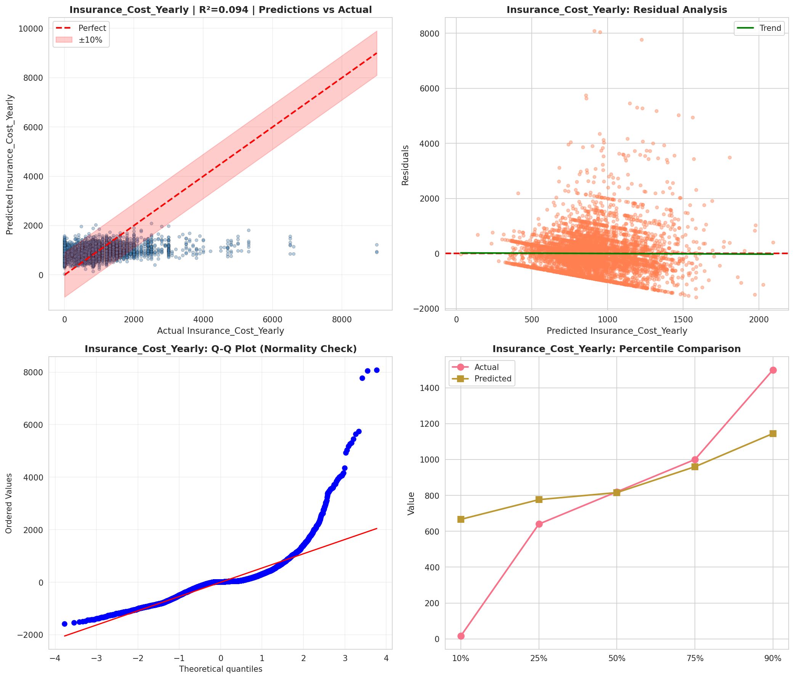
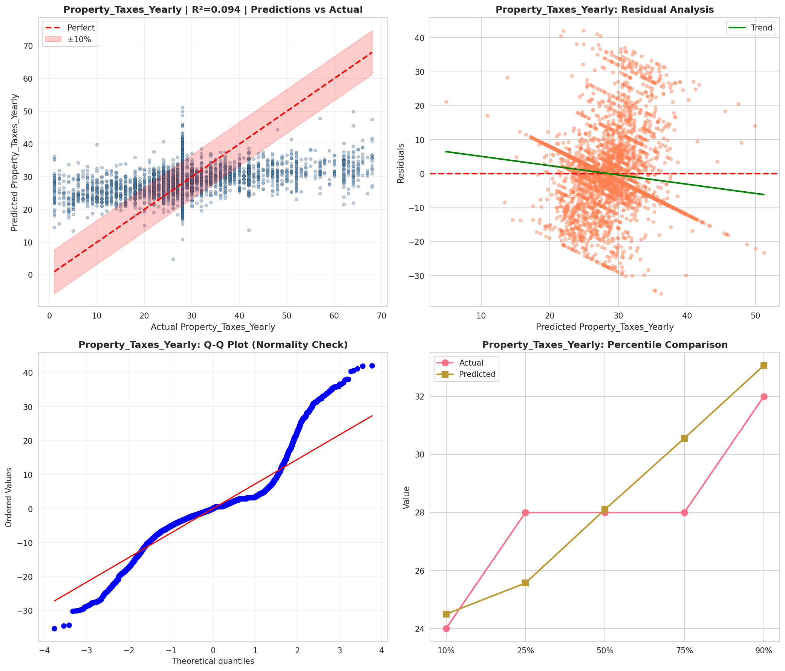
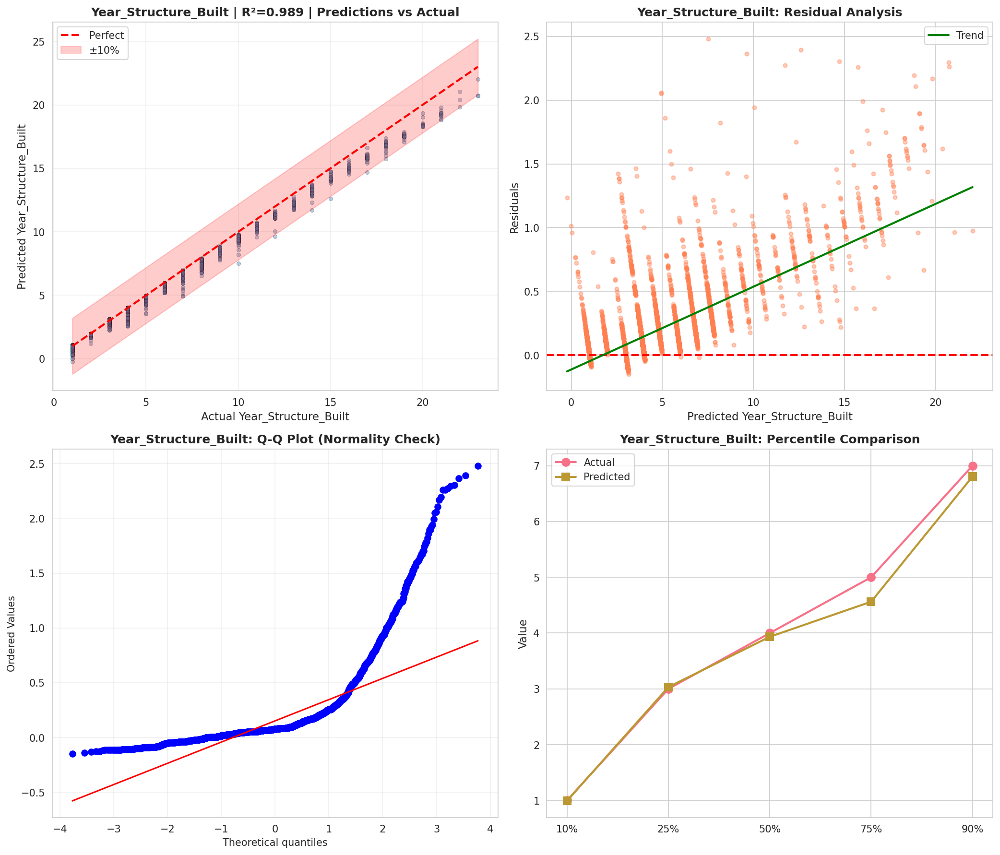
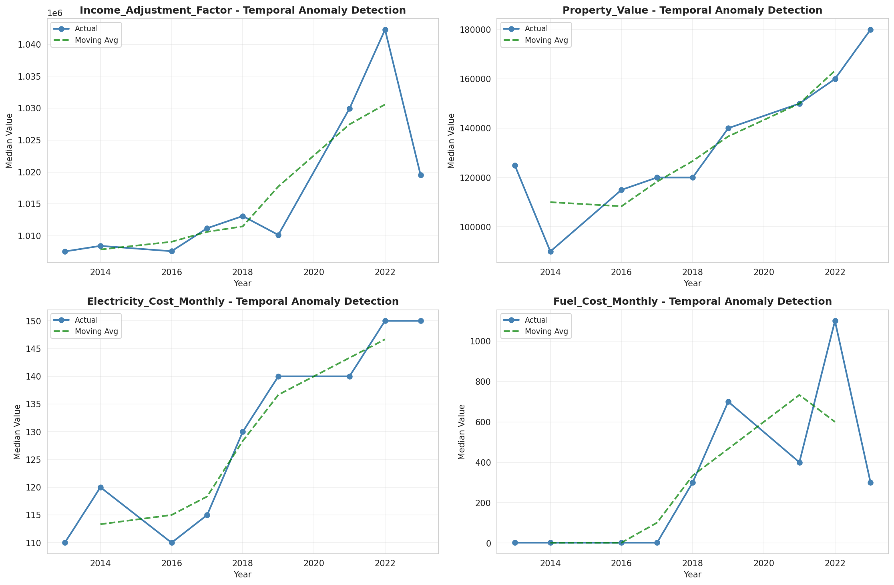
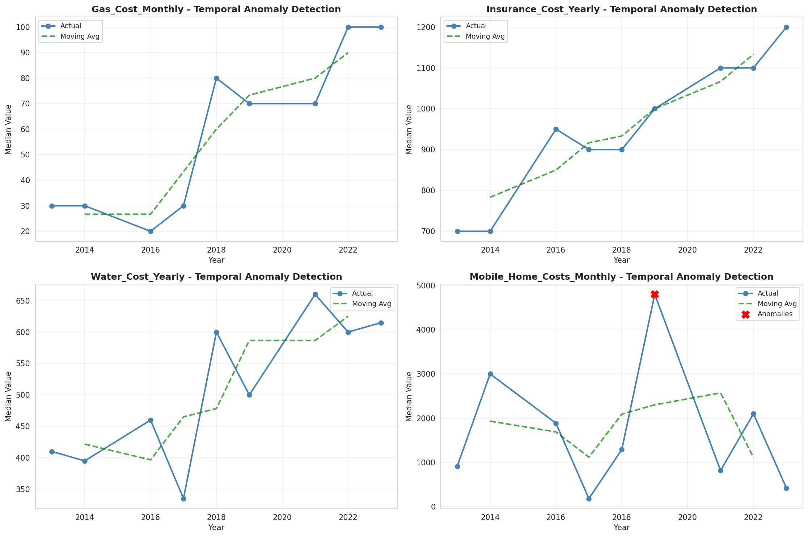
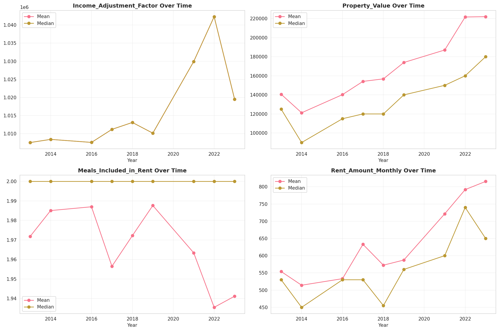
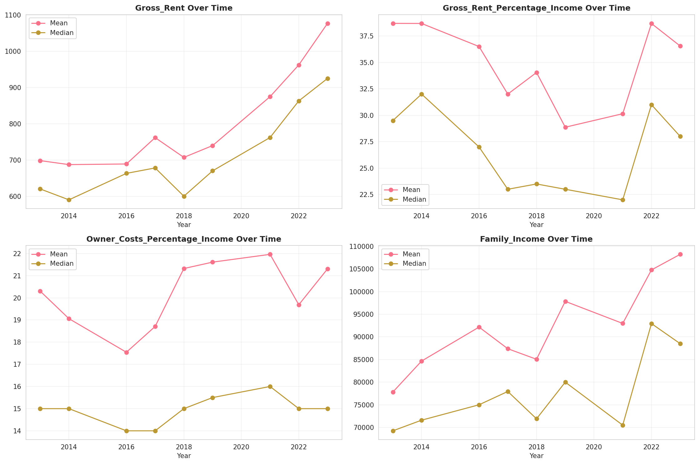
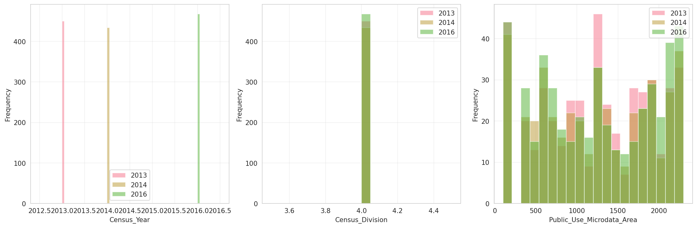
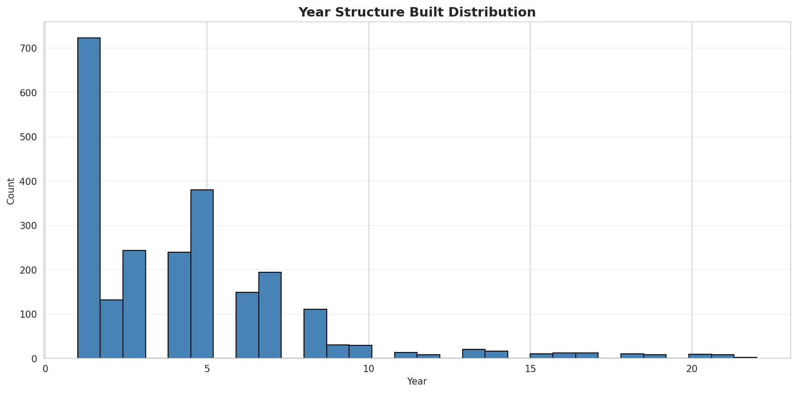
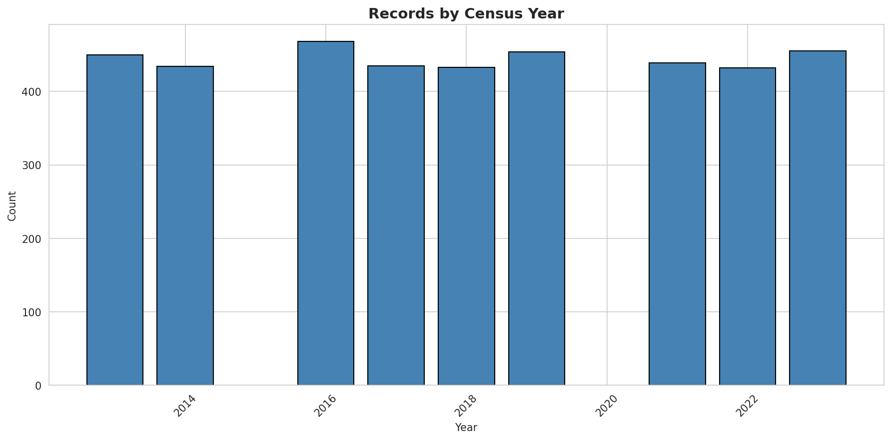
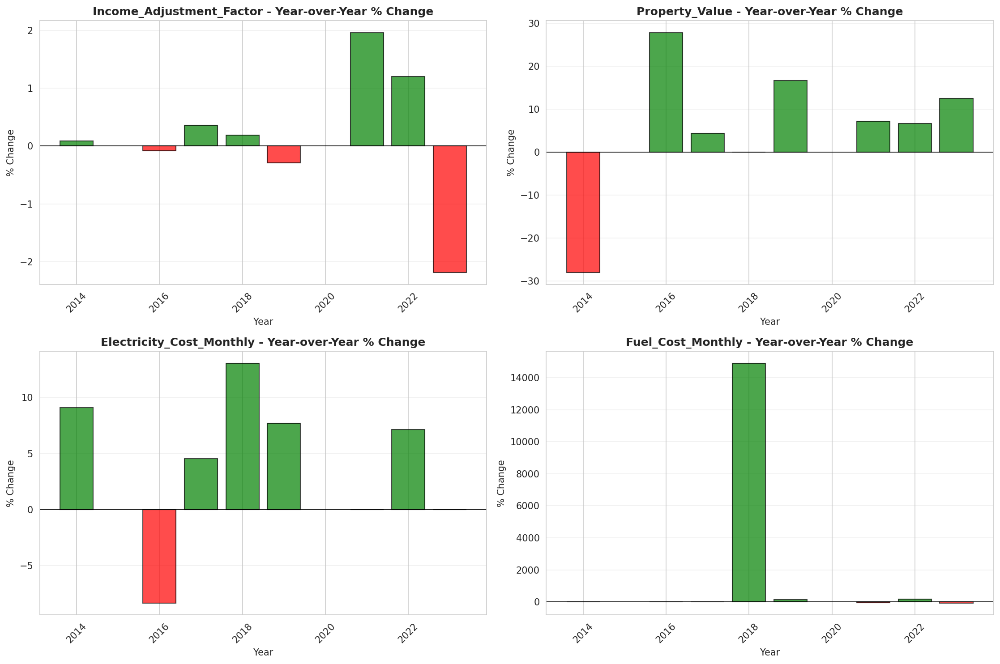
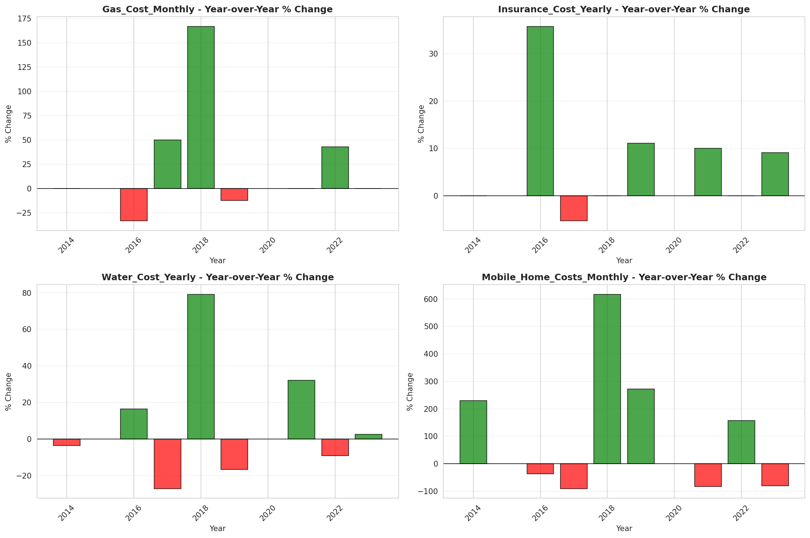
