# Temporal Analysis

## Year Distribution

- 2011: 72,972 records

- 2016: 77,510 records

- 2017: 78,030 records

- 2018: 78,617 records

- 2019: 79,201 records

- 2020: 80,459 records

- 2021: 80,867 records

- 2022: 81,484 records

- 2023: 82,127 records

## Temporal Trends

- Census_Year: {np.int64(2011): {'mean': 2011.0, 'median': 2011.0, 'std': 0.0}, np.int64(2016): {'mean': 2016.0, 'median': 2016.0, 'std': 0.0}, np.int64(2017): {'mean': 2017.0, 'median': 2017.0, 'std': 0.0}, np.int64(2018): {'mean': 2018.0, 'median': 2018.0, 'std': 0.0}, np.int64(2019): {'mean': 2019.0, 'median': 2019.0, 'std': 0.0}, np.int64(2020): {'mean': 2020.0, 'median': 2020.0, 'std': 0.0}, np.int64(2021): {'mean': 2021.0, 'median': 2021.0, 'std': 0.0}, np.int64(2022): {'mean': 2022.0, 'median': 2022.0, 'std': 0.0}, np.int64(2023): {'mean': 2023.0, 'median': 2023.0, 'std': 0.0}}

- Census_Division: {np.int64(2011): {'mean': 4.0, 'median': 4.0, 'std': 0.0}, np.int64(2016): {'mean': 4.0, 'median': 4.0, 'std': 0.0}, np.int64(2017): {'mean': 4.0, 'median': 4.0, 'std': 0.0}, np.int64(2018): {'mean': 4.0, 'median': 4.0, 'std': 0.0}, np.int64(2019): {'mean': 4.0, 'median': 4.0, 'std': 0.0}, np.int64(2020): {'mean': 4.0, 'median': 4.0, 'std': 0.0}, np.int64(2021): {'mean': 4.0, 'median': 4.0, 'std': 0.0}, np.int64(2022): {'mean': 4.0, 'median': 4.0, 'std': 0.0}, np.int64(2023): {'mean': 4.0, 'median': 4.0, 'std': 0.0}}

- Public_Use_Microdata_Area: {np.int64(2011): {'mean': 953.5164172559338, 'median': 1000.0, 'std': 544.215366161132}, np.int64(2016): {'mean': 1227.9821958456973, 'median': 1200.0, 'std': 671.1696597877559}, np.int64(2017): {'mean': 1226.8614635396643, 'median': 1200.0, 'std': 670.1648655268672}, np.int64(2018): {'mean': 1228.0219290993043, 'median': 1200.0, 'std': 669.2934297091443}, np.int64(2019): {'mean': 1226.7787022891125, 'median': 1200.0, 'std': 668.8175062720017}, np.int64(2020): {'mean': 1223.5871686200426, 'median': 1200.0, 'std': 667.7601777342828}, np.int64(2021): {'mean': 1222.9821806175573, 'median': 1200.0, 'std': 667.4872716025188}, np.int64(2022): {'mean': None, 'median': None, 'std': None}, np.int64(2023): {'mean': 1179.3639850475483, 'median': 1200.0, 'std': 688.0514209982726}}

- Census_Region: {np.int64(2011): {'mean': 2.0, 'median': 2.0, 'std': 0.0}, np.int64(2016): {'mean': 2.0, 'median': 2.0, 'std': 0.0}, np.int64(2017): {'mean': 2.0, 'median': 2.0, 'std': 0.0}, np.int64(2018): {'mean': 2.0, 'median': 2.0, 'std': 0.0}, np.int64(2019): {'mean': 2.0, 'median': 2.0, 'std': 0.0}, np.int64(2020): {'mean': 2.0, 'median': 2.0, 'std': 0.0}, np.int64(2021): {'mean': 2.0, 'median': 2.0, 'std': 0.0}, np.int64(2022): {'mean': 2.0, 'median': 2.0, 'std': 0.0}, np.int64(2023): {'mean': 2.0, 'median': 2.0, 'std': 0.0}}

- State_Code: {np.int64(2011): {'mean': 19.0, 'median': 19.0, 'std': 0.0}, np.int64(2016): {'mean': 19.0, 'median': 19.0, 'std': 0.0}, np.int64(2017): {'mean': 19.0, 'median': 19.0, 'std': 0.0}, np.int64(2018): {'mean': 19.0, 'median': 19.0, 'std': 0.0}, np.int64(2019): {'mean': 19.0, 'median': 19.0, 'std': 0.0}, np.int64(2020): {'mean': 19.0, 'median': 19.0, 'std': 0.0}, np.int64(2021): {'mean': 19.0, 'median': 19.0, 'std': 0.0}, np.int64(2022): {'mean': 19.0, 'median': 19.0, 'std': 0.0}, np.int64(2023): {'mean': None, 'median': None, 'std': None}}

- Housing_Adjustment_Factor: {np.int64(2011): {'mean': 1041289.1247327742, 'median': 1044592.0, 'std': 27616.024584077528}, np.int64(2016): {'mean': 1020345.8772158431, 'median': 1013801.0, 'std': 15781.844028886857}, np.int64(2017): {'mean': 1029091.2527233115, 'median': 1034680.0, 'std': 18000.6452680444}, np.int64(2018): {'mean': 1038196.4557284048, 'median': 1046406.0, 'std': 23456.405265306792}, np.int64(2019): {'mean': 1040786.8983472431, 'median': 1042936.0, 'std': 29140.107991454053}, np.int64(2020): {'mean': 1035067.1832237537, 'median': 1030827.0, 'std': 28630.32693990602}, np.int64(2021): {'mean': 1057902.211792202, 'median': 1059761.0, 'std': 35007.74095136806}, np.int64(2022): {'mean': 1105711.8200014727, 'median': 1133141.0, 'std': 60760.90767114864}, np.int64(2023): {'mean': 1107939.7646571773, 'median': 1125501.0, 'std': 76621.14092623148}}

- Income_Adjustment_Factor: {np.int64(2011): {'mean': 1053939.706791646, 'median': 1048026.0, 'std': 28444.70216946941}, np.int64(2016): {'mean': 1027511.6108889176, 'median': 1022342.0, 'std': 17533.56956444963}, np.int64(2017): {'mean': 1036498.0010508779, 'median': 1035988.0, 'std': 16864.12988403902}, np.int64(2018): {'mean': 1046791.1352124858, 'median': 1054346.0, 'std': 20481.367513105477}, np.int64(2019): {'mean': 1049750.5052082676, 'median': 1054606.0, 'std': 26198.41016654759}, np.int64(2020): {'mean': 1045017.4111410781, 'median': 1044328.0, 'std': 29303.399172119345}, np.int64(2021): {'mean': 1072566.6736740575, 'median': 1070512.0, 'std': 30426.356264684135}, np.int64(2022): {'mean': 1127448.3407662853, 'median': 1140108.0, 'std': 48876.781255033944}, np.int64(2023): {'mean': 1131243.3965687288, 'median': 1159185.0, 'std': 69871.82489900709}}

- Housing_Unit_Weight: {np.int64(2011): {'mean': 18.260250507043796, 'median': 16.0, 'std': 17.47685920509074}, np.int64(2016): {'mean': 17.579912269384597, 'median': 12.0, 'std': 19.43991017251117}, np.int64(2017): {'mean': 17.6359477124183, 'median': 12.0, 'std': 19.57919629965788}, np.int64(2018): {'mean': 17.638958494982003, 'median': 12.0, 'std': 19.58116969562968}, np.int64(2019): {'mean': 17.639764649436245, 'median': 12.0, 'std': 19.873820124184665}, np.int64(2020): {'mean': 17.497346474601972, 'median': 11.0, 'std': 21.78880610962932}, np.int64(2021): {'mean': 17.40017559696786, 'median': 11.0, 'std': 21.794149997738824}, np.int64(2022): {'mean': 17.390702469196405, 'median': 11.0, 'std': 22.037202077889837}, np.int64(2023): {'mean': 17.377658991561848, 'median': 11.0, 'std': 22.29563899538376}}

- Number_of_Persons: {np.int64(2011): {'mean': 2.1224305212958394, 'median': 2.0, 'std': 1.3672110119395837}, np.int64(2016): {'mean': 2.052638369242678, 'median': 2.0, 'std': 1.3732667090549988}, np.int64(2017): {'mean': 2.051749327181853, 'median': 2.0, 'std': 1.3792039338783637}, np.int64(2018): {'mean': 2.043362122696109, 'median': 2.0, 'std': 1.37647844844955}, np.int64(2019): {'mean': 2.0396838423757275, 'median': 2.0, 'std': 1.3732025610886736}, np.int64(2020): {'mean': 2.0218993524652307, 'median': 2.0, 'std': 1.373849317470703}, np.int64(2021): {'mean': 2.0174607689168633, 'median': 2.0, 'std': 1.3725248333282127}, np.int64(2022): {'mean': 2.0160522311128566, 'median': 2.0, 'std': 1.3660777607475085}, np.int64(2023): {'mean': 2.0130529545703606, 'median': 2.0, 'std': 1.3610460422814477}}

- Housing_Unit_Type: {np.int64(2011): {'mean': 1.1258427890149647, 'median': 1.0, 'std': 0.43931738240992096}, np.int64(2016): {'mean': 1.1869307186169527, 'median': 1.0, 'std': 0.5313648850222414}, np.int64(2017): {'mean': 1.1865180058951685, 'median': 1.0, 'std': 0.5319438347442133}, np.int64(2018): {'mean': 1.1852779933093351, 'median': 1.0, 'std': 0.5308873373724382}, np.int64(2019): {'mean': 1.1848082726228204, 'median': 1.0, 'std': 0.5309363906623322}, np.int64(2020): {'mean': None, 'median': None, 'std': None}, np.int64(2021): {'mean': None, 'median': None, 'std': None}, np.int64(2022): {'mean': None, 'median': None, 'std': None}, np.int64(2023): {'mean': None, 'median': None, 'std': None}}

- Number_of_Bedrooms: {np.int64(2011): {'mean': 2.821183231812263, 'median': 3.0, 'std': 0.9966531130574916}, np.int64(2016): {'mean': None, 'median': None, 'std': None}, np.int64(2017): {'mean': None, 'median': None, 'std': None}, np.int64(2018): {'mean': None, 'median': None, 'std': None}, np.int64(2019): {'mean': None, 'median': None, 'std': None}, np.int64(2020): {'mean': None, 'median': None, 'std': None}, np.int64(2021): {'mean': None, 'median': None, 'std': None}, np.int64(2022): {'mean': None, 'median': None, 'std': None}, np.int64(2023): {'mean': None, 'median': None, 'std': None}}

- Number_of_Rooms: {np.int64(2011): {'mean': 6.148061122169508, 'median': 6.0, 'std': 1.8769555228661305}, np.int64(2016): {'mean': None, 'median': None, 'std': None}, np.int64(2017): {'mean': None, 'median': None, 'std': None}, np.int64(2018): {'mean': None, 'median': None, 'std': None}, np.int64(2019): {'mean': None, 'median': None, 'std': None}, np.int64(2020): {'mean': None, 'median': None, 'std': None}, np.int64(2021): {'mean': None, 'median': None, 'std': None}, np.int64(2022): {'mean': None, 'median': None, 'std': None}, np.int64(2023): {'mean': None, 'median': None, 'std': None}}

- Building_Type: {np.int64(2011): {'mean': 2.535193139470494, 'median': 2.0, 'std': 1.5492469228903145}, np.int64(2016): {'mean': 2.5428877822337785, 'median': 2.0, 'std': 1.5604473313051253}, np.int64(2017): {'mean': 2.543603125546679, 'median': 2.0, 'std': 1.5611947361947909}, np.int64(2018): {'mean': 2.548297589456038, 'median': 2.0, 'std': 1.5682907706378841}, np.int64(2019): {'mean': 2.5550092458537006, 'median': 2.0, 'std': 1.580209964651218}, np.int64(2020): {'mean': 2.558870348787629, 'median': 2.0, 'std': 1.5890348493870374}, np.int64(2021): {'mean': 2.558728007003869, 'median': 2.0, 'std': 1.592510439957911}, np.int64(2022): {'mean': 2.565842494699746, 'median': 2.0, 'std': 1.600617060486741}, np.int64(2023): {'mean': 2.569798938843898, 'median': 2.0, 'std': 1.6054511848997934}}

- Year_Structure_Built: {np.int64(2011): {'mean': 6.2098867054791445, 'median': 6.0, 'std': 2.4956935755512393}, np.int64(2016): {'mean': 4.12568859900401, 'median': 4.0, 'std': 3.118805079198037}, np.int64(2017): {'mean': 4.214968802845647, 'median': 4.0, 'std': 3.2901571464225885}, np.int64(2018): {'mean': 4.306332735996301, 'median': 4.0, 'std': 3.466069497683672}, np.int64(2019): {'mean': 4.4183282923123235, 'median': 4.0, 'std': 3.671844049636206}, np.int64(2020): {'mean': 4.538119332556355, 'median': 4.0, 'std': 3.898033876998844}, np.int64(2021): {'mean': None, 'median': None, 'std': None}, np.int64(2022): {'mean': None, 'median': None, 'std': None}, np.int64(2023): {'mean': None, 'median': None, 'std': None}}

- Bathtub_or_Shower: {np.int64(2011): {'mean': None, 'median': None, 'std': None}, np.int64(2016): {'mean': 1.0059935657309065, 'median': 1.0, 'std': 0.07718633571082029}, np.int64(2017): {'mean': 1.0059332905708787, 'median': 1.0, 'std': 0.07679956131441566}, np.int64(2018): {'mean': 1.0055205503208278, 'median': 1.0, 'std': 0.07409556793117332}, np.int64(2019): {'mean': 1.0054328349650952, 'median': 1.0, 'std': 0.07350780043760854}, np.int64(2020): {'mean': 1.005557292703033, 'median': 1.0, 'std': 0.07434035074542907}, np.int64(2021): {'mean': 1.0059871784009715, 'median': 1.0, 'std': 0.07714542198958224}, np.int64(2022): {'mean': 1.0060092947502914, 'median': 1.0, 'std': 0.07728691347183528}, np.int64(2023): {'mean': 1.006143535325328, 'median': 1.0, 'std': 0.07814011487603588}}

- Refrigerator: {np.int64(2011): {'mean': None, 'median': None, 'std': None}, np.int64(2016): {'mean': 1.013074199756144, 'median': 1.0, 'std': 0.11359337397082213}, np.int64(2017): {'mean': 1.012857892588489, 'median': 1.0, 'std': 0.11266211529615487}, np.int64(2018): {'mean': 1.0122694953465519, 'median': 1.0, 'std': 0.11008692007932869}, np.int64(2019): {'mean': 1.012270466306389, 'median': 1.0, 'std': 0.11009121536316817}, np.int64(2020): {'mean': 1.0125074618380283, 'median': 1.0, 'std': 0.11113595630722722}, np.int64(2021): {'mean': 1.012638029879409, 'median': 1.0, 'std': 0.11170714518411483}, np.int64(2022): {'mean': 1.0123274784830743, 'median': 1.0, 'std': 0.11034347605943992}, np.int64(2023): {'mean': 1.012049706785814, 'median': 1.0, 'std': 0.10910855865699215}}

- Hot_and_Cold_Running_Water: {np.int64(2011): {'mean': None, 'median': None, 'std': None}, np.int64(2016): {'mean': 1.0112085555212786, 'median': 1.0, 'std': 0.10527623956140106}, np.int64(2017): {'mean': 1.0116041751705638, 'median': 1.0, 'std': 0.10709661757266674}, np.int64(2018): {'mean': 1.0117781374645933, 'median': 1.0, 'std': 0.10788689055775647}, np.int64(2019): {'mean': 1.012327804933989, 'median': 1.0, 'std': 0.11034493508244088}, np.int64(2020): {'mean': 1.0134313084510647, 'median': 1.0, 'std': 0.11511340817873456}, np.int64(2021): {'mean': 1.0140783416645485, 'median': 1.0, 'std': 0.11781484609617503}, np.int64(2022): {'mean': 1.0139421254370078, 'median': 1.0, 'std': 0.11725159104223473}, np.int64(2023): {'mean': 1.0134040770734432, 'median': 1.0, 'std': 0.11499822798933083}}

- Running_Water: {np.int64(2011): {'mean': None, 'median': None, 'std': None}, np.int64(2016): {'mean': 9.0, 'median': 9.0, 'std': 0.0}, np.int64(2017): {'mean': 9.0, 'median': 9.0, 'std': 0.0}, np.int64(2018): {'mean': 9.0, 'median': 9.0, 'std': 0.0}, np.int64(2019): {'mean': 9.0, 'median': 9.0, 'std': 0.0}, np.int64(2020): {'mean': 9.0, 'median': 9.0, 'std': 0.0}, np.int64(2021): {'mean': 9.0, 'median': 9.0, 'std': 0.0}, np.int64(2022): {'mean': 9.0, 'median': 9.0, 'std': 0.0}, np.int64(2023): {'mean': 9.0, 'median': 9.0, 'std': 0.0}}

- Sink_with_Faucet: {np.int64(2011): {'mean': None, 'median': None, 'std': None}, np.int64(2016): {'mean': 1.0053618909112276, 'median': 1.0, 'std': 0.07302889416302423}, np.int64(2017): {'mean': 1.0054667910665345, 'median': 1.0, 'std': 0.07373591067400685}, np.int64(2018): {'mean': 1.0049135788195849, 'median': 1.0, 'std': 0.0699250042864319}, np.int64(2019): {'mean': 1.0047447714338957, 'median': 1.0, 'std': 0.06871918415451901}, np.int64(2020): {'mean': 1.0046902981892607, 'median': 1.0, 'std': 0.06832543921375994}, np.int64(2021): {'mean': 1.0049563670253325, 'median': 1.0, 'std': 0.07022728168406915}, np.int64(2022): {'mean': 1.0047596984120297, 'median': 1.0, 'std': 0.06882666775326009}, np.int64(2023): {'mean': 1.0049008656799776, 'median': 1.0, 'std': 0.06983491454770858}}

- Stove_or_Range: {np.int64(2011): {'mean': None, 'median': None, 'std': None}, np.int64(2016): {'mean': 1.0160269122853407, 'median': 1.0, 'std': 0.12557978354476224}, np.int64(2017): {'mean': 1.0157880926001517, 'median': 1.0, 'std': 0.1246557470085111}, np.int64(2018): {'mean': 1.0158679692467774, 'median': 1.0, 'std': 0.12496560519743845}, np.int64(2019): {'mean': 1.0160834850417855, 'median': 1.0, 'std': 0.1257975889956575}, np.int64(2020): {'mean': 1.015989652917934, 'median': 1.0, 'std': 0.12543606956605516}, np.int64(2021): {'mean': 1.0161823265271541, 'median': 1.0, 'std': 0.12617719146731843}, np.int64(2022): {'mean': 1.016104348314449, 'median': 1.0, 'std': 0.12587780087523287}, np.int64(2023): {'mean': 1.0155124266964535, 'median': 1.0, 'std': 0.12357995205950958}}

- Telephone_Service: {np.int64(2011): {'mean': 1.0232525255699225, 'median': 1.0, 'std': 0.15070568157745118}, np.int64(2016): {'mean': 1.025810156444003, 'median': 1.0, 'std': 0.1585698032891196}, np.int64(2017): {'mean': 1.0239171694415727, 'median': 1.0, 'std': 0.15279233841591286}, np.int64(2018): {'mean': 1.0226482171041542, 'median': 1.0, 'std': 0.14878042398953692}, np.int64(2019): {'mean': 1.0193307194310204, 'median': 1.0, 'std': 0.13768562311975172}, np.int64(2020): {'mean': 1.0154344339194383, 'median': 1.0, 'std': 0.12327385010016115}, np.int64(2021): {'mean': 1.0109107303877367, 'median': 1.0, 'std': 0.10388382230176214}, np.int64(2022): {'mean': 1.0094608084149048, 'median': 1.0, 'std': 0.09680620405380957}, np.int64(2023): {'mean': 1.0077985377741674, 'median': 1.0, 'std': 0.087964963879078}}

- Lot_Acreage: {np.int64(2011): {'mean': 1.313919527196509, 'median': 1.0, 'std': 0.6182525982299103}, np.int64(2016): {'mean': 1.3089980446362348, 'median': 1.0, 'std': 0.6054324925250748}, np.int64(2017): {'mean': 1.302212411578789, 'median': 1.0, 'std': 0.5971382484214323}, np.int64(2018): {'mean': 1.2986243632079386, 'median': 1.0, 'std': 0.5922283279963295}, np.int64(2019): {'mean': 1.2954212424057823, 'median': 1.0, 'std': 0.5878200517080782}, np.int64(2020): {'mean': 1.2940283400809716, 'median': 1.0, 'std': 0.5856730369067065}, np.int64(2021): {'mean': 1.2940280366258812, 'median': 1.0, 'std': 0.5845260536826608}, np.int64(2022): {'mean': 1.2947018799780723, 'median': 1.0, 'std': 0.5839835015680525}, np.int64(2023): {'mean': 1.2939809249018193, 'median': 1.0, 'std': 0.5813307700253981}}

- Agricultural_Sales: {np.int64(2011): {'mean': 2.116228748068006, 'median': 1.0, 'std': 1.9528247183962715}, np.int64(2016): {'mean': 1.9962312504710937, 'median': 1.0, 'std': 1.880810992534052}, np.int64(2017): {'mean': 1.9568154219793563, 'median': 1.0, 'std': 1.8482142358201192}, np.int64(2018): {'mean': 1.9244137512332093, 'median': 1.0, 'std': 1.8216783883534777}, np.int64(2019): {'mean': 1.8894956389836937, 'median': 1.0, 'std': 1.7925647733841785}, np.int64(2020): {'mean': 1.8629361123697328, 'median': 1.0, 'std': 1.7692211341407102}, np.int64(2021): {'mean': 1.8420816509645581, 'median': 1.0, 'std': 1.750548224622722}, np.int64(2022): {'mean': 1.8357063814090742, 'median': 1.0, 'std': 1.74611688138273}, np.int64(2023): {'mean': 1.807714744057168, 'median': 1.0, 'std': 1.7210046217396358}}

- Business_On_Property: {np.int64(2011): {'mean': 1.9759131361028073, 'median': 2.0, 'std': 0.15332022288354022}, np.int64(2016): {'mean': 3.3982536578787674, 'median': 2.0, 'std': 2.8238966060246735}, np.int64(2017): {'mean': 4.821752872121607, 'median': 2.0, 'std': 3.448999794577413}, np.int64(2018): {'mean': 6.227204088744338, 'median': 9.0, 'std': 3.4336766160578445}, np.int64(2019): {'mean': 7.62028088315195, 'median': 9.0, 'std': 2.7907211680693984}, np.int64(2020): {'mean': None, 'median': None, 'std': None}, np.int64(2021): {'mean': None, 'median': None, 'std': None}, np.int64(2022): {'mean': None, 'median': None, 'std': None}, np.int64(2023): {'mean': None, 'median': None, 'std': None}}

- Tenure: {np.int64(2011): {'mean': 1.774214834482867, 'median': 2.0, 'std': 0.8253600592544678}, np.int64(2016): {'mean': 1.810047802334244, 'median': 2.0, 'std': 0.8239159176269701}, np.int64(2017): {'mean': 1.8082923141018716, 'median': 2.0, 'std': 0.823086622214115}, np.int64(2018): {'mean': 1.8102483948574144, 'median': 2.0, 'std': 0.8238204286043858}, np.int64(2019): {'mean': 1.8092155253639708, 'median': 2.0, 'std': 0.8214285961720142}, np.int64(2020): {'mean': 1.8062070635232879, 'median': 2.0, 'std': 0.8188323404664665}, np.int64(2021): {'mean': 1.8041779380823564, 'median': 2.0, 'std': 0.8151988651221669}, np.int64(2022): {'mean': 1.802514936158167, 'median': 2.0, 'std': 0.8119585757464208}, np.int64(2023): {'mean': 1.8008566575585259, 'median': 2.0, 'std': 0.805789181949296}}

- Vacancy_Status: {np.int64(2011): {'mean': 4.761679292929293, 'median': 5.0, 'std': 2.228292674489447}, np.int64(2016): {'mean': 4.889590771765999, 'median': 5.0, 'std': 2.2213756436201124}, np.int64(2017): {'mean': 4.905515967273687, 'median': 5.0, 'std': 2.2288649923775186}, np.int64(2018): {'mean': 4.960883921767843, 'median': 5.0, 'std': 2.2323139656526894}, np.int64(2019): {'mean': 5.007577671129073, 'median': 5.0, 'std': 2.2309647705521267}, np.int64(2020): {'mean': 5.042134831460674, 'median': 5.0, 'std': 2.242728865221548}, np.int64(2021): {'mean': 5.103319308087891, 'median': 5.0, 'std': 2.2227137910911208}, np.int64(2022): {'mean': 5.141081871345029, 'median': 5.0, 'std': 2.203033027493457}, np.int64(2023): {'mean': 5.157343550446999, 'median': 6.0, 'std': 2.1984500261216473}}

- Property_Value: {np.int64(2011): {'mean': 13.106042770257014, 'median': 14.0, 'std': 4.603990036953749}}

- Vehicles_Available: {np.int64(2011): {'mean': 2.0142971609923173, 'median': 2.0, 'std': 1.1051648536247527}, np.int64(2016): {'mean': 2.0349670970946114, 'median': 2.0, 'std': 1.1187103144316186}, np.int64(2017): {'mean': 2.0445167960251207, 'median': 2.0, 'std': 1.1251952687674447}, np.int64(2018): {'mean': 2.0529428891034187, 'median': 2.0, 'std': 1.1314781325256082}, np.int64(2019): {'mean': 2.0641621835202577, 'median': 2.0, 'std': 1.1394808237924525}, np.int64(2020): {'mean': 2.071951699300911, 'median': 2.0, 'std': 1.145236422068425}, np.int64(2021): {'mean': 2.0757439134355273, 'median': 2.0, 'std': 1.1463246422367916}, np.int64(2022): {'mean': 2.0772508529626483, 'median': 2.0, 'std': 1.1480738032038105}, np.int64(2023): {'mean': 2.0741008788124953, 'median': 2.0, 'std': 1.1501200552992912}}

- Condo_Fee_Monthly: {np.int64(2011): {'mean': 170.7563694267516, 'median': 110.0, 'std': 199.77768809502572}, np.int64(2016): {'mean': 181.6531365313653, 'median': 130.0, 'std': 183.93454408860245}, np.int64(2017): {'mean': 187.12764003673095, 'median': 130.0, 'std': 189.2761542121482}, np.int64(2018): {'mean': 188.8736462093863, 'median': 140.0, 'std': 182.21185023311267}, np.int64(2019): {'mean': 194.35224386113464, 'median': 140.0, 'std': 190.30312453804825}, np.int64(2020): {'mean': 211.52742616033754, 'median': 150.0, 'std': 220.87612585300508}, np.int64(2021): {'mean': 228.5194375516956, 'median': 150.0, 'std': 267.8366387569305}, np.int64(2022): {'mean': 230.25601241272304, 'median': 160.0, 'std': 264.1105069333594}, np.int64(2023): {'mean': 244.9854439592431, 'median': 170.0, 'std': 274.5608288374103}}

- Electricity_Cost_Monthly: {np.int64(2011): {'mean': 112.0410218542318, 'median': 100.0, 'std': 74.85239433188647}, np.int64(2016): {'mean': 127.75938974422647, 'median': 110.0, 'std': 81.55502076727852}, np.int64(2017): {'mean': 131.37009890906847, 'median': 120.0, 'std': 83.11244670874952}, np.int64(2018): {'mean': 140.4579827900579, 'median': 120.0, 'std': 82.90453553031213}, np.int64(2019): {'mean': 142.98284045271998, 'median': 130.0, 'std': 84.25551373007666}, np.int64(2020): {'mean': 145.89403659577158, 'median': 130.0, 'std': 85.46630875960503}, np.int64(2021): {'mean': 148.89111518743238, 'median': 130.0, 'std': 86.80226531159433}, np.int64(2022): {'mean': 157.92394598206656, 'median': 140.0, 'std': 130.09049117946168}, np.int64(2023): {'mean': 164.94933243093584, 'median': 140.0, 'std': 161.3913942085486}}

- Fuel_Cost_Monthly: {np.int64(2011): {'mean': 116.61135288849786, 'median': 2.0, 'std': 426.145975561632}, np.int64(2016): {'mean': 66.55889930469333, 'median': 2.0, 'std': 316.4936094879196}, np.int64(2017): {'mean': 54.226024966438814, 'median': 2.0, 'std': 281.045141934296}, np.int64(2018): {'mean': 869.814587229495, 'median': 700.0, 'std': 768.9203901322813}, np.int64(2019): {'mean': 836.7700416088766, 'median': 700.0, 'std': 738.7473826956332}, np.int64(2020): {'mean': 811.5505415162455, 'median': 680.0, 'std': 724.0946788749593}, np.int64(2021): {'mean': 816.7082152974505, 'median': 700.0, 'std': 720.6767133918713}, np.int64(2022): {'mean': 851.3350515463917, 'median': 700.0, 'std': 776.6951570068827}, np.int64(2023): {'mean': 888.0915377016793, 'median': 700.0, 'std': 819.3081600858774}}

- Gas_Cost_Monthly: {np.int64(2011): {'mean': 71.48875866078022, 'median': 40.0, 'std': 86.65699057384724}, np.int64(2016): {'mean': 57.56068413210827, 'median': 30.0, 'std': 78.06960960073516}, np.int64(2017): {'mean': 56.04155415310075, 'median': 30.0, 'std': 77.45172037405081}, np.int64(2018): {'mean': 92.07073037932018, 'median': 70.0, 'std': 83.08344555763979}, np.int64(2019): {'mean': 89.83284541050287, 'median': 70.0, 'std': 81.1709337828548}, np.int64(2020): {'mean': 89.19551415487093, 'median': 70.0, 'std': 80.3926242198351}, np.int64(2021): {'mean': 92.2884789526791, 'median': 70.0, 'std': 83.43513449248768}, np.int64(2022): {'mean': 104.0392106677587, 'median': 80.0, 'std': 119.15930794017099}, np.int64(2023): {'mean': 113.36094494575687, 'median': 80.0, 'std': 147.67063078750883}}

- House_Heating_Fuel: {np.int64(2011): {'mean': 1.7258244434319472, 'median': 1.0, 'std': 1.2595559968145675}, np.int64(2016): {'mean': 1.7830270672957536, 'median': 1.0, 'std': 1.2823560230271398}, np.int64(2017): {'mean': 1.7880630178838706, 'median': 1.0, 'std': 1.281204322543439}, np.int64(2018): {'mean': 1.7851177615348075, 'median': 1.0, 'std': 1.263728778594606}, np.int64(2019): {'mean': 1.7856296161210905, 'median': 1.0, 'std': 1.2614490877883686}, np.int64(2020): {'mean': 1.7786823230336228, 'median': 1.0, 'std': 1.2462124362571234}, np.int64(2021): {'mean': 1.7753231139164412, 'median': 1.0, 'std': 1.2364116203844675}, np.int64(2022): {'mean': 1.7730746882402897, 'median': 1.0, 'std': 1.230810575076955}, np.int64(2023): {'mean': 1.7761908278561407, 'median': 1.0, 'std': 1.2360985214560116}}

- Insurance_Cost_Yearly: {np.int64(2011): {'mean': 696.738186751074, 'median': 600.0, 'std': 447.2436837099825}, np.int64(2016): {'mean': 868.5400722690633, 'median': 770.0, 'std': 575.0188923374784}, np.int64(2017): {'mean': 908.2992940743636, 'median': 800.0, 'std': 596.2276953386549}, np.int64(2018): {'mean': 944.4006123894615, 'median': 840.0, 'std': 616.6898580905835}, np.int64(2019): {'mean': 982.8823662635322, 'median': 900.0, 'std': 643.8743396552395}, np.int64(2020): {'mean': 1017.7183155349587, 'median': 900.0, 'std': 660.9796436888363}, np.int64(2021): {'mean': 1053.9269260614124, 'median': 970.0, 'std': 689.0218707182288}, np.int64(2022): {'mean': 1104.0557257923306, 'median': 1000.0, 'std': 745.6221891325897}, np.int64(2023): {'mean': 1195.216282470325, 'median': 1000.0, 'std': 852.6971016063942}}

- Water_Cost_Yearly: {np.int64(2011): {'mean': 372.36907099875884, 'median': 360.0, 'std': 372.40807928009673}, np.int64(2016): {'mean': 438.493885026074, 'median': 400.0, 'std': 442.86130863358477}, np.int64(2017): {'mean': 449.23986606385114, 'median': 400.0, 'std': 455.4083460612284}, np.int64(2018): {'mean': 583.8839233441317, 'median': 560.0, 'std': 454.7583846990514}, np.int64(2019): {'mean': 593.4829874238098, 'median': 590.0, 'std': 469.33752655012756}, np.int64(2020): {'mean': 609.3856661819851, 'median': 600.0, 'std': 490.4556053894436}, np.int64(2021): {'mean': 624.3057712288656, 'median': 600.0, 'std': 521.654010229805}, np.int64(2022): {'mean': 638.51331953843, 'median': 600.0, 'std': 548.8044732174811}, np.int64(2023): {'mean': 657.5313701326172, 'median': 600.0, 'std': 579.1037756307463}}

- Mobile_Home_Costs_Monthly: {np.int64(2011): {'mean': 1751.135989010989, 'median': 1500.0, 'std': 1597.9770280518937}, np.int64(2016): {'mean': 1824.4750593824228, 'median': 1200.0, 'std': 1743.6905582832792}, np.int64(2017): {'mean': 1875.51261829653, 'median': 1200.0, 'std': 1858.2557544463575}, np.int64(2018): {'mean': 1932.812749003984, 'median': 1200.0, 'std': 1947.0463073495023}, np.int64(2019): {'mean': 2009.620578778135, 'median': 1200.0, 'std': 1988.007660775642}, np.int64(2020): {'mean': 2101.778861788618, 'median': 1200.0, 'std': 2105.9877245734447}, np.int64(2021): {'mean': 2199.0119712689543, 'median': 1200.0, 'std': 2245.2902579640627}, np.int64(2022): {'mean': 2394.8380338436746, 'median': 1400.0, 'std': 2787.241092915382}, np.int64(2023): {'mean': 2584.5732586068857, 'median': 1400.0, 'std': 3173.553083077585}}

- First_Mortgage_Includes_Insurance: {np.int64(2011): {'mean': 1.4951709915793092, 'median': 1.0, 'std': 0.4999852724962675}, np.int64(2016): {'mean': 1.4480253219192865, 'median': 1.0, 'std': 0.4973002394456536}, np.int64(2017): {'mean': 1.4345731010850942, 'median': 1.0, 'std': 0.4957096850876186}, np.int64(2018): {'mean': 1.4247806472238997, 'median': 1.0, 'std': 0.4943184489473209}, np.int64(2019): {'mean': 1.415987582460225, 'median': 1.0, 'std': 0.4929000753581278}, np.int64(2020): {'mean': 1.4003676990524678, 'median': 1.0, 'std': 0.4899815229843141}, np.int64(2021): {'mean': 1.3910608584695, 'median': 1.0, 'std': 0.48799662320272963}, np.int64(2022): {'mean': 1.381048673194267, 'median': 1.0, 'std': 0.4856531161274031}, np.int64(2023): {'mean': 1.3698249117426808, 'median': 1.0, 'std': 0.48276573750000457}}

- First_Mortgage_Payment_Monthly: {np.int64(2011): {'mean': 777.3186458154322, 'median': 670.0, 'std': 493.89976036416346}, np.int64(2016): {'mean': 811.7659161211424, 'median': 700.0, 'std': 522.3034249930874}, np.int64(2017): {'mean': 825.5429040548258, 'median': 700.0, 'std': 526.4263112356183}, np.int64(2018): {'mean': 844.3891158395794, 'median': 720.0, 'std': 535.0256799542277}, np.int64(2019): {'mean': 870.4823085335308, 'median': 750.0, 'std': 551.030130721432}, np.int64(2020): {'mean': 898.2791684344505, 'median': 780.0, 'std': 563.0041375833483}, np.int64(2021): {'mean': 919.6194662035232, 'median': 800.0, 'std': 566.9232272952473}, np.int64(2022): {'mean': 951.5613736341705, 'median': 810.0, 'std': 585.1026416331515}, np.int64(2023): {'mean': 992.656919730414, 'median': 850.0, 'std': 612.1506408069192}}

- First_Mortgage_Includes_Taxes: {np.int64(2011): {'mean': 1.4186286303488571, 'median': 1.0, 'std': 0.4933427464300141}, np.int64(2016): {'mean': 1.3644342133659448, 'median': 1.0, 'std': 0.4812798031480752}, np.int64(2017): {'mean': 1.3484794403198173, 'median': 1.0, 'std': 0.47649724477517935}, np.int64(2018): {'mean': 1.3352278782281268, 'median': 1.0, 'std': 0.47207845154243006}, np.int64(2019): {'mean': 1.3214096729812679, 'median': 1.0, 'std': 0.4670258981004099}, np.int64(2020): {'mean': 1.3041295432046387, 'median': 1.0, 'std': 0.4600459182624464}, np.int64(2021): {'mean': 1.291496827703541, 'median': 1.0, 'std': 0.45445984163550557}, np.int64(2022): {'mean': 1.2791258691641834, 'median': 1.0, 'std': 0.4485774814772821}, np.int64(2023): {'mean': 1.2669828477694969, 'median': 1.0, 'std': 0.44239121339725995}}

- First_Mortgage_Status: {np.int64(2011): {'mean': 1.8589343561818072, 'median': 1.0, 'std': 0.982200238148085}, np.int64(2016): {'mean': 1.9087179895654944, 'median': 1.0, 'std': 0.987783708612705}, np.int64(2017): {'mean': 1.90726747636191, 'median': 1.0, 'std': 0.9878224165321695}, np.int64(2018): {'mean': 1.9076517669269042, 'median': 1.0, 'std': 0.9882528577570933}, np.int64(2019): {'mean': 1.909673523453327, 'median': 1.0, 'std': 0.9888455137425503}, np.int64(2020): {'mean': 1.920660071108363, 'median': 1.0, 'std': 0.989951936052171}, np.int64(2021): {'mean': 1.9351066269204311, 'median': 1.0, 'std': 0.9911960978926863}, np.int64(2022): {'mean': 1.947984518077976, 'median': 1.0, 'std': 0.9924351101398207}, np.int64(2023): {'mean': 1.9671086940326306, 'median': 1.0, 'std': 0.9935996210712927}}

- Second_Mortgage_Payment_Monthly: {np.int64(2011): {'mean': 309.5628732849072, 'median': 250.0, 'std': 245.39978921835035}, np.int64(2016): {'mean': 296.97482618077197, 'median': 220.0, 'std': 268.272409049559}, np.int64(2017): {'mean': 303.44580078125, 'median': 220.0, 'std': 293.4321187173253}, np.int64(2018): {'mean': 308.7236155947355, 'median': 220.0, 'std': 299.02695292448107}, np.int64(2019): {'mean': 312.8850087303567, 'median': 230.0, 'std': 313.165728409664}, np.int64(2020): {'mean': 334.1590019569472, 'median': 240.0, 'std': 361.9792790284849}, np.int64(2021): {'mean': 337.2043010752688, 'median': 250.0, 'std': 361.6726593093333}, np.int64(2022): {'mean': 346.86466892218465, 'median': 250.0, 'std': 365.9545569938004}, np.int64(2023): {'mean': 368.87370892018777, 'median': 250.0, 'std': 395.3256298510632}}

- Second_Mortgage_Status: {np.int64(2011): {'mean': 2.741261385117718, 'median': 3.0, 'std': 0.5741329479228968}, np.int64(2016): {'mean': 2.820192791885476, 'median': 3.0, 'std': 0.48930667237068287}, np.int64(2017): {'mean': 2.826991719017704, 'median': 3.0, 'std': 0.4783526994690983}, np.int64(2018): {'mean': 2.831942026926219, 'median': 3.0, 'std': 0.46983303520817715}, np.int64(2019): {'mean': 2.83525593537235, 'median': 3.0, 'std': 0.46155543143933203}, np.int64(2020): {'mean': 2.8345275728837374, 'median': 3.0, 'std': 0.4579113360281074}, np.int64(2021): {'mean': 2.8365711085442262, 'median': 3.0, 'std': 0.4510462069726944}, np.int64(2022): {'mean': 2.8359143901165824, 'median': 3.0, 'std': 0.44754561983484736}, np.int64(2023): {'mean': 2.8333217512161224, 'median': 3.0, 'std': 0.44400264114250915}}

- Property_Taxes_Yearly: {np.int64(2011): {'mean': 26.016495419043267, 'median': 25.0, 'std': 13.707572132316637}, np.int64(2016): {'mean': 29.142797403321516, 'median': 27.0, 'std': 15.051246999472731}, np.int64(2017): {'mean': 29.881334810301855, 'median': 28.0, 'std': 15.382308540951774}}

- Meals_Included_in_Rent: {np.int64(2011): {'mean': 1.9665255252856115, 'median': 2.0, 'std': 0.1798791796259848}, np.int64(2016): {'mean': 1.9648824486174774, 'median': 2.0, 'std': 0.18408371540353363}, np.int64(2017): {'mean': 1.9656945566737678, 'median': 2.0, 'std': 0.1820192672822406}, np.int64(2018): {'mean': 1.9637486378496185, 'median': 2.0, 'std': 0.18692174618140905}, np.int64(2019): {'mean': 1.9613774184233324, 'median': 2.0, 'std': 0.19270069669118797}, np.int64(2020): {'mean': 1.9616305215057663, 'median': 2.0, 'std': 0.1920935658582622}, np.int64(2021): {'mean': 1.9615046194456665, 'median': 2.0, 'std': 0.19239594701025206}, np.int64(2022): {'mean': 1.9606380621815227, 'median': 2.0, 'std': 0.19446174000723987}, np.int64(2023): {'mean': 1.9618223846096488, 'median': 2.0, 'std': 0.1916319997673543}}

- Rent_Amount_Monthly: {np.int64(2011): {'mean': 495.9752336821922, 'median': 440.0, 'std': 325.51826419753667}, np.int64(2016): {'mean': 572.5272807925477, 'median': 500.0, 'std': 374.12025738007816}, np.int64(2017): {'mean': 585.7976933813267, 'median': 500.0, 'std': 371.5853487177476}, np.int64(2018): {'mean': 601.6762804213586, 'median': 530.0, 'std': 380.8068833556451}, np.int64(2019): {'mean': 618.6354317066127, 'median': 550.0, 'std': 386.9113163029488}, np.int64(2020): {'mean': 641.192137520853, 'median': 550.0, 'std': 412.25064297368107}, np.int64(2021): {'mean': 661.2833260008799, 'median': 580.0, 'std': 440.70807446096313}, np.int64(2022): {'mean': 687.8382689609334, 'median': 600.0, 'std': 470.6215125873158}, np.int64(2023): {'mean': 717.9955260606964, 'median': 600.0, 'std': 493.2740613564916}}

- Gross_Rent: {np.int64(2011): {'mean': 632.135594639866, 'median': 580.0, 'std': 336.48819295981707}, np.int64(2016): {'mean': 717.7612903225806, 'median': 653.0, 'std': 383.954998958635}, np.int64(2017): {'mean': 733.2850394920241, 'median': 670.0, 'std': 383.7343407601215}, np.int64(2018): {'mean': 750.5150980993255, 'median': 690.0, 'std': 393.2002631288939}, np.int64(2019): {'mean': 767.3059593576376, 'median': 700.0, 'std': 397.83993986695344}, np.int64(2020): {'mean': 789.480738177624, 'median': 720.0, 'std': 416.5244665359749}, np.int64(2021): {'mean': 811.4416401335715, 'median': 740.0, 'std': 440.116295578896}, np.int64(2022): {'mean': 845.4714686623012, 'median': 764.0, 'std': 476.34718866972014}, np.int64(2023): {'mean': 885.2569722680494, 'median': 796.0, 'std': 517.5589012383782}}

- Gross_Rent_Percentage_Income: {np.int64(2011): {'mean': 35.35830646529781, 'median': 26.0, 'std': 26.84733923968849}, np.int64(2016): {'mean': 34.648415896341945, 'median': 26.0, 'std': 26.420654790982894}, np.int64(2017): {'mean': 34.10537092455505, 'median': 25.0, 'std': 25.947744079830805}, np.int64(2018): {'mean': 33.780605871330415, 'median': 25.0, 'std': 25.74992429037978}, np.int64(2019): {'mean': 33.88403661185231, 'median': 25.0, 'std': 25.769142163130965}, np.int64(2020): {'mean': 34.022807430049376, 'median': 25.0, 'std': 25.72268566250927}, np.int64(2021): {'mean': 34.38852394143253, 'median': 26.0, 'std': 26.040089366827285}, np.int64(2022): {'mean': 34.88701732083267, 'median': 26.0, 'std': 26.36743114900863}, np.int64(2023): {'mean': 35.111013356794366, 'median': 26.0, 'std': 26.47146151901838}}

- Selected_Monthly_Owner_Costs: {np.int64(2011): {'mean': 859.0558360499324, 'median': 712.0, 'std': 615.5564527801317}, np.int64(2016): {'mean': 870.157778353288, 'median': 718.0, 'std': 617.3912543928582}, np.int64(2017): {'mean': 884.3472453099026, 'median': 730.0, 'std': 622.5143888240138}, np.int64(2018): {'mean': 902.9878411080725, 'median': 747.0, 'std': 632.3641363534797}, np.int64(2019): {'mean': 921.7262841998597, 'median': 760.0, 'std': 647.0057009268326}, np.int64(2020): {'mean': 941.4884318766067, 'median': 778.0, 'std': 661.1976724520018}, np.int64(2021): {'mean': 957.206876779878, 'median': 790.0, 'std': 666.4471030654732}, np.int64(2022): {'mean': 995.2605370496261, 'median': 820.0, 'std': 698.4588408373683}, np.int64(2023): {'mean': 1035.5036787304189, 'median': 849.0, 'std': 735.4698954067194}}

- Owner_Costs_Percentage_Income: {np.int64(2011): {'mean': 21.150480788413198, 'median': 17.0, 'std': 17.544842112608627}, np.int64(2016): {'mean': 19.87853424108931, 'median': 15.0, 'std': 17.506421765564493}, np.int64(2017): {'mean': 19.69256944997214, 'median': 15.0, 'std': 17.43218138245886}, np.int64(2018): {'mean': 19.692178317734818, 'median': 15.0, 'std': 17.49057186149968}, np.int64(2019): {'mean': 19.481795736008777, 'median': 15.0, 'std': 17.467640903490526}, np.int64(2020): {'mean': 19.411321048130006, 'median': 15.0, 'std': 17.441579793307888}, np.int64(2021): {'mean': 19.460459036561456, 'median': 15.0, 'std': 17.598011619523476}, np.int64(2022): {'mean': 19.711827058242466, 'median': 15.0, 'std': 17.9845472405572}, np.int64(2023): {'mean': 19.859881204444527, 'median': 15.0, 'std': 18.286573814828017}}

- Satellite_Internet: {np.int64(2011): {'mean': None, 'median': None, 'std': None}, np.int64(2016): {'mean': None, 'median': None, 'std': None}, np.int64(2017): {'mean': 1.8978014255596827, 'median': 2.0, 'std': 0.30291231094992854}, np.int64(2018): {'mean': 1.8935815072880073, 'median': 2.0, 'std': 0.30837548996323405}, np.int64(2019): {'mean': 1.8917288161001387, 'median': 2.0, 'std': 0.3107255120642483}, np.int64(2020): {'mean': 1.8936401916654566, 'median': 2.0, 'std': 0.3083003805711344}, np.int64(2021): {'mean': 1.8969294752676755, 'median': 2.0, 'std': 0.30405365937254925}, np.int64(2022): {'mean': 1.900300341768219, 'median': 2.0, 'std': 0.29960171186088685}, np.int64(2023): {'mean': 1.9044846152547807, 'median': 2.0, 'std': 0.2939279745392916}}

- Smartphone: {np.int64(2011): {'mean': None, 'median': None, 'std': None}, np.int64(2016): {'mean': None, 'median': None, 'std': None}, np.int64(2017): {'mean': 1.3668430879380313, 'median': 1.0, 'std': 0.4819469066609606}, np.int64(2018): {'mean': 1.3130449439923995, 'median': 1.0, 'std': 0.4637360266153572}, np.int64(2019): {'mean': 1.2686088568736513, 'median': 1.0, 'std': 0.4432393535363359}, np.int64(2020): {'mean': 1.230381623944557, 'median': 1.0, 'std': 0.42108029435174915}, np.int64(2021): {'mean': 1.195942290351668, 'median': 1.0, 'std': 0.3969272943138612}, np.int64(2022): {'mean': 1.1691473353297874, 'median': 1.0, 'std': 0.37488479317360773}, np.int64(2023): {'mean': 1.1480097481722178, 'median': 1.0, 'std': 0.35511227123220734}}

- Tablet_Computer: {np.int64(2011): {'mean': None, 'median': None, 'std': None}, np.int64(2016): {'mean': None, 'median': None, 'std': None}, np.int64(2017): {'mean': 1.5070594225932383, 'median': 2.0, 'std': 0.4999540193369318}, np.int64(2018): {'mean': 1.4617753873029007, 'median': 1.0, 'std': 0.49854055756996235}, np.int64(2019): {'mean': 1.4287711619707608, 'median': 1.0, 'std': 0.49490420776443994}, np.int64(2020): {'mean': 1.406152589050631, 'median': 1.0, 'std': 0.4911174128372764}, np.int64(2021): {'mean': 1.3970844604749024, 'median': 1.0, 'std': 0.4892974450580515}, np.int64(2022): {'mean': 1.39753274035668, 'median': 1.0, 'std': 0.48939148853486975}, np.int64(2023): {'mean': 1.4004578686950742, 'median': 1.0, 'std': 0.489994806387773}}

- Food_Stamp_SNAP: {np.int64(2011): {'mean': 1.9220818291215402, 'median': 2.0, 'std': 0.26804469553940885}, np.int64(2016): {'mean': 1.9040057398908878, 'median': 2.0, 'std': 0.2945853644105046}, np.int64(2017): {'mean': 1.9076116970407186, 'median': 2.0, 'std': 0.28957526468442885}, np.int64(2018): {'mean': 1.911756829137654, 'median': 2.0, 'std': 0.28365012078344404}, np.int64(2019): {'mean': 1.9158714547726003, 'median': 2.0, 'std': 0.27758234302719015}, np.int64(2020): {'mean': 1.9187000406893564, 'median': 2.0, 'std': 0.2732970111329436}, np.int64(2021): {'mean': 1.920706628889266, 'median': 2.0, 'std': 0.27019786386649564}, np.int64(2022): {'mean': 1.9220858102868958, 'median': 2.0, 'std': 0.2680382383501363}, np.int64(2023): {'mean': 1.9230808571574693, 'median': 2.0, 'std': 0.26646481219982376}}

- Family_Type_Employment_Status: {np.int64(2011): {'mean': 2.6265483802467973, 'median': 1.0, 'std': 2.126663701312266}, np.int64(2016): {'mean': 2.717960899826591, 'median': 2.0, 'std': 2.1283208996422234}, np.int64(2017): {'mean': 2.7177151532403454, 'median': 2.0, 'std': 2.1204776213741217}, np.int64(2018): {'mean': 2.71798881622595, 'median': 2.0, 'std': 2.118526037013161}, np.int64(2019): {'mean': 2.7261062364373996, 'median': 2.0, 'std': 2.122632273898904}, np.int64(2020): {'mean': 2.7481298517995767, 'median': 2.0, 'std': 2.1270886248803587}, np.int64(2021): {'mean': None, 'median': None, 'std': None}, np.int64(2022): {'mean': None, 'median': None, 'std': None}, np.int64(2023): {'mean': None, 'median': None, 'std': None}}

- Family_Income: {np.int64(2011): {'mean': 71560.82012498225, 'median': 60000.0, 'std': 55968.50672011106}, np.int64(2016): {'mean': 81095.80513491026, 'median': 66900.0, 'std': 67802.10500112124}, np.int64(2017): {'mean': 83574.47415122541, 'median': 69000.0, 'std': 70155.49381482539}, np.int64(2018): {'mean': 85749.6226093139, 'median': 70600.0, 'std': 71652.7480168801}, np.int64(2019): {'mean': 88300.18501121209, 'median': 73000.0, 'std': 73444.53547400565}, np.int64(2020): {'mean': 90817.02227769405, 'median': 75000.0, 'std': 75592.69296491245}, np.int64(2021): {'mean': 92980.7710891461, 'median': 76800.0, 'std': 77776.43766950168}, np.int64(2022): {'mean': 96568.06676620165, 'median': 79800.0, 'std': 82087.87222665388}, np.int64(2023): {'mean': 100720.38084188054, 'median': 82000.0, 'std': 86463.16096821053}}

- Family_Presence_Children: {np.int64(2011): {'mean': 3.169501922940802, 'median': 4.0, 'std': 1.061022135448855}, np.int64(2016): {'mean': 3.204132837834639, 'median': 4.0, 'std': 1.0466281744676564}, np.int64(2017): {'mean': 3.2053613604156825, 'median': 4.0, 'std': 1.0452275358031016}, np.int64(2018): {'mean': 3.2105089382576293, 'median': 4.0, 'std': 1.0448425168103583}, np.int64(2019): {'mean': 3.2162866602484326, 'median': 4.0, 'std': 1.040877558810519}, np.int64(2020): {'mean': 3.213711849717752, 'median': 4.0, 'std': 1.0440509896173622}, np.int64(2021): {'mean': 3.220803175344385, 'median': 4.0, 'std': 1.0416490164350651}, np.int64(2022): {'mean': 3.227351815334648, 'median': 4.0, 'std': 1.039672763660028}, np.int64(2023): {'mean': 3.232223658694247, 'median': 4.0, 'std': 1.0368380686435938}}

- Household_Family_Type: {np.int64(2011): {'mean': 2.6174959543747742, 'median': 1.0, 'std': 2.0467510509706472}, np.int64(2016): {'mean': 2.6543487707971196, 'median': 1.0, 'std': 2.0490675142731987}, np.int64(2017): {'mean': 2.659481228879596, 'median': 1.0, 'std': 2.0492404323054303}, np.int64(2018): {'mean': 2.671800058229516, 'median': 1.0, 'std': 2.0528156580980523}, np.int64(2019): {'mean': 2.680997538068752, 'median': 1.0, 'std': 2.0535631507167103}, np.int64(2020): {'mean': 2.686287564688436, 'median': 1.0, 'std': 2.052035912259511}, np.int64(2021): {'mean': 2.6943642921550945, 'median': 1.0, 'std': 2.053468856694659}, np.int64(2022): {'mean': 2.701396027950357, 'median': 1.0, 'std': 2.0571970357970475}, np.int64(2023): {'mean': 2.709327228417399, 'median': 1.0, 'std': 2.058281588708754}}

- Household_Income: {np.int64(2011): {'mean': 59745.7755495504, 'median': 48000.0, 'std': 52585.337022791355}, np.int64(2016): {'mean': 67571.95672851287, 'median': 53000.0, 'std': 63173.60390270094}, np.int64(2017): {'mean': 69606.82767152705, 'median': 54630.0, 'std': 65318.316817734645}, np.int64(2018): {'mean': 71291.23567794907, 'median': 55600.0, 'std': 66626.15644995676}, np.int64(2019): {'mean': 73481.90379661432, 'median': 57900.0, 'std': 68472.46208640141}, np.int64(2020): {'mean': 75392.93970071767, 'median': 59600.0, 'std': 70022.25561789588}, np.int64(2021): {'mean': 77171.68250333617, 'median': 60350.0, 'std': 72069.36044175556}, np.int64(2022): {'mean': 80033.60411341973, 'median': 62340.0, 'std': 75954.3873117906}, np.int64(2023): {'mean': 83417.3777155288, 'median': 65000.0, 'std': 80057.0769917958}}

- Number_Persons_Family: {np.int64(2011): {'mean': 2.864355991789161, 'median': 2.0, 'std': 1.1899408367081312}, np.int64(2016): {'mean': 2.8562974885790706, 'median': 2.0, 'std': 1.2104715010557805}, np.int64(2017): {'mean': 2.861620217288616, 'median': 2.0, 'std': 1.2163050694588993}, np.int64(2018): {'mean': 2.8587094948351495, 'median': 2.0, 'std': 1.214583682945796}, np.int64(2019): {'mean': 2.856153286214103, 'median': 2.0, 'std': 1.2138038365842159}, np.int64(2020): {'mean': 2.854496053217155, 'median': 2.0, 'std': 1.2123475569963251}, np.int64(2021): {'mean': 2.8488909642773756, 'median': 2.0, 'std': 1.215026728603141}, np.int64(2022): {'mean': 2.8441016123419556, 'median': 2.0, 'std': 1.21141604471853}, np.int64(2023): {'mean': 2.8391818265767848, 'median': 2.0, 'std': 1.212118392023451}}

- Workers_In_Family: {np.int64(2011): {'mean': 1.5800910742514687, 'median': 2.0, 'std': 0.862084713658687}, np.int64(2016): {'mean': 1.535967050914858, 'median': 2.0, 'std': 0.8682719511106101}, np.int64(2017): {'mean': 1.5338214454416628, 'median': 2.0, 'std': 0.8675284323349305}, np.int64(2018): {'mean': 1.5313900287722277, 'median': 2.0, 'std': 0.8696394232042313}, np.int64(2019): {'mean': 1.526334327376899, 'median': 2.0, 'std': 0.8703490902539646}, np.int64(2020): {'mean': 1.519523106832502, 'median': 2.0, 'std': 0.8727338779273802}, np.int64(2021): {'mean': 1.5005603548914312, 'median': 2.0, 'std': 0.8800094051037852}, np.int64(2022): {'mean': 1.4882728221784016, 'median': 2.0, 'std': 0.887567791669513}, np.int64(2023): {'mean': 1.4730353679933512, 'median': 2.0, 'std': 0.8928707500966037}}

- Work_Experience_Householder_Spouse: {np.int64(2011): {'mean': 5.278342731755656, 'median': 4.0, 'std': 4.3524672635307144}, np.int64(2016): {'mean': 5.454967216607097, 'median': 4.0, 'std': 4.3676551351145765}, np.int64(2017): {'mean': 5.450425129900803, 'median': 4.0, 'std': 4.356893464720808}, np.int64(2018): {'mean': 5.446205367671336, 'median': 4.0, 'std': 4.354072146515392}, np.int64(2019): {'mean': 5.456054664569, 'median': 4.0, 'std': 4.364305618890138}, np.int64(2020): {'mean': 5.507788161993769, 'median': 4.0, 'std': 4.367307884806033}, np.int64(2021): {'mean': 5.569087088489376, 'median': 4.0, 'std': 4.36901128642834}, np.int64(2022): {'mean': 5.616703398677648, 'median': 4.0, 'std': 4.365991025459712}, np.int64(2023): {'mean': 5.6679979684181365, 'median': 4.0, 'std': 4.362063691500714}}

- Work_Status_Householder_Spouse: {np.int64(2011): {'mean': 4.793478517330062, 'median': 3.0, 'std': 4.577813941067118}, np.int64(2016): {'mean': 4.997339477872533, 'median': 3.0, 'std': 4.593644551820517}, np.int64(2017): {'mean': 4.9974855299364265, 'median': 3.0, 'std': 4.582354995973729}, np.int64(2018): {'mean': 4.995995640223676, 'median': 3.0, 'std': 4.580194817535128}, np.int64(2019): {'mean': 5.011392584206058, 'median': 3.0, 'std': 4.58866213618598}, np.int64(2020): {'mean': 5.063067513526229, 'median': 3.0, 'std': 4.596576115502595}, np.int64(2021): {'mean': 5.120082524499461, 'median': 3.0, 'std': 4.60296905898368}, np.int64(2022): {'mean': 5.168790922012256, 'median': 3.0, 'std': 4.603763951814037}, np.int64(2023): {'mean': 5.227484634118056, 'median': 3.0, 'std': 4.599618262870974}}

- Complete_Kitchen_Facilities: {np.int64(2011): {'mean': 1.0177350075579568, 'median': 1.0, 'std': 0.13198764255797593}, np.int64(2016): {'mean': 1.0189355544782808, 'median': 1.0, 'std': 0.13629846718540506}, np.int64(2017): {'mean': 1.018659980173771, 'median': 1.0, 'std': 0.13532203171985333}, np.int64(2018): {'mean': 1.018382565466212, 'median': 1.0, 'std': 0.13433133488775428}, np.int64(2019): {'mean': 1.0184200341164835, 'median': 1.0, 'std': 0.13446559279049777}, np.int64(2020): {'mean': 1.0185479973848035, 'median': 1.0, 'std': 0.1349230444177713}, np.int64(2021): {'mean': 1.0185546047615013, 'median': 1.0, 'std': 0.1349466137032436}, np.int64(2022): {'mean': 1.0183227328250706, 'median': 1.0, 'std': 0.13411660163978895}, np.int64(2023): {'mean': 1.017690589220888, 'median': 1.0, 'std': 0.13182516798350555}}

- Complete_Plumbing_Facilities: {np.int64(2011): {'mean': 1.0110600595656793, 'median': 1.0, 'std': 0.10458440776433321}, np.int64(2016): {'mean': 1.0123690743760374, 'median': 1.0, 'std': 0.11052719047068892}, np.int64(2017): {'mean': 1.012624642836317, 'median': 1.0, 'std': 0.11164874809940716}, np.int64(2018): {'mean': 1.012775304930921, 'median': 1.0, 'std': 0.11230440233464832}, np.int64(2019): {'mean': 1.0132022190048882, 'median': 1.0, 'std': 0.11414073405967498}, np.int64(2020): {'mean': 1.0144262201881804, 'median': 1.0, 'std': 0.11924054027219444}, np.int64(2021): {'mean': 1.0150809116326358, 'median': 1.0, 'std': 0.12187570505020874}, np.int64(2022): {'mean': 1.0151074793254988, 'median': 1.0, 'std': 0.12198136049214237}, np.int64(2023): {'mean': 1.0145769338173694, 'median': 1.0, 'std': 0.11985260691948181}}

- Plumbing_Facilities_for_Project: {np.int64(2011): {'mean': None, 'median': None, 'std': None}, np.int64(2016): {'mean': None, 'median': None, 'std': None}, np.int64(2017): {'mean': 9.0, 'median': 9.0, 'std': 0.0}, np.int64(2018): {'mean': 9.0, 'median': 9.0, 'std': 0.0}, np.int64(2019): {'mean': 9.0, 'median': 9.0, 'std': 0.0}, np.int64(2020): {'mean': 9.0, 'median': 9.0, 'std': 0.0}, np.int64(2021): {'mean': 9.0, 'median': 9.0, 'std': 0.0}, np.int64(2022): {'mean': 9.0, 'median': 9.0, 'std': 0.0}, np.int64(2023): {'mean': 9.0, 'median': 9.0, 'std': 0.0}}

- Response_Mode: {np.int64(2011): {'mean': 1.260592364218687, 'median': 1.0, 'std': 0.43896112325541115}, np.int64(2016): {'mean': 1.888002585459727, 'median': 2.0, 'std': 0.8659247374634373}, np.int64(2017): {'mean': 2.0594641086943843, 'median': 2.0, 'std': 0.8784453554130504}, np.int64(2018): {'mean': 2.0871293138331697, 'median': 2.0, 'std': 0.8832218818902497}, np.int64(2019): {'mean': 2.1139031837272975, 'median': 2.0, 'std': 0.8883719816832213}, np.int64(2020): {'mean': 2.1690639301856223, 'median': 2.0, 'std': 0.8788809962984857}, np.int64(2021): {'mean': 2.2178824592617694, 'median': 3.0, 'std': 0.8756679302987338}, np.int64(2022): {'mean': 2.2693090715077995, 'median': 3.0, 'std': 0.8715273979211}, np.int64(2023): {'mean': 2.314269757051103, 'median': 3.0, 'std': 0.8653331863823222}}

- Specified_Rent_Unit: {np.int64(2011): {'mean': 0.20005387850397355, 'median': 0.0, 'std': 0.4000433967950035}, np.int64(2016): {'mean': 0.21153761403199506, 'median': 0.0, 'std': 0.40840164308359606}, np.int64(2017): {'mean': 0.2115429471106187, 'median': 0.0, 'std': 0.40840538707706675}, np.int64(2018): {'mean': 0.2121654430891959, 'median': 0.0, 'std': 0.40884432673482757}, np.int64(2019): {'mean': 0.2116942130990095, 'median': 0.0, 'std': 0.40851213621871946}, np.int64(2020): {'mean': 0.20898831689360128, 'median': 0.0, 'std': 0.40658892005978314}, np.int64(2021): {'mean': 0.2057245333107402, 'median': 0.0, 'std': 0.40423292429975}, np.int64(2022): {'mean': 0.20340339497072574, 'median': 0.0, 'std': 0.4025328916880957}, np.int64(2023): {'mean': 0.20023736386484223, 'median': 0.0, 'std': 0.4001807066927481}}

- Specified_Value_Unit: {np.int64(2011): {'mean': 0.6473352589909753, 'median': 1.0, 'std': 0.47780303283822495}, np.int64(2016): {'mean': 0.6435297401319172, 'median': 1.0, 'std': 0.4789598977444051}, np.int64(2017): {'mean': 0.6491777946235933, 'median': 1.0, 'std': 0.47723087258218994}, np.int64(2018): {'mean': 0.6523209434071333, 'median': 1.0, 'std': 0.47623692409230917}, np.int64(2019): {'mean': 0.657745731855908, 'median': 1.0, 'std': 0.47446760805369714}, np.int64(2020): {'mean': 0.6615168140083573, 'median': 1.0, 'std': 0.47319710619272093}, np.int64(2021): {'mean': 0.6645061989889576, 'median': 1.0, 'std': 0.47216613450779216}, np.int64(2022): {'mean': 0.6683936368869606, 'median': 1.0, 'std': 0.47079368630651575}, np.int64(2023): {'mean': 0.6742390393744764, 'median': 1.0, 'std': 0.4686617372395419}}

- Moved_When: {np.int64(2011): {'mean': 4.478382327660306, 'median': 5.0, 'std': 1.855951648721147}, np.int64(2016): {'mean': 4.43462875589769, 'median': 5.0, 'std': 1.8440320149351208}, np.int64(2017): {'mean': 4.423318468683939, 'median': 5.0, 'std': 1.8486572367926473}, np.int64(2018): {'mean': 4.411851238909576, 'median': 5.0, 'std': 1.8546086642617516}, np.int64(2019): {'mean': 4.40565636302848, 'median': 5.0, 'std': 1.8567521042115525}, np.int64(2020): {'mean': 4.4118421450836784, 'median': 5.0, 'std': 1.8559776351911397}, np.int64(2021): {'mean': 4.418154493537721, 'median': 5.0, 'std': 1.8603593025067815}, np.int64(2022): {'mean': 4.42455936471044, 'median': 5.0, 'std': 1.8619867857793835}, np.int64(2023): {'mean': 4.441045713019718, 'median': 5.0, 'std': 1.8581813292755844}}

- Household_Language: {np.int64(2011): {'mean': 1.1018869110276674, 'median': 1.0, 'std': 0.45190826645528753}, np.int64(2016): {'mean': 1.0991122423640427, 'median': 1.0, 'std': 0.46227973504506614}, np.int64(2017): {'mean': 1.0998348943786938, 'median': 1.0, 'std': 0.4680988857946904}, np.int64(2018): {'mean': 1.1020855360946382, 'median': 1.0, 'std': 0.474613843311182}, np.int64(2019): {'mean': 1.1035834777058449, 'median': 1.0, 'std': 0.4792938272581672}, np.int64(2020): {'mean': 1.1047423054807373, 'median': 1.0, 'std': 0.4824054779863396}, np.int64(2021): {'mean': 1.1064773068830778, 'median': 1.0, 'std': 0.4890574081335264}, np.int64(2022): {'mean': 1.1074658442467855, 'median': 1.0, 'std': 0.49028599608630596}, np.int64(2023): {'mean': 1.1067129458681042, 'median': 1.0, 'std': 0.4886759573329767}}

- Household_Language_Detailed: {np.int64(2011): {'mean': None, 'median': None, 'std': None}, np.int64(2016): {'mean': None, 'median': None, 'std': None}, np.int64(2017): {'mean': None, 'median': None, 'std': None}, np.int64(2018): {'mean': None, 'median': None, 'std': None}, np.int64(2019): {'mean': None, 'median': None, 'std': None}, np.int64(2020): {'mean': None, 'median': None, 'std': None}, np.int64(2021): {'mean': 9051.162173128945, 'median': 9500.0, 'std': 1838.2914247266442}, np.int64(2022): {'mean': 9043.35906375244, 'median': 9500.0, 'std': 1853.7710487392324}, np.int64(2023): {'mean': 9045.369071708146, 'median': 9500.0, 'std': 1849.7581961185688}}

- Limited_English_Speaking_Household: {np.int64(2011): {'mean': 1.009678078210184, 'median': 1.0, 'std': 0.09790078445554211}, np.int64(2016): {'mean': 1.0091259001738266, 'median': 1.0, 'std': 0.09509341967565993}, np.int64(2017): {'mean': 1.0091502461153887, 'median': 1.0, 'std': 0.09521900552873347}, np.int64(2018): {'mean': 1.0094393110528816, 'median': 1.0, 'std': 0.09669722715986323}, np.int64(2019): {'mean': 1.0098477249931612, 'median': 1.0, 'std': 0.09874662268157487}, np.int64(2020): {'mean': 1.0098659322700723, 'median': 1.0, 'std': 0.09883695396544295}, np.int64(2021): {'mean': 1.0098286744815148, 'median': 1.0, 'std': 0.09865200403750493}, np.int64(2022): {'mean': 1.0100418659395998, 'median': 1.0, 'std': 0.09970544107886581}, np.int64(2023): {'mean': 1.0100435713758216, 'median': 1.0, 'std': 0.09971381501698288}}

- Household_Grandchildren: {np.int64(2011): {'mean': 0.017706483998177504, 'median': 0.0, 'std': 0.1318834246243374}, np.int64(2016): {'mean': 0.01961758132604917, 'median': 0.0, 'std': 0.13868320132655154}, np.int64(2017): {'mean': 0.019627509373987377, 'median': 0.0, 'std': 0.13871758061213252}, np.int64(2018): {'mean': 0.01909315190241959, 'median': 0.0, 'std': 0.13685353647629672}, np.int64(2019): {'mean': 0.018965988875718064, 'median': 0.0, 'std': 0.13640587563445272}, np.int64(2020): {'mean': 0.01897527464213298, 'median': 0.0, 'std': 0.13643861359711293}, np.int64(2021): {'mean': 0.018349864743011722, 'median': 0.0, 'std': 0.13421407497931598}, np.int64(2022): {'mean': 0.01789359197842638, 'median': 0.0, 'std': 0.13256573151884565}, np.int64(2023): {'mean': 0.017650099697215864, 'median': 0.0, 'std': 0.13167699028942018}}

- Household_Children_Present: {np.int64(2011): {'mean': 3.4329054659146254, 'median': 4.0, 'std': 0.9715158544423366}, np.int64(2016): {'mean': 3.463884405264465, 'median': 4.0, 'std': 0.9510040651822427}, np.int64(2017): {'mean': 3.467434073479717, 'median': 4.0, 'std': 0.9468730229653775}, np.int64(2018): {'mean': 3.473773732358755, 'median': 4.0, 'std': 0.9433026288340807}, np.int64(2019): {'mean': 3.4802893529072065, 'median': 4.0, 'std': 0.9379539876096915}, np.int64(2020): {'mean': 3.479844445116969, 'median': 4.0, 'std': 0.9397580721556288}, np.int64(2021): {'mean': 3.4856026450255486, 'median': 4.0, 'std': 0.9366312495138427}, np.int64(2022): {'mean': 3.4910830018325663, 'median': 4.0, 'std': 0.9335342713753807}, np.int64(2023): {'mean': 3.4960490362602465, 'median': 4.0, 'std': 0.929666448009776}}

- Household_Own_Children_Present: {np.int64(2011): {'mean': 3.4689940140457822, 'median': 4.0, 'std': 0.9497580108323644}, np.int64(2016): {'mean': 3.503461013161162, 'median': 4.0, 'std': 0.9254567247419551}, np.int64(2017): {'mean': 3.506365053157838, 'median': 4.0, 'std': 0.9220550660283989}, np.int64(2018): {'mean': 3.5124810370983313, 'median': 4.0, 'std': 0.9180676141856572}, np.int64(2019): {'mean': 3.5182061335521717, 'median': 4.0, 'std': 0.9129252194041622}, np.int64(2020): {'mean': 3.5186726386829283, 'median': 4.0, 'std': 0.9139612031086765}, np.int64(2021): {'mean': 3.5235497445145776, 'median': 4.0, 'std': 0.9113627312099665}, np.int64(2022): {'mean': 3.528672954007062, 'median': 4.0, 'std': 0.9080508176496875}, np.int64(2023): {'mean': 3.53306255077173, 'median': 4.0, 'std': 0.9042241996143258}}

- Household_Related_Children_Present: {np.int64(2011): {'mean': 3.4398183789219, 'median': 4.0, 'std': 0.9686978411691959}, np.int64(2016): {'mean': 3.470247703004718, 'median': 4.0, 'std': 0.9482829234816419}, np.int64(2017): {'mean': 3.4738685635810946, 'median': 4.0, 'std': 0.9443312501069062}, np.int64(2018): {'mean': 3.4803781853843914, 'median': 4.0, 'std': 0.9404209470274589}, np.int64(2019): {'mean': 3.486292209963223, 'median': 4.0, 'std': 0.9352214838868169}, np.int64(2020): {'mean': 3.4857912417153405, 'median': 4.0, 'std': 0.9371419154805978}, np.int64(2021): {'mean': 3.491388638412985, 'median': 4.0, 'std': 0.9340029752255636}, np.int64(2022): {'mean': 3.4966402955943923, 'median': 4.0, 'std': 0.9307577382547448}, np.int64(2023): {'mean': 3.5015877704748544, 'median': 4.0, 'std': 0.9268730721487952}}

- Number_Own_Children: {np.int64(2011): {'mean': 0.5071407249131958, 'median': 0.0, 'std': 0.9848733733501828}, np.int64(2016): {'mean': 0.48416935684132106, 'median': 0.0, 'std': 0.9819327720544534}, np.int64(2017): {'mean': 0.48627463082691685, 'median': 0.0, 'std': 0.9883088245518782}, np.int64(2018): {'mean': 0.48161939349361776, 'median': 0.0, 'std': 0.9861953037871924}, np.int64(2019): {'mean': 0.4785264885565788, 'median': 0.0, 'std': 0.9840150186257532}, np.int64(2020): {'mean': 0.4755772780921829, 'median': 0.0, 'std': 0.9806178074859987}, np.int64(2021): {'mean': 0.47028854824165917, 'median': 0.0, 'std': 0.9781749481186349}, np.int64(2022): {'mean': 0.4648907164886247, 'median': 0.0, 'std': 0.9720843210001818}, np.int64(2023): {'mean': 0.46117716564507794, 'median': 0.0, 'std': 0.9707116810508711}}

- Number_Related_Children: {np.int64(2011): {'mean': 0.5342424861348961, 'median': 0.0, 'std': 1.0062931888800501}, np.int64(2016): {'mean': 0.5138130121678669, 'median': 0.0, 'std': 1.0051450453546313}, np.int64(2017): {'mean': 0.5161633774129338, 'median': 0.0, 'std': 1.0119553445934666}, np.int64(2018): {'mean': 0.5107647987250801, 'median': 0.0, 'std': 1.0095864910493362}, np.int64(2019): {'mean': 0.5075225677031093, 'median': 0.0, 'std': 1.007719149848383}, np.int64(2020): {'mean': 0.5046151983778713, 'median': 0.0, 'std': 1.003964995307555}, np.int64(2021): {'mean': 0.49855725879170426, 'median': 0.0, 'std': 1.0005248288146085}, np.int64(2022): {'mean': 0.49264738747597553, 'median': 0.0, 'std': 0.9941882541343213}, np.int64(2023): {'mean': 0.48805848903330623, 'median': 0.0, 'std': 0.9917731076647919}}

- Multigenerational_Household: {np.int64(2011): {'mean': None, 'median': None, 'std': None}, np.int64(2016): {'mean': 1.0165600943630495, 'median': 1.0, 'std': 0.1276170458914175}, np.int64(2017): {'mean': 1.016587714290123, 'median': 1.0, 'std': 0.1277216259625353}, np.int64(2018): {'mean': 1.0162736174320783, 'median': 1.0, 'std': 0.12652680397080873}, np.int64(2019): {'mean': 1.0161697212850673, 'median': 1.0, 'std': 0.12612891485241165}, np.int64(2020): {'mean': 1.01619102381745, 'median': 1.0, 'std': 0.12621060019408703}, np.int64(2021): {'mean': 1.0157198677487225, 'median': 1.0, 'std': 0.12439045800741887}, np.int64(2022): {'mean': 1.0153905749489713, 'median': 1.0, 'std': 0.1231013035218472}, np.int64(2023): {'mean': 1.015316446348128, 'median': 1.0, 'std': 0.12280910219122342}}

- Grandparent_Grandchildren: {np.int64(2011): {'mean': 0.003927791481405835, 'median': 0.0, 'std': 0.06254938372397562}, np.int64(2016): {'mean': 0.0040507822200149, 'median': 0.0, 'std': 0.06351721025698015}, np.int64(2017): {'mean': 0.004027342725322882, 'median': 0.0, 'std': 0.06333391769198113}, np.int64(2018): {'mean': 0.0038002421121990835, 'median': 0.0, 'std': 0.061529328656362084}, np.int64(2019): {'mean': 0.003768882404790128, 'median': 0.0, 'std': 0.06127589241550425}, np.int64(2020): {'mean': 0.003737554096177708, 'median': 0.0, 'std': 0.061021644774138066}, np.int64(2021): {'mean': 0.0034265103697024347, 'median': 0.0, 'std': 0.05843646734879819}, np.int64(2022): {'mean': 0.003382052771942371, 'median': 0.0, 'std': 0.05805742596966658}, np.int64(2023): {'mean': 0.003367550402481353, 'median': 0.0, 'std': 0.057933233800477456}}

- Nonrelative_Present: {np.int64(2011): {'mean': 0.07778598249776116, 'median': 0.0, 'std': 0.2678366115524447}, np.int64(2016): {'mean': 0.08565619567916563, 'median': 0.0, 'std': 0.2798578699494463}, np.int64(2017): {'mean': 0.08796889224929406, 'median': 0.0, 'std': 0.28325183892436034}, np.int64(2018): {'mean': 0.08938230742119861, 'median': 0.0, 'std': 0.2852969642185741}, np.int64(2019): {'mean': 0.09127382146439318, 'median': 0.0, 'std': 0.2880002977274236}, np.int64(2020): {'mean': 0.09175922283085676, 'median': 0.0, 'std': 0.28868794389687813}, np.int64(2021): {'mean': 0.09289149383829276, 'median': 0.0, 'std': 0.2902825013255798}, np.int64(2022): {'mean': 0.0928947093967431, 'median': 0.0, 'std': 0.29028699220336435}, np.int64(2023): {'mean': 0.09250424636289786, 'median': 0.0, 'std': 0.28973859025475535}}

- Unmarried_Partner_Household: {np.int64(2011): {'mean': 0.1463337994312558, 'median': 0.0, 'std': 0.6751562463719764}, np.int64(2016): {'mean': 0.15905140302955054, 'median': 0.0, 'std': 0.7030624891492592}, np.int64(2017): {'mean': 0.16317681731911676, 'median': 0.0, 'std': 0.7101379993364454}, np.int64(2018): {'mean': 0.1669961231401033, 'median': 0.0, 'std': 0.7192156016847476}, np.int64(2019): {'mean': 0.1738093067080028, 'median': 0.0, 'std': 0.7358658182317693}, np.int64(2020): {'mean': 0.17791968041642708, 'median': 0.0, 'std': 0.7443415498656349}, np.int64(2021): {'mean': 0.18355876164712956, 'median': 0.0, 'std': 0.755826824974636}, np.int64(2022): {'mean': 0.18817324453582443, 'median': 0.0, 'std': 0.7659755182864256}, np.int64(2023): {'mean': 0.18864190237057823, 'median': 0.0, 'std': 0.7665294743546394}}

- Subfamilies_Present: {np.int64(2011): {'mean': 0.012631777404201166, 'median': 0.0, 'std': 0.1116799514681992}, np.int64(2016): {'mean': 0.014232058604420164, 'median': 0.0, 'std': 0.11844713950524426}, np.int64(2017): {'mean': 0.013995401731294458, 'median': 0.0, 'std': 0.11747230906760413}, np.int64(2018): {'mean': 0.013837171884337793, 'median': 0.0, 'std': 0.11681572523644093}, np.int64(2019): {'mean': 0.013495030546184006, 'median': 0.0, 'std': 0.11538248141549992}, np.int64(2020): {'mean': 0.013664013558090972, 'median': 0.0, 'std': 0.11609268810122204}, np.int64(2021): {'mean': 0.013585813044785091, 'median': 0.0, 'std': 0.11576458928777558}, np.int64(2022): {'mean': 0.013468615444211029, 'median': 0.0, 'std': 0.11527102762690065}, np.int64(2023): {'mean': 0.013041872830662432, 'median': 0.0, 'std': 0.11345471564559713}}

- Persons_Under_18: {np.int64(2011): {'mean': 0.2819211613693852, 'median': 0.0, 'std': 0.44993866335910576}, np.int64(2016): {'mean': 0.267056741991557, 'median': 0.0, 'std': 0.4424256734043241}, np.int64(2017): {'mean': 0.2664989893067107, 'median': 0.0, 'std': 0.44213153512340875}, np.int64(2018): {'mean': 0.26325870761121073, 'median': 0.0, 'std': 0.4404049643022292}, np.int64(2019): {'mean': 0.2605087991246467, 'median': 0.0, 'std': 0.4389155868485577}, np.int64(2020): {'mean': 0.25982810277517177, 'median': 0.0, 'std': 0.4385434641360033}, np.int64(2021): {'mean': 0.25668770664262097, 'median': 0.0, 'std': 0.4368088774044205}, np.int64(2022): {'mean': 0.25365395789567785, 'median': 0.0, 'std': 0.4351051001176911}, np.int64(2023): {'mean': 0.25113359426925635, 'median': 0.0, 'std': 0.4336684100316556}}

- Persons_60_And_Over: {np.int64(2011): {'mean': 0.5656019733224402, 'median': 0.0, 'std': 0.7655946272270588}, np.int64(2016): {'mean': 0.6281816488701266, 'median': 0.0, 'std': 0.7840440166053013}, np.int64(2017): {'mean': 0.6362892897372198, 'median': 0.0, 'std': 0.7873052938863742}, np.int64(2018): {'mean': 0.6474968969797269, 'median': 0.0, 'std': 0.7904799429630114}, np.int64(2019): {'mean': 0.6593720555606213, 'median': 0.0, 'std': 0.7940750837124291}, np.int64(2020): {'mean': 0.6723663105650214, 'median': 0.0, 'std': 0.7976859487990603}, np.int64(2021): {'mean': 0.6867598437030358, 'median': 0.0, 'std': 0.8017374637026004}, np.int64(2022): {'mean': 0.7017536018117075, 'median': 0.0, 'std': 0.8054400209567335}, np.int64(2023): {'mean': 0.7161804888856067, 'median': 0.0, 'std': 0.8091564743391338}}

- Persons_65_And_Over: {np.int64(2011): {'mean': 0.41818410344231643, 'median': 0.0, 'std': 0.6883515307739636}, np.int64(2016): {'mean': 0.45267879314626275, 'median': 0.0, 'std': 0.7051529852247153}, np.int64(2017): {'mean': 0.46072183560417856, 'median': 0.0, 'std': 0.7102722972902943}, np.int64(2018): {'mean': 0.4695597542101473, 'median': 0.0, 'std': 0.714922405985657}, np.int64(2019): {'mean': 0.4778274216589161, 'median': 0.0, 'std': 0.7192493647979002}, np.int64(2020): {'mean': 0.4907242078503768, 'median': 0.0, 'std': 0.7261875262018741}, np.int64(2021): {'mean': 0.5035767959122333, 'median': 0.0, 'std': 0.7332816171394247}, np.int64(2022): {'mean': 0.5166942296518124, 'median': 0.0, 'std': 0.7395491368579069}, np.int64(2023): {'mean': 0.5318957240971863, 'median': 0.0, 'std': 0.7460298161507387}}

- Same_Sex_Married_Couple: {np.int64(2011): {'mean': None, 'median': None, 'std': None}, np.int64(2016): {'mean': None, 'median': None, 'std': None}, np.int64(2017): {'mean': 0.005446942459919453, 'median': 0.0, 'std': 0.10311606727280555}, np.int64(2018): {'mean': 0.005822951623530854, 'median': 0.0, 'std': 0.10661610457038392}, np.int64(2019): {'mean': None, 'median': None, 'std': None}, np.int64(2020): {'mean': None, 'median': None, 'std': None}, np.int64(2021): {'mean': None, 'median': None, 'std': None}, np.int64(2022): {'mean': None, 'median': None, 'std': None}, np.int64(2023): {'mean': None, 'median': None, 'std': None}}

- Flag_Lot_Acreage: {np.int64(2011): {'mean': 0.028540640854872262, 'median': 0.0, 'std': 0.1665127251474844}, np.int64(2016): {'mean': 0.03256797849367591, 'median': 0.0, 'std': 0.1775042763517446}, np.int64(2017): {'mean': 0.03240713744241647, 'median': 0.0, 'std': 0.17708012880164803}, np.int64(2018): {'mean': 0.032082779351407596, 'median': 0.0, 'std': 0.17622123425556843}, np.int64(2019): {'mean': 0.03212396611287109, 'median': 0.0, 'std': 0.1763305492926123}, np.int64(2020): {'mean': 0.03183717558770858, 'median': 0.0, 'std': 0.17556767339318352}, np.int64(2021): {'mean': 0.03165861786551442, 'median': 0.0, 'std': 0.1750907840970126}, np.int64(2022): {'mean': 0.03152071662243938, 'median': 0.0, 'std': 0.17472146309446523}, np.int64(2023): {'mean': 0.031695057246579166, 'median': 0.0, 'std': 0.17518821055367156}}

- Flag_Agricultural_Sales: {np.int64(2011): {'mean': 0.010581139530359041, 'median': 0.0, 'std': 0.10231977181026762}, np.int64(2016): {'mean': 0.01104696428833752, 'median': 0.0, 'std': 0.10452315226368243}, np.int64(2017): {'mean': 0.010598285614321535, 'median': 0.0, 'std': 0.10240173252484079}, np.int64(2018): {'mean': 0.010390774033181109, 'median': 0.0, 'std': 0.10140490350259321}, np.int64(2019): {'mean': 0.00997692120239102, 'median': 0.0, 'std': 0.0993857325607033}, np.int64(2020): {'mean': 0.009565365701128514, 'median': 0.0, 'std': 0.09733449611719415}, np.int64(2021): {'mean': 0.009093733231664266, 'median': 0.0, 'std': 0.09492715360506696}, np.int64(2022): {'mean': 0.008999901717141934, 'median': 0.0, 'std': 0.0944406094486282}, np.int64(2023): {'mean': 0.00881038815973192, 'median': 0.0, 'std': 0.09344991789105436}}

- Flag_Bedrooms: {np.int64(2011): {'mean': 0.020668392774293966, 'median': 0.0, 'std': 0.14227267219670672}, np.int64(2016): {'mean': 0.031642501432285926, 'median': 0.0, 'std': 0.17504771825263835}, np.int64(2017): {'mean': 0.03476879118315937, 'median': 0.0, 'std': 0.1831950097305521}, np.int64(2018): {'mean': 0.03844152841204694, 'median': 0.0, 'std': 0.19226105040445046}, np.int64(2019): {'mean': 0.04062441765456344, 'median': 0.0, 'std': 0.1974199408185077}, np.int64(2020): {'mean': 0.04332129963898917, 'median': 0.0, 'std': 0.20358082841362074}, np.int64(2021): {'mean': 0.0450732864525968, 'median': 0.0, 'std': 0.20746636616191358}, np.int64(2022): {'mean': 0.04658607472305295, 'median': 0.0, 'std': 0.2107520723263412}, np.int64(2023): {'mean': 0.04731918458531136, 'median': 0.0, 'std': 0.2123221815979412}}

- Flag_Building_Type: {np.int64(2011): {'mean': 0.0066001167367586095, 'median': 0.0, 'std': 0.08097316422333943}, np.int64(2016): {'mean': 0.00865247601839202, 'median': 0.0, 'std': 0.09261607141882311}, np.int64(2017): {'mean': 0.008848912473030497, 'median': 0.0, 'std': 0.09365221343802137}, np.int64(2018): {'mean': 0.008931152089716168, 'median': 0.0, 'std': 0.09408248791098421}, np.int64(2019): {'mean': 0.009417869583291523, 'median': 0.0, 'std': 0.09658833805496049}, np.int64(2020): {'mean': 0.01112879843088206, 'median': 0.0, 'std': 0.10490521765952796}, np.int64(2021): {'mean': 0.011917873986839505, 'median': 0.0, 'std': 0.10851730070336908}, np.int64(2022): {'mean': 0.012706569507041264, 'median': 0.0, 'std': 0.11200575315304133}, np.int64(2023): {'mean': 0.013264451270594805, 'median': 0.0, 'std': 0.11440580559983277}}

- Flag_Kitchen: {np.int64(2011): {'mean': 0.013589356002215005, 'median': 0.0, 'std': 0.1157794715247496}, np.int64(2016): {'mean': 0.023768601354428334, 'median': 0.0, 'std': 0.15232857845257297}, np.int64(2017): {'mean': 0.025672050848445975, 'median': 0.0, 'std': 0.15815612950879054}, np.int64(2018): {'mean': 0.026822359673969592, 'median': 0.0, 'std': 0.16156515073673408}, np.int64(2019): {'mean': 0.027407863992775332, 'median': 0.0, 'std': 0.1632698842526313}, np.int64(2020): {'mean': 0.02953466556752608, 'median': 0.0, 'std': 0.16930084607613158}, np.int64(2021): {'mean': 0.03086785845406535, 'median': 0.0, 'std': 0.17296085162781913}, np.int64(2022): {'mean': 0.03167516111368519, 'median': 0.0, 'std': 0.17513502200697828}, np.int64(2023): {'mean': 0.031415805640882435, 'median': 0.0, 'std': 0.1744398970076782}}

- Flag_Plumbing: {np.int64(2011): {'mean': 0.009892691979586034, 'median': 0.0, 'std': 0.09896955703150216}, np.int64(2016): {'mean': 0.017055220131329603, 'median': 0.0, 'std': 0.12947812893012872}, np.int64(2017): {'mean': 0.018047699574319204, 'median': 0.0, 'std': 0.1331248980135861}, np.int64(2018): {'mean': 0.019134053991560207, 'median': 0.0, 'std': 0.13699712844450448}, np.int64(2019): {'mean': 0.02035521279798168, 'median': 0.0, 'std': 0.1412131862103338}, np.int64(2020): {'mean': 0.022527644333267007, 'median': 0.0, 'std': 0.14839293295653141}, np.int64(2021): {'mean': 0.02430173119828292, 'median': 0.0, 'std': 0.1539853625576221}, np.int64(2022): {'mean': 0.02566586636339385, 'median': 0.0, 'std': 0.1581375375502314}, np.int64(2023): {'mean': 0.02641720189891092, 'median': 0.0, 'std': 0.16037360274064413}}

- Flag_Rooms: {np.int64(2011): {'mean': 0.027403205770986424, 'median': 0.0, 'std': 0.16325645155703955}, np.int64(2016): {'mean': 0.03165719154437149, 'median': 0.0, 'std': 0.17508701865100837}, np.int64(2017): {'mean': 0.032334246894862674, 'median': 0.0, 'std': 0.17688753350641076}, np.int64(2018): {'mean': 0.033354529163535464, 'median': 0.0, 'std': 0.17956188489321254}, np.int64(2019): {'mean': 0.03305571881137025, 'median': 0.0, 'std': 0.1787833785646453}, np.int64(2020): {'mean': 0.035362005742062025, 'median': 0.0, 'std': 0.18469439386980455}, np.int64(2021): {'mean': 0.03662910559462284, 'median': 0.0, 'std': 0.18785077191249558}, np.int64(2022): {'mean': 0.03764233463909131, 'median': 0.0, 'std': 0.19033102192865792}, np.int64(2023): {'mean': 0.03790840547333147, 'median': 0.0, 'std': 0.1909760914595831}}

- Flag_Condo_Fee: {np.int64(2011): {'mean': 0.0015115913614798628, 'median': 0.0, 'std': 0.03885008419596038}, np.int64(2016): {'mean': 0.0024679388303732756, 'median': 0.0, 'std': 0.04961737874635002}, np.int64(2017): {'mean': 0.0026969502594903494, 'median': 0.0, 'std': 0.05186247130403233}, np.int64(2018): {'mean': 0.0028180819700560724, 'median': 0.0, 'std': 0.05301114030055965}, np.int64(2019): {'mean': 0.002924270007597368, 'median': 0.0, 'std': 0.05399778188912654}, np.int64(2020): {'mean': 0.0029705221865317377, 'median': 0.0, 'std': 0.05442187317392819}, np.int64(2021): {'mean': 0.003050072015589257, 'median': 0.0, 'std': 0.05514355823389242}, np.int64(2022): {'mean': 0.0030186877834407423, 'median': 0.0, 'std': 0.05485998144154091}, np.int64(2023): {'mean': 0.00311365540351857, 'median': 0.0, 'std': 0.05571358805040545}}

- Flag_Electricity: {np.int64(2011): {'mean': 0.04036397922684347, 'median': 0.0, 'std': 0.19681287592575594}, np.int64(2016): {'mean': 0.058613547221365296, 'median': 0.0, 'std': 0.23490170260429405}, np.int64(2017): {'mean': 0.059580733570470584, 'median': 0.0, 'std': 0.23671013200481855}, np.int64(2018): {'mean': 0.05961327244349384, 'median': 0.0, 'std': 0.23677064927779287}, np.int64(2019): {'mean': 0.060105216381645905, 'median': 0.0, 'std': 0.2376833800641351}, np.int64(2020): {'mean': 0.058458171067966684, 'median': 0.0, 'std': 0.23460945337074426}, np.int64(2021): {'mean': 0.05903866248693835, 'median': 0.0, 'std': 0.23569871293373992}, np.int64(2022): {'mean': 0.05937688667986465, 'median': 0.0, 'std': 0.23633039625436414}, np.int64(2023): {'mean': 0.05955040491482826, 'median': 0.0, 'std': 0.23665362064148943}}

- Flag_Food_Stamp: {np.int64(2011): {'mean': 0.013895740832099983, 'median': 0.0, 'std': 0.11705911754728561}, np.int64(2016): {'mean': 0.0219068507289382, 'median': 0.0, 'std': 0.1463803848356334}, np.int64(2017): {'mean': 0.025105728565936177, 'median': 0.0, 'std': 0.1564472583015269}, np.int64(2018): {'mean': 0.02532531131943473, 'median': 0.0, 'std': 0.15711223347381675}, np.int64(2019): {'mean': 0.027133495789194582, 'median': 0.0, 'std': 0.1624733901114465}, np.int64(2020): {'mean': 0.030897724306789793, 'median': 0.0, 'std': 0.17304169178852807}, np.int64(2021): {'mean': 0.032633830858075606, 'median': 0.0, 'std': 0.17767738833764032}, np.int64(2022): {'mean': 0.0353566344312994, 'median': 0.0, 'std': 0.18468070122643682}, np.int64(2023): {'mean': 0.04019384611638073, 'median': 0.0, 'std': 0.19641479220270658}}

- Flag_Fuel: {np.int64(2011): {'mean': 0.1355643024978673, 'median': 0.0, 'std': 0.3423278782933113}, np.int64(2016): {'mean': 0.11774124836572503, 'median': 0.0, 'std': 0.3223038516749544}, np.int64(2017): {'mean': 0.10739693276575894, 'median': 0.0, 'std': 0.30961949085530105}, np.int64(2018): {'mean': 0.10425458118966414, 'median': 0.0, 'std': 0.30559272421068784}, np.int64(2019): {'mean': 0.10332420693510701, 'median': 0.0, 'std': 0.30438403916300805}, np.int64(2020): {'mean': 0.09737343301401405, 'median': 0.0, 'std': 0.29646769939378587}, np.int64(2021): {'mean': 0.09566776808156119, 'median': 0.0, 'std': 0.2941371583259962}, np.int64(2022): {'mean': 0.09456214986731815, 'median': 0.0, 'std': 0.2926112640322102}, np.int64(2023): {'mean': 0.09484780787489529, 'median': 0.0, 'std': 0.2930066551193516}}

- Flag_Gas: {np.int64(2011): {'mean': 0.08183546103536525, 'median': 0.0, 'std': 0.27411592968990656}, np.int64(2016): {'mean': 0.10391785289321757, 'median': 0.0, 'std': 0.3051561906482234}, np.int64(2017): {'mean': 0.10295060936497755, 'median': 0.0, 'std': 0.3038965740681635}, np.int64(2018): {'mean': 0.10072836580149142, 'median': 0.0, 'std': 0.3009708809998443}, np.int64(2019): {'mean': 0.09981221599461017, 'median': 0.0, 'std': 0.299751606361799}, np.int64(2020): {'mean': 0.09600898263168367, 'median': 0.0, 'std': 0.2946056541710416}, np.int64(2021): {'mean': 0.0961902341212686, 'median': 0.0, 'std': 0.2948540327338719}, np.int64(2022): {'mean': 0.09527821069036688, 'median': 0.0, 'std': 0.2936008916233637}, np.int64(2023): {'mean': 0.09564367495113096, 'median': 0.0, 'std': 0.294104012411689}}

- Flag_House_Heating_Fuel: {np.int64(2011): {'mean': 0.021207177814029365, 'median': 0.0, 'std': 0.1440754805260211}, np.int64(2016): {'mean': 0.02933615383485376, 'median': 0.0, 'std': 0.168748221407244}, np.int64(2017): {'mean': 0.029433203102221705, 'median': 0.0, 'std': 0.16901865611429534}, np.int64(2018): {'mean': 0.029279149083762068, 'median': 0.0, 'std': 0.16858911964651863}, np.int64(2019): {'mean': 0.03034646865727269, 'median': 0.0, 'std': 0.17154003121331826}, np.int64(2020): {'mean': 0.02900878364933625, 'median': 0.0, 'std': 0.16783228076975756}, np.int64(2021): {'mean': 0.02880623570278743, 'median': 0.0, 'std': 0.16726276196444217}, np.int64(2022): {'mean': 0.029751625177260155, 'median': 0.0, 'std': 0.1699025346462817}, np.int64(2023): {'mean': 0.030871265009773805, 'median': 0.0, 'std': 0.17297007760879154}}

- Flag_Insurance: {np.int64(2011): {'mean': 0.15651705404313274, 'median': 0.0, 'std': 0.36334754946585135}, np.int64(2016): {'mean': 0.17312297092826817, 'median': 0.0, 'std': 0.3783563278265042}, np.int64(2017): {'mean': 0.17242987929325326, 'median': 0.0, 'std': 0.3777563981124365}, np.int64(2018): {'mean': 0.17024105439620787, 'median': 0.0, 'std': 0.3758471487950345}, np.int64(2019): {'mean': 0.16949298318544745, 'median': 0.0, 'std': 0.3751894583871635}, np.int64(2020): {'mean': 0.17122430995764518, 'median': 0.0, 'std': 0.37670752924131184}, np.int64(2021): {'mean': 0.17344460447908724, 'median': 0.0, 'std': 0.3786338575075959}, np.int64(2022): {'mean': 0.1741291436754981, 'median': 0.0, 'std': 0.37922315877635904}, np.int64(2023): {'mean': 0.16647584473610724, 'median': 0.0, 'std': 0.3725098325589126}}

- Flag_Mobile_Home: {np.int64(2011): {'mean': 0.00469940284658096, 'median': 0.0, 'std': 0.06839143559274617}, np.int64(2016): {'mean': 0.005303130462885432, 'median': 0.0, 'std': 0.07262977875338351}, np.int64(2017): {'mean': 0.005233541314362353, 'median': 0.0, 'std': 0.0721541908458845}, np.int64(2018): {'mean': 0.00507254754610093, 'median': 0.0, 'std': 0.07104146495985404}, np.int64(2019): {'mean': 0.004773440747695704, 'median': 0.0, 'std': 0.06892548956017532}, np.int64(2020): {'mean': 0.004647659114812815, 'median': 0.0, 'std': 0.0680156168154223}, np.int64(2021): {'mean': 0.004829280691349657, 'median': 0.0, 'std': 0.06932551192621521}, np.int64(2022): {'mean': 0.004843940861800261, 'median': 0.0, 'std': 0.06943014317387369}, np.int64(2023): {'mean': 0.00494275342083217, 'median': 0.0, 'std': 0.07013124327207002}}

- Flag_First_Mortgage_Insurance: {np.int64(2011): {'mean': 0.035514913869224896, 'median': 0.0, 'std': 0.18507867899304076}, np.int64(2016): {'mean': 0.038311812319127996, 'median': 0.0, 'std': 0.19194936469456542}, np.int64(2017): {'mean': 0.03800513149454779, 'median': 0.0, 'std': 0.19121002711388496}, np.int64(2018): {'mean': 0.03722758540956125, 'median': 0.0, 'std': 0.18932039054230757}, np.int64(2019): {'mean': 0.03602299278966758, 'median': 0.0, 'std': 0.18634869080051797}, np.int64(2020): {'mean': 0.032490974729241874, 'median': 0.0, 'std': 0.17730132003906687}, np.int64(2021): {'mean': 0.030077099042616285, 'median': 0.0, 'std': 0.17080069993235045}, np.int64(2022): {'mean': 0.02868455414683459, 'median': 0.0, 'std': 0.16691956654651816}, np.int64(2023): {'mean': 0.027659871544261378, 'median': 0.0, 'std': 0.16399749564095967}}

- Flag_First_Mortgage_Payment: {np.int64(2011): {'mean': 0.029244054656749032, 'median': 0.0, 'std': 0.16849114162129517}, np.int64(2016): {'mean': 0.03436017216811364, 'median': 0.0, 'std': 0.18215388591839138}, np.int64(2017): {'mean': 0.03417108869321826, 'median': 0.0, 'std': 0.18166977328466608}, np.int64(2018): {'mean': 0.033094398520145674, 'median': 0.0, 'std': 0.17888438097202924}, np.int64(2019): {'mean': 0.031650922435171515, 'median': 0.0, 'std': 0.1750702170427638}, np.int64(2020): {'mean': 0.031169163421359333, 'median': 0.0, 'std': 0.1737759358454843}, np.int64(2021): {'mean': 0.031107910418255245, 'median': 0.0, 'std': 0.17361058128647555}, np.int64(2022): {'mean': 0.031941928871291575, 'median': 0.0, 'std': 0.1758467406858839}, np.int64(2023): {'mean': 0.032700363027087405, 'median': 0.0, 'std': 0.17785244148511595}}

- Flag_First_Mortgage_Taxes: {np.int64(2011): {'mean': 0.023586811739527366, 'median': 0.0, 'std': 0.15175908123241835}, np.int64(2016): {'mean': 0.03494777665153585, 'median': 0.0, 'std': 0.1836489178050316}, np.int64(2017): {'mean': 0.03504577526386378, 'median': 0.0, 'std': 0.18389687844938565}, np.int64(2018): {'mean': 0.03430834152263137, 'median': 0.0, 'std': 0.18202131203489696}, np.int64(2019): {'mean': 0.0334427545476699, 'median': 0.0, 'std': 0.17979098998796664}, np.int64(2020): {'mean': 0.030330594957218796, 'median': 0.0, 'std': 0.17149655386333343}, np.int64(2021): {'mean': 0.02760597588183795, 'median': 0.0, 'std': 0.1638421955338849}, np.int64(2022): {'mean': 0.02611515942883619, 'median': 0.0, 'std': 0.1594788856675927}, np.int64(2023): {'mean': 0.02530019547612399, 'median': 0.0, 'std': 0.1570364286029392}}

- Flag_First_Mortgage_Status: {np.int64(2011): {'mean': 0.008126674349342233, 'median': 0.0, 'std': 0.08978169163366673}, np.int64(2016): {'mean': 0.013426762446197464, 'median': 0.0, 'std': 0.11509421832399477}, np.int64(2017): {'mean': 0.013586798064027057, 'median': 0.0, 'std': 0.11576870200506688}, np.int64(2018): {'mean': 0.013266662812879358, 'median': 0.0, 'std': 0.1144152422351294}, np.int64(2019): {'mean': 0.013847278565387538, 'median': 0.0, 'std': 0.11685772200365725}, np.int64(2020): {'mean': 0.014952102106370277, 'median': 0.0, 'std': 0.12136204550436933}, np.int64(2021): {'mean': 0.016238809342257618, 'median': 0.0, 'std': 0.12639357577183594}, np.int64(2022): {'mean': 0.017845358943038063, 'median': 0.0, 'std': 0.13239013632272265}, np.int64(2023): {'mean': 0.019868751745322537, 'median': 0.0, 'std': 0.13955019297827342}}

- Flag_Meals_Included_Rent: {np.int64(2011): {'mean': 0.0036218327671101664, 'median': 0.0, 'std': 0.06007303142227644}, np.int64(2016): {'mean': 0.0051415392299443245, 'median': 0.0, 'std': 0.07152047921290318}, np.int64(2017): {'mean': 0.005189806985830077, 'median': 0.0, 'std': 0.07185365791178272}, np.int64(2018): {'mean': 0.005347129891901266, 'median': 0.0, 'std': 0.07292883487936029}, np.int64(2019): {'mean': 0.005590516190994968, 'median': 0.0, 'std': 0.07456099523862032}, np.int64(2020): {'mean': 0.00588419227379971, 'median': 0.0, 'std': 0.07648301573767449}, np.int64(2021): {'mean': 0.005845971363212742, 'median': 0.0, 'std': 0.07623567439094062}, np.int64(2022): {'mean': 0.006402426182553388, 'median': 0.0, 'std': 0.0797591652409354}, np.int64(2023): {'mean': 0.007023177883272829, 'median': 0.0, 'std': 0.0835101803975584}}

- Flag_Rent_Amount: {np.int64(2011): {'mean': 0.01131448583444333, 'median': 0.0, 'std': 0.10576689305611633}, np.int64(2016): {'mean': 0.015968151836998516, 'median': 0.0, 'std': 0.12535310445109915}, np.int64(2017): {'mean': 0.01634206076156044, 'median': 0.0, 'std': 0.1267881388700104}, np.int64(2018): {'mean': 0.016865136713104804, 'median': 0.0, 'std': 0.1287670124667579}, np.int64(2019): {'mean': 0.017086911024784622, 'median': 0.0, 'std': 0.12959625476722442}, np.int64(2020): {'mean': 0.01701299070468177, 'median': 0.0, 'std': 0.12932048000049132}, np.int64(2021): {'mean': 0.016323533564912875, 'median': 0.0, 'std': 0.12671741221032287}, np.int64(2022): {'mean': 0.01648343933841596, 'median': 0.0, 'std': 0.12732620778368967}, np.int64(2023): {'mean': 0.0161965931304105, 'median': 0.0, 'std': 0.12623187389846668}}

- Flag_Second_Mortgage_Payment: {np.int64(2011): {'mean': 0.026220871933789306, 'median': 0.0, 'std': 0.15979274061385196}, np.int64(2016): {'mean': 0.028704479015174887, 'median': 0.0, 'std': 0.16697587093289093}, np.int64(2017): {'mean': 0.028777188174237564, 'median': 0.0, 'std': 0.16718094707664127}, np.int64(2018): {'mean': 0.028643274177698134, 'median': 0.0, 'std': 0.1668029949229052}, np.int64(2019): {'mean': 0.028611975172374248, 'median': 0.0, 'std': 0.16671451185386105}, np.int64(2020): {'mean': 0.026493078256914635, 'median': 0.0, 'std': 0.16059751441878897}, np.int64(2021): {'mean': 0.025629077353215284, 'median': 0.0, 'std': 0.15802715076102652}, np.int64(2022): {'mean': 0.025048088398410627, 'median': 0.0, 'std': 0.15627227696284332}, np.int64(2023): {'mean': 0.024895280647863727, 'median': 0.0, 'std': 0.15580707494448764}}

- Flag_Second_Mortgage_Home_Equity: {np.int64(2011): {'mean': 0.009533501953095769, 'median': 0.0, 'std': 0.09717384224294992}, np.int64(2016): {'mean': 0.011796160004700835, 'median': 0.0, 'std': 0.10796842991890097}, np.int64(2017): {'mean': 0.011779112484692985, 'median': 0.0, 'std': 0.10789130961646332}, np.int64(2018): {'mean': 0.011503555118792993, 'median': 0.0, 'std': 0.1066367088498728}, np.int64(2019): {'mean': 0.011811757285589369, 'median': 0.0, 'std': 0.10803891426409849}, np.int64(2020): {'mean': 0.011612041274624065, 'median': 0.0, 'std': 0.10713246426799183}, np.int64(2021): {'mean': 0.011903753283063628, 'median': 0.0, 'std': 0.10845376909847046}, np.int64(2022): {'mean': 0.01294525644805751, 'median': 0.0, 'std': 0.11303917988852136}, np.int64(2023): {'mean': 0.013990505445406311, 'median': 0.0, 'std': 0.11745196386641792}}

- Flag_Second_Mortgage_Status: {np.int64(2011): {'mean': 0.007662720565125642, 'median': 0.0, 'std': 0.08720158876873785}, np.int64(2016): {'mean': 0.010312458684059759, 'median': 0.0, 'std': 0.10102604521151633}, np.int64(2017): {'mean': 0.010306723424106361, 'median': 0.0, 'std': 0.10099823554134271}, np.int64(2018): {'mean': 0.010188450199433494, 'median': 0.0, 'std': 0.10042306221367489}, np.int64(2019): {'mean': 0.01062198076289044, 'median': 0.0, 'std': 0.10251490103806206}, np.int64(2020): {'mean': 0.010787685835299468, 'median': 0.0, 'std': 0.10330277510014736}, np.int64(2021): {'mean': 0.011367166539580333, 'median': 0.0, 'std': 0.10600996535469163}, np.int64(2022): {'mean': 0.012664448282156045, 'median': 0.0, 'std': 0.1118223394337543}, np.int64(2023): {'mean': 0.013850879642557944, 'median': 0.0, 'std': 0.11687268069865615}}

- Flag_Property_Taxes: {np.int64(2011): {'mean': 0.0840055674454106, 'median': 0.0, 'std': 0.2773982403213321}, np.int64(2016): {'mean': 0.09529475709899667, 'median': 0.0, 'std': 0.2936237948046246}, np.int64(2017): {'mean': 0.0930958073357047, 'median': 0.0, 'std': 0.2905687678072937}, np.int64(2018): {'mean': 0.08968726515983583, 'median': 0.0, 'std': 0.2857352612682212}, np.int64(2019): {'mean': 0.08742707243302132, 'median': 0.0, 'std': 0.28246189676741174}, np.int64(2020): {'mean': 0.08772278916398989, 'median': 0.0, 'std': 0.28289333480008017}, np.int64(2021): {'mean': 0.08989240023722782, 'median': 0.0, 'std': 0.2860295646829371}, np.int64(2022): {'mean': 0.0921752804571557, 'median': 0.0, 'std': 0.28927525478961397}, np.int64(2023): {'mean': 0.09437308014521084, 'median': 0.0, 'std': 0.2923490982419175}}

- Flag_Property_Value: {np.int64(2011): {'mean': 0.061735785803014205, 'median': 0.0, 'std': 0.24067684865720682}, np.int64(2016): {'mean': 0.0698955533030717, 'median': 0.0, 'std': 0.2549727827674334}, np.int64(2017): {'mean': 0.06619919528835501, 'median': 0.0, 'std': 0.24863178199427427}, np.int64(2018): {'mean': 0.0640354933811203, 'median': 0.0, 'std': 0.24481792243036668}, np.int64(2019): {'mean': 0.06282880119264346, 'median': 0.0, 'std': 0.24265652059915288}, np.int64(2020): {'mean': 0.06201142727195202, 'median': 0.0, 'std': 0.24117801907790756}, np.int64(2021): {'mean': 0.0632748736197012, 'median': 0.0, 'std': 0.24345841729231565}, np.int64(2022): {'mean': 0.06479648428176292, 'median': 0.0, 'std': 0.24616813509812652}, np.int64(2023): {'mean': 0.06720189891091874, 'median': 0.0, 'std': 0.25037307954625165}}

- Flag_Water_Cost: {np.int64(2011): {'mean': 0.05301046140952153, 'median': 0.0, 'std': 0.22405602806663116}, np.int64(2016): {'mean': 0.06776548705066619, 'median': 0.0, 'std': 0.25134489024510154}, np.int64(2017): {'mean': 0.06752580325383405, 'median': 0.0, 'std': 0.2509322360486803}, np.int64(2018): {'mean': 0.06615989363547026, 'median': 0.0, 'std': 0.24856318108000056}, np.int64(2019): {'mean': 0.0659967603675406, 'median': 0.0, 'std': 0.2482782141197187}, np.int64(2020): {'mean': 0.06415759401915916, 'median': 0.0, 'std': 0.24503520263592532}, np.int64(2021): {'mean': 0.0641644779575814, 'median': 0.0, 'std': 0.24504743550892724}, np.int64(2022): {'mean': 0.06613032306979487, 'median': 0.0, 'std': 0.24851150988958495}, np.int64(2023): {'mean': 0.06890533370566881, 'median': 0.0, 'std': 0.25329485685220043}}

- Flag_Moved_When: {np.int64(2011): {'mean': 0.01850667408231368, 'median': 0.0, 'std': 0.13477547870846918}, np.int64(2016): {'mean': 0.024782219088331645, 'median': 0.0, 'std': 0.1554619430668674}, np.int64(2017): {'mean': 0.024899411044375767, 'median': 0.0, 'std': 0.15581971738959757}, np.int64(2018): {'mean': 0.025406092837736285, 'median': 0.0, 'std': 0.15735622365444316}, np.int64(2019): {'mean': 0.025902725018276687, 'median': 0.0, 'std': 0.15884626388086767}, np.int64(2020): {'mean': 0.02586770516501322, 'median': 0.0, 'std': 0.158741693160485}, np.int64(2021): {'mean': 0.02694230280437177, 'median': 0.0, 'std': 0.16191598229769819}, np.int64(2022): {'mean': 0.02876879659660503, 'median': 0.0, 'std': 0.16715724707499816}, np.int64(2023): {'mean': 0.029991622451829097, 'median': 0.0, 'std': 0.17056532836816235}}

- Flag_Telephone: {np.int64(2011): {'mean': 0.006989239265456396, 'median': 0.0, 'std': 0.08330962533295741}, np.int64(2016): {'mean': 0.012413144712294155, 'median': 0.0, 'std': 0.11072144616213936}, np.int64(2017): {'mean': 0.012901626917021401, 'median': 0.0, 'std': 0.11285105492372134}, np.int64(2018): {'mean': 0.013281114515289901, 'median': 0.0, 'std': 0.11447670462092416}, np.int64(2019): {'mean': 0.013101876406588208, 'median': 0.0, 'std': 0.1137119281082662}, np.int64(2020): {'mean': 0.012066858068734188, 'median': 0.0, 'std': 0.10918524829160517}, np.int64(2021): {'mean': 0.011508373577339094, 'median': 0.0, 'std': 0.10665876219684203}, np.int64(2022): {'mean': 0.011681619701500919, 'median': 0.0, 'std': 0.1074491580408104}, np.int64(2023): {'mean': 0.011784417760402122, 'median': 0.0, 'std': 0.10791528095029665}}

- Flag_Tenure: {np.int64(2011): {'mean': 0.006255892961372106, 'median': 0.0, 'std': 0.07884700252744739}, np.int64(2016): {'mean': 0.010547500477428643, 'median': 0.0, 'std': 0.1021587197602444}, np.int64(2017): {'mean': 0.010671176161875328, 'median': 0.0, 'std': 0.10274948208603443}, np.int64(2018): {'mean': 0.010376322330770564, 'median': 0.0, 'std': 0.10133510086509341}, np.int64(2019): {'mean': 0.011195367038889924, 'median': 0.0, 'std': 0.10521496796141958}, np.int64(2020): {'mean': 0.01252167486284431, 'median': 0.0, 'std': 0.11119828355848631}, np.int64(2021): {'mean': 0.013753565477703409, 'median': 0.0, 'std': 0.11646714753956343}, np.int64(2022): {'mean': 0.015612934024121422, 'median': 0.0, 'std': 0.12397332821109594}, np.int64(2023): {'mean': 0.017886065344875732, 'median': 0.0, 'std': 0.13253829364985334}}

- Flag_Vacancy_Status: {np.int64(2011): {'mean': 0.001601388868102429, 'median': 0.0, 'std': 0.039985601790662816}, np.int64(2016): {'mean': 0.0024826289424588308, 'median': 0.0, 'std': 0.049764463988704405}, np.int64(2017): {'mean': 0.0027698408070441424, 'median': 0.0, 'std': 0.05255672227920928}, np.int64(2018): {'mean': 0.003034857506214232, 'median': 0.0, 'std': 0.05500628030066452}, np.int64(2019): {'mean': 0.003196628488697123, 'median': 0.0, 'std': 0.05644870000054942}, np.int64(2020): {'mean': 0.004690298189260638, 'median': 0.0, 'std': 0.06832543921375972}, np.int64(2021): {'mean': 0.004956367025332542, 'median': 0.0, 'std': 0.07022728168406842}, np.int64(2022): {'mean': 0.005588082501439142, 'median': 0.0, 'std': 0.07454484460387917}, np.int64(2023): {'mean': 0.0060597598436191, 'median': 0.0, 'std': 0.07760878334698199}}

- Flag_Vehicles: {np.int64(2011): {'mean': 0.007108969274286484, 'median': 0.0, 'std': 0.08401510263034842}, np.int64(2016): {'mean': 0.010356529020316425, 'median': 0.0, 'std': 0.10123942854502994}, np.int64(2017): {'mean': 0.01042334830019243, 'median': 0.0, 'std': 0.1015620622154473}, np.int64(2018): {'mean': 0.010101739984970229, 'median': 0.0, 'std': 0.0999991967415172}, np.int64(2019): {'mean': 0.011095024440590014, 'median': 0.0, 'std': 0.1047477071552687}, np.int64(2020): {'mean': 0.011697319423519714, 'median': 0.0, 'std': 0.10752049318023565}, np.int64(2021): {'mean': 0.012327374396339914, 'median': 0.0, 'std': 0.11034302046174677}, np.int64(2022): {'mean': 0.013506872779860438, 'median': 0.0, 'std': 0.11543233624393943}, np.int64(2023): {'mean': 0.015023736386484222, 'median': 0.0, 'std': 0.12164797718397535}}

- Flag_Year_Built: {np.int64(2011): {'mean': 0.07881227831240553, 'median': 0.0, 'std': 0.2694475638769475}, np.int64(2016): {'mean': 0.0862309579422091, 'median': 0.0, 'std': 0.2807068530720356}, np.int64(2017): {'mean': 0.08577759636130386, 'median': 0.0, 'std': 0.2800373967042344}, np.int64(2018): {'mean': 0.0859298225330944, 'median': 0.0, 'std': 0.28026241858431955}, np.int64(2019): {'mean': 0.08381473889422457, 'median': 0.0, 'std': 0.2771117630306226}, np.int64(2020): {'mean': 0.08472384092782625, 'median': 0.0, 'std': 0.2784722856606242}, np.int64(2021): {'mean': None, 'median': None, 'std': None}, np.int64(2022): {'mean': None, 'median': None, 'std': None}, np.int64(2023): {'mean': None, 'median': None, 'std': None}}

- Flag_Business_On_Property: {np.int64(2011): {'mean': 0.026250804435996828, 'median': 0.0, 'std': 0.15988146318758156}, np.int64(2016): {'mean': 0.02016952389346731, 'median': 0.0, 'std': 0.14058095361794126}, np.int64(2017): {'mean': 0.014563531401247887, 'median': 0.0, 'std': 0.11979834796111884}, np.int64(2018): {'mean': 0.009581478698190647, 'median': 0.0, 'std': 0.09741566151329414}, np.int64(2019): {'mean': 0.004730436776995742, 'median': 0.0, 'std': 0.06861579435001247}, np.int64(2020): {'mean': None, 'median': None, 'std': None}, np.int64(2021): {'mean': None, 'median': None, 'std': None}, np.int64(2022): {'mean': None, 'median': None, 'std': None}, np.int64(2023): {'mean': None, 'median': None, 'std': None}}

- Weight_Replicate_1: {np.int64(2011): {'mean': 18.26008606040673, 'median': 11.0, 'std': 21.160388143313387}, np.int64(2016): {'mean': 17.58020900528964, 'median': 10.0, 'std': 23.058661104276954}, np.int64(2017): {'mean': 17.637254901960784, 'median': 10.0, 'std': 23.224039870080087}, np.int64(2018): {'mean': 17.636236437411757, 'median': 10.0, 'std': 23.081372013357267}, np.int64(2019): {'mean': 17.6407621115895, 'median': 10.0, 'std': 23.344513274974112}, np.int64(2020): {'mean': 17.501572229334194, 'median': 9.0, 'std': 24.904715020168645}, np.int64(2021): {'mean': 17.397504544498993, 'median': 9.0, 'std': 25.104868769547558}, np.int64(2022): {'mean': 17.395709587158215, 'median': 9.0, 'std': 25.308455762188856}, np.int64(2023): {'mean': 17.380410827133584, 'median': 9.0, 'std': 25.51538150004407}}

- Weight_Replicate_2: {np.int64(2011): {'mean': 18.26145644904895, 'median': 11.0, 'std': 21.054359509516217}, np.int64(2016): {'mean': 17.57940910850213, 'median': 10.0, 'std': 23.046150783868963}, np.int64(2017): {'mean': 17.638164808407023, 'median': 10.0, 'std': 23.049746789647543}, np.int64(2018): {'mean': 17.64276174364323, 'median': 10.0, 'std': 23.15282975224404}, np.int64(2019): {'mean': 17.642908549134482, 'median': 10.0, 'std': 23.392659628390504}, np.int64(2020): {'mean': 17.503013957419306, 'median': 9.0, 'std': 25.15639218866506}, np.int64(2021): {'mean': 17.401968664597426, 'median': 9.0, 'std': 25.170072609601473}, np.int64(2022): {'mean': 17.39138972068136, 'median': 9.0, 'std': 25.354683118755833}, np.int64(2023): {'mean': 17.377488523871566, 'median': 9.0, 'std': 25.541519183694394}}

- Weight_Replicate_3: {np.int64(2011): {'mean': 18.265033163405143, 'median': 11.0, 'std': 21.153046462312947}, np.int64(2016): {'mean': 17.578905947619663, 'median': 10.0, 'std': 22.77075893561783}, np.int64(2017): {'mean': 17.638177623990774, 'median': 10.0, 'std': 22.83874884978472}, np.int64(2018): {'mean': 17.64257094521541, 'median': 10.0, 'std': 22.932441961469696}, np.int64(2019): {'mean': 17.64028231966768, 'median': 10.0, 'std': 23.192359211582623}, np.int64(2020): {'mean': 17.499074062566027, 'median': 9.0, 'std': 25.058729565326917}, np.int64(2021): {'mean': 17.398827704749774, 'median': 9.0, 'std': 25.050342064221727}, np.int64(2022): {'mean': 17.390616562760787, 'median': 9.0, 'std': 25.357145338586374}, np.int64(2023): {'mean': 17.379241905828778, 'median': 8.0, 'std': 25.647998740888642}}

- Weight_Replicate_4: {np.int64(2011): {'mean': 18.26145644904895, 'median': 11.0, 'std': 21.19163965242536}, np.int64(2016): {'mean': 17.582208747258417, 'median': 10.0, 'std': 22.714372366824687}, np.int64(2017): {'mean': 17.63765218505703, 'median': 10.0, 'std': 22.985010156514335}, np.int64(2018): {'mean': 17.64094279863134, 'median': 10.0, 'std': 23.10509042809265}, np.int64(2019): {'mean': 17.643337836643475, 'median': 10.0, 'std': 23.252115958675173}, np.int64(2020): {'mean': 17.50015535862986, 'median': 9.0, 'std': 25.013069925671793}, np.int64(2021): {'mean': 17.399742787540035, 'median': 9.0, 'std': 25.191448561669667}, np.int64(2022): {'mean': 17.392297874429335, 'median': 9.0, 'std': 25.336127224980668}, np.int64(2023): {'mean': 17.378937499238983, 'median': 9.0, 'std': 25.598284477792742}}

- Weight_Replicate_5: {np.int64(2011): {'mean': 18.261305706298305, 'median': 11.0, 'std': 20.9048735293076}, np.int64(2016): {'mean': 17.57974454909044, 'median': 10.0, 'std': 22.953215516678352}, np.int64(2017): {'mean': 17.63508906830706, 'median': 10.0, 'std': 22.999997360549443}, np.int64(2018): {'mean': 17.640637521146825, 'median': 10.0, 'std': 23.130163606094072}, np.int64(2019): {'mean': 17.640421206802944, 'median': 10.0, 'std': 23.39113256710927}, np.int64(2020): {'mean': 17.498775773996694, 'median': 9.0, 'std': 25.032107605308934}, np.int64(2021): {'mean': 17.398901900651687, 'median': 9.0, 'std': 25.174127159430423}, np.int64(2022): {'mean': 17.391598350596436, 'median': 9.0, 'std': 25.432059597416004}, np.int64(2023): {'mean': 17.377829459252133, 'median': 9.0, 'std': 25.540125389625768}}

- Weight_Replicate_6: {np.int64(2011): {'mean': 18.26233349777997, 'median': 11.0, 'std': 20.941575966250046}, np.int64(2016): {'mean': 17.58019610372855, 'median': 10.0, 'std': 22.94209595934844}, np.int64(2017): {'mean': 17.637870049980776, 'median': 10.0, 'std': 23.120571379184344}, np.int64(2018): {'mean': 17.639848887645165, 'median': 10.0, 'std': 23.063559659860477}, np.int64(2019): {'mean': 17.6427317836896, 'median': 10.0, 'std': 23.2630833012021}, np.int64(2020): {'mean': 17.501323655526416, 'median': 9.0, 'std': 25.231733323626177}, np.int64(2021): {'mean': 17.398666946962297, 'median': 9.0, 'std': 25.114382897694725}, np.int64(2022): {'mean': 17.390812920327917, 'median': 9.0, 'std': 25.348372424437233}, np.int64(2023): {'mean': 17.376526599047818, 'median': 9.0, 'std': 25.550455492149947}}

- Weight_Replicate_7: {np.int64(2011): {'mean': 18.262676094940524, 'median': 11.0, 'std': 20.96624388813798}, np.int64(2016): {'mean': 17.57894465230293, 'median': 10.0, 'std': 22.771507823637947}, np.int64(2017): {'mean': 17.63671664744329, 'median': 10.0, 'std': 22.884747291005098}, np.int64(2018): {'mean': 17.64165511276187, 'median': 10.0, 'std': 22.945820281948468}, np.int64(2019): {'mean': 17.639714145023422, 'median': 10.0, 'std': 23.24565513956928}, np.int64(2020): {'mean': 17.498987061733306, 'median': 9.0, 'std': 25.205463746236273}, np.int64(2021): {'mean': 17.39771476622108, 'median': 9.0, 'std': 25.184596031103283}, np.int64(2022): {'mean': 17.39007657945118, 'median': 9.0, 'std': 25.400167692007564}, np.int64(2023): {'mean': 17.376404836411897, 'median': 9.0, 'std': 25.74733436799038}}

- Weight_Replicate_8: {np.int64(2011): {'mean': 18.262977580441813, 'median': 11.0, 'std': 21.214825346057218}, np.int64(2016): {'mean': 17.580621855244484, 'median': 10.0, 'std': 22.938711056918578}, np.int64(2017): {'mean': 17.640138408304498, 'median': 10.0, 'std': 23.086542428521874}, np.int64(2018): {'mean': 17.64316878028925, 'median': 10.0, 'std': 23.135402649994475}, np.int64(2019): {'mean': 17.642024721910076, 'median': 10.0, 'std': 23.36955108124294}, np.int64(2020): {'mean': 17.498502342808138, 'median': 9.0, 'std': 25.32582146664653}, np.int64(2021): {'mean': 17.39874114286421, 'median': 9.0, 'std': 25.26005117065133}, np.int64(2022): {'mean': 17.391512444160817, 'median': 9.0, 'std': 25.419350246614457}, np.int64(2023): {'mean': 17.374188756438198, 'median': 9.0, 'std': 25.640303695134254}}

- Weight_Replicate_9: {np.int64(2011): {'mean': 18.259894205996822, 'median': 11.0, 'std': 21.449206675602188}, np.int64(2016): {'mean': 17.580144497484195, 'median': 10.0, 'std': 23.295711755656892}, np.int64(2017): {'mean': 17.638613353838267, 'median': 10.0, 'std': 23.431611916189677}, np.int64(2018): {'mean': 17.641438874543674, 'median': 10.0, 'std': 23.470338004771822}, np.int64(2019): {'mean': 17.641380790646583, 'median': 9.0, 'std': 23.720656817018455}, np.int64(2020): {'mean': 17.50052821934153, 'median': 9.0, 'std': 25.334919502681483}, np.int64(2021): {'mean': 17.396379239986643, 'median': 9.0, 'std': 25.278213148846937}, np.int64(2022): {'mean': 17.392751951303325, 'median': 9.0, 'std': 25.57920618014334}, np.int64(2023): {'mean': 17.37670924300169, 'median': 8.0, 'std': 25.75222062037856}}

- Weight_Replicate_10: {np.int64(2011): {'mean': 18.261113851888396, 'median': 11.0, 'std': 21.56865805135874}, np.int64(2016): {'mean': 17.58100890207715, 'median': 10.0, 'std': 23.18792280956316}, np.int64(2017): {'mean': 17.636537229270793, 'median': 10.0, 'std': 23.34861530377811}, np.int64(2018): {'mean': 17.63909841382907, 'median': 10.0, 'std': 23.328799108721594}, np.int64(2019): {'mean': 17.642895923031276, 'median': 9.0, 'std': 23.517724624901977}, np.int64(2020): {'mean': 17.499185920779528, 'median': 9.0, 'std': 25.22793471448782}, np.int64(2021): {'mean': 17.398135209665252, 'median': 9.0, 'std': 25.351643534028565}, np.int64(2022): {'mean': 17.390812920327917, 'median': 9.0, 'std': 25.60786486002485}, np.int64(2023): {'mean': 17.3768431819012, 'median': 8.0, 'std': 25.97566671775696}}

- Weight_Replicate_11: {np.int64(2011): {'mean': 18.262251274461438, 'median': 11.0, 'std': 21.29936153091833}, np.int64(2016): {'mean': 17.57766739775513, 'median': 10.0, 'std': 23.225502425649683}, np.int64(2017): {'mean': 17.640048699218248, 'median': 10.0, 'std': 23.18497200689875}, np.int64(2018): {'mean': 17.642914382385488, 'median': 10.0, 'std': 23.217377942824406}, np.int64(2019): {'mean': 17.640004545397154, 'median': 10.0, 'std': 23.410788599457085}, np.int64(2020): {'mean': 17.500652506245416, 'median': 9.0, 'std': 25.03508307098797}, np.int64(2021): {'mean': 17.398889534668037, 'median': 9.0, 'std': 25.217411928500532}, np.int64(2022): {'mean': 17.392518776692356, 'median': 9.0, 'std': 25.58736982550519}, np.int64(2023): {'mean': 17.3790592618749, 'median': 8.0, 'std': 25.83923622999818}}

- Weight_Replicate_12: {np.int64(2011): {'mean': 18.262621279394835, 'median': 11.0, 'std': 21.218742019563994}, np.int64(2016): {'mean': 17.582337762869308, 'median': 10.0, 'std': 22.927669976561127}, np.int64(2017): {'mean': 17.636626938357043, 'median': 10.0, 'std': 22.960190458698793}, np.int64(2018): {'mean': 17.64238014678759, 'median': 10.0, 'std': 23.00402043590139}, np.int64(2019): {'mean': 17.641039885860028, 'median': 10.0, 'std': 23.240254491675028}, np.int64(2020): {'mean': 17.499558781491196, 'median': 9.0, 'std': 25.014340944872476}, np.int64(2021): {'mean': 17.399223416226643, 'median': 9.0, 'std': 25.187123373372287}, np.int64(2022): {'mean': 17.412449069756025, 'median': 9.0, 'std': 25.465824338069684}, np.int64(2023): {'mean': 17.379448902309836, 'median': 9.0, 'std': 25.699361439674888}}

- Weight_Replicate_13: {np.int64(2011): {'mean': 18.261538672367482, 'median': 12.0, 'std': 20.788446527911635}, np.int64(2016): {'mean': 17.579589730357373, 'median': 10.0, 'std': 22.561040786419106}, np.int64(2017): {'mean': 17.638216070742022, 'median': 10.0, 'std': 22.74307577418997}, np.int64(2018): {'mean': 17.641578793390742, 'median': 10.0, 'std': 22.844099566431247}, np.int64(2019): {'mean': 17.638842943902223, 'median': 10.0, 'std': 23.09941280670869}, np.int64(2020): {'mean': 17.498639058402418, 'median': 9.0, 'std': 24.64818111035244}, np.int64(2021): {'mean': 17.398382529338296, 'median': 9.0, 'std': 24.962427113531035}, np.int64(2022): {'mean': 17.390641107456677, 'median': 9.0, 'std': 25.06819497606994}, np.int64(2023): {'mean': 17.378316509795805, 'median': 9.0, 'std': 25.354243921888177}}

- Weight_Replicate_14: {np.int64(2011): {'mean': 18.261292002411885, 'median': 11.0, 'std': 21.233194338660663}, np.int64(2016): {'mean': 17.579563927235196, 'median': 10.0, 'std': 23.052583938752345}, np.int64(2017): {'mean': 17.638536460335768, 'median': 10.0, 'std': 23.190004038138493}, np.int64(2018): {'mean': 17.640968238421717, 'median': 10.0, 'std': 23.13472669252444}, np.int64(2019): {'mean': 17.642390878903043, 'median': 10.0, 'std': 23.449804665482507}, np.int64(2020): {'mean': 17.499210778160304, 'median': 9.0, 'std': 25.119214304787224}, np.int64(2021): {'mean': 17.396032992444383, 'median': 9.0, 'std': 24.999069220024577}, np.int64(2022): {'mean': 17.388763438221, 'median': 9.0, 'std': 25.264842095980203}, np.int64(2023): {'mean': 17.3778781643065, 'median': 9.0, 'std': 25.60185530616594}}

- Weight_Replicate_15: {np.int64(2011): {'mean': 18.259921613769666, 'median': 12.0, 'std': 20.938564194143773}, np.int64(2016): {'mean': 17.578622113275706, 'median': 10.0, 'std': 22.530577282991764}, np.int64(2017): {'mean': 17.637318979879534, 'median': 10.0, 'std': 22.680920996650027}, np.int64(2018): {'mean': 17.64342317819301, 'median': 10.0, 'std': 22.671559424104316}, np.int64(2019): {'mean': 17.641885834774815, 'median': 10.0, 'std': 23.040675442521874}, np.int64(2020): {'mean': 17.501348512907196, 'median': 9.0, 'std': 24.982397691834052}, np.int64(2021): {'mean': 17.39743034859708, 'median': 9.0, 'std': 24.903509283630125}, np.int64(2022): {'mean': 17.39237150851701, 'median': 9.0, 'std': 25.096787496800744}, np.int64(2023): {'mean': 17.377853811779318, 'median': 9.0, 'std': 25.29827577588939}}

- Weight_Replicate_16: {np.int64(2011): {'mean': 18.260538288658665, 'median': 11.0, 'std': 20.990204407433605}, np.int64(2016): {'mean': 17.580299316217264, 'median': 10.0, 'std': 22.810200595855363}, np.int64(2017): {'mean': 17.63523003972831, 'median': 10.0, 'std': 22.985388624750794}, np.int64(2018): {'mean': 17.640319523767126, 'median': 10.0, 'std': 23.09467693907378}, np.int64(2019): {'mean': 17.639347988030455, 'median': 10.0, 'std': 23.36344656840419}, np.int64(2020): {'mean': 17.498875203519805, 'median': 9.0, 'std': 25.167681128975804}, np.int64(2021): {'mean': 17.400830994101426, 'median': 9.0, 'std': 25.09155285321757}, np.int64(2022): {'mean': 17.392199695645772, 'median': 9.0, 'std': 25.306320908317236}, np.int64(2023): {'mean': 17.377561581453115, 'median': 9.0, 'std': 25.497163710142516}}

- Weight_Replicate_17: {np.int64(2011): {'mean': 18.258976045606534, 'median': 11.0, 'std': 21.10539227358469}, np.int64(2016): {'mean': 17.579086569474907, 'median': 10.0, 'std': 22.94058644939531}, np.int64(2017): {'mean': 17.637395873382033, 'median': 10.0, 'std': 23.021161735288473}, np.int64(2018): {'mean': 17.6411971965351, 'median': 10.0, 'std': 23.033259610105315}, np.int64(2019): {'mean': 17.64087574651835, 'median': 10.0, 'std': 23.22915988690149}, np.int64(2020): {'mean': 17.499136206017972, 'median': 9.0, 'std': 24.961085995783773}, np.int64(2021): {'mean': 17.3989760965536, 'median': 9.0, 'std': 24.879412244906}, np.int64(2022): {'mean': 17.39184379755535, 'median': 9.0, 'std': 25.195769894097005}, np.int64(2023): {'mean': 17.377074530909447, 'median': 9.0, 'std': 25.443070520616644}}

- Weight_Replicate_18: {np.int64(2011): {'mean': 18.26189497341446, 'median': 11.0, 'std': 20.963731495024557}, np.int64(2016): {'mean': 17.579241388207972, 'median': 10.0, 'std': 22.92652504356914}, np.int64(2017): {'mean': 17.638536460335768, 'median': 10.0, 'std': 23.071340197989354}, np.int64(2018): {'mean': 17.645331162471223, 'median': 10.0, 'std': 23.049524421908465}, np.int64(2019): {'mean': 17.639651014507393, 'median': 10.0, 'std': 23.50243583979036}, np.int64(2020): {'mean': 17.499024347804472, 'median': 9.0, 'std': 25.071783064148036}, np.int64(2021): {'mean': 17.409821064216555, 'median': 9.0, 'std': 25.40144556999404}, np.int64(2022): {'mean': 17.39120563546218, 'median': 9.0, 'std': 25.44862605319317}, np.int64(2023): {'mean': 17.37829215726862, 'median': 9.0, 'std': 25.811265577637965}}

- Weight_Replicate_19: {np.int64(2011): {'mean': 18.261936085073728, 'median': 11.0, 'std': 20.649586917964086}, np.int64(2016): {'mean': 17.57801573990453, 'median': 10.0, 'std': 22.635953206497497}, np.int64(2017): {'mean': 17.63848519800077, 'median': 10.0, 'std': 22.777559055826725}, np.int64(2018): {'mean': 17.6420494295127, 'median': 10.0, 'std': 22.738060816619026}, np.int64(2019): {'mean': 17.642150982942134, 'median': 10.0, 'std': 23.030213423737695}, np.int64(2020): {'mean': 17.501124796480195, 'median': 9.0, 'std': 24.633253323673664}, np.int64(2021): {'mean': 17.39959439573621, 'median': 9.0, 'std': 24.61080566701455}, np.int64(2022): {'mean': 17.3907270138923, 'median': 9.0, 'std': 24.850983796812233}, np.int64(2023): {'mean': 17.37708670717304, 'median': 9.0, 'std': 25.24018538185255}}

- Weight_Replicate_20: {np.int64(2011): {'mean': 18.26159348791317, 'median': 11.0, 'std': 21.281780732428967}, np.int64(2016): {'mean': 17.581873306670108, 'median': 10.0, 'std': 23.15686138684286}, np.int64(2017): {'mean': 17.63906189926951, 'median': 10.0, 'std': 23.234929094857872}, np.int64(2018): {'mean': 17.640370403347877, 'median': 10.0, 'std': 23.166465912541543}, np.int64(2019): {'mean': 17.641469173369025, 'median': 10.0, 'std': 23.31510520651772}, np.int64(2020): {'mean': 17.50052821934153, 'median': 9.0, 'std': 25.109805024709093}, np.int64(2021): {'mean': 17.400249792869772, 'median': 9.0, 'std': 25.046327148607393}, np.int64(2022): {'mean': 17.39127926954985, 'median': 9.0, 'std': 25.243827674737474}, np.int64(2023): {'mean': 17.374943684780888, 'median': 8.0, 'std': 25.636447164475403}}

- Weight_Replicate_21: {np.int64(2011): {'mean': 18.261209779093353, 'median': 11.0, 'std': 20.93365658709392}, np.int64(2016): {'mean': 17.578183460198684, 'median': 10.0, 'std': 22.880187282535147}, np.int64(2017): {'mean': 17.638305779828272, 'median': 10.0, 'std': 22.953058692277107}, np.int64(2018): {'mean': 17.63876769655418, 'median': 10.0, 'std': 22.996532241038857}, np.int64(2019): {'mean': 17.641229277408115, 'median': 10.0, 'std': 23.230314934227795}, np.int64(2020): {'mean': 17.50285238444425, 'median': 9.0, 'std': 24.866241915829452}, np.int64(2021): {'mean': 17.39918631827569, 'median': 9.0, 'std': 24.958840023703285}, np.int64(2022): {'mean': 17.391291541897797, 'median': 9.0, 'std': 25.267132154479505}, np.int64(2023): {'mean': 17.377439818817198, 'median': 9.0, 'std': 25.425469957680757}}

- Weight_Replicate_22: {np.int64(2011): {'mean': 18.258729375650933, 'median': 11.0, 'std': 21.132388291078765}, np.int64(2016): {'mean': 17.58019610372855, 'median': 10.0, 'std': 22.92339547625982}, np.int64(2017): {'mean': 17.639587338203256, 'median': 10.0, 'std': 23.100476126403915}, np.int64(2018): {'mean': 17.641031837897657, 'median': 10.0, 'std': 23.053550090284396}, np.int64(2019): {'mean': 17.64045908511256, 'median': 10.0, 'std': 23.31202753276134}, np.int64(2020): {'mean': 17.500764364458917, 'median': 9.0, 'std': 24.908528052269393}, np.int64(2021): {'mean': 17.39801154982873, 'median': 9.0, 'std': 24.98880158763909}, np.int64(2022): {'mean': 17.3907270138923, 'median': 9.0, 'std': 25.195807938855346}, np.int64(2023): {'mean': 17.379643722527305, 'median': 9.0, 'std': 25.450600577892153}}

- Weight_Replicate_23: {np.int64(2011): {'mean': 18.260428657567285, 'median': 11.0, 'std': 21.00243912280348}, np.int64(2016): {'mean': 17.58035092246162, 'median': 10.0, 'std': 22.827046043525467}, np.int64(2017): {'mean': 17.63763936947328, 'median': 10.0, 'std': 22.924034924526914}, np.int64(2018): {'mean': 17.640650241042014, 'median': 10.0, 'std': 22.85619122651945}, np.int64(2019): {'mean': 17.642251991767782, 'median': 10.0, 'std': 23.176848527700038}, np.int64(2020): {'mean': 17.500901080053193, 'median': 9.0, 'std': 24.89806324726519}, np.int64(2021): {'mean': 17.400039571147687, 'median': 9.0, 'std': 24.91196894901708}, np.int64(2022): {'mean': 17.391254724853958, 'median': 9.0, 'std': 25.11263616728415}, np.int64(2023): {'mean': 17.376368307621124, 'median': 9.0, 'std': 25.44090289124432}}

- Weight_Replicate_24: {np.int64(2011): {'mean': 18.26070273529573, 'median': 11.0, 'std': 21.24732260457228}, np.int64(2016): {'mean': 17.581318539543286, 'median': 10.0, 'std': 22.903130077374865}, np.int64(2017): {'mean': 17.638100730488272, 'median': 10.0, 'std': 23.09071660277787}, np.int64(2018): {'mean': 17.641693272447434, 'median': 10.0, 'std': 23.05181178303572}, np.int64(2019): {'mean': 17.641999469703666, 'median': 10.0, 'std': 23.233390736463416}, np.int64(2020): {'mean': 17.49860177233125, 'median': 9.0, 'std': 24.94395034147633}, np.int64(2021): {'mean': 17.399124488357426, 'median': 9.0, 'std': 25.22967676452256}, np.int64(2022): {'mean': 17.392113789210153, 'median': 9.0, 'std': 25.348142210855215}, np.int64(2023): {'mean': 17.377792930461357, 'median': 9.0, 'std': 25.64567878611666}}

- Weight_Replicate_25: {np.int64(2011): {'mean': 18.261237186866197, 'median': 11.0, 'std': 21.002867230234173}, np.int64(2016): {'mean': 17.58066055992775, 'median': 10.0, 'std': 22.942203991113214}, np.int64(2017): {'mean': 17.637767525310778, 'median': 10.0, 'std': 23.066716606419444}, np.int64(2018): {'mean': 17.642812623223985, 'median': 10.0, 'std': 23.099793246187172}, np.int64(2019): {'mean': 17.64335046274668, 'median': 10.0, 'std': 23.351523407716332}, np.int64(2020): {'mean': 17.499732783156638, 'median': 9.0, 'std': 25.117711580428665}, np.int64(2021): {'mean': 17.39801154982873, 'median': 9.0, 'std': 24.91211957426529}, np.int64(2022): {'mean': 17.390309754062148, 'median': 9.0, 'std': 25.11906934272589}, np.int64(2023): {'mean': 17.37613695861288, 'median': 9.0, 'std': 25.258704725228988}}

- Weight_Replicate_26: {np.int64(2011): {'mean': 18.2636490708765, 'median': 11.0, 'std': 21.033000125132567}, np.int64(2016): {'mean': 17.580389627144886, 'median': 10.0, 'std': 22.939996456758255}, np.int64(2017): {'mean': 17.638933743432013, 'median': 10.0, 'std': 23.080033931080376}, np.int64(2018): {'mean': 17.640395843138254, 'median': 10.0, 'std': 23.11119393097319}, np.int64(2019): {'mean': 17.64153230388505, 'median': 10.0, 'std': 23.42603386020962}, np.int64(2020): {'mean': 17.49883791744864, 'median': 9.0, 'std': 24.849102540256382}, np.int64(2021): {'mean': 17.398197039583515, 'median': 9.0, 'std': 25.093212486685417}, np.int64(2022): {'mean': 17.39136517598547, 'median': 9.0, 'std': 25.297442993826564}, np.int64(2023): {'mean': 17.378048631996787, 'median': 9.0, 'std': 25.53552389546871}}

- Weight_Replicate_27: {np.int64(2011): {'mean': 18.260250507043796, 'median': 11.0, 'std': 21.15688734169135}, np.int64(2016): {'mean': 17.57740936653335, 'median': 10.0, 'std': 22.70275649241586}, np.int64(2017): {'mean': 17.638139177239523, 'median': 10.0, 'std': 22.828320710289095}, np.int64(2018): {'mean': 17.642023989722325, 'median': 10.0, 'std': 22.88083633144774}, np.int64(2019): {'mean': 17.64056009393821, 'median': 10.0, 'std': 23.193493695592778}, np.int64(2020): {'mean': 17.497632334480915, 'median': 9.0, 'std': 24.87081947035604}, np.int64(2021): {'mean': 17.40017559696786, 'median': 9.0, 'std': 24.972381776184854}, np.int64(2022): {'mean': 17.39116881841834, 'median': 9.0, 'std': 25.157649023866462}, np.int64(2023): {'mean': 17.37814604210552, 'median': 9.0, 'std': 25.466489696585295}}

- Weight_Replicate_28: {np.int64(2011): {'mean': 18.263429808693747, 'median': 11.0, 'std': 21.287736823937237}, np.int64(2016): {'mean': 17.579370403818864, 'median': 10.0, 'std': 22.981463465657157}, np.int64(2017): {'mean': 17.636434704600795, 'median': 10.0, 'std': 23.115043432290836}, np.int64(2018): {'mean': 17.64259638500579, 'median': 10.0, 'std': 23.17772861630875}, np.int64(2019): {'mean': 17.642037348013282, 'median': 10.0, 'std': 23.48510660682658}, np.int64(2020): {'mean': 17.49826619769075, 'median': 9.0, 'std': 25.382336880801905}, np.int64(2021): {'mean': 17.40017559696786, 'median': 9.0, 'std': 25.22733501468283}, np.int64(2022): {'mean': 17.39161062294438, 'median': 9.0, 'std': 25.47423951602473}, np.int64(2023): {'mean': 17.3768431819012, 'median': 8.0, 'std': 25.63850100159688}}

- Weight_Replicate_29: {np.int64(2011): {'mean': 18.260689031409306, 'median': 11.0, 'std': 21.209381876981034}, np.int64(2016): {'mean': 17.57971874596826, 'median': 10.0, 'std': 22.954950144406176}, np.int64(2017): {'mean': 17.63929257977701, 'median': 10.0, 'std': 23.039490012843284}, np.int64(2018): {'mean': 17.643270539450754, 'median': 10.0, 'std': 23.03297951730703}, np.int64(2019): {'mean': 17.63912071817275, 'median': 10.0, 'std': 23.29726632107132}, np.int64(2020): {'mean': 17.498626629712028, 'median': 9.0, 'std': 24.929906111452375}, np.int64(2021): {'mean': 17.400398184673598, 'median': 9.0, 'std': 25.142486762553542}, np.int64(2022): {'mean': 17.390174758234746, 'median': 9.0, 'std': 25.430536274834054}, np.int64(2023): {'mean': 17.3778781643065, 'median': 9.0, 'std': 25.823467216619825}}

- Weight_Replicate_30: {np.int64(2011): {'mean': 18.262415721098503, 'median': 11.0, 'std': 21.261672283067302}, np.int64(2016): {'mean': 17.580415430267063, 'median': 10.0, 'std': 22.895399869450173}, np.int64(2017): {'mean': 17.638151992823275, 'median': 10.0, 'std': 23.18152450470235}, np.int64(2018): {'mean': 17.64184591118969, 'median': 10.0, 'std': 23.232761886654156}, np.int64(2019): {'mean': 17.64073685938309, 'median': 10.0, 'std': 23.508365029195875}, np.int64(2020): {'mean': 17.498489914117748, 'median': 9.0, 'std': 25.365501521955995}, np.int64(2021): {'mean': 17.397059369087515, 'median': 9.0, 'std': 25.23013111337887}, np.int64(2022): {'mean': 17.39108291198272, 'median': 9.0, 'std': 25.29436442572499}, np.int64(2023): {'mean': 17.376818829374017, 'median': 8.0, 'std': 25.442024533678573}}

- Weight_Replicate_31: {np.int64(2011): {'mean': 18.263046099873925, 'median': 11.0, 'std': 21.06273517593767}, np.int64(2016): {'mean': 17.580686363049928, 'median': 10.0, 'std': 22.85867780872078}, np.int64(2017): {'mean': 17.63834422657952, 'median': 10.0, 'std': 22.99204034243036}, np.int64(2018): {'mean': 17.64168055255225, 'median': 10.0, 'std': 23.058057975798917}, np.int64(2019): {'mean': 17.643034810166537, 'median': 10.0, 'std': 23.295202577639134}, np.int64(2020): {'mean': 17.497557762338584, 'median': 9.0, 'std': 25.07181915247405}, np.int64(2021): {'mean': 17.398506189174817, 'median': 9.0, 'std': 25.097081983689023}, np.int64(2022): {'mean': 17.392408325560847, 'median': 9.0, 'std': 25.252585733182293}, np.int64(2023): {'mean': 17.375479440378925, 'median': 9.0, 'std': 25.48186044530231}}

- Weight_Replicate_32: {np.int64(2011): {'mean': 18.25619415666283, 'median': 11.0, 'std': 21.081553962584753}, np.int64(2016): {'mean': 17.58124113017675, 'median': 10.0, 'std': 22.987821169762004}, np.int64(2017): {'mean': 17.63824170190952, 'median': 10.0, 'std': 23.059858376758196}, np.int64(2018): {'mean': 17.638118981899588, 'median': 10.0, 'std': 23.05746889724948}, np.int64(2019): {'mean': 17.6422898700774, 'median': 10.0, 'std': 23.352464752765652}, np.int64(2020): {'mean': 17.500254788152972, 'median': 9.0, 'std': 24.984502578033872}, np.int64(2021): {'mean': 17.397529276466297, 'median': 9.0, 'std': 25.00145214449231}, np.int64(2022): {'mean': 17.390677924500515, 'median': 9.0, 'std': 25.17110528079848}, np.int64(2023): {'mean': 17.377902516833686, 'median': 9.0, 'std': 25.621611632653856}}

- Weight_Replicate_33: {np.int64(2011): {'mean': 18.26151126459464, 'median': 11.0, 'std': 21.057506298103565}, np.int64(2016): {'mean': 17.58113791768804, 'median': 10.0, 'std': 22.869791873804452}, np.int64(2017): {'mean': 17.635793925413303, 'median': 10.0, 'std': 23.023740239972174}, np.int64(2018): {'mean': 17.637444827454622, 'median': 10.0, 'std': 23.052120026947687}, np.int64(2019): {'mean': 17.641406042852996, 'median': 10.0, 'std': 23.380081571839042}, np.int64(2020): {'mean': 17.497408618053914, 'median': 9.0, 'std': 25.139812932062092}, np.int64(2021): {'mean': 17.39777659613934, 'median': 9.0, 'std': 25.083622350248312}, np.int64(2022): {'mean': 17.389033429875806, 'median': 9.0, 'std': 25.199413961965796}, np.int64(2023): {'mean': 17.378864441657434, 'median': 9.0, 'std': 25.433796414606427}}

- Weight_Replicate_34: {np.int64(2011): {'mean': 18.261990900619416, 'median': 11.0, 'std': 21.237807315066842}, np.int64(2016): {'mean': 17.579783253773705, 'median': 10.0, 'std': 22.73536340213903}, np.int64(2017): {'mean': 17.638036652569525, 'median': 10.0, 'std': 22.931271687426385}, np.int64(2018): {'mean': 17.639848887645165, 'median': 10.0, 'std': 22.894195841599313}, np.int64(2019): {'mean': 17.641822704258786, 'median': 10.0, 'std': 23.23539381174322}, np.int64(2020): {'mean': 17.50005592910675, 'median': 9.0, 'std': 25.15230811213101}, np.int64(2021): {'mean': 17.399334710079515, 'median': 9.0, 'std': 25.01598709368473}, np.int64(2022): {'mean': 17.39053065632517, 'median': 9.0, 'std': 25.20065798567017}, np.int64(2023): {'mean': 17.37823127595066, 'median': 9.0, 'std': 25.500275639497023}}

- Weight_Replicate_35: {np.int64(2011): {'mean': 18.26275831825906, 'median': 11.0, 'std': 21.0408430827678}, np.int64(2016): {'mean': 17.57881563669204, 'median': 10.0, 'std': 22.905368890836005}, np.int64(2017): {'mean': 17.637870049980776, 'median': 10.0, 'std': 23.139201124700904}, np.int64(2018): {'mean': 17.64028136408156, 'median': 10.0, 'std': 22.978720328457303}, np.int64(2019): {'mean': 17.64069898107347, 'median': 10.0, 'std': 23.105530398287215}, np.int64(2020): {'mean': 17.499024347804472, 'median': 9.0, 'std': 24.888433020289114}, np.int64(2021): {'mean': 17.398023915812384, 'median': 9.0, 'std': 24.835497112064957}, np.int64(2022): {'mean': 17.390101124147073, 'median': 9.0, 'std': 25.082026828981398}, np.int64(2023): {'mean': 17.377707696616216, 'median': 9.0, 'std': 25.37410649680203}}

- Weight_Replicate_36: {np.int64(2011): {'mean': 18.26075755084142, 'median': 11.0, 'std': 21.063718411436323}, np.int64(2016): {'mean': 17.580866984905175, 'median': 10.0, 'std': 22.942309549805728}, np.int64(2017): {'mean': 17.638869665513266, 'median': 10.0, 'std': 23.10260850052853}, np.int64(2018): {'mean': 17.63851329865042, 'median': 10.0, 'std': 23.113733069845566}, np.int64(2019): {'mean': 17.64016868473883, 'median': 10.0, 'std': 23.311123674363003}, np.int64(2020): {'mean': 17.500577934103084, 'median': 9.0, 'std': 25.073247421286574}, np.int64(2021): {'mean': 17.39913685434108, 'median': 9.0, 'std': 24.92190410321215}, np.int64(2022): {'mean': 17.39024839232242, 'median': 9.0, 'std': 25.287141173899784}, np.int64(2023): {'mean': 17.37689188695557, 'median': 8.0, 'std': 25.50095823347815}}

- Weight_Replicate_37: {np.int64(2011): {'mean': 18.26201830839226, 'median': 11.0, 'std': 21.08387736188283}, np.int64(2016): {'mean': 17.582969939362663, 'median': 10.0, 'std': 22.96039993487617}, np.int64(2017): {'mean': 17.638818403178266, 'median': 10.0, 'std': 22.994090294724316}, np.int64(2018): {'mean': 17.640701120622765, 'median': 10.0, 'std': 23.083580920368032}, np.int64(2019): {'mean': 17.63924697920481, 'median': 10.0, 'std': 23.307332527643766}, np.int64(2020): {'mean': 17.500577934103084, 'median': 9.0, 'std': 24.961175631071708}, np.int64(2021): {'mean': 17.39949546786699, 'median': 9.0, 'std': 24.984371218356817}, np.int64(2022): {'mean': 17.39186834225124, 'median': 9.0, 'std': 25.22470721591523}, np.int64(2023): {'mean': 17.378036455733195, 'median': 9.0, 'std': 25.351015081059455}}

- Weight_Replicate_38: {np.int64(2011): {'mean': 18.263183138738146, 'median': 11.0, 'std': 21.213971718420627}, np.int64(2016): {'mean': 17.579576828796284, 'median': 10.0, 'std': 23.055988645485527}, np.int64(2017): {'mean': 17.639766756375753, 'median': 10.0, 'std': 23.197332912671182}, np.int64(2018): {'mean': 17.64225294783571, 'median': 10.0, 'std': 23.211047788593373}, np.int64(2019): {'mean': 17.642277243974192, 'median': 10.0, 'std': 23.43723915649514}, np.int64(2020): {'mean': 17.49994407089325, 'median': 9.0, 'std': 25.07086199908114}, np.int64(2021): {'mean': 17.39879060679882, 'median': 9.0, 'std': 25.04888165093444}, np.int64(2022): {'mean': 17.392911491826617, 'median': 9.0, 'std': 25.293436775876618}, np.int64(2023): {'mean': 17.378206923423477, 'median': 9.0, 'std': 25.54977014828313}}

- Weight_Replicate_39: {np.int64(2011): {'mean': 18.26008606040673, 'median': 11.0, 'std': 20.97256996510085}, np.int64(2016): {'mean': 17.57915107728035, 'median': 10.0, 'std': 22.813841770563556}, np.int64(2017): {'mean': 17.639856465462003, 'median': 10.0, 'std': 22.952450741036333}, np.int64(2018): {'mean': 17.634074055229785, 'median': 10.0, 'std': 22.93813299916077}, np.int64(2019): {'mean': 17.640749485486296, 'median': 10.0, 'std': 23.169888386487752}, np.int64(2020): {'mean': 17.50139822766875, 'median': 9.0, 'std': 24.82000795042844}, np.int64(2021): {'mean': 17.39862984901134, 'median': 9.0, 'std': 25.036088948957214}, np.int64(2022): {'mean': 17.392580138432084, 'median': 9.0, 'std': 25.227591304605117}, np.int64(2023): {'mean': 17.37523591510709, 'median': 9.0, 'std': 25.535477405406805}}

- Weight_Replicate_40: {np.int64(2011): {'mean': 18.257290467576606, 'median': 11.0, 'std': 21.27274471146883}, np.int64(2016): {'mean': 17.579912269384597, 'median': 10.0, 'std': 23.33727155161235}, np.int64(2017): {'mean': 17.637959759067027, 'median': 10.0, 'std': 23.34692344443885}, np.int64(2018): {'mean': 17.64232926720684, 'median': 10.0, 'std': 23.29149987282345}, np.int64(2019): {'mean': 17.640156058635622, 'median': 9.0, 'std': 23.64548519905799}, np.int64(2020): {'mean': 17.499633353633527, 'median': 9.0, 'std': 25.167760659792606}, np.int64(2021): {'mean': 17.398295967452732, 'median': 9.0, 'std': 25.179445095867393}, np.int64(2022): {'mean': 17.391352903637525, 'median': 9.0, 'std': 25.343374884888963}, np.int64(2023): {'mean': 17.376380483884716, 'median': 8.0, 'std': 25.663988252010423}}

- Weight_Replicate_41: {np.int64(2011): {'mean': 18.259990133201775, 'median': 11.0, 'std': 21.2682557488109}, np.int64(2016): {'mean': 17.57823506644304, 'median': 10.0, 'std': 22.91633440741411}, np.int64(2017): {'mean': 17.637972574650775, 'median': 10.0, 'std': 23.078900246484718}, np.int64(2018): {'mean': 17.639607209636594, 'median': 10.0, 'std': 23.187772954310002}, np.int64(2019): {'mean': 17.64353985429477, 'median': 10.0, 'std': 23.480575578756095}, np.int64(2020): {'mean': 17.50040393243764, 'median': 9.0, 'std': 25.164552470636195}, np.int64(2021): {'mean': 17.398110477697948, 'median': 9.0, 'std': 25.242469517600185}, np.int64(2022): {'mean': 17.39114427372245, 'median': 9.0, 'std': 25.508754010627367}, np.int64(2023): {'mean': 17.37801210320601, 'median': 9.0, 'std': 25.691000642127875}}

- Weight_Replicate_42: {np.int64(2011): {'mean': 18.260730143068574, 'median': 11.0, 'std': 20.980146576873906}, np.int64(2016): {'mean': 17.580531544316862, 'median': 10.0, 'std': 22.810503508879787}, np.int64(2017): {'mean': 17.639446366782007, 'median': 10.0, 'std': 22.899284291993325}, np.int64(2018): {'mean': 17.641337115382168, 'median': 10.0, 'std': 22.932011956323134}, np.int64(2019): {'mean': 17.643249453921037, 'median': 10.0, 'std': 23.27097973104995}, np.int64(2020): {'mean': 17.502131520401694, 'median': 9.0, 'std': 25.052333398124734}, np.int64(2021): {'mean': 17.39953256581795, 'median': 9.0, 'std': 24.99692967131144}, np.int64(2022): {'mean': 17.391352903637525, 'median': 9.0, 'std': 25.211533223887372}, np.int64(2023): {'mean': 17.376575304102182, 'median': 9.0, 'std': 25.38253390599719}}

- Weight_Replicate_43: {np.int64(2011): {'mean': 18.260593104204354, 'median': 11.0, 'std': 21.186079434067235}, np.int64(2016): {'mean': 17.579899367823508, 'median': 10.0, 'std': 23.024129191193587}, np.int64(2017): {'mean': 17.639523260284506, 'median': 10.0, 'std': 22.973807948921515}, np.int64(2018): {'mean': 17.641095437373597, 'median': 10.0, 'std': 23.022273413497576}, np.int64(2019): {'mean': 17.641822704258786, 'median': 10.0, 'std': 23.326478762243223}, np.int64(2020): {'mean': 17.498862774829416, 'median': 9.0, 'std': 24.995420457521217}, np.int64(2021): {'mean': 17.397294322776904, 'median': 9.0, 'std': 25.18657059746568}, np.int64(2022): {'mean': 17.39394236905405, 'median': 9.0, 'std': 25.561810653039025}, np.int64(2023): {'mean': 17.378072984523968, 'median': 9.0, 'std': 25.738405908896137}}

- Weight_Replicate_44: {np.int64(2011): {'mean': 18.261744230663815, 'median': 11.0, 'std': 21.140442743791496}, np.int64(2016): {'mean': 17.580531544316862, 'median': 10.0, 'std': 23.08434432181422}, np.int64(2017): {'mean': 17.63774189414328, 'median': 10.0, 'std': 23.08729514573366}, np.int64(2018): {'mean': 17.641209916430288, 'median': 10.0, 'std': 23.112463628275616}, np.int64(2019): {'mean': 17.638211638741936, 'median': 10.0, 'std': 23.317911385185873}, np.int64(2020): {'mean': 17.500901080053193, 'median': 9.0, 'std': 24.94033464860669}, np.int64(2021): {'mean': 17.40069496828125, 'median': 9.0, 'std': 25.18210117886575}, np.int64(2022): {'mean': 17.389303421530606, 'median': 9.0, 'std': 25.532401855378303}, np.int64(2023): {'mean': 17.377512876398747, 'median': 8.0, 'std': 25.952632663783586}}

- Weight_Replicate_45: {np.int64(2011): {'mean': 18.261127555774816, 'median': 11.0, 'std': 21.241106299302054}, np.int64(2016): {'mean': 17.578854341375305, 'median': 10.0, 'std': 23.026389800266468}, np.int64(2017): {'mean': 17.638164808407023, 'median': 10.0, 'std': 23.211131282804768}, np.int64(2018): {'mean': 17.64093007873615, 'median': 10.0, 'std': 23.146503933357536}, np.int64(2019): {'mean': 17.63867880456055, 'median': 10.0, 'std': 23.452311130580114}, np.int64(2020): {'mean': 17.499235635541083, 'median': 9.0, 'std': 25.152718730320256}, np.int64(2021): {'mean': 17.396972807201948, 'median': 9.0, 'std': 25.095320562335225}, np.int64(2022): {'mean': 17.39021157527858, 'median': 9.0, 'std': 25.254511901828298}, np.int64(2023): {'mean': 17.380873525150072, 'median': 8.0, 'std': 25.603496892321733}}

- Weight_Replicate_46: {np.int64(2011): {'mean': 18.262799429918324, 'median': 11.0, 'std': 21.165411354515967}, np.int64(2016): {'mean': 17.58160237388724, 'median': 10.0, 'std': 22.82684548059604}, np.int64(2017): {'mean': 17.636383442265796, 'median': 10.0, 'std': 22.98757068940403}, np.int64(2018): {'mean': 17.64259638500579, 'median': 10.0, 'std': 23.08761580098078}, np.int64(2019): {'mean': 17.641620686607492, 'median': 10.0, 'std': 23.38660578884499}, np.int64(2020): {'mean': 17.49960849625275, 'median': 9.0, 'std': 25.10894127270369}, np.int64(2021): {'mean': 17.39777659613934, 'median': 9.0, 'std': 25.052907121182827}, np.int64(2022): {'mean': 17.390788375632027, 'median': 9.0, 'std': 25.23556874914537}, np.int64(2023): {'mean': 17.379631546263713, 'median': 9.0, 'std': 25.495612854797486}}

- Weight_Replicate_47: {np.int64(2011): {'mean': 18.26369018253577, 'median': 11.0, 'std': 20.82575846034682}, np.int64(2016): {'mean': 17.579176880402528, 'median': 10.0, 'std': 22.74364799795873}, np.int64(2017): {'mean': 17.638023836985774, 'median': 10.0, 'std': 22.943453712276842}, np.int64(2018): {'mean': 17.643130620603685, 'median': 10.0, 'std': 22.972725208367898}, np.int64(2019): {'mean': 17.642302496180605, 'median': 10.0, 'std': 23.21215134519378}, np.int64(2020): {'mean': 17.504505400265973, 'median': 9.0, 'std': 24.99623753456898}, np.int64(2021): {'mean': 17.40029925680438, 'median': 9.0, 'std': 24.89783117640622}, np.int64(2022): {'mean': 17.391880614599184, 'median': 9.0, 'std': 25.088318762003123}, np.int64(2023): {'mean': 17.378754855285106, 'median': 9.0, 'std': 25.389586623726995}}

- Weight_Replicate_48: {np.int64(2011): {'mean': 18.263059803760346, 'median': 11.0, 'std': 21.313851831429005}, np.int64(2016): {'mean': 17.580015481873307, 'median': 10.0, 'std': 23.257617827394483}, np.int64(2017): {'mean': 17.63679354094579, 'median': 10.0, 'std': 23.429874517914214}, np.int64(2018): {'mean': 17.6408791991554, 'median': 10.0, 'std': 23.35253675974544}, np.int64(2019): {'mean': 17.641519677781847, 'median': 10.0, 'std': 23.57148112782136}, np.int64(2020): {'mean': 17.50119936862253, 'median': 9.0, 'std': 25.233440088958794}, np.int64(2021): {'mean': 17.399557297785254, 'median': 9.0, 'std': 25.363876963033352}, np.int64(2022): {'mean': 17.39092337145943, 'median': 9.0, 'std': 25.53672482141313}, np.int64(2023): {'mean': 17.377427642553606, 'median': 8.0, 'std': 25.789771965997645}}

- Weight_Replicate_49: {np.int64(2011): {'mean': 18.260661623636462, 'median': 11.0, 'std': 21.31603801182546}, np.int64(2016): {'mean': 17.57952522255193, 'median': 10.0, 'std': 23.177793158237147}, np.int64(2017): {'mean': 17.637421504549533, 'median': 10.0, 'std': 23.26154360419554}, np.int64(2018): {'mean': 17.641273515906228, 'median': 10.0, 'std': 23.26638359572628}, np.int64(2019): {'mean': 17.6416333127107, 'median': 10.0, 'std': 23.44198121558968}, np.int64(2020): {'mean': 17.498465056736972, 'median': 9.0, 'std': 25.12526042417799}, np.int64(2021): {'mean': 17.397516910482643, 'median': 9.0, 'std': 25.196495718657705}, np.int64(2022): {'mean': 17.392138333906043, 'median': 9.0, 'std': 25.434631878625098}, np.int64(2023): {'mean': 17.37827998100503, 'median': 8.0, 'std': 25.718048210318535}}

- Weight_Replicate_50: {np.int64(2011): {'mean': 18.259770871019022, 'median': 11.0, 'std': 21.242697406618756}, np.int64(2016): {'mean': 17.576996516578507, 'median': 10.0, 'std': 23.1551319591575}, np.int64(2017): {'mean': 17.63989491221325, 'median': 10.0, 'std': 23.26104843424001}, np.int64(2018): {'mean': 17.64001424628261, 'median': 10.0, 'std': 23.299789491163917}, np.int64(2019): {'mean': 17.643022184063334, 'median': 9.0, 'std': 23.555062336885477}, np.int64(2020): {'mean': 17.496625610559416, 'median': 9.0, 'std': 25.315648287121416}, np.int64(2021): {'mean': 17.39675021949621, 'median': 9.0, 'std': 25.201856330641387}, np.int64(2022): {'mean': 17.389561140837465, 'median': 9.0, 'std': 25.43127341575114}, np.int64(2023): {'mean': 17.379765485163222, 'median': 8.0, 'std': 25.608177612145628}}

- Weight_Replicate_51: {np.int64(2011): {'mean': 18.261662007345283, 'median': 11.0, 'std': 21.28091410240515}, np.int64(2016): {'mean': 17.57974454909044, 'median': 10.0, 'std': 23.01482424360922}, np.int64(2017): {'mean': 17.640651031654492, 'median': 10.0, 'std': 23.278760192369784}, np.int64(2018): {'mean': 17.63996336670186, 'median': 10.0, 'std': 23.225651364061058}, np.int64(2019): {'mean': 17.642441383315866, 'median': 10.0, 'std': 23.460774617985972}, np.int64(2020): {'mean': 17.49937235113536, 'median': 9.0, 'std': 25.116353245579862}, np.int64(2021): {'mean': 17.398098111714297, 'median': 9.0, 'std': 25.170713609825373}, np.int64(2022): {'mean': 17.39132835894163, 'median': 9.0, 'std': 25.281430969100427}, np.int64(2023): {'mean': 17.377415466290014, 'median': 9.0, 'std': 25.42406038064711}}

- Weight_Replicate_52: {np.int64(2011): {'mean': 18.26151126459464, 'median': 11.0, 'std': 21.14534024173955}, np.int64(2016): {'mean': 17.580234808411817, 'median': 10.0, 'std': 22.935778521579614}, np.int64(2017): {'mean': 17.637113930539535, 'median': 10.0, 'std': 22.95603325915122}, np.int64(2018): {'mean': 17.641438874543674, 'median': 10.0, 'std': 22.986165133177323}, np.int64(2019): {'mean': 17.63973939722983, 'median': 10.0, 'std': 23.188710812466585}, np.int64(2020): {'mean': 17.499683068395083, 'median': 9.0, 'std': 24.798055516669567}, np.int64(2021): {'mean': 17.39844435925656, 'median': 9.0, 'std': 25.0635436904305}, np.int64(2022): {'mean': 17.391856069903294, 'median': 9.0, 'std': 25.35719227797075}, np.int64(2023): {'mean': 17.37697712080071, 'median': 9.0, 'std': 25.540236196205914}}

- Weight_Replicate_53: {np.int64(2011): {'mean': 18.259633832154798, 'median': 11.0, 'std': 20.920535684556476}, np.int64(2016): {'mean': 17.577809314927105, 'median': 10.0, 'std': 22.66849383459627}, np.int64(2017): {'mean': 17.638779956427015, 'median': 10.0, 'std': 22.91314461461594}, np.int64(2018): {'mean': 17.643028861442183, 'median': 10.0, 'std': 22.886849406930253}, np.int64(2019): {'mean': 17.642630774863953, 'median': 10.0, 'std': 23.092190353480106}, np.int64(2020): {'mean': 17.496861755676804, 'median': 9.0, 'std': 24.791717808339843}, np.int64(2021): {'mean': 17.398555653109426, 'median': 9.0, 'std': 24.818942850404778}, np.int64(2022): {'mean': 17.391549261204652, 'median': 9.0, 'std': 24.99418255666075}, np.int64(2023): {'mean': 17.376745771792468, 'median': 9.0, 'std': 25.29843597314894}}

- Weight_Replicate_54: {np.int64(2011): {'mean': 18.260853478046375, 'median': 11.0, 'std': 20.92192129885163}, np.int64(2016): {'mean': 17.579912269384597, 'median': 10.0, 'std': 22.77539081002186}, np.int64(2017): {'mean': 17.641138023836987, 'median': 10.0, 'std': 22.76295481689689}, np.int64(2018): {'mean': 17.641515193914802, 'median': 10.0, 'std': 22.786786945280202}, np.int64(2019): {'mean': 17.642201487354956, 'median': 10.0, 'std': 23.08577951860574}, np.int64(2020): {'mean': 17.49927292161225, 'median': 9.0, 'std': 24.89330103151875}, np.int64(2021): {'mean': 17.39704700310386, 'median': 9.0, 'std': 24.897858667879383}, np.int64(2022): {'mean': 17.3900274900594, 'median': 9.0, 'std': 25.169741134675867}, np.int64(2023): {'mean': 17.374858450935747, 'median': 9.0, 'std': 25.372741238405318}}

- Weight_Replicate_55: {np.int64(2011): {'mean': 18.259551608836265, 'median': 12.0, 'std': 20.826809979701288}, np.int64(2016): {'mean': 17.581899109792285, 'median': 10.0, 'std': 22.643307386973884}, np.int64(2017): {'mean': 17.63688325003204, 'median': 10.0, 'std': 22.713542273879533}, np.int64(2018): {'mean': 17.643206939974814, 'median': 10.0, 'std': 22.6827550587754}, np.int64(2019): {'mean': 17.641481799472228, 'median': 10.0, 'std': 22.990284749757798}, np.int64(2020): {'mean': 17.498117053406084, 'median': 9.0, 'std': 24.78494152736449}, np.int64(2021): {'mean': 17.396799683430817, 'median': 9.0, 'std': 24.630231942131484}, np.int64(2022): {'mean': 17.38913160865937, 'median': 9.0, 'std': 24.856848332222572}, np.int64(2023): {'mean': 17.37619783993084, 'median': 9.0, 'std': 25.219495000504658}}

- Weight_Replicate_56: {np.int64(2011): {'mean': 18.262854245464013, 'median': 11.0, 'std': 21.192547084314118}, np.int64(2016): {'mean': 17.58124113017675, 'median': 10.0, 'std': 22.866548045739076}, np.int64(2017): {'mean': 17.639779571959505, 'median': 10.0, 'std': 23.03351493009347}, np.int64(2018): {'mean': 17.638933055191625, 'median': 10.0, 'std': 23.043610228061887}, np.int64(2019): {'mean': 17.63986565826189, 'median': 10.0, 'std': 23.336544391652406}, np.int64(2020): {'mean': 17.499993785654805, 'median': 9.0, 'std': 25.23236534062055}, np.int64(2021): {'mean': 17.398840070733428, 'median': 9.0, 'std': 25.214782170740012}, np.int64(2022): {'mean': 17.389217515094987, 'median': 9.0, 'std': 25.42690182817228}, np.int64(2023): {'mean': 17.37634395509394, 'median': 9.0, 'std': 25.73447029406229}}

- Weight_Replicate_57: {np.int64(2011): {'mean': 18.262717206599792, 'median': 11.0, 'std': 21.139918234629604}, np.int64(2016): {'mean': 17.57738356341117, 'median': 10.0, 'std': 22.93999610838735}, np.int64(2017): {'mean': 17.635691400743305, 'median': 10.0, 'std': 22.997639496539826}, np.int64(2018): {'mean': 17.641387994962923, 'median': 10.0, 'std': 23.02908086153086}, np.int64(2019): {'mean': 17.640648476660648, 'median': 10.0, 'std': 23.244618551825482}, np.int64(2020): {'mean': 17.49985707006053, 'median': 9.0, 'std': 25.039314025470862}, np.int64(2021): {'mean': 17.39994064327847, 'median': 9.0, 'std': 25.045212528292303}, np.int64(2022): {'mean': 17.393107849393747, 'median': 9.0, 'std': 25.237505396227014}, np.int64(2023): {'mean': 17.375272443897867, 'median': 9.0, 'std': 25.36556341788032}}

- Weight_Replicate_58: {np.int64(2011): {'mean': 18.258304555171847, 'median': 11.0, 'std': 21.038788217460883}, np.int64(2016): {'mean': 17.57846729454264, 'median': 10.0, 'std': 22.861561599055914}, np.int64(2017): {'mean': 17.63824170190952, 'median': 10.0, 'std': 23.038638030751432}, np.int64(2018): {'mean': 17.638971214877188, 'median': 10.0, 'std': 23.094529221071095}, np.int64(2019): {'mean': 17.64085049431194, 'median': 10.0, 'std': 23.33364961698825}, np.int64(2020): {'mean': 17.501447942430307, 'median': 9.0, 'std': 24.93413595881673}, np.int64(2021): {'mean': 17.397850792041254, 'median': 9.0, 'std': 24.990391383393085}, np.int64(2022): {'mean': 17.39055520102106, 'median': 9.0, 'std': 25.16980877175188}, np.int64(2023): {'mean': 17.379132319456453, 'median': 9.0, 'std': 25.420000701884558}}

- Weight_Replicate_59: {np.int64(2011): {'mean': 18.261209779093353, 'median': 11.0, 'std': 20.953658816448314}, np.int64(2016): {'mean': 17.579667139723906, 'median': 10.0, 'std': 22.79662860725585}, np.int64(2017): {'mean': 17.638087914904524, 'median': 10.0, 'std': 22.8993686373836}, np.int64(2018): {'mean': 17.641222636325477, 'median': 10.0, 'std': 22.959560660784526}, np.int64(2019): {'mean': 17.64410802893903, 'median': 10.0, 'std': 23.125285549154707}, np.int64(2020): {'mean': 17.49972035446625, 'median': 9.0, 'std': 24.837867145400008}, np.int64(2021): {'mean': 17.40055894246108, 'median': 9.0, 'std': 24.900481339698622}, np.int64(2022): {'mean': 17.39005203475529, 'median': 9.0, 'std': 25.112158843471626}, np.int64(2023): {'mean': 17.377427642553606, 'median': 9.0, 'std': 25.33398943258619}}

- Weight_Replicate_60: {np.int64(2011): {'mean': 18.262621279394835, 'median': 11.0, 'std': 21.31968171066636}, np.int64(2016): {'mean': 17.578738227325506, 'median': 10.0, 'std': 23.196321826470385}, np.int64(2017): {'mean': 17.637062668204535, 'median': 10.0, 'std': 23.442737194386517}, np.int64(2018): {'mean': 17.640968238421717, 'median': 10.0, 'std': 23.249253325998783}, np.int64(2019): {'mean': 17.64014343253242, 'median': 9.0, 'std': 23.45670488668521}, np.int64(2020): {'mean': 17.500080786487526, 'median': 9.0, 'std': 25.092893797178718}, np.int64(2021): {'mean': 17.397937353926817, 'median': 9.0, 'std': 25.008870974764715}, np.int64(2022): {'mean': 17.39370919444308, 'median': 9.0, 'std': 25.282690084709788}, np.int64(2023): {'mean': 17.376161311140063, 'median': 8.0, 'std': 25.62465841191833}}

- Weight_Replicate_61: {np.int64(2011): {'mean': 18.26407389135559, 'median': 11.0, 'std': 21.061514382570813}, np.int64(2016): {'mean': 17.581060508321507, 'median': 10.0, 'std': 22.707755508290774}, np.int64(2017): {'mean': 17.637344611047034, 'median': 10.0, 'std': 22.905684586291112}, np.int64(2018): {'mean': 17.639327371942453, 'median': 10.0, 'std': 22.881337117234}, np.int64(2019): {'mean': 17.641014633653615, 'median': 10.0, 'std': 23.120268374259286}, np.int64(2020): {'mean': 17.497408618053914, 'median': 9.0, 'std': 24.942632782970673}, np.int64(2021): {'mean': 17.398938998602645, 'median': 9.0, 'std': 24.952214323401492}, np.int64(2022): {'mean': 17.392641500171813, 'median': 9.0, 'std': 25.07830619527432}, np.int64(2023): {'mean': 17.375686436859986, 'median': 9.0, 'std': 25.373911441882992}}

- Weight_Replicate_62: {np.int64(2011): {'mean': 18.261524968481062, 'median': 11.0, 'std': 21.112760462874395}, np.int64(2016): {'mean': 17.577925428976908, 'median': 10.0, 'std': 22.938274353784813}, np.int64(2017): {'mean': 17.637729078559527, 'median': 10.0, 'std': 22.980738871760366}, np.int64(2018): {'mean': 17.642163908569394, 'median': 10.0, 'std': 23.08436434503347}, np.int64(2019): {'mean': 17.640332824080502, 'median': 10.0, 'std': 23.32196544531917}, np.int64(2020): {'mean': 17.498390484594637, 'median': 9.0, 'std': 25.096005606410834}, np.int64(2021): {'mean': 17.4012514375456, 'median': 9.0, 'std': 24.98749723058964}, np.int64(2022): {'mean': 17.38935251092239, 'median': 9.0, 'std': 25.26520608109348}, np.int64(2023): {'mean': 17.37910796692927, 'median': 9.0, 'std': 25.439802295238106}}

- Weight_Replicate_63: {np.int64(2011): {'mean': 18.25900345337938, 'median': 11.0, 'std': 21.08174422645974}, np.int64(2016): {'mean': 17.578776932008772, 'median': 10.0, 'std': 22.7616535632095}, np.int64(2017): {'mean': 17.638139177239523, 'median': 10.0, 'std': 22.87070444277337}, np.int64(2018): {'mean': 17.64020504471043, 'median': 10.0, 'std': 22.986444399487784}, np.int64(2019): {'mean': 17.638716682870164, 'median': 10.0, 'std': 23.157848833941763}, np.int64(2020): {'mean': 17.49949663803925, 'median': 9.0, 'std': 24.846138861835573}, np.int64(2021): {'mean': 17.396774951463513, 'median': 9.0, 'std': 24.940501770853487}, np.int64(2022): {'mean': 17.390739286240244, 'median': 9.0, 'std': 25.160860739855867}, np.int64(2023): {'mean': 17.37489497972652, 'median': 9.0, 'std': 25.38785956462514}}

- Weight_Replicate_64: {np.int64(2011): {'mean': 18.262799429918324, 'median': 11.0, 'std': 21.04122260424592}, np.int64(2016): {'mean': 17.580273513095083, 'median': 10.0, 'std': 22.66997351590246}, np.int64(2017): {'mean': 17.63689606561579, 'median': 10.0, 'std': 22.86564349330511}, np.int64(2018): {'mean': 17.64146431433405, 'median': 10.0, 'std': 23.001363481842986}, np.int64(2019): {'mean': 17.6403201979773, 'median': 10.0, 'std': 23.262120442758928}, np.int64(2020): {'mean': 17.50138579897836, 'median': 9.0, 'std': 25.025980334614534}, np.int64(2021): {'mean': 17.397294322776904, 'median': 9.0, 'std': 24.957414259105388}, np.int64(2022): {'mean': 17.391046094938883, 'median': 9.0, 'std': 25.174188573766855}, np.int64(2023): {'mean': 17.379582841209345, 'median': 9.0, 'std': 25.433477625813403}}

- Weight_Replicate_65: {np.int64(2011): {'mean': 18.26247053664419, 'median': 11.0, 'std': 20.92892619764526}, np.int64(2016): {'mean': 17.577215843117017, 'median': 10.0, 'std': 22.74437685999098}, np.int64(2017): {'mean': 17.64063821607074, 'median': 10.0, 'std': 22.930974762544032}, np.int64(2018): {'mean': 17.641082717478408, 'median': 10.0, 'std': 22.892800335533245}, np.int64(2019): {'mean': 17.640421206802944, 'median': 10.0, 'std': 23.183276843369683}, np.int64(2020): {'mean': 17.499981356964415, 'median': 9.0, 'std': 24.890911350753967}, np.int64(2021): {'mean': 17.399569663768904, 'median': 9.0, 'std': 24.954224930598087}, np.int64(2022): {'mean': 17.39167198468411, 'median': 9.0, 'std': 25.206782678791534}, np.int64(2023): {'mean': 17.377342408708465, 'median': 9.0, 'std': 25.5407552260482}}

- Weight_Replicate_66: {np.int64(2011): {'mean': 18.257920846352025, 'median': 11.0, 'std': 21.18781811324815}, np.int64(2016): {'mean': 17.578609211714618, 'median': 10.0, 'std': 23.047236195147626}, np.int64(2017): {'mean': 17.637088299372035, 'median': 10.0, 'std': 23.191170397957176}, np.int64(2018): {'mean': 17.641502474019614, 'median': 10.0, 'std': 23.135434344255245}, np.int64(2019): {'mean': 17.64091362482797, 'median': 9.0, 'std': 23.462072763875717}, np.int64(2020): {'mean': 17.49837805590425, 'median': 9.0, 'std': 25.049968343225057}, np.int64(2021): {'mean': 17.400212694918817, 'median': 9.0, 'std': 25.164757108419394}, np.int64(2022): {'mean': 17.392383780864954, 'median': 9.0, 'std': 25.43171452237683}, np.int64(2023): {'mean': 17.375576850487658, 'median': 8.0, 'std': 25.692443020788883}}

- Weight_Replicate_67: {np.int64(2011): {'mean': 18.26247053664419, 'median': 11.0, 'std': 21.189456120646103}, np.int64(2016): {'mean': 17.580260611533994, 'median': 10.0, 'std': 23.181236536694467}, np.int64(2017): {'mean': 17.641253364090733, 'median': 10.0, 'std': 23.325196216736806}, np.int64(2018): {'mean': 17.641731432133, 'median': 10.0, 'std': 23.337935149642355}, np.int64(2019): {'mean': 17.642719157586395, 'median': 10.0, 'std': 23.468432220945573}, np.int64(2020): {'mean': 17.497396189363528, 'median': 9.0, 'std': 25.152730466402677}, np.int64(2021): {'mean': 17.39958202975256, 'median': 9.0, 'std': 25.238401617485273}, np.int64(2022): {'mean': 17.41204408227382, 'median': 9.0, 'std': 25.423938051449333}, np.int64(2023): {'mean': 17.378852265393842, 'median': 9.0, 'std': 25.674132871143385}}

- Weight_Replicate_68: {np.int64(2011): {'mean': 18.260990516910596, 'median': 11.0, 'std': 21.26075070573143}, np.int64(2016): {'mean': 17.578983356986196, 'median': 10.0, 'std': 22.962832335942934}, np.int64(2017): {'mean': 17.638190439574522, 'median': 10.0, 'std': 23.103302649156372}, np.int64(2018): {'mean': 17.638093542109214, 'median': 10.0, 'std': 23.06218697932425}, np.int64(2019): {'mean': 17.642251991767782, 'median': 10.0, 'std': 23.33468328560683}, np.int64(2020): {'mean': 17.500105643868306, 'median': 9.0, 'std': 25.165579770671567}, np.int64(2021): {'mean': 17.399458369916037, 'median': 9.0, 'std': 25.29662996821084}, np.int64(2022): {'mean': 17.391033822590938, 'median': 9.0, 'std': 25.477722358987123}, np.int64(2023): {'mean': 17.378340862322986, 'median': 9.0, 'std': 25.766567196755428}}

- Weight_Replicate_69: {np.int64(2011): {'mean': 18.26259387162199, 'median': 11.0, 'std': 21.17389833506969}, np.int64(2016): {'mean': 17.57859631015353, 'median': 10.0, 'std': 22.989849062305804}, np.int64(2017): {'mean': 17.63761373830578, 'median': 10.0, 'std': 23.123272192663485}, np.int64(2018): {'mean': 17.642113028988643, 'median': 10.0, 'std': 22.99409561265586}, np.int64(2019): {'mean': 17.642214113458163, 'median': 10.0, 'std': 23.30374596555103}, np.int64(2020): {'mean': 17.499248064231473, 'median': 9.0, 'std': 24.993224542229854}, np.int64(2021): {'mean': 17.398036281796035, 'median': 9.0, 'std': 24.948487479785612}, np.int64(2022): {'mean': 17.392101516862205, 'median': 9.0, 'std': 25.268151711081792}, np.int64(2023): {'mean': 17.379375844728287, 'median': 9.0, 'std': 25.444701937123938}}

- Weight_Replicate_70: {np.int64(2011): {'mean': 18.26338869703448, 'median': 11.0, 'std': 21.410549059764612}, np.int64(2016): {'mean': 17.580170300606373, 'median': 10.0, 'std': 23.082411162253088}, np.int64(2017): {'mean': 17.64088171216199, 'median': 10.0, 'std': 23.23601518412872}, np.int64(2018): {'mean': 17.642100309093454, 'median': 10.0, 'std': 23.276705884689388}, np.int64(2019): {'mean': 17.64039595459653, 'median': 9.0, 'std': 23.495802633205958}, np.int64(2020): {'mean': 17.498987061733306, 'median': 9.0, 'std': 25.217235268326007}, np.int64(2021): {'mean': 17.396948075234643, 'median': 9.0, 'std': 25.275560439213827}, np.int64(2022): {'mean': 17.393525109223898, 'median': 9.0, 'std': 25.472356126217573}, np.int64(2023): {'mean': 17.37421310896538, 'median': 8.0, 'std': 25.748430361488712}}

- Weight_Replicate_71: {np.int64(2011): {'mean': 18.259496793290577, 'median': 11.0, 'std': 21.207616651868296}, np.int64(2016): {'mean': 17.579925170945685, 'median': 10.0, 'std': 22.87609952096161}, np.int64(2017): {'mean': 17.637447135717032, 'median': 10.0, 'std': 22.953812021370016}, np.int64(2018): {'mean': 17.640688400727576, 'median': 10.0, 'std': 22.978463755323148}, np.int64(2019): {'mean': 17.640686354970267, 'median': 10.0, 'std': 23.26388057803597}, np.int64(2020): {'mean': 17.500851365291638, 'median': 9.0, 'std': 25.054733068915557}, np.int64(2021): {'mean': 17.398728776880557, 'median': 9.0, 'std': 25.129966969628565}, np.int64(2022): {'mean': 17.390997005547103, 'median': 9.0, 'std': 25.411032357232447}, np.int64(2023): {'mean': 17.376794476846836, 'median': 8.0, 'std': 25.718738057346915}}

- Weight_Replicate_72: {np.int64(2011): {'mean': 18.25957901660911, 'median': 11.0, 'std': 21.415104338142648}, np.int64(2016): {'mean': 17.579899367823508, 'median': 10.0, 'std': 23.1627860743537}, np.int64(2017): {'mean': 17.637344611047034, 'median': 10.0, 'std': 23.274778313946786}, np.int64(2018): {'mean': 17.639848887645165, 'median': 10.0, 'std': 23.31278600177824}, np.int64(2019): {'mean': 17.642302496180605, 'median': 9.0, 'std': 23.476647657271904}, np.int64(2020): {'mean': 17.49770690662325, 'median': 9.0, 'std': 25.32741730125903}, np.int64(2021): {'mean': 17.39760347236821, 'median': 9.0, 'std': 25.313035563523705}, np.int64(2022): {'mean': 17.390800647979972, 'median': 9.0, 'std': 25.607712885868274}, np.int64(2023): {'mean': 17.378474801222495, 'median': 8.0, 'std': 25.79612171666108}}

- Weight_Replicate_73: {np.int64(2011): {'mean': 18.259551608836265, 'median': 11.0, 'std': 20.99307278329036}, np.int64(2016): {'mean': 17.579099471035995, 'median': 10.0, 'std': 22.62985169493801}, np.int64(2017): {'mean': 17.639882096629503, 'median': 10.0, 'std': 22.72633415035526}, np.int64(2018): {'mean': 17.639022094457943, 'median': 10.0, 'std': 22.799872622783834}, np.int64(2019): {'mean': 17.64087574651835, 'median': 10.0, 'std': 23.108396422358048}, np.int64(2020): {'mean': 17.501982376117027, 'median': 9.0, 'std': 24.791214586758322}, np.int64(2021): {'mean': 17.40164714902247, 'median': 9.0, 'std': 25.007154641297696}, np.int64(2022): {'mean': 17.390812920327917, 'median': 9.0, 'std': 25.218817925663007}, np.int64(2023): {'mean': 17.37759811024389, 'median': 9.0, 'std': 25.400765842814614}}

- Weight_Replicate_74: {np.int64(2011): {'mean': 18.261730526777395, 'median': 11.0, 'std': 21.191010279708085}, np.int64(2016): {'mean': 17.576673977551284, 'median': 10.0, 'std': 22.99022986612206}, np.int64(2017): {'mean': 17.637216455209536, 'median': 10.0, 'std': 23.174559873805705}, np.int64(2018): {'mean': 17.64040856303344, 'median': 10.0, 'std': 23.193929356330013}, np.int64(2019): {'mean': 17.640964129240793, 'median': 10.0, 'std': 23.478924693162906}, np.int64(2020): {'mean': 17.499546352800806, 'median': 9.0, 'std': 25.209033069497515}, np.int64(2021): {'mean': 17.39691097728369, 'median': 9.0, 'std': 25.108828334107013}, np.int64(2022): {'mean': 17.390837465023807, 'median': 9.0, 'std': 25.313337255405877}, np.int64(2023): {'mean': 17.37863309264919, 'median': 8.0, 'std': 25.68757665099986}}

- Weight_Replicate_75: {np.int64(2011): {'mean': 18.26057940031793, 'median': 11.0, 'std': 21.000749495955123}, np.int64(2016): {'mean': 17.578905947619663, 'median': 10.0, 'std': 22.957302744648267}, np.int64(2017): {'mean': 17.638036652569525, 'median': 10.0, 'std': 23.005514486639346}, np.int64(2018): {'mean': 17.640001526387422, 'median': 10.0, 'std': 23.13864918550889}, np.int64(2019): {'mean': 17.64093887703438, 'median': 10.0, 'std': 23.388950225994698}, np.int64(2020): {'mean': 17.500080786487526, 'median': 9.0, 'std': 25.00603540200003}, np.int64(2021): {'mean': 17.39937180803047, 'median': 9.0, 'std': 25.18806268490896}, np.int64(2022): {'mean': 17.39206469981837, 'median': 9.0, 'std': 25.379950572399746}, np.int64(2023): {'mean': 17.377561581453115, 'median': 9.0, 'std': 25.56519394503129}}

- Weight_Replicate_76: {np.int64(2011): {'mean': 18.263566847557968, 'median': 11.0, 'std': 21.065154731000398}, np.int64(2016): {'mean': 17.579692942846084, 'median': 10.0, 'std': 22.740975344094583}, np.int64(2017): {'mean': 17.63848519800077, 'median': 10.0, 'std': 23.020314584198886}, np.int64(2018): {'mean': 17.639937926911482, 'median': 10.0, 'std': 23.004733786133805}, np.int64(2019): {'mean': 17.641469173369025, 'median': 10.0, 'std': 23.4426161509998}, np.int64(2020): {'mean': 17.500553076722305, 'median': 9.0, 'std': 25.333253432320166}, np.int64(2021): {'mean': 17.39880297278247, 'median': 9.0, 'std': 25.126504704062544}, np.int64(2022): {'mean': 17.390285209366255, 'median': 9.0, 'std': 25.235011672146847}, np.int64(2023): {'mean': 17.37851133001327, 'median': 9.0, 'std': 25.389769618795654}}

- Weight_Replicate_77: {np.int64(2011): {'mean': 18.261922381187304, 'median': 11.0, 'std': 21.149030237959902}, np.int64(2016): {'mean': 17.580028383434396, 'median': 10.0, 'std': 23.0287949218637}, np.int64(2017): {'mean': 17.63857490708702, 'median': 10.0, 'std': 23.216536952573396}, np.int64(2018): {'mean': 17.641896790770446, 'median': 10.0, 'std': 23.13670195187972}, np.int64(2019): {'mean': 17.639651014507393, 'median': 10.0, 'std': 23.45480439034436}, np.int64(2020): {'mean': 17.50194509004586, 'median': 9.0, 'std': 25.27778270558821}, np.int64(2021): {'mean': 17.401511123202294, 'median': 9.0, 'std': 24.960686407687703}, np.int64(2022): {'mean': 17.39024839232242, 'median': 9.0, 'std': 25.103559422832667}, np.int64(2023): {'mean': 17.375601203014842, 'median': 9.0, 'std': 25.322320992625745}}

- Weight_Replicate_78: {np.int64(2011): {'mean': 18.259318642767088, 'median': 11.0, 'std': 20.98349802439798}, np.int64(2016): {'mean': 17.577835118049283, 'median': 10.0, 'std': 22.88839035618225}, np.int64(2017): {'mean': 17.639497629117006, 'median': 10.0, 'std': 23.051223800779916}, np.int64(2018): {'mean': 17.64250734573947, 'median': 10.0, 'std': 23.0333277513742}, np.int64(2019): {'mean': 17.640269693564477, 'median': 10.0, 'std': 23.337757676816626}, np.int64(2020): {'mean': 17.49959606756236, 'median': 9.0, 'std': 24.95713164123224}, np.int64(2021): {'mean': 17.39949546786699, 'median': 9.0, 'std': 25.07702079634984}, np.int64(2022): {'mean': 17.390714741544354, 'median': 9.0, 'std': 25.387573117169996}, np.int64(2023): {'mean': 17.378036455733195, 'median': 9.0, 'std': 25.605677274648613}}

- Weight_Replicate_79: {np.int64(2011): {'mean': 18.262497944417035, 'median': 11.0, 'std': 20.93213408435546}, np.int64(2016): {'mean': 17.57869952264224, 'median': 10.0, 'std': 22.72561986059167}, np.int64(2017): {'mean': 17.637011405869536, 'median': 10.0, 'std': 22.86088831215979}, np.int64(2018): {'mean': 17.642341987102025, 'median': 10.0, 'std': 22.948153059869142}, np.int64(2019): {'mean': 17.638539917425284, 'median': 10.0, 'std': 23.018754464137704}, np.int64(2020): {'mean': 17.50117451124175, 'median': 9.0, 'std': 24.711398550320176}, np.int64(2021): {'mean': 17.398988462537254, 'median': 9.0, 'std': 24.844569541137524}, np.int64(2022): {'mean': 17.391573805900546, 'median': 9.0, 'std': 25.03025354370029}, np.int64(2023): {'mean': 17.379972481644284, 'median': 9.0, 'std': 25.37158680257542}}

- Weight_Replicate_80: {np.int64(2011): {'mean': 18.25851011346818, 'median': 11.0, 'std': 21.5096208850472}, np.int64(2016): {'mean': 17.579112372597084, 'median': 10.0, 'std': 23.28575207363167}, np.int64(2017): {'mean': 17.638626169422018, 'median': 10.0, 'std': 23.352585928820027}, np.int64(2018): {'mean': 17.641693272447434, 'median': 10.0, 'std': 23.388260600549078}, np.int64(2019): {'mean': 17.64105251196323, 'median': 9.0, 'std': 23.62274319343792}, np.int64(2020): {'mean': 17.49983221267975, 'median': 9.0, 'std': 25.360992766636866}, np.int64(2021): {'mean': 17.398815338766124, 'median': 9.0, 'std': 25.239769952778442}, np.int64(2022): {'mean': 17.391905159295078, 'median': 9.0, 'std': 25.443110095157447}, np.int64(2023): {'mean': 17.37461492566391, 'median': 8.0, 'std': 25.69536848511471}}

- Property_Value_is_zero: {np.int64(2011): {'mean': 0.0, 'median': 0.0, 'std': 0.0}, np.int64(2016): {'mean': 0.0, 'median': 0.0, 'std': 0.0}, np.int64(2017): {'mean': 0.0, 'median': 0.0, 'std': 0.0}, np.int64(2018): {'mean': 0.0, 'median': 0.0, 'std': 0.0}, np.int64(2019): {'mean': 0.0, 'median': 0.0, 'std': 0.0}, np.int64(2020): {'mean': 0.0, 'median': 0.0, 'std': 0.0}, np.int64(2021): {'mean': 0.0, 'median': 0.0, 'std': 0.0}, np.int64(2022): {'mean': 0.0, 'median': 0.0, 'std': 0.0}, np.int64(2023): {'mean': 0.0, 'median': 0.0, 'std': 0.0}}

- Gross_Rent_is_zero: {np.int64(2011): {'mean': 0.0, 'median': 0.0, 'std': 0.0}, np.int64(2016): {'mean': 0.0, 'median': 0.0, 'std': 0.0}, np.int64(2017): {'mean': 0.0, 'median': 0.0, 'std': 0.0}, np.int64(2018): {'mean': 0.0, 'median': 0.0, 'std': 0.0}, np.int64(2019): {'mean': 0.0, 'median': 0.0, 'std': 0.0}, np.int64(2020): {'mean': 0.0, 'median': 0.0, 'std': 0.0}, np.int64(2021): {'mean': 0.0, 'median': 0.0, 'std': 0.0}, np.int64(2022): {'mean': 0.0, 'median': 0.0, 'std': 0.0}, np.int64(2023): {'mean': 0.0, 'median': 0.0, 'std': 0.0}}

- Annual_Rent_to_Value_Ratio: {}

- Total_Monthly_Utility_Cost: {np.int64(2011): {'mean': 183.52978051501202, 'median': 160.0, 'std': 117.80759961603232}, np.int64(2016): {'mean': 185.32007387633473, 'median': 162.0, 'std': 116.49670177595885}, np.int64(2017): {'mean': 187.41165306216922, 'median': 170.0, 'std': 117.002660370224}, np.int64(2018): {'mean': 196.01370037191265, 'median': 170.0, 'std': 116.15447354971346}, np.int64(2019): {'mean': 196.7471217234962, 'median': 170.0, 'std': 116.23327466800325}, np.int64(2020): {'mean': 198.66643652910716, 'median': 180.0, 'std': 117.07733393618301}, np.int64(2021): {'mean': 203.42521683613884, 'median': 180.0, 'std': 120.27348643354837}, np.int64(2022): {'mean': 219.5956658640489, 'median': 190.0, 'std': 179.91113376768772}, np.int64(2023): {'mean': 232.16307635896965, 'median': 190.0, 'std': 222.9970414450002}}

- Property_Tax_Rate: {np.int64(2011): {'mean': 199.62074202101618, 'median': 194.11764705882354, 'std': 87.03099736528729}}

- Years_Since_Start: {np.int64(2011): {'mean': 0.0, 'median': 0.0, 'std': 0.0}, np.int64(2016): {'mean': 5.0, 'median': 5.0, 'std': 0.0}, np.int64(2017): {'mean': 6.0, 'median': 6.0, 'std': 0.0}, np.int64(2018): {'mean': 7.0, 'median': 7.0, 'std': 0.0}, np.int64(2019): {'mean': 8.0, 'median': 8.0, 'std': 0.0}, np.int64(2020): {'mean': 9.0, 'median': 9.0, 'std': 0.0}, np.int64(2021): {'mean': 10.0, 'median': 10.0, 'std': 0.0}, np.int64(2022): {'mean': 11.0, 'median': 11.0, 'std': 0.0}, np.int64(2023): {'mean': 12.0, 'median': 12.0, 'std': 0.0}}

- Decade: {np.int64(2011): {'mean': 2010.0, 'median': 2010.0, 'std': 0.0}, np.int64(2016): {'mean': 2010.0, 'median': 2010.0, 'std': 0.0}, np.int64(2017): {'mean': 2010.0, 'median': 2010.0, 'std': 0.0}, np.int64(2018): {'mean': 2010.0, 'median': 2010.0, 'std': 0.0}, np.int64(2019): {'mean': 2010.0, 'median': 2010.0, 'std': 0.0}, np.int64(2020): {'mean': 2020.0, 'median': 2020.0, 'std': 0.0}, np.int64(2021): {'mean': 2020.0, 'median': 2020.0, 'std': 0.0}, np.int64(2022): {'mean': 2020.0, 'median': 2020.0, 'std': 0.0}, np.int64(2023): {'mean': 2020.0, 'median': 2020.0, 'std': 0.0}}

## Growth Rates

- sample_growth: 1254.59%

## Visualizations

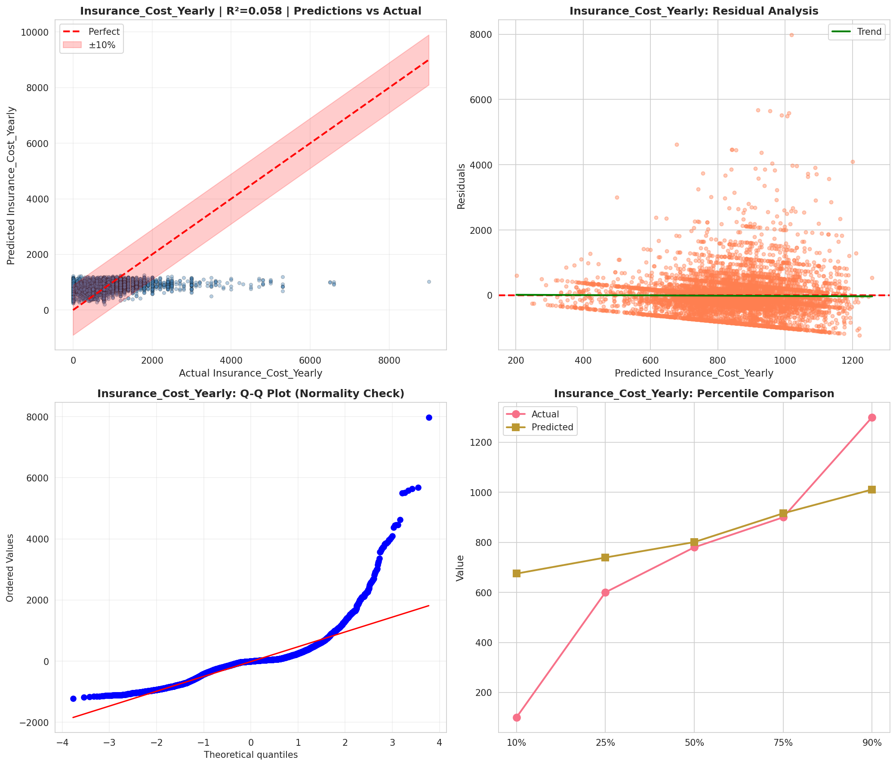
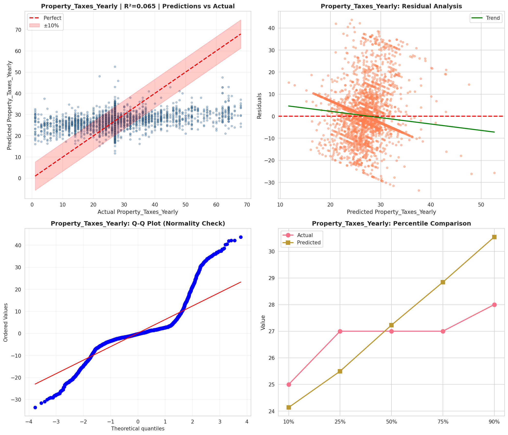
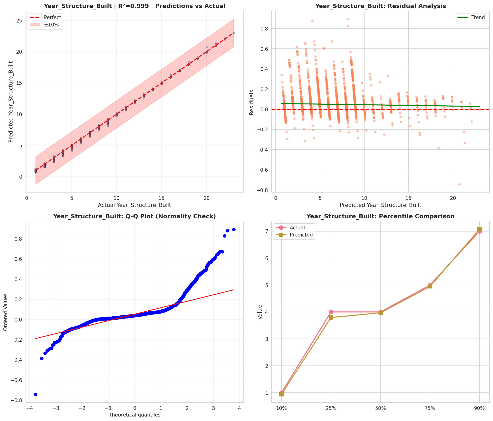
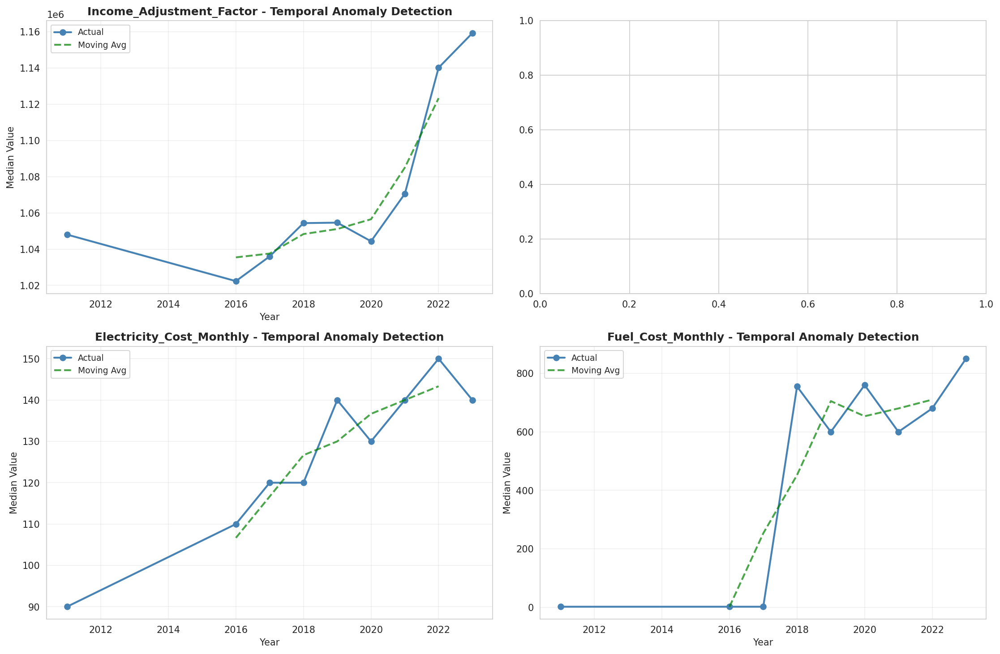
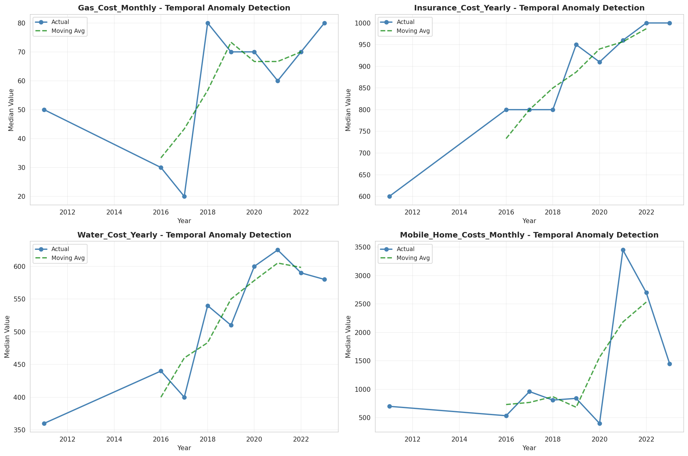
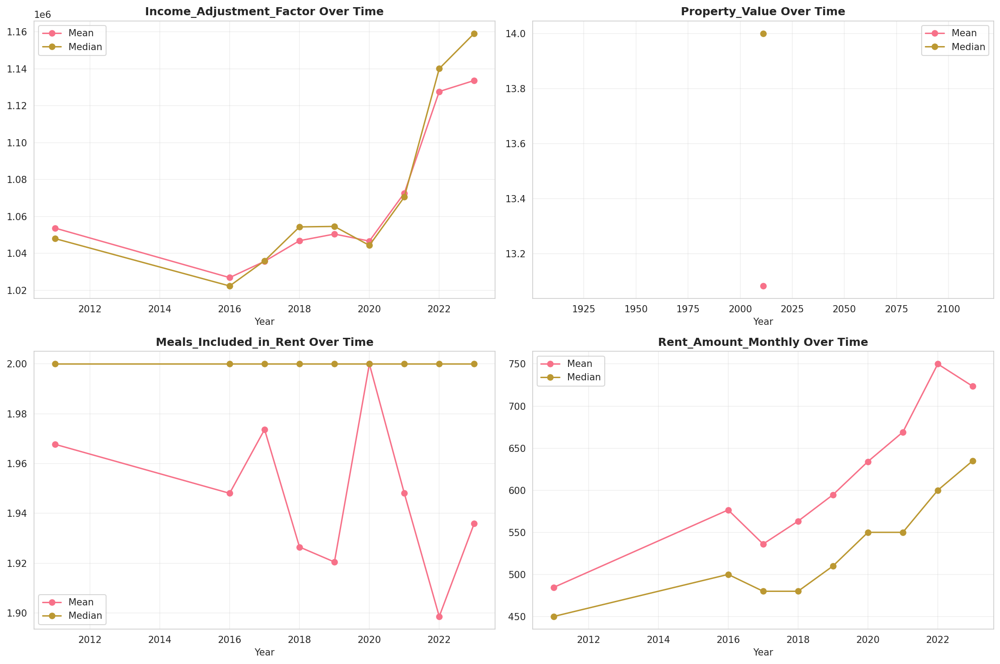
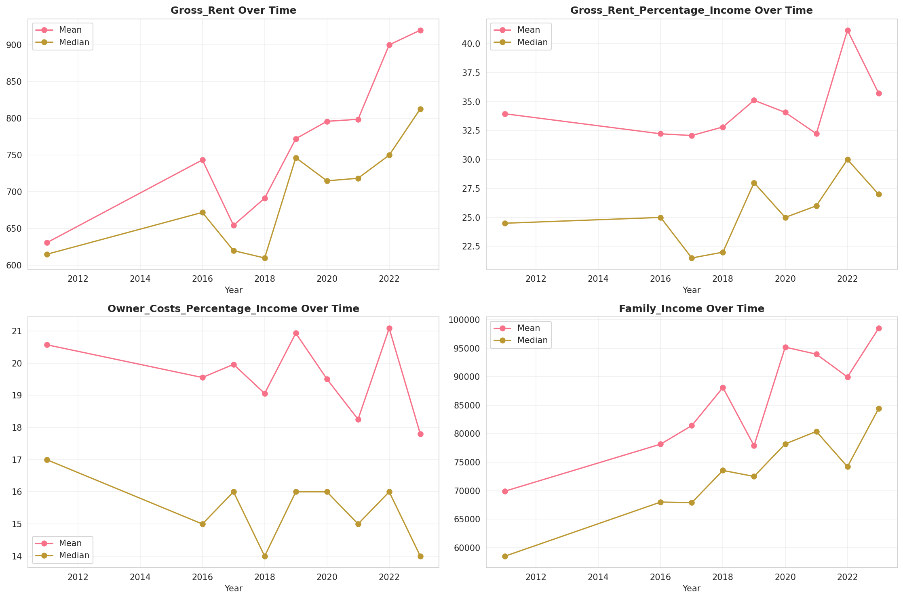
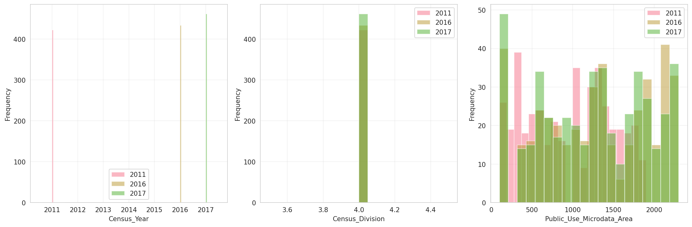
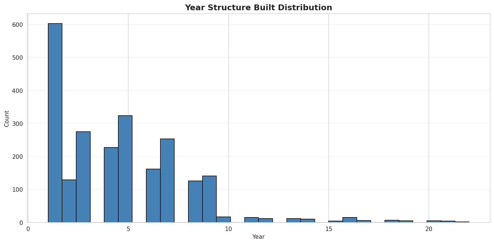
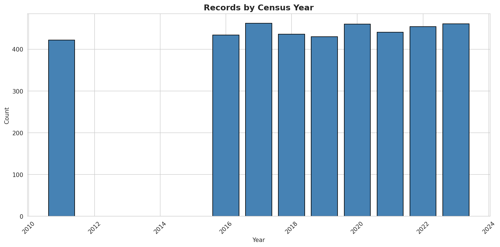
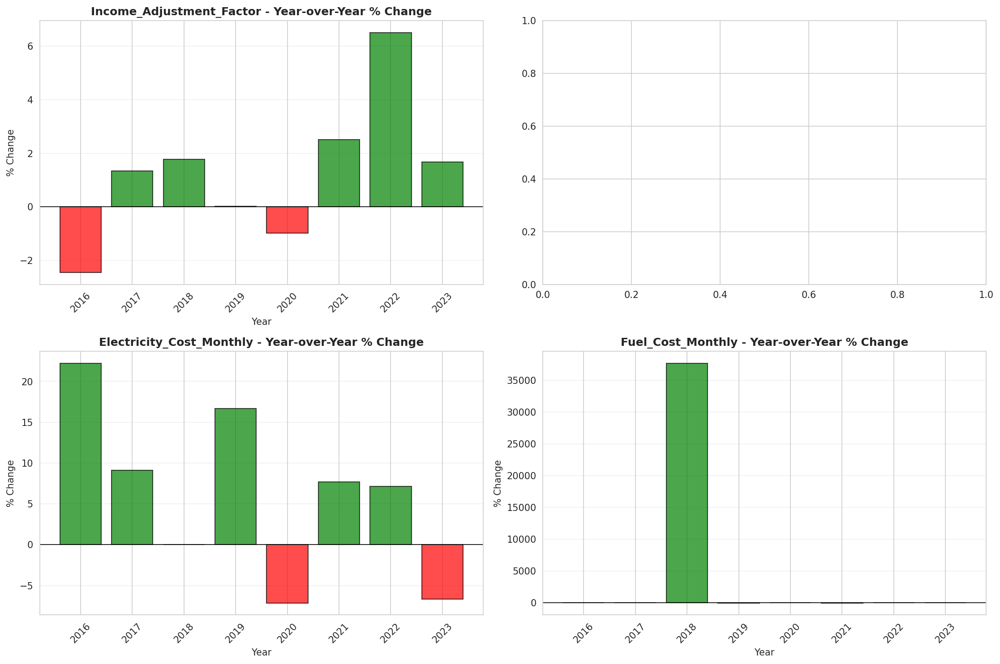
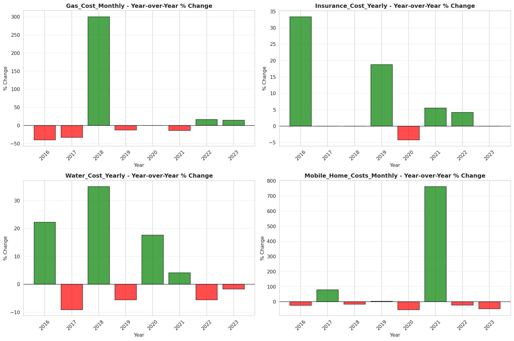
