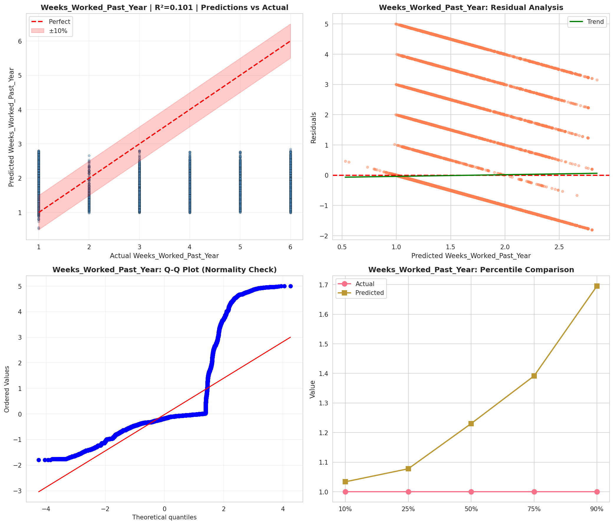
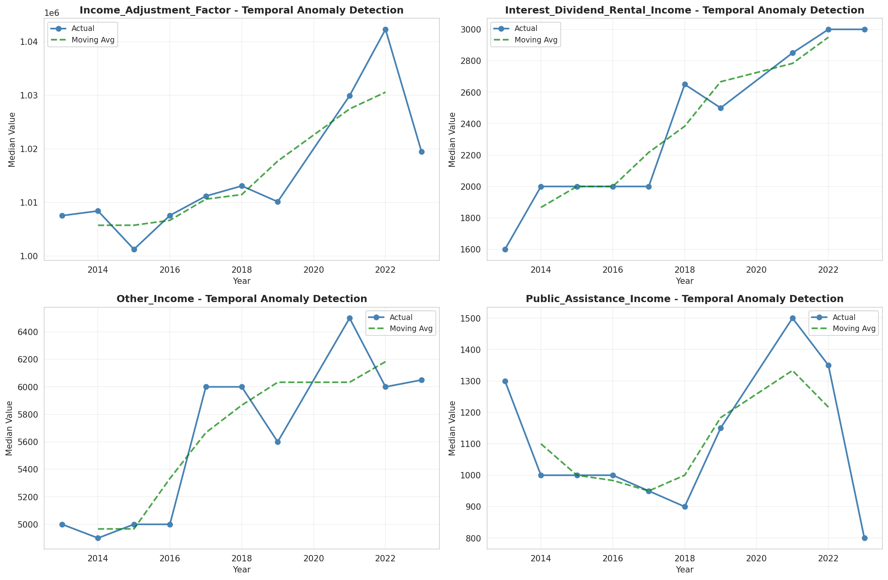
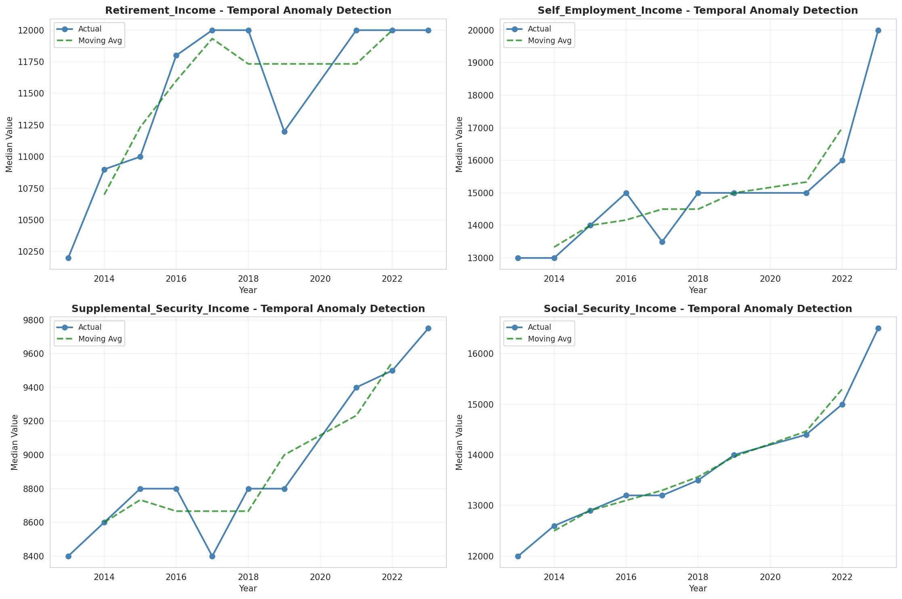
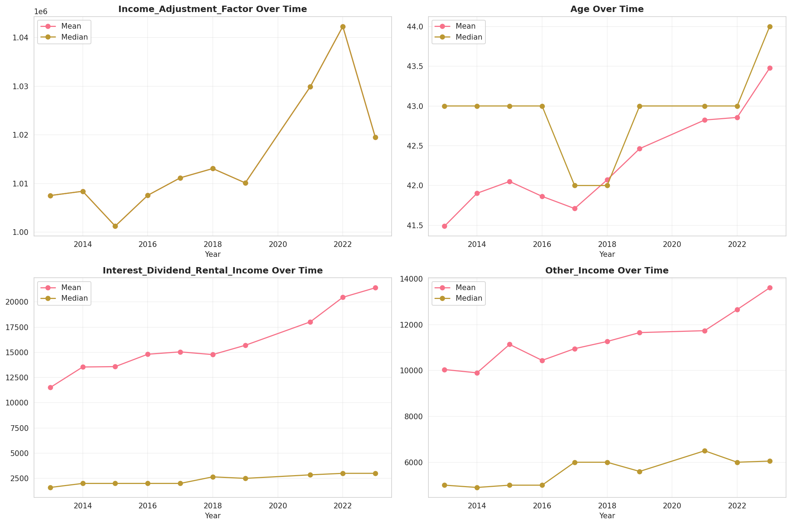
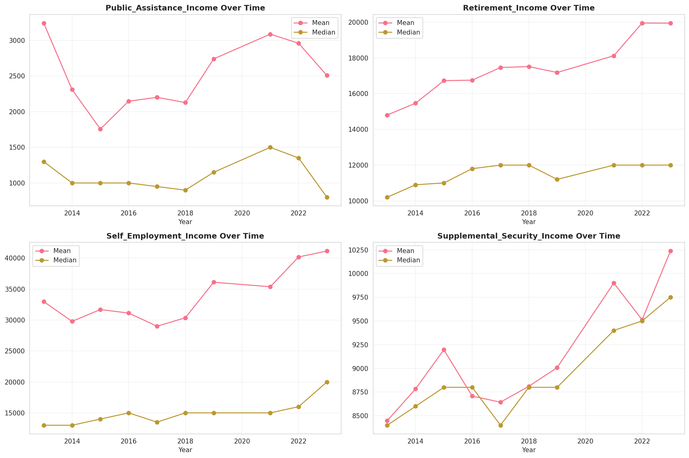
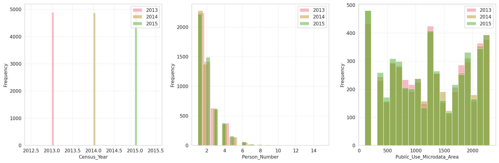
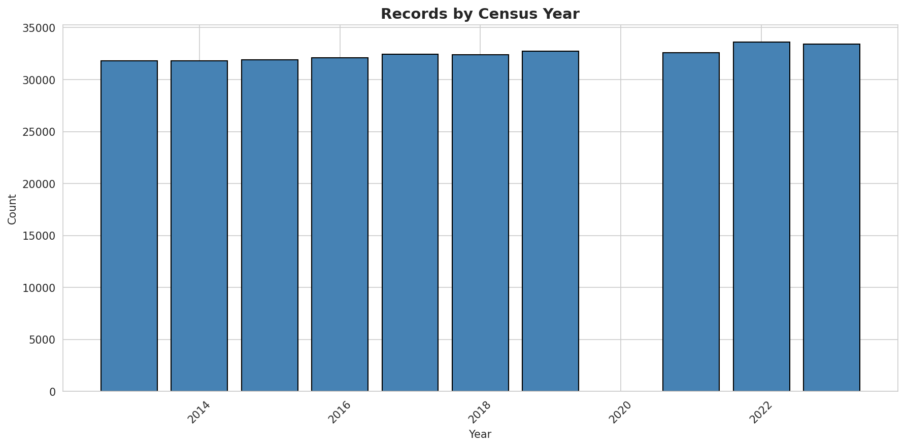
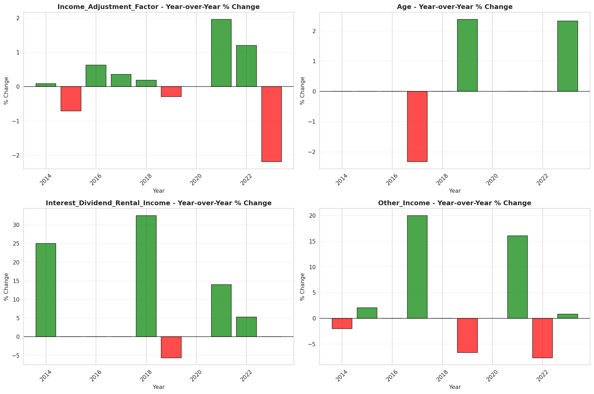
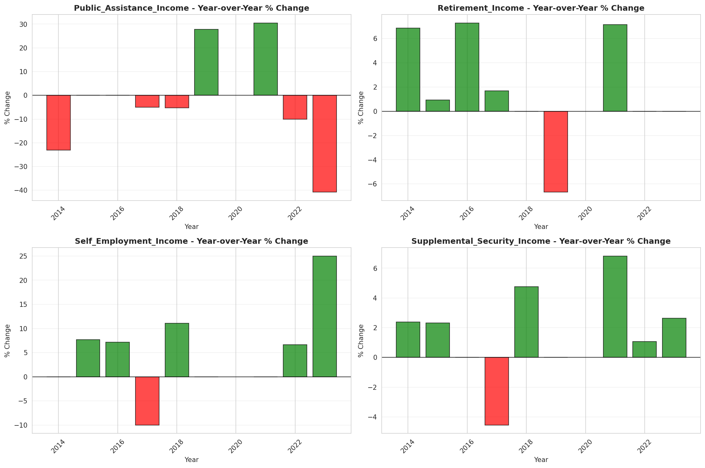

# Temporal Analysis

## Year Distribution

- 2013: 31,817 records

- 2014: 31,819 records

- 2015: 31,900 records

- 2016: 32,106 records

- 2017: 32,456 records

- 2018: 32,362 records

- 2019: 32,721 records

- 2021: 32,572 records

- 2022: 33,586 records

- 2023: 33,412 records

## Temporal Trends

- Census_Year: {np.int64(2013): {'mean': 2013.0, 'median': 2013.0, 'std': 0.0}, np.int64(2014): {'mean': 2014.0, 'median': 2014.0, 'std': 0.0}, np.int64(2015): {'mean': 2015.0, 'median': 2015.0, 'std': 0.0}, np.int64(2016): {'mean': 2016.0, 'median': 2016.0, 'std': 0.0}, np.int64(2017): {'mean': 2017.0, 'median': 2017.0, 'std': 0.0}, np.int64(2018): {'mean': 2018.0, 'median': 2018.0, 'std': 0.0}, np.int64(2019): {'mean': 2019.0, 'median': 2019.0, 'std': 0.0}, np.int64(2021): {'mean': 2021.0, 'median': 2021.0, 'std': 0.0}, np.int64(2022): {'mean': 2022.0, 'median': 2022.0, 'std': 0.0}, np.int64(2023): {'mean': 2023.0, 'median': 2023.0, 'std': 0.0}}

- Person_Number: {np.int64(2013): {'mean': 1.9967313071628374, 'median': 2.0, 'std': 1.2768816824697102}, np.int64(2014): {'mean': 1.9936830195794966, 'median': 2.0, 'std': 1.2803328938331726}, np.int64(2015): {'mean': 1.985924764890282, 'median': 2.0, 'std': 1.2583546962469294}, np.int64(2016): {'mean': 1.9873232417616644, 'median': 2.0, 'std': 1.2483515442088373}, np.int64(2017): {'mean': 1.9836085777668229, 'median': 2.0, 'std': 1.252023840147876}, np.int64(2018): {'mean': 1.9761139608182436, 'median': 2.0, 'std': 1.238008032435686}, np.int64(2019): {'mean': 1.9775984841539074, 'median': 2.0, 'std': 1.2484535628368627}, np.int64(2021): {'mean': 1.9766977772319785, 'median': 2.0, 'std': 1.277370672407896}, np.int64(2022): {'mean': 1.9600726493181684, 'median': 2.0, 'std': 1.2407820897384594}, np.int64(2023): {'mean': 1.9550760205914044, 'median': 2.0, 'std': 1.2426620884549644}}

- Public_Use_Microdata_Area: {np.int64(2013): {'mean': 1235.4338875443946, 'median': 1200.0, 'std': 665.885172126989}, np.int64(2014): {'mean': 1238.9892831327195, 'median': 1200.0, 'std': 663.0152509067865}, np.int64(2015): {'mean': 1235.871473354232, 'median': 1200.0, 'std': 667.1402344704743}, np.int64(2016): {'mean': 1229.2250669656762, 'median': 1200.0, 'std': 663.525625044017}, np.int64(2017): {'mean': 1238.5167611535617, 'median': 1200.0, 'std': 664.1118348984979}, np.int64(2018): {'mean': 1247.0922687102156, 'median': 1300.0, 'std': 660.6097816389778}, np.int64(2019): {'mean': 1232.660982243819, 'median': 1200.0, 'std': 660.2392044546472}, np.int64(2021): {'mean': 1233.7590568586515, 'median': 1200.0, 'std': 663.4873656367934}, np.int64(2022): {'mean': 1189.5345084261298, 'median': 1200.0, 'std': 684.1530354583628}, np.int64(2023): {'mean': 1192.8367951634143, 'median': 1200.0, 'std': 682.6213288304438}}

- State_Code: {np.int64(2013): {'mean': 19.0, 'median': 19.0, 'std': 0.0}, np.int64(2014): {'mean': 19.0, 'median': 19.0, 'std': 0.0}, np.int64(2015): {'mean': 19.0, 'median': 19.0, 'std': 0.0}, np.int64(2016): {'mean': 19.0, 'median': 19.0, 'std': 0.0}, np.int64(2017): {'mean': 19.0, 'median': 19.0, 'std': 0.0}, np.int64(2018): {'mean': 19.0, 'median': 19.0, 'std': 0.0}, np.int64(2019): {'mean': 19.0, 'median': 19.0, 'std': 0.0}, np.int64(2021): {'mean': 19.0, 'median': 19.0, 'std': 0.0}, np.int64(2022): {'mean': 19.0, 'median': 19.0, 'std': 0.0}, np.int64(2023): {'mean': None, 'median': None, 'std': None}}

- Income_Adjustment_Factor: {np.int64(2013): {'mean': 1007549.0, 'median': 1007549.0, 'std': 0.0}, np.int64(2014): {'mean': 1008425.0, 'median': 1008425.0, 'std': 0.0}, np.int64(2015): {'mean': 1001264.0, 'median': 1001264.0, 'std': 0.0}, np.int64(2016): {'mean': 1007588.0, 'median': 1007588.0, 'std': 0.0}, np.int64(2017): {'mean': 1011189.0, 'median': 1011189.0, 'std': 0.0}, np.int64(2018): {'mean': 1013097.0, 'median': 1013097.0, 'std': 0.0}, np.int64(2019): {'mean': 1010145.0, 'median': 1010145.0, 'std': 0.0}, np.int64(2021): {'mean': 1029928.0, 'median': 1029928.0, 'std': 0.0}, np.int64(2022): {'mean': 1042311.0, 'median': 1042311.0, 'std': 0.0}, np.int64(2023): {'mean': 1019518.0, 'median': 1019518.0, 'std': 0.0}}

- Person_Weight: {np.int64(2013): {'mean': 97.13096772165824, 'median': 74.0, 'std': 93.98526071881318}, np.int64(2014): {'mean': 97.65002042804613, 'median': 74.0, 'std': 93.86498553276822}, np.int64(2015): {'mean': 97.927868338558, 'median': 74.0, 'std': 98.86598184918628}, np.int64(2016): {'mean': 97.63573786831122, 'median': 74.0, 'std': 97.31585583419057}, np.int64(2017): {'mean': 96.92232561005669, 'median': 74.0, 'std': 94.51014935449007}, np.int64(2018): {'mean': 97.5262653729683, 'median': 73.0, 'std': 97.69250121932734}, np.int64(2019): {'mean': 96.4233978179151, 'median': 70.0, 'std': 101.21497979388725}, np.int64(2021): {'mean': 98.0314073437308, 'median': 70.0, 'std': 106.66482407083276}, np.int64(2022): {'mean': 95.29318763770618, 'median': 70.0, 'std': 100.55981667707823}, np.int64(2023): {'mean': 95.98359870705136, 'median': 70.0, 'std': 101.90938241193447}}

- Age: {np.int64(2013): {'mean': 41.489675330798, 'median': 43.0, 'std': 24.423476153096416}, np.int64(2014): {'mean': 41.90260536157642, 'median': 43.0, 'std': 24.576985109218693}, np.int64(2015): {'mean': 42.051097178683385, 'median': 43.0, 'std': 24.446383233627703}, np.int64(2016): {'mean': 41.86382607612284, 'median': 43.0, 'std': 24.577221711477616}, np.int64(2017): {'mean': 41.710531180675375, 'median': 42.0, 'std': 24.493335984295335}, np.int64(2018): {'mean': 42.07107100920833, 'median': 42.0, 'std': 24.549923806346122}, np.int64(2019): {'mean': 42.4634027077412, 'median': 43.0, 'std': 24.522178490501194}, np.int64(2021): {'mean': 42.823406606901635, 'median': 43.0, 'std': 24.76477297241521}, np.int64(2022): {'mean': 42.85607098195677, 'median': 43.0, 'std': 24.782279736283304}, np.int64(2023): {'mean': 43.47716389321202, 'median': 44.0, 'std': 24.87000086057067}}

- Citizenship_Status: {np.int64(2013): {'mean': 1.1145928277336015, 'median': 1.0, 'std': 0.626809539118946}, np.int64(2014): {'mean': 1.1198654891731354, 'median': 1.0, 'std': 0.6397097148021094}, np.int64(2015): {'mean': 1.1076489028213166, 'median': 1.0, 'std': 0.6055827111172574}, np.int64(2016): {'mean': 1.1216595028966547, 'median': 1.0, 'std': 0.643315223607575}, np.int64(2017): {'mean': 1.1218264727631255, 'median': 1.0, 'std': 0.6417963670018696}, np.int64(2018): {'mean': 1.1280823187689266, 'median': 1.0, 'std': 0.6613948754400715}, np.int64(2019): {'mean': 1.1249656184101953, 'median': 1.0, 'std': 0.6455133754767106}, np.int64(2021): {'mean': 1.1312476974088175, 'median': 1.0, 'std': 0.6591618686081386}, np.int64(2022): {'mean': 1.1336568808432084, 'median': 1.0, 'std': 0.6702378874121039}, np.int64(2023): {'mean': 1.1315694959894649, 'median': 1.0, 'std': 0.6677048984108418}}

- Class_of_Worker: {np.int64(2013): {'mean': 2.1012104567185435, 'median': 1.0, 'std': 1.8575016430560847}, np.int64(2014): {'mean': 2.148344912137311, 'median': 1.0, 'std': 1.9141365125740164}, np.int64(2015): {'mean': 2.1195364911567394, 'median': 1.0, 'std': 1.8789119316514356}, np.int64(2016): {'mean': 2.118996235884567, 'median': 1.0, 'std': 1.869820490090823}, np.int64(2017): {'mean': 2.0687391196219846, 'median': 1.0, 'std': 1.8436310516127954}, np.int64(2018): {'mean': 2.0741238550378336, 'median': 1.0, 'std': 1.863284471771156}, np.int64(2019): {'mean': 2.1298824232762055, 'median': 1.0, 'std': 1.8713864955694877}, np.int64(2021): {'mean': 2.1306171360095867, 'median': 1.0, 'std': 1.8681017218427125}, np.int64(2022): {'mean': 2.1612124722463557, 'median': 1.0, 'std': 1.8866559038997799}, np.int64(2023): {'mean': 2.142127492387781, 'median': 1.0, 'std': 1.8776573499356886}}

- English_Speaking_Ability: {np.int64(2013): {'mean': 1.6030640668523677, 'median': 1.0, 'std': 0.880191030146931}, np.int64(2014): {'mean': 1.5896921017402945, 'median': 1.0, 'std': 0.8804953769055485}, np.int64(2015): {'mean': 1.6725352112676057, 'median': 1.0, 'std': 0.9275095942280513}, np.int64(2016): {'mean': 1.619798234552333, 'median': 1.0, 'std': 0.8743590118838453}, np.int64(2017): {'mean': 1.5736875395319418, 'median': 1.0, 'std': 0.8541282481758696}, np.int64(2018): {'mean': 1.5562757807896288, 'median': 1.0, 'std': 0.8670037808311936}, np.int64(2019): {'mean': 1.5448954489544895, 'median': 1.0, 'std': 0.8050695649737151}, np.int64(2021): {'mean': 1.593368237347295, 'median': 1.0, 'std': 0.8787904422492787}, np.int64(2022): {'mean': 1.5957906098219103, 'median': 1.0, 'std': 0.8676596356804308}, np.int64(2023): {'mean': 1.5765472312703583, 'median': 1.0, 'std': 0.844095329803595}}

- Fertility_Status: {np.int64(2013): {'mean': 1.9448338921060653, 'median': 2.0, 'std': 0.2283215994443108}, np.int64(2014): {'mean': 1.9385239506943361, 'median': 2.0, 'std': 0.24022020841086378}, np.int64(2015): {'mean': 1.9457840819542946, 'median': 2.0, 'std': 0.22646111136562028}, np.int64(2016): {'mean': 1.9458955223880596, 'median': 2.0, 'std': 0.22624133354256204}, np.int64(2017): {'mean': 1.9399570024570025, 'median': 2.0, 'std': 0.23758473028374041}, np.int64(2018): {'mean': 1.939234227251589, 'median': 2.0, 'std': 0.23891869366659493}, np.int64(2019): {'mean': 1.9456179066834804, 'median': 2.0, 'std': 0.22678798150525173}, np.int64(2021): {'mean': 1.9388142292490118, 'median': 2.0, 'std': 0.23968970648573817}, np.int64(2022): {'mean': 1.9391881696091746, 'median': 2.0, 'std': 0.23900286884871055}, np.int64(2023): {'mean': 1.946304582626138, 'median': 2.0, 'std': 0.22543305196623512}}

- Marital_Status: {np.int64(2013): {'mean': 2.815884589999057, 'median': 2.0, 'std': 1.8483954190326906}, np.int64(2014): {'mean': 2.798642320626041, 'median': 2.0, 'std': 1.8431732802861196}, np.int64(2015): {'mean': 2.784169278996865, 'median': 2.0, 'std': 1.8412582221625777}, np.int64(2016): {'mean': 2.814022301127515, 'median': 2.0, 'std': 1.8482579730558244}, np.int64(2017): {'mean': 2.8356544244515653, 'median': 2.0, 'std': 1.8499345710367088}, np.int64(2018): {'mean': 2.8345899511773065, 'median': 2.0, 'std': 1.8498165661516988}, np.int64(2019): {'mean': 2.830842578160814, 'median': 2.0, 'std': 1.8471771372086019}, np.int64(2021): {'mean': 2.832862581358222, 'median': 2.0, 'std': 1.8518897599638522}, np.int64(2022): {'mean': 2.839010301911511, 'median': 2.0, 'std': 1.851189548735}, np.int64(2023): {'mean': 2.837483538848318, 'median': 2.0, 'std': 1.8472669508468658}}

- Mobility_Status: {np.int64(2013): {'mean': 1.248999555357937, 'median': 1.0, 'std': 0.658047590440496}, np.int64(2014): {'mean': 1.2538148524923702, 'median': 1.0, 'std': 0.6628297361963849}, np.int64(2015): {'mean': 1.262082726293786, 'median': 1.0, 'std': 0.6725277596920599}, np.int64(2016): {'mean': 1.2562399672657454, 'median': 1.0, 'std': 0.6656496119828659}, np.int64(2017): {'mean': 1.254595301887968, 'median': 1.0, 'std': 0.664375456314918}, np.int64(2018): {'mean': 1.2672559185458179, 'median': 1.0, 'std': 0.6786535705818705}, np.int64(2019): {'mean': 1.2465512452550689, 'median': 1.0, 'std': 0.6556130493789254}, np.int64(2021): {'mean': 1.2335184438308566, 'median': 1.0, 'std': 0.6404622876961196}, np.int64(2022): {'mean': 1.2351029252437704, 'median': 1.0, 'std': 0.6420563155020187}, np.int64(2023): {'mean': 1.2166495561326167, 'median': 1.0, 'std': 0.6182531039363028}}

- Military_Service: {np.int64(2013): {'mean': 3.7868210925764885, 'median': 4.0, 'std': 0.6011323383767366}, np.int64(2014): {'mean': 3.7874363729629485, 'median': 4.0, 'std': 0.5989072646534043}, np.int64(2015): {'mean': 3.7955941620691003, 'median': 4.0, 'std': 0.5907999696263858}, np.int64(2016): {'mean': 3.798780726093243, 'median': 4.0, 'std': 0.5860701915715617}, np.int64(2017): {'mean': 3.808659650208946, 'median': 4.0, 'std': 0.5723856671369276}, np.int64(2018): {'mean': 3.8155100784736113, 'median': 4.0, 'std': 0.565099821862774}, np.int64(2019): {'mean': 3.818282231955818, 'median': 4.0, 'std': 0.5596179594660216}, np.int64(2021): {'mean': 3.8271868332825356, 'median': 4.0, 'std': 0.5482794319470973}, np.int64(2022): {'mean': 3.8313822519295395, 'median': 4.0, 'std': 0.5397313867123457}, np.int64(2023): {'mean': 3.8374949286320215, 'median': 4.0, 'std': 0.5313290073009712}}

- Travel_Time_To_Work_Minutes: {np.int64(2013): {'mean': 19.77717799795012, 'median': 15.0, 'std': 19.24163969622884}, np.int64(2014): {'mean': 19.93349906774394, 'median': 15.0, 'std': 19.795736886197442}, np.int64(2015): {'mean': 20.3314181424902, 'median': 15.0, 'std': 20.365961705517055}, np.int64(2016): {'mean': 20.254338759585632, 'median': 15.0, 'std': 19.459945918035384}, np.int64(2017): {'mean': 20.64164762800699, 'median': 15.0, 'std': 20.80390895886065}, np.int64(2018): {'mean': 20.447816826411074, 'median': 15.0, 'std': 19.57225656241023}, np.int64(2019): {'mean': 21.333422710819146, 'median': 15.0, 'std': 22.143691396778543}, np.int64(2021): {'mean': 21.197238512359885, 'median': 15.0, 'std': 21.310897173220813}, np.int64(2022): {'mean': 20.89773987798114, 'median': 15.0, 'std': 20.827584267078965}, np.int64(2023): {'mean': 21.385037652192274, 'median': 15.0, 'std': 21.211624827004144}}

- Vehicle_Occupancy: {np.int64(2013): {'mean': 1.1556012031399017, 'median': 1.0, 'std': 0.59841866990069}, np.int64(2014): {'mean': 1.1429517850570483, 'median': 1.0, 'std': 0.5486080760163119}, np.int64(2015): {'mean': 1.1318218152750528, 'median': 1.0, 'std': 0.5216863328435997}, np.int64(2016): {'mean': 1.1334916522740357, 'median': 1.0, 'std': 0.5233224185209725}, np.int64(2017): {'mean': 1.1271337761588458, 'median': 1.0, 'std': 0.5190445809670226}, np.int64(2018): {'mean': 1.130124902970856, 'median': 1.0, 'std': 0.5263722315111046}, np.int64(2019): {'mean': 1.129394219160571, 'median': 1.0, 'std': 0.5072096496934446}, np.int64(2021): {'mean': 1.1265583083477986, 'median': 1.0, 'std': 0.49800362701048173}, np.int64(2022): {'mean': 1.1346153846153846, 'median': 1.0, 'std': 0.5163930047313325}, np.int64(2023): {'mean': 1.1327909233410465, 'median': 1.0, 'std': 0.5238963393588189}}

- Transportation_To_Work: {np.int64(2013): {'mean': 1.9656276547082272, 'median': 1.0, 'std': 2.867572522198481}, np.int64(2014): {'mean': 1.956221652534017, 'median': 1.0, 'std': 2.860077785578577}, np.int64(2015): {'mean': 1.957170542635659, 'median': 1.0, 'std': 2.851273955182533}, np.int64(2016): {'mean': 1.9656145753143444, 'median': 1.0, 'std': 2.8690498988827917}, np.int64(2017): {'mean': 1.9491006505931878, 'median': 1.0, 'std': 2.852717513827807}, np.int64(2018): {'mean': 1.928286600417748, 'median': 1.0, 'std': 2.832673255382719}, np.int64(2019): {'mean': None, 'median': None, 'std': None}, np.int64(2021): {'mean': None, 'median': None, 'std': None}, np.int64(2022): {'mean': None, 'median': None, 'std': None}, np.int64(2023): {'mean': None, 'median': None, 'std': None}}

- Language_Other_Than_English: {np.int64(2013): {'mean': 1.952324037184595, 'median': 2.0, 'std': 0.21308325330172304}, np.int64(2014): {'mean': 1.9502828618968386, 'median': 2.0, 'std': 0.21736355848842293}, np.int64(2015): {'mean': 1.9530392221707784, 'median': 2.0, 'std': 0.21155836861358013}, np.int64(2016): {'mean': 1.9477378324051802, 'median': 2.0, 'std': 0.22255890374494158}, np.int64(2017): {'mean': 1.9484378057530494, 'median': 2.0, 'std': 0.221145041424362}, np.int64(2018): {'mean': 1.9445533555511991, 'median': 2.0, 'std': 0.22885372031515527}, np.int64(2019): {'mean': 1.947663190421012, 'median': 2.0, 'std': 0.22270892307316448}, np.int64(2021): {'mean': 1.9442805743736022, 'median': 2.0, 'std': 0.22938281700550614}, np.int64(2022): {'mean': 1.941777163325583, 'median': 2.0, 'std': 0.23416801855869301}, np.int64(2023): {'mean': 1.942068184677318, 'median': 2.0, 'std': 0.23361814266790612}}

- Grandparents_Living_With_Grandchildren: {np.int64(2013): {'mean': 1.9810226155358899, 'median': 2.0, 'std': 0.1364483737171186}, np.int64(2014): {'mean': 1.982202935296699, 'median': 2.0, 'std': 0.13221641939487586}, np.int64(2015): {'mean': 1.9812397253650518, 'median': 2.0, 'std': 0.1356805691273569}, np.int64(2016): {'mean': 1.979415895771783, 'median': 2.0, 'std': 0.14199075801259184}, np.int64(2017): {'mean': 1.983071168233263, 'median': 2.0, 'std': 0.12900792445716952}, np.int64(2018): {'mean': 1.9839613156508833, 'median': 2.0, 'std': 0.12562722854806982}, np.int64(2019): {'mean': 1.9834259302488444, 'median': 2.0, 'std': 0.12767196628758112}, np.int64(2021): {'mean': 1.9836526300997706, 'median': 2.0, 'std': 0.1268104358322931}, np.int64(2022): {'mean': 1.9852319716453855, 'median': 2.0, 'std': 0.12062584662265528}, np.int64(2023): {'mean': 1.98567890114839, 'median': 2.0, 'std': 0.11881347028356906}}

- Months_Responsible_For_Grandchildren: {np.int64(2013): {'mean': 3.3085714285714287, 'median': 4.0, 'std': 1.5634789215910272}, np.int64(2014): {'mean': 3.472972972972973, 'median': 3.0, 'std': 1.4401716920790841}, np.int64(2015): {'mean': 3.804733727810651, 'median': 4.0, 'std': 1.287661716653188}, np.int64(2016): {'mean': 3.513227513227513, 'median': 4.0, 'std': 1.5423402555596633}, np.int64(2017): {'mean': 3.674074074074074, 'median': 4.0, 'std': 1.4394735233142812}, np.int64(2018): {'mean': 3.808, 'median': 4.0, 'std': 1.3240699718378104}, np.int64(2019): {'mean': 3.6482758620689655, 'median': 4.0, 'std': 1.4314475699772835}, np.int64(2021): {'mean': 3.814814814814815, 'median': 4.0, 'std': 1.3393314504286238}, np.int64(2022): {'mean': 3.5531914893617023, 'median': 4.0, 'std': 1.461044303204749}, np.int64(2023): {'mean': 3.871794871794872, 'median': 4.0, 'std': 1.249403040479605}}

- Grandparents_Responsible_For_Grandchildren: {np.int64(2013): {'mean': 1.5466321243523315, 'median': 2.0, 'std': 0.4984667967205818}, np.int64(2014): {'mean': 1.5945205479452054, 'median': 2.0, 'std': 0.49165855517708623}, np.int64(2015): {'mean': 1.5644329896907216, 'median': 2.0, 'std': 0.49647120459974653}, np.int64(2016): {'mean': 1.5552941176470587, 'median': 2.0, 'std': 0.497518815978906}, np.int64(2017): {'mean': 1.6175637393767706, 'median': 2.0, 'std': 0.4866720965809761}, np.int64(2018): {'mean': 1.626865671641791, 'median': 2.0, 'std': 0.4843608324726561}, np.int64(2019): {'mean': 1.591549295774648, 'median': 2.0, 'std': 0.49224106413263535}, np.int64(2021): {'mean': 1.6131805157593124, 'median': 2.0, 'std': 0.48772097740735065}, np.int64(2022): {'mean': 1.5661538461538462, 'median': 2.0, 'std': 0.4963685791644816}, np.int64(2023): {'mean': 1.6320754716981132, 'median': 2.0, 'std': 0.4830007092518491}}

- Interest_Dividend_Rental_Income: {np.int64(2013): {'mean': 11505.760451227605, 'median': 1600.0, 'std': 30550.967658478105}, np.int64(2014): {'mean': 13542.712834718375, 'median': 2000.0, 'std': 35573.57096900913}, np.int64(2015): {'mean': 13578.118460474763, 'median': 2000.0, 'std': 33897.968515181354}, np.int64(2016): {'mean': 14808.18379022646, 'median': 2000.0, 'std': 39496.61495353274}, np.int64(2017): {'mean': 15040.575772681954, 'median': 2000.0, 'std': 42130.83482408475}, np.int64(2018): {'mean': 14771.894658012981, 'median': 2650.0, 'std': 35985.344345584665}, np.int64(2019): {'mean': 15692.228614307154, 'median': 2500.0, 'std': 38824.811535329136}, np.int64(2021): {'mean': 18015.638006571742, 'median': 2850.0, 'std': 44881.083181645474}, np.int64(2022): {'mean': 20449.941442640404, 'median': 3000.0, 'std': 54067.669416587625}, np.int64(2023): {'mean': 21394.261031366295, 'median': 3000.0, 'std': 55416.637783299695}}

- Military_Service_Period_1: {np.int64(2013): {'mean': 0.10550268928423666, 'median': 0.0, 'std': 0.3072636214120725}, np.int64(2014): {'mean': 0.09333333333333334, 'median': 0.0, 'std': 0.290959612625126}, np.int64(2015): {'mean': 0.10374149659863946, 'median': 0.0, 'std': 0.30498974944941726}, np.int64(2016): {'mean': 0.11471861471861472, 'median': 0.0, 'std': 0.3187510593055147}, np.int64(2017): {'mean': 0.12409747292418773, 'median': 0.0, 'std': 0.32976713512220046}, np.int64(2018): {'mean': 0.13003239241092088, 'median': 0.0, 'std': 0.3364169162554677}, np.int64(2019): {'mean': 0.15722976134768366, 'median': 0.0, 'std': 0.3641024571992979}, np.int64(2021): {'mean': 0.17202174987642116, 'median': 0.0, 'std': 0.37749265918213876}, np.int64(2022): {'mean': 0.17928286852589642, 'median': 0.0, 'std': 0.3836845517374807}, np.int64(2023): {'mean': 0.17091836734693877, 'median': 0.0, 'std': 0.37653368317858665}}

- Military_Service_Period_2: {np.int64(2013): {'mean': 0.11874224244931733, 'median': 0.0, 'std': 0.32355190404277423}, np.int64(2014): {'mean': 0.11916666666666667, 'median': 0.0, 'std': 0.32405204254075665}, np.int64(2015): {'mean': 0.13690476190476192, 'median': 0.0, 'std': 0.3438198777306217}, np.int64(2016): {'mean': 0.13246753246753246, 'median': 0.0, 'std': 0.33907175600929773}, np.int64(2017): {'mean': 0.14034296028880866, 'median': 0.0, 'std': 0.3474209001681832}, np.int64(2018): {'mean': 0.15316982878297083, 'median': 0.0, 'std': 0.36023448296756105}, np.int64(2019): {'mean': 0.1731399157697707, 'median': 0.0, 'std': 0.3784567465014527}, np.int64(2021): {'mean': 0.16411270390509144, 'median': 0.0, 'std': 0.37046938862043904}, np.int64(2022): {'mean': 0.17480079681274902, 'median': 0.0, 'std': 0.3798912336924022}, np.int64(2023): {'mean': 0.17142857142857143, 'median': 0.0, 'std': 0.3769792078139627}}

- Military_Service_Period_5: {np.int64(2013): {'mean': 0.37277616880430287, 'median': 0.0, 'std': 0.48364333359804146}, np.int64(2014): {'mean': 0.4, 'median': 0.0, 'std': 0.49000004253472795}, np.int64(2015): {'mean': 0.3983843537414966, 'median': 0.0, 'std': 0.48966948659409654}, np.int64(2016): {'mean': 0.416017316017316, 'median': 0.0, 'std': 0.4930031705391935}, np.int64(2017): {'mean': 0.4120036101083033, 'median': 0.0, 'std': 0.49230682130913317}, np.int64(2018): {'mean': 0.41323461360481256, 'median': 0.0, 'std': 0.4925281953063334}, np.int64(2019): {'mean': 0.4197473093121198, 'median': 0.0, 'std': 0.4936329928430034}, np.int64(2021): {'mean': 0.4078101828966881, 'median': 0.0, 'std': 0.49154905588090053}, np.int64(2022): {'mean': 0.4033864541832669, 'median': 0.0, 'std': 0.49069923168866675}, np.int64(2023): {'mean': 0.4147959183673469, 'median': 0.0, 'std': 0.4928125148232178}}

- Military_Service_Period_8: {np.int64(2013): {'mean': 0.1481175010343401, 'median': 0.0, 'std': 0.355289928379148}, np.int64(2014): {'mean': 0.13333333333333333, 'median': 0.0, 'std': 0.3400054760938339}, np.int64(2015): {'mean': 0.13010204081632654, 'median': 0.0, 'std': 0.33648720494855316}, np.int64(2016): {'mean': 0.11038961038961038, 'median': 0.0, 'std': 0.3134426186125447}, np.int64(2017): {'mean': 0.11597472924187725, 'median': 0.0, 'std': 0.320266885450877}, np.int64(2018): {'mean': 0.09162424803331791, 'median': 0.0, 'std': 0.2885615658115483}, np.int64(2019): {'mean': 0.09546092653252222, 'median': 0.0, 'std': 0.293919314092035}, np.int64(2021): {'mean': 0.054869006426099855, 'median': 0.0, 'std': 0.227780696375477}, np.int64(2022): {'mean': 0.06623505976095617, 'median': 0.0, 'std': 0.2487544828767251}, np.int64(2023): {'mean': 0.060714285714285714, 'median': 0.0, 'std': 0.2388664313513816}}

- Military_Service_Period_9: {np.int64(2013): {'mean': 0.015308233347124535, 'median': 0.0, 'std': 0.12280118294360795}, np.int64(2014): {'mean': 0.009166666666666667, 'median': 0.0, 'std': 0.0953227407246748}, np.int64(2015): {'mean': 0.0195578231292517, 'median': 0.0, 'std': 0.13850440758810967}, np.int64(2016): {'mean': 0.016883116883116882, 'median': 0.0, 'std': 0.1288614204256908}, np.int64(2017): {'mean': 0.014891696750902527, 'median': 0.0, 'std': 0.1211468411221241}, np.int64(2018): {'mean': 0.006941230911614993, 'median': 0.0, 'std': 0.08304361174709757}, np.int64(2019): {'mean': 0.014506317267197005, 'median': 0.0, 'std': 0.11959338132246634}, np.int64(2021): {'mean': None, 'median': None, 'std': None}, np.int64(2022): {'mean': None, 'median': None, 'std': None}, np.int64(2023): {'mean': None, 'median': None, 'std': None}}

- Military_Service_Period_10: {np.int64(2013): {'mean': 0.08357467935457179, 'median': 0.0, 'std': 0.27680616587164364}, np.int64(2014): {'mean': 0.07625, 'median': 0.0, 'std': 0.26545300533399563}, np.int64(2015): {'mean': 0.05782312925170068, 'median': 0.0, 'std': 0.23345832161071775}, np.int64(2016): {'mean': 0.05541125541125541, 'median': 0.0, 'std': 0.22883075923902907}, np.int64(2017): {'mean': 0.04422382671480144, 'median': 0.0, 'std': 0.20563842666210863}, np.int64(2018): {'mean': 0.036557149467838966, 'median': 0.0, 'std': 0.18771529021766004}, np.int64(2019): {'mean': 0.022929340196537203, 'median': 0.0, 'std': 0.14971330643835545}, np.int64(2021): {'mean': 0.010874938210578349, 'median': 0.0, 'std': 0.10374002963393977}, np.int64(2022): {'mean': 0.009462151394422311, 'median': 0.0, 'std': 0.0968364035375008}, np.int64(2023): {'mean': 0.005612244897959183, 'median': 0.0, 'std': 0.07472346605201856}}

- Military_Service_Period_11: {np.int64(2013): {'mean': 0.002068680182043856, 'median': 0.0, 'std': 0.045445079104948695}, np.int64(2014): {'mean': 0.0025, 'median': 0.0, 'std': 0.049947867778546616}, np.int64(2015): {'mean': 0.00042517006802721087, 'median': 0.0, 'std': 0.020619652471058077}, np.int64(2016): {'mean': 0.0012987012987012987, 'median': 0.0, 'std': 0.036021887721511416}, np.int64(2017): {'mean': 0.0004512635379061372, 'median': 0.0, 'std': 0.021242964433104375}, np.int64(2018): {'mean': 0.0, 'median': 0.0, 'std': 0.0}, np.int64(2019): {'mean': 0.0018717828731867104, 'median': 0.0, 'std': 0.043233713287860874}, np.int64(2021): {'mean': None, 'median': None, 'std': None}, np.int64(2022): {'mean': None, 'median': None, 'std': None}, np.int64(2023): {'mean': None, 'median': None, 'std': None}}

- Temporary_Absence_From_Work: {np.int64(2013): {'mean': 2.6220460199004973, 'median': 3.0, 'std': 0.5120226535894669}, np.int64(2014): {'mean': 2.6169617893755825, 'median': 3.0, 'std': 0.5113640466842205}, np.int64(2015): {'mean': 2.6205606755870896, 'median': 3.0, 'std': 0.5102042584170005}, np.int64(2016): {'mean': 2.6261826013383587, 'median': 3.0, 'std': 0.508475713717647}, np.int64(2017): {'mean': 2.625380749314651, 'median': 3.0, 'std': 0.5078345641841325}, np.int64(2018): {'mean': 2.6256021240280676, 'median': 3.0, 'std': 0.5088102033439337}, np.int64(2019): {'mean': 2.6312987402519497, 'median': 3.0, 'std': 0.5053124776538287}, np.int64(2021): {'mean': 2.6010284899215494, 'median': 3.0, 'std': 0.5139324564535707}, np.int64(2022): {'mean': 2.6140714104100833, 'median': 3.0, 'std': 0.5127686270951659}, np.int64(2023): {'mean': 2.6007697055513197, 'median': 3.0, 'std': 0.5112226712933061}}

- Available_For_Work: {np.int64(2013): {'mean': 4.730449315920398, 'median': 5.0, 'std': 0.9211048661490739}, np.int64(2014): {'mean': 4.733535259397328, 'median': 5.0, 'std': 0.9137713162103426}, np.int64(2015): {'mean': 4.74927698299464, 'median': 5.0, 'std': 0.8868109770764916}, np.int64(2016): {'mean': 4.767133297438659, 'median': 5.0, 'std': 0.8565193089265551}, np.int64(2017): {'mean': 4.7605848309473044, 'median': 5.0, 'std': 0.8687757207584386}, np.int64(2018): {'mean': 4.76165370756685, 'median': 5.0, 'std': 0.8707696118812402}, np.int64(2019): {'mean': 4.7563362327534495, 'median': 5.0, 'std': 0.8686230407386444}, np.int64(2021): {'mean': 4.790923764122969, 'median': 5.0, 'std': 0.8125665915461205}, np.int64(2022): {'mean': 4.811521557516981, 'median': 5.0, 'std': 0.7638058625328191}, np.int64(2023): {'mean': 4.799114112478669, 'median': 5.0, 'std': 0.7874344107841115}}

- On_Layoff_From_Work: {np.int64(2013): {'mean': 2.604088930348259, 'median': 3.0, 'std': 0.5079249069903059}, np.int64(2014): {'mean': 2.600846536191364, 'median': 3.0, 'std': 0.5051135181782388}, np.int64(2015): {'mean': 2.60517487371303, 'median': 3.0, 'std': 0.5045063598483164}, np.int64(2016): {'mean': 2.613645104222752, 'median': 3.0, 'std': 0.49963175228338413}, np.int64(2017): {'mean': 2.6130444715199515, 'median': 3.0, 'std': 0.4994903149482269}, np.int64(2018): {'mean': 2.6123648776787407, 'median': 3.0, 'std': 0.5003552466520664}, np.int64(2019): {'mean': 2.621325734853029, 'median': 3.0, 'std': 0.4956180041419053}, np.int64(2021): {'mean': 2.588791712022822, 'median': 3.0, 'std': 0.5080512880671433}, np.int64(2022): {'mean': 2.6088409429370527, 'median': 3.0, 'std': 0.4956259132968288}, np.int64(2023): {'mean': 2.5928911157099805, 'median': 3.0, 'std': 0.49944010771211417}}

- Looking_For_Work: {np.int64(2013): {'mean': 2.60517723880597, 'median': 3.0, 'std': 0.5500343770918891}, np.int64(2014): {'mean': 2.6013513513513513, 'median': 3.0, 'std': 0.5457399053650998}, np.int64(2015): {'mean': 2.608953842594378, 'median': 3.0, 'std': 0.5401295868639302}, np.int64(2016): {'mean': 2.614875778786247, 'median': 3.0, 'std': 0.5369815101967662}, np.int64(2017): {'mean': 2.613615595491928, 'median': 3.0, 'std': 0.5386119630183409}, np.int64(2018): {'mean': 2.6163095012326947, 'median': 3.0, 'std': 0.5323186840620293}, np.int64(2019): {'mean': 2.6096655668866227, 'median': 3.0, 'std': 0.5360964052638457}, np.int64(2021): {'mean': 2.5811343418039865, 'median': 3.0, 'std': 0.5426577253795101}, np.int64(2022): {'mean': 2.5965275507609604, 'median': 3.0, 'std': 0.5318148421144656}, np.int64(2023): {'mean': 2.5804015539338487, 'median': 3.0, 'std': 0.5357626682868537}}

- Informed_Of_Recall: {np.int64(2013): {'mean': 2.932874689054726, 'median': 3.0, 'std': 0.2749625562763861}, np.int64(2014): {'mean': 2.9345681888785338, 'median': 3.0, 'std': 0.26736222589032516}, np.int64(2015): {'mean': 2.9378012570855665, 'median': 3.0, 'std': 0.261307111041786}, np.int64(2016): {'mean': 2.940004615029613, 'median': 3.0, 'std': 0.2563307279221154}, np.int64(2017): {'mean': 2.942011879378617, 'median': 3.0, 'std': 0.2529710817658542}, np.int64(2018): {'mean': 2.9394652000758583, 'median': 3.0, 'std': 0.26183027427074806}, np.int64(2019): {'mean': 2.927826934613077, 'median': 3.0, 'std': 0.2765683951662507}, np.int64(2021): {'mean': 2.9402049472617393, 'median': 3.0, 'std': 0.25832581222617}, np.int64(2022): {'mean': 2.947731647960481, 'median': 3.0, 'std': 0.23726448673580638}, np.int64(2023): {'mean': 2.940202592310206, 'median': 3.0, 'std': 0.2519630048307013}}

- Other_Income: {np.int64(2013): {'mean': 10043.303635432667, 'median': 5000.0, 'std': 14428.33218915926}, np.int64(2014): {'mean': 9901.228940568475, 'median': 4900.0, 'std': 13702.158530759221}, np.int64(2015): {'mean': 11140.56167400881, 'median': 5000.0, 'std': 15614.100867813157}, np.int64(2016): {'mean': 10443.205141938939, 'median': 5000.0, 'std': 14046.495703252673}, np.int64(2017): {'mean': 10954.200527704486, 'median': 6000.0, 'std': 14223.41003828216}, np.int64(2018): {'mean': 11267.036585365853, 'median': 6000.0, 'std': 14545.482245401685}, np.int64(2019): {'mean': 11655.820153061224, 'median': 5600.0, 'std': 15259.404027127111}, np.int64(2021): {'mean': 11739.156701030928, 'median': 6500.0, 'std': 14661.486902882143}, np.int64(2022): {'mean': 12661.352833638026, 'median': 6000.0, 'std': 16432.731984846534}, np.int64(2023): {'mean': 13610.112418300654, 'median': 6050.0, 'std': 17814.35448622998}}

- Public_Assistance_Income: {np.int64(2013): {'mean': 3242.601809954751, 'median': 1300.0, 'std': 5700.897273515049}, np.int64(2014): {'mean': 2310.14164305949, 'median': 1000.0, 'std': 3302.2055701617846}, np.int64(2015): {'mean': 1756.2738853503186, 'median': 1000.0, 'std': 2067.081673952891}, np.int64(2016): {'mean': 2146.8387096774195, 'median': 1000.0, 'std': 2626.1412387029864}, np.int64(2017): {'mean': 2201.050724637681, 'median': 950.0, 'std': 3514.3641842068437}, np.int64(2018): {'mean': 2127.5800711743773, 'median': 900.0, 'std': 3515.3746774746496}, np.int64(2019): {'mean': 2739.7727272727275, 'median': 1150.0, 'std': 4386.044228980021}, np.int64(2021): {'mean': 3087.482993197279, 'median': 1500.0, 'std': 4375.169738557283}, np.int64(2022): {'mean': 2958.840579710145, 'median': 1350.0, 'std': 4008.7073541051113}, np.int64(2023): {'mean': 2507.832512315271, 'median': 800.0, 'std': 3912.7407061029667}}

- Retirement_Income: {np.int64(2013): {'mean': 14804.913705583756, 'median': 10200.0, 'std': 16247.35220814632}, np.int64(2014): {'mean': 15464.04600811908, 'median': 10900.0, 'std': 15992.358407949265}, np.int64(2015): {'mean': 16728.642510514397, 'median': 11000.0, 'std': 19518.819729954907}, np.int64(2016): {'mean': 16756.286359238955, 'median': 11800.0, 'std': 19380.545349776567}, np.int64(2017): {'mean': 17463.971466489715, 'median': 12000.0, 'std': 19195.59931453016}, np.int64(2018): {'mean': 17517.399363057324, 'median': 12000.0, 'std': 19949.302040463062}, np.int64(2019): {'mean': 17185.031061259706, 'median': 11200.0, 'std': 20061.19387267063}, np.int64(2021): {'mean': 18121.94517637059, 'median': 12000.0, 'std': 22539.54388123325}, np.int64(2022): {'mean': 19952.971256281406, 'median': 12000.0, 'std': 26195.963683640548}, np.int64(2023): {'mean': 19947.811939729163, 'median': 12000.0, 'std': 25105.95602471707}}

- Self_Employment_Income: {np.int64(2013): {'mean': 32982.43281328636, 'median': 13000.0, 'std': 62209.549079037766}, np.int64(2014): {'mean': 29783.974974974975, 'median': 13000.0, 'std': 48918.67053710737}, np.int64(2015): {'mean': 31697.493467336684, 'median': 14000.0, 'std': 52946.4347253467}, np.int64(2016): {'mean': 31126.078646092585, 'median': 15000.0, 'std': 52342.08718071006}, np.int64(2017): {'mean': 29003.572658227848, 'median': 13500.0, 'std': 47360.561398867176}, np.int64(2018): {'mean': 30364.965742251225, 'median': 15000.0, 'std': 48261.49389865763}, np.int64(2019): {'mean': 36111.73491490459, 'median': 15000.0, 'std': 63116.90981367132}, np.int64(2021): {'mean': 35379.30836047774, 'median': 15000.0, 'std': 65866.95662646335}, np.int64(2022): {'mean': 40192.922044398554, 'median': 16000.0, 'std': 78263.1946939895}, np.int64(2023): {'mean': 41147.150903294365, 'median': 20000.0, 'std': 70486.98068818451}}

- Supplemental_Security_Income: {np.int64(2013): {'mean': 8447.817403708987, 'median': 8400.0, 'std': 4701.846379064851}, np.int64(2014): {'mean': 8783.164005805515, 'median': 8600.0, 'std': 4853.104482086839}, np.int64(2015): {'mean': 9196.211096075778, 'median': 8800.0, 'std': 4752.972168269326}, np.int64(2016): {'mean': 8707.397622192866, 'median': 8800.0, 'std': 5022.970854791973}, np.int64(2017): {'mean': 8643.600562587904, 'median': 8400.0, 'std': 4878.078065103008}, np.int64(2018): {'mean': 8810.857142857143, 'median': 8800.0, 'std': 5116.03799417257}, np.int64(2019): {'mean': 9007.922272047832, 'median': 8800.0, 'std': 5069.145839178379}, np.int64(2021): {'mean': 9900.0, 'median': 9400.0, 'std': 5928.476476577548}, np.int64(2022): {'mean': 9512.48454882571, 'median': 9500.0, 'std': 5736.426500239027}, np.int64(2023): {'mean': 10237.27034120735, 'median': 9750.0, 'std': 6534.823478911909}}

- Social_Security_Income: {np.int64(2013): {'mean': 12633.272064186725, 'median': 12000.0, 'std': 6225.287147920088}, np.int64(2014): {'mean': 12932.984403540817, 'median': 12600.0, 'std': 6184.120044655505}, np.int64(2015): {'mean': 13330.397592048159, 'median': 12900.0, 'std': 6410.468725376553}, np.int64(2016): {'mean': 13530.816525246904, 'median': 13200.0, 'std': 6599.245206782988}, np.int64(2017): {'mean': 13706.259858862599, 'median': 13200.0, 'std': 6626.026149231931}, np.int64(2018): {'mean': 13888.137227886471, 'median': 13500.0, 'std': 6784.897821467159}, np.int64(2019): {'mean': 14306.19117256049, 'median': 14000.0, 'std': 7105.340813290222}, np.int64(2021): {'mean': 14888.5559472516, 'median': 14400.0, 'std': 7551.506409353468}, np.int64(2022): {'mean': 15466.515094575974, 'median': 15000.0, 'std': 8240.5550108434}, np.int64(2023): {'mean': 16987.512953367877, 'median': 16500.0, 'std': 9045.049299558756}}

- Wage_Income: {np.int64(2013): {'mean': 35471.16868798236, 'median': 30000.0, 'std': 38448.56997585813}, np.int64(2014): {'mean': 36626.53274893512, 'median': 30000.0, 'std': 40595.898014671795}, np.int64(2015): {'mean': 38008.53356933594, 'median': 30000.0, 'std': 41814.67063137023}, np.int64(2016): {'mean': 38917.424553355864, 'median': 31200.0, 'std': 42827.2852714644}, np.int64(2017): {'mean': 40080.67299540271, 'median': 33000.0, 'std': 42691.65258611932}, np.int64(2018): {'mean': 41237.8531173993, 'median': 34000.0, 'std': 45380.89414584907}, np.int64(2019): {'mean': 42798.21159385502, 'median': 35000.0, 'std': 46331.1358386842}, np.int64(2021): {'mean': 44747.34913634693, 'median': 37050.0, 'std': 47938.39774278462}, np.int64(2022): {'mean': 47504.849057718435, 'median': 40000.0, 'std': 53613.88755959212}, np.int64(2023): {'mean': 50489.70034759679, 'median': 40000.0, 'std': 57146.97359979197}}

- Relationship_To_Householder: {np.int64(2013): {'mean': 2.4774805921362795, 'median': 1.0, 'std': 4.495472098441226}, np.int64(2014): {'mean': 2.4669222791413934, 'median': 1.0, 'std': 4.484746694102634}, np.int64(2015): {'mean': 2.4654545454545453, 'median': 1.0, 'std': 4.4909002354291045}, np.int64(2016): {'mean': 2.499781972217031, 'median': 1.0, 'std': 4.528084672490102}, np.int64(2017): {'mean': 2.5200271136307615, 'median': 1.0, 'std': 4.56173856202287}, np.int64(2018): {'mean': 2.4796675112786604, 'median': 1.0, 'std': 4.508030188800311}, np.int64(2019): {'mean': None, 'median': None, 'std': None}, np.int64(2021): {'mean': None, 'median': None, 'std': None}, np.int64(2022): {'mean': None, 'median': None, 'std': None}, np.int64(2023): {'mean': None, 'median': None, 'std': None}}

- School_Enrollment: {np.int64(2013): {'mean': 1.2993353866104718, 'median': 1.0, 'std': 0.5445773869639423}, np.int64(2014): {'mean': 1.2926043970339534, 'median': 1.0, 'std': 0.5439788966197638}, np.int64(2015): {'mean': 1.289665211062591, 'median': 1.0, 'std': 0.5404348919026194}, np.int64(2016): {'mean': 1.2906123237396174, 'median': 1.0, 'std': 0.5391125733549342}, np.int64(2017): {'mean': 1.288044863624777, 'median': 1.0, 'std': 0.5365307329898507}, np.int64(2018): {'mean': 1.2781645165410653, 'median': 1.0, 'std': 0.5310691603010438}, np.int64(2019): {'mean': 1.2807431900488113, 'median': 1.0, 'std': 0.5339802680305059}, np.int64(2021): {'mean': 1.274230854535661, 'median': 1.0, 'std': 0.5309654726467871}, np.int64(2022): {'mean': 1.2713394968823908, 'median': 1.0, 'std': 0.5280260320235756}, np.int64(2023): {'mean': 1.2691526675281521, 'median': 1.0, 'std': 0.5258012493038954}}

- School_Grade_Attending: {np.int64(2013): {'mean': 9.465923486192045, 'median': 10.0, 'std': 4.973569232008881}, np.int64(2014): {'mean': 9.530275229357798, 'median': 10.0, 'std': 4.898558140950489}, np.int64(2015): {'mean': 9.490224380002624, 'median': 10.0, 'std': 4.918449408318946}, np.int64(2016): {'mean': 9.494232015554115, 'median': 10.0, 'std': 4.891279660076597}, np.int64(2017): {'mean': 9.543857382767085, 'median': 10.0, 'std': 4.840456665017354}, np.int64(2018): {'mean': 9.484473719585965, 'median': 10.0, 'std': 4.868780382591029}, np.int64(2019): {'mean': 9.37029233605478, 'median': 10.0, 'std': 4.878488434698028}, np.int64(2021): {'mean': 9.526201170545802, 'median': 10.0, 'std': 4.877281189796054}, np.int64(2022): {'mean': 9.522092094756454, 'median': 10.0, 'std': 4.884842280890993}, np.int64(2023): {'mean': 9.512345679012345, 'median': 10.0, 'std': 4.887155880948344}}

- Educational_Attainment: {np.int64(2013): {'mean': 15.788555681633976, 'median': 16.0, 'std': 5.385426571222322}, np.int64(2014): {'mean': 15.91319760634838, 'median': 16.0, 'std': 5.347042635260194}, np.int64(2015): {'mean': 15.942843279961185, 'median': 17.0, 'std': 5.335942097152855}, np.int64(2016): {'mean': 15.949262764792994, 'median': 17.0, 'std': 5.355751534784264}, np.int64(2017): {'mean': 15.995570991588071, 'median': 17.0, 'std': 5.367530837494854}, np.int64(2018): {'mean': 16.064152509899092, 'median': 17.0, 'std': 5.349667313719539}, np.int64(2019): {'mean': 16.080459770114942, 'median': 17.0, 'std': 5.371273908498641}, np.int64(2021): {'mean': 16.13687779221191, 'median': 17.0, 'std': 5.350907815192985}, np.int64(2022): {'mean': 16.23469607150536, 'median': 17.0, 'std': 5.401276075595249}, np.int64(2023): {'mean': 16.225493815765184, 'median': 17.0, 'std': 5.391592562082621}}

- Sex: {np.int64(2013): {'mean': 1.5110475531948329, 'median': 2.0, 'std': 0.49988579237062547}, np.int64(2014): {'mean': 1.5066469719350073, 'median': 2.0, 'std': 0.4999636722435515}, np.int64(2015): {'mean': 1.5081504702194357, 'median': 2.0, 'std': 0.49994140155518474}, np.int64(2016): {'mean': 1.5038622064411638, 'median': 2.0, 'std': 0.49999286979501834}, np.int64(2017): {'mean': 1.5059157012570865, 'median': 2.0, 'std': 0.49997270562872326}, np.int64(2018): {'mean': 1.5058401829305976, 'median': 2.0, 'std': 0.4999736158616494}, np.int64(2019): {'mean': 1.4998013508144616, 'median': 1.0, 'std': 0.5000076010663139}, np.int64(2021): {'mean': 1.5011052437676533, 'median': 2.0, 'std': 0.5000064538966451}, np.int64(2022): {'mean': 1.5025308164116, 'median': 2.0, 'std': 0.5000010385758169}, np.int64(2023): {'mean': 1.5026038549024303, 'median': 2.0, 'std': 0.5000007023018461}}

- Hours_Worked_Per_Week: {np.int64(2013): {'mean': 37.79504594486616, 'median': 40.0, 'std': 14.001127258082946}, np.int64(2014): {'mean': 37.60270828551756, 'median': 40.0, 'std': 13.999621174179609}, np.int64(2015): {'mean': 37.97189256714553, 'median': 40.0, 'std': 14.180216495298462}, np.int64(2016): {'mean': 37.81925542683613, 'median': 40.0, 'std': 13.946770442182453}, np.int64(2017): {'mean': 38.108316566063046, 'median': 40.0, 'std': 13.864834713590312}, np.int64(2018): {'mean': 38.07982842181494, 'median': 40.0, 'std': 13.668385754335942}, np.int64(2019): {'mean': 38.21104260089686, 'median': 40.0, 'std': 13.824751046561007}, np.int64(2021): {'mean': 38.00178171159262, 'median': 40.0, 'std': 13.660354910653952}, np.int64(2022): {'mean': 37.81096314306239, 'median': 40.0, 'std': 14.066691569857817}, np.int64(2023): {'mean': 37.77373533209814, 'median': 40.0, 'std': 13.854396759404722}}

- When_Last_Worked: {np.int64(2013): {'mean': 1.558457711442786, 'median': 1.0, 'std': 0.8517889141435119}, np.int64(2014): {'mean': 1.5666356011183598, 'median': 1.0, 'std': 0.855795114832382}, np.int64(2015): {'mean': 1.5648401650406818, 'median': 1.0, 'std': 0.8565609375688226}, np.int64(2016): {'mean': 1.5519190831474503, 'median': 1.0, 'std': 0.8478862933242268}, np.int64(2017): {'mean': 1.5562747487054522, 'median': 1.0, 'std': 0.8496372657088284}, np.int64(2018): {'mean': 1.5600606865162148, 'median': 1.0, 'std': 0.8533881152991578}, np.int64(2019): {'mean': 1.5817711457708459, 'median': 1.0, 'std': 0.8629114336316025}, np.int64(2021): {'mean': 1.5973124131977028, 'median': 1.0, 'std': 0.8610256378171394}, np.int64(2022): {'mean': 1.5919508917220588, 'median': 1.0, 'std': 0.8603122520335941}, np.int64(2023): {'mean': 1.6160912028464582, 'median': 1.0, 'std': 0.8729582312991823}}

- Weeks_Worked_Past_Year: {np.int64(2013): {'mean': 1.9123337709034873, 'median': 1.0, 'std': 1.65457965305894}, np.int64(2014): {'mean': 1.8960293780123938, 'median': 1.0, 'std': 1.635830044405654}, np.int64(2015): {'mean': 1.8600874453466583, 'median': 1.0, 'std': 1.6057331884285757}, np.int64(2016): {'mean': 1.8789225059048476, 'median': 1.0, 'std': 1.6207959059425574}, np.int64(2017): {'mean': 1.8601609657947686, 'median': 1.0, 'std': 1.6111255003639209}, np.int64(2018): {'mean': 1.826304941228901, 'median': 1.0, 'std': 1.583452361768971}}

- Year_Of_Entry: {np.int64(2013): {'mean': 1994.591836734694, 'median': 1999.0, 'std': 16.239743085729433}, np.int64(2014): {'mean': 1995.1288614298323, 'median': 2000.0, 'std': 16.84871329746732}, np.int64(2015): {'mean': 1995.3662790697674, 'median': 2000.0, 'std': 16.952021830542517}, np.int64(2016): {'mean': 1996.9073756432247, 'median': 2000.0, 'std': 16.558544766393542}, np.int64(2017): {'mean': 1997.6306532663316, 'median': 2001.0, 'std': 16.93447056904518}, np.int64(2018): {'mean': 1998.5661764705883, 'median': 2002.0, 'std': 16.92116876386337}, np.int64(2019): {'mean': 1998.6008032128514, 'median': 2001.0, 'std': 16.616503805290794}, np.int64(2021): {'mean': 1999.1675634127594, 'median': 2003.0, 'std': 17.712348390882994}, np.int64(2022): {'mean': 2001.5461997019374, 'median': 2005.0, 'std': 17.282895028484344}, np.int64(2023): {'mean': 2003.5498857578066, 'median': 2007.0, 'std': 16.861997756963447}}

- Ancestry_Recode: {np.int64(2013): {'mean': 1.8841185529748248, 'median': 1.0, 'std': 1.113353936177523}, np.int64(2014): {'mean': 1.8887142902039662, 'median': 1.0, 'std': 1.1221927883148421}, np.int64(2015): {'mean': 1.888871473354232, 'median': 1.0, 'std': 1.1271280088323272}, np.int64(2016): {'mean': 1.9948607736871613, 'median': 2.0, 'std': 1.157818462541694}, np.int64(2017): {'mean': 2.0340152822282476, 'median': 2.0, 'std': 1.1740065553618806}, np.int64(2018): {'mean': 2.0117421667387676, 'median': 2.0, 'std': 1.1683688154186285}, np.int64(2019): {'mean': 2.0500901561688214, 'median': 2.0, 'std': 1.1874046382253018}, np.int64(2021): {'mean': 2.027600392975562, 'median': 2.0, 'std': 1.1767735124593417}, np.int64(2022): {'mean': 2.058298100398976, 'median': 2.0, 'std': 1.1911020954807063}, np.int64(2023): {'mean': 2.0552196815515384, 'median': 2.0, 'std': 1.1922590065254572}}

- First_Ancestry_Code: {np.int64(2013): {'mean': 377.2891850268724, 'median': 82.0, 'std': 436.62611311542076}, np.int64(2014): {'mean': 374.83450139853545, 'median': 82.0, 'std': 435.166847607078}, np.int64(2015): {'mean': 376.6773354231975, 'median': 82.0, 'std': 436.09374705991564}, np.int64(2016): {'mean': 398.90624805332334, 'median': 82.0, 'std': 442.5072381099308}, np.int64(2017): {'mean': 418.2482437761893, 'median': 88.0, 'std': 446.2353231290289}, np.int64(2018): {'mean': 417.01198937024907, 'median': 89.0, 'std': 444.5709980540198}, np.int64(2019): {'mean': 425.95379114330245, 'median': 89.0, 'std': 447.2678314888353}, np.int64(2021): {'mean': 408.7249478079332, 'median': 82.0, 'std': 446.1965138797185}, np.int64(2022): {'mean': 424.3120943250164, 'median': 89.0, 'std': 449.48944542572076}, np.int64(2023): {'mean': 423.9528313180893, 'median': 88.0, 'std': 449.0860036937919}}

- Second_Ancestry_Code: {np.int64(2013): {'mean': 738.6377408303737, 'median': 999.0, 'std': 421.11294809747045}, np.int64(2014): {'mean': 746.3467110845721, 'median': 999.0, 'std': 417.13377929147384}, np.int64(2015): {'mean': 747.0940438871473, 'median': 999.0, 'std': 416.57995859590756}, np.int64(2016): {'mean': 734.7762412010217, 'median': 999.0, 'std': 422.55977603260095}, np.int64(2017): {'mean': 739.0664283953661, 'median': 999.0, 'std': 420.22513002789293}, np.int64(2018): {'mean': 745.3825783326123, 'median': 999.0, 'std': 416.6387251209485}, np.int64(2019): {'mean': 746.367317624767, 'median': 999.0, 'std': 416.2873461814018}, np.int64(2021): {'mean': 753.3546297433378, 'median': 999.0, 'std': 412.9428556007535}, np.int64(2022): {'mean': 756.9525397487048, 'median': 999.0, 'std': 410.8659126336835}, np.int64(2023): {'mean': 756.2461391116964, 'median': 999.0, 'std': 411.18398721294585}}

- Decade_Of_Entry: {np.int64(2013): {'mean': 5.862708719851577, 'median': 6.0, 'std': 1.4883268760616588}, np.int64(2014): {'mean': 5.8808473080317745, 'median': 7.0, 'std': 1.4893361775075384}, np.int64(2015): {'mean': 5.896317829457364, 'median': 7.0, 'std': 1.4942197090928913}, np.int64(2016): {'mean': 5.972555746140652, 'median': 7.0, 'std': 1.410908386618519}, np.int64(2017): {'mean': 6.298157453936349, 'median': 7.0, 'std': 1.702977016243328}, np.int64(2018): {'mean': 6.401143790849673, 'median': 7.0, 'std': 1.656039863157579}, np.int64(2019): {'mean': 6.3622489959839355, 'median': 7.0, 'std': 1.615247311360684}, np.int64(2021): {'mean': 6.404304381245196, 'median': 7.0, 'std': 1.7261196801953533}, np.int64(2022): {'mean': 6.595380029806259, 'median': 7.0, 'std': 1.6213736813593018}, np.int64(2023): {'mean': 6.7669459253617665, 'median': 7.0, 'std': 1.5623927897757393}}

- Drives_Alone_To_Work: {np.int64(2013): {'mean': 1.1484850707945125, 'median': 1.0, 'std': 0.5180148784403196}, np.int64(2014): {'mean': 1.137430990062569, 'median': 1.0, 'std': 0.48188751057375157}, np.int64(2015): {'mean': 1.1275343361674297, 'median': 1.0, 'std': 0.4687298243740363}, np.int64(2016): {'mean': 1.1293897524467473, 'median': 1.0, 'std': 0.47335307375043545}, np.int64(2017): {'mean': 1.1237054496107421, 'median': 1.0, 'std': 0.47941498287527606}, np.int64(2018): {'mean': 1.1256086373579846, 'median': 1.0, 'std': 0.4709198063831571}, np.int64(2019): {'mean': 1.1261274057240254, 'median': 1.0, 'std': 0.4652710084708118}, np.int64(2021): {'mean': 1.1235600441849456, 'median': 1.0, 'std': 0.46127603838445347}, np.int64(2022): {'mean': 1.1318047337278105, 'median': 1.0, 'std': 0.483710842388393}, np.int64(2023): {'mean': 1.129730536687318, 'median': 1.0, 'std': 0.48649485249869023}}

- Employment_Status_Parents: {np.int64(2013): {'mean': 2.6712433257055683, 'median': 1.0, 'std': 2.433382465585061}, np.int64(2014): {'mean': 2.6351060559483552, 'median': 1.0, 'std': 2.3947079040472983}, np.int64(2015): {'mean': 2.636349453978159, 'median': 1.0, 'std': 2.402647502691797}, np.int64(2016): {'mean': 2.693955042527339, 'median': 1.0, 'std': 2.42017695229777}, np.int64(2017): {'mean': 2.617813523979744, 'median': 1.0, 'std': 2.3865065059463983}, np.int64(2018): {'mean': 2.6487032147849043, 'median': 1.0, 'std': 2.4380286379809637}, np.int64(2019): {'mean': 2.6228029955677825, 'median': 1.0, 'std': 2.426954194781577}, np.int64(2021): {'mean': 2.6644920782851815, 'median': 1.0, 'std': 2.4009119651872175}, np.int64(2022): {'mean': 2.5783570779023948, 'median': 1.0, 'std': 2.3687300662663326}, np.int64(2023): {'mean': 2.6240683229813664, 'median': 1.0, 'std': 2.3706437446903417}}

- Employment_Status_Recode: {np.int64(2013): {'mean': 2.898709577114428, 'median': 1.0, 'std': 2.381926521890841}, np.int64(2014): {'mean': 2.925753339546443, 'median': 1.0, 'std': 2.3916872235797175}, np.int64(2015): {'mean': 2.9024409054100953, 'median': 1.0, 'std': 2.388587765844691}, np.int64(2016): {'mean': 2.896084916544881, 'median': 1.0, 'std': 2.3892347745162152}, np.int64(2017): {'mean': 2.9097624124276575, 'median': 1.0, 'std': 2.3930827930608034}, np.int64(2018): {'mean': 2.9005120424805613, 'median': 1.0, 'std': 2.3914773945489305}, np.int64(2019): {'mean': 2.9340881823635274, 'median': 1.0, 'std': 2.401133665366116}, np.int64(2021): {'mean': 3.021921099057843, 'median': 1.0, 'std': 2.4175999912409543}, np.int64(2022): {'mean': 2.9985834150593877, 'median': 1.0, 'std': 2.419146180752594}, np.int64(2023): {'mean': 3.0619758196274915, 'median': 1.0, 'std': 2.4334971999816295}}

- Hispanic_Origin: {np.int64(2013): {'mean': 1.1113869943740768, 'median': 1.0, 'std': 1.2086672121989082}, np.int64(2014): {'mean': 1.1535560514158207, 'median': 1.0, 'std': 1.4974544698066627}, np.int64(2015): {'mean': 1.1127272727272728, 'median': 1.0, 'std': 1.1606935006295214}, np.int64(2016): {'mean': 1.1424032891048401, 'median': 1.0, 'std': 1.4031460875164488}, np.int64(2017): {'mean': 1.148662805028346, 'median': 1.0, 'std': 1.4511158586127757}, np.int64(2018): {'mean': 1.1295964402694518, 'median': 1.0, 'std': 1.2930689113844616}, np.int64(2019): {'mean': 1.1573301549463648, 'median': 1.0, 'std': 1.449560092218186}, np.int64(2021): {'mean': 1.1644050104384134, 'median': 1.0, 'std': 1.4875019035362302}, np.int64(2022): {'mean': 1.1914785922705888, 'median': 1.0, 'std': 1.6782914631602541}, np.int64(2023): {'mean': 1.2099844367293189, 'median': 1.0, 'std': 1.712218337201606}}

- Time_Of_Arrival_At_Work: {np.int64(2013): {'mean': 102.8851383669286, 'median': 90.0, 'std': 45.297915883413516}, np.int64(2014): {'mean': 102.64850493750431, 'median': 90.0, 'std': 45.603901229275806}, np.int64(2015): {'mean': 102.29430850344734, 'median': 90.0, 'std': 45.05825231394302}, np.int64(2016): {'mean': 101.84938786492668, 'median': 90.0, 'std': 43.825226827943055}, np.int64(2017): {'mean': 100.71798145410563, 'median': 89.0, 'std': 43.22894371098497}, np.int64(2018): {'mean': 101.41253993610223, 'median': 89.0, 'std': 44.53177312486751}, np.int64(2019): {'mean': 100.58117710148814, 'median': 90.0, 'std': 42.591026302744645}, np.int64(2021): {'mean': 100.42751094944695, 'median': 89.0, 'std': 42.68512061866876}, np.int64(2022): {'mean': 99.59095951192457, 'median': 89.0, 'std': 41.933620498630525}, np.int64(2023): {'mean': 100.14110774861004, 'median': 89.0, 'std': 42.667672425354404}}

- Time_Of_Departure_For_Work: {np.int64(2013): {'mean': 54.41667236077895, 'median': 47.0, 'std': 30.426613544794815}, np.int64(2014): {'mean': 54.10033837442165, 'median': 47.0, 'std': 30.461332259227394}, np.int64(2015): {'mean': 53.842909287549006, 'median': 46.0, 'std': 30.3092946837982}, np.int64(2016): {'mean': 53.643078164940135, 'median': 47.0, 'std': 29.62856297355271}, np.int64(2017): {'mean': 52.83570756618734, 'median': 46.0, 'std': 29.336177953845237}, np.int64(2018): {'mean': 53.075878594249204, 'median': 46.0, 'std': 30.12983232843195}, np.int64(2019): {'mean': 52.674554229789514, 'median': 46.0, 'std': 29.01062693592178}, np.int64(2021): {'mean': 52.549328186474646, 'median': 46.0, 'std': 29.271413739649667}, np.int64(2022): {'mean': 52.21734608985025, 'median': 46.0, 'std': 28.74608410641559}, np.int64(2023): {'mean': 52.33570272362587, 'median': 46.0, 'std': 29.123241520310863}}

- Language_Spoken_At_Home: {np.int64(2013): {'mean': 654.7395543175487, 'median': 625.0, 'std': 64.46760034000904}, np.int64(2014): {'mean': 658.3065595716198, 'median': 625.0, 'std': 69.08597396629939}, np.int64(2015): {'mean': 658.5739436619718, 'median': 625.0, 'std': 68.55237878446536}, np.int64(2016): {'mean': 1657.3663303909207, 'median': 1200.0, 'std': 1232.0125501639745}, np.int64(2017): {'mean': 1738.3681214421251, 'median': 1200.0, 'std': 1201.7966739068202}, np.int64(2018): {'mean': 1730.631113730112, 'median': 1200.0, 'std': 1237.5290684305612}, np.int64(2019): {'mean': 1725.0036900369005, 'median': 1200.0, 'std': 1203.9364215203796}, np.int64(2021): {'mean': 1882.393251890634, 'median': 1200.0, 'std': 1383.3818451703726}, np.int64(2022): {'mean': 1793.8418780356178, 'median': 1200.0, 'std': 1341.8851485808254}, np.int64(2023): {'mean': 1788.0184581976114, 'median': 1200.0, 'std': 1359.0149808925164}}

- Migration_PUMA: {np.int64(2013): {'mean': 1690.054197126292, 'median': 1300.0, 'std': 4107.97172332206}, np.int64(2014): {'mean': 1573.4576856649396, 'median': 1200.0, 'std': 3494.4162721996804}, np.int64(2015): {'mean': 1535.8892072588349, 'median': 1300.0, 'std': 3379.263331429789}, np.int64(2016): {'mean': 1654.0450363196126, 'median': 1300.0, 'std': 4422.9845880275925}, np.int64(2017): {'mean': 1450.9025157232704, 'median': 1300.0, 'std': 2447.2992023553184}, np.int64(2018): {'mean': 1571.0439916647372, 'median': 1300.0, 'std': 3554.091057165239}, np.int64(2019): {'mean': 1498.4007434944238, 'median': 1200.0, 'std': 3020.947717816762}, np.int64(2021): {'mean': 1641.6319389634307, 'median': 1300.0, 'std': 3475.6432888135078}, np.int64(2022): {'mean': 1763.4834219185016, 'median': 1300.0, 'std': 3146.208553793851}, np.int64(2023): {'mean': 1804.7784463894968, 'median': 1300.0, 'std': 2953.464027286687}}

- Migration_State_Or_Country: {np.int64(2013): {'mean': 25.255104613057725, 'median': 19.0, 'std': 35.38847102554539}, np.int64(2014): {'mean': 27.27436466814705, 'median': 19.0, 'std': 43.71204151227705}, np.int64(2015): {'mean': 26.642788920725884, 'median': 19.0, 'std': 44.753518133146365}, np.int64(2016): {'mean': 27.09491525423729, 'median': 19.0, 'std': 42.74218472826587}, np.int64(2017): {'mean': 26.200048379293662, 'median': 19.0, 'std': 42.41206601682722}, np.int64(2018): {'mean': 24.461217874507987, 'median': 19.0, 'std': 34.342744469961}, np.int64(2019): {'mean': 25.477819083023544, 'median': 19.0, 'std': 39.81797566577132}, np.int64(2021): {'mean': 25.933438568797683, 'median': 19.0, 'std': 46.13976524464582}, np.int64(2022): {'mean': 26.59832953682612, 'median': 19.0, 'std': 43.287954149209206}, np.int64(2023): {'mean': 30.15371991247265, 'median': 19.0, 'std': 56.33683535327673}}

- Place_Of_Birth: {np.int64(2013): {'mean': 28.788477857749, 'median': 19.0, 'std': 45.01113433899139}, np.int64(2014): {'mean': 29.461045287406897, 'median': 19.0, 'std': 47.72967586510765}, np.int64(2015): {'mean': 28.674326018808777, 'median': 19.0, 'std': 45.349095968120885}, np.int64(2016): {'mean': 29.654550551298822, 'median': 19.0, 'std': 48.188555192969744}, np.int64(2017): {'mean': 29.727692876509735, 'median': 19.0, 'std': 48.530141056472424}, np.int64(2018): {'mean': 30.224275384710463, 'median': 19.0, 'std': 50.37404916162532}, np.int64(2019): {'mean': 30.507991809541274, 'median': 19.0, 'std': 51.485691320621}, np.int64(2021): {'mean': 31.151786810757706, 'median': 19.0, 'std': 54.29865479230114}, np.int64(2022): {'mean': 31.32799380694337, 'median': 19.0, 'std': 54.034409391145296}, np.int64(2023): {'mean': 31.004190111337245, 'median': 19.0, 'std': 53.044628807617414}}

- Place_Of_Work_PUMA: {np.int64(2013): {'mean': 1200.6221002417826, 'median': 1200.0, 'std': 1171.2804893845087}, np.int64(2014): {'mean': 1191.746598304082, 'median': 1200.0, 'std': 905.4933871291736}, np.int64(2015): {'mean': 1198.9021317829458, 'median': 1200.0, 'std': 1126.7251680930665}, np.int64(2016): {'mean': 1193.1008468052348, 'median': 1200.0, 'std': 929.9339966778576}, np.int64(2017): {'mean': 1194.9837351703022, 'median': 1200.0, 'std': 1049.0954256029113}, np.int64(2018): {'mean': 1198.6097221343123, 'median': 1200.0, 'std': 820.3342041224043}, np.int64(2019): {'mean': 1183.4802831142567, 'median': 1200.0, 'std': 673.2909033819644}, np.int64(2021): {'mean': 1199.63082249951, 'median': 1200.0, 'std': 879.0722798636875}, np.int64(2022): {'mean': 1283.0791263650547, 'median': 1200.0, 'std': 1609.4986926964414}, np.int64(2023): {'mean': 1312.4651310766099, 'median': 1200.0, 'std': 1725.2736216082444}}

- Place_Of_Work_State_Or_Country: {np.int64(2013): {'mean': 19.500751486636606, 'median': 19.0, 'std': 4.930809606136842}, np.int64(2014): {'mean': 19.494051140471964, 'median': 19.0, 'std': 4.4649768624351}, np.int64(2015): {'mean': 19.64702842377261, 'median': 19.0, 'std': 7.869105546464278}, np.int64(2016): {'mean': 19.461829612522454, 'median': 19.0, 'std': 4.150364677133217}, np.int64(2017): {'mean': 19.517604286261, 'median': 19.0, 'std': 3.899145079095405}, np.int64(2018): {'mean': 19.50965250965251, 'median': 19.0, 'std': 3.78050346929406}, np.int64(2019): {'mean': 19.514724469160768, 'median': 19.0, 'std': 3.709226665981403}, np.int64(2021): {'mean': 19.482850983210295, 'median': 19.0, 'std': 6.082065671015452}, np.int64(2022): {'mean': 19.51719188767551, 'median': 19.0, 'std': 5.043541774560465}, np.int64(2023): {'mean': 19.4419699669127, 'median': 19.0, 'std': 3.073643529112468}}

- Married_Spouse_Present: {np.int64(2013): {'mean': 2.8046988597229663, 'median': 1.0, 'std': 2.140898308220975}, np.int64(2014): {'mean': 2.781016871341673, 'median': 1.0, 'std': 2.1274753158044524}, np.int64(2015): {'mean': 2.7789493646880334, 'median': 1.0, 'std': 2.127869887251177}, np.int64(2016): {'mean': 2.810721852300242, 'median': 1.0, 'std': 2.1421084375912334}, np.int64(2017): {'mean': 2.833714521390274, 'median': 1.0, 'std': 2.1522263209457484}, np.int64(2018): {'mean': 2.849379114302813, 'median': 1.0, 'std': 2.1580391470703013}, np.int64(2019): {'mean': 2.8505539143279175, 'median': 1.0, 'std': 2.155262502970644}, np.int64(2021): {'mean': 2.866738015278444, 'median': 1.0, 'std': 2.169059604177277}, np.int64(2022): {'mean': 2.884281581485053, 'median': 1.0, 'std': 2.171738155234527}, np.int64(2023): {'mean': 2.8981898833798385, 'median': 1.0, 'std': 2.168089821226164}}

- Nativity: {np.int64(2013): {'mean': 1.0296696734450137, 'median': 1.0, 'std': 0.16967701315716582}, np.int64(2014): {'mean': 1.0306420692039349, 'median': 1.0, 'std': 0.17234867661575248}, np.int64(2015): {'mean': 1.0275548589341692, 'median': 1.0, 'std': 0.1636961474706294}, np.int64(2016): {'mean': 1.031333707095247, 'median': 1.0, 'std': 0.1742206970767208}, np.int64(2017): {'mean': 1.0308109440473257, 'median': 1.0, 'std': 0.17280784087416654}, np.int64(2018): {'mean': 1.0332488721339843, 'median': 1.0, 'std': 0.17928853257022423}, np.int64(2019): {'mean': 1.0325173436019681, 'median': 1.0, 'std': 0.17737228491915547}, np.int64(2021): {'mean': 1.0349686847599164, 'median': 1.0, 'std': 0.18370332581992582}, np.int64(2022): {'mean': 1.0355505270052998, 'median': 1.0, 'std': 0.18516940332521195}, np.int64(2023): {'mean': 1.0343589129654016, 'median': 1.0, 'std': 0.18215205489590863}}

- Nativity_Of_Parent: {np.int64(2013): {'mean': 2.5510453227529375, 'median': 1.0, 'std': 2.4508967528421177}, np.int64(2014): {'mean': 2.5451890562557637, 'median': 1.0, 'std': 2.4174364814422598}, np.int64(2015): {'mean': 2.507644305772231, 'median': 1.0, 'std': 2.4182087839424304}, np.int64(2016): {'mean': 2.595686512758202, 'median': 1.0, 'std': 2.440285389863928}, np.int64(2017): {'mean': 2.541257074769139, 'median': 1.0, 'std': 2.4182468319525587}, np.int64(2018): {'mean': 2.5791271936636124, 'median': 1.0, 'std': 2.4506763651291745}, np.int64(2019): {'mean': 2.577563808650466, 'median': 1.0, 'std': 2.4451921382490007}, np.int64(2021): {'mean': 2.567412239826033, 'median': 1.0, 'std': 2.423675462567293}, np.int64(2022): {'mean': 2.5012124886329192, 'median': 1.0, 'std': 2.398128795959182}, np.int64(2023): {'mean': 2.5515527950310557, 'median': 1.0, 'std': 2.4150381888594623}}

- Own_Child: {np.int64(2013): {'mean': 0.1982273627306157, 'median': 0.0, 'std': 0.39867062944719195}, np.int64(2014): {'mean': 0.19702064804047895, 'median': 0.0, 'std': 0.39775430157948655}, np.int64(2015): {'mean': 0.19288401253918494, 'median': 0.0, 'std': 0.3945689428256353}, np.int64(2016): {'mean': 0.1969413816732075, 'median': 0.0, 'std': 0.39769385216814657}, np.int64(2017): {'mean': 0.21205657467266104, 'median': 0.0, 'std': 0.40877141186594196}, np.int64(2018): {'mean': 0.20397259824969682, 'median': 0.0, 'std': 0.40295545603786}, np.int64(2019): {'mean': 0.20496290777155074, 'median': 0.0, 'std': 0.4036810538530448}, np.int64(2021): {'mean': 0.20146532074242918, 'median': 0.0, 'std': 0.4011013388651583}, np.int64(2022): {'mean': 0.20298811761332866, 'median': 0.0, 'std': 0.4022301526705299}, np.int64(2023): {'mean': 0.1994059975090218, 'median': 0.0, 'std': 0.39956018837586066}}

- Presence_And_Age_Own_Children: {np.int64(2013): {'mean': 3.4977680383085787, 'median': 4.0, 'std': 0.9281924822882441}, np.int64(2014): {'mean': 3.4998784736287774, 'median': 4.0, 'std': 0.9331812480716652}, np.int64(2015): {'mean': 3.5178124242669035, 'median': 4.0, 'std': 0.9155142226335622}, np.int64(2016): {'mean': 3.5017407497368636, 'median': 4.0, 'std': 0.9288760599386672}, np.int64(2017): {'mean': 3.504937775993577, 'median': 4.0, 'std': 0.9218475910434457}, np.int64(2018): {'mean': 3.525, 'median': 4.0, 'std': 0.9099143387319097}, np.int64(2019): {'mean': 3.515441875197973, 'median': 4.0, 'std': 0.917953106441583}, np.int64(2021): {'mean': 3.528160101249802, 'median': 4.0, 'std': 0.9105415483313438}, np.int64(2022): {'mean': 3.5360006167129203, 'median': 4.0, 'std': 0.9008424137170915}, np.int64(2023): {'mean': 3.5454405065245926, 'median': 4.0, 'std': 0.8948159691692651}}

- Total_Person_Earnings: {np.int64(2013): {'mean': 36839.78843844702, 'median': 30000.0, 'std': 43720.023747172185}, np.int64(2014): {'mean': 37522.66758700029, 'median': 30000.0, 'std': 43597.7297535476}, np.int64(2015): {'mean': 39010.25340087654, 'median': 30000.0, 'std': 45916.15046800939}, np.int64(2016): {'mean': 39818.37100045065, 'median': 30600.0, 'std': 46182.824244370626}, np.int64(2017): {'mean': 40774.853774641575, 'median': 32090.0, 'std': 45341.25188979343}, np.int64(2018): {'mean': 41880.1760700932, 'median': 33800.0, 'std': 47542.19423768394}, np.int64(2019): {'mean': 43975.45957183795, 'median': 35000.0, 'std': 51126.132086631646}, np.int64(2021): {'mean': 45750.60113910942, 'median': 37000.0, 'std': 52670.088428799994}, np.int64(2022): {'mean': 48775.058986277116, 'median': 40000.0, 'std': 59639.11029214055}, np.int64(2023): {'mean': 51697.69601889339, 'median': 40000.0, 'std': 61551.3462719033}}

- Total_Person_Income: {np.int64(2013): {'mean': 35481.3051848156, 'median': 26000.0, 'std': 42716.21972119637}, np.int64(2014): {'mean': 36327.92347638237, 'median': 26500.0, 'std': 43292.527917080886}, np.int64(2015): {'mean': 37926.70104880667, 'median': 28000.0, 'std': 44984.541684072465}, np.int64(2016): {'mean': 38745.18895861531, 'median': 29000.0, 'std': 46137.494985475634}, np.int64(2017): {'mean': 39479.78037631117, 'median': 30000.0, 'std': 45730.78324306392}, np.int64(2018): {'mean': 40395.18674429019, 'median': 30000.0, 'std': 46696.679353970176}, np.int64(2019): {'mean': 42555.80324437467, 'median': 31500.0, 'std': 49922.69799784987}, np.int64(2021): {'mean': 44024.9375126064, 'median': 33600.0, 'std': 51786.89311761899}, np.int64(2022): {'mean': 47143.37063591022, 'median': 35000.0, 'std': 59063.13575629297}, np.int64(2023): {'mean': 49578.47604965174, 'median': 36500.0, 'std': 60837.969370837396}}

- Poverty_Status: {np.int64(2013): {'mean': 307.244825409482, 'median': 308.0, 'std': 154.58572720555406}, np.int64(2014): {'mean': 308.7447622214832, 'median': 310.0, 'std': 154.74279564131086}, np.int64(2015): {'mean': 315.18878158486575, 'median': 324.0, 'std': 154.78249786373908}, np.int64(2016): {'mean': 320.5191990499439, 'median': 329.0, 'std': 154.3947209675191}, np.int64(2017): {'mean': 320.1519746926263, 'median': 330.0, 'std': 154.28485360648799}, np.int64(2018): {'mean': 320.1610163955843, 'median': 331.0, 'std': 154.67556253841295}, np.int64(2019): {'mean': 325.5392972275951, 'median': 338.0, 'std': 154.0769682570581}, np.int64(2021): {'mean': 325.37765819502073, 'median': 340.0, 'std': 155.817961776274}, np.int64(2022): {'mean': 324.7557396749099, 'median': 336.0, 'std': 154.6276658353505}, np.int64(2023): {'mean': 322.8004319105691, 'median': 331.0, 'std': 154.8497721335626}}

- Quarter_Of_Birth: {np.int64(2013): {'mean': 2.515636295062388, 'median': 3.0, 'std': 1.110565854394798}, np.int64(2014): {'mean': 2.5230522643703446, 'median': 3.0, 'std': 1.1132920700637507}, np.int64(2015): {'mean': 2.5100313479623826, 'median': 3.0, 'std': 1.112468907750821}, np.int64(2016): {'mean': 2.512240702672398, 'median': 3.0, 'std': 1.1093701153175566}, np.int64(2017): {'mean': 2.5144503327581957, 'median': 3.0, 'std': 1.1116284672240995}, np.int64(2018): {'mean': 2.511927569371485, 'median': 3.0, 'std': 1.1105275348452524}, np.int64(2019): {'mean': 2.5132178111915895, 'median': 3.0, 'std': 1.1106361381280572}, np.int64(2021): {'mean': 2.523639936141471, 'median': 3.0, 'std': 1.1090601180991266}, np.int64(2022): {'mean': 2.511552432561186, 'median': 3.0, 'std': 1.1156714892840895}, np.int64(2023): {'mean': 2.514844965880522, 'median': 3.0, 'std': 1.1060013382137426}}

- Race_Recode: {np.int64(2013): {'mean': 1.2538265707011975, 'median': 1.0, 'std': 1.2405805089613395}, np.int64(2014): {'mean': 1.2464879474527797, 'median': 1.0, 'std': 1.2189418326070265}, np.int64(2015): {'mean': 1.2627899686520376, 'median': 1.0, 'std': 1.2644355238775098}, np.int64(2016): {'mean': 1.2806951971594094, 'median': 1.0, 'std': 1.3098214750975337}, np.int64(2017): {'mean': 1.3061683509982747, 'median': 1.0, 'std': 1.3598168958830699}, np.int64(2018): {'mean': 1.276095420554972, 'median': 1.0, 'std': 1.2913425217192653}, np.int64(2019): {'mean': 1.2843739494514226, 'median': 1.0, 'std': 1.3220078592663294}, np.int64(2021): {'mean': 1.6128269679479308, 'median': 1.0, 'std': 1.984917190745082}, np.int64(2022): {'mean': 1.6423807538855475, 'median': 1.0, 'std': 2.044609213137689}, np.int64(2023): {'mean': 1.6285167005866157, 'median': 1.0, 'std': 2.02313065675352}}

- Race_Two_Categories: {np.int64(2013): {'mean': 3.0830373699594555, 'median': 1.0, 'std': 10.868659246271353}, np.int64(2014): {'mean': 3.048398755460574, 'median': 1.0, 'std': 10.772021192218759}, np.int64(2015): {'mean': 3.1764263322884014, 'median': 1.0, 'std': 11.145213190655886}, np.int64(2016): {'mean': 3.343923254220395, 'median': 1.0, 'std': 11.568424714682788}, np.int64(2017): {'mean': 3.5535802316982994, 'median': 1.0, 'std': 11.991388611466752}, np.int64(2018): {'mean': 3.319912242753847, 'median': 1.0, 'std': 11.438293244559253}, np.int64(2019): {'mean': 3.344977231747196, 'median': 1.0, 'std': 11.607078157572287}, np.int64(2021): {'mean': 6.188935281837161, 'median': 1.0, 'std': 17.275190397120028}, np.int64(2022): {'mean': 6.42991127255404, 'median': 1.0, 'std': 17.728430867209227}, np.int64(2023): {'mean': 1628.8227582904346, 'median': 1000.0, 'std': 1993.9415128904418}}

- Race_Three_Categories: {np.int64(2013): {'mean': 1.5106075368513687, 'median': 1.0, 'std': 3.397085445776832}, np.int64(2014): {'mean': 1.531820610327163, 'median': 1.0, 'std': 3.7085104264387305}, np.int64(2015): {'mean': 1.5456739811912226, 'median': 1.0, 'std': 3.5381262922318912}, np.int64(2016): {'mean': 1.5728835731638946, 'median': 1.0, 'std': 3.5731872475453574}, np.int64(2017): {'mean': 1.6639142223317722, 'median': 1.0, 'std': 4.106185617415622}, np.int64(2018): {'mean': 1.60657561337371, 'median': 1.0, 'std': 4.005993935861012}, np.int64(2019): {'mean': 1.6349133583936921, 'median': 1.0, 'std': 4.106530203359696}, np.int64(2021): {'mean': 2.6402124524131154, 'median': 1.0, 'std': 6.7110584515101355}, np.int64(2022): {'mean': 2.6921336271065326, 'median': 1.0, 'std': 6.53367876594749}, np.int64(2023): {'mean': 2.6854423560397462, 'median': 1.0, 'std': 6.745332173109539}}

- Number_Of_Races: {np.int64(2013): {'mean': 1.015054844894239, 'median': 1.0, 'std': 0.13025341459851728}, np.int64(2014): {'mean': 1.0142367767685974, 'median': 1.0, 'std': 0.132018321228926}, np.int64(2015): {'mean': 1.015924764890282, 'median': 1.0, 'std': 0.13413232259977273}, np.int64(2016): {'mean': 1.0156045598953467, 'median': 1.0, 'std': 0.13384937566149532}, np.int64(2017): {'mean': 1.0172849396105497, 'median': 1.0, 'std': 0.13746647314714788}, np.int64(2018): {'mean': 1.016191829923985, 'median': 1.0, 'std': 0.13610974940489648}, np.int64(2019): {'mean': 1.0177867424589713, 'median': 1.0, 'std': 0.14155615617530373}, np.int64(2021): {'mean': 1.0501964877809162, 'median': 1.0, 'std': 0.23251733938631866}, np.int64(2022): {'mean': 1.0553504436372299, 'median': 1.0, 'std': 0.2405952326218271}, np.int64(2023): {'mean': 1.0545911648509518, 'median': 1.0, 'std': 0.24223141053194797}}

- Race_American_Indian_Alaska_Native: {np.int64(2013): {'mean': 0.008046013137630826, 'median': 0.0, 'std': 0.08933938474987939}, np.int64(2014): {'mean': 0.007416952135516516, 'median': 0.0, 'std': 0.08580310211842788}, np.int64(2015): {'mean': 0.00780564263322884, 'median': 0.0, 'std': 0.0880054394054329}, np.int64(2016): {'mean': 0.008316202578957205, 'median': 0.0, 'std': 0.0908146476668239}, np.int64(2017): {'mean': 0.009120039438008381, 'median': 0.0, 'std': 0.09506388778898905}, np.int64(2018): {'mean': 0.008250417155923614, 'median': 0.0, 'std': 0.09045772835212243}, np.int64(2019): {'mean': 0.00773203752941536, 'median': 0.0, 'std': 0.08759273718250182}, np.int64(2021): {'mean': 0.01777600392975562, 'median': 0.0, 'std': 0.13213838834445793}, np.int64(2022): {'mean': 0.01843029833859346, 'median': 0.0, 'std': 0.1345033869223954}, np.int64(2023): {'mean': 0.019304441518017478, 'median': 0.0, 'std': 0.1375948643258225}}

- Race_Asian: {np.int64(2013): {'mean': 0.015526290976521985, 'median': 0.0, 'std': 0.1236353739460184}, np.int64(2014): {'mean': 0.015431031773468683, 'median': 0.0, 'std': 0.12326148030191175}, np.int64(2015): {'mean': 0.015893416927899688, 'median': 0.0, 'std': 0.1250652091884266}, np.int64(2016): {'mean': 0.015978321809007663, 'median': 0.0, 'std': 0.1253934000593533}, np.int64(2017): {'mean': 0.018702243036726646, 'median': 0.0, 'std': 0.13547337235207743}, np.int64(2018): {'mean': 0.01816945800630369, 'median': 0.0, 'std': 0.1335660138739736}, np.int64(2019): {'mean': 0.016869900064178968, 'median': 0.0, 'std': 0.12878592089937546}, np.int64(2021): {'mean': 0.020539113348888617, 'median': 0.0, 'std': 0.1418374979156653}, np.int64(2022): {'mean': 0.01974036801048056, 'median': 0.0, 'std': 0.1391088137099182}, np.int64(2023): {'mean': 0.019484017718185084, 'median': 0.0, 'std': 0.13822070239719172}}

- Race_Black: {np.int64(2013): {'mean': 0.02646384008548889, 'median': 0.0, 'std': 0.1605126631113903}, np.int64(2014): {'mean': 0.024890788522580847, 'median': 0.0, 'std': 0.1557947367017741}, np.int64(2015): {'mean': 0.02799373040752351, 'median': 0.0, 'std': 0.16495737168354918}, np.int64(2016): {'mean': 0.026412508565377187, 'median': 0.0, 'std': 0.16036112034640096}, np.int64(2017): {'mean': 0.029239585900912003, 'median': 0.0, 'std': 0.16847999021108231}, np.int64(2018): {'mean': 0.026605277794944687, 'median': 0.0, 'std': 0.16092929271979522}, np.int64(2019): {'mean': 0.02881941260963907, 'median': 0.0, 'std': 0.16730125364607984}, np.int64(2021): {'mean': 0.03168365467272504, 'median': 0.0, 'std': 0.17515919226636215}, np.int64(2022): {'mean': 0.03242422437920562, 'median': 0.0, 'std': 0.1771265880287927}, np.int64(2023): {'mean': 0.031216329462468575, 'median': 0.0, 'std': 0.17390450075968117}}

- Race_Some_Other: {np.int64(2013): {'mean': 0.008014583398811956, 'median': 0.0, 'std': 0.08916613559546376}, np.int64(2014): {'mean': 0.008956912536534774, 'median': 0.0, 'std': 0.09421764822744084}, np.int64(2015): {'mean': 0.008495297805642633, 'median': 0.0, 'std': 0.09177903778643953}, np.int64(2016): {'mean': 0.010963682800722607, 'median': 0.0, 'std': 0.10413365551390283}, np.int64(2017): {'mean': 0.010814641360611289, 'median': 0.0, 'std': 0.1034312066485699}, np.int64(2018): {'mean': 0.008374018911068537, 'median': 0.0, 'std': 0.09112711627317735}, np.int64(2019): {'mean': 0.010054704929555942, 'median': 0.0, 'std': 0.09976929409369434}, np.int64(2021): {'mean': 0.03978877563551517, 'median': 0.0, 'std': 0.19546560302061464}, np.int64(2022): {'mean': 0.04156493777169058, 'median': 0.0, 'std': 0.19959579124571916}, np.int64(2023): {'mean': 0.04070393870465701, 'median': 0.0, 'std': 0.19760641884659821}}

- Race_White: {np.int64(2013): {'mean': 0.9559669359147626, 'median': 1.0, 'std': 0.20517182165768094}, np.int64(2014): {'mean': 0.9565039756120557, 'median': 1.0, 'std': 0.20397408613822687}, np.int64(2015): {'mean': 0.9543887147335424, 'median': 1.0, 'std': 0.20864386061052903}, np.int64(2016): {'mean': 0.9526256774434685, 'median': 1.0, 'std': 0.21244152564592192}, np.int64(2017): {'mean': 0.9479295045600197, 'median': 1.0, 'std': 0.2221726351145847}, np.int64(2018): {'mean': 0.9533094369940053, 'median': 1.0, 'std': 0.21097850546996177}, np.int64(2019): {'mean': 0.9526909324287155, 'median': 1.0, 'std': 0.21230237203082786}, np.int64(2021): {'mean': 0.9371239101068403, 'median': 1.0, 'std': 0.24274368429802917}, np.int64(2022): {'mean': 0.9412850592508784, 'median': 1.0, 'std': 0.23509390056434593}, np.int64(2023): {'mean': 0.9417275230456124, 'median': 1.0, 'std': 0.23426147327479793}}

- Related_Child: {np.int64(2013): {'mean': 0.2104535311311563, 'median': 0.0, 'std': 0.4076371732122403}, np.int64(2014): {'mean': 0.20877463150947548, 'median': 0.0, 'std': 0.4064393883389223}, np.int64(2015): {'mean': 0.20536050156739813, 'median': 0.0, 'std': 0.4039711397135107}, np.int64(2016): {'mean': 0.2094001121285741, 'median': 0.0, 'std': 0.406886792289824}, np.int64(2017): {'mean': 0.22439536638991894, 'median': 0.0, 'std': 0.41719036119490405}, np.int64(2018): {'mean': 0.2155757317512865, 'median': 0.0, 'std': 0.41122789123863446}, np.int64(2019): {'mean': 0.21727299232239464, 'median': 0.0, 'std': 0.41239659136701445}, np.int64(2021): {'mean': 0.21325301204819277, 'median': 0.0, 'std': 0.40961155784544295}, np.int64(2022): {'mean': 0.21439266031665127, 'median': 0.0, 'std': 0.410406887358277}, np.int64(2023): {'mean': 0.20933797464311948, 'median': 0.0, 'std': 0.40684256540678665}}

- Subfamily_Number: {np.int64(2013): {'mean': 1.0084566596194504, 'median': 1.0, 'std': 0.09166738604455762}, np.int64(2014): {'mean': 1.0061601642710472, 'median': 1.0, 'std': 0.0783250521914669}, np.int64(2015): {'mean': 1.0141414141414142, 'median': 1.0, 'std': 0.11819329961939129}, np.int64(2016): {'mean': 1.008097165991903, 'median': 1.0, 'std': 0.08971005058819383}, np.int64(2017): {'mean': 1.0, 'median': 1.0, 'std': 0.0}, np.int64(2018): {'mean': 1.0044444444444445, 'median': 1.0, 'std': 0.0665923862350576}, np.int64(2019): {'mean': 1.011111111111111, 'median': 1.0, 'std': 0.10493867595628205}, np.int64(2021): {'mean': 1.0141414141414142, 'median': 1.0, 'std': 0.11819329961939143}, np.int64(2022): {'mean': 1.0044444444444445, 'median': 1.0, 'std': 0.06659238623505757}, np.int64(2023): {'mean': 1.0099502487562189, 'median': 1.0, 'std': 0.09937709993985874}}

- Subfamily_Relationship: {np.int64(2013): {'mean': 3.7674418604651163, 'median': 4.0, 'std': 1.4832529847041667}, np.int64(2014): {'mean': 3.62217659137577, 'median': 3.0, 'std': 1.5664174301440654}, np.int64(2015): {'mean': 3.717171717171717, 'median': 4.0, 'std': 1.5366007230879513}, np.int64(2016): {'mean': 3.7935222672064777, 'median': 4.0, 'std': 1.5051899877083577}, np.int64(2017): {'mean': 3.8813186813186813, 'median': 4.0, 'std': 1.4263035685239527}, np.int64(2018): {'mean': 3.548888888888889, 'median': 3.0, 'std': 1.612468431309527}, np.int64(2019): {'mean': 3.557777777777778, 'median': 3.0, 'std': 1.5899165683716174}, np.int64(2021): {'mean': 3.686868686868687, 'median': 4.0, 'std': 1.5769497580462477}, np.int64(2022): {'mean': 3.608888888888889, 'median': 4.0, 'std': 1.5900332982775172}, np.int64(2023): {'mean': 3.5323383084577116, 'median': 3.0, 'std': 1.571313602969798}}

- Veteran_Period_Of_Service: {np.int64(2013): {'mean': 7.671493587091436, 'median': 6.0, 'std': 3.596077581004809}, np.int64(2014): {'mean': 7.669583333333334, 'median': 6.0, 'std': 3.52759499693699}, np.int64(2015): {'mean': 7.498724489795919, 'median': 6.0, 'std': 3.579206227004423}, np.int64(2016): {'mean': 7.332900432900433, 'median': 6.0, 'std': 3.61873999538823}, np.int64(2017): {'mean': 7.243231046931408, 'median': 6.0, 'std': 3.624589863352646}, np.int64(2018): {'mean': 7.207311429893568, 'median': 6.0, 'std': 3.6921541237873385}, np.int64(2019): {'mean': 6.827795975666823, 'median': 6.0, 'std': 3.6653446449951024}, np.int64(2021): {'mean': 6.831438457736035, 'median': 6.0, 'std': 3.8710368210947066}, np.int64(2022): {'mean': 6.61304780876494, 'median': 6.0, 'std': 3.7808909131796486}, np.int64(2023): {'mean': 6.714795918367347, 'median': 6.0, 'std': 3.774499410258738}}

- World_Area_Of_Birth: {np.int64(2013): {'mean': 1.108872615268567, 'median': 1.0, 'std': 0.6203748973187161}, np.int64(2014): {'mean': 1.1114742763757504, 'median': 1.0, 'std': 0.6232550155715314}, np.int64(2015): {'mean': 1.0993416927899686, 'median': 1.0, 'std': 0.5832705964807736}, np.int64(2016): {'mean': 1.112844951099483, 'median': 1.0, 'std': 0.6229320310300173}, np.int64(2017): {'mean': 1.113846438254868, 'median': 1.0, 'std': 0.6229903734505484}, np.int64(2018): {'mean': 1.1202336073172239, 'median': 1.0, 'std': 0.6502055457710655}, np.int64(2019): {'mean': 1.1231319336206107, 'median': 1.0, 'std': 0.6664988403136524}, np.int64(2021): {'mean': 1.131186294977281, 'median': 1.0, 'std': 0.6953054897205658}, np.int64(2022): {'mean': 1.1301732864884177, 'median': 1.0, 'std': 0.6882082250369892}, np.int64(2023): {'mean': 1.1243864479827608, 'median': 1.0, 'std': 0.664997084542629}}

- Flag_Age: {np.int64(2013): {'mean': 0.00902033504101581, 'median': 0.0, 'std': 0.09454760470282893}, np.int64(2014): {'mean': 0.00920833464282347, 'median': 0.0, 'std': 0.09551873092453936}, np.int64(2015): {'mean': 0.007680250783699059, 'median': 0.0, 'std': 0.08730122250118874}, np.int64(2016): {'mean': 0.010589920887061609, 'median': 0.0, 'std': 0.10236259483938442}, np.int64(2017): {'mean': 0.010568153808232684, 'median': 0.0, 'std': 0.10225844765540627}, np.int64(2018): {'mean': 0.011618564983622768, 'median': 0.0, 'std': 0.10716309434587383}, np.int64(2019): {'mean': 0.011857828305980868, 'median': 0.0, 'std': 0.10824776357781792}, np.int64(2021): {'mean': 0.01056121822424168, 'median': 0.0, 'std': 0.10222524013939963}, np.int64(2022): {'mean': 0.007771095099148455, 'median': 0.0, 'std': 0.08781192839174085}, np.int64(2023): {'mean': 0.007691847240512391, 'median': 0.0, 'std': 0.08736653349388739}}

- Flag_Ancestry: {np.int64(2013): {'mean': 0.0, 'median': 0.0, 'std': 0.0}, np.int64(2014): {'mean': 0.0, 'median': 0.0, 'std': 0.0}, np.int64(2015): {'mean': 0.0, 'median': 0.0, 'std': 0.0}, np.int64(2016): {'mean': 0.0, 'median': 0.0, 'std': 0.0}, np.int64(2017): {'mean': 0.0, 'median': 0.0, 'std': 0.0}, np.int64(2018): {'mean': 0.0, 'median': 0.0, 'std': 0.0}, np.int64(2019): {'mean': 0.0, 'median': 0.0, 'std': 0.0}, np.int64(2021): {'mean': 0.0, 'median': 0.0, 'std': 0.0}, np.int64(2022): {'mean': 0.0, 'median': 0.0, 'std': 0.0}, np.int64(2023): {'mean': 0.0, 'median': 0.0, 'std': 0.0}}

- Flag_Citizenship: {np.int64(2013): {'mean': 0.0461074268472829, 'median': 0.0, 'std': 0.20972103949846763}, np.int64(2014): {'mean': 0.048807316383293, 'median': 0.0, 'std': 0.2154683766486847}, np.int64(2015): {'mean': 0.04912225705329153, 'median': 0.0, 'std': 0.21612664158159225}, np.int64(2016): {'mean': 0.04939886625552856, 'median': 0.0, 'std': 0.2167027478498429}, np.int64(2017): {'mean': 0.048773724426916444, 'median': 0.0, 'std': 0.21539795204588358}, np.int64(2018): {'mean': 0.0457017489648353, 'median': 0.0, 'std': 0.20884072115354935}, np.int64(2019): {'mean': 0.05641636869288836, 'median': 0.0, 'std': 0.23072752106977057}, np.int64(2021): {'mean': 0.06477956527078473, 'median': 0.0, 'std': 0.24614027144758394}, np.int64(2022): {'mean': 0.07065443934972905, 'median': 0.0, 'std': 0.25625055055649326}, np.int64(2023): {'mean': 0.0642583502933078, 'median': 0.0, 'std': 0.2452162604601707}}

- Flag_English_Ability: {np.int64(2013): {'mean': 0.004368733695822987, 'median': 0.0, 'std': 0.06595289663321152}, np.int64(2014): {'mean': 0.0042741758069078225, 'median': 0.0, 'std': 0.06523833984650532}, np.int64(2015): {'mean': 0.004357366771159874, 'median': 0.0, 'std': 0.06586741326044235}, np.int64(2016): {'mean': 0.004485142963931975, 'median': 0.0, 'std': 0.06682189410858985}, np.int64(2017): {'mean': 0.005792457480897214, 'median': 0.0, 'std': 0.07588861811888252}, np.int64(2018): {'mean': 0.004480563624003461, 'median': 0.0, 'std': 0.06678791813581003}, np.int64(2019): {'mean': 0.004370282081843465, 'median': 0.0, 'std': 0.06596450332357164}, np.int64(2021): {'mean': 0.0059867370747881616, 'median': 0.0, 'std': 0.07714323534399196}, np.int64(2022): {'mean': 0.007205383195379027, 'median': 0.0, 'std': 0.08457942210867544}, np.int64(2023): {'mean': 0.0080509996408476, 'median': 0.0, 'std': 0.08936677276329075}}

- Flag_Fertility: {np.int64(2013): {'mean': 0.011911871012351888, 'median': 0.0, 'std': 0.10849123596083365}, np.int64(2014): {'mean': 0.01279109965743738, 'median': 0.0, 'std': 0.11237385947429814}, np.int64(2015): {'mean': 0.013134796238244513, 'median': 0.0, 'std': 0.11385376462647445}, np.int64(2016): {'mean': 0.013517722544072758, 'median': 0.0, 'std': 0.11547904172170037}, np.int64(2017): {'mean': 0.012694108947498152, 'median': 0.0, 'std': 0.11195246629716515}, np.int64(2018): {'mean': 0.011958469810271306, 'median': 0.0, 'std': 0.10870064362457793}, np.int64(2019): {'mean': 0.013049723419210905, 'median': 0.0, 'std': 0.11348930241854234}, np.int64(2021): {'mean': 0.01611813827827582, 'median': 0.0, 'std': 0.1259318497525703}, np.int64(2022): {'mean': 0.02090156612874412, 'median': 0.0, 'std': 0.1430569816622425}, np.int64(2023): {'mean': 0.019304441518017478, 'median': 0.0, 'std': 0.13759486432582135}}

- Flag_Hispanic_Origin: {np.int64(2013): {'mean': 0.024546626017537793, 'median': 0.0, 'std': 0.15474120895487165}, np.int64(2014): {'mean': 0.02253370627612433, 'median': 0.0, 'std': 0.14841371434378392}, np.int64(2015): {'mean': 0.02181818181818182, 'median': 0.0, 'std': 0.1460918129608243}, np.int64(2016): {'mean': 0.020774933034323803, 'median': 0.0, 'std': 0.14263228541183726}, np.int64(2017): {'mean': 0.022553611042642346, 'median': 0.0, 'std': 0.14847769165128952}, np.int64(2018): {'mean': 0.021692108027933997, 'median': 0.0, 'std': 0.1456784687352001}, np.int64(2019): {'mean': 0.02292105986980838, 'median': 0.0, 'std': 0.14965416582557947}, np.int64(2021): {'mean': 0.007675303942036105, 'median': 0.0, 'std': 0.08727329196929307}, np.int64(2022): {'mean': 0.007026737331030787, 'median': 0.0, 'std': 0.083531850487405}, np.int64(2023): {'mean': 0.007631988507123189, 'median': 0.0, 'std': 0.08702854671091706}}

- Flag_Marital_Status: {np.int64(2013): {'mean': 0.03746424867209353, 'median': 0.0, 'std': 0.18989947908529478}, np.int64(2014): {'mean': 0.03560765580313649, 'median': 0.0, 'std': 0.18531278937735304}, np.int64(2015): {'mean': 0.03667711598746082, 'median': 0.0, 'std': 0.18797077636765305}, np.int64(2016): {'mean': 0.03974335015261945, 'median': 0.0, 'std': 0.19535865732042929}, np.int64(2017): {'mean': 0.0389758442198669, 'median': 0.0, 'std': 0.19354038829122788}, np.int64(2018): {'mean': 0.03621531425746245, 'median': 0.0, 'std': 0.18682838072864186}, np.int64(2019): {'mean': 0.03951590721554965, 'median': 0.0, 'std': 0.19482186804370993}, np.int64(2021): {'mean': 0.042613287486184454, 'median': 0.0, 'std': 0.20198675150586498}, np.int64(2022): {'mean': 0.045465372476627165, 'median': 0.0, 'std': 0.20832562150227676}, np.int64(2023): {'mean': 0.046151083443074344, 'median': 0.0, 'std': 0.20981534382643818}}

- Flag_Mobility_Status: {np.int64(2013): {'mean': 0.06590816230317126, 'median': 0.0, 'std': 0.2481253946192059}, np.int64(2014): {'mean': 0.07036676199754864, 'median': 0.0, 'std': 0.2557681307827509}, np.int64(2015): {'mean': 0.0703448275862069, 'median': 0.0, 'std': 0.2557312709217552}, np.int64(2016): {'mean': 0.0721360493365726, 'median': 0.0, 'std': 0.2587170742735814}, np.int64(2017): {'mean': 0.07114246980527483, 'median': 0.0, 'std': 0.25706663510216565}, np.int64(2018): {'mean': 0.06380940609356653, 'median': 0.0, 'std': 0.24441688110228607}, np.int64(2019): {'mean': 0.07356132147550502, 'median': 0.0, 'std': 0.2610596412390803}, np.int64(2021): {'mean': 0.0830774898685988, 'median': 0.0, 'std': 0.27600354943677297}, np.int64(2022): {'mean': 0.08533317453700946, 'median': 0.0, 'std': 0.27938100840427127}, np.int64(2023): {'mean': 0.08317371004429547, 'median': 0.0, 'std': 0.2761487395574883}}

- Flag_Race: {np.int64(2013): {'mean': 0.01282333343809913, 'median': 0.0, 'std': 0.11251352556879873}, np.int64(2014): {'mean': 0.011659700179138251, 'median': 0.0, 'std': 0.10735042500143997}, np.int64(2015): {'mean': 0.01213166144200627, 'median': 0.0, 'std': 0.10947538505801718}, np.int64(2016): {'mean': 0.012676758238335514, 'median': 0.0, 'std': 0.11187693187841952}, np.int64(2017): {'mean': 0.013864924821296525, 'median': 0.0, 'std': 0.11693207413888747}, np.int64(2018): {'mean': 0.014770409739818306, 'median': 0.0, 'std': 0.12063454903376265}, np.int64(2019): {'mean': 0.015953057669386633, 'median': 0.0, 'std': 0.12529579963092224}, np.int64(2021): {'mean': 0.013815547095664989, 'median': 0.0, 'std': 0.1167265867792191}, np.int64(2022): {'mean': 0.014232120526409814, 'median': 0.0, 'std': 0.11844823766044232}, np.int64(2023): {'mean': 0.01493475398060577, 'median': 0.0, 'std': 0.12129364133951916}}

- Flag_Sex: {np.int64(2013): {'mean': 0.0005028758211019266, 'median': 0.0, 'std': 0.022419606036115564}, np.int64(2014): {'mean': 0.0008799773720104341, 'median': 0.0, 'std': 0.029651823621621463}, np.int64(2015): {'mean': 0.00025078369905956113, 'median': 0.0, 'std': 0.015834413990692832}, np.int64(2016): {'mean': 0.00046720239207624745, 'median': 0.0, 'std': 0.021610151770108853}, np.int64(2017): {'mean': 0.0004929751047572097, 'median': 0.0, 'std': 0.02219791121505862}, np.int64(2018): {'mean': 0.000927013163586923, 'median': 0.0, 'std': 0.030433245466511254}, np.int64(2019): {'mean': 0.0006723510895143792, 'median': 0.0, 'std': 0.025921411387853515}, np.int64(2021): {'mean': 0.0007368291784354661, 'median': 0.0, 'std': 0.027135011825585535}, np.int64(2022): {'mean': 0.0003870660394211874, 'median': 0.0, 'std': 0.01967047889119792}, np.int64(2023): {'mean': 0.0005387286005028133, 'median': 0.0, 'std': 0.02320462211714773}}

- Flag_Education: {np.int64(2013): {'mean': 0.0688311280133262, 'median': 0.0, 'std': 0.2531707296114557}, np.int64(2014): {'mean': 0.07064961186712342, 'median': 0.0, 'std': 0.25624267358650155}, np.int64(2015): {'mean': 0.0712539184952978, 'median': 0.0, 'std': 0.25725254550180476}, np.int64(2016): {'mean': 0.0704229738989597, 'median': 0.0, 'std': 0.25586249762792207}, np.int64(2017): {'mean': 0.06991003204338181, 'median': 0.0, 'std': 0.2549992606520528}, np.int64(2018): {'mean': 0.06479822013472591, 'median': 0.0, 'std': 0.2461732792330348}, np.int64(2019): {'mean': 0.07447816387029736, 'median': 0.0, 'std': 0.2625514686210392}, np.int64(2021): {'mean': 0.08593270293503623, 'median': 0.0, 'std': 0.28026895137144064}, np.int64(2022): {'mean': 0.0850056571190377, 'median': 0.0, 'std': 0.2788942654171486}, np.int64(2023): {'mean': 0.08299413384412786, 'median': 0.0, 'std': 0.27587748271174384}}

- Flag_School_Enrollment: {np.int64(2013): {'mean': 0.0522676556557815, 'median': 0.0, 'std': 0.22256977506521644}, np.int64(2014): {'mean': 0.055941418649234735, 'median': 0.0, 'std': 0.22981217579406205}, np.int64(2015): {'mean': 0.055047021943573665, 'median': 0.0, 'std': 0.22807559709887562}, np.int64(2016): {'mean': 0.056905251354886936, 'median': 0.0, 'std': 0.23166509304008084}, np.int64(2017): {'mean': 0.0555829430613754, 'median': 0.0, 'std': 0.22911808511225326}, np.int64(2018): {'mean': 0.05098572399728076, 'median': 0.0, 'std': 0.21997198718506772}, np.int64(2019): {'mean': 0.05950307142202255, 'median': 0.0, 'std': 0.23656746660810166}, np.int64(2021): {'mean': 0.06929264398870195, 'median': 0.0, 'std': 0.2539550225846662}, np.int64(2022): {'mean': 0.07235157506103734, 'median': 0.0, 'std': 0.25907300720823523}, np.int64(2023): {'mean': 0.06844846163055189, 'median': 0.0, 'std': 0.25251767895013344}}

- Flag_School_Grade: {np.int64(2013): {'mean': 0.020775057359273343, 'median': 0.0, 'std': 0.14263272331602467}, np.int64(2014): {'mean': 0.02240799522297998, 'median': 0.0, 'std': 0.14800866679833416}, np.int64(2015): {'mean': 0.02090909090909091, 'median': 0.0, 'std': 0.14308229310065404}, np.int64(2016): {'mean': 0.020027409207001808, 'median': 0.0, 'std': 0.14009612201566457}, np.int64(2017): {'mean': 0.0240633473009613, 'median': 0.0, 'std': 0.1532482502786353}, np.int64(2018): {'mean': 0.01931277424139423, 'median': 0.0, 'std': 0.13762403953682054}, np.int64(2019): {'mean': 0.025121481617309985, 'median': 0.0, 'std': 0.15649645766773057}, np.int64(2021): {'mean': 0.02919685619550534, 'median': 0.0, 'std': 0.16836053580947935}, np.int64(2022): {'mean': 0.028553563984993747, 'median': 0.0, 'std': 0.16655054452283047}, np.int64(2023): {'mean': 0.029600143660960133, 'median': 0.0, 'std': 0.16948402541929045}}

- Flag_Interest_Dividend_Income: {np.int64(2013): {'mean': 0.10965835873903888, 'median': 0.0, 'std': 0.3124683532559852}, np.int64(2014): {'mean': 0.10971432163172946, 'median': 0.0, 'std': 0.312538252266083}, np.int64(2015): {'mean': 0.1310344827586207, 'median': 0.0, 'std': 0.3374433531973953}, np.int64(2016): {'mean': 0.13321497539400734, 'median': 0.0, 'std': 0.33981221626326397}, np.int64(2017): {'mean': 0.1278654177964013, 'median': 0.0, 'std': 0.33394503850591784}, np.int64(2018): {'mean': 0.1214387244298869, 'median': 0.0, 'std': 0.3266414816744254}, np.int64(2019): {'mean': 0.1299776901683934, 'median': 0.0, 'std': 0.336284026269123}, np.int64(2021): {'mean': 0.14681321380326662, 'median': 0.0, 'std': 0.35392504825254273}, np.int64(2022): {'mean': 0.1522955993568749, 'median': 0.0, 'std': 0.3593125294231952}, np.int64(2023): {'mean': 0.14838980007183047, 'median': 0.0, 'std': 0.35549127922038243}}

- Flag_Other_Income: {np.int64(2013): {'mean': 0.08985762328315051, 'median': 0.0, 'std': 0.28598216959703604}, np.int64(2014): {'mean': 0.09117194129293818, 'median': 0.0, 'std': 0.2878579903148982}, np.int64(2015): {'mean': 0.11031347962382446, 'median': 0.0, 'std': 0.31328500213226557}, np.int64(2016): {'mean': 0.11262692331651404, 'median': 0.0, 'std': 0.3161411274050325}, np.int64(2017): {'mean': 0.10706803056445649, 'median': 0.0, 'std': 0.30920448436295694}, np.int64(2018): {'mean': 0.10138433965762314, 'median': 0.0, 'std': 0.30184163168529343}, np.int64(2019): {'mean': 0.11176308792518566, 'median': 0.0, 'std': 0.3150795678729464}, np.int64(2021): {'mean': 0.1330590691391379, 'median': 0.0, 'std': 0.33964377645790195}, np.int64(2022): {'mean': 0.13586017983683676, 'median': 0.0, 'std': 0.3426451328195776}, np.int64(2023): {'mean': 0.1327966000239435, 'median': 0.0, 'std': 0.33935985305399163}}

- Flag_Public_Assistance: {np.int64(2013): {'mean': 0.0891347392903165, 'median': 0.0, 'std': 0.28494260719382514}, np.int64(2014): {'mean': 0.09044910273735818, 'median': 0.0, 'std': 0.28682860410673744}, np.int64(2015): {'mean': 0.11150470219435736, 'median': 0.0, 'std': 0.3147610353377589}, np.int64(2016): {'mean': 0.1129072447517598, 'median': 0.0, 'std': 0.3164843101524128}, np.int64(2017): {'mean': 0.10799235888587626, 'median': 0.0, 'std': 0.31037554255791155}, np.int64(2018): {'mean': 0.10509239231197083, 'median': 0.0, 'std': 0.3066771716378864}, np.int64(2019): {'mean': 0.11402463249900675, 'median': 0.0, 'std': 0.31784603691559954}, np.int64(2021): {'mean': 0.13355028859142823, 'median': 0.0, 'std': 0.34017372281942326}, np.int64(2022): {'mean': 0.13708092657654974, 'median': 0.0, 'std': 0.34393788428434213}, np.int64(2023): {'mean': 0.13345504609122472, 'median': 0.0, 'std': 0.3400709603055458}}

- Flag_Retirement_Income: {np.int64(2013): {'mean': 0.09334632429204513, 'median': 0.0, 'std': 0.29092172160778595}, np.int64(2014): {'mean': 0.094000439988686, 'median': 0.0, 'std': 0.29183391488995997}, np.int64(2015): {'mean': 0.11410658307210031, 'median': 0.0, 'std': 0.31794565529295005}, np.int64(2016): {'mean': 0.11409082414501963, 'median': 0.0, 'std': 0.3179264950057741}, np.int64(2017): {'mean': 0.110333990633473, 'median': 0.0, 'std': 0.31331043016819876}, np.int64(2018): {'mean': 0.10549409801619183, 'median': 0.0, 'std': 0.30719376509433993}, np.int64(2019): {'mean': 0.11808930044925277, 'median': 0.0, 'std': 0.32271876372531216}, np.int64(2021): {'mean': 0.1391993122927668, 'median': 0.0, 'std': 0.3461597067402934}, np.int64(2022): {'mean': 0.1435121776930864, 'median': 0.0, 'std': 0.35059961837957004}, np.int64(2023): {'mean': 0.1413264695319047, 'median': 0.0, 'std': 0.3483632165967465}}

- Flag_Self_Employment_Income: {np.int64(2013): {'mean': 0.07389131596316435, 'median': 0.0, 'std': 0.2615980509038486}, np.int64(2014): {'mean': 0.07624375373204689, 'median': 0.0, 'std': 0.2653918938024684}, np.int64(2015): {'mean': 0.08307210031347963, 'median': 0.0, 'std': 0.2759954969695138}, np.int64(2016): {'mean': 0.0840341369214477, 'median': 0.0, 'std': 0.27744332443577296}, np.int64(2017): {'mean': 0.07903007148139019, 'median': 0.0, 'std': 0.2697898476698539}, np.int64(2018): {'mean': 0.07688029170014214, 'median': 0.0, 'std': 0.26640552830462266}, np.int64(2019): {'mean': 0.084807921518291, 'median': 0.0, 'std': 0.27859991040748283}, np.int64(2021): {'mean': 0.09170453149944738, 'median': 0.0, 'std': 0.28861283362382567}, np.int64(2022): {'mean': 0.09608170070862859, 'median': 0.0, 'std': 0.29470764067745536}, np.int64(2023): {'mean': 0.09496588052196815, 'median': 0.0, 'std': 0.29317219255202576}}

- Flag_Social_Security_Income: {np.int64(2013): {'mean': 0.10692397146179715, 'median': 0.0, 'std': 0.3090214185903089}, np.int64(2014): {'mean': 0.10905433860272165, 'median': 0.0, 'std': 0.31171227678568786}, np.int64(2015): {'mean': 0.12442006269592476, 'median': 0.0, 'std': 0.33006533571351876}, np.int64(2016): {'mean': 0.1253659752071264, 'median': 0.0, 'std': 0.3311385854940968}, np.int64(2017): {'mean': 0.12056322405718511, 'median': 0.0, 'std': 0.32562401627848275}, np.int64(2018): {'mean': 0.11624745071380013, 'median': 0.0, 'std': 0.32052637261156497}, np.int64(2019): {'mean': 0.12447663579963937, 'median': 0.0, 'std': 0.33012957106500934}, np.int64(2021): {'mean': 0.14226943386958124, 'median': 0.0, 'std': 0.34933163126868944}, np.int64(2022): {'mean': 0.14640028583338296, 'median': 0.0, 'std': 0.35351232378174785}, np.int64(2023): {'mean': 0.14228420926613192, 'median': 0.0, 'std': 0.349346626907015}}

- Flag_Supplemental_Security_Income: {np.int64(2013): {'mean': 0.08649464122953138, 'median': 0.0, 'std': 0.2810974950335138}, np.int64(2014): {'mean': 0.08947484207548949, 'median': 0.0, 'std': 0.2854324003734497}, np.int64(2015): {'mean': 0.10573667711598746, 'median': 0.0, 'std': 0.3075051161734726}, np.int64(2016): {'mean': 0.10702049461159908, 'median': 0.0, 'std': 0.3091441169576277}, np.int64(2017): {'mean': 0.102384767069263, 'median': 0.0, 'std': 0.3031583055434258}, np.int64(2018): {'mean': 0.09773808788084791, 'median': 0.0, 'std': 0.2969647775554929}, np.int64(2019): {'mean': 0.1089819993276489, 'median': 0.0, 'std': 0.31162139031936226}, np.int64(2021): {'mean': 0.12615129559130542, 'median': 0.0, 'std': 0.3320248947447473}, np.int64(2022): {'mean': 0.13139403322813076, 'median': 0.0, 'std': 0.3378358173621577}, np.int64(2023): {'mean': 0.1281276188195858, 'median': 0.0, 'std': 0.33423685561698596}}

- Flag_Wage_Income: {np.int64(2013): {'mean': 0.12499607128264764, 'median': 0.0, 'std': 0.33071965634003136}, np.int64(2014): {'mean': 0.12989094566139728, 'median': 0.0, 'std': 0.3361886969421256}, np.int64(2015): {'mean': 0.12692789968652038, 'median': 0.0, 'std': 0.3328974045712257}, np.int64(2016): {'mean': 0.1280134554288918, 'median': 0.0, 'std': 0.3341099932092543}, np.int64(2017): {'mean': 0.12253512447621395, 'median': 0.0, 'std': 0.3279078843956617}, np.int64(2018): {'mean': 0.12248933934861875, 'median': 0.0, 'std': 0.32785518533724456}, np.int64(2019): {'mean': 0.12108431893890774, 'median': 0.0, 'std': 0.32623022419731423}, np.int64(2021): {'mean': 0.13247574603954318, 'median': 0.0, 'std': 0.3390124647040129}, np.int64(2022): {'mean': 0.13044125528494016, 'median': 0.0, 'std': 0.3367932770945761}, np.int64(2023): {'mean': 0.12600263378426912, 'median': 0.0, 'std': 0.33185729789005275}}

- Flag_Class_Worker: {np.int64(2013): {'mean': 0.06688248420655625, 'median': 0.0, 'std': 0.2498222950018154}, np.int64(2014): {'mean': 0.06747540777522863, 'median': 0.0, 'std': 0.2508474729704541}, np.int64(2015): {'mean': 0.06536050156739812, 'median': 0.0, 'std': 0.2471647658192616}, np.int64(2016): {'mean': 0.0712016445524201, 'median': 0.0, 'std': 0.2571653752560646}, np.int64(2017): {'mean': 0.07092679319694356, 'median': 0.0, 'std': 0.2567064736034387}, np.int64(2018): {'mean': 0.0685989741054323, 'median': 0.0, 'std': 0.25277485880649647}, np.int64(2019): {'mean': 0.06968002200421748, 'median': 0.0, 'std': 0.25461087512752145}, np.int64(2021): {'mean': 0.08636251995579025, 'median': 0.0, 'std': 0.28090293274876543}, np.int64(2022): {'mean': 0.09694515571964508, 'median': 0.0, 'std': 0.29588747730371395}, np.int64(2023): {'mean': 0.09203280258589729, 'median': 0.0, 'std': 0.28907657616901083}}

- Flag_Employment_Status: {np.int64(2013): {'mean': 0.06483955118332967, 'median': 0.0, 'std': 0.2462464001764263}, np.int64(2014): {'mean': 0.06345265407460951, 'median': 0.0, 'std': 0.24377916741077674}, np.int64(2015): {'mean': 0.06394984326018809, 'median': 0.0, 'std': 0.24466740151318828}, np.int64(2016): {'mean': 0.06556406902136672, 'median': 0.0, 'std': 0.24752238314465316}, np.int64(2017): {'mean': 0.06091323638156273, 'median': 0.0, 'std': 0.23917478241255635}, np.int64(2018): {'mean': 0.06068846177615722, 'median': 0.0, 'std': 0.23876166762873346}, np.int64(2019): {'mean': 0.06796858286727178, 'median': 0.0, 'std': 0.25169582972305043}, np.int64(2021): {'mean': 0.0723627655655164, 'median': 0.0, 'std': 0.25909159895770034}, np.int64(2022): {'mean': 0.07217292919668909, 'median': 0.0, 'std': 0.25877788034160454}, np.int64(2023): {'mean': 0.07314737220160421, 'median': 0.0, 'std': 0.26038214861746056}}

- Flag_Grandparents_Living_Grandchildren: {np.int64(2013): {'mean': 0.004463022912279599, 'median': 0.0, 'std': 0.066657662641006}, np.int64(2014): {'mean': 0.004305603570193909, 'median': 0.0, 'std': 0.0654767140684358}, np.int64(2015): {'mean': 0.003103448275862069, 'median': 0.0, 'std': 0.05562296173844761}, np.int64(2016): {'mean': 0.0031146826138416495, 'median': 0.0, 'std': 0.05572322746740157}, np.int64(2017): {'mean': 0.007487059403500123, 'median': 0.0, 'std': 0.08620459563313003}, np.int64(2018): {'mean': 0.0020394289598912306, 'median': 0.0, 'std': 0.04511466038970769}, np.int64(2019): {'mean': 0.0029338956633354727, 'median': 0.0, 'std': 0.054086757374029834}, np.int64(2021): {'mean': 0.001535060788407221, 'median': 0.0, 'std': 0.039150369527191024}, np.int64(2022): {'mean': 0.0011016494968141487, 'median': 0.0, 'std': 0.0331733120278225}, np.int64(2023): {'mean': 0.0011373159343948283, 'median': 0.0, 'std': 0.033705436480043094}}

- Flag_Months_Responsible_Grandchildren: {np.int64(2013): {'mean': 0.0008486029481095012, 'median': 0.0, 'std': 0.02911888512150094}, np.int64(2014): {'mean': 0.0007228385555799994, 'median': 0.0, 'std': 0.02687636064451758}, np.int64(2015): {'mean': 0.0007836990595611285, 'median': 0.0, 'std': 0.027984092342435284}, np.int64(2016): {'mean': 0.0006852301750451629, 'median': 0.0, 'std': 0.026168338950669535}, np.int64(2017): {'mean': 0.0006162188809465122, 'median': 0.0, 'std': 0.02481648908302046}, np.int64(2018): {'mean': 0.00040170570422099996, 'median': 0.0, 'std': 0.020038880832716603}, np.int64(2019): {'mean': 0.0006417896763546347, 'median': 0.0, 'std': 0.02532582445600584}, np.int64(2021): {'mean': 0.000951737688812477, 'median': 0.0, 'std': 0.030836035360844477}, np.int64(2022): {'mean': 0.0010421008753647354, 'median': 0.0, 'std': 0.032265242871460556}, np.int64(2023): {'mean': 0.0005686579671974141, 'median': 0.0, 'std': 0.023840125958504817}}

- Flag_Grandparents_Responsible: {np.int64(2013): {'mean': 0.0019486438067699658, 'median': 0.0, 'std': 0.04410110794556125}, np.int64(2014): {'mean': 0.0020113768503095633, 'median': 0.0, 'std': 0.04480395408207342}, np.int64(2015): {'mean': 0.0014106583072100312, 'median': 0.0, 'std': 0.037532819113638705}, np.int64(2016): {'mean': 0.0014327540023671588, 'median': 0.0, 'std': 0.03782520035011}, np.int64(2017): {'mean': 0.0015713581464136062, 'median': 0.0, 'std': 0.03960981343593148}, np.int64(2018): {'mean': 0.0009888140411593845, 'median': 0.0, 'std': 0.031430348605597624}, np.int64(2019): {'mean': 0.0014975092448274807, 'median': 0.0, 'std': 0.03866926957869116}, np.int64(2021): {'mean': 0.0022104875353063983, 'median': 0.0, 'std': 0.04696455042776896}, np.int64(2022): {'mean': 0.00172691002203299, 'median': 0.0, 'std': 0.0415208277145243}, np.int64(2023): {'mean': 0.0014366096013408356, 'median': 0.0, 'std': 0.03787596454910622}}

- Flag_Industry: {np.int64(2013): {'mean': 0.06817110349812994, 'median': 0.0, 'std': 0.2520432517352986}, np.int64(2014): {'mean': 0.0771551588673434, 'median': 0.0, 'std': 0.26684167239204176}, np.int64(2015): {'mean': 0.06717868338557993, 'median': 0.0, 'std': 0.25033512016494325}, np.int64(2016): {'mean': 0.07294586681617143, 'median': 0.0, 'std': 0.26005167504380045}, np.int64(2017): {'mean': 0.0726522060635938, 'median': 0.0, 'std': 0.25956875569677385}, np.int64(2018): {'mean': 0.07601507941412768, 'median': 0.0, 'std': 0.2650263336546009}, np.int64(2019): {'mean': 0.07505883072033251, 'median': 0.0, 'std': 0.2634902739044901}, np.int64(2021): {'mean': 0.08676163576077613, 'median': 0.0, 'std': 0.28148976353923455}, np.int64(2022): {'mean': 0.09203239445006849, 'median': 0.0, 'std': 0.28907597774594873}, np.int64(2023): {'mean': 0.09322997725368132, 'median': 0.0, 'std': 0.2907587983947121}}

- Flag_Departure_Time_Work: {np.int64(2013): {'mean': 0.07483420812773046, 'median': 0.0, 'std': 0.2631277740910488}, np.int64(2014): {'mean': 0.07944938558722776, 'median': 0.0, 'std': 0.27044311662026704}, np.int64(2015): {'mean': 0.07667711598746081, 'median': 0.0, 'std': 0.2660826099271468}, np.int64(2016): {'mean': 0.08746028779667352, 'median': 0.0, 'std': 0.28251278164275323}, np.int64(2017): {'mean': 0.08648631994084299, 'median': 0.0, 'std': 0.2810851663496827}, np.int64(2018): {'mean': 0.08559421543785922, 'median': 0.0, 'std': 0.2797682331983887}, np.int64(2019): {'mean': 0.08981999327648911, 'median': 0.0, 'std': 0.2859280689760519}, np.int64(2021): {'mean': 0.09621761021736461, 'median': 0.0, 'std': 0.2948939666293845}, np.int64(2022): {'mean': 0.1035848270112547, 'median': 0.0, 'std': 0.30472573800150377}, np.int64(2023): {'mean': 0.09777924099126062, 'median': 0.0, 'std': 0.29702037206920234}}

- Flag_Travel_Time_Work: {np.int64(2013): {'mean': 0.050916176886570075, 'median': 0.0, 'std': 0.21983002221592676}, np.int64(2014): {'mean': 0.0521700870549043, 'median': 0.0, 'std': 0.22237338683409874}, np.int64(2015): {'mean': 0.053040752351097176, 'median': 0.0, 'std': 0.2241182846581284}, np.int64(2016): {'mean': 0.0545692393945057, 'median': 0.0, 'std': 0.22714102330049685}, np.int64(2017): {'mean': 0.054566181907813656, 'median': 0.0, 'std': 0.2271349890390377}, np.int64(2018): {'mean': 0.05330325690624807, 'median': 0.0, 'std': 0.22464100038988893}, np.int64(2019): {'mean': 0.055713456190214235, 'median': 0.0, 'std': 0.22937104189140997}, np.int64(2021): {'mean': 0.06444185189733513, 'median': 0.0, 'std': 0.24554215651667888}, np.int64(2022): {'mean': 0.07023759899958316, 'median': 0.0, 'std': 0.2555508229963984}, np.int64(2023): {'mean': 0.0685083203639411, 'median': 0.0, 'std': 0.25261995250270886}}

- Flag_Vehicle_Occupancy: {np.int64(2013): {'mean': 0.03947575195650124, 'median': 0.0, 'std': 0.19472701080214486}, np.int64(2014): {'mean': 0.04308746346522518, 'median': 0.0, 'std': 0.20305720818063946}, np.int64(2015): {'mean': 0.04119122257053291, 'median': 0.0, 'std': 0.19873536138485967}, np.int64(2016): {'mean': 0.04329408833239893, 'median': 0.0, 'std': 0.2035214985709435}, np.int64(2017): {'mean': 0.040886122750801085, 'median': 0.0, 'std': 0.19802943212712018}, np.int64(2018): {'mean': 0.04217909894320499, 'median': 0.0, 'std': 0.2010006740599262}, np.int64(2019): {'mean': 0.04471134745270621, 'median': 0.0, 'std': 0.2066725628816389}, np.int64(2021): {'mean': 0.05145523762741005, 'median': 0.0, 'std': 0.22092780415027582}, np.int64(2022): {'mean': 0.05546954088012863, 'median': 0.0, 'std': 0.22889786131982173}, np.int64(2023): {'mean': 0.05515982281814917, 'median': 0.0, 'std': 0.22829537149665902}}

- Flag_Transportation_Work: {np.int64(2013): {'mean': 0.039161454568312534, 'median': 0.0, 'std': 0.19398200358436699}, np.int64(2014): {'mean': 0.04145321977434866, 'median': 0.0, 'std': 0.1993391561169224}, np.int64(2015): {'mean': 0.04178683385579937, 'median': 0.0, 'std': 0.20010484653210475}, np.int64(2016): {'mean': 0.040895782719740856, 'median': 0.0, 'std': 0.19805186036841313}, np.int64(2017): {'mean': 0.03943800838057678, 'median': 0.0, 'std': 0.19463766108279604}, np.int64(2018): {'mean': 0.03976886471787899, 'median': 0.0, 'std': 0.19541873543185542}, np.int64(2019): {'mean': None, 'median': None, 'std': None}, np.int64(2021): {'mean': None, 'median': None, 'std': None}, np.int64(2022): {'mean': None, 'median': None, 'std': None}, np.int64(2023): {'mean': None, 'median': None, 'std': None}}

- Flag_Language_Home: {np.int64(2013): {'mean': 0.00678882358487601, 'median': 0.0, 'std': 0.08211545158059297}, np.int64(2014): {'mean': 0.007134102265941733, 'median': 0.0, 'std': 0.08416311227102624}, np.int64(2015): {'mean': 0.007398119122257053, 'median': 0.0, 'std': 0.08569490745163641}, np.int64(2016): {'mean': 0.0071014763595589605, 'median': 0.0, 'std': 0.08397181085101796}, np.int64(2017): {'mean': 0.00785679073206803, 'median': 0.0, 'std': 0.08829100606554806}, np.int64(2018): {'mean': 0.0069216982881156915, 'median': 0.0, 'std': 0.08290959408032718}, np.int64(2019): {'mean': 0.006968002200421748, 'median': 0.0, 'std': 0.08318449747617511}, np.int64(2021): {'mean': 0.008289328257398993, 'median': 0.0, 'std': 0.09066900068420672}, np.int64(2022): {'mean': 0.009795748228428512, 'median': 0.0, 'std': 0.09848898597447524}, np.int64(2023): {'mean': 0.011043936310307674, 'median': 0.0, 'std': 0.10450978269255039}}

- Flag_Language_Other: {np.int64(2013): {'mean': 0.055473489015306285, 'median': 0.0, 'std': 0.22890571832485984}, np.int64(2014): {'mean': 0.0577013733932556, 'median': 0.0, 'std': 0.23318154674733158}, np.int64(2015): {'mean': 0.05915360501567398, 'median': 0.0, 'std': 0.23591566446043943}, np.int64(2016): {'mean': 0.05961502522892917, 'median': 0.0, 'std': 0.23677588596560253}, np.int64(2017): {'mean': 0.05909539068277052, 'median': 0.0, 'std': 0.23580678260049254}, np.int64(2018): {'mean': 0.05392126568197268, 'median': 0.0, 'std': 0.22586575478720233}, np.int64(2019): {'mean': 0.06524861709605452, 'median': 0.0, 'std': 0.2469678098425143}, np.int64(2021): {'mean': 0.07494166769004053, 'median': 0.0, 'std': 0.26330123921797005}, np.int64(2022): {'mean': 0.07937831239206812, 'median': 0.0, 'std': 0.27033233585298955}, np.int64(2023): {'mean': 0.080659643241949, 'median': 0.0, 'std': 0.27231578109374194}}

- Flag_Migration_State: {np.int64(2013): {'mean': 0.019455008328880787, 'median': 0.0, 'std': 0.13811991372863827}, np.int64(2014): {'mean': 0.020553757189100852, 'median': 0.0, 'std': 0.141887042946619}, np.int64(2015): {'mean': 0.019592476489028215, 'median': 0.0, 'std': 0.13859730705810253}, np.int64(2016): {'mean': 0.01971594094561764, 'median': 0.0, 'std': 0.13902454682047974}, np.int64(2017): {'mean': 0.019256840029578507, 'median': 0.0, 'std': 0.13742851252745195}, np.int64(2018): {'mean': 0.019961683455905075, 'median': 0.0, 'std': 0.13987072309853923}, np.int64(2019): {'mean': 0.020720638122306775, 'median': 0.0, 'std': 0.1424496873554351}, np.int64(2021): {'mean': 0.02146014982193295, 'median': 0.0, 'std': 0.14491465255439043}, np.int64(2022): {'mean': 0.021467278032513547, 'median': 0.0, 'std': 0.1449381229252835}, np.int64(2023): {'mean': 0.021219920986471925, 'median': 0.0, 'std': 0.14411890084390577}}

- Flag_Military_Periods: {np.int64(2013): {'mean': 0.007480277838891158, 'median': 0.0, 'std': 0.08616586699047386}, np.int64(2014): {'mean': 0.006882680159653038, 'median': 0.0, 'std': 0.0826772259978144}, np.int64(2015): {'mean': 0.006238244514106583, 'median': 0.0, 'std': 0.07873705075698256}, np.int64(2016): {'mean': 0.007163770011835794, 'median': 0.0, 'std': 0.08433665838892257}, np.int64(2017): {'mean': 0.0066859748582696575, 'median': 0.0, 'std': 0.08149525893355698}, np.int64(2018): {'mean': 0.005283975032445461, 'median': 0.0, 'std': 0.07249977282526808}, np.int64(2019): {'mean': 0.006142844045108646, 'median': 0.0, 'std': 0.07813639420028691}, np.int64(2021): {'mean': 0.006784968684759917, 'median': 0.0, 'std': 0.08209226385288299}, np.int64(2022): {'mean': 0.005686893348418984, 'median': 0.0, 'std': 0.07519787867939849}, np.int64(2023): {'mean': 0.00604573207230935, 'median': 0.0, 'std': 0.07752006870733404}}

- Flag_Military_Service: {np.int64(2013): {'mean': 0.05211050696168715, 'median': 0.0, 'std': 0.2222533566601203}, np.int64(2014): {'mean': 0.05147867626261039, 'median': 0.0, 'std': 0.22097546645604832}, np.int64(2015): {'mean': 0.051849529780564264, 'median': 0.0, 'std': 0.22172662716164918}, np.int64(2016): {'mean': 0.052233227434124466, 'median': 0.0, 'std': 0.22250047046022609}, np.int64(2017): {'mean': 0.04997535124476214, 'median': 0.0, 'std': 0.2178974033670766}, np.int64(2018): {'mean': 0.04820468450651999, 'median': 0.0, 'std': 0.2142017989765006}, np.int64(2019): {'mean': 0.053390788790073654, 'median': 0.0, 'std': 0.22481493965029914}, np.int64(2021): {'mean': 0.06051209627901265, 'median': 0.0, 'std': 0.23843684260696374}, np.int64(2022): {'mean': 0.06160304888941821, 'median': 0.0, 'std': 0.24043675780737378}, np.int64(2023): {'mean': 0.06189393032443433, 'median': 0.0, 'std': 0.24096640752686954}}

- Flag_Occupation: {np.int64(2013): {'mean': 0.06986830939434893, 'median': 0.0, 'std': 0.25492895346906574}, np.int64(2014): {'mean': 0.08036079072252428, 'median': 0.0, 'std': 0.27185521277674296}, np.int64(2015): {'mean': 0.07043887147335423, 'median': 0.0, 'std': 0.25588921333502634}, np.int64(2016): {'mean': 0.07621628356070516, 'median': 0.0, 'std': 0.2653479879612034}, np.int64(2017): {'mean': 0.07644195218141484, 'median': 0.0, 'std': 0.2657080266082184}, np.int64(2018): {'mean': 0.08049564303813114, 'median': 0.0, 'std': 0.27206319429588705}, np.int64(2019): {'mean': 0.07894013019162006, 'median': 0.0, 'std': 0.26964941717348506}, np.int64(2021): {'mean': 0.0921343485202014, 'median': 0.0, 'std': 0.2892199482119694}, np.int64(2022): {'mean': 0.09718335020544275, 'median': 0.0, 'std': 0.29621167952459015}, np.int64(2023): {'mean': 0.09840775769184724, 'median': 0.0, 'std': 0.2978696467259953}}

- Flag_Place_Birth: {np.int64(2013): {'mean': 0.09661501712920766, 'median': 0.0, 'std': 0.29543747034798695}, np.int64(2014): {'mean': 0.10166881423049122, 'median': 0.0, 'std': 0.3022170360891645}, np.int64(2015): {'mean': 0.09799373040752352, 'median': 0.0, 'std': 0.29731083090205274}, np.int64(2016): {'mean': 0.09742727216096679, 'median': 0.0, 'std': 0.2965433151967828}, np.int64(2017): {'mean': 0.09446635444910031, 'median': 0.0, 'std': 0.2924809362188029}, np.int64(2018): {'mean': 0.10781163092515914, 'median': 0.0, 'std': 0.31014715138852805}, np.int64(2019): {'mean': 0.10014975092448275, 'median': 0.0, 'std': 0.3002041515139315}, np.int64(2021): {'mean': 0.11304187645830775, 'median': 0.0, 'std': 0.31664884166565826}, np.int64(2022): {'mean': 0.11385696421127851, 'median': 0.0, 'std': 0.3176421886925604}, np.int64(2023): {'mean': 0.11618580150844009, 'median': 0.0, 'std': 0.3204523903405943}}

- Flag_Place_Work: {np.int64(2013): {'mean': 0.047458905616494323, 'median': 0.0, 'std': 0.21262167991327743}, np.int64(2014): {'mean': 0.04830447217071561, 'median': 0.0, 'std': 0.21441220803595978}, np.int64(2015): {'mean': 0.048213166144200625, 'median': 0.0, 'std': 0.21421973605514083}, np.int64(2016): {'mean': 0.052825017130754374, 'median': 0.0, 'std': 0.2236874899528}, np.int64(2017): {'mean': 0.05123859995070249, 'median': 0.0, 'std': 0.2204874229762531}, np.int64(2018): {'mean': 0.06087386440887461, 'median': 0.0, 'std': 0.2391024960534747}, np.int64(2019): {'mean': 0.05684422847712478, 'median': 0.0, 'std': 0.231548268626498}, np.int64(2021): {'mean': 0.06422694338695813, 'median': 0.0, 'std': 0.2451605359482473}, np.int64(2022): {'mean': 0.07211338057523968, 'median': 0.0, 'std': 0.25867940247774424}, np.int64(2023): {'mean': 0.0724589967676284, 'median': 0.0, 'std': 0.25925026929360595}}

- Flag_Relationship: {np.int64(2013): {'mean': 0.007385988622434548, 'median': 0.0, 'std': 0.08562514949977273}, np.int64(2014): {'mean': 0.006631258053364342, 'median': 0.0, 'std': 0.08116336304095292}, np.int64(2015): {'mean': 0.006990595611285267, 'median': 0.0, 'std': 0.0833183341174628}, np.int64(2016): {'mean': 0.005949043792437551, 'median': 0.0, 'std': 0.07690147506805003}, np.int64(2017): {'mean': 0.007240571851121518, 'median': 0.0, 'std': 0.08478424058029642}, np.int64(2018): {'mean': 0.008435819788640999, 'median': 0.0, 'std': 0.09145991041262361}, np.int64(2019): {'mean': None, 'median': None, 'std': None}, np.int64(2021): {'mean': None, 'median': None, 'std': None}, np.int64(2022): {'mean': None, 'median': None, 'std': None}, np.int64(2023): {'mean': None, 'median': None, 'std': None}}

- Flag_Hours_Worked: {np.int64(2013): {'mean': 0.05204764748404941, 'median': 0.0, 'std': 0.2221266319609191}, np.int64(2014): {'mean': 0.054212891668499956, 'median': 0.0, 'std': 0.22644086539013272}, np.int64(2015): {'mean': 0.05269592476489028, 'median': 0.0, 'std': 0.22342924873003886}, np.int64(2016): {'mean': 0.05821341805270043, 'median': 0.0, 'std': 0.23415021605220307}, np.int64(2017): {'mean': 0.05613754005422726, 'median': 0.0, 'std': 0.2301906802054867}, np.int64(2018): {'mean': 0.05271614856930969, 'median': 0.0, 'std': 0.22346968335112294}, np.int64(2019): {'mean': 0.057486018153479417, 'median': 0.0, 'std': 0.23277248931168326}, np.int64(2021): {'mean': 0.06837160751565761, 'median': 0.0, 'std': 0.2523863832195372}, np.int64(2022): {'mean': 0.0752694575120586, 'median': 0.0, 'std': 0.26382956382810074}, np.int64(2023): {'mean': 0.07302765473482581, 'median': 0.0, 'std': 0.2601857845778554}}

- Flag_When_Last_Worked: {np.int64(2013): {'mean': 0.07263412641040953, 'median': 0.0, 'std': 0.2595390668373131}, np.int64(2014): {'mean': 0.07416952135516515, 'median': 0.0, 'std': 0.2620506852104501}, np.int64(2015): {'mean': 0.07567398119122257, 'median': 0.0, 'std': 0.2644799095206083}, np.int64(2016): {'mean': 0.07587366847318258, 'median': 0.0, 'std': 0.26479999790618786}, np.int64(2017): {'mean': 0.07123490263741682, 'median': 0.0, 'std': 0.2572207802912871}, np.int64(2018): {'mean': 0.06961868858537791, 'median': 0.0, 'std': 0.25450722647468627}, np.int64(2019): {'mean': 0.08016258671800984, 'median': 0.0, 'std': 0.2715488905715133}, np.int64(2021): {'mean': 0.09370011052437677, 'median': 0.0, 'std': 0.2914155230108031}, np.int64(2022): {'mean': 0.08649437265527303, 'median': 0.0, 'std': 0.2810968672624576}, np.int64(2023): {'mean': 0.08670537531425836, 'median': 0.0, 'std': 0.2814070420407519}}

- Flag_Weeks_Worked: {np.int64(2013): {'mean': 0.04859037621397366, 'median': 0.0, 'std': 0.2150134985889758}, np.int64(2014): {'mean': 0.0490587384895817, 'median': 0.0, 'std': 0.21599408529127526}, np.int64(2015): {'mean': 0.04890282131661442, 'median': 0.0, 'std': 0.21566824862549816}, np.int64(2016): {'mean': 0.052949604435308044, 'median': 0.0, 'std': 0.22393638775575384}, np.int64(2017): {'mean': 0.050160216909046096, 'median': 0.0, 'std': 0.21827880693222668}, np.int64(2018): {'mean': 0.049255299425251836, 'median': 0.0, 'std': 0.21640393247763404}, np.int64(2019): {'mean': None, 'median': None, 'std': None}, np.int64(2021): {'mean': None, 'median': None, 'std': None}, np.int64(2022): {'mean': None, 'median': None, 'std': None}, np.int64(2023): {'mean': None, 'median': None, 'std': None}}

- Flag_Year_Entry: {np.int64(2013): {'mean': 0.003708709180626709, 'median': 0.0, 'std': 0.0607870939587523}, np.int64(2014): {'mean': 0.004714164492913039, 'median': 0.0, 'std': 0.06849882194532207}, np.int64(2015): {'mean': 0.0046081504702194355, 'median': 0.0, 'std': 0.06772783190404781}, np.int64(2016): {'mean': 0.0054195477480844705, 'median': 0.0, 'std': 0.07341896309811625}, np.int64(2017): {'mean': 0.005607591816613261, 'median': 0.0, 'std': 0.07467475170544662}, np.int64(2018): {'mean': 0.0043569618688585375, 'median': 0.0, 'std': 0.06586435152433302}, np.int64(2019): {'mean': 0.007334739158338681, 'median': 0.0, 'std': 0.08532973269884991}, np.int64(2021): {'mean': 0.0069384747636006385, 'median': 0.0, 'std': 0.08300929995867885}, np.int64(2022): {'mean': 0.007413803370451974, 'median': 0.0, 'std': 0.08578495206570812}, np.int64(2023): {'mean': 0.007123189273314977, 'median': 0.0, 'std': 0.08409911490711358}}

- Person_Weight_Replicate_1: {np.int64(2013): {'mean': 97.13096772165824, 'median': 59.0, 'std': 114.50292058513807}, np.int64(2014): {'mean': 97.65002042804613, 'median': 60.0, 'std': 110.89359617839158}, np.int64(2015): {'mean': 97.927868338558, 'median': 59.0, 'std': 117.26384202653466}, np.int64(2016): {'mean': 97.63573786831122, 'median': 60.0, 'std': 113.26548605070677}, np.int64(2017): {'mean': None, 'median': None, 'std': None}, np.int64(2018): {'mean': None, 'median': None, 'std': None}, np.int64(2019): {'mean': None, 'median': None, 'std': None}, np.int64(2021): {'mean': None, 'median': None, 'std': None}, np.int64(2022): {'mean': None, 'median': None, 'std': None}, np.int64(2023): {'mean': None, 'median': None, 'std': None}}

- Person_Weight_Replicate_2: {np.int64(2013): {'mean': 97.13096772165824, 'median': 60.0, 'std': 112.22086977282463}, np.int64(2014): {'mean': 97.65002042804613, 'median': 60.0, 'std': 113.62004144050836}, np.int64(2015): {'mean': 97.927868338558, 'median': 59.0, 'std': 118.6294985680243}, np.int64(2016): {'mean': 97.63573786831122, 'median': 59.0, 'std': 115.42021179407575}, np.int64(2017): {'mean': None, 'median': None, 'std': None}, np.int64(2018): {'mean': None, 'median': None, 'std': None}, np.int64(2019): {'mean': None, 'median': None, 'std': None}, np.int64(2021): {'mean': None, 'median': None, 'std': None}, np.int64(2022): {'mean': None, 'median': None, 'std': None}, np.int64(2023): {'mean': None, 'median': None, 'std': None}}

- Person_Weight_Replicate_3: {np.int64(2013): {'mean': 97.13096772165824, 'median': 60.0, 'std': 111.38313417715939}, np.int64(2014): {'mean': 97.65002042804613, 'median': 61.0, 'std': 110.60044076142282}, np.int64(2015): {'mean': 97.927868338558, 'median': 59.0, 'std': 116.31781089046629}, np.int64(2016): {'mean': 97.63573786831122, 'median': 60.0, 'std': 114.18602174199586}, np.int64(2017): {'mean': None, 'median': None, 'std': None}, np.int64(2018): {'mean': None, 'median': None, 'std': None}, np.int64(2019): {'mean': None, 'median': None, 'std': None}, np.int64(2021): {'mean': None, 'median': None, 'std': None}, np.int64(2022): {'mean': None, 'median': None, 'std': None}, np.int64(2023): {'mean': None, 'median': None, 'std': None}}

- Person_Weight_Replicate_4: {np.int64(2013): {'mean': 97.13096772165824, 'median': 60.0, 'std': 111.71880606532552}, np.int64(2014): {'mean': 97.65002042804613, 'median': 61.0, 'std': 111.10618866745251}, np.int64(2015): {'mean': 97.927868338558, 'median': 60.0, 'std': 115.87879584573498}, np.int64(2016): {'mean': 97.63573786831122, 'median': 60.0, 'std': 113.2335471153223}, np.int64(2017): {'mean': None, 'median': None, 'std': None}, np.int64(2018): {'mean': None, 'median': None, 'std': None}, np.int64(2019): {'mean': None, 'median': None, 'std': None}, np.int64(2021): {'mean': None, 'median': None, 'std': None}, np.int64(2022): {'mean': None, 'median': None, 'std': None}, np.int64(2023): {'mean': None, 'median': None, 'std': None}}

- Person_Weight_Replicate_5: {np.int64(2013): {'mean': 97.13096772165824, 'median': 60.0, 'std': 112.11278727223355}, np.int64(2014): {'mean': 97.65002042804613, 'median': 59.0, 'std': 113.55479853089108}, np.int64(2015): {'mean': 97.927868338558, 'median': 60.0, 'std': 116.85611740441526}, np.int64(2016): {'mean': 97.63573786831122, 'median': 60.0, 'std': 114.65801876142002}, np.int64(2017): {'mean': None, 'median': None, 'std': None}, np.int64(2018): {'mean': None, 'median': None, 'std': None}, np.int64(2019): {'mean': None, 'median': None, 'std': None}, np.int64(2021): {'mean': None, 'median': None, 'std': None}, np.int64(2022): {'mean': None, 'median': None, 'std': None}, np.int64(2023): {'mean': None, 'median': None, 'std': None}}

- Person_Weight_Replicate_6: {np.int64(2013): {'mean': 97.13096772165824, 'median': 60.0, 'std': 114.15638952373281}, np.int64(2014): {'mean': 97.65002042804613, 'median': 60.0, 'std': 113.490871467497}, np.int64(2015): {'mean': 97.927868338558, 'median': 59.0, 'std': 118.2686894318849}, np.int64(2016): {'mean': 97.63573786831122, 'median': 60.0, 'std': 113.93168620611333}, np.int64(2017): {'mean': None, 'median': None, 'std': None}, np.int64(2018): {'mean': None, 'median': None, 'std': None}, np.int64(2019): {'mean': None, 'median': None, 'std': None}, np.int64(2021): {'mean': None, 'median': None, 'std': None}, np.int64(2022): {'mean': None, 'median': None, 'std': None}, np.int64(2023): {'mean': None, 'median': None, 'std': None}}

- Person_Weight_Replicate_7: {np.int64(2013): {'mean': 97.13096772165824, 'median': 61.0, 'std': 111.68556189826839}, np.int64(2014): {'mean': 97.65002042804613, 'median': 61.0, 'std': 111.67954138698167}, np.int64(2015): {'mean': 97.927868338558, 'median': 60.0, 'std': 113.78659732530367}, np.int64(2016): {'mean': 97.63573786831122, 'median': 60.0, 'std': 116.0790137046999}, np.int64(2017): {'mean': None, 'median': None, 'std': None}, np.int64(2018): {'mean': None, 'median': None, 'std': None}, np.int64(2019): {'mean': None, 'median': None, 'std': None}, np.int64(2021): {'mean': None, 'median': None, 'std': None}, np.int64(2022): {'mean': None, 'median': None, 'std': None}, np.int64(2023): {'mean': None, 'median': None, 'std': None}}

- Person_Weight_Replicate_8: {np.int64(2013): {'mean': 97.13096772165824, 'median': 61.0, 'std': 112.47712242694654}, np.int64(2014): {'mean': 97.65002042804613, 'median': 61.0, 'std': 111.20869099706532}, np.int64(2015): {'mean': 97.927868338558, 'median': 60.0, 'std': 115.13770680001106}, np.int64(2016): {'mean': 97.63573786831122, 'median': 59.0, 'std': 117.0477611148892}, np.int64(2017): {'mean': None, 'median': None, 'std': None}, np.int64(2018): {'mean': None, 'median': None, 'std': None}, np.int64(2019): {'mean': None, 'median': None, 'std': None}, np.int64(2021): {'mean': None, 'median': None, 'std': None}, np.int64(2022): {'mean': None, 'median': None, 'std': None}, np.int64(2023): {'mean': None, 'median': None, 'std': None}}

- Person_Weight_Replicate_9: {np.int64(2013): {'mean': 97.13096772165824, 'median': 60.0, 'std': 111.93750856070534}, np.int64(2014): {'mean': 97.65002042804613, 'median': 60.0, 'std': 113.48639401425572}, np.int64(2015): {'mean': 97.927868338558, 'median': 59.0, 'std': 119.22400656996571}, np.int64(2016): {'mean': 97.63573786831122, 'median': 58.0, 'std': 119.39307856527336}, np.int64(2017): {'mean': None, 'median': None, 'std': None}, np.int64(2018): {'mean': None, 'median': None, 'std': None}, np.int64(2019): {'mean': None, 'median': None, 'std': None}, np.int64(2021): {'mean': None, 'median': None, 'std': None}, np.int64(2022): {'mean': None, 'median': None, 'std': None}, np.int64(2023): {'mean': None, 'median': None, 'std': None}}

- Person_Weight_Replicate_10: {np.int64(2013): {'mean': 97.13096772165824, 'median': 58.0, 'std': 113.77068254380956}, np.int64(2014): {'mean': 97.65002042804613, 'median': 60.0, 'std': 112.72548053910538}, np.int64(2015): {'mean': 97.927868338558, 'median': 59.0, 'std': 116.83289233759476}, np.int64(2016): {'mean': 97.63573786831122, 'median': 58.0, 'std': 117.20254943459588}, np.int64(2017): {'mean': None, 'median': None, 'std': None}, np.int64(2018): {'mean': None, 'median': None, 'std': None}, np.int64(2019): {'mean': None, 'median': None, 'std': None}, np.int64(2021): {'mean': None, 'median': None, 'std': None}, np.int64(2022): {'mean': None, 'median': None, 'std': None}, np.int64(2023): {'mean': None, 'median': None, 'std': None}}

- Person_Weight_Replicate_11: {np.int64(2013): {'mean': 97.13096772165824, 'median': 59.0, 'std': 111.89102425720112}, np.int64(2014): {'mean': 97.65002042804613, 'median': 59.0, 'std': 113.93034289359711}, np.int64(2015): {'mean': 97.927868338558, 'median': 60.0, 'std': 118.2508192236415}, np.int64(2016): {'mean': 97.63573786831122, 'median': 59.0, 'std': 116.20995839149381}, np.int64(2017): {'mean': None, 'median': None, 'std': None}, np.int64(2018): {'mean': None, 'median': None, 'std': None}, np.int64(2019): {'mean': None, 'median': None, 'std': None}, np.int64(2021): {'mean': None, 'median': None, 'std': None}, np.int64(2022): {'mean': None, 'median': None, 'std': None}, np.int64(2023): {'mean': None, 'median': None, 'std': None}}

- Person_Weight_Replicate_12: {np.int64(2013): {'mean': 97.13096772165824, 'median': 60.0, 'std': 112.2756519281375}, np.int64(2014): {'mean': 97.65002042804613, 'median': 60.0, 'std': 111.78445100702055}, np.int64(2015): {'mean': 97.927868338558, 'median': 60.0, 'std': 116.90255450015309}, np.int64(2016): {'mean': 97.63573786831122, 'median': 60.0, 'std': 113.2709619560021}, np.int64(2017): {'mean': None, 'median': None, 'std': None}, np.int64(2018): {'mean': None, 'median': None, 'std': None}, np.int64(2019): {'mean': None, 'median': None, 'std': None}, np.int64(2021): {'mean': None, 'median': None, 'std': None}, np.int64(2022): {'mean': None, 'median': None, 'std': None}, np.int64(2023): {'mean': None, 'median': None, 'std': None}}

- Person_Weight_Replicate_13: {np.int64(2013): {'mean': 97.13096772165824, 'median': 62.0, 'std': 109.52851920519545}, np.int64(2014): {'mean': 97.65002042804613, 'median': 61.0, 'std': 110.41225137291968}, np.int64(2015): {'mean': 97.927868338558, 'median': 61.5, 'std': 116.11561850532755}, np.int64(2016): {'mean': 97.63573786831122, 'median': 61.0, 'std': 112.60919474649302}, np.int64(2017): {'mean': None, 'median': None, 'std': None}, np.int64(2018): {'mean': None, 'median': None, 'std': None}, np.int64(2019): {'mean': None, 'median': None, 'std': None}, np.int64(2021): {'mean': None, 'median': None, 'std': None}, np.int64(2022): {'mean': None, 'median': None, 'std': None}, np.int64(2023): {'mean': None, 'median': None, 'std': None}}

- Person_Weight_Replicate_14: {np.int64(2013): {'mean': 97.13096772165824, 'median': 60.0, 'std': 112.51641447841185}, np.int64(2014): {'mean': 97.65002042804613, 'median': 61.0, 'std': 111.34961251295401}, np.int64(2015): {'mean': 97.927868338558, 'median': 59.0, 'std': 120.2124425745115}, np.int64(2016): {'mean': 97.63573786831122, 'median': 59.0, 'std': 117.64568332230589}, np.int64(2017): {'mean': None, 'median': None, 'std': None}, np.int64(2018): {'mean': None, 'median': None, 'std': None}, np.int64(2019): {'mean': None, 'median': None, 'std': None}, np.int64(2021): {'mean': None, 'median': None, 'std': None}, np.int64(2022): {'mean': None, 'median': None, 'std': None}, np.int64(2023): {'mean': None, 'median': None, 'std': None}}

- Person_Weight_Replicate_15: {np.int64(2013): {'mean': 97.13096772165824, 'median': 62.0, 'std': 110.48523016350026}, np.int64(2014): {'mean': 97.65002042804613, 'median': 62.0, 'std': 110.47174010853975}, np.int64(2015): {'mean': 97.927868338558, 'median': 61.0, 'std': 114.40093311851572}, np.int64(2016): {'mean': 97.63573786831122, 'median': 61.0, 'std': 113.81694400937832}, np.int64(2017): {'mean': None, 'median': None, 'std': None}, np.int64(2018): {'mean': None, 'median': None, 'std': None}, np.int64(2019): {'mean': None, 'median': None, 'std': None}, np.int64(2021): {'mean': None, 'median': None, 'std': None}, np.int64(2022): {'mean': None, 'median': None, 'std': None}, np.int64(2023): {'mean': None, 'median': None, 'std': None}}

- Person_Weight_Replicate_16: {np.int64(2013): {'mean': 97.13096772165824, 'median': 61.0, 'std': 110.26731230393145}, np.int64(2014): {'mean': 97.65002042804613, 'median': 61.0, 'std': 110.10163200608419}, np.int64(2015): {'mean': 97.927868338558, 'median': 60.0, 'std': 117.69797779123034}, np.int64(2016): {'mean': 97.63573786831122, 'median': 59.0, 'std': 116.15173297267098}, np.int64(2017): {'mean': None, 'median': None, 'std': None}, np.int64(2018): {'mean': None, 'median': None, 'std': None}, np.int64(2019): {'mean': None, 'median': None, 'std': None}, np.int64(2021): {'mean': None, 'median': None, 'std': None}, np.int64(2022): {'mean': None, 'median': None, 'std': None}, np.int64(2023): {'mean': None, 'median': None, 'std': None}}

- Person_Weight_Replicate_17: {np.int64(2013): {'mean': 97.13096772165824, 'median': 61.0, 'std': 111.06292110036665}, np.int64(2014): {'mean': 97.65002042804613, 'median': 60.0, 'std': 111.72842724833487}, np.int64(2015): {'mean': 97.927868338558, 'median': 60.0, 'std': 115.09150252003727}, np.int64(2016): {'mean': 97.63573786831122, 'median': 59.0, 'std': 117.47848387658433}, np.int64(2017): {'mean': None, 'median': None, 'std': None}, np.int64(2018): {'mean': None, 'median': None, 'std': None}, np.int64(2019): {'mean': None, 'median': None, 'std': None}, np.int64(2021): {'mean': None, 'median': None, 'std': None}, np.int64(2022): {'mean': None, 'median': None, 'std': None}, np.int64(2023): {'mean': None, 'median': None, 'std': None}}

- Person_Weight_Replicate_18: {np.int64(2013): {'mean': 97.13096772165824, 'median': 60.0, 'std': 111.21793642776652}, np.int64(2014): {'mean': 97.65002042804613, 'median': 61.0, 'std': 111.90345256601141}, np.int64(2015): {'mean': 97.927868338558, 'median': 60.0, 'std': 117.93154446970601}, np.int64(2016): {'mean': 97.63573786831122, 'median': 60.0, 'std': 113.73072881992898}, np.int64(2017): {'mean': None, 'median': None, 'std': None}, np.int64(2018): {'mean': None, 'median': None, 'std': None}, np.int64(2019): {'mean': None, 'median': None, 'std': None}, np.int64(2021): {'mean': None, 'median': None, 'std': None}, np.int64(2022): {'mean': None, 'median': None, 'std': None}, np.int64(2023): {'mean': None, 'median': None, 'std': None}}

- Person_Weight_Replicate_19: {np.int64(2013): {'mean': 97.13096772165824, 'median': 61.0, 'std': 110.94248970263884}, np.int64(2014): {'mean': 97.65002042804613, 'median': 61.0, 'std': 111.04763019346618}, np.int64(2015): {'mean': 97.927868338558, 'median': 60.0, 'std': 117.38674962127064}, np.int64(2016): {'mean': 97.63573786831122, 'median': 61.0, 'std': 112.6030626158165}, np.int64(2017): {'mean': None, 'median': None, 'std': None}, np.int64(2018): {'mean': None, 'median': None, 'std': None}, np.int64(2019): {'mean': None, 'median': None, 'std': None}, np.int64(2021): {'mean': None, 'median': None, 'std': None}, np.int64(2022): {'mean': None, 'median': None, 'std': None}, np.int64(2023): {'mean': None, 'median': None, 'std': None}}

- Person_Weight_Replicate_20: {np.int64(2013): {'mean': 97.13096772165824, 'median': 59.0, 'std': 114.74036751701745}, np.int64(2014): {'mean': 97.65002042804613, 'median': 59.0, 'std': 113.17078280387273}, np.int64(2015): {'mean': 97.927868338558, 'median': 60.0, 'std': 116.43848443107251}, np.int64(2016): {'mean': 97.63573786831122, 'median': 59.0, 'std': 116.4856204214503}, np.int64(2017): {'mean': None, 'median': None, 'std': None}, np.int64(2018): {'mean': None, 'median': None, 'std': None}, np.int64(2019): {'mean': None, 'median': None, 'std': None}, np.int64(2021): {'mean': None, 'median': None, 'std': None}, np.int64(2022): {'mean': None, 'median': None, 'std': None}, np.int64(2023): {'mean': None, 'median': None, 'std': None}}

- Person_Weight_Replicate_21: {np.int64(2013): {'mean': 97.13096772165824, 'median': 61.0, 'std': 111.49625126010363}, np.int64(2014): {'mean': 97.65002042804613, 'median': 61.0, 'std': 112.71127187342711}, np.int64(2015): {'mean': 97.927868338558, 'median': 61.0, 'std': 115.99540877843913}, np.int64(2016): {'mean': 97.63573786831122, 'median': 60.0, 'std': 116.11289944831853}, np.int64(2017): {'mean': None, 'median': None, 'std': None}, np.int64(2018): {'mean': None, 'median': None, 'std': None}, np.int64(2019): {'mean': None, 'median': None, 'std': None}, np.int64(2021): {'mean': None, 'median': None, 'std': None}, np.int64(2022): {'mean': None, 'median': None, 'std': None}, np.int64(2023): {'mean': None, 'median': None, 'std': None}}

- Person_Weight_Replicate_22: {np.int64(2013): {'mean': 97.13096772165824, 'median': 61.0, 'std': 112.7841790112856}, np.int64(2014): {'mean': 97.65002042804613, 'median': 61.0, 'std': 112.11754002688328}, np.int64(2015): {'mean': 97.927868338558, 'median': 61.0, 'std': 116.6030811606729}, np.int64(2016): {'mean': 97.63573786831122, 'median': 60.0, 'std': 115.95348123335688}, np.int64(2017): {'mean': None, 'median': None, 'std': None}, np.int64(2018): {'mean': None, 'median': None, 'std': None}, np.int64(2019): {'mean': None, 'median': None, 'std': None}, np.int64(2021): {'mean': None, 'median': None, 'std': None}, np.int64(2022): {'mean': None, 'median': None, 'std': None}, np.int64(2023): {'mean': None, 'median': None, 'std': None}}

- Person_Weight_Replicate_23: {np.int64(2013): {'mean': 97.13096772165824, 'median': 59.0, 'std': 111.3166285516301}, np.int64(2014): {'mean': 97.65002042804613, 'median': 61.0, 'std': 111.76172406723566}, np.int64(2015): {'mean': 97.927868338558, 'median': 60.0, 'std': 116.62169067079567}, np.int64(2016): {'mean': 97.63573786831122, 'median': 60.0, 'std': 115.31091249147238}, np.int64(2017): {'mean': None, 'median': None, 'std': None}, np.int64(2018): {'mean': None, 'median': None, 'std': None}, np.int64(2019): {'mean': None, 'median': None, 'std': None}, np.int64(2021): {'mean': None, 'median': None, 'std': None}, np.int64(2022): {'mean': None, 'median': None, 'std': None}, np.int64(2023): {'mean': None, 'median': None, 'std': None}}

- Person_Weight_Replicate_24: {np.int64(2013): {'mean': 97.13096772165824, 'median': 60.0, 'std': 112.48012190732463}, np.int64(2014): {'mean': 97.65002042804613, 'median': 60.0, 'std': 113.5004189745894}, np.int64(2015): {'mean': 97.927868338558, 'median': 59.0, 'std': 116.68018494028492}, np.int64(2016): {'mean': 97.63573786831122, 'median': 60.0, 'std': 115.46832046417185}, np.int64(2017): {'mean': None, 'median': None, 'std': None}, np.int64(2018): {'mean': None, 'median': None, 'std': None}, np.int64(2019): {'mean': None, 'median': None, 'std': None}, np.int64(2021): {'mean': None, 'median': None, 'std': None}, np.int64(2022): {'mean': None, 'median': None, 'std': None}, np.int64(2023): {'mean': None, 'median': None, 'std': None}}

- Person_Weight_Replicate_25: {np.int64(2013): {'mean': 97.13096772165824, 'median': 61.0, 'std': 112.41101407015971}, np.int64(2014): {'mean': 97.65002042804613, 'median': 61.0, 'std': 111.03338542628543}, np.int64(2015): {'mean': 97.927868338558, 'median': 61.0, 'std': 117.81411228278706}, np.int64(2016): {'mean': 97.63573786831122, 'median': 61.0, 'std': 114.74163211993806}, np.int64(2017): {'mean': None, 'median': None, 'std': None}, np.int64(2018): {'mean': None, 'median': None, 'std': None}, np.int64(2019): {'mean': None, 'median': None, 'std': None}, np.int64(2021): {'mean': None, 'median': None, 'std': None}, np.int64(2022): {'mean': None, 'median': None, 'std': None}, np.int64(2023): {'mean': None, 'median': None, 'std': None}}

- Person_Weight_Replicate_26: {np.int64(2013): {'mean': 97.13096772165824, 'median': 60.0, 'std': 113.04351000359152}, np.int64(2014): {'mean': 97.65002042804613, 'median': 60.0, 'std': 112.13139228857052}, np.int64(2015): {'mean': 97.927868338558, 'median': 59.0, 'std': 118.0974160906823}, np.int64(2016): {'mean': 97.63573786831122, 'median': 59.0, 'std': 116.97631542132343}, np.int64(2017): {'mean': None, 'median': None, 'std': None}, np.int64(2018): {'mean': None, 'median': None, 'std': None}, np.int64(2019): {'mean': None, 'median': None, 'std': None}, np.int64(2021): {'mean': None, 'median': None, 'std': None}, np.int64(2022): {'mean': None, 'median': None, 'std': None}, np.int64(2023): {'mean': None, 'median': None, 'std': None}}

- Person_Weight_Replicate_27: {np.int64(2013): {'mean': 97.13096772165824, 'median': 60.0, 'std': 111.98861269429528}, np.int64(2014): {'mean': 97.65002042804613, 'median': 61.0, 'std': 111.37032935985461}, np.int64(2015): {'mean': 97.927868338558, 'median': 59.0, 'std': 116.71913833370928}, np.int64(2016): {'mean': 97.63573786831122, 'median': 61.0, 'std': 112.20013335723537}, np.int64(2017): {'mean': None, 'median': None, 'std': None}, np.int64(2018): {'mean': None, 'median': None, 'std': None}, np.int64(2019): {'mean': None, 'median': None, 'std': None}, np.int64(2021): {'mean': None, 'median': None, 'std': None}, np.int64(2022): {'mean': None, 'median': None, 'std': None}, np.int64(2023): {'mean': None, 'median': None, 'std': None}}

- Person_Weight_Replicate_28: {np.int64(2013): {'mean': 97.13096772165824, 'median': 59.0, 'std': 113.68171953350544}, np.int64(2014): {'mean': 97.65002042804613, 'median': 60.0, 'std': 112.40727464630108}, np.int64(2015): {'mean': 97.927868338558, 'median': 59.0, 'std': 117.98034271025264}, np.int64(2016): {'mean': 97.63573786831122, 'median': 59.0, 'std': 115.32874363206987}, np.int64(2017): {'mean': None, 'median': None, 'std': None}, np.int64(2018): {'mean': None, 'median': None, 'std': None}, np.int64(2019): {'mean': None, 'median': None, 'std': None}, np.int64(2021): {'mean': None, 'median': None, 'std': None}, np.int64(2022): {'mean': None, 'median': None, 'std': None}, np.int64(2023): {'mean': None, 'median': None, 'std': None}}

- Person_Weight_Replicate_29: {np.int64(2013): {'mean': 97.13096772165824, 'median': 60.0, 'std': 112.70894368335536}, np.int64(2014): {'mean': 97.65002042804613, 'median': 61.0, 'std': 111.96994792533573}, np.int64(2015): {'mean': 97.927868338558, 'median': 61.0, 'std': 116.76970934978043}, np.int64(2016): {'mean': 97.63573786831122, 'median': 60.0, 'std': 117.05852351388322}, np.int64(2017): {'mean': None, 'median': None, 'std': None}, np.int64(2018): {'mean': None, 'median': None, 'std': None}, np.int64(2019): {'mean': None, 'median': None, 'std': None}, np.int64(2021): {'mean': None, 'median': None, 'std': None}, np.int64(2022): {'mean': None, 'median': None, 'std': None}, np.int64(2023): {'mean': None, 'median': None, 'std': None}}

- Person_Weight_Replicate_30: {np.int64(2013): {'mean': 97.13096772165824, 'median': 59.0, 'std': 112.00775319484596}, np.int64(2014): {'mean': 97.65002042804613, 'median': 60.0, 'std': 112.27444008833383}, np.int64(2015): {'mean': 97.927868338558, 'median': 60.0, 'std': 117.67586753648922}, np.int64(2016): {'mean': 97.63573786831122, 'median': 59.0, 'std': 115.64801154581708}, np.int64(2017): {'mean': None, 'median': None, 'std': None}, np.int64(2018): {'mean': None, 'median': None, 'std': None}, np.int64(2019): {'mean': None, 'median': None, 'std': None}, np.int64(2021): {'mean': None, 'median': None, 'std': None}, np.int64(2022): {'mean': None, 'median': None, 'std': None}, np.int64(2023): {'mean': None, 'median': None, 'std': None}}

- Person_Weight_Replicate_31: {np.int64(2013): {'mean': 97.13096772165824, 'median': 60.0, 'std': 111.63186979682061}, np.int64(2014): {'mean': 97.65002042804613, 'median': 61.0, 'std': 111.76614688389716}, np.int64(2015): {'mean': 97.927868338558, 'median': 60.0, 'std': 115.13978803974825}, np.int64(2016): {'mean': 97.63573786831122, 'median': 59.0, 'std': 115.19598339925425}, np.int64(2017): {'mean': None, 'median': None, 'std': None}, np.int64(2018): {'mean': None, 'median': None, 'std': None}, np.int64(2019): {'mean': None, 'median': None, 'std': None}, np.int64(2021): {'mean': None, 'median': None, 'std': None}, np.int64(2022): {'mean': None, 'median': None, 'std': None}, np.int64(2023): {'mean': None, 'median': None, 'std': None}}

- Person_Weight_Replicate_32: {np.int64(2013): {'mean': 97.13096772165824, 'median': 60.0, 'std': 110.74488394679571}, np.int64(2014): {'mean': 97.65002042804613, 'median': 61.0, 'std': 112.28521483692833}, np.int64(2015): {'mean': 97.927868338558, 'median': 59.0, 'std': 117.65337689741412}, np.int64(2016): {'mean': 97.63573786831122, 'median': 60.0, 'std': 115.82134755420427}, np.int64(2017): {'mean': None, 'median': None, 'std': None}, np.int64(2018): {'mean': None, 'median': None, 'std': None}, np.int64(2019): {'mean': None, 'median': None, 'std': None}, np.int64(2021): {'mean': None, 'median': None, 'std': None}, np.int64(2022): {'mean': None, 'median': None, 'std': None}, np.int64(2023): {'mean': None, 'median': None, 'std': None}}

- Person_Weight_Replicate_33: {np.int64(2013): {'mean': 97.13096772165824, 'median': 61.0, 'std': 113.44987634343371}, np.int64(2014): {'mean': 97.65002042804613, 'median': 61.0, 'std': 112.39371308797651}, np.int64(2015): {'mean': 97.927868338558, 'median': 60.0, 'std': 115.70510682757696}, np.int64(2016): {'mean': 97.63573786831122, 'median': 60.0, 'std': 114.05688121480819}, np.int64(2017): {'mean': None, 'median': None, 'std': None}, np.int64(2018): {'mean': None, 'median': None, 'std': None}, np.int64(2019): {'mean': None, 'median': None, 'std': None}, np.int64(2021): {'mean': None, 'median': None, 'std': None}, np.int64(2022): {'mean': None, 'median': None, 'std': None}, np.int64(2023): {'mean': None, 'median': None, 'std': None}}

- Person_Weight_Replicate_34: {np.int64(2013): {'mean': 97.13096772165824, 'median': 61.0, 'std': 113.16914390107411}, np.int64(2014): {'mean': 97.65002042804613, 'median': 61.0, 'std': 110.42033084279525}, np.int64(2015): {'mean': 97.927868338558, 'median': 60.0, 'std': 116.33502625725073}, np.int64(2016): {'mean': 97.63573786831122, 'median': 59.0, 'std': 112.68390087087158}, np.int64(2017): {'mean': None, 'median': None, 'std': None}, np.int64(2018): {'mean': None, 'median': None, 'std': None}, np.int64(2019): {'mean': None, 'median': None, 'std': None}, np.int64(2021): {'mean': None, 'median': None, 'std': None}, np.int64(2022): {'mean': None, 'median': None, 'std': None}, np.int64(2023): {'mean': None, 'median': None, 'std': None}}

- Person_Weight_Replicate_35: {np.int64(2013): {'mean': 97.13096772165824, 'median': 60.0, 'std': 112.23444354844553}, np.int64(2014): {'mean': 97.65002042804613, 'median': 60.0, 'std': 112.11252948126807}, np.int64(2015): {'mean': 97.927868338558, 'median': 60.0, 'std': 116.89361842959423}, np.int64(2016): {'mean': 97.63573786831122, 'median': 61.0, 'std': 112.45004898497065}, np.int64(2017): {'mean': None, 'median': None, 'std': None}, np.int64(2018): {'mean': None, 'median': None, 'std': None}, np.int64(2019): {'mean': None, 'median': None, 'std': None}, np.int64(2021): {'mean': None, 'median': None, 'std': None}, np.int64(2022): {'mean': None, 'median': None, 'std': None}, np.int64(2023): {'mean': None, 'median': None, 'std': None}}

- Person_Weight_Replicate_36: {np.int64(2013): {'mean': 97.13096772165824, 'median': 60.0, 'std': 112.38444422290283}, np.int64(2014): {'mean': 97.65002042804613, 'median': 60.0, 'std': 113.40027473066971}, np.int64(2015): {'mean': 97.927868338558, 'median': 60.0, 'std': 116.95800524374829}, np.int64(2016): {'mean': 97.63573786831122, 'median': 59.0, 'std': 115.0497431003608}, np.int64(2017): {'mean': None, 'median': None, 'std': None}, np.int64(2018): {'mean': None, 'median': None, 'std': None}, np.int64(2019): {'mean': None, 'median': None, 'std': None}, np.int64(2021): {'mean': None, 'median': None, 'std': None}, np.int64(2022): {'mean': None, 'median': None, 'std': None}, np.int64(2023): {'mean': None, 'median': None, 'std': None}}

- Person_Weight_Replicate_37: {np.int64(2013): {'mean': 97.13096772165824, 'median': 61.0, 'std': 110.34257084737922}, np.int64(2014): {'mean': 97.65002042804613, 'median': 60.0, 'std': 112.72611733448005}, np.int64(2015): {'mean': 97.927868338558, 'median': 60.0, 'std': 119.87756576152918}, np.int64(2016): {'mean': 97.63573786831122, 'median': 59.0, 'std': 114.3183508608326}, np.int64(2017): {'mean': None, 'median': None, 'std': None}, np.int64(2018): {'mean': None, 'median': None, 'std': None}, np.int64(2019): {'mean': None, 'median': None, 'std': None}, np.int64(2021): {'mean': None, 'median': None, 'std': None}, np.int64(2022): {'mean': None, 'median': None, 'std': None}, np.int64(2023): {'mean': None, 'median': None, 'std': None}}

- Person_Weight_Replicate_38: {np.int64(2013): {'mean': 97.13096772165824, 'median': 60.0, 'std': 112.5999030137663}, np.int64(2014): {'mean': 97.65002042804613, 'median': 60.0, 'std': 113.71818412892635}, np.int64(2015): {'mean': 97.927868338558, 'median': 60.0, 'std': 118.14791323997568}, np.int64(2016): {'mean': 97.63573786831122, 'median': 59.0, 'std': 114.63704998892153}, np.int64(2017): {'mean': None, 'median': None, 'std': None}, np.int64(2018): {'mean': None, 'median': None, 'std': None}, np.int64(2019): {'mean': None, 'median': None, 'std': None}, np.int64(2021): {'mean': None, 'median': None, 'std': None}, np.int64(2022): {'mean': None, 'median': None, 'std': None}, np.int64(2023): {'mean': None, 'median': None, 'std': None}}

- Person_Weight_Replicate_39: {np.int64(2013): {'mean': 97.13096772165824, 'median': 60.0, 'std': 112.02988596825325}, np.int64(2014): {'mean': 97.65002042804613, 'median': 61.0, 'std': 110.66128899541141}, np.int64(2015): {'mean': 97.927868338558, 'median': 61.0, 'std': 115.28067597235301}, np.int64(2016): {'mean': 97.63573786831122, 'median': 60.0, 'std': 115.41124061589684}, np.int64(2017): {'mean': None, 'median': None, 'std': None}, np.int64(2018): {'mean': None, 'median': None, 'std': None}, np.int64(2019): {'mean': None, 'median': None, 'std': None}, np.int64(2021): {'mean': None, 'median': None, 'std': None}, np.int64(2022): {'mean': None, 'median': None, 'std': None}, np.int64(2023): {'mean': None, 'median': None, 'std': None}}

- Person_Weight_Replicate_40: {np.int64(2013): {'mean': 97.14819121853097, 'median': 59.0, 'std': 113.76614219787038}, np.int64(2014): {'mean': 97.65002042804613, 'median': 60.0, 'std': 111.84915583524143}, np.int64(2015): {'mean': 97.927868338558, 'median': 58.0, 'std': 121.21758962871085}, np.int64(2016): {'mean': 97.63573786831122, 'median': 59.0, 'std': 115.45050413614966}, np.int64(2017): {'mean': None, 'median': None, 'std': None}, np.int64(2018): {'mean': None, 'median': None, 'std': None}, np.int64(2019): {'mean': None, 'median': None, 'std': None}, np.int64(2021): {'mean': None, 'median': None, 'std': None}, np.int64(2022): {'mean': None, 'median': None, 'std': None}, np.int64(2023): {'mean': None, 'median': None, 'std': None}}

- Person_Weight_Replicate_41: {np.int64(2013): {'mean': 97.13096772165824, 'median': 61.0, 'std': 110.81026316287135}, np.int64(2014): {'mean': 97.65002042804613, 'median': 59.0, 'std': 113.31894285306865}, np.int64(2015): {'mean': 97.927868338558, 'median': 59.0, 'std': 117.48330120133362}, np.int64(2016): {'mean': 97.63573786831122, 'median': 59.0, 'std': 116.88345264842789}, np.int64(2017): {'mean': None, 'median': None, 'std': None}, np.int64(2018): {'mean': None, 'median': None, 'std': None}, np.int64(2019): {'mean': None, 'median': None, 'std': None}, np.int64(2021): {'mean': None, 'median': None, 'std': None}, np.int64(2022): {'mean': None, 'median': None, 'std': None}, np.int64(2023): {'mean': None, 'median': None, 'std': None}}

- Person_Weight_Replicate_42: {np.int64(2013): {'mean': 97.13096772165824, 'median': 61.0, 'std': 110.24803356751386}, np.int64(2014): {'mean': 97.65002042804613, 'median': 61.0, 'std': 111.65583832160112}, np.int64(2015): {'mean': 97.927868338558, 'median': 60.0, 'std': 116.05958458503444}, np.int64(2016): {'mean': 97.63573786831122, 'median': 60.0, 'std': 114.12356832691323}, np.int64(2017): {'mean': None, 'median': None, 'std': None}, np.int64(2018): {'mean': None, 'median': None, 'std': None}, np.int64(2019): {'mean': None, 'median': None, 'std': None}, np.int64(2021): {'mean': None, 'median': None, 'std': None}, np.int64(2022): {'mean': None, 'median': None, 'std': None}, np.int64(2023): {'mean': None, 'median': None, 'std': None}}

- Person_Weight_Replicate_43: {np.int64(2013): {'mean': 97.13096772165824, 'median': 60.0, 'std': 111.44873375578388}, np.int64(2014): {'mean': 97.65002042804613, 'median': 60.0, 'std': 112.3791802917079}, np.int64(2015): {'mean': 97.927868338558, 'median': 60.0, 'std': 117.78796302208836}, np.int64(2016): {'mean': 97.63573786831122, 'median': 60.0, 'std': 114.6558786177823}, np.int64(2017): {'mean': None, 'median': None, 'std': None}, np.int64(2018): {'mean': None, 'median': None, 'std': None}, np.int64(2019): {'mean': None, 'median': None, 'std': None}, np.int64(2021): {'mean': None, 'median': None, 'std': None}, np.int64(2022): {'mean': None, 'median': None, 'std': None}, np.int64(2023): {'mean': None, 'median': None, 'std': None}}

- Person_Weight_Replicate_44: {np.int64(2013): {'mean': 97.13096772165824, 'median': 60.0, 'std': 112.51590132327071}, np.int64(2014): {'mean': 97.65002042804613, 'median': 61.0, 'std': 110.74056657468194}, np.int64(2015): {'mean': 97.927868338558, 'median': 59.0, 'std': 118.54916455990572}, np.int64(2016): {'mean': 97.63573786831122, 'median': 58.0, 'std': 119.43280752496793}, np.int64(2017): {'mean': None, 'median': None, 'std': None}, np.int64(2018): {'mean': None, 'median': None, 'std': None}, np.int64(2019): {'mean': None, 'median': None, 'std': None}, np.int64(2021): {'mean': None, 'median': None, 'std': None}, np.int64(2022): {'mean': None, 'median': None, 'std': None}, np.int64(2023): {'mean': None, 'median': None, 'std': None}}

- Person_Weight_Replicate_45: {np.int64(2013): {'mean': 97.13096772165824, 'median': 60.0, 'std': 113.3290095124821}, np.int64(2014): {'mean': 97.65002042804613, 'median': 60.0, 'std': 111.72638445867064}, np.int64(2015): {'mean': 97.927868338558, 'median': 60.0, 'std': 117.51278757606036}, np.int64(2016): {'mean': 97.63573786831122, 'median': 60.0, 'std': 114.56084454730191}, np.int64(2017): {'mean': None, 'median': None, 'std': None}, np.int64(2018): {'mean': None, 'median': None, 'std': None}, np.int64(2019): {'mean': None, 'median': None, 'std': None}, np.int64(2021): {'mean': None, 'median': None, 'std': None}, np.int64(2022): {'mean': None, 'median': None, 'std': None}, np.int64(2023): {'mean': None, 'median': None, 'std': None}}

- Person_Weight_Replicate_46: {np.int64(2013): {'mean': 97.13096772165824, 'median': 60.0, 'std': 111.66092972860851}, np.int64(2014): {'mean': 97.65002042804613, 'median': 61.0, 'std': 111.22682011757242}, np.int64(2015): {'mean': 97.927868338558, 'median': 59.0, 'std': 116.48167789598853}, np.int64(2016): {'mean': 97.63573786831122, 'median': 60.0, 'std': 116.249575369942}, np.int64(2017): {'mean': None, 'median': None, 'std': None}, np.int64(2018): {'mean': None, 'median': None, 'std': None}, np.int64(2019): {'mean': None, 'median': None, 'std': None}, np.int64(2021): {'mean': None, 'median': None, 'std': None}, np.int64(2022): {'mean': None, 'median': None, 'std': None}, np.int64(2023): {'mean': None, 'median': None, 'std': None}}

- Person_Weight_Replicate_47: {np.int64(2013): {'mean': 97.13096772165824, 'median': 61.0, 'std': 110.97471170254228}, np.int64(2014): {'mean': 97.65002042804613, 'median': 61.0, 'std': 110.28631767289123}, np.int64(2015): {'mean': 97.927868338558, 'median': 60.0, 'std': 117.05191118234963}, np.int64(2016): {'mean': 97.63573786831122, 'median': 60.0, 'std': 113.55571819804273}, np.int64(2017): {'mean': None, 'median': None, 'std': None}, np.int64(2018): {'mean': None, 'median': None, 'std': None}, np.int64(2019): {'mean': None, 'median': None, 'std': None}, np.int64(2021): {'mean': None, 'median': None, 'std': None}, np.int64(2022): {'mean': None, 'median': None, 'std': None}, np.int64(2023): {'mean': None, 'median': None, 'std': None}}

- Person_Weight_Replicate_48: {np.int64(2013): {'mean': 97.13096772165824, 'median': 60.0, 'std': 114.84365995837366}, np.int64(2014): {'mean': 97.65002042804613, 'median': 60.0, 'std': 113.38019463027156}, np.int64(2015): {'mean': 97.927868338558, 'median': 59.0, 'std': 118.58661052010501}, np.int64(2016): {'mean': 97.63573786831122, 'median': 59.0, 'std': 114.92144686218475}, np.int64(2017): {'mean': None, 'median': None, 'std': None}, np.int64(2018): {'mean': None, 'median': None, 'std': None}, np.int64(2019): {'mean': None, 'median': None, 'std': None}, np.int64(2021): {'mean': None, 'median': None, 'std': None}, np.int64(2022): {'mean': None, 'median': None, 'std': None}, np.int64(2023): {'mean': None, 'median': None, 'std': None}}

- Person_Weight_Replicate_49: {np.int64(2013): {'mean': 97.13096772165824, 'median': 60.0, 'std': 112.22976949531963}, np.int64(2014): {'mean': 97.65002042804613, 'median': 60.0, 'std': 115.11550450446512}, np.int64(2015): {'mean': 97.927868338558, 'median': 59.0, 'std': 117.30575428980296}, np.int64(2016): {'mean': 97.63573786831122, 'median': 59.0, 'std': 116.14949404389222}, np.int64(2017): {'mean': None, 'median': None, 'std': None}, np.int64(2018): {'mean': None, 'median': None, 'std': None}, np.int64(2019): {'mean': None, 'median': None, 'std': None}, np.int64(2021): {'mean': None, 'median': None, 'std': None}, np.int64(2022): {'mean': None, 'median': None, 'std': None}, np.int64(2023): {'mean': None, 'median': None, 'std': None}}

- Person_Weight_Replicate_50: {np.int64(2013): {'mean': 97.13096772165824, 'median': 59.0, 'std': 113.83159926618829}, np.int64(2014): {'mean': 97.65002042804613, 'median': 60.0, 'std': 112.73484335494189}, np.int64(2015): {'mean': 97.927868338558, 'median': 59.0, 'std': 118.55162909968163}, np.int64(2016): {'mean': 97.63573786831122, 'median': 58.0, 'std': 115.48670151263768}, np.int64(2017): {'mean': None, 'median': None, 'std': None}, np.int64(2018): {'mean': None, 'median': None, 'std': None}, np.int64(2019): {'mean': None, 'median': None, 'std': None}, np.int64(2021): {'mean': None, 'median': None, 'std': None}, np.int64(2022): {'mean': None, 'median': None, 'std': None}, np.int64(2023): {'mean': None, 'median': None, 'std': None}}

- Person_Weight_Replicate_51: {np.int64(2013): {'mean': 97.13096772165824, 'median': 60.0, 'std': 113.5983255125825}, np.int64(2014): {'mean': 97.65002042804613, 'median': 60.0, 'std': 112.21717518520083}, np.int64(2015): {'mean': 97.927868338558, 'median': 60.0, 'std': 118.88752426282555}, np.int64(2016): {'mean': 97.63573786831122, 'median': 61.0, 'std': 114.54779777006613}, np.int64(2017): {'mean': None, 'median': None, 'std': None}, np.int64(2018): {'mean': None, 'median': None, 'std': None}, np.int64(2019): {'mean': None, 'median': None, 'std': None}, np.int64(2021): {'mean': None, 'median': None, 'std': None}, np.int64(2022): {'mean': None, 'median': None, 'std': None}, np.int64(2023): {'mean': None, 'median': None, 'std': None}}

- Person_Weight_Replicate_52: {np.int64(2013): {'mean': 97.13096772165824, 'median': 60.0, 'std': 110.85805575518803}, np.int64(2014): {'mean': 97.65002042804613, 'median': 61.0, 'std': 112.19086729426479}, np.int64(2015): {'mean': 97.927868338558, 'median': 60.0, 'std': 116.13564878594818}, np.int64(2016): {'mean': 97.63573786831122, 'median': 60.0, 'std': 115.94736479017915}, np.int64(2017): {'mean': None, 'median': None, 'std': None}, np.int64(2018): {'mean': None, 'median': None, 'std': None}, np.int64(2019): {'mean': None, 'median': None, 'std': None}, np.int64(2021): {'mean': None, 'median': None, 'std': None}, np.int64(2022): {'mean': None, 'median': None, 'std': None}, np.int64(2023): {'mean': None, 'median': None, 'std': None}}

- Person_Weight_Replicate_53: {np.int64(2013): {'mean': 97.13096772165824, 'median': 61.0, 'std': 111.0445212270312}, np.int64(2014): {'mean': 97.65002042804613, 'median': 61.0, 'std': 111.94597141610511}, np.int64(2015): {'mean': 97.927868338558, 'median': 61.0, 'std': 115.17430951385951}, np.int64(2016): {'mean': 97.63573786831122, 'median': 61.0, 'std': 114.98828511722132}, np.int64(2017): {'mean': None, 'median': None, 'std': None}, np.int64(2018): {'mean': None, 'median': None, 'std': None}, np.int64(2019): {'mean': None, 'median': None, 'std': None}, np.int64(2021): {'mean': None, 'median': None, 'std': None}, np.int64(2022): {'mean': None, 'median': None, 'std': None}, np.int64(2023): {'mean': None, 'median': None, 'std': None}}

- Person_Weight_Replicate_54: {np.int64(2013): {'mean': 97.13096772165824, 'median': 60.0, 'std': 111.83275167316168}, np.int64(2014): {'mean': 97.65002042804613, 'median': 62.0, 'std': 109.61563866632048}, np.int64(2015): {'mean': 97.927868338558, 'median': 60.0, 'std': 116.60620705833846}, np.int64(2016): {'mean': 97.63573786831122, 'median': 60.0, 'std': 111.90243917493125}, np.int64(2017): {'mean': None, 'median': None, 'std': None}, np.int64(2018): {'mean': None, 'median': None, 'std': None}, np.int64(2019): {'mean': None, 'median': None, 'std': None}, np.int64(2021): {'mean': None, 'median': None, 'std': None}, np.int64(2022): {'mean': None, 'median': None, 'std': None}, np.int64(2023): {'mean': None, 'median': None, 'std': None}}

- Person_Weight_Replicate_55: {np.int64(2013): {'mean': 97.13096772165824, 'median': 62.0, 'std': 108.28126053128877}, np.int64(2014): {'mean': 97.65002042804613, 'median': 61.0, 'std': 112.03688884127548}, np.int64(2015): {'mean': 97.927868338558, 'median': 61.0, 'std': 115.83415673977494}, np.int64(2016): {'mean': 97.63573786831122, 'median': 61.0, 'std': 112.67036278953299}, np.int64(2017): {'mean': None, 'median': None, 'std': None}, np.int64(2018): {'mean': None, 'median': None, 'std': None}, np.int64(2019): {'mean': None, 'median': None, 'std': None}, np.int64(2021): {'mean': None, 'median': None, 'std': None}, np.int64(2022): {'mean': None, 'median': None, 'std': None}, np.int64(2023): {'mean': None, 'median': None, 'std': None}}

- Person_Weight_Replicate_56: {np.int64(2013): {'mean': 97.13096772165824, 'median': 60.0, 'std': 113.38802358130309}, np.int64(2014): {'mean': 97.65002042804613, 'median': 60.0, 'std': 112.8517231962264}, np.int64(2015): {'mean': 97.927868338558, 'median': 60.0, 'std': 116.5809200227591}, np.int64(2016): {'mean': 97.63573786831122, 'median': 60.0, 'std': 113.4299428613497}, np.int64(2017): {'mean': None, 'median': None, 'std': None}, np.int64(2018): {'mean': None, 'median': None, 'std': None}, np.int64(2019): {'mean': None, 'median': None, 'std': None}, np.int64(2021): {'mean': None, 'median': None, 'std': None}, np.int64(2022): {'mean': None, 'median': None, 'std': None}, np.int64(2023): {'mean': None, 'median': None, 'std': None}}

- Person_Weight_Replicate_57: {np.int64(2013): {'mean': 97.13096772165824, 'median': 61.0, 'std': 111.03931956569359}, np.int64(2014): {'mean': 97.65002042804613, 'median': 59.0, 'std': 112.9250925051695}, np.int64(2015): {'mean': 97.927868338558, 'median': 60.0, 'std': 114.25006617404351}, np.int64(2016): {'mean': 97.63573786831122, 'median': 60.0, 'std': 113.9956303386859}, np.int64(2017): {'mean': None, 'median': None, 'std': None}, np.int64(2018): {'mean': None, 'median': None, 'std': None}, np.int64(2019): {'mean': None, 'median': None, 'std': None}, np.int64(2021): {'mean': None, 'median': None, 'std': None}, np.int64(2022): {'mean': None, 'median': None, 'std': None}, np.int64(2023): {'mean': None, 'median': None, 'std': None}}

- Person_Weight_Replicate_58: {np.int64(2013): {'mean': 97.13096772165824, 'median': 60.0, 'std': 111.37007950205772}, np.int64(2014): {'mean': 97.65002042804613, 'median': 61.0, 'std': 113.630075124632}, np.int64(2015): {'mean': 97.927868338558, 'median': 60.0, 'std': 116.33522728263016}, np.int64(2016): {'mean': 97.63573786831122, 'median': 60.0, 'std': 118.14834935191662}, np.int64(2017): {'mean': None, 'median': None, 'std': None}, np.int64(2018): {'mean': None, 'median': None, 'std': None}, np.int64(2019): {'mean': None, 'median': None, 'std': None}, np.int64(2021): {'mean': None, 'median': None, 'std': None}, np.int64(2022): {'mean': None, 'median': None, 'std': None}, np.int64(2023): {'mean': None, 'median': None, 'std': None}}

- Person_Weight_Replicate_59: {np.int64(2013): {'mean': 97.13096772165824, 'median': 60.0, 'std': 113.72626528837345}, np.int64(2014): {'mean': 97.65002042804613, 'median': 60.0, 'std': 112.57298910050793}, np.int64(2015): {'mean': 97.927868338558, 'median': 61.0, 'std': 116.3803917896974}, np.int64(2016): {'mean': 97.63573786831122, 'median': 59.5, 'std': 114.57936030114544}, np.int64(2017): {'mean': None, 'median': None, 'std': None}, np.int64(2018): {'mean': None, 'median': None, 'std': None}, np.int64(2019): {'mean': None, 'median': None, 'std': None}, np.int64(2021): {'mean': None, 'median': None, 'std': None}, np.int64(2022): {'mean': None, 'median': None, 'std': None}, np.int64(2023): {'mean': None, 'median': None, 'std': None}}

- Person_Weight_Replicate_60: {np.int64(2013): {'mean': 97.13096772165824, 'median': 59.0, 'std': 114.54888167494968}, np.int64(2014): {'mean': 97.65002042804613, 'median': 59.0, 'std': 113.338290642768}, np.int64(2015): {'mean': 97.927868338558, 'median': 59.0, 'std': 119.2359974163785}, np.int64(2016): {'mean': 97.63573786831122, 'median': 59.0, 'std': 116.65209562732237}, np.int64(2017): {'mean': None, 'median': None, 'std': None}, np.int64(2018): {'mean': None, 'median': None, 'std': None}, np.int64(2019): {'mean': None, 'median': None, 'std': None}, np.int64(2021): {'mean': None, 'median': None, 'std': None}, np.int64(2022): {'mean': None, 'median': None, 'std': None}, np.int64(2023): {'mean': None, 'median': None, 'std': None}}

- Person_Weight_Replicate_61: {np.int64(2013): {'mean': 97.13096772165824, 'median': 61.0, 'std': 111.29387016421771}, np.int64(2014): {'mean': 97.65002042804613, 'median': 61.0, 'std': 110.09947225369702}, np.int64(2015): {'mean': 97.927868338558, 'median': 61.0, 'std': 116.55847576573447}, np.int64(2016): {'mean': 97.63573786831122, 'median': 60.0, 'std': 114.02063695622783}, np.int64(2017): {'mean': None, 'median': None, 'std': None}, np.int64(2018): {'mean': None, 'median': None, 'std': None}, np.int64(2019): {'mean': None, 'median': None, 'std': None}, np.int64(2021): {'mean': None, 'median': None, 'std': None}, np.int64(2022): {'mean': None, 'median': None, 'std': None}, np.int64(2023): {'mean': None, 'median': None, 'std': None}}

- Person_Weight_Replicate_62: {np.int64(2013): {'mean': 97.13096772165824, 'median': 61.0, 'std': 111.77831595539678}, np.int64(2014): {'mean': 97.65002042804613, 'median': 61.0, 'std': 112.68206820708804}, np.int64(2015): {'mean': 97.927868338558, 'median': 61.0, 'std': 116.3266901348931}, np.int64(2016): {'mean': 97.63573786831122, 'median': 60.0, 'std': 115.50888321274259}, np.int64(2017): {'mean': None, 'median': None, 'std': None}, np.int64(2018): {'mean': None, 'median': None, 'std': None}, np.int64(2019): {'mean': None, 'median': None, 'std': None}, np.int64(2021): {'mean': None, 'median': None, 'std': None}, np.int64(2022): {'mean': None, 'median': None, 'std': None}, np.int64(2023): {'mean': None, 'median': None, 'std': None}}

- Person_Weight_Replicate_63: {np.int64(2013): {'mean': 97.13096772165824, 'median': 59.0, 'std': 112.54935012037616}, np.int64(2014): {'mean': 97.65002042804613, 'median': 61.0, 'std': 111.13480080887949}, np.int64(2015): {'mean': 97.927868338558, 'median': 60.0, 'std': 114.54385278414178}, np.int64(2016): {'mean': 97.63573786831122, 'median': 61.0, 'std': 114.87831294758593}, np.int64(2017): {'mean': None, 'median': None, 'std': None}, np.int64(2018): {'mean': None, 'median': None, 'std': None}, np.int64(2019): {'mean': None, 'median': None, 'std': None}, np.int64(2021): {'mean': None, 'median': None, 'std': None}, np.int64(2022): {'mean': None, 'median': None, 'std': None}, np.int64(2023): {'mean': None, 'median': None, 'std': None}}

- Person_Weight_Replicate_64: {np.int64(2013): {'mean': 97.13096772165824, 'median': 61.0, 'std': 111.41460105585564}, np.int64(2014): {'mean': 97.65002042804613, 'median': 61.0, 'std': 110.30895768618838}, np.int64(2015): {'mean': 97.927868338558, 'median': 60.0, 'std': 116.88080954983475}, np.int64(2016): {'mean': 97.63573786831122, 'median': 60.0, 'std': 113.00313016606341}, np.int64(2017): {'mean': None, 'median': None, 'std': None}, np.int64(2018): {'mean': None, 'median': None, 'std': None}, np.int64(2019): {'mean': None, 'median': None, 'std': None}, np.int64(2021): {'mean': None, 'median': None, 'std': None}, np.int64(2022): {'mean': None, 'median': None, 'std': None}, np.int64(2023): {'mean': None, 'median': None, 'std': None}}

- Person_Weight_Replicate_65: {np.int64(2013): {'mean': 97.13096772165824, 'median': 61.0, 'std': 111.90999271286574}, np.int64(2014): {'mean': 97.65002042804613, 'median': 61.0, 'std': 111.58276362450329}, np.int64(2015): {'mean': 97.927868338558, 'median': 60.0, 'std': 116.3322409690537}, np.int64(2016): {'mean': 97.63573786831122, 'median': 61.0, 'std': 113.09698431117634}, np.int64(2017): {'mean': None, 'median': None, 'std': None}, np.int64(2018): {'mean': None, 'median': None, 'std': None}, np.int64(2019): {'mean': None, 'median': None, 'std': None}, np.int64(2021): {'mean': None, 'median': None, 'std': None}, np.int64(2022): {'mean': None, 'median': None, 'std': None}, np.int64(2023): {'mean': None, 'median': None, 'std': None}}

- Person_Weight_Replicate_66: {np.int64(2013): {'mean': 97.13096772165824, 'median': 59.0, 'std': 114.50385140122933}, np.int64(2014): {'mean': 97.65002042804613, 'median': 61.0, 'std': 111.50345092598832}, np.int64(2015): {'mean': 97.927868338558, 'median': 59.0, 'std': 117.15868471367666}, np.int64(2016): {'mean': 97.63573786831122, 'median': 59.0, 'std': 115.07364501399296}, np.int64(2017): {'mean': None, 'median': None, 'std': None}, np.int64(2018): {'mean': None, 'median': None, 'std': None}, np.int64(2019): {'mean': None, 'median': None, 'std': None}, np.int64(2021): {'mean': None, 'median': None, 'std': None}, np.int64(2022): {'mean': None, 'median': None, 'std': None}, np.int64(2023): {'mean': None, 'median': None, 'std': None}}

- Person_Weight_Replicate_67: {np.int64(2013): {'mean': 97.13096772165824, 'median': 59.0, 'std': 114.15692944540965}, np.int64(2014): {'mean': 97.65002042804613, 'median': 60.0, 'std': 112.43698714079184}, np.int64(2015): {'mean': 97.927868338558, 'median': 59.0, 'std': 117.93378480668238}, np.int64(2016): {'mean': 97.63573786831122, 'median': 59.0, 'std': 118.00675319729434}, np.int64(2017): {'mean': None, 'median': None, 'std': None}, np.int64(2018): {'mean': None, 'median': None, 'std': None}, np.int64(2019): {'mean': None, 'median': None, 'std': None}, np.int64(2021): {'mean': None, 'median': None, 'std': None}, np.int64(2022): {'mean': None, 'median': None, 'std': None}, np.int64(2023): {'mean': None, 'median': None, 'std': None}}

- Person_Weight_Replicate_68: {np.int64(2013): {'mean': 97.13096772165824, 'median': 60.0, 'std': 113.40930138099539}, np.int64(2014): {'mean': 97.65002042804613, 'median': 61.0, 'std': 112.48302078551676}, np.int64(2015): {'mean': 97.927868338558, 'median': 61.0, 'std': 115.82958803574392}, np.int64(2016): {'mean': 97.63573786831122, 'median': 59.0, 'std': 116.17057698754569}, np.int64(2017): {'mean': None, 'median': None, 'std': None}, np.int64(2018): {'mean': None, 'median': None, 'std': None}, np.int64(2019): {'mean': None, 'median': None, 'std': None}, np.int64(2021): {'mean': None, 'median': None, 'std': None}, np.int64(2022): {'mean': None, 'median': None, 'std': None}, np.int64(2023): {'mean': None, 'median': None, 'std': None}}

- Person_Weight_Replicate_69: {np.int64(2013): {'mean': 97.13096772165824, 'median': 60.0, 'std': 113.61539612507498}, np.int64(2014): {'mean': 97.65002042804613, 'median': 59.0, 'std': 113.13096817575499}, np.int64(2015): {'mean': 97.927868338558, 'median': 60.0, 'std': 116.91394497510478}, np.int64(2016): {'mean': 97.63573786831122, 'median': 59.0, 'std': 115.85258006165377}, np.int64(2017): {'mean': None, 'median': None, 'std': None}, np.int64(2018): {'mean': None, 'median': None, 'std': None}, np.int64(2019): {'mean': None, 'median': None, 'std': None}, np.int64(2021): {'mean': None, 'median': None, 'std': None}, np.int64(2022): {'mean': None, 'median': None, 'std': None}, np.int64(2023): {'mean': None, 'median': None, 'std': None}}

- Person_Weight_Replicate_70: {np.int64(2013): {'mean': 97.13096772165824, 'median': 59.0, 'std': 111.8923388839798}, np.int64(2014): {'mean': 97.65002042804613, 'median': 59.0, 'std': 114.01372728332007}, np.int64(2015): {'mean': 97.927868338558, 'median': 59.0, 'std': 119.54118728841152}, np.int64(2016): {'mean': 97.63573786831122, 'median': 59.0, 'std': 115.33551780826518}, np.int64(2017): {'mean': None, 'median': None, 'std': None}, np.int64(2018): {'mean': None, 'median': None, 'std': None}, np.int64(2019): {'mean': None, 'median': None, 'std': None}, np.int64(2021): {'mean': None, 'median': None, 'std': None}, np.int64(2022): {'mean': None, 'median': None, 'std': None}, np.int64(2023): {'mean': None, 'median': None, 'std': None}}

- Person_Weight_Replicate_71: {np.int64(2013): {'mean': 97.13096772165824, 'median': 59.0, 'std': 112.3396484207112}, np.int64(2014): {'mean': 97.65002042804613, 'median': 60.0, 'std': 113.376304091098}, np.int64(2015): {'mean': 97.927868338558, 'median': 60.0, 'std': 115.88109101815562}, np.int64(2016): {'mean': 97.63573786831122, 'median': 60.0, 'std': 114.5408769341538}, np.int64(2017): {'mean': None, 'median': None, 'std': None}, np.int64(2018): {'mean': None, 'median': None, 'std': None}, np.int64(2019): {'mean': None, 'median': None, 'std': None}, np.int64(2021): {'mean': None, 'median': None, 'std': None}, np.int64(2022): {'mean': None, 'median': None, 'std': None}, np.int64(2023): {'mean': None, 'median': None, 'std': None}}

- Person_Weight_Replicate_72: {np.int64(2013): {'mean': 97.13096772165824, 'median': 59.0, 'std': 113.864990047682}, np.int64(2014): {'mean': 97.65002042804613, 'median': 60.0, 'std': 112.78664610110329}, np.int64(2015): {'mean': 97.927868338558, 'median': 58.0, 'std': 119.05435061394438}, np.int64(2016): {'mean': 97.63573786831122, 'median': 60.0, 'std': 115.53834111808375}, np.int64(2017): {'mean': None, 'median': None, 'std': None}, np.int64(2018): {'mean': None, 'median': None, 'std': None}, np.int64(2019): {'mean': None, 'median': None, 'std': None}, np.int64(2021): {'mean': None, 'median': None, 'std': None}, np.int64(2022): {'mean': None, 'median': None, 'std': None}, np.int64(2023): {'mean': None, 'median': None, 'std': None}}

- Person_Weight_Replicate_73: {np.int64(2013): {'mean': 97.13096772165824, 'median': 61.0, 'std': 111.23791394762273}, np.int64(2014): {'mean': 97.65002042804613, 'median': 61.0, 'std': 109.76808657955705}, np.int64(2015): {'mean': 97.927868338558, 'median': 61.0, 'std': 114.61134280347024}, np.int64(2016): {'mean': 97.63573786831122, 'median': 61.0, 'std': 113.54013770647637}, np.int64(2017): {'mean': None, 'median': None, 'std': None}, np.int64(2018): {'mean': None, 'median': None, 'std': None}, np.int64(2019): {'mean': None, 'median': None, 'std': None}, np.int64(2021): {'mean': None, 'median': None, 'std': None}, np.int64(2022): {'mean': None, 'median': None, 'std': None}, np.int64(2023): {'mean': None, 'median': None, 'std': None}}

- Person_Weight_Replicate_74: {np.int64(2013): {'mean': 97.13096772165824, 'median': 61.0, 'std': 111.63270629932981}, np.int64(2014): {'mean': 97.65002042804613, 'median': 61.0, 'std': 112.2357535424063}, np.int64(2015): {'mean': 97.927868338558, 'median': 60.0, 'std': 117.02569152825092}, np.int64(2016): {'mean': 97.63573786831122, 'median': 59.0, 'std': 118.55668761394261}, np.int64(2017): {'mean': None, 'median': None, 'std': None}, np.int64(2018): {'mean': None, 'median': None, 'std': None}, np.int64(2019): {'mean': None, 'median': None, 'std': None}, np.int64(2021): {'mean': None, 'median': None, 'std': None}, np.int64(2022): {'mean': None, 'median': None, 'std': None}, np.int64(2023): {'mean': None, 'median': None, 'std': None}}

- Person_Weight_Replicate_75: {np.int64(2013): {'mean': 97.13096772165824, 'median': 61.0, 'std': 111.68150288114064}, np.int64(2014): {'mean': 97.65002042804613, 'median': 61.0, 'std': 112.95479205002374}, np.int64(2015): {'mean': 97.927868338558, 'median': 60.0, 'std': 116.16252811953505}, np.int64(2016): {'mean': 97.63573786831122, 'median': 60.0, 'std': 114.36576445036789}, np.int64(2017): {'mean': None, 'median': None, 'std': None}, np.int64(2018): {'mean': None, 'median': None, 'std': None}, np.int64(2019): {'mean': None, 'median': None, 'std': None}, np.int64(2021): {'mean': None, 'median': None, 'std': None}, np.int64(2022): {'mean': None, 'median': None, 'std': None}, np.int64(2023): {'mean': None, 'median': None, 'std': None}}

- Person_Weight_Replicate_76: {np.int64(2013): {'mean': 97.13096772165824, 'median': 61.0, 'std': 112.57620686817317}, np.int64(2014): {'mean': 97.65002042804613, 'median': 61.0, 'std': 110.96216418357737}, np.int64(2015): {'mean': 97.927868338558, 'median': 61.0, 'std': 113.20842475219806}, np.int64(2016): {'mean': 97.63573786831122, 'median': 59.0, 'std': 116.70022973870869}, np.int64(2017): {'mean': None, 'median': None, 'std': None}, np.int64(2018): {'mean': None, 'median': None, 'std': None}, np.int64(2019): {'mean': None, 'median': None, 'std': None}, np.int64(2021): {'mean': None, 'median': None, 'std': None}, np.int64(2022): {'mean': None, 'median': None, 'std': None}, np.int64(2023): {'mean': None, 'median': None, 'std': None}}

- Person_Weight_Replicate_77: {np.int64(2013): {'mean': 97.13096772165824, 'median': 60.0, 'std': 112.75510361529975}, np.int64(2014): {'mean': 97.65002042804613, 'median': 61.0, 'std': 111.1891136878368}, np.int64(2015): {'mean': 97.927868338558, 'median': 60.0, 'std': 118.78153573385912}, np.int64(2016): {'mean': 97.63573786831122, 'median': 59.0, 'std': 116.94388163398484}, np.int64(2017): {'mean': None, 'median': None, 'std': None}, np.int64(2018): {'mean': None, 'median': None, 'std': None}, np.int64(2019): {'mean': None, 'median': None, 'std': None}, np.int64(2021): {'mean': None, 'median': None, 'std': None}, np.int64(2022): {'mean': None, 'median': None, 'std': None}, np.int64(2023): {'mean': None, 'median': None, 'std': None}}

- Person_Weight_Replicate_78: {np.int64(2013): {'mean': 97.13096772165824, 'median': 61.0, 'std': 110.7637901720292}, np.int64(2014): {'mean': 97.65002042804613, 'median': 61.0, 'std': 112.45982634227921}, np.int64(2015): {'mean': 97.927868338558, 'median': 60.0, 'std': 116.1832456494616}, np.int64(2016): {'mean': 97.63573786831122, 'median': 60.0, 'std': 113.86952822491423}, np.int64(2017): {'mean': None, 'median': None, 'std': None}, np.int64(2018): {'mean': None, 'median': None, 'std': None}, np.int64(2019): {'mean': None, 'median': None, 'std': None}, np.int64(2021): {'mean': None, 'median': None, 'std': None}, np.int64(2022): {'mean': None, 'median': None, 'std': None}, np.int64(2023): {'mean': None, 'median': None, 'std': None}}

- Person_Weight_Replicate_79: {np.int64(2013): {'mean': 97.13096772165824, 'median': 61.0, 'std': 110.59094460993606}, np.int64(2014): {'mean': 97.65002042804613, 'median': 61.0, 'std': 111.41352078563072}, np.int64(2015): {'mean': 97.927868338558, 'median': 60.0, 'std': 115.28068059526174}, np.int64(2016): {'mean': 97.63573786831122, 'median': 60.0, 'std': 115.66565257239634}, np.int64(2017): {'mean': None, 'median': None, 'std': None}, np.int64(2018): {'mean': None, 'median': None, 'std': None}, np.int64(2019): {'mean': None, 'median': None, 'std': None}, np.int64(2021): {'mean': None, 'median': None, 'std': None}, np.int64(2022): {'mean': None, 'median': None, 'std': None}, np.int64(2023): {'mean': None, 'median': None, 'std': None}}

- Person_Weight_Replicate_80: {np.int64(2013): {'mean': 97.13096772165824, 'median': 59.0, 'std': 112.80431743724976}, np.int64(2014): {'mean': 97.65002042804613, 'median': 60.0, 'std': 114.98553183829459}, np.int64(2015): {'mean': 97.927868338558, 'median': 59.0, 'std': 118.51821118366773}, np.int64(2016): {'mean': 97.63573786831122, 'median': 58.0, 'std': 117.53971517200087}, np.int64(2017): {'mean': None, 'median': None, 'std': None}, np.int64(2018): {'mean': None, 'median': None, 'std': None}, np.int64(2019): {'mean': None, 'median': None, 'std': None}, np.int64(2021): {'mean': None, 'median': None, 'std': None}, np.int64(2022): {'mean': None, 'median': None, 'std': None}, np.int64(2023): {'mean': None, 'median': None, 'std': None}}

- Total_Person_Income_is_zero: {np.int64(2013): {'mean': 0.06490241066096741, 'median': 0.0, 'std': 0.24635745429136638}, np.int64(2014): {'mean': 0.06430120368333386, 'median': 0.0, 'std': 0.2452925800916264}, np.int64(2015): {'mean': 0.06664576802507836, 'median': 0.0, 'std': 0.24941142648773035}, np.int64(2016): {'mean': 0.06347723167009282, 'median': 0.0, 'std': 0.24382314164128033}, np.int64(2017): {'mean': 0.06587379837318215, 'median': 0.0, 'std': 0.24806518710554548}, np.int64(2018): {'mean': 0.06615783944132006, 'median': 0.0, 'std': 0.24856163992086802}, np.int64(2019): {'mean': 0.06757128449619511, 'median': 0.0, 'std': 0.2510126124337621}, np.int64(2021): {'mean': 0.07015227803021, 'median': 0.0, 'std': 0.25540739740247753}, np.int64(2022): {'mean': 0.06871910915262312, 'median': 0.0, 'std': 0.2529796408943489}, np.int64(2023): {'mean': 0.06668262899557045, 'median': 0.0, 'std': 0.2494752868067322}}

- Wage_Income_is_zero: {np.int64(2013): {'mean': 0.30826287833548105, 'median': 0.0, 'std': 0.46178304252730906}, np.int64(2014): {'mean': 0.3123919670637041, 'median': 0.0, 'std': 0.4634759723813974}, np.int64(2015): {'mean': 0.31288401253918496, 'median': 0.0, 'std': 0.46367482880922284}, np.int64(2016): {'mean': 0.3072322930293403, 'median': 0.0, 'std': 0.4613537045101863}, np.int64(2017): {'mean': 0.30570618683756473, 'median': 0.0, 'std': 0.46071298439324276}, np.int64(2018): {'mean': 0.3052654347691737, 'median': 0.0, 'std': 0.4605268750290275}, np.int64(2019): {'mean': 0.3183276794718988, 'median': 0.0, 'std': 0.46583451979817375}, np.int64(2021): {'mean': 0.33068279503868353, 'median': 0.0, 'std': 0.4704662362640941}, np.int64(2022): {'mean': 0.3296611683439528, 'median': 0.0, 'std': 0.47009707751970137}, np.int64(2023): {'mean': 0.3372441039147612, 'median': 0.0, 'std': 0.47277606540303196}}

- Income_Per_Hour: {np.int64(2013): {'mean': 22.078932410386184, 'median': 15.461538461538462, 'std': 52.09178097481838}, np.int64(2014): {'mean': 22.627400933829012, 'median': 16.251354279523294, 'std': 36.57486478475389}, np.int64(2015): {'mean': 23.512388702345206, 'median': 16.826923076923077, 'std': 49.84732580606502}, np.int64(2016): {'mean': 23.887168443579103, 'median': 16.861439842209073, 'std': 42.63784907385775}, np.int64(2017): {'mean': 24.926712267716375, 'median': 17.307692307692307, 'std': 84.33826507957083}, np.int64(2018): {'mean': 25.219104295529668, 'median': 17.88201663201663, 'std': 49.052083197326056}, np.int64(2019): {'mean': 26.634674761655457, 'median': 18.800747863247864, 'std': 55.964059311092406}, np.int64(2021): {'mean': 28.453388994015878, 'median': 19.23076923076923, 'std': 97.67113134858516}, np.int64(2022): {'mean': 29.409270469337745, 'median': 20.432692307692307, 'std': 54.47432323115858}, np.int64(2023): {'mean': 31.412668522821054, 'median': 21.634615384615383, 'std': 57.93103965320699}}

- Income_Per_Week_Worked: {np.int64(2013): {'mean': 36402.37789488717, 'median': 28360.0, 'std': 45701.24366007922}, np.int64(2014): {'mean': 37301.271002087284, 'median': 29480.0, 'std': 46164.0932320788}, np.int64(2015): {'mean': 38758.84853824438, 'median': 30000.0, 'std': 48048.05609252466}, np.int64(2016): {'mean': 39756.01636841118, 'median': 30000.0, 'std': 49317.545708121754}, np.int64(2017): {'mean': 40425.02494686207, 'median': 32000.0, 'std': 47469.59061403078}, np.int64(2018): {'mean': 41756.60054297296, 'median': 33000.0, 'std': 50106.53182267856}}

- Total_Annual_Hours: {np.int64(2013): {'mean': 62.45762228183323, 'median': 40.0, 'std': 53.82742845346}, np.int64(2014): {'mean': 61.65962818453064, 'median': 40.0, 'std': 51.96988266834297}, np.int64(2015): {'mean': 61.18976775878712, 'median': 40.0, 'std': 51.23584431927553}, np.int64(2016): {'mean': 61.23343830840175, 'median': 40.0, 'std': 50.75864367406523}, np.int64(2017): {'mean': 61.20562262463671, 'median': 42.0, 'std': 50.991611652410896}, np.int64(2018): {'mean': 60.02646092139714, 'median': 40.0, 'std': 48.80845880332185}}

- Years_Since_Start: {np.int64(2013): {'mean': 0.0, 'median': 0.0, 'std': 0.0}, np.int64(2014): {'mean': 1.0, 'median': 1.0, 'std': 0.0}, np.int64(2015): {'mean': 2.0, 'median': 2.0, 'std': 0.0}, np.int64(2016): {'mean': 3.0, 'median': 3.0, 'std': 0.0}, np.int64(2017): {'mean': 4.0, 'median': 4.0, 'std': 0.0}, np.int64(2018): {'mean': 5.0, 'median': 5.0, 'std': 0.0}, np.int64(2019): {'mean': 6.0, 'median': 6.0, 'std': 0.0}, np.int64(2021): {'mean': 8.0, 'median': 8.0, 'std': 0.0}, np.int64(2022): {'mean': 9.0, 'median': 9.0, 'std': 0.0}, np.int64(2023): {'mean': 10.0, 'median': 10.0, 'std': 0.0}}

- Decade: {np.int64(2013): {'mean': 2010.0, 'median': 2010.0, 'std': 0.0}, np.int64(2014): {'mean': 2010.0, 'median': 2010.0, 'std': 0.0}, np.int64(2015): {'mean': 2010.0, 'median': 2010.0, 'std': 0.0}, np.int64(2016): {'mean': 2010.0, 'median': 2010.0, 'std': 0.0}, np.int64(2017): {'mean': 2010.0, 'median': 2010.0, 'std': 0.0}, np.int64(2018): {'mean': 2010.0, 'median': 2010.0, 'std': 0.0}, np.int64(2019): {'mean': 2010.0, 'median': 2010.0, 'std': 0.0}, np.int64(2021): {'mean': 2020.0, 'median': 2020.0, 'std': 0.0}, np.int64(2022): {'mean': 2020.0, 'median': 2020.0, 'std': 0.0}, np.int64(2023): {'mean': 2020.0, 'median': 2020.0, 'std': 0.0}}

## Growth Rates

- sample_growth: 501.30%

## Visualizations

