# Temporal Analysis

## Year Distribution

- 2011: 13,980 records

- 2012: 13,956 records

- 2013: 13,904 records

- 2014: 13,924 records

- 2015: 14,025 records

- 2016: 14,091 records

- 2017: 14,249 records

- 2018: 14,296 records

- 2019: 14,363 records

- 2021: 14,252 records

- 2022: 14,633 records

- 2023: 14,901 records

## Temporal Trends

- Census_Year: {np.int64(2011): {'mean': 2011.0, 'median': 2011.0, 'std': 0.0}, np.int64(2012): {'mean': 2012.0, 'median': 2012.0, 'std': 0.0}, np.int64(2013): {'mean': 2013.0, 'median': 2013.0, 'std': 0.0}, np.int64(2014): {'mean': 2014.0, 'median': 2014.0, 'std': 0.0}, np.int64(2015): {'mean': 2015.0, 'median': 2015.0, 'std': 0.0}, np.int64(2016): {'mean': 2016.0, 'median': 2016.0, 'std': 0.0}, np.int64(2017): {'mean': 2017.0, 'median': 2017.0, 'std': 0.0}, np.int64(2018): {'mean': 2018.0, 'median': 2018.0, 'std': 0.0}, np.int64(2019): {'mean': 2019.0, 'median': 2019.0, 'std': 0.0}, np.int64(2021): {'mean': 2021.0, 'median': 2021.0, 'std': 0.0}, np.int64(2022): {'mean': 2022.0, 'median': 2022.0, 'std': 0.0}, np.int64(2023): {'mean': 2023.0, 'median': 2023.0, 'std': 0.0}}

- Census_Division: {np.int64(2011): {'mean': 4.0, 'median': 4.0, 'std': 0.0}, np.int64(2012): {'mean': 4.0, 'median': 4.0, 'std': 0.0}, np.int64(2013): {'mean': 4.0, 'median': 4.0, 'std': 0.0}, np.int64(2014): {'mean': 4.0, 'median': 4.0, 'std': 0.0}, np.int64(2015): {'mean': 4.0, 'median': 4.0, 'std': 0.0}, np.int64(2016): {'mean': 4.0, 'median': 4.0, 'std': 0.0}, np.int64(2017): {'mean': 4.0, 'median': 4.0, 'std': 0.0}, np.int64(2018): {'mean': 4.0, 'median': 4.0, 'std': 0.0}, np.int64(2019): {'mean': 4.0, 'median': 4.0, 'std': 0.0}, np.int64(2021): {'mean': 4.0, 'median': 4.0, 'std': 0.0}, np.int64(2022): {'mean': 4.0, 'median': 4.0, 'std': 0.0}, np.int64(2023): {'mean': 4.0, 'median': 4.0, 'std': 0.0}}

- Public_Use_Microdata_Area: {np.int64(2011): {'mean': 849.4218884120172, 'median': 800.0, 'std': 463.12700176681193}, np.int64(2012): {'mean': 817.2739323588421, 'median': 802.0, 'std': 430.89943958398646}, np.int64(2013): {'mean': 821.1726841196778, 'median': 802.0, 'std': 428.6476512450405}, np.int64(2014): {'mean': 818.189600689457, 'median': 802.0, 'std': 429.54253642101486}, np.int64(2015): {'mean': 822.6446345811052, 'median': 802.0, 'std': 429.1280624212469}, np.int64(2016): {'mean': 821.2759917677951, 'median': 802.0, 'std': 428.2352521736852}, np.int64(2017): {'mean': 821.9053266895922, 'median': 802.0, 'std': 427.7850704331815}, np.int64(2018): {'mean': 819.8215584778959, 'median': 802.0, 'std': 428.6420484763237}, np.int64(2019): {'mean': 818.3052983360022, 'median': 802.0, 'std': 428.5081081349782}, np.int64(2021): {'mean': 822.3095705865843, 'median': 802.0, 'std': 428.81488681668657}, np.int64(2022): {'mean': 903.0576778514317, 'median': 804.0, 'std': 503.56838291726933}, np.int64(2023): {'mean': 906.028790014093, 'median': 804.0, 'std': 505.7718077553077}}

- Census_Region: {np.int64(2011): {'mean': 2.0, 'median': 2.0, 'std': 0.0}, np.int64(2012): {'mean': 2.0, 'median': 2.0, 'std': 0.0}, np.int64(2013): {'mean': 2.0, 'median': 2.0, 'std': 0.0}, np.int64(2014): {'mean': 2.0, 'median': 2.0, 'std': 0.0}, np.int64(2015): {'mean': 2.0, 'median': 2.0, 'std': 0.0}, np.int64(2016): {'mean': 2.0, 'median': 2.0, 'std': 0.0}, np.int64(2017): {'mean': 2.0, 'median': 2.0, 'std': 0.0}, np.int64(2018): {'mean': 2.0, 'median': 2.0, 'std': 0.0}, np.int64(2019): {'mean': 2.0, 'median': 2.0, 'std': 0.0}, np.int64(2021): {'mean': 2.0, 'median': 2.0, 'std': 0.0}, np.int64(2022): {'mean': 2.0, 'median': 2.0, 'std': 0.0}, np.int64(2023): {'mean': 2.0, 'median': 2.0, 'std': 0.0}}

- State_Code: {np.int64(2011): {'mean': 20.0, 'median': 20.0, 'std': 0.0}, np.int64(2012): {'mean': 20.0, 'median': 20.0, 'std': 0.0}, np.int64(2013): {'mean': 20.0, 'median': 20.0, 'std': 0.0}, np.int64(2014): {'mean': 20.0, 'median': 20.0, 'std': 0.0}, np.int64(2015): {'mean': 20.0, 'median': 20.0, 'std': 0.0}, np.int64(2016): {'mean': 20.0, 'median': 20.0, 'std': 0.0}, np.int64(2017): {'mean': 20.0, 'median': 20.0, 'std': 0.0}, np.int64(2018): {'mean': 20.0, 'median': 20.0, 'std': 0.0}, np.int64(2019): {'mean': 20.0, 'median': 20.0, 'std': 0.0}, np.int64(2021): {'mean': 20.0, 'median': 20.0, 'std': 0.0}, np.int64(2022): {'mean': 20.0, 'median': 20.0, 'std': 0.0}, np.int64(2023): {'mean': None, 'median': None, 'std': None}}

- Housing_Adjustment_Factor: {np.int64(2011): {'mean': 1000000.0, 'median': 1000000.0, 'std': 0.0}, np.int64(2012): {'mean': 1000000.0, 'median': 1000000.0, 'std': 0.0}, np.int64(2013): {'mean': 1000000.0, 'median': 1000000.0, 'std': 0.0}, np.int64(2014): {'mean': 1000000.0, 'median': 1000000.0, 'std': 0.0}, np.int64(2015): {'mean': 1000000.0, 'median': 1000000.0, 'std': 0.0}, np.int64(2016): {'mean': 1000000.0, 'median': 1000000.0, 'std': 0.0}, np.int64(2017): {'mean': 1000000.0, 'median': 1000000.0, 'std': 0.0}, np.int64(2018): {'mean': 1000000.0, 'median': 1000000.0, 'std': 0.0}, np.int64(2019): {'mean': 1000000.0, 'median': 1000000.0, 'std': 0.0}, np.int64(2021): {'mean': 1000000.0, 'median': 1000000.0, 'std': 0.0}, np.int64(2022): {'mean': 1000000.0, 'median': 1000000.0, 'std': 0.0}, np.int64(2023): {'mean': 1000000.0, 'median': 1000000.0, 'std': 0.0}}

- Income_Adjustment_Factor: {np.int64(2011): {'mean': 1018237.0, 'median': 1018237.0, 'std': 0.0}, np.int64(2012): {'mean': 1010207.0, 'median': 1010207.0, 'std': 0.0}, np.int64(2013): {'mean': 1007549.0, 'median': 1007549.0, 'std': 0.0}, np.int64(2014): {'mean': 1008425.0, 'median': 1008425.0, 'std': 0.0}, np.int64(2015): {'mean': 1001264.0, 'median': 1001264.0, 'std': 0.0}, np.int64(2016): {'mean': 1007588.0, 'median': 1007588.0, 'std': 0.0}, np.int64(2017): {'mean': 1011189.0, 'median': 1011189.0, 'std': 0.0}, np.int64(2018): {'mean': 1013097.0, 'median': 1013097.0, 'std': 0.0}, np.int64(2019): {'mean': 1010145.0, 'median': 1010145.0, 'std': 0.0}, np.int64(2021): {'mean': 1029928.0, 'median': 1029928.0, 'std': 0.0}, np.int64(2022): {'mean': 1042311.0, 'median': 1042311.0, 'std': 0.0}, np.int64(2023): {'mean': 1019518.0, 'median': 1019518.0, 'std': 0.0}}

- Housing_Unit_Weight: {np.int64(2011): {'mean': 88.53633762517883, 'median': 66.0, 'std': 95.13031883733076}, np.int64(2012): {'mean': 88.75773860705073, 'median': 70.0, 'std': 89.60418951432362}, np.int64(2013): {'mean': 89.16534810126582, 'median': 71.0, 'std': 88.6884182774411}, np.int64(2014): {'mean': 89.69125251364551, 'median': 72.0, 'std': 89.6369807273151}, np.int64(2015): {'mean': 89.40385026737968, 'median': 71.0, 'std': 90.0617826033205}, np.int64(2016): {'mean': 89.40955219643745, 'median': 72.0, 'std': 88.70116154374985}, np.int64(2017): {'mean': 89.394062741245, 'median': 73.0, 'std': 88.78545639249695}, np.int64(2018): {'mean': 89.57421656407386, 'median': 71.0, 'std': 90.22185676819448}, np.int64(2019): {'mean': 89.70479704797047, 'median': 69.0, 'std': 94.52261129148732}, np.int64(2021): {'mean': 90.11738703339883, 'median': 68.0, 'std': 93.62940913946939}, np.int64(2022): {'mean': 88.33260438734368, 'median': 69.0, 'std': 94.37550712968181}, np.int64(2023): {'mean': 87.23783638681968, 'median': 66.0, 'std': 95.90598833150054}}

- Number_of_Persons: {np.int64(2011): {'mean': 2.073247496423462, 'median': 2.0, 'std': 1.4450122053218204}, np.int64(2012): {'mean': 2.0879191745485812, 'median': 2.0, 'std': 1.4364633500832842}, np.int64(2013): {'mean': 2.112269850402762, 'median': 2.0, 'std': 1.4730977665013898}, np.int64(2014): {'mean': 2.068514794599253, 'median': 2.0, 'std': 1.4416924484756413}, np.int64(2015): {'mean': 2.0516221033868094, 'median': 2.0, 'std': 1.43698760299454}, np.int64(2016): {'mean': 2.0289546519054715, 'median': 2.0, 'std': 1.4271071977996426}, np.int64(2017): {'mean': 2.061477998456032, 'median': 2.0, 'std': 1.4794148347652347}, np.int64(2018): {'mean': 2.068200895355344, 'median': 2.0, 'std': 1.4537405558934848}, np.int64(2019): {'mean': 2.06760426094827, 'median': 2.0, 'std': 1.4485407055534882}, np.int64(2021): {'mean': 2.0317850126298063, 'median': 2.0, 'std': 1.4414058375995191}, np.int64(2022): {'mean': 2.04606027472152, 'median': 2.0, 'std': 1.41283451926124}, np.int64(2023): {'mean': 2.0437554526541843, 'median': 2.0, 'std': 1.4155291998977086}}

- Housing_Unit_Type: {np.int64(2011): {'mean': 1.165379113018598, 'median': 1.0, 'std': 0.4893634713621188}, np.int64(2012): {'mean': 1.165018629979937, 'median': 1.0, 'std': 0.49308817037012065}, np.int64(2013): {'mean': 1.1598820483314154, 'median': 1.0, 'std': 0.48731165250100317}, np.int64(2014): {'mean': 1.1516087331226659, 'median': 1.0, 'std': 0.4751192189741446}, np.int64(2015): {'mean': 1.1557932263814616, 'median': 1.0, 'std': 0.48085062905656767}, np.int64(2016): {'mean': 1.1564118941168122, 'median': 1.0, 'std': 0.48272265630223926}, np.int64(2017): {'mean': 1.1568531124991228, 'median': 1.0, 'std': 0.48361947265028016}, np.int64(2018): {'mean': 1.1536793508673755, 'median': 1.0, 'std': 0.4788179500823296}, np.int64(2019): {'mean': 1.1519181229548145, 'median': 1.0, 'std': 0.4763239054132891}, np.int64(2021): {'mean': None, 'median': None, 'std': None}, np.int64(2022): {'mean': None, 'median': None, 'std': None}, np.int64(2023): {'mean': None, 'median': None, 'std': None}}

- Number_of_Bedrooms: {np.int64(2011): {'mean': 2.8580431445422962, 'median': 3.0, 'std': 1.1841437125663452}, np.int64(2012): {'mean': 2.8830319664191153, 'median': 3.0, 'std': 1.2451087257858724}, np.int64(2013): {'mean': 2.873447330214551, 'median': 3.0, 'std': 1.1937577574095815}, np.int64(2014): {'mean': 2.899831852029786, 'median': 3.0, 'std': 1.2545142588012512}, np.int64(2015): {'mean': 2.8628279767126563, 'median': 3.0, 'std': 1.0867634164053477}, np.int64(2016): {'mean': 2.8507024367013254, 'median': 3.0, 'std': 1.0767562284504515}, np.int64(2017): {'mean': 2.8704663212435233, 'median': 3.0, 'std': 1.1047894558247207}, np.int64(2018): {'mean': 2.888897564022486, 'median': 3.0, 'std': 1.0965316258249438}, np.int64(2019): {'mean': 2.881257275902212, 'median': 3.0, 'std': 1.0875349891822437}, np.int64(2021): {'mean': 2.8997975708502026, 'median': 3.0, 'std': 1.1409311352159544}, np.int64(2022): {'mean': 2.923493463293881, 'median': 3.0, 'std': 1.1171976167487427}, np.int64(2023): {'mean': 2.91689729397294, 'median': 3.0, 'std': 1.1389632706126962}}

- Number_of_Rooms: {np.int64(2011): {'mean': 6.307667447685223, 'median': 6.0, 'std': 2.4599638814284748}, np.int64(2012): {'mean': 6.386906683887633, 'median': 6.0, 'std': 2.536574413916616}, np.int64(2013): {'mean': 6.398693337635103, 'median': 6.0, 'std': 2.5141730833056}, np.int64(2014): {'mean': 6.453358955881176, 'median': 6.0, 'std': 2.6621213236229653}, np.int64(2015): {'mean': 6.440385995693436, 'median': 6.0, 'std': 2.4922945301841697}, np.int64(2016): {'mean': 6.383760615921899, 'median': 6.0, 'std': 2.4531734151688203}, np.int64(2017): {'mean': 6.450463181033129, 'median': 6.0, 'std': 2.5017108422120415}, np.int64(2018): {'mean': 6.470799500312305, 'median': 6.0, 'std': 2.522748519603427}, np.int64(2019): {'mean': 6.506558013193636, 'median': 6.0, 'std': 2.5118887734480304}, np.int64(2021): {'mean': 6.530597944565556, 'median': 6.0, 'std': 2.580434999694771}, np.int64(2022): {'mean': 6.574456563781233, 'median': 6.0, 'std': 2.6345883297855903}, np.int64(2023): {'mean': 6.565267527675276, 'median': 6.0, 'std': 2.6374506170907344}}

- Building_Type: {np.int64(2011): {'mean': 2.5063424093075866, 'median': 2.0, 'std': 1.5461483338929403}, np.int64(2012): {'mean': 2.523571197933484, 'median': 2.0, 'std': 1.5817161195349678}, np.int64(2013): {'mean': 2.5026617196321985, 'median': 2.0, 'std': 1.5520184164694273}, np.int64(2014): {'mean': 2.5197373688846185, 'median': 2.0, 'std': 1.5825406903839305}, np.int64(2015): {'mean': 2.519818167317968, 'median': 2.0, 'std': 1.5619249667140602}, np.int64(2016): {'mean': 2.528772124771807, 'median': 2.0, 'std': 1.571124785920271}, np.int64(2017): {'mean': 2.5504788820850997, 'median': 2.0, 'std': 1.5928030134975242}, np.int64(2018): {'mean': 2.532948157401624, 'median': 2.0, 'std': 1.5746710657214467}, np.int64(2019): {'mean': 2.544198680636399, 'median': 2.0, 'std': 1.593122025233732}, np.int64(2021): {'mean': 2.5507630021800063, 'median': 2.0, 'std': 1.5901839777602242}, np.int64(2022): {'mean': 2.5579020654444187, 'median': 2.0, 'std': 1.6156823297562526}, np.int64(2023): {'mean': 2.556811193111931, 'median': 2.0, 'std': 1.61149329108844}}

- Year_Structure_Built: {np.int64(2011): {'mean': 4.23398238668498, 'median': 4.0, 'std': 2.650090359111264}, np.int64(2012): {'mean': 4.36002583144979, 'median': 4.0, 'std': 2.7571184542859686}, np.int64(2013): {'mean': 4.417325375060494, 'median': 4.0, 'std': 2.8117621114896965}, np.int64(2014): {'mean': 4.458803747297622, 'median': 4.0, 'std': 2.8573137795124945}, np.int64(2015): {'mean': 4.539915463753091, 'median': 4.0, 'std': 3.0641408825986103}, np.int64(2016): {'mean': 4.687752996269545, 'median': 4.0, 'std': 3.2970569061701847}, np.int64(2017): {'mean': 4.735201758517821, 'median': 4.0, 'std': 3.4268432606095205}, np.int64(2018): {'mean': 4.887257963772642, 'median': 5.0, 'std': 3.720806046286474}, np.int64(2019): {'mean': 4.985719829258828, 'median': 5.0, 'std': 3.9122572694813655}, np.int64(2021): {'mean': None, 'median': None, 'std': None}, np.int64(2022): {'mean': None, 'median': None, 'std': None}, np.int64(2023): {'mean': None, 'median': None, 'std': None}}

- Bathtub_or_Shower: {np.int64(2011): {'mean': 1.0130887937303061, 'median': 1.0, 'std': 0.11365967165705795}, np.int64(2012): {'mean': 1.0100096867936712, 'median': 1.0, 'std': 0.09955045432002226}, np.int64(2013): {'mean': 1.0100822713340862, 'median': 1.0, 'std': 0.0999070779387049}, np.int64(2014): {'mean': 1.0119304988389783, 'median': 1.0, 'std': 0.1085776496135142}, np.int64(2015): {'mean': 1.0114044182151687, 'median': 1.0, 'std': 0.1061850115380011}, np.int64(2016): {'mean': 1.0091277085482975, 'median': 1.0, 'std': 0.09510579061191576}, np.int64(2017): {'mean': 1.0076935154655362, 'median': 1.0, 'std': 0.0873780559812511}, np.int64(2018): {'mean': 1.0085883822610868, 'median': 1.0, 'std': 0.09227831160396881}, np.int64(2019): {'mean': 1.008071400853706, 'median': 1.0, 'std': 0.08948114188196495}, np.int64(2021): {'mean': 1.0123793210837746, 'median': 1.0, 'std': 0.11057588099249739}, np.int64(2022): {'mean': 1.0078131043552254, 'median': 1.0, 'std': 0.088049187853576}, np.int64(2023): {'mean': 1.0064575645756457, 'median': 1.0, 'std': 0.08010217036902156}}

- Refrigerator: {np.int64(2011): {'mean': 1.0245616870000809, 'median': 1.0, 'std': 0.15479129952465248}, np.int64(2012): {'mean': 1.0231675815305135, 'median': 1.0, 'std': 0.15044158893087733}, np.int64(2013): {'mean': 1.0216163897402808, 'median': 1.0, 'std': 0.14543324042984446}, np.int64(2014): {'mean': 1.0258627592281206, 'median': 1.0, 'std': 0.158732146587044}, np.int64(2015): {'mean': 1.0220113246670388, 'median': 1.0, 'std': 0.1467260821397623}, np.int64(2016): {'mean': 1.0275418684022541, 'median': 1.0, 'std': 0.1636625793651661}, np.int64(2017): {'mean': 1.0215889464594128, 'median': 1.0, 'std': 0.14534277497107578}, np.int64(2018): {'mean': 1.023422860712055, 'median': 1.0, 'std': 0.15124819463584688}, np.int64(2019): {'mean': 1.023360496701591, 'median': 1.0, 'std': 0.15105149678062182}, np.int64(2021): {'mean': 1.0246807848022423, 'median': 1.0, 'std': 0.15515643062557896}, np.int64(2022): {'mean': 1.0155488512415873, 'median': 1.0, 'std': 0.12372658839381213}, np.int64(2023): {'mean': 1.0160670356703567, 'median': 1.0, 'std': 0.12573822588547653}}

- Hot_and_Cold_Running_Water: {np.int64(2011): {'mean': 1.0238345317928415, 'median': 1.0, 'std': 0.15253959109707008}, np.int64(2012): {'mean': 1.018969970939619, 'median': 1.0, 'std': 0.1364243876023287}, np.int64(2013): {'mean': 1.017906113889337, 'median': 1.0, 'std': 0.132615623145176}, np.int64(2014): {'mean': 1.0206581791976939, 'median': 1.0, 'std': 0.14224288698807516}, np.int64(2015): {'mean': 1.0207353058457613, 'median': 1.0, 'std': 0.14250253486231027}, np.int64(2016): {'mean': 1.022303357409318, 'median': 1.0, 'std': 0.14767412962574886}, np.int64(2017): {'mean': 1.0210394096404458, 'median': 1.0, 'std': 0.14352132232812637}, np.int64(2018): {'mean': 1.0249063085571517, 'median': 1.0, 'std': 0.1558456950213673}, np.int64(2019): {'mean': 1.0225844004656577, 'median': 1.0, 'std': 0.1485801421316645}, np.int64(2021): {'mean': 1.0278729367798194, 'median': 1.0, 'std': 0.16461514500597166}, np.int64(2022): {'mean': 1.0203450143111317, 'median': 1.0, 'std': 0.1411829899178011}, np.int64(2023): {'mean': 1.0176045510455105, 'median': 1.0, 'std': 0.1315141074875767}}

- Running_Water: {np.int64(2011): {'mean': None, 'median': None, 'std': None}, np.int64(2012): {'mean': None, 'median': None, 'std': None}, np.int64(2013): {'mean': 9.0, 'median': 9.0, 'std': 0.0}, np.int64(2014): {'mean': 9.0, 'median': 9.0, 'std': 0.0}, np.int64(2015): {'mean': 9.0, 'median': 9.0, 'std': 0.0}, np.int64(2016): {'mean': 9.0, 'median': 9.0, 'std': 0.0}, np.int64(2017): {'mean': 9.0, 'median': 9.0, 'std': 0.0}, np.int64(2018): {'mean': 9.0, 'median': 9.0, 'std': 0.0}, np.int64(2019): {'mean': 9.0, 'median': 9.0, 'std': 0.0}, np.int64(2021): {'mean': 9.0, 'median': 9.0, 'std': 0.0}, np.int64(2022): {'mean': 9.0, 'median': 9.0, 'std': 0.0}, np.int64(2023): {'mean': 9.0, 'median': 9.0, 'std': 0.0}}

- Sink_with_Faucet: {np.int64(2011): {'mean': 1.0126848186151733, 'median': 1.0, 'std': 0.11191481556770497}, np.int64(2012): {'mean': 1.0083952211817888, 'median': 1.0, 'std': 0.091243703880254}, np.int64(2013): {'mean': 1.008791740603323, 'median': 1.0, 'std': 0.09335496156311275}, np.int64(2014): {'mean': 1.0113700056049324, 'median': 1.0, 'std': 0.10602654714683421}, np.int64(2015): {'mean': 1.0108461599808598, 'median': 1.0, 'std': 0.10358270355095213}, np.int64(2016): {'mean': 1.0075402809746805, 'median': 1.0, 'std': 0.08651022572171319}, np.int64(2017): {'mean': 1.0067514523473073, 'median': 1.0, 'std': 0.0818925926193996}, np.int64(2018): {'mean': 1.0081980012492193, 'median': 1.0, 'std': 0.09017443593294655}, np.int64(2019): {'mean': 1.0069848661233993, 'median': 1.0, 'std': 0.0832863501229541}, np.int64(2021): {'mean': 1.0116786047960138, 'median': 1.0, 'std': 0.1074388835685318}, np.int64(2022): {'mean': 1.0067300997911348, 'median': 1.0, 'std': 0.08176382273095698}, np.int64(2023): {'mean': 1.0063038130381303, 'median': 1.0, 'std': 0.0791489518055234}}

- Stove_or_Range: {np.int64(2011): {'mean': 1.026419972529692, 'median': 1.0, 'std': 0.16038714398386078}, np.int64(2012): {'mean': 1.0256700032289312, 'median': 1.0, 'std': 0.1581552190112372}, np.int64(2013): {'mean': 1.0246814002258429, 'median': 1.0, 'std': 0.1551585334014427}, np.int64(2014): {'mean': 1.0274641684682522, 'median': 1.0, 'std': 0.16343814353731426}, np.int64(2015): {'mean': 1.025600127601882, 'median': 1.0, 'std': 0.15794540386271363}, np.int64(2016): {'mean': 1.029764267005318, 'median': 1.0, 'std': 0.16994307197346958}, np.int64(2017): {'mean': 1.0230020411367562, 'median': 1.0, 'std': 0.1499156817126722}, np.int64(2018): {'mean': 1.023266708307308, 'median': 1.0, 'std': 0.1507552421671298}, np.int64(2019): {'mean': 1.024524641055491, 'median': 1.0, 'std': 0.1546772117990477}, np.int64(2021): {'mean': 1.0275615073185924, 'median': 1.0, 'std': 0.1637191421869528}, np.int64(2022): {'mean': 1.0193393672159048, 'median': 1.0, 'std': 0.1377200904626382}, np.int64(2023): {'mean': 1.0197570725707257, 'median': 1.0, 'std': 0.13916975102705328}}

- Telephone_Service: {np.int64(2011): {'mean': 1.0256588675306602, 'median': 1.0, 'std': 0.15812230949420858}, np.int64(2012): {'mean': 1.0284971849285405, 'median': 1.0, 'std': 0.16639559370210077}, np.int64(2013): {'mean': 1.0234347976478728, 'median': 1.0, 'std': 0.1512864406260766}, np.int64(2014): {'mean': 1.0284700588438906, 'median': 1.0, 'std': 0.16631869504129365}, np.int64(2015): {'mean': 1.028351629354309, 'median': 1.0, 'std': 0.16598251669433006}, np.int64(2016): {'mean': 1.0322720193805157, 'median': 1.0, 'std': 0.17672928011617722}, np.int64(2017): {'mean': 1.0199965817808923, 'median': 1.0, 'std': 0.1399942616253708}, np.int64(2018): {'mean': 1.0167303609341827, 'median': 1.0, 'std': 0.12826477748070503}, np.int64(2019): {'mean': 1.0109825620389001, 'median': 1.0, 'std': 0.10422502613183224}, np.int64(2021): {'mean': 1.0081026333558407, 'median': 1.0, 'std': 0.08965299262437472}, np.int64(2022): {'mean': 1.007937164117404, 'median': 1.0, 'std': 0.08874016353100748}, np.int64(2023): {'mean': 1.0088163265306123, 'median': 1.0, 'std': 0.09348428921679452}}

- Lot_Acreage: {np.int64(2011): {'mean': 1.3074582833963309, 'median': 1.0, 'std': 0.6209231129203499}, np.int64(2012): {'mean': 1.3186894323950162, 'median': 1.0, 'std': 0.629747275477249}, np.int64(2013): {'mean': 1.3203669724770641, 'median': 1.0, 'std': 0.6322871197117491}, np.int64(2014): {'mean': 1.3229881900576765, 'median': 1.0, 'std': 0.6335907606022788}, np.int64(2015): {'mean': 1.320637813211845, 'median': 1.0, 'std': 0.6299345414041999}, np.int64(2016): {'mean': 1.2838193876623967, 'median': 1.0, 'std': 0.5962927013890446}, np.int64(2017): {'mean': 1.2960722347629796, 'median': 1.0, 'std': 0.6093737657049545}, np.int64(2018): {'mean': 1.3104528369429032, 'median': 1.0, 'std': 0.6187817207402212}, np.int64(2019): {'mean': 1.3113442389758179, 'median': 1.0, 'std': 0.6152728866866546}, np.int64(2021): {'mean': 1.3038821954484605, 'median': 1.0, 'std': 0.6042129496401502}, np.int64(2022): {'mean': 1.3133599644917888, 'median': 1.0, 'std': 0.6123607887182648}, np.int64(2023): {'mean': 1.3222994981952636, 'median': 1.0, 'std': 0.6213508746372647}}

- Agricultural_Sales: {np.int64(2011): {'mean': 1.8861429832303618, 'median': 1.0, 'std': 1.7510167200628644}, np.int64(2012): {'mean': 1.8157894736842106, 'median': 1.0, 'std': 1.6829420997389835}, np.int64(2013): {'mean': 1.8214736842105264, 'median': 1.0, 'std': 1.7014173240988173}, np.int64(2014): {'mean': 1.7936708860759494, 'median': 1.0, 'std': 1.665849603713157}, np.int64(2015): {'mean': 1.867988190636862, 'median': 1.0, 'std': 1.7405174437541204}, np.int64(2016): {'mean': 1.6545454545454545, 'median': 1.0, 'std': 1.493927100570234}, np.int64(2017): {'mean': 1.6903576278859211, 'median': 1.0, 'std': 1.542895801266602}, np.int64(2018): {'mean': 1.7656184486373165, 'median': 1.0, 'std': 1.6384613721769217}, np.int64(2019): {'mean': 1.7020057306590257, 'median': 1.0, 'std': 1.5657916822185283}, np.int64(2021): {'mean': 1.6677866442671148, 'median': 1.0, 'std': 1.5328639690910315}, np.int64(2022): {'mean': 1.6052422557585386, 'median': 1.0, 'std': 1.4687326262134734}, np.int64(2023): {'mean': 1.6649922720247294, 'median': 1.0, 'std': 1.5444137648369862}}

- Tenure: {np.int64(2011): {'mean': 1.866052013568757, 'median': 2.0, 'std': 0.8541784043304336}, np.int64(2012): {'mean': 1.8781290601992204, 'median': 2.0, 'std': 0.8559404534887926}, np.int64(2013): {'mean': 1.8901764095468696, 'median': 2.0, 'std': 0.8546804075151567}, np.int64(2014): {'mean': 1.8924368293527172, 'median': 2.0, 'std': 0.8471858359681879}, np.int64(2015): {'mean': 1.8936813899213416, 'median': 2.0, 'std': 0.8474204262167023}, np.int64(2016): {'mean': 1.9057795466343659, 'median': 2.0, 'std': 0.8439962464082817}, np.int64(2017): {'mean': 1.8953170398222525, 'median': 2.0, 'std': 0.8434793588157122}, np.int64(2018): {'mean': 1.9003821656050957, 'median': 2.0, 'std': 0.8439549268095127}, np.int64(2019): {'mean': 1.8905935613682092, 'median': 2.0, 'std': 0.8319026951544316}, np.int64(2021): {'mean': 1.8975354490209317, 'median': 2.0, 'std': 0.8323464081648292}, np.int64(2022): {'mean': 1.8854071930549814, 'median': 2.0, 'std': 0.8246840112052258}, np.int64(2023): {'mean': 1.8853061224489795, 'median': 2.0, 'std': 0.8245486078639711}}

- Vacancy_Status: {np.int64(2011): {'mean': 5.075, 'median': 7.0, 'std': 2.317036375505409}, np.int64(2012): {'mean': 5.1138790035587185, 'median': 7.0, 'std': 2.284167237986459}, np.int64(2013): {'mean': 5.059952038369304, 'median': 7.0, 'std': 2.349683230184598}, np.int64(2014): {'mean': 5.033226152197213, 'median': 7.0, 'std': 2.349315028764705}, np.int64(2015): {'mean': 5.17319587628866, 'median': 7.0, 'std': 2.26766727127984}, np.int64(2016): {'mean': 5.076849183477425, 'median': 7.0, 'std': 2.3241731501848544}, np.int64(2017): {'mean': 4.976833976833976, 'median': 5.0, 'std': 2.307191867712495}, np.int64(2018): {'mean': 5.032913843175217, 'median': 7.0, 'std': 2.3474546931036735}, np.int64(2019): {'mean': 4.932079414838036, 'median': 5.0, 'std': 2.361782790996176}, np.int64(2021): {'mean': 5.432730923694779, 'median': 7.0, 'std': 2.2142736985177076}, np.int64(2022): {'mean': 5.1983173076923075, 'median': 7.0, 'std': 2.3451508317939265}, np.int64(2023): {'mean': 5.213720316622691, 'median': 7.0, 'std': 2.284106625407698}}

- Property_Value: {np.int64(2011): {'mean': 133543.9538904899, 'median': 100000.0, 'std': 139119.16706038872}, np.int64(2012): {'mean': 137859.41203811293, 'median': 100000.0, 'std': 157904.7573000652}, np.int64(2013): {'mean': 140391.1835552982, 'median': 100000.0, 'std': 160159.05405443296}, np.int64(2014): {'mean': 143168.7546339203, 'median': 100000.0, 'std': 163275.5875194405}, np.int64(2015): {'mean': 150603.49537037036, 'median': 115000.0, 'std': 166250.77604767907}, np.int64(2016): {'mean': 161108.77622377622, 'median': 120000.0, 'std': 208948.06363381856}, np.int64(2017): {'mean': 169894.69392442863, 'median': 125000.0, 'std': 212864.95850103008}, np.int64(2018): {'mean': 171618.6263361383, 'median': 130000.0, 'std': 187843.75118851193}, np.int64(2019): {'mean': 177141.2456977906, 'median': 130000.0, 'std': 203461.87613871487}, np.int64(2021): {'mean': 198423.5822571589, 'median': 150000.0, 'std': 215987.78949748233}, np.int64(2022): {'mean': 230062.0100174216, 'median': 175000.0, 'std': 272966.62578584685}, np.int64(2023): {'mean': 240605.59012875537, 'median': 180000.0, 'std': 268877.708142003}}

- Vehicles_Available: {np.int64(2011): {'mean': 2.0069583369574673, 'median': 2.0, 'std': 1.1263066846241776}, np.int64(2012): {'mean': 2.01507145950628, 'median': 2.0, 'std': 1.1291888047293444}, np.int64(2013): {'mean': 2.021964718090626, 'median': 2.0, 'std': 1.1173635653457068}, np.int64(2014): {'mean': 2.0144513672551057, 'median': 2.0, 'std': 1.1225468131053644}, np.int64(2015): {'mean': 2.0386377387846832, 'median': 2.0, 'std': 1.132619003284533}, np.int64(2016): {'mean': 2.0348676241564285, 'median': 2.0, 'std': 1.1300694898030679}, np.int64(2017): {'mean': 2.058195180311058, 'median': 2.0, 'std': 1.1334119301405947}, np.int64(2018): {'mean': 2.0954564755838643, 'median': 2.0, 'std': 1.1574936945473688}, np.int64(2019): {'mean': 2.096747149564051, 'median': 2.0, 'std': 1.1546165657415117}, np.int64(2021): {'mean': 2.063386225523295, 'median': 2.0, 'std': 1.1620383641862415}, np.int64(2022): {'mean': 2.0879702356345597, 'median': 2.0, 'std': 1.1652881404385764}, np.int64(2023): {'mean': 2.091918367346939, 'median': 2.0, 'std': 1.1625394938717588}}

- Condo_Fee_Monthly: {np.int64(2011): {'mean': 216.86567164179104, 'median': 190.0, 'std': 184.81617736066056}, np.int64(2012): {'mean': 227.45762711864407, 'median': 190.0, 'std': 166.24658053512096}, np.int64(2013): {'mean': 258.1914893617021, 'median': 215.0, 'std': 189.49260357204088}, np.int64(2014): {'mean': 222.99065420560748, 'median': 210.0, 'std': 145.74606343284802}, np.int64(2015): {'mean': 231.72043010752688, 'median': 220.0, 'std': 179.9071237195192}, np.int64(2016): {'mean': 247.55102040816325, 'median': 230.0, 'std': 157.13977771785244}, np.int64(2017): {'mean': 291.4, 'median': 245.0, 'std': 257.67813295275994}, np.int64(2018): {'mean': 310.24, 'median': 260.0, 'std': 219.345450526485}, np.int64(2019): {'mean': 281.56716417910445, 'median': 250.0, 'std': 183.7080655545434}, np.int64(2021): {'mean': 336.7910447761194, 'median': 250.0, 'std': 351.8663466918065}, np.int64(2022): {'mean': 304.64285714285717, 'median': 270.0, 'std': 228.66604380222176}, np.int64(2023): {'mean': 314.2857142857143, 'median': 250.0, 'std': 305.06745461643703}}

- Electricity_Cost_Monthly: {np.int64(2011): {'mean': 132.61694355049144, 'median': 110.0, 'std': 90.21923011889433}, np.int64(2012): {'mean': 131.4144651364227, 'median': 110.0, 'std': 87.06960069928128}, np.int64(2013): {'mean': 133.74533033552405, 'median': 120.0, 'std': 86.44592100446374}, np.int64(2014): {'mean': 141.81109380408446, 'median': 120.0, 'std': 91.40313158571686}, np.int64(2015): {'mean': 139.8989541014781, 'median': 120.0, 'std': 89.69618733972791}, np.int64(2016): {'mean': 142.29373594047414, 'median': 120.0, 'std': 91.09716467786441}, np.int64(2017): {'mean': 144.47931977439754, 'median': 130.0, 'std': 91.40519519249176}, np.int64(2018): {'mean': 161.43028909910706, 'median': 140.0, 'std': 94.72810585652441}, np.int64(2019): {'mean': 156.31433566433566, 'median': 140.0, 'std': 89.96343228951133}, np.int64(2021): {'mean': 156.3198806808212, 'median': 130.0, 'std': 96.85491606835711}, np.int64(2022): {'mean': 187.7995346031199, 'median': 150.0, 'std': 229.41321491698247}, np.int64(2023): {'mean': 190.0713373627309, 'median': 150.0, 'std': 258.134176759385}}

- Fuel_Cost_Monthly: {np.int64(2011): {'mean': 79.58606593024267, 'median': 2.0, 'std': 322.46993827293386}, np.int64(2012): {'mean': 73.51165006496319, 'median': 2.0, 'std': 307.61281174727173}, np.int64(2013): {'mean': 39.092528536838465, 'median': 2.0, 'std': 207.55888457074946}, np.int64(2014): {'mean': 50.26895119418484, 'median': 2.0, 'std': 263.93299145982826}, np.int64(2015): {'mean': 47.708790733857725, 'median': 2.0, 'std': 257.29427720538234}, np.int64(2016): {'mean': 34.664993943588854, 'median': 2.0, 'std': 198.15725985394565}, np.int64(2017): {'mean': 31.846521962057768, 'median': 2.0, 'std': 184.962745414131}, np.int64(2018): {'mean': 639.0102189781022, 'median': 500.0, 'std': 648.6550603535909}, np.int64(2019): {'mean': 681.7250755287009, 'median': 500.0, 'std': 669.6297642169017}, np.int64(2021): {'mean': 616.8503401360545, 'median': 485.0, 'std': 600.8600860276414}, np.int64(2022): {'mean': 723.2421383647799, 'median': 500.0, 'std': 771.0168995469013}, np.int64(2023): {'mean': 768.55, 'median': 500.0, 'std': 802.0475867338814}}

- Gas_Cost_Monthly: {np.int64(2011): {'mean': 69.42150126119857, 'median': 50.0, 'std': 73.60713779650457}, np.int64(2012): {'mean': 60.39272412299697, 'median': 40.0, 'std': 64.80217202670417}, np.int64(2013): {'mean': 68.78692493946731, 'median': 50.0, 'std': 68.15945065613779}, np.int64(2014): {'mean': 78.48719280027692, 'median': 50.0, 'std': 82.56881430674687}, np.int64(2015): {'mean': 67.08704295963351, 'median': 50.0, 'std': 71.19318568329979}, np.int64(2016): {'mean': 55.10218030801177, 'median': 40.0, 'std': 59.38998715369273}, np.int64(2017): {'mean': 61.24312083404546, 'median': 50.0, 'std': 63.41930420950055}, np.int64(2018): {'mean': 86.25857632933105, 'median': 70.0, 'std': 71.98616213375331}, np.int64(2019): {'mean': 85.15975829534612, 'median': 60.0, 'std': 71.15519021545832}, np.int64(2021): {'mean': 83.76420241788809, 'median': 60.0, 'std': 74.67069892960477}, np.int64(2022): {'mean': 115.08238303314505, 'median': 80.0, 'std': 172.2594725133983}, np.int64(2023): {'mean': 128.45017756423647, 'median': 90.0, 'std': 191.05717089492026}}

- House_Heating_Fuel: {np.int64(2011): {'mean': 1.6658258676176394, 'median': 1.0, 'std': 1.218553757049448}, np.int64(2012): {'mean': 1.6614118666089217, 'median': 1.0, 'std': 1.1872306196474827}, np.int64(2013): {'mean': 1.6958664821860947, 'median': 1.0, 'std': 1.243416022698962}, np.int64(2014): {'mean': 1.68907926618207, 'median': 1.0, 'std': 1.234084724120789}, np.int64(2015): {'mean': 1.6825136139683636, 'median': 1.0, 'std': 1.1876523162162589}, np.int64(2016): {'mean': 1.6981311645613428, 'median': 1.0, 'std': 1.2072500132001542}, np.int64(2017): {'mean': 1.6756110066655272, 'median': 1.0, 'std': 1.1831877645391802}, np.int64(2018): {'mean': 1.6949469214437367, 'median': 1.0, 'std': 1.1949531968543763}, np.int64(2019): {'mean': 1.6949195171026157, 'median': 1.0, 'std': 1.1853756630814047}, np.int64(2021): {'mean': 1.7099932478055369, 'median': 1.0, 'std': 1.2006981734013473}, np.int64(2022): {'mean': 1.732286068623398, 'median': 1.0, 'std': 1.2125365721615913}, np.int64(2023): {'mean': 1.7318367346938774, 'median': 1.0, 'std': 1.1999837969852483}}

- Insurance_Cost_Yearly: {np.int64(2011): {'mean': 1033.9094719195307, 'median': 950.0, 'std': 641.4452529114051}, np.int64(2012): {'mean': 1102.1134629229662, 'median': 1000.0, 'std': 706.3092957236894}, np.int64(2013): {'mean': 1159.4262597586942, 'median': 1000.0, 'std': 763.249699673673}, np.int64(2014): {'mean': 1228.4282203267312, 'median': 1100.0, 'std': 815.0985193473539}, np.int64(2015): {'mean': 1300.112067748765, 'median': 1200.0, 'std': 800.97064448251}, np.int64(2016): {'mean': 1348.9093264248704, 'median': 1200.0, 'std': 870.7616115823577}, np.int64(2017): {'mean': 1408.5354464412055, 'median': 1200.0, 'std': 950.7183618741554}, np.int64(2018): {'mean': 1442.2289495916643, 'median': 1300.0, 'std': 926.1482211250107}, np.int64(2019): {'mean': 1484.159564063155, 'median': 1300.0, 'std': 968.8737468361151}, np.int64(2021): {'mean': 1559.0481795784287, 'median': 1400.0, 'std': 1043.0559840050598}, np.int64(2022): {'mean': 1672.3476184158153, 'median': 1500.0, 'std': 1154.2285050102055}, np.int64(2023): {'mean': 1976.9250822576562, 'median': 1800.0, 'std': 1377.0296018772087}}

- Water_Cost_Yearly: {np.int64(2011): {'mean': 422.04949117161, 'median': 360.0, 'std': 423.51371851078693}, np.int64(2012): {'mean': 449.57288869640536, 'median': 400.0, 'std': 461.5739804267333}, np.int64(2013): {'mean': 434.7493946731235, 'median': 360.0, 'std': 452.4951128857481}, np.int64(2014): {'mean': 443.5892177223953, 'median': 380.0, 'std': 456.84186248956746}, np.int64(2015): {'mean': 448.43538767395626, 'median': 380.0, 'std': 468.16854032874903}, np.int64(2016): {'mean': 451.8390725038934, 'median': 380.0, 'std': 482.05080167759854}, np.int64(2017): {'mean': 457.3857460263203, 'median': 370.0, 'std': 486.17120022028587}, np.int64(2018): {'mean': 569.2703756928762, 'median': 500.0, 'std': 512.7687586015809}, np.int64(2019): {'mean': 561.3861665658399, 'median': 500.0, 'std': 501.6411480148669}, np.int64(2021): {'mean': 577.0214300020028, 'median': 500.0, 'std': 566.0859288656517}, np.int64(2022): {'mean': 621.8837026868014, 'median': 510.0, 'std': 628.7111861748588}, np.int64(2023): {'mean': 650.4407633439891, 'median': 560.0, 'std': 655.560800120919}}

- Mobile_Home_Costs_Monthly: {np.int64(2011): {'mean': 1205.2196721311475, 'median': 600.0, 'std': 1447.8196155203239}, np.int64(2012): {'mean': 1348.1398176291793, 'median': 600.0, 'std': 1570.7968437369195}, np.int64(2013): {'mean': 1253.1962025316457, 'median': 670.0, 'std': 1541.189760815545}, np.int64(2014): {'mean': 1307.2312312312313, 'median': 600.0, 'std': 1559.0705247647873}, np.int64(2015): {'mean': 1220.7668711656443, 'median': 505.0, 'std': 1542.7107693250246}, np.int64(2016): {'mean': 1279.2066666666667, 'median': 600.0, 'std': 1546.4942760239383}, np.int64(2017): {'mean': 1232.8181818181818, 'median': 690.0, 'std': 1455.2430707261012}, np.int64(2018): {'mean': 1432.7525423728814, 'median': 700.0, 'std': 1739.2406789276492}, np.int64(2019): {'mean': 1402.2265372168285, 'median': 600.0, 'std': 1891.4562692920333}, np.int64(2021): {'mean': 1858.6434108527133, 'median': 800.0, 'std': 2371.741307467544}, np.int64(2022): {'mean': 1816.0293255131965, 'median': 800.0, 'std': 3331.8766782606895}, np.int64(2023): {'mean': 2022.4950495049504, 'median': 800.0, 'std': 3818.650041339276}}

- First_Mortgage_Includes_Insurance: {np.int64(2011): {'mean': 1.373428331936295, 'median': 1.0, 'std': 0.4837650823405464}, np.int64(2012): {'mean': 1.3646338890061194, 'median': 1.0, 'std': 0.481378139743427}, np.int64(2013): {'mean': 1.3497835497835498, 'median': 1.0, 'std': 0.4769530973807143}, np.int64(2014): {'mean': 1.357361963190184, 'median': 1.0, 'std': 0.4792752029349376}, np.int64(2015): {'mean': 1.3375684556407448, 'median': 1.0, 'std': 0.47293233026882386}, np.int64(2016): {'mean': 1.335648666816043, 'median': 1.0, 'std': 0.47226964154291745}, np.int64(2017): {'mean': 1.3375271149674621, 'median': 1.0, 'std': 0.47291762069348225}, np.int64(2018): {'mean': 1.324507658643326, 'median': 1.0, 'std': 0.4682418329728276}, np.int64(2019): {'mean': 1.316063299371342, 'median': 1.0, 'std': 0.4649883447784814}, np.int64(2021): {'mean': 1.2883170120701435, 'median': 1.0, 'std': 0.4530309625303848}, np.int64(2022): {'mean': 1.2891299535089662, 'median': 1.0, 'std': 0.45340857496758763}, np.int64(2023): {'mean': 1.2977836295808647, 'median': 1.0, 'std': 0.45733405398160326}}

- First_Mortgage_Payment_Monthly: {np.int64(2011): {'mean': 883.0968147527242, 'median': 750.0, 'std': 579.8251182353652}, np.int64(2012): {'mean': 908.2481536189069, 'median': 780.0, 'std': 596.7887946168155}, np.int64(2013): {'mean': 915.7186147186147, 'median': 800.0, 'std': 616.8297093032187}, np.int64(2014): {'mean': 907.8409290096407, 'median': 780.0, 'std': 597.1828319375934}, np.int64(2015): {'mean': 948.9060240963855, 'median': 810.0, 'std': 627.5680807934297}, np.int64(2016): {'mean': 968.5704682948689, 'median': 850.0, 'std': 619.8846857793524}, np.int64(2017): {'mean': 984.0989154013015, 'median': 850.0, 'std': 639.8514030163393}, np.int64(2018): {'mean': 1024.639387308534, 'median': 880.0, 'std': 678.1691624788389}, np.int64(2019): {'mean': 1051.9947973119445, 'median': 900.0, 'std': 671.0942301305155}, np.int64(2021): {'mean': 393.96044845842414, 'median': 4.0, 'std': 693.8773971253993}, np.int64(2022): {'mean': 513.365525092496, 'median': 4.0, 'std': 765.0188416917815}, np.int64(2023): {'mean': 1268.0061443932411, 'median': 1100.0, 'std': 830.7351959088254}}

- First_Mortgage_Includes_Taxes: {np.int64(2011): {'mean': 1.3225062866722548, 'median': 1.0, 'std': 0.4674845221112935}, np.int64(2012): {'mean': 1.3091369487233593, 'median': 1.0, 'std': 0.4621865120406024}, np.int64(2013): {'mean': 1.2945887445887445, 'median': 1.0, 'std': 0.4559070141912833}, np.int64(2014): {'mean': 1.296888694127958, 'median': 1.0, 'std': 0.45693713453502083}, np.int64(2015): {'mean': 1.2768893756845565, 'median': 1.0, 'std': 0.4475103564072508}, np.int64(2016): {'mean': 1.2729105982522966, 'median': 1.0, 'std': 0.4455051905348847}, np.int64(2017): {'mean': 1.2663774403470716, 'median': 1.0, 'std': 0.44211186297414434}, np.int64(2018): {'mean': 1.2577680525164114, 'median': 1.0, 'std': 0.43745349229354913}, np.int64(2019): {'mean': 1.2323867331454585, 'median': 1.0, 'std': 0.42240006800134705}, np.int64(2021): {'mean': 1.2024595764062855, 'median': 1.0, 'std': 0.4018786851522291}, np.int64(2022): {'mean': 1.2034536196590657, 'median': 1.0, 'std': 0.4026116368168964}, np.int64(2023): {'mean': 1.2027649769585254, 'median': 1.0, 'std': 0.4021029993132346}}

- First_Mortgage_Status: {np.int64(2011): {'mean': 1.8990654205607476, 'median': 1.0, 'std': 0.9878803201670208}, np.int64(2012): {'mean': 1.8966085727743758, 'median': 1.0, 'std': 0.9882850680242264}, np.int64(2013): {'mean': 1.92842055855433, 'median': 1.0, 'std': 0.9911198568662536}, np.int64(2014): {'mean': 1.9428638608041382, 'median': 1.0, 'std': 0.9903848049557409}, np.int64(2015): {'mean': 1.9416676467129248, 'median': 1.0, 'std': 0.9906091138603237}, np.int64(2016): {'mean': 1.9554132574410055, 'median': 1.0, 'std': 0.9920960996156574}, np.int64(2017): {'mean': 1.9327170606131523, 'median': 1.0, 'std': 0.9919696472883209}, np.int64(2018): {'mean': 1.9541984732824427, 'median': 1.0, 'std': 0.9933184881514081}, np.int64(2019): {'mean': 1.9704222172047867, 'median': 1.0, 'std': 0.9936146265381954}, np.int64(2021): {'mean': 2.0138369059770898, 'median': 3.0, 'std': 0.995014335268627}, np.int64(2022): {'mean': 2.0172489562733467, 'median': 3.0, 'std': 0.9950041073796397}, np.int64(2023): {'mean': 2.0224365922393237, 'median': 3.0, 'std': 0.9946390515470862}}

- Second_Mortgage_Payment_Monthly: {np.int64(2011): {'mean': 315.97615499254846, 'median': 240.0, 'std': 269.10336364692535}, np.int64(2012): {'mean': 319.7037037037037, 'median': 250.0, 'std': 273.49717259504257}, np.int64(2013): {'mean': 318.9158878504673, 'median': 250.0, 'std': 292.6732375842379}, np.int64(2014): {'mean': 336.07072691552065, 'median': 230.0, 'std': 384.2682519751604}, np.int64(2015): {'mean': 315.8590998043053, 'median': 250.0, 'std': 267.1574913908402}, np.int64(2016): {'mean': 349.81425485961125, 'median': 250.0, 'std': 350.9976505697011}, np.int64(2017): {'mean': 369.1869918699187, 'median': 250.0, 'std': 400.6432577151943}, np.int64(2018): {'mean': 348.98104265402844, 'median': 250.0, 'std': 340.63396898637956}, np.int64(2019): {'mean': 406.219298245614, 'median': 250.0, 'std': 577.3022254373277}, np.int64(2021): {'mean': 381.9611650485437, 'median': 250.0, 'std': 388.0022644827943}, np.int64(2022): {'mean': 440.35820895522386, 'median': 300.0, 'std': 446.3942237933881}, np.int64(2023): {'mean': 474.09576427255985, 'median': 300.0, 'std': 550.9460950659078}}

- Second_Mortgage_Status: {np.int64(2011): {'mean': 2.825859178541492, 'median': 3.0, 'std': 0.4806655802044587}, np.int64(2012): {'mean': 2.8290778645283816, 'median': 3.0, 'std': 0.4839232760225535}, np.int64(2013): {'mean': 2.8612554112554114, 'median': 3.0, 'std': 0.43600280417799625}, np.int64(2014): {'mean': 2.865907099035933, 'median': 3.0, 'std': 0.42852875446771593}, np.int64(2015): {'mean': 2.865279299014239, 'median': 3.0, 'std': 0.42802431416623415}, np.int64(2016): {'mean': 2.8790051534842034, 'median': 3.0, 'std': 0.4063212928531785}, np.int64(2017): {'mean': 2.878524945770065, 'median': 3.0, 'std': 0.3963310717408607}, np.int64(2018): {'mean': 2.8940919037199127, 'median': 3.0, 'std': 0.3656097547325864}, np.int64(2019): {'mean': 2.888358985475829, 'median': 3.0, 'std': 0.37815021930551523}, np.int64(2021): {'mean': 2.8753603903304503, 'median': 3.0, 'std': 0.3802909907672868}, np.int64(2022): {'mean': 2.888169257340242, 'median': 3.0, 'std': 0.36295521468202746}, np.int64(2023): {'mean': 2.871160409556314, 'median': 3.0, 'std': 0.3809471558074928}}

- Property_Taxes_Yearly: {np.int64(2011): {'mean': 27.19322429906542, 'median': 26.0, 'std': 14.06472946449293}, np.int64(2012): {'mean': 27.6921808761187, 'median': 26.0, 'std': 14.57494717001928}, np.int64(2013): {'mean': 28.013142454822813, 'median': 27.0, 'std': 14.86445636102116}, np.int64(2014): {'mean': 28.405831177992006, 'median': 27.0, 'std': 14.822552492983114}, np.int64(2015): {'mean': 29.38574620722098, 'median': 28.0, 'std': 14.772614934940718}, np.int64(2016): {'mean': 30.39274279615795, 'median': 28.0, 'std': 15.154662939399955}, np.int64(2017): {'mean': 31.054996489585772, 'median': 29.0, 'std': 15.34069554889608}}

- Meals_Included_in_Rent: {np.int64(2011): {'mean': 1.9707977207977208, 'median': 2.0, 'std': 0.1684031046814125}, np.int64(2012): {'mean': 1.9685470085470085, 'median': 2.0, 'std': 0.17456837996604307}, np.int64(2013): {'mean': 1.968976215098242, 'median': 2.0, 'std': 0.1734118670707974}, np.int64(2014): {'mean': 1.961952861952862, 'median': 2.0, 'std': 0.19134231253456185}, np.int64(2015): {'mean': 1.9743849005729692, 'median': 2.0, 'std': 0.15801069942897628}, np.int64(2016): {'mean': 1.9681507962300941, 'median': 2.0, 'std': 0.1756270375449734}, np.int64(2017): {'mean': 1.969338869370808, 'median': 2.0, 'std': 0.1724254077365002}, np.int64(2018): {'mean': 1.9716704656463693, 'median': 2.0, 'std': 0.16593956212210204}, np.int64(2019): {'mean': 1.9700460829493087, 'median': 2.0, 'std': 0.17048826195393071}, np.int64(2021): {'mean': 1.9683242506811989, 'median': 2.0, 'std': 0.17516519855492863}, np.int64(2022): {'mean': 1.9649243466299862, 'median': 2.0, 'std': 0.1840027027480736}, np.int64(2023): {'mean': 1.9665862900447812, 'median': 2.0, 'std': 0.17974527321765124}}

- Rent_Amount_Monthly: {np.int64(2011): {'mean': 552.8162393162393, 'median': 480.0, 'std': 371.16228213436557}, np.int64(2012): {'mean': 582.8806837606837, 'median': 500.0, 'std': 403.8230993144002}, np.int64(2013): {'mean': 597.6111685625647, 'median': 500.0, 'std': 378.29345724247173}, np.int64(2014): {'mean': 611.515824915825, 'median': 530.0, 'std': 413.24512552197825}, np.int64(2015): {'mean': 616.0889787664307, 'median': 550.0, 'std': 388.3033796781269}, np.int64(2016): {'mean': 641.6470588235294, 'median': 550.0, 'std': 437.0296076844339}, np.int64(2017): {'mean': 644.4203129990418, 'median': 570.0, 'std': 396.82699285479185}, np.int64(2018): {'mean': 661.5232823184631, 'median': 580.0, 'std': 401.78366409222355}, np.int64(2019): {'mean': 699.9940750493746, 'median': 600.0, 'std': 436.7104514482484}, np.int64(2021): {'mean': 741.3698910081744, 'median': 650.0, 'std': 485.78361090753043}, np.int64(2022): {'mean': 823.7524071526823, 'median': 700.0, 'std': 573.6358975962528}, np.int64(2023): {'mean': 847.0279021701688, 'median': 700.0, 'std': 562.5209712730343}}

- Gross_Rent: {np.int64(2011): {'mean': 722.5980317940954, 'median': 657.0, 'std': 379.5668923778582}, np.int64(2012): {'mean': 750.8132660418169, 'median': 670.0, 'std': 415.57911976672233}, np.int64(2013): {'mean': 774.8997805413314, 'median': 710.0, 'std': 399.8351217726528}, np.int64(2014): {'mean': 798.1241453760346, 'median': 727.0, 'std': 421.58859812079726}, np.int64(2015): {'mean': 798.2320343224884, 'median': 744.0, 'std': 405.672778067137}, np.int64(2016): {'mean': 817.5059109874826, 'median': 748.5, 'std': 442.51591094932337}, np.int64(2017): {'mean': 825.3604373078238, 'median': 760.0, 'std': 421.05084043608593}, np.int64(2018): {'mean': 863.6906675987417, 'median': 793.0, 'std': 426.17488253507486}, np.int64(2019): {'mean': 881.9533898305085, 'median': 820.0, 'std': 447.3731476697072}, np.int64(2021): {'mean': 928.9139862667148, 'median': 850.0, 'std': 493.04444950338075}, np.int64(2022): {'mean': 1058.3813868613138, 'median': 920.0, 'std': 673.963878951758}, np.int64(2023): {'mean': 1082.186980108499, 'median': 961.0, 'std': 634.0447337786568}}

- Gross_Rent_Percentage_Income: {np.int64(2011): {'mean': 37.16743471582181, 'median': 28.0, 'std': 26.801908453673356}, np.int64(2012): {'mean': 35.59070958302853, 'median': 27.0, 'std': 25.953693769468167}, np.int64(2013): {'mean': 34.99516908212561, 'median': 26.0, 'std': 25.786447387084273}, np.int64(2014): {'mean': 35.439443834613975, 'median': 27.0, 'std': 25.501494429515105}, np.int64(2015): {'mean': 32.92040890836071, 'median': 25.0, 'std': 24.50684263013755}, np.int64(2016): {'mean': 33.840965566205185, 'median': 26.0, 'std': 25.250638159786007}, np.int64(2017): {'mean': 33.96279554937413, 'median': 26.0, 'std': 25.231112740622684}, np.int64(2018): {'mean': 34.59389421370252, 'median': 26.0, 'std': 25.2658268845625}, np.int64(2019): {'mean': 32.751885098743266, 'median': 25.0, 'std': 24.609416947898772}, np.int64(2021): {'mean': 35.16038433111604, 'median': 27.0, 'std': 25.700064322368153}, np.int64(2022): {'mean': 36.767026423520655, 'median': 27.0, 'std': 27.30913019778849}, np.int64(2023): {'mean': 35.59197939661516, 'median': 26.0, 'std': 26.784163721514485}}

- Selected_Monthly_Owner_Costs: {np.int64(2011): {'mean': 916.4030618207315, 'median': 739.0, 'std': 684.3646078036089}, np.int64(2012): {'mean': 924.3067405137874, 'median': 738.5, 'std': 707.4860431025943}, np.int64(2013): {'mean': 922.1974178403756, 'median': 728.0, 'std': 713.7844929502472}, np.int64(2014): {'mean': 940.3134626690182, 'median': 758.0, 'std': 704.1518862552346}, np.int64(2015): {'mean': 949.6076470588235, 'median': 765.0, 'std': 709.1327979696375}, np.int64(2016): {'mean': 951.4134740837386, 'median': 745.0, 'std': 720.7771284360725}, np.int64(2017): {'mean': 988.4333879653477, 'median': 791.5, 'std': 737.8133844556518}, np.int64(2018): {'mean': 1022.0668826660495, 'median': 813.0, 'std': 775.3229731463894}, np.int64(2019): {'mean': 1021.3678446426555, 'median': 814.0, 'std': 774.5211961488774}, np.int64(2021): {'mean': 1062.306680276738, 'median': 823.0, 'std': 818.7366606286857}, np.int64(2022): {'mean': 1156.6576923076923, 'median': 906.0, 'std': 873.8801836100013}, np.int64(2023): {'mean': 1249.026121829612, 'median': 970.0, 'std': 968.8366931338652}}

- Owner_Costs_Percentage_Income: {np.int64(2011): {'mean': 21.869769628584862, 'median': 17.0, 'std': 18.46237410628944}, np.int64(2012): {'mean': 21.09851983422143, 'median': 16.0, 'std': 18.367433900217634}, np.int64(2013): {'mean': 20.49084465445954, 'median': 16.0, 'std': 18.066536930764798}, np.int64(2014): {'mean': 20.99525729191368, 'median': 16.0, 'std': 18.69468538768538}, np.int64(2015): {'mean': 20.28258033914384, 'median': 15.0, 'std': 18.046126103539663}, np.int64(2016): {'mean': 19.543379541108987, 'median': 15.0, 'std': 16.991509536999683}, np.int64(2017): {'mean': 20.20985035937316, 'median': 15.0, 'std': 17.982201299520426}, np.int64(2018): {'mean': 20.313883065455393, 'median': 16.0, 'std': 17.984530611308646}, np.int64(2019): {'mean': 19.546683325761016, 'median': 15.0, 'std': 17.809032208750875}, np.int64(2021): {'mean': 20.247346193356922, 'median': 15.0, 'std': 18.857422871418105}, np.int64(2022): {'mean': 20.903639783161854, 'median': 15.0, 'std': 19.609100582457266}, np.int64(2023): {'mean': 21.490277474328163, 'median': 15.0, 'std': 20.17789244347976}}

- Satellite_Internet: {np.int64(2011): {'mean': None, 'median': None, 'std': None}, np.int64(2012): {'mean': None, 'median': None, 'std': None}, np.int64(2013): {'mean': 1.9193243562485236, 'median': 2.0, 'std': 0.2723524295344733}, np.int64(2014): {'mean': 1.9176969268809607, 'median': 2.0, 'std': 0.27484208455494824}, np.int64(2015): {'mean': 1.916053852245729, 'median': 2.0, 'std': 0.277322723561663}, np.int64(2016): {'mean': 1.9072507229302773, 'median': 2.0, 'std': 0.2900962975140577}, np.int64(2017): {'mean': 1.9008230452674897, 'median': 2.0, 'std': 0.2989148353251008}, np.int64(2018): {'mean': 1.9000902798675896, 'median': 2.0, 'std': 0.2998946308314586}, np.int64(2019): {'mean': 1.9001269159425949, 'median': 2.0, 'std': 0.2998453410836068}, np.int64(2021): {'mean': 1.9061220603637057, 'median': 2.0, 'std': 0.2916727137726373}, np.int64(2022): {'mean': 1.9102223849180928, 'median': 2.0, 'std': 0.2858759767782284}, np.int64(2023): {'mean': 1.9100361663652803, 'median': 2.0, 'std': 0.2861428757169711}}

- Smartphone: {np.int64(2011): {'mean': None, 'median': None, 'std': None}, np.int64(2012): {'mean': None, 'median': None, 'std': None}, np.int64(2013): {'mean': None, 'median': None, 'std': None}, np.int64(2014): {'mean': None, 'median': None, 'std': None}, np.int64(2015): {'mean': None, 'median': None, 'std': None}, np.int64(2016): {'mean': 1.2982349887523794, 'median': 1.0, 'std': 0.45750299417966306}, np.int64(2017): {'mean': 1.2263715604170227, 'median': 1.0, 'std': 0.41850023169957223}, np.int64(2018): {'mean': 1.1910828025477707, 'median': 1.0, 'std': 0.39317081937893406}, np.int64(2019): {'mean': 1.170355466130114, 'median': 1.0, 'std': 0.37596054480544505}, np.int64(2021): {'mean': 1.1300641458474003, 'median': 1.0, 'std': 0.33638819024970895}, np.int64(2022): {'mean': 1.1129392310872261, 'median': 1.0, 'std': 0.3165315860108136}, np.int64(2023): {'mean': 1.1078367346938776, 'median': 1.0, 'std': 0.31018676260878886}}

- Tablet_Computer: {np.int64(2011): {'mean': None, 'median': None, 'std': None}, np.int64(2012): {'mean': None, 'median': None, 'std': None}, np.int64(2013): {'mean': None, 'median': None, 'std': None}, np.int64(2014): {'mean': None, 'median': None, 'std': None}, np.int64(2015): {'mean': None, 'median': None, 'std': None}, np.int64(2016): {'mean': 1.4501643883024744, 'median': 1.0, 'std': 0.49753173649435617}, np.int64(2017): {'mean': 1.3993334472739702, 'median': 1.0, 'std': 0.4897823443108458}, np.int64(2018): {'mean': 1.3815711252653928, 'median': 1.0, 'std': 0.48579279907903733}, np.int64(2019): {'mean': 1.4005700871898055, 'median': 1.0, 'std': 0.49003451346027666}, np.int64(2021): {'mean': 1.3957629979743416, 'median': 1.0, 'std': 0.4890345924961903}, np.int64(2022): {'mean': 1.3919801570897066, 'median': 1.0, 'std': 0.4882124743852186}, np.int64(2023): {'mean': 1.389469387755102, 'median': 1.0, 'std': 0.4876498704985729}}

- Food_Stamp_SNAP: {np.int64(2011): {'mean': 1.911297709923664, 'median': 2.0, 'std': 0.284324400697101}, np.int64(2012): {'mean': 1.914283535422863, 'median': 2.0, 'std': 0.2799555842996246}, np.int64(2013): {'mean': 1.9111706197398624, 'median': 2.0, 'std': 0.284508197855035}, np.int64(2014): {'mean': 1.913632514817951, 'median': 2.0, 'std': 0.2809167442770585}, np.int64(2015): {'mean': 1.928456530065109, 'median': 2.0, 'std': 0.25774035447196647}, np.int64(2016): {'mean': 1.930344827586207, 'median': 2.0, 'std': 0.2545747346511656}, np.int64(2017): {'mean': 1.9363505638386438, 'median': 2.0, 'std': 0.24413663459406434}, np.int64(2018): {'mean': 1.9372690944733468, 'median': 2.0, 'std': 0.24248746857842116}, np.int64(2019): {'mean': 1.9430851857377294, 'median': 2.0, 'std': 0.23168841645918434}, np.int64(2021): {'mean': 1.936028968014484, 'median': 2.0, 'std': 0.2447105565717276}, np.int64(2022): {'mean': 1.9405840156510399, 'median': 2.0, 'std': 0.23641018345881942}, np.int64(2023): {'mean': 1.9411016050342926, 'median': 2.0, 'std': 0.2354427606072962}}

- Family_Type_Employment_Status: {np.int64(2011): {'mean': 2.7815235855220175, 'median': 2.0, 'std': 2.19354621247813}, np.int64(2012): {'mean': 2.7533550488599348, 'median': 2.0, 'std': 2.154148832856235}, np.int64(2013): {'mean': 2.77819403177884, 'median': 2.0, 'std': 2.1874719386185126}, np.int64(2014): {'mean': 2.82484243697479, 'median': 2.0, 'std': 2.17984379047593}, np.int64(2015): {'mean': 2.783322390019698, 'median': 2.0, 'std': 2.161963190318629}, np.int64(2016): {'mean': 2.8163021868787275, 'median': 2.0, 'std': 2.1727914406633877}, np.int64(2017): {'mean': 2.826995949300928, 'median': 2.0, 'std': 2.1915863039264694}, np.int64(2018): {'mean': 2.7927050882658357, 'median': 2.0, 'std': 2.146943521372224}, np.int64(2019): {'mean': 2.8114859644604686, 'median': 2.0, 'std': 2.169448208988542}, np.int64(2021): {'mean': None, 'median': None, 'std': None}, np.int64(2022): {'mean': None, 'median': None, 'std': None}, np.int64(2023): {'mean': None, 'median': None, 'std': None}}

- Family_Income: {np.int64(2011): {'mean': 73782.78412823545, 'median': 59400.0, 'std': 65017.743975342055}, np.int64(2012): {'mean': 77990.39505365088, 'median': 62000.0, 'std': 69266.88173619373}, np.int64(2013): {'mean': 81089.17562491905, 'median': 63200.0, 'std': 74211.44657536176}, np.int64(2014): {'mean': 83620.13784461153, 'median': 65350.0, 'std': 77388.76659830038}, np.int64(2015): {'mean': 88169.53636722347, 'median': 67000.0, 'std': 85345.26528973797}, np.int64(2016): {'mean': 87440.09394904459, 'median': 69095.0, 'std': 76759.38913928997}, np.int64(2017): {'mean': 89253.42924404917, 'median': 70000.0, 'std': 80512.60161635108}, np.int64(2018): {'mean': 93120.70864710465, 'median': 72390.0, 'std': 86857.36903723949}, np.int64(2019): {'mean': 96879.7333247323, 'median': 77930.0, 'std': 83633.3242406514}, np.int64(2021): {'mean': 101478.0692755156, 'median': 80000.0, 'std': 92457.17290220565}, np.int64(2022): {'mean': 108015.85230491888, 'median': 84775.0, 'std': 101119.88874283186}, np.int64(2023): {'mean': 113704.86275503738, 'median': 90000.0, 'std': 100620.48232014694}}

- Family_Presence_Children: {np.int64(2011): {'mean': 3.1399451195609567, 'median': 4.0, 'std': 1.070021005660597}, np.int64(2012): {'mean': 3.147231270358306, 'median': 4.0, 'std': 1.063137690681604}, np.int64(2013): {'mean': 3.1433908786395257, 'median': 4.0, 'std': 1.063225222731558}, np.int64(2014): {'mean': 3.144204322200393, 'median': 4.0, 'std': 1.069881514699698}, np.int64(2015): {'mean': 3.1809984317825406, 'median': 4.0, 'std': 1.054787070555649}, np.int64(2016): {'mean': 3.1669305885457906, 'median': 4.0, 'std': 1.0659791626604553}, np.int64(2017): {'mean': 3.1743656473649966, 'median': 4.0, 'std': 1.0505414949711827}, np.int64(2018): {'mean': 3.168561095324206, 'median': 4.0, 'std': 1.0529838859275036}, np.int64(2019): {'mean': 3.176757311441765, 'median': 4.0, 'std': 1.058787016097419}, np.int64(2021): {'mean': 3.205252790544977, 'median': 4.0, 'std': 1.0432082297457044}, np.int64(2022): {'mean': 3.1872438524590163, 'median': 4.0, 'std': 1.0500629445353342}, np.int64(2023): {'mean': 3.218427022939249, 'median': 4.0, 'std': 1.044845081375662}}

- Household_Family_Type: {np.int64(2011): {'mean': 2.6420805427502825, 'median': 1.0, 'std': 2.0321477165322817}, np.int64(2012): {'mean': 2.6274577739281075, 'median': 1.0, 'std': 2.0320691204780936}, np.int64(2013): {'mean': 2.5988412314078175, 'median': 1.0, 'std': 2.002593330172691}, np.int64(2014): {'mean': 2.645725164416753, 'median': 1.0, 'std': 2.02420657882166}, np.int64(2015): {'mean': 2.640331921514392, 'median': 1.0, 'std': 2.0307631718009547}, np.int64(2016): {'mean': 2.6720020764838206, 'median': 1.0, 'std': 2.0410166304302053}, np.int64(2017): {'mean': 2.659716287814049, 'median': 1.0, 'std': 2.0259615367871042}, np.int64(2018): {'mean': 2.6531634819532908, 'median': 1.0, 'std': 2.0352240375417465}, np.int64(2019): {'mean': 2.670690811535882, 'median': 1.0, 'std': 2.035701998893314}, np.int64(2021): {'mean': 2.700793382849426, 'median': 1.0, 'std': 2.0444604995065307}, np.int64(2022): {'mean': 2.6944191814799505, 'median': 1.0, 'std': 2.039841571724034}, np.int64(2023): {'mean': 2.6831020408163266, 'median': 1.0, 'std': 2.0399272381098568}}

- Household_Income: {np.int64(2011): {'mean': 61510.24541546021, 'median': 46600.0, 'std': 59568.487859034234}, np.int64(2012): {'mean': 64927.785901467505, 'median': 49200.0, 'std': 63648.555781097624}, np.int64(2013): {'mean': 68035.23775857555, 'median': 50700.0, 'std': 68721.60770893119}, np.int64(2014): {'mean': 69670.57077865266, 'median': 51600.0, 'std': 71843.83002144902}, np.int64(2015): {'mean': 73152.72983377078, 'median': 53800.0, 'std': 77488.7742853011}, np.int64(2016): {'mean': 72709.1393557423, 'median': 55000.0, 'std': 70658.75279414009}, np.int64(2017): {'mean': 74292.9427807025, 'median': 56000.0, 'std': 74321.90884234413}, np.int64(2018): {'mean': 77504.98910712753, 'median': 57100.0, 'std': 79852.91169567776}, np.int64(2019): {'mean': 80200.04883209208, 'median': 61200.0, 'std': 77303.30840802331}, np.int64(2021): {'mean': 83385.65329463981, 'median': 61065.0, 'std': 85919.81112820389}, np.int64(2022): {'mean': 89134.79876419506, 'median': 65690.0, 'std': 92565.74213266083}, np.int64(2023): {'mean': 93312.37030927835, 'median': 70000.0, 'std': 93854.67883985187}}

- Number_Persons_Family: {np.int64(2011): {'mean': 2.935188814843852, 'median': 2.0, 'std': 1.2619452066843562}, np.int64(2012): {'mean': 2.948273615635179, 'median': 2.0, 'std': 1.249157371732879}, np.int64(2013): {'mean': 2.959160010306622, 'median': 2.0, 'std': 1.2816312869682973}, np.int64(2014): {'mean': 2.923903077930583, 'median': 2.0, 'std': 1.258077786998718}, np.int64(2015): {'mean': 2.9087820177731314, 'median': 2.0, 'std': 1.2569675034459218}, np.int64(2016): {'mean': 2.9034045922406966, 'median': 2.0, 'std': 1.2449338890949175}, np.int64(2017): {'mean': 2.9372804163955757, 'median': 2.0, 'std': 1.2898398243990459}, np.int64(2018): {'mean': 2.9378713510720744, 'median': 2.0, 'std': 1.262228193672154}, np.int64(2019): {'mean': 2.9209851205746538, 'median': 2.0, 'std': 1.246692961345486}, np.int64(2021): {'mean': 2.9087327642810243, 'median': 2.0, 'std': 1.2666318932213776}, np.int64(2022): {'mean': 2.9026639344262297, 'median': 2.0, 'std': 1.2466953673916037}, np.int64(2023): {'mean': 2.8938744643307284, 'median': 2.0, 'std': 1.2584088674678569}}

- Workers_In_Family: {np.int64(2011): {'mean': 1.51078008624069, 'median': 2.0, 'std': 0.8507523071333231}, np.int64(2012): {'mean': 1.524299674267101, 'median': 2.0, 'std': 0.8660794288694993}, np.int64(2013): {'mean': 1.5282143777376964, 'median': 2.0, 'std': 0.8546108033559261}, np.int64(2014): {'mean': 1.4952193844138835, 'median': 2.0, 'std': 0.8692770483493106}, np.int64(2015): {'mean': 1.5169890224777836, 'median': 2.0, 'std': 0.8665188842404133}, np.int64(2016): {'mean': 1.5151755080496172, 'median': 2.0, 'std': 0.864958345069785}, np.int64(2017): {'mean': 1.5198438516590762, 'median': 2.0, 'std': 0.8617488704058465}, np.int64(2018): {'mean': 1.5235081374321882, 'median': 2.0, 'std': 0.8705980879508914}, np.int64(2019): {'mean': 1.5164186762442278, 'median': 2.0, 'std': 0.8781357015767391}, np.int64(2021): {'mean': 1.464871963230466, 'median': 2.0, 'std': 0.8875842413072024}, np.int64(2022): {'mean': 1.4690061475409837, 'median': 2.0, 'std': 0.887302765683517}, np.int64(2023): {'mean': 1.4784471893118225, 'median': 2.0, 'std': 0.9018248701824306}}

- Work_Experience_Householder_Spouse: {np.int64(2011): {'mean': 5.629426368744284, 'median': 4.0, 'std': 4.445920811687379}, np.int64(2012): {'mean': 5.532117263843648, 'median': 4.0, 'std': 4.405774178965179}, np.int64(2013): {'mean': 5.635016748260758, 'median': 4.0, 'std': 4.428111263934153}, np.int64(2014): {'mean': 5.731237721021611, 'median': 4.0, 'std': 4.432128688448573}, np.int64(2015): {'mean': 5.570569785676947, 'median': 4.0, 'std': 4.410940585877508}, np.int64(2016): {'mean': 5.675640010556875, 'median': 4.0, 'std': 4.4237520323601}, np.int64(2017): {'mean': 5.62537410540013, 'median': 4.0, 'std': 4.460895686291938}, np.int64(2018): {'mean': 5.589899250839577, 'median': 4.0, 'std': 4.3920241348038696}, np.int64(2019): {'mean': 5.6287839917906615, 'median': 4.0, 'std': 4.430978776182134}, np.int64(2021): {'mean': 5.767826657912016, 'median': 5.0, 'std': 4.374381528294163}, np.int64(2022): {'mean': 5.800332991803279, 'median': 5.0, 'std': 4.404629176552905}, np.int64(2023): {'mean': 5.74502142677086, 'median': 5.0, 'std': 4.415618920470863}}

- Work_Status_Householder_Spouse: {np.int64(2011): {'mean': 5.127923690056187, 'median': 3.0, 'std': 4.657755824860773}, np.int64(2012): {'mean': 5.048208469055375, 'median': 3.0, 'std': 4.608269001852963}, np.int64(2013): {'mean': 5.087198036429402, 'median': 3.0, 'std': 4.655081707226777}, np.int64(2014): {'mean': 5.193933823529412, 'median': 3.0, 'std': 4.659299186474335}, np.int64(2015): {'mean': 5.096651346027577, 'median': 3.0, 'std': 4.625719044188849}, np.int64(2016): {'mean': 5.179721669980119, 'median': 3.0, 'std': 4.6412710321859265}, np.int64(2017): {'mean': 5.170521364170914, 'median': 3.0, 'std': 4.67389886313583}, np.int64(2018): {'mean': 5.122533748701973, 'median': 3.0, 'std': 4.608301639562839}, np.int64(2019): {'mean': 5.156708730363121, 'median': 3.0, 'std': 4.6521261363549975}, np.int64(2021): {'mean': 5.289067651325333, 'median': 3.0, 'std': 4.605204522356424}, np.int64(2022): {'mean': 5.323593770111984, 'median': 3.0, 'std': 4.64436145937599}, np.int64(2023): {'mean': 5.344447261663286, 'median': 3.0, 'std': 4.63134584872376}}

- Complete_Kitchen_Facilities: {np.int64(2011): {'mean': 1.0319948291185264, 'median': 1.0, 'std': 0.17599335938035043}, np.int64(2012): {'mean': 1.0309170164675492, 'median': 1.0, 'std': 0.17309989404454035}, np.int64(2013): {'mean': 1.0299241813195676, 'median': 1.0, 'std': 0.17038505299650164}, np.int64(2014): {'mean': 1.0327488189606855, 'median': 1.0, 'std': 0.177985590313236}, np.int64(2015): {'mean': 1.0297471887710343, 'median': 1.0, 'std': 0.1698958372553652}, np.int64(2016): {'mean': 1.0345265497261686, 'median': 1.0, 'std': 0.18258453686663464}, np.int64(2017): {'mean': 1.0281048830271629, 'median': 1.0, 'std': 0.1652789857078358}, np.int64(2018): {'mean': 1.0295128044971893, 'median': 1.0, 'std': 0.1692454882275912}, np.int64(2019): {'mean': 1.0294140473418705, 'median': 1.0, 'std': 0.16897063945898927}, np.int64(2021): {'mean': 1.0319215197757707, 'median': 1.0, 'std': 0.17579801628111755}, np.int64(2022): {'mean': 1.0228204533147676, 'median': 1.0, 'std': 0.14933655080237507}, np.int64(2023): {'mean': 1.0232933579335792, 'median': 1.0, 'std': 0.15083940641531823}}

- Complete_Plumbing_Facilities: {np.int64(2011): {'mean': 1.0246424820231075, 'median': 1.0, 'std': 0.15503926014635344}, np.int64(2012): {'mean': 1.0206651598320955, 'median': 1.0, 'std': 0.14226645711414102}, np.int64(2013): {'mean': 1.0200838844974995, 'median': 1.0, 'std': 0.14029294210310897}, np.int64(2014): {'mean': 1.0225798702858515, 'median': 1.0, 'std': 0.1485657667227256}, np.int64(2015): {'mean': 1.0227290852540074, 'median': 1.0, 'std': 0.14904444152579935}, np.int64(2016): {'mean': 1.0240495277402968, 'median': 1.0, 'std': 0.15320904360061008}, np.int64(2017): {'mean': 1.0224525043177892, 'median': 1.0, 'std': 0.1481557037948247}, np.int64(2018): {'mean': 1.0259212991880076, 'median': 1.0, 'std': 0.15890675557215933}, np.int64(2019): {'mean': 1.0242142025611176, 'median': 1.0, 'std': 0.15371957861071614}, np.int64(2021): {'mean': 1.0296636561818748, 'median': 1.0, 'std': 0.16966427108611234}, np.int64(2022): {'mean': 1.0218921636884042, 'median': 1.0, 'std': 0.146337122539343}, np.int64(2023): {'mean': 1.0188345633456335, 'median': 1.0, 'std': 0.13594573670770718}}

- Plumbing_Facilities_for_Project: {np.int64(2011): {'mean': None, 'median': None, 'std': None}, np.int64(2012): {'mean': None, 'median': None, 'std': None}, np.int64(2013): {'mean': None, 'median': None, 'std': None}, np.int64(2014): {'mean': 9.0, 'median': 9.0, 'std': 0.0}, np.int64(2015): {'mean': 9.0, 'median': 9.0, 'std': 0.0}, np.int64(2016): {'mean': 9.0, 'median': 9.0, 'std': 0.0}, np.int64(2017): {'mean': 9.0, 'median': 9.0, 'std': 0.0}, np.int64(2018): {'mean': 9.0, 'median': 9.0, 'std': 0.0}, np.int64(2019): {'mean': 9.0, 'median': 9.0, 'std': 0.0}, np.int64(2021): {'mean': 9.0, 'median': 9.0, 'std': 0.0}, np.int64(2022): {'mean': 9.0, 'median': 9.0, 'std': 0.0}, np.int64(2023): {'mean': 9.0, 'median': 9.0, 'std': 0.0}}

- Response_Mode: {np.int64(2011): {'mean': 1.3128383291589238, 'median': 1.0, 'std': 0.463667854092349}, np.int64(2012): {'mean': 1.308362931869551, 'median': 1.0, 'std': 0.46183595765682883}, np.int64(2013): {'mean': 2.0529924181319568, 'median': 2.0, 'std': 0.8444469106597228}, np.int64(2014): {'mean': 2.06645848346545, 'median': 2.0, 'std': 0.8479371404746486}, np.int64(2015): {'mean': 2.109099609219236, 'median': 2.0, 'std': 0.8492512036154242}, np.int64(2016): {'mean': 2.1337407730772284, 'median': 2.0, 'std': 0.8503544080289325}, np.int64(2017): {'mean': 2.1731040979745644, 'median': 2.0, 'std': 0.8507765833913075}, np.int64(2018): {'mean': 2.1985477826358526, 'median': 2.0, 'std': 0.8625400878788326}, np.int64(2019): {'mean': 2.209701202949166, 'median': 3.0, 'std': 0.8734496332626064}, np.int64(2021): {'mean': 2.3779196511990035, 'median': 3.0, 'std': 0.8314076331282336}, np.int64(2022): {'mean': 2.4419432196178543, 'median': 3.0, 'std': 0.8187128689263212}, np.int64(2023): {'mean': 2.403367158671587, 'median': 3.0, 'std': 0.8430511149834461}}

- Specified_Rent_Unit: {np.int64(2011): {'mean': 0.24392017451724973, 'median': 0.0, 'std': 0.4294624834082404}, np.int64(2012): {'mean': 0.25088795608653536, 'median': 0.0, 'std': 0.43354164989406474}, np.int64(2013): {'mean': 0.2505242781093725, 'median': 0.0, 'std': 0.433332447362606}, np.int64(2014): {'mean': 0.25286251901673473, 'median': 0.0, 'std': 0.4346702127610307}, np.int64(2015): {'mean': 0.25153521014434965, 'median': 0.0, 'std': 0.43391273751124587}, np.int64(2016): {'mean': 0.25708389554726563, 'median': 0.0, 'std': 0.4370433922170851}, np.int64(2017): {'mean': 0.25765426283561, 'median': 0.0, 'std': 0.43735976088783823}, np.int64(2018): {'mean': 0.25304497189256714, 'median': 0.0, 'std': 0.43477347283235535}, np.int64(2019): {'mean': 0.24835079549864184, 'median': 0.0, 'std': 0.4320731032991553}, np.int64(2021): {'mean': 0.24361569604484584, 'median': 0.0, 'std': 0.42928013738413356}, np.int64(2022): {'mean': 0.23826100409994586, 'median': 0.0, 'std': 0.4260360770253352}, np.int64(2023): {'mean': 0.23670049200492005, 'median': 0.0, 'std': 0.42507324023223664}}

- Specified_Value_Unit: {np.int64(2011): {'mean': 0.590854003393391, 'median': 1.0, 'std': 0.49169612921283123}, np.int64(2012): {'mean': 0.5803196641911528, 'median': 1.0, 'std': 0.4935265070749307}, np.int64(2013): {'mean': 0.5815454105500887, 'median': 1.0, 'std': 0.4933254258552469}, np.int64(2014): {'mean': 0.5773080310673393, 'median': 1.0, 'std': 0.49400709404720944}, np.int64(2015): {'mean': 0.5792327936837068, 'median': 1.0, 'std': 0.49370193749330427}, np.int64(2016): {'mean': 0.5907611715215493, 'median': 1.0, 'std': 0.4917129246653887}, np.int64(2017): {'mean': 0.5936567750039252, 'median': 1.0, 'std': 0.4911693676132318}, np.int64(2018): {'mean': 0.5929106808244847, 'median': 1.0, 'std': 0.49131095237761757}, np.int64(2019): {'mean': 0.6027163368257664, 'median': 1.0, 'std': 0.4893546149426995}, np.int64(2021): {'mean': 0.6105574587355964, 'median': 1.0, 'std': 0.4876428636347507}, np.int64(2022): {'mean': 0.6164616693741781, 'median': 1.0, 'std': 0.4862663582077697}, np.int64(2023): {'mean': 0.6220018450184502, 'median': 1.0, 'std': 0.4849057907370713}}

- Moved_When: {np.int64(2011): {'mean': 4.3366412213740455, 'median': 4.0, 'std': 1.7756315956465498}, np.int64(2012): {'mean': 4.08274231678487, 'median': 4.0, 'std': 1.787165802784371}, np.int64(2013): {'mean': 4.231407817364234, 'median': 4.0, 'std': 1.847810578305782}, np.int64(2014): {'mean': 4.261336102457598, 'median': 4.0, 'std': 1.8609091028121996}, np.int64(2015): {'mean': 4.254127409456306, 'median': 4.0, 'std': 1.8627914063760884}, np.int64(2016): {'mean': 4.218568832742061, 'median': 4.0, 'std': 1.863828670957836}, np.int64(2017): {'mean': 4.2026149376175015, 'median': 4.0, 'std': 1.8619705820947705}, np.int64(2018): {'mean': 4.196857749469214, 'median': 4.0, 'std': 1.8812568158357497}, np.int64(2019): {'mean': 4.215207914151576, 'median': 4.0, 'std': 1.8893816001324737}, np.int64(2021): {'mean': 4.259875084402431, 'median': 4.0, 'std': 1.8732712886196796}, np.int64(2022): {'mean': 4.231748656469615, 'median': 4.0, 'std': 1.8826892061424794}, np.int64(2023): {'mean': 4.292, 'median': 4.0, 'std': 1.8601289417601803}}

- Household_Language: {np.int64(2011): {'mean': 1.1450813255631904, 'median': 1.0, 'std': 0.5307198559481415}, np.int64(2012): {'mean': 1.1483759203118233, 'median': 1.0, 'std': 0.5418098095823749}, np.int64(2013): {'mean': 1.138706329989623, 'median': 1.0, 'std': 0.5296301447003087}, np.int64(2014): {'mean': 1.145465559016961, 'median': 1.0, 'std': 0.5521267950948835}, np.int64(2015): {'mean': 1.152908635145648, 'median': 1.0, 'std': 0.5657423170769089}, np.int64(2016): {'mean': 1.1413739401280498, 'median': 1.0, 'std': 0.5386341628866823}, np.int64(2017): {'mean': 1.1537344043753204, 'median': 1.0, 'std': 0.5574760756779773}, np.int64(2018): {'mean': 1.148619957537155, 'median': 1.0, 'std': 0.5521792361257253}, np.int64(2019): {'mean': 1.1496478873239437, 'median': 1.0, 'std': 0.5699114590090414}, np.int64(2021): {'mean': 1.1526839972991223, 'median': 1.0, 'std': 0.5619242050877659}, np.int64(2022): {'mean': 1.1497312939231088, 'median': 1.0, 'std': 0.5562338680659115}, np.int64(2023): {'mean': 1.160326530612245, 'median': 1.0, 'std': 0.5856419237767523}}

- Household_Language_Detailed: {np.int64(2011): {'mean': None, 'median': None, 'std': None}, np.int64(2012): {'mean': None, 'median': None, 'std': None}, np.int64(2013): {'mean': None, 'median': None, 'std': None}, np.int64(2014): {'mean': None, 'median': None, 'std': None}, np.int64(2015): {'mean': None, 'median': None, 'std': None}, np.int64(2016): {'mean': 8836.448347464959, 'median': 9500.0, 'std': 2215.551056960023}, np.int64(2017): {'mean': 8777.836267304734, 'median': 9500.0, 'std': 2301.5451074383095}, np.int64(2018): {'mean': 8803.937070063694, 'median': 9500.0, 'std': 2260.72875263308}, np.int64(2019): {'mean': 8843.918762575453, 'median': 9500.0, 'std': 2195.6849650370423}, np.int64(2021): {'mean': 8789.068787981094, 'median': 9500.0, 'std': 2281.284428256304}, np.int64(2022): {'mean': 8802.652335675899, 'median': 9500.0, 'std': 2262.9727084820347}, np.int64(2023): {'mean': 8787.477714285715, 'median': 9500.0, 'std': 2280.368120786766}}

- Limited_English_Speaking_Household: {np.int64(2011): {'mean': 1.0176567800295728, 'median': 1.0, 'std': 0.1317062144919649}, np.int64(2012): {'mean': 1.0152446946730187, 'median': 1.0, 'std': 0.12252997347020683}, np.int64(2013): {'mean': 1.0149602213766862, 'median': 1.0, 'std': 0.12139887807773476}, np.int64(2014): {'mean': 1.0153167185877465, 'median': 1.0, 'std': 0.12281458368361697}, np.int64(2015): {'mean': 1.0169418272970872, 'median': 1.0, 'std': 0.12905906212028462}, np.int64(2016): {'mean': 1.016784910884236, 'median': 1.0, 'std': 0.1284702519338659}, np.int64(2017): {'mean': 1.0158092633737823, 'median': 1.0, 'std': 0.12474237575507617}, np.int64(2018): {'mean': 1.0165605095541401, 'median': 1.0, 'std': 0.12762304774886815}, np.int64(2019): {'mean': 1.0141683433936954, 'median': 1.0, 'std': 0.11818956184916195}, np.int64(2021): {'mean': 1.0155300472653612, 'median': 1.0, 'std': 0.12365336802360768}, np.int64(2022): {'mean': 1.0128152128978918, 'median': 1.0, 'std': 0.1124812396392445}, np.int64(2023): {'mean': 1.014122448979592, 'median': 1.0, 'std': 0.11800060202842276}}

- Household_Grandchildren: {np.int64(2011): {'mean': 0.027137514134121944, 'median': 0.0, 'std': 0.16249112592603546}, np.int64(2012): {'mean': 0.027717626678215677, 'median': 0.0, 'std': 0.16416971200612598}, np.int64(2013): {'mean': 0.027412659979245937, 'median': 0.0, 'std': 0.1632896560913698}, np.int64(2014): {'mean': 0.029768085842852197, 'median': 0.0, 'std': 0.1699542480420122}, np.int64(2015): {'mean': 0.027573688304952892, 'median': 0.0, 'std': 0.16375499354425133}, np.int64(2016): {'mean': 0.02638864855511334, 'median': 0.0, 'std': 0.16029507439631308}, np.int64(2017): {'mean': 0.025551187831139976, 'median': 0.0, 'std': 0.1577987722120234}, np.int64(2018): {'mean': 0.02437367303609342, 'median': 0.0, 'std': 0.15421289430212023}, np.int64(2019): {'mean': 0.026911468812877263, 'median': 0.0, 'std': 0.1618315089408712}, np.int64(2021): {'mean': 0.02472991222147198, 'median': 0.0, 'std': 0.15530737098299657}, np.int64(2022): {'mean': 0.025217031831335262, 'median': 0.0, 'std': 0.1567901962605235}, np.int64(2023): {'mean': 0.0236734693877551, 'median': 0.0, 'std': 0.15203592722578946}}

- Household_Children_Present: {np.int64(2011): {'mean': 3.411933547882056, 'median': 4.0, 'std': 0.9850607615797363}, np.int64(2012): {'mean': 3.4152446946730186, 'median': 4.0, 'std': 0.9816982953619521}, np.int64(2013): {'mean': 3.409373919059149, 'median': 4.0, 'std': 0.9841792657080095}, np.int64(2014): {'mean': 3.4206472827968155, 'median': 4.0, 'std': 0.9816240465607016}, np.int64(2015): {'mean': 3.443858587604806, 'median': 4.0, 'std': 0.9644343719157253}, np.int64(2016): {'mean': 3.4389167676068526, 'median': 4.0, 'std': 0.9738457085399822}, np.int64(2017): {'mean': 3.4435139292428643, 'median': 4.0, 'std': 0.9615353710735849}, np.int64(2018): {'mean': 3.4353290870488324, 'median': 4.0, 'std': 0.965627329217745}, np.int64(2019): {'mean': 3.448356807511737, 'median': 4.0, 'std': 0.9609717679411032}, np.int64(2021): {'mean': 3.474679270762998, 'median': 4.0, 'std': 0.9431553293531869}, np.int64(2022): {'mean': 3.4642414220752378, 'median': 4.0, 'std': 0.9484952098680742}, np.int64(2023): {'mean': 3.4808979591836735, 'median': 4.0, 'std': 0.9426371469420706}}

- Household_Own_Children_Present: {np.int64(2011): {'mean': 3.4647299295468383, 'median': 4.0, 'std': 0.9537836232254812}, np.int64(2012): {'mean': 3.468254655695106, 'median': 4.0, 'std': 0.9504628906246843}, np.int64(2013): {'mean': 3.462383258388101, 'median': 4.0, 'std': 0.9525922755105398}, np.int64(2014): {'mean': 3.477933541017653, 'median': 4.0, 'std': 0.9456623079103303}, np.int64(2015): {'mean': 3.4969314547497623, 'median': 4.0, 'std': 0.9289294070292665}, np.int64(2016): {'mean': 3.48780065755321, 'median': 4.0, 'std': 0.9438588843439394}, np.int64(2017): {'mean': 3.4917962741411723, 'median': 4.0, 'std': 0.932318277013629}, np.int64(2018): {'mean': 3.4865392781316347, 'median': 4.0, 'std': 0.9331128269303104}, np.int64(2019): {'mean': 3.505197853789403, 'median': 4.0, 'std': 0.9247569744612869}, np.int64(2021): {'mean': 3.5198345712356516, 'median': 4.0, 'std': 0.9133719056412114}, np.int64(2022): {'mean': 3.5121951219512195, 'median': 4.0, 'std': 0.9180921909063162}, np.int64(2023): {'mean': 3.527673469387755, 'median': 4.0, 'std': 0.9098080732616389}}

- Household_Related_Children_Present: {np.int64(2011): {'mean': 3.419500739323302, 'median': 4.0, 'std': 0.9822603602386066}, np.int64(2012): {'mean': 3.4235599826764833, 'median': 4.0, 'std': 0.9783161742456855}, np.int64(2013): {'mean': 3.4153407125562087, 'median': 4.0, 'std': 0.9821602770369018}, np.int64(2014): {'mean': 3.427570093457944, 'median': 4.0, 'std': 0.9781859670257235}, np.int64(2015): {'mean': 3.450514305471519, 'median': 4.0, 'std': 0.9604884109356553}, np.int64(2016): {'mean': 3.444194497317875, 'median': 4.0, 'std': 0.9715831519368067}, np.int64(2017): {'mean': 3.4498376345923774, 'median': 4.0, 'std': 0.9582362927329086}, np.int64(2018): {'mean': 3.4456900212314223, 'median': 4.0, 'std': 0.9600044398827817}, np.int64(2019): {'mean': 3.4572434607645874, 'median': 4.0, 'std': 0.9563366952351559}, np.int64(2021): {'mean': 3.4812626603646186, 'median': 4.0, 'std': 0.9392737573457299}, np.int64(2022): {'mean': 3.469202149648615, 'median': 4.0, 'std': 0.9457011874601972}, np.int64(2023): {'mean': 3.4863673469387755, 'median': 4.0, 'std': 0.9396962764217367}}

- Number_Own_Children: {np.int64(2011): {'mean': 0.5209185004783856, 'median': 0.0, 'std': 1.0090586184470798}, np.int64(2012): {'mean': 0.5150281507145951, 'median': 0.0, 'std': 1.0079226446043126}, np.int64(2013): {'mean': 0.5326011760636458, 'median': 0.0, 'std': 1.0334168100347851}, np.int64(2014): {'mean': 0.49939425406715127, 'median': 0.0, 'std': 0.9896476589911392}, np.int64(2015): {'mean': 0.493128187397355, 'median': 0.0, 'std': 1.0017146300779554}, np.int64(2016): {'mean': 0.48849281882678663, 'median': 0.0, 'std': 0.9923986229410361}, np.int64(2017): {'mean': 0.5064946163049051, 'median': 0.0, 'std': 1.020891356383428}, np.int64(2018): {'mean': 0.5041188959660298, 'median': 0.0, 'std': 1.008438585453112}, np.int64(2019): {'mean': 0.4894366197183099, 'median': 0.0, 'std': 0.9946055983703251}, np.int64(2021): {'mean': 0.474763673193788, 'median': 0.0, 'std': 0.9882595325686203}, np.int64(2022): {'mean': 0.48094253823894173, 'median': 0.0, 'std': 0.9936692802871636}, np.int64(2023): {'mean': 0.46669387755102043, 'median': 0.0, 'std': 0.9888310513290719}}

- Number_Related_Children: {np.int64(2011): {'mean': 0.5656258154301123, 'median': 0.0, 'std': 1.0519200442989716}, np.int64(2012): {'mean': 0.5579904720658294, 'median': 0.0, 'std': 1.0409755314520006}, np.int64(2013): {'mean': 0.5756658595641646, 'median': 0.0, 'std': 1.0627949935811525}, np.int64(2014): {'mean': 0.5462962962962963, 'median': 0.0, 'std': 1.0257705563263182}, np.int64(2015): {'mean': 0.5340997493301063, 'median': 0.0, 'std': 1.0301806989808482}, np.int64(2016): {'mean': 0.5273403703062813, 'median': 0.0, 'std': 1.0180027188591743}, np.int64(2017): {'mean': 0.5471714236882584, 'median': 0.0, 'std': 1.0493938073816864}, np.int64(2018): {'mean': 0.5395329087048832, 'median': 0.0, 'std': 1.0320722091643226}, np.int64(2019): {'mean': 0.5312709590878605, 'median': 0.0, 'std': 1.0227698576056}, np.int64(2021): {'mean': 0.5113099257258609, 'median': 0.0, 'std': 1.0176331935507312}, np.int64(2022): {'mean': 0.5172385283174865, 'median': 0.0, 'std': 1.0150250341644935}, np.int64(2023): {'mean': 0.501061224489796, 'median': 0.0, 'std': 1.0127961682295268}}

- Multigenerational_Household: {np.int64(2011): {'mean': 1.0232234495955466, 'median': 1.0, 'std': 0.1506190366554841}, np.int64(2012): {'mean': 1.0236466002598528, 'median': 1.0, 'std': 0.15195209280351604}, np.int64(2013): {'mean': 1.0247319266689727, 'median': 1.0, 'std': 0.15531369694401342}, np.int64(2014): {'mean': 1.0250951886465904, 'median': 1.0, 'std': 0.15642102625605311}, np.int64(2015): {'mean': 1.0244619241075288, 'median': 1.0, 'std': 0.15448495482993752}, np.int64(2016): {'mean': 1.0229278421872297, 'median': 1.0, 'std': 0.1496799740970802}, np.int64(2017): {'mean': 1.0226457015894719, 'median': 1.0, 'std': 0.14877756996918956}, np.int64(2018): {'mean': 1.0219108280254776, 'median': 1.0, 'std': 0.1463986469062699}, np.int64(2019): {'mean': 1.023138832997988, 'median': 1.0, 'std': 0.15035066529033103}, np.int64(2021): {'mean': 1.0221134368669818, 'median': 1.0, 'std': 0.14705868925589874}, np.int64(2022): {'mean': 1.0225713104588674, 'median': 1.0, 'std': 0.14853844822364545}, np.int64(2023): {'mean': 1.0217142857142858, 'median': 1.0, 'std': 0.14575496477272507}}

- Grandparent_Grandchildren: {np.int64(2011): {'mean': 0.005827607201878751, 'median': 0.0, 'std': 0.07611931533319848}, np.int64(2012): {'mean': 0.00519705500216544, 'median': 0.0, 'std': 0.07190614352835015}, np.int64(2013): {'mean': 0.005188516084399862, 'median': 0.0, 'std': 0.07184735050221405}, np.int64(2014): {'mean': 0.00579785392869505, 'median': 0.0, 'std': 0.0759258695759169}, np.int64(2015): {'mean': 0.004926959979254905, 'median': 0.0, 'std': 0.07002220261476642}, np.int64(2016): {'mean': 0.005710330507008133, 'median': 0.0, 'std': 0.07535392433364382}, np.int64(2017): {'mean': 0.00512732866176722, 'median': 0.0, 'std': 0.0714246113853904}, np.int64(2018): {'mean': 0.004840764331210191, 'median': 0.0, 'std': 0.06940994512196826}, np.int64(2019): {'mean': 0.005868544600938967, 'median': 0.0, 'std': 0.0763845137202136}, np.int64(2021): {'mean': 0.004557731262660365, 'median': 0.0, 'std': 0.067359790016253}, np.int64(2022): {'mean': 0.005126085159156676, 'median': 0.0, 'std': 0.07141589522623884}, np.int64(2023): {'mean': 0.005469387755102041, 'median': 0.0, 'std': 0.07375579724736725}}

- Nonrelative_Present: {np.int64(2011): {'mean': 0.0747151430808037, 'median': 0.0, 'std': 0.26294258710584884}, np.int64(2012): {'mean': 0.07492420961455175, 'median': 0.0, 'std': 0.2632804141263207}, np.int64(2013): {'mean': 0.07376340366655136, 'median': 0.0, 'std': 0.26139677245859716}, np.int64(2014): {'mean': 0.08125649013499481, 'median': 0.0, 'std': 0.27324043201521464}, np.int64(2015): {'mean': 0.08081943123865502, 'median': 0.0, 'std': 0.2725693904240078}, np.int64(2016): {'mean': 0.08063678837169061, 'median': 0.0, 'std': 0.27228828732842836}, np.int64(2017): {'mean': 0.08716458725004272, 'median': 0.0, 'std': 0.28208814578070635}, np.int64(2018): {'mean': 0.08959660297239914, 'median': 0.0, 'std': 0.2856150899454772}, np.int64(2019): {'mean': 0.08744131455399061, 'median': 0.0, 'std': 0.28249251560593736}, np.int64(2021): {'mean': 0.0825455773126266, 'median': 0.0, 'std': 0.27520573661666603}, np.int64(2022): {'mean': 0.08846630839189748, 'median': 0.0, 'std': 0.28398360593924904}, np.int64(2023): {'mean': 0.08620408163265306, 'median': 0.0, 'std': 0.2806766269417793}}

- Unmarried_Partner_Household: {np.int64(2011): {'mean': 0.12029225015221362, 'median': 0.0, 'std': 0.6177210665934794}, np.int64(2012): {'mean': 0.13044608055435253, 'median': 0.0, 'std': 0.6414281132657241}, np.int64(2013): {'mean': 0.12616741611898996, 'median': 0.0, 'std': 0.6361179164448244}, np.int64(2014): {'mean': 0.14667705088265837, 'median': 0.0, 'std': 0.6794493659036106}, np.int64(2015): {'mean': 0.14037514046157837, 'median': 0.0, 'std': 0.6690416787997306}, np.int64(2016): {'mean': 0.14258522235680915, 'median': 0.0, 'std': 0.6755997501274253}, np.int64(2017): {'mean': 0.15074346265595626, 'median': 0.0, 'std': 0.6937823495453848}, np.int64(2018): {'mean': 0.15380042462845012, 'median': 0.0, 'std': 0.6923879005593606}, np.int64(2019): {'mean': 0.1568578135479544, 'median': 0.0, 'std': 0.702826345700173}, np.int64(2021): {'mean': 0.1576637407157326, 'median': 0.0, 'std': 0.707105834099912}, np.int64(2022): {'mean': 0.17246796196775527, 'median': 0.0, 'std': 0.7339164516304368}, np.int64(2023): {'mean': 0.16383673469387755, 'median': 0.0, 'std': 0.7193362653896036}}

- Subfamilies_Present: {np.int64(2011): {'mean': 0.021135948508306513, 'median': 0.0, 'std': 0.1438437342311595}, np.int64(2012): {'mean': 0.020961455175400608, 'median': 0.0, 'std': 0.1432614752773562}, np.int64(2013): {'mean': 0.02032168799723279, 'median': 0.0, 'std': 0.14110435413092207}, np.int64(2014): {'mean': 0.02085496711664936, 'median': 0.0, 'std': 0.14290487978652502}, np.int64(2015): {'mean': 0.022128100959460627, 'median': 0.0, 'std': 0.14710648745370203}, np.int64(2016): {'mean': 0.018774874545769163, 'median': 0.0, 'std': 0.1357349353578837}, np.int64(2017): {'mean': 0.01845838318236199, 'median': 0.0, 'std': 0.13460765081980475}, np.int64(2018): {'mean': 0.019787685774946922, 'median': 0.0, 'std': 0.13927591549339854}, np.int64(2019): {'mean': 0.018947015425888666, 'median': 0.0, 'std': 0.13634362660308075}, np.int64(2021): {'mean': 0.016205266711681297, 'median': 0.0, 'std': 0.12626955989069216}, np.int64(2022): {'mean': 0.01645307978503514, 'median': 0.0, 'std': 0.12721522707820962}, np.int64(2023): {'mean': 0.015102040816326531, 'median': 0.0, 'std': 0.12196386136967277}}

- Persons_Under_18: {np.int64(2011): {'mean': 0.29207619378968425, 'median': 0.0, 'std': 0.45473693149582084}, np.int64(2012): {'mean': 0.2909484625378952, 'median': 0.0, 'std': 0.45421946812043645}, np.int64(2013): {'mean': 0.29392943618125217, 'median': 0.0, 'std': 0.45557970863239305}, np.int64(2014): {'mean': 0.2862582208376601, 'median': 0.0, 'std': 0.4520311203323747}, np.int64(2015): {'mean': 0.2774656409369868, 'median': 0.0, 'std': 0.447767561878132}, np.int64(2016): {'mean': 0.27677798927150027, 'median': 0.0, 'std': 0.4474251382437958}, np.int64(2017): {'mean': 0.27884122372244063, 'median': 0.0, 'std': 0.44844841540929836}, np.int64(2018): {'mean': 0.2813588110403397, 'median': 0.0, 'std': 0.4496812244091935}, np.int64(2019): {'mean': 0.27582159624413144, 'median': 0.0, 'std': 0.4469460711375674}, np.int64(2021): {'mean': 0.262575962187711, 'median': 0.0, 'std': 0.4400524633227387}, np.int64(2022): {'mean': 0.26688714344770564, 'median': 0.0, 'std': 0.4423511888167891}, np.int64(2023): {'mean': 0.2568979591836735, 'median': 0.0, 'std': 0.4369404797117779}}

- Persons_60_And_Over: {np.int64(2011): {'mean': 0.5805862398886666, 'median': 0.0, 'std': 0.766240701652619}, np.int64(2012): {'mean': 0.5719359029883067, 'median': 0.0, 'std': 0.7640181756640319}, np.int64(2013): {'mean': 0.5824109304738845, 'median': 0.0, 'std': 0.7654241401119084}, np.int64(2014): {'mean': 0.6079958463136034, 'median': 0.0, 'std': 0.7771187552922454}, np.int64(2015): {'mean': 0.6237358457947965, 'median': 0.0, 'std': 0.7829397500499174}, np.int64(2016): {'mean': 0.6287419968852743, 'median': 0.0, 'std': 0.7802580486831273}, np.int64(2017): {'mean': 0.6302341480088873, 'median': 0.0, 'std': 0.7819770948979812}, np.int64(2018): {'mean': 0.6503609341825902, 'median': 0.0, 'std': 0.7912559315497417}, np.int64(2019): {'mean': 0.6680918846411804, 'median': 0.0, 'std': 0.7911313446589792}, np.int64(2021): {'mean': 0.700624577987846, 'median': 0.0, 'std': 0.7981532758943974}, np.int64(2022): {'mean': 0.6992145514675486, 'median': 0.0, 'std': 0.7997716795402636}, np.int64(2023): {'mean': 0.7300408163265306, 'median': 1.0, 'std': 0.809882878399072}}

- Persons_65_And_Over: {np.int64(2011): {'mean': 0.4141080281812647, 'median': 0.0, 'std': 0.6802354169677607}, np.int64(2012): {'mean': 0.41602425292334344, 'median': 0.0, 'std': 0.6838673804227982}, np.int64(2013): {'mean': 0.41655136630923556, 'median': 0.0, 'std': 0.6792199913391983}, np.int64(2014): {'mean': 0.4383869851159571, 'median': 0.0, 'std': 0.6993309241925633}, np.int64(2015): {'mean': 0.4461924107528741, 'median': 0.0, 'std': 0.7017535568894481}, np.int64(2016): {'mean': 0.45059698909845997, 'median': 0.0, 'std': 0.6991565197619587}, np.int64(2017): {'mean': 0.4524867544009571, 'median': 0.0, 'std': 0.7047207123444184}, np.int64(2018): {'mean': 0.4678556263269639, 'median': 0.0, 'std': 0.7125261449710211}, np.int64(2019): {'mean': 0.48272971160295103, 'median': 0.0, 'std': 0.7161167510886416}, np.int64(2021): {'mean': 0.5147704253882511, 'median': 0.0, 'std': 0.7301242261628292}, np.int64(2022): {'mean': 0.5201322860686234, 'median': 0.0, 'std': 0.7373231493183812}, np.int64(2023): {'mean': 0.5566530612244898, 'median': 0.0, 'std': 0.7526686826006745}}

- Same_Sex_Married_Couple: {np.int64(2011): {'mean': None, 'median': None, 'std': None}, np.int64(2012): {'mean': None, 'median': None, 'std': None}, np.int64(2013): {'mean': 0.003545485991006572, 'median': 0.0, 'std': 0.08362135447368406}, np.int64(2014): {'mean': 0.0032017999307718936, 'median': 0.0, 'std': 0.07941888323085237}, np.int64(2015): {'mean': 0.006137090500475408, 'median': 0.0, 'std': 0.1094451406493787}, np.int64(2016): {'mean': 0.005537290188613947, 'median': 0.0, 'std': 0.10426801574654031}, np.int64(2017): {'mean': 0.00538369509485558, 'median': 0.0, 'std': 0.10321754196801634}, np.int64(2018): {'mean': 0.006454352441613588, 'median': 0.0, 'std': 0.11343782020726147}, np.int64(2019): {'mean': None, 'median': None, 'std': None}, np.int64(2021): {'mean': None, 'median': None, 'std': None}, np.int64(2022): {'mean': None, 'median': None, 'std': None}, np.int64(2023): {'mean': None, 'median': None, 'std': None}}

- Flag_Access: {np.int64(2011): {'mean': None, 'median': None, 'std': None}, np.int64(2012): {'mean': None, 'median': None, 'std': None}, np.int64(2013): {'mean': 0.04339409582190676, 'median': 0.0, 'std': 0.2037508202314878}, np.int64(2014): {'mean': 0.02442149091200256, 'median': 0.0, 'std': 0.1543599349951197}, np.int64(2015): {'mean': 0.020655554669431374, 'median': 0.0, 'std': 0.14223401892019116}, np.int64(2016): {'mean': 0.025557583935232955, 'median': 0.0, 'std': 0.15781752339840546}, np.int64(2017): {'mean': 0.024964672633066416, 'median': 0.0, 'std': 0.1560235521782407}, np.int64(2018): {'mean': 0.028653966271080574, 'median': 0.0, 'std': 0.16683851397718866}, np.int64(2019): {'mean': 0.024291812184710906, 'median': 0.0, 'std': 0.15395960401948805}, np.int64(2021): {'mean': 0.026938648396138274, 'median': 0.0, 'std': 0.1619104649164278}, np.int64(2022): {'mean': 0.025760037131585055, 'median': 0.0, 'std': 0.158424742913462}, np.int64(2023): {'mean': 0.02667589175891759, 'median': 0.0, 'std': 0.1611405744556131}}

- Flag_Lot_Acreage: {np.int64(2011): {'mean': 0.037488890684333843, 'median': 0.0, 'std': 0.1899641791503103}, np.int64(2012): {'mean': 0.042621892153697126, 'median': 0.0, 'std': 0.20201128845643457}, np.int64(2013): {'mean': 0.03508630424261978, 'median': 0.0, 'std': 0.18400539780251438}, np.int64(2014): {'mean': 0.036752342061013694, 'median': 0.0, 'std': 0.1881606820355761}, np.int64(2015): {'mean': 0.03596778052476274, 'median': 0.0, 'std': 0.18621725164346403}, np.int64(2016): {'mean': 0.03913008968965791, 'median': 0.0, 'std': 0.193912120008002}, np.int64(2017): {'mean': 0.038938608886795414, 'median': 0.0, 'std': 0.1934562785493083}, np.int64(2018): {'mean': 0.0363054341036852, 'median': 0.0, 'std': 0.1870563590229118}, np.int64(2019): {'mean': 0.03709740007760962, 'median': 0.0, 'std': 0.18900781864206437}, np.int64(2021): {'mean': 0.043132980379943946, 'median': 0.0, 'std': 0.203164317742696}, np.int64(2022): {'mean': 0.035275005801810165, 'median': 0.0, 'std': 0.18448119822465486}, np.int64(2023): {'mean': 0.04074415744157442, 'median': 0.0, 'std': 0.19770451670349082}}

- Flag_Agricultural_Sales: {np.int64(2011): {'mean': 0.008645067463844228, 'median': 0.0, 'std': 0.09257981836432674}, np.int64(2012): {'mean': 0.012027768808524379, 'median': 0.0, 'std': 0.10901403995080731}, np.int64(2013): {'mean': 0.010646878528794966, 'median': 0.0, 'std': 0.10263708973649838}, np.int64(2014): {'mean': 0.010889582832892946, 'median': 0.0, 'std': 0.1037875827187996}, np.int64(2015): {'mean': 0.010527155275540314, 'median': 0.0, 'std': 0.10206451419818928}, np.int64(2016): {'mean': 0.008968965790935788, 'median': 0.0, 'std': 0.09428270782034978}, np.int64(2017): {'mean': 0.009106610142879572, 'median': 0.0, 'std': 0.09499678024296539}, np.int64(2018): {'mean': 0.009915677701436603, 'median': 0.0, 'std': 0.0990864450818722}, np.int64(2019): {'mean': 0.009934031819945673, 'median': 0.0, 'std': 0.09917716576186714}, np.int64(2021): {'mean': 0.010900031142946123, 'median': 0.0, 'std': 0.10383669836241596}, np.int64(2022): {'mean': 0.008664036512725303, 'median': 0.0, 'std': 0.09268028623439206}, np.int64(2023): {'mean': 0.009148216482164821, 'median': 0.0, 'std': 0.0952114673418431}}

- Flag_Bathtub: {np.int64(2011): {'mean': 0.021895451240203603, 'median': 0.0, 'std': 0.1463481154797862}, np.int64(2012): {'mean': 0.021068776235066193, 'median': 0.0, 'std': 0.14361945531730858}, np.int64(2013): {'mean': 0.024842716567188255, 'median': 0.0, 'std': 0.1556518877090769}, np.int64(2014): {'mean': 0.032028184802626314, 'median': 0.0, 'std': 0.17608197737008816}, np.int64(2015): {'mean': 0.03660578993540155, 'median': 0.0, 'std': 0.18779941105456882}, np.int64(2016): {'mean': 0.038891975553615364, 'median': 0.0, 'std': 0.19334517547732175}, np.int64(2017): {'mean': 0.037761029989009265, 'median': 0.0, 'std': 0.19062525364262753}, np.int64(2018): {'mean': 0.03693004372267333, 'median': 0.0, 'std': 0.18859743552123376}, np.int64(2019): {'mean': 0.03593325572370974, 'median': 0.0, 'std': 0.1861309904945211}, np.int64(2021): {'mean': 0.046325132357521025, 'median': 0.0, 'std': 0.21019646620925342}, np.int64(2022): {'mean': 0.039220236713854724, 'median': 0.0, 'std': 0.19412605429558621}, np.int64(2023): {'mean': 0.03720787207872079, 'median': 0.0, 'std': 0.1892781035957397}}

- Flag_Bedrooms: {np.int64(2011): {'mean': 0.03280277934879212, 'median': 0.0, 'std': 0.17812725952805206}, np.int64(2012): {'mean': 0.035114627058443655, 'median': 0.0, 'std': 0.18407695477404934}, np.int64(2013): {'mean': 0.04145829972576222, 'median': 0.0, 'std': 0.19935574906251202}, np.int64(2014): {'mean': 0.04588037472976219, 'median': 0.0, 'std': 0.20923401095154934}, np.int64(2015): {'mean': 0.05231677167238217, 'median': 0.0, 'std': 0.22267393523060292}, np.int64(2016): {'mean': 0.05905230573855068, 'median': 0.0, 'std': 0.23573192731710627}, np.int64(2017): {'mean': 0.05880043962945517, 'median': 0.0, 'std': 0.23526005394553431}, np.int64(2018): {'mean': 0.06050905683947533, 'median': 0.0, 'std': 0.23843688825308962}, np.int64(2019): {'mean': 0.05223127667830811, 'median': 0.0, 'std': 0.22250171378099037}, np.int64(2021): {'mean': 0.06983805668016195, 'median': 0.0, 'std': 0.25488381781167424}, np.int64(2022): {'mean': 0.06227276243521312, 'median': 0.0, 'std': 0.24165964313960592}, np.int64(2023): {'mean': 0.06119311193111931, 'median': 0.0, 'std': 0.2396934119278175}}

- Flag_Building_Type: {np.int64(2011): {'mean': 0.010260967924375858, 'median': 0.0, 'std': 0.10077946743443095}, np.int64(2012): {'mean': 0.008960284145947692, 'median': 0.0, 'std': 0.09423754206454388}, np.int64(2013): {'mean': 0.008953056944668495, 'median': 0.0, 'std': 0.09419986966871623}, np.int64(2014): {'mean': 0.010088878212827288, 'median': 0.0, 'std': 0.09993944408690553}, np.int64(2015): {'mean': 0.0092511364542627, 'median': 0.0, 'std': 0.09574071208474971}, np.int64(2016): {'mean': 0.010159536471148504, 'median': 0.0, 'std': 0.10028518603065827}, np.int64(2017): {'mean': 0.00792903124509342, 'median': 0.0, 'std': 0.08869486621084842}, np.int64(2018): {'mean': 0.009369144284821987, 'median': 0.0, 'std': 0.09634359413258109}, np.int64(2019): {'mean': 0.009313154831199068, 'median': 0.0, 'std': 0.09605798297303662}, np.int64(2021): {'mean': 0.014403612581750233, 'median': 0.0, 'std': 0.11915222988734772}, np.int64(2022): {'mean': 0.014079059333178618, 'median': 0.0, 'std': 0.11782153152606087}, np.int64(2023): {'mean': 0.014068265682656827, 'median': 0.0, 'std': 0.11777697550499691}}

- Flag_Kitchen: {np.int64(2011): {'mean': 0.03054051870404783, 'median': 0.0, 'std': 0.17207611041960094}, np.int64(2012): {'mean': 0.02986761381982564, 'median': 0.0, 'std': 0.17022890076002067}, np.int64(2013): {'mean': 0.038635263752218096, 'median': 0.0, 'std': 0.1927318765571564}, np.int64(2014): {'mean': 0.04339819040755865, 'median': 0.0, 'std': 0.20375993681611124}, np.int64(2015): {'mean': 0.046335433447643355, 'median': 0.0, 'std': 0.2102188988118902}, np.int64(2016): {'mean': 0.05294070958012541, 'median': 0.0, 'std': 0.22392402882813073}, np.int64(2017): {'mean': 0.05322656617993406, 'median': 0.0, 'std': 0.22449377563298126}, np.int64(2018): {'mean': 0.051296064959400374, 'median': 0.0, 'std': 0.2206095612997504}, np.int64(2019): {'mean': 0.0443150950717889, 'median': 0.0, 'std': 0.20580222190638015}, np.int64(2021): {'mean': 0.05411086888819682, 'median': 0.0, 'std': 0.226245150292873}, np.int64(2022): {'mean': 0.046646553724762126, 'median': 0.0, 'std': 0.21088881704263338}, np.int64(2023): {'mean': 0.04558733087330873, 'median': 0.0, 'std': 0.20859643139763884}}

- Flag_Plumbing: {np.int64(2011): {'mean': 0.024157711884947888, 'median': 0.0, 'std': 0.1535448522961457}, np.int64(2012): {'mean': 0.02340975137229577, 'median': 0.0, 'std': 0.15120707832707467}, np.int64(2013): {'mean': 0.03000483949024036, 'median': 0.0, 'std': 0.17060743479243723}, np.int64(2014): {'mean': 0.03659220113700056, 'median': 0.0, 'std': 0.18776590457256714}, np.int64(2015): {'mean': 0.04266687933647021, 'median': 0.0, 'std': 0.2021130242061496}, np.int64(2016): {'mean': 0.04151123105008334, 'median': 0.0, 'std': 0.19947733462664732}, np.int64(2017): {'mean': 0.04105825090281049, 'median': 0.0, 'std': 0.19843276474500995}, np.int64(2018): {'mean': 0.03935040599625234, 'median': 0.0, 'std': 0.19443483023228103}, np.int64(2019): {'mean': 0.03911525029103609, 'median': 0.0, 'std': 0.19387667391674202}, np.int64(2021): {'mean': 0.05006228589224541, 'median': 0.0, 'std': 0.2180819944443119}, np.int64(2022): {'mean': 0.042391892937263094, 'median': 0.0, 'std': 0.20148935680565225}, np.int64(2023): {'mean': 0.040667281672816726, 'median': 0.0, 'std': 0.1975258294350431}}

- Flag_Plumbing_Project: {np.int64(2011): {'mean': None, 'median': None, 'std': None}, np.int64(2012): {'mean': None, 'median': None, 'std': None}, np.int64(2013): {'mean': None, 'median': None, 'std': None}, np.int64(2014): {'mean': 0.0, 'median': 0.0, 'std': 0.0}, np.int64(2015): {'mean': 0.0, 'median': 0.0, 'std': 0.0}, np.int64(2016): {'mean': 0.0, 'median': 0.0, 'std': 0.0}, np.int64(2017): {'mean': 0.0, 'median': 0.0, 'std': 0.0}, np.int64(2018): {'mean': 0.0, 'median': 0.0, 'std': 0.0}, np.int64(2019): {'mean': 0.0, 'median': 0.0, 'std': 0.0}, np.int64(2021): {'mean': 0.0, 'median': 0.0, 'std': 0.0}, np.int64(2022): {'mean': 0.0, 'median': 0.0, 'std': 0.0}, np.int64(2023): {'mean': 0.0, 'median': 0.0, 'std': 0.0}}

- Flag_Refrigerator: {np.int64(2011): {'mean': 0.028278258059303545, 'median': 0.0, 'std': 0.16577339501198032}, np.int64(2012): {'mean': 0.027849531804972554, 'median': 0.0, 'std': 0.16454823322215809}, np.int64(2013): {'mean': 0.034199064365220196, 'median': 0.0, 'std': 0.18174749702477883}, np.int64(2014): {'mean': 0.038754103611177836, 'median': 0.0, 'std': 0.1930160773252764}, np.int64(2015): {'mean': 0.04242762580748066, 'median': 0.0, 'std': 0.201570738766676}, np.int64(2016): {'mean': 0.048972140646083025, 'median': 0.0, 'std': 0.21581836579015387}, np.int64(2017): {'mean': 0.04922279792746114, 'median': 0.0, 'std': 0.2163413701064229}, np.int64(2018): {'mean': 0.046299188007495315, 'median': 0.0, 'std': 0.21014047912289388}, np.int64(2019): {'mean': 0.041443538998835856, 'median': 0.0, 'std': 0.19932148763022423}, np.int64(2021): {'mean': 0.051385861102460295, 'median': 0.0, 'std': 0.2207920964654042}, np.int64(2022): {'mean': 0.043474897501353756, 'median': 0.0, 'std': 0.20393147852826338}, np.int64(2023): {'mean': 0.04258917589175892, 'median': 0.0, 'std': 0.20193680413701243}}

- Flag_Rooms: {np.int64(2011): {'mean': 0.03958956128302497, 'median': 0.0, 'std': 0.1950007696791112}, np.int64(2012): {'mean': 0.04318695511785599, 'median': 0.0, 'std': 0.20328595113641787}, np.int64(2013): {'mean': 0.04734634618486853, 'median': 0.0, 'std': 0.21238716543477834}, np.int64(2014): {'mean': 0.05228601169028745, 'median': 0.0, 'std': 0.22261211255421193}, np.int64(2015): {'mean': 0.047132945210941864, 'median': 0.0, 'std': 0.21193162272719657}, np.int64(2016): {'mean': 0.05262322406540201, 'median': 0.0, 'std': 0.22328900029062965}, np.int64(2017): {'mean': 0.05181347150259067, 'median': 0.0, 'std': 0.22165895616523187}, np.int64(2018): {'mean': 0.05207682698313554, 'median': 0.0, 'std': 0.2221906514549871}, np.int64(2019): {'mean': 0.0446255335661622, 'median': 0.0, 'std': 0.2064882669620809}, np.int64(2021): {'mean': 0.06104017440049829, 'median': 0.0, 'std': 0.2394133124855059}, np.int64(2022): {'mean': 0.052912508702715244, 'median': 0.0, 'std': 0.2238674876413477}, np.int64(2023): {'mean': 0.05119926199261993, 'median': 0.0, 'std': 0.22041241415664983}}

- Flag_Running_Water: {np.int64(2011): {'mean': 0.019390805526379576, 'median': 0.0, 'std': 0.13789974116340412}, np.int64(2012): {'mean': 0.019857927026154343, 'median': 0.0, 'std': 0.13951760122663956}, np.int64(2013): {'mean': 0.02355218583642523, 'median': 0.0, 'std': 0.1516553179518503}, np.int64(2014): {'mean': 0.029305789094403074, 'median': 0.0, 'std': 0.16866901838680656}, np.int64(2015): {'mean': 0.03365499641119706, 'median': 0.0, 'std': 0.18034669813808357}, np.int64(2016): {'mean': 0.035558377649019764, 'median': 0.0, 'std': 0.18519368672954284}, np.int64(2017): {'mean': 0.0357198932328466, 'median': 0.0, 'std': 0.18559818616131907}, np.int64(2018): {'mean': 0.031620861961274206, 'median': 0.0, 'std': 0.1749953542436099}, np.int64(2019): {'mean': 0.031276678308110206, 'median': 0.0, 'std': 0.17407124787210554}, np.int64(2021): {'mean': 0.0402522578635939, 'median': 0.0, 'std': 0.19655793451669346}, np.int64(2022): {'mean': 0.034501431113173976, 'median': 0.0, 'std': 0.1825202986648024}, np.int64(2023): {'mean': 0.03328720787207872, 'median': 0.0, 'std': 0.17939242919575946}}

- Flag_Running_Water_Project: {np.int64(2011): {'mean': None, 'median': None, 'std': None}, np.int64(2012): {'mean': None, 'median': None, 'std': None}, np.int64(2013): {'mean': 0.0, 'median': 0.0, 'std': 0.0}, np.int64(2014): {'mean': 0.0, 'median': 0.0, 'std': 0.0}, np.int64(2015): {'mean': 0.0, 'median': 0.0, 'std': 0.0}, np.int64(2016): {'mean': 0.0, 'median': 0.0, 'std': 0.0}, np.int64(2017): {'mean': 0.0, 'median': 0.0, 'std': 0.0}, np.int64(2018): {'mean': 0.0, 'median': 0.0, 'std': 0.0}, np.int64(2019): {'mean': 0.0, 'median': 0.0, 'std': 0.0}, np.int64(2021): {'mean': 0.0, 'median': 0.0, 'std': 0.0}, np.int64(2022): {'mean': 0.0, 'median': 0.0, 'std': 0.0}, np.int64(2023): {'mean': 0.0, 'median': 0.0, 'std': 0.0}}

- Flag_Sink: {np.int64(2011): {'mean': 0.021976246263230186, 'median': 0.0, 'std': 0.14661182610776732}, np.int64(2012): {'mean': 0.021391669357442685, 'median': 0.0, 'std': 0.14469193426876933}, np.int64(2013): {'mean': 0.02540732376189708, 'median': 0.0, 'std': 0.15736514564248358}, np.int64(2014): {'mean': 0.03186804387861318, 'median': 0.0, 'std': 0.17565574920122426}, np.int64(2015): {'mean': 0.03596778052476274, 'median': 0.0, 'std': 0.1862172516434639}, np.int64(2016): {'mean': 0.03920946106833876, 'median': 0.0, 'std': 0.1941006686059623}, np.int64(2017): {'mean': 0.039252629926205054, 'median': 0.0, 'std': 0.1942030426691758}, np.int64(2018): {'mean': 0.038647720174890696, 'median': 0.0, 'std': 0.19276144577085913}, np.int64(2019): {'mean': 0.03593325572370974, 'median': 0.0, 'std': 0.18613099049452095}, np.int64(2021): {'mean': 0.04624727499221426, 'median': 0.0, 'std': 0.21002832900407095}, np.int64(2022): {'mean': 0.0395296665893092, 'median': 0.0, 'std': 0.19485894722198474}, np.int64(2023): {'mean': 0.03782287822878229, 'median': 0.0, 'std': 0.1907750141214168}}

- Flag_Stove: {np.int64(2011): {'mean': 0.027631897875090895, 'median': 0.0, 'std': 0.1639223813314804}, np.int64(2012): {'mean': 0.027123022279625444, 'median': 0.0, 'std': 0.16244843547596458}, np.int64(2013): {'mean': 0.032263268269075655, 'median': 0.0, 'std': 0.1767055979034969}, np.int64(2014): {'mean': 0.03707262390903995, 'median': 0.0, 'std': 0.18894735528542247}, np.int64(2015): {'mean': 0.04067309992822394, 'median': 0.0, 'std': 0.19753964390407935}, np.int64(2016): {'mean': 0.047464084451146915, 'median': 0.0, 'std': 0.21263779979595537}, np.int64(2017): {'mean': 0.047338671691003295, 'median': 0.0, 'std': 0.21237057832917877}, np.int64(2018): {'mean': 0.04504996876951905, 'median': 0.0, 'std': 0.2074218605174091}, np.int64(2019): {'mean': 0.04198680636398913, 'median': 0.0, 'std': 0.20056678802957398}, np.int64(2021): {'mean': 0.05115228900654002, 'median': 0.0, 'std': 0.22031684341967478}, np.int64(2022): {'mean': 0.043706969907944614, 'median': 0.0, 'std': 0.2044502487750997}, np.int64(2023): {'mean': 0.04212792127921279, 'median': 0.0, 'std': 0.20088868048391031}}

- Flag_Condo_Fee: {np.int64(2011): {'mean': 0.002019875575664539, 'median': 0.0, 'std': 0.04489942714268718}, np.int64(2012): {'mean': 0.0011301259283177268, 'median': 0.0, 'std': 0.03359970052596013}, np.int64(2013): {'mean': 0.0009678980480722697, 'median': 0.0, 'std': 0.031097254236593694}, np.int64(2014): {'mean': 0.002161902474177276, 'median': 0.0, 'std': 0.046447835213236234}, np.int64(2015): {'mean': 0.0008772629396283596, 'median': 0.0, 'std': 0.029606810978454447}, np.int64(2016): {'mean': 0.001746170330978649, 'median': 0.0, 'std': 0.041752360233530836}, np.int64(2017): {'mean': 0.0013345894174909719, 'median': 0.0, 'std': 0.03650908009322562}, np.int64(2018): {'mean': 0.0016396002498438476, 'median': 0.0, 'std': 0.04046034817834996}, np.int64(2019): {'mean': 0.0017850213426464881, 'median': 0.0, 'std': 0.04221342606011672}, np.int64(2021): {'mean': 0.0013235752102148863, 'median': 0.0, 'std': 0.03635830414877913}, np.int64(2022): {'mean': 0.0014697919084087569, 'median': 0.0, 'std': 0.0383111623577951}, np.int64(2023): {'mean': 0.0016912669126691268, 'median': 0.0, 'std': 0.04109180376216379}}

- Flag_Electricity: {np.int64(2011): {'mean': 0.04815383372384261, 'median': 0.0, 'std': 0.21409984951896294}, np.int64(2012): {'mean': 0.05190506942202131, 'median': 0.0, 'std': 0.22184432825515565}, np.int64(2013): {'mean': 0.060735602516534926, 'median': 0.0, 'std': 0.238854329590865}, np.int64(2014): {'mean': 0.061734326207062214, 'median': 0.0, 'std': 0.24068202567606195}, np.int64(2015): {'mean': 0.06802775340936279, 'median': 0.0, 'std': 0.25180356391748765}, np.int64(2016): {'mean': 0.06373521708072069, 'median': 0.0, 'std': 0.24429035161410487}, np.int64(2017): {'mean': 0.06068456586591302, 'median': 0.0, 'std': 0.2387601822661344}, np.int64(2018): {'mean': 0.06253903810118676, 'median': 0.0, 'std': 0.24214145579867097}, np.int64(2019): {'mean': 0.061622041133100505, 'median': 0.0, 'std': 0.24047713672254}, np.int64(2021): {'mean': 0.0713952039862971, 'median': 0.0, 'std': 0.2574938659813677}, np.int64(2022): {'mean': 0.0642840566256672, 'median': 0.0, 'std': 0.24526775211229068}, np.int64(2023): {'mean': 0.06572878228782288, 'median': 0.0, 'std': 0.2478169297205126}}

- Flag_Family_Income: {np.int64(2011): {'mean': 0.14664296679324554, 'median': 0.0, 'std': 0.35376393045797044}, np.int64(2012): {'mean': 0.15288989344526963, 'median': 0.0, 'std': 0.3598958593994561}, np.int64(2013): {'mean': 0.1745442813356993, 'median': 0.0, 'std': 0.3795921459150943}, np.int64(2014): {'mean': 0.16974937945391944, 'median': 0.0, 'std': 0.37542750728377944}, np.int64(2015): {'mean': 0.2046415184623973, 'median': 0.0, 'std': 0.4034555105449814}, np.int64(2016): {'mean': 0.19636479085641717, 'median': 0.0, 'std': 0.39726337109698134}, np.int64(2017): {'mean': 0.19053226566179934, 'median': 0.0, 'std': 0.39273633674329234}, np.int64(2018): {'mean': 0.1915990006246096, 'median': 0.0, 'std': 0.3935745388864169}, np.int64(2019): {'mean': 0.19565386107877378, 'median': 0.0, 'std': 0.3967185934188181}, np.int64(2021): {'mean': 0.21644347555278728, 'median': 0.0, 'std': 0.4118360143864515}, np.int64(2022): {'mean': 0.2112632474665429, 'median': 0.0, 'std': 0.40822050278353467}, np.int64(2023): {'mean': 0.2091789667896679, 'median': 0.0, 'std': 0.40673805409650604}}

- Flag_Food_Stamp: {np.int64(2011): {'mean': 0.012160228898426323, 'median': 0.0, 'std': 0.10960482218446521}, np.int64(2012): {'mean': 0.011966179421037547, 'median': 0.0, 'std': 0.10873746913368879}, np.int64(2013): {'mean': 0.016326237054085157, 'median': 0.0, 'std': 0.12673139375027626}, np.int64(2014): {'mean': 0.017451881643205977, 'median': 0.0, 'std': 0.1309524534024564}, np.int64(2015): {'mean': 0.01803921568627451, 'median': 0.0, 'std': 0.1330979544920672}, np.int64(2016): {'mean': 0.015399900645802286, 'median': 0.0, 'std': 0.12314146272077557}, np.int64(2017): {'mean': 0.014808056705733735, 'median': 0.0, 'std': 0.12078825307101453}, np.int64(2018): {'mean': 0.016368214885282596, 'median': 0.0, 'std': 0.12689138156476204}, np.int64(2019): {'mean': 0.026108751653554273, 'median': 0.0, 'std': 0.1594642755679777}, np.int64(2021): {'mean': 0.047151277013752456, 'median': 0.0, 'std': 0.21196977782925955}, np.int64(2022): {'mean': 0.043258388573771615, 'median': 0.0, 'std': 0.20344514967221602}, np.int64(2023): {'mean': 0.043017247164619826, 'median': 0.0, 'std': 0.2029027512899695}}

- Flag_Fuel: {np.int64(2011): {'mean': 0.13904823462874688, 'median': 0.0, 'std': 0.34601083239980146}, np.int64(2012): {'mean': 0.1452211817888279, 'median': 0.0, 'std': 0.35233792202812286}, np.int64(2013): {'mean': 0.10590417809324085, 'median': 0.0, 'std': 0.3077273487546075}, np.int64(2014): {'mean': 0.10777484186083754, 'median': 0.0, 'std': 0.310108247985886}, np.int64(2015): {'mean': 0.09849270276736583, 'median': 0.0, 'std': 0.29799156379237723}, np.int64(2016): {'mean': 0.09699182474799588, 'median': 0.0, 'std': 0.2959583803971191}, np.int64(2017): {'mean': 0.09106610142879573, 'median': 0.0, 'std': 0.28771438134134864}, np.int64(2018): {'mean': 0.0981417863835103, 'median': 0.0, 'std': 0.29751787712902755}, np.int64(2019): {'mean': 0.09794334497477687, 'median': 0.0, 'std': 0.29724956438487404}, np.int64(2021): {'mean': 0.09303955154157584, 'median': 0.0, 'std': 0.29049916308861023}, np.int64(2022): {'mean': 0.08981202135066141, 'median': 0.0, 'std': 0.2859233224322259}, np.int64(2023): {'mean': 0.10063038130381304, 'median': 0.0, 'std': 0.30085023808341627}}

- Flag_Gas: {np.int64(2011): {'mean': 0.07109962026339177, 'median': 0.0, 'std': 0.25700155788820916}, np.int64(2012): {'mean': 0.07612205360025831, 'median': 0.0, 'std': 0.2652040046448707}, np.int64(2013): {'mean': 0.08452976286497822, 'median': 0.0, 'std': 0.2781918838665392}, np.int64(2014): {'mean': 0.08271278725278244, 'median': 0.0, 'std': 0.2754586314144935}, np.int64(2015): {'mean': 0.08772629396283595, 'median': 0.0, 'std': 0.28290771346374616}, np.int64(2016): {'mean': 0.08492737518850703, 'median': 0.0, 'std': 0.2787846569413179}, np.int64(2017): {'mean': 0.07819123881300047, 'median': 0.0, 'std': 0.26848282604800555}, np.int64(2018): {'mean': 0.082526545908807, 'median': 0.0, 'std': 0.27517599314234154}, np.int64(2019): {'mean': 0.07931703531237873, 'median': 0.0, 'std': 0.27024342946633506}, np.int64(2021): {'mean': 0.08315166614761757, 'median': 0.0, 'std': 0.27612207929636323}, np.int64(2022): {'mean': 0.07998762280498183, 'median': 0.0, 'std': 0.27128452987374724}, np.int64(2023): {'mean': 0.0817189421894219, 'median': 0.0, 'std': 0.27394657499522423}}

- Flag_Gross_Rent: {np.int64(2011): {'mean': 0.22710068130204392, 'median': 0.0, 'std': 0.4190374968734665}, np.int64(2012): {'mean': 0.24585436193222782, 'median': 0.0, 'std': 0.43067024189381253}, np.int64(2013): {'mean': 0.21653255303584493, 'median': 0.0, 'std': 0.41195664792164954}, np.int64(2014): {'mean': 0.16136853448275862, 'median': 0.0, 'std': 0.36792009659580965}, np.int64(2015): {'mean': 0.1590124767719671, 'median': 0.0, 'std': 0.3657362685954399}, np.int64(2016): {'mean': 0.15547612969109012, 'median': 0.0, 'std': 0.3624042394096899}, np.int64(2017): {'mean': 0.047574187470560525, 'median': 0.0, 'std': 0.21287189006321983}, np.int64(2018): {'mean': 0.04739225484072455, 'median': 0.0, 'std': 0.21248471508129235}, np.int64(2019): {'mean': 0.043771827706635624, 'median': 0.0, 'std': 0.20459497421765013}, np.int64(2021): {'mean': 0.04360012457178449, 'median': 0.0, 'std': 0.20421165624944881}, np.int64(2022): {'mean': 0.04038059874680901, 'median': 0.0, 'std': 0.19685782642797064}, np.int64(2023): {'mean': 0.0395910209102091, 'median': 0.0, 'std': 0.19500383403809024}}

- Flag_House_Heating_Fuel: {np.int64(2011): {'mean': 0.03005574856588834, 'median': 0.0, 'std': 0.17074763864611142}, np.int64(2012): {'mean': 0.03333871488537294, 'median': 0.0, 'std': 0.17952672969260414}, np.int64(2013): {'mean': 0.03202129375705759, 'median': 0.0, 'std': 0.17606371227456924}, np.int64(2014): {'mean': 0.035551285130915204, 'median': 0.0, 'std': 0.18517596194851524}, np.int64(2015): {'mean': 0.03979583698859558, 'median': 0.0, 'std': 0.19548702272073307}, np.int64(2016): {'mean': 0.03397095007540281, 'median': 0.0, 'std': 0.18116161171088618}, np.int64(2017): {'mean': 0.031166588161406814, 'median': 0.0, 'std': 0.1737745741310398}, np.int64(2018): {'mean': 0.031620861961274206, 'median': 0.0, 'std': 0.1749953542436101}, np.int64(2019): {'mean': 0.034769111369809855, 'median': 0.0, 'std': 0.18320159677956785}, np.int64(2021): {'mean': 0.03830582373092495, 'median': 0.0, 'std': 0.19194102211390462}, np.int64(2022): {'mean': 0.03519764833294654, 'median': 0.0, 'std': 0.18428619333200566}, np.int64(2023): {'mean': 0.03989852398523985, 'median': 0.0, 'std': 0.19572832408011404}}

- Flag_Household_Income: {np.int64(2011): {'mean': 0.22234790336915247, 'median': 0.0, 'std': 0.41584045567651734}, np.int64(2012): {'mean': 0.2289312237649338, 'median': 0.0, 'std': 0.42016183681171315}, np.int64(2013): {'mean': 0.2600419422487498, 'median': 0.0, 'std': 0.4386748819204415}, np.int64(2014): {'mean': 0.25638561934502363, 'median': 0.0, 'std': 0.43665466945507614}, np.int64(2015): {'mean': 0.3036924794640721, 'median': 0.0, 'std': 0.4598697893726052}, np.int64(2016): {'mean': 0.2945471862846258, 'median': 0.0, 'std': 0.45585703368073216}, np.int64(2017): {'mean': 0.29133301931229394, 'median': 0.0, 'std': 0.4543944327225959}, np.int64(2018): {'mean': 0.2938788257339163, 'median': 0.0, 'std': 0.4555548975635278}, np.int64(2019): {'mean': 0.3040745052386496, 'median': 0.0, 'std': 0.46003219995784883}, np.int64(2021): {'mean': 0.3262223606353161, 'median': 0.0, 'std': 0.46884799940058525}, np.int64(2022): {'mean': 0.31677883499651893, 'median': 0.0, 'std': 0.465238378111019}, np.int64(2023): {'mean': 0.3173431734317343, 'median': 0.0, 'std': 0.4654601369447567}}

- Flag_Insurance: {np.int64(2011): {'mean': 0.19520077563222105, 'median': 0.0, 'std': 0.3963711979207018}, np.int64(2012): {'mean': 0.19906360994510816, 'median': 0.0, 'std': 0.39931210910862164}, np.int64(2013): {'mean': 0.2118083561864817, 'median': 0.0, 'std': 0.4086062200298127}, np.int64(2014): {'mean': 0.21458883817759627, 'median': 0.0, 'std': 0.41055324246804886}, np.int64(2015): {'mean': 0.2165244437355451, 'median': 0.0, 'std': 0.411892145102913}, np.int64(2016): {'mean': 0.2112072386697357, 'median': 0.0, 'std': 0.40818128965525385}, np.int64(2017): {'mean': 0.20474171769508556, 'median': 0.0, 'std': 0.40352859893724896}, np.int64(2018): {'mean': 0.19370705808869457, 'median': 0.0, 'std': 0.39521744520016855}, np.int64(2019): {'mean': 0.2097012029491657, 'median': 0.0, 'std': 0.40711112906530783}, np.int64(2021): {'mean': 0.20896916848333852, 'median': 0.0, 'std': 0.40658815281983923}, np.int64(2022): {'mean': 0.20530672236404424, 'median': 0.0, 'std': 0.40394120168398795}, np.int64(2023): {'mean': 0.13630073800738007, 'median': 0.0, 'std': 0.34312082063925453}}

- Flag_Mobile_Home: {np.int64(2011): {'mean': 0.008241092348711319, 'median': 0.0, 'std': 0.09040927580161316}, np.int64(2012): {'mean': 0.009041007426541814, 'median': 0.0, 'std': 0.09465722841449496}, np.int64(2013): {'mean': 0.0074205517018874016, 'median': 0.0, 'std': 0.08582587750186768}, np.int64(2014): {'mean': 0.0074465529666106174, 'median': 0.0, 'std': 0.08597495956296453}, np.int64(2015): {'mean': 0.007496610575005981, 'median': 0.0, 'std': 0.08626125917108592}, np.int64(2016): {'mean': 0.00785776648940392, 'median': 0.0, 'std': 0.08829858903364934}, np.int64(2017): {'mean': 0.00659444182760245, 'median': 0.0, 'std': 0.0809411483078877}, np.int64(2018): {'mean': 0.005621486570893191, 'median': 0.0, 'std': 0.07476845545236872}, np.int64(2019): {'mean': 0.006053550640279395, 'median': 0.0, 'std': 0.07757172275329598}, np.int64(2021): {'mean': 0.006072874493927126, 'median': 0.0, 'std': 0.07769468883098327}, np.int64(2022): {'mean': 0.007581031948634641, 'median': 0.0, 'std': 0.0867418120159198}, np.int64(2023): {'mean': 0.006534440344403444, 'median': 0.0, 'std': 0.08057444092124105}}

- Flag_First_Mortgage_Insurance: {np.int64(2011): {'mean': 0.02997495354286176, 'median': 0.0, 'std': 0.17052508649959594}, np.int64(2012): {'mean': 0.032208588957055216, 'median': 0.0, 'std': 0.17656078896167093}, np.int64(2013): {'mean': 0.031376028391676074, 'median': 0.0, 'std': 0.17433882172504578}, np.int64(2014): {'mean': 0.03282888942269197, 'median': 0.0, 'std': 0.1781956676663932}, np.int64(2015): {'mean': 0.03429300582183587, 'median': 0.0, 'std': 0.18198801307652657}, np.int64(2016): {'mean': 0.030319866656083817, 'median': 0.0, 'std': 0.17147275611954974}, np.int64(2017): {'mean': 0.030303030303030304, 'median': 0.0, 'std': 0.17142655481737906}, np.int64(2018): {'mean': 0.029044347282948156, 'median': 0.0, 'std': 0.16793741439908932}, np.int64(2019): {'mean': 0.030267753201396973, 'median': 0.0, 'std': 0.1713297827648086}, np.int64(2021): {'mean': 0.026938648396138274, 'median': 0.0, 'std': 0.16191046491642788}, np.int64(2022): {'mean': 0.025760037131585055, 'median': 0.0, 'std': 0.15842474291346198}, np.int64(2023): {'mean': 0.02575338253382534, 'median': 0.0, 'std': 0.15840478147591175}}

- Flag_First_Mortgage_Payment: {np.int64(2011): {'mean': 0.02779348792114406, 'median': 0.0, 'std': 0.1643873270354056}, np.int64(2012): {'mean': 0.0293832741362609, 'median': 0.0, 'std': 0.16888516732628528}, np.int64(2013): {'mean': 0.0312147120503307, 'median': 0.0, 'std': 0.17390455178147493}, np.int64(2014): {'mean': 0.03362959404275763, 'median': 0.0, 'std': 0.18028102184402794}, np.int64(2015): {'mean': 0.02958768641837467, 'median': 0.0, 'std': 0.1694536669698951}, np.int64(2016): {'mean': 0.029129295975871102, 'median': 0.0, 'std': 0.1681755777587966}, np.int64(2017): {'mean': 0.030067514523473074, 'median': 0.0, 'std': 0.1707798253850231}, np.int64(2018): {'mean': 0.024359775140537165, 'median': 0.0, 'std': 0.15416949188782184}, np.int64(2019): {'mean': 0.030267753201396973, 'median': 0.0, 'std': 0.17132978276480876}, np.int64(2021): {'mean': 0.0330115228900654, 'median': 0.0, 'std': 0.17867357886482876}, np.int64(2022): {'mean': 0.030710915138856657, 'median': 0.0, 'std': 0.17254001786978965}, np.int64(2023): {'mean': 0.03290282902829028, 'median': 0.0, 'std': 0.17838912316382308}}

- Flag_First_Mortgage_Taxes: {np.int64(2011): {'mean': 0.026743152621798497, 'median': 0.0, 'std': 0.16133833862074784}, np.int64(2012): {'mean': 0.028656764610913786, 'median': 0.0, 'std': 0.16684664099591265}, np.int64(2013): {'mean': 0.02927891595418616, 'median': 0.0, 'std': 0.16859404989156426}, np.int64(2014): {'mean': 0.031787973416606614, 'median': 0.0, 'std': 0.17544219198501818}, np.int64(2015): {'mean': 0.030783954063322433, 'median': 0.0, 'std': 0.172738767812937}, np.int64(2016): {'mean': 0.028097468053020082, 'median': 0.0, 'std': 0.16525788328462512}, np.int64(2017): {'mean': 0.02834039880672005, 'median': 0.0, 'std': 0.16594994000776997}, np.int64(2018): {'mean': 0.026780137414116178, 'median': 0.0, 'std': 0.16144657540547333}, np.int64(2019): {'mean': 0.028948389600310438, 'median': 0.0, 'std': 0.167668011693422}, np.int64(2021): {'mean': 0.02320149486141389, 'median': 0.0, 'std': 0.15054882972282377}, np.int64(2022): {'mean': 0.022588380908176685, 'median': 0.0, 'std': 0.1485929136861577}, np.int64(2023): {'mean': 0.022755227552275523, 'median': 0.0, 'std': 0.14912792100092917}}

- Flag_First_Mortgage_Status: {np.int64(2011): {'mean': 0.010584148016482185, 'median': 0.0, 'std': 0.10233752972931791}, np.int64(2012): {'mean': 0.011543429124959639, 'median': 0.0, 'std': 0.1068227480941411}, np.int64(2013): {'mean': 0.0141151798677206, 'median': 0.0, 'std': 0.1179706068898229}, np.int64(2014): {'mean': 0.014652894547201537, 'median': 0.0, 'std': 0.12016381898677596}, np.int64(2015): {'mean': 0.014275460563043305, 'median': 0.0, 'std': 0.11862880809753126}, np.int64(2016): {'mean': 0.01166759266608461, 'median': 0.0, 'std': 0.10738889741490501}, np.int64(2017): {'mean': 0.01311037839535249, 'median': 0.0, 'std': 0.11375197665733225}, np.int64(2018): {'mean': 0.013194878201124298, 'median': 0.0, 'std': 0.11411305833382722}, np.int64(2019): {'mean': 0.01575475358944509, 'median': 0.0, 'std': 0.12453009627806326}, np.int64(2021): {'mean': 0.021410775459358454, 'median': 0.0, 'std': 0.1447549155493414}, np.int64(2022): {'mean': 0.021041231530904307, 'median': 0.0, 'std': 0.14352732031748408}, np.int64(2023): {'mean': 0.024446494464944648, 'median': 0.0, 'std': 0.15443670844064514}}

- Flag_Meals_Included_Rent: {np.int64(2011): {'mean': 0.005736446634887291, 'median': 0.0, 'std': 0.07552483478802098}, np.int64(2012): {'mean': 0.0060542460445592505, 'median': 0.0, 'std': 0.07757627181288143}, np.int64(2013): {'mean': 0.007017260848523955, 'median': 0.0, 'std': 0.08347802687953922}, np.int64(2014): {'mean': 0.008087116662663143, 'median': 0.0, 'std': 0.08956761446317457}, np.int64(2015): {'mean': 0.007416859398676131, 'median': 0.0, 'std': 0.08580464298817707}, np.int64(2016): {'mean': 0.00825462338280816, 'median': 0.0, 'std': 0.09048278510170257}, np.int64(2017): {'mean': 0.009263620662584394, 'median': 0.0, 'std': 0.09580462701465188}, np.int64(2018): {'mean': 0.00882261086820737, 'median': 0.0, 'std': 0.09351713863034374}, np.int64(2019): {'mean': 0.007993791230112533, 'median': 0.0, 'std': 0.08905338856814302}, np.int64(2021): {'mean': 0.009887885393958268, 'median': 0.0, 'std': 0.09894886259231712}, np.int64(2022): {'mean': 0.00951496867022511, 'median': 0.0, 'std': 0.09708327944705251}, np.int64(2023): {'mean': 0.010993234932349324, 'median': 0.0, 'std': 0.10427473138391456}}

- Flag_Rent_Amount: {np.int64(2011): {'mean': 0.01543184939807708, 'median': 0.0, 'std': 0.12326773745535838}, np.int64(2012): {'mean': 0.015256700032289312, 'median': 0.0, 'std': 0.12257710232948026}, np.int64(2013): {'mean': 0.019035328278754638, 'median': 0.0, 'std': 0.13665464063229363}, np.int64(2014): {'mean': 0.02033789734966771, 'median': 0.0, 'std': 0.1411589981336597}, np.int64(2015): {'mean': 0.020735305845761224, 'median': 0.0, 'std': 0.1425025348623101}, np.int64(2016): {'mean': 0.021668386379871417, 'median': 0.0, 'std': 0.1456040869222304}, np.int64(2017): {'mean': 0.022688020097346523, 'median': 0.0, 'std': 0.14891277546503495}, np.int64(2018): {'mean': 0.02147095565271705, 'median': 0.0, 'std': 0.144953765806752}, np.int64(2019): {'mean': 0.01854870003880481, 'median': 0.0, 'std': 0.13492982891503438}, np.int64(2021): {'mean': 0.020943631267517908, 'median': 0.0, 'std': 0.143201229624908}, np.int64(2022): {'mean': 0.02111858899976793, 'median': 0.0, 'std': 0.14378523394878545}, np.int64(2023): {'mean': 0.02060270602706027, 'median': 0.0, 'std': 0.142055573167598}}

- Flag_Selected_Monthly_Owner_Costs: {np.int64(2011): {'mean': 0.32873831775700935, 'median': 0.0, 'std': 0.46978209666501464}, np.int64(2012): {'mean': 0.33678756476683935, 'median': 0.0, 'std': 0.4726394044993822}, np.int64(2013): {'mean': 0.30192443088476884, 'median': 0.0, 'std': 0.4591195964212773}, np.int64(2014): {'mean': 0.27704205954020555, 'median': 0.0, 'std': 0.44756114489227866}, np.int64(2015): {'mean': 0.26010767444315425, 'median': 0.0, 'std': 0.43871629795823575}, np.int64(2016): {'mean': 0.2595524593624657, 'median': 0.0, 'std': 0.4384122122602593}, np.int64(2017): {'mean': 0.18809860260637462, 'median': 0.0, 'std': 0.39080622867815995}, np.int64(2018): {'mean': 0.18800749531542785, 'median': 0.0, 'std': 0.390733409266775}, np.int64(2019): {'mean': 0.1885137757081878, 'median': 0.0, 'std': 0.3911370673222729}, np.int64(2021): {'mean': 0.1860012457178449, 'median': 0.0, 'std': 0.389122822775217}, np.int64(2022): {'mean': 0.17807689332405044, 'median': 0.0, 'std': 0.38259225910843436}, np.int64(2023): {'mean': 0.17965867158671586, 'median': 0.0, 'std': 0.38391765294457697}}

- Flag_Second_Mortgage_Payment: {np.int64(2011): {'mean': 0.023107376585602326, 'median': 0.0, 'std': 0.15025062296294445}, np.int64(2012): {'mean': 0.025266386825960607, 'median': 0.0, 'std': 0.15693943015026715}, np.int64(2013): {'mean': 0.02540732376189708, 'median': 0.0, 'std': 0.15736514564248294}, np.int64(2014): {'mean': 0.025862759228120747, 'median': 0.0, 'std': 0.15873214658704435}, np.int64(2015): {'mean': 0.025998883483531382, 'median': 0.0, 'std': 0.15913818283677308}, np.int64(2016): {'mean': 0.023652670846892612, 'median': 0.0, 'std': 0.15197057312211784}, np.int64(2017): {'mean': 0.025828230491442925, 'median': 0.0, 'std': 0.15862883860600646}, np.int64(2018): {'mean': 0.020221736414740787, 'median': 0.0, 'std': 0.14076350671062168}, np.int64(2019): {'mean': 0.025611175785797437, 'median': 0.0, 'std': 0.15797841744378124}, np.int64(2021): {'mean': 0.023045780130800372, 'median': 0.0, 'std': 0.1500547407398605}, np.int64(2022): {'mean': 0.022588380908176685, 'median': 0.0, 'std': 0.14859291368615749}, np.int64(2023): {'mean': 0.0253690036900369, 'median': 0.0, 'std': 0.15724922344295778}}

- Flag_Second_Mortgage_Home_Equity: {np.int64(2011): {'mean': 0.008645067463844228, 'median': 0.0, 'std': 0.0925798183643268}, np.int64(2012): {'mean': 0.009767516951888924, 'median': 0.0, 'std': 0.09835086879215096}, np.int64(2013): {'mean': 0.01048556218744959, 'median': 0.0, 'std': 0.10186487185830377}, np.int64(2014): {'mean': 0.01177035791496517, 'median': 0.0, 'std': 0.10785521790357608}, np.int64(2015): {'mean': 0.010846159980859717, 'median': 0.0, 'std': 0.10358270355095213}, np.int64(2016): {'mean': 0.00793713786808477, 'median': 0.0, 'std': 0.08873987120501177}, np.int64(2017): {'mean': 0.010362694300518135, 'median': 0.0, 'std': 0.10127247417856838}, np.int64(2018): {'mean': 0.008198001249219237, 'median': 0.0, 'std': 0.09017443593294676}, np.int64(2019): {'mean': 0.011486224291812185, 'median': 0.0, 'std': 0.10656065040141097}, np.int64(2021): {'mean': 0.013936468389909685, 'median': 0.0, 'std': 0.11723187815985672}, np.int64(2022): {'mean': 0.013846986926587762, 'median': 0.0, 'std': 0.11686019124054646}, np.int64(2023): {'mean': 0.015298277982779827, 'median': 0.0, 'std': 0.12274118639502694}}

- Flag_Second_Mortgage_Status: {np.int64(2011): {'mean': 0.007109962026339177, 'median': 0.0, 'std': 0.08402369235900517}, np.int64(2012): {'mean': 0.00871811430416532, 'median': 0.0, 'std': 0.09296669544969348}, np.int64(2013): {'mean': 0.009759638651395387, 'median': 0.0, 'std': 0.09831158466596829}, np.int64(2014): {'mean': 0.010729441908879814, 'median': 0.0, 'std': 0.1030299516977745}, np.int64(2015): {'mean': 0.009809394688571657, 'median': 0.0, 'std': 0.09855934843011584}, np.int64(2016): {'mean': 0.007381538217318835, 'median': 0.0, 'std': 0.08560159294765614}, np.int64(2017): {'mean': 0.009420631182289214, 'median': 0.0, 'std': 0.09660546335391848}, np.int64(2018): {'mean': 0.007729544034978139, 'median': 0.0, 'std': 0.08758080303047362}, np.int64(2019): {'mean': 0.011331005044625534, 'median': 0.0, 'std': 0.10584650616526019}, np.int64(2021): {'mean': 0.013858611024602927, 'median': 0.0, 'std': 0.11690857132602206}, np.int64(2022): {'mean': 0.013846986926587762, 'median': 0.0, 'std': 0.11686019124054646}, np.int64(2023): {'mean': 0.015298277982779827, 'median': 0.0, 'std': 0.12274118639502693}}

- Flag_Property_Taxes: {np.int64(2011): {'mean': 0.10576068514179526, 'median': 0.0, 'std': 0.30754350010389836}, np.int64(2012): {'mean': 0.11051017113335486, 'median': 0.0, 'std': 0.31353725258838366}, np.int64(2013): {'mean': 0.11598644942732698, 'median': 0.0, 'std': 0.3202215854931115}, np.int64(2014): {'mean': 0.11666266314356634, 'median': 0.0, 'std': 0.3210307435320597}, np.int64(2015): {'mean': 0.11173139803812106, 'median': 0.0, 'std': 0.3150482637091504}, np.int64(2016): {'mean': 0.10508770537344234, 'median': 0.0, 'std': 0.30667856881337674}, np.int64(2017): {'mean': 0.10378395352488616, 'median': 0.0, 'std': 0.30499204430025595}, np.int64(2018): {'mean': 0.09892254840724547, 'median': 0.0, 'std': 0.2985696532405552}, np.int64(2019): {'mean': 0.10065968180054327, 'median': 0.0, 'std': 0.3008892430715031}, np.int64(2021): {'mean': 0.11694176269075054, 'median': 0.0, 'std': 0.32136338855625635}, np.int64(2022): {'mean': 0.11410226657383771, 'median': 0.0, 'std': 0.31794773070715276}, np.int64(2023): {'mean': 0.11146986469864699, 'median': 0.0, 'std': 0.3147251954601229}}

- Flag_Property_Value: {np.int64(2011): {'mean': 0.07118041528641836, 'median': 0.0, 'std': 0.2571363565518337}, np.int64(2012): {'mean': 0.07862447529867614, 'median': 0.0, 'std': 0.26916261899551797}, np.int64(2013): {'mean': 0.07630262945636393, 'median': 0.0, 'std': 0.26549241699953074}, np.int64(2014): {'mean': 0.07606693890623749, 'median': 0.0, 'std': 0.2651158003122374}, np.int64(2015): {'mean': 0.07034053752292846, 'median': 0.0, 'std': 0.2557302521570385}, np.int64(2016): {'mean': 0.07000555599650767, 'median': 0.0, 'std': 0.25516650640769195}, np.int64(2017): {'mean': 0.06939864970953054, 'median': 0.0, 'std': 0.2541408026866813}, np.int64(2018): {'mean': 0.06769206745783884, 'median': 0.0, 'std': 0.25122654959895696}, np.int64(2019): {'mean': 0.06759798214978657, 'median': 0.0, 'std': 0.2510645075603068}, np.int64(2021): {'mean': 0.07575521644347555, 'median': 0.0, 'std': 0.26461635501067227}, np.int64(2022): {'mean': 0.07449524251566489, 'median': 0.0, 'std': 0.2625852913545588}, np.int64(2023): {'mean': 0.07756765067650677, 'median': 0.0, 'std': 0.2675003013066611}}

- Flag_Water_Cost: {np.int64(2011): {'mean': 0.06487840349034499, 'median': 0.0, 'std': 0.24632112864321593}, np.int64(2012): {'mean': 0.07442686470778172, 'median': 0.0, 'std': 0.2624748898313771}, np.int64(2013): {'mean': 0.07864171640587192, 'median': 0.0, 'std': 0.2691896015506281}, np.int64(2014): {'mean': 0.07991032108255265, 'median': 0.0, 'std': 0.2711651697620647}, np.int64(2015): {'mean': 0.083419730441024, 'median': 0.0, 'std': 0.2765266304455401}, np.int64(2016): {'mean': 0.08103817763314548, 'median': 0.0, 'std': 0.2729045670806813}, np.int64(2017): {'mean': 0.07787721777359083, 'median': 0.0, 'std': 0.2679887960639038}, np.int64(2018): {'mean': 0.07823235477826358, 'median': 0.0, 'std': 0.2685473591734082}, np.int64(2019): {'mean': 0.07784245246410555, 'median': 0.0, 'std': 0.2679339033099084}, np.int64(2021): {'mean': 0.08704453441295547, 'median': 0.0, 'std': 0.2819112822782826}, np.int64(2022): {'mean': 0.08431964106134447, 'median': 0.0, 'std': 0.27787733339089604}, np.int64(2023): {'mean': 0.0853321033210332, 'median': 0.0, 'std': 0.27938599843238765}}

- Flag_Broadband: {np.int64(2011): {'mean': None, 'median': None, 'std': None}, np.int64(2012): {'mean': None, 'median': None, 'std': None}, np.int64(2013): {'mean': 0.2110017744797548, 'median': 0.0, 'std': 0.4080360948539174}, np.int64(2014): {'mean': 0.20257826887661143, 'median': 0.0, 'std': 0.4019368725296208}, np.int64(2015): {'mean': 0.21269638727171225, 'median': 0.0, 'std': 0.4092309739523384}, np.int64(2016): {'mean': 0.0669100722279546, 'median': 0.0, 'std': 0.24987610981869174}, np.int64(2017): {'mean': 0.06437431307897629, 'median': 0.0, 'std': 0.24542817616993662}, np.int64(2018): {'mean': 0.06191442848219863, 'median': 0.0, 'std': 0.24100947518389276}, np.int64(2019): {'mean': 0.06503686457120683, 'median': 0.0, 'std': 0.2466004671490231}, np.int64(2021): {'mean': 0.07186234817813765, 'median': 0.0, 'std': 0.2582699061817254}, np.int64(2022): {'mean': 0.07588767695521002, 'median': 0.0, 'std': 0.26482855367741204}, np.int64(2023): {'mean': 0.07649138991389914, 'median': 0.0, 'std': 0.2657929422311657}}

- Flag_Computer_Other: {np.int64(2011): {'mean': None, 'median': None, 'std': None}, np.int64(2012): {'mean': None, 'median': None, 'std': None}, np.int64(2013): {'mean': 0.04040974350701726, 'median': 0.0, 'std': 0.19692618935643733}, np.int64(2014): {'mean': 0.023060293057890945, 'median': 0.0, 'std': 0.150101032491796}, np.int64(2015): {'mean': 0.021134061727410478, 'median': 0.0, 'std': 0.14383693245976537}, np.int64(2016): {'mean': 0.017223589173743947, 'median': 0.0, 'std': 0.130108726727693}, np.int64(2017): {'mean': 0.01577955723033443, 'median': 0.0, 'std': 0.12462657072446932}, np.int64(2018): {'mean': 0.015693316677076827, 'median': 0.0, 'std': 0.12429095956210037}, np.int64(2019): {'mean': 0.01590997283663174, 'median': 0.0, 'std': 0.12513217338948276}, np.int64(2021): {'mean': 0.019542198691996263, 'median': 0.0, 'std': 0.13842612849097585}, np.int64(2022): {'mean': 0.02034501431113174, 'median': 0.0, 'std': 0.14118298991780126}, np.int64(2023): {'mean': 0.02221709717097171, 'median': 0.0, 'std': 0.14739459930150509}}

- Flag_Dialup: {np.int64(2011): {'mean': None, 'median': None, 'std': None}, np.int64(2012): {'mean': None, 'median': None, 'std': None}, np.int64(2013): {'mean': 0.040651718019035325, 'median': 0.0, 'std': 0.19749000403930042}, np.int64(2014): {'mean': 0.025462406918087918, 'median': 0.0, 'std': 0.15753113909763322}, np.int64(2015): {'mean': 0.025679878778211977, 'median': 0.0, 'std': 0.15818475960544395}, np.int64(2016): {'mean': 0.029049924597190253, 'median': 0.0, 'std': 0.1679531643256639}, np.int64(2017): {'mean': 0.025749725231590515, 'median': 0.0, 'std': 0.15839395971058595}, np.int64(2018): {'mean': 0.02717051842598376, 'median': 0.0, 'std': 0.16258642393427628}, np.int64(2019): {'mean': 0.024679860302677534, 'median': 0.0, 'std': 0.15515357896648466}, np.int64(2021): {'mean': 0.03145437558393024, 'median': 0.0, 'std': 0.1745490474041818}, np.int64(2022): {'mean': 0.028312833604084476, 'median': 0.0, 'std': 0.16587147259294932}, np.int64(2023): {'mean': 0.03128843788437884, 'median': 0.0, 'std': 0.17410284828858683}}

- Flag_High_Speed: {np.int64(2011): {'mean': None, 'median': None, 'std': None}, np.int64(2012): {'mean': None, 'median': None, 'std': None}, np.int64(2013): {'mean': None, 'median': None, 'std': None}, np.int64(2014): {'mean': None, 'median': None, 'std': None}, np.int64(2015): {'mean': None, 'median': None, 'std': None}, np.int64(2016): {'mean': 0.029129295975871102, 'median': 0.0, 'std': 0.16817557775879668}, np.int64(2017): {'mean': 0.025749725231590515, 'median': 0.0, 'std': 0.15839395971058595}, np.int64(2018): {'mean': 0.02717051842598376, 'median': 0.0, 'std': 0.16258642393427628}, np.int64(2019): {'mean': 0.024757469926270856, 'median': 0.0, 'std': 0.15539115677230927}, np.int64(2021): {'mean': 0.031532232949236995, 'median': 0.0, 'std': 0.17475791548317748}, np.int64(2022): {'mean': 0.028390191072948094, 'median': 0.0, 'std': 0.16609130661128776}, np.int64(2023): {'mean': 0.03128843788437884, 'median': 0.0, 'std': 0.17410284828858683}}

- Flag_Hot_Water: {np.int64(2011): {'mean': None, 'median': None, 'std': None}, np.int64(2012): {'mean': None, 'median': None, 'std': None}, np.int64(2013): {'mean': None, 'median': None, 'std': None}, np.int64(2014): {'mean': 0.0, 'median': 0.0, 'std': 0.0}, np.int64(2015): {'mean': 0.0, 'median': 0.0, 'std': 0.0}, np.int64(2016): {'mean': 0.0, 'median': 0.0, 'std': 0.0}, np.int64(2017): {'mean': 0.0, 'median': 0.0, 'std': 0.0}, np.int64(2018): {'mean': 0.0, 'median': 0.0, 'std': 0.0}, np.int64(2019): {'mean': 0.0, 'median': 0.0, 'std': 0.0}, np.int64(2021): {'mean': 0.0, 'median': 0.0, 'std': 0.0}, np.int64(2022): {'mean': 0.0, 'median': 0.0, 'std': 0.0}, np.int64(2023): {'mean': 0.0, 'median': 0.0, 'std': 0.0}}

- Flag_Laptop: {np.int64(2011): {'mean': None, 'median': None, 'std': None}, np.int64(2012): {'mean': None, 'median': None, 'std': None}, np.int64(2013): {'mean': 0.03355379899983869, 'median': 0.0, 'std': 0.18008486155684464}, np.int64(2014): {'mean': 0.013692049003122748, 'median': 0.0, 'std': 0.11621384685789686}, np.int64(2015): {'mean': 0.013637451152404499, 'median': 0.0, 'std': 0.11598510221004128}, np.int64(2016): {'mean': 0.011826335423446306, 'median': 0.0, 'std': 0.10810828302687014}, np.int64(2017): {'mean': 0.011932799497566336, 'median': 0.0, 'std': 0.10858790667204006}, np.int64(2018): {'mean': 0.011711430356027484, 'median': 0.0, 'std': 0.10758799422271204}, np.int64(2019): {'mean': 0.011175785797438883, 'median': 0.0, 'std': 0.10512728157354712}, np.int64(2021): {'mean': 0.01642790407972594, 'median': 0.0, 'std': 0.12711918095519442}, np.int64(2022): {'mean': 0.01779221783863232, 'median': 0.0, 'std': 0.13220063086091657}, np.int64(2023): {'mean': 0.01814268142681427, 'median': 0.0, 'std': 0.13347244686127727}}

- Flag_Moved_When: {np.int64(2011): {'mean': 0.025464949928469243, 'median': 0.0, 'std': 0.1575381272031454}, np.int64(2012): {'mean': 0.01927486385783892, 'median': 0.0, 'std': 0.13749435651680159}, np.int64(2013): {'mean': 0.0232307249712313, 'median': 0.0, 'std': 0.15064093230770545}, np.int64(2014): {'mean': 0.022659940747858116, 'median': 0.0, 'std': 0.14882285191821681}, np.int64(2015): {'mean': 0.026238137012520934, 'median': 0.0, 'std': 0.15984910059038024}, np.int64(2016): {'mean': 0.026192554964679735, 'median': 0.0, 'std': 0.15971389944607337}, np.int64(2017): {'mean': 0.025357198932328465, 'median': 0.0, 'std': 0.15721371359569744}, np.int64(2018): {'mean': 0.025921299188007497, 'median': 0.0, 'std': 0.15890675557215952}, np.int64(2019): {'mean': 0.0273185875048506, 'median': 0.0, 'std': 0.1630163939807293}, np.int64(2021): {'mean': 0.032388663967611336, 'median': 0.0, 'std': 0.17703694141525822}, np.int64(2022): {'mean': 0.03426935870658312, 'median': 0.0, 'std': 0.18192726596521233}, np.int64(2023): {'mean': 0.03782287822878229, 'median': 0.0, 'std': 0.19077501412141668}}

- Flag_Other_Service: {np.int64(2011): {'mean': None, 'median': None, 'std': None}, np.int64(2012): {'mean': None, 'median': None, 'std': None}, np.int64(2013): {'mean': 0.040651718019035325, 'median': 0.0, 'std': 0.19749000403930048}, np.int64(2014): {'mean': 0.025542477380094485, 'median': 0.0, 'std': 0.15777215327019423}, np.int64(2015): {'mean': 0.02575962995454183, 'median': 0.0, 'std': 0.15842371356584808}, np.int64(2016): {'mean': 0.029129295975871102, 'median': 0.0, 'std': 0.16817557775879668}, np.int64(2017): {'mean': 0.025749725231590515, 'median': 0.0, 'std': 0.15839395971058595}, np.int64(2018): {'mean': 0.02717051842598376, 'median': 0.0, 'std': 0.16258642393427628}, np.int64(2019): {'mean': 0.024757469926270856, 'median': 0.0, 'std': 0.15539115677230927}, np.int64(2021): {'mean': 0.031532232949236995, 'median': 0.0, 'std': 0.17475791548317748}, np.int64(2022): {'mean': 0.028390191072948094, 'median': 0.0, 'std': 0.16609130661128776}, np.int64(2023): {'mean': 0.03128843788437884, 'median': 0.0, 'std': 0.17410284828858683}}

- Flag_Satellite: {np.int64(2011): {'mean': None, 'median': None, 'std': None}, np.int64(2012): {'mean': None, 'median': None, 'std': None}, np.int64(2013): {'mean': 0.040651718019035325, 'median': 0.0, 'std': 0.19749000403930048}, np.int64(2014): {'mean': 0.025542477380094485, 'median': 0.0, 'std': 0.15777215327019423}, np.int64(2015): {'mean': 0.02575962995454183, 'median': 0.0, 'std': 0.15842371356584808}, np.int64(2016): {'mean': 0.029129295975871102, 'median': 0.0, 'std': 0.16817557775879668}, np.int64(2017): {'mean': 0.025749725231590515, 'median': 0.0, 'std': 0.15839395971058595}, np.int64(2018): {'mean': 0.02717051842598376, 'median': 0.0, 'std': 0.16258642393427628}, np.int64(2019): {'mean': 0.024757469926270856, 'median': 0.0, 'std': 0.15539115677230927}, np.int64(2021): {'mean': 0.031532232949236995, 'median': 0.0, 'std': 0.17475791548317748}, np.int64(2022): {'mean': 0.028390191072948094, 'median': 0.0, 'std': 0.16609130661128776}, np.int64(2023): {'mean': 0.03128843788437884, 'median': 0.0, 'std': 0.17410284828858683}}

- Flag_Smartphone: {np.int64(2011): {'mean': None, 'median': None, 'std': None}, np.int64(2012): {'mean': None, 'median': None, 'std': None}, np.int64(2013): {'mean': None, 'median': None, 'std': None}, np.int64(2014): {'mean': None, 'median': None, 'std': None}, np.int64(2015): {'mean': None, 'median': None, 'std': None}, np.int64(2016): {'mean': 0.015239304706722755, 'median': 0.0, 'std': 0.12250820186839943}, np.int64(2017): {'mean': 0.012874862615795258, 'median': 0.0, 'std': 0.11273907192270313}, np.int64(2018): {'mean': 0.013038725796377264, 'median': 0.0, 'std': 0.1134447982281369}, np.int64(2019): {'mean': 0.013504074505238649, 'median': 0.0, 'std': 0.11542421085061867}, np.int64(2021): {'mean': 0.01806290875116786, 'median': 0.0, 'std': 0.13318416240005648}, np.int64(2022): {'mean': 0.019184652278177457, 'median': 0.0, 'std': 0.13717892371793153}, np.int64(2023): {'mean': 0.019526445264452644, 'median': 0.0, 'std': 0.1383713666626169}}

- Flag_Tablet: {np.int64(2011): {'mean': None, 'median': None, 'std': None}, np.int64(2012): {'mean': None, 'median': None, 'std': None}, np.int64(2013): {'mean': None, 'median': None, 'std': None}, np.int64(2014): {'mean': None, 'median': None, 'std': None}, np.int64(2015): {'mean': None, 'median': None, 'std': None}, np.int64(2016): {'mean': 0.016191761250892927, 'median': 0.0, 'std': 0.12621748124653417}, np.int64(2017): {'mean': 0.012953367875647668, 'median': 0.0, 'std': 0.11307776947863997}, np.int64(2018): {'mean': 0.012882573391630231, 'median': 0.0, 'std': 0.11277236202541342}, np.int64(2019): {'mean': 0.013116026387272021, 'median': 0.0, 'std': 0.11377609984406768}, np.int64(2021): {'mean': 0.01767362192463407, 'median': 0.0, 'std': 0.13176728281443603}, np.int64(2022): {'mean': 0.018720507464995744, 'median': 0.0, 'std': 0.1355414004493196}, np.int64(2023): {'mean': 0.019757072570725707, 'median': 0.0, 'std': 0.13916975102705356}}

- Flag_Telephone: {np.int64(2011): {'mean': 0.01082653308556193, 'median': 0.0, 'std': 0.10349002172441708}, np.int64(2012): {'mean': 0.010978366160800775, 'median': 0.0, 'std': 0.10420517352125755}, np.int64(2013): {'mean': 0.013227939990321019, 'median': 0.0, 'std': 0.11425416625604304}, np.int64(2014): {'mean': 0.013932260389142446, 'median': 0.0, 'std': 0.11721455804590276}, np.int64(2015): {'mean': 0.015312225855331367, 'median': 0.0, 'std': 0.1227964338236916}, np.int64(2016): {'mean': 0.016985475037701404, 'median': 0.0, 'std': 0.12922187911520558}, np.int64(2017): {'mean': 0.012482336316533208, 'median': 0.0, 'std': 0.11102925456762071}, np.int64(2018): {'mean': 0.012101811367895066, 'median': 0.0, 'std': 0.1093448262667653}, np.int64(2019): {'mean': 0.009934031819945673, 'median': 0.0, 'std': 0.09917716576186711}, np.int64(2021): {'mean': 0.012690750545001557, 'median': 0.0, 'std': 0.11194047972309074}, np.int64(2022): {'mean': 0.014001701864315, 'median': 0.0, 'std': 0.11750200960964609}, np.int64(2023): {'mean': 0.015144526445264452, 'median': 0.0, 'std': 0.12213237272446872}}

- Flag_Tenure: {np.int64(2011): {'mean': 0.009453017694110043, 'median': 0.0, 'std': 0.09676990621412276}, np.int64(2012): {'mean': 0.010494026477236035, 'median': 0.0, 'std': 0.10190554536346982}, np.int64(2013): {'mean': 0.013066623648975642, 'median': 0.0, 'std': 0.11356463902971724}, np.int64(2014): {'mean': 0.012571062535030828, 'median': 0.0, 'std': 0.11141824320317438}, np.int64(2015): {'mean': 0.013079192918095542, 'median': 0.0, 'std': 0.11361847187484522}, np.int64(2016): {'mean': 0.011111993015318676, 'median': 0.0, 'std': 0.10483028603171696}, np.int64(2017): {'mean': 0.011461767938451876, 'median': 0.0, 'std': 0.10644851046247743}, np.int64(2018): {'mean': 0.012726420986883199, 'median': 0.0, 'std': 0.11209567457134247}, np.int64(2019): {'mean': 0.013969732246798603, 'median': 0.0, 'std': 0.11736970627297119}, np.int64(2021): {'mean': 0.020787916536904393, 'median': 0.0, 'std': 0.14267923476696698}, np.int64(2022): {'mean': 0.02088651659317707, 'median': 0.0, 'std': 0.14300997210437325}, np.int64(2023): {'mean': 0.023677736777367772, 'median': 0.0, 'std': 0.15204893567550262}}

- Flag_Vacancy_Status: {np.int64(2011): {'mean': 0.0028278258059303545, 'median': 0.0, 'std': 0.05310420937850662}, np.int64(2012): {'mean': 0.002744591540200194, 'median': 0.0, 'std': 0.05231901871859358}, np.int64(2013): {'mean': 0.004194224874979836, 'median': 0.0, 'std': 0.0646294844436966}, np.int64(2014): {'mean': 0.005604932340459604, 'median': 0.0, 'std': 0.07465898059672263}, np.int64(2015): {'mean': 0.007257357046016428, 'median': 0.0, 'std': 0.08488381732037407}, np.int64(2016): {'mean': 0.008730851654893245, 'median': 0.0, 'std': 0.09303392321207352}, np.int64(2017): {'mean': 0.007457999685978961, 'median': 0.0, 'std': 0.08604045035848291}, np.int64(2018): {'mean': 0.007339163023110556, 'median': 0.0, 'std': 0.0853572994077195}, np.int64(2019): {'mean': 0.007683352735739232, 'median': 0.0, 'std': 0.08732073403790462}, np.int64(2021): {'mean': 0.008486452818436624, 'median': 0.0, 'std': 0.09173378937766859}, np.int64(2022): {'mean': 0.007194244604316547, 'median': 0.0, 'std': 0.08451650736031079}, np.int64(2023): {'mean': 0.007072570725707257, 'median': 0.0, 'std': 0.08380387445954879}}

- Flag_Vehicles: {np.int64(2011): {'mean': 0.009776197786216368, 'median': 0.0, 'std': 0.09839413576264568}, np.int64(2012): {'mean': 0.009928963513077172, 'median': 0.0, 'std': 0.09915227078163032}, np.int64(2013): {'mean': 0.011614776576867237, 'median': 0.0, 'std': 0.10714849304692632}, np.int64(2014): {'mean': 0.011370005604932341, 'median': 0.0, 'std': 0.10602654714683411}, np.int64(2015): {'mean': 0.012680437036446288, 'median': 0.0, 'std': 0.11189567502341621}, np.int64(2016): {'mean': 0.012540677831573935, 'median': 0.0, 'std': 0.11128518408746706}, np.int64(2017): {'mean': 0.010912231119485005, 'median': 0.0, 'std': 0.10389418519527278}, np.int64(2018): {'mean': 0.010149906308557152, 'median': 0.0, 'std': 0.10023806759119071}, np.int64(2019): {'mean': 0.013426464881645324, 'median': 0.0, 'std': 0.1150965813324644}, np.int64(2021): {'mean': 0.01720647773279352, 'median': 0.0, 'std': 0.13004511355559054}, np.int64(2022): {'mean': 0.018643149996132126, 'median': 0.0, 'std': 0.13526639776321062}, np.int64(2023): {'mean': 0.019142066420664208, 'median': 0.0, 'std': 0.13702952680766753}}

- Flag_Year_Built: {np.int64(2011): {'mean': 0.11141633675365598, 'median': 0.0, 'std': 0.3146597149823373}, np.int64(2012): {'mean': 0.11511139812721989, 'median': 0.0, 'std': 0.31916921428493944}, np.int64(2013): {'mean': 0.10388772382642361, 'median': 0.0, 'std': 0.30512714423319315}, np.int64(2014): {'mean': 0.10705420770277844, 'median': 0.0, 'std': 0.30919453286385484}, np.int64(2015): {'mean': 0.1240130791929181, 'median': 0.0, 'std': 0.32960961719762405}, np.int64(2016): {'mean': 0.12135883800301611, 'median': 0.0, 'std': 0.3265567861070696}, np.int64(2017): {'mean': 0.12560841576385617, 'median': 0.0, 'std': 0.33142052537028316}, np.int64(2018): {'mean': 0.11820737039350405, 'median': 0.0, 'std': 0.3228661128684428}, np.int64(2019): {'mean': 0.1083430345362825, 'median': 0.0, 'std': 0.31082522331609364}, np.int64(2021): {'mean': None, 'median': None, 'std': None}, np.int64(2022): {'mean': None, 'median': None, 'std': None}, np.int64(2023): {'mean': None, 'median': None, 'std': None}}

- Weight_Replicate_1: {np.int64(2011): {'mean': None, 'median': None, 'std': None}, np.int64(2012): {'mean': None, 'median': None, 'std': None}, np.int64(2013): {'mean': None, 'median': None, 'std': None}, np.int64(2014): {'mean': None, 'median': None, 'std': None}, np.int64(2015): {'mean': None, 'median': None, 'std': None}, np.int64(2016): {'mean': None, 'median': None, 'std': None}, np.int64(2017): {'mean': 89.39034318197768, 'median': 56.0, 'std': 105.51816708249105}, np.int64(2018): {'mean': 89.55959709009514, 'median': 55.0, 'std': 108.03960877168252}, np.int64(2019): {'mean': 89.68947991366706, 'median': 55.0, 'std': 111.42250486913075}, np.int64(2021): {'mean': 90.10966881841145, 'median': 54.0, 'std': 110.42467432723625}, np.int64(2022): {'mean': 88.33253604865715, 'median': 53.0, 'std': 111.83923742278118}, np.int64(2023): {'mean': 87.24602375679484, 'median': 51.0, 'std': 112.50509371821408}}

- Weight_Replicate_2: {np.int64(2011): {'mean': None, 'median': None, 'std': None}, np.int64(2012): {'mean': None, 'median': None, 'std': None}, np.int64(2013): {'mean': None, 'median': None, 'std': None}, np.int64(2014): {'mean': None, 'median': None, 'std': None}, np.int64(2015): {'mean': None, 'median': None, 'std': None}, np.int64(2016): {'mean': None, 'median': None, 'std': None}, np.int64(2017): {'mean': 89.39097480524948, 'median': 56.0, 'std': 106.56713228420449}, np.int64(2018): {'mean': 89.58030218242865, 'median': 55.0, 'std': 108.39823841353416}, np.int64(2019): {'mean': 89.68119473647566, 'median': 54.0, 'std': 112.25552718366345}, np.int64(2021): {'mean': 90.11584339040135, 'median': 54.0, 'std': 110.60382358695436}, np.int64(2022): {'mean': 88.32290029385635, 'median': 54.0, 'std': 110.17298122112483}, np.int64(2023): {'mean': 87.20871082477686, 'median': 49.0, 'std': 112.41261689360377}}

- Weight_Replicate_3: {np.int64(2011): {'mean': None, 'median': None, 'std': None}, np.int64(2012): {'mean': None, 'median': None, 'std': None}, np.int64(2013): {'mean': None, 'median': None, 'std': None}, np.int64(2014): {'mean': None, 'median': None, 'std': None}, np.int64(2015): {'mean': None, 'median': None, 'std': None}, np.int64(2016): {'mean': None, 'median': None, 'std': None}, np.int64(2017): {'mean': 89.39301003579199, 'median': 56.0, 'std': 105.4384169354213}, np.int64(2018): {'mean': 89.57687465025182, 'median': 55.0, 'std': 107.26112776229513}, np.int64(2019): {'mean': 89.70263872450045, 'median': 53.0, 'std': 112.1585073615398}, np.int64(2021): {'mean': 90.12110580971091, 'median': 54.0, 'std': 113.1342551663631}, np.int64(2022): {'mean': 88.33472288662612, 'median': 53.0, 'std': 111.08986116246629}, np.int64(2023): {'mean': 87.21938124958056, 'median': 49.0, 'std': 112.71592249577455}}

- Weight_Replicate_4: {np.int64(2011): {'mean': None, 'median': None, 'std': None}, np.int64(2012): {'mean': None, 'median': None, 'std': None}, np.int64(2013): {'mean': None, 'median': None, 'std': None}, np.int64(2014): {'mean': None, 'median': None, 'std': None}, np.int64(2015): {'mean': None, 'median': None, 'std': None}, np.int64(2016): {'mean': None, 'median': None, 'std': None}, np.int64(2017): {'mean': 89.38999228016002, 'median': 56.0, 'std': 106.36806938942262}, np.int64(2018): {'mean': 89.57904308897594, 'median': 56.0, 'std': 107.1941091320811}, np.int64(2019): {'mean': 89.70437930794402, 'median': 55.0, 'std': 110.21525153397032}, np.int64(2021): {'mean': 90.12033398821218, 'median': 55.0, 'std': 110.51543322127613}, np.int64(2022): {'mean': 88.33103259755347, 'median': 54.0, 'std': 110.62566191790361}, np.int64(2023): {'mean': 87.23803771558956, 'median': 51.0, 'std': 110.84290373044827}}

- Weight_Replicate_5: {np.int64(2011): {'mean': None, 'median': None, 'std': None}, np.int64(2012): {'mean': None, 'median': None, 'std': None}, np.int64(2013): {'mean': None, 'median': None, 'std': None}, np.int64(2014): {'mean': None, 'median': None, 'std': None}, np.int64(2015): {'mean': None, 'median': None, 'std': None}, np.int64(2016): {'mean': None, 'median': None, 'std': None}, np.int64(2017): {'mean': 89.3869043441645, 'median': 56.0, 'std': 106.69688183198792}, np.int64(2018): {'mean': 89.59023503077783, 'median': 56.0, 'std': 107.81256311339347}, np.int64(2019): {'mean': 89.69449279398454, 'median': 54.0, 'std': 110.9308519237774}, np.int64(2021): {'mean': 90.11584339040135, 'median': 55.0, 'std': 111.17414379830021}, np.int64(2022): {'mean': 88.32720563110777, 'median': 52.0, 'std': 111.42413308772913}, np.int64(2023): {'mean': 87.21233474263472, 'median': 51.0, 'std': 111.55147912432051}}

- Weight_Replicate_6: {np.int64(2011): {'mean': None, 'median': None, 'std': None}, np.int64(2012): {'mean': None, 'median': None, 'std': None}, np.int64(2013): {'mean': None, 'median': None, 'std': None}, np.int64(2014): {'mean': None, 'median': None, 'std': None}, np.int64(2015): {'mean': None, 'median': None, 'std': None}, np.int64(2016): {'mean': None, 'median': None, 'std': None}, np.int64(2017): {'mean': 89.39778230051232, 'median': 57.0, 'std': 104.68572837042778}, np.int64(2018): {'mean': 89.56820089535535, 'median': 56.0, 'std': 107.59008378240725}, np.int64(2019): {'mean': 89.70256910116271, 'median': 54.0, 'std': 111.17709863944768}, np.int64(2021): {'mean': 90.1127561044064, 'median': 54.0, 'std': 110.7581985947624}, np.int64(2022): {'mean': 88.33157930704571, 'median': 53.0, 'std': 112.3841062661983}, np.int64(2023): {'mean': 87.2189785920408, 'median': 50.0, 'std': 112.29709591016139}}

- Weight_Replicate_7: {np.int64(2011): {'mean': None, 'median': None, 'std': None}, np.int64(2012): {'mean': None, 'median': None, 'std': None}, np.int64(2013): {'mean': None, 'median': None, 'std': None}, np.int64(2014): {'mean': None, 'median': None, 'std': None}, np.int64(2015): {'mean': None, 'median': None, 'std': None}, np.int64(2016): {'mean': None, 'median': None, 'std': None}, np.int64(2017): {'mean': 89.38900975507053, 'median': 56.0, 'std': 108.57783529155815}, np.int64(2018): {'mean': 89.58981533296027, 'median': 55.0, 'std': 107.40424879942499}, np.int64(2019): {'mean': 89.69477128733551, 'median': 55.0, 'std': 108.9660844804697}, np.int64(2021): {'mean': 90.1201936570306, 'median': 55.0, 'std': 110.61233458699866}, np.int64(2022): {'mean': 88.33362946764163, 'median': 54.0, 'std': 110.86903573623825}, np.int64(2023): {'mean': 87.23723240051004, 'median': 51.0, 'std': 111.36153541218829}}

- Weight_Replicate_8: {np.int64(2011): {'mean': None, 'median': None, 'std': None}, np.int64(2012): {'mean': None, 'median': None, 'std': None}, np.int64(2013): {'mean': None, 'median': None, 'std': None}, np.int64(2014): {'mean': None, 'median': None, 'std': None}, np.int64(2015): {'mean': None, 'median': None, 'std': None}, np.int64(2016): {'mean': None, 'median': None, 'std': None}, np.int64(2017): {'mean': 89.38900975507053, 'median': 56.0, 'std': 106.46202487252636}, np.int64(2018): {'mean': 89.58289031897034, 'median': 54.0, 'std': 109.72049955242525}, np.int64(2019): {'mean': 89.68906217364061, 'median': 56.0, 'std': 110.83171388735066}, np.int64(2021): {'mean': 90.11977266348583, 'median': 55.0, 'std': 112.36808124005083}, np.int64(2022): {'mean': 88.3272739697943, 'median': 52.0, 'std': 112.5381029225876}, np.int64(2023): {'mean': 87.22877659217502, 'median': 49.0, 'std': 113.07866036335194}}

- Weight_Replicate_9: {np.int64(2011): {'mean': None, 'median': None, 'std': None}, np.int64(2012): {'mean': None, 'median': None, 'std': None}, np.int64(2013): {'mean': None, 'median': None, 'std': None}, np.int64(2014): {'mean': None, 'median': None, 'std': None}, np.int64(2015): {'mean': None, 'median': None, 'std': None}, np.int64(2016): {'mean': None, 'median': None, 'std': None}, np.int64(2017): {'mean': 89.3944838234262, 'median': 55.0, 'std': 107.02652203166278}, np.int64(2018): {'mean': 89.55679910464465, 'median': 54.0, 'std': 108.36638069270857}, np.int64(2019): {'mean': 89.69289145721646, 'median': 53.0, 'std': 113.49299642895159}, np.int64(2021): {'mean': 90.1089671625035, 'median': 53.0, 'std': 113.51525133228726}, np.int64(2022): {'mean': 88.33643135378938, 'median': 52.0, 'std': 112.06256818086578}, np.int64(2023): {'mean': 87.23797060599959, 'median': 49.0, 'std': 113.91519574914423}}

- Weight_Replicate_10: {np.int64(2011): {'mean': None, 'median': None, 'std': None}, np.int64(2012): {'mean': None, 'median': None, 'std': None}, np.int64(2013): {'mean': None, 'median': None, 'std': None}, np.int64(2014): {'mean': None, 'median': None, 'std': None}, np.int64(2015): {'mean': None, 'median': None, 'std': None}, np.int64(2016): {'mean': None, 'median': None, 'std': None}, np.int64(2017): {'mean': 89.38571127798441, 'median': 55.0, 'std': 106.49073518194538}, np.int64(2018): {'mean': 89.56631225517627, 'median': 53.5, 'std': 108.64370342651002}, np.int64(2019): {'mean': 89.69254334052775, 'median': 53.0, 'std': 114.11843351938137}, np.int64(2021): {'mean': 90.11451024417626, 'median': 53.0, 'std': 111.1544459918205}, np.int64(2022): {'mean': 88.31797990842615, 'median': 51.0, 'std': 113.96895453154102}, np.int64(2023): {'mean': 87.26407623649419, 'median': 49.0, 'std': 113.59034126275233}}

- Weight_Replicate_11: {np.int64(2011): {'mean': None, 'median': None, 'std': None}, np.int64(2012): {'mean': None, 'median': None, 'std': None}, np.int64(2013): {'mean': None, 'median': None, 'std': None}, np.int64(2014): {'mean': None, 'median': None, 'std': None}, np.int64(2015): {'mean': None, 'median': None, 'std': None}, np.int64(2016): {'mean': None, 'median': None, 'std': None}, np.int64(2017): {'mean': 89.38971155870587, 'median': 57.0, 'std': 105.64579981081432}, np.int64(2018): {'mean': 89.5767347509793, 'median': 55.0, 'std': 107.93366721186628}, np.int64(2019): {'mean': 89.6809162431247, 'median': 54.0, 'std': 111.30332648193816}, np.int64(2021): {'mean': 90.1261577322481, 'median': 54.5, 'std': 112.27883793389533}, np.int64(2022): {'mean': 88.31367457117474, 'median': 53.0, 'std': 111.4241854977669}, np.int64(2023): {'mean': 87.22924635930474, 'median': 50.0, 'std': 113.45809648211446}}

- Weight_Replicate_12: {np.int64(2011): {'mean': None, 'median': None, 'std': None}, np.int64(2012): {'mean': None, 'median': None, 'std': None}, np.int64(2013): {'mean': None, 'median': None, 'std': None}, np.int64(2014): {'mean': None, 'median': None, 'std': None}, np.int64(2015): {'mean': None, 'median': None, 'std': None}, np.int64(2016): {'mean': None, 'median': None, 'std': None}, np.int64(2017): {'mean': 89.39006246052355, 'median': 57.0, 'std': 105.45441562811098}, np.int64(2018): {'mean': 89.57386681589256, 'median': 56.0, 'std': 106.56989686055357}, np.int64(2019): {'mean': 89.69518902736198, 'median': 54.0, 'std': 111.66198082834447}, np.int64(2021): {'mean': 90.11752736458041, 'median': 54.0, 'std': 109.98652648126745}, np.int64(2022): {'mean': 88.32597553475023, 'median': 53.0, 'std': 112.1123815890555}, np.int64(2023): {'mean': 87.23293738675257, 'median': 50.0, 'std': 112.46601409819905}}

- Weight_Replicate_13: {np.int64(2011): {'mean': None, 'median': None, 'std': None}, np.int64(2012): {'mean': None, 'median': None, 'std': None}, np.int64(2013): {'mean': None, 'median': None, 'std': None}, np.int64(2014): {'mean': None, 'median': None, 'std': None}, np.int64(2015): {'mean': None, 'median': None, 'std': None}, np.int64(2016): {'mean': None, 'median': None, 'std': None}, np.int64(2017): {'mean': 89.39083444452243, 'median': 58.0, 'std': 104.72731980435621}, np.int64(2018): {'mean': 89.58079182988249, 'median': 58.0, 'std': 106.16395244084481}, np.int64(2019): {'mean': 89.70236023114948, 'median': 56.0, 'std': 109.39402742843656}, np.int64(2021): {'mean': 90.11949200112265, 'median': 57.0, 'std': 107.81265425083886}, np.int64(2022): {'mean': 88.32734230848084, 'median': 55.0, 'std': 109.81639332377657}, np.int64(2023): {'mean': 87.2330716059325, 'median': 53.0, 'std': 108.70148815140324}}

- Weight_Replicate_14: {np.int64(2011): {'mean': None, 'median': None, 'std': None}, np.int64(2012): {'mean': None, 'median': None, 'std': None}, np.int64(2013): {'mean': None, 'median': None, 'std': None}, np.int64(2014): {'mean': None, 'median': None, 'std': None}, np.int64(2015): {'mean': None, 'median': None, 'std': None}, np.int64(2016): {'mean': None, 'median': None, 'std': None}, np.int64(2017): {'mean': 89.39237841252017, 'median': 57.0, 'std': 106.44104227660681}, np.int64(2018): {'mean': 89.58540850587578, 'median': 56.0, 'std': 106.32523498210045}, np.int64(2019): {'mean': 89.69567639072618, 'median': 54.0, 'std': 110.49067393541691}, np.int64(2021): {'mean': 90.11128262699972, 'median': 55.0, 'std': 110.43849851365586}, np.int64(2022): {'mean': 88.33335611289552, 'median': 54.0, 'std': 109.4719381447849}, np.int64(2023): {'mean': 87.23515200322126, 'median': 51.0, 'std': 112.17455537830709}}

- Weight_Replicate_15: {np.int64(2011): {'mean': None, 'median': None, 'std': None}, np.int64(2012): {'mean': None, 'median': None, 'std': None}, np.int64(2013): {'mean': None, 'median': None, 'std': None}, np.int64(2014): {'mean': None, 'median': None, 'std': None}, np.int64(2015): {'mean': None, 'median': None, 'std': None}, np.int64(2016): {'mean': None, 'median': None, 'std': None}, np.int64(2017): {'mean': 89.39420310197207, 'median': 57.0, 'std': 104.30113360441584}, np.int64(2018): {'mean': 89.5767347509793, 'median': 57.0, 'std': 104.81229706522055}, np.int64(2019): {'mean': 89.69219522383904, 'median': 56.0, 'std': 108.37692693730811}, np.int64(2021): {'mean': 90.11696603985405, 'median': 57.0, 'std': 109.7071791066625}, np.int64(2022): {'mean': 88.33321943552245, 'median': 55.0, 'std': 107.87315086380339}, np.int64(2023): {'mean': 87.2493121267029, 'median': 52.0, 'std': 111.14880430464542}}

- Weight_Replicate_16: {np.int64(2011): {'mean': None, 'median': None, 'std': None}, np.int64(2012): {'mean': None, 'median': None, 'std': None}, np.int64(2013): {'mean': None, 'median': None, 'std': None}, np.int64(2014): {'mean': None, 'median': None, 'std': None}, np.int64(2015): {'mean': None, 'median': None, 'std': None}, np.int64(2016): {'mean': None, 'median': None, 'std': None}, np.int64(2017): {'mean': 89.39083444452243, 'median': 59.0, 'std': 104.71070090751795}, np.int64(2018): {'mean': 89.54693620593173, 'median': 56.0, 'std': 107.48551965915112}, np.int64(2019): {'mean': 89.68544176007798, 'median': 55.0, 'std': 111.62034695301371}, np.int64(2021): {'mean': 90.11829918607914, 'median': 55.0, 'std': 110.60876087556223}, np.int64(2022): {'mean': 88.33526959611837, 'median': 53.0, 'std': 112.07982380063852}, np.int64(2023): {'mean': 87.22099187973961, 'median': 51.0, 'std': 111.38243125163967}}

- Weight_Replicate_17: {np.int64(2011): {'mean': None, 'median': None, 'std': None}, np.int64(2012): {'mean': None, 'median': None, 'std': None}, np.int64(2013): {'mean': None, 'median': None, 'std': None}, np.int64(2014): {'mean': None, 'median': None, 'std': None}, np.int64(2015): {'mean': None, 'median': None, 'std': None}, np.int64(2016): {'mean': None, 'median': None, 'std': None}, np.int64(2017): {'mean': 89.39469436451681, 'median': 57.0, 'std': 105.41277726278567}, np.int64(2018): {'mean': 89.57806379406827, 'median': 56.0, 'std': 106.20285185400701}, np.int64(2019): {'mean': 89.69609413075263, 'median': 56.0, 'std': 110.93910017339793}, np.int64(2021): {'mean': 90.11563289362897, 'median': 54.0, 'std': 111.91544062642255}, np.int64(2022): {'mean': 88.33376614501469, 'median': 54.0, 'std': 110.89617663974053}, np.int64(2023): {'mean': 87.24038655123817, 'median': 51.0, 'std': 112.65694285833517}}

- Weight_Replicate_18: {np.int64(2011): {'mean': None, 'median': None, 'std': None}, np.int64(2012): {'mean': None, 'median': None, 'std': None}, np.int64(2013): {'mean': None, 'median': None, 'std': None}, np.int64(2014): {'mean': None, 'median': None, 'std': None}, np.int64(2015): {'mean': None, 'median': None, 'std': None}, np.int64(2016): {'mean': None, 'median': None, 'std': None}, np.int64(2017): {'mean': 89.39195733033897, 'median': 57.0, 'std': 105.89227702965326}, np.int64(2018): {'mean': 89.56211527700056, 'median': 56.0, 'std': 107.4618999457643}, np.int64(2019): {'mean': 89.67604260948269, 'median': 55.0, 'std': 112.75788793402715}, np.int64(2021): {'mean': 90.11626438394612, 'median': 55.0, 'std': 110.49120503017153}, np.int64(2022): {'mean': 88.32768400191348, 'median': 54.0, 'std': 110.80453884202689}, np.int64(2023): {'mean': 87.22434735923764, 'median': 51.0, 'std': 111.6383972718229}}

- Weight_Replicate_19: {np.int64(2011): {'mean': None, 'median': None, 'std': None}, np.int64(2012): {'mean': None, 'median': None, 'std': None}, np.int64(2013): {'mean': None, 'median': None, 'std': None}, np.int64(2014): {'mean': None, 'median': None, 'std': None}, np.int64(2015): {'mean': None, 'median': None, 'std': None}, np.int64(2016): {'mean': None, 'median': None, 'std': None}, np.int64(2017): {'mean': 89.38809741034459, 'median': 58.0, 'std': 105.0094130367082}, np.int64(2018): {'mean': 89.5668019026301, 'median': 57.0, 'std': 105.49002701451516}, np.int64(2019): {'mean': 89.69623337742811, 'median': 56.0, 'std': 110.86291520417919}, np.int64(2021): {'mean': 90.11668537749088, 'median': 57.0, 'std': 109.63369420773812}, np.int64(2022): {'mean': 88.33567962823754, 'median': 55.0, 'std': 110.30044248413928}, np.int64(2023): {'mean': 87.23743372927991, 'median': 53.0, 'std': 110.27468022148506}}

- Weight_Replicate_20: {np.int64(2011): {'mean': None, 'median': None, 'std': None}, np.int64(2012): {'mean': None, 'median': None, 'std': None}, np.int64(2013): {'mean': None, 'median': None, 'std': None}, np.int64(2014): {'mean': None, 'median': None, 'std': None}, np.int64(2015): {'mean': None, 'median': None, 'std': None}, np.int64(2016): {'mean': None, 'median': None, 'std': None}, np.int64(2017): {'mean': 89.3911853463401, 'median': 56.0, 'std': 106.62304562470281}, np.int64(2018): {'mean': 89.57365696698378, 'median': 55.0, 'std': 109.02147759533382}, np.int64(2019): {'mean': 89.68975840701803, 'median': 53.0, 'std': 112.76311371028}, np.int64(2021): {'mean': 90.11949200112265, 'median': 55.0, 'std': 110.95723089362609}, np.int64(2022): {'mean': 88.33116927492654, 'median': 53.0, 'std': 113.40253157894571}, np.int64(2023): {'mean': 87.25213072948124, 'median': 50.0, 'std': 112.73740639941865}}

- Weight_Replicate_21: {np.int64(2011): {'mean': None, 'median': None, 'std': None}, np.int64(2012): {'mean': None, 'median': None, 'std': None}, np.int64(2013): {'mean': None, 'median': None, 'std': None}, np.int64(2014): {'mean': None, 'median': None, 'std': None}, np.int64(2015): {'mean': None, 'median': None, 'std': None}, np.int64(2016): {'mean': None, 'median': None, 'std': None}, np.int64(2017): {'mean': 89.38676398343743, 'median': 57.0, 'std': 105.04315426384703}, np.int64(2018): {'mean': 89.56064633463906, 'median': 57.0, 'std': 104.50117003136499}, np.int64(2019): {'mean': 89.69880944092459, 'median': 55.0, 'std': 112.59910828871678}, np.int64(2021): {'mean': 90.1163345495369, 'median': 56.0, 'std': 109.99620661779669}, np.int64(2022): {'mean': 88.32337866466206, 'median': 55.0, 'std': 109.77019329982201}, np.int64(2023): {'mean': 87.22823971545535, 'median': 52.0, 'std': 110.77368450270079}}

- Weight_Replicate_22: {np.int64(2011): {'mean': None, 'median': None, 'std': None}, np.int64(2012): {'mean': None, 'median': None, 'std': None}, np.int64(2013): {'mean': None, 'median': None, 'std': None}, np.int64(2014): {'mean': None, 'median': None, 'std': None}, np.int64(2015): {'mean': None, 'median': None, 'std': None}, np.int64(2016): {'mean': None, 'median': None, 'std': None}, np.int64(2017): {'mean': 89.38985191943294, 'median': 57.0, 'std': 104.62236017725199}, np.int64(2018): {'mean': 89.57421656407386, 'median': 56.0, 'std': 106.66936991247931}, np.int64(2019): {'mean': 89.6929610805542, 'median': 55.0, 'std': 110.49295108974653}, np.int64(2021): {'mean': 90.11907100757789, 'median': 55.0, 'std': 110.24266996048065}, np.int64(2022): {'mean': 88.33000751725552, 'median': 55.0, 'std': 110.6100118714214}, np.int64(2023): {'mean': 87.2486410308033, 'median': 51.0, 'std': 112.84448400104367}}

- Weight_Replicate_23: {np.int64(2011): {'mean': None, 'median': None, 'std': None}, np.int64(2012): {'mean': None, 'median': None, 'std': None}, np.int64(2013): {'mean': None, 'median': None, 'std': None}, np.int64(2014): {'mean': None, 'median': None, 'std': None}, np.int64(2015): {'mean': None, 'median': None, 'std': None}, np.int64(2016): {'mean': None, 'median': None, 'std': None}, np.int64(2017): {'mean': 89.39153624815776, 'median': 57.0, 'std': 105.72890916511346}, np.int64(2018): {'mean': 89.57771404588696, 'median': 56.0, 'std': 108.2214154296007}, np.int64(2019): {'mean': 89.7011070110701, 'median': 54.0, 'std': 111.1665147501657}, np.int64(2021): {'mean': 90.12075498175695, 'median': 54.0, 'std': 110.54462973158013}, np.int64(2022): {'mean': 88.33807148226612, 'median': 54.0, 'std': 111.85902650102872}, np.int64(2023): {'mean': 87.23971545533857, 'median': 49.0, 'std': 113.1660648663802}}

- Weight_Replicate_24: {np.int64(2011): {'mean': None, 'median': None, 'std': None}, np.int64(2012): {'mean': None, 'median': None, 'std': None}, np.int64(2013): {'mean': None, 'median': None, 'std': None}, np.int64(2014): {'mean': None, 'median': None, 'std': None}, np.int64(2015): {'mean': None, 'median': None, 'std': None}, np.int64(2016): {'mean': None, 'median': None, 'std': None}, np.int64(2017): {'mean': 89.39034318197768, 'median': 55.0, 'std': 107.33411358606017}, np.int64(2018): {'mean': 89.57442641298265, 'median': 54.0, 'std': 108.33114571804607}, np.int64(2019): {'mean': 89.69908793427557, 'median': 54.0, 'std': 112.14528862551678}, np.int64(2021): {'mean': 90.11682570867247, 'median': 54.0, 'std': 112.58124924039224}, np.int64(2022): {'mean': 88.31914166609718, 'median': 53.0, 'std': 110.63498184476948}, np.int64(2023): {'mean': 87.21367693443393, 'median': 51.0, 'std': 114.26794357871047}}

- Weight_Replicate_25: {np.int64(2011): {'mean': None, 'median': None, 'std': None}, np.int64(2012): {'mean': None, 'median': None, 'std': None}, np.int64(2013): {'mean': None, 'median': None, 'std': None}, np.int64(2014): {'mean': None, 'median': None, 'std': None}, np.int64(2015): {'mean': None, 'median': None, 'std': None}, np.int64(2016): {'mean': None, 'median': None, 'std': None}, np.int64(2017): {'mean': 89.39013264088707, 'median': 57.0, 'std': 106.57723586538461}, np.int64(2018): {'mean': 89.57729434806939, 'median': 56.0, 'std': 105.88818754191898}, np.int64(2019): {'mean': 89.69553714405069, 'median': 55.0, 'std': 109.54315877074404}, np.int64(2021): {'mean': 90.11359809149593, 'median': 55.0, 'std': 109.59615557586244}, np.int64(2022): {'mean': 88.31668147338208, 'median': 54.0, 'std': 110.82996587248455}, np.int64(2023): {'mean': 87.22763572914569, 'median': 51.0, 'std': 111.4974733693945}}

- Weight_Replicate_26: {np.int64(2011): {'mean': None, 'median': None, 'std': None}, np.int64(2012): {'mean': None, 'median': None, 'std': None}, np.int64(2013): {'mean': None, 'median': None, 'std': None}, np.int64(2014): {'mean': None, 'median': None, 'std': None}, np.int64(2015): {'mean': None, 'median': None, 'std': None}, np.int64(2016): {'mean': None, 'median': None, 'std': None}, np.int64(2017): {'mean': 89.388939574707, 'median': 55.0, 'std': 106.3553036967592}, np.int64(2018): {'mean': 89.55036373810856, 'median': 56.0, 'std': 107.58309663662006}, np.int64(2019): {'mean': 89.70249947782497, 'median': 54.0, 'std': 113.89976396090022}, np.int64(2021): {'mean': 90.10973898400225, 'median': 55.0, 'std': 110.0947010293378}, np.int64(2022): {'mean': 88.32310530991595, 'median': 53.0, 'std': 110.69638604001089}, np.int64(2023): {'mean': 87.218643044091, 'median': 50.0, 'std': 112.75437807865174}}

- Weight_Replicate_27: {np.int64(2011): {'mean': None, 'median': None, 'std': None}, np.int64(2012): {'mean': None, 'median': None, 'std': None}, np.int64(2013): {'mean': None, 'median': None, 'std': None}, np.int64(2014): {'mean': None, 'median': None, 'std': None}, np.int64(2015): {'mean': None, 'median': None, 'std': None}, np.int64(2016): {'mean': None, 'median': None, 'std': None}, np.int64(2017): {'mean': 89.3934311179732, 'median': 56.0, 'std': 106.80491118324251}, np.int64(2018): {'mean': 89.57778399552322, 'median': 56.0, 'std': 107.97824502826568}, np.int64(2019): {'mean': 89.70055002436817, 'median': 54.0, 'std': 111.87996104506941}, np.int64(2021): {'mean': 90.120053325849, 'median': 55.0, 'std': 111.37555468177135}, np.int64(2022): {'mean': 88.32693227636165, 'median': 53.0, 'std': 110.79554447743752}, np.int64(2023): {'mean': 87.24729883900409, 'median': 50.0, 'std': 111.32128594726002}}

- Weight_Replicate_28: {np.int64(2011): {'mean': None, 'median': None, 'std': None}, np.int64(2012): {'mean': None, 'median': None, 'std': None}, np.int64(2013): {'mean': None, 'median': None, 'std': None}, np.int64(2014): {'mean': None, 'median': None, 'std': None}, np.int64(2015): {'mean': None, 'median': None, 'std': None}, np.int64(2016): {'mean': None, 'median': None, 'std': None}, np.int64(2017): {'mean': 89.39357147870027, 'median': 56.0, 'std': 106.64253722012818}, np.int64(2018): {'mean': 89.56785114717404, 'median': 55.0, 'std': 106.49365740978457}, np.int64(2019): {'mean': 89.694910534011, 'median': 55.0, 'std': 109.23258566180442}, np.int64(2021): {'mean': 90.11738703339883, 'median': 55.0, 'std': 109.92029844295521}, np.int64(2022): {'mean': 88.31893665003759, 'median': 54.0, 'std': 108.89193964221698}, np.int64(2023): {'mean': 87.24273538688679, 'median': 49.0, 'std': 113.73594906244291}}

- Weight_Replicate_29: {np.int64(2011): {'mean': None, 'median': None, 'std': None}, np.int64(2012): {'mean': None, 'median': None, 'std': None}, np.int64(2013): {'mean': None, 'median': None, 'std': None}, np.int64(2014): {'mean': None, 'median': None, 'std': None}, np.int64(2015): {'mean': None, 'median': None, 'std': None}, np.int64(2016): {'mean': None, 'median': None, 'std': None}, np.int64(2017): {'mean': 89.39132570706717, 'median': 57.0, 'std': 106.09353359053547}, np.int64(2018): {'mean': 89.57365696698378, 'median': 55.0, 'std': 106.76879678242554}, np.int64(2019): {'mean': 89.68934066699157, 'median': 54.0, 'std': 112.3496218606975}, np.int64(2021): {'mean': 90.11479090653944, 'median': 54.0, 'std': 110.6432846570175}, np.int64(2022): {'mean': 88.32392537415431, 'median': 54.0, 'std': 109.40399403835798}, np.int64(2023): {'mean': 87.22421314005771, 'median': 50.0, 'std': 113.22353844488231}}

- Weight_Replicate_30: {np.int64(2011): {'mean': None, 'median': None, 'std': None}, np.int64(2012): {'mean': None, 'median': None, 'std': None}, np.int64(2013): {'mean': None, 'median': None, 'std': None}, np.int64(2014): {'mean': None, 'median': None, 'std': None}, np.int64(2015): {'mean': None, 'median': None, 'std': None}, np.int64(2016): {'mean': None, 'median': None, 'std': None}, np.int64(2017): {'mean': 89.38865885325286, 'median': 56.0, 'std': 105.92477029897714}, np.int64(2018): {'mean': 89.57568550643536, 'median': 54.0, 'std': 107.90993812895157}, np.int64(2019): {'mean': 89.69651187077909, 'median': 55.0, 'std': 110.68477406619789}, np.int64(2021): {'mean': 90.11296660117878, 'median': 54.0, 'std': 111.92116391330165}, np.int64(2022): {'mean': 88.3218752135584, 'median': 53.0, 'std': 111.92337552072864}, np.int64(2023): {'mean': 87.238977249849, 'median': 50.0, 'std': 112.75058475480813}}

- Weight_Replicate_31: {np.int64(2011): {'mean': None, 'median': None, 'std': None}, np.int64(2012): {'mean': None, 'median': None, 'std': None}, np.int64(2013): {'mean': None, 'median': None, 'std': None}, np.int64(2014): {'mean': None, 'median': None, 'std': None}, np.int64(2015): {'mean': None, 'median': None, 'std': None}, np.int64(2016): {'mean': None, 'median': None, 'std': None}, np.int64(2017): {'mean': 89.3891501157976, 'median': 57.0, 'std': 105.00683487640876}, np.int64(2018): {'mean': 89.56519306099608, 'median': 55.0, 'std': 106.6417857174429}, np.int64(2019): {'mean': 89.70020190767946, 'median': 54.0, 'std': 111.47811354757648}, np.int64(2021): {'mean': 90.117667695762, 'median': 55.0, 'std': 111.82356377287955}, np.int64(2022): {'mean': 88.32706895373471, 'median': 54.0, 'std': 111.14586914005909}, np.int64(2023): {'mean': 87.23461512650158, 'median': 50.0, 'std': 112.4981263932027}}

- Weight_Replicate_32: {np.int64(2011): {'mean': None, 'median': None, 'std': None}, np.int64(2012): {'mean': None, 'median': None, 'std': None}, np.int64(2013): {'mean': None, 'median': None, 'std': None}, np.int64(2014): {'mean': None, 'median': None, 'std': None}, np.int64(2015): {'mean': None, 'median': None, 'std': None}, np.int64(2016): {'mean': None, 'median': None, 'std': None}, np.int64(2017): {'mean': 89.38999228016002, 'median': 56.0, 'std': 105.70846183351384}, np.int64(2018): {'mean': 89.54029099048685, 'median': 55.0, 'std': 109.38973992375591}, np.int64(2019): {'mean': 89.68391004664764, 'median': 54.0, 'std': 110.81073883276679}, np.int64(2021): {'mean': 90.11745719898961, 'median': 55.0, 'std': 111.87895039842418}, np.int64(2022): {'mean': 88.3313059522996, 'median': 52.0, 'std': 112.26870026823855}, np.int64(2023): {'mean': 87.20689886584793, 'median': 49.0, 'std': 112.7237697374067}}

- Weight_Replicate_33: {np.int64(2011): {'mean': None, 'median': None, 'std': None}, np.int64(2012): {'mean': None, 'median': None, 'std': None}, np.int64(2013): {'mean': None, 'median': None, 'std': None}, np.int64(2014): {'mean': None, 'median': None, 'std': None}, np.int64(2015): {'mean': None, 'median': None, 'std': None}, np.int64(2016): {'mean': None, 'median': None, 'std': None}, np.int64(2017): {'mean': 89.39167660888484, 'median': 57.0, 'std': 105.06013125831545}, np.int64(2018): {'mean': 89.57239787353106, 'median': 55.0, 'std': 106.89188723033624}, np.int64(2019): {'mean': 89.70201211446077, 'median': 55.0, 'std': 110.57324288598694}, np.int64(2021): {'mean': 90.11177378613527, 'median': 55.0, 'std': 110.80345283719922}, np.int64(2022): {'mean': 88.32761566322695, 'median': 53.0, 'std': 108.95214708012882}, np.int64(2023): {'mean': 87.22173008522918, 'median': 51.0, 'std': 112.18000138912626}}

- Weight_Replicate_34: {np.int64(2011): {'mean': None, 'median': None, 'std': None}, np.int64(2012): {'mean': None, 'median': None, 'std': None}, np.int64(2013): {'mean': None, 'median': None, 'std': None}, np.int64(2014): {'mean': None, 'median': None, 'std': None}, np.int64(2015): {'mean': None, 'median': None, 'std': None}, np.int64(2016): {'mean': None, 'median': None, 'std': None}, np.int64(2017): {'mean': 89.39181696961191, 'median': 57.0, 'std': 107.12991002765553}, np.int64(2018): {'mean': 89.58100167879127, 'median': 56.0, 'std': 107.55620286668773}, np.int64(2019): {'mean': 89.67583373946947, 'median': 54.0, 'std': 112.17055266036238}, np.int64(2021): {'mean': 90.11780802694359, 'median': 54.0, 'std': 113.24493212336712}, np.int64(2022): {'mean': 88.33233103259755, 'median': 54.0, 'std': 111.62441261269043}, np.int64(2023): {'mean': 87.23166230454332, 'median': 50.0, 'std': 113.03389890704992}}

- Weight_Replicate_35: {np.int64(2011): {'mean': None, 'median': None, 'std': None}, np.int64(2012): {'mean': None, 'median': None, 'std': None}, np.int64(2013): {'mean': None, 'median': None, 'std': None}, np.int64(2014): {'mean': None, 'median': None, 'std': None}, np.int64(2015): {'mean': None, 'median': None, 'std': None}, np.int64(2016): {'mean': None, 'median': None, 'std': None}, np.int64(2017): {'mean': 89.38262334198892, 'median': 56.0, 'std': 105.62036195875791}, np.int64(2018): {'mean': 89.57169837716845, 'median': 55.0, 'std': 108.07761144233186}, np.int64(2019): {'mean': 89.69365731393162, 'median': 55.0, 'std': 109.69952571239742}, np.int64(2021): {'mean': 90.1201936570306, 'median': 55.0, 'std': 110.36708071870484}, np.int64(2022): {'mean': 88.32911911433062, 'median': 54.0, 'std': 110.85000041380404}, np.int64(2023): {'mean': 87.22112609891954, 'median': 51.0, 'std': 111.52733387218551}}

- Weight_Replicate_36: {np.int64(2011): {'mean': None, 'median': None, 'std': None}, np.int64(2012): {'mean': None, 'median': None, 'std': None}, np.int64(2013): {'mean': None, 'median': None, 'std': None}, np.int64(2014): {'mean': None, 'median': None, 'std': None}, np.int64(2015): {'mean': None, 'median': None, 'std': None}, np.int64(2016): {'mean': None, 'median': None, 'std': None}, np.int64(2017): {'mean': 89.38816759070812, 'median': 56.0, 'std': 106.1491712169531}, np.int64(2018): {'mean': 89.57953273642977, 'median': 56.0, 'std': 106.947961629788}, np.int64(2019): {'mean': 89.69358769059389, 'median': 54.0, 'std': 112.95830797194562}, np.int64(2021): {'mean': 90.1127561044064, 'median': 55.0, 'std': 109.77335873729483}, np.int64(2022): {'mean': 88.33438119319347, 'median': 53.0, 'std': 110.43327267679587}, np.int64(2023): {'mean': 87.25951278437688, 'median': 51.0, 'std': 113.06862840386653}}

- Weight_Replicate_37: {np.int64(2011): {'mean': None, 'median': None, 'std': None}, np.int64(2012): {'mean': None, 'median': None, 'std': None}, np.int64(2013): {'mean': None, 'median': None, 'std': None}, np.int64(2014): {'mean': None, 'median': None, 'std': None}, np.int64(2015): {'mean': None, 'median': None, 'std': None}, np.int64(2016): {'mean': None, 'median': None, 'std': None}, np.int64(2017): {'mean': 89.39434346269914, 'median': 55.0, 'std': 106.63005899988602}, np.int64(2018): {'mean': 89.55260212646894, 'median': 55.0, 'std': 108.1148892243671}, np.int64(2019): {'mean': 89.69316995056742, 'median': 54.0, 'std': 111.17912133090331}, np.int64(2021): {'mean': 90.10847600336795, 'median': 55.0, 'std': 111.79934695290555}, np.int64(2022): {'mean': 88.33656803116244, 'median': 53.0, 'std': 110.94726685495147}, np.int64(2023): {'mean': 87.23005167438427, 'median': 50.0, 'std': 111.79653299989205}}

- Weight_Replicate_38: {np.int64(2011): {'mean': None, 'median': None, 'std': None}, np.int64(2012): {'mean': None, 'median': None, 'std': None}, np.int64(2013): {'mean': None, 'median': None, 'std': None}, np.int64(2014): {'mean': None, 'median': None, 'std': None}, np.int64(2015): {'mean': None, 'median': None, 'std': None}, np.int64(2016): {'mean': None, 'median': None, 'std': None}, np.int64(2017): {'mean': 89.38023720962875, 'median': 56.0, 'std': 106.3728577188015}, np.int64(2018): {'mean': 89.56624230554002, 'median': 55.0, 'std': 106.34010958480513}, np.int64(2019): {'mean': 89.68975840701803, 'median': 54.0, 'std': 112.21370371630647}, np.int64(2021): {'mean': 90.1090373280943, 'median': 54.0, 'std': 109.70914032528822}, np.int64(2022): {'mean': 88.33055422674776, 'median': 53.0, 'std': 110.35941707409047}, np.int64(2023): {'mean': 87.20824105764714, 'median': 51.0, 'std': 111.91981514465299}}

- Weight_Replicate_39: {np.int64(2011): {'mean': None, 'median': None, 'std': None}, np.int64(2012): {'mean': None, 'median': None, 'std': None}, np.int64(2013): {'mean': None, 'median': None, 'std': None}, np.int64(2014): {'mean': None, 'median': None, 'std': None}, np.int64(2015): {'mean': None, 'median': None, 'std': None}, np.int64(2016): {'mean': None, 'median': None, 'std': None}, np.int64(2017): {'mean': 89.39286967506492, 'median': 56.0, 'std': 104.66119260890511}, np.int64(2018): {'mean': 89.57316731952994, 'median': 56.0, 'std': 107.21044329374142}, np.int64(2019): {'mean': 89.70138550442108, 'median': 55.0, 'std': 111.56160290946187}, np.int64(2021): {'mean': 90.11170362054449, 'median': 55.0, 'std': 110.93706106769751}, np.int64(2022): {'mean': 88.32611221212328, 'median': 55.0, 'std': 110.21007569215608}, np.int64(2023): {'mean': 87.24635930474464, 'median': 50.0, 'std': 111.98351107499754}}

- Weight_Replicate_40: {np.int64(2011): {'mean': None, 'median': None, 'std': None}, np.int64(2012): {'mean': None, 'median': None, 'std': None}, np.int64(2013): {'mean': None, 'median': None, 'std': None}, np.int64(2014): {'mean': None, 'median': None, 'std': None}, np.int64(2015): {'mean': None, 'median': None, 'std': None}, np.int64(2016): {'mean': None, 'median': None, 'std': None}, np.int64(2017): {'mean': 89.39420310197207, 'median': 56.0, 'std': 105.68875887998594}, np.int64(2018): {'mean': 89.56540290990486, 'median': 55.0, 'std': 109.58113351870561}, np.int64(2019): {'mean': 89.68850518693866, 'median': 54.0, 'std': 112.64851818231142}, np.int64(2021): {'mean': 90.11970249789503, 'median': 55.0, 'std': 110.31628599036333}, np.int64(2022): {'mean': 88.32993917856899, 'median': 53.0, 'std': 111.10269135883463}, np.int64(2023): {'mean': 87.24817126367358, 'median': 49.0, 'std': 113.32034424724138}}

- Weight_Replicate_41: {np.int64(2011): {'mean': None, 'median': None, 'std': None}, np.int64(2012): {'mean': None, 'median': None, 'std': None}, np.int64(2013): {'mean': None, 'median': None, 'std': None}, np.int64(2014): {'mean': None, 'median': None, 'std': None}, np.int64(2015): {'mean': None, 'median': None, 'std': None}, np.int64(2016): {'mean': None, 'median': None, 'std': None}, np.int64(2017): {'mean': 89.38950101761527, 'median': 57.0, 'std': 104.69469405522804}, np.int64(2018): {'mean': 89.58477895914942, 'median': 55.0, 'std': 106.29822535719454}, np.int64(2019): {'mean': 89.69748659750748, 'median': 53.0, 'std': 112.98735671796857}, np.int64(2021): {'mean': 90.11170362054449, 'median': 54.0, 'std': 111.6070846102212}, np.int64(2022): {'mean': 88.33643135378938, 'median': 54.0, 'std': 110.90981870886684}, np.int64(2023): {'mean': 87.22032078384001, 'median': 50.0, 'std': 112.60635768492351}}

- Weight_Replicate_42: {np.int64(2011): {'mean': None, 'median': None, 'std': None}, np.int64(2012): {'mean': None, 'median': None, 'std': None}, np.int64(2013): {'mean': None, 'median': None, 'std': None}, np.int64(2014): {'mean': None, 'median': None, 'std': None}, np.int64(2015): {'mean': None, 'median': None, 'std': None}, np.int64(2016): {'mean': None, 'median': None, 'std': None}, np.int64(2017): {'mean': 89.38992209979648, 'median': 57.0, 'std': 106.00405067081059}, np.int64(2018): {'mean': 89.55987688864018, 'median': 56.0, 'std': 106.45246004726363}, np.int64(2019): {'mean': 89.6892014203161, 'median': 54.0, 'std': 111.21761206764906}, np.int64(2021): {'mean': 90.11135279259051, 'median': 55.0, 'std': 112.20158084021762}, np.int64(2022): {'mean': 88.32303697122941, 'median': 54.0, 'std': 111.54252720290651}, np.int64(2023): {'mean': 87.22850815381518, 'median': 50.0, 'std': 112.54736718846942}}

- Weight_Replicate_43: {np.int64(2011): {'mean': None, 'median': None, 'std': None}, np.int64(2012): {'mean': None, 'median': None, 'std': None}, np.int64(2013): {'mean': None, 'median': None, 'std': None}, np.int64(2014): {'mean': None, 'median': None, 'std': None}, np.int64(2015): {'mean': None, 'median': None, 'std': None}, np.int64(2016): {'mean': None, 'median': None, 'std': None}, np.int64(2017): {'mean': 89.3938522001544, 'median': 56.0, 'std': 105.76986544955025}, np.int64(2018): {'mean': 89.56687185226637, 'median': 55.0, 'std': 108.51329709655519}, np.int64(2019): {'mean': 89.70208173779851, 'median': 53.0, 'std': 111.98653428304088}, np.int64(2021): {'mean': 90.11928150435027, 'median': 53.0, 'std': 111.50539653937132}, np.int64(2022): {'mean': 88.32870908221145, 'median': 53.0, 'std': 112.49013410032674}, np.int64(2023): {'mean': 87.2395141265687, 'median': 49.0, 'std': 112.8535899444992}}

- Weight_Replicate_44: {np.int64(2011): {'mean': None, 'median': None, 'std': None}, np.int64(2012): {'mean': None, 'median': None, 'std': None}, np.int64(2013): {'mean': None, 'median': None, 'std': None}, np.int64(2014): {'mean': None, 'median': None, 'std': None}, np.int64(2015): {'mean': None, 'median': None, 'std': None}, np.int64(2016): {'mean': None, 'median': None, 'std': None}, np.int64(2017): {'mean': 89.39125552670363, 'median': 55.0, 'std': 107.89063290488102}, np.int64(2018): {'mean': 89.58414941242306, 'median': 55.0, 'std': 107.71837244747155}, np.int64(2019): {'mean': 89.69212560050129, 'median': 54.0, 'std': 112.99291451826993}, np.int64(2021): {'mean': 90.12236879034522, 'median': 54.0, 'std': 110.79870232832839}, np.int64(2022): {'mean': 88.31866329529146, 'median': 53.0, 'std': 111.56582037849198}, np.int64(2023): {'mean': 87.22475001677739, 'median': 51.0, 'std': 112.8219867405888}}

- Weight_Replicate_45: {np.int64(2011): {'mean': None, 'median': None, 'std': None}, np.int64(2012): {'mean': None, 'median': None, 'std': None}, np.int64(2013): {'mean': None, 'median': None, 'std': None}, np.int64(2014): {'mean': None, 'median': None, 'std': None}, np.int64(2015): {'mean': None, 'median': None, 'std': None}, np.int64(2016): {'mean': None, 'median': None, 'std': None}, np.int64(2017): {'mean': 89.39020282125061, 'median': 55.0, 'std': 106.7312991508987}, np.int64(2018): {'mean': 89.57428651371013, 'median': 55.0, 'std': 108.91495862920809}, np.int64(2019): {'mean': 89.70103738773237, 'median': 53.0, 'std': 111.99883877443726}, np.int64(2021): {'mean': 90.12145663766489, 'median': 54.0, 'std': 109.28848891560445}, np.int64(2022): {'mean': 88.31613476388983, 'median': 52.0, 'std': 112.49144113016415}, np.int64(2023): {'mean': 87.19703375612374, 'median': 50.0, 'std': 113.37098261276266}}

- Weight_Replicate_46: {np.int64(2011): {'mean': None, 'median': None, 'std': None}, np.int64(2012): {'mean': None, 'median': None, 'std': None}, np.int64(2013): {'mean': None, 'median': None, 'std': None}, np.int64(2014): {'mean': None, 'median': None, 'std': None}, np.int64(2015): {'mean': None, 'median': None, 'std': None}, np.int64(2016): {'mean': None, 'median': None, 'std': None}, np.int64(2017): {'mean': 89.39637869324163, 'median': 56.0, 'std': 106.11972253955061}, np.int64(2018): {'mean': 89.56344432008953, 'median': 55.0, 'std': 108.28715612482439}, np.int64(2019): {'mean': 89.69484091067326, 'median': 54.0, 'std': 110.89318899521255}, np.int64(2021): {'mean': 90.12166713443727, 'median': 55.0, 'std': 110.0564240017405}, np.int64(2022): {'mean': 88.32932413039022, 'median': 53.0, 'std': 111.01560642822702}, np.int64(2023): {'mean': 87.23085698946379, 'median': 50.0, 'std': 112.83648555890807}}

- Weight_Replicate_47: {np.int64(2011): {'mean': None, 'median': None, 'std': None}, np.int64(2012): {'mean': None, 'median': None, 'std': None}, np.int64(2013): {'mean': None, 'median': None, 'std': None}, np.int64(2014): {'mean': None, 'median': None, 'std': None}, np.int64(2015): {'mean': None, 'median': None, 'std': None}, np.int64(2016): {'mean': None, 'median': None, 'std': None}, np.int64(2017): {'mean': 89.39616815215103, 'median': 57.0, 'std': 106.0666010161617}, np.int64(2018): {'mean': 89.57491606043648, 'median': 56.0, 'std': 104.72785357004707}, np.int64(2019): {'mean': 89.69365731393162, 'median': 55.0, 'std': 111.4886177373587}, np.int64(2021): {'mean': 90.11935166994107, 'median': 55.0, 'std': 109.54158470934023}, np.int64(2022): {'mean': 88.33574796692407, 'median': 55.0, 'std': 110.44647000153877}, np.int64(2023): {'mean': 87.23528622240119, 'median': 52.0, 'std': 110.73597691349828}}

- Weight_Replicate_48: {np.int64(2011): {'mean': None, 'median': None, 'std': None}, np.int64(2012): {'mean': None, 'median': None, 'std': None}, np.int64(2013): {'mean': None, 'median': None, 'std': None}, np.int64(2014): {'mean': None, 'median': None, 'std': None}, np.int64(2015): {'mean': None, 'median': None, 'std': None}, np.int64(2016): {'mean': None, 'median': None, 'std': None}, np.int64(2017): {'mean': 89.38395676889607, 'median': 56.0, 'std': 106.71586242377141}, np.int64(2018): {'mean': 89.57715444879686, 'median': 54.0, 'std': 109.09350767659741}, np.int64(2019): {'mean': 89.70006266100397, 'median': 55.0, 'std': 111.93631247146985}, np.int64(2021): {'mean': 90.11612405276452, 'median': 54.0, 'std': 111.09351996656885}, np.int64(2022): {'mean': 88.33028087200164, 'median': 54.0, 'std': 109.33824466464945}, np.int64(2023): {'mean': 87.23703107174015, 'median': 49.0, 'std': 113.33826154755104}}

- Weight_Replicate_49: {np.int64(2011): {'mean': None, 'median': None, 'std': None}, np.int64(2012): {'mean': None, 'median': None, 'std': None}, np.int64(2013): {'mean': None, 'median': None, 'std': None}, np.int64(2014): {'mean': None, 'median': None, 'std': None}, np.int64(2015): {'mean': None, 'median': None, 'std': None}, np.int64(2016): {'mean': None, 'median': None, 'std': None}, np.int64(2017): {'mean': 89.39799284160291, 'median': 55.0, 'std': 107.00637289113875}, np.int64(2018): {'mean': 89.58407946278679, 'median': 54.0, 'std': 108.04230543961428}, np.int64(2019): {'mean': 89.70249947782497, 'median': 54.0, 'std': 111.18065536333448}, np.int64(2021): {'mean': 90.10952848722987, 'median': 53.0, 'std': 112.99325008607853}, np.int64(2022): {'mean': 88.33069090412083, 'median': 53.0, 'std': 111.99557125885018}, np.int64(2023): {'mean': 87.25139252399168, 'median': 49.0, 'std': 112.1620855808802}}

- Weight_Replicate_50: {np.int64(2011): {'mean': None, 'median': None, 'std': None}, np.int64(2012): {'mean': None, 'median': None, 'std': None}, np.int64(2013): {'mean': None, 'median': None, 'std': None}, np.int64(2014): {'mean': None, 'median': None, 'std': None}, np.int64(2015): {'mean': None, 'median': None, 'std': None}, np.int64(2016): {'mean': None, 'median': None, 'std': None}, np.int64(2017): {'mean': 89.38514983507615, 'median': 55.0, 'std': 105.51743787277422}, np.int64(2018): {'mean': 89.55540011191941, 'median': 55.0, 'std': 106.51357963141602}, np.int64(2019): {'mean': 89.68766970688574, 'median': 53.0, 'std': 111.919983205591}, np.int64(2021): {'mean': 90.1139489194499, 'median': 54.0, 'std': 110.9181870467414}, np.int64(2022): {'mean': 88.32850406615185, 'median': 52.0, 'std': 113.22178271179551}, np.int64(2023): {'mean': 87.24119186631769, 'median': 49.0, 'std': 113.76232233763997}}

- Weight_Replicate_51: {np.int64(2011): {'mean': None, 'median': None, 'std': None}, np.int64(2012): {'mean': None, 'median': None, 'std': None}, np.int64(2013): {'mean': None, 'median': None, 'std': None}, np.int64(2014): {'mean': None, 'median': None, 'std': None}, np.int64(2015): {'mean': None, 'median': None, 'std': None}, np.int64(2016): {'mean': None, 'median': None, 'std': None}, np.int64(2017): {'mean': 89.384869113622, 'median': 57.0, 'std': 106.3167098692854}, np.int64(2018): {'mean': 89.56036653609401, 'median': 55.0, 'std': 107.48568542408964}, np.int64(2019): {'mean': 89.69017614704448, 'median': 54.0, 'std': 110.93144251428136}, np.int64(2021): {'mean': 90.11928150435027, 'median': 55.0, 'std': 111.18575730725121}, np.int64(2022): {'mean': 88.3288457595845, 'median': 53.0, 'std': 111.19604729728964}, np.int64(2023): {'mean': 87.22924635930474, 'median': 50.0, 'std': 112.01463737478146}}

- Weight_Replicate_52: {np.int64(2011): {'mean': None, 'median': None, 'std': None}, np.int64(2012): {'mean': None, 'median': None, 'std': None}, np.int64(2013): {'mean': None, 'median': None, 'std': None}, np.int64(2014): {'mean': None, 'median': None, 'std': None}, np.int64(2015): {'mean': None, 'median': None, 'std': None}, np.int64(2016): {'mean': None, 'median': None, 'std': None}, np.int64(2017): {'mean': 89.38550073689382, 'median': 57.0, 'std': 105.65006100586338}, np.int64(2018): {'mean': 89.57267767207611, 'median': 57.0, 'std': 107.03294791974898}, np.int64(2019): {'mean': 89.69950567430203, 'median': 55.0, 'std': 111.86490731976474}, np.int64(2021): {'mean': 90.11310693236037, 'median': 56.0, 'std': 109.1504970504451}, np.int64(2022): {'mean': 88.33390282238776, 'median': 54.0, 'std': 111.91450722160454}, np.int64(2023): {'mean': 87.24058788000805, 'median': 51.0, 'std': 113.03963624282126}}

- Weight_Replicate_53: {np.int64(2011): {'mean': None, 'median': None, 'std': None}, np.int64(2012): {'mean': None, 'median': None, 'std': None}, np.int64(2013): {'mean': None, 'median': None, 'std': None}, np.int64(2014): {'mean': None, 'median': None, 'std': None}, np.int64(2015): {'mean': None, 'median': None, 'std': None}, np.int64(2016): {'mean': None, 'median': None, 'std': None}, np.int64(2017): {'mean': 89.39076426415889, 'median': 58.0, 'std': 103.77539406473717}, np.int64(2018): {'mean': 89.57260772243984, 'median': 56.0, 'std': 106.36634991418461}, np.int64(2019): {'mean': 89.69073313374643, 'median': 56.0, 'std': 111.00628525137601}, np.int64(2021): {'mean': 90.11226494527084, 'median': 56.0, 'std': 107.81572327669718}, np.int64(2022): {'mean': 88.32768400191348, 'median': 55.0, 'std': 109.3137497420559}, np.int64(2023): {'mean': 87.21904570163076, 'median': 52.0, 'std': 111.53655765538363}}

- Weight_Replicate_54: {np.int64(2011): {'mean': None, 'median': None, 'std': None}, np.int64(2012): {'mean': None, 'median': None, 'std': None}, np.int64(2013): {'mean': None, 'median': None, 'std': None}, np.int64(2014): {'mean': None, 'median': None, 'std': None}, np.int64(2015): {'mean': None, 'median': None, 'std': None}, np.int64(2016): {'mean': None, 'median': None, 'std': None}, np.int64(2017): {'mean': 89.39469436451681, 'median': 57.0, 'std': 105.35535914804599}, np.int64(2018): {'mean': 89.57575545607163, 'median': 55.0, 'std': 106.72687220454846}, np.int64(2019): {'mean': 89.67820093295272, 'median': 54.0, 'std': 111.72578577786257}, np.int64(2021): {'mean': 90.11829918607914, 'median': 55.0, 'std': 111.08755835461311}, np.int64(2022): {'mean': 88.31756987630698, 'median': 53.0, 'std': 111.1905621847963}, np.int64(2023): {'mean': 87.21126098919535, 'median': 51.0, 'std': 111.84655804720633}}

- Weight_Replicate_55: {np.int64(2011): {'mean': None, 'median': None, 'std': None}, np.int64(2012): {'mean': None, 'median': None, 'std': None}, np.int64(2013): {'mean': None, 'median': None, 'std': None}, np.int64(2014): {'mean': None, 'median': None, 'std': None}, np.int64(2015): {'mean': None, 'median': None, 'std': None}, np.int64(2016): {'mean': None, 'median': None, 'std': None}, np.int64(2017): {'mean': 89.3942732823356, 'median': 58.0, 'std': 104.72917433061716}, np.int64(2018): {'mean': 89.56029658645775, 'median': 57.0, 'std': 104.85173930365299}, np.int64(2019): {'mean': 89.6934484439184, 'median': 56.0, 'std': 110.22131312741824}, np.int64(2021): {'mean': 90.11535223126579, 'median': 57.0, 'std': 109.6390350652065}, np.int64(2022): {'mean': 88.32597553475023, 'median': 54.0, 'std': 111.78397282812793}, np.int64(2023): {'mean': 87.23448090732165, 'median': 52.0, 'std': 110.56988883519568}}

- Weight_Replicate_56: {np.int64(2011): {'mean': None, 'median': None, 'std': None}, np.int64(2012): {'mean': None, 'median': None, 'std': None}, np.int64(2013): {'mean': None, 'median': None, 'std': None}, np.int64(2014): {'mean': None, 'median': None, 'std': None}, np.int64(2015): {'mean': None, 'median': None, 'std': None}, np.int64(2016): {'mean': None, 'median': None, 'std': None}, np.int64(2017): {'mean': 89.38543055653028, 'median': 58.0, 'std': 104.89976473362358}, np.int64(2018): {'mean': 89.5537912702854, 'median': 55.0, 'std': 107.85746123311347}, np.int64(2019): {'mean': 89.67666921952238, 'median': 54.0, 'std': 111.46699945956226}, np.int64(2021): {'mean': 90.11289643558798, 'median': 55.0, 'std': 110.06360755902537}, np.int64(2022): {'mean': 88.3349279026857, 'median': 54.0, 'std': 111.27762357192472}, np.int64(2023): {'mean': 87.22776994832562, 'median': 50.0, 'std': 113.19682180327358}}

- Weight_Replicate_57: {np.int64(2011): {'mean': None, 'median': None, 'std': None}, np.int64(2012): {'mean': None, 'median': None, 'std': None}, np.int64(2013): {'mean': None, 'median': None, 'std': None}, np.int64(2014): {'mean': None, 'median': None, 'std': None}, np.int64(2015): {'mean': None, 'median': None, 'std': None}, np.int64(2016): {'mean': None, 'median': None, 'std': None}, np.int64(2017): {'mean': 89.3887290336164, 'median': 56.0, 'std': 104.9325750169267}, np.int64(2018): {'mean': 89.57155847789592, 'median': 55.0, 'std': 106.844720269348}, np.int64(2019): {'mean': 89.69400543062035, 'median': 55.0, 'std': 111.23994352337381}, np.int64(2021): {'mean': 90.11654504630928, 'median': 54.0, 'std': 112.79208550190266}, np.int64(2022): {'mean': 88.3367047085355, 'median': 54.0, 'std': 111.46436076925683}, np.int64(2023): {'mean': 87.24179585262733, 'median': 51.0, 'std': 113.02009437345231}}

- Weight_Replicate_58: {np.int64(2011): {'mean': None, 'median': None, 'std': None}, np.int64(2012): {'mean': None, 'median': None, 'std': None}, np.int64(2013): {'mean': None, 'median': None, 'std': None}, np.int64(2014): {'mean': None, 'median': None, 'std': None}, np.int64(2015): {'mean': None, 'median': None, 'std': None}, np.int64(2016): {'mean': None, 'median': None, 'std': None}, np.int64(2017): {'mean': 89.3893606568882, 'median': 56.0, 'std': 106.59391324308417}, np.int64(2018): {'mean': 89.56778119753777, 'median': 55.0, 'std': 108.14982557683287}, np.int64(2019): {'mean': 89.67820093295272, 'median': 54.0, 'std': 110.83871950285592}, np.int64(2021): {'mean': 90.11787819253438, 'median': 54.0, 'std': 112.18554504507729}, np.int64(2022): {'mean': 88.33410783844735, 'median': 53.0, 'std': 110.64512151916533}, np.int64(2023): {'mean': 87.23870881148916, 'median': 51.0, 'std': 113.42992749059073}}

- Weight_Replicate_59: {np.int64(2011): {'mean': None, 'median': None, 'std': None}, np.int64(2012): {'mean': None, 'median': None, 'std': None}, np.int64(2013): {'mean': None, 'median': None, 'std': None}, np.int64(2014): {'mean': None, 'median': None, 'std': None}, np.int64(2015): {'mean': None, 'median': None, 'std': None}, np.int64(2016): {'mean': None, 'median': None, 'std': None}, np.int64(2017): {'mean': 89.38613236016563, 'median': 58.0, 'std': 105.02444419477723}, np.int64(2018): {'mean': 89.57638500279799, 'median': 57.0, 'std': 105.98457541776148}, np.int64(2019): {'mean': 89.68899255030286, 'median': 56.0, 'std': 110.98661920604675}, np.int64(2021): {'mean': 90.1127561044064, 'median': 56.0, 'std': 110.62231890013074}, np.int64(2022): {'mean': 88.32563384131757, 'median': 55.0, 'std': 109.72991824764527}, np.int64(2023): {'mean': 87.22025367425005, 'median': 52.0, 'std': 111.45923175817953}}

- Weight_Replicate_60: {np.int64(2011): {'mean': None, 'median': None, 'std': None}, np.int64(2012): {'mean': None, 'median': None, 'std': None}, np.int64(2013): {'mean': None, 'median': None, 'std': None}, np.int64(2014): {'mean': None, 'median': None, 'std': None}, np.int64(2015): {'mean': None, 'median': None, 'std': None}, np.int64(2016): {'mean': None, 'median': None, 'std': None}, np.int64(2017): {'mean': 89.39771212014878, 'median': 56.0, 'std': 106.06356853455685}, np.int64(2018): {'mean': 89.58121152770006, 'median': 55.0, 'std': 107.96848273601572}, np.int64(2019): {'mean': 89.69059388707095, 'median': 54.0, 'std': 111.97875237337051}, np.int64(2021): {'mean': 90.11331742913275, 'median': 54.0, 'std': 111.10830339500791}, np.int64(2022): {'mean': 88.32529214788492, 'median': 52.0, 'std': 113.2785096551149}, np.int64(2023): {'mean': 87.24374203073619, 'median': 49.0, 'std': 112.33610902645846}}

- Weight_Replicate_61: {np.int64(2011): {'mean': None, 'median': None, 'std': None}, np.int64(2012): {'mean': None, 'median': None, 'std': None}, np.int64(2013): {'mean': None, 'median': None, 'std': None}, np.int64(2014): {'mean': None, 'median': None, 'std': None}, np.int64(2015): {'mean': None, 'median': None, 'std': None}, np.int64(2016): {'mean': None, 'median': None, 'std': None}, np.int64(2017): {'mean': 89.38578145834795, 'median': 56.0, 'std': 104.96838858638853}, np.int64(2018): {'mean': 89.5844292109681, 'median': 56.0, 'std': 107.69595449447739}, np.int64(2019): {'mean': 89.68537213674024, 'median': 55.0, 'std': 111.04795505424656}, np.int64(2021): {'mean': 90.11822902048836, 'median': 56.0, 'std': 110.19368439126046}, np.int64(2022): {'mean': 88.33096425886694, 'median': 54.0, 'std': 109.52153513358138}, np.int64(2023): {'mean': 87.23635997584054, 'median': 51.0, 'std': 111.60174565645535}}

- Weight_Replicate_62: {np.int64(2011): {'mean': None, 'median': None, 'std': None}, np.int64(2012): {'mean': None, 'median': None, 'std': None}, np.int64(2013): {'mean': None, 'median': None, 'std': None}, np.int64(2014): {'mean': None, 'median': None, 'std': None}, np.int64(2015): {'mean': None, 'median': None, 'std': None}, np.int64(2016): {'mean': None, 'median': None, 'std': None}, np.int64(2017): {'mean': 89.39125552670363, 'median': 56.0, 'std': 106.92572531842255}, np.int64(2018): {'mean': 89.57106883044209, 'median': 56.0, 'std': 107.76151748913537}, np.int64(2019): {'mean': 89.6978347141962, 'median': 55.0, 'std': 110.10818400608389}, np.int64(2021): {'mean': 90.11984282907662, 'median': 55.0, 'std': 111.32093353310091}, np.int64(2022): {'mean': 88.33089592018041, 'median': 55.0, 'std': 110.6079074892455}, np.int64(2023): {'mean': 87.23676263338031, 'median': 50.0, 'std': 112.38914857857401}}

- Weight_Replicate_63: {np.int64(2011): {'mean': None, 'median': None, 'std': None}, np.int64(2012): {'mean': None, 'median': None, 'std': None}, np.int64(2013): {'mean': None, 'median': None, 'std': None}, np.int64(2014): {'mean': None, 'median': None, 'std': None}, np.int64(2015): {'mean': None, 'median': None, 'std': None}, np.int64(2016): {'mean': None, 'median': None, 'std': None}, np.int64(2017): {'mean': 89.39357147870027, 'median': 57.0, 'std': 105.25799060064475}, np.int64(2018): {'mean': 89.58289031897034, 'median': 57.0, 'std': 106.59547175072426}, np.int64(2019): {'mean': 89.70806934484439, 'median': 56.0, 'std': 111.19902559397039}, np.int64(2021): {'mean': 90.10868650014034, 'median': 55.0, 'std': 111.70049604683224}, np.int64(2022): {'mean': 88.33055422674776, 'median': 54.0, 'std': 110.37536237684562}, np.int64(2023): {'mean': 87.22716596201597, 'median': 50.0, 'std': 112.71255715231264}}

- Weight_Replicate_64: {np.int64(2011): {'mean': None, 'median': None, 'std': None}, np.int64(2012): {'mean': None, 'median': None, 'std': None}, np.int64(2013): {'mean': None, 'median': None, 'std': None}, np.int64(2014): {'mean': None, 'median': None, 'std': None}, np.int64(2015): {'mean': None, 'median': None, 'std': None}, np.int64(2016): {'mean': None, 'median': None, 'std': None}, np.int64(2017): {'mean': 89.39581725033335, 'median': 56.0, 'std': 106.58449316101802}, np.int64(2018): {'mean': 89.57953273642977, 'median': 56.0, 'std': 106.51832776471893}, np.int64(2019): {'mean': 89.70068927104366, 'median': 55.0, 'std': 112.86946796506666}, np.int64(2021): {'mean': 90.11114229581813, 'median': 55.0, 'std': 111.78991856272386}, np.int64(2022): {'mean': 88.33588464429714, 'median': 54.0, 'std': 110.40714951342846}, np.int64(2023): {'mean': 87.24548688007516, 'median': 52.0, 'std': 111.08276496263687}}

- Weight_Replicate_65: {np.int64(2011): {'mean': None, 'median': None, 'std': None}, np.int64(2012): {'mean': None, 'median': None, 'std': None}, np.int64(2013): {'mean': None, 'median': None, 'std': None}, np.int64(2014): {'mean': None, 'median': None, 'std': None}, np.int64(2015): {'mean': None, 'median': None, 'std': None}, np.int64(2016): {'mean': None, 'median': None, 'std': None}, np.int64(2017): {'mean': 89.38929047652466, 'median': 57.0, 'std': 104.34578739382111}, np.int64(2018): {'mean': 89.56358421936206, 'median': 56.0, 'std': 105.23731711585117}, np.int64(2019): {'mean': 89.69212560050129, 'median': 55.0, 'std': 111.99030030517335}, np.int64(2021): {'mean': 90.11436991299466, 'median': 55.0, 'std': 109.67803544940416}, np.int64(2022): {'mean': 88.33315109683592, 'median': 54.0, 'std': 111.05244110446156}, np.int64(2023): {'mean': 87.23159519495336, 'median': 52.0, 'std': 109.45861519589438}}

- Weight_Replicate_66: {np.int64(2011): {'mean': None, 'median': None, 'std': None}, np.int64(2012): {'mean': None, 'median': None, 'std': None}, np.int64(2013): {'mean': None, 'median': None, 'std': None}, np.int64(2014): {'mean': None, 'median': None, 'std': None}, np.int64(2015): {'mean': None, 'median': None, 'std': None}, np.int64(2016): {'mean': None, 'median': None, 'std': None}, np.int64(2017): {'mean': 89.40213348305144, 'median': 56.0, 'std': 106.80823076617611}, np.int64(2018): {'mean': 89.56512311135982, 'median': 56.0, 'std': 107.64905131521104}, np.int64(2019): {'mean': 89.6939358072826, 'median': 54.0, 'std': 110.56626806527234}, np.int64(2021): {'mean': 90.11079146786416, 'median': 55.0, 'std': 111.6553535433837}, np.int64(2022): {'mean': 88.33007585594206, 'median': 53.0, 'std': 110.98759952382136}, np.int64(2023): {'mean': 87.20092611234145, 'median': 49.0, 'std': 113.59457887954}}

- Weight_Replicate_67: {np.int64(2011): {'mean': None, 'median': None, 'std': None}, np.int64(2012): {'mean': None, 'median': None, 'std': None}, np.int64(2013): {'mean': None, 'median': None, 'std': None}, np.int64(2014): {'mean': None, 'median': None, 'std': None}, np.int64(2015): {'mean': None, 'median': None, 'std': None}, np.int64(2016): {'mean': None, 'median': None, 'std': None}, np.int64(2017): {'mean': 89.39027300161415, 'median': 56.0, 'std': 107.17142657990115}, np.int64(2018): {'mean': 89.57561555679911, 'median': 56.0, 'std': 108.48838773570628}, np.int64(2019): {'mean': 89.6963726241036, 'median': 55.0, 'std': 111.47773685995114}, np.int64(2021): {'mean': 90.12173730002807, 'median': 55.0, 'std': 110.71158887337987}, np.int64(2022): {'mean': 88.32782067928655, 'median': 53.0, 'std': 110.98373322584871}, np.int64(2023): {'mean': 87.21105966042548, 'median': 50.0, 'std': 111.68302798286152}}

- Weight_Replicate_68: {np.int64(2011): {'mean': None, 'median': None, 'std': None}, np.int64(2012): {'mean': None, 'median': None, 'std': None}, np.int64(2013): {'mean': None, 'median': None, 'std': None}, np.int64(2014): {'mean': None, 'median': None, 'std': None}, np.int64(2015): {'mean': None, 'median': None, 'std': None}, np.int64(2016): {'mean': None, 'median': None, 'std': None}, np.int64(2017): {'mean': 89.38985191943294, 'median': 57.0, 'std': 105.9605112252694}, np.int64(2018): {'mean': 89.57295747062115, 'median': 55.0, 'std': 106.63275668975056}, np.int64(2019): {'mean': 89.69867019424912, 'median': 55.0, 'std': 111.43269554945827}, np.int64(2021): {'mean': 90.11977266348583, 'median': 54.0, 'std': 110.31726961498099}, np.int64(2022): {'mean': 88.31189776532496, 'median': 54.0, 'std': 110.18320970347655}, np.int64(2023): {'mean': 87.24266827729683, 'median': 50.0, 'std': 112.3178341727425}}

- Weight_Replicate_69: {np.int64(2011): {'mean': None, 'median': None, 'std': None}, np.int64(2012): {'mean': None, 'median': None, 'std': None}, np.int64(2013): {'mean': None, 'median': None, 'std': None}, np.int64(2014): {'mean': None, 'median': None, 'std': None}, np.int64(2015): {'mean': None, 'median': None, 'std': None}, np.int64(2016): {'mean': None, 'median': None, 'std': None}, np.int64(2017): {'mean': 89.39455400378974, 'median': 57.0, 'std': 105.09970995518273}, np.int64(2018): {'mean': 89.57687465025182, 'median': 55.0, 'std': 106.73627609590156}, np.int64(2019): {'mean': 89.69400543062035, 'median': 54.0, 'std': 110.55600456688069}, np.int64(2021): {'mean': 90.12166713443727, 'median': 53.0, 'std': 112.66351639774996}, np.int64(2022): {'mean': 88.32631722818287, 'median': 53.0, 'std': 111.19395672048027}, np.int64(2023): {'mean': 87.21622709885243, 'median': 49.0, 'std': 113.92152053066744}}

- Weight_Replicate_70: {np.int64(2011): {'mean': None, 'median': None, 'std': None}, np.int64(2012): {'mean': None, 'median': None, 'std': None}, np.int64(2013): {'mean': None, 'median': None, 'std': None}, np.int64(2014): {'mean': None, 'median': None, 'std': None}, np.int64(2015): {'mean': None, 'median': None, 'std': None}, np.int64(2016): {'mean': None, 'median': None, 'std': None}, np.int64(2017): {'mean': 89.39174678924837, 'median': 55.0, 'std': 106.83944360099977}, np.int64(2018): {'mean': 89.57162842753218, 'median': 54.0, 'std': 109.20366737909681}, np.int64(2019): {'mean': 89.69504978068649, 'median': 53.0, 'std': 112.41882937738835}, np.int64(2021): {'mean': 90.11738703339883, 'median': 54.0, 'std': 111.07559076991753}, np.int64(2022): {'mean': 88.32816237271919, 'median': 53.0, 'std': 112.21562873400617}, np.int64(2023): {'mean': 87.2264277565264, 'median': 49.0, 'std': 113.50560227215387}}

- Weight_Replicate_71: {np.int64(2011): {'mean': None, 'median': None, 'std': None}, np.int64(2012): {'mean': None, 'median': None, 'std': None}, np.int64(2013): {'mean': None, 'median': None, 'std': None}, np.int64(2014): {'mean': None, 'median': None, 'std': None}, np.int64(2015): {'mean': None, 'median': None, 'std': None}, np.int64(2016): {'mean': None, 'median': None, 'std': None}, np.int64(2017): {'mean': 89.3938522001544, 'median': 57.0, 'std': 106.5411271302071}, np.int64(2018): {'mean': 89.58778679350867, 'median': 54.0, 'std': 108.47173729301952}, np.int64(2019): {'mean': 89.69713848081877, 'median': 54.0, 'std': 111.44734180451555}, np.int64(2021): {'mean': 90.1201234914398, 'median': 55.0, 'std': 110.17541921085055}, np.int64(2022): {'mean': 88.32911911433062, 'median': 53.0, 'std': 111.80995802794887}, np.int64(2023): {'mean': 87.23072277028388, 'median': 50.0, 'std': 111.16568044318817}}

- Weight_Replicate_72: {np.int64(2011): {'mean': None, 'median': None, 'std': None}, np.int64(2012): {'mean': None, 'median': None, 'std': None}, np.int64(2013): {'mean': None, 'median': None, 'std': None}, np.int64(2014): {'mean': None, 'median': None, 'std': None}, np.int64(2015): {'mean': None, 'median': None, 'std': None}, np.int64(2016): {'mean': None, 'median': None, 'std': None}, np.int64(2017): {'mean': 89.38851849252579, 'median': 56.0, 'std': 106.7728344575716}, np.int64(2018): {'mean': 89.57295747062115, 'median': 55.0, 'std': 108.46689909389704}, np.int64(2019): {'mean': 89.69003690036901, 'median': 52.0, 'std': 113.64054827746644}, np.int64(2021): {'mean': 90.11387875385911, 'median': 55.0, 'std': 110.11124827025652}, np.int64(2022): {'mean': 88.33451787056653, 'median': 53.0, 'std': 112.77806093789206}, np.int64(2023): {'mean': 87.23488356486142, 'median': 49.0, 'std': 113.57195333530838}}

- Weight_Replicate_73: {np.int64(2011): {'mean': None, 'median': None, 'std': None}, np.int64(2012): {'mean': None, 'median': None, 'std': None}, np.int64(2013): {'mean': None, 'median': None, 'std': None}, np.int64(2014): {'mean': None, 'median': None, 'std': None}, np.int64(2015): {'mean': None, 'median': None, 'std': None}, np.int64(2016): {'mean': None, 'median': None, 'std': None}, np.int64(2017): {'mean': 89.38697452452804, 'median': 57.0, 'std': 104.89079981806438}, np.int64(2018): {'mean': 89.57736429770566, 'median': 56.0, 'std': 105.74469059826475}, np.int64(2019): {'mean': 89.69525865069971, 'median': 55.0, 'std': 109.63251561382584}, np.int64(2021): {'mean': 90.1066516980073, 'median': 56.0, 'std': 109.66275894559298}, np.int64(2022): {'mean': 88.32870908221145, 'median': 55.0, 'std': 110.07326419366528}, np.int64(2023): {'mean': 87.23763505804979, 'median': 51.0, 'std': 112.53349077462877}}

- Weight_Replicate_74: {np.int64(2011): {'mean': None, 'median': None, 'std': None}, np.int64(2012): {'mean': None, 'median': None, 'std': None}, np.int64(2013): {'mean': None, 'median': None, 'std': None}, np.int64(2014): {'mean': None, 'median': None, 'std': None}, np.int64(2015): {'mean': None, 'median': None, 'std': None}, np.int64(2016): {'mean': None, 'median': None, 'std': None}, np.int64(2017): {'mean': 89.38795704961751, 'median': 57.0, 'std': 106.39335834264524}, np.int64(2018): {'mean': 89.58261052042529, 'median': 55.0, 'std': 107.45544980450254}, np.int64(2019): {'mean': 89.68989765369352, 'median': 54.0, 'std': 110.45448350368251}, np.int64(2021): {'mean': 90.11661521190008, 'median': 55.0, 'std': 111.00561703458263}, np.int64(2022): {'mean': 88.33171598441878, 'median': 54.0, 'std': 111.87046197796714}, np.int64(2023): {'mean': 87.23273605798269, 'median': 50.0, 'std': 112.90244671656717}}

- Weight_Replicate_75: {np.int64(2011): {'mean': None, 'median': None, 'std': None}, np.int64(2012): {'mean': None, 'median': None, 'std': None}, np.int64(2013): {'mean': None, 'median': None, 'std': None}, np.int64(2014): {'mean': None, 'median': None, 'std': None}, np.int64(2015): {'mean': None, 'median': None, 'std': None}, np.int64(2016): {'mean': None, 'median': None, 'std': None}, np.int64(2017): {'mean': 89.39258895361078, 'median': 57.0, 'std': 105.67320080792356}, np.int64(2018): {'mean': 89.56659205372132, 'median': 56.0, 'std': 106.7482190663039}, np.int64(2019): {'mean': 89.69470166399778, 'median': 55.0, 'std': 111.80007392131677}, np.int64(2021): {'mean': 90.11500140331182, 'median': 55.0, 'std': 110.82720416035623}, np.int64(2022): {'mean': 88.32959748513633, 'median': 54.0, 'std': 110.43682258106747}, np.int64(2023): {'mean': 87.24031944164821, 'median': 51.0, 'std': 110.74018338364965}}

- Weight_Replicate_76: {np.int64(2011): {'mean': None, 'median': None, 'std': None}, np.int64(2012): {'mean': None, 'median': None, 'std': None}, np.int64(2013): {'mean': None, 'median': None, 'std': None}, np.int64(2014): {'mean': None, 'median': None, 'std': None}, np.int64(2015): {'mean': None, 'median': None, 'std': None}, np.int64(2016): {'mean': None, 'median': None, 'std': None}, np.int64(2017): {'mean': 89.3871148852551, 'median': 57.0, 'std': 106.71803219965925}, np.int64(2018): {'mean': 89.58365976496923, 'median': 55.0, 'std': 106.4452671062761}, np.int64(2019): {'mean': 89.6823783332173, 'median': 55.0, 'std': 109.53017076283507}, np.int64(2021): {'mean': 90.11359809149593, 'median': 54.0, 'std': 111.84733808019243}, np.int64(2022): {'mean': 88.33253604865715, 'median': 54.0, 'std': 109.91556288797321}, np.int64(2023): {'mean': 87.25998255150661, 'median': 51.0, 'std': 112.2841257157843}}

- Weight_Replicate_77: {np.int64(2011): {'mean': None, 'median': None, 'std': None}, np.int64(2012): {'mean': None, 'median': None, 'std': None}, np.int64(2013): {'mean': None, 'median': None, 'std': None}, np.int64(2014): {'mean': None, 'median': None, 'std': None}, np.int64(2015): {'mean': None, 'median': None, 'std': None}, np.int64(2016): {'mean': None, 'median': None, 'std': None}, np.int64(2017): {'mean': 89.39083444452243, 'median': 55.0, 'std': 106.18767962683978}, np.int64(2018): {'mean': 89.57904308897594, 'median': 55.0, 'std': 108.99837617041169}, np.int64(2019): {'mean': 89.69477128733551, 'median': 54.0, 'std': 111.67098854985447}, np.int64(2021): {'mean': 90.11942183553185, 'median': 54.0, 'std': 112.39718346261537}, np.int64(2022): {'mean': 88.33103259755347, 'median': 54.0, 'std': 111.03945742076846}, np.int64(2023): {'mean': 87.22347493456815, 'median': 51.0, 'std': 111.94446424784053}}

- Weight_Replicate_78: {np.int64(2011): {'mean': None, 'median': None, 'std': None}, np.int64(2012): {'mean': None, 'median': None, 'std': None}, np.int64(2013): {'mean': None, 'median': None, 'std': None}, np.int64(2014): {'mean': None, 'median': None, 'std': None}, np.int64(2015): {'mean': None, 'median': None, 'std': None}, np.int64(2016): {'mean': None, 'median': None, 'std': None}, np.int64(2017): {'mean': 89.39371183942733, 'median': 57.0, 'std': 106.3596863485614}, np.int64(2018): {'mean': 89.55917739227756, 'median': 55.0, 'std': 107.5035120458785}, np.int64(2019): {'mean': 89.70305646452691, 'median': 54.0, 'std': 110.36012328794631}, np.int64(2021): {'mean': 90.1188605108055, 'median': 54.0, 'std': 111.20351326929305}, np.int64(2022): {'mean': 88.33567962823754, 'median': 53.0, 'std': 111.17813383352602}, np.int64(2023): {'mean': 87.22045500301994, 'median': 51.0, 'std': 109.20161048217336}}

- Weight_Replicate_79: {np.int64(2011): {'mean': None, 'median': None, 'std': None}, np.int64(2012): {'mean': None, 'median': None, 'std': None}, np.int64(2013): {'mean': None, 'median': None, 'std': None}, np.int64(2014): {'mean': None, 'median': None, 'std': None}, np.int64(2015): {'mean': None, 'median': None, 'std': None}, np.int64(2016): {'mean': None, 'median': None, 'std': None}, np.int64(2017): {'mean': 89.38725524598217, 'median': 57.0, 'std': 104.64339497878566}, np.int64(2018): {'mean': 89.5614857302742, 'median': 57.0, 'std': 106.03565627901474}, np.int64(2019): {'mean': 89.68996727703126, 'median': 55.0, 'std': 110.68250698748543}, np.int64(2021): {'mean': 90.11058097109178, 'median': 57.0, 'std': 109.34280164696854}, np.int64(2022): {'mean': 88.33485956399917, 'median': 55.0, 'std': 109.6531247297336}, np.int64(2023): {'mean': 87.25427823635998, 'median': 52.0, 'std': 111.85160337324317}}

- Weight_Replicate_80: {np.int64(2011): {'mean': None, 'median': None, 'std': None}, np.int64(2012): {'mean': None, 'median': None, 'std': None}, np.int64(2013): {'mean': None, 'median': None, 'std': None}, np.int64(2014): {'mean': None, 'median': None, 'std': None}, np.int64(2015): {'mean': None, 'median': None, 'std': None}, np.int64(2016): {'mean': None, 'median': None, 'std': None}, np.int64(2017): {'mean': 89.39918590778301, 'median': 56.0, 'std': 106.60721730220989}, np.int64(2018): {'mean': 89.5581980973699, 'median': 55.0, 'std': 108.48415489292438}, np.int64(2019): {'mean': 89.70034115435494, 'median': 53.0, 'std': 113.3653530112117}, np.int64(2021): {'mean': 90.11654504630928, 'median': 54.0, 'std': 112.92560420948227}, np.int64(2022): {'mean': 88.33274106471674, 'median': 52.0, 'std': 114.09018262156944}, np.int64(2023): {'mean': 87.24374203073619, 'median': 48.0, 'std': 115.69982183977068}}

- Property_Value_is_zero: {np.int64(2011): {'mean': 0.0, 'median': 0.0, 'std': 0.0}, np.int64(2012): {'mean': 0.0, 'median': 0.0, 'std': 0.0}, np.int64(2013): {'mean': 0.0, 'median': 0.0, 'std': 0.0}, np.int64(2014): {'mean': 0.0, 'median': 0.0, 'std': 0.0}, np.int64(2015): {'mean': 0.0, 'median': 0.0, 'std': 0.0}, np.int64(2016): {'mean': 0.0, 'median': 0.0, 'std': 0.0}, np.int64(2017): {'mean': 0.0, 'median': 0.0, 'std': 0.0}, np.int64(2018): {'mean': 0.0, 'median': 0.0, 'std': 0.0}, np.int64(2019): {'mean': 0.0, 'median': 0.0, 'std': 0.0}, np.int64(2021): {'mean': 0.0, 'median': 0.0, 'std': 0.0}, np.int64(2022): {'mean': 0.0, 'median': 0.0, 'std': 0.0}, np.int64(2023): {'mean': 0.0, 'median': 0.0, 'std': 0.0}}

- Gross_Rent_is_zero: {np.int64(2011): {'mean': 0.0, 'median': 0.0, 'std': 0.0}, np.int64(2012): {'mean': 0.0, 'median': 0.0, 'std': 0.0}, np.int64(2013): {'mean': 0.0, 'median': 0.0, 'std': 0.0}, np.int64(2014): {'mean': 0.0, 'median': 0.0, 'std': 0.0}, np.int64(2015): {'mean': 0.0, 'median': 0.0, 'std': 0.0}, np.int64(2016): {'mean': 0.0, 'median': 0.0, 'std': 0.0}, np.int64(2017): {'mean': 0.0, 'median': 0.0, 'std': 0.0}, np.int64(2018): {'mean': 0.0, 'median': 0.0, 'std': 0.0}, np.int64(2019): {'mean': 0.0, 'median': 0.0, 'std': 0.0}, np.int64(2021): {'mean': 0.0, 'median': 0.0, 'std': 0.0}, np.int64(2022): {'mean': 0.0, 'median': 0.0, 'std': 0.0}, np.int64(2023): {'mean': 0.0, 'median': 0.0, 'std': 0.0}}

- Annual_Rent_to_Value_Ratio: {}

- Total_Monthly_Utility_Cost: {np.int64(2011): {'mean': 202.03844481169, 'median': 180.0, 'std': 120.50223601134083}, np.int64(2012): {'mean': 191.80718925941966, 'median': 170.0, 'std': 113.82720046837113}, np.int64(2013): {'mean': 202.53225527499134, 'median': 183.0, 'std': 115.61868178942268}, np.int64(2014): {'mean': 220.29828660436138, 'median': 200.0, 'std': 129.93124927253922}, np.int64(2015): {'mean': 206.9859970611116, 'median': 190.0, 'std': 119.76833899324524}, np.int64(2016): {'mean': 197.3959162484859, 'median': 180.0, 'std': 114.7517736992483}, np.int64(2017): {'mean': 205.722440608443, 'median': 190.0, 'std': 117.15628793485499}, np.int64(2018): {'mean': 230.5484662576687, 'median': 200.0, 'std': 122.32410465892725}, np.int64(2019): {'mean': 224.3570253657692, 'median': 200.0, 'std': 118.90995815976761}, np.int64(2021): {'mean': 223.50135076252724, 'median': 200.0, 'std': 127.50669124579736}, np.int64(2022): {'mean': 278.5823217644042, 'median': 220.0, 'std': 315.64952449746755}, np.int64(2023): {'mean': 291.95193929173695, 'median': 240.0, 'std': 349.6595133024226}}

- Property_Tax_Rate: {np.int64(2011): {'mean': 0.03070084322686706, 'median': 0.02526315789473684, 'std': 0.03201039759024924}, np.int64(2012): {'mean': 0.03170350466978733, 'median': 0.025, 'std': 0.038529177425204494}, np.int64(2013): {'mean': 0.06886694269721984, 'median': 0.025, 'std': 0.4742250392986001}, np.int64(2014): {'mean': 0.06338766091742369, 'median': 0.024800000000000003, 'std': 0.41954211240508754}, np.int64(2015): {'mean': 0.03677491769441999, 'median': 0.024285714285714285, 'std': 0.126668808284946}, np.int64(2016): {'mean': 0.03706356994780803, 'median': 0.02411764705882353, 'std': 0.12182558791409975}, np.int64(2017): {'mean': 0.037521639324746135, 'median': 0.023726851851851853, 'std': 0.1409176966176176}}

- Years_Since_Start: {np.int64(2011): {'mean': 0.0, 'median': 0.0, 'std': 0.0}, np.int64(2012): {'mean': 1.0, 'median': 1.0, 'std': 0.0}, np.int64(2013): {'mean': 2.0, 'median': 2.0, 'std': 0.0}, np.int64(2014): {'mean': 3.0, 'median': 3.0, 'std': 0.0}, np.int64(2015): {'mean': 4.0, 'median': 4.0, 'std': 0.0}, np.int64(2016): {'mean': 5.0, 'median': 5.0, 'std': 0.0}, np.int64(2017): {'mean': 6.0, 'median': 6.0, 'std': 0.0}, np.int64(2018): {'mean': 7.0, 'median': 7.0, 'std': 0.0}, np.int64(2019): {'mean': 8.0, 'median': 8.0, 'std': 0.0}, np.int64(2021): {'mean': 10.0, 'median': 10.0, 'std': 0.0}, np.int64(2022): {'mean': 11.0, 'median': 11.0, 'std': 0.0}, np.int64(2023): {'mean': 12.0, 'median': 12.0, 'std': 0.0}}

- Decade: {np.int64(2011): {'mean': 2010.0, 'median': 2010.0, 'std': 0.0}, np.int64(2012): {'mean': 2010.0, 'median': 2010.0, 'std': 0.0}, np.int64(2013): {'mean': 2010.0, 'median': 2010.0, 'std': 0.0}, np.int64(2014): {'mean': 2010.0, 'median': 2010.0, 'std': 0.0}, np.int64(2015): {'mean': 2010.0, 'median': 2010.0, 'std': 0.0}, np.int64(2016): {'mean': 2010.0, 'median': 2010.0, 'std': 0.0}, np.int64(2017): {'mean': 2010.0, 'median': 2010.0, 'std': 0.0}, np.int64(2018): {'mean': 2010.0, 'median': 2010.0, 'std': 0.0}, np.int64(2019): {'mean': 2010.0, 'median': 2010.0, 'std': 0.0}, np.int64(2021): {'mean': 2020.0, 'median': 2020.0, 'std': 0.0}, np.int64(2022): {'mean': 2020.0, 'median': 2020.0, 'std': 0.0}, np.int64(2023): {'mean': 2020.0, 'median': 2020.0, 'std': 0.0}}

## Growth Rates

- sample_growth: 658.80%

## Visualizations

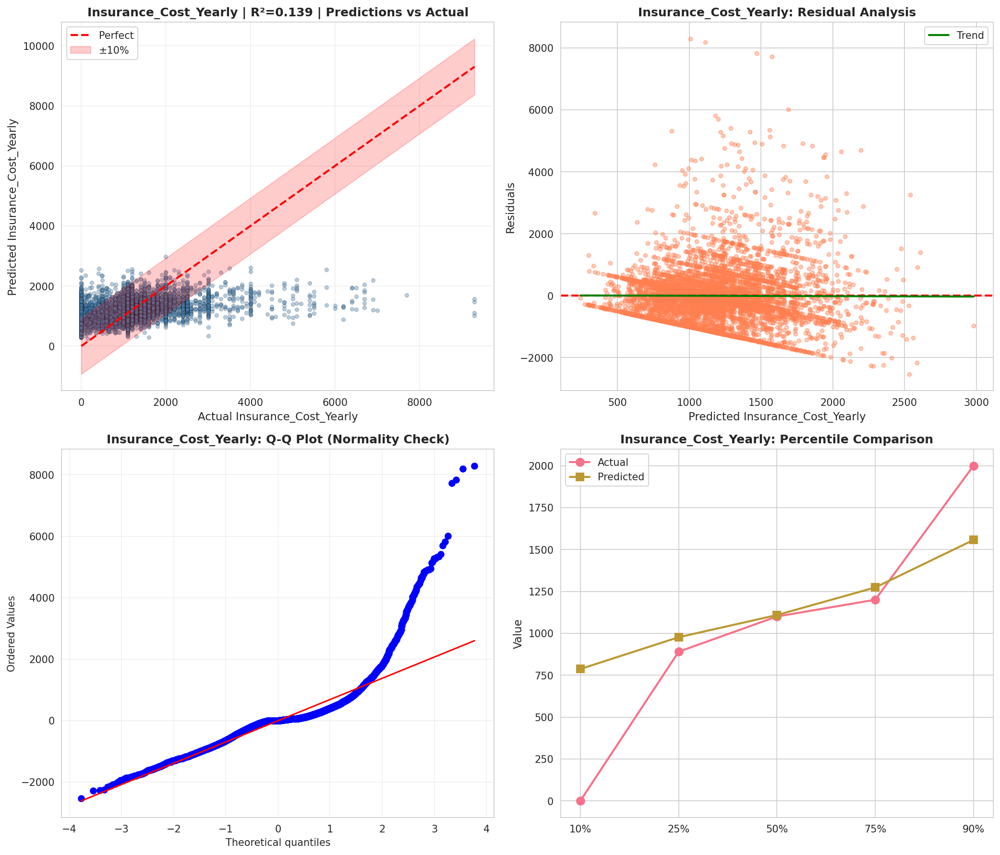
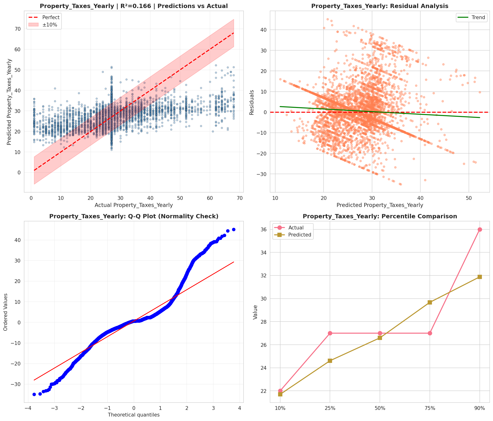
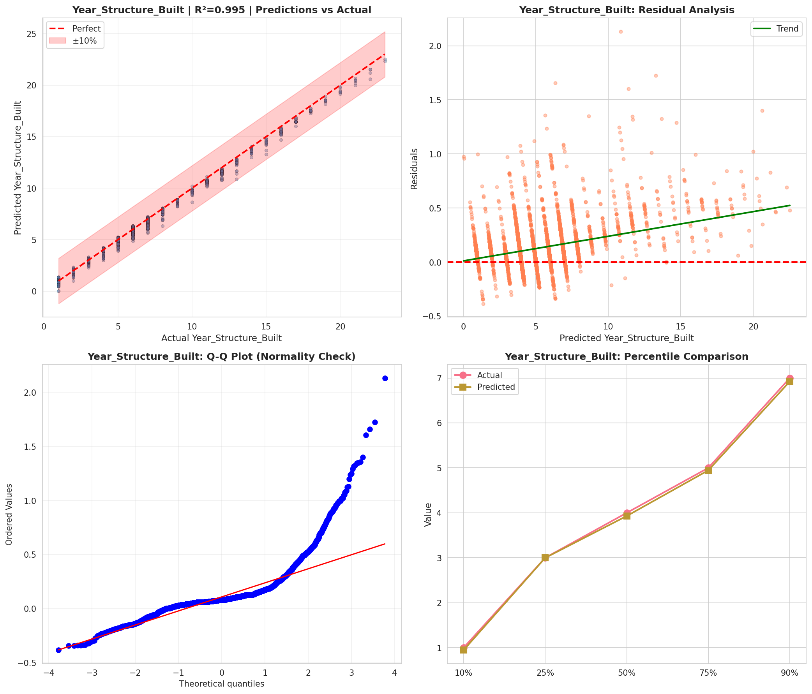

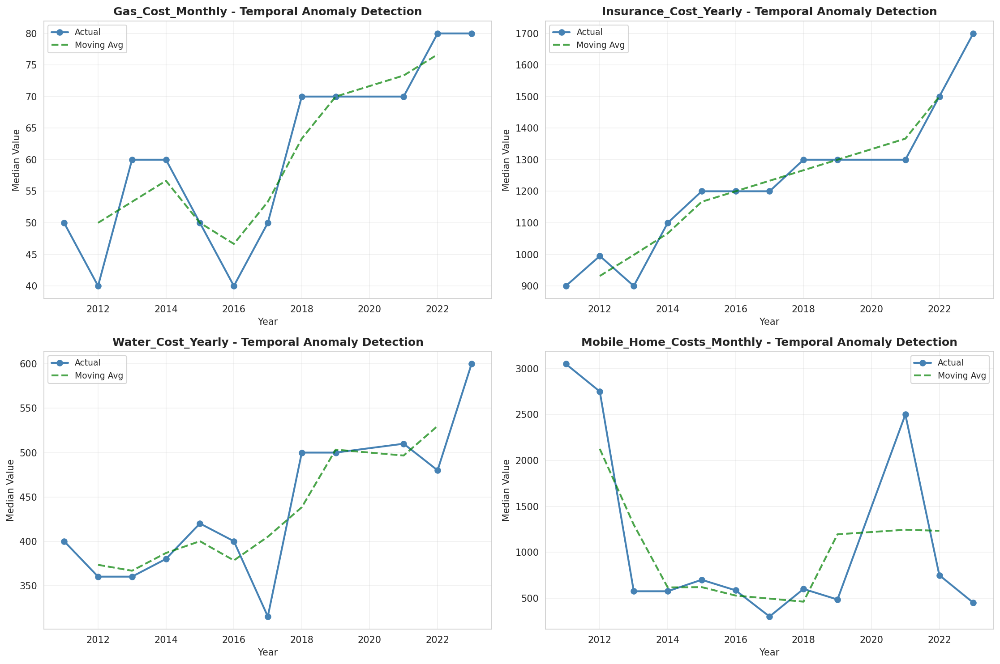
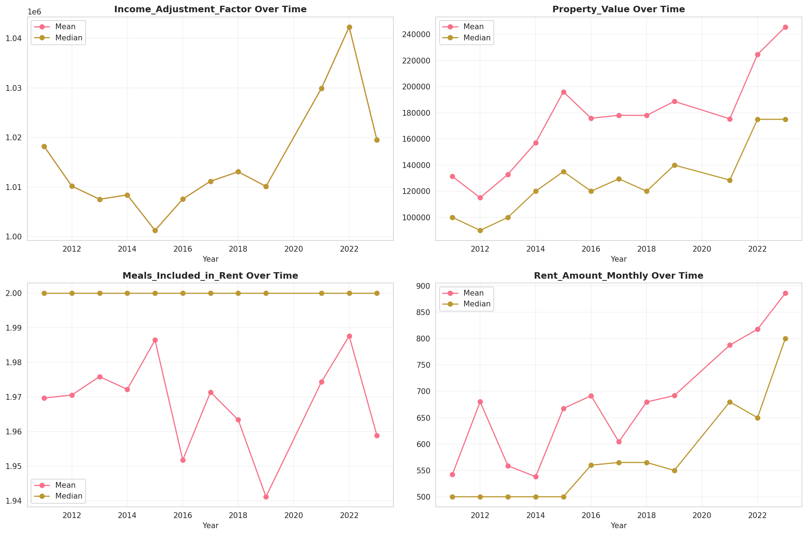
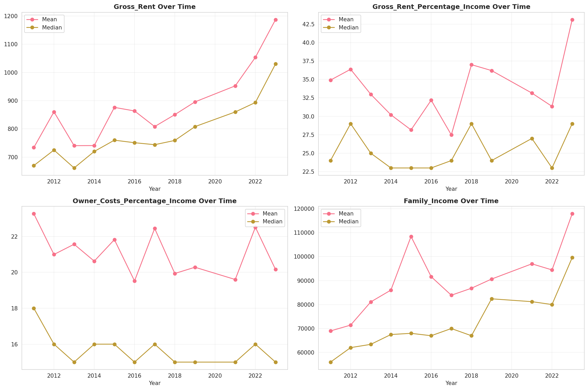
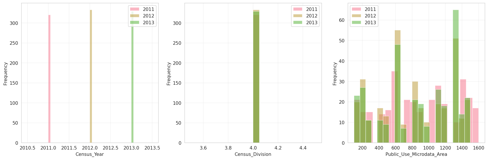
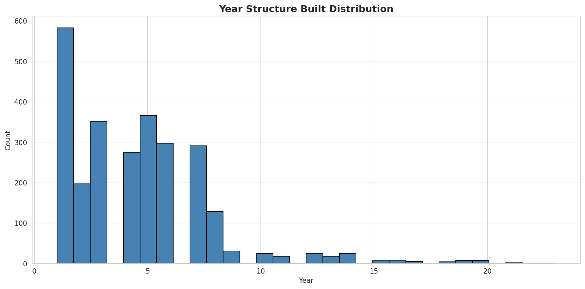
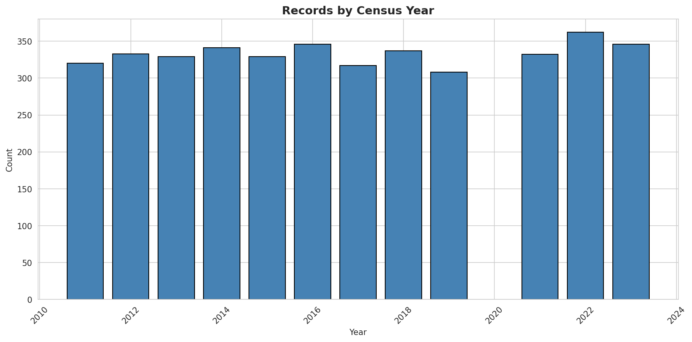
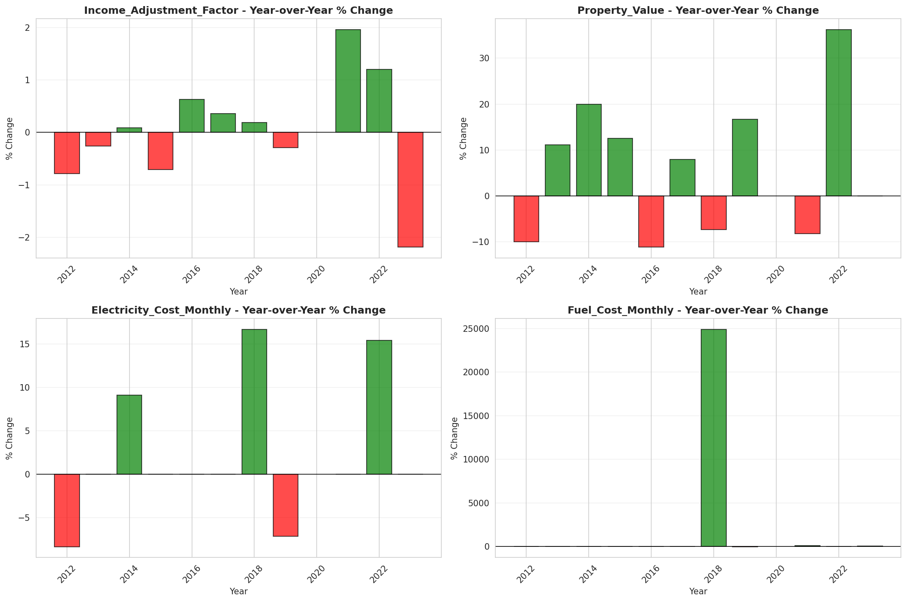
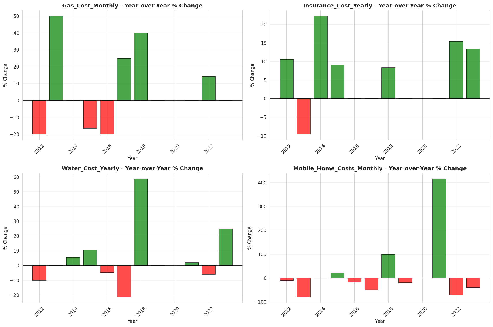
