# Temporal Analysis

## Year Distribution

- 2011: 66,385 records

- 2012: 67,324 records

- 2013: 68,137 records

- 2014: 68,898 records

- 2015: 69,789 records

- 2016: 69,900 records

- 2017: 70,193 records

- 2018: 70,585 records

- 2019: 71,024 records

- 2020: 71,973 records

- 2021: 72,134 records

- 2022: 72,518 records

- 2023: 73,123 records

## Temporal Trends

- Census_Year: {np.int64(2011): {'mean': 2011.0, 'median': 2011.0, 'std': 0.0}, np.int64(2012): {'mean': 2012.0, 'median': 2012.0, 'std': 0.0}, np.int64(2013): {'mean': 2013.0, 'median': 2013.0, 'std': 0.0}, np.int64(2014): {'mean': 2014.0, 'median': 2014.0, 'std': 0.0}, np.int64(2015): {'mean': 2015.0, 'median': 2015.0, 'std': 0.0}, np.int64(2016): {'mean': 2016.0, 'median': 2016.0, 'std': 0.0}, np.int64(2017): {'mean': 2017.0, 'median': 2017.0, 'std': 0.0}, np.int64(2018): {'mean': 2018.0, 'median': 2018.0, 'std': 0.0}, np.int64(2019): {'mean': 2019.0, 'median': 2019.0, 'std': 0.0}, np.int64(2020): {'mean': 2020.0, 'median': 2020.0, 'std': 0.0}, np.int64(2021): {'mean': 2021.0, 'median': 2021.0, 'std': 0.0}, np.int64(2022): {'mean': 2022.0, 'median': 2022.0, 'std': 0.0}, np.int64(2023): {'mean': 2023.0, 'median': 2023.0, 'std': 0.0}}

- Census_Division: {np.int64(2011): {'mean': 4.0, 'median': 4.0, 'std': 0.0}, np.int64(2012): {'mean': 4.0, 'median': 4.0, 'std': 0.0}, np.int64(2013): {'mean': 4.0, 'median': 4.0, 'std': 0.0}, np.int64(2014): {'mean': 4.0, 'median': 4.0, 'std': 0.0}, np.int64(2015): {'mean': 4.0, 'median': 4.0, 'std': 0.0}, np.int64(2016): {'mean': 4.0, 'median': 4.0, 'std': 0.0}, np.int64(2017): {'mean': 4.0, 'median': 4.0, 'std': 0.0}, np.int64(2018): {'mean': 4.0, 'median': 4.0, 'std': 0.0}, np.int64(2019): {'mean': 4.0, 'median': 4.0, 'std': 0.0}, np.int64(2020): {'mean': 4.0, 'median': 4.0, 'std': 0.0}, np.int64(2021): {'mean': 4.0, 'median': 4.0, 'std': 0.0}, np.int64(2022): {'mean': 4.0, 'median': 4.0, 'std': 0.0}, np.int64(2023): {'mean': 4.0, 'median': 4.0, 'std': 0.0}}

- Public_Use_Microdata_Area: {np.int64(2011): {'mean': 849.3403027792423, 'median': 800.0, 'std': 458.22809938985444}, np.int64(2012): {'mean': None, 'median': None, 'std': None}, np.int64(2013): {'mean': None, 'median': None, 'std': None}, np.int64(2014): {'mean': None, 'median': None, 'std': None}, np.int64(2015): {'mean': None, 'median': None, 'std': None}, np.int64(2016): {'mean': 820.116208869814, 'median': 802.0, 'std': 429.28225766082545}, np.int64(2017): {'mean': 821.044505862408, 'median': 802.0, 'std': 428.65418177483065}, np.int64(2018): {'mean': 820.771566196784, 'median': 802.0, 'std': 428.65327349516826}, np.int64(2019): {'mean': 820.7790042802433, 'median': 802.0, 'std': 428.44927780437297}, np.int64(2020): {'mean': 819.6413377238687, 'median': 802.0, 'std': 428.59665878204834}, np.int64(2021): {'mean': 819.8491973271966, 'median': 802.0, 'std': 428.7113155276528}, np.int64(2022): {'mean': None, 'median': None, 'std': None}, np.int64(2023): {'mean': 906.7018858635449, 'median': 804.0, 'std': 505.8283992597592}}

- Census_Region: {np.int64(2011): {'mean': 2.0, 'median': 2.0, 'std': 0.0}, np.int64(2012): {'mean': 2.0, 'median': 2.0, 'std': 0.0}, np.int64(2013): {'mean': 2.0, 'median': 2.0, 'std': 0.0}, np.int64(2014): {'mean': 2.0, 'median': 2.0, 'std': 0.0}, np.int64(2015): {'mean': 2.0, 'median': 2.0, 'std': 0.0}, np.int64(2016): {'mean': 2.0, 'median': 2.0, 'std': 0.0}, np.int64(2017): {'mean': 2.0, 'median': 2.0, 'std': 0.0}, np.int64(2018): {'mean': 2.0, 'median': 2.0, 'std': 0.0}, np.int64(2019): {'mean': 2.0, 'median': 2.0, 'std': 0.0}, np.int64(2020): {'mean': 2.0, 'median': 2.0, 'std': 0.0}, np.int64(2021): {'mean': 2.0, 'median': 2.0, 'std': 0.0}, np.int64(2022): {'mean': 2.0, 'median': 2.0, 'std': 0.0}, np.int64(2023): {'mean': 2.0, 'median': 2.0, 'std': 0.0}}

- State_Code: {np.int64(2011): {'mean': 20.0, 'median': 20.0, 'std': 0.0}, np.int64(2012): {'mean': 20.0, 'median': 20.0, 'std': 0.0}, np.int64(2013): {'mean': 20.0, 'median': 20.0, 'std': 0.0}, np.int64(2014): {'mean': 20.0, 'median': 20.0, 'std': 0.0}, np.int64(2015): {'mean': 20.0, 'median': 20.0, 'std': 0.0}, np.int64(2016): {'mean': 20.0, 'median': 20.0, 'std': 0.0}, np.int64(2017): {'mean': 20.0, 'median': 20.0, 'std': 0.0}, np.int64(2018): {'mean': 20.0, 'median': 20.0, 'std': 0.0}, np.int64(2019): {'mean': 20.0, 'median': 20.0, 'std': 0.0}, np.int64(2020): {'mean': 20.0, 'median': 20.0, 'std': 0.0}, np.int64(2021): {'mean': 20.0, 'median': 20.0, 'std': 0.0}, np.int64(2022): {'mean': 20.0, 'median': 20.0, 'std': 0.0}, np.int64(2023): {'mean': None, 'median': None, 'std': None}}

- Housing_Adjustment_Factor: {np.int64(2011): {'mean': 1041278.8596821572, 'median': 1044592.0, 'std': 27577.074731796893}, np.int64(2012): {'mean': 1041388.7141286911, 'median': 1053092.0, 'std': 27500.67647209054}, np.int64(2013): {'mean': 1040109.9150534952, 'median': 1035725.0, 'std': 32060.47132143827}, np.int64(2014): {'mean': 1036660.9163981538, 'median': 1031130.0, 'std': 29568.38909220411}, np.int64(2015): {'mean': 1020976.8301021651, 'median': 1017534.0, 'std': 20290.96675234216}, np.int64(2016): {'mean': 1020386.2596852647, 'median': 1013801.0, 'std': 15776.923645181023}, np.int64(2017): {'mean': 1029178.8259085664, 'median': 1034680.0, 'std': 17983.746003875975}, np.int64(2018): {'mean': 1038264.4338882199, 'median': 1046406.0, 'std': 23459.696106682586}, np.int64(2019): {'mean': 1040849.992354697, 'median': 1042936.0, 'std': 29164.913017936648}, np.int64(2020): {'mean': 1035093.2653772943, 'median': 1030827.0, 'std': 28630.62525805647}, np.int64(2021): {'mean': 1058034.9268306207, 'median': 1059761.0, 'std': 34930.616707116}, np.int64(2022): {'mean': 1106077.576449985, 'median': 1133141.0, 'std': 60663.21232314982}, np.int64(2023): {'mean': 1107968.8713537464, 'median': 1125501.0, 'std': 76766.71919600155}}

- Income_Adjustment_Factor: {np.int64(2011): {'mean': 1053925.6439406492, 'median': 1048026.0, 'std': 28409.62173564691}, np.int64(2012): {'mean': 1052641.4219297725, 'median': 1061121.0, 'std': 26423.329600498746}, np.int64(2013): {'mean': 1049107.921819276, 'median': 1054614.0, 'std': 29652.553912985277}, np.int64(2014): {'mean': 1047517.2338239136, 'median': 1041654.0, 'std': 31010.083802273126}, np.int64(2015): {'mean': 1030401.2828955853, 'median': 1025215.0, 'std': 25662.211389661068}, np.int64(2016): {'mean': 1027551.570472103, 'median': 1022342.0, 'std': 17533.14260637887}, np.int64(2017): {'mean': 1036575.7855056772, 'median': 1035988.0, 'std': 16856.428474338547}, np.int64(2018): {'mean': 1046846.3520861373, 'median': 1054346.0, 'std': 20483.070564422684}, np.int64(2019): {'mean': 1049799.9680389727, 'median': 1054606.0, 'std': 26212.965422234472}, np.int64(2020): {'mean': 1045045.7326636377, 'median': 1044328.0, 'std': 29298.741717871857}, np.int64(2021): {'mean': 1072668.210608035, 'median': 1070512.0, 'std': 30382.571773488013}, np.int64(2022): {'mean': 1127737.0170302545, 'median': 1140108.0, 'std': 48806.89443967993}, np.int64(2023): {'mean': 1131196.1505682208, 'median': 1159185.0, 'std': 70046.90766032951}}

- Housing_Unit_Weight: {np.int64(2011): {'mean': 18.51260073811855, 'median': 16.0, 'std': 16.674164848695103}, np.int64(2012): {'mean': 18.31627651357614, 'median': 16.0, 'std': 17.131348364188835}, np.int64(2013): {'mean': 18.132365675037057, 'median': 15.0, 'std': 17.445631337016884}, np.int64(2014): {'mean': 18.00529768643502, 'median': 15.0, 'std': 17.80315847603392}, np.int64(2015): {'mean': 17.83048904555159, 'median': 14.0, 'std': 18.16744757191494}, np.int64(2016): {'mean': 17.867739628040056, 'median': 14.0, 'std': 17.93239163816524}, np.int64(2017): {'mean': 17.9454788939068, 'median': 14.0, 'std': 18.01415889276674}, np.int64(2018): {'mean': 17.941177303959766, 'median': 14.0, 'std': 17.964830108379473}, np.int64(2019): {'mean': 17.92770049560712, 'median': 14.0, 'std': 18.115235989265393}, np.int64(2020): {'mean': 17.789671126672502, 'median': 13.0, 'std': 20.604633873285128}, np.int64(2021): {'mean': 17.637882274655503, 'median': 12.0, 'std': 21.445755441920383}, np.int64(2022): {'mean': 17.63076753357787, 'median': 12.0, 'std': 21.818951047468506}, np.int64(2023): {'mean': 17.576152510154124, 'median': 12.0, 'std': 21.896081219809403}}

- Number_of_Persons: {np.int64(2011): {'mean': 2.1389771785794984, 'median': 2.0, 'std': 1.4378011622993487}, np.int64(2012): {'mean': 2.120907848612679, 'median': 2.0, 'std': 1.4345683241970109}, np.int64(2013): {'mean': 2.1130076170069128, 'median': 2.0, 'std': 1.4469699332150516}, np.int64(2014): {'mean': 2.096563035211472, 'median': 2.0, 'std': 1.4459835706809456}, np.int64(2015): {'mean': 2.078665692301079, 'median': 2.0, 'std': 1.4467889736344914}, np.int64(2016): {'mean': 2.069728183118741, 'median': 2.0, 'std': 1.4433421122878318}, np.int64(2017): {'mean': 2.06443662473466, 'median': 2.0, 'std': 1.452066123588285}, np.int64(2018): {'mean': 2.0557767230998087, 'median': 2.0, 'std': 1.4480472172990926}, np.int64(2019): {'mean': 2.055671322369903, 'median': 2.0, 'std': 1.449388209396521}, np.int64(2020): {'mean': 2.038764536701263, 'median': 2.0, 'std': 1.45213870403012}, np.int64(2021): {'mean': 2.0393018548811934, 'median': 2.0, 'std': 1.4548676254550628}, np.int64(2022): {'mean': 2.0363082269229706, 'median': 2.0, 'std': 1.4415512394109387}, np.int64(2023): {'mean': 2.0315906076063617, 'median': 2.0, 'std': 1.433810025108793}}

- Housing_Unit_Type: {np.int64(2011): {'mean': 1.1029298787376667, 'median': 1.0, 'std': 0.3895879155635395}, np.int64(2012): {'mean': 1.118575842195948, 'median': 1.0, 'std': 0.4184877078411693}, np.int64(2013): {'mean': 1.1330994907319079, 'median': 1.0, 'std': 0.44379934604922516}, np.int64(2014): {'mean': 1.1455775203924643, 'median': 1.0, 'std': 0.46385309579454964}, np.int64(2015): {'mean': 1.1595380360801846, 'median': 1.0, 'std': 0.4852041277640648}, np.int64(2016): {'mean': 1.1577396280400571, 'median': 1.0, 'std': 0.4838596165094571}, np.int64(2017): {'mean': 1.1561124328636758, 'median': 1.0, 'std': 0.4819413805755103}, np.int64(2018): {'mean': 1.1548770985336827, 'median': 1.0, 'std': 0.48024093428686304}, np.int64(2019): {'mean': 1.1549194638432079, 'median': 1.0, 'std': 0.4804503754236945}, np.int64(2020): {'mean': None, 'median': None, 'std': None}, np.int64(2021): {'mean': None, 'median': None, 'std': None}, np.int64(2022): {'mean': None, 'median': None, 'std': None}, np.int64(2023): {'mean': None, 'median': None, 'std': None}}

- Number_of_Bedrooms: {np.int64(2011): {'mean': 2.8426005688744413, 'median': 3.0, 'std': 1.0358296095986308}, np.int64(2012): {'mean': None, 'median': None, 'std': None}, np.int64(2013): {'mean': None, 'median': None, 'std': None}, np.int64(2014): {'mean': None, 'median': None, 'std': None}, np.int64(2015): {'mean': None, 'median': None, 'std': None}, np.int64(2016): {'mean': None, 'median': None, 'std': None}, np.int64(2017): {'mean': None, 'median': None, 'std': None}, np.int64(2018): {'mean': None, 'median': None, 'std': None}, np.int64(2019): {'mean': None, 'median': None, 'std': None}, np.int64(2020): {'mean': None, 'median': None, 'std': None}, np.int64(2021): {'mean': None, 'median': None, 'std': None}, np.int64(2022): {'mean': None, 'median': None, 'std': None}, np.int64(2023): {'mean': None, 'median': None, 'std': None}}

- Number_of_Rooms: {np.int64(2011): {'mean': 6.103340105648111, 'median': 6.0, 'std': 1.8954234161968886}, np.int64(2012): {'mean': None, 'median': None, 'std': None}, np.int64(2013): {'mean': None, 'median': None, 'std': None}, np.int64(2014): {'mean': None, 'median': None, 'std': None}, np.int64(2015): {'mean': None, 'median': None, 'std': None}, np.int64(2016): {'mean': None, 'median': None, 'std': None}, np.int64(2017): {'mean': None, 'median': None, 'std': None}, np.int64(2018): {'mean': None, 'median': None, 'std': None}, np.int64(2019): {'mean': None, 'median': None, 'std': None}, np.int64(2020): {'mean': None, 'median': None, 'std': None}, np.int64(2021): {'mean': None, 'median': None, 'std': None}, np.int64(2022): {'mean': None, 'median': None, 'std': None}, np.int64(2023): {'mean': None, 'median': None, 'std': None}}

- Building_Type: {np.int64(2011): {'mean': 2.5093051605038603, 'median': 2.0, 'std': 1.5549234467832114}, np.int64(2012): {'mean': 2.5147444829709324, 'median': 2.0, 'std': 1.564312713859242}, np.int64(2013): {'mean': 2.5160153281484954, 'median': 2.0, 'std': 1.5672048830273668}, np.int64(2014): {'mean': 2.5146705379466088, 'median': 2.0, 'std': 1.568141295212096}, np.int64(2015): {'mean': 2.5144474280844493, 'median': 2.0, 'std': 1.5649356089424726}, np.int64(2016): {'mean': 2.5189463733517057, 'median': 2.0, 'std': 1.5698852207667873}, np.int64(2017): {'mean': 2.5244331851568598, 'median': 2.0, 'std': 1.572277851314723}, np.int64(2018): {'mean': 2.5304323049404016, 'median': 2.0, 'std': 1.5766710487166817}, np.int64(2019): {'mean': 2.5353238213594675, 'median': 2.0, 'std': 1.578863436998965}, np.int64(2020): {'mean': 2.5380046577783335, 'median': 2.0, 'std': 1.5834273596136845}, np.int64(2021): {'mean': 2.5423673393124067, 'median': 2.0, 'std': 1.587179841158854}, np.int64(2022): {'mean': 2.543880893608433, 'median': 2.0, 'std': 1.591840672396769}, np.int64(2023): {'mean': 2.5486512002228654, 'median': 2.0, 'std': 1.5991852909764892}}

- Year_Structure_Built: {np.int64(2011): {'mean': 5.8186265745631855, 'median': 6.0, 'std': 2.421067346209621}, np.int64(2012): {'mean': 4.27427978871642, 'median': 4.0, 'std': 2.615688488192363}, np.int64(2013): {'mean': 4.316991931702427, 'median': 4.0, 'std': 2.681271703402292}, np.int64(2014): {'mean': 4.351818695056053, 'median': 4.0, 'std': 2.74163414240237}, np.int64(2015): {'mean': 4.40246981074432, 'median': 4.0, 'std': 2.8338119417481153}, np.int64(2016): {'mean': 4.493470911508821, 'median': 4.0, 'std': 2.967502717817545}, np.int64(2017): {'mean': 4.568870194222711, 'median': 4.0, 'std': 3.1052387260460126}, np.int64(2018): {'mean': 4.6631630601681096, 'median': 4.0, 'std': 3.2927640052829092}, np.int64(2019): {'mean': 4.768692287121081, 'median': 4.0, 'std': 3.503541885253065}, np.int64(2020): {'mean': 4.883414870504384, 'median': 5.0, 'std': 3.723859868365141}, np.int64(2021): {'mean': None, 'median': None, 'std': None}, np.int64(2022): {'mean': None, 'median': None, 'std': None}, np.int64(2023): {'mean': None, 'median': None, 'std': None}}

- Bathtub_or_Shower: {np.int64(2011): {'mean': None, 'median': None, 'std': None}, np.int64(2012): {'mean': 1.0107424090216792, 'median': 1.0, 'std': 0.10308822366998588}, np.int64(2013): {'mean': 1.0106068200559446, 'median': 1.0, 'std': 0.102442594211939}, np.int64(2014): {'mean': 1.010871844503589, 'median': 1.0, 'std': 0.10370063145127437}, np.int64(2015): {'mean': 1.011303886414433, 'median': 1.0, 'std': 0.10571796571754848}, np.int64(2016): {'mean': 1.010510630798071, 'median': 1.0, 'std': 0.10198197917005554}, np.int64(2017): {'mean': 1.0100377611012858, 'median': 1.0, 'std': 0.09968531878726236}, np.int64(2018): {'mean': 1.009735171671442, 'median': 1.0, 'std': 0.09818630612017258}, np.int64(2019): {'mean': 1.008966634680426, 'median': 1.0, 'std': 0.09426756565187978}, np.int64(2020): {'mean': 1.0087997624220448, 'median': 1.0, 'std': 0.09339412688482081}, np.int64(2021): {'mean': 1.0094512954658694, 'median': 1.0, 'std': 0.09675801906155672}, np.int64(2022): {'mean': 1.009470138015618, 'median': 1.0, 'std': 0.09685349830376788}, np.int64(2023): {'mean': 1.009038428799158, 'median': 1.0, 'std': 0.094640764089307}}

- Refrigerator: {np.int64(2011): {'mean': None, 'median': None, 'std': None}, np.int64(2012): {'mean': 1.0231536990829255, 'median': 1.0, 'std': 0.1503927251384171}, np.int64(2013): {'mean': 1.0230730674082817, 'median': 1.0, 'std': 0.15013682237756162}, np.int64(2014): {'mean': 1.0236793289781434, 'median': 1.0, 'std': 0.15204930540557632}, np.int64(2015): {'mean': 1.0234439066745993, 'median': 1.0, 'std': 0.15130980817190262}, np.int64(2016): {'mean': 1.0240494768718056, 'median': 1.0, 'std': 0.1532040325875702}, np.int64(2017): {'mean': 1.0237241686981182, 'median': 1.0, 'std': 0.15218968937490412}, np.int64(2018): {'mean': 1.0240767416459564, 'median': 1.0, 'std': 0.15328869531462389}, np.int64(2019): {'mean': 1.0235806761157167, 'median': 1.0, 'std': 0.1517398762169456}, np.int64(2020): {'mean': 1.024586192344363, 'median': 1.0, 'std': 0.15486150694560422}, np.int64(2021): {'mean': 1.0240252864972597, 'median': 1.0, 'std': 0.15312882553572796}, np.int64(2022): {'mean': 1.0228059553195783, 'median': 1.0, 'std': 0.14928559780013448}, np.int64(2023): {'mean': 1.0213269775432188, 'median': 1.0, 'std': 0.14447304457990678}}

- Hot_and_Cold_Running_Water: {np.int64(2011): {'mean': None, 'median': None, 'std': None}, np.int64(2012): {'mean': 1.020998736187174, 'median': 1.0, 'std': 0.14338103906511282}, np.int64(2013): {'mean': 1.020211166265138, 'median': 1.0, 'std': 0.14072311543113275}, np.int64(2014): {'mean': 1.0202274376965885, 'median': 1.0, 'std': 0.14077857841862798}, np.int64(2015): {'mean': 1.0204209612323327, 'median': 1.0, 'std': 0.1414364423804409}, np.int64(2016): {'mean': 1.0201240126255748, 'median': 1.0, 'std': 0.140425612659747}, np.int64(2017): {'mean': 1.0205375778723134, 'median': 1.0, 'std': 0.14183125987049017}, np.int64(2018): {'mean': 1.0219397527424692, 'median': 1.0, 'std': 0.14648801887596807}, np.int64(2019): {'mean': 1.0223222010728499, 'median': 1.0, 'std': 0.14773037510361064}, np.int64(2020): {'mean': 1.0238672064271088, 'median': 1.0, 'std': 0.1526365848480337}, np.int64(2021): {'mean': 1.0249750871948182, 'median': 1.0, 'std': 0.1560503488712223}, np.int64(2022): {'mean': 1.0248241814540544, 'median': 1.0, 'std': 0.155590222375547}, np.int64(2023): {'mean': 1.0233544333183724, 'median': 1.0, 'std': 0.15102766891443611}}

- Running_Water: {np.int64(2011): {'mean': None, 'median': None, 'std': None}, np.int64(2012): {'mean': None, 'median': None, 'std': None}, np.int64(2013): {'mean': 9.0, 'median': 9.0, 'std': 0.0}, np.int64(2014): {'mean': 9.0, 'median': 9.0, 'std': 0.0}, np.int64(2015): {'mean': 9.0, 'median': 9.0, 'std': 0.0}, np.int64(2016): {'mean': 9.0, 'median': 9.0, 'std': 0.0}, np.int64(2017): {'mean': 9.0, 'median': 9.0, 'std': 0.0}, np.int64(2018): {'mean': 9.0, 'median': 9.0, 'std': 0.0}, np.int64(2019): {'mean': 9.0, 'median': 9.0, 'std': 0.0}, np.int64(2020): {'mean': 9.0, 'median': 9.0, 'std': 0.0}, np.int64(2021): {'mean': 9.0, 'median': 9.0, 'std': 0.0}, np.int64(2022): {'mean': 9.0, 'median': 9.0, 'std': 0.0}, np.int64(2023): {'mean': 9.0, 'median': 9.0, 'std': 0.0}}

- Sink_with_Faucet: {np.int64(2011): {'mean': None, 'median': None, 'std': None}, np.int64(2012): {'mean': 1.0095758125668362, 'median': 1.0, 'std': 0.0973872170850676}, np.int64(2013): {'mean': 1.0094103190130483, 'median': 1.0, 'std': 0.09655006801939833}, np.int64(2014): {'mean': 1.0097749818533752, 'median': 1.0, 'std': 0.0983848957824094}, np.int64(2015): {'mean': 1.0104195140775996, 'median': 1.0, 'std': 0.1015436536742051}, np.int64(2016): {'mean': 1.0093890695848622, 'median': 1.0, 'std': 0.09644202394007749}, np.int64(2017): {'mean': 1.0090499179452863, 'median': 1.0, 'std': 0.09470036863576019}, np.int64(2018): {'mean': 1.0089278647523467, 'median': 1.0, 'std': 0.09406539240264784}, np.int64(2019): {'mean': 1.0080542402743475, 'median': 1.0, 'std': 0.08938397602593014}, np.int64(2020): {'mean': 1.0078306944466153, 'median': 1.0, 'std': 0.08814474521673203}, np.int64(2021): {'mean': 1.0086571998006975, 'median': 1.0, 'std': 0.09264116970538772}, np.int64(2022): {'mean': 1.0086473227454085, 'median': 1.0, 'std': 0.0925887662949613}, np.int64(2023): {'mean': 1.0082645907170384, 'median': 1.0, 'std': 0.0905340494580115}}

- Stove_or_Range: {np.int64(2011): {'mean': None, 'median': None, 'std': None}, np.int64(2012): {'mean': 1.0242554846236107, 'median': 1.0, 'std': 0.1538425804775878}, np.int64(2013): {'mean': 1.0246091160444322, 'median': 1.0, 'std': 0.1549319062340722}, np.int64(2014): {'mean': 1.0254214049520123, 'median': 1.0, 'std': 0.15740253098429338}, np.int64(2015): {'mean': 1.0259683877088324, 'median': 1.0, 'std': 0.1590422499541084}, np.int64(2016): {'mean': 1.0266450899652315, 'median': 1.0, 'std': 0.16104516351984338}, np.int64(2017): {'mean': 1.026098178863343, 'median': 1.0, 'std': 0.1594285698948781}, np.int64(2018): {'mean': 1.0258021623161795, 'median': 1.0, 'std': 0.15854591965829215}, np.int64(2019): {'mean': 1.0252166936714435, 'median': 1.0, 'std': 0.15678392365621507}, np.int64(2020): {'mean': 1.0257897122493318, 'median': 1.0, 'std': 0.15850866127232027}, np.int64(2021): {'mean': 1.0253643497757847, 'median': 1.0, 'std': 0.1572303547685157}, np.int64(2022): {'mean': 1.0246223588406067, 'median': 1.0, 'std': 0.15497248509666695}, np.int64(2023): {'mean': 1.0239115967374985, 'median': 1.0, 'std': 0.15277497671272516}}

- Telephone_Service: {np.int64(2011): {'mean': 1.027165868524162, 'median': 1.0, 'std': 0.16256796835527507}, np.int64(2012): {'mean': 1.022705179836134, 'median': 1.0, 'std': 0.14896321638240492}, np.int64(2013): {'mean': 1.0238305843176023, 'median': 1.0, 'std': 0.15252242799838114}, np.int64(2014): {'mean': 1.025765509588376, 'median': 1.0, 'std': 0.15843637001939304}, np.int64(2015): {'mean': 1.0268833035977205, 'median': 1.0, 'std': 0.16174376259870568}, np.int64(2016): {'mean': 1.0282045957918051, 'median': 1.0, 'std': 0.1655583608510871}, np.int64(2017): {'mean': 1.0264888091252653, 'median': 1.0, 'std': 0.16058517092630845}, np.int64(2018): {'mean': 1.0251203576341128, 'median': 1.0, 'std': 0.1564920008877941}, np.int64(2019): {'mean': 1.021577940271988, 'median': 1.0, 'std': 0.14530207661641234}, np.int64(2020): {'mean': 1.0172134639965913, 'median': 1.0, 'std': 0.13006709414176174}, np.int64(2021): {'mean': 1.0124311031968116, 'median': 1.0, 'std': 0.11080062759133806}, np.int64(2022): {'mean': 1.010023922638903, 'median': 1.0, 'std': 0.09961732176783734}, np.int64(2023): {'mean': 1.0084568716260258, 'median': 1.0, 'std': 0.09157233805371778}}

- Lot_Acreage: {np.int64(2011): {'mean': 1.3062196523221765, 'median': 1.0, 'std': 0.623342849094089}, np.int64(2012): {'mean': 1.3098984818506259, 'median': 1.0, 'std': 0.626377122461072}, np.int64(2013): {'mean': 1.3111521077391384, 'median': 1.0, 'std': 0.62680789441461}, np.int64(2014): {'mean': 1.314533941982035, 'median': 1.0, 'std': 0.6284035421804142}, np.int64(2015): {'mean': 1.3180433186490454, 'median': 1.0, 'std': 0.6293229274467803}, np.int64(2016): {'mean': 1.3132503660322108, 'median': 1.0, 'std': 0.6246345476697441}, np.int64(2017): {'mean': 1.3087099125364432, 'median': 1.0, 'std': 0.6205926496717561}, np.int64(2018): {'mean': 1.3067592559016572, 'median': 1.0, 'std': 0.6178633508234825}, np.int64(2019): {'mean': 1.3044935921700103, 'median': 1.0, 'std': 0.6141497852127058}, np.int64(2020): {'mean': 1.3057485673352436, 'median': 1.0, 'std': 0.614085673487149}, np.int64(2021): {'mean': 1.3096827153003319, 'median': 1.0, 'std': 0.6154810826129228}, np.int64(2022): {'mean': 1.3131002347584833, 'median': 1.0, 'std': 0.6160172918939028}, np.int64(2023): {'mean': 1.3154769290766313, 'median': 1.0, 'std': 0.6165549363993199}}

- Agricultural_Sales: {np.int64(2011): {'mean': 1.8679414669180356, 'median': 1.0, 'std': 1.7202631345509911}, np.int64(2012): {'mean': 1.8581535196321188, 'median': 1.0, 'std': 1.714021126420983}, np.int64(2013): {'mean': 1.8623290073658365, 'median': 1.0, 'std': 1.7272558680178394}, np.int64(2014): {'mean': 1.837861221664648, 'median': 1.0, 'std': 1.7067667861434879}, np.int64(2015): {'mean': 1.836599079911399, 'median': 1.0, 'std': 1.708365841414021}, np.int64(2016): {'mean': 1.7933201342859602, 'median': 1.0, 'std': 1.6633600543233507}, np.int64(2017): {'mean': 1.7688753269398432, 'median': 1.0, 'std': 1.6371602560675649}, np.int64(2018): {'mean': 1.7573170731707317, 'median': 1.0, 'std': 1.623609602809169}, np.int64(2019): {'mean': 1.7381632476413054, 'median': 1.0, 'std': 1.6026981184904179}, np.int64(2020): {'mean': 1.7135389888603256, 'median': 1.0, 'std': 1.5798608509894658}, np.int64(2021): {'mean': 1.7150176381656308, 'median': 1.0, 'std': 1.5855832761486721}, np.int64(2022): {'mean': 1.6968481375358166, 'median': 1.0, 'std': 1.5705771800023478}, np.int64(2023): {'mean': 1.677001127395716, 'median': 1.0, 'std': 1.5513920810753066}}

- Business_On_Property: {np.int64(2011): {'mean': 1.9827829052225805, 'median': 2.0, 'std': 0.1300806673577367}, np.int64(2012): {'mean': 1.9835425950923649, 'median': 2.0, 'std': 0.12722758368404072}, np.int64(2013): {'mean': 1.9835439535098238, 'median': 2.0, 'std': 0.12722241792549535}, np.int64(2014): {'mean': 1.9839125312914152, 'median': 2.0, 'std': 0.12581316869932951}, np.int64(2015): {'mean': 1.98386563876652, 'median': 2.0, 'std': 0.12599339268468626}, np.int64(2016): {'mean': 3.3972181551976575, 'median': 2.0, 'std': 2.816322914554974}, np.int64(2017): {'mean': 4.806614431486881, 'median': 2.0, 'std': 3.4422623335880194}, np.int64(2018): {'mean': 6.21449033614969, 'median': 9.0, 'std': 3.4336429739754877}, np.int64(2019): {'mean': 7.612087456515078, 'median': 9.0, 'std': 2.7954359595538527}, np.int64(2020): {'mean': None, 'median': None, 'std': None}, np.int64(2021): {'mean': None, 'median': None, 'std': None}, np.int64(2022): {'mean': None, 'median': None, 'std': None}, np.int64(2023): {'mean': None, 'median': None, 'std': None}}

- Tenure: {np.int64(2011): {'mean': 1.8258075750979539, 'median': 2.0, 'std': 0.8519615923561218}, np.int64(2012): {'mean': 1.8428690459658381, 'median': 2.0, 'std': 0.8543652312337234}, np.int64(2013): {'mean': 1.8605546594515843, 'median': 2.0, 'std': 0.8544204657432711}, np.int64(2014): {'mean': 1.8732010958144052, 'median': 2.0, 'std': 0.8531252651126865}, np.int64(2015): {'mean': 1.8841177183835374, 'median': 2.0, 'std': 0.8519218197950308}, np.int64(2016): {'mean': 1.8920438815060907, 'median': 2.0, 'std': 0.849872393479559}, np.int64(2017): {'mean': 1.8954770574125523, 'median': 2.0, 'std': 0.8473410730372012}, np.int64(2018): {'mean': 1.8975240715268225, 'median': 2.0, 'std': 0.8451857943163411}, np.int64(2019): {'mean': 1.8971161074284153, 'median': 2.0, 'std': 0.842102070534591}, np.int64(2020): {'mean': 1.8964635705155517, 'median': 2.0, 'std': 0.8382089655205468}, np.int64(2021): {'mean': 1.8948528788264225, 'median': 2.0, 'std': 0.8358821688586183}, np.int64(2022): {'mean': 1.8928366858721655, 'median': 2.0, 'std': 0.8321113035349577}, np.int64(2023): {'mean': 1.88980997108619, 'median': 2.0, 'std': 0.8282084404350035}}

- Vacancy_Status: {np.int64(2011): {'mean': 5.048292682926829, 'median': 7.0, 'std': 2.308402825119648}, np.int64(2012): {'mean': 5.074209245742092, 'median': 7.0, 'std': 2.2958566900215573}, np.int64(2013): {'mean': 5.066825775656325, 'median': 7.0, 'std': 2.3120848085758703}, np.int64(2014): {'mean': 5.062485535755612, 'median': 7.0, 'std': 2.3233481241232696}, np.int64(2015): {'mean': 5.092152466367713, 'median': 7.0, 'std': 2.3126903689944855}, np.int64(2016): {'mean': 5.091971434754382, 'median': 7.0, 'std': 2.314452621991558}, np.int64(2017): {'mean': 5.063356875778978, 'median': 7.0, 'std': 2.318574943342748}, np.int64(2018): {'mean': 5.057650109714742, 'median': 7.0, 'std': 2.3193871792198393}, np.int64(2019): {'mean': 5.038316458209252, 'median': 7.0, 'std': 2.322473899233796}, np.int64(2020): {'mean': 5.029788838612368, 'median': 7.0, 'std': 2.341377083247161}, np.int64(2021): {'mean': 5.096786461304431, 'median': 7.0, 'std': 2.326838127908187}, np.int64(2022): {'mean': 5.138081107814045, 'median': 7.0, 'std': 2.333222972500395}, np.int64(2023): {'mean': 5.172803347280334, 'median': 7.0, 'std': 2.3218380833285726}}

- Property_Value: {np.int64(2011): {'mean': 12.852411282984532, 'median': 14.0, 'std': 5.122402320890941}}

- Vehicles_Available: {np.int64(2011): {'mean': 2.027287766652155, 'median': 2.0, 'std': 1.120245440948985}, np.int64(2012): {'mean': 2.023468962644077, 'median': 2.0, 'std': 1.1260596390049757}, np.int64(2013): {'mean': 2.018020361794752, 'median': 2.0, 'std': 1.123838506253535}, np.int64(2014): {'mean': 2.0148940597149494, 'median': 2.0, 'std': 1.1224989615548246}, np.int64(2015): {'mean': 2.0194349656163935, 'median': 2.0, 'std': 1.1256285190687443}, np.int64(2016): {'mean': 2.0250034606866003, 'median': 2.0, 'std': 1.1263768085809673}, np.int64(2017): {'mean': 2.033684791799686, 'median': 2.0, 'std': 1.1272971093741502}, np.int64(2018): {'mean': 2.0485213204951855, 'median': 2.0, 'std': 1.1356602718495323}, np.int64(2019): {'mean': 2.0650755142486164, 'median': 2.0, 'std': 1.1420980195166537}, np.int64(2020): {'mean': 2.0782616105666807, 'median': 2.0, 'std': 1.147999431307172}, np.int64(2021): {'mean': 2.0837785126770116, 'median': 2.0, 'std': 1.1541530656803427}, np.int64(2022): {'mean': 2.0896762020283703, 'median': 2.0, 'std': 1.160398414463974}, np.int64(2023): {'mean': 2.0889977102936506, 'median': 2.0, 'std': 1.1614050107615512}}

- Condo_Fee_Monthly: {np.int64(2011): {'mean': 211.9060606060606, 'median': 180.0, 'std': 190.71216335098163}, np.int64(2012): {'mean': 215.20743034055727, 'median': 180.0, 'std': 184.29172275630663}, np.int64(2013): {'mean': 226.41610738255034, 'median': 190.0, 'std': 192.1314361277705}, np.int64(2014): {'mean': 227.19022687609075, 'median': 190.0, 'std': 176.24867338324572}, np.int64(2015): {'mean': 230.0, 'median': 200.0, 'std': 173.73078403409363}, np.int64(2016): {'mean': 236.62082514734774, 'median': 210.0, 'std': 167.62812598301508}, np.int64(2017): {'mean': 249.979633401222, 'median': 220.0, 'std': 190.68458728815264}, np.int64(2018): {'mean': 260.71084337349396, 'median': 230.0, 'std': 198.32286929602037}, np.int64(2019): {'mean': 273.72190476190474, 'median': 240.0, 'std': 203.04026693334743}, np.int64(2020): {'mean': 296.91181988742966, 'median': 250.0, 'std': 253.87609040104752}, np.int64(2021): {'mean': 314.804920913884, 'median': 250.0, 'std': 291.1629769230139}, np.int64(2022): {'mean': 316.87435456110154, 'median': 260.0, 'std': 285.6860461146567}, np.int64(2023): {'mean': 317.504215851602, 'median': 250.0, 'std': 298.93082630937784}}

- Electricity_Cost_Monthly: {np.int64(2011): {'mean': 115.13786678276013, 'median': 100.0, 'std': 79.04346956330662}, np.int64(2012): {'mean': 120.66560199972226, 'median': 100.0, 'std': 82.01262517794557}, np.int64(2013): {'mean': 125.73609448982778, 'median': 100.0, 'std': 84.21708817769355}, np.int64(2014): {'mean': 132.48992613656065, 'median': 110.0, 'std': 87.6082034586395}, np.int64(2015): {'mean': 135.90216694670107, 'median': 120.0, 'std': 89.08000882502157}, np.int64(2016): {'mean': 137.83399086378736, 'median': 120.0, 'std': 89.27255025154861}, np.int64(2017): {'mean': 140.454865485168, 'median': 120.0, 'std': 90.10338750028224}, np.int64(2018): {'mean': 150.8268965393645, 'median': 130.0, 'std': 89.53208901764714}, np.int64(2019): {'mean': 152.4895772140632, 'median': 130.0, 'std': 89.85744433692697}, np.int64(2020): {'mean': 154.18771524942304, 'median': 130.0, 'std': 90.59380673570844}, np.int64(2021): {'mean': 155.81915795422435, 'median': 140.0, 'std': 92.28054466715658}, np.int64(2022): {'mean': 163.3388293487222, 'median': 140.0, 'std': 133.3506162021461}, np.int64(2023): {'mean': 169.1809842115341, 'median': 140.0, 'std': 172.0945573394549}}

- Fuel_Cost_Monthly: {np.int64(2011): {'mean': 77.60454505877232, 'median': 2.0, 'std': 319.0345529087224}, np.int64(2012): {'mean': 78.01510206915707, 'median': 2.0, 'std': 321.81895760149985}, np.int64(2013): {'mean': 68.7249596753213, 'median': 2.0, 'std': 296.2242581698087}, np.int64(2014): {'mean': 63.702465582411484, 'median': 2.0, 'std': 287.24132629430716}, np.int64(2015): {'mean': 58.00367220384196, 'median': 2.0, 'std': 275.158095658603}, np.int64(2016): {'mean': 49.042549141749724, 'median': 2.0, 'std': 250.4696014252243}, np.int64(2017): {'mean': 40.69514573159157, 'median': 2.0, 'std': 224.70679608306773}, np.int64(2018): {'mean': 669.6872403560831, 'median': 500.0, 'std': 680.9280665859285}, np.int64(2019): {'mean': 656.5022914757103, 'median': 500.0, 'std': 661.7348481377239}, np.int64(2020): {'mean': 629.7933051673708, 'median': 500.0, 'std': 640.7416268870834}, np.int64(2021): {'mean': 629.256712508186, 'median': 500.0, 'std': 637.8328473449063}, np.int64(2022): {'mean': 660.5365853658536, 'median': 500.0, 'std': 676.7143954508866}, np.int64(2023): {'mean': 687.143143812709, 'median': 500.0, 'std': 710.7195588366498}}

- Gas_Cost_Monthly: {np.int64(2011): {'mean': 78.62993469743144, 'median': 50.0, 'std': 80.36584517790705}, np.int64(2012): {'mean': 74.72295514511873, 'median': 50.0, 'std': 77.76948528993105}, np.int64(2013): {'mean': 70.48387880049256, 'median': 50.0, 'std': 73.01144811990484}, np.int64(2014): {'mean': 70.33985851510212, 'median': 50.0, 'std': 73.67771714287387}, np.int64(2015): {'mean': 68.83568619978867, 'median': 50.0, 'std': 72.54606990819784}, np.int64(2016): {'mean': 65.97253945182725, 'median': 50.0, 'std': 70.10294101866585}, np.int64(2017): {'mean': 66.12914804396969, 'median': 50.0, 'std': 69.8209910558503}, np.int64(2018): {'mean': 82.78214084262594, 'median': 60.0, 'std': 70.52612872559351}, np.int64(2019): {'mean': 80.24654696132596, 'median': 60.0, 'std': 67.79708701736033}, np.int64(2020): {'mean': 79.40177204820316, 'median': 60.0, 'std': 66.50943481217197}, np.int64(2021): {'mean': 82.30425919965668, 'median': 60.0, 'std': 69.29694103889183}, np.int64(2022): {'mean': 89.98061493035496, 'median': 70.0, 'std': 100.58240391256334}, np.int64(2023): {'mean': 98.55875529446821, 'median': 70.0, 'std': 129.22120056051565}}

- House_Heating_Fuel: {np.int64(2011): {'mean': 1.6231780583369613, 'median': 1.0, 'std': 1.1837408972902603}, np.int64(2012): {'mean': 1.6368907096236633, 'median': 1.0, 'std': 1.1916123260072196}, np.int64(2013): {'mean': 1.654734030560036, 'median': 1.0, 'std': 1.2079028306989492}, np.int64(2014): {'mean': 1.6687068696466345, 'median': 1.0, 'std': 1.2160317595094186}, np.int64(2015): {'mean': 1.6789593112885626, 'median': 1.0, 'std': 1.2144393118295949}, np.int64(2016): {'mean': 1.685406284606866, 'median': 1.0, 'std': 1.2121829385881773}, np.int64(2017): {'mean': 1.6882085972147922, 'median': 1.0, 'std': 1.2112749528340885}, np.int64(2018): {'mean': 1.6880502063273728, 'median': 1.0, 'std': 1.201477329112887}, np.int64(2019): {'mean': 1.6892469076744345, 'median': 1.0, 'std': 1.1916568267688614}, np.int64(2020): {'mean': 1.6928163613123135, 'median': 1.0, 'std': 1.1852575954829125}, np.int64(2021): {'mean': 1.6952259815144577, 'median': 1.0, 'std': 1.1840491939188027}, np.int64(2022): {'mean': 1.7066444287206441, 'median': 1.0, 'std': 1.1901086647792867}, np.int64(2023): {'mean': 1.7141042568482276, 'median': 1.0, 'std': 1.191202847315726}}

- Insurance_Cost_Yearly: {np.int64(2013): {'mean': 1058.675887661297, 'median': 960.0, 'std': 674.974872746503}, np.int64(2014): {'mean': 1107.3160271521485, 'median': 1000.0, 'std': 716.663244957947}, np.int64(2015): {'mean': 1164.4777240398294, 'median': 1000.0, 'std': 753.568930135986}}

- Water_Cost_Yearly: {np.int64(2011): {'mean': 387.54843709185894, 'median': 360.0, 'std': 388.71909719864146}, np.int64(2012): {'mean': 405.4847417025413, 'median': 360.0, 'std': 409.80726013914955}, np.int64(2013): {'mean': 418.28234212671487, 'median': 360.0, 'std': 425.74957219370964}, np.int64(2014): {'mean': 430.10193501404444, 'median': 360.0, 'std': 439.8186398230252}, np.int64(2015): {'mean': 439.69669674871386, 'median': 380.0, 'std': 452.9115766856273}, np.int64(2016): {'mean': 445.63578003875966, 'median': 380.0, 'std': 464.3648131213662}, np.int64(2017): {'mean': 447.22414536920394, 'median': 380.0, 'std': 469.42213597193523}, np.int64(2018): {'mean': 549.1507845786138, 'median': 500.0, 'std': 478.4672006952178}, np.int64(2019): {'mean': 553.8716500371073, 'median': 500.0, 'std': 488.58704811204746}, np.int64(2020): {'mean': 563.7622905428964, 'median': 500.0, 'std': 509.04394390986437}, np.int64(2021): {'mean': 570.6679425058023, 'median': 500.0, 'std': 526.4704959022953}, np.int64(2022): {'mean': 585.0177786736546, 'median': 500.0, 'std': 557.0106056604866}, np.int64(2023): {'mean': 601.530154808631, 'median': 500.0, 'std': 587.0111611287416}}

- Mobile_Home_Costs_Monthly: {np.int64(2011): {'mean': 1192.07639323732, 'median': 600.0, 'std': 1347.3977841181995}, np.int64(2012): {'mean': 1234.510849349039, 'median': 600.0, 'std': 1423.2998048213706}, np.int64(2013): {'mean': 1233.70202020202, 'median': 600.0, 'std': 1457.2089703152083}, np.int64(2014): {'mean': 1268.4263322884012, 'median': 600.0, 'std': 1500.0749772340525}, np.int64(2015): {'mean': 1268.128029832194, 'median': 600.0, 'std': 1533.1857124535838}, np.int64(2016): {'mean': 1282.1620947630922, 'median': 600.0, 'std': 1551.0114088644057}, np.int64(2017): {'mean': 1259.2158872517616, 'median': 600.0, 'std': 1529.3963666465056}, np.int64(2018): {'mean': 1293.6935064935064, 'median': 600.0, 'std': 1570.7474254480571}, np.int64(2019): {'mean': 1312.8416886543537, 'median': 600.0, 'std': 1644.0766827059326}, np.int64(2020): {'mean': 1338.3155737704917, 'median': 600.0, 'std': 1707.7363595778702}, np.int64(2021): {'mean': 1445.1912798874823, 'median': 650.0, 'std': 1885.1177788384466}, np.int64(2022): {'mean': 1571.9309410968178, 'median': 700.0, 'std': 2361.4675947786573}, np.int64(2023): {'mean': 1691.5124579124579, 'median': 700.0, 'std': 2817.4432607669655}}

- First_Mortgage_Includes_Insurance: {np.int64(2011): {'mean': 1.3833392441975016, 'median': 1.0, 'std': 0.48620940299536447}, np.int64(2012): {'mean': 1.377309236947791, 'median': 1.0, 'std': 0.48472302675050943}, np.int64(2013): {'mean': 1.3688186246181788, 'median': 1.0, 'std': 0.4824946179046755}, np.int64(2014): {'mean': 1.36327202159973, 'median': 1.0, 'std': 0.4809524076365248}, np.int64(2015): {'mean': 1.3567497850386931, 'median': 1.0, 'std': 0.4790503545296912}, np.int64(2016): {'mean': 1.3491786850246177, 'median': 1.0, 'std': 0.47672091734849503}, np.int64(2017): {'mean': 1.3436158093068091, 'median': 1.0, 'std': 0.4749251183906246}, np.int64(2018): {'mean': 1.3385297734059372, 'median': 1.0, 'std': 0.4732200331847426}, np.int64(2019): {'mean': 1.3302221637965033, 'median': 1.0, 'std': 0.47030328354304946}, np.int64(2020): {'mean': 1.3215849290231283, 'median': 1.0, 'std': 0.4670949697646076}, np.int64(2021): {'mean': 1.3123197728583471, 'median': 1.0, 'std': 0.46344973946059015}, np.int64(2022): {'mean': 1.3024768353528153, 'median': 1.0, 'std': 0.4593408306056457}, np.int64(2023): {'mean': 1.2970358814352574, 'median': 1.0, 'std': 0.45696266163088783}}

- First_Mortgage_Payment_Monthly: {np.int64(2011): {'mean': 899.5105016353391, 'median': 760.0, 'std': 612.1571965608197}, np.int64(2012): {'mean': 904.9391967871486, 'median': 770.0, 'std': 610.803587915724}, np.int64(2013): {'mean': 906.6043094196318, 'median': 780.0, 'std': 609.5255141169641}, np.int64(2014): {'mean': 904.4611879851502, 'median': 780.0, 'std': 600.7866164513532}, np.int64(2015): {'mean': 912.4715391229579, 'median': 790.0, 'std': 603.9586147640317}, np.int64(2016): {'mean': 929.4880397368306, 'median': 800.0, 'std': 612.0764631227034}, np.int64(2017): {'mean': 944.9298045745334, 'median': 800.0, 'std': 621.1018502752669}, np.int64(2018): {'mean': 966.8527138591253, 'median': 830.0, 'std': 634.3019994994353}, np.int64(2019): {'mean': 995.8650365891066, 'median': 850.0, 'std': 648.932387992372}, np.int64(2020): {'mean': 1022.2011232476893, 'median': 890.0, 'std': 661.1955744782973}, np.int64(2021): {'mean': 1056.6753915088061, 'median': 900.0, 'std': 686.4331316812506}, np.int64(2022): {'mean': 1098.9448503207414, 'median': 950.0, 'std': 708.6974167438037}, np.int64(2023): {'mean': 1148.420592823713, 'median': 1000.0, 'std': 742.4697022584697}}

- First_Mortgage_Includes_Taxes: {np.int64(2011): {'mean': 1.3360129250896482, 'median': 1.0, 'std': 0.47235265571264523}, np.int64(2012): {'mean': 1.3285140562248996, 'median': 1.0, 'std': 0.46968226556126913}, np.int64(2013): {'mean': 1.3190373978370347, 'median': 1.0, 'std': 0.46611318875502245}, np.int64(2014): {'mean': 1.309441444481944, 'median': 1.0, 'std': 0.46227313584638974}, np.int64(2015): {'mean': 1.3002579535683576, 'median': 1.0, 'std': 0.4583799167543142}, np.int64(2016): {'mean': 1.290314147531698, 'median': 1.0, 'std': 0.4539171958595621}, np.int64(2017): {'mean': 1.2815704145123126, 'median': 1.0, 'std': 0.44977481068050074}, np.int64(2018): {'mean': 1.274152467943088, 'median': 1.0, 'std': 0.4460959887036281}, np.int64(2019): {'mean': 1.261162963936725, 'median': 1.0, 'std': 0.4392781872662668}, np.int64(2020): {'mean': 1.251094503161898, 'median': 1.0, 'std': 0.43365236059536866}, np.int64(2021): {'mean': 1.2373009183266048, 'median': 1.0, 'std': 0.4254376830712829}, np.int64(2022): {'mean': 1.224518888096935, 'median': 1.0, 'std': 0.41727438632717}, np.int64(2023): {'mean': 1.2133273902384667, 'median': 1.0, 'std': 0.4096660778847449}}

- First_Mortgage_Status: {np.int64(2011): {'mean': 1.8435245580473414, 'median': 1.0, 'std': 0.9809259150294513}, np.int64(2012): {'mean': 1.8582626037753351, 'median': 1.0, 'std': 0.9832636370933425}, np.int64(2013): {'mean': 1.8831844370320263, 'median': 1.0, 'std': 0.9864132714398625}, np.int64(2014): {'mean': 1.9031789537798394, 'median': 1.0, 'std': 0.9883693055144487}, np.int64(2015): {'mean': 1.9217058450555387, 'median': 1.0, 'std': 0.9898143524843381}, np.int64(2016): {'mean': 1.9329658941021293, 'median': 1.0, 'std': 0.9906549682685237}, np.int64(2017): {'mean': 1.9401787814631852, 'median': 1.0, 'std': 0.9912325276430093}, np.int64(2018): {'mean': 1.9453722381198104, 'median': 1.0, 'std': 0.991670939801066}, np.int64(2019): {'mean': 1.9510305680919369, 'median': 1.0, 'std': 0.9923743133761932}, np.int64(2020): {'mean': 1.9660483833664832, 'median': 1.0, 'std': 0.9934000468324647}, np.int64(2021): {'mean': 1.9777635138233, 'median': 1.0, 'std': 0.9941304393406509}, np.int64(2022): {'mean': 1.9946127031554168, 'median': 2.0, 'std': 0.9945492597907503}, np.int64(2023): {'mean': 2.0081549667098617, 'median': 2.0, 'std': 0.9946347506153409}}

- Second_Mortgage_Payment_Monthly: {np.int64(2011): {'mean': 328.2941554271034, 'median': 250.0, 'std': 275.61476382171145}, np.int64(2012): {'mean': 328.45430684800766, 'median': 250.0, 'std': 278.0744457418633}, np.int64(2013): {'mean': 324.3919213973799, 'median': 250.0, 'std': 281.3494126550302}, np.int64(2014): {'mean': 321.99626400996266, 'median': 250.0, 'std': 294.21377683999856}, np.int64(2015): {'mean': 320.901878914405, 'median': 240.0, 'std': 297.4648834480105}, np.int64(2016): {'mean': 327.16279069767444, 'median': 250.0, 'std': 314.0748607293374}, np.int64(2017): {'mean': 337.32589641434265, 'median': 250.0, 'std': 342.239618867384}, np.int64(2018): {'mean': 343.4868585732165, 'median': 250.0, 'std': 351.9366577005128}, np.int64(2019): {'mean': 357.30119453924914, 'median': 250.0, 'std': 399.91219872723025}, np.int64(2020): {'mean': 376.6960276338515, 'median': 250.0, 'std': 455.04323009379215}, np.int64(2021): {'mean': 383.0971283783784, 'median': 260.0, 'std': 459.32990706424397}, np.int64(2022): {'mean': 397.4678038379531, 'median': 270.0, 'std': 468.6420145556963}, np.int64(2023): {'mean': 422.6382806163828, 'median': 290.0, 'std': 505.9908999279153}}

- Second_Mortgage_Status: {np.int64(2011): {'mean': 2.771052527879576, 'median': 3.0, 'std': 0.5495547029113425}, np.int64(2012): {'mean': 2.7906024096385544, 'median': 3.0, 'std': 0.5278006019272907}, np.int64(2013): {'mean': 2.813547428382729, 'median': 3.0, 'std': 0.5006000005361875}, np.int64(2014): {'mean': 2.8334880188997635, 'median': 3.0, 'std': 0.4747240425064445}, np.int64(2015): {'mean': 2.849140154772141, 'median': 3.0, 'std': 0.45293719729644716}, np.int64(2016): {'mean': 2.859788244520936, 'median': 3.0, 'std': 0.4380984146888354}, np.int64(2017): {'mean': 2.8699500481991063, 'median': 3.0, 'std': 0.41939377871679406}, np.int64(2018): {'mean': 2.8765589320217813, 'median': 3.0, 'std': 0.4057038734722476}, np.int64(2019): {'mean': 2.881074448972438, 'median': 3.0, 'std': 0.3954848173775154}, np.int64(2020): {'mean': 2.883762863928226, 'median': 3.0, 'std': 0.3854334802968608}, np.int64(2021): {'mean': 2.883031952247191, 'median': 3.0, 'std': 0.3801971730421879}, np.int64(2022): {'mean': 2.8849864070858544, 'median': 3.0, 'std': 0.3733808482938945}, np.int64(2023): {'mean': 2.8803437445471993, 'median': 3.0, 'std': 0.37646500997294974}}

- Property_Taxes_Yearly: {np.int64(2011): {'mean': 26.805010717496025, 'median': 26.0, 'std': 14.187273043881925}, np.int64(2012): {'mean': 27.208640601085293, 'median': 26.0, 'std': 14.330441749518677}, np.int64(2013): {'mean': 27.502717454689652, 'median': 26.0, 'std': 14.477402445141275}, np.int64(2014): {'mean': 27.748611989598707, 'median': 26.0, 'std': 14.541567452562502}, np.int64(2015): {'mean': 28.136838644529508, 'median': 27.0, 'std': 14.64025393890656}, np.int64(2016): {'mean': 28.775179008856227, 'median': 27.0, 'std': 14.870624956633748}, np.int64(2017): {'mean': 29.449847094801225, 'median': 28.0, 'std': 15.036113242843173}}

- Meals_Included_in_Rent: {np.int64(2011): {'mean': 1.971227289581016, 'median': 2.0, 'std': 0.16717330528114563}, np.int64(2012): {'mean': 1.9705479945272557, 'median': 2.0, 'std': 0.1690758509209949}, np.int64(2013): {'mean': 1.9694704928435451, 'median': 2.0, 'std': 0.17204517814402656}, np.int64(2014): {'mean': 1.96837506068382, 'median': 2.0, 'std': 0.17500550447555055}, np.int64(2015): {'mean': 1.968910850319127, 'median': 2.0, 'std': 0.17356463318870685}, np.int64(2016): {'mean': 1.9683962264150943, 'median': 2.0, 'std': 0.17494867118368473}, np.int64(2017): {'mean': 1.9685630732420576, 'median': 2.0, 'std': 0.17450120409957898}, np.int64(2018): {'mean': 1.9691114616193481, 'median': 2.0, 'std': 0.17302139753985463}, np.int64(2019): {'mean': 1.970688301491756, 'median': 2.0, 'std': 0.1686842747543133}, np.int64(2020): {'mean': 1.9704439939841758, 'median': 2.0, 'std': 0.16936447140645255}, np.int64(2021): {'mean': 1.970498944033791, 'median': 2.0, 'std': 0.16921180028715185}, np.int64(2022): {'mean': 1.9696563735012391, 'median': 2.0, 'std': 0.17153676520342948}, np.int64(2023): {'mean': 1.9686335614118284, 'median': 2.0, 'std': 0.17431191456464534}}

- Rent_Amount_Monthly: {np.int64(2011): {'mean': 534.7740452354468, 'median': 460.0, 'std': 351.9797326057561}, np.int64(2012): {'mean': 550.9565780946209, 'median': 480.0, 'std': 367.6621460106343}, np.int64(2013): {'mean': 565.2110272861877, 'median': 490.0, 'std': 375.1181053516096}, np.int64(2014): {'mean': 579.0149108814759, 'median': 500.0, 'std': 387.8817484534912}, np.int64(2015): {'mean': 592.6183515201427, 'median': 500.0, 'std': 392.1199822555119}, np.int64(2016): {'mean': 610.3154986522911, 'median': 530.0, 'std': 405.4483940257107}, np.int64(2017): {'mean': 622.7459789977403, 'median': 550.0, 'std': 403.9136730905737}, np.int64(2018): {'mean': 635.3643533123028, 'median': 550.0, 'std': 408.21992455557177}, np.int64(2019): {'mean': 652.8450667364564, 'median': 570.0, 'std': 413.5690828861735}, np.int64(2020): {'mean': 675.5639835218727, 'median': 590.0, 'std': 438.579862008967}, np.int64(2021): {'mean': 695.2028775079198, 'median': 600.0, 'std': 448.66493353388734}, np.int64(2022): {'mean': 730.8932949293322, 'median': 630.0, 'std': 486.5933699212457}, np.int64(2023): {'mean': 768.1654359460741, 'median': 650.0, 'std': 518.0421606560313}}

- Gross_Rent: {np.int64(2011): {'mean': 695.4805542434262, 'median': 640.0, 'std': 368.27770570850373}, np.int64(2012): {'mean': 715.3985827491618, 'median': 650.0, 'std': 381.91612880042965}, np.int64(2013): {'mean': 733.0859853578365, 'median': 668.0, 'std': 390.1397508326242}, np.int64(2014): {'mean': 752.6916734152985, 'median': 680.0, 'std': 400.6041339272346}, np.int64(2015): {'mean': 769.4213900626548, 'median': 700.0, 'std': 405.9361986245197}, np.int64(2016): {'mean': 788.1891833810888, 'median': 720.0, 'std': 418.0962040039005}, np.int64(2017): {'mean': 803.244880606533, 'median': 740.0, 'std': 418.9464690973631}, np.int64(2018): {'mean': 820.8313202247191, 'median': 750.0, 'std': 424.28428284277084}, np.int64(2019): {'mean': 837.3569579514448, 'median': 770.0, 'std': 429.8997615512769}, np.int64(2020): {'mean': 859.5635071423545, 'median': 785.0, 'std': 450.90223302429155}, np.int64(2021): {'mean': 881.7483335697065, 'median': 808.0, 'std': 461.2313106797274}, np.int64(2022): {'mean': 928.3902263744161, 'median': 840.0, 'std': 520.6025899960197}, np.int64(2023): {'mean': 972.5579274911354, 'median': 870.0, 'std': 563.6022861985036}}

- Gross_Rent_Percentage_Income: {np.int64(2011): {'mean': 35.13102842542319, 'median': 26.0, 'std': 25.877027201759372}, np.int64(2012): {'mean': 35.481684698608966, 'median': 27.0, 'std': 26.00669127912767}, np.int64(2013): {'mean': 35.5773313115997, 'median': 27.0, 'std': 26.14871503062511}, np.int64(2014): {'mean': 35.77642306829232, 'median': 27.0, 'std': 26.101291793984366}, np.int64(2015): {'mean': 35.20376268424561, 'median': 27.0, 'std': 25.741683229167187}, np.int64(2016): {'mean': 34.55096981187108, 'median': 26.0, 'std': 25.41930274033819}, np.int64(2017): {'mean': 34.22372979214781, 'median': 26.0, 'std': 25.26853888158132}, np.int64(2018): {'mean': 34.1498355027893, 'median': 26.0, 'std': 25.165284526196622}, np.int64(2019): {'mean': 33.62127689895967, 'median': 25.0, 'std': 24.98540882071833}, np.int64(2020): {'mean': 33.70436649964209, 'median': 26.0, 'std': 25.026873713624287}, np.int64(2021): {'mean': 33.96089183923804, 'median': 26.0, 'std': 25.121073261124778}, np.int64(2022): {'mean': 34.51207022677396, 'median': 26.0, 'std': 25.56736043102225}, np.int64(2023): {'mean': 34.71136983273156, 'median': 26.0, 'std': 25.88083404357496}}

- Selected_Monthly_Owner_Costs: {np.int64(2011): {'mean': 940.965052214205, 'median': 752.0, 'std': 730.516837836321}, np.int64(2012): {'mean': 940.9273220747889, 'median': 752.0, 'std': 725.4328390895396}, np.int64(2013): {'mean': 931.6678333100004, 'median': 741.0, 'std': 718.2065706317899}, np.int64(2014): {'mean': 929.9822612770943, 'median': 742.0, 'std': 708.3179450171658}, np.int64(2015): {'mean': 930.5459735012216, 'median': 745.0, 'std': 703.9115770501684}, np.int64(2016): {'mean': 937.5426935582677, 'median': 747.0, 'std': 711.1484228936099}, np.int64(2017): {'mean': 950.4145606852087, 'median': 756.0, 'std': 717.5335913208118}, np.int64(2018): {'mean': 970.5841858282497, 'median': 775.0, 'std': 730.6802514817737}, np.int64(2019): {'mean': 987.0424229730987, 'median': 787.0, 'std': 745.054184826386}, np.int64(2020): {'mean': 1000.6789506558401, 'median': 795.0, 'std': 757.4807259370011}, np.int64(2021): {'mean': 1022.6615917272372, 'median': 810.0, 'std': 776.915628820182}, np.int64(2022): {'mean': 1056.8863507731317, 'median': 833.0, 'std': 806.4280036654155}, np.int64(2023): {'mean': 1103.2184113506871, 'median': 863.0, 'std': 851.1671503610783}}

- Owner_Costs_Percentage_Income: {np.int64(2011): {'mean': 21.72582474823475, 'median': 17.0, 'std': 18.278348435845853}, np.int64(2012): {'mean': 21.64439680283364, 'median': 17.0, 'std': 18.377289621824218}, np.int64(2013): {'mean': 21.337890762411764, 'median': 17.0, 'std': 18.25039622144043}, np.int64(2014): {'mean': 21.242072006224507, 'median': 16.0, 'std': 18.37179658368114}, np.int64(2015): {'mean': 20.948728863663238, 'median': 16.0, 'std': 18.336619015518185}, np.int64(2016): {'mean': 20.483758452960018, 'median': 16.0, 'std': 18.051809147901793}, np.int64(2017): {'mean': 20.305591769976534, 'median': 16.0, 'std': 17.97136999900539}, np.int64(2018): {'mean': 20.270208943934954, 'median': 16.0, 'std': 17.954718699849593}, np.int64(2019): {'mean': 19.977669993907867, 'median': 15.0, 'std': 17.772363903076645}, np.int64(2020): {'mean': 19.752270081490106, 'median': 15.0, 'std': 17.70654442220749}, np.int64(2021): {'mean': 19.89267009667074, 'median': 15.0, 'std': 18.078653864753672}, np.int64(2022): {'mean': 20.039526141929606, 'median': 15.0, 'std': 18.42704618058587}, np.int64(2023): {'mean': 20.28522591817916, 'median': 15.0, 'std': 18.892856081230004}}

- Satellite_Internet: {np.int64(2011): {'mean': None, 'median': None, 'std': None}, np.int64(2012): {'mean': None, 'median': None, 'std': None}, np.int64(2013): {'mean': None, 'median': None, 'std': None}, np.int64(2014): {'mean': None, 'median': None, 'std': None}, np.int64(2015): {'mean': None, 'median': None, 'std': None}, np.int64(2016): {'mean': None, 'median': None, 'std': None}, np.int64(2017): {'mean': 1.9118492921636383, 'median': 2.0, 'std': 0.2835171116251609}, np.int64(2018): {'mean': 1.907955476940334, 'median': 2.0, 'std': 0.28909190862571416}, np.int64(2019): {'mean': 1.9045688866716555, 'median': 2.0, 'std': 0.2938125428810033}, np.int64(2020): {'mean': 1.902346905800614, 'median': 2.0, 'std': 0.2968480202695101}, np.int64(2021): {'mean': 1.9022258179091518, 'median': 2.0, 'std': 0.2970120067031183}, np.int64(2022): {'mean': 1.9041726896020044, 'median': 2.0, 'std': 0.2943571078543191}, np.int64(2023): {'mean': 1.9061650558743581, 'median': 2.0, 'std': 0.2916017017822935}}

- Smartphone: {np.int64(2011): {'mean': None, 'median': None, 'std': None}, np.int64(2012): {'mean': None, 'median': None, 'std': None}, np.int64(2013): {'mean': None, 'median': None, 'std': None}, np.int64(2014): {'mean': None, 'median': None, 'std': None}, np.int64(2015): {'mean': None, 'median': None, 'std': None}, np.int64(2016): {'mean': None, 'median': None, 'std': None}, np.int64(2017): {'mean': 1.340281972078897, 'median': 1.0, 'std': 0.4738080049451274}, np.int64(2018): {'mean': 1.2890818431911968, 'median': 1.0, 'std': 0.45333989983018824}, np.int64(2019): {'mean': 1.2440374496002187, 'median': 1.0, 'std': 0.42951871284161464}, np.int64(2020): {'mean': 1.2051640391989775, 'median': 1.0, 'std': 0.4038248822241329}, np.int64(2021): {'mean': 1.1718307470533367, 'median': 1.0, 'std': 0.37723647071987165}, np.int64(2022): {'mean': 1.149078472994373, 'median': 1.0, 'std': 0.3561688069184743}, np.int64(2023): {'mean': 1.1323684254508382, 'median': 1.0, 'std': 0.338893707356998}}

- Tablet_Computer: {np.int64(2011): {'mean': None, 'median': None, 'std': None}, np.int64(2012): {'mean': None, 'median': None, 'std': None}, np.int64(2013): {'mean': None, 'median': None, 'std': None}, np.int64(2014): {'mean': None, 'median': None, 'std': None}, np.int64(2015): {'mean': None, 'median': None, 'std': None}, np.int64(2016): {'mean': None, 'median': None, 'std': None}, np.int64(2017): {'mean': 1.4935891904950904, 'median': 1.0, 'std': 0.4999632136717726}, np.int64(2018): {'mean': 1.4547627235213205, 'median': 1.0, 'std': 0.49795366470299246}, np.int64(2019): {'mean': 1.4258012710995696, 'median': 1.0, 'std': 0.4944681241596905}, np.int64(2020): {'mean': 1.4049936088623776, 'median': 1.0, 'std': 0.4908949914567673}, np.int64(2021): {'mean': 1.3942847451878233, 'median': 1.0, 'std': 0.4887006601598026}, np.int64(2022): {'mean': 1.3928198389433606, 'median': 1.0, 'std': 0.488381440418463}, np.int64(2023): {'mean': 1.3943476008222888, 'median': 1.0, 'std': 0.48871419290953505}}

- Food_Stamp_SNAP: {np.int64(2011): {'mean': 1.931476278397688, 'median': 2.0, 'std': 0.2526445051318248}, np.int64(2012): {'mean': 1.9247160439143227, 'median': 2.0, 'std': 0.26385106279620224}, np.int64(2013): {'mean': 1.9186357452265157, 'median': 2.0, 'std': 0.2733958333289487}, np.int64(2014): {'mean': 1.9147529306099695, 'median': 2.0, 'std': 0.2792511667297362}, np.int64(2015): {'mean': 1.9157648211360958, 'median': 2.0, 'std': 0.2777423163841486}, np.int64(2016): {'mean': 1.919575973896659, 'median': 2.0, 'std': 0.271950611449623}, np.int64(2017): {'mean': 1.9240275929579835, 'median': 2.0, 'std': 0.26495598535443676}, np.int64(2018): {'mean': 1.9292685902519369, 'median': 2.0, 'std': 0.25637761178532537}, np.int64(2019): {'mean': 1.935153893948808, 'median': 2.0, 'std': 0.24625597978628008}, np.int64(2020): {'mean': 1.9379021734239301, 'median': 2.0, 'std': 0.24133495419939455}, np.int64(2021): {'mean': 1.9390056074766355, 'median': 2.0, 'std': 0.2393218190045908}, np.int64(2022): {'mean': 1.9398485095533848, 'median': 2.0, 'std': 0.23776906158209876}, np.int64(2023): {'mean': 1.9406084017382907, 'median': 2.0, 'std': 0.2363578933299381}}

- Family_Type_Employment_Status: {np.int64(2011): {'mean': 2.6950224133910297, 'median': 2.0, 'std': 2.1615444488066853}, np.int64(2012): {'mean': 2.723973207331637, 'median': 2.0, 'std': 2.1690221865855914}, np.int64(2013): {'mean': 2.7526711207008603, 'median': 2.0, 'std': 2.1769157125407346}, np.int64(2014): {'mean': 2.7778038296209457, 'median': 2.0, 'std': 2.1787195085478004}, np.int64(2015): {'mean': 2.784177545691906, 'median': 2.0, 'std': 2.17547896530776}, np.int64(2016): {'mean': 2.7910557184750733, 'median': 2.0, 'std': 2.1713451406115354}, np.int64(2017): {'mean': 2.805842284516636, 'median': 2.0, 'std': 2.178796313335566}, np.int64(2018): {'mean': 2.8088007762305613, 'median': 2.0, 'std': 2.170599288407559}, np.int64(2019): {'mean': 2.8061541676462136, 'median': 2.0, 'std': 2.1685089740961816}, np.int64(2020): {'mean': 2.8224433301995195, 'median': 2.0, 'std': 2.168587254979319}, np.int64(2021): {'mean': None, 'median': None, 'std': None}, np.int64(2022): {'mean': None, 'median': None, 'std': None}, np.int64(2023): {'mean': None, 'median': None, 'std': None}}

- Family_Income: {np.int64(2011): {'mean': 75575.86496825231, 'median': 60500.0, 'std': 65110.9880409797}, np.int64(2012): {'mean': 76401.42796786981, 'median': 61000.0, 'std': 66396.0680577165}, np.int64(2013): {'mean': 77064.476633074, 'median': 61300.0, 'std': 67678.98328248829}, np.int64(2014): {'mean': 78384.0025910804, 'median': 62000.0, 'std': 70303.16462620045}, np.int64(2015): {'mean': 80924.8426018135, 'median': 63500.0, 'std': 74718.31668082267}, np.int64(2016): {'mean': 83641.46527321902, 'median': 65100.0, 'std': 76848.57069220691}, np.int64(2017): {'mean': 85901.9361724473, 'median': 67000.0, 'std': 78984.1543148983}, np.int64(2018): {'mean': 88338.58400756541, 'median': 69000.0, 'std': 81552.6184139435}, np.int64(2019): {'mean': 91005.38113918091, 'median': 71285.0, 'std': 82794.62194633206}, np.int64(2020): {'mean': 93308.39776854537, 'median': 73600.0, 'std': 83447.41354819958}, np.int64(2021): {'mean': 96076.58839656388, 'median': 75500.0, 'std': 86521.64536446637}, np.int64(2022): {'mean': 99847.90463052136, 'median': 78600.0, 'std': 90800.37071101525}, np.int64(2023): {'mean': 104022.12033775383, 'median': 82000.0, 'std': 93709.10224327137}}

- Family_Presence_Children: {np.int64(2011): {'mean': 3.1233902521182597, 'median': 4.0, 'std': 1.0712879866483989}, np.int64(2012): {'mean': 3.1360662547380445, 'median': 4.0, 'std': 1.0682972901348706}, np.int64(2013): {'mean': 3.1399916857202244, 'median': 4.0, 'std': 1.0669354508119155}, np.int64(2014): {'mean': 3.1430579050097593, 'median': 4.0, 'std': 1.0679180475493053}, np.int64(2015): {'mean': 3.151132188550434, 'median': 4.0, 'std': 1.0642707969435168}, np.int64(2016): {'mean': 3.156493133517832, 'median': 4.0, 'std': 1.0634547526857938}, np.int64(2017): {'mean': 3.1619335978283565, 'median': 4.0, 'std': 1.0609491564909446}, np.int64(2018): {'mean': 3.16703227828267, 'median': 4.0, 'std': 1.0588400943533725}, np.int64(2019): {'mean': 3.1735365251085743, 'median': 4.0, 'std': 1.0565635849137198}, np.int64(2020): {'mean': 3.1822766383321635, 'median': 4.0, 'std': 1.0533728540541973}, np.int64(2021): {'mean': 3.1898405443307536, 'median': 4.0, 'std': 1.048867849773549}, np.int64(2022): {'mean': 3.192394315151829, 'median': 4.0, 'std': 1.0487511551581576}, np.int64(2023): {'mean': 3.20246773653435, 'median': 4.0, 'std': 1.0470709814313406}}

- Household_Family_Type: {np.int64(2011): {'mean': 2.605032651284284, 'median': 1.0, 'std': 2.026007868833197}, np.int64(2012): {'mean': 2.6209380641577558, 'median': 1.0, 'std': 2.029199182498537}, np.int64(2013): {'mean': 2.6258043255805887, 'median': 1.0, 'std': 2.0274399720757317}, np.int64(2014): {'mean': 2.6296598120470227, 'median': 1.0, 'std': 2.0261451650374056}, np.int64(2015): {'mean': 2.630874227018413, 'median': 1.0, 'std': 2.0243790860000606}, np.int64(2016): {'mean': 2.6368701550387597, 'median': 1.0, 'std': 2.026239241822368}, np.int64(2017): {'mean': 2.64335881551019, 'median': 1.0, 'std': 2.0250310158209293}, np.int64(2018): {'mean': 2.6541953232462174, 'median': 1.0, 'std': 2.031404500823465}, np.int64(2019): {'mean': 2.6592291396159364, 'median': 1.0, 'std': 2.0337022369444195}, np.int64(2020): {'mean': 2.662547933532169, 'median': 1.0, 'std': 2.03221846030427}, np.int64(2021): {'mean': 2.6683795471890104, 'median': 1.0, 'std': 2.033016825414054}, np.int64(2022): {'mean': 2.675393375787594, 'median': 1.0, 'std': 2.035814411106633}, np.int64(2023): {'mean': 2.6813464141861516, 'median': 1.0, 'std': 2.0367435988474507}}

- Household_Income: {np.int64(2011): {'mean': 63072.36896932709, 'median': 48090.0, 'std': 60408.03419973515}, np.int64(2012): {'mean': 63668.44695326711, 'median': 48600.0, 'std': 61355.05379427177}, np.int64(2013): {'mean': 64336.4967914532, 'median': 49000.0, 'std': 62549.606934738906}, np.int64(2014): {'mean': 65444.76077141157, 'median': 49500.0, 'std': 65019.43388799629}, np.int64(2015): {'mean': 67462.22324271369, 'median': 50000.0, 'std': 68656.08997420267}, np.int64(2016): {'mean': 69696.489639616, 'median': 52000.0, 'std': 70675.58372218037}, np.int64(2017): {'mean': 71577.79062587218, 'median': 53390.0, 'std': 72708.72476050977}, np.int64(2018): {'mean': 73484.48687641231, 'median': 54800.0, 'std': 74971.35941425651}, np.int64(2019): {'mean': 75607.28784791767, 'median': 56500.0, 'std': 76063.0227227753}, np.int64(2020): {'mean': 77536.11078411125, 'median': 58425.0, 'std': 76894.98711122546}, np.int64(2021): {'mean': 79654.00518871156, 'median': 60000.0, 'std': 79908.96808441794}, np.int64(2022): {'mean': 82642.19288934252, 'median': 61300.0, 'std': 83688.07684049098}, np.int64(2023): {'mean': 85836.57880879648, 'median': 64000.0, 'std': 86627.66984960085}}

- Number_Persons_Family: {np.int64(2011): {'mean': 2.932967118389345, 'median': 2.0, 'std': 1.2323335535189985}, np.int64(2012): {'mean': 2.9295913598836907, 'median': 2.0, 'std': 1.2353989438049966}, np.int64(2013): {'mean': 2.9390459363957597, 'median': 2.0, 'std': 1.252772556080003}, np.int64(2014): {'mean': 2.9363435263500324, 'median': 2.0, 'std': 1.2564252547670531}, np.int64(2015): {'mean': 2.9351434452927534, 'median': 2.0, 'std': 1.2617136386292276}, np.int64(2016): {'mean': 2.9288548900840685, 'median': 2.0, 'std': 1.2584289796880075}, np.int64(2017): {'mean': 2.926654833994571, 'median': 2.0, 'std': 1.2666051427749314}, np.int64(2018): {'mean': 2.9223336467147183, 'median': 2.0, 'std': 1.2625698751134553}, np.int64(2019): {'mean': 2.921748628195459, 'median': 2.0, 'std': 1.260259484853258}, np.int64(2020): {'mean': 2.917621981335621, 'median': 2.0, 'std': 1.2604965761390476}, np.int64(2021): {'mean': 2.918662026697138, 'median': 2.0, 'std': 1.264739094727901}, np.int64(2022): {'mean': 2.911724352170649, 'median': 2.0, 'std': 1.2560197809733258}, np.int64(2023): {'mean': 2.9028618531207337, 'median': 2.0, 'std': 1.2552075148805597}}

- Workers_In_Family: {np.int64(2011): {'mean': 1.5687041691498458, 'median': 2.0, 'std': 0.8478841718121537}, np.int64(2012): {'mean': 1.5507035671634042, 'median': 2.0, 'std': 0.8512810268008489}, np.int64(2013): {'mean': 1.535361671170235, 'median': 2.0, 'std': 0.8550746568792704}, np.int64(2014): {'mean': 1.5182823682498374, 'median': 2.0, 'std': 0.8583493775090015}, np.int64(2015): {'mean': 1.5151523047658755, 'median': 2.0, 'std': 0.8614917259746208}, np.int64(2016): {'mean': 1.5160304944911493, 'median': 2.0, 'std': 0.8643038559956508}, np.int64(2017): {'mean': 1.5151388598872415, 'median': 2.0, 'std': 0.8634289957416382}, np.int64(2018): {'mean': 1.5141805076778438, 'median': 2.0, 'std': 0.8666441328918953}, np.int64(2019): {'mean': 1.5183990845967805, 'median': 2.0, 'std': 0.8684129638746988}, np.int64(2020): {'mean': 1.513062465881619, 'median': 2.0, 'std': 0.8717351501220775}, np.int64(2021): {'mean': 1.503116397444554, 'median': 2.0, 'std': 0.8764195976006496}, np.int64(2022): {'mean': 1.492893939786171, 'median': 2.0, 'std': 0.8815544959665192}, np.int64(2023): {'mean': 1.4838360681074676, 'median': 2.0, 'std': 0.8877654181885635}}

- Work_Experience_Householder_Spouse: {np.int64(2011): {'mean': 5.413676055243179, 'median': 4.0, 'std': 4.398019462346738}, np.int64(2012): {'mean': 5.461991796043408, 'median': 4.0, 'std': 4.422631706330535}, np.int64(2013): {'mean': 5.5478071087092085, 'median': 4.0, 'std': 4.429016030088055}, np.int64(2014): {'mean': 5.615328562134027, 'median': 4.0, 'std': 4.432044002500739}, np.int64(2015): {'mean': 5.619615915782891, 'median': 4.0, 'std': 4.424879537416042}, np.int64(2016): {'mean': 5.628740013576315, 'median': 4.0, 'std': 4.420499192596663}, np.int64(2017): {'mean': 5.647421173522656, 'median': 4.0, 'std': 4.431319115711315}, np.int64(2018): {'mean': 5.638305651310978, 'median': 4.0, 'std': 4.424117054528375}, np.int64(2019): {'mean': 5.617923178945726, 'median': 4.0, 'std': 4.423678424774087}, np.int64(2020): {'mean': 5.6561906990043935, 'median': 4.0, 'std': 4.420954274842174}, np.int64(2021): {'mean': 5.6744403469589155, 'median': 4.0, 'std': 4.411465224864677}, np.int64(2022): {'mean': 5.70964819177302, 'median': 4.0, 'std': 4.400351044692918}, np.int64(2023): {'mean': 5.740758867623193, 'median': 4.0, 'std': 4.404727324569146}}

- Work_Status_Householder_Spouse: {np.int64(2011): {'mean': 4.908610369756174, 'median': 3.0, 'std': 4.6104542139610265}, np.int64(2012): {'mean': 4.979334337193, 'median': 3.0, 'std': 4.6229080587051525}, np.int64(2013): {'mean': 5.051160735175605, 'median': 3.0, 'std': 4.636243826171344}, np.int64(2014): {'mean': 5.104363683730624, 'median': 3.0, 'std': 4.643630639928835}, np.int64(2015): {'mean': 5.110626631853786, 'median': 3.0, 'std': 4.641294432568042}, np.int64(2016): {'mean': 5.120810640971931, 'median': 3.0, 'std': 4.638068588433264}, np.int64(2017): {'mean': 5.145375949698717, 'median': 3.0, 'std': 4.651107298288121}, np.int64(2018): {'mean': 5.152571263734822, 'median': 3.0, 'std': 4.641615118140549}, np.int64(2019): {'mean': 5.145181934540135, 'median': 3.0, 'std': 4.640182770040639}, np.int64(2020): {'mean': 5.187924370625718, 'median': 3.0, 'std': 4.642323337712774}, np.int64(2021): {'mean': 5.2095486564049045, 'median': 3.0, 'std': 4.6353781732836845}, np.int64(2022): {'mean': 5.240363106695105, 'median': 3.0, 'std': 4.629640953163575}, np.int64(2023): {'mean': 5.2851151954439555, 'median': 3.0, 'std': 4.633956132498381}}

- Complete_Kitchen_Facilities: {np.int64(2011): {'mean': 1.0288988216172288, 'median': 1.0, 'std': 0.16752353825165398}, np.int64(2012): {'mean': 1.0296509932272595, 'median': 1.0, 'std': 0.16962393114565807}, np.int64(2013): {'mean': 1.0301227222015619, 'median': 1.0, 'std': 0.17092634728825307}, np.int64(2014): {'mean': 1.0308411968707154, 'median': 1.0, 'std': 0.17288869133061144}, np.int64(2015): {'mean': 1.031065588268399, 'median': 1.0, 'std': 0.17349640198834523}, np.int64(2016): {'mean': 1.0315799593033503, 'median': 1.0, 'std': 0.17488040337995087}, np.int64(2017): {'mean': 1.0310055287350828, 'median': 1.0, 'std': 0.1733339684632065}, np.int64(2018): {'mean': 1.0309151061371156, 'median': 1.0, 'std': 0.17308910017762802}, np.int64(2019): {'mean': 1.030250593842911, 'median': 1.0, 'std': 0.17127742670060847}, np.int64(2020): {'mean': 1.0309320245705622, 'median': 1.0, 'std': 0.17313492700960562}, np.int64(2021): {'mean': 1.0304247633283508, 'median': 1.0, 'std': 0.1717543490794441}, np.int64(2022): {'mean': 1.0293574278484157, 'median': 1.0, 'std': 0.1688076173455765}, np.int64(2023): {'mean': 1.0281057991425875, 'median': 1.0, 'std': 0.16527639264211602}}

- Complete_Plumbing_Facilities: {np.int64(2011): {'mean': 1.02173100365705, 'median': 1.0, 'std': 0.14580505023240567}, np.int64(2012): {'mean': 1.0222949544703328, 'median': 1.0, 'std': 0.14764227940026933}, np.int64(2013): {'mean': 1.0216825391692401, 'median': 1.0, 'std': 0.1456459736894318}, np.int64(2014): {'mean': 1.0217598193402693, 'median': 1.0, 'std': 0.1458995303750953}, np.int64(2015): {'mean': 1.0221414674148992, 'median': 1.0, 'std': 0.1471447280128846}, np.int64(2016): {'mean': 1.0220306666880297, 'median': 1.0, 'std': 0.14678440524943567}, np.int64(2017): {'mean': 1.0223858005512803, 'median': 1.0, 'std': 0.14793588198290733}, np.int64(2018): {'mean': 1.0235543665806595, 'median': 1.0, 'std': 0.15165725328518667}, np.int64(2019): {'mean': 1.0238795639383977, 'median': 1.0, 'std': 0.15267513565708576}, np.int64(2020): {'mean': 1.0254614795479766, 'median': 1.0, 'std': 0.15752326954027757}, np.int64(2021): {'mean': 1.0265788490284007, 'median': 1.0, 'std': 0.1608502927118927}, np.int64(2022): {'mean': 1.0264542871780542, 'median': 1.0, 'std': 0.16048320070148472}, np.int64(2023): {'mean': 1.025025923575751, 'median': 1.0, 'std': 0.15620500746769617}}

- Plumbing_Facilities_for_Project: {np.int64(2011): {'mean': None, 'median': None, 'std': None}, np.int64(2012): {'mean': None, 'median': None, 'std': None}, np.int64(2013): {'mean': None, 'median': None, 'std': None}, np.int64(2014): {'mean': None, 'median': None, 'std': None}, np.int64(2015): {'mean': None, 'median': None, 'std': None}, np.int64(2016): {'mean': None, 'median': None, 'std': None}, np.int64(2017): {'mean': 9.0, 'median': 9.0, 'std': 0.0}, np.int64(2018): {'mean': 9.0, 'median': 9.0, 'std': 0.0}, np.int64(2019): {'mean': 9.0, 'median': 9.0, 'std': 0.0}, np.int64(2020): {'mean': 9.0, 'median': 9.0, 'std': 0.0}, np.int64(2021): {'mean': 9.0, 'median': 9.0, 'std': 0.0}, np.int64(2022): {'mean': 9.0, 'median': 9.0, 'std': 0.0}, np.int64(2023): {'mean': 9.0, 'median': 9.0, 'std': 0.0}}

- Response_Mode: {np.int64(2011): {'mean': 1.3140024380333197, 'median': 1.0, 'std': 0.46412111360609326}, np.int64(2012): {'mean': 1.3090670468906964, 'median': 1.0, 'std': 0.46211261341617366}, np.int64(2013): {'mean': 1.4576454799747764, 'median': 1.0, 'std': 0.6342987225514658}, np.int64(2014): {'mean': 1.6097588515202839, 'median': 1.0, 'std': 0.742176407707272}, np.int64(2015): {'mean': 1.7713817111800743, 'median': 2.0, 'std': 0.811196622847442}, np.int64(2016): {'mean': 1.9354621633313573, 'median': 2.0, 'std': 0.8467077893392533}, np.int64(2017): {'mean': 2.107467775600274, 'median': 2.0, 'std': 0.8496867596484854}, np.int64(2018): {'mean': 2.136624823896285, 'median': 2.0, 'std': 0.8534756465047594}, np.int64(2019): {'mean': 2.1652220421903756, 'median': 2.0, 'std': 0.8582309839238216}, np.int64(2020): {'mean': 2.2173056784257335, 'median': 2.0, 'std': 0.850677299034447}, np.int64(2021): {'mean': 2.2658196312904835, 'median': 3.0, 'std': 0.8477696305815755}, np.int64(2022): {'mean': 2.3195007219039634, 'median': 3.0, 'std': 0.8423952796809387}, np.int64(2023): {'mean': 2.3603609180815006, 'median': 3.0, 'std': 0.8365948756342269}}

- Specified_Rent_Unit: {np.int64(2011): {'mean': 0.2340024380333198, 'median': 0.0, 'std': 0.42337714918086217}, np.int64(2012): {'mean': 0.24005962604102532, 'median': 0.0, 'std': 0.42712288385658664}, np.int64(2013): {'mean': 0.24455511180817177, 'median': 0.0, 'std': 0.4298265886628348}, np.int64(2014): {'mean': 0.24797161061375916, 'median': 0.0, 'std': 0.4318387418975865}, np.int64(2015): {'mean': 0.24995578138315833, 'median': 0.0, 'std': 0.4329906504012764}, np.int64(2016): {'mean': 0.2525916075176646, 'median': 0.0, 'std': 0.4345021429334294}, np.int64(2017): {'mean': 0.2539553558625305, 'median': 0.0, 'std': 0.43527583418935906}, np.int64(2018): {'mean': 0.2544441454418818, 'median': 0.0, 'std': 0.4355517480640823}, np.int64(2019): {'mean': 0.2535197973855181, 'median': 0.0, 'std': 0.43502929419385916}, np.int64(2020): {'mean': 0.2514418793666672, 'median': 0.0, 'std': 0.4338453671507969}, np.int64(2021): {'mean': 0.24876993024414548, 'median': 0.0, 'std': 0.4323035530332518}, np.int64(2022): {'mean': 0.2449039790104482, 'median': 0.0, 'std': 0.4300335929463927}, np.int64(2023): {'mean': 0.24163867952269666, 'median': 0.0, 'std': 0.42807974050734854}}

- Specified_Value_Unit: {np.int64(2011): {'mean': 0.6000975213327916, 'median': 1.0, 'std': 0.48988201316497937}, np.int64(2012): {'mean': 0.593473540944295, 'median': 1.0, 'std': 0.49118897210815465}, np.int64(2013): {'mean': 0.588953384966126, 'median': 1.0, 'std': 0.4920276513160836}, np.int64(2014): {'mean': 0.584821356561013, 'median': 1.0, 'std': 0.4927567899738104}, np.int64(2015): {'mean': 0.5818366001511472, 'median': 1.0, 'std': 0.49326127267888453}, np.int64(2016): {'mean': 0.5818499351096726, 'median': 1.0, 'std': 0.49325904595937914}, np.int64(2017): {'mean': 0.5845482210856715, 'median': 1.0, 'std': 0.49280368070487723}, np.int64(2018): {'mean': 0.5868329824450319, 'median': 1.0, 'std': 0.49240620553873}, np.int64(2019): {'mean': 0.5919237364124023, 'median': 1.0, 'std': 0.4914812575798405}, np.int64(2020): {'mean': 0.5948045452414074, 'median': 1.0, 'std': 0.490933666914938}, np.int64(2021): {'mean': 0.5987481315396114, 'median': 1.0, 'std': 0.4901556358652836}, np.int64(2022): {'mean': 0.6033098908605405, 'median': 1.0, 'std': 0.48921445401463365}, np.int64(2023): {'mean': 0.609134384721341, 'median': 1.0, 'std': 0.4879481232527128}}

- Moved_When: {np.int64(2011): {'mean': 4.125455567151, 'median': 4.0, 'std': 1.8120083843755237}, np.int64(2012): {'mean': 4.127376846901003, 'median': 4.0, 'std': 1.8103506716064337}, np.int64(2013): {'mean': 4.19995837452521, 'median': 4.0, 'std': 1.849596912780888}, np.int64(2014): {'mean': 4.227260117210528, 'median': 4.0, 'std': 1.8504144954949884}, np.int64(2015): {'mean': 4.243803156016698, 'median': 4.0, 'std': 1.8533515624910044}, np.int64(2016): {'mean': 4.239051063314357, 'median': 4.0, 'std': 1.8584002034411466}, np.int64(2017): {'mean': 4.233536964174777, 'median': 4.0, 'std': 1.859541158689183}, np.int64(2018): {'mean': 4.226534156364449, 'median': 4.0, 'std': 1.8663354542944754}, np.int64(2019): {'mean': 4.217354905947276, 'median': 4.0, 'std': 1.8720420526502963}, np.int64(2020): {'mean': 4.223216416129802, 'median': 4.0, 'std': 1.8784023135670358}, np.int64(2021): {'mean': 4.231493258712796, 'median': 4.0, 'std': 1.8802695078269542}, np.int64(2022): {'mean': 4.237238451430304, 'median': 4.0, 'std': 1.884295734502435}, np.int64(2023): {'mean': 4.256396971570872, 'median': 4.0, 'std': 1.879952851699852}}

- Household_Language: {np.int64(2011): {'mean': 1.1434044405746626, 'median': 1.0, 'std': 0.5322895203374328}, np.int64(2012): {'mean': 1.1441466462991252, 'median': 1.0, 'std': 0.5333823996251701}, np.int64(2013): {'mean': 1.144214926201502, 'median': 1.0, 'std': 0.536865134351463}, np.int64(2014): {'mean': 1.143790962998925, 'median': 1.0, 'std': 0.5377652860214048}, np.int64(2015): {'mean': 1.1461086764476625, 'median': 1.0, 'std': 0.5441940107408805}, np.int64(2016): {'mean': 1.1453661406423035, 'median': 1.0, 'std': 0.5457362175184525}, np.int64(2017): {'mean': 1.1464563668052943, 'median': 1.0, 'std': 0.5489126033903362}, np.int64(2018): {'mean': 1.1484353507565337, 'median': 1.0, 'std': 0.5533110255147211}, np.int64(2019): {'mean': 1.1492687760541243, 'median': 1.0, 'std': 0.5569640266257825}, np.int64(2020): {'mean': 1.147848317000426, 'median': 1.0, 'std': 0.5551436520255338}, np.int64(2021): {'mean': 1.1500890358687357, 'median': 1.0, 'std': 0.5596758833219332}, np.int64(2022): {'mean': 1.1492974830688365, 'median': 1.0, 'std': 0.5594065810433723}, np.int64(2023): {'mean': 1.1516888673474504, 'median': 1.0, 'std': 0.5662912538570501}}

- Household_Language_Detailed: {np.int64(2011): {'mean': None, 'median': None, 'std': None}, np.int64(2012): {'mean': None, 'median': None, 'std': None}, np.int64(2013): {'mean': None, 'median': None, 'std': None}, np.int64(2014): {'mean': None, 'median': None, 'std': None}, np.int64(2015): {'mean': None, 'median': None, 'std': None}, np.int64(2016): {'mean': None, 'median': None, 'std': None}, np.int64(2017): {'mean': None, 'median': None, 'std': None}, np.int64(2018): {'mean': None, 'median': None, 'std': None}, np.int64(2019): {'mean': None, 'median': None, 'std': None}, np.int64(2020): {'mean': None, 'median': None, 'std': None}, np.int64(2021): {'mean': 8811.257949631137, 'median': 9500.0, 'std': 2247.8772403515663}, np.int64(2022): {'mean': 8816.093281444793, 'median': 9500.0, 'std': 2240.1935152058454}, np.int64(2023): {'mean': 8812.626944996908, 'median': 9500.0, 'std': 2244.4565943076545}}

- Limited_English_Speaking_Household: {np.int64(2011): {'mean': 1.0167174575533304, 'median': 1.0, 'std': 0.1282118185762327}, np.int64(2012): {'mean': 1.016160949868074, 'median': 1.0, 'std': 0.12609539869332678}, np.int64(2013): {'mean': 1.0160778396378585, 'median': 1.0, 'std': 0.1257760592682528}, np.int64(2014): {'mean': 1.0157783403266636, 'median': 1.0, 'std': 0.12461803067497301}, np.int64(2015): {'mean': 1.0160225875179714, 'median': 1.0, 'std': 0.1255632800772454}, np.int64(2016): {'mean': 1.0158499446290143, 'median': 1.0, 'std': 0.1248959318809689}, np.int64(2017): {'mean': 1.0159623116878636, 'median': 1.0, 'std': 0.1253307119412901}, np.int64(2018): {'mean': 1.0162826685006878, 'median': 1.0, 'std': 0.12656152107461646}, np.int64(2019): {'mean': 1.0160425066630219, 'median': 1.0, 'std': 0.12564001883002587}, np.int64(2020): {'mean': 1.0152194290583725, 'median': 1.0, 'std': 0.1224257059583866}, np.int64(2021): {'mean': 1.0149749851606886, 'median': 1.0, 'std': 0.1214536337259041}, np.int64(2022): {'mean': 1.0143704302705616, 'median': 1.0, 'std': 0.11901327500320909}, np.int64(2023): {'mean': 1.013888656761319, 'median': 1.0, 'std': 0.11702987173501873}}

- Household_Grandchildren: {np.int64(2011): {'mean': 0.025058772311710928, 'median': 0.0, 'std': 0.15630500851947846}, np.int64(2012): {'mean': 0.025690876267185112, 'median': 0.0, 'std': 0.15821279864303453}, np.int64(2013): {'mean': 0.026935150979065854, 'median': 0.0, 'std': 0.16189534646636125}, np.int64(2014): {'mean': 0.02784616985123279, 'median': 0.0, 'std': 0.16453337065609105}, np.int64(2015): {'mean': 0.02792260657185914, 'median': 0.0, 'std': 0.16475255623038956}, np.int64(2016): {'mean': 0.02777200996677741, 'median': 0.0, 'std': 0.16432039630706316}, np.int64(2017): {'mean': 0.027334380230892682, 'median': 0.0, 'std': 0.16305726202729812}, np.int64(2018): {'mean': 0.02671939477303989, 'median': 0.0, 'std': 0.16126349822684657}, np.int64(2019): {'mean': 0.02615663226952778, 'median': 0.0, 'std': 0.15960231218232182}, np.int64(2020): {'mean': 0.02582019599488709, 'median': 0.0, 'std': 0.15859994379934664}, np.int64(2021): {'mean': 0.0254896972780463, 'median': 0.0, 'std': 0.15760835601024803}, np.int64(2022): {'mean': 0.025422015566562216, 'median': 0.0, 'std': 0.15740442844214958}, np.int64(2023): {'mean': 0.025270335767887286, 'median': 0.0, 'std': 0.15694635255358}}

- Household_Children_Present: {np.int64(2011): {'mean': 3.397840661732695, 'median': 4.0, 'std': 0.9895396433713013}, np.int64(2012): {'mean': 3.408241910845716, 'median': 4.0, 'std': 0.9848344602183403}, np.int64(2013): {'mean': 3.4110515635568968, 'median': 4.0, 'std': 0.9835619779242648}, np.int64(2014): {'mean': 3.413669937926969, 'median': 4.0, 'std': 0.9841271660025712}, np.int64(2015): {'mean': 3.4202248358767386, 'median': 4.0, 'std': 0.9794647580300897}, np.int64(2016): {'mean': 3.4256125415282392, 'median': 4.0, 'std': 0.977239272969118}, np.int64(2017): {'mean': 3.431293033529483, 'median': 4.0, 'std': 0.9732007575268586}, np.int64(2018): {'mean': 3.436468363136176, 'median': 4.0, 'std': 0.9694099649524113}, np.int64(2019): {'mean': 3.4420146244789174, 'median': 4.0, 'std': 0.9652360371764585}, np.int64(2020): {'mean': 3.449629314017895, 'median': 4.0, 'std': 0.9592888971980713}, np.int64(2021): {'mean': 3.456762486220639, 'median': 4.0, 'std': 0.9532080157613217}, np.int64(2022): {'mean': 3.460898278243876, 'median': 4.0, 'std': 0.9505766416648849}, np.int64(2023): {'mean': 3.4700249026456973, 'median': 4.0, 'std': 0.9458928895239298}}

- Household_Own_Children_Present: {np.int64(2011): {'mean': 3.4457814540705267, 'median': 4.0, 'std': 0.96229632639353}, np.int64(2012): {'mean': 3.4573149562560754, 'median': 4.0, 'std': 0.9559811729736533}, np.int64(2013): {'mean': 3.462372305184106, 'median': 4.0, 'std': 0.9534086634686615}, np.int64(2014): {'mean': 3.467333633873149, 'median': 4.0, 'std': 0.9519424983932616}, np.int64(2015): {'mean': 3.474060729937122, 'median': 4.0, 'std': 0.9463698540343572}, np.int64(2016): {'mean': 3.4786648671096345, 'median': 4.0, 'std': 0.9443853437072459}, np.int64(2017): {'mean': 3.483390567568034, 'median': 4.0, 'std': 0.9407378136908816}, np.int64(2018): {'mean': 3.4882049518569462, 'median': 4.0, 'std': 0.9367624207282733}, np.int64(2019): {'mean': 3.4936957561675666, 'median': 4.0, 'std': 0.9325611636775832}, np.int64(2020): {'mean': 3.5009799744354497, 'median': 4.0, 'std': 0.9269855112730029}, np.int64(2021): {'mean': 3.507351818875604, 'median': 4.0, 'std': 0.9209114294214757}, np.int64(2022): {'mean': 3.511405370800903, 'median': 4.0, 'std': 0.9180386312034785}, np.int64(2023): {'mean': 3.5196296358196983, 'median': 4.0, 'std': 0.9132845658576982}}

- Household_Related_Children_Present: {np.int64(2011): {'mean': 3.4040574662603396, 'median': 4.0, 'std': 0.9876611871225008}, np.int64(2012): {'mean': 3.4149076517150396, 'median': 4.0, 'std': 0.982468904942123}, np.int64(2013): {'mean': 3.417885079001682, 'median': 4.0, 'std': 0.9811554944289906}, np.int64(2014): {'mean': 3.4206574886430627, 'median': 4.0, 'std': 0.9814168877294268}, np.int64(2015): {'mean': 3.4273094178171175, 'median': 4.0, 'std': 0.9763503839632514}, np.int64(2016): {'mean': 3.432239756367663, 'median': 4.0, 'std': 0.9742284053153639}, np.int64(2017): {'mean': 3.4375226492260436, 'median': 4.0, 'std': 0.9702114850191464}, np.int64(2018): {'mean': 3.443586657496561, 'median': 4.0, 'std': 0.9656928044693219}, np.int64(2019): {'mean': 3.4495318799972665, 'median': 4.0, 'std': 0.9612782750328137}, np.int64(2020): {'mean': 3.4570600766936517, 'median': 4.0, 'std': 0.9555388811291347}, np.int64(2021): {'mean': 3.4644450097515476, 'median': 4.0, 'std': 0.949122154146674}, np.int64(2022): {'mean': 3.468294079989218, 'median': 4.0, 'std': 0.946590184673507}, np.int64(2023): {'mean': 3.476442765697859, 'median': 4.0, 'std': 0.9424637042909311}}

- Number_Own_Children: {np.int64(2011): {'mean': 0.5330779277318242, 'median': 0.0, 'std': 1.0087163529090348}, np.int64(2012): {'mean': 0.5232085821413692, 'median': 0.0, 'std': 1.005107602350425}, np.int64(2013): {'mean': 0.5224864283608235, 'median': 0.0, 'std': 1.0122489063319182}, np.int64(2014): {'mean': 0.5161424558726636, 'median': 0.0, 'std': 1.0067952792081527}, np.int64(2015): {'mean': 0.5122031490880117, 'median': 0.0, 'std': 1.0085220871664518}, np.int64(2016): {'mean': 0.5057274363233666, 'median': 0.0, 'std': 1.0052388616375327}, np.int64(2017): {'mean': 0.504029405166612, 'median': 0.0, 'std': 1.0078752949476948}, np.int64(2018): {'mean': 0.4983665749656121, 'median': 0.0, 'std': 1.0027374010731636}, np.int64(2019): {'mean': 0.4963438802706212, 'median': 0.0, 'std': 1.0036598860546888}, np.int64(2020): {'mean': 0.4917256071580741, 'median': 0.0, 'std': 1.00198130733262}, np.int64(2021): {'mean': 0.4889510726702281, 'median': 0.0, 'std': 1.0011360789673287}, np.int64(2022): {'mean': 0.48386064220492603, 'median': 0.0, 'std': 0.9956357966688104}, np.int64(2023): {'mean': 0.4763591997727007, 'median': 0.0, 'std': 0.9916654454994059}}

- Number_Related_Children: {np.int64(2011): {'mean': 0.5717544623421854, 'median': 0.0, 'std': 1.038196617940683}, np.int64(2012): {'mean': 0.5624566032495487, 'median': 0.0, 'std': 1.035731189384457}, np.int64(2013): {'mean': 0.5640945592035659, 'median': 0.0, 'std': 1.0441664395240406}, np.int64(2014): {'mean': 0.5600964039255124, 'median': 0.0, 'std': 1.0411421641386065}, np.int64(2015): {'mean': 0.5559231608667787, 'median': 0.0, 'std': 1.0424740562204058}, np.int64(2016): {'mean': 0.5482765780730897, 'median': 0.0, 'std': 1.0357699752163572}, np.int64(2017): {'mean': 0.5461181383630433, 'median': 0.0, 'std': 1.0374867757639816}, np.int64(2018): {'mean': 0.5389099037138927, 'median': 0.0, 'std': 1.0311767477495721}, np.int64(2019): {'mean': 0.5358948951001162, 'median': 0.0, 'std': 1.030531047268429}, np.int64(2020): {'mean': 0.5312143161482744, 'median': 0.0, 'std': 1.0296717758495058}, np.int64(2021): {'mean': 0.5279742219960993, 'median': 0.0, 'std': 1.0295734454426764}, np.int64(2022): {'mean': 0.5220020890191718, 'median': 0.0, 'std': 1.0226206896902603}, np.int64(2023): {'mean': 0.5142647034245316, 'median': 0.0, 'std': 1.0187281831635628}}

- Multigenerational_Household: {np.int64(2011): {'mean': None, 'median': None, 'std': None}, np.int64(2012): {'mean': 1.0213859186224135, 'median': 1.0, 'std': 0.14466832551050252}, np.int64(2013): {'mean': 1.0229460429783028, 'median': 1.0, 'std': 0.14973279847684137}, np.int64(2014): {'mean': 1.0239622706939002, 'median': 1.0, 'std': 0.15293294545715425}, np.int64(2015): {'mean': 1.0242330810136668, 'median': 1.0, 'std': 0.15377336697834398}, np.int64(2016): {'mean': 1.0241728959025471, 'median': 1.0, 'std': 0.1535870280215195}, np.int64(2017): {'mean': 1.0239693523615594, 'median': 1.0, 'std': 0.1529549810561664}, np.int64(2018): {'mean': 1.023400962861073, 'median': 1.0, 'std': 0.15117457042916788}, np.int64(2019): {'mean': 1.0230130526891272, 'median': 1.0, 'std': 0.149946111066656}, np.int64(2020): {'mean': 1.0225308904985086, 'median': 1.0, 'std': 0.14840358762924813}, np.int64(2021): {'mean': 1.022369202069024, 'median': 1.0, 'std': 0.14788235781222314}, np.int64(2022): {'mean': 1.0223558745240742, 'median': 1.0, 'std': 0.14783929657747788}, np.int64(2023): {'mean': 1.0223121020172814, 'median': 1.0, 'std': 0.14769778844963005}}

- Grandparent_Grandchildren: {np.int64(2011): {'mean': 0.005363517631693513, 'median': 0.0, 'std': 0.07304001103070329}, np.int64(2012): {'mean': 0.005381197055964449, 'median': 0.0, 'std': 0.07315963835167325}, np.int64(2013): {'mean': 0.005289904087968504, 'median': 0.0, 'std': 0.07253972888545154}, np.int64(2014): {'mean': 0.005357700176856123, 'median': 0.0, 'std': 0.07300060017455254}, np.int64(2015): {'mean': 0.005387053749285479, 'median': 0.0, 'std': 0.07319922276315237}, np.int64(2016): {'mean': 0.0053640642303433, 'median': 0.0, 'std': 0.07304370859782953}, np.int64(2017): {'mean': 0.0053495314845812695, 'median': 0.0, 'std': 0.07294522479022593}, np.int64(2018): {'mean': 0.005278541953232462, 'median': 0.0, 'std': 0.07246219172459605}, np.int64(2019): {'mean': 0.005296248206109478, 'median': 0.0, 'std': 0.07258297298966755}, np.int64(2020): {'mean': 0.005368555602897316, 'median': 0.0, 'std': 0.07307410772946106}, np.int64(2021): {'mean': 0.005138641567031289, 'median': 0.0, 'std': 0.07150050790620856}, np.int64(2022): {'mean': 0.005138313285488055, 'median': 0.0, 'std': 0.07149823175100317}, np.int64(2023): {'mean': 0.005264653284976518, 'median': 0.0, 'std': 0.0723672870717196}}

- Nonrelative_Present: {np.int64(2011): {'mean': 0.0722855898998694, 'median': 0.0, 'std': 0.2589624513395251}, np.int64(2012): {'mean': 0.07377447576725454, 'median': 0.0, 'std': 0.2614057930964503}, np.int64(2013): {'mean': 0.07506460620566453, 'median': 0.0, 'std': 0.2634978468801881}, np.int64(2014): {'mean': 0.07658563650865208, 'median': 0.0, 'std': 0.2659351481427865}, np.int64(2015): {'mean': 0.07709895896485423, 'median': 0.0, 'std': 0.26675071140378653}, np.int64(2016): {'mean': 0.07828073089700997, 'median': 0.0, 'std': 0.26861516446579925}, np.int64(2017): {'mean': 0.08074341231082503, 'median': 0.0, 'std': 0.2724430115643379}, np.int64(2018): {'mean': 0.08392365887207703, 'median': 0.0, 'std': 0.2772756755563947}, np.int64(2019): {'mean': 0.08516708808856693, 'median': 0.0, 'std': 0.279132560528216}, np.int64(2020): {'mean': 0.08644226672347678, 'median': 0.0, 'std': 0.28101841071095807}, np.int64(2021): {'mean': 0.08679725260747902, 'median': 0.0, 'std': 0.281540110493121}, np.int64(2022): {'mean': 0.087064928063614, 'median': 0.0, 'std': 0.28193255480574264}, np.int64(2023): {'mean': 0.0863904534287099, 'median': 0.0, 'std': 0.28094209747042836}}

- Unmarried_Partner_Household: {np.int64(2011): {'mean': 0.1211841532433609, 'median': 0.0, 'std': 0.6197737674389273}, np.int64(2012): {'mean': 0.1263019025135398, 'median': 0.0, 'std': 0.633610371460867}, np.int64(2013): {'mean': 0.1284492776245729, 'median': 0.0, 'std': 0.6387902748916174}, np.int64(2014): {'mean': 0.13283281894787946, 'median': 0.0, 'std': 0.6495266729674763}, np.int64(2015): {'mean': 0.13280559837868736, 'median': 0.0, 'std': 0.6492247702512759}, np.int64(2016): {'mean': 0.13725083056478404, 'median': 0.0, 'std': 0.6605970601820491}, np.int64(2017): {'mean': 0.14133117051200192, 'median': 0.0, 'std': 0.6711534198545412}, np.int64(2018): {'mean': 0.1468707015130674, 'median': 0.0, 'std': 0.6821800336439799}, np.int64(2019): {'mean': 0.14894416729310464, 'median': 0.0, 'std': 0.6869836759632231}, np.int64(2020): {'mean': 0.15282488282914358, 'median': 0.0, 'std': 0.6953874795612877}, np.int64(2021): {'mean': 0.1558042906809124, 'median': 0.0, 'std': 0.7015399970808132}, np.int64(2022): {'mean': 0.16019744600559319, 'median': 0.0, 'std': 0.7097842610404677}, np.int64(2023): {'mean': 0.16220146073237177, 'median': 0.0, 'std': 0.7151077601060168}}

- Subfamilies_Present: {np.int64(2011): {'mean': 0.018093164997823246, 'median': 0.0, 'std': 0.13328957857829576}, np.int64(2012): {'mean': 0.019233439800027775, 'median': 0.0, 'std': 0.13734570268219057}, np.int64(2013): {'mean': 0.02034445080389198, 'median': 0.0, 'std': 0.14117683877274742}, np.int64(2014): {'mean': 0.020858619135138885, 'median': 0.0, 'std': 0.14291218026958258}, np.int64(2015): {'mean': 0.02108052865877951, 'median': 0.0, 'std': 0.14365408949904118}, np.int64(2016): {'mean': 0.02060838870431894, 'median': 0.0, 'std': 0.1420705186602083}, np.int64(2017): {'mean': 0.020103884450119933, 'median': 0.0, 'std': 0.14035689593047748}, np.int64(2018): {'mean': 0.01999656121045392, 'median': 0.0, 'std': 0.1399894128161779}, np.int64(2019): {'mean': 0.01961320303423768, 'median': 0.0, 'std': 0.13866814277125392}, np.int64(2020): {'mean': 0.01902002556455049, 'median': 0.0, 'std': 0.13659642085691204}, np.int64(2021): {'mean': 0.018502501483931146, 'median': 0.0, 'std': 0.1347607766005997}, np.int64(2022): {'mean': 0.018093601536439907, 'median': 0.0, 'std': 0.13329111910108185}, np.int64(2023): {'mean': 0.017147727842494943, 'median': 0.0, 'std': 0.1298228213981243}}

- Persons_Under_18: {np.int64(2011): {'mean': 0.29974749673487155, 'median': 0.0, 'std': 0.45815127434461644}, np.int64(2012): {'mean': 0.2944209137619775, 'median': 0.0, 'std': 0.45578596447520414}, np.int64(2013): {'mean': 0.2930086546299669, 'median': 0.0, 'std': 0.4551463235954998}, np.int64(2014): {'mean': 0.29085896591184934, 'median': 0.0, 'std': 0.4541625306333051}, np.int64(2015): {'mean': 0.28812942786371276, 'median': 0.0, 'std': 0.4528955879629558}, np.int64(2016): {'mean': 0.28507405869324476, 'median': 0.0, 'std': 0.45145361486250535}, np.int64(2017): {'mean': 0.2826450844708278, 'median': 0.0, 'std': 0.45028917335406937}, np.int64(2018): {'mean': 0.2801409903713893, 'median': 0.0, 'std': 0.44907180195477164}, np.int64(2019): {'mean': 0.2780530308207476, 'median': 0.0, 'std': 0.44804349398234977}, np.int64(2020): {'mean': 0.27476778866638263, 'median': 0.0, 'std': 0.44640099373618186}, np.int64(2021): {'mean': 0.27192402272534555, 'median': 0.0, 'std': 0.4449547238259573}, np.int64(2022): {'mean': 0.269534013949257, 'median': 0.0, 'std': 0.44372147372462034}, np.int64(2023): {'mean': 0.26461985860645465, 'median': 0.0, 'std': 0.4411342668780401}}

- Persons_60_And_Over: {np.int64(2011): {'mean': 0.541959077057031, 'median': 0.0, 'std': 0.7525746372491351}, np.int64(2012): {'mean': 0.5538987640605472, 'median': 0.0, 'std': 0.7567593044554037}, np.int64(2013): {'mean': 0.566453336108365, 'median': 0.0, 'std': 0.7605649437262496}, np.int64(2014): {'mean': 0.5802441308041751, 'median': 0.0, 'std': 0.7663072369369214}, np.int64(2015): {'mean': 0.5933553896520067, 'median': 0.0, 'std': 0.7714102743154403}, np.int64(2016): {'mean': 0.6029727297895903, 'median': 0.0, 'std': 0.7742906679002212}, np.int64(2017): {'mean': 0.6146611675783878, 'median': 0.0, 'std': 0.7777602596352948}, np.int64(2018): {'mean': 0.6283012379642365, 'median': 0.0, 'std': 0.7828459724254628}, np.int64(2019): {'mean': 0.6404189161484316, 'median': 0.0, 'std': 0.7857247583900125}, np.int64(2020): {'mean': 0.6556284618662122, 'median': 0.0, 'std': 0.7907028355864103}, np.int64(2021): {'mean': 0.6699397947935216, 'median': 0.0, 'std': 0.7942705794925151}, np.int64(2022): {'mean': 0.683732605546009, 'median': 0.0, 'std': 0.7975875502393265}, np.int64(2023): {'mean': 0.6997810572760851, 'median': 0.0, 'std': 0.8013326989012048}}

- Persons_65_And_Over: {np.int64(2011): {'mean': 0.395037004788855, 'median': 0.0, 'std': 0.6706488494401901}, np.int64(2012): {'mean': 0.4019927787807249, 'median': 0.0, 'std': 0.6739378459463928}, np.int64(2013): {'mean': 0.4098374872088385, 'median': 0.0, 'std': 0.6781278886393617}, np.int64(2014): {'mean': 0.4183340846828727, 'median': 0.0, 'std': 0.6843192602974031}, np.int64(2015): {'mean': 0.42627011484297866, 'median': 0.0, 'std': 0.6890663108905017}, np.int64(2016): {'mean': 0.4335548172757475, 'median': 0.0, 'std': 0.6928599147409757}, np.int64(2017): {'mean': 0.4408704205422009, 'median': 0.0, 'std': 0.6970121634234987}, np.int64(2018): {'mean': 0.4511691884456671, 'median': 0.0, 'std': 0.7035943230731384}, np.int64(2019): {'mean': 0.4601243764094854, 'median': 0.0, 'std': 0.7070636546396798}, np.int64(2020): {'mean': 0.4744610140605028, 'median': 0.0, 'std': 0.7154392274408694}, np.int64(2021): {'mean': 0.48723819214788433, 'median': 0.0, 'std': 0.7215847834792823}, np.int64(2022): {'mean': 0.5007918056538293, 'median': 0.0, 'std': 0.7279444865160666}, np.int64(2023): {'mean': 0.5187104106429562, 'median': 0.0, 'std': 0.7361197620220512}}

- Same_Sex_Married_Couple: {np.int64(2011): {'mean': None, 'median': None, 'std': None}, np.int64(2012): {'mean': None, 'median': None, 'std': None}, np.int64(2013): {'mean': None, 'median': None, 'std': None}, np.int64(2014): {'mean': None, 'median': None, 'std': None}, np.int64(2015): {'mean': None, 'median': None, 'std': None}, np.int64(2016): {'mean': None, 'median': None, 'std': None}, np.int64(2017): {'mean': 0.004762808676594937, 'median': 0.0, 'std': 0.09677314808168622}, np.int64(2018): {'mean': 0.005347317744154058, 'median': 0.0, 'std': 0.1026930638952622}, np.int64(2019): {'mean': None, 'median': None, 'std': None}, np.int64(2020): {'mean': None, 'median': None, 'std': None}, np.int64(2021): {'mean': None, 'median': None, 'std': None}, np.int64(2022): {'mean': None, 'median': None, 'std': None}, np.int64(2023): {'mean': None, 'median': None, 'std': None}}

- Flag_Lot_Acreage: {np.int64(2011): {'mean': 0.035530272247054046, 'median': 0.0, 'std': 0.18511733842327036}, np.int64(2012): {'mean': 0.03908098123724035, 'median': 0.0, 'std': 0.1937892324778704}, np.int64(2013): {'mean': 0.037528093521108544, 'median': 0.0, 'std': 0.19005346549013544}, np.int64(2014): {'mean': 0.0378256310992822, 'median': 0.0, 'std': 0.19077588894247227}, np.int64(2015): {'mean': 0.037577784566898746, 'median': 0.0, 'std': 0.1901743311003716}, np.int64(2016): {'mean': 0.03790876900645699, 'median': 0.0, 'std': 0.19097716776822599}, np.int64(2017): {'mean': 0.0371875149371445, 'median': 0.0, 'std': 0.1892225519121378}, np.int64(2018): {'mean': 0.03742105013217672, 'median': 0.0, 'std': 0.18979274311687086}, np.int64(2019): {'mean': 0.037486825339394986, 'median': 0.0, 'std': 0.18995297015612547}, np.int64(2020): {'mean': 0.03851263695900217, 'median': 0.0, 'std': 0.1924317867115847}, np.int64(2021): {'mean': 0.0393155206776283, 'median': 0.0, 'std': 0.19434607949631738}, np.int64(2022): {'mean': 0.038579168801328924, 'median': 0.0, 'std': 0.19259125725999235}, np.int64(2023): {'mean': 0.03946574218810456, 'median': 0.0, 'std': 0.19470178244397726}}

- Flag_Agricultural_Sales: {np.int64(2011): {'mean': 0.009492076391710687, 'median': 0.0, 'std': 0.09696457959234936}, np.int64(2012): {'mean': 0.010337340808192099, 'median': 0.0, 'std': 0.10114665569155826}, np.int64(2013): {'mean': 0.010315779261726518, 'median': 0.0, 'std': 0.10104221413419776}, np.int64(2014): {'mean': 0.010516977175578675, 'median': 0.0, 'std': 0.10201244153334924}, np.int64(2015): {'mean': 0.010548150053866315, 'median': 0.0, 'std': 0.10216190291342901}, np.int64(2016): {'mean': 0.010606764616345953, 'median': 0.0, 'std': 0.10244232184817989}, np.int64(2017): {'mean': 0.010021828147156764, 'median': 0.0, 'std': 0.09960697358786559}, np.int64(2018): {'mean': 0.009877637598341064, 'median': 0.0, 'std': 0.09889501853150882}, np.int64(2019): {'mean': 0.009690257830074408, 'median': 0.0, 'std': 0.09796176649759347}, np.int64(2020): {'mean': 0.009237406023851577, 'median': 0.0, 'std': 0.09566723265658292}, np.int64(2021): {'mean': 0.009622571001494768, 'median': 0.0, 'std': 0.09762236177058069}, np.int64(2022): {'mean': 0.009532237281294148, 'median': 0.0, 'std': 0.0971674858765871}, np.int64(2023): {'mean': 0.00937891755529073, 'median': 0.0, 'std': 0.09639033798508746}}

- Flag_Bedrooms: {np.int64(2011): {'mean': 0.030182852498984152, 'median': 0.0, 'std': 0.1710915652314445}, np.int64(2012): {'mean': 0.03195178067986649, 'median': 0.0, 'std': 0.17587315191288266}, np.int64(2013): {'mean': 0.03406794185651689, 'median': 0.0, 'std': 0.18140520741971183}, np.int64(2014): {'mean': 0.0378256310992822, 'median': 0.0, 'std': 0.19077588894247194}, np.int64(2015): {'mean': 0.04154942033413195, 'median': 0.0, 'std': 0.1995587791834721}, np.int64(2016): {'mean': 0.046817169499943925, 'median': 0.0, 'std': 0.21124875656876302}, np.int64(2017): {'mean': 0.051559039561525105, 'median': 0.0, 'std': 0.22113679961987665}, np.int64(2018): {'mean': 0.05535592737403638, 'median': 0.0, 'std': 0.2286754828240956}, np.int64(2019): {'mean': 0.056584184114898774, 'median': 0.0, 'std': 0.2310481637919039}, np.int64(2020): {'mean': 0.060285406148892606, 'median': 0.0, 'std': 0.23801672510939323}, np.int64(2021): {'mean': 0.06243771798704534, 'median': 0.0, 'std': 0.2419507405638179}, np.int64(2022): {'mean': 0.0631239035598404, 'median': 0.0, 'std': 0.24318757061139346}, np.int64(2023): {'mean': 0.06325352483246406, 'median': 0.0, 'std': 0.2434202815707813}}

- Flag_Building_Type: {np.int64(2011): {'mean': 0.008175538399024787, 'median': 0.0, 'std': 0.09004904645936877}, np.int64(2012): {'mean': 0.008603648854467093, 'median': 0.0, 'std': 0.09235672301631015}, np.int64(2013): {'mean': 0.00882823742461235, 'median': 0.0, 'std': 0.09354379259942132}, np.int64(2014): {'mean': 0.009339462859908058, 'median': 0.0, 'std': 0.09618932652572852}, np.int64(2015): {'mean': 0.009502982746699683, 'median': 0.0, 'std': 0.09701972695872774}, np.int64(2016): {'mean': 0.009485203403137167, 'median': 0.0, 'std': 0.09692979343443228}, np.int64(2017): {'mean': 0.009272979303092586, 'median': 0.0, 'std': 0.09584955678654931}, np.int64(2018): {'mean': 0.00935526253304418, 'median': 0.0, 'std': 0.09626987224703012}, np.int64(2019): {'mean': 0.00920259875096352, 'median': 0.0, 'std': 0.09548850382501796}, np.int64(2020): {'mean': 0.011222432360618328, 'median': 0.0, 'std': 0.10534069875787266}, np.int64(2021): {'mean': 0.012067140009965121, 'median': 0.0, 'std': 0.1091865823669084}, np.int64(2022): {'mean': 0.013289242854703244, 'median': 0.0, 'std': 0.11451132019815244}, np.int64(2023): {'mean': 0.014223143949360036, 'median': 0.0, 'std': 0.11841057016249756}}

- Flag_Kitchen: {np.int64(2011): {'mean': 0.02667208451848842, 'median': 0.0, 'std': 0.1611245058524914}, np.int64(2012): {'mean': 0.029391749570627693, 'median': 0.0, 'std': 0.1689033358601981}, np.int64(2013): {'mean': 0.03149708150759131, 'median': 0.0, 'std': 0.1746582623457023}, np.int64(2014): {'mean': 0.0346963464795548, 'median': 0.0, 'std': 0.18301106598941744}, np.int64(2015): {'mean': 0.03778681802833207, 'median': 0.0, 'std': 0.19068182675611095}, np.int64(2016): {'mean': 0.042282857737971254, 'median': 0.0, 'std': 0.20123535105274756}, np.int64(2017): {'mean': 0.04695441581823686, 'median': 0.0, 'std': 0.21154293100848573}, np.int64(2018): {'mean': 0.04946733572887151, 'median': 0.0, 'std': 0.21684340604893185}, np.int64(2019): {'mean': 0.049615378565023835, 'median': 0.0, 'std': 0.2171507185306125}, np.int64(2020): {'mean': 0.052595382860000935, 'median': 0.0, 'std': 0.2232260903419697}, np.int64(2021): {'mean': 0.05283071748878924, 'median': 0.0, 'std': 0.22369714332732293}, np.int64(2022): {'mean': 0.05151134087839411, 'median': 0.0, 'std': 0.22103999900778137}, np.int64(2023): {'mean': 0.050361382384349895, 'median': 0.0, 'std': 0.21869122922062043}}

- Flag_Plumbing: {np.int64(2011): {'mean': 0.020755790329134497, 'median': 0.0, 'std': 0.14256688905783366}, np.int64(2012): {'mean': 0.02284584724067533, 'median': 0.0, 'std': 0.14941310591349885}, np.int64(2013): {'mean': 0.02428573738419002, 'median': 0.0, 'std': 0.1539361019649494}, np.int64(2014): {'mean': 0.027598999919348336, 'median': 0.0, 'std': 0.1638222452058704}, np.int64(2015): {'mean': 0.031403257706098954, 'median': 0.0, 'std': 0.17440637090131172}, np.int64(2016): {'mean': 0.03488055373079326, 'median': 0.0, 'std': 0.18347871834108562}, np.int64(2017): {'mean': 0.0383984194509504, 'median': 0.0, 'std': 0.19215766742986318}, np.int64(2018): {'mean': 0.04023870957529324, 'median': 0.0, 'std': 0.19652014442997098}, np.int64(2019): {'mean': 0.040727398574777016, 'median': 0.0, 'std': 0.19765953601261682}, np.int64(2020): {'mean': 0.04299848387752231, 'median': 0.0, 'std': 0.20285526230683298}, np.int64(2021): {'mean': 0.044702914798206275, 'median': 0.0, 'std': 0.20665243562237365}, np.int64(2022): {'mean': 0.044959868349556766, 'median': 0.0, 'std': 0.20721762765241344}, np.int64(2023): {'mean': 0.04520762075743272, 'median': 0.0, 'std': 0.2077608236181423}}

- Flag_Rooms: {np.int64(2011): {'mean': 0.04076391710686713, 'median': 0.0, 'std': 0.19774442022319055}, np.int64(2012): {'mean': 0.037784762954081466, 'median': 0.0, 'std': 0.19067685684408972}, np.int64(2013): {'mean': 0.040098953870034114, 'median': 0.0, 'std': 0.19619289012977975}, np.int64(2014): {'mean': 0.04440680700056456, 'median': 0.0, 'std': 0.20599885191855968}, np.int64(2015): {'mean': 0.04592304352719847, 'median': 0.0, 'std': 0.20931990378533127}, np.int64(2016): {'mean': 0.048531555925848784, 'median': 0.0, 'std': 0.2148883055610395}, np.int64(2017): {'mean': 0.050252537322945046, 'median': 0.0, 'std': 0.2184673436998581}, np.int64(2018): {'mean': 0.05119275639909455, 'median': 0.0, 'std': 0.22039243856635862}, np.int64(2019): {'mean': 0.049646840441095505, 'median': 0.0, 'std': 0.21721596144069152}, np.int64(2020): {'mean': 0.052689163631816686, 'median': 0.0, 'std': 0.22341395620382837}, np.int64(2021): {'mean': 0.05437219730941704, 'median': 0.0, 'std': 0.22675242457902406}, np.int64(2022): {'mean': 0.05458525452936519, 'median': 0.0, 'std': 0.2271706532518152}, np.int64(2023): {'mean': 0.05440081717301472, 'median': 0.0, 'std': 0.22680865155906296}}

- Flag_Condo_Fee: {np.int64(2011): {'mean': 0.001365298659081674, 'median': 0.0, 'std': 0.036925015635386936}, np.int64(2012): {'mean': 0.0014420428400142584, 'median': 0.0, 'std': 0.03794715647021764}, np.int64(2013): {'mean': 0.001342021440005174, 'median': 0.0, 'std': 0.036609316966372055}, np.int64(2014): {'mean': 0.0015969029760464553, 'median': 0.0, 'std': 0.039929670607072996}, np.int64(2015): {'mean': 0.001431075235966619, 'median': 0.0, 'std': 0.03780278082422884}, np.int64(2016): {'mean': 0.0013779180619422236, 'median': 0.0, 'std': 0.03709503270129188}, np.int64(2017): {'mean': 0.0014180329174832305, 'median': 0.0, 'std': 0.03763036887811219}, np.int64(2018): {'mean': 0.0015512956484574107, 'median': 0.0, 'std': 0.039356240278646655}, np.int64(2019): {'mean': 0.0014787081753684973, 'median': 0.0, 'std': 0.038425835383706954}, np.int64(2020): {'mean': 0.0016099032495037434, 'median': 0.0, 'std': 0.040091602411334894}, np.int64(2021): {'mean': 0.001525909317389138, 'median': 0.0, 'std': 0.039033378555221744}, np.int64(2022): {'mean': 0.0015524816419045845, 'median': 0.0, 'std': 0.039371252299162635}, np.int64(2023): {'mean': 0.0015631529258817885, 'median': 0.0, 'std': 0.039506121473950384}}

- Flag_Electricity: {np.int64(2011): {'mean': 0.04461600975213328, 'median': 0.0, 'std': 0.20646092669520485}, np.int64(2012): {'mean': 0.047230953692601836, 'median': 0.0, 'std': 0.21213420243698922}, np.int64(2013): {'mean': 0.04986498940934888, 'median': 0.0, 'std': 0.21766772455346856}, np.int64(2014): {'mean': 0.05439148318412775, 'median': 0.0, 'std': 0.22679038645137709}, np.int64(2015): {'mean': 0.058143461272531394, 'median': 0.0, 'std': 0.23401640916014196}, np.int64(2016): {'mean': 0.06125326454424559, 'median': 0.0, 'std': 0.2397962123240648}, np.int64(2017): {'mean': 0.06298296767203607, 'median': 0.0, 'std': 0.24293425812608196}, np.int64(2018): {'mean': 0.06333401928038877, 'median': 0.0, 'std': 0.24356469438417927}, np.int64(2019): {'mean': 0.06330129465620035, 'median': 0.0, 'std': 0.24350600304663939}, np.int64(2020): {'mean': 0.06320824020381688, 'median': 0.0, 'std': 0.2433390311782707}, np.int64(2021): {'mean': 0.06474215246636772, 'median': 0.0, 'std': 0.24607224341334843}, np.int64(2022): {'mean': 0.06545262602269729, 'median': 0.0, 'std': 0.2473247448500547}, np.int64(2023): {'mean': 0.06608577221302214, 'median': 0.0, 'std': 0.24843389088537068}}

- Flag_Food_Stamp: {np.int64(2011): {'mean': 0.012969797393989606, 'median': 0.0, 'std': 0.11314492737600859}, np.int64(2012): {'mean': 0.011452082466876597, 'median': 0.0, 'std': 0.1064006599251729}, np.int64(2013): {'mean': 0.011814432687086311, 'median': 0.0, 'std': 0.10805102134489027}, np.int64(2014): {'mean': 0.013483700542831432, 'median': 0.0, 'std': 0.11533465841509807}, np.int64(2015): {'mean': 0.015188640043559873, 'median': 0.0, 'std': 0.12230355510468825}, np.int64(2016): {'mean': 0.015836909871244635, 'median': 0.0, 'std': 0.12484520470288706}, np.int64(2017): {'mean': 0.016397646488966137, 'median': 0.0, 'std': 0.1269999742489865}, np.int64(2018): {'mean': 0.016405751930296805, 'median': 0.0, 'std': 0.12703083031097048}, np.int64(2019): {'mean': 0.018162874521288577, 'median': 0.0, 'std': 0.13354113822290942}, np.int64(2020): {'mean': 0.02221666458255179, 'median': 0.0, 'std': 0.1473885552689243}, np.int64(2021): {'mean': 0.028474783042670586, 'median': 0.0, 'std': 0.1663260451243621}, np.int64(2022): {'mean': 0.03414324719380016, 'median': 0.0, 'std': 0.1815982946508716}, np.int64(2023): {'mean': 0.03942671936326464, 'median': 0.0, 'std': 0.19460927803143843}}

- Flag_Fuel: {np.int64(2011): {'mean': 0.1368874441284031, 'median': 0.0, 'std': 0.34373127897436356}, np.int64(2012): {'mean': 0.14501442042840015, 'median': 0.0, 'std': 0.3521182290480353}, np.int64(2013): {'mean': 0.13358772454605722, 'median': 0.0, 'std': 0.3402115751297784}, np.int64(2014): {'mean': 0.1285103637390112, 'median': 0.0, 'std': 0.3346599120058062}, np.int64(2015): {'mean': 0.11921339100512936, 'median': 0.0, 'std': 0.32404204481761945}, np.int64(2016): {'mean': 0.11079422556198228, 'median': 0.0, 'std': 0.31387966431183106}, np.int64(2017): {'mean': 0.09999522011376129, 'median': 0.0, 'std': 0.29999601663347875}, np.int64(2018): {'mean': 0.09845978503474585, 'median': 0.0, 'std': 0.29793767956553296}, np.int64(2019): {'mean': 0.09652503578788403, 'median': 0.0, 'std': 0.29531225023442803}, np.int64(2020): {'mean': 0.0926241422966911, 'median': 0.0, 'std': 0.28990726830106966}, np.int64(2021): {'mean': 0.09185039860488291, 'median': 0.0, 'std': 0.28881689995163823}, np.int64(2022): {'mean': 0.09159641687237048, 'median': 0.0, 'std': 0.2884576313332907}, np.int64(2023): {'mean': 0.09211768529552876, 'median': 0.0, 'std': 0.2891942456622428}}

- Flag_Gas: {np.int64(2011): {'mean': 0.06712718407151565, 'median': 0.0, 'std': 0.2502441668903001}, np.int64(2012): {'mean': 0.07030363913282997, 'median': 0.0, 'std': 0.25566011910702346}, np.int64(2013): {'mean': 0.07290571895160639, 'median': 0.0, 'std': 0.2599837840698732}, np.int64(2014): {'mean': 0.07669973384950399, 'median': 0.0, 'std': 0.266116566555491}, np.int64(2015): {'mean': 0.08046180315479731, 'median': 0.0, 'std': 0.2720089908294054}, np.int64(2016): {'mean': 0.08321984202009197, 'median': 0.0, 'std': 0.27621644111859583}, np.int64(2017): {'mean': 0.0836002103149945, 'median': 0.0, 'std': 0.2767895153590692}, np.int64(2018): {'mean': 0.08320010130910357, 'median': 0.0, 'std': 0.2761866251543112}, np.int64(2019): {'mean': 0.08250876999795498, 'median': 0.0, 'std': 0.27514044366286555}, np.int64(2020): {'mean': 0.08169868238015598, 'median': 0.0, 'std': 0.27390724767833713}, np.int64(2021): {'mean': 0.08135587942202292, 'median': 0.0, 'std': 0.27338299877255484}, np.int64(2022): {'mean': 0.08170710881343828, 'median': 0.0, 'std': 0.27392010157025526}, np.int64(2023): {'mean': 0.0815470570937737, 'median': 0.0, 'std': 0.27367552641067133}}

- Flag_House_Heating_Fuel: {np.int64(2011): {'mean': 0.02462413652986591, 'median': 0.0, 'std': 0.1549779946018978}, np.int64(2012): {'mean': 0.02924592501377232, 'median': 0.0, 'std': 0.1684964714660631}, np.int64(2013): {'mean': 0.02960531634517438, 'median': 0.0, 'std': 0.16949721564527953}, np.int64(2014): {'mean': 0.03222840551657392, 'median': 0.0, 'std': 0.1766075833688053}, np.int64(2015): {'mean': 0.0341689311958322, 'median': 0.0, 'std': 0.18166437733209992}, np.int64(2016): {'mean': 0.034944642942976625, 'median': 0.0, 'std': 0.18364110435737732}, np.int64(2017): {'mean': 0.03449484568933926, 'median': 0.0, 'std': 0.18249789578218317}, np.int64(2018): {'mean': 0.034397606572428095, 'median': 0.0, 'std': 0.18224965572515467}, np.int64(2019): {'mean': 0.03424625210401296, 'median': 0.0, 'std': 0.1818624936740962}, np.int64(2020): {'mean': 0.03208865408962316, 'median': 0.0, 'std': 0.1762369366269765}, np.int64(2021): {'mean': 0.032962755356253114, 'median': 0.0, 'std': 0.1785404952719953}, np.int64(2022): {'mean': 0.033766475711424715, 'median': 0.0, 'std': 0.18062892170039926}, np.int64(2023): {'mean': 0.03542630739943974, 'median': 0.0, 'std': 0.18485619549391555}}

- Flag_Insurance: {np.int64(2011): {'mean': 0.18270621698496547, 'median': 0.0, 'std': 0.38642862517678817}, np.int64(2012): {'mean': 0.188745584756473, 'median': 0.0, 'std': 0.3913095577730856}, np.int64(2013): {'mean': 0.19375232428412048, 'median': 0.0, 'std': 0.39524029013584305}, np.int64(2014): {'mean': 0.20151625131058956, 'median': 0.0, 'std': 0.40113594615912934}, np.int64(2015): {'mean': 0.20747375022109307, 'median': 0.0, 'std': 0.4055009706013813}, np.int64(2016): {'mean': 0.21066124044670181, 'median': 0.0, 'std': 0.40778149357318977}, np.int64(2017): {'mean': 0.21174896037474308, 'median': 0.0, 'std': 0.40855109544342894}, np.int64(2018): {'mean': 0.2080794010099251, 'median': 0.0, 'std': 0.40593715321070567}, np.int64(2019): {'mean': 0.20712926111784047, 'median': 0.0, 'std': 0.4052521607441187}, np.int64(2020): {'mean': 0.20561434220603636, 'median': 0.0, 'std': 0.40415298774691694}, np.int64(2021): {'mean': 0.20518809167912308, 'median': 0.0, 'std': 0.403842145004554}, np.int64(2022): {'mean': 0.20530017232546224, 'median': 0.0, 'std': 0.4039239340679753}, np.int64(2023): {'mean': 0.19370714871620262, 'median': 0.0, 'std': 0.3952051448590473}}

- Flag_Mobile_Home: {np.int64(2011): {'mean': 0.007671678179601788, 'median': 0.0, 'std': 0.08725220496337724}, np.int64(2012): {'mean': 0.007923134255808678, 'median': 0.0, 'std': 0.0886593794287264}, np.int64(2013): {'mean': 0.007825763577861498, 'median': 0.0, 'std': 0.08811723184675556}, np.int64(2014): {'mean': 0.0077425598838616015, 'median': 0.0, 'std': 0.08765122118605355}, np.int64(2015): {'mean': 0.007927192037433068, 'median': 0.0, 'std': 0.08868189285692615}, np.int64(2016): {'mean': 0.007850928492461506, 'median': 0.0, 'std': 0.08825766946081769}, np.int64(2017): {'mean': 0.007361024807609579, 'median': 0.0, 'std': 0.08548073784657384}, np.int64(2018): {'mean': 0.0069966599654915865, 'median': 0.0, 'std': 0.08335356438457149}, np.int64(2019): {'mean': 0.0067171105413015774, 'median': 0.0, 'std': 0.08168289861167413}, np.int64(2020): {'mean': 0.006549023898466684, 'median': 0.0, 'std': 0.08066124148404635}, np.int64(2021): {'mean': 0.0061970602889885405, 'median': 0.0, 'std': 0.07847772058132785}, np.int64(2022): {'mean': 0.006396224364646888, 'median': 0.0, 'std': 0.07972083382101838}, np.int64(2023): {'mean': 0.006577623698017427, 'median': 0.0, 'std': 0.08083600495311426}}

- Flag_First_Mortgage_Insurance: {np.int64(2011): {'mean': 0.028915075172694028, 'median': 0.0, 'std': 0.1675692393947918}, np.int64(2012): {'mean': 0.029926439612430734, 'median': 0.0, 'std': 0.17038579228070228}, np.int64(2013): {'mean': 0.029718498876259155, 'median': 0.0, 'std': 0.1698110006581744}, np.int64(2014): {'mean': 0.03095410920235503, 'median': 0.0, 'std': 0.1731947925843935}, np.int64(2015): {'mean': 0.03214291456963226, 'median': 0.0, 'std': 0.17638097360469376}, np.int64(2016): {'mean': 0.03220482912213802, 'median': 0.0, 'std': 0.17654511460059427}, np.int64(2017): {'mean': 0.03181810939566305, 'median': 0.0, 'std': 0.1755169739485335}, np.int64(2018): {'mean': 0.03134250391781299, 'median': 0.0, 'std': 0.17424302557358967}, np.int64(2019): {'mean': 0.03083263855023675, 'median': 0.0, 'std': 0.17286543040569752}, np.int64(2020): {'mean': 0.02863439566107629, 'median': 0.0, 'std': 0.16677800153705719}, np.int64(2021): {'mean': 0.027964623816641755, 'median': 0.0, 'std': 0.16487275968104545}, np.int64(2022): {'mean': 0.027059755018396907, 'median': 0.0, 'std': 0.16225884694855408}, np.int64(2023): {'mean': 0.02640335536192407, 'median': 0.0, 'std': 0.16033282896127413}}

- Flag_First_Mortgage_Payment: {np.int64(2011): {'mean': 0.027224705404307194, 'median': 0.0, 'std': 0.1627389052388126}, np.int64(2012): {'mean': 0.028646424057811336, 'median': 0.0, 'std': 0.16681204185491239}, np.int64(2013): {'mean': 0.02853816676637509, 'median': 0.0, 'std': 0.16650581994191466}, np.int64(2014): {'mean': 0.03035728687797403, 'median': 0.0, 'std': 0.17156980161742316}, np.int64(2015): {'mean': 0.030325931404865655, 'median': 0.0, 'std': 0.1714839413324641}, np.int64(2016): {'mean': 0.030586576514508194, 'median': 0.0, 'std': 0.1721961466965979}, np.int64(2017): {'mean': 0.03071873556076032, 'median': 0.0, 'std': 0.17255598876621947}, np.int64(2018): {'mean': 0.029332151393791653, 'median': 0.0, 'std': 0.16873715355804456}, np.int64(2019): {'mean': 0.028677500039327345, 'median': 0.0, 'std': 0.166899787970456}, np.int64(2020): {'mean': 0.028665655918348208, 'median': 0.0, 'std': 0.16686632764049233}, np.int64(2021): {'mean': 0.029443821624314897, 'median': 0.0, 'std': 0.1690483006594504}, np.int64(2022): {'mean': 0.029574775278282336, 'median': 0.0, 'std': 0.16941237710493834}, np.int64(2023): {'mean': 0.031278535279278166, 'median': 0.0, 'std': 0.17407084036711706}}

- Flag_First_Mortgage_Taxes: {np.int64(2011): {'mean': 0.02015440877691995, 'median': 0.0, 'std': 0.14052946156444734}, np.int64(2012): {'mean': 0.023899024595741922, 'median': 0.0, 'std': 0.152735847790364}, np.int64(2013): {'mean': 0.026985949197212478, 'median': 0.0, 'std': 0.16204361236753492}, np.int64(2014): {'mean': 0.02861521090410517, 'median': 0.0, 'std': 0.16672381048047455}, np.int64(2015): {'mean': 0.029457638565065683, 'median': 0.0, 'std': 0.16908679964330808}, np.int64(2016): {'mean': 0.029721372150032847, 'median': 0.0, 'std': 0.16981894548702664}, np.int64(2017): {'mean': 0.02965122763411564, 'median': 0.0, 'std': 0.16962455825935452}, np.int64(2018): {'mean': 0.029142196824592785, 'median': 0.0, 'std': 0.16820635261542236}, np.int64(2019): {'mean': 0.028583114411112335, 'median': 0.0, 'std': 0.16663300026002575}, np.int64(2020): {'mean': 0.026836930867941044, 'median': 0.0, 'std': 0.16160791510148226}, np.int64(2021): {'mean': 0.02586260587942202, 'median': 0.0, 'std': 0.15872656923695305}, np.int64(2022): {'mean': 0.024715507739120984, 'median': 0.0, 'std': 0.1552579326231556}, np.int64(2023): {'mean': 0.023911596737498646, 'median': 0.0, 'std': 0.15277497671272372}}

- Flag_First_Mortgage_Status: {np.int64(2011): {'mean': 0.008484355952864689, 'median': 0.0, 'std': 0.09171972737694686}, np.int64(2012): {'mean': 0.00972163712369163, 'median': 0.0, 'std': 0.09811871831397921}, np.int64(2013): {'mean': 0.01038045499377496, 'median': 0.0, 'std': 0.10135515403372213}, np.int64(2014): {'mean': 0.012162271150899266, 'median': 0.0, 'std': 0.10961087587438471}, np.int64(2015): {'mean': 0.013040472094032899, 'median': 0.0, 'std': 0.1134487775816752}, np.int64(2016): {'mean': 0.013250444618909523, 'median': 0.0, 'std': 0.11434631532848867}, np.int64(2017): {'mean': 0.013558943963800328, 'median': 0.0, 'std': 0.11565168442621586}, np.int64(2018): {'mean': 0.013375967581086856, 'median': 0.0, 'std': 0.1148793279011045}, np.int64(2019): {'mean': 0.013607261400997342, 'median': 0.0, 'std': 0.11585471498289371}, np.int64(2020): {'mean': 0.014442238859625815, 'median': 0.0, 'std': 0.11930583838928754}, np.int64(2021): {'mean': 0.016380169407075238, 'median': 0.0, 'std': 0.1269334878230989}, np.int64(2022): {'mean': 0.017962212596836044, 'median': 0.0, 'std': 0.13281507960628203}, np.int64(2023): {'mean': 0.020212650704966494, 'median': 0.0, 'std': 0.14072812783703298}}

- Flag_Meals_Included_Rent: {np.int64(2011): {'mean': 0.00485981308411215, 'median': 0.0, 'std': 0.06954332396100878}, np.int64(2012): {'mean': 0.005411711332188341, 'median': 0.0, 'std': 0.07336560450255288}, np.int64(2013): {'mean': 0.0059178294824324545, 'median': 0.0, 'std': 0.07670009059269978}, np.int64(2014): {'mean': 0.00659730623437374, 'median': 0.0, 'std': 0.08095608378134447}, np.int64(2015): {'mean': 0.006865945233233105, 'median': 0.0, 'std': 0.08257671387255405}, np.int64(2016): {'mean': 0.007370259401086312, 'median': 0.0, 'std': 0.08553394587829816}, np.int64(2017): {'mean': 0.008014275926899607, 'median': 0.0, 'std': 0.08916374811561245}, np.int64(2018): {'mean': 0.008373830592183369, 'median': 0.0, 'std': 0.09112541357624612}, np.int64(2019): {'mean': 0.008353128097028427, 'median': 0.0, 'std': 0.09101364543293075}, np.int64(2020): {'mean': 0.009034214351584113, 'median': 0.0, 'std': 0.09461890537872861}, np.int64(2021): {'mean': 0.009357872446437468, 'median': 0.0, 'std': 0.0962831606005896}, np.int64(2022): {'mean': 0.009408038749941783, 'median': 0.0, 'std': 0.09653844955778997}, np.int64(2023): {'mean': 0.00984322040456255, 'median': 0.0, 'std': 0.09872427391787886}}

- Flag_Rent_Amount: {np.int64(2011): {'mean': 0.013636733035351484, 'median': 0.0, 'std': 0.11597840822284604}, np.int64(2012): {'mean': 0.014209792929129265, 'median': 0.0, 'std': 0.118355826571865}, np.int64(2013): {'mean': 0.015683865021747213, 'median': 0.0, 'std': 0.12425027572538025}, np.int64(2014): {'mean': 0.017340108073231712, 'median': 0.0, 'std': 0.13053621559297277}, np.int64(2015): {'mean': 0.01816983164766606, 'median': 0.0, 'std': 0.1335663719781228}, np.int64(2016): {'mean': 0.019419031291557847, 'median': 0.0, 'std': 0.13799361440210492}, np.int64(2017): {'mean': 0.020904035817280883, 'median': 0.0, 'std': 0.14306426251761215}, np.int64(2018): {'mean': 0.021385718582305733, 'median': 0.0, 'std': 0.14466755308253415}, np.int64(2019): {'mean': 0.02101653321587566, 'median': 0.0, 'std': 0.1434404483193756}, np.int64(2020): {'mean': 0.02169461854671064, 'median': 0.0, 'std': 0.1456855991897133}, np.int64(2021): {'mean': 0.02154957648231191, 'median': 0.0, 'std': 0.14520854158041355}, np.int64(2022): {'mean': 0.021237948861254716, 'median': 0.0, 'std': 0.1441777413722832}, np.int64(2023): {'mean': 0.02106387259529816, 'median': 0.0, 'std': 0.1435984157476262}}

- Flag_Second_Mortgage_Payment: {np.int64(2011): {'mean': 0.02485168630637952, 'median': 0.0, 'std': 0.15567425570875326}, np.int64(2012): {'mean': 0.025243851064519266, 'median': 0.0, 'std': 0.15686617783466436}, np.int64(2013): {'mean': 0.02467379177648067, 'median': 0.0, 'std': 0.1551302191304065}, np.int64(2014): {'mean': 0.025485926284377774, 'median': 0.0, 'std': 0.15759693674552375}, np.int64(2015): {'mean': 0.025132253863099162, 'median': 0.0, 'std': 0.1565280091322327}, np.int64(2016): {'mean': 0.0252351272971977, 'median': 0.0, 'std': 0.1568397582740888}, np.int64(2017): {'mean': 0.025349330019278873, 'median': 0.0, 'std': 0.157185034734555}, np.int64(2018): {'mean': 0.024298355310021686, 'median': 0.0, 'std': 0.15397506464111052}, np.int64(2019): {'mean': 0.024257106451257688, 'median': 0.0, 'std': 0.1538475595340018}, np.int64(2020): {'mean': 0.02322637115303459, 'median': 0.0, 'std': 0.1506229114076306}, np.int64(2021): {'mean': 0.023106626806178376, 'median': 0.0, 'std': 0.15024334287333516}, np.int64(2022): {'mean': 0.022464409358359336, 'median': 0.0, 'std': 0.14818940784371062}, np.int64(2023): {'mean': 0.02349372417315401, 'median': 0.0, 'std': 0.1514665777239887}}

- Flag_Second_Mortgage_Home_Equity: {np.int64(2011): {'mean': 0.008175538399024787, 'median': 0.0, 'std': 0.09004904645936852}, np.int64(2012): {'mean': 0.009122136167730647, 'median': 0.0, 'std': 0.09507401988479038}, np.int64(2013): {'mean': 0.009022264620757676, 'median': 0.0, 'std': 0.0945569031241449}, np.int64(2014): {'mean': 0.010097588515202838, 'median': 0.0, 'std': 0.09997894006628474}, np.int64(2015): {'mean': 0.010306957598366324, 'median': 0.0, 'std': 0.10099944677365368}, np.int64(2016): {'mean': 0.010158140131062438, 'median': 0.0, 'std': 0.10027518848755466}, np.int64(2017): {'mean': 0.010276755413221166, 'median': 0.0, 'std': 0.10085289173021393}, np.int64(2018): {'mean': 0.009814319408608108, 'median': 0.0, 'std': 0.09858068967656858}, np.int64(2019): {'mean': 0.009768912520253583, 'median': 0.0, 'std': 0.09835462898993143}, np.int64(2020): {'mean': 0.010003282327013552, 'median': 0.0, 'std': 0.09951568449580897}, np.int64(2021): {'mean': 0.0111951918285999, 'median': 0.0, 'std': 0.10521421897485052}, np.int64(2022): {'mean': 0.011892009376989117, 'median': 0.0, 'std': 0.1084009774796495}, np.int64(2023): {'mean': 0.013310015012458792, 'median': 0.0, 'std': 0.1145995714219452}}

- Flag_Second_Mortgage_Status: {np.int64(2011): {'mean': 0.007037789516456725, 'median': 0.0, 'std': 0.08359648689437107}, np.int64(2012): {'mean': 0.007663890599176901, 'median': 0.0, 'std': 0.0872082484993565}, np.int64(2013): {'mean': 0.00761556744870406, 'median': 0.0, 'std': 0.08693499169475265}, np.int64(2014): {'mean': 0.008742640535527058, 'median': 0.0, 'std': 0.09309321437704482}, np.int64(2015): {'mean': 0.009229631297133025, 'median': 0.0, 'std': 0.0956273613757896}, np.int64(2016): {'mean': 0.00927691346354125, 'median': 0.0, 'std': 0.09586970116315263}, np.int64(2017): {'mean': 0.009416375890253813, 'median': 0.0, 'std': 0.0965808281992603}, np.int64(2018): {'mean': 0.009007012489512925, 'median': 0.0, 'std': 0.09447765614420421}, np.int64(2019): {'mean': 0.00913967499882018, 'median': 0.0, 'std': 0.09516450915953602}, np.int64(2020): {'mean': 0.009581268853842667, 'median': 0.0, 'std': 0.09741466247397816}, np.int64(2021): {'mean': 0.010868211260587943, 'median': 0.0, 'std': 0.10368346363596813}, np.int64(2022): {'mean': 0.011752286029217705, 'median': 0.0, 'std': 0.10776989427923966}, np.int64(2023): {'mean': 0.013263584727531611, 'median': 0.0, 'std': 0.11440220542222113}}

- Flag_Property_Taxes: {np.int64(2011): {'mean': 0.10540430719219829, 'median': 0.0, 'std': 0.30707616621790884}, np.int64(2012): {'mean': 0.10426455815159273, 'median': 0.0, 'std': 0.30560591178582397}, np.int64(2013): {'mean': 0.10506572671269424, 'median': 0.0, 'std': 0.30664057155336766}, np.int64(2014): {'mean': 0.1098314380191951, 'median': 0.0, 'std': 0.31268205945597816}, np.int64(2015): {'mean': 0.11213841231046293, 'median': 0.0, 'std': 0.3155392047747947}, np.int64(2016): {'mean': 0.11197987598737442, 'median': 0.0, 'std': 0.31534421930758605}, np.int64(2017): {'mean': 0.11060656756369198, 'median': 0.0, 'std': 0.31364681118901017}, np.int64(2018): {'mean': 0.10718186567046048, 'median': 0.0, 'std': 0.3093467765424081}, np.int64(2019): {'mean': 0.1039972313549057, 'median': 0.0, 'std': 0.30525935380543984}, np.int64(2020): {'mean': 0.10375279388549367, 'median': 0.0, 'std': 0.3049419700302629}, np.int64(2021): {'mean': 0.10612855007473841, 'median': 0.0, 'std': 0.30800447733261177}, np.int64(2022): {'mean': 0.10819244562433049, 'median': 0.0, 'std': 0.310625720599398}, np.int64(2023): {'mean': 0.1106897992664015, 'median': 0.0, 'std': 0.3137500456145211}}

- Flag_Property_Value: {np.int64(2011): {'mean': 0.06309630231613166, 'median': 0.0, 'std': 0.24313806735535043}, np.int64(2012): {'mean': 0.06962312453417155, 'median': 0.0, 'std': 0.2545128574848223}, np.int64(2013): {'mean': 0.07052888579882613, 'median': 0.0, 'std': 0.25603832141158767}, np.int64(2014): {'mean': 0.07411888055488346, 'median': 0.0, 'std': 0.26196637010602536}, np.int64(2015): {'mean': 0.07449630975543085, 'median': 0.0, 'std': 0.2625789752300914}, np.int64(2016): {'mean': 0.07424735231442167, 'median': 0.0, 'std': 0.26217510235391467}, np.int64(2017): {'mean': 0.07239934356228989, 'median': 0.0, 'std': 0.25915005045591016}, np.int64(2018): {'mean': 0.07067892928941162, 'median': 0.0, 'std': 0.2562897930061941}, np.int64(2019): {'mean': 0.06899589422517265, 'median': 0.0, 'std': 0.25344914934793267}, np.int64(2020): {'mean': 0.06916331921411713, 'median': 0.0, 'std': 0.253733641382013}, np.int64(2021): {'mean': 0.07031639262580966, 'median': 0.0, 'std': 0.2556814726268824}, np.int64(2022): {'mean': 0.07133653144551566, 'median': 0.0, 'std': 0.25738814896011}, np.int64(2023): {'mean': 0.07331341990002012, 'median': 0.0, 'std': 0.26065228533007934}}

- Flag_Water_Cost: {np.int64(2011): {'mean': 0.06324258431531897, 'median': 0.0, 'std': 0.24340074521008337}, np.int64(2012): {'mean': 0.06670663339706406, 'median': 0.0, 'std': 0.2495152644733704}, np.int64(2013): {'mean': 0.06831374197616699, 'median': 0.0, 'std': 0.25228555993891183}, np.int64(2014): {'mean': 0.07286071457375595, 'median': 0.0, 'std': 0.25990983147986574}, np.int64(2015): {'mean': 0.07628113392613078, 'median': 0.0, 'std': 0.2654495348460777}, np.int64(2016): {'mean': 0.07950266771345713, 'median': 0.0, 'std': 0.27052387344329787}, np.int64(2017): {'mean': 0.08017462517725411, 'median': 0.0, 'std': 0.2715655163597314}, np.int64(2018): {'mean': 0.08008168046475551, 'median': 0.0, 'std': 0.2714217586668982}, np.int64(2019): {'mean': 0.07966147021346882, 'median': 0.0, 'std': 0.2707705185520558}, np.int64(2020): {'mean': 0.07826005408024508, 'median': 0.0, 'std': 0.26858247433346694}, np.int64(2021): {'mean': 0.0794718485301445, 'median': 0.0, 'std': 0.2704759008044284}, np.int64(2022): {'mean': 0.08076009501187649, 'median': 0.0, 'std': 0.2724684470048657}, np.int64(2023): {'mean': 0.08218160432111185, 'median': 0.0, 'std': 0.2746433243832597}}

- Flag_Moved_When: {np.int64(2011): {'mean': 0.020590882052377104, 'median': 0.0, 'std': 0.14201128556944118}, np.int64(2012): {'mean': 0.020334501812132373, 'median': 0.0, 'std': 0.1411428558240818}, np.int64(2013): {'mean': 0.022352026065133482, 'median': 0.0, 'std': 0.14782670162557315}, np.int64(2014): {'mean': 0.025066537624001937, 'median': 0.0, 'std': 0.15632850193842823}, np.int64(2015): {'mean': 0.025084015371999165, 'median': 0.0, 'std': 0.1563815870623662}, np.int64(2016): {'mean': 0.02457821287231827, 'median': 0.0, 'std': 0.15483703836989837}, np.int64(2017): {'mean': 0.0253015311568918, 'median': 0.0, 'std': 0.15704062089996157}, np.int64(2018): {'mean': 0.025279787250882497, 'median': 0.0, 'std': 0.15697486953345946}, np.int64(2019): {'mean': 0.02620774276770124, 'median': 0.0, 'std': 0.1597538683747221}, np.int64(2020): {'mean': 0.02603979430750715, 'median': 0.0, 'std': 0.15925488951088854}, np.int64(2021): {'mean': 0.02727952167414051, 'median': 0.0, 'std': 0.16289801271515694}, np.int64(2022): {'mean': 0.02906245633645382, 'median': 0.0, 'std': 0.1679829397634674}, np.int64(2023): {'mean': 0.031448779657344494, 'median': 0.0, 'std': 0.1745285802986301}}

- Flag_Telephone: {np.int64(2011): {'mean': 0.008354327509142626, 'median': 0.0, 'std': 0.09102014818881214}, np.int64(2012): {'mean': 0.00993227259470495, 'median': 0.0, 'std': 0.09916542688814509}, np.int64(2013): {'mean': 0.01062298898895662, 'median': 0.0, 'std': 0.10251980801002294}, np.int64(2014): {'mean': 0.011871925155254455, 'median': 0.0, 'std': 0.10831053400325759}, np.int64(2015): {'mean': 0.012863597626666237, 'median': 0.0, 'std': 0.11268686554128576}, np.int64(2016): {'mean': 0.014099626680339032, 'median': 0.0, 'std': 0.11790271385616553}, np.int64(2017): {'mean': 0.014387457578509632, 'median': 0.0, 'std': 0.11908267961014783}, np.int64(2018): {'mean': 0.014151615405315562, 'median': 0.0, 'std': 0.11811675593980564}, np.int64(2019): {'mean': 0.013339835454388145, 'median': 0.0, 'std': 0.11472615785635264}, np.int64(2020): {'mean': 0.012676034323762485, 'median': 0.0, 'std': 0.11187291047081994}, np.int64(2021): {'mean': 0.011833582461385153, 'median': 0.0, 'std': 0.10813755529319653}, np.int64(2022): {'mean': 0.01214040643969385, 'median': 0.0, 'std': 0.10951348393440065}, np.int64(2023): {'mean': 0.012752851593332611, 'median': 0.0, 'std': 0.11220700169046764}}

- Flag_Tenure: {np.int64(2011): {'mean': 0.0073953677366924014, 'median': 0.0, 'std': 0.08567844295247025}, np.int64(2012): {'mean': 0.008603648854467093, 'median': 0.0, 'std': 0.09235672301631005}, np.int64(2013): {'mean': 0.009636684075217877, 'median': 0.0, 'std': 0.09769325826845894}, np.int64(2014): {'mean': 0.011000887168320025, 'median': 0.0, 'std': 0.10430744531695751}, np.int64(2015): {'mean': 0.011738032834332942, 'median': 0.0, 'std': 0.10770532924939481}, np.int64(2016): {'mean': 0.012064794193517376, 'median': 0.0, 'std': 0.10917612335689263}, np.int64(2017): {'mean': 0.012252441725220274, 'median': 0.0, 'std': 0.11001141861535216}, np.int64(2018): {'mean': 0.01218875152359394, 'median': 0.0, 'std': 0.1097286491924523}, np.int64(2019): {'mean': 0.012474633862417216, 'median': 0.0, 'std': 0.11099194189292944}, np.int64(2020): {'mean': 0.013520061270104253, 'median': 0.0, 'std': 0.11548799799047844}, np.int64(2021): {'mean': 0.015445939212755356, 'median': 0.0, 'std': 0.12331909407938495}, np.int64(2022): {'mean': 0.01732569512365516, 'median': 0.0, 'std': 0.1304828714208964}, np.int64(2023): {'mean': 0.019516196431058765, 'median': 0.0, 'std': 0.1383315244808939}}

- Flag_Vacancy_Status: {np.int64(2011): {'mean': 0.002584315318976026, 'median': 0.0, 'std': 0.050770843303505224}, np.int64(2012): {'mean': 0.0024304092809229075, 'median': 0.0, 'std': 0.04923963521230365}, np.int64(2013): {'mean': 0.002781056478083011, 'median': 0.0, 'std': 0.052662767163667835}, np.int64(2014): {'mean': 0.0035648036131946123, 'median': 0.0, 'std': 0.059599941994992404}, np.int64(2015): {'mean': 0.0045344181633998485, 'median': 0.0, 'std': 0.06718578567703197}, np.int64(2016): {'mean': 0.0057199621873648115, 'median': 0.0, 'std': 0.07541442397943734}, np.int64(2017): {'mean': 0.006659974825932476, 'median': 0.0, 'std': 0.08133710696412139}, np.int64(2018): {'mean': 0.007281591819289886, 'median': 0.0, 'std': 0.0850216717471141}, np.int64(2019): {'mean': 0.007692428699523353, 'median': 0.0, 'std': 0.08736918976607451}, np.int64(2020): {'mean': 0.008768502164772816, 'median': 0.0, 'std': 0.09322956284222016}, np.int64(2021): {'mean': 0.008719481813652218, 'median': 0.0, 'std': 0.09297089348582968}, np.int64(2022): {'mean': 0.00866284756182758, 'median': 0.0, 'std': 0.0926711171837117}, np.int64(2023): {'mean': 0.008605079473171033, 'median': 0.0, 'std': 0.09236430108664832}}

- Flag_Vehicles: {np.int64(2011): {'mean': 0.007769199512393336, 'median': 0.0, 'std': 0.08780070813729035}, np.int64(2012): {'mean': 0.00881428432548041, 'median': 0.0, 'std': 0.09347049949713428}, np.int64(2013): {'mean': 0.009701359807266318, 'median': 0.0, 'std': 0.09801733911172728}, np.int64(2014): {'mean': 0.010500846842487298, 'median': 0.0, 'std': 0.10193501196489185}, np.int64(2015): {'mean': 0.011078773455966298, 'median': 0.0, 'std': 0.10467191793900774}, np.int64(2016): {'mean': 0.0116321920112797, 'median': 0.0, 'std': 0.10722438309361057}, np.int64(2017): {'mean': 0.011822251963736596, 'median': 0.0, 'std': 0.10808641201245868}, np.int64(2018): {'mean': 0.011523910531397907, 'median': 0.0, 'std': 0.10672998799040966}, np.int64(2019): {'mean': 0.011939781969198824, 'median': 0.0, 'std': 0.10861587894980787}, np.int64(2020): {'mean': 0.012269650979227558, 'median': 0.0, 'std': 0.11008767447008799}, np.int64(2021): {'mean': 0.013203786746387643, 'median': 0.0, 'std': 0.11414749073083245}, np.int64(2022): {'mean': 0.014748575598093552, 'median': 0.0, 'std': 0.12054576189724037}, np.int64(2023): {'mean': 0.01654465819571913, 'median': 0.0, 'std': 0.12755855246178943}}

- Flag_Year_Built: {np.int64(2011): {'mean': 0.10746850873628606, 'median': 0.0, 'std': 0.3097104896784612}, np.int64(2012): {'mean': 0.10956285038400466, 'median': 0.0, 'std': 0.312346623072227}, np.int64(2013): {'mean': 0.10868756770740699, 'median': 0.0, 'std': 0.31124933207507516}, np.int64(2014): {'mean': 0.10962174368900718, 'median': 0.0, 'std': 0.31242021609235504}, np.int64(2015): {'mean': 0.11231528677782959, 'median': 0.0, 'std': 0.3157564984201138}, np.int64(2016): {'mean': 0.11431913223206704, 'median': 0.0, 'std': 0.31820102219547824}, np.int64(2017): {'mean': 0.11645396172904418, 'median': 0.0, 'std': 0.32077106467580085}, np.int64(2018): {'mean': 0.11927563990945499, 'median': 0.0, 'std': 0.3241151408643068}, np.int64(2019): {'mean': 0.11946074344413157, 'median': 0.0, 'std': 0.32433243590694216}, np.int64(2020): {'mean': 0.11907031994873318, 'median': 0.0, 'std': 0.3238737691851038}, np.int64(2021): {'mean': None, 'median': None, 'std': None}, np.int64(2022): {'mean': None, 'median': None, 'std': None}, np.int64(2023): {'mean': None, 'median': None, 'std': None}}

- Flag_Business_On_Property: {np.int64(2011): {'mean': 0.02806989028850061, 'median': 0.0, 'std': 0.16517389316698147}, np.int64(2012): {'mean': 0.030558346025470688, 'median': 0.0, 'std': 0.1721191840548579}, np.int64(2013): {'mean': 0.028457322101314533, 'median': 0.0, 'std': 0.16627672704857757}, np.int64(2014): {'mean': 0.027889345914993143, 'median': 0.0, 'std': 0.1646571213901642}, np.int64(2015): {'mean': 0.027624575903265745, 'median': 0.0, 'std': 0.1638959750424682}, np.int64(2016): {'mean': 0.02171022062711294, 'median': 0.0, 'std': 0.14573684245505802}, np.int64(2017): {'mean': 0.015439032551025286, 'median': 0.0, 'std': 0.12329197467934255}, np.int64(2018): {'mean': 0.010384183116204707, 'median': 0.0, 'std': 0.10137314501280947}, np.int64(2019): {'mean': 0.005442904560398937, 'median': 0.0, 'std': 0.07357557004636034}, np.int64(2020): {'mean': None, 'median': None, 'std': None}, np.int64(2021): {'mean': None, 'median': None, 'std': None}, np.int64(2022): {'mean': None, 'median': None, 'std': None}, np.int64(2023): {'mean': None, 'median': None, 'std': None}}

- Weight_Replicate_1: {np.int64(2011): {'mean': 18.51373051141071, 'median': 13.0, 'std': 20.532273641410043}, np.int64(2012): {'mean': 18.315518982829303, 'median': 12.0, 'std': 20.80001750521382}, np.int64(2013): {'mean': 18.13023760952199, 'median': 12.0, 'std': 21.02111948392277}, np.int64(2014): {'mean': 18.004136549682137, 'median': 11.0, 'std': 21.267888667990228}, np.int64(2015): {'mean': 17.83077562366562, 'median': 11.0, 'std': 21.659507289738013}, np.int64(2016): {'mean': 17.872532188841202, 'median': 11.0, 'std': 21.465408518908504}, np.int64(2017): {'mean': 17.94683230521562, 'median': 11.0, 'std': 21.513319984970813}, np.int64(2018): {'mean': 17.941262307855776, 'median': 11.0, 'std': 21.439165755955862}, np.int64(2019): {'mean': 17.928531200720883, 'median': 11.0, 'std': 21.73181835822741}, np.int64(2020): {'mean': 17.79375599183027, 'median': 10.0, 'std': 24.155158674149035}, np.int64(2021): {'mean': 17.64154212992486, 'median': 10.0, 'std': 24.61781971671072}, np.int64(2022): {'mean': 17.632987672026257, 'median': 9.0, 'std': 24.885426044198123}, np.int64(2023): {'mean': 17.580364591168305, 'median': 9.0, 'std': 25.08588253971585}}

- Weight_Replicate_2: {np.int64(2011): {'mean': 18.515628530541537, 'median': 13.0, 'std': 20.62160671101}, np.int64(2012): {'mean': 18.314434674113244, 'median': 12.0, 'std': 20.948710882178002}, np.int64(2013): {'mean': 18.130560488427726, 'median': 12.0, 'std': 21.260338061532543}, np.int64(2014): {'mean': 18.00673459316671, 'median': 11.0, 'std': 21.523787999840856}, np.int64(2015): {'mean': 17.83292495952084, 'median': 11.0, 'std': 21.819986778674938}, np.int64(2016): {'mean': 17.87041487839771, 'median': 11.0, 'std': 21.51467579740134}, np.int64(2017): {'mean': 17.94459561494736, 'median': 11.0, 'std': 21.56125529350496}, np.int64(2018): {'mean': 17.943514911100092, 'median': 11.0, 'std': 21.51240446255085}, np.int64(2019): {'mean': 17.93017853120072, 'median': 11.0, 'std': 21.70656606382264}, np.int64(2020): {'mean': 17.793992191516264, 'median': 10.0, 'std': 23.97357313100398}, np.int64(2021): {'mean': 17.64136190977902, 'median': 10.0, 'std': 24.85106930176525}, np.int64(2022): {'mean': 17.63460106456328, 'median': 9.0, 'std': 25.123428682555236}, np.int64(2023): {'mean': 17.580460320282263, 'median': 9.0, 'std': 25.21533078649756}}

- Weight_Replicate_3: {np.int64(2011): {'mean': 18.512389847104014, 'median': 13.0, 'std': 20.366151542097338}, np.int64(2012): {'mean': 18.317286554571922, 'median': 12.0, 'std': 20.85260746500598}, np.int64(2013): {'mean': 18.130090846383023, 'median': 12.0, 'std': 21.035742181866848}, np.int64(2014): {'mean': 18.00554442799501, 'median': 11.0, 'std': 21.28069591592238}, np.int64(2015): {'mean': 17.83225150095287, 'median': 11.0, 'std': 21.61287109972147}, np.int64(2016): {'mean': 17.868440629470673, 'median': 11.0, 'std': 21.459847959969206}, np.int64(2017): {'mean': 17.94668984086732, 'median': 11.0, 'std': 21.486550450434645}, np.int64(2018): {'mean': 17.94399659984416, 'median': 11.0, 'std': 21.452632142819702}, np.int64(2019): {'mean': 17.93044604640685, 'median': 11.0, 'std': 21.593430159660564}, np.int64(2020): {'mean': 17.789240409598044, 'median': 10.0, 'std': 23.934232143314606}, np.int64(2021): {'mean': 17.640086505670002, 'median': 10.0, 'std': 24.61920994945781}, np.int64(2022): {'mean': 17.633718525055848, 'median': 9.0, 'std': 24.98336549099089}, np.int64(2023): {'mean': 17.580706480861014, 'median': 9.0, 'std': 25.065677374163293}}

- Weight_Replicate_4: {np.int64(2011): {'mean': 18.514152293439782, 'median': 13.0, 'std': 20.329272703722975}, np.int64(2012): {'mean': 18.314494088289464, 'median': 12.0, 'std': 20.76763771300327}, np.int64(2013): {'mean': 18.1311915699253, 'median': 12.0, 'std': 21.01428738112188}, np.int64(2014): {'mean': 18.00545734273854, 'median': 11.0, 'std': 21.34823003945219}, np.int64(2015): {'mean': 17.83203656736735, 'median': 11.0, 'std': 21.650888619169613}, np.int64(2016): {'mean': 17.871902718168812, 'median': 11.0, 'std': 21.451123926407703}, np.int64(2017): {'mean': 17.946974769563916, 'median': 11.0, 'std': 21.504468553529154}, np.int64(2018): {'mean': 17.943316568676064, 'median': 11.0, 'std': 21.49609211510594}, np.int64(2019): {'mean': 17.930516445145305, 'median': 11.0, 'std': 21.619975557882885}, np.int64(2020): {'mean': 17.791255053978574, 'median': 10.0, 'std': 24.094493107773257}, np.int64(2021): {'mean': 17.639490392879917, 'median': 10.0, 'std': 24.723518207696877}, np.int64(2022): {'mean': 17.631360489809428, 'median': 10.0, 'std': 24.99395686851209}, np.int64(2023): {'mean': 17.57948935355497, 'median': 9.0, 'std': 24.97640820010393}}

- Weight_Replicate_5: {np.int64(2011): {'mean': 18.512751374557507, 'median': 13.0, 'std': 20.3935628776445}, np.int64(2012): {'mean': 18.315043669419524, 'median': 12.0, 'std': 20.888011312431313}, np.int64(2013): {'mean': 18.13298208022073, 'median': 12.0, 'std': 21.1379070343442}, np.int64(2014): {'mean': 18.00343986763041, 'median': 11.0, 'std': 21.41145385319947}, np.int64(2015): {'mean': 17.836277923454986, 'median': 11.0, 'std': 21.79503097598977}, np.int64(2016): {'mean': 17.868640915593705, 'median': 11.0, 'std': 21.52744506799677}, np.int64(2017): {'mean': 17.948712834613136, 'median': 11.0, 'std': 21.586661373551618}, np.int64(2018): {'mean': 17.942169016079905, 'median': 11.0, 'std': 21.49465651302135}, np.int64(2019): {'mean': 17.930431966659157, 'median': 11.0, 'std': 21.693104530550762}, np.int64(2020): {'mean': 17.79256109930113, 'median': 10.0, 'std': 24.09651107436375}, np.int64(2021): {'mean': 17.63831203038789, 'median': 10.0, 'std': 24.68713736132452}, np.int64(2022): {'mean': 17.631539755646873, 'median': 9.0, 'std': 25.014787673123728}, np.int64(2023): {'mean': 17.579338922090177, 'median': 9.0, 'std': 25.054036528792825}}

- Weight_Replicate_6: {np.int64(2011): {'mean': 18.513625065903444, 'median': 13.0, 'std': 20.52722692336721}, np.int64(2012): {'mean': 18.314033628423743, 'median': 12.0, 'std': 20.872087224051782}, np.int64(2013): {'mean': 18.129826672732875, 'median': 11.0, 'std': 21.161393860808815}, np.int64(2014): {'mean': 18.004702603849168, 'median': 11.0, 'std': 21.46843605958884}, np.int64(2015): {'mean': 17.831205490836666, 'median': 11.0, 'std': 21.78391801520097}, np.int64(2016): {'mean': 17.86904148783977, 'median': 11.0, 'std': 21.551004693820214}, np.int64(2017): {'mean': 17.946960523129086, 'median': 11.0, 'std': 21.65021775005363}, np.int64(2018): {'mean': 17.94205567755189, 'median': 11.0, 'std': 21.554426301968203}, np.int64(2019): {'mean': 17.92784129308403, 'median': 11.0, 'std': 21.656898097053574}, np.int64(2020): {'mean': 17.793255804259932, 'median': 10.0, 'std': 23.947563448498716}, np.int64(2021): {'mean': 17.64136190977902, 'median': 10.0, 'std': 24.627223958045942}, np.int64(2022): {'mean': 17.632174080917842, 'median': 9.0, 'std': 25.125684210636326}, np.int64(2023): {'mean': 17.578162821547256, 'median': 9.0, 'std': 25.228213591285968}}

- Weight_Replicate_7: {np.int64(2011): {'mean': 18.514784966483393, 'median': 13.0, 'std': 20.31486592856971}, np.int64(2012): {'mean': 18.31291961261957, 'median': 12.0, 'std': 20.69868265609466}, np.int64(2013): {'mean': 18.128652567621117, 'median': 12.0, 'std': 20.944222987981107}, np.int64(2014): {'mean': 18.004354262823306, 'median': 11.0, 'std': 21.344249853537878}, np.int64(2015): {'mean': 17.83182163378183, 'median': 11.0, 'std': 21.689349526466483}, np.int64(2016): {'mean': 17.868798283261803, 'median': 11.0, 'std': 21.37553207343421}, np.int64(2017): {'mean': 17.945407661732652, 'median': 11.0, 'std': 21.531633024057747}, np.int64(2018): {'mean': 17.942395693135936, 'median': 11.0, 'std': 21.55246839914696}, np.int64(2019): {'mean': 17.930755800856048, 'median': 11.0, 'std': 21.557609896035984}, np.int64(2020): {'mean': 17.790476984424714, 'median': 10.0, 'std': 23.774281872062335}, np.int64(2021): {'mean': 17.638908143177975, 'median': 10.0, 'std': 24.664204461525994}, np.int64(2022): {'mean': 17.631912077001573, 'median': 10.0, 'std': 24.933118095567675}, np.int64(2023): {'mean': 17.5785594135908, 'median': 9.0, 'std': 25.013213177763213}}

- Weight_Replicate_8: {np.int64(2011): {'mean': 18.512796565489193, 'median': 13.0, 'std': 20.461296852493135}, np.int64(2012): {'mean': 18.3115382330224, 'median': 12.0, 'std': 20.844562503058025}, np.int64(2013): {'mean': 18.13255646711772, 'median': 12.0, 'std': 21.055591959637947}, np.int64(2014): {'mean': 18.004862260152688, 'median': 11.0, 'std': 21.42371971216477}, np.int64(2015): {'mean': 17.834042614165558, 'median': 11.0, 'std': 21.769964672939327}, np.int64(2016): {'mean': 17.86969957081545, 'median': 11.0, 'std': 21.540144243750003}, np.int64(2017): {'mean': 17.94629094069209, 'median': 11.0, 'std': 21.651970683199433}, np.int64(2018): {'mean': 17.94022809378763, 'median': 11.0, 'std': 21.683909353061647}, np.int64(2019): {'mean': 17.928531200720883, 'median': 11.0, 'std': 21.731985514607064}, np.int64(2020): {'mean': 17.79067150181318, 'median': 10.0, 'std': 23.928404255569312}, np.int64(2021): {'mean': 17.6383813458286, 'median': 10.0, 'std': 24.9383263720356}, np.int64(2022): {'mean': 17.63395294961251, 'median': 9.0, 'std': 25.323669282860042}, np.int64(2023): {'mean': 17.577752553916003, 'median': 9.0, 'std': 25.325426247659202}}

- Weight_Replicate_9: {np.int64(2011): {'mean': 18.514845221058973, 'median': 12.0, 'std': 20.731089535560983}, np.int64(2012): {'mean': 18.314538648921634, 'median': 12.0, 'std': 21.178972268604042}, np.int64(2013): {'mean': 18.133114167045804, 'median': 11.0, 'std': 21.387329888229065}, np.int64(2014): {'mean': 18.004209120729193, 'median': 11.0, 'std': 21.660421291404706}, np.int64(2015): {'mean': 17.833182879823468, 'median': 11.0, 'std': 22.019831642026045}, np.int64(2016): {'mean': 17.8685121602289, 'median': 11.0, 'std': 21.789117147097425}, np.int64(2017): {'mean': 17.945778069038223, 'median': 11.0, 'std': 21.756857817318473}, np.int64(2018): {'mean': 17.945583339236382, 'median': 11.0, 'std': 21.744357823473326}, np.int64(2019): {'mean': 17.929488623563866, 'median': 11.0, 'std': 21.95403884787904}, np.int64(2020): {'mean': 17.79503424895447, 'median': 10.0, 'std': 24.089671336909767}, np.int64(2021): {'mean': 17.63885269082541, 'median': 9.0, 'std': 25.027549389252762}, np.int64(2022): {'mean': 17.634242532888386, 'median': 9.0, 'std': 25.37191039080094}, np.int64(2023): {'mean': 17.578176497134965, 'median': 9.0, 'std': 25.524698113940538}}

- Weight_Replicate_10: {np.int64(2011): {'mean': 18.516140694433982, 'median': 12.0, 'std': 20.74790835969285}, np.int64(2012): {'mean': 18.31342463311746, 'median': 12.0, 'std': 21.015918767832712}, np.int64(2013): {'mean': 18.131543801458825, 'median': 11.0, 'std': 21.358718248183497}, np.int64(2014): {'mean': 18.004818717524458, 'median': 11.0, 'std': 21.567613293854706}, np.int64(2015): {'mean': 17.833426471220392, 'median': 11.0, 'std': 21.899602806110313}, np.int64(2016): {'mean': 17.869084406294707, 'median': 11.0, 'std': 21.807526676289434}, np.int64(2017): {'mean': 17.94767284487057, 'median': 11.0, 'std': 21.862593620283644}, np.int64(2018): {'mean': 17.944549125168237, 'median': 11.0, 'std': 21.82547975269719}, np.int64(2019): {'mean': 17.930966997071412, 'median': 11.0, 'std': 22.04922810331969}, np.int64(2020): {'mean': 17.792852875383826, 'median': 10.0, 'std': 24.21786610490333}, np.int64(2021): {'mean': 17.63932403582222, 'median': 9.0, 'std': 25.078996340950276}, np.int64(2022): {'mean': 17.629871204390636, 'median': 9.0, 'std': 25.42182060292511}, np.int64(2023): {'mean': 17.580227835291222, 'median': 9.0, 'std': 25.41179734689844}}

- Weight_Replicate_11: {np.int64(2011): {'mean': 18.51383595691798, 'median': 13.0, 'std': 20.444453526772037}, np.int64(2012): {'mean': 18.31244429920979, 'median': 12.0, 'std': 20.863436677023646}, np.int64(2013): {'mean': 18.129665233280008, 'median': 12.0, 'std': 21.167901796125083}, np.int64(2014): {'mean': 18.0047461464774, 'median': 11.0, 'std': 21.487762953531956}, np.int64(2015): {'mean': 17.832208514235766, 'median': 11.0, 'std': 21.845157644250964}, np.int64(2016): {'mean': 17.86829756795422, 'median': 11.0, 'std': 21.679982120284183}, np.int64(2017): {'mean': 17.945635604689926, 'median': 11.0, 'std': 21.6876057148751}, np.int64(2018): {'mean': 17.942480697031947, 'median': 11.0, 'std': 21.58774274566394}, np.int64(2019): {'mean': 17.930572764136066, 'median': 11.0, 'std': 21.649290637711204}, np.int64(2020): {'mean': 17.794589637780835, 'median': 10.0, 'std': 23.71661413416893}, np.int64(2021): {'mean': 17.642567998447333, 'median': 10.0, 'std': 24.857566703432514}, np.int64(2022): {'mean': 17.63193965636118, 'median': 9.0, 'std': 25.11400350606517}, np.int64(2023): {'mean': 17.579598758256637, 'median': 9.0, 'std': 25.289865049438482}}

- Weight_Replicate_12: {np.int64(2011): {'mean': 18.517225276794456, 'median': 13.0, 'std': 20.443442958067223}, np.int64(2012): {'mean': 18.314033628423743, 'median': 12.0, 'std': 20.81759854419732}, np.int64(2013): {'mean': 18.132703230256688, 'median': 12.0, 'std': 21.05814412747386}, np.int64(2014): {'mean': 18.004949345409155, 'median': 11.0, 'std': 21.338151493944586}, np.int64(2015): {'mean': 17.833426471220392, 'median': 11.0, 'std': 21.72392015022904}, np.int64(2016): {'mean': 17.87068669527897, 'median': 11.0, 'std': 21.561471172304827}, np.int64(2017): {'mean': 17.94808599148063, 'median': 11.0, 'std': 21.61596791136251}, np.int64(2018): {'mean': 17.944279946164198, 'median': 11.0, 'std': 21.54649030954338}, np.int64(2019): {'mean': 17.929629421040776, 'median': 11.0, 'std': 21.675164146367045}, np.int64(2020): {'mean': 17.79169966515221, 'median': 10.0, 'std': 23.866660978687523}, np.int64(2021): {'mean': 17.640654892283806, 'median': 10.0, 'std': 24.496913999426607}, np.int64(2022): {'mean': 17.63228439835627, 'median': 10.0, 'std': 24.874351290458026}, np.int64(2023): {'mean': 17.57812179478413, 'median': 9.0, 'std': 24.91681422397353}}

- Weight_Replicate_13: {np.int64(2011): {'mean': 18.514769902839497, 'median': 13.0, 'std': 20.008138772467607}, np.int64(2012): {'mean': 18.314702037906244, 'median': 13.0, 'std': 20.335625216004306}, np.int64(2013): {'mean': 18.131837327736765, 'median': 12.0, 'std': 20.596254203924232}, np.int64(2014): {'mean': 18.00127725042817, 'median': 12.0, 'std': 20.86597081569682}, np.int64(2015): {'mean': 17.830231125248964, 'median': 11.0, 'std': 21.276330649844958}, np.int64(2016): {'mean': 17.868168812589413, 'median': 11.0, 'std': 21.08775006256363}, np.int64(2017): {'mean': 17.946433405040388, 'median': 12.0, 'std': 21.164574263371154}, np.int64(2018): {'mean': 17.941488984911807, 'median': 12.0, 'std': 21.09111076690593}, np.int64(2019): {'mean': 17.928897274160846, 'median': 11.0, 'std': 21.335677016235145}, np.int64(2020): {'mean': 17.794617425979187, 'median': 10.0, 'std': 23.59611955704298}, np.int64(2021): {'mean': 17.64012809493443, 'median': 10.0, 'std': 24.12868778372784}, np.int64(2022): {'mean': 17.63297388234645, 'median': 10.0, 'std': 24.552442747013654}, np.int64(2023): {'mean': 17.578422657713716, 'median': 10.0, 'std': 24.552675078188653}}

- Weight_Replicate_14: {np.int64(2011): {'mean': 18.513670256835127, 'median': 13.0, 'std': 20.528129506900658}, np.int64(2012): {'mean': 18.315385300932803, 'median': 12.0, 'std': 20.874898692464612}, np.int64(2013): {'mean': 18.131852004050664, 'median': 12.0, 'std': 21.209912509435647}, np.int64(2014): {'mean': 18.00358500972452, 'median': 11.0, 'std': 21.498302712753603}, np.int64(2015): {'mean': 17.83213686970726, 'median': 11.0, 'std': 21.74903111094273}, np.int64(2016): {'mean': 17.86925608011445, 'median': 11.0, 'std': 21.508509394100848}, np.int64(2017): {'mean': 17.948328180872736, 'median': 11.0, 'std': 21.59267099394969}, np.int64(2018): {'mean': 17.94036976694765, 'median': 11.0, 'std': 21.478829902324357}, np.int64(2019): {'mean': 17.92985469700383, 'median': 11.0, 'std': 21.656377119763278}, np.int64(2020): {'mean': 17.787934364275493, 'median': 10.0, 'std': 23.94847161163407}, np.int64(2021): {'mean': 17.638076357889485, 'median': 10.0, 'std': 24.73073499065115}, np.int64(2022): {'mean': 17.633704735376046, 'median': 10.0, 'std': 25.031507676494588}, np.int64(2023): {'mean': 17.577998714494754, 'median': 9.0, 'std': 25.158992766947037}}

- Weight_Replicate_15: {np.int64(2011): {'mean': 18.514679520976124, 'median': 13.0, 'std': 20.02843240835862}, np.int64(2012): {'mean': 18.31434555284891, 'median': 13.0, 'std': 20.328324381855026}, np.int64(2013): {'mean': 18.1311915699253, 'median': 12.0, 'std': 20.614056643856962}, np.int64(2014): {'mean': 18.002539986646926, 'median': 12.0, 'std': 20.87032923765454}, np.int64(2015): {'mean': 17.833182879823468, 'median': 11.0, 'std': 21.293871302579642}, np.int64(2016): {'mean': 17.87002861230329, 'median': 11.0, 'std': 21.172201006300497}, np.int64(2017): {'mean': 17.94557861895061, 'median': 11.0, 'std': 21.22484032976979}, np.int64(2018): {'mean': 17.942395693135936, 'median': 11.0, 'std': 21.12132682517994}, np.int64(2019): {'mean': 17.93091067808065, 'median': 11.0, 'std': 21.27731428445566}, np.int64(2020): {'mean': 17.79108832478846, 'median': 10.0, 'std': 23.63403639615679}, np.int64(2021): {'mean': 17.639753791554607, 'median': 10.0, 'std': 24.417599383150957}, np.int64(2022): {'mean': 17.631898287321768, 'median': 10.0, 'std': 24.7738800785469}, np.int64(2023): {'mean': 17.580104755001845, 'median': 10.0, 'std': 24.80784486452902}}

- Weight_Replicate_16: {np.int64(2011): {'mean': 18.514363184454318, 'median': 13.0, 'std': 20.13524954409983}, np.int64(2012): {'mean': 18.316335927752363, 'median': 13.0, 'std': 20.421512895378783}, np.int64(2013): {'mean': 18.13176394616728, 'median': 12.0, 'std': 20.747102871295503}, np.int64(2014): {'mean': 18.001611077244622, 'median': 11.0, 'std': 21.163785420678227}, np.int64(2015): {'mean': 17.832452105632694, 'median': 11.0, 'std': 21.555657159300722}, np.int64(2016): {'mean': 17.86711015736767, 'median': 11.0, 'std': 21.319283116245344}, np.int64(2017): {'mean': 17.946647101562835, 'median': 11.0, 'std': 21.431118552121454}, np.int64(2018): {'mean': 17.943061556988027, 'median': 11.0, 'std': 21.39259702766564}, np.int64(2019): {'mean': 17.93076988060374, 'median': 11.0, 'std': 21.56547645002882}, np.int64(2020): {'mean': 17.79092159559835, 'median': 10.0, 'std': 23.79038242081213}, np.int64(2021): {'mean': 17.64023899963956, 'median': 10.0, 'std': 24.740222644030904}, np.int64(2022): {'mean': 17.633635786977027, 'median': 10.0, 'std': 25.245040245047456}, np.int64(2023): {'mean': 17.579803892072263, 'median': 9.0, 'std': 25.231938790606133}}

- Weight_Replicate_17: {np.int64(2011): {'mean': 18.513338856669428, 'median': 13.0, 'std': 20.286333982402166}, np.int64(2012): {'mean': 18.314835719802744, 'median': 12.0, 'std': 20.60872310379971}, np.int64(2013): {'mean': 18.13123559886699, 'median': 12.0, 'std': 20.917619271456346}, np.int64(2014): {'mean': 18.004949345409155, 'median': 11.0, 'std': 21.267025851185537}, np.int64(2015): {'mean': 17.8305463611744, 'median': 11.0, 'std': 21.58110476014777}, np.int64(2016): {'mean': 17.869899856938485, 'median': 11.0, 'std': 21.33473597418301}, np.int64(2017): {'mean': 17.946048751299987, 'median': 11.0, 'std': 21.42847977259351}, np.int64(2018): {'mean': 17.941333144435788, 'median': 11.0, 'std': 21.28071117180744}, np.int64(2019): {'mean': 17.929136629871593, 'median': 11.0, 'std': 21.4823629036433}, np.int64(2020): {'mean': 17.791393994970335, 'median': 10.0, 'std': 23.64144891699557}, np.int64(2021): {'mean': 17.63940721435107, 'median': 10.0, 'std': 24.680329784859996}, np.int64(2022): {'mean': 17.63091922005571, 'median': 10.0, 'std': 24.98332622478239}, np.int64(2023): {'mean': 17.579106437099135, 'median': 9.0, 'std': 25.07357439223449}}

- Weight_Replicate_18: {np.int64(2011): {'mean': 18.512224147021165, 'median': 13.0, 'std': 20.244973373318302}, np.int64(2012): {'mean': 18.31577149307825, 'median': 12.0, 'std': 20.60347798717608}, np.int64(2013): {'mean': 18.128667243935013, 'median': 12.0, 'std': 20.96472257839384}, np.int64(2014): {'mean': 18.005675055879706, 'median': 11.0, 'std': 21.242268458753166}, np.int64(2015): {'mean': 17.833526773560305, 'median': 11.0, 'std': 21.45956418402767}, np.int64(2016): {'mean': 17.86991416309013, 'median': 11.0, 'std': 21.330125084132497}, np.int64(2017): {'mean': 17.943470146595814, 'median': 11.0, 'std': 21.463309008595008}, np.int64(2018): {'mean': 17.944478288588225, 'median': 11.0, 'std': 21.417394735790904}, np.int64(2019): {'mean': 17.929474543816173, 'median': 11.0, 'std': 21.598815836914103}, np.int64(2020): {'mean': 17.79467300237589, 'median': 10.0, 'std': 24.002463701384865}, np.int64(2021): {'mean': 17.639906285524162, 'median': 10.0, 'std': 24.68386101098964}, np.int64(2022): {'mean': 17.63141564852864, 'median': 10.0, 'std': 24.963696936667464}, np.int64(2023): {'mean': 17.576302941618916, 'median': 9.0, 'std': 25.01364443110903}}

- Weight_Replicate_19: {np.int64(2011): {'mean': 18.513670256835127, 'median': 13.0, 'std': 20.07607392742989}, np.int64(2012): {'mean': 18.312741370090905, 'median': 13.0, 'std': 20.42091508387794}, np.int64(2013): {'mean': 18.12907818072413, 'median': 12.0, 'std': 20.73016102454794}, np.int64(2014): {'mean': 18.00346889604923, 'median': 12.0, 'std': 21.058055936557597}, np.int64(2015): {'mean': 17.834931006319046, 'median': 11.0, 'std': 21.351622710220614}, np.int64(2016): {'mean': 17.86912732474964, 'median': 11.0, 'std': 21.05041835626942}, np.int64(2017): {'mean': 17.946590115823515, 'median': 11.0, 'std': 21.213002885693292}, np.int64(2018): {'mean': 17.943529078416095, 'median': 11.0, 'std': 21.161079099547383}, np.int64(2019): {'mean': 17.929038071637756, 'median': 11.0, 'std': 21.31742803465687}, np.int64(2020): {'mean': 17.791685771053032, 'median': 10.0, 'std': 23.683684438579053}, np.int64(2021): {'mean': 17.63953198214434, 'median': 10.0, 'std': 24.437063576795804}, np.int64(2022): {'mean': 17.632105132518824, 'median': 10.0, 'std': 24.75691823833443}, np.int64(2023): {'mean': 17.57608413221558, 'median': 10.0, 'std': 24.88270161561261}}

- Weight_Replicate_20: {np.int64(2011): {'mean': 18.51284175642088, 'median': 13.0, 'std': 20.519637299896335}, np.int64(2012): {'mean': 18.314404967025133, 'median': 12.0, 'std': 20.909794210684538}, np.int64(2013): {'mean': 18.129797320105084, 'median': 12.0, 'std': 21.11547962961208}, np.int64(2014): {'mean': 18.004920316990333, 'median': 11.0, 'std': 21.461795521923854}, np.int64(2015): {'mean': 17.8315493845735, 'median': 11.0, 'std': 21.759073192907753}, np.int64(2016): {'mean': 17.870472103004293, 'median': 11.0, 'std': 21.607402209585256}, np.int64(2017): {'mean': 17.94630518712692, 'median': 11.0, 'std': 21.69457238436433}, np.int64(2018): {'mean': 17.942820712615994, 'median': 11.0, 'std': 21.61937659891268}, np.int64(2019): {'mean': 17.93060092363145, 'median': 11.0, 'std': 21.893299718093104}, np.int64(2020): {'mean': 17.79208869992914, 'median': 10.0, 'std': 24.029338049138545}, np.int64(2021): {'mean': 17.638464524357445, 'median': 10.0, 'std': 24.841729197495948}, np.int64(2022): {'mean': 17.633732314735653, 'median': 9.0, 'std': 25.21370430292772}, np.int64(2023): {'mean': 17.578491035652256, 'median': 9.0, 'std': 25.102761436709116}}

- Weight_Replicate_21: {np.int64(2011): {'mean': 18.514016720644722, 'median': 13.0, 'std': 20.20940521545529}, np.int64(2012): {'mean': 18.312711663002794, 'median': 12.0, 'std': 20.583153269025395}, np.int64(2013): {'mean': 18.131411714633753, 'median': 12.0, 'std': 20.921417173338096}, np.int64(2014): {'mean': 18.00357049551511, 'median': 11.0, 'std': 21.250003947634415}, np.int64(2015): {'mean': 17.833569760277406, 'median': 11.0, 'std': 21.621153153026228}, np.int64(2016): {'mean': 17.86934191702432, 'median': 11.0, 'std': 21.38203251814923}, np.int64(2017): {'mean': 17.947060248172896, 'median': 11.0, 'std': 21.435175915406383}, np.int64(2018): {'mean': 17.94392576326415, 'median': 11.0, 'std': 21.289485871902635}, np.int64(2019): {'mean': 17.929023991890066, 'median': 11.0, 'std': 21.406436373474392}, np.int64(2020): {'mean': 17.79290845178053, 'median': 10.0, 'std': 23.71337508690986}, np.int64(2021): {'mean': 17.638270441123463, 'median': 10.0, 'std': 24.539320680771784}, np.int64(2022): {'mean': 17.63228439835627, 'median': 10.0, 'std': 24.99014422872966}, np.int64(2023): {'mean': 17.57668585807475, 'median': 9.0, 'std': 25.10507737082861}}

- Weight_Replicate_22: {np.int64(2011): {'mean': 18.515899676131657, 'median': 13.0, 'std': 20.35524518856829}, np.int64(2012): {'mean': 18.314880280434913, 'median': 12.0, 'std': 20.75348109594041}, np.int64(2013): {'mean': 18.13229229346757, 'median': 12.0, 'std': 21.042802590863445}, np.int64(2014): {'mean': 18.00571859850794, 'median': 11.0, 'std': 21.313803925129328}, np.int64(2015): {'mean': 17.830503374457294, 'median': 11.0, 'std': 21.647990586280546}, np.int64(2016): {'mean': 17.871101573676683, 'median': 11.0, 'std': 21.410506771543016}, np.int64(2017): {'mean': 17.946803812345962, 'median': 11.0, 'std': 21.450083914005308}, np.int64(2018): {'mean': 17.945413331444357, 'median': 11.0, 'std': 21.40457417500416}, np.int64(2019): {'mean': 17.930108132462266, 'median': 11.0, 'std': 21.516164023573246}, np.int64(2020): {'mean': 17.79474247287177, 'median': 10.0, 'std': 23.70108104817392}, np.int64(2021): {'mean': 17.641001469487342, 'median': 10.0, 'std': 24.615376417744148}, np.int64(2022): {'mean': 17.632339557075486, 'median': 10.0, 'std': 24.94963843328273}, np.int64(2023): {'mean': 17.57972183854601, 'median': 9.0, 'std': 25.107266938941557}}

- Weight_Replicate_23: {np.int64(2011): {'mean': 18.5157490396927, 'median': 13.0, 'std': 20.483573720552638}, np.int64(2012): {'mean': 18.31333551185313, 'median': 12.0, 'std': 20.8460152196913}, np.int64(2013): {'mean': 18.132145530328604, 'median': 12.0, 'std': 20.99980786296102}, np.int64(2014): {'mean': 18.00319312607042, 'median': 11.0, 'std': 21.33521958319677}, np.int64(2015): {'mean': 17.831191161930963, 'median': 11.0, 'std': 21.68261748633258}, np.int64(2016): {'mean': 17.869871244635192, 'median': 11.0, 'std': 21.313133967604113}, np.int64(2017): {'mean': 17.946062997734817, 'median': 11.0, 'std': 21.39859442133435}, np.int64(2018): {'mean': 17.94240986045194, 'median': 11.0, 'std': 21.37106687504859}, np.int64(2019): {'mean': 17.927306262671774, 'median': 11.0, 'std': 21.54951746234988}, np.int64(2020): {'mean': 17.792644463896185, 'median': 10.0, 'std': 23.555417353199626}, np.int64(2021): {'mean': 17.63728616186542, 'median': 10.0, 'std': 24.867783116246997}, np.int64(2022): {'mean': 17.633442731459777, 'median': 10.0, 'std': 25.239591380414556}, np.int64(2023): {'mean': 17.579106437099135, 'median': 9.0, 'std': 25.407874636145674}}

- Weight_Replicate_24: {np.int64(2011): {'mean': 18.512480228967387, 'median': 13.0, 'std': 20.64217284305623}, np.int64(2012): {'mean': 18.314330699304854, 'median': 12.0, 'std': 21.063574478335784}, np.int64(2013): {'mean': 18.130575164741625, 'median': 12.0, 'std': 21.291942726461546}, np.int64(2014): {'mean': 18.005079973293856, 'median': 11.0, 'std': 21.573051515565545}, np.int64(2015): {'mean': 17.830317098683174, 'median': 11.0, 'std': 21.890797316484658}, np.int64(2016): {'mean': 17.870214592274678, 'median': 11.0, 'std': 21.582688049701115}, np.int64(2017): {'mean': 17.946732580171812, 'median': 11.0, 'std': 21.611845968282886}, np.int64(2018): {'mean': 17.941899837075866, 'median': 11.0, 'std': 21.59851488204296}, np.int64(2019): {'mean': 17.930051813471504, 'median': 11.0, 'std': 21.76057084263524}, np.int64(2020): {'mean': 17.791004960193405, 'median': 10.0, 'std': 23.938617076767247}, np.int64(2021): {'mean': 17.639282446557797, 'median': 9.0, 'std': 24.959602792879735}, np.int64(2022): {'mean': 17.633539259218402, 'median': 9.0, 'std': 25.246498084097695}, np.int64(2023): {'mean': 17.57575591811058, 'median': 9.0, 'std': 25.383167722597992}}

- Weight_Replicate_25: {np.int64(2011): {'mean': 18.5144234390299, 'median': 13.0, 'std': 20.229510744414416}, np.int64(2012): {'mean': 18.317643039629257, 'median': 13.0, 'std': 20.530860086911808}, np.int64(2013): {'mean': 18.132688553942792, 'median': 12.0, 'std': 20.820095840047774}, np.int64(2014): {'mean': 18.003657580771577, 'median': 11.0, 'std': 21.10355116248688}, np.int64(2015): {'mean': 17.831893278310336, 'median': 11.0, 'std': 21.338476936782897}, np.int64(2016): {'mean': 17.869456366237483, 'median': 11.0, 'std': 21.13936271765793}, np.int64(2017): {'mean': 17.94550738677646, 'median': 11.0, 'std': 21.320888867744316}, np.int64(2018): {'mean': 17.943245732096056, 'median': 11.0, 'std': 21.22812981502991}, np.int64(2019): {'mean': 17.933698468123453, 'median': 11.0, 'std': 21.450335070093903}, np.int64(2020): {'mean': 17.79301960457394, 'median': 10.0, 'std': 23.831376312123663}, np.int64(2021): {'mean': 17.640280588903984, 'median': 10.0, 'std': 24.573251226021746}, np.int64(2022): {'mean': 17.631856918282356, 'median': 10.0, 'std': 24.9512868992811}, np.int64(2023): {'mean': 17.57608413221558, 'median': 9.0, 'std': 24.950585845478493}}

- Weight_Replicate_26: {np.int64(2011): {'mean': 18.51544776681479, 'median': 13.0, 'std': 20.349754375373468}, np.int64(2012): {'mean': 18.314999108787358, 'median': 12.0, 'std': 20.80004288088201}, np.int64(2013): {'mean': 18.1311915699253, 'median': 12.0, 'std': 21.11565833093535}, np.int64(2014): {'mean': 18.003976893378617, 'median': 11.0, 'std': 21.430535406438114}, np.int64(2015): {'mean': 17.831893278310336, 'median': 11.0, 'std': 21.78133480090268}, np.int64(2016): {'mean': 17.868712446351932, 'median': 11.0, 'std': 21.530174361755986}, np.int64(2017): {'mean': 17.947829555653698, 'median': 11.0, 'std': 21.65065383243974}, np.int64(2018): {'mean': 17.944974144648295, 'median': 11.0, 'std': 21.609550874293873}, np.int64(2019): {'mean': 17.92937598558234, 'median': 11.0, 'std': 21.80750862387242}, np.int64(2020): {'mean': 17.790365831631306, 'median': 10.0, 'std': 24.148704105197172}, np.int64(2021): {'mean': 17.636426650400644, 'median': 10.0, 'std': 24.902271357397815}, np.int64(2022): {'mean': 17.631401858848836, 'median': 9.0, 'std': 25.202500573551198}, np.int64(2023): {'mean': 17.57947567796726, 'median': 9.0, 'std': 25.20066749842458}}

- Weight_Replicate_27: {np.int64(2011): {'mean': 18.516366649092415, 'median': 13.0, 'std': 20.378383348243855}, np.int64(2012): {'mean': 18.31505852296358, 'median': 12.0, 'std': 20.766243698549633}, np.int64(2013): {'mean': 18.13014955163861, 'median': 12.0, 'std': 20.97913982420472}, np.int64(2014): {'mean': 18.00319312607042, 'median': 11.0, 'std': 21.351646665443862}, np.int64(2015): {'mean': 17.833340497786185, 'median': 11.0, 'std': 21.568814093004818}, np.int64(2016): {'mean': 17.868712446351932, 'median': 11.0, 'std': 21.334239516216147}, np.int64(2017): {'mean': 17.94824270226376, 'median': 11.0, 'std': 21.4481051087397}, np.int64(2018): {'mean': 17.941460650279804, 'median': 11.0, 'std': 21.43948679572152}, np.int64(2019): {'mean': 17.929305586843885, 'median': 11.0, 'std': 21.58634829525209}, np.int64(2020): {'mean': 17.79336695705334, 'median': 10.0, 'std': 23.915047848747133}, np.int64(2021): {'mean': 17.641195552721324, 'median': 10.0, 'std': 24.85442942003528}, np.int64(2022): {'mean': 17.6324085054745, 'median': 10.0, 'std': 25.22592924529438}, np.int64(2023): {'mean': 17.577068774530584, 'median': 9.0, 'std': 25.183219759140794}}

- Weight_Replicate_28: {np.int64(2011): {'mean': 18.51754161331626, 'median': 13.0, 'std': 20.48525628877483}, np.int64(2012): {'mean': 18.313305804765015, 'median': 12.0, 'std': 20.845932298043962}, np.int64(2013): {'mean': 18.13220423558419, 'median': 12.0, 'std': 21.121310738033248}, np.int64(2014): {'mean': 18.002467415599874, 'median': 11.0, 'std': 21.406392667756034}, np.int64(2015): {'mean': 17.830345756494577, 'median': 11.0, 'std': 21.72237950306664}, np.int64(2016): {'mean': 17.869427753934193, 'median': 11.0, 'std': 21.43014686896797}, np.int64(2017): {'mean': 17.946661347997665, 'median': 11.0, 'std': 21.509773059627733}, np.int64(2018): {'mean': 17.944393284692215, 'median': 11.0, 'std': 21.464266430953128}, np.int64(2019): {'mean': 17.930727641360665, 'median': 11.0, 'std': 21.557650952788112}, np.int64(2020): {'mean': 17.791894182540673, 'median': 10.0, 'std': 23.813520125657913}, np.int64(2021): {'mean': 17.639850833171597, 'median': 10.0, 'std': 24.6042860866182}, np.int64(2022): {'mean': 17.632615350671557, 'median': 10.0, 'std': 24.78370604685338}, np.int64(2023): {'mean': 17.580255186466637, 'median': 9.0, 'std': 25.01762562735075}}

- Weight_Replicate_29: {np.int64(2011): {'mean': 18.512615801762447, 'median': 13.0, 'std': 20.339028784423824}, np.int64(2012): {'mean': 18.315890321430693, 'median': 12.0, 'std': 20.773079497723813}, np.int64(2013): {'mean': 18.12994408324405, 'median': 12.0, 'std': 21.08723970404342}, np.int64(2014): {'mean': 18.005849226392638, 'median': 11.0, 'std': 21.461148744874105}, np.int64(2015): {'mean': 17.831563713479202, 'median': 11.0, 'std': 21.729450345445567}, np.int64(2016): {'mean': 17.870286123032905, 'median': 11.0, 'std': 21.622734957727857}, np.int64(2017): {'mean': 17.946946276694256, 'median': 11.0, 'std': 21.678092301496555}, np.int64(2018): {'mean': 17.94192817170787, 'median': 11.0, 'std': 21.545004600078087}, np.int64(2019): {'mean': 17.931347150259068, 'median': 11.0, 'std': 21.71822580427439}, np.int64(2020): {'mean': 17.793492003945925, 'median': 10.0, 'std': 23.954237106339395}, np.int64(2021): {'mean': 17.641916433304683, 'median': 10.0, 'std': 24.737735068542708}, np.int64(2022): {'mean': 17.63193965636118, 'median': 9.0, 'std': 25.069575152912464}, np.int64(2023): {'mean': 17.57981756765997, 'median': 9.0, 'std': 25.153756248118455}}

- Weight_Replicate_30: {np.int64(2011): {'mean': 18.513820893274083, 'median': 13.0, 'std': 20.56827172270417}, np.int64(2012): {'mean': 18.31627651357614, 'median': 12.0, 'std': 20.906748807230652}, np.int64(2013): {'mean': 18.131030130472432, 'median': 12.0, 'std': 21.143123571090893}, np.int64(2014): {'mean': 18.00416557810096, 'median': 11.0, 'std': 21.48534947063353}, np.int64(2015): {'mean': 17.83388499620284, 'median': 11.0, 'std': 21.77960503452662}, np.int64(2016): {'mean': 17.87027181688126, 'median': 11.0, 'std': 21.476839466476523}, np.int64(2017): {'mean': 17.948912284700754, 'median': 11.0, 'std': 21.576154481460502}, np.int64(2018): {'mean': 17.944520790536235, 'median': 11.0, 'std': 21.519660381738476}, np.int64(2019): {'mean': 17.93064316287452, 'median': 11.0, 'std': 21.659469612935226}, np.int64(2020): {'mean': 17.79021299654037, 'median': 10.0, 'std': 23.909251954946548}, np.int64(2021): {'mean': 17.639670613025757, 'median': 10.0, 'std': 24.635531973271704}, np.int64(2022): {'mean': 17.634504536804656, 'median': 9.0, 'std': 25.067931629299174}, np.int64(2023): {'mean': 17.579940647949346, 'median': 9.0, 'std': 25.121904981736765}}

- Weight_Replicate_31: {np.int64(2011): {'mean': 18.51687881298486, 'median': 13.0, 'std': 20.382101548385798}, np.int64(2012): {'mean': 18.31342463311746, 'median': 12.0, 'std': 20.747850294525573}, np.int64(2013): {'mean': 18.13186668036456, 'median': 12.0, 'std': 21.098710936315403}, np.int64(2014): {'mean': 18.00402043600685, 'median': 11.0, 'std': 21.425299064647152}, np.int64(2015): {'mean': 17.830603676797203, 'median': 11.0, 'std': 21.71614299494449}, np.int64(2016): {'mean': 17.870600858369098, 'median': 11.0, 'std': 21.54798182540529}, np.int64(2017): {'mean': 17.945108486601228, 'median': 11.0, 'std': 21.543238305653965}, np.int64(2018): {'mean': 17.943670751576114, 'median': 11.0, 'std': 21.4454986743762}, np.int64(2019): {'mean': 17.929911015994595, 'median': 11.0, 'std': 21.537177338320355}, np.int64(2020): {'mean': 17.793005710474763, 'median': 10.0, 'std': 23.68391982170318}, np.int64(2021): {'mean': 17.640349904344692, 'median': 10.0, 'std': 24.474369896436063}, np.int64(2022): {'mean': 17.633484100499185, 'median': 10.0, 'std': 24.85174302321814}, np.int64(2023): {'mean': 17.57719185481996, 'median': 9.0, 'std': 25.000866766674886}}

- Weight_Replicate_32: {np.int64(2011): {'mean': 18.514905475634556, 'median': 13.0, 'std': 20.411031325302197}, np.int64(2012): {'mean': 18.316142831679638, 'median': 12.0, 'std': 20.802930018630747}, np.int64(2013): {'mean': 18.129723938535598, 'median': 12.0, 'std': 21.061693503214972}, np.int64(2014): {'mean': 18.004397805451536, 'median': 11.0, 'std': 21.37383211810914}, np.int64(2015): {'mean': 17.830789952571322, 'median': 11.0, 'std': 21.729732504035596}, np.int64(2016): {'mean': 17.868798283261803, 'median': 11.0, 'std': 21.534936017501792}, np.int64(2017): {'mean': 17.945835054777543, 'median': 11.0, 'std': 21.623626783058278}, np.int64(2018): {'mean': 17.942976553092016, 'median': 11.0, 'std': 21.656981379363234}, np.int64(2019): {'mean': 17.929544942554628, 'median': 11.0, 'std': 21.700003559855272}, np.int64(2020): {'mean': 17.792422158309368, 'median': 10.0, 'std': 24.018217414814906}, np.int64(2021): {'mean': 17.638866553913548, 'median': 10.0, 'std': 25.027908250445183}, np.int64(2022): {'mean': 17.63204997379961, 'median': 10.0, 'std': 25.394032538848066}, np.int64(2023): {'mean': 17.578696169467882, 'median': 9.0, 'std': 25.436260248398565}}

- Weight_Replicate_33: {np.int64(2011): {'mean': 18.514709648263914, 'median': 13.0, 'std': 20.299551539170533}, np.int64(2012): {'mean': 18.315682371813914, 'median': 12.0, 'std': 20.708742332879073}, np.int64(2013): {'mean': 18.12912220966582, 'median': 12.0, 'std': 20.929931265065104}, np.int64(2014): {'mean': 18.004093007053907, 'median': 11.0, 'std': 21.27034913290185}, np.int64(2015): {'mean': 17.833927982919946, 'median': 11.0, 'std': 21.530768985038453}, np.int64(2016): {'mean': 17.870457796852648, 'median': 11.0, 'std': 21.31059168866865}, np.int64(2017): {'mean': 17.94683230521562, 'median': 11.0, 'std': 21.41458560309674}, np.int64(2018): {'mean': 17.94191400439187, 'median': 11.0, 'std': 21.406581324642357}, np.int64(2019): {'mean': 17.93076988060374, 'median': 11.0, 'std': 21.546576712916778}, np.int64(2020): {'mean': 17.793978297417087, 'median': 10.0, 'std': 23.81224292709409}, np.int64(2021): {'mean': 17.641555993013004, 'median': 10.0, 'std': 24.72243544430782}, np.int64(2022): {'mean': 17.633677156016436, 'median': 10.0, 'std': 24.97162437627042}, np.int64(2023): {'mean': 17.579174815037675, 'median': 9.0, 'std': 24.96167253400659}}

- Weight_Replicate_34: {np.int64(2011): {'mean': 18.51585448519997, 'median': 13.0, 'std': 20.506831819878453}, np.int64(2012): {'mean': 18.313989067791574, 'median': 12.0, 'std': 20.838913621324213}, np.int64(2013): {'mean': 18.131749269853383, 'median': 12.0, 'std': 21.140932064446634}, np.int64(2014): {'mean': 18.00615402479027, 'median': 11.0, 'std': 21.550708651774432}, np.int64(2015): {'mean': 17.8296006533981, 'median': 11.0, 'std': 21.72634900301685}, np.int64(2016): {'mean': 17.869556509299, 'median': 11.0, 'std': 21.545721698859012}, np.int64(2017): {'mean': 17.94549314034163, 'median': 11.0, 'std': 21.607526960448773}, np.int64(2018): {'mean': 17.94401076716016, 'median': 11.0, 'std': 21.626393729356796}, np.int64(2019): {'mean': 17.928587519711648, 'median': 11.0, 'std': 21.76969583974}, np.int64(2020): {'mean': 17.795117613549525, 'median': 10.0, 'std': 23.79074714934349}, np.int64(2021): {'mean': 17.63849225053373, 'median': 10.0, 'std': 24.735479107327443}, np.int64(2022): {'mean': 17.633222096582916, 'median': 9.0, 'std': 25.16986610039689}, np.int64(2023): {'mean': 17.580815885562682, 'median': 9.0, 'std': 25.204768239580165}}

- Weight_Replicate_35: {np.int64(2011): {'mean': 18.5137606386985, 'median': 13.0, 'std': 20.369293202328656}, np.int64(2012): {'mean': 18.313543461469905, 'median': 12.0, 'std': 20.796372541132417}, np.int64(2013): {'mean': 18.13171991722559, 'median': 12.0, 'std': 21.056256944774116}, np.int64(2014): {'mean': 18.004209120729193, 'median': 11.0, 'std': 21.403908586423203}, np.int64(2015): {'mean': 17.832695697029617, 'median': 11.0, 'std': 21.721055966400375}, np.int64(2016): {'mean': 17.868097281831187, 'median': 11.0, 'std': 21.54446246622397}, np.int64(2017): {'mean': 17.947017508868406, 'median': 11.0, 'std': 21.652289290006255}, np.int64(2018): {'mean': 17.941758163915846, 'median': 11.0, 'std': 21.57202022684472}, np.int64(2019): {'mean': 17.930094052714576, 'median': 11.0, 'std': 21.65838969686616}, np.int64(2020): {'mean': 17.790935489697524, 'median': 10.0, 'std': 23.782430524315263}, np.int64(2021): {'mean': 17.6413203205146, 'median': 10.0, 'std': 24.81026803855418}, np.int64(2022): {'mean': 17.63109848589316, 'median': 10.0, 'std': 25.143657234656985}, np.int64(2023): {'mean': 17.57575591811058, 'median': 9.0, 'std': 25.182290220773655}}

- Weight_Replicate_36: {np.int64(2011): {'mean': 18.51538751223921, 'median': 13.0, 'std': 20.520138414650038}, np.int64(2012): {'mean': 18.315281326124413, 'median': 12.0, 'std': 21.000460050914068}, np.int64(2013): {'mean': 18.130134875324714, 'median': 11.0, 'std': 21.32637291812859}, np.int64(2014): {'mean': 18.00558797062324, 'median': 11.0, 'std': 21.591990899050387}, np.int64(2015): {'mean': 17.830345756494577, 'median': 11.0, 'std': 21.832826472294318}, np.int64(2016): {'mean': 17.868841201716737, 'median': 11.0, 'std': 21.66571988892864}, np.int64(2017): {'mean': 17.94727394469534, 'median': 11.0, 'std': 21.6232162509619}, np.int64(2018): {'mean': 17.940398101579657, 'median': 11.0, 'std': 21.497872874359963}, np.int64(2019): {'mean': 17.930417886911467, 'median': 11.0, 'std': 21.6883240175566}, np.int64(2020): {'mean': 17.79087991330082, 'median': 10.0, 'std': 24.04047859071324}, np.int64(2021): {'mean': 17.639850833171597, 'median': 10.0, 'std': 24.796064406881623}, np.int64(2022): {'mean': 17.62879560936595, 'median': 10.0, 'std': 25.148228478441688}, np.int64(2023): {'mean': 17.577479042161837, 'median': 9.0, 'std': 25.211879633508143}}

- Weight_Replicate_37: {np.int64(2011): {'mean': 18.513549747683964, 'median': 13.0, 'std': 20.35820982722396}, np.int64(2012): {'mean': 18.316840948250253, 'median': 12.0, 'std': 20.667729330043063}, np.int64(2013): {'mean': 18.128608538679426, 'median': 12.0, 'std': 20.97289942576169}, np.int64(2014): {'mean': 18.00116113675288, 'median': 11.0, 'std': 21.31829869990701}, np.int64(2015): {'mean': 17.830030520569146, 'median': 11.0, 'std': 21.650218407654577}, np.int64(2016): {'mean': 17.86917024320458, 'median': 11.0, 'std': 21.464934076888404}, np.int64(2017): {'mean': 17.94683230521562, 'median': 11.0, 'std': 21.528877948898984}, np.int64(2018): {'mean': 17.94313239356804, 'median': 11.0, 'std': 21.467444009306284}, np.int64(2019): {'mean': 17.92937598558234, 'median': 11.0, 'std': 21.673964147752002}, np.int64(2020): {'mean': 17.790393619829658, 'median': 10.0, 'std': 23.948003300637122}, np.int64(2021): {'mean': 17.638644744503285, 'median': 10.0, 'std': 24.53848413598375}, np.int64(2022): {'mean': 17.632532612592737, 'median': 10.0, 'std': 24.950538306655204}, np.int64(2023): {'mean': 17.57846368447684, 'median': 9.0, 'std': 24.9478799619311}}

- Weight_Replicate_38: {np.int64(2011): {'mean': 18.513127965654892, 'median': 13.0, 'std': 20.360271474363685}, np.int64(2012): {'mean': 18.313112708692294, 'median': 12.0, 'std': 20.73788667190082}, np.int64(2013): {'mean': 18.130325667405373, 'median': 12.0, 'std': 21.006970442009965}, np.int64(2014): {'mean': 18.006226595837326, 'median': 11.0, 'std': 21.32151898887215}, np.int64(2015): {'mean': 17.831119517402456, 'median': 11.0, 'std': 21.76425586509907}, np.int64(2016): {'mean': 17.870042918454935, 'median': 11.0, 'std': 21.526494591144093}, np.int64(2017): {'mean': 17.947302437565, 'median': 11.0, 'std': 21.628202644756318}, np.int64(2018): {'mean': 17.94549833534037, 'median': 11.0, 'std': 21.61537949429827}, np.int64(2019): {'mean': 17.92941822482541, 'median': 11.0, 'std': 21.71557277047781}, np.int64(2020): {'mean': 17.793589262640158, 'median': 10.0, 'std': 23.73637890138828}, np.int64(2021): {'mean': 17.642360052125213, 'median': 10.0, 'std': 24.461892276422244}, np.int64(2022): {'mean': 17.63137427948923, 'median': 9.0, 'std': 24.754536335808467}, np.int64(2023): {'mean': 17.57913378827455, 'median': 9.0, 'std': 24.882550303859645}}

- Weight_Replicate_39: {np.int64(2011): {'mean': 18.513911275137456, 'median': 13.0, 'std': 20.263675758318815}, np.int64(2012): {'mean': 18.31424157804052, 'median': 12.0, 'std': 20.674099365665747}, np.int64(2013): {'mean': 18.12994408324405, 'median': 12.0, 'std': 21.007468841803654}, np.int64(2014): {'mean': 18.00532671485384, 'median': 11.0, 'std': 21.351015734587612}, np.int64(2015): {'mean': 17.83116250411956, 'median': 11.0, 'std': 21.676441996179168}, np.int64(2016): {'mean': 17.870729613733907, 'median': 11.0, 'std': 21.540068092698895}, np.int64(2017): {'mean': 17.946661347997665, 'median': 11.0, 'std': 21.55574285113985}, np.int64(2018): {'mean': 17.946475880144508, 'median': 11.0, 'std': 21.439958502971518}, np.int64(2019): {'mean': 17.93002365397612, 'median': 11.0, 'std': 21.557633003976317}, np.int64(2020): {'mean': 17.792672252094537, 'median': 10.0, 'std': 23.718228977046657}, np.int64(2021): {'mean': 17.64005877949372, 'median': 10.0, 'std': 24.524518165872742}, np.int64(2022): {'mean': 17.62951267271574, 'median': 10.0, 'std': 24.94601065704934}, np.int64(2023): {'mean': 17.58024151087893, 'median': 9.0, 'std': 25.156211158148718}}

- Weight_Replicate_40: {np.int64(2011): {'mean': 18.51232959252843, 'median': 13.0, 'std': 20.51927789221523}, np.int64(2012): {'mean': 18.315786346622303, 'median': 12.0, 'std': 20.908032549383698}, np.int64(2013): {'mean': 18.13088336733346, 'median': 12.0, 'std': 21.095755977201907}, np.int64(2014): {'mean': 18.00343986763041, 'median': 11.0, 'std': 21.472759069224264}, np.int64(2015): {'mean': 17.83134877989368, 'median': 11.0, 'std': 21.900804867451654}, np.int64(2016): {'mean': 17.871030042918456, 'median': 11.0, 'std': 21.652234817803134}, np.int64(2017): {'mean': 17.947501887652614, 'median': 11.0, 'std': 21.728771170669166}, np.int64(2018): {'mean': 17.941885669759863, 'median': 11.0, 'std': 21.71979280541252}, np.int64(2019): {'mean': 17.929826537508447, 'median': 11.0, 'std': 21.89494774655027}, np.int64(2020): {'mean': 17.791282842176926, 'median': 10.0, 'std': 24.017078302122385}, np.int64(2021): {'mean': 17.63786841156736, 'median': 10.0, 'std': 25.035098647475714}, np.int64(2022): {'mean': 17.63425632256819, 'median': 10.0, 'std': 25.375241267862854}, np.int64(2023): {'mean': 17.579844918835388, 'median': 9.0, 'std': 25.361873329740746}}

- Weight_Replicate_41: {np.int64(2011): {'mean': 18.51439331174211, 'median': 13.0, 'std': 20.44815311447036}, np.int64(2012): {'mean': 18.314538648921634, 'median': 12.0, 'std': 20.84090496975999}, np.int64(2013): {'mean': 18.131074159414123, 'median': 12.0, 'std': 21.121611361087442}, np.int64(2014): {'mean': 18.003947864959795, 'median': 11.0, 'std': 21.452516694646434}, np.int64(2015): {'mean': 17.831893278310336, 'median': 11.0, 'std': 21.860277930266008}, np.int64(2016): {'mean': 17.869098712446352, 'median': 11.0, 'std': 21.615282132194675}, np.int64(2017): {'mean': 17.947444901913297, 'median': 11.0, 'std': 21.604343338199605}, np.int64(2018): {'mean': 17.942863214564, 'median': 11.0, 'std': 21.499371535371964}, np.int64(2019): {'mean': 17.93106555530525, 'median': 11.0, 'std': 21.70548984438141}, np.int64(2020): {'mean': 17.791616300557152, 'median': 10.0, 'std': 24.031450734968594}, np.int64(2021): {'mean': 17.638575429062577, 'median': 10.0, 'std': 24.54016409832417}, np.int64(2022): {'mean': 17.63111227557296, 'median': 10.0, 'std': 24.954465167123086}, np.int64(2023): {'mean': 17.579858594423094, 'median': 9.0, 'std': 25.10510397644344}}

- Weight_Replicate_42: {np.int64(2011): {'mean': 18.51784288619417, 'median': 13.0, 'std': 20.386762269868097}, np.int64(2012): {'mean': 18.316915215970532, 'median': 12.0, 'std': 20.737910563834607}, np.int64(2013): {'mean': 18.131147540983605, 'median': 12.0, 'std': 20.958513923510168}, np.int64(2014): {'mean': 18.00490580278092, 'median': 11.0, 'std': 21.33088188369627}, np.int64(2015): {'mean': 17.830703979137112, 'median': 11.0, 'std': 21.66567326569229}, np.int64(2016): {'mean': 17.867782546494993, 'median': 11.0, 'std': 21.40554199478391}, np.int64(2017): {'mean': 17.9482142093941, 'median': 11.0, 'std': 21.52484065172653}, np.int64(2018): {'mean': 17.943047389672028, 'median': 11.0, 'std': 21.43531035232834}, np.int64(2019): {'mean': 17.930840279342195, 'median': 11.0, 'std': 21.558499713447347}, np.int64(2020): {'mean': 17.79386714462368, 'median': 10.0, 'std': 23.633289468503133}, np.int64(2021): {'mean': 17.638630881415143, 'median': 10.0, 'std': 24.711102503374445}, np.int64(2022): {'mean': 17.63273945778979, 'median': 10.0, 'std': 25.12042173624133}, np.int64(2023): {'mean': 17.577410664223294, 'median': 9.0, 'std': 25.229445323650662}}

- Weight_Replicate_43: {np.int64(2011): {'mean': 18.515869548843867, 'median': 13.0, 'std': 20.42697016393234}, np.int64(2012): {'mean': 18.31439011348108, 'median': 12.0, 'std': 20.789300001717532}, np.int64(2013): {'mean': 18.130178904266405, 'median': 12.0, 'std': 21.034372017458168}, np.int64(2014): {'mean': 18.001785247757553, 'median': 11.0, 'std': 21.23047108414234}, np.int64(2015): {'mean': 17.8315493845735, 'median': 11.0, 'std': 21.61650282663988}, np.int64(2016): {'mean': 17.870786838340486, 'median': 11.0, 'std': 21.46524679087531}, np.int64(2017): {'mean': 17.945735329733733, 'median': 11.0, 'std': 21.515537899924233}, np.int64(2018): {'mean': 17.94235319118793, 'median': 11.0, 'std': 21.408402135890586}, np.int64(2019): {'mean': 17.929587181797704, 'median': 11.0, 'std': 21.676454379129318}, np.int64(2020): {'mean': 17.79343642754922, 'median': 10.0, 'std': 23.93361969641167}, np.int64(2021): {'mean': 17.6387833753847, 'median': 9.0, 'std': 24.84095392907969}, np.int64(2022): {'mean': 17.63111227557296, 'median': 9.0, 'std': 25.239828692869885}, np.int64(2023): {'mean': 17.58033723999289, 'median': 9.0, 'std': 25.257498000212934}}

- Weight_Replicate_44: {np.int64(2011): {'mean': 18.51644196731189, 'median': 13.0, 'std': 20.496405042378928}, np.int64(2012): {'mean': 18.315504129285248, 'median': 12.0, 'std': 20.88390687375118}, np.int64(2013): {'mean': 18.131661211970002, 'median': 12.0, 'std': 21.157474343759244}, np.int64(2014): {'mean': 18.002641586112805, 'median': 11.0, 'std': 21.450692071818583}, np.int64(2015): {'mean': 17.83435785009099, 'median': 11.0, 'std': 21.861519190861973}, np.int64(2016): {'mean': 17.86928469241774, 'median': 11.0, 'std': 21.591272423884554}, np.int64(2017): {'mean': 17.94552163321129, 'median': 11.0, 'std': 21.649809809749925}, np.int64(2018): {'mean': 17.941743996599843, 'median': 11.0, 'std': 21.62265988322222}, np.int64(2019): {'mean': 17.92969981977923, 'median': 11.0, 'std': 21.780594451988847}, np.int64(2020): {'mean': 17.78960165617662, 'median': 10.0, 'std': 24.074387343481508}, np.int64(2021): {'mean': 17.64080738625336, 'median': 10.0, 'std': 24.758683473682698}, np.int64(2022): {'mean': 17.635194020794838, 'median': 9.0, 'std': 25.02943261246035}, np.int64(2023): {'mean': 17.577438015398712, 'median': 9.0, 'std': 25.169751159284168}}

- Weight_Replicate_45: {np.int64(2011): {'mean': 18.51287188370867, 'median': 13.0, 'std': 20.480066778653974}, np.int64(2012): {'mean': 18.31455350246569, 'median': 12.0, 'std': 20.886426098989322}, np.int64(2013): {'mean': 18.129547822768835, 'median': 12.0, 'std': 21.145566606377386}, np.int64(2014): {'mean': 18.003614038143343, 'median': 11.0, 'std': 21.49323921720275}, np.int64(2015): {'mean': 17.830059178380548, 'median': 11.0, 'std': 21.805758287298616}, np.int64(2016): {'mean': 17.870257510729612, 'median': 11.0, 'std': 21.628383748711258}, np.int64(2017): {'mean': 17.943128232159903, 'median': 11.0, 'std': 21.69930935136888}, np.int64(2018): {'mean': 17.943387405256075, 'median': 11.0, 'std': 21.652153105524025}, np.int64(2019): {'mean': 17.928263685514757, 'median': 11.0, 'std': 21.847282203574167}, np.int64(2020): {'mean': 17.79204701763161, 'median': 10.0, 'std': 24.188195150413346}, np.int64(2021): {'mean': 17.637993179360635, 'median': 10.0, 'std': 24.809511739121465}, np.int64(2022): {'mean': 17.633166937863702, 'median': 9.0, 'std': 25.192524953343742}, np.int64(2023): {'mean': 17.577738878328297, 'median': 9.0, 'std': 25.20209631229729}}

- Weight_Replicate_46: {np.int64(2011): {'mean': 18.51544776681479, 'median': 13.0, 'std': 20.44093080881128}, np.int64(2012): {'mean': 18.314731744994354, 'median': 12.0, 'std': 20.789716020641894}, np.int64(2013): {'mean': 18.13010552269692, 'median': 12.0, 'std': 21.157803058150034}, np.int64(2014): {'mean': 18.006560422653777, 'median': 11.0, 'std': 21.526165656430905}, np.int64(2015): {'mean': 17.831506397856394, 'median': 11.0, 'std': 21.822648791627987}, np.int64(2016): {'mean': 17.869713876967097, 'median': 11.0, 'std': 21.6123519423772}, np.int64(2017): {'mean': 17.946034504865157, 'median': 11.0, 'std': 21.669730945908636}, np.int64(2018): {'mean': 17.942310689239925, 'median': 11.0, 'std': 21.594651116268732}, np.int64(2019): {'mean': 17.929671660283848, 'median': 11.0, 'std': 21.722343570913104}, np.int64(2020): {'mean': 17.792991816375586, 'median': 10.0, 'std': 23.913474439792047}, np.int64(2021): {'mean': 17.64005877949372, 'median': 10.0, 'std': 24.671262864313977}, np.int64(2022): {'mean': 17.632767037149396, 'median': 9.0, 'std': 24.93898983501026}, np.int64(2023): {'mean': 17.579092761511426, 'median': 9.0, 'std': 25.021624442427477}}

- Weight_Replicate_47: {np.int64(2011): {'mean': 18.517722377043007, 'median': 13.0, 'std': 20.096268744929223}, np.int64(2012): {'mean': 18.314093042599964, 'median': 12.0, 'std': 20.506955974911754}, np.int64(2013): {'mean': 18.13113286466971, 'median': 12.0, 'std': 20.93714606802866}, np.int64(2014): {'mean': 18.007518360474904, 'median': 11.0, 'std': 21.238038302719335}, np.int64(2015): {'mean': 17.83457278367651, 'median': 11.0, 'std': 21.555292634320768}, np.int64(2016): {'mean': 17.86975679542203, 'median': 11.0, 'std': 21.388057620936085}, np.int64(2017): {'mean': 17.943869046771045, 'median': 11.0, 'std': 21.52924828028591}, np.int64(2018): {'mean': 17.944138273004178, 'median': 11.0, 'std': 21.2803518919781}, np.int64(2019): {'mean': 17.93033340842532, 'median': 11.0, 'std': 21.49299082296852}, np.int64(2020): {'mean': 17.792505522904424, 'median': 10.0, 'std': 23.51084045085584}, np.int64(2021): {'mean': 17.64242936756592, 'median': 10.0, 'std': 24.704182262335866}, np.int64(2022): {'mean': 17.634835489119943, 'median': 10.0, 'std': 24.99262962871931}, np.int64(2023): {'mean': 17.57857308917851, 'median': 9.0, 'std': 25.096265333466548}}

- Weight_Replicate_48: {np.int64(2011): {'mean': 18.514784966483393, 'median': 13.0, 'std': 20.679673289506823}, np.int64(2012): {'mean': 18.316068563959362, 'median': 12.0, 'std': 21.152565616112806}, np.int64(2013): {'mean': 18.115546619311093, 'median': 12.0, 'std': 21.264201720846472}, np.int64(2014): {'mean': 18.003614038143343, 'median': 11.0, 'std': 21.59033895657944}, np.int64(2015): {'mean': 17.833569760277406, 'median': 11.0, 'std': 21.93643669814745}, np.int64(2016): {'mean': 17.86937052932761, 'median': 11.0, 'std': 21.604472519371722}, np.int64(2017): {'mean': 17.94630518712692, 'median': 11.0, 'std': 21.726571025770827}, np.int64(2018): {'mean': 17.942424027767938, 'median': 11.0, 'std': 21.62418764922398}, np.int64(2019): {'mean': 17.929221108357737, 'median': 11.0, 'std': 21.91038267693264}, np.int64(2020): {'mean': 17.793811568226975, 'median': 10.0, 'std': 24.07305331253724}, np.int64(2021): {'mean': 17.640557850666813, 'median': 10.0, 'std': 24.868465581368262}, np.int64(2022): {'mean': 17.6320086047602, 'median': 9.0, 'std': 25.12508464729368}, np.int64(2023): {'mean': 17.578614115941633, 'median': 9.0, 'std': 25.16451078408996}}

- Weight_Replicate_49: {np.int64(2011): {'mean': 18.513384047601114, 'median': 13.0, 'std': 20.623474606444}, np.int64(2012): {'mean': 18.31349890083774, 'median': 12.0, 'std': 20.976383484410867}, np.int64(2013): {'mean': 18.13201344350353, 'median': 12.0, 'std': 21.246591677393493}, np.int64(2014): {'mean': 18.0046155185927, 'median': 11.0, 'std': 21.61119209016116}, np.int64(2015): {'mean': 17.83212254080156, 'median': 11.0, 'std': 21.974095023893653}, np.int64(2016): {'mean': 17.8685121602289, 'median': 11.0, 'std': 21.795747623045337}, np.int64(2017): {'mean': 17.94763010556608, 'median': 11.0, 'std': 21.818713686393732}, np.int64(2018): {'mean': 17.945115817808315, 'median': 11.0, 'std': 21.723556092514638}, np.int64(2019): {'mean': 17.929192948862358, 'median': 11.0, 'std': 21.863360810418175}, np.int64(2020): {'mean': 17.79147735956539, 'median': 10.0, 'std': 23.84923726462627}, np.int64(2021): {'mean': 17.6396844761139, 'median': 9.0, 'std': 24.82446995522888}, np.int64(2022): {'mean': 17.632270608676468, 'median': 9.0, 'std': 25.14198870887179}, np.int64(2023): {'mean': 17.577410664223294, 'median': 9.0, 'std': 25.22796221456914}}

- Weight_Replicate_50: {np.int64(2011): {'mean': 18.51615575807788, 'median': 13.0, 'std': 20.58448886065564}, np.int64(2012): {'mean': 18.314746598538413, 'median': 12.0, 'std': 20.92179200737079}, np.int64(2013): {'mean': 18.131793298795074, 'median': 12.0, 'std': 21.183376694122448}, np.int64(2014): {'mean': 18.00657493686319, 'median': 11.0, 'std': 21.507722232826584}, np.int64(2015): {'mean': 17.83136310879938, 'median': 11.0, 'std': 21.74145176717752}, np.int64(2016): {'mean': 17.8693991416309, 'median': 11.0, 'std': 21.63428000517757}, np.int64(2017): {'mean': 17.94693203025943, 'median': 11.0, 'std': 21.66893731184335}, np.int64(2018): {'mean': 17.943840759368136, 'median': 11.0, 'std': 21.58331666645366}, np.int64(2019): {'mean': 17.930220770443793, 'median': 11.0, 'std': 21.64031618270053}, np.int64(2020): {'mean': 17.79021299654037, 'median': 10.0, 'std': 24.039406430945828}, np.int64(2021): {'mean': 17.637743643774087, 'median': 10.0, 'std': 24.704831725081316}, np.int64(2022): {'mean': 17.63460106456328, 'median': 9.0, 'std': 25.010316736946397}, np.int64(2023): {'mean': 17.576890991890377, 'median': 9.0, 'std': 25.1731191560267}}

- Weight_Replicate_51: {np.int64(2011): {'mean': 18.514815093771183, 'median': 13.0, 'std': 20.405245185542714}, np.int64(2012): {'mean': 18.31482086625869, 'median': 12.0, 'std': 20.78976039769238}, np.int64(2013): {'mean': 18.131837327736765, 'median': 12.0, 'std': 21.10263470560516}, np.int64(2014): {'mean': 18.00319312607042, 'median': 11.0, 'std': 21.489737897224202}, np.int64(2015): {'mean': 17.830130822909055, 'median': 11.0, 'std': 21.72250282615454}, np.int64(2016): {'mean': 17.867668097281832, 'median': 11.0, 'std': 21.55248192107301}, np.int64(2017): {'mean': 17.944880543643954, 'median': 11.0, 'std': 21.640884846778953}, np.int64(2018): {'mean': 17.941814833179855, 'median': 11.0, 'std': 21.511392947531792}, np.int64(2019): {'mean': 17.927193624690247, 'median': 11.0, 'std': 21.639638973066486}, np.int64(2020): {'mean': 17.789615550275798, 'median': 10.0, 'std': 23.866490170596116}, np.int64(2021): {'mean': 17.6373138880417, 'median': 10.0, 'std': 24.6873484630451}, np.int64(2022): {'mean': 17.630519319341406, 'median': 9.0, 'std': 25.01003787467984}, np.int64(2023): {'mean': 17.57820384831038, 'median': 9.0, 'std': 25.09442672678545}}

- Weight_Replicate_52: {np.int64(2011): {'mean': 18.513082774723205, 'median': 13.0, 'std': 20.26361089149534}, np.int64(2012): {'mean': 18.31135999049373, 'median': 12.0, 'std': 20.61800160022227}, np.int64(2013): {'mean': 18.13048710685824, 'median': 12.0, 'std': 20.93207158556383}, np.int64(2014): {'mean': 18.00473163226799, 'median': 11.0, 'std': 21.29313163921931}, np.int64(2015): {'mean': 17.831606700196307, 'median': 11.0, 'std': 21.60340878639071}, np.int64(2016): {'mean': 17.866108726752504, 'median': 11.0, 'std': 21.467319793885405}, np.int64(2017): {'mean': 17.945678343994416, 'median': 11.0, 'std': 21.493051113677318}, np.int64(2018): {'mean': 17.943514911100092, 'median': 11.0, 'std': 21.45062974643441}, np.int64(2019): {'mean': 17.92985469700383, 'median': 11.0, 'std': 21.593594518290264}, np.int64(2020): {'mean': 17.792436052408544, 'median': 10.0, 'std': 23.731393066364}, np.int64(2021): {'mean': 17.63785454847922, 'median': 10.0, 'std': 24.579510553980622}, np.int64(2022): {'mean': 17.633222096582916, 'median': 10.0, 'std': 24.929070593017595}, np.int64(2023): {'mean': 17.577944012143924, 'median': 9.0, 'std': 25.00865103132505}}

- Weight_Replicate_53: {np.int64(2011): {'mean': 18.51419748437147, 'median': 13.0, 'std': 20.134080293760285}, np.int64(2012): {'mean': 18.31343948666152, 'median': 13.0, 'std': 20.461034166559177}, np.int64(2013): {'mean': 18.131206246239195, 'median': 12.0, 'std': 20.823123134826705}, np.int64(2014): {'mean': 18.006183053209092, 'median': 11.0, 'std': 21.11687331615949}, np.int64(2015): {'mean': 17.83213686970726, 'median': 11.0, 'std': 21.38537663323854}, np.int64(2016): {'mean': 17.87071530758226, 'median': 11.0, 'std': 21.233226824381273}, np.int64(2017): {'mean': 17.945692590429246, 'median': 11.0, 'std': 21.29728577573174}, np.int64(2018): {'mean': 17.942154848763902, 'median': 11.0, 'std': 21.275924848457205}, np.int64(2019): {'mean': 17.93058684388376, 'median': 11.0, 'std': 21.42748716393374}, np.int64(2020): {'mean': 17.79322801606158, 'median': 10.0, 'std': 23.64906229273856}, np.int64(2021): {'mean': 17.64044694596168, 'median': 10.0, 'std': 24.642274956951603}, np.int64(2022): {'mean': 17.630822692297084, 'median': 10.0, 'std': 24.9376226889211}, np.int64(2023): {'mean': 17.579420975616426, 'median': 10.0, 'std': 25.123886993563023}}

- Weight_Replicate_54: {np.int64(2011): {'mean': 18.516216012653462, 'median': 13.0, 'std': 20.44128910354851}, np.int64(2012): {'mean': 18.315548689917414, 'median': 12.0, 'std': 20.796551842486274}, np.int64(2013): {'mean': 18.131338333064267, 'median': 12.0, 'std': 21.023514587918225}, np.int64(2014): {'mean': 18.00747481784667, 'median': 11.0, 'std': 21.352910968633388}, np.int64(2015): {'mean': 17.834830703979137, 'median': 11.0, 'std': 21.583998477530795}, np.int64(2016): {'mean': 17.870786838340486, 'median': 11.0, 'std': 21.32832911767889}, np.int64(2017): {'mean': 17.94496602225293, 'median': 11.0, 'std': 21.443862016853583}, np.int64(2018): {'mean': 17.94051144010767, 'median': 11.0, 'std': 21.447395643455184}, np.int64(2019): {'mean': 17.92836224374859, 'median': 11.0, 'std': 21.586179183947507}, np.int64(2020): {'mean': 17.794798049268476, 'median': 10.0, 'std': 23.71455747795246}, np.int64(2021): {'mean': 17.638201125682755, 'median': 10.0, 'std': 24.516940878000298}, np.int64(2022): {'mean': 17.63286356490802, 'median': 10.0, 'std': 24.80118425452899}, np.int64(2023): {'mean': 17.578914978871218, 'median': 9.0, 'std': 25.10350809535607}}

- Weight_Replicate_55: {np.int64(2011): {'mean': 18.51516155758078, 'median': 13.0, 'std': 19.82873198578154}, np.int64(2012): {'mean': 18.314197017408354, 'median': 13.0, 'std': 20.27854572448298}, np.int64(2013): {'mean': 18.131441067261548, 'median': 12.0, 'std': 20.55410818689545}, np.int64(2014): {'mean': 18.00358500972452, 'median': 12.0, 'std': 20.91618999719509}, np.int64(2015): {'mean': 17.83107653068535, 'median': 11.0, 'std': 21.298523929738945}, np.int64(2016): {'mean': 17.868612303290416, 'median': 11.0, 'std': 21.221090296954973}, np.int64(2017): {'mean': 17.945193965210205, 'median': 11.0, 'std': 21.305556026340238}, np.int64(2018): {'mean': 17.942027342919882, 'median': 11.0, 'std': 21.23048429341331}, np.int64(2019): {'mean': 17.93231865284974, 'median': 11.0, 'std': 21.363546821930434}, np.int64(2020): {'mean': 17.793325274755812, 'median': 10.0, 'std': 23.50192729977829}, np.int64(2021): {'mean': 17.638811101560982, 'median': 10.0, 'std': 24.12064222838438}, np.int64(2022): {'mean': 17.62948509335613, 'median': 10.0, 'std': 24.463113989021707}, np.int64(2023): {'mean': 17.57784828302996, 'median': 10.0, 'std': 24.710107103180082}}

- Weight_Replicate_56: {np.int64(2011): {'mean': 18.51373051141071, 'median': 13.0, 'std': 20.333595492868767}, np.int64(2012): {'mean': 18.314122749688075, 'median': 12.0, 'std': 20.765699588519674}, np.int64(2013): {'mean': 18.131705240911693, 'median': 12.0, 'std': 21.058914239019657}, np.int64(2014): {'mean': 18.005834712183226, 'median': 11.0, 'std': 21.44398014096031}, np.int64(2015): {'mean': 17.830875926005533, 'median': 11.0, 'std': 21.77700269681743}, np.int64(2016): {'mean': 17.870114449213162, 'median': 11.0, 'std': 21.592678120032197}, np.int64(2017): {'mean': 17.947402162608807, 'median': 11.0, 'std': 21.623655687895344}, np.int64(2018): {'mean': 17.940624778635687, 'median': 11.0, 'std': 21.614099003533518}, np.int64(2019): {'mean': 17.930347488173012, 'median': 11.0, 'std': 21.741568035651454}, np.int64(2020): {'mean': 17.790838231003292, 'median': 10.0, 'std': 23.86030119663525}, np.int64(2021): {'mean': 17.6389497324424, 'median': 10.0, 'std': 24.59890233249152}, np.int64(2022): {'mean': 17.632118922198625, 'median': 10.0, 'std': 24.97782230404061}, np.int64(2023): {'mean': 17.578176497134965, 'median': 9.0, 'std': 25.214742453068293}}

- Weight_Replicate_57: {np.int64(2011): {'mean': 18.510988928221735, 'median': 13.0, 'std': 20.44837991544061}, np.int64(2012): {'mean': 18.31452379537758, 'median': 12.0, 'std': 20.675543104251158}, np.int64(2013): {'mean': 18.128270983459796, 'median': 12.0, 'std': 20.951642085714678}, np.int64(2014): {'mean': 18.002394844552818, 'median': 11.0, 'std': 21.27457869192284}, np.int64(2015): {'mean': 17.83308257748356, 'median': 11.0, 'std': 21.646160499858595}, np.int64(2016): {'mean': 17.868841201716737, 'median': 11.0, 'std': 21.35424880247845}, np.int64(2017): {'mean': 17.9463906657359, 'median': 11.0, 'std': 21.440207298500287}, np.int64(2018): {'mean': 17.940525607423673, 'median': 11.0, 'std': 21.378635341270634}, np.int64(2019): {'mean': 17.929587181797704, 'median': 11.0, 'std': 21.54290531879551}, np.int64(2020): {'mean': 17.79361705083851, 'median': 10.0, 'std': 23.8810114198887}, np.int64(2021): {'mean': 17.64069648154823, 'median': 10.0, 'std': 24.80217589492326}, np.int64(2022): {'mean': 17.63267050939077, 'median': 9.0, 'std': 25.203270339196575}, np.int64(2023): {'mean': 17.579708162958305, 'median': 9.0, 'std': 25.291889233326096}}

- Weight_Replicate_58: {np.int64(2011): {'mean': 18.51339911124501, 'median': 13.0, 'std': 20.560212735444225}, np.int64(2012): {'mean': 18.315994296239083, 'median': 12.0, 'std': 20.846840457414764}, np.int64(2013): {'mean': 18.130663222625007, 'median': 12.0, 'std': 21.006703205555635}, np.int64(2014): {'mean': 18.004528433336237, 'median': 11.0, 'std': 21.25950943627383}, np.int64(2015): {'mean': 17.831463411139293, 'median': 11.0, 'std': 21.59029528446969}, np.int64(2016): {'mean': 17.871001430615163, 'median': 11.0, 'std': 21.304153982789575}, np.int64(2017): {'mean': 17.94668984086732, 'median': 11.0, 'std': 21.459763809290067}, np.int64(2018): {'mean': 17.9421406814479, 'median': 11.0, 'std': 21.452240544291655}, np.int64(2019): {'mean': 17.927165465194864, 'median': 11.0, 'std': 21.62052068659127}, np.int64(2020): {'mean': 17.793172439664875, 'median': 10.0, 'std': 23.929209301881855}, np.int64(2021): {'mean': 17.639726065378323, 'median': 10.0, 'std': 24.667381577207898}, np.int64(2022): {'mean': 17.634325270967206, 'median': 10.0, 'std': 24.983904257027515}, np.int64(2023): {'mean': 17.579092761511426, 'median': 9.0, 'std': 25.072973368926537}}

- Weight_Replicate_59: {np.int64(2011): {'mean': 18.515869548843867, 'median': 13.0, 'std': 20.30400858682237}, np.int64(2012): {'mean': 18.315816053710414, 'median': 12.0, 'std': 20.65272929836474}, np.int64(2013): {'mean': 18.132174882956395, 'median': 12.0, 'std': 20.853315637012766}, np.int64(2014): {'mean': 18.004223634938604, 'median': 11.0, 'std': 21.17081760049385}, np.int64(2015): {'mean': 17.831377437705083, 'median': 11.0, 'std': 21.42098894220563}, np.int64(2016): {'mean': 17.86859799713877, 'median': 11.0, 'std': 21.236133082481853}, np.int64(2017): {'mean': 17.947972020001995, 'median': 11.0, 'std': 21.32239073945598}, np.int64(2018): {'mean': 17.941899837075866, 'median': 11.0, 'std': 21.28916600232302}, np.int64(2019): {'mean': 17.931220432529848, 'median': 11.0, 'std': 21.58785332612651}, np.int64(2020): {'mean': 17.792324899615135, 'median': 10.0, 'std': 23.90811276191904}, np.int64(2021): {'mean': 17.641043058751766, 'median': 10.0, 'std': 24.427369074250535}, np.int64(2022): {'mean': 17.631994815080393, 'median': 10.0, 'std': 24.859787746156112}, np.int64(2023): {'mean': 17.57974918972143, 'median': 10.0, 'std': 24.912350849835406}}

- Weight_Replicate_60: {np.int64(2011): {'mean': 18.513610002259547, 'median': 13.0, 'std': 20.62821655329135}, np.int64(2012): {'mean': 18.314197017408354, 'median': 12.0, 'std': 20.943983816298925}, np.int64(2013): {'mean': 18.133172872301394, 'median': 12.0, 'std': 21.256330024794917}, np.int64(2014): {'mean': 18.00489128857151, 'median': 11.0, 'std': 21.584549730830233}, np.int64(2015): {'mean': 17.831420424422188, 'median': 11.0, 'std': 21.818949093350508}, np.int64(2016): {'mean': 17.870128755364806, 'median': 11.0, 'std': 21.699265194256938}, np.int64(2017): {'mean': 17.94688929095494, 'median': 11.0, 'std': 21.723127997465134}, np.int64(2018): {'mean': 17.942395693135936, 'median': 11.0, 'std': 21.663970239831613}, np.int64(2019): {'mean': 17.92998141473305, 'median': 11.0, 'std': 21.795917168859052}, np.int64(2020): {'mean': 17.791630194656328, 'median': 10.0, 'std': 23.969269330880444}, np.int64(2021): {'mean': 17.63943494052735, 'median': 10.0, 'std': 24.950957417794662}, np.int64(2022): {'mean': 17.632146501558235, 'median': 9.0, 'std': 25.370418003763223}, np.int64(2023): {'mean': 17.579420975616426, 'median': 9.0, 'std': 25.343908306659973}}

- Weight_Replicate_61: {np.int64(2011): {'mean': 18.514649393688334, 'median': 13.0, 'std': 20.160152794991735}, np.int64(2012): {'mean': 18.315578397005524, 'median': 13.0, 'std': 20.498395176797672}, np.int64(2013): {'mean': 18.13079530945008, 'median': 12.0, 'std': 20.71548883127124}, np.int64(2014): {'mean': 18.003164097651602, 'median': 11.5, 'std': 21.049063736242836}, np.int64(2015): {'mean': 17.832108211895857, 'median': 11.0, 'std': 21.347801587058633}, np.int64(2016): {'mean': 17.872389127324748, 'median': 11.0, 'std': 21.11941039831385}, np.int64(2017): {'mean': 17.946647101562835, 'median': 11.0, 'std': 21.249050714726124}, np.int64(2018): {'mean': 17.941389813699793, 'median': 11.0, 'std': 21.271829774328843}, np.int64(2019): {'mean': 17.92816512728092, 'median': 11.0, 'std': 21.46614471870466}, np.int64(2020): {'mean': 17.790893807399996, 'median': 10.0, 'std': 23.67578643301685}, np.int64(2021): {'mean': 17.63922699420523, 'median': 10.0, 'std': 24.642791010452687}, np.int64(2022): {'mean': 17.63206376347941, 'median': 10.0, 'std': 24.919232364036187}, np.int64(2023): {'mean': 17.580200484115807, 'median': 9.0, 'std': 25.060098004541427}}

- Weight_Replicate_62: {np.int64(2011): {'mean': 18.51502598478572, 'median': 13.0, 'std': 20.267949020448143}, np.int64(2012): {'mean': 18.31268195591468, 'median': 12.0, 'std': 20.626155747248042}, np.int64(2013): {'mean': 18.130076170069124, 'median': 12.0, 'std': 20.992322119870117}, np.int64(2014): {'mean': 18.004397805451536, 'median': 11.0, 'std': 21.368762227171008}, np.int64(2015): {'mean': 17.832280158764274, 'median': 11.0, 'std': 21.702394387570436}, np.int64(2016): {'mean': 17.873519313304723, 'median': 11.0, 'std': 21.499979383615294}, np.int64(2017): {'mean': 17.945820808342713, 'median': 11.0, 'std': 21.55239788860835}, np.int64(2018): {'mean': 17.943245732096056, 'median': 11.0, 'std': 21.50651759936961}, np.int64(2019): {'mean': 17.929826537508447, 'median': 11.0, 'std': 21.555401807370316}, np.int64(2020): {'mean': 17.79336695705334, 'median': 10.0, 'std': 23.81631298512249}, np.int64(2021): {'mean': 17.642512546094768, 'median': 10.0, 'std': 24.585581398041214}, np.int64(2022): {'mean': 17.63388400121349, 'median': 10.0, 'std': 24.835916048833386}, np.int64(2023): {'mean': 17.57906541033601, 'median': 9.0, 'std': 24.980835528925454}}

- Weight_Replicate_63: {np.int64(2011): {'mean': 18.51370038412292, 'median': 13.0, 'std': 20.349277420849226}, np.int64(2012): {'mean': 18.315979442695028, 'median': 12.0, 'std': 20.641421590366168}, np.int64(2013): {'mean': 18.13048710685824, 'median': 12.0, 'std': 20.953335089356734}, np.int64(2014): {'mean': 18.00085633835525, 'median': 11.0, 'std': 21.240521297134723}, np.int64(2015): {'mean': 17.829486022152487, 'median': 11.0, 'std': 21.58559364433837}, np.int64(2016): {'mean': 17.867696709585122, 'median': 11.0, 'std': 21.29716041850293}, np.int64(2017): {'mean': 17.944438904164233, 'median': 11.0, 'std': 21.352105326296584}, np.int64(2018): {'mean': 17.943387405256075, 'median': 11.0, 'std': 21.299534667177593}, np.int64(2019): {'mean': 17.928193286776303, 'median': 11.0, 'std': 21.462935185533375}, np.int64(2020): {'mean': 17.79471468467342, 'median': 10.0, 'std': 23.534984297338674}, np.int64(2021): {'mean': 17.641306457426456, 'median': 10.0, 'std': 24.624830039862506}, np.int64(2022): {'mean': 17.633470310819384, 'median': 10.0, 'std': 24.99923841273106}, np.int64(2023): {'mean': 17.57939362444101, 'median': 9.0, 'std': 25.085872002577556}}

- Weight_Replicate_64: {np.int64(2011): {'mean': 18.514739775551707, 'median': 13.0, 'std': 20.398820105598027}, np.int64(2012): {'mean': 18.314568356009744, 'median': 12.0, 'std': 20.819004619211864}, np.int64(2013): {'mean': 18.129665233280008, 'median': 12.0, 'std': 21.172437826399143}, np.int64(2014): {'mean': 18.001364335684634, 'median': 11.0, 'std': 21.463577657340434}, np.int64(2015): {'mean': 17.83134877989368, 'median': 11.0, 'std': 21.759784820710543}, np.int64(2016): {'mean': 17.868340486409156, 'median': 11.0, 'std': 21.545641594179532}, np.int64(2017): {'mean': 17.94693203025943, 'median': 11.0, 'std': 21.60597280322026}, np.int64(2018): {'mean': 17.94334490330807, 'median': 11.0, 'std': 21.439383153660746}, np.int64(2019): {'mean': 17.92939006533003, 'median': 11.0, 'std': 21.55990926330118}, np.int64(2020): {'mean': 17.794547955483306, 'median': 10.0, 'std': 23.722464192202345}, np.int64(2021): {'mean': 17.639892422436024, 'median': 10.0, 'std': 24.57522115497716}, np.int64(2022): {'mean': 17.632422295154306, 'median': 10.0, 'std': 24.9341120112352}, np.int64(2023): {'mean': 17.57981756765997, 'median': 9.0, 'std': 24.96591010041756}}

- Weight_Replicate_65: {np.int64(2011): {'mean': 18.515869548843867, 'median': 13.0, 'std': 20.157345901909064}, np.int64(2012): {'mean': 18.315415008020913, 'median': 13.0, 'std': 20.51372043647036}, np.int64(2013): {'mean': 18.13126495149478, 'median': 12.0, 'std': 20.77052407051155}, np.int64(2014): {'mean': 18.00269964295045, 'median': 12.0, 'std': 21.10745611181038}, np.int64(2015): {'mean': 17.831993580650245, 'median': 11.0, 'std': 21.447882879501034}, np.int64(2016): {'mean': 17.869885550786837, 'median': 11.0, 'std': 21.30545328091732}, np.int64(2017): {'mean': 17.946718333736982, 'median': 11.0, 'std': 21.421386035212628}, np.int64(2018): {'mean': 17.942367358503933, 'median': 11.0, 'std': 21.29822219858577}, np.int64(2019): {'mean': 17.928066569047083, 'median': 11.0, 'std': 21.484971033015185}, np.int64(2020): {'mean': 17.791171689383518, 'median': 10.0, 'std': 23.54524188371835}, np.int64(2021): {'mean': 17.638797238472844, 'median': 10.0, 'std': 24.426349011446103}, np.int64(2022): {'mean': 17.632573981632145, 'median': 10.0, 'std': 24.805885366904338}, np.int64(2023): {'mean': 17.580501347045388, 'median': 9.0, 'std': 24.87489687415571}}

- Weight_Replicate_66: {np.int64(2011): {'mean': 18.514076975220306, 'median': 13.0, 'std': 20.422274856187776}, np.int64(2012): {'mean': 18.31352860792585, 'median': 12.0, 'std': 20.834337169871826}, np.int64(2013): {'mean': 18.129870701674566, 'median': 12.0, 'std': 21.09450261555454}, np.int64(2014): {'mean': 18.00542831431972, 'median': 11.0, 'std': 21.397102294819113}, np.int64(2015): {'mean': 17.832781670463827, 'median': 11.0, 'std': 21.716695655837405}, np.int64(2016): {'mean': 17.869570815450643, 'median': 11.0, 'std': 21.51454269206115}, np.int64(2017): {'mean': 17.946561622953855, 'median': 11.0, 'std': 21.623249421748774}, np.int64(2018): {'mean': 17.94399659984416, 'median': 11.0, 'std': 21.57551520669444}, np.int64(2019): {'mean': 17.928883194413157, 'median': 11.0, 'std': 21.660406796829882}, np.int64(2020): {'mean': 17.792366581912663, 'median': 10.0, 'std': 24.084184664545575}, np.int64(2021): {'mean': 17.639490392879917, 'median': 10.0, 'std': 24.704702958520066}, np.int64(2022): {'mean': 17.631925866681375, 'median': 9.0, 'std': 25.063676195542563}, np.int64(2023): {'mean': 17.58108939731685, 'median': 9.0, 'std': 25.0842615801545}}

- Weight_Replicate_67: {np.int64(2011): {'mean': 18.51104918279732, 'median': 13.0, 'std': 20.274876611635083}, np.int64(2012): {'mean': 18.317702453805477, 'median': 12.0, 'std': 20.803960487209}, np.int64(2013): {'mean': 18.128373717657073, 'median': 12.0, 'std': 21.062756061232157}, np.int64(2014): {'mean': 18.005529913785598, 'median': 11.0, 'std': 21.37442399977848}, np.int64(2015): {'mean': 17.83272435484102, 'median': 11.0, 'std': 21.672856069431987}, np.int64(2016): {'mean': 17.8712017167382, 'median': 11.0, 'std': 21.450130318023184}, np.int64(2017): {'mean': 17.947544626957104, 'median': 11.0, 'std': 21.4972289694245}, np.int64(2018): {'mean': 17.94228235460792, 'median': 11.0, 'std': 21.52771714284676}, np.int64(2019): {'mean': 17.932586168055867, 'median': 11.0, 'std': 21.773680028331327}, np.int64(2020): {'mean': 17.792477734706072, 'median': 10.0, 'std': 24.011747773027846}, np.int64(2021): {'mean': 17.640918290958496, 'median': 10.0, 'std': 24.845073604520515}, np.int64(2022): {'mean': 17.634132215449956, 'median': 10.0, 'std': 25.14646281779036}, np.int64(2023): {'mean': 17.577752553916003, 'median': 9.0, 'std': 25.184799515495186}}

- Weight_Replicate_68: {np.int64(2011): {'mean': 18.514604202756647, 'median': 13.0, 'std': 20.421960257576025}, np.int64(2012): {'mean': 18.317672746717367, 'median': 12.0, 'std': 20.789401928627985}, np.int64(2013): {'mean': 18.13050178317214, 'median': 12.0, 'std': 20.966509962564864}, np.int64(2014): {'mean': 18.005573456413828, 'median': 11.0, 'std': 21.265358662515663}, np.int64(2015): {'mean': 17.832867643898034, 'median': 11.0, 'std': 21.60030160186533}, np.int64(2016): {'mean': 17.869055793991418, 'median': 11.0, 'std': 21.348967887095636}, np.int64(2017): {'mean': 17.94318521789922, 'median': 11.0, 'std': 21.425791211619053}, np.int64(2018): {'mean': 17.941673160019835, 'median': 11.0, 'std': 21.352460270951887}, np.int64(2019): {'mean': 17.92836224374859, 'median': 11.0, 'std': 21.564031847296906}, np.int64(2020): {'mean': 17.79165798285468, 'median': 10.0, 'std': 23.72920112993353}, np.int64(2021): {'mean': 17.636440513488786, 'median': 10.0, 'std': 24.763411495777117}, np.int64(2022): {'mean': 17.63174660084393, 'median': 10.0, 'std': 25.150829752800988}, np.int64(2023): {'mean': 17.58024151087893, 'median': 9.0, 'std': 25.203098852068752}}

- Weight_Replicate_69: {np.int64(2011): {'mean': 18.513549747683964, 'median': 13.0, 'std': 20.555293628105932}, np.int64(2012): {'mean': 18.3144495276573, 'median': 12.0, 'std': 20.868449060159826}, np.int64(2013): {'mean': 18.131074159414123, 'median': 12.0, 'std': 21.266403712480226}, np.int64(2014): {'mean': 18.004325234404483, 'median': 11.0, 'std': 21.505394792535398}, np.int64(2015): {'mean': 17.83438650790239, 'median': 11.0, 'std': 21.912438964239623}, np.int64(2016): {'mean': 17.87005722460658, 'median': 11.0, 'std': 21.68155958491676}, np.int64(2017): {'mean': 17.94869858817831, 'median': 11.0, 'std': 21.70218986153146}, np.int64(2018): {'mean': 17.942551533611958, 'median': 11.0, 'std': 21.522255878699017}, np.int64(2019): {'mean': 17.92984061725614, 'median': 11.0, 'std': 21.65632863774414}, np.int64(2020): {'mean': 17.791241159879398, 'median': 10.0, 'std': 23.987710941160614}, np.int64(2021): {'mean': 17.637896137743645, 'median': 10.0, 'std': 24.807143459416782}, np.int64(2022): {'mean': 17.633621997297222, 'median': 9.0, 'std': 25.19711080814856}, np.int64(2023): {'mean': 17.578408982126007, 'median': 9.0, 'std': 25.268871492922397}}

- Weight_Replicate_70: {np.int64(2011): {'mean': 18.514875348346767, 'median': 12.0, 'std': 20.699004960331198}, np.int64(2012): {'mean': 18.316009149783138, 'median': 12.0, 'std': 21.1085898785611}, np.int64(2013): {'mean': 18.128960770212952, 'median': 11.0, 'std': 21.33410629831883}, np.int64(2014): {'mean': 18.006908763679643, 'median': 11.0, 'std': 21.66008019042381}, np.int64(2015): {'mean': 17.831835962687528, 'median': 11.0, 'std': 21.971289313989203}, np.int64(2016): {'mean': 17.866995708154505, 'median': 11.0, 'std': 21.705174838928723}, np.int64(2017): {'mean': 17.94723120539085, 'median': 11.0, 'std': 21.76318267471763}, np.int64(2018): {'mean': 17.94350074378409, 'median': 11.0, 'std': 21.692176070583198}, np.int64(2019): {'mean': 17.92895359315161, 'median': 11.0, 'std': 21.827513124191604}, np.int64(2020): {'mean': 17.79176913564809, 'median': 10.0, 'std': 24.150088162154056}, np.int64(2021): {'mean': 17.638617018327004, 'median': 9.0, 'std': 24.910928474959668}, np.int64(2022): {'mean': 17.632767037149396, 'median': 9.0, 'std': 25.299973480094717}, np.int64(2023): {'mean': 17.577465366574128, 'median': 9.0, 'std': 25.324059266398397}}

- Weight_Replicate_71: {np.int64(2011): {'mean': 18.515914739775553, 'median': 13.0, 'std': 20.43746134932415}, np.int64(2012): {'mean': 18.313320658309074, 'median': 12.0, 'std': 20.87815894936945}, np.int64(2013): {'mean': 18.132527114489925, 'median': 12.0, 'std': 21.054554230558836}, np.int64(2014): {'mean': 18.003962379169206, 'median': 11.0, 'std': 21.330017561206066}, np.int64(2015): {'mean': 17.834243218845376, 'median': 11.0, 'std': 21.685057980869786}, np.int64(2016): {'mean': 17.871230329041488, 'median': 11.0, 'std': 21.477834081153905}, np.int64(2017): {'mean': 17.946590115823515, 'median': 11.0, 'std': 21.59351721799274}, np.int64(2018): {'mean': 17.94163065807183, 'median': 11.0, 'std': 21.57474162868836}, np.int64(2019): {'mean': 17.930234850191486, 'median': 11.0, 'std': 21.67913765061271}, np.int64(2020): {'mean': 17.79386714462368, 'median': 10.0, 'std': 24.05079062797035}, np.int64(2021): {'mean': 17.64051626140239, 'median': 10.0, 'std': 24.800701792691964}, np.int64(2022): {'mean': 17.633732314735653, 'median': 9.0, 'std': 25.12733394327515}, np.int64(2023): {'mean': 17.579844918835388, 'median': 9.0, 'std': 25.100505986426082}}

- Weight_Replicate_72: {np.int64(2011): {'mean': 18.512811629133086, 'median': 12.0, 'std': 20.632036677956954}, np.int64(2012): {'mean': 18.313380072485295, 'median': 12.0, 'std': 20.961545638247333}, np.int64(2013): {'mean': 18.131925385620146, 'median': 11.0, 'std': 21.293241275744563}, np.int64(2014): {'mean': 18.0050074022468, 'median': 11.0, 'std': 21.62766415714591}, np.int64(2015): {'mean': 17.83389932510854, 'median': 11.0, 'std': 22.02474111274684}, np.int64(2016): {'mean': 17.868097281831187, 'median': 11.0, 'std': 21.844363331167035}, np.int64(2017): {'mean': 17.946504637214538, 'median': 11.0, 'std': 21.8522839084241}, np.int64(2018): {'mean': 17.94121980590777, 'median': 11.0, 'std': 21.738148043749316}, np.int64(2019): {'mean': 17.93110779454832, 'median': 11.0, 'std': 21.892388717463298}, np.int64(2020): {'mean': 17.79231100551596, 'median': 10.0, 'std': 24.12444505771981}, np.int64(2021): {'mean': 17.638644744503285, 'median': 10.0, 'std': 25.060086641233795}, np.int64(2022): {'mean': 17.632367136435093, 'median': 9.0, 'std': 25.428547227033942}, np.int64(2023): {'mean': 17.57890130328351, 'median': 9.0, 'std': 25.563823278148533}}

- Weight_Replicate_73: {np.int64(2011): {'mean': 18.516276267229042, 'median': 13.0, 'std': 20.351206785128696}, np.int64(2012): {'mean': 18.3139148000713, 'median': 12.0, 'std': 20.715995505985322}, np.int64(2013): {'mean': 18.1301935805803, 'median': 12.0, 'std': 20.911144131250428}, np.int64(2014): {'mean': 18.004789689105635, 'median': 11.0, 'std': 21.246090943635846}, np.int64(2015): {'mean': 17.830918912722634, 'median': 11.0, 'std': 21.497956452741736}, np.int64(2016): {'mean': 17.87068669527897, 'median': 11.0, 'std': 21.321924735202327}, np.int64(2017): {'mean': 17.944681093556337, 'median': 11.0, 'std': 21.31889006176068}, np.int64(2018): {'mean': 17.942310689239925, 'median': 11.0, 'std': 21.382967855472106}, np.int64(2019): {'mean': 17.92715138544717, 'median': 11.0, 'std': 21.43913738515782}, np.int64(2020): {'mean': 17.790866019201644, 'median': 10.0, 'std': 23.621316050025992}, np.int64(2021): {'mean': 17.64260958771176, 'median': 10.0, 'std': 24.33111008310763}, np.int64(2022): {'mean': 17.633056620425275, 'median': 10.0, 'std': 24.636123654072996}, np.int64(2023): {'mean': 17.579585082668927, 'median': 9.0, 'std': 24.797553328597612}}

- Weight_Replicate_74: {np.int64(2011): {'mean': 18.516140694433982, 'median': 13.0, 'std': 20.446266542980588}, np.int64(2012): {'mean': 18.315177351316024, 'median': 12.0, 'std': 20.946385240507873}, np.int64(2013): {'mean': 18.129841349046774, 'median': 12.0, 'std': 21.227605212265505}, np.int64(2014): {'mean': 18.00516705855032, 'median': 11.0, 'std': 21.52547827092449}, np.int64(2015): {'mean': 17.830918912722634, 'median': 11.0, 'std': 21.830826455043823}, np.int64(2016): {'mean': 17.869227467811157, 'median': 11.0, 'std': 21.622676311654846}, np.int64(2017): {'mean': 17.94187454589489, 'median': 11.0, 'std': 21.598175340247572}, np.int64(2018): {'mean': 17.942863214564, 'median': 11.0, 'std': 21.57933161825378}, np.int64(2019): {'mean': 17.9271091462041, 'median': 11.0, 'std': 21.66968396214957}, np.int64(2020): {'mean': 17.791324524474454, 'median': 10.0, 'std': 23.766341861731814}, np.int64(2021): {'mean': 17.642096653450523, 'median': 10.0, 'std': 24.74251667335081}, np.int64(2022): {'mean': 17.63149838660746, 'median': 10.0, 'std': 25.136098655571285}, np.int64(2023): {'mean': 17.576918343065792, 'median': 9.0, 'std': 25.25713395471691}}

- Weight_Replicate_75: {np.int64(2011): {'mean': 18.51213376515779, 'median': 13.0, 'std': 20.284585929009005}, np.int64(2012): {'mean': 18.316766680529973, 'median': 12.0, 'std': 20.71548961025672}, np.int64(2013): {'mean': 18.130076170069124, 'median': 12.0, 'std': 20.957605683439066}, np.int64(2014): {'mean': 18.00502191645621, 'median': 11.0, 'std': 21.298974539174676}, np.int64(2015): {'mean': 17.833440800126095, 'median': 11.0, 'std': 21.60305554503936}, np.int64(2016): {'mean': 17.870343347639484, 'median': 11.0, 'std': 21.421546252309167}, np.int64(2017): {'mean': 17.94587779408203, 'median': 11.0, 'std': 21.54149896747762}, np.int64(2018): {'mean': 17.943897428632145, 'median': 11.0, 'std': 21.447255148331156}, np.int64(2019): {'mean': 17.928151047533227, 'median': 11.0, 'std': 21.537815146991864}, np.int64(2020): {'mean': 17.791671876953856, 'median': 10.0, 'std': 24.010235111257323}, np.int64(2021): {'mean': 17.63953198214434, 'median': 10.0, 'std': 24.781009199795218}, np.int64(2022): {'mean': 17.631512176287266, 'median': 10.0, 'std': 25.15115446686502}, np.int64(2023): {'mean': 17.57760212245121, 'median': 9.0, 'std': 25.175948875952972}}

- Weight_Replicate_76: {np.int64(2011): {'mean': 18.51615575807788, 'median': 13.0, 'std': 20.364176894111857}, np.int64(2012): {'mean': 18.315103083595744, 'median': 12.0, 'std': 20.733223215725545}, np.int64(2013): {'mean': 18.13054581211383, 'median': 12.0, 'std': 20.970766298405124}, np.int64(2014): {'mean': 18.00285929925397, 'median': 11.0, 'std': 21.41085332751734}, np.int64(2015): {'mean': 17.83136310879938, 'median': 11.0, 'std': 21.728684493461838}, np.int64(2016): {'mean': 17.869871244635192, 'median': 11.0, 'std': 21.451028332696612}, np.int64(2017): {'mean': 17.947017508868406, 'median': 11.0, 'std': 21.539047362654735}, np.int64(2018): {'mean': 17.943472409152086, 'median': 11.0, 'std': 21.43595853071085}, np.int64(2019): {'mean': 17.928756476683937, 'median': 11.0, 'std': 21.42683193405825}, np.int64(2020): {'mean': 17.790713184110707, 'median': 10.0, 'std': 23.955907212355314}, np.int64(2021): {'mean': 17.639393351262928, 'median': 10.0, 'std': 24.63193627803523}, np.int64(2022): {'mean': 17.62994015278965, 'median': 10.0, 'std': 24.848195304251682}, np.int64(2023): {'mean': 17.578600440353924, 'median': 9.0, 'std': 24.98377225405226}}

- Weight_Replicate_77: {np.int64(2011): {'mean': 18.51260073811855, 'median': 13.0, 'std': 20.447710071158834}, np.int64(2012): {'mean': 18.31101835898045, 'median': 12.0, 'std': 20.69162218657718}, np.int64(2013): {'mean': 18.13092739627515, 'median': 12.0, 'std': 21.02108482806022}, np.int64(2014): {'mean': 18.00272867136927, 'median': 11.0, 'std': 21.27920136527017}, np.int64(2015): {'mean': 17.834644428205017, 'median': 11.0, 'std': 21.569419040558277}, np.int64(2016): {'mean': 17.867925608011443, 'median': 11.0, 'std': 21.35012790638735}, np.int64(2017): {'mean': 17.9469177838246, 'median': 11.0, 'std': 21.47414311005523}, np.int64(2018): {'mean': 17.94199900828788, 'median': 11.0, 'std': 21.48047902238739}, np.int64(2019): {'mean': 17.9278835323271, 'median': 11.0, 'std': 21.751239867988634}, np.int64(2020): {'mean': 17.793672627235214, 'median': 10.0, 'std': 24.26568080928364}, np.int64(2021): {'mean': 17.640100368758144, 'median': 10.0, 'std': 25.01955417478394}, np.int64(2022): {'mean': 17.633401362420365, 'median': 10.0, 'std': 25.38606603557598}, np.int64(2023): {'mean': 17.578764547406426, 'median': 9.0, 'std': 25.256237544046165}}

- Weight_Replicate_78: {np.int64(2011): {'mean': 18.514800030127287, 'median': 13.0, 'std': 20.40652082707297}, np.int64(2012): {'mean': 18.31556354346147, 'median': 12.0, 'std': 20.792356095186854}, np.int64(2013): {'mean': 18.130942072589047, 'median': 12.0, 'std': 21.074214475864853}, np.int64(2014): {'mean': 18.00597985427734, 'median': 11.0, 'std': 21.394948323268164}, np.int64(2015): {'mean': 17.830245454154667, 'median': 11.0, 'std': 21.707332557947428}, np.int64(2016): {'mean': 17.868168812589413, 'median': 11.0, 'std': 21.402728106956165}, np.int64(2017): {'mean': 17.94596327269101, 'median': 11.0, 'std': 21.45468904184955}, np.int64(2018): {'mean': 17.94119147127577, 'median': 11.0, 'std': 21.339508664132808}, np.int64(2019): {'mean': 17.92709506645641, 'median': 11.0, 'std': 21.528473307478123}, np.int64(2020): {'mean': 17.79446459088825, 'median': 10.0, 'std': 23.87498776492837}, np.int64(2021): {'mean': 17.639726065378323, 'median': 10.0, 'std': 24.592891765403998}, np.int64(2022): {'mean': 17.633249675942526, 'median': 10.0, 'std': 25.002344418496726}, np.int64(2023): {'mean': 17.578614115941633, 'median': 9.0, 'std': 24.963421405319203}}

- Weight_Replicate_79: {np.int64(2011): {'mean': 18.51430292987874, 'median': 13.0, 'std': 20.167555789937794}, np.int64(2012): {'mean': 18.316811241162142, 'median': 13.0, 'std': 20.480868474910412}, np.int64(2013): {'mean': 18.128711272876703, 'median': 12.0, 'std': 20.749023440418117}, np.int64(2014): {'mean': 18.004818717524458, 'median': 12.0, 'std': 21.052632929616376}, np.int64(2015): {'mean': 17.83096189943974, 'median': 11.0, 'std': 21.399119604498768}, np.int64(2016): {'mean': 17.871530758226037, 'median': 11.0, 'std': 21.210119934381698}, np.int64(2017): {'mean': 17.947174219651533, 'median': 11.0, 'std': 21.37702188452219}, np.int64(2018): {'mean': 17.9442941134802, 'median': 11.0, 'std': 21.30635780659724}, np.int64(2019): {'mean': 17.929587181797704, 'median': 11.0, 'std': 21.51638252588188}, np.int64(2020): {'mean': 17.79113000708599, 'median': 10.0, 'std': 23.76119961267197}, np.int64(2021): {'mean': 17.6387833753847, 'median': 10.0, 'std': 24.627391739250818}, np.int64(2022): {'mean': 17.63187070796216, 'median': 10.0, 'std': 24.976069029485828}, np.int64(2023): {'mean': 17.577807256266837, 'median': 10.0, 'std': 25.095587634420443}}

- Weight_Replicate_80: {np.int64(2011): {'mean': 18.514679520976124, 'median': 12.0, 'std': 20.64610881602858}, np.int64(2012): {'mean': 18.31603885687125, 'median': 12.0, 'std': 21.03013987444295}, np.int64(2013): {'mean': 18.13274725919838, 'median': 11.0, 'std': 21.29689925793957}, np.int64(2014): {'mean': 18.00458649017388, 'median': 11.0, 'std': 21.635453363020826}, np.int64(2015): {'mean': 17.83233747438708, 'median': 11.0, 'std': 22.069453376791436}, np.int64(2016): {'mean': 17.868369098712446, 'median': 11.0, 'std': 21.93854635942663}, np.int64(2017): {'mean': 17.94629094069209, 'median': 11.0, 'std': 21.97544695635542}, np.int64(2018): {'mean': 17.94249486434795, 'median': 11.0, 'std': 21.857071541544244}, np.int64(2019): {'mean': 17.931783622437486, 'median': 11.0, 'std': 22.061409254448233}, np.int64(2020): {'mean': 17.791644088755504, 'median': 10.0, 'std': 24.27264235244659}, np.int64(2021): {'mean': 17.63978151773089, 'median': 9.0, 'std': 24.910427221802177}, np.int64(2022): {'mean': 17.634201163848974, 'median': 9.0, 'std': 25.30462243385381}, np.int64(2023): {'mean': 17.57813547037184, 'median': 9.0, 'std': 25.42809646989311}}

- Property_Value_is_zero: {np.int64(2011): {'mean': 0.0, 'median': 0.0, 'std': 0.0}, np.int64(2012): {'mean': 0.0, 'median': 0.0, 'std': 0.0}, np.int64(2013): {'mean': 0.0, 'median': 0.0, 'std': 0.0}, np.int64(2014): {'mean': 0.0, 'median': 0.0, 'std': 0.0}, np.int64(2015): {'mean': 0.0, 'median': 0.0, 'std': 0.0}, np.int64(2016): {'mean': 0.0, 'median': 0.0, 'std': 0.0}, np.int64(2017): {'mean': 0.0, 'median': 0.0, 'std': 0.0}, np.int64(2018): {'mean': 0.0, 'median': 0.0, 'std': 0.0}, np.int64(2019): {'mean': 0.0, 'median': 0.0, 'std': 0.0}, np.int64(2020): {'mean': 0.0, 'median': 0.0, 'std': 0.0}, np.int64(2021): {'mean': 0.0, 'median': 0.0, 'std': 0.0}, np.int64(2022): {'mean': 0.0, 'median': 0.0, 'std': 0.0}, np.int64(2023): {'mean': 0.0, 'median': 0.0, 'std': 0.0}}

- Gross_Rent_is_zero: {np.int64(2011): {'mean': 0.0, 'median': 0.0, 'std': 0.0}, np.int64(2012): {'mean': 0.0, 'median': 0.0, 'std': 0.0}, np.int64(2013): {'mean': 0.0, 'median': 0.0, 'std': 0.0}, np.int64(2014): {'mean': 0.0, 'median': 0.0, 'std': 0.0}, np.int64(2015): {'mean': 0.0, 'median': 0.0, 'std': 0.0}, np.int64(2016): {'mean': 0.0, 'median': 0.0, 'std': 0.0}, np.int64(2017): {'mean': 0.0, 'median': 0.0, 'std': 0.0}, np.int64(2018): {'mean': 0.0, 'median': 0.0, 'std': 0.0}, np.int64(2019): {'mean': 0.0, 'median': 0.0, 'std': 0.0}, np.int64(2020): {'mean': 0.0, 'median': 0.0, 'std': 0.0}, np.int64(2021): {'mean': 0.0, 'median': 0.0, 'std': 0.0}, np.int64(2022): {'mean': 0.0, 'median': 0.0, 'std': 0.0}, np.int64(2023): {'mean': 0.0, 'median': 0.0, 'std': 0.0}}

- Annual_Rent_to_Value_Ratio: {}

- Total_Monthly_Utility_Cost: {np.int64(2011): {'mean': 193.76780148019157, 'median': 172.0, 'std': 116.58370604805003}, np.int64(2012): {'mean': 195.388557144841, 'median': 180.0, 'std': 116.78374701355536}, np.int64(2013): {'mean': 196.21997329032035, 'median': 180.0, 'std': 115.71303290957276}, np.int64(2014): {'mean': 202.8297846516628, 'median': 180.0, 'std': 119.67388005284167}, np.int64(2015): {'mean': 204.73785314648975, 'median': 183.0, 'std': 120.41050496114383}, np.int64(2016): {'mean': 203.80653031561462, 'median': 183.0, 'std': 119.31739545364084}, np.int64(2017): {'mean': 206.58401352913768, 'median': 190.0, 'std': 119.80310808780612}, np.int64(2018): {'mean': 217.43400586614524, 'median': 200.0, 'std': 118.18258764401192}, np.int64(2019): {'mean': 216.82444930810505, 'median': 200.0, 'std': 116.77576426104277}, np.int64(2020): {'mean': 217.69195839273456, 'median': 200.0, 'std': 116.75296242795957}, np.int64(2021): {'mean': 221.66586117531693, 'median': 200.0, 'std': 119.83486778709803}, np.int64(2022): {'mean': 235.13252970133416, 'median': 200.0, 'std': 180.21731976044953}, np.int64(2023): {'mean': 247.66609710212464, 'median': 210.0, 'std': 234.1030090794795}}

- Property_Tax_Rate: {np.int64(2011): {'mean': 215.65752299940792, 'median': 206.25, 'std': 96.6865179258957}}

- Years_Since_Start: {np.int64(2011): {'mean': 0.0, 'median': 0.0, 'std': 0.0}, np.int64(2012): {'mean': 1.0, 'median': 1.0, 'std': 0.0}, np.int64(2013): {'mean': 2.0, 'median': 2.0, 'std': 0.0}, np.int64(2014): {'mean': 3.0, 'median': 3.0, 'std': 0.0}, np.int64(2015): {'mean': 4.0, 'median': 4.0, 'std': 0.0}, np.int64(2016): {'mean': 5.0, 'median': 5.0, 'std': 0.0}, np.int64(2017): {'mean': 6.0, 'median': 6.0, 'std': 0.0}, np.int64(2018): {'mean': 7.0, 'median': 7.0, 'std': 0.0}, np.int64(2019): {'mean': 8.0, 'median': 8.0, 'std': 0.0}, np.int64(2020): {'mean': 9.0, 'median': 9.0, 'std': 0.0}, np.int64(2021): {'mean': 10.0, 'median': 10.0, 'std': 0.0}, np.int64(2022): {'mean': 11.0, 'median': 11.0, 'std': 0.0}, np.int64(2023): {'mean': 12.0, 'median': 12.0, 'std': 0.0}}

- Decade: {np.int64(2011): {'mean': 2010.0, 'median': 2010.0, 'std': 0.0}, np.int64(2012): {'mean': 2010.0, 'median': 2010.0, 'std': 0.0}, np.int64(2013): {'mean': 2010.0, 'median': 2010.0, 'std': 0.0}, np.int64(2014): {'mean': 2010.0, 'median': 2010.0, 'std': 0.0}, np.int64(2015): {'mean': 2010.0, 'median': 2010.0, 'std': 0.0}, np.int64(2016): {'mean': 2010.0, 'median': 2010.0, 'std': 0.0}, np.int64(2017): {'mean': 2010.0, 'median': 2010.0, 'std': 0.0}, np.int64(2018): {'mean': 2010.0, 'median': 2010.0, 'std': 0.0}, np.int64(2019): {'mean': 2010.0, 'median': 2010.0, 'std': 0.0}, np.int64(2020): {'mean': 2020.0, 'median': 2020.0, 'std': 0.0}, np.int64(2021): {'mean': 2020.0, 'median': 2020.0, 'std': 0.0}, np.int64(2022): {'mean': 2020.0, 'median': 2020.0, 'std': 0.0}, np.int64(2023): {'mean': 2020.0, 'median': 2020.0, 'std': 0.0}}

## Growth Rates

- sample_growth: 1014.99%

## Visualizations

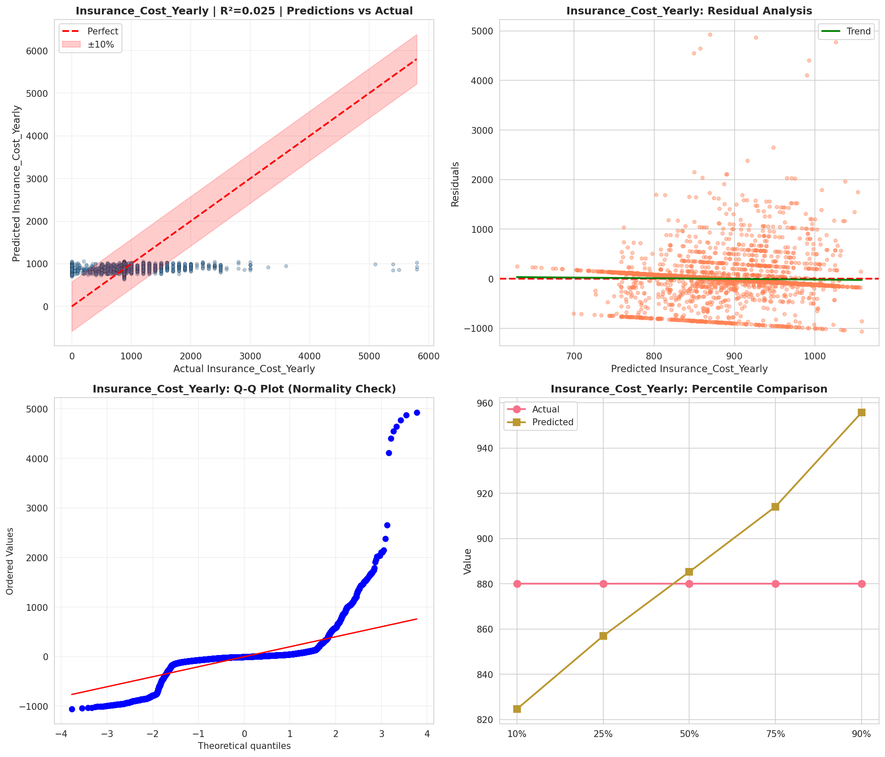
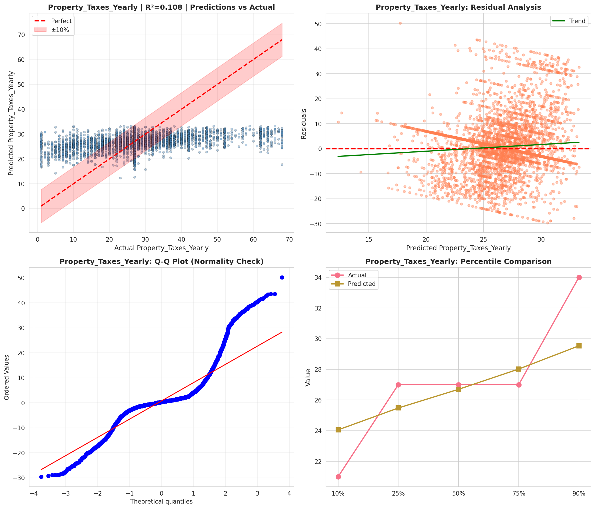
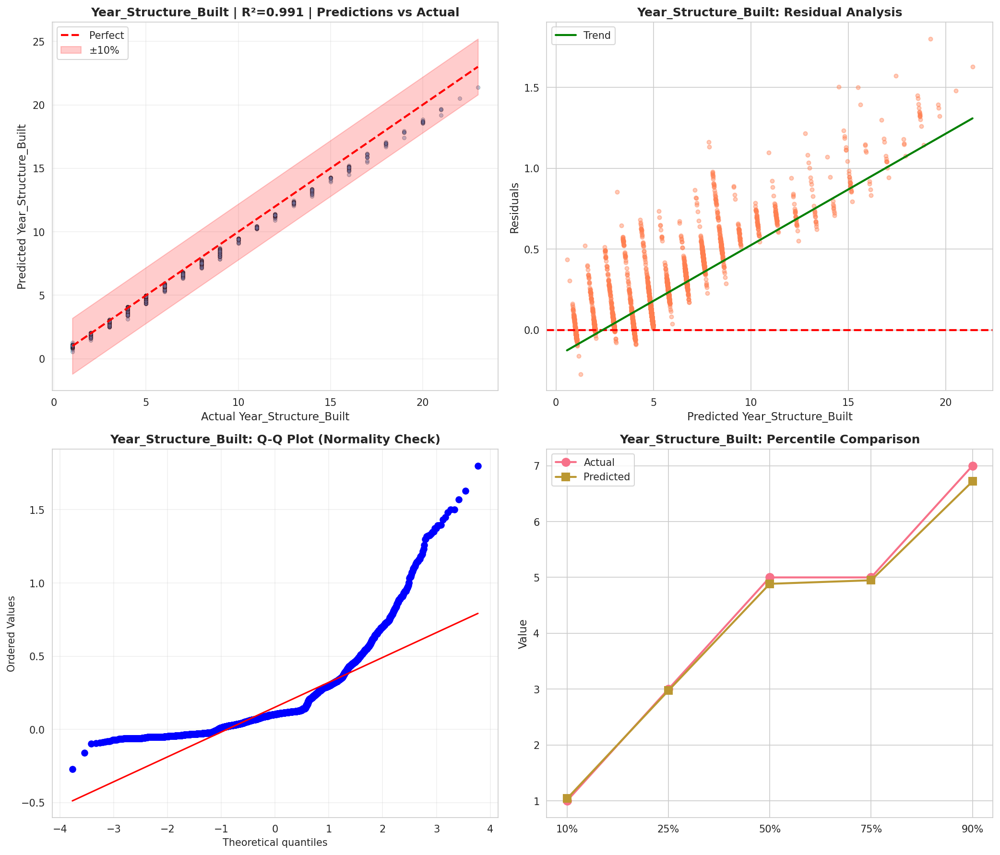
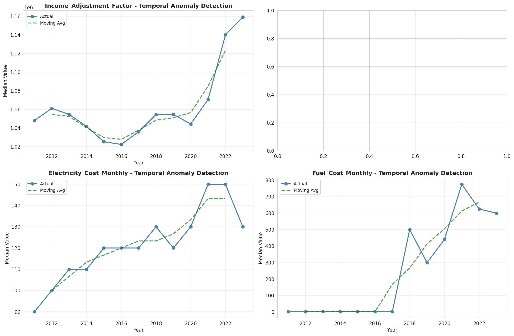
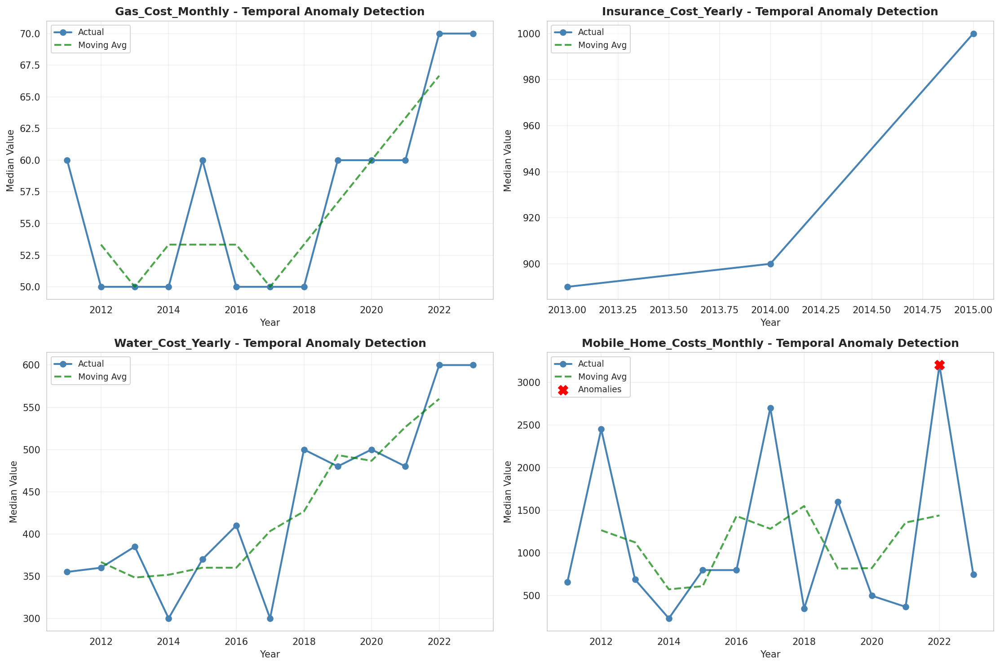
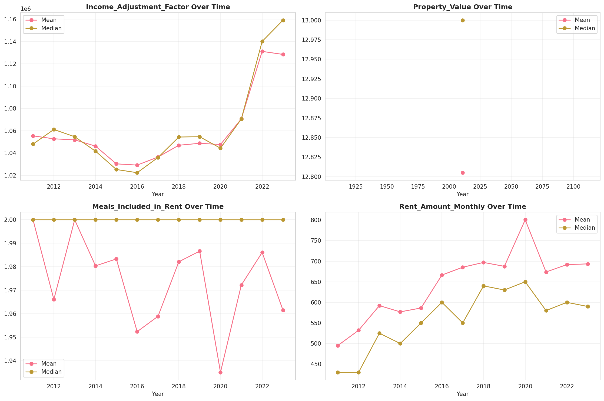

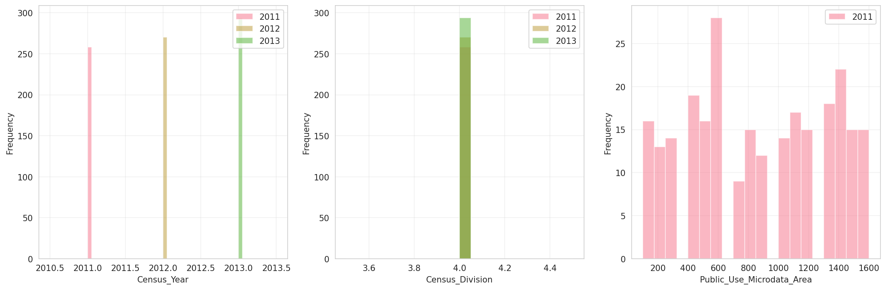
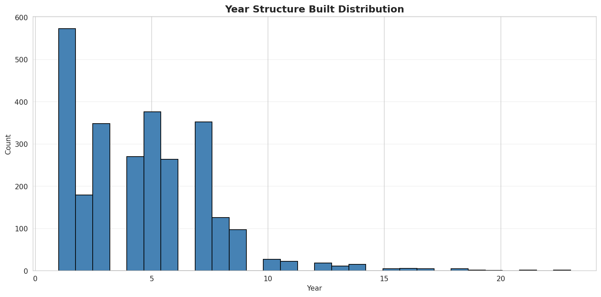
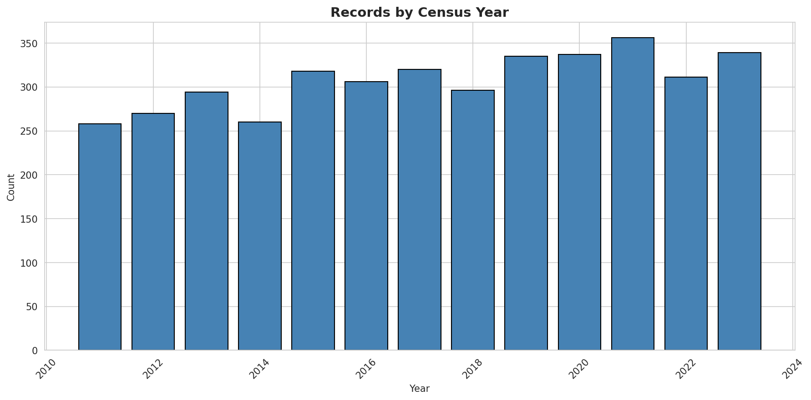
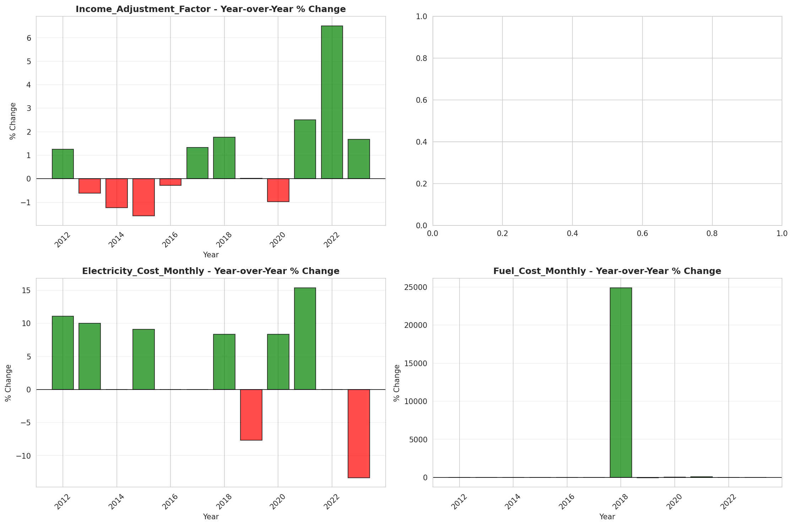
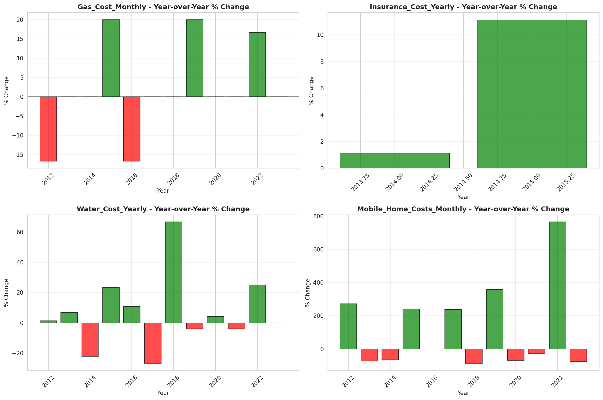
