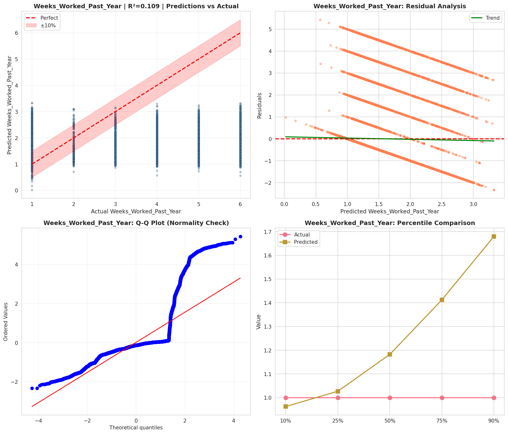
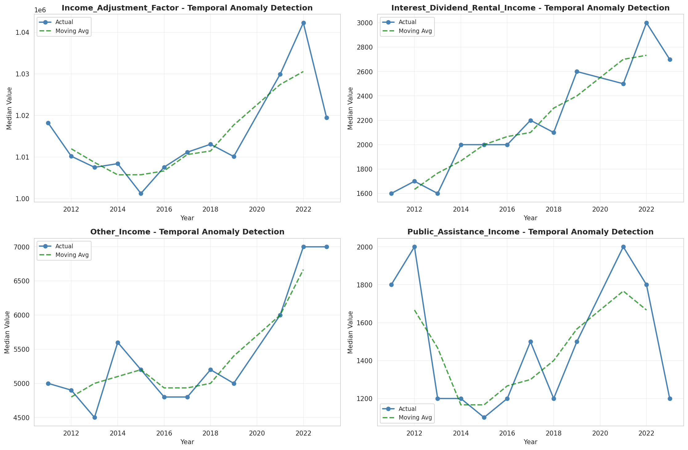
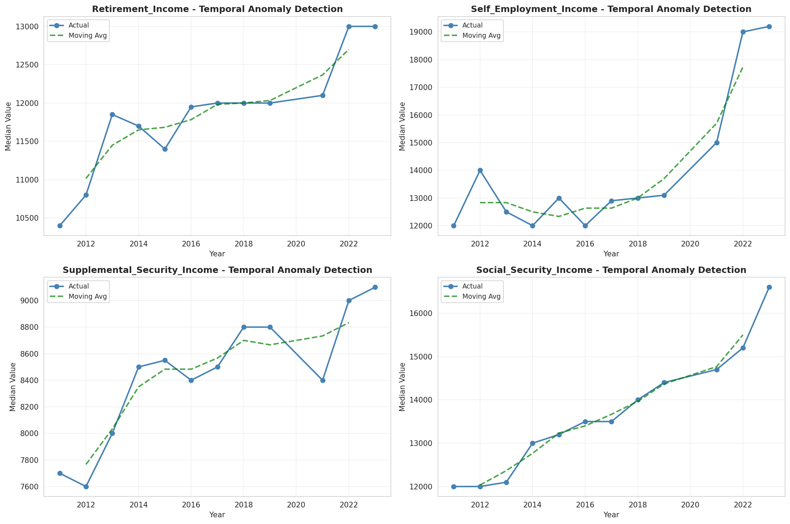
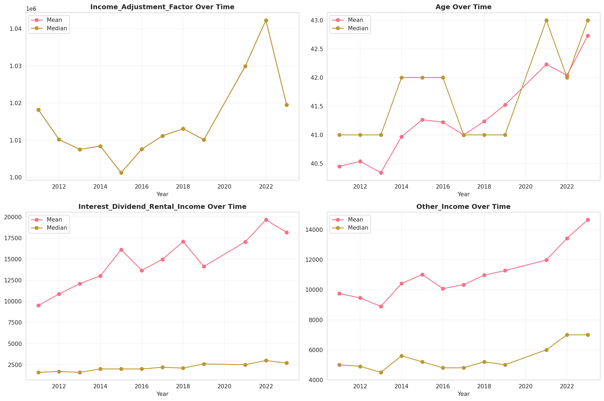
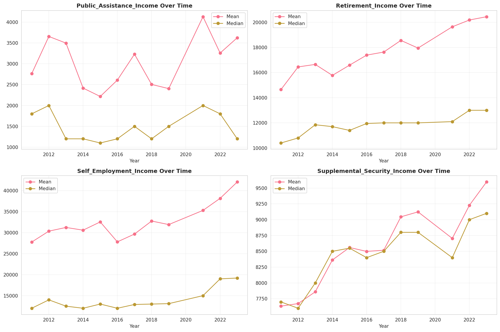
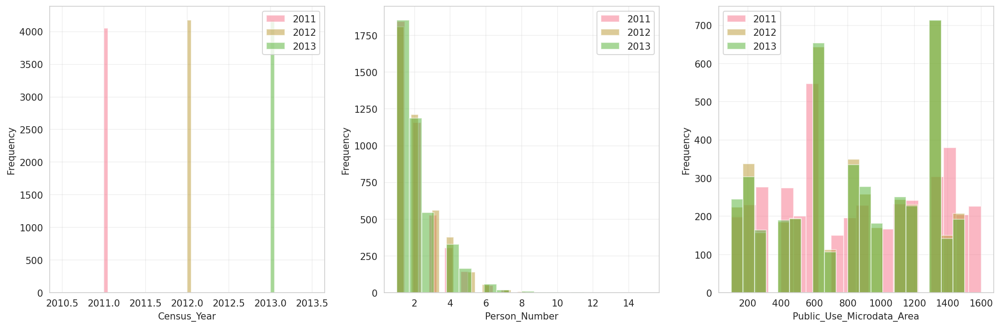
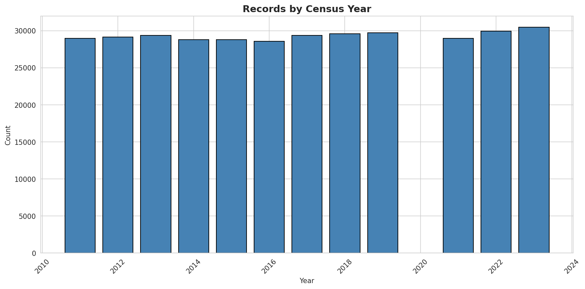
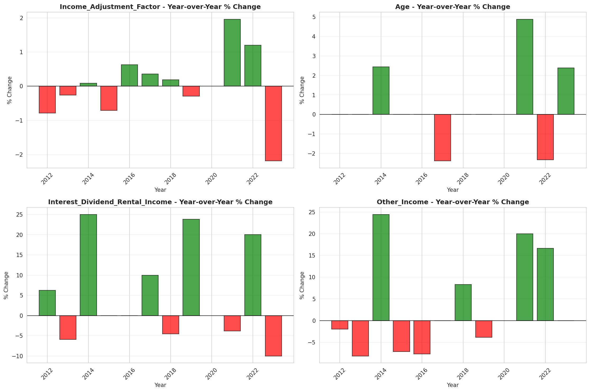
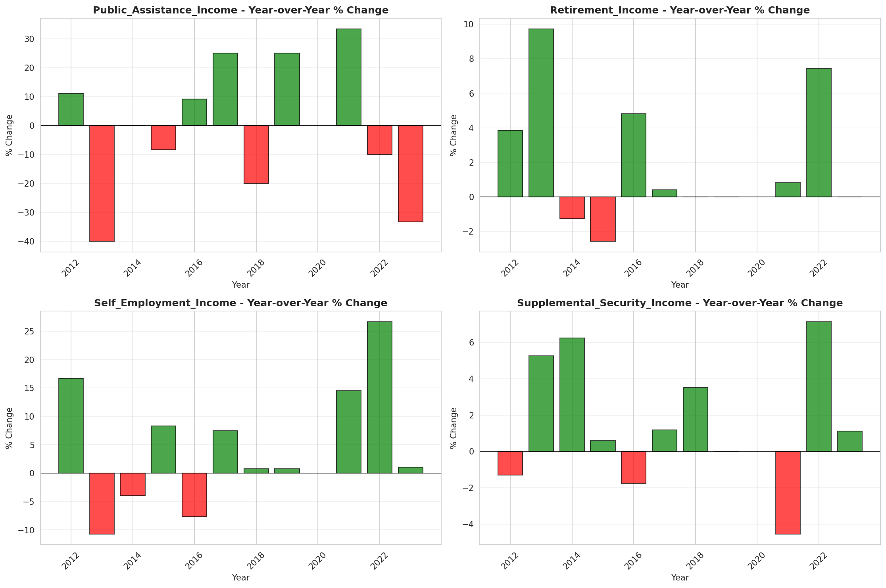

# Temporal Analysis

## Year Distribution

- 2011: 28,984 records

- 2012: 29,139 records

- 2013: 29,369 records

- 2014: 28,802 records

- 2015: 28,774 records

- 2016: 28,590 records

- 2017: 29,374 records

- 2018: 29,567 records

- 2019: 29,697 records

- 2021: 28,957 records

- 2022: 29,940 records

- 2023: 30,454 records

## Temporal Trends

- Census_Year: {np.int64(2011): {'mean': 2011.0, 'median': 2011.0, 'std': 0.0}, np.int64(2012): {'mean': 2012.0, 'median': 2012.0, 'std': 0.0}, np.int64(2013): {'mean': 2013.0, 'median': 2013.0, 'std': 0.0}, np.int64(2014): {'mean': 2014.0, 'median': 2014.0, 'std': 0.0}, np.int64(2015): {'mean': 2015.0, 'median': 2015.0, 'std': 0.0}, np.int64(2016): {'mean': 2016.0, 'median': 2016.0, 'std': 0.0}, np.int64(2017): {'mean': 2017.0, 'median': 2017.0, 'std': 0.0}, np.int64(2018): {'mean': 2018.0, 'median': 2018.0, 'std': 0.0}, np.int64(2019): {'mean': 2019.0, 'median': 2019.0, 'std': 0.0}, np.int64(2021): {'mean': 2021.0, 'median': 2021.0, 'std': 0.0}, np.int64(2022): {'mean': 2022.0, 'median': 2022.0, 'std': 0.0}, np.int64(2023): {'mean': 2023.0, 'median': 2023.0, 'std': 0.0}}

- Person_Number: {np.int64(2011): {'mean': 2.0401600883245927, 'median': 2.0, 'std': 1.297821615887538}, np.int64(2012): {'mean': 2.0380589587837608, 'median': 2.0, 'std': 1.2808187584940633}, np.int64(2013): {'mean': 2.0697674418604652, 'median': 2.0, 'std': 1.3398839395204285}, np.int64(2014): {'mean': 2.03662940073606, 'median': 2.0, 'std': 1.2875835748328026}, np.int64(2015): {'mean': 2.0290192534927365, 'median': 2.0, 'std': 1.2915296465185324}, np.int64(2016): {'mean': 2.0163343826512765, 'median': 2.0, 'std': 1.2779372611653639}, np.int64(2017): {'mean': 2.0615510315244774, 'median': 2.0, 'std': 1.3696586642923905}, np.int64(2018): {'mean': 2.04498258193256, 'median': 2.0, 'std': 1.2967389614653222}, np.int64(2019): {'mean': 2.041182611038152, 'median': 2.0, 'std': 1.3321678283668883}, np.int64(2021): {'mean': 2.0271436958248437, 'median': 2.0, 'std': 1.3184519519610314}, np.int64(2022): {'mean': 2.0107882431529727, 'median': 2.0, 'std': 1.2758894534821508}, np.int64(2023): {'mean': 2.012050962106784, 'median': 2.0, 'std': 1.3021579973014805}}

- Public_Use_Microdata_Area: {np.int64(2011): {'mean': 854.1963842119791, 'median': 800.0, 'std': 456.7075091275874}, np.int64(2012): {'mean': 826.2916709564502, 'median': 802.0, 'std': 426.458542090139}, np.int64(2013): {'mean': 828.7228029554973, 'median': 802.0, 'std': 422.94147558648865}, np.int64(2014): {'mean': 830.6345045482952, 'median': 802.0, 'std': 424.4146935943586}, np.int64(2015): {'mean': 826.8034684089803, 'median': 802.0, 'std': 423.82296565678837}, np.int64(2016): {'mean': 830.6304302203567, 'median': 802.0, 'std': 422.36942130514944}, np.int64(2017): {'mean': 831.4761353577994, 'median': 802.0, 'std': 421.4613238787731}, np.int64(2018): {'mean': 828.5430378462476, 'median': 802.0, 'std': 423.8354130028618}, np.int64(2019): {'mean': 825.797420614877, 'median': 802.0, 'std': 424.331129867779}, np.int64(2021): {'mean': 827.2063059018544, 'median': 802.0, 'std': 422.31974019933057}, np.int64(2022): {'mean': 910.8743820975284, 'median': 804.0, 'std': 494.912822672704}, np.int64(2023): {'mean': 914.0576278978131, 'median': 804.0, 'std': 497.64678939103}}

- State_Code: {np.int64(2011): {'mean': 20.0, 'median': 20.0, 'std': 0.0}, np.int64(2012): {'mean': 20.0, 'median': 20.0, 'std': 0.0}, np.int64(2013): {'mean': 20.0, 'median': 20.0, 'std': 0.0}, np.int64(2014): {'mean': 20.0, 'median': 20.0, 'std': 0.0}, np.int64(2015): {'mean': 20.0, 'median': 20.0, 'std': 0.0}, np.int64(2016): {'mean': 20.0, 'median': 20.0, 'std': 0.0}, np.int64(2017): {'mean': 20.0, 'median': 20.0, 'std': 0.0}, np.int64(2018): {'mean': 20.0, 'median': 20.0, 'std': 0.0}, np.int64(2019): {'mean': 20.0, 'median': 20.0, 'std': 0.0}, np.int64(2021): {'mean': 20.0, 'median': 20.0, 'std': 0.0}, np.int64(2022): {'mean': 20.0, 'median': 20.0, 'std': 0.0}, np.int64(2023): {'mean': None, 'median': None, 'std': None}}

- Income_Adjustment_Factor: {np.int64(2011): {'mean': 1018237.0, 'median': 1018237.0, 'std': 0.0}, np.int64(2012): {'mean': 1010207.0, 'median': 1010207.0, 'std': 0.0}, np.int64(2013): {'mean': 1007549.0, 'median': 1007549.0, 'std': 0.0}, np.int64(2014): {'mean': 1008425.0, 'median': 1008425.0, 'std': 0.0}, np.int64(2015): {'mean': 1001264.0, 'median': 1001264.0, 'std': 0.0}, np.int64(2016): {'mean': 1007588.0, 'median': 1007588.0, 'std': 0.0}, np.int64(2017): {'mean': 1011189.0, 'median': 1011189.0, 'std': 0.0}, np.int64(2018): {'mean': 1013097.0, 'median': 1013097.0, 'std': 0.0}, np.int64(2019): {'mean': 1010145.0, 'median': 1010145.0, 'std': 0.0}, np.int64(2021): {'mean': 1029928.0, 'median': 1029928.0, 'std': 0.0}, np.int64(2022): {'mean': 1042311.0, 'median': 1042311.0, 'std': 0.0}, np.int64(2023): {'mean': 1019518.0, 'median': 1019518.0, 'std': 0.0}}

- Person_Weight: {np.int64(2011): {'mean': 99.06286226883797, 'median': 76.0, 'std': 94.00112968423112}, np.int64(2012): {'mean': 99.03926009815025, 'median': 80.0, 'std': 90.31875681498848}, np.int64(2013): {'mean': 98.53781197861692, 'median': 80.0, 'std': 88.05176002869}, np.int64(2014): {'mean': 100.82706062079022, 'median': 81.0, 'std': 89.67942659934536}, np.int64(2015): {'mean': 101.18999791478419, 'median': 81.0, 'std': 92.60023960543275}, np.int64(2016): {'mean': 101.68901713885974, 'median': 82.0, 'std': 92.22549687207005}, np.int64(2017): {'mean': 99.1735208007081, 'median': 81.0, 'std': 88.37781599785947}, np.int64(2018): {'mean': 98.47160685899821, 'median': 80.0, 'std': 88.907634885257}, np.int64(2019): {'mean': 98.10128969256154, 'median': 77.0, 'std': 92.64927292460453}, np.int64(2021): {'mean': 101.34274959422592, 'median': 78.0, 'std': 95.08606792034676}, np.int64(2022): {'mean': 98.10120240480961, 'median': 77.0, 'std': 93.3742969050525}, np.int64(2023): {'mean': 96.5570040060419, 'median': 74.0, 'std': 95.23367823741951}}

- Age: {np.int64(2011): {'mean': 40.451524979298924, 'median': 41.0, 'std': 24.37056209335822}, np.int64(2012): {'mean': 40.53835066405848, 'median': 41.0, 'std': 24.243326792991816}, np.int64(2013): {'mean': 40.3409377234499, 'median': 41.0, 'std': 24.231702405669868}, np.int64(2014): {'mean': 40.969828484133046, 'median': 42.0, 'std': 24.312865011218683}, np.int64(2015): {'mean': 41.26371029401543, 'median': 42.0, 'std': 24.304394867031856}, np.int64(2016): {'mean': 41.222910108429524, 'median': 42.0, 'std': 24.4230486492369}, np.int64(2017): {'mean': 40.998570164090694, 'median': 41.0, 'std': 24.367243771591664}, np.int64(2018): {'mean': 41.23597253694998, 'median': 41.0, 'std': 24.32990925161105}, np.int64(2019): {'mean': 41.52281375223087, 'median': 41.0, 'std': 24.493656535016893}, np.int64(2021): {'mean': 42.229512725765794, 'median': 43.0, 'std': 24.588277503869303}, np.int64(2022): {'mean': 42.038977955911825, 'median': 42.0, 'std': 24.5737403912192}, np.int64(2023): {'mean': 42.72923097130098, 'median': 43.0, 'std': 24.783651419500163}}

- Citizenship_Status: {np.int64(2011): {'mean': 1.1940725917747723, 'median': 1.0, 'std': 0.8096079207739653}, np.int64(2012): {'mean': 1.1876522873125364, 'median': 1.0, 'std': 0.7944812151941807}, np.int64(2013): {'mean': 1.1918689774932751, 'median': 1.0, 'std': 0.8035736866266752}, np.int64(2014): {'mean': 1.1897437677939031, 'median': 1.0, 'std': 0.7934064395418843}, np.int64(2015): {'mean': 1.204142628762077, 'median': 1.0, 'std': 0.8269196667263597}, np.int64(2016): {'mean': 1.1971668415529906, 'median': 1.0, 'std': 0.8090132563745013}, np.int64(2017): {'mean': 1.1941172465445633, 'median': 1.0, 'std': 0.79902963185078}, np.int64(2018): {'mean': 1.1919031352521392, 'median': 1.0, 'std': 0.7941633634405908}, np.int64(2019): {'mean': 1.1850355254739535, 'median': 1.0, 'std': 0.778340050161473}, np.int64(2021): {'mean': 1.2067548433884725, 'median': 1.0, 'std': 0.8173665583091331}, np.int64(2022): {'mean': 1.194121576486306, 'median': 1.0, 'std': 0.800350748902402}, np.int64(2023): {'mean': 1.1877914231299664, 'median': 1.0, 'std': 0.7840607654911215}}

- Class_of_Worker: {np.int64(2011): {'mean': 2.237090410018871, 'median': 1.0, 'std': 1.9287761574128868}, np.int64(2012): {'mean': 2.2456398640996604, 'median': 1.0, 'std': 1.9287145069823621}, np.int64(2013): {'mean': 2.2059994393047377, 'median': 1.0, 'std': 1.9083691253011659}, np.int64(2014): {'mean': 2.213900057438254, 'median': 1.0, 'std': 1.9188463135514942}, np.int64(2015): {'mean': 2.22467813603737, 'median': 1.0, 'std': 1.925399990797708}, np.int64(2016): {'mean': 2.177716863685683, 'median': 1.0, 'std': 1.8892364742804355}, np.int64(2017): {'mean': 2.1990149988806804, 'median': 1.0, 'std': 1.897382859392426}, np.int64(2018): {'mean': 2.18681076312307, 'median': 1.0, 'std': 1.8833223190721364}, np.int64(2019): {'mean': 2.2180953960095064, 'median': 1.0, 'std': 1.9115327110181015}, np.int64(2021): {'mean': 2.2293755697356428, 'median': 1.0, 'std': 1.8809738020746554}, np.int64(2022): {'mean': 2.2378231292517006, 'median': 1.0, 'std': 1.9105772640592846}, np.int64(2023): {'mean': 2.251993964216426, 'median': 1.0, 'std': 1.902836190661078}}

- English_Speaking_Ability: {np.int64(2011): {'mean': 1.674190800681431, 'median': 1.0, 'std': 0.9235257745230916}, np.int64(2012): {'mean': 1.622269807280514, 'median': 1.0, 'std': 0.8880917340172355}, np.int64(2013): {'mean': 1.5911352329262778, 'median': 1.0, 'std': 0.8761253269316608}, np.int64(2014): {'mean': 1.570218457423094, 'median': 1.0, 'std': 0.85623352988343}, np.int64(2015): {'mean': 1.6177344081459482, 'median': 1.0, 'std': 0.874215316780235}, np.int64(2016): {'mean': 1.5815956482320943, 'median': 1.0, 'std': 0.8605258064906498}, np.int64(2017): {'mean': 1.5846672283066554, 'median': 1.0, 'std': 0.8691175482815167}, np.int64(2018): {'mean': 1.6126885536823425, 'median': 1.0, 'std': 0.886070412310687}, np.int64(2019): {'mean': 1.565520243796256, 'median': 1.0, 'std': 0.8580397609704419}, np.int64(2021): {'mean': 1.609106529209622, 'median': 1.0, 'std': 0.8736920217404559}, np.int64(2022): {'mean': 1.55955441302485, 'median': 1.0, 'std': 0.8688597393805741}, np.int64(2023): {'mean': 1.565217391304348, 'median': 1.0, 'std': 0.8672719727822015}}

- Fertility_Status: {np.int64(2011): {'mean': 1.937053861129137, 'median': 2.0, 'std': 0.24288576146652005}, np.int64(2012): {'mean': 2.255893909626719, 'median': 2.0, 'std': 1.3683740911717517}, np.int64(2013): {'mean': 1.938956350508697, 'median': 2.0, 'std': 0.23943000945045492}, np.int64(2014): {'mean': 1.9369199037469922, 'median': 2.0, 'std': 0.24312786298049024}, np.int64(2015): {'mean': 1.9450154162384379, 'median': 2.0, 'std': 0.22796969395609565}, np.int64(2016): {'mean': 1.9400276529554097, 'median': 2.0, 'std': 0.23745612179873082}, np.int64(2017): {'mean': 1.9416987770145753, 'median': 2.0, 'std': 0.23433179428432663}, np.int64(2018): {'mean': 1.9379161118508654, 'median': 2.0, 'std': 0.24132793577491052}, np.int64(2019): {'mean': 1.9399334442595675, 'median': 2.0, 'std': 0.2376298808845034}, np.int64(2021): {'mean': 1.9412367611889307, 'median': 2.0, 'std': 0.23520112765647713}, np.int64(2022): {'mean': 1.9408761528326746, 'median': 2.0, 'std': 0.2358757740951007}, np.int64(2023): {'mean': 1.9424556707929073, 'median': 2.0, 'std': 0.2328992335652378}}

- Marital_Status: {np.int64(2011): {'mean': 2.818900082804306, 'median': 2.0, 'std': 1.8412330847809961}, np.int64(2012): {'mean': 2.8163629499982843, 'median': 2.0, 'std': 1.8406969383365692}, np.int64(2013): {'mean': 2.833600054479213, 'median': 2.0, 'std': 1.8452435732262582}, np.int64(2014): {'mean': 2.8288313311575584, 'median': 2.0, 'std': 1.8433508562329033}, np.int64(2015): {'mean': 2.8145548064224646, 'median': 2.0, 'std': 1.8426858294825004}, np.int64(2016): {'mean': 2.819307450157398, 'median': 2.0, 'std': 1.8411366768226018}, np.int64(2017): {'mean': 2.851569415129026, 'median': 2.0, 'std': 1.8463688186975176}, np.int64(2018): {'mean': 2.8401258159434506, 'median': 2.0, 'std': 1.8473072187263988}, np.int64(2019): {'mean': 2.833484863790955, 'median': 2.0, 'std': 1.8401720713025238}, np.int64(2021): {'mean': 2.820975929826985, 'median': 2.0, 'std': 1.842386873460146}, np.int64(2022): {'mean': 2.857314629258517, 'median': 2.0, 'std': 1.8458628324043302}, np.int64(2023): {'mean': 2.8399225060747355, 'median': 2.0, 'std': 1.8433605020011843}}

- Mobility_Status: {np.int64(2011): {'mean': 1.2788481675392671, 'median': 1.0, 'std': 0.6890253314248047}, np.int64(2012): {'mean': 1.288079125455492, 'median': 1.0, 'std': 0.6980835047222343}, np.int64(2013): {'mean': 1.281965632425359, 'median': 1.0, 'std': 0.6924977873897347}, np.int64(2014): {'mean': 1.2863917380918926, 'median': 1.0, 'std': 0.6981713907090998}, np.int64(2015): {'mean': 1.2745738885960287, 'median': 1.0, 'std': 0.6849083119737676}, np.int64(2016): {'mean': 1.2836575875486382, 'median': 1.0, 'std': 0.6947382328049626}, np.int64(2017): {'mean': 1.2677932268722467, 'median': 1.0, 'std': 0.678283765103259}, np.int64(2018): {'mean': 1.2824309996921919, 'median': 1.0, 'std': 0.6934974181717887}, np.int64(2019): {'mean': 1.2626046131863646, 'median': 1.0, 'std': 0.6728739333191057}, np.int64(2021): {'mean': 1.2490490979516349, 'median': 1.0, 'std': 0.6567928934896865}, np.int64(2022): {'mean': 1.2503290250733978, 'median': 1.0, 'std': 0.6590625934044722}, np.int64(2023): {'mean': 1.2379499087742578, 'median': 1.0, 'std': 0.643185156220097}}

- Military_Service: {np.int64(2011): {'mean': 4.7279136373650585, 'median': 5.0, 'std': 0.7211098490623956}, np.int64(2012): {'mean': 4.742287384910765, 'median': 5.0, 'std': 0.7069817797042443}, np.int64(2013): {'mean': 3.7588189182126994, 'median': 4.0, 'std': 0.6520509721808079}, np.int64(2014): {'mean': 3.7727452967352515, 'median': 4.0, 'std': 0.6316685219575396}, np.int64(2015): {'mean': 3.778371044684669, 'median': 4.0, 'std': 0.6267716825501187}, np.int64(2016): {'mean': 3.7847203874944957, 'median': 4.0, 'std': 0.6165513278311097}, np.int64(2017): {'mean': 3.788013270713947, 'median': 4.0, 'std': 0.6131468329657804}, np.int64(2018): {'mean': 3.7855648982030816, 'median': 4.0, 'std': 0.6194818909696885}, np.int64(2019): {'mean': 3.7965037338764427, 'median': 4.0, 'std': 0.6053477997458011}, np.int64(2021): {'mean': 3.8152835975636097, 'median': 4.0, 'std': 0.5807133142165444}, np.int64(2022): {'mean': 3.8048607637151908, 'median': 4.0, 'std': 0.6000775798898618}, np.int64(2023): {'mean': 3.8128893050523143, 'median': 4.0, 'std': 0.5862621007661515}}

- Travel_Time_To_Work_Minutes: {np.int64(2011): {'mean': 19.540452560539897, 'median': 15.0, 'std': 19.28452685378376}, np.int64(2012): {'mean': 19.380494290630377, 'median': 15.0, 'std': 18.71395927708743}, np.int64(2013): {'mean': 19.770723785957315, 'median': 15.0, 'std': 19.769750329076967}, np.int64(2014): {'mean': 19.589341448189764, 'median': 15.0, 'std': 18.982398780042043}, np.int64(2015): {'mean': 19.525059665871122, 'median': 15.0, 'std': 18.567117226189556}, np.int64(2016): {'mean': 19.515626205725752, 'median': 15.0, 'std': 18.884619295612403}, np.int64(2017): {'mean': 19.946856230517753, 'median': 15.0, 'std': 19.172561743853198}, np.int64(2018): {'mean': 20.68951069878797, 'median': 15.0, 'std': 21.10144643102653}, np.int64(2019): {'mean': 20.839133338280032, 'median': 15.0, 'std': 20.533087707146226}, np.int64(2021): {'mean': 20.017454858125536, 'median': 15.0, 'std': 20.19745051224067}, np.int64(2022): {'mean': 20.362881109856428, 'median': 15.0, 'std': 20.674198243427245}, np.int64(2023): {'mean': 20.335913675815153, 'median': 15.0, 'std': 19.94977058727451}}

- Vehicle_Occupancy: {np.int64(2011): {'mean': 1.1622186898686522, 'median': 1.0, 'std': 0.5992840692118957}, np.int64(2012): {'mean': 1.1631781991299353, 'median': 1.0, 'std': 0.5974004967214056}, np.int64(2013): {'mean': 1.1474181462778954, 'median': 1.0, 'std': 0.5324964110016683}, np.int64(2014): {'mean': 1.1708295798869872, 'median': 1.0, 'std': 0.6319146248249277}, np.int64(2015): {'mean': 1.1508289526890416, 'median': 1.0, 'std': 0.5810069463952542}, np.int64(2016): {'mean': 1.1341860844060616, 'median': 1.0, 'std': 0.5657311922437664}, np.int64(2017): {'mean': 1.1417838874680306, 'median': 1.0, 'std': 0.5457617772280788}, np.int64(2018): {'mean': 1.167018862017688, 'median': 1.0, 'std': 0.6789609167397662}, np.int64(2019): {'mean': 1.1425244527247322, 'median': 1.0, 'std': 0.5349608827670855}, np.int64(2021): {'mean': 1.1310956301456618, 'median': 1.0, 'std': 0.521614121111236}, np.int64(2022): {'mean': 1.1454685231058341, 'median': 1.0, 'std': 0.53665146788184}, np.int64(2023): {'mean': 1.1586252478519499, 'median': 1.0, 'std': 0.5961566517092634}}

- Transportation_To_Work: {np.int64(2011): {'mean': 1.912401055408971, 'median': 1.0, 'std': 2.810165530638496}, np.int64(2012): {'mean': 1.85236748064324, 'median': 1.0, 'std': 2.727221467087428}, np.int64(2013): {'mean': 1.8567417805688955, 'median': 1.0, 'std': 2.741555034488982}, np.int64(2014): {'mean': 1.80804005081073, 'median': 1.0, 'std': 2.668753066526595}, np.int64(2015): {'mean': 1.8435733685678632, 'median': 1.0, 'std': 2.7218434139637613}, np.int64(2016): {'mean': 1.867953724854469, 'median': 1.0, 'std': 2.746329674677578}, np.int64(2017): {'mean': 1.8921377517868745, 'median': 1.0, 'std': 2.7998304977210515}, np.int64(2018): {'mean': 1.8564117145294285, 'median': 1.0, 'std': 2.741848484208046}, np.int64(2019): {'mean': None, 'median': None, 'std': None}, np.int64(2021): {'mean': None, 'median': None, 'std': None}, np.int64(2022): {'mean': None, 'median': None, 'std': None}, np.int64(2023): {'mean': None, 'median': None, 'std': None}}

- Language_Other_Than_English: {np.int64(2011): {'mean': 1.9135588852483156, 'median': 2.0, 'std': 0.28101949357247163}, np.int64(2012): {'mean': 1.91486801808371, 'median': 2.0, 'std': 0.27908308310260155}, np.int64(2013): {'mean': 1.9199261190786614, 'median': 2.0, 'std': 0.2714124580178265}, np.int64(2014): {'mean': 1.9173909840895698, 'median': 2.0, 'std': 0.2752954006766406}, np.int64(2015): {'mean': 1.9130226207609138, 'median': 2.0, 'std': 0.2818071065459156}, np.int64(2016): {'mean': 1.9179956135459648, 'median': 2.0, 'std': 0.2743765032887592}, np.int64(2017): {'mean': 1.9142650776453594, 'median': 2.0, 'std': 0.2799772782406399}, np.int64(2018): {'mean': 1.9192751235584844, 'median': 2.0, 'std': 0.272417012249162}, np.int64(2019): {'mean': 1.9179672154565908, 'median': 2.0, 'std': 0.2744195623691032}, np.int64(2021): {'mean': 1.9149899580062077, 'median': 2.0, 'std': 0.2789017304007098}, np.int64(2022): {'mean': 1.9177502907284067, 'median': 2.0, 'std': 0.27474962193993263}, np.int64(2023): {'mean': 1.9204097169354282, 'median': 2.0, 'std': 0.2706625296706125}}

- Grandparents_Living_With_Grandchildren: {np.int64(2011): {'mean': 1.9737407101568951, 'median': 2.0, 'std': 0.15990980975311125}, np.int64(2012): {'mean': 1.9741473546130301, 'median': 2.0, 'std': 0.15869991392585772}, np.int64(2013): {'mean': 1.9743589743589745, 'median': 2.0, 'std': 0.15806619098056443}, np.int64(2014): {'mean': 1.9717876941654318, 'median': 2.0, 'std': 0.16558344283092657}, np.int64(2015): {'mean': 1.974862913296053, 'median': 2.0, 'std': 0.15654566132439246}, np.int64(2016): {'mean': 1.9745562455349783, 'median': 2.0, 'std': 0.15747295819013044}, np.int64(2017): {'mean': 1.9758841578295743, 'median': 2.0, 'std': 0.1534129565741211}, np.int64(2018): {'mean': 1.9766686198263463, 'median': 2.0, 'std': 0.15095774493763325}, np.int64(2019): {'mean': 1.9753125328290786, 'median': 2.0, 'std': 0.15517493655719378}, np.int64(2021): {'mean': 1.97800454713689, 'median': 2.0, 'std': 0.14667239132486237}, np.int64(2022): {'mean': 1.9776235367243344, 'median': 2.0, 'std': 0.14790838492895833}, np.int64(2023): {'mean': 1.9786217303822937, 'median': 2.0, 'std': 0.14464539963308715}}

- Months_Responsible_For_Grandchildren: {np.int64(2011): {'mean': 3.3983050847457625, 'median': 3.0, 'std': 1.3754060476415422}, np.int64(2012): {'mean': 3.6188524590163933, 'median': 4.0, 'std': 1.3418758424295398}, np.int64(2013): {'mean': 3.52, 'median': 4.0, 'std': 1.4144660779652103}, np.int64(2014): {'mean': 3.83265306122449, 'median': 4.0, 'std': 1.3702619940795513}, np.int64(2015): {'mean': 3.5172413793103448, 'median': 3.0, 'std': 1.4154201265055186}, np.int64(2016): {'mean': 3.557077625570776, 'median': 4.0, 'std': 1.4431688656150305}, np.int64(2017): {'mean': 3.7958115183246073, 'median': 4.0, 'std': 1.3279121903726596}, np.int64(2018): {'mean': 3.807511737089202, 'median': 4.0, 'std': 1.323068155984588}, np.int64(2019): {'mean': 3.625, 'median': 4.0, 'std': 1.3401358608590916}, np.int64(2021): {'mean': 4.0, 'median': 5.0, 'std': 1.2293753032998658}, np.int64(2022): {'mean': 3.8363636363636364, 'median': 4.0, 'std': 1.3538153361974008}, np.int64(2023): {'mean': 3.432584269662921, 'median': 4.0, 'std': 1.5471698441854436}}

- Grandparents_Responsible_For_Grandchildren: {np.int64(2011): {'mean': 1.5052410901467506, 'median': 2.0, 'std': 0.5004974359075873}, np.int64(2012): {'mean': 1.4841437632135306, 'median': 1.0, 'std': 0.500277631022925}, np.int64(2013): {'mean': 1.5233050847457628, 'median': 2.0, 'std': 0.4999865052696898}, np.int64(2014): {'mean': 1.5233463035019454, 'median': 2.0, 'std': 0.49994121361624017}, np.int64(2015): {'mean': 1.5615550755939525, 'median': 2.0, 'std': 0.49673322503320455}, np.int64(2016): {'mean': 1.5269978401727862, 'median': 2.0, 'std': 0.49981062863597586}, np.int64(2017): {'mean': 1.5736607142857142, 'median': 2.0, 'std': 0.4950972074316795}, np.int64(2018): {'mean': 1.5136986301369864, 'median': 2.0, 'std': 0.5003838531583046}, np.int64(2019): {'mean': 1.523404255319149, 'median': 2.0, 'std': 0.4999841216913534}, np.int64(2021): {'mean': 1.5745192307692308, 'median': 2.0, 'std': 0.4950110229906992}, np.int64(2022): {'mean': 1.6180555555555556, 'median': 2.0, 'std': 0.48642635158295855}, np.int64(2023): {'mean': 1.5811764705882352, 'median': 2.0, 'std': 0.49394783298361766}}

- Interest_Dividend_Rental_Income: {np.int64(2011): {'mean': 9512.575817361894, 'median': 1600.0, 'std': 25770.456951438227}, np.int64(2012): {'mean': 10878.214710042434, 'median': 1700.0, 'std': 28882.604815741342}, np.int64(2013): {'mean': 12086.58529489553, 'median': 1600.0, 'std': 34858.71891108671}, np.int64(2014): {'mean': 13025.719772788747, 'median': 2000.0, 'std': 35602.322481979245}, np.int64(2015): {'mean': 16118.686465961486, 'median': 2000.0, 'std': 50828.918089056926}, np.int64(2016): {'mean': 13669.16561423651, 'median': 2000.0, 'std': 38199.63527341518}, np.int64(2017): {'mean': 14975.649143189079, 'median': 2200.0, 'std': 42507.82151572618}, np.int64(2018): {'mean': 17083.163204747776, 'median': 2100.0, 'std': 49682.699627055124}, np.int64(2019): {'mean': 14121.166421207658, 'median': 2600.0, 'std': 37115.988513755896}, np.int64(2021): {'mean': 17048.78087905037, 'median': 2500.0, 'std': 46855.752694626724}, np.int64(2022): {'mean': 19652.69455252918, 'median': 3000.0, 'std': 54952.64112866032}, np.int64(2023): {'mean': 18160.191693290733, 'median': 2700.0, 'std': 50271.8267388177}}

- Military_Service_Period_1: {np.int64(2011): {'mean': 0.14814814814814814, 'median': 0.0, 'std': 0.35531258422494877}, np.int64(2012): {'mean': 0.16705698672911787, 'median': 0.0, 'std': 0.37309956278252476}, np.int64(2013): {'mean': 0.18020917135961384, 'median': 0.0, 'std': 0.3844389108158185}, np.int64(2014): {'mean': 0.16542994325621999, 'median': 0.0, 'std': 0.3716492521134134}, np.int64(2015): {'mean': 0.17418490397498884, 'median': 0.0, 'std': 0.37935312954348877}, np.int64(2016): {'mean': 0.21135940409683426, 'median': 0.0, 'std': 0.4083677795584267}, np.int64(2017): {'mean': 0.21178637200736647, 'median': 0.0, 'std': 0.4086683212716252}, np.int64(2018): {'mean': 0.23907225691347012, 'median': 0.0, 'std': 0.42661210656342075}, np.int64(2019): {'mean': 0.22563859981078524, 'median': 0.0, 'std': 0.4181010798392337}, np.int64(2021): {'mean': 0.2639186295503212, 'median': 0.0, 'std': 0.44087372205175024}, np.int64(2022): {'mean': 0.2979034617259873, 'median': 0.0, 'std': 0.457448376341286}, np.int64(2023): {'mean': 0.30135610246107486, 'median': 0.0, 'std': 0.4589623092019837}}

- Military_Service_Period_2: {np.int64(2011): {'mean': 0.14629629629629629, 'median': 0.0, 'std': 0.3534684767373759}, np.int64(2012): {'mean': 0.14168618266978922, 'median': 0.0, 'std': 0.34879606382433087}, np.int64(2013): {'mean': 0.166532582461786, 'median': 0.0, 'std': 0.3726329780930606}, np.int64(2014): {'mean': 0.1518987341772152, 'median': 0.0, 'std': 0.35900106464082265}, np.int64(2015): {'mean': 0.15676641357748994, 'median': 0.0, 'std': 0.36366161688731496}, np.int64(2016): {'mean': 0.15735567970204842, 'median': 0.0, 'std': 0.3642205759896695}, np.int64(2017): {'mean': 0.18968692449355432, 'median': 0.0, 'std': 0.3921435893992004}, np.int64(2018): {'mean': 0.1926851025869759, 'median': 0.0, 'std': 0.39449584050532727}, np.int64(2019): {'mean': 0.18401135288552506, 'median': 0.0, 'std': 0.38758513329965694}, np.int64(2021): {'mean': 0.20342612419700215, 'median': 0.0, 'std': 0.4026546037782684}, np.int64(2022): {'mean': 0.20039005363237444, 'median': 0.0, 'std': 0.400389863640302}, np.int64(2023): {'mean': 0.20894023103967854, 'median': 0.0, 'std': 0.40665374495407297}}

- Military_Service_Period_3: {np.int64(2011): {'mean': 0.13962962962962963, 'median': 0.0, 'std': 0.3466665637478747}, np.int64(2012): {'mean': 0.1557377049180328, 'median': 0.0, 'std': 0.3626772847329527}, np.int64(2013): {'mean': None, 'median': None, 'std': None}, np.int64(2014): {'mean': None, 'median': None, 'std': None}, np.int64(2015): {'mean': None, 'median': None, 'std': None}, np.int64(2016): {'mean': None, 'median': None, 'std': None}, np.int64(2017): {'mean': None, 'median': None, 'std': None}, np.int64(2018): {'mean': None, 'median': None, 'std': None}, np.int64(2019): {'mean': None, 'median': None, 'std': None}, np.int64(2021): {'mean': None, 'median': None, 'std': None}, np.int64(2022): {'mean': None, 'median': None, 'std': None}, np.int64(2023): {'mean': None, 'median': None, 'std': None}}

- Military_Service_Period_4: {np.int64(2011): {'mean': 0.10703703703703704, 'median': 0.0, 'std': 0.30921759797268494}, np.int64(2012): {'mean': 0.11670569867291179, 'median': 0.0, 'std': 0.32113195202563094}, np.int64(2013): {'mean': None, 'median': None, 'std': None}, np.int64(2014): {'mean': None, 'median': None, 'std': None}, np.int64(2015): {'mean': None, 'median': None, 'std': None}, np.int64(2016): {'mean': None, 'median': None, 'std': None}, np.int64(2017): {'mean': None, 'median': None, 'std': None}, np.int64(2018): {'mean': None, 'median': None, 'std': None}, np.int64(2019): {'mean': None, 'median': None, 'std': None}, np.int64(2021): {'mean': None, 'median': None, 'std': None}, np.int64(2022): {'mean': None, 'median': None, 'std': None}, np.int64(2023): {'mean': None, 'median': None, 'std': None}}

- Military_Service_Period_5: {np.int64(2011): {'mean': 0.3485185185185185, 'median': 0.0, 'std': 0.47658943102307944}, np.int64(2012): {'mean': 0.34270101483216237, 'median': 0.0, 'std': 0.47470515684385717}, np.int64(2013): {'mean': 0.3656476267095736, 'median': 0.0, 'std': 0.48170818926611086}, np.int64(2014): {'mean': 0.36097773897861196, 'median': 0.0, 'std': 0.4803889480677381}, np.int64(2015): {'mean': 0.3894595801697186, 'median': 0.0, 'std': 0.4877366734181101}, np.int64(2016): {'mean': 0.3584729981378026, 'median': 0.0, 'std': 0.47966365303588704}, np.int64(2017): {'mean': 0.3756906077348066, 'median': 0.0, 'std': 0.4844122329834631}, np.int64(2018): {'mean': 0.3608385370205174, 'median': 0.0, 'std': 0.4803509164381614}, np.int64(2019): {'mean': 0.3651844843897824, 'median': 0.0, 'std': 0.4815957748177742}, np.int64(2021): {'mean': 0.3881156316916488, 'median': 0.0, 'std': 0.4874516261682521}, np.int64(2022): {'mean': 0.3681131155533886, 'median': 0.0, 'std': 0.48240990452012655}, np.int64(2023): {'mean': 0.365143144148669, 'median': 0.0, 'std': 0.48159123506393936}}

- Military_Service_Period_6: {np.int64(2011): {'mean': 0.09333333333333334, 'median': 0.0, 'std': 0.29095287487546134}, np.int64(2012): {'mean': 0.09992193598750976, 'median': 0.0, 'std': 0.29995443125683624}, np.int64(2013): {'mean': None, 'median': None, 'std': None}, np.int64(2014): {'mean': None, 'median': None, 'std': None}, np.int64(2015): {'mean': None, 'median': None, 'std': None}, np.int64(2016): {'mean': None, 'median': None, 'std': None}, np.int64(2017): {'mean': None, 'median': None, 'std': None}, np.int64(2018): {'mean': None, 'median': None, 'std': None}, np.int64(2019): {'mean': None, 'median': None, 'std': None}, np.int64(2021): {'mean': None, 'median': None, 'std': None}, np.int64(2022): {'mean': None, 'median': None, 'std': None}, np.int64(2023): {'mean': None, 'median': None, 'std': None}}

- Military_Service_Period_7: {np.int64(2011): {'mean': 0.1174074074074074, 'median': 0.0, 'std': 0.3219647514368384}, np.int64(2012): {'mean': 0.11436377829820453, 'median': 0.0, 'std': 0.31831470811207996}, np.int64(2013): {'mean': None, 'median': None, 'std': None}, np.int64(2014): {'mean': None, 'median': None, 'std': None}, np.int64(2015): {'mean': None, 'median': None, 'std': None}, np.int64(2016): {'mean': None, 'median': None, 'std': None}, np.int64(2017): {'mean': None, 'median': None, 'std': None}, np.int64(2018): {'mean': None, 'median': None, 'std': None}, np.int64(2019): {'mean': None, 'median': None, 'std': None}, np.int64(2021): {'mean': None, 'median': None, 'std': None}, np.int64(2022): {'mean': None, 'median': None, 'std': None}, np.int64(2023): {'mean': None, 'median': None, 'std': None}}

- Military_Service_Period_8: {np.int64(2011): {'mean': 0.12666666666666668, 'median': 0.0, 'std': 0.33266080111094537}, np.int64(2012): {'mean': 0.1213895394223263, 'median': 0.0, 'std': 0.32664317632346007}, np.int64(2013): {'mean': 0.1170555108608206, 'median': 0.0, 'std': 0.3215510988800161}, np.int64(2014): {'mean': 0.13574858140549978, 'median': 0.0, 'std': 0.3425961702759165}, np.int64(2015): {'mean': 0.10987047789191604, 'median': 0.0, 'std': 0.3127981062045048}, np.int64(2016): {'mean': 0.10474860335195531, 'median': 0.0, 'std': 0.3063005244737244}, np.int64(2017): {'mean': 0.08057090239410682, 'median': 0.0, 'std': 0.27223767970648766}, np.int64(2018): {'mean': 0.0816235504014273, 'median': 0.0, 'std': 0.27385141278771413}, np.int64(2019): {'mean': 0.07805108798486282, 'median': 0.0, 'std': 0.26831543204870617}, np.int64(2021): {'mean': 0.05406852248394004, 'median': 0.0, 'std': 0.22621342055351792}, np.int64(2022): {'mean': 0.03900536323744515, 'median': 0.0, 'std': 0.19365492435597723}, np.int64(2023): {'mean': 0.047714716223003516, 'median': 0.0, 'std': 0.21321551363745975}}

- Military_Service_Period_9: {np.int64(2011): {'mean': 0.02074074074074074, 'median': 0.0, 'std': 0.1425415294989762}, np.int64(2012): {'mean': 0.02654176424668228, 'median': 0.0, 'std': 0.16077122799604765}, np.int64(2013): {'mean': 0.017699115044247787, 'median': 0.0, 'std': 0.1318819649966192}, np.int64(2014): {'mean': 0.014404190309908338, 'median': 0.0, 'std': 0.1191759583470418}, np.int64(2015): {'mean': 0.01652523447967843, 'median': 0.0, 'std': 0.12751240337126973}, np.int64(2016): {'mean': 0.013966480446927373, 'median': 0.0, 'std': 0.11737901060931595}, np.int64(2017): {'mean': 0.01151012891344383, 'median': 0.0, 'std': 0.10669061151535322}, np.int64(2018): {'mean': 0.010258697591436218, 'median': 0.0, 'std': 0.10078684182806147}, np.int64(2019): {'mean': 0.010879848628192999, 'median': 0.0, 'std': 0.1037620860773496}, np.int64(2021): {'mean': None, 'median': None, 'std': None}, np.int64(2022): {'mean': None, 'median': None, 'std': None}, np.int64(2023): {'mean': None, 'median': None, 'std': None}}

- Military_Service_Period_10: {np.int64(2011): {'mean': 0.10851851851851851, 'median': 0.0, 'std': 0.3110917764830164}, np.int64(2012): {'mean': 0.10031225604996097, 'median': 0.0, 'std': 0.30047453696182147}, np.int64(2013): {'mean': 0.07642799678197908, 'median': 0.0, 'std': 0.2657351373528029}, np.int64(2014): {'mean': 0.07158446093408992, 'median': 0.0, 'std': 0.25785489674601747}, np.int64(2015): {'mean': 0.048682447521214825, 'median': 0.0, 'std': 0.2152513890999709}, np.int64(2016): {'mean': 0.04748603351955307, 'median': 0.0, 'std': 0.21272559145942754}, np.int64(2017): {'mean': 0.04604051565377532, 'median': 0.0, 'std': 0.20962112785459389}, np.int64(2018): {'mean': 0.03389830508474576, 'median': 0.0, 'std': 0.18100779998720154}, np.int64(2019): {'mean': 0.02554399243140965, 'median': 0.0, 'std': 0.15780772177232655}, np.int64(2021): {'mean': 0.013383297644539615, 'median': 0.0, 'std': 0.11494023401880221}, np.int64(2022): {'mean': 0.006825938566552901, 'median': 0.0, 'std': 0.08235685840816515}, np.int64(2023): {'mean': 0.008538422903063787, 'median': 0.0, 'std': 0.09203136566767464}}

- Military_Service_Period_11: {np.int64(2011): {'mean': 0.0025925925925925925, 'median': 0.0, 'std': 0.05086088026281601}, np.int64(2012): {'mean': 0.00429352068696331, 'median': 0.0, 'std': 0.06539690872368792}, np.int64(2013): {'mean': 0.004827031375703942, 'median': 0.0, 'std': 0.06932289834394875}, np.int64(2014): {'mean': 0.006547359231776516, 'median': 0.0, 'std': 0.08066803399171693}, np.int64(2015): {'mean': 0.0022331397945511387, 'median': 0.0, 'std': 0.04721385899548376}, np.int64(2016): {'mean': 0.0004655493482309125, 'median': 0.0, 'std': 0.02157659260010516}, np.int64(2017): {'mean': 0.0, 'median': 0.0, 'std': 0.0}, np.int64(2018): {'mean': 0.00044603033006244426, 'median': 0.0, 'std': 0.021119430154775593}, np.int64(2019): {'mean': 0.0, 'median': 0.0, 'std': 0.0}, np.int64(2021): {'mean': None, 'median': None, 'std': None}, np.int64(2022): {'mean': None, 'median': None, 'std': None}, np.int64(2023): {'mean': None, 'median': None, 'std': None}}

- Temporary_Absence_From_Work: {np.int64(2011): {'mean': 2.5497959538074153, 'median': 3.0, 'std': 0.5275949647976352}, np.int64(2012): {'mean': 2.5471317629896597, 'median': 3.0, 'std': 0.5261943078360585}, np.int64(2013): {'mean': 2.604630263608353, 'median': 3.0, 'std': 0.5155260079746296}, np.int64(2014): {'mean': 2.6060974023157986, 'median': 3.0, 'std': 0.5127899561505754}, np.int64(2015): {'mean': 2.6144926286748857, 'median': 3.0, 'std': 0.5088943601272731}, np.int64(2016): {'mean': 2.620163109491584, 'median': 3.0, 'std': 0.5053249135576466}, np.int64(2017): {'mean': 2.6194630304056914, 'median': 3.0, 'std': 0.5093665842645703}, np.int64(2018): {'mean': 2.6187279744923644, 'median': 3.0, 'std': 0.5080844149302894}, np.int64(2019): {'mean': 2.6316844082654978, 'median': 3.0, 'std': 0.5041926386189534}, np.int64(2021): {'mean': 2.6110426318697666, 'median': 3.0, 'std': 0.5084364821591648}, np.int64(2022): {'mean': 2.6202132021320215, 'median': 3.0, 'std': 0.5069137358403505}, np.int64(2023): {'mean': 2.610710277376944, 'median': 3.0, 'std': 0.5088394972281016}}

- Available_For_Work: {np.int64(2011): {'mean': 4.559390466267257, 'median': 5.0, 'std': 1.166234565880981}, np.int64(2012): {'mean': 4.565624061440769, 'median': 5.0, 'std': 1.13709629576465}, np.int64(2013): {'mean': 4.714566929133858, 'median': 5.0, 'std': 0.9590886990677929}, np.int64(2014): {'mean': 4.734507133873976, 'median': 5.0, 'std': 0.9173176236099998}, np.int64(2015): {'mean': 4.740408655918614, 'median': 5.0, 'std': 0.9084188755579229}, np.int64(2016): {'mean': 4.74648620510151, 'median': 5.0, 'std': 0.8975662383175443}, np.int64(2017): {'mean': 4.741636317438807, 'median': 5.0, 'std': 0.9058673021366547}, np.int64(2018): {'mean': 4.76476757845276, 'median': 5.0, 'std': 0.8595043432490429}, np.int64(2019): {'mean': 4.766979753704863, 'median': 5.0, 'std': 0.8544214084828374}, np.int64(2021): {'mean': 4.79963446253241, 'median': 5.0, 'std': 0.7920124509979759}, np.int64(2022): {'mean': 4.806437064370644, 'median': 5.0, 'std': 0.7884417976493411}, np.int64(2023): {'mean': 4.795414462081129, 'median': 5.0, 'std': 0.8047389257544124}}

- On_Layoff_From_Work: {np.int64(2011): {'mean': 2.5236606755231397, 'median': 3.0, 'std': 0.5233075351620649}, np.int64(2012): {'mean': 2.5246921525721886, 'median': 3.0, 'std': 0.5186200683980312}, np.int64(2013): {'mean': 2.5893529613146185, 'median': 3.0, 'std': 0.5088101720599145}, np.int64(2014): {'mean': 2.593911271087211, 'median': 3.0, 'std': 0.5037540200260126}, np.int64(2015): {'mean': 2.6022933011466507, 'median': 3.0, 'std': 0.5017002602286194}, np.int64(2016): {'mean': 2.6081901787263577, 'median': 3.0, 'std': 0.4994106845174422}, np.int64(2017): {'mean': 2.607478614381299, 'median': 3.0, 'std': 0.5001469007383986}, np.int64(2018): {'mean': 2.610253398221178, 'median': 3.0, 'std': 0.49732888652788704}, np.int64(2019): {'mean': 2.625506157378418, 'median': 3.0, 'std': 0.490428369607662}, np.int64(2021): {'mean': 2.601861690823309, 'median': 3.0, 'std': 0.5012794332682246}, np.int64(2022): {'mean': 2.6145961459614595, 'median': 3.0, 'std': 0.494224454880521}, np.int64(2023): {'mean': 2.6045374378707713, 'median': 3.0, 'std': 0.4961214204048663}}

- Looking_For_Work: {np.int64(2011): {'mean': 2.5106798645480595, 'median': 3.0, 'std': 0.595350687766543}, np.int64(2012): {'mean': 2.517398206547389, 'median': 3.0, 'std': 0.5848459229517481}, np.int64(2013): {'mean': 2.5813505648750428, 'median': 3.0, 'std': 0.5668912693891552}, np.int64(2014): {'mean': 2.5871460167396676, 'median': 3.0, 'std': 0.5549683370429358}, np.int64(2015): {'mean': 2.595353047676524, 'median': 3.0, 'std': 0.5507631491801039}, np.int64(2016): {'mean': 2.5982127364220022, 'median': 3.0, 'std': 0.5495943805326993}, np.int64(2017): {'mean': 2.6007453205725417, 'median': 3.0, 'std': 0.547565069455383}, np.int64(2018): {'mean': 2.6049253230407787, 'median': 3.0, 'std': 0.5416405851457513}, np.int64(2019): {'mean': 2.60772281360885, 'median': 3.0, 'std': 0.5367348490797692}, np.int64(2021): {'mean': 2.5863050962723677, 'median': 3.0, 'std': 0.5431522308855633}, np.int64(2022): {'mean': 2.5998769987699877, 'median': 3.0, 'std': 0.5356685718358042}, np.int64(2023): {'mean': 2.5883838383838382, 'median': 3.0, 'std': 0.5388693268088846}}

- Informed_Of_Recall: {np.int64(2011): {'mean': 2.8918555179300167, 'median': 3.0, 'std': 0.3283723865134431}, np.int64(2012): {'mean': 2.890204659544343, 'median': 3.0, 'std': 0.33103921438320605}, np.int64(2013): {'mean': 2.936365970558028, 'median': 3.0, 'std': 0.26203036747124725}, np.int64(2014): {'mean': 2.9373780302701764, 'median': 3.0, 'std': 0.25552901318030274}, np.int64(2015): {'mean': 2.9412449349081817, 'median': 3.0, 'std': 0.24627385222401293}, np.int64(2016): {'mean': 2.9437359014402222, 'median': 3.0, 'std': 0.2446801086453465}, np.int64(2017): {'mean': 2.940374354196663, 'median': 3.0, 'std': 0.2532177281190512}, np.int64(2018): {'mean': 2.9468451082396374, 'median': 3.0, 'std': 0.2345858753626057}, np.int64(2019): {'mean': 2.934209977040284, 'median': 3.0, 'std': 0.2612034149948814}, np.int64(2021): {'mean': 2.9481446848301953, 'median': 3.0, 'std': 0.23167668128389585}, np.int64(2022): {'mean': 2.9534235342353425, 'median': 3.0, 'std': 0.22394019768760623}, np.int64(2023): {'mean': 2.9469296135962804, 'median': 3.0, 'std': 0.2358544514297927}}

- Other_Income: {np.int64(2011): {'mean': 9751.706293706293, 'median': 5000.0, 'std': 12858.138611186143}, np.int64(2012): {'mean': 9459.56647398844, 'median': 4900.0, 'std': 13106.796202084262}, np.int64(2013): {'mean': 8890.937817258884, 'median': 4500.0, 'std': 12742.254314665954}, np.int64(2014): {'mean': 10415.004752206381, 'median': 5600.0, 'std': 13658.823864821665}, np.int64(2015): {'mean': 11020.125, 'median': 5200.0, 'std': 14888.219469356676}, np.int64(2016): {'mean': 10079.159544159544, 'median': 4800.0, 'std': 14351.576468082427}, np.int64(2017): {'mean': 10338.679003558718, 'median': 4800.0, 'std': 13545.271082280775}, np.int64(2018): {'mean': 10973.396505376344, 'median': 5200.0, 'std': 13941.498960598434}, np.int64(2019): {'mean': 11281.002210759027, 'median': 5000.0, 'std': 15508.110981740223}, np.int64(2021): {'mean': 11984.74609375, 'median': 6000.0, 'std': 15123.806418589054}, np.int64(2022): {'mean': 13435.930267062315, 'median': 7000.0, 'std': 16016.167204727957}, np.int64(2023): {'mean': 14663.697254901961, 'median': 7000.0, 'std': 17713.37077589196}}

- Public_Assistance_Income: {np.int64(2011): {'mean': 2765.210355987055, 'median': 1800.0, 'std': 3625.814691849636}, np.int64(2012): {'mean': 3657.4563106796118, 'median': 2000.0, 'std': 5311.469712672472}, np.int64(2013): {'mean': 3498.095238095238, 'median': 1200.0, 'std': 5643.660401703341}, np.int64(2014): {'mean': 2417.9505300353358, 'median': 1200.0, 'std': 3463.902920745983}, np.int64(2015): {'mean': 2216.6331658291456, 'median': 1100.0, 'std': 3303.046377944771}, np.int64(2016): {'mean': 2610.048780487805, 'median': 1200.0, 'std': 3874.651090877756}, np.int64(2017): {'mean': 3232.03125, 'median': 1500.0, 'std': 5539.789866831758}, np.int64(2018): {'mean': 2505.684210526316, 'median': 1200.0, 'std': 3579.0589205672804}, np.int64(2019): {'mean': 2405.2061855670104, 'median': 1500.0, 'std': 2922.229294653567}, np.int64(2021): {'mean': 4131.2027491408935, 'median': 2000.0, 'std': 5736.495529694003}, np.int64(2022): {'mean': 3258.9304812834225, 'median': 1800.0, 'std': 3805.047430289676}, np.int64(2023): {'mean': 3626.5895953757226, 'median': 1200.0, 'std': 5089.973550361483}}

- Retirement_Income: {np.int64(2011): {'mean': 14653.196787148594, 'median': 10400.0, 'std': 14146.445655713884}, np.int64(2012): {'mean': 16449.416203335983, 'median': 10800.0, 'std': 21660.43988371948}, np.int64(2013): {'mean': 16649.242424242424, 'median': 11850.0, 'std': 19545.168186174556}, np.int64(2014): {'mean': 15775.282471157425, 'median': 11700.0, 'std': 15330.455780943166}, np.int64(2015): {'mean': 16588.76307922272, 'median': 11400.0, 'std': 18575.173520838747}, np.int64(2016): {'mean': 17387.029986053, 'median': 11950.0, 'std': 19322.078753125083}, np.int64(2017): {'mean': 17631.73082191781, 'median': 12000.0, 'std': 19199.926036960223}, np.int64(2018): {'mean': 18558.981423063444, 'median': 12000.0, 'std': 21707.164239932754}, np.int64(2019): {'mean': 17948.12783810464, 'median': 12000.0, 'std': 20638.43385149302}, np.int64(2021): {'mean': 19640.65018541409, 'median': 12100.0, 'std': 24390.20809337801}, np.int64(2022): {'mean': 20180.123754345306, 'median': 13000.0, 'std': 25655.5310047977}, np.int64(2023): {'mean': 20442.114655364712, 'median': 13000.0, 'std': 23928.780943024405}}

- Self_Employment_Income: {np.int64(2011): {'mean': 27767.93025871766, 'median': 12000.0, 'std': 48099.48396075138}, np.int64(2012): {'mean': 30366.606168446026, 'median': 14000.0, 'std': 52356.3983374102}, np.int64(2013): {'mean': 31245.06349206349, 'median': 12500.0, 'std': 56107.06577964888}, np.int64(2014): {'mean': 30598.58012636416, 'median': 12000.0, 'std': 57189.235971868155}, np.int64(2015): {'mean': 32564.109295774648, 'median': 13000.0, 'std': 60740.45946664512}, np.int64(2016): {'mean': 27811.62001227747, 'median': 12000.0, 'std': 44898.51116871194}, np.int64(2017): {'mean': 29674.684498480245, 'median': 12900.0, 'std': 50325.95216756995}, np.int64(2018): {'mean': 32774.914655679815, 'median': 13000.0, 'std': 57787.45714278009}, np.int64(2019): {'mean': 31930.385201305766, 'median': 13100.0, 'std': 54640.31145107504}, np.int64(2021): {'mean': 35308.0514390692, 'median': 15000.0, 'std': 59212.49939075612}, np.int64(2022): {'mean': 38180.15815085158, 'median': 19000.0, 'std': 65280.53485994158}, np.int64(2023): {'mean': 42073.836807623586, 'median': 19200.0, 'std': 72526.64385987842}}

- Supplemental_Security_Income: {np.int64(2011): {'mean': 7633.701842546064, 'median': 7700.0, 'std': 4264.227728323932}, np.int64(2012): {'mean': 7673.8983050847455, 'median': 7600.0, 'std': 4453.143723472064}, np.int64(2013): {'mean': 7859.8848684210525, 'median': 8000.0, 'std': 4701.684946657843}, np.int64(2014): {'mean': 8362.957317073171, 'median': 8500.0, 'std': 4881.372892666506}, np.int64(2015): {'mean': 8560.106382978724, 'median': 8550.0, 'std': 4678.288234569785}, np.int64(2016): {'mean': 8498.797250859106, 'median': 8400.0, 'std': 5146.542571881833}, np.int64(2017): {'mean': 8516.832504145937, 'median': 8500.0, 'std': 4895.236624662121}, np.int64(2018): {'mean': 9045.007923930269, 'median': 8800.0, 'std': 5216.685953860644}, np.int64(2019): {'mean': 9123.372287145243, 'median': 8800.0, 'std': 5413.388084043252}, np.int64(2021): {'mean': 8704.179566563467, 'median': 8400.0, 'std': 5455.0195524941455}, np.int64(2022): {'mean': 9227.342549923194, 'median': 9000.0, 'std': 5829.80845477809}, np.int64(2023): {'mean': 9595.659163987139, 'median': 9100.0, 'std': 5980.930280526587}}

- Social_Security_Income: {np.int64(2011): {'mean': 12332.90924599113, 'median': 12000.0, 'std': 6245.665887262511}, np.int64(2012): {'mean': 12546.271646859082, 'median': 12000.0, 'std': 6352.037558030131}, np.int64(2013): {'mean': 12859.424002751031, 'median': 12100.0, 'std': 6458.753167590789}, np.int64(2014): {'mean': 13547.341604631927, 'median': 13000.0, 'std': 6962.034578802179}, np.int64(2015): {'mean': 13750.301631778473, 'median': 13200.0, 'std': 6874.2758411050045}, np.int64(2016): {'mean': 13956.830022793878, 'median': 13500.0, 'std': 7111.60932543495}, np.int64(2017): {'mean': 14044.44729664688, 'median': 13500.0, 'std': 7162.378448438838}, np.int64(2018): {'mean': 14368.849712827057, 'median': 14000.0, 'std': 7270.0022179715115}, np.int64(2019): {'mean': 14910.476338729763, 'median': 14400.0, 'std': 7787.718682823411}, np.int64(2021): {'mean': 15323.349648210462, 'median': 14700.0, 'std': 8310.5708430834}, np.int64(2022): {'mean': 16161.129757267006, 'median': 15200.0, 'std': 8727.928417700454}, np.int64(2023): {'mean': 17398.415687384964, 'median': 16600.0, 'std': 9639.900404225675}}

- Wage_Income: {np.int64(2011): {'mean': 35230.014070634585, 'median': 27000.0, 'std': 39867.20822120335}, np.int64(2012): {'mean': 36602.62286029818, 'median': 28000.0, 'std': 41726.19179793905}, np.int64(2013): {'mean': 38260.52319464371, 'median': 29400.0, 'std': 45766.025807651844}, np.int64(2014): {'mean': 39507.451515788, 'median': 30000.0, 'std': 47247.872445049026}, np.int64(2015): {'mean': 40548.940255059606, 'median': 30000.0, 'std': 47446.188102819004}, np.int64(2016): {'mean': 41204.72211485367, 'median': 30000.0, 'std': 48773.57770982098}, np.int64(2017): {'mean': 41567.858111282636, 'median': 31400.0, 'std': 48710.14788471976}, np.int64(2018): {'mean': 42692.40373457819, 'median': 32000.0, 'std': 50608.33759283765}, np.int64(2019): {'mean': 44763.90423102753, 'median': 35000.0, 'std': 51511.297507660085}, np.int64(2021): {'mean': 47810.2291152626, 'median': 36800.0, 'std': 57912.582319163645}, np.int64(2022): {'mean': 49965.3261509636, 'median': 38000.0, 'std': 60642.95432818585}, np.int64(2023): {'mean': 51686.01339461589, 'median': 40000.0, 'std': 60222.95260238199}}

- Relationship_To_Householder: {np.int64(2011): {'mean': 2.427649737786365, 'median': 1.0, 'std': 4.352368813777254}, np.int64(2012): {'mean': 2.4004255465184117, 'median': 1.0, 'std': 4.311160147372849}, np.int64(2013): {'mean': 2.3913309952671185, 'median': 1.0, 'std': 4.279103536901358}, np.int64(2014): {'mean': 2.3793139365321854, 'median': 1.0, 'std': 4.266970969788561}, np.int64(2015): {'mean': 2.381385973448252, 'median': 1.0, 'std': 4.293010625786275}, np.int64(2016): {'mean': 2.387827911857293, 'median': 1.0, 'std': 4.306304335029698}, np.int64(2017): {'mean': 2.4431129570368353, 'median': 1.0, 'std': 4.342220831981312}, np.int64(2018): {'mean': 2.4235126999695606, 'median': 1.0, 'std': 4.329635967898787}, np.int64(2019): {'mean': None, 'median': None, 'std': None}, np.int64(2021): {'mean': None, 'median': None, 'std': None}, np.int64(2022): {'mean': None, 'median': None, 'std': None}, np.int64(2023): {'mean': None, 'median': None, 'std': None}}

- School_Enrollment: {np.int64(2011): {'mean': 1.2986822316121178, 'median': 1.0, 'std': 0.5311999391294999}, np.int64(2012): {'mean': 1.3011363636363635, 'median': 1.0, 'std': 0.5351511184419941}, np.int64(2013): {'mean': 1.3038783216289656, 'median': 1.0, 'std': 0.5340040761524558}, np.int64(2014): {'mean': 1.2878515428324822, 'median': 1.0, 'std': 0.5228817914038031}, np.int64(2015): {'mean': 1.278141643875054, 'median': 1.0, 'std': 0.5144908898618912}, np.int64(2016): {'mean': 1.2788531245469044, 'median': 1.0, 'std': 0.5202877549827055}, np.int64(2017): {'mean': 1.2900239369191777, 'median': 1.0, 'std': 0.5288019732068168}, np.int64(2018): {'mean': 1.2862380835981422, 'median': 1.0, 'std': 0.5287087860724933}, np.int64(2019): {'mean': 1.28046233115165, 'median': 1.0, 'std': 0.5240647435720985}, np.int64(2021): {'mean': 1.2747119466343237, 'median': 1.0, 'std': 0.5280868190573229}, np.int64(2022): {'mean': 1.281055205427558, 'median': 1.0, 'std': 0.5308147593441866}, np.int64(2023): {'mean': 1.2792487371597112, 'median': 1.0, 'std': 0.5304923789184635}}

- School_Grade_Attending: {np.int64(2011): {'mean': 9.498634998634998, 'median': 10.0, 'std': 4.9272036715033405}, np.int64(2012): {'mean': 9.533261368236404, 'median': 10.0, 'std': 4.917601083320345}, np.int64(2013): {'mean': 9.593683932346723, 'median': 10.0, 'std': 4.892360308386032}, np.int64(2014): {'mean': 9.40436693605558, 'median': 10.0, 'std': 4.878221269438018}, np.int64(2015): {'mean': 9.484285923110656, 'median': 10.0, 'std': 4.8966894284987825}, np.int64(2016): {'mean': 9.454329422248627, 'median': 10.0, 'std': 4.90608784115521}, np.int64(2017): {'mean': 9.422413793103448, 'median': 10.0, 'std': 4.9210807900217075}, np.int64(2018): {'mean': 9.483707865168538, 'median': 10.0, 'std': 4.85965571857705}, np.int64(2019): {'mean': 9.38530670470756, 'median': 10.0, 'std': 4.853397740081166}, np.int64(2021): {'mean': 9.350341685649203, 'median': 10.0, 'std': 4.884709101777979}, np.int64(2022): {'mean': 9.544688749286122, 'median': 10.0, 'std': 4.8524864399239895}, np.int64(2023): {'mean': 9.65570517363572, 'median': 10.0, 'std': 4.86708373589917}}

- Educational_Attainment: {np.int64(2011): {'mean': 15.702212991477476, 'median': 17.0, 'std': 5.607117880926381}, np.int64(2012): {'mean': 15.801598011363636, 'median': 17.0, 'std': 5.565344973284921}, np.int64(2013): {'mean': 15.838479726153086, 'median': 17.0, 'std': 5.6191401553148825}, np.int64(2014): {'mean': 15.92167158167302, 'median': 17.0, 'std': 5.585745597730982}, np.int64(2015): {'mean': 15.976176766949763, 'median': 17.0, 'std': 5.5654862020615194}, np.int64(2016): {'mean': 16.044657097288678, 'median': 18.0, 'std': 5.572183185144168}, np.int64(2017): {'mean': 16.048648268093494, 'median': 18.0, 'std': 5.612543370364455}, np.int64(2018): {'mean': 16.065649334776687, 'median': 18.0, 'std': 5.5816664154919415}, np.int64(2019): {'mean': 16.120770087731515, 'median': 18.0, 'std': 5.557910425329621}, np.int64(2021): {'mean': 16.25712553062462, 'median': 18.0, 'std': 5.572275218627577}, np.int64(2022): {'mean': 16.303647070978407, 'median': 18.0, 'std': 5.54153667577847}, np.int64(2023): {'mean': 16.345899583008443, 'median': 18.0, 'std': 5.514816527703727}}

- Sex: {np.int64(2011): {'mean': 1.511799613579906, 'median': 2.0, 'std': 0.49986937299819645}, np.int64(2012): {'mean': 1.5065033117128248, 'median': 2.0, 'std': 0.4999662842098868}, np.int64(2013): {'mean': 1.5031495794885763, 'median': 2.0, 'std': 0.49999859247613304}, np.int64(2014): {'mean': 1.5040969377126587, 'median': 2.0, 'std': 0.49999189470705296}, np.int64(2015): {'mean': 1.5059081114895392, 'median': 2.0, 'std': 0.49997378101926143}, np.int64(2016): {'mean': 1.5062259531304651, 'median': 2.0, 'std': 0.499969979872615}, np.int64(2017): {'mean': 1.50422142030367, 'median': 2.0, 'std': 0.4999906901350376}, np.int64(2018): {'mean': 1.5050563127811412, 'median': 2.0, 'std': 0.4999828882020526}, np.int64(2019): {'mean': 1.5043943832710376, 'median': 2.0, 'std': 0.4999891072689796}, np.int64(2021): {'mean': 1.5053009634975998, 'median': 2.0, 'std': 0.49998053222575634}, np.int64(2022): {'mean': 1.5030728122912491, 'median': 2.0, 'std': 0.49999890782035183}, np.int64(2023): {'mean': 1.500098509227031, 'median': 2.0, 'std': 0.5000081996001972}}

- Hours_Worked_Per_Week: {np.int64(2011): {'mean': 38.29287804878049, 'median': 40.0, 'std': 14.159621199790303}, np.int64(2012): {'mean': 38.40726454516233, 'median': 40.0, 'std': 13.828285688799737}, np.int64(2013): {'mean': 38.37478433126717, 'median': 40.0, 'std': 14.128438941760422}, np.int64(2014): {'mean': 38.553212326978326, 'median': 40.0, 'std': 13.75274319106439}, np.int64(2015): {'mean': 38.66288513600619, 'median': 40.0, 'std': 13.893255722975193}, np.int64(2016): {'mean': 38.48318240620957, 'median': 40.0, 'std': 13.7702273813379}, np.int64(2017): {'mean': 38.538393645189764, 'median': 40.0, 'std': 13.827228210190142}, np.int64(2018): {'mean': 38.50683222062769, 'median': 40.0, 'std': 14.15051200516173}, np.int64(2019): {'mean': 38.533758439609905, 'median': 40.0, 'std': 13.889157898290321}, np.int64(2021): {'mean': 38.4295053820247, 'median': 40.0, 'std': 13.52264789682656}, np.int64(2022): {'mean': 38.44172743273825, 'median': 40.0, 'std': 14.160054168321533}, np.int64(2023): {'mean': 37.91240830919065, 'median': 40.0, 'std': 14.196232342124695}}

- When_Last_Worked: {np.int64(2011): {'mean': 1.5782755926022403, 'median': 1.0, 'std': 0.8575774680632584}, np.int64(2012): {'mean': 1.5796970867121465, 'median': 1.0, 'std': 0.8589914603206528}, np.int64(2013): {'mean': 1.5707377610407394, 'median': 1.0, 'std': 0.8519716629747149}, np.int64(2014): {'mean': 1.5850210330022985, 'median': 1.0, 'std': 0.8609669223157425}, np.int64(2015): {'mean': 1.5776360031037158, 'median': 1.0, 'std': 0.8583737625079235}, np.int64(2016): {'mean': 1.573312510845046, 'median': 1.0, 'std': 0.855919017681546}, np.int64(2017): {'mean': 1.5757177945286693, 'median': 1.0, 'std': 0.8597523125994756}, np.int64(2018): {'mean': 1.5694327907367007, 'median': 1.0, 'std': 0.853725869062323}, np.int64(2019): {'mean': 1.580045919432269, 'median': 1.0, 'std': 0.8597787031831992}, np.int64(2021): {'mean': 1.6124452756407532, 'median': 1.0, 'std': 0.8657744613786749}, np.int64(2022): {'mean': 1.59680196801968, 'median': 1.0, 'std': 0.8594955776842441}, np.int64(2023): {'mean': 1.6083453583453584, 'median': 1.0, 'std': 0.8692108018092171}}

- Weeks_Worked_Past_Year: {np.int64(2011): {'mean': 1.935609756097561, 'median': 1.0, 'std': 1.6754382657199303}, np.int64(2012): {'mean': 1.9491481838637095, 'median': 1.0, 'std': 1.6803284436009662}, np.int64(2013): {'mean': 1.9013994504441178, 'median': 1.0, 'std': 1.6318355396699313}, np.int64(2014): {'mean': 1.88345521023766, 'median': 1.0, 'std': 1.6380029636115283}, np.int64(2015): {'mean': 1.8489751192471315, 'median': 1.0, 'std': 1.599513815781709}, np.int64(2016): {'mean': 1.8621604139715395, 'median': 1.0, 'std': 1.6094372018644174}, np.int64(2017): {'mean': 1.8563863321144876, 'median': 1.0, 'std': 1.6087375708150486}, np.int64(2018): {'mean': 1.8639171398265426, 'median': 1.0, 'std': 1.6176789751259157}}

- Year_Of_Entry: {np.int64(2011): {'mean': 1993.2454545454545, 'median': 1998.0, 'std': 14.776556730539433}, np.int64(2012): {'mean': 1992.879480840544, 'median': 1997.0, 'std': 15.27823781967017}, np.int64(2013): {'mean': 1992.7167874396134, 'median': 1997.0, 'std': 15.31068330113127}, np.int64(2014): {'mean': 1993.137278828554, 'median': 1997.0, 'std': 15.856540006154324}, np.int64(2015): {'mean': 1994.7748267898382, 'median': 1999.0, 'std': 16.248506707337494}, np.int64(2016): {'mean': 1994.8879618593564, 'median': 1999.0, 'std': 16.36529438670391}, np.int64(2017): {'mean': 1995.168891468369, 'median': 1998.0, 'std': 16.582946275945247}, np.int64(2018): {'mean': 1996.9336051252185, 'median': 2000.0, 'std': 16.607957745621324}, np.int64(2019): {'mean': 1997.0106888361045, 'median': 2000.0, 'std': 16.98942048913717}, np.int64(2021): {'mean': 1998.0337139749863, 'median': 2001.0, 'std': 16.451099922108508}, np.int64(2022): {'mean': 1999.7182697780308, 'median': 2002.0, 'std': 16.684318465368307}, np.int64(2023): {'mean': 1999.3853630646083, 'median': 2002.0, 'std': 17.877063422764426}}

- Ancestry_Recode: {np.int64(2011): {'mean': 1.7203284570797681, 'median': 1.0, 'std': 1.0103658732915397}, np.int64(2012): {'mean': 1.7408970795154262, 'median': 1.0, 'std': 1.0322511072851273}, np.int64(2013): {'mean': 1.8441213524464573, 'median': 1.0, 'std': 1.1020273588386282}, np.int64(2014): {'mean': 1.8407749461842928, 'median': 1.0, 'std': 1.1045765562132195}, np.int64(2015): {'mean': 1.8500034753596997, 'median': 1.0, 'std': 1.1108669926052712}, np.int64(2016): {'mean': 1.9492479888072753, 'median': 2.0, 'std': 1.1480579107245608}, np.int64(2017): {'mean': 1.9839313678763533, 'median': 2.0, 'std': 1.1635766346667358}, np.int64(2018): {'mean': 1.988635979301248, 'median': 2.0, 'std': 1.161837971664837}, np.int64(2019): {'mean': 1.9979795938983735, 'median': 2.0, 'std': 1.1713379340535117}, np.int64(2021): {'mean': 2.0517664122664643, 'median': 2.0, 'std': 1.1956863191758198}, np.int64(2022): {'mean': 2.0733466933867737, 'median': 2.0, 'std': 1.2083597531667998}, np.int64(2023): {'mean': 2.0751625402246012, 'median': 2.0, 'std': 1.211311643952955}}

- First_Ancestry_Code: {np.int64(2011): {'mean': 412.7151186861717, 'median': 111.0, 'std': 430.8831417516099}, np.int64(2012): {'mean': 417.6188613198806, 'median': 142.0, 'std': 432.1809793332506}, np.int64(2013): {'mean': 428.8661854336205, 'median': 148.0, 'std': 436.84592232405663}, np.int64(2014): {'mean': 432.19720852718564, 'median': 192.0, 'std': 436.76722777525777}, np.int64(2015): {'mean': 436.77410161951764, 'median': 195.0, 'std': 437.15071445325884}, np.int64(2016): {'mean': 460.90769499825115, 'median': 210.0, 'std': 442.46032661444696}, np.int64(2017): {'mean': 473.28140532443655, 'median': 210.0, 'std': 442.3106140033125}, np.int64(2018): {'mean': 474.297493827578, 'median': 210.0, 'std': 442.0580403152782}, np.int64(2019): {'mean': 477.80863386874097, 'median': 210.0, 'std': 442.8365458493509}, np.int64(2021): {'mean': 469.39755499533794, 'median': 210.0, 'std': 447.1089232588997}, np.int64(2022): {'mean': 479.10751503006014, 'median': 210.0, 'std': 448.8530452661187}, np.int64(2023): {'mean': 486.8531227424969, 'median': 210.0, 'std': 448.83691291372094}}

- Second_Ancestry_Code: {np.int64(2011): {'mean': 757.1793748274911, 'median': 999.0, 'std': 408.23862974516913}, np.int64(2012): {'mean': 764.877621057689, 'median': 999.0, 'std': 403.7556246298385}, np.int64(2013): {'mean': 767.3083182948006, 'median': 999.0, 'std': 402.8560014265397}, np.int64(2014): {'mean': 774.1118672314423, 'median': 999.0, 'std': 398.2114914410302}, np.int64(2015): {'mean': 773.2580454577048, 'median': 999.0, 'std': 399.0147578023856}, np.int64(2016): {'mean': 765.2234347674012, 'median': 999.0, 'std': 403.57853988681245}, np.int64(2017): {'mean': 768.1957513447267, 'median': 999.0, 'std': 401.11967514000065}, np.int64(2018): {'mean': 765.3310109243413, 'median': 999.0, 'std': 402.6676768485725}, np.int64(2019): {'mean': 771.3084823382833, 'median': 999.0, 'std': 399.60371386100616}, np.int64(2021): {'mean': 773.5681873122215, 'median': 999.0, 'std': 398.7636100779669}, np.int64(2022): {'mean': 780.2984635938544, 'median': 999.0, 'std': 394.6044260084565}, np.int64(2023): {'mean': 785.6419846325606, 'median': 999.0, 'std': 390.98323944430894}}

- Decade_Of_Entry: {np.int64(2011): {'mean': 5.816363636363636, 'median': 6.0, 'std': 1.4024491662547176}, np.int64(2012): {'mean': 5.7503090234857845, 'median': 6.0, 'std': 1.4365846353937894}, np.int64(2013): {'mean': 5.758454106280193, 'median': 6.0, 'std': 1.4373905617108778}, np.int64(2014): {'mean': 5.749847467968273, 'median': 6.0, 'std': 1.4716360746402402}, np.int64(2015): {'mean': 5.87066974595843, 'median': 6.0, 'std': 1.4653774380248066}, np.int64(2016): {'mean': 5.8545887961859355, 'median': 6.0, 'std': 1.4493063062691043}, np.int64(2017): {'mean': 6.063842135809634, 'median': 6.0, 'std': 1.6835918831341676}, np.int64(2018): {'mean': 6.249854397204427, 'median': 7.0, 'std': 1.6482335786642688}, np.int64(2019): {'mean': 6.229809976247031, 'median': 7.0, 'std': 1.6707727564807286}, np.int64(2021): {'mean': 6.3164763458401305, 'median': 7.0, 'std': 1.6085683871396428}, np.int64(2022): {'mean': 6.45532157085942, 'median': 7.0, 'std': 1.5929340601173094}, np.int64(2023): {'mean': 6.357918810748999, 'median': 7.0, 'std': 1.6848264182894583}}

- Drives_Alone_To_Work: {np.int64(2011): {'mean': 1.1556931314314398, 'median': 1.0, 'std': 0.5253970802178558}, np.int64(2012): {'mean': 1.156447508823771, 'median': 1.0, 'std': 0.5215603561157361}, np.int64(2013): {'mean': 1.143671607753706, 'median': 1.0, 'std': 0.4880725509733569}, np.int64(2014): {'mean': 1.1626402424043896, 'median': 1.0, 'std': 0.5489172186279228}, np.int64(2015): {'mean': 1.145814799838253, 'median': 1.0, 'std': 0.5299273797549506}, np.int64(2016): {'mean': 1.1270979305849764, 'median': 1.0, 'std': 0.47744936235266877}, np.int64(2017): {'mean': 1.1376278772378516, 'median': 1.0, 'std': 0.49946056708874104}, np.int64(2018): {'mean': 1.1552007513500822, 'median': 1.0, 'std': 0.5565428068929255}, np.int64(2019): {'mean': 1.139186461729545, 'median': 1.0, 'std': 0.49509971001489894}, np.int64(2021): {'mean': 1.1275671763322175, 'median': 1.0, 'std': 0.4797878385410635}, np.int64(2022): {'mean': 1.1422226018621338, 'median': 1.0, 'std': 0.49894809629198894}, np.int64(2023): {'mean': 1.1529246530072703, 'median': 1.0, 'std': 0.5311059913952864}}

- Employment_Status_Parents: {np.int64(2011): {'mean': 2.824420255560814, 'median': 2.0, 'std': 2.4740872184708205}, np.int64(2012): {'mean': 2.742770892913886, 'median': 1.0, 'std': 2.431209821768139}, np.int64(2013): {'mean': 2.735461977479562, 'median': 1.0, 'std': 2.426497930735666}, np.int64(2014): {'mean': 2.815165876777251, 'median': 2.0, 'std': 2.452089214918592}, np.int64(2015): {'mean': 2.7940932470549193, 'median': 2.0, 'std': 2.4481842238603484}, np.int64(2016): {'mean': 2.7645569620253165, 'median': 2.0, 'std': 2.3910619126006516}, np.int64(2017): {'mean': 2.742628205128205, 'median': 1.0, 'std': 2.4252459138852474}, np.int64(2018): {'mean': 2.687982005141388, 'median': 1.0, 'std': 2.3726459888206737}, np.int64(2019): {'mean': 2.711190747678775, 'median': 1.0, 'std': 2.405562048851704}, np.int64(2021): {'mean': 2.7121777476255087, 'median': 1.0, 'std': 2.384234536201652}, np.int64(2022): {'mean': 2.6707156927117532, 'median': 1.0, 'std': 2.3763271721341543}, np.int64(2023): {'mean': 2.59569820198286, 'median': 1.0, 'std': 2.3260761446950653}}

- Employment_Status_Recode: {np.int64(2011): {'mean': 2.968394547191109, 'median': 1.0, 'std': 2.3700451881763662}, np.int64(2012): {'mean': 2.9879864418415067, 'median': 1.0, 'std': 2.3838921051201427}, np.int64(2013): {'mean': 2.9729972612119138, 'median': 1.0, 'std': 2.3835569701263637}, np.int64(2014): {'mean': 2.9868597944403485, 'median': 1.0, 'std': 2.3969164649824375}, np.int64(2015): {'mean': 2.964565910854384, 'median': 1.0, 'std': 2.394282620104829}, np.int64(2016): {'mean': 2.9621724796113136, 'median': 1.0, 'std': 2.3955786787937665}, np.int64(2017): {'mean': 2.972473956127721, 'median': 1.0, 'std': 2.3987223627401413}, np.int64(2018): {'mean': 2.961780500083907, 'median': 1.0, 'std': 2.3989384936228113}, np.int64(2019): {'mean': 2.9552494260070965, 'median': 1.0, 'std': 2.401052023961593}, np.int64(2021): {'mean': 3.0765928507672036, 'median': 1.0, 'std': 2.4231623006469505}, np.int64(2022): {'mean': 3.0579745797457973, 'median': 1.0, 'std': 2.4197482505366503}, np.int64(2023): {'mean': 3.078443161776495, 'median': 1.0, 'std': 2.426037316750945}}

- Hispanic_Origin: {np.int64(2011): {'mean': 1.2038020977090809, 'median': 1.0, 'std': 1.536198391038797}, np.int64(2012): {'mean': 1.186176601805141, 'median': 1.0, 'std': 1.3973317180382248}, np.int64(2013): {'mean': 1.2092682760734108, 'median': 1.0, 'std': 1.590284762024584}, np.int64(2014): {'mean': 1.2384903826123186, 'median': 1.0, 'std': 1.728155558200811}, np.int64(2015): {'mean': 1.2266977132133177, 'median': 1.0, 'std': 1.6457793528914115}, np.int64(2016): {'mean': 1.24568030779993, 'median': 1.0, 'std': 1.76841699393888}, np.int64(2017): {'mean': 1.2617280588275346, 'median': 1.0, 'std': 1.764057783426254}, np.int64(2018): {'mean': 1.2639767308147598, 'median': 1.0, 'std': 1.8636163065965419}, np.int64(2019): {'mean': 1.2504630097316227, 'median': 1.0, 'std': 1.7858951090997381}, np.int64(2021): {'mean': 1.3121179680215491, 'median': 1.0, 'std': 2.0084009721364087}, np.int64(2022): {'mean': 1.3258183032732132, 'median': 1.0, 'std': 2.0897930023003752}, np.int64(2023): {'mean': 1.3083338806068168, 'median': 1.0, 'std': 2.0760089870527483}}

- Time_Of_Arrival_At_Work: {np.int64(2011): {'mean': 102.46169114728066, 'median': 91.0, 'std': 42.44309239752035}, np.int64(2012): {'mean': 102.75097763178476, 'median': 91.0, 'std': 42.95717425445971}, np.int64(2013): {'mean': 101.86823383854005, 'median': 91.0, 'std': 42.196880365577705}, np.int64(2014): {'mean': 101.72971285892635, 'median': 91.0, 'std': 41.856594935909776}, np.int64(2015): {'mean': 102.45946570174763, 'median': 91.0, 'std': 42.62771161712357}, np.int64(2016): {'mean': 102.17246701134347, 'median': 91.0, 'std': 42.67887241188045}, np.int64(2017): {'mean': 101.42750703261613, 'median': 91.0, 'std': 41.571907267299096}, np.int64(2018): {'mean': 102.26642226544965, 'median': 91.0, 'std': 42.71921240952173}, np.int64(2019): {'mean': 100.3034058024783, 'median': 91.0, 'std': 39.601544254448115}, np.int64(2021): {'mean': 100.52760103181427, 'median': 91.0, 'std': 40.37968249358373}, np.int64(2022): {'mean': 100.89264397483466, 'median': 91.0, 'std': 40.75557666197123}, np.int64(2023): {'mean': 100.63155837047462, 'median': 91.0, 'std': 39.62654675760378}}

- Time_Of_Departure_For_Work: {np.int64(2011): {'mean': 54.611115522032556, 'median': 49.0, 'std': 28.558634779002357}, np.int64(2012): {'mean': 54.76442984514313, 'median': 49.0, 'std': 28.820948013608003}, np.int64(2013): {'mean': 54.13416331580575, 'median': 49.0, 'std': 28.385118743817394}, np.int64(2014): {'mean': 54.08473782771536, 'median': 49.0, 'std': 28.143564804964928}, np.int64(2015): {'mean': 54.706674878743556, 'median': 49.0, 'std': 28.577573999576423}, np.int64(2016): {'mean': 54.45304421637472, 'median': 49.0, 'std': 28.670985393101954}, np.int64(2017): {'mean': 53.87341290960237, 'median': 49.0, 'std': 28.13869865433978}, np.int64(2018): {'mean': 54.24809217417327, 'median': 49.0, 'std': 28.786156790585878}, np.int64(2019): {'mean': 53.12873784966981, 'median': 49.0, 'std': 27.315863513946017}, np.int64(2021): {'mean': 53.3993981083405, 'median': 49.0, 'std': 27.784203677847348}, np.int64(2022): {'mean': 53.576302629456364, 'median': 49.0, 'std': 27.797985976281485}, np.int64(2023): {'mean': 53.61740558292282, 'median': 49.0, 'std': 27.370897177797826}}

- Language_Spoken_At_Home: {np.int64(2011): {'mean': 648.7321124361158, 'median': 625.0, 'std': 55.54114041059306}, np.int64(2012): {'mean': 649.9169164882227, 'median': 625.0, 'std': 55.19829441203538}, np.int64(2013): {'mean': 649.5137946630484, 'median': 625.0, 'std': 52.627626939787795}, np.int64(2014): {'mean': 652.7846633972358, 'median': 625.0, 'std': 58.00058057639871}, np.int64(2015): {'mean': 654.7874416631311, 'median': 625.0, 'std': 61.890952723144004}, np.int64(2016): {'mean': 1526.4283771532184, 'median': 1200.0, 'std': 910.3589843327575}, np.int64(2017): {'mean': 1555.8550968828981, 'median': 1200.0, 'std': 976.6973525941395}, np.int64(2018): {'mean': 1543.30479148181, 'median': 1200.0, 'std': 903.3667725744072}, np.int64(2019): {'mean': 1664.4858511101436, 'median': 1200.0, 'std': 1151.9184448419699}, np.int64(2021): {'mean': 1572.3200171821306, 'median': 1200.0, 'std': 955.1964733958124}, np.int64(2022): {'mean': 1583.8470437017995, 'median': 1200.0, 'std': 1027.2771367273663}, np.int64(2023): {'mean': 1613.7626086956523, 'median': 1200.0, 'std': 1054.762057524029}}

- Migration_PUMA: {np.int64(2011): {'mean': 1021.973212091423, 'median': 900.0, 'std': 868.981612459411}, np.int64(2012): {'mean': 1225.4132231404958, 'median': 990.0, 'std': 3008.6198291018814}, np.int64(2013): {'mean': 1215.646818727491, 'median': 800.0, 'std': 3345.9273301612616}, np.int64(2014): {'mean': 1245.5341901066924, 'median': 990.0, 'std': 3284.096011566841}, np.int64(2015): {'mean': 1217.6931789579662, 'median': 800.0, 'std': 3143.028570328883}, np.int64(2016): {'mean': 1250.0764315556648, 'median': 900.0, 'std': 3454.907029559285}, np.int64(2017): {'mean': 1227.2719209325899, 'median': 990.0, 'std': 2758.6641096310545}, np.int64(2018): {'mean': 1272.7653937947493, 'median': 990.0, 'std': 3595.4363594750444}, np.int64(2019): {'mean': 1444.7734594732806, 'median': 800.0, 'std': 4571.8588927104365}, np.int64(2021): {'mean': 1435.7678767876787, 'median': 990.0, 'std': 4247.351020987672}, np.int64(2022): {'mean': 1885.7127292054213, 'median': 1000.0, 'std': 4275.250964974984}, np.int64(2023): {'mean': 1511.2122037591937, 'median': 1000.0, 'std': 2990.296590854967}}

- Migration_State_Or_Country: {np.int64(2011): {'mean': 29.604079626443845, 'median': 20.0, 'std': 43.42576700519777}, np.int64(2012): {'mean': 32.2517119244392, 'median': 20.0, 'std': 58.55718729590494}, np.int64(2013): {'mean': 28.608883553421368, 'median': 20.0, 'std': 41.64891996121589}, np.int64(2014): {'mean': 26.334869059165857, 'median': 20.0, 'std': 33.78210035789874}, np.int64(2015): {'mean': 28.415051598288446, 'median': 20.0, 'std': 42.14531693026734}, np.int64(2016): {'mean': 28.88203489800934, 'median': 20.0, 'std': 45.76521185049307}, np.int64(2017): {'mean': 29.655093765838824, 'median': 20.0, 'std': 50.62448443178065}, np.int64(2018): {'mean': 27.75346062052506, 'median': 20.0, 'std': 39.63155183547926}, np.int64(2019): {'mean': 27.79570442342112, 'median': 20.0, 'std': 41.887334478663696}, np.int64(2021): {'mean': 31.713696369636963, 'median': 20.0, 'std': 54.97719161413556}, np.int64(2022): {'mean': 28.67233590220569, 'median': 20.0, 'std': 43.53646106842431}, np.int64(2023): {'mean': 34.10024516480523, 'median': 20.0, 'std': 60.727203277637734}}

- Place_Of_Birth: {np.int64(2011): {'mean': 36.25765939828871, 'median': 20.0, 'std': 59.25915491795651}, np.int64(2012): {'mean': 35.84422938330073, 'median': 20.0, 'std': 58.64661592669308}, np.int64(2013): {'mean': 36.27331540059246, 'median': 20.0, 'std': 59.237054618909646}, np.int64(2014): {'mean': 36.200854107353656, 'median': 20.0, 'std': 59.338950444538256}, np.int64(2015): {'mean': 37.108118440258565, 'median': 20.0, 'std': 60.793357331846856}, np.int64(2016): {'mean': 36.43172437915355, 'median': 20.0, 'std': 59.43404662550031}, np.int64(2017): {'mean': 36.71873085041193, 'median': 20.0, 'std': 60.15770424915859}, np.int64(2018): {'mean': 36.4560151520276, 'median': 20.0, 'std': 59.918263947240696}, np.int64(2019): {'mean': 35.97659696265616, 'median': 20.0, 'std': 58.64067538636131}, np.int64(2021): {'mean': 37.613426805262975, 'median': 20.0, 'std': 62.510639707622765}, np.int64(2022): {'mean': 36.773480293921175, 'median': 20.0, 'std': 61.24905004906872}, np.int64(2023): {'mean': 36.3786694687069, 'median': 20.0, 'std': 60.258259185023086}}

- Place_Of_Work_PUMA: {np.int64(2011): {'mean': 866.1371277798719, 'median': 900.0, 'std': 472.48435677576794}, np.int64(2012): {'mean': 874.8483472304944, 'median': 800.0, 'std': 1475.7000893761485}, np.int64(2013): {'mean': 843.4370151459179, 'median': 800.0, 'std': 561.972069782442}, np.int64(2014): {'mean': 846.1289695882837, 'median': 900.0, 'std': 465.52791840941194}, np.int64(2015): {'mean': 842.3875798282317, 'median': 800.0, 'std': 566.3893035394376}, np.int64(2016): {'mean': 857.9465772603345, 'median': 900.0, 'std': 721.7205382405593}, np.int64(2017): {'mean': 862.085553389647, 'median': 900.0, 'std': 796.0782088649003}, np.int64(2018): {'mean': 847.9780352573216, 'median': 800.0, 'std': 563.1421716042732}, np.int64(2019): {'mean': 866.1903021784962, 'median': 800.0, 'std': 1141.9262795773802}, np.int64(2021): {'mean': 847.560649117559, 'median': 800.0, 'std': 925.7639479259558}, np.int64(2022): {'mean': 953.2533200057119, 'median': 800.0, 'std': 1217.7710214602569}, np.int64(2023): {'mean': 998.9318213734026, 'median': 900.0, 'std': 1601.6082246696828}}

- Place_Of_Work_State_Or_Country: {np.int64(2011): {'mean': 20.81960045231813, 'median': 20.0, 'std': 7.281856221275024}, np.int64(2012): {'mean': 20.8039755807028, 'median': 20.0, 'std': 7.113065553180583}, np.int64(2013): {'mean': 20.65142223864056, 'median': 20.0, 'std': 3.9226431727546216}, np.int64(2014): {'mean': 20.697526712994097, 'median': 20.0, 'std': 4.868649753373958}, np.int64(2015): {'mean': 20.849078763855246, 'median': 20.0, 'std': 10.294901778951946}, np.int64(2016): {'mean': 20.674158131309408, 'median': 20.0, 'std': 3.4323778821774855}, np.int64(2017): {'mean': 20.69633961446827, 'median': 20.0, 'std': 2.910069712942352}, np.int64(2018): {'mean': 20.745806084731306, 'median': 20.0, 'std': 5.837233273049648}, np.int64(2019): {'mean': 20.817146872803935, 'median': 20.0, 'std': 5.6129037712874705}, np.int64(2021): {'mean': 20.651435836075382, 'median': 20.0, 'std': 6.876216476745923}, np.int64(2022): {'mean': 20.574039697272596, 'median': 20.0, 'std': 3.6592716828790177}, np.int64(2023): {'mean': 20.622524926274398, 'median': 20.0, 'std': 5.015044384440934}}

- Married_Spouse_Present: {np.int64(2011): {'mean': 2.7680528897419494, 'median': 1.0, 'std': 2.108722386014895}, np.int64(2012): {'mean': 2.775519689031604, 'median': 1.0, 'std': 2.1140860208882395}, np.int64(2013): {'mean': 2.789039828405602, 'median': 1.0, 'std': 2.1232211280070112}, np.int64(2014): {'mean': 2.796139721581689, 'median': 1.0, 'std': 2.1246018648489637}, np.int64(2015): {'mean': 2.7957390824597885, 'median': 1.0, 'std': 2.1286391987520017}, np.int64(2016): {'mean': 2.804821749166453, 'median': 1.0, 'std': 2.1251890927175516}, np.int64(2017): {'mean': 2.8437995163038945, 'median': 1.0, 'std': 2.142448799839541}, np.int64(2018): {'mean': 2.8368054123179736, 'median': 1.0, 'std': 2.1460532718629537}, np.int64(2019): {'mean': 2.830977233500452, 'median': 1.0, 'std': 2.131518114388808}, np.int64(2021): {'mean': 2.8352567318949657, 'median': 1.0, 'std': 2.1403495108480146}, np.int64(2022): {'mean': 2.8950936087798578, 'median': 1.0, 'std': 2.1610241917084463}, np.int64(2023): {'mean': 2.888709104542405, 'median': 1.0, 'std': 2.155969082957507}}

- Nativity: {np.int64(2011): {'mean': 1.0498550924648082, 'median': 1.0, 'std': 0.2176492513458412}, np.int64(2012): {'mean': 1.047873983321322, 'median': 1.0, 'std': 0.21350323040521932}, np.int64(2013): {'mean': 1.0492355885457456, 'median': 1.0, 'std': 0.21636321158472366}, np.int64(2014): {'mean': 1.0489202138740366, 'median': 1.0, 'std': 0.21570498838510335}, np.int64(2015): {'mean': 1.0526169458538959, 'median': 1.0, 'std': 0.22327143868936292}, np.int64(2016): {'mean': 1.0512766701643932, 'median': 1.0, 'std': 0.22056535283860473}, np.int64(2017): {'mean': 1.050112344250017, 'median': 1.0, 'std': 0.21818047065905155}, np.int64(2018): {'mean': 1.0497852335373896, 'median': 1.0, 'std': 0.217504630054182}, np.int64(2019): {'mean': 1.0474458699531939, 'median': 1.0, 'std': 0.21259417040836331}, np.int64(2021): {'mean': 1.0538039161515351, 'median': 1.0, 'std': 0.22563424587256742}, np.int64(2022): {'mean': 1.0499665998663994, 'median': 1.0, 'std': 0.21787960969178552}, np.int64(2023): {'mean': 1.0484665396992185, 'median': 1.0, 'std': 0.21475346007165072}}

- Nativity_Of_Parent: {np.int64(2011): {'mean': 2.7669979492033443, 'median': 1.0, 'std': 2.5215654267068572}, np.int64(2012): {'mean': 2.685096917699396, 'median': 1.0, 'std': 2.464038577235211}, np.int64(2013): {'mean': 2.6840315350131396, 'median': 1.0, 'std': 2.4687959997849056}, np.int64(2014): {'mean': 2.745383232554339, 'median': 1.0, 'std': 2.4939713868141618}, np.int64(2015): {'mean': 2.74182843869255, 'median': 1.0, 'std': 2.4882826986400493}, np.int64(2016): {'mean': 2.7031223628691983, 'median': 1.0, 'std': 2.454542573093285}, np.int64(2017): {'mean': 2.6751602564102566, 'median': 1.0, 'std': 2.470877007211033}, np.int64(2018): {'mean': 2.6089331619537277, 'median': 1.0, 'std': 2.4413461181782905}, np.int64(2019): {'mean': 2.6540153119400554, 'median': 1.0, 'std': 2.4437339998988095}, np.int64(2021): {'mean': 2.6651967435549526, 'median': 1.0, 'std': 2.4302691980921574}, np.int64(2022): {'mean': 2.6257386736703876, 'median': 1.0, 'std': 2.407530876511081}, np.int64(2023): {'mean': 2.507309695849437, 'median': 1.0, 'std': 2.3746360014112504}}

- Own_Child: {np.int64(2011): {'mean': 0.2066312448247309, 'median': 0.0, 'std': 0.4048955787926843}, np.int64(2012): {'mean': 0.20405641923195716, 'median': 0.0, 'std': 0.4030173334698848}, np.int64(2013): {'mean': 0.20971091967721067, 'median': 0.0, 'std': 0.40710919068360996}, np.int64(2014): {'mean': 0.2003680299979168, 'median': 0.0, 'std': 0.4002827070679603}, np.int64(2015): {'mean': 0.198269270869535, 'median': 0.0, 'std': 0.39870301186770296}, np.int64(2016): {'mean': 0.1974816369359916, 'median': 0.0, 'std': 0.39810574410856253}, np.int64(2017): {'mean': 0.21271937695151275, 'median': 0.0, 'std': 0.4092381388761695}, np.int64(2018): {'mean': 0.2114035400121087, 'median': 0.0, 'std': 0.4083111812641874}, np.int64(2019): {'mean': 0.20688188808958502, 'median': 0.0, 'std': 0.4050772608541173}, np.int64(2021): {'mean': 0.20418163998693237, 'median': 0.0, 'std': 0.4031096579907013}, np.int64(2022): {'mean': 0.20602819295884395, 'median': 0.0, 'std': 0.4044581197286957}, np.int64(2023): {'mean': 0.20016806134238999, 'median': 0.0, 'std': 0.40013299580442807}}

- Presence_And_Age_Own_Children: {np.int64(2011): {'mean': 3.4536459261900516, 'median': 4.0, 'std': 0.9646694428450953}, np.int64(2012): {'mean': 3.463883718869095, 'median': 4.0, 'std': 0.956417441039464}, np.int64(2013): {'mean': 3.455483411900738, 'median': 4.0, 'std': 0.959621983095884}, np.int64(2014): {'mean': 3.471903052064632, 'median': 4.0, 'std': 0.9527958233930115}, np.int64(2015): {'mean': 3.4866095340117838, 'median': 4.0, 'std': 0.9412001064589516}, np.int64(2016): {'mean': 3.4849246231155777, 'median': 4.0, 'std': 0.949759546584319}, np.int64(2017): {'mean': 3.48700783933762, 'median': 4.0, 'std': 0.9364183286029886}, np.int64(2018): {'mean': 3.483266515600488, 'median': 4.0, 'std': 0.9402662846476451}, np.int64(2019): {'mean': 3.505058365758755, 'median': 4.0, 'std': 0.9278239721036684}, np.int64(2021): {'mean': 3.5136179933227902, 'median': 4.0, 'std': 0.9199288838317228}, np.int64(2022): {'mean': 3.506802135353883, 'median': 4.0, 'std': 0.9237232657032083}, np.int64(2023): {'mean': 3.524546924189569, 'median': 4.0, 'std': 0.9159341396779825}}

- Total_Person_Earnings: {np.int64(2011): {'mean': 35835.80418486409, 'median': 26200.0, 'std': 42347.055625522386}, np.int64(2012): {'mean': 37467.545454545456, 'median': 28000.0, 'std': 44984.00102456631}, np.int64(2013): {'mean': 39264.258587541655, 'median': 29500.0, 'std': 49050.57780731973}, np.int64(2014): {'mean': 40384.522217132384, 'median': 30000.0, 'std': 51424.23181180962}, np.int64(2015): {'mean': 41504.969896640825, 'median': 30000.0, 'std': 51432.66321946969}, np.int64(2016): {'mean': 41627.68257570845, 'median': 30000.0, 'std': 49908.31053449524}, np.int64(2017): {'mean': 42192.77055292259, 'median': 31000.0, 'std': 50702.90407535263}, np.int64(2018): {'mean': 43528.486293653776, 'median': 31600.0, 'std': 53637.293622353696}, np.int64(2019): {'mean': 45387.83730978771, 'median': 34400.0, 'std': 53563.314127809645}, np.int64(2021): {'mean': 48631.78045232112, 'median': 36000.0, 'std': 60945.485816609675}, np.int64(2022): {'mean': 50920.524139233334, 'median': 38000.0, 'std': 64300.89617087863}, np.int64(2023): {'mean': 52897.50268402542, 'median': 40000.0, 'std': 64670.53616239024}}

- Total_Person_Income: {np.int64(2011): {'mean': 34089.98556386679, 'median': 24000.0, 'std': 41045.5845238854}, np.int64(2012): {'mean': 35621.89609227872, 'median': 25000.0, 'std': 44281.8004920724}, np.int64(2013): {'mean': 37361.627856672625, 'median': 26000.0, 'std': 48150.21254499367}, np.int64(2014): {'mean': 38363.08371586768, 'median': 26000.0, 'std': 49574.041231619354}, np.int64(2015): {'mean': 40225.18141007466, 'median': 28000.0, 'std': 52383.68331673531}, np.int64(2016): {'mean': 40081.34418759197, 'median': 28000.0, 'std': 48994.85664952639}, np.int64(2017): {'mean': 40504.8933265692, 'median': 29000.0, 'std': 50854.078702573985}, np.int64(2018): {'mean': 41978.93362589139, 'median': 29000.0, 'std': 54518.31850538185}, np.int64(2019): {'mean': 43645.29037964349, 'median': 30730.0, 'std': 52607.984559241755}, np.int64(2021): {'mean': 46048.25639836795, 'median': 32000.0, 'std': 58853.49322926909}, np.int64(2022): {'mean': 48541.298310524675, 'median': 34600.0, 'std': 63085.339203089425}, np.int64(2023): {'mean': 50299.078606618124, 'median': 35300.0, 'std': 62475.3805040574}}

- Poverty_Status: {np.int64(2011): {'mean': 296.1919136680156, 'median': 290.0, 'std': 157.7361626781349}, np.int64(2012): {'mean': 300.12996168028343, 'median': 295.0, 'std': 157.59076519488755}, np.int64(2013): {'mean': 301.7691343433258, 'median': 299.0, 'std': 157.0700252465277}, np.int64(2014): {'mean': 304.5516373714536, 'median': 303.0, 'std': 158.11680139455723}, np.int64(2015): {'mean': 311.53809645504, 'median': 317.0, 'std': 158.20522047388275}, np.int64(2016): {'mean': 313.88547876646794, 'median': 317.0, 'std': 157.74501085123757}, np.int64(2017): {'mean': 312.2313278008299, 'median': 316.0, 'std': 157.2432194035822}, np.int64(2018): {'mean': 313.402682892115, 'median': 315.0, 'std': 157.41311077532094}, np.int64(2019): {'mean': 322.16609461802483, 'median': 334.0, 'std': 157.11711459362334}, np.int64(2021): {'mean': 320.2637084223099, 'median': 329.0, 'std': 158.62722251389064}, np.int64(2022): {'mean': 319.005571423534, 'median': 326.0, 'std': 157.36083178990475}, np.int64(2023): {'mean': 320.71845066007177, 'median': 332.0, 'std': 157.77844088863253}}

- Quarter_Of_Birth: {np.int64(2011): {'mean': 2.532880209770908, 'median': 3.0, 'std': 1.1128980554898733}, np.int64(2012): {'mean': 2.5224613061532652, 'median': 3.0, 'std': 1.1138137171310585}, np.int64(2013): {'mean': 2.526984235077803, 'median': 3.0, 'std': 1.1147225700240868}, np.int64(2014): {'mean': 2.52652593569891, 'median': 3.0, 'std': 1.1126325800193049}, np.int64(2015): {'mean': 2.520400361437409, 'median': 3.0, 'std': 1.1168097096485488}, np.int64(2016): {'mean': 2.51727876880028, 'median': 3.0, 'std': 1.1148181089964906}, np.int64(2017): {'mean': 2.5193027847756517, 'median': 3.0, 'std': 1.1158440451832874}, np.int64(2018): {'mean': 2.527277031826022, 'median': 3.0, 'std': 1.1104795451484961}, np.int64(2019): {'mean': 2.521332121089672, 'median': 3.0, 'std': 1.1113385079591926}, np.int64(2021): {'mean': 2.530372621473219, 'median': 3.0, 'std': 1.109188433270898}, np.int64(2022): {'mean': 2.518937875751503, 'median': 3.0, 'std': 1.1107583453758074}, np.int64(2023): {'mean': 2.524036251395547, 'median': 3.0, 'std': 1.1161181895108456}}

- Race_Recode: {np.int64(2011): {'mean': 1.5274979298923543, 'median': 1.0, 'std': 1.7676128446418309}, np.int64(2012): {'mean': 1.493565324822403, 'median': 1.0, 'std': 1.6975426019357893}, np.int64(2013): {'mean': 1.5063842827471143, 'median': 1.0, 'std': 1.7191956791671446}, np.int64(2014): {'mean': 1.5250677036316922, 'median': 1.0, 'std': 1.7608325503499136}, np.int64(2015): {'mean': 1.514179467574894, 'median': 1.0, 'std': 1.729949806475403}, np.int64(2016): {'mean': 1.5032528856243441, 'median': 1.0, 'std': 1.7221289118831868}, np.int64(2017): {'mean': 1.5352011983386669, 'median': 1.0, 'std': 1.7719265285009824}, np.int64(2018): {'mean': 1.5686068928196977, 'median': 1.0, 'std': 1.8367244810392656}, np.int64(2019): {'mean': 1.5555780045122403, 'median': 1.0, 'std': 1.8235258285674523}, np.int64(2021): {'mean': 2.1000448941534, 'median': 1.0, 'std': 2.577860419783931}, np.int64(2022): {'mean': 2.0805277221108884, 'median': 1.0, 'std': 2.555707846242127}, np.int64(2023): {'mean': 2.049221777106456, 'median': 1.0, 'std': 2.5260681851478264}}

- Race_Two_Categories: {np.int64(2011): {'mean': 5.299648081700249, 'median': 1.0, 'std': 15.374942856258912}, np.int64(2012): {'mean': 5.038882597206493, 'median': 1.0, 'std': 14.986342589351652}, np.int64(2013): {'mean': 5.109843712758351, 'median': 1.0, 'std': 15.1400634584615}, np.int64(2014): {'mean': 5.3025831539476425, 'median': 1.0, 'std': 15.517668234084727}, np.int64(2015): {'mean': 5.243483700563008, 'median': 1.0, 'std': 15.29530236366458}, np.int64(2016): {'mean': 5.135991605456454, 'median': 1.0, 'std': 15.192559157109702}, np.int64(2017): {'mean': 5.401068972560768, 'median': 1.0, 'std': 15.626221676473284}, np.int64(2018): {'mean': 5.691209794703554, 'median': 1.0, 'std': 16.1879610424147}, np.int64(2019): {'mean': 5.569451459743409, 'median': 1.0, 'std': 16.005895127240667}, np.int64(2021): {'mean': 10.271782297889974, 'median': 1.0, 'std': 22.375041006749665}, np.int64(2022): {'mean': 10.09438877755511, 'median': 1.0, 'std': 22.18889995882254}, np.int64(2023): {'mean': 2065.631476981677, 'median': 1000.0, 'std': 2501.6336216237905}}

- Race_Three_Categories: {np.int64(2011): {'mean': 65.27404775048302, 'median': 69.0, 'std': 12.600116595886146}, np.int64(2012): {'mean': 2.0426232883764026, 'median': 1.0, 'std': 4.859749860860376}, np.int64(2013): {'mean': 2.06544315434642, 'median': 1.0, 'std': 4.944214190206567}, np.int64(2014): {'mean': 2.121276300256927, 'median': 1.0, 'std': 5.2188498676048765}, np.int64(2015): {'mean': 2.0479252102592618, 'median': 1.0, 'std': 4.735402864119641}, np.int64(2016): {'mean': 2.061245190626093, 'median': 1.0, 'std': 4.936505302485001}, np.int64(2017): {'mean': 2.146285831007013, 'median': 1.0, 'std': 5.281302850554641}, np.int64(2018): {'mean': 2.2517333513714615, 'median': 1.0, 'std': 5.582104565861915}, np.int64(2019): {'mean': 2.203993669394215, 'median': 1.0, 'std': 5.415607578116586}, np.int64(2021): {'mean': 3.9547950409227477, 'median': 1.0, 'std': 8.685666396806662}, np.int64(2022): {'mean': 3.866332665330661, 'median': 1.0, 'std': 8.547822421888432}, np.int64(2023): {'mean': 3.8868457345504694, 'median': 1.0, 'std': 8.948192174099818}}

- Number_Of_Races: {np.int64(2011): {'mean': 1.0330872205354678, 'median': 1.0, 'std': 0.19117519233155914}, np.int64(2012): {'mean': 1.0294107553450702, 'median': 1.0, 'std': 0.17863383816856063}, np.int64(2013): {'mean': 1.0312914978378562, 'median': 1.0, 'std': 0.1849193019647714}, np.int64(2014): {'mean': 1.0324283035900286, 'median': 1.0, 'std': 0.1896337848139599}, np.int64(2015): {'mean': 1.0298533398206715, 'median': 1.0, 'std': 0.17933367375187026}, np.int64(2016): {'mean': 1.0302553340328786, 'median': 1.0, 'std': 0.18256101095437005}, np.int64(2017): {'mean': 1.0324096139443044, 'median': 1.0, 'std': 0.1920301216319088}, np.int64(2018): {'mean': 1.0363581019379713, 'median': 1.0, 'std': 0.20162324429342435}, np.int64(2019): {'mean': 1.0364346566993299, 'median': 1.0, 'std': 0.202071847206806}, np.int64(2021): {'mean': 1.0936215768208033, 'median': 1.0, 'std': 0.31036298065932083}, np.int64(2022): {'mean': 1.092050768203073, 'median': 1.0, 'std': 0.3089839163844386}, np.int64(2023): {'mean': 1.0953897681749525, 'median': 1.0, 'std': 0.331467509314935}}

- Race_American_Indian_Alaska_Native: {np.int64(2011): {'mean': 0.025255313276290367, 'median': 0.0, 'std': 0.15690230018779755}, np.int64(2012): {'mean': 0.023542331583101685, 'median': 0.0, 'std': 0.1516208400756292}, np.int64(2013): {'mean': 0.022030031666042425, 'median': 0.0, 'std': 0.1467836604754375}, np.int64(2014): {'mean': 0.023227553642108188, 'median': 0.0, 'std': 0.15062809215259548}, np.int64(2015): {'mean': 0.023736706749148538, 'median': 0.0, 'std': 0.15223035467514762}, np.int64(2016): {'mean': 0.022140608604407135, 'median': 0.0, 'std': 0.14714332928599624}, np.int64(2017): {'mean': 0.02362633621570096, 'median': 0.0, 'std': 0.15188455419930078}, np.int64(2018): {'mean': 0.0245205803767714, 'median': 0.0, 'std': 0.15466134141800672}, np.int64(2019): {'mean': 0.022998956123514158, 'median': 0.0, 'std': 0.14990250434347976}, np.int64(2021): {'mean': 0.037918292640812236, 'median': 0.0, 'std': 0.19100197795744842}, np.int64(2022): {'mean': 0.03937875751503006, 'median': 0.0, 'std': 0.19449764645472742}, np.int64(2023): {'mean': 0.04216194916923885, 'median': 0.0, 'std': 0.20096180067629182}}

- Race_Asian: {np.int64(2011): {'mean': 0.024220259453491582, 'median': 0.0, 'std': 0.15373501200624368}, np.int64(2012): {'mean': 0.022615738357527712, 'median': 0.0, 'std': 0.14867758856750074}, np.int64(2013): {'mean': 0.025469031972487996, 'median': 0.0, 'std': 0.15754747072774125}, np.int64(2014): {'mean': 0.02426914797583501, 'median': 0.0, 'std': 0.1538862522497301}, np.int64(2015): {'mean': 0.02669076249391812, 'median': 0.0, 'std': 0.1611808566934709}, np.int64(2016): {'mean': 0.02591815320041973, 'median': 0.0, 'std': 0.15889394455451436}, np.int64(2017): {'mean': 0.0262136583373051, 'median': 0.0, 'std': 0.15977287473274895}, np.int64(2018): {'mean': 0.02884973111915311, 'median': 0.0, 'std': 0.1673868924276658}, np.int64(2019): {'mean': 0.027612216722227835, 'median': 0.0, 'std': 0.16386179043558388}, np.int64(2021): {'mean': 0.030148150706219567, 'median': 0.0, 'std': 0.17099780553253496}, np.int64(2022): {'mean': 0.030828323313293254, 'median': 0.0, 'std': 0.17285524509088643}, np.int64(2023): {'mean': 0.030373678334537337, 'median': 0.0, 'std': 0.1716160980202027}}

- Race_Black: {np.int64(2011): {'mean': 0.05033811758211427, 'median': 0.0, 'std': 0.21864546848192962}, np.int64(2012): {'mean': 0.05164899275884553, 'median': 0.0, 'std': 0.22132115877033323}, np.int64(2013): {'mean': 0.05604549014266744, 'median': 0.0, 'std': 0.23001346614324839}, np.int64(2014): {'mean': 0.05239219498645927, 'median': 0.0, 'std': 0.22282050330715353}, np.int64(2015): {'mean': 0.05035796204907208, 'median': 0.0, 'std': 0.21868630444754367}, np.int64(2016): {'mean': 0.0484085344526058, 'median': 0.0, 'std': 0.2146316834346752}, np.int64(2017): {'mean': 0.05348267175052768, 'median': 0.0, 'std': 0.22499777554856398}, np.int64(2018): {'mean': 0.05059694930158623, 'median': 0.0, 'std': 0.21917692113309878}, np.int64(2019): {'mean': 0.0515877024615281, 'median': 0.0, 'std': 0.2211968783506777}, np.int64(2021): {'mean': 0.04886555927754947, 'median': 0.0, 'std': 0.21559063409449117}, np.int64(2022): {'mean': 0.05197060788243153, 'median': 0.0, 'std': 0.22197141587844374}, np.int64(2023): {'mean': 0.053293491823734156, 'median': 0.0, 'std': 0.22462179839102503}}

- Race_Native_Hawaiian_Pacific_Islander: {np.int64(2011): {'mean': 0.0017595914987579354, 'median': 0.0, 'std': 0.04191128655680725}, np.int64(2012): {'mean': None, 'median': None, 'std': None}, np.int64(2013): {'mean': None, 'median': None, 'std': None}, np.int64(2014): {'mean': None, 'median': None, 'std': None}, np.int64(2015): {'mean': None, 'median': None, 'std': None}, np.int64(2016): {'mean': None, 'median': None, 'std': None}, np.int64(2017): {'mean': None, 'median': None, 'std': None}, np.int64(2018): {'mean': None, 'median': None, 'std': None}, np.int64(2019): {'mean': None, 'median': None, 'std': None}, np.int64(2021): {'mean': None, 'median': None, 'std': None}, np.int64(2022): {'mean': None, 'median': None, 'std': None}, np.int64(2023): {'mean': None, 'median': None, 'std': None}}

- Race_Some_Other: {np.int64(2011): {'mean': 0.01983853160364339, 'median': 0.0, 'std': 0.13944760728228908}, np.int64(2012): {'mean': 0.02007618655410275, 'median': 0.0, 'std': 0.1402633539402625}, np.int64(2013): {'mean': 0.01797814021587388, 'median': 0.0, 'std': 0.13287410527370955}, np.int64(2014): {'mean': 0.02041524894104576, 'median': 0.0, 'std': 0.141418389606199}, np.int64(2015): {'mean': 0.018245638423576842, 'median': 0.0, 'std': 0.13384079219619718}, np.int64(2016): {'mean': 0.019307450157397692, 'median': 0.0, 'std': 0.13760572238114746}, np.int64(2017): {'mean': 0.020290052427316674, 'median': 0.0, 'std': 0.14099305995767736}, np.int64(2018): {'mean': 0.021206074339635405, 'median': 0.0, 'std': 0.14407317163883646}, np.int64(2019): {'mean': 0.02067548910664377, 'median': 0.0, 'std': 0.14229790968234057}, np.int64(2021): {'mean': 0.07780502123838795, 'median': 0.0, 'std': 0.26786914315450294}, np.int64(2022): {'mean': 0.07160988643954576, 'median': 0.0, 'std': 0.2578451690114136}, np.int64(2023): {'mean': 0.06669074669994089, 'median': 0.0, 'std': 0.24948974911056904}}

- Race_White: {np.int64(2011): {'mean': 0.9116754071211703, 'median': 1.0, 'std': 0.2837712766786527}, np.int64(2012): {'mean': 0.910497958063077, 'median': 1.0, 'std': 0.2854719306107072}, np.int64(2013): {'mean': 0.9084749225373694, 'median': 1.0, 'std': 0.28835927054817295}, np.int64(2014): {'mean': 0.9104923269217415, 'median': 1.0, 'std': 0.28548008540713504}, np.int64(2015): {'mean': 0.9097101550010426, 'median': 1.0, 'std': 0.28660154145589456}, np.int64(2016): {'mean': 0.9131864288212662, 'median': 1.0, 'std': 0.2815665960774947}, np.int64(2017): {'mean': 0.9073670593041465, 'median': 1.0, 'std': 0.2899223008602299}, np.int64(2018): {'mean': 0.9085466905671864, 'median': 1.0, 'std': 0.2882575444559838}, np.int64(2019): {'mean': 0.9122807017543859, 'median': 1.0, 'std': 0.28289099977835247}, np.int64(2021): {'mean': 0.8965017094312256, 'median': 1.0, 'std': 0.30461385196802065}, np.int64(2022): {'mean': 0.8968269873079492, 'median': 1.0, 'std': 0.3041897971765503}, np.int64(2023): {'mean': 0.8997504432915217, 'median': 1.0, 'std': 0.30033738531174065}}

- Related_Child: {np.int64(2011): {'mean': 0.22436516698868342, 'median': 0.0, 'std': 0.41717076027430827}, np.int64(2012): {'mean': 0.2210782799684272, 'median': 0.0, 'std': 0.4149802212092761}, np.int64(2013): {'mean': 0.22666757465354626, 'median': 0.0, 'std': 0.41868287996380027}, np.int64(2014): {'mean': 0.2191861676272481, 'median': 0.0, 'std': 0.4137022284537718}, np.int64(2015): {'mean': 0.21474247584625009, 'median': 0.0, 'std': 0.41065070991286684}, np.int64(2016): {'mean': 0.21318642882126618, 'median': 0.0, 'std': 0.4095654314129782}, np.int64(2017): {'mean': 0.22980296450489898, 'median': 0.0, 'std': 0.4207135777665005}, np.int64(2018): {'mean': 0.22625449624274369, 'median': 0.0, 'std': 0.41841323361995214}, np.int64(2019): {'mean': 0.22456500939083596, 'median': 0.0, 'std': 0.41730293196814583}, np.int64(2021): {'mean': 0.21989908889614868, 'median': 0.0, 'std': 0.4141855944796109}, np.int64(2022): {'mean': 0.22157682227102077, 'median': 0.0, 'std': 0.41531511323963727}, np.int64(2023): {'mean': 0.21490844158117714, 'median': 0.0, 'std': 0.4107660051410121}}

- Subfamily_Number: {np.int64(2011): {'mean': 1.0091185410334347, 'median': 1.0, 'std': 0.09512699797632057}, np.int64(2012): {'mean': 1.010819165378671, 'median': 1.0, 'std': 0.10353104739417314}, np.int64(2013): {'mean': 1.0096618357487923, 'median': 1.0, 'std': 0.09789748576219968}, np.int64(2014): {'mean': 1.012012012012012, 'median': 1.0, 'std': 0.10902096027969403}, np.int64(2015): {'mean': 1.013782542113323, 'median': 1.0, 'std': 0.11667660934029321}, np.int64(2016): {'mean': 1.0072463768115942, 'median': 1.0, 'std': 0.0848935972518676}, np.int64(2017): {'mean': 1.0199667221297837, 'median': 1.0, 'std': 0.14000237697055135}, np.int64(2018): {'mean': 1.0033613445378151, 'median': 1.0, 'std': 0.057928280732530694}, np.int64(2019): {'mean': 1.0, 'median': 1.0, 'std': 0.0}, np.int64(2021): {'mean': 1.0304761904761905, 'median': 1.0, 'std': 0.17205749168076087}, np.int64(2022): {'mean': 1.0, 'median': 1.0, 'std': 0.0}, np.int64(2023): {'mean': 1.0147679324894514, 'median': 1.0, 'std': 0.12075016116731278}}

- Subfamily_Relationship: {np.int64(2011): {'mean': 3.7537993920972643, 'median': 4.0, 'std': 1.4493558646531561}, np.int64(2012): {'mean': 3.8531684698608966, 'median': 4.0, 'std': 1.484205286426067}, np.int64(2013): {'mean': 3.7681159420289854, 'median': 4.0, 'std': 1.5030124029128833}, np.int64(2014): {'mean': 3.71021021021021, 'median': 4.0, 'std': 1.5242750381199066}, np.int64(2015): {'mean': 3.667687595712098, 'median': 3.0, 'std': 1.5649968189610366}, np.int64(2016): {'mean': 3.739130434782609, 'median': 4.0, 'std': 1.5279814701610508}, np.int64(2017): {'mean': 3.6455906821963393, 'median': 4.0, 'std': 1.4818405308420899}, np.int64(2018): {'mean': 3.5596638655462183, 'median': 3.0, 'std': 1.6052480916185399}, np.int64(2019): {'mean': 3.7135593220338983, 'median': 4.0, 'std': 1.549736559804314}, np.int64(2021): {'mean': 3.7085714285714286, 'median': 4.0, 'std': 1.5753416136075995}, np.int64(2022): {'mean': 3.7333333333333334, 'median': 4.0, 'std': 1.489573602256512}, np.int64(2023): {'mean': 3.6624472573839664, 'median': 3.0, 'std': 1.5874718030699468}}

- Veteran_Period_Of_Service: {np.int64(2011): {'mean': 7.347777777777778, 'median': 6.0, 'std': 3.785585101859226}, np.int64(2012): {'mean': 7.290007806401249, 'median': 6.0, 'std': 3.8749248559853324}, np.int64(2013): {'mean': 7.013274336283186, 'median': 6.0, 'std': 3.8259182796889686}, np.int64(2014): {'mean': 7.084679179397643, 'median': 6.0, 'std': 3.785029822798574}, np.int64(2015): {'mean': 6.870477891916034, 'median': 6.0, 'std': 3.7714201218865897}, np.int64(2016): {'mean': 6.720670391061453, 'median': 6.0, 'std': 3.9388905775778746}, np.int64(2017): {'mean': 6.471454880294659, 'median': 6.0, 'std': 3.8199475352518384}, np.int64(2018): {'mean': 6.287243532560214, 'median': 6.0, 'std': 3.9023680247217705}, np.int64(2019): {'mean': 6.47918637653737, 'median': 6.0, 'std': 3.952964357638803}, np.int64(2021): {'mean': 5.975374732334047, 'median': 6.0, 'std': 3.8527299733161118}, np.int64(2022): {'mean': 5.748902974158947, 'median': 6.0, 'std': 3.94991108462394}, np.int64(2023): {'mean': 5.578603716725263, 'median': 6.0, 'std': 3.8068602791659854}}

- World_Area_Of_Birth: {np.int64(2011): {'mean': 1.159536295887386, 'median': 1.0, 'std': 0.6959622053121959}, np.int64(2012): {'mean': 1.1590994886578125, 'median': 1.0, 'std': 0.7050511200172286}, np.int64(2013): {'mean': 1.160305083591542, 'median': 1.0, 'std': 0.7031780715060039}, np.int64(2014): {'mean': 1.162072078327894, 'median': 1.0, 'std': 0.7093361621912184}, np.int64(2015): {'mean': 1.1737332313894489, 'median': 1.0, 'std': 0.7370920906898848}, np.int64(2016): {'mean': 1.1663868485484434, 'median': 1.0, 'std': 0.711716867158594}, np.int64(2017): {'mean': 1.165963096616055, 'median': 1.0, 'std': 0.7156595943765527}, np.int64(2018): {'mean': 1.1642033347989313, 'median': 1.0, 'std': 0.7103708138330891}, np.int64(2019): {'mean': 1.1626426911809273, 'median': 1.0, 'std': 0.7132339828022823}, np.int64(2021): {'mean': 1.1804744966674725, 'median': 1.0, 'std': 0.7468874558336871}, np.int64(2022): {'mean': 1.1696058784235137, 'median': 1.0, 'std': 0.7338845305659891}, np.int64(2023): {'mean': 1.1663492480462336, 'median': 1.0, 'std': 0.7282181011056936}}

- Flag_Age: {np.int64(2011): {'mean': 0.008073419817830527, 'median': 0.0, 'std': 0.0894903124279176}, np.int64(2012): {'mean': 0.007893201551185697, 'median': 0.0, 'std': 0.08849388494447505}, np.int64(2013): {'mean': 0.00980625829956757, 'median': 0.0, 'std': 0.09854149498036484}, np.int64(2014): {'mean': 0.011388098048746615, 'median': 0.0, 'std': 0.10610749349124379}, np.int64(2015): {'mean': 0.010391325502189477, 'median': 0.0, 'std': 0.10140859555370764}, np.int64(2016): {'mean': 0.010353270374256733, 'median': 0.0, 'std': 0.10122469342610396}, np.int64(2017): {'mean': 0.010315244774290189, 'median': 0.0, 'std': 0.10104052681076046}, np.int64(2018): {'mean': 0.01028173301315656, 'median': 0.0, 'std': 0.10087796171200786}, np.int64(2019): {'mean': 0.00862039936693942, 'median': 0.0, 'std': 0.09244661090340964}, np.int64(2021): {'mean': 0.00987671374797113, 'median': 0.0, 'std': 0.09889136463050371}, np.int64(2022): {'mean': 0.007949231796927188, 'median': 0.0, 'std': 0.0888048698799994}, np.int64(2023): {'mean': 0.010310632429237538, 'median': 0.0, 'std': 0.10101810913139653}}

- Flag_Ancestry: {np.int64(2011): {'mean': 0.0, 'median': 0.0, 'std': 0.0}, np.int64(2012): {'mean': 0.0, 'median': 0.0, 'std': 0.0}, np.int64(2013): {'mean': 0.0, 'median': 0.0, 'std': 0.0}, np.int64(2014): {'mean': 0.0, 'median': 0.0, 'std': 0.0}, np.int64(2015): {'mean': 0.0, 'median': 0.0, 'std': 0.0}, np.int64(2016): {'mean': 0.0, 'median': 0.0, 'std': 0.0}, np.int64(2017): {'mean': 0.0, 'median': 0.0, 'std': 0.0}, np.int64(2018): {'mean': 0.0, 'median': 0.0, 'std': 0.0}, np.int64(2019): {'mean': 0.0, 'median': 0.0, 'std': 0.0}, np.int64(2021): {'mean': 0.0, 'median': 0.0, 'std': 0.0}, np.int64(2022): {'mean': 0.0, 'median': 0.0, 'std': 0.0}, np.int64(2023): {'mean': 0.0, 'median': 0.0, 'std': 0.0}}

- Flag_Citizenship: {np.int64(2011): {'mean': 0.01814794369307204, 'median': 0.0, 'std': 0.13348861609710805}, np.int64(2012): {'mean': 0.021963691272864547, 'median': 0.0, 'std': 0.14656747512463159}, np.int64(2013): {'mean': 0.04518369709557697, 'median': 0.0, 'std': 0.20771037439350953}, np.int64(2014): {'mean': 0.05169779876397473, 'median': 0.0, 'std': 0.22142005006211446}, np.int64(2015): {'mean': 0.053033989017863346, 'median': 0.0, 'std': 0.22410517722969261}, np.int64(2016): {'mean': 0.05396991955229101, 'median': 0.0, 'std': 0.22596228277820327}, np.int64(2017): {'mean': 0.05235922925035746, 'median': 0.0, 'std': 0.22275419096448612}, np.int64(2018): {'mean': 0.056481888592011364, 'median': 0.0, 'std': 0.23085382240337354}, np.int64(2019): {'mean': 0.061925447014849984, 'median': 0.0, 'std': 0.24102415274339922}, np.int64(2021): {'mean': 0.08039506854991885, 'median': 0.0, 'std': 0.2719085411414581}, np.int64(2022): {'mean': 0.07879091516366066, 'median': 0.0, 'std': 0.26941664984015623}, np.int64(2023): {'mean': 0.07959545544099297, 'median': 0.0, 'std': 0.27067032454458945}}

- Flag_English_Ability: {np.int64(2011): {'mean': 0.003208666850676235, 'median': 0.0, 'std': 0.05655512055573136}, np.int64(2012): {'mean': 0.004152510381275953, 'median': 0.0, 'std': 0.06430714547296192}, np.int64(2013): {'mean': 0.0037454458783070586, 'median': 0.0, 'std': 0.06108636976229952}, np.int64(2014): {'mean': 0.006041247135615583, 'median': 0.0, 'std': 0.07749167026011829}, np.int64(2015): {'mean': 0.005838604295544589, 'median': 0.0, 'std': 0.07618869161634523}, np.int64(2016): {'mean': 0.0067156348373557185, 'median': 0.0, 'std': 0.0816747721840715}, np.int64(2017): {'mean': 0.0066385238646422, 'median': 0.0, 'std': 0.08120762509070717}, np.int64(2018): {'mean': 0.00618933270199885, 'median': 0.0, 'std': 0.07842979603802441}, np.int64(2019): {'mean': 0.007105094790719601, 'median': 0.0, 'std': 0.0839931543625248}, np.int64(2021): {'mean': 0.009565908070587423, 'median': 0.0, 'std': 0.09733821794810553}, np.int64(2022): {'mean': 0.009619238476953907, 'median': 0.0, 'std': 0.09760649021478936}, np.int64(2023): {'mean': 0.010113613975175675, 'median': 0.0, 'std': 0.10005827069472323}}

- Flag_Fertility: {np.int64(2011): {'mean': 0.005899806789953077, 'median': 0.0, 'std': 0.07658460308551841}, np.int64(2012): {'mean': 0.005731150691513092, 'median': 0.0, 'std': 0.07548841080535436}, np.int64(2013): {'mean': 0.010317000919336716, 'median': 0.0, 'std': 0.10104903803482537}, np.int64(2014): {'mean': 0.012881049927088396, 'median': 0.0, 'std': 0.11276333607184409}, np.int64(2015): {'mean': 0.011399179815110865, 'median': 0.0, 'std': 0.10615851437750512}, np.int64(2016): {'mean': 0.013641133263378805, 'median': 0.0, 'std': 0.11599794560281503}, np.int64(2017): {'mean': 0.013991965683938177, 'median': 0.0, 'std': 0.11745918554871838}, np.int64(2018): {'mean': 0.013325667128893699, 'median': 0.0, 'std': 0.11466707647632281}, np.int64(2019): {'mean': 0.01458059736673738, 'median': 0.0, 'std': 0.11986862551765921}, np.int64(2021): {'mean': 0.023241357875470527, 'median': 0.0, 'std': 0.15067176626355097}, np.int64(2022): {'mean': 0.023413493653974615, 'median': 0.0, 'std': 0.15121529584846635}, np.int64(2023): {'mean': 0.02236159453602154, 'median': 0.0, 'std': 0.1478589581470024}}

- Flag_Hispanic_Origin: {np.int64(2011): {'mean': 0.01742340601711289, 'median': 0.0, 'std': 0.1308450290425187}, np.int64(2012): {'mean': 0.02134596245581523, 'median': 0.0, 'std': 0.14453729375695432}, np.int64(2013): {'mean': 0.02168953658619633, 'median': 0.0, 'std': 0.1456702547310492}, np.int64(2014): {'mean': 0.021595722519269497, 'median': 0.0, 'std': 0.14536189638470892}, np.int64(2015): {'mean': 0.019740043094460275, 'median': 0.0, 'std': 0.13910803827081358}, np.int64(2016): {'mean': 0.021126267925848197, 'median': 0.0, 'std': 0.14380776085704375}, np.int64(2017): {'mean': 0.01695376863893239, 'median': 0.0, 'std': 0.12910037091818125}, np.int64(2018): {'mean': 0.01866946257652112, 'median': 0.0, 'std': 0.13535705894110983}, np.int64(2019): {'mean': 0.018015287739502308, 'median': 0.0, 'std': 0.13300876991805213}, np.int64(2021): {'mean': 0.0058362399419829404, 'median': 0.0, 'std': 0.07617334589249729}, np.int64(2022): {'mean': 0.006913827655310621, 'median': 0.0, 'std': 0.08286287453576677}, np.int64(2023): {'mean': 0.007059827937216786, 'median': 0.0, 'std': 0.08372703838704046}}

- Flag_Marital_Status: {np.int64(2011): {'mean': 0.02332321280706597, 'median': 0.0, 'std': 0.15093053535718376}, np.int64(2012): {'mean': 0.02693984007687292, 'median': 0.0, 'std': 0.1619104219819331}, np.int64(2013): {'mean': 0.03313017126902516, 'median': 0.0, 'std': 0.17897947857466603}, np.int64(2014): {'mean': 0.037219637525171864, 'median': 0.0, 'std': 0.18930287983083238}, np.int64(2015): {'mean': 0.033259192326405784, 'median': 0.0, 'std': 0.17931574365928568}, np.int64(2016): {'mean': 0.03707590066456803, 'median': 0.0, 'std': 0.18895112339232095}, np.int64(2017): {'mean': 0.03588207258119425, 'median': 0.0, 'std': 0.18599926670675443}, np.int64(2018): {'mean': 0.0376094970744411, 'median': 0.0, 'std': 0.19025311302383854}, np.int64(2019): {'mean': 0.04249587500420918, 'median': 0.0, 'std': 0.20172096031207443}, np.int64(2021): {'mean': 0.04945263666816314, 'median': 0.0, 'std': 0.21681489061265985}, np.int64(2022): {'mean': 0.04979959919839679, 'median': 0.0, 'std': 0.2175343183311506}, np.int64(2023): {'mean': 0.05083076114796086, 'median': 0.0, 'std': 0.2196555921873148}}

- Flag_Mobility_Status: {np.int64(2011): {'mean': 0.03836599503174165, 'median': 0.0, 'std': 0.19208154104870306}, np.int64(2012): {'mean': 0.04186828648889804, 'median': 0.0, 'std': 0.20029156200740192}, np.int64(2013): {'mean': 0.06312778780346624, 'median': 0.0, 'std': 0.24319680108483877}, np.int64(2014): {'mean': 0.07169640997152975, 'median': 0.0, 'std': 0.2579890417477342}, np.int64(2015): {'mean': 0.0699937443525405, 'median': 0.0, 'std': 0.25514090705896225}, np.int64(2016): {'mean': 0.06967471143756558, 'median': 0.0, 'std': 0.2546024613674674}, np.int64(2017): {'mean': 0.06934704160141622, 'median': 0.0, 'std': 0.25404768570377345}, np.int64(2018): {'mean': 0.07075455744580106, 'median': 0.0, 'std': 0.25641874703078205}, np.int64(2019): {'mean': 0.08088359093511129, 'median': 0.0, 'std': 0.272660849900301}, np.int64(2021): {'mean': 0.10080464136478226, 'median': 0.0, 'std': 0.3010750670789335}, np.int64(2022): {'mean': 0.09602538410153641, 'median': 0.0, 'std': 0.29463097102774294}, np.int64(2023): {'mean': 0.09995402902738557, 'median': 0.0, 'std': 0.2999436201600343}}

- Flag_Race: {np.int64(2011): {'mean': 0.013421197902290918, 'median': 0.0, 'std': 0.11507183063447439}, np.int64(2012): {'mean': 0.01492844641202512, 'median': 0.0, 'std': 0.12126867933382242}, np.int64(2013): {'mean': 0.013109060574074705, 'median': 0.0, 'std': 0.11374380697726091}, np.int64(2014): {'mean': 0.01256857162697035, 'median': 0.0, 'std': 0.11140481831127652}, np.int64(2015): {'mean': 0.01025231111420032, 'median': 0.0, 'std': 0.10073506785135243}, np.int64(2016): {'mean': 0.01385099685204617, 'median': 0.0, 'std': 0.1168743963173894}, np.int64(2017): {'mean': 0.013889834547559066, 'median': 0.0, 'std': 0.11703577809044464}, np.int64(2018): {'mean': 0.012480129874522272, 'median': 0.0, 'std': 0.11101708461180775}, np.int64(2019): {'mean': 0.012391824089975419, 'median': 0.0, 'std': 0.11062856278582592}, np.int64(2021): {'mean': 0.01333011016334565, 'median': 0.0, 'std': 0.11468597362889571}, np.int64(2022): {'mean': 0.015430861723446893, 'median': 0.0, 'std': 0.12326093333556773}, np.int64(2023): {'mean': 0.01503907532672227, 'median': 0.0, 'std': 0.12171026233849509}}

- Flag_Sex: {np.int64(2011): {'mean': 0.0014145735578250068, 'median': 0.0, 'std': 0.03758485436240193}, np.int64(2012): {'mean': 0.0017159133806925427, 'median': 0.0, 'std': 0.041388740136772954}, np.int64(2013): {'mean': 0.0007831386836460214, 'median': 0.0, 'std': 0.02797413131733597}, np.int64(2014): {'mean': 0.0005555169779876397, 'median': 0.0, 'std': 0.023563269218726056}, np.int64(2015): {'mean': 0.00045179676096475987, 'median': 0.0, 'std': 0.021251078458883813}, np.int64(2016): {'mean': 0.000664568030779993, 'median': 0.0, 'std': 0.025771100291784758}, np.int64(2017): {'mean': 0.0006127868182746646, 'median': 0.0, 'std': 0.024747366729698055}, np.int64(2018): {'mean': 0.0005749653329725707, 'median': 0.0, 'std': 0.023971945759559667}, np.int64(2019): {'mean': 0.0011112233558945347, 'median': 0.0, 'std': 0.033317051444169396}, np.int64(2021): {'mean': 0.0005180094623061781, 'median': 0.0, 'std': 0.022754318464286907}, np.int64(2022): {'mean': 0.0005344021376085504, 'median': 0.0, 'std': 0.023111347691641193}, np.int64(2023): {'mean': 0.0008865830432783871, 'median': 0.0, 'std': 0.029762830865593594}}

- Flag_Education: {np.int64(2011): {'mean': 0.0395735578250069, 'median': 0.0, 'std': 0.19495846408392414}, np.int64(2012): {'mean': 0.04509420364460002, 'median': 0.0, 'std': 0.20751432302895637}, np.int64(2013): {'mean': 0.06946099628860362, 'median': 0.0, 'std': 0.25424076618000907}, np.int64(2014): {'mean': 0.07447399486146795, 'median': 0.0, 'std': 0.2625452574087867}, np.int64(2015): {'mean': 0.07138388823243205, 'median': 0.0, 'std': 0.2574694789051804}, np.int64(2016): {'mean': 0.0745365512416929, 'median': 0.0, 'std': 0.26264665734912584}, np.int64(2017): {'mean': 0.07101518349560836, 'median': 0.0, 'std': 0.25685457601113293}, np.int64(2018): {'mean': 0.07346027665978963, 'median': 0.0, 'std': 0.2608949338565984}, np.int64(2019): {'mean': 0.08108563154527393, 'median': 0.0, 'std': 0.2729711725066074}, np.int64(2021): {'mean': 0.10698622094830265, 'median': 0.0, 'std': 0.30910106594807457}, np.int64(2022): {'mean': 0.10313961255845024, 'median': 0.0, 'std': 0.30414621904030875}, np.int64(2023): {'mean': 0.10166152229592172, 'median': 0.0, 'std': 0.3022076374146967}}

- Flag_School_Enrollment: {np.int64(2011): {'mean': 0.028774496273806238, 'median': 0.0, 'std': 0.1671750246792315}, np.int64(2012): {'mean': 0.03380349359964309, 'median': 0.0, 'std': 0.1807261417760096}, np.int64(2013): {'mean': 0.0520276482004835, 'median': 0.0, 'std': 0.2220865854310296}, np.int64(2014): {'mean': 0.057843205332962985, 'median': 0.0, 'std': 0.2334507681157309}, np.int64(2015): {'mean': 0.058698825328421494, 'median': 0.0, 'std': 0.23506423281778466}, np.int64(2016): {'mean': 0.059356418328086746, 'median': 0.0, 'std': 0.23629470348161333}, np.int64(2017): {'mean': 0.05797644175120855, 'median': 0.0, 'std': 0.2337028740080816}, np.int64(2018): {'mean': 0.061115432745966786, 'median': 0.0, 'std': 0.2395459817662797}, np.int64(2019): {'mean': 0.0667407482237263, 'median': 0.0, 'std': 0.24957667803429612}, np.int64(2021): {'mean': 0.08978830679973754, 'median': 0.0, 'std': 0.285883174032093}, np.int64(2022): {'mean': 0.08513694054776219, 'median': 0.0, 'std': 0.27909002755359774}, np.int64(2023): {'mean': 0.08570302751691075, 'median': 0.0, 'std': 0.2799296191398559}}

- Flag_School_Grade: {np.int64(2011): {'mean': 0.012179133314932377, 'median': 0.0, 'std': 0.10968690498507745}, np.int64(2012): {'mean': 0.014207762792134253, 'median': 0.0, 'std': 0.11834856544705102}, np.int64(2013): {'mean': 0.022881269365657667, 'median': 0.0, 'std': 0.14952751644113932}, np.int64(2014): {'mean': 0.021665162141517952, 'median': 0.0, 'std': 0.14559024290806707}, np.int64(2015): {'mean': 0.02234656286925697, 'median': 0.0, 'std': 0.14781053173624426}, np.int64(2016): {'mean': 0.023364812871633438, 'median': 0.0, 'std': 0.15106189645862272}, np.int64(2017): {'mean': 0.024341254170354737, 'median': 0.0, 'std': 0.15410894211290369}, np.int64(2018): {'mean': 0.025027902729394258, 'median': 0.0, 'std': 0.15621245833031036}, np.int64(2019): {'mean': 0.028049971377580227, 'median': 0.0, 'std': 0.165118407692213}, np.int64(2021): {'mean': 0.035051973616051384, 'median': 0.0, 'std': 0.18391438458089987}, np.int64(2022): {'mean': 0.037575150300601205, 'median': 0.0, 'std': 0.19016957243074828}, np.int64(2023): {'mean': 0.03497077559598082, 'median': 0.0, 'std': 0.18370881482340734}}

- Flag_Interest_Dividend_Income: {np.int64(2011): {'mean': 0.06824454871653327, 'median': 0.0, 'std': 0.2521694355710691}, np.int64(2012): {'mean': 0.07124472356635438, 'median': 0.0, 'std': 0.25723760186003636}, np.int64(2013): {'mean': 0.09513432530899929, 'median': 0.0, 'std': 0.2934053794110587}, np.int64(2014): {'mean': 0.10349975696132213, 'median': 0.0, 'std': 0.30461578906646997}, np.int64(2015): {'mean': 0.12427886286230624, 'median': 0.0, 'std': 0.3299051524293473}, np.int64(2016): {'mean': 0.12990556138509968, 'median': 0.0, 'std': 0.3362053838482847}, np.int64(2017): {'mean': 0.12895758153469053, 'median': 0.0, 'std': 0.33515869058624276}, np.int64(2018): {'mean': 0.130652416545473, 'median': 0.0, 'std': 0.33702552462831786}, np.int64(2019): {'mean': 0.13600700407448563, 'median': 0.0, 'std': 0.34280177360308967}, np.int64(2021): {'mean': 0.17505266429533445, 'median': 0.0, 'std': 0.38001870508411195}, np.int64(2022): {'mean': 0.1706746826987308, 'median': 0.0, 'std': 0.37623073127900997}, np.int64(2023): {'mean': 0.17160307348788337, 'median': 0.0, 'std': 0.37704127981623003}}

- Flag_Other_Income: {np.int64(2011): {'mean': 0.05137317140491306, 'median': 0.0, 'std': 0.22076152321471285}, np.int64(2012): {'mean': 0.05696832423899242, 'median': 0.0, 'std': 0.23178606087015408}, np.int64(2013): {'mean': 0.07736048214103307, 'median': 0.0, 'std': 0.2671671168741721}, np.int64(2014): {'mean': 0.08534129574335116, 'median': 0.0, 'std': 0.279393753049051}, np.int64(2015): {'mean': 0.10064641690414958, 'median': 0.0, 'std': 0.3008651883473628}, np.int64(2016): {'mean': 0.10818467995802729, 'median': 0.0, 'std': 0.310618946188667}, np.int64(2017): {'mean': 0.10703343092530809, 'median': 0.0, 'std': 0.30916100903202054}, np.int64(2018): {'mean': 0.11113741671458044, 'median': 0.0, 'std': 0.31430754448413695}, np.int64(2019): {'mean': 0.11745294137454962, 'median': 0.0, 'std': 0.3219646542199899}, np.int64(2021): {'mean': 0.1607901370998377, 'median': 0.0, 'std': 0.3673436115822225}, np.int64(2022): {'mean': 0.15557782231128925, 'median': 0.0, 'std': 0.3624606896625079}, np.int64(2023): {'mean': 0.15745058120443947, 'median': 0.0, 'std': 0.36423104192320044}}

- Flag_Public_Assistance: {np.int64(2011): {'mean': 0.048923544024289264, 'median': 0.0, 'std': 0.2157119289453569}, np.int64(2012): {'mean': 0.054634682041250555, 'median': 0.0, 'std': 0.2272696771452638}, np.int64(2013): {'mean': 0.07681569001327931, 'median': 0.0, 'std': 0.2663033129450245}, np.int64(2014): {'mean': 0.0845080202763697, 'median': 0.0, 'std': 0.27815301728709113}, np.int64(2015): {'mean': 0.10179328560506012, 'median': 0.0, 'std': 0.3023815310029512}, np.int64(2016): {'mean': 0.10902413431269675, 'median': 0.0, 'std': 0.31167494314749006}, np.int64(2017): {'mean': 0.10859944168312113, 'median': 0.0, 'std': 0.31114128411947123}, np.int64(2018): {'mean': 0.11296377718402273, 'median': 0.0, 'std': 0.3165538680169135}, np.int64(2019): {'mean': 0.11960804121628447, 'median': 0.0, 'std': 0.32450809495407806}, np.int64(2021): {'mean': 0.16158441827537384, 'median': 0.0, 'std': 0.36807549863131295}, np.int64(2022): {'mean': 0.15521042084168338, 'median': 0.0, 'std': 0.3621112062343648}, np.int64(2023): {'mean': 0.15735207197740855, 'median': 0.0, 'std': 0.3641383685125583}}

- Flag_Retirement_Income: {np.int64(2011): {'mean': 0.05458183825558929, 'median': 0.0, 'std': 0.22716611022344357}, np.int64(2012): {'mean': 0.05882151069014036, 'median': 0.0, 'std': 0.23529436998712672}, np.int64(2013): {'mean': 0.08090163097143246, 'median': 0.0, 'std': 0.27268863006731425}, np.int64(2014): {'mean': 0.09113950420109715, 'median': 0.0, 'std': 0.28781238858732877}, np.int64(2015): {'mean': 0.10512963091679989, 'median': 0.0, 'std': 0.306725710140973}, np.int64(2016): {'mean': 0.11217208814270724, 'median': 0.0, 'std': 0.3155835773213547}, np.int64(2017): {'mean': 0.11210594403213726, 'median': 0.0, 'std': 0.31550212378055315}, np.int64(2018): {'mean': 0.11550038894713702, 'median': 0.0, 'std': 0.31963026205626777}, np.int64(2019): {'mean': 0.12509681112570292, 'median': 0.0, 'std': 0.3308342252134786}, np.int64(2021): {'mean': 0.16735159028904928, 'median': 0.0, 'std': 0.3732959252649622}, np.int64(2022): {'mean': 0.1629926519706079, 'median': 0.0, 'std': 0.36936513665288345}, np.int64(2023): {'mean': 0.16378800814342945, 'median': 0.0, 'std': 0.370089170340389}}

- Flag_Self_Employment_Income: {np.int64(2011): {'mean': 0.04126414573557825, 'median': 0.0, 'std': 0.19890394917953472}, np.int64(2012): {'mean': 0.04495693057414462, 'median': 0.0, 'std': 0.20721312337907286}, np.int64(2013): {'mean': 0.06857570908100379, 'median': 0.0, 'std': 0.25273554583019053}, np.int64(2014): {'mean': 0.07659190334004583, 'median': 0.0, 'std': 0.26594743718818253}, np.int64(2015): {'mean': 0.07923820115381942, 'median': 0.0, 'std': 0.2701148724620895}, np.int64(2016): {'mean': 0.08072752710738021, 'median': 0.0, 'std': 0.2724209779897246}, np.int64(2017): {'mean': 0.07911758698168449, 'median': 0.0, 'std': 0.2699267953592448}, np.int64(2018): {'mean': 0.08039368214563533, 'median': 0.0, 'std': 0.2719063047121904}, np.int64(2019): {'mean': 0.08691113580496346, 'median': 0.0, 'std': 0.2817095358888317}, np.int64(2021): {'mean': 0.11769174983596367, 'median': 0.0, 'std': 0.322248332813487}, np.int64(2022): {'mean': 0.11138944555778223, 'median': 0.0, 'std': 0.31461904439038063}, np.int64(2023): {'mean': 0.10987062454849937, 'median': 0.0, 'std': 0.3127335637336553}}

- Flag_Social_Security_Income: {np.int64(2011): {'mean': 0.06938310792161193, 'median': 0.0, 'std': 0.2541088744675003}, np.int64(2012): {'mean': 0.07591200796183808, 'median': 0.0, 'std': 0.2648618177402798}, np.int64(2013): {'mean': 0.09578126596070687, 'median': 0.0, 'std': 0.29429604836821227}, np.int64(2014): {'mean': 0.10419415318380668, 'median': 0.0, 'std': 0.3055175484436994}, np.int64(2015): {'mean': 0.11687634670188364, 'median': 0.0, 'std': 0.32127846729075415}, np.int64(2016): {'mean': 0.12186079048618398, 'median': 0.0, 'std': 0.3271306792431953}, np.int64(2017): {'mean': 0.12163818342752093, 'median': 0.0, 'std': 0.3268730230433931}, np.int64(2018): {'mean': 0.12290729529543072, 'median': 0.0, 'std': 0.3283363186969814}, np.int64(2019): {'mean': 0.128262114018251, 'median': 0.0, 'std': 0.3343870651074431}, np.int64(2021): {'mean': 0.16811133750043167, 'median': 0.0, 'std': 0.3739715837373384}, np.int64(2022): {'mean': 0.16396125584502338, 'median': 0.0, 'std': 0.37024659485528133}, np.int64(2023): {'mean': 0.16319695278124385, 'median': 0.0, 'std': 0.3695513385081468}}

- Flag_Supplemental_Security_Income: {np.int64(2011): {'mean': 0.04761247584874413, 'median': 0.0, 'std': 0.21294856784760605}, np.int64(2012): {'mean': 0.052918768660558016, 'median': 0.0, 'std': 0.22387517195696188}, np.int64(2013): {'mean': 0.0742960264224182, 'median': 0.0, 'std': 0.2622564942061089}, np.int64(2014): {'mean': 0.08447330046524547, 'median': 0.0, 'std': 0.27810114565123445}, np.int64(2015): {'mean': 0.0970320428164315, 'median': 0.0, 'std': 0.29600653808484273}, np.int64(2016): {'mean': 0.10353270374256733, 'median': 0.0, 'std': 0.3046587098387955}, np.int64(2017): {'mean': 0.10376523456117655, 'median': 0.0, 'std': 0.304960943012265}, np.int64(2018): {'mean': 0.10802583961849359, 'median': 0.0, 'std': 0.3104182929784543}, np.int64(2019): {'mean': 0.11240192612048355, 'median': 0.0, 'std': 0.3158656245309046}, np.int64(2021): {'mean': 0.15764754636184689, 'median': 0.0, 'std': 0.36441649739973175}, np.int64(2022): {'mean': 0.14946559786239144, 'median': 0.0, 'std': 0.35655277179258416}, np.int64(2023): {'mean': 0.15209824653575885, 'median': 0.0, 'std': 0.3591219915326306}}

- Flag_Wage_Income: {np.int64(2011): {'mean': 0.09681203422577975, 'median': 0.0, 'std': 0.2957067486164744}, np.int64(2012): {'mean': 0.10412162394042349, 'median': 0.0, 'std': 0.30542349729021456}, np.int64(2013): {'mean': 0.12268037726854847, 'median': 0.0, 'std': 0.3280755510119579}, np.int64(2014): {'mean': 0.12891465870425664, 'median': 0.0, 'std': 0.33511127777982763}, np.int64(2015): {'mean': 0.12500868839924933, 'median': 0.0, 'std': 0.3307345124978643}, np.int64(2016): {'mean': 0.12619797131864288, 'median': 0.0, 'std': 0.3320781542093263}, np.int64(2017): {'mean': 0.12344250017021856, 'median': 0.0, 'std': 0.3289500465549124}, np.int64(2018): {'mean': 0.12094564886528901, 'median': 0.0, 'std': 0.3260696165450772}, np.int64(2019): {'mean': 0.12523150486581136, 'median': 0.0, 'std': 0.3309868034467549}, np.int64(2021): {'mean': 0.16082467106399143, 'median': 0.0, 'std': 0.3673754987873229}, np.int64(2022): {'mean': 0.15317301269205078, 'median': 0.0, 'std': 0.36016020516666336}, np.int64(2023): {'mean': 0.14911013331582057, 'median': 0.0, 'std': 0.35620284636326816}}

- Flag_Class_Worker: {np.int64(2011): {'mean': 0.04043610267733922, 'median': 0.0, 'std': 0.1969831541750373}, np.int64(2012): {'mean': 0.04265760664401661, 'median': 0.0, 'std': 0.20208744833539097}, np.int64(2013): {'mean': 0.0605059756886513, 'median': 0.0, 'std': 0.23842595958681212}, np.int64(2014): {'mean': 0.06753003263662245, 'median': 0.0, 'std': 0.2509420524775967}, np.int64(2015): {'mean': 0.0651629943699173, 'median': 0.0, 'std': 0.2468175352065042}, np.int64(2016): {'mean': 0.07023434767401189, 'median': 0.0, 'std': 0.255546019785107}, np.int64(2017): {'mean': 0.07016409069244911, 'median': 0.0, 'std': 0.255427704437654}, np.int64(2018): {'mean': 0.07254709642506849, 'median': 0.0, 'std': 0.2593960118197431}, np.int64(2019): {'mean': 0.07233053843822608, 'median': 0.0, 'std': 0.2590387831420155}, np.int64(2021): {'mean': 0.1012881168629347, 'median': 0.0, 'std': 0.3017150608444302}, np.int64(2022): {'mean': 0.10668002672010687, 'median': 0.0, 'std': 0.30871116231530527}, np.int64(2023): {'mean': 0.10547054574111775, 'median': 0.0, 'std': 0.3071638126871403}}

- Flag_Employment_Status: {np.int64(2011): {'mean': 0.035640353298371515, 'median': 0.0, 'std': 0.18539499558188044}, np.int64(2012): {'mean': 0.03939737122070078, 'median': 0.0, 'std': 0.1945418134707915}, np.int64(2013): {'mean': 0.05856515373352855, 'median': 0.0, 'std': 0.2348130190058862}, np.int64(2014): {'mean': 0.06499548642455386, 'median': 0.0, 'std': 0.2465221758836955}, np.int64(2015): {'mean': 0.06054076596927782, 'median': 0.0, 'std': 0.23849016400026105}, np.int64(2016): {'mean': 0.06355369010143407, 'median': 0.0, 'std': 0.2439604482437886}, np.int64(2017): {'mean': 0.06219786205487846, 'median': 0.0, 'std': 0.24151868214234376}, np.int64(2018): {'mean': 0.06223154192173707, 'median': 0.0, 'std': 0.24157969898016216}, np.int64(2019): {'mean': 0.06616829982826548, 'median': 0.0, 'std': 0.24858024193326683}, np.int64(2021): {'mean': 0.08509168767482819, 'median': 0.0, 'std': 0.27902290401176455}, np.int64(2022): {'mean': 0.08236472945891783, 'median': 0.0, 'std': 0.2749241809891812}, np.int64(2023): {'mean': 0.081499967163591, 'median': 0.0, 'std': 0.2736058856374171}}

- Flag_Grandparents_Living_Grandchildren: {np.int64(2011): {'mean': 0.0036571901738890423, 'median': 0.0, 'std': 0.060365063210587114}, np.int64(2012): {'mean': 0.003740691169909743, 'median': 0.0, 'std': 0.06104773785901746}, np.int64(2013): {'mean': 0.004596683577922299, 'median': 0.0, 'std': 0.06764399366297642}, np.int64(2014): {'mean': 0.004895493368516075, 'median': 0.0, 'std': 0.06979754048376412}, np.int64(2015): {'mean': 0.004969764370612358, 'median': 0.0, 'std': 0.07032238390093357}, np.int64(2016): {'mean': 0.005211612451906261, 'median': 0.0, 'std': 0.07200439494805026}, np.int64(2017): {'mean': 0.009464151971130931, 'median': 0.0, 'std': 0.09682407218779628}, np.int64(2018): {'mean': 0.00233368282206514, 'median': 0.0, 'std': 0.048252621624640675}, np.int64(2019): {'mean': 0.0028285685422769977, 'median': 0.0, 'std': 0.05310991172729964}, np.int64(2021): {'mean': 0.0019684359567634768, 'median': 0.0, 'std': 0.04432413634891544}, np.int64(2022): {'mean': 0.0013694054776219105, 'median': 0.0, 'std': 0.03698075017461088}, np.int64(2023): {'mean': 0.0027910947658764036, 'median': 0.0, 'std': 0.05275789943328143}}

- Flag_Months_Responsible_Grandchildren: {np.int64(2011): {'mean': 0.0011730609991719568, 'median': 0.0, 'std': 0.034230474050048795}, np.int64(2012): {'mean': 0.0009952297608016747, 'median': 0.0, 'std': 0.03153210110768905}, np.int64(2013): {'mean': 0.0010214852395382887, 'median': 0.0, 'std': 0.0319448987190174}, np.int64(2014): {'mean': 0.0014582320672175543, 'median': 0.0, 'std': 0.03815961456727995}, np.int64(2015): {'mean': 0.0013901438798915688, 'median': 0.0, 'std': 0.037259356233037354}, np.int64(2016): {'mean': 0.0013641133263378805, 'median': 0.0, 'std': 0.03690935072179622}, np.int64(2017): {'mean': 0.0010213113637911077, 'median': 0.0, 'std': 0.03194218248322516}, np.int64(2018): {'mean': 0.0011161091757702845, 'median': 0.0, 'std': 0.033390136023944035}, np.int64(2019): {'mean': 0.0009428561807589992, 'median': 0.0, 'std': 0.030692000966391055}, np.int64(2021): {'mean': 0.0008978830679973755, 'median': 0.0, 'std': 0.02995175879116415}, np.int64(2022): {'mean': 0.0007348029392117569, 'median': 0.0, 'std': 0.02709774029608105}, np.int64(2023): {'mean': 0.0013134563604124253, 'median': 0.0, 'std': 0.03621842441020969}}

- Flag_Grandparents_Responsible: {np.int64(2011): {'mean': 0.0016905879105713498, 'median': 0.0, 'std': 0.041082697754698715}, np.int64(2012): {'mean': 0.001647276845464841, 'median': 0.0, 'std': 0.04055391183302133}, np.int64(2013): {'mean': 0.0019408219551227484, 'median': 0.0, 'std': 0.04401273819341865}, np.int64(2014): {'mean': 0.0024651065898201514, 'median': 0.0, 'std': 0.049589466818437566}, np.int64(2015): {'mean': 0.002849794953777716, 'median': 0.0, 'std': 0.053308276883719696}, np.int64(2016): {'mean': 0.0029031129765652326, 'median': 0.0, 'std': 0.05380321703497532}, np.int64(2017): {'mean': 0.0019064478790767345, 'median': 0.0, 'std': 0.04362199120393219}, np.int64(2018): {'mean': 0.002029289410491426, 'median': 0.0, 'std': 0.04500266538340805}, np.int64(2019): {'mean': 0.0018183654914637841, 'median': 0.0, 'std': 0.0426042270172104}, np.int64(2021): {'mean': 0.0022101737058396933, 'median': 0.0, 'std': 0.04696131384475417}, np.int64(2022): {'mean': 0.0022044088176352704, 'median': 0.0, 'std': 0.04690013717568044}, np.int64(2023): {'mean': 0.002955276810927957, 'median': 0.0, 'std': 0.05428296147938099}}

- Flag_Industry: {np.int64(2011): {'mean': 0.038780016560861164, 'median': 0.0, 'std': 0.1930735948130365}, np.int64(2012): {'mean': 0.04077010192525481, 'median': 0.0, 'std': 0.19776056956765203}, np.int64(2013): {'mean': 0.0629575402635432, 'median': 0.0, 'std': 0.24289071033857762}, np.int64(2014): {'mean': 0.07666134296229428, 'median': 0.0, 'std': 0.2660579620368421}, np.int64(2015): {'mean': 0.0660665878918468, 'median': 0.0, 'std': 0.24840277432021532}, np.int64(2016): {'mean': 0.0714235746764603, 'median': 0.0, 'std': 0.2575355655222312}, np.int64(2017): {'mean': 0.07315993735956969, 'median': 0.0, 'std': 0.2604032822849737}, np.int64(2018): {'mean': 0.07931139446003992, 'median': 0.0, 'std': 0.2702287307720923}, np.int64(2019): {'mean': 0.07926726605381015, 'median': 0.0, 'std': 0.27015999757510495}, np.int64(2021): {'mean': 0.10436163967261802, 'median': 0.0, 'std': 0.3057343877428681}, np.int64(2022): {'mean': 0.1061122244488978, 'median': 0.0, 'std': 0.3079863446010748}, np.int64(2023): {'mean': 0.10517501806002495, 'median': 0.0, 'std': 0.30678383933677206}}

- Flag_Departure_Time_Work: {np.int64(2011): {'mean': 0.043817278498481924, 'median': 0.0, 'std': 0.2046918908657847}, np.int64(2012): {'mean': 0.04214283262980885, 'median': 0.0, 'std': 0.2009183905331303}, np.int64(2013): {'mean': 0.0683033130171269, 'median': 0.0, 'std': 0.2522699692063583}, np.int64(2014): {'mean': 0.07232136657176585, 'median': 0.0, 'std': 0.25902377492465095}, np.int64(2015): {'mean': 0.07086258427747272, 'median': 0.0, 'std': 0.25659962338402387}, np.int64(2016): {'mean': 0.07796432318992655, 'median': 0.0, 'std': 0.2681201259867167}, np.int64(2017): {'mean': 0.08187512766392048, 'median': 0.0, 'std': 0.27417904796149367}, np.int64(2018): {'mean': 0.08604187100483647, 'median': 0.0, 'std': 0.28043061032223016}, np.int64(2019): {'mean': 0.08643970771458397, 'median': 0.0, 'std': 0.2810169814340025}, np.int64(2021): {'mean': 0.10114998100631971, 'median': 0.0, 'std': 0.3015324231969103}, np.int64(2022): {'mean': 0.10170340681362726, 'median': 0.0, 'std': 0.3022629242701993}, np.int64(2023): {'mean': 0.10609443751231365, 'median': 0.0, 'std': 0.307963507734716}}

- Flag_Travel_Time_Work: {np.int64(2011): {'mean': 0.03170714877173613, 'median': 0.0, 'std': 0.17522232960562484}, np.int64(2012): {'mean': 0.030440303373485706, 'median': 0.0, 'std': 0.17179844061438068}, np.int64(2013): {'mean': 0.04780550921039191, 'median': 0.0, 'std': 0.2133581320005377}, np.int64(2014): {'mean': 0.051801958197347404, 'median': 0.0, 'std': 0.2216308208915336}, np.int64(2015): {'mean': 0.05348578577882811, 'median': 0.0, 'std': 0.22500403543583092}, np.int64(2016): {'mean': 0.05484435117173837, 'median': 0.0, 'std': 0.22768017365788992}, np.int64(2017): {'mean': 0.055831687887247225, 'median': 0.0, 'std': 0.22960031614443793}, np.int64(2018): {'mean': 0.059525822707748505, 'median': 0.0, 'std': 0.23661021240491542}, np.int64(2019): {'mean': 0.060746876788901234, 'median': 0.0, 'std': 0.23886945202110726}, np.int64(2021): {'mean': 0.07597472113823946, 'median': 0.0, 'std': 0.2649622375787215}, np.int64(2022): {'mean': 0.0762191048764195, 'median': 0.0, 'std': 0.2653527929040145}, np.int64(2023): {'mean': 0.08018651080317857, 'median': 0.0, 'std': 0.2715861857144628}}

- Flag_Vehicle_Occupancy: {np.int64(2011): {'mean': 0.023978746894838532, 'median': 0.0, 'std': 0.15298553556460132}, np.int64(2012): {'mean': 0.02412574213253715, 'median': 0.0, 'std': 0.15344216729927504}, np.int64(2013): {'mean': 0.03633082501957847, 'median': 0.0, 'std': 0.1871151739366862}, np.int64(2014): {'mean': 0.0419415318380668, 'median': 0.0, 'std': 0.20045906045949038}, np.int64(2015): {'mean': 0.041704316396747064, 'median': 0.0, 'std': 0.19991612083248972}, np.int64(2016): {'mean': 0.04435117173837006, 'median': 0.0, 'std': 0.20587770116535495}, np.int64(2017): {'mean': 0.041192891672908016, 'median': 0.0, 'std': 0.19873948270546107}, np.int64(2018): {'mean': 0.04484729597186052, 'median': 0.0, 'std': 0.2069721354259292}, np.int64(2019): {'mean': 0.05061117284574199, 'median': 0.0, 'std': 0.21920606761960718}, np.int64(2021): {'mean': 0.05960562212936423, 'median': 0.0, 'std': 0.23675879652484602}, np.int64(2022): {'mean': 0.06032064128256513, 'median': 0.0, 'std': 0.2380839237947145}, np.int64(2023): {'mean': 0.0645235437052604, 'median': 0.0, 'std': 0.24568727702531556}}

- Flag_Transportation_Work: {np.int64(2011): {'mean': 0.020528567485509245, 'median': 0.0, 'std': 0.14180211267477058}, np.int64(2012): {'mean': 0.02093414324444902, 'median': 0.0, 'std': 0.14316636580970668}, np.int64(2013): {'mean': 0.033709012904763525, 'median': 0.0, 'std': 0.18048219988809552}, np.int64(2014): {'mean': 0.039650024303867784, 'median': 0.0, 'std': 0.1951389811902413}, np.int64(2015): {'mean': 0.03982762215889345, 'median': 0.0, 'std': 0.19555743847743087}, np.int64(2016): {'mean': 0.04148303602658272, 'median': 0.0, 'std': 0.19940808551818082}, np.int64(2017): {'mean': 0.03880983182406209, 'median': 0.0, 'std': 0.1931447611898521}, np.int64(2018): {'mean': 0.0421077552676971, 'median': 0.0, 'std': 0.2008383838800483}, np.int64(2019): {'mean': None, 'median': None, 'std': None}, np.int64(2021): {'mean': None, 'median': None, 'std': None}, np.int64(2022): {'mean': None, 'median': None, 'std': None}, np.int64(2023): {'mean': None, 'median': None, 'std': None}}

- Flag_Language_Home: {np.int64(2011): {'mean': 0.00738338393596467, 'median': 0.0, 'std': 0.08561029403928189}, np.int64(2012): {'mean': 0.007721610213116442, 'median': 0.0, 'std': 0.08753427845122079}, np.int64(2013): {'mean': 0.005516020293506759, 'median': 0.0, 'std': 0.07406605566491825}, np.int64(2014): {'mean': 0.007985556558572322, 'median': 0.0, 'std': 0.08900596888712482}, np.int64(2015): {'mean': 0.008375616876346702, 'median': 0.0, 'std': 0.09113591264224295}, np.int64(2016): {'mean': 0.008779293459251486, 'median': 0.0, 'std': 0.09328730811862376}, np.int64(2017): {'mean': 0.008442840607339824, 'median': 0.0, 'std': 0.0914977817133727}, np.int64(2018): {'mean': 0.008590658504413705, 'median': 0.0, 'std': 0.09228839121733028}, np.int64(2019): {'mean': 0.009159174327373135, 'median': 0.0, 'std': 0.09526588822493545}, np.int64(2021): {'mean': 0.011258072314120939, 'median': 0.0, 'std': 0.10550693126071334}, np.int64(2022): {'mean': 0.012491649966599867, 'median': 0.0, 'std': 0.1110676400777943}, np.int64(2023): {'mean': 0.012576344650948972, 'median': 0.0, 'std': 0.11143871853177434}}

- Flag_Language_Other: {np.int64(2011): {'mean': 0.027428926304167815, 'median': 0.0, 'std': 0.16333248521835733}, np.int64(2012): {'mean': 0.031229623528604276, 'median': 0.0, 'std': 0.17394071534529967}, np.int64(2013): {'mean': 0.05086996492900678, 'median': 0.0, 'std': 0.2197358769947607}, np.int64(2014): {'mean': 0.05867648079994445, 'median': 0.0, 'std': 0.23502227376556176}, np.int64(2015): {'mean': 0.05876833252241607, 'median': 0.0, 'std': 0.23519468119755954}, np.int64(2016): {'mean': 0.06142007694998251, 'median': 0.0, 'std': 0.24010345171431136}, np.int64(2017): {'mean': 0.057567917205692105, 'median': 0.0, 'std': 0.23292852805033315}, np.int64(2018): {'mean': 0.05969493015862279, 'median': 0.0, 'std': 0.23692476439857937}, np.int64(2019): {'mean': 0.0695693167660033, 'median': 0.0, 'std': 0.25442406856715805}, np.int64(2021): {'mean': 0.09379424664157199, 'median': 0.0, 'std': 0.291547288307221}, np.int64(2022): {'mean': 0.09505678022712091, 'median': 0.0, 'std': 0.293298247469119}, np.int64(2023): {'mean': 0.09381362054245748, 'median': 0.0, 'std': 0.2915740330416439}}

- Flag_Migration_State: {np.int64(2011): {'mean': 0.012800165608611648, 'median': 0.0, 'std': 0.11241333266033976}, np.int64(2012): {'mean': 0.011874120594392395, 'median': 0.0, 'std': 0.10832141306719657}, np.int64(2013): {'mean': 0.017263100548197078, 'median': 0.0, 'std': 0.13025230738899582}, np.int64(2014): {'mean': 0.01906117630720089, 'median': 0.0, 'std': 0.13674244795700152}, np.int64(2015): {'mean': 0.018488913602557864, 'median': 0.0, 'std': 0.1347134157178092}, np.int64(2016): {'mean': 0.019342427422175585, 'median': 0.0, 'std': 0.13772785268775226}, np.int64(2017): {'mean': 0.01984748416967386, 'median': 0.0, 'std': 0.1394783991727907}, np.int64(2018): {'mean': 0.023167720769777116, 'median': 0.0, 'std': 0.1504385021308764}, np.int64(2019): {'mean': 0.020237734451291376, 'median': 0.0, 'std': 0.14081490070514524}, np.int64(2021): {'mean': 0.024968056083157785, 'median': 0.0, 'std': 0.1560304233313773}, np.int64(2022): {'mean': 0.0260187040748163, 'median': 0.0, 'std': 0.1591935223511299}, np.int64(2023): {'mean': 0.023478032442372104, 'median': 0.0, 'std': 0.15141851701157363}}

- Flag_Military_Periods: {np.int64(2011): {'mean': 0.0050372619376207566, 'median': 0.0, 'std': 0.07079590987397621}, np.int64(2012): {'mean': 0.0047016026630975665, 'median': 0.0, 'std': 0.0684080272574654}, np.int64(2013): {'mean': 0.007899485852429432, 'median': 0.0, 'std': 0.08852881357861132}, np.int64(2014): {'mean': 0.007013401847093952, 'median': 0.0, 'std': 0.08345331536983235}, np.int64(2015): {'mean': 0.0063599082505039276, 'median': 0.0, 'std': 0.07949641154883587}, np.int64(2016): {'mean': 0.006435816719132564, 'median': 0.0, 'std': 0.07996637198616632}, np.int64(2017): {'mean': 0.006366174167631238, 'median': 0.0, 'std': 0.0795352836790151}, np.int64(2018): {'mean': 0.006595190584097135, 'median': 0.0, 'std': 0.08094390428443016}, np.int64(2019): {'mean': 0.006195912044987709, 'median': 0.0, 'std': 0.07847120536121467}, np.int64(2021): {'mean': 0.006768656974134061, 'median': 0.0, 'std': 0.08199435609425831}, np.int64(2022): {'mean': 0.006513026052104208, 'median': 0.0, 'std': 0.08044142384425121}, np.int64(2023): {'mean': 0.007026991528206476, 'median': 0.0, 'std': 0.0835334785911877}}

- Flag_Military_Service: {np.int64(2011): {'mean': 0.023668230747998897, 'median': 0.0, 'std': 0.15201592975013375}, np.int64(2012): {'mean': 0.02700847661210062, 'median': 0.0, 'std': 0.16211082840003369}, np.int64(2013): {'mean': 0.04668187544689979, 'median': 0.0, 'std': 0.210960169931542}, np.int64(2014): {'mean': 0.052079716686341225, 'median': 0.0, 'std': 0.22219166024676917}, np.int64(2015): {'mean': 0.04872454299019949, 'median': 0.0, 'std': 0.21529531532723556}, np.int64(2016): {'mean': 0.051591465547394195, 'median': 0.0, 'std': 0.22120465121696262}, np.int64(2017): {'mean': 0.04912507659835228, 'median': 0.0, 'std': 0.216132815057981}, np.int64(2018): {'mean': 0.05137484357560794, 'median': 0.0, 'std': 0.22076484635268984}, np.int64(2019): {'mean': 0.05532545374953699, 'median': 0.0, 'std': 0.2286182580264925}, np.int64(2021): {'mean': 0.08229443657837483, 'median': 0.0, 'std': 0.2748175220994564}, np.int64(2022): {'mean': 0.07501670006680027, 'median': 0.0, 'std': 0.2634226878301769}, np.int64(2023): {'mean': 0.07430879359033296, 'median': 0.0, 'std': 0.26227705880921853}}

- Flag_Occupation: {np.int64(2011): {'mean': 0.04105713497101849, 'median': 0.0, 'std': 0.19842581755256397}, np.int64(2012): {'mean': 0.042760561446858164, 'median': 0.0, 'std': 0.20232029210742944}, np.int64(2013): {'mean': 0.06431952058292757, 'median': 0.0, 'std': 0.2453254351058533}, np.int64(2014): {'mean': 0.0804805221859593, 'median': 0.0, 'std': 0.27204039628001114}, np.int64(2015): {'mean': 0.06954194759157573, 'median': 0.0, 'std': 0.2543778959667314}, np.int64(2016): {'mean': 0.07474641483036026, 'median': 0.0, 'std': 0.26298632548331774}, np.int64(2017): {'mean': 0.07758561993599782, 'median': 0.0, 'std': 0.2675229484988319}, np.int64(2018): {'mean': 0.08587276355396219, 'median': 0.0, 'std': 0.2801808113773618}, np.int64(2019): {'mean': 0.0818937939859245, 'median': 0.0, 'std': 0.27420746231473}, np.int64(2021): {'mean': 0.11126843250336706, 'median': 0.0, 'std': 0.31446968619597904}, np.int64(2022): {'mean': 0.11352705410821644, 'median': 0.0, 'std': 0.317241270251458}, np.int64(2023): {'mean': 0.11128259013594273, 'median': 0.0, 'std': 0.31448692000757894}}

- Flag_Place_Birth: {np.int64(2011): {'mean': 0.057652497929892355, 'median': 0.0, 'std': 0.2330891715936117}, np.int64(2012): {'mean': 0.06719516798791997, 'median': 0.0, 'std': 0.25036399207764803}, np.int64(2013): {'mean': 0.08059518539957097, 'median': 0.0, 'std': 0.2722170542616034}, np.int64(2014): {'mean': 0.08773696271092285, 'median': 0.0, 'std': 0.2829168908481178}, np.int64(2015): {'mean': 0.08886494752206854, 'median': 0.0, 'std': 0.28455365513364456}, np.int64(2016): {'mean': 0.09055613850996852, 'median': 0.0, 'std': 0.2869818896147717}, np.int64(2017): {'mean': 0.08691359705862327, 'median': 0.0, 'std': 0.2817131972292358}, np.int64(2018): {'mean': 0.10619947914905131, 'median': 0.0, 'std': 0.30809797185447296}, np.int64(2019): {'mean': 0.09532949456174024, 'median': 0.0, 'std': 0.2936744561298788}, np.int64(2021): {'mean': 0.12097247643056946, 'median': 0.0, 'std': 0.32610091809290903}, np.int64(2022): {'mean': 0.11673346693386774, 'median': 0.0, 'std': 0.3211077833472857}, np.int64(2023): {'mean': 0.12215144151835555, 'median': 0.0, 'std': 0.3274660104994627}}

- Flag_Place_Work: {np.int64(2011): {'mean': 0.02735992271598123, 'median': 0.0, 'std': 0.16313269297172492}, np.int64(2012): {'mean': 0.026459384330279008, 'median': 0.0, 'std': 0.16049974877091605}, np.int64(2013): {'mean': 0.042834281044638906, 'median': 0.0, 'std': 0.2024867933287248}, np.int64(2014): {'mean': 0.04791333935143393, 'median': 0.0, 'std': 0.21358659872486543}, np.int64(2015): {'mean': 0.049628136512129, 'median': 0.0, 'std': 0.21717924347240897}, np.int64(2016): {'mean': 0.052535851696397344, 'median': 0.0, 'std': 0.22310889060372335}, np.int64(2017): {'mean': 0.05426567712943419, 'median': 0.0, 'std': 0.22654505209560918}, np.int64(2018): {'mean': 0.06598572733114622, 'median': 0.0, 'std': 0.24826134548728757}, np.int64(2019): {'mean': 0.06108361113917231, 'median': 0.0, 'std': 0.23948765084413154}, np.int64(2021): {'mean': 0.07483510032116587, 'median': 0.0, 'std': 0.26312962417036784}, np.int64(2022): {'mean': 0.07835671342685371, 'median': 0.0, 'std': 0.2687365829651206}, np.int64(2023): {'mean': 0.08222236816181783, 'median': 0.0, 'std': 0.274707714331488}}

- Flag_Relationship: {np.int64(2011): {'mean': 0.007831907259177477, 'median': 0.0, 'std': 0.08815234878133006}, np.int64(2012): {'mean': 0.008648203438690416, 'median': 0.0, 'std': 0.0925943100342506}, np.int64(2013): {'mean': 0.007933535360414043, 'median': 0.0, 'std': 0.08871788081379345}, np.int64(2014): {'mean': 0.007291160336087772, 'median': 0.0, 'std': 0.08507790916410612}, np.int64(2015): {'mean': 0.007159240981441579, 'median': 0.0, 'std': 0.08431033914465212}, np.int64(2016): {'mean': 0.008009793634137811, 'median': 0.0, 'std': 0.08913986070463119}, np.int64(2017): {'mean': 0.009566283107510043, 'median': 0.0, 'std': 0.09734008373901332}, np.int64(2018): {'mean': 0.009503838739134846, 'median': 0.0, 'std': 0.09702491524477341}, np.int64(2019): {'mean': None, 'median': None, 'std': None}, np.int64(2021): {'mean': None, 'median': None, 'std': None}, np.int64(2022): {'mean': None, 'median': None, 'std': None}, np.int64(2023): {'mean': None, 'median': None, 'std': None}}

- Flag_Hours_Worked: {np.int64(2011): {'mean': 0.03274220259453491, 'median': 0.0, 'std': 0.17796416346701505}, np.int64(2012): {'mean': 0.03243076289508905, 'median': 0.0, 'std': 0.17714425032526768}, np.int64(2013): {'mean': 0.04821410330620723, 'median': 0.0, 'std': 0.21422200194379565}, np.int64(2014): {'mean': 0.051940837441844315, 'median': 0.0, 'std': 0.22191146120525146}, np.int64(2015): {'mean': 0.05153958434697991, 'median': 0.0, 'std': 0.22109942225236362}, np.int64(2016): {'mean': 0.056208464498076254, 'median': 0.0, 'std': 0.23032787194176207}, np.int64(2017): {'mean': 0.057227480084428406, 'median': 0.0, 'std': 0.23228071898755495}, np.int64(2018): {'mean': 0.05594074474921365, 'median': 0.0, 'std': 0.22981114865477184}, np.int64(2019): {'mean': 0.06037646900360306, 'median': 0.0, 'std': 0.23818703027519544}, np.int64(2021): {'mean': 0.08488448388990573, 'median': 0.0, 'std': 0.2787145330707297}, np.int64(2022): {'mean': 0.08710754843019372, 'median': 0.0, 'std': 0.28199730406178436}, np.int64(2023): {'mean': 0.08514480856373546, 'median': 0.0, 'std': 0.2791016446028915}}

- Flag_When_Last_Worked: {np.int64(2011): {'mean': 0.03943555064863373, 'median': 0.0, 'std': 0.19463220437561968}, np.int64(2012): {'mean': 0.044819657503689214, 'median': 0.0, 'std': 0.20691139419995483}, np.int64(2013): {'mean': 0.0658176989342504, 'median': 0.0, 'std': 0.24796738307965802}, np.int64(2014): {'mean': 0.07405735712797723, 'median': 0.0, 'std': 0.26186875701920237}, np.int64(2015): {'mean': 0.07127962744144019, 'median': 0.0, 'std': 0.2572958275625358}, np.int64(2016): {'mean': 0.07481636935991605, 'median': 0.0, 'std': 0.2630994135445852}, np.int64(2017): {'mean': 0.0706407026622183, 'median': 0.0, 'std': 0.25622807975632084}, np.int64(2018): {'mean': 0.07258091791524335, 'median': 0.0, 'std': 0.25945173919318354}, np.int64(2019): {'mean': 0.08179277368084319, 'median': 0.0, 'std': 0.2740533614207681}, np.int64(2021): {'mean': 0.11582691577166143, 'median': 0.0, 'std': 0.32002277752662495}, np.int64(2022): {'mean': 0.1012692050768203, 'median': 0.0, 'std': 0.3016898956759735}, np.int64(2023): {'mean': 0.10120181256977737, 'median': 0.0, 'std': 0.3016007171748752}}

- Flag_Weeks_Worked: {np.int64(2011): {'mean': 0.028394976538780016, 'median': 0.0, 'std': 0.1661013357522887}, np.int64(2012): {'mean': 0.029891211091664094, 'median': 0.0, 'std': 0.17029011062604946}, np.int64(2013): {'mean': 0.042834281044638906, 'median': 0.0, 'std': 0.20248679332872482}, np.int64(2014): {'mean': 0.048746614818415385, 'median': 0.0, 'std': 0.21534157143704838}, np.int64(2015): {'mean': 0.047056370334329606, 'median': 0.0, 'std': 0.21176313848878994}, np.int64(2016): {'mean': 0.05148653375306051, 'median': 0.0, 'std': 0.22099180707230903}, np.int64(2017): {'mean': 0.050350650234901616, 'median': 0.0, 'std': 0.21867119180878647}, np.int64(2018): {'mean': 0.05350559745662394, 'median': 0.0, 'std': 0.22504324333022319}, np.int64(2019): {'mean': None, 'median': None, 'std': None}, np.int64(2021): {'mean': None, 'median': None, 'std': None}, np.int64(2022): {'mean': None, 'median': None, 'std': None}, np.int64(2023): {'mean': None, 'median': None, 'std': None}}

- Flag_Year_Entry: {np.int64(2011): {'mean': 0.004071211703008557, 'median': 0.0, 'std': 0.06367712960987867}, np.int64(2012): {'mean': 0.004530011325028313, 'median': 0.0, 'std': 0.06715389106842806}, np.int64(2013): {'mean': 0.005481970785522149, 'median': 0.0, 'std': 0.07383836687862172}, np.int64(2014): {'mean': 0.006700923546975905, 'median': 0.0, 'std': 0.08158585829918823}, np.int64(2015): {'mean': 0.00712448738444429, 'median': 0.0, 'std': 0.08410692545817106}, np.int64(2016): {'mean': 0.008534452605806226, 'median': 0.0, 'std': 0.09198864983818107}, np.int64(2017): {'mean': 0.008204534622455233, 'median': 0.0, 'std': 0.0902080776022775}, np.int64(2018): {'mean': 0.008320086583014847, 'median': 0.0, 'std': 0.09083579585261285}, np.int64(2019): {'mean': 0.01050611172845742, 'median': 0.0, 'std': 0.1019611858338555}, np.int64(2021): {'mean': 0.013191974306730669, 'median': 0.0, 'std': 0.11409818446159221}, np.int64(2022): {'mean': 0.011122244488977955, 'median': 0.0, 'std': 0.10487567654840818}, np.int64(2023): {'mean': 0.011000197018454063, 'median': 0.0, 'std': 0.10430508103328726}}

- Person_Weight_Replicate_1: {np.int64(2011): {'mean': None, 'median': None, 'std': None}, np.int64(2012): {'mean': None, 'median': None, 'std': None}, np.int64(2013): {'mean': None, 'median': None, 'std': None}, np.int64(2014): {'mean': None, 'median': None, 'std': None}, np.int64(2015): {'mean': None, 'median': None, 'std': None}, np.int64(2016): {'mean': None, 'median': None, 'std': None}, np.int64(2017): {'mean': 99.1735208007081, 'median': 68.0, 'std': 107.22701244756206}, np.int64(2018): {'mean': 98.47143775154733, 'median': 66.0, 'std': 107.70141719503145}, np.int64(2019): {'mean': 98.10128969256154, 'median': 64.0, 'std': 112.8564547633648}, np.int64(2021): {'mean': 101.34274959422592, 'median': 67.0, 'std': 113.44095237490055}, np.int64(2022): {'mean': 98.10120240480961, 'median': 65.0, 'std': 112.16617369458449}, np.int64(2023): {'mean': 96.55697116963289, 'median': 61.0, 'std': 113.30983219595778}}

- Person_Weight_Replicate_2: {np.int64(2011): {'mean': None, 'median': None, 'std': None}, np.int64(2012): {'mean': None, 'median': None, 'std': None}, np.int64(2013): {'mean': None, 'median': None, 'std': None}, np.int64(2014): {'mean': None, 'median': None, 'std': None}, np.int64(2015): {'mean': None, 'median': None, 'std': None}, np.int64(2016): {'mean': None, 'median': None, 'std': None}, np.int64(2017): {'mean': 99.1735208007081, 'median': 68.0, 'std': 107.52733460606373}, np.int64(2018): {'mean': 98.47143775154733, 'median': 67.0, 'std': 107.60885724725127}, np.int64(2019): {'mean': 98.10128969256154, 'median': 65.0, 'std': 110.69904577368061}, np.int64(2021): {'mean': 101.34274959422592, 'median': 67.0, 'std': 114.19513463824829}, np.int64(2022): {'mean': 98.10120240480961, 'median': 67.0, 'std': 110.76472899698858}, np.int64(2023): {'mean': 96.55697116963289, 'median': 60.0, 'std': 112.5629873481693}}

- Person_Weight_Replicate_3: {np.int64(2011): {'mean': None, 'median': None, 'std': None}, np.int64(2012): {'mean': None, 'median': None, 'std': None}, np.int64(2013): {'mean': None, 'median': None, 'std': None}, np.int64(2014): {'mean': None, 'median': None, 'std': None}, np.int64(2015): {'mean': None, 'median': None, 'std': None}, np.int64(2016): {'mean': None, 'median': None, 'std': None}, np.int64(2017): {'mean': 99.1735208007081, 'median': 68.0, 'std': 107.44639958476623}, np.int64(2018): {'mean': 98.47143775154733, 'median': 66.0, 'std': 108.41731784422757}, np.int64(2019): {'mean': 98.10128969256154, 'median': 65.0, 'std': 111.156933497258}, np.int64(2021): {'mean': 101.34274959422592, 'median': 66.0, 'std': 115.6691662898687}, np.int64(2022): {'mean': 98.10120240480961, 'median': 65.0, 'std': 111.9530111901566}, np.int64(2023): {'mean': 96.55697116963289, 'median': 62.0, 'std': 112.82995369970409}}

- Person_Weight_Replicate_4: {np.int64(2011): {'mean': None, 'median': None, 'std': None}, np.int64(2012): {'mean': None, 'median': None, 'std': None}, np.int64(2013): {'mean': None, 'median': None, 'std': None}, np.int64(2014): {'mean': None, 'median': None, 'std': None}, np.int64(2015): {'mean': None, 'median': None, 'std': None}, np.int64(2016): {'mean': None, 'median': None, 'std': None}, np.int64(2017): {'mean': 99.1735208007081, 'median': 68.0, 'std': 108.06119952554293}, np.int64(2018): {'mean': 98.47143775154733, 'median': 68.0, 'std': 106.48829706369662}, np.int64(2019): {'mean': 98.10128969256154, 'median': 66.0, 'std': 110.15469495120999}, np.int64(2021): {'mean': 101.34274959422592, 'median': 67.0, 'std': 113.93760595084147}, np.int64(2022): {'mean': 98.10120240480961, 'median': 66.0, 'std': 111.17966380788411}, np.int64(2023): {'mean': 96.55697116963289, 'median': 63.0, 'std': 111.0455376820858}}

- Person_Weight_Replicate_5: {np.int64(2011): {'mean': None, 'median': None, 'std': None}, np.int64(2012): {'mean': None, 'median': None, 'std': None}, np.int64(2013): {'mean': None, 'median': None, 'std': None}, np.int64(2014): {'mean': None, 'median': None, 'std': None}, np.int64(2015): {'mean': None, 'median': None, 'std': None}, np.int64(2016): {'mean': None, 'median': None, 'std': None}, np.int64(2017): {'mean': 99.1735208007081, 'median': 68.0, 'std': 107.89547967319058}, np.int64(2018): {'mean': 98.47143775154733, 'median': 67.0, 'std': 107.87367368376019}, np.int64(2019): {'mean': 98.10128969256154, 'median': 65.0, 'std': 110.12456262276112}, np.int64(2021): {'mean': 101.34274959422592, 'median': 67.0, 'std': 113.97908025881091}, np.int64(2022): {'mean': 98.10120240480961, 'median': 65.0, 'std': 111.41150378520561}, np.int64(2023): {'mean': 96.55697116963289, 'median': 62.0, 'std': 113.56320388180853}}

- Person_Weight_Replicate_6: {np.int64(2011): {'mean': None, 'median': None, 'std': None}, np.int64(2012): {'mean': None, 'median': None, 'std': None}, np.int64(2013): {'mean': None, 'median': None, 'std': None}, np.int64(2014): {'mean': None, 'median': None, 'std': None}, np.int64(2015): {'mean': None, 'median': None, 'std': None}, np.int64(2016): {'mean': None, 'median': None, 'std': None}, np.int64(2017): {'mean': 99.1735208007081, 'median': 68.0, 'std': 106.23275054717782}, np.int64(2018): {'mean': 98.47143775154733, 'median': 68.0, 'std': 107.33263238080745}, np.int64(2019): {'mean': 98.10128969256154, 'median': 64.0, 'std': 109.14834016287759}, np.int64(2021): {'mean': 101.34274959422592, 'median': 67.0, 'std': 114.3821358765273}, np.int64(2022): {'mean': 98.10120240480961, 'median': 66.0, 'std': 112.4530180288353}, np.int64(2023): {'mean': 96.55697116963289, 'median': 63.0, 'std': 112.95241974693504}}

- Person_Weight_Replicate_7: {np.int64(2011): {'mean': None, 'median': None, 'std': None}, np.int64(2012): {'mean': None, 'median': None, 'std': None}, np.int64(2013): {'mean': None, 'median': None, 'std': None}, np.int64(2014): {'mean': None, 'median': None, 'std': None}, np.int64(2015): {'mean': None, 'median': None, 'std': None}, np.int64(2016): {'mean': None, 'median': None, 'std': None}, np.int64(2017): {'mean': 99.1735208007081, 'median': 68.0, 'std': 108.66377613999681}, np.int64(2018): {'mean': 98.47143775154733, 'median': 68.0, 'std': 106.08032793473325}, np.int64(2019): {'mean': 98.10128969256154, 'median': 66.0, 'std': 108.33232865024858}, np.int64(2021): {'mean': 101.34274959422592, 'median': 68.0, 'std': 114.38557508540302}, np.int64(2022): {'mean': 98.10120240480961, 'median': 67.0, 'std': 110.45649856834251}, np.int64(2023): {'mean': 96.55697116963289, 'median': 63.0, 'std': 111.9171354142169}}

- Person_Weight_Replicate_8: {np.int64(2011): {'mean': None, 'median': None, 'std': None}, np.int64(2012): {'mean': None, 'median': None, 'std': None}, np.int64(2013): {'mean': None, 'median': None, 'std': None}, np.int64(2014): {'mean': None, 'median': None, 'std': None}, np.int64(2015): {'mean': None, 'median': None, 'std': None}, np.int64(2016): {'mean': None, 'median': None, 'std': None}, np.int64(2017): {'mean': 99.1735208007081, 'median': 69.0, 'std': 107.71893471157459}, np.int64(2018): {'mean': 98.47143775154733, 'median': 66.0, 'std': 109.1841433103516}, np.int64(2019): {'mean': 98.10128969256154, 'median': 66.0, 'std': 111.22028724082728}, np.int64(2021): {'mean': 101.34274959422592, 'median': 67.0, 'std': 115.54028701158724}, np.int64(2022): {'mean': 98.10120240480961, 'median': 64.0, 'std': 113.73795658523944}, np.int64(2023): {'mean': 96.55697116963289, 'median': 61.0, 'std': 112.85733998906461}}

- Person_Weight_Replicate_9: {np.int64(2011): {'mean': None, 'median': None, 'std': None}, np.int64(2012): {'mean': None, 'median': None, 'std': None}, np.int64(2013): {'mean': None, 'median': None, 'std': None}, np.int64(2014): {'mean': None, 'median': None, 'std': None}, np.int64(2015): {'mean': None, 'median': None, 'std': None}, np.int64(2016): {'mean': None, 'median': None, 'std': None}, np.int64(2017): {'mean': 99.1735208007081, 'median': 68.0, 'std': 107.78006662900741}, np.int64(2018): {'mean': 98.47143775154733, 'median': 66.0, 'std': 107.72758209058}, np.int64(2019): {'mean': 98.10128969256154, 'median': 64.0, 'std': 112.72267493868692}, np.int64(2021): {'mean': 101.34274959422592, 'median': 65.0, 'std': 117.62189234868764}, np.int64(2022): {'mean': 98.10120240480961, 'median': 65.0, 'std': 112.04316926006138}, np.int64(2023): {'mean': 96.55697116963289, 'median': 61.0, 'std': 114.73376580685546}}

- Person_Weight_Replicate_10: {np.int64(2011): {'mean': None, 'median': None, 'std': None}, np.int64(2012): {'mean': None, 'median': None, 'std': None}, np.int64(2013): {'mean': None, 'median': None, 'std': None}, np.int64(2014): {'mean': None, 'median': None, 'std': None}, np.int64(2015): {'mean': None, 'median': None, 'std': None}, np.int64(2016): {'mean': None, 'median': None, 'std': None}, np.int64(2017): {'mean': 99.1735208007081, 'median': 67.0, 'std': 106.85375490200963}, np.int64(2018): {'mean': 98.47143775154733, 'median': 65.0, 'std': 109.20645420067812}, np.int64(2019): {'mean': 98.10128969256154, 'median': 63.0, 'std': 113.78094402557078}, np.int64(2021): {'mean': 101.34274959422592, 'median': 66.0, 'std': 115.61573020905786}, np.int64(2022): {'mean': 98.10120240480961, 'median': 64.0, 'std': 114.12756496173382}, np.int64(2023): {'mean': 96.55697116963289, 'median': 61.0, 'std': 115.12951516606056}}

- Person_Weight_Replicate_11: {np.int64(2011): {'mean': None, 'median': None, 'std': None}, np.int64(2012): {'mean': None, 'median': None, 'std': None}, np.int64(2013): {'mean': None, 'median': None, 'std': None}, np.int64(2014): {'mean': None, 'median': None, 'std': None}, np.int64(2015): {'mean': None, 'median': None, 'std': None}, np.int64(2016): {'mean': None, 'median': None, 'std': None}, np.int64(2017): {'mean': 99.1735208007081, 'median': 68.0, 'std': 106.76320018262815}, np.int64(2018): {'mean': 98.47143775154733, 'median': 67.0, 'std': 107.71677394916235}, np.int64(2019): {'mean': 98.10128969256154, 'median': 64.0, 'std': 111.75639562268597}, np.int64(2021): {'mean': 101.34274959422592, 'median': 66.0, 'std': 115.49428708750415}, np.int64(2022): {'mean': 98.10120240480961, 'median': 65.0, 'std': 112.93709064929597}, np.int64(2023): {'mean': 96.55697116963289, 'median': 62.0, 'std': 113.21162450239552}}

- Person_Weight_Replicate_12: {np.int64(2011): {'mean': None, 'median': None, 'std': None}, np.int64(2012): {'mean': None, 'median': None, 'std': None}, np.int64(2013): {'mean': None, 'median': None, 'std': None}, np.int64(2014): {'mean': None, 'median': None, 'std': None}, np.int64(2015): {'mean': None, 'median': None, 'std': None}, np.int64(2016): {'mean': None, 'median': None, 'std': None}, np.int64(2017): {'mean': 99.1735208007081, 'median': 70.0, 'std': 105.75093582771275}, np.int64(2018): {'mean': 98.47143775154733, 'median': 67.0, 'std': 107.1361837223296}, np.int64(2019): {'mean': 98.10128969256154, 'median': 65.0, 'std': 110.17295946889445}, np.int64(2021): {'mean': 101.34274959422592, 'median': 68.0, 'std': 113.50137686579353}, np.int64(2022): {'mean': 98.10120240480961, 'median': 66.0, 'std': 112.25166248751287}, np.int64(2023): {'mean': 96.55697116963289, 'median': 63.0, 'std': 112.09664310391724}}

- Person_Weight_Replicate_13: {np.int64(2011): {'mean': None, 'median': None, 'std': None}, np.int64(2012): {'mean': None, 'median': None, 'std': None}, np.int64(2013): {'mean': None, 'median': None, 'std': None}, np.int64(2014): {'mean': None, 'median': None, 'std': None}, np.int64(2015): {'mean': None, 'median': None, 'std': None}, np.int64(2016): {'mean': None, 'median': None, 'std': None}, np.int64(2017): {'mean': 99.1735208007081, 'median': 70.0, 'std': 105.903431827258}, np.int64(2018): {'mean': 98.47143775154733, 'median': 70.0, 'std': 104.80889565122699}, np.int64(2019): {'mean': 98.10128969256154, 'median': 66.0, 'std': 108.08554026962156}, np.int64(2021): {'mean': 101.34274959422592, 'median': 69.0, 'std': 110.88287198777971}, np.int64(2022): {'mean': 98.10120240480961, 'median': 67.0, 'std': 107.91373579445687}, np.int64(2023): {'mean': 96.55697116963289, 'median': 64.0, 'std': 110.66498274182352}}

- Person_Weight_Replicate_14: {np.int64(2011): {'mean': None, 'median': None, 'std': None}, np.int64(2012): {'mean': None, 'median': None, 'std': None}, np.int64(2013): {'mean': None, 'median': None, 'std': None}, np.int64(2014): {'mean': None, 'median': None, 'std': None}, np.int64(2015): {'mean': None, 'median': None, 'std': None}, np.int64(2016): {'mean': None, 'median': None, 'std': None}, np.int64(2017): {'mean': 99.1735208007081, 'median': 68.0, 'std': 107.26684402429382}, np.int64(2018): {'mean': 98.47143775154733, 'median': 67.0, 'std': 105.83591389184635}, np.int64(2019): {'mean': 98.10128969256154, 'median': 64.0, 'std': 110.6951470871774}, np.int64(2021): {'mean': 101.34274959422592, 'median': 67.0, 'std': 112.77895641669706}, np.int64(2022): {'mean': 98.10120240480961, 'median': 66.0, 'std': 111.02128333541506}, np.int64(2023): {'mean': 96.55697116963289, 'median': 62.0, 'std': 112.22930643011685}}

- Person_Weight_Replicate_15: {np.int64(2011): {'mean': None, 'median': None, 'std': None}, np.int64(2012): {'mean': None, 'median': None, 'std': None}, np.int64(2013): {'mean': None, 'median': None, 'std': None}, np.int64(2014): {'mean': None, 'median': None, 'std': None}, np.int64(2015): {'mean': None, 'median': None, 'std': None}, np.int64(2016): {'mean': None, 'median': None, 'std': None}, np.int64(2017): {'mean': 99.1735208007081, 'median': 70.0, 'std': 104.68880572668157}, np.int64(2018): {'mean': 98.47143775154733, 'median': 69.0, 'std': 104.52073560779296}, np.int64(2019): {'mean': 98.10128969256154, 'median': 66.0, 'std': 107.52344141606291}, np.int64(2021): {'mean': 101.34274959422592, 'median': 69.0, 'std': 111.09286651263643}, np.int64(2022): {'mean': 98.10120240480961, 'median': 69.0, 'std': 107.11162998396563}, np.int64(2023): {'mean': 96.55697116963289, 'median': 64.0, 'std': 112.50730769510176}}

- Person_Weight_Replicate_16: {np.int64(2011): {'mean': None, 'median': None, 'std': None}, np.int64(2012): {'mean': None, 'median': None, 'std': None}, np.int64(2013): {'mean': None, 'median': None, 'std': None}, np.int64(2014): {'mean': None, 'median': None, 'std': None}, np.int64(2015): {'mean': None, 'median': None, 'std': None}, np.int64(2016): {'mean': None, 'median': None, 'std': None}, np.int64(2017): {'mean': 99.1735208007081, 'median': 71.0, 'std': 106.51706603212274}, np.int64(2018): {'mean': 98.47143775154733, 'median': 67.0, 'std': 107.29857576594871}, np.int64(2019): {'mean': 98.10128969256154, 'median': 65.0, 'std': 110.21313588655948}, np.int64(2021): {'mean': 101.34274959422592, 'median': 68.0, 'std': 113.70848032308277}, np.int64(2022): {'mean': 98.10120240480961, 'median': 66.0, 'std': 111.75121770714857}, np.int64(2023): {'mean': 96.55697116963289, 'median': 62.0, 'std': 112.57927028464671}}

- Person_Weight_Replicate_17: {np.int64(2011): {'mean': None, 'median': None, 'std': None}, np.int64(2012): {'mean': None, 'median': None, 'std': None}, np.int64(2013): {'mean': None, 'median': None, 'std': None}, np.int64(2014): {'mean': None, 'median': None, 'std': None}, np.int64(2015): {'mean': None, 'median': None, 'std': None}, np.int64(2016): {'mean': None, 'median': None, 'std': None}, np.int64(2017): {'mean': 99.1735208007081, 'median': 68.0, 'std': 107.43167244749996}, np.int64(2018): {'mean': 98.47143775154733, 'median': 68.0, 'std': 105.48826948668618}, np.int64(2019): {'mean': 98.10128969256154, 'median': 66.0, 'std': 110.19164788322564}, np.int64(2021): {'mean': 101.34274959422592, 'median': 68.0, 'std': 113.9326512746175}, np.int64(2022): {'mean': 98.10120240480961, 'median': 66.0, 'std': 111.02568143977628}, np.int64(2023): {'mean': 96.55697116963289, 'median': 63.0, 'std': 113.14160324053283}}

- Person_Weight_Replicate_18: {np.int64(2011): {'mean': None, 'median': None, 'std': None}, np.int64(2012): {'mean': None, 'median': None, 'std': None}, np.int64(2013): {'mean': None, 'median': None, 'std': None}, np.int64(2014): {'mean': None, 'median': None, 'std': None}, np.int64(2015): {'mean': None, 'median': None, 'std': None}, np.int64(2016): {'mean': None, 'median': None, 'std': None}, np.int64(2017): {'mean': 99.1735208007081, 'median': 69.0, 'std': 108.35481418220097}, np.int64(2018): {'mean': 98.47143775154733, 'median': 68.0, 'std': 106.53857973571088}, np.int64(2019): {'mean': 98.10128969256154, 'median': 66.0, 'std': 109.7133859265819}, np.int64(2021): {'mean': 101.34274959422592, 'median': 68.0, 'std': 113.44594557324521}, np.int64(2022): {'mean': 98.10120240480961, 'median': 67.0, 'std': 109.11653477889328}, np.int64(2023): {'mean': 96.55697116963289, 'median': 64.0, 'std': 113.17701779836865}}

- Person_Weight_Replicate_19: {np.int64(2011): {'mean': None, 'median': None, 'std': None}, np.int64(2012): {'mean': None, 'median': None, 'std': None}, np.int64(2013): {'mean': None, 'median': None, 'std': None}, np.int64(2014): {'mean': None, 'median': None, 'std': None}, np.int64(2015): {'mean': None, 'median': None, 'std': None}, np.int64(2016): {'mean': None, 'median': None, 'std': None}, np.int64(2017): {'mean': 99.1735208007081, 'median': 70.0, 'std': 106.08202580731154}, np.int64(2018): {'mean': 98.47143775154733, 'median': 68.0, 'std': 106.50747281376815}, np.int64(2019): {'mean': 98.10128969256154, 'median': 66.0, 'std': 110.71694767002627}, np.int64(2021): {'mean': 101.34274959422592, 'median': 69.0, 'std': 112.44191132971572}, np.int64(2022): {'mean': 98.10120240480961, 'median': 67.0, 'std': 110.40416586750796}, np.int64(2023): {'mean': 96.55697116963289, 'median': 65.0, 'std': 110.19330275708964}}

- Person_Weight_Replicate_20: {np.int64(2011): {'mean': None, 'median': None, 'std': None}, np.int64(2012): {'mean': None, 'median': None, 'std': None}, np.int64(2013): {'mean': None, 'median': None, 'std': None}, np.int64(2014): {'mean': None, 'median': None, 'std': None}, np.int64(2015): {'mean': None, 'median': None, 'std': None}, np.int64(2016): {'mean': None, 'median': None, 'std': None}, np.int64(2017): {'mean': 99.1735208007081, 'median': 70.0, 'std': 106.6305680846832}, np.int64(2018): {'mean': 98.47143775154733, 'median': 66.0, 'std': 109.72653456131579}, np.int64(2019): {'mean': 98.10128969256154, 'median': 64.0, 'std': 113.04710110232317}, np.int64(2021): {'mean': 101.34274959422592, 'median': 67.0, 'std': 114.21102915130203}, np.int64(2022): {'mean': 98.10120240480961, 'median': 66.0, 'std': 113.28198542549359}, np.int64(2023): {'mean': 96.55697116963289, 'median': 62.0, 'std': 113.54716586572198}}

- Person_Weight_Replicate_21: {np.int64(2011): {'mean': None, 'median': None, 'std': None}, np.int64(2012): {'mean': None, 'median': None, 'std': None}, np.int64(2013): {'mean': None, 'median': None, 'std': None}, np.int64(2014): {'mean': None, 'median': None, 'std': None}, np.int64(2015): {'mean': None, 'median': None, 'std': None}, np.int64(2016): {'mean': None, 'median': None, 'std': None}, np.int64(2017): {'mean': 99.1735208007081, 'median': 70.0, 'std': 104.45476058873996}, np.int64(2018): {'mean': 98.47143775154733, 'median': 69.0, 'std': 105.70965617522863}, np.int64(2019): {'mean': 98.10128969256154, 'median': 65.0, 'std': 112.03196783552497}, np.int64(2021): {'mean': 101.34274959422592, 'median': 68.0, 'std': 112.16737433397061}, np.int64(2022): {'mean': 98.10120240480961, 'median': 67.0, 'std': 110.74177886619637}, np.int64(2023): {'mean': 96.55697116963289, 'median': 63.0, 'std': 111.47638652233769}}

- Person_Weight_Replicate_22: {np.int64(2011): {'mean': None, 'median': None, 'std': None}, np.int64(2012): {'mean': None, 'median': None, 'std': None}, np.int64(2013): {'mean': None, 'median': None, 'std': None}, np.int64(2014): {'mean': None, 'median': None, 'std': None}, np.int64(2015): {'mean': None, 'median': None, 'std': None}, np.int64(2016): {'mean': None, 'median': None, 'std': None}, np.int64(2017): {'mean': 99.1735208007081, 'median': 69.0, 'std': 106.05422708682391}, np.int64(2018): {'mean': 98.47143775154733, 'median': 68.0, 'std': 107.95635052803706}, np.int64(2019): {'mean': 98.10128969256154, 'median': 66.0, 'std': 109.82605413705585}, np.int64(2021): {'mean': 101.34274959422592, 'median': 67.0, 'std': 114.29085140835694}, np.int64(2022): {'mean': 98.10120240480961, 'median': 67.0, 'std': 111.55728753862921}, np.int64(2023): {'mean': 96.55697116963289, 'median': 62.0, 'std': 113.06732783500588}}

- Person_Weight_Replicate_23: {np.int64(2011): {'mean': None, 'median': None, 'std': None}, np.int64(2012): {'mean': None, 'median': None, 'std': None}, np.int64(2013): {'mean': None, 'median': None, 'std': None}, np.int64(2014): {'mean': None, 'median': None, 'std': None}, np.int64(2015): {'mean': None, 'median': None, 'std': None}, np.int64(2016): {'mean': None, 'median': None, 'std': None}, np.int64(2017): {'mean': 99.1735208007081, 'median': 70.0, 'std': 106.44093595983652}, np.int64(2018): {'mean': 98.47143775154733, 'median': 67.0, 'std': 107.50541307863956}, np.int64(2019): {'mean': 98.10128969256154, 'median': 65.0, 'std': 109.95677101083953}, np.int64(2021): {'mean': 101.34274959422592, 'median': 67.0, 'std': 114.6057099491345}, np.int64(2022): {'mean': 98.10120240480961, 'median': 66.0, 'std': 111.92617939284142}, np.int64(2023): {'mean': 96.55697116963289, 'median': 62.0, 'std': 114.5085749098136}}

- Person_Weight_Replicate_24: {np.int64(2011): {'mean': None, 'median': None, 'std': None}, np.int64(2012): {'mean': None, 'median': None, 'std': None}, np.int64(2013): {'mean': None, 'median': None, 'std': None}, np.int64(2014): {'mean': None, 'median': None, 'std': None}, np.int64(2015): {'mean': None, 'median': None, 'std': None}, np.int64(2016): {'mean': None, 'median': None, 'std': None}, np.int64(2017): {'mean': 99.1735208007081, 'median': 68.0, 'std': 107.94034677229949}, np.int64(2018): {'mean': 98.47143775154733, 'median': 66.0, 'std': 107.7998343676694}, np.int64(2019): {'mean': 98.10128969256154, 'median': 63.0, 'std': 111.64869191111097}, np.int64(2021): {'mean': 101.34274959422592, 'median': 66.0, 'std': 115.53517269496109}, np.int64(2022): {'mean': 98.10120240480961, 'median': 66.0, 'std': 111.50836656522995}, np.int64(2023): {'mean': 96.55697116963289, 'median': 63.0, 'std': 114.51118906440719}}

- Person_Weight_Replicate_25: {np.int64(2011): {'mean': None, 'median': None, 'std': None}, np.int64(2012): {'mean': None, 'median': None, 'std': None}, np.int64(2013): {'mean': None, 'median': None, 'std': None}, np.int64(2014): {'mean': None, 'median': None, 'std': None}, np.int64(2015): {'mean': None, 'median': None, 'std': None}, np.int64(2016): {'mean': None, 'median': None, 'std': None}, np.int64(2017): {'mean': 99.1735208007081, 'median': 68.0, 'std': 106.94249541818397}, np.int64(2018): {'mean': 98.47143775154733, 'median': 68.0, 'std': 106.30246827418657}, np.int64(2019): {'mean': 98.10128969256154, 'median': 67.0, 'std': 109.3138627345955}, np.int64(2021): {'mean': 101.34274959422592, 'median': 68.0, 'std': 113.43336869816184}, np.int64(2022): {'mean': 98.10120240480961, 'median': 67.0, 'std': 110.85060405764324}, np.int64(2023): {'mean': 96.55697116963289, 'median': 63.0, 'std': 112.19340276875629}}

- Person_Weight_Replicate_26: {np.int64(2011): {'mean': None, 'median': None, 'std': None}, np.int64(2012): {'mean': None, 'median': None, 'std': None}, np.int64(2013): {'mean': None, 'median': None, 'std': None}, np.int64(2014): {'mean': None, 'median': None, 'std': None}, np.int64(2015): {'mean': None, 'median': None, 'std': None}, np.int64(2016): {'mean': None, 'median': None, 'std': None}, np.int64(2017): {'mean': 99.1735208007081, 'median': 69.0, 'std': 105.96117090571015}, np.int64(2018): {'mean': 98.47143775154733, 'median': 68.0, 'std': 107.70258133780943}, np.int64(2019): {'mean': 98.10128969256154, 'median': 65.0, 'std': 112.9097064428841}, np.int64(2021): {'mean': 101.34274959422592, 'median': 68.0, 'std': 115.41173151870895}, np.int64(2022): {'mean': 98.10120240480961, 'median': 66.0, 'std': 112.12512236838303}, np.int64(2023): {'mean': 96.55697116963289, 'median': 62.0, 'std': 112.97314906261073}}

- Person_Weight_Replicate_27: {np.int64(2011): {'mean': None, 'median': None, 'std': None}, np.int64(2012): {'mean': None, 'median': None, 'std': None}, np.int64(2013): {'mean': None, 'median': None, 'std': None}, np.int64(2014): {'mean': None, 'median': None, 'std': None}, np.int64(2015): {'mean': None, 'median': None, 'std': None}, np.int64(2016): {'mean': None, 'median': None, 'std': None}, np.int64(2017): {'mean': 99.1735208007081, 'median': 69.0, 'std': 107.8354724004876}, np.int64(2018): {'mean': 98.47143775154733, 'median': 68.0, 'std': 108.16329462017498}, np.int64(2019): {'mean': 98.10128969256154, 'median': 65.0, 'std': 110.18210541525328}, np.int64(2021): {'mean': 101.34274959422592, 'median': 67.0, 'std': 115.03601681235128}, np.int64(2022): {'mean': 98.10120240480961, 'median': 66.0, 'std': 110.78250703555486}, np.int64(2023): {'mean': 96.55697116963289, 'median': 62.0, 'std': 113.01588055393276}}

- Person_Weight_Replicate_28: {np.int64(2011): {'mean': None, 'median': None, 'std': None}, np.int64(2012): {'mean': None, 'median': None, 'std': None}, np.int64(2013): {'mean': None, 'median': None, 'std': None}, np.int64(2014): {'mean': None, 'median': None, 'std': None}, np.int64(2015): {'mean': None, 'median': None, 'std': None}, np.int64(2016): {'mean': None, 'median': None, 'std': None}, np.int64(2017): {'mean': 99.1735208007081, 'median': 68.0, 'std': 108.25146411643276}, np.int64(2018): {'mean': 98.47143775154733, 'median': 67.0, 'std': 106.69327074608879}, np.int64(2019): {'mean': 98.10128969256154, 'median': 66.0, 'std': 108.35388050277527}, np.int64(2021): {'mean': 101.34274959422592, 'median': 67.0, 'std': 113.43068003972289}, np.int64(2022): {'mean': 98.10120240480961, 'median': 66.0, 'std': 109.9011099198389}, np.int64(2023): {'mean': 96.55697116963289, 'median': 61.0, 'std': 114.3411874920634}}

- Person_Weight_Replicate_29: {np.int64(2011): {'mean': None, 'median': None, 'std': None}, np.int64(2012): {'mean': None, 'median': None, 'std': None}, np.int64(2013): {'mean': None, 'median': None, 'std': None}, np.int64(2014): {'mean': None, 'median': None, 'std': None}, np.int64(2015): {'mean': None, 'median': None, 'std': None}, np.int64(2016): {'mean': None, 'median': None, 'std': None}, np.int64(2017): {'mean': 99.1735208007081, 'median': 68.0, 'std': 106.74723702792681}, np.int64(2018): {'mean': 98.47143775154733, 'median': 68.0, 'std': 107.15490579435578}, np.int64(2019): {'mean': 98.10128969256154, 'median': 65.0, 'std': 111.04898497935454}, np.int64(2021): {'mean': 101.34274959422592, 'median': 67.0, 'std': 113.50139268787484}, np.int64(2022): {'mean': 98.10120240480961, 'median': 66.0, 'std': 110.81679858976563}, np.int64(2023): {'mean': 96.55697116963289, 'median': 62.0, 'std': 113.0708744396097}}

- Person_Weight_Replicate_30: {np.int64(2011): {'mean': None, 'median': None, 'std': None}, np.int64(2012): {'mean': None, 'median': None, 'std': None}, np.int64(2013): {'mean': None, 'median': None, 'std': None}, np.int64(2014): {'mean': None, 'median': None, 'std': None}, np.int64(2015): {'mean': None, 'median': None, 'std': None}, np.int64(2016): {'mean': None, 'median': None, 'std': None}, np.int64(2017): {'mean': 99.1735208007081, 'median': 68.0, 'std': 107.77022513956518}, np.int64(2018): {'mean': 98.47143775154733, 'median': 66.0, 'std': 109.06693982514383}, np.int64(2019): {'mean': 98.10128969256154, 'median': 65.0, 'std': 109.74940771268633}, np.int64(2021): {'mean': 101.34274959422592, 'median': 66.0, 'std': 115.66986852059087}, np.int64(2022): {'mean': 98.10120240480961, 'median': 65.0, 'std': 112.36171825198475}, np.int64(2023): {'mean': 96.55697116963289, 'median': 62.0, 'std': 113.66866968591114}}

- Person_Weight_Replicate_31: {np.int64(2011): {'mean': None, 'median': None, 'std': None}, np.int64(2012): {'mean': None, 'median': None, 'std': None}, np.int64(2013): {'mean': None, 'median': None, 'std': None}, np.int64(2014): {'mean': None, 'median': None, 'std': None}, np.int64(2015): {'mean': None, 'median': None, 'std': None}, np.int64(2016): {'mean': None, 'median': None, 'std': None}, np.int64(2017): {'mean': 99.1735208007081, 'median': 69.0, 'std': 105.50674184926335}, np.int64(2018): {'mean': 98.47143775154733, 'median': 66.0, 'std': 107.23003044884801}, np.int64(2019): {'mean': 98.10128969256154, 'median': 65.0, 'std': 110.40945439545422}, np.int64(2021): {'mean': 101.34274959422592, 'median': 67.0, 'std': 113.45908660149227}, np.int64(2022): {'mean': 98.10120240480961, 'median': 66.0, 'std': 111.41291343927963}, np.int64(2023): {'mean': 96.55697116963289, 'median': 62.0, 'std': 113.32709500318069}}

- Person_Weight_Replicate_32: {np.int64(2011): {'mean': None, 'median': None, 'std': None}, np.int64(2012): {'mean': None, 'median': None, 'std': None}, np.int64(2013): {'mean': None, 'median': None, 'std': None}, np.int64(2014): {'mean': None, 'median': None, 'std': None}, np.int64(2015): {'mean': None, 'median': None, 'std': None}, np.int64(2016): {'mean': None, 'median': None, 'std': None}, np.int64(2017): {'mean': 99.1735208007081, 'median': 68.0, 'std': 106.86581813966733}, np.int64(2018): {'mean': 98.47143775154733, 'median': 67.0, 'std': 109.83204288469622}, np.int64(2019): {'mean': 98.10128969256154, 'median': 65.0, 'std': 110.4338947720034}, np.int64(2021): {'mean': 101.34274959422592, 'median': 68.0, 'std': 114.81273954265198}, np.int64(2022): {'mean': 98.10120240480961, 'median': 66.0, 'std': 111.5206940638051}, np.int64(2023): {'mean': 96.55697116963289, 'median': 62.0, 'std': 112.68278512360634}}

- Person_Weight_Replicate_33: {np.int64(2011): {'mean': None, 'median': None, 'std': None}, np.int64(2012): {'mean': None, 'median': None, 'std': None}, np.int64(2013): {'mean': None, 'median': None, 'std': None}, np.int64(2014): {'mean': None, 'median': None, 'std': None}, np.int64(2015): {'mean': None, 'median': None, 'std': None}, np.int64(2016): {'mean': None, 'median': None, 'std': None}, np.int64(2017): {'mean': 99.1735208007081, 'median': 69.0, 'std': 106.5239663814088}, np.int64(2018): {'mean': 98.47143775154733, 'median': 68.0, 'std': 106.30622424663441}, np.int64(2019): {'mean': 98.10128969256154, 'median': 65.0, 'std': 108.95498283837827}, np.int64(2021): {'mean': 101.34274959422592, 'median': 67.0, 'std': 114.14139697283603}, np.int64(2022): {'mean': 98.10120240480961, 'median': 66.0, 'std': 108.88808488129575}, np.int64(2023): {'mean': 96.55697116963289, 'median': 62.0, 'std': 111.5195925994356}}

- Person_Weight_Replicate_34: {np.int64(2011): {'mean': None, 'median': None, 'std': None}, np.int64(2012): {'mean': None, 'median': None, 'std': None}, np.int64(2013): {'mean': None, 'median': None, 'std': None}, np.int64(2014): {'mean': None, 'median': None, 'std': None}, np.int64(2015): {'mean': None, 'median': None, 'std': None}, np.int64(2016): {'mean': None, 'median': None, 'std': None}, np.int64(2017): {'mean': 99.1735208007081, 'median': 68.0, 'std': 108.67679661630665}, np.int64(2018): {'mean': 98.47143775154733, 'median': 67.0, 'std': 106.68703342883795}, np.int64(2019): {'mean': 98.10128969256154, 'median': 65.0, 'std': 111.10386131791732}, np.int64(2021): {'mean': 101.34274959422592, 'median': 66.0, 'std': 114.63252838272494}, np.int64(2022): {'mean': 98.10120240480961, 'median': 66.0, 'std': 111.96171791579975}, np.int64(2023): {'mean': 96.55697116963289, 'median': 62.0, 'std': 112.72890497842339}}

- Person_Weight_Replicate_35: {np.int64(2011): {'mean': None, 'median': None, 'std': None}, np.int64(2012): {'mean': None, 'median': None, 'std': None}, np.int64(2013): {'mean': None, 'median': None, 'std': None}, np.int64(2014): {'mean': None, 'median': None, 'std': None}, np.int64(2015): {'mean': None, 'median': None, 'std': None}, np.int64(2016): {'mean': None, 'median': None, 'std': None}, np.int64(2017): {'mean': 99.1735208007081, 'median': 69.0, 'std': 108.02824355160038}, np.int64(2018): {'mean': 98.47143775154733, 'median': 67.0, 'std': 107.33414935664594}, np.int64(2019): {'mean': 98.10128969256154, 'median': 65.0, 'std': 110.29293737729266}, np.int64(2021): {'mean': 101.34274959422592, 'median': 68.0, 'std': 113.22504860584367}, np.int64(2022): {'mean': 98.10120240480961, 'median': 66.0, 'std': 110.60941375606502}, np.int64(2023): {'mean': 96.55697116963289, 'median': 63.0, 'std': 112.3780241058783}}

- Person_Weight_Replicate_36: {np.int64(2011): {'mean': None, 'median': None, 'std': None}, np.int64(2012): {'mean': None, 'median': None, 'std': None}, np.int64(2013): {'mean': None, 'median': None, 'std': None}, np.int64(2014): {'mean': None, 'median': None, 'std': None}, np.int64(2015): {'mean': None, 'median': None, 'std': None}, np.int64(2016): {'mean': None, 'median': None, 'std': None}, np.int64(2017): {'mean': 99.1735208007081, 'median': 68.0, 'std': 107.84035918410699}, np.int64(2018): {'mean': 98.47143775154733, 'median': 67.0, 'std': 106.88614421987309}, np.int64(2019): {'mean': 98.10128969256154, 'median': 64.0, 'std': 111.77495847891059}, np.int64(2021): {'mean': 101.34274959422592, 'median': 68.0, 'std': 113.37259237867764}, np.int64(2022): {'mean': 98.10120240480961, 'median': 66.0, 'std': 112.77323312521013}, np.int64(2023): {'mean': 96.55697116963289, 'median': 63.0, 'std': 112.72986071678544}}

- Person_Weight_Replicate_37: {np.int64(2011): {'mean': None, 'median': None, 'std': None}, np.int64(2012): {'mean': None, 'median': None, 'std': None}, np.int64(2013): {'mean': None, 'median': None, 'std': None}, np.int64(2014): {'mean': None, 'median': None, 'std': None}, np.int64(2015): {'mean': None, 'median': None, 'std': None}, np.int64(2016): {'mean': None, 'median': None, 'std': None}, np.int64(2017): {'mean': 99.1735208007081, 'median': 68.0, 'std': 107.06327413761498}, np.int64(2018): {'mean': 98.47143775154733, 'median': 67.0, 'std': 107.87921566173554}, np.int64(2019): {'mean': 98.10128969256154, 'median': 65.0, 'std': 111.43522292173766}, np.int64(2021): {'mean': 101.34274959422592, 'median': 67.0, 'std': 114.45206394663741}, np.int64(2022): {'mean': 98.10120240480961, 'median': 66.0, 'std': 112.78194612709076}, np.int64(2023): {'mean': 96.55697116963289, 'median': 63.0, 'std': 113.34940189299876}}

- Person_Weight_Replicate_38: {np.int64(2011): {'mean': None, 'median': None, 'std': None}, np.int64(2012): {'mean': None, 'median': None, 'std': None}, np.int64(2013): {'mean': None, 'median': None, 'std': None}, np.int64(2014): {'mean': None, 'median': None, 'std': None}, np.int64(2015): {'mean': None, 'median': None, 'std': None}, np.int64(2016): {'mean': None, 'median': None, 'std': None}, np.int64(2017): {'mean': 99.1735208007081, 'median': 68.0, 'std': 108.25017529587372}, np.int64(2018): {'mean': 98.47143775154733, 'median': 67.0, 'std': 106.12927545503472}, np.int64(2019): {'mean': 98.10128969256154, 'median': 65.0, 'std': 111.45655546783847}, np.int64(2021): {'mean': 101.34274959422592, 'median': 67.0, 'std': 113.42304056511628}, np.int64(2022): {'mean': 98.10120240480961, 'median': 67.0, 'std': 110.08262936832517}, np.int64(2023): {'mean': 96.55697116963289, 'median': 63.0, 'std': 112.91793077089821}}

- Person_Weight_Replicate_39: {np.int64(2011): {'mean': None, 'median': None, 'std': None}, np.int64(2012): {'mean': None, 'median': None, 'std': None}, np.int64(2013): {'mean': None, 'median': None, 'std': None}, np.int64(2014): {'mean': None, 'median': None, 'std': None}, np.int64(2015): {'mean': None, 'median': None, 'std': None}, np.int64(2016): {'mean': None, 'median': None, 'std': None}, np.int64(2017): {'mean': 99.1735208007081, 'median': 68.0, 'std': 106.99720757849028}, np.int64(2018): {'mean': 98.47143775154733, 'median': 68.0, 'std': 106.98254224482692}, np.int64(2019): {'mean': 98.10128969256154, 'median': 65.0, 'std': 111.28508069411573}, np.int64(2021): {'mean': 101.34274959422592, 'median': 68.0, 'std': 113.1830657936596}, np.int64(2022): {'mean': 98.10120240480961, 'median': 67.0, 'std': 110.53022454205112}, np.int64(2023): {'mean': 96.55697116963289, 'median': 62.0, 'std': 112.20652489045074}}

- Person_Weight_Replicate_40: {np.int64(2011): {'mean': None, 'median': None, 'std': None}, np.int64(2012): {'mean': None, 'median': None, 'std': None}, np.int64(2013): {'mean': None, 'median': None, 'std': None}, np.int64(2014): {'mean': None, 'median': None, 'std': None}, np.int64(2015): {'mean': None, 'median': None, 'std': None}, np.int64(2016): {'mean': None, 'median': None, 'std': None}, np.int64(2017): {'mean': 99.1735208007081, 'median': 69.0, 'std': 107.53731957686323}, np.int64(2018): {'mean': 98.47143775154733, 'median': 66.0, 'std': 108.86500313306802}, np.int64(2019): {'mean': 98.10128969256154, 'median': 65.0, 'std': 110.8700221750685}, np.int64(2021): {'mean': 101.34274959422592, 'median': 68.0, 'std': 114.51011883795447}, np.int64(2022): {'mean': 98.10120240480961, 'median': 66.0, 'std': 110.89649097108594}, np.int64(2023): {'mean': 96.55697116963289, 'median': 61.0, 'std': 114.11303636008303}}

- Person_Weight_Replicate_41: {np.int64(2011): {'mean': None, 'median': None, 'std': None}, np.int64(2012): {'mean': None, 'median': None, 'std': None}, np.int64(2013): {'mean': None, 'median': None, 'std': None}, np.int64(2014): {'mean': None, 'median': None, 'std': None}, np.int64(2015): {'mean': None, 'median': None, 'std': None}, np.int64(2016): {'mean': None, 'median': None, 'std': None}, np.int64(2017): {'mean': 99.1735208007081, 'median': 69.0, 'std': 106.68311735300188}, np.int64(2018): {'mean': 98.47143775154733, 'median': 67.0, 'std': 107.51858072703153}, np.int64(2019): {'mean': 98.10128969256154, 'median': 63.0, 'std': 112.27828327279643}, np.int64(2021): {'mean': 101.34274959422592, 'median': 67.0, 'std': 113.37700039765423}, np.int64(2022): {'mean': 98.10120240480961, 'median': 66.0, 'std': 111.52497483784823}, np.int64(2023): {'mean': 96.55697116963289, 'median': 62.0, 'std': 114.2405510846923}}

- Person_Weight_Replicate_42: {np.int64(2011): {'mean': None, 'median': None, 'std': None}, np.int64(2012): {'mean': None, 'median': None, 'std': None}, np.int64(2013): {'mean': None, 'median': None, 'std': None}, np.int64(2014): {'mean': None, 'median': None, 'std': None}, np.int64(2015): {'mean': None, 'median': None, 'std': None}, np.int64(2016): {'mean': None, 'median': None, 'std': None}, np.int64(2017): {'mean': 99.1735208007081, 'median': 69.0, 'std': 107.52195421630766}, np.int64(2018): {'mean': 98.47143775154733, 'median': 67.0, 'std': 107.20145073338234}, np.int64(2019): {'mean': 98.10128969256154, 'median': 65.0, 'std': 109.87696901686404}, np.int64(2021): {'mean': 101.34274959422592, 'median': 68.0, 'std': 115.09418373212374}, np.int64(2022): {'mean': 98.10120240480961, 'median': 66.0, 'std': 112.27662294535091}, np.int64(2023): {'mean': 96.55697116963289, 'median': 61.0, 'std': 113.33596561200636}}

- Person_Weight_Replicate_43: {np.int64(2011): {'mean': None, 'median': None, 'std': None}, np.int64(2012): {'mean': None, 'median': None, 'std': None}, np.int64(2013): {'mean': None, 'median': None, 'std': None}, np.int64(2014): {'mean': None, 'median': None, 'std': None}, np.int64(2015): {'mean': None, 'median': None, 'std': None}, np.int64(2016): {'mean': None, 'median': None, 'std': None}, np.int64(2017): {'mean': 99.1735208007081, 'median': 68.0, 'std': 107.72915158203344}, np.int64(2018): {'mean': 98.47143775154733, 'median': 66.0, 'std': 108.03691917924372}, np.int64(2019): {'mean': 98.10128969256154, 'median': 64.0, 'std': 110.76203755886173}, np.int64(2021): {'mean': 101.34274959422592, 'median': 66.0, 'std': 113.74267671106166}, np.int64(2022): {'mean': 98.10120240480961, 'median': 65.0, 'std': 113.19214895837553}, np.int64(2023): {'mean': 96.55697116963289, 'median': 61.0, 'std': 113.2191534744044}}

- Person_Weight_Replicate_44: {np.int64(2011): {'mean': None, 'median': None, 'std': None}, np.int64(2012): {'mean': None, 'median': None, 'std': None}, np.int64(2013): {'mean': None, 'median': None, 'std': None}, np.int64(2014): {'mean': None, 'median': None, 'std': None}, np.int64(2015): {'mean': None, 'median': None, 'std': None}, np.int64(2016): {'mean': None, 'median': None, 'std': None}, np.int64(2017): {'mean': 99.1735208007081, 'median': 68.0, 'std': 106.56038316891723}, np.int64(2018): {'mean': 98.47143775154733, 'median': 67.0, 'std': 107.41183592648174}, np.int64(2019): {'mean': 98.10128969256154, 'median': 64.0, 'std': 113.562843279276}, np.int64(2021): {'mean': 101.34274959422592, 'median': 66.0, 'std': 114.59458036104465}, np.int64(2022): {'mean': 98.10120240480961, 'median': 66.0, 'std': 110.83001340805767}, np.int64(2023): {'mean': 96.55697116963289, 'median': 62.0, 'std': 114.20906729161725}}

- Person_Weight_Replicate_45: {np.int64(2011): {'mean': None, 'median': None, 'std': None}, np.int64(2012): {'mean': None, 'median': None, 'std': None}, np.int64(2013): {'mean': None, 'median': None, 'std': None}, np.int64(2014): {'mean': None, 'median': None, 'std': None}, np.int64(2015): {'mean': None, 'median': None, 'std': None}, np.int64(2016): {'mean': None, 'median': None, 'std': None}, np.int64(2017): {'mean': 99.1735208007081, 'median': 67.0, 'std': 109.01067294506359}, np.int64(2018): {'mean': 98.47143775154733, 'median': 66.0, 'std': 110.14281432036647}, np.int64(2019): {'mean': 98.10128969256154, 'median': 64.0, 'std': 110.49001044021394}, np.int64(2021): {'mean': 101.34274959422592, 'median': 67.0, 'std': 113.50091954583284}, np.int64(2022): {'mean': 98.10120240480961, 'median': 65.0, 'std': 111.64543493404376}, np.int64(2023): {'mean': 96.55697116963289, 'median': 62.0, 'std': 113.52065671947243}}

- Person_Weight_Replicate_46: {np.int64(2011): {'mean': None, 'median': None, 'std': None}, np.int64(2012): {'mean': None, 'median': None, 'std': None}, np.int64(2013): {'mean': None, 'median': None, 'std': None}, np.int64(2014): {'mean': None, 'median': None, 'std': None}, np.int64(2015): {'mean': None, 'median': None, 'std': None}, np.int64(2016): {'mean': None, 'median': None, 'std': None}, np.int64(2017): {'mean': 99.1735208007081, 'median': 68.0, 'std': 108.93462573134784}, np.int64(2018): {'mean': 98.47143775154733, 'median': 67.0, 'std': 107.89495400409682}, np.int64(2019): {'mean': 98.10128969256154, 'median': 65.0, 'std': 110.79975076545182}, np.int64(2021): {'mean': 101.34274959422592, 'median': 67.0, 'std': 113.68384502062061}, np.int64(2022): {'mean': 98.10120240480961, 'median': 66.0, 'std': 111.28576236157113}, np.int64(2023): {'mean': 96.55697116963289, 'median': 62.0, 'std': 112.45494048380128}}

- Person_Weight_Replicate_47: {np.int64(2011): {'mean': None, 'median': None, 'std': None}, np.int64(2012): {'mean': None, 'median': None, 'std': None}, np.int64(2013): {'mean': None, 'median': None, 'std': None}, np.int64(2014): {'mean': None, 'median': None, 'std': None}, np.int64(2015): {'mean': None, 'median': None, 'std': None}, np.int64(2016): {'mean': None, 'median': None, 'std': None}, np.int64(2017): {'mean': 99.1735208007081, 'median': 69.0, 'std': 106.37719876969554}, np.int64(2018): {'mean': 98.47143775154733, 'median': 68.0, 'std': 105.11340526089415}, np.int64(2019): {'mean': 98.10128969256154, 'median': 66.0, 'std': 109.5686210043855}, np.int64(2021): {'mean': 101.34274959422592, 'median': 68.0, 'std': 113.77233612712146}, np.int64(2022): {'mean': 98.10120240480961, 'median': 67.0, 'std': 110.18681144539912}, np.int64(2023): {'mean': 96.55697116963289, 'median': 64.0, 'std': 112.2368085514178}}

- Person_Weight_Replicate_48: {np.int64(2011): {'mean': None, 'median': None, 'std': None}, np.int64(2012): {'mean': None, 'median': None, 'std': None}, np.int64(2013): {'mean': None, 'median': None, 'std': None}, np.int64(2014): {'mean': None, 'median': None, 'std': None}, np.int64(2015): {'mean': None, 'median': None, 'std': None}, np.int64(2016): {'mean': None, 'median': None, 'std': None}, np.int64(2017): {'mean': 99.1735208007081, 'median': 68.0, 'std': 108.33073199600616}, np.int64(2018): {'mean': 98.47143775154733, 'median': 66.0, 'std': 109.38482357066331}, np.int64(2019): {'mean': 98.10128969256154, 'median': 65.0, 'std': 112.82383786406086}, np.int64(2021): {'mean': 101.34274959422592, 'median': 66.0, 'std': 115.42209473661072}, np.int64(2022): {'mean': 98.10120240480961, 'median': 66.0, 'std': 110.70579049168477}, np.int64(2023): {'mean': 96.55697116963289, 'median': 61.0, 'std': 114.7546941397661}}

- Person_Weight_Replicate_49: {np.int64(2011): {'mean': None, 'median': None, 'std': None}, np.int64(2012): {'mean': None, 'median': None, 'std': None}, np.int64(2013): {'mean': None, 'median': None, 'std': None}, np.int64(2014): {'mean': None, 'median': None, 'std': None}, np.int64(2015): {'mean': None, 'median': None, 'std': None}, np.int64(2016): {'mean': None, 'median': None, 'std': None}, np.int64(2017): {'mean': 99.1735208007081, 'median': 67.0, 'std': 107.98764802946505}, np.int64(2018): {'mean': 98.47143775154733, 'median': 66.0, 'std': 107.45076186656198}, np.int64(2019): {'mean': 98.10128969256154, 'median': 64.0, 'std': 110.60132364630927}, np.int64(2021): {'mean': 101.34274959422592, 'median': 66.0, 'std': 115.71584997974121}, np.int64(2022): {'mean': 98.10120240480961, 'median': 65.0, 'std': 112.8629357428509}, np.int64(2023): {'mean': 96.55697116963289, 'median': 62.0, 'std': 113.38380335624701}}

- Person_Weight_Replicate_50: {np.int64(2011): {'mean': None, 'median': None, 'std': None}, np.int64(2012): {'mean': None, 'median': None, 'std': None}, np.int64(2013): {'mean': None, 'median': None, 'std': None}, np.int64(2014): {'mean': None, 'median': None, 'std': None}, np.int64(2015): {'mean': None, 'median': None, 'std': None}, np.int64(2016): {'mean': None, 'median': None, 'std': None}, np.int64(2017): {'mean': 99.1735208007081, 'median': 67.0, 'std': 107.5033302200043}, np.int64(2018): {'mean': 98.47143775154733, 'median': 67.0, 'std': 106.17033776893865}, np.int64(2019): {'mean': 98.10128969256154, 'median': 64.0, 'std': 111.5641440343892}, np.int64(2021): {'mean': 101.34274959422592, 'median': 66.0, 'std': 114.61684357877529}, np.int64(2022): {'mean': 98.10120240480961, 'median': 64.0, 'std': 114.1366065172928}, np.int64(2023): {'mean': 96.55697116963289, 'median': 61.0, 'std': 114.17086404563554}}

- Person_Weight_Replicate_51: {np.int64(2011): {'mean': None, 'median': None, 'std': None}, np.int64(2012): {'mean': None, 'median': None, 'std': None}, np.int64(2013): {'mean': None, 'median': None, 'std': None}, np.int64(2014): {'mean': None, 'median': None, 'std': None}, np.int64(2015): {'mean': None, 'median': None, 'std': None}, np.int64(2016): {'mean': None, 'median': None, 'std': None}, np.int64(2017): {'mean': 99.1735208007081, 'median': 68.0, 'std': 107.88800595229333}, np.int64(2018): {'mean': 98.47143775154733, 'median': 68.0, 'std': 106.24696909129712}, np.int64(2019): {'mean': 98.10128969256154, 'median': 65.0, 'std': 109.42906104236282}, np.int64(2021): {'mean': 101.34274959422592, 'median': 68.0, 'std': 113.84638215358933}, np.int64(2022): {'mean': 98.10120240480961, 'median': 66.0, 'std': 112.59557494710455}, np.int64(2023): {'mean': 96.55697116963289, 'median': 62.0, 'std': 113.0787795522229}}

- Person_Weight_Replicate_52: {np.int64(2011): {'mean': None, 'median': None, 'std': None}, np.int64(2012): {'mean': None, 'median': None, 'std': None}, np.int64(2013): {'mean': None, 'median': None, 'std': None}, np.int64(2014): {'mean': None, 'median': None, 'std': None}, np.int64(2015): {'mean': None, 'median': None, 'std': None}, np.int64(2016): {'mean': None, 'median': None, 'std': None}, np.int64(2017): {'mean': 99.1735208007081, 'median': 70.0, 'std': 107.20624131098094}, np.int64(2018): {'mean': 98.47143775154733, 'median': 68.0, 'std': 107.05129689730214}, np.int64(2019): {'mean': 98.10128969256154, 'median': 66.0, 'std': 110.86530879034107}, np.int64(2021): {'mean': 101.34274959422592, 'median': 69.0, 'std': 112.16902584109017}, np.int64(2022): {'mean': 98.10120240480961, 'median': 66.0, 'std': 113.3712044843684}, np.int64(2023): {'mean': 96.55697116963289, 'median': 63.0, 'std': 113.58296684554743}}

- Person_Weight_Replicate_53: {np.int64(2011): {'mean': None, 'median': None, 'std': None}, np.int64(2012): {'mean': None, 'median': None, 'std': None}, np.int64(2013): {'mean': None, 'median': None, 'std': None}, np.int64(2014): {'mean': None, 'median': None, 'std': None}, np.int64(2015): {'mean': None, 'median': None, 'std': None}, np.int64(2016): {'mean': None, 'median': None, 'std': None}, np.int64(2017): {'mean': 99.1735208007081, 'median': 70.0, 'std': 104.80664091813354}, np.int64(2018): {'mean': 98.47143775154733, 'median': 68.0, 'std': 107.07917819761376}, np.int64(2019): {'mean': 98.10128969256154, 'median': 66.0, 'std': 109.83835033581116}, np.int64(2021): {'mean': 101.34274959422592, 'median': 69.0, 'std': 110.64723361045091}, np.int64(2022): {'mean': 98.10120240480961, 'median': 67.0, 'std': 110.44121094989154}, np.int64(2023): {'mean': 96.55697116963289, 'median': 63.0, 'std': 112.26475342433375}}

- Person_Weight_Replicate_54: {np.int64(2011): {'mean': None, 'median': None, 'std': None}, np.int64(2012): {'mean': None, 'median': None, 'std': None}, np.int64(2013): {'mean': None, 'median': None, 'std': None}, np.int64(2014): {'mean': None, 'median': None, 'std': None}, np.int64(2015): {'mean': None, 'median': None, 'std': None}, np.int64(2016): {'mean': None, 'median': None, 'std': None}, np.int64(2017): {'mean': 99.1735208007081, 'median': 69.0, 'std': 106.54449379589143}, np.int64(2018): {'mean': 98.47143775154733, 'median': 67.0, 'std': 106.898331377726}, np.int64(2019): {'mean': 98.10128969256154, 'median': 65.0, 'std': 110.12762533451793}, np.int64(2021): {'mean': 101.34274959422592, 'median': 67.0, 'std': 113.96076725015214}, np.int64(2022): {'mean': 98.10120240480961, 'median': 66.0, 'std': 112.02580536075753}, np.int64(2023): {'mean': 96.55697116963289, 'median': 63.0, 'std': 113.06845031893486}}

- Person_Weight_Replicate_55: {np.int64(2011): {'mean': None, 'median': None, 'std': None}, np.int64(2012): {'mean': None, 'median': None, 'std': None}, np.int64(2013): {'mean': None, 'median': None, 'std': None}, np.int64(2014): {'mean': None, 'median': None, 'std': None}, np.int64(2015): {'mean': None, 'median': None, 'std': None}, np.int64(2016): {'mean': None, 'median': None, 'std': None}, np.int64(2017): {'mean': 99.1735208007081, 'median': 71.0, 'std': 105.94311351127202}, np.int64(2018): {'mean': 98.47143775154733, 'median': 69.0, 'std': 105.18110118993316}, np.int64(2019): {'mean': 98.10128969256154, 'median': 66.0, 'std': 109.81751205992248}, np.int64(2021): {'mean': 101.34274959422592, 'median': 69.0, 'std': 111.73559311469684}, np.int64(2022): {'mean': 98.10120240480961, 'median': 67.0, 'std': 109.82072260653659}, np.int64(2023): {'mean': 96.55697116963289, 'median': 64.0, 'std': 111.61719318648973}}

- Person_Weight_Replicate_56: {np.int64(2011): {'mean': None, 'median': None, 'std': None}, np.int64(2012): {'mean': None, 'median': None, 'std': None}, np.int64(2013): {'mean': None, 'median': None, 'std': None}, np.int64(2014): {'mean': None, 'median': None, 'std': None}, np.int64(2015): {'mean': None, 'median': None, 'std': None}, np.int64(2016): {'mean': None, 'median': None, 'std': None}, np.int64(2017): {'mean': 99.1735208007081, 'median': 71.0, 'std': 104.85532271182099}, np.int64(2018): {'mean': 98.47143775154733, 'median': 67.0, 'std': 107.59013746343744}, np.int64(2019): {'mean': 98.10128969256154, 'median': 64.0, 'std': 110.48716929315721}, np.int64(2021): {'mean': 101.34274959422592, 'median': 68.0, 'std': 112.0785231827663}, np.int64(2022): {'mean': 98.10120240480961, 'median': 66.0, 'std': 111.56833967217315}, np.int64(2023): {'mean': 96.55697116963289, 'median': 62.0, 'std': 113.82033280260347}}

- Person_Weight_Replicate_57: {np.int64(2011): {'mean': None, 'median': None, 'std': None}, np.int64(2012): {'mean': None, 'median': None, 'std': None}, np.int64(2013): {'mean': None, 'median': None, 'std': None}, np.int64(2014): {'mean': None, 'median': None, 'std': None}, np.int64(2015): {'mean': None, 'median': None, 'std': None}, np.int64(2016): {'mean': None, 'median': None, 'std': None}, np.int64(2017): {'mean': 99.1735208007081, 'median': 69.0, 'std': 106.26049871961548}, np.int64(2018): {'mean': 98.47143775154733, 'median': 67.0, 'std': 107.13272867228515}, np.int64(2019): {'mean': 98.10128969256154, 'median': 65.0, 'std': 110.45135031004106}, np.int64(2021): {'mean': 101.34274959422592, 'median': 67.0, 'std': 115.76594317379464}, np.int64(2022): {'mean': 98.10120240480961, 'median': 67.0, 'std': 111.29901393054217}, np.int64(2023): {'mean': 96.55697116963289, 'median': 63.0, 'std': 112.0289188590331}}

- Person_Weight_Replicate_58: {np.int64(2011): {'mean': None, 'median': None, 'std': None}, np.int64(2012): {'mean': None, 'median': None, 'std': None}, np.int64(2013): {'mean': None, 'median': None, 'std': None}, np.int64(2014): {'mean': None, 'median': None, 'std': None}, np.int64(2015): {'mean': None, 'median': None, 'std': None}, np.int64(2016): {'mean': None, 'median': None, 'std': None}, np.int64(2017): {'mean': 99.1735208007081, 'median': 69.0, 'std': 107.00094109226471}, np.int64(2018): {'mean': 98.47143775154733, 'median': 66.0, 'std': 109.17686487914328}, np.int64(2019): {'mean': 98.10128969256154, 'median': 65.0, 'std': 111.82810423280279}, np.int64(2021): {'mean': 101.34274959422592, 'median': 66.0, 'std': 116.58603787528817}, np.int64(2022): {'mean': 98.10120240480961, 'median': 67.0, 'std': 110.61134214995863}, np.int64(2023): {'mean': 96.55697116963289, 'median': 62.0, 'std': 113.90952312548167}}

- Person_Weight_Replicate_59: {np.int64(2011): {'mean': None, 'median': None, 'std': None}, np.int64(2012): {'mean': None, 'median': None, 'std': None}, np.int64(2013): {'mean': None, 'median': None, 'std': None}, np.int64(2014): {'mean': None, 'median': None, 'std': None}, np.int64(2015): {'mean': None, 'median': None, 'std': None}, np.int64(2016): {'mean': None, 'median': None, 'std': None}, np.int64(2017): {'mean': 99.1735208007081, 'median': 69.0, 'std': 106.20554488069136}, np.int64(2018): {'mean': 98.47143775154733, 'median': 68.0, 'std': 106.34262882642791}, np.int64(2019): {'mean': 98.10128969256154, 'median': 66.0, 'std': 109.88561985900846}, np.int64(2021): {'mean': 101.34274959422592, 'median': 69.0, 'std': 112.86350938455098}, np.int64(2022): {'mean': 98.10120240480961, 'median': 67.0, 'std': 110.17666299749966}, np.int64(2023): {'mean': 96.55697116963289, 'median': 63.0, 'std': 112.75200996286306}}

- Person_Weight_Replicate_60: {np.int64(2011): {'mean': None, 'median': None, 'std': None}, np.int64(2012): {'mean': None, 'median': None, 'std': None}, np.int64(2013): {'mean': None, 'median': None, 'std': None}, np.int64(2014): {'mean': None, 'median': None, 'std': None}, np.int64(2015): {'mean': None, 'median': None, 'std': None}, np.int64(2016): {'mean': None, 'median': None, 'std': None}, np.int64(2017): {'mean': 99.1735208007081, 'median': 69.0, 'std': 108.31868575208328}, np.int64(2018): {'mean': 98.47143775154733, 'median': 67.0, 'std': 108.87165250348046}, np.int64(2019): {'mean': 98.10128969256154, 'median': 65.0, 'std': 111.34488539453693}, np.int64(2021): {'mean': 101.34274959422592, 'median': 68.0, 'std': 113.11397015781824}, np.int64(2022): {'mean': 98.10120240480961, 'median': 65.0, 'std': 113.17653200906483}, np.int64(2023): {'mean': 96.55697116963289, 'median': 62.0, 'std': 112.30737873061643}}

- Person_Weight_Replicate_61: {np.int64(2011): {'mean': None, 'median': None, 'std': None}, np.int64(2012): {'mean': None, 'median': None, 'std': None}, np.int64(2013): {'mean': None, 'median': None, 'std': None}, np.int64(2014): {'mean': None, 'median': None, 'std': None}, np.int64(2015): {'mean': None, 'median': None, 'std': None}, np.int64(2016): {'mean': None, 'median': None, 'std': None}, np.int64(2017): {'mean': 99.1735208007081, 'median': 69.0, 'std': 106.66916859987501}, np.int64(2018): {'mean': 98.47143775154733, 'median': 67.0, 'std': 107.33117147562591}, np.int64(2019): {'mean': 98.10128969256154, 'median': 66.0, 'std': 110.59062808008404}, np.int64(2021): {'mean': 101.34274959422592, 'median': 68.0, 'std': 113.70347708891425}, np.int64(2022): {'mean': 98.10120240480961, 'median': 66.0, 'std': 110.21890066690504}, np.int64(2023): {'mean': 96.55697116963289, 'median': 63.0, 'std': 112.01293819827791}}

- Person_Weight_Replicate_62: {np.int64(2011): {'mean': None, 'median': None, 'std': None}, np.int64(2012): {'mean': None, 'median': None, 'std': None}, np.int64(2013): {'mean': None, 'median': None, 'std': None}, np.int64(2014): {'mean': None, 'median': None, 'std': None}, np.int64(2015): {'mean': None, 'median': None, 'std': None}, np.int64(2016): {'mean': None, 'median': None, 'std': None}, np.int64(2017): {'mean': 99.1735208007081, 'median': 68.0, 'std': 109.51557268234525}, np.int64(2018): {'mean': 98.47143775154733, 'median': 68.0, 'std': 106.45316840036556}, np.int64(2019): {'mean': 98.10128969256154, 'median': 66.0, 'std': 109.11656650060208}, np.int64(2021): {'mean': 101.34274959422592, 'median': 67.0, 'std': 114.33149558662112}, np.int64(2022): {'mean': 98.10120240480961, 'median': 67.0, 'std': 110.81331423977493}, np.int64(2023): {'mean': 96.55697116963289, 'median': 63.0, 'std': 111.50419655263947}}

- Person_Weight_Replicate_63: {np.int64(2011): {'mean': None, 'median': None, 'std': None}, np.int64(2012): {'mean': None, 'median': None, 'std': None}, np.int64(2013): {'mean': None, 'median': None, 'std': None}, np.int64(2014): {'mean': None, 'median': None, 'std': None}, np.int64(2015): {'mean': None, 'median': None, 'std': None}, np.int64(2016): {'mean': None, 'median': None, 'std': None}, np.int64(2017): {'mean': 99.1735208007081, 'median': 69.0, 'std': 106.54287213502691}, np.int64(2018): {'mean': 98.47143775154733, 'median': 68.0, 'std': 106.29300568971232}, np.int64(2019): {'mean': 98.10128969256154, 'median': 66.0, 'std': 109.68389314616451}, np.int64(2021): {'mean': 101.34274959422592, 'median': 67.0, 'std': 115.99375510302009}, np.int64(2022): {'mean': 98.10120240480961, 'median': 66.0, 'std': 111.69135834790742}, np.int64(2023): {'mean': 96.55697116963289, 'median': 62.0, 'std': 113.02921340062022}}

- Person_Weight_Replicate_64: {np.int64(2011): {'mean': None, 'median': None, 'std': None}, np.int64(2012): {'mean': None, 'median': None, 'std': None}, np.int64(2013): {'mean': None, 'median': None, 'std': None}, np.int64(2014): {'mean': None, 'median': None, 'std': None}, np.int64(2015): {'mean': None, 'median': None, 'std': None}, np.int64(2016): {'mean': None, 'median': None, 'std': None}, np.int64(2017): {'mean': 99.1735208007081, 'median': 68.0, 'std': 107.42188397620465}, np.int64(2018): {'mean': 98.47143775154733, 'median': 68.0, 'std': 106.38095435147756}, np.int64(2019): {'mean': 98.10128969256154, 'median': 65.0, 'std': 111.61576521714855}, np.int64(2021): {'mean': 101.34274959422592, 'median': 67.0, 'std': 114.74498160247349}, np.int64(2022): {'mean': 98.10120240480961, 'median': 66.0, 'std': 111.21243033657954}, np.int64(2023): {'mean': 96.55697116963289, 'median': 64.0, 'std': 112.04727932363862}}

- Person_Weight_Replicate_65: {np.int64(2011): {'mean': None, 'median': None, 'std': None}, np.int64(2012): {'mean': None, 'median': None, 'std': None}, np.int64(2013): {'mean': None, 'median': None, 'std': None}, np.int64(2014): {'mean': None, 'median': None, 'std': None}, np.int64(2015): {'mean': None, 'median': None, 'std': None}, np.int64(2016): {'mean': None, 'median': None, 'std': None}, np.int64(2017): {'mean': 99.1735208007081, 'median': 69.0, 'std': 105.50376444276765}, np.int64(2018): {'mean': 98.47143775154733, 'median': 68.0, 'std': 105.55483710490839}, np.int64(2019): {'mean': 98.10128969256154, 'median': 66.0, 'std': 111.31460573851388}, np.int64(2021): {'mean': 101.34274959422592, 'median': 68.0, 'std': 113.55287366889974}, np.int64(2022): {'mean': 98.10120240480961, 'median': 67.0, 'std': 110.17661418859436}, np.int64(2023): {'mean': 96.55697116963289, 'median': 64.0, 'std': 110.2581187277328}}

- Person_Weight_Replicate_66: {np.int64(2011): {'mean': None, 'median': None, 'std': None}, np.int64(2012): {'mean': None, 'median': None, 'std': None}, np.int64(2013): {'mean': None, 'median': None, 'std': None}, np.int64(2014): {'mean': None, 'median': None, 'std': None}, np.int64(2015): {'mean': None, 'median': None, 'std': None}, np.int64(2016): {'mean': None, 'median': None, 'std': None}, np.int64(2017): {'mean': 99.1735208007081, 'median': 68.0, 'std': 109.19604826742554}, np.int64(2018): {'mean': 98.47143775154733, 'median': 67.0, 'std': 106.33312719288408}, np.int64(2019): {'mean': 98.10128969256154, 'median': 66.0, 'std': 110.60127249566546}, np.int64(2021): {'mean': 101.34274959422592, 'median': 67.0, 'std': 115.71357697792376}, np.int64(2022): {'mean': 98.10120240480961, 'median': 66.0, 'std': 110.98973907674439}, np.int64(2023): {'mean': 96.55697116963289, 'median': 62.0, 'std': 113.74968711858128}}

- Person_Weight_Replicate_67: {np.int64(2011): {'mean': None, 'median': None, 'std': None}, np.int64(2012): {'mean': None, 'median': None, 'std': None}, np.int64(2013): {'mean': None, 'median': None, 'std': None}, np.int64(2014): {'mean': None, 'median': None, 'std': None}, np.int64(2015): {'mean': None, 'median': None, 'std': None}, np.int64(2016): {'mean': None, 'median': None, 'std': None}, np.int64(2017): {'mean': 99.1735208007081, 'median': 68.0, 'std': 108.35766831968202}, np.int64(2018): {'mean': 98.47143775154733, 'median': 67.0, 'std': 107.83290712831426}, np.int64(2019): {'mean': 98.10128969256154, 'median': 65.0, 'std': 110.56009342358982}, np.int64(2021): {'mean': 101.34274959422592, 'median': 67.0, 'std': 113.96497948756885}, np.int64(2022): {'mean': 98.10120240480961, 'median': 65.0, 'std': 111.41520686217541}, np.int64(2023): {'mean': 96.55697116963289, 'median': 62.0, 'std': 112.41168290288836}}

- Person_Weight_Replicate_68: {np.int64(2011): {'mean': None, 'median': None, 'std': None}, np.int64(2012): {'mean': None, 'median': None, 'std': None}, np.int64(2013): {'mean': None, 'median': None, 'std': None}, np.int64(2014): {'mean': None, 'median': None, 'std': None}, np.int64(2015): {'mean': None, 'median': None, 'std': None}, np.int64(2016): {'mean': None, 'median': None, 'std': None}, np.int64(2017): {'mean': 99.1735208007081, 'median': 69.0, 'std': 106.78677986505055}, np.int64(2018): {'mean': 98.47143775154733, 'median': 67.0, 'std': 108.04829475516416}, np.int64(2019): {'mean': 98.10128969256154, 'median': 66.0, 'std': 110.86243716619082}, np.int64(2021): {'mean': 101.34274959422592, 'median': 67.0, 'std': 113.47804115494702}, np.int64(2022): {'mean': 98.10120240480961, 'median': 66.0, 'std': 109.61746251245131}, np.int64(2023): {'mean': 96.55697116963289, 'median': 62.0, 'std': 112.91557694285316}}

- Person_Weight_Replicate_69: {np.int64(2011): {'mean': None, 'median': None, 'std': None}, np.int64(2012): {'mean': None, 'median': None, 'std': None}, np.int64(2013): {'mean': None, 'median': None, 'std': None}, np.int64(2014): {'mean': None, 'median': None, 'std': None}, np.int64(2015): {'mean': None, 'median': None, 'std': None}, np.int64(2016): {'mean': None, 'median': None, 'std': None}, np.int64(2017): {'mean': 99.1735208007081, 'median': 68.0, 'std': 106.06230701755732}, np.int64(2018): {'mean': 98.47143775154733, 'median': 67.0, 'std': 106.21490871416832}, np.int64(2019): {'mean': 98.10128969256154, 'median': 65.0, 'std': 110.05496907927252}, np.int64(2021): {'mean': 101.34274959422592, 'median': 66.0, 'std': 115.27982784233657}, np.int64(2022): {'mean': 98.10120240480961, 'median': 65.0, 'std': 112.07373066336066}, np.int64(2023): {'mean': 96.55697116963289, 'median': 61.0, 'std': 115.49927663551418}}

- Person_Weight_Replicate_70: {np.int64(2011): {'mean': None, 'median': None, 'std': None}, np.int64(2012): {'mean': None, 'median': None, 'std': None}, np.int64(2013): {'mean': None, 'median': None, 'std': None}, np.int64(2014): {'mean': None, 'median': None, 'std': None}, np.int64(2015): {'mean': None, 'median': None, 'std': None}, np.int64(2016): {'mean': None, 'median': None, 'std': None}, np.int64(2017): {'mean': 99.1735208007081, 'median': 68.0, 'std': 108.21091049199833}, np.int64(2018): {'mean': 98.47143775154733, 'median': 66.0, 'std': 109.42802527502569}, np.int64(2019): {'mean': 98.10128969256154, 'median': 64.0, 'std': 111.69956284484455}, np.int64(2021): {'mean': 101.34274959422592, 'median': 66.0, 'std': 114.87456645298244}, np.int64(2022): {'mean': 98.10120240480961, 'median': 64.0, 'std': 113.38087197681043}, np.int64(2023): {'mean': 96.55697116963289, 'median': 61.0, 'std': 114.29901267118102}}

- Person_Weight_Replicate_71: {np.int64(2011): {'mean': None, 'median': None, 'std': None}, np.int64(2012): {'mean': None, 'median': None, 'std': None}, np.int64(2013): {'mean': None, 'median': None, 'std': None}, np.int64(2014): {'mean': None, 'median': None, 'std': None}, np.int64(2015): {'mean': None, 'median': None, 'std': None}, np.int64(2016): {'mean': None, 'median': None, 'std': None}, np.int64(2017): {'mean': 99.1735208007081, 'median': 69.0, 'std': 106.57570763524812}, np.int64(2018): {'mean': 98.47143775154733, 'median': 65.0, 'std': 109.0712204850758}, np.int64(2019): {'mean': 98.10128969256154, 'median': 65.0, 'std': 110.46923808612335}, np.int64(2021): {'mean': 101.34274959422592, 'median': 68.0, 'std': 112.72818537135994}, np.int64(2022): {'mean': 98.10120240480961, 'median': 66.0, 'std': 111.54821388110398}, np.int64(2023): {'mean': 96.55697116963289, 'median': 61.0, 'std': 113.28961144187733}}

- Person_Weight_Replicate_72: {np.int64(2011): {'mean': None, 'median': None, 'std': None}, np.int64(2012): {'mean': None, 'median': None, 'std': None}, np.int64(2013): {'mean': None, 'median': None, 'std': None}, np.int64(2014): {'mean': None, 'median': None, 'std': None}, np.int64(2015): {'mean': None, 'median': None, 'std': None}, np.int64(2016): {'mean': None, 'median': None, 'std': None}, np.int64(2017): {'mean': 99.1735208007081, 'median': 68.0, 'std': 108.11591709414313}, np.int64(2018): {'mean': 98.47143775154733, 'median': 66.0, 'std': 108.72522046524496}, np.int64(2019): {'mean': 98.10128969256154, 'median': 63.0, 'std': 112.71542881075484}, np.int64(2021): {'mean': 101.34274959422592, 'median': 67.0, 'std': 113.12323419377239}, np.int64(2022): {'mean': 98.10120240480961, 'median': 65.0, 'std': 113.5147577734406}, np.int64(2023): {'mean': 96.55697116963289, 'median': 61.0, 'std': 113.70248070286686}}

- Person_Weight_Replicate_73: {np.int64(2011): {'mean': None, 'median': None, 'std': None}, np.int64(2012): {'mean': None, 'median': None, 'std': None}, np.int64(2013): {'mean': None, 'median': None, 'std': None}, np.int64(2014): {'mean': None, 'median': None, 'std': None}, np.int64(2015): {'mean': None, 'median': None, 'std': None}, np.int64(2016): {'mean': None, 'median': None, 'std': None}, np.int64(2017): {'mean': 99.1735208007081, 'median': 69.0, 'std': 106.65646036082211}, np.int64(2018): {'mean': 98.47143775154733, 'median': 68.0, 'std': 104.08468270574654}, np.int64(2019): {'mean': 98.10128969256154, 'median': 65.0, 'std': 111.18728759002092}, np.int64(2021): {'mean': 101.34274959422592, 'median': 70.0, 'std': 112.44066618634253}, np.int64(2022): {'mean': 98.10120240480961, 'median': 67.0, 'std': 110.57680745495034}, np.int64(2023): {'mean': 96.55697116963289, 'median': 62.0, 'std': 113.06933116333217}}

- Person_Weight_Replicate_74: {np.int64(2011): {'mean': None, 'median': None, 'std': None}, np.int64(2012): {'mean': None, 'median': None, 'std': None}, np.int64(2013): {'mean': None, 'median': None, 'std': None}, np.int64(2014): {'mean': None, 'median': None, 'std': None}, np.int64(2015): {'mean': None, 'median': None, 'std': None}, np.int64(2016): {'mean': None, 'median': None, 'std': None}, np.int64(2017): {'mean': 99.1735208007081, 'median': 68.0, 'std': 106.25222046371613}, np.int64(2018): {'mean': 98.47143775154733, 'median': 68.0, 'std': 107.0410998245682}, np.int64(2019): {'mean': 98.10128969256154, 'median': 64.0, 'std': 109.99816124917366}, np.int64(2021): {'mean': 101.34274959422592, 'median': 67.0, 'std': 114.24911968416866}, np.int64(2022): {'mean': 98.10120240480961, 'median': 66.0, 'std': 112.54248706626481}, np.int64(2023): {'mean': 96.55697116963289, 'median': 61.0, 'std': 113.03276497780195}}

- Person_Weight_Replicate_75: {np.int64(2011): {'mean': None, 'median': None, 'std': None}, np.int64(2012): {'mean': None, 'median': None, 'std': None}, np.int64(2013): {'mean': None, 'median': None, 'std': None}, np.int64(2014): {'mean': None, 'median': None, 'std': None}, np.int64(2015): {'mean': None, 'median': None, 'std': None}, np.int64(2016): {'mean': None, 'median': None, 'std': None}, np.int64(2017): {'mean': 99.1735208007081, 'median': 69.0, 'std': 106.0010047307644}, np.int64(2018): {'mean': 98.47143775154733, 'median': 68.0, 'std': 107.44538823667986}, np.int64(2019): {'mean': 98.10128969256154, 'median': 66.0, 'std': 110.6383657241799}, np.int64(2021): {'mean': 101.34274959422592, 'median': 67.0, 'std': 114.22088632129525}, np.int64(2022): {'mean': 98.10120240480961, 'median': 67.0, 'std': 110.37619860807614}, np.int64(2023): {'mean': 96.55697116963289, 'median': 63.0, 'std': 111.71819370312626}}

- Person_Weight_Replicate_76: {np.int64(2011): {'mean': None, 'median': None, 'std': None}, np.int64(2012): {'mean': None, 'median': None, 'std': None}, np.int64(2013): {'mean': None, 'median': None, 'std': None}, np.int64(2014): {'mean': None, 'median': None, 'std': None}, np.int64(2015): {'mean': None, 'median': None, 'std': None}, np.int64(2016): {'mean': None, 'median': None, 'std': None}, np.int64(2017): {'mean': 99.1735208007081, 'median': 69.0, 'std': 107.89325827929363}, np.int64(2018): {'mean': 98.47143775154733, 'median': 68.0, 'std': 105.644671639329}, np.int64(2019): {'mean': 98.10128969256154, 'median': 66.0, 'std': 109.17463317723863}, np.int64(2021): {'mean': 101.34274959422592, 'median': 67.0, 'std': 114.42337782952242}, np.int64(2022): {'mean': 98.10120240480961, 'median': 67.0, 'std': 110.19287272442901}, np.int64(2023): {'mean': 96.55697116963289, 'median': 62.0, 'std': 113.05150616062167}}

- Person_Weight_Replicate_77: {np.int64(2011): {'mean': None, 'median': None, 'std': None}, np.int64(2012): {'mean': None, 'median': None, 'std': None}, np.int64(2013): {'mean': None, 'median': None, 'std': None}, np.int64(2014): {'mean': None, 'median': None, 'std': None}, np.int64(2015): {'mean': None, 'median': None, 'std': None}, np.int64(2016): {'mean': None, 'median': None, 'std': None}, np.int64(2017): {'mean': 99.1735208007081, 'median': 67.0, 'std': 106.8994678341032}, np.int64(2018): {'mean': 98.47143775154733, 'median': 66.0, 'std': 109.75216551387733}, np.int64(2019): {'mean': 98.10128969256154, 'median': 65.0, 'std': 110.3762309371598}, np.int64(2021): {'mean': 101.34274959422592, 'median': 66.0, 'std': 115.28569640159944}, np.int64(2022): {'mean': 98.10120240480961, 'median': 66.5, 'std': 111.12058618483346}, np.int64(2023): {'mean': 96.55697116963289, 'median': 62.0, 'std': 112.87365057512555}}

- Person_Weight_Replicate_78: {np.int64(2011): {'mean': None, 'median': None, 'std': None}, np.int64(2012): {'mean': None, 'median': None, 'std': None}, np.int64(2013): {'mean': None, 'median': None, 'std': None}, np.int64(2014): {'mean': None, 'median': None, 'std': None}, np.int64(2015): {'mean': None, 'median': None, 'std': None}, np.int64(2016): {'mean': None, 'median': None, 'std': None}, np.int64(2017): {'mean': 99.1735208007081, 'median': 69.0, 'std': 106.30912449770366}, np.int64(2018): {'mean': 98.47143775154733, 'median': 67.0, 'std': 107.24719020174172}, np.int64(2019): {'mean': 98.10128969256154, 'median': 65.0, 'std': 110.78802997111319}, np.int64(2021): {'mean': 101.34274959422592, 'median': 67.0, 'std': 114.20651422290914}, np.int64(2022): {'mean': 98.10120240480961, 'median': 67.0, 'std': 110.87812330190239}, np.int64(2023): {'mean': 96.55697116963289, 'median': 64.0, 'std': 109.6236632330681}}

- Person_Weight_Replicate_79: {np.int64(2011): {'mean': None, 'median': None, 'std': None}, np.int64(2012): {'mean': None, 'median': None, 'std': None}, np.int64(2013): {'mean': None, 'median': None, 'std': None}, np.int64(2014): {'mean': None, 'median': None, 'std': None}, np.int64(2015): {'mean': None, 'median': None, 'std': None}, np.int64(2016): {'mean': None, 'median': None, 'std': None}, np.int64(2017): {'mean': 99.1735208007081, 'median': 69.0, 'std': 105.0832850741606}, np.int64(2018): {'mean': 98.47143775154733, 'median': 69.0, 'std': 106.78743354869724}, np.int64(2019): {'mean': 98.10128969256154, 'median': 66.0, 'std': 109.21644284978169}, np.int64(2021): {'mean': 101.34274959422592, 'median': 69.0, 'std': 111.57452058209012}, np.int64(2022): {'mean': 98.10120240480961, 'median': 68.0, 'std': 109.45035427685076}, np.int64(2023): {'mean': 96.55697116963289, 'median': 64.0, 'std': 112.04919011159161}}

- Person_Weight_Replicate_80: {np.int64(2011): {'mean': None, 'median': None, 'std': None}, np.int64(2012): {'mean': None, 'median': None, 'std': None}, np.int64(2013): {'mean': None, 'median': None, 'std': None}, np.int64(2014): {'mean': None, 'median': None, 'std': None}, np.int64(2015): {'mean': None, 'median': None, 'std': None}, np.int64(2016): {'mean': None, 'median': None, 'std': None}, np.int64(2017): {'mean': 99.1735208007081, 'median': 68.0, 'std': 108.87708236317924}, np.int64(2018): {'mean': 98.47143775154733, 'median': 66.0, 'std': 109.79663847606972}, np.int64(2019): {'mean': 98.10128969256154, 'median': 64.0, 'std': 111.22586419108053}, np.int64(2021): {'mean': 101.34274959422592, 'median': 68.0, 'std': 114.1640492564968}, np.int64(2022): {'mean': 98.10120240480961, 'median': 65.0, 'std': 114.0690395988631}, np.int64(2023): {'mean': 96.55697116963289, 'median': 60.0, 'std': 116.48300887123574}}

- Total_Person_Income_is_zero: {np.int64(2011): {'mean': 0.08383935964670162, 'median': 0.0, 'std': 0.2771515318486671}, np.int64(2012): {'mean': 0.08256975187892515, 'median': 0.0, 'std': 0.2752355131878745}, np.int64(2013): {'mean': 0.08474922537369335, 'median': 0.0, 'std': 0.2785128998329543}, np.int64(2014): {'mean': 0.07884869106312062, 'median': 0.0, 'std': 0.2695071368681647}, np.int64(2015): {'mean': 0.08274831445054563, 'median': 0.0, 'std': 0.27550620470627496}, np.int64(2016): {'mean': 0.08041273172437916, 'median': 0.0, 'std': 0.27193585794931907}, np.int64(2017): {'mean': 0.07707496425410226, 'median': 0.0, 'std': 0.2667148962868293}, np.int64(2018): {'mean': 0.07863496465654277, 'median': 0.0, 'std': 0.2691727279848732}, np.int64(2019): {'mean': 0.07593359598612655, 'median': 0.0, 'std': 0.26489629641293533}, np.int64(2021): {'mean': 0.08025693269330386, 'median': 0.0, 'std': 0.2716952459774056}, np.int64(2022): {'mean': 0.07792251169004676, 'median': 0.0, 'std': 0.2680540873807978}, np.int64(2023): {'mean': 0.07778945294542589, 'median': 0.0, 'std': 0.2678443758227482}}

- Wage_Income_is_zero: {np.int64(2011): {'mean': 0.3184860612751863, 'median': 0.0, 'std': 0.46589717643940187}, np.int64(2012): {'mean': 0.3150416966951508, 'median': 0.0, 'std': 0.4645404523250213}, np.int64(2013): {'mean': 0.31121250297933195, 'median': 0.0, 'std': 0.46299738665056195}, np.int64(2014): {'mean': 0.3171654746198181, 'median': 0.0, 'std': 0.46538054956446334}, np.int64(2015): {'mean': 0.317474108570237, 'median': 0.0, 'std': 0.465501696858663}, np.int64(2016): {'mean': 0.3115075201119272, 'median': 0.0, 'std': 0.46311778942562754}, np.int64(2017): {'mean': 0.30921903724382105, 'median': 0.0, 'std': 0.46217950660283963}, np.int64(2018): {'mean': 0.3127134981567288, 'median': 0.0, 'std': 0.4636065524938323}, np.int64(2019): {'mean': 0.31801192039599957, 'median': 0.0, 'std': 0.4657119734707043}, np.int64(2021): {'mean': 0.33605000518009465, 'median': 0.0, 'std': 0.4723643770401436}, np.int64(2022): {'mean': 0.3286573146292585, 'median': 0.0, 'std': 0.4697329601782505}, np.int64(2023): {'mean': 0.33194325868523017, 'median': 0.0, 'std': 0.47091847876154075}}

- Income_Per_Hour: {np.int64(2011): {'mean': 20.219266349767523, 'median': 14.52991452991453, 'std': 30.4063152897645}, np.int64(2012): {'mean': 21.247774075509977, 'median': 15.0, 'std': 35.35426113188572}, np.int64(2013): {'mean': 22.952945955009444, 'median': 15.384615384615385, 'std': 51.68135559615767}, np.int64(2014): {'mean': 23.379802693380636, 'median': 15.865384615384615, 'std': 52.8960886875949}, np.int64(2015): {'mean': 25.36168314478572, 'median': 16.26923076923077, 'std': 98.98737344078476}, np.int64(2016): {'mean': 24.18106484548338, 'median': 16.826923076923077, 'std': 46.83787636620619}, np.int64(2017): {'mean': 24.683536617804037, 'median': 16.826923076923077, 'std': 52.87892823819967}, np.int64(2018): {'mean': 25.365911910405714, 'median': 17.094017094017094, 'std': 51.90007625981914}, np.int64(2019): {'mean': 26.04552503424487, 'median': 18.181818181818183, 'std': 39.78874507864075}, np.int64(2021): {'mean': 27.861536469498592, 'median': 19.23076923076923, 'std': 40.998255893672834}, np.int64(2022): {'mean': 30.101387892605068, 'median': 19.71153846153846, 'std': 62.560829568894924}, np.int64(2023): {'mean': 32.28850110181946, 'median': 21.153846153846153, 'std': 69.63951656999097}}

- Income_Per_Week_Worked: {np.int64(2011): {'mean': 35618.96134518537, 'median': 26000.0, 'std': 44991.490140309324}, np.int64(2012): {'mean': 37185.251314152076, 'median': 27000.0, 'std': 48144.4307195281}, np.int64(2013): {'mean': 38872.66434800222, 'median': 28300.0, 'std': 51127.85215339284}, np.int64(2014): {'mean': 40407.91263368838, 'median': 29800.0, 'std': 54317.26351292717}, np.int64(2015): {'mean': 41779.66083940899, 'median': 30000.0, 'std': 55488.4207022735}, np.int64(2016): {'mean': 41523.61977243776, 'median': 30000.0, 'std': 52197.74010037454}, np.int64(2017): {'mean': 42148.151765795345, 'median': 30683.333333333336, 'std': 54202.82340226017}, np.int64(2018): {'mean': 43577.53974799542, 'median': 30800.0, 'std': 57220.30083794313}}

- Total_Annual_Hours: {np.int64(2011): {'mean': 64.84045528455285, 'median': 40.0, 'std': 55.467632278401155}, np.int64(2012): {'mean': 65.2604950176792, 'median': 42.0, 'std': 54.32822970869493}, np.int64(2013): {'mean': 63.04479519458113, 'median': 40.0, 'std': 52.37797533813256}, np.int64(2014): {'mean': 63.661399843301126, 'median': 40.0, 'std': 53.897953190438066}, np.int64(2015): {'mean': 62.33782390099265, 'median': 40.0, 'std': 51.61756491227973}, np.int64(2016): {'mean': 62.08609314359638, 'median': 40.0, 'std': 51.10613986776526}, np.int64(2017): {'mean': 61.7253814147018, 'median': 40.0, 'std': 50.4525261629168}, np.int64(2018): {'mean': 61.87602171335871, 'median': 40.0, 'std': 50.92284550798639}}

- Years_Since_Start: {np.int64(2011): {'mean': 0.0, 'median': 0.0, 'std': 0.0}, np.int64(2012): {'mean': 1.0, 'median': 1.0, 'std': 0.0}, np.int64(2013): {'mean': 2.0, 'median': 2.0, 'std': 0.0}, np.int64(2014): {'mean': 3.0, 'median': 3.0, 'std': 0.0}, np.int64(2015): {'mean': 4.0, 'median': 4.0, 'std': 0.0}, np.int64(2016): {'mean': 5.0, 'median': 5.0, 'std': 0.0}, np.int64(2017): {'mean': 6.0, 'median': 6.0, 'std': 0.0}, np.int64(2018): {'mean': 7.0, 'median': 7.0, 'std': 0.0}, np.int64(2019): {'mean': 8.0, 'median': 8.0, 'std': 0.0}, np.int64(2021): {'mean': 10.0, 'median': 10.0, 'std': 0.0}, np.int64(2022): {'mean': 11.0, 'median': 11.0, 'std': 0.0}, np.int64(2023): {'mean': 12.0, 'median': 12.0, 'std': 0.0}}

- Decade: {np.int64(2011): {'mean': 2010.0, 'median': 2010.0, 'std': 0.0}, np.int64(2012): {'mean': 2010.0, 'median': 2010.0, 'std': 0.0}, np.int64(2013): {'mean': 2010.0, 'median': 2010.0, 'std': 0.0}, np.int64(2014): {'mean': 2010.0, 'median': 2010.0, 'std': 0.0}, np.int64(2015): {'mean': 2010.0, 'median': 2010.0, 'std': 0.0}, np.int64(2016): {'mean': 2010.0, 'median': 2010.0, 'std': 0.0}, np.int64(2017): {'mean': 2010.0, 'median': 2010.0, 'std': 0.0}, np.int64(2018): {'mean': 2010.0, 'median': 2010.0, 'std': 0.0}, np.int64(2019): {'mean': 2010.0, 'median': 2010.0, 'std': 0.0}, np.int64(2021): {'mean': 2020.0, 'median': 2020.0, 'std': 0.0}, np.int64(2022): {'mean': 2020.0, 'median': 2020.0, 'std': 0.0}, np.int64(2023): {'mean': 2020.0, 'median': 2020.0, 'std': 0.0}}

## Growth Rates

- sample_growth: 507.18%

## Visualizations

