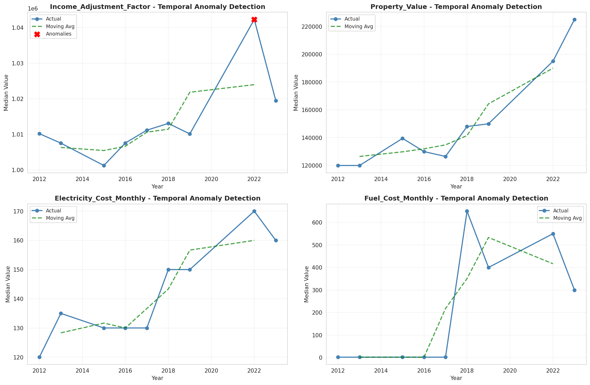
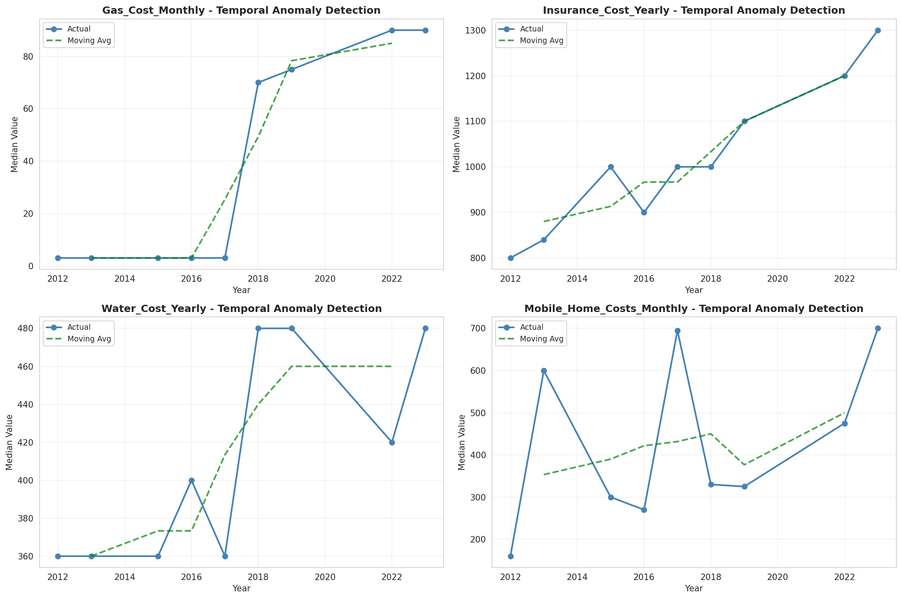
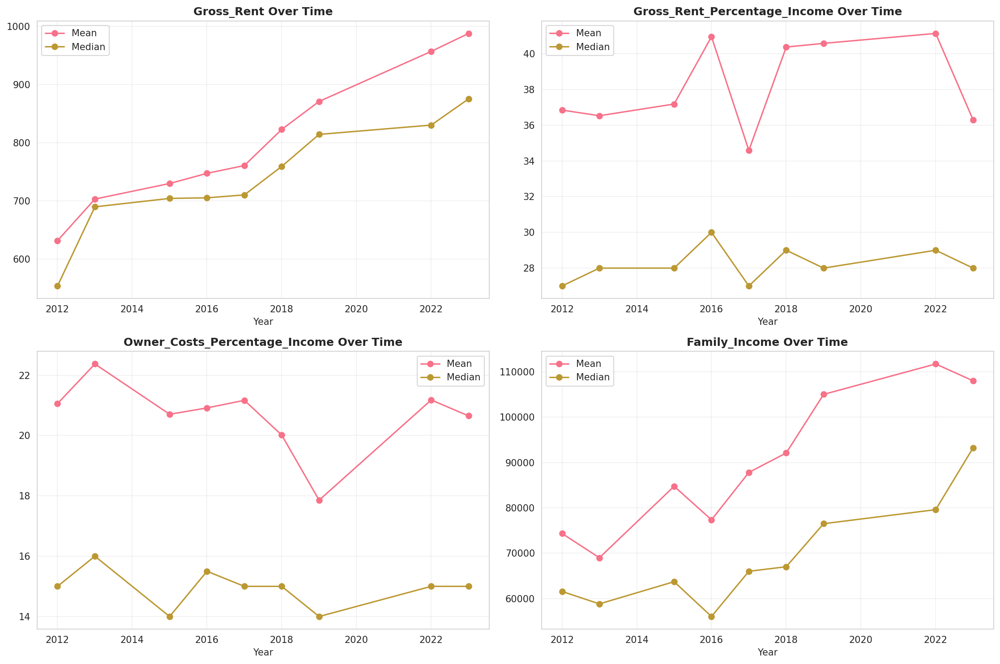
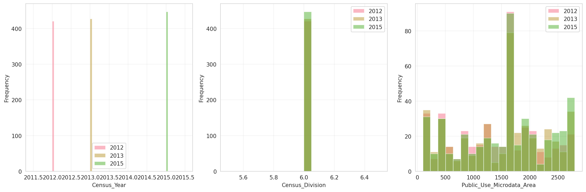
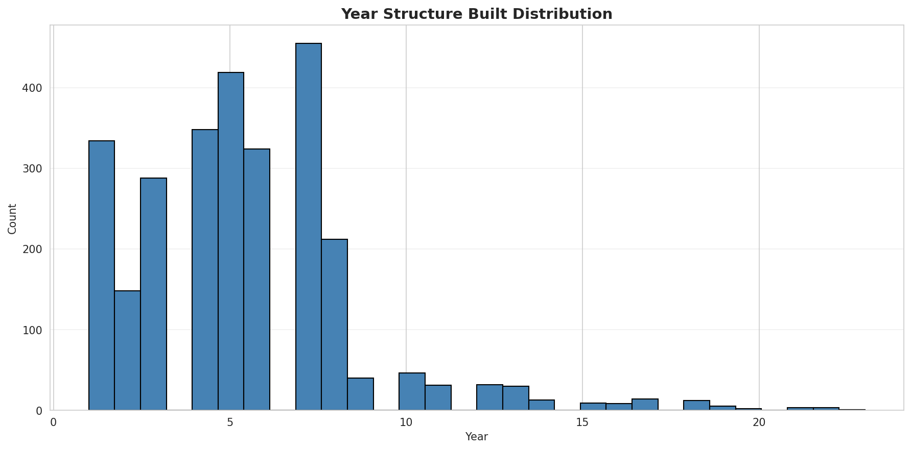
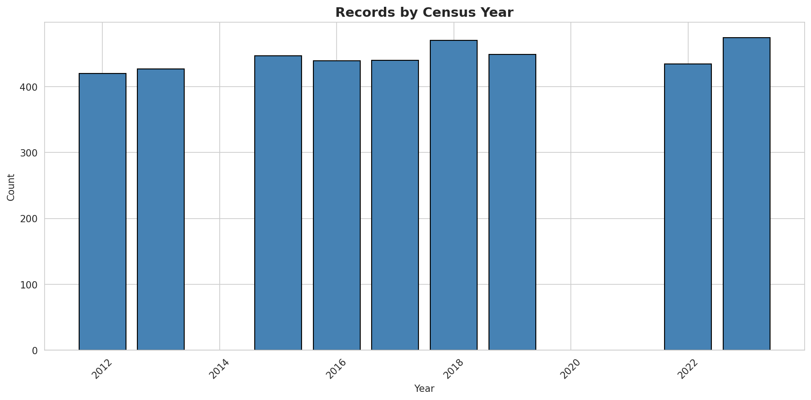
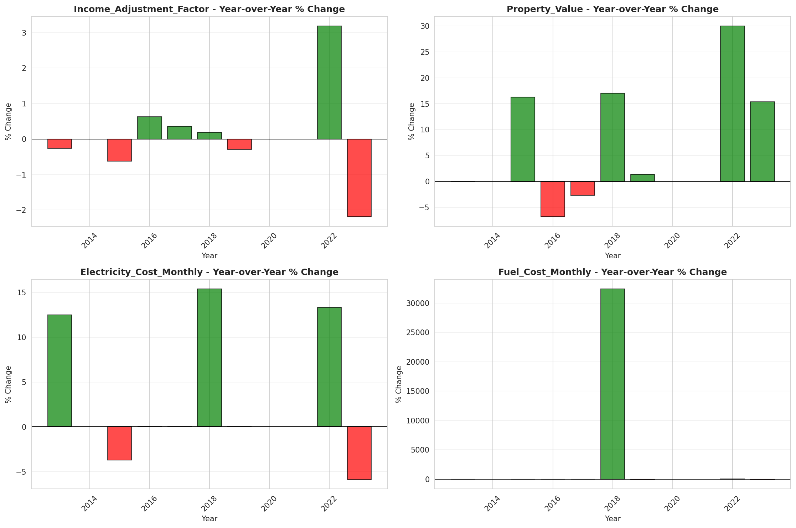
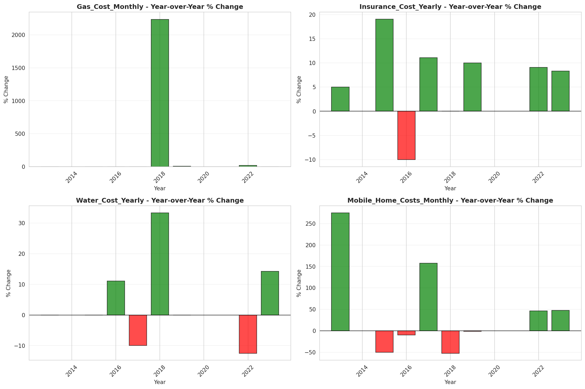

# Temporal Analysis

## Year Distribution

- 2012: 21,689 records

- 2013: 21,623 records

- 2015: 21,932 records

- 2016: 21,976 records

- 2017: 22,244 records

- 2018: 22,335 records

- 2019: 22,407 records

- 2022: 22,482 records

- 2023: 22,676 records

## Temporal Trends

- Census_Year: {np.int64(2012): {'mean': 2012.0, 'median': 2012.0, 'std': 0.0}, np.int64(2013): {'mean': 2013.0, 'median': 2013.0, 'std': 0.0}, np.int64(2015): {'mean': 2015.0, 'median': 2015.0, 'std': 0.0}, np.int64(2016): {'mean': 2016.0, 'median': 2016.0, 'std': 0.0}, np.int64(2017): {'mean': 2017.0, 'median': 2017.0, 'std': 0.0}, np.int64(2018): {'mean': 2018.0, 'median': 2018.0, 'std': 0.0}, np.int64(2019): {'mean': 2019.0, 'median': 2019.0, 'std': 0.0}, np.int64(2022): {'mean': 2022.0, 'median': 2022.0, 'std': 0.0}, np.int64(2023): {'mean': 2023.0, 'median': 2023.0, 'std': 0.0}}

- Census_Division: {np.int64(2012): {'mean': 6.0, 'median': 6.0, 'std': 0.0}, np.int64(2013): {'mean': 6.0, 'median': 6.0, 'std': 0.0}, np.int64(2015): {'mean': 6.0, 'median': 6.0, 'std': 0.0}, np.int64(2016): {'mean': 6.0, 'median': 6.0, 'std': 0.0}, np.int64(2017): {'mean': 6.0, 'median': 6.0, 'std': 0.0}, np.int64(2018): {'mean': 6.0, 'median': 6.0, 'std': 0.0}, np.int64(2019): {'mean': 6.0, 'median': 6.0, 'std': 0.0}, np.int64(2022): {'mean': 6.0, 'median': 6.0, 'std': 0.0}, np.int64(2023): {'mean': 6.0, 'median': 6.0, 'std': 0.0}}

- Public_Use_Microdata_Area: {np.int64(2012): {'mean': 1490.5916363133385, 'median': 1702.0, 'std': 772.2711893729937}, np.int64(2013): {'mean': 1497.3061092355363, 'median': 1702.0, 'std': 769.6722951991803}, np.int64(2015): {'mean': 1503.5420390297284, 'median': 1702.0, 'std': 771.3710077523867}, np.int64(2016): {'mean': 1504.0445941026574, 'median': 1702.0, 'std': 766.3018448494659}, np.int64(2017): {'mean': 1502.0052598453515, 'median': 1702.0, 'std': 769.3400229813558}, np.int64(2018): {'mean': 1506.7516901723752, 'median': 1702.0, 'std': 766.5400311555275}, np.int64(2019): {'mean': 1512.2424242424242, 'median': 1702.0, 'std': 770.98293457348}, np.int64(2022): {'mean': 1500.7255582243572, 'median': 1702.0, 'std': 776.2454575681527}, np.int64(2023): {'mean': 1509.2438260716176, 'median': 1702.0, 'std': 771.8341057420164}}

- Census_Region: {np.int64(2012): {'mean': 3.0, 'median': 3.0, 'std': 0.0}, np.int64(2013): {'mean': 3.0, 'median': 3.0, 'std': 0.0}, np.int64(2015): {'mean': 3.0, 'median': 3.0, 'std': 0.0}, np.int64(2016): {'mean': 3.0, 'median': 3.0, 'std': 0.0}, np.int64(2017): {'mean': 3.0, 'median': 3.0, 'std': 0.0}, np.int64(2018): {'mean': 3.0, 'median': 3.0, 'std': 0.0}, np.int64(2019): {'mean': 3.0, 'median': 3.0, 'std': 0.0}, np.int64(2022): {'mean': 3.0, 'median': 3.0, 'std': 0.0}, np.int64(2023): {'mean': 3.0, 'median': 3.0, 'std': 0.0}}

- State_Code: {np.int64(2012): {'mean': 21.0, 'median': 21.0, 'std': 0.0}, np.int64(2013): {'mean': 21.0, 'median': 21.0, 'std': 0.0}, np.int64(2015): {'mean': 21.0, 'median': 21.0, 'std': 0.0}, np.int64(2016): {'mean': 21.0, 'median': 21.0, 'std': 0.0}, np.int64(2017): {'mean': 21.0, 'median': 21.0, 'std': 0.0}, np.int64(2018): {'mean': 21.0, 'median': 21.0, 'std': 0.0}, np.int64(2019): {'mean': 21.0, 'median': 21.0, 'std': 0.0}, np.int64(2022): {'mean': 21.0, 'median': 21.0, 'std': 0.0}, np.int64(2023): {'mean': None, 'median': None, 'std': None}}

- Housing_Adjustment_Factor: {np.int64(2012): {'mean': 1000000.0, 'median': 1000000.0, 'std': 0.0}, np.int64(2013): {'mean': 1000000.0, 'median': 1000000.0, 'std': 0.0}, np.int64(2015): {'mean': 1000000.0, 'median': 1000000.0, 'std': 0.0}, np.int64(2016): {'mean': 1000000.0, 'median': 1000000.0, 'std': 0.0}, np.int64(2017): {'mean': 1000000.0, 'median': 1000000.0, 'std': 0.0}, np.int64(2018): {'mean': 1000000.0, 'median': 1000000.0, 'std': 0.0}, np.int64(2019): {'mean': 1000000.0, 'median': 1000000.0, 'std': 0.0}, np.int64(2022): {'mean': 1000000.0, 'median': 1000000.0, 'std': 0.0}, np.int64(2023): {'mean': 1000000.0, 'median': 1000000.0, 'std': 0.0}}

- Income_Adjustment_Factor: {np.int64(2012): {'mean': 1010207.0, 'median': 1010207.0, 'std': 0.0}, np.int64(2013): {'mean': 1007549.0, 'median': 1007549.0, 'std': 0.0}, np.int64(2015): {'mean': 1001264.0, 'median': 1001264.0, 'std': 0.0}, np.int64(2016): {'mean': 1007588.0, 'median': 1007588.0, 'std': 0.0}, np.int64(2017): {'mean': 1011189.0, 'median': 1011189.0, 'std': 0.0}, np.int64(2018): {'mean': 1013097.0, 'median': 1013097.0, 'std': 0.0}, np.int64(2019): {'mean': 1010145.0, 'median': 1010145.0, 'std': 0.0}, np.int64(2022): {'mean': 1042311.0, 'median': 1042311.0, 'std': 0.0}, np.int64(2023): {'mean': 1019518.0, 'median': 1019518.0, 'std': 0.0}}

- Housing_Unit_Weight: {np.int64(2012): {'mean': 89.32274424823643, 'median': 72.0, 'std': 82.00757402826751}, np.int64(2013): {'mean': 89.56361281968275, 'median': 72.0, 'std': 81.66050900778667}, np.int64(2015): {'mean': 89.23641254787525, 'median': 71.0, 'std': 82.09936337871193}, np.int64(2016): {'mean': 89.44198216235894, 'median': 71.0, 'std': 80.91203949650382}, np.int64(2017): {'mean': 89.20315590721093, 'median': 71.0, 'std': 81.30299998143886}, np.int64(2018): {'mean': 89.33006492052832, 'median': 71.0, 'std': 81.91521081214673}, np.int64(2019): {'mean': 89.54054536528763, 'median': 68.0, 'std': 87.28513944996631}, np.int64(2022): {'mean': 90.0132995285117, 'median': 71.0, 'std': 86.20069957823607}, np.int64(2023): {'mean': 89.81121008996296, 'median': 67.0, 'std': 90.91272837393173}}

- Number_of_Persons: {np.int64(2012): {'mean': 2.0592927290331504, 'median': 2.0, 'std': 1.3859864984505081}, np.int64(2013): {'mean': 2.0809785876150397, 'median': 2.0, 'std': 1.3971906232961055}, np.int64(2015): {'mean': 2.0403519970818893, 'median': 2.0, 'std': 1.3840893298881813}, np.int64(2016): {'mean': 2.035811794685111, 'median': 2.0, 'std': 1.3958628309735233}, np.int64(2017): {'mean': 2.032413235029671, 'median': 2.0, 'std': 1.4201400095728893}, np.int64(2018): {'mean': 2.0360420864114617, 'median': 2.0, 'std': 1.4058301082296305}, np.int64(2019): {'mean': 2.037265140357924, 'median': 2.0, 'std': 1.4190949175677208}, np.int64(2022): {'mean': 2.072991726714705, 'median': 2.0, 'std': 1.3976859855987953}, np.int64(2023): {'mean': 2.0736461457047097, 'median': 2.0, 'std': 1.3773888489851493}}

- Housing_Unit_Type: {np.int64(2012): {'mean': 1.1517359029923002, 'median': 1.0, 'std': 0.4676769634342592}, np.int64(2013): {'mean': 1.151274106275725, 'median': 1.0, 'std': 0.4713698628546675}, np.int64(2015): {'mean': 1.1563012949115448, 'median': 1.0, 'std': 0.47872998398581706}, np.int64(2016): {'mean': 1.1515289406625409, 'median': 1.0, 'std': 0.46957045351257076}, np.int64(2017): {'mean': 1.1553227836720015, 'median': 1.0, 'std': 0.47527359251809265}, np.int64(2018): {'mean': 1.1525408551600627, 'median': 1.0, 'std': 0.47008157383612903}, np.int64(2019): {'mean': 1.1496407372696031, 'median': 1.0, 'std': 0.4662708324051472}, np.int64(2022): {'mean': None, 'median': None, 'std': None}, np.int64(2023): {'mean': None, 'median': None, 'std': None}}

- Number_of_Bedrooms: {np.int64(2012): {'mean': 2.812945184267575, 'median': 3.0, 'std': 1.0124429332651563}, np.int64(2013): {'mean': 2.8224207373747805, 'median': 3.0, 'std': 1.0485824573857254}, np.int64(2015): {'mean': 2.814572581881355, 'median': 3.0, 'std': 1.0117875503250267}, np.int64(2016): {'mean': 2.8223951973951973, 'median': 3.0, 'std': 1.0183506208476294}, np.int64(2017): {'mean': 2.827789537345026, 'median': 3.0, 'std': 1.0265994342108624}, np.int64(2018): {'mean': 2.8261828388131516, 'median': 3.0, 'std': 0.9814887869126938}, np.int64(2019): {'mean': 2.832585725677831, 'median': 3.0, 'std': 0.9931393891151564}, np.int64(2022): {'mean': 2.856309912046645, 'median': 3.0, 'std': 0.9821792351800437}, np.int64(2023): {'mean': 2.8753927729772193, 'median': 3.0, 'std': 1.0327705255302793}}

- Number_of_Rooms: {np.int64(2012): {'mean': 6.108082997832146, 'median': 6.0, 'std': 2.2749806127623886}, np.int64(2013): {'mean': 6.158267065991945, 'median': 6.0, 'std': 2.345806851115129}, np.int64(2015): {'mean': 6.160594757549435, 'median': 6.0, 'std': 2.34428441672962}, np.int64(2016): {'mean': 6.152828652828653, 'median': 6.0, 'std': 2.312947890327023}, np.int64(2017): {'mean': 6.182844471323455, 'median': 6.0, 'std': 2.348291307701249}, np.int64(2018): {'mean': 6.212058941459503, 'median': 6.0, 'std': 2.3635090564308863}, np.int64(2019): {'mean': 6.252591706539075, 'median': 6.0, 'std': 2.3974752170151703}, np.int64(2022): {'mean': 6.337483941100899, 'median': 6.0, 'std': 2.4150843750338016}, np.int64(2023): {'mean': 6.369501178318932, 'median': 6.0, 'std': 2.4774639393292177}}

- Building_Type: {np.int64(2012): {'mean': 2.485960565706617, 'median': 2.0, 'std': 1.6159032797739066}, np.int64(2013): {'mean': 2.4899308065682124, 'median': 2.0, 'std': 1.6011152920800054}, np.int64(2015): {'mean': 2.513719278524347, 'median': 2.0, 'std': 1.6351570874848607}, np.int64(2016): {'mean': 2.5201973951973953, 'median': 2.0, 'std': 1.6441192293754892}, np.int64(2017): {'mean': 2.515875415784699, 'median': 2.0, 'std': 1.635185593751732}, np.int64(2018): {'mean': 2.517642341619888, 'median': 2.0, 'std': 1.6335627893917475}, np.int64(2019): {'mean': 2.519836523125997, 'median': 2.0, 'std': 1.6266439211714467}, np.int64(2022): {'mean': 2.510277695424449, 'median': 2.0, 'std': 1.6364999984313895}, np.int64(2023): {'mean': 2.5250883739198744, 'median': 2.0, 'std': 1.6407796606122902}}

- Year_Structure_Built: {np.int64(2012): {'mean': 5.132910085681842, 'median': 5.0, 'std': 2.6718995019082583}, np.int64(2013): {'mean': 5.236187132087163, 'median': 5.0, 'std': 2.8085634977934486}, np.int64(2015): {'mean': 5.4048847784988, 'median': 5.0, 'std': 3.034326633760154}, np.int64(2016): {'mean': 5.537037037037037, 'median': 5.0, 'std': 3.2581544533640443}, np.int64(2017): {'mean': 5.666263481503881, 'median': 5.0, 'std': 3.524951179981771}, np.int64(2018): {'mean': 5.755212510024058, 'median': 5.0, 'std': 3.742812321360304}, np.int64(2019): {'mean': 5.8740031897926634, 'median': 5.0, 'std': 3.9928004294094444}, np.int64(2022): {'mean': None, 'median': None, 'std': None}, np.int64(2023): {'mean': None, 'median': None, 'std': None}}

- Bathtub_or_Shower: {np.int64(2012): {'mean': 1.00913595540415, 'median': 1.0, 'std': 0.09514702831152401}, np.int64(2013): {'mean': 1.0096044614272437, 'median': 1.0, 'std': 0.0975331069664706}, np.int64(2015): {'mean': 1.0099637218333248, 'median': 1.0, 'std': 0.09932245536704168}, np.int64(2016): {'mean': 1.0105311355311355, 'median': 1.0, 'std': 0.1020821280748982}, np.int64(2017): {'mean': 1.0139602862614656, 'median': 1.0, 'std': 0.11732898386328579}, np.int64(2018): {'mean': 1.0123295910184442, 'median': 1.0, 'std': 0.11035480314779592}, np.int64(2019): {'mean': 1.0102173046251994, 'median': 1.0, 'std': 0.10056547801894444}, np.int64(2022): {'mean': 1.006818855618144, 'median': 1.0, 'std': 0.08229637585285504}, np.int64(2023): {'mean': 1.0083464257659074, 'median': 1.0, 'std': 0.09097894989444716}}

- Refrigerator: {np.int64(2012): {'mean': 1.0187364509135954, 'median': 1.0, 'std': 0.13559625858556226}, np.int64(2013): {'mean': 1.0188991015181246, 'median': 1.0, 'std': 0.1361722547978459}, np.int64(2015): {'mean': 1.0189055234786164, 'median': 1.0, 'std': 0.13619490608379534}, np.int64(2016): {'mean': 1.0212148962148961, 'median': 1.0, 'std': 0.1441037156312511}, np.int64(2017): {'mean': 1.0282229613950207, 'median': 1.0, 'std': 0.16561342987746455}, np.int64(2018): {'mean': 1.0271150761828387, 'median': 1.0, 'std': 0.16242281569516975}, np.int64(2019): {'mean': 1.0243221690590112, 'median': 1.0, 'std': 0.15405123808493168}, np.int64(2022): {'mean': 1.0160094871034686, 'median': 1.0, 'std': 0.12551478741914188}, np.int64(2023): {'mean': 1.0149253731343284, 'median': 1.0, 'std': 0.12125728124480271}}

- Hot_and_Cold_Running_Water: {np.int64(2012): {'mean': 1.01837514194281, 'median': 1.0, 'std': 0.13430721188767933}, np.int64(2013): {'mean': 1.0164721677166169, 'median': 1.0, 'std': 0.1272857887247356}, np.int64(2015): {'mean': 1.0185989474222064, 'median': 1.0, 'std': 0.13510721402451933}, np.int64(2016): {'mean': 1.019892144892145, 'median': 1.0, 'std': 0.1396332317070551}, np.int64(2017): {'mean': 1.0281221651043242, 'median': 1.0, 'std': 0.1653260005288756}, np.int64(2018): {'mean': 1.0260124298315958, 'median': 1.0, 'std': 0.15917617040962667}, np.int64(2019): {'mean': 1.0236244019138756, 'median': 1.0, 'std': 0.15187968672943708}, np.int64(2022): {'mean': 1.0169977270481272, 'median': 1.0, 'std': 0.12926573397275426}, np.int64(2023): {'mean': 1.0166928515318145, 'median': 1.0, 'std': 0.12812106056736533}}

- Running_Water: {np.int64(2012): {'mean': None, 'median': None, 'std': None}, np.int64(2013): {'mean': 9.0, 'median': 9.0, 'std': 0.0}, np.int64(2015): {'mean': 9.0, 'median': 9.0, 'std': 0.0}, np.int64(2016): {'mean': 9.0, 'median': 9.0, 'std': 0.0}, np.int64(2017): {'mean': 9.0, 'median': 9.0, 'std': 0.0}, np.int64(2018): {'mean': 9.0, 'median': 9.0, 'std': 0.0}, np.int64(2019): {'mean': 9.0, 'median': 9.0, 'std': 0.0}, np.int64(2022): {'mean': 9.0, 'median': 9.0, 'std': 0.0}, np.int64(2023): {'mean': 9.0, 'median': 9.0, 'std': 0.0}}

- Sink_with_Faucet: {np.int64(2012): {'mean': 1.0081552596263033, 'median': 1.0, 'std': 0.08993980705878792}, np.int64(2013): {'mean': 1.0086749974181555, 'median': 1.0, 'std': 0.09273718738887769}, np.int64(2015): {'mean': 1.0090950896734965, 'median': 1.0, 'std': 0.09493592332173495}, np.int64(2016): {'mean': 1.0096153846153846, 'median': 1.0, 'std': 0.09758797824644713}, np.int64(2017): {'mean': 1.0125995363370628, 'median': 1.0, 'std': 0.1115410912865641}, np.int64(2018): {'mean': 1.0109763432237369, 'median': 1.0, 'std': 0.10419408447429576}, np.int64(2019): {'mean': 1.0087220893141946, 'median': 1.0, 'std': 0.09298626466012148}, np.int64(2022): {'mean': 1.0067200316236782, 'median': 1.0, 'std': 0.08170191328083498}, np.int64(2023): {'mean': 1.0072172034564022, 'median': 1.0, 'std': 0.08464908287104043}}

- Stove_or_Range: {np.int64(2012): {'mean': 1.0200784556622278, 'median': 1.0, 'std': 0.14027233114631463}, np.int64(2013): {'mean': 1.020448208199938, 'median': 1.0, 'std': 0.14153131570692518}, np.int64(2015): {'mean': 1.0201318277042564, 'median': 1.0, 'std': 0.14045477996984773}, np.int64(2016): {'mean': 1.0223341473341474, 'median': 1.0, 'std': 0.14777159445309457}, np.int64(2017): {'mean': 1.0296341094647716, 'median': 1.0, 'std': 0.16958000571864318}, np.int64(2018): {'mean': 1.0273155573376103, 'median': 1.0, 'std': 0.16300536616497216}, np.int64(2019): {'mean': 1.0260167464114833, 'median': 1.0, 'std': 0.1591890019219659}, np.int64(2022): {'mean': 1.017936554995553, 'median': 1.0, 'std': 0.13272417043489768}, np.int64(2023): {'mean': 1.0164473684210527, 'median': 1.0, 'std': 0.1271913784848847}}

- Telephone_Service: {np.int64(2012): {'mean': 1.0330661322645291, 'median': 1.0, 'std': 0.17881426980234294}, np.int64(2013): {'mean': 1.0269427744377644, 'median': 1.0, 'std': 0.16192072392292678}, np.int64(2015): {'mean': 1.2967599003046248, 'median': 1.0, 'std': 1.3554161761776546}, np.int64(2016): {'mean': 1.0299368000887017, 'median': 1.0, 'std': 0.1704177166423583}, np.int64(2017): {'mean': 1.0175099425541316, 'median': 1.0, 'std': 0.1311651431188713}, np.int64(2018): {'mean': 1.0175505950748642, 'median': 1.0, 'std': 0.13131457428102586}, np.int64(2019): {'mean': 1.0121304018195603, 'median': 1.0, 'std': 0.10947101964703987}, np.int64(2022): {'mean': 1.0100722459526446, 'median': 1.0, 'std': 0.09985650526881949}, np.int64(2023): {'mean': 1.0100968044134486, 'median': 1.0, 'std': 0.09997689316751053}}

- Lot_Acreage: {np.int64(2012): {'mean': 1.4408065001504664, 'median': 1.0, 'std': 0.6692588280263281}, np.int64(2013): {'mean': 1.4442974013474494, 'median': 1.0, 'std': 0.6727040911871501}, np.int64(2015): {'mean': 1.4475465819902942, 'median': 1.0, 'std': 0.6692253837773492}, np.int64(2016): {'mean': 1.4328973302275578, 'median': 1.0, 'std': 0.6616967286124912}, np.int64(2017): {'mean': 1.4251270535397706, 'median': 1.0, 'std': 0.654733956955115}, np.int64(2018): {'mean': 1.434999413352106, 'median': 1.0, 'std': 0.6601189857808464}, np.int64(2019): {'mean': 1.4456299924202671, 'median': 1.0, 'std': 0.6682752687813863}, np.int64(2022): {'mean': 1.4470032817087914, 'median': 1.0, 'std': 0.6588634307001449}, np.int64(2023): {'mean': 1.4491700057240984, 'median': 1.0, 'std': 0.6611640920912493}}

- Agricultural_Sales: {np.int64(2012): {'mean': 1.2982917214191854, 'median': 1.0, 'std': 1.0493828501806526}, np.int64(2013): {'mean': 1.3286674132138858, 'median': 1.0, 'std': 1.098662506342632}, np.int64(2015): {'mean': 1.2990791896869245, 'median': 1.0, 'std': 1.0377206446320377}, np.int64(2016): {'mean': 1.3201219512195121, 'median': 1.0, 'std': 1.0752331752512536}, np.int64(2017): {'mean': 1.2898802626496717, 'median': 1.0, 'std': 1.0144684177979382}, np.int64(2018): {'mean': 1.2784644194756554, 'median': 1.0, 'std': 0.9818471692120778}, np.int64(2019): {'mean': 1.2955207574654042, 'median': 1.0, 'std': 1.0291127217683997}, np.int64(2022): {'mean': 1.2806745826880055, 'median': 1.0, 'std': 0.9954474474282268}, np.int64(2023): {'mean': 1.2684903748733536, 'median': 1.0, 'std': 0.9783244764794183}}

- Tenure: {np.int64(2012): {'mean': 1.870017813404587, 'median': 2.0, 'std': 0.8824935317087341}, np.int64(2013): {'mean': 1.882208862168782, 'median': 2.0, 'std': 0.8717438344722874}, np.int64(2015): {'mean': 1.9003600110772638, 'median': 2.0, 'std': 0.8668963209007835}, np.int64(2016): {'mean': 1.8857966515134716, 'median': 2.0, 'std': 0.8689330765858517}, np.int64(2017): {'mean': 1.895658418029165, 'median': 2.0, 'std': 0.8692294190836185}, np.int64(2018): {'mean': 1.8977677836889157, 'median': 2.0, 'std': 0.8649302775836702}, np.int64(2019): {'mean': 1.8927217589082639, 'median': 2.0, 'std': 0.8584800012257644}, np.int64(2022): {'mean': 1.8727522016558562, 'median': 2.0, 'std': 0.8478227717538488}, np.int64(2023): {'mean': 1.8706672218174247, 'median': 2.0, 'std': 0.8413285070066505}}

- Vacancy_Status: {np.int64(2012): {'mean': 4.9822695035460995, 'median': 5.0, 'std': 2.1256747332059294}, np.int64(2013): {'mean': 4.828102710413694, 'median': 5.0, 'std': 2.2297663066895645}, np.int64(2015): {'mean': 5.024406332453826, 'median': 5.0, 'std': 2.189096437273298}, np.int64(2016): {'mean': 5.218788627935723, 'median': 7.0, 'std': 2.131216408569312}, np.int64(2017): {'mean': 5.431530494821634, 'median': 7.0, 'std': 2.1046802205265656}, np.int64(2018): {'mean': 5.431646305991856, 'median': 7.0, 'std': 2.1350937689443796}, np.int64(2019): {'mean': 5.2903629536921155, 'median': 7.0, 'std': 2.1942703880068413}, np.int64(2022): {'mean': 5.490980392156863, 'median': 7.0, 'std': 2.132326924244996}, np.int64(2023): {'mean': 5.461871750433276, 'median': 7.0, 'std': 2.1678928016615933}}

- Property_Value: {np.int64(2012): {'mean': 149696.75877520538, 'median': 120000.0, 'std': 153669.57933522586}, np.int64(2013): {'mean': 157826.96440564137, 'median': 120000.0, 'std': 191933.43953380498}, np.int64(2015): {'mean': 168024.41634241244, 'median': 125000.0, 'std': 189972.06532869316}, np.int64(2016): {'mean': 173530.27152367416, 'median': 130000.0, 'std': 193161.83496815333}, np.int64(2017): {'mean': 179652.51933618682, 'median': 135000.0, 'std': 202585.72217551878}, np.int64(2018): {'mean': 188280.71851851852, 'median': 145000.0, 'std': 210448.0613424163}, np.int64(2019): {'mean': 198545.2508700696, 'median': 150000.0, 'std': 249468.66788471953}, np.int64(2022): {'mean': 242210.28866988188, 'median': 190000.0, 'std': 265164.9752553317}, np.int64(2023): {'mean': 261083.56624195096, 'median': 200000.0, 'std': 324058.25227439165}}

- Vehicles_Available: {np.int64(2012): {'mean': 1.823814295257181, 'median': 2.0, 'std': 1.05811145808687}, np.int64(2013): {'mean': 1.8400133600534403, 'median': 2.0, 'std': 1.0609179366872166}, np.int64(2015): {'mean': 1.8475768485184159, 'median': 2.0, 'std': 1.0750226124698532}, np.int64(2016): {'mean': 1.8810289389067525, 'median': 2.0, 'std': 1.0913960409118102}, np.int64(2017): {'mean': 1.8925651789659743, 'median': 2.0, 'std': 1.0898445322189296}, np.int64(2018): {'mean': 1.916415290955959, 'median': 2.0, 'std': 1.1008447657597438}, np.int64(2019): {'mean': 1.924076681468645, 'median': 2.0, 'std': 1.1013507573834065}, np.int64(2022): {'mean': 1.934451299899805, 'median': 2.0, 'std': 1.102239116919173}, np.int64(2023): {'mean': 1.9213073800353908, 'median': 2.0, 'std': 1.1071049638866595}}

- Condo_Fee_Monthly: {np.int64(2012): {'mean': 204.39772727272728, 'median': 180.0, 'std': 141.06053658119612}, np.int64(2013): {'mean': 226.63473053892216, 'median': 190.0, 'std': 150.8725516395062}, np.int64(2015): {'mean': 228.84726224783861, 'median': 200.0, 'std': 164.07860537706634}, np.int64(2016): {'mean': 224.464, 'median': 200.0, 'std': 121.70231130730467}, np.int64(2017): {'mean': 238.5982404692082, 'median': 210.0, 'std': 154.32507667586825}, np.int64(2018): {'mean': 246.36363636363637, 'median': 220.0, 'std': 138.65773274804667}, np.int64(2019): {'mean': 249.35263157894738, 'median': 220.0, 'std': 144.53415978231578}, np.int64(2022): {'mean': 270.951690821256, 'median': 240.0, 'std': 191.60328411542685}, np.int64(2023): {'mean': 323.81909547738695, 'median': 250.0, 'std': 298.36918189125066}}

- Electricity_Cost_Monthly: {np.int64(2012): {'mean': 130.28390113560454, 'median': 120.0, 'std': 80.09341679651743}, np.int64(2013): {'mean': 142.61690046760188, 'median': 130.0, 'std': 85.96567697532869}, np.int64(2015): {'mean': 150.64619219052895, 'median': 130.0, 'std': 95.49012752784887}, np.int64(2016): {'mean': 146.26677015190154, 'median': 130.0, 'std': 88.51195548570612}, np.int64(2017): {'mean': 147.07887759611137, 'median': 130.0, 'std': 89.1844552523188}, np.int64(2018): {'mean': 165.5009691027249, 'median': 150.0, 'std': 93.7946707085334}, np.int64(2019): {'mean': 159.94825253664035, 'median': 150.0, 'std': 87.03508978979244}, np.int64(2022): {'mean': 203.98949901553272, 'median': 170.0, 'std': 213.5356182531318}, np.int64(2023): {'mean': 200.0911496301096, 'median': 160.0, 'std': 224.41101681524927}}

- Fuel_Cost_Monthly: {np.int64(2012): {'mean': 71.71348252059676, 'median': 2.0, 'std': 308.2819114382686}, np.int64(2013): {'mean': 47.54609218436874, 'median': 2.0, 'std': 242.7840790668919}, np.int64(2015): {'mean': 56.65189698144558, 'median': 2.0, 'std': 275.5620049773863}, np.int64(2016): {'mean': 44.23589089699523, 'median': 2.0, 'std': 228.14321211935857}, np.int64(2017): {'mean': 40.07042642509943, 'median': 2.0, 'std': 213.97032314862824}, np.int64(2018): {'mean': 651.3721682847896, 'median': 400.0, 'std': 710.5696732684972}, np.int64(2019): {'mean': 624.3355371900826, 'median': 400.0, 'std': 707.1201042464631}, np.int64(2022): {'mean': 643.5682008368201, 'median': 400.0, 'std': 748.5461963253783}, np.int64(2023): {'mean': 652.8601583113457, 'median': 400.0, 'std': 711.7242173686797}}

- Gas_Cost_Monthly: {np.int64(2012): {'mean': 38.20179247383656, 'median': 3.0, 'std': 63.06950871444808}, np.int64(2013): {'mean': 36.8105099087063, 'median': 3.0, 'std': 62.63792373939151}, np.int64(2015): {'mean': 40.887787316532815, 'median': 3.0, 'std': 73.89190600441054}, np.int64(2016): {'mean': 33.30208448830247, 'median': 3.0, 'std': 60.84984201591328}, np.int64(2017): {'mean': 35.40228678745029, 'median': 3.0, 'std': 62.44569475047968}, np.int64(2018): {'mean': 94.63468928050881, 'median': 70.0, 'std': 90.01644564998355}, np.int64(2019): {'mean': 89.79049364933874, 'median': 70.0, 'std': 81.63031115361504}, np.int64(2022): {'mean': 136.07242050616483, 'median': 80.0, 'std': 228.0148071576626}, np.int64(2023): {'mean': 134.6566709021601, 'median': 80.0, 'std': 218.7337763204173}}

- House_Heating_Fuel: {np.int64(2012): {'mean': 2.2462146515252726, 'median': 3.0, 'std': 1.2602194310214758}, np.int64(2013): {'mean': 2.2894678245379647, 'median': 3.0, 'std': 1.2983995156556298}, np.int64(2015): {'mean': 2.2783716422043754, 'median': 3.0, 'std': 1.2969637602349766}, np.int64(2016): {'mean': 2.2737554052555717, 'median': 3.0, 'std': 1.2449197269784837}, np.int64(2017): {'mean': 2.2641957578435705, 'median': 3.0, 'std': 1.2547947414349703}, np.int64(2018): {'mean': 2.2625459331980475, 'median': 3.0, 'std': 1.2657561736725873}, np.int64(2019): {'mean': 2.265894075598397, 'median': 3.0, 'std': 1.2561133494848113}, np.int64(2022): {'mean': 2.311765016083953, 'median': 3.0, 'std': 1.2460007794777728}, np.int64(2023): {'mean': 2.3000936816904343, 'median': 3.0, 'std': 1.2390709929582873}}

- Insurance_Cost_Yearly: {np.int64(2012): {'mean': 914.0124268347591, 'median': 800.0, 'std': 627.4976826286683}, np.int64(2013): {'mean': 969.5641329085116, 'median': 850.0, 'std': 671.5475627325674}, np.int64(2015): {'mean': 1083.797596457938, 'median': 980.0, 'std': 752.8341046360783}, np.int64(2016): {'mean': 1104.9078723974621, 'median': 1000.0, 'std': 771.7160604316799}, np.int64(2017): {'mean': 1135.9092702169626, 'median': 1000.0, 'std': 797.6149102614686}, np.int64(2018): {'mean': 1181.9127870610312, 'median': 1000.0, 'std': 842.0419147154379}, np.int64(2019): {'mean': 1187.4746179518706, 'median': 1000.0, 'std': 823.8468519160039}, np.int64(2022): {'mean': 1296.7311954331767, 'median': 1200.0, 'std': 905.7867132595486}, np.int64(2023): {'mean': 1517.4796460176992, 'median': 1200.0, 'std': 1172.6797137439805}}

- Water_Cost_Yearly: {np.int64(2012): {'mean': 410.4826319305277, 'median': 350.0, 'std': 420.2771257350829}, np.int64(2013): {'mean': 422.0039523491427, 'median': 360.0, 'std': 429.52822200505534}, np.int64(2015): {'mean': 440.0904458598726, 'median': 360.0, 'std': 453.4919919675088}, np.int64(2016): {'mean': 444.33412795210114, 'median': 360.0, 'std': 465.64141603352846}, np.int64(2017): {'mean': 456.720503756076, 'median': 360.0, 'std': 482.9664370715871}, np.int64(2018): {'mean': 549.793371310202, 'median': 450.0, 'std': 503.0159015824951}, np.int64(2019): {'mean': 547.4313538285278, 'median': 440.0, 'std': 491.7424504123697}, np.int64(2022): {'mean': 596.7706939927594, 'median': 450.0, 'std': 619.0238118457324}, np.int64(2023): {'mean': 614.683513693247, 'median': 480.0, 'std': 615.0572366575516}}

- Mobile_Home_Costs_Monthly: {np.int64(2012): {'mean': 883.0323383084577, 'median': 360.0, 'std': 1251.925828632637}, np.int64(2013): {'mean': 822.0985732814527, 'median': 350.0, 'std': 1274.605422269371}, np.int64(2015): {'mean': 740.0204603580563, 'median': 370.0, 'std': 1030.0165355960676}, np.int64(2016): {'mean': 887.0127659574468, 'median': 400.0, 'std': 1295.3959911874533}, np.int64(2017): {'mean': 910.5193798449612, 'median': 390.0, 'std': 1523.8829765678709}, np.int64(2018): {'mean': 955.820253164557, 'median': 400.0, 'std': 1529.2046569156498}, np.int64(2019): {'mean': 935.4644670050761, 'median': 435.0, 'std': 1512.519761180232}, np.int64(2022): {'mean': 1675.9301310043668, 'median': 500.0, 'std': 4440.510017909732}, np.int64(2023): {'mean': 1430.1529548088065, 'median': 500.0, 'std': 2818.8354023074107}}

- First_Mortgage_Includes_Insurance: {np.int64(2012): {'mean': 1.4843043534427076, 'median': 1.0, 'std': 0.4997858687399605}, np.int64(2013): {'mean': 1.4731557102691124, 'median': 1.0, 'std': 0.4993122908360947}, np.int64(2015): {'mean': 1.4438473198291304, 'median': 1.0, 'std': 0.4968711062241767}, np.int64(2016): {'mean': 1.4140289699570816, 'median': 1.0, 'std': 0.4925865661143869}, np.int64(2017): {'mean': 1.4158751696065128, 'median': 1.0, 'std': 0.492905648622836}, np.int64(2018): {'mean': 1.3984962406015038, 'median': 1.0, 'std': 0.48962205748981463}, np.int64(2019): {'mean': 1.3791327913279132, 'median': 1.0, 'std': 0.4852040993290963}, np.int64(2022): {'mean': 1.3409337676438653, 'median': 1.0, 'std': 0.474055307243637}, np.int64(2023): {'mean': 1.3346839546191247, 'median': 1.0, 'std': 0.4719117328145028}}

- First_Mortgage_Payment_Monthly: {np.int64(2012): {'mean': 824.4389613744994, 'median': 700.0, 'std': 556.8527907300365}, np.int64(2013): {'mean': 843.9649216762618, 'median': 700.0, 'std': 584.0590171946213}, np.int64(2015): {'mean': 852.3808736392449, 'median': 730.0, 'std': 570.9804421161155}, np.int64(2016): {'mean': 887.638143776824, 'median': 750.0, 'std': 595.3981571082061}, np.int64(2017): {'mean': 900.674355495251, 'median': 760.0, 'std': 620.0819977003515}, np.int64(2018): {'mean': 924.4751879699248, 'median': 790.0, 'std': 619.3768561574448}, np.int64(2019): {'mean': 961.0880758807588, 'median': 820.0, 'std': 625.8662323735052}, np.int64(2022): {'mean': 475.7157780979827, 'median': 4.0, 'std': 701.0635277337959}, np.int64(2023): {'mean': 1137.3746623446787, 'median': 970.0, 'std': 720.8511483292767}}

- First_Mortgage_Includes_Taxes: {np.int64(2012): {'mean': 1.4456788528613873, 'median': 1.0, 'std': 0.497072561580815}, np.int64(2013): {'mean': 1.4300441826215022, 'median': 1.0, 'std': 0.49511514264366574}, np.int64(2015): {'mean': 1.3907950943916219, 'median': 1.0, 'std': 0.4879621904105973}, np.int64(2016): {'mean': 1.3641362660944205, 'median': 1.0, 'std': 0.48121939310424433}, np.int64(2017): {'mean': 1.3610583446404343, 'median': 1.0, 'std': 0.48034000726848175}, np.int64(2018): {'mean': 1.332194121667806, 'median': 1.0, 'std': 0.4710323961595192}, np.int64(2019): {'mean': 1.3153116531165312, 'median': 1.0, 'std': 0.4646713590339621}, np.int64(2022): {'mean': 1.2669652551574375, 'median': 1.0, 'std': 0.4424040815817671}, np.int64(2023): {'mean': 1.2568881685575364, 'median': 1.0, 'std': 0.43694670590547235}}

- First_Mortgage_Status: {np.int64(2012): {'mean': 1.83161983093443, 'median': 1.0, 'std': 0.9803364300509286}, np.int64(2013): {'mean': 1.8752851711026617, 'median': 1.0, 'std': 0.9865421791209712}, np.int64(2015): {'mean': 1.9033020666514147, 'median': 1.0, 'std': 0.9902432440908201}, np.int64(2016): {'mean': 1.8754470060108042, 'median': 1.0, 'std': 0.9871764431175787}, np.int64(2017): {'mean': 1.8883136657784545, 'median': 1.0, 'std': 0.9884807891001482}, np.int64(2018): {'mean': 1.910770617395223, 'median': 1.0, 'std': 0.991210356794319}, np.int64(2019): {'mean': 1.920812481601413, 'median': 1.0, 'std': 0.9933463131178769}, np.int64(2022): {'mean': 1.9716416860178734, 'median': 1.0, 'std': 0.9953294023812224}, np.int64(2023): {'mean': 1.98391994478951, 'median': 1.0, 'std': 0.9969673577533528}}

- Second_Mortgage_Payment_Monthly: {np.int64(2012): {'mean': 310.7524752475247, 'median': 230.0, 'std': 297.21987991709295}, np.int64(2013): {'mean': 322.65625, 'median': 210.0, 'std': 352.9420287313986}, np.int64(2015): {'mean': 287.17443868739207, 'median': 200.0, 'std': 286.72282768641793}, np.int64(2016): {'mean': 306.7005937234945, 'median': 200.0, 'std': 309.17940752142715}, np.int64(2017): {'mean': 340.0768509840675, 'median': 200.0, 'std': 502.3118987435425}, np.int64(2018): {'mean': 298.5528455284553, 'median': 200.0, 'std': 323.0805240303387}, np.int64(2019): {'mean': 353.42084942084944, 'median': 240.0, 'std': 408.2770354679352}, np.int64(2022): {'mean': 352.48054145516073, 'median': 220.0, 'std': 412.9071824038123}, np.int64(2023): {'mean': 445.1220311220311, 'median': 300.0, 'std': 478.72299634271457}}

- Second_Mortgage_Status: {np.int64(2012): {'mean': 2.7882702493217932, 'median': 3.0, 'std': 0.5143891963310672}, np.int64(2013): {'mean': 2.804525371535681, 'median': 3.0, 'std': 0.4915742998155689}, np.int64(2015): {'mean': 2.8201736254650682, 'median': 3.0, 'std': 0.4675711039135997}, np.int64(2016): {'mean': 2.820681330472103, 'median': 3.0, 'std': 0.4579209627884785}, np.int64(2017): {'mean': 2.8419267299864317, 'median': 3.0, 'std': 0.4281524403812213}, np.int64(2018): {'mean': 2.833082706766917, 'median': 3.0, 'std': 0.4395653110705253}, np.int64(2019): {'mean': 2.8470189701897017, 'median': 3.0, 'std': 0.4271394207357429}, np.int64(2022): {'mean': 2.836766623207301, 'median': 3.0, 'std': 0.4219854177841605}, np.int64(2023): {'mean': 2.828704905268622, 'median': 3.0, 'std': 0.4201125393791747}}

- Property_Taxes_Yearly: {np.int64(2012): {'mean': 20.226867717614805, 'median': 20.0, 'std': 13.34839034617691}, np.int64(2013): {'mean': 20.679543726235742, 'median': 20.0, 'std': 13.97142330058796}, np.int64(2015): {'mean': 21.611835583009228, 'median': 22.0, 'std': 14.283460878274234}, np.int64(2016): {'mean': 22.38803926044282, 'median': 22.0, 'std': 14.395343583612553}, np.int64(2017): {'mean': 22.75881233346022, 'median': 23.0, 'std': 14.79121720485255}}

- Meals_Included_in_Rent: {np.int64(2012): {'mean': 1.983065953654189, 'median': 2.0, 'std': 0.1290387326922259}, np.int64(2013): {'mean': 1.9837469800131782, 'median': 2.0, 'std': 0.1264609497797438}, np.int64(2015): {'mean': 1.9867775645126893, 'median': 2.0, 'std': 0.11423828552107242}, np.int64(2016): {'mean': 1.982970467773227, 'median': 2.0, 'std': 0.12939527221402689}, np.int64(2017): {'mean': 1.9827659574468086, 'median': 2.0, 'std': 0.13015619355540653}, np.int64(2018): {'mean': 1.9831715210355987, 'median': 2.0, 'std': 0.12864234011565132}, np.int64(2019): {'mean': 1.981340854849208, 'median': 2.0, 'std': 0.1353327572701009}, np.int64(2022): {'mean': 1.9804054054054054, 'median': 2.0, 'std': 0.13861808739897416}, np.int64(2023): {'mean': 1.9847796456156293, 'median': 2.0, 'std': 0.12244223513309023}}

- Rent_Amount_Monthly: {np.int64(2012): {'mean': 528.1938502673797, 'median': 480.0, 'std': 326.86137531000713}, np.int64(2013): {'mean': 547.4412475291017, 'median': 500.0, 'std': 328.47452257392143}, np.int64(2015): {'mean': 578.2589038174451, 'median': 500.0, 'std': 357.90191663446603}, np.int64(2016): {'mean': 581.743479198103, 'median': 530.0, 'std': 332.36776843270724}, np.int64(2017): {'mean': 608.4387234042554, 'median': 550.0, 'std': 355.59410835719507}, np.int64(2018): {'mean': 624.9587918015103, 'median': 570.0, 'std': 372.0719794089492}, np.int64(2019): {'mean': 638.068561510089, 'median': 580.0, 'std': 362.62778468955577}, np.int64(2022): {'mean': 725.6954954954955, 'median': 650.0, 'std': 445.72031763947683}, np.int64(2023): {'mean': 791.8114493412086, 'median': 700.0, 'std': 488.51713994935966}}

- Gross_Rent: {np.int64(2012): {'mean': 675.5091549295774, 'median': 620.0, 'std': 358.1780978933653}, np.int64(2013): {'mean': 704.6474853801169, 'median': 654.0, 'std': 358.13911942568024}, np.int64(2015): {'mean': 746.9412562132851, 'median': 683.0, 'std': 393.2167271549997}, np.int64(2016): {'mean': 739.0077378243059, 'median': 693.0, 'std': 357.28929111490794}, np.int64(2017): {'mean': 764.4971954229302, 'median': 714.0, 'std': 377.10279084054434}, np.int64(2018): {'mean': 798.9906542056075, 'median': 760.0, 'std': 394.25105150589377}, np.int64(2019): {'mean': 804.7796649070461, 'median': 750.0, 'std': 389.64395831479214}, np.int64(2022): {'mean': 931.5311984930539, 'median': 850.0, 'std': 509.2509909091216}, np.int64(2023): {'mean': 996.5400993612491, 'median': 893.0, 'std': 572.5486031512601}}

- Gross_Rent_Percentage_Income: {np.int64(2012): {'mean': 38.1977969348659, 'median': 29.0, 'std': 27.124174955224554}, np.int64(2013): {'mean': 37.07834655130978, 'median': 28.0, 'std': 26.42273960123516}, np.int64(2015): {'mean': 35.92753288714516, 'median': 28.0, 'std': 25.73760109618199}, np.int64(2016): {'mean': 36.639129417271235, 'median': 28.0, 'std': 26.686685797741486}, np.int64(2017): {'mean': 35.61891580161476, 'median': 27.0, 'std': 26.08175730067198}, np.int64(2018): {'mean': 35.67079150128415, 'median': 27.0, 'std': 26.35067742667453}, np.int64(2019): {'mean': 35.04258823529412, 'median': 27.0, 'std': 25.970117390963058}, np.int64(2022): {'mean': 36.8818401937046, 'median': 28.0, 'std': 27.06912984844328}, np.int64(2023): {'mean': 37.74890617403987, 'median': 28.0, 'std': 27.453843058517062}}

- Selected_Monthly_Owner_Costs: {np.int64(2012): {'mean': 856.693678598629, 'median': 691.0, 'std': 685.6927502847589}, np.int64(2013): {'mean': 864.2929185365483, 'median': 691.0, 'std': 703.9385765984946}, np.int64(2015): {'mean': 875.7681745365779, 'median': 708.0, 'std': 689.4400966127486}, np.int64(2016): {'mean': 897.3420091324201, 'median': 728.0, 'std': 717.3672935492995}, np.int64(2017): {'mean': 909.1879808058496, 'median': 730.0, 'std': 749.828650854069}, np.int64(2018): {'mean': 932.3324817792471, 'median': 753.0, 'std': 731.6570700896773}, np.int64(2019): {'mean': 935.9661391240338, 'median': 740.0, 'std': 748.7227755601683}, np.int64(2022): {'mean': 1064.3671803532475, 'median': 838.0, 'std': 857.604680514465}, np.int64(2023): {'mean': 1113.6910120115974, 'median': 871.0, 'std': 904.305045389555}}

- Owner_Costs_Percentage_Income: {np.int64(2012): {'mean': 21.640451162433823, 'median': 16.0, 'std': 19.042417261677443}, np.int64(2013): {'mean': 21.116027607361964, 'median': 16.0, 'std': 19.38922324205027}, np.int64(2015): {'mean': 20.596242685555897, 'median': 15.0, 'std': 18.811594390630493}, np.int64(2016): {'mean': 20.370401658858768, 'median': 15.0, 'std': 19.10314904915991}, np.int64(2017): {'mean': 20.212774143901502, 'median': 15.0, 'std': 19.163643765748084}, np.int64(2018): {'mean': 20.45253980288097, 'median': 15.0, 'std': 19.116186827556312}, np.int64(2019): {'mean': 19.32178621763964, 'median': 14.0, 'std': 18.249791859688465}, np.int64(2022): {'mean': 21.350899651518382, 'median': 15.0, 'std': 20.921778489360133}, np.int64(2023): {'mean': 21.12814788978026, 'median': 15.0, 'std': 20.674842525624218}}

- Satellite_Internet: {np.int64(2012): {'mean': None, 'median': None, 'std': None}, np.int64(2013): {'mean': 1.9250936329588015, 'median': 2.0, 'std': 0.26325068973134513}, np.int64(2015): {'mean': 1.9175597060624616, 'median': 2.0, 'std': 0.27504487374122955}, np.int64(2016): {'mean': 1.9107394863110359, 'median': 2.0, 'std': 0.2851294635159453}, np.int64(2017): {'mean': 1.8988111694774674, 'median': 2.0, 'std': 0.30158902134759846}, np.int64(2018): {'mean': 1.905587668593449, 'median': 2.0, 'std': 0.2924112242337719}, np.int64(2019): {'mean': 1.9109139992286925, 'median': 2.0, 'std': 0.2848769936639189}, np.int64(2022): {'mean': 1.9182033096926714, 'median': 2.0, 'std': 0.27406282293090845}, np.int64(2023): {'mean': 1.92267743796884, 'median': 2.0, 'std': 0.2671102776922985}}

- Smartphone: {np.int64(2012): {'mean': None, 'median': None, 'std': None}, np.int64(2013): {'mean': None, 'median': None, 'std': None}, np.int64(2015): {'mean': None, 'median': None, 'std': None}, np.int64(2016): {'mean': 1.313837454263222, 'median': 1.0, 'std': 0.46406405328542005}, np.int64(2017): {'mean': 1.2496133451171012, 'median': 1.0, 'std': 0.4328011896567711}, np.int64(2018): {'mean': 1.21746284209949, 'median': 1.0, 'std': 0.4125313177758412}, np.int64(2019): {'mean': 1.186667388714394, 'median': 1.0, 'std': 0.3896548432799161}, np.int64(2022): {'mean': 1.1245583504719718, 'median': 1.0, 'std': 0.330226162555442}, np.int64(2023): {'mean': 1.1149162069324452, 'median': 1.0, 'std': 0.3189290926722888}}

- Tablet_Computer: {np.int64(2012): {'mean': None, 'median': None, 'std': None}, np.int64(2013): {'mean': None, 'median': None, 'std': None}, np.int64(2015): {'mean': None, 'median': None, 'std': None}, np.int64(2016): {'mean': 1.447388845770041, 'median': 1.0, 'std': 0.4972381455500157}, np.int64(2017): {'mean': 1.410461776403005, 'median': 1.0, 'std': 0.49193116746240306}, np.int64(2018): {'mean': 1.3918170350463446, 'median': 1.0, 'std': 0.48816955694157566}, np.int64(2019): {'mean': 1.4053936965233402, 'median': 1.0, 'std': 0.4909813659912942}, np.int64(2022): {'mean': 1.3907082212730053, 'median': 1.0, 'std': 0.48792198294199696}, np.int64(2023): {'mean': 1.3860206099718955, 'median': 1.0, 'std': 0.4868480610000159}}

- Food_Stamp_SNAP: {np.int64(2012): {'mean': 1.8405739928004339, 'median': 2.0, 'std': 0.3660819089166913}, np.int64(2013): {'mean': 1.8455071460362988, 'median': 2.0, 'std': 0.36142948443159606}, np.int64(2015): {'mean': 1.8601097178683386, 'median': 2.0, 'std': 0.3468816582797966}, np.int64(2016): {'mean': 1.871107181452009, 'median': 2.0, 'std': 0.33508950355940914}, np.int64(2017): {'mean': 1.8784258265873404, 'median': 2.0, 'std': 0.32680131878502505}, np.int64(2018): {'mean': 1.8856228172293363, 'median': 2.0, 'std': 0.3182765409031793}, np.int64(2019): {'mean': 1.898505454370705, 'median': 2.0, 'std': 0.30198971083364956}, np.int64(2022): {'mean': 1.8881972933465365, 'median': 2.0, 'std': 0.315130995318372}, np.int64(2023): {'mean': 1.8908558684137162, 'median': 2.0, 'std': 0.31182720875162556}}

- Family_Type_Employment_Status: {np.int64(2012): {'mean': 3.2025829952810665, 'median': 2.0, 'std': 2.3395219791206916}, np.int64(2013): {'mean': 3.1921711123957386, 'median': 2.0, 'std': 2.327813646131184}, np.int64(2015): {'mean': 3.235545142665886, 'median': 2.0, 'std': 2.3152747367343487}, np.int64(2016): {'mean': 3.22760249704741, 'median': 2.0, 'std': 2.332590699026808}, np.int64(2017): {'mean': 3.1896740503663774, 'median': 2.0, 'std': 2.3064360838552704}, np.int64(2018): {'mean': 3.215389756871919, 'median': 2.0, 'std': 2.316001742534421}, np.int64(2019): {'mean': 3.1758333333333333, 'median': 2.0, 'std': 2.2802081596482537}, np.int64(2022): {'mean': None, 'median': None, 'std': None}, np.int64(2023): {'mean': None, 'median': None, 'std': None}}

- Family_Income: {np.int64(2012): {'mean': 69602.9735940503, 'median': 54900.0, 'std': 63283.703771277775}, np.int64(2013): {'mean': 73965.38211112034, 'median': 57200.0, 'std': 69138.54431425658}, np.int64(2015): {'mean': 79803.46645905227, 'median': 59800.0, 'std': 80674.867048089}, np.int64(2016): {'mean': 82858.59676188862, 'median': 62008.0, 'std': 82896.30804474273}, np.int64(2017): {'mean': 84010.3051651143, 'median': 63600.0, 'std': 81736.32445250527}, np.int64(2018): {'mean': 86269.12468577175, 'median': 65000.0, 'std': 84541.34880750331}, np.int64(2019): {'mean': 92116.72710561498, 'median': 70000.0, 'std': 92184.01921320065}, np.int64(2022): {'mean': 100095.91641523282, 'median': 75300.0, 'std': 100153.90633706265}, np.int64(2023): {'mean': 105140.89604080642, 'median': 80000.0, 'std': 101298.94310022982}}

- Family_Presence_Children: {np.int64(2012): {'mean': 3.158291249275602, 'median': 4.0, 'std': 1.0674917299093354}, np.int64(2013): {'mean': 3.1429981898963306, 'median': 4.0, 'std': 1.0653566103175116}, np.int64(2015): {'mean': 3.17919026991003, 'median': 4.0, 'std': 1.0526251972254097}, np.int64(2016): {'mean': 3.1711144679422625, 'median': 4.0, 'std': 1.0589861896567987}, np.int64(2017): {'mean': 3.158988105210253, 'median': 4.0, 'std': 1.062124893059653}, np.int64(2018): {'mean': 3.1613572258171563, 'median': 4.0, 'std': 1.0678142841989589}, np.int64(2019): {'mean': 3.1968014584023865, 'median': 4.0, 'std': 1.050462751710775}, np.int64(2022): {'mean': 3.19702842377261, 'median': 4.0, 'std': 1.0528799253110757}, np.int64(2023): {'mean': 3.20552663195835, 'median': 4.0, 'std': 1.0461406875867707}}

- Household_Family_Type: {np.int64(2012): {'mean': 2.6847027388109552, 'median': 1.0, 'std': 2.021844688267151}, np.int64(2013): {'mean': 2.6631039857492764, 'median': 1.0, 'std': 2.0173371108061646}, np.int64(2015): {'mean': 2.700138465798948, 'median': 1.0, 'std': 2.0219597247458383}, np.int64(2016): {'mean': 2.7216986362124405, 'median': 1.0, 'std': 2.030631524256215}, np.int64(2017): {'mean': 2.7118316394167037, 'median': 1.0, 'std': 2.025900152548697}, np.int64(2018): {'mean': 2.7159545878352436, 'median': 1.0, 'std': 2.0321020725819245}, np.int64(2019): {'mean': 2.7330770063901224, 'median': 1.0, 'std': 2.047940675606615}, np.int64(2022): {'mean': 2.731793492590835, 'median': 1.0, 'std': 2.034740745927777}, np.int64(2023): {'mean': 2.757416467159363, 'median': 1.0, 'std': 2.0536234789507484}}

- Household_Income: {np.int64(2012): {'mean': 58490.67973635288, 'median': 43020.0, 'std': 58998.16334173016}, np.int64(2013): {'mean': 62532.08733476443, 'median': 45490.0, 'std': 64381.772633775734}, np.int64(2015): {'mean': 67008.79257470231, 'median': 47700.0, 'std': 73691.37569290762}, np.int64(2016): {'mean': 69494.62770270271, 'median': 49700.0, 'std': 76148.60329695883}, np.int64(2017): {'mean': 70503.00910010112, 'median': 50000.0, 'std': 74918.5993133632}, np.int64(2018): {'mean': 72972.77331699984, 'median': 52000.0, 'std': 78156.92237031595}, np.int64(2019): {'mean': 77235.24089113258, 'median': 55650.0, 'std': 85582.41145866243}, np.int64(2022): {'mean': 83490.56759363446, 'median': 60000.0, 'std': 91812.26719409878}, np.int64(2023): {'mean': 87160.58951988156, 'median': 62500.0, 'std': 92536.80201059344}}

- Number_Persons_Family: {np.int64(2012): {'mean': 2.871098600877556, 'median': 2.0, 'std': 1.1770807826424778}, np.int64(2013): {'mean': 2.892545663978937, 'median': 2.0, 'std': 1.1820145028564981}, np.int64(2015): {'mean': 2.8683772075974674, 'median': 2.0, 'std': 1.1635425251640072}, np.int64(2016): {'mean': 2.875797247398456, 'median': 2.0, 'std': 1.1736432663600298}, np.int64(2017): {'mean': 2.899731948400067, 'median': 2.0, 'std': 1.210485144552981}, np.int64(2018): {'mean': 2.8850174216027873, 'median': 2.0, 'std': 1.186452263778708}, np.int64(2019): {'mean': 2.8824991713622805, 'median': 2.0, 'std': 1.2213869899620273}, np.int64(2022): {'mean': 2.874515503875969, 'median': 2.0, 'std': 1.1924212578580704}, np.int64(2023): {'mean': 2.8689627553063675, 'median': 2.0, 'std': 1.1810483841825865}}

- Workers_In_Family: {np.int64(2012): {'mean': 1.340756685156056, 'median': 1.0, 'std': 0.8978938707909632}, np.int64(2013): {'mean': 1.345318413690966, 'median': 1.0, 'std': 0.8941188858630735}, np.int64(2015): {'mean': 1.3358047317560813, 'median': 1.0, 'std': 0.9020776894581451}, np.int64(2016): {'mean': 1.3459214501510575, 'median': 1.0, 'std': 0.8964007754274524}, np.int64(2017): {'mean': 1.3642151114089462, 'median': 1.0, 'std': 0.9053559089695978}, np.int64(2018): {'mean': 1.3584702173552348, 'median': 1.0, 'std': 0.9067558136570923}, np.int64(2019): {'mean': 1.355651309247597, 'median': 1.0, 'std': 0.9110403825635746}, np.int64(2022): {'mean': 1.3507751937984496, 'median': 1.0, 'std': 0.9148621037246116}, np.int64(2023): {'mean': 1.3434521425710853, 'median': 1.0, 'std': 0.9165464802993497}}

- Work_Experience_Householder_Spouse: {np.int64(2012): {'mean': 6.500124182465436, 'median': 6.0, 'std': 4.659278000557775}, np.int64(2013): {'mean': 6.52394273490209, 'median': 6.0, 'std': 4.615625818925604}, np.int64(2015): {'mean': 6.551732755748084, 'median': 6.0, 'std': 4.609294389007093}, np.int64(2016): {'mean': 6.501342732460557, 'median': 6.0, 'std': 4.652696559204513}, np.int64(2017): {'mean': 6.466661082258335, 'median': 6.0, 'std': 4.606517950972618}, np.int64(2018): {'mean': 6.481582877053261, 'median': 6.0, 'std': 4.626329147440964}, np.int64(2019): {'mean': 6.4100928074245935, 'median': 6.0, 'std': 4.581621226350252}, np.int64(2022): {'mean': 6.49265180878553, 'median': 7.0, 'std': 4.581186235829314}, np.int64(2023): {'mean': 6.48994793752503, 'median': 7.0, 'std': 4.60313815182362}}

- Work_Status_Householder_Spouse: {np.int64(2012): {'mean': 6.062422385959103, 'median': 4.0, 'std': 4.8860583581519945}, np.int64(2013): {'mean': 6.041126434883145, 'median': 4.0, 'std': 4.866108861016192}, np.int64(2015): {'mean': 6.127604384570329, 'median': 6.0, 'std': 4.855040113451618}, np.int64(2016): {'mean': 6.085793824869242, 'median': 4.0, 'std': 4.887943245789378}, np.int64(2017): {'mean': 6.018360987113619, 'median': 4.0, 'std': 4.855353817119949}, np.int64(2018): {'mean': 6.066505138273874, 'median': 4.0, 'std': 4.867521875697007}, np.int64(2019): {'mean': 6.000333333333334, 'median': 4.0, 'std': 4.819761653590552}, np.int64(2022): {'mean': 6.084099975576, 'median': 7.0, 'std': 4.818697340401946}, np.int64(2023): {'mean': 6.108841340331046, 'median': 7.0, 'std': 4.83746884252758}}

- Complete_Kitchen_Facilities: {np.int64(2012): {'mean': 1.0242077010426345, 'median': 1.0, 'std': 0.15369745463942822}, np.int64(2013): {'mean': 1.0239595166787152, 'median': 1.0, 'std': 0.15292699517716168}, np.int64(2015): {'mean': 1.0234530683153646, 'median': 1.0, 'std': 0.15134131033785908}, np.int64(2016): {'mean': 1.026048026048026, 'median': 1.0, 'std': 0.15928219338218405}, np.int64(2017): {'mean': 1.0335651648019353, 'median': 1.0, 'std': 0.18011157497127347}, np.int64(2018): {'mean': 1.0325781876503608, 'median': 1.0, 'std': 0.17753430387545424}, np.int64(2019): {'mean': 1.0294059011164274, 'median': 1.0, 'std': 0.1689456027085067}, np.int64(2022): {'mean': 1.0210000988239945, 'median': 1.0, 'std': 0.14338797226233593}, np.int64(2023): {'mean': 1.019344069128044, 'median': 1.0, 'std': 0.13773455456123632}}

- Complete_Plumbing_Facilities: {np.int64(2012): {'mean': 1.0199236089604624, 'median': 1.0, 'std': 0.13974142799487474}, np.int64(2013): {'mean': 1.0182794588453992, 'median': 1.0, 'std': 0.13396360296022805}, np.int64(2015): {'mean': 1.0202851157324613, 'median': 1.0, 'std': 0.14097746389847715}, np.int64(2016): {'mean': 1.0212657712657713, 'median': 1.0, 'std': 0.1442726487659172}, np.int64(2017): {'mean': 1.0295837113194235, 'median': 1.0, 'std': 0.16944014362849166}, np.int64(2018): {'mean': 1.0282177225340818, 'median': 1.0, 'std': 0.16559848160712826}, np.int64(2019): {'mean': 1.0250199362041468, 'median': 1.0, 'std': 0.156189483844003}, np.int64(2022): {'mean': 1.0181342029844846, 'median': 1.0, 'std': 0.13343999965588635}, np.int64(2023): {'mean': 1.0179202670856244, 'median': 1.0, 'std': 0.13266497357448662}}

- Plumbing_Facilities_for_Project: {np.int64(2012): {'mean': None, 'median': None, 'std': None}, np.int64(2013): {'mean': None, 'median': None, 'std': None}, np.int64(2015): {'mean': 9.0, 'median': 9.0, 'std': 0.0}, np.int64(2016): {'mean': 9.0, 'median': 9.0, 'std': 0.0}, np.int64(2017): {'mean': 9.0, 'median': 9.0, 'std': 0.0}, np.int64(2018): {'mean': 9.0, 'median': 9.0, 'std': 0.0}, np.int64(2019): {'mean': 9.0, 'median': 9.0, 'std': 0.0}, np.int64(2022): {'mean': 9.0, 'median': 9.0, 'std': 0.0}, np.int64(2023): {'mean': 9.0, 'median': 9.0, 'std': 0.0}}

- Response_Mode: {np.int64(2012): {'mean': 1.322752142046041, 'median': 1.0, 'std': 0.46754088562264007}, np.int64(2013): {'mean': 1.9803779820303624, 'median': 2.0, 'std': 0.826633338694953}, np.int64(2015): {'mean': 2.00122630422564, 'median': 2.0, 'std': 0.8278485320783718}, np.int64(2016): {'mean': 2.0549450549450547, 'median': 2.0, 'std': 0.829396906630675}, np.int64(2017): {'mean': 2.087289587743171, 'median': 2.0, 'std': 0.8353371399583035}, np.int64(2018): {'mean': 2.126102646351243, 'median': 2.0, 'std': 0.8532408428644562}, np.int64(2019): {'mean': 2.12091307814992, 'median': 2.0, 'std': 0.8682503032333808}, np.int64(2022): {'mean': 2.358978159897223, 'median': 3.0, 'std': 0.8396998262525524}, np.int64(2023): {'mean': 2.3505989787902593, 'median': 3.0, 'std': 0.8506413724138145}}

- Specified_Rent_Unit: {np.int64(2012): {'mean': 0.25410343759677917, 'median': 0.0, 'std': 0.4353672748997496}, np.int64(2013): {'mean': 0.2551378704946814, 'median': 0.0, 'std': 0.4359499412161448}, np.int64(2015): {'mean': 0.2595677277604619, 'median': 0.0, 'std': 0.4384086486695369}, np.int64(2016): {'mean': 0.25554538054538056, 'median': 0.0, 'std': 0.4361784246017291}, np.int64(2017): {'mean': 0.25556899506098174, 'median': 0.0, 'std': 0.43619155508846746}, np.int64(2018): {'mean': 0.25315757818765033, 'median': 0.0, 'std': 0.4348313413871722}, np.int64(2019): {'mean': 0.24840510366826157, 'median': 0.0, 'std': 0.43209873157336737}, np.int64(2022): {'mean': 0.23841288664887836, 'median': 0.0, 'std': 0.4261234028026703}, np.int64(2023): {'mean': 0.23365082482325217, 'median': 0.0, 'std': 0.42316298096952126}}

- Specified_Value_Unit: {np.int64(2012): {'mean': 0.5320016516981522, 'median': 1.0, 'std': 0.49898772127573887}, np.int64(2013): {'mean': 0.5367138283589796, 'median': 1.0, 'std': 0.49866314791748595}, np.int64(2015): {'mean': 0.528741505288437, 'median': 1.0, 'std': 0.49918599571461353}, np.int64(2016): {'mean': 0.5395807895807896, 'median': 1.0, 'std': 0.49844357835074177}, np.int64(2017): {'mean': 0.5367402479588751, 'median': 1.0, 'std': 0.4986608931108683}, np.int64(2018): {'mean': 0.5415497193263833, 'median': 1.0, 'std': 0.49828311730697256}, np.int64(2019): {'mean': 0.5501893939393939, 'median': 1.0, 'std': 0.497487044988479}, np.int64(2022): {'mean': 0.565322660341931, 'median': 1.0, 'std': 0.49572683284415714}, np.int64(2023): {'mean': 0.5771307934014139, 'median': 1.0, 'std': 0.49402714841341194}}

- Moved_When: {np.int64(2012): {'mean': 4.369890034025347, 'median': 4.0, 'std': 1.7544900320183494}, np.int64(2013): {'mean': 4.272879091516366, 'median': 4.0, 'std': 1.8288749377735787}, np.int64(2015): {'mean': 4.311381888673497, 'median': 5.0, 'std': 1.8550469635128475}, np.int64(2016): {'mean': 4.297704845326533, 'median': 5.0, 'std': 1.872840183570402}, np.int64(2017): {'mean': 4.229120636323464, 'median': 4.0, 'std': 1.8786238633001582}, np.int64(2018): {'mean': 4.261832940273131, 'median': 4.0, 'std': 1.8770923610340982}, np.int64(2019): {'mean': 4.288476118271418, 'median': 4.0, 'std': 1.8793314474308072}, np.int64(2022): {'mean': 4.321679059220587, 'median': 4.0, 'std': 1.855867494940926}, np.int64(2023): {'mean': 4.354533152909337, 'median': 4.0, 'std': 1.8338143703979206}}

- Household_Language: {np.int64(2012): {'mean': 1.0910710309507905, 'median': 1.0, 'std': 0.44361452019731556}, np.int64(2013): {'mean': 1.0901803607214429, 'median': 1.0, 'std': 0.4499010397741865}, np.int64(2015): {'mean': 1.0911104957075601, 'median': 1.0, 'std': 0.45019617319475724}, np.int64(2016): {'mean': 1.091528994345271, 'median': 1.0, 'std': 0.4609184752105002}, np.int64(2017): {'mean': 1.1037339814405656, 'median': 1.0, 'std': 0.4851656563770237}, np.int64(2018): {'mean': 1.0989414797345471, 'median': 1.0, 'std': 0.46953652066547336}, np.int64(2019): {'mean': 1.0998592006931658, 'median': 1.0, 'std': 0.4715496133506702}, np.int64(2022): {'mean': 1.1082107261509255, 'median': 1.0, 'std': 0.49923217016407545}, np.int64(2023): {'mean': 1.1128864369730405, 'median': 1.0, 'std': 0.5033665520404424}}

- Household_Language_Detailed: {np.int64(2012): {'mean': None, 'median': None, 'std': None}, np.int64(2013): {'mean': None, 'median': None, 'std': None}, np.int64(2015): {'mean': None, 'median': None, 'std': None}, np.int64(2016): {'mean': 9127.77525224526, 'median': 9500.0, 'std': 1679.0247245206087}, np.int64(2017): {'mean': 9072.272757401679, 'median': 9500.0, 'std': 1795.8258822027506}, np.int64(2018): {'mean': 9083.284813250699, 'median': 9500.0, 'std': 1776.2095717386835}, np.int64(2019): {'mean': 9080.491335427272, 'median': 9500.0, 'std': 1783.4740206397662}, np.int64(2022): {'mean': 9062.681379528556, 'median': 9500.0, 'std': 1811.2382947788317}, np.int64(2023): {'mean': 9027.86489018424, 'median': 9500.0, 'std': 1882.6010989837732}}

- Limited_English_Speaking_Household: {np.int64(2012): {'mean': 1.0077376976174572, 'median': 1.0, 'std': 0.08762564166670761}, np.int64(2013): {'mean': 1.0073480293921175, 'median': 1.0, 'std': 0.08540750502772568}, np.int64(2015): {'mean': 1.0073663805040156, 'median': 1.0, 'std': 0.08551328526003144}, np.int64(2016): {'mean': 1.008094023727686, 'median': 1.0, 'std': 0.08960443973926645}, np.int64(2017): {'mean': 1.0082302253645603, 'median': 1.0, 'std': 0.09034898807681803}, np.int64(2018): {'mean': 1.0094882904623486, 'median': 1.0, 'std': 0.09694729644593186}, np.int64(2019): {'mean': 1.0087728798873605, 'median': 1.0, 'std': 0.0932544229854524}, np.int64(2022): {'mean': 1.0087538891525603, 'median': 1.0, 'std': 0.0931542601833694}, np.int64(2023): {'mean': 1.011554075153534, 'median': 1.0, 'std': 0.10686988780852102}}

- Household_Grandchildren: {np.int64(2012): {'mean': 0.038410153640614564, 'median': 0.0, 'std': 0.1921896716750617}, np.int64(2013): {'mean': 0.04041416165664663, 'median': 0.0, 'std': 0.19693404003397574}, np.int64(2015): {'mean': 0.03832733314871227, 'median': 0.0, 'std': 0.19199059936302607}, np.int64(2016): {'mean': 0.03847433196584987, 'median': 0.0, 'std': 0.19234372554127627}, np.int64(2017): {'mean': 0.040433053468846666, 'median': 0.0, 'std': 0.19697808215373702}, np.int64(2018): {'mean': 0.04003729501453409, 'median': 0.0, 'std': 0.1960520800482225}, np.int64(2019): {'mean': 0.03769089136791942, 'median': 0.0, 'std': 0.1904527562103382}, np.int64(2022): {'mean': 0.03675578758635237, 'median': 0.0, 'std': 0.18816659323604093}, np.int64(2023): {'mean': 0.03648381388570834, 'median': 0.0, 'std': 0.18749553286250165}}

- Household_Children_Present: {np.int64(2012): {'mean': 3.420229347584057, 'median': 4.0, 'std': 0.9825819429852222}, np.int64(2013): {'mean': 3.4009686038744156, 'median': 4.0, 'std': 0.9921706293927337}, np.int64(2015): {'mean': 3.434117972860703, 'median': 4.0, 'std': 0.9697251477197971}, np.int64(2016): {'mean': 3.4334183390619804, 'median': 4.0, 'std': 0.9720133018189512}, np.int64(2017): {'mean': 3.4269222271321254, 'median': 4.0, 'std': 0.976080217831527}, np.int64(2018): {'mean': 3.426698842757637, 'median': 4.0, 'std': 0.9803992558796837}, np.int64(2019): {'mean': 3.4586808188021227, 'median': 4.0, 'std': 0.9570515429283892}, np.int64(2022): {'mean': 3.4640088593576968, 'median': 4.0, 'std': 0.9509149926253323}, np.int64(2023): {'mean': 3.469241178307484, 'median': 4.0, 'std': 0.948563181512312}}

- Household_Own_Children_Present: {np.int64(2012): {'mean': 3.499721665553329, 'median': 4.0, 'std': 0.9305026870999371}, np.int64(2013): {'mean': 3.482409262970385, 'median': 4.0, 'std': 0.940690721146322}, np.int64(2015): {'mean': 3.5164220437551923, 'median': 4.0, 'std': 0.9169236131627655}, np.int64(2016): {'mean': 3.513637875595964, 'median': 4.0, 'std': 0.9201695718449677}, np.int64(2017): {'mean': 3.504916040653999, 'median': 4.0, 'std': 0.9284626497158941}, np.int64(2018): {'mean': 3.5085284922941917, 'median': 4.0, 'std': 0.9299429975479552}, np.int64(2019): {'mean': 3.5353081338676486, 'median': 4.0, 'std': 0.9072765713762401}, np.int64(2022): {'mean': 3.5426356589147288, 'median': 4.0, 'std': 0.898036598703459}, np.int64(2023): {'mean': 3.545851982929114, 'median': 4.0, 'std': 0.8943894938166685}}

- Household_Related_Children_Present: {np.int64(2012): {'mean': 3.4268537074148298, 'median': 4.0, 'std': 0.9802050648376559}, np.int64(2013): {'mean': 3.4091516366065466, 'median': 4.0, 'std': 0.9880636915961761}, np.int64(2015): {'mean': 3.444142896704514, 'median': 4.0, 'std': 0.964916251094097}, np.int64(2016): {'mean': 3.443397272424881, 'median': 4.0, 'std': 0.9667565401168045}, np.int64(2017): {'mean': 3.4363124171453823, 'median': 4.0, 'std': 0.9716914586606363}, np.int64(2018): {'mean': 3.43596775078155, 'median': 4.0, 'std': 0.976453034272204}, np.int64(2019): {'mean': 3.465287555507419, 'median': 4.0, 'std': 0.9541406995710136}, np.int64(2022): {'mean': 3.471391657438169, 'median': 4.0, 'std': 0.9471096364972998}, np.int64(2023): {'mean': 3.476527532007911, 'median': 4.0, 'std': 0.9440969772917314}}

- Number_Own_Children: {np.int64(2012): {'mean': 0.44321977287909153, 'median': 0.0, 'std': 0.9063196804406668}, np.int64(2013): {'mean': 0.4594745045646849, 'median': 0.0, 'std': 0.9172612636320063}, np.int64(2015): {'mean': 0.4388811963445029, 'median': 0.0, 'std': 0.9086534677278048}, np.int64(2016): {'mean': 0.441068854640204, 'median': 0.0, 'std': 0.915176574052479}, np.int64(2017): {'mean': 0.44399027839151567, 'median': 0.0, 'std': 0.9206850427999942}, np.int64(2018): {'mean': 0.4364613612680305, 'median': 0.0, 'std': 0.9105037833428419}, np.int64(2019): {'mean': 0.4209357738546518, 'median': 0.0, 'std': 0.9091723897731938}, np.int64(2022): {'mean': 0.4221378473870168, 'median': 0.0, 'std': 0.91391366581868}, np.int64(2023): {'mean': 0.4215155615696888, 'median': 0.0, 'std': 0.9050925356803756}}

- Number_Related_Children: {np.int64(2012): {'mean': 0.5040636829213984, 'median': 0.0, 'std': 0.9555244443878309}, np.int64(2013): {'mean': 0.519149409930973, 'median': 0.0, 'std': 0.9598756565942472}, np.int64(2015): {'mean': 0.4997507615618942, 'median': 0.0, 'std': 0.9534922627922983}, np.int64(2016): {'mean': 0.5018849096352146, 'median': 0.0, 'std': 0.9622075229599919}, np.int64(2017): {'mean': 0.5076778612461335, 'median': 0.0, 'std': 0.9732355110435419}, np.int64(2018): {'mean': 0.4998628859759776, 'median': 0.0, 'std': 0.9605037454370614}, np.int64(2019): {'mean': 0.4829416224412434, 'median': 0.0, 'std': 0.9581869390599922}, np.int64(2022): {'mean': 0.4814111691188103, 'median': 0.0, 'std': 0.957106589565887}, np.int64(2023): {'mean': 0.4762673050900385, 'median': 0.0, 'std': 0.9434838418353324}}

- Multigenerational_Household: {np.int64(2012): {'mean': 1.0318414606991761, 'median': 1.0, 'std': 0.1755827390458781}, np.int64(2013): {'mean': 1.0329547984858607, 'median': 1.0, 'std': 0.17852325864495286}, np.int64(2015): {'mean': 1.0296870672943783, 'median': 1.0, 'std': 0.1697272543300713}, np.int64(2016): {'mean': 1.029604168976605, 'median': 1.0, 'std': 0.16949735947408207}, np.int64(2017): {'mean': 1.0339151568714096, 'median': 1.0, 'std': 0.18101582506049274}, np.int64(2018): {'mean': 1.0303844677233587, 'median': 1.0, 'std': 0.17164751018721375}, np.int64(2019): {'mean': 1.0305967724466587, 'median': 1.0, 'std': 0.1722272228124658}, np.int64(2022): {'mean': 1.028423772609819, 'median': 1.0, 'std': 0.16618459056004925}, np.int64(2023): {'mean': 1.03034245862392, 'median': 1.0, 'std': 0.17153228610620358}}

- Grandparent_Grandchildren: {np.int64(2012): {'mean': 0.009908706301491873, 'median': 0.0, 'std': 0.09905084549194976}, np.int64(2013): {'mean': 0.009686038744154976, 'median': 0.0, 'std': 0.09794260256059889}, np.int64(2015): {'mean': 0.011243422874549986, 'median': 0.0, 'std': 0.10544014454131957}, np.int64(2016): {'mean': 0.011087703736556159, 'median': 0.0, 'std': 0.10471568395672042}, np.int64(2017): {'mean': 0.0112129916040654, 'median': 0.0, 'std': 0.10529896902470276}, np.int64(2018): {'mean': 0.012724181429276586, 'median': 0.0, 'std': 0.1120846361449309}, np.int64(2019): {'mean': 0.010018412217047547, 'median': 0.0, 'std': 0.09959207177455993}, np.int64(2022): {'mean': 0.011443337024732374, 'median': 0.0, 'std': 0.10636251052145877}, np.int64(2023): {'mean': 0.009576350577703757, 'median': 0.0, 'std': 0.09739167184594809}}

- Nonrelative_Present: {np.int64(2012): {'mean': 0.08155199287463817, 'median': 0.0, 'std': 0.2736885731728294}, np.int64(2013): {'mean': 0.08160765976397238, 'median': 0.0, 'std': 0.2737736692557062}, np.int64(2015): {'mean': 0.08595956798670729, 'median': 0.0, 'std': 0.28031209861733114}, np.int64(2016): {'mean': 0.0900875928595188, 'median': 0.0, 'std': 0.2863151465089378}, np.int64(2017): {'mean': 0.0905877154220062, 'median': 0.0, 'std': 0.28702984505263923}, np.int64(2018): {'mean': 0.09466352218504909, 'median': 0.0, 'std': 0.2927576479059917}, np.int64(2019): {'mean': 0.09541860716993393, 'median': 0.0, 'std': 0.29380022300074504}, np.int64(2022): {'mean': 0.09428887834203449, 'median': 0.0, 'std': 0.2922378986844627}, np.int64(2023): {'mean': 0.09513896117414386, 'median': 0.0, 'std': 0.29341441670962265}}

- Unmarried_Partner_Household: {np.int64(2012): {'mean': 0.14606991761300378, 'median': 0.0, 'std': 0.6820689768590386}, np.int64(2013): {'mean': 0.1458472500556669, 'median': 0.0, 'std': 0.6820350088655003}, np.int64(2015): {'mean': 0.15408474106895598, 'median': 0.0, 'std': 0.6946334128764454}, np.int64(2016): {'mean': 0.15483978268100676, 'median': 0.0, 'std': 0.6954868604067134}, np.int64(2017): {'mean': 0.1561533362792753, 'median': 0.0, 'std': 0.6980672854797678}, np.int64(2018): {'mean': 0.17128283880875336, 'median': 0.0, 'std': 0.7310605464049396}, np.int64(2019): {'mean': 0.17215422939456299, 'median': 0.0, 'std': 0.7372977683231969}, np.int64(2022): {'mean': 0.18314612666772134, 'median': 0.0, 'std': 0.7586971906989713}, np.int64(2023): {'mean': 0.18267929634641408, 'median': 0.0, 'std': 0.7583328677731697}}

- Subfamilies_Present: {np.int64(2012): {'mean': 0.02710977510576709, 'median': 0.0, 'std': 0.16240783074177467}, np.int64(2013): {'mean': 0.027889111556446227, 'median': 0.0, 'std': 0.1646597045402855}, np.int64(2015): {'mean': 0.02470229853226253, 'median': 0.0, 'std': 0.1552205831256518}, np.int64(2016): {'mean': 0.025668034150127507, 'median': 0.0, 'std': 0.15814731335719429}, np.int64(2017): {'mean': 0.02540874944763588, 'median': 0.0, 'std': 0.1573674451783832}, np.int64(2018): {'mean': 0.025558054077771074, 'median': 0.0, 'std': 0.1578170014465391}, np.int64(2019): {'mean': 0.025722950287013973, 'median': 0.0, 'std': 0.1583118357769601}, np.int64(2022): {'mean': 0.023255813953488372, 'median': 0.0, 'std': 0.1507188740404167}, np.int64(2023): {'mean': 0.023524513375663577, 'median': 0.0, 'std': 0.15156617778578438}}

- Persons_Under_18: {np.int64(2012): {'mean': 0.28534847472723224, 'median': 0.0, 'std': 0.451592820121182}, np.int64(2013): {'mean': 0.29342017368069473, 'median': 0.0, 'std': 0.45534197821605116}, np.int64(2015): {'mean': 0.2794793685959568, 'median': 0.0, 'std': 0.4487558411008894}, np.int64(2016): {'mean': 0.27957644971726353, 'median': 0.0, 'std': 0.4488035485193929}, np.int64(2017): {'mean': 0.2822028281042863, 'median': 0.0, 'std': 0.4500839715680574}, np.int64(2018): {'mean': 0.280974058026655, 'median': 0.0, 'std': 0.449487171874042}, np.int64(2019): {'mean': 0.26735622224629046, 'median': 0.0, 'std': 0.4425917765625001}, np.int64(2022): {'mean': 0.26514791963296946, 'median': 0.0, 'std': 0.4414235787449849}, np.int64(2023): {'mean': 0.26329759550327886, 'median': 0.0, 'std': 0.4404339537054165}}

- Persons_60_And_Over: {np.int64(2012): {'mean': 0.5777666443999109, 'median': 0.0, 'std': 0.7577600546967208}, np.int64(2013): {'mean': 0.587731017590737, 'median': 0.0, 'std': 0.7645755984192878}, np.int64(2015): {'mean': 0.6134588756577125, 'median': 0.0, 'std': 0.767590492470218}, np.int64(2016): {'mean': 0.6204124625789998, 'median': 0.0, 'std': 0.7704256605005634}, np.int64(2017): {'mean': 0.6263809102960671, 'median': 0.0, 'std': 0.7733491156868371}, np.int64(2018): {'mean': 0.6393352712115395, 'median': 0.0, 'std': 0.7791529003882142}, np.int64(2019): {'mean': 0.6771363587133109, 'median': 0.0, 'std': 0.789899923074262}, np.int64(2022): {'mean': 0.6946158308284555, 'median': 0.0, 'std': 0.7900779694316407}, np.int64(2023): {'mean': 0.7033933590090559, 'median': 0.0, 'std': 0.7940023560901666}}

- Persons_65_And_Over: {np.int64(2012): {'mean': 0.4063682921398352, 'median': 0.0, 'std': 0.6679162295568679}, np.int64(2013): {'mean': 0.4170563348920062, 'median': 0.0, 'std': 0.6798085149026931}, np.int64(2015): {'mean': 0.4404320132927167, 'median': 0.0, 'std': 0.688882285337451}, np.int64(2016): {'mean': 0.44029271537864506, 'median': 0.0, 'std': 0.6889457865094031}, np.int64(2017): {'mean': 0.45194432169686255, 'median': 0.0, 'std': 0.6966667095670516}, np.int64(2018): {'mean': 0.46163549607853893, 'median': 0.0, 'std': 0.7035067785667829}, np.int64(2019): {'mean': 0.49057727715802013, 'median': 0.0, 'std': 0.7169322845912077}, np.int64(2022): {'mean': 0.5109423614407003, 'median': 0.0, 'std': 0.7249846591745568}, np.int64(2023): {'mean': 0.5342458623920058, 'median': 0.0, 'std': 0.737954899110101}}

- Same_Sex_Married_Couple: {np.int64(2012): {'mean': None, 'median': None, 'std': None}, np.int64(2013): {'mean': 0.004843019372077488, 'median': 0.0, 'std': 0.09744799566190167}, np.int64(2015): {'mean': 0.005704790916643589, 'median': 0.0, 'std': 0.10588436711254842}, np.int64(2016): {'mean': 0.006763499279299257, 'median': 0.0, 'std': 0.11563354994853314}, np.int64(2017): {'mean': 0.007180733539549271, 'median': 0.0, 'std': 0.11962731551094083}, np.int64(2018): {'mean': 0.009159216804694784, 'median': 0.0, 'std': 0.13442840712778845}, np.int64(2019): {'mean': None, 'median': None, 'std': None}, np.int64(2022): {'mean': None, 'median': None, 'std': None}, np.int64(2023): {'mean': None, 'median': None, 'std': None}}

- Flag_Access: {np.int64(2012): {'mean': None, 'median': None, 'std': None}, np.int64(2013): {'mean': 0.0399153155013942, 'median': 0.0, 'std': 0.19576532385785383}, np.int64(2015): {'mean': 0.023504164324766236, 'median': 0.0, 'std': 0.15150211676842873}, np.int64(2016): {'mean': 0.028846153846153848, 'median': 0.0, 'std': 0.16737824991119388}, np.int64(2017): {'mean': 0.02469509122064308, 'median': 0.0, 'std': 0.15519812370978756}, np.int64(2018): {'mean': 0.023907377706495588, 'median': 0.0, 'std': 0.152764474450386}, np.int64(2019): {'mean': 0.023425039872408293, 'median': 0.0, 'std': 0.1512529259321911}, np.int64(2022): {'mean': 0.024854234608162863, 'median': 0.0, 'std': 0.15568461472905445}, np.int64(2023): {'mean': 0.022584446190102123, 'median': 0.0, 'std': 0.14857817071002077}}

- Flag_Lot_Acreage: {np.int64(2012): {'mean': 0.03401465882110044, 'median': 0.0, 'std': 0.18127150316798313}, np.int64(2013): {'mean': 0.03635237013322318, 'median': 0.0, 'std': 0.1871702014150875}, np.int64(2015): {'mean': 0.03367227019569772, 'median': 0.0, 'std': 0.18038877760378472}, np.int64(2016): {'mean': 0.037037037037037035, 'median': 0.0, 'std': 0.188857378702988}, np.int64(2017): {'mean': 0.03764741457514364, 'median': 0.0, 'std': 0.19034682233270103}, np.int64(2018): {'mean': 0.037590216519647154, 'median': 0.0, 'std': 0.1902077954339693}, np.int64(2019): {'mean': 0.03738038277511962, 'median': 0.0, 'std': 0.1896968193292982}, np.int64(2022): {'mean': 0.03962842178080838, 'median': 0.0, 'std': 0.1950894425210621}, np.int64(2023): {'mean': 0.038639041633935584, 'median': 0.0, 'std': 0.1927378788185194}}

- Flag_Agricultural_Sales: {np.int64(2012): {'mean': 0.009910188912976153, 'median': 0.0, 'std': 0.09905798072638905}, np.int64(2013): {'mean': 0.012805948569658164, 'median': 0.0, 'std': 0.11243935732605309}, np.int64(2015): {'mean': 0.011343314087169792, 'median': 0.0, 'std': 0.10590191861099828}, np.int64(2016): {'mean': 0.012108262108262107, 'median': 0.0, 'std': 0.1093721202025466}, np.int64(2017): {'mean': 0.010331619796391493, 'median': 0.0, 'std': 0.10112068418283843}, np.int64(2018): {'mean': 0.011076583801122695, 'median': 0.0, 'std': 0.10466347085885105}, np.int64(2019): {'mean': 0.012260765550239234, 'median': 0.0, 'std': 0.11005018309351224}, np.int64(2022): {'mean': 0.012204763316533255, 'median': 0.0, 'std': 0.10980165208166219}, np.int64(2023): {'mean': 0.012519638648860958, 'median': 0.0, 'std': 0.11119129598697094}}

- Flag_Bathtub: {np.int64(2012): {'mean': 0.014297512129658305, 'median': 0.0, 'std': 0.11871739862847706}, np.int64(2013): {'mean': 0.017763089951461326, 'median': 0.0, 'std': 0.13209263253952208}, np.int64(2015): {'mean': 0.019058811506821316, 'median': 0.0, 'std': 0.1367352497667161}, np.int64(2016): {'mean': 0.02197802197802198, 'median': 0.0, 'std': 0.1466154225933551}, np.int64(2017): {'mean': 0.023233545005543796, 'median': 0.0, 'std': 0.15064823653944018}, np.int64(2018): {'mean': 0.020799919807538092, 'median': 0.0, 'std': 0.1427175672747234}, np.int64(2019): {'mean': 0.02337519936204147, 'median': 0.0, 'std': 0.15109578840110588}, np.int64(2022): {'mean': 0.03187073821523866, 'median': 0.0, 'std': 0.17566023722824395}, np.int64(2023): {'mean': 0.028868813825608797, 'median': 0.0, 'std': 0.1674418762591955}}

- Flag_Bedrooms: {np.int64(2012): {'mean': 0.0289563332301022, 'median': 0.0, 'std': 0.1676881492246374}, np.int64(2013): {'mean': 0.03289269854383972, 'median': 0.0, 'std': 0.17836034206157997}, np.int64(2015): {'mean': 0.04148995963415257, 'median': 0.0, 'std': 0.1994256127015362}, np.int64(2016): {'mean': 0.046194546194546195, 'median': 0.0, 'std': 0.2099115332616413}, np.int64(2017): {'mean': 0.04601350670295333, 'median': 0.0, 'std': 0.2095196322678139}, np.int64(2018): {'mean': 0.04540898155573376, 'median': 0.0, 'std': 0.2082046556231445}, np.int64(2019): {'mean': 0.04236443381180223, 'median': 0.0, 'std': 0.20142420578067158}, np.int64(2022): {'mean': 0.05479790493131732, 'median': 0.0, 'std': 0.22759097954881727}, np.int64(2023): {'mean': 0.052189709347996854, 'median': 0.0, 'std': 0.22241486532188592}}

- Flag_Building_Type: {np.int64(2012): {'mean': 0.008723030866109219, 'median': 0.0, 'std': 0.09299132184429161}, np.int64(2013): {'mean': 0.0123928534545079, 'median': 0.0, 'std': 0.1106340936070938}, np.int64(2015): {'mean': 0.010474681927341474, 'median': 0.0, 'std': 0.10181106325527665}, np.int64(2016): {'mean': 0.011752136752136752, 'median': 0.0, 'std': 0.10777112288559118}, np.int64(2017): {'mean': 0.00977724019756073, 'median': 0.0, 'std': 0.0983978339866435}, np.int64(2018): {'mean': 0.011828388131515637, 'median': 0.0, 'std': 0.10811597118348995}, np.int64(2019): {'mean': 0.011313795853269538, 'median': 0.0, 'std': 0.10576554925930991}, np.int64(2022): {'mean': 0.014922423164344303, 'median': 0.0, 'std': 0.12124549818806733}, np.int64(2023): {'mean': 0.014827179890023566, 'median': 0.0, 'std': 0.12086377386352685}}

- Flag_Kitchen: {np.int64(2012): {'mean': 0.020904304738309076, 'median': 0.0, 'std': 0.14306771567446894}, np.int64(2013): {'mean': 0.025405349581741198, 'median': 0.0, 'std': 0.1573569076511407}, np.int64(2015): {'mean': 0.02738746103929283, 'median': 0.0, 'std': 0.16321381421586592}, np.int64(2016): {'mean': 0.030677655677655676, 'median': 0.0, 'std': 0.17244723843711654}, np.int64(2017): {'mean': 0.032456405604273764, 'median': 0.0, 'std': 0.17721334620059404}, np.int64(2018): {'mean': 0.0321271050521251, 'median': 0.0, 'std': 0.1763420333876494}, np.int64(2019): {'mean': 0.029106858054226477, 'median': 0.0, 'std': 0.16811025374426922}, np.int64(2022): {'mean': 0.03775076588595711, 'median': 0.0, 'std': 0.19059758805497481}, np.int64(2023): {'mean': 0.0336802827965436, 'median': 0.0, 'std': 0.1804093105151348}}

- Flag_Plumbing: {np.int64(2012): {'mean': 0.01610405698358625, 'median': 0.0, 'std': 0.12587904594686236}, np.int64(2013): {'mean': 0.01998347619539399, 'median': 0.0, 'std': 0.1399469477719075}, np.int64(2015): {'mean': 0.022686628174339585, 'median': 0.0, 'std': 0.14890627264229783}, np.int64(2016): {'mean': 0.02375864875864876, 'median': 0.0, 'std': 0.15230021481501488}, np.int64(2017): {'mean': 0.02555185969156335, 'median': 0.0, 'std': 0.1577980262317169}, np.int64(2018): {'mean': 0.022654370489174017, 'median': 0.0, 'std': 0.1488027545557036}, np.int64(2019): {'mean': 0.024671052631578948, 'median': 0.0, 'std': 0.15512443758251743}, np.int64(2022): {'mean': 0.03379780610732286, 'median': 0.0, 'std': 0.18071283314578493}, np.int64(2023): {'mean': 0.03053809897879026, 'median': 0.0, 'std': 0.17206678090822464}}

- Flag_Plumbing_Project: {np.int64(2012): {'mean': None, 'median': None, 'std': None}, np.int64(2013): {'mean': None, 'median': None, 'std': None}, np.int64(2015): {'mean': 0.0, 'median': 0.0, 'std': 0.0}, np.int64(2016): {'mean': 0.0, 'median': 0.0, 'std': 0.0}, np.int64(2017): {'mean': 0.0, 'median': 0.0, 'std': 0.0}, np.int64(2018): {'mean': 0.0, 'median': 0.0, 'std': 0.0}, np.int64(2019): {'mean': 0.0, 'median': 0.0, 'std': 0.0}, np.int64(2022): {'mean': 0.0, 'median': 0.0, 'std': 0.0}, np.int64(2023): {'mean': 0.0, 'median': 0.0, 'std': 0.0}}

- Flag_Refrigerator: {np.int64(2012): {'mean': 0.019252606586146383, 'median': 0.0, 'std': 0.1374151315479086}, np.int64(2013): {'mean': 0.02122276154084478, 'median': 0.0, 'std': 0.14412990185475263}, np.int64(2015): {'mean': 0.023248684277757906, 'median': 0.0, 'std': 0.1506961954195608}, np.int64(2016): {'mean': 0.02660765160765161, 'median': 0.0, 'std': 0.16093788304306128}, np.int64(2017): {'mean': 0.02807176695897591, 'median': 0.0, 'std': 0.16518207523250975}, np.int64(2018): {'mean': 0.027716519647153166, 'median': 0.0, 'std': 0.16416353100121714}, np.int64(2019): {'mean': 0.026515151515151516, 'median': 0.0, 'std': 0.16066544372562838}, np.int64(2022): {'mean': 0.03360015811839114, 'median': 0.0, 'std': 0.1802020866647234}, np.int64(2023): {'mean': 0.030489002356637863, 'median': 0.0, 'std': 0.1719327613662307}}

- Flag_Rooms: {np.int64(2012): {'mean': 0.034737276762671625, 'median': 0.0, 'std': 0.18311834740401048}, np.int64(2013): {'mean': 0.03852111948776206, 'median': 0.0, 'std': 0.19245559339220017}, np.int64(2015): {'mean': 0.03924173522047928, 'median': 0.0, 'std': 0.19417452960783757}, np.int64(2016): {'mean': 0.041463166463166466, 'median': 0.0, 'std': 0.19936397460298522}, np.int64(2017): {'mean': 0.04314081241810301, 'median': 0.0, 'std': 0.20317914077560556}, np.int64(2018): {'mean': 0.03929430633520449, 'median': 0.0, 'std': 0.1942991404350409}, np.int64(2019): {'mean': 0.03797846889952153, 'median': 0.0, 'std': 0.19114896250945915}, np.int64(2022): {'mean': 0.045706097440458546, 'median': 0.0, 'std': 0.20885211372949758}, np.int64(2023): {'mean': 0.044628829536527886, 'median': 0.0, 'std': 0.2064925920001849}}

- Flag_Running_Water: {np.int64(2012): {'mean': 0.012903891813771034, 'median': 0.0, 'std': 0.11286292070884767}, np.int64(2013): {'mean': 0.015336156149953527, 'median': 0.0, 'std': 0.12288912999645833}, np.int64(2015): {'mean': 0.016708395074344694, 'median': 0.0, 'std': 0.12817981166741915}, np.int64(2016): {'mean': 0.019943019943019943, 'median': 0.0, 'std': 0.13980804811271244}, np.int64(2017): {'mean': 0.019756072976514463, 'median': 0.0, 'std': 0.13916445884338213}, np.int64(2018): {'mean': 0.019145950280673618, 'median': 0.0, 'std': 0.13704132275993056}, np.int64(2019): {'mean': 0.019138755980861243, 'median': 0.0, 'std': 0.13701605627147267}, np.int64(2022): {'mean': 0.027670718450439766, 'median': 0.0, 'std': 0.16403164112089821}, np.int64(2023): {'mean': 0.02499018067556952, 'median': 0.0, 'std': 0.1560989041482263}}

- Flag_Running_Water_Project: {np.int64(2012): {'mean': None, 'median': None, 'std': None}, np.int64(2013): {'mean': 0.0, 'median': 0.0, 'std': 0.0}, np.int64(2015): {'mean': 0.0, 'median': 0.0, 'std': 0.0}, np.int64(2016): {'mean': 0.0, 'median': 0.0, 'std': 0.0}, np.int64(2017): {'mean': 0.0, 'median': 0.0, 'std': 0.0}, np.int64(2018): {'mean': 0.0, 'median': 0.0, 'std': 0.0}, np.int64(2019): {'mean': 0.0, 'median': 0.0, 'std': 0.0}, np.int64(2022): {'mean': 0.0, 'median': 0.0, 'std': 0.0}, np.int64(2023): {'mean': 0.0, 'median': 0.0, 'std': 0.0}}

- Flag_Sink: {np.int64(2012): {'mean': 0.0139878187261278, 'median': 0.0, 'std': 0.11744305675647027}, np.int64(2013): {'mean': 0.017763089951461326, 'median': 0.0, 'std': 0.13209263253952194}, np.int64(2015): {'mean': 0.019007715497419652, 'median': 0.0, 'std': 0.13655539189442478}, np.int64(2016): {'mean': 0.022792022792022793, 'median': 0.0, 'std': 0.14924369220726397}, np.int64(2017): {'mean': 0.02298155427880254, 'median': 0.0, 'std': 0.14984837039022725}, np.int64(2018): {'mean': 0.022353648757016842, 'median': 0.0, 'std': 0.1478345647205259}, np.int64(2019): {'mean': 0.023873604465709727, 'median': 0.0, 'std': 0.15265915301578842}, np.int64(2022): {'mean': 0.032513094179266726, 'median': 0.0, 'std': 0.17736275614230704}, np.int64(2023): {'mean': 0.028672427336999214, 'median': 0.0, 'std': 0.16688824605507863}}

- Flag_Stove: {np.int64(2012): {'mean': 0.01760090843398369, 'median': 0.0, 'std': 0.13149908362089643}, np.int64(2013): {'mean': 0.020654755757513167, 'median': 0.0, 'std': 0.1422293267723386}, np.int64(2015): {'mean': 0.022328956108527923, 'median': 0.0, 'std': 0.14775482844772042}, np.int64(2016): {'mean': 0.026048026048026047, 'median': 0.0, 'std': 0.15928219338218438}, np.int64(2017): {'mean': 0.027920572522931158, 'median': 0.0, 'std': 0.1647494524380583}, np.int64(2018): {'mean': 0.026212910986367282, 'median': 0.0, 'std': 0.15977194280690163}, np.int64(2019): {'mean': 0.026216108452950557, 'median': 0.0, 'std': 0.15978140237078692}, np.int64(2022): {'mean': 0.033847218104555786, 'median': 0.0, 'std': 0.1808402606212443}, np.int64(2023): {'mean': 0.030636292223095052, 'median': 0.0, 'std': 0.1723344653594957}}

- Flag_Condo_Fee: {np.int64(2012): {'mean': 0.0020646226902033653, 'median': 0.0, 'std': 0.04539236032077703}, np.int64(2013): {'mean': 0.0026334813590829288, 'median': 0.0, 'std': 0.051251163583768855}, np.int64(2015): {'mean': 0.003423432629911604, 'median': 0.0, 'std': 0.058411360819227605}, np.int64(2016): {'mean': 0.0027981277981277983, 'median': 0.0, 'std': 0.052824617771853766}, np.int64(2017): {'mean': 0.0030238887208950713, 'median': 0.0, 'std': 0.054908075572760666}, np.int64(2018): {'mean': 0.0028067361668003207, 'median': 0.0, 'std': 0.05290556384268546}, np.int64(2019): {'mean': 0.0029904306220095694, 'median': 0.0, 'std': 0.05460436386399941}, np.int64(2022): {'mean': 0.002865895839509833, 'median': 0.0, 'std': 0.05345861662373269}, np.int64(2023): {'mean': 0.0024548311076197957, 'median': 0.0, 'std': 0.049486615824942196}}

- Flag_Electricity: {np.int64(2012): {'mean': 0.039176215546608856, 'median': 0.0, 'std': 0.19401902655823317}, np.int64(2013): {'mean': 0.05241144273468966, 'median': 0.0, 'std': 0.22286105100942422}, np.int64(2015): {'mean': 0.06095753921618722, 'median': 0.0, 'std': 0.23925852670634426}, np.int64(2016): {'mean': 0.05352055352055352, 'median': 0.0, 'std': 0.22507483452040436}, np.int64(2017): {'mean': 0.05070053422034069, 'median': 0.0, 'std': 0.21939101128943764}, np.int64(2018): {'mean': 0.050320769847634325, 'median': 0.0, 'std': 0.21861149390540813}, np.int64(2019): {'mean': 0.049591307814992026, 'median': 0.0, 'std': 0.21710448913992775}, np.int64(2022): {'mean': 0.05504496491748197, 'median': 0.0, 'std': 0.22807364391262344}, np.int64(2023): {'mean': 0.053809897879025924, 'median': 0.0, 'std': 0.2256477179514849}}

- Flag_Family_Income: {np.int64(2012): {'mean': 0.15887271601114897, 'median': 0.0, 'std': 0.3655667845620008}, np.int64(2013): {'mean': 0.17943819064339564, 'median': 0.0, 'std': 0.3837287190148221}, np.int64(2015): {'mean': 0.20469061366307292, 'median': 0.0, 'std': 0.403485668650856}, np.int64(2016): {'mean': 0.2015160765160765, 'median': 0.0, 'std': 0.40114278506240375}, np.int64(2017): {'mean': 0.20229815542788027, 'median': 0.0, 'std': 0.40172346841951284}, np.int64(2018): {'mean': 0.20243584603047313, 'median': 0.0, 'std': 0.40182541840704583}, np.int64(2019): {'mean': 0.20429625199362042, 'median': 0.0, 'std': 0.4031964730214764}, np.int64(2022): {'mean': 0.2156833679217314, 'median': 0.0, 'std': 0.41130574013793747}, np.int64(2023): {'mean': 0.21793990573448546, 'median': 0.0, 'std': 0.4128564784102784}}

- Flag_Food_Stamp: {np.int64(2012): {'mean': 0.01180321822121813, 'median': 0.0, 'std': 0.10800203731995223}, np.int64(2013): {'mean': 0.01738889145816954, 'median': 0.0, 'std': 0.1307184307955454}, np.int64(2015): {'mean': 0.02101951486412548, 'median': 0.0, 'std': 0.14345254668912463}, np.int64(2016): {'mean': 0.021432471787404442, 'median': 0.0, 'std': 0.14482429129369292}, np.int64(2017): {'mean': 0.017038302463585685, 'median': 0.0, 'std': 0.1294169682409281}, np.int64(2018): {'mean': 0.01929706738303112, 'median': 0.0, 'std': 0.13757012002014396}, np.int64(2019): {'mean': 0.02543847904672647, 'median': 0.0, 'std': 0.15745624564116717}, np.int64(2022): {'mean': 0.05270883373365359, 'median': 0.0, 'std': 0.22345655862818525}, np.int64(2023): {'mean': 0.04634856235667666, 'median': 0.0, 'std': 0.21024348366585105}}

- Flag_Fuel: {np.int64(2012): {'mean': 0.14328481470011356, 'median': 0.0, 'std': 0.3503721063885397}, np.int64(2013): {'mean': 0.1130331508829908, 'median': 0.0, 'std': 0.3166414926912346}, np.int64(2015): {'mean': 0.10868121199734301, 'median': 0.0, 'std': 0.3112467767854934}, np.int64(2016): {'mean': 0.10215710215710215, 'median': 0.0, 'std': 0.3028625021117258}, np.int64(2017): {'mean': 0.09998992037093035, 'median': 0.0, 'std': 0.29999411969306156}, np.int64(2018): {'mean': 0.1002906976744186, 'median': 0.0, 'std': 0.30039473420601803}, np.int64(2019): {'mean': 0.10366826156299841, 'median': 0.0, 'std': 0.3048373083728988}, np.int64(2022): {'mean': 0.09729222255163554, 'median': 0.0, 'std': 0.29636259189909075}, np.int64(2023): {'mean': 0.10064807541241162, 'median': 0.0, 'std': 0.3008695476056287}}

- Flag_Gas: {np.int64(2012): {'mean': 0.11525756168060287, 'median': 0.0, 'std': 0.31934075818034025}, np.int64(2013): {'mean': 0.11515026334813591, 'median': 0.0, 'std': 0.319211437433666}, np.int64(2015): {'mean': 0.11890041387767615, 'median': 0.0, 'std': 0.32367956176988477}, np.int64(2016): {'mean': 0.11441798941798942, 'median': 0.0, 'std': 0.3183263551283771}, np.int64(2017): {'mean': 0.10976716056849108, 'median': 0.0, 'std': 0.3126071913761534}, np.int64(2018): {'mean': 0.11402365677626303, 'median': 0.0, 'std': 0.317847960494284}, np.int64(2019): {'mean': 0.11249003189792664, 'median': 0.0, 'std': 0.31597626611497776}, np.int64(2022): {'mean': 0.1049510821227394, 'median': 0.0, 'std': 0.306497951536638}, np.int64(2023): {'mean': 0.10487038491751767, 'median': 0.0, 'std': 0.30639385819236997}}

- Flag_Gross_Rent: {np.int64(2012): {'mean': 0.20375586854460093, 'median': 0.0, 'std': 0.40283682538957066}, np.int64(2013): {'mean': 0.20421052631578948, 'median': 0.0, 'std': 0.4031706956816357}, np.int64(2015): {'mean': 0.16122517670817907, 'median': 0.0, 'std': 0.3677694679243751}, np.int64(2016): {'mean': 0.1548569527611444, 'median': 0.0, 'std': 0.36179835508015856}, np.int64(2017): {'mean': 0.04555992339481907, 'median': 0.0, 'std': 0.20853395025608887}, np.int64(2018): {'mean': 0.04510825982357659, 'median': 0.0, 'std': 0.20754677468938093}, np.int64(2019): {'mean': 0.04346092503987241, 'median': 0.0, 'std': 0.20389738868156554}, np.int64(2022): {'mean': 0.03794841387488882, 'median': 0.0, 'std': 0.19107625649985463}, np.int64(2023): {'mean': 0.03657698350353496, 'median': 0.0, 'std': 0.18772543244702933}}

- Flag_House_Heating_Fuel: {np.int64(2012): {'mean': 0.03158872716011149, 'median': 0.0, 'std': 0.17490699964156975}, np.int64(2013): {'mean': 0.03599091190746669, 'median': 0.0, 'std': 0.186272268014227}, np.int64(2015): {'mean': 0.042460783812784224, 'median': 0.0, 'std': 0.20164310851509085}, np.int64(2016): {'mean': 0.0347985347985348, 'median': 0.0, 'std': 0.18327385419650805}, np.int64(2017): {'mean': 0.029432516883378692, 'median': 0.0, 'std': 0.16901977278282612}, np.int64(2018): {'mean': 0.033279871692060946, 'median': 0.0, 'std': 0.17937094078780297}, np.int64(2019): {'mean': 0.03399122807017544, 'median': 0.0, 'std': 0.1812110954668011}, np.int64(2022): {'mean': 0.03666370194683269, 'median': 0.0, 'std': 0.18793940565624137}, np.int64(2023): {'mean': 0.03647879025923016, 'median': 0.0, 'std': 0.18748283616796224}}

- Flag_Household_Income: {np.int64(2012): {'mean': 0.23629606689377516, 'median': 0.0, 'std': 0.42481707910880817}, np.int64(2013): {'mean': 0.26469069503253123, 'median': 0.0, 'std': 0.44117976107055545}, np.int64(2015): {'mean': 0.30703592049460937, 'median': 0.0, 'std': 0.46127620360435284}, np.int64(2016): {'mean': 0.3061151811151811, 'median': 0.0, 'std': 0.4608898825728856}, np.int64(2017): {'mean': 0.30909182542082453, 'median': 0.0, 'std': 0.4621307522231126}, np.int64(2018): {'mean': 0.3044807538091419, 'median': 0.0, 'std': 0.46019869511547706}, np.int64(2019): {'mean': 0.3123006379585327, 'median': 0.0, 'std': 0.4634432588967167}, np.int64(2022): {'mean': 0.3240438778535428, 'median': 0.0, 'std': 0.4680280619688937}, np.int64(2023): {'mean': 0.32600157109190886, 'median': 0.0, 'std': 0.468759357240185}}

- Flag_Insurance: {np.int64(2012): {'mean': 0.14968514503974398, 'median': 0.0, 'std': 0.35677173702102916}, np.int64(2013): {'mean': 0.16095218424042135, 'median': 0.0, 'std': 0.3674963297422247}, np.int64(2015): {'mean': 0.14649225895457565, 'median': 0.0, 'std': 0.35360806834377334}, np.int64(2016): {'mean': 0.1447903947903948, 'median': 0.0, 'std': 0.3518983324034599}, np.int64(2017): {'mean': 0.1469105936901522, 'median': 0.0, 'std': 0.35402568799787926}, np.int64(2018): {'mean': 0.13773055332798717, 'median': 0.0, 'std': 0.3446255948624372}, np.int64(2019): {'mean': 0.1444377990430622, 'median': 0.0, 'std': 0.3515418618382349}, np.int64(2022): {'mean': 0.15031129558256745, 'median': 0.0, 'std': 0.3573851159558491}, np.int64(2023): {'mean': 0.12878043990573448, 'median': 0.0, 'std': 0.33496499357451337}}

- Flag_Mobile_Home: {np.int64(2012): {'mean': 0.017704139568493857, 'median': 0.0, 'std': 0.13187721822956452}, np.int64(2013): {'mean': 0.01734999483631106, 'median': 0.0, 'std': 0.13057508536034143}, np.int64(2015): {'mean': 0.017423739205968014, 'median': 0.0, 'std': 0.1308473436269309}, np.int64(2016): {'mean': 0.015008140008140007, 'median': 0.0, 'std': 0.12158802515245104}, np.int64(2017): {'mean': 0.015925813930047373, 'median': 0.0, 'std': 0.12519174201778369}, np.int64(2018): {'mean': 0.01448476343223737, 'median': 0.0, 'std': 0.119480837632146}, np.int64(2019): {'mean': 0.015899122807017545, 'median': 0.0, 'std': 0.12508845095155424}, np.int64(2022): {'mean': 0.018331850973416344, 'median': 0.0, 'std': 0.13415171808582385}, np.int64(2023): {'mean': 0.019049489395129616, 'median': 0.0, 'std': 0.13670231835346294}}

- Flag_First_Mortgage_Insurance: {np.int64(2012): {'mean': 0.04201507174563848, 'median': 0.0, 'std': 0.20062871956833023}, np.int64(2013): {'mean': 0.0438397190953217, 'median': 0.0, 'std': 0.20474365128483143}, np.int64(2015): {'mean': 0.039343927239282615, 'median': 0.0, 'std': 0.19441685613968535}, np.int64(2016): {'mean': 0.03897028897028897, 'median': 0.0, 'std': 0.19352909599628276}, np.int64(2017): {'mean': 0.039360951516984176, 'median': 0.0, 'std': 0.19445712315725808}, np.int64(2018): {'mean': 0.036637931034482756, 'median': 0.0, 'std': 0.18787592224118718}, np.int64(2019): {'mean': 0.03653309409888357, 'median': 0.0, 'std': 0.1876171141699445}, np.int64(2022): {'mean': 0.026978950489178772, 'median': 0.0, 'std': 0.16202587417570646}, np.int64(2023): {'mean': 0.028132364493322858, 'median': 0.0, 'std': 0.16535500287193927}}

- Flag_First_Mortgage_Payment: {np.int64(2012): {'mean': 0.03385981211933519, 'median': 0.0, 'std': 0.18087292181688241}, np.int64(2013): {'mean': 0.04099969017866364, 'median': 0.0, 'std': 0.1982945939377279}, np.int64(2015): {'mean': 0.03040212559399111, 'median': 0.0, 'std': 0.17169549391328398}, np.int64(2016): {'mean': 0.03444240944240944, 'median': 0.0, 'std': 0.18236727192012908}, np.int64(2017): {'mean': 0.031750831569398244, 'median': 0.0, 'std': 0.17534042807642017}, np.int64(2018): {'mean': 0.030072173215717722, 'median': 0.0, 'std': 0.17079022099499144}, np.int64(2019): {'mean': 0.03184808612440192, 'median': 0.0, 'std': 0.17559989288954425}, np.int64(2022): {'mean': 0.03340251012945943, 'median': 0.0, 'std': 0.17968967104357855}, np.int64(2023): {'mean': 0.03446582875098193, 'median': 0.0, 'std': 0.18242688758494435}}

- Flag_First_Mortgage_Taxes: {np.int64(2012): {'mean': 0.041189222669557136, 'median': 0.0, 'std': 0.19873275811312802}, np.int64(2013): {'mean': 0.04285861819683982, 'median': 0.0, 'std': 0.20254351480216087}, np.int64(2015): {'mean': 0.03878187113586429, 'median': 0.0, 'std': 0.19307962723481828}, np.int64(2016): {'mean': 0.038461538461538464, 'median': 0.0, 'std': 0.19231258432616913}, np.int64(2017): {'mean': 0.03714343312166112, 'median': 0.0, 'std': 0.18911795530185965}, np.int64(2018): {'mean': 0.03643744987971131, 'median': 0.0, 'std': 0.1873806871734383}, np.int64(2019): {'mean': 0.03568580542264753, 'median': 0.0, 'std': 0.18551022593781066}, np.int64(2022): {'mean': 0.024804822610929932, 'median': 0.0, 'std': 0.15553372206336463}, np.int64(2023): {'mean': 0.025628436763550668, 'median': 0.0, 'std': 0.1580279914287187}}

- Flag_First_Mortgage_Status: {np.int64(2012): {'mean': 0.011355424796118509, 'median': 0.0, 'std': 0.10595781526068415}, np.int64(2013): {'mean': 0.016162346380254055, 'median': 0.0, 'std': 0.12610291854976607}, np.int64(2015): {'mean': 0.013336058453834756, 'median': 0.0, 'std': 0.11471216310847539}, np.int64(2016): {'mean': 0.012922262922262923, 'median': 0.0, 'std': 0.1129421400614758}, np.int64(2017): {'mean': 0.012448341901018043, 'median': 0.0, 'std': 0.11087831293696007}, np.int64(2018): {'mean': 0.013031275060144346, 'median': 0.0, 'std': 0.11341122335508136}, np.int64(2019): {'mean': 0.014104864433811802, 'median': 0.0, 'std': 0.11792629200340679}, np.int64(2022): {'mean': 0.02198833876865303, 'median': 0.0, 'std': 0.14664894945764048}, np.int64(2023): {'mean': 0.02125883739198743, 'median': 0.0, 'std': 0.14424950891893867}}

- Flag_Meals_Included_Rent: {np.int64(2012): {'mean': 0.005006710023743161, 'median': 0.0, 'std': 0.07058257590990122}, np.int64(2013): {'mean': 0.00619642672725395, 'median': 0.0, 'std': 0.0784751490667904}, np.int64(2015): {'mean': 0.006284809156404884, 'median': 0.0, 'std': 0.0790292949292471}, np.int64(2016): {'mean': 0.006461131461131461, 'median': 0.0, 'std': 0.08012310431167861}, np.int64(2017): {'mean': 0.004888620098780365, 'median': 0.0, 'std': 0.06974931309774957}, np.int64(2018): {'mean': 0.006565757818765036, 'median': 0.0, 'std': 0.08076494026772621}, np.int64(2019): {'mean': 0.007476076555023923, 'median': 0.0, 'std': 0.0861426414651867}, np.int64(2022): {'mean': 0.008745923510228284, 'median': 0.0, 'std': 0.09311208690237704}, np.int64(2023): {'mean': 0.008739198743126474, 'median': 0.0, 'std': 0.09307658397680006}}

- Flag_Rent_Amount: {np.int64(2012): {'mean': 0.014194280995148136, 'median': 0.0, 'std': 0.1182942334433257}, np.int64(2013): {'mean': 0.018899101518124548, 'median': 0.0, 'std': 0.13617225479784556}, np.int64(2015): {'mean': 0.02059169178887129, 'median': 0.0, 'std': 0.14201656438057197}, np.int64(2016): {'mean': 0.018976393976393977, 'median': 0.0, 'std': 0.13644499844610178}, np.int64(2017): {'mean': 0.016883378691664147, 'median': 0.0, 'std': 0.1288377537169838}, np.int64(2018): {'mean': 0.01794306335204491, 'median': 0.0, 'std': 0.13274785515769522}, np.int64(2019): {'mean': 0.019437799043062202, 'median': 0.0, 'std': 0.13806129442191697}, np.int64(2022): {'mean': 0.018430674967882203, 'median': 0.0, 'std': 0.13450605616102448}, np.int64(2023): {'mean': 0.017232914375490967, 'median': 0.0, 'std': 0.13014135613225206}}

- Flag_Selected_Monthly_Owner_Costs: {np.int64(2012): {'mean': 0.35869316883710306, 'median': 0.0, 'std': 0.4796351728857013}, np.int64(2013): {'mean': 0.3376425855513308, 'median': 0.0, 'std': 0.4729239665277777}, np.int64(2015): {'mean': 0.2893567571262561, 'median': 0.0, 'std': 0.453479306561684}, np.int64(2016): {'mean': 0.28270442381952443, 'median': 0.0, 'std': 0.4503291809700303}, np.int64(2017): {'mean': 0.21212579377078924, 'median': 0.0, 'std': 0.40882375759721534}, np.int64(2018): {'mean': 0.20539294306335204, 'median': 0.0, 'std': 0.4039985920509476}, np.int64(2019): {'mean': 0.2107755183413078, 'median': 0.0, 'std': 0.40786945282957016}, np.int64(2022): {'mean': 0.19310208518628322, 'median': 0.0, 'std': 0.3947421554990833}, np.int64(2023): {'mean': 0.19285153181461115, 'median': 0.0, 'std': 0.39454715971338034}}

- Flag_Second_Mortgage_Payment: {np.int64(2012): {'mean': 0.031124187054815733, 'median': 0.0, 'std': 0.17365779166835735}, np.int64(2013): {'mean': 0.03273778787565837, 'median': 0.0, 'std': 0.17795409616005228}, np.int64(2015): {'mean': 0.028664861274334475, 'median': 0.0, 'std': 0.16686704213504597}, np.int64(2016): {'mean': 0.029456654456654456, 'median': 0.0, 'std': 0.16908700276386732}, np.int64(2017): {'mean': 0.02812216510432416, 'median': 0.0, 'std': 0.16532600052887533}, np.int64(2018): {'mean': 0.027014835605453088, 'median': 0.0, 'std': 0.16213066256017528}, np.int64(2019): {'mean': 0.028708133971291867, 'median': 0.0, 'std': 0.16698912190946225}, np.int64(2022): {'mean': 0.0270283624864117, 'median': 0.0, 'std': 0.1621700638226238}, np.int64(2023): {'mean': 0.027101335428122545, 'median': 0.0, 'std': 0.16238271962593848}}

- Flag_Second_Mortgage_Home_Equity: {np.int64(2012): {'mean': 0.012078042737689688, 'median': 0.0, 'std': 0.10923726259157648}, np.int64(2013): {'mean': 0.01378704946814004, 'median': 0.0, 'std': 0.11660904285872031}, np.int64(2015): {'mean': 0.011803178171784784, 'median': 0.0, 'std': 0.10800212573901023}, np.int64(2016): {'mean': 0.011650386650386651, 'median': 0.0, 'std': 0.10730909085326298}, np.int64(2017): {'mean': 0.010835601249874005, 'median': 0.0, 'std': 0.10353130540856056}, np.int64(2018): {'mean': 0.011377305533279872, 'median': 0.0, 'std': 0.10605859807885473}, np.int64(2019): {'mean': 0.011463317384370016, 'median': 0.0, 'std': 0.10645409600025141}, np.int64(2022): {'mean': 0.014774187172645519, 'median': 0.0, 'std': 0.1206508592517532}, np.int64(2023): {'mean': 0.014041633935585232, 'median': 0.0, 'std': 0.1176653993403159}}

- Flag_Second_Mortgage_Status: {np.int64(2012): {'mean': 0.010013420047486322, 'median': 0.0, 'std': 0.09956738002873619}, np.int64(2013): {'mean': 0.01203139522875142, 'median': 0.0, 'std': 0.10902868695187917}, np.int64(2015): {'mean': 0.009554953758111492, 'median': 0.0, 'std': 0.09728381261334437}, np.int64(2016): {'mean': 0.00992063492063492, 'median': 0.0, 'std': 0.09910961433970523}, np.int64(2017): {'mean': 0.009474851325471222, 'median': 0.0, 'std': 0.09687905621041981}, np.int64(2018): {'mean': 0.010224538893344026, 'median': 0.0, 'std': 0.10060072037710208}, np.int64(2019): {'mean': 0.010865231259968102, 'median': 0.0, 'std': 0.10367118057189612}, np.int64(2022): {'mean': 0.014774187172645519, 'median': 0.0, 'std': 0.12065085925175344}, np.int64(2023): {'mean': 0.01418892380204242, 'median': 0.0, 'std': 0.11827208047940328}}

- Flag_Property_Taxes: {np.int64(2012): {'mean': 0.10545060390213688, 'median': 0.0, 'std': 0.3071410803304393}, np.int64(2013): {'mean': 0.11685428069813074, 'median': 0.0, 'std': 0.3212548629198594}, np.int64(2015): {'mean': 0.10285626692555311, 'median': 0.0, 'std': 0.3037788183854933}, np.int64(2016): {'mean': 0.10236060236060236, 'median': 0.0, 'std': 0.3031296492105306}, np.int64(2017): {'mean': 0.10205624433020864, 'median': 0.0, 'std': 0.30272988963911407}, np.int64(2018): {'mean': 0.09633119486768243, 'median': 0.0, 'std': 0.29505229880113415}, np.int64(2019): {'mean': 0.10037878787878787, 'median': 0.0, 'std': 0.30051187628623033}, np.int64(2022): {'mean': 0.11300523767170668, 'median': 0.0, 'std': 0.31660702296287696}, np.int64(2023): {'mean': 0.11228397486252946, 'median': 0.0, 'std': 0.31572326151350527}}

- Flag_Property_Value: {np.int64(2012): {'mean': 0.08893362238050996, 'median': 0.0, 'std': 0.28465525733550995}, np.int64(2013): {'mean': 0.08664670040276774, 'median': 0.0, 'std': 0.28132389947791847}, np.int64(2015): {'mean': 0.07884114250677023, 'median': 0.0, 'std': 0.2694975469338727}, np.int64(2016): {'mean': 0.07514245014245015, 'median': 0.0, 'std': 0.263627764328096}, np.int64(2017): {'mean': 0.07322850519100897, 'median': 0.0, 'std': 0.2605177761996583}, np.int64(2018): {'mean': 0.06585805934242181, 'median': 0.0, 'std': 0.24804003498557312}, np.int64(2019): {'mean': 0.06828149920255183, 'median': 0.0, 'std': 0.25223462695961707}, np.int64(2022): {'mean': 0.08113449945646803, 'median': 0.0, 'std': 0.2730483041230399}, np.int64(2023): {'mean': 0.08871759622937941, 'median': 0.0, 'std': 0.28434266976233574}}

- Flag_Water_Cost: {np.int64(2012): {'mean': 0.051770413956849386, 'median': 0.0, 'std': 0.22156888803906602}, np.int64(2013): {'mean': 0.06310027883920273, 'median': 0.0, 'std': 0.2431495147221248}, np.int64(2015): {'mean': 0.06811098053242041, 'median': 0.0, 'std': 0.25194268830146355}, np.int64(2016): {'mean': 0.0636955636955637, 'median': 0.0, 'std': 0.2442160378108852}, np.int64(2017): {'mean': 0.05911702449349864, 'median': 0.0, 'std': 0.23584953954934046}, np.int64(2018): {'mean': 0.06119687249398557, 'median': 0.0, 'std': 0.23969708996322162}, np.int64(2019): {'mean': 0.061253987240829345, 'median': 0.0, 'std': 0.23980158956234518}, np.int64(2022): {'mean': 0.06680502025891887, 'median': 0.0, 'std': 0.24969018828837988}, np.int64(2023): {'mean': 0.06765514532600157, 'median': 0.0, 'std': 0.2511593591768087}}

- Flag_Broadband: {np.int64(2012): {'mean': None, 'median': None, 'std': None}, np.int64(2013): {'mean': 0.20329443354332336, 'median': 0.0, 'std': 0.40246014793512075}, np.int64(2015): {'mean': 0.21399008737417607, 'median': 0.0, 'std': 0.4101303751032938}, np.int64(2016): {'mean': 0.07020757020757021, 'median': 0.0, 'std': 0.25550301076001186}, np.int64(2017): {'mean': 0.06385445015623425, 'median': 0.0, 'std': 0.24449963631106794}, np.int64(2018): {'mean': 0.06360264635124298, 'median': 0.0, 'std': 0.24404986152330013}, np.int64(2019): {'mean': 0.07007575757575757, 'median': 0.0, 'std': 0.2552810094816079}, np.int64(2022): {'mean': 0.07812036762525941, 'median': 0.0, 'std': 0.2683675362175013}, np.int64(2023): {'mean': 0.08046936370777691, 'median': 0.0, 'std': 0.27202514267672384}}

- Flag_Computer_Other: {np.int64(2012): {'mean': None, 'median': None, 'std': None}, np.int64(2013): {'mean': 0.038676030155943404, 'median': 0.0, 'std': 0.19282664446613693}, np.int64(2015): {'mean': 0.023248684277757906, 'median': 0.0, 'std': 0.15069619541956095}, np.int64(2016): {'mean': 0.017551892551892552, 'median': 0.0, 'std': 0.13131908065767608}, np.int64(2017): {'mean': 0.015220239895171859, 'median': 0.0, 'std': 0.12243095861595782}, np.int64(2018): {'mean': 0.016489574979951883, 'median': 0.0, 'std': 0.1273518031749882}, np.int64(2019): {'mean': 0.017842902711323765, 'median': 0.0, 'std': 0.13238356019305356}, np.int64(2022): {'mean': 0.022630694732681096, 'median': 0.0, 'std': 0.14872672713455504}, np.int64(2023): {'mean': 0.02116064414768264, 'median': 0.0, 'std': 0.14392320267727252}}

- Flag_Dialup: {np.int64(2012): {'mean': None, 'median': None, 'std': None}, np.int64(2013): {'mean': 0.031963234534751625, 'median': 0.0, 'std': 0.1759067479734558}, np.int64(2015): {'mean': 0.023606356343569567, 'median': 0.0, 'std': 0.15182316707528637}, np.int64(2016): {'mean': 0.024013024013024013, 'median': 0.0, 'std': 0.1530934063877754}, np.int64(2017): {'mean': 0.021520008063703255, 'median': 0.0, 'std': 0.14511360583590932}, np.int64(2018): {'mean': 0.022253408179631114, 'median': 0.0, 'std': 0.14751028637233052}, np.int64(2019): {'mean': 0.02337519936204147, 'median': 0.0, 'std': 0.15109578840110505}, np.int64(2022): {'mean': 0.027275422472576343, 'median': 0.0, 'std': 0.16288887266909893}, np.int64(2023): {'mean': 0.027150432050274943, 'median': 0.0, 'std': 0.16252563784387072}}

- Flag_High_Speed: {np.int64(2012): {'mean': None, 'median': None, 'std': None}, np.int64(2013): {'mean': None, 'median': None, 'std': None}, np.int64(2015): {'mean': None, 'median': None, 'std': None}, np.int64(2016): {'mean': 0.024063899063899063, 'median': 0.0, 'std': 0.15325150139016616}, np.int64(2017): {'mean': 0.021620804354399756, 'median': 0.0, 'std': 0.14544556135050948}, np.int64(2018): {'mean': 0.022253408179631114, 'median': 0.0, 'std': 0.14751028637233052}, np.int64(2019): {'mean': 0.02347488038277512, 'median': 0.0, 'std': 0.15140988397441354}, np.int64(2022): {'mean': 0.027275422472576343, 'median': 0.0, 'std': 0.16288887266909893}, np.int64(2023): {'mean': 0.027150432050274943, 'median': 0.0, 'std': 0.16252563784387072}}

- Flag_Hot_Water: {np.int64(2012): {'mean': None, 'median': None, 'std': None}, np.int64(2013): {'mean': None, 'median': None, 'std': None}, np.int64(2015): {'mean': 0.0, 'median': 0.0, 'std': 0.0}, np.int64(2016): {'mean': 0.0, 'median': 0.0, 'std': 0.0}, np.int64(2017): {'mean': 0.0, 'median': 0.0, 'std': 0.0}, np.int64(2018): {'mean': 0.0, 'median': 0.0, 'std': 0.0}, np.int64(2019): {'mean': 0.0, 'median': 0.0, 'std': 0.0}, np.int64(2022): {'mean': 0.0, 'median': 0.0, 'std': 0.0}, np.int64(2023): {'mean': 0.0, 'median': 0.0, 'std': 0.0}}

- Flag_Laptop: {np.int64(2012): {'mean': None, 'median': None, 'std': None}, np.int64(2013): {'mean': 0.028451926055974387, 'median': 0.0, 'std': 0.16626437201535588}, np.int64(2015): {'mean': 0.013438250472638087, 'median': 0.0, 'std': 0.11514487111984924}, np.int64(2016): {'mean': 0.0117012617012617, 'median': 0.0, 'std': 0.10754036703624355}, np.int64(2017): {'mean': 0.010130027214998488, 'median': 0.0, 'std': 0.10013947848849221}, np.int64(2018): {'mean': 0.010575380914194066, 'median': 0.0, 'std': 0.10229402081625973}, np.int64(2019): {'mean': 0.010616028708133971, 'median': 0.0, 'std': 0.10248830255182562}, np.int64(2022): {'mean': 0.01798596699278585, 'median': 0.0, 'std': 0.13290351675280393}, np.int64(2023): {'mean': 0.01669285153181461, 'median': 0.0, 'std': 0.1281210605673652}}

- Flag_Moved_When: {np.int64(2012): {'mean': 0.022822628982433493, 'median': 0.0, 'std': 0.14934116943471018}, np.int64(2013): {'mean': 0.02747074873976784, 'median': 0.0, 'std': 0.16345440435105008}, np.int64(2015): {'mean': 0.03183281385723775, 'median': 0.0, 'std': 0.1755592795963033}, np.int64(2016): {'mean': 0.028846153846153848, 'median': 0.0, 'std': 0.16737824991119404}, np.int64(2017): {'mean': 0.02887813728454793, 'median': 0.0, 'std': 0.16746821763530423}, np.int64(2018): {'mean': 0.02811748195669607, 'median': 0.0, 'std': 0.1653126095170447}, np.int64(2019): {'mean': 0.02711323763955343, 'median': 0.0, 'std': 0.16241743979095066}, np.int64(2022): {'mean': 0.03883782982508153, 'median': 0.0, 'std': 0.19321308810099752}, np.int64(2023): {'mean': 0.03750981932443048, 'median': 0.0, 'std': 0.19001211906835808}}

- Flag_Other_Service: {np.int64(2012): {'mean': None, 'median': None, 'std': None}, np.int64(2013): {'mean': 0.031963234534751625, 'median': 0.0, 'std': 0.1759067479734558}, np.int64(2015): {'mean': 0.0237085483623729, 'median': 0.0, 'std': 0.15214347126558178}, np.int64(2016): {'mean': 0.024063899063899063, 'median': 0.0, 'std': 0.15325150139016616}, np.int64(2017): {'mean': 0.021620804354399756, 'median': 0.0, 'std': 0.14544556135050948}, np.int64(2018): {'mean': 0.022253408179631114, 'median': 0.0, 'std': 0.14751028637233052}, np.int64(2019): {'mean': 0.02347488038277512, 'median': 0.0, 'std': 0.15140988397441354}, np.int64(2022): {'mean': 0.027275422472576343, 'median': 0.0, 'std': 0.16288887266909893}, np.int64(2023): {'mean': 0.027150432050274943, 'median': 0.0, 'std': 0.16252563784387072}}

- Flag_Satellite: {np.int64(2012): {'mean': None, 'median': None, 'std': None}, np.int64(2013): {'mean': 0.031963234534751625, 'median': 0.0, 'std': 0.1759067479734558}, np.int64(2015): {'mean': 0.0237085483623729, 'median': 0.0, 'std': 0.15214347126558178}, np.int64(2016): {'mean': 0.024063899063899063, 'median': 0.0, 'std': 0.15325150139016616}, np.int64(2017): {'mean': 0.021620804354399756, 'median': 0.0, 'std': 0.14544556135050948}, np.int64(2018): {'mean': 0.022253408179631114, 'median': 0.0, 'std': 0.14751028637233052}, np.int64(2019): {'mean': 0.02347488038277512, 'median': 0.0, 'std': 0.15140988397441354}, np.int64(2022): {'mean': 0.027275422472576343, 'median': 0.0, 'std': 0.16288887266909893}, np.int64(2023): {'mean': 0.027150432050274943, 'median': 0.0, 'std': 0.16252563784387072}}

- Flag_Smartphone: {np.int64(2012): {'mean': None, 'median': None, 'std': None}, np.int64(2013): {'mean': None, 'median': None, 'std': None}, np.int64(2015): {'mean': None, 'median': None, 'std': None}, np.int64(2016): {'mean': 0.015974765974765975, 'median': 0.0, 'std': 0.12538091003646953}, np.int64(2017): {'mean': 0.01315391593589356, 'median': 0.0, 'std': 0.11393658182173295}, np.int64(2018): {'mean': 0.013131515637530072, 'median': 0.0, 'std': 0.11384080322944043}, np.int64(2019): {'mean': 0.014603269537480064, 'median': 0.0, 'std': 0.11996137419056263}, np.int64(2022): {'mean': 0.02040715485719933, 'median': 0.0, 'std': 0.14139197543425178}, np.int64(2023): {'mean': 0.018951296150824824, 'median': 0.0, 'std': 0.13635636171936136}}

- Flag_Tablet: {np.int64(2012): {'mean': None, 'median': None, 'std': None}, np.int64(2013): {'mean': None, 'median': None, 'std': None}, np.int64(2015): {'mean': None, 'median': None, 'std': None}, np.int64(2016): {'mean': 0.017246642246642248, 'median': 0.0, 'std': 0.13019238807594424}, np.int64(2017): {'mean': 0.012901925209152303, 'median': 0.0, 'std': 0.11285436372264136}, np.int64(2018): {'mean': 0.012680433039294307, 'median': 0.0, 'std': 0.11189399973472956}, np.int64(2019): {'mean': 0.014154704944178628, 'median': 0.0, 'std': 0.11813147251548507}, np.int64(2022): {'mean': 0.02016009487103469, 'median': 0.0, 'std': 0.14055120619233333}, np.int64(2023): {'mean': 0.01816575019638649, 'median': 0.0, 'std': 0.13355385218908125}}

- Flag_Telephone: {np.int64(2012): {'mean': 0.011819964901414267, 'median': 0.0, 'std': 0.10807800999817105}, np.int64(2013): {'mean': 0.014561602809046783, 'median': 0.0, 'std': 0.11979275244235321}, np.int64(2015): {'mean': 0.015379898829901385, 'median': 0.0, 'std': 0.12306149416678243}, np.int64(2016): {'mean': 0.018925518925518924, 'median': 0.0, 'std': 0.13626550671953558}, np.int64(2017): {'mean': 0.014363471424251588, 'median': 0.0, 'std': 0.11898687172781203}, np.int64(2018): {'mean': 0.015136327185244587, 'median': 0.0, 'std': 0.12209818170695369}, np.int64(2019): {'mean': 0.009718899521531101, 'median': 0.0, 'std': 0.09810668797109282}, np.int64(2022): {'mean': 0.014428303192015022, 'median': 0.0, 'std': 0.11925112133067713}, np.int64(2023): {'mean': 0.014385310290652003, 'median': 0.0, 'std': 0.11907589715345765}}

- Flag_Tenure: {np.int64(2012): {'mean': 0.00836172189532363, 'median': 0.0, 'std': 0.09106169068550256}, np.int64(2013): {'mean': 0.013425591242383558, 'median': 0.0, 'std': 0.11509139292708316}, np.int64(2015): {'mean': 0.011547698124776455, 'median': 0.0, 'std': 0.10684068536971673}, np.int64(2016): {'mean': 0.00992063492063492, 'median': 0.0, 'std': 0.09910961433970479}, np.int64(2017): {'mean': 0.00932365688942647, 'median': 0.0, 'std': 0.0961103108358937}, np.int64(2018): {'mean': 0.01097634322373697, 'median': 0.0, 'std': 0.10419408447429572}, np.int64(2019): {'mean': 0.012659489633173844, 'median': 0.0, 'std': 0.11180272784821757}, np.int64(2022): {'mean': 0.02065421484336397, 'median': 0.0, 'std': 0.14222734543319868}, np.int64(2023): {'mean': 0.019982325216025137, 'median': 0.0, 'std': 0.1399428219056285}}

- Flag_Vacancy_Status: {np.int64(2012): {'mean': 0.0010839269123567668, 'median': 0.0, 'std': 0.03290604662595705}, np.int64(2013): {'mean': 0.0020138386863575337, 'median': 0.0, 'std': 0.04483176245042877}, np.int64(2015): {'mean': 0.0023504164324766237, 'median': 0.0, 'std': 0.0484253218452427}, np.int64(2016): {'mean': 0.0034595034595034596, 'median': 0.0, 'std': 0.058717209553710084}, np.int64(2017): {'mean': 0.0032254813022880757, 'median': 0.0, 'std': 0.05670308293884998}, np.int64(2018): {'mean': 0.003408179631114675, 'median': 0.0, 'std': 0.058281508113764896}, np.int64(2019): {'mean': 0.003488835725677831, 'median': 0.0, 'std': 0.05896471010943329}, np.int64(2022): {'mean': 0.00642355964028066, 'median': 0.0, 'std': 0.07989125671485812}, np.int64(2023): {'mean': 0.006578947368421052, 'median': 0.0, 'std': 0.08084544337664087}}

- Flag_Vehicles: {np.int64(2012): {'mean': 0.008929493135129555, 'median': 0.0, 'std': 0.09407557651324909}, np.int64(2013): {'mean': 0.012496127233295466, 'median': 0.0, 'std': 0.11108830392189763}, np.int64(2015): {'mean': 0.00981043380511982, 'median': 0.0, 'std': 0.09856310453379907}, np.int64(2016): {'mean': 0.008954008954008955, 'median': 0.0, 'std': 0.09420342964786484}, np.int64(2017): {'mean': 0.00806370325572019, 'median': 0.0, 'std': 0.08943759323950866}, np.int64(2018): {'mean': 0.010775862068965518, 'median': 0.0, 'std': 0.10324861820772716}, np.int64(2019): {'mean': 0.012410287081339713, 'median': 0.0, 'std': 0.11071080681302037}, np.int64(2022): {'mean': 0.017294199031524855, 'median': 0.0, 'std': 0.1303685142785377}, np.int64(2023): {'mean': 0.016741948153967005, 'median': 0.0, 'std': 0.12830613226705406}}

- Flag_Year_Built: {np.int64(2012): {'mean': 0.10297305667389285, 'median': 0.0, 'std': 0.3039315288495971}, np.int64(2013): {'mean': 0.10203449344211504, 'median': 0.0, 'std': 0.3027014816360875}, np.int64(2015): {'mean': 0.11884931786827449, 'median': 0.0, 'std': 0.32361938874314244}, np.int64(2016): {'mean': 0.12021774521774521, 'median': 0.0, 'std': 0.325224261161983}, np.int64(2017): {'mean': 0.11954440076605181, 'median': 0.0, 'std': 0.32443619074010355}, np.int64(2018): {'mean': 0.12249398556535686, 'median': 0.0, 'std': 0.3278636861957904}, np.int64(2019): {'mean': 0.1173744019138756, 'median': 0.0, 'std': 0.3218739121246474}, np.int64(2022): {'mean': None, 'median': None, 'std': None}, np.int64(2023): {'mean': None, 'median': None, 'std': None}}

- Weight_Replicate_1: {np.int64(2012): {'mean': None, 'median': None, 'std': None}, np.int64(2013): {'mean': None, 'median': None, 'std': None}, np.int64(2015): {'mean': None, 'median': None, 'std': None}, np.int64(2016): {'mean': None, 'median': None, 'std': None}, np.int64(2017): {'mean': 89.20009890307499, 'median': 62.0, 'std': 99.93486220029332}, np.int64(2018): {'mean': 89.33776583837027, 'median': 62.0, 'std': 99.5948544655895}, np.int64(2019): {'mean': 89.54960503414112, 'median': 60.0, 'std': 104.83853058841842}, np.int64(2022): {'mean': 90.01458944933725, 'median': 61.0, 'std': 103.21250329308096}, np.int64(2023): {'mean': 89.81473804903864, 'median': 60.0, 'std': 106.01951323680917}}

- Weight_Replicate_2: {np.int64(2012): {'mean': None, 'median': None, 'std': None}, np.int64(2013): {'mean': None, 'median': None, 'std': None}, np.int64(2015): {'mean': None, 'median': None, 'std': None}, np.int64(2016): {'mean': None, 'median': None, 'std': None}, np.int64(2017): {'mean': 89.20068333033628, 'median': 62.0, 'std': 99.32615934580214}, np.int64(2018): {'mean': 89.3339153794493, 'median': 61.0, 'std': 99.50432262093769}, np.int64(2019): {'mean': 89.54813228009104, 'median': 59.0, 'std': 104.7326823033289}, np.int64(2022): {'mean': 90.01841473178543, 'median': 62.0, 'std': 102.64210940634578}, np.int64(2023): {'mean': 89.81654612806491, 'median': 60.0, 'std': 107.07685064510746}}

- Weight_Replicate_3: {np.int64(2012): {'mean': None, 'median': None, 'std': None}, np.int64(2013): {'mean': None, 'median': None, 'std': None}, np.int64(2015): {'mean': None, 'median': None, 'std': None}, np.int64(2016): {'mean': None, 'median': None, 'std': None}, np.int64(2017): {'mean': 89.19465923395073, 'median': 62.0, 'std': 98.52392075166509}, np.int64(2018): {'mean': 89.32796059995523, 'median': 62.0, 'std': 99.3856652810485}, np.int64(2019): {'mean': 89.54509751416968, 'median': 60.0, 'std': 103.04332926456361}, np.int64(2022): {'mean': 90.01218752780002, 'median': 61.0, 'std': 103.27671786445552}, np.int64(2023): {'mean': 89.81813370964896, 'median': 59.0, 'std': 108.21975803955434}}

- Weight_Replicate_4: {np.int64(2012): {'mean': None, 'median': None, 'std': None}, np.int64(2013): {'mean': None, 'median': None, 'std': None}, np.int64(2015): {'mean': None, 'median': None, 'std': None}, np.int64(2016): {'mean': None, 'median': None, 'std': None}, np.int64(2017): {'mean': 89.2058083078583, 'median': 63.0, 'std': 98.31261064091001}, np.int64(2018): {'mean': 89.33136333109469, 'median': 61.0, 'std': 98.99786810490522}, np.int64(2019): {'mean': 89.53581470076315, 'median': 60.0, 'std': 103.85177062489366}, np.int64(2022): {'mean': 90.01645761053287, 'median': 62.0, 'std': 102.16286119386318}, np.int64(2023): {'mean': 89.8129740695008, 'median': 60.0, 'std': 106.07525065469596}}

- Weight_Replicate_5: {np.int64(2012): {'mean': None, 'median': None, 'std': None}, np.int64(2013): {'mean': None, 'median': None, 'std': None}, np.int64(2015): {'mean': None, 'median': None, 'std': None}, np.int64(2016): {'mean': None, 'median': None, 'std': None}, np.int64(2017): {'mean': 89.20162740514296, 'median': 62.0, 'std': 98.7556807053045}, np.int64(2018): {'mean': 89.33593015446608, 'median': 61.0, 'std': 99.11616187630801}, np.int64(2019): {'mean': 89.53349399741153, 'median': 59.0, 'std': 103.57811623699418}, np.int64(2022): {'mean': 90.01481184947959, 'median': 61.0, 'std': 103.96598453565305}, np.int64(2023): {'mean': 89.81513494443465, 'median': 60.0, 'std': 107.33123026354878}}

- Weight_Replicate_6: {np.int64(2012): {'mean': None, 'median': None, 'std': None}, np.int64(2013): {'mean': None, 'median': None, 'std': None}, np.int64(2015): {'mean': None, 'median': None, 'std': None}, np.int64(2016): {'mean': None, 'median': None, 'std': None}, np.int64(2017): {'mean': 89.19411976263262, 'median': 62.0, 'std': 98.86799915348729}, np.int64(2018): {'mean': 89.33078128497873, 'median': 61.0, 'std': 98.93962748828073}, np.int64(2019): {'mean': 89.54349087338778, 'median': 59.0, 'std': 104.74200234679765}, np.int64(2022): {'mean': 90.01361088871097, 'median': 60.0, 'std': 105.07310272514093}, np.int64(2023): {'mean': 89.80944611042511, 'median': 59.0, 'std': 108.58901238355729}}

- Weight_Replicate_7: {np.int64(2012): {'mean': None, 'median': None, 'std': None}, np.int64(2013): {'mean': None, 'median': None, 'std': None}, np.int64(2015): {'mean': None, 'median': None, 'std': None}, np.int64(2016): {'mean': None, 'median': None, 'std': None}, np.int64(2017): {'mean': 89.19848048912066, 'median': 62.0, 'std': 98.04199062156458}, np.int64(2018): {'mean': 89.33176628609806, 'median': 62.0, 'std': 99.1534318378056}, np.int64(2019): {'mean': 89.54375864685143, 'median': 60.0, 'std': 104.64706730765255}, np.int64(2022): {'mean': 90.0134329685971, 'median': 62.0, 'std': 102.58542750573788}, np.int64(2023): {'mean': 89.8108572940554, 'median': 59.0, 'std': 107.9733937105281}}

- Weight_Replicate_8: {np.int64(2012): {'mean': None, 'median': None, 'std': None}, np.int64(2013): {'mean': None, 'median': None, 'std': None}, np.int64(2015): {'mean': None, 'median': None, 'std': None}, np.int64(2016): {'mean': None, 'median': None, 'std': None}, np.int64(2017): {'mean': 89.20086315410897, 'median': 62.0, 'std': 97.91115135405222}, np.int64(2018): {'mean': 89.33552719946273, 'median': 62.0, 'std': 98.60494574551184}, np.int64(2019): {'mean': 89.53545766947829, 'median': 59.0, 'std': 105.51368368313442}, np.int64(2022): {'mean': 90.0123654479139, 'median': 61.0, 'std': 103.12245258843903}, np.int64(2023): {'mean': 89.81420885517728, 'median': 59.0, 'std': 108.05757995101078}}

- Weight_Replicate_9: {np.int64(2012): {'mean': None, 'median': None, 'std': None}, np.int64(2013): {'mean': None, 'median': None, 'std': None}, np.int64(2015): {'mean': None, 'median': None, 'std': None}, np.int64(2016): {'mean': None, 'median': None, 'std': None}, np.int64(2017): {'mean': 89.20248156806329, 'median': 61.0, 'std': 100.46882325168929}, np.int64(2018): {'mean': 89.32939332885606, 'median': 60.0, 'std': 101.42446002473096}, np.int64(2019): {'mean': 89.5430892131923, 'median': 58.0, 'std': 107.00818969647021}, np.int64(2022): {'mean': 90.01699137087448, 'median': 61.0, 'std': 103.74556380501764}, np.int64(2023): {'mean': 89.81610513318046, 'median': 58.0, 'std': 110.48295805334116}}

- Weight_Replicate_10: {np.int64(2012): {'mean': None, 'median': None, 'std': None}, np.int64(2013): {'mean': None, 'median': None, 'std': None}, np.int64(2015): {'mean': None, 'median': None, 'std': None}, np.int64(2016): {'mean': None, 'median': None, 'std': None}, np.int64(2017): {'mean': 89.20158244919979, 'median': 60.0, 'std': 100.54436111536603}, np.int64(2018): {'mean': 89.33485560779046, 'median': 60.0, 'std': 101.2725612660905}, np.int64(2019): {'mean': 89.53813540411478, 'median': 58.0, 'std': 106.11384264874394}, np.int64(2022): {'mean': 90.01592385019127, 'median': 60.0, 'std': 104.17861430984202}, np.int64(2023): {'mean': 89.81756041629917, 'median': 59.0, 'std': 109.62799967621088}}

- Weight_Replicate_11: {np.int64(2012): {'mean': None, 'median': None, 'std': None}, np.int64(2013): {'mean': None, 'median': None, 'std': None}, np.int64(2015): {'mean': None, 'median': None, 'std': None}, np.int64(2016): {'mean': None, 'median': None, 'std': None}, np.int64(2017): {'mean': 89.20625786729006, 'median': 61.0, 'std': 100.3505315467529}, np.int64(2018): {'mean': 89.32787105439893, 'median': 61.0, 'std': 100.1883879658894}, np.int64(2019): {'mean': 89.53853706431026, 'median': 59.0, 'std': 105.58819884403023}, np.int64(2022): {'mean': 90.01361088871097, 'median': 60.0, 'std': 104.72329810807464}, np.int64(2023): {'mean': 89.81218027870877, 'median': 59.0, 'std': 107.97696987408386}}

- Weight_Replicate_12: {np.int64(2012): {'mean': None, 'median': None, 'std': None}, np.int64(2013): {'mean': None, 'median': None, 'std': None}, np.int64(2015): {'mean': None, 'median': None, 'std': None}, np.int64(2016): {'mean': None, 'median': None, 'std': None}, np.int64(2017): {'mean': 89.20324581909729, 'median': 62.0, 'std': 99.10450823667158}, np.int64(2018): {'mean': 89.3295276471905, 'median': 62.0, 'std': 98.47901024929641}, np.int64(2019): {'mean': 89.53996518944973, 'median': 60.0, 'std': 105.49491797485112}, np.int64(2022): {'mean': 90.00836224535183, 'median': 61.0, 'std': 104.41042809568704}, np.int64(2023): {'mean': 89.81372376080438, 'median': 60.0, 'std': 107.92695336266188}}

- Weight_Replicate_13: {np.int64(2012): {'mean': None, 'median': None, 'std': None}, np.int64(2013): {'mean': None, 'median': None, 'std': None}, np.int64(2015): {'mean': None, 'median': None, 'std': None}, np.int64(2016): {'mean': None, 'median': None, 'std': None}, np.int64(2017): {'mean': 89.20144758137026, 'median': 63.0, 'std': 96.64634008863626}, np.int64(2018): {'mean': 89.33248265054847, 'median': 63.0, 'std': 97.5692742363057}, np.int64(2019): {'mean': 89.54322309992413, 'median': 61.0, 'std': 102.54001160795734}, np.int64(2022): {'mean': 90.01000800640513, 'median': 63.0, 'std': 102.39381016514193}, np.int64(2023): {'mean': 89.81403245722349, 'median': 61.0, 'std': 105.38548523035817}}

- Weight_Replicate_14: {np.int64(2012): {'mean': None, 'median': None, 'std': None}, np.int64(2013): {'mean': None, 'median': None, 'std': None}, np.int64(2015): {'mean': None, 'median': None, 'std': None}, np.int64(2016): {'mean': None, 'median': None, 'std': None}, np.int64(2017): {'mean': 89.20032368279087, 'median': 63.0, 'std': 98.31695521095259}, np.int64(2018): {'mean': 89.32997537497202, 'median': 62.0, 'std': 99.11239509442923}, np.int64(2019): {'mean': 89.54607935020306, 'median': 59.0, 'std': 104.40719456416504}, np.int64(2022): {'mean': 90.01854817187083, 'median': 62.0, 'std': 103.97033381185845}, np.int64(2023): {'mean': 89.81367966131593, 'median': 60.0, 'std': 108.33824280101409}}

- Weight_Replicate_15: {np.int64(2012): {'mean': None, 'median': None, 'std': None}, np.int64(2013): {'mean': None, 'median': None, 'std': None}, np.int64(2015): {'mean': None, 'median': None, 'std': None}, np.int64(2016): {'mean': None, 'median': None, 'std': None}, np.int64(2017): {'mean': 89.20216687646106, 'median': 63.0, 'std': 97.65138277289701}, np.int64(2018): {'mean': 89.33140810387285, 'median': 63.0, 'std': 97.42083392322559}, np.int64(2019): {'mean': 89.53960815816485, 'median': 61.0, 'std': 102.9361312718079}, np.int64(2022): {'mean': 90.01294368828395, 'median': 63.0, 'std': 101.80274552384017}, np.int64(2023): {'mean': 89.81187158228964, 'median': 60.0, 'std': 105.82893217916218}}

- Weight_Replicate_16: {np.int64(2012): {'mean': None, 'median': None, 'std': None}, np.int64(2013): {'mean': None, 'median': None, 'std': None}, np.int64(2015): {'mean': None, 'median': None, 'std': None}, np.int64(2016): {'mean': None, 'median': None, 'std': None}, np.int64(2017): {'mean': 89.1967272073368, 'median': 62.5, 'std': 97.7447755228407}, np.int64(2018): {'mean': 89.329079919409, 'median': 62.0, 'std': 98.61165315712279}, np.int64(2019): {'mean': 89.53902798232696, 'median': 60.0, 'std': 104.02618637857191}, np.int64(2022): {'mean': 90.01294368828395, 'median': 63.0, 'std': 102.76555576499084}, np.int64(2023): {'mean': 89.81689892397249, 'median': 60.0, 'std': 106.40831879764875}}

- Weight_Replicate_17: {np.int64(2012): {'mean': None, 'median': None, 'std': None}, np.int64(2013): {'mean': None, 'median': None, 'std': None}, np.int64(2015): {'mean': None, 'median': None, 'std': None}, np.int64(2016): {'mean': None, 'median': None, 'std': None}, np.int64(2017): {'mean': 89.19681711922316, 'median': 61.0, 'std': 98.83823426833358}, np.int64(2018): {'mean': 89.3316319677636, 'median': 62.0, 'std': 98.47434618671221}, np.int64(2019): {'mean': 89.54487436961664, 'median': 60.0, 'std': 104.09723588465883}, np.int64(2022): {'mean': 90.01418912908105, 'median': 61.0, 'std': 102.69493619933345}, np.int64(2023): {'mean': 89.81054859763627, 'median': 60.0, 'std': 107.09762058939815}}

- Weight_Replicate_18: {np.int64(2012): {'mean': None, 'median': None, 'std': None}, np.int64(2013): {'mean': None, 'median': None, 'std': None}, np.int64(2015): {'mean': None, 'median': None, 'std': None}, np.int64(2016): {'mean': None, 'median': None, 'std': None}, np.int64(2017): {'mean': 89.2028412156087, 'median': 62.0, 'std': 99.17456541035516}, np.int64(2018): {'mean': 89.32858741884934, 'median': 62.0, 'std': 99.20964365318156}, np.int64(2019): {'mean': 89.53465434908733, 'median': 60.0, 'std': 102.31881460179498}, np.int64(2022): {'mean': 90.01143136731608, 'median': 62.0, 'std': 102.38052673671912}, np.int64(2023): {'mean': 89.81654612806491, 'median': 60.0, 'std': 107.66882885510306}}

- Weight_Replicate_19: {np.int64(2012): {'mean': None, 'median': None, 'std': None}, np.int64(2013): {'mean': None, 'median': None, 'std': None}, np.int64(2015): {'mean': None, 'median': None, 'std': None}, np.int64(2016): {'mean': None, 'median': None, 'std': None}, np.int64(2017): {'mean': 89.19937960798417, 'median': 62.0, 'std': 97.16181329626994}, np.int64(2018): {'mean': 89.33534810835012, 'median': 63.0, 'std': 98.13408692633412}, np.int64(2019): {'mean': 89.54603472129246, 'median': 61.0, 'std': 102.76926026038562}, np.int64(2022): {'mean': 90.01165376745841, 'median': 63.0, 'std': 101.20195954238164}, np.int64(2023): {'mean': 89.81412065620039, 'median': 61.0, 'std': 106.31641391861619}}

- Weight_Replicate_20: {np.int64(2012): {'mean': None, 'median': None, 'std': None}, np.int64(2013): {'mean': None, 'median': None, 'std': None}, np.int64(2015): {'mean': None, 'median': None, 'std': None}, np.int64(2016): {'mean': None, 'median': None, 'std': None}, np.int64(2017): {'mean': 89.20697716238087, 'median': 61.0, 'std': 99.78051241403148}, np.int64(2018): {'mean': 89.3320796955451, 'median': 61.0, 'std': 99.97959896781619}, np.int64(2019): {'mean': 89.53367251305396, 'median': 58.0, 'std': 106.255290041442}, np.int64(2022): {'mean': 90.01401120896718, 'median': 61.0, 'std': 104.39693402550202}, np.int64(2023): {'mean': 89.81385605926971, 'median': 59.0, 'std': 107.92440926996125}}

- Weight_Replicate_21: {np.int64(2012): {'mean': None, 'median': None, 'std': None}, np.int64(2013): {'mean': None, 'median': None, 'std': None}, np.int64(2015): {'mean': None, 'median': None, 'std': None}, np.int64(2016): {'mean': None, 'median': None, 'std': None}, np.int64(2017): {'mean': 89.19893004855241, 'median': 63.0, 'std': 97.2657800162494}, np.int64(2018): {'mean': 89.32845310051489, 'median': 62.0, 'std': 99.52261318849636}, np.int64(2019): {'mean': 89.5527290578837, 'median': 60.0, 'std': 103.37212396123248}, np.int64(2022): {'mean': 90.01387776888177, 'median': 62.0, 'std': 101.52585180210875}, np.int64(2023): {'mean': 89.81513494443465, 'median': 60.0, 'std': 106.25531836655034}}

- Weight_Replicate_22: {np.int64(2012): {'mean': None, 'median': None, 'std': None}, np.int64(2013): {'mean': None, 'median': None, 'std': None}, np.int64(2015): {'mean': None, 'median': None, 'std': None}, np.int64(2016): {'mean': None, 'median': None, 'std': None}, np.int64(2017): {'mean': 89.20257147994965, 'median': 63.0, 'std': 97.31138061704425}, np.int64(2018): {'mean': 89.3289903738527, 'median': 62.0, 'std': 98.85744312853518}, np.int64(2019): {'mean': 89.54759673316374, 'median': 60.0, 'std': 102.89400534610203}, np.int64(2022): {'mean': 90.01103104705987, 'median': 62.0, 'std': 103.58915061051076}, np.int64(2023): {'mean': 89.81275357205857, 'median': 60.0, 'std': 107.00646415814353}}

- Weight_Replicate_23: {np.int64(2012): {'mean': None, 'median': None, 'std': None}, np.int64(2013): {'mean': None, 'median': None, 'std': None}, np.int64(2015): {'mean': None, 'median': None, 'std': None}, np.int64(2016): {'mean': None, 'median': None, 'std': None}, np.int64(2017): {'mean': 89.19776119402985, 'median': 62.0, 'std': 98.93757049833147}, np.int64(2018): {'mean': 89.3340944705619, 'median': 63.0, 'std': 98.0316623042912}, np.int64(2019): {'mean': 89.53809077520418, 'median': 60.0, 'std': 104.56521886772188}, np.int64(2022): {'mean': 90.01312160839782, 'median': 61.0, 'std': 102.38323242242973}, np.int64(2023): {'mean': 89.81376786029283, 'median': 59.0, 'std': 107.95045099272917}}

- Weight_Replicate_24: {np.int64(2012): {'mean': None, 'median': None, 'std': None}, np.int64(2013): {'mean': None, 'median': None, 'std': None}, np.int64(2015): {'mean': None, 'median': None, 'std': None}, np.int64(2016): {'mean': None, 'median': None, 'std': None}, np.int64(2017): {'mean': 89.20405502607444, 'median': 61.0, 'std': 99.40619471463323}, np.int64(2018): {'mean': 89.32939332885606, 'median': 62.0, 'std': 100.03583616263899}, np.int64(2019): {'mean': 89.53795688847235, 'median': 59.0, 'std': 104.8182326135549}, np.int64(2022): {'mean': 90.01454496930879, 'median': 61.0, 'std': 104.73648353685522}, np.int64(2023): {'mean': 89.81438525313106, 'median': 59.0, 'std': 108.31503192547052}}

- Weight_Replicate_25: {np.int64(2012): {'mean': None, 'median': None, 'std': None}, np.int64(2013): {'mean': None, 'median': None, 'std': None}, np.int64(2015): {'mean': None, 'median': None, 'std': None}, np.int64(2016): {'mean': None, 'median': None, 'std': None}, np.int64(2017): {'mean': 89.19803092968891, 'median': 63.0, 'std': 98.26501995670424}, np.int64(2018): {'mean': 89.32921423774346, 'median': 61.0, 'std': 99.75484687316842}, np.int64(2019): {'mean': 89.54067925201946, 'median': 60.0, 'std': 103.30370376510639}, np.int64(2022): {'mean': 90.00907392580731, 'median': 63.0, 'std': 101.57228094882403}, np.int64(2023): {'mean': 89.8150908449462, 'median': 60.0, 'std': 106.79528535276933}}

- Weight_Replicate_26: {np.int64(2012): {'mean': None, 'median': None, 'std': None}, np.int64(2013): {'mean': None, 'median': None, 'std': None}, np.int64(2015): {'mean': None, 'median': None, 'std': None}, np.int64(2016): {'mean': None, 'median': None, 'std': None}, np.int64(2017): {'mean': 89.20189714080202, 'median': 62.0, 'std': 98.57359209487889}, np.int64(2018): {'mean': 89.32715468994851, 'median': 62.0, 'std': 99.42511400324848}, np.int64(2019): {'mean': 89.55000669433659, 'median': 60.0, 'std': 103.63748962772875}, np.int64(2022): {'mean': 90.01365536873944, 'median': 62.0, 'std': 102.15768431740756}, np.int64(2023): {'mean': 89.81469394955019, 'median': 60.0, 'std': 108.07922312646205}}

- Weight_Replicate_27: {np.int64(2012): {'mean': None, 'median': None, 'std': None}, np.int64(2013): {'mean': None, 'median': None, 'std': None}, np.int64(2015): {'mean': None, 'median': None, 'std': None}, np.int64(2016): {'mean': None, 'median': None, 'std': None}, np.int64(2017): {'mean': 89.20347059881317, 'median': 62.0, 'std': 97.89701074617375}, np.int64(2018): {'mean': 89.32961719274681, 'median': 62.0, 'std': 99.81411517142891}, np.int64(2019): {'mean': 89.54018833400276, 'median': 60.0, 'std': 104.33851637912352}, np.int64(2022): {'mean': 90.0157459300774, 'median': 61.0, 'std': 102.46597889288162}, np.int64(2023): {'mean': 89.81570823778443, 'median': 59.0, 'std': 108.00002467326358}}

- Weight_Replicate_28: {np.int64(2012): {'mean': None, 'median': None, 'std': None}, np.int64(2013): {'mean': None, 'median': None, 'std': None}, np.int64(2015): {'mean': None, 'median': None, 'std': None}, np.int64(2016): {'mean': None, 'median': None, 'std': None}, np.int64(2017): {'mean': 89.20158244919979, 'median': 61.0, 'std': 99.83156792801303}, np.int64(2018): {'mean': 89.33431833445265, 'median': 61.0, 'std': 100.72899383061583}, np.int64(2019): {'mean': 89.54536528763333, 'median': 59.0, 'std': 106.47749822866903}, np.int64(2022): {'mean': 90.0153456098212, 'median': 62.0, 'std': 102.94779959769554}, np.int64(2023): {'mean': 89.80825542423707, 'median': 59.0, 'std': 108.29180031376637}}

- Weight_Replicate_29: {np.int64(2012): {'mean': None, 'median': None, 'std': None}, np.int64(2013): {'mean': None, 'median': None, 'std': None}, np.int64(2015): {'mean': None, 'median': None, 'std': None}, np.int64(2016): {'mean': None, 'median': None, 'std': None}, np.int64(2017): {'mean': 89.19969429958641, 'median': 62.0, 'std': 97.87329787805935}, np.int64(2018): {'mean': 89.32710991717036, 'median': 61.0, 'std': 99.25867019820816}, np.int64(2019): {'mean': 89.54429419377873, 'median': 59.0, 'std': 104.65978807216948}, np.int64(2022): {'mean': 90.01298816831243, 'median': 62.0, 'std': 102.54355012410274}, np.int64(2023): {'mean': 89.81456165108484, 'median': 59.0, 'std': 107.83042901456919}}

- Weight_Replicate_30: {np.int64(2012): {'mean': None, 'median': None, 'std': None}, np.int64(2013): {'mean': None, 'median': None, 'std': None}, np.int64(2015): {'mean': None, 'median': None, 'std': None}, np.int64(2016): {'mean': None, 'median': None, 'std': None}, np.int64(2017): {'mean': 89.19542348498472, 'median': 61.0, 'std': 99.17447536109492}, np.int64(2018): {'mean': 89.33606447280054, 'median': 61.0, 'std': 99.86339678020217}, np.int64(2019): {'mean': 89.53791225956175, 'median': 59.0, 'std': 105.6749210875906}, np.int64(2022): {'mean': 90.00916288586424, 'median': 60.0, 'std': 103.72609080303741}, np.int64(2023): {'mean': 89.80706473804904, 'median': 59.0, 'std': 109.49144965851531}}

- Weight_Replicate_31: {np.int64(2012): {'mean': None, 'median': None, 'std': None}, np.int64(2013): {'mean': None, 'median': None, 'std': None}, np.int64(2015): {'mean': None, 'median': None, 'std': None}, np.int64(2016): {'mean': None, 'median': None, 'std': None}, np.int64(2017): {'mean': 89.19901996043878, 'median': 62.0, 'std': 98.86609522614104}, np.int64(2018): {'mean': 89.33028878441907, 'median': 62.0, 'std': 99.60801036746476}, np.int64(2019): {'mean': 89.54496362743785, 'median': 60.0, 'std': 104.1207162786719}, np.int64(2022): {'mean': 90.00974112623432, 'median': 61.0, 'std': 104.20088878826616}, np.int64(2023): {'mean': 89.81381195978126, 'median': 60.0, 'std': 107.61213334042236}}

- Weight_Replicate_32: {np.int64(2012): {'mean': None, 'median': None, 'std': None}, np.int64(2013): {'mean': None, 'median': None, 'std': None}, np.int64(2015): {'mean': None, 'median': None, 'std': None}, np.int64(2016): {'mean': None, 'median': None, 'std': None}, np.int64(2017): {'mean': 89.20167236108614, 'median': 61.0, 'std': 99.55495430541855}, np.int64(2018): {'mean': 89.32746809939557, 'median': 61.0, 'std': 99.91955233198946}, np.int64(2019): {'mean': 89.54643638148792, 'median': 59.0, 'std': 105.85614275802126}, np.int64(2022): {'mean': 90.00960768614893, 'median': 61.0, 'std': 104.38897686294042}, np.int64(2023): {'mean': 89.81412065620039, 'median': 59.0, 'std': 109.14568266734248}}

- Weight_Replicate_33: {np.int64(2012): {'mean': None, 'median': None, 'std': None}, np.int64(2013): {'mean': None, 'median': None, 'std': None}, np.int64(2015): {'mean': None, 'median': None, 'std': None}, np.int64(2016): {'mean': None, 'median': None, 'std': None}, np.int64(2017): {'mean': 89.20279625966553, 'median': 62.0, 'std': 98.82219351505871}, np.int64(2018): {'mean': 89.33369151555854, 'median': 62.0, 'std': 97.90212644914233}, np.int64(2019): {'mean': 89.53916186905877, 'median': 59.0, 'std': 104.42098408219776}, np.int64(2022): {'mean': 90.01103104705987, 'median': 62.0, 'std': 103.75409788062746}, np.int64(2023): {'mean': 89.8111659904745, 'median': 60.0, 'std': 107.92649003297959}}

- Weight_Replicate_34: {np.int64(2012): {'mean': None, 'median': None, 'std': None}, np.int64(2013): {'mean': None, 'median': None, 'std': None}, np.int64(2015): {'mean': None, 'median': None, 'std': None}, np.int64(2016): {'mean': None, 'median': None, 'std': None}, np.int64(2017): {'mean': 89.20445962956303, 'median': 62.0, 'std': 98.2496533609239}, np.int64(2018): {'mean': 89.32966196552496, 'median': 61.0, 'std': 99.2187453986248}, np.int64(2019): {'mean': 89.5473289597001, 'median': 60.0, 'std': 103.51530059715057}, np.int64(2022): {'mean': 90.01165376745841, 'median': 61.0, 'std': 104.23183949417454}, np.int64(2023): {'mean': 89.80825542423707, 'median': 59.0, 'std': 107.03070859290865}}

- Weight_Replicate_35: {np.int64(2012): {'mean': None, 'median': None, 'std': None}, np.int64(2013): {'mean': None, 'median': None, 'std': None}, np.int64(2015): {'mean': None, 'median': None, 'std': None}, np.int64(2016): {'mean': None, 'median': None, 'std': None}, np.int64(2017): {'mean': 89.20423484984715, 'median': 62.0, 'std': 98.3926952204096}, np.int64(2018): {'mean': 89.33158719498545, 'median': 62.0, 'std': 99.42961451837093}, np.int64(2019): {'mean': 89.53786763065114, 'median': 60.0, 'std': 103.42626765993903}, np.int64(2022): {'mean': 90.00894048572191, 'median': 61.0, 'std': 102.24836103490885}, np.int64(2023): {'mean': 89.81597283471511, 'median': 59.0, 'std': 107.65416248997268}}

- Weight_Replicate_36: {np.int64(2012): {'mean': None, 'median': None, 'std': None}, np.int64(2013): {'mean': None, 'median': None, 'std': None}, np.int64(2015): {'mean': None, 'median': None, 'std': None}, np.int64(2016): {'mean': None, 'median': None, 'std': None}, np.int64(2017): {'mean': 89.20090811005215, 'median': 62.0, 'std': 99.03353481030365}, np.int64(2018): {'mean': 89.32764719050817, 'median': 61.0, 'std': 99.84330973786727}, np.int64(2019): {'mean': 89.53264604810997, 'median': 60.0, 'std': 103.76251600733158}, np.int64(2022): {'mean': 90.01232096788542, 'median': 62.0, 'std': 103.93527170749292}, np.int64(2023): {'mean': 89.81191568177809, 'median': 60.0, 'std': 107.13821979022444}}

- Weight_Replicate_37: {np.int64(2012): {'mean': None, 'median': None, 'std': None}, np.int64(2013): {'mean': None, 'median': None, 'std': None}, np.int64(2015): {'mean': None, 'median': None, 'std': None}, np.int64(2016): {'mean': None, 'median': None, 'std': None}, np.int64(2017): {'mean': 89.19794101780255, 'median': 61.0, 'std': 99.17061206994484}, np.int64(2018): {'mean': 89.32621446160734, 'median': 61.0, 'std': 99.66950697501535}, np.int64(2019): {'mean': 89.54157183023162, 'median': 59.0, 'std': 105.20408983909206}, np.int64(2022): {'mean': 90.0131660884263, 'median': 61.0, 'std': 103.3967700015012}, np.int64(2023): {'mean': 89.809137414006, 'median': 60.0, 'std': 107.9697560549618}}

- Weight_Replicate_38: {np.int64(2012): {'mean': None, 'median': None, 'std': None}, np.int64(2013): {'mean': None, 'median': None, 'std': None}, np.int64(2015): {'mean': None, 'median': None, 'std': None}, np.int64(2016): {'mean': None, 'median': None, 'std': None}, np.int64(2017): {'mean': 89.19821075346161, 'median': 62.0, 'std': 98.08095720704205}, np.int64(2018): {'mean': 89.3341840161182, 'median': 61.0, 'std': 100.49416577680591}, np.int64(2019): {'mean': 89.53880483777391, 'median': 59.0, 'std': 105.53572162635103}, np.int64(2022): {'mean': 90.01187616760075, 'median': 61.0, 'std': 104.1878796534049}, np.int64(2023): {'mean': 89.81831010760276, 'median': 60.0, 'std': 107.3906808966506}}

- Weight_Replicate_39: {np.int64(2012): {'mean': None, 'median': None, 'std': None}, np.int64(2013): {'mean': None, 'median': None, 'std': None}, np.int64(2015): {'mean': None, 'median': None, 'std': None}, np.int64(2016): {'mean': None, 'median': None, 'std': None}, np.int64(2017): {'mean': 89.19825570940478, 'median': 62.0, 'std': 98.14460925343828}, np.int64(2018): {'mean': 89.33239310499216, 'median': 62.0, 'std': 100.00171224324136}, np.int64(2019): {'mean': 89.54576694782881, 'median': 60.0, 'std': 104.0192167237684}, np.int64(2022): {'mean': 90.00978560626278, 'median': 62.0, 'std': 102.41691507700838}, np.int64(2023): {'mean': 89.81667842653025, 'median': 59.0, 'std': 107.44894881384559}}

- Weight_Replicate_40: {np.int64(2012): {'mean': None, 'median': None, 'std': None}, np.int64(2013): {'mean': None, 'median': None, 'std': None}, np.int64(2015): {'mean': None, 'median': None, 'std': None}, np.int64(2016): {'mean': None, 'median': None, 'std': None}, np.int64(2017): {'mean': 89.20279625966553, 'median': 61.0, 'std': 99.8457215217255}, np.int64(2018): {'mean': 89.33275128721738, 'median': 60.0, 'std': 101.06420547015672}, np.int64(2019): {'mean': 89.53193198554024, 'median': 58.0, 'std': 105.35658770660538}, np.int64(2022): {'mean': 90.01423360910951, 'median': 60.0, 'std': 104.40380972177209}, np.int64(2023): {'mean': 89.81178338331276, 'median': 59.0, 'std': 108.75041485763681}}

- Weight_Replicate_41: {np.int64(2012): {'mean': None, 'median': None, 'std': None}, np.int64(2013): {'mean': None, 'median': None, 'std': None}, np.int64(2015): {'mean': None, 'median': None, 'std': None}, np.int64(2016): {'mean': None, 'median': None, 'std': None}, np.int64(2017): {'mean': 89.20427980579032, 'median': 62.0, 'std': 99.0460268810821}, np.int64(2018): {'mean': 89.32813969106783, 'median': 61.0, 'std': 100.54695723454432}, np.int64(2019): {'mean': 89.54170571696345, 'median': 59.0, 'std': 104.10389750302089}, np.int64(2022): {'mean': 90.00965216617739, 'median': 61.0, 'std': 104.12022672877232}, np.int64(2023): {'mean': 89.81248897512789, 'median': 59.0, 'std': 108.50204367635565}}

- Weight_Replicate_42: {np.int64(2012): {'mean': None, 'median': None, 'std': None}, np.int64(2013): {'mean': None, 'median': None, 'std': None}, np.int64(2015): {'mean': None, 'median': None, 'std': None}, np.int64(2016): {'mean': None, 'median': None, 'std': None}, np.int64(2017): {'mean': 89.20158244919979, 'median': 62.0, 'std': 98.59683917288508}, np.int64(2018): {'mean': 89.33892993060219, 'median': 61.0, 'std': 99.73743408598455}, np.int64(2019): {'mean': 89.53697505243898, 'median': 60.0, 'std': 103.99779184467236}, np.int64(2022): {'mean': 90.0130326483409, 'median': 62.0, 'std': 102.50551061519842}, np.int64(2023): {'mean': 89.81390015875816, 'median': 60.0, 'std': 106.95081470256403}}

- Weight_Replicate_43: {np.int64(2012): {'mean': None, 'median': None, 'std': None}, np.int64(2013): {'mean': None, 'median': None, 'std': None}, np.int64(2015): {'mean': None, 'median': None, 'std': None}, np.int64(2016): {'mean': None, 'median': None, 'std': None}, np.int64(2017): {'mean': 89.20423484984715, 'median': 61.0, 'std': 98.85773937853665}, np.int64(2018): {'mean': 89.3388403850459, 'median': 62.0, 'std': 99.54004358311015}, np.int64(2019): {'mean': 89.53242290355692, 'median': 60.0, 'std': 104.55871663879671}, np.int64(2022): {'mean': 90.01694689084601, 'median': 62.0, 'std': 102.33698513684999}, np.int64(2023): {'mean': 89.80309578408891, 'median': 60.0, 'std': 107.41389943353788}}

- Weight_Replicate_44: {np.int64(2012): {'mean': None, 'median': None, 'std': None}, np.int64(2013): {'mean': None, 'median': None, 'std': None}, np.int64(2015): {'mean': None, 'median': None, 'std': None}, np.int64(2016): {'mean': None, 'median': None, 'std': None}, np.int64(2017): {'mean': 89.20135766948391, 'median': 62.0, 'std': 99.99508262850112}, np.int64(2018): {'mean': 89.33404969778374, 'median': 61.0, 'std': 99.26309181994101}, np.int64(2019): {'mean': 89.53925112687999, 'median': 59.0, 'std': 104.66521039704008}, np.int64(2022): {'mean': 90.01125344720221, 'median': 62.0, 'std': 102.69822366322818}, np.int64(2023): {'mean': 89.8154877403422, 'median': 59.0, 'std': 106.96627171958394}}

- Weight_Replicate_45: {np.int64(2012): {'mean': None, 'median': None, 'std': None}, np.int64(2013): {'mean': None, 'median': None, 'std': None}, np.int64(2015): {'mean': None, 'median': None, 'std': None}, np.int64(2016): {'mean': None, 'median': None, 'std': None}, np.int64(2017): {'mean': 89.20248156806329, 'median': 62.0, 'std': 99.40612850949182}, np.int64(2018): {'mean': 89.33615401835684, 'median': 61.0, 'std': 99.6678441167184}, np.int64(2019): {'mean': 89.54313384210292, 'median': 59.0, 'std': 104.71194469680218}, np.int64(2022): {'mean': 90.01472288942264, 'median': 62.0, 'std': 102.78729265382417}, np.int64(2023): {'mean': 89.81279767154702, 'median': 59.0, 'std': 107.0001412329163}}

- Weight_Replicate_46: {np.int64(2012): {'mean': None, 'median': None, 'std': None}, np.int64(2013): {'mean': None, 'median': None, 'std': None}, np.int64(2015): {'mean': None, 'median': None, 'std': None}, np.int64(2016): {'mean': None, 'median': None, 'std': None}, np.int64(2017): {'mean': 89.19825570940478, 'median': 62.0, 'std': 99.18688794358158}, np.int64(2018): {'mean': 89.32719946272667, 'median': 61.0, 'std': 99.0517499284605}, np.int64(2019): {'mean': 89.5403668496452, 'median': 59.0, 'std': 104.57803431414125}, np.int64(2022): {'mean': 90.01049728671826, 'median': 61.0, 'std': 102.44820796515882}, np.int64(2023): {'mean': 89.80680014111836, 'median': 59.0, 'std': 107.29731397976917}}

- Weight_Replicate_47: {np.int64(2012): {'mean': None, 'median': None, 'std': None}, np.int64(2013): {'mean': None, 'median': None, 'std': None}, np.int64(2015): {'mean': None, 'median': None, 'std': None}, np.int64(2016): {'mean': None, 'median': None, 'std': None}, np.int64(2017): {'mean': 89.19875022477972, 'median': 62.0, 'std': 97.71459042860913}, np.int64(2018): {'mean': 89.33078128497873, 'median': 62.0, 'std': 98.65366508100657}, np.int64(2019): {'mean': 89.55460347212924, 'median': 60.0, 'std': 104.40661593319973}, np.int64(2022): {'mean': 90.0153456098212, 'median': 62.0, 'std': 102.76570779724503}, np.int64(2023): {'mean': 89.81636973011113, 'median': 59.0, 'std': 107.9101000662033}}

- Weight_Replicate_48: {np.int64(2012): {'mean': None, 'median': None, 'std': None}, np.int64(2013): {'mean': None, 'median': None, 'std': None}, np.int64(2015): {'mean': None, 'median': None, 'std': None}, np.int64(2016): {'mean': None, 'median': None, 'std': None}, np.int64(2017): {'mean': 89.2011778457112, 'median': 61.0, 'std': 99.42283576250402}, np.int64(2018): {'mean': 89.33127378553839, 'median': 61.0, 'std': 100.58277840821357}, np.int64(2019): {'mean': 89.54460659615299, 'median': 59.0, 'std': 106.00671403626765}, np.int64(2022): {'mean': 90.01009696646206, 'median': 61.0, 'std': 103.85569707124212}, np.int64(2023): {'mean': 89.81535544187687, 'median': 59.0, 'std': 108.40527940968246}}

- Weight_Replicate_49: {np.int64(2012): {'mean': None, 'median': None, 'std': None}, np.int64(2013): {'mean': None, 'median': None, 'std': None}, np.int64(2015): {'mean': None, 'median': None, 'std': None}, np.int64(2016): {'mean': None, 'median': None, 'std': None}, np.int64(2017): {'mean': 89.20194209674519, 'median': 61.0, 'std': 99.52028281394776}, np.int64(2018): {'mean': 89.33024401164093, 'median': 61.0, 'std': 101.14692955092137}, np.int64(2019): {'mean': 89.53023608693712, 'median': 59.0, 'std': 105.16950720689766}, np.int64(2022): {'mean': 90.01734721110222, 'median': 61.0, 'std': 104.96973987542815}, np.int64(2023): {'mean': 89.81928029634857, 'median': 59.0, 'std': 108.42875638433893}}

- Weight_Replicate_50: {np.int64(2012): {'mean': None, 'median': None, 'std': None}, np.int64(2013): {'mean': None, 'median': None, 'std': None}, np.int64(2015): {'mean': None, 'median': None, 'std': None}, np.int64(2016): {'mean': None, 'median': None, 'std': None}, np.int64(2017): {'mean': 89.19758137025715, 'median': 61.0, 'std': 100.23326895882285}, np.int64(2018): {'mean': 89.33087083053503, 'median': 60.0, 'std': 99.58411884119208}, np.int64(2019): {'mean': 89.52992368456286, 'median': 59.0, 'std': 104.98282115629607}, np.int64(2022): {'mean': 90.01325504848323, 'median': 61.0, 'std': 104.45037307060703}, np.int64(2023): {'mean': 89.81244487563944, 'median': 59.0, 'std': 110.24727730600551}}

- Weight_Replicate_51: {np.int64(2012): {'mean': None, 'median': None, 'std': None}, np.int64(2013): {'mean': None, 'median': None, 'std': None}, np.int64(2015): {'mean': None, 'median': None, 'std': None}, np.int64(2016): {'mean': None, 'median': None, 'std': None}, np.int64(2017): {'mean': 89.19542348498472, 'median': 62.0, 'std': 98.27109258623962}, np.int64(2018): {'mean': 89.33351242444594, 'median': 61.0, 'std': 99.64682387183126}, np.int64(2019): {'mean': 89.54103628330432, 'median': 59.0, 'std': 105.12947009016864}, np.int64(2022): {'mean': 90.0111200071168, 'median': 61.0, 'std': 103.72504123228673}, np.int64(2023): {'mean': 89.81292997001235, 'median': 60.0, 'std': 106.43256923931345}}

- Weight_Replicate_52: {np.int64(2012): {'mean': None, 'median': None, 'std': None}, np.int64(2013): {'mean': None, 'median': None, 'std': None}, np.int64(2015): {'mean': None, 'median': None, 'std': None}, np.int64(2016): {'mean': None, 'median': None, 'std': None}, np.int64(2017): {'mean': 89.19937960798417, 'median': 62.0, 'std': 98.91227760832341}, np.int64(2018): {'mean': 89.3316319677636, 'median': 63.0, 'std': 98.2895170726956}, np.int64(2019): {'mean': 89.54420493595751, 'median': 61.0, 'std': 104.32430090451984}, np.int64(2022): {'mean': 90.01143136731608, 'median': 62.0, 'std': 103.31540090236035}, np.int64(2023): {'mean': 89.81456165108484, 'median': 60.0, 'std': 106.90298814630151}}

- Weight_Replicate_53: {np.int64(2012): {'mean': None, 'median': None, 'std': None}, np.int64(2013): {'mean': None, 'median': None, 'std': None}, np.int64(2015): {'mean': None, 'median': None, 'std': None}, np.int64(2016): {'mean': None, 'median': None, 'std': None}, np.int64(2017): {'mean': 89.19924474015465, 'median': 62.0, 'std': 98.1706510719202}, np.int64(2018): {'mean': 89.32930378329975, 'median': 63.0, 'std': 98.53289407941664}, np.int64(2019): {'mean': 89.55072075690633, 'median': 60.0, 'std': 104.17423601770845}, np.int64(2022): {'mean': 90.01543456987812, 'median': 61.0, 'std': 102.2688263544749}, np.int64(2023): {'mean': 89.81491444699242, 'median': 60.0, 'std': 107.40940649687217}}

- Weight_Replicate_54: {np.int64(2012): {'mean': None, 'median': None, 'std': None}, np.int64(2013): {'mean': None, 'median': None, 'std': None}, np.int64(2015): {'mean': None, 'median': None, 'std': None}, np.int64(2016): {'mean': None, 'median': None, 'std': None}, np.int64(2017): {'mean': 89.20490918899479, 'median': 63.0, 'std': 98.7680983807031}, np.int64(2018): {'mean': 89.33212446832326, 'median': 62.0, 'std': 100.04073682226075}, np.int64(2019): {'mean': 89.53429731780247, 'median': 60.0, 'std': 105.23349184790553}, np.int64(2022): {'mean': 90.01587937016279, 'median': 62.0, 'std': 102.25994810042535}, np.int64(2023): {'mean': 89.81650202857647, 'median': 60.0, 'std': 106.39526343896407}}

- Weight_Replicate_55: {np.int64(2012): {'mean': None, 'median': None, 'std': None}, np.int64(2013): {'mean': None, 'median': None, 'std': None}, np.int64(2015): {'mean': None, 'median': None, 'std': None}, np.int64(2016): {'mean': None, 'median': None, 'std': None}, np.int64(2017): {'mean': 89.19991907930229, 'median': 63.0, 'std': 96.61310367832243}, np.int64(2018): {'mean': 89.32966196552496, 'median': 63.0, 'std': 97.23439889749928}, np.int64(2019): {'mean': 89.53777837282992, 'median': 61.0, 'std': 102.8137944366292}, np.int64(2022): {'mean': 90.01281024819856, 'median': 63.0, 'std': 101.85330412494915}, np.int64(2023): {'mean': 89.81592873522668, 'median': 60.0, 'std': 106.80972245480687}}

- Weight_Replicate_56: {np.int64(2012): {'mean': None, 'median': None, 'std': None}, np.int64(2013): {'mean': None, 'median': None, 'std': None}, np.int64(2015): {'mean': None, 'median': None, 'std': None}, np.int64(2016): {'mean': None, 'median': None, 'std': None}, np.int64(2017): {'mean': 89.19848048912066, 'median': 62.0, 'std': 98.92450034652674}, np.int64(2018): {'mean': 89.33096037609134, 'median': 62.0, 'std': 98.37707402849323}, np.int64(2019): {'mean': 89.53679653679653, 'median': 60.0, 'std': 103.74019128494034}, np.int64(2022): {'mean': 90.0105862467752, 'median': 62.0, 'std': 103.18767577416602}, np.int64(2023): {'mean': 89.81588463573823, 'median': 60.0, 'std': 107.92541961588994}}

- Weight_Replicate_57: {np.int64(2012): {'mean': None, 'median': None, 'std': None}, np.int64(2013): {'mean': None, 'median': None, 'std': None}, np.int64(2015): {'mean': None, 'median': None, 'std': None}, np.int64(2016): {'mean': None, 'median': None, 'std': None}, np.int64(2017): {'mean': 89.19803092968891, 'median': 61.0, 'std': 99.08019561290686}, np.int64(2018): {'mean': 89.33127378553839, 'median': 62.0, 'std': 99.92960715431218}, np.int64(2019): {'mean': 89.53786763065114, 'median': 60.0, 'std': 104.06342941139428}, np.int64(2022): {'mean': 90.01712481095988, 'median': 61.0, 'std': 103.83685197926788}, np.int64(2023): {'mean': 89.81323866643147, 'median': 60.0, 'std': 107.7173749144837}}

- Weight_Replicate_58: {np.int64(2012): {'mean': None, 'median': None, 'std': None}, np.int64(2013): {'mean': None, 'median': None, 'std': None}, np.int64(2015): {'mean': None, 'median': None, 'std': None}, np.int64(2016): {'mean': None, 'median': None, 'std': None}, np.int64(2017): {'mean': 89.20014385901817, 'median': 62.0, 'std': 99.34341182022511}, np.int64(2018): {'mean': 89.3318110588762, 'median': 61.0, 'std': 99.61702611328977}, np.int64(2019): {'mean': 89.54465122506359, 'median': 60.0, 'std': 103.69197321458229}, np.int64(2022): {'mean': 90.016279690419, 'median': 62.0, 'std': 102.91470542517673}, np.int64(2023): {'mean': 89.81244487563944, 'median': 59.0, 'std': 106.67709384794664}}

- Weight_Replicate_59: {np.int64(2012): {'mean': None, 'median': None, 'std': None}, np.int64(2013): {'mean': None, 'median': None, 'std': None}, np.int64(2015): {'mean': None, 'median': None, 'std': None}, np.int64(2016): {'mean': None, 'median': None, 'std': None}, np.int64(2017): {'mean': 89.20135766948391, 'median': 62.0, 'std': 97.63315442331594}, np.int64(2018): {'mean': 89.32818446384599, 'median': 63.0, 'std': 98.30439246472145}, np.int64(2019): {'mean': 89.5414379434998, 'median': 61.0, 'std': 103.49443193490035}, np.int64(2022): {'mean': 90.0153456098212, 'median': 62.0, 'std': 103.01109803118806}, np.int64(2023): {'mean': 89.81372376080438, 'median': 60.0, 'std': 106.49257132430414}}

- Weight_Replicate_60: {np.int64(2012): {'mean': None, 'median': None, 'std': None}, np.int64(2013): {'mean': None, 'median': None, 'std': None}, np.int64(2015): {'mean': None, 'median': None, 'std': None}, np.int64(2016): {'mean': None, 'median': None, 'std': None}, np.int64(2017): {'mean': 89.20513396871067, 'median': 61.0, 'std': 100.52261337502046}, np.int64(2018): {'mean': 89.32719946272667, 'median': 60.0, 'std': 100.84190836185088}, np.int64(2019): {'mean': 89.53429731780247, 'median': 58.0, 'std': 107.00842727399876}, np.int64(2022): {'mean': 90.01356640868251, 'median': 60.0, 'std': 105.39649727963943}, np.int64(2023): {'mean': 89.81434115364262, 'median': 59.0, 'std': 108.6804474769129}}

- Weight_Replicate_61: {np.int64(2012): {'mean': None, 'median': None, 'std': None}, np.int64(2013): {'mean': None, 'median': None, 'std': None}, np.int64(2015): {'mean': None, 'median': None, 'std': None}, np.int64(2016): {'mean': None, 'median': None, 'std': None}, np.int64(2017): {'mean': 89.19245639273512, 'median': 63.0, 'std': 97.74174024212373}, np.int64(2018): {'mean': 89.32867696440564, 'median': 62.0, 'std': 98.2455443654331}, np.int64(2019): {'mean': 89.53884946668452, 'median': 61.0, 'std': 102.61802159617288}, np.int64(2022): {'mean': 90.0134329685971, 'median': 63.0, 'std': 101.46949866114818}, np.int64(2023): {'mean': 89.81707532192627, 'median': 59.0, 'std': 106.69013695884433}}

- Weight_Replicate_62: {np.int64(2012): {'mean': None, 'median': None, 'std': None}, np.int64(2013): {'mean': None, 'median': None, 'std': None}, np.int64(2015): {'mean': None, 'median': None, 'std': None}, np.int64(2016): {'mean': None, 'median': None, 'std': None}, np.int64(2017): {'mean': 89.19780614997303, 'median': 62.0, 'std': 98.8870694494017}, np.int64(2018): {'mean': 89.3340049250056, 'median': 62.0, 'std': 98.79140435497058}, np.int64(2019): {'mean': 89.54371401794083, 'median': 60.0, 'std': 103.41684605358604}, np.int64(2022): {'mean': 90.01427808913797, 'median': 62.0, 'std': 103.8757021070024}, np.int64(2023): {'mean': 89.81623743164579, 'median': 60.0, 'std': 107.2514643989382}}

- Weight_Replicate_63: {np.int64(2012): {'mean': None, 'median': None, 'std': None}, np.int64(2013): {'mean': None, 'median': None, 'std': None}, np.int64(2015): {'mean': None, 'median': None, 'std': None}, np.int64(2016): {'mean': None, 'median': None, 'std': None}, np.int64(2017): {'mean': 89.19996403524546, 'median': 62.0, 'std': 99.00696995568264}, np.int64(2018): {'mean': 89.33328856055519, 'median': 62.0, 'std': 98.83259502485035}, np.int64(2019): {'mean': 89.53701968134958, 'median': 61.0, 'std': 102.6933584510377}, np.int64(2022): {'mean': 90.01067520683213, 'median': 62.0, 'std': 102.05336737740467}, np.int64(2023): {'mean': 89.8113423884283, 'median': 60.0, 'std': 108.600570946119}}

- Weight_Replicate_64: {np.int64(2012): {'mean': None, 'median': None, 'std': None}, np.int64(2013): {'mean': None, 'median': None, 'std': None}, np.int64(2015): {'mean': None, 'median': None, 'std': None}, np.int64(2016): {'mean': None, 'median': None, 'std': None}, np.int64(2017): {'mean': 89.20162740514296, 'median': 62.0, 'std': 98.74374803034011}, np.int64(2018): {'mean': 89.3319006044325, 'median': 62.0, 'std': 98.84862479216201}, np.int64(2019): {'mean': 89.54255366626501, 'median': 59.0, 'std': 104.73068013168046}, np.int64(2022): {'mean': 90.01610177030513, 'median': 62.0, 'std': 103.85809501328795}, np.int64(2023): {'mean': 89.81385605926971, 'median': 59.0, 'std': 108.7927034177}}

- Weight_Replicate_65: {np.int64(2012): {'mean': None, 'median': None, 'std': None}, np.int64(2013): {'mean': None, 'median': None, 'std': None}, np.int64(2015): {'mean': None, 'median': None, 'std': None}, np.int64(2016): {'mean': None, 'median': None, 'std': None}, np.int64(2017): {'mean': 89.20311095126776, 'median': 63.0, 'std': 98.24671061371747}, np.int64(2018): {'mean': 89.33127378553839, 'median': 63.0, 'std': 97.91853358005208}, np.int64(2019): {'mean': 89.54840005355469, 'median': 60.0, 'std': 103.97536323983763}, np.int64(2022): {'mean': 90.01054176674673, 'median': 62.0, 'std': 102.47350748724165}, np.int64(2023): {'mean': 89.81588463573823, 'median': 61.0, 'std': 105.78471789938281}}

- Weight_Replicate_66: {np.int64(2012): {'mean': None, 'median': None, 'std': None}, np.int64(2013): {'mean': None, 'median': None, 'std': None}, np.int64(2015): {'mean': None, 'median': None, 'std': None}, np.int64(2016): {'mean': None, 'median': None, 'std': None}, np.int64(2017): {'mean': 89.19821075346161, 'median': 62.0, 'std': 99.07237722948295}, np.int64(2018): {'mean': 89.3318110588762, 'median': 62.0, 'std': 98.93317164751194}, np.int64(2019): {'mean': 89.54072388093006, 'median': 60.0, 'std': 104.3236067013458}, np.int64(2022): {'mean': 90.01321056845477, 'median': 61.0, 'std': 104.40428597420416}, np.int64(2023): {'mean': 89.81253307461634, 'median': 59.0, 'std': 107.93247390363688}}

- Weight_Replicate_67: {np.int64(2012): {'mean': None, 'median': None, 'std': None}, np.int64(2013): {'mean': None, 'median': None, 'std': None}, np.int64(2015): {'mean': None, 'median': None, 'std': None}, np.int64(2016): {'mean': None, 'median': None, 'std': None}, np.int64(2017): {'mean': 89.2028412156087, 'median': 61.0, 'std': 98.73207393827477}, np.int64(2018): {'mean': 89.33006492052832, 'median': 61.0, 'std': 99.3897162502784}, np.int64(2019): {'mean': 89.53791225956175, 'median': 59.0, 'std': 104.43612583888087}, np.int64(2022): {'mean': 90.01570145004892, 'median': 61.0, 'std': 104.22693857308573}, np.int64(2023): {'mean': 89.81094549303228, 'median': 59.0, 'std': 108.37506731727244}}

- Weight_Replicate_68: {np.int64(2012): {'mean': None, 'median': None, 'std': None}, np.int64(2013): {'mean': None, 'median': None, 'std': None}, np.int64(2015): {'mean': None, 'median': None, 'std': None}, np.int64(2016): {'mean': None, 'median': None, 'std': None}, np.int64(2017): {'mean': 89.19812084157526, 'median': 62.0, 'std': 99.24528580063989}, np.int64(2018): {'mean': 89.33422878889635, 'median': 61.0, 'std': 99.78714338555461}, np.int64(2019): {'mean': 89.53737671263444, 'median': 59.0, 'std': 104.1668227800438}, np.int64(2022): {'mean': 90.0141001690241, 'median': 62.0, 'std': 104.03342810191894}, np.int64(2023): {'mean': 89.81407655671194, 'median': 59.0, 'std': 108.36186836634003}}

- Weight_Replicate_69: {np.int64(2012): {'mean': None, 'median': None, 'std': None}, np.int64(2013): {'mean': None, 'median': None, 'std': None}, np.int64(2015): {'mean': None, 'median': None, 'std': None}, np.int64(2016): {'mean': None, 'median': None, 'std': None}, np.int64(2017): {'mean': 89.20000899118864, 'median': 62.0, 'std': 99.54625854020794}, np.int64(2018): {'mean': 89.33355719722408, 'median': 61.0, 'std': 100.2299654976089}, np.int64(2019): {'mean': 89.54331235774535, 'median': 58.0, 'std': 105.56192956149678}, np.int64(2022): {'mean': 90.01414464905258, 'median': 61.0, 'std': 103.06421426901184}, np.int64(2023): {'mean': 89.8182660081143, 'median': 59.0, 'std': 109.22292873768914}}

- Weight_Replicate_70: {np.int64(2012): {'mean': None, 'median': None, 'std': None}, np.int64(2013): {'mean': None, 'median': None, 'std': None}, np.int64(2015): {'mean': None, 'median': None, 'std': None}, np.int64(2016): {'mean': None, 'median': None, 'std': None}, np.int64(2017): {'mean': 89.19888509260925, 'median': 61.0, 'std': 100.3839417487643}, np.int64(2018): {'mean': 89.33319901499888, 'median': 60.0, 'std': 101.86965905010138}, np.int64(2019): {'mean': 89.5463471236667, 'median': 59.0, 'std': 106.23177206713525}, np.int64(2022): {'mean': 90.01352192865403, 'median': 60.0, 'std': 103.75613872698055}, np.int64(2023): {'mean': 89.81844240606809, 'median': 59.0, 'std': 109.41232926931069}}

- Weight_Replicate_71: {np.int64(2012): {'mean': None, 'median': None, 'std': None}, np.int64(2013): {'mean': None, 'median': None, 'std': None}, np.int64(2015): {'mean': None, 'median': None, 'std': None}, np.int64(2016): {'mean': None, 'median': None, 'std': None}, np.int64(2017): {'mean': 89.20027872684769, 'median': 62.0, 'std': 98.88400356458935}, np.int64(2018): {'mean': 89.33104992164763, 'median': 61.0, 'std': 99.93596951949011}, np.int64(2019): {'mean': 89.54134868567859, 'median': 59.0, 'std': 104.14905469165099}, np.int64(2022): {'mean': 90.01356640868251, 'median': 61.0, 'std': 104.10294048240466}, np.int64(2023): {'mean': 89.81447345210796, 'median': 60.0, 'std': 107.2442947886302}}

- Weight_Replicate_72: {np.int64(2012): {'mean': None, 'median': None, 'std': None}, np.int64(2013): {'mean': None, 'median': None, 'std': None}, np.int64(2015): {'mean': None, 'median': None, 'std': None}, np.int64(2016): {'mean': None, 'median': None, 'std': None}, np.int64(2017): {'mean': 89.20423484984715, 'median': 61.0, 'std': 99.75840418777153}, np.int64(2018): {'mean': 89.3316319677636, 'median': 61.0, 'std': 100.31420205160592}, np.int64(2019): {'mean': 89.54612397911367, 'median': 59.0, 'std': 106.87778419855802}, np.int64(2022): {'mean': 90.00822880526644, 'median': 60.0, 'std': 104.87879886680915}, np.int64(2023): {'mean': 89.81487034750397, 'median': 59.0, 'std': 107.75758592404134}}

- Weight_Replicate_73: {np.int64(2012): {'mean': None, 'median': None, 'std': None}, np.int64(2013): {'mean': None, 'median': None, 'std': None}, np.int64(2015): {'mean': None, 'median': None, 'std': None}, np.int64(2016): {'mean': None, 'median': None, 'std': None}, np.int64(2017): {'mean': 89.20841575256249, 'median': 62.0, 'std': 98.53289210706494}, np.int64(2018): {'mean': 89.33046787553168, 'median': 63.0, 'std': 98.22113617770636}, np.int64(2019): {'mean': 89.55286294461553, 'median': 60.0, 'std': 103.88141613374555}, np.int64(2022): {'mean': 90.0134329685971, 'median': 62.0, 'std': 102.65979621701304}, np.int64(2023): {'mean': 89.8172958193685, 'median': 60.0, 'std': 106.87144645059483}}

- Weight_Replicate_74: {np.int64(2012): {'mean': None, 'median': None, 'std': None}, np.int64(2013): {'mean': None, 'median': None, 'std': None}, np.int64(2015): {'mean': None, 'median': None, 'std': None}, np.int64(2016): {'mean': None, 'median': None, 'std': None}, np.int64(2017): {'mean': 89.19852544506384, 'median': 62.0, 'std': 98.68059343342011}, np.int64(2018): {'mean': 89.33131855831654, 'median': 61.0, 'std': 99.73861698748202}, np.int64(2019): {'mean': 89.55286294461553, 'median': 59.0, 'std': 105.55619577958026}, np.int64(2022): {'mean': 90.0153456098212, 'median': 62.0, 'std': 102.94477367509623}, np.int64(2023): {'mean': 89.81407655671194, 'median': 60.0, 'std': 107.25432153661978}}

- Weight_Replicate_75: {np.int64(2012): {'mean': None, 'median': None, 'std': None}, np.int64(2013): {'mean': None, 'median': None, 'std': None}, np.int64(2015): {'mean': None, 'median': None, 'std': None}, np.int64(2016): {'mean': None, 'median': None, 'std': None}, np.int64(2017): {'mean': 89.20549361625606, 'median': 62.0, 'std': 97.97418239873699}, np.int64(2018): {'mean': 89.32769196328633, 'median': 63.0, 'std': 98.84614342935689}, np.int64(2019): {'mean': 89.54585620565003, 'median': 60.0, 'std': 104.81067135123739}, np.int64(2022): {'mean': 90.01903745218397, 'median': 62.0, 'std': 103.10327794864945}, np.int64(2023): {'mean': 89.81478214852707, 'median': 59.0, 'std': 108.50765535972977}}

- Weight_Replicate_76: {np.int64(2012): {'mean': None, 'median': None, 'std': None}, np.int64(2013): {'mean': None, 'median': None, 'std': None}, np.int64(2015): {'mean': None, 'median': None, 'std': None}, np.int64(2016): {'mean': None, 'median': None, 'std': None}, np.int64(2017): {'mean': 89.2006383743931, 'median': 62.0, 'std': 98.18803235590649}, np.int64(2018): {'mean': 89.32867696440564, 'median': 62.0, 'std': 98.68392507069943}, np.int64(2019): {'mean': 89.54201811933771, 'median': 60.0, 'std': 103.68221627760919}, np.int64(2022): {'mean': 90.01481184947959, 'median': 61.0, 'std': 103.47489273200442}, np.int64(2023): {'mean': 89.81244487563944, 'median': 59.0, 'std': 108.29845065182447}}

- Weight_Replicate_77: {np.int64(2012): {'mean': None, 'median': None, 'std': None}, np.int64(2013): {'mean': None, 'median': None, 'std': None}, np.int64(2015): {'mean': None, 'median': None, 'std': None}, np.int64(2016): {'mean': None, 'median': None, 'std': None}, np.int64(2017): {'mean': 89.20347059881317, 'median': 62.0, 'std': 97.35518922179347}, np.int64(2018): {'mean': 89.33122901276025, 'median': 62.0, 'std': 99.36818664376182}, np.int64(2019): {'mean': 89.5430892131923, 'median': 60.0, 'std': 104.10621411835143}, np.int64(2022): {'mean': 90.01214304777154, 'median': 62.0, 'std': 102.80210435924394}, np.int64(2023): {'mean': 89.80446286823073, 'median': 60.0, 'std': 106.39342664998992}}

- Weight_Replicate_78: {np.int64(2012): {'mean': None, 'median': None, 'std': None}, np.int64(2013): {'mean': None, 'median': None, 'std': None}, np.int64(2015): {'mean': None, 'median': None, 'std': None}, np.int64(2016): {'mean': None, 'median': None, 'std': None}, np.int64(2017): {'mean': 89.2021219205179, 'median': 62.0, 'std': 97.9627960166554}, np.int64(2018): {'mean': 89.33046787553168, 'median': 62.0, 'std': 98.91906743786312}, np.int64(2019): {'mean': 89.54429419377873, 'median': 60.0, 'std': 104.05684590494083}, np.int64(2022): {'mean': 90.0134329685971, 'median': 62.0, 'std': 102.70271900859989}, np.int64(2023): {'mean': 89.81628153113424, 'median': 59.0, 'std': 107.70071042769898}}

- Weight_Replicate_79: {np.int64(2012): {'mean': None, 'median': None, 'std': None}, np.int64(2013): {'mean': None, 'median': None, 'std': None}, np.int64(2015): {'mean': None, 'median': None, 'std': None}, np.int64(2016): {'mean': None, 'median': None, 'std': None}, np.int64(2017): {'mean': 89.20401007013128, 'median': 62.0, 'std': 97.86435423759897}, np.int64(2018): {'mean': 89.33557197224087, 'median': 63.0, 'std': 99.39975577624799}, np.int64(2019): {'mean': 89.53679653679653, 'median': 60.0, 'std': 103.520957996865}, np.int64(2022): {'mean': 90.01672449070368, 'median': 62.0, 'std': 102.34198953296007}, np.int64(2023): {'mean': 89.80979890633269, 'median': 60.0, 'std': 106.19501743081167}}

- Weight_Replicate_80: {np.int64(2012): {'mean': None, 'median': None, 'std': None}, np.int64(2013): {'mean': None, 'median': None, 'std': None}, np.int64(2015): {'mean': None, 'median': None, 'std': None}, np.int64(2016): {'mean': None, 'median': None, 'std': None}, np.int64(2017): {'mean': 89.1971318108254, 'median': 61.0, 'std': 100.26917971944282}, np.int64(2018): {'mean': 89.32845310051489, 'median': 60.0, 'std': 101.94441242677554}, np.int64(2019): {'mean': 89.54317847101352, 'median': 58.0, 'std': 106.92462271660317}, np.int64(2022): {'mean': 90.0164131305044, 'median': 60.0, 'std': 104.58247087338847}, np.int64(2023): {'mean': 89.81897159992944, 'median': 59.0, 'std': 107.87643547555447}}

- Property_Value_is_zero: {np.int64(2012): {'mean': 0.0, 'median': 0.0, 'std': 0.0}, np.int64(2013): {'mean': 0.0, 'median': 0.0, 'std': 0.0}, np.int64(2015): {'mean': 0.0, 'median': 0.0, 'std': 0.0}, np.int64(2016): {'mean': 0.0, 'median': 0.0, 'std': 0.0}, np.int64(2017): {'mean': 0.0, 'median': 0.0, 'std': 0.0}, np.int64(2018): {'mean': 0.0, 'median': 0.0, 'std': 0.0}, np.int64(2019): {'mean': 0.0, 'median': 0.0, 'std': 0.0}, np.int64(2022): {'mean': 0.0, 'median': 0.0, 'std': 0.0}, np.int64(2023): {'mean': 0.0, 'median': 0.0, 'std': 0.0}}

- Gross_Rent_is_zero: {np.int64(2012): {'mean': 0.0, 'median': 0.0, 'std': 0.0}, np.int64(2013): {'mean': 0.0, 'median': 0.0, 'std': 0.0}, np.int64(2015): {'mean': 0.0, 'median': 0.0, 'std': 0.0}, np.int64(2016): {'mean': 0.0, 'median': 0.0, 'std': 0.0}, np.int64(2017): {'mean': 0.0, 'median': 0.0, 'std': 0.0}, np.int64(2018): {'mean': 0.0, 'median': 0.0, 'std': 0.0}, np.int64(2019): {'mean': 0.0, 'median': 0.0, 'std': 0.0}, np.int64(2022): {'mean': 0.0, 'median': 0.0, 'std': 0.0}, np.int64(2023): {'mean': 0.0, 'median': 0.0, 'std': 0.0}}

- Annual_Rent_to_Value_Ratio: {}

- Total_Monthly_Utility_Cost: {np.int64(2012): {'mean': 168.4856936094411, 'median': 152.0, 'std': 101.63509727456473}, np.int64(2013): {'mean': 179.42741037630816, 'median': 162.0, 'std': 104.67376473623514}, np.int64(2015): {'mean': 191.53397950706176, 'median': 170.0, 'std': 120.43188522027611}, np.int64(2016): {'mean': 179.56885464020402, 'median': 160.0, 'std': 107.25176950786368}, np.int64(2017): {'mean': 182.48116438356163, 'median': 162.0, 'std': 111.14011444470081}, np.int64(2018): {'mean': 205.232383978214, 'median': 180.0, 'std': 120.72811588960506}, np.int64(2019): {'mean': 197.811015664477, 'median': 180.0, 'std': 110.6881887083003}, np.int64(2022): {'mean': 260.1503783960364, 'median': 200.0, 'std': 284.55432125960687}, np.int64(2023): {'mean': 256.11286681715575, 'median': 200.0, 'std': 294.11568519798016}}

- Property_Tax_Rate: {np.int64(2012): {'mean': 0.018490247304972444, 'median': 0.015416666666666665, 'std': 0.02142998468118819}, np.int64(2013): {'mean': 0.047225387752748184, 'median': 0.015384615384615385, 'std': 0.4200283191429732}, np.int64(2015): {'mean': 0.02108708686086336, 'median': 0.014799999999999999, 'std': 0.09325261747659849}, np.int64(2016): {'mean': 0.0221897477762308, 'median': 0.015, 'std': 0.09736166922466805}, np.int64(2017): {'mean': 0.020173788197167086, 'median': 0.014666666666666666, 'std': 0.07567753948767421}}

- Years_Since_Start: {np.int64(2012): {'mean': 0.0, 'median': 0.0, 'std': 0.0}, np.int64(2013): {'mean': 1.0, 'median': 1.0, 'std': 0.0}, np.int64(2015): {'mean': 3.0, 'median': 3.0, 'std': 0.0}, np.int64(2016): {'mean': 4.0, 'median': 4.0, 'std': 0.0}, np.int64(2017): {'mean': 5.0, 'median': 5.0, 'std': 0.0}, np.int64(2018): {'mean': 6.0, 'median': 6.0, 'std': 0.0}, np.int64(2019): {'mean': 7.0, 'median': 7.0, 'std': 0.0}, np.int64(2022): {'mean': 10.0, 'median': 10.0, 'std': 0.0}, np.int64(2023): {'mean': 11.0, 'median': 11.0, 'std': 0.0}}

- Decade: {np.int64(2012): {'mean': 2010.0, 'median': 2010.0, 'std': 0.0}, np.int64(2013): {'mean': 2010.0, 'median': 2010.0, 'std': 0.0}, np.int64(2015): {'mean': 2010.0, 'median': 2010.0, 'std': 0.0}, np.int64(2016): {'mean': 2010.0, 'median': 2010.0, 'std': 0.0}, np.int64(2017): {'mean': 2010.0, 'median': 2010.0, 'std': 0.0}, np.int64(2018): {'mean': 2010.0, 'median': 2010.0, 'std': 0.0}, np.int64(2019): {'mean': 2010.0, 'median': 2010.0, 'std': 0.0}, np.int64(2022): {'mean': 2020.0, 'median': 2020.0, 'std': 0.0}, np.int64(2023): {'mean': 2020.0, 'median': 2020.0, 'std': 0.0}}

## Growth Rates

- sample_growth: 455.07%

## Visualizations

