# Temporal Analysis

## Year Distribution

- 2012: 104,937 records

- 2014: 107,412 records

- 2016: 109,015 records

- 2017: 109,570 records

- 2018: 110,282 records

- 2019: 110,894 records

- 2020: 108,860 records

- 2022: 109,502 records

- 2023: 109,843 records

## Temporal Trends

- Census_Year: {np.int64(2012): {'mean': 2012.0, 'median': 2012.0, 'std': 0.0}, np.int64(2014): {'mean': 2014.0, 'median': 2014.0, 'std': 0.0}, np.int64(2016): {'mean': 2016.0, 'median': 2016.0, 'std': 0.0}, np.int64(2017): {'mean': 2017.0, 'median': 2017.0, 'std': 0.0}, np.int64(2018): {'mean': 2018.0, 'median': 2018.0, 'std': 0.0}, np.int64(2019): {'mean': 2019.0, 'median': 2019.0, 'std': 0.0}, np.int64(2020): {'mean': 2020.0, 'median': 2020.0, 'std': 0.0}, np.int64(2022): {'mean': 2022.0, 'median': 2022.0, 'std': 0.0}, np.int64(2023): {'mean': 2023.0, 'median': 2023.0, 'std': 0.0}}

- Census_Division: {np.int64(2012): {'mean': 6.0, 'median': 6.0, 'std': 0.0}, np.int64(2014): {'mean': 6.0, 'median': 6.0, 'std': 0.0}, np.int64(2016): {'mean': 6.0, 'median': 6.0, 'std': 0.0}, np.int64(2017): {'mean': 6.0, 'median': 6.0, 'std': 0.0}, np.int64(2018): {'mean': 6.0, 'median': 6.0, 'std': 0.0}, np.int64(2019): {'mean': 6.0, 'median': 6.0, 'std': 0.0}, np.int64(2020): {'mean': 6.0, 'median': 6.0, 'std': 0.0}, np.int64(2022): {'mean': 6.0, 'median': 6.0, 'std': 0.0}, np.int64(2023): {'mean': 6.0, 'median': 6.0, 'std': 0.0}}

- Public_Use_Microdata_Area: {np.int64(2012): {'mean': None, 'median': None, 'std': None}, np.int64(2014): {'mean': None, 'median': None, 'std': None}, np.int64(2016): {'mean': 1498.9034077879191, 'median': 1702.0, 'std': 770.2450131665189}, np.int64(2017): {'mean': 1501.178406498129, 'median': 1702.0, 'std': 769.6486168533843}, np.int64(2018): {'mean': 1503.066384360095, 'median': 1702.0, 'std': 769.0152985724261}, np.int64(2019): {'mean': 1505.737803668368, 'median': 1702.0, 'std': 768.9052541499565}, np.int64(2020): {'mean': 1504.6488792945067, 'median': 1702.0, 'std': 768.3357341227274}, np.int64(2022): {'mean': None, 'median': None, 'std': None}, np.int64(2023): {'mean': 1506.0129730615515, 'median': 1702.0, 'std': 771.9137544848744}}

- Census_Region: {np.int64(2012): {'mean': 3.0, 'median': 3.0, 'std': 0.0}, np.int64(2014): {'mean': 3.0, 'median': 3.0, 'std': 0.0}, np.int64(2016): {'mean': 3.0, 'median': 3.0, 'std': 0.0}, np.int64(2017): {'mean': 3.0, 'median': 3.0, 'std': 0.0}, np.int64(2018): {'mean': 3.0, 'median': 3.0, 'std': 0.0}, np.int64(2019): {'mean': 3.0, 'median': 3.0, 'std': 0.0}, np.int64(2020): {'mean': 3.0, 'median': 3.0, 'std': 0.0}, np.int64(2022): {'mean': 3.0, 'median': 3.0, 'std': 0.0}, np.int64(2023): {'mean': 3.0, 'median': 3.0, 'std': 0.0}}

- State_Code: {np.int64(2012): {'mean': 21.0, 'median': 21.0, 'std': 0.0}, np.int64(2014): {'mean': 21.0, 'median': 21.0, 'std': 0.0}, np.int64(2016): {'mean': 21.0, 'median': 21.0, 'std': 0.0}, np.int64(2017): {'mean': 21.0, 'median': 21.0, 'std': 0.0}, np.int64(2018): {'mean': 21.0, 'median': 21.0, 'std': 0.0}, np.int64(2019): {'mean': 21.0, 'median': 21.0, 'std': 0.0}, np.int64(2020): {'mean': 21.0, 'median': 21.0, 'std': 0.0}, np.int64(2022): {'mean': 21.0, 'median': 21.0, 'std': 0.0}, np.int64(2023): {'mean': None, 'median': None, 'std': None}}

- Housing_Adjustment_Factor: {np.int64(2012): {'mean': 1041435.8164803644, 'median': 1053092.0, 'std': 27486.011263996163}, np.int64(2014): {'mean': 1036671.1159833166, 'median': 1031130.0, 'std': 29607.927062320043}, np.int64(2016): {'mean': 1020354.1237719579, 'median': 1013801.0, 'std': 15763.18561456639}, np.int64(2017): {'mean': 1029167.4096011682, 'median': 1034680.0, 'std': 17972.18221445586}, np.int64(2018): {'mean': 1038276.5510237392, 'median': 1046406.0, 'std': 23464.147197293772}, np.int64(2019): {'mean': 1040860.1722906559, 'median': 1042936.0, 'std': 29166.42951798807}, np.int64(2020): {'mean': 1036208.2762630902, 'median': 1030827.0, 'std': 28372.688550535684}, np.int64(2022): {'mean': 1105542.3973717375, 'median': 1133141.0, 'std': 61196.34912185954}, np.int64(2023): {'mean': 1106496.3400034595, 'median': 1125501.0, 'std': 76686.7080254841}}

- Income_Adjustment_Factor: {np.int64(2012): {'mean': 1052673.2071242745, 'median': 1061121.0, 'std': 26396.556264468683}, np.int64(2014): {'mean': 1047522.8839608238, 'median': 1041654.0, 'std': 31044.726415904086}, np.int64(2016): {'mean': 1027514.4527817273, 'median': 1022342.0, 'std': 17518.406260073898}, np.int64(2017): {'mean': 1036562.496321986, 'median': 1035988.0, 'std': 16843.44705157947}, np.int64(2018): {'mean': 1046857.0323534212, 'median': 1054346.0, 'std': 20487.681852107657}, np.int64(2019): {'mean': 1049808.2724313308, 'median': 1054606.0, 'std': 26211.668842382187}, np.int64(2020): {'mean': 1046283.1316828955, 'median': 1044328.0, 'std': 28908.58130794425}, np.int64(2022): {'mean': 1127613.466539424, 'median': 1140108.0, 'std': 49339.31156327135}, np.int64(2023): {'mean': 1130194.5451963258, 'median': 1159185.0, 'std': 70182.67682803415}}

- Housing_Unit_Weight: {np.int64(2012): {'mean': 18.372128038728, 'median': 15.0, 'std': 15.399479154276356}, np.int64(2014): {'mean': 18.050459911369305, 'median': 15.0, 'std': 16.170301260369392}, np.int64(2016): {'mean': 17.89744530569188, 'median': 14.0, 'std': 16.367599696816523}, np.int64(2017): {'mean': 17.93558455781692, 'median': 14.0, 'std': 16.365114914142826}, np.int64(2018): {'mean': 17.903248036850982, 'median': 14.0, 'std': 16.34709557732203}, np.int64(2019): {'mean': 17.890499035114615, 'median': 14.0, 'std': 16.595145009514784}, np.int64(2020): {'mean': 18.322193643211463, 'median': 14.0, 'std': 19.44233770773352}, np.int64(2022): {'mean': 18.257219046227465, 'median': 13.0, 'std': 19.814597393429203}, np.int64(2023): {'mean': 18.30480777109147, 'median': 13.0, 'std': 20.187244094235492}}

- Number_of_Persons: {np.int64(2012): {'mean': 2.0949522094208906, 'median': 2.0, 'std': 1.393591421972873}, np.int64(2014): {'mean': 2.0705228466093173, 'median': 2.0, 'std': 1.3973682047434448}, np.int64(2016): {'mean': 2.0549190478374535, 'median': 2.0, 'std': 1.3937837182258017}, np.int64(2017): {'mean': 2.0494843479054485, 'median': 2.0, 'std': 1.4007314283615615}, np.int64(2018): {'mean': 2.0405868591429246, 'median': 2.0, 'std': 1.4023736502711384}, np.int64(2019): {'mean': 2.036368063195484, 'median': 2.0, 'std': 1.4051500942796102}, np.int64(2020): {'mean': 2.022083409884255, 'median': 2.0, 'std': 1.4083322521771133}, np.int64(2022): {'mean': 2.0335062373289987, 'median': 2.0, 'std': 1.407507867685547}, np.int64(2023): {'mean': 2.041277095490837, 'median': 2.0, 'std': 1.401782367592987}}

- Housing_Unit_Type: {np.int64(2012): {'mean': 1.1125246576517338, 'median': 1.0, 'std': 0.4060947962682488}, np.int64(2014): {'mean': 1.1409246639109225, 'median': 1.0, 'std': 0.4542736579997953}, np.int64(2016): {'mean': 1.1526303719671604, 'median': 1.0, 'std': 0.472027287970619}, np.int64(2017): {'mean': 1.1533540202610204, 'median': 1.0, 'std': 0.4735440995850226}, np.int64(2018): {'mean': 1.1535971418726538, 'median': 1.0, 'std': 0.4732698481809546}, np.int64(2019): {'mean': 1.1530560715638358, 'median': 1.0, 'std': 0.47198082921236684}, np.int64(2020): {'mean': None, 'median': None, 'std': None}, np.int64(2022): {'mean': None, 'median': None, 'std': None}, np.int64(2023): {'mean': None, 'median': None, 'std': None}}

- Building_Type: {np.int64(2012): {'mean': 2.491589152907543, 'median': 2.0, 'std': 1.6132096225777484}, np.int64(2014): {'mean': 2.4938155612455604, 'median': 2.0, 'std': 1.6176083617327215}, np.int64(2016): {'mean': 2.5059248391829363, 'median': 2.0, 'std': 1.6270903749284393}, np.int64(2017): {'mean': 2.5118900540132123, 'median': 2.0, 'std': 1.6309062682120679}, np.int64(2018): {'mean': 2.5173712255772647, 'median': 2.0, 'std': 1.6371982664199471}, np.int64(2019): {'mean': 2.517464802946965, 'median': 2.0, 'std': 1.634874074927909}, np.int64(2020): {'mean': 2.520369640523554, 'median': 2.0, 'std': 1.6354318056118078}, np.int64(2022): {'mean': 2.520058411575364, 'median': 2.0, 'std': 1.6309024880182028}, np.int64(2023): {'mean': 2.5216011141034436, 'median': 2.0, 'std': 1.6324245679967808}}

- Year_Structure_Built: {np.int64(2012): {'mean': 5.004257214476601, 'median': 5.0, 'std': 2.5008823714691433}, np.int64(2014): {'mean': 5.1406004790617, 'median': 5.0, 'std': 2.696361629803738}, np.int64(2016): {'mean': 5.324763262919228, 'median': 5.0, 'std': 2.9463494112038684}, np.int64(2017): {'mean': 5.431901489702774, 'median': 5.0, 'std': 3.1224026425204268}, np.int64(2018): {'mean': 5.535843694493783, 'median': 5.0, 'std': 3.3136958281259146}, np.int64(2019): {'mean': 5.6489781500731695, 'median': 5.0, 'std': 3.5338380372681955}, np.int64(2020): {'mean': 5.75338629716443, 'median': 5.0, 'std': 3.7451761110725306}, np.int64(2022): {'mean': None, 'median': None, 'std': None}, np.int64(2023): {'mean': None, 'median': None, 'std': None}}

- Bathtub_or_Shower: {np.int64(2012): {'mean': 1.0117254666362827, 'median': 1.0, 'std': 0.10764803806916855}, np.int64(2014): {'mean': 1.0110473279920706, 'median': 1.0, 'std': 0.10452462550387305}, np.int64(2016): {'mean': 1.0100337536292847, 'median': 1.0, 'std': 0.0996653366344843}, np.int64(2017): {'mean': 1.0110068512033, 'median': 1.0, 'std': 0.10433509274823527}, np.int64(2018): {'mean': 1.0115503679269222, 'median': 1.0, 'std': 0.10685070335581527}, np.int64(2019): {'mean': 1.0114043498006762, 'median': 1.0, 'std': 0.10618099825994441}, np.int64(2020): {'mean': 1.0114190296417682, 'median': 1.0, 'std': 0.10624854109675295}, np.int64(2022): {'mean': 1.0099443650312112, 'median': 1.0, 'std': 0.0992248753315528}, np.int64(2023): {'mean': 1.0091237699294469, 'median': 1.0, 'std': 0.0950821714463468}}

- Refrigerator: {np.int64(2012): {'mean': 1.0209546104286218, 'median': 1.0, 'std': 0.1432331219939243}, np.int64(2014): {'mean': 1.0205872635665318, 'median': 1.0, 'std': 0.14199871945537584}, np.int64(2016): {'mean': 1.0198828369463737, 'median': 1.0, 'std': 0.13959838707789743}, np.int64(2017): {'mean': 1.021799283227315, 'median': 1.0, 'std': 0.14602839521283073}, np.int64(2018): {'mean': 1.0234458259325045, 'median': 1.0, 'std': 0.15131540427244777}, np.int64(2019): {'mean': 1.023979411616289, 'median': 1.0, 'std': 0.152985736728893}, np.int64(2020): {'mean': 1.0251612769399905, 'median': 1.0, 'std': 0.15661558504711942}, np.int64(2022): {'mean': 1.022994415935665, 'median': 1.0, 'std': 0.14988630292554503}, np.int64(2023): {'mean': 1.0204696027934506, 'median': 1.0, 'std': 0.141600859720482}}

- Hot_and_Cold_Running_Water: {np.int64(2012): {'mean': 1.0197427026579104, 'median': 1.0, 'std': 0.13911552326387253}, np.int64(2014): {'mean': 1.0189559758817213, 'median': 1.0, 'std': 0.13637022719464714}, np.int64(2016): {'mean': 1.0184670312195423, 'median': 1.0, 'std': 0.13463352458578393}, np.int64(2017): {'mean': 1.020441295091843, 'median': 1.0, 'std': 0.14150495749994318}, np.int64(2018): {'mean': 1.0223496574473483, 'median': 1.0, 'std': 0.1478187134101593}, np.int64(2019): {'mean': 1.0232729474693445, 'median': 1.0, 'std': 0.15076984711820007}, np.int64(2020): {'mean': 1.0243730423779793, 'median': 1.0, 'std': 0.1542052003332692}, np.int64(2022): {'mean': 1.0227270390061804, 'median': 1.0, 'std': 0.1490327115552014}, np.int64(2023): {'mean': 1.0207972802768874, 'median': 1.0, 'std': 0.14270585813336753}}

- Running_Water: {np.int64(2012): {'mean': None, 'median': None, 'std': None}, np.int64(2014): {'mean': 9.0, 'median': 9.0, 'std': 0.0}, np.int64(2016): {'mean': 9.0, 'median': 9.0, 'std': 0.0}, np.int64(2017): {'mean': 9.0, 'median': 9.0, 'std': 0.0}, np.int64(2018): {'mean': 9.0, 'median': 9.0, 'std': 0.0}, np.int64(2019): {'mean': 9.0, 'median': 9.0, 'std': 0.0}, np.int64(2020): {'mean': 9.0, 'median': 9.0, 'std': 0.0}, np.int64(2022): {'mean': 9.0, 'median': 9.0, 'std': 0.0}, np.int64(2023): {'mean': 9.0, 'median': 9.0, 'std': 0.0}}

- Sink_with_Faucet: {np.int64(2012): {'mean': 1.0108760953781775, 'median': 1.0, 'std': 0.10372038063954425}, np.int64(2014): {'mean': 1.0101181134880648, 'median': 1.0, 'std': 0.10007917204449829}, np.int64(2016): {'mean': 1.0090898831447301, 'median': 1.0, 'std': 0.09490705758637781}, np.int64(2017): {'mean': 1.0099858074924188, 'median': 1.0, 'std': 0.09942933210821457}, np.int64(2018): {'mean': 1.01044404973357, 'median': 1.0, 'std': 0.10166157807521506}, np.int64(2019): {'mean': 1.0102033607508705, 'median': 1.0, 'std': 0.10049554271918514}, np.int64(2020): {'mean': 1.010267792320936, 'median': 1.0, 'std': 0.10080907777538865}, np.int64(2022): {'mean': 1.009070248146358, 'median': 1.0, 'std': 0.09480543853493485}, np.int64(2023): {'mean': 1.0082943362994972, 'median': 1.0, 'std': 0.09069522873115324}}

- Stove_or_Range: {np.int64(2012): {'mean': 1.0215864597791635, 'median': 1.0, 'std': 0.1453296367075229}, np.int64(2014): {'mean': 1.0216713471545387, 'median': 1.0, 'std': 0.14560878671459213}, np.int64(2016): {'mean': 1.021196048055319, 'median': 1.0, 'std': 0.14403814930458808}, np.int64(2017): {'mean': 1.0231266400514607, 'median': 1.0, 'std': 0.15030645111200186}, np.int64(2018): {'mean': 1.024501395584877, 'median': 1.0, 'std': 0.15460051678662481}, np.int64(2019): {'mean': 1.0251097542514003, 'median': 1.0, 'std': 0.15645926482125824}, np.int64(2020): {'mean': 1.0263228857682176, 'median': 1.0, 'std': 0.16009452606961264}, np.int64(2022): {'mean': 1.0243415843111445, 'median': 1.0, 'std': 0.1541081302718094}, np.int64(2023): {'mean': 1.0220875103679203, 'median': 1.0, 'std': 0.1469689539823723}}

- Telephone_Service: {np.int64(2012): {'mean': 1.0299543297215008, 'median': 1.0, 'std': 0.17046229234658727}, np.int64(2014): {'mean': 1.0295510386419477, 'median': 1.0, 'std': 0.16934608067395568}, np.int64(2016): {'mean': 1.0829398891320527, 'median': 1.0, 'std': 0.6345630873351726}, np.int64(2017): {'mean': 1.0797386780837872, 'median': 1.0, 'std': 0.6320464060703966}, np.int64(2018): {'mean': 1.0776878331453343, 'median': 1.0, 'std': 0.629908366688932}, np.int64(2019): {'mean': 1.074359707797923, 'median': 1.0, 'std': 0.6263235854381964}, np.int64(2020): {'mean': 1.0176853616480623, 'median': 1.0, 'std': 0.13180586750620668}, np.int64(2022): {'mean': 1.0121985276868597, 'median': 1.0, 'std': 0.10977184618946859}, np.int64(2023): {'mean': 1.0106740331491713, 'median': 1.0, 'std': 0.10276290601651233}}

- Lot_Acreage: {np.int64(2012): {'mean': 1.4311765843283222, 'median': 1.0, 'std': 0.6625809435887015}, np.int64(2014): {'mean': 1.4398316733788314, 'median': 1.0, 'std': 0.6686546074930226}, np.int64(2016): {'mean': 1.441635035794936, 'median': 1.0, 'std': 0.6688518895563432}, np.int64(2017): {'mean': 1.4384566593664356, 'median': 1.0, 'std': 0.6659695509673648}, np.int64(2018): {'mean': 1.4365987544801802, 'median': 1.0, 'std': 0.6634368760836516}, np.int64(2019): {'mean': 1.437240547349, 'median': 1.0, 'std': 0.6628642237616232}, np.int64(2020): {'mean': 1.4362693293490276, 'median': 1.0, 'std': 0.6618280831216218}, np.int64(2022): {'mean': 1.4402956375435645, 'median': 1.0, 'std': 0.6619277771131168}, np.int64(2023): {'mean': 1.443228830379989, 'median': 1.0, 'std': 0.6621380694268145}}

- Agricultural_Sales: {np.int64(2012): {'mean': 1.314364598512156, 'median': 1.0, 'std': 1.061712008746043}, np.int64(2014): {'mean': 1.3134035405578832, 'median': 1.0, 'std': 1.0649808905562745}, np.int64(2016): {'mean': 1.3128608923884515, 'median': 1.0, 'std': 1.0701428041526961}, np.int64(2017): {'mean': 1.3113004788658045, 'median': 1.0, 'std': 1.0636937131892255}, np.int64(2018): {'mean': 1.3011734520620306, 'median': 1.0, 'std': 1.0404256845507347}, np.int64(2019): {'mean': 1.2965752398081534, 'median': 1.0, 'std': 1.028094993133817}, np.int64(2020): {'mean': 1.30155167743683, 'median': 1.0, 'std': 1.0391122124152499}, np.int64(2022): {'mean': 1.297939539780418, 'median': 1.0, 'std': 1.029862940277905}, np.int64(2023): {'mean': 1.2953491794834058, 'median': 1.0, 'std': 1.0281791916281051}}

- Business_On_Property: {np.int64(2012): {'mean': 1.9854618842751486, 'median': 2.0, 'std': 0.11969516304068968}, np.int64(2014): {'mean': 1.9864711698459017, 'median': 2.0, 'std': 0.11552472389685009}, np.int64(2016): {'mean': 3.396651131504348, 'median': 2.0, 'std': 2.8133783166164026}, np.int64(2017): {'mean': 4.811845522325543, 'median': 2.0, 'std': 3.441453714367626}, np.int64(2018): {'mean': 6.2212047963229775, 'median': 9.0, 'std': 3.4315226133314516}, np.int64(2019): {'mean': 7.615152626163471, 'median': 9.0, 'std': 2.792927338352453}, np.int64(2020): {'mean': None, 'median': None, 'std': None}, np.int64(2022): {'mean': None, 'median': None, 'std': None}, np.int64(2023): {'mean': None, 'median': None, 'std': None}}

- Tenure: {np.int64(2012): {'mean': 1.8475194770305363, 'median': 2.0, 'std': 0.8750754811000809}, np.int64(2014): {'mean': 1.8745700245700245, 'median': 2.0, 'std': 0.8759503804233136}, np.int64(2016): {'mean': 1.888076696623971, 'median': 2.0, 'std': 0.8739257073701322}, np.int64(2017): {'mean': 1.8931974222744767, 'median': 2.0, 'std': 0.8712200269530311}, np.int64(2018): {'mean': 1.8963019485546193, 'median': 2.0, 'std': 0.8698343606701491}, np.int64(2019): {'mean': 1.8944618024995599, 'median': 2.0, 'std': 0.8656653199327675}, np.int64(2020): {'mean': 1.8893161811416643, 'median': 2.0, 'std': 0.862914065667797}, np.int64(2022): {'mean': 1.882214948781823, 'median': 2.0, 'std': 0.854020698240665}, np.int64(2023): {'mean': 1.8766298342541436, 'median': 2.0, 'std': 0.8490898152712519}}

- Vacancy_Status: {np.int64(2012): {'mean': 4.732583957812934, 'median': 5.0, 'std': 2.2453804620576197}, np.int64(2014): {'mean': 4.854291962821214, 'median': 5.0, 'std': 2.1978264050375858}, np.int64(2016): {'mean': 5.017171988194258, 'median': 5.0, 'std': 2.1800666178521584}, np.int64(2017): {'mean': 5.11603700848111, 'median': 5.0, 'std': 2.179758106551484}, np.int64(2018): {'mean': 5.232868255340166, 'median': 7.0, 'std': 2.15996517374565}, np.int64(2019): {'mean': 5.286603980950055, 'median': 7.0, 'std': 2.154406660250588}, np.int64(2020): {'mean': 5.350108879748367, 'median': 7.0, 'std': 2.1406328790920655}, np.int64(2022): {'mean': 5.421263921263921, 'median': 7.0, 'std': 2.140046506476115}, np.int64(2023): {'mean': 5.42531787061618, 'median': 7.0, 'std': 2.1457945794051496}}

- Vehicles_Available: {np.int64(2012): {'mean': 1.830113280200591, 'median': 2.0, 'std': 1.0571863169539883}, np.int64(2014): {'mean': 1.8266808130444494, 'median': 2.0, 'std': 1.0578866552522874}, np.int64(2016): {'mean': 1.8454847417709987, 'median': 2.0, 'std': 1.0705113594299032}, np.int64(2017): {'mean': 1.8592566301008242, 'median': 2.0, 'std': 1.076941029389085}, np.int64(2018): {'mean': 1.8746046491053459, 'median': 2.0, 'std': 1.085104832644846}, np.int64(2019): {'mean': 1.8925255236754093, 'median': 2.0, 'std': 1.0921111526753793}, np.int64(2020): {'mean': 1.9119588891913968, 'median': 2.0, 'std': 1.0980233221225855}, np.int64(2022): {'mean': 1.9297579284844557, 'median': 2.0, 'std': 1.1015909003951938}, np.int64(2023): {'mean': 1.9306519337016574, 'median': 2.0, 'std': 1.102904191996986}}

- Condo_Fee_Monthly: {np.int64(2012): {'mean': 192.96368563685638, 'median': 170.0, 'std': 136.41455130789572}, np.int64(2014): {'mean': 208.2765833817548, 'median': 180.0, 'std': 139.0216737877174}, np.int64(2016): {'mean': 219.35094773118897, 'median': 190.0, 'std': 142.25225806933756}, np.int64(2017): {'mean': 226.18728323699423, 'median': 200.0, 'std': 144.87622071694756}, np.int64(2018): {'mean': 230.26606026151222, 'median': 200.0, 'std': 142.67975606027088}, np.int64(2019): {'mean': 237.595567867036, 'median': 210.0, 'std': 145.13554480606945}, np.int64(2020): {'mean': 245.30089485458612, 'median': 220.0, 'std': 150.05675128364604}, np.int64(2022): {'mean': 262.31485355648533, 'median': 230.0, 'std': 176.80873377811184}, np.int64(2023): {'mean': 277.8613251155624, 'median': 240.0, 'std': 213.93609538221946}}

- Electricity_Cost_Monthly: {np.int64(2012): {'mean': 129.51409286289962, 'median': 110.0, 'std': 84.32885135957083}, np.int64(2014): {'mean': 139.699195890105, 'median': 120.0, 'std': 88.47233922459988}, np.int64(2016): {'mean': 144.8011931079685, 'median': 130.0, 'std': 90.02737098062339}, np.int64(2017): {'mean': 148.15116962631853, 'median': 130.0, 'std': 91.42831711301508}, np.int64(2018): {'mean': 157.52565105364866, 'median': 140.0, 'std': 90.49055948641465}, np.int64(2019): {'mean': 157.47336736328884, 'median': 140.0, 'std': 89.0933112786112}, np.int64(2020): {'mean': 158.24510451564197, 'median': 140.0, 'std': 88.17959140007223}, np.int64(2022): {'mean': 172.39701243273333, 'median': 150.0, 'std': 128.7675084769024}, np.int64(2023): {'mean': 179.6657148427197, 'median': 150.0, 'std': 159.43880780926045}}

- Fuel_Cost_Monthly: {np.int64(2012): {'mean': 80.39377182770663, 'median': 2.0, 'std': 329.3819307147144}, np.int64(2014): {'mean': 66.17048246593701, 'median': 2.0, 'std': 295.08898647823776}, np.int64(2016): {'mean': 54.633535887665666, 'median': 2.0, 'std': 265.7835597430492}, np.int64(2017): {'mean': 48.30596625885954, 'median': 2.0, 'std': 246.44085290524097}, np.int64(2018): {'mean': 628.1866626524161, 'median': 400.0, 'std': 684.5690275411116}, np.int64(2019): {'mean': 623.5157173980704, 'median': 400.0, 'std': 681.7884082360621}, np.int64(2020): {'mean': 597.9596925704526, 'median': 400.0, 'std': 656.6308575626222}, np.int64(2022): {'mean': 607.7881310894597, 'median': 400.0, 'std': 679.1942085760786}, np.int64(2023): {'mean': 607.3151821132348, 'median': 400.0, 'std': 678.8634541429547}}

- Gas_Cost_Monthly: {np.int64(2012): {'mean': 44.99711202650667, 'median': 3.0, 'std': 73.34687972030413}, np.int64(2014): {'mean': 40.360743801652895, 'median': 3.0, 'std': 68.01974079986682}, np.int64(2016): {'mean': 38.130108757234744, 'median': 3.0, 'std': 66.93348993117856}, np.int64(2017): {'mean': 37.56806459842275, 'median': 3.0, 'std': 66.81891447685072}, np.int64(2018): {'mean': 89.96918411004901, 'median': 70.0, 'std': 84.6208911313658}, np.int64(2019): {'mean': 88.44167987747535, 'median': 60.0, 'std': 83.36826505246012}, np.int64(2020): {'mean': 87.10778443113773, 'median': 60.0, 'std': 81.36589851198345}, np.int64(2022): {'mean': 101.7146360737935, 'median': 70.0, 'std': 131.3412450974554}, np.int64(2023): {'mean': 110.16104808211777, 'median': 80.0, 'std': 160.52277132301575}}

- House_Heating_Fuel: {np.int64(2012): {'mean': 2.211739948061252, 'median': 3.0, 'std': 1.2502273913840853}, np.int64(2014): {'mean': 2.2573710073710074, 'median': 3.0, 'std': 1.2757489256566141}, np.int64(2016): {'mean': 2.2753813168623704, 'median': 3.0, 'std': 1.2788206651251484}, np.int64(2017): {'mean': 2.278946726266402, 'median': 3.0, 'std': 1.277658937505428}, np.int64(2018): {'mean': 2.273549642801849, 'median': 3.0, 'std': 1.271101029549845}, np.int64(2019): {'mean': 2.2689227248723816, 'median': 3.0, 'std': 1.2637905454859042}, np.int64(2020): {'mean': 2.2664715491423904, 'median': 3.0, 'std': 1.254794588325266}, np.int64(2022): {'mean': 2.277985679017862, 'median': 3.0, 'std': 1.2531660852148243}, np.int64(2023): {'mean': 2.285790055248619, 'median': 3.0, 'std': 1.2476270629578061}}

- Insurance_Cost_Yearly: {np.int64(2014): {'mean': 916.203807106599, 'median': 800.0, 'std': 631.729704686124}}

- Water_Cost_Yearly: {np.int64(2012): {'mean': 387.5505395361333, 'median': 330.0, 'std': 387.84380480159297}, np.int64(2014): {'mean': 410.26677462586554, 'median': 360.0, 'std': 413.7149515836985}, np.int64(2016): {'mean': 428.68254885188355, 'median': 360.0, 'std': 440.6313911013356}, np.int64(2017): {'mean': 437.93909513404395, 'median': 360.0, 'std': 453.32640026369654}, np.int64(2018): {'mean': 532.913554177115, 'median': 450.0, 'std': 464.742972780069}, np.int64(2019): {'mean': 539.9451044975101, 'median': 450.0, 'std': 477.7219989430578}, np.int64(2020): {'mean': 551.6579576273461, 'median': 450.0, 'std': 498.5395862088729}, np.int64(2022): {'mean': 574.5222193143156, 'median': 460.0, 'std': 552.5815869906446}, np.int64(2023): {'mean': 588.0208481157999, 'median': 480.0, 'std': 575.6559066489386}}

- Mobile_Home_Costs_Monthly: {np.int64(2012): {'mean': 858.5131782945737, 'median': 350.0, 'std': 1259.5813826244412}, np.int64(2014): {'mean': 852.7219387755102, 'median': 350.0, 'std': 1298.8018755943003}, np.int64(2016): {'mean': 834.4576933090341, 'median': 370.0, 'std': 1249.0416100303787}, np.int64(2017): {'mean': 839.6578325898714, 'median': 370.0, 'std': 1309.1440711018897}, np.int64(2018): {'mean': 867.153002610966, 'median': 390.0, 'std': 1364.7255920469902}, np.int64(2019): {'mean': 885.9145610836156, 'median': 400.0, 'std': 1395.4259108371757}, np.int64(2020): {'mean': 935.7626469783976, 'median': 400.0, 'std': 1497.5192975360198}, np.int64(2022): {'mean': 1161.3335071707952, 'median': 450.0, 'std': 2641.591412288104}, np.int64(2023): {'mean': 1262.2410440122826, 'median': 480.0, 'std': 2850.5624564514756}}

- First_Mortgage_Includes_Insurance: {np.int64(2012): {'mean': 1.5002409760799533, 'median': 2.0, 'std': 0.5000062835262209}, np.int64(2014): {'mean': 1.4812676316275146, 'median': 1.0, 'std': 0.49965556192218924}, np.int64(2016): {'mean': 1.453635631875503, 'median': 1.0, 'std': 0.49785238341988297}, np.int64(2017): {'mean': 1.4396596113715818, 'median': 1.0, 'std': 0.4963524093411205}, np.int64(2018): {'mean': 1.4246564158388897, 'median': 1.0, 'std': 0.4942974748728052}, np.int64(2019): {'mean': 1.4101908749796073, 'median': 1.0, 'std': 0.4918748819331845}, np.int64(2020): {'mean': 1.3949833530839117, 'median': 1.0, 'std': 0.48885401365693887}, np.int64(2022): {'mean': 1.3636984158584795, 'median': 1.0, 'std': 0.48107011975926534}, np.int64(2023): {'mean': 1.3503829787234043, 'median': 1.0, 'std': 0.47709664040260025}}

- First_Mortgage_Payment_Monthly: {np.int64(2012): {'mean': 828.6604266544911, 'median': 700.0, 'std': 572.7622373347931}, np.int64(2014): {'mean': 830.074665822985, 'median': 700.0, 'std': 559.5957405699332}, np.int64(2016): {'mean': 849.9341561577677, 'median': 720.0, 'std': 572.5472326245815}, np.int64(2017): {'mean': 865.417328382883, 'median': 740.0, 'std': 585.6523289947226}, np.int64(2018): {'mean': 881.5347938495033, 'median': 750.0, 'std': 593.1254418606919}, np.int64(2019): {'mean': 905.3590189787373, 'median': 770.0, 'std': 607.8071303650358}, np.int64(2020): {'mean': 931.5183680379212, 'median': 800.0, 'std': 616.1973311251527}, np.int64(2022): {'mean': 995.3011575324933, 'median': 850.0, 'std': 643.2252114908653}, np.int64(2023): {'mean': 1039.8402836879432, 'median': 890.0, 'std': 665.9129967007193}}

- First_Mortgage_Includes_Taxes: {np.int64(2012): {'mean': 1.4622935849630927, 'median': 1.0, 'std': 0.4985825225940295}, np.int64(2014): {'mean': 1.4417464209443962, 'median': 1.0, 'std': 0.4966014725028531}, np.int64(2016): {'mean': 1.4086933190233433, 'median': 1.0, 'std': 0.49159899745761876}, np.int64(2017): {'mean': 1.3914198216753841, 'median': 1.0, 'std': 0.48807458527340986}, np.int64(2018): {'mean': 1.3717784732616682, 'median': 1.0, 'std': 0.48328624693047273}, np.int64(2019): {'mean': 1.3526292892490075, 'median': 1.0, 'std': 0.4777950196517588}, np.int64(2020): {'mean': 1.3366062863269568, 'median': 1.0, 'std': 0.47255559991899015}, np.int64(2022): {'mean': 1.2987116407383181, 'median': 1.0, 'std': 0.45769963340347225}, np.int64(2023): {'mean': 1.2829787234042553, 'median': 1.0, 'std': 0.45045257435883884}}

- First_Mortgage_Status: {np.int64(2012): {'mean': 1.8184868361394069, 'median': 1.0, 'std': 0.9782338102269945}, np.int64(2014): {'mean': 1.853317882410344, 'median': 1.0, 'std': 0.9841377849358606}, np.int64(2016): {'mean': 1.8727566841655476, 'median': 1.0, 'std': 0.986680452831924}, np.int64(2017): {'mean': 1.884117682964048, 'median': 1.0, 'std': 0.988094962546374}, np.int64(2018): {'mean': 1.8912871407696055, 'median': 1.0, 'std': 0.9890762884617351}, np.int64(2019): {'mean': 1.899898933522393, 'median': 1.0, 'std': 0.9902204579201129}, np.int64(2020): {'mean': 1.9123520767267383, 'median': 1.0, 'std': 0.991700186730013}, np.int64(2022): {'mean': 1.94877472022653, 'median': 1.0, 'std': 0.9947050959209477}, np.int64(2023): {'mean': 1.9637999674406903, 'median': 1.0, 'std': 0.995754178546328}}

- Second_Mortgage_Payment_Monthly: {np.int64(2012): {'mean': 311.17416300304365, 'median': 230.0, 'std': 306.13258284137595}, np.int64(2014): {'mean': 307.6155663655316, 'median': 210.0, 'std': 314.23479581754987}, np.int64(2016): {'mean': 303.3096187589727, 'median': 210.0, 'std': 307.35450328182577}, np.int64(2017): {'mean': 308.15704154002026, 'median': 200.0, 'std': 352.9232304797887}, np.int64(2018): {'mean': 303.0794920855801, 'median': 200.0, 'std': 347.2971130569158}, np.int64(2019): {'mean': 316.14422210203713, 'median': 200.0, 'std': 372.159122771155}, np.int64(2020): {'mean': 322.459706959707, 'median': 200.0, 'std': 377.8827224427951}, np.int64(2022): {'mean': 339.16236884225503, 'median': 230.0, 'std': 376.73197208357124}, np.int64(2023): {'mean': 369.5495903782465, 'median': 250.0, 'std': 410.9400260933413}}

- Second_Mortgage_Status: {np.int64(2012): {'mean': 2.73424143266621, 'median': 3.0, 'std': 0.5597260714634843}, np.int64(2014): {'mean': 2.7812228110416832, 'median': 3.0, 'std': 0.5150801939010283}, np.int64(2016): {'mean': 2.8086664877917897, 'median': 3.0, 'std': 0.4830597983141441}, np.int64(2017): {'mean': 2.81958860673731, 'median': 3.0, 'std': 0.46563285556095374}, np.int64(2018): {'mean': 2.825336780514356, 'median': 3.0, 'std': 0.45500253781747707}, np.int64(2019): {'mean': 2.832590135407037, 'median': 3.0, 'std': 0.4444341928102421}, np.int64(2020): {'mean': 2.831669044222539, 'median': 3.0, 'std': 0.4396115357055013}, np.int64(2022): {'mean': 2.8304343009084865, 'median': 3.0, 'std': 0.4330320927434305}, np.int64(2023): {'mean': 2.829538292916838, 'median': 3.0, 'std': 0.42900528442765373}}

- Property_Taxes_Yearly: {np.int64(2012): {'mean': 19.617567935193303, 'median': 18.0, 'std': 13.084015431840283}, np.int64(2014): {'mean': 20.140262868992437, 'median': 20.0, 'std': 13.477720297571116}, np.int64(2016): {'mean': 21.147875717250642, 'median': 21.0, 'std': 14.004774253748286}, np.int64(2017): {'mean': 21.655313434657877, 'median': 22.0, 'std': 14.295546190524275}}

- Meals_Included_in_Rent: {np.int64(2012): {'mean': 1.985771433766706, 'median': 2.0, 'std': 0.11843458858725298}, np.int64(2014): {'mean': 1.984624246721021, 'median': 2.0, 'std': 0.12304474938792963}, np.int64(2016): {'mean': 1.9838688695199689, 'median': 2.0, 'std': 0.1259825597212624}, np.int64(2017): {'mean': 1.98380097108237, 'median': 2.0, 'std': 0.12624304011632714}, np.int64(2018): {'mean': 1.9836865767501606, 'median': 2.0, 'std': 0.1266806323174237}, np.int64(2019): {'mean': 1.9834135441732554, 'median': 2.0, 'std': 0.12771862135175516}, np.int64(2020): {'mean': 1.982738469837274, 'median': 2.0, 'std': 0.13024719696854098}, np.int64(2022): {'mean': 1.982274538542573, 'median': 2.0, 'std': 0.13195479144379357}, np.int64(2023): {'mean': 1.9825925925925927, 'median': 2.0, 'std': 0.130786778694599}}

- Rent_Amount_Monthly: {np.int64(2012): {'mean': 497.2350213655787, 'median': 450.0, 'std': 301.6555406973653}, np.int64(2014): {'mean': 522.3457993619284, 'median': 480.0, 'std': 311.3252408090964}, np.int64(2016): {'mean': 556.3817700880275, 'median': 500.0, 'std': 333.5029757254057}, np.int64(2017): {'mean': 572.3305117518154, 'median': 500.0, 'std': 339.53396629869314}, np.int64(2018): {'mean': 587.6271462213658, 'median': 530.0, 'std': 348.58656164017935}, np.int64(2019): {'mean': 606.1949123410106, 'median': 550.0, 'std': 357.08442234832717}, np.int64(2020): {'mean': 625.1206509035333, 'median': 560.0, 'std': 371.4212588187358}, np.int64(2022): {'mean': 672.0156643612879, 'median': 600.0, 'std': 409.5614407807509}, np.int64(2023): {'mean': 706.5272222222222, 'median': 630.0, 'std': 435.5849422963769}}

- Gross_Rent: {np.int64(2012): {'mean': 645.547835824529, 'median': 600.0, 'std': 335.2711706962796}, np.int64(2014): {'mean': 678.7533704157631, 'median': 630.0, 'std': 346.00651394198593}, np.int64(2016): {'mean': 716.4611394206491, 'median': 663.0, 'std': 365.41578551316}, np.int64(2017): {'mean': 734.1386715195632, 'median': 681.0, 'std': 368.96235339566556}, np.int64(2018): {'mean': 752.723700887199, 'median': 700.0, 'std': 376.5756998038735}, np.int64(2019): {'mean': 770.7244448480996, 'median': 720.0, 'std': 383.4318736393541}, np.int64(2020): {'mean': 788.313177925785, 'median': 740.0, 'std': 393.888599129472}, np.int64(2022): {'mean': 847.3757974096269, 'median': 790.0, 'std': 441.10136990238874}, np.int64(2023): {'mean': 888.4230956555621, 'median': 810.0, 'std': 482.4443596985666}}

- Gross_Rent_Percentage_Income: {np.int64(2012): {'mean': 38.25653668011355, 'median': 29.0, 'std': 27.1859574317379}, np.int64(2014): {'mean': 38.21271145480909, 'median': 29.0, 'std': 26.978195624351876}, np.int64(2016): {'mean': 37.08249411764706, 'median': 28.0, 'std': 26.543083665974624}, np.int64(2017): {'mean': 36.568592647951796, 'median': 28.0, 'std': 26.333734979804245}, np.int64(2018): {'mean': 36.29148669360457, 'median': 28.0, 'std': 26.320508896132004}, np.int64(2019): {'mean': 35.78047871845022, 'median': 27.0, 'std': 26.168922732123377}, np.int64(2020): {'mean': 35.68243902439024, 'median': 27.0, 'std': 26.29360678281113}, np.int64(2022): {'mean': 35.88929596989801, 'median': 27.0, 'std': 26.505891510837937}, np.int64(2023): {'mean': 36.3179889160717, 'median': 27.0, 'std': 26.745788721397176}}

- Selected_Monthly_Owner_Costs: {np.int64(2012): {'mean': 873.1892051208416, 'median': 708.0, 'std': 713.1722228824455}, np.int64(2014): {'mean': 863.6576639775517, 'median': 700.0, 'std': 690.4398879267997}, np.int64(2016): {'mean': 874.1397759189156, 'median': 706.0, 'std': 695.4264571732268}, np.int64(2017): {'mean': 884.6603776465021, 'median': 714.0, 'std': 708.6204120001009}, np.int64(2018): {'mean': 898.3987331171105, 'median': 725.0, 'std': 714.4081815500251}, np.int64(2019): {'mean': 910.3657804200869, 'median': 731.0, 'std': 728.2384925623062}, np.int64(2020): {'mean': 923.6240522390369, 'median': 740.0, 'std': 736.2155743072686}, np.int64(2022): {'mean': 974.184324299896, 'median': 775.0, 'std': 771.786791871706}, np.int64(2023): {'mean': 1012.3415186500888, 'median': 800.0, 'std': 810.8844259573043}}

- Owner_Costs_Percentage_Income: {np.int64(2012): {'mean': 22.28267287557828, 'median': 17.0, 'std': 19.438744219885532}, np.int64(2014): {'mean': 21.71541180086048, 'median': 16.0, 'std': 19.23431844006609}, np.int64(2016): {'mean': 20.954787561576353, 'median': 16.0, 'std': 19.044792981404548}, np.int64(2017): {'mean': 20.66861772588645, 'median': 15.0, 'std': 19.067384269819858}, np.int64(2018): {'mean': 20.535161052372757, 'median': 15.0, 'std': 19.01089935824639}, np.int64(2019): {'mean': 20.18512371526456, 'median': 15.0, 'std': 18.892996715064623}, np.int64(2020): {'mean': 19.944125358971156, 'median': 15.0, 'std': 18.851674158854944}, np.int64(2022): {'mean': 20.268284154999165, 'median': 15.0, 'std': 19.51550175566088}, np.int64(2023): {'mean': 20.416146191315782, 'median': 15.0, 'std': 19.849540478050738}}

- Satellite_Internet: {np.int64(2012): {'mean': None, 'median': None, 'std': None}, np.int64(2014): {'mean': None, 'median': None, 'std': None}, np.int64(2016): {'mean': None, 'median': None, 'std': None}, np.int64(2017): {'mean': 1.9135710341328, 'median': 2.0, 'std': 0.28099853768957805}, np.int64(2018): {'mean': 1.9097618876339832, 'median': 2.0, 'std': 0.28652465269237676}, np.int64(2019): {'mean': 1.9085503298162156, 'median': 2.0, 'std': 0.2882495047853464}, np.int64(2020): {'mean': 1.907581336974361, 'median': 2.0, 'std': 0.2896180425747854}, np.int64(2022): {'mean': 1.9122385968553786, 'median': 2.0, 'std': 0.2829494263553898}, np.int64(2023): {'mean': 1.9157793934201075, 'median': 2.0, 'std': 0.2777201250384368}}

- Smartphone: {np.int64(2012): {'mean': None, 'median': None, 'std': None}, np.int64(2014): {'mean': None, 'median': None, 'std': None}, np.int64(2016): {'mean': None, 'median': None, 'std': None}, np.int64(2017): {'mean': 1.3565446942555763, 'median': 1.0, 'std': 0.4789813357120033}, np.int64(2018): {'mean': 1.3078207595160685, 'median': 1.0, 'std': 0.4615945144959736}, np.int64(2019): {'mean': 1.2647971307868333, 'median': 1.0, 'std': 0.441227551408102}, np.int64(2020): {'mean': 1.2264724566657592, 'median': 1.0, 'std': 0.41855067834112053}, np.int64(2022): {'mean': 1.164713636211307, 'median': 1.0, 'std': 0.37092396955316975}, np.int64(2023): {'mean': 1.1435138121546962, 'median': 1.0, 'std': 0.35059799784943296}}

- Tablet_Computer: {np.int64(2012): {'mean': None, 'median': None, 'std': None}, np.int64(2014): {'mean': None, 'median': None, 'std': None}, np.int64(2016): {'mean': None, 'median': None, 'std': None}, np.int64(2017): {'mean': 1.5030114134232506, 'median': 2.0, 'std': 0.4999937042202669}, np.int64(2018): {'mean': 1.4621237254771857, 'median': 1.0, 'std': 0.4985660805602428}, np.int64(2019): {'mean': 1.4337264566097518, 'median': 1.0, 'std': 0.49559108098443544}, np.int64(2020): {'mean': 1.4087485252745258, 'median': 1.0, 'std': 0.49160544132680667}, np.int64(2022): {'mean': 1.3917492375920195, 'median': 1.0, 'std': 0.48814386636413315}, np.int64(2023): {'mean': 1.3905193370165745, 'median': 1.0, 'std': 0.4878694645605056}}

- Food_Stamp_SNAP: {np.int64(2012): {'mean': 1.8589086369729155, 'median': 2.0, 'std': 0.3481175524158553}, np.int64(2014): {'mean': 1.8460777653452685, 'median': 2.0, 'std': 0.36087599171933926}, np.int64(2016): {'mean': 1.8527682870393163, 'median': 2.0, 'std': 0.35433849906417514}, np.int64(2017): {'mean': 1.8603666443981608, 'median': 2.0, 'std': 0.34660793682869834}, np.int64(2018): {'mean': 1.868402767583649, 'median': 2.0, 'std': 0.3380540182092645}, np.int64(2019): {'mean': 1.8788471836814176, 'median': 2.0, 'std': 0.32630637157737385}, np.int64(2020): {'mean': 1.8862059367357895, 'median': 2.0, 'std': 0.3175625559396487}, np.int64(2022): {'mean': 1.889919434073492, 'median': 2.0, 'std': 0.3129916890864474}, np.int64(2023): {'mean': 1.8909783222639893, 'median': 2.0, 'std': 0.3116679282186651}}

- Family_Type_Employment_Status: {np.int64(2012): {'mean': 3.1400727994705493, 'median': 2.0, 'std': 2.324158598962556}, np.int64(2014): {'mean': 3.198543229175328, 'median': 2.0, 'std': 2.3320331844008875}, np.int64(2016): {'mean': 3.2154603068712473, 'median': 2.0, 'std': 2.3297353305710486}, np.int64(2017): {'mean': 3.212939719516685, 'median': 2.0, 'std': 2.323157438157677}, np.int64(2018): {'mean': 3.217650216392123, 'median': 2.0, 'std': 2.3207517726090123}, np.int64(2019): {'mean': 3.208778312404647, 'median': 2.0, 'std': 2.310145380889283}, np.int64(2020): {'mean': 3.204802382147742, 'median': 2.0, 'std': 2.306802782625012}, np.int64(2022): {'mean': None, 'median': None, 'std': None}, np.int64(2023): {'mean': None, 'median': None, 'std': None}}

- Family_Income: {np.int64(2012): {'mean': 68413.79276271866, 'median': 53800.0, 'std': 62671.72649336174}, np.int64(2014): {'mean': 70505.73787726359, 'median': 55000.0, 'std': 64557.34389417689}, np.int64(2016): {'mean': 76155.3508453802, 'median': 58200.0, 'std': 73234.82841290536}, np.int64(2017): {'mean': 79037.06036833777, 'median': 60000.0, 'std': 76773.930311951}, np.int64(2018): {'mean': 81522.52345054389, 'median': 61200.0, 'std': 79823.2742397124}, np.int64(2019): {'mean': 85027.41671998653, 'median': 64140.0, 'std': 84621.0314308607}, np.int64(2020): {'mean': 87864.8915959961, 'median': 66700.0, 'std': 86780.58328019523}, np.int64(2022): {'mean': 93288.27984139517, 'median': 70800.0, 'std': 91511.06422358722}, np.int64(2023): {'mean': 97210.87481891777, 'median': 74000.0, 'std': 95001.15117237162}}

- Family_Presence_Children: {np.int64(2012): {'mean': 3.130972865651886, 'median': 4.0, 'std': 1.0725839304002893}, np.int64(2014): {'mean': 3.1483111362051215, 'median': 4.0, 'std': 1.0651466146820294}, np.int64(2016): {'mean': 3.1629820478723403, 'median': 4.0, 'std': 1.0605668100062724}, np.int64(2017): {'mean': 3.163131674969593, 'median': 4.0, 'std': 1.0594776456545543}, np.int64(2018): {'mean': 3.166858592433118, 'median': 4.0, 'std': 1.05992035193967}, np.int64(2019): {'mean': 3.1735245081693897, 'median': 4.0, 'std': 1.0584696849581665}, np.int64(2020): {'mean': 3.178030563777793, 'median': 4.0, 'std': 1.0585073011582786}, np.int64(2022): {'mean': 3.1931512905090624, 'median': 4.0, 'std': 1.0535280246340575}, np.int64(2023): {'mean': 3.2022280361211917, 'median': 4.0, 'std': 1.0489191325461127}}

- Household_Family_Type: {np.int64(2012): {'mean': 2.6564430912510075, 'median': 1.0, 'std': 2.015298158505136}, np.int64(2014): {'mean': 2.6773732410096045, 'median': 1.0, 'std': 2.0174800903134633}, np.int64(2016): {'mean': 2.6930024328737905, 'median': 1.0, 'std': 2.0227639425328423}, np.int64(2017): {'mean': 2.6984371707133112, 'median': 1.0, 'std': 2.023584022359144}, np.int64(2018): {'mean': 2.7089885652356624, 'median': 1.0, 'std': 2.026468575207992}, np.int64(2019): {'mean': 2.716610191867629, 'median': 1.0, 'std': 2.031782134665309}, np.int64(2020): {'mean': 2.7183387784735458, 'median': 1.0, 'std': 2.034616738742933}, np.int64(2022): {'mean': 2.7235447223494456, 'median': 1.0, 'std': 2.037266151033234}, np.int64(2023): {'mean': 2.7322651933701656, 'median': 1.0, 'std': 2.041824973653251}}

- Household_Income: {np.int64(2012): {'mean': 57595.160588901475, 'median': 42400.0, 'std': 58146.88770930652}, np.int64(2014): {'mean': 59336.208904380896, 'median': 43400.0, 'std': 59976.24860869793}, np.int64(2016): {'mean': 64066.00161134023, 'median': 46085.0, 'std': 67665.77069798198}, np.int64(2017): {'mean': 66471.02819915087, 'median': 48000.0, 'std': 70722.98800360899}, np.int64(2018): {'mean': 68565.17300738877, 'median': 49100.0, 'std': 73459.32394671853}, np.int64(2019): {'mean': 71473.6821740053, 'median': 50800.0, 'std': 77929.33764174489}, np.int64(2020): {'mean': 73731.79679353643, 'median': 52800.0, 'std': 79923.86024825726}, np.int64(2022): {'mean': 78239.12561043317, 'median': 56360.0, 'std': 84338.84981886562}, np.int64(2023): {'mean': 81190.60130030266, 'median': 59000.0, 'std': 87322.49859018416}}

- Number_Persons_Family: {np.int64(2012): {'mean': 2.8865320979483786, 'median': 2.0, 'std': 1.161433438309791}, np.int64(2014): {'mean': 2.88604736125411, 'median': 2.0, 'std': 1.1781119945684149}, np.int64(2016): {'mean': 2.88046875, 'median': 2.0, 'std': 1.1786472930162921}, np.int64(2017): {'mean': 2.8861860410869893, 'median': 2.0, 'std': 1.1853708630155557}, np.int64(2018): {'mean': 2.8846609589612644, 'median': 2.0, 'std': 1.1862636303554028}, np.int64(2019): {'mean': 2.882277425808603, 'median': 2.0, 'std': 1.1913407436704258}, np.int64(2020): {'mean': 2.8844393198871066, 'median': 2.0, 'std': 1.1993754866763788}, np.int64(2022): {'mean': 2.8813377767198287, 'median': 2.0, 'std': 1.2050346406897336}, np.int64(2023): {'mean': 2.877981264241708, 'median': 2.0, 'std': 1.2037888232060283}}

- Workers_In_Family: {np.int64(2012): {'mean': 1.3667935142289873, 'median': 1.0, 'std': 0.8977908821617377}, np.int64(2014): {'mean': 1.3410940250423462, 'median': 1.0, 'std': 0.8977105310618014}, np.int64(2016): {'mean': 1.3432014627659574, 'median': 1.0, 'std': 0.8977450821113878}, np.int64(2017): {'mean': 1.34787317349506, 'median': 1.0, 'std': 0.8992700711382684}, np.int64(2018): {'mean': 1.3505232063285435, 'median': 1.0, 'std': 0.9018282469592563}, np.int64(2019): {'mean': 1.3520173391130377, 'median': 1.0, 'std': 0.9043845240519578}, np.int64(2020): {'mean': 1.3568183382666759, 'median': 1.0, 'std': 0.9055954180274645}, np.int64(2022): {'mean': 1.3486754854286394, 'median': 1.0, 'std': 0.910575926834313}, np.int64(2023): {'mean': 1.345581905646046, 'median': 1.0, 'std': 0.9125986735328669}}

- Work_Experience_Householder_Spouse: {np.int64(2012): {'mean': 6.400959629384514, 'median': 6.0, 'std': 4.6285602461465185}, np.int64(2014): {'mean': 6.530937593410608, 'median': 6.0, 'std': 4.629298839605774}, np.int64(2016): {'mean': 6.520994015957447, 'median': 6.0, 'std': 4.634490986060497}, np.int64(2017): {'mean': 6.514387110748263, 'median': 6.0, 'std': 4.623980005165627}, np.int64(2018): {'mean': 6.505849563577496, 'median': 6.0, 'std': 4.626158611445018}, np.int64(2019): {'mean': 6.48219406468823, 'median': 6.0, 'std': 4.615357182316132}, np.int64(2020): {'mean': 6.470520410270531, 'median': 6.0, 'std': 4.6122145580082465}, np.int64(2022): {'mean': 6.502227360832455, 'median': 6.0, 'std': 4.590183441977993}, np.int64(2023): {'mean': 6.503839986496751, 'median': 6.0, 'std': 4.585525822239077}}

- Work_Status_Householder_Spouse: {np.int64(2012): {'mean': 5.940370615486433, 'median': 3.0, 'std': 4.856195900330123}, np.int64(2014): {'mean': 6.066835182013204, 'median': 4.0, 'std': 4.8697537159456115}, np.int64(2016): {'mean': 6.08035356904603, 'median': 4.0, 'std': 4.876696158409276}, np.int64(2017): {'mean': 6.071660474612578, 'median': 4.0, 'std': 4.870630934721818}, np.int64(2018): {'mean': 6.076827590834368, 'median': 4.0, 'std': 4.870903364837536}, np.int64(2019): {'mean': 6.059684477006388, 'median': 4.0, 'std': 4.857154643750576}, np.int64(2020): {'mean': 6.0547582362411925, 'median': 4.0, 'std': 4.853320625272972}, np.int64(2022): {'mean': 6.091397757425319, 'median': 6.0, 'std': 4.834677444385898}, np.int64(2023): {'mean': 6.100134282946065, 'median': 7.0, 'std': 4.828542660192764}}

- Complete_Kitchen_Facilities: {np.int64(2012): {'mean': 1.0256675850924986, 'median': 1.0, 'std': 0.15814240170205082}, np.int64(2014): {'mean': 1.025625671099364, 'median': 1.0, 'std': 0.15801662532078684}, np.int64(2016): {'mean': 1.0249817894553253, 'median': 1.0, 'std': 0.1560703352671082}, np.int64(2017): {'mean': 1.0268738704703948, 'median': 1.0, 'std': 0.16171559163852398}, np.int64(2018): {'mean': 1.0286018776960162, 'median': 1.0, 'std': 0.16668560912300645}, np.int64(2019): {'mean': 1.0290356764394206, 'median': 1.0, 'std': 0.16790738657218868}, np.int64(2020): {'mean': 1.0303677736522225, 'median': 1.0, 'std': 0.17159801098429053}, np.int64(2022): {'mean': 1.028197982332555, 'median': 1.0, 'std': 0.16553893176937662}, np.int64(2023): {'mean': 1.0254564444945062, 'median': 1.0, 'std': 0.15750767589871126}}

- Complete_Plumbing_Facilities: {np.int64(2012): {'mean': 1.021503594290568, 'median': 1.0, 'std': 0.1450565671521642}, np.int64(2014): {'mean': 1.0207627818617329, 'median': 1.0, 'std': 0.14258996693291492}, np.int64(2016): {'mean': 1.0200675072585692, 'median': 1.0, 'std': 0.14023196555477388}, np.int64(2017): {'mean': 1.0220239128437087, 'median': 1.0, 'std': 0.14676198428129655}, np.int64(2018): {'mean': 1.0240142095914742, 'median': 1.0, 'std': 0.15309397511218029}, np.int64(2019): {'mean': 1.024897815007317, 'median': 1.0, 'std': 0.15581450137497532}, np.int64(2020): {'mean': 1.0258769109502375, 'median': 1.0, 'std': 0.15876888193309108}, np.int64(2022): {'mean': 1.0242695982147447, 'median': 1.0, 'std': 0.1538857639433819}, np.int64(2023): {'mean': 1.0221387099747075, 'median': 1.0, 'std': 0.1471353430602805}}

- Plumbing_Facilities_for_Project: {np.int64(2012): {'mean': None, 'median': None, 'std': None}, np.int64(2014): {'mean': None, 'median': None, 'std': None}, np.int64(2016): {'mean': None, 'median': None, 'std': None}, np.int64(2017): {'mean': 9.0, 'median': 9.0, 'std': 0.0}, np.int64(2018): {'mean': 9.0, 'median': 9.0, 'std': 0.0}, np.int64(2019): {'mean': 9.0, 'median': 9.0, 'std': 0.0}, np.int64(2020): {'mean': 9.0, 'median': 9.0, 'std': 0.0}, np.int64(2022): {'mean': 9.0, 'median': 9.0, 'std': 0.0}, np.int64(2023): {'mean': 9.0, 'median': 9.0, 'std': 0.0}}

- Response_Mode: {np.int64(2012): {'mean': 1.33076795591556, 'median': 1.0, 'std': 0.4704920915086269}, np.int64(2014): {'mean': 1.5914966548277856, 'median': 1.0, 'std': 0.7120514442458944}, np.int64(2016): {'mean': 1.869140564885966, 'median': 2.0, 'std': 0.815905090877235}, np.int64(2017): {'mean': 2.021421497054289, 'median': 2.0, 'std': 0.8294805114522525}, np.int64(2018): {'mean': 2.0506876427302716, 'median': 2.0, 'std': 0.8355193022834969}, np.int64(2019): {'mean': 2.078498259070495, 'median': 2.0, 'std': 0.8443367880486079}, np.int64(2020): {'mean': 2.131583314318903, 'median': 2.0, 'std': 0.8427721003736265}, np.int64(2022): {'mean': 2.244392797276869, 'median': 3.0, 'std': 0.8449100218422066}, np.int64(2023): {'mean': 2.290711367336699, 'median': 3.0, 'std': 0.8428272838231287}}

- Specified_Rent_Unit: {np.int64(2012): {'mean': 0.24778852727310394, 'median': 0.0, 'std': 0.4317305915738838}, np.int64(2014): {'mean': 0.25399562236722556, 'median': 0.0, 'std': 0.4352973725294443}, np.int64(2016): {'mean': 0.2574611935857845, 'median': 0.0, 'std': 0.4372377942895053}, np.int64(2017): {'mean': 0.25774206393775717, 'median': 0.0, 'std': 0.437393467949267}, np.int64(2018): {'mean': 0.25732555189038314, 'median': 0.0, 'std': 0.43716250062888734}, np.int64(2019): {'mean': 0.25441792400464247, 'median': 0.0, 'std': 0.435535714242169}, np.int64(2020): {'mean': 0.25005704329067185, 'median': 0.0, 'std': 0.4330478765275095}, np.int64(2022): {'mean': 0.24344669429561605, 'median': 0.0, 'std': 0.4291646483726147}, np.int64(2023): {'mean': 0.23941960125746234, 'median': 0.0, 'std': 0.4267314383520373}}

- Specified_Value_Unit: {np.int64(2012): {'mean': 0.5430693376975824, 'median': 1.0, 'std': 0.4981441583611412}, np.int64(2014): {'mean': 0.5340299000578178, 'median': 1.0, 'std': 0.4988431969303935}, np.int64(2016): {'mean': 0.5324865857537113, 'median': 1.0, 'std': 0.4989460650311809}, np.int64(2017): {'mean': 0.5334442867499157, 'median': 1.0, 'std': 0.4988827727015988}, np.int64(2018): {'mean': 0.5344430347627506, 'median': 1.0, 'std': 0.49881479806455065}, np.int64(2019): {'mean': 0.5394156532270273, 'median': 1.0, 'std': 0.4984465003516703}, np.int64(2020): {'mean': 0.5446078533053994, 'median': 1.0, 'std': 0.4980087465990529}, np.int64(2022): {'mean': 0.5551259242500591, 'median': 1.0, 'std': 0.4969543964820338}, np.int64(2023): {'mean': 0.5624891200835578, 'median': 1.0, 'std': 0.4960822813723122}}

- Moved_When: {np.int64(2012): {'mean': 4.291156337293183, 'median': 4.0, 'std': 1.7791789709082364}, np.int64(2014): {'mean': 4.2947174447174445, 'median': 4.0, 'std': 1.8247823409142703}, np.int64(2016): {'mean': 4.297499361231767, 'median': 4.0, 'std': 1.8423977620782745}, np.int64(2017): {'mean': 4.283272513504221, 'median': 5.0, 'std': 1.8547771125998307}, np.int64(2018): {'mean': 4.281014310043571, 'median': 5.0, 'std': 1.864405897015135}, np.int64(2019): {'mean': 4.277690987502201, 'median': 5.0, 'std': 1.8728367480480366}, np.int64(2020): {'mean': 4.2884336146655775, 'median': 5.0, 'std': 1.8769484532250027}, np.int64(2022): {'mean': 4.312726907137033, 'median': 4.0, 'std': 1.8713696289724193}, np.int64(2023): {'mean': 4.33185635359116, 'median': 4.0, 'std': 1.862161239990949}}

- Household_Language: {np.int64(2012): {'mean': 1.0895159845974747, 'median': 1.0, 'std': 0.43790743586287056}, np.int64(2014): {'mean': 1.0918248827339736, 'median': 1.0, 'std': 0.4490977914177273}, np.int64(2016): {'mean': 1.091582701045358, 'median': 1.0, 'std': 0.45283932884336964}, np.int64(2017): {'mean': 1.0941246935900706, 'median': 1.0, 'std': 0.46132728179904897}, np.int64(2018): {'mean': 1.0958795036825693, 'median': 1.0, 'std': 0.4652208765246354}, np.int64(2019): {'mean': 1.0970559760605527, 'median': 1.0, 'std': 0.46766590022925125}, np.int64(2020): {'mean': 1.1000317633179055, 'median': 1.0, 'std': 0.47551141290180715}, np.int64(2022): {'mean': 1.1035981188351076, 'median': 1.0, 'std': 0.4833660546157398}, np.int64(2023): {'mean': 1.1065082872928176, 'median': 1.0, 'std': 0.4904007506740421}}

- Household_Language_Detailed: {np.int64(2012): {'mean': None, 'median': None, 'std': None}, np.int64(2014): {'mean': None, 'median': None, 'std': None}, np.int64(2016): {'mean': None, 'median': None, 'std': None}, np.int64(2017): {'mean': None, 'median': None, 'std': None}, np.int64(2018): {'mean': None, 'median': None, 'std': None}, np.int64(2019): {'mean': None, 'median': None, 'std': None}, np.int64(2020): {'mean': None, 'median': None, 'std': None}, np.int64(2022): {'mean': 9070.031769791887, 'median': 9500.0, 'std': 1801.777754839697}, np.int64(2023): {'mean': 9058.40832044199, 'median': 9500.0, 'std': 1824.3529521177832}}

- Limited_English_Speaking_Household: {np.int64(2012): {'mean': 1.0083840780872213, 'median': 1.0, 'std': 0.09118047151048024}, np.int64(2014): {'mean': 1.0081862854590127, 'median': 1.0, 'std': 0.09010749618086983}, np.int64(2016): {'mean': 1.0078318539831366, 'median': 1.0, 'std': 0.08815102024392096}, np.int64(2017): {'mean': 1.0079306099360006, 'median': 1.0, 'std': 0.08870063488971681}, np.int64(2018): {'mean': 1.0083604273107292, 'median': 1.0, 'std': 0.09105285415606179}, np.int64(2019): {'mean': 1.0083942087660622, 'median': 1.0, 'std': 0.0912350678229296}, np.int64(2020): {'mean': 1.0088483528450858, 'median': 1.0, 'std': 0.09364912699041845}, np.int64(2022): {'mean': 1.0093387995844458, 'median': 1.0, 'std': 0.09618570452859741}, np.int64(2023): {'mean': 1.0097790055248619, 'median': 1.0, 'std': 0.09840469285366985}}

- Household_Grandchildren: {np.int64(2012): {'mean': 0.037969015850273125, 'median': 0.0, 'std': 0.19112241774965358}, np.int64(2014): {'mean': 0.03931203931203931, 'median': 0.0, 'std': 0.19433739904245934}, np.int64(2016): {'mean': 0.03939255918326538, 'median': 0.0, 'std': 0.1945281620812184}, np.int64(2017): {'mean': 0.039797242587929944, 'median': 0.0, 'std': 0.1954836206161968}, np.int64(2018): {'mean': 0.0397230884922478, 'median': 0.0, 'std': 0.19530895160235695}, np.int64(2019): {'mean': 0.038989614504488644, 'median': 0.0, 'std': 0.19357127031882643}, np.int64(2020): {'mean': 0.03921635357110446, 'median': 0.0, 'std': 0.19411042891676222}, np.int64(2022): {'mean': 0.037667981098984574, 'median': 0.0, 'std': 0.19039303883124653}, np.int64(2023): {'mean': 0.036939226519337016, 'median': 0.0, 'std': 0.18861366111356548}}

- Household_Children_Present: {np.int64(2012): {'mean': 3.3977679770753113, 'median': 4.0, 'std': 0.993268409811722}, np.int64(2014): {'mean': 3.411882957337503, 'median': 4.0, 'std': 0.9840742401202106}, np.int64(2016): {'mean': 3.4229867691658242, 'median': 4.0, 'std': 0.9783037617633967}, np.int64(2017): {'mean': 3.4243264527435473, 'median': 4.0, 'std': 0.9770025583952682}, np.int64(2018): {'mean': 3.429445071107867, 'median': 4.0, 'std': 0.9745807719176681}, np.int64(2019): {'mean': 3.436047790881887, 'median': 4.0, 'std': 0.971094677540575}, np.int64(2020): {'mean': 3.440387058716762, 'median': 4.0, 'std': 0.9690724810532357}, np.int64(2022): {'mean': 3.4548308180386287, 'median': 4.0, 'std': 0.9584238343553494}, np.int64(2023): {'mean': 3.4635580110497237, 'median': 4.0, 'std': 0.9517400181795821}}

- Household_Own_Children_Present: {np.int64(2012): {'mean': 3.472429927464852, 'median': 4.0, 'std': 0.9489699482805785}, np.int64(2014): {'mean': 3.490920259102077, 'median': 4.0, 'std': 0.9348947962665806}, np.int64(2016): {'mean': 3.5043602875012496, 'median': 4.0, 'std': 0.9262517746844835}, np.int64(2017): {'mean': 3.5053961422851247, 'median': 4.0, 'std': 0.9258443802366246}, np.int64(2018): {'mean': 3.510594298100104, 'median': 4.0, 'std': 0.9236268419274011}, np.int64(2019): {'mean': 3.5158312797042774, 'median': 4.0, 'std': 0.9205958769583401}, np.int64(2020): {'mean': 3.51969325710137, 'median': 4.0, 'std': 0.9187093494315125}, np.int64(2022): {'mean': 3.5327919212681107, 'median': 4.0, 'std': 0.9079453798727328}, np.int64(2023): {'mean': 3.540453038674033, 'median': 4.0, 'std': 0.9004953352514052}}

- Household_Related_Children_Present: {np.int64(2012): {'mean': 3.404081221456076, 'median': 4.0, 'std': 0.9912138334213619}, np.int64(2014): {'mean': 3.418874246146973, 'median': 4.0, 'std': 0.9813122359698389}, np.int64(2016): {'mean': 3.431396291811547, 'median': 4.0, 'std': 0.9743567556922631}, np.int64(2017): {'mean': 3.4332885965593354, 'median': 4.0, 'std': 0.9726506200659805}, np.int64(2018): {'mean': 3.438623847123615, 'median': 4.0, 'std': 0.9702563718763004}, np.int64(2019): {'mean': 3.445091093117409, 'median': 4.0, 'std': 0.9668238371568603}, np.int64(2020): {'mean': 3.448974498593339, 'median': 4.0, 'std': 0.9650592013522823}, np.int64(2022): {'mean': 3.462471654062266, 'median': 4.0, 'std': 0.9549708707322789}, np.int64(2023): {'mean': 3.4707955801104973, 'median': 4.0, 'std': 0.948186473581592}}

- Number_Own_Children: {np.int64(2012): {'mean': 0.4659487776484284, 'median': 0.0, 'std': 0.9187536739763097}, np.int64(2014): {'mean': 0.4540317176680813, 'median': 0.0, 'std': 0.9165823680168501}, np.int64(2016): {'mean': 0.4455936100958708, 'median': 0.0, 'std': 0.9133360570603837}, np.int64(2017): {'mean': 0.4457446454518229, 'median': 0.0, 'std': 0.916205389951411}, np.int64(2018): {'mean': 0.4411452458363745, 'median': 0.0, 'std': 0.9148259683530736}, np.int64(2019): {'mean': 0.4362018130610808, 'median': 0.0, 'std': 0.912848036445112}, np.int64(2020): {'mean': 0.4331609038932753, 'median': 0.0, 'std': 0.9139825693399817}, np.int64(2022): {'mean': 0.4272724226141936, 'median': 0.0, 'std': 0.9177887870286104}, np.int64(2023): {'mean': 0.4241988950276243, 'median': 0.0, 'std': 0.9165624253866138}}

- Number_Related_Children: {np.int64(2012): {'mean': 0.5233052744694188, 'median': 0.0, 'std': 0.9608411643958479}, np.int64(2014): {'mean': 0.5145633236542327, 'median': 0.0, 'std': 0.9618762298372748}, np.int64(2016): {'mean': 0.5072819578524057, 'median': 0.0, 'std': 0.9602472105391645}, np.int64(2017): {'mean': 0.5080027063899641, 'median': 0.0, 'std': 0.9638036045607559}, np.int64(2018): {'mean': 0.5041470373565126, 'median': 0.0, 'std': 0.9639045151959544}, np.int64(2019): {'mean': 0.4983607639500088, 'median': 0.0, 'std': 0.9615511547955876}, np.int64(2020): {'mean': 0.49564388783011165, 'median': 0.0, 'std': 0.9636819551112833}, np.int64(2022): {'mean': 0.4876171539002893, 'median': 0.0, 'std': 0.9640654954341997}, np.int64(2023): {'mean': 0.4827403314917127, 'median': 0.0, 'std': 0.9604382220296941}}

- Multigenerational_Household: {np.int64(2012): {'mean': 1.0303573027670816, 'median': 1.0, 'std': 0.1715694216174892}, np.int64(2014): {'mean': 1.0317176680813045, 'median': 1.0, 'std': 0.1752483968837897}, np.int64(2016): {'mean': 1.0313607429707723, 'median': 1.0, 'std': 0.1742916642759015}, np.int64(2017): {'mean': 1.0317778985547434, 'median': 1.0, 'std': 0.17540925002410104}, np.int64(2018): {'mean': 1.0312631322849624, 'median': 1.0, 'std': 0.17402897394232186}, np.int64(2019): {'mean': 1.030837440591445, 'median': 1.0, 'std': 0.1728780542798871}, np.int64(2020): {'mean': 1.0313322443052908, 'median': 1.0, 'std': 0.17421503687608117}, np.int64(2022): {'mean': 1.0296696790625455, 'median': 1.0, 'std': 0.16967530996389485}, np.int64(2023): {'mean': 1.0296685082872927, 'median': 1.0, 'std': 0.16967205429723325}}

- Grandparent_Grandchildren: {np.int64(2012): {'mean': 0.010085519835228799, 'median': 0.0, 'std': 0.09991953703743876}, np.int64(2014): {'mean': 0.010252401161492071, 'median': 0.0, 'std': 0.10073431768800627}, np.int64(2016): {'mean': 0.010697979270582223, 'median': 0.0, 'std': 0.10287686855659965}, np.int64(2017): {'mean': 0.010958661002473462, 'median': 0.0, 'std': 0.10410902444873071}, np.int64(2018): {'mean': 0.011567469533098888, 'median': 0.0, 'std': 0.1069288998601728}, np.int64(2019): {'mean': 0.011254620665375813, 'median': 0.0, 'std': 0.1054896990493689}, np.int64(2020): {'mean': 0.011151193393229876, 'median': 0.0, 'std': 0.1050093775314445}, np.int64(2022): {'mean': 0.011047933958154135, 'median': 0.0, 'std': 0.10452750435030385}, np.int64(2023): {'mean': 0.010397790055248619, 'median': 0.0, 'std': 0.10143860072255294}}

- Nonrelative_Present: {np.int64(2012): {'mean': 0.0748522432166204, 'median': 0.0, 'std': 0.2631542514710322}, np.int64(2014): {'mean': 0.08038865311592584, 'median': 0.0, 'std': 0.2718954637332796}, np.int64(2016): {'mean': 0.08465067709432662, 'median': 0.0, 'std': 0.27836271437199844}, np.int64(2017): {'mean': 0.08646028594562818, 'median': 0.0, 'std': 0.2810440908315361}, np.int64(2018): {'mean': 0.08907836241788866, 'median': 0.0, 'std': 0.2848583948609217}, np.int64(2019): {'mean': 0.09136815701461011, 'median': 0.0, 'std': 0.2881335285247457}, np.int64(2020): {'mean': 0.09274888828387332, 'median': 0.0, 'std': 0.2900818618573218}, np.int64(2022): {'mean': 0.09463912688926374, 'median': 0.0, 'std': 0.29271747420587774}, np.int64(2023): {'mean': 0.09474033149171271, 'median': 0.0, 'std': 0.29285755712662664}}

- Unmarried_Partner_Household: {np.int64(2012): {'mean': 0.1366526372347094, 'median': 0.0, 'std': 0.6589087060245928}, np.int64(2014): {'mean': 0.1457002457002457, 'median': 0.0, 'std': 0.6785725785939846}, np.int64(2016): {'mean': 0.14982725485186132, 'median': 0.0, 'std': 0.6872547862292693}, np.int64(2017): {'mean': 0.15184622380957663, 'median': 0.0, 'std': 0.6904656505814972}, np.int64(2018): {'mean': 0.15695706986928537, 'median': 0.0, 'std': 0.7005137204739419}, np.int64(2019): {'mean': 0.1617672944904066, 'median': 0.0, 'std': 0.71174267137262}, np.int64(2020): {'mean': 0.16552091841364916, 'median': 0.0, 'std': 0.7208692413699552}, np.int64(2022): {'mean': 0.1775935834850702, 'median': 0.0, 'std': 0.7475737859853492}, np.int64(2023): {'mean': 0.17994475138121546, 'median': 0.0, 'std': 0.753138310183451}}

- Subfamilies_Present: {np.int64(2012): {'mean': 0.02553281991582341, 'median': 0.0, 'std': 0.15773767316419687}, np.int64(2014): {'mean': 0.027350904623631895, 'median': 0.0, 'std': 0.16310465888130787}, np.int64(2016): {'mean': 0.026794938733794727, 'median': 0.0, 'std': 0.16148454936822043}, np.int64(2017): {'mean': 0.026453852723582194, 'median': 0.0, 'std': 0.16048156299272062}, np.int64(2018): {'mean': 0.02598810076747838, 'median': 0.0, 'std': 0.15910059495967094}, np.int64(2019): {'mean': 0.025413659566977644, 'median': 0.0, 'std': 0.15737877227405014}, np.int64(2020): {'mean': 0.025524094745439697, 'median': 0.0, 'std': 0.1577114374167645}, np.int64(2022): {'mean': 0.02419598074151856, 'median': 0.0, 'std': 0.15365805871900387}, np.int64(2023): {'mean': 0.02377900552486188, 'median': 0.0, 'std': 0.1523608247792693}}

- Persons_Under_18: {np.int64(2012): {'mean': 0.29656577415599533, 'median': 0.0, 'std': 0.4567459369811634}, np.int64(2014): {'mean': 0.2901719901719902, 'median': 0.0, 'std': 0.4538441435720606}, np.int64(2016): {'mean': 0.2844351622471311, 'median': 0.0, 'std': 0.45114749449272656}, np.int64(2017): {'mean': 0.28380491808733654, 'median': 0.0, 'std': 0.45084580633502896}, np.int64(2018): {'mean': 0.2813239554995245, 'median': 0.0, 'std': 0.4496476659079069}, np.int64(2019): {'mean': 0.2778780144340785, 'median': 0.0, 'std': 0.44795538968796184}, np.int64(2020): {'mean': 0.275569470913876, 'median': 0.0, 'std': 0.4468033149626078}, np.int64(2022): {'mean': 0.2693506406461198, 'median': 0.0, 'std': 0.44362492206811094}, np.int64(2023): {'mean': 0.26572375690607736, 'median': 0.0, 'std': 0.441720271108891}}

- Persons_60_And_Over: {np.int64(2012): {'mean': 0.5496776215635354, 'median': 0.0, 'std': 0.7461138340913712}, np.int64(2014): {'mean': 0.5757426848335939, 'median': 0.0, 'std': 0.7563880674503449}, np.int64(2016): {'mean': 0.5991201661908306, 'median': 0.0, 'std': 0.7647548097880544}, np.int64(2017): {'mean': 0.6088490078418758, 'median': 0.0, 'std': 0.7678475271739688}, np.int64(2018): {'mean': 0.6191913830093115, 'median': 0.0, 'std': 0.7707814293795758}, np.int64(2019): {'mean': 0.6355395176905474, 'median': 0.0, 'std': 0.7765057266626073}, np.int64(2020): {'mean': 0.6489132407659497, 'median': 0.0, 'std': 0.7816718188714762}, np.int64(2022): {'mean': 0.67754331482702, 'median': 0.0, 'std': 0.7896024233294449}, np.int64(2023): {'mean': 0.6907292817679558, 'median': 0.0, 'std': 0.79241884256022}}

- Persons_65_And_Over: {np.int64(2012): {'mean': 0.38683173636607865, 'median': 0.0, 'std': 0.6549053197466322}, np.int64(2014): {'mean': 0.4058521331248604, 'median': 0.0, 'std': 0.6678903370632538}, np.int64(2016): {'mean': 0.42640834509037184, 'median': 0.0, 'std': 0.6813003527513487}, np.int64(2017): {'mean': 0.4355291325132824, 'median': 0.0, 'std': 0.6870135290503084}, np.int64(2018): {'mean': 0.4444628757215845, 'median': 0.0, 'std': 0.6917787497976046}, np.int64(2019): {'mean': 0.45713782784721, 'median': 0.0, 'std': 0.699390389212122}, np.int64(2020): {'mean': 0.4687698520736909, 'median': 0.0, 'std': 0.7061959374701479}, np.int64(2022): {'mean': 0.49635272958813215, 'median': 0.0, 'std': 0.7202049882941468}, np.int64(2023): {'mean': 0.5113922651933702, 'median': 0.0, 'std': 0.7271968688573434}}

- Same_Sex_Married_Couple: {np.int64(2012): {'mean': None, 'median': None, 'std': None}, np.int64(2014): {'mean': None, 'median': None, 'std': None}, np.int64(2016): {'mean': None, 'median': None, 'std': None}, np.int64(2017): {'mean': 0.005745532792794791, 'median': 0.0, 'std': 0.1064193540095928}, np.int64(2018): {'mean': 0.006613142237851945, 'median': 0.0, 'std': 0.11423655258640329}, np.int64(2019): {'mean': None, 'median': None, 'std': None}, np.int64(2020): {'mean': None, 'median': None, 'std': None}, np.int64(2022): {'mean': None, 'median': None, 'std': None}, np.int64(2023): {'mean': None, 'median': None, 'std': None}}

- Flag_Lot_Acreage: {np.int64(2012): {'mean': 0.03277330073957448, 'median': 0.0, 'std': 0.17804364590723237}, np.int64(2014): {'mean': 0.034628727182621624, 'median': 0.0, 'std': 0.18283851778853777}, np.int64(2016): {'mean': 0.035559294559407414, 'median': 0.0, 'std': 0.18518958658618992}, np.int64(2017): {'mean': 0.03628789348472008, 'median': 0.0, 'std': 0.18700652219867586}, np.int64(2018): {'mean': 0.03653894950520173, 'median': 0.0, 'std': 0.18762785503953497}, np.int64(2019): {'mean': 0.03667558157137811, 'median': 0.0, 'std': 0.1879649963658193}, np.int64(2020): {'mean': 0.03864423655334066, 'median': 0.0, 'std': 0.19274658193846242}, np.int64(2022): {'mean': 0.03982887876512994, 'median': 0.0, 'std': 0.19555800280571511}, np.int64(2023): {'mean': 0.040038092507449545, 'median': 0.0, 'std': 0.19604957850418633}}

- Flag_Agricultural_Sales: {np.int64(2012): {'mean': 0.010565349795943734, 'median': 0.0, 'std': 0.10224398007885148}, np.int64(2014): {'mean': 0.01131576773767242, 'median': 0.0, 'std': 0.10577257039601669}, np.int64(2016): {'mean': 0.011582932359368428, 'median': 0.0, 'std': 0.10699946493665312}, np.int64(2017): {'mean': 0.011660319178264022, 'median': 0.0, 'std': 0.10735210200475781}, np.int64(2018): {'mean': 0.011316924638416645, 'median': 0.0, 'std': 0.10577790610462567}, np.int64(2019): {'mean': 0.011424534490588889, 'median': 0.0, 'std': 0.10627383726253159}, np.int64(2020): {'mean': 0.011419029641768134, 'median': 0.0, 'std': 0.10624854109675273}, np.int64(2022): {'mean': 0.01175430116925988, 'median': 0.0, 'std': 0.10777874109355053}, np.int64(2023): {'mean': 0.012052387437664479, 'median': 0.0, 'std': 0.10912034330963938}}

- Flag_Bedrooms: {np.int64(2012): {'mean': 0.02476642290402105, 'median': 0.0, 'std': 0.155413311479128}, np.int64(2014): {'mean': 0.03032336664739407, 'median': 0.0, 'std': 0.17147642307021255}, np.int64(2016): {'mean': 0.03715977059843441, 'median': 0.0, 'std': 0.18915414117527385}, np.int64(2017): {'mean': 0.040576277070421385, 'median': 0.0, 'std': 0.19730747655447817}, np.int64(2018): {'mean': 0.04306521187515859, 'median': 0.0, 'std': 0.20300496959707653}, np.int64(2019): {'mean': 0.04429530201342282, 'median': 0.0, 'std': 0.205751441012735}, np.int64(2020): {'mean': 0.04787487813478811, 'median': 0.0, 'std': 0.21350256894563754}, np.int64(2022): {'mean': 0.05213850124947296, 'median': 0.0, 'std': 0.2223074136523551}, np.int64(2023): {'mean': 0.053524068935150576, 'median': 0.0, 'std': 0.22507723503666863}}

- Flag_Building_Type: {np.int64(2012): {'mean': 0.007696132253319799, 'median': 0.0, 'std': 0.08738982152933197}, np.int64(2014): {'mean': 0.009570909391261253, 'median': 0.0, 'std': 0.09736223577857565}, np.int64(2016): {'mean': 0.010721137569123124, 'median': 0.0, 'std': 0.10298690981534286}, np.int64(2017): {'mean': 0.010925167706429512, 'median': 0.0, 'std': 0.10395152115370686}, np.int64(2018): {'mean': 0.010819588936818067, 'median': 0.0, 'std': 0.1034535357572131}, np.int64(2019): {'mean': 0.011030933037291215, 'median': 0.0, 'std': 0.10444788966110835}, np.int64(2020): {'mean': 0.013752618805617208, 'median': 0.0, 'std': 0.11646297676446876}, np.int64(2022): {'mean': 0.015518145638156745, 'median': 0.0, 'std': 0.12360214360463688}, np.int64(2023): {'mean': 0.01612787613791126, 'median': 0.0, 'std': 0.12596797305485682}}

- Flag_Kitchen: {np.int64(2012): {'mean': 0.01805431832777444, 'median': 0.0, 'std': 0.13314857698468602}, np.int64(2014): {'mean': 0.02293094903774676, 'median': 0.0, 'std': 0.14968417398107656}, np.int64(2016): {'mean': 0.02657200603256353, 'median': 0.0, 'std': 0.1608297233140016}, np.int64(2017): {'mean': 0.028885326580830924, 'median': 0.0, 'std': 0.16748507666261744}, np.int64(2018): {'mean': 0.03022583100735854, 'median': 0.0, 'std': 0.1712090174636697}, np.int64(2019): {'mean': 0.03035777362870263, 'median': 0.0, 'std': 0.17157061605089627}, np.int64(2020): {'mean': 0.03439191852143791, 'median': 0.0, 'std': 0.18223462594688536}, np.int64(2022): {'mean': 0.0379469565306815, 'median': 0.0, 'std': 0.19106899395900714}, np.int64(2023): {'mean': 0.038246106269903844, 'median': 0.0, 'std': 0.19179081909068996}}

- Flag_Plumbing: {np.int64(2012): {'mean': 0.014097491247332767, 'median': 0.0, 'std': 0.11789357893971428}, np.int64(2014): {'mean': 0.017737672420913522, 'median': 0.0, 'std': 0.13199707302039634}, np.int64(2016): {'mean': 0.020816447969139538, 'median': 0.0, 'std': 0.14277020902523507}, np.int64(2017): {'mean': 0.022708012129999285, 'median': 0.0, 'std': 0.1489717587702296}, np.int64(2018): {'mean': 0.023232682060390763, 'median': 0.0, 'std': 0.15064247367051384}, np.int64(2019): {'mean': 0.023868395821769188, 'median': 0.0, 'std': 0.15263987239089863}, np.int64(2020): {'mean': 0.02761932419257815, 'median': 0.0, 'std': 0.1638803699927802}, np.int64(2022): {'mean': 0.03197211052950916, 'median': 0.0, 'std': 0.17592672611451565}, np.int64(2023): {'mean': 0.03357670213092764, 'median': 0.0, 'std': 0.18013783468970412}}

- Flag_Rooms: {np.int64(2012): {'mean': 0.03015267966273746, 'median': 0.0, 'std': 0.17100818250773933}, np.int64(2014): {'mean': 0.03620839183943173, 'median': 0.0, 'std': 0.1868092730698062}, np.int64(2016): {'mean': 0.03909880887648634, 'median': 0.0, 'std': 0.19383105394596725}, np.int64(2017): {'mean': 0.04078048581259764, 'median': 0.0, 'std': 0.19778229748818063}, np.int64(2018): {'mean': 0.04092362344582593, 'median': 0.0, 'std': 0.19811430755656445}, np.int64(2019): {'mean': 0.04021799465105717, 'median': 0.0, 'std': 0.1964711101685802}, np.int64(2020): {'mean': 0.0429795266444025, 'median': 0.0, 'std': 0.20281201528032927}, np.int64(2022): {'mean': 0.045382091915961376, 'median': 0.0, 'std': 0.20814178622101734}, np.int64(2023): {'mean': 0.04646876311989924, 'median': 0.0, 'std': 0.21049909953156293}}

- Flag_Condo_Fee: {np.int64(2012): {'mean': 0.002278800936380021, 'median': 0.0, 'std': 0.04768261269447242}, np.int64(2014): {'mean': 0.002436606921615594, 'median': 0.0, 'std': 0.0493020787015312}, np.int64(2016): {'mean': 0.002677719526833622, 'median': 0.0, 'std': 0.05167762323916695}, np.int64(2017): {'mean': 0.0028691328275763485, 'median': 0.0, 'std': 0.05348766321069869}, np.int64(2018): {'mean': 0.0029028165440243593, 'median': 0.0, 'std': 0.05379981020087539}, np.int64(2019): {'mean': 0.0030075187969924814, 'median': 0.0, 'std': 0.05475859649054053}, np.int64(2020): {'mean': 0.0027899354892240037, 'median': 0.0, 'std': 0.052746380014145604}, np.int64(2022): {'mean': 0.002786890303472815, 'median': 0.0, 'std': 0.05271766426876216}, np.int64(2023): {'mean': 0.0027135791597120533, 'median': 0.0, 'std': 0.05202156629298318}}

- Flag_Electricity: {np.int64(2012): {'mean': 0.03707194796047316, 'median': 0.0, 'std': 0.18893911294725318}, np.int64(2014): {'mean': 0.044488725530684725, 'median': 0.0, 'std': 0.2061793339049155}, np.int64(2016): {'mean': 0.0520565091155318, 'median': 0.0, 'std': 0.2221421509963487}, np.int64(2017): {'mean': 0.054329735855992, 'median': 0.0, 'std': 0.22666834859583845}, np.int64(2018): {'mean': 0.05389495052017255, 'median': 0.0, 'std': 0.22581143100021683}, np.int64(2019): {'mean': 0.05298481102084069, 'median': 0.0, 'std': 0.22400430182226055}, np.int64(2020): {'mean': 0.05120413200854612, 'median': 0.0, 'std': 0.2204150011918066}, np.int64(2022): {'mean': 0.05298176695015477, 'median': 0.0, 'std': 0.223998248451329}, np.int64(2023): {'mean': 0.05369814759822644, 'median': 0.0, 'std': 0.2254222191492238}}

- Flag_Food_Stamp: {np.int64(2012): {'mean': 0.010892249635495583, 'median': 0.0, 'std': 0.10379648935175009}, np.int64(2014): {'mean': 0.013657691878002459, 'median': 0.0, 'std': 0.11606586383390896}, np.int64(2016): {'mean': 0.01777737008668532, 'median': 0.0, 'std': 0.13214195160753883}, np.int64(2017): {'mean': 0.018809893218946792, 'median': 0.0, 'std': 0.1358537801409401}, np.int64(2018): {'mean': 0.019187174697593443, 'median': 0.0, 'std': 0.13718308084766778}, np.int64(2019): {'mean': 0.020848738434901797, 'median': 0.0, 'std': 0.1428784540389366}, np.int64(2020): {'mean': 0.02574866801396289, 'median': 0.0, 'std': 0.15838530408899465}, np.int64(2022): {'mean': 0.03904038282405801, 'median': 0.0, 'std': 0.19369195632205494}, np.int64(2023): {'mean': 0.04456360441721366, 'median': 0.0, 'std': 0.20634455942727872}}

- Flag_Fuel: {np.int64(2012): {'mean': 0.13401421143129416, 'median': 0.0, 'std': 0.34066934803602694}, np.int64(2014): {'mean': 0.12498967539439994, 'median': 0.0, 'std': 0.33070891373630734}, np.int64(2016): {'mean': 0.11583958305547291, 'median': 0.0, 'std': 0.3200340995047351}, np.int64(2017): {'mean': 0.10719937920542379, 'median': 0.0, 'std': 0.3093681456299979}, np.int64(2018): {'mean': 0.10465364120781527, 'median': 0.0, 'std': 0.30610816330151464}, np.int64(2019): {'mean': 0.1029419185547762, 'median': 0.0, 'std': 0.30388453719270975}, np.int64(2020): {'mean': 0.0980833454334253, 'median': 0.0, 'std': 0.2974288491155745}, np.int64(2022): {'mean': 0.09573122448349976, 'median': 0.0, 'std': 0.29422380491818256}, np.int64(2023): {'mean': 0.0958251840625864, 'median': 0.0, 'std': 0.29435285863341687}}

- Flag_Gas: {np.int64(2012): {'mean': 0.10671003293903171, 'median': 0.0, 'std': 0.30874583267276573}, np.int64(2014): {'mean': 0.11179482943751548, 'median': 0.0, 'std': 0.31511548797047984}, np.int64(2016): {'mean': 0.1163115182977501, 'median': 0.0, 'std': 0.32059975595691026}, np.int64(2017): {'mean': 0.11519415146162407, 'median': 0.0, 'std': 0.3192577323019206}, np.int64(2018): {'mean': 0.11496574473483888, 'median': 0.0, 'std': 0.31898221737537263}, np.int64(2019): {'mean': 0.11390220517737296, 'median': 0.0, 'std': 0.31769405321558847}, np.int64(2020): {'mean': 0.10959571864174739, 'median': 0.0, 'std': 0.3123867942246845}, np.int64(2022): {'mean': 0.10666282740819202, 'median': 0.0, 'std': 0.3086856792297275}, np.int64(2023): {'mean': 0.10478511525031488, 'median': 0.0, 'std': 0.306277905569351}}

- Flag_House_Heating_Fuel: {np.int64(2012): {'mean': 0.029489755753972363, 'median': 0.0, 'std': 0.16917566762108446}, np.int64(2014): {'mean': 0.033214256215412574, 'median': 0.0, 'std': 0.17919654275967425}, np.int64(2016): {'mean': 0.036215900113880026, 'median': 0.0, 'std': 0.18682790689807796}, np.int64(2017): {'mean': 0.03575695075506182, 'median': 0.0, 'std': 0.18568452620184017}, np.int64(2018): {'mean': 0.03520933773154022, 'median': 0.0, 'std': 0.18430948172430778}, np.int64(2019): {'mean': 0.034768128374627845, 'median': 0.0, 'std': 0.18319291558207154}, np.int64(2020): {'mean': 0.03277396336783588, 'median': 0.0, 'std': 0.17804538598750097}, np.int64(2022): {'mean': 0.03406999105315659, 'median': 0.0, 'std': 0.18140993687175336}, np.int64(2023): {'mean': 0.034733813244314286, 'median': 0.0, 'std': 0.183105758464956}}

- Flag_Insurance: {np.int64(2012): {'mean': 0.1387479024673199, 'median': 0.0, 'std': 0.3456850587057721}, np.int64(2014): {'mean': 0.1505017758321632, 'median': 0.0, 'std': 0.3575644156347467}, np.int64(2016): {'mean': 0.15238378594658925, 'median': 0.0, 'std': 0.35939434175193}, np.int64(2017): {'mean': 0.15180877893382616, 'median': 0.0, 'std': 0.3588372727450349}, np.int64(2018): {'mean': 0.14716061913219994, 'median': 0.0, 'std': 0.35426775912366354}, np.int64(2019): {'mean': 0.14405813190694858, 'median': 0.0, 'std': 0.35115043925856726}, np.int64(2020): {'mean': 0.14411209525192392, 'median': 0.0, 'std': 0.35120518009907026}, np.int64(2022): {'mean': 0.14676936683086353, 'median': 0.0, 'std': 0.35387767323766744}, np.int64(2023): {'mean': 0.14486416744319403, 'median': 0.0, 'std': 0.35196563604091513}}

- Flag_Mobile_Home: {np.int64(2012): {'mean': 0.016832052370988792, 'median': 0.0, 'std': 0.12864255050571105}, np.int64(2014): {'mean': 0.017304038985710746, 'median': 0.0, 'std': 0.1304023956382236}, np.int64(2016): {'mean': 0.01695889033661294, 'median': 0.0, 'std': 0.12911799803026658}, np.int64(2017): {'mean': 0.016602170738929334, 'median': 0.0, 'std': 0.12777599684010676}, np.int64(2018): {'mean': 0.01602638924130931, 'median': 0.0, 'std': 0.12557748264355004}, np.int64(2019): {'mean': 0.01574405813190695, 'median': 0.0, 'std': 0.12448429282381947}, np.int64(2020): {'mean': 0.014737912008131262, 'median': 0.0, 'std': 0.1205025168241015}, np.int64(2022): {'mean': 0.01513764770004422, 'median': 0.0, 'std': 0.12210099360235821}, np.int64(2023): {'mean': 0.016086916452481646, 'median': 0.0, 'std': 0.1258105307673947}}

- Flag_First_Mortgage_Insurance: {np.int64(2012): {'mean': 0.03869818317416254, 'median': 0.0, 'std': 0.19287565716870475}, np.int64(2014): {'mean': 0.04089576278186173, 'median': 0.0, 'std': 0.1980497521776505}, np.int64(2016): {'mean': 0.041479004011449556, 'median': 0.0, 'std': 0.1993963493713614}, np.int64(2017): {'mean': 0.04094385280633864, 'median': 0.0, 'std': 0.19816118354933254}, np.int64(2018): {'mean': 0.03950266429840142, 'median': 0.0, 'std': 0.19478857491633034}, np.int64(2019): {'mean': 0.03815915627996165, 'median': 0.0, 'std': 0.19158132867112046}, np.int64(2020): {'mean': 0.035781700512352466, 'median': 0.0, 'std': 0.1857464084598306}, np.int64(2022): {'mean': 0.030655793338200964, 'median': 0.0, 'std': 0.1723842256924127}, np.int64(2023): {'mean': 0.028907297991951422, 'median': 0.0, 'std': 0.1675468697688896}}

- Flag_First_Mortgage_Payment: {np.int64(2012): {'mean': 0.029800501336206004, 'median': 0.0, 'std': 0.1700374398177166}, np.int64(2014): {'mean': 0.03482489468902288, 'median': 0.0, 'std': 0.18333703508675137}, np.int64(2016): {'mean': 0.03550799725046424, 'median': 0.0, 'std': 0.18506088388138203}, np.int64(2017): {'mean': 0.03507285146877138, 'median': 0.0, 'std': 0.1839649208718448}, np.int64(2018): {'mean': 0.03289520426287744, 'median': 0.0, 'std': 0.1783632044353313}, np.int64(2019): {'mean': 0.03170005550789726, 'median': 0.0, 'std': 0.17520123223876904}, np.int64(2020): {'mean': 0.03174718413574229, 'median': 0.0, 'std': 0.17532717773175294}, np.int64(2022): {'mean': 0.031787003424481444, 'median': 0.0, 'std': 0.17543348123750058}, np.int64(2023): {'mean': 0.03269606889419089, 'median': 0.0, 'std': 0.17784082724373182}}

- Flag_First_Mortgage_Taxes: {np.int64(2012): {'mean': 0.032390047854819665, 'median': 0.0, 'std': 0.1770346217364195}, np.int64(2014): {'mean': 0.03948129181465268, 'median': 0.0, 'std': 0.1947380572728339}, np.int64(2016): {'mean': 0.040483836217952006, 'median': 0.0, 'std': 0.19709209460259086}, np.int64(2017): {'mean': 0.039667548167737064, 'median': 0.0, 'std': 0.1951779258799641}, np.int64(2018): {'mean': 0.03838619639685359, 'median': 0.0, 'std': 0.19212774651240472}, np.int64(2019): {'mean': 0.0372912146137155, 'median': 0.0, 'std': 0.18947543970405}, np.int64(2020): {'mean': 0.03462009168412537, 'median': 0.0, 'std': 0.1828165407485389}, np.int64(2022): {'mean': 0.029092666673522484, 'median': 0.0, 'std': 0.16806717079617495}, np.int64(2023): {'mean': 0.02686955364182803, 'median': 0.0, 'std': 0.1617029637354528}}

- Flag_First_Mortgage_Status: {np.int64(2012): {'mean': 0.009384516583455906, 'median': 0.0, 'std': 0.09641858600539913}, np.int64(2014): {'mean': 0.012348228297679028, 'median': 0.0, 'std': 0.11043493773798001}, np.int64(2016): {'mean': 0.013850273414656666, 'median': 0.0, 'std': 0.116869942546025}, np.int64(2017): {'mean': 0.01405977189883499, 'median': 0.0, 'std': 0.11773799833732203}, np.int64(2018): {'mean': 0.013438213651357523, 'median': 0.0, 'std': 0.11514235809483846}, np.int64(2019): {'mean': 0.013170510168037544, 'median': 0.0, 'std': 0.11400517094397551}, np.int64(2020): {'mean': 0.013991163475699559, 'median': 0.0, 'std': 0.11745447586612129}, np.int64(2022): {'mean': 0.01758517497763289, 'median': 0.0, 'std': 0.13143863306311376}, np.int64(2023): {'mean': 0.019281771915991685, 'median': 0.0, 'std': 0.13751428589973988}}

- Flag_Meals_Included_Rent: {np.int64(2012): {'mean': 0.004692258291727953, 'median': 0.0, 'std': 0.06833951550587801}, np.int64(2014): {'mean': 0.005503014784835219, 'median': 0.0, 'std': 0.07397829490797955}, np.int64(2016): {'mean': 0.0059607472991966845, 'median': 0.0, 'std': 0.07697582465287865}, np.int64(2017): {'mean': 0.005932263960220137, 'median': 0.0, 'std': 0.0767927888334971}, np.int64(2018): {'mean': 0.006008627251966506, 'median': 0.0, 'std': 0.07728249653382716}, np.int64(2019): {'mean': 0.006337992632588182, 'median': 0.0, 'std': 0.07935922153358015}, np.int64(2020): {'mean': 0.006948909954572797, 'median': 0.0, 'std': 0.08307041697028354}, np.int64(2022): {'mean': 0.008011024156477206, 'median': 0.0, 'std': 0.08914555161365087}, np.int64(2023): {'mean': 0.008458175041215684, 'median': 0.0, 'std': 0.09157903797017689}}

- Flag_Rent_Amount: {np.int64(2012): {'mean': 0.014646475109278863, 'median': 0.0, 'std': 0.12013369788108971}, np.int64(2014): {'mean': 0.01681878252250764, 'median': 0.0, 'std': 0.12859269732566825}, np.int64(2016): {'mean': 0.0182515825219809, 'median': 0.0, 'std': 0.13386054718657397}, np.int64(2017): {'mean': 0.018776993843106424, 'median': 0.0, 'std': 0.13573727000572916}, np.int64(2018): {'mean': 0.018584115706673433, 'median': 0.0, 'std': 0.13505158817987487}, np.int64(2019): {'mean': 0.01876166927385578, 'median': 0.0, 'std': 0.13568292021665795}, np.int64(2020): {'mean': 0.01851314069986932, 'median': 0.0, 'std': 0.13479834115349285}, np.int64(2022): {'mean': 0.018572412871114035, 'median': 0.0, 'std': 0.1350098729708949}, np.int64(2023): {'mean': 0.018421618521969753, 'median': 0.0, 'std': 0.13447099187498615}}

- Flag_Second_Mortgage_Payment: {np.int64(2012): {'mean': 0.028018893331399806, 'median': 0.0, 'std': 0.16502762509330104}, np.int64(2014): {'mean': 0.0303440158585942, 'median': 0.0, 'std': 0.17153297160261433}, np.int64(2016): {'mean': 0.030727088056960533, 'median': 0.0, 'std': 0.17257821321508074}, np.int64(2017): {'mean': 0.030120789470997254, 'median': 0.0, 'std': 0.17092052480194284}, np.int64(2018): {'mean': 0.028977416899264145, 'median': 0.0, 'std': 0.1677438875241641}, np.int64(2019): {'mean': 0.02838976636221426, 'median': 0.0, 'std': 0.16608451437753458}, np.int64(2020): {'mean': 0.02748449459644465, 'median': 0.0, 'std': 0.16349120580975102}, np.int64(2022): {'mean': 0.0264600322909061, 'median': 0.0, 'std': 0.1604997317523939}, np.int64(2023): {'mean': 0.02648043663024668, 'median': 0.0, 'std': 0.16055991743283307}}

- Flag_Second_Mortgage_Home_Equity: {np.int64(2012): {'mean': 0.010078515050444365, 'median': 0.0, 'std': 0.09988514368452935}, np.int64(2014): {'mean': 0.011904270256876187, 'median': 0.0, 'std': 0.10845588988874649}, np.int64(2016): {'mean': 0.012516543382134173, 'median': 0.0, 'std': 0.11117556535008051}, np.int64(2017): {'mean': 0.012262734967683967, 'median': 0.0, 'std': 0.1100567307008177}, np.int64(2018): {'mean': 0.011783811215427556, 'median': 0.0, 'std': 0.10791233109678179}, np.int64(2019): {'mean': 0.011424534490588889, 'median': 0.0, 'std': 0.10627383726253208}, np.int64(2020): {'mean': 0.01156423074529652, 'median': 0.0, 'std': 0.10691406766793539}, np.int64(2022): {'mean': 0.01273125533468393, 'median': 0.0, 'std': 0.1121128883382604}, np.int64(2023): {'mean': 0.013281178000552956, 'median': 0.0, 'std': 0.11447673346512978}}

- Flag_Second_Mortgage_Status: {np.int64(2012): {'mean': 0.008027594207702347, 'median': 0.0, 'std': 0.0892369566020872}, np.int64(2014): {'mean': 0.00987032295366317, 'median': 0.0, 'std': 0.09885848765194627}, np.int64(2016): {'mean': 0.010680099721968586, 'median': 0.0, 'std': 0.10279174867100872}, np.int64(2017): {'mean': 0.01056780240762107, 'median': 0.0, 'std': 0.1022557124202879}, np.int64(2018): {'mean': 0.010210606445064704, 'median': 0.0, 'std': 0.10053085366509568}, np.int64(2019): {'mean': 0.010011606196699803, 'median': 0.0, 'std': 0.0995563858729123}, np.int64(2020): {'mean': 0.010589309050177353, 'median': 0.0, 'std': 0.10235860613181612}, np.int64(2022): {'mean': 0.012350757396571405, 'median': 0.0, 'std': 0.11044610284084537}, np.int64(2023): {'mean': 0.013168538865621512, 'median': 0.0, 'std': 0.11399676100759155}}

- Flag_Property_Taxes: {np.int64(2012): {'mean': 0.10249425120672868, 'median': 0.0, 'std': 0.30329875127868666}, np.int64(2014): {'mean': 0.10861485091269514, 'median': 0.0, 'std': 0.31115697756668803}, np.int64(2016): {'mean': 0.10825784079367197, 'median': 0.0, 'std': 0.31070737219975025}, np.int64(2017): {'mean': 0.10755674450423222, 'median': 0.0, 'std': 0.3098213538610615}, np.int64(2018): {'mean': 0.10345597564070033, 'median': 0.0, 'std': 0.3045550494881233}, np.int64(2019): {'mean': 0.10078215673411717, 'median': 0.0, 'std': 0.30104157229073386}, np.int64(2020): {'mean': 0.10113256860752141, 'median': 0.0, 'std': 0.30150574621997095}, np.int64(2022): {'mean': 0.1056241708744254, 'median': 0.0, 'std': 0.30735757171688155}, np.int64(2023): {'mean': 0.10891180355734868, 'median': 0.0, 'std': 0.3115301211729121}}

- Flag_Property_Value: {np.int64(2012): {'mean': 0.07842182676969608, 'median': 0.0, 'std': 0.2688356235113951}, np.int64(2014): {'mean': 0.08453787065334105, 'median': 0.0, 'std': 0.2781942093588661}, np.int64(2016): {'mean': 0.08270152147818326, 'median': 0.0, 'std': 0.27543194828204887}, np.int64(2017): {'mean': 0.07954951551475918, 'median': 0.0, 'std': 0.27059589377179827}, np.int64(2018): {'mean': 0.07538188277087034, 'median': 0.0, 'std': 0.26400788237682216}, np.int64(2019): {'mean': 0.0722309128526013, 'median': 0.0, 'std': 0.2588711733900793}, np.int64(2020): {'mean': 0.07071293741832438, 'median': 0.0, 'std': 0.25634605408698635}, np.int64(2022): {'mean': 0.07345666951183143, 'median': 0.0, 'std': 0.2608859657817699}, np.int64(2023): {'mean': 0.07819203948513676, 'median': 0.0, 'std': 0.26847491973619525}}

- Flag_Water_Cost: {np.int64(2012): {'mean': 0.05016469515858383, 'median': 0.0, 'std': 0.21828580364341002}, np.int64(2014): {'mean': 0.056898901461964156, 'median': 0.0, 'std': 0.231650535317895}, np.int64(2016): {'mean': 0.0622646735952232, 'median': 0.0, 'std': 0.2416368826373345}, np.int64(2017): {'mean': 0.06370291712188199, 'median': 0.0, 'std': 0.2442242094435105}, np.int64(2018): {'mean': 0.06331387972595788, 'median': 0.0, 'std': 0.24352789223601645}, np.int64(2019): {'mean': 0.06265327748902458, 'median': 0.0, 'std': 0.2423395077500845}, np.int64(2020): {'mean': 0.06115040760024062, 'median': 0.0, 'std': 0.23960724257775903}, np.int64(2022): {'mean': 0.06361514176119126, 'median': 0.0, 'std': 0.24406734335001737}, np.int64(2023): {'mean': 0.06495182117001341, 'median': 0.0, 'std': 0.24644209057112096}}

- Flag_Moved_When: {np.int64(2012): {'mean': 0.0225373319229633, 'median': 0.0, 'std': 0.148423753235562}, np.int64(2014): {'mean': 0.028805649624184356, 'median': 0.0, 'std': 0.1672607934241189}, np.int64(2016): {'mean': 0.029085574170779, 'median': 0.0, 'std': 0.16804729474776067}, np.int64(2017): {'mean': 0.029743003297971186, 'median': 0.0, 'std': 0.16987834385888223}, np.int64(2018): {'mean': 0.02923115960416138, 'median': 0.0, 'std': 0.1684547029040571}, np.int64(2019): {'mean': 0.028944845334813545, 'median': 0.0, 'std': 0.16765239315970495}, np.int64(2020): {'mean': 0.02849053081374847, 'median': 0.0, 'std': 0.1663703926237103}, np.int64(2022): {'mean': 0.03242459456402135, 'median': 0.0, 'std': 0.1771258390765427}, np.int64(2023): {'mean': 0.03436517607544774, 'median': 0.0, 'std': 0.1821662717298114}}

- Flag_Telephone: {np.int64(2012): {'mean': 0.010254604213710095, 'median': 0.0, 'std': 0.10074498715610086}, np.int64(2014): {'mean': 0.012379202114479227, 'median': 0.0, 'std': 0.11057162248506733}, np.int64(2016): {'mean': 0.01493777636425193, 'median': 0.0, 'std': 0.12130453481783403}, np.int64(2017): {'mean': 0.015438180908524694, 'median': 0.0, 'std': 0.1232882746954918}, np.int64(2018): {'mean': 0.015549352956102512, 'median': 0.0, 'std': 0.12372439511955846}, np.int64(2019): {'mean': 0.014684361911490135, 'median': 0.0, 'std': 0.12028664702137461}, np.int64(2020): {'mean': 0.014157107594017714, 'median': 0.0, 'std': 0.11813902256215197}, np.int64(2022): {'mean': 0.01353338612313736, 'median': 0.0, 'std': 0.11554380500382982}, np.int64(2023): {'mean': 0.013383577214126996, 'median': 0.0, 'std': 0.1149112365657387}}

- Flag_Tenure: {np.int64(2012): {'mean': 0.007841146858362163, 'median': 0.0, 'std': 0.08820285629355865}, np.int64(2014): {'mean': 0.010221359544065417, 'median': 0.0, 'std': 0.10058323820122889}, np.int64(2016): {'mean': 0.011008402499204891, 'median': 0.0, 'std': 0.10434236566112079}, np.int64(2017): {'mean': 0.01119063907125864, 'median': 0.0, 'std': 0.1051927832707558}, np.int64(2018): {'mean': 0.010707942146663284, 'median': 0.0, 'std': 0.10292419366436933}, np.int64(2019): {'mean': 0.010889640207902306, 'median': 0.0, 'std': 0.10378422158668339}, np.int64(2020): {'mean': 0.011979091041091912, 'median': 0.0, 'std': 0.10879207311715573}, np.int64(2022): {'mean': 0.01650538353163789, 'median': 0.0, 'std': 0.12740927275175723}, np.int64(2023): {'mean': 0.01836017899382533, 'median': 0.0, 'std': 0.13425076304431377}}

- Flag_Vacancy_Status: {np.int64(2012): {'mean': 0.0013776387479024674, 'median': 0.0, 'std': 0.03709117293521694}, np.int64(2014): {'mean': 0.0017758321632113654, 'median': 0.0, 'std': 0.04210340705614751}, np.int64(2016): {'mean': 0.0022673410552882397, 'median': 0.0, 'std': 0.04756283663767385}, np.int64(2017): {'mean': 0.0026955553967265337, 'median': 0.0, 'std': 0.051848980961245746}, np.int64(2018): {'mean': 0.002973864501395585, 'median': 0.0, 'std': 0.054452279343684115}, np.int64(2019): {'mean': 0.003189181006206792, 'median': 0.0, 'std': 0.05638299579400817}, np.int64(2020): {'mean': 0.005756186604161048, 'median': 0.0, 'std': 0.07565125430050981}, np.int64(2022): {'mean': 0.006561018500426775, 'median': 0.0, 'std': 0.08073437041557827}, np.int64(2023): {'mean': 0.007208904635612398, 'median': 0.0, 'std': 0.08459911120563132}}

- Flag_Vehicles: {np.int64(2012): {'mean': 0.007882579602659982, 'median': 0.0, 'std': 0.08843373534984576}, np.int64(2014): {'mean': 0.009880647559263236, 'median': 0.0, 'std': 0.09890966267227169}, np.int64(2016): {'mean': 0.01008505093822778, 'median': 0.0, 'std': 0.09991719126644155}, np.int64(2017): {'mean': 0.009904123995548249, 'median': 0.0, 'std': 0.09902591806354342}, np.int64(2018): {'mean': 0.009571174828723675, 'median': 0.0, 'std': 0.09736356431921295}, np.int64(2019): {'mean': 0.010011606196699803, 'median': 0.0, 'std': 0.099556385872913}, np.int64(2020): {'mean': 0.010786367690680164, 'median': 0.0, 'std': 0.10329633404957342}, np.int64(2022): {'mean': 0.014438354192161742, 'median': 0.0, 'std': 0.11928970809834298}, np.int64(2023): {'mean': 0.015667079676828084, 'median': 0.0, 'std': 0.12418446041693253}}

- Flag_Year_Built: {np.int64(2012): {'mean': 0.0985167077541381, 'median': 0.0, 'std': 0.2980135667709387}, np.int64(2014): {'mean': 0.10418559511026679, 'median': 0.0, 'std': 0.30550273402550066}, np.int64(2016): {'mean': 0.110699592699367, 'median': 0.0, 'std': 0.31376137888627686}, np.int64(2017): {'mean': 0.11401995119411062, 'median': 0.0, 'std': 0.3178371176980194}, np.int64(2018): {'mean': 0.1180918548591728, 'median': 0.0, 'std': 0.32271849302301103}, np.int64(2019): {'mean': 0.11969521118231821, 'median': 0.0, 'std': 0.3246064248069876}, np.int64(2020): {'mean': 0.12181335435292165, 'median': 0.0, 'std': 0.32707181253706324}, np.int64(2022): {'mean': None, 'median': None, 'std': None}, np.int64(2023): {'mean': None, 'median': None, 'std': None}}

- Flag_Business_On_Property: {np.int64(2012): {'mean': 0.025273974021669324, 'median': 0.0, 'std': 0.1569568585231393}, np.int64(2014): {'mean': 0.024314446188155613, 'median': 0.0, 'std': 0.15402434492796077}, np.int64(2016): {'mean': 0.018138728442305917, 'median': 0.0, 'std': 0.1334537286581646}, np.int64(2017): {'mean': 0.013253147367238791, 'median': 0.0, 'std': 0.11435748764497491}, np.int64(2018): {'mean': 0.00867800050748541, 'median': 0.0, 'std': 0.09275117320220563}, np.int64(2019): {'mean': 0.004188323156885503, 'median': 0.0, 'std': 0.0645819107754294}, np.int64(2020): {'mean': None, 'median': None, 'std': None}, np.int64(2022): {'mean': None, 'median': None, 'std': None}, np.int64(2023): {'mean': None, 'median': None, 'std': None}}

- Weight_Replicate_1: {np.int64(2012): {'mean': 18.37355746781402, 'median': 14.0, 'std': 19.079179255695202}, np.int64(2014): {'mean': 18.051688824339926, 'median': 13.0, 'std': 19.796520324014345}, np.int64(2016): {'mean': 17.897564555336423, 'median': 13.0, 'std': 20.042274451282335}, np.int64(2017): {'mean': 17.93284658209364, 'median': 13.0, 'std': 20.0693705812575}, np.int64(2018): {'mean': 17.9019150904046, 'median': 12.0, 'std': 20.029366099498095}, np.int64(2019): {'mean': 17.89094991613613, 'median': 12.0, 'std': 20.221260886061856}, np.int64(2020): {'mean': 18.32347969869557, 'median': 12.0, 'std': 22.797204571409267}, np.int64(2022): {'mean': 18.258387974648866, 'median': 12.0, 'std': 23.147671136637648}, np.int64(2023): {'mean': 18.305445044290487, 'median': 11.0, 'std': 23.485034192519745}}

- Weight_Replicate_2: {np.int64(2012): {'mean': 18.370917788768498, 'median': 14.0, 'std': 19.101285109808412}, np.int64(2014): {'mean': 18.04730383942204, 'median': 13.0, 'std': 19.802384308627}, np.int64(2016): {'mean': 17.897537036187682, 'median': 12.0, 'std': 19.97351602229016}, np.int64(2017): {'mean': 17.933987405311672, 'median': 13.0, 'std': 19.95142444340242}, np.int64(2018): {'mean': 17.903746758310515, 'median': 12.0, 'std': 19.952370101732765}, np.int64(2019): {'mean': 17.891139286165167, 'median': 12.0, 'std': 20.20885507465845}, np.int64(2020): {'mean': 18.324664706963073, 'median': 12.0, 'std': 23.071730058825413}, np.int64(2022): {'mean': 18.257602600865738, 'median': 12.0, 'std': 23.132647159918985}, np.int64(2023): {'mean': 18.306992707773823, 'median': 11.0, 'std': 23.407782492801964}}

- Weight_Replicate_3: {np.int64(2012): {'mean': 18.371499089930147, 'median': 14.0, 'std': 18.94143537322947}, np.int64(2014): {'mean': 18.049882694670988, 'median': 13.0, 'std': 19.6090060932379}, np.int64(2016): {'mean': 17.896307847543916, 'median': 13.0, 'std': 19.769263125024796}, np.int64(2017): {'mean': 17.93654284932007, 'median': 13.0, 'std': 19.758930499118303}, np.int64(2018): {'mean': 17.901108068406447, 'median': 13.0, 'std': 19.791997756752327}, np.int64(2019): {'mean': 17.889434955903837, 'median': 12.0, 'std': 19.95681028278417}, np.int64(2020): {'mean': 18.323259232041153, 'median': 12.0, 'std': 22.75235524273107}, np.int64(2022): {'mean': 18.25689028510895, 'median': 12.0, 'std': 23.27050500712315}, np.int64(2023): {'mean': 18.30426153692088, 'median': 11.0, 'std': 23.663737106475423}}

- Weight_Replicate_4: {np.int64(2012): {'mean': 18.372633103671728, 'median': 14.0, 'std': 19.074689769753466}, np.int64(2014): {'mean': 18.049528916694598, 'median': 13.0, 'std': 19.77422265561275}, np.int64(2016): {'mean': 17.89728019079943, 'median': 13.0, 'std': 19.93953372268354}, np.int64(2017): {'mean': 17.935438532445012, 'median': 13.0, 'std': 19.915396009668722}, np.int64(2018): {'mean': 17.902187120291615, 'median': 13.0, 'std': 19.835350658797037}, np.int64(2019): {'mean': 17.890724475625372, 'median': 12.0, 'std': 20.076561141788147}, np.int64(2020): {'mean': 18.325169943046113, 'median': 12.0, 'std': 22.851769310618575}, np.int64(2022): {'mean': 18.2579952877573, 'median': 12.0, 'std': 23.158999362433}, np.int64(2023): {'mean': 18.304680316451662, 'median': 12.0, 'std': 23.391407750590886}}

- Weight_Replicate_5: {np.int64(2012): {'mean': 18.371270381276386, 'median': 14.0, 'std': 19.112310481120552}, np.int64(2014): {'mean': 18.05058094067702, 'median': 13.0, 'std': 19.795253136867146}, np.int64(2016): {'mean': 17.897289363849012, 'median': 13.0, 'std': 19.95159326004967}, np.int64(2017): {'mean': 17.934471114356118, 'median': 13.0, 'std': 19.94102263997366}, np.int64(2018): {'mean': 17.902196187954516, 'median': 12.0, 'std': 19.92811163364467}, np.int64(2019): {'mean': 17.892446841127562, 'median': 12.0, 'std': 20.107993496724244}, np.int64(2020): {'mean': 18.324067609774023, 'median': 12.0, 'std': 22.864207916026512}, np.int64(2022): {'mean': 18.258442768168617, 'median': 11.0, 'std': 23.241541280640654}, np.int64(2023): {'mean': 18.306883460939705, 'median': 11.0, 'std': 23.629447670106217}}

- Weight_Replicate_6: {np.int64(2012): {'mean': 18.371365676548788, 'median': 14.0, 'std': 19.136214070429848}, np.int64(2014): {'mean': 18.049649946002308, 'median': 13.0, 'std': 19.780786565559715}, np.int64(2016): {'mean': 17.897160941154887, 'median': 13.0, 'std': 19.904729808929908}, np.int64(2017): {'mean': 17.932791822579173, 'median': 13.0, 'std': 19.93418587395771}, np.int64(2018): {'mean': 17.902830924357556, 'median': 12.0, 'std': 19.923415620024105}, np.int64(2019): {'mean': 17.889894854545783, 'median': 12.0, 'std': 20.167090253121355}, np.int64(2020): {'mean': 18.323957376446813, 'median': 12.0, 'std': 22.826898628511845}, np.int64(2022): {'mean': 18.256625449763476, 'median': 11.0, 'std': 23.26862707247082}, np.int64(2023): {'mean': 18.304907914022742, 'median': 11.0, 'std': 23.69649586732814}}

- Weight_Replicate_7: {np.int64(2012): {'mean': 18.370879670659537, 'median': 14.0, 'std': 19.017798691098143}, np.int64(2014): {'mean': 18.049528916694598, 'median': 13.0, 'std': 19.644441303534343}, np.int64(2016): {'mean': 17.897069210659083, 'median': 13.0, 'std': 19.839885533204335}, np.int64(2017): {'mean': 17.934927443643332, 'median': 13.0, 'std': 19.86561235666442}, np.int64(2018): {'mean': 17.901371030630564, 'median': 13.0, 'std': 19.879041424617597}, np.int64(2019): {'mean': 17.890517070355475, 'median': 12.0, 'std': 20.086444388989335}, np.int64(2020): {'mean': 18.324710637516077, 'median': 12.0, 'std': 22.765253245444928}, np.int64(2022): {'mean': 18.25802268451718, 'median': 12.0, 'std': 23.061579662618485}, np.int64(2023): {'mean': 18.304216017406663, 'median': 11.0, 'std': 23.418310677177345}}

- Weight_Replicate_8: {np.int64(2012): {'mean': 18.371184615531224, 'median': 14.0, 'std': 19.13112273082154}, np.int64(2014): {'mean': 18.049631326108816, 'median': 13.0, 'std': 19.887610127251268}, np.int64(2016): {'mean': 17.89641792413888, 'median': 13.0, 'std': 19.93415149975509}, np.int64(2017): {'mean': 17.93445286118463, 'median': 13.0, 'std': 19.914401980966407}, np.int64(2018): {'mean': 17.90339311945739, 'median': 13.0, 'std': 19.870866186119844}, np.int64(2019): {'mean': 17.890985986617853, 'median': 12.0, 'std': 20.085058305781374}, np.int64(2020): {'mean': 18.323902259783207, 'median': 12.0, 'std': 22.99441255836671}, np.int64(2022): {'mean': 18.25848842943508, 'median': 11.0, 'std': 23.24703900429938}, np.int64(2023): {'mean': 18.304543757909016, 'median': 11.0, 'std': 23.58579352219346}}

- Weight_Replicate_9: {np.int64(2012): {'mean': 18.37099402498642, 'median': 14.0, 'std': 19.4116317029906}, np.int64(2014): {'mean': 18.05058094067702, 'median': 13.0, 'std': 20.063991665860147}, np.int64(2016): {'mean': 17.897289363849012, 'median': 12.0, 'std': 20.222809240693522}, np.int64(2017): {'mean': 17.935009582915033, 'median': 12.0, 'std': 20.24494345109202}, np.int64(2018): {'mean': 17.90386463792822, 'median': 12.0, 'std': 20.189280053290727}, np.int64(2019): {'mean': 17.890237524122135, 'median': 12.0, 'std': 20.486939245686617}, np.int64(2020): {'mean': 18.324931104170496, 'median': 12.0, 'std': 23.055438480451386}, np.int64(2022): {'mean': 18.259118554912238, 'median': 11.0, 'std': 23.457295800226664}, np.int64(2023): {'mean': 18.305126407690977, 'median': 11.0, 'std': 23.85214408089344}}

- Weight_Replicate_10: {np.int64(2012): {'mean': 18.373014284761332, 'median': 13.0, 'std': 19.49612572810281}, np.int64(2014): {'mean': 18.049584776375077, 'median': 13.0, 'std': 20.050917373450297}, np.int64(2016): {'mean': 17.8947300830161, 'median': 12.0, 'std': 20.163726142041494}, np.int64(2017): {'mean': 17.936707127863468, 'median': 12.0, 'std': 20.193000010903926}, np.int64(2018): {'mean': 17.901470774922473, 'median': 12.0, 'std': 20.241487699729355}, np.int64(2019): {'mean': 17.889615308312443, 'median': 12.0, 'std': 20.43858555193566}, np.int64(2020): {'mean': 18.323773654234795, 'median': 11.0, 'std': 23.171227014136807}, np.int64(2022): {'mean': 18.25617796935216, 'median': 11.0, 'std': 23.565490278894515}, np.int64(2023): {'mean': 18.30559981063882, 'median': 11.0, 'std': 23.878230570389064}}

- Weight_Replicate_11: {np.int64(2012): {'mean': 18.37223286352764, 'median': 14.0, 'std': 19.233144927541684}, np.int64(2014): {'mean': 18.050338882061595, 'median': 13.0, 'std': 19.855178252318666}, np.int64(2016): {'mean': 17.895748291519517, 'median': 12.0, 'std': 20.10492277762042}, np.int64(2017): {'mean': 17.93413343068358, 'median': 12.0, 'std': 20.110016396244653}, np.int64(2018): {'mean': 17.903909976242723, 'median': 12.0, 'std': 20.13229310914088}, np.int64(2019): {'mean': 17.888857828196297, 'median': 12.0, 'std': 20.359864078494443}, np.int64(2020): {'mean': 18.32473819584788, 'median': 12.0, 'std': 23.0494066423867}, np.int64(2022): {'mean': 18.257136855947838, 'median': 11.0, 'std': 23.377193410019306}, np.int64(2023): {'mean': 18.304361679852153, 'median': 11.0, 'std': 23.758747694051134}}

- Weight_Replicate_12: {np.int64(2012): {'mean': 18.371756387165632, 'median': 14.0, 'std': 19.179336752251654}, np.int64(2014): {'mean': 18.050525080996536, 'median': 13.0, 'std': 19.890733351079657}, np.int64(2016): {'mean': 17.89866532128606, 'median': 13.0, 'std': 20.015165135812335}, np.int64(2017): {'mean': 17.93312950625171, 'median': 13.0, 'std': 20.001490566778248}, np.int64(2018): {'mean': 17.90342032244609, 'median': 13.0, 'std': 19.884694121110396}, np.int64(2019): {'mean': 17.888533193860805, 'median': 12.0, 'std': 20.12501780142486}, np.int64(2020): {'mean': 18.32214771265846, 'median': 12.0, 'std': 22.947724383499015}, np.int64(2022): {'mean': 18.256744169056272, 'median': 12.0, 'std': 23.013466431911656}, np.int64(2023): {'mean': 18.305144615496662, 'median': 11.0, 'std': 23.389934943694954}}

- Weight_Replicate_13: {np.int64(2012): {'mean': 18.37359558592298, 'median': 14.0, 'std': 18.708304140357697}, np.int64(2014): {'mean': 18.049975794138458, 'median': 13.0, 'std': 19.38752961007796}, np.int64(2016): {'mean': 17.896500481585104, 'median': 13.0, 'std': 19.48991769896318}, np.int64(2017): {'mean': 17.935338140001825, 'median': 13.0, 'std': 19.53879296081366}, np.int64(2018): {'mean': 17.90404599118623, 'median': 13.0, 'std': 19.52019767590745}, np.int64(2019): {'mean': 17.89065233466193, 'median': 13.0, 'std': 19.730765632931128}, np.int64(2020): {'mean': 18.32277236817931, 'median': 12.0, 'std': 22.4061383068639}, np.int64(2022): {'mean': 18.256616317510183, 'median': 12.0, 'std': 22.855592064425498}, np.int64(2023): {'mean': 18.305417732581958, 'median': 12.0, 'std': 23.20932927126361}}

- Weight_Replicate_14: {np.int64(2012): {'mean': 18.372394865490723, 'median': 14.0, 'std': 19.120801506577305}, np.int64(2014): {'mean': 18.0491937586117, 'median': 13.0, 'std': 19.77493676660018}, np.int64(2016): {'mean': 17.895674907122874, 'median': 13.0, 'std': 19.941791684695264}, np.int64(2017): {'mean': 17.933932645797206, 'median': 13.0, 'std': 19.920887515993588}, np.int64(2018): {'mean': 17.902776518380154, 'median': 13.0, 'std': 19.88080055526341}, np.int64(2019): {'mean': 17.891905783901745, 'median': 12.0, 'std': 20.08285419602502}, np.int64(2020): {'mean': 18.323626676465185, 'median': 12.0, 'std': 22.722392854859578}, np.int64(2022): {'mean': 18.25617796935216, 'median': 12.0, 'std': 23.118862846255407}, np.int64(2023): {'mean': 18.303442185664995, 'median': 11.0, 'std': 23.554782521079602}}

- Weight_Replicate_15: {np.int64(2012): {'mean': 18.37160391472979, 'median': 14.0, 'std': 18.90575867896539}, np.int64(2014): {'mean': 18.049696495736043, 'median': 13.0, 'std': 19.500130332895992}, np.int64(2016): {'mean': 17.896106040453148, 'median': 13.0, 'std': 19.676339137134345}, np.int64(2017): {'mean': 17.935210367801407, 'median': 13.0, 'std': 19.65898361792909}, np.int64(2018): {'mean': 17.90304854826717, 'median': 13.0, 'std': 19.62001987754968}, np.int64(2019): {'mean': 17.889425938283406, 'median': 13.0, 'std': 19.815227779950398}, np.int64(2020): {'mean': 18.323902259783207, 'median': 12.0, 'std': 22.550958024182737}, np.int64(2022): {'mean': 18.25740169129331, 'median': 12.0, 'std': 22.702316072937634}, np.int64(2023): {'mean': 18.304534654006172, 'median': 12.0, 'std': 23.088648046354997}}

- Weight_Replicate_16: {np.int64(2012): {'mean': 18.370841552550576, 'median': 14.0, 'std': 18.978293099010667}, np.int64(2014): {'mean': 18.052750158269095, 'median': 13.0, 'std': 19.651983972224954}, np.int64(2016): {'mean': 17.89661055818007, 'median': 13.0, 'std': 19.818824036942463}, np.int64(2017): {'mean': 17.933284658209363, 'median': 13.0, 'std': 19.781157726825057}, np.int64(2018): {'mean': 17.903166427884877, 'median': 13.0, 'std': 19.75789685236276}, np.int64(2019): {'mean': 17.891932836763036, 'median': 12.0, 'std': 19.990630424809595}, np.int64(2020): {'mean': 18.323488884806174, 'median': 12.0, 'std': 22.77577642736898}, np.int64(2022): {'mean': 18.256954210881993, 'median': 12.0, 'std': 22.96302483114913}, np.int64(2023): {'mean': 18.30440719936637, 'median': 12.0, 'std': 23.336514543915644}}

- Weight_Replicate_17: {np.int64(2012): {'mean': 18.37095590687746, 'median': 14.0, 'std': 19.058701245256774}, np.int64(2014): {'mean': 18.0504785312628, 'median': 13.0, 'std': 19.718293358075655}, np.int64(2016): {'mean': 17.89556483052791, 'median': 13.0, 'std': 19.866499974796927}, np.int64(2017): {'mean': 17.936771013963675, 'median': 13.0, 'std': 19.851758276549404}, np.int64(2018): {'mean': 17.90383743493952, 'median': 13.0, 'std': 19.802542001151124}, np.int64(2019): {'mean': 17.89009324219525, 'median': 12.0, 'std': 20.059581036985694}, np.int64(2020): {'mean': 18.324141098658828, 'median': 12.0, 'std': 22.74443797133143}, np.int64(2022): {'mean': 18.257419955799893, 'median': 12.0, 'std': 23.20811526103756}, np.int64(2023): {'mean': 18.305672641861566, 'median': 11.0, 'std': 23.587422040914866}}

- Weight_Replicate_18: {np.int64(2012): {'mean': 18.37286181232549, 'median': 14.0, 'std': 19.056127308334062}, np.int64(2014): {'mean': 18.049370647599897, 'median': 13.0, 'std': 19.75905529027041}, np.int64(2016): {'mean': 17.89661055818007, 'median': 13.0, 'std': 19.861297735054762}, np.int64(2017): {'mean': 17.936323811262206, 'median': 13.0, 'std': 19.883494302198798}, np.int64(2018): {'mean': 17.90384650260242, 'median': 13.0, 'std': 19.84663004524869}, np.int64(2019): {'mean': 17.88985878406406, 'median': 12.0, 'std': 20.006533776059133}, np.int64(2020): {'mean': 18.323902259783207, 'median': 12.0, 'std': 22.787777200107854}, np.int64(2022): {'mean': 18.256954210881993, 'median': 12.0, 'std': 23.071360963922398}, np.int64(2023): {'mean': 18.305554291124604, 'median': 12.0, 'std': 23.372783517432584}}

- Weight_Replicate_19: {np.int64(2012): {'mean': 18.372509219817605, 'median': 14.0, 'std': 18.760060606697582}, np.int64(2014): {'mean': 18.048988939783264, 'median': 13.0, 'std': 19.424698639746396}, np.int64(2016): {'mean': 17.89803238086502, 'median': 13.0, 'std': 19.676165996441778}, np.int64(2017): {'mean': 17.93560281098841, 'median': 13.0, 'std': 19.681803674520417}, np.int64(2018): {'mean': 17.902232458606118, 'median': 13.0, 'std': 19.59576382043542}, np.int64(2019): {'mean': 17.889741554998466, 'median': 13.0, 'std': 19.812917321861104}, np.int64(2020): {'mean': 18.323194929266947, 'median': 12.0, 'std': 22.466544580241557}, np.int64(2022): {'mean': 18.25668937553652, 'median': 12.0, 'std': 22.789398644511582}, np.int64(2023): {'mean': 18.304944329634115, 'median': 12.0, 'std': 23.11766088580464}}

- Weight_Replicate_20: {np.int64(2012): {'mean': 18.373881471740187, 'median': 14.0, 'std': 19.294708730529617}, np.int64(2014): {'mean': 18.050236472647377, 'median': 13.0, 'std': 19.912396919259344}, np.int64(2016): {'mean': 17.896876576617895, 'median': 12.0, 'std': 20.157125985225065}, np.int64(2017): {'mean': 17.935484165373733, 'median': 12.0, 'std': 20.183362771167662}, np.int64(2018): {'mean': 17.902141781977114, 'median': 12.0, 'std': 20.12675664935866}, np.int64(2019): {'mean': 17.88736090320486, 'median': 12.0, 'std': 20.417673923102193}, np.int64(2020): {'mean': 18.32372772368179, 'median': 12.0, 'std': 23.07274019075863}, np.int64(2022): {'mean': 18.256634582016765, 'median': 11.0, 'std': 23.35793441442231}, np.int64(2023): {'mean': 18.30559981063882, 'median': 11.0, 'std': 23.719985509758153}}

- Weight_Replicate_21: {np.int64(2012): {'mean': 18.372518749344845, 'median': 14.0, 'std': 18.918771666695037}, np.int64(2014): {'mean': 18.047117640487098, 'median': 13.0, 'std': 19.614576366868814}, np.int64(2016): {'mean': 17.89697748016328, 'median': 13.0, 'std': 19.803453845527347}, np.int64(2017): {'mean': 17.934379848498676, 'median': 13.0, 'std': 19.77010128199491}, np.int64(2018): {'mean': 17.90288533033496, 'median': 13.0, 'std': 19.750361636589172}, np.int64(2019): {'mean': 17.89096795137699, 'median': 13.0, 'std': 19.927413004537396}, np.int64(2020): {'mean': 18.324664706963073, 'median': 12.0, 'std': 22.69571329749641}, np.int64(2022): {'mean': 18.257292104253803, 'median': 12.0, 'std': 23.139302512730392}, np.int64(2023): {'mean': 18.305490563804703, 'median': 12.0, 'std': 23.47068828164779}}

- Weight_Replicate_22: {np.int64(2012): {'mean': 18.371356147021547, 'median': 14.0, 'std': 19.028213711172995}, np.int64(2014): {'mean': 18.05073920977172, 'median': 13.0, 'std': 19.646962662690502}, np.int64(2016): {'mean': 17.895766637618678, 'median': 13.0, 'std': 19.837011441173942}, np.int64(2017): {'mean': 17.936196039061787, 'median': 13.0, 'std': 19.800826035396707}, np.int64(2018): {'mean': 17.90221432328032, 'median': 13.0, 'std': 19.767421880299494}, np.int64(2019): {'mean': 17.891518026223242, 'median': 12.0, 'std': 19.91269007556314}, np.int64(2020): {'mean': 18.323470512584972, 'median': 12.0, 'std': 22.648314849555057}, np.int64(2022): {'mean': 18.257502146079524, 'median': 12.0, 'std': 22.87044016582483}, np.int64(2023): {'mean': 18.306127837003725, 'median': 11.0, 'std': 23.275480725399447}}

- Weight_Replicate_23: {np.int64(2012): {'mean': 18.373843353631226, 'median': 14.0, 'std': 18.988594670987872}, np.int64(2014): {'mean': 18.049836144937252, 'median': 13.0, 'std': 19.659360958465847}, np.int64(2016): {'mean': 17.897647112782643, 'median': 13.0, 'std': 19.873224510332427}, np.int64(2017): {'mean': 17.93614127954732, 'median': 13.0, 'std': 19.89684726359883}, np.int64(2018): {'mean': 17.90130755699026, 'median': 13.0, 'std': 19.9021317221454}, np.int64(2019): {'mean': 17.89150900860281, 'median': 12.0, 'std': 20.07857329089472}, np.int64(2020): {'mean': 18.323305162594156, 'median': 12.0, 'std': 22.852657017206052}, np.int64(2022): {'mean': 18.25664371427006, 'median': 12.0, 'std': 23.118392148678993}, np.int64(2023): {'mean': 18.302021976821464, 'median': 11.0, 'std': 23.522926003150076}}

- Weight_Replicate_24: {np.int64(2012): {'mean': 18.37230909974556, 'median': 14.0, 'std': 19.202660717231094}, np.int64(2014): {'mean': 18.049594086321825, 'median': 13.0, 'std': 19.935035400238736}, np.int64(2016): {'mean': 17.896812365270833, 'median': 13.0, 'std': 20.01029379046317}, np.int64(2017): {'mean': 17.935274253901614, 'median': 12.0, 'std': 20.032781903716067}, np.int64(2018): {'mean': 17.90304854826717, 'median': 12.0, 'std': 20.045168343158114}, np.int64(2019): {'mean': 17.889425938283406, 'median': 12.0, 'std': 20.226232162352165}, np.int64(2020): {'mean': 18.323470512584972, 'median': 12.0, 'std': 23.084016384987404}, np.int64(2022): {'mean': 18.25677156581615, 'median': 11.0, 'std': 23.32370525923571}, np.int64(2023): {'mean': 18.306692278979998, 'median': 11.0, 'std': 23.693761829136847}}

- Weight_Replicate_25: {np.int64(2012): {'mean': 18.372480631235884, 'median': 14.0, 'std': 19.0226794564814}, np.int64(2014): {'mean': 18.04835586340446, 'median': 13.0, 'std': 19.771118396230516}, np.int64(2016): {'mean': 17.89616107875063, 'median': 13.0, 'std': 19.954717055904776}, np.int64(2017): {'mean': 17.934288582641233, 'median': 13.0, 'std': 19.95376672972819}, np.int64(2018): {'mean': 17.901670263506283, 'median': 13.0, 'std': 19.91634641836122}, np.int64(2019): {'mean': 17.889966995509226, 'median': 12.0, 'std': 20.043381611243344}, np.int64(2020): {'mean': 18.32403086533162, 'median': 12.0, 'std': 22.772511382979978}, np.int64(2022): {'mean': 18.257629997625614, 'median': 12.0, 'std': 23.058645759953798}, np.int64(2023): {'mean': 18.30346039347068, 'median': 12.0, 'std': 23.397111880842505}}

- Weight_Replicate_26: {np.int64(2012): {'mean': 18.372404395017963, 'median': 14.0, 'std': 19.155983453537036}, np.int64(2014): {'mean': 18.04954753658809, 'median': 13.0, 'std': 19.842673401140818}, np.int64(2016): {'mean': 17.895161216346374, 'median': 13.0, 'std': 20.050910947556208}, np.int64(2017): {'mean': 17.932965227708316, 'median': 13.0, 'std': 19.9991189443511}, np.int64(2018): {'mean': 17.902531691481837, 'median': 13.0, 'std': 19.89768474311787}, np.int64(2019): {'mean': 17.89234764730283, 'median': 12.0, 'std': 20.077591736492455}, np.int64(2020): {'mean': 18.323645048686387, 'median': 12.0, 'std': 22.90919861772785}, np.int64(2022): {'mean': 18.25681722708261, 'median': 12.0, 'std': 23.109999360586254}, np.int64(2023): {'mean': 18.304170497892446, 'median': 11.0, 'std': 23.465724620495994}}

- Weight_Replicate_27: {np.int64(2012): {'mean': 18.37162297378427, 'median': 14.0, 'std': 19.006887366225985}, np.int64(2014): {'mean': 18.049491676907607, 'median': 13.0, 'std': 19.64545036230681}, np.int64(2016): {'mean': 17.896821538320413, 'median': 13.0, 'std': 19.77382789504417}, np.int64(2017): {'mean': 17.935566304645434, 'median': 13.0, 'std': 19.760908563889434}, np.int64(2018): {'mean': 17.90212364665131, 'median': 13.0, 'std': 19.820661911064114}, np.int64(2019): {'mean': 17.891860695799593, 'median': 12.0, 'std': 20.07794079524062}, np.int64(2020): {'mean': 18.325895645783575, 'median': 12.0, 'std': 22.743849669819596}, np.int64(2022): {'mean': 18.25580354696718, 'median': 12.0, 'std': 23.07999450010995}, np.int64(2023): {'mean': 18.304216017406663, 'median': 11.0, 'std': 23.396751674268064}}

- Weight_Replicate_28: {np.int64(2012): {'mean': 18.373233463887857, 'median': 14.0, 'std': 19.25219872566769}, np.int64(2014): {'mean': 18.049687185789296, 'median': 13.0, 'std': 19.842427428143917}, np.int64(2016): {'mean': 17.896711461725452, 'median': 13.0, 'std': 20.028433237657474}, np.int64(2017): {'mean': 17.936314684676464, 'median': 12.0, 'std': 20.05920914795346}, np.int64(2018): {'mean': 17.902867195009158, 'median': 12.0, 'std': 20.06318161805072}, np.int64(2019): {'mean': 17.890462964632892, 'median': 12.0, 'std': 20.390598553514156}, np.int64(2020): {'mean': 18.324003306999817, 'median': 12.0, 'std': 23.10197397117156}, np.int64(2022): {'mean': 18.259346861244545, 'median': 11.0, 'std': 23.307976674999026}, np.int64(2023): {'mean': 18.303961108127055, 'median': 11.0, 'std': 23.597368382177976}}

- Weight_Replicate_29: {np.int64(2012): {'mean': 18.37286181232549, 'median': 14.0, 'std': 19.094894704409377}, np.int64(2014): {'mean': 18.049817525043757, 'median': 13.0, 'std': 19.77751619589885}, np.int64(2016): {'mean': 17.897078383708664, 'median': 13.0, 'std': 19.906340225092926}, np.int64(2017): {'mean': 17.933604088710414, 'median': 13.0, 'std': 19.855545267094584}, np.int64(2018): {'mean': 17.901969496382, 'median': 13.0, 'std': 19.825793746068626}, np.int64(2019): {'mean': 17.891031074720004, 'median': 12.0, 'std': 20.071489739987186}, np.int64(2020): {'mean': 18.324104354216423, 'median': 12.0, 'std': 22.83317638076443}, np.int64(2022): {'mean': 18.257136855947838, 'median': 12.0, 'std': 23.256523792672922}, np.int64(2023): {'mean': 18.30504447256539, 'median': 11.0, 'std': 23.590561900001322}}

- Weight_Replicate_30: {np.int64(2012): {'mean': 18.373852883158467, 'median': 14.0, 'std': 19.20494913944574}, np.int64(2014): {'mean': 18.049947864298215, 'median': 13.0, 'std': 19.859810463997864}, np.int64(2016): {'mean': 17.89782140072467, 'median': 12.0, 'std': 20.053620498313443}, np.int64(2017): {'mean': 17.93431596239847, 'median': 12.0, 'std': 20.049121077837064}, np.int64(2018): {'mean': 17.902132714314213, 'median': 12.0, 'std': 20.050210075689083}, np.int64(2019): {'mean': 17.89012029505654, 'median': 12.0, 'std': 20.310890228451605}, np.int64(2020): {'mean': 18.323645048686387, 'median': 12.0, 'std': 22.961308820088423}, np.int64(2022): {'mean': 18.257520410586107, 'median': 11.0, 'std': 23.276984019820205}, np.int64(2023): {'mean': 18.304106770572545, 'median': 11.0, 'std': 23.68710314161454}}

- Weight_Replicate_31: {np.int64(2012): {'mean': 18.372518749344845, 'median': 14.0, 'std': 19.079586405890634}, np.int64(2014): {'mean': 18.049370647599897, 'median': 13.0, 'std': 19.75076647191913}, np.int64(2016): {'mean': 17.897170114204467, 'median': 13.0, 'std': 19.922874314589343}, np.int64(2017): {'mean': 17.932791822579173, 'median': 13.0, 'std': 19.932325582953936}, np.int64(2018): {'mean': 17.90157958687728, 'median': 13.0, 'std': 19.8776646216205}, np.int64(2019): {'mean': 17.891220444749038, 'median': 12.0, 'std': 20.148998786405787}, np.int64(2020): {'mean': 18.324370751423846, 'median': 12.0, 'std': 22.81369995131233}, np.int64(2022): {'mean': 18.25736516228014, 'median': 12.0, 'std': 23.185355434293314}, np.int64(2023): {'mean': 18.305126407690977, 'median': 11.0, 'std': 23.581857783615074}}

- Weight_Replicate_32: {np.int64(2012): {'mean': 18.371727798583912, 'median': 14.0, 'std': 19.159321176875956}, np.int64(2014): {'mean': 18.051968122742338, 'median': 13.0, 'std': 19.822310228020083}, np.int64(2016): {'mean': 17.895647387974133, 'median': 13.0, 'std': 20.020371155453052}, np.int64(2017): {'mean': 17.934224696541023, 'median': 13.0, 'std': 20.049026548811106}, np.int64(2018): {'mean': 17.90414573547814, 'median': 12.0, 'std': 20.042428704235554}, np.int64(2019): {'mean': 17.88896603964146, 'median': 12.0, 'std': 20.29644268669787}, np.int64(2020): {'mean': 18.324251331986037, 'median': 12.0, 'std': 23.045261295242657}, np.int64(2022): {'mean': 18.256625449763476, 'median': 11.0, 'std': 23.27911476039993}, np.int64(2023): {'mean': 18.305272070136468, 'median': 11.0, 'std': 23.66141775549302}}

- Weight_Replicate_33: {np.int64(2012): {'mean': 18.373052402870293, 'median': 14.0, 'std': 19.00484221388734}, np.int64(2014): {'mean': 18.050590250623767, 'median': 13.0, 'std': 19.68889668886825}, np.int64(2016): {'mean': 17.896032656056505, 'median': 13.0, 'std': 19.836130741599725}, np.int64(2017): {'mean': 17.935219494387148, 'median': 13.0, 'std': 19.85383487325103}, np.int64(2018): {'mean': 17.90178814312399, 'median': 13.0, 'std': 19.837309310110726}, np.int64(2019): {'mean': 17.888244630007033, 'median': 12.0, 'std': 20.085300052137022}, np.int64(2020): {'mean': 18.322156898769062, 'median': 12.0, 'std': 22.791559103876768}, np.int64(2022): {'mean': 18.25626929188508, 'median': 12.0, 'std': 23.1270119623238}, np.int64(2023): {'mean': 18.30469852425735, 'median': 11.0, 'std': 23.526141510305532}}

- Weight_Replicate_34: {np.int64(2012): {'mean': 18.37275698752585, 'median': 14.0, 'std': 19.13834468556408}, np.int64(2014): {'mean': 18.049864074777492, 'median': 13.0, 'std': 19.85992060494875}, np.int64(2016): {'mean': 17.897619593633905, 'median': 13.0, 'std': 19.974548616684316}, np.int64(2017): {'mean': 17.934060417997628, 'median': 13.0, 'std': 19.916849433833722}, np.int64(2018): {'mean': 17.903311510491285, 'median': 13.0, 'std': 19.841008033660064}, np.int64(2019): {'mean': 17.888812740094146, 'median': 12.0, 'std': 20.02901709082536}, np.int64(2020): {'mean': 18.323185743156348, 'median': 12.0, 'std': 22.80766095024104}, np.int64(2022): {'mean': 18.25875326478055, 'median': 12.0, 'std': 23.108389922615224}, np.int64(2023): {'mean': 18.305317589650684, 'median': 11.0, 'std': 23.36731682973526}}

- Weight_Replicate_35: {np.int64(2012): {'mean': 18.372366276909002, 'median': 14.0, 'std': 19.137038450066868}, np.int64(2014): {'mean': 18.049212378505196, 'median': 13.0, 'std': 19.822282035654567}, np.int64(2016): {'mean': 17.897711324129705, 'median': 13.0, 'std': 19.862067797655737}, np.int64(2017): {'mean': 17.934425481427397, 'median': 13.0, 'std': 19.859440419467326}, np.int64(2018): {'mean': 17.901987631707804, 'median': 13.0, 'std': 19.811489883029438}, np.int64(2019): {'mean': 17.890841704690967, 'median': 12.0, 'std': 20.013299762760845}, np.int64(2020): {'mean': 18.32248759875069, 'median': 12.0, 'std': 22.715210528917044}, np.int64(2022): {'mean': 18.258260123102776, 'median': 12.0, 'std': 23.101124276694254}, np.int64(2023): {'mean': 18.30174885973617, 'median': 11.0, 'std': 23.491855564302515}}

- Weight_Replicate_36: {np.int64(2012): {'mean': 18.371384735603268, 'median': 14.0, 'std': 19.13634765903801}, np.int64(2014): {'mean': 18.050376121848583, 'median': 13.0, 'std': 19.838915776909143}, np.int64(2016): {'mean': 17.896317020593496, 'median': 13.0, 'std': 19.944769141986477}, np.int64(2017): {'mean': 17.93528338048736, 'median': 13.0, 'std': 19.96917741341343}, np.int64(2018): {'mean': 17.90221432328032, 'median': 12.0, 'std': 19.927127484028073}, np.int64(2019): {'mean': 17.89118437426732, 'median': 12.0, 'std': 20.143482219642586}, np.int64(2020): {'mean': 18.324095168105824, 'median': 12.0, 'std': 22.84302936276546}, np.int64(2022): {'mean': 18.25777611367829, 'median': 11.0, 'std': 23.269864350995185}, np.int64(2023): {'mean': 18.305144615496662, 'median': 11.0, 'std': 23.65416554730439}}

- Weight_Replicate_37: {np.int64(2012): {'mean': 18.37224239305488, 'median': 14.0, 'std': 19.077101546608933}, np.int64(2014): {'mean': 18.050310952221352, 'median': 13.0, 'std': 19.746237193563005}, np.int64(2016): {'mean': 17.896243636196854, 'median': 13.0, 'std': 19.94049650264739}, np.int64(2017): {'mean': 17.935356393173315, 'median': 13.0, 'std': 19.928220710386505}, np.int64(2018): {'mean': 17.903075751255873, 'median': 12.0, 'std': 19.95631216879049}, np.int64(2019): {'mean': 17.889038180604903, 'median': 12.0, 'std': 20.212668107281576}, np.int64(2020): {'mean': 18.323406209810766, 'median': 12.0, 'std': 22.831319851862645}, np.int64(2022): {'mean': 18.25685375609578, 'median': 11.0, 'std': 23.272550338677352}, np.int64(2023): {'mean': 18.304388991560682, 'median': 11.0, 'std': 23.600159981574354}}

- Weight_Replicate_38: {np.int64(2012): {'mean': 18.371975566292157, 'median': 14.0, 'std': 19.050413087141784}, np.int64(2014): {'mean': 18.04970580568279, 'median': 13.0, 'std': 19.74490178831642}, np.int64(2016): {'mean': 17.897316882997753, 'median': 13.0, 'std': 19.952611075490488}, np.int64(2017): {'mean': 17.93346718992425, 'median': 13.0, 'std': 19.940011471820224}, np.int64(2018): {'mean': 17.903764893636314, 'median': 12.0, 'std': 19.967677215334813}, np.int64(2019): {'mean': 17.890219488881275, 'median': 12.0, 'std': 20.225071021005498}, np.int64(2020): {'mean': 18.323617490354582, 'median': 12.0, 'std': 22.78025396659747}, np.int64(2022): {'mean': 18.258250990849483, 'median': 12.0, 'std': 23.207679276196224}, np.int64(2023): {'mean': 18.306382746283333, 'median': 11.0, 'std': 23.524000280593373}}

- Weight_Replicate_39: {np.int64(2012): {'mean': 18.371194145058464, 'median': 14.0, 'std': 18.978925661122478}, np.int64(2014): {'mean': 18.051875023274867, 'median': 13.0, 'std': 19.63166634142163}, np.int64(2016): {'mean': 17.897601247534745, 'median': 13.0, 'std': 19.872320705656666}, np.int64(2017): {'mean': 17.93432508898421, 'median': 13.0, 'std': 19.876604481193354}, np.int64(2018): {'mean': 17.903302442828384, 'median': 13.0, 'std': 19.857472858094468}, np.int64(2019): {'mean': 17.890571176078055, 'median': 12.0, 'std': 20.101185759430027}, np.int64(2020): {'mean': 18.321339334925593, 'median': 12.0, 'std': 22.77873606328977}, np.int64(2022): {'mean': 18.257255575240634, 'median': 12.0, 'std': 23.118824019013356}, np.int64(2023): {'mean': 18.305954862849703, 'median': 11.0, 'std': 23.43562884106845}}

- Weight_Replicate_40: {np.int64(2012): {'mean': 18.372823694216528, 'median': 14.0, 'std': 19.393174329936883}, np.int64(2014): {'mean': 18.049919934457975, 'median': 13.0, 'std': 19.95414260519145}, np.int64(2016): {'mean': 17.896225290097693, 'median': 12.0, 'std': 20.17340093391967}, np.int64(2017): {'mean': 17.933558455781693, 'median': 12.0, 'std': 20.162915646551504}, np.int64(2018): {'mean': 17.901080865417747, 'median': 12.0, 'std': 20.19463060917924}, np.int64(2019): {'mean': 17.891860695799593, 'median': 12.0, 'std': 20.450208433735206}, np.int64(2020): {'mean': 18.325179129156716, 'median': 12.0, 'std': 23.06442620809539}, np.int64(2022): {'mean': 18.2579952877573, 'median': 11.0, 'std': 23.355314024674527}, np.int64(2023): {'mean': 18.305217446719407, 'median': 11.0, 'std': 23.74373911220158}}

- Weight_Replicate_41: {np.int64(2012): {'mean': 18.372461572181404, 'median': 14.0, 'std': 19.131035148810287}, np.int64(2014): {'mean': 18.05122332700257, 'median': 13.0, 'std': 19.769329244121018}, np.int64(2016): {'mean': 17.89669311562629, 'median': 13.0, 'std': 20.008346396723972}, np.int64(2017): {'mean': 17.93413343068358, 'median': 13.0, 'std': 20.00785233164535}, np.int64(2018): {'mean': 17.90260423278504, 'median': 12.0, 'std': 19.99176861832588}, np.int64(2019): {'mean': 17.890850722311395, 'median': 12.0, 'std': 20.181007723998835}, np.int64(2020): {'mean': 18.32453610141466, 'median': 12.0, 'std': 22.85997564565481}, np.int64(2022): {'mean': 18.260789757264707, 'median': 12.0, 'std': 23.224677916034516}, np.int64(2023): {'mean': 18.30359695201333, 'median': 11.0, 'std': 23.57536034083919}}

- Weight_Replicate_42: {np.int64(2012): {'mean': 18.37104167262262, 'median': 14.0, 'std': 19.005055321855615}, np.int64(2014): {'mean': 18.051214017055823, 'median': 13.0, 'std': 19.668132559515758}, np.int64(2016): {'mean': 17.897766362427188, 'median': 13.0, 'std': 19.90212617873538}, np.int64(2017): {'mean': 17.933969152140186, 'median': 13.0, 'std': 19.938839318109018}, np.int64(2018): {'mean': 17.903275239839683, 'median': 12.0, 'std': 19.971879569312026}, np.int64(2019): {'mean': 17.890571176078055, 'median': 12.0, 'std': 20.129378962741157}, np.int64(2020): {'mean': 18.324113540327026, 'median': 12.0, 'std': 23.017629599892466}, np.int64(2022): {'mean': 18.25719164946759, 'median': 12.0, 'std': 23.020858866195468}, np.int64(2023): {'mean': 18.305572498930292, 'median': 11.0, 'std': 23.433839040505926}}

- Weight_Replicate_43: {np.int64(2012): {'mean': 18.371975566292157, 'median': 14.0, 'std': 18.973823745196214}, np.int64(2014): {'mean': 18.04881205079507, 'median': 13.0, 'std': 19.670599491822404}, np.int64(2016): {'mean': 17.896463789386782, 'median': 13.0, 'std': 19.83887672823934}, np.int64(2017): {'mean': 17.93440722825591, 'median': 13.0, 'std': 19.82826577435472}, np.int64(2018): {'mean': 17.90240474420123, 'median': 12.0, 'std': 19.870498339444502}, np.int64(2019): {'mean': 17.890255559362995, 'median': 12.0, 'std': 20.109707943814083}, np.int64(2020): {'mean': 18.321991548778247, 'median': 12.0, 'std': 22.89483937679239}, np.int64(2022): {'mean': 18.259054629139193, 'median': 12.0, 'std': 23.075276047062726}, np.int64(2023): {'mean': 18.304634796937446, 'median': 11.0, 'std': 23.441855061617023}}

- Weight_Replicate_44: {np.int64(2012): {'mean': 18.37163250331151, 'median': 14.0, 'std': 19.127209112091084}, np.int64(2014): {'mean': 18.050441291475813, 'median': 13.0, 'std': 19.836090570992525}, np.int64(2016): {'mean': 17.89678484612209, 'median': 13.0, 'std': 19.943217645497217}, np.int64(2017): {'mean': 17.93510997535822, 'median': 13.0, 'std': 19.996078942797674}, np.int64(2018): {'mean': 17.901996699370706, 'median': 12.0, 'std': 19.975817295736988}, np.int64(2019): {'mean': 17.890787598968384, 'median': 12.0, 'std': 20.181060333084048}, np.int64(2020): {'mean': 18.32274480984751, 'median': 12.0, 'std': 22.928321796385237}, np.int64(2022): {'mean': 18.256881152855655, 'median': 12.0, 'std': 23.154063536651606}, np.int64(2023): {'mean': 18.30314175687117, 'median': 11.0, 'std': 23.492198620422464}}

- Weight_Replicate_45: {np.int64(2012): {'mean': 18.37287134185273, 'median': 14.0, 'std': 19.204136314529205}, np.int64(2014): {'mean': 18.050608870517262, 'median': 13.0, 'std': 19.8959323582068}, np.int64(2016): {'mean': 17.898481860294456, 'median': 13.0, 'std': 19.968782739536575}, np.int64(2017): {'mean': 17.934726658756958, 'median': 13.0, 'std': 19.96607915842924}, np.int64(2018): {'mean': 17.902205255617417, 'median': 12.0, 'std': 19.922778324789082}, np.int64(2019): {'mean': 17.890526087975903, 'median': 12.0, 'std': 20.170831511310023}, np.int64(2020): {'mean': 18.323764468124196, 'median': 12.0, 'std': 22.951636339982787}, np.int64(2022): {'mean': 18.257858303957917, 'median': 11.0, 'std': 23.356438708195306}, np.int64(2023): {'mean': 18.30590934333549, 'median': 11.0, 'std': 23.638106547588862}}

- Weight_Replicate_46: {np.int64(2012): {'mean': 18.371918389128716, 'median': 14.0, 'std': 19.106412358825587}, np.int64(2014): {'mean': 18.048728261274345, 'median': 13.0, 'std': 19.794053502537565}, np.int64(2016): {'mean': 17.89700499931202, 'median': 13.0, 'std': 20.06208500112497}, np.int64(2017): {'mean': 17.934671899242492, 'median': 13.0, 'std': 20.040618607159015}, np.int64(2018): {'mean': 17.903501931412197, 'median': 12.0, 'std': 19.94883669598113}, np.int64(2019): {'mean': 17.89180659007701, 'median': 12.0, 'std': 20.183634316474464}, np.int64(2020): {'mean': 18.324857615285687, 'median': 12.0, 'std': 22.89047838374149}, np.int64(2022): {'mean': 18.257483881572938, 'median': 11.0, 'std': 23.14782067522541}, np.int64(2023): {'mean': 18.303178172482543, 'median': 11.0, 'std': 23.49618125739152}}

- Weight_Replicate_47: {np.int64(2012): {'mean': 18.371908859601476, 'median': 14.0, 'std': 18.980701879676822}, np.int64(2014): {'mean': 18.049836144937252, 'median': 13.0, 'std': 19.632172172230312}, np.int64(2016): {'mean': 17.896812365270833, 'median': 13.0, 'std': 19.783121115331447}, np.int64(2017): {'mean': 17.93392351921146, 'median': 13.0, 'std': 19.783156631261583}, np.int64(2018): {'mean': 17.90097205346294, 'median': 13.0, 'std': 19.784690721836835}, np.int64(2019): {'mean': 17.89038180604902, 'median': 12.0, 'std': 20.01044461415983}, np.int64(2020): {'mean': 18.324774940290283, 'median': 12.0, 'std': 22.73851059868011}, np.int64(2022): {'mean': 18.25795875874413, 'median': 12.0, 'std': 23.101800666292096}, np.int64(2023): {'mean': 18.304452718880583, 'median': 11.0, 'std': 23.51233634149077}}

- Weight_Replicate_48: {np.int64(2012): {'mean': 18.37104167262262, 'median': 14.0, 'std': 19.190142276281513}, np.int64(2014): {'mean': 18.050720589878225, 'median': 13.0, 'std': 19.788974234750533}, np.int64(2016): {'mean': 17.89805072696418, 'median': 12.0, 'std': 19.982120205986558}, np.int64(2017): {'mean': 17.936086520032855, 'median': 12.0, 'std': 19.996287705444672}, np.int64(2018): {'mean': 17.902431947189932, 'median': 12.0, 'std': 20.02270004371491}, np.int64(2019): {'mean': 17.889407903042546, 'median': 12.0, 'std': 20.27378628006594}, np.int64(2020): {'mean': 18.323406209810766, 'median': 12.0, 'std': 22.868423845245186}, np.int64(2022): {'mean': 18.25555697612829, 'median': 11.0, 'std': 23.342206199797985}, np.int64(2023): {'mean': 18.305317589650684, 'median': 11.0, 'std': 23.714955124495415}}

- Weight_Replicate_49: {np.int64(2012): {'mean': 18.371365676548788, 'median': 14.0, 'std': 19.311948131214304}, np.int64(2014): {'mean': 18.049491676907607, 'median': 13.0, 'std': 19.968333129636616}, np.int64(2016): {'mean': 17.89832591845159, 'median': 12.0, 'std': 20.175731675601483}, np.int64(2017): {'mean': 17.935684950260107, 'median': 12.0, 'std': 20.139503741327083}, np.int64(2018): {'mean': 17.901507045574075, 'median': 12.0, 'std': 20.098755596062936}, np.int64(2019): {'mean': 17.891175356646887, 'median': 12.0, 'std': 20.345641858955098}, np.int64(2020): {'mean': 18.32358074591218, 'median': 12.0, 'std': 23.017719708381836}, np.int64(2022): {'mean': 18.259693886869645, 'median': 11.0, 'std': 23.33163210756101}, np.int64(2023): {'mean': 18.305417732581958, 'median': 11.0, 'std': 23.68795218524455}}

- Weight_Replicate_50: {np.int64(2012): {'mean': 18.369650361645558, 'median': 14.0, 'std': 19.317792587476617}, np.int64(2014): {'mean': 18.05151193535173, 'median': 13.0, 'std': 19.940095645857646}, np.int64(2016): {'mean': 17.897408613493557, 'median': 12.0, 'std': 20.158129854267536}, np.int64(2017): {'mean': 17.93421556995528, 'median': 12.0, 'std': 20.214838278932003}, np.int64(2018): {'mean': 17.90173373714659, 'median': 12.0, 'std': 20.11420726607112}, np.int64(2019): {'mean': 17.890426894151172, 'median': 12.0, 'std': 20.278859407849986}, np.int64(2020): {'mean': 18.32332353481536, 'median': 12.0, 'std': 23.0762412673191}, np.int64(2022): {'mean': 18.25685375609578, 'median': 11.0, 'std': 23.285624842394526}, np.int64(2023): {'mean': 18.30637364238049, 'median': 11.0, 'std': 23.754945437680224}}

- Weight_Replicate_51: {np.int64(2012): {'mean': 18.37146097182119, 'median': 14.0, 'std': 19.201657042543133}, np.int64(2014): {'mean': 18.05092540870666, 'median': 13.0, 'std': 19.856380144380815}, np.int64(2016): {'mean': 17.89552813832959, 'median': 13.0, 'std': 20.002558950253942}, np.int64(2017): {'mean': 17.93408779775486, 'median': 13.0, 'std': 19.952986658343942}, np.int64(2018): {'mean': 17.901497977911173, 'median': 12.0, 'std': 19.95152015751498}, np.int64(2019): {'mean': 17.891031074720004, 'median': 12.0, 'std': 20.17404347995463}, np.int64(2020): {'mean': 18.323709351460593, 'median': 12.0, 'std': 22.921314411537093}, np.int64(2022): {'mean': 18.257712187905245, 'median': 12.0, 'std': 23.22965938830449}, np.int64(2023): {'mean': 18.303678887138915, 'median': 11.0, 'std': 23.52020616770976}}

- Weight_Replicate_52: {np.int64(2012): {'mean': 18.373204875306136, 'median': 14.0, 'std': 19.072940919954778}, np.int64(2014): {'mean': 18.04951960674785, 'median': 13.0, 'std': 19.702355395759167}, np.int64(2016): {'mean': 17.897674631931384, 'median': 13.0, 'std': 19.825170045055778}, np.int64(2017): {'mean': 17.935146481701196, 'median': 13.0, 'std': 19.82206833863735}, np.int64(2018): {'mean': 17.902740247728552, 'median': 13.0, 'std': 19.789690209632052}, np.int64(2019): {'mean': 17.891346691435064, 'median': 12.0, 'std': 20.008572607559135}, np.int64(2020): {'mean': 18.323277604262355, 'median': 12.0, 'std': 22.764879400107866}, np.int64(2022): {'mean': 18.259346861244545, 'median': 12.0, 'std': 23.03789553583733}, np.int64(2023): {'mean': 18.304835082799997, 'median': 12.0, 'std': 23.35027663809273}}

- Weight_Replicate_53: {np.int64(2012): {'mean': 18.37269028083517, 'median': 14.0, 'std': 18.86447127362222}, np.int64(2014): {'mean': 18.05073920977172, 'median': 13.0, 'std': 19.508167419292015}, np.int64(2016): {'mean': 17.896106040453148, 'median': 13.0, 'std': 19.6367066161796}, np.int64(2017): {'mean': 17.93387788628274, 'median': 13.0, 'std': 19.68160991930644}, np.int64(2018): {'mean': 17.90405505884913, 'median': 13.0, 'std': 19.71083792613851}, np.int64(2019): {'mean': 17.89176150197486, 'median': 12.0, 'std': 19.953737494240762}, np.int64(2020): {'mean': 18.32271725151571, 'median': 12.0, 'std': 22.618539725673045}, np.int64(2022): {'mean': 18.257602600865738, 'median': 12.0, 'std': 22.86844181113875}, np.int64(2023): {'mean': 18.303879173001466, 'median': 12.0, 'std': 23.296871699002548}}

- Weight_Replicate_54: {np.int64(2012): {'mean': 18.371318028912587, 'median': 14.0, 'std': 18.988543096704017}, np.int64(2014): {'mean': 18.051167467322088, 'median': 13.0, 'std': 19.65553381915491}, np.int64(2016): {'mean': 17.89676650002293, 'median': 13.0, 'std': 19.795964255414713}, np.int64(2017): {'mean': 17.936013507346903, 'median': 13.0, 'std': 19.86176166271287}, np.int64(2018): {'mean': 17.90161585752888, 'median': 13.0, 'std': 19.910145478699192}, np.int64(2019): {'mean': 17.89015636553826, 'median': 12.0, 'std': 20.19506405223052}, np.int64(2020): {'mean': 18.32367260701819, 'median': 12.0, 'std': 22.922967649863633}, np.int64(2022): {'mean': 18.257730452411828, 'median': 12.0, 'std': 23.18656529494668}, np.int64(2023): {'mean': 18.30570905747294, 'median': 11.0, 'std': 23.43452391855641}}

- Weight_Replicate_55: {np.int64(2012): {'mean': 18.37267122178069, 'median': 14.0, 'std': 18.813748823614823}, np.int64(2014): {'mean': 18.050143373179907, 'median': 13.0, 'std': 19.459233194128124}, np.int64(2016): {'mean': 17.897940650369215, 'median': 13.0, 'std': 19.649004765104134}, np.int64(2017): {'mean': 17.933795747011043, 'median': 13.0, 'std': 19.61254113318348}, np.int64(2018): {'mean': 17.901062730091947, 'median': 13.0, 'std': 19.584219595884395}, np.int64(2019): {'mean': 17.890264576983427, 'median': 13.0, 'std': 19.778210695902832}, np.int64(2020): {'mean': 18.325151570824914, 'median': 12.0, 'std': 22.540389984144706}, np.int64(2022): {'mean': 18.256671111029934, 'median': 12.0, 'std': 22.92598103469438}, np.int64(2023): {'mean': 18.303387562247934, 'median': 12.0, 'std': 23.29524184731483}}

- Weight_Replicate_56: {np.int64(2012): {'mean': 18.37286181232549, 'median': 14.0, 'std': 19.132141124447344}, np.int64(2014): {'mean': 18.050366811901835, 'median': 13.0, 'std': 19.8206554021641}, np.int64(2016): {'mean': 17.89721597945237, 'median': 13.0, 'std': 20.048919501560377}, np.int64(2017): {'mean': 17.93429770922698, 'median': 13.0, 'std': 20.041527041862643}, np.int64(2018): {'mean': 17.904526577319963, 'median': 12.0, 'std': 19.9067424692627}, np.int64(2019): {'mean': 17.891409814778076, 'median': 12.0, 'std': 20.083386526488034}, np.int64(2020): {'mean': 18.323709351460593, 'median': 12.0, 'std': 22.77070809355028}, np.int64(2022): {'mean': 18.256616317510183, 'median': 12.0, 'std': 22.94125608744716}, np.int64(2023): {'mean': 18.30528117403931, 'median': 12.0, 'std': 23.372490276169618}}

- Weight_Replicate_57: {np.int64(2012): {'mean': 18.37337640679646, 'median': 14.0, 'std': 19.18822102970058}, np.int64(2014): {'mean': 18.049882694670988, 'median': 13.0, 'std': 19.89125895738569}, np.int64(2016): {'mean': 17.896271155345595, 'median': 13.0, 'std': 19.988743468984676}, np.int64(2017): {'mean': 17.937300355936845, 'median': 12.0, 'std': 20.00453481372677}, np.int64(2018): {'mean': 17.90371955532181, 'median': 12.0, 'std': 19.96046765680677}, np.int64(2019): {'mean': 17.889597273071583, 'median': 12.0, 'std': 20.117920729700707}, np.int64(2020): {'mean': 18.323994120889214, 'median': 12.0, 'std': 22.856336490371916}, np.int64(2022): {'mean': 18.258607148727876, 'median': 12.0, 'std': 23.297029424602666}, np.int64(2023): {'mean': 18.306045901878136, 'median': 11.0, 'std': 23.57651784403548}}

- Weight_Replicate_58: {np.int64(2012): {'mean': 18.37396723748535, 'median': 14.0, 'std': 19.100286695584007}, np.int64(2014): {'mean': 18.049044799463747, 'median': 13.0, 'std': 19.66267361633031}, np.int64(2016): {'mean': 17.89637205889098, 'median': 13.0, 'std': 19.844656565856504}, np.int64(2017): {'mean': 17.934589759970795, 'median': 13.0, 'std': 19.873221239184552}, np.int64(2018): {'mean': 17.902141781977114, 'median': 12.0, 'std': 19.902208740062708}, np.int64(2019): {'mean': 17.8911483037856, 'median': 12.0, 'std': 20.13388341011881}, np.int64(2020): {'mean': 18.323305162594156, 'median': 12.0, 'std': 22.77153317025807}, np.int64(2022): {'mean': 18.25761173311903, 'median': 12.0, 'std': 23.145717535667718}, np.int64(2023): {'mean': 18.304480030589115, 'median': 11.0, 'std': 23.466957032623874}}

- Weight_Replicate_59: {np.int64(2012): {'mean': 18.370288839970648, 'median': 14.0, 'std': 18.95925598885669}, np.int64(2014): {'mean': 18.04926823818568, 'median': 13.0, 'std': 19.630912842630682}, np.int64(2016): {'mean': 17.89673898087419, 'median': 13.0, 'std': 19.744881707186654}, np.int64(2017): {'mean': 17.935201241215662, 'median': 13.0, 'std': 19.742920101828364}, np.int64(2018): {'mean': 17.90291253332366, 'median': 13.0, 'std': 19.68953713899196}, np.int64(2019): {'mean': 17.890625281800638, 'median': 13.0, 'std': 19.95497858791048}, np.int64(2020): {'mean': 18.324370751423846, 'median': 12.0, 'std': 22.596959064149843}, np.int64(2022): {'mean': 18.25744735255977, 'median': 12.0, 'std': 22.88458945836874}, np.int64(2023): {'mean': 18.306009486266763, 'median': 12.0, 'std': 23.242530982521302}}

- Weight_Replicate_60: {np.int64(2012): {'mean': 18.372156627309717, 'median': 14.0, 'std': 19.262589005804568}, np.int64(2014): {'mean': 18.04954753658809, 'median': 13.0, 'std': 19.980572699479076}, np.int64(2016): {'mean': 17.894977755354766, 'median': 12.0, 'std': 20.15334615994982}, np.int64(2017): {'mean': 17.936433330291138, 'median': 12.0, 'std': 20.196474064120956}, np.int64(2018): {'mean': 17.901026459440345, 'median': 12.0, 'std': 20.244326634661356}, np.int64(2019): {'mean': 17.891454902880227, 'median': 12.0, 'std': 20.478353387650774}, np.int64(2020): {'mean': 18.325188315267315, 'median': 12.0, 'std': 23.099658267765655}, np.int64(2022): {'mean': 18.258004420010593, 'median': 11.0, 'std': 23.357979142575264}, np.int64(2023): {'mean': 18.304716732063035, 'median': 11.0, 'std': 23.717430382408846}}

- Weight_Replicate_61: {np.int64(2012): {'mean': 18.37269028083517, 'median': 14.0, 'std': 19.008369037470075}, np.int64(2014): {'mean': 18.051037128067627, 'median': 13.0, 'std': 19.69827998472157}, np.int64(2016): {'mean': 17.89617025180021, 'median': 13.0, 'std': 19.80876331222752}, np.int64(2017): {'mean': 17.935830975632015, 'median': 13.0, 'std': 19.764221338624942}, np.int64(2018): {'mean': 17.901643060517582, 'median': 13.0, 'std': 19.737447068674378}, np.int64(2019): {'mean': 17.889894854545783, 'median': 13.0, 'std': 19.94057831875463}, np.int64(2020): {'mean': 18.323782840345398, 'median': 12.0, 'std': 22.67733490407338}, np.int64(2022): {'mean': 18.25676243356286, 'median': 12.0, 'std': 22.980643583676645}, np.int64(2023): {'mean': 18.304716732063035, 'median': 12.0, 'std': 23.3712133690001}}

- Weight_Replicate_62: {np.int64(2012): {'mean': 18.370536607678893, 'median': 14.0, 'std': 19.22704912798544}, np.int64(2014): {'mean': 18.050506461103044, 'median': 13.0, 'std': 19.801945269416155}, np.int64(2016): {'mean': 17.895693253222035, 'median': 13.0, 'std': 19.92661121230674}, np.int64(2017): {'mean': 17.935721456603083, 'median': 13.0, 'std': 19.881056721887056}, np.int64(2018): {'mean': 17.903121089570373, 'median': 13.0, 'std': 19.861006064608947}, np.int64(2019): {'mean': 17.889065233466194, 'median': 12.0, 'std': 20.019181210914233}, np.int64(2020): {'mean': 18.32366342090759, 'median': 12.0, 'std': 22.906300272011855}, np.int64(2022): {'mean': 18.256963343135286, 'median': 12.0, 'std': 23.09552214250148}, np.int64(2023): {'mean': 18.30469852425735, 'median': 11.0, 'std': 23.49911719608994}}

- Weight_Replicate_63: {np.int64(2012): {'mean': 18.373681351668143, 'median': 14.0, 'std': 18.977443504962405}, np.int64(2014): {'mean': 18.050860239079434, 'median': 13.0, 'std': 19.56933160159432}, np.int64(2016): {'mean': 17.897316882997753, 'median': 13.0, 'std': 19.784904905424444}, np.int64(2017): {'mean': 17.935694076845852, 'median': 13.0, 'std': 19.805617207410922}, np.int64(2018): {'mean': 17.901198745035455, 'median': 13.0, 'std': 19.845304805605156}, np.int64(2019): {'mean': 17.889939942647935, 'median': 12.0, 'std': 20.029937491269365}, np.int64(2020): {'mean': 18.323047951497337, 'median': 12.0, 'std': 22.905187844026166}, np.int64(2022): {'mean': 18.257849171704628, 'median': 12.0, 'std': 22.971151841799173}, np.int64(2023): {'mean': 18.3040339393498, 'median': 12.0, 'std': 23.40404099643041}}

- Weight_Replicate_64: {np.int64(2012): {'mean': 18.373119109560974, 'median': 14.0, 'std': 19.050853933282234}, np.int64(2014): {'mean': 18.04954753658809, 'median': 13.0, 'std': 19.696212606869707}, np.int64(2016): {'mean': 17.896922441865797, 'median': 13.0, 'std': 19.902292823481382}, np.int64(2017): {'mean': 17.933531076024458, 'median': 13.0, 'std': 19.96374770877524}, np.int64(2018): {'mean': 17.90339311945739, 'median': 13.0, 'std': 19.88319933927983}, np.int64(2019): {'mean': 17.89096795137699, 'median': 12.0, 'std': 20.10218516275647}, np.int64(2020): {'mean': 18.324104354216423, 'median': 12.0, 'std': 22.799074188046752}, np.int64(2022): {'mean': 18.256744169056272, 'median': 12.0, 'std': 23.23263256463284}, np.int64(2023): {'mean': 18.305208342816567, 'median': 11.0, 'std': 23.62868068285104}}

- Weight_Replicate_65: {np.int64(2012): {'mean': 18.372423454072443, 'median': 14.0, 'std': 18.9523780760936}, np.int64(2014): {'mean': 18.05038543179533, 'median': 13.0, 'std': 19.681872142504773}, np.int64(2016): {'mean': 17.897160941154887, 'median': 13.0, 'std': 19.840926749883263}, np.int64(2017): {'mean': 17.935265127315873, 'median': 13.0, 'std': 19.830645827067954}, np.int64(2018): {'mean': 17.902341270560925, 'median': 13.0, 'std': 19.717522626794107}, np.int64(2019): {'mean': 17.890237524122135, 'median': 13.0, 'std': 19.9470528106301}, np.int64(2020): {'mean': 18.32346132647437, 'median': 12.0, 'std': 22.666200429107285}, np.int64(2022): {'mean': 18.257264707493928, 'median': 12.0, 'std': 23.054336470121672}, np.int64(2023): {'mean': 18.304880602314213, 'median': 12.0, 'std': 23.381065646055355}}

- Weight_Replicate_66: {np.int64(2012): {'mean': 18.371394265130508, 'median': 14.0, 'std': 19.121603174623335}, np.int64(2014): {'mean': 18.049109969090978, 'median': 13.0, 'std': 19.84770148405957}, np.int64(2016): {'mean': 17.89703251846076, 'median': 13.0, 'std': 20.010770759578286}, np.int64(2017): {'mean': 17.933823126768274, 'median': 13.0, 'std': 20.026395880703294}, np.int64(2018): {'mean': 17.90318456321068, 'median': 12.0, 'std': 19.97424854919395}, np.int64(2019): {'mean': 17.89005717171353, 'median': 12.0, 'std': 20.186529637352884}, np.int64(2020): {'mean': 18.324949476391694, 'median': 12.0, 'std': 23.046156699622593}, np.int64(2022): {'mean': 18.25723731073405, 'median': 12.0, 'std': 23.222263539318586}, np.int64(2023): {'mean': 18.306701382882842, 'median': 11.0, 'std': 23.641807783324666}}

- Weight_Replicate_67: {np.int64(2012): {'mean': 18.37164203283875, 'median': 14.0, 'std': 19.115230632256495}, np.int64(2014): {'mean': 18.050850929132686, 'median': 13.0, 'std': 19.83430592163762}, np.int64(2016): {'mean': 17.897115075906985, 'median': 13.0, 'std': 20.009546963386125}, np.int64(2017): {'mean': 17.933750114082322, 'median': 12.0, 'std': 20.04282396352573}, np.int64(2018): {'mean': 17.90308481891877, 'median': 12.0, 'std': 20.031597479601015}, np.int64(2019): {'mean': 17.88921853301351, 'median': 12.0, 'std': 20.165228334104917}, np.int64(2020): {'mean': 18.323782840345398, 'median': 12.0, 'std': 22.789142004589564}, np.int64(2022): {'mean': 18.257127723694545, 'median': 11.0, 'std': 23.164451926586977}, np.int64(2023): {'mean': 18.305144615496662, 'median': 11.0, 'std': 23.559224794373}}

- Weight_Replicate_68: {np.int64(2012): {'mean': 18.37080343444162, 'median': 14.0, 'std': 19.204417270810062}, np.int64(2014): {'mean': 18.050301642274608, 'median': 13.0, 'std': 19.93415748108984}, np.int64(2016): {'mean': 17.89678484612209, 'median': 13.0, 'std': 20.000107926921853}, np.int64(2017): {'mean': 17.935036962672264, 'median': 13.0, 'std': 19.970446909518827}, np.int64(2018): {'mean': 17.90245008251573, 'median': 12.0, 'std': 19.899328735856386}, np.int64(2019): {'mean': 17.891022057099573, 'median': 12.0, 'std': 20.10541865522464}, np.int64(2020): {'mean': 18.323782840345398, 'median': 12.0, 'std': 22.82332907146199}, np.int64(2022): {'mean': 18.256616317510183, 'median': 12.0, 'std': 23.459828429368738}, np.int64(2023): {'mean': 18.303906484709994, 'median': 11.0, 'std': 23.78790785141192}}

- Weight_Replicate_69: {np.int64(2012): {'mean': 18.370812963968856, 'median': 14.0, 'std': 19.073161197407863}, np.int64(2014): {'mean': 18.05073920977172, 'median': 13.0, 'std': 19.802261793114113}, np.int64(2016): {'mean': 17.897344402146494, 'median': 13.0, 'std': 20.006556840052134}, np.int64(2017): {'mean': 17.933074746737244, 'median': 13.0, 'std': 20.048897557885418}, np.int64(2018): {'mean': 17.904318021073248, 'median': 12.0, 'std': 19.998528786703655}, np.int64(2019): {'mean': 17.889930925027503, 'median': 12.0, 'std': 20.26622217788482}, np.int64(2020): {'mean': 18.324389123645048, 'median': 12.0, 'std': 22.916384808740467}, np.int64(2022): {'mean': 18.25722817848076, 'median': 11.0, 'std': 23.372798334268623}, np.int64(2023): {'mean': 18.306765110202743, 'median': 11.0, 'std': 23.681293388468898}}

- Weight_Replicate_70: {np.int64(2012): {'mean': 18.37330017057854, 'median': 14.0, 'std': 19.273008127164488}, np.int64(2014): {'mean': 18.0504785312628, 'median': 13.0, 'std': 19.959336730212208}, np.int64(2016): {'mean': 17.89619777094895, 'median': 12.0, 'std': 20.20984755033397}, np.int64(2017): {'mean': 17.935694076845852, 'median': 12.0, 'std': 20.264399431832256}, np.int64(2018): {'mean': 17.90084510618233, 'median': 12.0, 'std': 20.252870617488007}, np.int64(2019): {'mean': 17.889615308312443, 'median': 12.0, 'std': 20.515861176851597}, np.int64(2020): {'mean': 18.325638434686752, 'median': 12.0, 'std': 23.16342938041139}, np.int64(2022): {'mean': 18.258780661540428, 'median': 11.0, 'std': 23.33943166296021}, np.int64(2023): {'mean': 18.30591844723833, 'median': 11.0, 'std': 23.632935163969524}}

- Weight_Replicate_71: {np.int64(2012): {'mean': 18.374396066211155, 'median': 14.0, 'std': 19.142187221540933}, np.int64(2014): {'mean': 18.048607231966635, 'median': 13.0, 'std': 19.776093760915735}, np.int64(2016): {'mean': 17.899041416318855, 'median': 13.0, 'std': 20.035772320319563}, np.int64(2017): {'mean': 17.933969152140186, 'median': 13.0, 'std': 20.029768951029585}, np.int64(2018): {'mean': 17.901706534157885, 'median': 12.0, 'std': 19.981894965944157}, np.int64(2019): {'mean': 17.88975959023933, 'median': 12.0, 'std': 20.189923015231056}, np.int64(2020): {'mean': 18.32295609039133, 'median': 12.0, 'std': 23.00249088815577}, np.int64(2022): {'mean': 18.258342313382403, 'median': 12.0, 'std': 23.145517241913076}, np.int64(2023): {'mean': 18.305499667707547, 'median': 11.0, 'std': 23.45413058286541}}

- Weight_Replicate_72: {np.int64(2012): {'mean': 18.37461524533768, 'median': 14.0, 'std': 19.39192111674196}, np.int64(2014): {'mean': 18.049314787919414, 'median': 13.0, 'std': 20.027421077816136}, np.int64(2016): {'mean': 17.89726184470027, 'median': 12.0, 'std': 20.139316389133327}, np.int64(2017): {'mean': 17.933759240668067, 'median': 12.0, 'std': 20.0873034574786}, np.int64(2018): {'mean': 17.901887887415896, 'median': 12.0, 'std': 20.08913869263093}, np.int64(2019): {'mean': 17.89005717171353, 'median': 12.0, 'std': 20.333000887702397}, np.int64(2020): {'mean': 18.324563659746463, 'median': 12.0, 'std': 23.10937905553273}, np.int64(2022): {'mean': 18.25728297200051, 'median': 11.0, 'std': 23.52998299202186}, np.int64(2023): {'mean': 18.305636226250193, 'median': 11.0, 'std': 23.892598410672754}}

- Weight_Replicate_73: {np.int64(2012): {'mean': 18.37269028083517, 'median': 14.0, 'std': 18.884449458398002}, np.int64(2014): {'mean': 18.0504785312628, 'median': 13.0, 'std': 19.601391835111684}, np.int64(2016): {'mean': 17.8975278631381, 'median': 13.0, 'std': 19.731768146479723}, np.int64(2017): {'mean': 17.93585835538925, 'median': 13.0, 'std': 19.720779315804517}, np.int64(2018): {'mean': 17.90288533033496, 'median': 13.0, 'std': 19.702465308539775}, np.int64(2019): {'mean': 17.889921907407075, 'median': 13.0, 'std': 19.91295688082206}, np.int64(2020): {'mean': 18.323084695939738, 'median': 12.0, 'std': 22.73030265079031}, np.int64(2022): {'mean': 18.255904001753393, 'median': 12.0, 'std': 23.076685841964224}, np.int64(2023): {'mean': 18.303788133973033, 'median': 12.0, 'std': 23.379802684286577}}

- Weight_Replicate_74: {np.int64(2012): {'mean': 18.371327558439827, 'median': 14.0, 'std': 19.215688129694584}, np.int64(2014): {'mean': 18.051567795032213, 'median': 13.0, 'std': 19.96817518179612}, np.int64(2016): {'mean': 17.898215841856626, 'median': 12.0, 'std': 20.070060613521946}, np.int64(2017): {'mean': 17.93310212649448, 'median': 12.0, 'std': 20.02684943987928}, np.int64(2018): {'mean': 17.902558894470538, 'median': 12.0, 'std': 19.964570158287206}, np.int64(2019): {'mean': 17.892555052572728, 'median': 12.0, 'std': 20.1966379641844}, np.int64(2020): {'mean': 18.324113540327026, 'median': 12.0, 'std': 22.84952803666065}, np.int64(2022): {'mean': 18.25762086537232, 'median': 11.0, 'std': 23.293976705149817}, np.int64(2023): {'mean': 18.305936655044018, 'median': 11.0, 'std': 23.589876140413384}}

- Weight_Replicate_75: {np.int64(2012): {'mean': 18.372366276909002, 'median': 14.0, 'std': 19.097591156742805}, np.int64(2014): {'mean': 18.051176777268832, 'median': 13.0, 'std': 19.63375730729033}, np.int64(2016): {'mean': 17.896546346833006, 'median': 13.0, 'std': 19.824942785462746}, np.int64(2017): {'mean': 17.93479054485717, 'median': 13.0, 'std': 19.817896389812233}, np.int64(2018): {'mean': 17.900509602655013, 'median': 13.0, 'std': 19.82137761046828}, np.int64(2019): {'mean': 17.89091384565441, 'median': 12.0, 'std': 20.08628672283455}, np.int64(2020): {'mean': 18.32453610141466, 'median': 12.0, 'std': 22.802309909671557}, np.int64(2022): {'mean': 18.258680206754214, 'median': 12.0, 'std': 23.087945335795894}, np.int64(2023): {'mean': 18.305590706735977, 'median': 12.0, 'std': 23.46991759054295}}

- Weight_Replicate_76: {np.int64(2012): {'mean': 18.370536607678893, 'median': 14.0, 'std': 18.99086025850037}, np.int64(2014): {'mean': 18.050562320783524, 'median': 13.0, 'std': 19.671703500984332}, np.int64(2016): {'mean': 17.897940650369215, 'median': 13.0, 'std': 19.780446457148212}, np.int64(2017): {'mean': 17.935100848772475, 'median': 13.0, 'std': 19.760683732658705}, np.int64(2018): {'mean': 17.901216880361254, 'median': 13.0, 'std': 19.750741772201433}, np.int64(2019): {'mean': 17.88960629069201, 'median': 12.0, 'std': 19.932782846861897}, np.int64(2020): {'mean': 18.32211096821606, 'median': 12.0, 'std': 22.728167564714113}, np.int64(2022): {'mean': 18.25639714343117, 'median': 12.0, 'std': 23.091995520309293}, np.int64(2023): {'mean': 18.30574547308431, 'median': 11.0, 'std': 23.5021773679714}}

- Weight_Replicate_77: {np.int64(2012): {'mean': 18.372642633198968, 'median': 14.0, 'std': 19.062044891558994}, np.int64(2014): {'mean': 18.051083677801362, 'median': 13.0, 'std': 19.763637322917656}, np.int64(2016): {'mean': 17.897573728386003, 'median': 13.0, 'std': 19.92346159445972}, np.int64(2017): {'mean': 17.933567582367438, 'median': 13.0, 'std': 19.8309140482824}, np.int64(2018): {'mean': 17.902649571099545, 'median': 13.0, 'std': 19.83266493431437}, np.int64(2019): {'mean': 17.889353797319963, 'median': 12.0, 'std': 20.050292148603717}, np.int64(2020): {'mean': 18.32548227080654, 'median': 12.0, 'std': 22.76107470975147}, np.int64(2022): {'mean': 18.25839710690216, 'median': 12.0, 'std': 23.30747786314457}, np.int64(2023): {'mean': 18.30472583596588, 'median': 11.0, 'std': 23.657333282605208}}

- Weight_Replicate_78: {np.int64(2012): {'mean': 18.37171826905667, 'median': 14.0, 'std': 19.00631392421089}, np.int64(2014): {'mean': 18.0501619930734, 'median': 13.0, 'std': 19.70883374613869}, np.int64(2016): {'mean': 17.897151768105307, 'median': 13.0, 'std': 19.89656847401925}, np.int64(2017): {'mean': 17.935666697088617, 'median': 13.0, 'std': 19.927522371259126}, np.int64(2018): {'mean': 17.900527737980813, 'median': 13.0, 'std': 19.84187561731133}, np.int64(2019): {'mean': 17.890724475625372, 'median': 12.0, 'std': 20.017798389036606}, np.int64(2020): {'mean': 18.32430644864964, 'median': 12.0, 'std': 22.609546311021823}, np.int64(2022): {'mean': 18.257392559040017, 'median': 12.0, 'std': 23.15166362676145}, np.int64(2023): {'mean': 18.305781888695684, 'median': 11.0, 'std': 23.474205466822795}}

- Weight_Replicate_79: {np.int64(2012): {'mean': 18.370689080114737, 'median': 14.0, 'std': 18.952614712979347}, np.int64(2014): {'mean': 18.048895840315794, 'median': 13.0, 'std': 19.657257489462534}, np.int64(2016): {'mean': 17.89727101774985, 'median': 13.0, 'std': 19.740037359742278}, np.int64(2017): {'mean': 17.93437072191293, 'median': 13.0, 'std': 19.731136216707807}, np.int64(2018): {'mean': 17.90175187247239, 'median': 13.0, 'std': 19.777175338081744}, np.int64(2019): {'mean': 17.890598228939346, 'median': 13.0, 'std': 19.921092013413286}, np.int64(2020): {'mean': 18.323507257027373, 'median': 12.0, 'std': 22.645842453020617}, np.int64(2022): {'mean': 18.258470164928493, 'median': 12.0, 'std': 22.997568390575008}, np.int64(2023): {'mean': 18.305636226250193, 'median': 12.0, 'std': 23.3057613293311}}

- Weight_Replicate_80: {np.int64(2012): {'mean': 18.371108379313302, 'median': 13.0, 'std': 19.542930081482304}, np.int64(2014): {'mean': 18.05211708189029, 'median': 13.0, 'std': 20.20176371541966}, np.int64(2016): {'mean': 17.896849057469154, 'median': 12.0, 'std': 20.280862918878068}, np.int64(2017): {'mean': 17.935319886830335, 'median': 12.0, 'std': 20.304544258299376}, np.int64(2018): {'mean': 17.902839992020457, 'median': 12.0, 'std': 20.295318770734365}, np.int64(2019): {'mean': 17.891337673814633, 'median': 12.0, 'std': 20.488064427605003}, np.int64(2020): {'mean': 18.323433768142568, 'median': 11.0, 'std': 23.206332276919436}, np.int64(2022): {'mean': 18.25777611367829, 'median': 11.0, 'std': 23.485453223739185}, np.int64(2023): {'mean': 18.305381316970585, 'median': 11.0, 'std': 23.78321976306117}}

- Property_Value_is_zero: {np.int64(2012): {'mean': 0.0, 'median': 0.0, 'std': 0.0}, np.int64(2014): {'mean': 0.0, 'median': 0.0, 'std': 0.0}, np.int64(2016): {'mean': 0.0, 'median': 0.0, 'std': 0.0}, np.int64(2017): {'mean': 0.0, 'median': 0.0, 'std': 0.0}, np.int64(2018): {'mean': 0.0, 'median': 0.0, 'std': 0.0}, np.int64(2019): {'mean': 0.0, 'median': 0.0, 'std': 0.0}, np.int64(2020): {'mean': 0.0, 'median': 0.0, 'std': 0.0}, np.int64(2022): {'mean': 0.0, 'median': 0.0, 'std': 0.0}, np.int64(2023): {'mean': 0.0, 'median': 0.0, 'std': 0.0}}

- Gross_Rent_is_zero: {np.int64(2012): {'mean': 0.0, 'median': 0.0, 'std': 0.0}, np.int64(2014): {'mean': 0.0, 'median': 0.0, 'std': 0.0}, np.int64(2016): {'mean': 0.0, 'median': 0.0, 'std': 0.0}, np.int64(2017): {'mean': 0.0, 'median': 0.0, 'std': 0.0}, np.int64(2018): {'mean': 0.0, 'median': 0.0, 'std': 0.0}, np.int64(2019): {'mean': 0.0, 'median': 0.0, 'std': 0.0}, np.int64(2020): {'mean': 0.0, 'median': 0.0, 'std': 0.0}, np.int64(2022): {'mean': 0.0, 'median': 0.0, 'std': 0.0}, np.int64(2023): {'mean': 0.0, 'median': 0.0, 'std': 0.0}}

- Total_Monthly_Utility_Cost: {np.int64(2012): {'mean': 174.5112048894063, 'median': 153.0, 'std': 109.70444726667078}, np.int64(2014): {'mean': 180.05993969175788, 'median': 160.0, 'std': 110.49394006401269}, np.int64(2016): {'mean': 182.93130186520324, 'median': 162.0, 'std': 111.74484500188485}, np.int64(2017): {'mean': 185.71923422474129, 'median': 163.0, 'std': 113.31525071395673}, np.int64(2018): {'mean': 195.09231192534335, 'median': 170.0, 'std': 114.00321681685199}, np.int64(2019): {'mean': 194.43970304820334, 'median': 170.0, 'std': 112.55284122513793}, np.int64(2020): {'mean': 194.55137891731195, 'median': 170.0, 'std': 111.61104765304819}, np.int64(2022): {'mean': 214.75036951501156, 'median': 180.0, 'std': 169.42050186619625}, np.int64(2023): {'mean': 225.4532084950902, 'median': 190.0, 'std': 209.8957176308085}}

- Years_Since_Start: {np.int64(2012): {'mean': 0.0, 'median': 0.0, 'std': 0.0}, np.int64(2014): {'mean': 2.0, 'median': 2.0, 'std': 0.0}, np.int64(2016): {'mean': 4.0, 'median': 4.0, 'std': 0.0}, np.int64(2017): {'mean': 5.0, 'median': 5.0, 'std': 0.0}, np.int64(2018): {'mean': 6.0, 'median': 6.0, 'std': 0.0}, np.int64(2019): {'mean': 7.0, 'median': 7.0, 'std': 0.0}, np.int64(2020): {'mean': 8.0, 'median': 8.0, 'std': 0.0}, np.int64(2022): {'mean': 10.0, 'median': 10.0, 'std': 0.0}, np.int64(2023): {'mean': 11.0, 'median': 11.0, 'std': 0.0}}

- Decade: {np.int64(2012): {'mean': 2010.0, 'median': 2010.0, 'std': 0.0}, np.int64(2014): {'mean': 2010.0, 'median': 2010.0, 'std': 0.0}, np.int64(2016): {'mean': 2010.0, 'median': 2010.0, 'std': 0.0}, np.int64(2017): {'mean': 2010.0, 'median': 2010.0, 'std': 0.0}, np.int64(2018): {'mean': 2010.0, 'median': 2010.0, 'std': 0.0}, np.int64(2019): {'mean': 2010.0, 'median': 2010.0, 'std': 0.0}, np.int64(2020): {'mean': 2020.0, 'median': 2020.0, 'std': 0.0}, np.int64(2022): {'mean': 2020.0, 'median': 2020.0, 'std': 0.0}, np.int64(2023): {'mean': 2020.0, 'median': 2020.0, 'std': 0.0}}

## Growth Rates

- sample_growth: 467.52%

## Visualizations

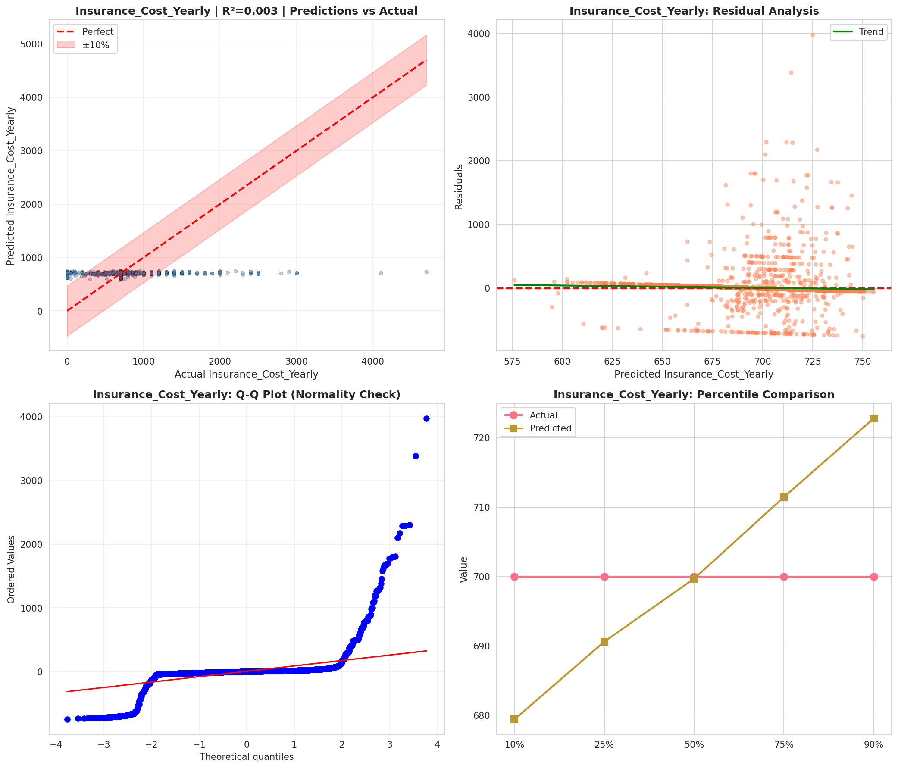
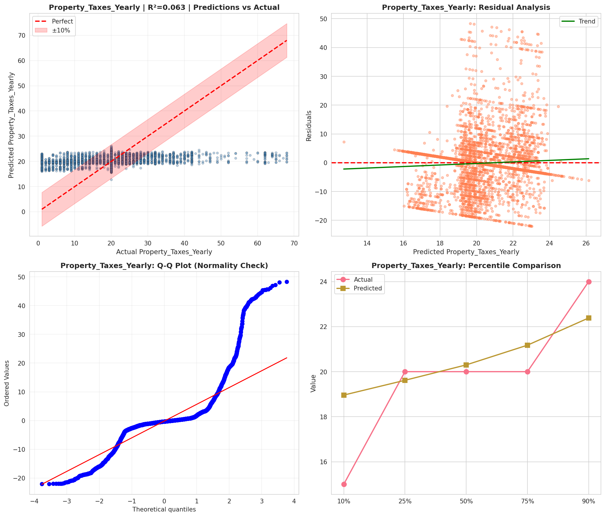
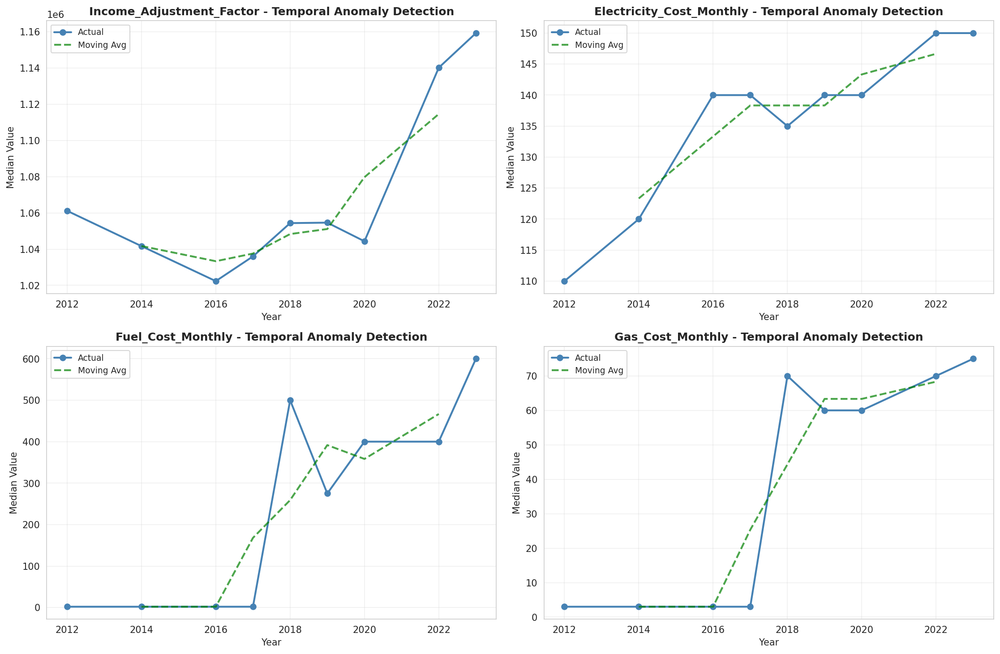
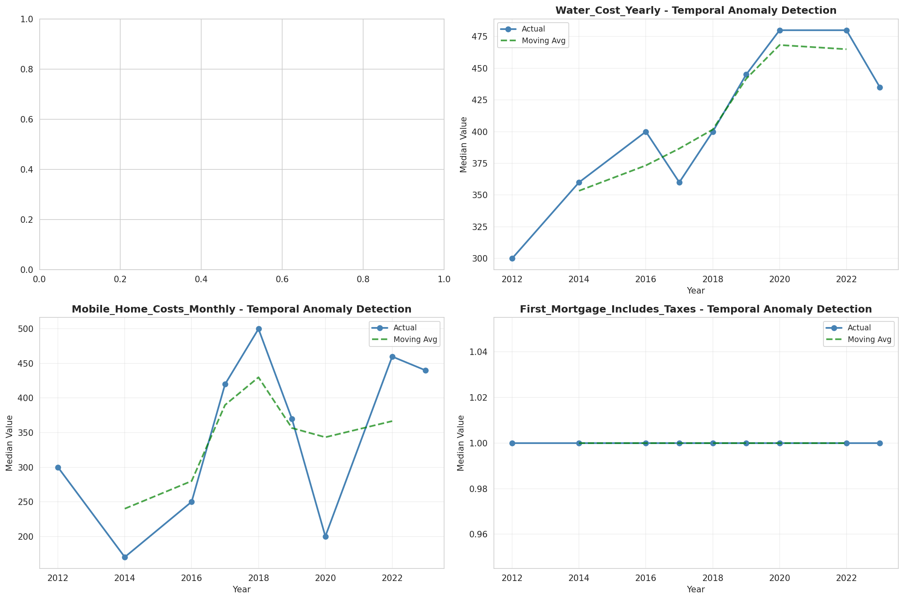
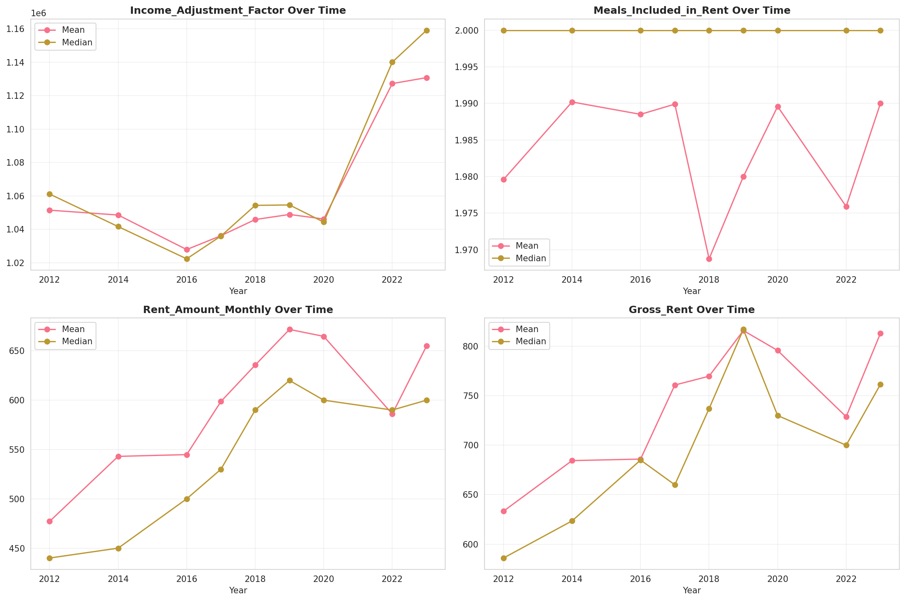
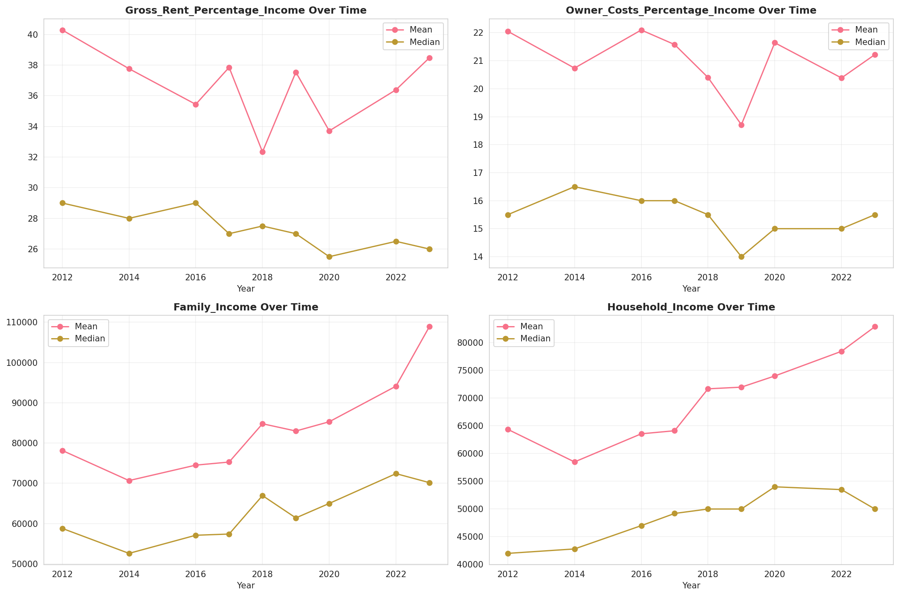
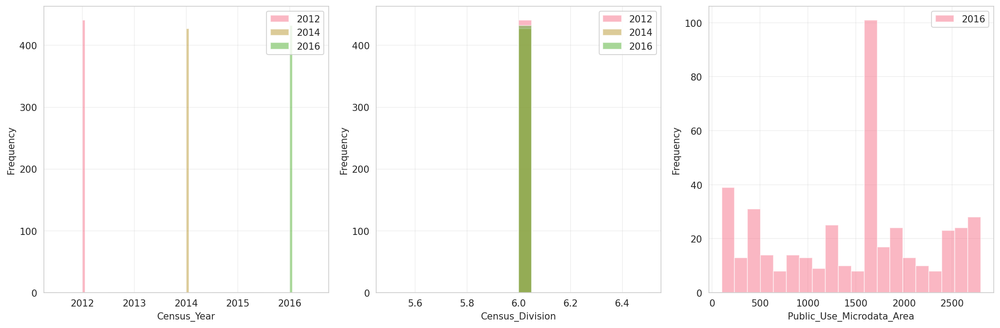
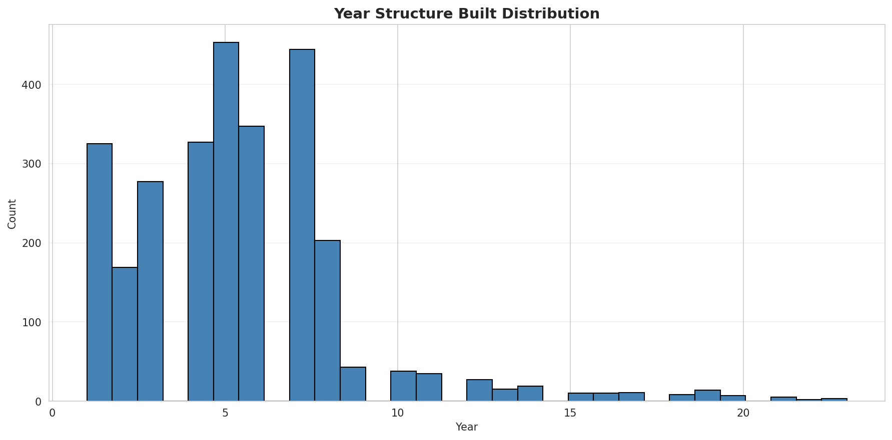
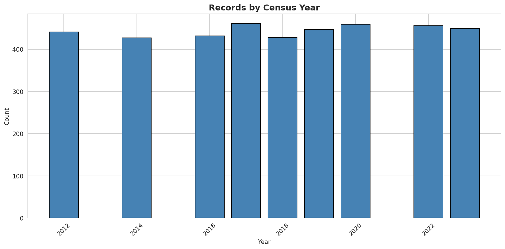
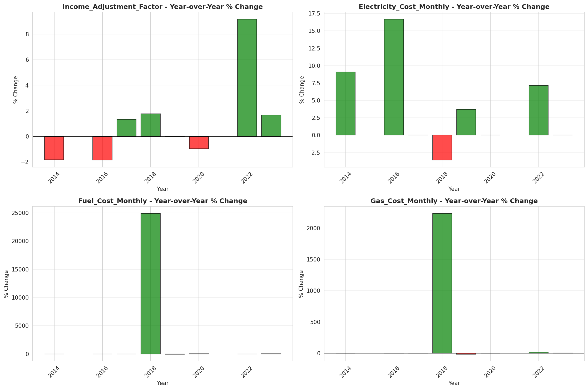
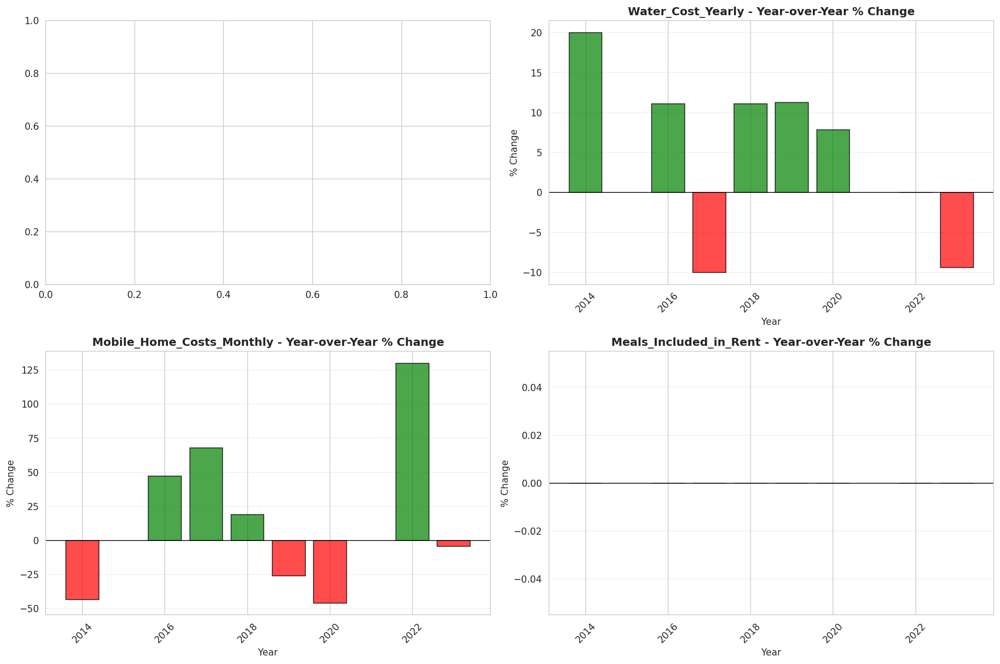
