# Deep Learning Models (TensorFlow CPU)

## Deep Learning Summary

- Total Tasks: 2

- Tasks: cost_prediction, occupancy_prediction

## Task: Cost Prediction

### Model Details

- Model Type: HousingDefaultModel

- Task Type: multi_output

- Target Variables: Property_Taxes_Yearly, Insurance_Cost_Yearly

- Architecture: 6 layers, 10,306 parameters

- Input Features: 10 features

- Training Epochs: 75

### Performance Metrics

- Training Loss: 14558.2627

- Validation Loss: 19991.2422

- Overfitting Risk: HIGH RISK (gap: 5432.9795)

- MAE: 21.8725

- MSE: 12326.1377

- RMSE: 111.0231

- R2: 0.0326

## Task: Occupancy Prediction

### Model Details

- Model Type: HousingDefaultModel

- Task Type: multi_output

- Target Variables: Vacancy_Status, Tenure

- Architecture: 6 layers, 10,306 parameters

- Input Features: 10 features

- Training Epochs: 75

### Performance Metrics

- Training Loss: 0.3728

- Validation Loss: 0.3704

- Overfitting Risk: LOW (gap: -0.0024)

- MAE: 0.3423

- MSE: 0.3786

- RMSE: 0.6153

- R2: 0.3742

## Visualizations

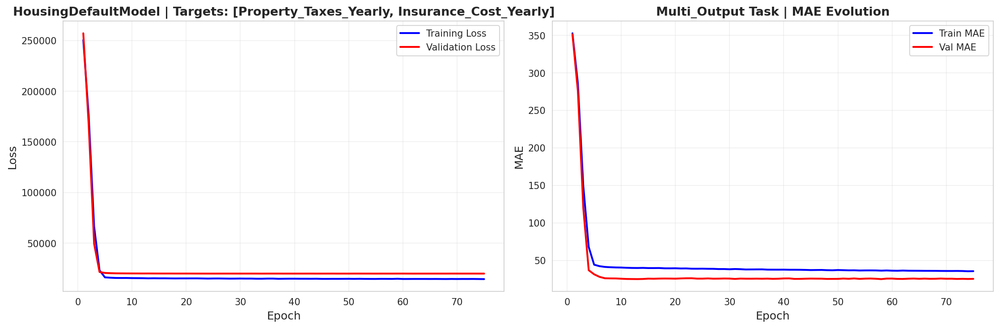
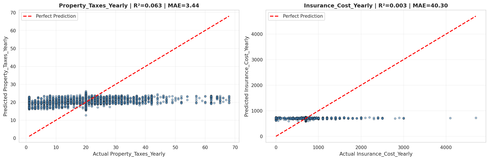
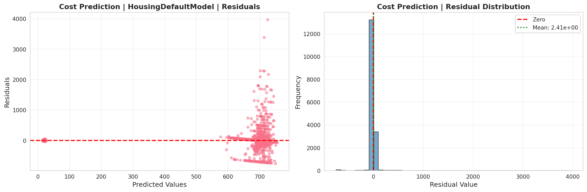
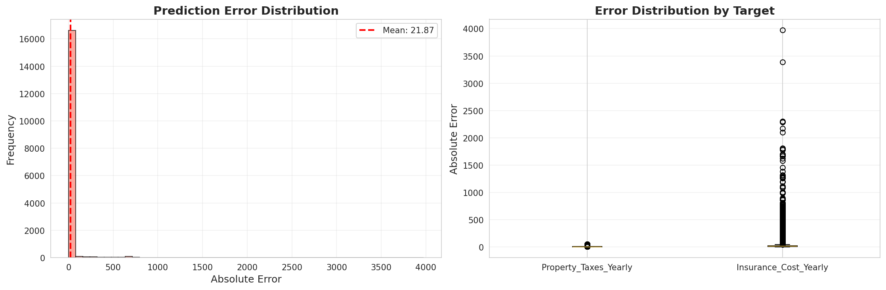
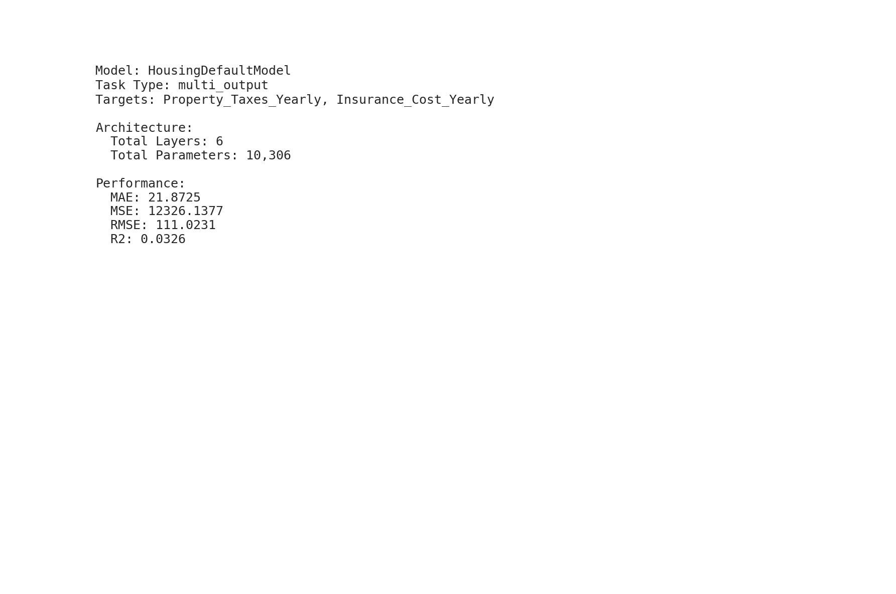

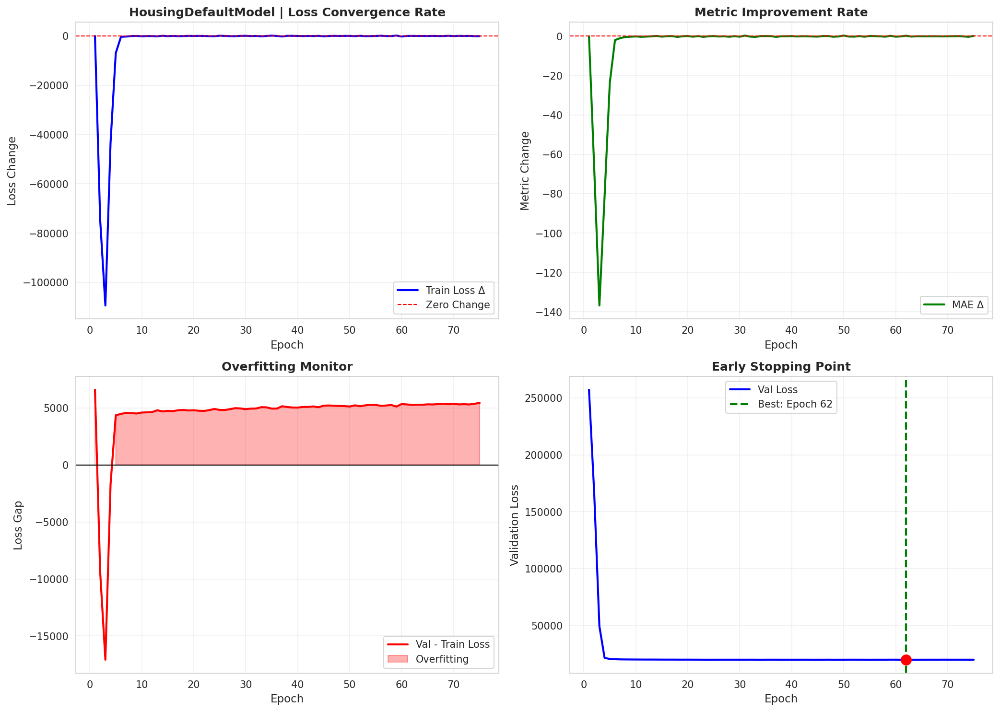
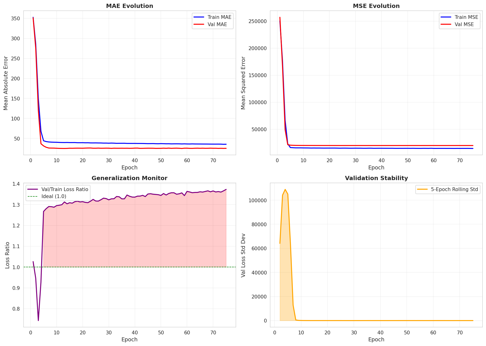
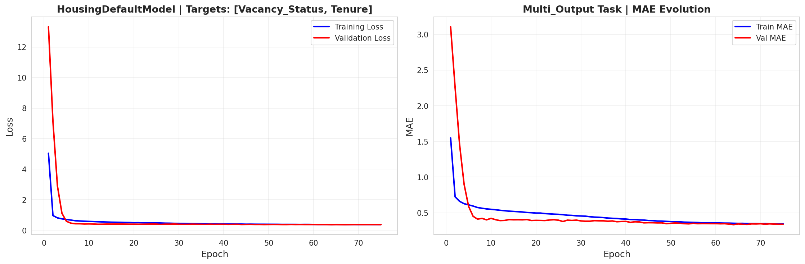
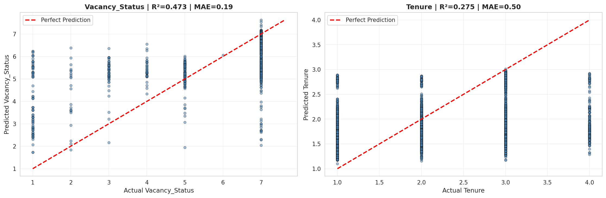
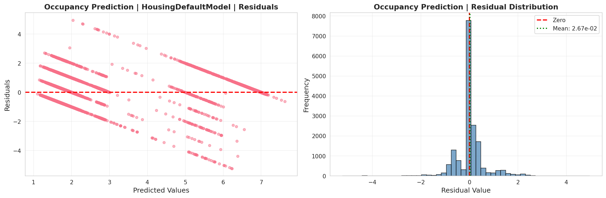

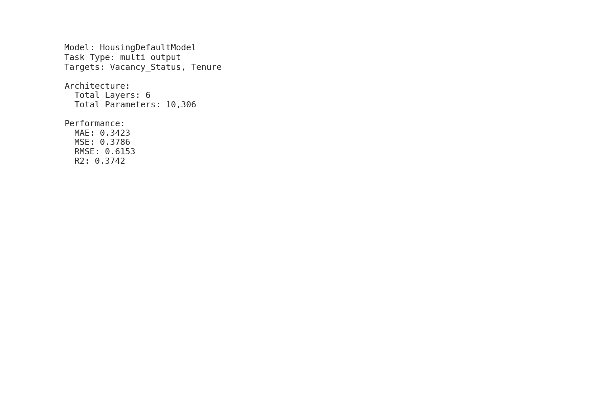
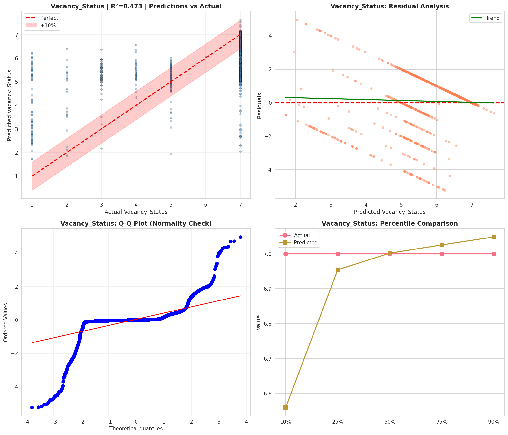
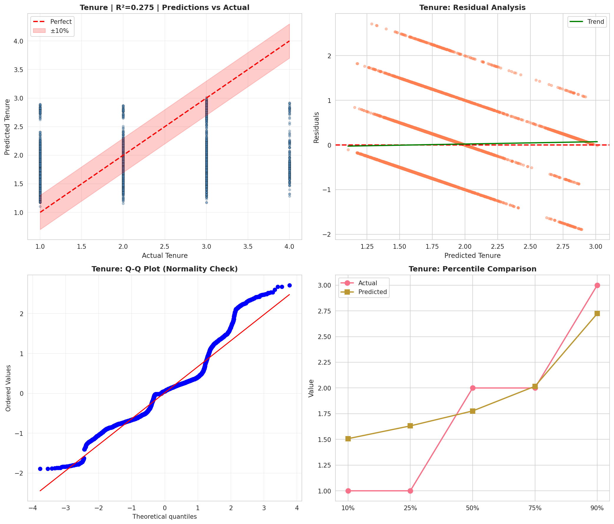
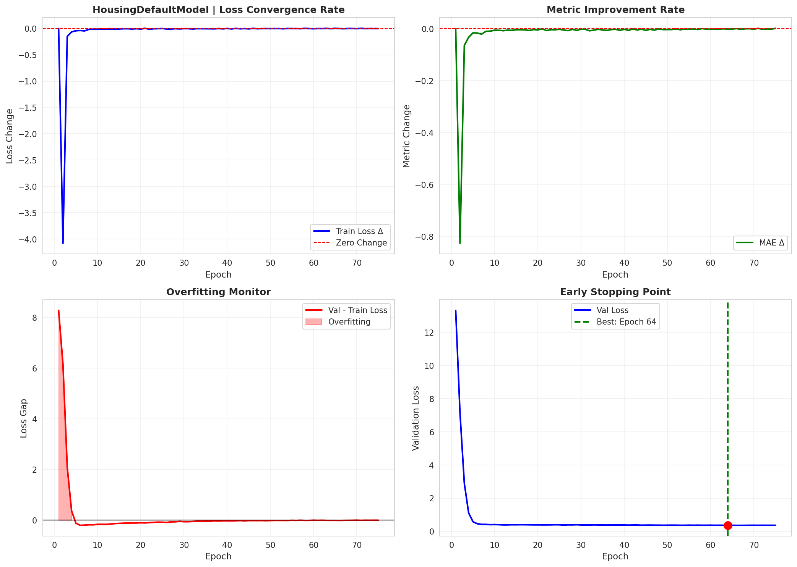
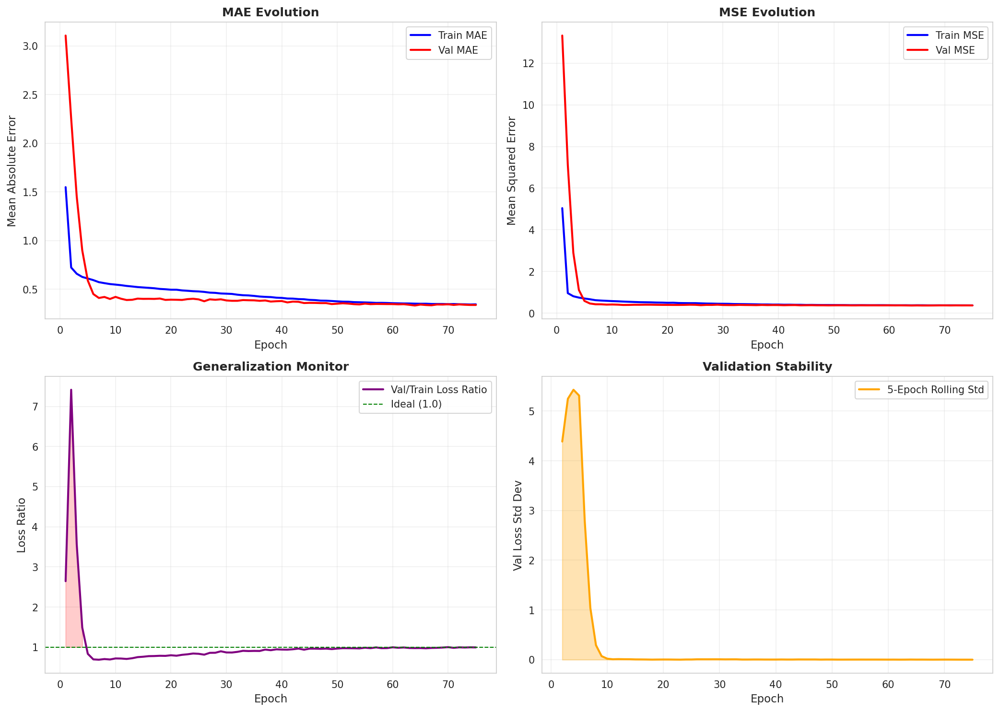
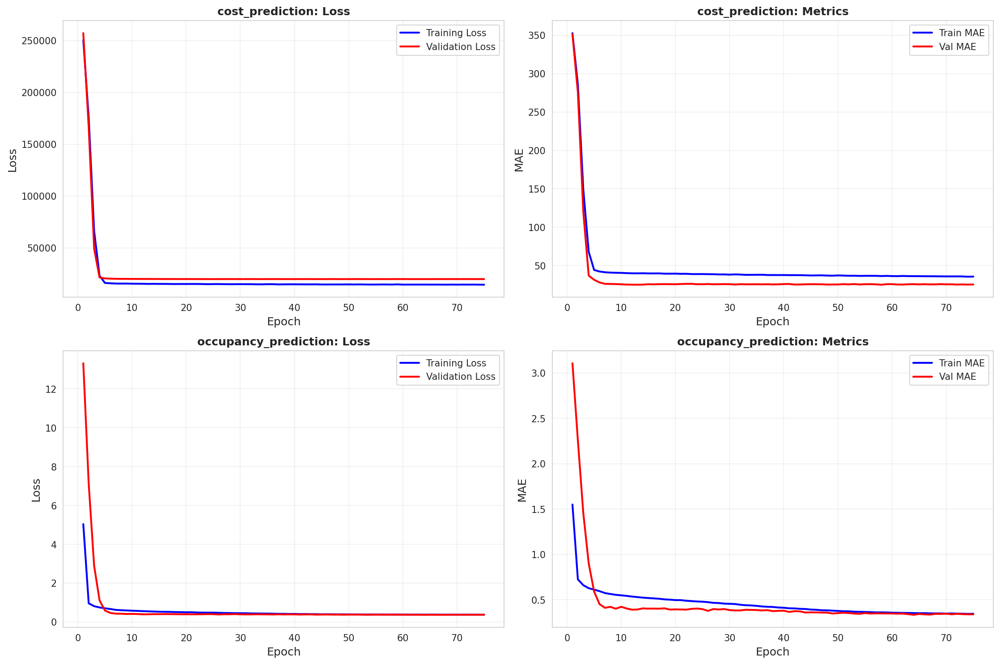

