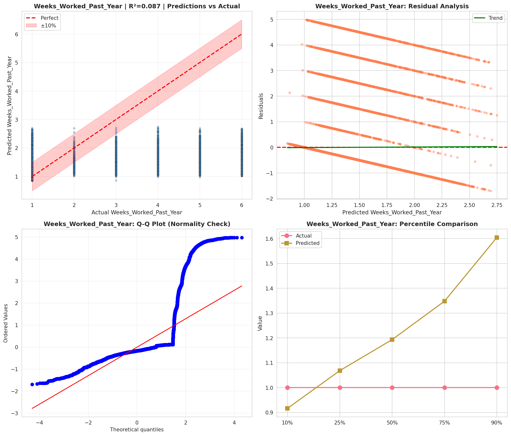
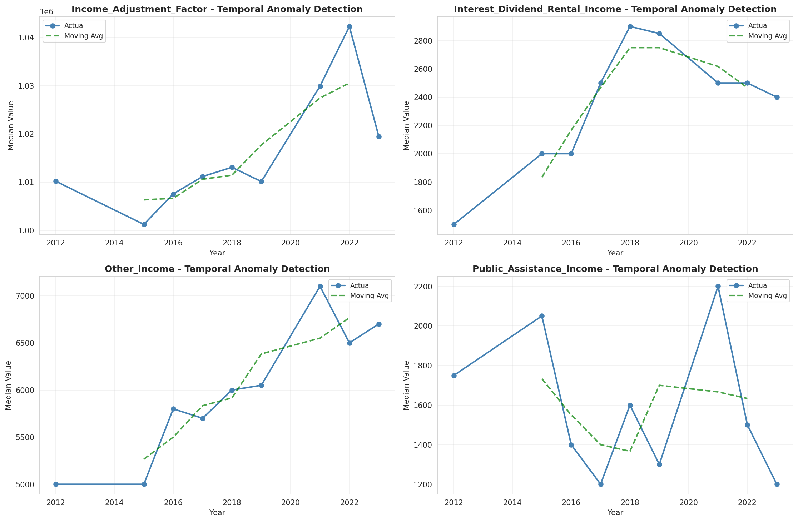
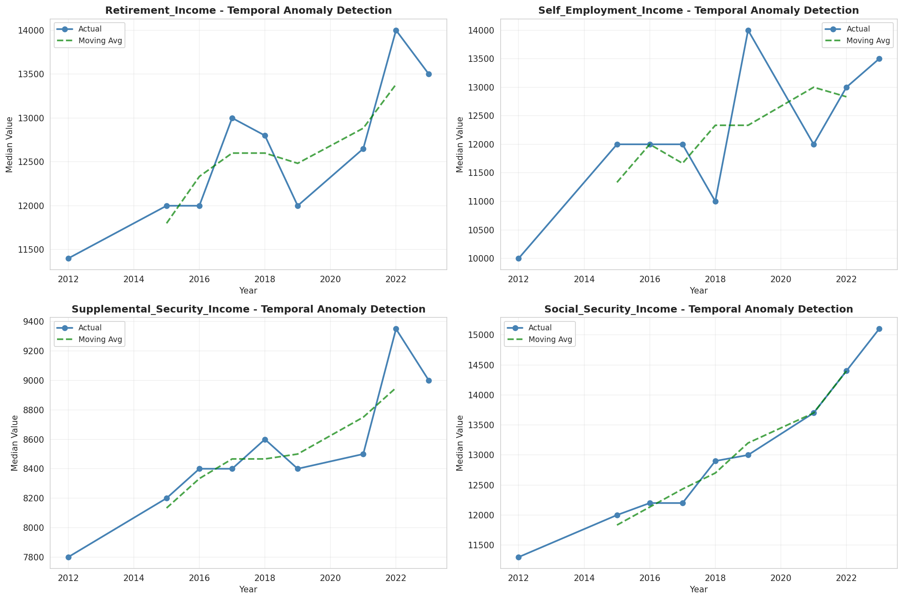
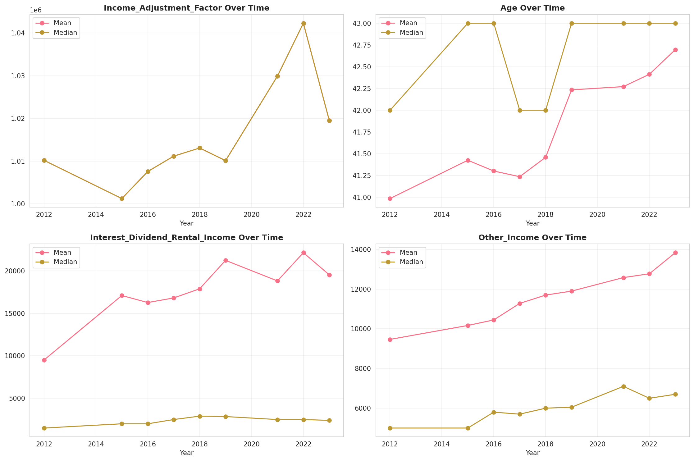
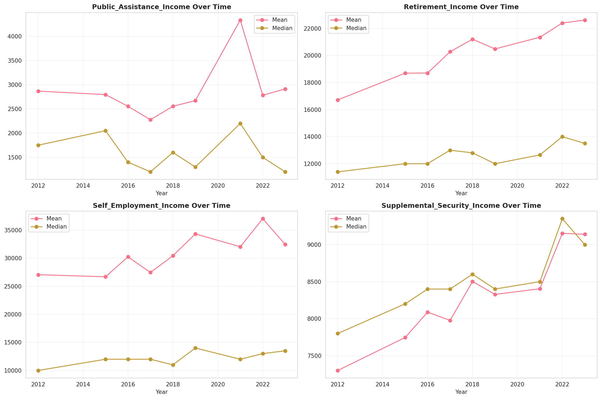
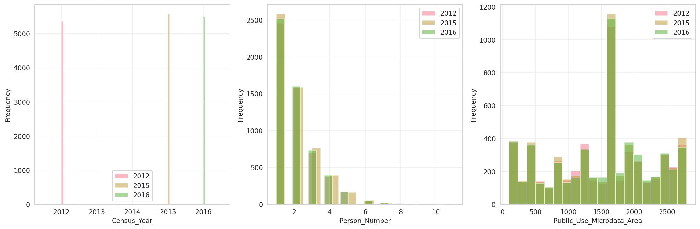
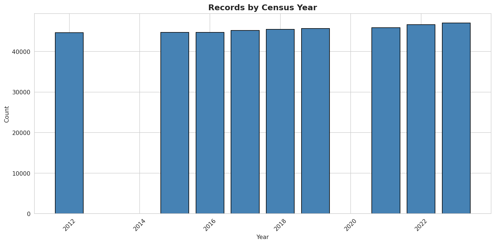
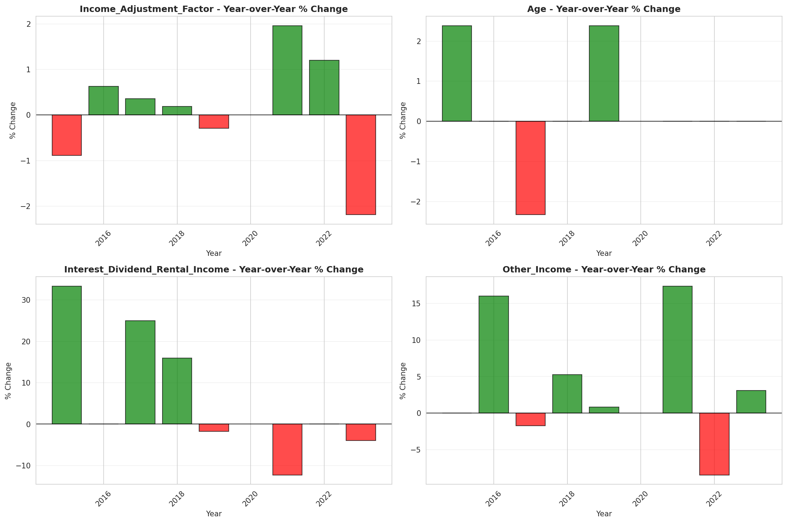
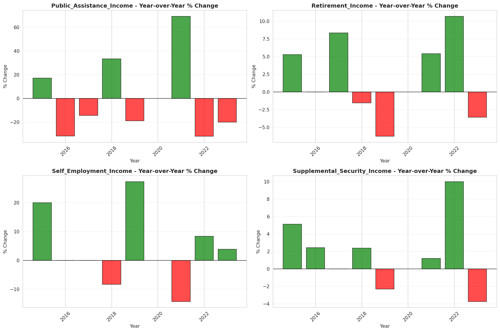

# Temporal Analysis

## Year Distribution

- 2012: 44,664 records

- 2015: 44,749 records

- 2016: 44,739 records

- 2017: 45,209 records

- 2018: 45,475 records

- 2019: 45,649 records

- 2021: 45,892 records

- 2022: 46,605 records

- 2023: 47,022 records

## Temporal Trends

- Census_Year: {np.int64(2012): {'mean': 2012.0, 'median': 2012.0, 'std': 0.0}, np.int64(2015): {'mean': 2015.0, 'median': 2015.0, 'std': 0.0}, np.int64(2016): {'mean': 2016.0, 'median': 2016.0, 'std': 0.0}, np.int64(2017): {'mean': 2017.0, 'median': 2017.0, 'std': 0.0}, np.int64(2018): {'mean': 2018.0, 'median': 2018.0, 'std': 0.0}, np.int64(2019): {'mean': 2019.0, 'median': 2019.0, 'std': 0.0}, np.int64(2021): {'mean': 2021.0, 'median': 2021.0, 'std': 0.0}, np.int64(2022): {'mean': 2022.0, 'median': 2022.0, 'std': 0.0}, np.int64(2023): {'mean': 2023.0, 'median': 2023.0, 'std': 0.0}}

- Person_Number: {np.int64(2012): {'mean': 1.9960370768404083, 'median': 2.0, 'std': 1.2415020100471565}, np.int64(2015): {'mean': 1.9896087063398065, 'median': 2.0, 'std': 1.2271343715014316}, np.int64(2016): {'mean': 1.9964237019155546, 'median': 2.0, 'std': 1.237367910625187}, np.int64(2017): {'mean': 2.012342675131058, 'median': 2.0, 'std': 1.25970935197831}, np.int64(2018): {'mean': 2.0033424958768555, 'median': 2.0, 'std': 1.2453678251573976}, np.int64(2019): {'mean': 2.0128589892440143, 'median': 2.0, 'std': 1.296222603353892}, np.int64(2021): {'mean': 2.0125512071820797, 'median': 2.0, 'std': 1.2826611216354475}, np.int64(2022): {'mean': 2.0076601223044737, 'median': 2.0, 'std': 1.282196422466925}, np.int64(2023): {'mean': 1.9942580068903917, 'median': 2.0, 'std': 1.245176992300611}}

- Public_Use_Microdata_Area: {np.int64(2012): {'mean': 1504.0356663084362, 'median': 1702.0, 'std': 764.4495694402929}, np.int64(2015): {'mean': 1518.6963507564415, 'median': 1702.0, 'std': 761.1149386315612}, np.int64(2016): {'mean': 1533.9744965242853, 'median': 1702.0, 'std': 757.7625482776159}, np.int64(2017): {'mean': 1531.684155809684, 'median': 1702.0, 'std': 759.3588600387453}, np.int64(2018): {'mean': 1526.8488620120945, 'median': 1702.0, 'std': 756.8329121521228}, np.int64(2019): {'mean': 1533.2157988126794, 'median': 1702.0, 'std': 762.752093025385}, np.int64(2021): {'mean': 1531.1204785147738, 'median': 1703.0, 'std': 762.5597265354621}, np.int64(2022): {'mean': 1516.6237957300718, 'median': 1702.0, 'std': 771.9256013939624}, np.int64(2023): {'mean': 1528.5685211177747, 'median': 1703.0, 'std': 767.8188860585847}}

- State_Code: {np.int64(2012): {'mean': 21.0, 'median': 21.0, 'std': 0.0}, np.int64(2015): {'mean': 21.0, 'median': 21.0, 'std': 0.0}, np.int64(2016): {'mean': 21.0, 'median': 21.0, 'std': 0.0}, np.int64(2017): {'mean': 21.0, 'median': 21.0, 'std': 0.0}, np.int64(2018): {'mean': 21.0, 'median': 21.0, 'std': 0.0}, np.int64(2019): {'mean': 21.0, 'median': 21.0, 'std': 0.0}, np.int64(2021): {'mean': 21.0, 'median': 21.0, 'std': 0.0}, np.int64(2022): {'mean': 21.0, 'median': 21.0, 'std': 0.0}, np.int64(2023): {'mean': None, 'median': None, 'std': None}}

- Income_Adjustment_Factor: {np.int64(2012): {'mean': 1010207.0, 'median': 1010207.0, 'std': 0.0}, np.int64(2015): {'mean': 1001264.0, 'median': 1001264.0, 'std': 0.0}, np.int64(2016): {'mean': 1007588.0, 'median': 1007588.0, 'std': 0.0}, np.int64(2017): {'mean': 1011189.0, 'median': 1011189.0, 'std': 0.0}, np.int64(2018): {'mean': 1013097.0, 'median': 1013097.0, 'std': 0.0}, np.int64(2019): {'mean': 1010145.0, 'median': 1010145.0, 'std': 0.0}, np.int64(2021): {'mean': 1029928.0, 'median': 1029928.0, 'std': 0.0}, np.int64(2022): {'mean': 1042311.0, 'median': 1042311.0, 'std': 0.0}, np.int64(2023): {'mean': 1019518.0, 'median': 1019518.0, 'std': 0.0}}

- Person_Weight: {np.int64(2012): {'mean': 98.0748477521046, 'median': 78.0, 'std': 79.18302065328179}, np.int64(2015): {'mean': 98.88694719435071, 'median': 77.0, 'std': 82.04003576409558}, np.int64(2016): {'mean': 99.17463510583607, 'median': 78.0, 'std': 81.13434282463434}, np.int64(2017): {'mean': 98.5243867371541, 'median': 77.0, 'std': 80.37708000635081}, np.int64(2018): {'mean': 98.2606267179769, 'median': 78.0, 'std': 81.30545202133074}, np.int64(2019): {'mean': 97.87011763674998, 'median': 75.0, 'std': 86.32254069206991}, np.int64(2021): {'mean': 98.26100409657457, 'median': 75.0, 'std': 84.61629670340263}, np.int64(2022): {'mean': 96.8202982512606, 'median': 74.0, 'std': 84.89643607305383}, np.int64(2023): {'mean': 96.25609289268853, 'median': 72.0, 'std': 88.40562289472923}}

- Age: {np.int64(2012): {'mean': 40.985603618126454, 'median': 42.0, 'std': 23.41528685856404}, np.int64(2015): {'mean': 41.42550671523386, 'median': 43.0, 'std': 23.624458094544938}, np.int64(2016): {'mean': 41.3019289657793, 'median': 43.0, 'std': 23.62644103878537}, np.int64(2017): {'mean': 41.2365015815435, 'median': 42.0, 'std': 23.715490964841077}, np.int64(2018): {'mean': 41.45921935129192, 'median': 42.0, 'std': 23.78451495703392}, np.int64(2019): {'mean': 42.23409056058183, 'median': 43.0, 'std': 23.932459744687275}, np.int64(2021): {'mean': 42.271637758214936, 'median': 43.0, 'std': 24.017758244054466}, np.int64(2022): {'mean': 42.413131638236244, 'median': 43.0, 'std': 24.011533060721685}, np.int64(2023): {'mean': 42.6957806983965, 'median': 43.0, 'std': 24.181147860380243}}

- Citizenship_Status: {np.int64(2012): {'mean': 1.099319362349991, 'median': 1.0, 'std': 0.5802467403300118}, np.int64(2015): {'mean': 1.1130304587812019, 'median': 1.0, 'std': 0.6177098642844856}, np.int64(2016): {'mean': 1.1141956682089451, 'median': 1.0, 'std': 0.6159541288330745}, np.int64(2017): {'mean': 1.1261916874958526, 'median': 1.0, 'std': 0.64594957226731}, np.int64(2018): {'mean': 1.1244420010995053, 'median': 1.0, 'std': 0.6411780290852932}, np.int64(2019): {'mean': 1.132292054590462, 'median': 1.0, 'std': 0.6612571054947556}, np.int64(2021): {'mean': 1.1399590342543362, 'median': 1.0, 'std': 0.6783323189855965}, np.int64(2022): {'mean': 1.1316382362407467, 'median': 1.0, 'std': 0.6547889681713308}, np.int64(2023): {'mean': 1.1402109650801753, 'median': 1.0, 'std': 0.6742220579994751}}

- Class_of_Worker: {np.int64(2012): {'mean': 2.1245616831367546, 'median': 1.0, 'std': 1.9023650110131587}, np.int64(2015): {'mean': 2.114125462428895, 'median': 1.0, 'std': 1.8980664633147886}, np.int64(2016): {'mean': 2.072886065899166, 'median': 1.0, 'std': 1.8626055256756906}, np.int64(2017): {'mean': 2.0679676719889613, 'median': 1.0, 'std': 1.861711161465762}, np.int64(2018): {'mean': 2.045215152342683, 'median': 1.0, 'std': 1.8286947152748783}, np.int64(2019): {'mean': 2.0814509544729987, 'median': 1.0, 'std': 1.8394582195898361}, np.int64(2021): {'mean': 2.0966591737074647, 'median': 1.0, 'std': 1.854154084619675}, np.int64(2022): {'mean': 2.095963413712299, 'median': 1.0, 'std': 1.85135066821285}, np.int64(2023): {'mean': 2.099476243920688, 'median': 1.0, 'std': 1.8551344729915658}}

- English_Speaking_Ability: {np.int64(2012): {'mean': 1.5472665148063782, 'median': 1.0, 'std': 0.8119747933967659}, np.int64(2015): {'mean': 1.5389221556886228, 'median': 1.0, 'std': 0.8265959890552019}, np.int64(2016): {'mean': 1.5359911406423035, 'median': 1.0, 'std': 0.8089391760220213}, np.int64(2017): {'mean': 1.5445939212755355, 'median': 1.0, 'std': 0.8245240459295125}, np.int64(2018): {'mean': 1.5798525798525798, 'median': 1.0, 'std': 0.8319380519061621}, np.int64(2019): {'mean': 1.557737260402057, 'median': 1.0, 'std': 0.8279550496480871}, np.int64(2021): {'mean': 1.619626574033869, 'median': 1.0, 'std': 0.8575298610413608}, np.int64(2022): {'mean': 1.5714922048997773, 'median': 1.0, 'std': 0.842756570345131}, np.int64(2023): {'mean': 1.609865470852018, 'median': 1.0, 'std': 0.8628742079220695}}

- Fertility_Status: {np.int64(2012): {'mean': 1.9476161244117045, 'median': 2.0, 'std': 0.22281132028427583}, np.int64(2015): {'mean': 1.9528501801229075, 'median': 2.0, 'std': 0.21197045799221095}, np.int64(2016): {'mean': 1.9461774347044518, 'median': 2.0, 'std': 0.22567915788522022}, np.int64(2017): {'mean': 1.9504123711340207, 'median': 2.0, 'std': 0.21710263715306818}, np.int64(2018): {'mean': 1.9443866943866943, 'median': 2.0, 'std': 0.22918535277701985}, np.int64(2019): {'mean': 1.9498405951115834, 'median': 2.0, 'std': 0.2182853696253656}, np.int64(2021): {'mean': 1.9499412957626214, 'median': 2.0, 'std': 0.21807775324298379}, np.int64(2022): {'mean': 1.9418677204658903, 'median': 2.0, 'std': 0.23400558143234623}, np.int64(2023): {'mean': 1.9489944018245906, 'median': 2.0, 'std': 0.22002055743004942}}

- Marital_Status: {np.int64(2012): {'mean': 2.836960415547197, 'median': 2.0, 'std': 1.8205229168800294}, np.int64(2015): {'mean': 2.8488010905271626, 'median': 3.0, 'std': 1.822697568856784}, np.int64(2016): {'mean': 2.8642571358322715, 'median': 3.0, 'std': 1.8245169556272463}, np.int64(2017): {'mean': 2.8647172023269705, 'median': 3.0, 'std': 1.8247922143588373}, np.int64(2018): {'mean': 2.8718856514568443, 'median': 3.0, 'std': 1.8289646305888976}, np.int64(2019): {'mean': 2.8382001796315364, 'median': 3.0, 'std': 1.8206649734764688}, np.int64(2021): {'mean': 2.8704785147738168, 'median': 3.0, 'std': 1.8283426416619024}, np.int64(2022): {'mean': 2.859564424417981, 'median': 3.0, 'std': 1.8264655779808792}, np.int64(2023): {'mean': 2.846624984050019, 'median': 3.0, 'std': 1.8239773854363728}}

- Mobility_Status: {np.int64(2012): {'mean': 1.268541968162084, 'median': 1.0, 'std': 0.6792693577434475}, np.int64(2015): {'mean': 1.2762089498376037, 'median': 1.0, 'std': 0.687833418955212}, np.int64(2016): {'mean': 1.2817247996387855, 'median': 1.0, 'std': 0.693280226831287}, np.int64(2017): {'mean': 1.2937236251590862, 'median': 1.0, 'std': 0.7056854190535412}, np.int64(2018): {'mean': 1.2780088525100648, 'median': 1.0, 'std': 0.6899301011510705}, np.int64(2019): {'mean': 1.2619732012559148, 'median': 1.0, 'std': 0.67326981148771}, np.int64(2021): {'mean': 1.2469380126217648, 'median': 1.0, 'std': 0.6558479017178704}, np.int64(2022): {'mean': 1.241495197415494, 'median': 1.0, 'std': 0.6490741035632533}, np.int64(2023): {'mean': 1.223496071106531, 'median': 1.0, 'std': 0.6268396657744677}}

- Military_Service: {np.int64(2012): {'mean': 4.769618631083377, 'median': 5.0, 'std': 0.6663943307306599}, np.int64(2015): {'mean': 3.796660090583234, 'median': 4.0, 'std': 0.6049873887522738}, np.int64(2016): {'mean': 3.806102828479866, 'median': 4.0, 'std': 0.5901804758781489}, np.int64(2017): {'mean': 3.810841348141208, 'median': 4.0, 'std': 0.5831513119392499}, np.int64(2018): {'mean': 3.8170368549026037, 'median': 4.0, 'std': 0.5727185626699552}, np.int64(2019): {'mean': 3.8152981546026856, 'median': 4.0, 'std': 0.579142519085965}, np.int64(2021): {'mean': 3.8265031005661903, 'median': 4.0, 'std': 0.5683498763336087}, np.int64(2022): {'mean': 3.8329406781904334, 'median': 4.0, 'std': 0.5497460191962126}, np.int64(2023): {'mean': 3.8398722747140575, 'median': 4.0, 'std': 0.5387254015557783}}

- Travel_Time_To_Work_Minutes: {np.int64(2012): {'mean': 23.10408163265306, 'median': 20.0, 'std': 21.451362307440665}, np.int64(2015): {'mean': 23.82441685687246, 'median': 20.0, 'std': 21.63517362331739}, np.int64(2016): {'mean': 23.695611371791333, 'median': 20.0, 'std': 20.60304757151142}, np.int64(2017): {'mean': 23.49433304272014, 'median': 20.0, 'std': 20.56134655847649}, np.int64(2018): {'mean': 23.56650061599443, 'median': 20.0, 'std': 20.74499106920489}, np.int64(2019): {'mean': 24.767073431813316, 'median': 20.0, 'std': 23.474307307082665}, np.int64(2021): {'mean': 23.71003050421676, 'median': 20.0, 'std': 21.804551433276373}, np.int64(2022): {'mean': 24.217459693275657, 'median': 20.0, 'std': 21.986981865332794}, np.int64(2023): {'mean': 24.30002769315979, 'median': 20.0, 'std': 21.799032938267175}}

- Vehicle_Occupancy: {np.int64(2012): {'mean': 1.1504086868325278, 'median': 1.0, 'std': 0.5454202743626894}, np.int64(2015): {'mean': 1.135717641531595, 'median': 1.0, 'std': 0.48682389603520343}, np.int64(2016): {'mean': 1.1285184756168192, 'median': 1.0, 'std': 0.48658919178730364}, np.int64(2017): {'mean': 1.1433237822349571, 'median': 1.0, 'std': 0.5196878772388314}, np.int64(2018): {'mean': 1.1475061507492732, 'median': 1.0, 'std': 0.5781187239478675}, np.int64(2019): {'mean': 1.1447686512621578, 'median': 1.0, 'std': 0.5457903836320042}, np.int64(2021): {'mean': 1.136600363932986, 'median': 1.0, 'std': 0.5173702745484253}, np.int64(2022): {'mean': 1.1528397089885003, 'median': 1.0, 'std': 0.5300815774896643}, np.int64(2023): {'mean': 1.1652988093861982, 'median': 1.0, 'std': 0.5736465012293419}}

- Transportation_To_Work: {np.int64(2012): {'mean': 1.7056634746922024, 'median': 1.0, 'std': 2.493679915765513}, np.int64(2015): {'mean': 1.7320191223075683, 'median': 1.0, 'std': 2.5455671443592665}, np.int64(2016): {'mean': 1.733757623972421, 'median': 1.0, 'std': 2.5504297708704016}, np.int64(2017): {'mean': 1.7778125652264662, 'median': 1.0, 'std': 2.622403228019468}, np.int64(2018): {'mean': 1.7156293364855837, 'median': 1.0, 'std': 2.53119494253368}, np.int64(2019): {'mean': None, 'median': None, 'std': None}, np.int64(2021): {'mean': None, 'median': None, 'std': None}, np.int64(2022): {'mean': None, 'median': None, 'std': None}, np.int64(2023): {'mean': None, 'median': None, 'std': None}}

- Language_Other_Than_English: {np.int64(2012): {'mean': 1.958463430788154, 'median': 2.0, 'std': 0.19953000864933212}, np.int64(2015): {'mean': 1.9567163827431022, 'median': 2.0, 'std': 0.20349722717504753}, np.int64(2016): {'mean': 1.9573604060913705, 'median': 2.0, 'std': 0.2020455957348339}, np.int64(2017): {'mean': 1.9531228102956977, 'median': 2.0, 'std': 0.21137824483945983}, np.int64(2018): {'mean': 1.9526424798119661, 'median': 2.0, 'std': 0.212404885497554}, np.int64(2019): {'mean': 1.950537634408602, 'median': 2.0, 'std': 0.21683387005671823}, np.int64(2021): {'mean': 1.947160720431341, 'median': 2.0, 'std': 0.22371508308190335}, np.int64(2022): {'mean': 1.9492941840767928, 'median': 2.0, 'std': 0.21939877701516144}, np.int64(2023): {'mean': 1.9450837288439151, 'median': 2.0, 'std': 0.22781930616311455}}

- Grandparents_Living_With_Grandchildren: {np.int64(2012): {'mean': 1.964253674694638, 'median': 2.0, 'std': 0.18566021351274978}, np.int64(2015): {'mean': 1.964857987758751, 'median': 2.0, 'std': 0.18414183981084478}, np.int64(2016): {'mean': 1.9652308752584424, 'median': 2.0, 'std': 0.18319767792733033}, np.int64(2017): {'mean': 1.9634246575342467, 'median': 2.0, 'std': 0.18771998720771874}, np.int64(2018): {'mean': 1.9628899612587507, 'median': 2.0, 'std': 0.18903464798140368}, np.int64(2019): {'mean': 1.96574246867502, 'median': 2.0, 'std': 0.18189297791192383}, np.int64(2021): {'mean': 1.9698215825429461, 'median': 2.0, 'std': 0.17108083240367652}, np.int64(2022): {'mean': 1.9665397259382222, 'median': 2.0, 'std': 0.1798380849809034}, np.int64(2023): {'mean': 1.9675401738461045, 'median': 2.0, 'std': 0.17722074715841052}}

- Months_Responsible_For_Grandchildren: {np.int64(2012): {'mean': 3.6912751677852347, 'median': 4.0, 'std': 1.3542306140714022}, np.int64(2015): {'mean': 3.8633217993079585, 'median': 4.0, 'std': 1.3007146563471454}, np.int64(2016): {'mean': 3.948186528497409, 'median': 5.0, 'std': 1.2728503799403914}, np.int64(2017): {'mean': 3.7779783393501805, 'median': 4.0, 'std': 1.2669761068095051}, np.int64(2018): {'mean': 3.9703947368421053, 'median': 5.0, 'std': 1.2728744632192062}, np.int64(2019): {'mean': 4.042389210019268, 'median': 5.0, 'std': 1.218476988928164}, np.int64(2021): {'mean': 4.00421052631579, 'median': 5.0, 'std': 1.2761952112386798}, np.int64(2022): {'mean': 4.10251798561151, 'median': 5.0, 'std': 1.3132426512024336}, np.int64(2023): {'mean': 3.995661605206074, 'median': 5.0, 'std': 1.3318761882743457}}

- Grandparents_Responsible_For_Grandchildren: {np.int64(2012): {'mean': 1.4247104247104247, 'median': 1.0, 'std': 0.49453771232877153}, np.int64(2015): {'mean': 1.4344422700587085, 'median': 1.0, 'std': 0.4959262370646885}, np.int64(2016): {'mean': 1.4261645193260655, 'median': 1.0, 'std': 0.49476350841159045}, np.int64(2017): {'mean': 1.4812734082397003, 'median': 1.0, 'std': 0.49988327425213275}, np.int64(2018): {'mean': 1.4432234432234432, 'median': 1.0, 'std': 0.4969935768920054}, np.int64(2019): {'mean': 1.495136186770428, 'median': 1.0, 'std': 0.5002196994768843}, np.int64(2021): {'mean': 1.478021978021978, 'median': 1.0, 'std': 0.499791419156782}, np.int64(2022): {'mean': 1.4591439688715953, 'median': 1.0, 'std': 0.4985705435018385}, np.int64(2023): {'mean': 1.5444664031620554, 'median': 2.0, 'std': 0.49826505312224684}}

- Interest_Dividend_Rental_Income: {np.int64(2012): {'mean': 9503.90783976407, 'median': 1500.0, 'std': 23720.34501084959}, np.int64(2015): {'mean': 17090.306953339434, 'median': 2000.0, 'std': 52153.91004974623}, np.int64(2016): {'mean': 16264.765487775932, 'median': 2000.0, 'std': 50350.13680185867}, np.int64(2017): {'mean': 16805.58073654391, 'median': 2500.0, 'std': 46854.76196169097}, np.int64(2018): {'mean': 17882.183098591548, 'median': 2900.0, 'std': 48825.13172962542}, np.int64(2019): {'mean': 21228.114552605704, 'median': 2850.0, 'std': 64044.772680567636}, np.int64(2021): {'mean': 18809.288649203903, 'median': 2500.0, 'std': 52345.72213341833}, np.int64(2022): {'mean': 22128.71907641561, 'median': 2500.0, 'std': 66803.03788257824}, np.int64(2023): {'mean': 19523.294270158152, 'median': 2400.0, 'std': 54677.319684969094}}

- Military_Service_Period_1: {np.int64(2012): {'mean': 0.14201023982753974, 'median': 0.0, 'std': 0.3491076817831761}, np.int64(2015): {'mean': 0.17246596066565809, 'median': 0.0, 'std': 0.3778420961764729}, np.int64(2016): {'mean': 0.1755505904883498, 'median': 0.0, 'std': 0.38049808354433134}, np.int64(2017): {'mean': 0.19624959586162302, 'median': 0.0, 'std': 0.39722374817780953}, np.int64(2018): {'mean': 0.2100502512562814, 'median': 0.0, 'std': 0.40741225986055984}, np.int64(2019): {'mean': 0.21325459317585302, 'median': 0.0, 'std': 0.4096732047639599}, np.int64(2021): {'mean': 0.2441657958899338, 'median': 0.0, 'std': 0.4296663388561494}, np.int64(2022): {'mean': 0.2496443812233286, 'median': 0.0, 'std': 0.43288416821166437}, np.int64(2023): {'mean': 0.24621072088724585, 'median': 0.0, 'std': 0.4308823940856128}}

- Military_Service_Period_2: {np.int64(2012): {'mean': 0.15494475882511452, 'median': 0.0, 'std': 0.3619007785256274}, np.int64(2015): {'mean': 0.1615733736762481, 'median': 0.0, 'std': 0.3681146827142422}, np.int64(2016): {'mean': 0.1812958825406958, 'median': 0.0, 'std': 0.3853246374405263}, np.int64(2017): {'mean': 0.1742644681538959, 'median': 0.0, 'std': 0.3793980779780411}, np.int64(2018): {'mean': 0.2, 'median': 0.0, 'std': 0.40006701851433485}, np.int64(2019): {'mean': 0.19881889763779528, 'median': 0.0, 'std': 0.3991769297085175}, np.int64(2021): {'mean': 0.19505398815743644, 'median': 0.0, 'std': 0.39631128731981086}, np.int64(2022): {'mean': 0.21763869132290184, 'median': 0.0, 'std': 0.4127137807925242}, np.int64(2023): {'mean': 0.22144177449168206, 'median': 0.0, 'std': 0.41529396138604474}}

- Military_Service_Period_3: {np.int64(2012): {'mean': 0.18270008084074374, 'median': 0.0, 'std': 0.3864725209962138}, np.int64(2015): {'mean': None, 'median': None, 'std': None}, np.int64(2016): {'mean': None, 'median': None, 'std': None}, np.int64(2017): {'mean': None, 'median': None, 'std': None}, np.int64(2018): {'mean': None, 'median': None, 'std': None}, np.int64(2019): {'mean': None, 'median': None, 'std': None}, np.int64(2021): {'mean': None, 'median': None, 'std': None}, np.int64(2022): {'mean': None, 'median': None, 'std': None}, np.int64(2023): {'mean': None, 'median': None, 'std': None}}

- Military_Service_Period_4: {np.int64(2012): {'mean': 0.12206952303961197, 'median': 0.0, 'std': 0.3274102029371512}, np.int64(2015): {'mean': None, 'median': None, 'std': None}, np.int64(2016): {'mean': None, 'median': None, 'std': None}, np.int64(2017): {'mean': None, 'median': None, 'std': None}, np.int64(2018): {'mean': None, 'median': None, 'std': None}, np.int64(2019): {'mean': None, 'median': None, 'std': None}, np.int64(2021): {'mean': None, 'median': None, 'std': None}, np.int64(2022): {'mean': None, 'median': None, 'std': None}, np.int64(2023): {'mean': None, 'median': None, 'std': None}}

- Military_Service_Period_5: {np.int64(2012): {'mean': 0.3654001616814875, 'median': 0.0, 'std': 0.48160708637806543}, np.int64(2015): {'mean': 0.37307110438729196, 'median': 0.0, 'std': 0.4836939581225239}, np.int64(2016): {'mean': 0.38557293329077563, 'median': 0.0, 'std': 0.4868080597444597}, np.int64(2017): {'mean': 0.39120594891690913, 'median': 0.0, 'std': 0.48809925248362923}, np.int64(2018): {'mean': 0.3688442211055276, 'median': 0.0, 'std': 0.48257245790897585}, np.int64(2019): {'mean': 0.3782808398950131, 'median': 0.0, 'std': 0.4850377631051226}, np.int64(2021): {'mean': 0.3664228491814699, 'median': 0.0, 'std': 0.48191081723739665}, np.int64(2022): {'mean': 0.36770981507823614, 'median': 0.0, 'std': 0.48226757874224474}, np.int64(2023): {'mean': 0.37190388170055455, 'median': 0.0, 'std': 0.483402287771732}}

- Military_Service_Period_6: {np.int64(2012): {'mean': 0.09485313931554837, 'median': 0.0, 'std': 0.29305146828201467}, np.int64(2015): {'mean': None, 'median': None, 'std': None}, np.int64(2016): {'mean': None, 'median': None, 'std': None}, np.int64(2017): {'mean': None, 'median': None, 'std': None}, np.int64(2018): {'mean': None, 'median': None, 'std': None}, np.int64(2019): {'mean': None, 'median': None, 'std': None}, np.int64(2021): {'mean': None, 'median': None, 'std': None}, np.int64(2022): {'mean': None, 'median': None, 'std': None}, np.int64(2023): {'mean': None, 'median': None, 'std': None}}

- Military_Service_Period_7: {np.int64(2012): {'mean': 0.10212880625168418, 'median': 0.0, 'std': 0.3028584318880088}, np.int64(2015): {'mean': None, 'median': None, 'std': None}, np.int64(2016): {'mean': None, 'median': None, 'std': None}, np.int64(2017): {'mean': None, 'median': None, 'std': None}, np.int64(2018): {'mean': None, 'median': None, 'std': None}, np.int64(2019): {'mean': None, 'median': None, 'std': None}, np.int64(2021): {'mean': None, 'median': None, 'std': None}, np.int64(2022): {'mean': None, 'median': None, 'std': None}, np.int64(2023): {'mean': None, 'median': None, 'std': None}}

- Military_Service_Period_8: {np.int64(2012): {'mean': 0.10563190514686069, 'median': 0.0, 'std': 0.30740733628132066}, np.int64(2015): {'mean': 0.0907715582450832, 'median': 0.0, 'std': 0.28732744717949604}, np.int64(2016): {'mean': 0.08426428343440792, 'median': 0.0, 'std': 0.27782809649990886}, np.int64(2017): {'mean': 0.06951180084060782, 'median': 0.0, 'std': 0.25436357611669536}, np.int64(2018): {'mean': 0.0680067001675042, 'median': 0.0, 'std': 0.25179958190137935}, np.int64(2019): {'mean': 0.05708661417322835, 'median': 0.0, 'std': 0.2320461128065093}, np.int64(2021): {'mean': 0.04911180773249739, 'median': 0.0, 'std': 0.2161390982546347}, np.int64(2022): {'mean': 0.03662873399715505, 'median': 0.0, 'std': 0.18788193913116635}, np.int64(2023): {'mean': 0.03253234750462107, 'median': 0.0, 'std': 0.17744191630246847}}

- Military_Service_Period_9: {np.int64(2012): {'mean': 0.016168148746968473, 'median': 0.0, 'std': 0.1261389204170718}, np.int64(2015): {'mean': 0.010892586989409985, 'median': 0.0, 'std': 0.10381329113061397}, np.int64(2016): {'mean': 0.012767315671879987, 'median': 0.0, 'std': 0.11228684556732398}, np.int64(2017): {'mean': 0.010022631749110895, 'median': 0.0, 'std': 0.09962623944502032}, np.int64(2018): {'mean': 0.008375209380234505, 'median': 0.0, 'std': 0.0911473995618164}, np.int64(2019): {'mean': 0.009514435695538058, 'median': 0.0, 'std': 0.09709276007012022}, np.int64(2021): {'mean': None, 'median': None, 'std': None}, np.int64(2022): {'mean': None, 'median': None, 'std': None}, np.int64(2023): {'mean': None, 'median': None, 'std': None}}

- Military_Service_Period_10: {np.int64(2012): {'mean': 0.06898410132039881, 'median': 0.0, 'std': 0.2534612524345848}, np.int64(2015): {'mean': 0.04568835098335855, 'median': 0.0, 'std': 0.20883994343473533}, np.int64(2016): {'mean': 0.035110118097669965, 'median': 0.0, 'std': 0.18408751789042505}, np.int64(2017): {'mean': 0.024894924021985128, 'median': 0.0, 'std': 0.1558300925348715}, np.int64(2018): {'mean': 0.018425460636515914, 'median': 0.0, 'std': 0.13450659469490006}, np.int64(2019): {'mean': 0.021653543307086614, 'median': 0.0, 'std': 0.1455734179050852}, np.int64(2021): {'mean': 0.01044932079414838, 'median': 0.0, 'std': 0.10170415587727596}, np.int64(2022): {'mean': 0.008179231863442389, 'median': 0.0, 'std': 0.09008450451352593}, np.int64(2023): {'mean': 0.007024029574861368, 'median': 0.0, 'std': 0.08353006633265404}}

- Military_Service_Period_11: {np.int64(2012): {'mean': 0.001886284020479655, 'median': 0.0, 'std': 0.043396237467970125}, np.int64(2015): {'mean': 0.000907715582450832, 'median': 0.0, 'std': 0.030119198492200017}, np.int64(2016): {'mean': 0.0003191828917969997, 'median': 0.0, 'std': 0.017865690353216127}, np.int64(2017): {'mean': 0.0006466214031684449, 'median': 0.0, 'std': 0.025424639150553437}, np.int64(2018): {'mean': 0.0, 'median': 0.0, 'std': 0.0}, np.int64(2019): {'mean': 0.0, 'median': 0.0, 'std': 0.0}, np.int64(2021): {'mean': None, 'median': None, 'std': None}, np.int64(2022): {'mean': None, 'median': None, 'std': None}, np.int64(2023): {'mean': None, 'median': None, 'std': None}}

- Temporary_Absence_From_Work: {np.int64(2012): {'mean': 2.4908182591748784, 'median': 3.0, 'std': 0.529520489834317}, np.int64(2015): {'mean': 2.5559715769335885, 'median': 3.0, 'std': 0.5210292566171882}, np.int64(2016): {'mean': 2.5632937433140413, 'median': 3.0, 'std': 0.5208037543666513}, np.int64(2017): {'mean': 2.565752308527974, 'median': 3.0, 'std': 0.5198421368852247}, np.int64(2018): {'mean': 2.5686897517367657, 'median': 3.0, 'std': 0.520502770818561}, np.int64(2019): {'mean': 2.5821304926764315, 'median': 3.0, 'std': 0.5145156419945233}, np.int64(2021): {'mean': 2.5634019524617995, 'median': 3.0, 'std': 0.5204523559603504}, np.int64(2022): {'mean': 2.5684981494031174, 'median': 3.0, 'std': 0.5187853075385118}, np.int64(2023): {'mean': 2.571295938104449, 'median': 3.0, 'std': 0.5141183183921746}}

- Available_For_Work: {np.int64(2012): {'mean': 4.494359199582773, 'median': 5.0, 'std': 1.2043086571258097}, np.int64(2015): {'mean': 4.697704290789833, 'median': 5.0, 'std': 0.9610653707308767}, np.int64(2016): {'mean': 4.715884466631922, 'median': 5.0, 'std': 0.932302725745126}, np.int64(2017): {'mean': 4.718468223791418, 'median': 5.0, 'std': 0.9275858935912391}, np.int64(2018): {'mean': 4.72481016748344, 'median': 5.0, 'std': 0.9123702195968828}, np.int64(2019): {'mean': 4.7301198402130495, 'median': 5.0, 'std': 0.9021921580521776}, np.int64(2021): {'mean': 4.756472835314091, 'median': 5.0, 'std': 0.8698639172872473}, np.int64(2022): {'mean': 4.7726632956263355, 'median': 5.0, 'std': 0.8334398009751003}, np.int64(2023): {'mean': 4.766499032882011, 'median': 5.0, 'std': 0.8416095621312518}}

- On_Layoff_From_Work: {np.int64(2012): {'mean': 2.4586204056984435, 'median': 2.0, 'std': 0.5261581936377133}, np.int64(2015): {'mean': 2.5408308280951077, 'median': 3.0, 'std': 0.5118107839585203}, np.int64(2016): {'mean': 2.5480703294291907, 'median': 3.0, 'std': 0.5128908467972708}, np.int64(2017): {'mean': 2.553340575774036, 'median': 3.0, 'std': 0.5081758857961374}, np.int64(2018): {'mean': 2.555630351661371, 'median': 3.0, 'std': 0.5082608557517504}, np.int64(2019): {'mean': 2.5706790945406124, 'median': 3.0, 'std': 0.5043663429981461}, np.int64(2021): {'mean': 2.5466893039049237, 'median': 3.0, 'std': 0.5173172202658007}, np.int64(2022): {'mean': 2.561330344575927, 'median': 3.0, 'std': 0.5048233326009727}, np.int64(2023): {'mean': 2.5626563507414573, 'median': 3.0, 'std': 0.5030860146544096}}

- Looking_For_Work: {np.int64(2012): {'mean': 2.4468996184568086, 'median': 3.0, 'std': 0.6010108447130207}, np.int64(2015): {'mean': 2.52896966384258, 'median': 3.0, 'std': 0.5697848160218888}, np.int64(2016): {'mean': 2.5412403653619333, 'median': 3.0, 'std': 0.5627276588207916}, np.int64(2017): {'mean': 2.5463606735469853, 'median': 3.0, 'std': 0.5600345291046716}, np.int64(2018): {'mean': 2.5505950778178685, 'median': 3.0, 'std': 0.5566062175611156}, np.int64(2019): {'mean': 2.5511584553928097, 'median': 3.0, 'std': 0.5536834932718658}, np.int64(2021): {'mean': 2.5300297113752124, 'median': 3.0, 'std': 0.5608249652456131}, np.int64(2022): {'mean': 2.54120836157014, 'median': 3.0, 'std': 0.5538945341563389}, np.int64(2023): {'mean': 2.5390844616376533, 'median': 3.0, 'std': 0.5553984743139265}}

- Informed_Of_Recall: {np.int64(2012): {'mean': 2.878976695671269, 'median': 3.0, 'std': 0.34806268469792656}, np.int64(2015): {'mean': 2.9347909264826457, 'median': 3.0, 'std': 0.2622500202582704}, np.int64(2016): {'mean': 2.935650218065118, 'median': 3.0, 'std': 0.26139991551692804}, np.int64(2017): {'mean': 2.9350896252036938, 'median': 3.0, 'std': 0.2624899110960668}, np.int64(2018): {'mean': 2.9367763476762345, 'median': 3.0, 'std': 0.25755937224742}, np.int64(2019): {'mean': 2.9259387483355526, 'median': 3.0, 'std': 0.27448588920408856}, np.int64(2021): {'mean': 2.941054753820034, 'median': 3.0, 'std': 0.2510106201397652}, np.int64(2022): {'mean': 2.94552468331335, 'median': 3.0, 'std': 0.23871078361726136}, np.int64(2023): {'mean': 2.944061895551257, 'median': 3.0, 'std': 0.23904642900439396}}

- Other_Income: {np.int64(2012): {'mean': 9465.297597042514, 'median': 5000.0, 'std': 11999.103126392756}, np.int64(2015): {'mean': 10167.864552078869, 'median': 5000.0, 'std': 13000.328653537945}, np.int64(2016): {'mean': 10445.735882614495, 'median': 5800.0, 'std': 12857.734579866561}, np.int64(2017): {'mean': 11278.767732962448, 'median': 5700.0, 'std': 14479.10324808028}, np.int64(2018): {'mean': 11697.643518518518, 'median': 6000.0, 'std': 14510.979711381204}, np.int64(2019): {'mean': 11898.424332344213, 'median': 6050.0, 'std': 15315.241141753077}, np.int64(2021): {'mean': 12579.801380368099, 'median': 7100.0, 'std': 14759.67281706173}, np.int64(2022): {'mean': 12771.318681318682, 'median': 6500.0, 'std': 15600.931713336211}, np.int64(2023): {'mean': 13833.07335907336, 'median': 6700.0, 'std': 16469.32132891038}}

- Public_Assistance_Income: {np.int64(2012): {'mean': 2867.1911262798635, 'median': 1750.0, 'std': 3748.0269755648974}, np.int64(2015): {'mean': 2795.714285714286, 'median': 2050.0, 'std': 3534.889313011507}, np.int64(2016): {'mean': 2553.8888888888887, 'median': 1400.0, 'std': 3262.515671586461}, np.int64(2017): {'mean': 2277.319587628866, 'median': 1200.0, 'std': 3151.457975361255}, np.int64(2018): {'mean': 2553.2808398950133, 'median': 1600.0, 'std': 3419.2331392280175}, np.int64(2019): {'mean': 2672.421652421652, 'median': 1300.0, 'std': 3760.984689297449}, np.int64(2021): {'mean': 4334.846491228071, 'median': 2200.0, 'std': 5307.580229112997}, np.int64(2022): {'mean': 2782.015306122449, 'median': 1500.0, 'std': 3614.284075835669}, np.int64(2023): {'mean': 2912.605459057072, 'median': 1200.0, 'std': 3967.5951600308804}}

- Retirement_Income: {np.int64(2012): {'mean': 16714.964977338277, 'median': 11400.0, 'std': 16795.7064461901}, np.int64(2015): {'mean': 18689.540891821634, 'median': 12000.0, 'std': 19840.140486608918}, np.int64(2016): {'mean': 18702.70651310564, 'median': 12000.0, 'std': 19503.62191917903}, np.int64(2017): {'mean': 20273.093333333334, 'median': 13000.0, 'std': 23218.2093970693}, np.int64(2018): {'mean': 21201.91151822257, 'median': 12800.0, 'std': 26304.212472121715}, np.int64(2019): {'mean': 20482.84491207841, 'median': 12000.0, 'std': 23796.008378442017}, np.int64(2021): {'mean': 21344.14835324978, 'median': 12650.0, 'std': 25341.13215495244}, np.int64(2022): {'mean': 22397.862717174594, 'median': 14000.0, 'std': 26483.11269564757}, np.int64(2023): {'mean': 22612.739118380927, 'median': 13500.0, 'std': 26964.298270324205}}

- Self_Employment_Income: {np.int64(2012): {'mean': 27055.489572471324, 'median': 10000.0, 'std': 49883.323628942766}, np.int64(2015): {'mean': 26690.920927780706, 'median': 12000.0, 'std': 45717.80379349493}, np.int64(2016): {'mean': 30239.002624671917, 'median': 12000.0, 'std': 53035.72977921352}, np.int64(2017): {'mean': 27458.069593147753, 'median': 12000.0, 'std': 45048.1297203208}, np.int64(2018): {'mean': 30431.232124352333, 'median': 11000.0, 'std': 58592.56494977394}, np.int64(2019): {'mean': 34318.16348195329, 'median': 14000.0, 'std': 66502.42093878942}, np.int64(2021): {'mean': 32032.767025089604, 'median': 12000.0, 'std': 54845.43308030196}, np.int64(2022): {'mean': 37026.77019230769, 'median': 13000.0, 'std': 78216.0118851255}, np.int64(2023): {'mean': 32449.742125984252, 'median': 13500.0, 'std': 55692.08357464034}}

- Supplemental_Security_Income: {np.int64(2012): {'mean': 7300.376952073237, 'median': 7800.0, 'std': 3697.9629277112977}, np.int64(2015): {'mean': 7745.741150442478, 'median': 8200.0, 'std': 4172.594012077899}, np.int64(2016): {'mean': 8089.202898550725, 'median': 8400.0, 'std': 4348.659087547982}, np.int64(2017): {'mean': 7976.120319214242, 'median': 8400.0, 'std': 4449.270505898064}, np.int64(2018): {'mean': 8502.03955500618, 'median': 8600.0, 'std': 4772.836150150488}, np.int64(2019): {'mean': 8327.72397094431, 'median': 8400.0, 'std': 4459.129308130992}, np.int64(2021): {'mean': 8404.045893719807, 'median': 8500.0, 'std': 4842.128997466295}, np.int64(2022): {'mean': 9152.777777777777, 'median': 9350.0, 'std': 5212.979804529304}, np.int64(2023): {'mean': 9139.425587467364, 'median': 9000.0, 'std': 5286.444139104279}}

- Social_Security_Income: {np.int64(2012): {'mean': 11793.820981318004, 'median': 11300.0, 'std': 6161.390517897132}, np.int64(2015): {'mean': 12889.552387598445, 'median': 12000.0, 'std': 6803.954293419479}, np.int64(2016): {'mean': 13067.118609820165, 'median': 12200.0, 'std': 7077.410162534417}, np.int64(2017): {'mean': 13249.564742124616, 'median': 12200.0, 'std': 7207.067912570223}, np.int64(2018): {'mean': 13486.916543209876, 'median': 12900.0, 'std': 7227.248047195111}, np.int64(2019): {'mean': 13768.073489333708, 'median': 13000.0, 'std': 7440.068158407008}, np.int64(2021): {'mean': 14475.516654049961, 'median': 13700.0, 'std': 8116.278603191999}, np.int64(2022): {'mean': 15257.167570600337, 'median': 14400.0, 'std': 8597.19568449464}, np.int64(2023): {'mean': 16273.515404889575, 'median': 15100.0, 'std': 9216.03764258254}}

- Wage_Income: {np.int64(2012): {'mean': 36191.04575876258, 'median': 27000.0, 'std': 41150.28190052471}, np.int64(2015): {'mean': 40530.10451866405, 'median': 30000.0, 'std': 49289.726598621935}, np.int64(2016): {'mean': 42261.440909534496, 'median': 30000.0, 'std': 50686.920858402846}, np.int64(2017): {'mean': 42647.51651000241, 'median': 30900.0, 'std': 51716.95922577522}, np.int64(2018): {'mean': 43487.18569934392, 'median': 32000.0, 'std': 52083.446261672165}, np.int64(2019): {'mean': 45027.77988524823, 'median': 33600.0, 'std': 53548.183223070926}, np.int64(2021): {'mean': 46829.11632881241, 'median': 35000.0, 'std': 53851.8959345851}, np.int64(2022): {'mean': 49474.736945261095, 'median': 37000.0, 'std': 58137.4332974389}, np.int64(2023): {'mean': 53310.683486664806, 'median': 40000.0, 'std': 62151.15386209912}}

- Relationship_To_Householder: {np.int64(2012): {'mean': 2.4838572452086694, 'median': 1.0, 'std': 4.361880644356254}, np.int64(2015): {'mean': 2.525218440635545, 'median': 1.0, 'std': 4.418533435163464}, np.int64(2016): {'mean': 2.5456313283712197, 'median': 1.0, 'std': 4.429810322375491}, np.int64(2017): {'mean': 2.5704173947665288, 'median': 1.0, 'std': 4.4480526584455005}, np.int64(2018): {'mean': 2.5918636613523915, 'median': 1.0, 'std': 4.472885746321995}, np.int64(2019): {'mean': None, 'median': None, 'std': None}, np.int64(2021): {'mean': None, 'median': None, 'std': None}, np.int64(2022): {'mean': None, 'median': None, 'std': None}, np.int64(2023): {'mean': None, 'median': None, 'std': None}}

- School_Enrollment: {np.int64(2012): {'mean': 1.2857010963646855, 'median': 1.0, 'std': 0.5384228583020193}, np.int64(2015): {'mean': 1.2758588928801695, 'median': 1.0, 'std': 0.5308805167708789}, np.int64(2016): {'mean': 1.2789662962792199, 'median': 1.0, 'std': 0.5342593350274757}, np.int64(2017): {'mean': 1.2783239433407085, 'median': 1.0, 'std': 0.5358049414624166}, np.int64(2018): {'mean': 1.2702721134829162, 'median': 1.0, 'std': 0.529774883149854}, np.int64(2019): {'mean': 1.2634041591320073, 'median': 1.0, 'std': 0.5270664389123131}, np.int64(2021): {'mean': 1.2702490464437963, 'median': 1.0, 'std': 0.5429323363924136}, np.int64(2022): {'mean': 1.2690701835774405, 'median': 1.0, 'std': 0.5400646257057928}, np.int64(2023): {'mean': 1.2663103010121368, 'median': 1.0, 'std': 0.535981730471476}}

- School_Grade_Attending: {np.int64(2012): {'mean': 9.645118357258294, 'median': 10.0, 'std': 4.87846421376271}, np.int64(2015): {'mean': 9.624828397725045, 'median': 10.0, 'std': 4.79050777471444}, np.int64(2016): {'mean': 9.454589701158376, 'median': 10.0, 'std': 4.8540925391327985}, np.int64(2017): {'mean': 9.554693560899922, 'median': 10.0, 'std': 4.834905581350012}, np.int64(2018): {'mean': 9.505569922418937, 'median': 10.0, 'std': 4.84365312935964}, np.int64(2019): {'mean': 9.606530612244898, 'median': 10.0, 'std': 4.796999415495701}, np.int64(2021): {'mean': 9.530544017830007, 'median': 10.0, 'std': 4.7909546334482584}, np.int64(2022): {'mean': 9.544765702891326, 'median': 10.0, 'std': 4.819106870153935}, np.int64(2023): {'mean': 9.507505716273984, 'median': 10.0, 'std': 4.867811001359993}}

- Educational_Attainment: {np.int64(2012): {'mean': 15.415210617426428, 'median': 16.0, 'std': 5.457564481377621}, np.int64(2015): {'mean': 15.635695864419269, 'median': 16.0, 'std': 5.435553767722912}, np.int64(2016): {'mean': 15.680022131034164, 'median': 16.0, 'std': 5.51336424605681}, np.int64(2017): {'mean': 15.739604479824822, 'median': 16.0, 'std': 5.475887182605744}, np.int64(2018): {'mean': 15.848121121189388, 'median': 17.0, 'std': 5.480641025719737}, np.int64(2019): {'mean': 15.929362567811935, 'median': 17.0, 'std': 5.413622988709604}, np.int64(2021): {'mean': 15.964954004936056, 'median': 17.0, 'std': 5.51778836364172}, np.int64(2022): {'mean': 16.002275388251928, 'median': 17.0, 'std': 5.49051303121018}, np.int64(2023): {'mean': 16.06438680278666, 'median': 17.0, 'std': 5.490688135255272}}

- Sex: {np.int64(2012): {'mean': 1.5141948773061078, 'median': 2.0, 'std': 0.4998040600287709}, np.int64(2015): {'mean': 1.5109834856644841, 'median': 2.0, 'std': 0.49988493394841266}, np.int64(2016): {'mean': 1.511656496568989, 'median': 2.0, 'std': 0.4998696941616825}, np.int64(2017): {'mean': 1.5134818288393903, 'median': 2.0, 'std': 0.4998237351960347}, np.int64(2018): {'mean': 1.5095327102803737, 'median': 2.0, 'std': 0.49991461579291113}, np.int64(2019): {'mean': 1.511205064733072, 'median': 2.0, 'std': 0.4998799060425019}, np.int64(2021): {'mean': 1.5075176501350998, 'median': 2.0, 'std': 0.4999489287879412}, np.int64(2022): {'mean': 1.5109108464757, 'median': 2.0, 'std': 0.4998863022939959}, np.int64(2023): {'mean': 1.5125898515588447, 'median': 2.0, 'std': 0.4998467855654948}}

- Hours_Worked_Per_Week: {np.int64(2012): {'mean': 37.93394418213267, 'median': 40.0, 'std': 13.01564790455626}, np.int64(2015): {'mean': 38.331199554689675, 'median': 40.0, 'std': 13.074107368739595}, np.int64(2016): {'mean': 38.41926397931385, 'median': 40.0, 'std': 12.9199445391428}, np.int64(2017): {'mean': 38.241861102232775, 'median': 40.0, 'std': 12.767817457835026}, np.int64(2018): {'mean': 38.36272210697213, 'median': 40.0, 'std': 12.884339599783367}, np.int64(2019): {'mean': 38.18985572587917, 'median': 40.0, 'std': 12.84711474784358}, np.int64(2021): {'mean': 38.18538627893066, 'median': 40.0, 'std': 12.799833191832416}, np.int64(2022): {'mean': 38.13295334040297, 'median': 40.0, 'std': 12.79705828626471}, np.int64(2023): {'mean': 37.83697183098592, 'median': 40.0, 'std': 12.597012326700586}}

- When_Last_Worked: {np.int64(2012): {'mean': 1.730668935796437, 'median': 1.0, 'std': 0.9124045808075704}, np.int64(2015): {'mean': 1.729461601530473, 'median': 1.0, 'std': 0.9135907886153857}, np.int64(2016): {'mean': 1.7200811915407193, 'median': 1.0, 'std': 0.9109522528723409}, np.int64(2017): {'mean': 1.7210483432916892, 'median': 1.0, 'std': 0.91262376726568}, np.int64(2018): {'mean': 1.7165706284667994, 'median': 1.0, 'std': 0.9112637115362227}, np.int64(2019): {'mean': 1.7278029294274302, 'median': 1.0, 'std': 0.9138337445896526}, np.int64(2021): {'mean': 1.7421477079796266, 'median': 1.0, 'std': 0.9103562637241334}, np.int64(2022): {'mean': 1.7241046760152219, 'median': 1.0, 'std': 0.9098365965895778}, np.int64(2023): {'mean': 1.7283558994197292, 'median': 1.0, 'std': 0.9091071446754939}}

- Weeks_Worked_Past_Year: {np.int64(2012): {'mean': 1.9455378430180916, 'median': 1.0, 'std': 1.680645699328716}, np.int64(2015): {'mean': 1.9084330642916782, 'median': 1.0, 'std': 1.6494139141213275}, np.int64(2016): {'mean': 1.8581520986286189, 'median': 1.0, 'std': 1.613233782879707}, np.int64(2017): {'mean': 1.877539838363545, 'median': 1.0, 'std': 1.6161508170062886}, np.int64(2018): {'mean': 1.8424280689095336, 'median': 1.0, 'std': 1.5894876843682657}}

- Year_Of_Entry: {np.int64(2012): {'mean': 1993.5247964470761, 'median': 1999.0, 'std': 16.6535708398468}, np.int64(2015): {'mean': 1995.9382314694408, 'median': 2000.0, 'std': 16.443019492744426}, np.int64(2016): {'mean': 1996.0006329113924, 'median': 2000.0, 'std': 16.799736859859884}, np.int64(2017): {'mean': 1996.825963718821, 'median': 2001.0, 'std': 17.71859777856634}, np.int64(2018): {'mean': 1998.5748299319728, 'median': 2003.0, 'std': 17.25546470197499}, np.int64(2019): {'mean': 1999.463062098501, 'median': 2004.0, 'std': 16.702226057256603}, np.int64(2021): {'mean': 2000.3776435045318, 'median': 2005.0, 'std': 17.101457026493925}, np.int64(2022): {'mean': 2000.6346153846155, 'median': 2006.0, 'std': 18.22349455593398}, np.int64(2023): {'mean': 2001.625660740029, 'median': 2006.0, 'std': 18.06078664639966}}

- Ancestry_Recode: {np.int64(2012): {'mean': 1.8293480207773598, 'median': 1.0, 'std': 1.1624367602588104}, np.int64(2015): {'mean': 1.9646919484234284, 'median': 1.0, 'std': 1.2329485356981762}, np.int64(2016): {'mean': 2.048972931893873, 'median': 1.0, 'std': 1.249879964787116}, np.int64(2017): {'mean': 2.0675529208785863, 'median': 2.0, 'std': 1.251787726918567}, np.int64(2018): {'mean': 2.0725013743815284, 'median': 2.0, 'std': 1.2588426987341332}, np.int64(2019): {'mean': 2.1083922977502247, 'median': 2.0, 'std': 1.271034679286286}, np.int64(2021): {'mean': 2.100692931229844, 'median': 2.0, 'std': 1.2553838901373353}, np.int64(2022): {'mean': 2.129878768372492, 'median': 2.0, 'std': 1.2675753004058472}, np.int64(2023): {'mean': 2.123070052315937, 'median': 2.0, 'std': 1.2631039911174236}}

- First_Ancestry_Code: {np.int64(2012): {'mean': 589.0053734551317, 'median': 920.0, 'std': 439.0038520071541}, np.int64(2015): {'mean': 584.2765424925697, 'median': 920.0, 'std': 443.10717431199333}, np.int64(2016): {'mean': 599.546257180536, 'median': 924.0, 'std': 440.6626888276277}, np.int64(2017): {'mean': 604.8326218230883, 'median': 924.0, 'std': 438.8238655107657}, np.int64(2018): {'mean': 603.7420780648708, 'median': 924.0, 'std': 438.9841057726684}, np.int64(2019): {'mean': 607.1280641416022, 'median': 924.0, 'std': 438.44196389889964}, np.int64(2021): {'mean': 556.9218600191755, 'median': 902.0, 'std': 451.5951802109767}, np.int64(2022): {'mean': 574.7003969531166, 'median': 924.0, 'std': 449.7312904617022}, np.int64(2023): {'mean': 576.0774531070563, 'median': 924.0, 'std': 448.5571855047594}}

- Second_Ancestry_Code: {np.int64(2012): {'mean': 845.1290077019523, 'median': 999.0, 'std': 345.4259228719858}, np.int64(2015): {'mean': 851.0499229033051, 'median': 999.0, 'std': 339.4081833964411}, np.int64(2016): {'mean': 842.7761460917767, 'median': 999.0, 'std': 346.87100930532876}, np.int64(2017): {'mean': 838.0918401203301, 'median': 999.0, 'std': 351.0563041486773}, np.int64(2018): {'mean': 846.6281693238043, 'median': 999.0, 'std': 343.1007752322503}, np.int64(2019): {'mean': 842.0731012727551, 'median': 999.0, 'std': 347.7322939715303}, np.int64(2021): {'mean': 834.8280746099538, 'median': 999.0, 'std': 354.26120892828305}, np.int64(2022): {'mean': 839.7361227336123, 'median': 999.0, 'std': 350.3978536485375}, np.int64(2023): {'mean': 840.1205180553783, 'median': 999.0, 'std': 349.69483681193117}}

- Decade_Of_Entry: {np.int64(2012): {'mean': 5.79718726868986, 'median': 6.0, 'std': 1.588950110309511}, np.int64(2015): {'mean': 5.947334200260078, 'median': 7.0, 'std': 1.475617063833573}, np.int64(2016): {'mean': 5.923417721518987, 'median': 7.0, 'std': 1.4827984651831343}, np.int64(2017): {'mean': 6.240362811791384, 'median': 7.0, 'std': 1.78257879564341}, np.int64(2018): {'mean': 6.39625850340136, 'median': 7.0, 'std': 1.7108003829069403}, np.int64(2019): {'mean': 6.464132762312634, 'median': 7.0, 'std': 1.6499495853548425}, np.int64(2021): {'mean': 6.521651560926485, 'median': 7.0, 'std': 1.66692056581458}, np.int64(2022): {'mean': 6.527546777546777, 'median': 7.0, 'std': 1.7321318720131247}, np.int64(2023): {'mean': 6.586737145603076, 'median': 7.0, 'std': 1.6802864260782486}}

- Drives_Alone_To_Work: {np.int64(2012): {'mean': 1.145397052681821, 'median': 1.0, 'std': 0.4836631418272396}, np.int64(2015): {'mean': 1.1331923890063424, 'median': 1.0, 'std': 0.4541540780082688}, np.int64(2016): {'mean': 1.1256805282057223, 'median': 1.0, 'std': 0.4499427677859249}, np.int64(2017): {'mean': 1.1401146131805158, 'median': 1.0, 'std': 0.48120260800987485}, np.int64(2018): {'mean': 1.1402929993290092, 'median': 1.0, 'std': 0.492804845798261}, np.int64(2019): {'mean': 1.1413954011356608, 'median': 1.0, 'std': 0.5079703521630985}, np.int64(2021): {'mean': 1.1328982870050825, 'median': 1.0, 'std': 0.46801038893845065}, np.int64(2022): {'mean': 1.1497301103027457, 'median': 1.0, 'std': 0.4941652610200852}, np.int64(2023): {'mean': 1.1608484568258004, 'median': 1.0, 'std': 0.5226149025036773}}

- Employment_Status_Parents: {np.int64(2012): {'mean': 3.2190453961955887, 'median': 2.0, 'std': 2.6225306688705747}, np.int64(2015): {'mean': 3.166764189584552, 'median': 2.0, 'std': 2.5932821828880295}, np.int64(2016): {'mean': 3.16066417212348, 'median': 2.0, 'std': 2.5961399029942234}, np.int64(2017): {'mean': 3.0657455382843986, 'median': 2.0, 'std': 2.5517097910730513}, np.int64(2018): {'mean': 3.0676148286313825, 'median': 2.0, 'std': 2.5793410553370926}, np.int64(2019): {'mean': 3.031194189784498, 'median': 2.0, 'std': 2.549762587005402}, np.int64(2021): {'mean': 3.0169866201279816, 'median': 2.0, 'std': 2.523464930684655}, np.int64(2022): {'mean': 3.02405137186223, 'median': 2.0, 'std': 2.5201440980231844}, np.int64(2023): {'mean': 3.0348046559870925, 'median': 2.0, 'std': 2.546648440521283}}

- Employment_Status_Recode: {np.int64(2012): {'mean': 3.3237627295435206, 'median': 2.0, 'std': 2.421471676144581}, np.int64(2015): {'mean': 3.3294616015304728, 'median': 1.0, 'std': 2.4395803156649976}, np.int64(2016): {'mean': 3.2977754615025923, 'median': 1.0, 'std': 2.44279150740245}, np.int64(2017): {'mean': 3.283813145029875, 'median': 1.0, 'std': 2.4438291792707303}, np.int64(2018): {'mean': 3.2705853842425547, 'median': 1.0, 'std': 2.4449227578291106}, np.int64(2019): {'mean': 3.2969906790945407, 'median': 1.0, 'std': 2.4485434421974883}, np.int64(2021): {'mean': 3.3546795415959254, 'median': 1.0, 'std': 2.444654300155863}, np.int64(2022): {'mean': 3.299405723817964, 'median': 1.0, 'std': 2.4525297740225667}, np.int64(2023): {'mean': 3.3088588007736943, 'median': 1.0, 'std': 2.453514311231957}}

- Hispanic_Origin: {np.int64(2012): {'mean': 1.0942369693713057, 'median': 1.0, 'std': 1.107122641191875}, np.int64(2015): {'mean': 1.1054772173679859, 'median': 1.0, 'std': 1.1882569878293934}, np.int64(2016): {'mean': 1.1265562484633094, 'median': 1.0, 'std': 1.3280186621493284}, np.int64(2017): {'mean': 1.1053772478931185, 'median': 1.0, 'std': 1.1192005078770992}, np.int64(2018): {'mean': 1.13629466739967, 'median': 1.0, 'std': 1.3327277315639856}, np.int64(2019): {'mean': 1.1388201274945782, 'median': 1.0, 'std': 1.394977603506485}, np.int64(2021): {'mean': 1.1715549551120021, 'median': 1.0, 'std': 1.538465761870177}, np.int64(2022): {'mean': 1.1705610985945714, 'median': 1.0, 'std': 1.5535474826543136}, np.int64(2023): {'mean': 1.198034962358045, 'median': 1.0, 'std': 1.712980965544694}}

- Time_Of_Arrival_At_Work: {np.int64(2012): {'mean': 105.16201814058957, 'median': 91.0, 'std': 46.38371117297311}, np.int64(2015): {'mean': 105.50904637310026, 'median': 91.0, 'std': 47.111285072244}, np.int64(2016): {'mean': 104.43566105437483, 'median': 91.0, 'std': 46.094016669117565}, np.int64(2017): {'mean': 105.07911944202267, 'median': 91.0, 'std': 46.33907597613447}, np.int64(2018): {'mean': 104.84975092399165, 'median': 91.0, 'std': 45.96300924601333}, np.int64(2019): {'mean': 103.83729394134018, 'median': 92.0, 'std': 44.44227665486537}, np.int64(2021): {'mean': 104.6677432860817, 'median': 91.0, 'std': 46.13476083251621}, np.int64(2022): {'mean': 103.80866243469468, 'median': 91.0, 'std': 45.04103890489389}, np.int64(2023): {'mean': 103.14134588756578, 'median': 91.0, 'std': 44.36448284697259}}

- Time_Of_Departure_For_Work: {np.int64(2012): {'mean': 55.62913832199546, 'median': 49.0, 'std': 30.847451619840896}, np.int64(2015): {'mean': 55.77269943773312, 'median': 49.0, 'std': 31.336819655262754}, np.int64(2016): {'mean': 55.018658570245655, 'median': 49.0, 'std': 30.787627027673008}, np.int64(2017): {'mean': 55.560647340889275, 'median': 49.0, 'std': 30.932930569882874}, np.int64(2018): {'mean': 55.38336279393647, 'median': 49.0, 'std': 30.80250240322386}, np.int64(2019): {'mean': 54.707878398629845, 'median': 49.0, 'std': 29.93127563361586}, np.int64(2021): {'mean': 55.38824092350021, 'median': 49.0, 'std': 30.954882410939664}, np.int64(2022): {'mean': 54.63120049435425, 'median': 49.0, 'std': 30.548879446932784}, np.int64(2023): {'mean': 54.31996676820825, 'median': 49.0, 'std': 30.003008002498074}}

- Language_Spoken_At_Home: {np.int64(2012): {'mean': 658.6526195899772, 'median': 625.0, 'std': 62.727630366270425}, np.int64(2015): {'mean': 658.216657593903, 'median': 625.0, 'std': 67.67903622685277}, np.int64(2016): {'mean': 1751.6173864894795, 'median': 1200.0, 'std': 1125.070537059607}, np.int64(2017): {'mean': 1754.5052316890883, 'median': 1200.0, 'std': 1202.301112845565}, np.int64(2018): {'mean': 1675.6117936117937, 'median': 1200.0, 'std': 1091.1897792657862}, np.int64(2019): {'mean': 1678.1598877980364, 'median': 1200.0, 'std': 1129.672927018491}, np.int64(2021): {'mean': 1760.353017802866, 'median': 1200.0, 'std': 1252.7230333401192}, np.int64(2022): {'mean': 1763.270824053452, 'median': 1200.0, 'std': 1222.6550915803916}, np.int64(2023): {'mean': 1728.7827150428047, 'median': 1200.0, 'std': 1184.55178113104}}

- Migration_PUMA: {np.int64(2012): {'mean': 1983.9805550939006, 'median': 1700.0, 'std': 3728.777838604546}, np.int64(2015): {'mean': 1804.850888529887, 'median': 1700.0, 'std': 2645.0491971514343}, np.int64(2016): {'mean': 1915.429860671311, 'median': 1700.0, 'std': 2952.414576709672}, np.int64(2017): {'mean': 2013.4245751240787, 'median': 1700.0, 'std': 3906.5015909722065}, np.int64(2018): {'mean': 2008.8710188559658, 'median': 1700.0, 'std': 3900.1920384067726}, np.int64(2019): {'mean': 2063.13634840871, 'median': 1700.0, 'std': 4351.017927800759}, np.int64(2021): {'mean': 2119.3434307854877, 'median': 1700.0, 'std': 4485.564398049857}, np.int64(2022): {'mean': 2071.0809279263326, 'median': 1700.0, 'std': 3938.4288492455457}, np.int64(2023): {'mean': 2094.41407281645, 'median': 1700.0, 'std': 2882.9368901956523}}

- Migration_State_Or_Country: {np.int64(2012): {'mean': 28.091407678244973, 'median': 21.0, 'std': 37.544135653533225}, np.int64(2015): {'mean': 27.33053311793215, 'median': 21.0, 'std': 35.226634449504125}, np.int64(2016): {'mean': 27.97530082330589, 'median': 21.0, 'std': 39.98659741205261}, np.int64(2017): {'mean': 28.01519025417356, 'median': 21.0, 'std': 40.46430932053893}, np.int64(2018): {'mean': 27.774679131674855, 'median': 21.0, 'std': 40.331050029349946}, np.int64(2019): {'mean': 25.326465661641542, 'median': 21.0, 'std': 28.453324528673896}, np.int64(2021): {'mean': 28.03539978865798, 'median': 21.0, 'std': 38.2278104216326}, np.int64(2022): {'mean': 29.230033646183813, 'median': 21.0, 'std': 43.2819189789672}, np.int64(2023): {'mean': 31.94887757026976, 'median': 21.0, 'std': 51.10798620498158}}

- Place_Of_Birth: {np.int64(2012): {'mean': 30.151956833243776, 'median': 21.0, 'std': 41.95635211520581}, np.int64(2015): {'mean': 31.15788062303068, 'median': 21.0, 'std': 44.21695871540311}, np.int64(2016): {'mean': 31.626142738997295, 'median': 21.0, 'std': 46.16642397131265}, np.int64(2017): {'mean': 32.41137826538964, 'median': 21.0, 'std': 48.69672633001712}, np.int64(2018): {'mean': 32.27927432655305, 'median': 21.0, 'std': 47.83049348626147}, np.int64(2019): {'mean': 32.703213651996755, 'median': 21.0, 'std': 48.42731017973481}, np.int64(2021): {'mean': 33.71130044452192, 'median': 21.0, 'std': 51.926448574191724}, np.int64(2022): {'mean': 33.4200193112327, 'median': 21.0, 'std': 51.87352100859864}, np.int64(2023): {'mean': 33.92526902301051, 'median': 21.0, 'std': 52.82262904878787}}

- Place_Of_Work_PUMA: {np.int64(2012): {'mean': 1741.6028454172367, 'median': 1700.0, 'std': 2094.1816481880264}, np.int64(2015): {'mean': 1730.1296127195574, 'median': 1700.0, 'std': 1649.7171583091636}, np.int64(2016): {'mean': 1758.999045346062, 'median': 1700.0, 'std': 1973.618476193301}, np.int64(2017): {'mean': 1745.3161135462326, 'median': 1700.0, 'std': 1740.0982292876513}, np.int64(2018): {'mean': 1751.5846225008995, 'median': 1700.0, 'std': 2030.6569467106092}, np.int64(2019): {'mean': 1792.8040257484417, 'median': 1700.0, 'std': 2316.3977670835916}, np.int64(2021): {'mean': 1746.4195979899498, 'median': 1700.0, 'std': 2090.477220341893}, np.int64(2022): {'mean': 1682.5682329980484, 'median': 1700.0, 'std': 1401.9199632149616}, np.int64(2023): {'mean': 1685.8970427706658, 'median': 1700.0, 'std': 1134.5728480925454}}

- Place_Of_Work_State_Or_Country: {np.int64(2012): {'mean': 22.089904240766074, 'median': 21.0, 'std': 8.350754686067646}, np.int64(2015): {'mean': 22.084116667561904, 'median': 21.0, 'std': 8.067886761956267}, np.int64(2016): {'mean': 22.009175285070274, 'median': 21.0, 'std': 7.3104541318338265}, np.int64(2017): {'mean': 21.957889793362554, 'median': 21.0, 'std': 7.0679565551902375}, np.int64(2018): {'mean': 22.12483938942283, 'median': 21.0, 'std': 10.188927100567803}, np.int64(2019): {'mean': 22.010319811995505, 'median': 21.0, 'std': 5.727697169212694}, np.int64(2021): {'mean': 21.943519681742043, 'median': 21.0, 'std': 7.143337891038437}, np.int64(2022): {'mean': 21.858880048040835, 'median': 21.0, 'std': 4.636124067419408}, np.int64(2023): {'mean': 22.01319837253151, 'median': 21.0, 'std': 8.228430312717554}}

- Married_Spouse_Present: {np.int64(2012): {'mean': 2.881718686663964, 'median': 1.0, 'std': 2.119365763405778}, np.int64(2015): {'mean': 2.9070455891059797, 'median': 1.0, 'std': 2.1279606116522647}, np.int64(2016): {'mean': 2.918179362506753, 'median': 1.0, 'std': 2.131823331667814}, np.int64(2017): {'mean': 2.918859649122807, 'median': 2.0, 'std': 2.1308197043717287}, np.int64(2018): {'mean': 2.9323922734026744, 'median': 2.0, 'std': 2.142146162140352}, np.int64(2019): {'mean': 2.9089954865120187, 'median': 1.0, 'std': 2.1277734990290025}, np.int64(2021): {'mean': 2.9491782289461996, 'median': 2.0, 'std': 2.148048936107542}, np.int64(2022): {'mean': 2.939404832207872, 'median': 2.0, 'std': 2.1449130674849015}, np.int64(2023): {'mean': 2.9294156520855044, 'median': 2.0, 'std': 2.1359004530661223}}

- Nativity: {np.int64(2012): {'mean': 1.0247178936055883, 'median': 1.0, 'std': 0.15526576922409113}, np.int64(2015): {'mean': 1.0282911349974302, 'median': 1.0, 'std': 0.16580518997849694}, np.int64(2016): {'mean': 1.0289009588949238, 'median': 1.0, 'std': 0.1675300594055769}, np.int64(2017): {'mean': 1.0319847817912362, 'median': 1.0, 'std': 0.17596147418789684}, np.int64(2018): {'mean': 1.0313798790544255, 'median': 1.0, 'std': 0.17434405826665278}, np.int64(2019): {'mean': 1.0337575850511511, 'median': 1.0, 'std': 0.1806065476602387}, np.int64(2021): {'mean': 1.0360629303582323, 'median': 1.0, 'std': 0.18644879434150657}, np.int64(2022): {'mean': 1.0337302864499518, 'median': 1.0, 'std': 0.1805360173953126}, np.int64(2023): {'mean': 1.0358768236144784, 'median': 1.0, 'std': 0.1859849799411474}}

- Nativity_Of_Parent: {np.int64(2012): {'mean': 2.9235616758081457, 'median': 1.0, 'std': 2.635252042226089}, np.int64(2015): {'mean': 2.909537741369222, 'median': 1.0, 'std': 2.6000817626620707}, np.int64(2016): {'mean': 2.9021281571562207, 'median': 1.0, 'std': 2.6164177024469772}, np.int64(2017): {'mean': 2.8143926309729417, 'median': 1.0, 'std': 2.5804155780870492}, np.int64(2018): {'mean': 2.8510142224294706, 'median': 1.0, 'std': 2.5805795763316883}, np.int64(2019): {'mean': 2.8218835575663768, 'median': 1.0, 'std': 2.568924560721964}, np.int64(2021): {'mean': 2.8034904013961603, 'median': 1.0, 'std': 2.537892842507534}, np.int64(2022): {'mean': 2.79871570344425, 'median': 1.0, 'std': 2.552919262794418}, np.int64(2023): {'mean': 2.8179094156966693, 'median': 1.0, 'std': 2.5586773881400444}}

- Own_Child: {np.int64(2012): {'mean': 0.17826437399247716, 'median': 0.0, 'std': 0.38273942411029876}, np.int64(2015): {'mean': 0.17707658271693222, 'median': 0.0, 'std': 0.3817377673731567}, np.int64(2016): {'mean': 0.17783142224904447, 'median': 0.0, 'std': 0.38237504572202524}, np.int64(2017): {'mean': 0.18777302777583105, 'median': 0.0, 'std': 0.39053537705935737}, np.int64(2018): {'mean': 0.18467464958693028, 'median': 0.0, 'std': 0.38803790745007166}, np.int64(2019): {'mean': 0.17949013993442017, 'median': 0.0, 'std': 0.38376663539444883}, np.int64(2021): {'mean': 0.1847459571051726, 'median': 0.0, 'std': 0.388095791504928}, np.int64(2022): {'mean': 0.18045129731070084, 'median': 0.0, 'std': 0.3845672378634952}, np.int64(2023): {'mean': 0.1811289529006575, 'median': 0.0, 'std': 0.3851292932327108}}

- Presence_And_Age_Own_Children: {np.int64(2012): {'mean': 3.4945195571134477, 'median': 4.0, 'std': 0.9401968274562312}, np.int64(2015): {'mean': 3.519846350832266, 'median': 4.0, 'std': 0.9183233772383841}, np.int64(2016): {'mean': 3.5138919759946656, 'median': 4.0, 'std': 0.9256172367773002}, np.int64(2017): {'mean': 3.5045871559633026, 'median': 4.0, 'std': 0.9325070542265222}, np.int64(2018): {'mean': 3.5055852088262807, 'median': 4.0, 'std': 0.9364192898260695}, np.int64(2019): {'mean': 3.5388333695416034, 'median': 4.0, 'std': 0.9071629733954643}, np.int64(2021): {'mean': 3.5444227218420767, 'median': 4.0, 'std': 0.895967001716915}, np.int64(2022): {'mean': 3.5458078253926004, 'median': 4.0, 'std': 0.8994613298486966}, np.int64(2023): {'mean': 3.5488505747126435, 'median': 4.0, 'std': 0.895656735682276}}

- Total_Person_Earnings: {np.int64(2012): {'mean': 36601.788667759305, 'median': 26000.0, 'std': 43645.20157281774}, np.int64(2015): {'mean': 40685.289511594405, 'median': 30000.0, 'std': 50729.24298727156}, np.int64(2016): {'mean': 42700.27329479769, 'median': 30000.0, 'std': 53087.14343921552}, np.int64(2017): {'mean': 42792.05301193798, 'median': 30000.0, 'std': 53054.48887677323}, np.int64(2018): {'mean': 43945.00578060787, 'median': 31000.0, 'std': 55073.22371154257}, np.int64(2019): {'mean': 45764.80146262189, 'median': 33000.0, 'std': 56857.536501993134}, np.int64(2021): {'mean': 47219.603297411806, 'median': 35000.0, 'std': 56207.809188410145}, np.int64(2022): {'mean': 50298.46599707977, 'median': 36000.0, 'std': 63430.04086065155}, np.int64(2023): {'mean': 53467.72423521114, 'median': 40000.0, 'std': 63938.12186688394}}

- Total_Person_Income: {np.int64(2012): {'mean': 32521.938705806333, 'median': 21800.0, 'std': 40184.45929869849}, np.int64(2015): {'mean': 37267.204349698535, 'median': 24100.0, 'std': 50329.95857884162}, np.int64(2016): {'mean': 38584.4356274057, 'median': 25000.0, 'std': 52172.60013068277}, np.int64(2017): {'mean': 38978.48301424414, 'median': 25600.0, 'std': 51289.0452306266}, np.int64(2018): {'mean': 40224.48934753662, 'median': 26500.0, 'std': 52975.13356776051}, np.int64(2019): {'mean': 42493.84909031355, 'median': 28400.0, 'std': 57430.77333131623}, np.int64(2021): {'mean': 43346.62512737517, 'median': 30000.0, 'std': 54438.73663777808}, np.int64(2022): {'mean': 46060.29290631198, 'median': 30600.0, 'std': 62348.01103334024}, np.int64(2023): {'mean': 48276.79661212927, 'median': 33000.0, 'std': 61407.62135406527}}

- Poverty_Status: {np.int64(2012): {'mean': 278.9762252248011, 'median': 265.0, 'std': 162.92951724138112}, np.int64(2015): {'mean': 288.7334321405886, 'median': 281.0, 'std': 164.32167010807018}, np.int64(2016): {'mean': 293.79634206623825, 'median': 291.0, 'std': 165.57538362716346}, np.int64(2017): {'mean': 293.84462875381496, 'median': 291.0, 'std': 165.03632693746744}, np.int64(2018): {'mean': 295.92085747392815, 'median': 292.0, 'std': 164.37667778544315}, np.int64(2019): {'mean': 304.26249193325344, 'median': 308.0, 'std': 163.36101141125724}, np.int64(2021): {'mean': 301.10154692334135, 'median': 303.0, 'std': 165.43428986693073}, np.int64(2022): {'mean': 298.78535927133703, 'median': 299.0, 'std': 164.4680231733981}, np.int64(2023): {'mean': 298.3621773438545, 'median': 299.0, 'std': 164.58957883424685}}

- Quarter_Of_Birth: {np.int64(2012): {'mean': 2.5233969192190577, 'median': 3.0, 'std': 1.1107890937109575}, np.int64(2015): {'mean': 2.5271849650271516, 'median': 3.0, 'std': 1.1155244604635421}, np.int64(2016): {'mean': 2.521245445807908, 'median': 3.0, 'std': 1.1129448576022578}, np.int64(2017): {'mean': 2.525669667544073, 'median': 3.0, 'std': 1.1137568640075177}, np.int64(2018): {'mean': 2.5212974161627266, 'median': 3.0, 'std': 1.1110852107403588}, np.int64(2019): {'mean': 2.5312931279984228, 'median': 3.0, 'std': 1.1144970424811467}, np.int64(2021): {'mean': 2.508934019001133, 'median': 3.0, 'std': 1.1097745698246408}, np.int64(2022): {'mean': 2.527582877373672, 'median': 3.0, 'std': 1.1132718156435681}, np.int64(2023): {'mean': 2.5194802432903747, 'median': 3.0, 'std': 1.111771629483699}}

- Race_Recode: {np.int64(2012): {'mean': 1.3035554361454416, 'median': 1.0, 'std': 1.2723377047071371}, np.int64(2015): {'mean': 1.3259290710406937, 'median': 1.0, 'std': 1.336959774859435}, np.int64(2016): {'mean': 1.331723999195333, 'median': 1.0, 'std': 1.3455626273826908}, np.int64(2017): {'mean': 1.3370567807295008, 'median': 1.0, 'std': 1.3701697932146}, np.int64(2018): {'mean': 1.348081363386476, 'median': 1.0, 'std': 1.4035624985895012}, np.int64(2019): {'mean': 1.3434248285833206, 'median': 1.0, 'std': 1.3881755622283818}, np.int64(2021): {'mean': 1.7054170661553212, 'median': 1.0, 'std': 2.090448571674398}, np.int64(2022): {'mean': 1.6834674391159747, 'median': 1.0, 'std': 2.0704095781821032}, np.int64(2023): {'mean': 1.693611500999532, 'median': 1.0, 'std': 2.0870491722928186}}

- Race_Two_Categories: {np.int64(2012): {'mean': 3.1119469819093677, 'median': 1.0, 'std': 10.923032366363653}, np.int64(2015): {'mean': 3.323716731100136, 'median': 1.0, 'std': 11.489512981058299}, np.int64(2016): {'mean': 3.378327633608261, 'median': 1.0, 'std': 11.625812487414622}, np.int64(2017): {'mean': 3.469751598133115, 'median': 1.0, 'std': 11.862131316981548}, np.int64(2018): {'mean': 3.572644310060473, 'median': 1.0, 'std': 12.14188267505095}, np.int64(2019): {'mean': 3.522683958027558, 'median': 1.0, 'std': 11.94616271263773}, np.int64(2021): {'mean': 6.603896103896104, 'median': 1.0, 'std': 17.967718070664862}, np.int64(2022): {'mean': 6.453299002252977, 'median': 1.0, 'std': 17.78942502497041}, np.int64(2023): {'mean': 1718.6351920377695, 'median': 1000.0, 'std': 2064.1019653123444}}

- Race_Three_Categories: {np.int64(2012): {'mean': 1.5994089199355186, 'median': 1.0, 'std': 3.7454392013242255}, np.int64(2015): {'mean': 1.6537129321325617, 'median': 1.0, 'std': 3.9766007277011943}, np.int64(2016): {'mean': 1.634748206262992, 'median': 1.0, 'std': 3.673070710305203}, np.int64(2017): {'mean': 1.67805083058683, 'median': 1.0, 'std': 4.075244085540548}, np.int64(2018): {'mean': 1.7173391973611876, 'median': 1.0, 'std': 4.124424597570875}, np.int64(2019): {'mean': 1.6802996779776118, 'median': 1.0, 'std': 3.946930122708284}, np.int64(2021): {'mean': 2.75189575525146, 'median': 1.0, 'std': 6.684370630577302}, np.int64(2022): {'mean': 2.7594678682544793, 'median': 1.0, 'std': 6.843759549935898}, np.int64(2023): {'mean': 2.7631959508315256, 'median': 1.0, 'std': 6.822227109493851}}

- Number_Of_Races: {np.int64(2012): {'mean': 1.017530897367007, 'median': 1.0, 'std': 0.1388661990002036}, np.int64(2015): {'mean': 1.0197993251245838, 'median': 1.0, 'std': 0.14937504250690292}, np.int64(2016): {'mean': 1.0189320279845324, 'median': 1.0, 'std': 0.1406451173973862}, np.int64(2017): {'mean': 1.0206374836868766, 'median': 1.0, 'std': 0.15382698632209374}, np.int64(2018): {'mean': 1.0213304013194062, 'median': 1.0, 'std': 0.15391773656483698}, np.int64(2019): {'mean': 1.0206795329580056, 'median': 1.0, 'std': 0.15068474105442037}, np.int64(2021): {'mean': 1.0622330689444783, 'median': 1.0, 'std': 0.2595818994581532}, np.int64(2022): {'mean': 1.0623323677716983, 'median': 1.0, 'std': 0.2592352428940527}, np.int64(2023): {'mean': 1.0625877248947302, 'median': 1.0, 'std': 0.2597620565378544}}

- Race_American_Indian_Alaska_Native: {np.int64(2012): {'mean': 0.007343722013254523, 'median': 0.0, 'std': 0.08538123317180529}, np.int64(2015): {'mean': 0.008670584817537822, 'median': 0.0, 'std': 0.09271244717486045}, np.int64(2016): {'mean': 0.006817318223473926, 'median': 0.0, 'std': 0.08228604827088538}, np.int64(2017): {'mean': 0.006680085823619191, 'median': 0.0, 'std': 0.08145924780706575}, np.int64(2018): {'mean': 0.005277625068719077, 'median': 0.0, 'std': 0.07245610524945942}, np.int64(2019): {'mean': 0.0054984775131985365, 'median': 0.0, 'std': 0.0739483877429136}, np.int64(2021): {'mean': 0.025080624073912663, 'median': 0.0, 'std': 0.15637173398268056}, np.int64(2022): {'mean': 0.020984872867718055, 'median': 0.0, 'std': 0.1433350927368242}, np.int64(2023): {'mean': 0.022882905873846286, 'median': 0.0, 'std': 0.14953178260650718}}

- Race_Asian: {np.int64(2012): {'mean': 0.014665054630127171, 'median': 0.0, 'std': 0.12020946026265285}, np.int64(2015): {'mean': 0.015464032715814879, 'median': 0.0, 'std': 0.12339058572003775}, np.int64(2016): {'mean': 0.01593687833880954, 'median': 0.0, 'std': 0.12523276247597137}, np.int64(2017): {'mean': 0.018182220354354222, 'median': 0.0, 'std': 0.13361145944474473}, np.int64(2018): {'mean': 0.01800989554700385, 'median': 0.0, 'std': 0.1329884510955617}, np.int64(2019): {'mean': 0.018927030164954325, 'median': 0.0, 'std': 0.1362688683315933}, np.int64(2021): {'mean': 0.020352131090386125, 'median': 0.0, 'std': 0.1412032446972697}, np.int64(2022): {'mean': 0.02042699281193005, 'median': 0.0, 'std': 0.1414572731714462}, np.int64(2023): {'mean': 0.022053506869125092, 'median': 0.0, 'std': 0.14685914467436575}}

- Race_Black: {np.int64(2012): {'mean': 0.07520598244671324, 'median': 0.0, 'std': 0.2637263731015089}, np.int64(2015): {'mean': 0.07367762408098505, 'median': 0.0, 'std': 0.26124845833311544}, np.int64(2016): {'mean': 0.07626455665079684, 'median': 0.0, 'std': 0.26542390385009385}, np.int64(2017): {'mean': 0.07126899511159282, 'median': 0.0, 'std': 0.2572764846671723}, np.int64(2018): {'mean': 0.07012644310060473, 'median': 0.0, 'std': 0.25536279888987834}, np.int64(2019): {'mean': 0.06911432890096168, 'median': 0.0, 'std': 0.25365123273671214}, np.int64(2021): {'mean': 0.07430488974113135, 'median': 0.0, 'std': 0.2622692737446581}, np.int64(2022): {'mean': 0.07130136251475164, 'median': 0.0, 'std': 0.2573303306496487}, np.int64(2023): {'mean': 0.06611798732508188, 'median': 0.0, 'std': 0.24849086953769525}}

- Race_Some_Other: {np.int64(2012): {'mean': 0.0076123947698370055, 'median': 0.0, 'std': 0.08691729033387428}, np.int64(2015): {'mean': 0.008000178774944692, 'median': 0.0, 'std': 0.08908621255364463}, np.int64(2016): {'mean': 0.008471356087529896, 'median': 0.0, 'std': 0.09165031349809649}, np.int64(2017): {'mean': 0.007763940808246146, 'median': 0.0, 'std': 0.0877714784893861}, np.int64(2018): {'mean': 0.01011544804837823, 'median': 0.0, 'std': 0.10006670751894596}, np.int64(2019): {'mean': 0.009463515082477163, 'median': 0.0, 'std': 0.09682025778643336}, np.int64(2021): {'mean': 0.03438507800923908, 'median': 0.0, 'std': 0.18221818771116408}, np.int64(2022): {'mean': 0.0348031327110825, 'median': 0.0, 'std': 0.18328282914224747}, np.int64(2023): {'mean': 0.03402662583471566, 'median': 0.0, 'std': 0.18129951349402595}}

- Race_White: {np.int64(2012): {'mean': 0.9118529464445638, 'median': 1.0, 'std': 0.2835118165810845}, np.int64(2015): {'mean': 0.9127578269905473, 'median': 1.0, 'std': 0.28219276355131967}, np.int64(2016): {'mean': 0.9105031404367554, 'median': 1.0, 'std': 0.2854627701161291}, np.int64(2017): {'mean': 0.9154814306885797, 'median': 1.0, 'std': 0.27816702229115176}, np.int64(2018): {'mean': 0.9163056624518966, 'median': 1.0, 'std': 0.2769319083453303}, np.int64(2019): {'mean': 0.9166684921904095, 'median': 1.0, 'std': 0.276385674404206}, np.int64(2021): {'mean': 0.9065196548418025, 'median': 1.0, 'std': 0.29110756914808766}, np.int64(2022): {'mean': 0.9131423666988521, 'median': 1.0, 'std': 0.28162934274744267}, np.int64(2023): {'mean': 0.9155927012887585, 'median': 1.0, 'std': 0.27800062988068003}}

- Related_Child: {np.int64(2012): {'mean': 0.20273598423786496, 'median': 0.0, 'std': 0.4020419429662031}, np.int64(2015): {'mean': 0.20163579074392723, 'median': 0.0, 'std': 0.40122611590893137}, np.int64(2016): {'mean': 0.2023514159905228, 'median': 0.0, 'std': 0.40175730015446653}, np.int64(2017): {'mean': 0.2147078748802766, 'median': 0.0, 'std': 0.4106243322565866}, np.int64(2018): {'mean': 0.21150097465886938, 'median': 0.0, 'std': 0.40837750001654355}, np.int64(2019): {'mean': 0.20592989424098276, 'median': 0.0, 'std': 0.40438416013773526}, np.int64(2021): {'mean': 0.20814313568069734, 'median': 0.0, 'std': 0.40598442277429486}, np.int64(2022): {'mean': 0.205788868600798, 'median': 0.0, 'std': 0.4042814546289287}, np.int64(2023): {'mean': 0.20465625978440757, 'median': 0.0, 'std': 0.40345472545279304}}

- Subfamily_Number: {np.int64(2012): {'mean': 1.0114848236259228, 'median': 1.0, 'std': 0.1065938244299291}, np.int64(2015): {'mean': 1.0058873002523128, 'median': 1.0, 'std': 0.07653473990714757}, np.int64(2016): {'mean': 1.0100250626566416, 'median': 1.0, 'std': 0.09966372912504637}, np.int64(2017): {'mean': 1.0081566068515497, 'median': 1.0, 'std': 0.08998155789046738}, np.int64(2018): {'mean': 1.011317704122878, 'median': 1.0, 'std': 0.10582375339109686}, np.int64(2019): {'mean': 1.01496062992126, 'median': 1.0, 'std': 0.12144308298394854}, np.int64(2021): {'mean': 1.0056179775280898, 'median': 1.0, 'std': 0.07477734607028613}, np.int64(2022): {'mean': 1.0104257167680277, 'median': 1.0, 'std': 0.10161689092213692}, np.int64(2023): {'mean': 1.0043365134431916, 'median': 1.0, 'std': 0.06573778293224725}}

- Subfamily_Relationship: {np.int64(2012): {'mean': 3.7317473338802296, 'median': 3.0, 'std': 1.5230256212026654}, np.int64(2015): {'mean': 3.761143818334735, 'median': 4.0, 'std': 1.5187284366586766}, np.int64(2016): {'mean': 3.6683375104427736, 'median': 3.0, 'std': 1.5703486798454858}, np.int64(2017): {'mean': 3.7740619902120716, 'median': 4.0, 'std': 1.4485503439684861}, np.int64(2018): {'mean': 3.624090541632983, 'median': 4.0, 'std': 1.5051696519382682}, np.int64(2019): {'mean': 3.594488188976378, 'median': 3.0, 'std': 1.5835445715311813}, np.int64(2021): {'mean': 3.649812734082397, 'median': 4.0, 'std': 1.5732743220299428}, np.int64(2022): {'mean': 3.589052997393571, 'median': 3.0, 'std': 1.61423614127473}, np.int64(2023): {'mean': 3.692107545533391, 'median': 4.0, 'std': 1.5331120137671783}}

- Veteran_Period_Of_Service: {np.int64(2012): {'mean': 7.304769603880356, 'median': 6.0, 'std': 3.8049586592216484}, np.int64(2015): {'mean': 6.98910741301059, 'median': 6.0, 'std': 3.877888202212445}, np.int64(2016): {'mean': 6.83721672518353, 'median': 6.0, 'std': 3.8009619560234795}, np.int64(2017): {'mean': 6.591011962495958, 'median': 6.0, 'std': 3.8563983111452003}, np.int64(2018): {'mean': 6.490452261306532, 'median': 6.0, 'std': 3.9002293313273473}, np.int64(2019): {'mean': 6.438648293963254, 'median': 6.0, 'std': 3.8969549274092175}, np.int64(2021): {'mean': 6.1706722396377565, 'median': 6.0, 'std': 3.9356483247477367}, np.int64(2022): {'mean': 6.177809388335704, 'median': 6.0, 'std': 3.943441087160935}, np.int64(2023): {'mean': 5.999260628465804, 'median': 6.0, 'std': 3.860837285082722}}

- World_Area_Of_Birth: {np.int64(2012): {'mean': 1.0956475013433637, 'median': 1.0, 'std': 0.5766465028272313}, np.int64(2015): {'mean': 1.108449350823482, 'median': 1.0, 'std': 0.6136883369509127}, np.int64(2016): {'mean': 1.1125416303448892, 'median': 1.0, 'std': 0.6272236208081237}, np.int64(2017): {'mean': 1.126611957796014, 'median': 1.0, 'std': 0.6698910742450643}, np.int64(2018): {'mean': 1.1212314458493677, 'median': 1.0, 'std': 0.6470140264618142}, np.int64(2019): {'mean': 1.1265526079432189, 'median': 1.0, 'std': 0.6531540932574075}, np.int64(2021): {'mean': 1.1377364246491763, 'median': 1.0, 'std': 0.6935227371993907}, np.int64(2022): {'mean': 1.1307155884561741, 'median': 1.0, 'std': 0.675027546511052}, np.int64(2023): {'mean': 1.1373187018842243, 'median': 1.0, 'std': 0.6870909873070289}}

- Flag_Age: {np.int64(2012): {'mean': 0.0068287658964714315, 'median': 0.0, 'std': 0.0823546337742179}, np.int64(2015): {'mean': 0.00965384701334108, 'median': 0.0, 'std': 0.09777967021088066}, np.int64(2016): {'mean': 0.010393616307919264, 'median': 0.0, 'std': 0.10141902659353152}, np.int64(2017): {'mean': 0.010794310867305182, 'median': 0.0, 'std': 0.10333455333418504}, np.int64(2018): {'mean': 0.008796041781198461, 'median': 0.0, 'std': 0.09337485292568572}, np.int64(2019): {'mean': 0.00941970251265088, 'median': 0.0, 'std': 0.09659801306769661}, np.int64(2021): {'mean': 0.00974025974025974, 'median': 0.0, 'std': 0.09821200161291878}, np.int64(2022): {'mean': 0.008990451668275936, 'median': 0.0, 'std': 0.0943918143924701}, np.int64(2023): {'mean': 0.008995789205052954, 'median': 0.0, 'std': 0.09441956669513808}}

- Flag_Ancestry: {np.int64(2012): {'mean': 0.0, 'median': 0.0, 'std': 0.0}, np.int64(2015): {'mean': 0.0, 'median': 0.0, 'std': 0.0}, np.int64(2016): {'mean': 0.0, 'median': 0.0, 'std': 0.0}, np.int64(2017): {'mean': 0.0, 'median': 0.0, 'std': 0.0}, np.int64(2018): {'mean': 0.0, 'median': 0.0, 'std': 0.0}, np.int64(2019): {'mean': 0.0, 'median': 0.0, 'std': 0.0}, np.int64(2021): {'mean': 0.0, 'median': 0.0, 'std': 0.0}, np.int64(2022): {'mean': 0.0, 'median': 0.0, 'std': 0.0}, np.int64(2023): {'mean': 0.0, 'median': 0.0, 'std': 0.0}}

- Flag_Citizenship: {np.int64(2012): {'mean': 0.02577019523553645, 'median': 0.0, 'std': 0.15845079487303307}, np.int64(2015): {'mean': 0.05385595208831482, 'median': 0.0, 'std': 0.22573574646919087}, np.int64(2016): {'mean': 0.05252687811529091, 'median': 0.0, 'std': 0.22308948343384954}, np.int64(2017): {'mean': 0.05443606361565175, 'median': 0.0, 'std': 0.22687863974040035}, np.int64(2018): {'mean': 0.0554150632215503, 'median': 0.0, 'std': 0.2287911385307295}, np.int64(2019): {'mean': 0.06510547876185678, 'median': 0.0, 'std': 0.24671458974033572}, np.int64(2021): {'mean': 0.08543972805717773, 'median': 0.0, 'std': 0.2795379824859258}, np.int64(2022): {'mean': 0.08312412831241284, 'median': 0.0, 'std': 0.27607271319127963}, np.int64(2023): {'mean': 0.07581557568797584, 'median': 0.0, 'std': 0.2647056181963716}}

- Flag_English_Ability: {np.int64(2012): {'mean': 0.0023956654128604693, 'median': 0.0, 'std': 0.0488874187321563}, np.int64(2015): {'mean': 0.0036201926300029053, 'median': 0.0, 'std': 0.060059699002072905}, np.int64(2016): {'mean': 0.002548112385167304, 'median': 0.0, 'std': 0.05041504060933424}, np.int64(2017): {'mean': 0.003760313211971068, 'median': 0.0, 'std': 0.061206667298520874}, np.int64(2018): {'mean': 0.004573941726223199, 'median': 0.0, 'std': 0.06747681755175322}, np.int64(2019): {'mean': 0.0045784135468465905, 'median': 0.0, 'std': 0.0675096401654064}, np.int64(2021): {'mean': 0.0055565240128998515, 'median': 0.0, 'std': 0.07433551951735}, np.int64(2022): {'mean': 0.005256946679540821, 'median': 0.0, 'std': 0.07231475228814765}, np.int64(2023): {'mean': 0.007209391348730381, 'median': 0.0, 'std': 0.08460241274660266}}

- Flag_Fertility: {np.int64(2012): {'mean': 0.007142217445817661, 'median': 0.0, 'std': 0.08421024253114973}, np.int64(2015): {'mean': 0.014704239200875997, 'median': 0.0, 'std': 0.12036755509525073}, np.int64(2016): {'mean': 0.013701692036031204, 'median': 0.0, 'std': 0.11625083973984446}, np.int64(2017): {'mean': 0.01415647326859696, 'median': 0.0, 'std': 0.11813710780745416}, np.int64(2018): {'mean': 0.014095656954370534, 'median': 0.0, 'std': 0.1178867041354725}, np.int64(2019): {'mean': 0.014721023461631143, 'median': 0.0, 'std': 0.12043518037720152}, np.int64(2021): {'mean': 0.02183387082715942, 'median': 0.0, 'std': 0.14614245892472233}, np.int64(2022): {'mean': 0.023688445445767623, 'median': 0.0, 'std': 0.15207826685489761}, np.int64(2023): {'mean': 0.020522308706562884, 'median': 0.0, 'std': 0.1417800093271729}}

- Flag_Hispanic_Origin: {np.int64(2012): {'mean': 0.02563585885724521, 'median': 0.0, 'std': 0.15804815996263216}, np.int64(2015): {'mean': 0.02596706071644059, 'median': 0.0, 'std': 0.15903879306971105}, np.int64(2016): {'mean': 0.024542345604506136, 'median': 0.0, 'std': 0.15472735373139054}, np.int64(2017): {'mean': 0.02530469596761707, 'median': 0.0, 'std': 0.15705067304824682}, np.int64(2018): {'mean': 0.025332600329851566, 'median': 0.0, 'std': 0.15713498228244074}, np.int64(2019): {'mean': 0.024732195666936845, 'median': 0.0, 'std': 0.15530950571957886}, np.int64(2021): {'mean': 0.006057700688573172, 'median': 0.0, 'std': 0.07759598026473563}, np.int64(2022): {'mean': 0.008024890033258235, 'median': 0.0, 'std': 0.08922254190809213}, np.int64(2023): {'mean': 0.007826123941984602, 'median': 0.0, 'std': 0.08811946925831293}}

- Flag_Marital_Status: {np.int64(2012): {'mean': 0.028591259179652516, 'median': 0.0, 'std': 0.16665659582114928}, np.int64(2015): {'mean': 0.040000893874723456, 'median': 0.0, 'std': 0.19596346731275074}, np.int64(2016): {'mean': 0.03958514942220434, 'median': 0.0, 'std': 0.19498465366085946}, np.int64(2017): {'mean': 0.04054502422084098, 'median': 0.0, 'std': 0.1972358631786736}, np.int64(2018): {'mean': 0.03969213853765805, 'median': 0.0, 'std': 0.19523706329488544}, np.int64(2019): {'mean': 0.047887138820127496, 'median': 0.0, 'std': 0.21352976273092322}, np.int64(2021): {'mean': 0.05898631569772509, 'median': 0.0, 'std': 0.23560165491059334}, np.int64(2022): {'mean': 0.061753030790687696, 'median': 0.0, 'std': 0.24070903018180137}, np.int64(2023): {'mean': 0.05410233507719791, 'median': 0.0, 'std': 0.22622192812742967}}

- Flag_Mobility_Status: {np.int64(2012): {'mean': 0.04753268851871754, 'median': 0.0, 'std': 0.21277769080938}, np.int64(2015): {'mean': 0.07694026682160496, 'median': 0.0, 'std': 0.26649962342073213}, np.int64(2016): {'mean': 0.07313529582690717, 'median': 0.0, 'std': 0.26036136333986365}, np.int64(2017): {'mean': 0.07394545333893694, 'median': 0.0, 'std': 0.26168499764181463}, np.int64(2018): {'mean': 0.07681143485431556, 'median': 0.0, 'std': 0.26629494496547396}, np.int64(2019): {'mean': 0.08547832373107844, 'median': 0.0, 'std': 0.27959522956230853}, np.int64(2021): {'mean': 0.10300270199599058, 'median': 0.0, 'std': 0.3039657196047627}, np.int64(2022): {'mean': 0.10254264563887995, 'median': 0.0, 'std': 0.3033638510717207}, np.int64(2023): {'mean': 0.09816681553315469, 'median': 0.0, 'std': 0.2975432315462232}}

- Flag_Race: {np.int64(2012): {'mean': 0.010142396560988715, 'median': 0.0, 'std': 0.1001985685376836}, np.int64(2015): {'mean': 0.008849359762229324, 'median': 0.0, 'std': 0.09365492300927973}, np.int64(2016): {'mean': 0.008270189320279845, 'median': 0.0, 'std': 0.0905647647727552}, np.int64(2017): {'mean': 0.01092702780419828, 'median': 0.0, 'std': 0.10396089135854669}, np.int64(2018): {'mean': 0.010599230346344145, 'median': 0.0, 'std': 0.10240662710593314}, np.int64(2019): {'mean': 0.0107997984621788, 'median': 0.0, 'std': 0.10336051881105458}, np.int64(2021): {'mean': 0.012442255730846334, 'median': 0.0, 'std': 0.11084996055941457}, np.int64(2022): {'mean': 0.016350177019633087, 'median': 0.0, 'std': 0.1268195325135177}, np.int64(2023): {'mean': 0.016736846582450768, 'median': 0.0, 'std': 0.1282851298304862}}

- Flag_Sex: {np.int64(2012): {'mean': 0.0015672577467311481, 'median': 0.0, 'std': 0.03955801417703904}, np.int64(2015): {'mean': 0.0006704060425931305, 'median': 0.0, 'std': 0.025883809033785635}, np.int64(2016): {'mean': 0.0007823152059724178, 'median': 0.0, 'std': 0.02795926790536699}, np.int64(2017): {'mean': 0.00088477957928731, 'median': 0.0, 'std': 0.029732411580169496}, np.int64(2018): {'mean': 0.0007476635514018691, 'median': 0.0, 'std': 0.02733351385907336}, np.int64(2019): {'mean': 0.000985782821091371, 'median': 0.0, 'std': 0.03138204307155819}, np.int64(2021): {'mean': 0.00039222522443998955, 'median': 0.0, 'std': 0.019801008240711362}, np.int64(2022): {'mean': 0.0007080785323463148, 'median': 0.0, 'std': 0.02660060788580351}, np.int64(2023): {'mean': 0.0005316660286674322, 'median': 0.0, 'std': 0.023051999064743905}}

- Flag_Education: {np.int64(2012): {'mean': 0.04932384022926742, 'median': 0.0, 'std': 0.2165457201123479}, np.int64(2015): {'mean': 0.07425864265123243, 'median': 0.0, 'std': 0.262194265568278}, np.int64(2016): {'mean': 0.07248709179910146, 'median': 0.0, 'std': 0.25929561533431283}, np.int64(2017): {'mean': 0.0738569753810082, 'median': 0.0, 'std': 0.2615408870943041}, np.int64(2018): {'mean': 0.07333699835074217, 'median': 0.0, 'std': 0.26069172881978203}, np.int64(2019): {'mean': 0.08427347806085565, 'median': 0.0, 'std': 0.2778005571149629}, np.int64(2021): {'mean': 0.1047241349254772, 'median': 0.0, 'std': 0.30620096917897205}, np.int64(2022): {'mean': 0.10597575367449845, 'median': 0.0, 'std': 0.30780988659452113}, np.int64(2023): {'mean': 0.09678448385861937, 'median': 0.0, 'std': 0.29566722282595137}}

- Flag_School_Enrollment: {np.int64(2012): {'mean': 0.036651441877126996, 'median': 0.0, 'std': 0.18790663700494215}, np.int64(2015): {'mean': 0.0617890902590002, 'median': 0.0, 'std': 0.24077477876148648}, np.int64(2016): {'mean': 0.05936654820179262, 'median': 0.0, 'std': 0.23631210159582017}, np.int64(2017): {'mean': 0.06104979097082439, 'median': 0.0, 'std': 0.23942427189084006}, np.int64(2018): {'mean': 0.061946124244090156, 'median': 0.0, 'std': 0.2410603239480735}, np.int64(2019): {'mean': 0.07134876996210213, 'median': 0.0, 'std': 0.25740935198262344}, np.int64(2021): {'mean': 0.09188965397019089, 'median': 0.0, 'std': 0.28887326600851004}, np.int64(2022): {'mean': 0.09026928441154383, 'median': 0.0, 'std': 0.286570240603894}, np.int64(2023): {'mean': 0.08417336565862787, 'median': 0.0, 'std': 0.27765058907644197}}

- Flag_School_Grade: {np.int64(2012): {'mean': 0.013321690847214759, 'median': 0.0, 'std': 0.11464954294720482}, np.int64(2015): {'mean': 0.020894321660819237, 'median': 0.0, 'std': 0.1430321857484804}, np.int64(2016): {'mean': 0.021457788506672033, 'median': 0.0, 'std': 0.1449062495529347}, np.int64(2017): {'mean': 0.022650357229755138, 'median': 0.0, 'std': 0.14878779595160269}, np.int64(2018): {'mean': 0.022539857064321055, 'median': 0.0, 'std': 0.14843280095834646}, np.int64(2019): {'mean': 0.024644570527284276, 'median': 0.0, 'std': 0.15504109857853918}, np.int64(2021): {'mean': 0.032315000435805805, 'median': 0.0, 'std': 0.17683727716749928}, np.int64(2022): {'mean': 0.03445982190752065, 'median': 0.0, 'std': 0.18240903628687954}, np.int64(2023): {'mean': 0.03336735995916805, 'median': 0.0, 'std': 0.17959583847326047}}

- Flag_Interest_Dividend_Income: {np.int64(2012): {'mean': 0.07030270463908293, 'median': 0.0, 'std': 0.2556593392944445}, np.int64(2015): {'mean': 0.12482960513084092, 'median': 0.0, 'std': 0.3305292970380707}, np.int64(2016): {'mean': 0.12575158139430923, 'median': 0.0, 'std': 0.33157288572483196}, np.int64(2017): {'mean': 0.12515207149019, 'median': 0.0, 'std': 0.33089492650527985}, np.int64(2018): {'mean': 0.12536558548653107, 'median': 0.0, 'std': 0.33113662846226644}, np.int64(2019): {'mean': 0.13496462134986528, 'median': 0.0, 'std': 0.3416895227109158}, np.int64(2021): {'mean': 0.16070339056916239, 'median': 0.0, 'std': 0.36726114675994037}, np.int64(2022): {'mean': 0.16549726424203412, 'median': 0.0, 'std': 0.3716327262302512}, np.int64(2023): {'mean': 0.15794734379652078, 'median': 0.0, 'std': 0.36469550162725106}}

- Flag_Other_Income: {np.int64(2012): {'mean': 0.05698101379186817, 'median': 0.0, 'std': 0.23180893201484473}, np.int64(2015): {'mean': 0.10706384500212296, 'median': 0.0, 'std': 0.30919785660664384}, np.int64(2016): {'mean': 0.10567960839535975, 'median': 0.0, 'std': 0.307430547146007}, np.int64(2017): {'mean': 0.10679289521997833, 'median': 0.0, 'std': 0.3088531734252856}, np.int64(2018): {'mean': 0.10931280923584387, 'median': 0.0, 'std': 0.3120347096940446}, np.int64(2019): {'mean': 0.1187977830839668, 'median': 0.0, 'std': 0.3235539570537251}, np.int64(2021): {'mean': 0.14786890961387605, 'median': 0.0, 'std': 0.3549738594606659}, np.int64(2022): {'mean': 0.1521295998283446, 'median': 0.0, 'std': 0.35915032004819075}, np.int64(2023): {'mean': 0.1443792267449279, 'median': 0.0, 'std': 0.3514775851113788}}

- Flag_Public_Assistance: {np.int64(2012): {'mean': 0.05597349095468386, 'median': 0.0, 'std': 0.22987310055225357}, np.int64(2015): {'mean': 0.1094102661511989, 'median': 0.0, 'std': 0.31215675121933134}, np.int64(2016): {'mean': 0.108026554013277, 'median': 0.0, 'std': 0.3104174148526871}, np.int64(2017): {'mean': 0.10876152978389259, 'median': 0.0, 'std': 0.31134322470049636}, np.int64(2018): {'mean': 0.11346893897746015, 'median': 0.0, 'std': 0.31716864753669843}, np.int64(2019): {'mean': 0.1205940984468444, 'median': 0.0, 'std': 0.3256585406595345}, np.int64(2021): {'mean': 0.14961213283360936, 'median': 0.0, 'std': 0.3566947083228335}, np.int64(2022): {'mean': 0.15386761077137645, 'median': 0.0, 'std': 0.360825668037565}, np.int64(2023): {'mean': 0.1458891582663434, 'median': 0.0, 'std': 0.3529988126945205}}

- Flag_Retirement_Income: {np.int64(2012): {'mean': 0.0631380977968834, 'median': 0.0, 'std': 0.2432139033926734}, np.int64(2015): {'mean': 0.11166729982792911, 'median': 0.0, 'std': 0.3149602050812704}, np.int64(2016): {'mean': 0.11023938845302755, 'median': 0.0, 'std': 0.31319140817598057}, np.int64(2017): {'mean': 0.11088500077418213, 'median': 0.0, 'std': 0.3139931498863036}, np.int64(2018): {'mean': 0.11437053326003299, 'median': 0.0, 'std': 0.31826426410551784}, np.int64(2019): {'mean': 0.12523823084843042, 'median': 0.0, 'std': 0.3309924717387005}, np.int64(2021): {'mean': 0.15442778697812254, 'median': 0.0, 'std': 0.3613622711655169}, np.int64(2022): {'mean': 0.15888853127346853, 'median': 0.0, 'std': 0.3655760297556223}, np.int64(2023): {'mean': 0.15235421717493938, 'median': 0.0, 'std': 0.3593677172029266}}

- Flag_Self_Employment_Income: {np.int64(2012): {'mean': 0.05192101020956475, 'median': 0.0, 'std': 0.22187005443727134}, np.int64(2015): {'mean': 0.0865717669668596, 'median': 0.0, 'std': 0.28120964296414414}, np.int64(2016): {'mean': 0.08393124566932654, 'median': 0.0, 'std': 0.2772877751924368}, np.int64(2017): {'mean': 0.08511579552743923, 'median': 0.0, 'std': 0.27905701816327716}, np.int64(2018): {'mean': 0.08556349642660803, 'median': 0.0, 'std': 0.27972147772723166}, np.int64(2019): {'mean': 0.09500755766829504, 'median': 0.0, 'std': 0.2932285886853636}, np.int64(2021): {'mean': 0.1162294081757169, 'median': 0.0, 'std': 0.3205033091890369}, np.int64(2022): {'mean': 0.11535242999678146, 'median': 0.0, 'std': 0.31945020979221567}, np.int64(2023): {'mean': 0.10667347199183361, 'median': 0.0, 'std': 0.30870093779675717}}

- Flag_Social_Security_Income: {np.int64(2012): {'mean': 0.07632545226580692, 'median': 0.0, 'std': 0.2655211029038422}, np.int64(2015): {'mean': 0.11982390667947887, 'median': 0.0, 'std': 0.3247591337562208}, np.int64(2016): {'mean': 0.11893426317083529, 'median': 0.0, 'std': 0.3237147610079485}, np.int64(2017): {'mean': 0.12039638125152072, 'median': 0.0, 'std': 0.32542807986247885}, np.int64(2018): {'mean': 0.12202308960967564, 'median': 0.0, 'std': 0.3273160722290655}, np.int64(2019): {'mean': 0.12968520668579817, 'median': 0.0, 'std': 0.3359604536288027}, np.int64(2021): {'mean': 0.15540835003922251, 'median': 0.0, 'std': 0.36229746750278424}, np.int64(2022): {'mean': 0.1605192575903873, 'median': 0.0, 'std': 0.3670908838099354}, np.int64(2023): {'mean': 0.1539066819786483, 'median': 0.0, 'std': 0.3608631106242924}}

- Flag_Supplemental_Security_Income: {np.int64(2012): {'mean': 0.05559287121619201, 'median': 0.0, 'std': 0.22913637731129471}, np.int64(2015): {'mean': 0.10308610248273704, 'median': 0.0, 'std': 0.3040747016456725}, np.int64(2016): {'mean': 0.1017233286394421, 'median': 0.0, 'std': 0.3022875047245289}, np.int64(2017): {'mean': 0.1045145878033135, 'median': 0.0, 'std': 0.30593031719157254}, np.int64(2018): {'mean': 0.10612424409015943, 'median': 0.0, 'std': 0.3079999593752725}, np.int64(2019): {'mean': 0.11461368266555674, 'median': 0.0, 'std': 0.31855864366335057}, np.int64(2021): {'mean': 0.14307504575960953, 'median': 0.0, 'std': 0.35015317889179487}, np.int64(2022): {'mean': 0.1488466902692844, 'median': 0.0, 'std': 0.3559411068286214}, np.int64(2023): {'mean': 0.14014716515673514, 'median': 0.0, 'std': 0.34714334224681953}}

- Flag_Wage_Income: {np.int64(2012): {'mean': 0.10997671502776285, 'median': 0.0, 'std': 0.31286423372412553}, np.int64(2015): {'mean': 0.12722072001608975, 'median': 0.0, 'std': 0.33322378331719005}, np.int64(2016): {'mean': 0.1280538232861709, 'median': 0.0, 'std': 0.3341534638520148}, np.int64(2017): {'mean': 0.12897874317060762, 'median': 0.0, 'std': 0.3351801187578608}, np.int64(2018): {'mean': 0.1279384277075316, 'median': 0.0, 'std': 0.3340249091269437}, np.int64(2019): {'mean': 0.13185392889219918, 'median': 0.0, 'std': 0.3383355996074725}, np.int64(2021): {'mean': 0.15717336354920247, 'median': 0.0, 'std': 0.3639681084384252}, np.int64(2022): {'mean': 0.15277330758502305, 'median': 0.0, 'std': 0.35977270794453126}, np.int64(2023): {'mean': 0.14522989239079578, 'median': 0.0, 'std': 0.3523362184122281}}

- Flag_Class_Worker: {np.int64(2012): {'mean': 0.04580870499731327, 'median': 0.0, 'std': 0.20907234683764228}, np.int64(2015): {'mean': 0.06426959261659479, 'median': 0.0, 'std': 0.24523530747038558}, np.int64(2016): {'mean': 0.06399338384854378, 'median': 0.0, 'std': 0.24474388560111232}, np.int64(2017): {'mean': 0.06438983388263399, 'median': 0.0, 'std': 0.24544880477689227}, np.int64(2018): {'mean': 0.06867509620670698, 'median': 0.0, 'std': 0.2529036058658115}, np.int64(2019): {'mean': 0.07185261451510438, 'median': 0.0, 'std': 0.25824654355977167}, np.int64(2021): {'mean': 0.08748801534036434, 'median': 0.0, 'std': 0.2825519459375761}, np.int64(2022): {'mean': 0.09835854522046991, 'median': 0.0, 'std': 0.29780202271376954}, np.int64(2023): {'mean': 0.09159542341882523, 'median': 0.0, 'std': 0.2884570529056035}}

- Flag_Employment_Status: {np.int64(2012): {'mean': 0.04560720042987641, 'median': 0.0, 'std': 0.20863402950625062}, np.int64(2015): {'mean': 0.07117477485530403, 'median': 0.0, 'std': 0.25711943458258807}, np.int64(2016): {'mean': 0.06819553409776705, 'median': 0.0, 'std': 0.25208396142081063}, np.int64(2017): {'mean': 0.06894644871596363, 'median': 0.0, 'std': 0.25336585379562854}, np.int64(2018): {'mean': 0.06942275975810885, 'median': 0.0, 'std': 0.2541744693097966}, np.int64(2019): {'mean': 0.07899406339678854, 'median': 0.0, 'std': 0.26973245105038596}, np.int64(2021): {'mean': 0.0862895493767977, 'median': 0.0, 'std': 0.2807941970712463}, np.int64(2022): {'mean': 0.08524836390945177, 'median': 0.0, 'std': 0.27925392321385034}, np.int64(2023): {'mean': 0.0801327038407554, 'median': 0.0, 'std': 0.27150142033568686}}

- Flag_Grandparents_Living_Grandchildren: {np.int64(2012): {'mean': 0.005507791509940892, 'median': 0.0, 'std': 0.07401066397687224}, np.int64(2015): {'mean': 0.005609063889695859, 'median': 0.0, 'std': 0.07468418130170036}, np.int64(2016): {'mean': 0.005565613893918058, 'median': 0.0, 'std': 0.07439597803735}, np.int64(2017): {'mean': 0.012740825941737265, 'median': 0.0, 'std': 0.1121551404624538}, np.int64(2018): {'mean': 0.0023749312809235846, 'median': 0.0, 'std': 0.04867589839372651}, np.int64(2019): {'mean': 0.0033297553067975203, 'median': 0.0, 'std': 0.05760851271882062}, np.int64(2021): {'mean': 0.00200470670269328, 'median': 0.0, 'std': 0.04472953666480888}, np.int64(2022): {'mean': 0.0023388048492651004, 'median': 0.0, 'std': 0.04830512300375246}, np.int64(2023): {'mean': 0.0026157968610437668, 'median': 0.0, 'std': 0.05107846858221099}}

- Flag_Months_Responsible_Grandchildren: {np.int64(2012): {'mean': 0.001723983521404263, 'median': 0.0, 'std': 0.04148553887189344}, np.int64(2015): {'mean': 0.0017430557107421395, 'median': 0.0, 'std': 0.041713982695747845}, np.int64(2016): {'mean': 0.002078723261583853, 'median': 0.0, 'std': 0.045546114422365336}, np.int64(2017): {'mean': 0.0013935278373775133, 'median': 0.0, 'std': 0.03730437909140032}, np.int64(2018): {'mean': 0.0014953271028037382, 'median': 0.0, 'std': 0.03864096186187166}, np.int64(2019): {'mean': 0.0013362833797016364, 'median': 0.0, 'std': 0.03653117793007233}, np.int64(2021): {'mean': 0.0015689008977599582, 'median': 0.0, 'std': 0.03957870111116559}, np.int64(2022): {'mean': 0.002038407896148482, 'median': 0.0, 'std': 0.04510317548847298}, np.int64(2023): {'mean': 0.0012547318276551402, 'median': 0.0, 'std': 0.03540034077114112}}

- Flag_Grandparents_Responsible: {np.int64(2012): {'mean': 0.003067347304316676, 'median': 0.0, 'std': 0.05529925091505011}, np.int64(2015): {'mean': 0.00328498960870634, 'median': 0.0, 'std': 0.057221251486602794}, np.int64(2016): {'mean': 0.0031516126869174546, 'median': 0.0, 'std': 0.056051317989502324}, np.int64(2017): {'mean': 0.00241102435355792, 'median': 0.0, 'std': 0.04904349618805442}, np.int64(2018): {'mean': 0.0025508521165475534, 'median': 0.0, 'std': 0.050442058063442374}, np.int64(2019): {'mean': 0.0028259107537952637, 'median': 0.0, 'std': 0.05308471261885736}, np.int64(2021): {'mean': 0.002789157151573259, 'median': 0.0, 'std': 0.05273934359002121}, np.int64(2022): {'mean': 0.003304366484282802, 'median': 0.0, 'std': 0.057389182911037805}, np.int64(2023): {'mean': 0.0029347964782442263, 'median': 0.0, 'std': 0.054094784215230035}}

- Flag_Industry: {np.int64(2012): {'mean': 0.044935518538420205, 'median': 0.0, 'std': 0.20716485851626967}, np.int64(2015): {'mean': 0.06442602069319985, 'median': 0.0, 'std': 0.2455130455705143}, np.int64(2016): {'mean': 0.06515568072598851, 'median': 0.0, 'std': 0.24680311887590298}, np.int64(2017): {'mean': 0.0668008582361919, 'median': 0.0, 'std': 0.24967955963890012}, np.int64(2018): {'mean': 0.07219351291918637, 'median': 0.0, 'std': 0.25881090119343125}, np.int64(2019): {'mean': 0.07421849328572368, 'median': 0.0, 'std': 0.2621290021274028}, np.int64(2021): {'mean': 0.08868648130393098, 'median': 0.0, 'std': 0.2842937749818096}, np.int64(2022): {'mean': 0.09387404784894325, 'median': 0.0, 'std': 0.2916565380568945}, np.int64(2023): {'mean': 0.09231848921781294, 'median': 0.0, 'std': 0.2894780956465605}}

- Flag_Departure_Time_Work: {np.int64(2012): {'mean': 0.04486835034927458, 'median': 0.0, 'std': 0.20701724809623495}, np.int64(2015): {'mean': 0.06630315761246061, 'median': 0.0, 'std': 0.24881405177893304}, np.int64(2016): {'mean': 0.07101186883926776, 'median': 0.0, 'std': 0.25684753822127904}, np.int64(2017): {'mean': 0.07498506934459953, 'median': 0.0, 'std': 0.2633701634824671}, np.int64(2018): {'mean': 0.07854865310610225, 'median': 0.0, 'std': 0.26903597129912}, np.int64(2019): {'mean': 0.08033034677649017, 'median': 0.0, 'std': 0.2718069178253097}, np.int64(2021): {'mean': 0.09058223655539092, 'median': 0.0, 'std': 0.28701722951059633}, np.int64(2022): {'mean': 0.09520437721274541, 'median': 0.0, 'std': 0.29350017397317996}, np.int64(2023): {'mean': 0.09374335417464166, 'median': 0.0, 'std': 0.2914744319491635}}

- Flag_Travel_Time_Work: {np.int64(2012): {'mean': 0.03163621708758732, 'median': 0.0, 'std': 0.17503157651893497}, np.int64(2015): {'mean': 0.04688372924534626, 'median': 0.0, 'std': 0.2113921563916913}, np.int64(2016): {'mean': 0.047363597755872955, 'median': 0.0, 'std': 0.21241773915687578}, np.int64(2017): {'mean': 0.04875135481873078, 'median': 0.0, 'std': 0.21535014750068865}, np.int64(2018): {'mean': 0.052336448598130844, 'median': 0.0, 'std': 0.22270706190204517}, np.int64(2019): {'mean': 0.053845648316502, 'median': 0.0, 'std': 0.22571533076503353}, np.int64(2021): {'mean': 0.06332258345681165, 'median': 0.0, 'std': 0.2435449165004175}, np.int64(2022): {'mean': 0.06812573758180453, 'median': 0.0, 'std': 0.2519642507871783}, np.int64(2023): {'mean': 0.06541618816724086, 'median': 0.0, 'std': 0.2472614217731834}}

- Flag_Vehicle_Occupancy: {np.int64(2012): {'mean': 0.024090990506895935, 'median': 0.0, 'std': 0.15333343106951497}, np.int64(2015): {'mean': 0.03794498201077119, 'median': 0.0, 'std': 0.19106537139211516}, np.int64(2016): {'mean': 0.03788640783209281, 'median': 0.0, 'std': 0.1909236567329158}, np.int64(2017): {'mean': 0.03780220752505032, 'median': 0.0, 'std': 0.19071970324460125}, np.int64(2018): {'mean': 0.041869158878504675, 'median': 0.0, 'std': 0.20029232284501733}, np.int64(2019): {'mean': 0.0434620692676729, 'median': 0.0, 'std': 0.2038971028120778}, np.int64(2021): {'mean': 0.049769022923385337, 'median': 0.0, 'std': 0.21746976298089063}, np.int64(2022): {'mean': 0.05456496084111147, 'median': 0.0, 'std': 0.22713153199215277}, np.int64(2023): {'mean': 0.05278380332610268, 'median': 0.0, 'std': 0.22360397299181858}}

- Flag_Transportation_Work: {np.int64(2012): {'mean': 0.022008776643381696, 'median': 0.0, 'std': 0.1467135723883171}, np.int64(2015): {'mean': 0.03555386712552236, 'median': 0.0, 'std': 0.18517709346588604}, np.int64(2016): {'mean': 0.035025369364536534, 'median': 0.0, 'std': 0.1838459908287877}, np.int64(2017): {'mean': 0.03514786878718839, 'median': 0.0, 'std': 0.1841554947608157}, np.int64(2018): {'mean': 0.03931830676195712, 'median': 0.0, 'std': 0.1943533075409891}, np.int64(2019): {'mean': None, 'median': None, 'std': None}, np.int64(2021): {'mean': None, 'median': None, 'std': None}, np.int64(2022): {'mean': None, 'median': None, 'std': None}, np.int64(2023): {'mean': None, 'median': None, 'std': None}}

- Flag_Language_Home: {np.int64(2012): {'mean': 0.005418233924413398, 'median': 0.0, 'std': 0.07340979036852546}, np.int64(2015): {'mean': 0.005519676417350109, 'median': 0.0, 'std': 0.07409002806708712}, np.int64(2016): {'mean': 0.0045597800576678066, 'median': 0.0, 'std': 0.06737276839057232}, np.int64(2017): {'mean': 0.005375035944170409, 'median': 0.0, 'std': 0.07311814541809505}, np.int64(2018): {'mean': 0.005959318306761957, 'median': 0.0, 'std': 0.0769671040122484}, np.int64(2019): {'mean': 0.0058927906416350855, 'median': 0.0, 'std': 0.07653883975705136}, np.int64(2021): {'mean': 0.007495859844853133, 'median': 0.0, 'std': 0.08625447261552738}, np.int64(2022): {'mean': 0.00716661302435361, 'median': 0.0, 'std': 0.0843528621733336}, np.int64(2023): {'mean': 0.008889455999319467, 'median': 0.0, 'std': 0.09386490794577819}}

- Flag_Language_Other: {np.int64(2012): {'mean': 0.0377485222998388, 'median': 0.0, 'std': 0.19058957118652464}, np.int64(2015): {'mean': 0.0660573420635098, 'median': 0.0, 'std': 0.24838508070404547}, np.int64(2016): {'mean': 0.06303225373834909, 'median': 0.0, 'std': 0.24302367958579113}, np.int64(2017): {'mean': 0.06443407286159836, 'median': 0.0, 'std': 0.24552730308414117}, np.int64(2018): {'mean': 0.06542056074766354, 'median': 0.0, 'std': 0.24726919642226222}, np.int64(2019): {'mean': 0.0737584613025477, 'median': 0.0, 'std': 0.26138027339202163}, np.int64(2021): {'mean': 0.09520177808768412, 'median': 0.0, 'std': 0.29349663806976584}, np.int64(2022): {'mean': 0.09677073275399635, 'median': 0.0, 'std': 0.2956484966034673}, np.int64(2023): {'mean': 0.09078729105525074, 'median': 0.0, 'std': 0.2873094400284324}}

- Flag_Migration_State: {np.int64(2012): {'mean': 0.011911158875156726, 'median': 0.0, 'std': 0.1084875416001919}, np.int64(2015): {'mean': 0.018324431830878903, 'median': 0.0, 'std': 0.13412326057720192}, np.int64(2016): {'mean': 0.020764880752810747, 'median': 0.0, 'std': 0.1425978786180897}, np.int64(2017): {'mean': 0.02019509389723285, 'median': 0.0, 'std': 0.14066872350778822}, np.int64(2018): {'mean': 0.02045079714128642, 'median': 0.0, 'std': 0.14153798983096888}, np.int64(2019): {'mean': 0.02076715809765822, 'median': 0.0, 'std': 0.14260550036943404}, np.int64(2021): {'mean': 0.02577791336180598, 'median': 0.0, 'std': 0.15847384574430604}, np.int64(2022): {'mean': 0.027507778135393197, 'median': 0.0, 'std': 0.16355939069989825}, np.int64(2023): {'mean': 0.02301050572072647, 'median': 0.0, 'std': 0.14993832216349967}}

- Flag_Military_Periods: {np.int64(2012): {'mean': 0.005060003582303421, 'median': 0.0, 'std': 0.07095429983975711}, np.int64(2015): {'mean': 0.0072403852600058105, 'median': 0.0, 'std': 0.08478279727233923}, np.int64(2016): {'mean': 0.006280873510807126, 'median': 0.0, 'std': 0.07900356732024283}, np.int64(2017): {'mean': 0.006038620628635891, 'median': 0.0, 'std': 0.07747443744291203}, np.int64(2018): {'mean': 0.006245189664650907, 'median': 0.0, 'std': 0.0787802243485693}, np.int64(2019): {'mean': 0.006703323183421324, 'median': 0.0, 'std': 0.08159984378339127}, np.int64(2021): {'mean': 0.00773555303756646, 'median': 0.0, 'std': 0.08761210827537276}, np.int64(2022): {'mean': 0.007059328398240532, 'median': 0.0, 'std': 0.08372362083801811}, np.int64(2023): {'mean': 0.006082259367955425, 'median': 0.0, 'std': 0.07775213215187261}}

- Flag_Military_Service: {np.int64(2012): {'mean': 0.032375067168189144, 'median': 0.0, 'std': 0.17699611182347194}, np.int64(2015): {'mean': 0.05778900087152786, 'median': 0.0, 'std': 0.23334662854061164}, np.int64(2016): {'mean': 0.0560361206106529, 'median': 0.0, 'std': 0.22999403503087945}, np.int64(2017): {'mean': 0.05618350328474419, 'median': 0.0, 'std': 0.23027828859378102}, np.int64(2018): {'mean': 0.05743815283122595, 'median': 0.0, 'std': 0.23268047184767987}, np.int64(2019): {'mean': 0.06282722513089005, 'median': 0.0, 'std': 0.2426545997560861}, np.int64(2021): {'mean': 0.08097271855661117, 'median': 0.0, 'std': 0.2727961858067873}, np.int64(2022): {'mean': 0.07986267567857526, 'median': 0.0, 'std': 0.2710833921509209}, np.int64(2023): {'mean': 0.07264684615711794, 'median': 0.0, 'std': 0.25955869210903704}}

- Flag_Occupation: {np.int64(2012): {'mean': 0.04641321869962386, 'median': 0.0, 'std': 0.21038066162259084}, np.int64(2015): {'mean': 0.06768866343381975, 'median': 0.0, 'std': 0.25121369100754226}, np.int64(2016): {'mean': 0.06830729341290596, 'median': 0.0, 'std': 0.2522753052031033}, np.int64(2017): {'mean': 0.07022937910593023, 'median': 0.0, 'std': 0.25553602053193875}, np.int64(2018): {'mean': 0.07738317757009346, 'median': 0.0, 'std': 0.26720140609239235}, np.int64(2019): {'mean': 0.07748252973778177, 'median': 0.0, 'std': 0.26735847320887307}, np.int64(2021): {'mean': 0.09430837618757082, 'median': 0.0, 'std': 0.29226044482878394}, np.int64(2022): {'mean': 0.0988949683510353, 'median': 0.0, 'std': 0.29852414601756455}, np.int64(2023): {'mean': 0.09746501637531368, 'median': 0.0, 'std': 0.29659308442819254}}

- Flag_Place_Birth: {np.int64(2012): {'mean': 0.07245208669174279, 'median': 0.0, 'std': 0.2592378955499454}, np.int64(2015): {'mean': 0.09513061744396523, 'median': 0.0, 'std': 0.2933985459193471}, np.int64(2016): {'mean': 0.09050269339949485, 'median': 0.0, 'std': 0.2869038092351167}, np.int64(2017): {'mean': 0.09809993585348051, 'median': 0.0, 'std': 0.29745301399338775}, np.int64(2018): {'mean': 0.10590434304562947, 'median': 0.0, 'std': 0.30771853279902933}, np.int64(2019): {'mean': 0.10024315976253587, 'median': 0.0, 'std': 0.30032722912245474}, np.int64(2021): {'mean': 0.12052209535431012, 'median': 0.0, 'std': 0.32557461453709663}, np.int64(2022): {'mean': 0.11953653041519151, 'median': 0.0, 'std': 0.3244222659570699}, np.int64(2023): {'mean': 0.11603079409638042, 'median': 0.0, 'std': 0.3202652498063378}}

- Flag_Place_Work: {np.int64(2012): {'mean': 0.02639709833422891, 'median': 0.0, 'std': 0.16031489937201596}, np.int64(2015): {'mean': 0.04214619321102148, 'median': 0.0, 'std': 0.200924846073459}, np.int64(2016): {'mean': 0.04439079997317776, 'median': 0.0, 'std': 0.20596408678185538}, np.int64(2017): {'mean': 0.046119135570351036, 'median': 0.0, 'std': 0.2097454028346269}, np.int64(2018): {'mean': 0.05422759758108851, 'median': 0.0, 'std': 0.22646874634747313}, np.int64(2019): {'mean': 0.05353896032771802, 'median': 0.0, 'std': 0.22510808543044872}, np.int64(2021): {'mean': 0.0638673407129783, 'median': 0.0, 'std': 0.24451913286306673}, np.int64(2022): {'mean': 0.06958480849694239, 'median': 0.0, 'std': 0.2544487220125446}, np.int64(2023): {'mean': 0.06730891922929692, 'median': 0.0, 'std': 0.25055890272785714}}

- Flag_Relationship: {np.int64(2012): {'mean': 0.008373634246820706, 'median': 0.0, 'std': 0.09112465314724627}, np.int64(2015): {'mean': 0.008804666026056448, 'median': 0.0, 'std': 0.09342022752550655}, np.int64(2016): {'mean': 0.008337244909363195, 'median': 0.0, 'std': 0.09092810379690776}, np.int64(2017): {'mean': 0.00973257537216041, 'median': 0.0, 'std': 0.0981736499162326}, np.int64(2018): {'mean': 0.009191863661352391, 'median': 0.0, 'std': 0.09543360823251892}, np.int64(2019): {'mean': None, 'median': None, 'std': None}, np.int64(2021): {'mean': None, 'median': None, 'std': None}, np.int64(2022): {'mean': None, 'median': None, 'std': None}, np.int64(2023): {'mean': None, 'median': None, 'std': None}}

- Flag_Hours_Worked: {np.int64(2012): {'mean': 0.03324825362708221, 'median': 0.0, 'std': 0.1792861593430927}, np.int64(2015): {'mean': 0.04891729424121209, 'median': 0.0, 'std': 0.21569754811547714}, np.int64(2016): {'mean': 0.05013522877131809, 'median': 0.0, 'std': 0.21822637802199088}, np.int64(2017): {'mean': 0.04793293370789002, 'median': 0.0, 'std': 0.2136267235797215}, np.int64(2018): {'mean': 0.05079714128642111, 'median': 0.0, 'std': 0.2195856371422118}, np.int64(2019): {'mean': 0.0554229008302482, 'median': 0.0, 'std': 0.2288063586076629}, np.int64(2021): {'mean': 0.06903163950143816, 'median': 0.0, 'std': 0.25351069535706444}, np.int64(2022): {'mean': 0.07531380753138076, 'median': 0.0, 'std': 0.2638998526979277}, np.int64(2023): {'mean': 0.0714559142529029, 'median': 0.0, 'std': 0.25758761158511195}}

- Flag_When_Last_Worked: {np.int64(2012): {'mean': 0.053868887694787745, 'median': 0.0, 'std': 0.22576131595097373}, np.int64(2015): {'mean': 0.08134259983463317, 'median': 0.0, 'std': 0.2733635879478828}, np.int64(2016): {'mean': 0.07885737276201972, 'median': 0.0, 'std': 0.2695190367559348}, np.int64(2017): {'mean': 0.07823663429848039, 'median': 0.0, 'std': 0.2685465668167581}, np.int64(2018): {'mean': 0.07964815832875206, 'median': 0.0, 'std': 0.2707506993691688}, np.int64(2019): {'mean': 0.09397796227737738, 'median': 0.0, 'std': 0.29180125112696614}, np.int64(2021): {'mean': 0.11476945872919027, 'median': 0.0, 'std': 0.31874699050803634}, np.int64(2022): {'mean': 0.10722025533741016, 'median': 0.0, 'std': 0.3093963900421626}, np.int64(2023): {'mean': 0.09978308026030369, 'median': 0.0, 'std': 0.2997137425959571}}

- Flag_Weeks_Worked: {np.int64(2012): {'mean': 0.030225685115529286, 'median': 0.0, 'std': 0.17120966494211354}, np.int64(2015): {'mean': 0.045542917160160006, 'median': 0.0, 'std': 0.20849395979033408}, np.int64(2016): {'mean': 0.04450255928831668, 'median': 0.0, 'std': 0.20621113445712103}, np.int64(2017): {'mean': 0.04459289079608043, 'median': 0.0, 'std': 0.2064105309672351}, np.int64(2018): {'mean': 0.0491698735568994, 'median': 0.0, 'std': 0.21622494120615177}, np.int64(2019): {'mean': None, 'median': None, 'std': None}, np.int64(2021): {'mean': None, 'median': None, 'std': None}, np.int64(2022): {'mean': None, 'median': None, 'std': None}, np.int64(2023): {'mean': None, 'median': None, 'std': None}}

- Flag_Year_Entry: {np.int64(2012): {'mean': 0.003089736700698549, 'median': 0.0, 'std': 0.05550008281942431}, np.int64(2015): {'mean': 0.0039553956512994705, 'median': 0.0, 'std': 0.06276813315364162}, np.int64(2016): {'mean': 0.0039339278928898725, 'median': 0.0, 'std': 0.06259824031780671}, np.int64(2017): {'mean': 0.004136344533168175, 'median': 0.0, 'std': 0.06418197803484983}, np.int64(2018): {'mean': 0.004507971412864211, 'median': 0.0, 'std': 0.0669906582491825}, np.int64(2019): {'mean': 0.008368200836820083, 'median': 0.0, 'std': 0.09109531183174063}, np.int64(2021): {'mean': 0.007060054039919812, 'median': 0.0, 'std': 0.08372790714394691}, np.int64(2022): {'mean': 0.0068447591460143765, 'median': 0.0, 'std': 0.08245031402966198}, np.int64(2023): {'mean': 0.008166390200331759, 'median': 0.0, 'std': 0.08999929182226997}}

- Person_Weight_Replicate_1: {np.int64(2012): {'mean': None, 'median': None, 'std': None}, np.int64(2015): {'mean': None, 'median': None, 'std': None}, np.int64(2016): {'mean': None, 'median': None, 'std': None}, np.int64(2017): {'mean': 98.5243867371541, 'median': 70.0, 'std': 100.29060646922898}, np.int64(2018): {'mean': 98.2606267179769, 'median': 70.0, 'std': 100.56819654018153}, np.int64(2019): {'mean': 97.87011763674998, 'median': 68.0, 'std': 104.90441158795844}, np.int64(2021): {'mean': 98.26100409657457, 'median': 68.0, 'std': 104.19404171301883}, np.int64(2022): {'mean': 96.8202982512606, 'median': 68.0, 'std': 103.06190678561242}, np.int64(2023): {'mean': 96.25609289268853, 'median': 67.0, 'std': 104.83714551634374}}

- Person_Weight_Replicate_2: {np.int64(2012): {'mean': None, 'median': None, 'std': None}, np.int64(2015): {'mean': None, 'median': None, 'std': None}, np.int64(2016): {'mean': None, 'median': None, 'std': None}, np.int64(2017): {'mean': 98.5243867371541, 'median': 70.0, 'std': 100.49102233918988}, np.int64(2018): {'mean': 98.2606267179769, 'median': 70.0, 'std': 100.45751073285149}, np.int64(2019): {'mean': 97.87011763674998, 'median': 68.0, 'std': 105.5399129012357}, np.int64(2021): {'mean': 98.26100409657457, 'median': 68.0, 'std': 102.79502830537808}, np.int64(2022): {'mean': 96.8202982512606, 'median': 68.0, 'std': 102.2995619199854}, np.int64(2023): {'mean': 96.25609289268853, 'median': 67.0, 'std': 105.00546865313169}}

- Person_Weight_Replicate_3: {np.int64(2012): {'mean': None, 'median': None, 'std': None}, np.int64(2015): {'mean': None, 'median': None, 'std': None}, np.int64(2016): {'mean': None, 'median': None, 'std': None}, np.int64(2017): {'mean': 98.5243867371541, 'median': 71.0, 'std': 98.90373747706441}, np.int64(2018): {'mean': 98.2606267179769, 'median': 70.0, 'std': 100.68713662712173}, np.int64(2019): {'mean': 97.87011763674998, 'median': 69.0, 'std': 102.82194689386532}, np.int64(2021): {'mean': 98.26100409657457, 'median': 68.0, 'std': 104.49566083089931}, np.int64(2022): {'mean': 96.8202982512606, 'median': 68.0, 'std': 102.98704204862655}, np.int64(2023): {'mean': 96.25609289268853, 'median': 66.0, 'std': 106.01494009641561}}

- Person_Weight_Replicate_4: {np.int64(2012): {'mean': None, 'median': None, 'std': None}, np.int64(2015): {'mean': None, 'median': None, 'std': None}, np.int64(2016): {'mean': None, 'median': None, 'std': None}, np.int64(2017): {'mean': 98.5243867371541, 'median': 71.0, 'std': 98.46997169087362}, np.int64(2018): {'mean': 98.2606267179769, 'median': 70.0, 'std': 99.71376471591665}, np.int64(2019): {'mean': 97.87011763674998, 'median': 68.0, 'std': 104.870014818584}, np.int64(2021): {'mean': 98.26100409657457, 'median': 69.0, 'std': 101.75687306832067}, np.int64(2022): {'mean': 96.8202982512606, 'median': 69.0, 'std': 101.46246282280373}, np.int64(2023): {'mean': 96.25609289268853, 'median': 67.0, 'std': 105.08095217727252}}

- Person_Weight_Replicate_5: {np.int64(2012): {'mean': None, 'median': None, 'std': None}, np.int64(2015): {'mean': None, 'median': None, 'std': None}, np.int64(2016): {'mean': None, 'median': None, 'std': None}, np.int64(2017): {'mean': 98.5243867371541, 'median': 71.0, 'std': 99.42842750517407}, np.int64(2018): {'mean': 98.2606267179769, 'median': 70.0, 'std': 100.12695607481864}, np.int64(2019): {'mean': 97.87011763674998, 'median': 68.0, 'std': 103.52241517024358}, np.int64(2021): {'mean': 98.26100409657457, 'median': 68.0, 'std': 103.61988619592509}, np.int64(2022): {'mean': 96.8202982512606, 'median': 68.0, 'std': 103.44065393618094}, np.int64(2023): {'mean': 96.25609289268853, 'median': 66.0, 'std': 106.32437219997533}}

- Person_Weight_Replicate_6: {np.int64(2012): {'mean': None, 'median': None, 'std': None}, np.int64(2015): {'mean': None, 'median': None, 'std': None}, np.int64(2016): {'mean': None, 'median': None, 'std': None}, np.int64(2017): {'mean': 98.5243867371541, 'median': 70.0, 'std': 99.21687109688195}, np.int64(2018): {'mean': 98.2606267179769, 'median': 70.0, 'std': 99.85113331680346}, np.int64(2019): {'mean': 97.87011763674998, 'median': 68.0, 'std': 104.32129248400523}, np.int64(2021): {'mean': 98.26100409657457, 'median': 68.0, 'std': 103.43118725247959}, np.int64(2022): {'mean': 96.8202982512606, 'median': 67.0, 'std': 104.14392238726822}, np.int64(2023): {'mean': 96.25609289268853, 'median': 66.0, 'std': 106.40073234996795}}

- Person_Weight_Replicate_7: {np.int64(2012): {'mean': None, 'median': None, 'std': None}, np.int64(2015): {'mean': None, 'median': None, 'std': None}, np.int64(2016): {'mean': None, 'median': None, 'std': None}, np.int64(2017): {'mean': 98.5243867371541, 'median': 70.0, 'std': 98.53620715998055}, np.int64(2018): {'mean': 98.2606267179769, 'median': 71.0, 'std': 99.8579076969208}, np.int64(2019): {'mean': 97.87011763674998, 'median': 68.0, 'std': 104.35188464153036}, np.int64(2021): {'mean': 98.26100409657457, 'median': 69.0, 'std': 101.78030922463091}, np.int64(2022): {'mean': 96.8202982512606, 'median': 69.0, 'std': 101.87299670933996}, np.int64(2023): {'mean': 96.25609289268853, 'median': 66.0, 'std': 106.05378268536677}}

- Person_Weight_Replicate_8: {np.int64(2012): {'mean': None, 'median': None, 'std': None}, np.int64(2015): {'mean': None, 'median': None, 'std': None}, np.int64(2016): {'mean': None, 'median': None, 'std': None}, np.int64(2017): {'mean': 98.5243867371541, 'median': 71.0, 'std': 98.511772667924}, np.int64(2018): {'mean': 98.2606267179769, 'median': 71.0, 'std': 99.56464420908617}, np.int64(2019): {'mean': 97.87011763674998, 'median': 67.0, 'std': 105.6174670892659}, np.int64(2021): {'mean': 98.26100409657457, 'median': 68.0, 'std': 103.5694057846276}, np.int64(2022): {'mean': 96.8202982512606, 'median': 68.0, 'std': 103.24725313212492}, np.int64(2023): {'mean': 96.25609289268853, 'median': 66.0, 'std': 106.25103165587721}}

- Person_Weight_Replicate_9: {np.int64(2012): {'mean': None, 'median': None, 'std': None}, np.int64(2015): {'mean': None, 'median': None, 'std': None}, np.int64(2016): {'mean': None, 'median': None, 'std': None}, np.int64(2017): {'mean': 98.5243867371541, 'median': 70.0, 'std': 101.39936014199658}, np.int64(2018): {'mean': 98.2606267179769, 'median': 69.0, 'std': 102.0582899929101}, np.int64(2019): {'mean': 97.87011763674998, 'median': 67.0, 'std': 107.00806618928954}, np.int64(2021): {'mean': 98.26100409657457, 'median': 67.0, 'std': 104.47049707637497}, np.int64(2022): {'mean': 96.8202982512606, 'median': 68.0, 'std': 103.7816006495178}, np.int64(2023): {'mean': 96.25609289268853, 'median': 66.0, 'std': 107.88528424917426}}

- Person_Weight_Replicate_10: {np.int64(2012): {'mean': None, 'median': None, 'std': None}, np.int64(2015): {'mean': None, 'median': None, 'std': None}, np.int64(2016): {'mean': None, 'median': None, 'std': None}, np.int64(2017): {'mean': 98.5243867371541, 'median': 69.0, 'std': 101.08838248016824}, np.int64(2018): {'mean': 98.2606267179769, 'median': 69.0, 'std': 102.46194927922079}, np.int64(2019): {'mean': 97.87011763674998, 'median': 67.0, 'std': 106.20302109044316}, np.int64(2021): {'mean': 98.26100409657457, 'median': 67.0, 'std': 105.45830746812022}, np.int64(2022): {'mean': 96.8202982512606, 'median': 67.0, 'std': 103.10429966634267}, np.int64(2023): {'mean': 96.25609289268853, 'median': 65.0, 'std': 107.82746976629141}}

- Person_Weight_Replicate_11: {np.int64(2012): {'mean': None, 'median': None, 'std': None}, np.int64(2015): {'mean': None, 'median': None, 'std': None}, np.int64(2016): {'mean': None, 'median': None, 'std': None}, np.int64(2017): {'mean': 98.5243867371541, 'median': 70.0, 'std': 100.22998144645219}, np.int64(2018): {'mean': 98.2606267179769, 'median': 69.0, 'std': 101.57460826161422}, np.int64(2019): {'mean': 97.87011763674998, 'median': 67.0, 'std': 106.07125827690308}, np.int64(2021): {'mean': 98.26100409657457, 'median': 68.0, 'std': 104.2034210576668}, np.int64(2022): {'mean': 96.8202982512606, 'median': 67.0, 'std': 104.98783459222759}, np.int64(2023): {'mean': 96.25609289268853, 'median': 66.0, 'std': 106.06084736514237}}

- Person_Weight_Replicate_12: {np.int64(2012): {'mean': None, 'median': None, 'std': None}, np.int64(2015): {'mean': None, 'median': None, 'std': None}, np.int64(2016): {'mean': None, 'median': None, 'std': None}, np.int64(2017): {'mean': 98.5243867371541, 'median': 70.0, 'std': 99.21679618708501}, np.int64(2018): {'mean': 98.2606267179769, 'median': 71.0, 'std': 99.12630700554736}, np.int64(2019): {'mean': 97.87011763674998, 'median': 68.0, 'std': 105.25242417441285}, np.int64(2021): {'mean': 98.26100409657457, 'median': 68.0, 'std': 104.07392819620831}, np.int64(2022): {'mean': 96.8202982512606, 'median': 68.0, 'std': 103.57937940491712}, np.int64(2023): {'mean': 96.25609289268853, 'median': 66.0, 'std': 106.30643041430648}}

- Person_Weight_Replicate_13: {np.int64(2012): {'mean': None, 'median': None, 'std': None}, np.int64(2015): {'mean': None, 'median': None, 'std': None}, np.int64(2016): {'mean': None, 'median': None, 'std': None}, np.int64(2017): {'mean': 98.5243867371541, 'median': 72.0, 'std': 96.73531829208184}, np.int64(2018): {'mean': 98.2606267179769, 'median': 71.0, 'std': 97.94884451262608}, np.int64(2019): {'mean': 97.87011763674998, 'median': 69.0, 'std': 102.07459628349099}, np.int64(2021): {'mean': 98.26100409657457, 'median': 69.0, 'std': 102.00259880328056}, np.int64(2022): {'mean': 96.8202982512606, 'median': 69.0, 'std': 101.90823344508831}, np.int64(2023): {'mean': 96.25609289268853, 'median': 67.0, 'std': 103.26507544750801}}

- Person_Weight_Replicate_14: {np.int64(2012): {'mean': None, 'median': None, 'std': None}, np.int64(2015): {'mean': None, 'median': None, 'std': None}, np.int64(2016): {'mean': None, 'median': None, 'std': None}, np.int64(2017): {'mean': 98.5243867371541, 'median': 71.0, 'std': 99.35242938113953}, np.int64(2018): {'mean': 98.2606267179769, 'median': 70.0, 'std': 100.62460922467646}, np.int64(2019): {'mean': 97.87011763674998, 'median': 68.0, 'std': 105.10353862784464}, np.int64(2021): {'mean': 98.26100409657457, 'median': 69.0, 'std': 103.61648945212052}, np.int64(2022): {'mean': 96.8202982512606, 'median': 68.0, 'std': 103.95786545856687}, np.int64(2023): {'mean': 96.25609289268853, 'median': 66.0, 'std': 106.3468003748432}}

- Person_Weight_Replicate_15: {np.int64(2012): {'mean': None, 'median': None, 'std': None}, np.int64(2015): {'mean': None, 'median': None, 'std': None}, np.int64(2016): {'mean': None, 'median': None, 'std': None}, np.int64(2017): {'mean': 98.5243867371541, 'median': 71.0, 'std': 98.18670948085895}, np.int64(2018): {'mean': 98.2606267179769, 'median': 72.0, 'std': 97.79715477362751}, np.int64(2019): {'mean': 97.87011763674998, 'median': 69.0, 'std': 102.43587785631102}, np.int64(2021): {'mean': 98.26100409657457, 'median': 69.0, 'std': 100.6596631121006}, np.int64(2022): {'mean': 96.8202982512606, 'median': 69.0, 'std': 100.77007159765695}, np.int64(2023): {'mean': 96.25609289268853, 'median': 67.0, 'std': 103.99415160258654}}

- Person_Weight_Replicate_16: {np.int64(2012): {'mean': None, 'median': None, 'std': None}, np.int64(2015): {'mean': None, 'median': None, 'std': None}, np.int64(2016): {'mean': None, 'median': None, 'std': None}, np.int64(2017): {'mean': 98.5243867371541, 'median': 71.0, 'std': 97.8704259435296}, np.int64(2018): {'mean': 98.2606267179769, 'median': 71.0, 'std': 99.49648835630035}, np.int64(2019): {'mean': 97.87011763674998, 'median': 68.0, 'std': 104.38034350584633}, np.int64(2021): {'mean': 98.26100409657457, 'median': 68.0, 'std': 102.73430001289715}, np.int64(2022): {'mean': 96.8202982512606, 'median': 70.0, 'std': 101.47234781031135}, np.int64(2023): {'mean': 96.25609289268853, 'median': 66.0, 'std': 104.95499091828519}}

- Person_Weight_Replicate_17: {np.int64(2012): {'mean': None, 'median': None, 'std': None}, np.int64(2015): {'mean': None, 'median': None, 'std': None}, np.int64(2016): {'mean': None, 'median': None, 'std': None}, np.int64(2017): {'mean': 98.5243867371541, 'median': 71.0, 'std': 99.14773583688522}, np.int64(2018): {'mean': 98.2606267179769, 'median': 71.0, 'std': 99.19554854535926}, np.int64(2019): {'mean': 97.87011763674998, 'median': 68.0, 'std': 104.43284424224656}, np.int64(2021): {'mean': 98.26100409657457, 'median': 68.0, 'std': 105.14917205599289}, np.int64(2022): {'mean': 96.8202982512606, 'median': 68.0, 'std': 101.6659142246665}, np.int64(2023): {'mean': 96.25609289268853, 'median': 66.0, 'std': 105.24215622351454}}

- Person_Weight_Replicate_18: {np.int64(2012): {'mean': None, 'median': None, 'std': None}, np.int64(2015): {'mean': None, 'median': None, 'std': None}, np.int64(2016): {'mean': None, 'median': None, 'std': None}, np.int64(2017): {'mean': 98.5243867371541, 'median': 70.0, 'std': 99.94493499889273}, np.int64(2018): {'mean': 98.2606267179769, 'median': 71.0, 'std': 99.65682275044541}, np.int64(2019): {'mean': 97.87011763674998, 'median': 68.0, 'std': 103.37608772236393}, np.int64(2021): {'mean': 98.26100409657457, 'median': 68.0, 'std': 102.28910108703005}, np.int64(2022): {'mean': 96.8202982512606, 'median': 69.0, 'std': 101.69636319693505}, np.int64(2023): {'mean': 96.25609289268853, 'median': 66.0, 'std': 105.8164274226154}}

- Person_Weight_Replicate_19: {np.int64(2012): {'mean': None, 'median': None, 'std': None}, np.int64(2015): {'mean': None, 'median': None, 'std': None}, np.int64(2016): {'mean': None, 'median': None, 'std': None}, np.int64(2017): {'mean': 98.5243867371541, 'median': 71.0, 'std': 98.2405900440259}, np.int64(2018): {'mean': 98.2606267179769, 'median': 71.0, 'std': 98.80497808210933}, np.int64(2019): {'mean': 97.87011763674998, 'median': 68.0, 'std': 103.50022699695627}, np.int64(2021): {'mean': 98.26100409657457, 'median': 68.0, 'std': 101.99990746322334}, np.int64(2022): {'mean': 96.8202982512606, 'median': 70.0, 'std': 100.75760608964755}, np.int64(2023): {'mean': 96.25609289268853, 'median': 67.0, 'std': 104.79176215670562}}

- Person_Weight_Replicate_20: {np.int64(2012): {'mean': None, 'median': None, 'std': None}, np.int64(2015): {'mean': None, 'median': None, 'std': None}, np.int64(2016): {'mean': None, 'median': None, 'std': None}, np.int64(2017): {'mean': 98.5243867371541, 'median': 70.0, 'std': 99.85913669319426}, np.int64(2018): {'mean': 98.2606267179769, 'median': 69.0, 'std': 101.2311308522911}, np.int64(2019): {'mean': 97.87011763674998, 'median': 67.0, 'std': 106.52819746540636}, np.int64(2021): {'mean': 98.26100409657457, 'median': 68.0, 'std': 102.31537531826677}, np.int64(2022): {'mean': 96.8202982512606, 'median': 68.0, 'std': 103.33269588528339}, np.int64(2023): {'mean': 96.25609289268853, 'median': 66.0, 'std': 106.3226746092999}}

- Person_Weight_Replicate_21: {np.int64(2012): {'mean': None, 'median': None, 'std': None}, np.int64(2015): {'mean': None, 'median': None, 'std': None}, np.int64(2016): {'mean': None, 'median': None, 'std': None}, np.int64(2017): {'mean': 98.5243867371541, 'median': 72.0, 'std': 98.1753166152584}, np.int64(2018): {'mean': 98.2606267179769, 'median': 70.0, 'std': 100.80025172343159}, np.int64(2019): {'mean': 97.87011763674998, 'median': 68.0, 'std': 103.79826599622398}, np.int64(2021): {'mean': 98.26100409657457, 'median': 68.0, 'std': 103.93709132669358}, np.int64(2022): {'mean': 96.8202982512606, 'median': 69.0, 'std': 101.59761851462532}, np.int64(2023): {'mean': 96.25609289268853, 'median': 67.0, 'std': 104.63080222901588}}

- Person_Weight_Replicate_22: {np.int64(2012): {'mean': None, 'median': None, 'std': None}, np.int64(2015): {'mean': None, 'median': None, 'std': None}, np.int64(2016): {'mean': None, 'median': None, 'std': None}, np.int64(2017): {'mean': 98.5243867371541, 'median': 71.0, 'std': 98.228231514007}, np.int64(2018): {'mean': 98.2606267179769, 'median': 70.0, 'std': 99.8728246443207}, np.int64(2019): {'mean': 97.87011763674998, 'median': 69.0, 'std': 104.03886954780258}, np.int64(2021): {'mean': 98.26100409657457, 'median': 68.0, 'std': 102.15041027410436}, np.int64(2022): {'mean': 96.8202982512606, 'median': 68.0, 'std': 102.73526750861342}, np.int64(2023): {'mean': 96.25609289268853, 'median': 66.0, 'std': 105.00668263010598}}

- Person_Weight_Replicate_23: {np.int64(2012): {'mean': None, 'median': None, 'std': None}, np.int64(2015): {'mean': None, 'median': None, 'std': None}, np.int64(2016): {'mean': None, 'median': None, 'std': None}, np.int64(2017): {'mean': 98.5243867371541, 'median': 70.0, 'std': 99.70146481590206}, np.int64(2018): {'mean': 98.2606267179769, 'median': 71.0, 'std': 98.53318909536954}, np.int64(2019): {'mean': 97.87011763674998, 'median': 68.0, 'std': 104.36614663412182}, np.int64(2021): {'mean': 98.26100409657457, 'median': 68.0, 'std': 103.43194843241557}, np.int64(2022): {'mean': 96.8202982512606, 'median': 68.0, 'std': 102.0926887128352}, np.int64(2023): {'mean': 96.25609289268853, 'median': 66.0, 'std': 106.70884983719078}}

- Person_Weight_Replicate_24: {np.int64(2012): {'mean': None, 'median': None, 'std': None}, np.int64(2015): {'mean': None, 'median': None, 'std': None}, np.int64(2016): {'mean': None, 'median': None, 'std': None}, np.int64(2017): {'mean': 98.5243867371541, 'median': 70.0, 'std': 99.8273741571865}, np.int64(2018): {'mean': 98.2606267179769, 'median': 70.0, 'std': 100.58523247802417}, np.int64(2019): {'mean': 97.87011763674998, 'median': 67.0, 'std': 105.8010767189961}, np.int64(2021): {'mean': 98.26100409657457, 'median': 68.0, 'std': 103.0971793342363}, np.int64(2022): {'mean': 96.8202982512606, 'median': 67.0, 'std': 104.80685056219963}, np.int64(2023): {'mean': 96.25609289268853, 'median': 66.0, 'std': 106.65763134885415}}

- Person_Weight_Replicate_25: {np.int64(2012): {'mean': None, 'median': None, 'std': None}, np.int64(2015): {'mean': None, 'median': None, 'std': None}, np.int64(2016): {'mean': None, 'median': None, 'std': None}, np.int64(2017): {'mean': 98.5243867371541, 'median': 71.0, 'std': 99.30242865081374}, np.int64(2018): {'mean': 98.2606267179769, 'median': 70.0, 'std': 100.18187961948671}, np.int64(2019): {'mean': 97.87011763674998, 'median': 68.0, 'std': 104.19599954270487}, np.int64(2021): {'mean': 98.26100409657457, 'median': 68.0, 'std': 103.47602074263845}, np.int64(2022): {'mean': 96.8202982512606, 'median': 68.0, 'std': 102.14628075796968}, np.int64(2023): {'mean': 96.25609289268853, 'median': 66.0, 'std': 105.56467859076893}}

- Person_Weight_Replicate_26: {np.int64(2012): {'mean': None, 'median': None, 'std': None}, np.int64(2015): {'mean': None, 'median': None, 'std': None}, np.int64(2016): {'mean': None, 'median': None, 'std': None}, np.int64(2017): {'mean': 98.5243867371541, 'median': 71.0, 'std': 99.36575714617042}, np.int64(2018): {'mean': 98.2606267179769, 'median': 71.0, 'std': 100.03653783961403}, np.int64(2019): {'mean': 97.87011763674998, 'median': 68.0, 'std': 104.82885014456231}, np.int64(2021): {'mean': 98.26100409657457, 'median': 67.0, 'std': 104.04723916091773}, np.int64(2022): {'mean': 96.8202982512606, 'median': 68.0, 'std': 101.80829395741216}, np.int64(2023): {'mean': 96.25609289268853, 'median': 66.0, 'std': 105.93333198963457}}

- Person_Weight_Replicate_27: {np.int64(2012): {'mean': None, 'median': None, 'std': None}, np.int64(2015): {'mean': None, 'median': None, 'std': None}, np.int64(2016): {'mean': None, 'median': None, 'std': None}, np.int64(2017): {'mean': 98.5243867371541, 'median': 71.0, 'std': 98.27815845359952}, np.int64(2018): {'mean': 98.2606267179769, 'median': 70.0, 'std': 100.68659607295277}, np.int64(2019): {'mean': 97.87011763674998, 'median': 68.0, 'std': 103.8669246762358}, np.int64(2021): {'mean': 98.26100409657457, 'median': 68.0, 'std': 102.3568046928535}, np.int64(2022): {'mean': 96.8202982512606, 'median': 68.0, 'std': 101.22174491900414}, np.int64(2023): {'mean': 96.25609289268853, 'median': 67.0, 'std': 105.25438384135656}}

- Person_Weight_Replicate_28: {np.int64(2012): {'mean': None, 'median': None, 'std': None}, np.int64(2015): {'mean': None, 'median': None, 'std': None}, np.int64(2016): {'mean': None, 'median': None, 'std': None}, np.int64(2017): {'mean': 98.5243867371541, 'median': 70.0, 'std': 100.48028326217836}, np.int64(2018): {'mean': 98.2606267179769, 'median': 69.0, 'std': 100.83759489770601}, np.int64(2019): {'mean': 97.87011763674998, 'median': 68.0, 'std': 105.6162082733564}, np.int64(2021): {'mean': 98.26100409657457, 'median': 68.0, 'std': 104.26971532982012}, np.int64(2022): {'mean': 96.8202982512606, 'median': 68.0, 'std': 102.21721911315016}, np.int64(2023): {'mean': 96.25609289268853, 'median': 65.0, 'std': 105.86971256485685}}

- Person_Weight_Replicate_29: {np.int64(2012): {'mean': None, 'median': None, 'std': None}, np.int64(2015): {'mean': None, 'median': None, 'std': None}, np.int64(2016): {'mean': None, 'median': None, 'std': None}, np.int64(2017): {'mean': 98.5243867371541, 'median': 71.0, 'std': 98.85082748554338}, np.int64(2018): {'mean': 98.2606267179769, 'median': 70.0, 'std': 99.98291746736983}, np.int64(2019): {'mean': 97.87011763674998, 'median': 68.0, 'std': 104.70985806208857}, np.int64(2021): {'mean': 98.26100409657457, 'median': 68.0, 'std': 103.41539355897476}, np.int64(2022): {'mean': 96.8202982512606, 'median': 68.0, 'std': 102.10382614772182}, np.int64(2023): {'mean': 96.25609289268853, 'median': 66.0, 'std': 105.33400087975676}}

- Person_Weight_Replicate_30: {np.int64(2012): {'mean': None, 'median': None, 'std': None}, np.int64(2015): {'mean': None, 'median': None, 'std': None}, np.int64(2016): {'mean': None, 'median': None, 'std': None}, np.int64(2017): {'mean': 98.5243867371541, 'median': 70.0, 'std': 99.47991829751042}, np.int64(2018): {'mean': 98.2606267179769, 'median': 70.0, 'std': 100.8988698553037}, np.int64(2019): {'mean': 97.87011763674998, 'median': 68.0, 'std': 105.24645426300113}, np.int64(2021): {'mean': 98.26100409657457, 'median': 68.0, 'std': 104.39750884468553}, np.int64(2022): {'mean': 96.8202982512606, 'median': 67.0, 'std': 103.16181511489448}, np.int64(2023): {'mean': 96.25609289268853, 'median': 66.0, 'std': 106.99110155058446}}

- Person_Weight_Replicate_31: {np.int64(2012): {'mean': None, 'median': None, 'std': None}, np.int64(2015): {'mean': None, 'median': None, 'std': None}, np.int64(2016): {'mean': None, 'median': None, 'std': None}, np.int64(2017): {'mean': 98.5243867371541, 'median': 71.0, 'std': 98.49667042247128}, np.int64(2018): {'mean': 98.2606267179769, 'median': 70.0, 'std': 99.63679379193806}, np.int64(2019): {'mean': 97.87011763674998, 'median': 68.0, 'std': 104.56982999694291}, np.int64(2021): {'mean': 98.26100409657457, 'median': 68.0, 'std': 102.52839601786656}, np.int64(2022): {'mean': 96.8202982512606, 'median': 68.0, 'std': 103.68659325797927}, np.int64(2023): {'mean': 96.25609289268853, 'median': 67.0, 'std': 105.68691699427637}}

- Person_Weight_Replicate_32: {np.int64(2012): {'mean': None, 'median': None, 'std': None}, np.int64(2015): {'mean': None, 'median': None, 'std': None}, np.int64(2016): {'mean': None, 'median': None, 'std': None}, np.int64(2017): {'mean': 98.5243867371541, 'median': 71.0, 'std': 100.26908092582872}, np.int64(2018): {'mean': 98.2606267179769, 'median': 70.0, 'std': 101.37633588779268}, np.int64(2019): {'mean': 97.87011763674998, 'median': 68.0, 'std': 105.7108317295752}, np.int64(2021): {'mean': 98.26100409657457, 'median': 68.0, 'std': 104.0186356881081}, np.int64(2022): {'mean': 96.8202982512606, 'median': 68.0, 'std': 103.95417859353859}, np.int64(2023): {'mean': 96.25609289268853, 'median': 65.0, 'std': 107.16456255888525}}

- Person_Weight_Replicate_33: {np.int64(2012): {'mean': None, 'median': None, 'std': None}, np.int64(2015): {'mean': None, 'median': None, 'std': None}, np.int64(2016): {'mean': None, 'median': None, 'std': None}, np.int64(2017): {'mean': 98.5243867371541, 'median': 71.0, 'std': 98.89618067188937}, np.int64(2018): {'mean': 98.2606267179769, 'median': 70.0, 'std': 98.81530057999115}, np.int64(2019): {'mean': 97.87011763674998, 'median': 68.0, 'std': 105.13619458676445}, np.int64(2021): {'mean': 98.26100409657457, 'median': 68.0, 'std': 104.59575156167874}, np.int64(2022): {'mean': 96.8202982512606, 'median': 68.0, 'std': 102.95876710903643}, np.int64(2023): {'mean': 96.25609289268853, 'median': 67.0, 'std': 106.37155845391409}}

- Person_Weight_Replicate_34: {np.int64(2012): {'mean': None, 'median': None, 'std': None}, np.int64(2015): {'mean': None, 'median': None, 'std': None}, np.int64(2016): {'mean': None, 'median': None, 'std': None}, np.int64(2017): {'mean': 98.5243867371541, 'median': 71.0, 'std': 98.38606532440562}, np.int64(2018): {'mean': 98.2606267179769, 'median': 70.0, 'std': 100.14622715285489}, np.int64(2019): {'mean': 97.87011763674998, 'median': 68.0, 'std': 104.64839534569359}, np.int64(2021): {'mean': 98.26100409657457, 'median': 68.0, 'std': 103.38353736102798}, np.int64(2022): {'mean': 96.8202982512606, 'median': 68.0, 'std': 103.41697710069003}, np.int64(2023): {'mean': 96.25609289268853, 'median': 67.0, 'std': 104.47342444369774}}

- Person_Weight_Replicate_35: {np.int64(2012): {'mean': None, 'median': None, 'std': None}, np.int64(2015): {'mean': None, 'median': None, 'std': None}, np.int64(2016): {'mean': None, 'median': None, 'std': None}, np.int64(2017): {'mean': 98.5243867371541, 'median': 71.0, 'std': 99.48381812684158}, np.int64(2018): {'mean': 98.2606267179769, 'median': 71.0, 'std': 99.83054616751986}, np.int64(2019): {'mean': 97.87011763674998, 'median': 68.0, 'std': 103.98372251888422}, np.int64(2021): {'mean': 98.26100409657457, 'median': 67.0, 'std': 103.64500859054368}, np.int64(2022): {'mean': 96.8202982512606, 'median': 68.0, 'std': 101.90137582794539}, np.int64(2023): {'mean': 96.25609289268853, 'median': 66.0, 'std': 105.63684863517244}}

- Person_Weight_Replicate_36: {np.int64(2012): {'mean': None, 'median': None, 'std': None}, np.int64(2015): {'mean': None, 'median': None, 'std': None}, np.int64(2016): {'mean': None, 'median': None, 'std': None}, np.int64(2017): {'mean': 98.5243867371541, 'median': 71.0, 'std': 99.94916458761006}, np.int64(2018): {'mean': 98.2606267179769, 'median': 70.0, 'std': 101.3556450000096}, np.int64(2019): {'mean': 97.87011763674998, 'median': 68.0, 'std': 104.2386921262728}, np.int64(2021): {'mean': 98.26100409657457, 'median': 67.0, 'std': 103.71880117309472}, np.int64(2022): {'mean': 96.8202982512606, 'median': 68.0, 'std': 103.50352900576802}, np.int64(2023): {'mean': 96.25609289268853, 'median': 66.0, 'std': 105.44271033598883}}

- Person_Weight_Replicate_37: {np.int64(2012): {'mean': None, 'median': None, 'std': None}, np.int64(2015): {'mean': None, 'median': None, 'std': None}, np.int64(2016): {'mean': None, 'median': None, 'std': None}, np.int64(2017): {'mean': 98.5243867371541, 'median': 70.0, 'std': 99.75228313971546}, np.int64(2018): {'mean': 98.2606267179769, 'median': 70.0, 'std': 100.9834102281887}, np.int64(2019): {'mean': 97.87011763674998, 'median': 68.0, 'std': 104.66299222314912}, np.int64(2021): {'mean': 98.26100409657457, 'median': 68.0, 'std': 105.51013737650919}, np.int64(2022): {'mean': 96.8202982512606, 'median': 68.0, 'std': 102.64621132793773}, np.int64(2023): {'mean': 96.25609289268853, 'median': 66.0, 'std': 106.20607625624031}}

- Person_Weight_Replicate_38: {np.int64(2012): {'mean': None, 'median': None, 'std': None}, np.int64(2015): {'mean': None, 'median': None, 'std': None}, np.int64(2016): {'mean': None, 'median': None, 'std': None}, np.int64(2017): {'mean': 98.5243867371541, 'median': 71.0, 'std': 99.46575408724615}, np.int64(2018): {'mean': 98.2606267179769, 'median': 70.0, 'std': 100.59300893735964}, np.int64(2019): {'mean': 97.87011763674998, 'median': 68.0, 'std': 105.30301079602717}, np.int64(2021): {'mean': 98.26100409657457, 'median': 68.0, 'std': 102.36895234087058}, np.int64(2022): {'mean': 96.8202982512606, 'median': 68.0, 'std': 103.39814827307202}, np.int64(2023): {'mean': 96.25609289268853, 'median': 66.0, 'std': 105.66913102851306}}

- Person_Weight_Replicate_39: {np.int64(2012): {'mean': None, 'median': None, 'std': None}, np.int64(2015): {'mean': None, 'median': None, 'std': None}, np.int64(2016): {'mean': None, 'median': None, 'std': None}, np.int64(2017): {'mean': 98.5243867371541, 'median': 70.0, 'std': 98.85842064940884}, np.int64(2018): {'mean': 98.2606267179769, 'median': 70.0, 'std': 99.63384288891724}, np.int64(2019): {'mean': 97.87011763674998, 'median': 69.0, 'std': 104.4254041029788}, np.int64(2021): {'mean': 98.26100409657457, 'median': 68.0, 'std': 103.6845755198675}, np.int64(2022): {'mean': 96.8202982512606, 'median': 69.0, 'std': 101.43206802391737}, np.int64(2023): {'mean': 96.25609289268853, 'median': 66.0, 'std': 105.7824199891167}}

- Person_Weight_Replicate_40: {np.int64(2012): {'mean': None, 'median': None, 'std': None}, np.int64(2015): {'mean': None, 'median': None, 'std': None}, np.int64(2016): {'mean': None, 'median': None, 'std': None}, np.int64(2017): {'mean': 98.5243867371541, 'median': 70.0, 'std': 100.61861583296451}, np.int64(2018): {'mean': 98.2606267179769, 'median': 69.0, 'std': 101.69300722745557}, np.int64(2019): {'mean': 97.87011763674998, 'median': 67.0, 'std': 105.9118383050418}, np.int64(2021): {'mean': 98.26100409657457, 'median': 68.0, 'std': 103.18901702336956}, np.int64(2022): {'mean': 96.8202982512606, 'median': 67.0, 'std': 103.63161314784239}, np.int64(2023): {'mean': 96.25609289268853, 'median': 66.0, 'std': 107.1333906367372}}

- Person_Weight_Replicate_41: {np.int64(2012): {'mean': None, 'median': None, 'std': None}, np.int64(2015): {'mean': None, 'median': None, 'std': None}, np.int64(2016): {'mean': None, 'median': None, 'std': None}, np.int64(2017): {'mean': 98.5243867371541, 'median': 71.0, 'std': 99.23992056316854}, np.int64(2018): {'mean': 98.2606267179769, 'median': 70.0, 'std': 101.33802876328082}, np.int64(2019): {'mean': 97.87011763674998, 'median': 68.0, 'std': 104.28154348320545}, np.int64(2021): {'mean': 98.26100409657457, 'median': 68.0, 'std': 104.03253791880041}, np.int64(2022): {'mean': 96.8202982512606, 'median': 68.0, 'std': 103.73954163409368}, np.int64(2023): {'mean': 96.25609289268853, 'median': 66.0, 'std': 106.14023936350976}}

- Person_Weight_Replicate_42: {np.int64(2012): {'mean': None, 'median': None, 'std': None}, np.int64(2015): {'mean': None, 'median': None, 'std': None}, np.int64(2016): {'mean': None, 'median': None, 'std': None}, np.int64(2017): {'mean': 98.5243867371541, 'median': 71.0, 'std': 99.58072822315916}, np.int64(2018): {'mean': 98.2606267179769, 'median': 71.0, 'std': 100.34181049873104}, np.int64(2019): {'mean': 97.87011763674998, 'median': 68.0, 'std': 104.81093285017295}, np.int64(2021): {'mean': 98.26100409657457, 'median': 68.0, 'std': 101.91122613592786}, np.int64(2022): {'mean': 96.8202982512606, 'median': 68.0, 'std': 102.16900582140002}, np.int64(2023): {'mean': 96.25609289268853, 'median': 66.0, 'std': 105.65161039453221}}

- Person_Weight_Replicate_43: {np.int64(2012): {'mean': None, 'median': None, 'std': None}, np.int64(2015): {'mean': None, 'median': None, 'std': None}, np.int64(2016): {'mean': None, 'median': None, 'std': None}, np.int64(2017): {'mean': 98.5243867371541, 'median': 70.0, 'std': 99.41732823381595}, np.int64(2018): {'mean': 98.2606267179769, 'median': 71.0, 'std': 100.00433062841468}, np.int64(2019): {'mean': 97.87011763674998, 'median': 68.0, 'std': 105.25063898118131}, np.int64(2021): {'mean': 98.26100409657457, 'median': 68.0, 'std': 103.01029283944044}, np.int64(2022): {'mean': 96.8202982512606, 'median': 69.0, 'std': 101.81624930427255}, np.int64(2023): {'mean': 96.25609289268853, 'median': 66.0, 'std': 105.92554465466094}}

- Person_Weight_Replicate_44: {np.int64(2012): {'mean': None, 'median': None, 'std': None}, np.int64(2015): {'mean': None, 'median': None, 'std': None}, np.int64(2016): {'mean': None, 'median': None, 'std': None}, np.int64(2017): {'mean': 98.5243867371541, 'median': 70.0, 'std': 100.27593426376427}, np.int64(2018): {'mean': 98.2606267179769, 'median': 70.0, 'std': 100.89974316444061}, np.int64(2019): {'mean': 97.87011763674998, 'median': 68.0, 'std': 104.42164156158792}, np.int64(2021): {'mean': 98.26100409657457, 'median': 68.0, 'std': 103.38113322239255}, np.int64(2022): {'mean': 96.8202982512606, 'median': 68.0, 'std': 102.24900752529392}, np.int64(2023): {'mean': 96.25609289268853, 'median': 67.0, 'std': 104.94157550951537}}

- Person_Weight_Replicate_45: {np.int64(2012): {'mean': None, 'median': None, 'std': None}, np.int64(2015): {'mean': None, 'median': None, 'std': None}, np.int64(2016): {'mean': None, 'median': None, 'std': None}, np.int64(2017): {'mean': 98.5243867371541, 'median': 71.0, 'std': 100.103967074793}, np.int64(2018): {'mean': 98.2606267179769, 'median': 70.0, 'std': 100.05639205281345}, np.int64(2019): {'mean': 97.87011763674998, 'median': 67.0, 'std': 105.33734582689962}, np.int64(2021): {'mean': 98.26100409657457, 'median': 68.0, 'std': 104.06482803189466}, np.int64(2022): {'mean': 96.8202982512606, 'median': 69.0, 'std': 101.70683010145078}, np.int64(2023): {'mean': 96.25609289268853, 'median': 66.0, 'std': 105.40293657033952}}

- Person_Weight_Replicate_46: {np.int64(2012): {'mean': None, 'median': None, 'std': None}, np.int64(2015): {'mean': None, 'median': None, 'std': None}, np.int64(2016): {'mean': None, 'median': None, 'std': None}, np.int64(2017): {'mean': 98.5243867371541, 'median': 71.0, 'std': 99.62446201275742}, np.int64(2018): {'mean': 98.2606267179769, 'median': 70.0, 'std': 100.11190214437046}, np.int64(2019): {'mean': 97.87011763674998, 'median': 67.0, 'std': 104.92983056349821}, np.int64(2021): {'mean': 98.26100409657457, 'median': 67.0, 'std': 104.82881734523663}, np.int64(2022): {'mean': 96.8202982512606, 'median': 68.0, 'std': 101.53010341873998}, np.int64(2023): {'mean': 96.25609289268853, 'median': 66.0, 'std': 105.51550235839504}}

- Person_Weight_Replicate_47: {np.int64(2012): {'mean': None, 'median': None, 'std': None}, np.int64(2015): {'mean': None, 'median': None, 'std': None}, np.int64(2016): {'mean': None, 'median': None, 'std': None}, np.int64(2017): {'mean': 98.5243867371541, 'median': 71.0, 'std': 98.47840105042104}, np.int64(2018): {'mean': 98.2606267179769, 'median': 70.0, 'std': 100.43529758294581}, np.int64(2019): {'mean': 97.87011763674998, 'median': 68.0, 'std': 103.5960322671462}, np.int64(2021): {'mean': 98.26100409657457, 'median': 68.0, 'std': 102.2573440771158}, np.int64(2022): {'mean': 96.8202982512606, 'median': 69.0, 'std': 101.84922721599823}, np.int64(2023): {'mean': 96.25609289268853, 'median': 66.0, 'std': 105.36906997729061}}

- Person_Weight_Replicate_48: {np.int64(2012): {'mean': None, 'median': None, 'std': None}, np.int64(2015): {'mean': None, 'median': None, 'std': None}, np.int64(2016): {'mean': None, 'median': None, 'std': None}, np.int64(2017): {'mean': 98.5243867371541, 'median': 70.0, 'std': 98.90448871992288}, np.int64(2018): {'mean': 98.2606267179769, 'median': 69.0, 'std': 101.16582216864046}, np.int64(2019): {'mean': 97.87011763674998, 'median': 67.0, 'std': 105.23438581531886}, np.int64(2021): {'mean': 98.26100409657457, 'median': 68.0, 'std': 103.16178558981144}, np.int64(2022): {'mean': 96.8202982512606, 'median': 68.0, 'std': 104.36108135528612}, np.int64(2023): {'mean': 96.25609289268853, 'median': 65.5, 'std': 107.6371674292786}}

- Person_Weight_Replicate_49: {np.int64(2012): {'mean': None, 'median': None, 'std': None}, np.int64(2015): {'mean': None, 'median': None, 'std': None}, np.int64(2016): {'mean': None, 'median': None, 'std': None}, np.int64(2017): {'mean': 98.5243867371541, 'median': 70.0, 'std': 99.71681826761811}, np.int64(2018): {'mean': 98.2606267179769, 'median': 69.0, 'std': 101.825560881106}, np.int64(2019): {'mean': 97.87011763674998, 'median': 68.0, 'std': 105.83293227602584}, np.int64(2021): {'mean': 98.26100409657457, 'median': 67.0, 'std': 104.72773464924141}, np.int64(2022): {'mean': 96.8202982512606, 'median': 68.0, 'std': 104.15003776497669}, np.int64(2023): {'mean': 96.25609289268853, 'median': 66.0, 'std': 106.5185140294451}}

- Person_Weight_Replicate_50: {np.int64(2012): {'mean': None, 'median': None, 'std': None}, np.int64(2015): {'mean': None, 'median': None, 'std': None}, np.int64(2016): {'mean': None, 'median': None, 'std': None}, np.int64(2017): {'mean': 98.5243867371541, 'median': 70.0, 'std': 101.29355113784459}, np.int64(2018): {'mean': 98.2606267179769, 'median': 70.0, 'std': 99.98006739949524}, np.int64(2019): {'mean': 97.87011763674998, 'median': 68.0, 'std': 105.23810077237634}, np.int64(2021): {'mean': 98.26100409657457, 'median': 67.0, 'std': 105.63586963065805}, np.int64(2022): {'mean': 96.8202982512606, 'median': 68.0, 'std': 102.74150829312634}, np.int64(2023): {'mean': 96.25609289268853, 'median': 66.0, 'std': 107.22762615302086}}

- Person_Weight_Replicate_51: {np.int64(2012): {'mean': None, 'median': None, 'std': None}, np.int64(2015): {'mean': None, 'median': None, 'std': None}, np.int64(2016): {'mean': None, 'median': None, 'std': None}, np.int64(2017): {'mean': 98.5243867371541, 'median': 71.0, 'std': 99.44596671360348}, np.int64(2018): {'mean': 98.2606267179769, 'median': 70.0, 'std': 100.35058230372805}, np.int64(2019): {'mean': 97.87011763674998, 'median': 68.0, 'std': 104.96964586865757}, np.int64(2021): {'mean': 98.26100409657457, 'median': 68.0, 'std': 103.39662403409923}, np.int64(2022): {'mean': 96.8202982512606, 'median': 68.0, 'std': 103.64246347480825}, np.int64(2023): {'mean': 96.25609289268853, 'median': 67.0, 'std': 104.60550711418036}}

- Person_Weight_Replicate_52: {np.int64(2012): {'mean': None, 'median': None, 'std': None}, np.int64(2015): {'mean': None, 'median': None, 'std': None}, np.int64(2016): {'mean': None, 'median': None, 'std': None}, np.int64(2017): {'mean': 98.5243867371541, 'median': 71.0, 'std': 99.48146499536408}, np.int64(2018): {'mean': 98.2606267179769, 'median': 71.0, 'std': 98.80860116088614}, np.int64(2019): {'mean': 97.87011763674998, 'median': 68.0, 'std': 104.82600405515463}, np.int64(2021): {'mean': 98.26100409657457, 'median': 68.0, 'std': 103.57176010816492}, np.int64(2022): {'mean': 96.8202982512606, 'median': 68.0, 'std': 102.51050614871743}, np.int64(2023): {'mean': 96.25609289268853, 'median': 66.0, 'std': 105.41047178495756}}

- Person_Weight_Replicate_53: {np.int64(2012): {'mean': None, 'median': None, 'std': None}, np.int64(2015): {'mean': None, 'median': None, 'std': None}, np.int64(2016): {'mean': None, 'median': None, 'std': None}, np.int64(2017): {'mean': 98.5243867371541, 'median': 71.0, 'std': 98.68680219077848}, np.int64(2018): {'mean': 98.2606267179769, 'median': 71.0, 'std': 99.03881944362621}, np.int64(2019): {'mean': 97.87011763674998, 'median': 69.0, 'std': 103.55424121592239}, np.int64(2021): {'mean': 98.26100409657457, 'median': 69.0, 'std': 102.69182891280435}, np.int64(2022): {'mean': 96.8202982512606, 'median': 68.0, 'std': 101.62266772278748}, np.int64(2023): {'mean': 96.25609289268853, 'median': 67.0, 'std': 104.61333660303015}}

- Person_Weight_Replicate_54: {np.int64(2012): {'mean': None, 'median': None, 'std': None}, np.int64(2015): {'mean': None, 'median': None, 'std': None}, np.int64(2016): {'mean': None, 'median': None, 'std': None}, np.int64(2017): {'mean': 98.5243867371541, 'median': 71.0, 'std': 99.81881229327387}, np.int64(2018): {'mean': 98.2606267179769, 'median': 71.0, 'std': 100.8748309443806}, np.int64(2019): {'mean': 97.87011763674998, 'median': 68.0, 'std': 105.01509068692374}, np.int64(2021): {'mean': 98.26100409657457, 'median': 68.0, 'std': 103.8817601769843}, np.int64(2022): {'mean': 96.8202982512606, 'median': 68.0, 'std': 102.19096489049116}, np.int64(2023): {'mean': 96.25609289268853, 'median': 67.0, 'std': 104.49201577162576}}

- Person_Weight_Replicate_55: {np.int64(2012): {'mean': None, 'median': None, 'std': None}, np.int64(2015): {'mean': None, 'median': None, 'std': None}, np.int64(2016): {'mean': None, 'median': None, 'std': None}, np.int64(2017): {'mean': 98.5243867371541, 'median': 71.0, 'std': 98.28657388108866}, np.int64(2018): {'mean': 98.2606267179769, 'median': 71.0, 'std': 97.91672317895903}, np.int64(2019): {'mean': 97.87011763674998, 'median': 69.0, 'std': 102.81711532441305}, np.int64(2021): {'mean': 98.26100409657457, 'median': 68.0, 'std': 102.28572427449625}, np.int64(2022): {'mean': 96.8202982512606, 'median': 69.0, 'std': 101.3053681480365}, np.int64(2023): {'mean': 96.25609289268853, 'median': 66.0, 'std': 105.38571958869046}}

- Person_Weight_Replicate_56: {np.int64(2012): {'mean': None, 'median': None, 'std': None}, np.int64(2015): {'mean': None, 'median': None, 'std': None}, np.int64(2016): {'mean': None, 'median': None, 'std': None}, np.int64(2017): {'mean': 98.5243867371541, 'median': 71.0, 'std': 99.64169543697344}, np.int64(2018): {'mean': 98.2606267179769, 'median': 71.0, 'std': 99.37201385688032}, np.int64(2019): {'mean': 97.87011763674998, 'median': 69.0, 'std': 103.7365529070229}, np.int64(2021): {'mean': 98.26100409657457, 'median': 68.0, 'std': 103.1870296523217}, np.int64(2022): {'mean': 96.8202982512606, 'median': 68.0, 'std': 102.41486852814243}, np.int64(2023): {'mean': 96.25609289268853, 'median': 66.0, 'std': 105.64471603252349}}

- Person_Weight_Replicate_57: {np.int64(2012): {'mean': None, 'median': None, 'std': None}, np.int64(2015): {'mean': None, 'median': None, 'std': None}, np.int64(2016): {'mean': None, 'median': None, 'std': None}, np.int64(2017): {'mean': 98.5243867371541, 'median': 70.0, 'std': 99.77324775735434}, np.int64(2018): {'mean': 98.2606267179769, 'median': 70.0, 'std': 100.68733122591198}, np.int64(2019): {'mean': 97.87011763674998, 'median': 68.0, 'std': 103.93515017875461}, np.int64(2021): {'mean': 98.26100409657457, 'median': 68.0, 'std': 104.76923963525434}, np.int64(2022): {'mean': 96.8202982512606, 'median': 68.0, 'std': 103.69318589101483}, np.int64(2023): {'mean': 96.25609289268853, 'median': 67.0, 'std': 105.96654179522137}}

- Person_Weight_Replicate_58: {np.int64(2012): {'mean': None, 'median': None, 'std': None}, np.int64(2015): {'mean': None, 'median': None, 'std': None}, np.int64(2016): {'mean': None, 'median': None, 'std': None}, np.int64(2017): {'mean': 98.5243867371541, 'median': 71.0, 'std': 99.87395008324037}, np.int64(2018): {'mean': 98.2606267179769, 'median': 70.0, 'std': 100.44184909342285}, np.int64(2019): {'mean': 97.87011763674998, 'median': 68.0, 'std': 103.15219220858359}, np.int64(2021): {'mean': 98.26100409657457, 'median': 68.0, 'std': 101.82659547822065}, np.int64(2022): {'mean': 96.8202982512606, 'median': 68.0, 'std': 103.26449516080376}, np.int64(2023): {'mean': 96.25609289268853, 'median': 65.0, 'std': 105.82181277296564}}

- Person_Weight_Replicate_59: {np.int64(2012): {'mean': None, 'median': None, 'std': None}, np.int64(2015): {'mean': None, 'median': None, 'std': None}, np.int64(2016): {'mean': None, 'median': None, 'std': None}, np.int64(2017): {'mean': 98.5243867371541, 'median': 71.0, 'std': 97.9036943603011}, np.int64(2018): {'mean': 98.2606267179769, 'median': 71.0, 'std': 98.31356289394311}, np.int64(2019): {'mean': 97.87011763674998, 'median': 68.0, 'std': 104.04787684411578}, np.int64(2021): {'mean': 98.26100409657457, 'median': 69.0, 'std': 101.60259327523185}, np.int64(2022): {'mean': 96.8202982512606, 'median': 69.0, 'std': 101.65246304243756}, np.int64(2023): {'mean': 96.25609289268853, 'median': 66.0, 'std': 104.79951258969461}}

- Person_Weight_Replicate_60: {np.int64(2012): {'mean': None, 'median': None, 'std': None}, np.int64(2015): {'mean': None, 'median': None, 'std': None}, np.int64(2016): {'mean': None, 'median': None, 'std': None}, np.int64(2017): {'mean': 98.5243867371541, 'median': 70.0, 'std': 101.12611457705599}, np.int64(2018): {'mean': 98.2606267179769, 'median': 69.0, 'std': 102.60793911088473}, np.int64(2019): {'mean': 97.87011763674998, 'median': 66.0, 'std': 106.82649296737178}, np.int64(2021): {'mean': 98.26100409657457, 'median': 68.0, 'std': 103.671282845641}, np.int64(2022): {'mean': 96.8202982512606, 'median': 67.0, 'std': 105.23389984236688}, np.int64(2023): {'mean': 96.25609289268853, 'median': 66.0, 'std': 107.13779291167755}}

- Person_Weight_Replicate_61: {np.int64(2012): {'mean': None, 'median': None, 'std': None}, np.int64(2015): {'mean': None, 'median': None, 'std': None}, np.int64(2016): {'mean': None, 'median': None, 'std': None}, np.int64(2017): {'mean': 98.5243867371541, 'median': 71.0, 'std': 98.0757818892036}, np.int64(2018): {'mean': 98.2606267179769, 'median': 71.0, 'std': 99.23669773050463}, np.int64(2019): {'mean': 97.87011763674998, 'median': 68.0, 'std': 103.78200279306}, np.int64(2021): {'mean': 98.26100409657457, 'median': 68.0, 'std': 103.4167612752882}, np.int64(2022): {'mean': 96.8202982512606, 'median': 69.0, 'std': 101.5768351840619}, np.int64(2023): {'mean': 96.25609289268853, 'median': 66.0, 'std': 105.2411943292416}}

- Person_Weight_Replicate_62: {np.int64(2012): {'mean': None, 'median': None, 'std': None}, np.int64(2015): {'mean': None, 'median': None, 'std': None}, np.int64(2016): {'mean': None, 'median': None, 'std': None}, np.int64(2017): {'mean': 98.5243867371541, 'median': 71.0, 'std': 100.28216179835701}, np.int64(2018): {'mean': 98.2606267179769, 'median': 70.0, 'std': 99.04661229998908}, np.int64(2019): {'mean': 97.87011763674998, 'median': 68.0, 'std': 104.31428918481951}, np.int64(2021): {'mean': 98.26100409657457, 'median': 68.0, 'std': 103.69578464137278}, np.int64(2022): {'mean': 96.8202982512606, 'median': 68.0, 'std': 103.23646373645533}, np.int64(2023): {'mean': 96.25609289268853, 'median': 66.0, 'std': 105.68016801744957}}

- Person_Weight_Replicate_63: {np.int64(2012): {'mean': None, 'median': None, 'std': None}, np.int64(2015): {'mean': None, 'median': None, 'std': None}, np.int64(2016): {'mean': None, 'median': None, 'std': None}, np.int64(2017): {'mean': 98.5243867371541, 'median': 70.0, 'std': 99.15751499568299}, np.int64(2018): {'mean': 98.2606267179769, 'median': 70.0, 'std': 99.45143409520445}, np.int64(2019): {'mean': 97.87011763674998, 'median': 69.0, 'std': 102.3943764440365}, np.int64(2021): {'mean': 98.26100409657457, 'median': 69.0, 'std': 102.12663828390282}, np.int64(2022): {'mean': 96.8202982512606, 'median': 68.0, 'std': 101.85391932705204}, np.int64(2023): {'mean': 96.25609289268853, 'median': 66.0, 'std': 106.77769600612922}}

- Person_Weight_Replicate_64: {np.int64(2012): {'mean': None, 'median': None, 'std': None}, np.int64(2015): {'mean': None, 'median': None, 'std': None}, np.int64(2016): {'mean': None, 'median': None, 'std': None}, np.int64(2017): {'mean': 98.5243867371541, 'median': 71.0, 'std': 98.57445974691522}, np.int64(2018): {'mean': 98.2606267179769, 'median': 70.0, 'std': 99.1519244724019}, np.int64(2019): {'mean': 97.87011763674998, 'median': 68.0, 'std': 105.67515594966756}, np.int64(2021): {'mean': 98.26100409657457, 'median': 69.0, 'std': 102.37383343137628}, np.int64(2022): {'mean': 96.8202982512606, 'median': 69.0, 'std': 103.43354836359727}, np.int64(2023): {'mean': 96.25609289268853, 'median': 66.0, 'std': 106.51274380580566}}

- Person_Weight_Replicate_65: {np.int64(2012): {'mean': None, 'median': None, 'std': None}, np.int64(2015): {'mean': None, 'median': None, 'std': None}, np.int64(2016): {'mean': None, 'median': None, 'std': None}, np.int64(2017): {'mean': 98.5243867371541, 'median': 71.0, 'std': 98.8987291200598}, np.int64(2018): {'mean': 98.2606267179769, 'median': 71.0, 'std': 98.3537630449856}, np.int64(2019): {'mean': 97.87011763674998, 'median': 68.0, 'std': 104.42848074780999}, np.int64(2021): {'mean': 98.26100409657457, 'median': 68.0, 'std': 102.99739657287198}, np.int64(2022): {'mean': 96.8202982512606, 'median': 68.0, 'std': 102.4010325222895}, np.int64(2023): {'mean': 96.25609289268853, 'median': 67.0, 'std': 103.98586931906983}}

- Person_Weight_Replicate_66: {np.int64(2012): {'mean': None, 'median': None, 'std': None}, np.int64(2015): {'mean': None, 'median': None, 'std': None}, np.int64(2016): {'mean': None, 'median': None, 'std': None}, np.int64(2017): {'mean': 98.5243867371541, 'median': 70.0, 'std': 99.59431239170952}, np.int64(2018): {'mean': 98.2606267179769, 'median': 70.0, 'std': 100.60777733012198}, np.int64(2019): {'mean': 97.87011763674998, 'median': 68.0, 'std': 104.86518005382206}, np.int64(2021): {'mean': 98.26100409657457, 'median': 68.0, 'std': 103.70039545886274}, np.int64(2022): {'mean': 96.8202982512606, 'median': 68.0, 'std': 103.77136762340206}, np.int64(2023): {'mean': 96.25609289268853, 'median': 65.0, 'std': 106.7646379104791}}

- Person_Weight_Replicate_67: {np.int64(2012): {'mean': None, 'median': None, 'std': None}, np.int64(2015): {'mean': None, 'median': None, 'std': None}, np.int64(2016): {'mean': None, 'median': None, 'std': None}, np.int64(2017): {'mean': 98.5243867371541, 'median': 70.0, 'std': 99.38821390158357}, np.int64(2018): {'mean': 98.2606267179769, 'median': 70.0, 'std': 100.96894702556013}, np.int64(2019): {'mean': 97.87011763674998, 'median': 67.0, 'std': 105.42084046460906}, np.int64(2021): {'mean': 98.26100409657457, 'median': 68.0, 'std': 102.47404177983078}, np.int64(2022): {'mean': 96.8202982512606, 'median': 68.0, 'std': 102.75734779526671}, np.int64(2023): {'mean': 96.25609289268853, 'median': 66.0, 'std': 105.98628566256133}}

- Person_Weight_Replicate_68: {np.int64(2012): {'mean': None, 'median': None, 'std': None}, np.int64(2015): {'mean': None, 'median': None, 'std': None}, np.int64(2016): {'mean': None, 'median': None, 'std': None}, np.int64(2017): {'mean': 98.5243867371541, 'median': 70.0, 'std': 99.67939973906302}, np.int64(2018): {'mean': 98.2606267179769, 'median': 70.0, 'std': 99.79647660624602}, np.int64(2019): {'mean': 97.87011763674998, 'median': 67.0, 'std': 104.84424911777143}, np.int64(2021): {'mean': 98.26100409657457, 'median': 68.0, 'std': 103.58891475740063}, np.int64(2022): {'mean': 96.8202982512606, 'median': 68.0, 'std': 103.48535517909323}, np.int64(2023): {'mean': 96.25609289268853, 'median': 66.0, 'std': 106.37083169809887}}

- Person_Weight_Replicate_69: {np.int64(2012): {'mean': None, 'median': None, 'std': None}, np.int64(2015): {'mean': None, 'median': None, 'std': None}, np.int64(2016): {'mean': None, 'median': None, 'std': None}, np.int64(2017): {'mean': 98.5243867371541, 'median': 70.0, 'std': 100.03041668933736}, np.int64(2018): {'mean': 98.2606267179769, 'median': 70.0, 'std': 100.59900915213866}, np.int64(2019): {'mean': 97.87011763674998, 'median': 67.0, 'std': 105.9403634393735}, np.int64(2021): {'mean': 98.26100409657457, 'median': 68.0, 'std': 103.31906934691885}, np.int64(2022): {'mean': 96.8202982512606, 'median': 68.0, 'std': 102.10210981692431}, np.int64(2023): {'mean': 96.25609289268853, 'median': 66.0, 'std': 106.54934069579812}}

- Person_Weight_Replicate_70: {np.int64(2012): {'mean': None, 'median': None, 'std': None}, np.int64(2015): {'mean': None, 'median': None, 'std': None}, np.int64(2016): {'mean': None, 'median': None, 'std': None}, np.int64(2017): {'mean': 98.5243867371541, 'median': 70.0, 'std': 100.53297441834478}, np.int64(2018): {'mean': 98.2606267179769, 'median': 69.0, 'std': 102.75362735860298}, np.int64(2019): {'mean': 97.87011763674998, 'median': 68.0, 'std': 105.59463412187945}, np.int64(2021): {'mean': 98.26100409657457, 'median': 67.0, 'std': 104.94723157763585}, np.int64(2022): {'mean': 96.8202982512606, 'median': 68.0, 'std': 103.05632315365362}, np.int64(2023): {'mean': 96.25609289268853, 'median': 66.0, 'std': 107.134157876728}}

- Person_Weight_Replicate_71: {np.int64(2012): {'mean': None, 'median': None, 'std': None}, np.int64(2015): {'mean': None, 'median': None, 'std': None}, np.int64(2016): {'mean': None, 'median': None, 'std': None}, np.int64(2017): {'mean': 98.5243867371541, 'median': 71.0, 'std': 99.13487299527435}, np.int64(2018): {'mean': 98.2606267179769, 'median': 70.0, 'std': 100.40207848463739}, np.int64(2019): {'mean': 97.87011763674998, 'median': 68.0, 'std': 104.8786821181235}, np.int64(2021): {'mean': 98.26100409657457, 'median': 68.0, 'std': 103.85890585585004}, np.int64(2022): {'mean': 96.8202982512606, 'median': 67.0, 'std': 103.91693685650685}, np.int64(2023): {'mean': 96.25609289268853, 'median': 67.0, 'std': 105.41692250306775}}

- Person_Weight_Replicate_72: {np.int64(2012): {'mean': None, 'median': None, 'std': None}, np.int64(2015): {'mean': None, 'median': None, 'std': None}, np.int64(2016): {'mean': None, 'median': None, 'std': None}, np.int64(2017): {'mean': 98.5243867371541, 'median': 71.0, 'std': 100.03189406483651}, np.int64(2018): {'mean': 98.2606267179769, 'median': 70.0, 'std': 101.3970733024182}, np.int64(2019): {'mean': 97.87011763674998, 'median': 67.0, 'std': 106.71770114891544}, np.int64(2021): {'mean': 98.26100409657457, 'median': 67.0, 'std': 105.03602834506432}, np.int64(2022): {'mean': 96.8202982512606, 'median': 67.0, 'std': 105.56472013141024}, np.int64(2023): {'mean': 96.25609289268853, 'median': 66.0, 'std': 106.08424581916154}}

- Person_Weight_Replicate_73: {np.int64(2012): {'mean': None, 'median': None, 'std': None}, np.int64(2015): {'mean': None, 'median': None, 'std': None}, np.int64(2016): {'mean': None, 'median': None, 'std': None}, np.int64(2017): {'mean': 98.5243867371541, 'median': 71.0, 'std': 98.54620794359563}, np.int64(2018): {'mean': 98.2606267179769, 'median': 71.0, 'std': 98.44971897654054}, np.int64(2019): {'mean': 97.87011763674998, 'median': 69.0, 'std': 103.50745172814933}, np.int64(2021): {'mean': 98.26100409657457, 'median': 69.0, 'std': 103.72880308695679}, np.int64(2022): {'mean': 96.8202982512606, 'median': 69.0, 'std': 102.3965941028358}, np.int64(2023): {'mean': 96.25609289268853, 'median': 67.0, 'std': 105.05258431755702}}

- Person_Weight_Replicate_74: {np.int64(2012): {'mean': None, 'median': None, 'std': None}, np.int64(2015): {'mean': None, 'median': None, 'std': None}, np.int64(2016): {'mean': None, 'median': None, 'std': None}, np.int64(2017): {'mean': 98.5243867371541, 'median': 71.0, 'std': 98.91626586963751}, np.int64(2018): {'mean': 98.2606267179769, 'median': 70.0, 'std': 101.1272054520786}, np.int64(2019): {'mean': 97.87011763674998, 'median': 68.0, 'std': 106.0346195309342}, np.int64(2021): {'mean': 98.26100409657457, 'median': 68.0, 'std': 104.24606645810975}, np.int64(2022): {'mean': 96.8202982512606, 'median': 68.0, 'std': 102.49341592970923}, np.int64(2023): {'mean': 96.25609289268853, 'median': 67.0, 'std': 104.85537481401444}}

- Person_Weight_Replicate_75: {np.int64(2012): {'mean': None, 'median': None, 'std': None}, np.int64(2015): {'mean': None, 'median': None, 'std': None}, np.int64(2016): {'mean': None, 'median': None, 'std': None}, np.int64(2017): {'mean': 98.5243867371541, 'median': 71.0, 'std': 98.4411874670485}, np.int64(2018): {'mean': 98.2606267179769, 'median': 71.0, 'std': 100.07220872873863}, np.int64(2019): {'mean': 97.87011763674998, 'median': 68.0, 'std': 105.0558973323566}, np.int64(2021): {'mean': 98.26100409657457, 'median': 68.0, 'std': 103.19852550773298}, np.int64(2022): {'mean': 96.8202982512606, 'median': 68.0, 'std': 102.66531182331134}, np.int64(2023): {'mean': 96.25609289268853, 'median': 66.0, 'std': 106.41140226580394}}

- Person_Weight_Replicate_76: {np.int64(2012): {'mean': None, 'median': None, 'std': None}, np.int64(2015): {'mean': None, 'median': None, 'std': None}, np.int64(2016): {'mean': None, 'median': None, 'std': None}, np.int64(2017): {'mean': 98.5243867371541, 'median': 71.0, 'std': 98.78899087362473}, np.int64(2018): {'mean': 98.2606267179769, 'median': 70.0, 'std': 100.81130092442235}, np.int64(2019): {'mean': 97.87011763674998, 'median': 69.0, 'std': 103.43628238598555}, np.int64(2021): {'mean': 98.26100409657457, 'median': 68.0, 'std': 103.33578620906358}, np.int64(2022): {'mean': 96.8202982512606, 'median': 68.0, 'std': 103.30509506224548}, np.int64(2023): {'mean': 96.25609289268853, 'median': 66.0, 'std': 106.44275805131399}}

- Person_Weight_Replicate_77: {np.int64(2012): {'mean': None, 'median': None, 'std': None}, np.int64(2015): {'mean': None, 'median': None, 'std': None}, np.int64(2016): {'mean': None, 'median': None, 'std': None}, np.int64(2017): {'mean': 98.5243867371541, 'median': 71.0, 'std': 98.10980451010505}, np.int64(2018): {'mean': 98.2606267179769, 'median': 70.0, 'std': 99.88742124243814}, np.int64(2019): {'mean': 97.87011763674998, 'median': 68.0, 'std': 103.51646484426755}, np.int64(2021): {'mean': 98.26100409657457, 'median': 69.0, 'std': 103.97583266806922}, np.int64(2022): {'mean': 96.8202982512606, 'median': 68.0, 'std': 101.80497418081688}, np.int64(2023): {'mean': 96.25609289268853, 'median': 67.0, 'std': 103.90308406343189}}

- Person_Weight_Replicate_78: {np.int64(2012): {'mean': None, 'median': None, 'std': None}, np.int64(2015): {'mean': None, 'median': None, 'std': None}, np.int64(2016): {'mean': None, 'median': None, 'std': None}, np.int64(2017): {'mean': 98.5243867371541, 'median': 71.0, 'std': 98.58733669736165}, np.int64(2018): {'mean': 98.2606267179769, 'median': 70.0, 'std': 99.52086572566088}, np.int64(2019): {'mean': 97.87011763674998, 'median': 68.0, 'std': 103.77334227083148}, np.int64(2021): {'mean': 98.26100409657457, 'median': 68.0, 'std': 102.18119395384088}, np.int64(2022): {'mean': 96.8202982512606, 'median': 69.0, 'std': 101.36601272045635}, np.int64(2023): {'mean': 96.25609289268853, 'median': 66.0, 'std': 105.65932573294278}}

- Person_Weight_Replicate_79: {np.int64(2012): {'mean': None, 'median': None, 'std': None}, np.int64(2015): {'mean': None, 'median': None, 'std': None}, np.int64(2016): {'mean': None, 'median': None, 'std': None}, np.int64(2017): {'mean': 98.5243867371541, 'median': 71.0, 'std': 98.33936120861537}, np.int64(2018): {'mean': 98.2606267179769, 'median': 71.0, 'std': 99.5743069115498}, np.int64(2019): {'mean': 97.87011763674998, 'median': 68.0, 'std': 103.501549646216}, np.int64(2021): {'mean': 98.26100409657457, 'median': 68.0, 'std': 102.81827763185969}, np.int64(2022): {'mean': 96.8202982512606, 'median': 69.0, 'std': 101.63023264971748}, np.int64(2023): {'mean': 96.25609289268853, 'median': 67.0, 'std': 104.43636666686378}}

- Person_Weight_Replicate_80: {np.int64(2012): {'mean': None, 'median': None, 'std': None}, np.int64(2015): {'mean': None, 'median': None, 'std': None}, np.int64(2016): {'mean': None, 'median': None, 'std': None}, np.int64(2017): {'mean': 98.5243867371541, 'median': 70.0, 'std': 100.56484777200383}, np.int64(2018): {'mean': 98.2606267179769, 'median': 68.0, 'std': 103.09564081362886}, np.int64(2019): {'mean': 97.87011763674998, 'median': 66.0, 'std': 106.58552350027217}, np.int64(2021): {'mean': 98.26100409657457, 'median': 67.0, 'std': 104.47205684807417}, np.int64(2022): {'mean': 96.8202982512606, 'median': 67.0, 'std': 104.3458188421221}, np.int64(2023): {'mean': 96.25609289268853, 'median': 66.0, 'std': 106.80234264913003}}

- Total_Person_Income_is_zero: {np.int64(2012): {'mean': 0.10014777001612037, 'median': 0.0, 'std': 0.30020028633241735}, np.int64(2015): {'mean': 0.10330957116360143, 'median': 0.0, 'std': 0.30436618382477043}, np.int64(2016): {'mean': 0.10111982833769195, 'median': 0.0, 'std': 0.3014906969773742}, np.int64(2017): {'mean': 0.10402795903470548, 'median': 0.0, 'std': 0.305300187506785}, np.int64(2018): {'mean': 0.10130841121495326, 'median': 0.0, 'std': 0.3017399860235915}, np.int64(2019): {'mean': 0.09840303182983198, 'median': 0.0, 'std': 0.2978620800336432}, np.int64(2021): {'mean': 0.10640198727447049, 'median': 0.0, 'std': 0.3083547895811367}, np.int64(2022): {'mean': 0.09913099452848406, 'median': 0.0, 'std': 0.2988410224241501}, np.int64(2023): {'mean': 0.10059121262387818, 'median': 0.0, 'std': 0.30078986794174223}}

- Wage_Income_is_zero: {np.int64(2012): {'mean': 0.37690309869245925, 'median': 0.0, 'std': 0.48461573549793663}, np.int64(2015): {'mean': 0.37538269011598024, 'median': 0.0, 'std': 0.4842269776419702}, np.int64(2016): {'mean': 0.3693868883971479, 'median': 0.0, 'std': 0.4826441979777486}, np.int64(2017): {'mean': 0.36822314140989626, 'median': 0.0, 'std': 0.4823276950562539}, np.int64(2018): {'mean': 0.3662231995601979, 'median': 0.0, 'std': 0.4817767862427819}, np.int64(2019): {'mean': 0.37282306293675654, 'median': 0.0, 'std': 0.4835609052135896}, np.int64(2021): {'mean': 0.3856881373659897, 'median': 0.0, 'std': 0.4867627358457945}, np.int64(2022): {'mean': 0.37588241604978007, 'median': 0.0, 'std': 0.48435509612885996}, np.int64(2023): {'mean': 0.37899281187529243, 'median': 0.0, 'std': 0.485141490481895}}

- Income_Per_Hour: {np.int64(2012): {'mean': 20.686238774733543, 'median': 14.423076923076923, 'std': 35.29492385303272}, np.int64(2015): {'mean': 23.349219410980453, 'median': 15.705128205128204, 'std': 41.354706427222915}, np.int64(2016): {'mean': 24.385659689580386, 'median': 16.632016632016633, 'std': 52.2024527854469}, np.int64(2017): {'mean': 24.452930035334344, 'median': 16.73076923076923, 'std': 46.07023803932394}, np.int64(2018): {'mean': 24.761894063449134, 'median': 16.826923076923077, 'std': 39.78662617726381}, np.int64(2019): {'mean': 26.97262349055254, 'median': 18.162393162393162, 'std': 58.69142667360487}, np.int64(2021): {'mean': 28.62753007582353, 'median': 19.23076923076923, 'std': 65.97287020900056}, np.int64(2022): {'mean': 29.422023007224208, 'median': 19.23076923076923, 'std': 53.02689669478066}, np.int64(2023): {'mean': 31.607164816137367, 'median': 21.153846153846153, 'std': 60.05590784471184}}

- Income_Per_Week_Worked: {np.int64(2012): {'mean': 36065.95313582327, 'median': 25700.0, 'std': 45462.447795175765}, np.int64(2015): {'mean': 40727.76827854644, 'median': 28000.0, 'std': 55443.402491115376}, np.int64(2016): {'mean': 42681.461911911916, 'median': 30000.0, 'std': 57547.4024727144}, np.int64(2017): {'mean': 42516.09047684339, 'median': 30000.0, 'std': 56318.564870897506}, np.int64(2018): {'mean': 43758.89337966515, 'median': 30000.0, 'std': 58048.295764083625}}

- Total_Annual_Hours: {np.int64(2012): {'mean': 65.43335982422514, 'median': 40.0, 'std': 56.03857982597398}, np.int64(2015): {'mean': 64.61239447073012, 'median': 40.0, 'std': 54.82697406676637}, np.int64(2016): {'mean': 63.04266518908436, 'median': 40.0, 'std': 52.52513540527699}, np.int64(2017): {'mean': 63.12967444408931, 'median': 40.0, 'std': 51.72870118451141}, np.int64(2018): {'mean': 62.18914043474339, 'median': 40.0, 'std': 51.00172338162635}}

- Years_Since_Start: {np.int64(2012): {'mean': 0.0, 'median': 0.0, 'std': 0.0}, np.int64(2015): {'mean': 3.0, 'median': 3.0, 'std': 0.0}, np.int64(2016): {'mean': 4.0, 'median': 4.0, 'std': 0.0}, np.int64(2017): {'mean': 5.0, 'median': 5.0, 'std': 0.0}, np.int64(2018): {'mean': 6.0, 'median': 6.0, 'std': 0.0}, np.int64(2019): {'mean': 7.0, 'median': 7.0, 'std': 0.0}, np.int64(2021): {'mean': 9.0, 'median': 9.0, 'std': 0.0}, np.int64(2022): {'mean': 10.0, 'median': 10.0, 'std': 0.0}, np.int64(2023): {'mean': 11.0, 'median': 11.0, 'std': 0.0}}

- Decade: {np.int64(2012): {'mean': 2010.0, 'median': 2010.0, 'std': 0.0}, np.int64(2015): {'mean': 2010.0, 'median': 2010.0, 'std': 0.0}, np.int64(2016): {'mean': 2010.0, 'median': 2010.0, 'std': 0.0}, np.int64(2017): {'mean': 2010.0, 'median': 2010.0, 'std': 0.0}, np.int64(2018): {'mean': 2010.0, 'median': 2010.0, 'std': 0.0}, np.int64(2019): {'mean': 2010.0, 'median': 2010.0, 'std': 0.0}, np.int64(2021): {'mean': 2020.0, 'median': 2020.0, 'std': 0.0}, np.int64(2022): {'mean': 2020.0, 'median': 2020.0, 'std': 0.0}, np.int64(2023): {'mean': 2020.0, 'median': 2020.0, 'std': 0.0}}

## Growth Rates

- sample_growth: 527.94%

## Visualizations

