# Temporal Analysis

## Year Distribution

- 2012: 22,038 records

- 2014: 22,194 records

- 2015: 22,353 records

- 2016: 22,480 records

- 2017: 22,759 records

- 2018: 22,824 records

- 2019: 22,970 records

- 2022: 23,355 records

- 2023: 23,441 records

## Temporal Trends

- Census_Year: {np.int64(2012): {'mean': 2012.0, 'median': 2012.0, 'std': 0.0}, np.int64(2014): {'mean': 2014.0, 'median': 2014.0, 'std': 0.0}, np.int64(2015): {'mean': 2015.0, 'median': 2015.0, 'std': 0.0}, np.int64(2016): {'mean': 2016.0, 'median': 2016.0, 'std': 0.0}, np.int64(2017): {'mean': 2017.0, 'median': 2017.0, 'std': 0.0}, np.int64(2018): {'mean': 2018.0, 'median': 2018.0, 'std': 0.0}, np.int64(2019): {'mean': 2019.0, 'median': 2019.0, 'std': 0.0}, np.int64(2022): {'mean': 2022.0, 'median': 2022.0, 'std': 0.0}, np.int64(2023): {'mean': 2023.0, 'median': 2023.0, 'std': 0.0}}

- Census_Division: {np.int64(2012): {'mean': 7.0, 'median': 7.0, 'std': 0.0}, np.int64(2014): {'mean': 7.0, 'median': 7.0, 'std': 0.0}, np.int64(2015): {'mean': 7.0, 'median': 7.0, 'std': 0.0}, np.int64(2016): {'mean': 7.0, 'median': 7.0, 'std': 0.0}, np.int64(2017): {'mean': 7.0, 'median': 7.0, 'std': 0.0}, np.int64(2018): {'mean': 7.0, 'median': 7.0, 'std': 0.0}, np.int64(2019): {'mean': 7.0, 'median': 7.0, 'std': 0.0}, np.int64(2022): {'mean': 7.0, 'median': 7.0, 'std': 0.0}, np.int64(2023): {'mean': 7.0, 'median': 7.0, 'std': 0.0}}

- Public_Use_Microdata_Area: {np.int64(2012): {'mean': 1333.1476540520919, 'median': 1300.0, 'std': 788.274954499027}, np.int64(2014): {'mean': 1341.1168784356132, 'median': 1400.0, 'std': 792.9711207494252}, np.int64(2015): {'mean': 1349.7189638974635, 'median': 1400.0, 'std': 792.4816151491864}, np.int64(2016): {'mean': 1351.4349644128115, 'median': 1400.0, 'std': 793.8259836865427}, np.int64(2017): {'mean': 1351.3783997539435, 'median': 1400.0, 'std': 794.11593059412}, np.int64(2018): {'mean': 1355.225464423414, 'median': 1400.0, 'std': 792.4246206840953}, np.int64(2019): {'mean': 1359.9890727035263, 'median': 1400.0, 'std': 790.2442642232568}, np.int64(2022): {'mean': 1331.155084564333, 'median': 1400.0, 'std': 786.5575864393473}, np.int64(2023): {'mean': 1321.6746299219317, 'median': 1400.0, 'std': 774.9708475030691}}

- Census_Region: {np.int64(2012): {'mean': 3.0, 'median': 3.0, 'std': 0.0}, np.int64(2014): {'mean': 3.0, 'median': 3.0, 'std': 0.0}, np.int64(2015): {'mean': 3.0, 'median': 3.0, 'std': 0.0}, np.int64(2016): {'mean': 3.0, 'median': 3.0, 'std': 0.0}, np.int64(2017): {'mean': 3.0, 'median': 3.0, 'std': 0.0}, np.int64(2018): {'mean': 3.0, 'median': 3.0, 'std': 0.0}, np.int64(2019): {'mean': 3.0, 'median': 3.0, 'std': 0.0}, np.int64(2022): {'mean': 3.0, 'median': 3.0, 'std': 0.0}, np.int64(2023): {'mean': 3.0, 'median': 3.0, 'std': 0.0}}

- State_Code: {np.int64(2012): {'mean': 22.0, 'median': 22.0, 'std': 0.0}, np.int64(2014): {'mean': 22.0, 'median': 22.0, 'std': 0.0}, np.int64(2015): {'mean': 22.0, 'median': 22.0, 'std': 0.0}, np.int64(2016): {'mean': 22.0, 'median': 22.0, 'std': 0.0}, np.int64(2017): {'mean': 22.0, 'median': 22.0, 'std': 0.0}, np.int64(2018): {'mean': 22.0, 'median': 22.0, 'std': 0.0}, np.int64(2019): {'mean': 22.0, 'median': 22.0, 'std': 0.0}, np.int64(2022): {'mean': 22.0, 'median': 22.0, 'std': 0.0}, np.int64(2023): {'mean': None, 'median': None, 'std': None}}

- Housing_Adjustment_Factor: {np.int64(2012): {'mean': 1000000.0, 'median': 1000000.0, 'std': 0.0}, np.int64(2014): {'mean': 1000000.0, 'median': 1000000.0, 'std': 0.0}, np.int64(2015): {'mean': 1000000.0, 'median': 1000000.0, 'std': 0.0}, np.int64(2016): {'mean': 1000000.0, 'median': 1000000.0, 'std': 0.0}, np.int64(2017): {'mean': 1000000.0, 'median': 1000000.0, 'std': 0.0}, np.int64(2018): {'mean': 1000000.0, 'median': 1000000.0, 'std': 0.0}, np.int64(2019): {'mean': 1000000.0, 'median': 1000000.0, 'std': 0.0}, np.int64(2022): {'mean': 1000000.0, 'median': 1000000.0, 'std': 0.0}, np.int64(2023): {'mean': 1000000.0, 'median': 1000000.0, 'std': 0.0}}

- Income_Adjustment_Factor: {np.int64(2012): {'mean': 1010207.0, 'median': 1010207.0, 'std': 0.0}, np.int64(2014): {'mean': 1008425.0, 'median': 1008425.0, 'std': 0.0}, np.int64(2015): {'mean': 1001264.0, 'median': 1001264.0, 'std': 0.0}, np.int64(2016): {'mean': 1007588.0, 'median': 1007588.0, 'std': 0.0}, np.int64(2017): {'mean': 1011189.0, 'median': 1011189.0, 'std': 0.0}, np.int64(2018): {'mean': 1013097.0, 'median': 1013097.0, 'std': 0.0}, np.int64(2019): {'mean': 1010145.0, 'median': 1010145.0, 'std': 0.0}, np.int64(2022): {'mean': 1042311.0, 'median': 1042311.0, 'std': 0.0}, np.int64(2023): {'mean': 1019518.0, 'median': 1019518.0, 'std': 0.0}}

- Housing_Unit_Weight: {np.int64(2012): {'mean': 90.16512387693983, 'median': 70.0, 'std': 81.64510978174626}, np.int64(2014): {'mean': 90.61174191222852, 'median': 70.0, 'std': 82.80731589002575}, np.int64(2015): {'mean': 90.5801011049971, 'median': 69.0, 'std': 83.00014521988275}, np.int64(2016): {'mean': 90.61685943060498, 'median': 69.0, 'std': 83.7676002702271}, np.int64(2017): {'mean': 90.58315391713168, 'median': 70.0, 'std': 82.45872996227011}, np.int64(2018): {'mean': 90.96284612688399, 'median': 70.0, 'std': 83.75667643825759}, np.int64(2019): {'mean': 90.98058336961253, 'median': 67.0, 'std': 88.85662311048469}, np.int64(2022): {'mean': 90.4807535859559, 'median': 66.0, 'std': 91.74068674979486}, np.int64(2023): {'mean': 90.65014291199181, 'median': 65.0, 'std': 92.33297109989483}}

- Number_of_Persons: {np.int64(2012): {'mean': 2.0241401216081316, 'median': 2.0, 'std': 1.4383483292305181}, np.int64(2014): {'mean': 1.9783725331170587, 'median': 2.0, 'std': 1.4294508824845222}, np.int64(2015): {'mean': 1.9635843063570886, 'median': 2.0, 'std': 1.4093390195919948}, np.int64(2016): {'mean': 1.9394128113879003, 'median': 2.0, 'std': 1.4165312566804351}, np.int64(2017): {'mean': 1.93435563952722, 'median': 2.0, 'std': 1.4262169211859337}, np.int64(2018): {'mean': 1.909787942516649, 'median': 2.0, 'std': 1.4161525457541222}, np.int64(2019): {'mean': 1.911014366565085, 'median': 2.0, 'std': 1.406095482021363}, np.int64(2022): {'mean': 1.9284949689573967, 'median': 2.0, 'std': 1.3978994659009771}, np.int64(2023): {'mean': 1.9208224905080842, 'median': 2.0, 'std': 1.3795657448268308}}

- Housing_Unit_Type: {np.int64(2012): {'mean': 1.1293674562119975, 'median': 1.0, 'std': 0.41787951290410075}, np.int64(2014): {'mean': 1.1251239073623502, 'median': 1.0, 'std': 0.41452967776643473}, np.int64(2015): {'mean': 1.1269180870576656, 'median': 1.0, 'std': 0.4197890671612098}, np.int64(2016): {'mean': 1.1279359430604983, 'median': 1.0, 'std': 0.42394079615644337}, np.int64(2017): {'mean': 1.1292236038490269, 'median': 1.0, 'std': 0.42728341018960025}, np.int64(2018): {'mean': 1.1214949176305644, 'median': 1.0, 'std': 0.41104320607372147}, np.int64(2019): {'mean': 1.1219416630387462, 'median': 1.0, 'std': 0.4129811321993206}, np.int64(2022): {'mean': None, 'median': None, 'std': None}, np.int64(2023): {'mean': None, 'median': None, 'std': None}}

- Number_of_Bedrooms: {np.int64(2012): {'mean': 2.727176648213387, 'median': 3.0, 'std': 0.9179435680255396}, np.int64(2014): {'mean': 2.7525983390521658, 'median': 3.0, 'std': 0.9903095408562859}, np.int64(2015): {'mean': 2.7232182545562305, 'median': 3.0, 'std': 0.9331851320564204}, np.int64(2016): {'mean': 2.7451153657339225, 'median': 3.0, 'std': 0.9425710725249243}, np.int64(2017): {'mean': 2.7548387096774194, 'median': 3.0, 'std': 0.9300497153453413}, np.int64(2018): {'mean': 2.750156543519098, 'median': 3.0, 'std': 0.9392188671990035}, np.int64(2019): {'mean': 2.7651928414202316, 'median': 3.0, 'std': 0.9462463596630294}, np.int64(2022): {'mean': 2.7992239625230684, 'median': 3.0, 'std': 0.9474930627528946}, np.int64(2023): {'mean': 2.8105882352941176, 'median': 3.0, 'std': 0.9464115095964711}}

- Number_of_Rooms: {np.int64(2012): {'mean': 5.721389028686462, 'median': 5.0, 'std': 2.0287531220179438}, np.int64(2014): {'mean': 5.788254015614899, 'median': 5.0, 'std': 2.121395193044665}, np.int64(2015): {'mean': 5.777794241122142, 'median': 6.0, 'std': 2.07177940303353}, np.int64(2016): {'mean': 5.771772214040255, 'median': 6.0, 'std': 2.0815752265023857}, np.int64(2017): {'mean': 5.809847198641766, 'median': 6.0, 'std': 2.091654136842177}, np.int64(2018): {'mean': 5.807475555127402, 'median': 6.0, 'std': 2.1204968129680193}, np.int64(2019): {'mean': 5.876495358407503, 'median': 6.0, 'std': 2.211268484009122}, np.int64(2022): {'mean': 5.948279941323996, 'median': 6.0, 'std': 2.2312638200600277}, np.int64(2023): {'mean': 5.9832, 'median': 6.0, 'std': 2.2040589324434308}}

- Building_Type: {np.int64(2012): {'mean': 2.551987921489683, 'median': 2.0, 'std': 1.7178237217407837}, np.int64(2014): {'mean': 2.559351534138943, 'median': 2.0, 'std': 1.707505954205892}, np.int64(2015): {'mean': 2.5869017632241813, 'median': 2.0, 'std': 1.7423836369466026}, np.int64(2016): {'mean': 2.586156111929308, 'median': 2.0, 'std': 1.7516716803838097}, np.int64(2017): {'mean': 2.5654135338345863, 'median': 2.0, 'std': 1.7244094193725148}, np.int64(2018): {'mean': 2.573864457396079, 'median': 2.0, 'std': 1.741936817298951}, np.int64(2019): {'mean': 2.575844578428558, 'median': 2.0, 'std': 1.7527763761522397}, np.int64(2022): {'mean': 2.5176737803435385, 'median': 2.0, 'std': 1.6933504031588307}, np.int64(2023): {'mean': 2.483623529411765, 'median': 2.0, 'std': 1.6834926598595483}}

- Year_Structure_Built: {np.int64(2012): {'mean': 5.23608454957222, 'median': 5.0, 'std': 2.7458076827756015}, np.int64(2014): {'mean': 5.384603908697598, 'median': 5.0, 'std': 3.008322397749794}, np.int64(2015): {'mean': 5.520126438484714, 'median': 5.0, 'std': 3.213973095745471}, np.int64(2016): {'mean': 5.633136966126657, 'median': 5.0, 'std': 3.4397205094833314}, np.int64(2017): {'mean': 5.750084889643463, 'median': 5.0, 'std': 3.691394268308157}, np.int64(2018): {'mean': 5.941717643658783, 'median': 5.0, 'std': 3.961820915770077}, np.int64(2019): {'mean': 6.120442147573931, 'median': 5.0, 'std': 4.23710939204104}, np.int64(2022): {'mean': None, 'median': None, 'std': None}, np.int64(2023): {'mean': None, 'median': None, 'std': None}}

- Bathtub_or_Shower: {np.int64(2012): {'mean': 1.0124811273276295, 'median': 1.0, 'std': 0.1110223811619347}, np.int64(2014): {'mean': 1.0136754686956089, 'median': 1.0, 'std': 0.11614267541156381}, np.int64(2015): {'mean': 1.0131377488022917, 'median': 1.0, 'std': 0.11386741737404286}, np.int64(2016): {'mean': 1.013352970054001, 'median': 1.0, 'std': 0.11478377518051491}, np.int64(2017): {'mean': 1.017026437060393, 'median': 1.0, 'std': 0.12937290830355647}, np.int64(2018): {'mean': 1.0159433553297048, 'median': 1.0, 'std': 0.1252594127826278}, np.int64(2019): {'mean': 1.0148339554024308, 'median': 1.0, 'std': 0.12089089502537308}, np.int64(2022): {'mean': 1.0114039653622298, 'median': 1.0, 'std': 0.10618120566236024}, np.int64(2023): {'mean': 1.010964705882353, 'median': 1.0, 'std': 0.10413928874255715}}

- Refrigerator: {np.int64(2012): {'mean': 1.0280322093608456, 'median': 1.0, 'std': 0.16506900345448008}, np.int64(2014): {'mean': 1.0324730220299367, 'median': 1.0, 'std': 0.17725712216716186}, np.int64(2015): {'mean': 1.0293870696893368, 'median': 1.0, 'std': 0.16889309834659336}, np.int64(2016): {'mean': 1.030780559646539, 'median': 1.0, 'std': 0.17272689839089672}, np.int64(2017): {'mean': 1.0357506669900558, 'median': 1.0, 'std': 0.18567237028810277}, np.int64(2018): {'mean': 1.0363662636674533, 'median': 1.0, 'std': 0.18720429102090944}, np.int64(2019): {'mean': 1.0342616518327112, 'median': 1.0, 'std': 0.18190484991220304}, np.int64(2022): {'mean': 1.031183457152321, 'median': 1.0, 'std': 0.17381737193808014}, np.int64(2023): {'mean': 1.0265882352941176, 'median': 1.0, 'std': 0.16088044952373248}}

- Hot_and_Cold_Running_Water: {np.int64(2012): {'mean': 1.0222949169602416, 'median': 1.0, 'std': 0.14764467723735894}, np.int64(2014): {'mean': 1.027997414093192, 'median': 1.0, 'std': 0.16496942828001396}, np.int64(2015): {'mean': 1.0279547587296884, 'median': 1.0, 'std': 0.16484730009934725}, np.int64(2016): {'mean': 1.031516936671576, 'median': 1.0, 'std': 0.1747143895260204}, np.int64(2017): {'mean': 1.0360417171962164, 'median': 1.0, 'std': 0.18639849036877779}, np.int64(2018): {'mean': 1.0394007995761283, 'median': 1.0, 'std': 0.19455127783804532}, np.int64(2019): {'mean': 1.0367020767537563, 'median': 1.0, 'std': 0.18803384319586283}, np.int64(2022): {'mean': 1.031656650735816, 'median': 1.0, 'std': 0.17508842857327925}, np.int64(2023): {'mean': 1.0313882352941177, 'median': 1.0, 'std': 0.17436870354693787}}

- Running_Water: {np.int64(2012): {'mean': None, 'median': None, 'std': None}, np.int64(2014): {'mean': 9.0, 'median': 9.0, 'std': 0.0}, np.int64(2015): {'mean': 9.0, 'median': 9.0, 'std': 0.0}, np.int64(2016): {'mean': 9.0, 'median': 9.0, 'std': 0.0}, np.int64(2017): {'mean': 9.0, 'median': 9.0, 'std': 0.0}, np.int64(2018): {'mean': 9.0, 'median': 9.0, 'std': 0.0}, np.int64(2019): {'mean': 9.0, 'median': 9.0, 'std': 0.0}, np.int64(2022): {'mean': 9.0, 'median': 9.0, 'std': 0.0}, np.int64(2023): {'mean': 9.0, 'median': 9.0, 'std': 0.0}}

- Sink_with_Faucet: {np.int64(2012): {'mean': 1.0125314544539508, 'median': 1.0, 'std': 0.11124315665880603}, np.int64(2014): {'mean': 1.0131781789248595, 'median': 1.0, 'std': 0.1140401738794273}, np.int64(2015): {'mean': 1.0124956783721044, 'median': 1.0, 'std': 0.11108620919960573}, np.int64(2016): {'mean': 1.0129111438389788, 'median': 1.0, 'std': 0.112894073725281}, np.int64(2017): {'mean': 1.0163958282803784, 'median': 1.0, 'std': 0.12699522600484386}, np.int64(2018): {'mean': 1.0149318433601464, 'median': 1.0, 'std': 0.12128310654996466}, np.int64(2019): {'mean': 1.0137812230835486, 'median': 1.0, 'std': 0.11658452456784389}, np.int64(2022): {'mean': 1.01135664600388, 'median': 1.0, 'std': 0.10596321959447567}, np.int64(2023): {'mean': 1.010635294117647, 'median': 1.0, 'std': 0.10258011416259488}}

- Stove_or_Range: {np.int64(2012): {'mean': 1.0266733769501761, 'median': 1.0, 'std': 0.16113104780342322}, np.int64(2014): {'mean': 1.0301854890844895, 'median': 1.0, 'std': 0.1711016691557135}, np.int64(2015): {'mean': 1.0278559786635058, 'median': 1.0, 'std': 0.1645641536468482}, np.int64(2016): {'mean': 1.0299459990181639, 'median': 1.0, 'std': 0.1704425484153551}, np.int64(2017): {'mean': 1.0347804996361873, 'median': 1.0, 'std': 0.1832278500276428}, np.int64(2018): {'mean': 1.034584075911565, 'median': 1.0, 'std': 0.18272828432106455}, np.int64(2019): {'mean': 1.0335917312661498, 'median': 1.0, 'std': 0.18018013305830793}, np.int64(2022): {'mean': 1.030615624852127, 'median': 1.0, 'std': 0.17227801018123579}, np.int64(2023): {'mean': 1.0282823529411764, 'median': 1.0, 'std': 0.16578225118044035}}

- Telephone_Service: {np.int64(2012): {'mean': 1.0288901282766314, 'median': 1.0, 'std': 0.1675023987152549}, np.int64(2014): {'mean': 1.0298249526145613, 'median': 1.0, 'std': 0.170108900372071}, np.int64(2015): {'mean': 1.0278943879805569, 'median': 1.0, 'std': 0.16467479767440968}, np.int64(2016): {'mean': 1.0329676418439717, 'median': 1.0, 'std': 0.1785568340244337}, np.int64(2017): {'mean': 1.0202471587774469, 'median': 1.0, 'std': 0.14084852077931184}, np.int64(2018): {'mean': 1.0199900601910652, 'median': 1.0, 'std': 0.13996978085350306}, np.int64(2019): {'mean': 1.0123996285573824, 'median': 1.0, 'std': 0.11066411669254292}, np.int64(2022): {'mean': 1.0096071733561058, 'median': 1.0, 'std': 0.0975468269219224}, np.int64(2023): {'mean': 1.0103738809899947, 'median': 1.0, 'std': 0.10132523982634349}}

- Lot_Acreage: {np.int64(2012): {'mean': 1.2977631971368924, 'median': 1.0, 'std': 0.5401758177623667}, np.int64(2014): {'mean': 1.2859010159824134, 'median': 1.0, 'std': 0.532499588460678}, np.int64(2015): {'mean': 1.2824717765894236, 'median': 1.0, 'std': 0.5275199799615676}, np.int64(2016): {'mean': 1.2825869475666452, 'median': 1.0, 'std': 0.52999803890619}, np.int64(2017): {'mean': 1.282513028372901, 'median': 1.0, 'std': 0.5259284968029506}, np.int64(2018): {'mean': 1.2867676709487874, 'median': 1.0, 'std': 0.5289450253516679}, np.int64(2019): {'mean': 1.2904256533150746, 'median': 1.0, 'std': 0.534554005023631}, np.int64(2022): {'mean': 1.3186880498941975, 'median': 1.0, 'std': 0.5491465831003369}, np.int64(2023): {'mean': 1.3257505331656367, 'median': 1.0, 'std': 0.5447543526308777}}

- Agricultural_Sales: {np.int64(2012): {'mean': 1.1283262869932853, 'median': 1.0, 'std': 0.6921348536949783}, np.int64(2014): {'mean': 1.118298969072165, 'median': 1.0, 'std': 0.6451877854336432}, np.int64(2015): {'mean': 1.1218247796785898, 'median': 1.0, 'std': 0.6779505087298238}, np.int64(2016): {'mean': 1.1055224267565464, 'median': 1.0, 'std': 0.6085602125000398}, np.int64(2017): {'mean': 1.1153944345162115, 'median': 1.0, 'std': 0.6482950286933149}, np.int64(2018): {'mean': 1.0995725421171738, 'median': 1.0, 'std': 0.5828210709427111}, np.int64(2019): {'mean': 1.139747712094979, 'median': 1.0, 'std': 0.7214879860876826}, np.int64(2022): {'mean': 1.1210869565217392, 'median': 1.0, 'std': 0.6573971627706617}, np.int64(2023): {'mean': 1.1151490404246631, 'median': 1.0, 'std': 0.6370008251931963}}

- Tenure: {np.int64(2012): {'mean': 1.981148912437256, 'median': 2.0, 'std': 0.8799179405785675}, np.int64(2014): {'mean': 2.0049615341732636, 'median': 2.0, 'std': 0.8688471554745477}, np.int64(2015): {'mean': 2.003535130357932, 'median': 2.0, 'std': 0.8678262162970057}, np.int64(2016): {'mean': 1.9983377659574468, 'median': 2.0, 'std': 0.8658558365853496}, np.int64(2017): {'mean': 2.009433962264151, 'median': 2.0, 'std': 0.8706521310929566}, np.int64(2018): {'mean': 2.002208846429952, 'median': 2.0, 'std': 0.8610664133111181}, np.int64(2019): {'mean': 1.9718686841099033, 'median': 2.0, 'std': 0.8551395498686886}, np.int64(2022): {'mean': 1.946573441502989, 'median': 2.0, 'std': 0.8439969977490865}, np.int64(2023): {'mean': 1.9316482359136387, 'median': 2.0, 'std': 0.8276413634287882}}

- Vacancy_Status: {np.int64(2012): {'mean': 4.904639175257732, 'median': 5.0, 'std': 2.289667605774201}, np.int64(2014): {'mean': 4.96130815292492, 'median': 5.0, 'std': 2.3005459064471685}, np.int64(2015): {'mean': 5.044330377974802, 'median': 5.0, 'std': 2.243237437036633}, np.int64(2016): {'mean': 5.113264427217915, 'median': 7.0, 'std': 2.2737294301661066}, np.int64(2017): {'mean': 5.1309762957010845, 'median': 7.0, 'std': 2.270609587081391}, np.int64(2018): {'mean': 5.171945701357466, 'median': 7.0, 'std': 2.265113768628132}, np.int64(2019): {'mean': 5.289077576225395, 'median': 7.0, 'std': 2.1942783525738454}, np.int64(2022): {'mean': 5.411347517730497, 'median': 7.0, 'std': 2.1938991279846953}, np.int64(2023): {'mean': 5.365044247787611, 'median': 7.0, 'std': 2.2464214319496314}}

- Property_Value: {np.int64(2012): {'mean': 161244.01977711506, 'median': 125000.0, 'std': 174915.28204681628}, np.int64(2014): {'mean': 166464.86386236286, 'median': 130000.0, 'std': 181163.1607341665}, np.int64(2015): {'mean': 187818.8339057134, 'median': 150000.0, 'std': 223283.01895612793}, np.int64(2016): {'mean': 194099.08736349453, 'median': 150000.0, 'std': 232694.03291145124}, np.int64(2017): {'mean': 198241.23074517163, 'median': 150000.0, 'std': 230321.42748106335}, np.int64(2018): {'mean': 206553.90752071876, 'median': 160000.0, 'std': 230837.0588157882}, np.int64(2019): {'mean': 221384.01106293916, 'median': 165000.0, 'std': 285977.6874996089}, np.int64(2022): {'mean': 251860.7313422197, 'median': 200000.0, 'std': 312239.62368943176}, np.int64(2023): {'mean': 263106.546009292, 'median': 200000.0, 'std': 353089.6983161759}}

- Vehicles_Available: {np.int64(2012): {'mean': 1.6672058003346346, 'median': 2.0, 'std': 0.9887316770029596}, np.int64(2014): {'mean': 1.67465715241387, 'median': 2.0, 'std': 0.988795430897549}, np.int64(2015): {'mean': 1.6873066725585506, 'median': 2.0, 'std': 0.9998299328775332}, np.int64(2016): {'mean': 1.6811281028368794, 'median': 2.0, 'std': 0.9958046931291281}, np.int64(2017): {'mean': 1.698885578726691, 'median': 2.0, 'std': 1.0043908426968355}, np.int64(2018): {'mean': 1.702578828206969, 'median': 2.0, 'std': 0.9993948237486107}, np.int64(2019): {'mean': 1.7087452886873873, 'median': 2.0, 'std': 1.000738006905974}, np.int64(2022): {'mean': 1.7209649871904356, 'median': 2.0, 'std': 1.003734817749442}, np.int64(2023): {'mean': 1.7330173775671407, 'median': 2.0, 'std': 0.9999314870485675}}

- Condo_Fee_Monthly: {np.int64(2012): {'mean': 308.1958762886598, 'median': 210.0, 'std': 277.1661606413534}, np.int64(2014): {'mean': 296.9767441860465, 'median': 220.0, 'std': 253.52287354244922}, np.int64(2015): {'mean': 316.01020408163265, 'median': 250.0, 'std': 252.08150879195796}, np.int64(2016): {'mean': 359.9431818181818, 'median': 270.0, 'std': 280.59629802891635}, np.int64(2017): {'mean': 316.53179190751445, 'median': 250.0, 'std': 237.1428658192772}, np.int64(2018): {'mean': 357.95180722891564, 'median': 270.0, 'std': 276.5381623558282}, np.int64(2019): {'mean': 350.44444444444446, 'median': 280.0, 'std': 278.3536196794511}, np.int64(2022): {'mean': 348.0761904761905, 'median': 290.0, 'std': 279.261558562365}, np.int64(2023): {'mean': 429.11504424778764, 'median': 310.0, 'std': 364.0563021710276}}

- Electricity_Cost_Monthly: {np.int64(2012): {'mean': 145.03496932515338, 'median': 130.0, 'std': 85.79733388497549}, np.int64(2014): {'mean': 161.78643104024974, 'median': 150.0, 'std': 93.65122160612174}, np.int64(2015): {'mean': 156.97575121520106, 'median': 140.0, 'std': 91.1260951579531}, np.int64(2016): {'mean': 150.54554521276594, 'median': 140.0, 'std': 88.52273332283764}, np.int64(2017): {'mean': 150.3430431424473, 'median': 140.0, 'std': 88.85298107516884}, np.int64(2018): {'mean': 167.3884381914109, 'median': 150.0, 'std': 94.98644649526462}, np.int64(2019): {'mean': 161.20914041884228, 'median': 150.0, 'std': 88.8779591980768}, np.int64(2022): {'mean': 222.07226004831978, 'median': 190.0, 'std': 195.83996980522517}, np.int64(2023): {'mean': 223.30315471045807, 'median': 190.0, 'std': 197.9250981594574}}

- Fuel_Cost_Monthly: {np.int64(2012): {'mean': 24.70451756832125, 'median': 2.0, 'std': 171.40806931871253}, np.int64(2014): {'mean': 17.76725387445646, 'median': 2.0, 'std': 142.0544417435573}, np.int64(2015): {'mean': 18.09334953601414, 'median': 2.0, 'std': 138.3705939474259}, np.int64(2016): {'mean': 18.384751773049647, 'median': 2.0, 'std': 165.44763506019032}, np.int64(2017): {'mean': 13.553072933907094, 'median': 2.0, 'std': 115.54500122136959}, np.int64(2018): {'mean': 454.19607843137254, 'median': 200.0, 'std': 665.8613090675602}, np.int64(2019): {'mean': 500.46386554621847, 'median': 250.0, 'std': 688.870807810666}, np.int64(2022): {'mean': 452.82299546142207, 'median': 250.0, 'std': 601.5589548811326}, np.int64(2023): {'mean': 451.84294871794873, 'median': 250.0, 'std': 625.3418462996909}}

- Gas_Cost_Monthly: {np.int64(2012): {'mean': 31.004350250976017, 'median': 10.0, 'std': 48.49013730946693}, np.int64(2014): {'mean': 33.394135355112056, 'median': 10.0, 'std': 52.568785906284546}, np.int64(2015): {'mean': 29.77060318161732, 'median': 3.0, 'std': 48.04276754513938}, np.int64(2016): {'mean': 26.64284131205674, 'median': 3.0, 'std': 41.747312862910874}, np.int64(2017): {'mean': 26.642833498841444, 'median': 3.0, 'std': 42.12596395152671}, np.int64(2018): {'mean': 58.109951287404314, 'median': 40.0, 'std': 58.647968795552075}, np.int64(2019): {'mean': 56.22710205939242, 'median': 40.0, 'std': 56.09303133093045}, np.int64(2022): {'mean': 87.54688869412796, 'median': 50.0, 'std': 159.2890216949147}, np.int64(2023): {'mean': 85.33728959861891, 'median': 50.0, 'std': 176.88612361213006}}

- House_Heating_Fuel: {np.int64(2012): {'mean': 2.2424428332403794, 'median': 3.0, 'std': 1.107705808998784}, np.int64(2014): {'mean': 2.2484669416880365, 'median': 3.0, 'std': 1.1265368567760097}, np.int64(2015): {'mean': 2.2615996464869643, 'median': 3.0, 'std': 1.128320630342509}, np.int64(2016): {'mean': 2.271553634751773, 'median': 3.0, 'std': 1.116034040526238}, np.int64(2017): {'mean': 2.293004523888337, 'median': 3.0, 'std': 1.121005779274014}, np.int64(2018): {'mean': 2.2929482577723785, 'median': 3.0, 'std': 1.1103990026226014}, np.int64(2019): {'mean': 2.2751952804938003, 'median': 3.0, 'std': 1.1087380306399566}, np.int64(2022): {'mean': 2.3178906917164817, 'median': 3.0, 'std': 1.1445008524395883}, np.int64(2023): {'mean': 2.3267509215376516, 'median': 3.0, 'std': 1.1711577323457891}}

- Insurance_Cost_Yearly: {np.int64(2012): {'mean': 1457.491448791036, 'median': 1200.0, 'std': 1210.8516560241808}, np.int64(2014): {'mean': 1561.5503006012025, 'median': 1200.0, 'std': 1360.3934437694088}, np.int64(2015): {'mean': 1649.7948211108915, 'median': 1300.0, 'std': 1350.9869810169123}, np.int64(2016): {'mean': 1714.4659561870928, 'median': 1400.0, 'std': 1393.9936449010652}, np.int64(2017): {'mean': 1734.9387433523734, 'median': 1400.0, 'std': 1402.5888490761213}, np.int64(2018): {'mean': 1743.956655731186, 'median': 1400.0, 'std': 1394.5164577140513}, np.int64(2019): {'mean': 1786.17107398568, 'median': 1500.0, 'std': 1412.3528269096005}, np.int64(2022): {'mean': 1961.251282051282, 'median': 1600.0, 'std': 1572.3073799862625}, np.int64(2023): {'mean': 2610.154071520896, 'median': 2000.0, 'std': 2096.179278128792}}

- Water_Cost_Yearly: {np.int64(2012): {'mean': 371.25387618516453, 'median': 300.0, 'std': 403.71797076602695}, np.int64(2014): {'mean': 380.79919723492026, 'median': 300.0, 'std': 417.4635754188586}, np.int64(2015): {'mean': 388.369034467521, 'median': 300.0, 'std': 432.3568252275788}, np.int64(2016): {'mean': 392.9285239361702, 'median': 300.0, 'std': 447.03443428643703}, np.int64(2017): {'mean': 399.72349111773144, 'median': 300.0, 'std': 459.55080293320293}, np.int64(2018): {'mean': 496.9865464908211, 'median': 400.0, 'std': 488.0741797876696}, np.int64(2019): {'mean': 503.98925506125926, 'median': 400.0, 'std': 481.74072645128217}, np.int64(2022): {'mean': 534.1130844053969, 'median': 400.0, 'std': 588.8825574876859}, np.int64(2023): {'mean': 549.0868679385071, 'median': 400.0, 'std': 622.9060331053796}}

- Mobile_Home_Costs_Monthly: {np.int64(2012): {'mean': 890.6446540880503, 'median': 205.0, 'std': 1238.9804773025}, np.int64(2014): {'mean': 870.4721689059501, 'median': 250.0, 'std': 1206.1464446154775}, np.int64(2015): {'mean': 1032.4618055555557, 'median': 400.0, 'std': 1460.6303351395757}, np.int64(2016): {'mean': 1066.462837837838, 'median': 280.0, 'std': 1699.0573464827314}, np.int64(2017): {'mean': 983.869191049914, 'median': 240.0, 'std': 1665.9267763736884}, np.int64(2018): {'mean': 1120.596599690881, 'median': 330.0, 'std': 1746.0777867339932}, np.int64(2019): {'mean': 921.387573964497, 'median': 200.0, 'std': 1466.7260141809015}, np.int64(2022): {'mean': 2213.271393643032, 'median': 250.0, 'std': 7064.00077606161}, np.int64(2023): {'mean': 1515.0820895522388, 'median': 300.0, 'std': 3256.446756464212}}

- First_Mortgage_Includes_Insurance: {np.int64(2012): {'mean': 1.4115271089016623, 'median': 1.0, 'std': 0.49214852975992535}, np.int64(2014): {'mean': 1.3749176005273567, 'median': 1.0, 'std': 0.4841415299938855}, np.int64(2015): {'mean': 1.3582284687040367, 'median': 1.0, 'std': 0.4795189367375296}, np.int64(2016): {'mean': 1.3567003586566677, 'median': 1.0, 'std': 0.4790643251492645}, np.int64(2017): {'mean': 1.3519947463470694, 'median': 1.0, 'std': 0.4776315513269294}, np.int64(2018): {'mean': 1.337339479749753, 'median': 1.0, 'std': 0.4728407387630076}, np.int64(2019): {'mean': 1.3458254269449716, 'median': 1.0, 'std': 0.47567423722282004}, np.int64(2022): {'mean': 1.3063457330415755, 'median': 1.0, 'std': 0.4610111097102799}, np.int64(2023): {'mean': 1.3008972772277227, 'median': 1.0, 'std': 0.45868360973958777}}

- First_Mortgage_Payment_Monthly: {np.int64(2012): {'mean': 939.7014137020351, 'median': 800.0, 'std': 631.3354247950693}, np.int64(2014): {'mean': 969.5939353988134, 'median': 800.0, 'std': 654.6521306316561}, np.int64(2015): {'mean': 992.8076483085472, 'median': 850.0, 'std': 634.9918626843933}, np.int64(2016): {'mean': 1031.4734268014347, 'median': 890.0, 'std': 694.7516949860948}, np.int64(2017): {'mean': 1036.5995731406995, 'median': 900.0, 'std': 666.0995998394086}, np.int64(2018): {'mean': 1064.1649654264077, 'median': 905.0, 'std': 679.797013356529}, np.int64(2019): {'mean': 1101.6540164452879, 'median': 950.0, 'std': 737.1066812387498}, np.int64(2022): {'mean': 455.8089468779124, 'median': 4.0, 'std': 748.6979777006965}, np.int64(2023): {'mean': 1288.2196782178219, 'median': 1100.0, 'std': 833.5160441354332}}

- First_Mortgage_Includes_Taxes: {np.int64(2012): {'mean': 1.4362280565480814, 'median': 1.0, 'std': 0.4959549892260903}, np.int64(2014): {'mean': 1.393210283454186, 'median': 1.0, 'std': 0.48850310468108343}, np.int64(2015): {'mean': 1.3757149861088414, 'median': 1.0, 'std': 0.4843465428213057}, np.int64(2016): {'mean': 1.3694163677861102, 'median': 1.0, 'std': 0.48268612752017287}, np.int64(2017): {'mean': 1.344606796913479, 'median': 1.0, 'std': 0.4752789058070954}, np.int64(2018): {'mean': 1.32647349357919, 'median': 1.0, 'std': 0.4689613620927888}, np.int64(2019): {'mean': 1.3219481340923467, 'median': 1.0, 'std': 0.46726016030425316}, np.int64(2022): {'mean': 1.267583619881213, 'median': 1.0, 'std': 0.44273385108748986}, np.int64(2023): {'mean': 1.2832611386138615, 'median': 1.0, 'std': 0.4506169984385419}}

- First_Mortgage_Status: {np.int64(2012): {'mean': 1.9779323578795873, 'median': 1.0, 'std': 0.9961508091515985}, np.int64(2014): {'mean': 2.0319157488544097, 'median': 3.0, 'std': 0.9957430475435789}, np.int64(2015): {'mean': 2.0361484070866767, 'median': 3.0, 'std': 0.9951635975811718}, np.int64(2016): {'mean': 2.034154090548054, 'median': 3.0, 'std': 0.9951552249584953}, np.int64(2017): {'mean': 2.0384615384615383, 'median': 3.0, 'std': 0.9950271782840181}, np.int64(2018): {'mean': 2.044395116537181, 'median': 3.0, 'std': 0.9953168201153815}, np.int64(2019): {'mean': 2.043481571733171, 'median': 3.0, 'std': 0.9957709686414922}, np.int64(2022): {'mean': 2.083387575034353, 'median': 3.0, 'std': 0.9921161131807092}, np.int64(2023): {'mean': 2.099852641919865, 'median': 3.0, 'std': 0.9915046050285573}}

- Second_Mortgage_Payment_Monthly: {np.int64(2012): {'mean': 406.94459102902374, 'median': 300.0, 'std': 362.4922167848867}, np.int64(2014): {'mean': 362.8224582701062, 'median': 290.0, 'std': 288.59777919705755}, np.int64(2015): {'mean': 372.24153166421206, 'median': 280.0, 'std': 303.33898108653636}, np.int64(2016): {'mean': 459.1677215189873, 'median': 300.0, 'std': 518.2244436955974}, np.int64(2017): {'mean': 374.15488215488216, 'median': 300.0, 'std': 324.2510055316191}, np.int64(2018): {'mean': 409.13907284768214, 'median': 300.0, 'std': 343.3513310210092}, np.int64(2019): {'mean': 443.1756756756757, 'median': 335.0, 'std': 380.82737812357533}, np.int64(2022): {'mean': 487.40293637846656, 'median': 300.0, 'std': 529.888780836812}, np.int64(2023): {'mean': 596.0622222222222, 'median': 450.0, 'std': 572.9654773711496}}

- Second_Mortgage_Status: {np.int64(2012): {'mean': 2.856920925897157, 'median': 3.0, 'std': 0.45377091603971065}, np.int64(2014): {'mean': 2.8742584047462096, 'median': 3.0, 'std': 0.4240696120952853}, np.int64(2015): {'mean': 2.8704036607288774, 'median': 3.0, 'std': 0.4259923136447505}, np.int64(2016): {'mean': 2.880176067818715, 'median': 3.0, 'std': 0.40800113853670245}, np.int64(2017): {'mean': 2.8832703989492696, 'median': 3.0, 'std': 0.39786071067523515}, np.int64(2018): {'mean': 2.877346065195917, 'median': 3.0, 'std': 0.4121533454150626}, np.int64(2019): {'mean': 2.8938962681846934, 'median': 3.0, 'std': 0.3863486570774461}, np.int64(2022): {'mean': 2.894279176201373, 'median': 3.0, 'std': 0.36844887385336617}, np.int64(2023): {'mean': 2.8866555841015566, 'median': 3.0, 'std': 0.3718868536720874}}

- Property_Taxes_Yearly: {np.int64(2012): {'mean': 13.000559686575517, 'median': 6.0, 'std': 14.817469828845761}, np.int64(2014): {'mean': 13.840984001929415, 'median': 7.0, 'std': 15.381380567901305}, np.int64(2015): {'mean': 14.587034241677921, 'median': 9.0, 'std': 15.581767134247638}, np.int64(2016): {'mean': 15.311278792692613, 'median': 9.0, 'std': 16.310590306215715}, np.int64(2017): {'mean': 15.811275680840899, 'median': 10.0, 'std': 16.48644524302019}}

- Meals_Included_in_Rent: {np.int64(2012): {'mean': 1.9875607385811467, 'median': 2.0, 'std': 0.11084635456966027}, np.int64(2014): {'mean': 1.988297470743677, 'median': 2.0, 'std': 0.10755353776675422}, np.int64(2015): {'mean': 1.9876402357862712, 'median': 2.0, 'std': 0.11049580104043356}, np.int64(2016): {'mean': 1.9876449344231135, 'median': 2.0, 'std': 0.1104750550250831}, np.int64(2017): {'mean': 1.9861733931240657, 'median': 2.0, 'std': 0.11678176236372512}, np.int64(2018): {'mean': 1.9876888640179071, 'median': 2.0, 'std': 0.11028073489858842}, np.int64(2019): {'mean': 1.986529955770004, 'median': 2.0, 'std': 0.11528778898251021}, np.int64(2022): {'mean': 1.9860305179454116, 'median': 2.0, 'std': 0.11737672927332586}, np.int64(2023): {'mean': 1.9826602282704127, 'median': 2.0, 'std': 0.13054824699425854}}

- Rent_Amount_Monthly: {np.int64(2012): {'mean': 626.7203109815355, 'median': 580.0, 'std': 379.8565924371245}, np.int64(2014): {'mean': 655.7244243110608, 'median': 600.0, 'std': 383.3302255987126}, np.int64(2015): {'mean': 685.6174177600304, 'median': 630.0, 'std': 417.8881222762212}, np.int64(2016): {'mean': 701.6278274092377, 'median': 640.0, 'std': 426.3179687869833}, np.int64(2017): {'mean': 719.1285500747384, 'median': 650.0, 'std': 423.20895476148667}, np.int64(2018): {'mean': 732.8110427159112, 'median': 680.0, 'std': 426.0479655539534}, np.int64(2019): {'mean': 751.0237233614797, 'median': 700.0, 'std': 441.9897324912859}, np.int64(2022): {'mean': 818.8798624543306, 'median': 750.0, 'std': 508.0528544253533}, np.int64(2023): {'mean': 864.8217734855136, 'median': 760.0, 'std': 555.3189622073631}}

- Gross_Rent: {np.int64(2012): {'mean': 783.7347798609649, 'median': 730.0, 'std': 398.3163865077701}, np.int64(2014): {'mean': 833.0681677339393, 'median': 790.0, 'std': 401.4580115299999}, np.int64(2015): {'mean': 853.2098536384251, 'median': 792.0, 'std': 433.31776687137057}, np.int64(2016): {'mean': 858.7165419783873, 'median': 793.0, 'std': 442.4088883351204}, np.int64(2017): {'mean': 878.7191218711531, 'median': 823.0, 'std': 442.0733486347325}, np.int64(2018): {'mean': 904.9901558654635, 'median': 850.0, 'std': 446.9047595497298}, np.int64(2019): {'mean': 915.7018277912354, 'median': 857.0, 'std': 463.5597320418023}, np.int64(2022): {'mean': 1033.0598030018762, 'median': 950.0, 'std': 560.3922409342654}, np.int64(2023): {'mean': 1077.580187545083, 'median': 973.0, 'std': 602.8997323795882}}

- Gross_Rent_Percentage_Income: {np.int64(2012): {'mean': 40.578970236802085, 'median': 31.0, 'std': 28.508162879890694}, np.int64(2014): {'mean': 40.882163554410816, 'median': 31.0, 'std': 28.85925600027685}, np.int64(2015): {'mean': 40.269090909090906, 'median': 31.0, 'std': 27.759078295599355}, np.int64(2016): {'mean': 40.94240275091339, 'median': 32.0, 'std': 28.33812153976824}, np.int64(2017): {'mean': 41.68990435706695, 'median': 32.0, 'std': 28.55582375366196}, np.int64(2018): {'mean': 40.86287054809128, 'median': 32.0, 'std': 28.130693681406125}, np.int64(2019): {'mean': 40.03308991328161, 'median': 30.0, 'std': 28.46659443716731}, np.int64(2022): {'mean': 43.1198738170347, 'median': 33.0, 'std': 29.504034537070634}, np.int64(2023): {'mean': 41.78585558852621, 'median': 32.0, 'std': 29.156551822998324}}

- Selected_Monthly_Owner_Costs: {np.int64(2012): {'mean': 840.3784194528876, 'median': 614.5, 'std': 751.8318272380392}, np.int64(2014): {'mean': 851.1551821178741, 'median': 613.0, 'std': 751.2817982238307}, np.int64(2015): {'mean': 862.246482791511, 'median': 632.0, 'std': 745.5059263485009}, np.int64(2016): {'mean': 883.4163554001431, 'median': 623.0, 'std': 824.0069811502981}, np.int64(2017): {'mean': 878.4478004462862, 'median': 640.0, 'std': 771.5233339224071}, np.int64(2018): {'mean': 912.2242049329843, 'median': 672.0, 'std': 794.2855676079384}, np.int64(2019): {'mean': 924.005636377485, 'median': 666.0, 'std': 837.9257411325694}, np.int64(2022): {'mean': 1062.1693075754288, 'median': 776.0, 'std': 922.3673718903696}, np.int64(2023): {'mean': 1126.103566914759, 'median': 831.5, 'std': 985.7470596751616}}

- Owner_Costs_Percentage_Income: {np.int64(2012): {'mean': 20.95519134506701, 'median': 15.0, 'std': 20.408809617114084}, np.int64(2014): {'mean': 20.696814562002274, 'median': 14.0, 'std': 20.563464196055353}, np.int64(2015): {'mean': 20.05421880012833, 'median': 14.0, 'std': 20.003118687002665}, np.int64(2016): {'mean': 20.320885311871226, 'median': 14.0, 'std': 20.6235687131651}, np.int64(2017): {'mean': 20.235218197951117, 'median': 14.0, 'std': 20.70766441635588}, np.int64(2018): {'mean': 20.612074502247914, 'median': 14.0, 'std': 21.121490145467135}, np.int64(2019): {'mean': 19.34783278158442, 'median': 13.0, 'std': 20.341806062278057}, np.int64(2022): {'mean': 21.792549681014886, 'median': 15.0, 'std': 22.03239388703895}, np.int64(2023): {'mean': 21.91320085166785, 'median': 15.0, 'std': 22.14920920861687}}

- Satellite_Internet: {np.int64(2012): {'mean': None, 'median': None, 'std': None}, np.int64(2014): {'mean': 1.9204734911637213, 'median': 2.0, 'std': 0.27057003888394243}, np.int64(2015): {'mean': 1.9095986595388175, 'median': 2.0, 'std': 0.28676732662834425}, np.int64(2016): {'mean': 1.8865986997635933, 'median': 2.0, 'std': 0.3170944237875012}, np.int64(2017): {'mean': 1.886985078889127, 'median': 2.0, 'std': 0.31662233943910645}, np.int64(2018): {'mean': 1.8801641396578106, 'median': 2.0, 'std': 0.3247807926965696}, np.int64(2019): {'mean': 1.8783068783068784, 'median': 2.0, 'std': 0.32694199000450297}, np.int64(2022): {'mean': 1.8949333997261297, 'median': 2.0, 'std': 0.30664876117273154}, np.int64(2023): {'mean': 1.8992606840175512, 'median': 2.0, 'std': 0.30099227842567816}}

- Smartphone: {np.int64(2012): {'mean': None, 'median': None, 'std': None}, np.int64(2014): {'mean': None, 'median': None, 'std': None}, np.int64(2015): {'mean': None, 'median': None, 'std': None}, np.int64(2016): {'mean': 1.2932734929078014, 'median': 1.0, 'std': 0.4552753408133751}, np.int64(2017): {'mean': 1.2359593953437051, 'median': 1.0, 'std': 0.4246086500728507}, np.int64(2018): {'mean': 1.2049257275387928, 'median': 1.0, 'std': 0.4036584837172273}, np.int64(2019): {'mean': 1.173594799803354, 'median': 1.0, 'std': 0.37877101531141244}, np.int64(2022): {'mean': 1.123398804440649, 'median': 1.0, 'std': 0.3289031974168929}, np.int64(2023): {'mean': 1.1113744075829384, 'median': 1.0, 'std': 0.31460349790037573}}

- Tablet_Computer: {np.int64(2012): {'mean': None, 'median': None, 'std': None}, np.int64(2014): {'mean': None, 'median': None, 'std': None}, np.int64(2015): {'mean': None, 'median': None, 'std': None}, np.int64(2016): {'mean': 1.4942375886524824, 'median': 1.0, 'std': 0.49998064511881457}, np.int64(2017): {'mean': 1.452940527419177, 'median': 1.0, 'std': 0.4977942114562675}, np.int64(2018): {'mean': 1.4415484013473963, 'median': 1.0, 'std': 0.49658536827928784}, np.int64(2019): {'mean': 1.4455672693505217, 'median': 1.0, 'std': 0.4970418218856106}, np.int64(2022): {'mean': 1.4260247651579847, 'median': 1.0, 'std': 0.49451058284636257}, np.int64(2023): {'mean': 1.425645076355977, 'median': 1.0, 'std': 0.4944534555409487}}

- Food_Stamp_SNAP: {np.int64(2012): {'mean': 1.8367001691710618, 'median': 2.0, 'std': 0.3696482040486622}, np.int64(2014): {'mean': 1.8592119063077461, 'median': 2.0, 'std': 0.3478115122608936}, np.int64(2015): {'mean': 1.8693221177634833, 'median': 2.0, 'std': 0.337056070478802}, np.int64(2016): {'mean': 1.857674372457585, 'median': 2.0, 'std': 0.34939247158506215}, np.int64(2017): {'mean': 1.856191415885545, 'median': 2.0, 'std': 0.35090418910120813}, np.int64(2018): {'mean': 1.8674895895300416, 'median': 2.0, 'std': 0.3390532412940419}, np.int64(2019): {'mean': 1.8775700475980175, 'median': 2.0, 'std': 0.32778976730753745}, np.int64(2022): {'mean': 1.8444030918980818, 'median': 2.0, 'std': 0.3624814197014052}, np.int64(2023): {'mean': 1.8585052641518343, 'median': 2.0, 'std': 0.3485393964684707}}

- Family_Type_Employment_Status: {np.int64(2012): {'mean': 3.536727024256918, 'median': 3.0, 'std': 2.5134337519045693}, np.int64(2014): {'mean': 3.536411149825784, 'median': 3.0, 'std': 2.481340419580546}, np.int64(2015): {'mean': 3.482423924449108, 'median': 3.0, 'std': 2.4745219836479473}, np.int64(2016): {'mean': 3.5428822495606327, 'median': 3.0, 'std': 2.4780267051361275}, np.int64(2017): {'mean': 3.5349306652624186, 'median': 3.0, 'std': 2.481540691216138}, np.int64(2018): {'mean': 3.503900017727353, 'median': 3.0, 'std': 2.4617691717428998}, np.int64(2019): {'mean': 3.51559377986274, 'median': 3.0, 'std': 2.4546087950619224}, np.int64(2022): {'mean': None, 'median': None, 'std': None}, np.int64(2023): {'mean': None, 'median': None, 'std': None}}

- Family_Income: {np.int64(2012): {'mean': 73695.61953794237, 'median': 54800.0, 'std': 72570.12499838996}, np.int64(2014): {'mean': 78015.39804800844, 'median': 59220.0, 'std': 74930.62859368943}, np.int64(2015): {'mean': 81925.74418399719, 'median': 61400.0, 'std': 80194.88489397704}, np.int64(2016): {'mean': 82754.43732788487, 'median': 60800.0, 'std': 83863.34975554205}, np.int64(2017): {'mean': 83303.14197312588, 'median': 62000.0, 'std': 79669.04553795238}, np.int64(2018): {'mean': 86781.83339272987, 'median': 65000.0, 'std': 85999.78261938927}, np.int64(2019): {'mean': 93329.60995633187, 'median': 70000.0, 'std': 92895.99429840414}, np.int64(2022): {'mean': 97252.32607385727, 'median': 73350.0, 'std': 95645.0212175357}, np.int64(2023): {'mean': 105295.6072792059, 'median': 79000.0, 'std': 106527.68214516297}}

- Family_Presence_Children: {np.int64(2012): {'mean': 3.1106081311923472, 'median': 4.0, 'std': 1.068578792780601}, np.int64(2014): {'mean': 3.1535655346130462, 'median': 4.0, 'std': 1.0603118900937396}, np.int64(2015): {'mean': 3.1447082354987392, 'median': 4.0, 'std': 1.0704528596642875}, np.int64(2016): {'mean': 3.1709536307961503, 'median': 4.0, 'std': 1.0630634148917102}, np.int64(2017): {'mean': 3.142857142857143, 'median': 4.0, 'std': 1.065212750405132}, np.int64(2018): {'mean': 3.177013717903623, 'median': 4.0, 'std': 1.0536847910517053}, np.int64(2019): {'mean': 3.195768566493955, 'median': 4.0, 'std': 1.0484091007846215}, np.int64(2022): {'mean': 3.202349536051758, 'median': 4.0, 'std': 1.0434953815616288}, np.int64(2023): {'mean': 3.236773488098242, 'median': 4.0, 'std': 1.0386411588453117}}

- Household_Family_Type: {np.int64(2012): {'mean': 2.8399330730619075, 'median': 3.0, 'std': 1.9922966140636982}, np.int64(2014): {'mean': 2.8644776452224328, 'median': 3.0, 'std': 2.003057610843622}, np.int64(2015): {'mean': 2.884887317719841, 'median': 3.0, 'std': 2.0230962869891265}, np.int64(2016): {'mean': 2.898049645390071, 'median': 3.0, 'std': 2.024923818503806}, np.int64(2017): {'mean': 2.9059913935782853, 'median': 3.0, 'std': 2.0273415150052703}, np.int64(2018): {'mean': 2.909602959854216, 'median': 3.0, 'std': 2.034426208018797}, np.int64(2019): {'mean': 2.8884033429835583, 'median': 3.0, 'std': 2.0255255205284373}, np.int64(2022): {'mean': 2.9082514944491886, 'median': 3.0, 'std': 2.0444393566054684}, np.int64(2023): {'mean': 2.901843075302791, 'median': 3.0, 'std': 2.036232901851917}}

- Household_Income: {np.int64(2012): {'mean': 61649.76208030853, 'median': 43000.0, 'std': 66261.91430390226}, np.int64(2014): {'mean': 65107.61996816011, 'median': 45400.0, 'std': 69100.52681011548}, np.int64(2015): {'mean': 67929.22719855962, 'median': 47600.0, 'std': 72996.44394362324}, np.int64(2016): {'mean': 68220.0534916596, 'median': 46900.0, 'std': 76066.8354416317}, np.int64(2017): {'mean': 68489.15157657658, 'median': 48000.0, 'std': 72849.45949225508}, np.int64(2018): {'mean': 71535.4343633698, 'median': 49500.0, 'std': 78673.66715862865}, np.int64(2019): {'mean': 77430.51149841305, 'median': 54000.0, 'std': 85229.99699152834}, np.int64(2022): {'mean': 79796.75428758099, 'median': 56000.0, 'std': 86366.35813374314}, np.int64(2023): {'mean': 86055.0096359743, 'median': 60000.0, 'std': 96251.63653214305}}

- Number_Persons_Family: {np.int64(2012): {'mean': 2.9417492312948412, 'median': 3.0, 'std': 1.21063709583854}, np.int64(2014): {'mean': 2.9155736992964476, 'median': 2.0, 'std': 1.2032046058189245}, np.int64(2015): {'mean': 2.8970345247412816, 'median': 2.0, 'std': 1.1786088747204517}, np.int64(2016): {'mean': 2.8808398950131235, 'median': 2.0, 'std': 1.1913630299023463}, np.int64(2017): {'mean': 2.9085435029234663, 'median': 2.0, 'std': 1.1934595715459428}, np.int64(2018): {'mean': 2.892191347168484, 'median': 2.0, 'std': 1.1856078055497372}, np.int64(2019): {'mean': 2.8603626943005183, 'median': 2.0, 'std': 1.1679577337692877}, np.int64(2022): {'mean': 2.874350898101643, 'median': 2.0, 'std': 1.1701252414481575}, np.int64(2023): {'mean': 2.838085625367987, 'median': 2.0, 'std': 1.1543598534838444}}

- Workers_In_Family: {np.int64(2012): {'mean': 1.3635121284591731, 'median': 1.0, 'std': 0.8673383221304777}, np.int64(2014): {'mean': 1.3465647528880396, 'median': 1.0, 'std': 0.8712857550307208}, np.int64(2015): {'mean': 1.3479432994173406, 'median': 1.0, 'std': 0.8688016980832752}, np.int64(2016): {'mean': 1.3277340332458443, 'median': 1.0, 'std': 0.8857327800510336}, np.int64(2017): {'mean': 1.3351077755476044, 'median': 1.0, 'std': 0.8764278996688534}, np.int64(2018): {'mean': 1.3279106577558917, 'median': 1.0, 'std': 0.8800259206828107}, np.int64(2019): {'mean': 1.3234887737478411, 'median': 1.0, 'std': 0.8763333790108317}, np.int64(2022): {'mean': 1.3075678896739593, 'median': 1.0, 'std': 0.8905618411240936}, np.int64(2023): {'mean': 1.3062494743039785, 'median': 1.0, 'std': 0.9034825726541579}}

- Work_Experience_Householder_Spouse: {np.int64(2012): {'mean': 7.073454048513836, 'median': 7.0, 'std': 4.933579758689731}, np.int64(2014): {'mean': 7.105619734213498, 'median': 7.0, 'std': 4.850667535385831}, np.int64(2015): {'mean': 6.963909905209149, 'median': 7.0, 'std': 4.860034554201717}, np.int64(2016): {'mean': 7.1062117235345585, 'median': 7.0, 'std': 4.848397791912759}, np.int64(2017): {'mean': 7.0927655118247666, 'median': 7.0, 'std': 4.838032890549371}, np.int64(2018): {'mean': 7.009848751319029, 'median': 7.0, 'std': 4.833403406686055}, np.int64(2019): {'mean': 7.053022452504318, 'median': 7.0, 'std': 4.810758916064055}, np.int64(2022): {'mean': 7.048267642802418, 'median': 7.0, 'std': 4.761372186509017}, np.int64(2023): {'mean': 7.059971402136429, 'median': 7.0, 'std': 4.747938565843425}}

- Work_Status_Householder_Spouse: {np.int64(2012): {'mean': 6.633156815852408, 'median': 7.0, 'std': 5.141671142823968}, np.int64(2014): {'mean': 6.6363240418118465, 'median': 7.0, 'std': 5.100630804990015}, np.int64(2015): {'mean': 6.527107380202868, 'median': 7.0, 'std': 5.091747626993596}, np.int64(2016): {'mean': 6.6823374340949035, 'median': 7.0, 'std': 5.090072341103874}, np.int64(2017): {'mean': 6.642618922239775, 'median': 7.0, 'std': 5.097355915145632}, np.int64(2018): {'mean': 6.5932458783903565, 'median': 7.0, 'std': 5.069278101936669}, np.int64(2019): {'mean': 6.616540700199809, 'median': 7.0, 'std': 5.062368709032675}, np.int64(2022): {'mean': 6.657673139714728, 'median': 7.0, 'std': 4.995487951153847}, np.int64(2023): {'mean': 6.671132971506106, 'median': 7.0, 'std': 4.984469593338788}}

- Complete_Kitchen_Facilities: {np.int64(2012): {'mean': 1.0336688475088072, 'median': 1.0, 'std': 0.18037985947603902}, np.int64(2014): {'mean': 1.037495648714506, 'median': 1.0, 'std': 0.18997768246914437}, np.int64(2015): {'mean': 1.0337827826344643, 'median': 1.0, 'std': 0.18067406697320645}, np.int64(2016): {'mean': 1.036033382425135, 'median': 1.0, 'std': 0.18637779659201484}, np.int64(2017): {'mean': 1.0404559786563181, 'median': 1.0, 'std': 0.19703090011248997}, np.int64(2018): {'mean': 1.0409903183854343, 'median': 1.0, 'std': 0.19827255416415607}, np.int64(2019): {'mean': 1.0399559766484832, 'median': 1.0, 'std': 0.19586049174004022}, np.int64(2022): {'mean': 1.0363412672124166, 'median': 1.0, 'std': 0.18714229008853875}, np.int64(2023): {'mean': 1.0329411764705883, 'median': 1.0, 'std': 0.17848684697298864}}

- Complete_Plumbing_Facilities: {np.int64(2012): {'mean': 1.0236034222445898, 'median': 1.0, 'std': 0.1518139012587294}, np.int64(2014): {'mean': 1.02978765726789, 'median': 1.0, 'std': 0.17000526462093224}, np.int64(2015): {'mean': 1.029732799920976, 'median': 1.0, 'std': 0.1698534234022057}, np.int64(2016): {'mean': 1.0332842415316643, 'median': 1.0, 'std': 0.1793822189414595}, np.int64(2017): {'mean': 1.0374484598593257, 'median': 1.0, 'std': 0.18986263806884776}, np.int64(2018): {'mean': 1.0408458166754972, 'median': 1.0, 'std': 0.19793767477500673}, np.int64(2019): {'mean': 1.037946214948799, 'median': 1.0, 'std': 0.19107078971816743}, np.int64(2022): {'mean': 1.0334074669947475, 'median': 1.0, 'std': 0.17970235453316621}, np.int64(2023): {'mean': 1.0327058823529411, 'median': 1.0, 'std': 0.17786988627991737}}

- Plumbing_Facilities_for_Project: {np.int64(2012): {'mean': None, 'median': None, 'std': None}, np.int64(2014): {'mean': 9.0, 'median': 9.0, 'std': 0.0}, np.int64(2015): {'mean': 9.0, 'median': 9.0, 'std': 0.0}, np.int64(2016): {'mean': 9.0, 'median': 9.0, 'std': 0.0}, np.int64(2017): {'mean': 9.0, 'median': 9.0, 'std': 0.0}, np.int64(2018): {'mean': 9.0, 'median': 9.0, 'std': 0.0}, np.int64(2019): {'mean': 9.0, 'median': 9.0, 'std': 0.0}, np.int64(2022): {'mean': 9.0, 'median': 9.0, 'std': 0.0}, np.int64(2023): {'mean': 9.0, 'median': 9.0, 'std': 0.0}}

- Response_Mode: {np.int64(2012): {'mean': 1.447408152994464, 'median': 1.0, 'std': 0.4972389172585333}, np.int64(2014): {'mean': 1.98289323188622, 'median': 2.0, 'std': 0.7509729539402035}, np.int64(2015): {'mean': 2.023312095619104, 'median': 2.0, 'std': 0.7606141386849107}, np.int64(2016): {'mean': 2.0694648993618068, 'median': 2.0, 'std': 0.7693598216672001}, np.int64(2017): {'mean': 2.0956585010914384, 'median': 2.0, 'std': 0.7701046007789221}, np.int64(2018): {'mean': 2.123452627522759, 'median': 2.0, 'std': 0.7884825709700035}, np.int64(2019): {'mean': 2.1239353048138576, 'median': 2.0, 'std': 0.8049770873991402}, np.int64(2022): {'mean': 2.3092320068139878, 'median': 3.0, 'std': 0.7848222114773364}, np.int64(2023): {'mean': 2.312705882352941, 'median': 3.0, 'std': 0.8069614933189797}}

- Specified_Rent_Unit: {np.int64(2012): {'mean': 0.29043784599899347, 'median': 0.0, 'std': 0.4539758536894253}, np.int64(2014): {'mean': 0.2937987965587548, 'median': 0.0, 'std': 0.4555122194119079}, np.int64(2015): {'mean': 0.29016644441151773, 'median': 0.0, 'std': 0.4538502531790577}, np.int64(2016): {'mean': 0.2877761413843888, 'median': 0.0, 'std': 0.45273733691259205}, np.int64(2017): {'mean': 0.2911472228959496, 'median': 0.0, 'std': 0.45430224428633703}, np.int64(2018): {'mean': 0.28611338567506384, 'median': 0.0, 'std': 0.4519539301364738}, np.int64(2019): {'mean': 0.2665326825533544, 'median': 0.0, 'std': 0.4421564957791726}, np.int64(2022): {'mean': 0.2483319926181801, 'median': 0.0, 'std': 0.43205560667808}, np.int64(2023): {'mean': 0.23943529411764705, 'median': 0.0, 'std': 0.426748877148449}}

- Specified_Value_Unit: {np.int64(2012): {'mean': 0.512179164569703, 'median': 1.0, 'std': 0.4998642244647038}, np.int64(2014): {'mean': 0.5113133422845492, 'median': 1.0, 'std': 0.4998844214252752}, np.int64(2015): {'mean': 0.5104459919988147, 'median': 1.0, 'std': 0.4999032146122511}, np.int64(2016): {'mean': 0.518213058419244, 'median': 1.0, 'std': 0.4996804396518383}, np.int64(2017): {'mean': 0.5137036138733931, 'median': 1.0, 'std': 0.4998242986662856}, np.int64(2018): {'mean': 0.5129810702759983, 'median': 1.0, 'std': 0.49984350159498486}, np.int64(2019): {'mean': 0.5258876447506938, 'median': 1.0, 'std': 0.49934132736919407}, np.int64(2022): {'mean': 0.544929730752851, 'median': 1.0, 'std': 0.4979890100862409}, np.int64(2023): {'mean': 0.5582588235294118, 'median': 1.0, 'std': 0.49660599574621106}}

- Moved_When: {np.int64(2012): {'mean': 4.137675390586128, 'median': 4.0, 'std': 1.8075828980810922}, np.int64(2014): {'mean': 4.317984167688706, 'median': 4.0, 'std': 1.8658860681713303}, np.int64(2015): {'mean': 4.343570481661511, 'median': 4.0, 'std': 1.8734324918302683}, np.int64(2016): {'mean': 4.376717641843972, 'median': 5.0, 'std': 1.8879173982090383}, np.int64(2017): {'mean': 4.339346794659605, 'median': 5.0, 'std': 1.887916974592475}, np.int64(2018): {'mean': 4.295433210006074, 'median': 4.0, 'std': 1.8923046516212936}, np.int64(2019): {'mean': 4.367728191402196, 'median': 5.0, 'std': 1.8779318651103227}, np.int64(2022): {'mean': 4.405262596071734, 'median': 5.0, 'std': 1.877540497321803}, np.int64(2023): {'mean': 4.454502369668247, 'median': 5.0, 'std': 1.8523659679314848}}

- Household_Language: {np.int64(2012): {'mean': 1.2011712214166201, 'median': 1.0, 'std': 0.6229378005820125}, np.int64(2014): {'mean': 1.1898762403835432, 'median': 1.0, 'std': 0.6101335962350416}, np.int64(2015): {'mean': 1.1873066725585506, 'median': 1.0, 'std': 0.6053510795222534}, np.int64(2016): {'mean': 1.1851728723404256, 'median': 1.0, 'std': 0.6075362151418969}, np.int64(2017): {'mean': 1.1804590091581155, 'median': 1.0, 'std': 0.5977760429917124}, np.int64(2018): {'mean': 1.1754376276989342, 'median': 1.0, 'std': 0.600218770255501}, np.int64(2019): {'mean': 1.1739771672038017, 'median': 1.0, 'std': 0.5926127931153391}, np.int64(2022): {'mean': 1.1807216054654142, 'median': 1.0, 'std': 0.6027282799442668}, np.int64(2023): {'mean': 1.1897314375987362, 'median': 1.0, 'std': 0.6182999984720838}}

- Household_Language_Detailed: {np.int64(2012): {'mean': None, 'median': None, 'std': None}, np.int64(2014): {'mean': None, 'median': None, 'std': None}, np.int64(2015): {'mean': None, 'median': None, 'std': None}, np.int64(2016): {'mean': 8699.069038120568, 'median': 9500.0, 'std': 2422.9405439653137}, np.int64(2017): {'mean': 8704.491890102616, 'median': 9500.0, 'std': 2415.1173405268532}, np.int64(2018): {'mean': 8750.275167044012, 'median': 9500.0, 'std': 2346.1473239376473}, np.int64(2019): {'mean': 8748.454252471733, 'median': 9500.0, 'std': 2353.3707841199216}, np.int64(2022): {'mean': 8706.635087532024, 'median': 9500.0, 'std': 2409.368946789951}, np.int64(2023): {'mean': 8675.508478146392, 'median': 9500.0, 'std': 2450.099585257383}}

- Limited_English_Speaking_Household: {np.int64(2012): {'mean': 1.0160624651422197, 'median': 1.0, 'std': 0.12571930583048752}, np.int64(2014): {'mean': 1.014159884045044, 'median': 1.0, 'std': 0.11815312088108314}, np.int64(2015): {'mean': 1.0162395050817499, 'median': 1.0, 'std': 0.1263988372183681}, np.int64(2016): {'mean': 1.014627659574468, 'median': 1.0, 'std': 0.12006035909088146}, np.int64(2017): {'mean': 1.0161094560300121, 'median': 1.0, 'std': 0.12590002357409572}, np.int64(2018): {'mean': 1.0149097134021756, 'median': 1.0, 'std': 0.12119498731082778}, np.int64(2019): {'mean': 1.0136013546730758, 'median': 1.0, 'std': 0.11583216616358041}, np.int64(2022): {'mean': 1.0132899231426131, 'median': 1.0, 'std': 0.11451637883500905}, np.int64(2023): {'mean': 1.015955766192733, 'median': 1.0, 'std': 0.125307647709636}}

- Household_Grandchildren: {np.int64(2012): {'mean': 0.0501952035694367, 'median': 0.0, 'std': 0.2183536220075663}, np.int64(2014): {'mean': 0.04666072025866875, 'median': 0.0, 'std': 0.21091699179765785}, np.int64(2015): {'mean': 0.04468625718073354, 'median': 0.0, 'std': 0.20661982900777628}, np.int64(2016): {'mean': 0.044270833333333336, 'median': 0.0, 'std': 0.20570189871420677}, np.int64(2017): {'mean': 0.04540439148184928, 'median': 0.0, 'std': 0.20819515855253173}, np.int64(2018): {'mean': 0.04069799547186482, 'median': 0.0, 'std': 0.19759510287898235}, np.int64(2019): {'mean': 0.04249740536406839, 'median': 0.0, 'std': 0.2017265444730633}, np.int64(2022): {'mean': 0.039656276686592655, 'median': 0.0, 'std': 0.19515555119056757}, np.int64(2023): {'mean': 0.041548183254344395, 'median': 0.0, 'std': 0.19955958716098973}}

- Household_Children_Present: {np.int64(2012): {'mean': 3.4045175683212494, 'median': 4.0, 'std': 0.9858453321136341}, np.int64(2014): {'mean': 3.4436949492697067, 'median': 4.0, 'std': 0.9633303412752549}, np.int64(2015): {'mean': 3.4399580203269995, 'median': 4.0, 'std': 0.9737973039603443}, np.int64(2016): {'mean': 3.461269946808511, 'median': 4.0, 'std': 0.955858700553075}, np.int64(2017): {'mean': 3.445878848063555, 'median': 4.0, 'std': 0.9628236390935052}, np.int64(2018): {'mean': 3.469103760561047, 'median': 4.0, 'std': 0.948239726706194}, np.int64(2019): {'mean': 3.4793248484186377, 'median': 4.0, 'std': 0.9405734904508217}, np.int64(2022): {'mean': 3.4864432109308283, 'median': 4.0, 'std': 0.9350556921107005}, np.int64(2023): {'mean': 3.510321221695629, 'median': 4.0, 'std': 0.921920945379877}}

- Household_Own_Children_Present: {np.int64(2012): {'mean': 3.5005019520356946, 'median': 4.0, 'std': 0.9252410051676138}, np.int64(2014): {'mean': 3.5319991080388005, 'median': 4.0, 'std': 0.9051626506911087}, np.int64(2015): {'mean': 3.5318161732213875, 'median': 4.0, 'std': 0.9121396704104234}, np.int64(2016): {'mean': 3.5521387411347516, 'median': 4.0, 'std': 0.893724928628422}, np.int64(2017): {'mean': 3.538728897715988, 'median': 4.0, 'std': 0.9002164433620911}, np.int64(2018): {'mean': 3.548787895521564, 'median': 4.0, 'std': 0.8933690973297458}, np.int64(2019): {'mean': 3.5638280439176273, 'median': 4.0, 'std': 0.8809306646598623}, np.int64(2022): {'mean': 3.563193851409052, 'median': 4.0, 'std': 0.880872825749817}, np.int64(2023): {'mean': 3.5934175882043182, 'median': 4.0, 'std': 0.8575321437485787}}

- Household_Related_Children_Present: {np.int64(2012): {'mean': 3.41148912437256, 'median': 4.0, 'std': 0.982359699098908}, np.int64(2014): {'mean': 3.450105920392463, 'median': 4.0, 'std': 0.9600321025285822}, np.int64(2015): {'mean': 3.4458130799823246, 'median': 4.0, 'std': 0.9711306091777261}, np.int64(2016): {'mean': 3.468860815602837, 'median': 4.0, 'std': 0.9523035324798247}, np.int64(2017): {'mean': 3.450788921990511, 'median': 4.0, 'std': 0.9611373641369713}, np.int64(2018): {'mean': 3.4752885305649124, 'median': 4.0, 'std': 0.944745610569005}, np.int64(2019): {'mean': 3.4848418637679575, 'median': 4.0, 'std': 0.9376539858153742}, np.int64(2022): {'mean': 3.491887275832622, 'median': 4.0, 'std': 0.931916846105845}, np.int64(2023): {'mean': 3.5158504476040022, 'median': 4.0, 'std': 0.9188670512191434}}

- Number_Own_Children: {np.int64(2012): {'mean': 0.44863357501394313, 'median': 0.0, 'std': 0.9181212924843226}, np.int64(2014): {'mean': 0.42797413312520904, 'median': 0.0, 'std': 0.9066184383785957}, np.int64(2015): {'mean': 0.4106827220503756, 'median': 0.0, 'std': 0.8725807841428187}, np.int64(2016): {'mean': 0.40591755319148937, 'median': 0.0, 'std': 0.8902869479799178}, np.int64(2017): {'mean': 0.41912170363014456, 'median': 0.0, 'std': 0.8949492736161248}, np.int64(2018): {'mean': 0.41310950356176485, 'median': 0.0, 'std': 0.8981280326892062}, np.int64(2019): {'mean': 0.3920358332878134, 'median': 0.0, 'std': 0.8658947860027931}, np.int64(2022): {'mean': 0.39714987190435525, 'median': 0.0, 'std': 0.876579220077556}, np.int64(2023): {'mean': 0.3726698262243286, 'median': 0.0, 'std': 0.8539578852113224}}

- Number_Related_Children: {np.int64(2012): {'mean': 0.5265476854433909, 'median': 0.0, 'std': 0.978144323316483}, np.int64(2014): {'mean': 0.5010592039246293, 'median': 0.0, 'std': 0.9665325637591887}, np.int64(2015): {'mean': 0.48099867432611576, 'median': 0.0, 'std': 0.9287571382206079}, np.int64(2016): {'mean': 0.4762854609929078, 'median': 0.0, 'std': 0.9491373182412568}, np.int64(2017): {'mean': 0.490841884585678, 'median': 0.0, 'std': 0.9501210014509379}, np.int64(2018): {'mean': 0.47584074217240047, 'median': 0.0, 'std': 0.9459866140675253}, np.int64(2019): {'mean': 0.4610258371114874, 'median': 0.0, 'std': 0.9263534817938951}, np.int64(2022): {'mean': 0.4570879590093937, 'median': 0.0, 'std': 0.9269415523801264}, np.int64(2023): {'mean': 0.43285939968404424, 'median': 0.0, 'std': 0.8993797118928527}}

- Multigenerational_Household: {np.int64(2012): {'mean': 1.0431678750697155, 'median': 1.0, 'std': 0.20324053091896668}, np.int64(2014): {'mean': 1.0405284870108151, 'median': 1.0, 'std': 0.19720065078116292}, np.int64(2015): {'mean': 1.0376712328767124, 'median': 1.0, 'std': 0.19040513028123154}, np.int64(2016): {'mean': 1.0388962765957446, 'median': 1.0, 'std': 0.19335311662108307}, np.int64(2017): {'mean': 1.0386185589760566, 'median': 1.0, 'std': 0.19268942439591222}, np.int64(2018): {'mean': 1.0345684466287481, 'median': 1.0, 'std': 0.1826891133863777}, np.int64(2019): {'mean': 1.0351778008412083, 'median': 1.0, 'std': 0.18423402840888584}, np.int64(2022): {'mean': 1.0341588385994875, 'median': 1.0, 'std': 0.1816418820861526}, np.int64(2023): {'mean': 1.0343865192206425, 'median': 1.0, 'std': 0.18222468304918732}}

- Grandparent_Grandchildren: {np.int64(2012): {'mean': 0.011098717233686559, 'median': 0.0, 'std': 0.10476711256923342}, np.int64(2014): {'mean': 0.009700078046604972, 'median': 0.0, 'std': 0.09801286687371337}, np.int64(2015): {'mean': 0.01005302695536898, 'median': 0.0, 'std': 0.09976228418360117}, np.int64(2016): {'mean': 0.009142287234042553, 'median': 0.0, 'std': 0.09517987060801168}, np.int64(2017): {'mean': 0.010758027143330023, 'median': 0.0, 'std': 0.10316433083314727}, np.int64(2018): {'mean': 0.009608481970291016, 'median': 0.0, 'std': 0.09755349592344621}, np.int64(2019): {'mean': 0.010487791555142841, 'median': 0.0, 'std': 0.101874259213712}, np.int64(2022): {'mean': 0.0090200683176772, 'median': 0.0, 'std': 0.09454725695616467}, np.int64(2023): {'mean': 0.010479199578725645, 'median': 0.0, 'std': 0.10183286320347752}}

- Nonrelative_Present: {np.int64(2012): {'mean': 0.08404907975460123, 'median': 0.0, 'std': 0.2774691439044238}, np.int64(2014): {'mean': 0.08484780912030326, 'median': 0.0, 'std': 0.2786628561066651}, np.int64(2015): {'mean': 0.08749447635881573, 'median': 0.0, 'std': 0.28256610419451245}, np.int64(2016): {'mean': 0.08776595744680851, 'median': 0.0, 'std': 0.28296206552484193}, np.int64(2017): {'mean': 0.08777446761557983, 'median': 0.0, 'std': 0.2829744301375085}, np.int64(2018): {'mean': 0.08945828041305429, 'median': 0.0, 'std': 0.2854119738098957}, np.int64(2019): {'mean': 0.09073032173485553, 'median': 0.0, 'std': 0.2872330710079389}, np.int64(2022): {'mean': 0.09324295473953885, 'median': 0.0, 'std': 0.2907803621388588}, np.int64(2023): {'mean': 0.08873091100579253, 'median': 0.0, 'std': 0.2843624352361782}}

- Unmarried_Partner_Household: {np.int64(2012): {'mean': 0.1448968209704406, 'median': 0.0, 'std': 0.6742003838419135}, np.int64(2014): {'mean': 0.1487902776229234, 'median': 0.0, 'std': 0.6796641810958906}, np.int64(2015): {'mean': 0.15306009721608485, 'median': 0.0, 'std': 0.6931164802593474}, np.int64(2016): {'mean': 0.14505762411347517, 'median': 0.0, 'std': 0.6718557963725182}, np.int64(2017): {'mean': 0.16137040714995035, 'median': 0.0, 'std': 0.7187341960970338}, np.int64(2018): {'mean': 0.1555027886686178, 'median': 0.0, 'std': 0.6959325223887889}, np.int64(2019): {'mean': 0.15584202763970065, 'median': 0.0, 'std': 0.6913799718244391}, np.int64(2022): {'mean': 0.17517079419299744, 'median': 0.0, 'std': 0.7328172039201057}, np.int64(2023): {'mean': 0.1630858346498157, 'median': 0.0, 'std': 0.7146416477626492}}

- Subfamilies_Present: {np.int64(2012): {'mean': 0.03647518126045733, 'median': 0.0, 'std': 0.18747453861827018}, np.int64(2014): {'mean': 0.03400602073809789, 'median': 0.0, 'std': 0.18124966946155224}, np.int64(2015): {'mean': 0.0319818824569156, 'median': 0.0, 'std': 0.17595667595253642}, np.int64(2016): {'mean': 0.032524379432624116, 'median': 0.0, 'std': 0.17739303189185918}, np.int64(2017): {'mean': 0.03106035529074258, 'median': 0.0, 'std': 0.1734856480155714}, np.int64(2018): {'mean': 0.029377657518361036, 'median': 0.0, 'std': 0.16886736053469797}, np.int64(2019): {'mean': 0.029660785491888348, 'median': 0.0, 'std': 0.16965434127638662}, np.int64(2022): {'mean': 0.025619128949615714, 'median': 0.0, 'std': 0.15800038479752754}, np.int64(2023): {'mean': 0.02659294365455503, 'median': 0.0, 'std': 0.16089475504170114}}

- Persons_Under_18: {np.int64(2012): {'mean': 0.2955939765755717, 'median': 0.0, 'std': 0.4563220256278368}, np.int64(2014): {'mean': 0.27689820492808565, 'median': 0.0, 'std': 0.44747821371439017}, np.int64(2015): {'mean': 0.27413831197525407, 'median': 0.0, 'std': 0.4460913469121705}, np.int64(2016): {'mean': 0.26584663120567376, 'median': 0.0, 'std': 0.4417952178826506}, np.int64(2017): {'mean': 0.2745227849497959, 'median': 0.0, 'std': 0.4462857981524189}, np.int64(2018): {'mean': 0.26395714837925893, 'median': 0.0, 'std': 0.44078849958528066}, np.int64(2019): {'mean': 0.2591358496749877, 'median': 0.0, 'std': 0.4381722818753345}, np.int64(2022): {'mean': 0.25501707941929974, 'median': 0.0, 'std': 0.435882448812205}, np.int64(2023): {'mean': 0.24302264349657715, 'median': 0.0, 'std': 0.42891995301849345}}

- Persons_60_And_Over: {np.int64(2012): {'mean': 0.5575571667596207, 'median': 0.0, 'std': 0.7409483533030391}, np.int64(2014): {'mean': 0.5896421005686253, 'median': 0.0, 'std': 0.7534409553840443}, np.int64(2015): {'mean': 0.604728236853734, 'median': 0.0, 'std': 0.7558874322598055}, np.int64(2016): {'mean': 0.6315381205673759, 'median': 0.0, 'std': 0.7645715477075112}, np.int64(2017): {'mean': 0.6156349994483064, 'median': 0.0, 'std': 0.7602950077584516}, np.int64(2018): {'mean': 0.6395714837925893, 'median': 0.0, 'std': 0.7707974648117542}, np.int64(2019): {'mean': 0.6744414704757743, 'median': 0.0, 'std': 0.7802206041858247}, np.int64(2022): {'mean': 0.714666951323655, 'median': 1.0, 'std': 0.7913533765821895}, np.int64(2023): {'mean': 0.7332806740389679, 'median': 1.0, 'std': 0.7909004652597204}}

- Persons_65_And_Over: {np.int64(2012): {'mean': 0.3939765755716676, 'median': 0.0, 'std': 0.6554664856438633}, np.int64(2014): {'mean': 0.4206712008027651, 'median': 0.0, 'std': 0.6720644134563606}, np.int64(2015): {'mean': 0.4290764471939903, 'median': 0.0, 'std': 0.6723249878263958}, np.int64(2016): {'mean': 0.45567375886524825, 'median': 0.0, 'std': 0.689211040479991}, np.int64(2017): {'mean': 0.4415204678362573, 'median': 0.0, 'std': 0.6823695710524362}, np.int64(2018): {'mean': 0.46225633662819593, 'median': 0.0, 'std': 0.6966204910677785}, np.int64(2019): {'mean': 0.49281695526301417, 'median': 0.0, 'std': 0.712371571785746}, np.int64(2022): {'mean': 0.5327177625960717, 'median': 0.0, 'std': 0.7288314644170827}, np.int64(2023): {'mean': 0.5548709847288046, 'median': 0.0, 'std': 0.7357158522533426}}

- Same_Sex_Married_Couple: {np.int64(2012): {'mean': None, 'median': None, 'std': None}, np.int64(2014): {'mean': 0.0032891069238488125, 'median': 0.0, 'std': 0.0785971181374434}, np.int64(2015): {'mean': 0.006904551480335837, 'median': 0.0, 'std': 0.11707668786084663}, np.int64(2016): {'mean': 0.005485372340425532, 'median': 0.0, 'std': 0.10433528037425822}, np.int64(2017): {'mean': 0.006785832505792784, 'median': 0.0, 'std': 0.11463052313063067}, np.int64(2018): {'mean': 0.009774145452537412, 'median': 0.0, 'std': 0.13888181528914695}, np.int64(2019): {'mean': None, 'median': None, 'std': None}, np.int64(2022): {'mean': None, 'median': None, 'std': None}, np.int64(2023): {'mean': None, 'median': None, 'std': None}}

- Flag_Access: {np.int64(2012): {'mean': None, 'median': None, 'std': None}, np.int64(2014): {'mean': 0.023820180018897012, 'median': 0.0, 'std': 0.1524924110806387}, np.int64(2015): {'mean': 0.024892576678026374, 'median': 0.0, 'std': 0.15580158922391002}, np.int64(2016): {'mean': 0.03009327442317133, 'median': 0.0, 'std': 0.17084818466486407}, np.int64(2017): {'mean': 0.028474411836041717, 'median': 0.0, 'std': 0.1663278740583404}, np.int64(2018): {'mean': 0.02991185395693849, 'median': 0.0, 'std': 0.17034826882692014}, np.int64(2019): {'mean': 0.030002871088142407, 'median': 0.0, 'std': 0.17059921303494793}, np.int64(2022): {'mean': 0.02848625372639947, 'median': 0.0, 'std': 0.166361343737575}, np.int64(2023): {'mean': 0.028611764705882354, 'median': 0.0, 'std': 0.16671664463971725}}

- Flag_Lot_Acreage: {np.int64(2012): {'mean': 0.041872169099144436, 'median': 0.0, 'std': 0.20030204623060846}, np.int64(2014): {'mean': 0.0410264060868268, 'median': 0.0, 'std': 0.19835623682357362}, np.int64(2015): {'mean': 0.03886995604287055, 'median': 0.0, 'std': 0.19328975093769712}, np.int64(2016): {'mean': 0.03991163475699558, 'median': 0.0, 'std': 0.19575642363458937}, np.int64(2017): {'mean': 0.0390007276255154, 'median': 0.0, 'std': 0.19360136630728492}, np.int64(2018): {'mean': 0.04286884061461394, 'median': 0.0, 'std': 0.20256623501715906}, np.int64(2019): {'mean': 0.04263565891472868, 'median': 0.0, 'std': 0.20203913678206917}, np.int64(2022): {'mean': 0.045000709790375244, 'median': 0.0, 'std': 0.20731058724763385}, np.int64(2023): {'mean': 0.04597647058823529, 'median': 0.0, 'std': 0.20943901012373986}}

- Flag_Agricultural_Sales: {np.int64(2012): {'mean': 0.008253648716658278, 'median': 0.0, 'std': 0.09047617351687026}, np.int64(2014): {'mean': 0.007857178377840768, 'median': 0.0, 'std': 0.08829400208661319}, np.int64(2015): {'mean': 0.008099965426976836, 'median': 0.0, 'std': 0.08963678276113246}, np.int64(2016): {'mean': 0.00780559646539028, 'median': 0.0, 'std': 0.08800596200051561}, np.int64(2017): {'mean': 0.006985204947853505, 'median': 0.0, 'std': 0.08328714396609806}, np.int64(2018): {'mean': 0.007417754443427581, 'median': 0.0, 'std': 0.08580842628758206}, np.int64(2019): {'mean': 0.0068427600727342325, 'median': 0.0, 'std': 0.08243944394789461}, np.int64(2022): {'mean': 0.008848720011356646, 'median': 0.0, 'std': 0.09365273725743924}, np.int64(2023): {'mean': 0.010070588235294118, 'median': 0.0, 'std': 0.09984808785073998}}

- Flag_Bathtub: {np.int64(2012): {'mean': 0.02043281328636135, 'median': 0.0, 'std': 0.14147904718180368}, np.int64(2014): {'mean': 0.02406882490427172, 'median': 0.0, 'std': 0.1532667111271138}, np.int64(2015): {'mean': 0.025830987306761494, 'median': 0.0, 'std': 0.15863477015214286}, np.int64(2016): {'mean': 0.027196858124693177, 'median': 0.0, 'std': 0.1626606526719978}, np.int64(2017): {'mean': 0.026873635702158623, 'median': 0.0, 'std': 0.16171800156963875}, np.int64(2018): {'mean': 0.0316458744761813, 'median': 0.0, 'std': 0.17505967334774208}, np.int64(2019): {'mean': 0.0306249401856637, 'median': 0.0, 'std': 0.17230343543114826}, np.int64(2022): {'mean': 0.037950125396299626, 'median': 0.0, 'std': 0.19108019543148183}, np.int64(2023): {'mean': 0.0420235294117647, 'median': 0.0, 'std': 0.2006475690103239}}

- Flag_Bedrooms: {np.int64(2012): {'mean': 0.03905385002516356, 'median': 0.0, 'std': 0.19372799391771747}, np.int64(2014): {'mean': 0.03983291063702819, 'median': 0.0, 'std': 0.19557134736121232}, np.int64(2015): {'mean': 0.044944930113103174, 'median': 0.0, 'std': 0.20718832866828318}, np.int64(2016): {'mean': 0.04923907707412862, 'median': 0.0, 'std': 0.21637210700187567}, np.int64(2017): {'mean': 0.05369876303662382, 'median': 0.0, 'std': 0.22542775110271807}, np.int64(2018): {'mean': 0.0624247386927412, 'median': 0.0, 'std': 0.24193120913689825}, np.int64(2019): {'mean': 0.0610106230261269, 'median': 0.0, 'std': 0.23935552712622973}, np.int64(2022): {'mean': 0.06856575024842664, 'median': 0.0, 'std': 0.25272022141273914}, np.int64(2023): {'mean': 0.0688, 'median': 0.0, 'std': 0.2531196852060805}}

- Flag_Building_Type: {np.int64(2012): {'mean': 0.012078510317060896, 'median': 0.0, 'std': 0.10923928080262857}, np.int64(2014): {'mean': 0.014222487443433289, 'median': 0.0, 'std': 0.11840990473623769}, np.int64(2015): {'mean': 0.013730429199387564, 'median': 0.0, 'std': 0.11637256283822116}, np.int64(2016): {'mean': 0.013451153657339225, 'median': 0.0, 'std': 0.11519926915403171}, np.int64(2017): {'mean': 0.011690516614115935, 'median': 0.0, 'std': 0.10749143650043674}, np.int64(2018): {'mean': 0.013005153894321083, 'median': 0.0, 'std': 0.11329888866134018}, np.int64(2019): {'mean': 0.014259737773949661, 'median': 0.0, 'std': 0.11856251643766798}, np.int64(2022): {'mean': 0.01987413050679033, 'median': 0.0, 'std': 0.13957102574625066}, np.int64(2023): {'mean': 0.020847058823529413, 'median': 0.0, 'std': 0.1428755388211992}}

- Flag_Kitchen: {np.int64(2012): {'mean': 0.029441368897835933, 'median': 0.0, 'std': 0.169044410862547}, np.int64(2014): {'mean': 0.03436272315878462, 'median': 0.0, 'std': 0.1821635984526474}, np.int64(2015): {'mean': 0.035412653726478, 'median': 0.0, 'std': 0.18482501145712535}, np.int64(2016): {'mean': 0.037358861070201276, 'median': 0.0, 'std': 0.18964425157000175}, np.int64(2017): {'mean': 0.03623575066699006, 'median': 0.0, 'std': 0.1868807511943439}, np.int64(2018): {'mean': 0.041953663118346904, 'median': 0.0, 'std': 0.20048812776558098}, np.int64(2019): {'mean': 0.03923820461288161, 'median': 0.0, 'std': 0.19416583615512675}, np.int64(2022): {'mean': 0.046798845407656275, 'median': 0.0, 'std': 0.21121274684960167}, np.int64(2023): {'mean': 0.05077647058823529, 'median': 0.0, 'std': 0.21954609739445974}}

- Flag_Plumbing: {np.int64(2012): {'mean': 0.023049823855057876, 'median': 0.0, 'std': 0.15006552843749427}, np.int64(2014): {'mean': 0.02849470386394152, 'median': 0.0, 'std': 0.16638549341584502}, np.int64(2015): {'mean': 0.03156023114535487, 'median': 0.0, 'std': 0.1748304681569422}, np.int64(2016): {'mean': 0.030338733431516936, 'median': 0.0, 'std': 0.17152183229337908}, np.int64(2017): {'mean': 0.029396070822216833, 'median': 0.0, 'std': 0.16891810426209053}, np.int64(2018): {'mean': 0.034824912094793124, 'median': 0.0, 'std': 0.18334054836329916}, np.int64(2019): {'mean': 0.03306536510670877, 'median': 0.0, 'std': 0.17881156763387904}, np.int64(2022): {'mean': 0.04036341267212416, 'median': 0.0, 'std': 0.19681473662855578}, np.int64(2023): {'mean': 0.045223529411764704, 'median': 0.0, 'std': 0.2077989264116647}}

- Flag_Plumbing_Project: {np.int64(2012): {'mean': None, 'median': None, 'std': None}, np.int64(2014): {'mean': 0.0, 'median': 0.0, 'std': 0.0}, np.int64(2015): {'mean': 0.0, 'median': 0.0, 'std': 0.0}, np.int64(2016): {'mean': 0.0, 'median': 0.0, 'std': 0.0}, np.int64(2017): {'mean': 0.0, 'median': 0.0, 'std': 0.0}, np.int64(2018): {'mean': 0.0, 'median': 0.0, 'std': 0.0}, np.int64(2019): {'mean': 0.0, 'median': 0.0, 'std': 0.0}, np.int64(2022): {'mean': 0.0, 'median': 0.0, 'std': 0.0}, np.int64(2023): {'mean': 0.0, 'median': 0.0, 'std': 0.0}}

- Flag_Refrigerator: {np.int64(2012): {'mean': 0.027579265223955714, 'median': 0.0, 'std': 0.16376812610256786}, np.int64(2014): {'mean': 0.03033467601571436, 'median': 0.0, 'std': 0.17151077596365144}, np.int64(2015): {'mean': 0.03165901121153751, 'median': 0.0, 'std': 0.1750949240605208}, np.int64(2016): {'mean': 0.03367697594501718, 'median': 0.0, 'std': 0.1804007619195649}, np.int64(2017): {'mean': 0.032694639825369874, 'median': 0.0, 'std': 0.17784047497007333}, np.int64(2018): {'mean': 0.038822792736380715, 'median': 0.0, 'std': 0.19317707155780448}, np.int64(2019): {'mean': 0.037180591444157335, 'median': 0.0, 'std': 0.18920863654235262}, np.int64(2022): {'mean': 0.04358112903989022, 'median': 0.0, 'std': 0.20416607622604235}, np.int64(2023): {'mean': 0.048141176470588236, 'median': 0.0, 'std': 0.21406952166287935}}

- Flag_Rooms: {np.int64(2012): {'mean': 0.04921992954202315, 'median': 0.0, 'std': 0.21633234471867094}, np.int64(2014): {'mean': 0.05107165945596499, 'median': 0.0, 'std': 0.22014939293309205}, np.int64(2015): {'mean': 0.045389440410925075, 'median': 0.0, 'std': 0.20816190633341966}, np.int64(2016): {'mean': 0.04570446735395189, 'median': 0.0, 'std': 0.2088485343253004}, np.int64(2017): {'mean': 0.04836284259034684, 'median': 0.0, 'std': 0.21453696813936154}, np.int64(2018): {'mean': 0.05900486489090121, 'median': 0.0, 'std': 0.2356394817139528}, np.int64(2019): {'mean': 0.05756531725523974, 'median': 0.0, 'std': 0.23292519753176102}, np.int64(2022): {'mean': 0.06227227558794303, 'median': 0.0, 'std': 0.241655131539139}, np.int64(2023): {'mean': 0.06183529411764706, 'median': 0.0, 'std': 0.24086182887583663}}

- Flag_Running_Water: {np.int64(2012): {'mean': 0.020181177654755914, 'median': 0.0, 'std': 0.1406232304306718}, np.int64(2014): {'mean': 0.022676413546173356, 'median': 0.0, 'std': 0.14887342265459427}, np.int64(2015): {'mean': 0.02341087568528671, 'median': 0.0, 'std': 0.15120825319896558}, np.int64(2016): {'mean': 0.025036818851251842, 'median': 0.0, 'std': 0.15624075953994926}, np.int64(2017): {'mean': 0.024642250788260975, 'median': 0.0, 'std': 0.15503604813082453}, np.int64(2018): {'mean': 0.029863686720292857, 'median': 0.0, 'std': 0.17021528279444476}, np.int64(2019): {'mean': 0.02761029763613743, 'median': 0.0, 'std': 0.16385741935238035}, np.int64(2022): {'mean': 0.03340746699474755, 'median': 0.0, 'std': 0.17970235453316574}, np.int64(2023): {'mean': 0.03576470588235294, 'median': 0.0, 'std': 0.18570733594354497}}

- Flag_Running_Water_Project: {np.int64(2012): {'mean': None, 'median': None, 'std': None}, np.int64(2014): {'mean': 0.0, 'median': 0.0, 'std': 0.0}, np.int64(2015): {'mean': 0.0, 'median': 0.0, 'std': 0.0}, np.int64(2016): {'mean': 0.0, 'median': 0.0, 'std': 0.0}, np.int64(2017): {'mean': 0.0, 'median': 0.0, 'std': 0.0}, np.int64(2018): {'mean': 0.0, 'median': 0.0, 'std': 0.0}, np.int64(2019): {'mean': 0.0, 'median': 0.0, 'std': 0.0}, np.int64(2022): {'mean': 0.0, 'median': 0.0, 'std': 0.0}, np.int64(2023): {'mean': 0.0, 'median': 0.0, 'std': 0.0}}

- Flag_Sink: {np.int64(2012): {'mean': 0.020332159033719176, 'median': 0.0, 'std': 0.14113739705431913}, np.int64(2014): {'mean': 0.023670993087672187, 'median': 0.0, 'std': 0.15202574289049142}, np.int64(2015): {'mean': 0.025781597273670173, 'median': 0.0, 'std': 0.15848705657499276}, np.int64(2016): {'mean': 0.027933235149729996, 'median': 0.0, 'std': 0.1647856261250856}, np.int64(2017): {'mean': 0.027310211011399466, 'median': 0.0, 'std': 0.16298972986765015}, np.int64(2018): {'mean': 0.031549540002890036, 'median': 0.0, 'std': 0.17480171140225492}, np.int64(2019): {'mean': 0.031103454876064696, 'median': 0.0, 'std': 0.1736014749164017}, np.int64(2022): {'mean': 0.039085789996687645, 'median': 0.0, 'std': 0.19380368501628367}, np.int64(2023): {'mean': 0.04183529411764706, 'median': 0.0, 'std': 0.20021735371906557}}

- Flag_Stove: {np.int64(2012): {'mean': 0.026019124308002014, 'median': 0.0, 'std': 0.1591961209922798}, np.int64(2014): {'mean': 0.028693619772241285, 'median': 0.0, 'std': 0.16694814160942895}, np.int64(2015): {'mean': 0.030819380648985036, 'median': 0.0, 'std': 0.17283235159006205}, np.int64(2016): {'mean': 0.032498772704958274, 'median': 0.0, 'std': 0.17732497321983418}, np.int64(2017): {'mean': 0.03182148920688819, 'median': 0.0, 'std': 0.17552884832021415}, np.int64(2018): {'mean': 0.03675160156061847, 'median': 0.0, 'std': 0.18815585717707808}, np.int64(2019): {'mean': 0.03641496793951574, 'median': 0.0, 'std': 0.1873248440172969}, np.int64(2022): {'mean': 0.04277669994794871, 'median': 0.0, 'std': 0.20235807757550442}, np.int64(2023): {'mean': 0.04724705882352941, 'median': 0.0, 'std': 0.2121718470911369}}

- Flag_Condo_Fee: {np.int64(2012): {'mean': 0.0021640664318067437, 'median': 0.0, 'std': 0.04647033386267628}, np.int64(2014): {'mean': 0.0028345516932716695, 'median': 0.0, 'std': 0.05316631994749746}, np.int64(2015): {'mean': 0.002914011952388008, 'median': 0.0, 'std': 0.05390421131572517}, np.int64(2016): {'mean': 0.0025036818851251843, 'median': 0.0, 'std': 0.04997535463294595}, np.int64(2017): {'mean': 0.0020373514431239388, 'median': 0.0, 'std': 0.045092119868664016}, np.int64(2018): {'mean': 0.0021675256490535136, 'median': 0.0, 'std': 0.04650732914343196}, np.int64(2019): {'mean': 0.002583979328165375, 'median': 0.0, 'std': 0.050768353455707724}, np.int64(2022): {'mean': 0.0023186485591255384, 'median': 0.0, 'std': 0.048097628795313194}, np.int64(2023): {'mean': 0.0025411764705882355, 'median': 0.0, 'std': 0.05034717647729728}}

- Flag_Electricity: {np.int64(2012): {'mean': 0.04851534977352793, 'median': 0.0, 'std': 0.21485793889920268}, np.int64(2014): {'mean': 0.052812173653587945, 'median': 0.0, 'std': 0.22366388999185452}, np.int64(2015): {'mean': 0.06430582308490147, 'median': 0.0, 'std': 0.2453029885187015}, np.int64(2016): {'mean': 0.059204712812960233, 'median': 0.0, 'std': 0.23601323970801083}, np.int64(2017): {'mean': 0.05287412078583556, 'median': 0.0, 'std': 0.2237875722165542}, np.int64(2018): {'mean': 0.05625933240210009, 'median': 0.0, 'std': 0.2304273799807958}, np.int64(2019): {'mean': 0.05837879222892143, 'median': 0.0, 'std': 0.23446394051508654}, np.int64(2022): {'mean': 0.05919651729522548, 'median': 0.0, 'std': 0.23599772262346078}, np.int64(2023): {'mean': 0.05967058823529412, 'median': 0.0, 'std': 0.2368810877428366}}

- Flag_Family_Income: {np.int64(2012): {'mean': 0.2027679919476598, 'median': 0.0, 'std': 0.4020712242082191}, np.int64(2014): {'mean': 0.2007558804515391, 'median': 0.0, 'std': 0.4005757562233362}, np.int64(2015): {'mean': 0.22269965920877166, 'median': 0.0, 'std': 0.4160685893664376}, np.int64(2016): {'mean': 0.21973490427098674, 'median': 0.0, 'std': 0.4140771587410817}, np.int64(2017): {'mean': 0.21183604171719622, 'median': 0.0, 'std': 0.4086191779286888}, np.int64(2018): {'mean': 0.21140600163768605, 'median': 0.0, 'std': 0.40831548418455105}, np.int64(2019): {'mean': 0.2227485883816633, 'median': 0.0, 'std': 0.4161008768989879}, np.int64(2022): {'mean': 0.22883641697818577, 'median': 0.0, 'std': 0.42009363491943535}, np.int64(2023): {'mean': 0.2316235294117647, 'median': 0.0, 'std': 0.42187965781618847}}

- Flag_Food_Stamp: {np.int64(2012): {'mean': 0.01148017061439332, 'median': 0.0, 'std': 0.10653117509095354}, np.int64(2014): {'mean': 0.01509416959538614, 'median': 0.0, 'std': 0.12193033053998281}, np.int64(2015): {'mean': 0.0168657450901445, 'median': 0.0, 'std': 0.1287712450765448}, np.int64(2016): {'mean': 0.01619217081850534, 'median': 0.0, 'std': 0.12621684944338432}, np.int64(2017): {'mean': 0.016608814095522652, 'median': 0.0, 'std': 0.12780328270377433}, np.int64(2018): {'mean': 0.019146512443042413, 'median': 0.0, 'std': 0.13704286320380715}, np.int64(2019): {'mean': 0.021636917718763606, 'median': 0.0, 'std': 0.14549805199217647}, np.int64(2022): {'mean': 0.0409762363519589, 'median': 0.0, 'std': 0.1982394185853672}, np.int64(2023): {'mean': 0.036261251653086475, 'median': 0.0, 'std': 0.18694347853795285}}

- Flag_Fuel: {np.int64(2012): {'mean': 0.12380473074987418, 'median': 0.0, 'std': 0.3293669367290575}, np.int64(2014): {'mean': 0.09811527176885972, 'median': 0.0, 'std': 0.2974778409969833}, np.int64(2015): {'mean': 0.09497703363461253, 'median': 0.0, 'std': 0.293190453997996}, np.int64(2016): {'mean': 0.09160530191458026, 'median': 0.0, 'std': 0.28847505245721966}, np.int64(2017): {'mean': 0.08847926267281106, 'median': 0.0, 'std': 0.2839975267012824}, np.int64(2018): {'mean': 0.09151774962670392, 'median': 0.0, 'std': 0.2883509251855445}, np.int64(2019): {'mean': 0.09613360130155996, 'median': 0.0, 'std': 0.29478142768485044}, np.int64(2022): {'mean': 0.09265130364832252, 'median': 0.0, 'std': 0.2899500263273051}, np.int64(2023): {'mean': 0.09425882352941177, 'median': 0.0, 'std': 0.2921953379332637}}

- Flag_Gas: {np.int64(2012): {'mean': 0.08902868646200301, 'median': 0.0, 'std': 0.28479231259646487}, np.int64(2014): {'mean': 0.07757720423690885, 'median': 0.0, 'std': 0.2675117574081971}, np.int64(2015): {'mean': 0.08564231738035265, 'median': 0.0, 'std': 0.279842060215288}, np.int64(2016): {'mean': 0.0764359351988218, 'median': 0.0, 'std': 0.26570086326639897}, np.int64(2017): {'mean': 0.07344166868784865, 'median': 0.0, 'std': 0.26086642375982627}, np.int64(2018): {'mean': 0.07668224073984875, 'median': 0.0, 'std': 0.26609300103446054}, np.int64(2019): {'mean': 0.07814144894248254, 'median': 0.0, 'std': 0.2684004658389053}, np.int64(2022): {'mean': 0.07798230255997729, 'median': 0.0, 'std': 0.26815008021738984}, np.int64(2023): {'mean': 0.07774117647058823, 'median': 0.0, 'std': 0.26777016284433103}}

- Flag_Gross_Rent: {np.int64(2012): {'mean': 0.22793343164103644, 'median': 0.0, 'std': 0.41954363537246314}, np.int64(2014): {'mean': 0.13733599543639474, 'median': 0.0, 'std': 0.34422626020320757}, np.int64(2015): {'mean': 0.13568773234200743, 'median': 0.0, 'std': 0.34248115597855194}, np.int64(2016): {'mean': 0.1305018222596019, 'median': 0.0, 'std': 0.33687832306779014}, np.int64(2017): {'mean': 0.04443366480717924, 'median': 0.0, 'std': 0.20606157810451683}, np.int64(2018): {'mean': 0.045229035210249985, 'median': 0.0, 'std': 0.20781109139787357}, np.int64(2019): {'mean': 0.04177433247200689, 'median': 0.0, 'std': 0.2000778677615581}, np.int64(2022): {'mean': 0.03525292197037808, 'median': 0.0, 'std': 0.18442278296816875}, np.int64(2023): {'mean': 0.035905882352941176, 'median': 0.0, 'std': 0.18605988030976217}}

- Flag_House_Heating_Fuel: {np.int64(2012): {'mean': 0.03583291394061399, 'median': 0.0, 'std': 0.18587806501661258}, np.int64(2014): {'mean': 0.03605350837933264, 'median': 0.0, 'std': 0.1864279519343385}, np.int64(2015): {'mean': 0.04553761051019904, 'median': 0.0, 'std': 0.20848521129930175}, np.int64(2016): {'mean': 0.03794796269023073, 'median': 0.0, 'std': 0.191075134816631}, np.int64(2017): {'mean': 0.0338103322823187, 'median': 0.0, 'std': 0.18074506472485918}, np.int64(2018): {'mean': 0.03429507249169115, 'median': 0.0, 'std': 0.1819904278202672}, np.int64(2019): {'mean': 0.03660637381567614, 'median': 0.0, 'std': 0.1877978563216856}, np.int64(2022): {'mean': 0.042256187006104194, 'median': 0.0, 'std': 0.20117782382592578}, np.int64(2023): {'mean': 0.044, 'median': 0.0, 'std': 0.20509992583009223}}

- Flag_Household_Income: {np.int64(2012): {'mean': 0.2960744841469552, 'median': 0.0, 'std': 0.4565357307035261}, np.int64(2014): {'mean': 0.3011089561887712, 'median': 0.0, 'std': 0.4587513687119143}, np.int64(2015): {'mean': 0.33866745690719613, 'median': 0.0, 'std': 0.4732682886700974}, np.int64(2016): {'mean': 0.33181148748159056, 'median': 0.0, 'std': 0.47087525849568423}, np.int64(2017): {'mean': 0.32078583555663354, 'median': 0.0, 'std': 0.46678994514608935}, np.int64(2018): {'mean': 0.3285968883965127, 'median': 0.0, 'std': 0.4697143818823928}, np.int64(2019): {'mean': 0.3451526461862379, 'median': 0.0, 'std': 0.475429398579207}, np.int64(2022): {'mean': 0.3504944872947523, 'median': 0.0, 'std': 0.4771361172061883}, np.int64(2023): {'mean': 0.3487058823529412, 'median': 0.0, 'std': 0.4765719022372274}}

- Flag_Insurance: {np.int64(2012): {'mean': 0.19391041771514847, 'median': 0.0, 'std': 0.3953694912405754}, np.int64(2014): {'mean': 0.19662837535431896, 'median': 0.0, 'std': 0.3974588195285845}, np.int64(2015): {'mean': 0.18121203141206105, 'median': 0.0, 'std': 0.38520327056466774}, np.int64(2016): {'mean': 0.1771232204221895, 'median': 0.0, 'std': 0.3817823211197208}, np.int64(2017): {'mean': 0.16691729323308271, 'median': 0.0, 'std': 0.3729110566278254}, np.int64(2018): {'mean': 0.15774770001445018, 'median': 0.0, 'std': 0.36451304931912093}, np.int64(2019): {'mean': 0.15924968896545125, 'median': 0.0, 'std': 0.36591752162553914}, np.int64(2022): {'mean': 0.17924572942790895, 'median': 0.0, 'std': 0.3835670211409502}, np.int64(2023): {'mean': 0.12451764705882352, 'median': 0.0, 'std': 0.3301789407197794}}

- Flag_Mobile_Home: {np.int64(2012): {'mean': 0.021590337191746353, 'median': 0.0, 'std': 0.14534530506764223}, np.int64(2014): {'mean': 0.01680839425133025, 'median': 0.0, 'std': 0.1285561900089162}, np.int64(2015): {'mean': 0.018521262409245814, 'median': 0.0, 'std': 0.13482997854893397}, np.int64(2016): {'mean': 0.019342169857633776, 'median': 0.0, 'std': 0.13772792579688428}, np.int64(2017): {'mean': 0.0171719621634732, 'median': 0.0, 'std': 0.12991498989158876}, np.int64(2018): {'mean': 0.019555898078127257, 'median': 0.0, 'std': 0.1384716162460519}, np.int64(2019): {'mean': 0.019858359651641306, 'median': 0.0, 'std': 0.13951679694359387}, np.int64(2022): {'mean': 0.02119907254057635, 'median': 0.0, 'std': 0.14405087216541768}, np.int64(2023): {'mean': 0.02423529411764706, 'median': 0.0, 'std': 0.15378250073887903}}

- Flag_First_Mortgage_Insurance: {np.int64(2012): {'mean': 0.0377453447408153, 'median': 0.0, 'std': 0.19058452638220677}, np.int64(2014): {'mean': 0.03893778904967925, 'median': 0.0, 'std': 0.19345154087240934}, np.int64(2015): {'mean': 0.03704252481849163, 'median': 0.0, 'std': 0.18887069127220474}, np.int64(2016): {'mean': 0.035444280805105546, 'median': 0.0, 'std': 0.1849044677541081}, np.int64(2017): {'mean': 0.031045355323793353, 'median': 0.0, 'std': 0.17344451710522021}, np.int64(2018): {'mean': 0.03323539328548721, 'median': 0.0, 'std': 0.17925498499382256}, np.int64(2019): {'mean': 0.03325677098286917, 'median': 0.0, 'std': 0.1793106151383469}, np.int64(2022): {'mean': 0.02905408602659348, 'median': 0.0, 'std': 0.1679621417208958}, np.int64(2023): {'mean': 0.02851764705882353, 'median': 0.0, 'std': 0.1664502768470148}}

- Flag_First_Mortgage_Payment: {np.int64(2012): {'mean': 0.03492702566683442, 'median': 0.0, 'std': 0.1835996323885134}, np.int64(2014): {'mean': 0.03898751802675419, 'median': 0.0, 'std': 0.19357002551416014}, np.int64(2015): {'mean': 0.03442485306465155, 'median': 0.0, 'std': 0.18232230897829657}, np.int64(2016): {'mean': 0.032989690721649485, 'median': 0.0, 'std': 0.17861393338820233}, np.int64(2017): {'mean': 0.03012369633761824, 'median': 0.0, 'std': 0.17093178919784002}, np.int64(2018): {'mean': 0.030008188430229756, 'median': 0.0, 'std': 0.17061388912463563}, np.int64(2019): {'mean': 0.03296966216862858, 'median': 0.0, 'std': 0.1785614439077198}, np.int64(2022): {'mean': 0.03558415747882459, 'median': 0.0, 'std': 0.18525536212048868}, np.int64(2023): {'mean': 0.03515294117647059, 'median': 0.0, 'std': 0.18417059505338554}}

- Flag_First_Mortgage_Taxes: {np.int64(2012): {'mean': 0.05339708102667338, 'median': 0.0, 'std': 0.22482966156413814}, np.int64(2014): {'mean': 0.0521656969516137, 'median': 0.0, 'std': 0.2223665801255248}, np.int64(2015): {'mean': 0.050871734084061836, 'median': 0.0, 'std': 0.21974117868903678}, np.int64(2016): {'mean': 0.04693176239567992, 'median': 0.0, 'std': 0.21149791492485753}, np.int64(2017): {'mean': 0.04035896192093136, 'median': 0.0, 'std': 0.19680445863711576}, np.int64(2018): {'mean': 0.039063628919608885, 'median': 0.0, 'std': 0.193751051578499}, np.int64(2019): {'mean': 0.036989185567996935, 'median': 0.0, 'std': 0.18873974228306095}, np.int64(2022): {'mean': 0.03212984431931103, 'median': 0.0, 'std': 0.17634905445602317}, np.int64(2023): {'mean': 0.031058823529411764, 'median': 0.0, 'std': 0.17348080376054612}}

- Flag_First_Mortgage_Status: {np.int64(2012): {'mean': 0.013940613990941117, 'median': 0.0, 'std': 0.11724745250002955}, np.int64(2014): {'mean': 0.016907852205480134, 'median': 0.0, 'std': 0.1289294511517274}, np.int64(2015): {'mean': 0.017138341482688793, 'median': 0.0, 'std': 0.12979002554618985}, np.int64(2016): {'mean': 0.015562101129111439, 'median': 0.0, 'std': 0.12377671128714303}, np.int64(2017): {'mean': 0.014018918263400437, 'median': 0.0, 'std': 0.11757150474558027}, np.int64(2018): {'mean': 0.015461682963248399, 'median': 0.0, 'std': 0.12338295096981253}, np.int64(2019): {'mean': 0.01617379653555364, 'median': 0.0, 'std': 0.12614660637525835}, np.int64(2022): {'mean': 0.02488998249183741, 'median': 0.0, 'std': 0.15579351649175796}, np.int64(2023): {'mean': 0.02592941176470588, 'median': 0.0, 'std': 0.15892849333748915}}

- Flag_Meals_Included_Rent: {np.int64(2012): {'mean': 0.006643180674383493, 'median': 0.0, 'std': 0.08123657398481218}, np.int64(2014): {'mean': 0.006514495996817345, 'median': 0.0, 'std': 0.08045109821203071}, np.int64(2015): {'mean': 0.007013384698967748, 'median': 0.0, 'std': 0.08345382623312164}, np.int64(2016): {'mean': 0.006676485027000491, 'median': 0.0, 'std': 0.08143853610581361}, np.int64(2017): {'mean': 0.0064031045355323795, 'median': 0.0, 'std': 0.07976473793681586}, np.int64(2018): {'mean': 0.00794759404652955, 'median': 0.0, 'std': 0.0887964502944248}, np.int64(2019): {'mean': 0.006507799789453536, 'median': 0.0, 'std': 0.08040993550152632}, np.int64(2022): {'mean': 0.010599536270288175, 'median': 0.0, 'std': 0.1024093861496272}, np.int64(2023): {'mean': 0.009788235294117646, 'median': 0.0, 'std': 0.09845243460454653}}

- Flag_Rent_Amount: {np.int64(2012): {'mean': 0.023049823855057876, 'median': 0.0, 'std': 0.15006552843749354}, np.int64(2014): {'mean': 0.02446665672087125, 'median': 0.0, 'std': 0.15449668741428685}, np.int64(2015): {'mean': 0.025534647108213564, 'median': 0.0, 'std': 0.15774618195011475}, np.int64(2016): {'mean': 0.026411389297987236, 'median': 0.0, 'std': 0.16035925359469008}, np.int64(2017): {'mean': 0.02488479262672811, 'median': 0.0, 'std': 0.1557777803843575}, np.int64(2018): {'mean': 0.025480468185540197, 'median': 0.0, 'std': 0.15758302584719105}, np.int64(2019): {'mean': 0.02449995214853096, 'median': 0.0, 'std': 0.15459899153599807}, np.int64(2022): {'mean': 0.023943595324847394, 'median': 0.0, 'std': 0.15287709274995645}, np.int64(2023): {'mean': 0.02348235294117647, 'median': 0.0, 'std': 0.15143319053295584}}

- Flag_Selected_Monthly_Owner_Costs: {np.int64(2012): {'mean': 0.3674742144399136, 'median': 0.0, 'std': 0.48213639376599443}, np.int64(2014): {'mean': 0.28459958932238194, 'median': 0.0, 'std': 0.45123896094710164}, np.int64(2015): {'mean': 0.27542430414120844, 'median': 0.0, 'std': 0.44674299770864434}, np.int64(2016): {'mean': 0.26609442060085836, 'median': 0.0, 'std': 0.44192904051028464}, np.int64(2017): {'mean': 0.17846228474411835, 'median': 0.0, 'std': 0.3829107075996818}, np.int64(2018): {'mean': 0.1795674582149222, 'median': 0.0, 'std': 0.38383601009820595}, np.int64(2019): {'mean': 0.18623791750406737, 'median': 0.0, 'std': 0.3893078575954468}, np.int64(2022): {'mean': 0.17825202290256945, 'median': 0.0, 'std': 0.38273381196074446}, np.int64(2023): {'mean': 0.1763764705882353, 'median': 0.0, 'std': 0.3811491147373705}}

- Flag_Second_Mortgage_Payment: {np.int64(2012): {'mean': 0.030951182687468545, 'median': 0.0, 'std': 0.17318982800846922}, np.int64(2014): {'mean': 0.030931423740613657, 'median': 0.0, 'std': 0.17313625111408001}, np.int64(2015): {'mean': 0.03116511088062429, 'median': 0.0, 'std': 0.173768058322496}, np.int64(2016): {'mean': 0.028227785959744723, 'median': 0.0, 'std': 0.16562706530577095}, np.int64(2017): {'mean': 0.025660926509822945, 'median': 0.0, 'std': 0.15812544465401926}, np.int64(2018): {'mean': 0.026684649101681036, 'median': 0.0, 'std': 0.1611639838537213}, np.int64(2019): {'mean': 0.028232366733658722, 'median': 0.0, 'std': 0.16564001051834246}, np.int64(2022): {'mean': 0.022618653291061372, 'median': 0.0, 'std': 0.1486879146241383}, np.int64(2023): {'mean': 0.025129411764705883, 'median': 0.0, 'std': 0.1565218110258831}}

- Flag_Second_Mortgage_Home_Equity: {np.int64(2012): {'mean': 0.01031706089582285, 'median': 0.0, 'std': 0.1010501511492066}, np.int64(2014): {'mean': 0.011437664727236561, 'median': 0.0, 'std': 0.10633629135248383}, np.int64(2015): {'mean': 0.013187138835383019, 'median': 0.0, 'std': 0.11407839830892877}, np.int64(2016): {'mean': 0.01134020618556701, 'median': 0.0, 'std': 0.10588747014727849}, np.int64(2017): {'mean': 0.010235265583313122, 'median': 0.0, 'std': 0.10065285072887267}, np.int64(2018): {'mean': 0.010404123115456866, 'median': 0.0, 'std': 0.10147104653793591}, np.int64(2019): {'mean': 0.010910134941142693, 'median': 0.0, 'std': 0.10388272373976835}, np.int64(2022): {'mean': 0.015047555955141248, 'median': 0.0, 'std': 0.12174493161658216}, np.int64(2023): {'mean': 0.016705882352941178, 'median': 0.0, 'std': 0.12817007805965194}}

- Flag_Second_Mortgage_Status: {np.int64(2012): {'mean': 0.010015098137896326, 'median': 0.0, 'std': 0.0995755740906691}, np.int64(2014): {'mean': 0.010691730071112437, 'median': 0.0, 'std': 0.10284912741236207}, np.int64(2015): {'mean': 0.012149948140465255, 'median': 0.0, 'std': 0.10955783735202002}, np.int64(2016): {'mean': 0.01055473735886107, 'median': 0.0, 'std': 0.1021951446275254}, np.int64(2017): {'mean': 0.009653165170991997, 'median': 0.0, 'std': 0.09777752980501775}, np.int64(2018): {'mean': 0.009874283512354896, 'median': 0.0, 'std': 0.0988799928232732}, np.int64(2019): {'mean': 0.010383768781701599, 'median': 0.0, 'std': 0.10137276690629662}, np.int64(2022): {'mean': 0.015047555955141248, 'median': 0.0, 'std': 0.12174493161658223}, np.int64(2023): {'mean': 0.0168, 'median': 0.0, 'std': 0.12852446204102116}}

- Flag_Property_Taxes: {np.int64(2012): {'mean': 0.10770005032712632, 'median': 0.0, 'std': 0.31000900987654767}, np.int64(2014): {'mean': 0.10458003878860211, 'median': 0.0, 'std': 0.3060191354808786}, np.int64(2015): {'mean': 0.09438435323751666, 'median': 0.0, 'std': 0.2923699180316367}, np.int64(2016): {'mean': 0.09435444280805105, 'median': 0.0, 'std': 0.2923283720636837}, np.int64(2017): {'mean': 0.08906136308513218, 'median': 0.0, 'std': 0.28483920435573423}, np.int64(2018): {'mean': 0.08959106016087857, 'median': 0.0, 'std': 0.2856018750394479}, np.int64(2019): {'mean': 0.09000861326442722, 'median': 0.0, 'std': 0.2862009475237273}, np.int64(2022): {'mean': 0.10396063029385322, 'median': 0.0, 'std': 0.30521668660626655}, np.int64(2023): {'mean': 0.10098823529411764, 'median': 0.0, 'std': 0.30132023543014147}}

- Flag_Property_Value: {np.int64(2012): {'mean': 0.1128334172118772, 'median': 0.0, 'std': 0.3163970215940577}, np.int64(2014): {'mean': 0.09915958028743349, 'median': 0.0, 'std': 0.2988835898536583}, np.int64(2015): {'mean': 0.09403862300587741, 'median': 0.0, 'std': 0.2918896510644696}, np.int64(2016): {'mean': 0.08939617083946981, 'median': 0.0, 'std': 0.28532173413228024}, np.int64(2017): {'mean': 0.0849866601988843, 'median': 0.0, 'std': 0.27886860736073954}, np.int64(2018): {'mean': 0.08747170174847069, 'median': 0.0, 'std': 0.28253185316906065}, np.int64(2019): {'mean': 0.09063068236194852, 'median': 0.0, 'std': 0.28709006553415306}, np.int64(2022): {'mean': 0.09799839114181612, 'median': 0.0, 'std': 0.2973195073555706}, np.int64(2023): {'mean': 0.09924705882352941, 'median': 0.0, 'std': 0.29900048036384297}}

- Flag_Water_Cost: {np.int64(2012): {'mean': 0.06507297433316557, 'median': 0.0, 'std': 0.2466607879754859}, np.int64(2014): {'mean': 0.06559252076184793, 'median': 0.0, 'std': 0.2475746150751252}, np.int64(2015): {'mean': 0.07344297920679607, 'median': 0.0, 'std': 0.26086868176484584}, np.int64(2016): {'mean': 0.06480117820324006, 'median': 0.0, 'std': 0.24618074805602386}, np.int64(2017): {'mean': 0.061460101867572156, 'median': 0.0, 'std': 0.2401781754826193}, np.int64(2018): {'mean': 0.06348441789894514, 'median': 0.0, 'std': 0.24383808247045893}, np.int64(2019): {'mean': 0.06254187003541009, 'median': 0.0, 'std': 0.2421429127853426}, np.int64(2022): {'mean': 0.0725405763497847, 'median': 0.0, 'std': 0.25938701751618704}, np.int64(2023): {'mean': 0.07284705882352942, 'median': 0.0, 'std': 0.2598914068682888}}

- Flag_Broadband: {np.int64(2012): {'mean': None, 'median': None, 'std': None}, np.int64(2014): {'mean': 0.17584166293699338, 'median': 0.0, 'std': 0.3806948642450566}, np.int64(2015): {'mean': 0.18299007260334865, 'median': 0.0, 'std': 0.3866679329076291}, np.int64(2016): {'mean': 0.06200294550810015, 'median': 0.0, 'std': 0.24116682090635197}, np.int64(2017): {'mean': 0.05699733203977686, 'median': 0.0, 'std': 0.2318431443135881}, np.int64(2018): {'mean': 0.05601849621887192, 'median': 0.0, 'std': 0.22996297860058304}, np.int64(2019): {'mean': 0.06043640539764571, 'median': 0.0, 'std': 0.23829931519152178}, np.int64(2022): {'mean': 0.06813987602328113, 'median': 0.0, 'std': 0.2519917421075681}, np.int64(2023): {'mean': 0.0696, 'median': 0.0, 'std': 0.2544776757930994}}

- Flag_Computer_Other: {np.int64(2012): {'mean': None, 'median': None, 'std': None}, np.int64(2014): {'mean': 0.020736983440250635, 'median': 0.0, 'std': 0.1425060379516122}, np.int64(2015): {'mean': 0.020891983997629277, 'median': 0.0, 'std': 0.14302628901862688}, np.int64(2016): {'mean': 0.017329405989199805, 'median': 0.0, 'std': 0.1304987881452898}, np.int64(2017): {'mean': 0.016347319912684937, 'median': 0.0, 'std': 0.12681035092165963}, np.int64(2018): {'mean': 0.017292037955782477, 'median': 0.0, 'std': 0.13036043082747098}, np.int64(2019): {'mean': 0.018614221456598717, 'median': 0.0, 'std': 0.13516140867798243}, np.int64(2022): {'mean': 0.0243221501916434, 'median': 0.0, 'std': 0.15405098562101777}, np.int64(2023): {'mean': 0.023435294117647058, 'median': 0.0, 'std': 0.15128502288727338}}

- Flag_Dialup: {np.int64(2012): {'mean': None, 'median': None, 'std': None}, np.int64(2014): {'mean': 0.022278581729573824, 'median': 0.0, 'std': 0.1475917673462859}, np.int64(2015): {'mean': 0.025781597273670173, 'median': 0.0, 'std': 0.1584870565749932}, np.int64(2016): {'mean': 0.027196858124693177, 'median': 0.0, 'std': 0.1626606526719975}, np.int64(2017): {'mean': 0.024981809362114964, 'median': 0.0, 'std': 0.1560733807335388}, np.int64(2018): {'mean': 0.026684649101681036, 'median': 0.0, 'std': 0.16116398385372194}, np.int64(2019): {'mean': 0.02770600057421763, 'median': 0.0, 'std': 0.1641330777419665}, np.int64(2022): {'mean': 0.02971655704348649, 'median': 0.0, 'std': 0.169808267547432}, np.int64(2023): {'mean': 0.030023529411764706, 'median': 0.0, 'std': 0.170656050612012}}

- Flag_High_Speed: {np.int64(2012): {'mean': None, 'median': None, 'std': None}, np.int64(2014): {'mean': None, 'median': None, 'std': None}, np.int64(2015): {'mean': None, 'median': None, 'std': None}, np.int64(2016): {'mean': 0.027245949926362298, 'median': 0.0, 'std': 0.16280328409686232}, np.int64(2017): {'mean': 0.024981809362114964, 'median': 0.0, 'std': 0.1560733807335388}, np.int64(2018): {'mean': 0.026684649101681036, 'median': 0.0, 'std': 0.16116398385372194}, np.int64(2019): {'mean': 0.027801703512297826, 'median': 0.0, 'std': 0.16440821823223378}, np.int64(2022): {'mean': 0.02971655704348649, 'median': 0.0, 'std': 0.169808267547432}, np.int64(2023): {'mean': 0.030070588235294116, 'median': 0.0, 'std': 0.17078559821335063}}

- Flag_Hot_Water: {np.int64(2012): {'mean': None, 'median': None, 'std': None}, np.int64(2014): {'mean': 0.0, 'median': 0.0, 'std': 0.0}, np.int64(2015): {'mean': 0.0, 'median': 0.0, 'std': 0.0}, np.int64(2016): {'mean': 0.0, 'median': 0.0, 'std': 0.0}, np.int64(2017): {'mean': 0.0, 'median': 0.0, 'std': 0.0}, np.int64(2018): {'mean': 0.0, 'median': 0.0, 'std': 0.0}, np.int64(2019): {'mean': 0.0, 'median': 0.0, 'std': 0.0}, np.int64(2022): {'mean': 0.0, 'median': 0.0, 'std': 0.0}, np.int64(2023): {'mean': 0.0, 'median': 0.0, 'std': 0.0}}

- Flag_Laptop: {np.int64(2012): {'mean': None, 'median': None, 'std': None}, np.int64(2014): {'mean': 0.012730618131185041, 'median': 0.0, 'std': 0.11211233003276547}, np.int64(2015): {'mean': 0.011507877710278065, 'median': 0.0, 'std': 0.10665837202165974}, np.int64(2016): {'mean': 0.01212567501227295, 'median': 0.0, 'std': 0.10944967382229621}, np.int64(2017): {'mean': 0.012563667232597622, 'median': 0.0, 'std': 0.1113841250520471}, np.int64(2018): {'mean': 0.013005153894321083, 'median': 0.0, 'std': 0.11329888866134}, np.int64(2019): {'mean': 0.012537084888506076, 'median': 0.0, 'std': 0.11126768990169726}, np.int64(2022): {'mean': 0.021104433823877347, 'median': 0.0, 'std': 0.14373591866847937}, np.int64(2023): {'mean': 0.020094117647058825, 'median': 0.0, 'std': 0.14032558829764197}}

- Flag_Moved_When: {np.int64(2012): {'mean': 0.031717941736999725, 'median': 0.0, 'std': 0.17525212569662366}, np.int64(2014): {'mean': 0.033119498731911085, 'median': 0.0, 'std': 0.17895303871650628}, np.int64(2015): {'mean': 0.03412851286610362, 'median': 0.0, 'std': 0.18156372335116808}, np.int64(2016): {'mean': 0.03524791359842906, 'median': 0.0, 'std': 0.18441032416466477}, np.int64(2017): {'mean': 0.030705796749939365, 'median': 0.0, 'std': 0.17252360597347002}, np.int64(2018): {'mean': 0.033331727758778476, 'median': 0.0, 'std': 0.17950564264494337}, np.int64(2019): {'mean': 0.03206048425686669, 'median': 0.0, 'std': 0.1761649642610595}, np.int64(2022): {'mean': 0.04485875171532674, 'median': 0.0, 'std': 0.20699872384161014}, np.int64(2023): {'mean': 0.04988235294117647, 'median': 0.0, 'std': 0.2177069916698966}}

- Flag_Other_Service: {np.int64(2012): {'mean': None, 'median': None, 'std': None}, np.int64(2014): {'mean': 0.022278581729573824, 'median': 0.0, 'std': 0.1475917673462859}, np.int64(2015): {'mean': 0.025830987306761494, 'median': 0.0, 'std': 0.1586347701521429}, np.int64(2016): {'mean': 0.027245949926362298, 'median': 0.0, 'std': 0.16280328409686232}, np.int64(2017): {'mean': 0.024981809362114964, 'median': 0.0, 'std': 0.1560733807335388}, np.int64(2018): {'mean': 0.026684649101681036, 'median': 0.0, 'std': 0.16116398385372194}, np.int64(2019): {'mean': 0.027801703512297826, 'median': 0.0, 'std': 0.16440821823223378}, np.int64(2022): {'mean': 0.02971655704348649, 'median': 0.0, 'std': 0.169808267547432}, np.int64(2023): {'mean': 0.030070588235294116, 'median': 0.0, 'std': 0.17078559821335063}}

- Flag_Satellite: {np.int64(2012): {'mean': None, 'median': None, 'std': None}, np.int64(2014): {'mean': 0.022278581729573824, 'median': 0.0, 'std': 0.1475917673462859}, np.int64(2015): {'mean': 0.025830987306761494, 'median': 0.0, 'std': 0.1586347701521429}, np.int64(2016): {'mean': 0.027245949926362298, 'median': 0.0, 'std': 0.16280328409686232}, np.int64(2017): {'mean': 0.024981809362114964, 'median': 0.0, 'std': 0.1560733807335388}, np.int64(2018): {'mean': 0.026684649101681036, 'median': 0.0, 'std': 0.16116398385372194}, np.int64(2019): {'mean': 0.027801703512297826, 'median': 0.0, 'std': 0.16440821823223378}, np.int64(2022): {'mean': 0.02971655704348649, 'median': 0.0, 'std': 0.169808267547432}, np.int64(2023): {'mean': 0.030070588235294116, 'median': 0.0, 'std': 0.17078559821335063}}

- Flag_Smartphone: {np.int64(2012): {'mean': None, 'median': None, 'std': None}, np.int64(2014): {'mean': None, 'median': None, 'std': None}, np.int64(2015): {'mean': None, 'median': None, 'std': None}, np.int64(2016): {'mean': 0.016642120765832106, 'median': 0.0, 'std': 0.12792952754117093}, np.int64(2017): {'mean': 0.014698035411108416, 'median': 0.0, 'std': 0.12034411368478076}, np.int64(2018): {'mean': 0.016087857039641634, 'median': 0.0, 'std': 0.12581653457814776}, np.int64(2019): {'mean': 0.01631735094267394, 'median': 0.0, 'std': 0.12669594747314536}, np.int64(2022): {'mean': 0.023233804949604885, 'median': 0.0, 'std': 0.15064882732128926}, np.int64(2023): {'mean': 0.021552941176470587, 'median': 0.0, 'std': 0.1452219141371978}}

- Flag_Tablet: {np.int64(2012): {'mean': None, 'median': None, 'std': None}, np.int64(2014): {'mean': None, 'median': None, 'std': None}, np.int64(2015): {'mean': None, 'median': None, 'std': None}, np.int64(2016): {'mean': 0.017378497790868926, 'median': 0.0, 'std': 0.1306802355446401}, np.int64(2017): {'mean': 0.014212951734174145, 'median': 0.0, 'std': 0.11837070337780821}, np.int64(2018): {'mean': 0.015269014016665864, 'median': 0.0, 'std': 0.12262379662560793}, np.int64(2019): {'mean': 0.015599578907072448, 'median': 0.0, 'std': 0.12392322985792713}, np.int64(2022): {'mean': 0.022665972649410875, 'median': 0.0, 'std': 0.14883976152899123}, np.int64(2023): {'mean': 0.020988235294117648, 'median': 0.0, 'std': 0.14334816451851753}}

- Flag_Telephone: {np.int64(2012): {'mean': 0.010870659285354807, 'median': 0.0, 'std': 0.10369681393908106}, np.int64(2014): {'mean': 0.01392411358098364, 'median': 0.0, 'std': 0.11717898901402057}, np.int64(2015): {'mean': 0.018570652442337136, 'median': 0.0, 'std': 0.1350062351401061}, np.int64(2016): {'mean': 0.017673048600883652, 'median': 0.0, 'std': 0.13176328875868312}, np.int64(2017): {'mean': 0.016589861751152075, 'median': 0.0, 'std': 0.12773186631804676}, np.int64(2018): {'mean': 0.0157506863831222, 'median': 0.0, 'std': 0.12451244522160611}, np.int64(2019): {'mean': 0.01124509522442339, 'median': 0.0, 'std': 0.10544749938562452}, np.int64(2022): {'mean': 0.01698764964747078, 'median': 0.0, 'std': 0.1292279367380291}, np.int64(2023): {'mean': 0.01811764705882353, 'median': 0.0, 'std': 0.133380040153728}}

- Flag_Tenure: {np.int64(2012): {'mean': 0.011021640664318067, 'median': 0.0, 'std': 0.10440647826131232}, np.int64(2014): {'mean': 0.013476552787309165, 'median': 0.0, 'std': 0.1153065327234025}, np.int64(2015): {'mean': 0.015113350125944584, 'median': 0.0, 'std': 0.12200685217538666}, np.int64(2016): {'mean': 0.012714776632302405, 'median': 0.0, 'std': 0.11204341735500316}, np.int64(2017): {'mean': 0.011981566820276499, 'median': 0.0, 'std': 0.10880525330677741}, np.int64(2018): {'mean': 0.01454650546698136, 'median': 0.0, 'std': 0.11973134573571179}, np.int64(2019): {'mean': 0.013876926021628865, 'median': 0.0, 'std': 0.11698295514192328}, np.int64(2022): {'mean': 0.025079259925235412, 'median': 0.0, 'std': 0.15636958679248464}, np.int64(2023): {'mean': 0.025270588235294118, 'median': 0.0, 'std': 0.1569494976492472}}

- Flag_Vacancy_Status: {np.int64(2012): {'mean': 0.0032209360845495724, 'median': 0.0, 'std': 0.05666324418671237}, np.int64(2014): {'mean': 0.00348102839524591, 'median': 0.0, 'std': 0.0588989248672996}, np.int64(2015): {'mean': 0.0032597421840272634, 'median': 0.0, 'std': 0.05700242755187695}, np.int64(2016): {'mean': 0.004025527736867943, 'median': 0.0, 'std': 0.06332076829803503}, np.int64(2017): {'mean': 0.003686635944700461, 'median': 0.0, 'std': 0.06060711874157991}, np.int64(2018): {'mean': 0.005153894321082799, 'median': 0.0, 'std': 0.07160711330381529}, np.int64(2019): {'mean': 0.004737295434969853, 'median': 0.0, 'std': 0.06866643350570038}, np.int64(2022): {'mean': 0.008990678086405149, 'median': 0.0, 'std': 0.09439421286333684}, np.int64(2023): {'mean': 0.008141176470588235, 'median': 0.0, 'std': 0.08986254909211389}}

- Flag_Vehicles: {np.int64(2012): {'mean': 0.00976346250629089, 'median': 0.0, 'std': 0.09832916098612621}, np.int64(2014): {'mean': 0.010592272116962554, 'median': 0.0, 'std': 0.10237478731472262}, np.int64(2015): {'mean': 0.011063367412456166, 'median': 0.0, 'std': 0.10460167166675709}, np.int64(2016): {'mean': 0.010063819342169858, 'median': 0.0, 'std': 0.09981496874423132}, np.int64(2017): {'mean': 0.010962891098714529, 'median': 0.0, 'std': 0.10413084127655058}, np.int64(2018): {'mean': 0.011174798901787004, 'median': 0.0, 'std': 0.10512114459600712}, np.int64(2019): {'mean': 0.011962867260024882, 'median': 0.0, 'std': 0.10872130741832053}, np.int64(2022): {'mean': 0.021057114465527847, 'median': 0.0, 'std': 0.14357815944535504}, np.int64(2023): {'mean': 0.02103529411764706, 'median': 0.0, 'std': 0.14350532965041055}}

- Flag_Year_Built: {np.int64(2012): {'mean': 0.1824358329139406, 'median': 0.0, 'std': 0.3862130326679762}, np.int64(2014): {'mean': 0.15873489482321348, 'median': 0.0, 'std': 0.36543777723907267}, np.int64(2015): {'mean': 0.16427125006173754, 'median': 0.0, 'std': 0.37053068343941525}, np.int64(2016): {'mean': 0.16381934216985763, 'median': 0.0, 'std': 0.37012064296924313}, np.int64(2017): {'mean': 0.16192093136065971, 'median': 0.0, 'std': 0.36838719627066047}, np.int64(2018): {'mean': 0.16073406868647946, 'median': 0.0, 'std': 0.3672943313707579}, np.int64(2019): {'mean': 0.15924968896545125, 'median': 0.0, 'std': 0.3659175216255408}, np.int64(2022): {'mean': None, 'median': None, 'std': None}, np.int64(2023): {'mean': None, 'median': None, 'std': None}}

- Weight_Replicate_1: {np.int64(2012): {'mean': None, 'median': None, 'std': None}, np.int64(2014): {'mean': None, 'median': None, 'std': None}, np.int64(2015): {'mean': None, 'median': None, 'std': None}, np.int64(2016): {'mean': None, 'median': None, 'std': None}, np.int64(2017): {'mean': 90.59875214200976, 'median': 61.0, 'std': 100.60126294003773}, np.int64(2018): {'mean': 90.9602173151069, 'median': 61.0, 'std': 102.630364054085}, np.int64(2019): {'mean': 90.98258598171527, 'median': 59.0, 'std': 106.96408821078005}, np.int64(2022): {'mean': 90.48131021194605, 'median': 57.0, 'std': 110.27969932510949}, np.int64(2023): {'mean': 90.64562092060919, 'median': 57.0, 'std': 109.6423629182068}}

- Weight_Replicate_2: {np.int64(2012): {'mean': None, 'median': None, 'std': None}, np.int64(2014): {'mean': None, 'median': None, 'std': None}, np.int64(2015): {'mean': None, 'median': None, 'std': None}, np.int64(2016): {'mean': None, 'median': None, 'std': None}, np.int64(2017): {'mean': 90.58056153609562, 'median': 61.0, 'std': 101.33498355807694}, np.int64(2018): {'mean': 90.96039256922538, 'median': 61.0, 'std': 101.62715059050888}, np.int64(2019): {'mean': 90.98184588593818, 'median': 58.0, 'std': 107.9751854121936}, np.int64(2022): {'mean': 90.4755726825091, 'median': 58.0, 'std': 111.15691580097543}, np.int64(2023): {'mean': 90.65027089288, 'median': 58.0, 'std': 110.30680625808706}}

- Weight_Replicate_3: {np.int64(2012): {'mean': None, 'median': None, 'std': None}, np.int64(2014): {'mean': None, 'median': None, 'std': None}, np.int64(2015): {'mean': None, 'median': None, 'std': None}, np.int64(2016): {'mean': None, 'median': None, 'std': None}, np.int64(2017): {'mean': 90.57199349707808, 'median': 61.0, 'std': 100.35288903235946}, np.int64(2018): {'mean': 90.96841044514547, 'median': 60.0, 'std': 103.70235877259204}, np.int64(2019): {'mean': 90.96965607313888, 'median': 59.0, 'std': 106.66144701872793}, np.int64(2022): {'mean': 90.48023977734961, 'median': 58.0, 'std': 110.48511905468492}, np.int64(2023): {'mean': 90.64340258521395, 'median': 57.0, 'std': 110.18793831105576}}

- Weight_Replicate_4: {np.int64(2012): {'mean': None, 'median': None, 'std': None}, np.int64(2014): {'mean': None, 'median': None, 'std': None}, np.int64(2015): {'mean': None, 'median': None, 'std': None}, np.int64(2016): {'mean': None, 'median': None, 'std': None}, np.int64(2017): {'mean': 90.57955094687816, 'median': 62.0, 'std': 100.334403899208}, np.int64(2018): {'mean': 90.95916579039607, 'median': 62.0, 'std': 101.04100444287329}, np.int64(2019): {'mean': 90.97461906835002, 'median': 59.0, 'std': 107.22091665604596}, np.int64(2022): {'mean': 90.48152429886534, 'median': 58.0, 'std': 109.69803836224604}, np.int64(2023): {'mean': 90.64438377202337, 'median': 58.0, 'std': 109.78982822435155}}

- Weight_Replicate_5: {np.int64(2012): {'mean': None, 'median': None, 'std': None}, np.int64(2014): {'mean': None, 'median': None, 'std': None}, np.int64(2015): {'mean': None, 'median': None, 'std': None}, np.int64(2016): {'mean': None, 'median': None, 'std': None}, np.int64(2017): {'mean': 90.57010413462805, 'median': 61.0, 'std': 100.34538603186728}, np.int64(2018): {'mean': 90.96306519453208, 'median': 61.0, 'std': 102.0697968680049}, np.int64(2019): {'mean': 90.97492381367, 'median': 59.0, 'std': 105.97134297773802}, np.int64(2022): {'mean': 90.48409334189681, 'median': 58.0, 'std': 109.51696767540436}, np.int64(2023): {'mean': 90.64421313083913, 'median': 57.0, 'std': 109.84929731318705}}

- Weight_Replicate_6: {np.int64(2012): {'mean': None, 'median': None, 'std': None}, np.int64(2014): {'mean': None, 'median': None, 'std': None}, np.int64(2015): {'mean': None, 'median': None, 'std': None}, np.int64(2016): {'mean': None, 'median': None, 'std': None}, np.int64(2017): {'mean': 90.57722219781185, 'median': 61.0, 'std': 101.31994763140173}, np.int64(2018): {'mean': 90.95754468980022, 'median': 60.0, 'std': 103.40209455659443}, np.int64(2019): {'mean': 90.9778406617327, 'median': 59.0, 'std': 107.52496856761387}, np.int64(2022): {'mean': 90.48071076857204, 'median': 58.0, 'std': 108.2111662760223}, np.int64(2023): {'mean': 90.64451175291157, 'median': 57.0, 'std': 109.96421786859563}}

- Weight_Replicate_7: {np.int64(2012): {'mean': None, 'median': None, 'std': None}, np.int64(2014): {'mean': None, 'median': None, 'std': None}, np.int64(2015): {'mean': None, 'median': None, 'std': None}, np.int64(2016): {'mean': None, 'median': None, 'std': None}, np.int64(2017): {'mean': 90.5797706401863, 'median': 61.0, 'std': 100.67983843640593}, np.int64(2018): {'mean': 90.9602173151069, 'median': 61.0, 'std': 101.81617241750178}, np.int64(2019): {'mean': 90.97757945145842, 'median': 60.0, 'std': 106.26297811059254}, np.int64(2022): {'mean': 90.47818454292442, 'median': 59.0, 'std': 109.67828256924254}, np.int64(2023): {'mean': 90.6463034853462, 'median': 58.0, 'std': 108.49342010336414}}

- Weight_Replicate_8: {np.int64(2012): {'mean': None, 'median': None, 'std': None}, np.int64(2014): {'mean': None, 'median': None, 'std': None}, np.int64(2015): {'mean': None, 'median': None, 'std': None}, np.int64(2016): {'mean': None, 'median': None, 'std': None}, np.int64(2017): {'mean': 90.5906234896085, 'median': 61.0, 'std': 101.32083901807826}, np.int64(2018): {'mean': 90.96109358569926, 'median': 61.0, 'std': 101.09604128139806}, np.int64(2019): {'mean': 90.98528515454942, 'median': 59.0, 'std': 106.42928004437181}, np.int64(2022): {'mean': 90.47865553414687, 'median': 58.0, 'std': 110.07168211583883}, np.int64(2023): {'mean': 90.64745531333988, 'median': 57.0, 'std': 110.32694829110542}}

- Weight_Replicate_9: {np.int64(2012): {'mean': None, 'median': None, 'std': None}, np.int64(2014): {'mean': None, 'median': None, 'std': None}, np.int64(2015): {'mean': None, 'median': None, 'std': None}, np.int64(2016): {'mean': None, 'median': None, 'std': None}, np.int64(2017): {'mean': 90.56070126103958, 'median': 60.0, 'std': 102.42400784674848}, np.int64(2018): {'mean': 90.96030494216615, 'median': 60.0, 'std': 102.78222629417672}, np.int64(2019): {'mean': 90.97858075750979, 'median': 58.0, 'std': 108.80018489213457}, np.int64(2022): {'mean': 90.48255191607792, 'median': 57.0, 'std': 110.23781070779393}, np.int64(2023): {'mean': 90.6451516573525, 'median': 57.0, 'std': 110.08672976547113}}

- Weight_Replicate_10: {np.int64(2012): {'mean': None, 'median': None, 'std': None}, np.int64(2014): {'mean': None, 'median': None, 'std': None}, np.int64(2015): {'mean': None, 'median': None, 'std': None}, np.int64(2016): {'mean': None, 'median': None, 'std': None}, np.int64(2017): {'mean': 90.58750384463289, 'median': 60.0, 'std': 101.39047904933273}, np.int64(2018): {'mean': 90.95964773922188, 'median': 60.0, 'std': 102.60691294726071}, np.int64(2019): {'mean': 90.98249891162386, 'median': 58.0, 'std': 108.25611860773186}, np.int64(2022): {'mean': 90.48148148148148, 'median': 58.0, 'std': 109.97844789932222}, np.int64(2023): {'mean': 90.6506121752485, 'median': 57.0, 'std': 110.91034346772086}}

- Weight_Replicate_11: {np.int64(2012): {'mean': None, 'median': None, 'std': None}, np.int64(2014): {'mean': None, 'median': None, 'std': None}, np.int64(2015): {'mean': None, 'median': None, 'std': None}, np.int64(2016): {'mean': None, 'median': None, 'std': None}, np.int64(2017): {'mean': 90.58728415132475, 'median': 60.0, 'std': 100.80812197794371}, np.int64(2018): {'mean': 90.95452155625657, 'median': 61.0, 'std': 102.55387436525264}, np.int64(2019): {'mean': 90.97910317805834, 'median': 59.0, 'std': 107.5219063099233}, np.int64(2022): {'mean': 90.48520659387711, 'median': 58.0, 'std': 109.58210999123412}, np.int64(2023): {'mean': 90.6418668145557, 'median': 58.0, 'std': 108.44143220229437}}

- Weight_Replicate_12: {np.int64(2012): {'mean': None, 'median': None, 'std': None}, np.int64(2014): {'mean': None, 'median': None, 'std': None}, np.int64(2015): {'mean': None, 'median': None, 'std': None}, np.int64(2016): {'mean': None, 'median': None, 'std': None}, np.int64(2017): {'mean': 90.57739795245837, 'median': 62.0, 'std': 99.82483327205514}, np.int64(2018): {'mean': 90.95956011216263, 'median': 61.0, 'std': 101.99063631048425}, np.int64(2019): {'mean': 90.980060949064, 'median': 58.0, 'std': 107.81648076551188}, np.int64(2022): {'mean': 90.47929779490474, 'median': 58.0, 'std': 109.09037290475526}, np.int64(2023): {'mean': 90.65184932383431, 'median': 58.0, 'std': 109.48792493115785}}

- Weight_Replicate_13: {np.int64(2012): {'mean': None, 'median': None, 'std': None}, np.int64(2014): {'mean': None, 'median': None, 'std': None}, np.int64(2015): {'mean': None, 'median': None, 'std': None}, np.int64(2016): {'mean': None, 'median': None, 'std': None}, np.int64(2017): {'mean': 90.57586009930138, 'median': 63.0, 'std': 98.68896610030546}, np.int64(2018): {'mean': 90.96043638275499, 'median': 62.0, 'std': 100.21252386659205}, np.int64(2019): {'mean': 90.97858075750979, 'median': 60.0, 'std': 105.35557375038249}, np.int64(2022): {'mean': 90.48315135945194, 'median': 59.0, 'std': 107.69114624805563}, np.int64(2023): {'mean': 90.64779659570837, 'median': 58.0, 'std': 108.55013472823343}}

- Weight_Replicate_14: {np.int64(2012): {'mean': None, 'median': None, 'std': None}, np.int64(2014): {'mean': None, 'median': None, 'std': None}, np.int64(2015): {'mean': None, 'median': None, 'std': None}, np.int64(2016): {'mean': None, 'median': None, 'std': None}, np.int64(2017): {'mean': 90.57625554725603, 'median': 61.0, 'std': 100.18632158972805}, np.int64(2018): {'mean': 90.95570452155626, 'median': 61.0, 'std': 102.19927779221382}, np.int64(2019): {'mean': 90.97897257292121, 'median': 59.0, 'std': 106.66164028988084}, np.int64(2022): {'mean': 90.48250909869407, 'median': 58.0, 'std': 109.10244880492017}, np.int64(2023): {'mean': 90.642080116036, 'median': 57.0, 'std': 110.14250214461416}}

- Weight_Replicate_15: {np.int64(2012): {'mean': None, 'median': None, 'std': None}, np.int64(2014): {'mean': None, 'median': None, 'std': None}, np.int64(2015): {'mean': None, 'median': None, 'std': None}, np.int64(2016): {'mean': None, 'median': None, 'std': None}, np.int64(2017): {'mean': 90.5757282833165, 'median': 62.0, 'std': 98.68334306482038}, np.int64(2018): {'mean': 90.96836663161584, 'median': 62.0, 'std': 100.11764563796707}, np.int64(2019): {'mean': 90.98136700043536, 'median': 59.0, 'std': 104.5308091502603}, np.int64(2022): {'mean': 90.48602012417041, 'median': 59.0, 'std': 107.95346851915058}, np.int64(2023): {'mean': 90.64847916044538, 'median': 59.0, 'std': 108.26838403120648}}

- Weight_Replicate_16: {np.int64(2012): {'mean': None, 'median': None, 'std': None}, np.int64(2014): {'mean': None, 'median': None, 'std': None}, np.int64(2015): {'mean': None, 'median': None, 'std': None}, np.int64(2016): {'mean': None, 'median': None, 'std': None}, np.int64(2017): {'mean': 90.58310997847006, 'median': 61.0, 'std': 101.08152008968598}, np.int64(2018): {'mean': 90.96442341395023, 'median': 62.0, 'std': 100.1189707912954}, np.int64(2019): {'mean': 90.97248585111015, 'median': 58.0, 'std': 107.48028757380145}, np.int64(2022): {'mean': 90.48315135945194, 'median': 58.0, 'std': 109.33519397525096}, np.int64(2023): {'mean': 90.64796723689263, 'median': 58.0, 'std': 109.50823465258303}}

- Weight_Replicate_17: {np.int64(2012): {'mean': None, 'median': None, 'std': None}, np.int64(2014): {'mean': None, 'median': None, 'std': None}, np.int64(2015): {'mean': None, 'median': None, 'std': None}, np.int64(2016): {'mean': None, 'median': None, 'std': None}, np.int64(2017): {'mean': 90.58082516806537, 'median': 62.0, 'std': 100.22398306953725}, np.int64(2018): {'mean': 90.95347003154573, 'median': 61.0, 'std': 101.677972728833}, np.int64(2019): {'mean': 90.98920330866348, 'median': 59.0, 'std': 106.90287226577708}, np.int64(2022): {'mean': 90.48195247270392, 'median': 58.0, 'std': 107.95652679963561}, np.int64(2023): {'mean': 90.64796723689263, 'median': 58.0, 'std': 109.69755019214705}}

- Weight_Replicate_18: {np.int64(2012): {'mean': None, 'median': None, 'std': None}, np.int64(2014): {'mean': None, 'median': None, 'std': None}, np.int64(2015): {'mean': None, 'median': None, 'std': None}, np.int64(2016): {'mean': None, 'median': None, 'std': None}, np.int64(2017): {'mean': 90.5783646030142, 'median': 61.0, 'std': 101.01552201501524}, np.int64(2018): {'mean': 90.96516824395373, 'median': 61.0, 'std': 102.47943664190039}, np.int64(2019): {'mean': 90.98154114061819, 'median': 59.0, 'std': 105.45189039273934}, np.int64(2022): {'mean': 90.48306572468422, 'median': 58.0, 'std': 108.56899426589074}, np.int64(2023): {'mean': 90.64233607781237, 'median': 58.0, 'std': 109.29289860460159}}

- Weight_Replicate_19: {np.int64(2012): {'mean': None, 'median': None, 'std': None}, np.int64(2014): {'mean': None, 'median': None, 'std': None}, np.int64(2015): {'mean': None, 'median': None, 'std': None}, np.int64(2016): {'mean': None, 'median': None, 'std': None}, np.int64(2017): {'mean': 90.58258271453052, 'median': 62.0, 'std': 99.28602146409142}, np.int64(2018): {'mean': 90.96328426218017, 'median': 62.0, 'std': 101.03585858228212}, np.int64(2019): {'mean': 90.98397910317806, 'median': 60.0, 'std': 105.0055910525994}, np.int64(2022): {'mean': 90.47822736030828, 'median': 59.0, 'std': 107.73422310353207}, np.int64(2023): {'mean': 90.65010025169575, 'median': 58.0, 'std': 108.56165737641923}}

- Weight_Replicate_20: {np.int64(2012): {'mean': None, 'median': None, 'std': None}, np.int64(2014): {'mean': None, 'median': None, 'std': None}, np.int64(2015): {'mean': None, 'median': None, 'std': None}, np.int64(2016): {'mean': None, 'median': None, 'std': None}, np.int64(2017): {'mean': 90.57392679818973, 'median': 61.0, 'std': 101.60450486787293}, np.int64(2018): {'mean': 90.96262705923588, 'median': 61.0, 'std': 102.06789288058194}, np.int64(2019): {'mean': 90.98332607749238, 'median': 58.0, 'std': 108.40208043009514}, np.int64(2022): {'mean': 90.48105330764291, 'median': 58.0, 'std': 109.9532093461996}, np.int64(2023): {'mean': 90.64506633676038, 'median': 58.0, 'std': 110.05190114236032}}

- Weight_Replicate_21: {np.int64(2012): {'mean': None, 'median': None, 'std': None}, np.int64(2014): {'mean': None, 'median': None, 'std': None}, np.int64(2015): {'mean': None, 'median': None, 'std': None}, np.int64(2016): {'mean': None, 'median': None, 'std': None}, np.int64(2017): {'mean': 90.5744980007909, 'median': 62.0, 'std': 99.39064970916837}, np.int64(2018): {'mean': 90.96227655099895, 'median': 62.0, 'std': 100.79087828005267}, np.int64(2019): {'mean': 90.97862429255551, 'median': 59.0, 'std': 105.52730222894003}, np.int64(2022): {'mean': 90.47942624705631, 'median': 59.0, 'std': 107.50539834493334}, np.int64(2023): {'mean': 90.64967364873512, 'median': 59.0, 'std': 108.17467449160797}}

- Weight_Replicate_22: {np.int64(2012): {'mean': None, 'median': None, 'std': None}, np.int64(2014): {'mean': None, 'median': None, 'std': None}, np.int64(2015): {'mean': None, 'median': None, 'std': None}, np.int64(2016): {'mean': None, 'median': None, 'std': None}, np.int64(2017): {'mean': 90.5830221011468, 'median': 62.0, 'std': 99.52503710964787}, np.int64(2018): {'mean': 90.96161934805468, 'median': 61.0, 'std': 102.01130770651558}, np.int64(2019): {'mean': 90.97810187200696, 'median': 59.0, 'std': 107.35422123260342}, np.int64(2022): {'mean': 90.48148148148148, 'median': 58.0, 'std': 109.03822864568725}, np.int64(2023): {'mean': 90.64591954268163, 'median': 59.0, 'std': 108.58219687562217}}

- Weight_Replicate_23: {np.int64(2012): {'mean': None, 'median': None, 'std': None}, np.int64(2014): {'mean': None, 'median': None, 'std': None}, np.int64(2015): {'mean': None, 'median': None, 'std': None}, np.int64(2016): {'mean': None, 'median': None, 'std': None}, np.int64(2017): {'mean': 90.56790720154665, 'median': 61.0, 'std': 99.56699354017131}, np.int64(2018): {'mean': 90.96275849982474, 'median': 61.0, 'std': 101.69489795171214}, np.int64(2019): {'mean': 90.97492381367, 'median': 59.0, 'std': 105.95630979903936}, np.int64(2022): {'mean': 90.48131021194605, 'median': 58.0, 'std': 108.73551412419751}, np.int64(2023): {'mean': 90.64869246192569, 'median': 58.0, 'std': 109.6299714067716}}

- Weight_Replicate_24: {np.int64(2012): {'mean': None, 'median': None, 'std': None}, np.int64(2014): {'mean': None, 'median': None, 'std': None}, np.int64(2015): {'mean': None, 'median': None, 'std': None}, np.int64(2016): {'mean': None, 'median': None, 'std': None}, np.int64(2017): {'mean': 90.5850432795817, 'median': 61.0, 'std': 100.53954873075013}, np.int64(2018): {'mean': 90.9596915527515, 'median': 61.0, 'std': 102.65796253523102}, np.int64(2019): {'mean': 90.97914671310404, 'median': 59.0, 'std': 106.65142558725334}, np.int64(2022): {'mean': 90.4826803682295, 'median': 58.0, 'std': 110.19832443946896}, np.int64(2023): {'mean': 90.64766861482019, 'median': 57.0, 'std': 110.52700029476534}}

- Weight_Replicate_25: {np.int64(2012): {'mean': None, 'median': None, 'std': None}, np.int64(2014): {'mean': None, 'median': None, 'std': None}, np.int64(2015): {'mean': None, 'median': None, 'std': None}, np.int64(2016): {'mean': None, 'median': None, 'std': None}, np.int64(2017): {'mean': 90.59290830001318, 'median': 62.0, 'std': 100.35025778456438}, np.int64(2018): {'mean': 90.96394146512444, 'median': 61.0, 'std': 101.67944232721881}, np.int64(2019): {'mean': 90.98580757509795, 'median': 59.0, 'std': 106.39667025845277}, np.int64(2022): {'mean': 90.47899807321772, 'median': 58.0, 'std': 107.49427082497593}, np.int64(2023): {'mean': 90.64668742801075, 'median': 58.0, 'std': 110.73821246858378}}

- Weight_Replicate_26: {np.int64(2012): {'mean': None, 'median': None, 'std': None}, np.int64(2014): {'mean': None, 'median': None, 'std': None}, np.int64(2015): {'mean': None, 'median': None, 'std': None}, np.int64(2016): {'mean': None, 'median': None, 'std': None}, np.int64(2017): {'mean': 90.58051759743398, 'median': 61.0, 'std': 100.7022198659293}, np.int64(2018): {'mean': 90.96867332632317, 'median': 61.0, 'std': 101.69302076755922}, np.int64(2019): {'mean': 90.98067043970396, 'median': 59.0, 'std': 107.15725592102818}, np.int64(2022): {'mean': 90.48323699421965, 'median': 58.0, 'std': 109.17110254254024}, np.int64(2023): {'mean': 90.64826585896506, 'median': 57.0, 'std': 110.54535827050329}}

- Weight_Replicate_27: {np.int64(2012): {'mean': None, 'median': None, 'std': None}, np.int64(2014): {'mean': None, 'median': None, 'std': None}, np.int64(2015): {'mean': None, 'median': None, 'std': None}, np.int64(2016): {'mean': None, 'median': None, 'std': None}, np.int64(2017): {'mean': 90.58833867920383, 'median': 61.0, 'std': 101.17830887364944}, np.int64(2018): {'mean': 90.96385383806519, 'median': 61.0, 'std': 101.99013829354404}, np.int64(2019): {'mean': 90.98572050500653, 'median': 59.0, 'std': 105.91085909933402}, np.int64(2022): {'mean': 90.48567758509955, 'median': 58.0, 'std': 108.25654398958505}, np.int64(2023): {'mean': 90.64818053837294, 'median': 57.0, 'std': 110.14845697712282}}

- Weight_Replicate_28: {np.int64(2012): {'mean': None, 'median': None, 'std': None}, np.int64(2014): {'mean': None, 'median': None, 'std': None}, np.int64(2015): {'mean': None, 'median': None, 'std': None}, np.int64(2016): {'mean': None, 'median': None, 'std': None}, np.int64(2017): {'mean': 90.582406959884, 'median': 61.0, 'std': 100.60097977341563}, np.int64(2018): {'mean': 90.95885909568875, 'median': 61.0, 'std': 102.27975480914807}, np.int64(2019): {'mean': 90.97718763604702, 'median': 58.0, 'std': 106.68075543359483}, np.int64(2022): {'mean': 90.48229501177478, 'median': 58.0, 'std': 109.69128583954137}, np.int64(2023): {'mean': 90.64545027942494, 'median': 57.0, 'std': 110.54457047802146}}

- Weight_Replicate_29: {np.int64(2012): {'mean': None, 'median': None, 'std': None}, np.int64(2014): {'mean': None, 'median': None, 'std': None}, np.int64(2015): {'mean': None, 'median': None, 'std': None}, np.int64(2016): {'mean': None, 'median': None, 'std': None}, np.int64(2017): {'mean': 90.58873412715849, 'median': 61.0, 'std': 101.15872325334338}, np.int64(2018): {'mean': 90.96271468629513, 'median': 61.0, 'std': 101.4104763182898}, np.int64(2019): {'mean': 90.9829777971267, 'median': 59.0, 'std': 107.07878452503894}, np.int64(2022): {'mean': 90.47985442089488, 'median': 58.0, 'std': 108.23420135384094}, np.int64(2023): {'mean': 90.64835117955718, 'median': 58.0, 'std': 109.66870416855092}}

- Weight_Replicate_30: {np.int64(2012): {'mean': None, 'median': None, 'std': None}, np.int64(2014): {'mean': None, 'median': None, 'std': None}, np.int64(2015): {'mean': None, 'median': None, 'std': None}, np.int64(2016): {'mean': None, 'median': None, 'std': None}, np.int64(2017): {'mean': 90.57405861417462, 'median': 61.0, 'std': 101.01442299694439}, np.int64(2018): {'mean': 90.95929723098493, 'median': 61.0, 'std': 102.88951095744801}, np.int64(2019): {'mean': 90.97070091423596, 'median': 58.0, 'std': 107.07293090921374}, np.int64(2022): {'mean': 90.48285163776494, 'median': 58.0, 'std': 108.66192827412378}, np.int64(2023): {'mean': 90.64882044281387, 'median': 57.0, 'std': 111.33768529096854}}

- Weight_Replicate_31: {np.int64(2012): {'mean': None, 'median': None, 'std': None}, np.int64(2014): {'mean': None, 'median': None, 'std': None}, np.int64(2015): {'mean': None, 'median': None, 'std': None}, np.int64(2016): {'mean': None, 'median': None, 'std': None}, np.int64(2017): {'mean': 90.58157212531306, 'median': 61.0, 'std': 100.95222534477851}, np.int64(2018): {'mean': 90.9585085874518, 'median': 60.0, 'std': 102.04102614348172}, np.int64(2019): {'mean': 90.9797126686983, 'median': 59.0, 'std': 106.66161124848786}, np.int64(2022): {'mean': 90.48199529008778, 'median': 58.0, 'std': 108.90062023577899}, np.int64(2023): {'mean': 90.64553560001707, 'median': 58.0, 'std': 109.27669419413054}}

- Weight_Replicate_32: {np.int64(2012): {'mean': None, 'median': None, 'std': None}, np.int64(2014): {'mean': None, 'median': None, 'std': None}, np.int64(2015): {'mean': None, 'median': None, 'std': None}, np.int64(2016): {'mean': None, 'median': None, 'std': None}, np.int64(2017): {'mean': 90.59659914758997, 'median': 61.0, 'std': 100.9063177096489}, np.int64(2018): {'mean': 90.9606992639327, 'median': 61.0, 'std': 101.96505500489967}, np.int64(2019): {'mean': 90.98424031345233, 'median': 58.0, 'std': 107.40630980411237}, np.int64(2022): {'mean': 90.48199529008778, 'median': 58.0, 'std': 110.03665165526792}, np.int64(2023): {'mean': 90.64967364873512, 'median': 57.0, 'std': 110.46025938968737}}

- Weight_Replicate_33: {np.int64(2012): {'mean': None, 'median': None, 'std': None}, np.int64(2014): {'mean': None, 'median': None, 'std': None}, np.int64(2015): {'mean': None, 'median': None, 'std': None}, np.int64(2016): {'mean': None, 'median': None, 'std': None}, np.int64(2017): {'mean': 90.58359330374797, 'median': 62.0, 'std': 99.37541052477324}, np.int64(2018): {'mean': 90.95623028391167, 'median': 62.0, 'std': 101.64329311764511}, np.int64(2019): {'mean': 90.97470613844145, 'median': 59.0, 'std': 105.69371547902581}, np.int64(2022): {'mean': 90.48469278527082, 'median': 58.0, 'std': 109.06048623678002}, np.int64(2023): {'mean': 90.65103877820913, 'median': 58.0, 'std': 110.51942432265551}}

- Weight_Replicate_34: {np.int64(2012): {'mean': None, 'median': None, 'std': None}, np.int64(2014): {'mean': None, 'median': None, 'std': None}, np.int64(2015): {'mean': None, 'median': None, 'std': None}, np.int64(2016): {'mean': None, 'median': None, 'std': None}, np.int64(2017): {'mean': 90.57555252866997, 'median': 61.0, 'std': 100.0402287123281}, np.int64(2018): {'mean': 90.96087451805117, 'median': 61.0, 'std': 101.53803683705272}, np.int64(2019): {'mean': 90.98750544188071, 'median': 59.0, 'std': 107.07628338436967}, np.int64(2022): {'mean': 90.48255191607792, 'median': 58.0, 'std': 108.02101815435233}, np.int64(2023): {'mean': 90.65014291199181, 'median': 58.0, 'std': 109.26804328123329}}

- Weight_Replicate_35: {np.int64(2012): {'mean': None, 'median': None, 'std': None}, np.int64(2014): {'mean': None, 'median': None, 'std': None}, np.int64(2015): {'mean': None, 'median': None, 'std': None}, np.int64(2016): {'mean': None, 'median': None, 'std': None}, np.int64(2017): {'mean': 90.58662507140032, 'median': 61.0, 'std': 101.7594869672191}, np.int64(2018): {'mean': 90.96170697511391, 'median': 61.0, 'std': 101.36131089112772}, np.int64(2019): {'mean': 90.98123639529821, 'median': 58.0, 'std': 107.18124213148373}, np.int64(2022): {'mean': 90.48062513380432, 'median': 58.0, 'std': 108.52204935709258}, np.int64(2023): {'mean': 90.65116675909731, 'median': 58.0, 'std': 110.33141947864162}}

- Weight_Replicate_36: {np.int64(2012): {'mean': None, 'median': None, 'std': None}, np.int64(2014): {'mean': None, 'median': None, 'std': None}, np.int64(2015): {'mean': None, 'median': None, 'std': None}, np.int64(2016): {'mean': None, 'median': None, 'std': None}, np.int64(2017): {'mean': 90.58354936508634, 'median': 60.0, 'std': 102.24375455240498}, np.int64(2018): {'mean': 90.9585085874518, 'median': 61.0, 'std': 103.26411965480077}, np.int64(2019): {'mean': 90.97858075750979, 'median': 59.0, 'std': 106.51628468020176}, np.int64(2022): {'mean': 90.48345108113894, 'median': 58.0, 'std': 109.34649673452518}, np.int64(2023): {'mean': 90.65108143850519, 'median': 57.0, 'std': 109.44097969834296}}

- Weight_Replicate_37: {np.int64(2012): {'mean': None, 'median': None, 'std': None}, np.int64(2014): {'mean': None, 'median': None, 'std': None}, np.int64(2015): {'mean': None, 'median': None, 'std': None}, np.int64(2016): {'mean': None, 'median': None, 'std': None}, np.int64(2017): {'mean': 90.57322377960368, 'median': 61.0, 'std': 100.56368935455522}, np.int64(2018): {'mean': 90.96354714335787, 'median': 61.0, 'std': 102.42463107407555}, np.int64(2019): {'mean': 90.98210709621245, 'median': 59.0, 'std': 106.58776770607498}, np.int64(2022): {'mean': 90.48139584671377, 'median': 58.0, 'std': 108.51276690677017}, np.int64(2023): {'mean': 90.64813787807688, 'median': 57.0, 'std': 108.92927963825551}}

- Weight_Replicate_38: {np.int64(2012): {'mean': None, 'median': None, 'std': None}, np.int64(2014): {'mean': None, 'median': None, 'std': None}, np.int64(2015): {'mean': None, 'median': None, 'std': None}, np.int64(2016): {'mean': None, 'median': None, 'std': None}, np.int64(2017): {'mean': 90.57643130190255, 'median': 61.0, 'std': 99.9353580502658}, np.int64(2018): {'mean': 90.95290045566071, 'median': 60.0, 'std': 103.05388217775155}, np.int64(2019): {'mean': 90.98171528080104, 'median': 58.0, 'std': 108.1156424101695}, np.int64(2022): {'mean': 90.4815671162492, 'median': 58.0, 'std': 108.49776949339008}, np.int64(2023): {'mean': 90.64950300755088, 'median': 58.0, 'std': 108.63851947875328}}

- Weight_Replicate_39: {np.int64(2012): {'mean': None, 'median': None, 'std': None}, np.int64(2014): {'mean': None, 'median': None, 'std': None}, np.int64(2015): {'mean': None, 'median': None, 'std': None}, np.int64(2016): {'mean': None, 'median': None, 'std': None}, np.int64(2017): {'mean': 90.59233709741201, 'median': 61.0, 'std': 101.00328846552614}, np.int64(2018): {'mean': 90.96109358569926, 'median': 61.0, 'std': 102.44534728673354}, np.int64(2019): {'mean': 90.98284719198955, 'median': 59.0, 'std': 107.35190864076469}, np.int64(2022): {'mean': 90.48105330764291, 'median': 59.0, 'std': 109.16233529803903}, np.int64(2023): {'mean': 90.6480952177808, 'median': 58.0, 'std': 108.9973283280642}}

- Weight_Replicate_40: {np.int64(2012): {'mean': None, 'median': None, 'std': None}, np.int64(2014): {'mean': None, 'median': None, 'std': None}, np.int64(2015): {'mean': None, 'median': None, 'std': None}, np.int64(2016): {'mean': None, 'median': None, 'std': None}, np.int64(2017): {'mean': 90.57397073685135, 'median': 60.0, 'std': 102.0656053007367}, np.int64(2018): {'mean': 90.9606992639327, 'median': 60.0, 'std': 102.99276567642077}, np.int64(2019): {'mean': 90.98032215933827, 'median': 58.0, 'std': 106.52787365989722}, np.int64(2022): {'mean': 90.48139584671377, 'median': 58.0, 'std': 110.1191396400639}, np.int64(2023): {'mean': 90.64800989718869, 'median': 57.0, 'std': 111.25979052092595}}

- Weight_Replicate_41: {np.int64(2012): {'mean': None, 'median': None, 'std': None}, np.int64(2014): {'mean': None, 'median': None, 'std': None}, np.int64(2015): {'mean': None, 'median': None, 'std': None}, np.int64(2016): {'mean': None, 'median': None, 'std': None}, np.int64(2017): {'mean': 90.58293422382354, 'median': 61.0, 'std': 101.32947932572404}, np.int64(2018): {'mean': 90.9589905362776, 'median': 62.0, 'std': 102.66989687988982}, np.int64(2019): {'mean': 90.98193295602961, 'median': 59.0, 'std': 106.55750214164212}, np.int64(2022): {'mean': 90.47929779490474, 'median': 58.0, 'std': 111.56560474852897}, np.int64(2023): {'mean': 90.6465167868265, 'median': 57.0, 'std': 110.19198361259492}}

- Weight_Replicate_42: {np.int64(2012): {'mean': None, 'median': None, 'std': None}, np.int64(2014): {'mean': None, 'median': None, 'std': None}, np.int64(2015): {'mean': None, 'median': None, 'std': None}, np.int64(2016): {'mean': None, 'median': None, 'std': None}, np.int64(2017): {'mean': 90.5900083483457, 'median': 61.0, 'std': 101.27751934372074}, np.int64(2018): {'mean': 90.95973536628111, 'median': 61.0, 'std': 102.19015662896379}, np.int64(2019): {'mean': 90.98180235089247, 'median': 59.0, 'std': 106.53868405840231}, np.int64(2022): {'mean': 90.47904089060158, 'median': 58.0, 'std': 110.02501846533899}, np.int64(2023): {'mean': 90.64638880593832, 'median': 58.0, 'std': 109.6413868004354}}

- Weight_Replicate_43: {np.int64(2012): {'mean': None, 'median': None, 'std': None}, np.int64(2014): {'mean': None, 'median': None, 'std': None}, np.int64(2015): {'mean': None, 'median': None, 'std': None}, np.int64(2016): {'mean': None, 'median': None, 'std': None}, np.int64(2017): {'mean': 90.57656311788743, 'median': 60.0, 'std': 101.0005747801993}, np.int64(2018): {'mean': 90.96696459866807, 'median': 60.0, 'std': 102.92378143201985}, np.int64(2019): {'mean': 90.9808445798868, 'median': 59.0, 'std': 107.27288591439003}, np.int64(2022): {'mean': 90.47677156925712, 'median': 58.0, 'std': 110.32033827963802}, np.int64(2023): {'mean': 90.65027089288, 'median': 57.0, 'std': 110.63832032004763}}

- Weight_Replicate_44: {np.int64(2012): {'mean': None, 'median': None, 'std': None}, np.int64(2014): {'mean': None, 'median': None, 'std': None}, np.int64(2015): {'mean': None, 'median': None, 'std': None}, np.int64(2016): {'mean': None, 'median': None, 'std': None}, np.int64(2017): {'mean': 90.58666901006195, 'median': 61.0, 'std': 100.56023636973516}, np.int64(2018): {'mean': 90.96131265334735, 'median': 61.0, 'std': 103.59943893215164}, np.int64(2019): {'mean': 90.9804092294297, 'median': 58.0, 'std': 106.51048574118036}, np.int64(2022): {'mean': 90.48135302932991, 'median': 58.0, 'std': 110.22653276639879}, np.int64(2023): {'mean': 90.64681540889893, 'median': 57.0, 'std': 110.13064205053414}}

- Weight_Replicate_45: {np.int64(2012): {'mean': None, 'median': None, 'std': None}, np.int64(2014): {'mean': None, 'median': None, 'std': None}, np.int64(2015): {'mean': None, 'median': None, 'std': None}, np.int64(2016): {'mean': None, 'median': None, 'std': None}, np.int64(2017): {'mean': 90.5850432795817, 'median': 61.0, 'std': 100.95302031094066}, np.int64(2018): {'mean': 90.96280231335436, 'median': 61.0, 'std': 101.67402341601728}, np.int64(2019): {'mean': 90.98315193730953, 'median': 59.0, 'std': 105.71508932714335}, np.int64(2022): {'mean': 90.48006850781417, 'median': 58.0, 'std': 109.20335547560177}, np.int64(2023): {'mean': 90.64937502666268, 'median': 57.0, 'std': 110.23999594999049}}

- Weight_Replicate_46: {np.int64(2012): {'mean': None, 'median': None, 'std': None}, np.int64(2014): {'mean': None, 'median': None, 'std': None}, np.int64(2015): {'mean': None, 'median': None, 'std': None}, np.int64(2016): {'mean': None, 'median': None, 'std': None}, np.int64(2017): {'mean': 90.56197548222681, 'median': 61.0, 'std': 100.81067185813167}, np.int64(2018): {'mean': 90.9599544339292, 'median': 61.0, 'std': 102.22613331990327}, np.int64(2019): {'mean': 90.97631693513279, 'median': 58.0, 'std': 108.22531878986346}, np.int64(2022): {'mean': 90.48315135945194, 'median': 58.0, 'std': 108.59600312710008}, np.int64(2023): {'mean': 90.64805255748475, 'median': 58.0, 'std': 110.20226409503731}}

- Weight_Replicate_47: {np.int64(2012): {'mean': None, 'median': None, 'std': None}, np.int64(2014): {'mean': None, 'median': None, 'std': None}, np.int64(2015): {'mean': None, 'median': None, 'std': None}, np.int64(2016): {'mean': None, 'median': None, 'std': None}, np.int64(2017): {'mean': 90.59558855837251, 'median': 62.0, 'std': 99.87939334740052}, np.int64(2018): {'mean': 90.96100595864003, 'median': 62.0, 'std': 101.4002761612502}, np.int64(2019): {'mean': 90.97849368741838, 'median': 59.0, 'std': 105.11017863571202}, np.int64(2022): {'mean': 90.48259473346178, 'median': 59.0, 'std': 108.72944740270695}, np.int64(2023): {'mean': 90.64655944712257, 'median': 58.0, 'std': 109.59186982987381}}

- Weight_Replicate_48: {np.int64(2012): {'mean': None, 'median': None, 'std': None}, np.int64(2014): {'mean': None, 'median': None, 'std': None}, np.int64(2015): {'mean': None, 'median': None, 'std': None}, np.int64(2016): {'mean': None, 'median': None, 'std': None}, np.int64(2017): {'mean': 90.58082516806537, 'median': 61.0, 'std': 100.45863914445026}, np.int64(2018): {'mean': 90.96104977216964, 'median': 60.0, 'std': 102.58735869754074}, np.int64(2019): {'mean': 90.97875489769264, 'median': 59.0, 'std': 106.20293055987578}, np.int64(2022): {'mean': 90.47989723827874, 'median': 58.0, 'std': 110.21182266709432}, np.int64(2023): {'mean': 90.64263469988482, 'median': 58.0, 'std': 110.49624438641247}}

- Weight_Replicate_49: {np.int64(2012): {'mean': None, 'median': None, 'std': None}, np.int64(2014): {'mean': None, 'median': None, 'std': None}, np.int64(2015): {'mean': None, 'median': None, 'std': None}, np.int64(2016): {'mean': None, 'median': None, 'std': None}, np.int64(2017): {'mean': 90.59791730743882, 'median': 61.0, 'std': 101.30919642254688}, np.int64(2018): {'mean': 90.96109358569926, 'median': 60.0, 'std': 102.35494125173607}, np.int64(2019): {'mean': 90.9801044841097, 'median': 58.0, 'std': 107.96736330654872}, np.int64(2022): {'mean': 90.48627702847357, 'median': 58.0, 'std': 108.88635833718565}, np.int64(2023): {'mean': 90.64391450876668, 'median': 57.0, 'std': 110.10151512521088}}

- Weight_Replicate_50: {np.int64(2012): {'mean': None, 'median': None, 'std': None}, np.int64(2014): {'mean': None, 'median': None, 'std': None}, np.int64(2015): {'mean': None, 'median': None, 'std': None}, np.int64(2016): {'mean': None, 'median': None, 'std': None}, np.int64(2017): {'mean': 90.57893580561536, 'median': 61.0, 'std': 101.52954205681012}, np.int64(2018): {'mean': 90.95991062039958, 'median': 61.0, 'std': 102.87920342008324}, np.int64(2019): {'mean': 90.9830648672181, 'median': 58.0, 'std': 108.69019048873741}, np.int64(2022): {'mean': 90.48229501177478, 'median': 57.0, 'std': 110.50699905971102}, np.int64(2023): {'mean': 90.64835117955718, 'median': 57.0, 'std': 110.04772668443341}}

- Weight_Replicate_51: {np.int64(2012): {'mean': None, 'median': None, 'std': None}, np.int64(2014): {'mean': None, 'median': None, 'std': None}, np.int64(2015): {'mean': None, 'median': None, 'std': None}, np.int64(2016): {'mean': None, 'median': None, 'std': None}, np.int64(2017): {'mean': 90.57524495803858, 'median': 61.0, 'std': 100.63462717962852}, np.int64(2018): {'mean': 90.96004206098843, 'median': 62.0, 'std': 101.28364827024106}, np.int64(2019): {'mean': 90.98389203308663, 'median': 59.0, 'std': 107.32672868343982}, np.int64(2022): {'mean': 90.48088203810747, 'median': 59.0, 'std': 108.74273635600792}, np.int64(2023): {'mean': 90.64408514995094, 'median': 58.0, 'std': 110.15013792121096}}

- Weight_Replicate_52: {np.int64(2012): {'mean': None, 'median': None, 'std': None}, np.int64(2014): {'mean': None, 'median': None, 'std': None}, np.int64(2015): {'mean': None, 'median': None, 'std': None}, np.int64(2016): {'mean': None, 'median': None, 'std': None}, np.int64(2017): {'mean': 90.57423436882112, 'median': 61.0, 'std': 99.98100055274463}, np.int64(2018): {'mean': 90.96214511041009, 'median': 61.0, 'std': 100.8163852493246}, np.int64(2019): {'mean': 90.97766652154985, 'median': 59.0, 'std': 106.35480840836618}, np.int64(2022): {'mean': 90.48088203810747, 'median': 59.0, 'std': 107.54551092128999}, np.int64(2023): {'mean': 90.64591954268163, 'median': 58.0, 'std': 109.93748400613518}}

- Weight_Replicate_53: {np.int64(2012): {'mean': None, 'median': None, 'std': None}, np.int64(2014): {'mean': None, 'median': None, 'std': None}, np.int64(2015): {'mean': None, 'median': None, 'std': None}, np.int64(2016): {'mean': None, 'median': None, 'std': None}, np.int64(2017): {'mean': 90.58557054352124, 'median': 62.0, 'std': 99.50863618205071}, np.int64(2018): {'mean': 90.95771994391868, 'median': 62.0, 'std': 100.41898995817758}, np.int64(2019): {'mean': 90.9808445798868, 'median': 59.0, 'std': 105.55942487305232}, np.int64(2022): {'mean': 90.48494968957397, 'median': 59.0, 'std': 108.34111849063936}, np.int64(2023): {'mean': 90.64660210741863, 'median': 58.0, 'std': 108.46740054843438}}

- Weight_Replicate_54: {np.int64(2012): {'mean': None, 'median': None, 'std': None}, np.int64(2014): {'mean': None, 'median': None, 'std': None}, np.int64(2015): {'mean': None, 'median': None, 'std': None}, np.int64(2016): {'mean': None, 'median': None, 'std': None}, np.int64(2017): {'mean': 90.57027988927457, 'median': 61.0, 'std': 100.5402358088127}, np.int64(2018): {'mean': 90.95859621451105, 'median': 62.0, 'std': 100.99511269643243}, np.int64(2019): {'mean': 90.98149760557249, 'median': 58.0, 'std': 107.49456217678448}, np.int64(2022): {'mean': 90.48225219439092, 'median': 58.0, 'std': 109.33018982979294}, np.int64(2023): {'mean': 90.64843650014932, 'median': 58.0, 'std': 109.89434923323307}}

- Weight_Replicate_55: {np.int64(2012): {'mean': None, 'median': None, 'std': None}, np.int64(2014): {'mean': None, 'median': None, 'std': None}, np.int64(2015): {'mean': None, 'median': None, 'std': None}, np.int64(2016): {'mean': None, 'median': None, 'std': None}, np.int64(2017): {'mean': 90.5924689133969, 'median': 63.0, 'std': 99.04116669402204}, np.int64(2018): {'mean': 90.96613214160533, 'median': 63.0, 'std': 99.08281989020581}, np.int64(2019): {'mean': 90.98049629952112, 'median': 59.0, 'std': 105.00035622742615}, np.int64(2022): {'mean': 90.47865553414687, 'median': 59.0, 'std': 106.40877521734434}, np.int64(2023): {'mean': 90.64626082505012, 'median': 58.0, 'std': 109.63852739432532}}

- Weight_Replicate_56: {np.int64(2012): {'mean': None, 'median': None, 'std': None}, np.int64(2014): {'mean': None, 'median': None, 'std': None}, np.int64(2015): {'mean': None, 'median': None, 'std': None}, np.int64(2016): {'mean': None, 'median': None, 'std': None}, np.int64(2017): {'mean': 90.58491146359682, 'median': 60.0, 'std': 101.68196181084718}, np.int64(2018): {'mean': 90.96600070101647, 'median': 62.0, 'std': 100.95142227962324}, np.int64(2019): {'mean': 90.97771005659555, 'median': 59.0, 'std': 106.99848831909179}, np.int64(2022): {'mean': 90.4843074288161, 'median': 58.0, 'std': 107.81510396468806}, np.int64(2023): {'mean': 90.64745531333988, 'median': 57.0, 'std': 110.18776841203406}}

- Weight_Replicate_57: {np.int64(2012): {'mean': None, 'median': None, 'std': None}, np.int64(2014): {'mean': None, 'median': None, 'std': None}, np.int64(2015): {'mean': None, 'median': None, 'std': None}, np.int64(2016): {'mean': None, 'median': None, 'std': None}, np.int64(2017): {'mean': 90.59057955094688, 'median': 61.0, 'std': 100.50636561416448}, np.int64(2018): {'mean': 90.95574833508587, 'median': 61.0, 'std': 102.14376570308671}, np.int64(2019): {'mean': 90.98358728776665, 'median': 59.0, 'std': 106.83892061051958}, np.int64(2022): {'mean': 90.48259473346178, 'median': 58.0, 'std': 110.01760306548688}, np.int64(2023): {'mean': 90.64818053837294, 'median': 58.0, 'std': 110.2290845911343}}

- Weight_Replicate_58: {np.int64(2012): {'mean': None, 'median': None, 'std': None}, np.int64(2014): {'mean': None, 'median': None, 'std': None}, np.int64(2015): {'mean': None, 'median': None, 'std': None}, np.int64(2016): {'mean': None, 'median': None, 'std': None}, np.int64(2017): {'mean': 90.58025396546421, 'median': 61.0, 'std': 100.01238853882747}, np.int64(2018): {'mean': 90.96131265334735, 'median': 62.0, 'std': 101.1983663717474}, np.int64(2019): {'mean': 90.98075750979538, 'median': 59.0, 'std': 106.37972173056765}, np.int64(2022): {'mean': 90.47899807321772, 'median': 58.0, 'std': 108.70162652495132}, np.int64(2023): {'mean': 90.64613284416194, 'median': 58.0, 'std': 108.27115729206353}}

- Weight_Replicate_59: {np.int64(2012): {'mean': None, 'median': None, 'std': None}, np.int64(2014): {'mean': None, 'median': None, 'std': None}, np.int64(2015): {'mean': None, 'median': None, 'std': None}, np.int64(2016): {'mean': None, 'median': None, 'std': None}, np.int64(2017): {'mean': 90.5712465398304, 'median': 61.0, 'std': 100.55241220879715}, np.int64(2018): {'mean': 90.96275849982474, 'median': 61.0, 'std': 100.85421999491325}, np.int64(2019): {'mean': 90.97592511972138, 'median': 59.0, 'std': 105.9126115589589}, np.int64(2022): {'mean': 90.47827017769214, 'median': 60.0, 'std': 107.85995493058402}, np.int64(2023): {'mean': 90.64796723689263, 'median': 58.0, 'std': 109.67321320921107}}

- Weight_Replicate_60: {np.int64(2012): {'mean': None, 'median': None, 'std': None}, np.int64(2014): {'mean': None, 'median': None, 'std': None}, np.int64(2015): {'mean': None, 'median': None, 'std': None}, np.int64(2016): {'mean': None, 'median': None, 'std': None}, np.int64(2017): {'mean': 90.59154620150271, 'median': 60.0, 'std': 102.85406654099864}, np.int64(2018): {'mean': 90.96713985278654, 'median': 61.0, 'std': 103.11287191304251}, np.int64(2019): {'mean': 90.98363082281236, 'median': 58.0, 'std': 107.79016696464373}, np.int64(2022): {'mean': 90.47904089060158, 'median': 58.0, 'std': 110.4409467868603}, np.int64(2023): {'mean': 90.64391450876668, 'median': 57.0, 'std': 110.6403531515292}}

- Weight_Replicate_61: {np.int64(2012): {'mean': None, 'median': None, 'std': None}, np.int64(2014): {'mean': None, 'median': None, 'std': None}, np.int64(2015): {'mean': None, 'median': None, 'std': None}, np.int64(2016): {'mean': None, 'median': None, 'std': None}, np.int64(2017): {'mean': 90.57906762160025, 'median': 62.0, 'std': 99.45712195890943}, np.int64(2018): {'mean': 90.96573781983876, 'median': 62.0, 'std': 101.47943734636648}, np.int64(2019): {'mean': 90.97400957771006, 'median': 59.0, 'std': 106.84906051497182}, np.int64(2022): {'mean': 90.47694283879255, 'median': 58.0, 'std': 108.50725333961194}, np.int64(2023): {'mean': 90.65278785034768, 'median': 59.0, 'std': 107.2710907208938}}

- Weight_Replicate_62: {np.int64(2012): {'mean': None, 'median': None, 'std': None}, np.int64(2014): {'mean': None, 'median': None, 'std': None}, np.int64(2015): {'mean': None, 'median': None, 'std': None}, np.int64(2016): {'mean': None, 'median': None, 'std': None}, np.int64(2017): {'mean': 90.57876005096885, 'median': 61.0, 'std': 100.40107384557152}, np.int64(2018): {'mean': 90.96135646687698, 'median': 61.0, 'std': 102.80961329013114}, np.int64(2019): {'mean': 90.98319547235525, 'median': 59.0, 'std': 106.10699666526818}, np.int64(2022): {'mean': 90.48503532434168, 'median': 58.0, 'std': 109.11431205768906}, np.int64(2023): {'mean': 90.64677274860287, 'median': 58.0, 'std': 109.56045117048778}}

- Weight_Replicate_63: {np.int64(2012): {'mean': None, 'median': None, 'std': None}, np.int64(2014): {'mean': None, 'median': None, 'std': None}, np.int64(2015): {'mean': None, 'median': None, 'std': None}, np.int64(2016): {'mean': None, 'median': None, 'std': None}, np.int64(2017): {'mean': 90.57199349707808, 'median': 62.0, 'std': 98.86380627983667}, np.int64(2018): {'mean': 90.9616631615843, 'median': 62.0, 'std': 100.93592201897908}, np.int64(2019): {'mean': 90.98171528080104, 'median': 58.0, 'std': 107.17103211268659}, np.int64(2022): {'mean': 90.48229501177478, 'median': 58.0, 'std': 109.15183478980165}, np.int64(2023): {'mean': 90.64852182074144, 'median': 58.0, 'std': 109.17534686898172}}

- Weight_Replicate_64: {np.int64(2012): {'mean': None, 'median': None, 'std': None}, np.int64(2014): {'mean': None, 'median': None, 'std': None}, np.int64(2015): {'mean': None, 'median': None, 'std': None}, np.int64(2016): {'mean': None, 'median': None, 'std': None}, np.int64(2017): {'mean': 90.56755569225362, 'median': 61.0, 'std': 99.81011277227645}, np.int64(2018): {'mean': 90.96713985278654, 'median': 61.0, 'std': 102.66259042581733}, np.int64(2019): {'mean': 90.97357422725294, 'median': 59.0, 'std': 105.65063647747272}, np.int64(2022): {'mean': 90.48088203810747, 'median': 58.0, 'std': 108.41845295383214}, np.int64(2023): {'mean': 90.648223198669, 'median': 58.0, 'std': 110.07327323144621}}

- Weight_Replicate_65: {np.int64(2012): {'mean': None, 'median': None, 'std': None}, np.int64(2014): {'mean': None, 'median': None, 'std': None}, np.int64(2015): {'mean': None, 'median': None, 'std': None}, np.int64(2016): {'mean': None, 'median': None, 'std': None}, np.int64(2017): {'mean': 90.59440221450855, 'median': 62.0, 'std': 99.37518727696975}, np.int64(2018): {'mean': 90.9653434980722, 'median': 62.0, 'std': 101.70826495466721}, np.int64(2019): {'mean': 90.9830648672181, 'median': 59.0, 'std': 106.38284984477517}, np.int64(2022): {'mean': 90.48113894241062, 'median': 59.0, 'std': 107.71472367190127}, np.int64(2023): {'mean': 90.639349857088, 'median': 58.0, 'std': 108.37266459326757}}

- Weight_Replicate_66: {np.int64(2012): {'mean': None, 'median': None, 'std': None}, np.int64(2014): {'mean': None, 'median': None, 'std': None}, np.int64(2015): {'mean': None, 'median': None, 'std': None}, np.int64(2016): {'mean': None, 'median': None, 'std': None}, np.int64(2017): {'mean': 90.57194955841645, 'median': 62.0, 'std': 99.98826627982942}, np.int64(2018): {'mean': 90.96521205748336, 'median': 61.0, 'std': 101.69695094797841}, np.int64(2019): {'mean': 90.97979973878972, 'median': 59.0, 'std': 107.01809267271143}, np.int64(2022): {'mean': 90.48310854206808, 'median': 58.0, 'std': 110.17977984431951}, np.int64(2023): {'mean': 90.64417047054306, 'median': 58.0, 'std': 109.39689089091911}}

- Weight_Replicate_67: {np.int64(2012): {'mean': None, 'median': None, 'std': None}, np.int64(2014): {'mean': None, 'median': None, 'std': None}, np.int64(2015): {'mean': None, 'median': None, 'std': None}, np.int64(2016): {'mean': None, 'median': None, 'std': None}, np.int64(2017): {'mean': 90.58548266619799, 'median': 61.0, 'std': 100.50978755124657}, np.int64(2018): {'mean': 90.96091833158079, 'median': 61.0, 'std': 101.99104947253}, np.int64(2019): {'mean': 90.97962559860687, 'median': 59.0, 'std': 105.95766675304533}, np.int64(2022): {'mean': 90.48015414258188, 'median': 58.0, 'std': 108.49432503284933}, np.int64(2023): {'mean': 90.65462224307836, 'median': 57.0, 'std': 109.6449703891684}}

- Weight_Replicate_68: {np.int64(2012): {'mean': None, 'median': None, 'std': None}, np.int64(2014): {'mean': None, 'median': None, 'std': None}, np.int64(2015): {'mean': None, 'median': None, 'std': None}, np.int64(2016): {'mean': None, 'median': None, 'std': None}, np.int64(2017): {'mean': 90.58644931675381, 'median': 61.0, 'std': 100.35680646816809}, np.int64(2018): {'mean': 90.96473010865755, 'median': 61.0, 'std': 102.50602943928519}, np.int64(2019): {'mean': 90.9782324771441, 'median': 59.0, 'std': 107.57093226772155}, np.int64(2022): {'mean': 90.47929779490474, 'median': 58.0, 'std': 110.13118539695175}, np.int64(2023): {'mean': 90.64596220297769, 'median': 58.0, 'std': 109.03917025630919}}

- Weight_Replicate_69: {np.int64(2012): {'mean': None, 'median': None, 'std': None}, np.int64(2014): {'mean': None, 'median': None, 'std': None}, np.int64(2015): {'mean': None, 'median': None, 'std': None}, np.int64(2016): {'mean': None, 'median': None, 'std': None}, np.int64(2017): {'mean': 90.58653719407707, 'median': 61.0, 'std': 99.83141411928634}, np.int64(2018): {'mean': 90.9594724851034, 'median': 60.0, 'std': 103.32978110217397}, np.int64(2019): {'mean': 90.97884196778406, 'median': 59.0, 'std': 107.1782063185862}, np.int64(2022): {'mean': 90.48178120316848, 'median': 58.0, 'std': 109.50832665210766}, np.int64(2023): {'mean': 90.64459707350369, 'median': 57.0, 'std': 110.76431681555592}}

- Weight_Replicate_70: {np.int64(2012): {'mean': None, 'median': None, 'std': None}, np.int64(2014): {'mean': None, 'median': None, 'std': None}, np.int64(2015): {'mean': None, 'median': None, 'std': None}, np.int64(2016): {'mean': None, 'median': None, 'std': None}, np.int64(2017): {'mean': 90.57757370710488, 'median': 61.0, 'std': 100.49642463547873}, np.int64(2018): {'mean': 90.95715036803365, 'median': 60.0, 'std': 103.54982508408474}, np.int64(2019): {'mean': 90.97705703090988, 'median': 58.0, 'std': 107.38130271595055}, np.int64(2022): {'mean': 90.47998287304645, 'median': 58.0, 'std': 109.16290073387637}, np.int64(2023): {'mean': 90.64690072949107, 'median': 57.0, 'std': 109.66212427995755}}

- Weight_Replicate_71: {np.int64(2012): {'mean': None, 'median': None, 'std': None}, np.int64(2014): {'mean': None, 'median': None, 'std': None}, np.int64(2015): {'mean': None, 'median': None, 'std': None}, np.int64(2016): {'mean': None, 'median': None, 'std': None}, np.int64(2017): {'mean': 90.57199349707808, 'median': 61.0, 'std': 100.27680552796912}, np.int64(2018): {'mean': 90.9596915527515, 'median': 61.0, 'std': 102.73083753138006}, np.int64(2019): {'mean': 90.98027862429255, 'median': 59.0, 'std': 107.0416000185847}, np.int64(2022): {'mean': 90.47865553414687, 'median': 58.0, 'std': 109.6420784993435}, np.int64(2023): {'mean': 90.64758329422806, 'median': 57.0, 'std': 109.56378012333424}}

- Weight_Replicate_72: {np.int64(2012): {'mean': None, 'median': None, 'std': None}, np.int64(2014): {'mean': None, 'median': None, 'std': None}, np.int64(2015): {'mean': None, 'median': None, 'std': None}, np.int64(2016): {'mean': None, 'median': None, 'std': None}, np.int64(2017): {'mean': 90.57462981677578, 'median': 60.0, 'std': 102.11975418626693}, np.int64(2018): {'mean': 90.96148790746582, 'median': 60.0, 'std': 103.49811049925864}, np.int64(2019): {'mean': 90.97440139312147, 'median': 59.0, 'std': 107.44058678057347}, np.int64(2022): {'mean': 90.48212374223935, 'median': 58.0, 'std': 110.1011285677371}, np.int64(2023): {'mean': 90.64771127511625, 'median': 57.0, 'std': 110.0522531025918}}

- Weight_Replicate_73: {np.int64(2012): {'mean': None, 'median': None, 'std': None}, np.int64(2014): {'mean': None, 'median': None, 'std': None}, np.int64(2015): {'mean': None, 'median': None, 'std': None}, np.int64(2016): {'mean': None, 'median': None, 'std': None}, np.int64(2017): {'mean': 90.56882991344084, 'median': 62.0, 'std': 99.5102741552135}, np.int64(2018): {'mean': 90.96253943217665, 'median': 62.0, 'std': 101.84889810189293}, np.int64(2019): {'mean': 90.97801480191555, 'median': 59.0, 'std': 106.61441037785006}, np.int64(2022): {'mean': 90.4804538642689, 'median': 59.0, 'std': 109.71171903033829}, np.int64(2023): {'mean': 90.64775393541231, 'median': 58.0, 'std': 108.40981776603567}}

- Weight_Replicate_74: {np.int64(2012): {'mean': None, 'median': None, 'std': None}, np.int64(2014): {'mean': None, 'median': None, 'std': None}, np.int64(2015): {'mean': None, 'median': None, 'std': None}, np.int64(2016): {'mean': None, 'median': None, 'std': None}, np.int64(2017): {'mean': 90.587372028648, 'median': 61.0, 'std': 101.6331821692364}, np.int64(2018): {'mean': 90.96113739922889, 'median': 61.0, 'std': 101.21778426450682}, np.int64(2019): {'mean': 90.97636047017849, 'median': 59.0, 'std': 107.02052695274638}, np.int64(2022): {'mean': 90.48118175979448, 'median': 58.0, 'std': 108.86257337484068}, np.int64(2023): {'mean': 90.65031355317606, 'median': 57.0, 'std': 111.00778510583801}}

- Weight_Replicate_75: {np.int64(2012): {'mean': None, 'median': None, 'std': None}, np.int64(2014): {'mean': None, 'median': None, 'std': None}, np.int64(2015): {'mean': None, 'median': None, 'std': None}, np.int64(2016): {'mean': None, 'median': None, 'std': None}, np.int64(2017): {'mean': 90.58425238367239, 'median': 61.0, 'std': 101.21561652253301}, np.int64(2018): {'mean': 90.96731510690502, 'median': 62.0, 'std': 101.2575166517789}, np.int64(2019): {'mean': 90.97431432303004, 'median': 59.0, 'std': 107.03660257908757}, np.int64(2022): {'mean': 90.48036822950118, 'median': 58.0, 'std': 108.99943387128724}, np.int64(2023): {'mean': 90.64613284416194, 'median': 58.0, 'std': 109.43313480308521}}

- Weight_Replicate_76: {np.int64(2012): {'mean': None, 'median': None, 'std': None}, np.int64(2014): {'mean': None, 'median': None, 'std': None}, np.int64(2015): {'mean': None, 'median': None, 'std': None}, np.int64(2016): {'mean': None, 'median': None, 'std': None}, np.int64(2017): {'mean': 90.57441012346764, 'median': 61.0, 'std': 101.22218457514646}, np.int64(2018): {'mean': 90.95973536628111, 'median': 61.0, 'std': 103.54281561214584}, np.int64(2019): {'mean': 90.98202002612102, 'median': 59.0, 'std': 107.28694046903102}, np.int64(2022): {'mean': 90.48233782915864, 'median': 58.0, 'std': 108.28215212885436}, np.int64(2023): {'mean': 90.64638880593832, 'median': 57.0, 'std': 110.30489507268935}}

- Weight_Replicate_77: {np.int64(2012): {'mean': None, 'median': None, 'std': None}, np.int64(2014): {'mean': None, 'median': None, 'std': None}, np.int64(2015): {'mean': None, 'median': None, 'std': None}, np.int64(2016): {'mean': None, 'median': None, 'std': None}, np.int64(2017): {'mean': 90.58289028516191, 'median': 61.0, 'std': 100.50767070229402}, np.int64(2018): {'mean': 90.9516736768314, 'median': 61.0, 'std': 101.74493068644803}, np.int64(2019): {'mean': 90.9811928602525, 'median': 59.0, 'std': 106.92371620215103}, np.int64(2022): {'mean': 90.48165275101691, 'median': 58.0, 'std': 108.41233128220763}, np.int64(2023): {'mean': 90.64852182074144, 'median': 57.0, 'std': 109.97669803827878}}

- Weight_Replicate_78: {np.int64(2012): {'mean': None, 'median': None, 'std': None}, np.int64(2014): {'mean': None, 'median': None, 'std': None}, np.int64(2015): {'mean': None, 'median': None, 'std': None}, np.int64(2016): {'mean': None, 'median': None, 'std': None}, np.int64(2017): {'mean': 90.57322377960368, 'median': 61.0, 'std': 100.65189173442461}, np.int64(2018): {'mean': 90.96052400981424, 'median': 61.0, 'std': 101.08875028885154}, np.int64(2019): {'mean': 90.97618632999564, 'median': 59.0, 'std': 106.8278203573994}, np.int64(2022): {'mean': 90.48589167201884, 'median': 58.0, 'std': 109.69443106551539}, np.int64(2023): {'mean': 90.65027089288, 'median': 58.0, 'std': 109.40003402844874}}

- Weight_Replicate_79: {np.int64(2012): {'mean': None, 'median': None, 'std': None}, np.int64(2014): {'mean': None, 'median': None, 'std': None}, np.int64(2015): {'mean': None, 'median': None, 'std': None}, np.int64(2016): {'mean': None, 'median': None, 'std': None}, np.int64(2017): {'mean': 90.58078122940375, 'median': 61.0, 'std': 100.14684341840118}, np.int64(2018): {'mean': 90.96367858394672, 'median': 61.0, 'std': 101.63903525991506}, np.int64(2019): {'mean': 90.97975620374402, 'median': 59.0, 'std': 106.10196449839268}, np.int64(2022): {'mean': 90.48028259473347, 'median': 59.0, 'std': 108.32290578184326}, np.int64(2023): {'mean': 90.64920438547844, 'median': 58.0, 'std': 108.82161217688974}}

- Weight_Replicate_80: {np.int64(2012): {'mean': None, 'median': None, 'std': None}, np.int64(2014): {'mean': None, 'median': None, 'std': None}, np.int64(2015): {'mean': None, 'median': None, 'std': None}, np.int64(2016): {'mean': None, 'median': None, 'std': None}, np.int64(2017): {'mean': 90.57876005096885, 'median': 60.0, 'std': 101.77368547568662}, np.int64(2018): {'mean': 90.96814756396775, 'median': 60.5, 'std': 103.1651039943982}, np.int64(2019): {'mean': 90.97801480191555, 'median': 58.0, 'std': 107.68103892028766}, np.int64(2022): {'mean': 90.47946906444017, 'median': 57.0, 'std': 111.15518349699347}, np.int64(2023): {'mean': 90.64830851926112, 'median': 57.0, 'std': 111.22445802111994}}

- Property_Value_is_zero: {np.int64(2012): {'mean': 0.0, 'median': 0.0, 'std': 0.0}, np.int64(2014): {'mean': 0.0, 'median': 0.0, 'std': 0.0}, np.int64(2015): {'mean': 0.0, 'median': 0.0, 'std': 0.0}, np.int64(2016): {'mean': 0.0, 'median': 0.0, 'std': 0.0}, np.int64(2017): {'mean': 0.0, 'median': 0.0, 'std': 0.0}, np.int64(2018): {'mean': 0.0, 'median': 0.0, 'std': 0.0}, np.int64(2019): {'mean': 0.0, 'median': 0.0, 'std': 0.0}, np.int64(2022): {'mean': 0.0, 'median': 0.0, 'std': 0.0}, np.int64(2023): {'mean': 0.0, 'median': 0.0, 'std': 0.0}}

- Gross_Rent_is_zero: {np.int64(2012): {'mean': 0.0, 'median': 0.0, 'std': 0.0}, np.int64(2014): {'mean': 0.0, 'median': 0.0, 'std': 0.0}, np.int64(2015): {'mean': 0.0, 'median': 0.0, 'std': 0.0}, np.int64(2016): {'mean': 0.0, 'median': 0.0, 'std': 0.0}, np.int64(2017): {'mean': 0.0, 'median': 0.0, 'std': 0.0}, np.int64(2018): {'mean': 0.0, 'median': 0.0, 'std': 0.0}, np.int64(2019): {'mean': 0.0, 'median': 0.0, 'std': 0.0}, np.int64(2022): {'mean': 0.0, 'median': 0.0, 'std': 0.0}, np.int64(2023): {'mean': 0.0, 'median': 0.0, 'std': 0.0}}

- Annual_Rent_to_Value_Ratio: {}

- Total_Monthly_Utility_Cost: {np.int64(2012): {'mean': 176.0393195761294, 'median': 153.0, 'std': 101.21397475876933}, np.int64(2014): {'mean': 195.1805663953618, 'median': 180.0, 'std': 108.58971634210195}, np.int64(2015): {'mean': 186.7463543968184, 'median': 170.0, 'std': 105.40676472500377}, np.int64(2016): {'mean': 177.1883865248227, 'median': 160.0, 'std': 100.55486211570316}, np.int64(2017): {'mean': 176.98587664128877, 'median': 160.0, 'std': 101.10531167448939}, np.int64(2018): {'mean': 194.88340579300998, 'median': 180.0, 'std': 109.2694901148458}, np.int64(2019): {'mean': 187.96291538676348, 'median': 170.0, 'std': 103.0039582995214}, np.int64(2022): {'mean': 264.61472902097904, 'median': 220.0, 'std': 245.70608420595767}, np.int64(2023): {'mean': 264.66888805288335, 'median': 220.0, 'std': 257.51750534776096}}

- Property_Tax_Rate: {np.int64(2012): {'mean': 0.009743789631507077, 'median': 0.0067415730337078645, 'std': 0.01696623177085974}, np.int64(2014): {'mean': 0.04534230906337686, 'median': 0.0075, 'std': 0.4865441986493312}, np.int64(2015): {'mean': 0.011637546325884587, 'median': 0.0070063694267515925, 'std': 0.08182422189589733}, np.int64(2016): {'mean': 0.012023841055648967, 'median': 0.007272727272727273, 'std': 0.08238601286714999}, np.int64(2017): {'mean': 0.012353147112085364, 'median': 0.007692307692307693, 'std': 0.07537412602038844}}

- Years_Since_Start: {np.int64(2012): {'mean': 0.0, 'median': 0.0, 'std': 0.0}, np.int64(2014): {'mean': 2.0, 'median': 2.0, 'std': 0.0}, np.int64(2015): {'mean': 3.0, 'median': 3.0, 'std': 0.0}, np.int64(2016): {'mean': 4.0, 'median': 4.0, 'std': 0.0}, np.int64(2017): {'mean': 5.0, 'median': 5.0, 'std': 0.0}, np.int64(2018): {'mean': 6.0, 'median': 6.0, 'std': 0.0}, np.int64(2019): {'mean': 7.0, 'median': 7.0, 'std': 0.0}, np.int64(2022): {'mean': 10.0, 'median': 10.0, 'std': 0.0}, np.int64(2023): {'mean': 11.0, 'median': 11.0, 'std': 0.0}}

- Decade: {np.int64(2012): {'mean': 2010.0, 'median': 2010.0, 'std': 0.0}, np.int64(2014): {'mean': 2010.0, 'median': 2010.0, 'std': 0.0}, np.int64(2015): {'mean': 2010.0, 'median': 2010.0, 'std': 0.0}, np.int64(2016): {'mean': 2010.0, 'median': 2010.0, 'std': 0.0}, np.int64(2017): {'mean': 2010.0, 'median': 2010.0, 'std': 0.0}, np.int64(2018): {'mean': 2010.0, 'median': 2010.0, 'std': 0.0}, np.int64(2019): {'mean': 2010.0, 'median': 2010.0, 'std': 0.0}, np.int64(2022): {'mean': 2020.0, 'median': 2020.0, 'std': 0.0}, np.int64(2023): {'mean': 2020.0, 'median': 2020.0, 'std': 0.0}}

## Growth Rates

- sample_growth: 636.63%

## Visualizations

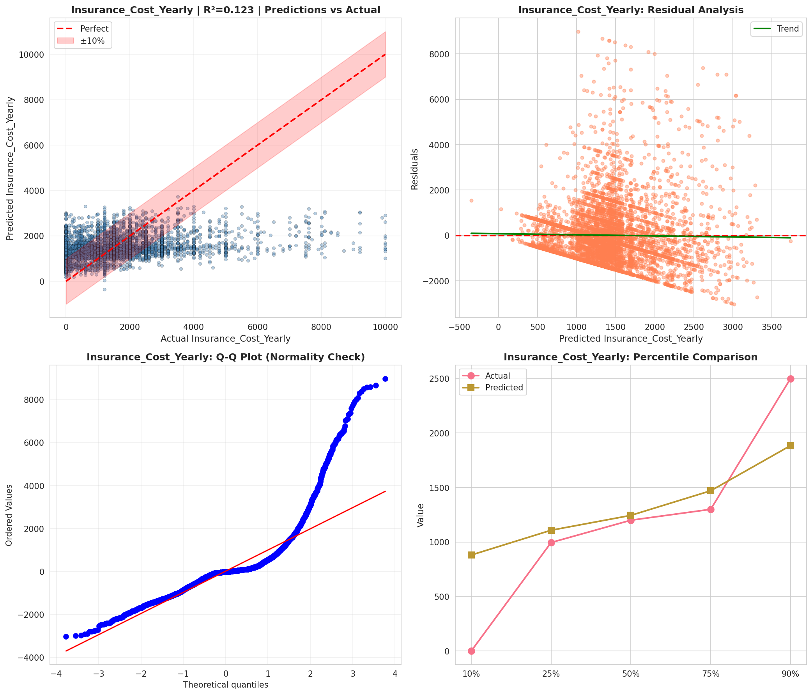
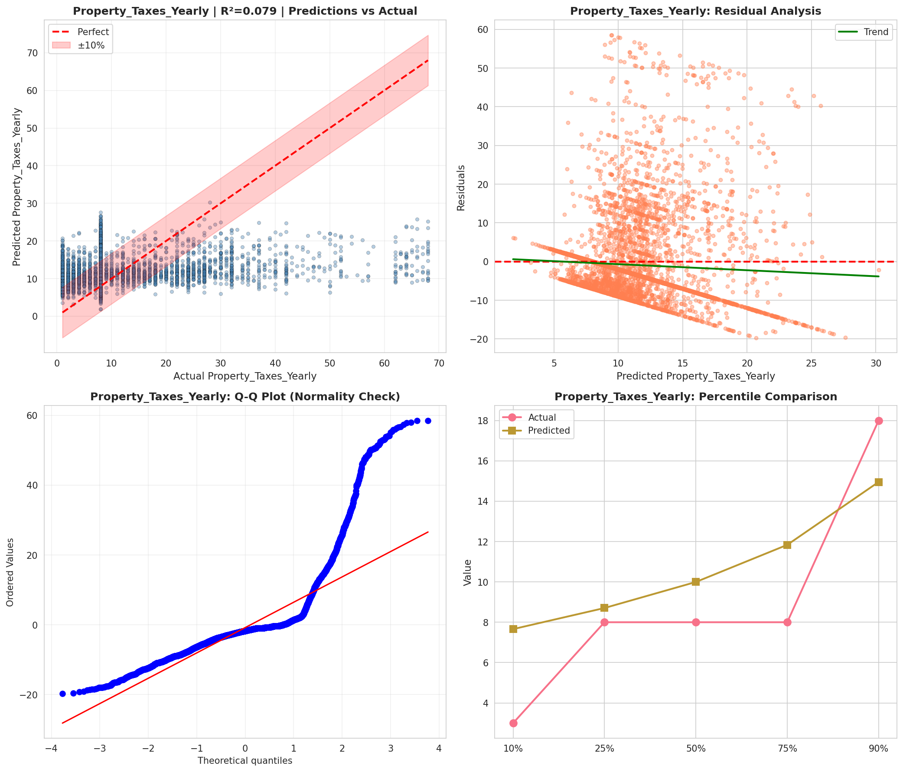
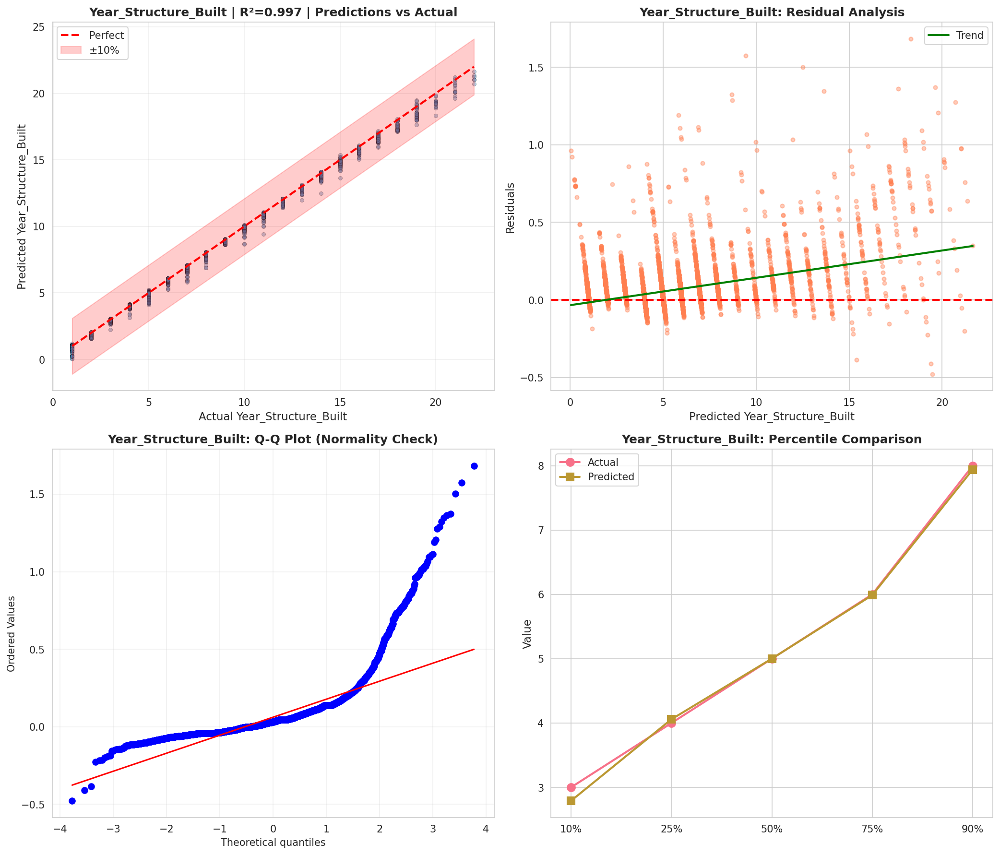
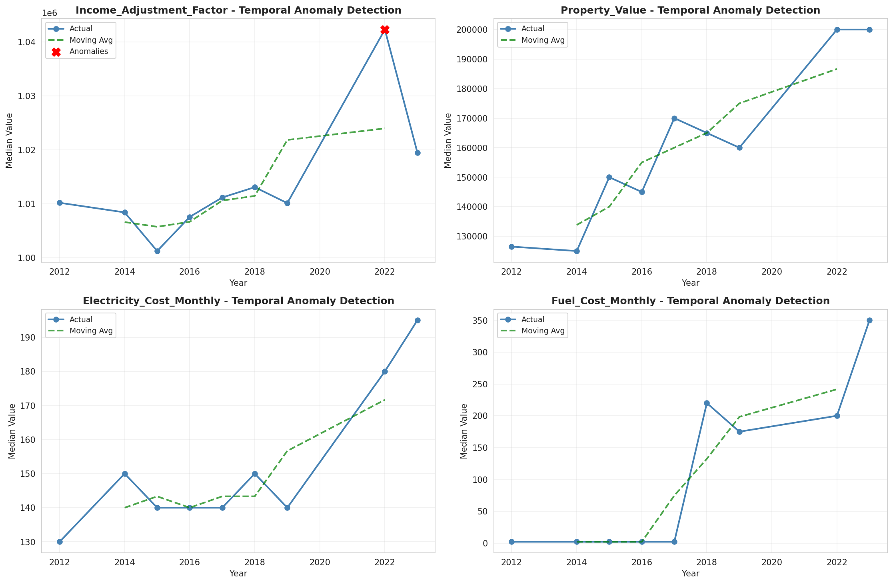
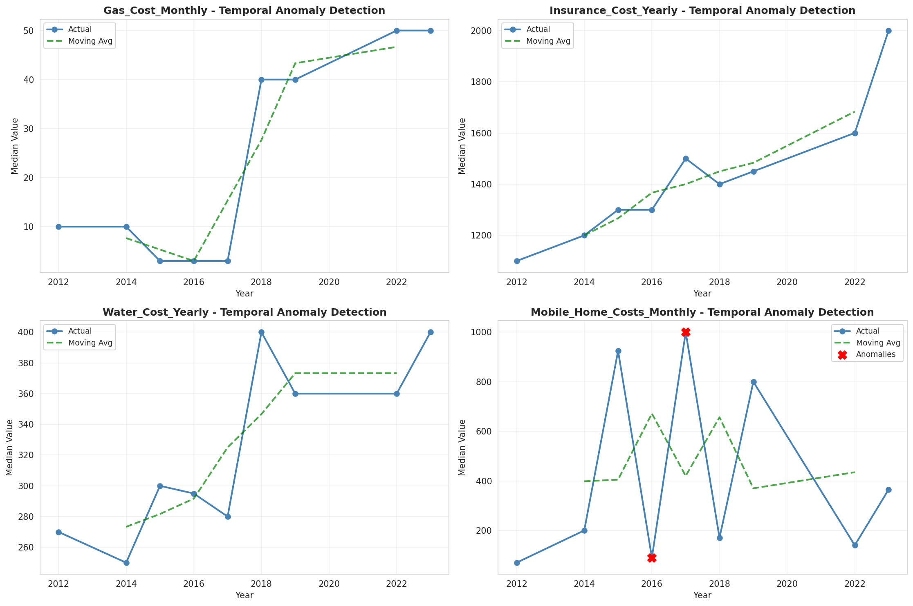
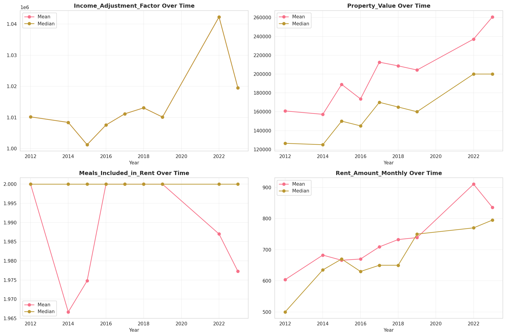
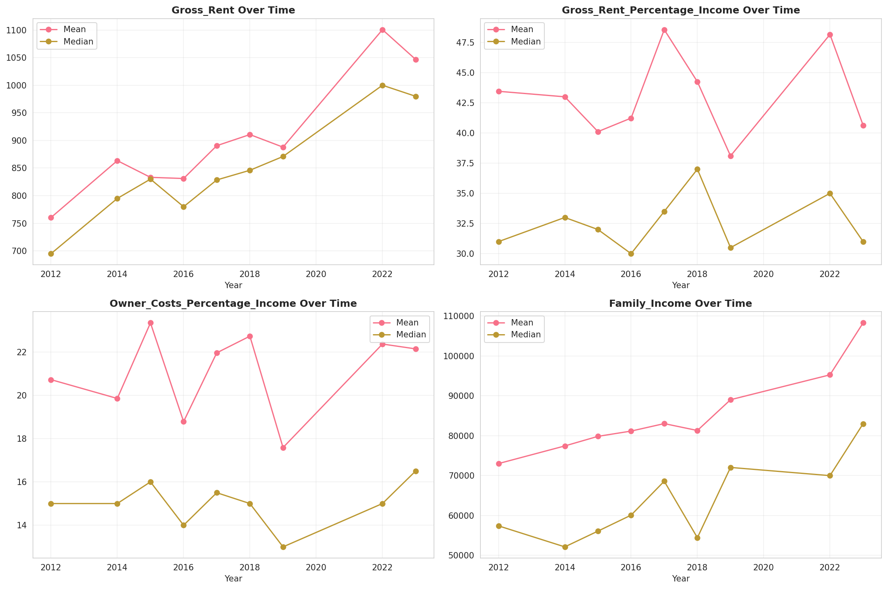
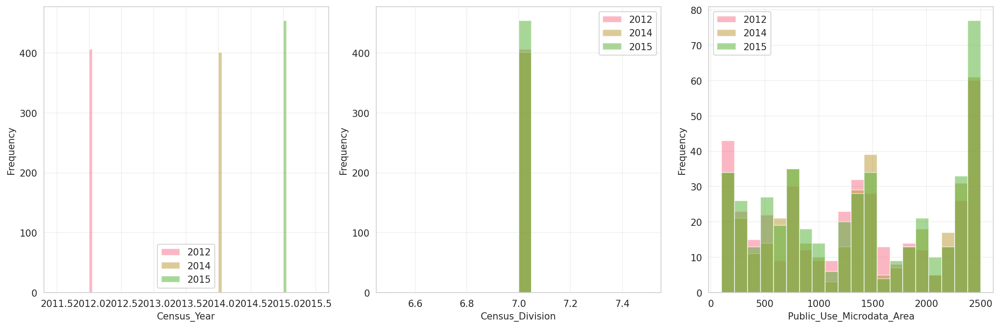
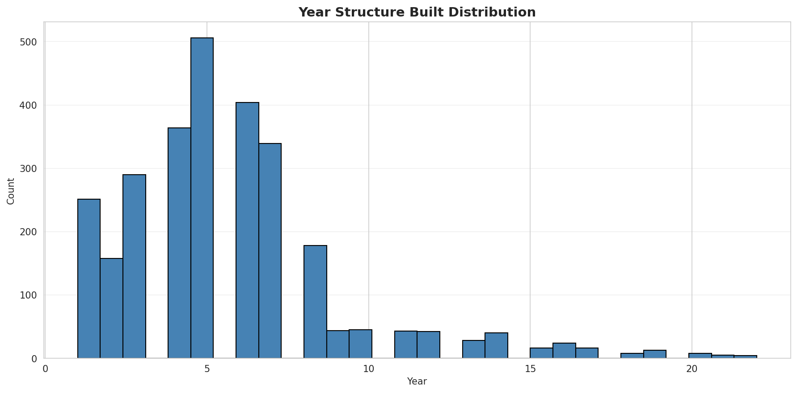
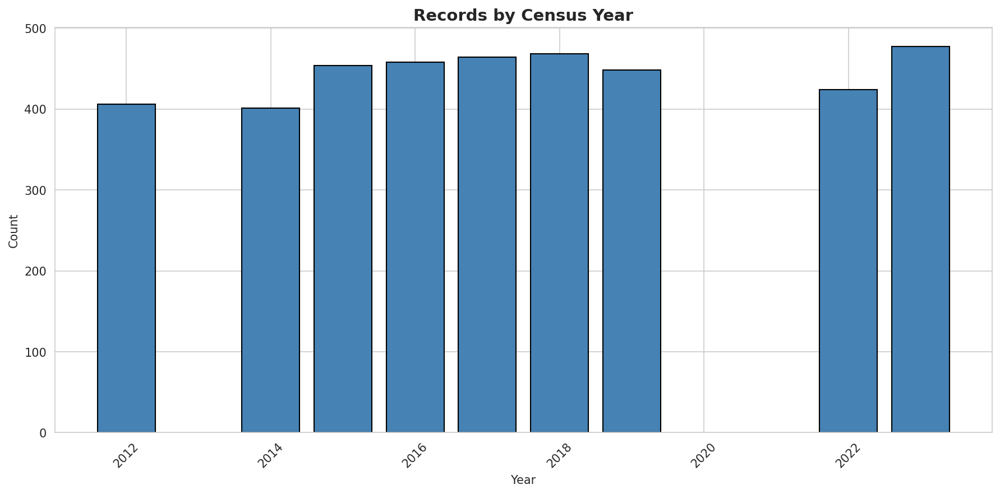
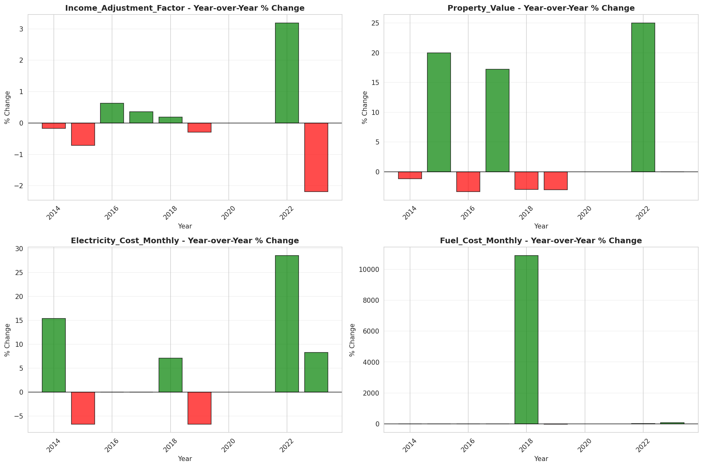
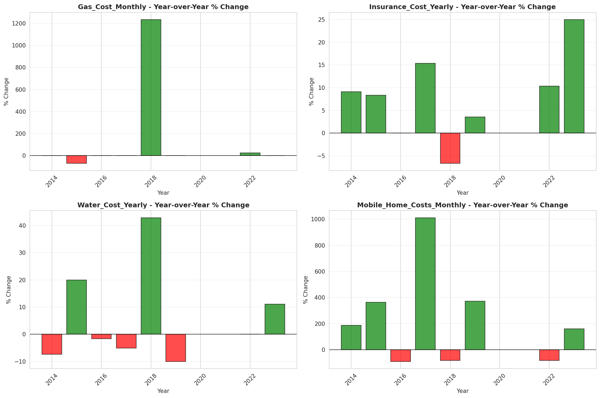
