# Temporal Analysis

## Year Distribution

- 2011: 103,837 records

- 2012: 106,050 records

- 2014: 109,414 records

- 2015: 110,812 records

- 2016: 111,177 records

- 2017: 111,898 records

- 2018: 112,610 records

- 2019: 113,386 records

- 2020: 108,478 records

- 2022: 109,820 records

- 2023: 110,437 records

## Temporal Trends

- Census_Year: {np.int64(2011): {'mean': 2011.0, 'median': 2011.0, 'std': 0.0}, np.int64(2012): {'mean': 2012.0, 'median': 2012.0, 'std': 0.0}, np.int64(2014): {'mean': 2014.0, 'median': 2014.0, 'std': 0.0}, np.int64(2015): {'mean': 2015.0, 'median': 2015.0, 'std': 0.0}, np.int64(2016): {'mean': 2016.0, 'median': 2016.0, 'std': 0.0}, np.int64(2017): {'mean': 2017.0, 'median': 2017.0, 'std': 0.0}, np.int64(2018): {'mean': 2018.0, 'median': 2018.0, 'std': 0.0}, np.int64(2019): {'mean': 2019.0, 'median': 2019.0, 'std': 0.0}, np.int64(2020): {'mean': 2020.0, 'median': 2020.0, 'std': 0.0}, np.int64(2022): {'mean': 2022.0, 'median': 2022.0, 'std': 0.0}, np.int64(2023): {'mean': 2023.0, 'median': 2023.0, 'std': 0.0}}

- Census_Division: {np.int64(2011): {'mean': 7.0, 'median': 7.0, 'std': 0.0}, np.int64(2012): {'mean': 7.0, 'median': 7.0, 'std': 0.0}, np.int64(2014): {'mean': 7.0, 'median': 7.0, 'std': 0.0}, np.int64(2015): {'mean': 7.0, 'median': 7.0, 'std': 0.0}, np.int64(2016): {'mean': 7.0, 'median': 7.0, 'std': 0.0}, np.int64(2017): {'mean': 7.0, 'median': 7.0, 'std': 0.0}, np.int64(2018): {'mean': 7.0, 'median': 7.0, 'std': 0.0}, np.int64(2019): {'mean': 7.0, 'median': 7.0, 'std': 0.0}, np.int64(2020): {'mean': 7.0, 'median': 7.0, 'std': 0.0}, np.int64(2022): {'mean': 7.0, 'median': 7.0, 'std': 0.0}, np.int64(2023): {'mean': 7.0, 'median': 7.0, 'std': 0.0}}

- Public_Use_Microdata_Area: {np.int64(2011): {'mean': 4730.961603282067, 'median': 1300.0, 'std': 16059.239250754432}, np.int64(2012): {'mean': None, 'median': None, 'std': None}, np.int64(2014): {'mean': None, 'median': None, 'std': None}, np.int64(2015): {'mean': None, 'median': None, 'std': None}, np.int64(2016): {'mean': 1343.1811975498529, 'median': 1400.0, 'std': 791.606118109995}, np.int64(2017): {'mean': 1346.8245098214445, 'median': 1400.0, 'std': 792.7589261928828}, np.int64(2018): {'mean': 1349.8176094485393, 'median': 1400.0, 'std': 793.16521286354}, np.int64(2019): {'mean': 1353.5812357786676, 'median': 1400.0, 'std': 792.6073212135258}, np.int64(2020): {'mean': 1349.9108943748963, 'median': 1400.0, 'std': 792.7652460309084}, np.int64(2022): {'mean': None, 'median': None, 'std': None}, np.int64(2023): {'mean': 1339.3994313500004, 'median': 1400.0, 'std': 790.3550515571229}}

- Census_Region: {np.int64(2011): {'mean': 3.0, 'median': 3.0, 'std': 0.0}, np.int64(2012): {'mean': 3.0, 'median': 3.0, 'std': 0.0}, np.int64(2014): {'mean': 3.0, 'median': 3.0, 'std': 0.0}, np.int64(2015): {'mean': 3.0, 'median': 3.0, 'std': 0.0}, np.int64(2016): {'mean': 3.0, 'median': 3.0, 'std': 0.0}, np.int64(2017): {'mean': 3.0, 'median': 3.0, 'std': 0.0}, np.int64(2018): {'mean': 3.0, 'median': 3.0, 'std': 0.0}, np.int64(2019): {'mean': 3.0, 'median': 3.0, 'std': 0.0}, np.int64(2020): {'mean': 3.0, 'median': 3.0, 'std': 0.0}, np.int64(2022): {'mean': 3.0, 'median': 3.0, 'std': 0.0}, np.int64(2023): {'mean': 3.0, 'median': 3.0, 'std': 0.0}}

- State_Code: {np.int64(2011): {'mean': 22.0, 'median': 22.0, 'std': 0.0}, np.int64(2012): {'mean': 22.0, 'median': 22.0, 'std': 0.0}, np.int64(2014): {'mean': 22.0, 'median': 22.0, 'std': 0.0}, np.int64(2015): {'mean': 22.0, 'median': 22.0, 'std': 0.0}, np.int64(2016): {'mean': 22.0, 'median': 22.0, 'std': 0.0}, np.int64(2017): {'mean': 22.0, 'median': 22.0, 'std': 0.0}, np.int64(2018): {'mean': 22.0, 'median': 22.0, 'std': 0.0}, np.int64(2019): {'mean': 22.0, 'median': 22.0, 'std': 0.0}, np.int64(2020): {'mean': 22.0, 'median': 22.0, 'std': 0.0}, np.int64(2022): {'mean': 22.0, 'median': 22.0, 'std': 0.0}, np.int64(2023): {'mean': None, 'median': None, 'std': None}}

- Housing_Adjustment_Factor: {np.int64(2011): {'mean': 1040924.7107967295, 'median': 1044592.0, 'std': 27480.447420009332}, np.int64(2012): {'mean': 1041286.7298066949, 'median': 1053092.0, 'std': 27490.338528425884}, np.int64(2014): {'mean': 1036665.1571096935, 'median': 1031130.0, 'std': 29619.744094278296}, np.int64(2015): {'mean': 1020907.6308342057, 'median': 1017534.0, 'std': 20283.184279998404}, np.int64(2016): {'mean': 1020331.7546434964, 'median': 1013801.0, 'std': 15757.834903980447}, np.int64(2017): {'mean': 1029153.9968721514, 'median': 1034680.0, 'std': 17985.031482707447}, np.int64(2018): {'mean': 1038247.100737057, 'median': 1046406.0, 'std': 23461.074206446683}, np.int64(2019): {'mean': 1040819.5656783024, 'median': 1042936.0, 'std': 29165.442054313895}, np.int64(2020): {'mean': 1037170.6639318571, 'median': 1030827.0, 'std': 28116.710900124315}, np.int64(2022): {'mean': 1104398.8051994173, 'median': 1133141.0, 'std': 61938.2940175616}, np.int64(2023): {'mean': 1104212.548520876, 'median': 1125501.0, 'std': 76679.96783300966}}

- Income_Adjustment_Factor: {np.int64(2011): {'mean': 1053474.24431561, 'median': 1048026.0, 'std': 28250.49589623064}, np.int64(2012): {'mean': 1052477.2374634605, 'median': 1061121.0, 'std': 26343.047427871617}, np.int64(2014): {'mean': 1047510.2577458095, 'median': 1041654.0, 'std': 31054.043460299847}, np.int64(2015): {'mean': 1030316.0663827022, 'median': 1025215.0, 'std': 25651.385528150993}, np.int64(2016): {'mean': 1027490.4442105831, 'median': 1022342.0, 'std': 17509.259742454018}, np.int64(2017): {'mean': 1036552.4688287547, 'median': 1035988.0, 'std': 16854.999421397355}, np.int64(2018): {'mean': 1046831.720433354, 'median': 1054346.0, 'std': 20484.28353246171}, np.int64(2019): {'mean': 1049772.8862646183, 'median': 1054606.0, 'std': 26216.299050329995}, np.int64(2020): {'mean': 1047350.2427773373, 'median': 1044328.0, 'std': 28527.430484017685}, np.int64(2022): {'mean': 1126963.7877891094, 'median': 1140108.0, 'std': 50025.1695645268}, np.int64(2023): {'mean': 1128425.4600179289, 'median': 1159185.0, 'std': 70440.09787642701}}

- Housing_Unit_Weight: {np.int64(2011): {'mean': 18.723903810780357, 'median': 15.0, 'std': 15.47825899092618}, np.int64(2012): {'mean': 18.52266855256954, 'median': 15.0, 'std': 15.606824501812262}, np.int64(2014): {'mean': 18.173725483027766, 'median': 14.0, 'std': 16.147944327443028}, np.int64(2015): {'mean': 18.047278273111214, 'median': 14.0, 'std': 16.545589023429095}, np.int64(2016): {'mean': 18.09456992003742, 'median': 14.0, 'std': 16.521892235446018}, np.int64(2017): {'mean': 18.151030402688164, 'median': 14.0, 'std': 16.60979481102621}, np.int64(2018): {'mean': 18.16494094662996, 'median': 14.0, 'std': 16.707094313179336}, np.int64(2019): {'mean': 18.167304605506853, 'median': 14.0, 'std': 16.92294603481019}, np.int64(2020): {'mean': 19.125214329172735, 'median': 13.0, 'std': 27.33512182083038}, np.int64(2022): {'mean': 18.94346202877436, 'median': 13.0, 'std': 22.84577127226411}, np.int64(2023): {'mean': 18.96105471898005, 'median': 13.0, 'std': 23.07630515987015}}

- Number_of_Persons: {np.int64(2011): {'mean': 2.0999836281864845, 'median': 2.0, 'std': 1.4630020225112899}, np.int64(2012): {'mean': 2.08006600660066, 'median': 2.0, 'std': 1.4527324559553163}, np.int64(2014): {'mean': 2.030864423199956, 'median': 2.0, 'std': 1.4410785039535734}, np.int64(2015): {'mean': 1.998330505721402, 'median': 2.0, 'std': 1.425883495078711}, np.int64(2016): {'mean': 1.9845201795335365, 'median': 2.0, 'std': 1.4243863132104093}, np.int64(2017): {'mean': 1.9665141468122755, 'median': 2.0, 'std': 1.4219509635784042}, np.int64(2018): {'mean': 1.944862800816979, 'median': 2.0, 'std': 1.4197243890280598}, np.int64(2019): {'mean': 1.9314465630677509, 'median': 2.0, 'std': 1.4149995403561946}, np.int64(2020): {'mean': 1.9047180073378933, 'median': 2.0, 'std': 1.4155334804851882}, np.int64(2022): {'mean': 1.891285740302313, 'median': 2.0, 'std': 1.4072070416368996}, np.int64(2023): {'mean': 1.8937312676005325, 'median': 2.0, 'std': 1.3995609896624697}}

- Housing_Unit_Type: {np.int64(2011): {'mean': 1.0879551604919249, 'median': 1.0, 'std': 0.33960695766862226}, np.int64(2012): {'mean': 1.0988967468175388, 'median': 1.0, 'std': 0.36251651135523877}, np.int64(2014): {'mean': 1.1207523717257388, 'median': 1.0, 'std': 0.4047759858264781}, np.int64(2015): {'mean': 1.130843229975093, 'median': 1.0, 'std': 0.42296375789776325}, np.int64(2016): {'mean': 1.1283628808116786, 'median': 1.0, 'std': 0.42027496644427226}, np.int64(2017): {'mean': 1.1283400954440652, 'median': 1.0, 'std': 0.4221783014986922}, np.int64(2018): {'mean': 1.1261344463191547, 'median': 1.0, 'std': 0.4193668947662083}, np.int64(2019): {'mean': 1.1254828638456247, 'median': 1.0, 'std': 0.41902784502346097}, np.int64(2020): {'mean': None, 'median': None, 'std': None}, np.int64(2022): {'mean': None, 'median': None, 'std': None}, np.int64(2023): {'mean': None, 'median': None, 'std': None}}

- Number_of_Bedrooms: {np.int64(2011): {'mean': 2.763289027940369, 'median': 3.0, 'std': 0.9095741789376621}, np.int64(2012): {'mean': None, 'median': None, 'std': None}, np.int64(2014): {'mean': None, 'median': None, 'std': None}, np.int64(2015): {'mean': None, 'median': None, 'std': None}, np.int64(2016): {'mean': None, 'median': None, 'std': None}, np.int64(2017): {'mean': None, 'median': None, 'std': None}, np.int64(2018): {'mean': None, 'median': None, 'std': None}, np.int64(2019): {'mean': None, 'median': None, 'std': None}, np.int64(2020): {'mean': None, 'median': None, 'std': None}, np.int64(2022): {'mean': None, 'median': None, 'std': None}, np.int64(2023): {'mean': None, 'median': None, 'std': None}}

- Number_of_Rooms: {np.int64(2011): {'mean': 5.643291514291338, 'median': 6.0, 'std': 1.7248877931057656}, np.int64(2012): {'mean': None, 'median': None, 'std': None}, np.int64(2014): {'mean': None, 'median': None, 'std': None}, np.int64(2015): {'mean': None, 'median': None, 'std': None}, np.int64(2016): {'mean': None, 'median': None, 'std': None}, np.int64(2017): {'mean': None, 'median': None, 'std': None}, np.int64(2018): {'mean': None, 'median': None, 'std': None}, np.int64(2019): {'mean': None, 'median': None, 'std': None}, np.int64(2020): {'mean': None, 'median': None, 'std': None}, np.int64(2022): {'mean': None, 'median': None, 'std': None}, np.int64(2023): {'mean': None, 'median': None, 'std': None}}

- Building_Type: {np.int64(2011): {'mean': 2.4878324199446786, 'median': 2.0, 'std': 1.6542183846191616}, np.int64(2012): {'mean': 2.507857471499412, 'median': 2.0, 'std': 1.6738577105964612}, np.int64(2014): {'mean': 2.5387441247219624, 'median': 2.0, 'std': 1.7001458284853996}, np.int64(2015): {'mean': 2.556442896601417, 'median': 2.0, 'std': 1.71605190566072}, np.int64(2016): {'mean': 2.5663001840704442, 'median': 2.0, 'std': 1.7266956704714367}, np.int64(2017): {'mean': 2.5689283950617283, 'median': 2.0, 'std': 1.727953001625499}, np.int64(2018): {'mean': 2.574337427278604, 'median': 2.0, 'std': 1.733718928678895}, np.int64(2019): {'mean': 2.5775723824241186, 'median': 2.0, 'std': 1.7426563242739053}, np.int64(2020): {'mean': 2.5762652561384733, 'median': 2.0, 'std': 1.7464091516292333}, np.int64(2022): {'mean': 2.562805324865657, 'median': 2.0, 'std': 1.737569688786822}, np.int64(2023): {'mean': 2.543440174186035, 'median': 2.0, 'std': 1.7254249916278894}}

- Year_Structure_Built: {np.int64(2011): {'mean': 5.019238140623867, 'median': 5.0, 'std': 2.167645050960757}, np.int64(2012): {'mean': 5.136128009815449, 'median': 5.0, 'std': 2.5040345990447026}, np.int64(2014): {'mean': 5.267167889529675, 'median': 5.0, 'std': 2.7599940974385255}, np.int64(2015): {'mean': 5.325457347584164, 'median': 5.0, 'std': 2.910283443803883}, np.int64(2016): {'mean': 5.427481219839809, 'median': 5.0, 'std': 3.0733000659388447}, np.int64(2017): {'mean': 5.530725925925926, 'median': 5.0, 'std': 3.267074177783858}, np.int64(2018): {'mean': 5.648136177547943, 'median': 5.0, 'std': 3.488583268796072}, np.int64(2019): {'mean': 5.795570069296634, 'median': 5.0, 'std': 3.736911289473963}, np.int64(2020): {'mean': 5.922880605923395, 'median': 5.0, 'std': 3.9579932166276204}, np.int64(2022): {'mean': None, 'median': None, 'std': None}, np.int64(2023): {'mean': None, 'median': None, 'std': None}}

- Bathtub_or_Shower: {np.int64(2011): {'mean': None, 'median': None, 'std': None}, np.int64(2012): {'mean': 1.015326414804969, 'median': 1.0, 'std': 0.1228481587890589}, np.int64(2014): {'mean': 1.014070473142305, 'median': 1.0, 'std': 0.11778214869828693}, np.int64(2015): {'mean': 1.0136003362555541, 'median': 1.0, 'std': 0.11582530537986599}, np.int64(2016): {'mean': 1.0128948808516989, 'median': 1.0, 'std': 0.11282167144322851}, np.int64(2017): {'mean': 1.0138172839506172, 'median': 1.0, 'std': 0.11673260554606538}, np.int64(2018): {'mean': 1.0146422205245735, 'median': 1.0, 'std': 0.12011647352479601}, np.int64(2019): {'mean': 1.0148701052570195, 'median': 1.0, 'std': 0.12103358047200659}, np.int64(2020): {'mean': 1.0156523349867248, 'median': 1.0, 'std': 0.12412694289296582}, np.int64(2022): {'mean': 1.0145131086142323, 'median': 1.0, 'std': 0.11959357782704784}, np.int64(2023): {'mean': 1.013448782216821, 'median': 1.0, 'std': 0.11518700812364638}}

- Refrigerator: {np.int64(2011): {'mean': None, 'median': None, 'std': None}, np.int64(2012): {'mean': 1.0307959715760953, 'median': 1.0, 'std': 0.17276540419966935}, np.int64(2014): {'mean': 1.0303350543997907, 'median': 1.0, 'std': 0.17150841066645872}, np.int64(2015): {'mean': 1.0300228173411794, 'median': 1.0, 'std': 0.17065092797568748}, np.int64(2016): {'mean': 1.029471170588528, 'median': 1.0, 'std': 0.1691239346885405}, np.int64(2017): {'mean': 1.031032098765432, 'median': 1.0, 'std': 0.1734053188152508}, np.int64(2018): {'mean': 1.0329768270944741, 'median': 1.0, 'std': 0.17857678544741026}, np.int64(2019): {'mean': 1.0333362490402465, 'median': 1.0, 'std': 0.17951394580418048}, np.int64(2020): {'mean': 1.0350814003745858, 'median': 1.0, 'std': 0.18398653232586254}, np.int64(2022): {'mean': 1.0352548444878684, 'median': 1.0, 'std': 0.18442420282571123}, np.int64(2023): {'mean': 1.0331561091700845, 'median': 1.0, 'std': 0.17904498384525455}}

- Hot_and_Cold_Running_Water: {np.int64(2011): {'mean': None, 'median': None, 'std': None}, np.int64(2012): {'mean': 1.0255610653852052, 'median': 1.0, 'std': 0.15782253321719908}, np.int64(2014): {'mean': 1.0259166440210554, 'median': 1.0, 'std': 0.15888746227997855}, np.int64(2015): {'mean': 1.026099835875265, 'median': 1.0, 'std': 0.1594330230058008}, np.int64(2016): {'mean': 1.026894184368937, 'median': 1.0, 'std': 0.16177499068935408}, np.int64(2017): {'mean': 1.0296592592592593, 'median': 1.0, 'std': 0.1696463139743953}, np.int64(2018): {'mean': 1.0326340326340326, 'median': 1.0, 'std': 0.17767769061541017}, np.int64(2019): {'mean': 1.0343664654828897, 'median': 1.0, 'std': 0.1821695201344537}, np.int64(2020): {'mean': 1.0371086916253318, 'median': 1.0, 'std': 0.1890291097761406}, np.int64(2022): {'mean': 1.038308093144439, 'median': 1.0, 'std': 0.1919399856537504}, np.int64(2023): {'mean': 1.0365891943895893, 'median': 1.0, 'std': 0.18775191671866423}}

- Running_Water: {np.int64(2011): {'mean': None, 'median': None, 'std': None}, np.int64(2012): {'mean': None, 'median': None, 'std': None}, np.int64(2014): {'mean': 9.0, 'median': 9.0, 'std': 0.0}, np.int64(2015): {'mean': 9.0, 'median': 9.0, 'std': 0.0}, np.int64(2016): {'mean': 9.0, 'median': 9.0, 'std': 0.0}, np.int64(2017): {'mean': 9.0, 'median': 9.0, 'std': 0.0}, np.int64(2018): {'mean': 9.0, 'median': 9.0, 'std': 0.0}, np.int64(2019): {'mean': 9.0, 'median': 9.0, 'std': 0.0}, np.int64(2020): {'mean': 9.0, 'median': 9.0, 'std': 0.0}, np.int64(2022): {'mean': 9.0, 'median': 9.0, 'std': 0.0}, np.int64(2023): {'mean': 9.0, 'median': 9.0, 'std': 0.0}}

- Sink_with_Faucet: {np.int64(2011): {'mean': None, 'median': None, 'std': None}, np.int64(2012): {'mean': 1.0152241705434282, 'median': 1.0, 'std': 0.12244406259552817}, np.int64(2014): {'mean': 1.0138289199553128, 'median': 1.0, 'std': 0.11678106948024851}, np.int64(2015): {'mean': 1.0132901004763621, 'median': 1.0, 'std': 0.114514649462324}, np.int64(2016): {'mean': 1.0125366897169295, 'median': 1.0, 'std': 0.1112638499346632}, np.int64(2017): {'mean': 1.0133234567901235, 'median': 1.0, 'std': 0.11465632179271516}, np.int64(2018): {'mean': 1.0139958081134552, 'median': 1.0, 'std': 0.11747365929543106}, np.int64(2019): {'mean': 1.0141120214596029, 'median': 1.0, 'std': 0.1179534125439672}, np.int64(2020): {'mean': 1.0149319776895054, 'median': 1.0, 'std': 0.1212813468804429}, np.int64(2022): {'mean': 1.0140754763067905, 'median': 1.0, 'std': 0.11780279500803992}, np.int64(2023): {'mean': 1.0131550964605802, 'median': 1.0, 'std': 0.11393933196827305}}

- Stove_or_Range: {np.int64(2011): {'mean': None, 'median': None, 'std': None}, np.int64(2012): {'mean': 1.0299371197791525, 'median': 1.0, 'std': 0.1704147457467751}, np.int64(2014): {'mean': 1.0293386475034472, 'median': 1.0, 'std': 0.1687547862755062}, np.int64(2015): {'mean': 1.0288118970417517, 'median': 1.0, 'std': 0.1672783657976994}, np.int64(2016): {'mean': 1.0283269489080145, 'median': 1.0, 'std': 0.16590601778906644}, np.int64(2017): {'mean': 1.0299654320987655, 'median': 1.0, 'std': 0.170492791833566}, np.int64(2018): {'mean': 1.031497913850855, 'median': 1.0, 'std': 0.1746599383215054}, np.int64(2019): {'mean': 1.0321796852980338, 'median': 1.0, 'std': 0.17647791886192765}, np.int64(2020): {'mean': 1.0339494103360982, 'median': 1.0, 'std': 0.18109993203701752}, np.int64(2022): {'mean': 1.034155674971503, 'median': 1.0, 'std': 0.18162984498209653}, np.int64(2023): {'mean': 1.032801660843587, 'median': 1.0, 'std': 0.17811803160276138}}

- Telephone_Service: {np.int64(2011): {'mean': 1.0344124686508709, 'median': 1.0, 'std': 0.18228722165241598}, np.int64(2012): {'mean': 1.0282577048514325, 'median': 1.0, 'std': 0.16570913327068323}, np.int64(2014): {'mean': 1.028956882699518, 'median': 1.0, 'std': 0.16768630061081077}, np.int64(2015): {'mean': 1.0283641381152147, 'median': 1.0, 'std': 0.16601180819065464}, np.int64(2016): {'mean': 1.0293764854839067, 'median': 1.0, 'std': 0.16886036915474933}, np.int64(2017): {'mean': 1.027639249063546, 'median': 1.0, 'std': 0.1639378504749368}, np.int64(2018): {'mean': 1.0261721561029615, 'median': 1.0, 'std': 0.15964791424531682}, np.int64(2019): {'mean': 1.0226696363596268, 'median': 1.0, 'std': 0.1488488100073305}, np.int64(2020): {'mean': 1.0195274774456458, 'median': 1.0, 'std': 0.13837044688505254}, np.int64(2022): {'mean': 1.0124506989661368, 'median': 1.0, 'std': 0.1108865300201756}, np.int64(2023): {'mean': 1.0104182307487959, 'median': 1.0, 'std': 0.10153723601055993}}

- Lot_Acreage: {np.int64(2011): {'mean': 1.3200009675741706, 'median': 1.0, 'std': 0.5571305640582566}, np.int64(2012): {'mean': 1.3112616122265508, 'median': 1.0, 'std': 0.5504652210373898}, np.int64(2014): {'mean': 1.2973066298342542, 'median': 1.0, 'std': 0.54022164796322}, np.int64(2015): {'mean': 1.290904979529658, 'median': 1.0, 'std': 0.5351215195704503}, np.int64(2016): {'mean': 1.2875526800023742, 'median': 1.0, 'std': 0.5326540513338269}, np.int64(2017): {'mean': 1.2845055463771538, 'median': 1.0, 'std': 0.5297624882587469}, np.int64(2018): {'mean': 1.2840542663836874, 'median': 1.0, 'std': 0.528959936075612}, np.int64(2019): {'mean': 1.2849915094559072, 'median': 1.0, 'std': 0.5294171822107374}, np.int64(2020): {'mean': 1.2883773547784172, 'median': 1.0, 'std': 0.5314289341679068}, np.int64(2022): {'mean': 1.299229084219826, 'median': 1.0, 'std': 0.5372614476711612}, np.int64(2023): {'mean': 1.3076223416350514, 'median': 1.0, 'std': 0.5406638806038462}}

- Agricultural_Sales: {np.int64(2011): {'mean': 1.133072589281557, 'median': 1.0, 'std': 0.6900996976189842}, np.int64(2012): {'mean': 1.131330390621292, 'median': 1.0, 'std': 0.6918251400150803}, np.int64(2014): {'mean': 1.1199920764621403, 'median': 1.0, 'std': 0.6601734632064501}, np.int64(2015): {'mean': 1.118825910931174, 'median': 1.0, 'std': 0.6595388430232361}, np.int64(2016): {'mean': 1.1172890025575448, 'median': 1.0, 'std': 0.6544158316208616}, np.int64(2017): {'mean': 1.1146251157050293, 'median': 1.0, 'std': 0.645075521344816}, np.int64(2018): {'mean': 1.112063215147006, 'median': 1.0, 'std': 0.6331875023093999}, np.int64(2019): {'mean': 1.1165275798900876, 'median': 1.0, 'std': 0.6501019379656272}, np.int64(2020): {'mean': 1.119172932330827, 'median': 1.0, 'std': 0.6575590234614012}, np.int64(2022): {'mean': 1.1222341458429148, 'median': 1.0, 'std': 0.6650828800100701}, np.int64(2023): {'mean': 1.1249389946315276, 'median': 1.0, 'std': 0.6733659104530797}}

- Business_On_Property: {np.int64(2011): {'mean': 1.9858613224319976, 'median': 2.0, 'std': 0.11806330484810706}, np.int64(2012): {'mean': 1.98631105783638, 'median': 2.0, 'std': 0.11619688837760116}, np.int64(2014): {'mean': 1.986878453038674, 'median': 2.0, 'std': 0.11379598480202627}, np.int64(2015): {'mean': 1.9862539274493003, 'median': 2.0, 'std': 0.11643573072821846}, np.int64(2016): {'mean': 3.4010803110346055, 'median': 2.0, 'std': 2.8165669919260337}, np.int64(2017): {'mean': 4.822008496577768, 'median': 2.0, 'std': 3.443389255079178}, np.int64(2018): {'mean': 6.2314646529789055, 'median': 9.0, 'std': 3.429331061333434}, np.int64(2019): {'mean': 7.626578892274768, 'median': 9.0, 'std': 2.7844653501310885}, np.int64(2020): {'mean': None, 'median': None, 'std': None}, np.int64(2022): {'mean': None, 'median': None, 'std': None}, np.int64(2023): {'mean': None, 'median': None, 'std': None}}

- Tenure: {np.int64(2011): {'mean': 1.9210631792311303, 'median': 2.0, 'std': 0.8695185374981893}, np.int64(2012): {'mean': 1.9381129179691468, 'median': 2.0, 'std': 0.8704421388119999}, np.int64(2014): {'mean': 1.9747143367255846, 'median': 2.0, 'std': 0.8704943707782716}, np.int64(2015): {'mean': 1.9895734808105312, 'median': 2.0, 'std': 0.8707265447980731}, np.int64(2016): {'mean': 1.9946244918812057, 'median': 2.0, 'std': 0.8699897420498233}, np.int64(2017): {'mean': 2.000277057428464, 'median': 2.0, 'std': 0.868123106240866}, np.int64(2018): {'mean': 2.003697758095765, 'median': 2.0, 'std': 0.8668416915887089}, np.int64(2019): {'mean': 1.9970229563146404, 'median': 2.0, 'std': 0.8641865223360312}, np.int64(2020): {'mean': 1.990165594893176, 'median': 2.0, 'std': 0.861020031492921}, np.int64(2022): {'mean': 1.971434572568788, 'median': 2.0, 'std': 0.8518101295434034}, np.int64(2023): {'mean': 1.9562711512029476, 'median': 2.0, 'std': 0.8445596496715241}}

- Vacancy_Status: {np.int64(2011): {'mean': 5.07464146023468, 'median': 5.0, 'std': 2.2611651169868687}, np.int64(2012): {'mean': 4.957027850304613, 'median': 5.0, 'std': 2.2872783994149533}, np.int64(2014): {'mean': 4.983574581665127, 'median': 5.0, 'std': 2.2907584159919723}, np.int64(2015): {'mean': 5.007755791985682, 'median': 5.0, 'std': 2.2776497644513434}, np.int64(2016): {'mean': 5.022164899207032, 'median': 5.0, 'std': 2.273839831043308}, np.int64(2017): {'mean': 5.067447349310094, 'median': 5.0, 'std': 2.26991387470746}, np.int64(2018): {'mean': 5.08966629871784, 'median': 6.0, 'std': 2.271397955951305}, np.int64(2019): {'mean': 5.154874149380995, 'median': 7.0, 'std': 2.2502585896339387}, np.int64(2020): {'mean': 5.198646886208021, 'median': 7.0, 'std': 2.242764105334455}, np.int64(2022): {'mean': 5.346153846153846, 'median': 7.0, 'std': 2.1917745925435193}, np.int64(2023): {'mean': 5.387637678776919, 'median': 7.0, 'std': 2.18389841942374}}

- Property_Value: {np.int64(2011): {'mean': 13.673682425139544, 'median': 15.0, 'std': 5.215109932892786}}

- Vehicles_Available: {np.int64(2011): {'mean': 1.7114963984288218, 'median': 2.0, 'std': 0.9924402690858484}, np.int64(2012): {'mean': 1.6969180594269464, 'median': 2.0, 'std': 0.9924393021952724}, np.int64(2014): {'mean': 1.6768880557043384, 'median': 2.0, 'std': 0.991398427672846}, np.int64(2015): {'mean': 1.6730835568117328, 'median': 2.0, 'std': 0.99419968841672}, np.int64(2016): {'mean': 1.6774473000288768, 'median': 2.0, 'std': 0.992460356430495}, np.int64(2017): {'mean': 1.6837888157457277, 'median': 2.0, 'std': 0.9956214264239645}, np.int64(2018): {'mean': 1.6889454746747854, 'median': 2.0, 'std': 0.9977090141072017}, np.int64(2019): {'mean': 1.6957681875317, 'median': 2.0, 'std': 1.000069660228923}, np.int64(2020): {'mean': 1.7016465267472263, 'median': 2.0, 'std': 1.0030875708629}, np.int64(2022): {'mean': 1.7089897080445284, 'median': 2.0, 'std': 1.0044621633451425}, np.int64(2023): {'mean': 1.7156007807897988, 'median': 2.0, 'std': 1.0045648658608122}}

- Condo_Fee_Monthly: {np.int64(2011): {'mean': 260.83711340206185, 'median': 180.0, 'std': 248.93898329394648}, np.int64(2012): {'mean': 270.9491525423729, 'median': 190.0, 'std': 249.8212223181582}, np.int64(2014): {'mean': 292.08676789587855, 'median': 210.0, 'std': 252.02778283538717}, np.int64(2015): {'mean': 310.2931034482759, 'median': 230.0, 'std': 261.716861336716}, np.int64(2016): {'mean': 318.02672605790644, 'median': 240.0, 'std': 258.46950133415567}, np.int64(2017): {'mean': 319.9064994298746, 'median': 250.0, 'std': 250.00046651315648}, np.int64(2018): {'mean': 329.17954545454546, 'median': 250.0, 'std': 261.2398451452002}, np.int64(2019): {'mean': 339.7686318131257, 'median': 270.0, 'std': 265.6484269122527}, np.int64(2020): {'mean': 340.30012300123, 'median': 270.0, 'std': 260.50354509559753}, np.int64(2022): {'mean': 349.1575342465753, 'median': 290.0, 'std': 264.02035908569945}, np.int64(2023): {'mean': 366.90384615384613, 'median': 300.0, 'std': 291.2877096308438}}

- Electricity_Cost_Monthly: {np.int64(2011): {'mean': 159.20558157644606, 'median': 140.0, 'std': 95.62159088993782}, np.int64(2012): {'mean': 156.6387098958392, 'median': 140.0, 'std': 94.09155401958317}, np.int64(2014): {'mean': 156.03471478307446, 'median': 140.0, 'std': 92.26020497543384}, np.int64(2015): {'mean': 155.2883705920972, 'median': 140.0, 'std': 91.37751363168351}, np.int64(2016): {'mean': 152.98600590861636, 'median': 140.0, 'std': 89.80959668544183}, np.int64(2017): {'mean': 154.0350089766607, 'median': 140.0, 'std': 90.32813241153274}, np.int64(2018): {'mean': 160.83038619967684, 'median': 150.0, 'std': 89.64651345221871}, np.int64(2019): {'mean': 159.86287333522245, 'median': 150.0, 'std': 89.16920026478597}, np.int64(2020): {'mean': 159.51198663308796, 'median': 150.0, 'std': 90.0355138215797}, np.int64(2022): {'mean': 178.56809842434708, 'median': 150.0, 'std': 127.06365320618114}, np.int64(2023): {'mean': 190.7324481780752, 'median': 160.0, 'std': 151.52053102070028}}

- Fuel_Cost_Monthly: {np.int64(2011): {'mean': 30.287163748382444, 'median': 2.0, 'std': 200.17868684234335}, np.int64(2012): {'mean': 29.43714804825477, 'median': 2.0, 'std': 196.22351973466897}, np.int64(2014): {'mean': 24.1540126763078, 'median': 2.0, 'std': 176.38930154036308}, np.int64(2015): {'mean': 21.57520558158167, 'median': 2.0, 'std': 160.6601646240241}, np.int64(2016): {'mean': 19.476132299695685, 'median': 2.0, 'std': 155.91875861111134}, np.int64(2017): {'mean': 17.24741228361815, 'median': 2.0, 'std': 145.252803136918}, np.int64(2018): {'mean': 450.8996632996633, 'median': 230.0, 'std': 642.4611244500804}, np.int64(2019): {'mean': 460.6053796390875, 'median': 240.0, 'std': 657.5778400155355}, np.int64(2020): {'mean': 452.6233962264151, 'median': 210.0, 'std': 652.3180289769992}, np.int64(2022): {'mean': 445.6826541651641, 'median': 240.0, 'std': 612.2429562639567}, np.int64(2023): {'mean': 445.3540197461213, 'median': 250.0, 'std': 604.0372462919795}}

- Gas_Cost_Monthly: {np.int64(2011): {'mean': 38.74547370108677, 'median': 20.0, 'std': 57.82769266228876}, np.int64(2012): {'mean': 36.83810501845102, 'median': 20.0, 'std': 56.031184232070615}, np.int64(2014): {'mean': 33.91364265309766, 'median': 10.0, 'std': 53.3597849341883}, np.int64(2015): {'mean': 31.8622408670591, 'median': 10.0, 'std': 50.401302405351245}, np.int64(2016): {'mean': 30.16983940114174, 'median': 4.0, 'std': 47.752764054532875}, np.int64(2017): {'mean': 29.295520535496596, 'median': 3.0, 'std': 46.54284389288718}, np.int64(2018): {'mean': 56.61283747055626, 'median': 40.0, 'std': 55.02091902026424}, np.int64(2019): {'mean': 55.12796446064472, 'median': 40.0, 'std': 53.93830109445564}, np.int64(2020): {'mean': 55.325678190187055, 'median': 40.0, 'std': 54.86736400944659}, np.int64(2022): {'mean': 65.3972074179468, 'median': 40.0, 'std': 92.2601354088068}, np.int64(2023): {'mean': 71.27746776529813, 'median': 50.0, 'std': 120.84925851786195}}

- House_Heating_Fuel: {np.int64(2011): {'mean': 2.1838461802732385, 'median': 3.0, 'std': 1.1097373870040115}, np.int64(2012): {'mean': 2.203209461365714, 'median': 3.0, 'std': 1.1091505537574302}, np.int64(2014): {'mean': 2.23163274415283, 'median': 3.0, 'std': 1.1158111438307767}, np.int64(2015): {'mean': 2.242602957704163, 'median': 3.0, 'std': 1.1203221591693895}, np.int64(2016): {'mean': 2.2536040338523735, 'median': 3.0, 'std': 1.1216983741087685}, np.int64(2017): {'mean': 2.263736507303234, 'median': 3.0, 'std': 1.1244011829536678}, np.int64(2018): {'mean': 2.273567672294492, 'median': 3.0, 'std': 1.1205816691728634}, np.int64(2019): {'mean': 2.2788607846164024, 'median': 3.0, 'std': 1.1169490306005418}, np.int64(2020): {'mean': 2.2838079758792076, 'median': 3.0, 'std': 1.1184069997670036}, np.int64(2022): {'mean': 2.293612453032743, 'median': 3.0, 'std': 1.1318243889090802}, np.int64(2023): {'mean': 2.3010198777994666, 'median': 3.0, 'std': 1.1450448762129561}}

- Insurance_Cost_Yearly: {np.int64(2014): {'mean': 1466.7212980478578, 'median': 1200.0, 'std': 1234.996597041691}, np.int64(2015): {'mean': 1511.552668704444, 'median': 1200.0, 'std': 1279.0590811506365}}

- Water_Cost_Yearly: {np.int64(2011): {'mean': 339.03997801266564, 'median': 280.0, 'std': 365.1741248949997}, np.int64(2012): {'mean': 350.6273120196811, 'median': 300.0, 'std': 377.61768676013753}, np.int64(2014): {'mean': 367.56036868416356, 'median': 300.0, 'std': 398.8614644420213}, np.int64(2015): {'mean': 376.85123571500105, 'median': 300.0, 'std': 412.9913340090784}, np.int64(2016): {'mean': 381.66580777005265, 'median': 300.0, 'std': 422.8164241291271}, np.int64(2017): {'mean': 387.362102976705, 'median': 300.0, 'std': 434.0882159919818}, np.int64(2018): {'mean': 478.6745284284526, 'median': 380.0, 'std': 451.5956655647819}, np.int64(2019): {'mean': 486.72453885596326, 'median': 400.0, 'std': 464.2654204606656}, np.int64(2020): {'mean': 495.6029351352117, 'median': 400.0, 'std': 480.038116507993}, np.int64(2022): {'mean': 518.3232267191878, 'median': 400.0, 'std': 534.6915619474536}, np.int64(2023): {'mean': 529.5276070267464, 'median': 400.0, 'std': 564.1847751983569}}

- Mobile_Home_Costs_Monthly: {np.int64(2011): {'mean': 933.9993408042188, 'median': 400.0, 'std': 1197.1144100081183}, np.int64(2012): {'mean': 935.3709198813057, 'median': 400.0, 'std': 1205.6712085931981}, np.int64(2014): {'mean': 955.0185748058088, 'median': 300.0, 'std': 1371.516075712803}, np.int64(2015): {'mean': 964.7683344756682, 'median': 300.0, 'std': 1435.0091454933925}, np.int64(2016): {'mean': 987.0942103460089, 'median': 280.0, 'std': 1504.5386174399487}, np.int64(2017): {'mean': 1007.8582402234637, 'median': 260.0, 'std': 1589.462315636215}, np.int64(2018): {'mean': 1020.29962290024, 'median': 290.0, 'std': 1581.0124872863205}, np.int64(2019): {'mean': 1023.9440104166666, 'median': 250.0, 'std': 1611.920293627673}, np.int64(2020): {'mean': 1126.1995167414566, 'median': 250.0, 'std': 2002.2561736114003}, np.int64(2022): {'mean': 1732.196103481316, 'median': 290.0, 'std': 5108.202846465339}, np.int64(2023): {'mean': 1799.4543795620439, 'median': 290.0, 'std': 5174.187066541082}}

- First_Mortgage_Includes_Insurance: {np.int64(2011): {'mean': 1.4450574027135827, 'median': 1.0, 'std': 0.496979553004792}, np.int64(2012): {'mean': 1.4332522449469922, 'median': 1.0, 'std': 0.49553215011445373}, np.int64(2014): {'mean': 1.408735762025793, 'median': 1.0, 'std': 0.4916079966422646}, np.int64(2015): {'mean': 1.3906610299769409, 'median': 1.0, 'std': 0.4879063574715159}, np.int64(2016): {'mean': 1.3775220782569457, 'median': 1.0, 'std': 0.48477493045231823}, np.int64(2017): {'mean': 1.3653194263363755, 'median': 1.0, 'std': 0.48152746622347015}, np.int64(2018): {'mean': 1.3558354654595552, 'median': 1.0, 'std': 0.478773543521922}, np.int64(2019): {'mean': 1.3500097586363933, 'median': 1.0, 'std': 0.47698042740862434}, np.int64(2020): {'mean': 1.3428700392347488, 'median': 1.0, 'std': 0.47467673073354827}, np.int64(2022): {'mean': 1.3249319973831903, 'median': 1.0, 'std': 0.46835749951866773}, np.int64(2023): {'mean': 1.3170930588115382, 'median': 1.0, 'std': 0.4653519188043299}}

- First_Mortgage_Payment_Monthly: {np.int64(2011): {'mean': 899.8888325629939, 'median': 750.0, 'std': 622.189950891521}, np.int64(2012): {'mean': 918.7594077544524, 'median': 780.0, 'std': 628.3015011584696}, np.int64(2014): {'mean': 941.2486115033417, 'median': 800.0, 'std': 634.3230307931452}, np.int64(2015): {'mean': 955.9388931591084, 'median': 800.0, 'std': 637.3476224023767}, np.int64(2016): {'mean': 976.2779604202926, 'median': 830.0, 'std': 651.0326291749333}, np.int64(2017): {'mean': 995.9279661016949, 'median': 850.0, 'std': 658.1317964374315}, np.int64(2018): {'mean': 1018.9336088696451, 'median': 870.0, 'std': 667.1872604198934}, np.int64(2019): {'mean': 1045.6890898445124, 'median': 900.0, 'std': 684.701405039691}, np.int64(2020): {'mean': 1070.9453143988055, 'median': 910.0, 'std': 702.1608203251318}, np.int64(2022): {'mean': 1133.6410839100645, 'median': 990.0, 'std': 730.1238440037166}, np.int64(2023): {'mean': 1181.9268168382428, 'median': 1000.0, 'std': 764.9464166399955}}

- First_Mortgage_Includes_Taxes: {np.int64(2011): {'mean': 1.4730579991054122, 'median': 1.0, 'std': 0.4992810451660855}, np.int64(2012): {'mean': 1.4615430819593356, 'median': 1.0, 'std': 0.49852635782518945}, np.int64(2014): {'mean': 1.4308261947346952, 'median': 1.0, 'std': 0.4951996358783646}, np.int64(2015): {'mean': 1.4097168844478607, 'median': 1.0, 'std': 0.491789289132361}, np.int64(2016): {'mean': 1.3943144459485592, 'median': 1.0, 'std': 0.48871081599295896}, np.int64(2017): {'mean': 1.3756518904823989, 'median': 1.0, 'std': 0.48429866048579406}, np.int64(2018): {'mean': 1.3619038247064226, 'median': 1.0, 'std': 0.48055907186530505}, np.int64(2019): {'mean': 1.3475050419621364, 'median': 1.0, 'std': 0.4761855350200727}, np.int64(2020): {'mean': 1.3330439915280718, 'median': 1.0, 'std': 0.4713103053538438}, np.int64(2022): {'mean': 1.2983851530489274, 'median': 1.0, 'std': 0.45755727735937857}, np.int64(2023): {'mean': 1.2892671491183365, 'median': 1.0, 'std': 0.45342987425843817}}

- First_Mortgage_Status: {np.int64(2011): {'mean': 1.9592328767123288, 'median': 1.0, 'std': 0.9945356104349932}, np.int64(2012): {'mean': 1.9673668417104275, 'median': 1.0, 'std': 0.9953854893498139}, np.int64(2014): {'mean': 2.00012646421853, 'median': 2.0, 'std': 0.9961511739091515}, np.int64(2015): {'mean': 2.0150883998982447, 'median': 3.0, 'std': 0.9959028963892155}, np.int64(2016): {'mean': 2.019701530571615, 'median': 3.0, 'std': 0.9958073898291644}, np.int64(2017): {'mean': 2.0317642191030907, 'median': 3.0, 'std': 0.9953709769449555}, np.int64(2018): {'mean': 2.0370293686691725, 'median': 3.0, 'std': 0.9952577340498835}, np.int64(2019): {'mean': 2.0393661095445883, 'median': 3.0, 'std': 0.9952678209806856}, np.int64(2020): {'mean': 2.044348567701801, 'median': 3.0, 'std': 0.9952089953810497}, np.int64(2022): {'mean': 2.0642456738971484, 'median': 3.0, 'std': 0.9939042452517926}, np.int64(2023): {'mean': 2.076240068373904, 'median': 3.0, 'std': 0.9931130793775462}}

- Second_Mortgage_Payment_Monthly: {np.int64(2011): {'mean': 393.0615212527964, 'median': 300.0, 'std': 346.4043781926329}, np.int64(2012): {'mean': 397.5150657229525, 'median': 300.0, 'std': 358.33208581317507}, np.int64(2014): {'mean': 400.18531296205026, 'median': 300.0, 'std': 386.71942336703296}, np.int64(2015): {'mean': 393.54856066720475, 'median': 300.0, 'std': 366.9552869011625}, np.int64(2016): {'mean': 406.84763271162126, 'median': 300.0, 'std': 407.49313564156796}, np.int64(2017): {'mean': 400.9780186690756, 'median': 300.0, 'std': 404.0152148048185}, np.int64(2018): {'mean': 395.01704545454544, 'median': 300.0, 'std': 365.9398128959364}, np.int64(2019): {'mean': 411.0525636891325, 'median': 300.0, 'std': 383.0691761128531}, np.int64(2020): {'mean': 431.9178844815588, 'median': 300.0, 'std': 418.9148448967667}, np.int64(2022): {'mean': 452.8233264320221, 'median': 310.0, 'std': 446.2357605591151}, np.int64(2023): {'mean': 494.27551364095655, 'median': 350.0, 'std': 497.51518778028174}}

- Second_Mortgage_Status: {np.int64(2011): {'mean': 2.804025644848666, 'median': 3.0, 'std': 0.5237844103114198}, np.int64(2012): {'mean': 2.817430999789771, 'median': 3.0, 'std': 0.5071320698992914}, np.int64(2014): {'mean': 2.8456493771376574, 'median': 3.0, 'std': 0.46859946136818936}, np.int64(2015): {'mean': 2.857225211375865, 'median': 3.0, 'std': 0.4523727773530237}, np.int64(2016): {'mean': 2.867014761812673, 'median': 3.0, 'std': 0.43376071886758727}, np.int64(2017): {'mean': 2.8723598435462843, 'median': 3.0, 'std': 0.4224910468648561}, np.int64(2018): {'mean': 2.8770911237945285, 'median': 3.0, 'std': 0.4137405601766028}, np.int64(2019): {'mean': 2.8811072799427495, 'median': 3.0, 'std': 0.4062092120464828}, np.int64(2020): {'mean': 2.8836019088457014, 'median': 3.0, 'std': 0.39798416668905373}, np.int64(2022): {'mean': 2.8871586089906702, 'median': 3.0, 'std': 0.3839368825810199}, np.int64(2023): {'mean': 2.8890332467186357, 'median': 3.0, 'std': 0.3752765909736591}}

- Property_Taxes_Yearly: {np.int64(2011): {'mean': 11.428931506849315, 'median': 5.0, 'std': 13.820560503878848}, np.int64(2012): {'mean': 12.011706051512878, 'median': 6.0, 'std': 14.187136506624192}, np.int64(2014): {'mean': 12.977552601210895, 'median': 6.0, 'std': 14.801548598591449}, np.int64(2015): {'mean': 13.491923174764691, 'median': 7.0, 'std': 15.123622809395805}, np.int64(2016): {'mean': 14.072801694618313, 'median': 8.0, 'std': 15.472791984898837}, np.int64(2017): {'mean': 14.633645246506891, 'median': 8.0, 'std': 15.807980495868641}}

- Meals_Included_in_Rent: {np.int64(2011): {'mean': 1.9863275039745627, 'median': 2.0, 'std': 0.11612997661237404}, np.int64(2012): {'mean': 1.9861903332332633, 'median': 2.0, 'std': 0.11670280191213361}, np.int64(2014): {'mean': 1.9869291464095002, 'median': 2.0, 'std': 0.1135804581112603}, np.int64(2015): {'mean': 1.9874118243111578, 'median': 2.0, 'std': 0.1114907976462555}, np.int64(2016): {'mean': 1.987093304651788, 'median': 2.0, 'std': 0.11287427503815355}, np.int64(2017): {'mean': 1.986814024390244, 'median': 2.0, 'std': 0.1140727906384637}, np.int64(2018): {'mean': 1.9874863367381554, 'median': 2.0, 'std': 0.11116446046692895}, np.int64(2019): {'mean': 1.9871408402335253, 'median': 2.0, 'std': 0.11266892278662265}, np.int64(2020): {'mean': 1.9862422997946612, 'median': 2.0, 'std': 0.1164859782899481}, np.int64(2022): {'mean': 1.9855600308509727, 'median': 2.0, 'std': 0.11929822405943329}, np.int64(2023): {'mean': 1.9844672258465361, 'median': 2.0, 'std': 0.1236615774519176}}

- Rent_Amount_Monthly: {np.int64(2011): {'mean': 576.5967749261866, 'median': 510.0, 'std': 367.76831430256834}, np.int64(2012): {'mean': 597.0097353861989, 'median': 550.0, 'std': 373.58237625812006}, np.int64(2014): {'mean': 627.7227225631625, 'median': 590.0, 'std': 381.72331021024604}, np.int64(2015): {'mean': 645.7509645738337, 'median': 600.0, 'std': 390.9177987936309}, np.int64(2016): {'mean': 665.7946452579419, 'median': 600.0, 'std': 401.7879808079443}, np.int64(2017): {'mean': 684.3342987804878, 'median': 630.0, 'std': 410.2868714409815}, np.int64(2018): {'mean': 699.1191436432853, 'median': 650.0, 'std': 416.53855665660416}, np.int64(2019): {'mean': 717.7431220666234, 'median': 650.0, 'std': 427.5554411961219}, np.int64(2020): {'mean': 732.8211088295687, 'median': 670.0, 'std': 437.3657983242421}, np.int64(2022): {'mean': 769.2208415459766, 'median': 700.0, 'std': 466.32746086597797}, np.int64(2023): {'mean': 797.2131540407403, 'median': 710.0, 'std': 495.11673660839546}}

- Gross_Rent: {np.int64(2011): {'mean': 748.6959612915967, 'median': 697.0, 'std': 388.98885411965364}, np.int64(2012): {'mean': 766.5254837957566, 'median': 712.0, 'std': 394.2644108149848}, np.int64(2014): {'mean': 797.3061745489161, 'median': 748.0, 'std': 401.6230943159013}, np.int64(2015): {'mean': 813.5374339463116, 'median': 760.0, 'std': 409.8056498020939}, np.int64(2016): {'mean': 830.1726210350585, 'median': 773.0, 'std': 418.97855106774466}, np.int64(2017): {'mean': 849.147839083323, 'median': 790.0, 'std': 427.30034355023577}, np.int64(2018): {'mean': 865.818298012699, 'median': 808.0, 'std': 434.21979885901436}, np.int64(2019): {'mean': 881.8934624697337, 'median': 822.0, 'std': 446.1704666813239}, np.int64(2020): {'mean': 896.4565089693191, 'median': 837.0, 'std': 456.03478716819365}, np.int64(2022): {'mean': 949.8733023168382, 'median': 880.0, 'std': 495.03011395689447}, np.int64(2023): {'mean': 986.347534286548, 'median': 908.0, 'std': 530.3244133470164}}

- Gross_Rent_Percentage_Income: {np.int64(2011): {'mean': 40.441225796615335, 'median': 31.0, 'std': 28.328864463344956}, np.int64(2012): {'mean': 40.63831012962074, 'median': 31.0, 'std': 28.40311607315912}, np.int64(2014): {'mean': 41.053326175457435, 'median': 31.0, 'std': 28.746238149204896}, np.int64(2015): {'mean': 41.09877947416772, 'median': 31.0, 'std': 28.704460565312544}, np.int64(2016): {'mean': 40.74129288739089, 'median': 31.0, 'std': 28.47803982055206}, np.int64(2017): {'mean': 40.96545345035278, 'median': 31.0, 'std': 28.49005790965367}, np.int64(2018): {'mean': 40.93024250459775, 'median': 32.0, 'std': 28.332046216904704}, np.int64(2019): {'mean': 40.76978012465374, 'median': 31.0, 'std': 28.252456397519573}, np.int64(2020): {'mean': 40.84719101123596, 'median': 31.0, 'std': 28.454262922972678}, np.int64(2022): {'mean': 41.44690804541689, 'median': 32.0, 'std': 28.914841362007007}, np.int64(2023): {'mean': 41.65365264640773, 'median': 32.0, 'std': 29.14403333419296}}

- Selected_Monthly_Owner_Costs: {np.int64(2011): {'mean': 848.9916525715718, 'median': 630.0, 'std': 751.3755470931884}, np.int64(2012): {'mean': 851.6076733060255, 'median': 628.0, 'std': 756.0770383406515}, np.int64(2014): {'mean': 847.3785365236506, 'median': 616.0, 'std': 754.0996088922323}, np.int64(2015): {'mean': 847.4502203063611, 'median': 613.0, 'std': 751.8422693189862}, np.int64(2016): {'mean': 855.0618566557251, 'median': 616.0, 'std': 767.2750001082449}, np.int64(2017): {'mean': 862.6572192853959, 'median': 621.0, 'std': 771.1649235054816}, np.int64(2018): {'mean': 877.5736320469103, 'median': 635.0, 'std': 778.185787661285}, np.int64(2019): {'mean': 892.3596375098502, 'median': 645.0, 'std': 796.0559151260177}, np.int64(2020): {'mean': 905.0926217165802, 'median': 654.0, 'std': 813.6129534369489}, np.int64(2022): {'mean': 962.0767630471175, 'median': 700.0, 'std': 854.0070897404299}, np.int64(2023): {'mean': 1009.0156586447118, 'median': 736.0, 'std': 898.3291144089001}}

- Owner_Costs_Percentage_Income: {np.int64(2011): {'mean': 21.668955393503172, 'median': 16.0, 'std': 20.461806469421134}, np.int64(2012): {'mean': 21.48498226251478, 'median': 15.0, 'std': 20.43603577442656}, np.int64(2014): {'mean': 21.31292028047982, 'median': 15.0, 'std': 20.70271044804559}, np.int64(2015): {'mean': 20.968138948247883, 'median': 15.0, 'std': 20.61979161125757}, np.int64(2016): {'mean': 20.570023027004396, 'median': 14.0, 'std': 20.47598284989901}, np.int64(2017): {'mean': 20.426391035548686, 'median': 14.0, 'std': 20.535090296932147}, np.int64(2018): {'mean': 20.383194739895572, 'median': 14.0, 'std': 20.607577728648785}, np.int64(2019): {'mean': 20.10730851996493, 'median': 14.0, 'std': 20.564577919377104}, np.int64(2020): {'mean': 19.982054277346066, 'median': 14.0, 'std': 20.626821537203167}, np.int64(2022): {'mean': 20.50283693775183, 'median': 14.0, 'std': 21.208476288804825}, np.int64(2023): {'mean': 20.799308124729738, 'median': 14.0, 'std': 21.449855234967494}}

- Satellite_Internet: {np.int64(2011): {'mean': None, 'median': None, 'std': None}, np.int64(2012): {'mean': None, 'median': None, 'std': None}, np.int64(2014): {'mean': None, 'median': None, 'std': None}, np.int64(2015): {'mean': None, 'median': None, 'std': None}, np.int64(2016): {'mean': None, 'median': None, 'std': None}, np.int64(2017): {'mean': 1.9042626332072878, 'median': 2.0, 'std': 0.2942330303329283}, np.int64(2018): {'mean': 1.8957411587659894, 'median': 2.0, 'std': 0.3055983322619514}, np.int64(2019): {'mean': 1.8877134827412265, 'median': 2.0, 'std': 0.31572090826864346}, np.int64(2020): {'mean': 1.8838022406379717, 'median': 2.0, 'std': 0.32046430069561854}, np.int64(2022): {'mean': 1.886488537816071, 'median': 2.0, 'std': 0.317219205762474}, np.int64(2023): {'mean': 1.8906220199983652, 'median': 2.0, 'std': 0.3121149861415963}}

- Smartphone: {np.int64(2011): {'mean': None, 'median': None, 'std': None}, np.int64(2012): {'mean': None, 'median': None, 'std': None}, np.int64(2014): {'mean': None, 'median': None, 'std': None}, np.int64(2015): {'mean': None, 'median': None, 'std': None}, np.int64(2016): {'mean': None, 'median': None, 'std': None}, np.int64(2017): {'mean': 1.3415563978101381, 'median': 1.0, 'std': 0.47423424308338036}, np.int64(2018): {'mean': 1.294602823138666, 'median': 1.0, 'std': 0.45586653800970367}, np.int64(2019): {'mean': 1.250490660903698, 'median': 1.0, 'std': 0.43329800348072384}, np.int64(2020): {'mean': 1.214354698136763, 'median': 1.0, 'std': 0.4103763455613649}, np.int64(2022): {'mean': 1.1584634413871968, 'median': 1.0, 'std': 0.36517712856524825}, np.int64(2023): {'mean': 1.138416937132561, 'median': 1.0, 'std': 0.3453390596311143}}

- Tablet_Computer: {np.int64(2011): {'mean': None, 'median': None, 'std': None}, np.int64(2012): {'mean': None, 'median': None, 'std': None}, np.int64(2014): {'mean': None, 'median': None, 'std': None}, np.int64(2015): {'mean': None, 'median': None, 'std': None}, np.int64(2016): {'mean': None, 'median': None, 'std': None}, np.int64(2017): {'mean': 1.5145953853314715, 'median': 2.0, 'std': 0.49978969874456247}, np.int64(2018): {'mean': 1.4870301688347634, 'median': 1.0, 'std': 0.49983452204786855}, np.int64(2019): {'mean': 1.4676604847068164, 'median': 1.0, 'std': 0.4989558104393874}, np.int64(2020): {'mean': 1.4544319600499376, 'median': 1.0, 'std': 0.49792215631195186}, np.int64(2022): {'mean': 1.4381665849844805, 'median': 1.0, 'std': 0.49616479261178964}, np.int64(2023): {'mean': 1.4347128056457108, 'median': 1.0, 'std': 0.495722120336406}}

- Food_Stamp_SNAP: {np.int64(2011): {'mean': 1.8605983113712976, 'median': 2.0, 'std': 0.34636703881443265}, np.int64(2012): {'mean': 1.8494497098845732, 'median': 2.0, 'std': 0.35761182951506426}, np.int64(2014): {'mean': 1.8499192359013976, 'median': 2.0, 'std': 0.35715235979773075}, np.int64(2015): {'mean': 1.8513522902089226, 'median': 2.0, 'std': 0.35574263760483954}, np.int64(2016): {'mean': 1.8533809949359548, 'median': 2.0, 'std': 0.3537274584028103}, np.int64(2017): {'mean': 1.8572688884042743, 'median': 2.0, 'std': 0.34980016335345737}, np.int64(2018): {'mean': 1.8619797090238315, 'median': 2.0, 'std': 0.3449229916158624}, np.int64(2019): {'mean': 1.8656672167923392, 'median': 2.0, 'std': 0.3410111959825502}, np.int64(2020): {'mean': 1.8666770605966116, 'median': 2.0, 'std': 0.3399251891840852}, np.int64(2022): {'mean': 1.8602537476095495, 'median': 2.0, 'std': 0.3467253572504194}, np.int64(2023): {'mean': 1.8583915906014998, 'median': 2.0, 'std': 0.34864983112014747}}

- Family_Type_Employment_Status: {np.int64(2011): {'mean': 3.4053223286461516, 'median': 2.0, 'std': 2.473894994847394}, np.int64(2012): {'mean': 3.450272928531594, 'median': 2.0, 'std': 2.490572123971034}, np.int64(2014): {'mean': 3.5312547995699584, 'median': 3.0, 'std': 2.504225266022537}, np.int64(2015): {'mean': 3.5413835914060074, 'median': 3.0, 'std': 2.5008997031961715}, np.int64(2016): {'mean': 3.5274475827412926, 'median': 3.0, 'std': 2.491726847227144}, np.int64(2017): {'mean': 3.5270402118614537, 'median': 3.0, 'std': 2.4852523760403415}, np.int64(2018): {'mean': 3.5201326967633224, 'median': 3.0, 'std': 2.4755067660366974}, np.int64(2019): {'mean': 3.5159377576618773, 'median': 3.0, 'std': 2.4701092655269425}, np.int64(2020): {'mean': 3.5262162111533635, 'median': 3.0, 'std': 2.469631444713025}, np.int64(2022): {'mean': None, 'median': None, 'std': None}, np.int64(2023): {'mean': None, 'median': None, 'std': None}}

- Family_Income: {np.int64(2011): {'mean': 70859.22535235417, 'median': 54800.0, 'std': 66671.13933666087}, np.int64(2012): {'mean': 71895.59100766722, 'median': 55000.0, 'std': 68403.65102875802}, np.int64(2014): {'mean': 73729.94016326954, 'median': 55600.0, 'std': 70838.13564870125}, np.int64(2015): {'mean': 75840.47420793977, 'median': 57000.0, 'std': 73656.85002910563}, np.int64(2016): {'mean': 78558.46237764198, 'median': 58900.0, 'std': 77414.00535906838}, np.int64(2017): {'mean': 80490.7139741831, 'median': 60000.0, 'std': 78784.3938056849}, np.int64(2018): {'mean': 82544.03524790317, 'median': 61400.0, 'std': 81049.17781629664}, np.int64(2019): {'mean': 85636.38246364263, 'median': 63800.0, 'std': 84779.22027851662}, np.int64(2020): {'mean': 88159.33829494218, 'median': 65000.0, 'std': 89629.95089175203}, np.int64(2022): {'mean': 93111.31619276565, 'median': 69200.0, 'std': 94291.6437379421}, np.int64(2023): {'mean': 97100.58107379806, 'median': 72000.0, 'std': 98738.03843757401}}

- Family_Presence_Children: {np.int64(2011): {'mean': 3.09265674886217, 'median': 4.0, 'std': 1.0749984036381048}, np.int64(2012): {'mean': 3.0973754922008347, 'median': 4.0, 'std': 1.074483288887298}, np.int64(2014): {'mean': 3.1175568094645505, 'median': 4.0, 'std': 1.071397087494612}, np.int64(2015): {'mean': 3.128856312049416, 'median': 4.0, 'std': 1.0702628624337795}, np.int64(2016): {'mean': 3.1411419193227954, 'median': 4.0, 'std': 1.0678138866048579}, np.int64(2017): {'mean': 3.147685474356305, 'median': 4.0, 'std': 1.0670332349046443}, np.int64(2018): {'mean': 3.157770677282489, 'median': 4.0, 'std': 1.0626287105599985}, np.int64(2019): {'mean': 3.166288803627485, 'median': 4.0, 'std': 1.0603399940609337}, np.int64(2020): {'mean': 3.174481397340881, 'median': 4.0, 'std': 1.0566098847081986}, np.int64(2022): {'mean': 3.1948355501140853, 'median': 4.0, 'std': 1.0480837832384444}, np.int64(2023): {'mean': 3.207720858444804, 'median': 4.0, 'std': 1.0449247328846862}}

- Household_Family_Type: {np.int64(2011): {'mean': 2.7371826437479245, 'median': 2.0, 'std': 1.9873928180320213}, np.int64(2012): {'mean': 2.7709703993770667, 'median': 2.0, 'std': 1.9900239965580087}, np.int64(2014): {'mean': 2.831369398321728, 'median': 3.0, 'std': 1.9960001691365714}, np.int64(2015): {'mean': 2.8590250036164555, 'median': 3.0, 'std': 2.0033493746970317}, np.int64(2016): {'mean': 2.8667451520469136, 'median': 3.0, 'std': 2.008620117304297}, np.int64(2017): {'mean': 2.879956557395217, 'median': 3.0, 'std': 2.01561427119563}, np.int64(2018): {'mean': 2.892654303902574, 'median': 3.0, 'std': 2.0226540600298004}, np.int64(2019): {'mean': 2.89736917546916, 'median': 3.0, 'std': 2.0270428453410583}, np.int64(2020): {'mean': 2.897569076390361, 'median': 3.0, 'std': 2.0281400540595595}, np.int64(2022): {'mean': 2.9057971014492754, 'median': 3.0, 'std': 2.0322972461739592}, np.int64(2023): {'mean': 2.904133796879151, 'median': 3.0, 'std': 2.0327151462936754}}

- Household_Income: {np.int64(2011): {'mean': 60068.39710306536, 'median': 43260.0, 'std': 62145.68731914135}, np.int64(2012): {'mean': 60700.072301577304, 'median': 43300.0, 'std': 63359.274633199544}, np.int64(2014): {'mean': 61960.23204124976, 'median': 43800.0, 'std': 65372.82286551864}, np.int64(2015): {'mean': 63373.272970400256, 'median': 44400.0, 'std': 67628.77674112153}, np.int64(2016): {'mean': 65430.70865402028, 'median': 45100.0, 'std': 70809.5969832135}, np.int64(2017): {'mean': 66798.06394665461, 'median': 46390.0, 'std': 72070.73900851757}, np.int64(2018): {'mean': 68261.43377004744, 'median': 47500.0, 'std': 74040.55184796313}, np.int64(2019): {'mean': 70737.35625513154, 'median': 49000.0, 'std': 77399.72915942034}, np.int64(2020): {'mean': 72787.78173320678, 'median': 50000.0, 'std': 81510.47938165351}, np.int64(2022): {'mean': 76851.22941008495, 'median': 53000.0, 'std': 85773.08895113935}, np.int64(2023): {'mean': 79983.25270613705, 'median': 55000.0, 'std': 89569.61100320278}}

- Number_Persons_Family: {np.int64(2011): {'mean': 2.9586814754432442, 'median': 3.0, 'std': 1.217205872840515}, np.int64(2012): {'mean': 2.949672992750072, 'median': 3.0, 'std': 1.2125281583480385}, np.int64(2014): {'mean': 2.935902899711904, 'median': 2.0, 'std': 1.2121036573731938}, np.int64(2015): {'mean': 2.920611159861663, 'median': 2.0, 'std': 1.1998837071820256}, np.int64(2016): {'mean': 2.911738792433273, 'median': 2.0, 'std': 1.1981205876783523}, np.int64(2017): {'mean': 2.9050072871122214, 'median': 2.0, 'std': 1.1945403322233297}, np.int64(2018): {'mean': 2.8988703228397323, 'median': 2.0, 'std': 1.1905088711226843}, np.int64(2019): {'mean': 2.887739797697942, 'median': 2.0, 'std': 1.1834648903180083}, np.int64(2020): {'mean': 2.8866522662098246, 'median': 2.0, 'std': 1.1856658356217502}, np.int64(2022): {'mean': 2.8768063516797446, 'median': 2.0, 'std': 1.175701561659159}, np.int64(2023): {'mean': 2.8651330295457886, 'median': 2.0, 'std': 1.1690450092720415}}

- Workers_In_Family: {np.int64(2011): {'mean': 1.4052204333944704, 'median': 1.0, 'std': 0.8759867609575674}, np.int64(2012): {'mean': 1.3886569888293647, 'median': 1.0, 'std': 0.8727576899962253}, np.int64(2014): {'mean': 1.35865396089395, 'median': 1.0, 'std': 0.8689562039385659}, np.int64(2015): {'mean': 1.350625440905728, 'median': 1.0, 'std': 0.8675385833452828}, np.int64(2016): {'mean': 1.3484149606979356, 'median': 1.0, 'std': 0.8712775550848753}, np.int64(2017): {'mean': 1.3427024776181553, 'median': 1.0, 'std': 0.8730758755977704}, np.int64(2018): {'mean': 1.3370872837113474, 'median': 1.0, 'std': 0.876468624639099}, np.int64(2019): {'mean': 1.3324380885943494, 'median': 1.0, 'std': 0.8774769129944575}, np.int64(2020): {'mean': 1.3278835052698224, 'median': 1.0, 'std': 0.8790956758297732}, np.int64(2022): {'mean': 1.3125568108037917, 'median': 1.0, 'std': 0.8828194636764103}, np.int64(2023): {'mean': 1.307970748199324, 'median': 1.0, 'std': 0.8879190092652149}}

- Work_Experience_Householder_Spouse: {np.int64(2011): {'mean': 6.828934854969091, 'median': 6.0, 'std': 4.856894144321273}, np.int64(2012): {'mean': 6.897656025552195, 'median': 7.0, 'std': 4.8965575687391585}, np.int64(2014): {'mean': 7.079149690595115, 'median': 7.0, 'std': 4.899399665393488}, np.int64(2015): {'mean': 7.091467506323234, 'median': 7.0, 'std': 4.894878565764864}, np.int64(2016): {'mean': 7.06782413405891, 'median': 7.0, 'std': 4.878249069137607}, np.int64(2017): {'mean': 7.0716392532445, 'median': 7.0, 'std': 4.858956632470659}, np.int64(2018): {'mean': 7.055698147469139, 'median': 7.0, 'std': 4.846329563060006}, np.int64(2019): {'mean': 7.045134286710848, 'median': 7.0, 'std': 4.83823172648222}, np.int64(2020): {'mean': 7.070984320881903, 'median': 7.0, 'std': 4.831565329521215}, np.int64(2022): {'mean': 7.09451462704287, 'median': 7.0, 'std': 4.806452134013052}, np.int64(2023): {'mean': 7.1046597089519326, 'median': 7.0, 'std': 4.787926376346585}}

- Work_Status_Householder_Spouse: {np.int64(2011): {'mean': 6.3604374702805515, 'median': 4.0, 'std': 5.0924607858717605}, np.int64(2012): {'mean': 6.455849796359827, 'median': 6.0, 'std': 5.114292167800698}, np.int64(2014): {'mean': 6.624106213416611, 'median': 7.0, 'std': 5.129167421210646}, np.int64(2015): {'mean': 6.6439804117667345, 'median': 7.0, 'std': 5.124656587817808}, np.int64(2016): {'mean': 6.61945936579449, 'median': 7.0, 'std': 5.112835442556951}, np.int64(2017): {'mean': 6.621262805770437, 'median': 7.0, 'std': 5.103867595115174}, np.int64(2018): {'mean': 6.616320297690093, 'median': 7.0, 'std': 5.089982378705013}, np.int64(2019): {'mean': 6.612336192831957, 'median': 7.0, 'std': 5.082259730966564}, np.int64(2020): {'mean': 6.641627484405148, 'median': 7.0, 'std': 5.078531634250143}, np.int64(2022): {'mean': 6.67705763624131, 'median': 7.0, 'std': 5.05228897248006}, np.int64(2023): {'mean': 6.693268910363212, 'median': 7.0, 'std': 5.033826323629368}}

- Complete_Kitchen_Facilities: {np.int64(2011): {'mean': 1.0368601531177806, 'median': 1.0, 'std': 0.1884193461983868}, np.int64(2012): {'mean': 1.0363171616992997, 'median': 1.0, 'std': 0.18707908302596943}, np.int64(2014): {'mean': 1.035890777700615, 'median': 1.0, 'std': 0.18601875724187222}, np.int64(2015): {'mean': 1.0353568712221288, 'median': 1.0, 'std': 0.18468108785136472}, np.int64(2016): {'mean': 1.0347146908114024, 'median': 1.0, 'std': 0.18305713443804442}, np.int64(2017): {'mean': 1.0360888888888888, 'median': 1.0, 'std': 0.18651226383600092}, np.int64(2018): {'mean': 1.0377759495406553, 'median': 1.0, 'std': 0.19065487978666826}, np.int64(2019): {'mean': 1.0382735127464988, 'median': 1.0, 'std': 0.1918567400852675}, np.int64(2020): {'mean': 1.0403502994628193, 'median': 1.0, 'std': 0.19678046468800844}, np.int64(2022): {'mean': 1.0407099820876078, 'median': 1.0, 'std': 0.19761851357742072}, np.int64(2023): {'mean': 1.038979188819687, 'median': 1.0, 'std': 0.1935463536767377}}

- Complete_Plumbing_Facilities: {np.int64(2011): {'mean': 1.0289038300164721, 'median': 1.0, 'std': 0.16753712846034746}, np.int64(2012): {'mean': 1.0273298911098614, 'median': 1.0, 'std': 0.1630436750081362}, np.int64(2014): {'mean': 1.0275873868977525, 'median': 1.0, 'std': 0.1637882565507957}, np.int64(2015): {'mean': 1.027851166886834, 'median': 1.0, 'std': 0.1645471067910695}, np.int64(2016): {'mean': 1.0285259439828864, 'median': 1.0, 'std': 0.16647068881705637}, np.int64(2017): {'mean': 1.0313086419753086, 'median': 1.0, 'std': 0.17415140095844694}, np.int64(2018): {'mean': 1.0342696519167107, 'median': 1.0, 'std': 0.18192187063797385}, np.int64(2019): {'mean': 1.0358923521007668, 'median': 1.0, 'std': 0.1860226531438295}, np.int64(2020): {'mean': 1.0386728960421512, 'median': 1.0, 'std': 0.19281515952507924}, np.int64(2022): {'mean': 1.0398143624816805, 'median': 1.0, 'std': 0.19552383001341742}, np.int64(2023): {'mean': 1.0380677502658362, 'median': 1.0, 'std': 0.19136083062972478}}

- Plumbing_Facilities_for_Project: {np.int64(2011): {'mean': None, 'median': None, 'std': None}, np.int64(2012): {'mean': None, 'median': None, 'std': None}, np.int64(2014): {'mean': None, 'median': None, 'std': None}, np.int64(2015): {'mean': None, 'median': None, 'std': None}, np.int64(2016): {'mean': None, 'median': None, 'std': None}, np.int64(2017): {'mean': 9.0, 'median': 9.0, 'std': 0.0}, np.int64(2018): {'mean': 9.0, 'median': 9.0, 'std': 0.0}, np.int64(2019): {'mean': 9.0, 'median': 9.0, 'std': 0.0}, np.int64(2020): {'mean': 9.0, 'median': 9.0, 'std': 0.0}, np.int64(2022): {'mean': 9.0, 'median': 9.0, 'std': 0.0}, np.int64(2023): {'mean': 9.0, 'median': 9.0, 'std': 0.0}}

- Response_Mode: {np.int64(2011): {'mean': 1.441368736208522, 'median': 1.0, 'std': 0.49655304778896375}, np.int64(2012): {'mean': 1.4379428454577987, 'median': 1.0, 'std': 0.49613649969258095}, np.int64(2014): {'mean': 1.6548808840846645, 'median': 2.0, 'std': 0.6663468555656369}, np.int64(2015): {'mean': 1.7751391057203474, 'median': 2.0, 'std': 0.7163247230957388}, np.int64(2016): {'mean': 1.8999651758618974, 'median': 2.0, 'std': 0.7496068769777237}, np.int64(2017): {'mean': 2.0286222222222223, 'median': 2.0, 'std': 0.7622684395004881}, np.int64(2018): {'mean': 2.05952870658753, 'median': 2.0, 'std': 0.7697742012762098}, np.int64(2019): {'mean': 2.0875878356707585, 'median': 2.0, 'std': 0.7799400782482179}, np.int64(2020): {'mean': 2.1241793072220965, 'median': 2.0, 'std': 0.780135057348603}, np.int64(2022): {'mean': 2.2083536883243773, 'median': 2.0, 'std': 0.786291530993823}, np.int64(2023): {'mean': 2.2486606916805916, 'median': 2.0, 'std': 0.7898221449568816}}

- Specified_Rent_Unit: {np.int64(2011): {'mean': 0.2584147440612471, 'median': 0.0, 'std': 0.4377654045824429}, np.int64(2012): {'mean': 0.26835028884003886, 'median': 0.0, 'std': 0.44310316946238976}, np.int64(2014): {'mean': 0.28282858781968057, 'median': 0.0, 'std': 0.450376086448568}, np.int64(2015): {'mean': 0.2875785597053761, 'median': 0.0, 'std': 0.4526358161405769}, np.int64(2016): {'mean': 0.28940848713994327, 'median': 0.0, 'std': 0.4534900890985559}, np.int64(2017): {'mean': 0.2895604938271605, 'median': 0.0, 'std': 0.45356063102632715}, np.int64(2018): {'mean': 0.289778848602378, 'median': 0.0, 'std': 0.4536618600074847}, np.int64(2019): {'mean': 0.2842717050082126, 'median': 0.0, 'std': 0.45106904150500643}, np.int64(2020): {'mean': 0.2793031057690329, 'median': 0.0, 'std': 0.4486590602747625}, np.int64(2022): {'mean': 0.26482861097541116, 'median': 0.0, 'std': 0.44124414931642625}, np.int64(2023): {'mean': 0.2548888551319054, 'median': 0.0, 'std': 0.43580092935209863}}

- Specified_Value_Unit: {np.int64(2011): {'mean': 0.536741015467175, 'median': 1.0, 'std': 0.49865085357726946}, np.int64(2012): {'mean': 0.53249833853075, 'median': 1.0, 'std': 0.4989452909156034}, np.int64(2014): {'mean': 0.5199935585816802, 'median': 1.0, 'std': 0.4996026118789422}, np.int64(2015): {'mean': 0.5150514390937112, 'median': 1.0, 'std': 0.49977590362129687}, np.int64(2016): {'mean': 0.5140739266703149, 'median': 1.0, 'std': 0.49980437181005466}, np.int64(2017): {'mean': 0.5143703703703704, 'median': 1.0, 'std': 0.499795917926517}, np.int64(2018): {'mean': 0.5133396015748957, 'median': 1.0, 'std': 0.4998244710324148}, np.int64(2019): {'mean': 0.516284223109893, 'median': 1.0, 'std': 0.4997371822066139}, np.int64(2020): {'mean': 0.517185666947949, 'median': 1.0, 'std': 0.4997071367743975}, np.int64(2022): {'mean': 0.5261256310047223, 'median': 1.0, 'std': 0.49931952581255507}, np.int64(2023): {'mean': 0.5358043445237733, 'median': 1.0, 'std': 0.49871892658094646}}

- Moved_When: {np.int64(2011): {'mean': 4.29374871143809, 'median': 4.0, 'std': 1.9348825950514126}, np.int64(2012): {'mean': 4.253342798414952, 'median': 4.0, 'std': 1.918054330805483}, np.int64(2014): {'mean': 4.304220228530619, 'median': 4.0, 'std': 1.8698100823375772}, np.int64(2015): {'mean': 4.316556689329787, 'median': 4.0, 'std': 1.8695839448477978}, np.int64(2016): {'mean': 4.325196028343588, 'median': 4.0, 'std': 1.8721662291274936}, np.int64(2017): {'mean': 4.3379657335372475, 'median': 4.0, 'std': 1.8761286083218847}, np.int64(2018): {'mean': 4.3346138942706895, 'median': 5.0, 'std': 1.8816996234914156}, np.int64(2019): {'mean': 4.344587293536508, 'median': 5.0, 'std': 1.8840706533087137}, np.int64(2020): {'mean': 4.3563470190563685, 'median': 5.0, 'std': 1.887078869027102}, np.int64(2022): {'mean': 4.379985530584144, 'median': 5.0, 'std': 1.885864696913456}, np.int64(2023): {'mean': 4.414014945887571, 'median': 5.0, 'std': 1.8768312971345118}}

- Household_Language: {np.int64(2011): {'mean': 1.2153041008668966, 'median': 1.0, 'std': 0.6355286772185303}, np.int64(2012): {'mean': 1.2114136751943845, 'median': 1.0, 'std': 0.6323357576954665}, np.int64(2014): {'mean': 1.202006338153901, 'median': 1.0, 'std': 0.6221208123820542}, np.int64(2015): {'mean': 1.1948212358262766, 'median': 1.0, 'std': 0.6137094813331262}, np.int64(2016): {'mean': 1.1912192629778537, 'median': 1.0, 'std': 0.6109461469912654}, np.int64(2017): {'mean': 1.1870802579958775, 'median': 1.0, 'std': 0.6058911061421884}, np.int64(2018): {'mean': 1.1836368668696373, 'median': 1.0, 'std': 0.6042141917622914}, np.int64(2019): {'mean': 1.1804529516836837, 'median': 1.0, 'std': 0.6007091817057395}, np.int64(2020): {'mean': 1.1801286128188822, 'median': 1.0, 'std': 0.6014441231070797}, np.int64(2022): {'mean': 1.1793157366566314, 'median': 1.0, 'std': 0.6025475309195557}, np.int64(2023): {'mean': 1.1824114392635627, 'median': 1.0, 'std': 0.6065298016446524}}

- Household_Language_Detailed: {np.int64(2011): {'mean': None, 'median': None, 'std': None}, np.int64(2012): {'mean': None, 'median': None, 'std': None}, np.int64(2014): {'mean': None, 'median': None, 'std': None}, np.int64(2015): {'mean': None, 'median': None, 'std': None}, np.int64(2016): {'mean': None, 'median': None, 'std': None}, np.int64(2017): {'mean': None, 'median': None, 'std': None}, np.int64(2018): {'mean': None, 'median': None, 'std': None}, np.int64(2019): {'mean': None, 'median': None, 'std': None}, np.int64(2020): {'mean': None, 'median': None, 'std': None}, np.int64(2022): {'mean': 8721.589978762631, 'median': 9500.0, 'std': 2388.0085844707587}, np.int64(2023): {'mean': 8705.482576606337, 'median': 9500.0, 'std': 2410.3854280367505}}

- Limited_English_Speaking_Household: {np.int64(2011): {'mean': 1.0152995201722341, 'median': 1.0, 'std': 0.12274207665758444}, np.int64(2012): {'mean': 1.0155394806631082, 'median': 1.0, 'std': 0.1236858029207961}, np.int64(2014): {'mean': 1.0155664167113017, 'median': 1.0, 'std': 0.12379125325072174}, np.int64(2015): {'mean': 1.0154339190136534, 'median': 1.0, 'std': 0.12327157924903757}, np.int64(2016): {'mean': 1.015415713365468, 'median': 1.0, 'std': 0.12319999075816139}, np.int64(2017): {'mean': 1.0154265576168628, 'median': 1.0, 'std': 0.12324263573604215}, np.int64(2018): {'mean': 1.0152117353999446, 'median': 1.0, 'std': 0.12239487063275276}, np.int64(2019): {'mean': 1.0150947140935453, 'median': 1.0, 'std': 0.12193042124560438}, np.int64(2020): {'mean': 1.0148634961015712, 'median': 1.0, 'std': 0.12100721070877245}, np.int64(2022): {'mean': 1.0145510980419612, 'median': 1.0, 'std': 0.11974778041389215}, np.int64(2023): {'mean': 1.0147841855415285, 'median': 1.0, 'std': 0.12068878007624224}}

- Household_Grandchildren: {np.int64(2011): {'mean': 0.05017005828933958, 'median': 0.0, 'std': 0.2182969749142435}, np.int64(2012): {'mean': 0.050534345976324016, 'median': 0.0, 'std': 0.21904603927436084}, np.int64(2014): {'mean': 0.04922112122835208, 'median': 0.0, 'std': 0.2163305911551815}, np.int64(2015): {'mean': 0.047848487208875336, 'median': 0.0, 'std': 0.21344675318853923}, np.int64(2016): {'mean': 0.046513694217996844, 'median': 0.0, 'std': 0.2105959711042905}, np.int64(2017): {'mean': 0.045559323536582666, 'median': 0.0, 'std': 0.2085285435612623}, np.int64(2018): {'mean': 0.044339883753113755, 'median': 0.0, 'std': 0.20585025526738962}, np.int64(2019): {'mean': 0.0435089421571438, 'median': 0.0, 'std': 0.20400091415307314}, np.int64(2020): {'mean': 0.043141827432690266, 'median': 0.0, 'std': 0.20317749963047743}, np.int64(2022): {'mean': 0.04126117295619501, 'median': 0.0, 'std': 0.1988948218873451}, np.int64(2023): {'mean': 0.04144192009609721, 'median': 0.0, 'std': 0.19931117927435113}}

- Household_Children_Present: {np.int64(2011): {'mean': 3.3726967694650893, 'median': 4.0, 'std': 1.0038494861141385}, np.int64(2012): {'mean': 3.381591865753332, 'median': 4.0, 'std': 1.000286898826795}, np.int64(2014): {'mean': 3.4079517050526693, 'median': 4.0, 'std': 0.9865167764797262}, np.int64(2015): {'mean': 3.422201698064918, 'median': 4.0, 'std': 0.9796679118011459}, np.int64(2016): {'mean': 3.4337168750971814, 'median': 4.0, 'std': 0.9727904217936157}, np.int64(2017): {'mean': 3.441962009885409, 'median': 4.0, 'std': 0.9680690820767529}, np.int64(2018): {'mean': 3.4519900359811793, 'median': 4.0, 'std': 0.9608902257952653}, np.int64(2019): {'mean': 3.4591483449842326, 'median': 4.0, 'std': 0.9563836891234042}, np.int64(2020): {'mean': 3.4646785857301015, 'median': 4.0, 'std': 0.9514482470946739}, np.int64(2022): {'mean': 3.480244579803496, 'median': 4.0, 'std': 0.9407642886206057}, np.int64(2023): {'mean': 3.4891717391053256, 'median': 4.0, 'std': 0.9351355450783867}}

- Household_Own_Children_Present: {np.int64(2011): {'mean': 3.4657077745840157, 'median': 4.0, 'std': 0.9505781851526851}, np.int64(2012): {'mean': 3.4764086533578595, 'median': 4.0, 'std': 0.9439676565902757}, np.int64(2014): {'mean': 3.5024660774861633, 'median': 4.0, 'std': 0.9269319048345095}, np.int64(2015): {'mean': 3.5158512023323354, 'median': 4.0, 'std': 0.9191141220724808}, np.int64(2016): {'mean': 3.5259557075901284, 'median': 4.0, 'std': 0.9120798064323465}, np.int64(2017): {'mean': 3.533579360329809, 'median': 4.0, 'std': 0.9069796391617403}, np.int64(2018): {'mean': 3.5407030168834766, 'median': 4.0, 'std': 0.9009661579086157}, np.int64(2019): {'mean': 3.547092420667299, 'median': 4.0, 'std': 0.8961512086455669}, np.int64(2020): {'mean': 3.5511506842861515, 'median': 4.0, 'std': 0.891633521128926}, np.int64(2022): {'mean': 3.561296646362809, 'median': 4.0, 'std': 0.8831949058567999}, np.int64(2023): {'mean': 3.57095831552686, 'median': 4.0, 'std': 0.8755313912868063}}

- Household_Related_Children_Present: {np.int64(2011): {'mean': 3.3788234485759765, 'median': 4.0, 'std': 1.0016506859054357}, np.int64(2012): {'mean': 3.387640639635268, 'median': 4.0, 'std': 0.9978905211138824}, np.int64(2014): {'mean': 3.414245224067131, 'median': 4.0, 'std': 0.9836751213549405}, np.int64(2015): {'mean': 3.4283218534055884, 'median': 4.0, 'std': 0.9768709018790017}, np.int64(2016): {'mean': 3.4401363868588817, 'median': 4.0, 'std': 0.9697997284615895}, np.int64(2017): {'mean': 3.4479686149345037, 'median': 4.0, 'std': 0.9654419737751444}, np.int64(2018): {'mean': 3.4581787987821753, 'median': 4.0, 'std': 0.9579604458921529}, np.int64(2019): {'mean': 3.4651575627935696, 'median': 4.0, 'std': 0.9535274405800892}, np.int64(2020): {'mean': 3.4707558947541988, 'median': 4.0, 'std': 0.9484808311247369}, np.int64(2022): {'mean': 3.4860090083782587, 'median': 4.0, 'std': 0.9374259121441265}, np.int64(2023): {'mean': 3.4947966596980793, 'median': 4.0, 'std': 0.9318926532095205}}

- Number_Own_Children: {np.int64(2011): {'mean': 0.47871694742507703, 'median': 0.0, 'std': 0.9331862736445868}, np.int64(2012): {'mean': 0.4680351641407017, 'median': 0.0, 'std': 0.9259637203881541}, np.int64(2014): {'mean': 0.45009819675058027, 'median': 0.0, 'std': 0.9214586096331574}, np.int64(2015): {'mean': 0.43503176916999564, 'median': 0.0, 'std': 0.9074860643713748}, np.int64(2016): {'mean': 0.4267198294053622, 'median': 0.0, 'std': 0.9016399756525516}, np.int64(2017): {'mean': 0.42083915153933105, 'median': 0.0, 'std': 0.8969182690659446}, np.int64(2018): {'mean': 0.41534458898422366, 'median': 0.0, 'std': 0.8925730962810918}, np.int64(2019): {'mean': 0.4081416631750722, 'median': 0.0, 'std': 0.8844466680812161}, np.int64(2020): {'mean': 0.4075919251878548, 'median': 0.0, 'std': 0.8874038630851294}, np.int64(2022): {'mean': 0.399250857662956, 'median': 0.0, 'std': 0.8793160032359361}, np.int64(2023): {'mean': 0.3905219510504857, 'median': 0.0, 'std': 0.8698285485177968}}

- Number_Related_Children: {np.int64(2011): {'mean': 0.5584095828132336, 'median': 0.0, 'std': 0.996643734009324}, np.int64(2012): {'mean': 0.547639736833196, 'median': 0.0, 'std': 0.9883201513482115}, np.int64(2014): {'mean': 0.5278410105338333, 'median': 0.0, 'std': 0.9825375763976073}, np.int64(2015): {'mean': 0.5103875727463919, 'median': 0.0, 'std': 0.9661385452472169}, np.int64(2016): {'mean': 0.5003887247606567, 'median': 0.0, 'std': 0.9601468450303954}, np.int64(2017): {'mean': 0.4932730456368996, 'median': 0.0, 'std': 0.954429258393263}, np.int64(2018): {'mean': 0.4849820094104622, 'median': 0.0, 'std': 0.9481771352016951}, np.int64(2019): {'mean': 0.47696650274549585, 'median': 0.0, 'std': 0.9401234398342521}, np.int64(2020): {'mean': 0.47622076178361955, 'median': 0.0, 'std': 0.9435918512496784}, np.int64(2022): {'mean': 0.46352306938318283, 'median': 0.0, 'std': 0.9319749725390739}, np.int64(2023): {'mean': 0.45422100047355596, 'median': 0.0, 'std': 0.9219920599848769}}

- Multigenerational_Household: {np.int64(2011): {'mean': None, 'median': None, 'std': None}, np.int64(2012): {'mean': 1.0428379583131144, 'median': 1.0, 'std': 0.2024927908946964}, np.int64(2014): {'mean': 1.0425928405641849, 'median': 1.0, 'std': 0.20193846968815338}, np.int64(2015): {'mean': 1.0411942092202922, 'median': 1.0, 'std': 0.1987402472064607}, np.int64(2016): {'mean': 1.040271885204025, 'median': 1.0, 'std': 0.19659727804519056}, np.int64(2017): {'mean': 1.0393643194361326, 'median': 1.0, 'std': 0.19446127858939424}, np.int64(2018): {'mean': 1.038051480763908, 'median': 1.0, 'std': 0.1913216423277181}, np.int64(2019): {'mean': 1.0369814982247998, 'median': 1.0, 'std': 0.18871740698674352}, np.int64(2020): {'mean': 1.037146962523261, 'median': 1.0, 'std': 0.1891229413857151}, np.int64(2022): {'mean': 1.0356367709864875, 'median': 1.0, 'std': 0.18538390590048448}, np.int64(2023): {'mean': 1.0355859966042573, 'median': 1.0, 'std': 0.18525665939786998}}

- Grandparent_Grandchildren: {np.int64(2011): {'mean': 0.01076463245651203, 'median': 0.0, 'std': 0.10319339655580888}, np.int64(2012): {'mean': 0.010923905070362136, 'median': 0.0, 'std': 0.10394563627032243}, np.int64(2014): {'mean': 0.010399928584181397, 'median': 0.0, 'std': 0.1014489276133781}, np.int64(2015): {'mean': 0.01049328452045801, 'median': 0.0, 'std': 0.10189843492946608}, np.int64(2016): {'mean': 0.010073524511872765, 'median': 0.0, 'std': 0.09986069983126002}, np.int64(2017): {'mean': 0.010007314316111444, 'median': 0.0, 'std': 0.09953530917059607}, np.int64(2018): {'mean': 0.009853307500691945, 'median': 0.0, 'std': 0.09877412538505413}, np.int64(2019): {'mean': 0.010011687652986967, 'median': 0.0, 'std': 0.09955683326165841}, np.int64(2020): {'mean': 0.009787294184156596, 'median': 0.0, 'std': 0.09844601161025514}, np.int64(2022): {'mean': 0.00945179584120983, 'median': 0.0, 'std': 0.09676036713092359}, np.int64(2023): {'mean': 0.009644371036856513, 'median': 0.0, 'std': 0.09773160934412986}}

- Nonrelative_Present: {np.int64(2011): {'mean': 0.07748245021357489, 'median': 0.0, 'std': 0.267356949955709}, np.int64(2012): {'mean': 0.07896132621624366, 'median': 0.0, 'std': 0.26967991380038203}, np.int64(2014): {'mean': 0.08372388859132297, 'median': 0.0, 'std': 0.2769748275790036}, np.int64(2015): {'mean': 0.08474746013553362, 'median': 0.0, 'std': 0.27850707577758366}, np.int64(2016): {'mean': 0.0859637042137764, 'median': 0.0, 'std': 0.28031200198474243}, np.int64(2017): {'mean': 0.08670789281202207, 'median': 0.0, 'std': 0.28140808756839514}, np.int64(2018): {'mean': 0.08747301411569333, 'median': 0.0, 'std': 0.2825285288978821}, np.int64(2019): {'mean': 0.08864974529737359, 'median': 0.0, 'std': 0.2842390873440988}, np.int64(2020): {'mean': 0.08991119591077192, 'median': 0.0, 'std': 0.2860561771932571}, np.int64(2022): {'mean': 0.09165908189222619, 'median': 0.0, 'std': 0.2885457782304187}, np.int64(2023): {'mean': 0.09147714803820788, 'median': 0.0, 'std': 0.2882881186556377}}

- Unmarried_Partner_Household: {np.int64(2011): {'mean': 0.13342418377746984, 'median': 0.0, 'std': 0.650659731781886}, np.int64(2012): {'mean': 0.1377901662284315, 'median': 0.0, 'std': 0.6613340177619353}, np.int64(2014): {'mean': 0.14597839671487234, 'median': 0.0, 'std': 0.6780800571489296}, np.int64(2015): {'mean': 0.14721755483102808, 'median': 0.0, 'std': 0.6791999184375318}, np.int64(2016): {'mean': 0.14805970812323685, 'median': 0.0, 'std': 0.6801641874340179}, np.int64(2017): {'mean': 0.1513620143183279, 'median': 0.0, 'std': 0.6892669366188185}, np.int64(2018): {'mean': 0.15277055078881815, 'median': 0.0, 'std': 0.6920960447372019}, np.int64(2019): {'mean': 0.15417778463845458, 'median': 0.0, 'std': 0.694382144305324}, np.int64(2020): {'mean': 0.15851647704520294, 'median': 0.0, 'std': 0.7047963145955176}, np.int64(2022): {'mean': 0.16729678638941398, 'median': 0.0, 'std': 0.7212075507956951}, np.int64(2023): {'mean': 0.1688400189422377, 'median': 0.0, 'std': 0.7249389430805829}}

- Subfamilies_Present: {np.int64(2011): {'mean': 0.03522554195343724, 'median': 0.0, 'std': 0.18435046063368365}, np.int64(2012): {'mean': 0.03587509733334838, 'median': 0.0, 'std': 0.18597974367224712}, np.int64(2014): {'mean': 0.035507052312087124, 'median': 0.0, 'std': 0.18505859530809401}, np.int64(2015): {'mean': 0.034261742352587714, 'median': 0.0, 'std': 0.1819017414837147}, np.int64(2016): {'mean': 0.033552500055532106, 'median': 0.0, 'std': 0.18007523412310877}, np.int64(2017): {'mean': 0.03247113061595407, 'median': 0.0, 'std': 0.17724870793933148}, np.int64(2018): {'mean': 0.031785220038748965, 'median': 0.0, 'std': 0.1754287905185732}, np.int64(2019): {'mean': 0.030917149976845217, 'median': 0.0, 'std': 0.17309422339724892}, np.int64(2020): {'mean': 0.030822321155159822, 'median': 0.0, 'std': 0.1728370837114611}, np.int64(2022): {'mean': 0.02865877850124857, 'median': 0.0, 'std': 0.16684656949382412}, np.int64(2023): {'mean': 0.02805530209404128, 'median': 0.0, 'std': 0.16513181726662546}}

- Persons_Under_18: {np.int64(2011): {'mean': 0.3107657776301776, 'median': 0.0, 'std': 0.46280974704983713}, np.int64(2012): {'mean': 0.30579034678884587, 'median': 0.0, 'std': 0.46074397037985976}, np.int64(2014): {'mean': 0.29318425281199784, 'median': 0.0, 'std': 0.45522473475420605}, np.int64(2015): {'mean': 0.28543291753368866, 'median': 0.0, 'std': 0.4516228921722873}, np.int64(2016): {'mean': 0.2797596570336969, 'median': 0.0, 'std': 0.4488835363815502}, np.int64(2017): {'mean': 0.2755613183500676, 'median': 0.0, 'std': 0.44679916129349606}, np.int64(2018): {'mean': 0.27106559645723777, 'median': 0.0, 'std': 0.4445123467723622}, np.int64(2019): {'mean': 0.26750391426114184, 'median': 0.0, 'std': 0.44265983627722244}, np.int64(2020): {'mean': 0.26544649376958046, 'median': 0.0, 'std': 0.4415732659692968}, np.int64(2022): {'mean': 0.258127377535065, 'median': 0.0, 'std': 0.43760698016787597}, np.int64(2023): {'mean': 0.25359498261703184, 'median': 0.0, 'std': 0.4350709754717515}}

- Persons_60_And_Over: {np.int64(2011): {'mean': 0.5371208043699827, 'median': 0.0, 'std': 0.7371539664360575}, np.int64(2012): {'mean': 0.5455858621195535, 'median': 0.0, 'std': 0.7389864993666614}, np.int64(2014): {'mean': 0.5636828244956258, 'median': 0.0, 'std': 0.7445205151837466}, np.int64(2015): {'mean': 0.5780653632590383, 'median': 0.0, 'std': 0.7481836732637078}, np.int64(2016): {'mean': 0.5908283169328505, 'median': 0.0, 'std': 0.7531542419538221}, np.int64(2017): {'mean': 0.6024225901544872, 'median': 0.0, 'std': 0.7568387973443544}, np.int64(2018): {'mean': 0.6162634929421533, 'median': 0.0, 'std': 0.7612311644369121}, np.int64(2019): {'mean': 0.6332723223145963, 'median': 0.0, 'std': 0.7667911144736097}, np.int64(2020): {'mean': 0.6459849716156691, 'median': 0.0, 'std': 0.7712749449159637}, np.int64(2022): {'mean': 0.682968097271815, 'median': 0.0, 'std': 0.7816402070586975}, np.int64(2023): {'mean': 0.7030804236593169, 'median': 0.0, 'std': 0.7857688602491711}}

- Persons_65_And_Over: {np.int64(2011): {'mean': 0.38280865293221716, 'median': 0.0, 'std': 0.649858398525798}, np.int64(2012): {'mean': 0.3871666685475043, 'median': 0.0, 'std': 0.6519633939462431}, np.int64(2014): {'mean': 0.3996719335832887, 'median': 0.0, 'std': 0.6585753405337543}, np.int64(2015): {'mean': 0.410339724259183, 'median': 0.0, 'std': 0.663805173287578}, np.int64(2016): {'mean': 0.421366534130034, 'median': 0.0, 'std': 0.6708214285506583}, np.int64(2017): {'mean': 0.4308575481525811, 'median': 0.0, 'std': 0.6760393843545228}, np.int64(2018): {'mean': 0.4418710213119291, 'median': 0.0, 'std': 0.6827640374618041}, np.int64(2019): {'mean': 0.45634771870245, 'median': 0.0, 'std': 0.691083738948517}, np.int64(2020): {'mean': 0.46842390408216145, 'median': 0.0, 'std': 0.6982850140596598}, np.int64(2022): {'mean': 0.5043991691754767, 'median': 0.0, 'std': 0.7152642804754621}, np.int64(2023): {'mean': 0.524284179766456, 'median': 0.0, 'std': 0.7234700150439318}}

- Same_Sex_Married_Couple: {np.int64(2011): {'mean': None, 'median': None, 'std': None}, np.int64(2012): {'mean': None, 'median': None, 'std': None}, np.int64(2014): {'mean': None, 'median': None, 'std': None}, np.int64(2015): {'mean': None, 'median': None, 'std': None}, np.int64(2016): {'mean': None, 'median': None, 'std': None}, np.int64(2017): {'mean': 0.0050978566837334045, 'median': 0.0, 'std': 0.0997406112409597}, np.int64(2018): {'mean': 0.006454469969554387, 'median': 0.0, 'std': 0.11250363716855617}, np.int64(2019): {'mean': None, 'median': None, 'std': None}, np.int64(2020): {'mean': None, 'median': None, 'std': None}, np.int64(2022): {'mean': None, 'median': None, 'std': None}, np.int64(2023): {'mean': None, 'median': None, 'std': None}}

- Flag_Lot_Acreage: {np.int64(2011): {'mean': 0.03492287132097755, 'median': 0.0, 'std': 0.18358543935243513}, np.int64(2012): {'mean': 0.038310924799345634, 'median': 0.0, 'std': 0.19194680134029798}, np.int64(2014): {'mean': 0.04078222973721026, 'median': 0.0, 'std': 0.19778633218921232}, np.int64(2015): {'mean': 0.040801008766662664, 'median': 0.0, 'std': 0.1978299221926034}, np.int64(2016): {'mean': 0.04096313616237998, 'median': 0.0, 'std': 0.1982058236269965}, np.int64(2017): {'mean': 0.040385185185185184, 'median': 0.0, 'std': 0.19686189261579204}, np.int64(2018): {'mean': 0.040342010930246225, 'median': 0.0, 'std': 0.1967610537254129}, np.int64(2019): {'mean': 0.04067411143831822, 'median': 0.0, 'std': 0.19753507874386123}, np.int64(2020): {'mean': 0.044116739045423674, 'median': 0.0, 'std': 0.205355512110974}, np.int64(2022): {'mean': 0.04787493893502687, 'median': 0.0, 'std': 0.2135026769897125}, np.int64(2023): {'mean': 0.04851891234999241, 'median': 0.0, 'std': 0.2148611063331278}}

- Flag_Agricultural_Sales: {np.int64(2011): {'mean': 0.0080495612626519, 'median': 0.0, 'std': 0.08935797976415102}, np.int64(2012): {'mean': 0.008404478298655487, 'median': 0.0, 'std': 0.09129035136758434}, np.int64(2014): {'mean': 0.008303390802862406, 'median': 0.0, 'std': 0.09074429669250698}, np.int64(2015): {'mean': 0.00820623673992234, 'median': 0.0, 'std': 0.09021627275692959}, np.int64(2016): {'mean': 0.00816874782349137, 'median': 0.0, 'std': 0.09001166589052347}, np.int64(2017): {'mean': 0.007911111111111112, 'median': 0.0, 'std': 0.08859234136856835}, np.int64(2018): {'mean': 0.0076296252766841, 'median': 0.0, 'std': 0.0870142991176877}, np.int64(2019): {'mean': 0.007425333605465979, 'median': 0.0, 'std': 0.08585027465380733}, np.int64(2020): {'mean': 0.007368226068701505, 'median': 0.0, 'std': 0.08552198887103608}, np.int64(2022): {'mean': 0.007918091516039732, 'median': 0.0, 'std': 0.08863111920678855}, np.int64(2023): {'mean': 0.008486505645855486, 'median': 0.0, 'std': 0.09173096577998775}}

- Flag_Bedrooms: {np.int64(2011): {'mean': 0.03701555005335295, 'median': 0.0, 'std': 0.1888008696761712}, np.int64(2012): {'mean': 0.0374725218547109, 'median': 0.0, 'std': 0.1899176156714442}, np.int64(2014): {'mean': 0.039514075505500366, 'median': 0.0, 'std': 0.19481554180705588}, np.int64(2015): {'mean': 0.04052079580481166, 'median': 0.0, 'std': 0.1971782188791747}, np.int64(2016): {'mean': 0.042465548977662804, 'median': 0.0, 'std': 0.20164977240465792}, np.int64(2017): {'mean': 0.045422222222222225, 'median': 0.0, 'std': 0.20822937399012179}, np.int64(2018): {'mean': 0.05011655011655012, 'median': 0.0, 'std': 0.21818649768903867}, np.int64(2019): {'mean': 0.054339057837906136, 'median': 0.0, 'std': 0.2266866208247036}, np.int64(2020): {'mean': 0.061590548912260484, 'median': 0.0, 'std': 0.24041162198005905}, np.int64(2022): {'mean': 0.07103891874287575, 'median': 0.0, 'std': 0.2568911489538261}, np.int64(2023): {'mean': 0.07236822117575574, 'median': 0.0, 'std': 0.25909793821861876}}

- Flag_Building_Type: {np.int64(2011): {'mean': 0.010069721425093497, 'median': 0.0, 'std': 0.09984200221532591}, np.int64(2012): {'mean': 0.010715198609478043, 'median': 0.0, 'std': 0.10295868837635885}, np.int64(2014): {'mean': 0.012359471401109132, 'median': 0.0, 'std': 0.11048455876796054}, np.int64(2015): {'mean': 0.012899803850926704, 'median': 0.0, 'std': 0.11284292775201296}, np.int64(2016): {'mean': 0.013621212874981345, 'median': 0.0, 'std': 0.11591293766352356}, np.int64(2017): {'mean': 0.013530864197530865, 'median': 0.0, 'std': 0.1155331629569024}, np.int64(2018): {'mean': 0.013212277918160271, 'median': 0.0, 'std': 0.11418336711033258}, np.int64(2019): {'mean': 0.01322759036261675, 'median': 0.0, 'std': 0.11424862395571746}, np.int64(2020): {'mean': 0.017051886307036863, 'median': 0.0, 'std': 0.1294654083831768}, np.int64(2022): {'mean': 0.020161618628887802, 'median': 0.0, 'std': 0.14055365104799628}, np.int64(2023): {'mean': 0.02181376272216315, 'median': 0.0, 'std': 0.14607579734994408}}

- Flag_Kitchen: {np.int64(2011): {'mean': 0.023817170325401184, 'median': 0.0, 'std': 0.15248001046016973}, np.int64(2012): {'mean': 0.026542610295997138, 'median': 0.0, 'std': 0.16074316258279753}, np.int64(2014): {'mean': 0.03155288505087714, 'median': 0.0, 'std': 0.1748073455249932}, np.int64(2015): {'mean': 0.03273487850766583, 'median': 0.0, 'std': 0.17794275234977225}, np.int64(2016): {'mean': 0.03404805731058156, 'median': 0.0, 'std': 0.18135356170350186}, np.int64(2017): {'mean': 0.03539753086419753, 'median': 0.0, 'std': 0.18478334044585}, np.int64(2018): {'mean': 0.03709036061977238, 'median': 0.0, 'std': 0.18898416750162322}, np.int64(2019): {'mean': 0.03805969423953504, 'median': 0.0, 'std': 0.19134134352521684}, np.int64(2020): {'mean': 0.04304649391812625, 'median': 0.0, 'std': 0.20296284684298618}, np.int64(2022): {'mean': 0.049198013352874125, 'median': 0.0, 'std': 0.21628232687472898}, np.int64(2023): {'mean': 0.051060813205731935, 'median': 0.0, 'std': 0.22012291398159708}}

- Flag_Plumbing: {np.int64(2011): {'mean': 0.019279579806686212, 'median': 0.0, 'std': 0.13750663072354874}, np.int64(2012): {'mean': 0.020949849189714227, 'median': 0.0, 'std': 0.14321718724898544}, np.int64(2014): {'mean': 0.02499069013758467, 'median': 0.0, 'std': 0.15609740800198704}, np.int64(2015): {'mean': 0.02671029982786918, 'median': 0.0, 'std': 0.16123622384532896}, np.int64(2016): {'mean': 0.02792895875827073, 'median': 0.0, 'std': 0.16477014944711552}, np.int64(2017): {'mean': 0.029185185185185186, 'median': 0.0, 'std': 0.1683261417302899}, np.int64(2018): {'mean': 0.030939648586707412, 'median': 0.0, 'std': 0.17315507612031256}, np.int64(2019): {'mean': 0.03184923851454452, 'median': 0.0, 'std': 0.1755994425055498}, np.int64(2020): {'mean': 0.03637804350958075, 'median': 0.0, 'std': 0.18722991802880687}, np.int64(2022): {'mean': 0.042399446344243606, 'median': 0.0, 'std': 0.20149974323087944}, np.int64(2023): {'mean': 0.04459972656843385, 'median': 0.0, 'std': 0.20642437473401476}}

- Flag_Rooms: {np.int64(2011): {'mean': 0.051394946491655186, 'median': 0.0, 'std': 0.22080310470727035}, np.int64(2012): {'mean': 0.04643934359184091, 'median': 0.0, 'std': 0.21043569974873902}, np.int64(2014): {'mean': 0.04920639713356885, 'median': 0.0, 'std': 0.21629978848457096}, np.int64(2015): {'mean': 0.048456827188663384, 'median': 0.0, 'std': 0.21473058592201935}, np.int64(2016): {'mean': 0.047888164767921994, 'median': 0.0, 'std': 0.21353065846736824}, np.int64(2017): {'mean': 0.04772345679012346, 'median': 0.0, 'std': 0.21318155951027604}, np.int64(2018): {'mean': 0.04994025582260876, 'median': 0.0, 'std': 0.2178226144593893}, np.int64(2019): {'mean': 0.05126784655606419, 'median': 0.0, 'std': 0.2205446149833202}, np.int64(2020): {'mean': 0.057556548047831724, 'median': 0.0, 'std': 0.23290416493358795}, np.int64(2022): {'mean': 0.06625549584758182, 'median': 0.0, 'std': 0.24872944088289642}, np.int64(2023): {'mean': 0.06682870018735126, 'median': 0.0, 'std': 0.2497263634005177}}

- Flag_Condo_Fee: {np.int64(2011): {'mean': 0.0019890807753271105, 'median': 0.0, 'std': 0.04455496491629064}, np.int64(2012): {'mean': 0.0022391493277439806, 'median': 0.0, 'std': 0.047266884613008375}, np.int64(2014): {'mean': 0.002204172831305293, 'median': 0.0, 'std': 0.046897085081414665}, np.int64(2015): {'mean': 0.002321764541051199, 'median': 0.0, 'std': 0.048128963546459805}, np.int64(2016): {'mean': 0.0024675389284115217, 'median': 0.0, 'std': 0.04961325096297479}, np.int64(2017): {'mean': 0.0024395061728395063, 'median': 0.0, 'std': 0.04933131883317648}, np.int64(2018): {'mean': 0.0024877083700613114, 'median': 0.0, 'std': 0.04981509792909038}, np.int64(2019): {'mean': 0.002439474783994713, 'median': 0.0, 'std': 0.04933099835272158}, np.int64(2020): {'mean': 0.0022639800769753225, 'median': 0.0, 'std': 0.0475276521289137}, np.int64(2022): {'mean': 0.0023408239700374533, 'median': 0.0, 'std': 0.04832564827686188}, np.int64(2023): {'mean': 0.0024203757152260873, 'median': 0.0, 'std': 0.049137988857085}}

- Flag_Electricity: {np.int64(2011): {'mean': 0.043707978078672285, 'median': 0.0, 'std': 0.2044456498679632}, np.int64(2012): {'mean': 0.04521241245335106, 'median': 0.0, 'std': 0.20777076692499008}, np.int64(2014): {'mean': 0.050474551365278744, 'median': 0.0, 'std': 0.21892316781226828}, np.int64(2015): {'mean': 0.053780873463832514, 'median': 0.0, 'std': 0.2255859046801321}, np.int64(2016): {'mean': 0.056494701756131534, 'median': 0.0, 'std': 0.2308756825374209}, np.int64(2017): {'mean': 0.057323456790123455, 'median': 0.0, 'std': 0.23246077475676094}, np.int64(2018): {'mean': 0.05708017472723355, 'median': 0.0, 'std': 0.23199688688710815}, np.int64(2019): {'mean': 0.05817807194020857, 'median': 0.0, 'std': 0.23408100398978363}, np.int64(2020): {'mean': 0.057453639862514665, 'median': 0.0, 'std': 0.2327085654001669}, np.int64(2022): {'mean': 0.061746865331379255, 'median': 0.0, 'std': 0.24069644697021852}, np.int64(2023): {'mean': 0.062453795128867284, 'median': 0.0, 'std': 0.24197915526734315}}

- Flag_Food_Stamp: {np.int64(2011): {'mean': 0.014426456850640909, 'median': 0.0, 'std': 0.11924123080570148}, np.int64(2012): {'mean': 0.011513437057991514, 'median': 0.0, 'std': 0.10668170012830888}, np.int64(2014): {'mean': 0.013161021441497433, 'median': 0.0, 'std': 0.11396458950285596}, np.int64(2015): {'mean': 0.014077897700610043, 'median': 0.0, 'std': 0.11781271473254173}, np.int64(2016): {'mean': 0.015120033819944773, 'median': 0.0, 'std': 0.12203094829497359}, np.int64(2017): {'mean': 0.01613969865413144, 'median': 0.0, 'std': 0.12601329568994232}, np.int64(2018): {'mean': 0.01679246958529438, 'median': 0.0, 'std': 0.12849369310713232}, np.int64(2019): {'mean': 0.018106291782054224, 'median': 0.0, 'std': 0.13333645704452954}, np.int64(2020): {'mean': 0.02243772930916868, 'median': 0.0, 'std': 0.1481029365499566}, np.int64(2022): {'mean': 0.032753596794755056, 'median': 0.0, 'std': 0.1779918177156085}, np.int64(2023): {'mean': 0.036310294557077794, 'median': 0.0, 'std': 0.18706195208582996}}

- Flag_Fuel: {np.int64(2011): {'mean': 0.1142789064199654, 'median': 0.0, 'std': 0.3181513579869021}, np.int64(2012): {'mean': 0.12086294156740453, 'median': 0.0, 'std': 0.3259695957164064}, np.int64(2014): {'mean': 0.11145666636472518, 'median': 0.0, 'std': 0.3146983867888432}, np.int64(2015): {'mean': 0.10764180777390817, 'median': 0.0, 'std': 0.30992904072345007}, np.int64(2016): {'mean': 0.10239291577533456, 'median': 0.0, 'std': 0.3031658309431696}, np.int64(2017): {'mean': 0.09535802469135803, 'median': 0.0, 'std': 0.29371027191003973}, np.int64(2018): {'mean': 0.09290709290709291, 'median': 0.0, 'std': 0.2903036176254006}, np.int64(2019): {'mean': 0.09254453742309823, 'median': 0.0, 'std': 0.2897945172500308}, np.int64(2020): {'mean': 0.08978739168913495, 'median': 0.0, 'std': 0.2858783955022401}, np.int64(2022): {'mean': 0.09109876241654453, 'median': 0.0, 'std': 0.2877509697736293}, np.int64(2023): {'mean': 0.09169071851739329, 'median': 0.0, 'std': 0.28859032222846603}}

- Flag_Gas: {np.int64(2011): {'mean': 0.07933531550757819, 'median': 0.0, 'std': 0.27026279788546753}, np.int64(2012): {'mean': 0.08362558151423752, 'median': 0.0, 'std': 0.276826890240802}, np.int64(2014): {'mean': 0.08376863230572582, 'median': 0.0, 'std': 0.2770419120578512}, np.int64(2015): {'mean': 0.08462431447900404, 'median': 0.0, 'std': 0.27832322056430675}, np.int64(2016): {'mean': 0.08287149893040147, 'median': 0.0, 'std': 0.2756892631608694}, np.int64(2017): {'mean': 0.07974320987654321, 'median': 0.0, 'std': 0.27089657647303356}, np.int64(2018): {'mean': 0.07793187204951911, 'median': 0.0, 'std': 0.2680656620429602}, np.int64(2019): {'mean': 0.0780437550417432, 'median': 0.0, 'std': 0.2682417317638751}, np.int64(2020): {'mean': 0.07575071521188795, 'median': 0.0, 'std': 0.26460019813027214}, np.int64(2022): {'mean': 0.07791890571568148, 'median': 0.0, 'std': 0.2680452967005961}, np.int64(2023): {'mean': 0.07814066535014431, 'median': 0.0, 'std': 0.2683941714688302}}

- Flag_House_Heating_Fuel: {np.int64(2011): {'mean': 0.027867850445989203, 'median': 0.0, 'std': 0.16459499998499325}, np.int64(2012): {'mean': 0.03268749041460048, 'median': 0.0, 'std': 0.17781828273442507}, np.int64(2014): {'mean': 0.034954759101019556, 'median': 0.0, 'std': 0.18366617389418755}, np.int64(2015): {'mean': 0.03716824786837997, 'median': 0.0, 'std': 0.1891748592235157}, np.int64(2016): {'mean': 0.038425948957763294, 'median': 0.0, 'std': 0.1922232115159411}, np.int64(2017): {'mean': 0.03799506172839506, 'median': 0.0, 'std': 0.19118524529383285}, np.int64(2018): {'mean': 0.03750171397230221, 'median': 0.0, 'std': 0.18998865478554125}, np.int64(2019): {'mean': 0.03760290015647627, 'median': 0.0, 'std': 0.19023478593749515}, np.int64(2020): {'mean': 0.035595941301171094, 'median': 0.0, 'std': 0.18528147111857685}, np.int64(2022): {'mean': 0.03884750040709982, 'median': 0.0, 'std': 0.19323237858651632}, np.int64(2023): {'mean': 0.04091346397285939, 'median': 0.0, 'std': 0.19809076158494138}}

- Flag_Insurance: {np.int64(2011): {'mean': 0.17702818900411285, 'median': 0.0, 'std': 0.38169453575879003}, np.int64(2012): {'mean': 0.18513368437196462, 'median': 0.0, 'std': 0.3884079630329176}, np.int64(2014): {'mean': 0.19520516923820164, 'median': 0.0, 'std': 0.39636055848787943}, np.int64(2015): {'mean': 0.1935871262159241, 'median': 0.0, 'std': 0.3951110136327168}, np.int64(2016): {'mean': 0.19083627680214915, 'median': 0.0, 'std': 0.39296224843200855}, np.int64(2017): {'mean': 0.18536296296296295, 'median': 0.0, 'std': 0.3885936519453471}, np.int64(2018): {'mean': 0.1757752051869699, 'median': 0.0, 'std': 0.3806306627148005}, np.int64(2019): {'mean': 0.1683431981417228, 'median': 0.0, 'std': 0.3741725891807042}, np.int64(2020): {'mean': 0.16598061209788625, 'median': 0.0, 'std': 0.37206514629693216}, np.int64(2022): {'mean': 0.16860039081582803, 'median': 0.0, 'std': 0.3744004883415592}, np.int64(2023): {'mean': 0.16139551369689606, 'median': 0.0, 'std': 0.3678972309507699}}

- Flag_Mobile_Home: {np.int64(2011): {'mean': 0.02002548509743388, 'median': 0.0, 'std': 0.1400880735523246}, np.int64(2012): {'mean': 0.019968304278922346, 'median': 0.0, 'std': 0.13989199831594043}, np.int64(2014): {'mean': 0.01955574343025655, 'median': 0.0, 'std': 0.13846844154923782}, np.int64(2015): {'mean': 0.019224610704135142, 'median': 0.0, 'std': 0.13731428819666158}, np.int64(2016): {'mean': 0.019292572508830406, 'median': 0.0, 'std': 0.1375520171051974}, np.int64(2017): {'mean': 0.018409876543209875, 'median': 0.0, 'std': 0.13442890860668563}, np.int64(2018): {'mean': 0.018285635932694756, 'median': 0.0, 'std': 0.13398301112452204}, np.int64(2019): {'mean': 0.01889378079715427, 'median': 0.0, 'std': 0.13615060046043628}, np.int64(2020): {'mean': 0.018842488731553707, 'median': 0.0, 'std': 0.13596925977182964}, np.int64(2022): {'mean': 0.019449193942354667, 'median': 0.0, 'std': 0.13809821466461517}, np.int64(2023): {'mean': 0.020456731986429694, 'median': 0.0, 'std': 0.14155725708780895}}

- Flag_First_Mortgage_Insurance: {np.int64(2011): {'mean': 0.03459135785842303, 'median': 0.0, 'std': 0.18274337686159733}, np.int64(2012): {'mean': 0.035396963345432235, 'median': 0.0, 'std': 0.1847819456492386}, np.int64(2014): {'mean': 0.037330032106444436, 'median': 0.0, 'std': 0.18957020468337268}, np.int64(2015): {'mean': 0.03765862055161923, 'median': 0.0, 'std': 0.19037019602218025}, np.int64(2016): {'mean': 0.03784886324063479, 'median': 0.0, 'std': 0.1908315726736942}, np.int64(2017): {'mean': 0.03648395061728395, 'median': 0.0, 'std': 0.1874919175776059}, np.int64(2018): {'mean': 0.03511194687665276, 'median': 0.0, 'std': 0.18406365714784043}, np.int64(2019): {'mean': 0.03398742358418132, 'median': 0.0, 'std': 0.18119767582136542}, np.int64(2020): {'mean': 0.03196328235947887, 'median': 0.0, 'std': 0.1759032386236054}, np.int64(2022): {'mean': 0.030461244097052597, 'median': 0.0, 'std': 0.1718535925832712}, np.int64(2023): {'mean': 0.029459719479467315, 'median': 0.0, 'std': 0.169092087227393}}

- Flag_First_Mortgage_Payment: {np.int64(2011): {'mean': 0.03024024366239498, 'median': 0.0, 'std': 0.17124857703870394}, np.int64(2012): {'mean': 0.032084249271509636, 'median': 0.0, 'std': 0.17622476483588298}, np.int64(2014): {'mean': 0.03624304276497881, 'median': 0.0, 'std': 0.18689525455452347}, np.int64(2015): {'mean': 0.03616748729034066, 'median': 0.0, 'std': 0.1867076565544909}, np.int64(2016): {'mean': 0.03637629968658276, 'median': 0.0, 'std': 0.18722556791347955}, np.int64(2017): {'mean': 0.03538765432098766, 'median': 0.0, 'std': 0.1847585055834103}, np.int64(2018): {'mean': 0.03327065091770974, 'median': 0.0, 'std': 0.1793433291868646}, np.int64(2019): {'mean': 0.03209221409063961, 'median': 0.0, 'std': 0.17624586742270495}, np.int64(2020): {'mean': 0.03153106798114722, 'median': 0.0, 'std': 0.17474888836736888}, np.int64(2022): {'mean': 0.0335653802312327, 'median': 0.0, 'std': 0.1801085107087184}, np.int64(2023): {'mean': 0.03465491923641703, 'median': 0.0, 'std': 0.18290515193388}}

- Flag_First_Mortgage_Taxes: {np.int64(2011): {'mean': 0.03813440798947445, 'median': 0.0, 'std': 0.19152168263625569}, np.int64(2012): {'mean': 0.045652062777976586, 'median': 0.0, 'std': 0.20873044196751753}, np.int64(2014): {'mean': 0.052990730396449165, 'median': 0.0, 'std': 0.22401611095709986}, np.int64(2015): {'mean': 0.05255994555862455, 'median': 0.0, 'std': 0.22315442195755625}, np.int64(2016): {'mean': 0.05141037759315457, 'median': 0.0, 'std': 0.2208344083172774}, np.int64(2017): {'mean': 0.048770370370370374, 'median': 0.0, 'std': 0.21538867087119676}, np.int64(2018): {'mean': 0.04581692816986935, 'median': 0.0, 'std': 0.20908889364150968}, np.int64(2019): {'mean': 0.04278313943882361, 'median': 0.0, 'std': 0.2023688228040517}, np.int64(2020): {'mean': 0.03943441661349744, 'median': 0.0, 'std': 0.19462716463359128}, np.int64(2022): {'mean': 0.03527519947891223, 'median': 0.0, 'std': 0.18447548924744228}, np.int64(2023): {'mean': 0.03357132006683883, 'median': 0.0, 'std': 0.18012388821449954}}

- Flag_First_Mortgage_Status: {np.int64(2011): {'mean': 0.010598071006039761, 'median': 0.0, 'std': 0.102400490859974}, np.int64(2012): {'mean': 0.012044374009508717, 'median': 0.0, 'std': 0.10908450269886266}, np.int64(2014): {'mean': 0.014674356109785923, 'median': 0.0, 'std': 0.12024626775887558}, np.int64(2015): {'mean': 0.015491773748048518, 'median': 0.0, 'std': 0.12349870982930962}, np.int64(2016): {'mean': 0.016128550818367244, 'median': 0.0, 'std': 0.1259705463801575}, np.int64(2017): {'mean': 0.016128395061728393, 'median': 0.0, 'std': 0.12596994347725426}, np.int64(2018): {'mean': 0.01580772169007463, 'median': 0.0, 'std': 0.12473167200827831}, np.int64(2019): {'mean': 0.015667065146611463, 'median': 0.0, 'std': 0.12418437140286895}, np.int64(2020): {'mean': 0.015961059542676025, 'median': 0.0, 'std': 0.12532543937022556}, np.int64(2022): {'mean': 0.020212506106497313, 'median': 0.0, 'std': 0.14072726196499596}, np.int64(2023): {'mean': 0.02244164261481594, 'median': 0.0, 'std': 0.14811562193833813}}

- Flag_Meals_Included_Rent: {np.int64(2011): {'mean': 0.004589389497239115, 'median': 0.0, 'std': 0.06758975017490862}, np.int64(2012): {'mean': 0.0052860283216604464, 'median': 0.0, 'std': 0.07251303322649709}, np.int64(2014): {'mean': 0.006149541552180521, 'median': 0.0, 'std': 0.07817791378817768}, np.int64(2015): {'mean': 0.006354829670549618, 'median': 0.0, 'std': 0.0794638849007819}, np.int64(2016): {'mean': 0.006546937963285409, 'median': 0.0, 'std': 0.08064825032934292}, np.int64(2017): {'mean': 0.006498765432098766, 'median': 0.0, 'std': 0.08035294175572676}, np.int64(2018): {'mean': 0.006914653973477503, 'median': 0.0, 'std': 0.08286681355816962}, np.int64(2019): {'mean': 0.0069102253841443854, 'median': 0.0, 'std': 0.08284045428700673}, np.int64(2020): {'mean': 0.007646078169057567, 'median': 0.0, 'std': 0.08710736904114144}, np.int64(2022): {'mean': 0.009027438527927048, 'median': 0.0, 'std': 0.09458348127332726}, np.int64(2023): {'mean': 0.009418198389791889, 'median': 0.0, 'std': 0.09658980489954017}}

- Flag_Rent_Amount: {np.int64(2011): {'mean': 0.017104022708672183, 'median': 0.0, 'std': 0.12965974425821394}, np.int64(2012): {'mean': 0.01877204641889474, 'median': 0.0, 'std': 0.13571972968027463}, np.int64(2014): {'mean': 0.021367392332699256, 'median': 0.0, 'std': 0.1446064913524103}, np.int64(2015): {'mean': 0.022787318361955085, 'median': 0.0, 'std': 0.14922559879587333}, np.int64(2016): {'mean': 0.024138102581961095, 'median': 0.0, 'std': 0.15347862704301227}, np.int64(2017): {'mean': 0.024503703703703705, 'median': 0.0, 'std': 0.1546075945499997}, np.int64(2018): {'mean': 0.02535699594523124, 'median': 0.0, 'std': 0.15720769941858473}, np.int64(2019): {'mean': 0.025356931121283687, 'median': 0.0, 'std': 0.1572074977958986}, np.int64(2020): {'mean': 0.02588140860724062, 'median': 0.0, 'std': 0.15878230614907227}, np.int64(2022): {'mean': 0.02593225858980622, 'median': 0.0, 'std': 0.1589340543688389}, np.int64(2023): {'mean': 0.025500025317737606, 'median': 0.0, 'std': 0.15763890917252696}}

- Flag_Second_Mortgage_Payment: {np.int64(2011): {'mean': 0.027577776166254002, 'median': 0.0, 'std': 0.16376055768105133}, np.int64(2012): {'mean': 0.028515924543734982, 'median': 0.0, 'std': 0.1664423318718488}, np.int64(2014): {'mean': 0.030747707760902604, 'median': 0.0, 'std': 0.17263425553151968}, np.int64(2015): {'mean': 0.030673311716904846, 'median': 0.0, 'std': 0.17243189153673266}, np.int64(2016): {'mean': 0.030625342022784937, 'median': 0.0, 'std': 0.17230126474966412}, np.int64(2017): {'mean': 0.029550617283950618, 'median': 0.0, 'std': 0.16934480074171526}, np.int64(2018): {'mean': 0.028510704981293218, 'median': 0.0, 'std': 0.16642750962999112}, np.int64(2019): {'mean': 0.02798106734311067, 'median': 0.0, 'std': 0.16491934863819174}, np.int64(2020): {'mean': 0.026066643340811328, 'median': 0.0, 'std': 0.159334348786561}, np.int64(2022): {'mean': 0.02449723172121804, 'median': 0.0, 'std': 0.15458771158955462}, np.int64(2023): {'mean': 0.024173375867132512, 'median': 0.0, 'std': 0.1535879639067589}}

- Flag_Second_Mortgage_Home_Equity: {np.int64(2011): {'mean': 0.010297636930599728, 'median': 0.0, 'std': 0.10095395578275973}, np.int64(2012): {'mean': 0.010704974183323961, 'median': 0.0, 'std': 0.10291008693369268}, np.int64(2014): {'mean': 0.011987076904495908, 'median': 0.0, 'std': 0.10882787369653292}, np.int64(2015): {'mean': 0.011959088907569753, 'median': 0.0, 'std': 0.1087022877027694}, np.int64(2016): {'mean': 0.012009352768518979, 'median': 0.0, 'std': 0.10892771121656203}, np.int64(2017): {'mean': 0.011980246913580246, 'median': 0.0, 'std': 0.10879723114356794}, np.int64(2018): {'mean': 0.011312217194570135, 'median': 0.0, 'std': 0.1057561368326441}, np.int64(2019): {'mean': 0.011206033569505593, 'median': 0.0, 'std': 0.10526426779027094}, np.int64(2020): {'mean': 0.010897976825076667, 'median': 0.0, 'std': 0.10382351301242843}, np.int64(2022): {'mean': 0.012986484285946915, 'median': 0.0, 'std': 0.11321645625362455}, np.int64(2023): {'mean': 0.014329839485543571, 'median': 0.0, 'std': 0.11884712124160178}}

- Flag_Second_Mortgage_Status: {np.int64(2011): {'mean': 0.008909424306152682, 'median': 0.0, 'std': 0.09396881367299875}, np.int64(2012): {'mean': 0.009549614027912684, 'median': 0.0, 'std': 0.09725490017333296}, np.int64(2014): {'mean': 0.01105105830490051, 'median': 0.0, 'std': 0.10454206049696829}, np.int64(2015): {'mean': 0.011308594531844202, 'median': 0.0, 'std': 0.10573940663167403}, np.int64(2016): {'mean': 0.011302920252723746, 'median': 0.0, 'std': 0.10571317532702822}, np.int64(2017): {'mean': 0.011219753086419752, 'median': 0.0, 'std': 0.10532796303579772}, np.int64(2018): {'mean': 0.010577657636481165, 'median': 0.0, 'std': 0.10230285088649035}, np.int64(2019): {'mean': 0.010515982933395535, 'median': 0.0, 'std': 0.10200734369454158}, np.int64(2020): {'mean': 0.010362854261427953, 'median': 0.0, 'std': 0.10126979337988651}, np.int64(2022): {'mean': 0.012782934375508875, 'median': 0.0, 'std': 0.11233725740281933}, np.int64(2023): {'mean': 0.014258949820244064, 'median': 0.0, 'std': 0.11855705172798539}}

- Flag_Property_Taxes: {np.int64(2011): {'mean': 0.11309788970961493, 'median': 0.0, 'std': 0.31671406066217483}, np.int64(2012): {'mean': 0.10484126578395787, 'median': 0.0, 'std': 0.30635034574916775}, np.int64(2014): {'mean': 0.10714896786336141, 'median': 0.0, 'std': 0.30930410509852635}, np.int64(2015): {'mean': 0.10505984548256675, 'median': 0.0, 'std': 0.3066320519727494}, np.int64(2016): {'mean': 0.10296005173871947, 'median': 0.0, 'std': 0.3039082072697412}, np.int64(2017): {'mean': 0.0992, 'median': 0.0, 'std': 0.2989318359932541}, np.int64(2018): {'mean': 0.0943370355135061, 'median': 0.0, 'std': 0.2922984708112015}, np.int64(2019): {'mean': 0.09145600684219223, 'median': 0.0, 'std': 0.28825789361905646}, np.int64(2020): {'mean': 0.09185584621400786, 'median': 0.0, 'std': 0.2888238358969887}, np.int64(2022): {'mean': 0.09826371926396352, 'median': 0.0, 'std': 0.2976724081212063}, np.int64(2023): {'mean': 0.10067345182034533, 'median': 0.0, 'std': 0.3008973659211009}}

- Flag_Property_Value: {np.int64(2011): {'mean': 0.09445025744092327, 'median': 0.0, 'std': 0.2924556246452137}, np.int64(2012): {'mean': 0.10106845253310158, 'median': 0.0, 'std': 0.3014208840994544}, np.int64(2014): {'mean': 0.1060015902251477, 'median': 0.0, 'std': 0.3078412040157339}, np.int64(2015): {'mean': 0.10472959449181378, 'median': 0.0, 'std': 0.3062062129757942}, np.int64(2016): {'mean': 0.10157703596835978, 'median': 0.0, 'std': 0.30209278334191453}, np.int64(2017): {'mean': 0.09599012345679013, 'median': 0.0, 'std': 0.29457915186094497}, np.int64(2018): {'mean': 0.09095806154629683, 'median': 0.0, 'std': 0.28755086927078954}, np.int64(2019): {'mean': 0.08928866470342402, 'median': 0.0, 'std': 0.2851613392109761}, np.int64(2020): {'mean': 0.08897441702513018, 'median': 0.0, 'std': 0.28470827929938014}, np.int64(2022): {'mean': 0.0950883406611301, 'median': 0.0, 'std': 0.29333841187051}, np.int64(2023): {'mean': 0.0975846878322953, 'median': 0.0, 'std': 0.296753784059105}}

- Flag_Water_Cost: {np.int64(2011): {'mean': 0.058967957151884964, 'median': 0.0, 'std': 0.23556593994012595}, np.int64(2012): {'mean': 0.061499923316803845, 'median': 0.0, 'std': 0.24024627548632252}, np.int64(2014): {'mean': 0.06603460249403666, 'median': 0.0, 'std': 0.2483438231673606}, np.int64(2015): {'mean': 0.06779152155638285, 'median': 0.0, 'std': 0.2513890681926084}, np.int64(2016): {'mean': 0.06825531068106064, 'median': 0.0, 'std': 0.2521847656400634}, np.int64(2017): {'mean': 0.06749629629629629, 'median': 0.0, 'std': 0.25088078428557226}, np.int64(2018): {'mean': 0.06572838925780103, 'median': 0.0, 'std': 0.2478079287446051}, np.int64(2019): {'mean': 0.06510773537044057, 'median': 0.0, 'std': 0.24671706417594383}, np.int64(2020): {'mean': 0.06364871261860168, 'median': 0.0, 'std': 0.2441273587997057}, np.int64(2022): {'mean': 0.06967513434294088, 'median': 0.0, 'std': 0.2546000190777643}, np.int64(2023): {'mean': 0.07165932452276065, 'median': 0.0, 'std': 0.2579242901242265}}

- Flag_Moved_When: {np.int64(2011): {'mean': 0.030583602978441385, 'median': 0.0, 'std': 0.17218750003444133}, np.int64(2012): {'mean': 0.030297029702970296, 'median': 0.0, 'std': 0.171404191102761}, np.int64(2014): {'mean': 0.0358102599716175, 'median': 0.0, 'std': 0.18581774072796084}, np.int64(2015): {'mean': 0.03492654417357192, 'median': 0.0, 'std': 0.18359471128606064}, np.int64(2016): {'mean': 0.0347445400726332, 'median': 0.0, 'std': 0.18313298637748976}, np.int64(2017): {'mean': 0.03383703703703704, 'median': 0.0, 'std': 0.1808104389952064}, np.int64(2018): {'mean': 0.033300033300033303, 'median': 0.0, 'std': 0.17941977697421221}, np.int64(2019): {'mean': 0.03308355444110758, 'median': 0.0, 'std': 0.1788556506566662}, np.int64(2020): {'mean': 0.033084981579434826, 'median': 0.0, 'std': 0.17885942743886432}, np.int64(2022): {'mean': 0.039091760299625467, 'median': 0.0, 'std': 0.1938142845187335}, np.int64(2023): {'mean': 0.04262494303509039, 'median': 0.0, 'std': 0.2020110653840651}}

- Flag_Telephone: {np.int64(2011): {'mean': 0.009075181037429943, 'median': 0.0, 'std': 0.0948309827605572}, np.int64(2012): {'mean': 0.010367568120239251, 'median': 0.0, 'std': 0.10129257897808305}, np.int64(2014): {'mean': 0.01247018327848063, 'median': 0.0, 'std': 0.1109720764537883}, np.int64(2015): {'mean': 0.01382050358272287, 'median': 0.0, 'std': 0.11674602204547978}, np.int64(2016): {'mean': 0.015183324212725734, 'median': 0.0, 'std': 0.12228221316546478}, np.int64(2017): {'mean': 0.01631604938271605, 'median': 0.0, 'std': 0.1266885726248437}, np.int64(2018): {'mean': 0.016503104738398857, 'median': 0.0, 'std': 0.12740059356221722}, np.int64(2019): {'mean': 0.015939197791837965, 'median': 0.0, 'std': 0.12524093664336328}, np.int64(2020): {'mean': 0.015137794060139544, 'median': 0.0, 'std': 0.12210157523485399}, np.int64(2022): {'mean': 0.01533748575150627, 'median': 0.0, 'std': 0.12289182636346058}, np.int64(2023): {'mean': 0.015848903741961618, 'median': 0.0, 'std': 0.12489144867960959}}

- Flag_Tenure: {np.int64(2011): {'mean': 0.008909424306152682, 'median': 0.0, 'std': 0.09396881367299854}, np.int64(2012): {'mean': 0.00992791779561372, 'median': 0.0, 'std': 0.09914360667431577}, np.int64(2014): {'mean': 0.011956882756121863, 'median': 0.0, 'std': 0.10869238527046368}, np.int64(2015): {'mean': 0.012719666946879628, 'median': 0.0, 'std': 0.11206249459645534}, np.int64(2016): {'mean': 0.013213272971493956, 'median': 0.0, 'std': 0.11418761807588636}, np.int64(2017): {'mean': 0.013392592592592593, 'median': 0.0, 'std': 0.11494938694302773}, np.int64(2018): {'mean': 0.013564866506042977, 'median': 0.0, 'std': 0.115676237654312}, np.int64(2019): {'mean': 0.013645508353500306, 'median': 0.0, 'std': 0.11601482348336098}, np.int64(2020): {'mean': 0.014273365303476239, 'median': 0.0, 'std': 0.11861610824822283}, np.int64(2022): {'mean': 0.01957132388861749, 'median': 0.0, 'std': 0.13852249803031502}, np.int64(2023): {'mean': 0.021854271102334295, 'median': 0.0, 'std': 0.14620833910074915}}

- Flag_Vacancy_Status: {np.int64(2011): {'mean': 0.0021962766894236844, 'median': 0.0, 'std': 0.04681320071698081}, np.int64(2012): {'mean': 0.002504984407750115, 'median': 0.0, 'std': 0.049987348489378816}, np.int64(2014): {'mean': 0.003160320863150055, 'median': 0.0, 'std': 0.05612811187560845}, np.int64(2015): {'mean': 0.0033925783595532607, 'median': 0.0, 'std': 0.05814724936202582}, np.int64(2016): {'mean': 0.003422715287796627, 'median': 0.0, 'std': 0.05840406019110435}, np.int64(2017): {'mean': 0.003516049382716049, 'median': 0.0, 'std': 0.059192240911373005}, np.int64(2018): {'mean': 0.003927445103915692, 'median': 0.0, 'std': 0.06254645149064698}, np.int64(2019): {'mean': 0.004179179908835564, 'median': 0.0, 'std': 0.06451166415708165}, np.int64(2020): {'mean': 0.007584333257867331, 'median': 0.0, 'std': 0.08675764291833743}, np.int64(2022): {'mean': 0.00925134342940889, 'median': 0.0, 'std': 0.09573844243328222}, np.int64(2023): {'mean': 0.009873917666717302, 'median': 0.0, 'std': 0.0988762985977926}}

- Flag_Vehicles: {np.int64(2011): {'mean': 0.008204958198224331, 'median': 0.0, 'std': 0.0902093186113194}, np.int64(2012): {'mean': 0.009058841572516742, 'median': 0.0, 'std': 0.09474634950874296}, np.int64(2014): {'mean': 0.010507563634167699, 'median': 0.0, 'std': 0.10196695242138962}, np.int64(2015): {'mean': 0.01049797846363236, 'median': 0.0, 'std': 0.10192092459140056}, np.int64(2016): {'mean': 0.010546738968210536, 'median': 0.0, 'std': 0.1021548290443862}, np.int64(2017): {'mean': 0.010785185185185186, 'median': 0.0, 'std': 0.1032907078988859}, np.int64(2018): {'mean': 0.010773540185304891, 'median': 0.0, 'std': 0.1032355336055965}, np.int64(2019): {'mean': 0.011050529200804736, 'median': 0.0, 'std': 0.1045395677231188}, np.int64(2020): {'mean': 0.011957931133842387, 'median': 0.0, 'std': 0.10869710485328166}, np.int64(2022): {'mean': 0.01684375508874776, 'median': 0.0, 'std': 0.12868648547822292}, np.int64(2023): {'mean': 0.018937667730011647, 'median': 0.0, 'std': 0.1363056147944486}}

- Flag_Year_Built: {np.int64(2011): {'mean': 0.15874314958509017, 'median': 0.0, 'std': 0.36543829239055037}, np.int64(2012): {'mean': 0.1628648842083738, 'median': 0.0, 'std': 0.3692442385627676}, np.int64(2014): {'mean': 0.16911742504302665, 'median': 0.0, 'std': 0.3748574874068684}, np.int64(2015): {'mean': 0.17033945798807093, 'median': 0.0, 'std': 0.3759326287630599}, np.int64(2016): {'mean': 0.1677826973782399, 'median': 0.0, 'std': 0.3736750635956516}, np.int64(2017): {'mean': 0.16371358024691357, 'median': 0.0, 'std': 0.37001729164297115}, np.int64(2018): {'mean': 0.16189692660280897, 'median': 0.0, 'std': 0.3683580333064819}, np.int64(2019): {'mean': 0.1619772380480314, 'median': 0.0, 'std': 0.36843171915746337}, np.int64(2020): {'mean': 0.16575421409018873, 'median': 0.0, 'std': 0.37186177220579947}, np.int64(2022): {'mean': None, 'median': None, 'std': None}, np.int64(2023): {'mean': None, 'median': None, 'std': None}}

- Flag_Business_On_Property: {np.int64(2011): {'mean': 0.023009106260424544, 'median': 0.0, 'std': 0.14993305231636359}, np.int64(2012): {'mean': 0.02529523030519912, 'median': 0.0, 'std': 0.15702112507147628}, np.int64(2014): {'mean': 0.025715349698561752, 'median': 0.0, 'std': 0.15828557310471467}, np.int64(2015): {'mean': 0.02573956206717105, 'median': 0.0, 'std': 0.15835810044128953}, np.int64(2016): {'mean': 0.020506442465548978, 'median': 0.0, 'std': 0.14172553804796378}, np.int64(2017): {'mean': 0.014834567901234568, 'median': 0.0, 'std': 0.12089105772810009}, np.int64(2018): {'mean': 0.00972556854909796, 'median': 0.0, 'std': 0.09813804661537964}, np.int64(2019): {'mean': 0.004898387614077033, 'median': 0.0, 'std': 0.06981719550126349}, np.int64(2020): {'mean': None, 'median': None, 'std': None}, np.int64(2022): {'mean': None, 'median': None, 'std': None}, np.int64(2023): {'mean': None, 'median': None, 'std': None}}

- Weight_Replicate_1: {np.int64(2011): {'mean': 18.723682309773974, 'median': 14.0, 'std': 19.391234928026158}, np.int64(2012): {'mean': 18.521423856671383, 'median': 13.0, 'std': 19.503906746641153}, np.int64(2014): {'mean': 18.174575465662528, 'median': 13.0, 'std': 19.965831458677997}, np.int64(2015): {'mean': 18.045572681659028, 'median': 12.0, 'std': 20.291316264640624}, np.int64(2016): {'mean': 18.094345053383343, 'median': 12.0, 'std': 20.29187331965417}, np.int64(2017): {'mean': 18.15174533950562, 'median': 12.0, 'std': 20.3667828228427}, np.int64(2018): {'mean': 18.164452535298818, 'median': 12.0, 'std': 20.48552159391202}, np.int64(2019): {'mean': 18.167851410227012, 'median': 12.0, 'std': 20.616640498189554}, np.int64(2020): {'mean': 19.125205110713694, 'median': 11.0, 'std': 30.234625755874855}, np.int64(2022): {'mean': 18.94511018029503, 'median': 11.0, 'std': 26.368087821557097}, np.int64(2023): {'mean': 18.96254878346931, 'median': 11.0, 'std': 26.60944327663988}}

- Weight_Replicate_2: {np.int64(2011): {'mean': 18.723480069724665, 'median': 14.0, 'std': 19.418067355849203}, np.int64(2012): {'mean': 18.520980669495522, 'median': 13.0, 'std': 19.497013142186436}, np.int64(2014): {'mean': 18.173661505840204, 'median': 13.0, 'std': 19.953255139094278}, np.int64(2015): {'mean': 18.046944374255496, 'median': 12.0, 'std': 20.275366026561155}, np.int64(2016): {'mean': 18.093715426751935, 'median': 12.0, 'std': 20.321521205457064}, np.int64(2017): {'mean': 18.15307690932814, 'median': 12.0, 'std': 20.39720605980538}, np.int64(2018): {'mean': 18.164488056122902, 'median': 12.0, 'std': 20.469084112747133}, np.int64(2019): {'mean': 18.16755154957402, 'median': 12.0, 'std': 20.666941816934784}, np.int64(2020): {'mean': 19.123665628053615, 'median': 11.0, 'std': 30.26231304419968}, np.int64(2022): {'mean': 18.944363503915497, 'median': 11.0, 'std': 26.339398994668887}, np.int64(2023): {'mean': 18.962268080444055, 'median': 11.0, 'std': 26.559322351679036}}

- Weight_Replicate_3: {np.int64(2011): {'mean': 18.722786675269894, 'median': 14.0, 'std': 19.311760128582616}, np.int64(2012): {'mean': 18.51960396039604, 'median': 13.0, 'std': 19.382152853424955}, np.int64(2014): {'mean': 18.173058292357467, 'median': 13.0, 'std': 19.909431847960747}, np.int64(2015): {'mean': 18.046195357903475, 'median': 12.0, 'std': 20.244317375704853}, np.int64(2016): {'mean': 18.094048229399966, 'median': 12.0, 'std': 20.256818010208114}, np.int64(2017): {'mean': 18.151218073602745, 'median': 12.0, 'std': 20.331593933743132}, np.int64(2018): {'mean': 18.165083029926294, 'median': 12.0, 'std': 20.458250223045766}, np.int64(2019): {'mean': 18.167586827297903, 'median': 12.0, 'std': 20.6754277416395}, np.int64(2020): {'mean': 19.125454009107838, 'median': 11.0, 'std': 30.133767318109655}, np.int64(2022): {'mean': 18.944418138772537, 'median': 11.0, 'std': 26.342686988279905}, np.int64(2023): {'mean': 18.962503508787815, 'median': 11.0, 'std': 26.560809463587276}}

- Weight_Replicate_4: {np.int64(2011): {'mean': 18.723566744031512, 'median': 14.0, 'std': 19.321088815421593}, np.int64(2012): {'mean': 18.521763319189063, 'median': 13.0, 'std': 19.43917220092917}, np.int64(2014): {'mean': 18.17589156780668, 'median': 13.0, 'std': 19.905316801773075}, np.int64(2015): {'mean': 18.04588853192795, 'median': 12.0, 'std': 20.184700843298156}, np.int64(2016): {'mean': 18.09430907471869, 'median': 12.0, 'std': 20.185781320423054}, np.int64(2017): {'mean': 18.15128956728449, 'median': 12.0, 'std': 20.288279095282636}, np.int64(2018): {'mean': 18.16466566024332, 'median': 12.0, 'std': 20.333535575768003}, np.int64(2019): {'mean': 18.166043426878097, 'median': 12.0, 'std': 20.603144450131715}, np.int64(2020): {'mean': 19.125601504452515, 'median': 11.0, 'std': 30.37061463090005}, np.int64(2022): {'mean': 18.944654889819706, 'median': 11.0, 'std': 26.317549734344976}, np.int64(2023): {'mean': 18.96222280576256, 'median': 11.0, 'std': 26.700985580454905}}

- Weight_Replicate_5: {np.int64(2011): {'mean': 18.7221125417722, 'median': 14.0, 'std': 19.355410242935758}, np.int64(2012): {'mean': 18.520678925035362, 'median': 14.0, 'std': 19.41410659121483}, np.int64(2014): {'mean': 18.17376204142066, 'median': 13.0, 'std': 19.780481293775374}, np.int64(2015): {'mean': 18.045455365844855, 'median': 12.0, 'std': 20.1207605903727}, np.int64(2016): {'mean': 18.095064626676383, 'median': 12.0, 'std': 20.136007707951865}, np.int64(2017): {'mean': 18.151182326761873, 'median': 12.0, 'std': 20.23102920605933}, np.int64(2018): {'mean': 18.166104253618684, 'median': 12.0, 'std': 20.37679022585947}, np.int64(2019): {'mean': 18.167463355264317, 'median': 12.0, 'std': 20.586580044044872}, np.int64(2020): {'mean': 19.125748999797192, 'median': 11.0, 'std': 30.184446658209005}, np.int64(2022): {'mean': 18.944663995629213, 'median': 11.0, 'std': 26.434421715739518}, np.int64(2023): {'mean': 18.962385794615933, 'median': 11.0, 'std': 26.594054952827143}}

- Weight_Replicate_6: {np.int64(2011): {'mean': 18.721727322630663, 'median': 14.0, 'std': 19.401361970873403}, np.int64(2012): {'mean': 18.522715700141443, 'median': 13.0, 'std': 19.49072088273794}, np.int64(2014): {'mean': 18.17283894200011, 'median': 13.0, 'std': 19.89191233603738}, np.int64(2015): {'mean': 18.04579828899397, 'median': 12.0, 'std': 20.323784095469087}, np.int64(2016): {'mean': 18.09358050675949, 'median': 12.0, 'std': 20.339644196446976}, np.int64(2017): {'mean': 18.150967845716636, 'median': 12.0, 'std': 20.41866085323562}, np.int64(2018): {'mean': 18.166193055678892, 'median': 12.0, 'std': 20.5669753936823}, np.int64(2019): {'mean': 18.167648563314696, 'median': 12.0, 'std': 20.778660209438613}, np.int64(2020): {'mean': 19.125712125961023, 'median': 11.0, 'std': 30.603945484888612}, np.int64(2022): {'mean': 18.9439446366782, 'median': 11.0, 'std': 26.505928505232415}, np.int64(2023): {'mean': 18.96314640926501, 'median': 11.0, 'std': 26.57050681539208}}

- Weight_Replicate_7: {np.int64(2011): {'mean': 18.72344154781051, 'median': 14.0, 'std': 19.328955179464536}, np.int64(2012): {'mean': 18.52264969354078, 'median': 14.0, 'std': 19.3530300018325}, np.int64(2014): {'mean': 18.175169539547042, 'median': 13.0, 'std': 19.78665484021457}, np.int64(2015): {'mean': 18.04684510702812, 'median': 12.0, 'std': 20.07645722410193}, np.int64(2016): {'mean': 18.094192144058574, 'median': 12.0, 'std': 20.069163712542665}, np.int64(2017): {'mean': 18.150378022842233, 'median': 12.0, 'std': 20.226903215506237}, np.int64(2018): {'mean': 18.16506526951425, 'median': 12.0, 'std': 20.332891422771098}, np.int64(2019): {'mean': 18.1680630765703, 'median': 12.0, 'std': 20.521799514781428}, np.int64(2020): {'mean': 19.12512214458231, 'median': 11.0, 'std': 30.501622642302937}, np.int64(2022): {'mean': 18.944263340010927, 'median': 11.0, 'std': 26.11753687981203}, np.int64(2023): {'mean': 18.962077926781784, 'median': 11.0, 'std': 26.22212591606595}}

- Weight_Replicate_8: {np.int64(2011): {'mean': 18.72351859163882, 'median': 14.0, 'std': 19.353832136302564}, np.int64(2012): {'mean': 18.52203677510608, 'median': 14.0, 'std': 19.404828755809483}, np.int64(2014): {'mean': 18.174767397225217, 'median': 13.0, 'std': 19.86047547935525}, np.int64(2015): {'mean': 18.045247807096704, 'median': 12.0, 'std': 20.227407171901312}, np.int64(2016): {'mean': 18.094443994711135, 'median': 12.0, 'std': 20.22757130088328}, np.int64(2017): {'mean': 18.151682782534092, 'median': 12.0, 'std': 20.29756529587118}, np.int64(2018): {'mean': 18.164878785187817, 'median': 12.0, 'std': 20.42298138975185}, np.int64(2019): {'mean': 18.167860229657983, 'median': 12.0, 'std': 20.59751572772739}, np.int64(2020): {'mean': 19.12534338759933, 'median': 11.0, 'std': 30.279893826596798}, np.int64(2022): {'mean': 18.944755053724275, 'median': 11.0, 'std': 26.481283200173525}, np.int64(2023): {'mean': 18.961398806559394, 'median': 11.0, 'std': 26.630745512837812}}

- Weight_Replicate_9: {np.int64(2011): {'mean': 18.720764274776812, 'median': 14.0, 'std': 19.63480886130215}, np.int64(2012): {'mean': 18.52118811881188, 'median': 13.0, 'std': 19.612729451169887}, np.int64(2014): {'mean': 18.174986747582576, 'median': 13.0, 'std': 20.045663577423916}, np.int64(2015): {'mean': 18.046899252788506, 'median': 12.0, 'std': 20.392648123885397}, np.int64(2016): {'mean': 18.0959101252957, 'median': 12.0, 'std': 20.44074434945424}, np.int64(2017): {'mean': 18.15155766859104, 'median': 12.0, 'std': 20.544690271678373}, np.int64(2018): {'mean': 18.16535831631294, 'median': 12.0, 'std': 20.64169355581979}, np.int64(2019): {'mean': 18.169059672269945, 'median': 12.0, 'std': 20.897081434517634}, np.int64(2020): {'mean': 19.12690130717749, 'median': 11.0, 'std': 30.404742443109946}, np.int64(2022): {'mean': 18.943826261154616, 'median': 11.0, 'std': 26.639154731750843}, np.int64(2023): {'mean': 18.96302869509313, 'median': 11.0, 'std': 26.752362967028446}}

- Weight_Replicate_10: {np.int64(2011): {'mean': 18.724279399443358, 'median': 14.0, 'std': 19.63600157547592}, np.int64(2012): {'mean': 18.52148986327204, 'median': 13.0, 'std': 19.702745190964258}, np.int64(2014): {'mean': 18.174292138117607, 'median': 13.0, 'std': 20.141864824913284}, np.int64(2015): {'mean': 18.048036313756633, 'median': 12.0, 'std': 20.503662370051682}, np.int64(2016): {'mean': 18.09430008005253, 'median': 12.0, 'std': 20.467184450438666}, np.int64(2017): {'mean': 18.1494307315591, 'median': 12.0, 'std': 20.52270041835226}, np.int64(2018): {'mean': 18.16677026907024, 'median': 12.0, 'std': 20.568819710710894}, np.int64(2019): {'mean': 18.16697828656095, 'median': 12.0, 'std': 20.803547260137126}, np.int64(2020): {'mean': 19.124126551005734, 'median': 11.0, 'std': 30.412191705236197}, np.int64(2022): {'mean': 18.9456292114369, 'median': 11.0, 'std': 26.431093163192966}, np.int64(2023): {'mean': 18.96161612503056, 'median': 11.0, 'std': 26.65453396667113}}

- Weight_Replicate_11: {np.int64(2011): {'mean': 18.722199216079048, 'median': 14.0, 'std': 19.47570287340869}, np.int64(2012): {'mean': 18.52124469589816, 'median': 13.0, 'std': 19.556296734199947}, np.int64(2014): {'mean': 18.174840514011002, 'median': 13.0, 'std': 19.96806314235255}, np.int64(2015): {'mean': 18.04829801826517, 'median': 12.0, 'std': 20.31261476135405}, np.int64(2016): {'mean': 18.095109600007195, 'median': 12.0, 'std': 20.303082011323756}, np.int64(2017): {'mean': 18.150190351927648, 'median': 12.0, 'std': 20.378783010996166}, np.int64(2018): {'mean': 18.166122014030726, 'median': 12.0, 'std': 20.47966513114674}, np.int64(2019): {'mean': 18.168512867549786, 'median': 12.0, 'std': 20.6480536502903}, np.int64(2020): {'mean': 19.124937775401463, 'median': 11.0, 'std': 30.6332097085461}, np.int64(2022): {'mean': 18.944363503915497, 'median': 11.0, 'std': 26.68728234043948}, np.int64(2023): {'mean': 18.961688564520948, 'median': 11.0, 'std': 26.763830572246}}

- Weight_Replicate_12: {np.int64(2011): {'mean': 18.722979284840665, 'median': 14.0, 'std': 19.36458862079931}, np.int64(2012): {'mean': 18.522310231023102, 'median': 13.0, 'std': 19.465209867241388}, np.int64(2014): {'mean': 18.174054508563803, 'median': 13.0, 'std': 19.87529723352126}, np.int64(2015): {'mean': 18.047413637512182, 'median': 12.0, 'std': 20.20617370555111}, np.int64(2016): {'mean': 18.095370445325923, 'median': 12.0, 'std': 20.284423351709496}, np.int64(2017): {'mean': 18.150172478507212, 'median': 12.0, 'std': 20.287444058868797}, np.int64(2018): {'mean': 18.165225113222625, 'median': 12.0, 'std': 20.37536941234378}, np.int64(2019): {'mean': 18.167339883230735, 'median': 12.0, 'std': 20.627125312449934}, np.int64(2020): {'mean': 19.12449528936743, 'median': 11.0, 'std': 30.095504157198132}, np.int64(2022): {'mean': 18.943589510107447, 'median': 11.0, 'std': 26.242056872919505}, np.int64(2023): {'mean': 18.961842498438024, 'median': 11.0, 'std': 26.40735594505264}}

- Weight_Replicate_13: {np.int64(2011): {'mean': 18.722979284840665, 'median': 14.0, 'std': 18.95850381991485}, np.int64(2012): {'mean': 18.52162187647336, 'median': 14.0, 'std': 19.039800353509577}, np.int64(2014): {'mean': 18.173222805125487, 'median': 13.0, 'std': 19.46489514393778}, np.int64(2015): {'mean': 18.045004151174965, 'median': 13.0, 'std': 19.839864043210362}, np.int64(2016): {'mean': 18.094713834696027, 'median': 13.0, 'std': 19.84117076909307}, np.int64(2017): {'mean': 18.15158447872169, 'median': 13.0, 'std': 19.96484188785}, np.int64(2018): {'mean': 18.166130894236748, 'median': 12.0, 'std': 20.0518070899171}, np.int64(2019): {'mean': 18.16640502354788, 'median': 12.0, 'std': 20.248335702830932}, np.int64(2020): {'mean': 19.12454138166264, 'median': 12.0, 'std': 29.95724179954754}, np.int64(2022): {'mean': 18.943990165725733, 'median': 11.0, 'std': 25.71382433659057}, np.int64(2023): {'mean': 18.96270271738638, 'median': 11.0, 'std': 25.892544831169968}}

- Weight_Replicate_14: {np.int64(2011): {'mean': 18.723797875516436, 'median': 14.0, 'std': 19.343594438913154}, np.int64(2012): {'mean': 18.522234794908062, 'median': 13.0, 'std': 19.406663842579164}, np.int64(2014): {'mean': 18.17205293655291, 'median': 13.0, 'std': 19.83586099014649}, np.int64(2015): {'mean': 18.048162653864203, 'median': 12.0, 'std': 20.101723951149815}, np.int64(2016): {'mean': 18.094893728019283, 'median': 12.0, 'std': 20.109270755118665}, np.int64(2017): {'mean': 18.150976782426852, 'median': 12.0, 'std': 20.216628751007132}, np.int64(2018): {'mean': 18.166201935884914, 'median': 12.0, 'std': 20.288493610476298}, np.int64(2019): {'mean': 18.1683893955162, 'median': 12.0, 'std': 20.484186262991223}, np.int64(2020): {'mean': 19.12569368904294, 'median': 11.0, 'std': 30.248541812747437}, np.int64(2022): {'mean': 18.946585321435077, 'median': 11.0, 'std': 26.30299656108667}, np.int64(2023): {'mean': 18.961688564520948, 'median': 11.0, 'std': 26.544879995820523}}

- Weight_Replicate_15: {np.int64(2011): {'mean': 18.722411086606893, 'median': 14.0, 'std': 18.95751482454234}, np.int64(2012): {'mean': 18.522065063649222, 'median': 14.0, 'std': 19.015422028140787}, np.int64(2014): {'mean': 18.171120697534136, 'median': 13.0, 'std': 19.426323840509998}, np.int64(2015): {'mean': 18.04579828899397, 'median': 13.0, 'std': 19.780667947873468}, np.int64(2016): {'mean': 18.094048229399966, 'median': 13.0, 'std': 19.74862367187771}, np.int64(2017): {'mean': 18.152031314232605, 'median': 13.0, 'std': 19.86442372736513}, np.int64(2018): {'mean': 18.163697717787052, 'median': 12.0, 'std': 19.959350567855004}, np.int64(2019): {'mean': 18.167851410227012, 'median': 12.0, 'std': 20.169199500109123}, np.int64(2020): {'mean': 19.12627445196261, 'median': 12.0, 'std': 30.01075370017813}, np.int64(2022): {'mean': 18.944317974867968, 'median': 11.0, 'std': 25.902304341228653}, np.int64(2023): {'mean': 18.96363537582513, 'median': 11.0, 'std': 26.132232337666945}}

- Weight_Replicate_16: {np.int64(2011): {'mean': 18.722979284840665, 'median': 14.0, 'std': 19.154460971836798}, np.int64(2012): {'mean': 18.523140028288545, 'median': 14.0, 'std': 19.25168676012538}, np.int64(2014): {'mean': 18.174639442850093, 'median': 13.0, 'std': 19.717702573404893}, np.int64(2015): {'mean': 18.046240479370464, 'median': 12.0, 'std': 20.129759966759472}, np.int64(2016): {'mean': 18.093103789452854, 'median': 12.0, 'std': 20.11631135696182}, np.int64(2017): {'mean': 18.151861516738457, 'median': 12.0, 'std': 20.22119131646794}, np.int64(2018): {'mean': 18.162783056566912, 'median': 12.0, 'std': 20.26775518933018}, np.int64(2019): {'mean': 18.16954474097331, 'median': 12.0, 'std': 20.49322731014795}, np.int64(2020): {'mean': 19.12596102435517, 'median': 11.0, 'std': 30.61899562432487}, np.int64(2022): {'mean': 18.943279912584227, 'median': 11.0, 'std': 26.23034802564169}, np.int64(2023): {'mean': 18.960737796209603, 'median': 11.0, 'std': 26.501027598067278}}

- Weight_Replicate_17: {np.int64(2011): {'mean': 18.72181399693751, 'median': 14.0, 'std': 19.33689788998371}, np.int64(2012): {'mean': 18.5220744931636, 'median': 13.0, 'std': 19.420022515473924}, np.int64(2014): {'mean': 18.173716343429543, 'median': 13.0, 'std': 19.78891310546783}, np.int64(2015): {'mean': 18.04821679962459, 'median': 12.0, 'std': 20.128605157152542}, np.int64(2016): {'mean': 18.09442600537881, 'median': 12.0, 'std': 20.01419333293899}, np.int64(2017): {'mean': 18.149243060644515, 'median': 12.0, 'std': 20.111301788917714}, np.int64(2018): {'mean': 18.16493206642394, 'median': 12.0, 'std': 20.229687431888326}, np.int64(2019): {'mean': 18.167128216887445, 'median': 12.0, 'std': 20.472274801427837}, np.int64(2020): {'mean': 19.12491933848338, 'median': 11.0, 'std': 30.351578013572404}, np.int64(2022): {'mean': 18.943316335822253, 'median': 11.0, 'std': 26.15615002276918}, np.int64(2023): {'mean': 18.962141311335873, 'median': 11.0, 'std': 26.436794011204274}}

- Weight_Replicate_18: {np.int64(2011): {'mean': 18.72381713647351, 'median': 14.0, 'std': 19.187021575729005}, np.int64(2012): {'mean': 18.5211786892975, 'median': 14.0, 'std': 19.225877031699124}, np.int64(2014): {'mean': 18.174575465662528, 'median': 13.0, 'std': 19.78435617392056}, np.int64(2015): {'mean': 18.047070714363066, 'median': 12.0, 'std': 20.106074230520537}, np.int64(2016): {'mean': 18.094884733353123, 'median': 12.0, 'std': 20.136106830128284}, np.int64(2017): {'mean': 18.151718529374968, 'median': 12.0, 'std': 20.23026848254672}, np.int64(2018): {'mean': 18.16629961815114, 'median': 12.0, 'std': 20.37252951109609}, np.int64(2019): {'mean': 18.166890092251247, 'median': 12.0, 'std': 20.528221649741976}, np.int64(2020): {'mean': 19.126624753406222, 'median': 11.0, 'std': 30.247138896397512}, np.int64(2022): {'mean': 18.942733564013842, 'median': 11.0, 'std': 26.153278564107985}, np.int64(2023): {'mean': 18.963318453054683, 'median': 11.0, 'std': 26.382623711188646}}

- Weight_Replicate_19: {np.int64(2011): {'mean': 18.723470439246125, 'median': 14.0, 'std': 18.968599103191636}, np.int64(2012): {'mean': 18.52270627062706, 'median': 14.0, 'std': 19.025879743723536}, np.int64(2014): {'mean': 18.173506132670408, 'median': 13.0, 'std': 19.52125971005823}, np.int64(2015): {'mean': 18.04726022452442, 'median': 13.0, 'std': 19.87228888751609}, np.int64(2016): {'mean': 18.093292677442278, 'median': 13.0, 'std': 19.91254905086427}, np.int64(2017): {'mean': 18.151378934386674, 'median': 13.0, 'std': 20.01137704956106}, np.int64(2018): {'mean': 18.166104253618684, 'median': 13.0, 'std': 20.112778231315453}, np.int64(2019): {'mean': 18.167189952904238, 'median': 12.0, 'std': 20.25934674379183}, np.int64(2020): {'mean': 19.12449528936743, 'median': 12.0, 'std': 29.89587401932115}, np.int64(2022): {'mean': 18.945064651247495, 'median': 11.0, 'std': 25.945553421874976}, np.int64(2023): {'mean': 18.962666497641187, 'median': 11.0, 'std': 26.213664888763056}}

- Weight_Replicate_20: {np.int64(2011): {'mean': 18.723586004988586, 'median': 14.0, 'std': 19.434874858763315}, np.int64(2012): {'mean': 18.521669024045263, 'median': 13.0, 'std': 19.451004234603083}, np.int64(2014): {'mean': 18.17477653682344, 'median': 13.0, 'std': 19.891341739748288}, np.int64(2015): {'mean': 18.045662924593003, 'median': 12.0, 'std': 20.290335829501235}, np.int64(2016): {'mean': 18.0929958534589, 'median': 12.0, 'std': 20.273393044356748}, np.int64(2017): {'mean': 18.15068187098965, 'median': 12.0, 'std': 20.36847758563414}, np.int64(2018): {'mean': 18.1664949826836, 'median': 12.0, 'std': 20.487661167144857}, np.int64(2019): {'mean': 18.16668724533893, 'median': 12.0, 'std': 20.762420218264076}, np.int64(2020): {'mean': 19.124246390973283, 'median': 11.0, 'std': 29.895857324360467}, np.int64(2022): {'mean': 18.944918958295393, 'median': 11.0, 'std': 26.51637542122539}, np.int64(2023): {'mean': 18.962394849552233, 'median': 11.0, 'std': 26.627353310269317}}

- Weight_Replicate_21: {np.int64(2011): {'mean': 18.722969654362124, 'median': 14.0, 'std': 19.146100462525567}, np.int64(2012): {'mean': 18.523083451202265, 'median': 14.0, 'std': 19.237231616619983}, np.int64(2014): {'mean': 18.171568537847076, 'median': 13.0, 'std': 19.569712882919358}, np.int64(2015): {'mean': 18.046610475399778, 'median': 12.0, 'std': 19.91027609767659}, np.int64(2016): {'mean': 18.092923896129594, 'median': 13.0, 'std': 19.965027755213274}, np.int64(2017): {'mean': 18.150610377307906, 'median': 12.0, 'std': 20.05612845799665}, np.int64(2018): {'mean': 18.165802326613978, 'median': 12.0, 'std': 20.175155300759116}, np.int64(2019): {'mean': 18.169915157074065, 'median': 12.0, 'std': 20.362484064658048}, np.int64(2020): {'mean': 19.125712125961023, 'median': 12.0, 'std': 29.915608854895233}, np.int64(2022): {'mean': 18.945483518484792, 'median': 11.0, 'std': 26.161781290598064}, np.int64(2023): {'mean': 18.962077926781784, 'median': 11.0, 'std': 26.401743826145783}}

- Weight_Replicate_22: {np.int64(2011): {'mean': 18.72371120120959, 'median': 14.0, 'std': 19.287749545967593}, np.int64(2012): {'mean': 18.522065063649222, 'median': 14.0, 'std': 19.294535151739545}, np.int64(2014): {'mean': 18.17306743195569, 'median': 13.0, 'std': 19.75493261000739}, np.int64(2015): {'mean': 18.04664657257337, 'median': 12.0, 'std': 20.08591474443693}, np.int64(2016): {'mean': 18.093445586767047, 'median': 12.0, 'std': 20.08798247591985}, np.int64(2017): {'mean': 18.152639010527444, 'median': 12.0, 'std': 20.179450646286913}, np.int64(2018): {'mean': 18.165100790338336, 'median': 12.0, 'std': 20.282597601703326}, np.int64(2019): {'mean': 18.167004744853863, 'median': 12.0, 'std': 20.52753695216055}, np.int64(2020): {'mean': 19.12529729530412, 'median': 11.0, 'std': 30.42598074047667}, np.int64(2022): {'mean': 18.944445456201056, 'median': 11.0, 'std': 26.05750876476453}, np.int64(2023): {'mean': 18.96038465369396, 'median': 11.0, 'std': 26.315326892347237}}

- Weight_Replicate_23: {np.int64(2011): {'mean': 18.722083650336586, 'median': 14.0, 'std': 19.28539698690929}, np.int64(2012): {'mean': 18.52013201320132, 'median': 14.0, 'std': 19.30635282345712}, np.int64(2014): {'mean': 18.173835158206444, 'median': 13.0, 'std': 19.76203002128335}, np.int64(2015): {'mean': 18.045211709923112, 'median': 12.0, 'std': 20.150473436393444}, np.int64(2016): {'mean': 18.093526538762514, 'median': 12.0, 'std': 20.09016148963611}, np.int64(2017): {'mean': 18.15191513699977, 'median': 12.0, 'std': 20.183100343469697}, np.int64(2018): {'mean': 18.165340555900897, 'median': 12.0, 'std': 20.256502495481932}, np.int64(2019): {'mean': 18.168239465189707, 'median': 12.0, 'std': 20.46563844928494}, np.int64(2020): {'mean': 19.126560224192925, 'median': 11.0, 'std': 30.406281778822922}, np.int64(2022): {'mean': 18.94477326534329, 'median': 11.0, 'std': 26.078427050751674}, np.int64(2023): {'mean': 18.96205076197289, 'median': 11.0, 'std': 26.333643715995752}}

- Weight_Replicate_24: {np.int64(2011): {'mean': 18.723287460153895, 'median': 14.0, 'std': 19.434965008684458}, np.int64(2012): {'mean': 18.52138613861386, 'median': 13.0, 'std': 19.550860721448498}, np.int64(2014): {'mean': 18.175151260350596, 'median': 13.0, 'std': 20.006212054107188}, np.int64(2015): {'mean': 18.046565353932788, 'median': 12.0, 'std': 20.319602487583314}, np.int64(2016): {'mean': 18.09481277602382, 'median': 12.0, 'std': 20.31978760337064}, np.int64(2017): {'mean': 18.15149511161951, 'median': 12.0, 'std': 20.408726033986483}, np.int64(2018): {'mean': 18.16570464434775, 'median': 12.0, 'std': 20.49508833277946}, np.int64(2019): {'mean': 18.167428077540436, 'median': 12.0, 'std': 20.61340919780697}, np.int64(2020): {'mean': 19.125942587437084, 'median': 11.0, 'std': 30.325203672025843}, np.int64(2022): {'mean': 18.94543798943726, 'median': 11.0, 'std': 26.296856540209376}, np.int64(2023): {'mean': 18.9632007388828, 'median': 11.0, 'std': 26.47340033870855}}

- Weight_Replicate_25: {np.int64(2011): {'mean': 18.721640648323817, 'median': 14.0, 'std': 19.243300096664896}, np.int64(2012): {'mean': 18.520980669495522, 'median': 14.0, 'std': 19.316798833606033}, np.int64(2014): {'mean': 18.17320452592904, 'median': 13.0, 'std': 19.80080180182114}, np.int64(2015): {'mean': 18.046781936974334, 'median': 12.0, 'std': 20.122778661632545}, np.int64(2016): {'mean': 18.0934815654317, 'median': 12.0, 'std': 20.128686574768167}, np.int64(2017): {'mean': 18.15165597240344, 'median': 12.0, 'std': 20.223232142259985}, np.int64(2018): {'mean': 18.16583784743806, 'median': 12.0, 'std': 20.318917384151842}, np.int64(2019): {'mean': 18.16840703437814, 'median': 12.0, 'std': 20.52162887190025}, np.int64(2020): {'mean': 19.12396061874297, 'median': 11.0, 'std': 30.476989216480433}, np.int64(2022): {'mean': 18.944900746676378, 'median': 11.0, 'std': 25.856672131857813}, np.int64(2023): {'mean': 18.962403904488532, 'median': 11.0, 'std': 26.183771986390358}}

- Weight_Replicate_26: {np.int64(2011): {'mean': 18.72458757475659, 'median': 14.0, 'std': 19.326641856185304}, np.int64(2012): {'mean': 18.52211221122112, 'median': 13.0, 'std': 19.375531032997085}, np.int64(2014): {'mean': 18.17491363079679, 'median': 13.0, 'std': 19.773851086629758}, np.int64(2015): {'mean': 18.048162653864203, 'median': 12.0, 'std': 20.202424712015944}, np.int64(2016): {'mean': 18.09481277602382, 'median': 12.0, 'std': 20.225219095625782}, np.int64(2017): {'mean': 18.151477238199075, 'median': 12.0, 'std': 20.340821159232853}, np.int64(2018): {'mean': 18.16605985258858, 'median': 12.0, 'std': 20.391128068066696}, np.int64(2019): {'mean': 18.166616689891168, 'median': 12.0, 'std': 20.62755060711273}, np.int64(2020): {'mean': 19.126173048913145, 'median': 11.0, 'std': 30.20050533521382}, np.int64(2022): {'mean': 18.943516663631396, 'median': 11.0, 'std': 26.594601471253227}, np.int64(2023): {'mean': 18.962865706239757, 'median': 11.0, 'std': 26.843740263309673}}

- Weight_Replicate_27: {np.int64(2011): {'mean': 18.721332473010584, 'median': 14.0, 'std': 19.261029404265898}, np.int64(2012): {'mean': 18.523894389438944, 'median': 13.0, 'std': 19.31653086694001}, np.int64(2014): {'mean': 18.173634087045535, 'median': 13.0, 'std': 19.81263660434551}, np.int64(2015): {'mean': 18.04579828899397, 'median': 12.0, 'std': 20.21923602030544}, np.int64(2016): {'mean': 18.09366145875496, 'median': 12.0, 'std': 20.23543597685693}, np.int64(2017): {'mean': 18.150002681013067, 'median': 12.0, 'std': 20.3682180273925}, np.int64(2018): {'mean': 18.1655980818755, 'median': 12.0, 'std': 20.444194336567225}, np.int64(2019): {'mean': 18.16810717372515, 'median': 12.0, 'std': 20.583928548015848}, np.int64(2020): {'mean': 19.125610722911556, 'median': 11.0, 'std': 30.16616506852208}, np.int64(2022): {'mean': 18.943370970679293, 'median': 11.0, 'std': 26.391305301049094}, np.int64(2023): {'mean': 18.962422014361128, 'median': 11.0, 'std': 26.578855258360385}}

- Weight_Replicate_28: {np.int64(2011): {'mean': 18.72318152488997, 'median': 14.0, 'std': 19.433455301679032}, np.int64(2012): {'mean': 18.52126355492692, 'median': 13.0, 'std': 19.50437926901148}, np.int64(2014): {'mean': 18.172994315169905, 'median': 13.0, 'std': 19.920034163752966}, np.int64(2015): {'mean': 18.046818034147925, 'median': 12.0, 'std': 20.27952882373704}, np.int64(2016): {'mean': 18.095082616008707, 'median': 12.0, 'std': 20.258590356014544}, np.int64(2017): {'mean': 18.151182326761873, 'median': 12.0, 'std': 20.352824458982695}, np.int64(2018): {'mean': 18.164727821685464, 'median': 12.0, 'std': 20.48928932175177}, np.int64(2019): {'mean': 18.16697828656095, 'median': 12.0, 'std': 20.607573324341892}, np.int64(2020): {'mean': 19.12642194730729, 'median': 11.0, 'std': 30.279361279166967}, np.int64(2022): {'mean': 18.94432708067747, 'median': 11.0, 'std': 26.06049319984763}, np.int64(2023): {'mean': 18.96210509159068, 'median': 11.0, 'std': 26.37745638716205}}

- Weight_Replicate_29: {np.int64(2011): {'mean': 18.723797875516436, 'median': 14.0, 'std': 19.40669942814952}, np.int64(2012): {'mean': 18.522244224422444, 'median': 14.0, 'std': 19.463329280384617}, np.int64(2014): {'mean': 18.173835158206444, 'median': 13.0, 'std': 19.866468046731235}, np.int64(2015): {'mean': 18.046772912680936, 'median': 12.0, 'std': 20.143762884566335}, np.int64(2016): {'mean': 18.09353553342868, 'median': 12.0, 'std': 20.09906124957655}, np.int64(2017): {'mean': 18.15165597240344, 'median': 12.0, 'std': 20.28365002271969}, np.int64(2018): {'mean': 18.166219696296952, 'median': 12.0, 'std': 20.36425410470095}, np.int64(2019): {'mean': 18.167886687950894, 'median': 12.0, 'std': 20.60085314329444}, np.int64(2020): {'mean': 19.124209517137114, 'median': 11.0, 'std': 30.048134791138544}, np.int64(2022): {'mean': 18.94502822800947, 'median': 11.0, 'std': 26.38392163359951}, np.int64(2023): {'mean': 18.961779113883935, 'median': 11.0, 'std': 26.57347148379997}}

- Weight_Replicate_30: {np.int64(2011): {'mean': 18.72357637451005, 'median': 14.0, 'std': 19.42363655952998}, np.int64(2012): {'mean': 18.52147100424328, 'median': 13.0, 'std': 19.481480014146573}, np.int64(2014): {'mean': 18.173752901822436, 'median': 13.0, 'std': 19.91324391840135}, np.int64(2015): {'mean': 18.04646608670541, 'median': 12.0, 'std': 20.32259431988497}, np.int64(2016): {'mean': 18.095892135963375, 'median': 12.0, 'std': 20.367862674928926}, np.int64(2017): {'mean': 18.150503136785286, 'median': 12.0, 'std': 20.43607073953043}, np.int64(2018): {'mean': 18.16572240475979, 'median': 12.0, 'std': 20.59423305319828}, np.int64(2019): {'mean': 18.166907731113188, 'median': 12.0, 'std': 20.780574413963635}, np.int64(2020): {'mean': 19.125924150518998, 'median': 11.0, 'std': 30.45932463321668}, np.int64(2022): {'mean': 18.944982698961937, 'median': 11.0, 'std': 26.56591012721648}, np.int64(2023): {'mean': 18.962268080444055, 'median': 11.0, 'std': 26.714962655775594}}

- Weight_Replicate_31: {np.int64(2011): {'mean': 18.72331635158951, 'median': 14.0, 'std': 19.34536387208963}, np.int64(2012): {'mean': 18.522451673738804, 'median': 13.0, 'std': 19.38915812815514}, np.int64(2014): {'mean': 18.173359899098834, 'median': 13.0, 'std': 19.804698344388864}, np.int64(2015): {'mean': 18.047242175937622, 'median': 12.0, 'std': 20.180660094678124}, np.int64(2016): {'mean': 18.095415418656735, 'median': 12.0, 'std': 20.196746220649835}, np.int64(2017): {'mean': 18.149198377093423, 'median': 12.0, 'std': 20.291508141881746}, np.int64(2018): {'mean': 18.165091910132315, 'median': 12.0, 'std': 20.395366127675054}, np.int64(2019): {'mean': 18.166581412167286, 'median': 12.0, 'std': 20.60954020186834}, np.int64(2020): {'mean': 19.125241984549863, 'median': 11.0, 'std': 30.119428272470813}, np.int64(2022): {'mean': 18.94518302677108, 'median': 11.0, 'std': 26.36077270783473}, np.int64(2023): {'mean': 18.961036609107456, 'median': 11.0, 'std': 26.540818371837425}}

- Weight_Replicate_32: {np.int64(2011): {'mean': 18.720947253869046, 'median': 14.0, 'std': 19.338840613281718}, np.int64(2012): {'mean': 18.522791136256483, 'median': 13.0, 'std': 19.372354912620413}, np.int64(2014): {'mean': 18.172674429232092, 'median': 13.0, 'std': 19.921524602722084}, np.int64(2015): {'mean': 18.047738512074506, 'median': 12.0, 'std': 20.326555296801367}, np.int64(2016): {'mean': 18.092285274832026, 'median': 12.0, 'std': 20.34626475822498}, np.int64(2017): {'mean': 18.151164453341437, 'median': 12.0, 'std': 20.441005056824125}, np.int64(2018): {'mean': 18.163901962525532, 'median': 12.0, 'std': 20.4862065754939}, np.int64(2019): {'mean': 18.1683893955162, 'median': 12.0, 'std': 20.702505375227354}, np.int64(2020): {'mean': 19.125195892254652, 'median': 11.0, 'std': 30.414812228341727}, np.int64(2022): {'mean': 18.944755053724275, 'median': 11.0, 'std': 25.916758287060492}, np.int64(2023): {'mean': 18.963010585220534, 'median': 11.0, 'std': 26.294180570120595}}

- Weight_Replicate_33: {np.int64(2011): {'mean': 18.723306721110973, 'median': 14.0, 'std': 19.248651066257487}, np.int64(2012): {'mean': 18.523149457802923, 'median': 14.0, 'std': 19.37304566845969}, np.int64(2014): {'mean': 18.172436799678287, 'median': 13.0, 'std': 19.7762805774151}, np.int64(2015): {'mean': 18.04696242284229, 'median': 12.0, 'std': 20.15562754881079}, np.int64(2016): {'mean': 18.09345458143321, 'median': 12.0, 'std': 20.17450650711963}, np.int64(2017): {'mean': 18.150556757046598, 'median': 12.0, 'std': 20.215356303892932}, np.int64(2018): {'mean': 18.165225113222625, 'median': 12.0, 'std': 20.333540863898353}, np.int64(2019): {'mean': 18.168310020637467, 'median': 12.0, 'std': 20.477627050257528}, np.int64(2020): {'mean': 19.126440384225372, 'median': 11.0, 'std': 30.379539989485032}, np.int64(2022): {'mean': 18.94443635039155, 'median': 11.0, 'std': 26.013303623749405}, np.int64(2023): {'mean': 18.961724784266142, 'median': 11.0, 'std': 26.272889551156965}}

- Weight_Replicate_34: {np.int64(2011): {'mean': 18.723085220104586, 'median': 14.0, 'std': 19.403760679483646}, np.int64(2012): {'mean': 18.5215087223008, 'median': 13.0, 'std': 19.462322361620867}, np.int64(2014): {'mean': 18.173643226643758, 'median': 13.0, 'std': 19.929067718878574}, np.int64(2015): {'mean': 18.04768436631412, 'median': 12.0, 'std': 20.26335754026721}, np.int64(2016): {'mean': 18.09390431474136, 'median': 12.0, 'std': 20.201724201382724}, np.int64(2017): {'mean': 18.150655060859, 'median': 12.0, 'std': 20.23963921136789}, np.int64(2018): {'mean': 18.166459461859514, 'median': 12.0, 'std': 20.349818927542742}, np.int64(2019): {'mean': 18.16697828656095, 'median': 12.0, 'std': 20.54151062541648}, np.int64(2020): {'mean': 19.125905713600915, 'median': 11.0, 'std': 29.59618465651215}, np.int64(2022): {'mean': 18.94401748315425, 'median': 11.0, 'std': 26.222465493709223}, np.int64(2023): {'mean': 18.962521618660414, 'median': 11.0, 'std': 26.498718748344924}}

- Weight_Replicate_35: {np.int64(2011): {'mean': 18.72338376493928, 'median': 14.0, 'std': 19.216913442051595}, np.int64(2012): {'mean': 18.523536067892504, 'median': 14.0, 'std': 19.30701174799512}, np.int64(2014): {'mean': 18.173113129946806, 'median': 13.0, 'std': 19.794439602576205}, np.int64(2015): {'mean': 18.04638486806483, 'median': 12.0, 'std': 20.13028863354386}, np.int64(2016): {'mean': 18.095010658679403, 'median': 12.0, 'std': 20.16252401449115}, np.int64(2017): {'mean': 18.151959820550857, 'median': 12.0, 'std': 20.281637232825933}, np.int64(2018): {'mean': 18.163981884379716, 'median': 12.0, 'std': 20.35818508375193}, np.int64(2019): {'mean': 18.16721641119715, 'median': 12.0, 'std': 20.560517333358455}, np.int64(2020): {'mean': 19.125371042976457, 'median': 11.0, 'std': 30.497692209450435}, np.int64(2022): {'mean': 18.943452922964852, 'median': 11.0, 'std': 26.338855662160867}, np.int64(2023): {'mean': 18.962068871845485, 'median': 11.0, 'std': 26.56472602921825}}

- Weight_Replicate_36: {np.int64(2011): {'mean': 18.723162263932895, 'median': 14.0, 'std': 19.437289838880865}, np.int64(2012): {'mean': 18.522187647336164, 'median': 13.0, 'std': 19.5231540737739}, np.int64(2014): {'mean': 18.174529767671412, 'median': 13.0, 'std': 19.94204703988766}, np.int64(2015): {'mean': 18.045996823448725, 'median': 12.0, 'std': 20.285888077521466}, np.int64(2016): {'mean': 18.09403024006764, 'median': 12.0, 'std': 20.26374342023598}, np.int64(2017): {'mean': 18.152344099090243, 'median': 12.0, 'std': 20.39242958755623}, np.int64(2018): {'mean': 18.163342509546222, 'median': 12.0, 'std': 20.469856611264248}, np.int64(2019): {'mean': 18.167366341523646, 'median': 12.0, 'std': 20.703096446824937}, np.int64(2020): {'mean': 19.12678146720994, 'median': 11.0, 'std': 30.551270666430693}, np.int64(2022): {'mean': 18.943726097250046, 'median': 11.0, 'std': 26.28365003436424}, np.int64(2023): {'mean': 18.961960212609906, 'median': 11.0, 'std': 26.44865206966918}}

- Weight_Replicate_37: {np.int64(2011): {'mean': 18.721910301722893, 'median': 14.0, 'std': 19.338405790976385}, np.int64(2012): {'mean': 18.52043375766148, 'median': 13.0, 'std': 19.40960963749648}, np.int64(2014): {'mean': 18.175462006690186, 'median': 13.0, 'std': 19.837051429106925}, np.int64(2015): {'mean': 18.046357795184637, 'median': 12.0, 'std': 20.203486239575998}, np.int64(2016): {'mean': 18.09451595204044, 'median': 12.0, 'std': 20.15703015854089}, np.int64(2017): {'mean': 18.152290478828935, 'median': 12.0, 'std': 20.19957349337349}, np.int64(2018): {'mean': 18.16525175384069, 'median': 12.0, 'std': 20.3101911821484}, np.int64(2019): {'mean': 18.16770147990052, 'median': 12.0, 'std': 20.55449878614859}, np.int64(2020): {'mean': 19.124108114087647, 'median': 11.0, 'std': 29.94417650587265}, np.int64(2022): {'mean': 18.943361864869786, 'median': 11.0, 'std': 26.40322092169504}, np.int64(2023): {'mean': 18.960774015954797, 'median': 11.0, 'std': 26.568902670089116}}

- Weight_Replicate_38: {np.int64(2011): {'mean': 18.72263258761328, 'median': 14.0, 'std': 19.314711926861243}, np.int64(2012): {'mean': 18.52209335219236, 'median': 13.0, 'std': 19.411349411032948}, np.int64(2014): {'mean': 18.17278410441077, 'median': 13.0, 'std': 19.869945501481}, np.int64(2015): {'mean': 18.048830451575643, 'median': 12.0, 'std': 20.18215430961588}, np.int64(2016): {'mean': 18.094767802693003, 'median': 12.0, 'std': 20.118230879008017}, np.int64(2017): {'mean': 18.15271050420919, 'median': 12.0, 'std': 20.19889848911078}, np.int64(2018): {'mean': 18.163990764585737, 'median': 12.0, 'std': 20.31530326821317}, np.int64(2019): {'mean': 18.166872453389306, 'median': 12.0, 'std': 20.597204755253877}, np.int64(2020): {'mean': 19.124329357104667, 'median': 11.0, 'std': 30.397982747333305}, np.int64(2022): {'mean': 18.945073757057003, 'median': 11.0, 'std': 26.288735464025823}, np.int64(2023): {'mean': 18.960955114680768, 'median': 11.0, 'std': 26.421160553677662}}

- Weight_Replicate_39: {np.int64(2011): {'mean': 18.723431917331972, 'median': 14.0, 'std': 19.27230942788567}, np.int64(2012): {'mean': 18.52154644035832, 'median': 13.0, 'std': 19.368594811149947}, np.int64(2014): {'mean': 18.171870144588443, 'median': 13.0, 'std': 19.731617832034946}, np.int64(2015): {'mean': 18.047278273111214, 'median': 12.0, 'std': 20.090655848881106}, np.int64(2016): {'mean': 18.093499554764026, 'median': 12.0, 'std': 20.043117306027288}, np.int64(2017): {'mean': 18.15038695955245, 'median': 12.0, 'std': 20.14705476997348}, np.int64(2018): {'mean': 18.166255217121037, 'median': 12.0, 'std': 20.24006991269169}, np.int64(2019): {'mean': 18.167727938193426, 'median': 12.0, 'std': 20.558149066860747}, np.int64(2020): {'mean': 19.125020741532847, 'median': 11.0, 'std': 30.451854683724775}, np.int64(2022): {'mean': 18.94443635039155, 'median': 11.0, 'std': 26.124885941474947}, np.int64(2023): {'mean': 18.961326367069006, 'median': 11.0, 'std': 26.40086008666251}}

- Weight_Replicate_40: {np.int64(2011): {'mean': 18.722844458141125, 'median': 14.0, 'std': 19.45144684684556}, np.int64(2012): {'mean': 18.520905233380482, 'median': 13.0, 'std': 19.622374433609885}, np.int64(2014): {'mean': 18.17454804686786, 'median': 13.0, 'std': 20.095584355574026}, np.int64(2015): {'mean': 18.048316066851964, 'median': 12.0, 'std': 20.496139969971214}, np.int64(2016): {'mean': 18.094345053383343, 'median': 12.0, 'std': 20.48510178948956}, np.int64(2017): {'mean': 18.15088741532467, 'median': 12.0, 'std': 20.561954333919388}, np.int64(2018): {'mean': 18.165464878785187, 'median': 12.0, 'std': 20.62264664455812}, np.int64(2019): {'mean': 18.16770147990052, 'median': 12.0, 'std': 20.795209725065472}, np.int64(2020): {'mean': 19.124108114087647, 'median': 11.0, 'std': 30.430166941400298}, np.int64(2022): {'mean': 18.94448187943908, 'median': 11.0, 'std': 26.407137893632}, np.int64(2023): {'mean': 18.96205981690919, 'median': 11.0, 'std': 26.697620660904153}}

- Weight_Replicate_41: {np.int64(2011): {'mean': 18.72279630574843, 'median': 14.0, 'std': 19.371444696005423}, np.int64(2012): {'mean': 18.521612446958983, 'median': 13.0, 'std': 19.459218256585743}, np.int64(2014): {'mean': 18.175178679145265, 'median': 13.0, 'std': 19.920782892658334}, np.int64(2015): {'mean': 18.046727791213947, 'median': 12.0, 'std': 20.288273161626645}, np.int64(2016): {'mean': 18.09260908281389, 'median': 12.0, 'std': 20.26102522411824}, np.int64(2017): {'mean': 18.149788199967826, 'median': 12.0, 'std': 20.325343899580904}, np.int64(2018): {'mean': 18.165775685995914, 'median': 12.0, 'std': 20.449359041171444}, np.int64(2019): {'mean': 18.166599051029227, 'median': 12.0, 'std': 20.642979028729165}, np.int64(2020): {'mean': 19.127058020981213, 'median': 11.0, 'std': 30.351429725566966}, np.int64(2022): {'mean': 18.944144964487343, 'median': 11.0, 'std': 26.451038023432552}, np.int64(2023): {'mean': 18.961670454648353, 'median': 11.0, 'std': 26.68213065857985}}

- Weight_Replicate_42: {np.int64(2011): {'mean': 18.72389418030182, 'median': 14.0, 'std': 19.28136917679464}, np.int64(2012): {'mean': 18.52128241395568, 'median': 13.0, 'std': 19.39339057545544}, np.int64(2014): {'mean': 18.17382601860822, 'median': 13.0, 'std': 19.839094586561533}, np.int64(2015): {'mean': 18.048406309785943, 'median': 12.0, 'std': 20.217290340531267}, np.int64(2016): {'mean': 18.094237117389387, 'median': 12.0, 'std': 20.240877755428937}, np.int64(2017): {'mean': 18.149859693649574, 'median': 12.0, 'std': 20.335125374400306}, np.int64(2018): {'mean': 18.16537607672498, 'median': 12.0, 'std': 20.48827401000878}, np.int64(2019): {'mean': 18.167966062829628, 'median': 12.0, 'std': 20.652160330055217}, np.int64(2020): {'mean': 19.12502995999189, 'median': 11.0, 'std': 30.558814421480943}, np.int64(2022): {'mean': 18.944964487342926, 'median': 11.0, 'std': 26.086831576809725}, np.int64(2023): {'mean': 18.962512563724115, 'median': 11.0, 'std': 26.31367227163696}}

- Weight_Replicate_43: {np.int64(2011): {'mean': 18.72451053092828, 'median': 14.0, 'std': 19.380259792571618}, np.int64(2012): {'mean': 18.522451673738804, 'median': 13.0, 'std': 19.491262069123863}, np.int64(2014): {'mean': 18.173908274992232, 'median': 13.0, 'std': 19.92663806299143}, np.int64(2015): {'mean': 18.04809045951702, 'median': 12.0, 'std': 20.23512259654493}, np.int64(2016): {'mean': 18.093895320075195, 'median': 12.0, 'std': 20.269991412689205}, np.int64(2017): {'mean': 18.150672934279434, 'median': 12.0, 'std': 20.370634680994137}, np.int64(2018): {'mean': 18.16410620726401, 'median': 12.0, 'std': 20.488126234107675}, np.int64(2019): {'mean': 18.16864515901434, 'median': 12.0, 'std': 20.671153424895977}, np.int64(2020): {'mean': 19.125666033665812, 'median': 11.0, 'std': 30.50700372831065}, np.int64(2022): {'mean': 18.944809688581316, 'median': 11.0, 'std': 26.28644749101212}, np.int64(2023): {'mean': 18.961471246049783, 'median': 11.0, 'std': 26.646974305413817}}

- Weight_Replicate_44: {np.int64(2011): {'mean': 18.722882980055278, 'median': 14.0, 'std': 19.47468083116581}, np.int64(2012): {'mean': 18.522225365393684, 'median': 13.0, 'std': 19.544827550294546}, np.int64(2014): {'mean': 18.17365236624198, 'median': 13.0, 'std': 19.967240910040076}, np.int64(2015): {'mean': 18.048027289463235, 'median': 12.0, 'std': 20.287056655821264}, np.int64(2016): {'mean': 18.09475880802684, 'median': 12.0, 'std': 20.277262652865243}, np.int64(2017): {'mean': 18.15078017480205, 'median': 12.0, 'std': 20.330811471948646}, np.int64(2018): {'mean': 18.165074149720272, 'median': 12.0, 'std': 20.4733644076098}, np.int64(2019): {'mean': 18.165981690861305, 'median': 12.0, 'std': 20.66760611316615}, np.int64(2020): {'mean': 19.123969837202015, 'median': 11.0, 'std': 29.842834790441813}, np.int64(2022): {'mean': 18.944900746676378, 'median': 11.0, 'std': 26.313335450454645}, np.int64(2023): {'mean': 18.961009444298558, 'median': 11.0, 'std': 26.650929626101565}}

- Weight_Replicate_45: {np.int64(2011): {'mean': 18.724992054855207, 'median': 14.0, 'std': 19.353914583835213}, np.int64(2012): {'mean': 18.52194247996228, 'median': 13.0, 'std': 19.47456777904134}, np.int64(2014): {'mean': 18.172034657356463, 'median': 13.0, 'std': 19.821405351579887}, np.int64(2015): {'mean': 18.046772912680936, 'median': 12.0, 'std': 20.179933613851183}, np.int64(2016): {'mean': 18.09509161067487, 'median': 12.0, 'std': 20.228478056688438}, np.int64(2017): {'mean': 18.150083111405028, 'median': 12.0, 'std': 20.31962300897002}, np.int64(2018): {'mean': 18.16548263919723, 'median': 12.0, 'std': 20.426113044447337}, np.int64(2019): {'mean': 18.16778967421022, 'median': 12.0, 'std': 20.586976447606197}, np.int64(2020): {'mean': 19.12607164586368, 'median': 11.0, 'std': 30.39777981517664}, np.int64(2022): {'mean': 18.94407211801129, 'median': 11.0, 'std': 26.24077208027017}, np.int64(2023): {'mean': 18.960937004808173, 'median': 11.0, 'std': 26.398953665425026}}

- Weight_Replicate_46: {np.int64(2011): {'mean': 18.72279630574843, 'median': 14.0, 'std': 19.298582639449915}, np.int64(2012): {'mean': 18.520471475719, 'median': 13.0, 'std': 19.399968021084614}, np.int64(2014): {'mean': 18.172866360794778, 'median': 13.0, 'std': 19.860056768767688}, np.int64(2015): {'mean': 18.04679998556113, 'median': 12.0, 'std': 20.2147054627947}, np.int64(2016): {'mean': 18.094443994711135, 'median': 12.0, 'std': 20.256201170258066}, np.int64(2017): {'mean': 18.150404832972885, 'median': 12.0, 'std': 20.332987803325732}, np.int64(2018): {'mean': 18.164070686439924, 'median': 12.0, 'std': 20.42812571444801}, np.int64(2019): {'mean': 18.16665196761505, 'median': 12.0, 'std': 20.699319202492187}, np.int64(2020): {'mean': 19.125601504452515, 'median': 11.0, 'std': 30.37540403530485}, np.int64(2022): {'mean': 18.944918958295393, 'median': 11.0, 'std': 26.470670538430173}, np.int64(2023): {'mean': 18.96277515687677, 'median': 11.0, 'std': 26.649587502273995}}

- Weight_Replicate_47: {np.int64(2011): {'mean': 18.721255429182275, 'median': 14.0, 'std': 19.213692843692726}, np.int64(2012): {'mean': 18.523884959924565, 'median': 13.0, 'std': 19.267690975900038}, np.int64(2014): {'mean': 18.174621163653647, 'median': 13.0, 'std': 19.672089008520246}, np.int64(2015): {'mean': 18.046610475399778, 'median': 12.0, 'std': 20.002739670513197}, np.int64(2016): {'mean': 18.095289493330455, 'median': 12.0, 'std': 20.053567650467407}, np.int64(2017): {'mean': 18.15265688394788, 'median': 12.0, 'std': 20.1608725930393}, np.int64(2018): {'mean': 18.165757925583872, 'median': 12.0, 'std': 20.247948418720778}, np.int64(2019): {'mean': 18.168186548603884, 'median': 12.0, 'std': 20.39767806355057}, np.int64(2020): {'mean': 19.12499308615572, 'median': 11.0, 'std': 30.302458070504574}, np.int64(2022): {'mean': 18.944736842105264, 'median': 11.0, 'std': 26.20905658164459}, np.int64(2023): {'mean': 18.961090938725246, 'median': 11.0, 'std': 26.370760665397256}}

- Weight_Replicate_48: {np.int64(2011): {'mean': 18.72243034756397, 'median': 14.0, 'std': 19.468387803090145}, np.int64(2012): {'mean': 18.5213201320132, 'median': 13.0, 'std': 19.53577599005161}, np.int64(2014): {'mean': 18.173880856197563, 'median': 13.0, 'std': 19.92941464661039}, np.int64(2015): {'mean': 18.045455365844855, 'median': 12.0, 'std': 20.326227772836116}, np.int64(2016): {'mean': 18.09596409329268, 'median': 12.0, 'std': 20.28357668454102}, np.int64(2017): {'mean': 18.150672934279434, 'median': 12.0, 'std': 20.40993278100337}, np.int64(2018): {'mean': 18.165429357961106, 'median': 12.0, 'std': 20.476697226608238}, np.int64(2019): {'mean': 18.168204187465825, 'median': 12.0, 'std': 20.627849839470674}, np.int64(2020): {'mean': 19.12642194730729, 'median': 11.0, 'std': 30.161543522288817}, np.int64(2022): {'mean': 18.94417228191586, 'median': 11.0, 'std': 26.462919598913057}, np.int64(2023): {'mean': 18.96216847614477, 'median': 11.0, 'std': 26.70761121805283}}

- Weight_Replicate_49: {np.int64(2011): {'mean': 18.72325856871828, 'median': 14.0, 'std': 19.482797782565196}, np.int64(2012): {'mean': 18.5216973125884, 'median': 13.0, 'std': 19.539247693813785}, np.int64(2014): {'mean': 18.17278410441077, 'median': 13.0, 'std': 19.94891717808667}, np.int64(2015): {'mean': 18.04579828899397, 'median': 12.0, 'std': 20.26908677942803}, np.int64(2016): {'mean': 18.093949288072174, 'median': 12.0, 'std': 20.291264766113134}, np.int64(2017): {'mean': 18.15087847861445, 'median': 12.0, 'std': 20.38934145114217}, np.int64(2018): {'mean': 18.16608649320664, 'median': 12.0, 'std': 20.529563986838454}, np.int64(2019): {'mean': 18.16829238177553, 'median': 12.0, 'std': 20.754619544480413}, np.int64(2020): {'mean': 19.12473496930253, 'median': 11.0, 'std': 30.052578170237542}, np.int64(2022): {'mean': 18.945137497723547, 'median': 11.0, 'std': 26.419983012063636}, np.int64(2023): {'mean': 18.962195640953666, 'median': 11.0, 'std': 26.582686516163367}}

- Weight_Replicate_50: {np.int64(2011): {'mean': 18.722921501969434, 'median': 14.0, 'std': 19.547956139267992}, np.int64(2012): {'mean': 18.52154644035832, 'median': 13.0, 'std': 19.642644555845354}, np.int64(2014): {'mean': 18.173158827937925, 'median': 13.0, 'std': 20.046635995893837}, np.int64(2015): {'mean': 18.046781936974334, 'median': 12.0, 'std': 20.365568106043067}, np.int64(2016): {'mean': 18.09570324797395, 'median': 12.0, 'std': 20.384726483469787}, np.int64(2017): {'mean': 18.151539795170603, 'median': 12.0, 'std': 20.443957093549137}, np.int64(2018): {'mean': 18.16506526951425, 'median': 12.0, 'std': 20.528810253619117}, np.int64(2019): {'mean': 18.16563773305346, 'median': 12.0, 'std': 20.7796130762587}, np.int64(2020): {'mean': 19.124854809270083, 'median': 11.0, 'std': 30.413365261820196}, np.int64(2022): {'mean': 18.945328719723182, 'median': 11.0, 'std': 26.508809432228542}, np.int64(2023): {'mean': 18.961942102737307, 'median': 11.0, 'std': 26.74754992018439}}

- Weight_Replicate_51: {np.int64(2011): {'mean': 18.72415420322236, 'median': 14.0, 'std': 19.420407811840956}, np.int64(2012): {'mean': 18.522564827911363, 'median': 13.0, 'std': 19.513728116066318}, np.int64(2014): {'mean': 18.174813095216333, 'median': 13.0, 'std': 19.9790196752596}, np.int64(2015): {'mean': 18.04742266180558, 'median': 12.0, 'std': 20.24856810561196}, np.int64(2016): {'mean': 18.094354048049507, 'median': 12.0, 'std': 20.293195282898168}, np.int64(2017): {'mean': 18.15093209887576, 'median': 12.0, 'std': 20.3670786860643}, np.int64(2018): {'mean': 18.16616641506083, 'median': 12.0, 'std': 20.431861708397943}, np.int64(2019): {'mean': 18.166502037288556, 'median': 12.0, 'std': 20.614629839651077}, np.int64(2020): {'mean': 19.12395140028393, 'median': 11.0, 'std': 30.32636093455585}, np.int64(2022): {'mean': 18.944891640866874, 'median': 11.0, 'std': 26.16394611779698}, np.int64(2023): {'mean': 18.961833443501725, 'median': 11.0, 'std': 26.4340032879418}}

- Weight_Replicate_52: {np.int64(2011): {'mean': 18.724000115565744, 'median': 14.0, 'std': 19.194510812776787}, np.int64(2012): {'mean': 18.522470532767564, 'median': 14.0, 'std': 19.300088663160995}, np.int64(2014): {'mean': 18.173807739411775, 'median': 13.0, 'std': 19.7653490216182}, np.int64(2015): {'mean': 18.047521929032957, 'median': 12.0, 'std': 20.073725407103463}, np.int64(2016): {'mean': 18.093742410750426, 'median': 12.0, 'std': 20.118827180042228}, np.int64(2017): {'mean': 18.15123594702318, 'median': 12.0, 'std': 20.188210117613842}, np.int64(2018): {'mean': 18.166344019181246, 'median': 12.0, 'std': 20.27730041913714}, np.int64(2019): {'mean': 18.167727938193426, 'median': 12.0, 'std': 20.4660882373469}, np.int64(2020): {'mean': 19.127325356293444, 'median': 11.0, 'std': 30.04085233789163}, np.int64(2022): {'mean': 18.94412675286833, 'median': 11.0, 'std': 26.037165607238176}, np.int64(2023): {'mean': 18.963046804965728, 'median': 11.0, 'std': 26.364874997848197}}

- Weight_Replicate_53: {np.int64(2011): {'mean': 18.72471277097759, 'median': 14.0, 'std': 19.08072074585234}, np.int64(2012): {'mean': 18.52126355492692, 'median': 14.0, 'std': 19.18001288165079}, np.int64(2014): {'mean': 18.17297603597346, 'median': 13.0, 'std': 19.636440490552133}, np.int64(2015): {'mean': 18.045744143233584, 'median': 12.0, 'std': 19.97189077980411}, np.int64(2016): {'mean': 18.094219128057063, 'median': 13.0, 'std': 19.911463937048097}, np.int64(2017): {'mean': 18.14942179484888, 'median': 12.0, 'std': 19.997421495576905}, np.int64(2018): {'mean': 18.166699227422075, 'median': 12.0, 'std': 20.1075500564235}, np.int64(2019): {'mean': 18.166872453389306, 'median': 12.0, 'std': 20.30536549632655}, np.int64(2020): {'mean': 19.125094489205186, 'median': 11.0, 'std': 30.204198936182397}, np.int64(2022): {'mean': 18.9446457840102, 'median': 11.0, 'std': 26.108276940169972}, np.int64(2023): {'mean': 18.96277515687677, 'median': 11.0, 'std': 26.242788061634194}}

- Weight_Replicate_54: {np.int64(2011): {'mean': 18.7231141115402, 'median': 14.0, 'std': 19.178508591167276}, np.int64(2012): {'mean': 18.52264969354078, 'median': 14.0, 'std': 19.23753848892571}, np.int64(2014): {'mean': 18.174383534099842, 'median': 13.0, 'std': 19.743897556002675}, np.int64(2015): {'mean': 18.047323394578203, 'median': 12.0, 'std': 20.099643450100082}, np.int64(2016): {'mean': 18.09558631731383, 'median': 12.0, 'std': 20.082692527322962}, np.int64(2017): {'mean': 18.150476326654633, 'median': 12.0, 'std': 20.19935990324307}, np.int64(2018): {'mean': 18.16583784743806, 'median': 12.0, 'std': 20.290984545705317}, np.int64(2019): {'mean': 18.166890092251247, 'median': 12.0, 'std': 20.5256334045863}, np.int64(2020): {'mean': 19.126053208945592, 'median': 11.0, 'std': 29.790538240628642}, np.int64(2022): {'mean': 18.944991804771444, 'median': 11.0, 'std': 26.212175491476746}, np.int64(2023): {'mean': 18.962639332832293, 'median': 11.0, 'std': 26.493107183904726}}

- Weight_Replicate_55: {np.int64(2011): {'mean': 18.723720831688127, 'median': 14.0, 'std': 18.988924682449447}, np.int64(2012): {'mean': 18.522432814710044, 'median': 14.0, 'std': 19.015981948020958}, np.int64(2014): {'mean': 18.173277642714826, 'median': 13.0, 'std': 19.316706893054455}, np.int64(2015): {'mean': 18.0481716781576, 'median': 13.0, 'std': 19.72983248751732}, np.int64(2016): {'mean': 18.094461984043463, 'median': 13.0, 'std': 19.708162553272}, np.int64(2017): {'mean': 18.15290711183399, 'median': 13.0, 'std': 19.86120498521586}, np.int64(2018): {'mean': 18.165455998579166, 'median': 13.0, 'std': 19.975458311514963}, np.int64(2019): {'mean': 18.16755154957402, 'median': 12.0, 'std': 20.175280963338484}, np.int64(2020): {'mean': 19.125601504452515, 'median': 12.0, 'std': 30.065365652509687}, np.int64(2022): {'mean': 18.944190493534876, 'median': 11.0, 'std': 25.756703938433223}, np.int64(2023): {'mean': 18.962086981718084, 'median': 11.0, 'std': 26.00665741723305}}

- Weight_Replicate_56: {np.int64(2011): {'mean': 18.72216069416489, 'median': 14.0, 'std': 19.436923266175405}, np.int64(2012): {'mean': 18.523488920320602, 'median': 13.0, 'std': 19.481020272695204}, np.int64(2014): {'mean': 18.172016378160016, 'median': 13.0, 'std': 19.830816665149793}, np.int64(2015): {'mean': 18.046249503663862, 'median': 12.0, 'std': 20.175901608704063}, np.int64(2016): {'mean': 18.092537125484586, 'median': 12.0, 'std': 20.181100171914533}, np.int64(2017): {'mean': 18.15042270639332, 'median': 12.0, 'std': 20.308545240730073}, np.int64(2018): {'mean': 18.165100790338336, 'median': 12.0, 'std': 20.369071205219996}, np.int64(2019): {'mean': 18.16752509128111, 'median': 12.0, 'std': 20.614595025756433}, np.int64(2020): {'mean': 19.12634819963495, 'median': 11.0, 'std': 30.01810809382561}, np.int64(2022): {'mean': 18.944363503915497, 'median': 11.0, 'std': 25.98437380627566}, np.int64(2023): {'mean': 18.96254878346931, 'median': 11.0, 'std': 26.259076707788246}}

- Weight_Replicate_57: {np.int64(2011): {'mean': 18.723229677282664, 'median': 14.0, 'std': 19.394624487454156}, np.int64(2012): {'mean': 18.521650165016503, 'median': 14.0, 'std': 19.407844221066586}, np.int64(2014): {'mean': 18.173131409143252, 'median': 13.0, 'std': 19.813185105834528}, np.int64(2015): {'mean': 18.047215103057432, 'median': 12.0, 'std': 20.14392514774409}, np.int64(2016): {'mean': 18.094399021380323, 'median': 12.0, 'std': 20.089100092487882}, np.int64(2017): {'mean': 18.150342276001357, 'median': 12.0, 'std': 20.223612044852153}, np.int64(2018): {'mean': 18.165242873634668, 'median': 12.0, 'std': 20.31405668171251}, np.int64(2019): {'mean': 18.167675021607607, 'median': 12.0, 'std': 20.548491658435083}, np.int64(2020): {'mean': 19.12603477202751, 'median': 11.0, 'std': 30.475737055573013}, np.int64(2022): {'mean': 18.94425423420142, 'median': 11.0, 'std': 26.17965996137298}, np.int64(2023): {'mean': 18.96173383920244, 'median': 11.0, 'std': 26.440863397240683}}

- Weight_Replicate_58: {np.int64(2011): {'mean': 18.72067760046997, 'median': 14.0, 'std': 19.326069986805678}, np.int64(2012): {'mean': 18.521461574728903, 'median': 13.0, 'std': 19.3762072589129}, np.int64(2014): {'mean': 18.17382601860822, 'median': 13.0, 'std': 19.817984192268998}, np.int64(2015): {'mean': 18.04638486806483, 'median': 12.0, 'std': 20.148708405815913}, np.int64(2016): {'mean': 18.09442600537881, 'median': 12.0, 'std': 20.15436371087496}, np.int64(2017): {'mean': 18.15022609876852, 'median': 12.0, 'std': 20.255918409600113}, np.int64(2018): {'mean': 18.164363733238613, 'median': 12.0, 'std': 20.31577234140497}, np.int64(2019): {'mean': 18.1678249519341, 'median': 12.0, 'std': 20.5248269861542}, np.int64(2020): {'mean': 19.1267722487509, 'median': 11.0, 'std': 30.0018240836155}, np.int64(2022): {'mean': 18.944090329630303, 'median': 11.0, 'std': 26.105665923357073}, np.int64(2023): {'mean': 18.96129920226011, 'median': 11.0, 'std': 26.413365807916584}}

- Weight_Replicate_59: {np.int64(2011): {'mean': 18.722218477036122, 'median': 14.0, 'std': 19.082402867871608}, np.int64(2012): {'mean': 18.522197076850542, 'median': 14.0, 'std': 19.16911601997287}, np.int64(2014): {'mean': 18.174794816019887, 'median': 13.0, 'std': 19.683796353756193}, np.int64(2015): {'mean': 18.046745839800742, 'median': 12.0, 'std': 20.02649422742875}, np.int64(2016): {'mean': 18.092393210825982, 'median': 12.0, 'std': 20.06856566854986}, np.int64(2017): {'mean': 18.150896352034888, 'median': 12.0, 'std': 20.16825193148589}, np.int64(2018): {'mean': 18.165695764141727, 'median': 12.0, 'std': 20.226849177625795}, np.int64(2019): {'mean': 18.168301201206496, 'median': 12.0, 'std': 20.4535988290462}, np.int64(2020): {'mean': 19.127362230129613, 'median': 11.0, 'std': 30.021777107748413}, np.int64(2022): {'mean': 18.943962848297215, 'median': 11.0, 'std': 25.991479191643908}, np.int64(2023): {'mean': 18.96112715847044, 'median': 11.0, 'std': 26.24829964859613}}

- Weight_Replicate_60: {np.int64(2011): {'mean': 18.72528096921136, 'median': 14.0, 'std': 19.493000124739343}, np.int64(2012): {'mean': 18.52082036775106, 'median': 13.0, 'std': 19.525216897299504}, np.int64(2014): {'mean': 18.173661505840204, 'median': 13.0, 'std': 20.02006507619239}, np.int64(2015): {'mean': 18.04683608273472, 'median': 12.0, 'std': 20.401064574344687}, np.int64(2016): {'mean': 18.09412018672927, 'median': 12.0, 'std': 20.34126638487153}, np.int64(2017): {'mean': 18.15185258002824, 'median': 12.0, 'std': 20.497180896472514}, np.int64(2018): {'mean': 18.166201935884914, 'median': 12.0, 'std': 20.588844920648917}, np.int64(2019): {'mean': 18.167401619247528, 'median': 12.0, 'std': 20.855400749941527}, np.int64(2020): {'mean': 19.126338981175905, 'median': 11.0, 'std': 30.318039639913156}, np.int64(2022): {'mean': 18.94515570934256, 'median': 11.0, 'std': 26.238428974571942}, np.int64(2023): {'mean': 18.96210509159068, 'median': 11.0, 'std': 26.426340709617858}}

- Weight_Replicate_61: {np.int64(2011): {'mean': 18.723229677282664, 'median': 14.0, 'std': 19.054774978843305}, np.int64(2012): {'mean': 18.521018387553042, 'median': 14.0, 'std': 19.14409986417148}, np.int64(2014): {'mean': 18.174383534099842, 'median': 13.0, 'std': 19.616311900072667}, np.int64(2015): {'mean': 18.048108508103816, 'median': 12.0, 'std': 20.002873726081496}, np.int64(2016): {'mean': 18.095073621342543, 'median': 12.0, 'std': 20.047826592460638}, np.int64(2017): {'mean': 18.150574630467034, 'median': 12.0, 'std': 20.1714307538829}, np.int64(2018): {'mean': 18.164186129118196, 'median': 12.0, 'std': 20.251842476657288}, np.int64(2019): {'mean': 18.165919954844515, 'median': 12.0, 'std': 20.48330826382254}, np.int64(2020): {'mean': 19.125490882944007, 'median': 11.0, 'std': 30.758620360813442}, np.int64(2022): {'mean': 18.943516663631396, 'median': 11.0, 'std': 26.233464379077486}, np.int64(2023): {'mean': 18.96161612503056, 'median': 11.0, 'std': 26.386173024287334}}

- Weight_Replicate_62: {np.int64(2011): {'mean': 18.72294076292651, 'median': 14.0, 'std': 19.433438242549027}, np.int64(2012): {'mean': 18.522225365393684, 'median': 13.0, 'std': 19.444549044806614}, np.int64(2014): {'mean': 18.173341619902388, 'median': 13.0, 'std': 19.831367625126706}, np.int64(2015): {'mean': 18.04709778724326, 'median': 12.0, 'std': 20.141610724001662}, np.int64(2016): {'mean': 18.09582917330023, 'median': 12.0, 'std': 20.13727602111893}, np.int64(2017): {'mean': 18.15078911151227, 'median': 12.0, 'std': 20.1852132378346}, np.int64(2018): {'mean': 18.164266050972383, 'median': 12.0, 'std': 20.34208929322799}, np.int64(2019): {'mean': 18.168750992185984, 'median': 12.0, 'std': 20.52873680643955}, np.int64(2020): {'mean': 19.12577665517432, 'median': 11.0, 'std': 30.509123581491817}, np.int64(2022): {'mean': 18.944044800582773, 'median': 11.0, 'std': 26.424278272518222}, np.int64(2023): {'mean': 18.96222280576256, 'median': 11.0, 'std': 26.598066076257027}}

- Weight_Replicate_63: {np.int64(2011): {'mean': 18.72376898408082, 'median': 14.0, 'std': 19.188486717666585}, np.int64(2012): {'mean': 18.520603488920322, 'median': 14.0, 'std': 19.242509458359045}, np.int64(2014): {'mean': 18.172135192936917, 'median': 13.0, 'std': 19.676439594153617}, np.int64(2015): {'mean': 18.046574378226186, 'median': 12.0, 'std': 20.045740673272817}, np.int64(2016): {'mean': 18.094435000044975, 'median': 12.0, 'std': 20.032440573131137}, np.int64(2017): {'mean': 18.152487086453736, 'median': 12.0, 'std': 20.1137890818135}, np.int64(2018): {'mean': 18.165083029926294, 'median': 12.0, 'std': 20.19796331091845}, np.int64(2019): {'mean': 18.16698710599192, 'median': 12.0, 'std': 20.42734779760068}, np.int64(2020): {'mean': 19.12542635373071, 'median': 11.0, 'std': 30.19919693341665}, np.int64(2022): {'mean': 18.94438171553451, 'median': 11.0, 'std': 26.2948773801103}, np.int64(2023): {'mean': 18.961661399712053, 'median': 11.0, 'std': 26.534799108235724}}

- Weight_Replicate_64: {np.int64(2011): {'mean': 18.722882980055278, 'median': 14.0, 'std': 19.32988983784586}, np.int64(2012): {'mean': 18.52016973125884, 'median': 14.0, 'std': 19.375408076402795}, np.int64(2014): {'mean': 18.174027089769133, 'median': 13.0, 'std': 19.81807005185479}, np.int64(2015): {'mean': 18.049444103526692, 'median': 12.0, 'std': 20.18246044985613}, np.int64(2016): {'mean': 18.095379439992083, 'median': 12.0, 'std': 20.137307636598155}, np.int64(2017): {'mean': 18.15002949114372, 'median': 12.0, 'std': 20.195192457908362}, np.int64(2018): {'mean': 18.165384956931, 'median': 12.0, 'std': 20.298319032582853}, np.int64(2019): {'mean': 18.16667842590796, 'median': 12.0, 'std': 20.470573496556796}, np.int64(2020): {'mean': 19.125748999797192, 'median': 11.0, 'std': 30.498239117778958}, np.int64(2022): {'mean': 18.944900746676378, 'median': 11.0, 'std': 26.134265658453913}, np.int64(2023): {'mean': 18.962675552577487, 'median': 11.0, 'std': 26.40383602877054}}

- Weight_Replicate_65: {np.int64(2011): {'mean': 18.72313337249728, 'median': 14.0, 'std': 19.156143935282362}, np.int64(2012): {'mean': 18.52147100424328, 'median': 14.0, 'std': 19.260479694035023}, np.int64(2014): {'mean': 18.1742098817336, 'median': 13.0, 'std': 19.63405403958961}, np.int64(2015): {'mean': 18.047287297404612, 'median': 12.0, 'std': 20.016365824448897}, np.int64(2016): {'mean': 18.0954244133229, 'median': 12.0, 'std': 20.03894321520975}, np.int64(2017): {'mean': 18.15148617490929, 'median': 12.0, 'std': 20.11678308494281}, np.int64(2018): {'mean': 18.164488056122902, 'median': 12.0, 'std': 20.2054658732534}, np.int64(2019): {'mean': 18.166572592736316, 'median': 12.0, 'std': 20.42322992838507}, np.int64(2020): {'mean': 19.12535260605837, 'median': 11.0, 'std': 29.95328637111311}, np.int64(2022): {'mean': 18.943890001821163, 'median': 11.0, 'std': 26.163183875729153}, np.int64(2023): {'mean': 18.962023597163995, 'median': 11.0, 'std': 26.26468028486574}}

- Weight_Replicate_66: {np.int64(2011): {'mean': 18.72338376493928, 'median': 14.0, 'std': 19.352981773851937}, np.int64(2012): {'mean': 18.52055634134842, 'median': 13.0, 'std': 19.412820036038095}, np.int64(2014): {'mean': 18.174566326064305, 'median': 13.0, 'std': 19.90145165303699}, np.int64(2015): {'mean': 18.047648269140527, 'median': 12.0, 'std': 20.21675068832587}, np.int64(2016): {'mean': 18.094012250735314, 'median': 12.0, 'std': 20.209628840294226}, np.int64(2017): {'mean': 18.152174301596098, 'median': 12.0, 'std': 20.248290510439563}, np.int64(2018): {'mean': 18.164745582097506, 'median': 12.0, 'std': 20.359014664401272}, np.int64(2019): {'mean': 18.1678249519341, 'median': 12.0, 'std': 20.581095498033974}, np.int64(2020): {'mean': 19.12491933848338, 'median': 11.0, 'std': 30.365872518894545}, np.int64(2022): {'mean': 18.94446366782007, 'median': 11.0, 'std': 26.565839979782456}, np.int64(2023): {'mean': 18.962811376621964, 'median': 11.0, 'std': 26.708877228500118}}

- Weight_Replicate_67: {np.int64(2011): {'mean': 18.722459238999587, 'median': 14.0, 'std': 19.36769370740827}, np.int64(2012): {'mean': 18.52199905704856, 'median': 13.0, 'std': 19.431161086789892}, np.int64(2014): {'mean': 18.172966896375236, 'median': 13.0, 'std': 19.938824025332366}, np.int64(2015): {'mean': 18.04822582391799, 'median': 12.0, 'std': 20.293880571782065}, np.int64(2016): {'mean': 18.096413826600827, 'median': 12.0, 'std': 20.259067571029203}, np.int64(2017): {'mean': 18.150556757046598, 'median': 12.0, 'std': 20.343620544615725}, np.int64(2018): {'mean': 18.165891128674186, 'median': 12.0, 'std': 20.42452326057054}, np.int64(2019): {'mean': 18.1683893955162, 'median': 12.0, 'std': 20.523925130620256}, np.int64(2020): {'mean': 19.126292888880695, 'median': 11.0, 'std': 29.945323200578258}, np.int64(2022): {'mean': 18.945938808960115, 'median': 11.0, 'std': 26.279659321877933}, np.int64(2023): {'mean': 18.962195640953666, 'median': 11.0, 'std': 26.483740770144415}}

- Weight_Replicate_68: {np.int64(2011): {'mean': 18.724279399443358, 'median': 14.0, 'std': 19.25675281506136}, np.int64(2012): {'mean': 18.522395096652524, 'median': 14.0, 'std': 19.3669414084853}, np.int64(2014): {'mean': 18.174191602537153, 'median': 13.0, 'std': 19.778038866473526}, np.int64(2015): {'mean': 18.047530953326355, 'median': 12.0, 'std': 20.2069257384471}, np.int64(2016): {'mean': 18.09454293603893, 'median': 12.0, 'std': 20.281126942369877}, np.int64(2017): {'mean': 18.151253820443618, 'median': 12.0, 'std': 20.332097827586626}, np.int64(2018): {'mean': 18.16467454044934, 'median': 12.0, 'std': 20.399924873374648}, np.int64(2019): {'mean': 18.169103769424797, 'median': 12.0, 'std': 20.681109313545395}, np.int64(2020): {'mean': 19.12612695661793, 'median': 11.0, 'std': 30.887324432154468}, np.int64(2022): {'mean': 18.943880896011656, 'median': 11.0, 'std': 26.498776756270985}, np.int64(2023): {'mean': 18.962947200666445, 'median': 11.0, 'std': 26.649421758597242}}

- Weight_Replicate_69: {np.int64(2011): {'mean': 18.72331635158951, 'median': 14.0, 'std': 19.537924334359783}, np.int64(2012): {'mean': 18.523536067892504, 'median': 13.0, 'std': 19.592305644701103}, np.int64(2014): {'mean': 18.17396311258157, 'median': 13.0, 'std': 20.000250148352663}, np.int64(2015): {'mean': 18.047368516045193, 'median': 12.0, 'std': 20.344989195450747}, np.int64(2016): {'mean': 18.094282090720203, 'median': 12.0, 'std': 20.279319247826443}, np.int64(2017): {'mean': 18.149895440490447, 'median': 12.0, 'std': 20.279774304908827}, np.int64(2018): {'mean': 18.165233993428647, 'median': 12.0, 'std': 20.470313641056727}, np.int64(2019): {'mean': 18.16780731307216, 'median': 12.0, 'std': 20.684342535067117}, np.int64(2020): {'mean': 19.124753406220616, 'median': 11.0, 'std': 30.321586184646502}, np.int64(2022): {'mean': 18.944864323438352, 'median': 11.0, 'std': 26.552150259300564}, np.int64(2023): {'mean': 18.96296531053904, 'median': 11.0, 'std': 26.73442731434357}}

- Weight_Replicate_70: {np.int64(2011): {'mean': 18.722208846557585, 'median': 14.0, 'std': 19.546220146249578}, np.int64(2012): {'mean': 18.52154644035832, 'median': 13.0, 'std': 19.573332506740307}, np.int64(2014): {'mean': 18.17463030325187, 'median': 13.0, 'std': 20.009702694927864}, np.int64(2015): {'mean': 18.048198751037795, 'median': 12.0, 'std': 20.353765326592963}, np.int64(2016): {'mean': 18.093283682776114, 'median': 12.0, 'std': 20.33004275896633}, np.int64(2017): {'mean': 18.150315465870705, 'median': 12.0, 'std': 20.422876783586027}, np.int64(2018): {'mean': 18.164958707042004, 'median': 12.0, 'std': 20.533913150650495}, np.int64(2019): {'mean': 18.16582294110384, 'median': 12.0, 'std': 20.705581005459887}, np.int64(2020): {'mean': 19.12421873559616, 'median': 11.0, 'std': 30.739394273213907}, np.int64(2022): {'mean': 18.944582043343654, 'median': 11.0, 'std': 26.413456818829495}, np.int64(2023): {'mean': 18.962340519934443, 'median': 11.0, 'std': 26.684016726362717}}

- Weight_Replicate_71: {np.int64(2011): {'mean': 18.72217995512197, 'median': 14.0, 'std': 19.38416377817502}, np.int64(2012): {'mean': 18.522159358793022, 'median': 13.0, 'std': 19.50050246456763}, np.int64(2014): {'mean': 18.172436799678287, 'median': 13.0, 'std': 19.983327671700017}, np.int64(2015): {'mean': 18.045924629101542, 'median': 12.0, 'std': 20.241285615117445}, np.int64(2016): {'mean': 18.096629698588735, 'median': 12.0, 'std': 20.179230128734822}, np.int64(2017): {'mean': 18.149806073388266, 'median': 12.0, 'std': 20.24915534280676}, np.int64(2018): {'mean': 18.165216233016604, 'median': 12.0, 'std': 20.357742604486507}, np.int64(2019): {'mean': 18.167904326812835, 'median': 12.0, 'std': 20.58451869293699}, np.int64(2020): {'mean': 19.12472575084349, 'median': 11.0, 'std': 30.429698640773122}, np.int64(2022): {'mean': 18.94377162629758, 'median': 11.0, 'std': 26.318659366100743}, np.int64(2023): {'mean': 18.962086981718084, 'median': 11.0, 'std': 26.455117313704246}}

- Weight_Replicate_72: {np.int64(2011): {'mean': 18.722825197184047, 'median': 14.0, 'std': 19.569318307946027}, np.int64(2012): {'mean': 18.523055162659123, 'median': 13.0, 'std': 19.677710004643888}, np.int64(2014): {'mean': 18.172957756777013, 'median': 13.0, 'std': 20.136361418282558}, np.int64(2015): {'mean': 18.04796411940945, 'median': 12.0, 'std': 20.495616617170874}, np.int64(2016): {'mean': 18.09424611205555, 'median': 12.0, 'std': 20.47146909900843}, np.int64(2017): {'mean': 18.15099465584729, 'median': 12.0, 'std': 20.557965452784213}, np.int64(2018): {'mean': 18.165278394458753, 'median': 12.0, 'std': 20.548624831292372}, np.int64(2019): {'mean': 18.16829238177553, 'median': 12.0, 'std': 20.746322168914052}, np.int64(2020): {'mean': 19.12508527074614, 'median': 11.0, 'std': 30.67510944801458}, np.int64(2022): {'mean': 18.942924786013478, 'median': 11.0, 'std': 26.779169258548194}, np.int64(2023): {'mean': 18.962521618660414, 'median': 11.0, 'std': 26.845349443527084}}

- Weight_Replicate_73: {np.int64(2011): {'mean': 18.72210291129366, 'median': 14.0, 'std': 19.137397530002566}, np.int64(2012): {'mean': 18.522470532767564, 'median': 14.0, 'std': 19.240916142153562}, np.int64(2014): {'mean': 18.173359899098834, 'median': 13.0, 'std': 19.635270200021736}, np.int64(2015): {'mean': 18.046159260729883, 'median': 12.0, 'std': 20.019797101766486}, np.int64(2016): {'mean': 18.093742410750426, 'median': 12.0, 'std': 20.02772935064462}, np.int64(2017): {'mean': 18.1522726054085, 'median': 12.0, 'std': 20.09245776972961}, np.int64(2018): {'mean': 18.166752508658202, 'median': 12.0, 'std': 20.235582638659555}, np.int64(2019): {'mean': 18.166863633958336, 'median': 12.0, 'std': 20.46654993138308}, np.int64(2020): {'mean': 19.12599789819134, 'median': 11.0, 'std': 30.014483424374706}, np.int64(2022): {'mean': 18.944818794390823, 'median': 11.0, 'std': 26.303300677480607}, np.int64(2023): {'mean': 18.961715729329843, 'median': 11.0, 'std': 26.481100243883787}}

- Weight_Replicate_74: {np.int64(2011): {'mean': 18.723788245037895, 'median': 14.0, 'std': 19.45394703962722}, np.int64(2012): {'mean': 18.521876473361623, 'median': 13.0, 'std': 19.483852129291495}, np.int64(2014): {'mean': 18.1746028844572, 'median': 13.0, 'std': 19.93136119808774}, np.int64(2015): {'mean': 18.044832689600405, 'median': 12.0, 'std': 20.224206746206555}, np.int64(2016): {'mean': 18.094219128057063, 'median': 12.0, 'std': 20.197934445459644}, np.int64(2017): {'mean': 18.15139680780711, 'median': 12.0, 'std': 20.34812446211888}, np.int64(2018): {'mean': 18.16604209217654, 'median': 12.0, 'std': 20.44208264275732}, np.int64(2019): {'mean': 18.167869049088953, 'median': 12.0, 'std': 20.617337633854238}, np.int64(2020): {'mean': 19.124596692416894, 'median': 11.0, 'std': 29.81272426782962}, np.int64(2022): {'mean': 18.944090329630303, 'median': 11.0, 'std': 26.272914304441542}, np.int64(2023): {'mean': 18.96253067359671, 'median': 11.0, 'std': 26.46097830277839}}

- Weight_Replicate_75: {np.int64(2011): {'mean': 18.72331635158951, 'median': 14.0, 'std': 19.245572211785646}, np.int64(2012): {'mean': 18.52293257897218, 'median': 14.0, 'std': 19.25663097113212}, np.int64(2014): {'mean': 18.174648582448317, 'median': 13.0, 'std': 19.687582466324205}, np.int64(2015): {'mean': 18.046114139262897, 'median': 12.0, 'std': 20.067795850290647}, np.int64(2016): {'mean': 18.093625480090306, 'median': 12.0, 'std': 20.111195273503977}, np.int64(2017): {'mean': 18.150601440597686, 'median': 12.0, 'std': 20.274575272982258}, np.int64(2018): {'mean': 18.16471006127342, 'median': 12.0, 'std': 20.366873914167076}, np.int64(2019): {'mean': 18.167137036318415, 'median': 12.0, 'std': 20.556436294327792}, np.int64(2020): {'mean': 19.12690130717749, 'median': 11.0, 'std': 30.292907606669505}, np.int64(2022): {'mean': 18.94471863048625, 'median': 11.0, 'std': 26.24731469962805}, np.int64(2023): {'mean': 18.961344476941605, 'median': 11.0, 'std': 26.405023585675277}}

- Weight_Replicate_76: {np.int64(2011): {'mean': 18.722671109527433, 'median': 14.0, 'std': 19.357903927583635}, np.int64(2012): {'mean': 18.52162187647336, 'median': 14.0, 'std': 19.382265036780762}, np.int64(2014): {'mean': 18.17359752865264, 'median': 13.0, 'std': 19.81049542804951}, np.int64(2015): {'mean': 18.046682669746957, 'median': 12.0, 'std': 20.113108770700542}, np.int64(2016): {'mean': 18.095208541334987, 'median': 12.0, 'std': 20.07809893901879}, np.int64(2017): {'mean': 18.148581744088368, 'median': 12.0, 'std': 20.223985421160187}, np.int64(2018): {'mean': 18.165544800639374, 'median': 12.0, 'std': 20.385826336517002}, np.int64(2019): {'mean': 18.168618700721428, 'median': 12.0, 'std': 20.6585290348015}, np.int64(2020): {'mean': 19.126707719537603, 'median': 11.0, 'std': 30.056646925669334}, np.int64(2022): {'mean': 18.94340739391732, 'median': 11.0, 'std': 26.38496427624622}, np.int64(2023): {'mean': 18.96155274047647, 'median': 11.0, 'std': 26.5302350131251}}

- Weight_Replicate_77: {np.int64(2011): {'mean': 18.72363415738128, 'median': 14.0, 'std': 19.28468393147742}, np.int64(2012): {'mean': 18.521989627534182, 'median': 14.0, 'std': 19.359616662809685}, np.int64(2014): {'mean': 18.174383534099842, 'median': 13.0, 'std': 19.834731773350487}, np.int64(2015): {'mean': 18.047088762949862, 'median': 12.0, 'std': 20.222979394850306}, np.int64(2016): {'mean': 18.096422821266987, 'median': 12.0, 'std': 20.201786248258234}, np.int64(2017): {'mean': 18.151798959766932, 'median': 12.0, 'std': 20.24856299710043}, np.int64(2018): {'mean': 18.16571352455377, 'median': 12.0, 'std': 20.337511844235976}, np.int64(2019): {'mean': 18.167084119732596, 'median': 12.0, 'std': 20.562554336400513}, np.int64(2020): {'mean': 19.127140987112593, 'median': 11.0, 'std': 30.217492980486234}, np.int64(2022): {'mean': 18.943452922964852, 'median': 11.0, 'std': 26.328883529860516}, np.int64(2023): {'mean': 18.963427112290265, 'median': 11.0, 'std': 26.496971398638177}}

- Weight_Replicate_78: {np.int64(2011): {'mean': 18.722603696177664, 'median': 14.0, 'std': 19.28586538810489}, np.int64(2012): {'mean': 18.521574728901463, 'median': 13.0, 'std': 19.36174309928418}, np.int64(2014): {'mean': 18.172957756777013, 'median': 13.0, 'std': 19.843762201190135}, np.int64(2015): {'mean': 18.048153629570805, 'median': 12.0, 'std': 20.18397327985118}, np.int64(2016): {'mean': 18.09524451999964, 'median': 12.0, 'std': 20.111794581332898}, np.int64(2017): {'mean': 18.150619314018122, 'median': 12.0, 'std': 20.18834907861668}, np.int64(2018): {'mean': 18.165633602699582, 'median': 12.0, 'std': 20.228885606794574}, np.int64(2019): {'mean': 18.167595646728874, 'median': 12.0, 'std': 20.47979507371099}, np.int64(2020): {'mean': 19.124762624679658, 'median': 11.0, 'std': 30.396013498055787}, np.int64(2022): {'mean': 18.94508286286651, 'median': 11.0, 'std': 26.291650628762493}, np.int64(2023): {'mean': 18.960792125827396, 'median': 11.0, 'std': 26.51745322134001}}

- Weight_Replicate_79: {np.int64(2011): {'mean': 18.72204512842243, 'median': 14.0, 'std': 19.03905432140804}, np.int64(2012): {'mean': 18.5215087223008, 'median': 14.0, 'std': 19.22427866668995}, np.int64(2014): {'mean': 18.173460434679292, 'median': 13.0, 'std': 19.573472964886086}, np.int64(2015): {'mean': 18.046420965238422, 'median': 12.0, 'std': 19.957126893651434}, np.int64(2016): {'mean': 18.094578914703582, 'median': 13.0, 'std': 19.95312076693425}, np.int64(2017): {'mean': 18.15059250388747, 'median': 12.0, 'std': 20.090447902125582}, np.int64(2018): {'mean': 18.164417014474736, 'median': 12.0, 'std': 20.191814072753477}, np.int64(2019): {'mean': 18.168036618277387, 'median': 12.0, 'std': 20.3856190882466}, np.int64(2020): {'mean': 19.12491933848338, 'median': 11.0, 'std': 30.937662969240026}, np.int64(2022): {'mean': 18.944745947914768, 'median': 11.0, 'std': 25.861809598295345}, np.int64(2023): {'mean': 18.96291098092125, 'median': 11.0, 'std': 26.199538646795748}}

- Weight_Replicate_80: {np.int64(2011): {'mean': 18.72269037048451, 'median': 14.0, 'std': 19.61952709271034}, np.int64(2012): {'mean': 18.52110325318246, 'median': 13.0, 'std': 19.711745894343377}, np.int64(2014): {'mean': 18.175663077851098, 'median': 13.0, 'std': 20.138639543925372}, np.int64(2015): {'mean': 18.046547305345992, 'median': 12.0, 'std': 20.499858505898263}, np.int64(2016): {'mean': 18.09485774935463, 'median': 12.0, 'std': 20.3864159379224}, np.int64(2017): {'mean': 18.150860605194016, 'median': 12.0, 'std': 20.48917361428118}, np.int64(2018): {'mean': 18.16435485303259, 'median': 12.0, 'std': 20.56872949209655}, np.int64(2019): {'mean': 18.168133632018062, 'median': 12.0, 'std': 20.804871847716157}, np.int64(2020): {'mean': 19.12647725806154, 'median': 11.0, 'std': 30.820366465936775}, np.int64(2022): {'mean': 18.944454562010563, 'median': 11.0, 'std': 26.518879998833032}, np.int64(2023): {'mean': 18.961018499234857, 'median': 11.0, 'std': 26.80680974937342}}

- Property_Value_is_zero: {np.int64(2011): {'mean': 0.0, 'median': 0.0, 'std': 0.0}, np.int64(2012): {'mean': 0.0, 'median': 0.0, 'std': 0.0}, np.int64(2014): {'mean': 0.0, 'median': 0.0, 'std': 0.0}, np.int64(2015): {'mean': 0.0, 'median': 0.0, 'std': 0.0}, np.int64(2016): {'mean': 0.0, 'median': 0.0, 'std': 0.0}, np.int64(2017): {'mean': 0.0, 'median': 0.0, 'std': 0.0}, np.int64(2018): {'mean': 0.0, 'median': 0.0, 'std': 0.0}, np.int64(2019): {'mean': 0.0, 'median': 0.0, 'std': 0.0}, np.int64(2020): {'mean': 0.0, 'median': 0.0, 'std': 0.0}, np.int64(2022): {'mean': 0.0, 'median': 0.0, 'std': 0.0}, np.int64(2023): {'mean': 0.0, 'median': 0.0, 'std': 0.0}}

- Gross_Rent_is_zero: {np.int64(2011): {'mean': 0.0, 'median': 0.0, 'std': 0.0}, np.int64(2012): {'mean': 0.0, 'median': 0.0, 'std': 0.0}, np.int64(2014): {'mean': 0.0, 'median': 0.0, 'std': 0.0}, np.int64(2015): {'mean': 0.0, 'median': 0.0, 'std': 0.0}, np.int64(2016): {'mean': 0.0, 'median': 0.0, 'std': 0.0}, np.int64(2017): {'mean': 0.0, 'median': 0.0, 'std': 0.0}, np.int64(2018): {'mean': 0.0, 'median': 0.0, 'std': 0.0}, np.int64(2019): {'mean': 0.0, 'median': 0.0, 'std': 0.0}, np.int64(2020): {'mean': 0.0, 'median': 0.0, 'std': 0.0}, np.int64(2022): {'mean': 0.0, 'median': 0.0, 'std': 0.0}, np.int64(2023): {'mean': 0.0, 'median': 0.0, 'std': 0.0}}

- Annual_Rent_to_Value_Ratio: {}

- Total_Monthly_Utility_Cost: {np.int64(2011): {'mean': 197.95105527753284, 'median': 180.0, 'std': 112.19246480225395}, np.int64(2012): {'mean': 193.47681491429023, 'median': 173.0, 'std': 110.73469654827659}, np.int64(2014): {'mean': 189.9483574361721, 'median': 170.0, 'std': 107.99355087250878}, np.int64(2015): {'mean': 187.1506114591563, 'median': 170.0, 'std': 106.28359011409027}, np.int64(2016): {'mean': 183.1558453097581, 'median': 163.0, 'std': 103.94323375618703}, np.int64(2017): {'mean': 183.33052951215728, 'median': 163.0, 'std': 103.90436327936975}, np.int64(2018): {'mean': 188.46211194198958, 'median': 170.0, 'std': 103.52877359695374}, np.int64(2019): {'mean': 186.4309053163643, 'median': 170.0, 'std': 102.7898650053883}, np.int64(2020): {'mean': 186.00274771626215, 'median': 170.0, 'std': 104.10596516415707}, np.int64(2022): {'mean': 210.12383021390374, 'median': 180.0, 'std': 154.16656671946032}, np.int64(2023): {'mean': 225.29818594104307, 'median': 190.0, 'std': 189.6466344585185}}

- Property_Tax_Rate: {np.int64(2011): {'mean': 76.9538348179784, 'median': 50.0, 'std': 82.42281922234427}}

- Years_Since_Start: {np.int64(2011): {'mean': 0.0, 'median': 0.0, 'std': 0.0}, np.int64(2012): {'mean': 1.0, 'median': 1.0, 'std': 0.0}, np.int64(2014): {'mean': 3.0, 'median': 3.0, 'std': 0.0}, np.int64(2015): {'mean': 4.0, 'median': 4.0, 'std': 0.0}, np.int64(2016): {'mean': 5.0, 'median': 5.0, 'std': 0.0}, np.int64(2017): {'mean': 6.0, 'median': 6.0, 'std': 0.0}, np.int64(2018): {'mean': 7.0, 'median': 7.0, 'std': 0.0}, np.int64(2019): {'mean': 8.0, 'median': 8.0, 'std': 0.0}, np.int64(2020): {'mean': 9.0, 'median': 9.0, 'std': 0.0}, np.int64(2022): {'mean': 11.0, 'median': 11.0, 'std': 0.0}, np.int64(2023): {'mean': 12.0, 'median': 12.0, 'std': 0.0}}

- Decade: {np.int64(2011): {'mean': 2010.0, 'median': 2010.0, 'std': 0.0}, np.int64(2012): {'mean': 2010.0, 'median': 2010.0, 'std': 0.0}, np.int64(2014): {'mean': 2010.0, 'median': 2010.0, 'std': 0.0}, np.int64(2015): {'mean': 2010.0, 'median': 2010.0, 'std': 0.0}, np.int64(2016): {'mean': 2010.0, 'median': 2010.0, 'std': 0.0}, np.int64(2017): {'mean': 2010.0, 'median': 2010.0, 'std': 0.0}, np.int64(2018): {'mean': 2010.0, 'median': 2010.0, 'std': 0.0}, np.int64(2019): {'mean': 2010.0, 'median': 2010.0, 'std': 0.0}, np.int64(2020): {'mean': 2020.0, 'median': 2020.0, 'std': 0.0}, np.int64(2022): {'mean': 2020.0, 'median': 2020.0, 'std': 0.0}, np.int64(2023): {'mean': 2020.0, 'median': 2020.0, 'std': 0.0}}

## Growth Rates

- sample_growth: 635.61%

## Visualizations

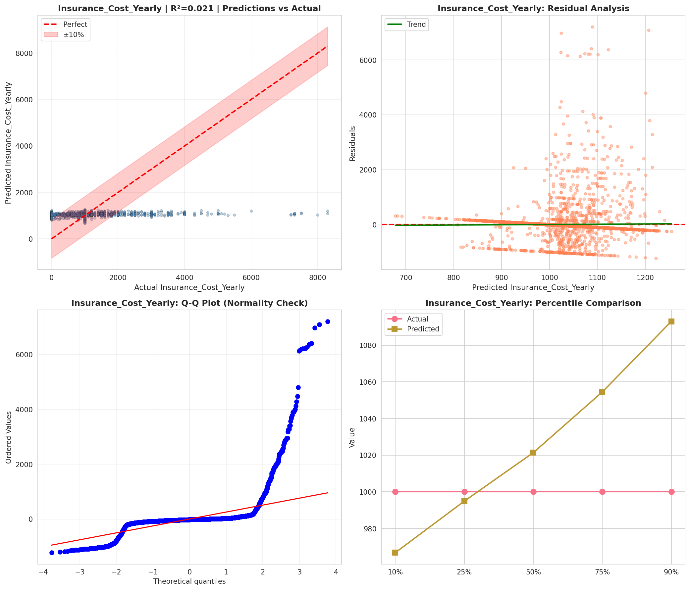
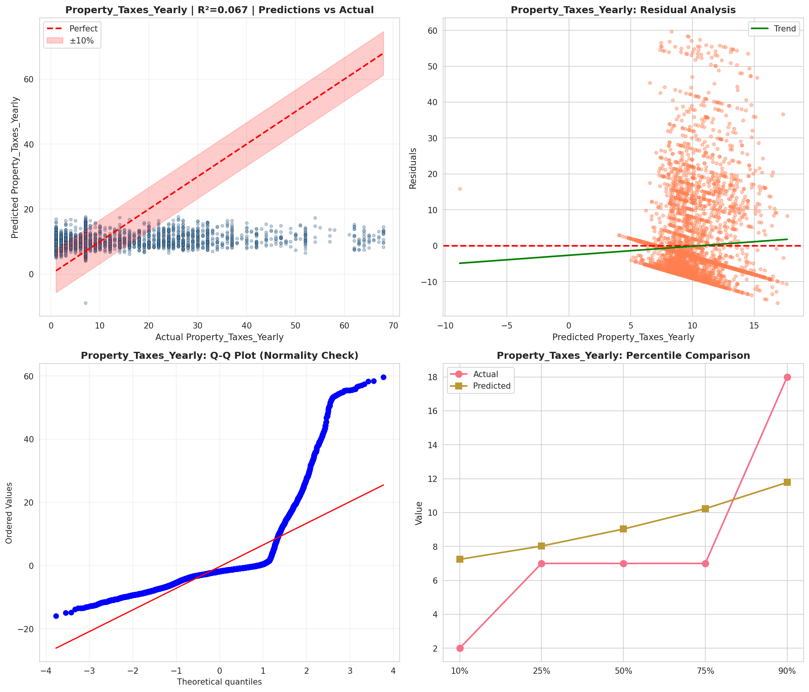
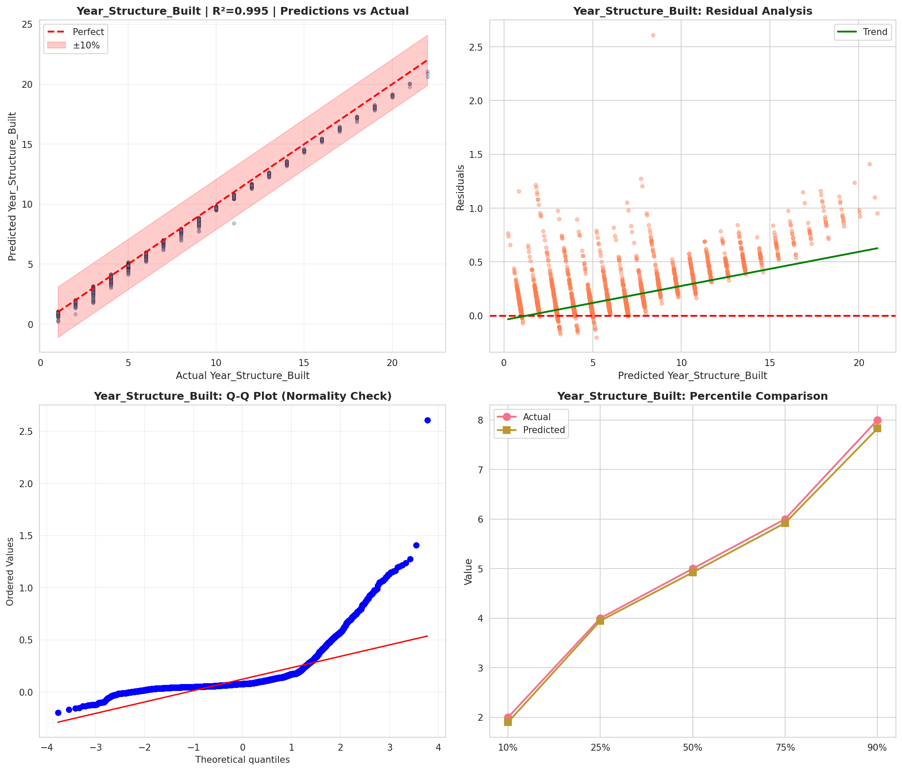
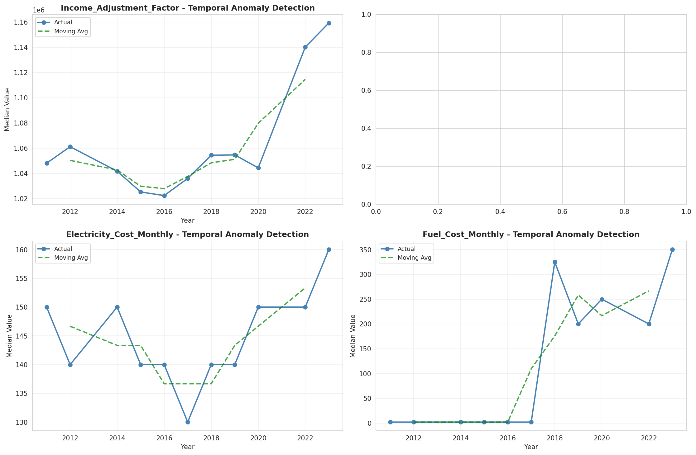
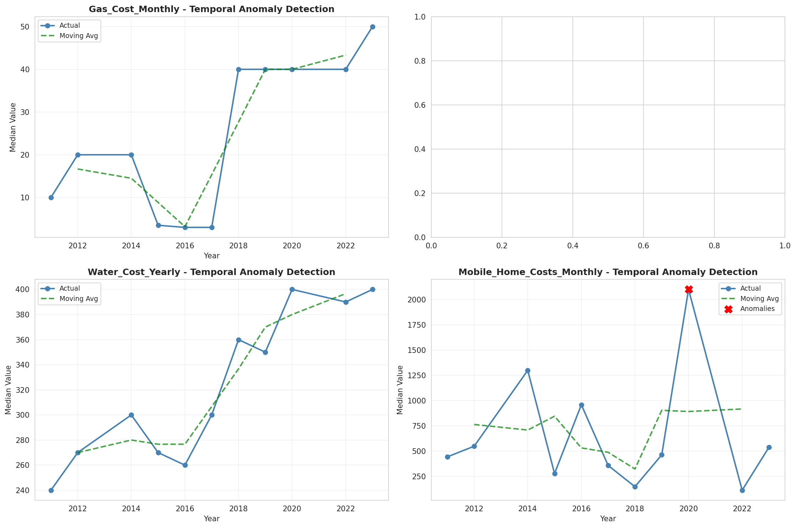
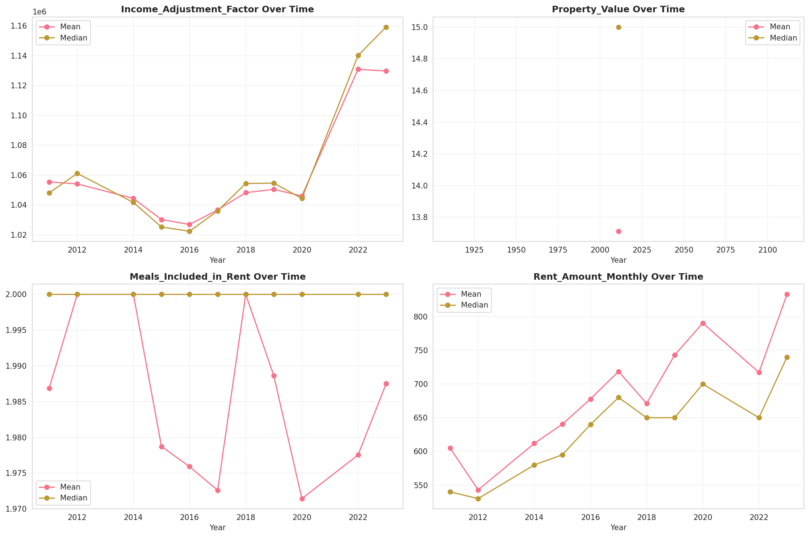
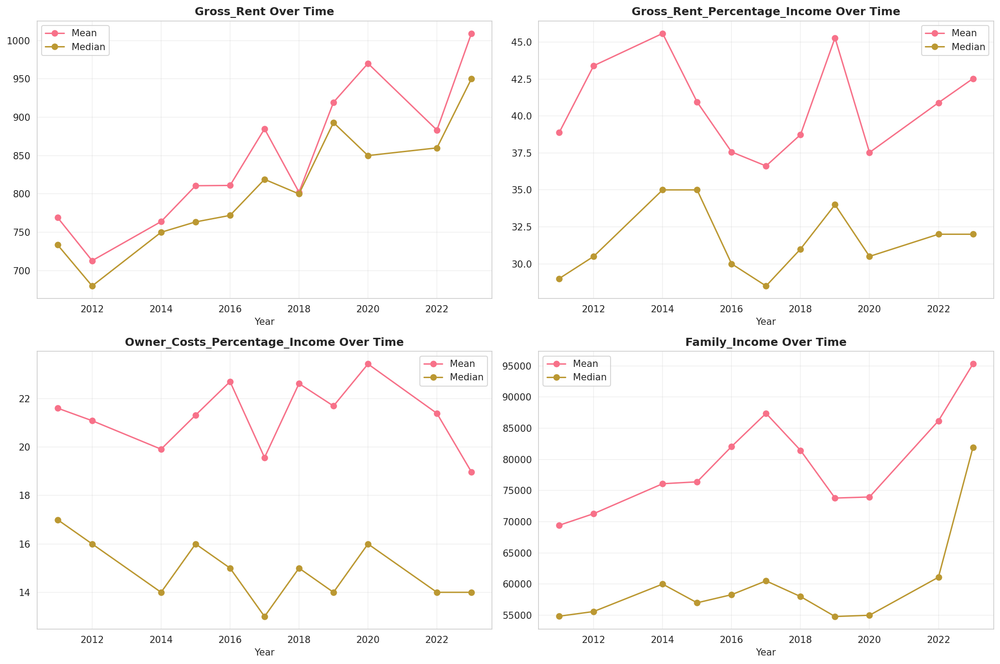
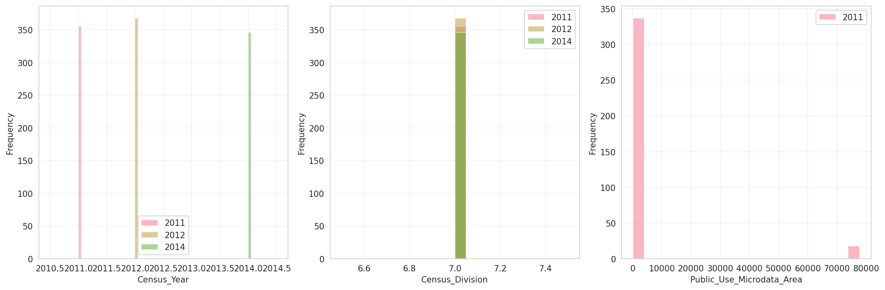
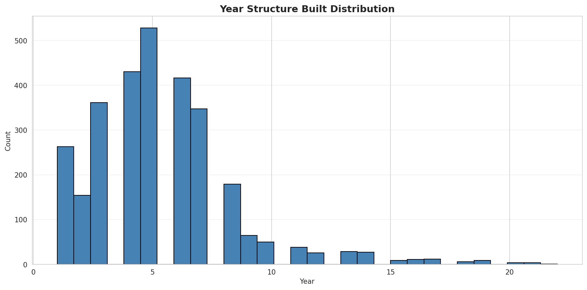
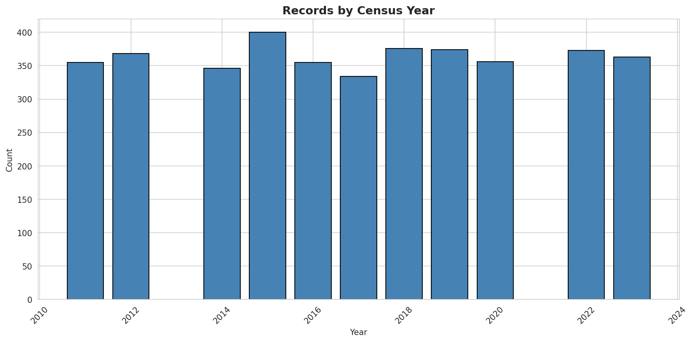
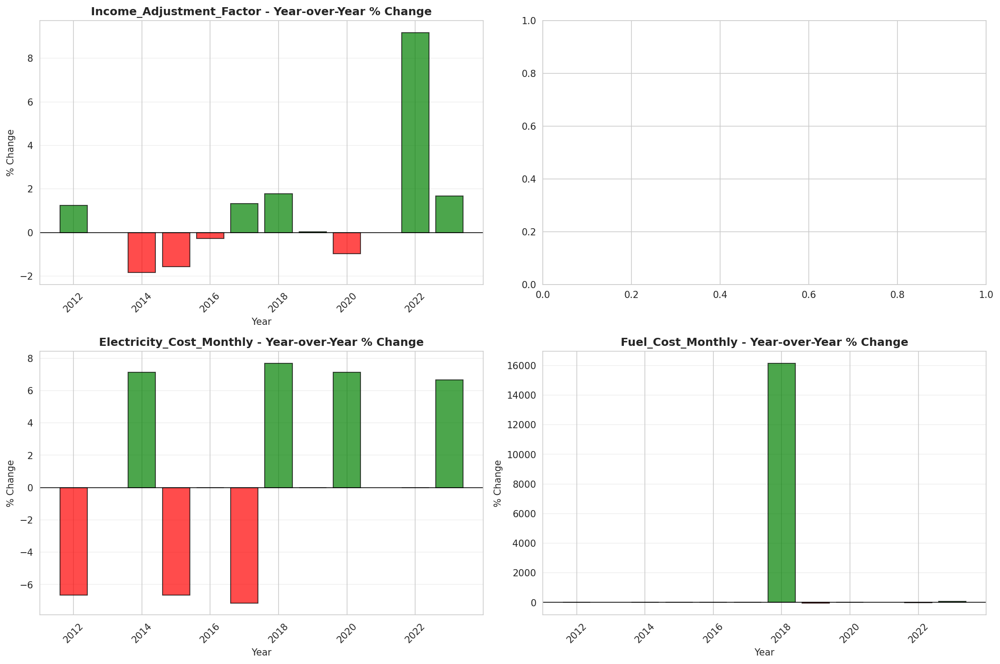
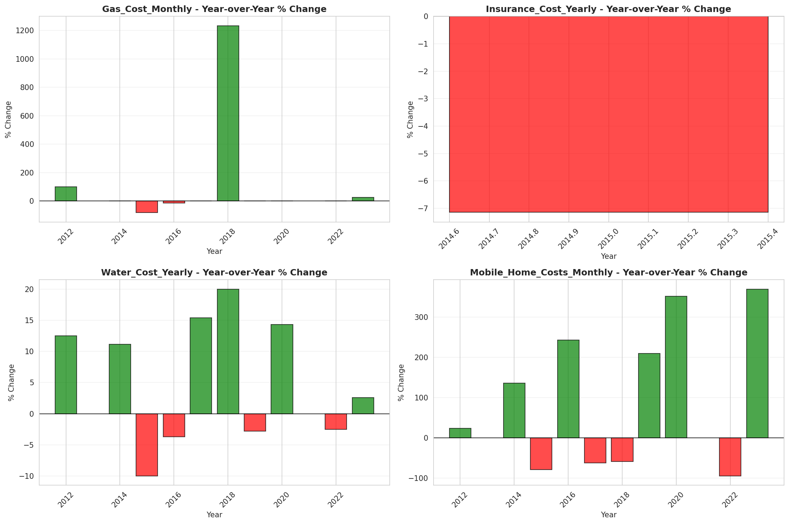
