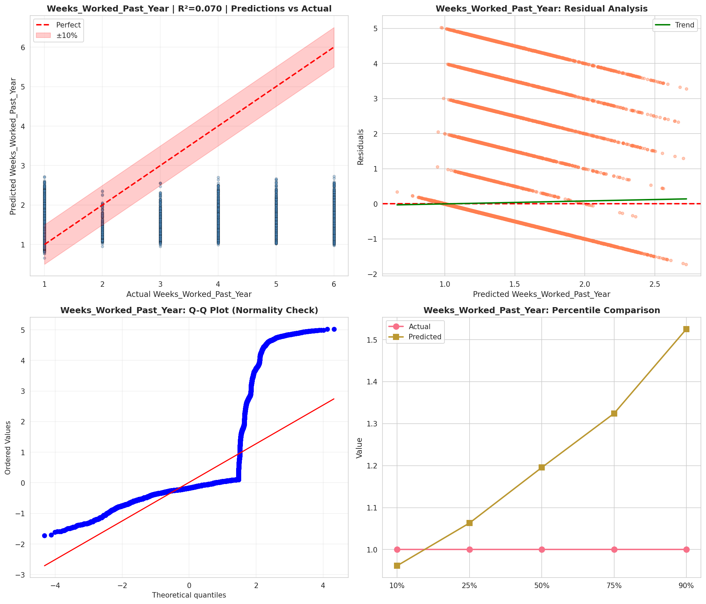
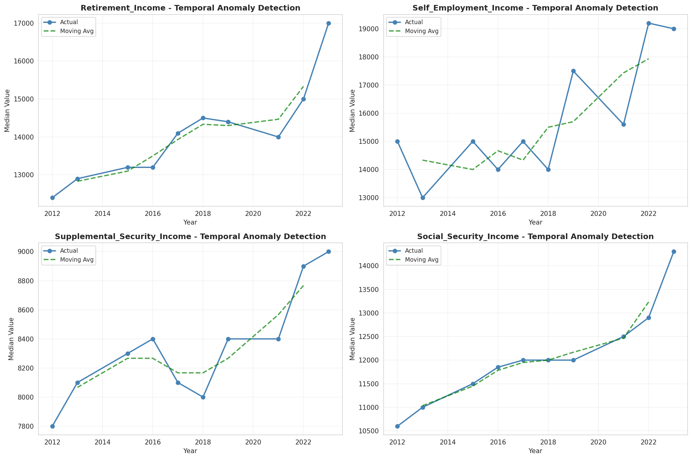
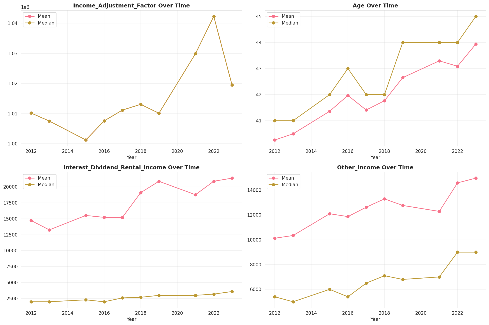
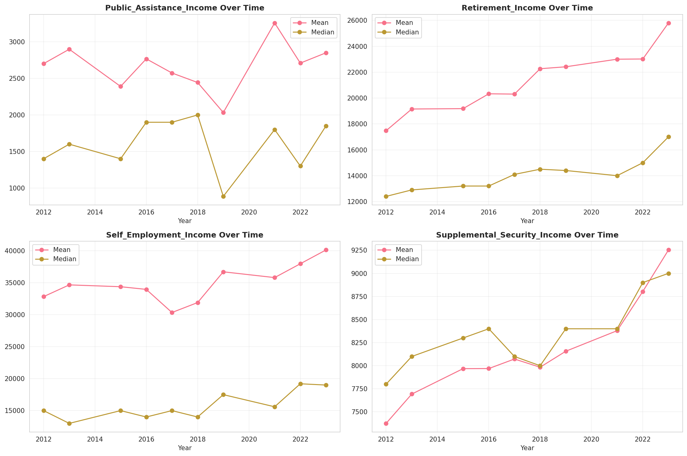
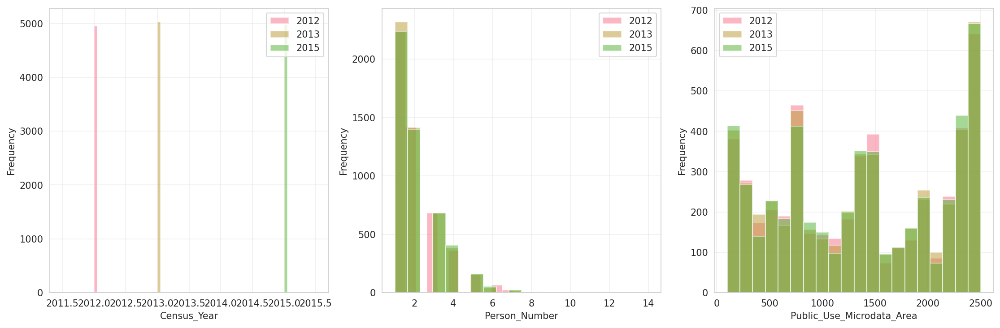
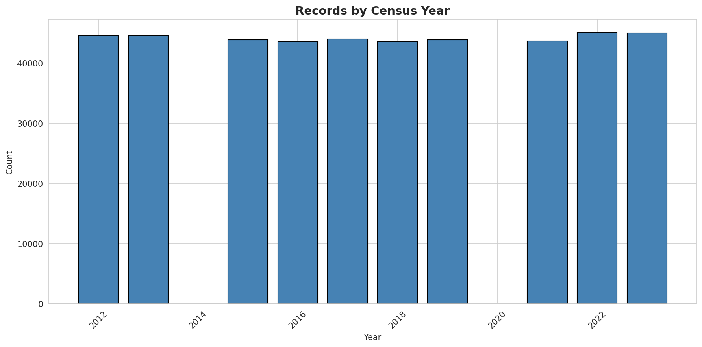
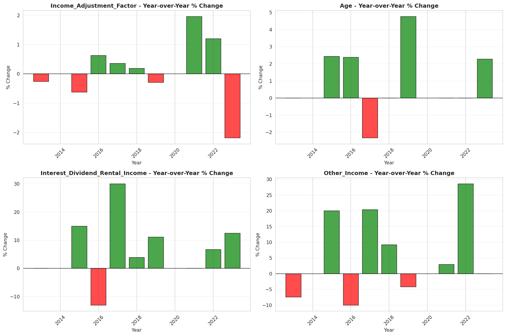
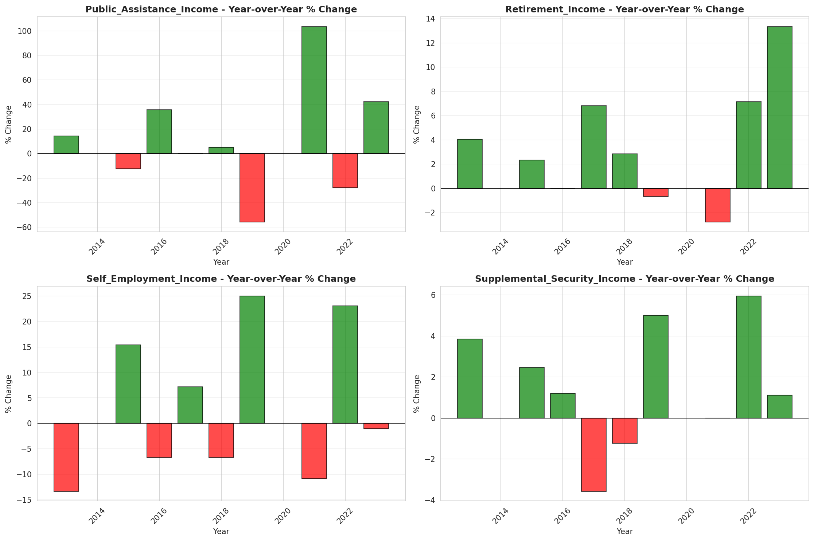

# Temporal Analysis

## Year Distribution

- 2012: 44,608 records

- 2013: 44,627 records

- 2015: 43,892 records

- 2016: 43,598 records

- 2017: 44,024 records

- 2018: 43,589 records

- 2019: 43,896 records

- 2021: 43,663 records

- 2022: 45,040 records

- 2023: 45,026 records

## Temporal Trends

- Census_Year: {np.int64(2012): {'mean': 2012.0, 'median': 2012.0, 'std': 0.0}, np.int64(2013): {'mean': 2013.0, 'median': 2013.0, 'std': 0.0}, np.int64(2015): {'mean': 2015.0, 'median': 2015.0, 'std': 0.0}, np.int64(2016): {'mean': 2016.0, 'median': 2016.0, 'std': 0.0}, np.int64(2017): {'mean': 2017.0, 'median': 2017.0, 'std': 0.0}, np.int64(2018): {'mean': 2018.0, 'median': 2018.0, 'std': 0.0}, np.int64(2019): {'mean': 2019.0, 'median': 2019.0, 'std': 0.0}, np.int64(2021): {'mean': 2021.0, 'median': 2021.0, 'std': 0.0}, np.int64(2022): {'mean': 2022.0, 'median': 2022.0, 'std': 0.0}, np.int64(2023): {'mean': 2023.0, 'median': 2023.0, 'std': 0.0}}

- Person_Number: {np.int64(2012): {'mean': 2.0230900286944045, 'median': 2.0, 'std': 1.26353693899974}, np.int64(2013): {'mean': 2.013355143747059, 'median': 2.0, 'std': 1.2583253906799985}, np.int64(2015): {'mean': 1.9875375922719403, 'median': 2.0, 'std': 1.2438651996185157}, np.int64(2016): {'mean': 1.986994816275976, 'median': 2.0, 'std': 1.2578776798876976}, np.int64(2017): {'mean': 1.9929356714519353, 'median': 2.0, 'std': 1.251696738115235}, np.int64(2018): {'mean': 1.9799261281515979, 'median': 2.0, 'std': 1.2289844412241169}, np.int64(2019): {'mean': 1.972776562784764, 'median': 2.0, 'std': 1.2280882136464248}, np.int64(2021): {'mean': 1.965668872958798, 'median': 2.0, 'std': 1.2368083421413545}, np.int64(2022): {'mean': 1.9708703374777976, 'median': 2.0, 'std': 1.2177387902728065}, np.int64(2023): {'mean': 1.9558033136410073, 'median': 2.0, 'std': 1.2145156546016667}}

- Public_Use_Microdata_Area: {np.int64(2012): {'mean': 1339.0249282639886, 'median': 1300.0, 'std': 777.5171174590295}, np.int64(2013): {'mean': 1354.8219015394268, 'median': 1400.0, 'std': 780.8796752324723}, np.int64(2015): {'mean': 1359.1931787113824, 'median': 1400.0, 'std': 781.6275445481839}, np.int64(2016): {'mean': 1372.7542777191613, 'median': 1400.0, 'std': 782.6653929310718}, np.int64(2017): {'mean': 1364.287752135199, 'median': 1400.0, 'std': 783.4880079317935}, np.int64(2018): {'mean': 1367.4329762095942, 'median': 1400.0, 'std': 777.2448219497426}, np.int64(2019): {'mean': 1372.5331465281574, 'median': 1400.0, 'std': 777.893867952273}, np.int64(2021): {'mean': 1349.8758216338776, 'median': 1400.0, 'std': 789.6130835653261}, np.int64(2022): {'mean': 1341.1207593250444, 'median': 1400.0, 'std': 776.4210498601904}, np.int64(2023): {'mean': 1336.4763914182915, 'median': 1400.0, 'std': 766.9258500144665}}

- State_Code: {np.int64(2012): {'mean': 22.0, 'median': 22.0, 'std': 0.0}, np.int64(2013): {'mean': 22.0, 'median': 22.0, 'std': 0.0}, np.int64(2015): {'mean': 22.0, 'median': 22.0, 'std': 0.0}, np.int64(2016): {'mean': 22.0, 'median': 22.0, 'std': 0.0}, np.int64(2017): {'mean': 22.0, 'median': 22.0, 'std': 0.0}, np.int64(2018): {'mean': 22.0, 'median': 22.0, 'std': 0.0}, np.int64(2019): {'mean': 22.0, 'median': 22.0, 'std': 0.0}, np.int64(2021): {'mean': 22.0, 'median': 22.0, 'std': 0.0}, np.int64(2022): {'mean': 22.0, 'median': 22.0, 'std': 0.0}, np.int64(2023): {'mean': None, 'median': None, 'std': None}}

- Income_Adjustment_Factor: {np.int64(2012): {'mean': 1010207.0, 'median': 1010207.0, 'std': 0.0}, np.int64(2013): {'mean': 1007549.0, 'median': 1007549.0, 'std': 0.0}, np.int64(2015): {'mean': 1001264.0, 'median': 1001264.0, 'std': 0.0}, np.int64(2016): {'mean': 1007588.0, 'median': 1007588.0, 'std': 0.0}, np.int64(2017): {'mean': 1011189.0, 'median': 1011189.0, 'std': 0.0}, np.int64(2018): {'mean': 1013097.0, 'median': 1013097.0, 'std': 0.0}, np.int64(2019): {'mean': 1010145.0, 'median': 1010145.0, 'std': 0.0}, np.int64(2021): {'mean': 1029928.0, 'median': 1029928.0, 'std': 0.0}, np.int64(2022): {'mean': 1042311.0, 'median': 1042311.0, 'std': 0.0}, np.int64(2023): {'mean': 1019518.0, 'median': 1019518.0, 'std': 0.0}}

- Person_Weight: {np.int64(2012): {'mean': 103.16295283357245, 'median': 79.0, 'std': 86.36438718122905}, np.int64(2013): {'mean': 103.64734353642413, 'median': 80.0, 'std': 86.24668254438585}, np.int64(2015): {'mean': 106.41401622163492, 'median': 81.0, 'std': 91.40074783836067}, np.int64(2016): {'mean': 107.38258635717234, 'median': 82.0, 'std': 93.79889418046099}, np.int64(2017): {'mean': 106.40407504997275, 'median': 82.0, 'std': 90.39644527537017}, np.int64(2018): {'mean': 106.90720135814081, 'median': 81.0, 'std': 93.28488088280461}, np.int64(2019): {'mean': 105.90472936030618, 'median': 77.0, 'std': 99.67246046569811}, np.int64(2021): {'mean': 105.90309873348144, 'median': 76.0, 'std': 101.92865950587358}, np.int64(2022): {'mean': 101.91476465364121, 'median': 73.0, 'std': 98.1226753116848}, np.int64(2023): {'mean': 101.58017589836983, 'median': 72.0, 'std': 98.95486843509711}}

- Age: {np.int64(2012): {'mean': 40.260805236728835, 'median': 41.0, 'std': 23.39270193116092}, np.int64(2013): {'mean': 40.49689649763596, 'median': 41.0, 'std': 23.56036039994981}, np.int64(2015): {'mean': 41.3603162307482, 'median': 42.0, 'std': 23.62355550545766}, np.int64(2016): {'mean': 41.96889765585577, 'median': 43.0, 'std': 23.79070621598323}, np.int64(2017): {'mean': 41.40989005996729, 'median': 42.0, 'std': 23.646372997816012}, np.int64(2018): {'mean': 41.76434421528367, 'median': 42.0, 'std': 23.70118367784657}, np.int64(2019): {'mean': 42.65071988336067, 'median': 44.0, 'std': 23.851159208434638}, np.int64(2021): {'mean': 43.294185007901426, 'median': 44.0, 'std': 24.142476995785742}, np.int64(2022): {'mean': 43.08707815275311, 'median': 44.0, 'std': 24.082686000366042}, np.int64(2023): {'mean': 43.93879092080132, 'median': 45.0, 'std': 24.192633965882447}}

- Citizenship_Status: {np.int64(2012): {'mean': 1.1284074605451937, 'median': 1.0, 'std': 0.6550507190489765}, np.int64(2013): {'mean': 1.1343133080870325, 'median': 1.0, 'std': 0.6644976110214758}, np.int64(2015): {'mean': 1.138407910325344, 'median': 1.0, 'std': 0.6769605195144578}, np.int64(2016): {'mean': 1.1406027799440341, 'median': 1.0, 'std': 0.68287546239968}, np.int64(2017): {'mean': 1.1485553334544794, 'median': 1.0, 'std': 0.7008947089122003}, np.int64(2018): {'mean': 1.1512078735460782, 'median': 1.0, 'std': 0.7062040533960331}, np.int64(2019): {'mean': 1.1520184071441588, 'median': 1.0, 'std': 0.7055114931761842}, np.int64(2021): {'mean': 1.1769232530975884, 'median': 1.0, 'std': 0.7603178161012334}, np.int64(2022): {'mean': 1.1612122557726465, 'median': 1.0, 'std': 0.7259611872799714}, np.int64(2023): {'mean': 1.169035668280549, 'median': 1.0, 'std': 0.7448877333059564}}

- Class_of_Worker: {np.int64(2012): {'mean': 2.1871244976723827, 'median': 1.0, 'std': 1.960303093327246}, np.int64(2013): {'mean': 2.152919035797229, 'median': 1.0, 'std': 1.9271666188896968}, np.int64(2015): {'mean': 2.17131441617743, 'median': 1.0, 'std': 1.9516115742921891}, np.int64(2016): {'mean': 2.1575589344160417, 'median': 1.0, 'std': 1.9346915248958485}, np.int64(2017): {'mean': 2.1762969038343245, 'median': 1.0, 'std': 1.9501150322169727}, np.int64(2018): {'mean': 2.1901402640264025, 'median': 1.0, 'std': 1.9841635852867598}, np.int64(2019): {'mean': 2.2143674403399802, 'median': 1.0, 'std': 1.9600378912986727}, np.int64(2021): {'mean': 2.233529659234329, 'median': 1.0, 'std': 1.960511730650316}, np.int64(2022): {'mean': 2.263467031419721, 'median': 1.0, 'std': 1.9732434796216436}, np.int64(2023): {'mean': 2.216272965879265, 'median': 1.0, 'std': 1.9443854743828555}}

- English_Speaking_Ability: {np.int64(2012): {'mean': 1.4695048309178744, 'median': 1.0, 'std': 0.8011091653903702}, np.int64(2013): {'mean': 1.5015060240963856, 'median': 1.0, 'std': 0.8226223821251266}, np.int64(2015): {'mean': 1.5006435006435006, 'median': 1.0, 'std': 0.8215395113145921}, np.int64(2016): {'mean': 1.4852564102564103, 'median': 1.0, 'std': 0.7929882272706612}, np.int64(2017): {'mean': 1.5041322314049588, 'median': 1.0, 'std': 0.8105909208810943}, np.int64(2018): {'mean': 1.5096059915337023, 'median': 1.0, 'std': 0.8257789971890885}, np.int64(2019): {'mean': 1.5307495195387573, 'median': 1.0, 'std': 0.8724389069195867}, np.int64(2021): {'mean': 1.630059523809524, 'median': 1.0, 'std': 0.9568175623398825}, np.int64(2022): {'mean': 1.5632286995515694, 'median': 1.0, 'std': 0.8963771330898213}, np.int64(2023): {'mean': 1.5883005267535348, 'median': 1.0, 'std': 0.9220335928068346}}

- Fertility_Status: {np.int64(2012): {'mean': 1.9491592876330714, 'median': 2.0, 'std': 0.21968326271807193}, np.int64(2013): {'mean': 1.9454933008526187, 'median': 2.0, 'std': 0.22702632097842526}, np.int64(2015): {'mean': 1.941804479799037, 'median': 2.0, 'std': 0.2341250498531258}, np.int64(2016): {'mean': 1.946109728384374, 'median': 2.0, 'std': 0.22581325961537124}, np.int64(2017): {'mean': 1.9471374843292937, 'median': 2.0, 'std': 0.2237706444873945}, np.int64(2018): {'mean': 1.945578947368421, 'median': 2.0, 'std': 0.22685858813679366}, np.int64(2019): {'mean': 1.9474028095393663, 'median': 2.0, 'std': 0.2232401241210691}, np.int64(2021): {'mean': 1.9451623777952578, 'median': 2.0, 'std': 0.22767582733252414}, np.int64(2022): {'mean': 1.9450922196311216, 'median': 2.0, 'std': 0.2278122411857261}, np.int64(2023): {'mean': 1.9453846153846155, 'median': 2.0, 'std': 0.22724044294149875}}

- Marital_Status: {np.int64(2012): {'mean': 3.0388719512195124, 'median': 3.0, 'std': 1.827328799332503}, np.int64(2013): {'mean': 3.021937392161696, 'median': 3.0, 'std': 1.8299235395878053}, np.int64(2015): {'mean': 3.001936571584799, 'median': 3.0, 'std': 1.828382422576917}, np.int64(2016): {'mean': 3.0154594247442543, 'median': 3.0, 'std': 1.8312253411714379}, np.int64(2017): {'mean': 3.039705615119026, 'median': 3.0, 'std': 1.8359235379349435}, np.int64(2018): {'mean': 3.0185138452361833, 'median': 3.0, 'std': 1.838157017166894}, np.int64(2019): {'mean': 2.978654091488974, 'median': 3.0, 'std': 1.8283499737375224}, np.int64(2021): {'mean': 3.0248494148363605, 'median': 3.0, 'std': 1.8242110154747635}, np.int64(2022): {'mean': 3.0019538188277086, 'median': 3.0, 'std': 1.8353350183633457}, np.int64(2023): {'mean': 2.96981743881313, 'median': 3.0, 'std': 1.8281285546155988}}

- Mobility_Status: {np.int64(2012): {'mean': 1.263290107950302, 'median': 1.0, 'std': 0.6731977383733783}, np.int64(2013): {'mean': 1.2577905607391975, 'median': 1.0, 'std': 0.6672121167717019}, np.int64(2015): {'mean': 1.2450978133136708, 'median': 1.0, 'std': 0.6533633001663746}, np.int64(2016): {'mean': 1.2455103695979608, 'median': 1.0, 'std': 0.6536129873991828}, np.int64(2017): {'mean': 1.2524423244507636, 'median': 1.0, 'std': 0.661817848185722}, np.int64(2018): {'mean': 1.2518429227131531, 'median': 1.0, 'std': 0.6615349204139892}, np.int64(2019): {'mean': 1.2413626535400468, 'median': 1.0, 'std': 0.6483175431448269}, np.int64(2021): {'mean': 1.2326812800591935, 'median': 1.0, 'std': 0.6374215979923881}, np.int64(2022): {'mean': 1.220792611853313, 'median': 1.0, 'std': 0.6227907360745149}, np.int64(2023): {'mean': 1.1940248330270296, 'median': 1.0, 'std': 0.5878335366538735}}

- Military_Service: {np.int64(2012): {'mean': 4.771029089067687, 'median': 5.0, 'std': 0.66973237015062}, np.int64(2013): {'mean': 3.7966634836825253, 'median': 4.0, 'std': 0.6003286003206186}, np.int64(2015): {'mean': 3.804149541129441, 'median': 4.0, 'std': 0.5929417039128827}, np.int64(2016): {'mean': 3.800816233987076, 'median': 4.0, 'std': 0.5982557498691886}, np.int64(2017): {'mean': 3.8157805812119845, 'median': 4.0, 'std': 0.576321089991578}, np.int64(2018): {'mean': 3.8089217017424755, 'median': 4.0, 'std': 0.587515588181753}, np.int64(2019): {'mean': 3.8138299359673407, 'median': 4.0, 'std': 0.5793280955299026}, np.int64(2021): {'mean': 3.8190105987303897, 'median': 4.0, 'std': 0.5779627656919506}, np.int64(2022): {'mean': 3.827367393426619, 'median': 4.0, 'std': 0.5614755578616397}, np.int64(2023): {'mean': 3.832911255994396, 'median': 4.0, 'std': 0.551365556482459}}

- Travel_Time_To_Work_Minutes: {np.int64(2012): {'mean': 24.96667782987274, 'median': 20.0, 'std': 25.871318030978422}, np.int64(2013): {'mean': 25.109782309176083, 'median': 20.0, 'std': 25.35839589948084}, np.int64(2015): {'mean': 25.193480430202904, 'median': 20.0, 'std': 25.118183538536012}, np.int64(2016): {'mean': 24.897421365826013, 'median': 20.0, 'std': 24.365528995118904}, np.int64(2017): {'mean': 25.317674757553675, 'median': 20.0, 'std': 24.1465662573798}, np.int64(2018): {'mean': 26.052483546155145, 'median': 20.0, 'std': 26.508014718803903}, np.int64(2019): {'mean': 26.781006890420095, 'median': 20.0, 'std': 27.453302136077927}, np.int64(2021): {'mean': 25.066683505935842, 'median': 20.0, 'std': 24.252452871845556}, np.int64(2022): {'mean': 25.622039435305098, 'median': 20.0, 'std': 24.197604765675788}, np.int64(2023): {'mean': 25.8072191272052, 'median': 20.0, 'std': 24.66813399686239}}

- Vehicle_Occupancy: {np.int64(2012): {'mean': 1.1662326902592022, 'median': 1.0, 'std': 0.6124534843283005}, np.int64(2013): {'mean': 1.1764464985666647, 'median': 1.0, 'std': 0.6868698252343002}, np.int64(2015): {'mean': 1.150152797367184, 'median': 1.0, 'std': 0.5732482471912487}, np.int64(2016): {'mean': 1.1484168865435356, 'median': 1.0, 'std': 0.5905638911189366}, np.int64(2017): {'mean': 1.1493433172876923, 'median': 1.0, 'std': 0.5562232471810441}, np.int64(2018): {'mean': 1.1546213476446034, 'median': 1.0, 'std': 0.6128441580422272}, np.int64(2019): {'mean': 1.14972251741646, 'median': 1.0, 'std': 0.5769736617514151}, np.int64(2021): {'mean': 1.1402018056293148, 'median': 1.0, 'std': 0.5276585451139336}, np.int64(2022): {'mean': 1.1438546622999444, 'median': 1.0, 'std': 0.527169748539233}, np.int64(2023): {'mean': 1.1435479921645446, 'median': 1.0, 'std': 0.543564624748408}}

- Transportation_To_Work: {np.int64(2012): {'mean': 1.6742860245412097, 'median': 1.0, 'std': 2.4400176985386564}, np.int64(2013): {'mean': 1.6588393336915637, 'median': 1.0, 'std': 2.4091083513415956}, np.int64(2015): {'mean': 1.6949717666039257, 'median': 1.0, 'std': 2.467448397666664}, np.int64(2016): {'mean': 1.7227061079156396, 'median': 1.0, 'std': 2.520153655029447}, np.int64(2017): {'mean': 1.7661264181523502, 'median': 1.0, 'std': 2.5880836870804345}, np.int64(2018): {'mean': 1.7599326964828486, 'median': 1.0, 'std': 2.5803820892376432}, np.int64(2019): {'mean': None, 'median': None, 'std': None}, np.int64(2021): {'mean': None, 'median': None, 'std': None}, np.int64(2022): {'mean': None, 'median': None, 'std': None}, np.int64(2023): {'mean': None, 'median': None, 'std': None}}

- Language_Other_Than_English: {np.int64(2012): {'mean': 1.92154447471278, 'median': 2.0, 'std': 0.26889025372284137}, np.int64(2013): {'mean': 1.9211401425178147, 'median': 2.0, 'std': 0.26952310817446257}, np.int64(2015): {'mean': 1.925124671757932, 'median': 2.0, 'std': 0.26319324131494426}, np.int64(2016): {'mean': 1.9244862889367573, 'median': 2.0, 'std': 0.26422164975364104}, np.int64(2017): {'mean': 1.9245400685999376, 'median': 2.0, 'std': 0.2641351994595898}, np.int64(2018): {'mean': 1.9255966081162932, 'median': 2.0, 'std': 0.2624294108992488}, np.int64(2019): {'mean': 1.9250779937604992, 'median': 2.0, 'std': 0.2632686128960013}, np.int64(2021): {'mean': 1.9190887856093626, 'median': 2.0, 'std': 0.27270199957527225}, np.int64(2022): {'mean': 1.9219970617727304, 'median': 2.0, 'std': 0.2681793373478154}, np.int64(2023): {'mean': 1.9158403135864113, 'median': 2.0, 'std': 0.2776303874215455}}

- Grandparents_Living_With_Grandchildren: {np.int64(2012): {'mean': 1.9546887731604492, 'median': 2.0, 'std': 0.20798954811411863}, np.int64(2013): {'mean': 1.9580688390464098, 'median': 2.0, 'std': 0.20043541473420964}, np.int64(2015): {'mean': 1.9594637279331766, 'median': 2.0, 'std': 0.1972167532601869}, np.int64(2016): {'mean': 1.960349956255468, 'median': 2.0, 'std': 0.1951390539660795}, np.int64(2017): {'mean': 1.9608096769682561, 'median': 2.0, 'std': 0.19405091616168588}, np.int64(2018): {'mean': 1.9636452787895768, 'median': 2.0, 'std': 0.18717447072292231}, np.int64(2019): {'mean': 1.9628620102214651, 'median': 2.0, 'std': 0.18910308800130193}, np.int64(2021): {'mean': 1.9651202167287505, 'median': 2.0, 'std': 0.1834784019834465}, np.int64(2022): {'mean': 1.9649308542314563, 'median': 2.0, 'std': 0.18395765915952583}, np.int64(2023): {'mean': 1.9641185647425896, 'median': 2.0, 'std': 0.1859975329041407}}

- Months_Responsible_For_Grandchildren: {np.int64(2012): {'mean': 3.708965517241379, 'median': 4.0, 'std': 1.2968255569090195}, np.int64(2013): {'mean': 3.913249211356467, 'median': 4.0, 'std': 1.2316448285155792}, np.int64(2015): {'mean': 3.8322259136212624, 'median': 4.0, 'std': 1.3565977418052577}, np.int64(2016): {'mean': 3.8313856427378963, 'median': 4.0, 'std': 1.3200093429261224}, np.int64(2017): {'mean': 3.886725663716814, 'median': 4.0, 'std': 1.2267341484853447}, np.int64(2018): {'mean': 3.861598440545809, 'median': 4.0, 'std': 1.2756535467153935}, np.int64(2019): {'mean': 4.009057971014493, 'median': 5.0, 'std': 1.280139164214133}, np.int64(2021): {'mean': 3.9166666666666665, 'median': 4.0, 'std': 1.2600579734289612}, np.int64(2022): {'mean': 4.0, 'median': 5.0, 'std': 1.2425779653607256}, np.int64(2023): {'mean': 3.8574074074074076, 'median': 5.0, 'std': 1.4010467663513122}}

- Grandparents_Responsible_For_Grandchildren: {np.int64(2012): {'mean': 1.433150899139953, 'median': 1.0, 'std': 0.4957048710192026}, np.int64(2013): {'mean': 1.4667788057190916, 'median': 1.0, 'std': 0.4991050600470463}, np.int64(2015): {'mean': 1.4787878787878788, 'median': 1.0, 'std': 0.49976623914295254}, np.int64(2016): {'mean': 1.471315092674316, 'median': 1.0, 'std': 0.49939693358290643}, np.int64(2017): {'mean': 1.495985727029438, 'median': 1.0, 'std': 0.5002070426437295}, np.int64(2018): {'mean': 1.5057803468208093, 'median': 2.0, 'std': 0.5002075923143752}, np.int64(2019): {'mean': 1.4935779816513761, 'median': 1.0, 'std': 0.5001882527808722}, np.int64(2021): {'mean': 1.5223300970873785, 'median': 2.0, 'std': 0.49974377085487615}, np.int64(2022): {'mean': 1.5273584905660378, 'median': 2.0, 'std': 0.4994866144084021}, np.int64(2023): {'mean': 1.5108695652173914, 'median': 2.0, 'std': 0.5001083882677514}}

- Interest_Dividend_Rental_Income: {np.int64(2012): {'mean': 14723.109596224436, 'median': 2000.0, 'std': 39545.918567628585}, np.int64(2013): {'mean': 13252.459967509863, 'median': 2000.0, 'std': 38416.58516244321}, np.int64(2015): {'mean': 15507.321719792439, 'median': 2300.0, 'std': 44254.973654471425}, np.int64(2016): {'mean': 15212.70696771061, 'median': 2000.0, 'std': 43461.54046472137}, np.int64(2017): {'mean': 15206.454761276707, 'median': 2600.0, 'std': 39841.55945793409}, np.int64(2018): {'mean': 19072.21693121693, 'median': 2700.0, 'std': 50954.56385726012}, np.int64(2019): {'mean': 20854.471360080748, 'median': 3000.0, 'std': 59487.96691232446}, np.int64(2021): {'mean': 18754.082397003745, 'median': 3000.0, 'std': 47563.46989245524}, np.int64(2022): {'mean': 20863.35393258427, 'median': 3200.0, 'std': 53398.77160236179}, np.int64(2023): {'mean': 21347.345085470086, 'median': 3600.0, 'std': 55346.55416727706}}

- Military_Service_Period_1: {np.int64(2012): {'mean': 0.18015739179314222, 'median': 0.0, 'std': 0.38437251453490234}, np.int64(2013): {'mean': 0.16739265712507778, 'median': 0.0, 'std': 0.3733841629007675}, np.int64(2015): {'mean': 0.18776167471819646, 'median': 0.0, 'std': 0.3905846396218557}, np.int64(2016): {'mean': 0.19845857418111754, 'median': 0.0, 'std': 0.3989033316771765}, np.int64(2017): {'mean': 0.23547826086956522, 'median': 0.0, 'std': 0.4243711698936661}, np.int64(2018): {'mean': 0.23361344537815126, 'median': 0.0, 'std': 0.4232001945428723}, np.int64(2019): {'mean': 0.2382108183079057, 'median': 0.0, 'std': 0.4260626338437178}, np.int64(2021): {'mean': 0.2671136203246295, 'median': 0.0, 'std': 0.4425302650039827}, np.int64(2022): {'mean': 0.2823529411764706, 'median': 0.0, 'std': 0.45022441328858887}, np.int64(2023): {'mean': 0.26844642195031515, 'median': 0.0, 'std': 0.443233327751159}}

- Military_Service_Period_2: {np.int64(2012): {'mean': 0.1759415401911186, 'median': 0.0, 'std': 0.3808239428029243}, np.int64(2013): {'mean': 0.17112632233976355, 'median': 0.0, 'std': 0.3766779134159289}, np.int64(2015): {'mean': 0.19838969404186796, 'median': 0.0, 'std': 0.3988514229957216}, np.int64(2016): {'mean': 0.18754014129736674, 'median': 0.0, 'std': 0.39040720111165805}, np.int64(2017): {'mean': 0.20765217391304347, 'median': 0.0, 'std': 0.4056969278623335}, np.int64(2018): {'mean': 0.21378151260504202, 'median': 0.0, 'std': 0.41004328260032147}, np.int64(2019): {'mean': 0.21324549237170595, 'median': 0.0, 'std': 0.4096706553464983}, np.int64(2021): {'mean': 0.2173606210303458, 'median': 0.0, 'std': 0.4125227619195909}, np.int64(2022): {'mean': 0.22388591800356505, 'median': 0.0, 'std': 0.4169208350527187}, np.int64(2023): {'mean': 0.2243233222098628, 'median': 0.0, 'std': 0.41721326711978984}}

- Military_Service_Period_3: {np.int64(2012): {'mean': 0.16610455311973019, 'median': 0.0, 'std': 0.3722267746248345}, np.int64(2013): {'mean': None, 'median': None, 'std': None}, np.int64(2015): {'mean': None, 'median': None, 'std': None}, np.int64(2016): {'mean': None, 'median': None, 'std': None}, np.int64(2017): {'mean': None, 'median': None, 'std': None}, np.int64(2018): {'mean': None, 'median': None, 'std': None}, np.int64(2019): {'mean': None, 'median': None, 'std': None}, np.int64(2021): {'mean': None, 'median': None, 'std': None}, np.int64(2022): {'mean': None, 'median': None, 'std': None}, np.int64(2023): {'mean': None, 'median': None, 'std': None}}

- Military_Service_Period_4: {np.int64(2012): {'mean': 0.12703766160764474, 'median': 0.0, 'std': 0.3330619639724583}, np.int64(2013): {'mean': None, 'median': None, 'std': None}, np.int64(2015): {'mean': None, 'median': None, 'std': None}, np.int64(2016): {'mean': None, 'median': None, 'std': None}, np.int64(2017): {'mean': None, 'median': None, 'std': None}, np.int64(2018): {'mean': None, 'median': None, 'std': None}, np.int64(2019): {'mean': None, 'median': None, 'std': None}, np.int64(2021): {'mean': None, 'median': None, 'std': None}, np.int64(2022): {'mean': None, 'median': None, 'std': None}, np.int64(2023): {'mean': None, 'median': None, 'std': None}}

- Military_Service_Period_5: {np.int64(2012): {'mean': 0.3428892636312535, 'median': 0.0, 'std': 0.47474157282660906}, np.int64(2013): {'mean': 0.35407591785936526, 'median': 0.0, 'std': 0.4783067465050747}, np.int64(2015): {'mean': 0.37359098228663445, 'median': 0.0, 'std': 0.4838348411667991}, np.int64(2016): {'mean': 0.37508028259473347, 'median': 0.0, 'std': 0.48422139539560527}, np.int64(2017): {'mean': 0.3690434782608696, 'median': 0.0, 'std': 0.4826296810542449}, np.int64(2018): {'mean': 0.3680672268907563, 'median': 0.0, 'std': 0.4823608114672546}, np.int64(2019): {'mean': 0.38106796116504854, 'median': 0.0, 'std': 0.4857334444705403}, np.int64(2021): {'mean': 0.3450952717007763, 'median': 0.0, 'std': 0.4754832287672333}, np.int64(2022): {'mean': 0.37290552584670233, 'median': 0.0, 'std': 0.48366351142504493}, np.int64(2023): {'mean': 0.37337782721542456, 'median': 0.0, 'std': 0.4837908724918286}}

- Military_Service_Period_6: {np.int64(2012): {'mean': 0.09752670039347948, 'median': 0.0, 'std': 0.296715330474543}, np.int64(2013): {'mean': None, 'median': None, 'std': None}, np.int64(2015): {'mean': None, 'median': None, 'std': None}, np.int64(2016): {'mean': None, 'median': None, 'std': None}, np.int64(2017): {'mean': None, 'median': None, 'std': None}, np.int64(2018): {'mean': None, 'median': None, 'std': None}, np.int64(2019): {'mean': None, 'median': None, 'std': None}, np.int64(2021): {'mean': None, 'median': None, 'std': None}, np.int64(2022): {'mean': None, 'median': None, 'std': None}, np.int64(2023): {'mean': None, 'median': None, 'std': None}}

- Military_Service_Period_7: {np.int64(2012): {'mean': 0.11860595840359753, 'median': 0.0, 'std': 0.32336971808180076}, np.int64(2013): {'mean': None, 'median': None, 'std': None}, np.int64(2015): {'mean': None, 'median': None, 'std': None}, np.int64(2016): {'mean': None, 'median': None, 'std': None}, np.int64(2017): {'mean': None, 'median': None, 'std': None}, np.int64(2018): {'mean': None, 'median': None, 'std': None}, np.int64(2019): {'mean': None, 'median': None, 'std': None}, np.int64(2021): {'mean': None, 'median': None, 'std': None}, np.int64(2022): {'mean': None, 'median': None, 'std': None}, np.int64(2023): {'mean': None, 'median': None, 'std': None}}

- Military_Service_Period_8: {np.int64(2012): {'mean': 0.11242270938729623, 'median': 0.0, 'std': 0.31593020844947883}, np.int64(2013): {'mean': 0.11512134411947729, 'median': 0.0, 'std': 0.3192179902935366}, np.int64(2015): {'mean': 0.08727858293075684, 'median': 0.0, 'std': 0.282288320489157}, np.int64(2016): {'mean': 0.09087989723827875, 'median': 0.0, 'std': 0.2874844031756284}, np.int64(2017): {'mean': 0.07652173913043478, 'median': 0.0, 'std': 0.26587732257203506}, np.int64(2018): {'mean': 0.06823529411764706, 'median': 0.0, 'std': 0.2521916277615473}, np.int64(2019): {'mean': 0.06934812760055478, 'median': 0.0, 'std': 0.2540892576297421}, np.int64(2021): {'mean': 0.04516584333098095, 'median': 0.0, 'std': 0.20770438758103907}, np.int64(2022): {'mean': 0.04028520499108734, 'median': 0.0, 'std': 0.19666238969172717}, np.int64(2023): {'mean': 0.042269187986651836, 'median': 0.0, 'std': 0.2012399550265324}}

- Military_Service_Period_9: {np.int64(2012): {'mean': 0.021079258010118045, 'median': 0.0, 'std': 0.14366880004781993}, np.int64(2013): {'mean': 0.01835718730553827, 'median': 0.0, 'std': 0.13426023055219355}, np.int64(2015): {'mean': 0.017713365539452495, 'median': 0.0, 'std': 0.13192879807938368}, np.int64(2016): {'mean': 0.015414258188824663, 'median': 0.0, 'std': 0.12321336812662204}, np.int64(2017): {'mean': 0.016695652173913042, 'median': 0.0, 'std': 0.12815076897119895}, np.int64(2018): {'mean': 0.005378151260504202, 'median': 0.0, 'std': 0.07315070343836681}, np.int64(2019): {'mean': 0.0076282940360610264, 'median': 0.0, 'std': 0.0870214280451899}, np.int64(2021): {'mean': None, 'median': None, 'std': None}, np.int64(2022): {'mean': None, 'median': None, 'std': None}, np.int64(2023): {'mean': None, 'median': None, 'std': None}}

- Military_Service_Period_10: {np.int64(2012): {'mean': 0.0671725688589095, 'median': 0.0, 'std': 0.2503558086742685}, np.int64(2013): {'mean': 0.06751711263223398, 'median': 0.0, 'std': 0.250954472120195}, np.int64(2015): {'mean': 0.04508856682769726, 'median': 0.0, 'std': 0.20753182640356688}, np.int64(2016): {'mean': 0.03628773281952473, 'median': 0.0, 'std': 0.18703520284406688}, np.int64(2017): {'mean': 0.03721739130434783, 'median': 0.0, 'std': 0.18932703140127352}, np.int64(2018): {'mean': 0.02991596638655462, 'median': 0.0, 'std': 0.17038415296097065}, np.int64(2019): {'mean': 0.014563106796116505, 'median': 0.0, 'std': 0.11981652859828128}, np.int64(2021): {'mean': 0.012350035285815103, 'median': 0.0, 'std': 0.11046183696186619}, np.int64(2022): {'mean': 0.00392156862745098, 'median': 0.0, 'std': 0.06251066312775125}, np.int64(2023): {'mean': 0.008157211716722283, 'median': 0.0, 'std': 0.08996484093625406}}

- Military_Service_Period_11: {np.int64(2012): {'mean': 0.0030916245081506464, 'median': 0.0, 'std': 0.05552416451608747}, np.int64(2013): {'mean': 0.0021779713752333543, 'median': 0.0, 'std': 0.046625145595449655}, np.int64(2015): {'mean': 0.00322061191626409, 'median': 0.0, 'std': 0.056668102154705705}, np.int64(2016): {'mean': 0.002569043031470777, 'median': 0.0, 'std': 0.050628709167988686}, np.int64(2017): {'mean': 0.0006956521739130435, 'median': 0.0, 'std': 0.026370629945986247}, np.int64(2018): {'mean': 0.0013445378151260505, 'median': 0.0, 'std': 0.036649440961319356}, np.int64(2019): {'mean': 0.0, 'median': 0.0, 'std': 0.0}, np.int64(2021): {'mean': None, 'median': None, 'std': None}, np.int64(2022): {'mean': None, 'median': None, 'std': None}, np.int64(2023): {'mean': None, 'median': None, 'std': None}}

- Temporary_Absence_From_Work: {np.int64(2012): {'mean': 2.5117058709445046, 'median': 3.0, 'std': 0.5341674068175701}, np.int64(2013): {'mean': 2.5649723756906075, 'median': 3.0, 'std': 0.5232035487594711}, np.int64(2015): {'mean': 2.5676425697238794, 'median': 3.0, 'std': 0.5190459020124354}, np.int64(2016): {'mean': 2.5662035487110813, 'median': 3.0, 'std': 0.518763221460943}, np.int64(2017): {'mean': 2.566503145699953, 'median': 3.0, 'std': 0.5195905907361235}, np.int64(2018): {'mean': 2.5716596931659694, 'median': 3.0, 'std': 0.5180339026880358}, np.int64(2019): {'mean': 2.5896948143247043, 'median': 3.0, 'std': 0.5123751938362961}, np.int64(2021): {'mean': 2.567201632472976, 'median': 3.0, 'std': 0.5167740225559355}, np.int64(2022): {'mean': 2.5734696061643834, 'median': 3.0, 'std': 0.5134772913528444}, np.int64(2023): {'mean': 2.569582901347795, 'median': 3.0, 'std': 0.5149848532511488}}

- Available_For_Work: {np.int64(2012): {'mean': 4.525281910619788, 'median': 5.0, 'std': 1.1940478683391025}, np.int64(2013): {'mean': 4.668453038674033, 'median': 5.0, 'std': 1.0291582213942019}, np.int64(2015): {'mean': 4.6983488275287915, 'median': 5.0, 'std': 0.9805661688654722}, np.int64(2016): {'mean': 4.704608860618235, 'median': 5.0, 'std': 0.9660186010173574}, np.int64(2017): {'mean': 4.723095257891965, 'median': 5.0, 'std': 0.9364869947825527}, np.int64(2018): {'mean': 4.723235704323571, 'median': 5.0, 'std': 0.9377980102585055}, np.int64(2019): {'mean': 4.728834119041712, 'median': 5.0, 'std': 0.9194033408507769}, np.int64(2021): {'mean': 4.730917714537834, 'median': 5.0, 'std': 0.9285225498879329}, np.int64(2022): {'mean': 4.781517551369863, 'median': 5.0, 'std': 0.8295523606438654}, np.int64(2023): {'mean': 4.765079618257703, 'median': 5.0, 'std': 0.8601578690082086}}

- On_Layoff_From_Work: {np.int64(2012): {'mean': 2.488072479428144, 'median': 3.0, 'std': 0.523950246979437}, np.int64(2013): {'mean': 2.5500828729281766, 'median': 3.0, 'std': 0.5144182031920985}, np.int64(2015): {'mean': 2.551325100596642, 'median': 3.0, 'std': 0.5128591260445571}, np.int64(2016): {'mean': 2.54812520924004, 'median': 3.0, 'std': 0.5157991012328902}, np.int64(2017): {'mean': 2.553227460436241, 'median': 3.0, 'std': 0.5114006965741669}, np.int64(2018): {'mean': 2.560557880055788, 'median': 3.0, 'std': 0.5077169238113961}, np.int64(2019): {'mean': 2.5793014087613377, 'median': 3.0, 'std': 0.5040675829586069}, np.int64(2021): {'mean': 2.5458030002206042, 'median': 3.0, 'std': 0.5200107656996928}, np.int64(2022): {'mean': 2.5645869006849313, 'median': 3.0, 'std': 0.504642983751954}, np.int64(2023): {'mean': 2.5597735066592233, 'median': 3.0, 'std': 0.5055479440060772}}

- Looking_For_Work: {np.int64(2012): {'mean': 2.474191671515252, 'median': 3.0, 'std': 0.6021685280874496}, np.int64(2013): {'mean': 2.5305801104972376, 'median': 3.0, 'std': 0.588013172541281}, np.int64(2015): {'mean': 2.5366449285416954, 'median': 3.0, 'std': 0.5758830072584942}, np.int64(2016): {'mean': 2.5345106572927127, 'median': 3.0, 'std': 0.5733897286832328}, np.int64(2017): {'mean': 2.54183642360245, 'median': 3.0, 'std': 0.568507837960878}, np.int64(2018): {'mean': 2.545495118549512, 'median': 3.0, 'std': 0.5689458102792662}, np.int64(2019): {'mean': 2.5574394177487387, 'median': 3.0, 'std': 0.5579698596508545}, np.int64(2021): {'mean': 2.5186410765497462, 'median': 3.0, 'std': 0.5793940845682414}, np.int64(2022): {'mean': 2.5406142979452055, 'median': 3.0, 'std': 0.5576910712833226}, np.int64(2023): {'mean': 2.5385065263045963, 'median': 3.0, 'std': 0.5553783973136474}}

- Informed_Of_Recall: {np.int64(2012): {'mean': 2.895187432466129, 'median': 3.0, 'std': 0.3278129385003194}, np.int64(2013): {'mean': 2.93353591160221, 'median': 3.0, 'std': 0.26769731531888336}, np.int64(2015): {'mean': 2.936755931733037, 'median': 3.0, 'std': 0.2591965444495591}, np.int64(2016): {'mean': 2.9389298069411898, 'median': 3.0, 'std': 0.2547058616390741}, np.int64(2017): {'mean': 2.942130207034173, 'median': 3.0, 'std': 0.2487868498977019}, np.int64(2018): {'mean': 2.9444351464435146, 'median': 3.0, 'std': 0.24176093059266893}, np.int64(2019): {'mean': 2.9300581699886967, 'median': 3.0, 'std': 0.2707814734110702}, np.int64(2021): {'mean': 2.9430288991837634, 'median': 3.0, 'std': 0.24855414044923557}, np.int64(2022): {'mean': 2.9518942636986303, 'median': 3.0, 'std': 0.2241300319029249}, np.int64(2023): {'mean': 2.945795783821145, 'median': 3.0, 'std': 0.23709109301926856}}

- Other_Income: {np.int64(2012): {'mean': 10120.383783783784, 'median': 5400.0, 'std': 13274.994286052826}, np.int64(2013): {'mean': 10340.292924294903, 'median': 5000.0, 'std': 14182.769980301895}, np.int64(2015): {'mean': 12093.913945049248, 'median': 6000.0, 'std': 14722.37619279918}, np.int64(2016): {'mean': 11863.416802168022, 'median': 5400.0, 'std': 15141.394168030554}, np.int64(2017): {'mean': 12620.142313959805, 'median': 6500.0, 'std': 15099.847782682136}, np.int64(2018): {'mean': 13292.399785637728, 'median': 7100.0, 'std': 15799.986190406287}, np.int64(2019): {'mean': 12762.224034801522, 'median': 6800.0, 'std': 15352.612279690344}, np.int64(2021): {'mean': 12281.944309927361, 'median': 7000.0, 'std': 14172.888629246268}, np.int64(2022): {'mean': 14583.13719353156, 'median': 9000.0, 'std': 16154.645899501058}, np.int64(2023): {'mean': 14962.34683399886, 'median': 9000.0, 'std': 16103.828269102147}}

- Public_Assistance_Income: {np.int64(2012): {'mean': 2702.497142857143, 'median': 1400.0, 'std': 3571.123334818423}, np.int64(2013): {'mean': 2899.9140401146133, 'median': 1600.0, 'std': 4146.932080736897}, np.int64(2015): {'mean': 2390.25641025641, 'median': 1400.0, 'std': 2876.1328216098573}, np.int64(2016): {'mean': 2768.3478260869565, 'median': 1900.0, 'std': 3184.647016994405}, np.int64(2017): {'mean': 2574.6898263027297, 'median': 1900.0, 'std': 2883.9986735133207}, np.int64(2018): {'mean': 2444.449438202247, 'median': 2000.0, 'std': 2402.7994137621195}, np.int64(2019): {'mean': 2033.5714285714287, 'median': 885.0, 'std': 2967.5740704385876}, np.int64(2021): {'mean': 3259.7445255474454, 'median': 1800.0, 'std': 4474.09500091465}, np.int64(2022): {'mean': 2710.1305483028723, 'median': 1300.0, 'std': 3584.9352822159726}, np.int64(2023): {'mean': 2851.058394160584, 'median': 1850.0, 'std': 3352.9060125775027}}

- Retirement_Income: {np.int64(2012): {'mean': 17475.529503509228, 'median': 12400.0, 'std': 16656.34977625826}, np.int64(2013): {'mean': 19152.792108508016, 'median': 12900.0, 'std': 21634.388671644836}, np.int64(2015): {'mean': 19182.703721374044, 'median': 13200.0, 'std': 19035.04875700572}, np.int64(2016): {'mean': 20327.836289222374, 'median': 13200.0, 'std': 23362.943827288484}, np.int64(2017): {'mean': 20305.37733723812, 'median': 14100.0, 'std': 20865.41570391749}, np.int64(2018): {'mean': 22265.89014821273, 'median': 14500.0, 'std': 25462.867109386294}, np.int64(2019): {'mean': 22416.33074061549, 'median': 14400.0, 'std': 26976.7768808769}, np.int64(2021): {'mean': 23002.890324774697, 'median': 14000.0, 'std': 28571.860237817287}, np.int64(2022): {'mean': 23018.137351778656, 'median': 15000.0, 'std': 25699.993600478705}, np.int64(2023): {'mean': 25802.662430254186, 'median': 17000.0, 'std': 29766.21656790013}}

- Self_Employment_Income: {np.int64(2012): {'mean': 32839.3836875359, 'median': 15000.0, 'std': 58140.056699149194}, np.int64(2013): {'mean': 34677.84120660216, 'median': 13000.0, 'std': 61635.07067005498}, np.int64(2015): {'mean': 34391.82583949915, 'median': 15000.0, 'std': 60940.38762989756}, np.int64(2016): {'mean': 33972.05275362319, 'median': 14000.0, 'std': 63196.4107315109}, np.int64(2017): {'mean': 30353.159029649596, 'median': 15000.0, 'std': 46359.89502716678}, np.int64(2018): {'mean': 31910.893617021276, 'median': 14000.0, 'std': 50013.561240750365}, np.int64(2019): {'mean': 36724.20547237997, 'median': 17500.0, 'std': 63107.04770772799}, np.int64(2021): {'mean': 35820.0767964893, 'median': 15600.0, 'std': 57981.32431938268}, np.int64(2022): {'mean': 37983.3922705314, 'median': 19200.0, 'std': 61529.921317247456}, np.int64(2023): {'mean': 40143.543314972456, 'median': 19000.0, 'std': 66447.99931089424}}

- Supplemental_Security_Income: {np.int64(2012): {'mean': 7375.689958896066, 'median': 7800.0, 'std': 3884.820376314326}, np.int64(2013): {'mean': 7692.918192918193, 'median': 8100.0, 'std': 3994.9523627444332}, np.int64(2015): {'mean': 7968.231707317073, 'median': 8300.0, 'std': 4426.058152572327}, np.int64(2016): {'mean': 7969.188861985472, 'median': 8400.0, 'std': 4313.954208896956}, np.int64(2017): {'mean': 8072.460984393758, 'median': 8100.0, 'std': 4604.6837957494145}, np.int64(2018): {'mean': 7983.677298311444, 'median': 8000.0, 'std': 4520.619148167893}, np.int64(2019): {'mean': 8156.758488148623, 'median': 8400.0, 'std': 4401.502598760001}, np.int64(2021): {'mean': 8379.319955406912, 'median': 8400.0, 'std': 4904.974469987025}, np.int64(2022): {'mean': 8803.806881243063, 'median': 8900.0, 'std': 5277.884962280477}, np.int64(2023): {'mean': 9252.961672473868, 'median': 9000.0, 'std': 5559.187102520576}}

- Social_Security_Income: {np.int64(2012): {'mean': 11290.412138320395, 'median': 10600.0, 'std': 6253.26275641732}, np.int64(2013): {'mean': 11643.215154675008, 'median': 11000.0, 'std': 6784.125572058461}, np.int64(2015): {'mean': 12278.668057538158, 'median': 11500.0, 'std': 7044.467625855794}, np.int64(2016): {'mean': 12535.056570931245, 'median': 11850.0, 'std': 7392.766128554806}, np.int64(2017): {'mean': 12738.141732283464, 'median': 12000.0, 'std': 7446.7401104228975}, np.int64(2018): {'mean': 12852.97205850251, 'median': 12000.0, 'std': 7509.136877250869}, np.int64(2019): {'mean': 13168.235844155844, 'median': 12000.0, 'std': 7939.514055776827}, np.int64(2021): {'mean': 13874.497785103533, 'median': 12500.0, 'std': 8295.513531938348}, np.int64(2022): {'mean': 14209.75813675724, 'median': 12900.0, 'std': 8734.745669704498}, np.int64(2023): {'mean': 15608.38615630584, 'median': 14300.0, 'std': 9413.233039466753}}

- Wage_Income: {np.int64(2012): {'mean': 39250.75078237544, 'median': 29000.0, 'std': 43721.91201266424}, np.int64(2013): {'mean': 40513.58562388768, 'median': 30000.0, 'std': 45687.751671238606}, np.int64(2015): {'mean': 43637.383519020375, 'median': 30000.0, 'std': 49477.68747015558}, np.int64(2016): {'mean': 43858.49102773246, 'median': 30400.0, 'std': 51796.15930887497}, np.int64(2017): {'mean': 44537.745826166145, 'median': 31200.0, 'std': 51418.1512280689}, np.int64(2018): {'mean': 45750.22123441652, 'median': 32500.0, 'std': 53112.78728904241}, np.int64(2019): {'mean': 48336.83079722967, 'median': 35000.0, 'std': 55769.91268290078}, np.int64(2021): {'mean': 49001.46587094368, 'median': 35000.0, 'std': 58498.25305043552}, np.int64(2022): {'mean': 51024.23456915869, 'median': 38000.0, 'std': 58022.89265904729}, np.int64(2023): {'mean': 55002.49220995311, 'median': 40000.0, 'std': 66493.20920897105}}

- Relationship_To_Householder: {np.int64(2012): {'mean': 2.5331330703012913, 'median': 1.0, 'std': 4.295554764536633}, np.int64(2013): {'mean': 2.554440137136711, 'median': 1.0, 'std': 4.333647152237208}, np.int64(2015): {'mean': 2.506515993802971, 'median': 1.0, 'std': 4.320584684485064}, np.int64(2016): {'mean': 2.534175879627506, 'median': 1.0, 'std': 4.358282113087035}, np.int64(2017): {'mean': 2.5377067054334, 'median': 1.0, 'std': 4.3512379158818995}, np.int64(2018): {'mean': 2.486751244580055, 'median': 1.0, 'std': 4.308271150222452}, np.int64(2019): {'mean': None, 'median': None, 'std': None}, np.int64(2021): {'mean': None, 'median': None, 'std': None}, np.int64(2022): {'mean': None, 'median': None, 'std': None}, np.int64(2023): {'mean': None, 'median': None, 'std': None}}

- School_Enrollment: {np.int64(2012): {'mean': 1.2982192414431082, 'median': 1.0, 'std': 0.5575520896736396}, np.int64(2013): {'mean': 1.28751593833314, 'median': 1.0, 'std': 0.5521915881095608}, np.int64(2015): {'mean': 1.2757963132989618, 'median': 1.0, 'std': 0.5456392154568472}, np.int64(2016): {'mean': 1.278829522568416, 'median': 1.0, 'std': 0.5530079511276462}, np.int64(2017): {'mean': 1.2876211887031053, 'median': 1.0, 'std': 0.5573256219760565}, np.int64(2018): {'mean': 1.2772896288752575, 'median': 1.0, 'std': 0.5459661484209886}, np.int64(2019): {'mean': 1.2703862660944205, 'median': 1.0, 'std': 0.54278281041438}, np.int64(2021): {'mean': 1.262050749929252, 'median': 1.0, 'std': 0.5384994464404032}, np.int64(2022): {'mean': 1.27466849565615, 'median': 1.0, 'std': 0.5488574393631738}, np.int64(2023): {'mean': 1.26070163409896, 'median': 1.0, 'std': 0.5409833545445303}}

- School_Grade_Attending: {np.int64(2012): {'mean': 9.341527245536966, 'median': 10.0, 'std': 4.863226126082629}, np.int64(2013): {'mean': 9.265911753221397, 'median': 10.0, 'std': 4.891177939182617}, np.int64(2015): {'mean': 9.391322399833921, 'median': 10.0, 'std': 4.887637227714651}, np.int64(2016): {'mean': 9.396317221175979, 'median': 10.0, 'std': 4.82523655944207}, np.int64(2017): {'mean': 9.432917705735662, 'median': 10.0, 'std': 4.858770970408846}, np.int64(2018): {'mean': 9.491188057225793, 'median': 10.0, 'std': 4.87594949331563}, np.int64(2019): {'mean': 9.386185741485086, 'median': 10.0, 'std': 4.8878357059410575}, np.int64(2021): {'mean': 9.532766990291263, 'median': 10.0, 'std': 4.820355119751275}, np.int64(2022): {'mean': 9.61116222017786, 'median': 10.0, 'std': 4.877489729428298}, np.int64(2023): {'mean': 9.480967357119619, 'median': 10.0, 'std': 4.902895573813454}}

- Educational_Attainment: {np.int64(2012): {'mean': 15.249930619796485, 'median': 16.0, 'std': 5.506031333008965}, np.int64(2013): {'mean': 15.359522429581546, 'median': 16.0, 'std': 5.54851582591283}, np.int64(2015): {'mean': 15.590390093462345, 'median': 16.0, 'std': 5.467740054898591}, np.int64(2016): {'mean': 15.65956640208506, 'median': 16.0, 'std': 5.436144706922243}, np.int64(2017): {'mean': 15.675612383494919, 'median': 16.0, 'std': 5.457240214213612}, np.int64(2018): {'mean': 15.781161925964522, 'median': 16.0, 'std': 5.411698828204375}, np.int64(2019): {'mean': 15.84056849363259, 'median': 16.0, 'std': 5.454811151078313}, np.int64(2021): {'mean': 15.908334119422696, 'median': 16.0, 'std': 5.43737502476356}, np.int64(2022): {'mean': 15.95100594421582, 'median': 16.0, 'std': 5.441247093625765}, np.int64(2023): {'mean': 16.0191292423723, 'median': 17.0, 'std': 5.4361094989038765}}

- Sex: {np.int64(2012): {'mean': 1.5199964131994261, 'median': 2.0, 'std': 0.4996055834322805}, np.int64(2013): {'mean': 1.5190579693907276, 'median': 2.0, 'std': 0.49964225980111576}, np.int64(2015): {'mean': 1.5154242230930466, 'median': 2.0, 'std': 0.4997677299007293}, np.int64(2016): {'mean': 1.5177301711087665, 'median': 2.0, 'std': 0.49969127284895487}, np.int64(2017): {'mean': 1.517513174632019, 'median': 2.0, 'std': 0.49969886991760515}, np.int64(2018): {'mean': 1.517148821950492, 'median': 2.0, 'std': 0.4997115634867695}, np.int64(2019): {'mean': 1.5161973756150902, 'median': 2.0, 'std': 0.4997432685447666}, np.int64(2021): {'mean': 1.5156310835260975, 'median': 2.0, 'std': 0.4997613324724085}, np.int64(2022): {'mean': 1.5190941385435168, 'median': 2.0, 'std': 0.49964082751842187}, np.int64(2023): {'mean': 1.5178785590547683, 'median': 2.0, 'std': 0.4996858037784783}}

- Hours_Worked_Per_Week: {np.int64(2012): {'mean': 39.418173302107725, 'median': 40.0, 'std': 14.132819752679618}, np.int64(2013): {'mean': 39.40530816316995, 'median': 40.0, 'std': 14.29598721063919}, np.int64(2015): {'mean': 39.48282732447818, 'median': 40.0, 'std': 13.698258566344713}, np.int64(2016): {'mean': 39.17877955979387, 'median': 40.0, 'std': 13.72712232784512}, np.int64(2017): {'mean': 39.13288878304358, 'median': 40.0, 'std': 13.832885820660564}, np.int64(2018): {'mean': 39.141791762894535, 'median': 40.0, 'std': 13.753647956333543}, np.int64(2019): {'mean': 39.024920340514576, 'median': 40.0, 'std': 14.114338139893462}, np.int64(2021): {'mean': 38.74929859719439, 'median': 40.0, 'std': 13.539456196647086}, np.int64(2022): {'mean': 39.059310738766186, 'median': 40.0, 'std': 14.141314449241795}, np.int64(2023): {'mean': 38.96772819760564, 'median': 40.0, 'std': 14.234265999213974}}

- When_Last_Worked: {np.int64(2012): {'mean': 1.7213310060122462, 'median': 1.0, 'std': 0.9092592534370845}, np.int64(2013): {'mean': 1.7267403314917127, 'median': 1.0, 'std': 0.9134923246939035}, np.int64(2015): {'mean': 1.7418343277369224, 'median': 1.0, 'std': 0.9193377532855336}, np.int64(2016): {'mean': 1.7539337127552728, 'median': 1.0, 'std': 0.9230000634690012}, np.int64(2017): {'mean': 1.7491200354757352, 'median': 1.0, 'std': 0.9219399338982801}, np.int64(2018): {'mean': 1.751771269177127, 'median': 1.0, 'std': 0.921778376383538}, np.int64(2019): {'mean': 1.7506685413392882, 'median': 1.0, 'std': 0.9208151183225992}, np.int64(2021): {'mean': 1.7993050959629384, 'median': 1.0, 'std': 0.9272899218933188}, np.int64(2022): {'mean': 1.7776648116438356, 'median': 1.0, 'std': 0.9232543080419376}, np.int64(2023): {'mean': 1.7837679772443311, 'median': 1.0, 'std': 0.9276973147057674}}

- Weeks_Worked_Past_Year: {np.int64(2012): {'mean': 1.903887587822014, 'median': 1.0, 'std': 1.6563768042831157}, np.int64(2013): {'mean': 1.88766880052334, 'median': 1.0, 'std': 1.6402352776933071}, np.int64(2015): {'mean': 1.8176470588235294, 'median': 1.0, 'std': 1.572859063843005}, np.int64(2016): {'mean': 1.8611472330588066, 'median': 1.0, 'std': 1.608885348310062}, np.int64(2017): {'mean': 1.8292926887354133, 'median': 1.0, 'std': 1.5888200337271159}, np.int64(2018): {'mean': 1.8026366435719785, 'median': 1.0, 'std': 1.5661705293868502}}

- Year_Of_Entry: {np.int64(2012): {'mean': 1990.7436926605506, 'median': 1995.0, 'std': 16.80116295559657}, np.int64(2013): {'mean': 1990.9725806451613, 'median': 1995.0, 'std': 17.605130334664945}, np.int64(2015): {'mean': 1992.4834047109207, 'median': 1996.0, 'std': 17.929166190664525}, np.int64(2016): {'mean': 1993.7230769230769, 'median': 1998.0, 'std': 17.938818027563368}, np.int64(2017): {'mean': 1994.417866004963, 'median': 2000.0, 'std': 17.778485776811717}, np.int64(2018): {'mean': 1995.2890971879624, 'median': 2000.0, 'std': 18.35858935440956}, np.int64(2019): {'mean': 1995.8605326876514, 'median': 2000.0, 'std': 18.66059866525097}, np.int64(2021): {'mean': 1998.0379426644183, 'median': 2002.0, 'std': 18.458459124985154}, np.int64(2022): {'mean': 1998.5242545616377, 'median': 2003.0, 'std': 18.82877844290493}, np.int64(2023): {'mean': 1999.3796058269065, 'median': 2004.0, 'std': 19.789696596979294}}

- Ancestry_Recode: {np.int64(2012): {'mean': 1.6073798421807748, 'median': 1.0, 'std': 1.0036100747527756}, np.int64(2013): {'mean': 1.6975373652721446, 'median': 1.0, 'std': 1.083786130039223}, np.int64(2015): {'mean': 1.708853549621799, 'median': 1.0, 'std': 1.0978472092790947}, np.int64(2016): {'mean': 1.7816642965273637, 'median': 1.0, 'std': 1.130219742260127}, np.int64(2017): {'mean': 1.8017217881155734, 'median': 1.0, 'std': 1.1435804085593233}, np.int64(2018): {'mean': 1.8468191516208217, 'median': 1.0, 'std': 1.1709075105883144}, np.int64(2019): {'mean': 1.8393703298706032, 'median': 1.0, 'std': 1.1676467894243043}, np.int64(2021): {'mean': 1.9027780958706457, 'median': 1.0, 'std': 1.2068230609493085}, np.int64(2022): {'mean': 1.9255994671403198, 'median': 1.0, 'std': 1.2125303647868073}, np.int64(2023): {'mean': 1.9335939235108603, 'median': 1.0, 'std': 1.2088462185240614}}

- First_Ancestry_Code: {np.int64(2012): {'mean': 606.4165844691535, 'median': 902.0, 'std': 420.17311074543534}, np.int64(2013): {'mean': 619.0740807134695, 'median': 902.0, 'std': 419.1491861736155}, np.int64(2015): {'mean': 615.3825298459856, 'median': 902.0, 'std': 419.6617253914052}, np.int64(2016): {'mean': 619.4339648607735, 'median': 902.0, 'std': 419.26038523067984}, np.int64(2017): {'mean': 625.2618798836997, 'median': 902.0, 'std': 417.1653481439244}, np.int64(2018): {'mean': 637.8735919612747, 'median': 902.0, 'std': 415.02224056171224}, np.int64(2019): {'mean': 642.5461317659923, 'median': 902.0, 'std': 413.3057291049458}, np.int64(2021): {'mean': 623.7987769965417, 'median': 902.0, 'std': 423.12569077208076}, np.int64(2022): {'mean': 624.7719360568384, 'median': 902.0, 'std': 424.5694795345846}, np.int64(2023): {'mean': 619.27304224226, 'median': 902.0, 'std': 426.27123024809845}}

- Second_Ancestry_Code: {np.int64(2012): {'mean': 844.367781563845, 'median': 999.0, 'std': 343.49870505343614}, np.int64(2013): {'mean': 847.79236784906, 'median': 999.0, 'std': 341.08980989789376}, np.int64(2015): {'mean': 856.8752620067438, 'median': 999.0, 'std': 331.78440374914544}, np.int64(2016): {'mean': 845.5102527638883, 'median': 999.0, 'std': 342.563256988184}, np.int64(2017): {'mean': 845.9724922769399, 'median': 999.0, 'std': 342.01194515833964}, np.int64(2018): {'mean': 848.7114180183074, 'median': 999.0, 'std': 339.44589816118497}, np.int64(2019): {'mean': 844.4579916165482, 'median': 999.0, 'std': 343.59181221544844}, np.int64(2021): {'mean': 850.1282092389438, 'median': 999.0, 'std': 339.4464443170611}, np.int64(2022): {'mean': 850.1091696269982, 'median': 999.0, 'std': 339.36332287523163}, np.int64(2023): {'mean': 844.3560165237863, 'median': 999.0, 'std': 344.39492119469537}}

- Decade_Of_Entry: {np.int64(2012): {'mean': 5.541284403669724, 'median': 6.0, 'std': 1.5846776953460409}, np.int64(2013): {'mean': 5.548924731182796, 'median': 6.0, 'std': 1.6377978644475004}, np.int64(2015): {'mean': 5.611884368308351, 'median': 6.0, 'std': 1.6076971002861964}, np.int64(2016): {'mean': 5.69973474801061, 'median': 6.0, 'std': 1.5828247927387569}, np.int64(2017): {'mean': 6.005459057071961, 'median': 7.0, 'std': 1.7813638524909412}, np.int64(2018): {'mean': 6.070547607301431, 'median': 7.0, 'std': 1.8308144056767497}, np.int64(2019): {'mean': 6.107021791767554, 'median': 7.0, 'std': 1.8428244699756873}, np.int64(2021): {'mean': 6.284569983136594, 'median': 7.0, 'std': 1.7655634697823637}, np.int64(2022): {'mean': 6.31330663106364, 'median': 7.0, 'std': 1.7921159250309193}, np.int64(2023): {'mean': 6.353898886032562, 'median': 7.0, 'std': 1.8277378362339942}}

- Drives_Alone_To_Work: {np.int64(2012): {'mean': 1.1591312581370576, 'median': 1.0, 'std': 0.5384596628151331}, np.int64(2013): {'mean': 1.1642777745275843, 'median': 1.0, 'std': 0.5636789078326573}, np.int64(2015): {'mean': 1.1443935119887165, 'median': 1.0, 'std': 0.5092286804748352}, np.int64(2016): {'mean': 1.140921084192852, 'median': 1.0, 'std': 0.5020399437059457}, np.int64(2017): {'mean': 1.1455399061032865, 'median': 1.0, 'std': 0.5172969621325454}, np.int64(2018): {'mean': 1.1468694096601073, 'median': 1.0, 'std': 0.5316204940493859}, np.int64(2019): {'mean': 1.1437595938127287, 'median': 1.0, 'std': 0.506726635766553}, np.int64(2021): {'mean': 1.1362851832182688, 'median': 1.0, 'std': 0.4796327429787817}, np.int64(2022): {'mean': 1.1407650003089662, 'median': 1.0, 'std': 0.49063264125005424}, np.int64(2023): {'mean': 1.1397526934378062, 'median': 1.0, 'std': 0.4971879664114801}}

- Employment_Status_Parents: {np.int64(2012): {'mean': 3.843174461435428, 'median': 2.0, 'std': 2.804818759560132}, np.int64(2013): {'mean': 3.720212525435225, 'median': 2.0, 'std': 2.7956706819563855}, np.int64(2015): {'mean': 3.673410054512417, 'median': 2.0, 'std': 2.760962104159781}, np.int64(2016): {'mean': 3.7275180959391485, 'median': 2.0, 'std': 2.7983741487167593}, np.int64(2017): {'mean': 3.7007012956139307, 'median': 2.0, 'std': 2.7628652477745668}, np.int64(2018): {'mean': 3.5786516853932584, 'median': 2.0, 'std': 2.757854043358063}, np.int64(2019): {'mean': 3.654725992961287, 'median': 2.0, 'std': 2.7821495359813517}, np.int64(2021): {'mean': 3.626940346375882, 'median': 2.0, 'std': 2.7676960560117645}, np.int64(2022): {'mean': 3.544008875739645, 'median': 2.0, 'std': 2.7324785926332007}, np.int64(2023): {'mean': 3.4328165374677004, 'median': 2.0, 'std': 2.7149560788009466}}

- Employment_Status_Recode: {np.int64(2012): {'mean': 3.2709112570304493, 'median': 1.0, 'std': 2.4128786821023147}, np.int64(2013): {'mean': 3.2709668508287293, 'median': 1.0, 'std': 2.42338377506473}, np.int64(2015): {'mean': 3.283474399888997, 'median': 1.0, 'std': 2.4320327938086623}, np.int64(2016): {'mean': 3.3255775025108805, 'median': 1.0, 'std': 2.436805627291225}, np.int64(2017): {'mean': 3.3091100579252237, 'median': 1.0, 'std': 2.437736261356503}, np.int64(2018): {'mean': 3.3085355648535564, 'median': 1.0, 'std': 2.4381225632521044}, np.int64(2019): {'mean': 3.312463816061533, 'median': 1.0, 'std': 2.4449188818660073}, np.int64(2021): {'mean': 3.4589399955879108, 'median': 3.0, 'std': 2.436739888410776}, np.int64(2022): {'mean': 3.389635059931507, 'median': 2.0, 'std': 2.4520484624356245}, np.int64(2023): {'mean': 3.400510407528511, 'median': 2.0, 'std': 2.4556677025568967}}

- Hispanic_Origin: {np.int64(2012): {'mean': 1.2660957675753228, 'median': 1.0, 'std': 1.9821962019696986}, np.int64(2013): {'mean': 1.237748448248818, 'median': 1.0, 'std': 1.8106823412823363}, np.int64(2015): {'mean': 1.2625307573134057, 'median': 1.0, 'std': 1.9285608559455703}, np.int64(2016): {'mean': 1.283613927244369, 'median': 1.0, 'std': 2.019709940764939}, np.int64(2017): {'mean': 1.3144194075958568, 'median': 1.0, 'std': 2.1055114011698146}, np.int64(2018): {'mean': 1.3142765376585837, 'median': 1.0, 'std': 2.157276846078448}, np.int64(2019): {'mean': 1.304401312192455, 'median': 1.0, 'std': 2.0736116687850226}, np.int64(2021): {'mean': 1.5721320110849002, 'median': 1.0, 'std': 3.0772897348039843}, np.int64(2022): {'mean': 1.5647202486678509, 'median': 1.0, 'std': 3.080754559726855}, np.int64(2023): {'mean': 1.551659041442722, 'median': 1.0, 'std': 3.0243518074061253}}

- Time_Of_Arrival_At_Work: {np.int64(2012): {'mean': 98.70702165661979, 'median': 89.0, 'std': 40.603275981963726}, np.int64(2013): {'mean': 98.45604849820887, 'median': 89.0, 'std': 40.48485574755895}, np.int64(2015): {'mean': 98.96069409025391, 'median': 89.0, 'std': 40.67284567689569}, np.int64(2016): {'mean': 99.34060640408048, 'median': 90.0, 'std': 41.014580514172614}, np.int64(2017): {'mean': 98.71539884522674, 'median': 89.0, 'std': 40.72809986507641}, np.int64(2018): {'mean': 99.04213309332283, 'median': 89.0, 'std': 41.55674782702695}, np.int64(2019): {'mean': 97.81940431206935, 'median': 90.0, 'std': 39.26921144757092}, np.int64(2021): {'mean': 97.21425865117453, 'median': 90.0, 'std': 39.516174016043436}, np.int64(2022): {'mean': 97.45286430988216, 'median': 89.0, 'std': 39.64800304286308}, np.int64(2023): {'mean': 97.00040622098422, 'median': 89.0, 'std': 39.66494736263676}}

- Time_Of_Departure_For_Work: {np.int64(2012): {'mean': 51.00161866488055, 'median': 44.0, 'std': 28.155747759630128}, np.int64(2013): {'mean': 50.971011297878206, 'median': 45.0, 'std': 28.142383665465577}, np.int64(2015): {'mean': 51.29083046900987, 'median': 46.0, 'std': 28.160178212023897}, np.int64(2016): {'mean': 51.59858316803627, 'median': 46.0, 'std': 28.480720254938003}, np.int64(2017): {'mean': 50.9066091148607, 'median': 43.0, 'std': 28.375045383486757}, np.int64(2018): {'mean': 51.142487483827416, 'median': 45.0, 'std': 28.777348827432785}, np.int64(2019): {'mean': 50.39603245165593, 'median': 45.0, 'std': 27.46753720780461}, np.int64(2021): {'mean': 50.338153574134886, 'median': 45.0, 'std': 27.474373267847955}, np.int64(2022): {'mean': 50.227394703068484, 'median': 43.0, 'std': 27.736718824895465}, np.int64(2023): {'mean': 49.90772980501393, 'median': 43.0, 'std': 27.70347067028778}}

- Language_Spoken_At_Home: {np.int64(2012): {'mean': 645.6929347826087, 'median': 625.0, 'std': 52.00934654134277}, np.int64(2013): {'mean': 644.2795180722892, 'median': 625.0, 'std': 48.09592518762044}, np.int64(2015): {'mean': 647.7824967824968, 'median': 625.0, 'std': 50.524442926789696}, np.int64(2016): {'mean': 1493.7128205128206, 'median': 1200.0, 'std': 839.7932333589646}, np.int64(2017): {'mean': 1503.9431023521934, 'median': 1200.0, 'std': 817.7341253624525}, np.int64(2018): {'mean': 1561.5880820579616, 'median': 1200.0, 'std': 940.8135016709315}, np.int64(2019): {'mean': 1545.8641896220372, 'median': 1200.0, 'std': 998.4819962489028}, np.int64(2021): {'mean': 1539.0517857142856, 'median': 1200.0, 'std': 900.8969419895494}, np.int64(2022): {'mean': 1552.4415545590434, 'median': 1200.0, 'std': 987.7994553563827}, np.int64(2023): {'mean': 1549.8818963127253, 'median': 1200.0, 'std': 968.6891185224624}}

- Migration_PUMA: {np.int64(2012): {'mean': 1696.3077704418486, 'median': 1500.0, 'std': 2741.632662673682}, np.int64(2013): {'mean': 1888.1252811905174, 'median': 1400.0, 'std': 4282.491166452079}, np.int64(2015): {'mean': 1740.4383002412321, 'median': 1500.0, 'std': 3231.5350788155283}, np.int64(2016): {'mean': 1809.5320059545961, 'median': 1500.0, 'std': 3543.2918994673005}, np.int64(2017): {'mean': 1825.5738381482147, 'median': 1500.0, 'std': 3863.6118163196566}, np.int64(2018): {'mean': 1770.8597194388778, 'median': 1500.0, 'std': 3391.4552366861726}, np.int64(2019): {'mean': 1626.8281806258196, 'median': 1400.0, 'std': 2901.4497193701773}, np.int64(2021): {'mean': 1698.5011677695602, 'median': 1363.0, 'std': 3320.6251077453776}, np.int64(2022): {'mean': 1951.9422160444797, 'median': 1500.0, 'std': 4157.219654916301}, np.int64(2023): {'mean': 1793.8609420779806, 'median': 1500.0, 'std': 3359.9685027937126}}

- Migration_State_Or_Country: {np.int64(2012): {'mean': 29.463687150837988, 'median': 22.0, 'std': 38.72311551332379}, np.int64(2013): {'mean': 29.901540058833707, 'median': 22.0, 'std': 39.700124148935465}, np.int64(2015): {'mean': 30.1837075524216, 'median': 22.0, 'std': 46.11285044088903}, np.int64(2016): {'mean': 30.09862299962784, 'median': 22.0, 'std': 43.08332667487445}, np.int64(2017): {'mean': 29.211376278485556, 'median': 22.0, 'std': 43.257839375059106}, np.int64(2018): {'mean': 28.309528147203498, 'median': 22.0, 'std': 38.36765692101809}, np.int64(2019): {'mean': 33.080007494847294, 'median': 22.0, 'std': 56.87224108470611}, np.int64(2021): {'mean': 34.59225379525107, 'median': 22.0, 'std': 57.276241118899804}, np.int64(2022): {'mean': 35.41779189833201, 'median': 22.0, 'std': 60.54207785361634}, np.int64(2023): {'mean': 36.83615055217489, 'median': 22.0, 'std': 64.45860730913593}}

- Place_Of_Birth: {np.int64(2012): {'mean': 32.194830523672884, 'median': 22.0, 'std': 48.27523347258901}, np.int64(2013): {'mean': 32.80106213727116, 'median': 22.0, 'std': 49.202448288868226}, np.int64(2015): {'mean': 33.075981955709466, 'median': 22.0, 'std': 50.521610319718626}, np.int64(2016): {'mean': 33.33283636864076, 'median': 22.0, 'std': 51.213537866456825}, np.int64(2017): {'mean': 33.78852444121388, 'median': 22.0, 'std': 51.57758354668766}, np.int64(2018): {'mean': 34.27238523480695, 'median': 22.0, 'std': 53.467721664834}, np.int64(2019): {'mean': 34.39420448332422, 'median': 22.0, 'std': 53.42338626409774}, np.int64(2021): {'mean': 36.37706983029109, 'median': 22.0, 'std': 57.99015037269823}, np.int64(2022): {'mean': 35.25528419182948, 'median': 22.0, 'std': 55.85618559540205}, np.int64(2023): {'mean': 35.89979123173278, 'median': 22.0, 'std': 57.541648264715775}}

- Place_Of_Work_PUMA: {np.int64(2012): {'mean': 1449.0736236290586, 'median': 1500.0, 'std': 998.5288670114771}, np.int64(2013): {'mean': 1459.1495432563138, 'median': 1500.0, 'std': 1143.9882348887193}, np.int64(2015): {'mean': 1481.5579456843238, 'median': 1500.0, 'std': 1091.4496517374546}, np.int64(2016): {'mean': 1477.4829909613804, 'median': 1500.0, 'std': 992.1536996653601}, np.int64(2017): {'mean': 1490.477849810913, 'median': 1500.0, 'std': 1355.154590817079}, np.int64(2018): {'mean': 1480.302865827182, 'median': 1500.0, 'std': 892.4210622412455}, np.int64(2019): {'mean': 1504.1105968720076, 'median': 1500.0, 'std': 1187.6151988613676}, np.int64(2021): {'mean': 1449.2757751160525, 'median': 1500.0, 'std': 1069.606039332713}, np.int64(2022): {'mean': 1457.3308298710983, 'median': 1500.0, 'std': 1352.486990593587}, np.int64(2023): {'mean': 1443.4353334040072, 'median': 1500.0, 'std': 1047.8843548199484}}

- Place_Of_Work_State_Or_Country: {np.int64(2012): {'mean': 23.127755456618527, 'median': 22.0, 'std': 19.307203731970016}, np.int64(2013): {'mean': 23.002041912950027, 'median': 22.0, 'std': 17.834588343240437}, np.int64(2015): {'mean': 22.90137133638075, 'median': 22.0, 'std': 16.642116664050103}, np.int64(2016): {'mean': 22.627827992330868, 'median': 22.0, 'std': 14.471356276470692}, np.int64(2017): {'mean': 22.708373851971906, 'median': 22.0, 'std': 14.080428195134992}, np.int64(2018): {'mean': 22.691326530612244, 'median': 22.0, 'std': 14.252515962333083}, np.int64(2019): {'mean': 22.74970741568252, 'median': 22.0, 'std': 14.55398393351492}, np.int64(2021): {'mean': 22.66307524786521, 'median': 22.0, 'std': 14.817815024531347}, np.int64(2022): {'mean': 22.581122829444976, 'median': 22.0, 'std': 12.147103360981317}, np.int64(2023): {'mean': 22.55957807696385, 'median': 22.0, 'std': 11.551623111678223}}

- Married_Spouse_Present: {np.int64(2012): {'mean': 3.167348274169802, 'median': 3.0, 'std': 2.1777040341498193}, np.int64(2013): {'mean': 3.1487398617386098, 'median': 3.0, 'std': 2.174463363457027}, np.int64(2015): {'mean': 3.149808533916849, 'median': 3.0, 'std': 2.1784279320514672}, np.int64(2016): {'mean': 3.173151483487777, 'median': 3.0, 'std': 2.1863285636804157}, np.int64(2017): {'mean': 3.1993777122738067, 'median': 3.0, 'std': 2.197893786882802}, np.int64(2018): {'mean': 3.173645286338768, 'median': 3.0, 'std': 2.1981795176422048}, np.int64(2019): {'mean': 3.1331792221920045, 'median': 3.0, 'std': 2.175640567323426}, np.int64(2021): {'mean': 3.2167704735224523, 'median': 3.0, 'std': 2.1856545647116867}, np.int64(2022): {'mean': 3.1769482231361383, 'median': 3.0, 'std': 2.196751777259361}, np.int64(2023): {'mean': 3.151627102656815, 'median': 3.0, 'std': 2.184395752079089}}

- Nativity: {np.int64(2012): {'mean': 1.033043400286944, 'median': 1.0, 'std': 0.17875192383330044}, np.int64(2013): {'mean': 1.034553073251619, 'median': 1.0, 'std': 0.1826469433302995}, np.int64(2015): {'mean': 1.0359746650870318, 'median': 1.0, 'std': 0.18622910274510598}, np.int64(2016): {'mean': 1.0364236891600531, 'median': 1.0, 'std': 0.18734409267594768}, np.int64(2017): {'mean': 1.0380247137924767, 'median': 1.0, 'std': 0.19125811312542784}, np.int64(2018): {'mean': 1.0390465484411204, 'median': 1.0, 'std': 0.1937079666076582}, np.int64(2019): {'mean': 1.0392518680517586, 'median': 1.0, 'std': 0.19419582392053775}, np.int64(2021): {'mean': 1.046263426699952, 'median': 1.0, 'std': 0.21005745073932972}, np.int64(2022): {'mean': 1.0418960923623446, 'median': 1.0, 'std': 0.20035393944889998}, np.int64(2023): {'mean': 1.044107848798472, 'median': 1.0, 'std': 0.20533699835548982}}

- Nativity_Of_Parent: {np.int64(2012): {'mean': 3.613907802210068, 'median': 1.0, 'std': 2.824902559096647}, np.int64(2013): {'mean': 3.501187648456057, 'median': 1.0, 'std': 2.8063889119432734}, np.int64(2015): {'mean': 3.443731072077529, 'median': 1.0, 'std': 2.7801612313631408}, np.int64(2016): {'mean': 3.5174825174825175, 'median': 1.0, 'std': 2.780326562919091}, np.int64(2017): {'mean': 3.4860335195530725, 'median': 1.0, 'std': 2.7854747074779653}, np.int64(2018): {'mean': 3.3865412799218366, 'median': 1.0, 'std': 2.764870558181545}, np.int64(2019): {'mean': 3.4592760180995477, 'median': 1.0, 'std': 2.775800187117448}, np.int64(2021): {'mean': 3.446696600384862, 'median': 1.0, 'std': 2.7666634769419614}, np.int64(2022): {'mean': 3.3957100591715976, 'median': 1.0, 'std': 2.754128959130014}, np.int64(2023): {'mean': 3.2869509043927647, 'median': 1.0, 'std': 2.7223140767013247}}

- Own_Child: {np.int64(2012): {'mean': 0.18032639885222382, 'median': 0.0, 'std': 0.38446339527651696}, np.int64(2013): {'mean': 0.17789678893943128, 'median': 0.0, 'std': 0.38243012257304254}, np.int64(2015): {'mean': 0.16939305568212887, 'median': 0.0, 'std': 0.37510299121135815}, np.int64(2016): {'mean': 0.1680352309738979, 'median': 0.0, 'std': 0.37390185711515495}, np.int64(2017): {'mean': 0.1813992359121299, 'median': 0.0, 'std': 0.3853532131676427}, np.int64(2018): {'mean': 0.18015219380629002, 'median': 0.0, 'std': 0.38431879696865623}, np.int64(2019): {'mean': 0.17160003825554707, 'median': 0.0, 'std': 0.3770369531711951}, np.int64(2021): {'mean': 0.17137608469701, 'median': 0.0, 'std': 0.37684181679150575}, np.int64(2022): {'mean': 0.17378205427623897, 'median': 0.0, 'std': 0.3789263850301064}, np.int64(2023): {'mean': 0.1652153612699895, 'median': 0.0, 'std': 0.371379139862311}}

- Presence_And_Age_Own_Children: {np.int64(2012): {'mean': 3.489402486445041, 'median': 4.0, 'std': 0.9408133567378839}, np.int64(2013): {'mean': 3.502787189856815, 'median': 4.0, 'std': 0.9361876883035671}, np.int64(2015): {'mean': 3.514957500827906, 'median': 4.0, 'std': 0.9310100041478342}, np.int64(2016): {'mean': 3.5422484684585243, 'median': 4.0, 'std': 0.9056192340096463}, np.int64(2017): {'mean': 3.5251141552511416, 'median': 4.0, 'std': 0.9147409232417464}, np.int64(2018): {'mean': 3.5353434945880275, 'median': 4.0, 'std': 0.9089668902736959}, np.int64(2019): {'mean': 3.5530683555361433, 'median': 4.0, 'std': 0.8927596517033366}, np.int64(2021): {'mean': 3.5661431257604246, 'median': 4.0, 'std': 0.8850594166413844}, np.int64(2022): {'mean': 3.5654802949132764, 'median': 4.0, 'std': 0.879319370582212}, np.int64(2023): {'mean': 3.5878900052882075, 'median': 4.0, 'std': 0.865649056932058}}

- Total_Person_Earnings: {np.int64(2012): {'mean': 39727.2636934909, 'median': 28600.0, 'std': 46634.37685488001}, np.int64(2013): {'mean': 41170.9325506338, 'median': 30000.0, 'std': 48714.914540393474}, np.int64(2015): {'mean': 44143.295285124164, 'median': 30000.0, 'std': 52858.67143894079}, np.int64(2016): {'mean': 44304.57951092461, 'median': 30000.0, 'std': 54812.32631627939}, np.int64(2017): {'mean': 44648.79715811558, 'median': 30000.0, 'std': 52893.90002435103}, np.int64(2018): {'mean': 46011.600269762515, 'median': 32000.0, 'std': 54932.48582245052}, np.int64(2019): {'mean': 48898.534431850654, 'median': 35000.0, 'std': 58942.13451130529}, np.int64(2021): {'mean': 49411.26422764228, 'median': 35000.0, 'std': 61187.953716263684}, np.int64(2022): {'mean': 51504.318710661835, 'median': 37500.0, 'std': 60813.49133971318}, np.int64(2023): {'mean': 55455.804822587525, 'median': 40000.0, 'std': 69488.05946999825}}

- Total_Person_Income: {np.int64(2012): {'mean': 35406.231505573225, 'median': 22000.0, 'std': 45674.71777268624}, np.int64(2013): {'mean': 36840.519466786296, 'median': 23200.0, 'std': 47585.114636376224}, np.int64(2015): {'mean': 39168.49138953917, 'median': 25000.0, 'std': 50973.625670200025}, np.int64(2016): {'mean': 39253.89135254989, 'median': 25000.0, 'std': 52600.41434259733}, np.int64(2017): {'mean': 39740.69829417444, 'median': 25000.0, 'std': 50291.50178642383}, np.int64(2018): {'mean': 41410.21045002094, 'median': 25900.0, 'std': 53875.86244295751}, np.int64(2019): {'mean': 44412.37480643428, 'median': 28000.0, 'std': 59007.93828418992}, np.int64(2021): {'mean': 43673.36409374602, 'median': 27500.0, 'std': 58270.87940105294}, np.int64(2022): {'mean': 45546.363261792016, 'median': 29900.0, 'std': 58398.36724303516}, np.int64(2023): {'mean': 49217.95603463938, 'median': 31300.0, 'std': 65668.24439351053}}

- Poverty_Status: {np.int64(2012): {'mean': 277.3881373813152, 'median': 261.0, 'std': 167.44018834688907}, np.int64(2013): {'mean': 280.30276885564905, 'median': 267.0, 'std': 168.3179079275715}, np.int64(2015): {'mean': 288.2132279415266, 'median': 282.0, 'std': 168.598646186386}, np.int64(2016): {'mean': 287.22629470603755, 'median': 282.0, 'std': 168.95712560879812}, np.int64(2017): {'mean': 285.54043986808705, 'median': 275.0, 'std': 170.82019261880754}, np.int64(2018): {'mean': 288.90969458694923, 'median': 278.0, 'std': 169.21150642306998}, np.int64(2019): {'mean': 299.2804492136382, 'median': 302.0, 'std': 170.0265516067635}, np.int64(2021): {'mean': 288.65085854456254, 'median': 282.0, 'std': 170.41258994220865}, np.int64(2022): {'mean': 289.589635236481, 'median': 284.0, 'std': 169.1908283249181}, np.int64(2023): {'mean': 294.58053270115744, 'median': 292.0, 'std': 167.52833581022054}}

- Quarter_Of_Birth: {np.int64(2012): {'mean': 2.5421673242467717, 'median': 3.0, 'std': 1.1220563900093805}, np.int64(2013): {'mean': 2.544804714634638, 'median': 3.0, 'std': 1.1244160504912917}, np.int64(2015): {'mean': 2.5413514991342385, 'median': 3.0, 'std': 1.123484116427928}, np.int64(2016): {'mean': 2.5558741226661774, 'median': 3.0, 'std': 1.1212620093622783}, np.int64(2017): {'mean': 2.5436352898419043, 'median': 3.0, 'std': 1.1221247685883786}, np.int64(2018): {'mean': 2.5412833513042283, 'median': 3.0, 'std': 1.1193460967668802}, np.int64(2019): {'mean': 2.5427373792600694, 'median': 3.0, 'std': 1.118004184401459}, np.int64(2021): {'mean': 2.5558252983074916, 'median': 3.0, 'std': 1.1203686711567793}, np.int64(2022): {'mean': 2.5459147424511546, 'median': 3.0, 'std': 1.124117099295133}, np.int64(2023): {'mean': 2.5486607737751523, 'median': 3.0, 'std': 1.1237073194580673}}

- Race_Recode: {np.int64(2012): {'mean': 1.5822274031563845, 'median': 1.0, 'std': 1.3591531490624396}, np.int64(2013): {'mean': 1.590673807336366, 'median': 1.0, 'std': 1.3917073454336437}, np.int64(2015): {'mean': 1.5968741456301832, 'median': 1.0, 'std': 1.4199781686439454}, np.int64(2016): {'mean': 1.6122528556355795, 'median': 1.0, 'std': 1.4592517465799977}, np.int64(2017): {'mean': 1.6308604397601307, 'median': 1.0, 'std': 1.5010926897633834}, np.int64(2018): {'mean': 1.6360090848608595, 'median': 1.0, 'std': 1.5476058837073827}, np.int64(2019): {'mean': 1.6052032075815563, 'median': 1.0, 'std': 1.4923594874893622}, np.int64(2021): {'mean': 2.117467878982205, 'median': 1.0, 'std': 2.2979902476799214}, np.int64(2022): {'mean': 2.101265541740675, 'median': 1.0, 'std': 2.307761893315806}, np.int64(2023): {'mean': 2.0822191622618043, 'median': 1.0, 'std': 2.310306313407918}}

- Race_Two_Categories: {np.int64(2012): {'mean': 3.8603389526542324, 'median': 1.0, 'std': 12.004344487913738}, np.int64(2013): {'mean': 3.9400138929347706, 'median': 1.0, 'std': 12.228440819348249}, np.int64(2015): {'mean': 4.086986238950151, 'median': 1.0, 'std': 12.593950671067052}, np.int64(2016): {'mean': 4.270815175008028, 'median': 1.0, 'std': 12.974539730635644}, np.int64(2017): {'mean': 4.486893512629475, 'median': 1.0, 'std': 13.41689584102705}, np.int64(2018): {'mean': 4.5849870380141775, 'median': 1.0, 'std': 13.717119424968281}, np.int64(2019): {'mean': 4.357139602697284, 'median': 1.0, 'std': 13.176031045416304}, np.int64(2021): {'mean': 8.686485124705127, 'median': 1.0, 'std': 20.315863422516863}, np.int64(2022): {'mean': 8.721092362344583, 'median': 1.0, 'std': 20.352540410425764}, np.int64(2023): {'mean': 2288.2705103717853, 'median': 1000.0, 'std': 2310.2934458060226}}

- Race_Three_Categories: {np.int64(2012): {'mean': 1.9554115853658536, 'median': 1.0, 'std': 4.235544487166995}, np.int64(2013): {'mean': 1.9724830259708248, 'median': 1.0, 'std': 4.27054787995592}, np.int64(2015): {'mean': 1.9941902852456028, 'median': 1.0, 'std': 4.325455470264199}, np.int64(2016): {'mean': 2.0325244277260426, 'median': 1.0, 'std': 4.485323249209063}, np.int64(2017): {'mean': 2.1139378520806833, 'median': 1.0, 'std': 4.911918640143756}, np.int64(2018): {'mean': 2.138521186537888, 'median': 1.0, 'std': 4.968007238584908}, np.int64(2019): {'mean': 2.048409877893202, 'median': 1.0, 'std': 4.563877866746988}, np.int64(2021): {'mean': 3.7286031651512723, 'median': 1.0, 'std': 8.298290040526323}, np.int64(2022): {'mean': 3.7159413854351686, 'median': 1.0, 'std': 8.408865826719984}, np.int64(2023): {'mean': 3.7100786212410606, 'median': 1.0, 'std': 8.362082749097727}}

- Number_Of_Races: {np.int64(2012): {'mean': 1.018449605451937, 'median': 1.0, 'std': 0.14820769392872227}, np.int64(2013): {'mean': 1.0199430837833598, 'median': 1.0, 'std': 0.1525306519102597}, np.int64(2015): {'mean': 1.0205048756037547, 'median': 1.0, 'std': 0.1597103855668218}, np.int64(2016): {'mean': 1.0205284646084682, 'median': 1.0, 'std': 0.1528548749581846}, np.int64(2017): {'mean': 1.021624568417227, 'median': 1.0, 'std': 0.1646476890937237}, np.int64(2018): {'mean': 1.0250063089311523, 'median': 1.0, 'std': 0.17060956653023965}, np.int64(2019): {'mean': 1.0230544924366685, 'median': 1.0, 'std': 0.16134394372756047}, np.int64(2021): {'mean': 1.0809151913519457, 'median': 1.0, 'std': 0.2955987995405385}, np.int64(2022): {'mean': 1.080728241563055, 'median': 1.0, 'std': 0.2966868612237279}, np.int64(2023): {'mean': 1.0804868298316528, 'median': 1.0, 'std': 0.2978477574020859}}

- Race_American_Indian_Alaska_Native: {np.int64(2012): {'mean': 0.014526542324246772, 'median': 0.0, 'std': 0.11964883124296045}, np.int64(2013): {'mean': 0.0142066462007305, 'median': 0.0, 'std': 0.11834327708352753}, np.int64(2015): {'mean': 0.013647133874054498, 'median': 0.0, 'std': 0.11602239568350559}, np.int64(2016): {'mean': 0.014473140969769255, 'median': 0.0, 'std': 0.1194319736549863}, np.int64(2017): {'mean': 0.013038342722151553, 'median': 0.0, 'std': 0.11344001344668696}, np.int64(2018): {'mean': 0.014200830484755329, 'median': 0.0, 'std': 0.1183194323368042}, np.int64(2019): {'mean': 0.016197375615090215, 'median': 0.0, 'std': 0.12623542951226324}, np.int64(2021): {'mean': 0.029086411836108376, 'median': 0.0, 'std': 0.16805070448610773}, np.int64(2022): {'mean': 0.030950266429840143, 'median': 0.0, 'std': 0.173184910882102}, np.int64(2023): {'mean': 0.03220361568871319, 'median': 0.0, 'std': 0.17654244540780845}}

- Race_Asian: {np.int64(2012): {'mean': 0.01824784791965567, 'median': 0.0, 'std': 0.13384791960089365}, np.int64(2013): {'mean': 0.01826248683532391, 'median': 0.0, 'std': 0.1339005980961642}, np.int64(2015): {'mean': 0.019912512530757313, 'median': 0.0, 'std': 0.13970128497095438}, np.int64(2016): {'mean': 0.02023028579292628, 'median': 0.0, 'std': 0.14078876365508272}, np.int64(2017): {'mean': 0.02296474650190805, 'median': 0.0, 'std': 0.149792778843802}, np.int64(2018): {'mean': 0.023262749776319713, 'median': 0.0, 'std': 0.1507385668305191}, np.int64(2019): {'mean': 0.021801530891197376, 'median': 0.0, 'std': 0.1460366734362154}, np.int64(2021): {'mean': 0.025880035728190916, 'median': 0.0, 'std': 0.1587792079423232}, np.int64(2022): {'mean': 0.02577708703374778, 'median': 0.0, 'std': 0.15847140560046982}, np.int64(2023): {'mean': 0.025873939501621285, 'median': 0.0, 'std': 0.1587609477951733}}

- Race_Black: {np.int64(2012): {'mean': 0.30671628407460544, 'median': 0.0, 'std': 0.4611357415711774}, np.int64(2013): {'mean': 0.30481547045510565, 'median': 0.0, 'std': 0.4603343869911619}, np.int64(2015): {'mean': 0.2958397885719493, 'median': 0.0, 'std': 0.45642453301863933}, np.int64(2016): {'mean': 0.2906325978255883, 'median': 0.0, 'std': 0.45405948926747447}, np.int64(2017): {'mean': 0.2870934035980374, 'median': 0.0, 'std': 0.45241068774614973}, np.int64(2018): {'mean': 0.27660648328706783, 'median': 0.0, 'std': 0.4473253036624271}, np.int64(2019): {'mean': 0.26915892108620376, 'median': 0.0, 'std': 0.4435277643130318}, np.int64(2021): {'mean': 0.2866958294207911, 'median': 0.0, 'std': 0.4522234122097731}, np.int64(2022): {'mean': 0.2627442273534636, 'median': 0.0, 'std': 0.44012952556989765}, np.int64(2023): {'mean': 0.2418602585173011, 'median': 0.0, 'std': 0.4282148366854007}}

- Race_Some_Other: {np.int64(2012): {'mean': 0.009930954088952655, 'median': 0.0, 'std': 0.09915921873973915}, np.int64(2013): {'mean': 0.010150805566137093, 'median': 0.0, 'std': 0.10023967212380748}, np.int64(2015): {'mean': 0.011346031167410918, 'median': 0.0, 'std': 0.1059129563173823}, np.int64(2016): {'mean': 0.01318867837974219, 'median': 0.0, 'std': 0.11408345921308623}, np.int64(2017): {'mean': 0.015128111938942396, 'median': 0.0, 'std': 0.12206387922133102}, np.int64(2018): {'mean': 0.014567895569983252, 'median': 0.0, 'std': 0.11981653198880195}, np.int64(2019): {'mean': 0.01202843083652269, 'median': 0.0, 'std': 0.10901384508112556}, np.int64(2021): {'mean': 0.05879119620731512, 'median': 0.0, 'std': 0.2352361766400625}, np.int64(2022): {'mean': 0.059214031971580816, 'median': 0.0, 'std': 0.23602747142409616}, np.int64(2023): {'mean': 0.06107582285790432, 'median': 0.0, 'std': 0.23947200328740714}}

- Race_White: {np.int64(2012): {'mean': 0.6681312769010043, 'median': 1.0, 'std': 0.4708894185625189}, np.int64(2013): {'mean': 0.6717009881910054, 'median': 1.0, 'std': 0.4695995231477554}, np.int64(2015): {'mean': 0.6787569488745102, 'median': 1.0, 'std': 0.46695922854758615}, np.int64(2016): {'mean': 0.6810404146979219, 'median': 1.0, 'std': 0.46607869592926154}, np.int64(2017): {'mean': 0.6824005088133746, 'median': 1.0, 'std': 0.4655480399424208}, np.int64(2018): {'mean': 0.6952900961251692, 'median': 1.0, 'std': 0.4602897336551086}, np.int64(2019): {'mean': 0.7027063969382176, 'median': 1.0, 'std': 0.4570720686663946}, np.int64(2021): {'mean': 0.679156265029888, 'median': 1.0, 'std': 0.4668061946672113}, np.int64(2022): {'mean': 0.7003552397868561, 'median': 1.0, 'std': 0.458107451759869}, np.int64(2023): {'mean': 0.7185181894905166, 'median': 1.0, 'std': 0.4497269091418499}}

- Related_Child: {np.int64(2012): {'mean': 0.21164365136298421, 'median': 0.0, 'std': 0.4084780981385247}, np.int64(2013): {'mean': 0.2088645887019069, 'median': 0.0, 'std': 0.4065019988466462}, np.int64(2015): {'mean': 0.19839606306388408, 'median': 0.0, 'std': 0.39879655042904916}, np.int64(2016): {'mean': 0.19716500756915456, 'median': 0.0, 'std': 0.39786253673349115}, np.int64(2017): {'mean': 0.21244030563514804, 'median': 0.0, 'std': 0.40903962796294274}, np.int64(2018): {'mean': 0.20750854886095457, 'median': 0.0, 'std': 0.4055276947945704}, np.int64(2019): {'mean': 0.20179801071155318, 'median': 0.0, 'std': 0.4013470131293665}, np.int64(2021): {'mean': 0.19864156051340312, 'median': 0.0, 'std': 0.3989823789851555}, np.int64(2022): {'mean': 0.20000934186557057, 'median': 0.0, 'std': 0.4000116773251503}, np.int64(2023): {'mean': 0.1918991478930781, 'median': 0.0, 'std': 0.39379878780432437}}

- Subfamily_Number: {np.int64(2012): {'mean': 1.0059206631142688, 'median': 1.0, 'std': 0.07674044303797237}, np.int64(2013): {'mean': 1.0031094527363185, 'median': 1.0, 'std': 0.055693024392403714}, np.int64(2015): {'mean': 1.0073578595317725, 'median': 1.0, 'std': 0.08549040962187676}, np.int64(2016): {'mean': 1.0151415404871627, 'median': 1.0, 'std': 0.12215603902962245}, np.int64(2017): {'mean': 1.008819538670285, 'median': 1.0, 'std': 0.09352908140296813}, np.int64(2018): {'mean': 1.004418262150221, 'median': 1.0, 'std': 0.06634743874985075}, np.int64(2019): {'mean': 1.0076923076923077, 'median': 1.0, 'std': 0.08739838492479705}, np.int64(2021): {'mean': 1.0145038167938931, 'median': 1.0, 'std': 0.13175789625117276}, np.int64(2022): {'mean': 1.0111022997620935, 'median': 1.0, 'std': 0.10482247957793035}, np.int64(2023): {'mean': 1.0070148090413094, 'median': 1.0, 'std': 0.08349272352681575}}

- Subfamily_Relationship: {np.int64(2012): {'mean': 3.891059798697454, 'median': 4.0, 'std': 1.3913994035976691}, np.int64(2013): {'mean': 3.9546019900497513, 'median': 4.0, 'std': 1.3707963849008606}, np.int64(2015): {'mean': 3.9678929765886286, 'median': 4.0, 'std': 1.4100563621223148}, np.int64(2016): {'mean': 3.920342330480579, 'median': 4.0, 'std': 1.4000191561808548}, np.int64(2017): {'mean': 3.962686567164179, 'median': 4.0, 'std': 1.3887697577533349}, np.int64(2018): {'mean': 3.7709867452135493, 'median': 4.0, 'std': 1.4603017217233734}, np.int64(2019): {'mean': 3.9, 'median': 4.0, 'std': 1.4490893837122}, np.int64(2021): {'mean': 3.9167938931297708, 'median': 4.0, 'std': 1.4420114056692912}, np.int64(2022): {'mean': 3.811260904044409, 'median': 4.0, 'std': 1.4829935659994238}, np.int64(2023): {'mean': 3.779423226812159, 'median': 4.0, 'std': 1.494288860647257}}

- Veteran_Period_Of_Service: {np.int64(2012): {'mean': 6.978077571669477, 'median': 6.0, 'std': 3.904982294005938}, np.int64(2013): {'mean': 7.068139390168015, 'median': 6.0, 'std': 3.8505409854131485}, np.int64(2015): {'mean': 6.661191626409018, 'median': 6.0, 'std': 3.826352162750241}, np.int64(2016): {'mean': 6.604688503532434, 'median': 6.0, 'std': 3.871795911597458}, np.int64(2017): {'mean': 6.26295652173913, 'median': 6.0, 'std': 3.8891747442381166}, np.int64(2018): {'mean': 6.253781512605042, 'median': 6.0, 'std': 3.87365157387677}, np.int64(2019): {'mean': 6.168169209431345, 'median': 6.0, 'std': 3.84198098315581}, np.int64(2021): {'mean': 6.034580098800283, 'median': 6.0, 'std': 4.011394428759685}, np.int64(2022): {'mean': 5.7696969696969695, 'median': 6.0, 'std': 3.856521989481993}, np.int64(2023): {'mean': 5.764182424916574, 'median': 6.0, 'std': 3.817810247044209}}

- World_Area_Of_Birth: {np.int64(2012): {'mean': 1.1114374103299856, 'median': 1.0, 'std': 0.5878940391668451}, np.int64(2013): {'mean': 1.119322383310552, 'median': 1.0, 'std': 0.6105190990582245}, np.int64(2015): {'mean': 1.12157112913515, 'median': 1.0, 'std': 0.6163807172905961}, np.int64(2016): {'mean': 1.1245011239047662, 'median': 1.0, 'std': 0.6294273725673886}, np.int64(2017): {'mean': 1.1292476830819553, 'median': 1.0, 'std': 0.6302496753855357}, np.int64(2018): {'mean': 1.131409300511597, 'median': 1.0, 'std': 0.6363266584028385}, np.int64(2019): {'mean': 1.1341580098414434, 'median': 1.0, 'std': 0.6460151228111011}, np.int64(2021): {'mean': 1.149691958866775, 'median': 1.0, 'std': 0.6684555271887591}, np.int64(2022): {'mean': 1.1418738898756662, 'median': 1.0, 'std': 0.6650009026205357}, np.int64(2023): {'mean': 1.145293830231422, 'median': 1.0, 'std': 0.6683698212346803}}

- Flag_Age: {np.int64(2012): {'mean': 0.010446556671449067, 'median': 0.0, 'std': 0.10167427339126478}, np.int64(2013): {'mean': 0.012369193537544535, 'median': 0.0, 'std': 0.11052814272820095}, np.int64(2015): {'mean': 0.014102797776360157, 'median': 0.0, 'std': 0.11791618062812742}, np.int64(2016): {'mean': 0.014702509289416946, 'median': 0.0, 'std': 0.12036061560371751}, np.int64(2017): {'mean': 0.015945847719425768, 'median': 0.0, 'std': 0.1252674502828991}, np.int64(2018): {'mean': 0.01424671362040882, 'median': 0.0, 'std': 0.11850766626822816}, np.int64(2019): {'mean': 0.014693821760524877, 'median': 0.0, 'std': 0.12032557165115035}, np.int64(2021): {'mean': 0.015619632182855048, 'median': 0.0, 'std': 0.1240000460697355}, np.int64(2022): {'mean': 0.017517761989342805, 'median': 0.0, 'std': 0.13119173806786782}, np.int64(2023): {'mean': 0.014991338337849243, 'median': 0.0, 'std': 0.12151924159206916}}

- Flag_Ancestry: {np.int64(2012): {'mean': 0.0, 'median': 0.0, 'std': 0.0}, np.int64(2013): {'mean': 0.0, 'median': 0.0, 'std': 0.0}, np.int64(2015): {'mean': 0.0, 'median': 0.0, 'std': 0.0}, np.int64(2016): {'mean': 0.0, 'median': 0.0, 'std': 0.0}, np.int64(2017): {'mean': 0.0, 'median': 0.0, 'std': 0.0}, np.int64(2018): {'mean': 0.0, 'median': 0.0, 'std': 0.0}, np.int64(2019): {'mean': 0.0, 'median': 0.0, 'std': 0.0}, np.int64(2021): {'mean': 0.0, 'median': 0.0, 'std': 0.0}, np.int64(2022): {'mean': 0.0, 'median': 0.0, 'std': 0.0}, np.int64(2023): {'mean': 0.0, 'median': 0.0, 'std': 0.0}}

- Flag_Citizenship: {np.int64(2012): {'mean': 0.026766499282639886, 'median': 0.0, 'std': 0.16140209970461525}, np.int64(2013): {'mean': 0.053084455598628635, 'median': 0.0, 'std': 0.2242044213820649}, np.int64(2015): {'mean': 0.05549986330082931, 'median': 0.0, 'std': 0.2289559407140417}, np.int64(2016): {'mean': 0.05915408963713932, 'median': 0.0, 'std': 0.23591557789244832}, np.int64(2017): {'mean': 0.05887697619480284, 'median': 0.0, 'std': 0.23539697648878227}, np.int64(2018): {'mean': 0.06338755190529721, 'median': 0.0, 'std': 0.2436615115914261}, np.int64(2019): {'mean': 0.069345726262074, 'median': 0.0, 'std': 0.2540440252544301}, np.int64(2021): {'mean': 0.09151913519455832, 'median': 0.0, 'std': 0.2883492454268735}, np.int64(2022): {'mean': 0.09296181172291297, 'median': 0.0, 'std': 0.2903821369117325}, np.int64(2023): {'mean': 0.09145826855594545, 'median': 0.0, 'std': 0.2882628993975011}}

- Flag_English_Ability: {np.int64(2012): {'mean': 0.00311603299856528, 'median': 0.0, 'std': 0.05573502466575915}, np.int64(2013): {'mean': 0.0041006565532076995, 'median': 0.0, 'std': 0.06390565453571113}, np.int64(2015): {'mean': 0.005035086120477536, 'median': 0.0, 'std': 0.0707802809303921}, np.int64(2016): {'mean': 0.004495619065094729, 'median': 0.0, 'std': 0.06689926104496925}, np.int64(2017): {'mean': 0.005133563510812284, 'median': 0.0, 'std': 0.07146555847962954}, np.int64(2018): {'mean': 0.004863612379269999, 'median': 0.0, 'std': 0.06957060221572325}, np.int64(2019): {'mean': 0.0062875888463641335, 'median': 0.0, 'std': 0.07904554012587985}, np.int64(2021): {'mean': 0.010031376680484622, 'median': 0.0, 'std': 0.09965428043189965}, np.int64(2022): {'mean': 0.008681172291296625, 'median': 0.0, 'std': 0.09276853245341024}, np.int64(2023): {'mean': 0.008617243370497046, 'median': 0.0, 'std': 0.09242930393508511}}

- Flag_Fertility: {np.int64(2012): {'mean': 0.008070301291248206, 'median': 0.0, 'std': 0.08947262703364141}, np.int64(2013): {'mean': 0.014027382526273332, 'median': 0.0, 'std': 0.11760495307825726}, np.int64(2015): {'mean': 0.014717944044472797, 'median': 0.0, 'std': 0.12042282408932102}, np.int64(2016): {'mean': 0.01580347722372586, 'median': 0.0, 'std': 0.12471601377841667}, np.int64(2017): {'mean': 0.017558604397601308, 'median': 0.0, 'std': 0.1313418884311051}, np.int64(2018): {'mean': 0.01729794214136594, 'median': 0.0, 'std': 0.13038064781765427}, np.int64(2019): {'mean': 0.017678148350646985, 'median': 0.0, 'std': 0.13178022248830915}, np.int64(2021): {'mean': 0.024276847674232188, 'median': 0.0, 'std': 0.15390914482460424}, np.int64(2022): {'mean': 0.026198934280639432, 'median': 0.0, 'std': 0.15972825854503286}, np.int64(2023): {'mean': 0.025207657797716873, 'median': 0.0, 'std': 0.15675706533510078}}

- Flag_Hispanic_Origin: {np.int64(2012): {'mean': 0.031137912482066, 'median': 0.0, 'std': 0.1736923118690679}, np.int64(2013): {'mean': 0.03701794877540503, 'median': 0.0, 'std': 0.18880788927423042}, np.int64(2015): {'mean': 0.03180534038093502, 'median': 0.0, 'std': 0.17548351005274188}, np.int64(2016): {'mean': 0.030230744529565576, 'median': 0.0, 'std': 0.1712235937765652}, np.int64(2017): {'mean': 0.030278938760675996, 'median': 0.0, 'std': 0.1713557457471825}, np.int64(2018): {'mean': 0.031269356947853814, 'median': 0.0, 'std': 0.17404677307063063}, np.int64(2019): {'mean': 0.03116457080371788, 'median': 0.0, 'std': 0.1737642891508111}, np.int64(2021): {'mean': 0.007031124750933285, 'median': 0.0, 'std': 0.08355745292159489}, np.int64(2022): {'mean': 0.00752664298401421, 'median': 0.0, 'std': 0.08643007859246477}, np.int64(2023): {'mean': 0.007751077155421312, 'median': 0.0, 'std': 0.0876993088599899}}

- Flag_Marital_Status: {np.int64(2012): {'mean': 0.033222740315638453, 'median': 0.0, 'std': 0.17921972515677426}, np.int64(2013): {'mean': 0.04322495350348444, 'median': 0.0, 'std': 0.20336539438881057}, np.int64(2015): {'mean': 0.044905677572222726, 'median': 0.0, 'std': 0.20709933575053635}, np.int64(2016): {'mean': 0.045781916601678976, 'median': 0.0, 'std': 0.2090141974934657}, np.int64(2017): {'mean': 0.04708795202616754, 'median': 0.0, 'std': 0.21182940318913565}, np.int64(2018): {'mean': 0.04824611713964532, 'median': 0.0, 'std': 0.21428831695993575}, np.int64(2019): {'mean': 0.05164479679241844, 'median': 0.0, 'std': 0.2213113814219897}, np.int64(2021): {'mean': 0.06511233767720953, 'median': 0.0, 'std': 0.24672680304376737}, np.int64(2022): {'mean': 0.0660968028419183, 'median': 0.0, 'std': 0.24845399180103}, np.int64(2023): {'mean': 0.0627637365077955, 'median': 0.0, 'std': 0.24254021598808653}}

- Flag_Mobility_Status: {np.int64(2012): {'mean': 0.047525107604017215, 'median': 0.0, 'std': 0.21276157203613155}, np.int64(2013): {'mean': 0.07493221592309589, 'median': 0.0, 'std': 0.2632848879745345}, np.int64(2015): {'mean': 0.07630092044108265, 'median': 0.0, 'std': 0.26548200646441167}, np.int64(2016): {'mean': 0.08080645901188128, 'median': 0.0, 'std': 0.27254078393303266}, np.int64(2017): {'mean': 0.08086498273668907, 'median': 0.0, 'std': 0.2726307496316531}, np.int64(2018): {'mean': 0.08341554061804583, 'median': 0.0, 'std': 0.2765124631803124}, np.int64(2019): {'mean': 0.08957535994168034, 'median': 0.0, 'std': 0.2855756864867275}, np.int64(2021): {'mean': 0.11442182167968303, 'median': 0.0, 'std': 0.3183265448770878}, np.int64(2022): {'mean': 0.11494227353463587, 'median': 0.0, 'std': 0.31895580573269955}, np.int64(2023): {'mean': 0.11217962954737262, 'median': 0.0, 'std': 0.3155908304487386}}

- Flag_Race: {np.int64(2012): {'mean': 0.01134325681492109, 'median': 0.0, 'std': 0.10590013573381128}, np.int64(2013): {'mean': 0.011181571694265802, 'median': 0.0, 'std': 0.10515128106140666}, np.int64(2015): {'mean': 0.009637291533764695, 'median': 0.0, 'std': 0.09769663045807676}, np.int64(2016): {'mean': 0.009839900912885911, 'median': 0.0, 'std': 0.09870815945686788}, np.int64(2017): {'mean': 0.011607305106305652, 'median': 0.0, 'std': 0.10711132609861503}, np.int64(2018): {'mean': 0.011975498405561035, 'median': 0.0, 'std': 0.10877663947891981}, np.int64(2019): {'mean': 0.012256242026608346, 'median': 0.0, 'std': 0.11002864333030792}, np.int64(2021): {'mean': 0.01280260174518471, 'median': 0.0, 'std': 0.11242323870286201}, np.int64(2022): {'mean': 0.013920959147424512, 'median': 0.0, 'std': 0.11716428990024434}, np.int64(2023): {'mean': 0.014991338337849243, 'median': 0.0, 'std': 0.12151924159206884}}

- Flag_Sex: {np.int64(2012): {'mean': 0.001838235294117647, 'median': 0.0, 'std': 0.04283570145262416}, np.int64(2013): {'mean': 0.000672238779214377, 'median': 0.0, 'std': 0.025919142114436463}, np.int64(2015): {'mean': 0.0005923630729973571, 'median': 0.0, 'std': 0.024331577573667378}, np.int64(2016): {'mean': 0.000848662782696454, 'median': 0.0, 'std': 0.02911978715134624}, np.int64(2017): {'mean': 0.0009313101944393967, 'median': 0.0, 'std': 0.030503507849780735}, np.int64(2018): {'mean': 0.0009406042808965565, 'median': 0.0, 'std': 0.03065519700829824}, np.int64(2019): {'mean': 0.0007062146892655367, 'median': 0.0, 'std': 0.0265656173924775}, np.int64(2021): {'mean': 0.00077869134049424, 'median': 0.0, 'std': 0.02789449409713289}, np.int64(2022): {'mean': 0.0008880994671403197, 'median': 0.0, 'std': 0.0297880923763041}, np.int64(2023): {'mean': 0.000843956824945587, 'median': 0.0, 'std': 0.029038996025803055}}

- Flag_Education: {np.int64(2012): {'mean': 0.058061334289813485, 'median': 0.0, 'std': 0.23386201443563334}, np.int64(2013): {'mean': 0.0808031012615681, 'median': 0.0, 'std': 0.2725355471369778}, np.int64(2015): {'mean': 0.0818600200492117, 'median': 0.0, 'std': 0.2741544629710669}, np.int64(2016): {'mean': 0.08193036377815496, 'median': 0.0, 'std': 0.2742617446281393}, np.int64(2017): {'mean': 0.08459022351444667, 'median': 0.0, 'std': 0.2782741032879482}, np.int64(2018): {'mean': 0.08410378765284819, 'median': 0.0, 'std': 0.27754658670684174}, np.int64(2019): {'mean': 0.08918808091853472, 'median': 0.0, 'std': 0.2850182762110589}, np.int64(2021): {'mean': 0.12207131896571467, 'median': 0.0, 'std': 0.32737190867085375}, np.int64(2022): {'mean': 0.11865008880994671, 'median': 0.0, 'std': 0.32337991132841065}, np.int64(2023): {'mean': 0.11437835917025718, 'median': 0.0, 'std': 0.3182737813502997}}

- Flag_School_Enrollment: {np.int64(2012): {'mean': 0.03826667862266858, 'median': 0.0, 'std': 0.19184151001527433}, np.int64(2013): {'mean': 0.06289914177515854, 'median': 0.0, 'std': 0.24278418514692893}, np.int64(2015): {'mean': 0.06529663720040098, 'median': 0.0, 'std': 0.24705136496048533}, np.int64(2016): {'mean': 0.06626450754621771, 'median': 0.0, 'std': 0.2487467422922725}, np.int64(2017): {'mean': 0.06809921860803199, 'median': 0.0, 'std': 0.2519189484559876}, np.int64(2018): {'mean': 0.0697194246254789, 'median': 0.0, 'std': 0.25467648978279495}, np.int64(2019): {'mean': 0.07561053398942956, 'median': 0.0, 'std': 0.26437695328739785}, np.int64(2021): {'mean': 0.09923734054004535, 'median': 0.0, 'std': 0.2989838425138982}, np.int64(2022): {'mean': 0.09875666074600355, 'median': 0.0, 'std': 0.2983383295077548}, np.int64(2023): {'mean': 0.09829876071603073, 'median': 0.0, 'std': 0.29772148554561517}}

- Flag_School_Grade: {np.int64(2012): {'mean': 0.015109397417503587, 'median': 0.0, 'std': 0.12198949598983412}, np.int64(2013): {'mean': 0.024559123400631905, 'median': 0.0, 'std': 0.15477890578150008}, np.int64(2015): {'mean': 0.023011027066435798, 'median': 0.0, 'std': 0.1499400944120792}, np.int64(2016): {'mean': 0.025138767833386852, 'median': 0.0, 'std': 0.1565483066235038}, np.int64(2017): {'mean': 0.026962565873160094, 'median': 0.0, 'std': 0.16197586816094375}, np.int64(2018): {'mean': 0.026176328890316364, 'median': 0.0, 'std': 0.1596612461307281}, np.int64(2019): {'mean': 0.02877255330781848, 'median': 0.0, 'std': 0.16716856794821883}, np.int64(2021): {'mean': 0.03634656345189291, 'median': 0.0, 'std': 0.18715312707335888}, np.int64(2022): {'mean': 0.03927619893428064, 'median': 0.0, 'std': 0.19425348627359207}, np.int64(2023): {'mean': 0.03562386176875583, 'median': 0.0, 'std': 0.18535254316460895}}

- Flag_Interest_Dividend_Income: {np.int64(2012): {'mean': 0.08516409612625538, 'median': 0.0, 'std': 0.2791288581827485}, np.int64(2013): {'mean': 0.11611804512963005, 'median': 0.0, 'std': 0.32037001203199683}, np.int64(2015): {'mean': 0.13401075366809442, 'median': 0.0, 'std': 0.3406677496653847}, np.int64(2016): {'mean': 0.13821734941969815, 'median': 0.0, 'std': 0.34513192533264775}, np.int64(2017): {'mean': 0.13331364710158095, 'median': 0.0, 'std': 0.33991725928619476}, np.int64(2018): {'mean': 0.13824588772396706, 'median': 0.0, 'std': 0.3451618394810732}, np.int64(2019): {'mean': 0.15513942044833243, 'median': 0.0, 'std': 0.36204166429774276}, np.int64(2021): {'mean': 0.1806792936811488, 'median': 0.0, 'std': 0.3847566464358145}, np.int64(2022): {'mean': 0.17355683836589697, 'median': 0.0, 'std': 0.37873215720830505}, np.int64(2023): {'mean': 0.17443255008217473, 'median': 0.0, 'std': 0.3794852222509062}}

- Flag_Other_Income: {np.int64(2012): {'mean': 0.07124282639885222, 'median': 0.0, 'std': 0.25723290890588235}, np.int64(2013): {'mean': 0.09816926972460618, 'median': 0.0, 'std': 0.29754671578374153}, np.int64(2015): {'mean': 0.1156930647954069, 'median': 0.0, 'std': 0.31986014211523184}, np.int64(2016): {'mean': 0.11819349511445479, 'median': 0.0, 'std': 0.32284080201477017}, np.int64(2017): {'mean': 0.11684535707795748, 'median': 0.0, 'std': 0.32123957363082756}, np.int64(2018): {'mean': 0.1241368235105187, 'median': 0.0, 'std': 0.32974136377073704}, np.int64(2019): {'mean': 0.14124293785310735, 'median': 0.0, 'std': 0.34827594464933376}, np.int64(2021): {'mean': 0.16895311820076495, 'median': 0.0, 'std': 0.37471479533664975}, np.int64(2022): {'mean': 0.1622335701598579, 'median': 0.0, 'std': 0.3686690339115037}, np.int64(2023): {'mean': 0.16139563807577845, 'median': 0.0, 'std': 0.36789956799225954}}

- Flag_Public_Assistance: {np.int64(2012): {'mean': 0.06523493543758967, 'median': 0.0, 'std': 0.24694271738853107}, np.int64(2013): {'mean': 0.09453918031684855, 'median': 0.0, 'std': 0.292580658793963}, np.int64(2015): {'mean': 0.1162398614781737, 'median': 0.0, 'std': 0.32051598495341443}, np.int64(2016): {'mean': 0.11878985274553878, 'median': 0.0, 'std': 0.32354478003190207}, np.int64(2017): {'mean': 0.11779938215518808, 'median': 0.0, 'std': 0.32237408140906343}, np.int64(2018): {'mean': 0.12546743444446992, 'median': 0.0, 'std': 0.331251980624827}, np.int64(2019): {'mean': 0.1437944231820667, 'median': 0.0, 'std': 0.3508851548072418}, np.int64(2021): {'mean': 0.1689989235737352, 'median': 0.0, 'std': 0.37475525865875076}, np.int64(2022): {'mean': 0.16243339253996447, 'median': 0.0, 'std': 0.36885201126784944}, np.int64(2023): {'mean': 0.1631723892861902, 'median': 0.0, 'std': 0.3695269859663089}}

- Flag_Retirement_Income: {np.int64(2012): {'mean': 0.07438127690100431, 'median': 0.0, 'std': 0.26239330402702143}, np.int64(2013): {'mean': 0.10157527953929235, 'median': 0.0, 'std': 0.3020923485813602}, np.int64(2015): {'mean': 0.1194522919894286, 'median': 0.0, 'std': 0.32432366302411575}, np.int64(2016): {'mean': 0.12319372448277444, 'median': 0.0, 'std': 0.3286632141815505}, np.int64(2017): {'mean': 0.1216836271124841, 'median': 0.0, 'std': 0.3269237674941873}, np.int64(2018): {'mean': 0.12744040927757003, 'median': 0.0, 'std': 0.3334694926177257}, np.int64(2019): {'mean': 0.14910242391106251, 'median': 0.0, 'std': 0.3561934606665605}, np.int64(2021): {'mean': 0.175755216086847, 'median': 0.0, 'std': 0.3806161294350398}, np.int64(2022): {'mean': 0.17102575488454708, 'median': 0.0, 'std': 0.37653564758089303}, np.int64(2023): {'mean': 0.1706347443699196, 'median': 0.0, 'std': 0.3761936622190046}}

- Flag_Self_Employment_Income: {np.int64(2012): {'mean': 0.05992198708751793, 'median': 0.0, 'std': 0.23734490807132214}, np.int64(2013): {'mean': 0.08512783740784727, 'median': 0.0, 'std': 0.2790749610794253}, np.int64(2015): {'mean': 0.09373006470427413, 'median': 0.0, 'std': 0.2914561288281294}, np.int64(2016): {'mean': 0.09608238910041746, 'median': 0.0, 'std': 0.29470757663767266}, np.int64(2017): {'mean': 0.09601580955842268, 'median': 0.0, 'std': 0.2946162682144244}, np.int64(2018): {'mean': 0.09828167656977678, 'median': 0.0, 'std': 0.2976985418230895}, np.int64(2019): {'mean': 0.11673045379989065, 'median': 0.0, 'std': 0.32110248184019113}, np.int64(2021): {'mean': 0.1302704807273893, 'median': 0.0, 'std': 0.33660463085665615}, np.int64(2022): {'mean': 0.12801953818827708, 'median': 0.0, 'std': 0.33411527136731717}, np.int64(2023): {'mean': 0.12550526362546086, 'median': 0.0, 'std': 0.3312946272496359}}

- Flag_Social_Security_Income: {np.int64(2012): {'mean': 0.08754035150645624, 'median': 0.0, 'std': 0.2826284292998837}, np.int64(2013): {'mean': 0.11369798552445828, 'median': 0.0, 'std': 0.31744765195175734}, np.int64(2015): {'mean': 0.12979586257176706, 'median': 0.0, 'std': 0.3360825345453092}, np.int64(2016): {'mean': 0.13415753016193405, 'median': 0.0, 'std': 0.3408253976011004}, np.int64(2017): {'mean': 0.13133745229874613, 'median': 0.0, 'std': 0.33777287853697296}, np.int64(2018): {'mean': 0.137259400307417, 'median': 0.0, 'std': 0.34412493969547797}, np.int64(2019): {'mean': 0.15559504282850373, 'median': 0.0, 'std': 0.36247512831413065}, np.int64(2021): {'mean': 0.18088541785951492, 'median': 0.0, 'std': 0.3849276255866829}, np.int64(2022): {'mean': 0.17424511545293073, 'median': 0.0, 'std': 0.3793243333109704}, np.int64(2023): {'mean': 0.1746990627637365, 'median': 0.0, 'std': 0.37971371115440955}}

- Flag_Supplemental_Security_Income: {np.int64(2012): {'mean': 0.06624372309899569, 'median': 0.0, 'std': 0.24871043187969585}, np.int64(2013): {'mean': 0.09556994644497725, 'median': 0.0, 'std': 0.29400385828537856}, np.int64(2015): {'mean': 0.11245785108903672, 'median': 0.0, 'std': 0.31593251951114126}, np.int64(2016): {'mean': 0.11619799073351988, 'median': 0.0, 'std': 0.32046586910050734}, np.int64(2017): {'mean': 0.11443757950208977, 'median': 0.0, 'std': 0.3183456013754551}, np.int64(2018): {'mean': 0.1207873546078139, 'median': 0.0, 'std': 0.3258837307597433}, np.int64(2019): {'mean': 0.13978494623655913, 'median': 0.0, 'std': 0.3467677240212584}, np.int64(2021): {'mean': 0.1626090740443854, 'median': 0.0, 'std': 0.3690128476796783}, np.int64(2022): {'mean': 0.15881438721136767, 'median': 0.0, 'std': 0.36550696816187545}, np.int64(2023): {'mean': 0.15719806334118064, 'median': 0.0, 'std': 0.36399144871831507}}

- Flag_Wage_Income: {np.int64(2012): {'mean': 0.14522058823529413, 'median': 0.0, 'std': 0.35232705228262545}, np.int64(2013): {'mean': 0.16599816254733682, 'median': 0.0, 'std': 0.37208315585064494}, np.int64(2015): {'mean': 0.15711291351499135, 'median': 0.0, 'std': 0.36391133966075506}, np.int64(2016): {'mean': 0.15626863617597136, 'median': 0.0, 'std': 0.3631139955794239}, np.int64(2017): {'mean': 0.15521079411230237, 'median': 0.0, 'std': 0.3621096269855075}, np.int64(2018): {'mean': 0.15682855766363074, 'median': 0.0, 'std': 0.3636432247065777}, np.int64(2019): {'mean': 0.17140513942044833, 'median': 0.0, 'std': 0.37686689052284134}, np.int64(2021): {'mean': 0.1943980028857385, 'median': 0.0, 'std': 0.39574108476698416}, np.int64(2022): {'mean': 0.17786412078152752, 'median': 0.0, 'std': 0.3824025654045759}, np.int64(2023): {'mean': 0.17207835472837915, 'median': 0.0, 'std': 0.37745272385634626}}

- Flag_Class_Worker: {np.int64(2012): {'mean': 0.052232783357245335, 'median': 0.0, 'std': 0.2224986055970403}, np.int64(2013): {'mean': 0.068344275886795, 'median': 0.0, 'std': 0.2523385873420761}, np.int64(2015): {'mean': 0.07033172332087852, 'median': 0.0, 'std': 0.2557081573447865}, np.int64(2016): {'mean': 0.07319143079957796, 'median': 0.0, 'std': 0.2604534530392115}, np.int64(2017): {'mean': 0.07466381973469016, 'median': 0.0, 'std': 0.26285110451459126}, np.int64(2018): {'mean': 0.07586776480304663, 'median': 0.0, 'std': 0.2647894551892748}, np.int64(2019): {'mean': 0.08583925642427556, 'median': 0.0, 'std': 0.28012973097468635}, np.int64(2021): {'mean': 0.09861896800494697, 'median': 0.0, 'std': 0.29815315375800194}, np.int64(2022): {'mean': 0.10477353463587921, 'median': 0.0, 'std': 0.3062647933200507}, np.int64(2023): {'mean': 0.10505041531559543, 'median': 0.0, 'std': 0.30662177616067965}}

- Flag_Employment_Status: {np.int64(2012): {'mean': 0.051694763271162125, 'median': 0.0, 'std': 0.22141254189023443}, np.int64(2013): {'mean': 0.07365496224258856, 'median': 0.0, 'std': 0.2612114808099208}, np.int64(2015): {'mean': 0.07702998268477171, 'median': 0.0, 'std': 0.26664205274413105}, np.int64(2016): {'mean': 0.07986604890132575, 'median': 0.0, 'std': 0.27108882076262836}, np.int64(2017): {'mean': 0.07802562238778848, 'median': 0.0, 'std': 0.26821494874562285}, np.int64(2018): {'mean': 0.07958429879097938, 'median': 0.0, 'std': 0.2706516556386927}, np.int64(2019): {'mean': 0.0967058501913614, 'median': 0.0, 'std': 0.2955601779560824}, np.int64(2021): {'mean': 0.1006802097886082, 'median': 0.0, 'std': 0.3009082565951216}, np.int64(2022): {'mean': 0.10035523978685613, 'median': 0.0, 'std': 0.3004764054122215}, np.int64(2023): {'mean': 0.09854306400746235, 'median': 0.0, 'std': 0.29805083710525404}}

- Flag_Grandparents_Living_Grandchildren: {np.int64(2012): {'mean': 0.00663558106169297, 'median': 0.0, 'std': 0.08118927204426568}, np.int64(2013): {'mean': 0.007013691263136666, 'median': 0.0, 'std': 0.08345451133233121}, np.int64(2015): {'mean': 0.007974118290349039, 'median': 0.0, 'std': 0.08894218323795852}, np.int64(2016): {'mean': 0.008211385843387311, 'median': 0.0, 'std': 0.09024492111372083}, np.int64(2017): {'mean': 0.014128657096129383, 'median': 0.0, 'std': 0.11802268658374729}, np.int64(2018): {'mean': 0.003762417123586226, 'median': 0.0, 'std': 0.06122374812063493}, np.int64(2019): {'mean': 0.003736103517404775, 'median': 0.0, 'std': 0.061010079859585765}, np.int64(2021): {'mean': 0.0034354029727687056, 'median': 0.0, 'std': 0.05851221573858816}, np.int64(2022): {'mean': 0.0026642984014209592, 'median': 0.0, 'std': 0.051548607286761666}, np.int64(2023): {'mean': 0.0036867587616044063, 'median': 0.0, 'std': 0.06060732754411282}}

- Flag_Months_Responsible_Grandchildren: {np.int64(2012): {'mean': 0.0023986728837876612, 'median': 0.0, 'std': 0.048918022207186176}, np.int64(2013): {'mean': 0.0020839402155645686, 'median': 0.0, 'std': 0.04560311403096129}, np.int64(2015): {'mean': 0.0023466690968741454, 'median': 0.0, 'std': 0.048386109384774015}, np.int64(2016): {'mean': 0.0022707463645121337, 'median': 0.0, 'std': 0.04759876093041729}, np.int64(2017): {'mean': 0.0018626203888787935, 'median': 0.0, 'std': 0.04311836343743629}, np.int64(2018): {'mean': 0.0015370850443919338, 'median': 0.0, 'std': 0.03917598274076022}, np.int64(2019): {'mean': 0.0019819573537452157, 'median': 0.0, 'std': 0.04447554678177996}, np.int64(2021): {'mean': 0.002107047156631473, 'median': 0.0, 'std': 0.04585472347942679}, np.int64(2022): {'mean': 0.0022646536412078153, 'median': 0.0, 'std': 0.04753498872704638}, np.int64(2023): {'mean': 0.0023541953537955847, 'median': 0.0, 'std': 0.048463442731028324}}

- Flag_Grandparents_Responsible: {np.int64(2012): {'mean': 0.0035643830703012912, 'median': 0.0, 'std': 0.059596626290202896}, np.int64(2013): {'mean': 0.003585273489143344, 'median': 0.0, 'std': 0.059770388618207784}, np.int64(2015): {'mean': 0.004351590267019046, 'median': 0.0, 'std': 0.06582364805384076}, np.int64(2016): {'mean': 0.004013945593834579, 'median': 0.0, 'std': 0.06322915098552666}, np.int64(2017): {'mean': 0.0029983645284390333, 'median': 0.0, 'std': 0.05467579211519297}, np.int64(2018): {'mean': 0.0031429947922641034, 'median': 0.0, 'std': 0.055974889515306825}, np.int64(2019): {'mean': 0.0033716056132677237, 'median': 0.0, 'std': 0.05796821922898341}, np.int64(2021): {'mean': 0.004466023864599318, 'median': 0.0, 'std': 0.06667968449921001}, np.int64(2022): {'mean': 0.004285079928952043, 'median': 0.0, 'std': 0.06532084470372267}, np.int64(2023): {'mean': 0.004508506196419846, 'median': 0.0, 'std': 0.06699462105454121}}

- Flag_Industry: {np.int64(2012): {'mean': 0.05577474892395983, 'median': 0.0, 'std': 0.22948879477362852}, np.int64(2013): {'mean': 0.07383422591704573, 'median': 0.0, 'std': 0.2615038534173288}, np.int64(2015): {'mean': 0.07523011027066435, 'median': 0.0, 'std': 0.26376528553743683}, np.int64(2016): {'mean': 0.07881095463094637, 'median': 0.0, 'std': 0.26944656855940874}, np.int64(2017): {'mean': 0.07993367254224969, 'median': 0.0, 'std': 0.2711935676298707}, np.int64(2018): {'mean': 0.08605382091812154, 'median': 0.0, 'std': 0.2804467243278142}, np.int64(2019): {'mean': 0.09217240750865682, 'median': 0.0, 'std': 0.28927246860697625}, np.int64(2021): {'mean': 0.10480269335593065, 'median': 0.0, 'std': 0.30630252623780946}, np.int64(2022): {'mean': 0.1052841918294849, 'median': 0.0, 'std': 0.3069226649961527}, np.int64(2023): {'mean': 0.1071603073779594, 'median': 0.0, 'std': 0.309320385482594}}

- Flag_Departure_Time_Work: {np.int64(2012): {'mean': 0.05546090387374462, 'median': 0.0, 'std': 0.22888024463095263}, np.int64(2013): {'mean': 0.0767472606269747, 'median': 0.0, 'std': 0.26619298715826306}, np.int64(2015): {'mean': 0.07862480634284152, 'median': 0.0, 'std': 0.2691553393298638}, np.int64(2016): {'mean': 0.08452222579017386, 'median': 0.0, 'std': 0.27817259748143397}, np.int64(2017): {'mean': 0.08347719425767763, 'median': 0.0, 'std': 0.2766052968100232}, np.int64(2018): {'mean': 0.0860767624859483, 'median': 0.0, 'std': 0.2804805844337617}, np.int64(2019): {'mean': 0.09588572990705303, 'median': 0.0, 'std': 0.2944378231226171}, np.int64(2021): {'mean': 0.10205437097771569, 'median': 0.0, 'std': 0.3027232650057522}, np.int64(2022): {'mean': 0.10646092362344582, 'median': 0.0, 'std': 0.3084300690066248}, np.int64(2023): {'mean': 0.10680495713587705, 'median': 0.0, 'std': 0.3088685432962494}}

- Flag_Travel_Time_Work: {np.int64(2012): {'mean': 0.0430640243902439, 'median': 0.0, 'std': 0.20300354191171763}, np.int64(2013): {'mean': 0.05633360969816479, 'median': 0.0, 'std': 0.23056739872183818}, np.int64(2015): {'mean': 0.05987423676296364, 'median': 0.0, 'std': 0.23725639088257605}, np.int64(2016): {'mean': 0.06149364649754576, 'median': 0.0, 'std': 0.24023634550764938}, np.int64(2017): {'mean': 0.06185262584045066, 'median': 0.0, 'std': 0.2408904245103502}, np.int64(2018): {'mean': 0.062125765674826215, 'median': 0.0, 'std': 0.2413866020759134}, np.int64(2019): {'mean': 0.07205667942409331, 'median': 0.0, 'std': 0.25858468179230637}, np.int64(2021): {'mean': 0.07846460389803724, 'median': 0.0, 'std': 0.26890438061972743}, np.int64(2022): {'mean': 0.08079484902309059, 'median': 0.0, 'std': 0.27252282536337186}, np.int64(2023): {'mean': 0.08035357349087194, 'median': 0.0, 'std': 0.27184281847997144}}

- Flag_Vehicle_Occupancy: {np.int64(2012): {'mean': 0.029097919655667145, 'median': 0.0, 'std': 0.16808290830314462}, np.int64(2013): {'mean': 0.04053599838662693, 'median': 0.0, 'std': 0.19721486442440153}, np.int64(2015): {'mean': 0.04321972113369179, 'median': 0.0, 'std': 0.20335367954842276}, np.int64(2016): {'mean': 0.04747924216707188, 'median': 0.0, 'std': 0.21266405683965287}, np.int64(2017): {'mean': 0.04599763765218971, 'median': 0.0, 'std': 0.20948234239773594}, np.int64(2018): {'mean': 0.04608960976393127, 'median': 0.0, 'std': 0.20968158310427185}, np.int64(2019): {'mean': 0.05380900309823219, 'median': 0.0, 'std': 0.22564297945843775}, np.int64(2021): {'mean': 0.058378947850582875, 'median': 0.0, 'std': 0.23446130876401658}, np.int64(2022): {'mean': 0.06103463587921847, 'median': 0.0, 'std': 0.23939649442285785}, np.int64(2023): {'mean': 0.06303024918935726, 'median': 0.0, 'std': 0.24302005788673284}}

- Flag_Transportation_Work: {np.int64(2012): {'mean': 0.025847381635581063, 'median': 0.0, 'std': 0.15868162769440064}, np.int64(2013): {'mean': 0.03795908306630515, 'median': 0.0, 'std': 0.19109947513153136}, np.int64(2015): {'mean': 0.042034994987697076, 'median': 0.0, 'std': 0.2006713024822416}, np.int64(2016): {'mean': 0.044199275196109916, 'median': 0.0, 'std': 0.2055399432542964}, np.int64(2017): {'mean': 0.04320370706887153, 'median': 0.0, 'std': 0.2033176966084156}, np.int64(2018): {'mean': 0.04303838124297415, 'median': 0.0, 'std': 0.20294586440196402}, np.int64(2019): {'mean': None, 'median': None, 'std': None}, np.int64(2021): {'mean': None, 'median': None, 'std': None}, np.int64(2022): {'mean': None, 'median': None, 'std': None}, np.int64(2023): {'mean': None, 'median': None, 'std': None}}

- Flag_Language_Home: {np.int64(2012): {'mean': 0.0061199784791965564, 'median': 0.0, 'std': 0.07799141427541133}, np.int64(2013): {'mean': 0.006094964931543685, 'median': 0.0, 'std': 0.07783284705296735}, np.int64(2015): {'mean': 0.006948874510161305, 'median': 0.0, 'std': 0.08307072212410468}, np.int64(2016): {'mean': 0.006261755126381944, 'median': 0.0, 'std': 0.07888401788622683}, np.int64(2017): {'mean': 0.007041613665273487, 'median': 0.0, 'std': 0.0836193050018791}, np.int64(2018): {'mean': 0.007157769161944528, 'median': 0.0, 'std': 0.08430123689113604}, np.int64(2019): {'mean': 0.008360670676143612, 'median': 0.0, 'std': 0.09105470190663618}, np.int64(2021): {'mean': 0.011657467420928476, 'median': 0.0, 'std': 0.10733980974096997}, np.int64(2022): {'mean': 0.010301953818827708, 'median': 0.0, 'std': 0.10097549179877985}, np.int64(2023): {'mean': 0.01046062275129925, 'median': 0.0, 'std': 0.10174196784934693}}

- Flag_Language_Other: {np.int64(2012): {'mean': 0.03815459110473458, 'median': 0.0, 'std': 0.1915715036133993}, np.int64(2013): {'mean': 0.06195800748425841, 'median': 0.0, 'std': 0.2410819677101081}, np.int64(2015): {'mean': 0.06550168595643853, 'median': 0.0, 'std': 0.2474118220945269}, np.int64(2016): {'mean': 0.06743428597642094, 'median': 0.0, 'std': 0.25077548825729495}, np.int64(2017): {'mean': 0.06744048700708705, 'median': 0.0, 'std': 0.2507861566001487}, np.int64(2018): {'mean': 0.07222005551859415, 'median': 0.0, 'std': 0.25885489433055436}, np.int64(2019): {'mean': 0.07565609622744669, 'median': 0.0, 'std': 0.26445007941444015}, np.int64(2021): {'mean': 0.10445915305865378, 'median': 0.0, 'std': 0.3058587597856987}, np.int64(2022): {'mean': 0.10437388987566608, 'median': 0.0, 'std': 0.305748354896642}, np.int64(2023): {'mean': 0.10291831386310132, 'median': 0.0, 'std': 0.3038555332511828}}

- Flag_Migration_State: {np.int64(2012): {'mean': 0.011881276901004304, 'median': 0.0, 'std': 0.10835301264899118}, np.int64(2013): {'mean': 0.01606650682322361, 'median': 0.0, 'std': 0.12573276590875618}, np.int64(2015): {'mean': 0.015401439897931286, 'median': 0.0, 'std': 0.12314455345085475}, np.int64(2016): {'mean': 0.018234781411991377, 'median': 0.0, 'std': 0.13380091475666747}, np.int64(2017): {'mean': 0.018785208068326367, 'median': 0.0, 'std': 0.1357672372987927}, np.int64(2018): {'mean': 0.02060152790841726, 'median': 0.0, 'std': 0.1420477661256858}, np.int64(2019): {'mean': 0.021482595225077457, 'median': 0.0, 'std': 0.14498817959548077}, np.int64(2021): {'mean': 0.027002267365962028, 'median': 0.0, 'std': 0.1620917846852264}, np.int64(2022): {'mean': 0.02455595026642984, 'median': 0.0, 'std': 0.15476914227302316}, np.int64(2023): {'mean': 0.022098343179496292, 'median': 0.0, 'std': 0.1470050555727252}}

- Flag_Military_Periods: {np.int64(2012): {'mean': 0.006007890961262554, 'median': 0.0, 'std': 0.07727826397651699}, np.int64(2013): {'mean': 0.007954825554036794, 'median': 0.0, 'std': 0.08883537100644497}, np.int64(2015): {'mean': 0.008110817461040736, 'median': 0.0, 'std': 0.08969512471069137}, np.int64(2016): {'mean': 0.007959080691774851, 'median': 0.0, 'std': 0.08885896034496692}, np.int64(2017): {'mean': 0.007132473196438306, 'median': 0.0, 'std': 0.08415320483458447}, np.int64(2018): {'mean': 0.007410126408038726, 'median': 0.0, 'std': 0.08576354224682904}, np.int64(2019): {'mean': 0.007084928011663933, 'median': 0.0, 'std': 0.08387426345099493}, np.int64(2021): {'mean': 0.0096420310102375, 'median': 0.0, 'std': 0.09772042239175442}, np.int64(2022): {'mean': 0.00839253996447602, 'median': 0.0, 'std': 0.09122658610818359}, np.int64(2023): {'mean': 0.008306311908674988, 'median': 0.0, 'std': 0.0907606745292413}}

- Flag_Military_Service: {np.int64(2012): {'mean': 0.03555416068866571, 'median': 0.0, 'std': 0.18517783631206677}, np.int64(2013): {'mean': 0.06032222645483676, 'median': 0.0, 'std': 0.23808554269294355}, np.int64(2015): {'mean': 0.06269935295725873, 'median': 0.0, 'std': 0.24242418000809837}, np.int64(2016): {'mean': 0.062227625120418364, 'median': 0.0, 'std': 0.2415712861864976}, np.int64(2017): {'mean': 0.062465927675813195, 'median': 0.0, 'std': 0.2420026153961206}, np.int64(2018): {'mean': 0.06545229300970429, 'median': 0.0, 'std': 0.24732507692943798}, np.int64(2019): {'mean': 0.06886732276289412, 'median': 0.0, 'std': 0.25323126876853463}, np.int64(2021): {'mean': 0.08796921878936399, 'median': 0.0, 'std': 0.2832533722202179}, np.int64(2022): {'mean': 0.08836589698046181, 'median': 0.0, 'std': 0.28382944499265866}, np.int64(2023): {'mean': 0.08659441211744326, 'median': 0.0, 'std': 0.2812429138954716}}

- Flag_Occupation: {np.int64(2012): {'mean': 0.05779232424677188, 'median': 0.0, 'std': 0.23335293488303635}, np.int64(2013): {'mean': 0.07578371837676742, 'median': 0.0, 'std': 0.264654710720669}, np.int64(2015): {'mean': 0.07773626173334548, 'median': 0.0, 'std': 0.2677591619077348}, np.int64(2016): {'mean': 0.08186155328226065, 'median': 0.0, 'std': 0.2741568225556316}, np.int64(2017): {'mean': 0.08261402871161184, 'median': 0.0, 'std': 0.27530105802174537}, np.int64(2018): {'mean': 0.09036683566954966, 'median': 0.0, 'std': 0.28670988217386006}, np.int64(2019): {'mean': 0.09527063969382175, 'median': 0.0, 'std': 0.29359173787754794}, np.int64(2021): {'mean': 0.11009321393399446, 'median': 0.0, 'std': 0.3130094919791729}, np.int64(2022): {'mean': 0.11079040852575489, 'median': 0.0, 'std': 0.31387590103548635}, np.int64(2023): {'mean': 0.10880380224759029, 'median': 0.0, 'std': 0.3113963526717678}}

- Flag_Place_Birth: {np.int64(2012): {'mean': 0.07848368005738882, 'median': 0.0, 'std': 0.2689342175732483}, np.int64(2013): {'mean': 0.09604051359042733, 'median': 0.0, 'std': 0.2946500954846889}, np.int64(2015): {'mean': 0.09450469333819375, 'median': 0.0, 'std': 0.2925329143168285}, np.int64(2016): {'mean': 0.09660993623560714, 'median': 0.0, 'std': 0.295429278081053}, np.int64(2017): {'mean': 0.09535707795747773, 'median': 0.0, 'std': 0.29371085299056987}, np.int64(2018): {'mean': 0.11147307807015532, 'median': 0.0, 'std': 0.3147206750079211}, np.int64(2019): {'mean': 0.10522598870056497, 'median': 0.0, 'std': 0.3068478857236143}, np.int64(2021): {'mean': 0.13473650459198863, 'median': 0.0, 'std': 0.3414458215262415}, np.int64(2022): {'mean': 0.12735346358792185, 'median': 0.0, 'std': 0.33337220402791584}, np.int64(2023): {'mean': 0.1295029538488873, 'median': 0.0, 'std': 0.3357595010666371}}

- Flag_Place_Work: {np.int64(2012): {'mean': 0.03288647776183644, 'median': 0.0, 'std': 0.17834144315325498}, np.int64(2013): {'mean': 0.04840119210343514, 'median': 0.0, 'std': 0.21461488486798153}, np.int64(2015): {'mean': 0.05244691515538139, 'median': 0.0, 'std': 0.2229290660970635}, np.int64(2016): {'mean': 0.05761732189549979, 'median': 0.0, 'std': 0.23302105388957223}, np.int64(2017): {'mean': 0.05799109576594585, 'median': 0.0, 'std': 0.2337292653424799}, np.int64(2018): {'mean': 0.06350225974443094, 'median': 0.0, 'std': 0.24386694550873622}, np.int64(2019): {'mean': 0.06857116821578275, 'median': 0.0, 'std': 0.2527263701109549}, np.int64(2021): {'mean': 0.07631175136843552, 'median': 0.0, 'std': 0.2654993076811952}, np.int64(2022): {'mean': 0.07919626998223801, 'median': 0.0, 'std': 0.27004784749767824}, np.int64(2023): {'mean': 0.081419624217119, 'median': 0.0, 'std': 0.2734814986375834}}

- Flag_Relationship: {np.int64(2012): {'mean': 0.010424139167862266, 'median': 0.0, 'std': 0.10156627266414091}, np.int64(2013): {'mean': 0.010643780670894302, 'median': 0.0, 'std': 0.10261932847186594}, np.int64(2015): {'mean': 0.010161305021416203, 'median': 0.0, 'std': 0.10029098694040561}, np.int64(2016): {'mean': 0.010642690031652828, 'median': 0.0, 'std': 0.10261415447048589}, np.int64(2017): {'mean': 0.010539705615119027, 'median': 0.0, 'std': 0.10212177589002495}, np.int64(2018): {'mean': 0.011746082727293583, 'median': 0.0, 'std': 0.10774218571321877}, np.int64(2019): {'mean': None, 'median': None, 'std': None}, np.int64(2021): {'mean': None, 'median': None, 'std': None}, np.int64(2022): {'mean': None, 'median': None, 'std': None}, np.int64(2023): {'mean': None, 'median': None, 'std': None}}

- Flag_Hours_Worked: {np.int64(2012): {'mean': 0.043602044476327116, 'median': 0.0, 'std': 0.20421028633490185}, np.int64(2013): {'mean': 0.05496672418042889, 'median': 0.0, 'std': 0.22791785237102907}, np.int64(2015): {'mean': 0.05661623986147817, 'median': 0.0, 'std': 0.23111048903666845}, np.int64(2016): {'mean': 0.05874122666177348, 'median': 0.0, 'std': 0.23514243167601862}, np.int64(2017): {'mean': 0.05985371615482464, 'median': 0.0, 'std': 0.237218310931384}, np.int64(2018): {'mean': 0.061070453554795935, 'median': 0.0, 'std': 0.2394622491681355}, np.int64(2019): {'mean': 0.07205667942409331, 'median': 0.0, 'std': 0.2585846817923051}, np.int64(2021): {'mean': 0.08441930238416967, 'median': 0.0, 'std': 0.278018801558073}, np.int64(2022): {'mean': 0.08448046181172292, 'median': 0.0, 'std': 0.27811010524656227}, np.int64(2023): {'mean': 0.08470661395638075, 'median': 0.0, 'std': 0.2784477068892054}}

- Flag_When_Last_Worked: {np.int64(2012): {'mean': 0.060370337159253946, 'median': 0.0, 'std': 0.23817437147803588}, np.int64(2013): {'mean': 0.08456763842516862, 'median': 0.0, 'std': 0.27824034166302014}, np.int64(2015): {'mean': 0.08725963729153377, 'median': 0.0, 'std': 0.28221836866007716}, np.int64(2016): {'mean': 0.08961420248635259, 'median': 0.0, 'std': 0.2856315257617332}, np.int64(2017): {'mean': 0.08931491913501727, 'median': 0.0, 'std': 0.2852010027588877}, np.int64(2018): {'mean': 0.09066507605129735, 'median': 0.0, 'std': 0.2871355280961026}, np.int64(2019): {'mean': 0.1114452341899034, 'median': 0.0, 'std': 0.3146862722178754}, np.int64(2021): {'mean': 0.12530059776011726, 'median': 0.0, 'std': 0.3310632389154708}, np.int64(2022): {'mean': 0.11816163410301954, 'median': 0.0, 'std': 0.3228029985419343}, np.int64(2023): {'mean': 0.11657708879314174, 'median': 0.0, 'std': 0.320919239822198}}

- Flag_Weeks_Worked: {np.int64(2012): {'mean': 0.0389616212338594, 'median': 0.0, 'std': 0.19350569168849105}, np.int64(2013): {'mean': 0.049185470679185245, 'median': 0.0, 'std': 0.21625750417775}, np.int64(2015): {'mean': 0.052332999179804975, 'median': 0.0, 'std': 0.22270021625048883}, np.int64(2016): {'mean': 0.05422267076471398, 'median': 0.0, 'std': 0.2264591553163382}, np.int64(2017): {'mean': 0.05456114846447392, 'median': 0.0, 'std': 0.22712419796018146}, np.int64(2018): {'mean': 0.057330977999036456, 'median': 0.0, 'std': 0.2324766156979869}, np.int64(2019): {'mean': None, 'median': None, 'std': None}, np.int64(2021): {'mean': None, 'median': None, 'std': None}, np.int64(2022): {'mean': None, 'median': None, 'std': None}, np.int64(2023): {'mean': None, 'median': None, 'std': None}}

- Flag_Year_Entry: {np.int64(2012): {'mean': 0.0032953730272596844, 'median': 0.0, 'std': 0.0573113180455283}, np.int64(2013): {'mean': 0.0053555022744078695, 'median': 0.0, 'std': 0.07298589066152929}, np.int64(2015): {'mean': 0.005103435705823385, 'median': 0.0, 'std': 0.07125662307208606}, np.int64(2016): {'mean': 0.005550713335474105, 'median': 0.0, 'std': 0.0742969012067884}, np.int64(2017): {'mean': 0.007064328548064692, 'median': 0.0, 'std': 0.08375310827464087}, np.int64(2018): {'mean': 0.007043061322810801, 'median': 0.0, 'std': 0.08362784855868305}, np.int64(2019): {'mean': 0.011504465099325678, 'median': 0.0, 'std': 0.10664132152900027}, np.int64(2021): {'mean': 0.012550672193848339, 'median': 0.0, 'std': 0.11132581310875415}, np.int64(2022): {'mean': 0.010013321492007106, 'median': 0.0, 'std': 0.09956543066778029}, np.int64(2023): {'mean': 0.009572247146093369, 'median': 0.0, 'std': 0.09736955270573619}}

- Person_Weight_Replicate_1: {np.int64(2012): {'mean': None, 'median': None, 'std': None}, np.int64(2013): {'mean': None, 'median': None, 'std': None}, np.int64(2015): {'mean': None, 'median': None, 'std': None}, np.int64(2016): {'mean': None, 'median': None, 'std': None}, np.int64(2017): {'mean': 106.40407504997275, 'median': 74.0, 'std': 110.92466121183402}, np.int64(2018): {'mean': 106.90720135814081, 'median': 73.0, 'std': 113.49754674903078}, np.int64(2019): {'mean': 105.90472936030618, 'median': 70.0, 'std': 118.58612499586557}, np.int64(2021): {'mean': 105.90309873348144, 'median': 68.0, 'std': 122.06292301850732}, np.int64(2022): {'mean': 101.91476465364121, 'median': 66.0, 'std': 117.43746903260968}, np.int64(2023): {'mean': 101.58017589836983, 'median': 66.0, 'std': 118.10684112437266}}

- Person_Weight_Replicate_2: {np.int64(2012): {'mean': None, 'median': None, 'std': None}, np.int64(2013): {'mean': None, 'median': None, 'std': None}, np.int64(2015): {'mean': None, 'median': None, 'std': None}, np.int64(2016): {'mean': None, 'median': None, 'std': None}, np.int64(2017): {'mean': 106.40407504997275, 'median': 73.0, 'std': 113.26042824183077}, np.int64(2018): {'mean': 106.90720135814081, 'median': 73.0, 'std': 114.4195967608354}, np.int64(2019): {'mean': 105.90472936030618, 'median': 70.0, 'std': 119.91618761030342}, np.int64(2021): {'mean': 105.90309873348144, 'median': 68.0, 'std': 123.7534888395921}, np.int64(2022): {'mean': 101.91476465364121, 'median': 67.0, 'std': 118.40182572545405}, np.int64(2023): {'mean': 101.58017589836983, 'median': 66.0, 'std': 119.358666285423}}

- Person_Weight_Replicate_3: {np.int64(2012): {'mean': None, 'median': None, 'std': None}, np.int64(2013): {'mean': None, 'median': None, 'std': None}, np.int64(2015): {'mean': None, 'median': None, 'std': None}, np.int64(2016): {'mean': None, 'median': None, 'std': None}, np.int64(2017): {'mean': 106.40407504997275, 'median': 74.0, 'std': 111.47356481664126}, np.int64(2018): {'mean': 106.90720135814081, 'median': 72.0, 'std': 115.95307784631233}, np.int64(2019): {'mean': 105.90472936030618, 'median': 71.0, 'std': 118.9719468090521}, np.int64(2021): {'mean': 105.90309873348144, 'median': 68.0, 'std': 124.66529721345596}, np.int64(2022): {'mean': 101.91476465364121, 'median': 67.0, 'std': 118.6790096759917}, np.int64(2023): {'mean': 101.58017589836983, 'median': 66.0, 'std': 117.9908328970998}}

- Person_Weight_Replicate_4: {np.int64(2012): {'mean': None, 'median': None, 'std': None}, np.int64(2013): {'mean': None, 'median': None, 'std': None}, np.int64(2015): {'mean': None, 'median': None, 'std': None}, np.int64(2016): {'mean': None, 'median': None, 'std': None}, np.int64(2017): {'mean': 106.40407504997275, 'median': 74.0, 'std': 110.0292835726366}, np.int64(2018): {'mean': 106.90720135814081, 'median': 74.0, 'std': 112.45605543377067}, np.int64(2019): {'mean': 105.90472936030618, 'median': 69.0, 'std': 120.57540365365477}, np.int64(2021): {'mean': 105.90309873348144, 'median': 69.0, 'std': 120.75323762048896}, np.int64(2022): {'mean': 101.91476465364121, 'median': 67.0, 'std': 116.634313877723}, np.int64(2023): {'mean': 101.58017589836983, 'median': 66.0, 'std': 116.85732119194658}}

- Person_Weight_Replicate_5: {np.int64(2012): {'mean': None, 'median': None, 'std': None}, np.int64(2013): {'mean': None, 'median': None, 'std': None}, np.int64(2015): {'mean': None, 'median': None, 'std': None}, np.int64(2016): {'mean': None, 'median': None, 'std': None}, np.int64(2017): {'mean': 106.40407504997275, 'median': 74.0, 'std': 111.247886270864}, np.int64(2018): {'mean': 106.90720135814081, 'median': 73.0, 'std': 113.43536580786972}, np.int64(2019): {'mean': 105.90472936030618, 'median': 70.0, 'std': 119.12728210721828}, np.int64(2021): {'mean': 105.90309873348144, 'median': 69.0, 'std': 121.84917990023749}, np.int64(2022): {'mean': 101.91476465364121, 'median': 67.0, 'std': 117.36636638105759}, np.int64(2023): {'mean': 101.58017589836983, 'median': 65.0, 'std': 118.31020717090283}}

- Person_Weight_Replicate_6: {np.int64(2012): {'mean': None, 'median': None, 'std': None}, np.int64(2013): {'mean': None, 'median': None, 'std': None}, np.int64(2015): {'mean': None, 'median': None, 'std': None}, np.int64(2016): {'mean': None, 'median': None, 'std': None}, np.int64(2017): {'mean': 106.40407504997275, 'median': 74.0, 'std': 111.08100853640063}, np.int64(2018): {'mean': 106.90720135814081, 'median': 73.0, 'std': 114.40192057702794}, np.int64(2019): {'mean': 105.90472936030618, 'median': 70.0, 'std': 119.4745842206832}, np.int64(2021): {'mean': 105.90309873348144, 'median': 68.0, 'std': 122.15271192530798}, np.int64(2022): {'mean': 101.91476465364121, 'median': 67.0, 'std': 117.06167584078912}, np.int64(2023): {'mean': 101.58017589836983, 'median': 66.0, 'std': 118.21289287307711}}

- Person_Weight_Replicate_7: {np.int64(2012): {'mean': None, 'median': None, 'std': None}, np.int64(2013): {'mean': None, 'median': None, 'std': None}, np.int64(2015): {'mean': None, 'median': None, 'std': None}, np.int64(2016): {'mean': None, 'median': None, 'std': None}, np.int64(2017): {'mean': 106.40407504997275, 'median': 74.0, 'std': 111.12492434666507}, np.int64(2018): {'mean': 106.90720135814081, 'median': 74.0, 'std': 113.76497313075339}, np.int64(2019): {'mean': 105.90472936030618, 'median': 71.0, 'std': 119.71453549905583}, np.int64(2021): {'mean': 105.90309873348144, 'median': 69.0, 'std': 122.33045514069552}, np.int64(2022): {'mean': 101.91476465364121, 'median': 67.0, 'std': 117.68768089617029}, np.int64(2023): {'mean': 101.58017589836983, 'median': 66.0, 'std': 118.07193857024063}}

- Person_Weight_Replicate_8: {np.int64(2012): {'mean': None, 'median': None, 'std': None}, np.int64(2013): {'mean': None, 'median': None, 'std': None}, np.int64(2015): {'mean': None, 'median': None, 'std': None}, np.int64(2016): {'mean': None, 'median': None, 'std': None}, np.int64(2017): {'mean': 106.40407504997275, 'median': 73.0, 'std': 112.01569695527634}, np.int64(2018): {'mean': 106.90720135814081, 'median': 74.0, 'std': 112.16560098105255}, np.int64(2019): {'mean': 105.90472936030618, 'median': 70.0, 'std': 117.75945096687283}, np.int64(2021): {'mean': 105.90309873348144, 'median': 69.0, 'std': 121.69273679590273}, np.int64(2022): {'mean': 101.91476465364121, 'median': 67.0, 'std': 116.73324694407309}, np.int64(2023): {'mean': 101.58017589836983, 'median': 67.0, 'std': 117.9268971522619}}

- Person_Weight_Replicate_9: {np.int64(2012): {'mean': None, 'median': None, 'std': None}, np.int64(2013): {'mean': None, 'median': None, 'std': None}, np.int64(2015): {'mean': None, 'median': None, 'std': None}, np.int64(2016): {'mean': None, 'median': None, 'std': None}, np.int64(2017): {'mean': 106.40407504997275, 'median': 73.0, 'std': 112.90804622368525}, np.int64(2018): {'mean': 106.90720135814081, 'median': 73.0, 'std': 114.67731215636191}, np.int64(2019): {'mean': 105.90472936030618, 'median': 69.0, 'std': 121.59229993521576}, np.int64(2021): {'mean': 105.90309873348144, 'median': 68.0, 'std': 121.86755928698666}, np.int64(2022): {'mean': 101.91476465364121, 'median': 66.0, 'std': 118.30086513148142}, np.int64(2023): {'mean': 101.58017589836983, 'median': 65.0, 'std': 119.38495381515216}}

- Person_Weight_Replicate_10: {np.int64(2012): {'mean': None, 'median': None, 'std': None}, np.int64(2013): {'mean': None, 'median': None, 'std': None}, np.int64(2015): {'mean': None, 'median': None, 'std': None}, np.int64(2016): {'mean': None, 'median': None, 'std': None}, np.int64(2017): {'mean': 106.40407504997275, 'median': 74.0, 'std': 112.30344379168052}, np.int64(2018): {'mean': 106.90720135814081, 'median': 72.0, 'std': 115.33143501043814}, np.int64(2019): {'mean': 105.90472936030618, 'median': 69.0, 'std': 121.31008444928146}, np.int64(2021): {'mean': 105.90309873348144, 'median': 68.0, 'std': 125.87974210735487}, np.int64(2022): {'mean': 101.91476465364121, 'median': 67.0, 'std': 118.16154308790554}, np.int64(2023): {'mean': 101.58017589836983, 'median': 65.0, 'std': 119.73969537652079}}

- Person_Weight_Replicate_11: {np.int64(2012): {'mean': None, 'median': None, 'std': None}, np.int64(2013): {'mean': None, 'median': None, 'std': None}, np.int64(2015): {'mean': None, 'median': None, 'std': None}, np.int64(2016): {'mean': None, 'median': None, 'std': None}, np.int64(2017): {'mean': 106.40407504997275, 'median': 74.0, 'std': 110.85790812871228}, np.int64(2018): {'mean': 106.90720135814081, 'median': 73.0, 'std': 113.88293296052328}, np.int64(2019): {'mean': 105.90472936030618, 'median': 70.0, 'std': 120.44370824902376}, np.int64(2021): {'mean': 105.90309873348144, 'median': 69.0, 'std': 121.12396316242331}, np.int64(2022): {'mean': 101.91476465364121, 'median': 66.0, 'std': 117.71875780387111}, np.int64(2023): {'mean': 101.58017589836983, 'median': 66.0, 'std': 117.06969265655857}}

- Person_Weight_Replicate_12: {np.int64(2012): {'mean': None, 'median': None, 'std': None}, np.int64(2013): {'mean': None, 'median': None, 'std': None}, np.int64(2015): {'mean': None, 'median': None, 'std': None}, np.int64(2016): {'mean': None, 'median': None, 'std': None}, np.int64(2017): {'mean': 106.40407504997275, 'median': 74.0, 'std': 111.3070478812845}, np.int64(2018): {'mean': 106.90720135814081, 'median': 73.0, 'std': 113.0550672643004}, np.int64(2019): {'mean': 105.90472936030618, 'median': 70.0, 'std': 120.47057064328763}, np.int64(2021): {'mean': 105.90309873348144, 'median': 68.0, 'std': 122.20085904832807}, np.int64(2022): {'mean': 101.91476465364121, 'median': 67.0, 'std': 116.42460459006615}, np.int64(2023): {'mean': 101.58017589836983, 'median': 67.0, 'std': 116.86675747191325}}

- Person_Weight_Replicate_13: {np.int64(2012): {'mean': None, 'median': None, 'std': None}, np.int64(2013): {'mean': None, 'median': None, 'std': None}, np.int64(2015): {'mean': None, 'median': None, 'std': None}, np.int64(2016): {'mean': None, 'median': None, 'std': None}, np.int64(2017): {'mean': 106.40407504997275, 'median': 75.0, 'std': 109.09108590087439}, np.int64(2018): {'mean': 106.90720135814081, 'median': 75.0, 'std': 111.49453004152164}, np.int64(2019): {'mean': 105.90472936030618, 'median': 71.0, 'std': 117.32886125359825}, np.int64(2021): {'mean': 105.90309873348144, 'median': 70.0, 'std': 118.97830454451176}, np.int64(2022): {'mean': 101.91476465364121, 'median': 68.0, 'std': 114.69927721732296}, np.int64(2023): {'mean': 101.58017589836983, 'median': 67.0, 'std': 115.12680511636874}}

- Person_Weight_Replicate_14: {np.int64(2012): {'mean': None, 'median': None, 'std': None}, np.int64(2013): {'mean': None, 'median': None, 'std': None}, np.int64(2015): {'mean': None, 'median': None, 'std': None}, np.int64(2016): {'mean': None, 'median': None, 'std': None}, np.int64(2017): {'mean': 106.40407504997275, 'median': 74.0, 'std': 110.97804983371955}, np.int64(2018): {'mean': 106.90720135814081, 'median': 74.0, 'std': 113.7853410040942}, np.int64(2019): {'mean': 105.90472936030618, 'median': 71.0, 'std': 118.64141130353643}, np.int64(2021): {'mean': 105.90309873348144, 'median': 69.0, 'std': 121.16932166261651}, np.int64(2022): {'mean': 101.91476465364121, 'median': 67.0, 'std': 116.74191606158412}, np.int64(2023): {'mean': 101.58017589836983, 'median': 66.0, 'std': 117.91651542508625}}

- Person_Weight_Replicate_15: {np.int64(2012): {'mean': None, 'median': None, 'std': None}, np.int64(2013): {'mean': None, 'median': None, 'std': None}, np.int64(2015): {'mean': None, 'median': None, 'std': None}, np.int64(2016): {'mean': None, 'median': None, 'std': None}, np.int64(2017): {'mean': 106.40407504997275, 'median': 76.0, 'std': 108.78462110892737}, np.int64(2018): {'mean': 106.90720135814081, 'median': 74.0, 'std': 111.05727366166819}, np.int64(2019): {'mean': 105.90472936030618, 'median': 70.0, 'std': 117.87171748687277}, np.int64(2021): {'mean': 105.90309873348144, 'median': 70.0, 'std': 119.05607800265872}, np.int64(2022): {'mean': 101.91476465364121, 'median': 68.0, 'std': 115.41514075983427}, np.int64(2023): {'mean': 101.58017589836983, 'median': 67.0, 'std': 116.76927111930864}}

- Person_Weight_Replicate_16: {np.int64(2012): {'mean': None, 'median': None, 'std': None}, np.int64(2013): {'mean': None, 'median': None, 'std': None}, np.int64(2015): {'mean': None, 'median': None, 'std': None}, np.int64(2016): {'mean': None, 'median': None, 'std': None}, np.int64(2017): {'mean': 106.40407504997275, 'median': 74.0, 'std': 110.57545628989999}, np.int64(2018): {'mean': 106.90720135814081, 'median': 74.0, 'std': 112.09947469946121}, np.int64(2019): {'mean': 105.90472936030618, 'median': 70.0, 'std': 119.36351302596418}, np.int64(2021): {'mean': 105.90309873348144, 'median': 68.0, 'std': 120.94213956476622}, np.int64(2022): {'mean': 101.91476465364121, 'median': 67.0, 'std': 117.53344105691814}, np.int64(2023): {'mean': 101.58017589836983, 'median': 66.0, 'std': 116.84548632685144}}

- Person_Weight_Replicate_17: {np.int64(2012): {'mean': None, 'median': None, 'std': None}, np.int64(2013): {'mean': None, 'median': None, 'std': None}, np.int64(2015): {'mean': None, 'median': None, 'std': None}, np.int64(2016): {'mean': None, 'median': None, 'std': None}, np.int64(2017): {'mean': 106.40407504997275, 'median': 74.0, 'std': 110.15625324819638}, np.int64(2018): {'mean': 106.90720135814081, 'median': 73.0, 'std': 114.40986707641459}, np.int64(2019): {'mean': 105.90472936030618, 'median': 70.0, 'std': 118.52002479321098}, np.int64(2021): {'mean': 105.90309873348144, 'median': 69.0, 'std': 120.75853819878603}, np.int64(2022): {'mean': 101.91476465364121, 'median': 68.0, 'std': 115.77965946181754}, np.int64(2023): {'mean': 101.58017589836983, 'median': 66.0, 'std': 117.7694170992062}}

- Person_Weight_Replicate_18: {np.int64(2012): {'mean': None, 'median': None, 'std': None}, np.int64(2013): {'mean': None, 'median': None, 'std': None}, np.int64(2015): {'mean': None, 'median': None, 'std': None}, np.int64(2016): {'mean': None, 'median': None, 'std': None}, np.int64(2017): {'mean': 106.40407504997275, 'median': 74.0, 'std': 111.0830393476627}, np.int64(2018): {'mean': 106.90720135814081, 'median': 73.0, 'std': 113.35770525580524}, np.int64(2019): {'mean': 105.90472936030618, 'median': 71.0, 'std': 117.52647643750501}, np.int64(2021): {'mean': 105.90309873348144, 'median': 70.0, 'std': 122.0504885998327}, np.int64(2022): {'mean': 101.91476465364121, 'median': 67.0, 'std': 116.26938047262175}, np.int64(2023): {'mean': 101.58017589836983, 'median': 66.0, 'std': 117.30444802846489}}

- Person_Weight_Replicate_19: {np.int64(2012): {'mean': None, 'median': None, 'std': None}, np.int64(2013): {'mean': None, 'median': None, 'std': None}, np.int64(2015): {'mean': None, 'median': None, 'std': None}, np.int64(2016): {'mean': None, 'median': None, 'std': None}, np.int64(2017): {'mean': 106.40407504997275, 'median': 74.0, 'std': 109.30583889017976}, np.int64(2018): {'mean': 106.90720135814081, 'median': 74.0, 'std': 113.20468119592189}, np.int64(2019): {'mean': 105.90472936030618, 'median': 71.0, 'std': 117.69324825677198}, np.int64(2021): {'mean': 105.90309873348144, 'median': 70.0, 'std': 121.51493551106827}, np.int64(2022): {'mean': 101.91476465364121, 'median': 68.0, 'std': 115.87436739750395}, np.int64(2023): {'mean': 101.58017589836983, 'median': 67.0, 'std': 117.3672271514374}}

- Person_Weight_Replicate_20: {np.int64(2012): {'mean': None, 'median': None, 'std': None}, np.int64(2013): {'mean': None, 'median': None, 'std': None}, np.int64(2015): {'mean': None, 'median': None, 'std': None}, np.int64(2016): {'mean': None, 'median': None, 'std': None}, np.int64(2017): {'mean': 106.40407504997275, 'median': 73.0, 'std': 112.08975059873214}, np.int64(2018): {'mean': 106.90720135814081, 'median': 73.0, 'std': 114.5813735046196}, np.int64(2019): {'mean': 105.90472936030618, 'median': 70.0, 'std': 121.59465672464447}, np.int64(2021): {'mean': 105.90309873348144, 'median': 69.0, 'std': 122.1223410223693}, np.int64(2022): {'mean': 101.91476465364121, 'median': 66.0, 'std': 117.65460581596808}, np.int64(2023): {'mean': 101.58017589836983, 'median': 66.0, 'std': 118.63833881723325}}

- Person_Weight_Replicate_21: {np.int64(2012): {'mean': None, 'median': None, 'std': None}, np.int64(2013): {'mean': None, 'median': None, 'std': None}, np.int64(2015): {'mean': None, 'median': None, 'std': None}, np.int64(2016): {'mean': None, 'median': None, 'std': None}, np.int64(2017): {'mean': 106.40407504997275, 'median': 74.0, 'std': 110.20999576388367}, np.int64(2018): {'mean': 106.90720135814081, 'median': 74.0, 'std': 112.3494487450999}, np.int64(2019): {'mean': 105.90472936030618, 'median': 70.0, 'std': 119.20342453347503}, np.int64(2021): {'mean': 105.90309873348144, 'median': 69.0, 'std': 119.8855852383988}, np.int64(2022): {'mean': 101.91476465364121, 'median': 68.0, 'std': 115.71000632467373}, np.int64(2023): {'mean': 101.58017589836983, 'median': 67.0, 'std': 115.11686504008705}}

- Person_Weight_Replicate_22: {np.int64(2012): {'mean': None, 'median': None, 'std': None}, np.int64(2013): {'mean': None, 'median': None, 'std': None}, np.int64(2015): {'mean': None, 'median': None, 'std': None}, np.int64(2016): {'mean': None, 'median': None, 'std': None}, np.int64(2017): {'mean': 106.40407504997275, 'median': 74.0, 'std': 109.89142203704692}, np.int64(2018): {'mean': 106.90720135814081, 'median': 74.0, 'std': 113.43242508148678}, np.int64(2019): {'mean': 105.90472936030618, 'median': 69.0, 'std': 119.42670088909367}, np.int64(2021): {'mean': 105.90309873348144, 'median': 68.0, 'std': 121.86978009767894}, np.int64(2022): {'mean': 101.91476465364121, 'median': 67.0, 'std': 117.41340462803875}, np.int64(2023): {'mean': 101.58017589836983, 'median': 67.0, 'std': 117.34380444318055}}

- Person_Weight_Replicate_23: {np.int64(2012): {'mean': None, 'median': None, 'std': None}, np.int64(2013): {'mean': None, 'median': None, 'std': None}, np.int64(2015): {'mean': None, 'median': None, 'std': None}, np.int64(2016): {'mean': None, 'median': None, 'std': None}, np.int64(2017): {'mean': 106.40407504997275, 'median': 74.0, 'std': 109.77413015296494}, np.int64(2018): {'mean': 106.90720135814081, 'median': 73.0, 'std': 112.11398055913973}, np.int64(2019): {'mean': 105.90472936030618, 'median': 70.0, 'std': 118.62475212340168}, np.int64(2021): {'mean': 105.90309873348144, 'median': 69.0, 'std': 120.65574871288015}, np.int64(2022): {'mean': 101.91476465364121, 'median': 68.0, 'std': 116.57783746742372}, np.int64(2023): {'mean': 101.58017589836983, 'median': 66.0, 'std': 117.52649452047011}}

- Person_Weight_Replicate_24: {np.int64(2012): {'mean': None, 'median': None, 'std': None}, np.int64(2013): {'mean': None, 'median': None, 'std': None}, np.int64(2015): {'mean': None, 'median': None, 'std': None}, np.int64(2016): {'mean': None, 'median': None, 'std': None}, np.int64(2017): {'mean': 106.40407504997275, 'median': 74.0, 'std': 110.45705453090783}, np.int64(2018): {'mean': 106.90720135814081, 'median': 73.0, 'std': 114.5889748074149}, np.int64(2019): {'mean': 105.90472936030618, 'median': 70.0, 'std': 120.31882159830579}, np.int64(2021): {'mean': 105.90309873348144, 'median': 69.0, 'std': 121.1612225277238}, np.int64(2022): {'mean': 101.91476465364121, 'median': 67.0, 'std': 117.92817104717851}, np.int64(2023): {'mean': 101.58017589836983, 'median': 66.0, 'std': 117.29879073993301}}

- Person_Weight_Replicate_25: {np.int64(2012): {'mean': None, 'median': None, 'std': None}, np.int64(2013): {'mean': None, 'median': None, 'std': None}, np.int64(2015): {'mean': None, 'median': None, 'std': None}, np.int64(2016): {'mean': None, 'median': None, 'std': None}, np.int64(2017): {'mean': 106.40407504997275, 'median': 74.0, 'std': 110.92806832614302}, np.int64(2018): {'mean': 106.90720135814081, 'median': 73.0, 'std': 113.57111000329776}, np.int64(2019): {'mean': 105.90472936030618, 'median': 70.0, 'std': 119.2430759615994}, np.int64(2021): {'mean': 105.90309873348144, 'median': 69.0, 'std': 119.37621403591642}, np.int64(2022): {'mean': 101.91476465364121, 'median': 68.0, 'std': 115.31450307084202}, np.int64(2023): {'mean': 101.58017589836983, 'median': 66.0, 'std': 118.7605738186107}}

- Person_Weight_Replicate_26: {np.int64(2012): {'mean': None, 'median': None, 'std': None}, np.int64(2013): {'mean': None, 'median': None, 'std': None}, np.int64(2015): {'mean': None, 'median': None, 'std': None}, np.int64(2016): {'mean': None, 'median': None, 'std': None}, np.int64(2017): {'mean': 106.40407504997275, 'median': 74.0, 'std': 110.76296178344136}, np.int64(2018): {'mean': 106.90720135814081, 'median': 73.0, 'std': 112.79291373226654}, np.int64(2019): {'mean': 105.90472936030618, 'median': 70.0, 'std': 119.2649652732838}, np.int64(2021): {'mean': 105.90309873348144, 'median': 69.0, 'std': 122.54691263963657}, np.int64(2022): {'mean': 101.91476465364121, 'median': 68.0, 'std': 117.3689595863505}, np.int64(2023): {'mean': 101.58017589836983, 'median': 66.0, 'std': 117.71795153974661}}

- Person_Weight_Replicate_27: {np.int64(2012): {'mean': None, 'median': None, 'std': None}, np.int64(2013): {'mean': None, 'median': None, 'std': None}, np.int64(2015): {'mean': None, 'median': None, 'std': None}, np.int64(2016): {'mean': None, 'median': None, 'std': None}, np.int64(2017): {'mean': 106.40407504997275, 'median': 74.0, 'std': 111.03376549051514}, np.int64(2018): {'mean': 106.90720135814081, 'median': 74.0, 'std': 113.43826196456736}, np.int64(2019): {'mean': 105.90472936030618, 'median': 71.0, 'std': 119.39693468345412}, np.int64(2021): {'mean': 105.90309873348144, 'median': 70.0, 'std': 121.36314603453135}, np.int64(2022): {'mean': 101.91476465364121, 'median': 68.0, 'std': 115.95849690819064}, np.int64(2023): {'mean': 101.58017589836983, 'median': 66.0, 'std': 117.41420268909246}}

- Person_Weight_Replicate_28: {np.int64(2012): {'mean': None, 'median': None, 'std': None}, np.int64(2013): {'mean': None, 'median': None, 'std': None}, np.int64(2015): {'mean': None, 'median': None, 'std': None}, np.int64(2016): {'mean': None, 'median': None, 'std': None}, np.int64(2017): {'mean': 106.40407504997275, 'median': 73.0, 'std': 110.84330498387907}, np.int64(2018): {'mean': 106.90720135814081, 'median': 73.0, 'std': 114.71972237575605}, np.int64(2019): {'mean': 105.90472936030618, 'median': 70.0, 'std': 120.35591820040938}, np.int64(2021): {'mean': 105.90309873348144, 'median': 69.0, 'std': 122.95309673366656}, np.int64(2022): {'mean': 101.91476465364121, 'median': 67.0, 'std': 118.8961003712293}, np.int64(2023): {'mean': 101.58017589836983, 'median': 66.0, 'std': 119.76650048221722}}

- Person_Weight_Replicate_29: {np.int64(2012): {'mean': None, 'median': None, 'std': None}, np.int64(2013): {'mean': None, 'median': None, 'std': None}, np.int64(2015): {'mean': None, 'median': None, 'std': None}, np.int64(2016): {'mean': None, 'median': None, 'std': None}, np.int64(2017): {'mean': 106.40407504997275, 'median': 74.0, 'std': 111.7967371422671}, np.int64(2018): {'mean': 106.90720135814081, 'median': 73.0, 'std': 113.28017555815258}, np.int64(2019): {'mean': 105.90472936030618, 'median': 70.0, 'std': 119.58735994007345}, np.int64(2021): {'mean': 105.90309873348144, 'median': 69.0, 'std': 121.92129861322204}, np.int64(2022): {'mean': 101.91476465364121, 'median': 67.0, 'std': 114.88834674732314}, np.int64(2023): {'mean': 101.58017589836983, 'median': 66.0, 'std': 117.41205799149884}}

- Person_Weight_Replicate_30: {np.int64(2012): {'mean': None, 'median': None, 'std': None}, np.int64(2013): {'mean': None, 'median': None, 'std': None}, np.int64(2015): {'mean': None, 'median': None, 'std': None}, np.int64(2016): {'mean': None, 'median': None, 'std': None}, np.int64(2017): {'mean': 106.40407504997275, 'median': 74.0, 'std': 111.59654297509407}, np.int64(2018): {'mean': 106.90720135814081, 'median': 72.0, 'std': 115.45982772639225}, np.int64(2019): {'mean': 105.90472936030618, 'median': 70.0, 'std': 119.90512382369229}, np.int64(2021): {'mean': 105.90309873348144, 'median': 68.0, 'std': 121.56711252085034}, np.int64(2022): {'mean': 101.91476465364121, 'median': 67.0, 'std': 116.64328253482347}, np.int64(2023): {'mean': 101.58017589836983, 'median': 66.0, 'std': 117.79498627278339}}

- Person_Weight_Replicate_31: {np.int64(2012): {'mean': None, 'median': None, 'std': None}, np.int64(2013): {'mean': None, 'median': None, 'std': None}, np.int64(2015): {'mean': None, 'median': None, 'std': None}, np.int64(2016): {'mean': None, 'median': None, 'std': None}, np.int64(2017): {'mean': 106.40407504997275, 'median': 75.0, 'std': 110.54334061758223}, np.int64(2018): {'mean': 106.90720135814081, 'median': 73.0, 'std': 114.43072022754797}, np.int64(2019): {'mean': 105.90472936030618, 'median': 70.0, 'std': 120.21267306590252}, np.int64(2021): {'mean': 105.90309873348144, 'median': 69.0, 'std': 122.63373088276106}, np.int64(2022): {'mean': 101.91476465364121, 'median': 67.0, 'std': 117.85088293524645}, np.int64(2023): {'mean': 101.58017589836983, 'median': 66.0, 'std': 117.33610158161035}}

- Person_Weight_Replicate_32: {np.int64(2012): {'mean': None, 'median': None, 'std': None}, np.int64(2013): {'mean': None, 'median': None, 'std': None}, np.int64(2015): {'mean': None, 'median': None, 'std': None}, np.int64(2016): {'mean': None, 'median': None, 'std': None}, np.int64(2017): {'mean': 106.40407504997275, 'median': 74.0, 'std': 110.98648514280633}, np.int64(2018): {'mean': 106.90720135814081, 'median': 73.0, 'std': 113.12776372219192}, np.int64(2019): {'mean': 105.90472936030618, 'median': 69.0, 'std': 122.36573828247377}, np.int64(2021): {'mean': 105.90309873348144, 'median': 69.0, 'std': 121.56158644280528}, np.int64(2022): {'mean': 101.91476465364121, 'median': 67.0, 'std': 117.66866392235077}, np.int64(2023): {'mean': 101.58017589836983, 'median': 65.0, 'std': 118.57817088783723}}

- Person_Weight_Replicate_33: {np.int64(2012): {'mean': None, 'median': None, 'std': None}, np.int64(2013): {'mean': None, 'median': None, 'std': None}, np.int64(2015): {'mean': None, 'median': None, 'std': None}, np.int64(2016): {'mean': None, 'median': None, 'std': None}, np.int64(2017): {'mean': 106.40407504997275, 'median': 74.0, 'std': 110.49487372058259}, np.int64(2018): {'mean': 106.90720135814081, 'median': 74.0, 'std': 113.08434179381497}, np.int64(2019): {'mean': 105.90472936030618, 'median': 70.0, 'std': 118.80560618128317}, np.int64(2021): {'mean': 105.90309873348144, 'median': 68.0, 'std': 121.46381465521115}, np.int64(2022): {'mean': 101.91476465364121, 'median': 67.0, 'std': 116.57542798030079}, np.int64(2023): {'mean': 101.58017589836983, 'median': 66.0, 'std': 119.19612877169698}}

- Person_Weight_Replicate_34: {np.int64(2012): {'mean': None, 'median': None, 'std': None}, np.int64(2013): {'mean': None, 'median': None, 'std': None}, np.int64(2015): {'mean': None, 'median': None, 'std': None}, np.int64(2016): {'mean': None, 'median': None, 'std': None}, np.int64(2017): {'mean': 106.40407504997275, 'median': 74.0, 'std': 110.30481799343657}, np.int64(2018): {'mean': 106.90720135814081, 'median': 73.0, 'std': 113.80602696939796}, np.int64(2019): {'mean': 105.90472936030618, 'median': 70.0, 'std': 120.38097889300677}, np.int64(2021): {'mean': 105.90309873348144, 'median': 69.0, 'std': 123.19909931034236}, np.int64(2022): {'mean': 101.91476465364121, 'median': 67.0, 'std': 115.54941576367074}, np.int64(2023): {'mean': 101.58017589836983, 'median': 67.0, 'std': 117.29864172570028}}

- Person_Weight_Replicate_35: {np.int64(2012): {'mean': None, 'median': None, 'std': None}, np.int64(2013): {'mean': None, 'median': None, 'std': None}, np.int64(2015): {'mean': None, 'median': None, 'std': None}, np.int64(2016): {'mean': None, 'median': None, 'std': None}, np.int64(2017): {'mean': 106.40407504997275, 'median': 73.0, 'std': 112.60918760341814}, np.int64(2018): {'mean': 106.90720135814081, 'median': 73.0, 'std': 114.16199008640106}, np.int64(2019): {'mean': 105.90472936030618, 'median': 70.0, 'std': 119.66358790342599}, np.int64(2021): {'mean': 105.90309873348144, 'median': 69.0, 'std': 122.01821166937248}, np.int64(2022): {'mean': 101.91476465364121, 'median': 68.0, 'std': 115.81272592418311}, np.int64(2023): {'mean': 101.58017589836983, 'median': 67.0, 'std': 117.91112352000675}}

- Person_Weight_Replicate_36: {np.int64(2012): {'mean': None, 'median': None, 'std': None}, np.int64(2013): {'mean': None, 'median': None, 'std': None}, np.int64(2015): {'mean': None, 'median': None, 'std': None}, np.int64(2016): {'mean': None, 'median': None, 'std': None}, np.int64(2017): {'mean': 106.40407504997275, 'median': 74.0, 'std': 112.52513083875981}, np.int64(2018): {'mean': 106.90720135814081, 'median': 73.0, 'std': 115.37974631264227}, np.int64(2019): {'mean': 105.90472936030618, 'median': 70.0, 'std': 119.76014297734741}, np.int64(2021): {'mean': 105.90309873348144, 'median': 68.0, 'std': 124.25729417158036}, np.int64(2022): {'mean': 101.91476465364121, 'median': 67.0, 'std': 117.16033274319486}, np.int64(2023): {'mean': 101.58017589836983, 'median': 65.0, 'std': 118.85665712589604}}

- Person_Weight_Replicate_37: {np.int64(2012): {'mean': None, 'median': None, 'std': None}, np.int64(2013): {'mean': None, 'median': None, 'std': None}, np.int64(2015): {'mean': None, 'median': None, 'std': None}, np.int64(2016): {'mean': None, 'median': None, 'std': None}, np.int64(2017): {'mean': 106.40407504997275, 'median': 74.0, 'std': 110.62329260243887}, np.int64(2018): {'mean': 106.90720135814081, 'median': 73.0, 'std': 114.21329874052697}, np.int64(2019): {'mean': 105.90472936030618, 'median': 70.0, 'std': 120.54628149371123}, np.int64(2021): {'mean': 105.90309873348144, 'median': 69.0, 'std': 122.37136762708198}, np.int64(2022): {'mean': 101.91476465364121, 'median': 67.0, 'std': 117.13741919997763}, np.int64(2023): {'mean': 101.58017589836983, 'median': 66.0, 'std': 118.22509958274244}}

- Person_Weight_Replicate_38: {np.int64(2012): {'mean': None, 'median': None, 'std': None}, np.int64(2013): {'mean': None, 'median': None, 'std': None}, np.int64(2015): {'mean': None, 'median': None, 'std': None}, np.int64(2016): {'mean': None, 'median': None, 'std': None}, np.int64(2017): {'mean': 106.40407504997275, 'median': 74.0, 'std': 110.15461324224256}, np.int64(2018): {'mean': 106.90720135814081, 'median': 72.0, 'std': 115.79282346971915}, np.int64(2019): {'mean': 105.90472936030618, 'median': 70.0, 'std': 120.09933918160228}, np.int64(2021): {'mean': 105.90309873348144, 'median': 69.0, 'std': 119.3795333147898}, np.int64(2022): {'mean': 101.91476465364121, 'median': 67.0, 'std': 116.90215275672604}, np.int64(2023): {'mean': 101.58017589836983, 'median': 66.0, 'std': 115.82190017925345}}

- Person_Weight_Replicate_39: {np.int64(2012): {'mean': None, 'median': None, 'std': None}, np.int64(2013): {'mean': None, 'median': None, 'std': None}, np.int64(2015): {'mean': None, 'median': None, 'std': None}, np.int64(2016): {'mean': None, 'median': None, 'std': None}, np.int64(2017): {'mean': 106.40407504997275, 'median': 74.0, 'std': 111.73802508802522}, np.int64(2018): {'mean': 106.90720135814081, 'median': 73.0, 'std': 114.751616569489}, np.int64(2019): {'mean': 105.90472936030618, 'median': 71.0, 'std': 120.39597420327445}, np.int64(2021): {'mean': 105.90309873348144, 'median': 70.0, 'std': 120.30787264320477}, np.int64(2022): {'mean': 101.91476465364121, 'median': 68.0, 'std': 117.76642847849469}, np.int64(2023): {'mean': 101.58017589836983, 'median': 66.0, 'std': 117.06464688616832}}

- Person_Weight_Replicate_40: {np.int64(2012): {'mean': None, 'median': None, 'std': None}, np.int64(2013): {'mean': None, 'median': None, 'std': None}, np.int64(2015): {'mean': None, 'median': None, 'std': None}, np.int64(2016): {'mean': None, 'median': None, 'std': None}, np.int64(2017): {'mean': 106.40407504997275, 'median': 73.0, 'std': 112.10922108773343}, np.int64(2018): {'mean': 106.90720135814081, 'median': 73.0, 'std': 114.15840488798078}, np.int64(2019): {'mean': 105.90472936030618, 'median': 70.0, 'std': 120.82744317222644}, np.int64(2021): {'mean': 105.90309873348144, 'median': 69.0, 'std': 120.34701925487462}, np.int64(2022): {'mean': 101.91476465364121, 'median': 67.0, 'std': 117.27799119281528}, np.int64(2023): {'mean': 101.58017589836983, 'median': 65.0, 'std': 118.90861697447751}}

- Person_Weight_Replicate_41: {np.int64(2012): {'mean': None, 'median': None, 'std': None}, np.int64(2013): {'mean': None, 'median': None, 'std': None}, np.int64(2015): {'mean': None, 'median': None, 'std': None}, np.int64(2016): {'mean': None, 'median': None, 'std': None}, np.int64(2017): {'mean': 106.40407504997275, 'median': 74.0, 'std': 111.6378503432431}, np.int64(2018): {'mean': 106.90720135814081, 'median': 74.0, 'std': 114.10411857943348}, np.int64(2019): {'mean': 105.90472936030618, 'median': 71.0, 'std': 118.59597908589002}, np.int64(2021): {'mean': 105.90309873348144, 'median': 68.0, 'std': 124.11130794901716}, np.int64(2022): {'mean': 101.91476465364121, 'median': 66.0, 'std': 118.63333716425264}, np.int64(2023): {'mean': 101.58017589836983, 'median': 66.0, 'std': 118.38536805992177}}

- Person_Weight_Replicate_42: {np.int64(2012): {'mean': None, 'median': None, 'std': None}, np.int64(2013): {'mean': None, 'median': None, 'std': None}, np.int64(2015): {'mean': None, 'median': None, 'std': None}, np.int64(2016): {'mean': None, 'median': None, 'std': None}, np.int64(2017): {'mean': 106.40407504997275, 'median': 74.0, 'std': 110.87410144991787}, np.int64(2018): {'mean': 106.90720135814081, 'median': 73.0, 'std': 114.54765199725037}, np.int64(2019): {'mean': 105.90472936030618, 'median': 70.0, 'std': 119.45342333220918}, np.int64(2021): {'mean': 105.90309873348144, 'median': 69.0, 'std': 120.78241172025659}, np.int64(2022): {'mean': 101.91476465364121, 'median': 67.0, 'std': 117.26090331896297}, np.int64(2023): {'mean': 101.58017589836983, 'median': 66.0, 'std': 117.84554861077213}}

- Person_Weight_Replicate_43: {np.int64(2012): {'mean': None, 'median': None, 'std': None}, np.int64(2013): {'mean': None, 'median': None, 'std': None}, np.int64(2015): {'mean': None, 'median': None, 'std': None}, np.int64(2016): {'mean': None, 'median': None, 'std': None}, np.int64(2017): {'mean': 106.40407504997275, 'median': 73.0, 'std': 112.43571231361297}, np.int64(2018): {'mean': 106.90720135814081, 'median': 72.0, 'std': 115.79658333185385}, np.int64(2019): {'mean': 105.90472936030618, 'median': 70.0, 'std': 120.49110082594389}, np.int64(2021): {'mean': 105.90309873348144, 'median': 68.0, 'std': 122.84328791885535}, np.int64(2022): {'mean': 101.91476465364121, 'median': 66.0, 'std': 118.80217127658534}, np.int64(2023): {'mean': 101.58017589836983, 'median': 65.0, 'std': 119.66949832715234}}

- Person_Weight_Replicate_44: {np.int64(2012): {'mean': None, 'median': None, 'std': None}, np.int64(2013): {'mean': None, 'median': None, 'std': None}, np.int64(2015): {'mean': None, 'median': None, 'std': None}, np.int64(2016): {'mean': None, 'median': None, 'std': None}, np.int64(2017): {'mean': 106.40407504997275, 'median': 74.0, 'std': 112.27005650949567}, np.int64(2018): {'mean': 106.90720135814081, 'median': 73.0, 'std': 115.27642819119431}, np.int64(2019): {'mean': 105.90472936030618, 'median': 70.0, 'std': 120.66027461379073}, np.int64(2021): {'mean': 105.90309873348144, 'median': 68.0, 'std': 122.50075865583513}, np.int64(2022): {'mean': 101.91476465364121, 'median': 68.0, 'std': 117.41024868082447}, np.int64(2023): {'mean': 101.58017589836983, 'median': 65.0, 'std': 118.25507144557741}}

- Person_Weight_Replicate_45: {np.int64(2012): {'mean': None, 'median': None, 'std': None}, np.int64(2013): {'mean': None, 'median': None, 'std': None}, np.int64(2015): {'mean': None, 'median': None, 'std': None}, np.int64(2016): {'mean': None, 'median': None, 'std': None}, np.int64(2017): {'mean': 106.40407504997275, 'median': 73.0, 'std': 111.12702896479979}, np.int64(2018): {'mean': 106.90720135814081, 'median': 73.0, 'std': 113.29460618218535}, np.int64(2019): {'mean': 105.90472936030618, 'median': 70.0, 'std': 119.38313614002554}, np.int64(2021): {'mean': 105.90309873348144, 'median': 68.0, 'std': 121.82374219803629}, np.int64(2022): {'mean': 101.91476465364121, 'median': 67.0, 'std': 116.61753874364467}, np.int64(2023): {'mean': 101.58017589836983, 'median': 65.0, 'std': 118.86091957596125}}

- Person_Weight_Replicate_46: {np.int64(2012): {'mean': None, 'median': None, 'std': None}, np.int64(2013): {'mean': None, 'median': None, 'std': None}, np.int64(2015): {'mean': None, 'median': None, 'std': None}, np.int64(2016): {'mean': None, 'median': None, 'std': None}, np.int64(2017): {'mean': 106.40407504997275, 'median': 74.0, 'std': 110.6664563230191}, np.int64(2018): {'mean': 106.90720135814081, 'median': 73.0, 'std': 113.77190747730491}, np.int64(2019): {'mean': 105.90472936030618, 'median': 70.0, 'std': 120.6190806038683}, np.int64(2021): {'mean': 105.90309873348144, 'median': 69.0, 'std': 122.5538658118937}, np.int64(2022): {'mean': 101.91476465364121, 'median': 68.0, 'std': 116.45054184906355}, np.int64(2023): {'mean': 101.58017589836983, 'median': 66.0, 'std': 118.32526069948169}}

- Person_Weight_Replicate_47: {np.int64(2012): {'mean': None, 'median': None, 'std': None}, np.int64(2013): {'mean': None, 'median': None, 'std': None}, np.int64(2015): {'mean': None, 'median': None, 'std': None}, np.int64(2016): {'mean': None, 'median': None, 'std': None}, np.int64(2017): {'mean': 106.40407504997275, 'median': 74.0, 'std': 110.71642585585583}, np.int64(2018): {'mean': 106.90720135814081, 'median': 74.0, 'std': 112.88480380749782}, np.int64(2019): {'mean': 105.90472936030618, 'median': 71.0, 'std': 118.01947510813532}, np.int64(2021): {'mean': 105.90309873348144, 'median': 69.0, 'std': 120.56079520837169}, np.int64(2022): {'mean': 101.91476465364121, 'median': 68.0, 'std': 116.6153642628809}, np.int64(2023): {'mean': 101.58017589836983, 'median': 67.0, 'std': 117.39510010849551}}

- Person_Weight_Replicate_48: {np.int64(2012): {'mean': None, 'median': None, 'std': None}, np.int64(2013): {'mean': None, 'median': None, 'std': None}, np.int64(2015): {'mean': None, 'median': None, 'std': None}, np.int64(2016): {'mean': None, 'median': None, 'std': None}, np.int64(2017): {'mean': 106.40407504997275, 'median': 74.0, 'std': 110.68731534331339}, np.int64(2018): {'mean': 106.90720135814081, 'median': 73.0, 'std': 114.71233293372097}, np.int64(2019): {'mean': 105.90472936030618, 'median': 70.0, 'std': 119.76260810640521}, np.int64(2021): {'mean': 105.90309873348144, 'median': 68.0, 'std': 123.98960529391691}, np.int64(2022): {'mean': 101.91476465364121, 'median': 66.0, 'std': 117.98514807381756}, np.int64(2023): {'mean': 101.58017589836983, 'median': 67.0, 'std': 117.36780071864031}}

- Person_Weight_Replicate_49: {np.int64(2012): {'mean': None, 'median': None, 'std': None}, np.int64(2013): {'mean': None, 'median': None, 'std': None}, np.int64(2015): {'mean': None, 'median': None, 'std': None}, np.int64(2016): {'mean': None, 'median': None, 'std': None}, np.int64(2017): {'mean': 106.40407504997275, 'median': 74.0, 'std': 112.84760213536397}, np.int64(2018): {'mean': 106.90720135814081, 'median': 73.0, 'std': 114.65610626640448}, np.int64(2019): {'mean': 105.90472936030618, 'median': 69.0, 'std': 121.86549323429958}, np.int64(2021): {'mean': 105.90309873348144, 'median': 68.0, 'std': 123.58545982049104}, np.int64(2022): {'mean': 101.91476465364121, 'median': 67.0, 'std': 117.34050705269743}, np.int64(2023): {'mean': 101.58017589836983, 'median': 66.0, 'std': 119.1413459865517}}

- Person_Weight_Replicate_50: {np.int64(2012): {'mean': None, 'median': None, 'std': None}, np.int64(2013): {'mean': None, 'median': None, 'std': None}, np.int64(2015): {'mean': None, 'median': None, 'std': None}, np.int64(2016): {'mean': None, 'median': None, 'std': None}, np.int64(2017): {'mean': 106.40407504997275, 'median': 74.0, 'std': 112.11155583604295}, np.int64(2018): {'mean': 106.90720135814081, 'median': 72.0, 'std': 115.15666635317773}, np.int64(2019): {'mean': 105.90472936030618, 'median': 70.0, 'std': 121.31365140805963}, np.int64(2021): {'mean': 105.90309873348144, 'median': 68.0, 'std': 123.83097999932583}, np.int64(2022): {'mean': 101.91476465364121, 'median': 66.0, 'std': 117.95339500075656}, np.int64(2023): {'mean': 101.58017589836983, 'median': 66.0, 'std': 117.93876944617828}}

- Person_Weight_Replicate_51: {np.int64(2012): {'mean': None, 'median': None, 'std': None}, np.int64(2013): {'mean': None, 'median': None, 'std': None}, np.int64(2015): {'mean': None, 'median': None, 'std': None}, np.int64(2016): {'mean': None, 'median': None, 'std': None}, np.int64(2017): {'mean': 106.40407504997275, 'median': 74.0, 'std': 111.16392342125751}, np.int64(2018): {'mean': 106.90720135814081, 'median': 74.0, 'std': 112.13945085574593}, np.int64(2019): {'mean': 105.90472936030618, 'median': 70.0, 'std': 120.83324801427412}, np.int64(2021): {'mean': 105.90309873348144, 'median': 69.0, 'std': 121.77951458279041}, np.int64(2022): {'mean': 101.91476465364121, 'median': 67.0, 'std': 117.42599863936975}, np.int64(2023): {'mean': 101.58017589836983, 'median': 66.0, 'std': 117.55301681189272}}

- Person_Weight_Replicate_52: {np.int64(2012): {'mean': None, 'median': None, 'std': None}, np.int64(2013): {'mean': None, 'median': None, 'std': None}, np.int64(2015): {'mean': None, 'median': None, 'std': None}, np.int64(2016): {'mean': None, 'median': None, 'std': None}, np.int64(2017): {'mean': 106.40407504997275, 'median': 73.0, 'std': 110.58769917695541}, np.int64(2018): {'mean': 106.90720135814081, 'median': 73.0, 'std': 112.90909788573111}, np.int64(2019): {'mean': 105.90472936030618, 'median': 70.0, 'std': 119.4382848899018}, np.int64(2021): {'mean': 105.90309873348144, 'median': 69.0, 'std': 121.23100057042701}, np.int64(2022): {'mean': 101.91476465364121, 'median': 68.0, 'std': 116.90470441012974}, np.int64(2023): {'mean': 101.58017589836983, 'median': 67.0, 'std': 117.08515853441246}}

- Person_Weight_Replicate_53: {np.int64(2012): {'mean': None, 'median': None, 'std': None}, np.int64(2013): {'mean': None, 'median': None, 'std': None}, np.int64(2015): {'mean': None, 'median': None, 'std': None}, np.int64(2016): {'mean': None, 'median': None, 'std': None}, np.int64(2017): {'mean': 106.40407504997275, 'median': 75.0, 'std': 109.36645461857606}, np.int64(2018): {'mean': 106.90720135814081, 'median': 74.0, 'std': 112.70343933889352}, np.int64(2019): {'mean': 105.90472936030618, 'median': 71.0, 'std': 118.03212464634012}, np.int64(2021): {'mean': 105.90309873348144, 'median': 69.0, 'std': 120.24571184588173}, np.int64(2022): {'mean': 101.91476465364121, 'median': 67.0, 'std': 116.18049992696167}, np.int64(2023): {'mean': 101.58017589836983, 'median': 67.0, 'std': 115.9433181189641}}

- Person_Weight_Replicate_54: {np.int64(2012): {'mean': None, 'median': None, 'std': None}, np.int64(2013): {'mean': None, 'median': None, 'std': None}, np.int64(2015): {'mean': None, 'median': None, 'std': None}, np.int64(2016): {'mean': None, 'median': None, 'std': None}, np.int64(2017): {'mean': 106.40407504997275, 'median': 74.0, 'std': 111.28873418793492}, np.int64(2018): {'mean': 106.90720135814081, 'median': 74.0, 'std': 113.04324971479667}, np.int64(2019): {'mean': 105.90472936030618, 'median': 70.0, 'std': 121.26251372049043}, np.int64(2021): {'mean': 105.90309873348144, 'median': 69.0, 'std': 122.16896623152968}, np.int64(2022): {'mean': 101.91476465364121, 'median': 67.0, 'std': 117.07456807582888}, np.int64(2023): {'mean': 101.58017589836983, 'median': 66.0, 'std': 117.71741118671426}}

- Person_Weight_Replicate_55: {np.int64(2012): {'mean': None, 'median': None, 'std': None}, np.int64(2013): {'mean': None, 'median': None, 'std': None}, np.int64(2015): {'mean': None, 'median': None, 'std': None}, np.int64(2016): {'mean': None, 'median': None, 'std': None}, np.int64(2017): {'mean': 106.40407504997275, 'median': 75.0, 'std': 108.95067453281877}, np.int64(2018): {'mean': 106.90720135814081, 'median': 74.0, 'std': 110.64255520063057}, np.int64(2019): {'mean': 105.90472936030618, 'median': 71.0, 'std': 118.2225027027662}, np.int64(2021): {'mean': 105.90309873348144, 'median': 70.0, 'std': 120.33217284653088}, np.int64(2022): {'mean': 101.91476465364121, 'median': 68.0, 'std': 113.80983957439562}, np.int64(2023): {'mean': 101.58017589836983, 'median': 67.0, 'std': 117.40122381353383}}

- Person_Weight_Replicate_56: {np.int64(2012): {'mean': None, 'median': None, 'std': None}, np.int64(2013): {'mean': None, 'median': None, 'std': None}, np.int64(2015): {'mean': None, 'median': None, 'std': None}, np.int64(2016): {'mean': None, 'median': None, 'std': None}, np.int64(2017): {'mean': 106.40407504997275, 'median': 74.0, 'std': 111.3613950594486}, np.int64(2018): {'mean': 106.90720135814081, 'median': 73.0, 'std': 112.78155529668544}, np.int64(2019): {'mean': 105.90472936030618, 'median': 70.0, 'std': 120.84098234255484}, np.int64(2021): {'mean': 105.90309873348144, 'median': 69.0, 'std': 122.07982002110849}, np.int64(2022): {'mean': 101.91476465364121, 'median': 67.0, 'std': 116.64901248227987}, np.int64(2023): {'mean': 101.58017589836983, 'median': 66.0, 'std': 117.69482470175608}}

- Person_Weight_Replicate_57: {np.int64(2012): {'mean': None, 'median': None, 'std': None}, np.int64(2013): {'mean': None, 'median': None, 'std': None}, np.int64(2015): {'mean': None, 'median': None, 'std': None}, np.int64(2016): {'mean': None, 'median': None, 'std': None}, np.int64(2017): {'mean': 106.40407504997275, 'median': 74.0, 'std': 110.91842664661185}, np.int64(2018): {'mean': 106.90720135814081, 'median': 73.0, 'std': 113.79841651168303}, np.int64(2019): {'mean': 105.90472936030618, 'median': 71.0, 'std': 118.62646556265244}, np.int64(2021): {'mean': 105.90309873348144, 'median': 68.0, 'std': 122.44687579529477}, np.int64(2022): {'mean': 101.91476465364121, 'median': 67.0, 'std': 118.5511214075471}, np.int64(2023): {'mean': 101.58017589836983, 'median': 66.0, 'std': 118.89342546999461}}

- Person_Weight_Replicate_58: {np.int64(2012): {'mean': None, 'median': None, 'std': None}, np.int64(2013): {'mean': None, 'median': None, 'std': None}, np.int64(2015): {'mean': None, 'median': None, 'std': None}, np.int64(2016): {'mean': None, 'median': None, 'std': None}, np.int64(2017): {'mean': 106.40407504997275, 'median': 75.0, 'std': 110.10600225970855}, np.int64(2018): {'mean': 106.90720135814081, 'median': 73.0, 'std': 113.77083267824347}, np.int64(2019): {'mean': 105.90472936030618, 'median': 71.0, 'std': 118.6514007735632}, np.int64(2021): {'mean': 105.90309873348144, 'median': 69.0, 'std': 120.74432490955456}, np.int64(2022): {'mean': 101.91476465364121, 'median': 67.0, 'std': 117.59342021416025}, np.int64(2023): {'mean': 101.58017589836983, 'median': 66.0, 'std': 116.59217656944944}}

- Person_Weight_Replicate_59: {np.int64(2012): {'mean': None, 'median': None, 'std': None}, np.int64(2013): {'mean': None, 'median': None, 'std': None}, np.int64(2015): {'mean': None, 'median': None, 'std': None}, np.int64(2016): {'mean': None, 'median': None, 'std': None}, np.int64(2017): {'mean': 106.40407504997275, 'median': 74.0, 'std': 110.8919977336903}, np.int64(2018): {'mean': 106.90720135814081, 'median': 74.0, 'std': 112.97134449581863}, np.int64(2019): {'mean': 105.90472936030618, 'median': 71.0, 'std': 118.42436445396237}, np.int64(2021): {'mean': 105.90309873348144, 'median': 69.0, 'std': 119.69347761450257}, np.int64(2022): {'mean': 101.91476465364121, 'median': 68.0, 'std': 116.51012450294628}, np.int64(2023): {'mean': 101.58017589836983, 'median': 66.0, 'std': 118.01206509668583}}

- Person_Weight_Replicate_60: {np.int64(2012): {'mean': None, 'median': None, 'std': None}, np.int64(2013): {'mean': None, 'median': None, 'std': None}, np.int64(2015): {'mean': None, 'median': None, 'std': None}, np.int64(2016): {'mean': None, 'median': None, 'std': None}, np.int64(2017): {'mean': 106.40407504997275, 'median': 72.0, 'std': 112.85376212780146}, np.int64(2018): {'mean': 106.90720135814081, 'median': 73.0, 'std': 114.26499695840741}, np.int64(2019): {'mean': 105.90472936030618, 'median': 70.0, 'std': 120.2887568430821}, np.int64(2021): {'mean': 105.90309873348144, 'median': 69.0, 'std': 121.4546203125364}, np.int64(2022): {'mean': 101.91476465364121, 'median': 67.0, 'std': 118.40945351082522}, np.int64(2023): {'mean': 101.58017589836983, 'median': 65.0, 'std': 120.03970683667451}}

- Person_Weight_Replicate_61: {np.int64(2012): {'mean': None, 'median': None, 'std': None}, np.int64(2013): {'mean': None, 'median': None, 'std': None}, np.int64(2015): {'mean': None, 'median': None, 'std': None}, np.int64(2016): {'mean': None, 'median': None, 'std': None}, np.int64(2017): {'mean': 106.40407504997275, 'median': 74.0, 'std': 110.11567278599021}, np.int64(2018): {'mean': 106.90720135814081, 'median': 74.0, 'std': 112.78999510593373}, np.int64(2019): {'mean': 105.90472936030618, 'median': 70.0, 'std': 119.43359812961675}, np.int64(2021): {'mean': 105.90309873348144, 'median': 69.0, 'std': 120.3145623081895}, np.int64(2022): {'mean': 101.91476465364121, 'median': 67.0, 'std': 116.0487478622832}, np.int64(2023): {'mean': 101.58017589836983, 'median': 67.0, 'std': 114.41973879336349}}

- Person_Weight_Replicate_62: {np.int64(2012): {'mean': None, 'median': None, 'std': None}, np.int64(2013): {'mean': None, 'median': None, 'std': None}, np.int64(2015): {'mean': None, 'median': None, 'std': None}, np.int64(2016): {'mean': None, 'median': None, 'std': None}, np.int64(2017): {'mean': 106.40407504997275, 'median': 73.0, 'std': 112.03419331108682}, np.int64(2018): {'mean': 106.90720135814081, 'median': 73.0, 'std': 115.18561031666476}, np.int64(2019): {'mean': 105.90472936030618, 'median': 70.0, 'std': 119.86092783936101}, np.int64(2021): {'mean': 105.90309873348144, 'median': 69.0, 'std': 122.52937349332689}, np.int64(2022): {'mean': 101.91476465364121, 'median': 67.0, 'std': 116.9957098864325}, np.int64(2023): {'mean': 101.58017589836983, 'median': 66.0, 'std': 117.88728833049264}}

- Person_Weight_Replicate_63: {np.int64(2012): {'mean': None, 'median': None, 'std': None}, np.int64(2013): {'mean': None, 'median': None, 'std': None}, np.int64(2015): {'mean': None, 'median': None, 'std': None}, np.int64(2016): {'mean': None, 'median': None, 'std': None}, np.int64(2017): {'mean': 106.40407504997275, 'median': 75.0, 'std': 109.42402010453839}, np.int64(2018): {'mean': 106.90720135814081, 'median': 74.0, 'std': 110.95800571208217}, np.int64(2019): {'mean': 105.90472936030618, 'median': 70.0, 'std': 120.1337129108503}, np.int64(2021): {'mean': 105.90309873348144, 'median': 70.0, 'std': 120.70883236855582}, np.int64(2022): {'mean': 101.91476465364121, 'median': 68.0, 'std': 117.15583503122987}, np.int64(2023): {'mean': 101.58017589836983, 'median': 66.0, 'std': 116.7646913180088}}

- Person_Weight_Replicate_64: {np.int64(2012): {'mean': None, 'median': None, 'std': None}, np.int64(2013): {'mean': None, 'median': None, 'std': None}, np.int64(2015): {'mean': None, 'median': None, 'std': None}, np.int64(2016): {'mean': None, 'median': None, 'std': None}, np.int64(2017): {'mean': 106.40407504997275, 'median': 74.0, 'std': 110.71185134949732}, np.int64(2018): {'mean': 106.90720135814081, 'median': 73.0, 'std': 115.15434934238077}, np.int64(2019): {'mean': 105.90472936030618, 'median': 71.0, 'std': 117.7584869562061}, np.int64(2021): {'mean': 105.90309873348144, 'median': 69.0, 'std': 120.1368161212836}, np.int64(2022): {'mean': 101.91476465364121, 'median': 67.0, 'std': 116.3940363578458}, np.int64(2023): {'mean': 101.58017589836983, 'median': 66.0, 'std': 117.61930052963106}}

- Person_Weight_Replicate_65: {np.int64(2012): {'mean': None, 'median': None, 'std': None}, np.int64(2013): {'mean': None, 'median': None, 'std': None}, np.int64(2015): {'mean': None, 'median': None, 'std': None}, np.int64(2016): {'mean': None, 'median': None, 'std': None}, np.int64(2017): {'mean': 106.40407504997275, 'median': 75.0, 'std': 109.6593481421537}, np.int64(2018): {'mean': 106.90720135814081, 'median': 74.0, 'std': 113.12209456239903}, np.int64(2019): {'mean': 105.90472936030618, 'median': 70.0, 'std': 118.86459472915891}, np.int64(2021): {'mean': 105.90309873348144, 'median': 69.0, 'std': 120.4240310492509}, np.int64(2022): {'mean': 101.91476465364121, 'median': 67.0, 'std': 115.09715653590102}, np.int64(2023): {'mean': 101.58017589836983, 'median': 67.0, 'std': 116.87248926323656}}

- Person_Weight_Replicate_66: {np.int64(2012): {'mean': None, 'median': None, 'std': None}, np.int64(2013): {'mean': None, 'median': None, 'std': None}, np.int64(2015): {'mean': None, 'median': None, 'std': None}, np.int64(2016): {'mean': None, 'median': None, 'std': None}, np.int64(2017): {'mean': 106.40407504997275, 'median': 74.0, 'std': 109.9154630222777}, np.int64(2018): {'mean': 106.90720135814081, 'median': 73.0, 'std': 113.49912239879339}, np.int64(2019): {'mean': 105.90472936030618, 'median': 70.0, 'std': 119.06005720820649}, np.int64(2021): {'mean': 105.90309873348144, 'median': 69.0, 'std': 121.05879028096554}, np.int64(2022): {'mean': 101.91476465364121, 'median': 67.0, 'std': 117.07600085911898}, np.int64(2023): {'mean': 101.58017589836983, 'median': 66.0, 'std': 117.11418926574949}}

- Person_Weight_Replicate_67: {np.int64(2012): {'mean': None, 'median': None, 'std': None}, np.int64(2013): {'mean': None, 'median': None, 'std': None}, np.int64(2015): {'mean': None, 'median': None, 'std': None}, np.int64(2016): {'mean': None, 'median': None, 'std': None}, np.int64(2017): {'mean': 106.40407504997275, 'median': 74.0, 'std': 111.34915380395678}, np.int64(2018): {'mean': 106.90720135814081, 'median': 73.0, 'std': 113.92131181082704}, np.int64(2019): {'mean': 105.90472936030618, 'median': 70.0, 'std': 119.19208280998964}, np.int64(2021): {'mean': 105.90309873348144, 'median': 69.0, 'std': 121.3084995908641}, np.int64(2022): {'mean': 101.91476465364121, 'median': 67.0, 'std': 117.44867534556236}, np.int64(2023): {'mean': 101.58017589836983, 'median': 66.0, 'std': 117.7655445722371}}

- Person_Weight_Replicate_68: {np.int64(2012): {'mean': None, 'median': None, 'std': None}, np.int64(2013): {'mean': None, 'median': None, 'std': None}, np.int64(2015): {'mean': None, 'median': None, 'std': None}, np.int64(2016): {'mean': None, 'median': None, 'std': None}, np.int64(2017): {'mean': 106.40407504997275, 'median': 74.0, 'std': 110.08507828104743}, np.int64(2018): {'mean': 106.90720135814081, 'median': 73.0, 'std': 114.84541078029213}, np.int64(2019): {'mean': 105.90472936030618, 'median': 70.0, 'std': 119.86750189549302}, np.int64(2021): {'mean': 105.90309873348144, 'median': 69.0, 'std': 122.2353274007893}, np.int64(2022): {'mean': 101.91476465364121, 'median': 67.0, 'std': 117.7445902535253}, np.int64(2023): {'mean': 101.58017589836983, 'median': 66.0, 'std': 118.2602961102799}}

- Person_Weight_Replicate_69: {np.int64(2012): {'mean': None, 'median': None, 'std': None}, np.int64(2013): {'mean': None, 'median': None, 'std': None}, np.int64(2015): {'mean': None, 'median': None, 'std': None}, np.int64(2016): {'mean': None, 'median': None, 'std': None}, np.int64(2017): {'mean': 106.40407504997275, 'median': 74.0, 'std': 110.08912420045147}, np.int64(2018): {'mean': 106.90720135814081, 'median': 73.0, 'std': 115.169268441912}, np.int64(2019): {'mean': 105.90472936030618, 'median': 70.0, 'std': 120.48493915095628}, np.int64(2021): {'mean': 105.90309873348144, 'median': 69.0, 'std': 121.380232531896}, np.int64(2022): {'mean': 101.91476465364121, 'median': 67.0, 'std': 117.5447349317425}, np.int64(2023): {'mean': 101.58017589836983, 'median': 66.0, 'std': 117.67178938939074}}

- Person_Weight_Replicate_70: {np.int64(2012): {'mean': None, 'median': None, 'std': None}, np.int64(2013): {'mean': None, 'median': None, 'std': None}, np.int64(2015): {'mean': None, 'median': None, 'std': None}, np.int64(2016): {'mean': None, 'median': None, 'std': None}, np.int64(2017): {'mean': 106.40407504997275, 'median': 74.0, 'std': 111.10200256403844}, np.int64(2018): {'mean': 106.90720135814081, 'median': 72.0, 'std': 115.93489378481239}, np.int64(2019): {'mean': 105.90472936030618, 'median': 70.0, 'std': 120.89690047302388}, np.int64(2021): {'mean': 105.90309873348144, 'median': 68.0, 'std': 123.0264925320982}, np.int64(2022): {'mean': 101.91476465364121, 'median': 67.0, 'std': 116.87417701904958}, np.int64(2023): {'mean': 101.58017589836983, 'median': 66.0, 'std': 116.09425176531563}}

- Person_Weight_Replicate_71: {np.int64(2012): {'mean': None, 'median': None, 'std': None}, np.int64(2013): {'mean': None, 'median': None, 'std': None}, np.int64(2015): {'mean': None, 'median': None, 'std': None}, np.int64(2016): {'mean': None, 'median': None, 'std': None}, np.int64(2017): {'mean': 106.40407504997275, 'median': 74.0, 'std': 110.15495906220238}, np.int64(2018): {'mean': 106.90720135814081, 'median': 73.0, 'std': 113.92662242263529}, np.int64(2019): {'mean': 105.90472936030618, 'median': 70.0, 'std': 120.04951247012401}, np.int64(2021): {'mean': 105.90309873348144, 'median': 69.0, 'std': 121.32156054419043}, np.int64(2022): {'mean': 101.91476465364121, 'median': 67.0, 'std': 116.94370881100765}, np.int64(2023): {'mean': 101.58017589836983, 'median': 66.0, 'std': 119.07613595335259}}

- Person_Weight_Replicate_72: {np.int64(2012): {'mean': None, 'median': None, 'std': None}, np.int64(2013): {'mean': None, 'median': None, 'std': None}, np.int64(2015): {'mean': None, 'median': None, 'std': None}, np.int64(2016): {'mean': None, 'median': None, 'std': None}, np.int64(2017): {'mean': 106.40407504997275, 'median': 73.0, 'std': 113.01204856092038}, np.int64(2018): {'mean': 106.90720135814081, 'median': 73.0, 'std': 115.0954339891522}, np.int64(2019): {'mean': 105.90472936030618, 'median': 70.0, 'std': 120.69413335236746}, np.int64(2021): {'mean': 105.90309873348144, 'median': 68.0, 'std': 123.24875059662924}, np.int64(2022): {'mean': 101.91476465364121, 'median': 67.0, 'std': 116.99772832672052}, np.int64(2023): {'mean': 101.58017589836983, 'median': 65.5, 'std': 118.89871622958802}}

- Person_Weight_Replicate_73: {np.int64(2012): {'mean': None, 'median': None, 'std': None}, np.int64(2013): {'mean': None, 'median': None, 'std': None}, np.int64(2015): {'mean': None, 'median': None, 'std': None}, np.int64(2016): {'mean': None, 'median': None, 'std': None}, np.int64(2017): {'mean': 106.40407504997275, 'median': 75.0, 'std': 110.06983459209086}, np.int64(2018): {'mean': 106.90720135814081, 'median': 73.0, 'std': 113.20770991352457}, np.int64(2019): {'mean': 105.90472936030618, 'median': 70.0, 'std': 120.3801662672533}, np.int64(2021): {'mean': 105.90309873348144, 'median': 69.0, 'std': 122.29008445816386}, np.int64(2022): {'mean': 101.91476465364121, 'median': 67.0, 'std': 117.46339642166032}, np.int64(2023): {'mean': 101.58017589836983, 'median': 67.0, 'std': 116.73314157669843}}

- Person_Weight_Replicate_74: {np.int64(2012): {'mean': None, 'median': None, 'std': None}, np.int64(2013): {'mean': None, 'median': None, 'std': None}, np.int64(2015): {'mean': None, 'median': None, 'std': None}, np.int64(2016): {'mean': None, 'median': None, 'std': None}, np.int64(2017): {'mean': 106.40407504997275, 'median': 73.0, 'std': 111.6526791531555}, np.int64(2018): {'mean': 106.90720135814081, 'median': 73.0, 'std': 113.8687475478154}, np.int64(2019): {'mean': 105.90472936030618, 'median': 70.0, 'std': 119.49040271407499}, np.int64(2021): {'mean': 105.90309873348144, 'median': 68.0, 'std': 123.67364519028288}, np.int64(2022): {'mean': 101.91476465364121, 'median': 67.0, 'std': 117.89112975406067}, np.int64(2023): {'mean': 101.58017589836983, 'median': 66.0, 'std': 119.59685334784173}}

- Person_Weight_Replicate_75: {np.int64(2012): {'mean': None, 'median': None, 'std': None}, np.int64(2013): {'mean': None, 'median': None, 'std': None}, np.int64(2015): {'mean': None, 'median': None, 'std': None}, np.int64(2016): {'mean': None, 'median': None, 'std': None}, np.int64(2017): {'mean': 106.40407504997275, 'median': 74.0, 'std': 111.61507582173901}, np.int64(2018): {'mean': 106.90720135814081, 'median': 74.0, 'std': 113.44436205609294}, np.int64(2019): {'mean': 105.90472936030618, 'median': 70.0, 'std': 119.08793340578609}, np.int64(2021): {'mean': 105.90309873348144, 'median': 69.0, 'std': 120.98564896328446}, np.int64(2022): {'mean': 101.91476465364121, 'median': 67.0, 'std': 116.42249611508794}, np.int64(2023): {'mean': 101.58017589836983, 'median': 66.0, 'std': 117.77483661268678}}

- Person_Weight_Replicate_76: {np.int64(2012): {'mean': None, 'median': None, 'std': None}, np.int64(2013): {'mean': None, 'median': None, 'std': None}, np.int64(2015): {'mean': None, 'median': None, 'std': None}, np.int64(2016): {'mean': None, 'median': None, 'std': None}, np.int64(2017): {'mean': 106.40407504997275, 'median': 74.0, 'std': 111.38306695548438}, np.int64(2018): {'mean': 106.90720135814081, 'median': 73.0, 'std': 114.90064790262845}, np.int64(2019): {'mean': 105.90472936030618, 'median': 70.0, 'std': 119.47245943363133}, np.int64(2021): {'mean': 105.90309873348144, 'median': 69.0, 'std': 121.78495159781333}, np.int64(2022): {'mean': 101.91476465364121, 'median': 66.0, 'std': 116.2179637857104}, np.int64(2023): {'mean': 101.58017589836983, 'median': 66.0, 'std': 118.88869472668426}}

- Person_Weight_Replicate_77: {np.int64(2012): {'mean': None, 'median': None, 'std': None}, np.int64(2013): {'mean': None, 'median': None, 'std': None}, np.int64(2015): {'mean': None, 'median': None, 'std': None}, np.int64(2016): {'mean': None, 'median': None, 'std': None}, np.int64(2017): {'mean': 106.40407504997275, 'median': 74.0, 'std': 111.29619260943443}, np.int64(2018): {'mean': 106.90720135814081, 'median': 73.0, 'std': 113.96020297259788}, np.int64(2019): {'mean': 105.90472936030618, 'median': 70.0, 'std': 119.00654414022307}, np.int64(2021): {'mean': 105.90309873348144, 'median': 69.0, 'std': 121.52369238235332}, np.int64(2022): {'mean': 101.91476465364121, 'median': 67.0, 'std': 116.92791021918462}, np.int64(2023): {'mean': 101.58017589836983, 'median': 66.0, 'std': 118.62501101594991}}

- Person_Weight_Replicate_78: {np.int64(2012): {'mean': None, 'median': None, 'std': None}, np.int64(2013): {'mean': None, 'median': None, 'std': None}, np.int64(2015): {'mean': None, 'median': None, 'std': None}, np.int64(2016): {'mean': None, 'median': None, 'std': None}, np.int64(2017): {'mean': 106.40407504997275, 'median': 75.0, 'std': 110.86759092662416}, np.int64(2018): {'mean': 106.90720135814081, 'median': 73.0, 'std': 112.57351086299128}, np.int64(2019): {'mean': 105.90472936030618, 'median': 70.0, 'std': 119.79124127891804}, np.int64(2021): {'mean': 105.90309873348144, 'median': 68.0, 'std': 121.75801596680284}, np.int64(2022): {'mean': 101.91476465364121, 'median': 67.0, 'std': 117.4849503319827}, np.int64(2023): {'mean': 101.58017589836983, 'median': 66.0, 'std': 116.73611476343181}}

- Person_Weight_Replicate_79: {np.int64(2012): {'mean': None, 'median': None, 'std': None}, np.int64(2013): {'mean': None, 'median': None, 'std': None}, np.int64(2015): {'mean': None, 'median': None, 'std': None}, np.int64(2016): {'mean': None, 'median': None, 'std': None}, np.int64(2017): {'mean': 106.40407504997275, 'median': 74.0, 'std': 110.36494288935423}, np.int64(2018): {'mean': 106.90720135814081, 'median': 74.0, 'std': 113.12898090976745}, np.int64(2019): {'mean': 105.90472936030618, 'median': 71.0, 'std': 118.09909554314895}, np.int64(2021): {'mean': 105.90309873348144, 'median': 70.0, 'std': 120.45065100996284}, np.int64(2022): {'mean': 101.91476465364121, 'median': 68.0, 'std': 115.98704151980749}, np.int64(2023): {'mean': 101.58017589836983, 'median': 67.0, 'std': 116.50382831237056}}

- Person_Weight_Replicate_80: {np.int64(2012): {'mean': None, 'median': None, 'std': None}, np.int64(2013): {'mean': None, 'median': None, 'std': None}, np.int64(2015): {'mean': None, 'median': None, 'std': None}, np.int64(2016): {'mean': None, 'median': None, 'std': None}, np.int64(2017): {'mean': 106.40407504997275, 'median': 72.0, 'std': 112.45734139455287}, np.int64(2018): {'mean': 106.90720135814081, 'median': 73.0, 'std': 114.92301883273038}, np.int64(2019): {'mean': 105.90472936030618, 'median': 69.0, 'std': 120.94178103441523}, np.int64(2021): {'mean': 105.90309873348144, 'median': 68.0, 'std': 121.460654915001}, np.int64(2022): {'mean': 101.91476465364121, 'median': 66.0, 'std': 117.95701847249572}, np.int64(2023): {'mean': 101.58017589836983, 'median': 65.0, 'std': 118.46639185065196}}

- Total_Person_Income_is_zero: {np.int64(2012): {'mean': 0.12392395982783357, 'median': 0.0, 'std': 0.32949847626336826}, np.int64(2013): {'mean': 0.12378156721267394, 'median': 0.0, 'std': 0.32933587907461137}, np.int64(2015): {'mean': 0.12200400984234029, 'median': 0.0, 'std': 0.32729416736955064}, np.int64(2016): {'mean': 0.11986788384788293, 'median': 0.0, 'std': 0.3248107051056424}, np.int64(2017): {'mean': 0.12599945484281302, 'median': 0.0, 'std': 0.33185251803088445}, np.int64(2018): {'mean': 0.12163619261740348, 'median': 0.0, 'std': 0.32686890402011215}, np.int64(2019): {'mean': 0.11600145799161656, 'median': 0.0, 'std': 0.3202303169302262}, np.int64(2021): {'mean': 0.1220942216521998, 'median': 0.0, 'std': 0.32739834700701076}, np.int64(2022): {'mean': 0.11911634103019539, 'median': 0.0, 'std': 0.3239289552293686}, np.int64(2023): {'mean': 0.11355661173544175, 'median': 0.0, 'std': 0.3172755007039719}}

- Wage_Income_is_zero: {np.int64(2012): {'mean': 0.3709424318507891, 'median': 0.0, 'std': 0.4830624961781563}, np.int64(2013): {'mean': 0.37004503999820737, 'median': 0.0, 'std': 0.4828218429665945}, np.int64(2015): {'mean': 0.37897566754761686, 'median': 0.0, 'std': 0.4851375816945886}, np.int64(2016): {'mean': 0.384214872241846, 'median': 0.0, 'std': 0.48641466983103393}, np.int64(2017): {'mean': 0.38326821733599853, 'median': 0.0, 'std': 0.486188297101784}, np.int64(2018): {'mean': 0.3854412810571474, 'median': 0.0, 'std': 0.4867049767082169}, np.int64(2019): {'mean': 0.38702843083652266, 'median': 0.0, 'std': 0.4870757941202458}, np.int64(2021): {'mean': 0.4122483567322447, 'median': 0.0, 'std': 0.4922450594407269}, np.int64(2022): {'mean': 0.40621669626998225, 'median': 0.0, 'std': 0.49113139525420924}, np.int64(2023): {'mean': 0.40716474925598545, 'median': 0.0, 'std': 0.49131148701902544}}

- Income_Per_Hour: {np.int64(2012): {'mean': 21.85440604821535, 'median': 14.929149797570851, 'std': 39.192356700072814}, np.int64(2013): {'mean': 22.525459166283415, 'median': 15.384615384615385, 'std': 37.09159439942734}, np.int64(2015): {'mean': 24.34227528510507, 'median': 16.346153846153847, 'std': 58.99354186483249}, np.int64(2016): {'mean': 25.382724783199592, 'median': 16.699519230769234, 'std': 69.14558377521242}, np.int64(2017): {'mean': 25.21941923225604, 'median': 16.826923076923077, 'std': 52.158073361338374}, np.int64(2018): {'mean': 26.402309058614957, 'median': 17.307692307692307, 'std': 67.58770273261045}, np.int64(2019): {'mean': 29.590188623070766, 'median': 18.76172607879925, 'std': 103.8436059955862}, np.int64(2021): {'mean': 29.361573862986585, 'median': 19.23076923076923, 'std': 57.824110867934486}, np.int64(2022): {'mean': 30.027639892093248, 'median': 19.23076923076923, 'std': 57.671078578639566}, np.int64(2023): {'mean': 32.57206372696539, 'median': 21.079881656804734, 'std': 86.11648088438275}}

- Income_Per_Week_Worked: {np.int64(2012): {'mean': 39106.115913671085, 'median': 26600.0, 'std': 50328.78950171549}, np.int64(2013): {'mean': 40445.47628597697, 'median': 28000.0, 'std': 51593.10299155854}, np.int64(2015): {'mean': 43443.1095938741, 'median': 30000.0, 'std': 55992.09255014221}, np.int64(2016): {'mean': 43325.69163614164, 'median': 30000.0, 'std': 57097.31081843868}, np.int64(2017): {'mean': 43797.32330982336, 'median': 30000.0, 'std': 54993.421629943245}, np.int64(2018): {'mean': 45650.02017235569, 'median': 30000.0, 'std': 58926.75739735593}}

- Total_Annual_Hours: {np.int64(2012): {'mean': 67.70861826697892, 'median': 40.0, 'std': 61.30319871861537}, np.int64(2013): {'mean': 66.98691649922901, 'median': 40.0, 'std': 61.459331716039934}, np.int64(2015): {'mean': 64.80009487666034, 'median': 40.0, 'std': 57.223731225194435}, np.int64(2016): {'mean': 66.06410441651013, 'median': 40.0, 'std': 60.375071806876356}, np.int64(2017): {'mean': 64.0672064777328, 'median': 40.0, 'std': 56.73978892551167}, np.int64(2018): {'mean': 63.41854311008468, 'median': 40.0, 'std': 56.70263963818094}}

- Years_Since_Start: {np.int64(2012): {'mean': 0.0, 'median': 0.0, 'std': 0.0}, np.int64(2013): {'mean': 1.0, 'median': 1.0, 'std': 0.0}, np.int64(2015): {'mean': 3.0, 'median': 3.0, 'std': 0.0}, np.int64(2016): {'mean': 4.0, 'median': 4.0, 'std': 0.0}, np.int64(2017): {'mean': 5.0, 'median': 5.0, 'std': 0.0}, np.int64(2018): {'mean': 6.0, 'median': 6.0, 'std': 0.0}, np.int64(2019): {'mean': 7.0, 'median': 7.0, 'std': 0.0}, np.int64(2021): {'mean': 9.0, 'median': 9.0, 'std': 0.0}, np.int64(2022): {'mean': 10.0, 'median': 10.0, 'std': 0.0}, np.int64(2023): {'mean': 11.0, 'median': 11.0, 'std': 0.0}}

- Decade: {np.int64(2012): {'mean': 2010.0, 'median': 2010.0, 'std': 0.0}, np.int64(2013): {'mean': 2010.0, 'median': 2010.0, 'std': 0.0}, np.int64(2015): {'mean': 2010.0, 'median': 2010.0, 'std': 0.0}, np.int64(2016): {'mean': 2010.0, 'median': 2010.0, 'std': 0.0}, np.int64(2017): {'mean': 2010.0, 'median': 2010.0, 'std': 0.0}, np.int64(2018): {'mean': 2010.0, 'median': 2010.0, 'std': 0.0}, np.int64(2019): {'mean': 2010.0, 'median': 2010.0, 'std': 0.0}, np.int64(2021): {'mean': 2020.0, 'median': 2020.0, 'std': 0.0}, np.int64(2022): {'mean': 2020.0, 'median': 2020.0, 'std': 0.0}, np.int64(2023): {'mean': 2020.0, 'median': 2020.0, 'std': 0.0}}

## Growth Rates

- sample_growth: 93.71%

## Visualizations

