# Temporal Analysis

## Year Distribution

- 2011: 8,069 records

- 2012: 7,975 records

- 2013: 7,911 records

- 2014: 7,988 records

- 2015: 8,107 records

- 2016: 8,116 records

- 2017: 8,243 records

- 2018: 8,235 records

- 2019: 8,331 records

- 2022: 8,652 records

- 2023: 8,657 records

## Temporal Trends

- Census_Year: {np.int64(2011): {'mean': 2011.0, 'median': 2011.0, 'std': 0.0}, np.int64(2012): {'mean': 2012.0, 'median': 2012.0, 'std': 0.0}, np.int64(2013): {'mean': 2013.0, 'median': 2013.0, 'std': 0.0}, np.int64(2014): {'mean': 2014.0, 'median': 2014.0, 'std': 0.0}, np.int64(2015): {'mean': 2015.0, 'median': 2015.0, 'std': 0.0}, np.int64(2016): {'mean': 2016.0, 'median': 2016.0, 'std': 0.0}, np.int64(2017): {'mean': 2017.0, 'median': 2017.0, 'std': 0.0}, np.int64(2018): {'mean': 2018.0, 'median': 2018.0, 'std': 0.0}, np.int64(2019): {'mean': 2019.0, 'median': 2019.0, 'std': 0.0}, np.int64(2022): {'mean': 2022.0, 'median': 2022.0, 'std': 0.0}, np.int64(2023): {'mean': 2023.0, 'median': 2023.0, 'std': 0.0}}

- Census_Division: {np.int64(2011): {'mean': 1.0, 'median': 1.0, 'std': 0.0}, np.int64(2012): {'mean': 1.0, 'median': 1.0, 'std': 0.0}, np.int64(2013): {'mean': 1.0, 'median': 1.0, 'std': 0.0}, np.int64(2014): {'mean': 1.0, 'median': 1.0, 'std': 0.0}, np.int64(2015): {'mean': 1.0, 'median': 1.0, 'std': 0.0}, np.int64(2016): {'mean': 1.0, 'median': 1.0, 'std': 0.0}, np.int64(2017): {'mean': 1.0, 'median': 1.0, 'std': 0.0}, np.int64(2018): {'mean': 1.0, 'median': 1.0, 'std': 0.0}, np.int64(2019): {'mean': 1.0, 'median': 1.0, 'std': 0.0}, np.int64(2022): {'mean': 1.0, 'median': 1.0, 'std': 0.0}, np.int64(2023): {'mean': 1.0, 'median': 1.0, 'std': 0.0}}

- Public_Use_Microdata_Area: {np.int64(2011): {'mean': 630.5242285289379, 'median': 700.0, 'std': 290.47255245967654}, np.int64(2012): {'mean': 443.3228840125392, 'median': 400.0, 'std': 274.8604643085982}, np.int64(2013): {'mean': 445.2028820629503, 'median': 400.0, 'std': 275.02797222966194}, np.int64(2014): {'mean': 446.6700050075113, 'median': 400.0, 'std': 275.1193833842127}, np.int64(2015): {'mean': 446.47835204144565, 'median': 400.0, 'std': 274.88574145455243}, np.int64(2016): {'mean': 450.14785608674225, 'median': 400.0, 'std': 274.9311956883475}, np.int64(2017): {'mean': 451.17069028266405, 'median': 400.0, 'std': 274.5042967506617}, np.int64(2018): {'mean': 450.29751062537946, 'median': 400.0, 'std': 276.4646273920934}, np.int64(2019): {'mean': 450.85824030728605, 'median': 400.0, 'std': 275.7596434981173}, np.int64(2022): {'mean': 464.63245492371703, 'median': 500.0, 'std': 283.4627296229057}, np.int64(2023): {'mean': 459.77821416194985, 'median': 500.0, 'std': 283.9463885044691}}

- Census_Region: {np.int64(2011): {'mean': 1.0, 'median': 1.0, 'std': 0.0}, np.int64(2012): {'mean': 1.0, 'median': 1.0, 'std': 0.0}, np.int64(2013): {'mean': 1.0, 'median': 1.0, 'std': 0.0}, np.int64(2014): {'mean': 1.0, 'median': 1.0, 'std': 0.0}, np.int64(2015): {'mean': 1.0, 'median': 1.0, 'std': 0.0}, np.int64(2016): {'mean': 1.0, 'median': 1.0, 'std': 0.0}, np.int64(2017): {'mean': 1.0, 'median': 1.0, 'std': 0.0}, np.int64(2018): {'mean': 1.0, 'median': 1.0, 'std': 0.0}, np.int64(2019): {'mean': 1.0, 'median': 1.0, 'std': 0.0}, np.int64(2022): {'mean': 1.0, 'median': 1.0, 'std': 0.0}, np.int64(2023): {'mean': 1.0, 'median': 1.0, 'std': 0.0}}

- State_Code: {np.int64(2011): {'mean': 23.0, 'median': 23.0, 'std': 0.0}, np.int64(2012): {'mean': 23.0, 'median': 23.0, 'std': 0.0}, np.int64(2013): {'mean': 23.0, 'median': 23.0, 'std': 0.0}, np.int64(2014): {'mean': 23.0, 'median': 23.0, 'std': 0.0}, np.int64(2015): {'mean': 23.0, 'median': 23.0, 'std': 0.0}, np.int64(2016): {'mean': 23.0, 'median': 23.0, 'std': 0.0}, np.int64(2017): {'mean': 23.0, 'median': 23.0, 'std': 0.0}, np.int64(2018): {'mean': 23.0, 'median': 23.0, 'std': 0.0}, np.int64(2019): {'mean': 23.0, 'median': 23.0, 'std': 0.0}, np.int64(2022): {'mean': 23.0, 'median': 23.0, 'std': 0.0}, np.int64(2023): {'mean': None, 'median': None, 'std': None}}

- Housing_Adjustment_Factor: {np.int64(2011): {'mean': 1000000.0, 'median': 1000000.0, 'std': 0.0}, np.int64(2012): {'mean': 1000000.0, 'median': 1000000.0, 'std': 0.0}, np.int64(2013): {'mean': 1000000.0, 'median': 1000000.0, 'std': 0.0}, np.int64(2014): {'mean': 1000000.0, 'median': 1000000.0, 'std': 0.0}, np.int64(2015): {'mean': 1000000.0, 'median': 1000000.0, 'std': 0.0}, np.int64(2016): {'mean': 1000000.0, 'median': 1000000.0, 'std': 0.0}, np.int64(2017): {'mean': 1000000.0, 'median': 1000000.0, 'std': 0.0}, np.int64(2018): {'mean': 1000000.0, 'median': 1000000.0, 'std': 0.0}, np.int64(2019): {'mean': 1000000.0, 'median': 1000000.0, 'std': 0.0}, np.int64(2022): {'mean': 1000000.0, 'median': 1000000.0, 'std': 0.0}, np.int64(2023): {'mean': 1000000.0, 'median': 1000000.0, 'std': 0.0}}

- Income_Adjustment_Factor: {np.int64(2011): {'mean': 1018237.0, 'median': 1018237.0, 'std': 0.0}, np.int64(2012): {'mean': 1010207.0, 'median': 1010207.0, 'std': 0.0}, np.int64(2013): {'mean': 1007549.0, 'median': 1007549.0, 'std': 0.0}, np.int64(2014): {'mean': 1008425.0, 'median': 1008425.0, 'std': 0.0}, np.int64(2015): {'mean': 1001264.0, 'median': 1001264.0, 'std': 0.0}, np.int64(2016): {'mean': 1007588.0, 'median': 1007588.0, 'std': 0.0}, np.int64(2017): {'mean': 1011189.0, 'median': 1011189.0, 'std': 0.0}, np.int64(2018): {'mean': 1013097.0, 'median': 1013097.0, 'std': 0.0}, np.int64(2019): {'mean': 1010145.0, 'median': 1010145.0, 'std': 0.0}, np.int64(2022): {'mean': 1042311.0, 'median': 1042311.0, 'std': 0.0}, np.int64(2023): {'mean': 1019518.0, 'median': 1019518.0, 'std': 0.0}}

- Housing_Unit_Weight: {np.int64(2011): {'mean': 89.93059858718553, 'median': 59.0, 'std': 99.10090930455023}, np.int64(2012): {'mean': 90.8071473354232, 'median': 60.0, 'std': 94.85744283435928}, np.int64(2013): {'mean': 91.40942990772342, 'median': 61.0, 'std': 95.97291472665009}, np.int64(2014): {'mean': 91.09827240861291, 'median': 60.0, 'std': 96.55468680638663}, np.int64(2015): {'mean': 89.97064265449612, 'median': 58.0, 'std': 96.92890085007629}, np.int64(2016): {'mean': 90.04263183834401, 'median': 62.0, 'std': 93.32360519413396}, np.int64(2017): {'mean': 90.09389785272353, 'median': 61.0, 'std': 91.44352698205867}, np.int64(2018): {'mean': 90.6608378870674, 'median': 62.0, 'std': 94.98297005497217}, np.int64(2019): {'mean': 90.14091945744809, 'median': 58.0, 'std': 99.54382661236957}, np.int64(2022): {'mean': 86.88129912159039, 'median': 63.0, 'std': 93.80042555972996}, np.int64(2023): {'mean': 87.49266489546032, 'median': 61.0, 'std': 99.71582646280613}}

- Number_of_Persons: {np.int64(2011): {'mean': 1.681125294336349, 'median': 2.0, 'std': 1.385728992854307}, np.int64(2012): {'mean': 1.6516614420062696, 'median': 1.0, 'std': 1.3844742448939609}, np.int64(2013): {'mean': 1.6410061939072178, 'median': 2.0, 'std': 1.3847853777533563}, np.int64(2014): {'mean': 1.6226840260390585, 'median': 1.0, 'std': 1.3853573297432031}, np.int64(2015): {'mean': 1.6108301467867274, 'median': 1.0, 'std': 1.3745406838022651}, np.int64(2016): {'mean': 1.5352390340069, 'median': 1.0, 'std': 1.3839553109414997}, np.int64(2017): {'mean': 1.5265073395608395, 'median': 1.0, 'std': 1.3815330621569635}, np.int64(2018): {'mean': 1.6120218579234973, 'median': 1.0, 'std': 1.3732325110034522}, np.int64(2019): {'mean': 1.6196134917776976, 'median': 1.0, 'std': 1.3596639632977174}, np.int64(2022): {'mean': 1.6785714285714286, 'median': 2.0, 'std': 1.3283630064218488}, np.int64(2023): {'mean': 1.7294674829617651, 'median': 2.0, 'std': 1.315449785547409}}

- Housing_Unit_Type: {np.int64(2011): {'mean': 1.1634651133969514, 'median': 1.0, 'std': 0.5120498331799077}, np.int64(2012): {'mean': 1.1484639498432603, 'median': 1.0, 'std': 0.489700630203461}, np.int64(2013): {'mean': 1.1403109594235874, 'median': 1.0, 'std': 0.4791816183798687}, np.int64(2014): {'mean': 1.1460941412118177, 'median': 1.0, 'std': 0.48882697741453407}, np.int64(2015): {'mean': 1.1682496607869741, 'median': 1.0, 'std': 0.5255039364318314}, np.int64(2016): {'mean': 1.1598077870872352, 'median': 1.0, 'std': 0.5047805108744798}, np.int64(2017): {'mean': 1.1641392696833677, 'median': 1.0, 'std': 0.5169910386645983}, np.int64(2018): {'mean': 1.1522768670309653, 'median': 1.0, 'std': 0.4968989099276542}, np.int64(2019): {'mean': 1.162405473532589, 'median': 1.0, 'std': 0.5135925994994045}, np.int64(2022): {'mean': None, 'median': None, 'std': None}, np.int64(2023): {'mean': None, 'median': None, 'std': None}}

- Number_of_Bedrooms: {np.int64(2011): {'mean': 2.6186604189636165, 'median': 3.0, 'std': 1.1271863434971865}, np.int64(2012): {'mean': 2.6606378572414746, 'median': 3.0, 'std': 1.3380464813424922}, np.int64(2013): {'mean': 2.614767699115044, 'median': 3.0, 'std': 1.193882369117463}, np.int64(2014): {'mean': 2.632266043699327, 'median': 3.0, 'std': 1.2595945103605477}, np.int64(2015): {'mean': 2.617272104180946, 'median': 3.0, 'std': 1.0736150435349623}, np.int64(2016): {'mean': 2.5618500273672686, 'median': 3.0, 'std': 1.0854452055836916}, np.int64(2017): {'mean': 2.56706167519526, 'median': 3.0, 'std': 1.1081031984512486}, np.int64(2018): {'mean': 2.615724618269488, 'median': 3.0, 'std': 1.0865131882373475}, np.int64(2019): {'mean': 2.6159786950732355, 'median': 3.0, 'std': 1.0820932937920515}, np.int64(2022): {'mean': 2.659483905293961, 'median': 3.0, 'std': 1.067140689274569}, np.int64(2023): {'mean': 2.7079984187640007, 'median': 3.0, 'std': 1.0734076912756172}}

- Number_of_Rooms: {np.int64(2011): {'mean': 5.656697905181918, 'median': 5.0, 'std': 2.330744224450242}, np.int64(2012): {'mean': 5.638961756178379, 'median': 5.0, 'std': 2.5224450870929624}, np.int64(2013): {'mean': 5.594579646017699, 'median': 5.0, 'std': 2.410830088973192}, np.int64(2014): {'mean': 5.610966057441253, 'median': 5.0, 'std': 2.515472868715895}, np.int64(2015): {'mean': 5.678958190541467, 'median': 5.0, 'std': 2.362248795036816}, np.int64(2016): {'mean': 5.530103995621237, 'median': 5.0, 'std': 2.311465674084156}, np.int64(2017): {'mean': 5.592378130891462, 'median': 5.0, 'std': 2.3709558118144862}, np.int64(2018): {'mean': 5.734931690329494, 'median': 6.0, 'std': 2.328495825304629}, np.int64(2019): {'mean': 5.761917443408788, 'median': 6.0, 'std': 2.365979083469228}, np.int64(2022): {'mean': 5.876695929768555, 'median': 6.0, 'std': 2.3848970808661196}, np.int64(2023): {'mean': 5.957833706680722, 'median': 6.0, 'std': 2.347356513673395}}

- Building_Type: {np.int64(2011): {'mean': 2.368109151047409, 'median': 2.0, 'std': 1.399408187286827}, np.int64(2012): {'mean': 2.381471765842883, 'median': 2.0, 'std': 1.4068221316907352}, np.int64(2013): {'mean': 2.3741703539823007, 'median': 2.0, 'std': 1.4271356715050967}, np.int64(2014): {'mean': 2.3931565205441805, 'median': 2.0, 'std': 1.420912063880959}, np.int64(2015): {'mean': 2.383276216586703, 'median': 2.0, 'std': 1.430520454721627}, np.int64(2016): {'mean': 2.4024356869184453, 'median': 2.0, 'std': 1.4361763555568967}, np.int64(2017): {'mean': 2.425262590896849, 'median': 2.0, 'std': 1.483876111700407}, np.int64(2018): {'mean': 2.4240557192606484, 'median': 2.0, 'std': 1.483891608508919}, np.int64(2019): {'mean': 2.410918774966711, 'median': 2.0, 'std': 1.4581617897525079}, np.int64(2022): {'mean': 2.4444001064112797, 'median': 2.0, 'std': 1.487755855742147}, np.int64(2023): {'mean': 2.402688101199104, 'median': 2.0, 'std': 1.4457955859943368}}

- Year_Structure_Built: {np.int64(2011): {'mean': 4.601984564498347, 'median': 5.0, 'std': 2.79490851997838}, np.int64(2012): {'mean': 4.691426204611349, 'median': 5.0, 'std': 2.89280401108966}, np.int64(2013): {'mean': 4.694413716814159, 'median': 5.0, 'std': 2.850991096117688}, np.int64(2014): {'mean': 4.798818194310843, 'median': 5.0, 'std': 3.0142931872955314}, np.int64(2015): {'mean': 4.892666209732694, 'median': 5.0, 'std': 3.1398479483526582}, np.int64(2016): {'mean': 5.2517788724685275, 'median': 5.0, 'std': 3.476026458336109}, np.int64(2017): {'mean': 5.392135739294371, 'median': 5.0, 'std': 3.7939895888487842}, np.int64(2018): {'mean': 5.2282346638092685, 'median': 5.0, 'std': 3.7511166121962445}, np.int64(2019): {'mean': 5.283488681757657, 'median': 5.0, 'std': 3.937104612308963}, np.int64(2022): {'mean': None, 'median': None, 'std': None}, np.int64(2023): {'mean': None, 'median': None, 'std': None}}

- Bathtub_or_Shower: {np.int64(2011): {'mean': 1.047133406835722, 'median': 1.0, 'std': 0.21193876300539474}, np.int64(2012): {'mean': 1.0514979980670993, 'median': 1.0, 'std': 0.22102646691683184}, np.int64(2013): {'mean': 1.0503318584070795, 'median': 1.0, 'std': 0.21864394037999377}, np.int64(2014): {'mean': 1.0490586780266593, 'median': 1.0, 'std': 0.21600540708791408}, np.int64(2015): {'mean': 1.04592186429061, 'median': 1.0, 'std': 0.20933001073647747}, np.int64(2016): {'mean': 1.0521346469622332, 'median': 1.0, 'std': 0.2223137163202684}, np.int64(2017): {'mean': 1.0597899272825209, 'median': 1.0, 'std': 0.23711318591385203}, np.int64(2018): {'mean': 1.0448700776855075, 'median': 1.0, 'std': 0.20703259366413182}, np.int64(2019): {'mean': 1.0402130492676431, 'median': 1.0, 'std': 0.19647162618627795}, np.int64(2022): {'mean': 1.0247406225059856, 'median': 1.0, 'std': 0.15534392155750607}, np.int64(2023): {'mean': 1.0173935959942022, 'median': 1.0, 'std': 0.13074139051008254}}

- Refrigerator: {np.int64(2011): {'mean': 1.0293550165380374, 'median': 1.0, 'std': 0.16881121687796008}, np.int64(2012): {'mean': 1.0271986745823554, 'median': 1.0, 'std': 0.16267316994260783}, np.int64(2013): {'mean': 1.030420353982301, 'median': 1.0, 'std': 0.17175283114225146}, np.int64(2014): {'mean': 1.0299574000274838, 'median': 1.0, 'std': 0.17048151852181853}, np.int64(2015): {'mean': 1.023440712816998, 'median': 1.0, 'std': 0.15130890312934056}, np.int64(2016): {'mean': 1.0285987958401752, 'median': 1.0, 'std': 0.1666874520602561}, np.int64(2017): {'mean': 1.0348774575814705, 'median': 1.0, 'std': 0.18348175387460797}, np.int64(2018): {'mean': 1.020894722743102, 'median': 1.0, 'std': 0.14304151091514059}, np.int64(2019): {'mean': 1.0234354194407456, 'median': 1.0, 'std': 0.15129193102206823}, np.int64(2022): {'mean': 1.0160947060388401, 'median': 1.0, 'std': 0.1258482146217954}, np.int64(2023): {'mean': 1.0129134273290288, 'median': 1.0, 'std': 0.11290859386933876}}

- Hot_and_Cold_Running_Water: {np.int64(2011): {'mean': 1.0492006615214995, 'median': 1.0, 'std': 0.2163016513766356}, np.int64(2012): {'mean': 1.0541212204887478, 'median': 1.0, 'std': 0.22627236411641022}, np.int64(2013): {'mean': 1.053650442477876, 'median': 1.0, 'std': 0.2253421708098962}, np.int64(2014): {'mean': 1.051119967019376, 'median': 1.0, 'std': 0.22025753713496332}, np.int64(2015): {'mean': 1.0467443454420837, 'median': 1.0, 'std': 0.21110523595517441}, np.int64(2016): {'mean': 1.0537766830870279, 'median': 1.0, 'std': 0.2255919220172356}, np.int64(2017): {'mean': 1.060193913277673, 'median': 1.0, 'std': 0.23786177712873297}, np.int64(2018): {'mean': 1.047682828824002, 'median': 1.0, 'std': 0.21310856295161582}, np.int64(2019): {'mean': 1.044873501997337, 'median': 1.0, 'std': 0.20704004109329624}, np.int64(2022): {'mean': 1.0268688480978985, 'median': 1.0, 'std': 0.16171082669556583}, np.int64(2023): {'mean': 1.0217419949927526, 'median': 1.0, 'std': 0.14584952403713997}}

- Running_Water: {np.int64(2011): {'mean': None, 'median': None, 'std': None}, np.int64(2012): {'mean': None, 'median': None, 'std': None}, np.int64(2013): {'mean': 9.0, 'median': 9.0, 'std': 0.0}, np.int64(2014): {'mean': 9.0, 'median': 9.0, 'std': 0.0}, np.int64(2015): {'mean': 9.0, 'median': 9.0, 'std': 0.0}, np.int64(2016): {'mean': 9.0, 'median': 9.0, 'std': 0.0}, np.int64(2017): {'mean': 9.0, 'median': 9.0, 'std': 0.0}, np.int64(2018): {'mean': 9.0, 'median': 9.0, 'std': 0.0}, np.int64(2019): {'mean': 9.0, 'median': 9.0, 'std': 0.0}, np.int64(2022): {'mean': 9.0, 'median': 9.0, 'std': 0.0}, np.int64(2023): {'mean': 9.0, 'median': 9.0, 'std': 0.0}}

- Sink_with_Faucet: {np.int64(2011): {'mean': 1.0348676957001102, 'median': 1.0, 'std': 0.18345729188171384}, np.int64(2012): {'mean': 1.037553499930968, 'median': 1.0, 'std': 0.190126866472641}, np.int64(2013): {'mean': 1.0377488938053097, 'median': 1.0, 'std': 0.19060151673478393}, np.int64(2014): {'mean': 1.0344922358114608, 'median': 1.0, 'std': 0.18250232468991778}, np.int64(2015): {'mean': 1.0338588074023303, 'median': 1.0, 'std': 0.1808780622378142}, np.int64(2016): {'mean': 1.0343459222769567, 'median': 1.0, 'std': 0.18212857786046402}, np.int64(2017): {'mean': 1.0490169674117964, 'median': 1.0, 'std': 0.21591799910690812}, np.int64(2018): {'mean': 1.0325475488882936, 'median': 1.0, 'std': 0.1774610494211061}, np.int64(2019): {'mean': 1.0304926764314248, 'median': 1.0, 'std': 0.17195002212124938}, np.int64(2022): {'mean': 1.0198191008246875, 'median': 1.0, 'std': 0.13938754744696832}, np.int64(2023): {'mean': 1.0144946633285017, 'median': 1.0, 'std': 0.11952594105183151}}

- Stove_or_Range: {np.int64(2011): {'mean': 1.0290793825799338, 'median': 1.0, 'std': 0.1680406609074506}, np.int64(2012): {'mean': 1.0226425514289659, 'median': 1.0, 'std': 0.14877137513979094}, np.int64(2013): {'mean': 1.0277931415929205, 'median': 1.0, 'std': 0.16439105710776297}, np.int64(2014): {'mean': 1.0263844991067748, 'median': 1.0, 'std': 0.16028689239622135}, np.int64(2015): {'mean': 1.0217957505140507, 'median': 1.0, 'std': 0.14602608951601756}, np.int64(2016): {'mean': 1.0250410509031198, 'median': 1.0, 'std': 0.15626048077496277}, np.int64(2017): {'mean': 1.0317802316186373, 'median': 1.0, 'std': 0.17542631683448942}, np.int64(2018): {'mean': 1.0207607822126976, 'median': 1.0, 'std': 0.14259205966617983}, np.int64(2019): {'mean': 1.0217043941411452, 'median': 1.0, 'std': 0.14572625409070328}, np.int64(2022): {'mean': 1.0174248470337857, 'median': 1.0, 'std': 0.13085678968432846}, np.int64(2023): {'mean': 1.0147582026617472, 'median': 1.0, 'std': 0.12059151857347226}}

- Telephone_Service: {np.int64(2011): {'mean': 1.0176880471681258, 'median': 1.0, 'std': 0.1318267237097703}, np.int64(2012): {'mean': 1.0189599133261105, 'median': 1.0, 'std': 0.13639572688004462}, np.int64(2013): {'mean': 1.0204454180357794, 'median': 1.0, 'std': 0.14153112574447801}, np.int64(2014): {'mean': 1.0195184239328712, 'median': 1.0, 'std': 0.13835081011407058}, np.int64(2015): {'mean': 1.0256596906278435, 'median': 1.0, 'std': 0.15813229130917977}, np.int64(2016): {'mean': 1.0237366003062787, 'median': 1.0, 'std': 0.1522419484495146}, np.int64(2017): {'mean': 1.018613485280152, 'median': 1.0, 'std': 0.13516838988869948}, np.int64(2018): {'mean': 1.016720028459623, 'median': 1.0, 'std': 0.1282317976863579}, np.int64(2019): {'mean': 1.0108883511925337, 'median': 1.0, 'std': 0.10378659198917654}, np.int64(2022): {'mean': 1.007555847568988, 'median': 1.0, 'std': 0.08660247494332714}, np.int64(2023): {'mean': 1.007111251580278, 'median': 1.0, 'std': 0.08403450268595955}}

- Lot_Acreage: {np.int64(2011): {'mean': 1.7667031763417305, 'median': 2.0, 'std': 0.7008997610969164}, np.int64(2012): {'mean': 1.7598741148701809, 'median': 2.0, 'std': 0.6911882880193393}, np.int64(2013): {'mean': 1.754912749567678, 'median': 2.0, 'std': 0.6885072925644782}, np.int64(2014): {'mean': 1.7558103015075377, 'median': 2.0, 'std': 0.7024028201983222}, np.int64(2015): {'mean': 1.762001246882793, 'median': 2.0, 'std': 0.6876684549792172}, np.int64(2016): {'mean': 1.7388654477262073, 'median': 2.0, 'std': 0.696151633237981}, np.int64(2017): {'mean': 1.739833641404806, 'median': 2.0, 'std': 0.6916963556769288}, np.int64(2018): {'mean': 1.7634243633016262, 'median': 2.0, 'std': 0.6913836933411147}, np.int64(2019): {'mean': 1.7738693467336684, 'median': 2.0, 'std': 0.6927671209514662}, np.int64(2022): {'mean': 1.7521053437452152, 'median': 2.0, 'std': 0.6838386553215774}, np.int64(2023): {'mean': 1.7770442610652664, 'median': 2.0, 'std': 0.6873806533911982}}

- Agricultural_Sales: {np.int64(2011): {'mean': 1.1109329913433792, 'median': 1.0, 'std': 0.5997693551226109}, np.int64(2012): {'mean': 1.0984137261249596, 'median': 1.0, 'std': 0.5792398950152998}, np.int64(2013): {'mean': 1.080841275057509, 'median': 1.0, 'std': 0.5024964130029379}, np.int64(2014): {'mean': 1.0907568653717348, 'median': 1.0, 'std': 0.5248928707749531}, np.int64(2015): {'mean': 1.0692556634304207, 'median': 1.0, 'std': 0.47711611004267046}, np.int64(2016): {'mean': 1.0773872914447995, 'median': 1.0, 'std': 0.5025254298973818}, np.int64(2017): {'mean': 1.079730687455705, 'median': 1.0, 'std': 0.5027611091096881}, np.int64(2018): {'mean': 1.0879050368944498, 'median': 1.0, 'std': 0.5356105833649015}, np.int64(2019): {'mean': 1.0768273716951788, 'median': 1.0, 'std': 0.49200946788415073}, np.int64(2022): {'mean': 1.1038381434096995, 'median': 1.0, 'std': 0.5801171084435746}, np.int64(2023): {'mean': 1.0896147403685092, 'median': 1.0, 'std': 0.5512630944092551}}

- Tenure: {np.int64(2011): {'mean': 1.7539753439342505, 'median': 2.0, 'std': 0.8286144261082214}, np.int64(2012): {'mean': 1.7634525099313831, 'median': 2.0, 'std': 0.8220945234314867}, np.int64(2013): {'mean': 1.7984665936473165, 'median': 2.0, 'std': 0.8256331489567957}, np.int64(2014): {'mean': 1.7708865377599416, 'median': 2.0, 'std': 0.8171927297567712}, np.int64(2015): {'mean': 1.7876251137397634, 'median': 2.0, 'std': 0.8249784619238274}, np.int64(2016): {'mean': 1.7741194486983154, 'median': 2.0, 'std': 0.8229734303033484}, np.int64(2017): {'mean': 1.7745489078822412, 'median': 2.0, 'std': 0.8257571769038695}, np.int64(2018): {'mean': 1.7952685876912131, 'median': 2.0, 'std': 0.8090567826184423}, np.int64(2019): {'mean': 1.7922571724853094, 'median': 2.0, 'std': 0.8115728533779796}, np.int64(2022): {'mean': 1.7794021024967148, 'median': 2.0, 'std': 0.8015445316493863}, np.int64(2023): {'mean': 1.80673198482933, 'median': 2.0, 'std': 0.7805354143307919}}

- Vacancy_Status: {np.int64(2011): {'mean': 4.938517179023508, 'median': 5.0, 'std': 1.1042545073690542}, np.int64(2012): {'mean': 5.011143695014662, 'median': 5.0, 'std': 1.0533838470482904}, np.int64(2013): {'mean': 4.996579247434435, 'median': 5.0, 'std': 1.111055134275627}, np.int64(2014): {'mean': 5.0239554317548745, 'median': 5.0, 'std': 1.0772735716002253}, np.int64(2015): {'mean': 5.041111111111111, 'median': 5.0, 'std': 1.0440433697717253}, np.int64(2016): {'mean': 5.028310940499041, 'median': 5.0, 'std': 1.022392038232811}, np.int64(2017): {'mean': 5.019435446552522, 'median': 5.0, 'std': 1.0552302959203486}, np.int64(2018): {'mean': 5.052603036876356, 'median': 5.0, 'std': 1.033853845554575}, np.int64(2019): {'mean': 5.0817865429234335, 'median': 5.0, 'std': 0.9778356527616678}, np.int64(2022): {'mean': 5.0867132867132865, 'median': 5.0, 'std': 1.022232751761385}, np.int64(2023): {'mean': 5.109436954797779, 'median': 5.0, 'std': 1.0438397144174787}}

- Property_Value: {np.int64(2011): {'mean': 197301.33600534403, 'median': 150000.0, 'std': 226695.90150172595}, np.int64(2012): {'mean': 196274.4767049291, 'median': 150000.0, 'std': 204569.76972575943}, np.int64(2013): {'mean': 195418.73461012312, 'median': 150000.0, 'std': 207259.67240361145}, np.int64(2014): {'mean': 205498.50317028986, 'median': 150000.0, 'std': 253472.3517017047}, np.int64(2015): {'mean': 204796.50586113616, 'median': 155000.0, 'std': 216021.95552944255}, np.int64(2016): {'mean': 217317.7968118011, 'median': 169000.0, 'std': 242473.3284295702}, np.int64(2017): {'mean': 227875.60340747752, 'median': 175000.0, 'std': 246144.7466081125}, np.int64(2018): {'mean': 222637.0083959346, 'median': 170000.0, 'std': 243597.6703619441}, np.int64(2019): {'mean': 231592.62888794206, 'median': 180000.0, 'std': 250289.7544222563}, np.int64(2022): {'mean': 324251.95092518104, 'median': 250000.0, 'std': 379305.5581236207}, np.int64(2023): {'mean': 331105.95443231857, 'median': 250000.0, 'std': 338175.7680676739}}

- Vehicles_Available: {np.int64(2011): {'mean': 1.821154189744506, 'median': 2.0, 'std': 0.9949816309968393}, np.int64(2012): {'mean': 1.8145539906103287, 'median': 2.0, 'std': 0.9899756682846832}, np.int64(2013): {'mean': 1.8349762687112086, 'median': 2.0, 'std': 1.0092522994416375}, np.int64(2014): {'mean': 1.8139365195184238, 'median': 2.0, 'std': 1.019085814206798}, np.int64(2015): {'mean': 1.8067333939945405, 'median': 2.0, 'std': 1.0022500046352922}, np.int64(2016): {'mean': 1.825229709035222, 'median': 2.0, 'std': 1.0019543151346355}, np.int64(2017): {'mean': 1.8533713200379867, 'median': 2.0, 'std': 1.0246582441479724}, np.int64(2018): {'mean': 1.875311277125578, 'median': 2.0, 'std': 1.045282623627}, np.int64(2019): {'mean': 1.8726235741444868, 'median': 2.0, 'std': 1.0366760569450453}, np.int64(2022): {'mean': 1.8615308804204993, 'median': 2.0, 'std': 1.03608862266024}, np.int64(2023): {'mean': 1.8527180783817951, 'median': 2.0, 'std': 1.0303389865597066}}

- Condo_Fee_Monthly: {np.int64(2011): {'mean': 251.9047619047619, 'median': 200.0, 'std': 175.73676376401394}, np.int64(2012): {'mean': 228.78378378378378, 'median': 210.0, 'std': 137.17255109725104}, np.int64(2013): {'mean': 315.5072463768116, 'median': 250.0, 'std': 209.17580722700885}, np.int64(2014): {'mean': 286.625, 'median': 230.0, 'std': 216.54913641253032}, np.int64(2015): {'mean': 331.3095238095238, 'median': 250.0, 'std': 255.1011127759531}, np.int64(2016): {'mean': 319.09090909090907, 'median': 280.0, 'std': 164.3631832508712}, np.int64(2017): {'mean': 316.1111111111111, 'median': 250.0, 'std': 249.56348183212717}, np.int64(2018): {'mean': 323.63963963963965, 'median': 280.0, 'std': 188.40926404519172}, np.int64(2019): {'mean': 317.0408163265306, 'median': 280.0, 'std': 202.4296196068453}, np.int64(2022): {'mean': 342.67605633802816, 'median': 295.0, 'std': 230.00744820797814}, np.int64(2023): {'mean': 453.5507246376812, 'median': 305.0, 'std': 526.9022551283351}}

- Electricity_Cost_Monthly: {np.int64(2011): {'mean': 99.85188493835983, 'median': 90.0, 'std': 65.48253319619593}, np.int64(2012): {'mean': 96.75532683279162, 'median': 90.0, 'std': 62.17512344799655}, np.int64(2013): {'mean': 96.88718510405258, 'median': 90.0, 'std': 64.90735280199269}, np.int64(2014): {'mean': 101.28256110908427, 'median': 90.0, 'std': 70.10712385060114}, np.int64(2015): {'mean': 105.34831665150136, 'median': 90.0, 'std': 71.95470064321013}, np.int64(2016): {'mean': 99.01225114854518, 'median': 90.0, 'std': 67.80246507842875}, np.int64(2017): {'mean': 99.38955365622033, 'median': 90.0, 'std': 68.6907412826914}, np.int64(2018): {'mean': 113.48420056764428, 'median': 100.0, 'std': 73.05369880384333}, np.int64(2019): {'mean': 120.61227489893422, 'median': 100.0, 'std': 76.80991163435766}, np.int64(2022): {'mean': 171.9783216783217, 'median': 130.0, 'std': 263.82339402223744}, np.int64(2023): {'mean': 192.05795644891123, 'median': 150.0, 'std': 189.75029219216233}}

- Fuel_Cost_Monthly: {np.int64(2011): {'mean': 1226.8810076826871, 'median': 1000.0, 'std': 1226.956121584772}, np.int64(2012): {'mean': 1294.6578187071145, 'median': 1000.0, 'std': 1279.7596333938282}, np.int64(2013): {'mean': 1125.432092004381, 'median': 800.0, 'std': 1236.0587917010976}, np.int64(2014): {'mean': 1212.156512221817, 'median': 845.0, 'std': 1342.2454221058524}, np.int64(2015): {'mean': 1041.7901728844404, 'median': 800.0, 'std': 1174.718773947546}, np.int64(2016): {'mean': 783.8185298621746, 'median': 500.0, 'std': 943.2765118576755}, np.int64(2017): {'mean': 744.6624881291548, 'median': 450.0, 'std': 921.7414962309809}, np.int64(2018): {'mean': 1374.3087517934002, 'median': 1200.0, 'std': 995.2591011732385}, np.int64(2019): {'mean': 1482.9991818925553, 'median': 1200.0, 'std': 1083.1866702096136}, np.int64(2022): {'mean': 1739.4272905575792, 'median': 1500.0, 'std': 1286.325742689847}, np.int64(2023): {'mean': 1882.8824940047962, 'median': 1500.0, 'std': 1434.0345285588864}}

- Gas_Cost_Monthly: {np.int64(2011): {'mean': 34.38860103626943, 'median': 3.0, 'std': 78.99471778735236}, np.int64(2012): {'mean': 32.29414951245937, 'median': 3.0, 'std': 75.21981973228209}, np.int64(2013): {'mean': 30.69313618108799, 'median': 3.0, 'std': 71.53371209964995}, np.int64(2014): {'mean': 37.27271068952937, 'median': 3.0, 'std': 81.44101651644186}, np.int64(2015): {'mean': 38.7852593266606, 'median': 3.0, 'std': 82.91292466905314}, np.int64(2016): {'mean': 32.99406584992343, 'median': 3.0, 'std': 71.58051692482005}, np.int64(2017): {'mean': 37.1713200379867, 'median': 3.0, 'std': 77.47556418048651}, np.int64(2018): {'mean': 108.92293144208038, 'median': 60.0, 'std': 119.31191568775861}, np.int64(2019): {'mean': 114.51788908765653, 'median': 70.0, 'std': 124.14783041265139}, np.int64(2022): {'mean': 163.19249201277955, 'median': 100.0, 'std': 208.03680182708695}, np.int64(2023): {'mean': 173.54898040783686, 'median': 100.0, 'std': 228.0233349899962}}

- House_Heating_Fuel: {np.int64(2011): {'mean': 4.1565124173664465, 'median': 4.0, 'std': 1.274432074553042}, np.int64(2012): {'mean': 4.149873600577826, 'median': 4.0, 'std': 1.26394014229945}, np.int64(2013): {'mean': 4.177254472435195, 'median': 4.0, 'std': 1.3599078137398222}, np.int64(2014): {'mean': 4.147573878146662, 'median': 4.0, 'std': 1.436080330760907}, np.int64(2015): {'mean': 4.086624203821656, 'median': 4.0, 'std': 1.4368623847598259}, np.int64(2016): {'mean': 3.9814318529862174, 'median': 4.0, 'std': 1.408189640737708}, np.int64(2017): {'mean': 3.926685660018993, 'median': 4.0, 'std': 1.4027288770740345}, np.int64(2018): {'mean': 3.922269654927072, 'median': 4.0, 'std': 1.3778324702851423}, np.int64(2019): {'mean': 3.888178361562392, 'median': 4.0, 'std': 1.4066548462624184}, np.int64(2022): {'mean': 3.808311432325887, 'median': 4.0, 'std': 1.430114485745851}, np.int64(2023): {'mean': 3.8231668773704173, 'median': 4.0, 'std': 1.4557985482053384}}

- Insurance_Cost_Yearly: {np.int64(2011): {'mean': 701.5314991000257, 'median': 600.0, 'std': 460.48310156731446}, np.int64(2012): {'mean': 730.6848750322082, 'median': 600.0, 'std': 498.85545072917347}, np.int64(2013): {'mean': 748.4994692144373, 'median': 600.0, 'std': 492.7636371765114}, np.int64(2014): {'mean': 794.5401963385514, 'median': 660.0, 'std': 548.0120404089574}, np.int64(2015): {'mean': 825.2331994645248, 'median': 700.0, 'std': 573.941986929699}, np.int64(2016): {'mean': 837.4871794871794, 'median': 700.0, 'std': 570.4659715558557}, np.int64(2017): {'mean': 884.7290233837689, 'median': 750.0, 'std': 620.9021717659682}, np.int64(2018): {'mean': 899.0083638264506, 'median': 770.0, 'std': 626.4003609654212}, np.int64(2019): {'mean': 926.7232546459065, 'median': 800.0, 'std': 658.6268385747632}, np.int64(2022): {'mean': 1039.8667285813792, 'median': 850.0, 'std': 785.1256089952642}, np.int64(2023): {'mean': 1156.9342251950948, 'median': 950.0, 'std': 948.1778884349476}}

- Water_Cost_Yearly: {np.int64(2011): {'mean': 129.86742897981063, 'median': 2.0, 'std': 313.99759826173147}, np.int64(2012): {'mean': 123.67587576742507, 'median': 2.0, 'std': 274.79077341211746}, np.int64(2013): {'mean': 121.1783497626871, 'median': 2.0, 'std': 280.21976193917095}, np.int64(2014): {'mean': 128.24188252462605, 'median': 2.0, 'std': 281.4054372563814}, np.int64(2015): {'mean': 131.6651501364877, 'median': 2.0, 'std': 305.18675284038096}, np.int64(2016): {'mean': 133.91941041347627, 'median': 2.0, 'std': 291.9461903057459}, np.int64(2017): {'mean': 140.72402659069326, 'median': 2.0, 'std': 314.53637058609536}, np.int64(2018): {'mean': 535.5099431818181, 'median': 450.0, 'std': 442.64911786872597}, np.int64(2019): {'mean': 529.3442847364819, 'median': 450.0, 'std': 434.53517901062156}, np.int64(2022): {'mean': 594.2660332541568, 'median': 500.0, 'std': 489.55012805336486}, np.int64(2023): {'mean': 621.8596280743851, 'median': 500.0, 'std': 523.6636998685374}}

- Mobile_Home_Costs_Monthly: {np.int64(2011): {'mean': 1494.4014084507041, 'median': 900.0, 'std': 1372.8074433307977}, np.int64(2012): {'mean': 1543.6048387096773, 'median': 900.0, 'std': 1603.7022617773953}, np.int64(2013): {'mean': 1556.4603174603174, 'median': 900.0, 'std': 1599.8689122136311}, np.int64(2014): {'mean': 1556.5365853658536, 'median': 850.0, 'std': 1638.30649392713}, np.int64(2015): {'mean': 1593.9922480620155, 'median': 980.0, 'std': 1685.7949296064319}, np.int64(2016): {'mean': 1878.7673469387755, 'median': 1100.0, 'std': 1806.9486549297285}, np.int64(2017): {'mean': 1807.388429752066, 'median': 1100.0, 'std': 1768.144374476871}, np.int64(2018): {'mean': 1644.47311827957, 'median': 1100.0, 'std': 1662.3271907247913}, np.int64(2019): {'mean': 1820.0569395017794, 'median': 1100.0, 'std': 1903.9145980705941}, np.int64(2022): {'mean': 2530.6265822784812, 'median': 1000.0, 'std': 5150.271069437797}, np.int64(2023): {'mean': 2253.092391304348, 'median': 1200.0, 'std': 2957.0066852139034}}

- First_Mortgage_Includes_Insurance: {np.int64(2011): {'mean': 1.5778027746531684, 'median': 2.0, 'std': 0.4940022582489767}, np.int64(2012): {'mean': 1.5493779160186625, 'median': 2.0, 'std': 0.49765260121862287}, np.int64(2013): {'mean': 1.5467445742904842, 'median': 2.0, 'std': 0.49791406544465794}, np.int64(2014): {'mean': 1.5379365716579687, 'median': 2.0, 'std': 0.4986588414456686}, np.int64(2015): {'mean': 1.5186551865518656, 'median': 2.0, 'std': 0.49975432397958913}, np.int64(2016): {'mean': 1.5100502512562815, 'median': 2.0, 'std': 0.5000036840961248}, np.int64(2017): {'mean': 1.4983402489626556, 'median': 1.0, 'std': 0.5001010113806991}, np.int64(2018): {'mean': 1.4807930607187112, 'median': 1.0, 'std': 0.49973417616554866}, np.int64(2019): {'mean': 1.4771451483560545, 'median': 1.0, 'std': 0.499577548552944}, np.int64(2022): {'mean': 1.4065173116089613, 'median': 1.0, 'std': 0.49128331981841983}, np.int64(2023): {'mean': 1.4205128205128206, 'median': 1.0, 'std': 0.4937468686845291}}

- First_Mortgage_Payment_Monthly: {np.int64(2011): {'mean': 872.3014623172104, 'median': 750.0, 'std': 611.9288940325914}, np.int64(2012): {'mean': 863.1415241057542, 'median': 760.0, 'std': 559.6618611860978}, np.int64(2013): {'mean': 863.9298831385643, 'median': 760.0, 'std': 551.0807526276393}, np.int64(2014): {'mean': 874.6864712966681, 'median': 770.0, 'std': 589.3602978623674}, np.int64(2015): {'mean': 922.2648626486265, 'median': 800.0, 'std': 622.00126378391}, np.int64(2016): {'mean': 956.964824120603, 'median': 830.0, 'std': 613.3021355294675}, np.int64(2017): {'mean': 960.3585062240664, 'median': 850.0, 'std': 615.3721368844423}, np.int64(2018): {'mean': 926.5923172242875, 'median': 810.0, 'std': 582.5132448453766}, np.int64(2019): {'mean': 981.85084202085, 'median': 850.0, 'std': 645.3640286286081}, np.int64(2022): {'mean': 458.19562090458686, 'median': 4.0, 'std': 715.5033828587772}, np.int64(2023): {'mean': 1218.8367521367522, 'median': 1000.0, 'std': 795.2459012495287}}

- First_Mortgage_Includes_Taxes: {np.int64(2011): {'mean': 1.5106861642294713, 'median': 2.0, 'std': 0.49997953608515167}, np.int64(2012): {'mean': 1.4852255054432348, 'median': 1.0, 'std': 0.49987885315963154}, np.int64(2013): {'mean': 1.4686978297161937, 'median': 1.0, 'std': 0.4991233806946325}, np.int64(2014): {'mean': 1.4620634283420313, 'median': 1.0, 'std': 0.4986588414456684}, np.int64(2015): {'mean': 1.4477244772447724, 'median': 1.0, 'std': 0.4973617314375602}, np.int64(2016): {'mean': 1.4262981574539364, 'median': 1.0, 'std': 0.4946417862830459}, np.int64(2017): {'mean': 1.4199170124481328, 'median': 1.0, 'std': 0.49364747582367424}, np.int64(2018): {'mean': 1.419661296984717, 'median': 1.0, 'std': 0.4936054411307218}, np.int64(2019): {'mean': 1.3993584603047313, 'median': 1.0, 'std': 0.4898647756372611}, np.int64(2022): {'mean': 1.3246435845213849, 'median': 1.0, 'std': 0.4683369209562154}, np.int64(2023): {'mean': 1.3307692307692307, 'median': 1.0, 'std': 0.4705906776433519}}

- First_Mortgage_Status: {np.int64(2011): {'mean': 1.7952025345100702, 'median': 1.0, 'std': 0.9777583463327537}, np.int64(2012): {'mean': 1.8316989737742304, 'median': 1.0, 'std': 0.9834156088488235}, np.int64(2013): {'mean': 1.8953703703703704, 'median': 1.0, 'std': 0.9922957923079886}, np.int64(2014): {'mean': 1.861863240018357, 'median': 1.0, 'std': 0.9879747090985996}, np.int64(2015): {'mean': 1.8860353130016052, 'median': 1.0, 'std': 0.9912876843099752}, np.int64(2016): {'mean': 1.8470873786407767, 'median': 1.0, 'std': 0.9851612148345563}, np.int64(2017): {'mean': 1.8454501685122773, 'median': 1.0, 'std': 0.9851753310881065}, np.int64(2018): {'mean': 1.9202508960573477, 'median': 1.0, 'std': 0.9944512558419689}, np.int64(2019): {'mean': 1.9272295400561434, 'median': 1.0, 'std': 0.9952887242947107}, np.int64(2022): {'mean': 2.0091166936790925, 'median': 3.0, 'std': 0.9981329834452057}, np.int64(2023): {'mean': 2.1013878180416343, 'median': 3.0, 'std': 0.9931974145371708}}

- Second_Mortgage_Payment_Monthly: {np.int64(2011): {'mean': 320.98471986417655, 'median': 230.0, 'std': 347.42548964426277}, np.int64(2012): {'mean': 299.37860082304525, 'median': 220.0, 'std': 256.80569227018344}, np.int64(2013): {'mean': 276.28322440087146, 'median': 200.0, 'std': 240.7762881158321}, np.int64(2014): {'mean': 293.896265560166, 'median': 200.0, 'std': 276.49640049567444}, np.int64(2015): {'mean': 325.5860465116279, 'median': 240.0, 'std': 291.8474643751234}, np.int64(2016): {'mean': 306.3441396508728, 'median': 200.0, 'std': 328.9554548443002}, np.int64(2017): {'mean': 352.31143552311437, 'median': 230.0, 'std': 457.22573849476214}, np.int64(2018): {'mean': 382.3604060913706, 'median': 250.0, 'std': 498.887068820156}, np.int64(2019): {'mean': 379.18848167539267, 'median': 250.0, 'std': 403.6436684757682}, np.int64(2022): {'mean': 484.0796963946869, 'median': 300.0, 'std': 605.661390442012}, np.int64(2023): {'mean': 462.53411306042887, 'median': 300.0, 'std': 471.81478434716}}

- Second_Mortgage_Status: {np.int64(2011): {'mean': 2.7600299962504686, 'median': 3.0, 'std': 0.5110993100428661}, np.int64(2012): {'mean': 2.7962674961119753, 'median': 3.0, 'std': 0.47873657462245567}, np.int64(2013): {'mean': 2.795075125208681, 'median': 3.0, 'std': 0.4688109092964351}, np.int64(2014): {'mean': 2.7916499397832197, 'median': 3.0, 'std': 0.4754479260872624}, np.int64(2015): {'mean': 2.813448134481345, 'median': 3.0, 'std': 0.4437696031737518}, np.int64(2016): {'mean': 2.8144891122278057, 'median': 3.0, 'std': 0.446002904699023}, np.int64(2017): {'mean': 2.8174273858921164, 'median': 3.0, 'std': 0.4339609959807437}, np.int64(2018): {'mean': 2.83271375464684, 'median': 3.0, 'std': 0.42213990015451897}, np.int64(2019): {'mean': 2.8464314354450684, 'median': 3.0, 'std': 0.40265028525556745}, np.int64(2022): {'mean': 2.7863377609108158, 'median': 3.0, 'std': 0.44462031928287526}, np.int64(2023): {'mean': 2.787250996015936, 'median': 3.0, 'std': 0.44119842584207847}}

- Property_Taxes_Yearly: {np.int64(2011): {'mean': 30.25548766689296, 'median': 28.0, 'std': 14.536217505965322}, np.int64(2012): {'mean': 31.21322690992018, 'median': 29.0, 'std': 14.610918206887709}, np.int64(2013): {'mean': 31.456944444444446, 'median': 30.0, 'std': 15.303081388801484}, np.int64(2014): {'mean': 32.40752638825149, 'median': 31.0, 'std': 15.586935033983009}, np.int64(2015): {'mean': 33.58381105251089, 'median': 32.0, 'std': 15.11410436320675}, np.int64(2016): {'mean': 34.80169902912621, 'median': 33.0, 'std': 15.575603180837124}, np.int64(2017): {'mean': 35.29658160808859, 'median': 33.0, 'std': 15.78793831562075}}

- Meals_Included_in_Rent: {np.int64(2011): {'mean': 1.974561403508772, 'median': 2.0, 'std': 0.15752218986557973}, np.int64(2012): {'mean': 1.9819494584837545, 'median': 2.0, 'std': 0.13319433530465707}, np.int64(2013): {'mean': 1.9736603088101725, 'median': 2.0, 'std': 0.16021618620843922}, np.int64(2014): {'mean': 1.9833948339483394, 'median': 2.0, 'std': 0.12784565880621712}, np.int64(2015): {'mean': 1.9801324503311257, 'median': 2.0, 'std': 0.1396111396668793}, np.int64(2016): {'mean': 1.9812734082397003, 'median': 2.0, 'std': 0.13562126880331837}, np.int64(2017): {'mean': 1.9740980573543017, 'median': 2.0, 'std': 0.15891631155912203}, np.int64(2018): {'mean': 1.975609756097561, 'median': 2.0, 'std': 0.15432716772096847}, np.int64(2019): {'mean': 1.9670122525918945, 'median': 2.0, 'std': 0.17868869536076523}, np.int64(2022): {'mean': 1.9745283018867925, 'median': 2.0, 'std': 0.15762718878101595}, np.int64(2023): {'mean': 1.973862536302033, 'median': 2.0, 'std': 0.1596213071791371}}

- Rent_Amount_Monthly: {np.int64(2011): {'mean': 619.5105263157894, 'median': 585.0, 'std': 375.06311423656274}, np.int64(2012): {'mean': 644.5216606498195, 'median': 600.0, 'std': 376.20897736808917}, np.int64(2013): {'mean': 669.8982742960944, 'median': 620.0, 'std': 429.3596718653163}, np.int64(2014): {'mean': 646.1457564575646, 'median': 630.0, 'std': 366.5915036331204}, np.int64(2015): {'mean': 697.5761589403974, 'median': 650.0, 'std': 407.3388346932411}, np.int64(2016): {'mean': 693.1123595505618, 'median': 650.0, 'std': 426.18482567899883}, np.int64(2017): {'mean': 726.913968547641, 'median': 650.0, 'std': 453.7941703825836}, np.int64(2018): {'mean': 776.7877145438121, 'median': 700.0, 'std': 453.1879773100856}, np.int64(2019): {'mean': 773.2610744580585, 'median': 700.0, 'std': 446.98140255345714}, np.int64(2022): {'mean': 1000.4094339622642, 'median': 835.0, 'std': 820.1718758040445}, np.int64(2023): {'mean': 1075.3184898354307, 'median': 940.0, 'std': 728.9048386284803}}

- Gross_Rent: {np.int64(2011): {'mean': 746.7992495309569, 'median': 700.0, 'std': 401.614272046168}, np.int64(2012): {'mean': 767.4252873563219, 'median': 717.5, 'std': 411.77260474399543}, np.int64(2013): {'mean': 777.4970703125, 'median': 730.0, 'std': 424.4808732105767}, np.int64(2014): {'mean': 774.5666337611057, 'median': 730.0, 'std': 404.77175136584805}, np.int64(2015): {'mean': 822.9307228915662, 'median': 780.0, 'std': 442.2785181965885}, np.int64(2016): {'mean': 798.324, 'median': 750.0, 'std': 446.5796955174388}, np.int64(2017): {'mean': 819.8878878878879, 'median': 757.0, 'std': 462.576542378189}, np.int64(2018): {'mean': 888.3919694072657, 'median': 820.0, 'std': 481.221133396398}, np.int64(2019): {'mean': 897.4862475442043, 'median': 847.0, 'std': 470.319001250776}, np.int64(2022): {'mean': 1134.6403162055335, 'median': 980.0, 'std': 809.1282453257191}, np.int64(2023): {'mean': 1242.6586102719034, 'median': 1100.0, 'std': 784.496076485441}}

- Gross_Rent_Percentage_Income: {np.int64(2011): {'mean': 39.45514636449481, 'median': 31.0, 'std': 25.815263056294878}, np.int64(2012): {'mean': 39.83736689254598, 'median': 30.0, 'std': 26.70682558064343}, np.int64(2013): {'mean': 38.093780848963476, 'median': 29.0, 'std': 26.575496359211925}, np.int64(2014): {'mean': 39.42713567839196, 'median': 30.0, 'std': 27.375242294466883}, np.int64(2015): {'mean': 38.15548780487805, 'median': 29.0, 'std': 26.4199054547494}, np.int64(2016): {'mean': 36.35096642929807, 'median': 28.0, 'std': 25.496254199181895}, np.int64(2017): {'mean': 35.81492842535787, 'median': 28.0, 'std': 25.353781361353867}, np.int64(2018): {'mean': 36.565510597302506, 'median': 28.0, 'std': 25.80097860342306}, np.int64(2019): {'mean': 37.020937188434694, 'median': 29.0, 'std': 25.773746106112693}, np.int64(2022): {'mean': 38.03420523138833, 'median': 29.0, 'std': 27.061580534203802}, np.int64(2023): {'mean': 37.71852610030706, 'median': 29.0, 'std': 26.518235194397725}}

- Selected_Monthly_Owner_Costs: {np.int64(2011): {'mean': 1008.1599909481783, 'median': 826.0, 'std': 763.9591424111093}, np.int64(2012): {'mean': 983.5306727480046, 'median': 821.0, 'std': 691.6326771234121}, np.int64(2013): {'mean': 943.0463284688441, 'median': 776.0, 'std': 661.2611684392286}, np.int64(2014): {'mean': 992.9926521239954, 'median': 815.0, 'std': 706.7933022528757}, np.int64(2015): {'mean': 1003.0924099977069, 'median': 823.0, 'std': 736.7219474987311}, np.int64(2016): {'mean': 1014.1306142267541, 'median': 840.0, 'std': 723.8138335887219}, np.int64(2017): {'mean': 1030.3408762638421, 'median': 869.0, 'std': 747.5287587784618}, np.int64(2018): {'mean': 998.9751344086021, 'median': 806.5, 'std': 726.3570568990742}, np.int64(2019): {'mean': 1037.6855970632694, 'median': 850.0, 'std': 764.1972072310983}, np.int64(2022): {'mean': 1228.638978930308, 'median': 986.5, 'std': 924.569011306774}, np.int64(2023): {'mean': 1244.7191054559476, 'median': 971.0, 'std': 945.6002617086331}}

- Owner_Costs_Percentage_Income: {np.int64(2011): {'mean': 26.47447584320875, 'median': 20.0, 'std': 22.05754405857908}, np.int64(2012): {'mean': 25.36457615437629, 'median': 19.0, 'std': 21.12871104740155}, np.int64(2013): {'mean': 23.782922289436947, 'median': 18.0, 'std': 20.380454357714083}, np.int64(2014): {'mean': 24.444136657433056, 'median': 19.0, 'std': 20.363808840094116}, np.int64(2015): {'mean': 24.355427251732102, 'median': 18.0, 'std': 21.130489201879342}, np.int64(2016): {'mean': 22.776499388004897, 'median': 17.0, 'std': 20.198397352694787}, np.int64(2017): {'mean': 22.633495145631066, 'median': 17.0, 'std': 19.87015741105629}, np.int64(2018): {'mean': 22.331224582015363, 'median': 16.0, 'std': 20.00158425794679}, np.int64(2019): {'mean': 22.218260869565217, 'median': 17.0, 'std': 19.954061538502764}, np.int64(2022): {'mean': 23.83998363003888, 'median': 17.0, 'std': 21.973968091349217}, np.int64(2023): {'mean': 23.203333979453383, 'median': 16.0, 'std': 21.484918570705148}}

- Satellite_Internet: {np.int64(2011): {'mean': None, 'median': None, 'std': None}, np.int64(2012): {'mean': None, 'median': None, 'std': None}, np.int64(2013): {'mean': 1.9261811023622046, 'median': 2.0, 'std': 0.26150811722585016}, np.int64(2014): {'mean': 1.934092561182457, 'median': 2.0, 'std': 0.24815029564695787}, np.int64(2015): {'mean': 1.9350282485875707, 'median': 2.0, 'std': 0.2465050247868271}, np.int64(2016): {'mean': 1.9309618534987127, 'median': 2.0, 'std': 0.2535486654369893}, np.int64(2017): {'mean': 1.9219501029983979, 'median': 2.0, 'std': 0.2682807941431074}, np.int64(2018): {'mean': 1.9183329825299937, 'median': 2.0, 'std': 0.2738855685833761}, np.int64(2019): {'mean': 1.9218655360387644, 'median': 2.0, 'std': 0.2684101619419876}, np.int64(2022): {'mean': 1.916909090909091, 'median': 2.0, 'std': 0.27604467860048215}, np.int64(2023): {'mean': 1.922185716756009, 'median': 2.0, 'std': 0.2679022795029666}}

- Smartphone: {np.int64(2011): {'mean': None, 'median': None, 'std': None}, np.int64(2012): {'mean': None, 'median': None, 'std': None}, np.int64(2013): {'mean': None, 'median': None, 'std': None}, np.int64(2014): {'mean': None, 'median': None, 'std': None}, np.int64(2015): {'mean': None, 'median': None, 'std': None}, np.int64(2016): {'mean': 1.3570061255742727, 'median': 1.0, 'std': 0.4791625008708983}, np.int64(2017): {'mean': 1.2932573599240267, 'median': 1.0, 'std': 0.4552986419880294}, np.int64(2018): {'mean': 1.2709000355745286, 'median': 1.0, 'std': 0.44446410962695865}, np.int64(2019): {'mean': 1.2366055997234704, 'median': 1.0, 'std': 0.42503483694297}, np.int64(2022): {'mean': 1.156208935611038, 'median': 1.0, 'std': 0.3630831282426122}, np.int64(2023): {'mean': 1.139064475347661, 'median': 1.0, 'std': 0.34604113917371365}}

- Tablet_Computer: {np.int64(2011): {'mean': None, 'median': None, 'std': None}, np.int64(2012): {'mean': None, 'median': None, 'std': None}, np.int64(2013): {'mean': None, 'median': None, 'std': None}, np.int64(2014): {'mean': None, 'median': None, 'std': None}, np.int64(2015): {'mean': None, 'median': None, 'std': None}, np.int64(2016): {'mean': 1.4433384379785605, 'median': 1.0, 'std': 0.49682664774503027}, np.int64(2017): {'mean': 1.3825261158594493, 'median': 1.0, 'std': 0.4860501592881634}, np.int64(2018): {'mean': 1.3909640697260761, 'median': 1.0, 'std': 0.48800976107718863}, np.int64(2019): {'mean': 1.394573107500864, 'median': 1.0, 'std': 0.48880104769820265}, np.int64(2022): {'mean': 1.3728646517739815, 'median': 1.0, 'std': 0.4836062644036354}, np.int64(2023): {'mean': 1.3780025284450064, 'median': 1.0, 'std': 0.4849265694632368}}

- Food_Stamp_SNAP: {np.int64(2011): {'mean': 1.8369734789391576, 'median': 2.0, 'std': 0.36941868481296486}, np.int64(2012): {'mean': 1.8392344497607656, 'median': 2.0, 'std': 0.36734385780548884}, np.int64(2013): {'mean': 1.851063829787234, 'median': 2.0, 'std': 0.35605445898619603}, np.int64(2014): {'mean': 1.844986274826417, 'median': 2.0, 'std': 0.3619469905995846}, np.int64(2015): {'mean': 1.85333756143967, 'median': 2.0, 'std': 0.353797137158133}, np.int64(2016): {'mean': 1.8798076923076923, 'median': 2.0, 'std': 0.32521323869980173}, np.int64(2017): {'mean': 1.8752055244985202, 'median': 2.0, 'std': 0.3305128974509368}, np.int64(2018): {'mean': 1.884368643404788, 'median': 2.0, 'std': 0.31980736266351506}, np.int64(2019): {'mean': 1.8913273800514605, 'median': 2.0, 'std': 0.31125157748414406}, np.int64(2022): {'mean': 1.8824425366934368, 'median': 2.0, 'std': 0.3221056848940492}, np.int64(2023): {'mean': 1.8822336398053001, 'median': 2.0, 'std': 0.32235305844592355}}

- Family_Type_Employment_Status: {np.int64(2011): {'mean': 2.8799673380511703, 'median': 2.0, 'std': 2.156172203769025}, np.int64(2012): {'mean': 2.874028856825749, 'median': 2.0, 'std': 2.137048079420511}, np.int64(2013): {'mean': 2.903617863199548, 'median': 2.0, 'std': 2.1044357001047436}, np.int64(2014): {'mean': 2.964642144282863, 'median': 2.0, 'std': 2.1701453828846136}, np.int64(2015): {'mean': 2.996014802163393, 'median': 2.0, 'std': 2.1440137703888063}, np.int64(2016): {'mean': 2.94172145845786, 'median': 2.0, 'std': 2.1204136779741094}, np.int64(2017): {'mean': 2.9483173076923075, 'median': 2.0, 'std': 2.12751808597921}, np.int64(2018): {'mean': 2.9821124361158433, 'median': 2.0, 'std': 2.113633076888984}, np.int64(2019): {'mean': 3.0016755096341803, 'median': 2.0, 'std': 2.1203977403681025}, np.int64(2022): {'mean': None, 'median': None, 'std': None}, np.int64(2023): {'mean': None, 'median': None, 'std': None}}

- Family_Income: {np.int64(2011): {'mean': 68004.39934264585, 'median': 54700.0, 'std': 56244.70054807297}, np.int64(2012): {'mean': 70132.33992755642, 'median': 57000.0, 'std': 58459.3364152063}, np.int64(2013): {'mean': 72502.16699576868, 'median': 58100.0, 'std': 61026.79870247808}, np.int64(2014): {'mean': 76178.27912275706, 'median': 60320.0, 'std': 66954.20914846528}, np.int64(2015): {'mean': 79789.0927922815, 'median': 62200.0, 'std': 71015.19917461737}, np.int64(2016): {'mean': 84629.75037369208, 'median': 66000.0, 'std': 74509.58517630807}, np.int64(2017): {'mean': 86697.28335832084, 'median': 68600.0, 'std': 78603.57421530073}, np.int64(2018): {'mean': 85712.08823529411, 'median': 68400.0, 'std': 71838.27005591805}, np.int64(2019): {'mean': 90969.9700831025, 'median': 73000.0, 'std': 78738.81948695413}, np.int64(2022): {'mean': 104004.36778036779, 'median': 80400.0, 'std': 94247.86043524378}, np.int64(2023): {'mean': 110692.04628930817, 'median': 86000.0, 'std': 97512.90568239115}}

- Family_Presence_Children: {np.int64(2011): {'mean': 3.2226456178551985, 'median': 4.0, 'std': 1.0554818312788075}, np.int64(2012): {'mean': 3.286903440621532, 'median': 4.0, 'std': 1.019561905232058}, np.int64(2013): {'mean': 3.3103932584269664, 'median': 4.0, 'std': 1.0140922537063923}, np.int64(2014): {'mean': 3.282036775106082, 'median': 4.0, 'std': 1.032001990520276}, np.int64(2015): {'mean': 3.319774011299435, 'median': 4.0, 'std': 1.0130563063041438}, np.int64(2016): {'mean': 3.327299703264095, 'median': 4.0, 'std': 1.0034059580063734}, np.int64(2017): {'mean': 3.281547619047619, 'median': 4.0, 'std': 1.0337640164914252}, np.int64(2018): {'mean': 3.3194717617308234, 'median': 4.0, 'std': 1.0139222821784408}, np.int64(2019): {'mean': 3.3715545755237044, 'median': 4.0, 'std': 0.9919922601068784}, np.int64(2022): {'mean': 3.364781491002571, 'median': 4.0, 'std': 0.9972158548241767}, np.int64(2023): {'mean': 3.3809404702351173, 'median': 4.0, 'std': 0.9833270641268166}}

- Household_Family_Type: {np.int64(2011): {'mean': 2.691799178131142, 'median': 1.0, 'std': 2.0859546636677164}, np.int64(2012): {'mean': 2.6930299747201154, 'median': 1.0, 'std': 2.073080162755606}, np.int64(2013): {'mean': 2.705001825483753, 'median': 1.0, 'std': 2.0968551946034797}, np.int64(2014): {'mean': 2.7356804086099964, 'median': 1.0, 'std': 2.0900194150479767}, np.int64(2015): {'mean': 2.738853503184713, 'median': 1.0, 'std': 2.0838910453285493}, np.int64(2016): {'mean': 2.727029096477795, 'median': 1.0, 'std': 2.0943997558424923}, np.int64(2017): {'mean': 2.7452991452991453, 'median': 1.0, 'std': 2.0916249152429303}, np.int64(2018): {'mean': 2.7703664176449663, 'median': 1.0, 'std': 2.1060034418952016}, np.int64(2019): {'mean': 2.779122018665745, 'median': 1.0, 'std': 2.0990889055342636}, np.int64(2022): {'mean': 2.7411300919842314, 'median': 1.0, 'std': 2.096176944576653}, np.int64(2023): {'mean': 2.778128950695322, 'median': 1.0, 'std': 2.11164940946857}}

- Household_Income: {np.int64(2011): {'mean': 57659.2503599712, 'median': 44000.0, 'std': 53145.67318622173}, np.int64(2012): {'mean': 59497.735674004005, 'median': 46000.0, 'std': 54450.76560905366}, np.int64(2013): {'mean': 61943.82307550983, 'median': 47000.0, 'std': 57653.23529343187}, np.int64(2014): {'mean': 64252.29554655871, 'median': 48000.0, 'std': 62966.329771874356}, np.int64(2015): {'mean': 66642.87075454378, 'median': 50000.0, 'std': 65549.05154179726}, np.int64(2016): {'mean': 71118.61837524179, 'median': 53100.0, 'std': 69571.64864605307}, np.int64(2017): {'mean': 72761.96386699981, 'median': 55100.0, 'std': 73416.4539507897}, np.int64(2018): {'mean': 72189.81048097632, 'median': 54400.0, 'std': 67624.602645484}, np.int64(2019): {'mean': 75597.76956597525, 'median': 57000.0, 'std': 73141.32713452222}, np.int64(2022): {'mean': 86725.46533665835, 'median': 65000.0, 'std': 86746.41378737129}, np.int64(2023): {'mean': 92575.34766682592, 'median': 69400.0, 'std': 90938.43267477374}}

- Number_Persons_Family: {np.int64(2011): {'mean': 2.7487751769188895, 'median': 2.0, 'std': 1.0851470418561986}, np.int64(2012): {'mean': 2.7233629300776916, 'median': 2.0, 'std': 1.1079899112503437}, np.int64(2013): {'mean': 2.7047752808988763, 'median': 2.0, 'std': 1.0626244792922905}, np.int64(2014): {'mean': 2.707779349363508, 'median': 2.0, 'std': 1.0934201607618743}, np.int64(2015): {'mean': 2.684180790960452, 'median': 2.0, 'std': 1.0788252121893689}, np.int64(2016): {'mean': 2.709792284866469, 'median': 2.0, 'std': 1.1109665240554296}, np.int64(2017): {'mean': 2.7202380952380953, 'median': 2.0, 'std': 1.079046667979299}, np.int64(2018): {'mean': 2.70665917392526, 'median': 2.0, 'std': 1.094951388621973}, np.int64(2019): {'mean': 2.6764057331863285, 'median': 2.0, 'std': 1.0885903916253836}, np.int64(2022): {'mean': 2.6634961439588687, 'median': 2.0, 'std': 1.067353319850689}, np.int64(2023): {'mean': 2.689094547273637, 'median': 2.0, 'std': 1.0869785058912078}}

- Workers_In_Family: {np.int64(2011): {'mean': 1.4409363091997822, 'median': 2.0, 'std': 0.8786550093185527}, np.int64(2012): {'mean': 1.4189789123196448, 'median': 2.0, 'std': 0.8967424691053301}, np.int64(2013): {'mean': 1.3845505617977527, 'median': 1.0, 'std': 0.9002747357663631}, np.int64(2014): {'mean': 1.3963224893917963, 'median': 2.0, 'std': 0.9058309808165342}, np.int64(2015): {'mean': 1.3937853107344633, 'median': 2.0, 'std': 0.9085110232744449}, np.int64(2016): {'mean': 1.4047477744807122, 'median': 2.0, 'std': 0.8981898678829989}, np.int64(2017): {'mean': 1.4202380952380953, 'median': 2.0, 'std': 0.8969904046890038}, np.int64(2018): {'mean': 1.3877493677999437, 'median': 2.0, 'std': 0.9072975445238824}, np.int64(2019): {'mean': 1.3729327453142226, 'median': 1.0, 'std': 0.9170778077288146}, np.int64(2022): {'mean': 1.3154241645244216, 'median': 1.0, 'std': 0.9239498636337103}, np.int64(2023): {'mean': 1.336168084042021, 'median': 1.0, 'std': 0.929621251109701}}

- Work_Experience_Householder_Spouse: {np.int64(2011): {'mean': 5.978225367446925, 'median': 5.0, 'std': 4.323882418550671}, np.int64(2012): {'mean': 6.020255271920089, 'median': 5.0, 'std': 4.292701800695532}, np.int64(2013): {'mean': 6.121067415730337, 'median': 6.0, 'std': 4.20541736893367}, np.int64(2014): {'mean': 6.167751060820367, 'median': 5.0, 'std': 4.306833898457229}, np.int64(2015): {'mean': 6.203954802259887, 'median': 6.0, 'std': 4.3127502612256245}, np.int64(2016): {'mean': 6.056676557863502, 'median': 5.0, 'std': 4.285872987559661}, np.int64(2017): {'mean': 6.035714285714286, 'median': 5.0, 'std': 4.305528418038094}, np.int64(2018): {'mean': 6.115762854734476, 'median': 6.0, 'std': 4.267815738937229}, np.int64(2019): {'mean': 6.182469680264608, 'median': 6.0, 'std': 4.279045482063675}, np.int64(2022): {'mean': 6.32133676092545, 'median': 6.0, 'std': 4.23087650872743}, np.int64(2023): {'mean': 6.343671835917959, 'median': 6.0, 'std': 4.233661729885203}}

- Work_Status_Householder_Spouse: {np.int64(2011): {'mean': 5.459444746869897, 'median': 3.0, 'std': 4.615769123680963}, np.int64(2012): {'mean': 5.444783573806881, 'median': 3.0, 'std': 4.599231612662977}, np.int64(2013): {'mean': 5.530243075183719, 'median': 3.0, 'std': 4.545602316693693}, np.int64(2014): {'mean': 5.624465355004277, 'median': 3.0, 'std': 4.643307289822457}, np.int64(2015): {'mean': 5.694563051522915, 'median': 3.0, 'std': 4.610428969533143}, np.int64(2016): {'mean': 5.575612671846981, 'median': 3.0, 'std': 4.590018741361041}, np.int64(2017): {'mean': 5.594350961538462, 'median': 3.0, 'std': 4.589436970879049}, np.int64(2018): {'mean': 5.667518455423055, 'median': 3.0, 'std': 4.568133081450658}, np.int64(2019): {'mean': 5.724657916783022, 'median': 3.0, 'std': 4.584053995665964}, np.int64(2022): {'mean': 5.896435076762946, 'median': 7.0, 'std': 4.535038588892754}, np.int64(2023): {'mean': 5.880010147133435, 'median': 7.0, 'std': 4.573242922102525}}

- Complete_Kitchen_Facilities: {np.int64(2011): {'mean': 1.0468577728776185, 'median': 1.0, 'std': 0.21134871195658567}, np.int64(2012): {'mean': 1.0497031616733399, 'median': 1.0, 'std': 0.21734599019272935}, np.int64(2013): {'mean': 1.0508849557522124, 'median': 1.0, 'std': 0.2197779697934386}, np.int64(2014): {'mean': 1.048646420228116, 'median': 1.0, 'std': 0.215142526380538}, np.int64(2015): {'mean': 1.0457847840986978, 'median': 1.0, 'std': 0.20903235945164317}, np.int64(2016): {'mean': 1.0477558839627805, 'median': 1.0, 'std': 0.21326388121189027}, np.int64(2017): {'mean': 1.0591166172906006, 'median': 1.0, 'std': 0.23585871620104204}, np.int64(2018): {'mean': 1.0419233860166086, 'median': 1.0, 'std': 0.200427533719414}, np.int64(2019): {'mean': 1.0436750998668443, 'median': 1.0, 'std': 0.20438480338582907}, np.int64(2022): {'mean': 1.0296621441872837, 'median': 1.0, 'std': 0.16966475871760492}, np.int64(2023): {'mean': 1.0225326129924892, 'median': 1.0, 'std': 0.14841764362662224}}

- Complete_Plumbing_Facilities: {np.int64(2011): {'mean': 1.0580209481808158, 'median': 1.0, 'std': 0.23379916832993172}, np.int64(2012): {'mean': 1.0622670164296562, 'median': 1.0, 'std': 0.2416565698707551}, np.int64(2013): {'mean': 1.0623617256637168, 'median': 1.0, 'std': 0.24182809438427824}, np.int64(2014): {'mean': 1.0621135083138655, 'median': 1.0, 'std': 0.24137818235329572}, np.int64(2015): {'mean': 1.0556545579163812, 'median': 1.0, 'std': 0.22926912925305687}, np.int64(2016): {'mean': 1.0608921729611385, 'median': 1.0, 'std': 0.23914878673503207}, np.int64(2017): {'mean': 1.0663883652033397, 'median': 1.0, 'std': 0.24897650044067193}, np.int64(2018): {'mean': 1.0527725689793732, 'median': 1.0, 'std': 0.2235940992257854}, np.int64(2019): {'mean': 1.04780292942743, 'median': 1.0, 'std': 0.21336323753804087}, np.int64(2022): {'mean': 1.0303272146847566, 'median': 1.0, 'std': 0.17149748354818428}, np.int64(2023): {'mean': 1.0231914613256028, 'median': 1.0, 'std': 0.15052110450098624}}

- Plumbing_Facilities_for_Project: {np.int64(2011): {'mean': None, 'median': None, 'std': None}, np.int64(2012): {'mean': None, 'median': None, 'std': None}, np.int64(2013): {'mean': None, 'median': None, 'std': None}, np.int64(2014): {'mean': 9.0, 'median': 9.0, 'std': 0.0}, np.int64(2015): {'mean': 9.0, 'median': 9.0, 'std': 0.0}, np.int64(2016): {'mean': 9.0, 'median': 9.0, 'std': 0.0}, np.int64(2017): {'mean': 9.0, 'median': 9.0, 'std': 0.0}, np.int64(2018): {'mean': 9.0, 'median': 9.0, 'std': 0.0}, np.int64(2019): {'mean': 9.0, 'median': 9.0, 'std': 0.0}, np.int64(2022): {'mean': 9.0, 'median': 9.0, 'std': 0.0}, np.int64(2023): {'mean': 9.0, 'median': 9.0, 'std': 0.0}}

- Response_Mode: {np.int64(2011): {'mean': 1.4706449834619626, 'median': 1.0, 'std': 0.49917193753479977}, np.int64(2012): {'mean': 1.4661052050255419, 'median': 1.0, 'std': 0.4988842602108551}, np.int64(2013): {'mean': 1.986587389380531, 'median': 2.0, 'std': 0.7394394540683332}, np.int64(2014): {'mean': 1.984883880720077, 'median': 2.0, 'std': 0.7435204089509266}, np.int64(2015): {'mean': 2.0150788211103494, 'median': 2.0, 'std': 0.7525062165413309}, np.int64(2016): {'mean': 2.066912972085386, 'median': 2.0, 'std': 0.7378670131642624}, np.int64(2017): {'mean': 2.0948020468623754, 'median': 2.0, 'std': 0.7480848147785151}, np.int64(2018): {'mean': 2.105411197428342, 'median': 2.0, 'std': 0.7958399361481996}, np.int64(2019): {'mean': 2.0986684420772304, 'median': 2.0, 'std': 0.8127272567576296}, np.int64(2022): {'mean': 2.301542963554137, 'median': 3.0, 'std': 0.8084792509179992}, np.int64(2023): {'mean': 2.2959546712346817, 'median': 3.0, 'std': 0.8269707223955279}}

- Specified_Rent_Unit: {np.int64(2011): {'mean': 0.16551819184123484, 'median': 0.0, 'std': 0.3716731873304592}, np.int64(2012): {'mean': 0.16125914676239128, 'median': 0.0, 'std': 0.3677952022089941}, np.int64(2013): {'mean': 0.16440818584070796, 'median': 0.0, 'std': 0.3706711922534789}, np.int64(2014): {'mean': 0.15610828638175073, 'median': 0.0, 'std': 0.36298291309554903}, np.int64(2015): {'mean': 0.15654557916381082, 'median': 0.0, 'std': 0.36339670228189536}, np.int64(2016): {'mean': 0.15448823207443896, 'median': 0.0, 'std': 0.36144085886313676}, np.int64(2017): {'mean': 0.1543226501481282, 'median': 0.0, 'std': 0.3612820871875488}, np.int64(2018): {'mean': 0.15644253951245646, 'median': 0.0, 'std': 0.3632987057662703}, np.int64(2019): {'mean': 0.15419440745672436, 'median': 0.0, 'std': 0.36115905146643373}, np.int64(2022): {'mean': 0.1541633413141793, 'median': 0.0, 'std': 0.36112927388496263}, np.int64(2023): {'mean': 0.14903149295032284, 'median': 0.0, 'std': 0.3561429775197523}}

- Specified_Value_Unit: {np.int64(2011): {'mean': 0.43054024255788315, 'median': 0.0, 'std': 0.49518596110799884}, np.int64(2012): {'mean': 0.43145105619218554, 'median': 0.0, 'std': 0.49531294582855423}, np.int64(2013): {'mean': 0.4198008849557522, 'median': 0.0, 'std': 0.49356031629515407}, np.int64(2014): {'mean': 0.42228940497457745, 'median': 0.0, 'std': 0.49395808828150034}, np.int64(2015): {'mean': 0.4271418779986292, 'median': 0.0, 'std': 0.494697120510562}, np.int64(2016): {'mean': 0.4177613574165298, 'median': 0.0, 'std': 0.49322418214865726}, np.int64(2017): {'mean': 0.4194721249663345, 'median': 0.0, 'std': 0.4935058844742953}, np.int64(2018): {'mean': 0.43986070184837933, 'median': 0.0, 'std': 0.4964033339369584}, np.int64(2019): {'mean': 0.4525965379494008, 'median': 0.0, 'std': 0.49778098187278536}, np.int64(2022): {'mean': 0.4880287310454908, 'median': 0.0, 'std': 0.49988991548471207}, np.int64(2023): {'mean': 0.5004611938331796, 'median': 1.0, 'std': 0.5000327329588095}}

- Moved_When: {np.int64(2011): {'mean': 4.337129485179407, 'median': 4.0, 'std': 1.7363453504210327}, np.int64(2012): {'mean': 4.469856459330144, 'median': 4.0, 'std': 1.690043038828287}, np.int64(2013): {'mean': 4.562614092734575, 'median': 5.0, 'std': 1.793218687225292}, np.int64(2014): {'mean': 4.5731484859540315, 'median': 5.0, 'std': 1.7855859994052667}, np.int64(2015): {'mean': 4.5767060964513195, 'median': 5.0, 'std': 1.8121369315056521}, np.int64(2016): {'mean': 4.480091883614088, 'median': 5.0, 'std': 1.8236396058967532}, np.int64(2017): {'mean': 4.4374169040835705, 'median': 5.0, 'std': 1.8211037472540743}, np.int64(2018): {'mean': 4.527748132337247, 'median': 5.0, 'std': 1.8530410482164887}, np.int64(2019): {'mean': 4.550466643622537, 'median': 5.0, 'std': 1.8273710631953441}, np.int64(2022): {'mean': 4.503613666228646, 'median': 5.0, 'std': 1.800731852905695}, np.int64(2023): {'mean': 4.595922882427307, 'median': 5.0, 'std': 1.7958812971283689}}

- Household_Language: {np.int64(2011): {'mean': 1.1847418259782025, 'median': 1.0, 'std': 0.6205581188180895}, np.int64(2012): {'mean': 1.1793066088840736, 'median': 1.0, 'std': 0.6074233065936749}, np.int64(2013): {'mean': 1.17907995618839, 'median': 1.0, 'std': 0.6116933940181236}, np.int64(2014): {'mean': 1.181503101058008, 'median': 1.0, 'std': 0.633609022249198}, np.int64(2015): {'mean': 1.1719745222929936, 'median': 1.0, 'std': 0.6019148059673595}, np.int64(2016): {'mean': 1.1629019908116387, 'median': 1.0, 'std': 0.5964940658187775}, np.int64(2017): {'mean': 1.1821462488129155, 'median': 1.0, 'std': 0.6316623246933507}, np.int64(2018): {'mean': 1.163464959089292, 'median': 1.0, 'std': 0.5998837138390456}, np.int64(2019): {'mean': 1.155893536121673, 'median': 1.0, 'std': 0.5708844720717088}, np.int64(2022): {'mean': 1.1647503285151117, 'median': 1.0, 'std': 0.5975905045446717}, np.int64(2023): {'mean': 1.1616624525916561, 'median': 1.0, 'std': 0.60340157304476}}

- Household_Language_Detailed: {np.int64(2011): {'mean': None, 'median': None, 'std': None}, np.int64(2012): {'mean': None, 'median': None, 'std': None}, np.int64(2013): {'mean': None, 'median': None, 'std': None}, np.int64(2014): {'mean': None, 'median': None, 'std': None}, np.int64(2015): {'mean': None, 'median': None, 'std': None}, np.int64(2016): {'mean': 8888.143185298622, 'median': 9500.0, 'std': 2139.341040031568}, np.int64(2017): {'mean': 8830.940170940172, 'median': 9500.0, 'std': 2229.607522595951}, np.int64(2018): {'mean': 8892.896478121665, 'median': 9500.0, 'std': 2127.2595215456927}, np.int64(2019): {'mean': 8888.976840649844, 'median': 9500.0, 'std': 2145.0035174895743}, np.int64(2022): {'mean': 8879.5182325887, 'median': 9500.0, 'std': 2156.5673624745586}, np.int64(2023): {'mean': 8911.868046776233, 'median': 9500.0, 'std': 2096.217058387482}}

- Limited_English_Speaking_Household: {np.int64(2011): {'mean': 1.00750402001072, 'median': 1.0, 'std': 0.08630782463485258}, np.int64(2012): {'mean': 1.0092091007583965, 'median': 1.0, 'std': 0.09552979167938273}, np.int64(2013): {'mean': 1.009857612267251, 'median': 1.0, 'std': 0.0988039565269179}, np.int64(2014): {'mean': 1.009850419554907, 'median': 1.0, 'std': 0.09876825542778012}, np.int64(2015): {'mean': 1.0094631483166514, 'median': 1.0, 'std': 0.09682614983688072}, np.int64(2016): {'mean': 1.0082312404287903, 'median': 1.0, 'std': 0.09036066676349887}, np.int64(2017): {'mean': 1.007977207977208, 'median': 1.0, 'std': 0.08896670988783913}, np.int64(2018): {'mean': 1.007470651013874, 'median': 1.0, 'std': 0.0861171267472327}, np.int64(2019): {'mean': 1.0043207742827516, 'median': 1.0, 'std': 0.06559610398412774}, np.int64(2022): {'mean': 1.0072273324572931, 'median': 1.0, 'std': 0.08471290858272595}, np.int64(2023): {'mean': 1.0072692793931732, 'median': 1.0, 'std': 0.08495632729980479}}

- Household_Grandchildren: {np.int64(2011): {'mean': 0.02304806146149723, 'median': 0.0, 'std': 0.15006955742000588}, np.int64(2012): {'mean': 0.024918743228602384, 'median': 0.0, 'std': 0.15589158965513103}, np.int64(2013): {'mean': 0.025009127418765972, 'median': 0.0, 'std': 0.15616697146562208}, np.int64(2014): {'mean': 0.02462604888726742, 'median': 0.0, 'std': 0.154996738493632}, np.int64(2015): {'mean': 0.02511373976342129, 'median': 0.0, 'std': 0.15648481128131503}, np.int64(2016): {'mean': 0.021248085758039815, 'median': 0.0, 'std': 0.14422408379038734}, np.int64(2017): {'mean': 0.025830959164292497, 'median': 0.0, 'std': 0.15864583529051685}, np.int64(2018): {'mean': 0.0240128068303095, 'median': 0.0, 'std': 0.1531024537277837}, np.int64(2019): {'mean': 0.021431040442447286, 'median': 0.0, 'std': 0.144828782162365}, np.int64(2022): {'mean': 0.01971090670170828, 'median': 0.0, 'std': 0.13901640632730217}, np.int64(2023): {'mean': 0.020701643489254108, 'median': 0.0, 'std': 0.14239483720910368}}

- Household_Children_Present: {np.int64(2011): {'mean': 3.472931927818474, 'median': 4.0, 'std': 0.958311632116751}, np.int64(2012): {'mean': 3.5151679306608883, 'median': 4.0, 'std': 0.9212466028165859}, np.int64(2013): {'mean': 3.537422416940489, 'median': 4.0, 'std': 0.9064140023824818}, np.int64(2014): {'mean': 3.5262677854797517, 'median': 4.0, 'std': 0.913591891345326}, np.int64(2015): {'mean': 3.5474067333939945, 'median': 4.0, 'std': 0.8968862272408269}, np.int64(2016): {'mean': 3.5503445635528332, 'median': 4.0, 'std': 0.8931804280226904}, np.int64(2017): {'mean': 3.5266856600189933, 'median': 4.0, 'std': 0.9184553101162429}, np.int64(2018): {'mean': 3.549092849519744, 'median': 4.0, 'std': 0.8963297013702818}, np.int64(2019): {'mean': 3.58797096439682, 'median': 4.0, 'std': 0.8726837751019505}, np.int64(2022): {'mean': 3.583607095926413, 'median': 4.0, 'std': 0.8688845754660065}, np.int64(2023): {'mean': 3.597977243994943, 'median': 4.0, 'std': 0.85740520593811}}

- Household_Own_Children_Present: {np.int64(2011): {'mean': 3.517777380739682, 'median': 4.0, 'std': 0.9253287141347989}, np.int64(2012): {'mean': 3.5657276995305165, 'median': 4.0, 'std': 0.8821238672284002}, np.int64(2013): {'mean': 3.5930996714129244, 'median': 4.0, 'std': 0.858643363512317}, np.int64(2014): {'mean': 3.577891280554542, 'median': 4.0, 'std': 0.8742542288748546}, np.int64(2015): {'mean': 3.596724294813467, 'median': 4.0, 'std': 0.8571357299182456}, np.int64(2016): {'mean': 3.595137825421133, 'median': 4.0, 'std': 0.8557356238520661}, np.int64(2017): {'mean': 3.5781576448243113, 'median': 4.0, 'std': 0.8784493592775405}, np.int64(2018): {'mean': 3.607612949128424, 'median': 4.0, 'std': 0.8492903539306895}, np.int64(2019): {'mean': 3.634980988593156, 'median': 4.0, 'std': 0.8293534306086637}, np.int64(2022): {'mean': 3.6269710906701706, 'median': 4.0, 'std': 0.8318305503823248}, np.int64(2023): {'mean': 3.645543615676359, 'median': 4.0, 'std': 0.8131947205573178}}

- Household_Related_Children_Present: {np.int64(2011): {'mean': 3.478470609254958, 'median': 4.0, 'std': 0.9563989850783527}, np.int64(2012): {'mean': 3.5247381726254967, 'median': 4.0, 'std': 0.9147429788849077}, np.int64(2013): {'mean': 3.544906900328587, 'median': 4.0, 'std': 0.9016298818075702}, np.int64(2014): {'mean': 3.5326523166727473, 'median': 4.0, 'std': 0.9115864335428092}, np.int64(2015): {'mean': 3.5555959963603274, 'median': 4.0, 'std': 0.8927533992097121}, np.int64(2016): {'mean': 3.5591500765696784, 'median': 4.0, 'std': 0.886614419313898}, np.int64(2017): {'mean': 3.533333333333333, 'median': 4.0, 'std': 0.9151295023541901}, np.int64(2018): {'mean': 3.564034151547492, 'median': 4.0, 'std': 0.8859985130565375}, np.int64(2019): {'mean': 3.596785343933633, 'median': 4.0, 'std': 0.8643821347745463}, np.int64(2022): {'mean': 3.5911629434954007, 'median': 4.0, 'std': 0.8647111710229846}, np.int64(2023): {'mean': 3.6033501896333755, 'median': 4.0, 'std': 0.8530765987055388}}

- Number_Own_Children: {np.int64(2011): {'mean': 0.4075397534393425, 'median': 0.0, 'std': 0.8652411298154064}, np.int64(2012): {'mean': 0.37251715420729503, 'median': 0.0, 'std': 0.8410303019108335}, np.int64(2013): {'mean': 0.3534136546184739, 'median': 0.0, 'std': 0.8093608769583235}, np.int64(2014): {'mean': 0.36282378693907336, 'median': 0.0, 'std': 0.8264183252275347}, np.int64(2015): {'mean': 0.3452229299363057, 'median': 0.0, 'std': 0.80362666556243}, np.int64(2016): {'mean': 0.36121745788667686, 'median': 0.0, 'std': 0.8299144099321955}, np.int64(2017): {'mean': 0.35764482431149097, 'median': 0.0, 'std': 0.8113877465146042}, np.int64(2018): {'mean': 0.3432942013518321, 'median': 0.0, 'std': 0.8143266833599292}, np.int64(2019): {'mean': 0.3202557898375389, 'median': 0.0, 'std': 0.8033600592902003}, np.int64(2022): {'mean': 0.32621550591327203, 'median': 0.0, 'std': 0.7973728842597364}, np.int64(2023): {'mean': 0.31447534766118834, 'median': 0.0, 'std': 0.7909510811643434}}

- Number_Related_Children: {np.int64(2011): {'mean': 0.4355904949079864, 'median': 0.0, 'std': 0.8847074983580054}, np.int64(2012): {'mean': 0.4057421451787649, 'median': 0.0, 'std': 0.8702430641781064}, np.int64(2013): {'mean': 0.3859072654253377, 'median': 0.0, 'std': 0.8309988403407007}, np.int64(2014): {'mean': 0.39675300985041956, 'median': 0.0, 'std': 0.8534316577922609}, np.int64(2015): {'mean': 0.3781619654231119, 'median': 0.0, 'std': 0.8369188115759961}, np.int64(2016): {'mean': 0.3906967840735069, 'median': 0.0, 'std': 0.8614077618226301}, np.int64(2017): {'mean': 0.39012345679012345, 'median': 0.0, 'std': 0.8357383958910044}, np.int64(2018): {'mean': 0.3767342582710779, 'median': 0.0, 'std': 0.8437930012084884}, np.int64(2019): {'mean': 0.3506740407881092, 'median': 0.0, 'std': 0.8327233877411419}, np.int64(2022): {'mean': 0.3564388961892247, 'median': 0.0, 'std': 0.8291279723644294}, np.int64(2023): {'mean': 0.3463969658659924, 'median': 0.0, 'std': 0.8244618200290378}}

- Multigenerational_Household: {np.int64(2011): {'mean': 1.0189387171699125, 'median': 1.0, 'std': 0.13632080691567086}, np.int64(2012): {'mean': 1.0220296135789093, 'median': 1.0, 'std': 0.14679305390945832}, np.int64(2013): {'mean': 1.0219058050383352, 'median': 1.0, 'std': 0.14638938735016496}, np.int64(2014): {'mean': 1.0211601605253557, 'median': 1.0, 'std': 0.14393118869386345}, np.int64(2015): {'mean': 1.0198362147406734, 'median': 1.0, 'std': 0.13944991297799944}, np.int64(2016): {'mean': 1.0189509954058193, 'median': 1.0, 'std': 0.13636500574294705}, np.int64(2017): {'mean': 1.0207027540360873, 'median': 1.0, 'std': 0.14240084790363877}, np.int64(2018): {'mean': 1.0222340803984347, 'median': 1.0, 'std': 0.14745709090358078}, np.int64(2019): {'mean': 1.0212582094711373, 'median': 1.0, 'std': 0.14425635027794864}, np.int64(2022): {'mean': 1.0200394218134035, 'median': 1.0, 'std': 0.14014660031863607}, np.int64(2023): {'mean': 1.018015170670038, 'median': 1.0, 'std': 0.13301661681266583}}

- Grandparent_Grandchildren: {np.int64(2011): {'mean': 0.005360014293371449, 'median': 0.0, 'std': 0.07302216948118988}, np.int64(2012): {'mean': 0.004694835680751174, 'median': 0.0, 'std': 0.06836401188005285}, np.int64(2013): {'mean': 0.004746257758305951, 'median': 0.0, 'std': 0.06873567678012468}, np.int64(2014): {'mean': 0.0047427946005107625, 'median': 0.0, 'std': 0.06871071031096314}, np.int64(2015): {'mean': 0.006369426751592357, 'median': 0.0, 'std': 0.07956135439037404}, np.int64(2016): {'mean': 0.004019908116385911, 'median': 0.0, 'std': 0.06328123747359203}, np.int64(2017): {'mean': 0.006457739791073124, 'median': 0.0, 'std': 0.08010777889787789}, np.int64(2018): {'mean': 0.003735325506937033, 'median': 0.0, 'std': 0.06100848218469043}, np.int64(2019): {'mean': 0.0032837884548911167, 'median': 0.0, 'std': 0.0572151287923376}, np.int64(2022): {'mean': 0.002956636005256242, 'median': 0.0, 'std': 0.05429897422835523}, np.int64(2023): {'mean': 0.004898862199747156, 'median': 0.0, 'std': 0.06982573905549731}}

- Nonrelative_Present: {np.int64(2011): {'mean': 0.11613364302304806, 'median': 0.0, 'std': 0.32041373696652137}, np.int64(2012): {'mean': 0.10834236186348863, 'median': 0.0, 'std': 0.3108403795124949}, np.int64(2013): {'mean': 0.11555312157721796, 'median': 0.0, 'std': 0.3197174653195937}, np.int64(2014): {'mean': 0.1138270704122583, 'median': 0.0, 'std': 0.3176300869172809}, np.int64(2015): {'mean': 0.11792538671519563, 'median': 0.0, 'std': 0.32254910181440666}, np.int64(2016): {'mean': 0.11045176110260337, 'median': 0.0, 'std': 0.3134820266226912}, np.int64(2017): {'mean': 0.11832858499525166, 'median': 0.0, 'std': 0.3230274754786748}, np.int64(2018): {'mean': 0.12362148701529704, 'median': 0.0, 'std': 0.32917850624588096}, np.int64(2019): {'mean': 0.11804355340477013, 'median': 0.0, 'std': 0.322687572307088}, np.int64(2022): {'mean': 0.11448751642575558, 'median': 0.0, 'std': 0.3184286108309106}, np.int64(2023): {'mean': 0.11583438685208597, 'median': 0.0, 'std': 0.32005150981168057}}

- Unmarried_Partner_Household: {np.int64(2011): {'mean': 0.22815794175451135, 'median': 0.0, 'std': 0.8386272255121301}, np.int64(2012): {'mean': 0.2210184182015168, 'median': 0.0, 'std': 0.8162908592304372}, np.int64(2013): {'mean': 0.23548740416210295, 'median': 0.0, 'std': 0.8505463611132185}, np.int64(2014): {'mean': 0.23257935060197008, 'median': 0.0, 'std': 0.8446642176470729}, np.int64(2015): {'mean': 0.2311191992720655, 'median': 0.0, 'std': 0.8406403050553347}, np.int64(2016): {'mean': 0.21726646248085757, 'median': 0.0, 'std': 0.8144307502088448}, np.int64(2017): {'mean': 0.24634377967711302, 'median': 0.0, 'std': 0.8777358572694551}, np.int64(2018): {'mean': 0.2548914976876556, 'median': 0.0, 'std': 0.8772501231997073}, np.int64(2019): {'mean': 0.23297614932595923, 'median': 0.0, 'std': 0.8481968418811264}, np.int64(2022): {'mean': 0.24129434954007883, 'median': 0.0, 'std': 0.8627267549322714}, np.int64(2023): {'mean': 0.23324905183312264, 'median': 0.0, 'std': 0.8481820199549852}}

- Subfamilies_Present: {np.int64(2011): {'mean': 0.01643737716633911, 'median': 0.0, 'std': 0.12716162495039324}, np.int64(2012): {'mean': 0.018598772119898882, 'median': 0.0, 'std': 0.13511533710251747}, np.int64(2013): {'mean': 0.018802482657904344, 'median': 0.0, 'std': 0.13583930853927634}, np.int64(2014): {'mean': 0.01897117840204305, 'median': 0.0, 'std': 0.1364355832988925}, np.int64(2015): {'mean': 0.01510464058234759, 'median': 0.0, 'std': 0.12198031884527986}, np.int64(2016): {'mean': 0.017228177641653904, 'median': 0.0, 'std': 0.13013304434600148}, np.int64(2017): {'mean': 0.017094017094017096, 'median': 0.0, 'std': 0.12963411397904173}, np.int64(2018): {'mean': 0.019743863393810034, 'median': 0.0, 'std': 0.13913118420890233}, np.int64(2019): {'mean': 0.016073280331835464, 'median': 0.0, 'std': 0.12576829399098785}, np.int64(2022): {'mean': 0.016754270696452037, 'median': 0.0, 'std': 0.12835992934698034}, np.int64(2023): {'mean': 0.016592920353982302, 'median': 0.0, 'std': 0.12775043792321636}}

- Persons_Under_18: {np.int64(2011): {'mean': 0.25352867607646956, 'median': 0.0, 'std': 0.4350697709789058}, np.int64(2012): {'mean': 0.2360057782592994, 'median': 0.0, 'std': 0.4246641201238356}, np.int64(2013): {'mean': 0.22635998539612998, 'median': 0.0, 'std': 0.4185129822650801}, np.int64(2014): {'mean': 0.23148485954031375, 'median': 0.0, 'std': 0.42181995786733273}, np.int64(2015): {'mean': 0.2211101000909918, 'median': 0.0, 'std': 0.4150322526380161}, np.int64(2016): {'mean': 0.22339203675344563, 'median': 0.0, 'std': 0.41655882037777814}, np.int64(2017): {'mean': 0.23000949667616336, 'median': 0.0, 'std': 0.42087857240081594}, np.int64(2018): {'mean': 0.2198505869797225, 'median': 0.0, 'std': 0.41418210954925944}, np.int64(2019): {'mean': 0.199965433805738, 'median': 0.0, 'std': 0.4000086414552221}, np.int64(2022): {'mean': 0.20433639947437582, 'median': 0.0, 'std': 0.40324898661190456}, np.int64(2023): {'mean': 0.1959544879898862, 'median': 0.0, 'std': 0.3969650221914461}}

- Persons_60_And_Over: {np.int64(2011): {'mean': 0.6314096837591567, 'median': 0.0, 'std': 0.7857057236663958}, np.int64(2012): {'mean': 0.6505958829902492, 'median': 0.0, 'std': 0.7844091025502261}, np.int64(2013): {'mean': 0.7002555677254473, 'median': 0.0, 'std': 0.8016574534478338}, np.int64(2014): {'mean': 0.7050346588836192, 'median': 0.0, 'std': 0.8013900807726622}, np.int64(2015): {'mean': 0.7197452229299363, 'median': 0.0, 'std': 0.8036601340660263}, np.int64(2016): {'mean': 0.7187978560490046, 'median': 0.0, 'std': 0.8058652086710446}, np.int64(2017): {'mean': 0.7274453941120608, 'median': 0.0, 'std': 0.8093164942064419}, np.int64(2018): {'mean': 0.7771255780860904, 'median': 1.0, 'std': 0.819368190879969}, np.int64(2019): {'mean': 0.8036640165917732, 'median': 1.0, 'std': 0.8190643652198986}, np.int64(2022): {'mean': 0.8472404730617609, 'median': 1.0, 'std': 0.8314435915079313}, np.int64(2023): {'mean': 0.8598293299620733, 'median': 1.0, 'std': 0.8210010789046328}}

- Persons_65_And_Over: {np.int64(2011): {'mean': 0.4355904949079864, 'median': 0.0, 'std': 0.6910060381679369}, np.int64(2012): {'mean': 0.4618996027446732, 'median': 0.0, 'std': 0.7035169033245342}, np.int64(2013): {'mean': 0.5073019350127784, 'median': 0.0, 'std': 0.7295640025731497}, np.int64(2014): {'mean': 0.507843852608537, 'median': 0.0, 'std': 0.7286663850238442}, np.int64(2015): {'mean': 0.5202911737943585, 'median': 0.0, 'std': 0.7314615195059875}, np.int64(2016): {'mean': 0.5218223583460949, 'median': 0.0, 'std': 0.7419892243335484}, np.int64(2017): {'mean': 0.528395061728395, 'median': 0.0, 'std': 0.7399279284750045}, np.int64(2018): {'mean': 0.5779082177161152, 'median': 0.0, 'std': 0.7624173627007564}, np.int64(2019): {'mean': 0.597303836847563, 'median': 0.0, 'std': 0.7643434475193337}, np.int64(2022): {'mean': 0.6460249671484888, 'median': 0.0, 'std': 0.7847092806896234}, np.int64(2023): {'mean': 0.6645069532237674, 'median': 0.0, 'std': 0.7843849323481674}}

- Same_Sex_Married_Couple: {np.int64(2011): {'mean': None, 'median': None, 'std': None}, np.int64(2012): {'mean': None, 'median': None, 'std': None}, np.int64(2013): {'mean': 0.008032128514056224, 'median': 0.0, 'std': 0.12650163319030316}, np.int64(2014): {'mean': 0.01003283473184969, 'median': 0.0, 'std': 0.14066344876418796}, np.int64(2015): {'mean': 0.009281164695177434, 'median': 0.0, 'std': 0.13391602634297953}, np.int64(2016): {'mean': 0.009188361408882083, 'median': 0.0, 'std': 0.1352619646871044}, np.int64(2017): {'mean': 0.011965811965811967, 'median': 0.0, 'std': 0.15363265522644887}, np.int64(2018): {'mean': 0.013162575595873355, 'median': 0.0, 'std': 0.16172986839224707}, np.int64(2019): {'mean': None, 'median': None, 'std': None}, np.int64(2022): {'mean': None, 'median': None, 'std': None}, np.int64(2023): {'mean': None, 'median': None, 'std': None}}

- Flag_Access: {np.int64(2011): {'mean': None, 'median': None, 'std': None}, np.int64(2012): {'mean': None, 'median': None, 'std': None}, np.int64(2013): {'mean': 0.03290929203539823, 'median': 0.0, 'std': 0.17841152400603846}, np.int64(2014): {'mean': 0.013467088085749621, 'median': 0.0, 'std': 0.11527164260922601}, np.int64(2015): {'mean': 0.015078821110349555, 'median': 0.0, 'std': 0.12187488003290743}, np.int64(2016): {'mean': 0.02312534209085933, 'median': 0.0, 'std': 0.15031185008777312}, np.int64(2017): {'mean': 0.01629410180447078, 'median': 0.0, 'std': 0.12661264859961113}, np.int64(2018): {'mean': 0.021028663273506564, 'median': 0.0, 'std': 0.143489429314466}, np.int64(2019): {'mean': 0.019973368841544607, 'median': 0.0, 'std': 0.13991797659685917}, np.int64(2022): {'mean': 0.020484171322160148, 'median': 0.0, 'std': 0.1416588834954086}, np.int64(2023): {'mean': 0.019238371326920543, 'median': 0.0, 'std': 0.13737082291054545}}

- Flag_Lot_Acreage: {np.int64(2011): {'mean': 0.050303197353914, 'median': 0.0, 'std': 0.21858492742728214}, np.int64(2012): {'mean': 0.04832251829352478, 'median': 0.0, 'std': 0.21446165769947578}, np.int64(2013): {'mean': 0.047428097345132744, 'median': 0.0, 'std': 0.2125674501006514}, np.int64(2014): {'mean': 0.054555448673904085, 'median': 0.0, 'std': 0.2271260457042002}, np.int64(2015): {'mean': 0.05332419465387252, 'median': 0.0, 'std': 0.22469456107026797}, np.int64(2016): {'mean': 0.06321839080459771, 'median': 0.0, 'std': 0.24337200059955172}, np.int64(2017): {'mean': 0.08470239698357124, 'median': 0.0, 'std': 0.27845707460387337}, np.int64(2018): {'mean': 0.07929279399946423, 'median': 0.0, 'std': 0.2702132981875428}, np.int64(2019): {'mean': 0.07789613848202397, 'median': 0.0, 'std': 0.26802592360354643}, np.int64(2022): {'mean': 0.04974727321096036, 'median': 0.0, 'std': 0.21743682016197874}, np.int64(2023): {'mean': 0.043879298985373565, 'median': 0.0, 'std': 0.20484002315636204}}

- Flag_Agricultural_Sales: {np.int64(2011): {'mean': 0.009509371554575523, 'median': 0.0, 'std': 0.09705792948781848}, np.int64(2012): {'mean': 0.013806433798149938, 'median': 0.0, 'std': 0.11669488550125931}, np.int64(2013): {'mean': 0.011476769911504425, 'median': 0.0, 'std': 0.10652052671017595}, np.int64(2014): {'mean': 0.013192249553387384, 'median': 0.0, 'std': 0.1141052290844211}, np.int64(2015): {'mean': 0.009869773817683345, 'median': 0.0, 'std': 0.09886203094870286}, np.int64(2016): {'mean': 0.009168035030103995, 'median': 0.0, 'std': 0.0953164484903316}, np.int64(2017): {'mean': 0.011042283867492593, 'median': 0.0, 'std': 0.1045075240781166}, np.int64(2018): {'mean': 0.009375837128315028, 'median': 0.0, 'std': 0.09638036627594514}, np.int64(2019): {'mean': 0.01118508655126498, 'median': 0.0, 'std': 0.10517344382819184}, np.int64(2022): {'mean': 0.0111731843575419, 'median': 0.0, 'std': 0.10511809592037435}, np.int64(2023): {'mean': 0.011200421662933193, 'median': 0.0, 'std': 0.10524462815377068}}

- Flag_Bathtub: {np.int64(2011): {'mean': 0.03486769570011025, 'median': 0.0, 'std': 0.18345729188171386}, np.int64(2012): {'mean': 0.02913157531409637, 'median': 0.0, 'std': 0.16818689614995044}, np.int64(2013): {'mean': 0.03816371681415929, 'median': 0.0, 'std': 0.1916046030378951}, np.int64(2014): {'mean': 0.04740964683248591, 'median': 0.0, 'std': 0.21252806684705178}, np.int64(2015): {'mean': 0.05962988348183688, 'median': 0.0, 'std': 0.23681606404188857}, np.int64(2016): {'mean': 0.07348111658456485, 'median': 0.0, 'std': 0.26094244462711913}, np.int64(2017): {'mean': 0.08551036897387557, 'median': 0.0, 'std': 0.27965850163291517}, np.int64(2018): {'mean': 0.07594428073935172, 'median': 0.0, 'std': 0.2649266836922785}, np.int64(2019): {'mean': 0.07350199733688416, 'median': 0.0, 'std': 0.2609760961633895}, np.int64(2022): {'mean': 0.04908220271348763, 'median': 0.0, 'std': 0.21605404208638557}, np.int64(2023): {'mean': 0.04414283831861905, 'median': 0.0, 'std': 0.20542592046412278}}

- Flag_Bedrooms: {np.int64(2011): {'mean': 0.0689084895259096, 'median': 0.0, 'std': 0.25331591574246115}, np.int64(2012): {'mean': 0.06240508076763772, 'median': 0.0, 'std': 0.24190652330334506}, np.int64(2013): {'mean': 0.07259402654867257, 'median': 0.0, 'std': 0.259486886654123}, np.int64(2014): {'mean': 0.08918510375154597, 'median': 0.0, 'std': 0.2850303234317315}, np.int64(2015): {'mean': 0.10363262508567513, 'median': 0.0, 'std': 0.30480426444923125}, np.int64(2016): {'mean': 0.129584017515052, 'median': 0.0, 'std': 0.3358681825907444}, np.int64(2017): {'mean': 0.1408564503097226, 'median': 0.0, 'std': 0.34789683694310963}, np.int64(2018): {'mean': 0.1321993035092419, 'median': 0.0, 'std': 0.3387300041797269}, np.int64(2019): {'mean': 0.11504660452729694, 'median': 0.0, 'std': 0.3190994231086318}, np.int64(2022): {'mean': 0.10148975791433892, 'median': 0.0, 'std': 0.301996221941979}, np.int64(2023): {'mean': 0.09961786796679405, 'median': 0.0, 'std': 0.2995095472170414}}

- Flag_Building_Type: {np.int64(2011): {'mean': 0.0064773980154355015, 'median': 0.0, 'std': 0.0802267309923361}, np.int64(2012): {'mean': 0.005936766533204473, 'median': 0.0, 'std': 0.07682666359070922}, np.int64(2013): {'mean': 0.010232300884955753, 'median': 0.0, 'std': 0.1006429405597477}, np.int64(2014): {'mean': 0.007970317438504878, 'median': 0.0, 'std': 0.088926251316751}, np.int64(2015): {'mean': 0.00932145305003427, 'median': 0.0, 'std': 0.09610322373555434}, np.int64(2016): {'mean': 0.0090311986863711, 'median': 0.0, 'std': 0.09460898974063005}, np.int64(2017): {'mean': 0.011042283867492593, 'median': 0.0, 'std': 0.10450752407811663}, np.int64(2018): {'mean': 0.00964371818912403, 'median': 0.0, 'std': 0.09773431479302475}, np.int64(2019): {'mean': 0.00825565912117177, 'median': 0.0, 'std': 0.09049084800305228}, np.int64(2022): {'mean': 0.012902367650971002, 'median': 0.0, 'std': 0.1128609358420589}, np.int64(2023): {'mean': 0.01185926999604691, 'median': 0.0, 'std': 0.10825974355398572}}

- Flag_Kitchen: {np.int64(2011): {'mean': 0.04010474090407938, 'median': 0.0, 'std': 0.19621839068530428}, np.int64(2012): {'mean': 0.035068341847300843, 'median': 0.0, 'std': 0.1839652841977136}, np.int64(2013): {'mean': 0.05143805309734513, 'median': 0.0, 'std': 0.22090479268273372}, np.int64(2014): {'mean': 0.05950254225642435, 'median': 0.0, 'std': 0.23657912214297963}, np.int64(2015): {'mean': 0.0700479780671693, 'median': 0.0, 'std': 0.25524535184086894}, np.int64(2016): {'mean': 0.0844280240831965, 'median': 0.0, 'std': 0.27804767886166515}, np.int64(2017): {'mean': 0.10018852679773768, 'median': 0.0, 'std': 0.3002714229090455}, np.int64(2018): {'mean': 0.09161532279667828, 'median': 0.0, 'std': 0.2885014795656983}, np.int64(2019): {'mean': 0.0810918774966711, 'median': 0.0, 'std': 0.2729943377748367}, np.int64(2022): {'mean': 0.061186485767491354, 'median': 0.0, 'std': 0.23968800852847685}, np.int64(2023): {'mean': 0.06100935564633021, 'median': 0.0, 'std': 0.23936324672322942}}

- Flag_Plumbing: {np.int64(2011): {'mean': 0.03541896361631753, 'median': 0.0, 'std': 0.18484904577630798}, np.int64(2012): {'mean': 0.03120254038381886, 'median': 0.0, 'std': 0.17387672636830043}, np.int64(2013): {'mean': 0.04162057522123894, 'median': 0.0, 'std': 0.19973437168116098}, np.int64(2014): {'mean': 0.052081901882643944, 'median': 0.0, 'std': 0.22220747650554903}, np.int64(2015): {'mean': 0.0638793694311172, 'median': 0.0, 'std': 0.24455468498151453}, np.int64(2016): {'mean': 0.0749863163656267, 'median': 0.0, 'std': 0.2633872841506517}, np.int64(2017): {'mean': 0.08847293293832481, 'median': 0.0, 'std': 0.2840005887648658}, np.int64(2018): {'mean': 0.07808732922582373, 'median': 0.0, 'std': 0.2683269309447719}, np.int64(2019): {'mean': 0.07576564580559254, 'median': 0.0, 'std': 0.26464039416853635}, np.int64(2022): {'mean': 0.050412343708433095, 'median': 0.0, 'std': 0.21880883818351887}, np.int64(2023): {'mean': 0.046514692317828434, 'median': 0.0, 'std': 0.21061082738797574}}

- Flag_Plumbing_Project: {np.int64(2011): {'mean': None, 'median': None, 'std': None}, np.int64(2012): {'mean': None, 'median': None, 'std': None}, np.int64(2013): {'mean': None, 'median': None, 'std': None}, np.int64(2014): {'mean': 0.0, 'median': 0.0, 'std': 0.0}, np.int64(2015): {'mean': 0.0, 'median': 0.0, 'std': 0.0}, np.int64(2016): {'mean': 0.0, 'median': 0.0, 'std': 0.0}, np.int64(2017): {'mean': 0.0, 'median': 0.0, 'std': 0.0}, np.int64(2018): {'mean': 0.0, 'median': 0.0, 'std': 0.0}, np.int64(2019): {'mean': 0.0, 'median': 0.0, 'std': 0.0}, np.int64(2022): {'mean': 0.0, 'median': 0.0, 'std': 0.0}, np.int64(2023): {'mean': 0.0, 'median': 0.0, 'std': 0.0}}

- Flag_Refrigerator: {np.int64(2011): {'mean': 0.03886438809261301, 'median': 0.0, 'std': 0.193285012736557}, np.int64(2012): {'mean': 0.032859312439596854, 'median': 0.0, 'std': 0.17828058295241703}, np.int64(2013): {'mean': 0.047704646017699116, 'median': 0.0, 'std': 0.21315533136071788}, np.int64(2014): {'mean': 0.054005771609179604, 'median': 0.0, 'std': 0.22604461913578264}, np.int64(2015): {'mean': 0.06511309115832763, 'median': 0.0, 'std': 0.24674221810686844}, np.int64(2016): {'mean': 0.08004926108374384, 'median': 0.0, 'std': 0.2713880157256658}, np.int64(2017): {'mean': 0.09480204686237544, 'median': 0.0, 'std': 0.29296104911317705}, np.int64(2018): {'mean': 0.08585587998928476, 'median': 0.0, 'std': 0.28016987979460223}, np.int64(2019): {'mean': 0.07736351531291612, 'median': 0.0, 'std': 0.267185155883948}, np.int64(2022): {'mean': 0.05839318967810588, 'median': 0.0, 'std': 0.23450104396576496}, np.int64(2023): {'mean': 0.057188035314270656, 'median': 0.0, 'std': 0.23221685892048363}}

- Flag_Rooms: {np.int64(2011): {'mean': 0.07125137816979052, 'median': 0.0, 'std': 0.2572620075368247}, np.int64(2012): {'mean': 0.06475217451332321, 'median': 0.0, 'std': 0.24610504392943192}, np.int64(2013): {'mean': 0.07314712389380532, 'median': 0.0, 'std': 0.2603958486405599}, np.int64(2014): {'mean': 0.08932252301772708, 'median': 0.0, 'std': 0.28522831148036426}, np.int64(2015): {'mean': 0.09623029472241261, 'median': 0.0, 'std': 0.2949270225026144}, np.int64(2016): {'mean': 0.12137383689107827, 'median': 0.0, 'std': 0.3265835622610675}, np.int64(2017): {'mean': 0.13210342041475895, 'median': 0.0, 'std': 0.33862597078584483}, np.int64(2018): {'mean': 0.12121618001607286, 'median': 0.0, 'std': 0.326400195086295}, np.int64(2019): {'mean': 0.11105193075898802, 'median': 0.0, 'std': 0.3142173550969266}, np.int64(2022): {'mean': 0.09191274275073158, 'median': 0.0, 'std': 0.28892195129763165}, np.int64(2023): {'mean': 0.08907629463697457, 'median': 0.0, 'std': 0.2848726062569931}}

- Flag_Running_Water: {np.int64(2011): {'mean': 0.03197353914002205, 'median': 0.0, 'std': 0.17594174640522536}, np.int64(2012): {'mean': 0.028165124948225873, 'median': 0.0, 'std': 0.1654558257757899}, np.int64(2013): {'mean': 0.03525995575221239, 'median': 0.0, 'std': 0.1844488968751365}, np.int64(2014): {'mean': 0.044386422976501305, 'median': 0.0, 'std': 0.20596625462787735}, np.int64(2015): {'mean': 0.05798492117888965, 'median': 0.0, 'std': 0.23373095389233545}, np.int64(2016): {'mean': 0.07074438970990696, 'median': 0.0, 'std': 0.25641493294063367}, np.int64(2017): {'mean': 0.0838944249932669, 'median': 0.0, 'std': 0.2772480864586977}, np.int64(2018): {'mean': 0.07393517278328422, 'median': 0.0, 'std': 0.26168289011649654}, np.int64(2019): {'mean': 0.07070572569906791, 'median': 0.0, 'std': 0.2563497150550697}, np.int64(2022): {'mean': 0.04416068103218941, 'median': 0.0, 'std': 0.2054656434140798}, np.int64(2023): {'mean': 0.04005797865331401, 'median': 0.0, 'std': 0.196108145294081}}

- Flag_Running_Water_Project: {np.int64(2011): {'mean': None, 'median': None, 'std': None}, np.int64(2012): {'mean': None, 'median': None, 'std': None}, np.int64(2013): {'mean': 0.0, 'median': 0.0, 'std': 0.0}, np.int64(2014): {'mean': 0.0, 'median': 0.0, 'std': 0.0}, np.int64(2015): {'mean': 0.0, 'median': 0.0, 'std': 0.0}, np.int64(2016): {'mean': 0.0, 'median': 0.0, 'std': 0.0}, np.int64(2017): {'mean': 0.0, 'median': 0.0, 'std': 0.0}, np.int64(2018): {'mean': 0.0, 'median': 0.0, 'std': 0.0}, np.int64(2019): {'mean': 0.0, 'median': 0.0, 'std': 0.0}, np.int64(2022): {'mean': 0.0, 'median': 0.0, 'std': 0.0}, np.int64(2023): {'mean': 0.0, 'median': 0.0, 'std': 0.0}}

- Flag_Sink: {np.int64(2011): {'mean': 0.03252480705622933, 'median': 0.0, 'std': 0.17740146915709123}, np.int64(2012): {'mean': 0.027474803258318376, 'median': 0.0, 'std': 0.16347363097529416}, np.int64(2013): {'mean': 0.035536504424778764, 'median': 0.0, 'std': 0.18514427104614245}, np.int64(2014): {'mean': 0.045348357839769135, 'median': 0.0, 'std': 0.208081316406864}, np.int64(2015): {'mean': 0.058396161754626454, 'median': 0.0, 'std': 0.23450711839650074}, np.int64(2016): {'mean': 0.07197591680350302, 'median': 0.0, 'std': 0.25846571434294957}, np.int64(2017): {'mean': 0.08402908699165096, 'median': 0.0, 'std': 0.2774501137474616}, np.int64(2018): {'mean': 0.07795338869541923, 'median': 0.0, 'std': 0.26811618073821225}, np.int64(2019): {'mean': 0.07310252996005326, 'median': 0.0, 'std': 0.26032205768713085}, np.int64(2022): {'mean': 0.045889864325618514, 'median': 0.0, 'std': 0.20926014751942498}, np.int64(2023): {'mean': 0.042034523652655156, 'median': 0.0, 'std': 0.20068116310308548}}

- Flag_Stove: {np.int64(2011): {'mean': 0.037348401323043, 'median': 0.0, 'std': 0.18962714448925197}, np.int64(2012): {'mean': 0.029959961341985364, 'median': 0.0, 'std': 0.17048863624361063}, np.int64(2013): {'mean': 0.045077433628318585, 'median': 0.0, 'std': 0.20748834066317043}, np.int64(2014): {'mean': 0.05221932114882506, 'median': 0.0, 'std': 0.22248430461577193}, np.int64(2015): {'mean': 0.06291980808773132, 'median': 0.0, 'std': 0.2428353131616304}, np.int64(2016): {'mean': 0.0781335522714833, 'median': 0.0, 'std': 0.26839999585278734}, np.int64(2017): {'mean': 0.09291677888499865, 'median': 0.0, 'std': 0.29033532745128104}, np.int64(2018): {'mean': 0.08317706938119475, 'median': 0.0, 'std': 0.2761681734051062}, np.int64(2019): {'mean': 0.07536617842876166, 'median': 0.0, 'std': 0.2639988597015798}, np.int64(2022): {'mean': 0.0555998935887204, 'median': 0.0, 'std': 0.22916267306800328}, np.int64(2023): {'mean': 0.05679272631440242, 'median': 0.0, 'std': 0.2314613834515848}}

- Flag_Condo_Fee: {np.int64(2011): {'mean': 0.0009647188533627343, 'median': 0.0, 'std': 0.03104707740801237}, np.int64(2012): {'mean': 0.001104514703851995, 'median': 0.0, 'std': 0.033218174209520133}, np.int64(2013): {'mean': 0.001797566371681416, 'median': 0.0, 'std': 0.042362522016891314}, np.int64(2014): {'mean': 0.0017864504603545418, 'median': 0.0, 'std': 0.04223155387785056}, np.int64(2015): {'mean': 0.0010966415352981493, 'median': 0.0, 'std': 0.033099684231194304}, np.int64(2016): {'mean': 0.0017788724685276409, 'median': 0.0, 'std': 0.04214203478621987}, np.int64(2017): {'mean': 0.0008079719903043361, 'median': 0.0, 'std': 0.028415275846311563}, np.int64(2018): {'mean': 0.0016072863648540047, 'median': 0.0, 'std': 0.040061427320529114}, np.int64(2019): {'mean': 0.0018641810918774966, 'median': 0.0, 'std': 0.0431387727862167}, np.int64(2022): {'mean': 0.002261239691407289, 'median': 0.0, 'std': 0.04750185915330714}, np.int64(2023): {'mean': 0.0019765449993411517, 'median': 0.0, 'std': 0.044417319114842466}}

- Flag_Electricity: {np.int64(2011): {'mean': 0.029355016538037487, 'median': 0.0, 'std': 0.16881121687796033}, np.int64(2012): {'mean': 0.02885544663813337, 'median': 0.0, 'std': 0.1674117060494087}, np.int64(2013): {'mean': 0.03733407079646018, 'median': 0.0, 'std': 0.1895922157000099}, np.int64(2014): {'mean': 0.034079978012917414, 'median': 0.0, 'std': 0.181447120048628}, np.int64(2015): {'mean': 0.039890335846470185, 'median': 0.0, 'std': 0.1957149654979465}, np.int64(2016): {'mean': 0.0329775588396278, 'median': 0.0, 'std': 0.17859004386080304}, np.int64(2017): {'mean': 0.03676272555884729, 'median': 0.0, 'std': 0.18819138332354732}, np.int64(2018): {'mean': 0.03790517010447361, 'median': 0.0, 'std': 0.19097971994621452}, np.int64(2019): {'mean': 0.04061251664447404, 'median': 0.0, 'std': 0.19740397411145846}, np.int64(2022): {'mean': 0.0429635541367385, 'median': 0.0, 'std': 0.20278845409043805}, np.int64(2023): {'mean': 0.04849123731716959, 'median': 0.0, 'std': 0.21481600930291703}}

- Flag_Family_Income: {np.int64(2011): {'mean': 0.11617971334068357, 'median': 0.0, 'std': 0.32046238596853865}, np.int64(2012): {'mean': 0.111141792075107, 'median': 0.0, 'std': 0.31432934207816515}, np.int64(2013): {'mean': 0.12458517699115045, 'median': 0.0, 'std': 0.33027078808608357}, np.int64(2014): {'mean': 0.11873024598048647, 'median': 0.0, 'std': 0.3234930529202117}, np.int64(2015): {'mean': 0.15215901302261822, 'median': 0.0, 'std': 0.3591995746923004}, np.int64(2016): {'mean': 0.13615216201423097, 'median': 0.0, 'std': 0.34297353683351534}, np.int64(2017): {'mean': 0.13829787234042554, 'median': 0.0, 'std': 0.34523560200209447}, np.int64(2018): {'mean': 0.14746852397535495, 'median': 0.0, 'std': 0.3545961081002682}, np.int64(2019): {'mean': 0.15059920106524635, 'median': 0.0, 'std': 0.35768158624507723}, np.int64(2022): {'mean': 0.1685288640595903, 'median': 0.0, 'std': 0.37436015729441074}, np.int64(2023): {'mean': 0.17999736460666754, 'median': 0.0, 'std': 0.38421057362465727}}

- Flag_Food_Stamp: {np.int64(2011): {'mean': 0.018589664146734415, 'median': 0.0, 'std': 0.1350790502770394}, np.int64(2012): {'mean': 0.019059561128526647, 'median': 0.0, 'std': 0.13674296660169366}, np.int64(2013): {'mean': 0.0142839084818607, 'median': 0.0, 'std': 0.11866616388111263}, np.int64(2014): {'mean': 0.013645468202303454, 'median': 0.0, 'std': 0.11602135384006805}, np.int64(2015): {'mean': 0.015418773899099543, 'median': 0.0, 'std': 0.12321894385673053}, np.int64(2016): {'mean': 0.01786594381468704, 'median': 0.0, 'std': 0.13247231457090225}, np.int64(2017): {'mean': 0.011282300133446561, 'median': 0.0, 'std': 0.10562368707809609}, np.int64(2018): {'mean': 0.021250758955676987, 'median': 0.0, 'std': 0.14422791064570256}, np.int64(2019): {'mean': 0.018005041411595247, 'median': 0.0, 'std': 0.13297737569816284}, np.int64(2022): {'mean': 0.031668978270920016, 'median': 0.0, 'std': 0.17512737902725947}, np.int64(2023): {'mean': 0.025759500981864386, 'median': 0.0, 'std': 0.15842616054735684}}

- Flag_Fuel: {np.int64(2011): {'mean': 0.04547960308710033, 'median': 0.0, 'std': 0.20836792559421863}, np.int64(2012): {'mean': 0.044594781168024296, 'median': 0.0, 'std': 0.2064266694349551}, np.int64(2013): {'mean': 0.05268252212389381, 'median': 0.0, 'std': 0.22341435900235967}, np.int64(2014): {'mean': 0.051119967019376114, 'median': 0.0, 'std': 0.2202575371349636}, np.int64(2015): {'mean': 0.05675119945167923, 'median': 0.0, 'std': 0.23138245350464207}, np.int64(2016): {'mean': 0.047619047619047616, 'median': 0.0, 'std': 0.21297342675099792}, np.int64(2017): {'mean': 0.04672771343926744, 'median': 0.0, 'std': 0.21106926223273534}, np.int64(2018): {'mean': 0.05116528261451915, 'median': 0.0, 'std': 0.2203494946774074}, np.int64(2019): {'mean': 0.04966711051930759, 'median': 0.0, 'std': 0.21727074004751779}, np.int64(2022): {'mean': 0.06624102154828412, 'median': 0.0, 'std': 0.2487194746051974}, np.int64(2023): {'mean': 0.065225984978258, 'median': 0.0, 'std': 0.24694046068286762}}

- Flag_Gas: {np.int64(2011): {'mean': 0.09674751929437707, 'median': 0.0, 'std': 0.2956340337940346}, np.int64(2012): {'mean': 0.10741405494960651, 'median': 0.0, 'std': 0.3096603214350396}, np.int64(2013): {'mean': 0.1005254424778761, 'median': 0.0, 'std': 0.3007201064076244}, np.int64(2014): {'mean': 0.10004122577985433, 'median': 0.0, 'std': 0.3000755786308441}, np.int64(2015): {'mean': 0.0971898560657985, 'median': 0.0, 'std': 0.2962364217233182}, np.int64(2016): {'mean': 0.08866995073891626, 'median': 0.0, 'std': 0.28428621054032477}, np.int64(2017): {'mean': 0.09143549690277404, 'median': 0.0, 'std': 0.28824683062856016}, np.int64(2018): {'mean': 0.1007232788641843, 'median': 0.0, 'std': 0.3009821151878933}, np.int64(2019): {'mean': 0.1047936085219707, 'median': 0.0, 'std': 0.3063076907252207}, np.int64(2022): {'mean': 0.09909550412343708, 'median': 0.0, 'std': 0.2988100762646234}, np.int64(2023): {'mean': 0.10923705363025432, 'median': 0.0, 'std': 0.3119569572744778}}

- Flag_Gross_Rent: {np.int64(2011): {'mean': 0.16885553470919323, 'median': 0.0, 'std': 0.3748001079165011}, np.int64(2012): {'mean': 0.16283524904214558, 'median': 0.0, 'std': 0.36939224484173866}, np.int64(2013): {'mean': 0.1904296875, 'median': 0.0, 'std': 0.3928319255579118}, np.int64(2014): {'mean': 0.06445868945868946, 'median': 0.0, 'std': 0.24561199108177803}, np.int64(2015): {'mean': 0.06509298998569385, 'median': 0.0, 'std': 0.2467339979986005}, np.int64(2016): {'mean': 0.05382619974059663, 'median': 0.0, 'std': 0.2257110082428233}, np.int64(2017): {'mean': 0.02504713169943442, 'median': 0.0, 'std': 0.1562787949510989}, np.int64(2018): {'mean': 0.023439592820787572, 'median': 0.0, 'std': 0.15130513752848357}, np.int64(2019): {'mean': 0.025432756324900132, 'median': 0.0, 'std': 0.1574459655261238}, np.int64(2022): {'mean': 0.022080340516094706, 'median': 0.0, 'std': 0.14695465833923022}, np.int64(2023): {'mean': 0.022005534325998156, 'median': 0.0, 'std': 0.14671103234612634}}

- Flag_House_Heating_Fuel: {np.int64(2011): {'mean': 0.0337651598676957, 'median': 0.0, 'std': 0.18063657092536384}, np.int64(2012): {'mean': 0.035758663537208336, 'median': 0.0, 'std': 0.18570068021524086}, np.int64(2013): {'mean': 0.03733407079646018, 'median': 0.0, 'std': 0.18959221570001}, np.int64(2014): {'mean': 0.04232513398378453, 'median': 0.0, 'std': 0.20134370587687464}, np.int64(2015): {'mean': 0.04468814256339959, 'median': 0.0, 'std': 0.20663244030365138}, np.int64(2016): {'mean': 0.033388067870826495, 'median': 0.0, 'std': 0.17966001658711345}, np.int64(2017): {'mean': 0.03326151360086184, 'median': 0.0, 'std': 0.17933074465503734}, np.int64(2018): {'mean': 0.03884275381730511, 'median': 0.0, 'std': 0.1932330083035897}, np.int64(2019): {'mean': 0.045006657789613845, 'median': 0.0, 'std': 0.20733254082102387}, np.int64(2022): {'mean': 0.0444267092311785, 'median': 0.0, 'std': 0.2060549061142405}, np.int64(2023): {'mean': 0.04901831598366056, 'median': 0.0, 'std': 0.2159205038964794}}

- Flag_Household_Income: {np.int64(2011): {'mean': 0.1759922822491731, 'median': 0.0, 'std': 0.3808398451751421}, np.int64(2012): {'mean': 0.1760320309264117, 'median': 0.0, 'std': 0.3808737104180375}, np.int64(2013): {'mean': 0.19303097345132744, 'median': 0.0, 'std': 0.39470439409023617}, np.int64(2014): {'mean': 0.1841418166826989, 'median': 0.0, 'std': 0.3876264385475734}, np.int64(2015): {'mean': 0.23838245373543523, 'median': 0.0, 'std': 0.42612339840178803}, np.int64(2016): {'mean': 0.21510673234811165, 'median': 0.0, 'std': 0.4109244846507717}, np.int64(2017): {'mean': 0.21909507137085915, 'median': 0.0, 'std': 0.41366104943802784}, np.int64(2018): {'mean': 0.2339941066166622, 'median': 0.0, 'std': 0.4233968298391507}, np.int64(2019): {'mean': 0.2447403462050599, 'median': 0.0, 'std': 0.42996177187398726}, np.int64(2022): {'mean': 0.26110667730779463, 'median': 0.0, 'std': 0.439267169493235}, np.int64(2023): {'mean': 0.28106469890631175, 'median': 0.0, 'std': 0.44954862227488973}}

- Flag_Insurance: {np.int64(2011): {'mean': 0.08806504961411246, 'median': 0.0, 'std': 0.28340900868205987}, np.int64(2012): {'mean': 0.09277923512356759, 'median': 0.0, 'std': 0.2901428463806229}, np.int64(2013): {'mean': 0.1025995575221239, 'median': 0.0, 'std': 0.3034561276306153}, np.int64(2014): {'mean': 0.0960560670606019, 'median': 0.0, 'std': 0.29468836539626625}, np.int64(2015): {'mean': 0.08704592186429061, 'median': 0.0, 'std': 0.28192166369521265}, np.int64(2016): {'mean': 0.08333333333333333, 'median': 0.0, 'std': 0.2764043109209071}, np.int64(2017): {'mean': 0.07823862106113655, 'median': 0.0, 'std': 0.2685648003900542}, np.int64(2018): {'mean': 0.08317706938119475, 'median': 0.0, 'std': 0.2761681734051056}, np.int64(2019): {'mean': 0.08535286284953396, 'median': 0.0, 'std': 0.27942467358951567}, np.int64(2022): {'mean': 0.10534716679968077, 'median': 0.0, 'std': 0.3070206497605011}, np.int64(2023): {'mean': 0.08973514297008829, 'median': 0.0, 'std': 0.2858207686873767}}

- Flag_Mobile_Home: {np.int64(2011): {'mean': 0.009233737596471885, 'median': 0.0, 'std': 0.09565425591963546}, np.int64(2012): {'mean': 0.011735468728427447, 'median': 0.0, 'std': 0.10770027371639555}, np.int64(2013): {'mean': 0.013827433628318585, 'median': 0.0, 'std': 0.11678236814593589}, np.int64(2014): {'mean': 0.012092895423938436, 'median': 0.0, 'std': 0.10930827613093398}, np.int64(2015): {'mean': 0.012748457847840986, 'median': 0.0, 'std': 0.11219474225300072}, np.int64(2016): {'mean': 0.01081007115489874, 'median': 0.0, 'std': 0.10341507113092466}, np.int64(2017): {'mean': 0.013600861836789657, 'median': 0.0, 'std': 0.11583473246999433}, np.int64(2018): {'mean': 0.014599517814090544, 'median': 0.0, 'std': 0.11995123621745478}, np.int64(2019): {'mean': 0.012117177097203728, 'median': 0.0, 'std': 0.10941638474311619}, np.int64(2022): {'mean': 0.017291832934291033, 'median': 0.0, 'std': 0.13036520254319497}, np.int64(2023): {'mean': 0.017393595994202135, 'median': 0.0, 'std': 0.13074139051008268}}

- Flag_First_Mortgage_Insurance: {np.int64(2011): {'mean': 0.04727122381477398, 'median': 0.0, 'std': 0.21223303909881272}, np.int64(2012): {'mean': 0.05122186939113627, 'median': 0.0, 'std': 0.22046519020146288}, np.int64(2013): {'mean': 0.04231194690265487, 'median': 0.0, 'std': 0.2013138095872893}, np.int64(2014): {'mean': 0.04232513398378453, 'median': 0.0, 'std': 0.20134370587687442}, np.int64(2015): {'mean': 0.04249485949280329, 'median': 0.0, 'std': 0.2017290877302339}, np.int64(2016): {'mean': 0.03475643130815544, 'median': 0.0, 'std': 0.1831748155792866}, np.int64(2017): {'mean': 0.0346081335847024, 'median': 0.0, 'std': 0.1827974572938454}, np.int64(2018): {'mean': 0.03790517010447361, 'median': 0.0, 'std': 0.19097971994621504}, np.int64(2019): {'mean': 0.037150466045272966, 'median': 0.0, 'std': 0.1891429950487846}, np.int64(2022): {'mean': 0.023277467411545624, 'median': 0.0, 'std': 0.15079340663205687}, np.int64(2023): {'mean': 0.02068783765977072, 'median': 0.0, 'std': 0.1423464822831008}}

- Flag_First_Mortgage_Payment: {np.int64(2011): {'mean': 0.02714994487320838, 'median': 0.0, 'std': 0.16253143081918692}, np.int64(2012): {'mean': 0.027888996272262875, 'median': 0.0, 'std': 0.16466615853279945}, np.int64(2013): {'mean': 0.030835176991150442, 'median': 0.0, 'std': 0.1728829131632299}, np.int64(2014): {'mean': 0.031331592689295036, 'median': 0.0, 'std': 0.1742242670420476}, np.int64(2015): {'mean': 0.02796435915010281, 'median': 0.0, 'std': 0.16488201976125563}, np.int64(2016): {'mean': 0.024630541871921183, 'median': 0.0, 'std': 0.15500698716048825}, np.int64(2017): {'mean': 0.02504713169943442, 'median': 0.0, 'std': 0.15627879495109914}, np.int64(2018): {'mean': 0.025314760246450577, 'median': 0.0, 'std': 0.15708987377034078}, np.int64(2019): {'mean': 0.02636484687083888, 'median': 0.0, 'std': 0.16022846267224022}, np.int64(2022): {'mean': 0.032588454376163874, 'median': 0.0, 'std': 0.1775686938549714}, np.int64(2023): {'mean': 0.028066938990644354, 'median': 0.0, 'std': 0.16517500104220587}}

- Flag_First_Mortgage_Taxes: {np.int64(2011): {'mean': 0.037348401323043, 'median': 0.0, 'std': 0.1896271444892517}, np.int64(2012): {'mean': 0.039348336324727326, 'median': 0.0, 'std': 0.19443575883050132}, np.int64(2013): {'mean': 0.03857853982300885, 'median': 0.0, 'std': 0.1926015717100111}, np.int64(2014): {'mean': 0.04122577985433558, 'median': 0.0, 'std': 0.19882567072615592}, np.int64(2015): {'mean': 0.04002741603838245, 'median': 0.0, 'std': 0.1960369609604932}, np.int64(2016): {'mean': 0.032703886152162014, 'median': 0.0, 'std': 0.1778726266259374}, np.int64(2017): {'mean': 0.033530837597629946, 'median': 0.0, 'std': 0.18003023368917911}, np.int64(2018): {'mean': 0.03643182427002411, 'median': 0.0, 'std': 0.18737462208585123}, np.int64(2019): {'mean': 0.03355525965379494, 'median': 0.0, 'std': 0.1800933728045503}, np.int64(2022): {'mean': 0.0223463687150838, 'median': 0.0, 'std': 0.1478171670242782}, np.int64(2023): {'mean': 0.019370140993543287, 'median': 0.0, 'std': 0.13783120806994967}}

- Flag_First_Mortgage_Status: {np.int64(2011): {'mean': 0.007166482910694598, 'median': 0.0, 'std': 0.08435701010289644}, np.int64(2012): {'mean': 0.007593538588982466, 'median': 0.0, 'std': 0.08681542109661795}, np.int64(2013): {'mean': 0.010094026548672566, 'median': 0.0, 'std': 0.09996758986750369}, np.int64(2014): {'mean': 0.00879483303559159, 'median': 0.0, 'std': 0.09337388319202923}, np.int64(2015): {'mean': 0.010143934201507882, 'median': 0.0, 'std': 0.10021183271504179}, np.int64(2016): {'mean': 0.007662835249042145, 'median': 0.0, 'std': 0.08720755051512086}, np.int64(2017): {'mean': 0.009964987880420145, 'median': 0.0, 'std': 0.09933285261686203}, np.int64(2018): {'mean': 0.00991159924993303, 'median': 0.0, 'std': 0.09906903670111797}, np.int64(2019): {'mean': 0.011584553928095872, 'median': 0.0, 'std': 0.10701344271691988}, np.int64(2022): {'mean': 0.01822293163075286, 'median': 0.0, 'std': 0.13376560262738185}, np.int64(2023): {'mean': 0.017393595994202135, 'median': 0.0, 'std': 0.1307413905100826}}

- Flag_Meals_Included_Rent: {np.int64(2011): {'mean': 0.003721058434399118, 'median': 0.0, 'std': 0.06089107607630216}, np.int64(2012): {'mean': 0.00220902940770399, 'median': 0.0, 'std': 0.046951612893015346}, np.int64(2013): {'mean': 0.002627212389380531, 'median': 0.0, 'std': 0.051192504492302525}, np.int64(2014): {'mean': 0.003435481654527965, 'median': 0.0, 'std': 0.05851623419584989}, np.int64(2015): {'mean': 0.00205620287868403, 'median': 0.0, 'std': 0.04530183475405691}, np.int64(2016): {'mean': 0.004105090311986864, 'median': 0.0, 'std': 0.06394370994626128}, np.int64(2017): {'mean': 0.0036358739563695126, 'median': 0.0, 'std': 0.060192543363129965}, np.int64(2018): {'mean': 0.004553978033753014, 'median': 0.0, 'std': 0.06733384426599519}, np.int64(2019): {'mean': 0.004260985352862849, 'median': 0.0, 'std': 0.06514134162900989}, np.int64(2022): {'mean': 0.0051875498802873106, 'median': 0.0, 'std': 0.07184236727462258}, np.int64(2023): {'mean': 0.005007247331664251, 'median': 0.0, 'std': 0.07058917333313318}}

- Flag_Rent_Amount: {np.int64(2011): {'mean': 0.010887541345093716, 'median': 0.0, 'std': 0.1037809575237856}, np.int64(2012): {'mean': 0.009802567996686455, 'median': 0.0, 'std': 0.09852825970662837}, np.int64(2013): {'mean': 0.01327433628318584, 'median': 0.0, 'std': 0.11445496784713753}, np.int64(2014): {'mean': 0.01168063762539508, 'median': 0.0, 'std': 0.10745132360110121}, np.int64(2015): {'mean': 0.012200137080191912, 'median': 0.0, 'std': 0.10978590964035907}, np.int64(2016): {'mean': 0.013957307060755337, 'median': 0.0, 'std': 0.11732171200746391}, np.int64(2017): {'mean': 0.01454349582547805, 'median': 0.0, 'std': 0.11972431995210071}, np.int64(2018): {'mean': 0.012188588266809536, 'median': 0.0, 'std': 0.10973440411487247}, np.int64(2019): {'mean': 0.013448735019973368, 'median': 0.0, 'std': 0.11519389512858072}, np.int64(2022): {'mean': 0.013301409949454642, 'median': 0.0, 'std': 0.11456975349656541}, np.int64(2023): {'mean': 0.013835814995388062, 'median': 0.0, 'std': 0.11681687965287844}}

- Flag_Selected_Monthly_Owner_Costs: {np.int64(2011): {'mean': 0.3093460058836841, 'median': 0.0, 'std': 0.46227633916538674}, np.int64(2012): {'mean': 0.33660205245153935, 'median': 0.0, 'std': 0.47260136077807663}, np.int64(2013): {'mean': 0.31574074074074077, 'median': 0.0, 'std': 0.4648640104259625}, np.int64(2014): {'mean': 0.22883146432634488, 'median': 0.0, 'std': 0.4201146389440493}, np.int64(2015): {'mean': 0.21944489530920305, 'median': 0.0, 'std': 0.41390414332391934}, np.int64(2016): {'mean': 0.19987105093488072, 'median': 0.0, 'std': 0.3999354890831009}, np.int64(2017): {'mean': 0.17129006194451926, 'median': 0.0, 'std': 0.37678759857324867}, np.int64(2018): {'mean': 0.18349852665416555, 'median': 0.0, 'std': 0.3871006173355534}, np.int64(2019): {'mean': 0.18095872170439414, 'median': 0.0, 'std': 0.3850096112388217}, np.int64(2022): {'mean': 0.18754988028731046, 'median': 0.0, 'std': 0.39037826963208905}, np.int64(2023): {'mean': 0.19330610093556463, 'median': 0.0, 'std': 0.3949169570874276}}

- Flag_Second_Mortgage_Payment: {np.int64(2011): {'mean': 0.02494487320837927, 'median': 0.0, 'std': 0.1559678782376076}, np.int64(2012): {'mean': 0.022642551428965898, 'median': 0.0, 'std': 0.14877137513979113}, np.int64(2013): {'mean': 0.024751106194690266, 'median': 0.0, 'std': 0.15537640468215483}, np.int64(2014): {'mean': 0.021299986258073382, 'median': 0.0, 'std': 0.14439238871911064}, np.int64(2015): {'mean': 0.022481151473612064, 'median': 0.0, 'std': 0.14825235969442987}, np.int64(2016): {'mean': 0.021483305966064587, 'median': 0.0, 'std': 0.1449987947092359}, np.int64(2017): {'mean': 0.022623215728521412, 'median': 0.0, 'std': 0.14870905757800512}, np.int64(2018): {'mean': 0.02330565229038307, 'median': 0.0, 'std': 0.15088256390746146}, np.int64(2019): {'mean': 0.02130492676431425, 'median': 0.0, 'std': 0.14440846119473214}, np.int64(2022): {'mean': 0.02527267890396382, 'median': 0.0, 'std': 0.1569625678507415}, np.int64(2023): {'mean': 0.020951376993016208, 'median': 0.0, 'std': 0.1432310024598183}}

- Flag_Second_Mortgage_Home_Equity: {np.int64(2011): {'mean': 0.009785005512679162, 'median': 0.0, 'std': 0.09844081830360765}, np.int64(2012): {'mean': 0.008007731602926964, 'median': 0.0, 'std': 0.08913307308681641}, np.int64(2013): {'mean': 0.008434734513274336, 'median': 0.0, 'std': 0.09145898751200499}, np.int64(2014): {'mean': 0.008382575237048235, 'median': 0.0, 'std': 0.09117812291144907}, np.int64(2015): {'mean': 0.009595613433858808, 'median': 0.0, 'std': 0.09749277184517371}, np.int64(2016): {'mean': 0.007936507936507936, 'median': 0.0, 'std': 0.08873892781291583}, np.int64(2017): {'mean': 0.009426339886883921, 'median': 0.0, 'std': 0.09663716457359446}, np.int64(2018): {'mean': 0.01017948031074203, 'median': 0.0, 'std': 0.10038529891354427}, np.int64(2019): {'mean': 0.00825565912117177, 'median': 0.0, 'std': 0.09049084800305233}, np.int64(2022): {'mean': 0.01303538175046555, 'median': 0.0, 'std': 0.11343355803462031}, np.int64(2023): {'mean': 0.010278033996573989, 'median': 0.0, 'std': 0.10086494239139693}}

- Flag_Second_Mortgage_Status: {np.int64(2011): {'mean': 0.0073042998897464165, 'median': 0.0, 'std': 0.08515836150508446}, np.int64(2012): {'mean': 0.0066270882231119705, 'median': 0.0, 'std': 0.0811423376006429}, np.int64(2013): {'mean': 0.006222345132743363, 'median': 0.0, 'std': 0.07864148211366703}, np.int64(2014): {'mean': 0.006321286244331455, 'median': 0.0, 'std': 0.079260273016242}, np.int64(2015): {'mean': 0.008361891706648389, 'median': 0.0, 'std': 0.09106649929844755}, np.int64(2016): {'mean': 0.006294471811713191, 'median': 0.0, 'std': 0.07909303031531217}, np.int64(2017): {'mean': 0.007271747912739025, 'median': 0.0, 'std': 0.08496965242580377}, np.int64(2018): {'mean': 0.008572193945888026, 'median': 0.0, 'std': 0.09219463059879117}, np.int64(2019): {'mean': 0.008122503328894807, 'median': 0.0, 'std': 0.0897641419768302}, np.int64(2022): {'mean': 0.01303538175046555, 'median': 0.0, 'std': 0.11343355803462031}, np.int64(2023): {'mean': 0.010278033996573989, 'median': 0.0, 'std': 0.10086494239139693}}

- Flag_Property_Taxes: {np.int64(2011): {'mean': 0.04244762954796031, 'median': 0.0, 'std': 0.20162199967042208}, np.int64(2012): {'mean': 0.044594781168024296, 'median': 0.0, 'std': 0.2064266694349554}, np.int64(2013): {'mean': 0.06332964601769911, 'median': 0.0, 'std': 0.2435717663911804}, np.int64(2014): {'mean': 0.05414319087536072, 'median': 0.0, 'std': 0.2263155854099262}, np.int64(2015): {'mean': 0.048252227553118573, 'median': 0.0, 'std': 0.2143134298550764}, np.int64(2016): {'mean': 0.043924466338259444, 'median': 0.0, 'std': 0.2049411009011326}, np.int64(2017): {'mean': 0.043495825478050094, 'median': 0.0, 'std': 0.20398417063118643}, np.int64(2018): {'mean': 0.04795070988481114, 'median': 0.0, 'std': 0.21367628484098924}, np.int64(2019): {'mean': 0.049134487350199735, 'median': 0.0, 'std': 0.21616315923089138}, np.int64(2022): {'mean': 0.06996541633413142, 'median': 0.0, 'std': 0.2551056903802169}, np.int64(2023): {'mean': 0.06456713664514428, 'median': 0.0, 'std': 0.2457766897265728}}

- Flag_Property_Value: {np.int64(2011): {'mean': 0.06339581036383682, 'median': 0.0, 'std': 0.24369030725234753}, np.int64(2012): {'mean': 0.06930829766671269, 'median': 0.0, 'std': 0.2539952057890804}, np.int64(2013): {'mean': 0.07010508849557522, 'median': 0.0, 'std': 0.255341693547416}, np.int64(2014): {'mean': 0.06183866978150337, 'median': 0.0, 'std': 0.24087885363250974}, np.int64(2015): {'mean': 0.05949280328992461, 'median': 0.0, 'std': 0.23656094521777413}, np.int64(2016): {'mean': 0.05103995621237001, 'median': 0.0, 'std': 0.22009431533095017}, np.int64(2017): {'mean': 0.05036358739563695, 'median': 0.0, 'std': 0.2187087968511363}, np.int64(2018): {'mean': 0.05250468791856416, 'median': 0.0, 'std': 0.223057413739083}, np.int64(2019): {'mean': 0.055792276964047934, 'median': 0.0, 'std': 0.22953543149102293}, np.int64(2022): {'mean': 0.07329076882149507, 'median': 0.0, 'std': 0.2606305190194991}, np.int64(2023): {'mean': 0.0794571089735143, 'median': 0.0, 'std': 0.2704686972556582}}

- Flag_Water_Cost: {np.int64(2011): {'mean': 0.0509922822491731, 'median': 0.0, 'std': 0.2199971353637841}, np.int64(2012): {'mean': 0.06088637304984123, 'median': 0.0, 'std': 0.23913828243985105}, np.int64(2013): {'mean': 0.05448008849557522, 'median': 0.0, 'std': 0.22697826377630068}, np.int64(2014): {'mean': 0.057441253263707574, 'median': 0.0, 'std': 0.23269979980673494}, np.int64(2015): {'mean': 0.052638793694311174, 'median': 0.0, 'std': 0.2233266395623708}, np.int64(2016): {'mean': 0.048440065681444995, 'median': 0.0, 'std': 0.2147089515241943}, np.int64(2017): {'mean': 0.047131699434419604, 'median': 0.0, 'std': 0.21193477975172284}, np.int64(2018): {'mean': 0.051968925796946154, 'median': 0.0, 'std': 0.22197918018469748}, np.int64(2019): {'mean': 0.05725699067909454, 'median': 0.0, 'std': 0.2323484801361938}, np.int64(2022): {'mean': 0.06517690875232775, 'median': 0.0, 'std': 0.24685417718964586}, np.int64(2023): {'mean': 0.07313216497562261, 'median': 0.0, 'std': 0.2603704753888345}}

- Flag_Broadband: {np.int64(2011): {'mean': None, 'median': None, 'std': None}, np.int64(2012): {'mean': None, 'median': None, 'std': None}, np.int64(2013): {'mean': 0.18321349557522124, 'median': 0.0, 'std': 0.38686820200193295}, np.int64(2014): {'mean': 0.18359213961797444, 'median': 0.0, 'std': 0.3871778221340936}, np.int64(2015): {'mean': 0.19150102810143935, 'median': 0.0, 'std': 0.3935093533220594}, np.int64(2016): {'mean': 0.05966064586754242, 'median': 0.0, 'std': 0.23687323813206737}, np.int64(2017): {'mean': 0.06248316725020199, 'median': 0.0, 'std': 0.2420473310966906}, np.int64(2018): {'mean': 0.07420305384409322, 'median': 0.0, 'std': 0.2621186051852152}, np.int64(2019): {'mean': 0.08202396804260985, 'median': 0.0, 'std': 0.27441950394931836}, np.int64(2022): {'mean': 0.08765629156690609, 'median': 0.0, 'std': 0.28281319810598676}, np.int64(2023): {'mean': 0.08578205297140598, 'median': 0.0, 'std': 0.28006039984033126}}

- Flag_Computer_Other: {np.int64(2011): {'mean': None, 'median': None, 'std': None}, np.int64(2012): {'mean': None, 'median': None, 'std': None}, np.int64(2013): {'mean': 0.03249446902654867, 'median': 0.0, 'std': 0.17732153354567676}, np.int64(2014): {'mean': 0.014429022949017453, 'median': 0.0, 'std': 0.11925930039139553}, np.int64(2015): {'mean': 0.014530500342700479, 'median': 0.0, 'std': 0.11967175135716826}, np.int64(2016): {'mean': 0.011220580186097428, 'median': 0.0, 'std': 0.10533848835743434}, np.int64(2017): {'mean': 0.009561001885267978, 'median': 0.0, 'std': 0.09731836668253874}, np.int64(2018): {'mean': 0.01312617197964104, 'median': 0.0, 'std': 0.11382271684595129}, np.int64(2019): {'mean': 0.010918774966711052, 'median': 0.0, 'std': 0.10392782849068301}, np.int64(2022): {'mean': 0.01596169193934557, 'median': 0.0, 'std': 0.1253355729593396}, np.int64(2023): {'mean': 0.016734747661088418, 'median': 0.0, 'std': 0.12828431079965874}}

- Flag_Dialup: {np.int64(2011): {'mean': None, 'median': None, 'std': None}, np.int64(2012): {'mean': None, 'median': None, 'std': None}, np.int64(2013): {'mean': 0.02724004424778761, 'median': 0.0, 'std': 0.1627933928038457}, np.int64(2014): {'mean': 0.015665796344647518, 'median': 0.0, 'std': 0.12418735248794277}, np.int64(2015): {'mean': 0.021247429746401644, 'median': 0.0, 'std': 0.14421798633613622}, np.int64(2016): {'mean': 0.022167487684729065, 'median': 0.0, 'std': 0.14723809512936847}, np.int64(2017): {'mean': 0.018179369781847563, 'median': 0.0, 'std': 0.13360869801694997}, np.int64(2018): {'mean': 0.02276989016876507, 'median': 0.0, 'std': 0.14917909718527603}, np.int64(2019): {'mean': 0.02343541944074567, 'median': 0.0, 'std': 0.15129193102206817}, np.int64(2022): {'mean': 0.022878425113061984, 'median': 0.0, 'std': 0.14952583958482135}, np.int64(2023): {'mean': 0.02556331532481223, 'median': 0.0, 'std': 0.15783888946415667}}

- Flag_High_Speed: {np.int64(2011): {'mean': None, 'median': None, 'std': None}, np.int64(2012): {'mean': None, 'median': None, 'std': None}, np.int64(2013): {'mean': None, 'median': None, 'std': None}, np.int64(2014): {'mean': None, 'median': None, 'std': None}, np.int64(2015): {'mean': None, 'median': None, 'std': None}, np.int64(2016): {'mean': 0.02230432402846196, 'median': 0.0, 'std': 0.14768150031361055}, np.int64(2017): {'mean': 0.01831403178023162, 'median': 0.0, 'std': 0.13409343527640502}, np.int64(2018): {'mean': 0.02276989016876507, 'median': 0.0, 'std': 0.14917909718527603}, np.int64(2019): {'mean': 0.02343541944074567, 'median': 0.0, 'std': 0.15129193102206817}, np.int64(2022): {'mean': 0.022878425113061984, 'median': 0.0, 'std': 0.14952583958482135}, np.int64(2023): {'mean': 0.025695084991434972, 'median': 0.0, 'std': 0.15823446801181906}}

- Flag_Hot_Water: {np.int64(2011): {'mean': None, 'median': None, 'std': None}, np.int64(2012): {'mean': None, 'median': None, 'std': None}, np.int64(2013): {'mean': None, 'median': None, 'std': None}, np.int64(2014): {'mean': 0.0, 'median': 0.0, 'std': 0.0}, np.int64(2015): {'mean': 0.0, 'median': 0.0, 'std': 0.0}, np.int64(2016): {'mean': 0.0, 'median': 0.0, 'std': 0.0}, np.int64(2017): {'mean': 0.0, 'median': 0.0, 'std': 0.0}, np.int64(2018): {'mean': 0.0, 'median': 0.0, 'std': 0.0}, np.int64(2019): {'mean': 0.0, 'median': 0.0, 'std': 0.0}, np.int64(2022): {'mean': 0.0, 'median': 0.0, 'std': 0.0}, np.int64(2023): {'mean': 0.0, 'median': 0.0, 'std': 0.0}}

- Flag_Laptop: {np.int64(2011): {'mean': None, 'median': None, 'std': None}, np.int64(2012): {'mean': None, 'median': None, 'std': None}, np.int64(2013): {'mean': 0.026133849557522123, 'median': 0.0, 'std': 0.15954432347742484}, np.int64(2014): {'mean': 0.007558059639961523, 'median': 0.0, 'std': 0.08661389201013125}, np.int64(2015): {'mean': 0.007813570938999315, 'median': 0.0, 'std': 0.08805442584377492}, np.int64(2016): {'mean': 0.007936507936507936, 'median': 0.0, 'std': 0.08873892781291566}, np.int64(2017): {'mean': 0.006329113924050633, 'median': 0.0, 'std': 0.07930891029341258}, np.int64(2018): {'mean': 0.008840075006697026, 'median': 0.0, 'std': 0.0936114406206746}, np.int64(2019): {'mean': 0.006790945406125166, 'median': 0.0, 'std': 0.08213237302793155}, np.int64(2022): {'mean': 0.013567438148443736, 'median': 0.0, 'std': 0.11569417955670484}, np.int64(2023): {'mean': 0.013176966662274345, 'median': 0.0, 'std': 0.11403967679136758}}

- Flag_Moved_When: {np.int64(2011): {'mean': 0.016854628826372536, 'median': 0.0, 'std': 0.12873462694422447}, np.int64(2012): {'mean': 0.06206896551724138, 'median': 0.0, 'std': 0.24129589680622668}, np.int64(2013): {'mean': 0.020098596890405763, 'median': 0.0, 'std': 0.14034647531935782}, np.int64(2014): {'mean': 0.01965095506389996, 'median': 0.0, 'std': 0.13880721431834875}, np.int64(2015): {'mean': 0.020836189170664838, 'median': 0.0, 'std': 0.14284550917275096}, np.int64(2016): {'mean': 0.017241379310344827, 'median': 0.0, 'std': 0.1301784661061801}, np.int64(2017): {'mean': 0.01723673579315917, 'median': 0.0, 'std': 0.1301611008101285}, np.int64(2018): {'mean': 0.018483793195821056, 'median': 0.0, 'std': 0.13470179241060787}, np.int64(2019): {'mean': 0.0203728362183755, 'median': 0.0, 'std': 0.14128142698603974}, np.int64(2022): {'mean': 0.03125831338121841, 'median': 0.0, 'std': 0.17402660598975264}, np.int64(2023): {'mean': 0.03294241665568586, 'median': 0.0, 'std': 0.17849765322892597}}

- Flag_Other_Service: {np.int64(2011): {'mean': None, 'median': None, 'std': None}, np.int64(2012): {'mean': None, 'median': None, 'std': None}, np.int64(2013): {'mean': 0.02724004424778761, 'median': 0.0, 'std': 0.1627933928038457}, np.int64(2014): {'mean': 0.015803215610828637, 'median': 0.0, 'std': 0.12472213768181334}, np.int64(2015): {'mean': 0.021384509938313912, 'median': 0.0, 'std': 0.1446723255244007}, np.int64(2016): {'mean': 0.02230432402846196, 'median': 0.0, 'std': 0.14768150031361055}, np.int64(2017): {'mean': 0.01831403178023162, 'median': 0.0, 'std': 0.13409343527640502}, np.int64(2018): {'mean': 0.02276989016876507, 'median': 0.0, 'std': 0.14917909718527603}, np.int64(2019): {'mean': 0.02343541944074567, 'median': 0.0, 'std': 0.15129193102206817}, np.int64(2022): {'mean': 0.022878425113061984, 'median': 0.0, 'std': 0.14952583958482135}, np.int64(2023): {'mean': 0.025695084991434972, 'median': 0.0, 'std': 0.15823446801181906}}

- Flag_Satellite: {np.int64(2011): {'mean': None, 'median': None, 'std': None}, np.int64(2012): {'mean': None, 'median': None, 'std': None}, np.int64(2013): {'mean': 0.02724004424778761, 'median': 0.0, 'std': 0.1627933928038457}, np.int64(2014): {'mean': 0.015803215610828637, 'median': 0.0, 'std': 0.12472213768181334}, np.int64(2015): {'mean': 0.021384509938313912, 'median': 0.0, 'std': 0.1446723255244007}, np.int64(2016): {'mean': 0.02230432402846196, 'median': 0.0, 'std': 0.14768150031361055}, np.int64(2017): {'mean': 0.01831403178023162, 'median': 0.0, 'std': 0.13409343527640502}, np.int64(2018): {'mean': 0.02276989016876507, 'median': 0.0, 'std': 0.14917909718527603}, np.int64(2019): {'mean': 0.02343541944074567, 'median': 0.0, 'std': 0.15129193102206817}, np.int64(2022): {'mean': 0.022878425113061984, 'median': 0.0, 'std': 0.14952583958482135}, np.int64(2023): {'mean': 0.025695084991434972, 'median': 0.0, 'std': 0.15823446801181906}}

- Flag_Smartphone: {np.int64(2011): {'mean': None, 'median': None, 'std': None}, np.int64(2012): {'mean': None, 'median': None, 'std': None}, np.int64(2013): {'mean': None, 'median': None, 'std': None}, np.int64(2014): {'mean': None, 'median': None, 'std': None}, np.int64(2015): {'mean': None, 'median': None, 'std': None}, np.int64(2016): {'mean': 0.01053639846743295, 'median': 0.0, 'std': 0.10211175026050048}, np.int64(2017): {'mean': 0.008214381901427417, 'median': 0.0, 'std': 0.09026628970872515}, np.int64(2018): {'mean': 0.010447361371551032, 'median': 0.0, 'std': 0.10168381829615053}, np.int64(2019): {'mean': 0.009320905459387484, 'median': 0.0, 'std': 0.09610023885829867}, np.int64(2022): {'mean': 0.015429635541367386, 'median': 0.0, 'std': 0.1232622523287999}, np.int64(2023): {'mean': 0.015153511661615496, 'median': 0.0, 'std': 0.12217139403375957}}

- Flag_Tablet: {np.int64(2011): {'mean': None, 'median': None, 'std': None}, np.int64(2012): {'mean': None, 'median': None, 'std': None}, np.int64(2013): {'mean': None, 'median': None, 'std': None}, np.int64(2014): {'mean': None, 'median': None, 'std': None}, np.int64(2015): {'mean': None, 'median': None, 'std': None}, np.int64(2016): {'mean': 0.011083743842364532, 'median': 0.0, 'std': 0.10470145423434152}, np.int64(2017): {'mean': 0.007675733907891193, 'median': 0.0, 'std': 0.08728025464449622}, np.int64(2018): {'mean': 0.010313420841146531, 'median': 0.0, 'std': 0.10103673348387712}, np.int64(2019): {'mean': 0.008521970705725699, 'median': 0.0, 'std': 0.09192644858964183}, np.int64(2022): {'mean': 0.015429635541367386, 'median': 0.0, 'std': 0.12326225232879985}, np.int64(2023): {'mean': 0.015153511661615496, 'median': 0.0, 'std': 0.12217139403375939}}

- Flag_Telephone: {np.int64(2011): {'mean': 0.0062017640573318635, 'median': 0.0, 'std': 0.07851211183426028}, np.int64(2012): {'mean': 0.005798702195222974, 'median': 0.0, 'std': 0.07593334780947994}, np.int64(2013): {'mean': 0.010785398230088495, 'median': 0.0, 'std': 0.10329834886468822}, np.int64(2014): {'mean': 0.009207090834134946, 'median': 0.0, 'std': 0.09551740190855364}, np.int64(2015): {'mean': 0.010966415352981495, 'median': 0.0, 'std': 0.10415200470404733}, np.int64(2016): {'mean': 0.011357416529830322, 'median': 0.0, 'std': 0.10597151639274492}, np.int64(2017): {'mean': 0.009291677888499866, 'median': 0.0, 'std': 0.09595093739666528}, np.int64(2018): {'mean': 0.011251004553978034, 'median': 0.0, 'std': 0.10547942766599377}, np.int64(2019): {'mean': 0.006924101198402131, 'median': 0.0, 'std': 0.08292812395803507}, np.int64(2022): {'mean': 0.010508113860069168, 'median': 0.0, 'std': 0.10197586296269374}, np.int64(2023): {'mean': 0.011332191329555936, 'median': 0.0, 'std': 0.10585485005982687}}

- Flag_Tenure: {np.int64(2011): {'mean': 0.004961411245865491, 'median': 0.0, 'std': 0.07026717663572972}, np.int64(2012): {'mean': 0.005798702195222974, 'median': 0.0, 'std': 0.07593334780947984}, np.int64(2013): {'mean': 0.008158185840707965, 'median': 0.0, 'std': 0.0899597068913315}, np.int64(2014): {'mean': 0.007832898172323759, 'median': 0.0, 'std': 0.0881624182130972}, np.int64(2015): {'mean': 0.006854009595613434, 'median': 0.0, 'std': 0.08251039561945044}, np.int64(2016): {'mean': 0.0071154898741105635, 'median': 0.0, 'std': 0.08405847095820349}, np.int64(2017): {'mean': 0.007541071909507137, 'median': 0.0, 'std': 0.08651712037270362}, np.int64(2018): {'mean': 0.008706134476292525, 'median': 0.0, 'std': 0.09290583300111864}, np.int64(2019): {'mean': 0.009454061251664448, 'median': 0.0, 'std': 0.09677773041988882}, np.int64(2022): {'mean': 0.016892790635807394, 'median': 0.0, 'std': 0.12887836736937336}, np.int64(2023): {'mean': 0.016602977994465674, 'median': 0.0, 'std': 0.1277868179630057}}

- Flag_Vacancy_Status: {np.int64(2011): {'mean': 0.0009647188533627343, 'median': 0.0, 'std': 0.03104707740801235}, np.int64(2012): {'mean': 0.001104514703851995, 'median': 0.0, 'std': 0.03321817420952007}, np.int64(2013): {'mean': 0.003595132743362832, 'median': 0.0, 'std': 0.05985568611102834}, np.int64(2014): {'mean': 0.0021987082588978977, 'median': 0.0, 'std': 0.046842026673406624}, np.int64(2015): {'mean': 0.0026045236463331047, 'median': 0.0, 'std': 0.050971523917197344}, np.int64(2016): {'mean': 0.004105090311986864, 'median': 0.0, 'std': 0.06394370994626125}, np.int64(2017): {'mean': 0.004982493940210072, 'median': 0.0, 'std': 0.07041545564599642}, np.int64(2018): {'mean': 0.004955799624966515, 'median': 0.0, 'std': 0.07022748932134727}, np.int64(2019): {'mean': 0.004394141145139813, 'median': 0.0, 'std': 0.0661469219285723}, np.int64(2022): {'mean': 0.011306198457036445, 'median': 0.0, 'std': 0.10573483537551208}, np.int64(2023): {'mean': 0.01067334299644222, 'median': 0.0, 'std': 0.1027658228240666}}

- Flag_Vehicles: {np.int64(2011): {'mean': 0.0056504961411245865, 'median': 0.0, 'std': 0.07496227368008462}, np.int64(2012): {'mean': 0.005936766533204473, 'median': 0.0, 'std': 0.0768266635907091}, np.int64(2013): {'mean': 0.008711283185840708, 'median': 0.0, 'std': 0.09293326073036587}, np.int64(2014): {'mean': 0.007008382575237049, 'median': 0.0, 'std': 0.08342794266589154}, np.int64(2015): {'mean': 0.005346127484578478, 'median': 0.0, 'std': 0.0729265070856575}, np.int64(2016): {'mean': 0.006294471811713191, 'median': 0.0, 'std': 0.07909303031531219}, np.int64(2017): {'mean': 0.006598437920818745, 'median': 0.0, 'std': 0.08096777971787135}, np.int64(2018): {'mean': 0.008706134476292525, 'median': 0.0, 'std': 0.09290583300111871}, np.int64(2019): {'mean': 0.00918774966711052, 'median': 0.0, 'std': 0.095417751212062}, np.int64(2022): {'mean': 0.013567438148443736, 'median': 0.0, 'std': 0.11569417955670465}, np.int64(2023): {'mean': 0.013572275662142575, 'median': 0.0, 'std': 0.1157144475395036}}

- Flag_Year_Built: {np.int64(2011): {'mean': 0.13326901874310915, 'median': 0.0, 'std': 0.33988867088736}, np.int64(2012): {'mean': 0.13005660637857241, 'median': 0.0, 'std': 0.3363889245090638}, np.int64(2013): {'mean': 0.12099004424778761, 'median': 0.0, 'std': 0.3261382546575027}, np.int64(2014): {'mean': 0.1441528102239934, 'median': 0.0, 'std': 0.35126874847497014}, np.int64(2015): {'mean': 0.1601096641535298, 'median': 0.0, 'std': 0.36673286725335386}, np.int64(2016): {'mean': 0.16967706622879036, 'median': 0.0, 'std': 0.37537453362231704}, np.int64(2017): {'mean': 0.18179369781847562, 'median': 0.0, 'std': 0.38570037881083585}, np.int64(2018): {'mean': 0.17760514331636754, 'median': 0.0, 'std': 0.3822056024798418}, np.int64(2019): {'mean': 0.162982689747004, 'median': 0.0, 'std': 0.36937447127982354}, np.int64(2022): {'mean': None, 'median': None, 'std': None}, np.int64(2023): {'mean': None, 'median': None, 'std': None}}

- Weight_Replicate_1: {np.int64(2011): {'mean': None, 'median': None, 'std': None}, np.int64(2012): {'mean': None, 'median': None, 'std': None}, np.int64(2013): {'mean': None, 'median': None, 'std': None}, np.int64(2014): {'mean': None, 'median': None, 'std': None}, np.int64(2015): {'mean': None, 'median': None, 'std': None}, np.int64(2016): {'mean': None, 'median': None, 'std': None}, np.int64(2017): {'mean': 90.08322212786607, 'median': 53.0, 'std': 109.46322725260632}, np.int64(2018): {'mean': 90.65768063145113, 'median': 53.0, 'std': 113.80799255546374}, np.int64(2019): {'mean': 90.13875885247869, 'median': 51.0, 'std': 118.4518185791248}, np.int64(2022): {'mean': 86.86037910309754, 'median': 50.0, 'std': 109.62299141664609}, np.int64(2023): {'mean': 87.60124754533904, 'median': 50.0, 'std': 114.77825478324162}}

- Weight_Replicate_2: {np.int64(2011): {'mean': None, 'median': None, 'std': None}, np.int64(2012): {'mean': None, 'median': None, 'std': None}, np.int64(2013): {'mean': None, 'median': None, 'std': None}, np.int64(2014): {'mean': None, 'median': None, 'std': None}, np.int64(2015): {'mean': None, 'median': None, 'std': None}, np.int64(2016): {'mean': None, 'median': None, 'std': None}, np.int64(2017): {'mean': 90.08637631930122, 'median': 53.0, 'std': 109.11117070864856}, np.int64(2018): {'mean': 90.6548876745598, 'median': 53.0, 'std': 112.11492983630515}, np.int64(2019): {'mean': 90.13563797863402, 'median': 51.0, 'std': 117.92076242110282}, np.int64(2022): {'mean': 86.87436430883032, 'median': 49.0, 'std': 112.3034310304022}, np.int64(2023): {'mean': 87.44230102806976, 'median': 48.0, 'std': 118.23503304620266}}

- Weight_Replicate_3: {np.int64(2011): {'mean': None, 'median': None, 'std': None}, np.int64(2012): {'mean': None, 'median': None, 'std': None}, np.int64(2013): {'mean': None, 'median': None, 'std': None}, np.int64(2014): {'mean': None, 'median': None, 'std': None}, np.int64(2015): {'mean': None, 'median': None, 'std': None}, np.int64(2016): {'mean': None, 'median': None, 'std': None}, np.int64(2017): {'mean': 90.08989445590198, 'median': 52.0, 'std': 110.12835289628475}, np.int64(2018): {'mean': 90.65683060109289, 'median': 51.0, 'std': 113.64545656908204}, np.int64(2019): {'mean': 90.14380026407395, 'median': 50.0, 'std': 119.71845409365386}, np.int64(2022): {'mean': 86.79230235783633, 'median': 50.0, 'std': 110.72422437221834}, np.int64(2023): {'mean': 87.43109622270994, 'median': 48.0, 'std': 117.19333045823409}}

- Weight_Replicate_4: {np.int64(2011): {'mean': None, 'median': None, 'std': None}, np.int64(2012): {'mean': None, 'median': None, 'std': None}, np.int64(2013): {'mean': None, 'median': None, 'std': None}, np.int64(2014): {'mean': None, 'median': None, 'std': None}, np.int64(2015): {'mean': None, 'median': None, 'std': None}, np.int64(2016): {'mean': None, 'median': None, 'std': None}, np.int64(2017): {'mean': 90.08492053863884, 'median': 52.0, 'std': 110.65359449962907}, np.int64(2018): {'mean': 90.66047358834244, 'median': 51.0, 'std': 114.49033478980195}, np.int64(2019): {'mean': 90.1355179450246, 'median': 51.0, 'std': 118.45455615035637}, np.int64(2022): {'mean': 86.88511326860842, 'median': 51.0, 'std': 111.09451780187194}, np.int64(2023): {'mean': 87.46759847522236, 'median': 48.0, 'std': 117.91843787123445}}

- Weight_Replicate_5: {np.int64(2011): {'mean': None, 'median': None, 'std': None}, np.int64(2012): {'mean': None, 'median': None, 'std': None}, np.int64(2013): {'mean': None, 'median': None, 'std': None}, np.int64(2014): {'mean': None, 'median': None, 'std': None}, np.int64(2015): {'mean': None, 'median': None, 'std': None}, np.int64(2016): {'mean': None, 'median': None, 'std': None}, np.int64(2017): {'mean': 90.09256338711634, 'median': 51.0, 'std': 111.31163712672618}, np.int64(2018): {'mean': 90.66435944140862, 'median': 52.0, 'std': 113.35838382352622}, np.int64(2019): {'mean': 90.13791861721282, 'median': 50.0, 'std': 117.3491371582162}, np.int64(2022): {'mean': 86.88938973647711, 'median': 51.0, 'std': 109.75920152542149}, np.int64(2023): {'mean': 87.47452928266144, 'median': 47.0, 'std': 116.4026821330838}}

- Weight_Replicate_6: {np.int64(2011): {'mean': None, 'median': None, 'std': None}, np.int64(2012): {'mean': None, 'median': None, 'std': None}, np.int64(2013): {'mean': None, 'median': None, 'std': None}, np.int64(2014): {'mean': None, 'median': None, 'std': None}, np.int64(2015): {'mean': None, 'median': None, 'std': None}, np.int64(2016): {'mean': None, 'median': None, 'std': None}, np.int64(2017): {'mean': 90.09316996239234, 'median': 52.0, 'std': 108.97286241184592}, np.int64(2018): {'mean': 90.6682452944748, 'median': 52.0, 'std': 111.02582138888708}, np.int64(2019): {'mean': 90.1355179450246, 'median': 50.0, 'std': 117.04014045540067}, np.int64(2022): {'mean': 86.84269533055941, 'median': 50.0, 'std': 110.27256555123869}, np.int64(2023): {'mean': 87.52454660968003, 'median': 48.0, 'std': 117.56865253305713}}

- Weight_Replicate_7: {np.int64(2011): {'mean': None, 'median': None, 'std': None}, np.int64(2012): {'mean': None, 'median': None, 'std': None}, np.int64(2013): {'mean': None, 'median': None, 'std': None}, np.int64(2014): {'mean': None, 'median': None, 'std': None}, np.int64(2015): {'mean': None, 'median': None, 'std': None}, np.int64(2016): {'mean': None, 'median': None, 'std': None}, np.int64(2017): {'mean': 90.09547494844111, 'median': 52.0, 'std': 112.4061958197898}, np.int64(2018): {'mean': 90.66120218579235, 'median': 53.0, 'std': 112.16249118887166}, np.int64(2019): {'mean': 90.13779858360341, 'median': 50.0, 'std': 118.0447093190814}, np.int64(2022): {'mean': 86.86858529819695, 'median': 51.0, 'std': 108.86728914968894}, np.int64(2023): {'mean': 87.52212082707635, 'median': 48.0, 'std': 116.45567688235018}}

- Weight_Replicate_8: {np.int64(2011): {'mean': None, 'median': None, 'std': None}, np.int64(2012): {'mean': None, 'median': None, 'std': None}, np.int64(2013): {'mean': None, 'median': None, 'std': None}, np.int64(2014): {'mean': None, 'median': None, 'std': None}, np.int64(2015): {'mean': None, 'median': None, 'std': None}, np.int64(2016): {'mean': None, 'median': None, 'std': None}, np.int64(2017): {'mean': 90.08589105908044, 'median': 53.0, 'std': 109.01242790681057}, np.int64(2018): {'mean': 90.6541590771099, 'median': 53.0, 'std': 113.91154062397324}, np.int64(2019): {'mean': 90.13491777697756, 'median': 50.0, 'std': 119.19017879749575}, np.int64(2022): {'mean': 86.89112343966713, 'median': 50.0, 'std': 111.0416737814268}, np.int64(2023): {'mean': 87.54349081668015, 'median': 48.0, 'std': 117.34212851432794}}

- Weight_Replicate_9: {np.int64(2011): {'mean': None, 'median': None, 'std': None}, np.int64(2012): {'mean': None, 'median': None, 'std': None}, np.int64(2013): {'mean': None, 'median': None, 'std': None}, np.int64(2014): {'mean': None, 'median': None, 'std': None}, np.int64(2015): {'mean': None, 'median': None, 'std': None}, np.int64(2016): {'mean': None, 'median': None, 'std': None}, np.int64(2017): {'mean': 90.08431396336286, 'median': 52.0, 'std': 112.56650351843084}, np.int64(2018): {'mean': 90.66035215543413, 'median': 51.0, 'std': 114.39113459597017}, np.int64(2019): {'mean': 90.1275957268035, 'median': 49.0, 'std': 120.74621991490476}, np.int64(2022): {'mean': 86.87713823393435, 'median': 49.0, 'std': 112.94378575110842}, np.int64(2023): {'mean': 87.49844056832622, 'median': 48.0, 'std': 118.04643079366022}}

- Weight_Replicate_10: {np.int64(2011): {'mean': None, 'median': None, 'std': None}, np.int64(2012): {'mean': None, 'median': None, 'std': None}, np.int64(2013): {'mean': None, 'median': None, 'std': None}, np.int64(2014): {'mean': None, 'median': None, 'std': None}, np.int64(2015): {'mean': None, 'median': None, 'std': None}, np.int64(2016): {'mean': None, 'median': None, 'std': None}, np.int64(2017): {'mean': 90.09037971612277, 'median': 52.0, 'std': 111.3260467093921}, np.int64(2018): {'mean': 90.66023072252581, 'median': 52.0, 'std': 114.72443636362262}, np.int64(2019): {'mean': 90.13803865082222, 'median': 49.0, 'std': 120.0185006024525}, np.int64(2022): {'mean': 86.86326860841424, 'median': 49.0, 'std': 112.36581936080313}, np.int64(2023): {'mean': 87.49162527434446, 'median': 48.0, 'std': 118.14050152706562}}

- Weight_Replicate_11: {np.int64(2011): {'mean': None, 'median': None, 'std': None}, np.int64(2012): {'mean': None, 'median': None, 'std': None}, np.int64(2013): {'mean': None, 'median': None, 'std': None}, np.int64(2014): {'mean': None, 'median': None, 'std': None}, np.int64(2015): {'mean': None, 'median': None, 'std': None}, np.int64(2016): {'mean': None, 'median': None, 'std': None}, np.int64(2017): {'mean': 90.0955962634963, 'median': 52.0, 'std': 110.60419355916667}, np.int64(2018): {'mean': 90.66205221615057, 'median': 53.0, 'std': 114.35982617813178}, np.int64(2019): {'mean': 90.14440043212099, 'median': 50.0, 'std': 118.29575389044602}, np.int64(2022): {'mean': 86.88661581137309, 'median': 50.0, 'std': 110.81758235402978}, np.int64(2023): {'mean': 87.51287975049094, 'median': 49.0, 'std': 117.24020262910035}}

- Weight_Replicate_12: {np.int64(2011): {'mean': None, 'median': None, 'std': None}, np.int64(2012): {'mean': None, 'median': None, 'std': None}, np.int64(2013): {'mean': None, 'median': None, 'std': None}, np.int64(2014): {'mean': None, 'median': None, 'std': None}, np.int64(2015): {'mean': None, 'median': None, 'std': None}, np.int64(2016): {'mean': None, 'median': None, 'std': None}, np.int64(2017): {'mean': 90.0811597719277, 'median': 53.0, 'std': 109.45210592935084}, np.int64(2018): {'mean': 90.65719489981785, 'median': 53.0, 'std': 113.18593667937353}, np.int64(2019): {'mean': 90.13671828111872, 'median': 52.0, 'std': 116.62043235832525}, np.int64(2022): {'mean': 86.86396208969025, 'median': 50.0, 'std': 112.51524813931461}, np.int64(2023): {'mean': 87.48896846482616, 'median': 49.0, 'std': 115.82998288396374}}

- Weight_Replicate_13: {np.int64(2011): {'mean': None, 'median': None, 'std': None}, np.int64(2012): {'mean': None, 'median': None, 'std': None}, np.int64(2013): {'mean': None, 'median': None, 'std': None}, np.int64(2014): {'mean': None, 'median': None, 'std': None}, np.int64(2015): {'mean': None, 'median': None, 'std': None}, np.int64(2016): {'mean': None, 'median': None, 'std': None}, np.int64(2017): {'mean': 90.08576974402523, 'median': 53.0, 'std': 108.37161745197355}, np.int64(2018): {'mean': 90.64869459623559, 'median': 54.0, 'std': 111.42763410896795}, np.int64(2019): {'mean': 90.1298763653823, 'median': 51.0, 'std': 114.66085566391605}, np.int64(2022): {'mean': 86.8202727693019, 'median': 52.0, 'std': 108.90115901532485}, np.int64(2023): {'mean': 87.46806052905164, 'median': 49.0, 'std': 114.22687127549365}}

- Weight_Replicate_14: {np.int64(2011): {'mean': None, 'median': None, 'std': None}, np.int64(2012): {'mean': None, 'median': None, 'std': None}, np.int64(2013): {'mean': None, 'median': None, 'std': None}, np.int64(2014): {'mean': None, 'median': None, 'std': None}, np.int64(2015): {'mean': None, 'median': None, 'std': None}, np.int64(2016): {'mean': None, 'median': None, 'std': None}, np.int64(2017): {'mean': 90.09365522261312, 'median': 53.0, 'std': 109.77761912623623}, np.int64(2018): {'mean': 90.66654523375834, 'median': 54.0, 'std': 113.2025877996123}, np.int64(2019): {'mean': 90.13191693674229, 'median': 52.0, 'std': 116.21696500931697}, np.int64(2022): {'mean': 86.85795191863153, 'median': 50.0, 'std': 110.82500408660069}, np.int64(2023): {'mean': 87.47106387894189, 'median': 49.0, 'std': 113.1799890103064}}

- Weight_Replicate_15: {np.int64(2011): {'mean': None, 'median': None, 'std': None}, np.int64(2012): {'mean': None, 'median': None, 'std': None}, np.int64(2013): {'mean': None, 'median': None, 'std': None}, np.int64(2014): {'mean': None, 'median': None, 'std': None}, np.int64(2015): {'mean': None, 'median': None, 'std': None}, np.int64(2016): {'mean': None, 'median': None, 'std': None}, np.int64(2017): {'mean': 90.08601237413563, 'median': 54.0, 'std': 107.27218770012456}, np.int64(2018): {'mean': 90.65913782635094, 'median': 54.0, 'std': 110.04313427693334}, np.int64(2019): {'mean': 90.12819589485056, 'median': 51.0, 'std': 117.22017282866169}, np.int64(2022): {'mean': 86.875520110957, 'median': 52.0, 'std': 108.1022010808733}, np.int64(2023): {'mean': 87.5217742867044, 'median': 50.0, 'std': 113.63224142922844}}

- Weight_Replicate_16: {np.int64(2011): {'mean': None, 'median': None, 'std': None}, np.int64(2012): {'mean': None, 'median': None, 'std': None}, np.int64(2013): {'mean': None, 'median': None, 'std': None}, np.int64(2014): {'mean': None, 'median': None, 'std': None}, np.int64(2015): {'mean': None, 'median': None, 'std': None}, np.int64(2016): {'mean': None, 'median': None, 'std': None}, np.int64(2017): {'mean': 90.08225160742448, 'median': 52.0, 'std': 107.09562762829778}, np.int64(2018): {'mean': 90.65792349726776, 'median': 52.0, 'std': 113.90750105464288}, np.int64(2019): {'mean': 90.13767854999399, 'median': 50.0, 'std': 117.91240216261347}, np.int64(2022): {'mean': 86.84650947757744, 'median': 52.0, 'std': 110.16880531536697}, np.int64(2023): {'mean': 87.54972854337531, 'median': 48.0, 'std': 117.64010939111456}}

- Weight_Replicate_17: {np.int64(2011): {'mean': None, 'median': None, 'std': None}, np.int64(2012): {'mean': None, 'median': None, 'std': None}, np.int64(2013): {'mean': None, 'median': None, 'std': None}, np.int64(2014): {'mean': None, 'median': None, 'std': None}, np.int64(2015): {'mean': None, 'median': None, 'std': None}, np.int64(2016): {'mean': None, 'median': None, 'std': None}, np.int64(2017): {'mean': 90.08892393546039, 'median': 52.0, 'std': 110.44623361228946}, np.int64(2018): {'mean': 90.65986642380085, 'median': 52.0, 'std': 114.32926143443086}, np.int64(2019): {'mean': 90.14031928940103, 'median': 50.0, 'std': 116.75569807603988}, np.int64(2022): {'mean': 86.87656033287101, 'median': 50.0, 'std': 108.23194105775586}, np.int64(2023): {'mean': 87.50837472565554, 'median': 49.0, 'std': 116.22782997849606}}

- Weight_Replicate_18: {np.int64(2011): {'mean': None, 'median': None, 'std': None}, np.int64(2012): {'mean': None, 'median': None, 'std': None}, np.int64(2013): {'mean': None, 'median': None, 'std': None}, np.int64(2014): {'mean': None, 'median': None, 'std': None}, np.int64(2015): {'mean': None, 'median': None, 'std': None}, np.int64(2016): {'mean': None, 'median': None, 'std': None}, np.int64(2017): {'mean': 90.08285818270048, 'median': 53.0, 'std': 108.53634694464326}, np.int64(2018): {'mean': 90.66399514268366, 'median': 53.0, 'std': 112.98638053056268}, np.int64(2019): {'mean': 90.13515784419637, 'median': 50.0, 'std': 115.46419691739943}, np.int64(2022): {'mean': 86.88476652797041, 'median': 51.0, 'std': 111.36082108016357}, np.int64(2023): {'mean': 87.47834122675292, 'median': 48.0, 'std': 118.61384508349857}}

- Weight_Replicate_19: {np.int64(2011): {'mean': None, 'median': None, 'std': None}, np.int64(2012): {'mean': None, 'median': None, 'std': None}, np.int64(2013): {'mean': None, 'median': None, 'std': None}, np.int64(2014): {'mean': None, 'median': None, 'std': None}, np.int64(2015): {'mean': None, 'median': None, 'std': None}, np.int64(2016): {'mean': None, 'median': None, 'std': None}, np.int64(2017): {'mean': 90.0881960451292, 'median': 53.0, 'std': 110.1559542155924}, np.int64(2018): {'mean': 90.65306618093503, 'median': 53.0, 'std': 112.01359036642248}, np.int64(2019): {'mean': 90.13683831472812, 'median': 51.0, 'std': 114.13904559444259}, np.int64(2022): {'mean': 86.83460471567268, 'median': 52.0, 'std': 110.56950561837012}, np.int64(2023): {'mean': 87.55157675869239, 'median': 50.0, 'std': 113.70017099426035}}

- Weight_Replicate_20: {np.int64(2011): {'mean': None, 'median': None, 'std': None}, np.int64(2012): {'mean': None, 'median': None, 'std': None}, np.int64(2013): {'mean': None, 'median': None, 'std': None}, np.int64(2014): {'mean': None, 'median': None, 'std': None}, np.int64(2015): {'mean': None, 'median': None, 'std': None}, np.int64(2016): {'mean': None, 'median': None, 'std': None}, np.int64(2017): {'mean': 90.08431396336286, 'median': 54.0, 'std': 108.1515145960272}, np.int64(2018): {'mean': 90.65294474802671, 'median': 53.0, 'std': 113.18089396114652}, np.int64(2019): {'mean': 90.13299723922698, 'median': 50.0, 'std': 118.47589987937643}, np.int64(2022): {'mean': 86.88650023116043, 'median': 51.0, 'std': 111.96170336180677}, np.int64(2023): {'mean': 87.4717569596858, 'median': 48.0, 'std': 116.93106911458996}}

- Weight_Replicate_21: {np.int64(2011): {'mean': None, 'median': None, 'std': None}, np.int64(2012): {'mean': None, 'median': None, 'std': None}, np.int64(2013): {'mean': None, 'median': None, 'std': None}, np.int64(2014): {'mean': None, 'median': None, 'std': None}, np.int64(2015): {'mean': None, 'median': None, 'std': None}, np.int64(2016): {'mean': None, 'median': None, 'std': None}, np.int64(2017): {'mean': 90.0885599902948, 'median': 53.0, 'std': 109.58458396311609}, np.int64(2018): {'mean': 90.65743776563448, 'median': 53.0, 'std': 112.44264812476966}, np.int64(2019): {'mean': 90.12903613011643, 'median': 50.0, 'std': 115.88547265057768}, np.int64(2022): {'mean': 86.87471104946833, 'median': 51.0, 'std': 109.02124232502773}, np.int64(2023): {'mean': 87.55261637980824, 'median': 49.0, 'std': 118.0324127035374}}

- Weight_Replicate_22: {np.int64(2011): {'mean': None, 'median': None, 'std': None}, np.int64(2012): {'mean': None, 'median': None, 'std': None}, np.int64(2013): {'mean': None, 'median': None, 'std': None}, np.int64(2014): {'mean': None, 'median': None, 'std': None}, np.int64(2015): {'mean': None, 'median': None, 'std': None}, np.int64(2016): {'mean': None, 'median': None, 'std': None}, np.int64(2017): {'mean': 90.08686157952202, 'median': 52.0, 'std': 111.53901854501228}, np.int64(2018): {'mean': 90.65998785670917, 'median': 53.0, 'std': 115.44590656863409}, np.int64(2019): {'mean': 90.14320009602689, 'median': 51.0, 'std': 115.32590812782907}, np.int64(2022): {'mean': 86.88962089690246, 'median': 52.0, 'std': 111.40209271583555}, np.int64(2023): {'mean': 87.53898579184475, 'median': 50.0, 'std': 115.49732889557207}}

- Weight_Replicate_23: {np.int64(2011): {'mean': None, 'median': None, 'std': None}, np.int64(2012): {'mean': None, 'median': None, 'std': None}, np.int64(2013): {'mean': None, 'median': None, 'std': None}, np.int64(2014): {'mean': None, 'median': None, 'std': None}, np.int64(2015): {'mean': None, 'median': None, 'std': None}, np.int64(2016): {'mean': None, 'median': None, 'std': None}, np.int64(2017): {'mean': 90.09037971612277, 'median': 52.0, 'std': 109.5707402017574}, np.int64(2018): {'mean': 90.65950212507589, 'median': 53.0, 'std': 114.25809796972315}, np.int64(2019): {'mean': 90.13863881886928, 'median': 51.0, 'std': 117.29345150589681}, np.int64(2022): {'mean': 86.80871474803514, 'median': 50.0, 'std': 110.82184679612621}, np.int64(2023): {'mean': 87.53101536328982, 'median': 50.0, 'std': 114.37874157914239}}

- Weight_Replicate_24: {np.int64(2011): {'mean': None, 'median': None, 'std': None}, np.int64(2012): {'mean': None, 'median': None, 'std': None}, np.int64(2013): {'mean': None, 'median': None, 'std': None}, np.int64(2014): {'mean': None, 'median': None, 'std': None}, np.int64(2015): {'mean': None, 'median': None, 'std': None}, np.int64(2016): {'mean': None, 'median': None, 'std': None}, np.int64(2017): {'mean': 90.08370738808686, 'median': 51.0, 'std': 111.42850553996477}, np.int64(2018): {'mean': 90.66205221615057, 'median': 52.0, 'std': 113.17115483002739}, np.int64(2019): {'mean': 90.13155683591405, 'median': 51.0, 'std': 119.52450502120985}, np.int64(2022): {'mean': 86.87991215903837, 'median': 50.0, 'std': 110.78550165016838}, np.int64(2023): {'mean': 87.56555388702783, 'median': 47.0, 'std': 118.52421089554417}}

- Weight_Replicate_25: {np.int64(2011): {'mean': None, 'median': None, 'std': None}, np.int64(2012): {'mean': None, 'median': None, 'std': None}, np.int64(2013): {'mean': None, 'median': None, 'std': None}, np.int64(2014): {'mean': None, 'median': None, 'std': None}, np.int64(2015): {'mean': None, 'median': None, 'std': None}, np.int64(2016): {'mean': None, 'median': None, 'std': None}, np.int64(2017): {'mean': 90.08601237413563, 'median': 53.0, 'std': 108.78780363178485}, np.int64(2018): {'mean': 90.6635094110504, 'median': 52.0, 'std': 112.64736042020795}, np.int64(2019): {'mean': 90.13599807946225, 'median': 51.0, 'std': 117.09903510836648}, np.int64(2022): {'mean': 86.84570041608876, 'median': 51.0, 'std': 110.23582764340505}, np.int64(2023): {'mean': 87.47753263255169, 'median': 48.0, 'std': 118.54433639107093}}

- Weight_Replicate_26: {np.int64(2011): {'mean': None, 'median': None, 'std': None}, np.int64(2012): {'mean': None, 'median': None, 'std': None}, np.int64(2013): {'mean': None, 'median': None, 'std': None}, np.int64(2014): {'mean': None, 'median': None, 'std': None}, np.int64(2015): {'mean': None, 'median': None, 'std': None}, np.int64(2016): {'mean': None, 'median': None, 'std': None}, np.int64(2017): {'mean': 90.09389785272353, 'median': 52.0, 'std': 110.49809319723988}, np.int64(2018): {'mean': 90.65938069216757, 'median': 52.0, 'std': 113.19542062417683}, np.int64(2019): {'mean': 90.13935902052575, 'median': 51.0, 'std': 116.50990570656371}, np.int64(2022): {'mean': 86.8962089690245, 'median': 51.0, 'std': 109.55670958631507}, np.int64(2023): {'mean': 87.49416657040545, 'median': 49.0, 'std': 115.08261717082122}}

- Weight_Replicate_27: {np.int64(2011): {'mean': None, 'median': None, 'std': None}, np.int64(2012): {'mean': None, 'median': None, 'std': None}, np.int64(2013): {'mean': None, 'median': None, 'std': None}, np.int64(2014): {'mean': None, 'median': None, 'std': None}, np.int64(2015): {'mean': None, 'median': None, 'std': None}, np.int64(2016): {'mean': None, 'median': None, 'std': None}, np.int64(2017): {'mean': 90.08965182579158, 'median': 52.0, 'std': 110.23056330503175}, np.int64(2018): {'mean': 90.65403764420158, 'median': 53.0, 'std': 111.49584284724972}, np.int64(2019): {'mean': 90.13803865082222, 'median': 51.0, 'std': 117.1296401928687}, np.int64(2022): {'mean': 86.87471104946833, 'median': 50.0, 'std': 109.09666610580474}, np.int64(2023): {'mean': 87.51391937160679, 'median': 48.0, 'std': 115.89279964200846}}

- Weight_Replicate_28: {np.int64(2011): {'mean': None, 'median': None, 'std': None}, np.int64(2012): {'mean': None, 'median': None, 'std': None}, np.int64(2013): {'mean': None, 'median': None, 'std': None}, np.int64(2014): {'mean': None, 'median': None, 'std': None}, np.int64(2015): {'mean': None, 'median': None, 'std': None}, np.int64(2016): {'mean': None, 'median': None, 'std': None}, np.int64(2017): {'mean': 90.08358607303167, 'median': 53.0, 'std': 109.16276614931476}, np.int64(2018): {'mean': 90.6554948391014, 'median': 53.0, 'std': 111.56495891701944}, np.int64(2019): {'mean': 90.13155683591405, 'median': 50.0, 'std': 116.91151259972766}, np.int64(2022): {'mean': 86.84038372630606, 'median': 49.0, 'std': 112.38378220863112}, np.int64(2023): {'mean': 87.52858958068614, 'median': 48.0, 'std': 116.67377897114822}}

- Weight_Replicate_29: {np.int64(2011): {'mean': None, 'median': None, 'std': None}, np.int64(2012): {'mean': None, 'median': None, 'std': None}, np.int64(2013): {'mean': None, 'median': None, 'std': None}, np.int64(2014): {'mean': None, 'median': None, 'std': None}, np.int64(2015): {'mean': None, 'median': None, 'std': None}, np.int64(2016): {'mean': None, 'median': None, 'std': None}, np.int64(2017): {'mean': 90.09098629139876, 'median': 53.0, 'std': 111.39377619700511}, np.int64(2018): {'mean': 90.65768063145113, 'median': 52.0, 'std': 114.12895454674921}, np.int64(2019): {'mean': 90.13911895330692, 'median': 50.0, 'std': 118.32841238099405}, np.int64(2022): {'mean': 86.88314840499307, 'median': 50.0, 'std': 111.2528919710184}, np.int64(2023): {'mean': 87.48735127642371, 'median': 48.0, 'std': 116.37010960922343}}

- Weight_Replicate_30: {np.int64(2011): {'mean': None, 'median': None, 'std': None}, np.int64(2012): {'mean': None, 'median': None, 'std': None}, np.int64(2013): {'mean': None, 'median': None, 'std': None}, np.int64(2014): {'mean': None, 'median': None, 'std': None}, np.int64(2015): {'mean': None, 'median': None, 'std': None}, np.int64(2016): {'mean': None, 'median': None, 'std': None}, np.int64(2017): {'mean': 90.09668809899308, 'median': 53.0, 'std': 109.28088714642175}, np.int64(2018): {'mean': 90.66035215543413, 'median': 52.0, 'std': 114.65780953331628}, np.int64(2019): {'mean': 90.14296002880806, 'median': 51.0, 'std': 116.48704142728025}, np.int64(2022): {'mean': 86.8794498381877, 'median': 51.0, 'std': 110.40220144203782}, np.int64(2023): {'mean': 87.53713757652767, 'median': 49.0, 'std': 117.32878857803838}}

- Weight_Replicate_31: {np.int64(2011): {'mean': None, 'median': None, 'std': None}, np.int64(2012): {'mean': None, 'median': None, 'std': None}, np.int64(2013): {'mean': None, 'median': None, 'std': None}, np.int64(2014): {'mean': None, 'median': None, 'std': None}, np.int64(2015): {'mean': None, 'median': None, 'std': None}, np.int64(2016): {'mean': None, 'median': None, 'std': None}, np.int64(2017): {'mean': 90.0881960451292, 'median': 53.0, 'std': 108.75737144405882}, np.int64(2018): {'mean': 90.64966605950212, 'median': 52.0, 'std': 114.21134475673504}, np.int64(2019): {'mean': 90.14175969271396, 'median': 50.0, 'std': 119.0290165990351}, np.int64(2022): {'mean': 86.82975034674064, 'median': 50.0, 'std': 111.27066986536798}, np.int64(2023): {'mean': 87.50768164491163, 'median': 49.0, 'std': 116.51600890139879}}

- Weight_Replicate_32: {np.int64(2011): {'mean': None, 'median': None, 'std': None}, np.int64(2012): {'mean': None, 'median': None, 'std': None}, np.int64(2013): {'mean': None, 'median': None, 'std': None}, np.int64(2014): {'mean': None, 'median': None, 'std': None}, np.int64(2015): {'mean': None, 'median': None, 'std': None}, np.int64(2016): {'mean': None, 'median': None, 'std': None}, np.int64(2017): {'mean': 90.08576974402523, 'median': 52.0, 'std': 110.8390351841451}, np.int64(2018): {'mean': 90.65428051001821, 'median': 52.0, 'std': 114.35889707357654}, np.int64(2019): {'mean': 90.13719841555636, 'median': 50.0, 'std': 118.70699862465713}, np.int64(2022): {'mean': 86.8862690707351, 'median': 50.0, 'std': 112.82398324423256}, np.int64(2023): {'mean': 87.49289592237496, 'median': 48.0, 'std': 116.8742470658377}}

- Weight_Replicate_33: {np.int64(2011): {'mean': None, 'median': None, 'std': None}, np.int64(2012): {'mean': None, 'median': None, 'std': None}, np.int64(2013): {'mean': None, 'median': None, 'std': None}, np.int64(2014): {'mean': None, 'median': None, 'std': None}, np.int64(2015): {'mean': None, 'median': None, 'std': None}, np.int64(2016): {'mean': None, 'median': None, 'std': None}, np.int64(2017): {'mean': 90.08965182579158, 'median': 52.0, 'std': 110.6385882186736}, np.int64(2018): {'mean': 90.65136612021858, 'median': 52.0, 'std': 112.86637590025337}, np.int64(2019): {'mean': 90.13695834833753, 'median': 50.0, 'std': 118.2011392982128}, np.int64(2022): {'mean': 86.87806287563569, 'median': 50.0, 'std': 111.3639798244947}, np.int64(2023): {'mean': 87.45581610257595, 'median': 49.0, 'std': 116.23292679152695}}

- Weight_Replicate_34: {np.int64(2011): {'mean': None, 'median': None, 'std': None}, np.int64(2012): {'mean': None, 'median': None, 'std': None}, np.int64(2013): {'mean': None, 'median': None, 'std': None}, np.int64(2014): {'mean': None, 'median': None, 'std': None}, np.int64(2015): {'mean': None, 'median': None, 'std': None}, np.int64(2016): {'mean': None, 'median': None, 'std': None}, np.int64(2017): {'mean': 90.09183549678515, 'median': 52.0, 'std': 109.66052018403613}, np.int64(2018): {'mean': 90.65525197328476, 'median': 53.0, 'std': 115.19297379654007}, np.int64(2019): {'mean': 90.14247989437042, 'median': 50.0, 'std': 117.89483475533899}, np.int64(2022): {'mean': 86.85621821544152, 'median': 50.0, 'std': 111.30522544705902}, np.int64(2023): {'mean': 87.41515536560009, 'median': 49.0, 'std': 116.41332658947017}}

- Weight_Replicate_35: {np.int64(2011): {'mean': None, 'median': None, 'std': None}, np.int64(2012): {'mean': None, 'median': None, 'std': None}, np.int64(2013): {'mean': None, 'median': None, 'std': None}, np.int64(2014): {'mean': None, 'median': None, 'std': None}, np.int64(2015): {'mean': None, 'median': None, 'std': None}, np.int64(2016): {'mean': None, 'median': None, 'std': None}, np.int64(2017): {'mean': 90.08722552468761, 'median': 53.0, 'std': 108.85351457191281}, np.int64(2018): {'mean': 90.66533090467517, 'median': 53.0, 'std': 111.08954938694308}, np.int64(2019): {'mean': 90.13791861721282, 'median': 49.0, 'std': 117.83205260381973}, np.int64(2022): {'mean': 86.88083680073971, 'median': 51.0, 'std': 110.01281550316106}, np.int64(2023): {'mean': 87.50167494513111, 'median': 48.0, 'std': 115.73565244141061}}

- Weight_Replicate_36: {np.int64(2011): {'mean': None, 'median': None, 'std': None}, np.int64(2012): {'mean': None, 'median': None, 'std': None}, np.int64(2013): {'mean': None, 'median': None, 'std': None}, np.int64(2014): {'mean': None, 'median': None, 'std': None}, np.int64(2015): {'mean': None, 'median': None, 'std': None}, np.int64(2016): {'mean': None, 'median': None, 'std': None}, np.int64(2017): {'mean': 90.09401916777873, 'median': 53.0, 'std': 110.6696686374118}, np.int64(2018): {'mean': 90.66047358834244, 'median': 52.0, 'std': 113.7458050721107}, np.int64(2019): {'mean': 90.14139959188573, 'median': 50.0, 'std': 118.01495389776275}, np.int64(2022): {'mean': 86.89054553860379, 'median': 50.0, 'std': 113.53213993256658}, np.int64(2023): {'mean': 87.45627815640522, 'median': 48.0, 'std': 118.08967136481583}}

- Weight_Replicate_37: {np.int64(2011): {'mean': None, 'median': None, 'std': None}, np.int64(2012): {'mean': None, 'median': None, 'std': None}, np.int64(2013): {'mean': None, 'median': None, 'std': None}, np.int64(2014): {'mean': None, 'median': None, 'std': None}, np.int64(2015): {'mean': None, 'median': None, 'std': None}, np.int64(2016): {'mean': None, 'median': None, 'std': None}, np.int64(2017): {'mean': 90.09244207206115, 'median': 53.0, 'std': 108.24655027567142}, np.int64(2018): {'mean': 90.65646630236795, 'median': 53.0, 'std': 114.6692920176969}, np.int64(2019): {'mean': 90.13635818029049, 'median': 51.0, 'std': 117.6098220377395}, np.int64(2022): {'mean': 86.78918169209432, 'median': 51.0, 'std': 113.2776453223056}, np.int64(2023): {'mean': 87.57548804435717, 'median': 49.0, 'std': 116.93127440601515}}

- Weight_Replicate_38: {np.int64(2011): {'mean': None, 'median': None, 'std': None}, np.int64(2012): {'mean': None, 'median': None, 'std': None}, np.int64(2013): {'mean': None, 'median': None, 'std': None}, np.int64(2014): {'mean': None, 'median': None, 'std': None}, np.int64(2015): {'mean': None, 'median': None, 'std': None}, np.int64(2016): {'mean': None, 'median': None, 'std': None}, np.int64(2017): {'mean': 90.0885599902948, 'median': 53.0, 'std': 109.6555820821591}, np.int64(2018): {'mean': 90.65865209471767, 'median': 52.0, 'std': 113.09510050162942}, np.int64(2019): {'mean': 90.14043932301044, 'median': 50.0, 'std': 115.72215643218362}, np.int64(2022): {'mean': 86.88615349052242, 'median': 50.5, 'std': 110.47898618216132}, np.int64(2023): {'mean': 87.48919949174079, 'median': 48.0, 'std': 117.75907708407141}}

- Weight_Replicate_39: {np.int64(2011): {'mean': None, 'median': None, 'std': None}, np.int64(2012): {'mean': None, 'median': None, 'std': None}, np.int64(2013): {'mean': None, 'median': None, 'std': None}, np.int64(2014): {'mean': None, 'median': None, 'std': None}, np.int64(2015): {'mean': None, 'median': None, 'std': None}, np.int64(2016): {'mean': None, 'median': None, 'std': None}, np.int64(2017): {'mean': 90.08625500424603, 'median': 53.0, 'std': 110.01745227456279}, np.int64(2018): {'mean': 90.6608378870674, 'median': 52.0, 'std': 112.49178509947944}, np.int64(2019): {'mean': 90.13371744088344, 'median': 50.0, 'std': 118.72060325532173}, np.int64(2022): {'mean': 86.82778548312528, 'median': 51.0, 'std': 108.77839841044238}, np.int64(2023): {'mean': 87.49405105694814, 'median': 48.0, 'std': 117.69202460330598}}

- Weight_Replicate_40: {np.int64(2011): {'mean': None, 'median': None, 'std': None}, np.int64(2012): {'mean': None, 'median': None, 'std': None}, np.int64(2013): {'mean': None, 'median': None, 'std': None}, np.int64(2014): {'mean': None, 'median': None, 'std': None}, np.int64(2015): {'mean': None, 'median': None, 'std': None}, np.int64(2016): {'mean': None, 'median': None, 'std': None}, np.int64(2017): {'mean': 90.0881960451292, 'median': 52.0, 'std': 111.15313326395244}, np.int64(2018): {'mean': 90.65403764420158, 'median': 52.0, 'std': 116.36454143731443}, np.int64(2019): {'mean': 90.13455767614933, 'median': 52.0, 'std': 118.3991956354105}, np.int64(2022): {'mean': 86.84512251502542, 'median': 51.0, 'std': 111.41679534348063}, np.int64(2023): {'mean': 87.52870509414346, 'median': 49.0, 'std': 115.28260457804387}}

- Weight_Replicate_41: {np.int64(2011): {'mean': None, 'median': None, 'std': None}, np.int64(2012): {'mean': None, 'median': None, 'std': None}, np.int64(2013): {'mean': None, 'median': None, 'std': None}, np.int64(2014): {'mean': None, 'median': None, 'std': None}, np.int64(2015): {'mean': None, 'median': None, 'std': None}, np.int64(2016): {'mean': None, 'median': None, 'std': None}, np.int64(2017): {'mean': 90.08613368919083, 'median': 52.0, 'std': 109.67936484446972}, np.int64(2018): {'mean': 90.66180935033394, 'median': 53.0, 'std': 114.30945323012587}, np.int64(2019): {'mean': 90.13923898691634, 'median': 50.0, 'std': 118.61066602110704}, np.int64(2022): {'mean': 86.80859916782246, 'median': 50.0, 'std': 108.78750263967383}, np.int64(2023): {'mean': 87.4905856532286, 'median': 48.0, 'std': 119.48188918879394}}

- Weight_Replicate_42: {np.int64(2011): {'mean': None, 'median': None, 'std': None}, np.int64(2012): {'mean': None, 'median': None, 'std': None}, np.int64(2013): {'mean': None, 'median': None, 'std': None}, np.int64(2014): {'mean': None, 'median': None, 'std': None}, np.int64(2015): {'mean': None, 'median': None, 'std': None}, np.int64(2016): {'mean': None, 'median': None, 'std': None}, np.int64(2017): {'mean': 90.08710420963241, 'median': 52.0, 'std': 110.38926044038345}, np.int64(2018): {'mean': 90.65683060109289, 'median': 52.0, 'std': 114.42142647867776}, np.int64(2019): {'mean': 90.1341975753211, 'median': 50.0, 'std': 117.56118580984482}, np.int64(2022): {'mean': 86.8994452149792, 'median': 51.5, 'std': 109.61132271122923}, np.int64(2023): {'mean': 87.49174078780177, 'median': 49.0, 'std': 116.40627336281874}}

- Weight_Replicate_43: {np.int64(2011): {'mean': None, 'median': None, 'std': None}, np.int64(2012): {'mean': None, 'median': None, 'std': None}, np.int64(2013): {'mean': None, 'median': None, 'std': None}, np.int64(2014): {'mean': None, 'median': None, 'std': None}, np.int64(2015): {'mean': None, 'median': None, 'std': None}, np.int64(2016): {'mean': None, 'median': None, 'std': None}, np.int64(2017): {'mean': 90.08516316874925, 'median': 52.0, 'std': 111.45560498461595}, np.int64(2018): {'mean': 90.66095931997572, 'median': 52.0, 'std': 114.4130045417087}, np.int64(2019): {'mean': 90.13455767614933, 'median': 50.0, 'std': 118.57266687661826}, np.int64(2022): {'mean': 86.85367545076284, 'median': 49.0, 'std': 112.7522680541242}, np.int64(2023): {'mean': 87.47718609217974, 'median': 48.0, 'std': 119.71699132169927}}

- Weight_Replicate_44: {np.int64(2011): {'mean': None, 'median': None, 'std': None}, np.int64(2012): {'mean': None, 'median': None, 'std': None}, np.int64(2013): {'mean': None, 'median': None, 'std': None}, np.int64(2014): {'mean': None, 'median': None, 'std': None}, np.int64(2015): {'mean': None, 'median': None, 'std': None}, np.int64(2016): {'mean': None, 'median': None, 'std': None}, np.int64(2017): {'mean': 90.08516316874925, 'median': 52.0, 'std': 109.83076380249487}, np.int64(2018): {'mean': 90.65719489981785, 'median': 52.0, 'std': 115.4424293267055}, np.int64(2019): {'mean': 90.13119673508582, 'median': 50.0, 'std': 119.66753243701491}, np.int64(2022): {'mean': 86.88418862690708, 'median': 49.0, 'std': 111.06970548790854}, np.int64(2023): {'mean': 87.46875360979554, 'median': 47.0, 'std': 115.88258715709323}}

- Weight_Replicate_45: {np.int64(2011): {'mean': None, 'median': None, 'std': None}, np.int64(2012): {'mean': None, 'median': None, 'std': None}, np.int64(2013): {'mean': None, 'median': None, 'std': None}, np.int64(2014): {'mean': None, 'median': None, 'std': None}, np.int64(2015): {'mean': None, 'median': None, 'std': None}, np.int64(2016): {'mean': None, 'median': None, 'std': None}, np.int64(2017): {'mean': 90.09086497634357, 'median': 53.0, 'std': 108.44222518298317}, np.int64(2018): {'mean': 90.65173041894353, 'median': 52.0, 'std': 113.59204175819032}, np.int64(2019): {'mean': 90.13347737366463, 'median': 50.0, 'std': 119.3352202272822}, np.int64(2022): {'mean': 86.86789181692095, 'median': 50.0, 'std': 111.92809009782694}, np.int64(2023): {'mean': 87.54857340880213, 'median': 48.0, 'std': 117.32930330548255}}

- Weight_Replicate_46: {np.int64(2011): {'mean': None, 'median': None, 'std': None}, np.int64(2012): {'mean': None, 'median': None, 'std': None}, np.int64(2013): {'mean': None, 'median': None, 'std': None}, np.int64(2014): {'mean': None, 'median': None, 'std': None}, np.int64(2015): {'mean': None, 'median': None, 'std': None}, np.int64(2016): {'mean': None, 'median': None, 'std': None}, np.int64(2017): {'mean': 90.09074366128837, 'median': 53.0, 'std': 108.22520161211152}, np.int64(2018): {'mean': 90.65816636308439, 'median': 52.0, 'std': 113.6167759095146}, np.int64(2019): {'mean': 90.1365982475093, 'median': 50.0, 'std': 116.28132491829126}, np.int64(2022): {'mean': 86.86546463245493, 'median': 51.0, 'std': 110.49718839945018}, np.int64(2023): {'mean': 87.54048746678988, 'median': 48.0, 'std': 120.39168307793187}}

- Weight_Replicate_47: {np.int64(2011): {'mean': None, 'median': None, 'std': None}, np.int64(2012): {'mean': None, 'median': None, 'std': None}, np.int64(2013): {'mean': None, 'median': None, 'std': None}, np.int64(2014): {'mean': None, 'median': None, 'std': None}, np.int64(2015): {'mean': None, 'median': None, 'std': None}, np.int64(2016): {'mean': None, 'median': None, 'std': None}, np.int64(2017): {'mean': 90.09608152371709, 'median': 52.0, 'std': 111.84925350125646}, np.int64(2018): {'mean': 90.66229508196722, 'median': 53.0, 'std': 112.69166645515996}, np.int64(2019): {'mean': 90.13239707117992, 'median': 51.0, 'std': 118.22670399422745}, np.int64(2022): {'mean': 86.8890429958391, 'median': 51.0, 'std': 111.09646855047858}, np.int64(2023): {'mean': 87.49924916252743, 'median': 47.0, 'std': 115.55217144612622}}

- Weight_Replicate_48: {np.int64(2011): {'mean': None, 'median': None, 'std': None}, np.int64(2012): {'mean': None, 'median': None, 'std': None}, np.int64(2013): {'mean': None, 'median': None, 'std': None}, np.int64(2014): {'mean': None, 'median': None, 'std': None}, np.int64(2015): {'mean': None, 'median': None, 'std': None}, np.int64(2016): {'mean': None, 'median': None, 'std': None}, np.int64(2017): {'mean': 90.08443527841806, 'median': 52.0, 'std': 111.02453718197825}, np.int64(2018): {'mean': 90.65452337583486, 'median': 51.0, 'std': 116.61109697493588}, np.int64(2019): {'mean': 90.13227703757052, 'median': 49.0, 'std': 119.62755037200982}, np.int64(2022): {'mean': 86.87713823393435, 'median': 49.0, 'std': 111.36303320439472}, np.int64(2023): {'mean': 87.54961302991799, 'median': 47.0, 'std': 117.30584449675375}}

- Weight_Replicate_49: {np.int64(2011): {'mean': None, 'median': None, 'std': None}, np.int64(2012): {'mean': None, 'median': None, 'std': None}, np.int64(2013): {'mean': None, 'median': None, 'std': None}, np.int64(2014): {'mean': None, 'median': None, 'std': None}, np.int64(2015): {'mean': None, 'median': None, 'std': None}, np.int64(2016): {'mean': None, 'median': None, 'std': None}, np.int64(2017): {'mean': 90.09329127744753, 'median': 52.0, 'std': 111.14491921404364}, np.int64(2018): {'mean': 90.65986642380085, 'median': 51.0, 'std': 114.5153935353344}, np.int64(2019): {'mean': 90.13479774336814, 'median': 51.0, 'std': 116.5471487845673}, np.int64(2022): {'mean': 86.88996763754045, 'median': 50.0, 'std': 111.99407012452751}, np.int64(2023): {'mean': 87.36155712140464, 'median': 48.0, 'std': 118.82213750459556}}

- Weight_Replicate_50: {np.int64(2011): {'mean': None, 'median': None, 'std': None}, np.int64(2012): {'mean': None, 'median': None, 'std': None}, np.int64(2013): {'mean': None, 'median': None, 'std': None}, np.int64(2014): {'mean': None, 'median': None, 'std': None}, np.int64(2015): {'mean': None, 'median': None, 'std': None}, np.int64(2016): {'mean': None, 'median': None, 'std': None}, np.int64(2017): {'mean': 90.08868130535, 'median': 51.0, 'std': 111.3078633708691}, np.int64(2018): {'mean': 90.65598057073467, 'median': 52.0, 'std': 116.00907596901389}, np.int64(2019): {'mean': 90.13623814668107, 'median': 50.0, 'std': 118.02151835950414}, np.int64(2022): {'mean': 86.88522884882109, 'median': 51.0, 'std': 110.53689710488163}, np.int64(2023): {'mean': 87.48608062839321, 'median': 48.0, 'std': 116.93412356047038}}

- Weight_Replicate_51: {np.int64(2011): {'mean': None, 'median': None, 'std': None}, np.int64(2012): {'mean': None, 'median': None, 'std': None}, np.int64(2013): {'mean': None, 'median': None, 'std': None}, np.int64(2014): {'mean': None, 'median': None, 'std': None}, np.int64(2015): {'mean': None, 'median': None, 'std': None}, np.int64(2016): {'mean': None, 'median': None, 'std': None}, np.int64(2017): {'mean': 90.08904525051558, 'median': 52.0, 'std': 110.57216059420008}, np.int64(2018): {'mean': 90.6629022465088, 'median': 53.0, 'std': 113.51228947185037}, np.int64(2019): {'mean': 90.13767854999399, 'median': 50.0, 'std': 115.81958020986093}, np.int64(2022): {'mean': 86.88164586222838, 'median': 49.0, 'std': 113.0454896021101}, np.int64(2023): {'mean': 87.44068383966732, 'median': 49.0, 'std': 115.34241686146346}}

- Weight_Replicate_52: {np.int64(2011): {'mean': None, 'median': None, 'std': None}, np.int64(2012): {'mean': None, 'median': None, 'std': None}, np.int64(2013): {'mean': None, 'median': None, 'std': None}, np.int64(2014): {'mean': None, 'median': None, 'std': None}, np.int64(2015): {'mean': None, 'median': None, 'std': None}, np.int64(2016): {'mean': None, 'median': None, 'std': None}, np.int64(2017): {'mean': 90.08552711391484, 'median': 54.0, 'std': 110.10174129626594}, np.int64(2018): {'mean': 90.64990892531875, 'median': 52.0, 'std': 111.79340248591238}, np.int64(2019): {'mean': 90.13695834833753, 'median': 51.0, 'std': 119.77805041077883}, np.int64(2022): {'mean': 86.87182154415164, 'median': 50.0, 'std': 112.12725137329849}, np.int64(2023): {'mean': 87.47106387894189, 'median': 50.0, 'std': 114.54637335985922}}

- Weight_Replicate_53: {np.int64(2011): {'mean': None, 'median': None, 'std': None}, np.int64(2012): {'mean': None, 'median': None, 'std': None}, np.int64(2013): {'mean': None, 'median': None, 'std': None}, np.int64(2014): {'mean': None, 'median': None, 'std': None}, np.int64(2015): {'mean': None, 'median': None, 'std': None}, np.int64(2016): {'mean': None, 'median': None, 'std': None}, np.int64(2017): {'mean': 90.08771078490841, 'median': 52.0, 'std': 108.45393919135724}, np.int64(2018): {'mean': 90.66496660595021, 'median': 54.0, 'std': 110.69483258489979}, np.int64(2019): {'mean': 90.14031928940103, 'median': 51.0, 'std': 117.60730890405203}, np.int64(2022): {'mean': 86.89077669902913, 'median': 50.0, 'std': 110.92327495225456}, np.int64(2023): {'mean': 87.47741711909437, 'median': 49.0, 'std': 116.83030919009693}}

- Weight_Replicate_54: {np.int64(2011): {'mean': None, 'median': None, 'std': None}, np.int64(2012): {'mean': None, 'median': None, 'std': None}, np.int64(2013): {'mean': None, 'median': None, 'std': None}, np.int64(2014): {'mean': None, 'median': None, 'std': None}, np.int64(2015): {'mean': None, 'median': None, 'std': None}, np.int64(2016): {'mean': None, 'median': None, 'std': None}, np.int64(2017): {'mean': 90.10057018075943, 'median': 54.0, 'std': 108.1017879479761}, np.int64(2018): {'mean': 90.66508803885853, 'median': 54.0, 'std': 111.72741317422604}, np.int64(2019): {'mean': 90.13623814668107, 'median': 51.0, 'std': 115.10640328841694}, np.int64(2022): {'mean': 86.86442441054092, 'median': 51.0, 'std': 110.67674151847285}, np.int64(2023): {'mean': 87.50086635092988, 'median': 48.0, 'std': 118.42541945324984}}

- Weight_Replicate_55: {np.int64(2011): {'mean': None, 'median': None, 'std': None}, np.int64(2012): {'mean': None, 'median': None, 'std': None}, np.int64(2013): {'mean': None, 'median': None, 'std': None}, np.int64(2014): {'mean': None, 'median': None, 'std': None}, np.int64(2015): {'mean': None, 'median': None, 'std': None}, np.int64(2016): {'mean': None, 'median': None, 'std': None}, np.int64(2017): {'mean': 90.09741598932428, 'median': 53.0, 'std': 109.33554628307873}, np.int64(2018): {'mean': 90.66302367941712, 'median': 53.0, 'std': 111.15103277869953}, np.int64(2019): {'mean': 90.13575801224343, 'median': 51.0, 'std': 115.18934642202939}, np.int64(2022): {'mean': 86.86927877947295, 'median': 52.0, 'std': 110.42074049877046}, np.int64(2023): {'mean': 87.55631281044242, 'median': 49.0, 'std': 115.5108624081621}}

- Weight_Replicate_56: {np.int64(2011): {'mean': None, 'median': None, 'std': None}, np.int64(2012): {'mean': None, 'median': None, 'std': None}, np.int64(2013): {'mean': None, 'median': None, 'std': None}, np.int64(2014): {'mean': None, 'median': None, 'std': None}, np.int64(2015): {'mean': None, 'median': None, 'std': None}, np.int64(2016): {'mean': None, 'median': None, 'std': None}, np.int64(2017): {'mean': 90.08965182579158, 'median': 53.0, 'std': 108.946636759298}, np.int64(2018): {'mean': 90.66338797814208, 'median': 53.0, 'std': 114.45098957736741}, np.int64(2019): {'mean': 90.13647821389989, 'median': 51.0, 'std': 115.87205336928001}, np.int64(2022): {'mean': 86.88869625520111, 'median': 50.0, 'std': 111.12514375338438}, np.int64(2023): {'mean': 87.57548804435717, 'median': 49.0, 'std': 114.4799535471575}}

- Weight_Replicate_57: {np.int64(2011): {'mean': None, 'median': None, 'std': None}, np.int64(2012): {'mean': None, 'median': None, 'std': None}, np.int64(2013): {'mean': None, 'median': None, 'std': None}, np.int64(2014): {'mean': None, 'median': None, 'std': None}, np.int64(2015): {'mean': None, 'median': None, 'std': None}, np.int64(2016): {'mean': None, 'median': None, 'std': None}, np.int64(2017): {'mean': 90.09268470217154, 'median': 51.0, 'std': 111.14879987334135}, np.int64(2018): {'mean': 90.65938069216757, 'median': 54.0, 'std': 110.79614375215193}, np.int64(2019): {'mean': 90.13107670147642, 'median': 50.0, 'std': 118.31642055884947}, np.int64(2022): {'mean': 86.84442903374942, 'median': 50.0, 'std': 111.1613729594254}, np.int64(2023): {'mean': 87.50825921219823, 'median': 49.0, 'std': 115.25664706487456}}

- Weight_Replicate_58: {np.int64(2011): {'mean': None, 'median': None, 'std': None}, np.int64(2012): {'mean': None, 'median': None, 'std': None}, np.int64(2013): {'mean': None, 'median': None, 'std': None}, np.int64(2014): {'mean': None, 'median': None, 'std': None}, np.int64(2015): {'mean': None, 'median': None, 'std': None}, np.int64(2016): {'mean': None, 'median': None, 'std': None}, np.int64(2017): {'mean': 90.08213029236929, 'median': 53.0, 'std': 109.68006870539233}, np.int64(2018): {'mean': 90.65294474802671, 'median': 53.0, 'std': 112.08889483100666}, np.int64(2019): {'mean': 90.13887888608811, 'median': 51.0, 'std': 117.00028848279598}, np.int64(2022): {'mean': 86.88499768839574, 'median': 51.0, 'std': 111.90545542020327}, np.int64(2023): {'mean': 87.50768164491163, 'median': 48.0, 'std': 116.05989899491618}}

- Weight_Replicate_59: {np.int64(2011): {'mean': None, 'median': None, 'std': None}, np.int64(2012): {'mean': None, 'median': None, 'std': None}, np.int64(2013): {'mean': None, 'median': None, 'std': None}, np.int64(2014): {'mean': None, 'median': None, 'std': None}, np.int64(2015): {'mean': None, 'median': None, 'std': None}, np.int64(2016): {'mean': None, 'median': None, 'std': None}, np.int64(2017): {'mean': 90.08310081281087, 'median': 53.0, 'std': 107.25825686674932}, np.int64(2018): {'mean': 90.65695203400121, 'median': 53.0, 'std': 110.53108699067542}, np.int64(2019): {'mean': 90.13623814668107, 'median': 52.0, 'std': 115.38894837950345}, np.int64(2022): {'mean': 86.88730929264909, 'median': 51.0, 'std': 111.14756391756278}, np.int64(2023): {'mean': 87.51022294097262, 'median': 50.0, 'std': 114.57211915702693}}

- Weight_Replicate_60: {np.int64(2011): {'mean': None, 'median': None, 'std': None}, np.int64(2012): {'mean': None, 'median': None, 'std': None}, np.int64(2013): {'mean': None, 'median': None, 'std': None}, np.int64(2014): {'mean': None, 'median': None, 'std': None}, np.int64(2015): {'mean': None, 'median': None, 'std': None}, np.int64(2016): {'mean': None, 'median': None, 'std': None}, np.int64(2017): {'mean': 90.08758946985321, 'median': 53.0, 'std': 110.1750778300646}, np.int64(2018): {'mean': 90.63764420157862, 'median': 53.0, 'std': 113.60135670456363}, np.int64(2019): {'mean': 90.1433201296363, 'median': 51.0, 'std': 117.22241860352969}, np.int64(2022): {'mean': 86.83552935737401, 'median': 50.0, 'std': 112.86516914441073}, np.int64(2023): {'mean': 87.4639020445882, 'median': 48.0, 'std': 120.33709342795811}}

- Weight_Replicate_61: {np.int64(2011): {'mean': None, 'median': None, 'std': None}, np.int64(2012): {'mean': None, 'median': None, 'std': None}, np.int64(2013): {'mean': None, 'median': None, 'std': None}, np.int64(2014): {'mean': None, 'median': None, 'std': None}, np.int64(2015): {'mean': None, 'median': None, 'std': None}, np.int64(2016): {'mean': None, 'median': None, 'std': None}, np.int64(2017): {'mean': 90.08322212786607, 'median': 53.0, 'std': 110.04630784415752}, np.int64(2018): {'mean': 90.65075895567699, 'median': 54.0, 'std': 110.53756055416868}, np.int64(2019): {'mean': 90.1399591885728, 'median': 52.0, 'std': 115.21148194142269}, np.int64(2022): {'mean': 86.88164586222838, 'median': 51.0, 'std': 108.5296582456537}, np.int64(2023): {'mean': 87.52731893265566, 'median': 49.0, 'std': 115.30439592097326}}

- Weight_Replicate_62: {np.int64(2011): {'mean': None, 'median': None, 'std': None}, np.int64(2012): {'mean': None, 'median': None, 'std': None}, np.int64(2013): {'mean': None, 'median': None, 'std': None}, np.int64(2014): {'mean': None, 'median': None, 'std': None}, np.int64(2015): {'mean': None, 'median': None, 'std': None}, np.int64(2016): {'mean': None, 'median': None, 'std': None}, np.int64(2017): {'mean': 90.09050103117796, 'median': 52.0, 'std': 111.36684947561626}, np.int64(2018): {'mean': 90.65889496053431, 'median': 52.0, 'std': 115.92297181409842}, np.int64(2019): {'mean': 90.13383747449286, 'median': 50.0, 'std': 118.51296917253723}, np.int64(2022): {'mean': 86.79299583911235, 'median': 51.0, 'std': 108.57906995594908}, np.int64(2023): {'mean': 87.55192329906434, 'median': 48.0, 'std': 116.00722065378804}}

- Weight_Replicate_63: {np.int64(2011): {'mean': None, 'median': None, 'std': None}, np.int64(2012): {'mean': None, 'median': None, 'std': None}, np.int64(2013): {'mean': None, 'median': None, 'std': None}, np.int64(2014): {'mean': None, 'median': None, 'std': None}, np.int64(2015): {'mean': None, 'median': None, 'std': None}, np.int64(2016): {'mean': None, 'median': None, 'std': None}, np.int64(2017): {'mean': 90.09086497634357, 'median': 52.0, 'std': 110.35689106155641}, np.int64(2018): {'mean': 90.65160898603521, 'median': 51.0, 'std': 115.67594666836396}, np.int64(2019): {'mean': 90.13599807946225, 'median': 50.0, 'std': 118.29976112864483}, np.int64(2022): {'mean': 86.81969486823856, 'median': 50.0, 'std': 109.73071605317821}, np.int64(2023): {'mean': 87.55827653921682, 'median': 49.0, 'std': 119.82836754063916}}

- Weight_Replicate_64: {np.int64(2011): {'mean': None, 'median': None, 'std': None}, np.int64(2012): {'mean': None, 'median': None, 'std': None}, np.int64(2013): {'mean': None, 'median': None, 'std': None}, np.int64(2014): {'mean': None, 'median': None, 'std': None}, np.int64(2015): {'mean': None, 'median': None, 'std': None}, np.int64(2016): {'mean': None, 'median': None, 'std': None}, np.int64(2017): {'mean': 90.08625500424603, 'median': 53.0, 'std': 108.05458217508983}, np.int64(2018): {'mean': 90.65877352762598, 'median': 53.0, 'std': 113.20776240282764}, np.int64(2019): {'mean': 90.13623814668107, 'median': 50.0, 'std': 117.71776549565378}, np.int64(2022): {'mean': 86.84858992140545, 'median': 51.0, 'std': 109.9769722183225}, np.int64(2023): {'mean': 87.56116437564977, 'median': 48.0, 'std': 118.10643533442898}}

- Weight_Replicate_65: {np.int64(2011): {'mean': None, 'median': None, 'std': None}, np.int64(2012): {'mean': None, 'median': None, 'std': None}, np.int64(2013): {'mean': None, 'median': None, 'std': None}, np.int64(2014): {'mean': None, 'median': None, 'std': None}, np.int64(2015): {'mean': None, 'median': None, 'std': None}, np.int64(2016): {'mean': None, 'median': None, 'std': None}, np.int64(2017): {'mean': 90.0873468397428, 'median': 53.0, 'std': 108.70021438083572}, np.int64(2018): {'mean': 90.65391621129326, 'median': 53.0, 'std': 113.04039490123442}, np.int64(2019): {'mean': 90.1355179450246, 'median': 51.0, 'std': 116.23591215686668}, np.int64(2022): {'mean': 86.8787563569117, 'median': 51.0, 'std': 108.93162712975663}, np.int64(2023): {'mean': 87.3826960840938, 'median': 49.0, 'std': 115.07217112112205}}

- Weight_Replicate_66: {np.int64(2011): {'mean': None, 'median': None, 'std': None}, np.int64(2012): {'mean': None, 'median': None, 'std': None}, np.int64(2013): {'mean': None, 'median': None, 'std': None}, np.int64(2014): {'mean': None, 'median': None, 'std': None}, np.int64(2015): {'mean': None, 'median': None, 'std': None}, np.int64(2016): {'mean': None, 'median': None, 'std': None}, np.int64(2017): {'mean': 90.08989445590198, 'median': 53.0, 'std': 108.68643377488884}, np.int64(2018): {'mean': 90.66180935033394, 'median': 52.0, 'std': 114.25861024210462}, np.int64(2019): {'mean': 90.13803865082222, 'median': 51.0, 'std': 117.8280632602557}, np.int64(2022): {'mean': 86.87644475265834, 'median': 50.0, 'std': 111.5463170543617}, np.int64(2023): {'mean': 87.4814600901005, 'median': 47.0, 'std': 118.33692738098037}}

- Weight_Replicate_67: {np.int64(2011): {'mean': None, 'median': None, 'std': None}, np.int64(2012): {'mean': None, 'median': None, 'std': None}, np.int64(2013): {'mean': None, 'median': None, 'std': None}, np.int64(2014): {'mean': None, 'median': None, 'std': None}, np.int64(2015): {'mean': None, 'median': None, 'std': None}, np.int64(2016): {'mean': None, 'median': None, 'std': None}, np.int64(2017): {'mean': 90.09705204415869, 'median': 53.0, 'std': 106.97899901989571}, np.int64(2018): {'mean': 90.66023072252581, 'median': 52.0, 'std': 113.65247373336447}, np.int64(2019): {'mean': 90.13191693674229, 'median': 51.0, 'std': 117.5347227299799}, np.int64(2022): {'mean': 86.87320850670365, 'median': 51.0, 'std': 110.58116978725081}, np.int64(2023): {'mean': 87.54464595125332, 'median': 48.0, 'std': 116.54205457498462}}

- Weight_Replicate_68: {np.int64(2011): {'mean': None, 'median': None, 'std': None}, np.int64(2012): {'mean': None, 'median': None, 'std': None}, np.int64(2013): {'mean': None, 'median': None, 'std': None}, np.int64(2014): {'mean': None, 'median': None, 'std': None}, np.int64(2015): {'mean': None, 'median': None, 'std': None}, np.int64(2016): {'mean': None, 'median': None, 'std': None}, np.int64(2017): {'mean': 90.08504185369404, 'median': 52.0, 'std': 109.78624053244364}, np.int64(2018): {'mean': 90.65646630236795, 'median': 52.0, 'std': 114.64572752541248}, np.int64(2019): {'mean': 90.13503781058697, 'median': 51.0, 'std': 118.10678479639324}, np.int64(2022): {'mean': 86.88141470180305, 'median': 50.0, 'std': 111.36103709969261}, np.int64(2023): {'mean': 87.47660852489315, 'median': 48.0, 'std': 116.0132517175465}}

- Weight_Replicate_69: {np.int64(2011): {'mean': None, 'median': None, 'std': None}, np.int64(2012): {'mean': None, 'median': None, 'std': None}, np.int64(2013): {'mean': None, 'median': None, 'std': None}, np.int64(2014): {'mean': None, 'median': None, 'std': None}, np.int64(2015): {'mean': None, 'median': None, 'std': None}, np.int64(2016): {'mean': None, 'median': None, 'std': None}, np.int64(2017): {'mean': 90.09074366128837, 'median': 51.0, 'std': 113.04644586649127}, np.int64(2018): {'mean': 90.65719489981785, 'median': 51.0, 'std': 114.65194144918256}, np.int64(2019): {'mean': 90.1355179450246, 'median': 50.0, 'std': 119.41497047731667}, np.int64(2022): {'mean': 86.86361534905224, 'median': 49.0, 'std': 112.78721185194601}, np.int64(2023): {'mean': 87.4639020445882, 'median': 48.0, 'std': 117.86102016791578}}

- Weight_Replicate_70: {np.int64(2011): {'mean': None, 'median': None, 'std': None}, np.int64(2012): {'mean': None, 'median': None, 'std': None}, np.int64(2013): {'mean': None, 'median': None, 'std': None}, np.int64(2014): {'mean': None, 'median': None, 'std': None}, np.int64(2015): {'mean': None, 'median': None, 'std': None}, np.int64(2016): {'mean': None, 'median': None, 'std': None}, np.int64(2017): {'mean': 90.09074366128837, 'median': 51.0, 'std': 113.90945102886919}, np.int64(2018): {'mean': 90.65865209471767, 'median': 52.0, 'std': 114.44503358297986}, np.int64(2019): {'mean': 90.13719841555636, 'median': 50.0, 'std': 117.77531877329037}, np.int64(2022): {'mean': 86.89932963476653, 'median': 50.0, 'std': 109.14074998752126}, np.int64(2023): {'mean': 87.55931616033268, 'median': 48.0, 'std': 117.46576653110955}}

- Weight_Replicate_71: {np.int64(2011): {'mean': None, 'median': None, 'std': None}, np.int64(2012): {'mean': None, 'median': None, 'std': None}, np.int64(2013): {'mean': None, 'median': None, 'std': None}, np.int64(2014): {'mean': None, 'median': None, 'std': None}, np.int64(2015): {'mean': None, 'median': None, 'std': None}, np.int64(2016): {'mean': None, 'median': None, 'std': None}, np.int64(2017): {'mean': 90.09426179788912, 'median': 52.0, 'std': 109.12412190653023}, np.int64(2018): {'mean': 90.66035215543413, 'median': 53.0, 'std': 112.02443488278016}, np.int64(2019): {'mean': 90.13239707117992, 'median': 50.0, 'std': 119.6336037891775}, np.int64(2022): {'mean': 86.8833795654184, 'median': 50.0, 'std': 110.03969887663992}, np.int64(2023): {'mean': 87.46829155596627, 'median': 48.0, 'std': 117.55666503728943}}

- Weight_Replicate_72: {np.int64(2011): {'mean': None, 'median': None, 'std': None}, np.int64(2012): {'mean': None, 'median': None, 'std': None}, np.int64(2013): {'mean': None, 'median': None, 'std': None}, np.int64(2014): {'mean': None, 'median': None, 'std': None}, np.int64(2015): {'mean': None, 'median': None, 'std': None}, np.int64(2016): {'mean': None, 'median': None, 'std': None}, np.int64(2017): {'mean': 90.08395001819726, 'median': 52.0, 'std': 109.77657810761664}, np.int64(2018): {'mean': 90.66156648451731, 'median': 52.0, 'std': 112.92033115635792}, np.int64(2019): {'mean': 90.13791861721282, 'median': 51.0, 'std': 117.85088169338161}, np.int64(2022): {'mean': 86.86442441054092, 'median': 50.0, 'std': 112.70505142841475}, np.int64(2023): {'mean': 87.47834122675292, 'median': 48.0, 'std': 117.55479519763526}}

- Weight_Replicate_73: {np.int64(2011): {'mean': None, 'median': None, 'std': None}, np.int64(2012): {'mean': None, 'median': None, 'std': None}, np.int64(2013): {'mean': None, 'median': None, 'std': None}, np.int64(2014): {'mean': None, 'median': None, 'std': None}, np.int64(2015): {'mean': None, 'median': None, 'std': None}, np.int64(2016): {'mean': None, 'median': None, 'std': None}, np.int64(2017): {'mean': 90.08989445590198, 'median': 53.0, 'std': 107.44186104586869}, np.int64(2018): {'mean': 90.65585913782635, 'median': 52.0, 'std': 113.68024474496579}, np.int64(2019): {'mean': 90.14428039851158, 'median': 51.0, 'std': 117.37253798936527}, np.int64(2022): {'mean': 86.88534442903375, 'median': 51.0, 'std': 108.6386287924181}, np.int64(2023): {'mean': 87.59038928035116, 'median': 49.0, 'std': 113.65564250833306}}

- Weight_Replicate_74: {np.int64(2011): {'mean': None, 'median': None, 'std': None}, np.int64(2012): {'mean': None, 'median': None, 'std': None}, np.int64(2013): {'mean': None, 'median': None, 'std': None}, np.int64(2014): {'mean': None, 'median': None, 'std': None}, np.int64(2015): {'mean': None, 'median': None, 'std': None}, np.int64(2016): {'mean': None, 'median': None, 'std': None}, np.int64(2017): {'mean': 90.08916656557079, 'median': 52.0, 'std': 110.86025023245851}, np.int64(2018): {'mean': 90.66023072252581, 'median': 53.0, 'std': 112.68470941705151}, np.int64(2019): {'mean': 90.13299723922698, 'median': 50.0, 'std': 119.48643236658685}, np.int64(2022): {'mean': 86.85968562182154, 'median': 50.0, 'std': 111.47385356015606}, np.int64(2023): {'mean': 87.56000924107659, 'median': 48.0, 'std': 116.42236544569224}}

- Weight_Replicate_75: {np.int64(2011): {'mean': None, 'median': None, 'std': None}, np.int64(2012): {'mean': None, 'median': None, 'std': None}, np.int64(2013): {'mean': None, 'median': None, 'std': None}, np.int64(2014): {'mean': None, 'median': None, 'std': None}, np.int64(2015): {'mean': None, 'median': None, 'std': None}, np.int64(2016): {'mean': None, 'median': None, 'std': None}, np.int64(2017): {'mean': 90.08625500424603, 'median': 53.0, 'std': 110.14207567879238}, np.int64(2018): {'mean': 90.65476624165149, 'median': 53.0, 'std': 112.0594553472442}, np.int64(2019): {'mean': 90.13815868443164, 'median': 50.0, 'std': 117.55435205809117}, np.int64(2022): {'mean': 86.88176144244106, 'median': 50.0, 'std': 111.3086426218377}, np.int64(2023): {'mean': 87.44738362019176, 'median': 49.0, 'std': 113.24283011503626}}

- Weight_Replicate_76: {np.int64(2011): {'mean': None, 'median': None, 'std': None}, np.int64(2012): {'mean': None, 'median': None, 'std': None}, np.int64(2013): {'mean': None, 'median': None, 'std': None}, np.int64(2014): {'mean': None, 'median': None, 'std': None}, np.int64(2015): {'mean': None, 'median': None, 'std': None}, np.int64(2016): {'mean': None, 'median': None, 'std': None}, np.int64(2017): {'mean': 90.08928788062599, 'median': 54.0, 'std': 110.23030989093128}, np.int64(2018): {'mean': 90.65901639344263, 'median': 52.0, 'std': 114.92715507560129}, np.int64(2019): {'mean': 90.14031928940103, 'median': 51.0, 'std': 117.19461398472579}, np.int64(2022): {'mean': 86.87852519648636, 'median': 52.0, 'std': 109.12902380461658}, np.int64(2023): {'mean': 87.5133418043202, 'median': 49.0, 'std': 116.91120158493365}}

- Weight_Replicate_77: {np.int64(2011): {'mean': None, 'median': None, 'std': None}, np.int64(2012): {'mean': None, 'median': None, 'std': None}, np.int64(2013): {'mean': None, 'median': None, 'std': None}, np.int64(2014): {'mean': None, 'median': None, 'std': None}, np.int64(2015): {'mean': None, 'median': None, 'std': None}, np.int64(2016): {'mean': None, 'median': None, 'std': None}, np.int64(2017): {'mean': 90.08637631930122, 'median': 53.0, 'std': 109.481181741668}, np.int64(2018): {'mean': 90.65695203400121, 'median': 53.0, 'std': 112.65082615610343}, np.int64(2019): {'mean': 90.13935902052575, 'median': 51.0, 'std': 117.49061274048285}, np.int64(2022): {'mean': 86.88546000924642, 'median': 52.0, 'std': 111.12370392401135}, np.int64(2023): {'mean': 87.56751761580225, 'median': 49.0, 'std': 116.22346495497662}}

- Weight_Replicate_78: {np.int64(2011): {'mean': None, 'median': None, 'std': None}, np.int64(2012): {'mean': None, 'median': None, 'std': None}, np.int64(2013): {'mean': None, 'median': None, 'std': None}, np.int64(2014): {'mean': None, 'median': None, 'std': None}, np.int64(2015): {'mean': None, 'median': None, 'std': None}, np.int64(2016): {'mean': None, 'median': None, 'std': None}, np.int64(2017): {'mean': 90.08722552468761, 'median': 52.0, 'std': 109.92309983491704}, np.int64(2018): {'mean': 90.66678809957499, 'median': 52.0, 'std': 114.75623151987607}, np.int64(2019): {'mean': 90.14151962549514, 'median': 50.0, 'std': 115.55880421974136}, np.int64(2022): {'mean': 86.84223300970874, 'median': 50.0, 'std': 111.54238052259798}, np.int64(2023): {'mean': 87.54649416657041, 'median': 48.0, 'std': 116.10719397045732}}

- Weight_Replicate_79: {np.int64(2011): {'mean': None, 'median': None, 'std': None}, np.int64(2012): {'mean': None, 'median': None, 'std': None}, np.int64(2013): {'mean': None, 'median': None, 'std': None}, np.int64(2014): {'mean': None, 'median': None, 'std': None}, np.int64(2015): {'mean': None, 'median': None, 'std': None}, np.int64(2016): {'mean': None, 'median': None, 'std': None}, np.int64(2017): {'mean': 90.08310081281087, 'median': 53.0, 'std': 109.16882601789587}, np.int64(2018): {'mean': 90.65901639344263, 'median': 53.0, 'std': 111.43707018697715}, np.int64(2019): {'mean': 90.14031928940103, 'median': 51.0, 'std': 115.76687619461637}, np.int64(2022): {'mean': 86.87101248266296, 'median': 51.0, 'std': 109.47457453777382}, np.int64(2023): {'mean': 87.45951253321012, 'median': 49.0, 'std': 117.16295411282705}}

- Weight_Replicate_80: {np.int64(2011): {'mean': None, 'median': None, 'std': None}, np.int64(2012): {'mean': None, 'median': None, 'std': None}, np.int64(2013): {'mean': None, 'median': None, 'std': None}, np.int64(2014): {'mean': None, 'median': None, 'std': None}, np.int64(2015): {'mean': None, 'median': None, 'std': None}, np.int64(2016): {'mean': None, 'median': None, 'std': None}, np.int64(2017): {'mean': 90.09547494844111, 'median': 52.0, 'std': 109.8489321692103}, np.int64(2018): {'mean': 90.65804493017608, 'median': 52.0, 'std': 115.10552817009861}, np.int64(2019): {'mean': 90.13455767614933, 'median': 50.0, 'std': 118.6259660750221}, np.int64(2022): {'mean': 86.88326398520573, 'median': 51.0, 'std': 111.45383872391196}, np.int64(2023): {'mean': 87.56647799468638, 'median': 48.0, 'std': 119.38264060958788}}

- Property_Value_is_zero: {np.int64(2011): {'mean': 0.0, 'median': 0.0, 'std': 0.0}, np.int64(2012): {'mean': 0.0, 'median': 0.0, 'std': 0.0}, np.int64(2013): {'mean': 0.0, 'median': 0.0, 'std': 0.0}, np.int64(2014): {'mean': 0.0, 'median': 0.0, 'std': 0.0}, np.int64(2015): {'mean': 0.0, 'median': 0.0, 'std': 0.0}, np.int64(2016): {'mean': 0.0, 'median': 0.0, 'std': 0.0}, np.int64(2017): {'mean': 0.0, 'median': 0.0, 'std': 0.0}, np.int64(2018): {'mean': 0.0, 'median': 0.0, 'std': 0.0}, np.int64(2019): {'mean': 0.0, 'median': 0.0, 'std': 0.0}, np.int64(2022): {'mean': 0.0, 'median': 0.0, 'std': 0.0}, np.int64(2023): {'mean': 0.0, 'median': 0.0, 'std': 0.0}}

- Gross_Rent_is_zero: {np.int64(2011): {'mean': 0.0, 'median': 0.0, 'std': 0.0}, np.int64(2012): {'mean': 0.0, 'median': 0.0, 'std': 0.0}, np.int64(2013): {'mean': 0.0, 'median': 0.0, 'std': 0.0}, np.int64(2014): {'mean': 0.0, 'median': 0.0, 'std': 0.0}, np.int64(2015): {'mean': 0.0, 'median': 0.0, 'std': 0.0}, np.int64(2016): {'mean': 0.0, 'median': 0.0, 'std': 0.0}, np.int64(2017): {'mean': 0.0, 'median': 0.0, 'std': 0.0}, np.int64(2018): {'mean': 0.0, 'median': 0.0, 'std': 0.0}, np.int64(2019): {'mean': 0.0, 'median': 0.0, 'std': 0.0}, np.int64(2022): {'mean': 0.0, 'median': 0.0, 'std': 0.0}, np.int64(2023): {'mean': 0.0, 'median': 0.0, 'std': 0.0}}

- Annual_Rent_to_Value_Ratio: {}

- Total_Monthly_Utility_Cost: {np.int64(2011): {'mean': 134.24048597462925, 'median': 103.0, 'std': 108.3515512946415}, np.int64(2012): {'mean': 129.04947634525098, 'median': 103.0, 'std': 100.88941157960399}, np.int64(2013): {'mean': 127.58032128514056, 'median': 103.0, 'std': 99.85520113561962}, np.int64(2014): {'mean': 138.55527179861363, 'median': 103.0, 'std': 111.90914107917223}, np.int64(2015): {'mean': 144.13357597816196, 'median': 110.0, 'std': 116.527968206996}, np.int64(2016): {'mean': 132.0063169984686, 'median': 103.0, 'std': 102.69071095253457}, np.int64(2017): {'mean': 136.56087369420703, 'median': 110.0, 'std': 107.457610519251}, np.int64(2018): {'mean': 155.6310461192351, 'median': 120.0, 'std': 121.58920943903188}, np.int64(2019): {'mean': 166.2901403316931, 'median': 130.0, 'std': 129.49215289939897}, np.int64(2022): {'mean': 240.93268731614467, 'median': 160.0, 'std': 317.2112802747876}, np.int64(2023): {'mean': 262.4326747468039, 'median': 190.0, 'std': 266.9074463745641}}

- Property_Tax_Rate: {np.int64(2011): {'mean': 0.02292471467442775, 'median': 0.019200000000000002, 'std': 0.02747788753174713}, np.int64(2012): {'mean': 0.023307494745500795, 'median': 0.019375, 'std': 0.028506097720348497}, np.int64(2013): {'mean': 0.05902833942802508, 'median': 0.02, 'std': 0.49916852114228893}, np.int64(2014): {'mean': 0.07508022329793985, 'median': 0.02, 'std': 0.5764054937195187}, np.int64(2015): {'mean': 0.03319925582037634, 'median': 0.02, 'std': 0.16359162311360606}, np.int64(2016): {'mean': 0.026977332859644997, 'median': 0.02, 'std': 0.06752425713134096}, np.int64(2017): {'mean': 0.029903760897797692, 'median': 0.019468385729424234, 'std': 0.14366690277463537}}

- Years_Since_Start: {np.int64(2011): {'mean': 0.0, 'median': 0.0, 'std': 0.0}, np.int64(2012): {'mean': 1.0, 'median': 1.0, 'std': 0.0}, np.int64(2013): {'mean': 2.0, 'median': 2.0, 'std': 0.0}, np.int64(2014): {'mean': 3.0, 'median': 3.0, 'std': 0.0}, np.int64(2015): {'mean': 4.0, 'median': 4.0, 'std': 0.0}, np.int64(2016): {'mean': 5.0, 'median': 5.0, 'std': 0.0}, np.int64(2017): {'mean': 6.0, 'median': 6.0, 'std': 0.0}, np.int64(2018): {'mean': 7.0, 'median': 7.0, 'std': 0.0}, np.int64(2019): {'mean': 8.0, 'median': 8.0, 'std': 0.0}, np.int64(2022): {'mean': 11.0, 'median': 11.0, 'std': 0.0}, np.int64(2023): {'mean': 12.0, 'median': 12.0, 'std': 0.0}}

- Decade: {np.int64(2011): {'mean': 2010.0, 'median': 2010.0, 'std': 0.0}, np.int64(2012): {'mean': 2010.0, 'median': 2010.0, 'std': 0.0}, np.int64(2013): {'mean': 2010.0, 'median': 2010.0, 'std': 0.0}, np.int64(2014): {'mean': 2010.0, 'median': 2010.0, 'std': 0.0}, np.int64(2015): {'mean': 2010.0, 'median': 2010.0, 'std': 0.0}, np.int64(2016): {'mean': 2010.0, 'median': 2010.0, 'std': 0.0}, np.int64(2017): {'mean': 2010.0, 'median': 2010.0, 'std': 0.0}, np.int64(2018): {'mean': 2010.0, 'median': 2010.0, 'std': 0.0}, np.int64(2019): {'mean': 2010.0, 'median': 2010.0, 'std': 0.0}, np.int64(2022): {'mean': 2020.0, 'median': 2020.0, 'std': 0.0}, np.int64(2023): {'mean': 2020.0, 'median': 2020.0, 'std': 0.0}}

## Growth Rates

- sample_growth: 728.71%

## Visualizations

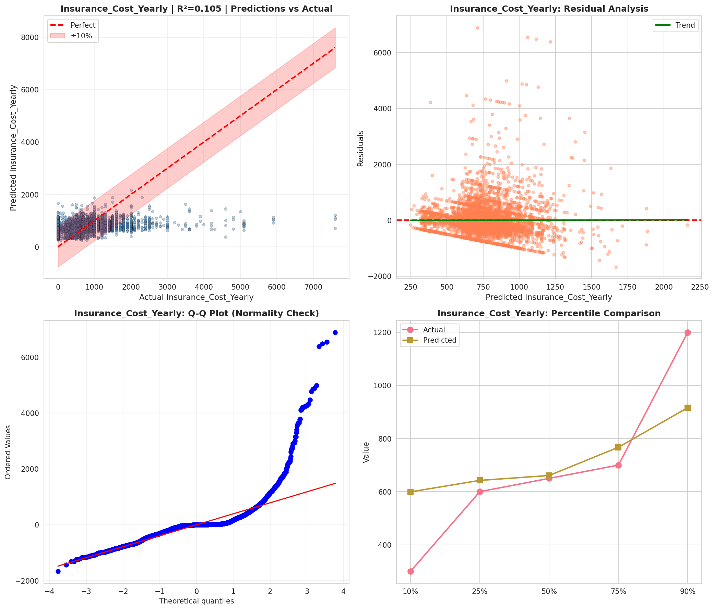
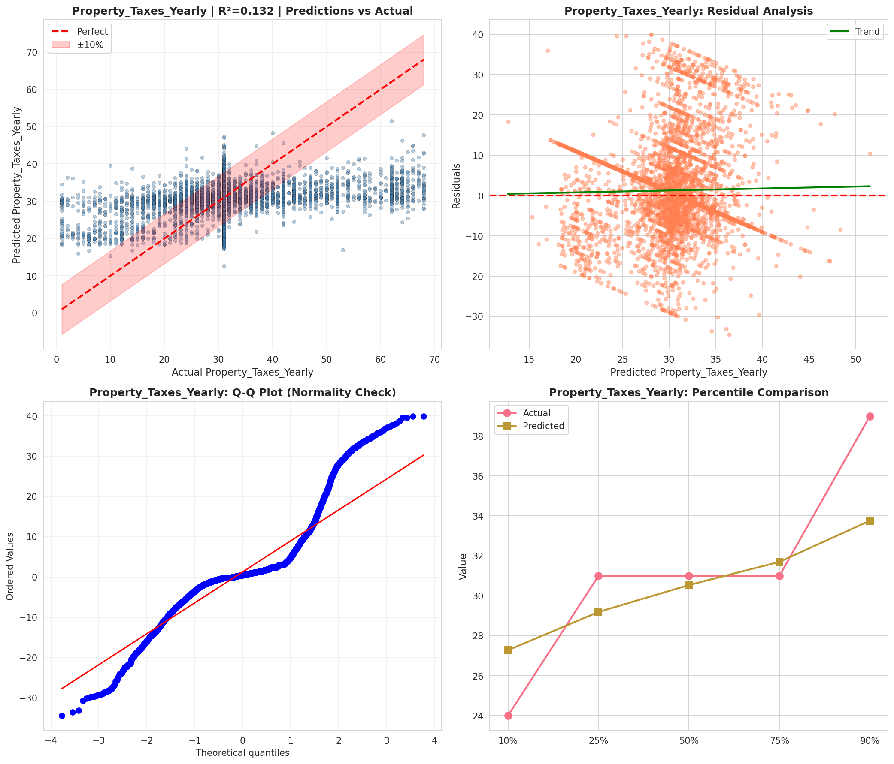
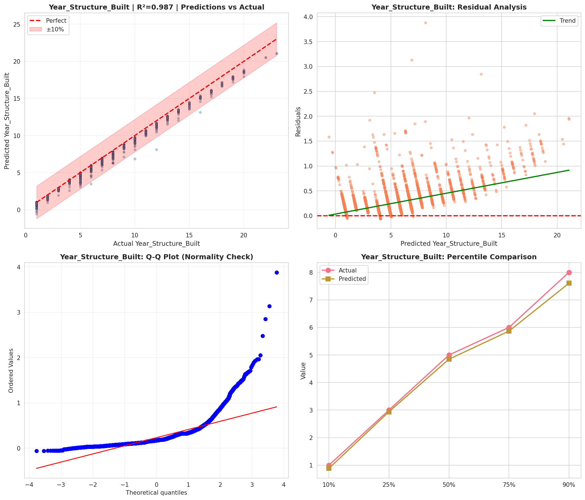
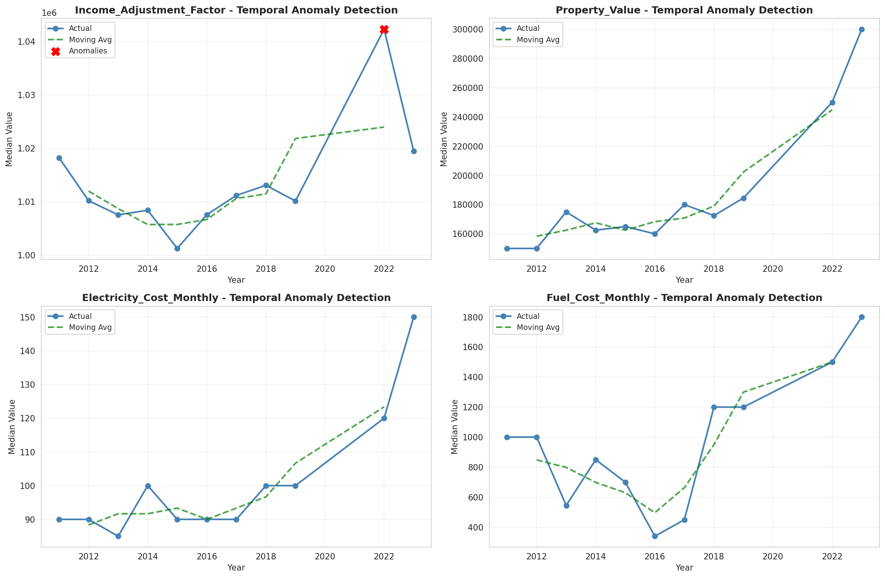
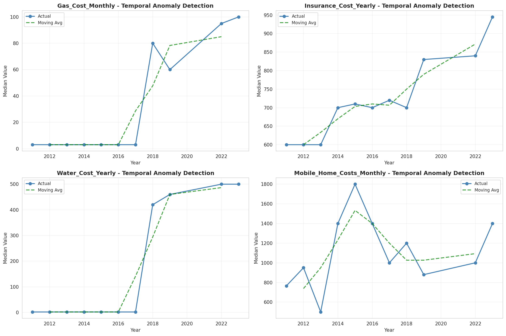

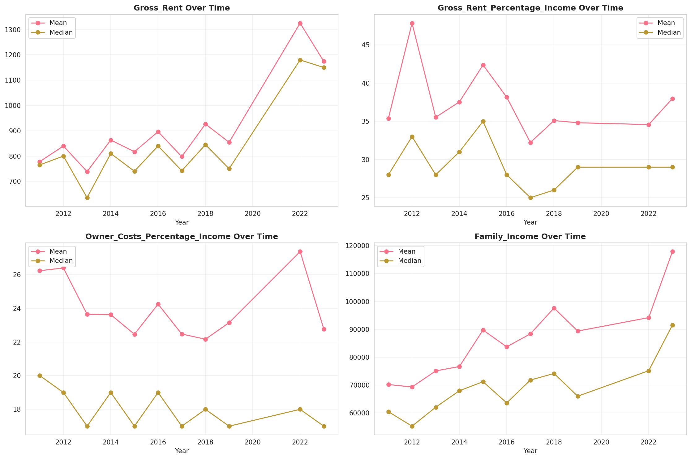
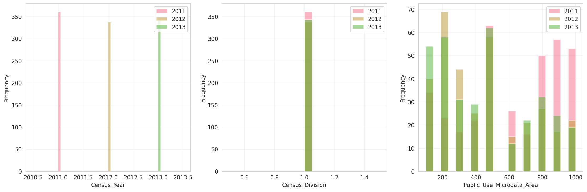
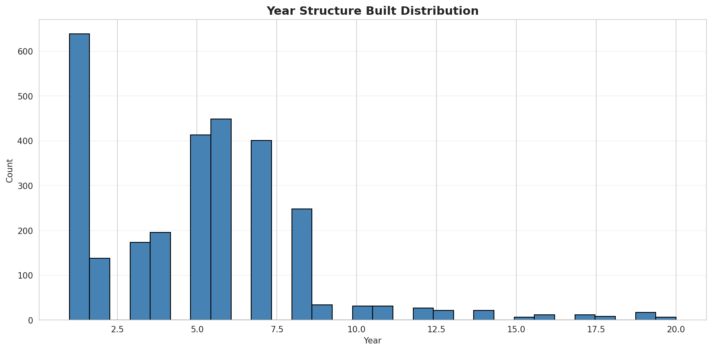
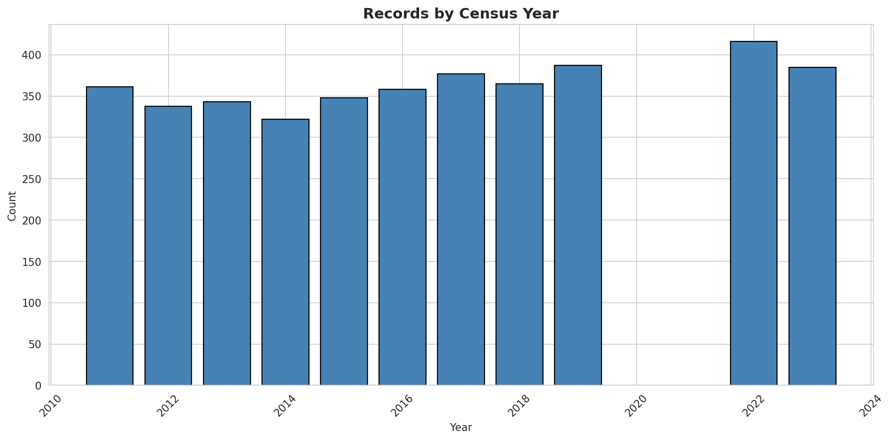
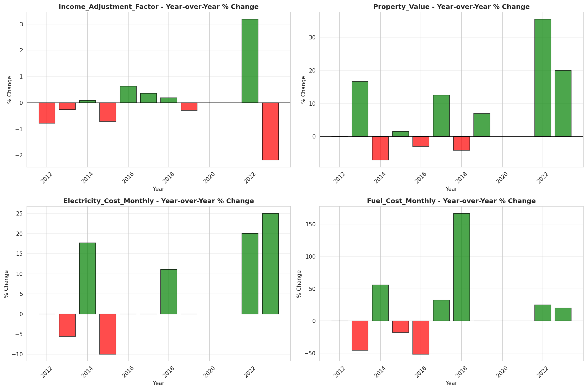
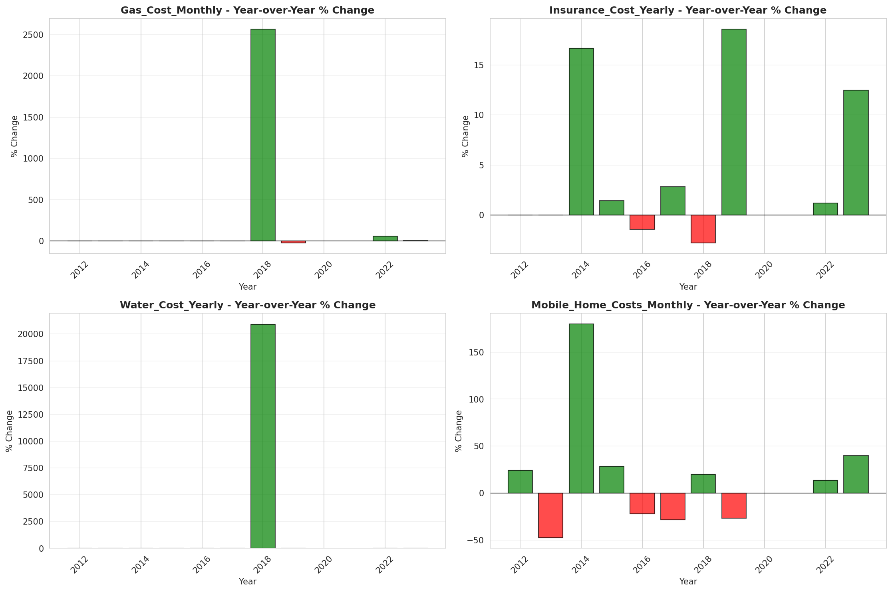
