# Temporal Analysis

## Year Distribution

- 2012: 38,436 records

- 2013: 38,963 records

- 2014: 39,521 records

- 2015: 40,050 records

- 2016: 40,097 records

- 2017: 40,365 records

- 2018: 40,689 records

- 2019: 41,032 records

- 2020: 41,377 records

- 2022: 42,102 records

- 2023: 42,524 records

## Temporal Trends

- Census_Year: {np.int64(2012): {'mean': 2012.0, 'median': 2012.0, 'std': 0.0}, np.int64(2013): {'mean': 2013.0, 'median': 2013.0, 'std': 0.0}, np.int64(2014): {'mean': 2014.0, 'median': 2014.0, 'std': 0.0}, np.int64(2015): {'mean': 2015.0, 'median': 2015.0, 'std': 0.0}, np.int64(2016): {'mean': 2016.0, 'median': 2016.0, 'std': 0.0}, np.int64(2017): {'mean': 2017.0, 'median': 2017.0, 'std': 0.0}, np.int64(2018): {'mean': 2018.0, 'median': 2018.0, 'std': 0.0}, np.int64(2019): {'mean': 2019.0, 'median': 2019.0, 'std': 0.0}, np.int64(2020): {'mean': 2020.0, 'median': 2020.0, 'std': 0.0}, np.int64(2022): {'mean': 2022.0, 'median': 2022.0, 'std': 0.0}, np.int64(2023): {'mean': 2023.0, 'median': 2023.0, 'std': 0.0}}

- Census_Division: {np.int64(2012): {'mean': 1.0, 'median': 1.0, 'std': 0.0}, np.int64(2013): {'mean': 1.0, 'median': 1.0, 'std': 0.0}, np.int64(2014): {'mean': 1.0, 'median': 1.0, 'std': 0.0}, np.int64(2015): {'mean': 1.0, 'median': 1.0, 'std': 0.0}, np.int64(2016): {'mean': 1.0, 'median': 1.0, 'std': 0.0}, np.int64(2017): {'mean': 1.0, 'median': 1.0, 'std': 0.0}, np.int64(2018): {'mean': 1.0, 'median': 1.0, 'std': 0.0}, np.int64(2019): {'mean': 1.0, 'median': 1.0, 'std': 0.0}, np.int64(2020): {'mean': 1.0, 'median': 1.0, 'std': 0.0}, np.int64(2022): {'mean': 1.0, 'median': 1.0, 'std': 0.0}, np.int64(2023): {'mean': 1.0, 'median': 1.0, 'std': 0.0}}

- Public_Use_Microdata_Area: {np.int64(2012): {'mean': None, 'median': None, 'std': None}, np.int64(2013): {'mean': None, 'median': None, 'std': None}, np.int64(2014): {'mean': None, 'median': None, 'std': None}, np.int64(2015): {'mean': None, 'median': None, 'std': None}, np.int64(2016): {'mean': 446.3800284310547, 'median': 400.0, 'std': 274.9599595898694}, np.int64(2017): {'mean': 447.9623436145175, 'median': 400.0, 'std': 274.8872482958221}, np.int64(2018): {'mean': 448.97146648971466, 'median': 400.0, 'std': 275.1773217263085}, np.int64(2019): {'mean': 449.8025930980698, 'median': 400.0, 'std': 275.30509998393285}, np.int64(2020): {'mean': 449.95770597191677, 'median': 400.0, 'std': 275.28207541659117}, np.int64(2022): {'mean': None, 'median': None, 'std': None}, np.int64(2023): {'mean': 455.3710845640109, 'median': 500.0, 'std': 280.7523648554538}}

- Census_Region: {np.int64(2012): {'mean': 1.0, 'median': 1.0, 'std': 0.0}, np.int64(2013): {'mean': 1.0, 'median': 1.0, 'std': 0.0}, np.int64(2014): {'mean': 1.0, 'median': 1.0, 'std': 0.0}, np.int64(2015): {'mean': 1.0, 'median': 1.0, 'std': 0.0}, np.int64(2016): {'mean': 1.0, 'median': 1.0, 'std': 0.0}, np.int64(2017): {'mean': 1.0, 'median': 1.0, 'std': 0.0}, np.int64(2018): {'mean': 1.0, 'median': 1.0, 'std': 0.0}, np.int64(2019): {'mean': 1.0, 'median': 1.0, 'std': 0.0}, np.int64(2020): {'mean': 1.0, 'median': 1.0, 'std': 0.0}, np.int64(2022): {'mean': 1.0, 'median': 1.0, 'std': 0.0}, np.int64(2023): {'mean': 1.0, 'median': 1.0, 'std': 0.0}}

- State_Code: {np.int64(2012): {'mean': 23.0, 'median': 23.0, 'std': 0.0}, np.int64(2013): {'mean': 23.0, 'median': 23.0, 'std': 0.0}, np.int64(2014): {'mean': 23.0, 'median': 23.0, 'std': 0.0}, np.int64(2015): {'mean': 23.0, 'median': 23.0, 'std': 0.0}, np.int64(2016): {'mean': 23.0, 'median': 23.0, 'std': 0.0}, np.int64(2017): {'mean': 23.0, 'median': 23.0, 'std': 0.0}, np.int64(2018): {'mean': 23.0, 'median': 23.0, 'std': 0.0}, np.int64(2019): {'mean': 23.0, 'median': 23.0, 'std': 0.0}, np.int64(2020): {'mean': 23.0, 'median': 23.0, 'std': 0.0}, np.int64(2022): {'mean': 23.0, 'median': 23.0, 'std': 0.0}, np.int64(2023): {'mean': None, 'median': None, 'std': None}}

- Housing_Adjustment_Factor: {np.int64(2012): {'mean': 1041235.5667082943, 'median': 1053092.0, 'std': 27468.362069135288}, np.int64(2013): {'mean': 1040080.7129841131, 'median': 1035725.0, 'std': 31973.75709919615}, np.int64(2014): {'mean': 1036772.5350573113, 'median': 1031130.0, 'std': 29608.250840521952}, np.int64(2015): {'mean': 1020981.7504369539, 'median': 1017534.0, 'std': 20333.84005168998}, np.int64(2016): {'mean': 1020322.2074469412, 'median': 1013801.0, 'std': 15770.42164845075}, np.int64(2017): {'mean': 1029091.1544407284, 'median': 1034680.0, 'std': 17977.118550447933}, np.int64(2018): {'mean': 1038248.361768537, 'median': 1046406.0, 'std': 23452.26283523203}, np.int64(2019): {'mean': 1040820.283193605, 'median': 1042936.0, 'std': 29179.559831703715}, np.int64(2020): {'mean': 1035225.8150663412, 'median': 1030827.0, 'std': 28586.68282078457}, np.int64(2022): {'mean': 1105329.0257707473, 'median': 1133141.0, 'std': 60934.82656545941}, np.int64(2023): {'mean': 1107349.017613583, 'median': 1125501.0, 'std': 76624.75969194307}}

- Income_Adjustment_Factor: {np.int64(2012): {'mean': 1052504.7515610366, 'median': 1061121.0, 'std': 26378.137944964492}, np.int64(2013): {'mean': 1049121.3268998794, 'median': 1054614.0, 'std': 29588.9802241977}, np.int64(2014): {'mean': 1047641.8935249614, 'median': 1041654.0, 'std': 31046.81480089096}, np.int64(2015): {'mean': 1030407.6973533083, 'median': 1025215.0, 'std': 25723.428110263114}, np.int64(2016): {'mean': 1027475.1536523929, 'median': 1022342.0, 'std': 17527.719811257397}, np.int64(2017): {'mean': 1036484.7193360585, 'median': 1035988.0, 'std': 16838.85421934337}, np.int64(2018): {'mean': 1046827.4812111382, 'median': 1054346.0, 'std': 20470.59745767294}, np.int64(2019): {'mean': 1049769.0789383897, 'median': 1054606.0, 'std': 26229.24589133191}, np.int64(2020): {'mean': 1045196.296734901, 'median': 1044328.0, 'std': 29237.746392209887}, np.int64(2022): {'mean': 1127201.1584010262, 'median': 1140108.0, 'std': 49028.0137407789}, np.int64(2023): {'mean': 1130783.934107798, 'median': 1159185.0, 'std': 69941.52602487466}}

- Housing_Unit_Weight: {np.int64(2012): {'mean': 18.762904568633573, 'median': 13.0, 'std': 18.19708843638725}, np.int64(2013): {'mean': 18.529656340630854, 'median': 13.0, 'std': 18.44444464243682}, np.int64(2014): {'mean': 18.336707067128867, 'median': 12.0, 'std': 18.952644773310137}, np.int64(2015): {'mean': 18.133008739076153, 'median': 12.0, 'std': 19.400170423501695}, np.int64(2016): {'mean': 18.134199566052324, 'median': 12.0, 'std': 19.239117108078005}, np.int64(2017): {'mean': 18.226458565589, 'median': 12.0, 'std': 19.165206670451916}, np.int64(2018): {'mean': 18.164049251640492, 'median': 12.0, 'std': 19.051139842466608}, np.int64(2019): {'mean': 18.102651589003706, 'median': 12.0, 'std': 19.172172983184517}, np.int64(2020): {'mean': 18.04850520820746, 'median': 11.0, 'std': 21.51211441401024}, np.int64(2022): {'mean': 17.619186736972114, 'median': 11.0, 'std': 21.173339076873987}, np.int64(2023): {'mean': 17.556015426582636, 'median': 11.0, 'std': 21.35031469374954}}

- Number_of_Persons: {np.int64(2012): {'mean': 1.6857113123113747, 'median': 2.0, 'std': 1.4101178061451183}, np.int64(2013): {'mean': 1.6737417549983318, 'median': 2.0, 'std': 1.402372878079327}, np.int64(2014): {'mean': 1.6609144505452798, 'median': 2.0, 'std': 1.3941291245741023}, np.int64(2015): {'mean': 1.6414481897627966, 'median': 1.0, 'std': 1.3831075488451954}, np.int64(2016): {'mean': 1.6119659824924557, 'median': 1.0, 'std': 1.3831478708950025}, np.int64(2017): {'mean': 1.5866716214542302, 'median': 1.0, 'std': 1.382751430836825}, np.int64(2018): {'mean': 1.5812381724790483, 'median': 1.0, 'std': 1.3802625780020845}, np.int64(2019): {'mean': 1.580961201013843, 'median': 1.0, 'std': 1.375095822347087}, np.int64(2020): {'mean': 1.5662807840104407, 'median': 1.0, 'std': 1.371744149801902}, np.int64(2022): {'mean': 1.6191867369721153, 'median': 1.0, 'std': 1.3546750739719084}, np.int64(2023): {'mean': 1.6430251152290472, 'median': 1.0, 'std': 1.343845098717433}}

- Housing_Unit_Type: {np.int64(2012): {'mean': 1.1117702154230409, 'median': 1.0, 'std': 0.4291885529225358}, np.int64(2013): {'mean': 1.1233734568693376, 'median': 1.0, 'std': 0.4502890433900469}, np.int64(2014): {'mean': 1.1352698565319703, 'median': 1.0, 'std': 0.4700775020889071}, np.int64(2015): {'mean': 1.1534082397003744, 'median': 1.0, 'std': 0.4995805820421051}, np.int64(2016): {'mean': 1.1526797516023644, 'median': 1.0, 'std': 0.49808328151472847}, np.int64(2017): {'mean': 1.1558528428093646, 'median': 1.0, 'std': 0.5036417216579921}, np.int64(2018): {'mean': 1.1581508515815084, 'median': 1.0, 'std': 0.506866420643311}, np.int64(2019): {'mean': 1.1613618639110939, 'median': 1.0, 'std': 0.5116331640243938}, np.int64(2020): {'mean': None, 'median': None, 'std': None}, np.int64(2022): {'mean': None, 'median': None, 'std': None}, np.int64(2023): {'mean': None, 'median': None, 'std': None}}

- Building_Type: {np.int64(2012): {'mean': 2.3815833612881585, 'median': 2.0, 'std': 1.403990239222426}, np.int64(2013): {'mean': 2.374204839023306, 'median': 2.0, 'std': 1.4035473560458442}, np.int64(2014): {'mean': 2.3762903670990894, 'median': 2.0, 'std': 1.4089244599916548}, np.int64(2015): {'mean': 2.3800512354350882, 'median': 2.0, 'std': 1.416971292700199}, np.int64(2016): {'mean': 2.3869343969192682, 'median': 2.0, 'std': 1.4243305236782409}, np.int64(2017): {'mean': 2.3958071049318517, 'median': 2.0, 'std': 1.440120824201518}, np.int64(2018): {'mean': 2.405797889698684, 'median': 2.0, 'std': 1.451627584915924}, np.int64(2019): {'mean': 2.4093230644507497, 'median': 2.0, 'std': 1.458900641064514}, np.int64(2020): {'mean': 2.409687374211727, 'median': 2.0, 'std': 1.456064578561882}, np.int64(2022): {'mean': 2.4150867930565556, 'median': 2.0, 'std': 1.4592151796963255}, np.int64(2023): {'mean': 2.410806357306118, 'median': 2.0, 'std': 1.451562715105193}}

- Year_Structure_Built: {np.int64(2012): {'mean': 4.472939729397294, 'median': 5.0, 'std': 2.702071107770954}, np.int64(2013): {'mean': 4.565376816022667, 'median': 5.0, 'std': 2.765869291366975}, np.int64(2014): {'mean': 4.654871653325973, 'median': 5.0, 'std': 2.8512706896914928}, np.int64(2015): {'mean': 4.736109963363909, 'median': 5.0, 'std': 2.9430621139565547}, np.int64(2016): {'mean': 4.8665383028469265, 'median': 5.0, 'std': 3.0905911118110305}, np.int64(2017): {'mean': 5.008073786195194, 'median': 5.0, 'std': 3.286406210558818}, np.int64(2018): {'mean': 5.114462090721201, 'median': 5.0, 'std': 3.459636559389309}, np.int64(2019): {'mean': 5.210836373463046, 'median': 5.0, 'std': 3.6372477578715277}, np.int64(2020): {'mean': 5.29990607808936, 'median': 5.0, 'std': 3.8154839562916525}, np.int64(2022): {'mean': None, 'median': None, 'std': None}, np.int64(2023): {'mean': None, 'median': None, 'std': None}}

- Bathtub_or_Shower: {np.int64(2012): {'mean': 1.054679637705468, 'median': 1.0, 'std': 0.2273570318791013}, np.int64(2013): {'mean': 1.0525014583738437, 'median': 1.0, 'std': 0.22303909326915053}, np.int64(2014): {'mean': 1.0504554236820314, 'median': 1.0, 'std': 0.2188858065644313}, np.int64(2015): {'mean': 1.0487838470649808, 'median': 1.0, 'std': 0.21541880513720568}, np.int64(2016): {'mean': 1.049786824370788, 'median': 1.0, 'std': 0.21750723621839063}, np.int64(2017): {'mean': 1.0514806502818983, 'median': 1.0, 'std': 0.22097902477987277}, np.int64(2018): {'mean': 1.050364407701512, 'median': 1.0, 'std': 0.21869873075259852}, np.int64(2019): {'mean': 1.0485610052695582, 'median': 1.0, 'std': 0.2149513494422152}, np.int64(2020): {'mean': 1.0477123306051255, 'median': 1.0, 'std': 0.21315976029690642}, np.int64(2022): {'mean': 1.0368770498360131, 'median': 1.0, 'std': 0.18846241032217023}, np.int64(2023): {'mean': 1.031361292723117, 'median': 1.0, 'std': 0.17429449051599866}}

- Refrigerator: {np.int64(2012): {'mean': 1.033741473778374, 'median': 1.0, 'std': 0.18056549549098522}, np.int64(2013): {'mean': 1.0320842245617934, 'median': 1.0, 'std': 0.17622624599665843}, np.int64(2014): {'mean': 1.0306099917195695, 'median': 1.0, 'std': 0.1722609624002156}, np.int64(2015): {'mean': 1.0280693055670331, 'median': 1.0, 'std': 0.1651731550975289}, np.int64(2016): {'mean': 1.0279191307935636, 'median': 1.0, 'std': 0.16474343527917495}, np.int64(2017): {'mean': 1.029476161804149, 'median': 1.0, 'std': 0.16913929365431146}, np.int64(2018): {'mean': 1.0275481344501252, 'median': 1.0, 'std': 0.16367639805696282}, np.int64(2019): {'mean': 1.0262396973381975, 'median': 1.0, 'std': 0.1598495108514978}, np.int64(2020): {'mean': 1.026163960821146, 'median': 1.0, 'std': 0.15962484684179462}, np.int64(2022): {'mean': 1.0209049942671253, 'median': 1.0, 'std': 0.14306823989057754}, np.int64(2023): {'mean': 1.0192951682347313, 'median': 1.0, 'std': 0.13756223191997982}}

- Hot_and_Cold_Running_Water: {np.int64(2012): {'mean': 1.0560494241306049, 'median': 1.0, 'std': 0.23002035835394835}, np.int64(2013): {'mean': 1.054779299424984, 'median': 1.0, 'std': 0.22755211744090625}, np.int64(2014): {'mean': 1.0526911399392769, 'median': 1.0, 'std': 0.2234192504438153}, np.int64(2015): {'mean': 1.0509599757595791, 'median': 1.0, 'std': 0.21991905072633022}, np.int64(2016): {'mean': 1.0518773208637051, 'median': 1.0, 'std': 0.22178236498653306}, np.int64(2017): {'mean': 1.0531227762877005, 'median': 1.0, 'std': 0.22428134927870516}, np.int64(2018): {'mean': 1.0519145001631676, 'median': 1.0, 'std': 0.2218574393030038}, np.int64(2019): {'mean': 1.0506418051614648, 'median': 1.0, 'std': 0.2192681280421814}, np.int64(2020): {'mean': 1.0505568227559372, 'median': 1.0, 'std': 0.21909385787267155}, np.int64(2022): {'mean': 1.0400501293229876, 'median': 1.0, 'std': 0.1960794268639523}, np.int64(2023): {'mean': 1.0348429277627174, 'median': 1.0, 'std': 0.1833842739684956}}

- Running_Water: {np.int64(2012): {'mean': None, 'median': None, 'std': None}, np.int64(2013): {'mean': 9.0, 'median': 9.0, 'std': 0.0}, np.int64(2014): {'mean': 9.0, 'median': 9.0, 'std': 0.0}, np.int64(2015): {'mean': 9.0, 'median': 9.0, 'std': 0.0}, np.int64(2016): {'mean': 9.0, 'median': 9.0, 'std': 0.0}, np.int64(2017): {'mean': 9.0, 'median': 9.0, 'std': 0.0}, np.int64(2018): {'mean': 9.0, 'median': 9.0, 'std': 0.0}, np.int64(2019): {'mean': 9.0, 'median': 9.0, 'std': 0.0}, np.int64(2020): {'mean': 9.0, 'median': 9.0, 'std': 0.0}, np.int64(2022): {'mean': 9.0, 'median': 9.0, 'std': 0.0}, np.int64(2023): {'mean': 9.0, 'median': 9.0, 'std': 0.0}}

- Sink_with_Faucet: {np.int64(2012): {'mean': 1.0414570054791457, 'median': 1.0, 'std': 0.19934751838120582}, np.int64(2013): {'mean': 1.0393622045056807, 'median': 1.0, 'std': 0.1944578920399967}, np.int64(2014): {'mean': 1.0372619376207564, 'median': 1.0, 'std': 0.1894055854839701}, np.int64(2015): {'mean': 1.0356995289645483, 'median': 1.0, 'std': 0.18554250427629024}, np.int64(2016): {'mean': 1.0355934534451932, 'median': 1.0, 'std': 0.18527683003453405}, np.int64(2017): {'mean': 1.0379331107340304, 'median': 1.0, 'std': 0.19103713951055992}, np.int64(2018): {'mean': 1.0368758838246492, 'median': 1.0, 'std': 0.18845959484219713}, np.int64(2019): {'mean': 1.0360491825428997, 'median': 1.0, 'std': 0.18641506929108062}, np.int64(2020): {'mean': 1.0355829867167583, 'median': 1.0, 'std': 0.18525052951165538}, np.int64(2022): {'mean': 1.0280510892461936, 'median': 1.0, 'std': 0.165121024238402}, np.int64(2023): {'mean': 1.024424600010631, 'median': 1.0, 'std': 0.15436538546031534}}

- Stove_or_Range: {np.int64(2012): {'mean': 1.0310578105781059, 'median': 1.0, 'std': 0.17347640835139447}, np.int64(2013): {'mean': 1.0294452623683992, 'median': 1.0, 'std': 0.16905334299128458}, np.int64(2014): {'mean': 1.0279602539332044, 'median': 1.0, 'std': 0.1648612395892577}, np.int64(2015): {'mean': 1.0255350797454756, 'median': 1.0, 'std': 0.15774576030208384}, np.int64(2016): {'mean': 1.0247283729885848, 'median': 1.0, 'std': 0.155298241934466}, np.int64(2017): {'mean': 1.026575072527232, 'median': 1.0, 'std': 0.16084012579259227}, np.int64(2018): {'mean': 1.0251550092461656, 'median': 1.0, 'std': 0.156597897963557}, np.int64(2019): {'mean': 1.0242129441967303, 'median': 1.0, 'std': 0.15371179531799858}, np.int64(2020): {'mean': 1.0240708439554542, 'median': 1.0, 'std': 0.15327122636828375}, np.int64(2022): {'mean': 1.0202383809295257, 'median': 1.0, 'std': 0.14081660983840233}, np.int64(2023): {'mean': 1.0190293945675863, 'median': 1.0, 'std': 0.13663005837011935}}

- Telephone_Service: {np.int64(2012): {'mean': 1.0167841927427648, 'median': 1.0, 'std': 0.1284643519582159}, np.int64(2013): {'mean': 1.0178050204319906, 'median': 1.0, 'std': 0.13224462092890235}, np.int64(2014): {'mean': 1.018969206775235, 'median': 1.0, 'std': 0.1364186605856643}, np.int64(2015): {'mean': 1.0204421891989852, 'median': 1.0, 'std': 0.14150982971986853}, np.int64(2016): {'mean': 1.0216408862108242, 'median': 1.0, 'std': 0.14551060511212363}, np.int64(2017): {'mean': 1.0216003562945368, 'median': 1.0, 'std': 0.145377320414992}, np.int64(2018): {'mean': 1.0208210277613703, 'median': 1.0, 'std': 0.14278748275715716}, np.int64(2019): {'mean': 1.018983644859813, 'median': 1.0, 'std': 0.1364695789992044}, np.int64(2020): {'mean': 1.0153627207706903, 'median': 1.0, 'std': 0.12299292496071855}, np.int64(2022): {'mean': 1.0104791977514833, 'median': 1.0, 'std': 0.10183193992623575}, np.int64(2023): {'mean': 1.0085690093141406, 'median': 1.0, 'std': 0.09217303914497761}}

- Lot_Acreage: {np.int64(2012): {'mean': 1.7382849856550844, 'median': 2.0, 'std': 0.6952593037488929}, np.int64(2013): {'mean': 1.7463671973717463, 'median': 2.0, 'std': 0.6936447345550542}, np.int64(2014): {'mean': 1.7521348737912847, 'median': 2.0, 'std': 0.6949836366013982}, np.int64(2015): {'mean': 1.7598695556740147, 'median': 2.0, 'std': 0.6941289665335845}, np.int64(2016): {'mean': 1.7542869682435187, 'median': 2.0, 'std': 0.6932062241351086}, np.int64(2017): {'mean': 1.7502497190660506, 'median': 2.0, 'std': 0.6933145936109981}, np.int64(2018): {'mean': 1.7519957754791415, 'median': 2.0, 'std': 0.6938905113428604}, np.int64(2019): {'mean': 1.7556804149172636, 'median': 2.0, 'std': 0.6920350428256905}, np.int64(2020): {'mean': 1.7572063103078572, 'median': 2.0, 'std': 0.6938916626460133}, np.int64(2022): {'mean': 1.7607517056530215, 'median': 2.0, 'std': 0.6915623579664559}, np.int64(2023): {'mean': 1.7635161769610965, 'median': 2.0, 'std': 0.6907870077233705}}

- Agricultural_Sales: {np.int64(2012): {'mean': 1.1066000135107747, 'median': 1.0, 'std': 0.5994967701559162}, np.int64(2013): {'mean': 1.0983628289255651, 'median': 1.0, 'std': 0.5687536211319797}, np.int64(2014): {'mean': 1.0967212037584597, 'median': 1.0, 'std': 0.559839311243585}, np.int64(2015): {'mean': 1.090102433613884, 'median': 1.0, 'std': 0.539123685357043}, np.int64(2016): {'mean': 1.0833943427620631, 'median': 1.0, 'std': 0.5187195266412262}, np.int64(2017): {'mean': 1.079550074535845, 'median': 1.0, 'std': 0.5019855009313335}, np.int64(2018): {'mean': 1.0810409924487594, 'median': 1.0, 'std': 0.5091429407240945}, np.int64(2019): {'mean': 1.0782152579509994, 'median': 1.0, 'std': 0.5023095680292331}, np.int64(2020): {'mean': 1.0831453218314533, 'median': 1.0, 'std': 0.5161676284129868}, np.int64(2022): {'mean': 1.0894644644644644, 'median': 1.0, 'std': 0.5356621891109479}, np.int64(2023): {'mean': 1.0897926925648975, 'median': 1.0, 'std': 0.5391064014904827}}

- Business_On_Property: {np.int64(2012): {'mean': 1.9703538412496016, 'median': 2.0, 'std': 0.1696118541907607}, np.int64(2013): {'mean': 1.9704953247409653, 'median': 2.0, 'std': 0.16921895274008905}, np.int64(2014): {'mean': 1.9716187366570388, 'median': 2.0, 'std': 0.16606213598531439}, np.int64(2015): {'mean': 1.9717475149728763, 'median': 2.0, 'std': 0.1656959354437977}, np.int64(2016): {'mean': 3.381830151415405, 'median': 2.0, 'std': 2.8182744120029577}, np.int64(2017): {'mean': 4.799975028093395, 'median': 2.0, 'std': 3.4488310281297587}, np.int64(2018): {'mean': 6.209548659646507, 'median': 9.0, 'std': 3.4398606332425086}, np.int64(2019): {'mean': 7.608205729809829, 'median': 9.0, 'std': 2.801418128579829}, np.int64(2020): {'mean': None, 'median': None, 'std': None}, np.int64(2022): {'mean': None, 'median': None, 'std': None}, np.int64(2023): {'mean': None, 'median': None, 'std': None}}

- Tenure: {np.int64(2012): {'mean': 1.7502938151902454, 'median': 2.0, 'std': 0.8288169353823713}, np.int64(2013): {'mean': 1.7578809106830122, 'median': 2.0, 'std': 0.8271512202828887}, np.int64(2014): {'mean': 1.766348699720721, 'median': 2.0, 'std': 0.8246479189279945}, np.int64(2015): {'mean': 1.774773468648061, 'median': 2.0, 'std': 0.8238278442835536}, np.int64(2016): {'mean': 1.7789249366204944, 'median': 2.0, 'std': 0.8226116119922591}, np.int64(2017): {'mean': 1.78125, 'median': 2.0, 'std': 0.8233023752087613}, np.int64(2018): {'mean': 1.7806777909037212, 'median': 2.0, 'std': 0.8198808620121509}, np.int64(2019): {'mean': 1.7850832359813085, 'median': 2.0, 'std': 0.8186649475718529}, np.int64(2020): {'mean': 1.7827324478178368, 'median': 2.0, 'std': 0.813355767219466}, np.int64(2022): {'mean': 1.7841701655158055, 'median': 2.0, 'std': 0.8037220486141724}, np.int64(2023): {'mean': 1.7868924640135477, 'median': 2.0, 'std': 0.7978328801740425}}

- Vacancy_Status: {np.int64(2012): {'mean': 4.961493445692884, 'median': 5.0, 'std': 1.1020891138195648}, np.int64(2013): {'mean': 4.972180188569433, 'median': 5.0, 'std': 1.0997063352881469}, np.int64(2014): {'mean': 4.982215036378335, 'median': 5.0, 'std': 1.0959543147266297}, np.int64(2015): {'mean': 5.003213588890164, 'median': 5.0, 'std': 1.0783105653447655}, np.int64(2016): {'mean': 5.020682862770847, 'median': 5.0, 'std': 1.0605552234355708}, np.int64(2017): {'mean': 5.022097144048364, 'median': 5.0, 'std': 1.0606203871782245}, np.int64(2018): {'mean': 5.032527881040892, 'median': 5.0, 'std': 1.04611987806586}, np.int64(2019): {'mean': 5.042962654738375, 'median': 5.0, 'std': 1.0283768418223989}, np.int64(2020): {'mean': 5.05131325423385, 'median': 5.0, 'std': 1.027711152176565}, np.int64(2022): {'mean': 5.084408106863196, 'median': 5.0, 'std': 1.0074654456457242}, np.int64(2023): {'mean': 5.095543760029626, 'median': 5.0, 'std': 1.007015461387617}}

- Vehicles_Available: {np.int64(2012): {'mean': 1.8404950785955634, 'median': 2.0, 'std': 1.0090906105854514}, np.int64(2013): {'mean': 1.8346103327495622, 'median': 2.0, 'std': 1.0076745792840953}, np.int64(2014): {'mean': 1.8274636393311814, 'median': 2.0, 'std': 1.0053221545696507}, np.int64(2015): {'mean': 1.8182674882203698, 'median': 2.0, 'std': 1.0030724698939995}, np.int64(2016): {'mean': 1.8190101774626153, 'median': 2.0, 'std': 1.0045173565293288}, np.int64(2017): {'mean': 1.8266404394299287, 'median': 2.0, 'std': 1.0115180764988299}, np.int64(2018): {'mean': 1.8350561134081511, 'median': 2.0, 'std': 1.0192707142685262}, np.int64(2019): {'mean': 1.8472181658878504, 'median': 2.0, 'std': 1.0230380455038373}, np.int64(2020): {'mean': 1.8651656692453655, 'median': 2.0, 'std': 1.0307604687948975}, np.int64(2022): {'mean': 1.874908914257955, 'median': 2.0, 'std': 1.0378707081183407}, np.int64(2023): {'mean': 1.8700762066045724, 'median': 2.0, 'std': 1.0348816162461245}}

- Condo_Fee_Monthly: {np.int64(2012): {'mean': 242.83292978208232, 'median': 200.0, 'std': 180.75344920203975}, np.int64(2013): {'mean': 254.1343669250646, 'median': 200.0, 'std': 177.39030042908482}, np.int64(2014): {'mean': 266.0158311345646, 'median': 210.0, 'std': 195.0314308207049}, np.int64(2015): {'mean': 284.6756756756757, 'median': 225.0, 'std': 207.69095162053543}, np.int64(2016): {'mean': 297.56962025316454, 'median': 240.0, 'std': 203.54389912665732}, np.int64(2017): {'mean': 314.1025641025641, 'median': 250.0, 'std': 222.47429488804633}, np.int64(2018): {'mean': 316.1443736730361, 'median': 250.0, 'std': 216.94814647936101}, np.int64(2019): {'mean': 321.15337423312883, 'median': 270.0, 'std': 213.81394881258086}, np.int64(2020): {'mean': 339.06849315068496, 'median': 280.0, 'std': 273.4924904971125}, np.int64(2022): {'mean': 353.20962199312714, 'median': 300.0, 'std': 283.6394781643606}, np.int64(2023): {'mean': 381.3366174055829, 'median': 300.0, 'std': 366.53334197405667}}

- Electricity_Cost_Monthly: {np.int64(2012): {'mean': 100.06559424122227, 'median': 90.0, 'std': 65.44986893450954}, np.int64(2013): {'mean': 99.2198992994746, 'median': 90.0, 'std': 64.6773794556431}, np.int64(2014): {'mean': 99.11522977041093, 'median': 90.0, 'std': 65.54934484170936}, np.int64(2015): {'mean': 100.02065965929685, 'median': 90.0, 'std': 67.07823104294313}, np.int64(2016): {'mean': 99.86181430723445, 'median': 90.0, 'std': 67.5417858130834}, np.int64(2017): {'mean': 100.40803147268409, 'median': 90.0, 'std': 68.79897774981768}, np.int64(2018): {'mean': 108.59851956291858, 'median': 90.0, 'std': 68.50210021585048}, np.int64(2019): {'mean': 111.43992556119878, 'median': 100.0, 'std': 70.64225951422304}, np.int64(2020): {'mean': 113.37666770089979, 'median': 100.0, 'std': 74.3314903222523}, np.int64(2022): {'mean': 129.66670351943984, 'median': 100.0, 'std': 141.56151065260232}, np.int64(2023): {'mean': 146.12969086987778, 'median': 120.0, 'std': 163.62328081579147}}

- Fuel_Cost_Monthly: {np.int64(2012): {'mean': 1229.870574408697, 'median': 1000.0, 'std': 1228.5891688408021}, np.int64(2013): {'mean': 1188.96997227087, 'median': 1000.0, 'std': 1211.646375800015}, np.int64(2014): {'mean': 1186.0446483624098, 'median': 1000.0, 'std': 1233.7614190948443}, np.int64(2015): {'mean': 1180.5532439289598, 'median': 900.0, 'std': 1256.091750356008}, np.int64(2016): {'mean': 1094.8774295477092, 'median': 800.0, 'std': 1217.8008680041833}, np.int64(2017): {'mean': 985.3812351543943, 'median': 630.0, 'std': 1153.7999577157336}, np.int64(2018): {'mean': 1457.2993918331886, 'median': 1200.0, 'std': 1078.7657375603098}, np.int64(2019): {'mean': 1390.0002320858719, 'median': 1200.0, 'std': 1018.9564964463259}, np.int64(2020): {'mean': 1354.8158127991492, 'median': 1200.0, 'std': 997.6673151282665}, np.int64(2022): {'mean': 1465.0500632984233, 'median': 1200.0, 'std': 1090.7348383390906}, np.int64(2023): {'mean': 1571.8367902074124, 'median': 1200.0, 'std': 1198.9305065485567}}

- Gas_Cost_Monthly: {np.int64(2012): {'mean': 31.778793888644042, 'median': 3.0, 'std': 73.6378908926644}, np.int64(2013): {'mean': 31.237047577349678, 'median': 3.0, 'std': 72.38556869319059}, np.int64(2014): {'mean': 32.56874977331254, 'median': 3.0, 'std': 74.67526079682976}, np.int64(2015): {'mean': 34.68318231243204, 'median': 3.0, 'std': 78.1842617004871}, np.int64(2016): {'mean': 34.41955395524856, 'median': 3.0, 'std': 76.79353339164696}, np.int64(2017): {'mean': 35.394113717339664, 'median': 3.0, 'std': 77.24356002346101}, np.int64(2018): {'mean': 97.99618818336845, 'median': 50.0, 'std': 110.0218805098607}, np.int64(2019): {'mean': 101.31961377157906, 'median': 50.0, 'std': 113.02835163825382}, np.int64(2020): {'mean': 104.62045760430686, 'median': 60.0, 'std': 116.2458793571405}, np.int64(2022): {'mean': 124.04945633111188, 'median': 70.0, 'std': 147.36443882761162}, np.int64(2023): {'mean': 137.2632739609839, 'median': 80.0, 'std': 172.57689601072698}}

- House_Heating_Fuel: {np.int64(2012): {'mean': 4.127332158072572, 'median': 4.0, 'std': 1.2037993289279636}, np.int64(2013): {'mean': 4.145577933450087, 'median': 4.0, 'std': 1.2565462409740393}, np.int64(2014): {'mean': 4.1551630336222845, 'median': 4.0, 'std': 1.3067472643346123}, np.int64(2015): {'mean': 4.14360275462124, 'median': 4.0, 'std': 1.3560823053021167}, np.int64(2016): {'mean': 4.109821067715031, 'median': 4.0, 'std': 1.3837038775706116}, np.int64(2017): {'mean': 4.065803147268409, 'median': 4.0, 'std': 1.4122481995634055}, np.int64(2018): {'mean': 4.013474601299468, 'median': 4.0, 'std': 1.4152323586449707}, np.int64(2019): {'mean': 3.9601708528037385, 'median': 4.0, 'std': 1.4081020922977172}, np.int64(2020): {'mean': 3.9202306232666766, 'median': 4.0, 'std': 1.3979620366086658}, np.int64(2022): {'mean': 3.8620007633852667, 'median': 4.0, 'std': 1.4065640443484038}, np.int64(2023): {'mean': 3.8422015241320913, 'median': 4.0, 'std': 1.422354965986364}}

- Insurance_Cost_Yearly: {np.int64(2013): {'mean': 705.6420756486402, 'median': 600.0, 'std': 475.14554217976854}, np.int64(2014): {'mean': 731.6603477988407, 'median': 600.0, 'std': 496.62606837682046}, np.int64(2015): {'mean': 759.440079823548, 'median': 620.0, 'std': 517.7285797727285}}

- Water_Cost_Yearly: {np.int64(2012): {'mean': 130.7805567797855, 'median': 2.0, 'std': 288.33380455453204}, np.int64(2013): {'mean': 128.28039258610625, 'median': 2.0, 'std': 288.03438292977165}, np.int64(2014): {'mean': 127.20195132566828, 'median': 2.0, 'std': 288.4165499032093}, np.int64(2015): {'mean': 126.93446901051105, 'median': 2.0, 'std': 291.6098002463136}, np.int64(2016): {'mean': 127.67200646654665, 'median': 2.0, 'std': 286.86797660412697}, np.int64(2017): {'mean': 131.0437945368171, 'median': 2.0, 'std': 294.88457895653704}, np.int64(2018): {'mean': 507.00860973888496, 'median': 420.0, 'std': 403.47406598080966}, np.int64(2019): {'mean': 517.1035648865718, 'median': 430.0, 'std': 417.6284370082375}, np.int64(2020): {'mean': 529.2067996628266, 'median': 450.0, 'std': 430.722629593008}, np.int64(2022): {'mean': 560.0825530792563, 'median': 480.0, 'std': 464.1130887576104}, np.int64(2023): {'mean': 577.6266258607498, 'median': 500.0, 'std': 481.4423313053421}}

- Mobile_Home_Costs_Monthly: {np.int64(2012): {'mean': 1499.544523246651, 'median': 920.0, 'std': 1458.1430881650251}, np.int64(2013): {'mean': 1513.0423402617398, 'median': 900.0, 'std': 1490.871469502224}, np.int64(2014): {'mean': 1513.4083850931677, 'median': 900.0, 'std': 1517.9428830185902}, np.int64(2015): {'mean': 1547.833850931677, 'median': 900.0, 'std': 1576.9340332360166}, np.int64(2016): {'mean': 1624.898318654924, 'median': 980.0, 'std': 1670.4316203144044}, np.int64(2017): {'mean': 1676.6468222043443, 'median': 1000.0, 'std': 1703.3724226573831}, np.int64(2018): {'mean': 1693.4267716535433, 'median': 1000.0, 'std': 1713.4515819341375}, np.int64(2019): {'mean': 1746.4980842911878, 'median': 1000.0, 'std': 1768.694177129721}, np.int64(2020): {'mean': 1826.9473684210527, 'median': 1100.0, 'std': 1984.2532353388744}, np.int64(2022): {'mean': 2084.9485714285715, 'median': 1000.0, 'std': 3448.6958499204975}, np.int64(2023): {'mean': 2209.038280725319, 'median': 1000.0, 'std': 3574.585160420457}}

- First_Mortgage_Includes_Insurance: {np.int64(2012): {'mean': 1.5762113184366122, 'median': 2.0, 'std': 0.49417667609355614}, np.int64(2013): {'mean': 1.5660260384376938, 'median': 2.0, 'std': 0.49564059531575255}, np.int64(2014): {'mean': 1.558498550270355, 'median': 2.0, 'std': 0.49658558567948635}, np.int64(2015): {'mean': 1.5466772781536013, 'median': 2.0, 'std': 0.4978362747050498}, np.int64(2016): {'mean': 1.5328015627543545, 'median': 2.0, 'std': 0.4989432030997268}, np.int64(2017): {'mean': 1.522434839986803, 'median': 2.0, 'std': 0.4995170251303581}, np.int64(2018): {'mean': 1.5093423327022801, 'median': 2.0, 'std': 0.4999332887038891}, np.int64(2019): {'mean': 1.4968729427254772, 'median': 1.0, 'std': 0.500010795029839}, np.int64(2020): {'mean': 1.4834342415068953, 'median': 1.0, 'std': 0.49974651261546543}, np.int64(2022): {'mean': 1.4490705694339305, 'median': 1.0, 'std': 0.4974203499304385}, np.int64(2023): {'mean': 1.4369071815718157, 'median': 1.0, 'std': 0.49602432701926835}}

- First_Mortgage_Payment_Monthly: {np.int64(2012): {'mean': 872.9156108423558, 'median': 750.0, 'std': 597.7513765821293}, np.int64(2013): {'mean': 871.6246125232486, 'median': 750.0, 'std': 586.5616137031159}, np.int64(2014): {'mean': 871.2036674241831, 'median': 760.0, 'std': 582.7771497267237}, np.int64(2015): {'mean': 879.0013529645842, 'median': 770.0, 'std': 588.070677465797}, np.int64(2016): {'mean': 895.6093114113626, 'median': 790.0, 'std': 588.5573632681214}, np.int64(2017): {'mean': 915.3678653909601, 'median': 800.0, 'std': 600.0587902760345}, np.int64(2018): {'mean': 927.7491151535106, 'median': 800.0, 'std': 605.3120250096248}, np.int64(2019): {'mean': 949.7297564186965, 'median': 840.0, 'std': 616.5432035898658}, np.int64(2020): {'mean': 973.0854355869492, 'median': 850.0, 'std': 614.8574176450093}, np.int64(2022): {'mean': 1045.4300614012952, 'median': 910.0, 'std': 659.8571092424255}, np.int64(2023): {'mean': 1104.1595528455284, 'median': 960.0, 'std': 702.671824065305}}

- First_Mortgage_Includes_Taxes: {np.int64(2012): {'mean': 1.5137833064578055, 'median': 2.0, 'std': 0.49982917497261314}, np.int64(2013): {'mean': 1.5018598884066956, 'median': 2.0, 'std': 0.5000159156327848}, np.int64(2014): {'mean': 1.489851892484915, 'median': 1.0, 'std': 0.4999165933628307}, np.int64(2015): {'mean': 1.4756068444090729, 'median': 1.0, 'std': 0.4994244935146162}, np.int64(2016): {'mean': 1.4584079440013022, 'median': 1.0, 'std': 0.4982873770067047}, np.int64(2017): {'mean': 1.4450676344440778, 'median': 1.0, 'std': 0.49699377084658874}, np.int64(2018): {'mean': 1.4353444727961149, 'median': 1.0, 'std': 0.4958224462485857}, np.int64(2019): {'mean': 1.4224818959842, 'median': 1.0, 'std': 0.4939747194505691}, np.int64(2020): {'mean': 1.4050622267070298, 'median': 1.0, 'std': 0.49092472490479905}, np.int64(2022): {'mean': 1.3689965514340987, 'median': 1.0, 'std': 0.48255329492295496}, np.int64(2023): {'mean': 1.3510331978319783, 'median': 1.0, 'std': 0.47731350938801226}}

- First_Mortgage_Status: {np.int64(2012): {'mean': 1.7975534034567444, 'median': 1.0, 'std': 0.9770420932956169}, np.int64(2013): {'mean': 1.8167303179496619, 'median': 1.0, 'std': 0.9809298163671197}, np.int64(2014): {'mean': 1.8357525527725629, 'median': 1.0, 'std': 0.9842110167662688}, np.int64(2015): {'mean': 1.8537746646522915, 'median': 1.0, 'std': 0.9871195995814427}, np.int64(2016): {'mean': 1.864509840326773, 'median': 1.0, 'std': 0.9882450784798611}, np.int64(2017): {'mean': 1.8675456294280486, 'median': 1.0, 'std': 0.9885578805397975}, np.int64(2018): {'mean': 1.8729086079135013, 'median': 1.0, 'std': 0.9892322442962026}, np.int64(2019): {'mean': 1.886700414173953, 'median': 1.0, 'std': 0.9909864946498534}, np.int64(2020): {'mean': 1.916575141863445, 'median': 1.0, 'std': 0.9940308893489022}, np.int64(2022): {'mean': 1.9806781995008176, 'median': 1.0, 'std': 0.9978745004229309}, np.int64(2023): {'mean': 2.0180702779400717, 'median': 3.0, 'std': 0.9980402224859259}}

- Second_Mortgage_Payment_Monthly: {np.int64(2012): {'mean': 315.19446275543834, 'median': 240.0, 'std': 288.25270038101075}, np.int64(2013): {'mean': 304.0693104680243, 'median': 230.0, 'std': 281.9791374132145}, np.int64(2014): {'mean': 301.6934250764526, 'median': 220.0, 'std': 283.7086258289586}, np.int64(2015): {'mean': 303.77432542927227, 'median': 220.0, 'std': 288.5733070627563}, np.int64(2016): {'mean': 299.74136403897256, 'median': 210.0, 'std': 279.0167184575523}, np.int64(2017): {'mean': 309.7196518552451, 'median': 210.0, 'std': 324.91554315929017}, np.int64(2018): {'mean': 330.4787535410765, 'median': 220.0, 'std': 377.8644155693555}, np.int64(2019): {'mean': 348.4370664023786, 'median': 230.0, 'std': 402.7557739368625}, np.int64(2020): {'mean': 356.1880907372401, 'median': 240.0, 'std': 406.3325503049171}, np.int64(2022): {'mean': 400.63225255972696, 'median': 270.0, 'std': 462.28487216329256}, np.int64(2023): {'mean': 416.44823386114496, 'median': 300.0, 'std': 458.73466043889033}}

- Second_Mortgage_Status: {np.int64(2012): {'mean': 2.7471396759579205, 'median': 3.0, 'std': 0.5211198373519232}, np.int64(2013): {'mean': 2.7651115933044017, 'median': 3.0, 'std': 0.5038065778797225}, np.int64(2014): {'mean': 2.7776819998432725, 'median': 3.0, 'std': 0.49180460936189485}, np.int64(2015): {'mean': 2.7907680063668923, 'median': 3.0, 'std': 0.4770212519501064}, np.int64(2016): {'mean': 2.8020511150903467, 'median': 3.0, 'std': 0.46309362233174756}, np.int64(2017): {'mean': 2.8063345430550974, 'median': 3.0, 'std': 0.4540480765139025}, np.int64(2018): {'mean': 2.813811836365133, 'median': 3.0, 'std': 0.44492920765405986}, np.int64(2019): {'mean': 2.825049374588545, 'median': 3.0, 'std': 0.4299363648097238}, np.int64(2020): {'mean': 2.8163180953955527, 'median': 3.0, 'std': 0.432808252535738}, np.int64(2022): {'mean': 2.8040980313378867, 'median': 3.0, 'std': 0.4349699886935982}, np.int64(2023): {'mean': 2.7951970639859582, 'median': 3.0, 'std': 0.43844517427965224}}

- Property_Taxes_Yearly: {np.int64(2012): {'mean': 30.419489365645706, 'median': 29.0, 'std': 14.547183407021274}, np.int64(2013): {'mean': 30.8083559563797, 'median': 29.0, 'std': 14.732301730278484}, np.int64(2014): {'mean': 31.2130592060076, 'median': 30.0, 'std': 14.941218946468299}, np.int64(2015): {'mean': 31.779242778006683, 'median': 30.0, 'std': 15.074556809754313}, np.int64(2016): {'mean': 32.669792053471966, 'median': 31.0, 'std': 15.294616947001655}, np.int64(2017): {'mean': 33.481443250598225, 'median': 32.0, 'std': 15.53604998199533}}

- Meals_Included_in_Rent: {np.int64(2012): {'mean': 1.9804824157613699, 'median': 2.0, 'std': 0.13834801187119317}, np.int64(2013): {'mean': 1.9794231122542716, 'median': 2.0, 'std': 0.141975993599737}, np.int64(2014): {'mean': 1.9794843863471314, 'median': 2.0, 'std': 0.14176872783252373}, np.int64(2015): {'mean': 1.978688524590164, 'median': 2.0, 'std': 0.14443370888084434}, np.int64(2016): {'mean': 1.9800664451827243, 'median': 2.0, 'std': 0.13978488713834125}, np.int64(2017): {'mean': 1.9784826562789835, 'median': 2.0, 'std': 0.1451146230645086}, np.int64(2018): {'mean': 1.9788771539744303, 'median': 2.0, 'std': 0.14380717385784658}, np.int64(2019): {'mean': 1.9756233717901004, 'median': 2.0, 'std': 0.15422981063364216}, np.int64(2020): {'mean': 1.9746452223273416, 'median': 2.0, 'std': 0.15721510635234526}, np.int64(2022): {'mean': 1.9744230769230768, 'median': 2.0, 'std': 0.1578845712541831}, np.int64(2023): {'mean': 1.9740538431525556, 'median': 2.0, 'std': 0.158990204416339}}

- Rent_Amount_Monthly: {np.int64(2012): {'mean': 623.574295709814, 'median': 600.0, 'std': 382.82753012508476}, np.int64(2013): {'mean': 635.1324637148631, 'median': 600.0, 'std': 383.70531545634947}, np.int64(2014): {'mean': 638.4313725490196, 'median': 600.0, 'std': 379.88835702377094}, np.int64(2015): {'mean': 654.952641165756, 'median': 600.0, 'std': 392.18337164082544}, np.int64(2016): {'mean': 669.9320782576597, 'median': 630.0, 'std': 402.30451689390185}, np.int64(2017): {'mean': 686.5805972917826, 'median': 650.0, 'std': 418.44356247626195}, np.int64(2018): {'mean': 708.4865666110802, 'median': 650.0, 'std': 424.9097768175633}, np.int64(2019): {'mean': 733.8500186081131, 'median': 680.0, 'std': 439.3743591654956}, np.int64(2020): {'mean': 766.9824030274361, 'median': 700.0, 'std': 481.6626522300342}, np.int64(2022): {'mean': 858.1811538461538, 'median': 750.0, 'std': 598.4172406869235}, np.int64(2023): {'mean': 919.516582130316, 'median': 800.0, 'std': 655.9326958469723}}

- Gross_Rent: {np.int64(2012): {'mean': 738.3429980276134, 'median': 700.0, 'std': 398.27520632553774}, np.int64(2013): {'mean': 752.7453758362849, 'median': 710.0, 'std': 404.1300590263076}, np.int64(2014): {'mean': 758.7692905733722, 'median': 717.0, 'std': 405.92629348707}, np.int64(2015): {'mean': 777.3112969084192, 'median': 730.0, 'std': 417.56629925947846}, np.int64(2016): {'mean': 787.8566082332086, 'median': 740.0, 'std': 426.40113440901393}, np.int64(2017): {'mean': 798.4546899841017, 'median': 750.0, 'std': 436.74253340254074}, np.int64(2018): {'mean': 821.3148001582905, 'median': 770.0, 'std': 449.8761867959463}, np.int64(2019): {'mean': 846.0031626803716, 'median': 790.0, 'std': 462.6057871064867}, np.int64(2020): {'mean': 873.6936101592421, 'median': 810.0, 'std': 493.24526269479287}, np.int64(2022): {'mean': 974.355884140166, 'median': 880.0, 'std': 605.1726145303888}, np.int64(2023): {'mean': 1047.317158067158, 'median': 930.0, 'std': 673.3571057576279}}

- Gross_Rent_Percentage_Income: {np.int64(2012): {'mean': 38.97963665402276, 'median': 30.0, 'std': 25.857845608258668}, np.int64(2013): {'mean': 38.799044015136424, 'median': 30.0, 'std': 26.031762071287254}, np.int64(2014): {'mean': 38.91892955529319, 'median': 30.0, 'std': 26.363552902907294}, np.int64(2015): {'mean': 39.004523996852875, 'median': 30.0, 'std': 26.574380470907855}, np.int64(2016): {'mean': 38.388378594249204, 'median': 29.0, 'std': 26.543374873540273}, np.int64(2017): {'mean': 37.57803351504139, 'median': 29.0, 'std': 26.282500036482386}, np.int64(2018): {'mean': 37.26195259140217, 'median': 29.0, 'std': 26.123839221143648}, np.int64(2019): {'mean': 36.78138788608103, 'median': 29.0, 'std': 25.773987620715282}, np.int64(2020): {'mean': 36.39459680720426, 'median': 28.0, 'std': 25.64052422573025}, np.int64(2022): {'mean': 36.883696994648005, 'median': 29.0, 'std': 26.019675838479344}, np.int64(2023): {'mean': 37.122576610381486, 'median': 29.0, 'std': 26.169970841470843}}

- Selected_Monthly_Owner_Costs: {np.int64(2012): {'mean': 1010.1364816016313, 'median': 830.0, 'std': 748.5080181813762}, np.int64(2013): {'mean': 992.4433706107046, 'median': 817.0, 'std': 724.6848006029549}, np.int64(2014): {'mean': 985.3237907658483, 'median': 812.0, 'std': 713.7661473170947}, np.int64(2015): {'mean': 986.3049411549206, 'median': 813.0, 'std': 713.4895170315705}, np.int64(2016): {'mean': 987.142406091842, 'median': 814.0, 'std': 704.7391340342907}, np.int64(2017): {'mean': 996.3080822303576, 'median': 823.0, 'std': 716.1101470288586}, np.int64(2018): {'mean': 1007.580944390062, 'median': 830.0, 'std': 728.2801571872579}, np.int64(2019): {'mean': 1016.9208431128906, 'median': 838.0, 'std': 740.3086810243603}, np.int64(2020): {'mean': 1023.2395990663189, 'median': 842.0, 'std': 743.1199019052037}, np.int64(2022): {'mean': 1078.1761490790154, 'median': 871.0, 'std': 810.8655402076122}, np.int64(2023): {'mean': 1128.9884385825785, 'median': 900.0, 'std': 857.4289298859636}}

- Owner_Costs_Percentage_Income: {np.int64(2012): {'mean': 25.865675814191864, 'median': 20.0, 'std': 21.215643281936618}, np.int64(2013): {'mean': 25.434462649264095, 'median': 19.0, 'std': 21.07451948208221}, np.int64(2014): {'mean': 25.102557014512787, 'median': 19.0, 'std': 20.967898546286566}, np.int64(2015): {'mean': 24.890650200451592, 'median': 19.0, 'std': 21.044527636723014}, np.int64(2016): {'mean': 24.162258154967756, 'median': 18.0, 'std': 20.665613049889586}, np.int64(2017): {'mean': 23.61738719584219, 'median': 18.0, 'std': 20.41256529308017}, np.int64(2018): {'mean': 23.31662987836378, 'median': 17.0, 'std': 20.3404326253786}, np.int64(2019): {'mean': 22.85575808172163, 'median': 17.0, 'std': 20.248719476260725}, np.int64(2020): {'mean': 22.247981917985147, 'median': 16.0, 'std': 19.989413714096592}, np.int64(2022): {'mean': 22.40163116567611, 'median': 16.0, 'std': 20.678050335292685}, np.int64(2023): {'mean': 22.58863101244534, 'median': 16.0, 'std': 20.980549500338455}}

- Satellite_Internet: {np.int64(2012): {'mean': None, 'median': None, 'std': None}, np.int64(2013): {'mean': None, 'median': None, 'std': None}, np.int64(2014): {'mean': None, 'median': None, 'std': None}, np.int64(2015): {'mean': None, 'median': None, 'std': None}, np.int64(2016): {'mean': None, 'median': None, 'std': None}, np.int64(2017): {'mean': 1.9296048574545799, 'median': 2.0, 'std': 0.25581784691442716}, np.int64(2018): {'mean': 1.9277839029768467, 'median': 2.0, 'std': 0.2588513288562836}, np.int64(2019): {'mean': 1.9253341595113747, 'median': 2.0, 'std': 0.262857206135421}, np.int64(2020): {'mean': 1.922801105927078, 'median': 2.0, 'std': 0.26691253719899666}, np.int64(2022): {'mean': 1.920333267208887, 'median': 2.0, 'std': 0.27078192985750194}, np.int64(2023): {'mean': 1.921103784731486, 'median': 2.0, 'std': 0.2695818473193399}}

- Smartphone: {np.int64(2012): {'mean': None, 'median': None, 'std': None}, np.int64(2013): {'mean': None, 'median': None, 'std': None}, np.int64(2014): {'mean': None, 'median': None, 'std': None}, np.int64(2015): {'mean': None, 'median': None, 'std': None}, np.int64(2016): {'mean': None, 'median': None, 'std': None}, np.int64(2017): {'mean': 1.4076974465558194, 'median': 1.0, 'std': 0.49141550775422044}, np.int64(2018): {'mean': 1.354658889545186, 'median': 1.0, 'std': 0.47841865690265967}, np.int64(2019): {'mean': 1.3083747079439252, 'median': 1.0, 'std': 0.4618306333867612}, np.int64(2020): {'mean': 1.2701795358341847, 'median': 1.0, 'std': 0.44406052504849935}, np.int64(2022): {'mean': 1.2075366945417954, 'median': 1.0, 'std': 0.405550147320042}, np.int64(2023): {'mean': 1.1807959356477562, 'median': 1.0, 'std': 0.38485553374721687}}

- Tablet_Computer: {np.int64(2012): {'mean': None, 'median': None, 'std': None}, np.int64(2013): {'mean': None, 'median': None, 'std': None}, np.int64(2014): {'mean': None, 'median': None, 'std': None}, np.int64(2015): {'mean': None, 'median': None, 'std': None}, np.int64(2016): {'mean': None, 'median': None, 'std': None}, np.int64(2017): {'mean': 1.524977731591449, 'median': 2.0, 'std': 0.4993849903798385}, np.int64(2018): {'mean': 1.4730507974010632, 'median': 1.0, 'std': 0.4992824282776936}, np.int64(2019): {'mean': 1.4313668224299065, 'median': 1.0, 'std': 0.49527612707372565}, np.int64(2020): {'mean': 1.397971099109619, 'median': 1.0, 'std': 0.48948835184319917}, np.int64(2022): {'mean': 1.3814150386897532, 'median': 1.0, 'std': 0.48574251832847737}, np.int64(2023): {'mean': 1.378865368331922, 'median': 1.0, 'std': 0.4851127412181168}}

- Food_Stamp_SNAP: {np.int64(2012): {'mean': 1.8553459119496856, 'median': 2.0, 'std': 0.3517576185524768}, np.int64(2013): {'mean': 1.8503885157381799, 'median': 2.0, 'std': 0.35669605711711305}, np.int64(2014): {'mean': 1.8452465815566068, 'median': 2.0, 'std': 0.3616753190888761}, np.int64(2015): {'mean': 1.8450713214411079, 'median': 2.0, 'std': 0.36184245362552625}, np.int64(2016): {'mean': 1.8535159404373527, 'median': 2.0, 'std': 0.3535965475518345}, np.int64(2017): {'mean': 1.8607130090019823, 'median': 2.0, 'std': 0.3462513846014157}, np.int64(2018): {'mean': 1.8675052410901467, 'median': 2.0, 'std': 0.33903333911513023}, np.int64(2019): {'mean': 1.8769534358190905, 'median': 2.0, 'std': 0.3284958778365006}, np.int64(2020): {'mean': 1.886089605279858, 'median': 2.0, 'std': 0.3177074431762917}, np.int64(2022): {'mean': 1.8914058291938476, 'median': 2.0, 'std': 0.3111340123587934}, np.int64(2023): {'mean': 1.8907416552886152, 'median': 2.0, 'std': 0.31196760426653786}}

- Family_Type_Employment_Status: {np.int64(2012): {'mean': 2.8595373784780422, 'median': 2.0, 'std': 2.1572903378813315}, np.int64(2013): {'mean': 2.8696912272879276, 'median': 2.0, 'std': 2.14373087852947}, np.int64(2014): {'mean': 2.902838975960734, 'median': 2.0, 'std': 2.1504483293978107}, np.int64(2015): {'mean': 2.9229647903117293, 'median': 2.0, 'std': 2.1428145636290696}, np.int64(2016): {'mean': 2.9355723098012336, 'median': 2.0, 'std': 2.135621681393878}, np.int64(2017): {'mean': 2.9509052924791086, 'median': 2.0, 'std': 2.133527428542447}, np.int64(2018): {'mean': 2.967007434944238, 'median': 2.0, 'std': 2.135291333900408}, np.int64(2019): {'mean': 2.9746674378253326, 'median': 2.0, 'std': 2.1251124617706876}, np.int64(2020): {'mean': 2.966428114272415, 'median': 2.0, 'std': 2.108480504932323}, np.int64(2022): {'mean': None, 'median': None, 'std': None}, np.int64(2023): {'mean': None, 'median': None, 'std': None}}

- Family_Income: {np.int64(2012): {'mean': 68367.74887766554, 'median': 56000.0, 'std': 56144.03870215282}, np.int64(2013): {'mean': 69477.97567250153, 'median': 56500.0, 'std': 57603.62610386322}, np.int64(2014): {'mean': 70881.24088774598, 'median': 57155.0, 'std': 59663.257957793074}, np.int64(2015): {'mean': 73268.68198653198, 'median': 58600.0, 'std': 63046.235143551756}, np.int64(2016): {'mean': 76535.93502340984, 'median': 60800.0, 'std': 66732.44503363318}, np.int64(2017): {'mean': 79830.87126303592, 'median': 63065.5, 'std': 70727.57420251222}, np.int64(2018): {'mean': 82542.38015187526, 'median': 65060.0, 'std': 72705.76263567715}, np.int64(2019): {'mean': 85583.76103746398, 'median': 67400.0, 'std': 75073.55674243743}, np.int64(2020): {'mean': 88679.14230234176, 'median': 70100.0, 'std': 76367.08405638786}, np.int64(2022): {'mean': 95537.45641138821, 'median': 75000.0, 'std': 86025.62501819784}, np.int64(2023): {'mean': 100654.19382642892, 'median': 78650.0, 'std': 91010.61359186868}}

- Family_Presence_Children: {np.int64(2012): {'mean': 3.2281819197675716, 'median': 4.0, 'std': 1.0448431528414843}, np.int64(2013): {'mean': 3.254230683589401, 'median': 4.0, 'std': 1.0348793421995568}, np.int64(2014): {'mean': 3.2644752210912733, 'median': 4.0, 'std': 1.0336807812315845}, np.int64(2015): {'mean': 3.2839278736113435, 'median': 4.0, 'std': 1.0275879331751332}, np.int64(2016): {'mean': 3.3050144812311886, 'median': 4.0, 'std': 1.0166371372847813}, np.int64(2017): {'mean': 3.3042326518859775, 'median': 4.0, 'std': 1.019385327869815}, np.int64(2018): {'mean': 3.3060930661137986, 'median': 4.0, 'std': 1.0193688188757908}, np.int64(2019): {'mean': 3.3245689408260297, 'median': 4.0, 'std': 1.011363947230672}, np.int64(2020): {'mean': 3.3355028222555005, 'median': 4.0, 'std': 1.0055630087077623}, np.int64(2022): {'mean': 3.3572211865336112, 'median': 4.0, 'std': 0.995788245485834}, np.int64(2023): {'mean': 3.369491888418911, 'median': 4.0, 'std': 0.9894803419359014}}

- Household_Family_Type: {np.int64(2012): {'mean': 2.683157044219186, 'median': 1.0, 'std': 2.075003043977219}, np.int64(2013): {'mean': 2.6871716287215412, 'median': 1.0, 'std': 2.0791592666922916}, np.int64(2014): {'mean': 2.7043632802582422, 'median': 1.0, 'std': 2.085054552791594}, np.int64(2015): {'mean': 2.7127582457412105, 'median': 1.0, 'std': 2.0858952622749247}, np.int64(2016): {'mean': 2.7198074732703823, 'median': 1.0, 'std': 2.087493657218762}, np.int64(2017): {'mean': 2.730292458432304, 'median': 1.0, 'std': 2.091218920648821}, np.int64(2018): {'mean': 2.743724158298878, 'median': 1.0, 'std': 2.0931613330527377}, np.int64(2019): {'mean': 2.752811039719626, 'median': 1.0, 'std': 2.095082771881332}, np.int64(2020): {'mean': 2.7606188877536124, 'median': 1.0, 'std': 2.1013239936131964}, np.int64(2022): {'mean': 2.764009854609806, 'median': 1.0, 'std': 2.104082853589974}, np.int64(2023): {'mean': 2.7658255715495343, 'median': 1.0, 'std': 2.105348621834038}}

- Household_Income: {np.int64(2012): {'mean': 58228.93476090092, 'median': 45000.0, 'std': 52610.89786995872}, np.int64(2013): {'mean': 59126.053693495036, 'median': 45510.0, 'std': 53965.32848882576}, np.int64(2014): {'mean': 60265.72902353457, 'median': 46000.0, 'std': 56107.71561161453}, np.int64(2015): {'mean': 61976.285495123644, 'median': 47000.0, 'std': 59000.6249481256}, np.int64(2016): {'mean': 64616.102774999075, 'median': 49000.0, 'std': 62303.42533914968}, np.int64(2017): {'mean': 67257.54485522718, 'median': 50200.0, 'std': 66067.60900077378}, np.int64(2018): {'mean': 69360.1755759338, 'median': 52000.0, 'std': 67928.3204696153}, np.int64(2019): {'mean': 71702.36647130377, 'median': 54000.0, 'std': 69981.02070873078}, np.int64(2020): {'mean': 74181.74502505896, 'median': 56000.0, 'std': 71279.49171579906}, np.int64(2022): {'mean': 79495.64455973079, 'median': 59985.0, 'std': 79197.20662397832}, np.int64(2023): {'mean': 83697.30569522832, 'median': 62300.0, 'std': 83868.29973675509}}

- Number_Persons_Family: {np.int64(2012): {'mean': 2.755335791708571, 'median': 2.0, 'std': 1.083939128245967}, np.int64(2013): {'mean': 2.7422623023825428, 'median': 2.0, 'std': 1.082487626310919}, np.int64(2014): {'mean': 2.7317425885755604, 'median': 2.0, 'std': 1.0856417482766987}, np.int64(2015): {'mean': 2.7140624127728463, 'median': 2.0, 'std': 1.0858479910464394}, np.int64(2016): {'mean': 2.7060026123005283, 'median': 2.0, 'std': 1.090700840611059}, np.int64(2017): {'mean': 2.7051540454938094, 'median': 2.0, 'std': 1.0848156369587876}, np.int64(2018): {'mean': 2.7055401981110343, 'median': 2.0, 'std': 1.0913847182253464}, np.int64(2019): {'mean': 2.6990319069714155, 'median': 2.0, 'std': 1.090452946384392}, np.int64(2020): {'mean': 2.7006681257919594, 'median': 2.0, 'std': 1.091868248239323}, np.int64(2022): {'mean': 2.686204627700406, 'median': 2.0, 'std': 1.0844463872864263}, np.int64(2023): {'mean': 2.682925523370991, 'median': 2.0, 'std': 1.082935971587765}}

- Workers_In_Family: {np.int64(2012): {'mean': 1.4545759302715386, 'median': 2.0, 'std': 0.890607406060571}, np.int64(2013): {'mean': 1.4362057448229792, 'median': 2.0, 'std': 0.8927916152188259}, np.int64(2014): {'mean': 1.4201012292118582, 'median': 2.0, 'std': 0.8958432150529061}, np.int64(2015): {'mean': 1.4071903087143416, 'median': 2.0, 'std': 0.8980511469019203}, np.int64(2016): {'mean': 1.39968198080527, 'median': 2.0, 'std': 0.9019086675545263}, np.int64(2017): {'mean': 1.3996544773970632, 'median': 2.0, 'std': 0.9020312231341536}, np.int64(2018): {'mean': 1.400310988251555, 'median': 2.0, 'std': 0.9034620301718208}, np.int64(2019): {'mean': 1.395428767829524, 'median': 2.0, 'std': 0.9059001534241623}, np.int64(2020): {'mean': 1.3922935145720539, 'median': 2.0, 'std': 0.9095708954691505}, np.int64(2022): {'mean': 1.3571115253865556, 'median': 1.0, 'std': 0.9199802071044314}, np.int64(2023): {'mean': 1.3467901697274722, 'median': 1.0, 'std': 0.924339502733562}}

- Work_Experience_Householder_Spouse: {np.int64(2012): {'mean': 5.967091295116773, 'median': 5.0, 'std': 4.322292890762691}, np.int64(2013): {'mean': 6.00578935649076, 'median': 5.0, 'std': 4.294192986936986}, np.int64(2014): {'mean': 6.066633294399021, 'median': 5.0, 'std': 4.295579882318762}, np.int64(2015): {'mean': 6.097080332719254, 'median': 5.0, 'std': 4.289101562332508}, np.int64(2016): {'mean': 6.114146175251292, 'median': 5.0, 'std': 4.28085033470305}, np.int64(2017): {'mean': 6.118456665706882, 'median': 6.0, 'std': 4.283097976829392}, np.int64(2018): {'mean': 6.117369269753513, 'median': 6.0, 'std': 4.2957314676623835}, np.int64(2019): {'mean': 6.120696568711692, 'median': 6.0, 'std': 4.29005823947442}, np.int64(2020): {'mean': 6.11490611680682, 'median': 6.0, 'std': 4.256383424437294}, np.int64(2022): {'mean': 6.230617392257923, 'median': 6.0, 'std': 4.234166893837489}, np.int64(2023): {'mean': 6.276703967446592, 'median': 6.0, 'std': 4.227392809086609}}

- Work_Status_Householder_Spouse: {np.int64(2012): {'mean': 5.388535031847134, 'median': 3.0, 'std': 4.621399092715148}, np.int64(2013): {'mean': 5.4273213688552, 'median': 3.0, 'std': 4.600697687419195}, np.int64(2014): {'mean': 5.502983992414524, 'median': 3.0, 'std': 4.612796806177177}, np.int64(2015): {'mean': 5.549282350302758, 'median': 3.0, 'std': 4.60346696432398}, np.int64(2016): {'mean': 5.5731665524331735, 'median': 3.0, 'std': 4.598082066846557}, np.int64(2017): {'mean': 5.604108635097493, 'median': 3.0, 'std': 4.5957038444164136}, np.int64(2018): {'mean': 5.632260687732342, 'median': 3.0, 'std': 4.600198523378018}, np.int64(2019): {'mean': 5.652978600347021, 'median': 3.0, 'std': 4.588207047685904}, np.int64(2020): {'mean': 5.6486297783208235, 'median': 3.0, 'std': 4.562922863118575}, np.int64(2022): {'mean': 5.772391991570074, 'median': 5.0, 'std': 4.54397321219612}, np.int64(2023): {'mean': 5.815402959189204, 'median': 7.0, 'std': 4.5454600029510726}}

- Complete_Kitchen_Facilities: {np.int64(2012): {'mean': 1.052471206530247, 'median': 1.0, 'std': 0.22297840458610457}, np.int64(2013): {'mean': 1.0513625378482736, 'median': 1.0, 'std': 0.220739169803584}, np.int64(2014): {'mean': 1.0499033949765388, 'median': 1.0, 'std': 0.21774837508142403}, np.int64(2015): {'mean': 1.0483706580723355, 'median': 1.0, 'std': 0.21455117224109183}, np.int64(2016): {'mean': 1.0485490303947187, 'median': 1.0, 'std': 0.2149262493502626}, np.int64(2017): {'mean': 1.0504680059116536, 'median': 1.0, 'std': 0.21891162112859183}, np.int64(2018): {'mean': 1.0486511476123137, 'median': 1.0, 'std': 0.21514058697380248}, np.int64(2019): {'mean': 1.047642210512093, 'median': 1.0, 'std': 0.21301093032743013}, np.int64(2020): {'mean': 1.0471756339728968, 'median': 1.0, 'std': 0.21201721579322924}, np.int64(2022): {'mean': 1.038876889848812, 'median': 1.0, 'std': 0.19330409629411277}, np.int64(2023): {'mean': 1.0349758145962897, 'median': 1.0, 'std': 0.18372099516988652}}

- Complete_Plumbing_Facilities: {np.int64(2012): {'mean': 1.0645756457564575, 'median': 1.0, 'std': 0.24577900725583687}, np.int64(2013): {'mean': 1.0627795216533793, 'median': 1.0, 'std': 0.24256934637559238}, np.int64(2014): {'mean': 1.0615235992271599, 'median': 1.0, 'std': 0.240291572206066}, np.int64(2015): {'mean': 1.0600776795306173, 'median': 1.0, 'std': 0.23763397793479102}, np.int64(2016): {'mean': 1.0606519048273966, 'median': 1.0, 'std': 0.23869398494289307}, np.int64(2017): {'mean': 1.0614976189172916, 'median': 1.0, 'std': 0.24024412882423304}, np.int64(2018): {'mean': 1.0595561840530838, 'median': 1.0, 'std': 0.2366659421733779}, np.int64(2019): {'mean': 1.0566680178354277, 'median': 1.0, 'std': 0.2312102900196696}, np.int64(2020): {'mean': 1.0558432845833892, 'median': 1.0, 'std': 0.22962192197120954}, np.int64(2022): {'mean': 1.0442897901501214, 'median': 1.0, 'std': 0.2057409374201118}, np.int64(2023): {'mean': 1.038351140169032, 'median': 1.0, 'std': 0.19204507394067452}}

- Plumbing_Facilities_for_Project: {np.int64(2012): {'mean': None, 'median': None, 'std': None}, np.int64(2013): {'mean': None, 'median': None, 'std': None}, np.int64(2014): {'mean': None, 'median': None, 'std': None}, np.int64(2015): {'mean': None, 'median': None, 'std': None}, np.int64(2016): {'mean': None, 'median': None, 'std': None}, np.int64(2017): {'mean': 9.0, 'median': 9.0, 'std': 0.0}, np.int64(2018): {'mean': 9.0, 'median': 9.0, 'std': 0.0}, np.int64(2019): {'mean': 9.0, 'median': 9.0, 'std': 0.0}, np.int64(2020): {'mean': 9.0, 'median': 9.0, 'std': 0.0}, np.int64(2022): {'mean': 9.0, 'median': 9.0, 'std': 0.0}, np.int64(2023): {'mean': 9.0, 'median': 9.0, 'std': 0.0}}

- Response_Mode: {np.int64(2012): {'mean': 1.501090238175109, 'median': 2.0, 'std': 0.5000058002154752}, np.int64(2013): {'mean': 1.5913497597155477, 'median': 2.0, 'std': 0.5906221762845065}, np.int64(2014): {'mean': 1.6821694728125862, 'median': 2.0, 'std': 0.6567682573466443}, np.int64(2015): {'mean': 1.7850039941602622, 'median': 2.0, 'std': 0.706911115935982}, np.int64(2016): {'mean': 1.9044147985146471, 'median': 2.0, 'std': 0.7353274280115272}, np.int64(2017): {'mean': 2.0299961683726533, 'median': 2.0, 'std': 0.7455907961936183}, np.int64(2018): {'mean': 2.0538453170890896, 'median': 2.0, 'std': 0.757391509795111}, np.int64(2019): {'mean': 2.076503175246588, 'median': 2.0, 'std': 0.7709250710079109}, np.int64(2020): {'mean': 2.118314772574802, 'median': 2.0, 'std': 0.7702704786892828}, np.int64(2022): {'mean': 2.197957496733595, 'median': 2.0, 'std': 0.7951704044175004}, np.int64(2023): {'mean': 2.236086748524956, 'median': 2.0, 'std': 0.8007943135209683}}

- Specified_Rent_Unit: {np.int64(2012): {'mean': 0.16127138544112715, 'median': 0.0, 'std': 0.3677862246416378}, np.int64(2013): {'mean': 0.160810022500625, 'median': 0.0, 'std': 0.3673607327787961}, np.int64(2014): {'mean': 0.16105437482749102, 'median': 0.0, 'std': 0.36758617040240676}, np.int64(2015): {'mean': 0.1607580640718398, 'median': 0.0, 'std': 0.3673127078758763}, np.int64(2016): {'mean': 0.15854765506807866, 'median': 0.0, 'std': 0.36525876566637144}, np.int64(2017): {'mean': 0.15715145875526848, 'median': 0.0, 'std': 0.3639484894765108}, np.int64(2018): {'mean': 0.15558033286196019, 'median': 0.0, 'std': 0.36246195066432363}, np.int64(2019): {'mean': 0.15519524388596137, 'median': 0.0, 'std': 0.36209559964596016}, np.int64(2020): {'mean': 0.15158996377297732, 'median': 0.0, 'std': 0.35862779868351097}, np.int64(2022): {'mean': 0.1498013492253953, 'median': 0.0, 'std': 0.3568813543817065}, np.int64(2023): {'mean': 0.14832828363365758, 'median': 0.0, 'std': 0.35542982631778935}}

- Specified_Value_Unit: {np.int64(2012): {'mean': 0.4298054344179805, 'median': 0.0, 'std': 0.4950551223039284}, np.int64(2013): {'mean': 0.4290674740965027, 'median': 0.0, 'std': 0.49494987809847496}, np.int64(2014): {'mean': 0.42776704388628206, 'median': 0.0, 'std': 0.4947617169740763}, np.int64(2015): {'mean': 0.4262457648128254, 'median': 0.0, 'std': 0.4945372075177773}, np.int64(2016): {'mean': 0.42368312474212627, 'median': 0.0, 'std': 0.4941482076902391}, np.int64(2017): {'mean': 0.4212874267885489, 'median': 0.0, 'std': 0.4937722183607786}, np.int64(2018): {'mean': 0.4253508103992168, 'median': 0.0, 'std': 0.4944028173280231}, np.int64(2019): {'mean': 0.4314822321307931, 'median': 0.0, 'std': 0.4952897582657536}, np.int64(2020): {'mean': 0.43306051254528377, 'median': 0.0, 'std': 0.49550549306737834}, np.int64(2022): {'mean': 0.4572434205263579, 'median': 0.0, 'std': 0.49817516244332916}, np.int64(2023): {'mean': 0.4694094509116037, 'median': 0.0, 'std': 0.49906997300325523}}

- Moved_When: {np.int64(2012): {'mean': 4.448247022614747, 'median': 4.0, 'std': 1.7262846864022012}, np.int64(2013): {'mean': 4.533493870402802, 'median': 5.0, 'std': 1.7758844436586563}, np.int64(2014): {'mean': 4.545827137209387, 'median': 5.0, 'std': 1.779470720991915}, np.int64(2015): {'mean': 4.55501993475897, 'median': 5.0, 'std': 1.7912354402602448}, np.int64(2016): {'mean': 4.5455046478304, 'median': 5.0, 'std': 1.8007760559809072}, np.int64(2017): {'mean': 4.527167458432304, 'median': 5.0, 'std': 1.8076829175377307}, np.int64(2018): {'mean': 4.5201196101594805, 'median': 5.0, 'std': 1.820000568096763}, np.int64(2019): {'mean': 4.515917056074766, 'median': 5.0, 'std': 1.8282569465424807}, np.int64(2020): {'mean': 4.521529703692892, 'median': 5.0, 'std': 1.8359963665307628}, np.int64(2022): {'mean': 4.539852180852909, 'median': 5.0, 'std': 1.828903471838495}, np.int64(2023): {'mean': 4.554174428450466, 'median': 5.0, 'std': 1.8173488964154423}}

- Household_Language: {np.int64(2012): {'mean': 1.1860951961216395, 'median': 1.0, 'std': 0.6166140314227724}, np.int64(2013): {'mean': 1.1837784588441331, 'median': 1.0, 'std': 0.6149790960717103}, np.int64(2014): {'mean': 1.183743788763556, 'median': 1.0, 'std': 0.6199779433205528}, np.int64(2015): {'mean': 1.1793403407031533, 'median': 1.0, 'std': 0.6151112181194947}, np.int64(2016): {'mean': 1.1750744020281443, 'median': 1.0, 'std': 0.6104725642504529}, np.int64(2017): {'mean': 1.1755864014251782, 'median': 1.0, 'std': 0.6152951793832317}, np.int64(2018): {'mean': 1.1723641464855286, 'median': 1.0, 'std': 0.6128728180894599}, np.int64(2019): {'mean': 1.1670560747663552, 'median': 1.0, 'std': 0.5999632289448332}, np.int64(2020): {'mean': 1.1643190775069332, 'median': 1.0, 'std': 0.5974398052024009}, np.int64(2022): {'mean': 1.1610048926055727, 'median': 1.0, 'std': 0.589982105377937}, np.int64(2023): {'mean': 1.1606773920406435, 'median': 1.0, 'std': 0.5909877986146096}}

- Household_Language_Detailed: {np.int64(2012): {'mean': None, 'median': None, 'std': None}, np.int64(2013): {'mean': None, 'median': None, 'std': None}, np.int64(2014): {'mean': None, 'median': None, 'std': None}, np.int64(2015): {'mean': None, 'median': None, 'std': None}, np.int64(2016): {'mean': None, 'median': None, 'std': None}, np.int64(2017): {'mean': None, 'median': None, 'std': None}, np.int64(2018): {'mean': None, 'median': None, 'std': None}, np.int64(2019): {'mean': None, 'median': None, 'std': None}, np.int64(2020): {'mean': None, 'median': None, 'std': None}, np.int64(2022): {'mean': 8888.880252611125, 'median': 9500.0, 'std': 2140.0597092663506}, np.int64(2023): {'mean': 8893.042404741744, 'median': 9500.0, 'std': 2133.200873579577}}

- Limited_English_Speaking_Household: {np.int64(2012): {'mean': 1.0100998971646835, 'median': 1.0, 'std': 0.09999128185446284}, np.int64(2013): {'mean': 1.0095957384705196, 'median': 1.0, 'std': 0.09748849693195429}, np.int64(2014): {'mean': 1.0095752783722027, 'median': 1.0, 'std': 0.09738550404763643}, np.int64(2015): {'mean': 1.0091699891264951, 'median': 1.0, 'std': 0.09532171712920864}, np.int64(2016): {'mean': 1.0093324025425285, 'median': 1.0, 'std': 0.0961542953099209}, np.int64(2017): {'mean': 1.0090929334916865, 'median': 1.0, 'std': 0.09492410900944444}, np.int64(2018): {'mean': 1.0086015948021263, 'median': 1.0, 'std': 0.09234674976341666}, np.int64(2019): {'mean': 1.0074474299065421, 'median': 1.0, 'std': 0.0859781109512298}, np.int64(2020): {'mean': 1.0070427674792002, 'median': 1.0, 'std': 0.08362668295802679}, np.int64(2022): {'mean': 1.00652347409695, 'median': 1.0, 'std': 0.08050554809444836}, np.int64(2023): {'mean': 1.0065029635901779, 'median': 1.0, 'std': 0.08037968575845038}}

- Household_Grandchildren: {np.int64(2012): {'mean': 0.022513588952548846, 'median': 0.0, 'std': 0.1483493698454913}, np.int64(2013): {'mean': 0.022730589608873322, 'median': 0.0, 'std': 0.14904603458152818}, np.int64(2014): {'mean': 0.024010735918174896, 'median': 0.0, 'std': 0.15308517390232115}, np.int64(2015): {'mean': 0.02453787604204422, 'median': 0.0, 'std': 0.15471469311336042}, np.int64(2016): {'mean': 0.024212808171363485, 'median': 0.0, 'std': 0.1537121212014773}, np.int64(2017): {'mean': 0.02438390736342043, 'median': 0.0, 'std': 0.1542407707952246}, np.int64(2018): {'mean': 0.02418044890726521, 'median': 0.0, 'std': 0.15361193283024277}, np.int64(2019): {'mean': 0.02351051401869159, 'median': 0.0, 'std': 0.15152098171336464}, np.int64(2020): {'mean': 0.022478470296307108, 'median': 0.0, 'std': 0.1482362658826892}, np.int64(2022): {'mean': 0.021791179430236996, 'median': 0.0, 'std': 0.1460036424789044}, np.int64(2023): {'mean': 0.0211346316680779, 'median': 0.0, 'std': 0.14383553013426192}}

- Household_Children_Present: {np.int64(2012): {'mean': 3.4767885999706185, 'median': 4.0, 'std': 0.9472115759094767}, np.int64(2013): {'mean': 3.496424401634559, 'median': 4.0, 'std': 0.9333158852516596}, np.int64(2014): {'mean': 3.505712524028871, 'median': 4.0, 'std': 0.9288791510409181}, np.int64(2015): {'mean': 3.5196447988401593, 'median': 4.0, 'std': 0.9199906018898516}, np.int64(2016): {'mean': 3.535143476503656, 'median': 4.0, 'std': 0.9065019899356889}, np.int64(2017): {'mean': 3.5375964964370548, 'median': 4.0, 'std': 0.9057568410932487}, np.int64(2018): {'mean': 3.5400177200236267, 'median': 4.0, 'std': 0.9036873469918869}, np.int64(2019): {'mean': 3.552898656542056, 'median': 4.0, 'std': 0.8953767127469664}, np.int64(2020): {'mean': 3.561450883082762, 'median': 4.0, 'std': 0.8885555431630149}, np.int64(2022): {'mean': 3.576806967625525, 'median': 4.0, 'std': 0.8752965208916756}, np.int64(2023): {'mean': 3.5866215071972904, 'median': 4.0, 'std': 0.8673290631657098}}

- Household_Own_Children_Present: {np.int64(2012): {'mean': 3.5225503158513294, 'median': 4.0, 'std': 0.9148400080225351}, np.int64(2013): {'mean': 3.5431625802685347, 'median': 4.0, 'std': 0.8983620392373088}, np.int64(2014): {'mean': 3.5551122556309167, 'median': 4.0, 'std': 0.8912382710011347}, np.int64(2015): {'mean': 3.570025371511417, 'median': 4.0, 'std': 0.8804383351350764}, np.int64(2016): {'mean': 3.585589888672521, 'median': 4.0, 'std': 0.8657892289212098}, np.int64(2017): {'mean': 3.5882200118764844, 'median': 4.0, 'std': 0.8648471237841446}, np.int64(2018): {'mean': 3.5912581216774955, 'median': 4.0, 'std': 0.8629326640209103}, np.int64(2019): {'mean': 3.603168808411215, 'median': 4.0, 'std': 0.8537808874549483}, np.int64(2020): {'mean': 3.6117720040869945, 'median': 4.0, 'std': 0.8459542065379353}, np.int64(2022): {'mean': 3.62597591866477, 'median': 4.0, 'std': 0.8331853798970543}, np.int64(2023): {'mean': 3.6336663844199832, 'median': 4.0, 'std': 0.8257994368242981}}

- Household_Related_Children_Present: {np.int64(2012): {'mean': 3.4839136183340678, 'median': 4.0, 'std': 0.9439415266013944}, np.int64(2013): {'mean': 3.5033566841798014, 'median': 4.0, 'std': 0.9299093054011183}, np.int64(2014): {'mean': 3.5124224728881797, 'median': 4.0, 'std': 0.9258409954711614}, np.int64(2015): {'mean': 3.5270750271837623, 'median': 4.0, 'std': 0.9161693245665529}, np.int64(2016): {'mean': 3.5432266598082083, 'median': 4.0, 'std': 0.9017218862724892}, np.int64(2017): {'mean': 3.5450935273159145, 'median': 4.0, 'std': 0.9016353311812358}, np.int64(2018): {'mean': 3.5490623154164207, 'median': 4.0, 'std': 0.8984465860891324}, np.int64(2019): {'mean': 3.5624269859813085, 'median': 4.0, 'std': 0.8888268322187004}, np.int64(2020): {'mean': 3.5718143336739163, 'median': 4.0, 'std': 0.8808038371041241}, np.int64(2022): {'mean': 3.586661577431556, 'median': 4.0, 'std': 0.8681227200461518}, np.int64(2023): {'mean': 3.59454699407282, 'median': 4.0, 'std': 0.8614043253908827}}

- Number_Own_Children: {np.int64(2012): {'mean': 0.4081827530483326, 'median': 0.0, 'std': 0.8581694908563092}, np.int64(2013): {'mean': 0.3932063631056626, 'median': 0.0, 'std': 0.848450196196352}, np.int64(2014): {'mean': 0.38185049508541585, 'median': 0.0, 'std': 0.841003036643649}, np.int64(2015): {'mean': 0.3684668358100761, 'median': 0.0, 'std': 0.8298275728650168}, np.int64(2016): {'mean': 0.35904030569129586, 'median': 0.0, 'std': 0.8221350351668636}, np.int64(2017): {'mean': 0.3559976247030879, 'median': 0.0, 'std': 0.8160707839838168}, np.int64(2018): {'mean': 0.353883638511518, 'median': 0.0, 'std': 0.8170767448388293}, np.int64(2019): {'mean': 0.344991238317757, 'median': 0.0, 'std': 0.8123987353682237}, np.int64(2020): {'mean': 0.3392570427674792, 'median': 0.0, 'std': 0.8087785894487759}, np.int64(2022): {'mean': 0.32822096533536904, 'median': 0.0, 'std': 0.8030054476390002}, np.int64(2023): {'mean': 0.3224047417442845, 'median': 0.0, 'std': 0.7982340042343837}}

- Number_Related_Children: {np.int64(2012): {'mean': 0.4375642720728662, 'median': 0.0, 'std': 0.8809233658571888}, np.int64(2013): {'mean': 0.4230881494454174, 'median': 0.0, 'std': 0.8711632742471478}, np.int64(2014): {'mean': 0.41369554967175654, 'median': 0.0, 'std': 0.8652688546360595}, np.int64(2015): {'mean': 0.4005799202609641, 'median': 0.0, 'std': 0.8558165725890969}, np.int64(2016): {'mean': 0.39148326413638534, 'median': 0.0, 'std': 0.8506521735664943}, np.int64(2017): {'mean': 0.38828681710213775, 'median': 0.0, 'std': 0.8436321624123927}, np.int64(2018): {'mean': 0.386370348493798, 'median': 0.0, 'std': 0.846210499389}, np.int64(2019): {'mean': 0.3767523364485981, 'median': 0.0, 'std': 0.8420148062106368}, np.int64(2020): {'mean': 0.37074879579623415, 'median': 0.0, 'std': 0.8385572137510213}, np.int64(2022): {'mean': 0.35990145390193967, 'median': 0.0, 'std': 0.8342614469384089}, np.int64(2023): {'mean': 0.35380186282811177, 'median': 0.0, 'std': 0.8303080878969217}}

- Multigenerational_Household: {np.int64(2012): {'mean': 1.019538710151315, 'median': 1.0, 'std': 0.13841117208558026}, np.int64(2013): {'mean': 1.0200306479859895, 'median': 1.0, 'std': 0.14010759203735554}, np.int64(2014): {'mean': 1.0209640564361104, 'median': 1.0, 'std': 0.143266567023479}, np.int64(2015): {'mean': 1.0207683943457775, 'median': 1.0, 'std': 0.14261067732172072}, np.int64(2016): {'mean': 1.0207958261380754, 'median': 1.0, 'std': 0.14270286600526672}, np.int64(2017): {'mean': 1.0205240498812351, 'median': 1.0, 'std': 0.14178702120256714}, np.int64(2018): {'mean': 1.0205995274660367, 'median': 1.0, 'std': 0.1420420070378951}, np.int64(2019): {'mean': 1.0206264602803738, 'median': 1.0, 'std': 0.14213284955294364}, np.int64(2020): {'mean': 1.0204349729966429, 'median': 1.0, 'std': 0.14148538919896084}, np.int64(2022): {'mean': 1.0212012908150874, 'median': 1.0, 'std': 0.1440573364368325}, np.int64(2023): {'mean': 1.0203217612193056, 'median': 1.0, 'std': 0.14110089144222646}}

- Grandparent_Grandchildren: {np.int64(2012): {'mean': 0.00459086234758337, 'median': 0.0, 'std': 0.0676014361588065}, np.int64(2013): {'mean': 0.004414769410391126, 'median': 0.0, 'std': 0.06629811152758439}, np.int64(2014): {'mean': 0.004751369192267237, 'median': 0.0, 'std': 0.06876747198061584}, np.int64(2015): {'mean': 0.0051830373323668, 'median': 0.0, 'std': 0.07180780144763528}, np.int64(2016): {'mean': 0.0049233934673182204, 'median': 0.0, 'std': 0.06999524036775277}, np.int64(2017): {'mean': 0.005270190023752969, 'median': 0.0, 'std': 0.07240586782269419}, np.int64(2018): {'mean': 0.0050575900767867695, 'median': 0.0, 'std': 0.07093797735751503}, np.int64(2019): {'mean': 0.004745911214953271, 'median': 0.0, 'std': 0.0687281600564248}, np.int64(2020): {'mean': 0.004123485622536856, 'median': 0.0, 'std': 0.06408301135303957}, np.int64(2022): {'mean': 0.003469933030292515, 'median': 0.0, 'std': 0.05880486872512109}, np.int64(2023): {'mean': 0.0037256562235393736, 'median': 0.0, 'std': 0.060925375910761366}}

- Nonrelative_Present: {np.int64(2012): {'mean': 0.11025415013956222, 'median': 0.0, 'std': 0.3132120296070126}, np.int64(2013): {'mean': 0.11117192060712201, 'median': 0.0, 'std': 0.31435064825506953}, np.int64(2014): {'mean': 0.11439556055275471, 'median': 0.0, 'std': 0.31829685970254906}, np.int64(2015): {'mean': 0.1143530264588619, 'median': 0.0, 'std': 0.3182453184208843}, np.int64(2016): {'mean': 0.11323804974831907, 'median': 0.0, 'std': 0.3168893866986587}, np.int64(2017): {'mean': 0.11523901425178147, 'median': 0.0, 'std': 0.3193160943229864}, np.int64(2018): {'mean': 0.11691523922031896, 'median': 0.0, 'std': 0.3213251899630279}, np.int64(2019): {'mean': 0.1177716121495327, 'median': 0.0, 'std': 0.3223433771481388}, np.int64(2020): {'mean': 0.11801196905561231, 'median': 0.0, 'std': 0.3226281799955584}, np.int64(2022): {'mean': 0.11912280092994205, 'median': 0.0, 'std': 0.323938575110201}, np.int64(2023): {'mean': 0.11756138865368332, 'median': 0.0, 'std': 0.3220934993554262}}

- Unmarried_Partner_Household: {np.int64(2012): {'mean': 0.22348317908035845, 'median': 0.0, 'std': 0.8265506557565615}, np.int64(2013): {'mean': 0.22467892586106247, 'median': 0.0, 'std': 0.8293347215475885}, np.int64(2014): {'mean': 0.23285336041492874, 'median': 0.0, 'std': 0.8436126570041079}, np.int64(2015): {'mean': 0.2296484233417905, 'median': 0.0, 'std': 0.8381457052292614}, np.int64(2016): {'mean': 0.22757835176544072, 'median': 0.0, 'std': 0.8335621310505039}, np.int64(2017): {'mean': 0.23259352731591448, 'median': 0.0, 'std': 0.8458639909081092}, np.int64(2018): {'mean': 0.23663614884819847, 'median': 0.0, 'std': 0.851579598640679}, np.int64(2019): {'mean': 0.23667494158878505, 'median': 0.0, 'std': 0.8522442085887006}, np.int64(2020): {'mean': 0.24186250182455116, 'median': 0.0, 'std': 0.8624930689454926}, np.int64(2022): {'mean': 0.24695513376591832, 'median': 0.0, 'std': 0.8720929980639244}, np.int64(2023): {'mean': 0.24250635055038103, 'median': 0.0, 'std': 0.8660382032124777}}

- Subfamilies_Present: {np.int64(2012): {'mean': 0.01630674305861613, 'median': 0.0, 'std': 0.12665473674968122}, np.int64(2013): {'mean': 0.016929363689433742, 'median': 0.0, 'std': 0.1290091763378915}, np.int64(2014): {'mean': 0.018098726923216422, 'median': 0.0, 'std': 0.13331094325045886}, np.int64(2015): {'mean': 0.01757883291047481, 'median': 0.0, 'std': 0.13141705943859516}, np.int64(2016): {'mean': 0.017746261527721643, 'median': 0.0, 'std': 0.13203019431380816}, np.int64(2017): {'mean': 0.01744358669833729, 'median': 0.0, 'std': 0.1309196093546148}, np.int64(2018): {'mean': 0.01764619019492026, 'median': 0.0, 'std': 0.13166412622319307}, np.int64(2019): {'mean': 0.017048773364485983, 'median': 0.0, 'std': 0.12945549235997808}, np.int64(2020): {'mean': 0.017187271931104947, 'median': 0.0, 'std': 0.12997109693609313}, np.int64(2022): {'mean': 0.017280266490856726, 'median': 0.0, 'std': 0.13031595509951782}, np.int64(2023): {'mean': 0.016663844199830653, 'median': 0.0, 'std': 0.12801060701304148}}

- Persons_Under_18: {np.int64(2012): {'mean': 0.25510503893051273, 'median': 0.0, 'std': 0.4359282479739005}, np.int64(2013): {'mean': 0.24605954465849386, 'median': 0.0, 'std': 0.43072150399598785}, np.int64(2014): {'mean': 0.24086902905226507, 'median': 0.0, 'std': 0.4276187228664704}, np.int64(2015): {'mean': 0.23378035520115983, 'median': 0.0, 'std': 0.42324176710621814}, np.int64(2016): {'mean': 0.2277253187346144, 'median': 0.0, 'std': 0.41937210186277174}, np.int64(2017): {'mean': 0.22646971496437054, 'median': 0.0, 'std': 0.4185542797374888}, np.int64(2018): {'mean': 0.22511813349084464, 'median': 0.0, 'std': 0.41766780993106084}, np.int64(2019): {'mean': 0.21853095794392524, 'median': 0.0, 'std': 0.41325707868429595}, np.int64(2020): {'mean': 0.2145307254415414, 'median': 0.0, 'std': 0.4105038885455387}, np.int64(2022): {'mean': 0.20684270793573684, 'median': 0.0, 'std': 0.40504875637094917}, np.int64(2023): {'mean': 0.20203217612193056, 'median': 0.0, 'std': 0.4015228964980233}}

- Persons_60_And_Over: {np.int64(2012): {'mean': 0.6122006757749375, 'median': 0.0, 'std': 0.7764443267963415}, np.int64(2013): {'mean': 0.6362740805604203, 'median': 0.0, 'std': 0.7839799718350182}, np.int64(2014): {'mean': 0.6591345979471184, 'median': 0.0, 'std': 0.7904156322177753}, np.int64(2015): {'mean': 0.6811525915186661, 'median': 0.0, 'std': 0.7960288581944682}, np.int64(2016): {'mean': 0.6986074879670794, 'median': 0.0, 'std': 0.7996884778850041}, np.int64(2017): {'mean': 0.7141107482185273, 'median': 0.0, 'std': 0.8043325111307142}, np.int64(2018): {'mean': 0.7299911399881867, 'median': 1.0, 'std': 0.8083432476311228}, np.int64(2019): {'mean': 0.7505476051401869, 'median': 1.0, 'std': 0.812368602977672}, np.int64(2020): {'mean': 0.7733542548533061, 'median': 1.0, 'std': 0.8168235984843369}, np.int64(2022): {'mean': 0.8204309656823623, 'median': 1.0, 'std': 0.823810470318163}, np.int64(2023): {'mean': 0.837121083827265, 'median': 1.0, 'std': 0.8238690254641644}}

- Persons_65_And_Over: {np.int64(2012): {'mean': 0.4309534302923461, 'median': 0.0, 'std': 0.6894786278290204}, np.int64(2013): {'mean': 0.4478254524226503, 'median': 0.0, 'std': 0.6987468623311002}, np.int64(2014): {'mean': 0.46588807079902794, 'median': 0.0, 'std': 0.7088913455607279}, np.int64(2015): {'mean': 0.486335628851033, 'median': 0.0, 'std': 0.7175848366764775}, np.int64(2016): {'mean': 0.5035823198736084, 'median': 0.0, 'std': 0.7272389035472504}, np.int64(2017): {'mean': 0.5169982185273159, 'median': 0.0, 'std': 0.7342151747252385}, np.int64(2018): {'mean': 0.5316007088009451, 'median': 0.0, 'std': 0.741448081543265}, np.int64(2019): {'mean': 0.5502336448598131, 'median': 0.0, 'std': 0.7491584000557051}, np.int64(2020): {'mean': 0.5711210042329586, 'median': 0.0, 'std': 0.7585680633909498}, np.int64(2022): {'mean': 0.6161213088587391, 'median': 0.0, 'std': 0.7742236353193653}, np.int64(2023): {'mean': 0.6337679932260796, 'median': 0.0, 'std': 0.7785772537089741}}

- Same_Sex_Married_Couple: {np.int64(2012): {'mean': None, 'median': None, 'std': None}, np.int64(2013): {'mean': None, 'median': None, 'std': None}, np.int64(2014): {'mean': None, 'median': None, 'std': None}, np.int64(2015): {'mean': None, 'median': None, 'std': None}, np.int64(2016): {'mean': None, 'median': None, 'std': None}, np.int64(2017): {'mean': 0.009686757719714964, 'median': 0.0, 'std': 0.13818401057467208}, np.int64(2018): {'mean': 0.010742764323685764, 'median': 0.0, 'std': 0.14555521362004387}, np.int64(2019): {'mean': None, 'median': None, 'std': None}, np.int64(2020): {'mean': None, 'median': None, 'std': None}, np.int64(2022): {'mean': None, 'median': None, 'std': None}, np.int64(2023): {'mean': None, 'median': None, 'std': None}}

- Flag_Lot_Acreage: {np.int64(2012): {'mean': 0.0513530135301353, 'median': 0.0, 'std': 0.22071983013205473}, np.int64(2013): {'mean': 0.04919581099474985, 'median': 0.0, 'std': 0.21627963974739287}, np.int64(2014): {'mean': 0.050538227987855365, 'median': 0.0, 'std': 0.21905579190406824}, np.int64(2015): {'mean': 0.050794700162521, 'median': 0.0, 'std': 0.21958125318569602}, np.int64(2016): {'mean': 0.05339018016778985, 'median': 0.0, 'std': 0.224813387143068}, np.int64(2017): {'mean': 0.060758662214680605, 'median': 0.0, 'std': 0.23889037041708922}, np.int64(2018): {'mean': 0.0671434787338192, 'median': 0.0, 'std': 0.25027372092177663}, np.int64(2019): {'mean': 0.071801107958384, 'median': 0.0, 'std': 0.25816179015299767}, np.int64(2020): {'mean': 0.0753253723332886, 'median': 0.0, 'std': 0.2639191727622594}, np.int64(2022): {'mean': 0.06762125696610938, 'median': 0.0, 'std': 0.25109819549206225}, np.int64(2023): {'mean': 0.06051666400892999, 'median': 0.0, 'std': 0.23844477026449964}}

- Flag_Agricultural_Sales: {np.int64(2012): {'mean': 0.011349658951134966, 'median': 0.0, 'std': 0.1059299668570355}, np.int64(2013): {'mean': 0.011416983805105698, 'median': 0.0, 'std': 0.1062400575159523}, np.int64(2014): {'mean': 0.01186861716809274, 'median': 0.0, 'std': 0.10829624557833463}, np.int64(2015): {'mean': 0.011569291794066607, 'median': 0.0, 'std': 0.10693810494898531}, np.int64(2016): {'mean': 0.011497730711043872, 'median': 0.0, 'std': 0.10661071960428396}, np.int64(2017): {'mean': 0.010947506705347857, 'median': 0.0, 'std': 0.10405746080922393}, np.int64(2018): {'mean': 0.010524311976503862, 'median': 0.0, 'std': 0.10204819466322661}, np.int64(2019): {'mean': 0.010133765707336847, 'median': 0.0, 'std': 0.10015659529300701}, np.int64(2020): {'mean': 0.010116731517509728, 'median': 0.0, 'std': 0.10007323319655707}, np.int64(2022): {'mean': 0.010719142468602512, 'median': 0.0, 'std': 0.10297827546651901}, np.int64(2023): {'mean': 0.011082761919948971, 'median': 0.0, 'std': 0.10469109609756597}}

- Flag_Bedrooms: {np.int64(2012): {'mean': 0.0724589064072459, 'median': 0.0, 'std': 0.2592498643144454}, np.int64(2013): {'mean': 0.07119642212283675, 'median': 0.0, 'std': 0.25715623378904257}, np.int64(2014): {'mean': 0.07446867237096329, 'median': 0.0, 'std': 0.2625356959252681}, np.int64(2015): {'mean': 0.07938737845357133, 'median': 0.0, 'std': 0.27034614080179087}, np.int64(2016): {'mean': 0.09156924769632788, 'median': 0.0, 'std': 0.2884208881961189}, np.int64(2017): {'mean': 0.1073676720126991, 'median': 0.0, 'std': 0.30958436347739177}, np.int64(2018): {'mean': 0.11924834112911999, 'median': 0.0, 'std': 0.32408491255289557}, np.int64(2019): {'mean': 0.12430752600999864, 'median': 0.0, 'std': 0.3299365191983695}, np.int64(2020): {'mean': 0.1314638400644036, 'median': 0.0, 'std': 0.33791147203477734}, np.int64(2022): {'mean': 0.11996373623443458, 'median': 0.0, 'std': 0.32492345766039854}, np.int64(2023): {'mean': 0.11343220113751129, 'median': 0.0, 'std': 0.31712459651607844}}

- Flag_Building_Type: {np.int64(2012): {'mean': 0.005758693950575869, 'median': 0.0, 'std': 0.07566829887913516}, np.int64(2013): {'mean': 0.006722408955804328, 'median': 0.0, 'std': 0.08171538204171058}, np.int64(2014): {'mean': 0.007203974606679547, 'median': 0.0, 'std': 0.08457112255134716}, np.int64(2015): {'mean': 0.007988320524474561, 'median': 0.0, 'std': 0.08902092761609877}, np.int64(2016): {'mean': 0.008499518635675973, 'median': 0.0, 'std': 0.09180146311568434}, np.int64(2017): {'mean': 0.009524330833652636, 'median': 0.0, 'std': 0.09712814293179729}, np.int64(2018): {'mean': 0.009409333188295442, 'median': 0.0, 'std': 0.0965455908861024}, np.int64(2019): {'mean': 0.009458181326847724, 'median': 0.0, 'std': 0.09679347764299799}, np.int64(2020): {'mean': 0.011109620287132698, 'median': 0.0, 'std': 0.10481646552358234}, np.int64(2022): {'mean': 0.012319014478841693, 'median': 0.0, 'std': 0.11030675774392865}, np.int64(2023): {'mean': 0.012757136022962846, 'median': 0.0, 'std': 0.11222622794210092}}

- Flag_Kitchen: {np.int64(2012): {'mean': 0.042547243654254725, 'median': 0.0, 'std': 0.20183685128970608}, np.int64(2013): {'mean': 0.04355676546570738, 'median': 0.0, 'std': 0.20410960516973456}, np.int64(2014): {'mean': 0.04628760695556169, 'median': 0.0, 'std': 0.2101101684799175}, np.int64(2015): {'mean': 0.05126298102085227, 'median': 0.0, 'std': 0.22053668069841506}, np.int64(2016): {'mean': 0.06015678723696878, 'median': 0.0, 'std': 0.2377803679701064}, np.int64(2017): {'mean': 0.07326618862554053, 'median': 0.0, 'std': 0.26057650042199076}, np.int64(2018): {'mean': 0.08128467312085283, 'median': 0.0, 'std': 0.2732755128366305}, np.int64(2019): {'mean': 0.08552898256992299, 'median': 0.0, 'std': 0.27967103777081265}, np.int64(2020): {'mean': 0.09070173084663893, 'median': 0.0, 'std': 0.2871883356409689}, np.int64(2022): {'mean': 0.08060688478255074, 'median': 0.0, 'std': 0.272234074013289}, np.int64(2023): {'mean': 0.07446978153404561, 'median': 0.0, 'std': 0.26253735932302674}}

- Flag_Plumbing: {np.int64(2012): {'mean': 0.037487420328748744, 'median': 0.0, 'std': 0.18995557992124124}, np.int64(2013): {'mean': 0.037056584905136254, 'median': 0.0, 'std': 0.18890311188748388}, np.int64(2014): {'mean': 0.0398564725365719, 'median': 0.0, 'std': 0.19562461607010287}, np.int64(2015): {'mean': 0.04487232460127262, 'median': 0.0, 'std': 0.20702651932608324}, np.int64(2016): {'mean': 0.0528125429789575, 'median': 0.0, 'std': 0.22366214317715505}, np.int64(2017): {'mean': 0.06434397066068202, 'median': 0.0, 'std': 0.24536803347179495}, np.int64(2018): {'mean': 0.07160339388665289, 'median': 0.0, 'std': 0.2578335814391215}, np.int64(2019): {'mean': 0.07628698824483178, 'median': 0.0, 'std': 0.26546033222437154}, np.int64(2020): {'mean': 0.07996779820206629, 'median': 0.0, 'std': 0.27124697938128556}, np.int64(2022): {'mean': 0.06935445164386848, 'median': 0.0, 'std': 0.2540593095589432}, np.int64(2023): {'mean': 0.06301493648009356, 'median': 0.0, 'std': 0.24299305244737504}}

- Flag_Rooms: {np.int64(2012): {'mean': 0.07363300905736331, 'median': 0.0, 'std': 0.26117636937456845}, np.int64(2013): {'mean': 0.07252979249423595, 'median': 0.0, 'std': 0.259366710254586}, np.int64(2014): {'mean': 0.07565553408777256, 'median': 0.0, 'std': 0.26444981474806417}, np.int64(2015): {'mean': 0.07897418946092609, 'median': 0.0, 'std': 0.26970218859137407}, np.int64(2016): {'mean': 0.08903864667858616, 'median': 0.0, 'std': 0.28480343609856584}, np.int64(2017): {'mean': 0.1026055065958728, 'median': 0.0, 'std': 0.3034470904982657}, np.int64(2018): {'mean': 0.11217774393560317, 'median': 0.0, 'std': 0.3155892998684294}, np.int64(2019): {'mean': 0.11644372382110525, 'median': 0.0, 'std': 0.3207606013331524}, np.int64(2020): {'mean': 0.12284985911713404, 'median': 0.0, 'std': 0.32826919284526196}, np.int64(2022): {'mean': 0.11068447857504733, 'median': 0.0, 'std': 0.313745198415782}, np.int64(2023): {'mean': 0.10423643225429224, 'median': 0.0, 'std': 0.30557107204662903}}

- Flag_Condo_Fee: {np.int64(2012): {'mean': 0.0009225092250922509, 'median': 0.0, 'std': 0.030359248464609277}, np.int64(2013): {'mean': 0.0010555848773577043, 'median': 0.0, 'std': 0.03247306438268888}, np.int64(2014): {'mean': 0.0012972674579078112, 'median': 0.0, 'std': 0.035994726225250864}, np.int64(2015): {'mean': 0.0013497507093077708, 'median': 0.0, 'std': 0.036714656655234705}, np.int64(2016): {'mean': 0.0015128593040847202, 'median': 0.0, 'std': 0.0388665937858257}, np.int64(2017): {'mean': 0.0014505446384585911, 'median': 0.0, 'std': 0.03805890436976924}, np.int64(2018): {'mean': 0.0014141194387033613, 'median': 0.0, 'std': 0.037578692207124544}, np.int64(2019): {'mean': 0.001432238886636941, 'median': 0.0, 'std': 0.03781833190330516}, np.int64(2020): {'mean': 0.0014759157386287402, 'median': 0.0, 'std': 0.03838980281165499}, np.int64(2022): {'mean': 0.0018131882782710716, 'median': 0.0, 'std': 0.04254349407349353}, np.int64(2023): {'mean': 0.0018869930367299208, 'median': 0.0, 'std': 0.04339910542868843}}

- Flag_Electricity: {np.int64(2012): {'mean': 0.02854187632785419, 'median': 0.0, 'std': 0.16651730467216794}, np.int64(2013): {'mean': 0.030667518542181728, 'median': 0.0, 'std': 0.17241765467936077}, np.int64(2014): {'mean': 0.03229367927132211, 'median': 0.0, 'std': 0.17678139082244385}, np.int64(2015): {'mean': 0.033909043329752364, 'median': 0.0, 'std': 0.18099757600130564}, np.int64(2016): {'mean': 0.03463072479713932, 'median': 0.0, 'std': 0.18284517304374473}, np.int64(2017): {'mean': 0.03620887842793804, 'median': 0.0, 'std': 0.1868120731823748}, np.int64(2018): {'mean': 0.036331991732840206, 'median': 0.0, 'std': 0.18711742375406776}, np.int64(2019): {'mean': 0.03764356168085394, 'median': 0.0, 'std': 0.19033523828823393}, np.int64(2020): {'mean': 0.03711257211860996, 'median': 0.0, 'std': 0.18904017584614247}, np.int64(2022): {'mean': 0.042076633869290454, 'median': 0.0, 'std': 0.2007666942646417}, np.int64(2023): {'mean': 0.044198160846223356, 'median': 0.0, 'std': 0.2055378461654156}}

- Flag_Food_Stamp: {np.int64(2012): {'mean': 0.015896555312727653, 'median': 0.0, 'std': 0.1250770237213351}, np.int64(2013): {'mean': 0.01519390190693735, 'median': 0.0, 'std': 0.12232510492066995}, np.int64(2014): {'mean': 0.015586650135371069, 'median': 0.0, 'std': 0.12387128288917715}, np.int64(2015): {'mean': 0.01620474406991261, 'median': 0.0, 'std': 0.12626380481226085}, np.int64(2016): {'mean': 0.016061051949023616, 'median': 0.0, 'std': 0.12571192740055692}, np.int64(2017): {'mean': 0.014492753623188406, 'median': 0.0, 'std': 0.11951178838689347}, np.int64(2018): {'mean': 0.01590110349234437, 'median': 0.0, 'std': 0.1250945362178403}, np.int64(2019): {'mean': 0.01676740105283681, 'median': 0.0, 'std': 0.1284003781721776}, np.int64(2020): {'mean': 0.020228629431809943, 'median': 0.0, 'std': 0.14078320564274455}, np.int64(2022): {'mean': 0.027504631608949694, 'median': 0.0, 'std': 0.16355048817214132}, np.int64(2023): {'mean': 0.028360455272316808, 'median': 0.0, 'std': 0.16600237310992508}}

- Flag_Fuel: {np.int64(2012): {'mean': 0.04595773230459577, 'median': 0.0, 'std': 0.20939638219627846}, np.int64(2013): {'mean': 0.046640184449568044, 'median': 0.0, 'std': 0.21086989554744634}, np.int64(2014): {'mean': 0.047943693072039745, 'median': 0.0, 'std': 0.21365007669451952}, np.int64(2015): {'mean': 0.05013359777428863, 'median': 0.0, 'std': 0.21822358242869813}, np.int64(2016): {'mean': 0.050557007289231196, 'median': 0.0, 'std': 0.21909431001394425}, np.int64(2017): {'mean': 0.050960643713394274, 'median': 0.0, 'std': 0.21992039513326897}, np.int64(2018): {'mean': 0.05066354835200696, 'median': 0.0, 'std': 0.21931270193070737}, np.int64(2019): {'mean': 0.05037157140926902, 'median': 0.0, 'std': 0.2187134401026988}, np.int64(2020): {'mean': 0.049107741848919896, 'median': 0.0, 'std': 0.21609586913438955}, np.int64(2022): {'mean': 0.055222248886755726, 'median': 0.0, 'std': 0.22841660034646638}, np.int64(2023): {'mean': 0.058044968904480944, 'median': 0.0, 'std': 0.23383157114780642}}

- Flag_Gas: {np.int64(2012): {'mean': 0.09937940288493793, 'median': 0.0, 'std': 0.2991749309044029}, np.int64(2013): {'mean': 0.09939164976804911, 'median': 0.0, 'std': 0.2991913039067232}, np.int64(2014): {'mean': 0.10030361578802098, 'median': 0.0, 'std': 0.3004085407365081}, np.int64(2015): {'mean': 0.10037737927994932, 'median': 0.0, 'std': 0.300506653043829}, np.int64(2016): {'mean': 0.09874845275752991, 'median': 0.0, 'std': 0.2983280809899543}, np.int64(2017): {'mean': 0.09554436477092343, 'median': 0.0, 'std': 0.293969393450487}, np.int64(2018): {'mean': 0.09561622974001958, 'median': 0.0, 'std': 0.2940682200343323}, np.int64(2019): {'mean': 0.0966085664099446, 'median': 0.0, 'std': 0.29542801127256435}, np.int64(2020): {'mean': 0.09488796457802227, 'median': 0.0, 'std': 0.29306406041545713}, np.int64(2022): {'mean': 0.09868543849825347, 'median': 0.0, 'std': 0.2982431801569058}, np.int64(2023): {'mean': 0.10040929144740339, 'median': 0.0, 'std': 0.300548941710169}}

- Flag_House_Heating_Fuel: {np.int64(2012): {'mean': 0.03044280442804428, 'median': 0.0, 'std': 0.17180472992732787}, np.int64(2013): {'mean': 0.03205644601238923, 'median': 0.0, 'std': 0.17615246873456797}, np.int64(2014): {'mean': 0.03541264145735578, 'median': 0.0, 'std': 0.18482296701005804}, np.int64(2015): {'mean': 0.03878467344296615, 'median': 0.0, 'std': 0.19308404776468038}, np.int64(2016): {'mean': 0.038701691651767296, 'median': 0.0, 'std': 0.19288570214688985}, np.int64(2017): {'mean': 0.038179429634900654, 'median': 0.0, 'std': 0.19163184976529216}, np.int64(2018): {'mean': 0.0384803654954857, 'median': 0.0, 'std': 0.19235548649417025}, np.int64(2019): {'mean': 0.03904877719227132, 'median': 0.0, 'std': 0.19371366560929307}, np.int64(2020): {'mean': 0.03732725077150141, 'median': 0.0, 'std': 0.1895650058109443}, np.int64(2022): {'mean': 0.04061008452657121, 'median': 0.0, 'std': 0.19738780221530752}, np.int64(2023): {'mean': 0.04265667357678201, 'median': 0.0, 'std': 0.20208455444959184}}

- Flag_Insurance: {np.int64(2012): {'mean': 0.09004249133400424, 'median': 0.0, 'std': 0.28624662727540695}, np.int64(2013): {'mean': 0.09269701936164894, 'median': 0.0, 'std': 0.2900114106771801}, np.int64(2014): {'mean': 0.09434170576869998, 'median': 0.0, 'std': 0.29230755496615557}, np.int64(2015): {'mean': 0.09329807453929427, 'median': 0.0, 'std': 0.29085369878827544}, np.int64(2016): {'mean': 0.09233943061477101, 'median': 0.0, 'std': 0.2895084897427247}, np.int64(2017): {'mean': 0.08938639224916525, 'median': 0.0, 'std': 0.285304561673459}, np.int64(2018): {'mean': 0.0855270314369629, 'median': 0.0, 'std': 0.2796681700464091}, np.int64(2019): {'mean': 0.08342115930279692, 'median': 0.0, 'std': 0.27652149247826435}, np.int64(2020): {'mean': 0.08436871058634107, 'median': 0.0, 'std': 0.2779437071128821}, np.int64(2022): {'mean': 0.0935658480654881, 'median': 0.0, 'std': 0.291227645759802}, np.int64(2023): {'mean': 0.09485462180407166, 'median': 0.0, 'std': 0.2930179251274809}}

- Flag_Mobile_Home: {np.int64(2012): {'mean': 0.010818517276081852, 'median': 0.0, 'std': 0.10344938920219778}, np.int64(2013): {'mean': 0.011166976860468346, 'median': 0.0, 'std': 0.10508369157572549}, np.int64(2014): {'mean': 0.011758211426994203, 'median': 0.0, 'std': 0.10779738692262204}, np.int64(2015): {'mean': 0.01192738892102581, 'median': 0.0, 'std': 0.10856081685301079}, np.int64(2016): {'mean': 0.012240407096685463, 'median': 0.0, 'std': 0.10995868364919327}, np.int64(2017): {'mean': 0.012617001477913406, 'median': 0.0, 'std': 0.1116160997164969}, np.int64(2018): {'mean': 0.01278146415751115, 'median': 0.0, 'std': 0.11233183647135919}, np.int64(2019): {'mean': 0.01278205647885421, 'median': 0.0, 'std': 0.11233439597667273}, np.int64(2020): {'mean': 0.012263518046424258, 'median': 0.0, 'std': 0.1100611159034819}, np.int64(2022): {'mean': 0.013465589419513105, 'median': 0.0, 'std': 0.11525893262274539}, np.int64(2023): {'mean': 0.01403284962525913, 'median': 0.0, 'std': 0.1176277879116147}}

- Flag_First_Mortgage_Insurance: {np.int64(2012): {'mean': 0.04847366655484737, 'median': 0.0, 'std': 0.2147679203911469}, np.int64(2013): {'mean': 0.0473902052834801, 'median': 0.0, 'std': 0.2124750051340683}, np.int64(2014): {'mean': 0.04601159260281534, 'median': 0.0, 'std': 0.20951309633129317}, np.int64(2015): {'mean': 0.04512023799685976, 'median': 0.0, 'std': 0.20757068423239855}, np.int64(2016): {'mean': 0.04260761930958603, 'median': 0.0, 'std': 0.20197359275282734}, np.int64(2017): {'mean': 0.03927418030543544, 'median': 0.0, 'std': 0.1942492001673463}, np.int64(2018): {'mean': 0.038398781681714345, 'median': 0.0, 'std': 0.19215961963049263}, np.int64(2019): {'mean': 0.03737332792865829, 'median': 0.0, 'std': 0.18967744864008068}, np.int64(2020): {'mean': 0.032953173218838054, 'median': 0.0, 'std': 0.17851643277075166}, np.int64(2022): {'mean': 0.029330986854384983, 'median': 0.0, 'std': 0.16873481929399847}, np.int64(2023): {'mean': 0.025886355179928773, 'median': 0.0, 'std': 0.1587983689929177}}

- Flag_First_Mortgage_Payment: {np.int64(2012): {'mean': 0.026389354802638935, 'median': 0.0, 'std': 0.16029246712783526}, np.int64(2013): {'mean': 0.027834106502958415, 'median': 0.0, 'std': 0.16449960701788996}, np.int64(2014): {'mean': 0.029312724261661607, 'median': 0.0, 'std': 0.16868394658893596}, np.int64(2015): {'mean': 0.02903341321653858, 'median': 0.0, 'std': 0.16790250351866298}, np.int64(2016): {'mean': 0.02852427451519736, 'median': 0.0, 'std': 0.16646742180733629}, np.int64(2017): {'mean': 0.027943510865400405, 'median': 0.0, 'std': 0.16481327159871398}, np.int64(2018): {'mean': 0.026841074730773413, 'median': 0.0, 'std': 0.16162098192262014}, np.int64(2019): {'mean': 0.025861370085123632, 'median': 0.0, 'std': 0.15872378658800035}, np.int64(2020): {'mean': 0.025761438346974374, 'median': 0.0, 'std': 0.15842493539282726}, np.int64(2022): {'mean': 0.02927765778737701, 'median': 0.0, 'std': 0.16858598512574682}, np.int64(2023): {'mean': 0.02981980545367565, 'median': 0.0, 'std': 0.17009219140093976}}

- Flag_First_Mortgage_Taxes: {np.int64(2012): {'mean': 0.03354579000335458, 'median': 0.0, 'std': 0.1800593688490174}, np.int64(2013): {'mean': 0.03908441901163921, 'median': 0.0, 'std': 0.19379853070991784}, np.int64(2014): {'mean': 0.039111233784156776, 'median': 0.0, 'std': 0.19386227716927384}, np.int64(2015): {'mean': 0.03930804616698345, 'median': 0.0, 'std': 0.19432952404905382}, np.int64(2016): {'mean': 0.038371613258148814, 'median': 0.0, 'std': 0.19209437147398586}, np.int64(2017): {'mean': 0.037194154031419346, 'median': 0.0, 'std': 0.1892398717505537}, np.int64(2018): {'mean': 0.036767105406287394, 'median': 0.0, 'std': 0.18819205216269008}, np.int64(2019): {'mean': 0.03523848128631266, 'median': 0.0, 'std': 0.18438451522344426}, np.int64(2020): {'mean': 0.031021065342814975, 'median': 0.0, 'std': 0.17337694625061956}, np.int64(2022): {'mean': 0.027144495107058103, 'median': 0.0, 'std': 0.16250654035902162}, np.int64(2023): {'mean': 0.023733588476053794, 'median': 0.0, 'std': 0.1522199759432704}}

- Flag_First_Mortgage_Status: {np.int64(2012): {'mean': 0.00668120317566812, 'median': 0.0, 'std': 0.08146625208627675}, np.int64(2013): {'mean': 0.007472429789716381, 'median': 0.0, 'std': 0.08612083726172626}, np.int64(2014): {'mean': 0.00805961910019321, 'median': 0.0, 'std': 0.08941410576849483}, np.int64(2015): {'mean': 0.008759606644079002, 'median': 0.0, 'std': 0.09318323411443681}, np.int64(2016): {'mean': 0.008857103562095998, 'median': 0.0, 'std': 0.09369576701003}, np.int64(2017): {'mean': 0.009332749466309048, 'median': 0.0, 'std': 0.09615561503444181}, np.int64(2018): {'mean': 0.009300554769933645, 'median': 0.0, 'std': 0.09599117162680666}, np.int64(2019): {'mean': 0.009863531955141197, 'median': 0.0, 'std': 0.0988256374453716}, np.int64(2020): {'mean': 0.010787602307795519, 'median': 0.0, 'std': 0.1033030314782087}, np.int64(2022): {'mean': 0.014905474228728368, 'median': 0.0, 'std': 0.12117628728657401}, np.int64(2023): {'mean': 0.016398235262850155, 'median': 0.0, 'std': 0.12700299929414835}}

- Flag_Meals_Included_Rent: {np.int64(2012): {'mean': 0.0027954825002795484, 'median': 0.0, 'std': 0.052799107083488186}, np.int64(2013): {'mean': 0.0027778549404150117, 'median': 0.0, 'std': 0.052632835900327316}, np.int64(2014): {'mean': 0.0032293679271322108, 'median': 0.0, 'std': 0.05673647821036562}, np.int64(2015): {'mean': 0.0028096851499876045, 'median': 0.0, 'std': 0.052932674213696}, np.int64(2016): {'mean': 0.0028881859441617385, 'median': 0.0, 'std': 0.05366491910759868}, np.int64(2017): {'mean': 0.0031747769445508787, 'median': 0.0, 'std': 0.05625641609761522}, np.int64(2018): {'mean': 0.0035624932013488524, 'median': 0.0, 'std': 0.059581023670477844}, np.int64(2019): {'mean': 0.0037292257802999593, 'median': 0.0, 'std': 0.060954237412527944}, np.int64(2020): {'mean': 0.004159398899771904, 'median': 0.0, 'std': 0.06435999888174132}, np.int64(2022): {'mean': 0.004319654427645789, 'median': 0.0, 'std': 0.06558284608306678}, np.int64(2023): {'mean': 0.004411842874607984, 'median': 0.0, 'std': 0.06627590254394904}}

- Flag_Rent_Amount: {np.int64(2012): {'mean': 0.010930336576093033, 'median': 0.0, 'std': 0.10397675962778972}, np.int64(2013): {'mean': 0.011139198311064196, 'median': 0.0, 'std': 0.10495438325535018}, np.int64(2014): {'mean': 0.011509798509522495, 'median': 0.0, 'std': 0.10666600717616805}, np.int64(2015): {'mean': 0.011569291794066607, 'median': 0.0, 'std': 0.10693810494898584}, np.int64(2016): {'mean': 0.012185394031082382, 'median': 0.0, 'std': 0.10971436235134596}, np.int64(2017): {'mean': 0.01313700804641743, 'median': 0.0, 'std': 0.11386299616687462}, np.int64(2018): {'mean': 0.012917437180463396, 'median': 0.0, 'std': 0.11291998828144559}, np.int64(2019): {'mean': 0.013268477232806377, 'median': 0.0, 'std': 0.11442368004830304}, np.int64(2020): {'mean': 0.013390580974104388, 'median': 0.0, 'std': 0.11494184550062238}, np.int64(2022): {'mean': 0.012718982481401488, 'median': 0.0, 'std': 0.11206045157464538}, np.int64(2023): {'mean': 0.01304948705682241, 'median': 0.0, 'std': 0.1134880621415334}}

- Flag_Second_Mortgage_Payment: {np.int64(2012): {'mean': 0.02390137537739014, 'median': 0.0, 'std': 0.1527440730095403}, np.int64(2013): {'mean': 0.024222895080418902, 'median': 0.0, 'std': 0.15374265195593156}, np.int64(2014): {'mean': 0.024151255865304994, 'median': 0.0, 'std': 0.1535207583138585}, np.int64(2015): {'mean': 0.023221221386662258, 'median': 0.0, 'std': 0.1506075067117531}, np.int64(2016): {'mean': 0.02252785036446156, 'median': 0.0, 'std': 0.14839458225440036}, np.int64(2017): {'mean': 0.022524495046253215, 'median': 0.0, 'std': 0.1483837752845164}, np.int64(2018): {'mean': 0.02224518655498749, 'median': 0.0, 'std': 0.14748196411105632}, np.int64(2019): {'mean': 0.022240237805701932, 'median': 0.0, 'std': 0.1474659190582568}, np.int64(2020): {'mean': 0.021548369783979605, 'median': 0.0, 'std': 0.145205383321049}, np.int64(2022): {'mean': 0.023411460416500014, 'median': 0.0, 'std': 0.15120837805775425}, np.int64(2023): {'mean': 0.022936267474618615, 'median': 0.0, 'std': 0.14970234042510835}}

- Flag_Second_Mortgage_Home_Equity: {np.int64(2012): {'mean': 0.008693950575869394, 'median': 0.0, 'std': 0.09283645152038424}, np.int64(2013): {'mean': 0.008722464512903136, 'median': 0.0, 'std': 0.09298722125312302}, np.int64(2014): {'mean': 0.00883245928788297, 'median': 0.0, 'std': 0.09356649289559513}, np.int64(2015): {'mean': 0.008842244442608048, 'median': 0.0, 'std': 0.09361784326003375}, np.int64(2016): {'mean': 0.008472012102874432, 'median': 0.0, 'std': 0.09165406800331743}, np.int64(2017): {'mean': 0.008758005364278286, 'median': 0.0, 'std': 0.09317478365614519}, np.int64(2018): {'mean': 0.0091101925378005, 'median': 0.0, 'std': 0.09501285401171766}, np.int64(2019): {'mean': 0.009079854073773813, 'median': 0.0, 'std': 0.09485596170372564}, np.int64(2020): {'mean': 0.008909164094995304, 'median': 0.0, 'std': 0.09396822783491236}, np.int64(2022): {'mean': 0.010932458736634402, 'median': 0.0, 'std': 0.10398667420538782}, np.int64(2023): {'mean': 0.010949875086376442, 'median': 0.0, 'std': 0.10406855030144728}}

- Flag_Second_Mortgage_Status: {np.int64(2012): {'mean': 0.006261880800626188, 'median': 0.0, 'std': 0.0788850024273885}, np.int64(2013): {'mean': 0.0061668379677213255, 'median': 0.0, 'std': 0.07828779171319473}, np.int64(2014): {'mean': 0.006541540160088325, 'median': 0.0, 'std': 0.08061592765798285}, np.int64(2015): {'mean': 0.00696912100928298, 'median': 0.0, 'std': 0.08319100311910434}, np.int64(2016): {'mean': 0.00676660706917893, 'median': 0.0, 'std': 0.08198173558478689}, np.int64(2017): {'mean': 0.0068969292243691496, 'median': 0.0, 'std': 0.08276200248516116}, np.int64(2018): {'mean': 0.007369737844011748, 'median': 0.0, 'std': 0.08553141968667194}, np.int64(2019): {'mean': 0.007728685312795568, 'median': 0.0, 'std': 0.08757374025767772}, np.int64(2020): {'mean': 0.007808935998926607, 'median': 0.0, 'std': 0.0880236584003369}, np.int64(2022): {'mean': 0.010532490734074607, 'median': 0.0, 'std': 0.10208739033978084}, np.int64(2023): {'mean': 0.010870142986232924, 'median': 0.0, 'std': 0.10369314704782127}}

- Flag_Property_Taxes: {np.int64(2012): {'mean': 0.04319020462931902, 'median': 0.0, 'std': 0.20328788973656844}, np.int64(2013): {'mean': 0.046834634295397096, 'median': 0.0, 'std': 0.21128746159365183}, np.int64(2014): {'mean': 0.05004140215291195, 'median': 0.0, 'std': 0.21803342027384318}, np.int64(2015): {'mean': 0.05054678676693386, 'median': 0.0, 'std': 0.2190733464619536}, np.int64(2016): {'mean': 0.05083207261724659, 'median': 0.0, 'std': 0.21965768865928886}, np.int64(2017): {'mean': 0.0505774809787071, 'median': 0.0, 'std': 0.21913629015812874}, np.int64(2018): {'mean': 0.047536168824105295, 'median': 0.0, 'std': 0.21278560286618906}, np.int64(2019): {'mean': 0.046561275503310365, 'median': 0.0, 'std': 0.21070007787531247}, np.int64(2020): {'mean': 0.048410036227022675, 'median': 0.0, 'std': 0.21463396944470312}, np.int64(2022): {'mean': 0.05844865744073807, 'median': 0.0, 'std': 0.23459300786006507}, np.int64(2023): {'mean': 0.061765800244511775, 'median': 0.0, 'std': 0.24073289427267194}}

- Flag_Property_Value: {np.int64(2012): {'mean': 0.06597338700659734, 'median': 0.0, 'std': 0.24823904177845543}, np.int64(2013): {'mean': 0.06572404789021917, 'median': 0.0, 'std': 0.2478025487996733}, np.int64(2014): {'mean': 0.06693348054098813, 'median': 0.0, 'std': 0.249910211024745}, np.int64(2015): {'mean': 0.06481557997961601, 'median': 0.0, 'std': 0.24620355460681162}, np.int64(2016): {'mean': 0.06232980332829047, 'median': 0.0, 'std': 0.24175691635059224}, np.int64(2017): {'mean': 0.0585144233400843, 'median': 0.0, 'std': 0.23471683663763795}, np.int64(2018): {'mean': 0.055014685086478846, 'median': 0.0, 'std': 0.22801202456176975}, np.int64(2019): {'mean': 0.05383056343737333, 'median': 0.0, 'std': 0.22568608794443812}, np.int64(2020): {'mean': 0.05302562726418892, 'median': 0.0, 'std': 0.2240876115170392}, np.int64(2022): {'mean': 0.06207503399728022, 'median': 0.0, 'std': 0.24129499921885558}, np.int64(2023): {'mean': 0.06747993408813055, 'median': 0.0, 'std': 0.25085466917291627}}

- Flag_Water_Cost: {np.int64(2012): {'mean': 0.05093369115509337, 'median': 0.0, 'std': 0.2198654170602116}, np.int64(2013): {'mean': 0.05177921608933581, 'median': 0.0, 'std': 0.2215840535399506}, np.int64(2014): {'mean': 0.05445763179685344, 'median': 0.0, 'std': 0.22692161516306714}, np.int64(2015): {'mean': 0.05528468721593257, 'median': 0.0, 'std': 0.22853824470312378}, np.int64(2016): {'mean': 0.05476550680786687, 'median': 0.0, 'std': 0.22752509756301212}, np.int64(2017): {'mean': 0.052000656850402324, 'median': 0.0, 'std': 0.22203138913516138}, np.int64(2018): {'mean': 0.05150658109431089, 'median': 0.0, 'std': 0.22103163074591342}, np.int64(2019): {'mean': 0.051506553168490746, 'median': 0.0, 'std': 0.22103155515625691}, np.int64(2020): {'mean': 0.0507178317456058, 'median': 0.0, 'std': 0.2194238485228513}, np.int64(2022): {'mean': 0.0582086766392022, 'median': 0.0, 'std': 0.23414074485914443}, np.int64(2023): {'mean': 0.062456811779088926, 'median': 0.0, 'std': 0.24198660034395206}}

- Flag_Moved_When: {np.int64(2012): {'mean': 0.024170048912477884, 'median': 0.0, 'std': 0.15357887648946902}, np.int64(2013): {'mean': 0.02607602084028437, 'median': 0.0, 'std': 0.15936346442519575}, np.int64(2014): {'mean': 0.01868617168092741, 'median': 0.0, 'std': 0.135416043400664}, np.int64(2015): {'mean': 0.019530066385698153, 'median': 0.0, 'std': 0.1383805274394828}, np.int64(2016): {'mean': 0.019227066428276717, 'median': 0.0, 'std': 0.13732408769193893}, np.int64(2017): {'mean': 0.019377086868465707, 'median': 0.0, 'std': 0.13784823335092253}, np.int64(2018): {'mean': 0.01868269335363864, 'median': 0.0, 'std': 0.13540365176989366}, np.int64(2019): {'mean': 0.018835292528036753, 'median': 0.0, 'std': 0.13594492893469032}, np.int64(2020): {'mean': 0.018703877633167852, 'median': 0.0, 'std': 0.13547891029791698}, np.int64(2022): {'mean': 0.024398048156147507, 'median': 0.0, 'std': 0.15428356396375337}, np.int64(2023): {'mean': 0.027294955615797586, 'median': 0.0, 'std': 0.16294369168520167}}

- Flag_Telephone: {np.int64(2012): {'mean': 0.006233925975623392, 'median': 0.0, 'std': 0.07870982994092414}, np.int64(2013): {'mean': 0.00708353009805828, 'median': 0.0, 'std': 0.08386625710736599}, np.int64(2014): {'mean': 0.007728401876897599, 'median': 0.0, 'std': 0.08757217225562883}, np.int64(2015): {'mean': 0.008594331047020908, 'median': 0.0, 'std': 0.09230765532497334}, np.int64(2016): {'mean': 0.009627286480539128, 'median': 0.0, 'std': 0.09764662875190874}, np.int64(2017): {'mean': 0.010318025069790356, 'median': 0.0, 'std': 0.10105366353574981}, np.int64(2018): {'mean': 0.010415533558142065, 'median': 0.0, 'std': 0.10152502412025936}, np.int64(2019): {'mean': 0.009944602080799891, 'median': 0.0, 'std': 0.09922687660950699}, np.int64(2020): {'mean': 0.009365356232389642, 'median': 0.0, 'std': 0.09632183192707834}, np.int64(2022): {'mean': 0.009679225661947044, 'median': 0.0, 'std': 0.09790706743260932}, np.int64(2023): {'mean': 0.009700738850794663, 'median': 0.0, 'std': 0.09801474298480634}}

- Flag_Tenure: {np.int64(2012): {'mean': 0.005003913675500391, 'median': 0.0, 'std': 0.07056212660404705}, np.int64(2013): {'mean': 0.0057501597266590735, 'median': 0.0, 'std': 0.07561252678495459}, np.int64(2014): {'mean': 0.006431134418989787, 'median': 0.0, 'std': 0.0799371709588342}, np.int64(2015): {'mean': 0.006721207613695838, 'median': 0.0, 'std': 0.08170812006484662}, np.int64(2016): {'mean': 0.007151698528400495, 'median': 0.0, 'std': 0.08426593056206716}, np.int64(2017): {'mean': 0.007499042093163282, 'median': 0.0, 'std': 0.08627288198998316}, np.int64(2018): {'mean': 0.007614489285325791, 'median': 0.0, 'std': 0.08692936408434074}, np.int64(2019): {'mean': 0.007944872314552088, 'median': 0.0, 'std': 0.08878042754873823}, np.int64(2020): {'mean': 0.009284851737555347, 'median': 0.0, 'std': 0.09591084462371394}, np.int64(2022): {'mean': 0.012905634215929392, 'median': 0.0, 'std': 0.11286903256458686}, np.int64(2023): {'mean': 0.01448466485940573, 'median': 0.0, 'std': 0.11947903055168853}}

- Flag_Vacancy_Status: {np.int64(2012): {'mean': 0.0008386447500838644, 'median': 0.0, 'std': 0.028947622531526874}, np.int64(2013): {'mean': 0.0013889274702075058, 'median': 0.0, 'std': 0.03724294403726051}, np.int64(2014): {'mean': 0.0017388904223019598, 'median': 0.0, 'std': 0.04166430842022413}, np.int64(2015): {'mean': 0.0020934908960691953, 'median': 0.0, 'std': 0.04570739261822355}, np.int64(2016): {'mean': 0.0027231467473524964, 'median': 0.0, 'std': 0.05211339483807932}, np.int64(2017): {'mean': 0.003503202145711314, 'median': 0.0, 'std': 0.05908489879397138}, np.int64(2018): {'mean': 0.0037800500380724463, 'median': 0.0, 'std': 0.06136663320531432}, np.int64(2019): {'mean': 0.004215646534252128, 'median': 0.0, 'std': 0.0647918845409164}, np.int64(2020): {'mean': 0.005152287669394875, 'median': 0.0, 'std': 0.0715952453258638}, np.int64(2022): {'mean': 0.007092765912060368, 'median': 0.0, 'std': 0.08392047648016095}, np.int64(2023): {'mean': 0.008238983681496836, 'median': 0.0, 'std': 0.09039535387154084}}

- Flag_Vehicles: {np.int64(2012): {'mean': 0.005842558425584256, 'median': 0.0, 'std': 0.07621407556753461}, np.int64(2013): {'mean': 0.006583516208783577, 'median': 0.0, 'std': 0.08087246258580494}, np.int64(2014): {'mean': 0.00670714877173613, 'median': 0.0, 'std': 0.08162320024003222}, np.int64(2015): {'mean': 0.006528386083794728, 'median': 0.0, 'std': 0.0805353644080587}, np.int64(2016): {'mean': 0.0066565809379727685, 'median': 0.0, 'std': 0.08131698933087433}, np.int64(2017): {'mean': 0.006787454157315671, 'median': 0.0, 'std': 0.0821070589645686}, np.int64(2018): {'mean': 0.006798651147612314, 'median': 0.0, 'std': 0.08217428505821799}, np.int64(2019): {'mean': 0.0072422645588433995, 'median': 0.0, 'std': 0.08479391759554236}, np.int64(2020): {'mean': 0.008211458473098081, 'median': 0.0, 'std': 0.09024549280929432}, np.int64(2022): {'mean': 0.011199104071674267, 'median': 0.0, 'std': 0.10523297687588891}, np.int64(2023): {'mean': 0.012172433955243714, 'median': 0.0, 'std': 0.10965667051604522}}

- Flag_Year_Built: {np.int64(2012): {'mean': 0.13521748853852175, 'median': 0.0, 'std': 0.3419605069081813}, np.int64(2013): {'mean': 0.13128142448401345, 'median': 0.0, 'std': 0.3377125704010971}, np.int64(2014): {'mean': 0.13309412089428652, 'median': 0.0, 'std': 0.3396811160798655}, np.int64(2015): {'mean': 0.13775721014792167, 'median': 0.0, 'std': 0.34464972537441124}, np.int64(2016): {'mean': 0.1450694539953239, 'median': 0.0, 'std': 0.3521756934902596}, np.int64(2017): {'mean': 0.15550933274946632, 'median': 0.0, 'std': 0.36239450121552447}, np.int64(2018): {'mean': 0.16678450995322527, 'median': 0.0, 'std': 0.37278843391415667}, np.int64(2019): {'mean': 0.17046345088501555, 'median': 0.0, 'std': 0.37604452417092477}, np.int64(2020): {'mean': 0.17402388300013416, 'median': 0.0, 'std': 0.3791351058348308}, np.int64(2022): {'mean': None, 'median': None, 'std': None}, np.int64(2023): {'mean': None, 'median': None, 'std': None}}

- Flag_Business_On_Property: {np.int64(2012): {'mean': 0.016549256401654926, 'median': 0.0, 'std': 0.12757677493291808}, np.int64(2013): {'mean': 0.015444873468707465, 'median': 0.0, 'std': 0.1233156590776227}, np.int64(2014): {'mean': 0.016533259729505933, 'median': 0.0, 'std': 0.12751611608535138}, np.int64(2015): {'mean': 0.01683056496708261, 'median': 0.0, 'std': 0.1286380693001134}, np.int64(2016): {'mean': 0.014055838261587126, 'median': 0.0, 'std': 0.11772277976602954}, np.int64(2017): {'mean': 0.01070118780447753, 'median': 0.0, 'std': 0.10289296446379709}, np.int64(2018): {'mean': 0.007723267703687588, 'median': 0.0, 'std': 0.08754328788900247}, np.int64(2019): {'mean': 0.0034319686528847455, 'median': 0.0, 'std': 0.0584831828103801}, np.int64(2020): {'mean': None, 'median': None, 'std': None}, np.int64(2022): {'mean': None, 'median': None, 'std': None}, np.int64(2023): {'mean': None, 'median': None, 'std': None}}

- Weight_Replicate_1: {np.int64(2012): {'mean': 18.76027682381101, 'median': 11.0, 'std': 22.119519466403535}, np.int64(2013): {'mean': 18.53281318173652, 'median': 11.0, 'std': 22.363574847589508}, np.int64(2014): {'mean': 18.337010703170467, 'median': 11.0, 'std': 22.84302086165811}, np.int64(2015): {'mean': 18.13258426966292, 'median': 10.0, 'std': 23.152049113414787}, np.int64(2016): {'mean': 18.134349203182282, 'median': 10.0, 'std': 23.010234708881203}, np.int64(2017): {'mean': 18.233246624550972, 'median': 10.0, 'std': 22.96104348591948}, np.int64(2018): {'mean': 18.16896458502298, 'median': 10.0, 'std': 22.851628973187566}, np.int64(2019): {'mean': 18.101384285435756, 'median': 10.0, 'std': 22.850245286815465}, np.int64(2020): {'mean': 18.049302752737027, 'median': 10.0, 'std': 24.914100017821198}, np.int64(2022): {'mean': 17.618260415182178, 'median': 9.0, 'std': 24.806756850112365}, np.int64(2023): {'mean': 17.556415200827768, 'median': 9.0, 'std': 24.812417939411475}}

- Weight_Replicate_2: {np.int64(2012): {'mean': 18.762072015818504, 'median': 11.0, 'std': 22.23051247465451}, np.int64(2013): {'mean': 18.526396838025818, 'median': 11.0, 'std': 22.3629498184892}, np.int64(2014): {'mean': 18.34012297259685, 'median': 11.0, 'std': 22.823985485368198}, np.int64(2015): {'mean': 18.13183520599251, 'median': 10.0, 'std': 23.19873543167632}, np.int64(2016): {'mean': 18.13784073621468, 'median': 10.0, 'std': 22.95747523683893}, np.int64(2017): {'mean': 18.226631983153723, 'median': 10.0, 'std': 22.9040888048669}, np.int64(2018): {'mean': 18.166285728329523, 'median': 10.0, 'std': 22.749092465230273}, np.int64(2019): {'mean': 18.105454279586663, 'median': 10.0, 'std': 22.810032812835317}, np.int64(2020): {'mean': 18.049906953138215, 'median': 10.0, 'std': 24.953798153757706}, np.int64(2022): {'mean': 17.61740534891454, 'median': 9.0, 'std': 24.626854528667636}, np.int64(2023): {'mean': 17.557567491299032, 'median': 9.0, 'std': 24.895330624121165}}

- Weight_Replicate_3: {np.int64(2012): {'mean': 18.76397127692788, 'median': 11.0, 'std': 22.31436684741053}, np.int64(2013): {'mean': 18.528886379385572, 'median': 11.0, 'std': 22.552978334207605}, np.int64(2014): {'mean': 18.33632752207687, 'median': 11.0, 'std': 23.02021507258945}, np.int64(2015): {'mean': 18.131260923845193, 'median': 10.0, 'std': 23.46790072921744}, np.int64(2016): {'mean': 18.13654388108836, 'median': 10.0, 'std': 23.31838849867322}, np.int64(2017): {'mean': 18.227870680044592, 'median': 10.0, 'std': 23.16763953214809}, np.int64(2018): {'mean': 18.167391678340582, 'median': 10.0, 'std': 22.973857845386217}, np.int64(2019): {'mean': 18.101311171768376, 'median': 10.0, 'std': 23.024305382213523}, np.int64(2020): {'mean': 18.04997945718636, 'median': 10.0, 'std': 25.537790947821716}, np.int64(2022): {'mean': 17.616051493990785, 'median': 9.0, 'std': 25.024072148501865}, np.int64(2023): {'mean': 17.55890791082683, 'median': 9.0, 'std': 25.171002508832654}}

- Weight_Replicate_4: {np.int64(2012): {'mean': 18.76032885836195, 'median': 11.0, 'std': 22.179877801765247}, np.int64(2013): {'mean': 18.529322690757898, 'median': 11.0, 'std': 22.35164991700297}, np.int64(2014): {'mean': 18.341970091849902, 'median': 11.0, 'std': 22.842990354931246}, np.int64(2015): {'mean': 18.130936329588014, 'median': 10.0, 'std': 23.168817653489644}, np.int64(2016): {'mean': 18.134997630745442, 'median': 10.0, 'std': 22.978479740200587}, np.int64(2017): {'mean': 18.23126470952558, 'median': 10.0, 'std': 22.921030809126048}, np.int64(2018): {'mean': 18.166138268328048, 'median': 10.0, 'std': 22.9362302335549}, np.int64(2019): {'mean': 18.103992006239032, 'median': 10.0, 'std': 23.039268821480842}, np.int64(2020): {'mean': 18.045484206201515, 'median': 10.0, 'std': 25.308246815831534}, np.int64(2022): {'mean': 17.616835304736117, 'median': 9.0, 'std': 24.91714723232534}, np.int64(2023): {'mean': 17.558461104317562, 'median': 9.0, 'std': 25.1697179528251}}

- Weight_Replicate_5: {np.int64(2012): {'mean': 18.760250806535538, 'median': 11.0, 'std': 22.08679244949864}, np.int64(2013): {'mean': 18.529630675256012, 'median': 11.0, 'std': 22.342170716046173}, np.int64(2014): {'mean': 18.33764327825713, 'median': 11.0, 'std': 22.764450458077715}, np.int64(2015): {'mean': 18.130312109862672, 'median': 10.0, 'std': 23.12198748601572}, np.int64(2016): {'mean': 18.133451380402523, 'median': 10.0, 'std': 22.9792268117512}, np.int64(2017): {'mean': 18.229580081753994, 'median': 10.0, 'std': 22.960764296752533}, np.int64(2018): {'mean': 18.166433188331, 'median': 10.0, 'std': 22.779295563982668}, np.int64(2019): {'mean': 18.102188535776953, 'median': 10.0, 'std': 22.887375225477225}, np.int64(2020): {'mean': 18.05026947337893, 'median': 10.0, 'std': 25.29084274184237}, np.int64(2022): {'mean': 17.61771412284452, 'median': 9.0, 'std': 24.736512778875138}, np.int64(2023): {'mean': 17.557685071959366, 'median': 9.0, 'std': 24.913091417810023}}

- Weight_Replicate_6: {np.int64(2012): {'mean': 18.762696430429806, 'median': 11.0, 'std': 22.29706048009162}, np.int64(2013): {'mean': 18.53034930575161, 'median': 11.0, 'std': 22.362637216956525}, np.int64(2014): {'mean': 18.334505705827283, 'median': 11.0, 'std': 22.74636590327987}, np.int64(2015): {'mean': 18.12976279650437, 'median': 10.0, 'std': 23.130113228206945}, np.int64(2016): {'mean': 18.133351622315885, 'median': 10.0, 'std': 23.03754112961645}, np.int64(2017): {'mean': 18.226508113464636, 'median': 10.0, 'std': 22.99283367194108}, np.int64(2018): {'mean': 18.16515520165155, 'median': 10.0, 'std': 22.82712463017105}, np.int64(2019): {'mean': 18.106404757262624, 'median': 10.0, 'std': 22.885829485013726}, np.int64(2020): {'mean': 18.051526210213403, 'median': 10.0, 'std': 24.987153575895757}, np.int64(2022): {'mean': 17.617951641252198, 'median': 9.0, 'std': 24.674709811781238}, np.int64(2023): {'mean': 17.557261781582167, 'median': 9.0, 'std': 24.930312565660785}}

- Weight_Replicate_7: {np.int64(2012): {'mean': 18.764361536059944, 'median': 11.0, 'std': 22.227831972057444}, np.int64(2013): {'mean': 18.532992839360418, 'median': 11.0, 'std': 22.336193893857764}, np.int64(2014): {'mean': 18.34047721464538, 'median': 11.0, 'std': 22.835763144809988}, np.int64(2015): {'mean': 18.130886392009987, 'median': 10.0, 'std': 23.115038907263553}, np.int64(2016): {'mean': 18.132952589969324, 'median': 10.0, 'std': 22.952425852131206}, np.int64(2017): {'mean': 18.23146290102812, 'median': 10.0, 'std': 22.97720389373022}, np.int64(2018): {'mean': 18.16237803829045, 'median': 10.0, 'std': 22.86414282110933}, np.int64(2019): {'mean': 18.10330961201014, 'median': 10.0, 'std': 22.935901853487767}, np.int64(2020): {'mean': 18.048650216303745, 'median': 10.0, 'std': 24.99847784766457}, np.int64(2022): {'mean': 17.61792788941143, 'median': 9.0, 'std': 24.47756296618246}, np.int64(2023): {'mean': 17.555944878186438, 'median': 9.0, 'std': 24.644458569282737}}

- Weight_Replicate_8: {np.int64(2012): {'mean': 18.75965240919971, 'median': 11.0, 'std': 22.340841423226497}, np.int64(2013): {'mean': 18.52898904088494, 'median': 11.0, 'std': 22.51867114069961}, np.int64(2014): {'mean': 18.339060246451254, 'median': 11.0, 'std': 22.984144878744623}, np.int64(2015): {'mean': 18.134007490636705, 'median': 10.0, 'std': 23.43653424467075}, np.int64(2016): {'mean': 18.132578497144426, 'median': 10.0, 'std': 23.232058278191957}, np.int64(2017): {'mean': 18.22792022792023, 'median': 10.0, 'std': 23.03724108070289}, np.int64(2018): {'mean': 18.16896458502298, 'median': 10.0, 'std': 22.983991082049254}, np.int64(2019): {'mean': 18.101798596217588, 'median': 10.0, 'std': 23.128983159422063}, np.int64(2020): {'mean': 18.04700679121251, 'median': 10.0, 'std': 25.246238785030354}, np.int64(2022): {'mean': 17.61600399030925, 'median': 9.0, 'std': 24.73150322011118}, np.int64(2023): {'mean': 17.557520459034897, 'median': 9.0, 'std': 24.869383549908505}}

- Weight_Replicate_9: {np.int64(2012): {'mean': 18.762670413154336, 'median': 11.0, 'std': 22.48722348288036}, np.int64(2013): {'mean': 18.530759951749097, 'median': 11.0, 'std': 22.634587906307434}, np.int64(2014): {'mean': 18.33827585334379, 'median': 11.0, 'std': 23.017494991003055}, np.int64(2015): {'mean': 18.131735330836456, 'median': 10.0, 'std': 23.389939925744756}, np.int64(2016): {'mean': 18.132179464797865, 'median': 10.0, 'std': 23.13057133380776}, np.int64(2017): {'mean': 18.229654403567448, 'median': 10.0, 'std': 23.13110011820884}, np.int64(2018): {'mean': 18.163901791639017, 'median': 10.0, 'std': 23.006487451975232}, np.int64(2019): {'mean': 18.104186976018717, 'median': 10.0, 'std': 23.186810342009256}, np.int64(2020): {'mean': 18.047755999709985, 'median': 10.0, 'std': 25.45584774676708}, np.int64(2022): {'mean': 17.617880385729894, 'median': 9.0, 'std': 25.024595136399554}, np.int64(2023): {'mean': 17.555427523280972, 'median': 9.0, 'std': 25.176564075074452}}

- Weight_Replicate_10: {np.int64(2012): {'mean': 18.75934020189406, 'median': 11.0, 'std': 22.273886689979832}, np.int64(2013): {'mean': 18.52924569463337, 'median': 11.0, 'std': 22.551636090266328}, np.int64(2014): {'mean': 18.33989524556565, 'median': 10.0, 'std': 22.994911857521505}, np.int64(2015): {'mean': 18.134956304619227, 'median': 10.0, 'std': 23.53407676937517}, np.int64(2016): {'mean': 18.13567099783026, 'median': 10.0, 'std': 23.267168543409575}, np.int64(2017): {'mean': 18.231066518023038, 'median': 10.0, 'std': 23.296526988377597}, np.int64(2018): {'mean': 18.16402467497358, 'median': 10.0, 'std': 23.251347904956983}, np.int64(2019): {'mean': 18.10111620198869, 'median': 10.0, 'std': 23.50098300311077}, np.int64(2020): {'mean': 18.05065616163569, 'median': 10.0, 'std': 25.50359651966877}, np.int64(2022): {'mean': 17.61823666334141, 'median': 9.0, 'std': 24.962413453250907}, np.int64(2023): {'mean': 17.556579813752233, 'median': 9.0, 'std': 25.163649345483964}}

- Weight_Replicate_11: {np.int64(2012): {'mean': 18.763555000520345, 'median': 11.0, 'std': 22.14406229524003}, np.int64(2013): {'mean': 18.530862613248466, 'median': 11.0, 'std': 22.40625437332239}, np.int64(2014): {'mean': 18.335998583031806, 'median': 11.0, 'std': 22.92192857473885}, np.int64(2015): {'mean': 18.13063670411985, 'median': 10.0, 'std': 23.366896417903884}, np.int64(2016): {'mean': 18.135621118786943, 'median': 10.0, 'std': 23.262752175437836}, np.int64(2017): {'mean': 18.23037284776415, 'median': 10.0, 'std': 23.134165076114655}, np.int64(2018): {'mean': 18.167293371672933, 'median': 10.0, 'std': 23.059664739084212}, np.int64(2019): {'mean': 18.10535679469682, 'median': 10.0, 'std': 23.083701866610355}, np.int64(2020): {'mean': 18.049568600913553, 'median': 10.0, 'std': 25.371797082022045}, np.int64(2022): {'mean': 17.617761626526057, 'median': 9.0, 'std': 24.851428384304413}, np.int64(2023): {'mean': 17.55998965290189, 'median': 9.0, 'std': 24.996750237430135}}

- Weight_Replicate_12: {np.int64(2012): {'mean': 18.763763138724112, 'median': 11.0, 'std': 22.093458412525198}, np.int64(2013): {'mean': 18.53081128249878, 'median': 11.0, 'std': 22.264011339846114}, np.int64(2014): {'mean': 18.33756736924673, 'median': 11.0, 'std': 22.864702563625166}, np.int64(2015): {'mean': 18.131810237203496, 'median': 10.0, 'std': 23.190295100645972}, np.int64(2016): {'mean': 18.132329101927827, 'median': 10.0, 'std': 23.07347226256231}, np.int64(2017): {'mean': 18.229109376935465, 'median': 11.0, 'std': 23.02008403684857}, np.int64(2018): {'mean': 18.16672810833395, 'median': 11.0, 'std': 22.87858782104016}, np.int64(2019): {'mean': 18.102164164554495, 'median': 10.0, 'std': 22.945968181207796}, np.int64(2020): {'mean': 18.0451216859608, 'median': 10.0, 'std': 25.265053152790443}, np.int64(2022): {'mean': 17.62115813975583, 'median': 10.0, 'std': 24.51648357915503}, np.int64(2023): {'mean': 17.555615652337504, 'median': 9.0, 'std': 24.63418766212389}}

- Weight_Replicate_13: {np.int64(2012): {'mean': 18.761811843063793, 'median': 11.0, 'std': 21.788612970886554}, np.int64(2013): {'mean': 18.531067936247208, 'median': 11.0, 'std': 21.921927224494997}, np.int64(2014): {'mean': 18.336378128083805, 'median': 11.0, 'std': 22.41652203737588}, np.int64(2015): {'mean': 18.134357053682898, 'median': 11.0, 'std': 22.779418249705177}, np.int64(2016): {'mean': 18.133276803750903, 'median': 11.0, 'std': 22.63044994655514}, np.int64(2017): {'mean': 18.231289483463396, 'median': 11.0, 'std': 22.639886931346595}, np.int64(2018): {'mean': 18.168989161689893, 'median': 11.0, 'std': 22.547421315657232}, np.int64(2019): {'mean': 18.104625658023007, 'median': 10.0, 'std': 22.578555720578866}, np.int64(2020): {'mean': 18.047973511854412, 'median': 10.0, 'std': 24.6134519507528}, np.int64(2022): {'mean': 17.618141655978338, 'median': 10.0, 'std': 24.323699976501523}, np.int64(2023): {'mean': 17.558155394600696, 'median': 9.0, 'std': 24.49180159096233}}

- Weight_Replicate_14: {np.int64(2012): {'mean': 18.765532313456134, 'median': 11.0, 'std': 21.82797019886871}, np.int64(2013): {'mean': 18.528655391011984, 'median': 11.0, 'std': 22.125283615106852}, np.int64(2014): {'mean': 18.3372890362086, 'median': 11.0, 'std': 22.575646529465534}, np.int64(2015): {'mean': 18.133158551810237, 'median': 10.0, 'std': 23.07626144286407}, np.int64(2016): {'mean': 18.135920393046863, 'median': 10.0, 'std': 22.91467941664911}, np.int64(2017): {'mean': 18.228812089681654, 'median': 10.0, 'std': 22.977564151882344}, np.int64(2018): {'mean': 18.167317948339846, 'median': 11.0, 'std': 22.74871757015112}, np.int64(2019): {'mean': 18.103065899785534, 'median': 11.0, 'std': 22.853049652965918}, np.int64(2020): {'mean': 18.048722720351886, 'median': 10.0, 'std': 24.887858391901926}, np.int64(2022): {'mean': 17.619994299558215, 'median': 10.0, 'std': 24.554344388245966}, np.int64(2023): {'mean': 17.55832000752516, 'median': 9.0, 'std': 24.626767541104144}}

- Weight_Replicate_15: {np.int64(2012): {'mean': 18.757883234467688, 'median': 12.0, 'std': 21.516214633747087}, np.int64(2013): {'mean': 18.52868105638683, 'median': 11.0, 'std': 21.811207653307736}, np.int64(2014): {'mean': 18.336833582146202, 'median': 11.0, 'std': 22.3895998617098}, np.int64(2015): {'mean': 18.131910112359552, 'median': 11.0, 'std': 22.780341231800666}, np.int64(2016): {'mean': 18.133002469012645, 'median': 11.0, 'std': 22.568705344781392}, np.int64(2017): {'mean': 18.227201783723523, 'median': 11.0, 'std': 22.493010471662654}, np.int64(2018): {'mean': 18.170611221706114, 'median': 11.0, 'std': 22.262974461518734}, np.int64(2019): {'mean': 18.103236498342756, 'median': 11.0, 'std': 22.417296294746528}, np.int64(2020): {'mean': 18.051502042197356, 'median': 10.0, 'std': 24.638916567451776}, np.int64(2022): {'mean': 17.617191582347633, 'median': 10.0, 'std': 24.200951862211806}, np.int64(2023): {'mean': 17.555662684601636, 'median': 10.0, 'std': 24.33887738941266}}

- Weight_Replicate_16: {np.int64(2012): {'mean': 18.76347694869393, 'median': 11.0, 'std': 21.831405018036456}, np.int64(2013): {'mean': 18.53073428637425, 'median': 11.0, 'std': 21.97441355364091}, np.int64(2014): {'mean': 18.338756610409657, 'median': 11.0, 'std': 22.42494269380276}, np.int64(2015): {'mean': 18.134831460674157, 'median': 10.0, 'std': 22.779790871174452}, np.int64(2016): {'mean': 18.1357707559169, 'median': 10.0, 'std': 22.58264553787599}, np.int64(2017): {'mean': 18.22566579957884, 'median': 10.0, 'std': 22.50233551903244}, np.int64(2018): {'mean': 18.1656467349898, 'median': 10.0, 'std': 22.524788384069364}, np.int64(2019): {'mean': 18.10338272567752, 'median': 10.0, 'std': 22.82715007813428}, np.int64(2020): {'mean': 18.047731831693937, 'median': 10.0, 'std': 25.082509208893775}, np.int64(2022): {'mean': 17.61740534891454, 'median': 9.0, 'std': 24.356619043343034}, np.int64(2023): {'mean': 17.55634465243157, 'median': 9.0, 'std': 24.57335594514921}}

- Weight_Replicate_17: {np.int64(2012): {'mean': 18.76170777396191, 'median': 11.0, 'std': 21.99815174982947}, np.int64(2013): {'mean': 18.529194363883686, 'median': 11.0, 'std': 22.208397367760362}, np.int64(2014): {'mean': 18.335922674021408, 'median': 11.0, 'std': 22.67588713931949}, np.int64(2015): {'mean': 18.129388264669164, 'median': 10.0, 'std': 23.01094187617975}, np.int64(2016): {'mean': 18.134872933137142, 'median': 10.0, 'std': 22.954101535758042}, np.int64(2017): {'mean': 18.22368388455345, 'median': 10.0, 'std': 22.988557428083148}, np.int64(2018): {'mean': 18.16350856496842, 'median': 10.0, 'std': 22.817424478861245}, np.int64(2019): {'mean': 18.10330961201014, 'median': 10.0, 'std': 22.918947028357643}, np.int64(2020): {'mean': 18.045822558426178, 'median': 10.0, 'std': 25.352997568385614}, np.int64(2022): {'mean': 17.618141655978338, 'median': 10.0, 'std': 24.37389562714813}, np.int64(2023): {'mean': 17.5576615558273, 'median': 9.0, 'std': 24.397448852708834}}

- Weight_Replicate_18: {np.int64(2012): {'mean': 18.761811843063793, 'median': 11.0, 'std': 22.03829134960508}, np.int64(2013): {'mean': 18.527628776018275, 'median': 11.0, 'std': 22.20976766595612}, np.int64(2014): {'mean': 18.340148275600313, 'median': 11.0, 'std': 22.72860496092802}, np.int64(2015): {'mean': 18.13143570536829, 'median': 10.0, 'std': 23.258477615795115}, np.int64(2016): {'mean': 18.133775594184105, 'median': 10.0, 'std': 23.16586353522829}, np.int64(2017): {'mean': 18.23171064040629, 'median': 10.0, 'std': 22.981505260637334}, np.int64(2018): {'mean': 18.16712133500455, 'median': 10.0, 'std': 22.848217295780714}, np.int64(2019): {'mean': 18.102724702671086, 'median': 10.0, 'std': 22.956369631654905}, np.int64(2020): {'mean': 18.04729680740508, 'median': 10.0, 'std': 25.22288523316479}, np.int64(2022): {'mean': 17.619685525628235, 'median': 9.0, 'std': 24.600266124288424}, np.int64(2023): {'mean': 17.557779136487632, 'median': 9.0, 'std': 24.895494497550708}}

- Weight_Replicate_19: {np.int64(2012): {'mean': 18.763555000520345, 'median': 11.0, 'std': 21.70877241429782}, np.int64(2013): {'mean': 18.52916869850884, 'median': 11.0, 'std': 21.94778208234546}, np.int64(2014): {'mean': 18.3369094911566, 'median': 11.0, 'std': 22.426547361820838}, np.int64(2015): {'mean': 18.131885143570535, 'median': 11.0, 'std': 22.866342499034864}, np.int64(2016): {'mean': 18.13519714691872, 'median': 11.0, 'std': 22.68690773394632}, np.int64(2017): {'mean': 18.228217515174038, 'median': 11.0, 'std': 22.72469132865852}, np.int64(2018): {'mean': 18.163459411634594, 'median': 11.0, 'std': 22.547991283449978}, np.int64(2019): {'mean': 18.102578475336323, 'median': 11.0, 'std': 22.494351256349574}, np.int64(2020): {'mean': 18.05167121830969, 'median': 10.0, 'std': 24.99138363065817}, np.int64(2022): {'mean': 17.621324402641203, 'median': 10.0, 'std': 23.99230881515823}, np.int64(2023): {'mean': 17.556626846016368, 'median': 10.0, 'std': 24.09524106676639}}

- Weight_Replicate_20: {np.int64(2012): {'mean': 18.761317514829848, 'median': 11.0, 'std': 22.368767559138462}, np.int64(2013): {'mean': 18.53291584323589, 'median': 11.0, 'std': 22.47972384333173}, np.int64(2014): {'mean': 18.338326459350725, 'median': 11.0, 'std': 23.030070356169517}, np.int64(2015): {'mean': 18.132109862671662, 'median': 10.0, 'std': 23.3895358855506}, np.int64(2016): {'mean': 18.13567099783026, 'median': 10.0, 'std': 23.1312595062412}, np.int64(2017): {'mean': 18.228737767868203, 'median': 10.0, 'std': 23.04255942267543}, np.int64(2018): {'mean': 18.167932365012657, 'median': 10.0, 'std': 22.88209529415686}, np.int64(2019): {'mean': 18.104065119906416, 'median': 10.0, 'std': 22.955939457849045}, np.int64(2020): {'mean': 18.049230248688886, 'median': 10.0, 'std': 24.981439706396305}, np.int64(2022): {'mean': 17.61790413757066, 'median': 9.0, 'std': 24.612400777997035}, np.int64(2023): {'mean': 17.556321136299502, 'median': 9.0, 'std': 24.877805507116282}}

- Weight_Replicate_21: {np.int64(2012): {'mean': 18.76087522114684, 'median': 11.0, 'std': 21.931947209969955}, np.int64(2013): {'mean': 18.531196263121423, 'median': 11.0, 'std': 22.185876154384747}, np.int64(2014): {'mean': 18.336858885149667, 'median': 11.0, 'std': 22.632538333974246}, np.int64(2015): {'mean': 18.12796504369538, 'median': 10.0, 'std': 23.008737731871783}, np.int64(2016): {'mean': 18.1357707559169, 'median': 10.0, 'std': 22.824667675769135}, np.int64(2017): {'mean': 18.23183451009538, 'median': 11.0, 'std': 22.787580401380122}, np.int64(2018): {'mean': 18.167391678340582, 'median': 11.0, 'std': 22.60389941055955}, np.int64(2019): {'mean': 18.103187755897835, 'median': 10.0, 'std': 22.695261019238934}, np.int64(2020): {'mean': 18.049036904560506, 'median': 10.0, 'std': 24.869266403518353}, np.int64(2022): {'mean': 17.61985178851361, 'median': 9.0, 'std': 24.663621278641536}, np.int64(2023): {'mean': 17.557520459034897, 'median': 9.0, 'std': 24.86989511851081}}

- Weight_Replicate_22: {np.int64(2012): {'mean': 18.76425746695806, 'median': 11.0, 'std': 21.937653616681324}, np.int64(2013): {'mean': 18.53235120498935, 'median': 11.0, 'std': 22.10380750757598}, np.int64(2014): {'mean': 18.33503706890008, 'median': 11.0, 'std': 22.477698559790362}, np.int64(2015): {'mean': 18.13083645443196, 'median': 10.0, 'std': 22.831296655980825}, np.int64(2016): {'mean': 18.133700775619122, 'median': 10.0, 'std': 22.782608331177872}, np.int64(2017): {'mean': 18.231388579214666, 'median': 10.0, 'std': 22.830706867387313}, np.int64(2018): {'mean': 18.167367101673673, 'median': 10.0, 'std': 22.88597063998447}, np.int64(2019): {'mean': 18.106087931370638, 'median': 10.0, 'std': 22.99625713772665}, np.int64(2020): {'mean': 18.04758682359765, 'median': 10.0, 'std': 25.016255978177693}, np.int64(2022): {'mean': 17.61873545199753, 'median': 9.0, 'std': 24.64459902151918}, np.int64(2023): {'mean': 17.55806133007243, 'median': 9.0, 'std': 24.585520055636263}}

- Weight_Replicate_23: {np.int64(2012): {'mean': 18.762566344052452, 'median': 11.0, 'std': 22.140300987385885}, np.int64(2013): {'mean': 18.53099094012268, 'median': 11.0, 'std': 22.248330897403044}, np.int64(2014): {'mean': 18.338199944333393, 'median': 11.0, 'std': 22.81175695897321}, np.int64(2015): {'mean': 18.130536828963795, 'median': 10.0, 'std': 23.252198273472583}, np.int64(2016): {'mean': 18.135745816395243, 'median': 10.0, 'std': 23.059309339066616}, np.int64(2017): {'mean': 18.228613898179116, 'median': 10.0, 'std': 23.01353173080776}, np.int64(2018): {'mean': 18.167834058345008, 'median': 10.0, 'std': 22.998572796988437}, np.int64(2019): {'mean': 18.10304152856307, 'median': 10.0, 'std': 22.927586132310747}, np.int64(2020): {'mean': 18.048650216303745, 'median': 10.0, 'std': 25.129229542031826}, np.int64(2022): {'mean': 17.615956486627713, 'median': 9.0, 'std': 24.654769545637166}, np.int64(2023): {'mean': 17.55813187846863, 'median': 9.0, 'std': 24.688385657613424}}

- Weight_Replicate_24: {np.int64(2012): {'mean': 18.763555000520345, 'median': 11.0, 'std': 22.254284072152533}, np.int64(2013): {'mean': 18.5286040602623, 'median': 11.0, 'std': 22.31698599354117}, np.int64(2014): {'mean': 18.335062371903543, 'median': 11.0, 'std': 22.7209412582693}, np.int64(2015): {'mean': 18.132359550561798, 'median': 10.0, 'std': 23.139180894691965}, np.int64(2016): {'mean': 18.135321844527024, 'median': 10.0, 'std': 23.00450382687317}, np.int64(2017): {'mean': 18.22960485569181, 'median': 10.0, 'std': 23.03293950421594}, np.int64(2018): {'mean': 18.166801838334685, 'median': 10.0, 'std': 22.90593686078761}, np.int64(2019): {'mean': 18.102602846558785, 'median': 10.0, 'std': 23.103097509285583}, np.int64(2020): {'mean': 18.048940232496314, 'median': 10.0, 'std': 25.247381948319475}, np.int64(2022): {'mean': 17.619281744335186, 'median': 9.0, 'std': 24.857087287441328}, np.int64(2023): {'mean': 17.559331201204024, 'median': 9.0, 'std': 25.022352637946405}}

- Weight_Replicate_25: {np.int64(2012): {'mean': 18.759886564678947, 'median': 11.0, 'std': 22.021013057573803}, np.int64(2013): {'mean': 18.530015655878653, 'median': 11.0, 'std': 22.143455528147076}, np.int64(2014): {'mean': 18.336352825080336, 'median': 11.0, 'std': 22.58160519685447}, np.int64(2015): {'mean': 18.1316354556804, 'median': 10.0, 'std': 23.04974661885525}, np.int64(2016): {'mean': 18.132603436666084, 'median': 10.0, 'std': 22.91223514722032}, np.int64(2017): {'mean': 18.229877369007802, 'median': 11.0, 'std': 22.724173643512742}, np.int64(2018): {'mean': 18.167612868342797, 'median': 11.0, 'std': 22.6011755460998}, np.int64(2019): {'mean': 18.10394326379411, 'median': 10.0, 'std': 22.74080902830054}, np.int64(2020): {'mean': 18.052082074582497, 'median': 10.0, 'std': 24.96774928828488}, np.int64(2022): {'mean': 17.61469763906703, 'median': 9.0, 'std': 24.62256335146747}, np.int64(2023): {'mean': 17.558037813940363, 'median': 9.0, 'std': 24.875476989810185}}

- Weight_Replicate_26: {np.int64(2012): {'mean': 18.759054011863878, 'median': 11.0, 'std': 22.156372490103745}, np.int64(2013): {'mean': 18.52768010676796, 'median': 11.0, 'std': 22.294043025489657}, np.int64(2014): {'mean': 18.336226310063005, 'median': 11.0, 'std': 22.723612307363044}, np.int64(2015): {'mean': 18.132334581772785, 'median': 10.0, 'std': 23.099622611117702}, np.int64(2016): {'mean': 18.1373918248248, 'median': 10.0, 'std': 23.040549518140676}, np.int64(2017): {'mean': 18.231289483463396, 'median': 10.0, 'std': 22.992933148343724}, np.int64(2018): {'mean': 18.168079825014132, 'median': 10.0, 'std': 22.771396742119688}, np.int64(2019): {'mean': 18.10574673425619, 'median': 10.0, 'std': 22.86677885752937}, np.int64(2020): {'mean': 18.051526210213403, 'median': 10.0, 'std': 25.140242827174834}, np.int64(2022): {'mean': 17.61600399030925, 'median': 9.0, 'std': 24.561647517790476}, np.int64(2023): {'mean': 17.557755620355564, 'median': 9.0, 'std': 24.735965807418136}}

- Weight_Replicate_27: {np.int64(2012): {'mean': 18.76537620980331, 'median': 11.0, 'std': 22.065220308276146}, np.int64(2013): {'mean': 18.527577445268587, 'median': 11.0, 'std': 22.295881624339987}, np.int64(2014): {'mean': 18.338098732319526, 'median': 11.0, 'std': 22.88330628640977}, np.int64(2015): {'mean': 18.13016229712859, 'median': 10.0, 'std': 23.26901886051884}, np.int64(2016): {'mean': 18.132678255231063, 'median': 10.0, 'std': 23.146369977353746}, np.int64(2017): {'mean': 18.228836863619474, 'median': 10.0, 'std': 23.1297077817777}, np.int64(2018): {'mean': 18.165671311656713, 'median': 10.0, 'std': 22.881407167953057}, np.int64(2019): {'mean': 18.104552544355624, 'median': 10.0, 'std': 22.872021708765757}, np.int64(2020): {'mean': 18.04780433574208, 'median': 10.0, 'std': 25.021154740096275}, np.int64(2022): {'mean': 17.618046648615266, 'median': 9.0, 'std': 24.42344688614707}, np.int64(2023): {'mean': 17.556015426582636, 'median': 9.0, 'std': 24.656709691564643}}

- Weight_Replicate_28: {np.int64(2012): {'mean': 18.761213445727964, 'median': 11.0, 'std': 22.25878077600054}, np.int64(2013): {'mean': 18.532864512486206, 'median': 11.0, 'std': 22.529305309663666}, np.int64(2014): {'mean': 18.337744490270996, 'median': 11.0, 'std': 22.95033792328804}, np.int64(2015): {'mean': 18.128888888888888, 'median': 10.0, 'std': 23.253603431511703}, np.int64(2016): {'mean': 18.135995211611842, 'median': 10.0, 'std': 23.060975582685}, np.int64(2017): {'mean': 18.22905982905983, 'median': 10.0, 'std': 22.90843849278019}, np.int64(2018): {'mean': 18.170267148369337, 'median': 10.0, 'std': 22.664760492820484}, np.int64(2019): {'mean': 18.10523493858452, 'median': 10.0, 'std': 22.76774468483983}, np.int64(2020): {'mean': 18.050414481475215, 'median': 10.0, 'std': 24.996245288127717}, np.int64(2022): {'mean': 17.618046648615266, 'median': 9.0, 'std': 24.492490936153796}, np.int64(2023): {'mean': 17.557473426770766, 'median': 9.0, 'std': 24.7343568634341}}

- Weight_Replicate_29: {np.int64(2012): {'mean': 18.76308668956187, 'median': 11.0, 'std': 22.243435187363495}, np.int64(2013): {'mean': 18.531375920745322, 'median': 11.0, 'std': 22.486549198235018}, np.int64(2014): {'mean': 18.339262670478988, 'median': 10.0, 'std': 22.967397442819063}, np.int64(2015): {'mean': 18.13228464419476, 'median': 10.0, 'std': 23.31101477246253}, np.int64(2016): {'mean': 18.134997630745442, 'median': 10.0, 'std': 23.14047645327251}, np.int64(2017): {'mean': 18.228539576365662, 'median': 10.0, 'std': 23.048970630622662}, np.int64(2018): {'mean': 18.16476197498095, 'median': 10.0, 'std': 22.900059755810556}, np.int64(2019): {'mean': 18.100263209202573, 'median': 10.0, 'std': 23.003791368434264}, np.int64(2020): {'mean': 18.052227082678783, 'median': 10.0, 'std': 25.11652952782094}, np.int64(2022): {'mean': 17.61925799249442, 'median': 9.0, 'std': 24.6315972220867}, np.int64(2023): {'mean': 17.556862007337035, 'median': 9.0, 'std': 24.786265291550475}}

- Weight_Replicate_30: {np.int64(2012): {'mean': 18.76113539390155, 'median': 11.0, 'std': 22.088216750466728}, np.int64(2013): {'mean': 18.528527064137773, 'median': 11.0, 'std': 22.230327035953767}, np.int64(2014): {'mean': 18.3369094911566, 'median': 11.0, 'std': 22.814060412011877}, np.int64(2015): {'mean': 18.133258426966293, 'median': 10.0, 'std': 23.18957510202478}, np.int64(2016): {'mean': 18.13542160261366, 'median': 10.0, 'std': 23.11184952152273}, np.int64(2017): {'mean': 18.22970395144308, 'median': 10.0, 'std': 22.996268534025354}, np.int64(2018): {'mean': 18.165867924992014, 'median': 10.0, 'std': 22.988644398235746}, np.int64(2019): {'mean': 18.104576915578086, 'median': 10.0, 'std': 22.96637901577078}, np.int64(2020): {'mean': 18.04966527297774, 'median': 10.0, 'std': 25.11200496486055}, np.int64(2022): {'mean': 17.61830791886371, 'median': 9.0, 'std': 24.686880340673994}, np.int64(2023): {'mean': 17.555427523280972, 'median': 9.0, 'std': 24.78878267715902}}

- Weight_Replicate_31: {np.int64(2012): {'mean': 18.76004266833177, 'median': 11.0, 'std': 22.068651164334625}, np.int64(2013): {'mean': 18.53199188974155, 'median': 11.0, 'std': 22.286518317687943}, np.int64(2014): {'mean': 18.337946914298726, 'median': 11.0, 'std': 22.71151390577084}, np.int64(2015): {'mean': 18.131535580524346, 'median': 10.0, 'std': 23.076862077608062}, np.int64(2016): {'mean': 18.133177045664265, 'median': 10.0, 'std': 22.970626061916025}, np.int64(2017): {'mean': 18.228613898179116, 'median': 10.0, 'std': 22.838919652439415}, np.int64(2018): {'mean': 18.166580648332474, 'median': 10.0, 'std': 22.770993841897166}, np.int64(2019): {'mean': 18.10440631702086, 'median': 10.0, 'std': 22.903459692271458}, np.int64(2020): {'mean': 18.05017280131474, 'median': 10.0, 'std': 25.019680884956998}, np.int64(2022): {'mean': 17.619828036672843, 'median': 9.0, 'std': 24.90935228297465}, np.int64(2023): {'mean': 17.559213620543694, 'median': 9.0, 'std': 25.08149588703242}}

- Weight_Replicate_32: {np.int64(2012): {'mean': 18.762410240399625, 'median': 11.0, 'std': 22.06316389362337}, np.int64(2013): {'mean': 18.52970767138054, 'median': 11.0, 'std': 22.366249659880832}, np.int64(2014): {'mean': 18.335416613952077, 'median': 11.0, 'std': 22.802731585209283}, np.int64(2015): {'mean': 18.131136079900124, 'median': 10.0, 'std': 23.145689042544642}, np.int64(2016): {'mean': 18.133002469012645, 'median': 10.0, 'std': 23.098672594422457}, np.int64(2017): {'mean': 18.228440480614395, 'median': 10.0, 'std': 23.112286685143868}, np.int64(2018): {'mean': 18.168694241686943, 'median': 10.0, 'std': 23.040369649176917}, np.int64(2019): {'mean': 18.10184733866251, 'median': 10.0, 'std': 23.147619168256462}, np.int64(2020): {'mean': 18.0500519612345, 'median': 10.0, 'std': 25.27836869304708}, np.int64(2022): {'mean': 17.61500641299701, 'median': 9.0, 'std': 24.85820152597651}, np.int64(2023): {'mean': 17.558766814034428, 'median': 9.0, 'std': 25.086762945568893}}

- Weight_Replicate_33: {np.int64(2012): {'mean': 18.761733791237383, 'median': 11.0, 'std': 22.019183399288174}, np.int64(2013): {'mean': 18.53073428637425, 'median': 11.0, 'std': 22.249293348480816}, np.int64(2014): {'mean': 18.337314339212064, 'median': 11.0, 'std': 22.69006110701522}, np.int64(2015): {'mean': 18.134831460674157, 'median': 10.0, 'std': 23.221504707033034}, np.int64(2016): {'mean': 18.134798114572163, 'median': 10.0, 'std': 23.09393359649382}, np.int64(2017): {'mean': 18.228712993930387, 'median': 10.0, 'std': 23.025756778367228}, np.int64(2018): {'mean': 18.165007741650076, 'median': 10.0, 'std': 22.880085929423256}, np.int64(2019): {'mean': 18.103236498342756, 'median': 10.0, 'std': 23.00702632289943}, np.int64(2020): {'mean': 18.050390313459168, 'median': 10.0, 'std': 24.944855043105196}, np.int64(2022): {'mean': 17.620089306921287, 'median': 9.0, 'std': 24.752652697233238}, np.int64(2023): {'mean': 17.55935471733609, 'median': 9.0, 'std': 24.986194804936307}}

- Weight_Replicate_34: {np.int64(2012): {'mean': 18.762072015818504, 'median': 11.0, 'std': 21.879902780033255}, np.int64(2013): {'mean': 18.53109360162205, 'median': 11.0, 'std': 22.243714657085523}, np.int64(2014): {'mean': 18.338832519420055, 'median': 11.0, 'std': 22.696472204946453}, np.int64(2015): {'mean': 18.132883895131087, 'median': 10.0, 'std': 23.183897229792212}, np.int64(2016): {'mean': 18.13766615956306, 'median': 10.0, 'std': 23.133650903825068}, np.int64(2017): {'mean': 18.2318592840332, 'median': 10.0, 'std': 23.062969896394527}, np.int64(2018): {'mean': 18.165523851655237, 'median': 10.0, 'std': 23.024548247107006}, np.int64(2019): {'mean': 18.10089686098655, 'median': 10.0, 'std': 23.213560658165814}, np.int64(2020): {'mean': 18.04471082968799, 'median': 10.0, 'std': 25.564435144960047}, np.int64(2022): {'mean': 17.617880385729894, 'median': 9.0, 'std': 24.83331690786566}, np.int64(2023): {'mean': 17.558296491393097, 'median': 9.0, 'std': 24.882934285720577}}

- Weight_Replicate_35: {np.int64(2012): {'mean': 18.762722447705276, 'median': 11.0, 'std': 22.073602312512158}, np.int64(2013): {'mean': 18.528886379385572, 'median': 11.0, 'std': 22.21995513497723}, np.int64(2014): {'mean': 18.33430328179955, 'median': 11.0, 'std': 22.81586607080139}, np.int64(2015): {'mean': 18.126691635455682, 'median': 10.0, 'std': 23.15253615160718}, np.int64(2016): {'mean': 18.13696785295658, 'median': 10.0, 'std': 23.187801241394226}, np.int64(2017): {'mean': 18.230744456831413, 'median': 10.0, 'std': 23.078321643724813}, np.int64(2018): {'mean': 18.168718818353856, 'median': 10.0, 'std': 22.849374247290182}, np.int64(2019): {'mean': 18.103114642230455, 'median': 10.0, 'std': 22.862728688633588}, np.int64(2020): {'mean': 18.050100297266596, 'median': 10.0, 'std': 24.970958161441793}, np.int64(2022): {'mean': 17.614388865137048, 'median': 9.0, 'std': 24.576647564337573}, np.int64(2023): {'mean': 17.557402878374564, 'median': 9.0, 'std': 24.655374055767734}}

- Weight_Replicate_36: {np.int64(2012): {'mean': 18.75967842647518, 'median': 11.0, 'std': 22.110534641938074}, np.int64(2013): {'mean': 18.53099094012268, 'median': 11.0, 'std': 22.300159030112972}, np.int64(2014): {'mean': 18.33865539839579, 'median': 11.0, 'std': 22.684350174018853}, np.int64(2015): {'mean': 18.13303370786517, 'median': 10.0, 'std': 23.16528992598319}, np.int64(2016): {'mean': 18.13559617926528, 'median': 10.0, 'std': 23.017290988443094}, np.int64(2017): {'mean': 18.22866344605475, 'median': 10.0, 'std': 23.050743399965874}, np.int64(2018): {'mean': 18.168104401681045, 'median': 10.0, 'std': 22.91358220481168}, np.int64(2019): {'mean': 18.10798888672256, 'median': 10.0, 'std': 23.131628258907455}, np.int64(2020): {'mean': 18.04550837421756, 'median': 10.0, 'std': 25.09943648385599}, np.int64(2022): {'mean': 17.617524108118378, 'median': 9.0, 'std': 25.16888443882154}, np.int64(2023): {'mean': 17.557402878374564, 'median': 9.0, 'std': 25.282784116330976}}

- Weight_Replicate_37: {np.int64(2012): {'mean': 18.760745134769486, 'median': 11.0, 'std': 22.17299311863847}, np.int64(2013): {'mean': 18.52886071401073, 'median': 11.0, 'std': 22.384790677054326}, np.int64(2014): {'mean': 18.337213127198197, 'median': 11.0, 'std': 22.78942892805225}, np.int64(2015): {'mean': 18.131210986267167, 'median': 10.0, 'std': 23.138336013630447}, np.int64(2016): {'mean': 18.135820634960222, 'median': 11.0, 'std': 23.016400603664163}, np.int64(2017): {'mean': 18.227771584293322, 'median': 11.0, 'std': 22.79014569849487}, np.int64(2018): {'mean': 18.163803484971368, 'median': 11.0, 'std': 22.747603859854006}, np.int64(2019): {'mean': 18.103577695457204, 'median': 10.0, 'std': 22.847520818359694}, np.int64(2020): {'mean': 18.050341977427074, 'median': 10.0, 'std': 25.28833251997992}, np.int64(2022): {'mean': 17.6164077716023, 'median': 9.0, 'std': 25.017812701449763}, np.int64(2023): {'mean': 17.557144200921833, 'median': 9.0, 'std': 25.119122232065966}}

- Weight_Replicate_38: {np.int64(2012): {'mean': 18.765792486210845, 'median': 11.0, 'std': 22.27082243744252}, np.int64(2013): {'mean': 18.530503298000667, 'median': 11.0, 'std': 22.41421571884701}, np.int64(2014): {'mean': 18.336960097163534, 'median': 11.0, 'std': 22.817825942196915}, np.int64(2015): {'mean': 18.129787765293383, 'median': 10.0, 'std': 23.172815632419162}, np.int64(2016): {'mean': 18.135346784048682, 'median': 10.0, 'std': 22.99475463767851}, np.int64(2017): {'mean': 18.226532887402453, 'median': 10.0, 'std': 22.843425391586575}, np.int64(2018): {'mean': 18.16672810833395, 'median': 10.0, 'std': 22.761243303674902}, np.int64(2019): {'mean': 18.103602066679663, 'median': 10.0, 'std': 22.79807665525809}, np.int64(2020): {'mean': 18.04838436812722, 'median': 10.0, 'std': 24.856527181120377}, np.int64(2022): {'mean': 17.619305496175954, 'median': 9.0, 'std': 24.28646749668792}, np.int64(2023): {'mean': 17.55888439469476, 'median': 9.0, 'std': 24.523626621465283}}

- Weight_Replicate_39: {np.int64(2012): {'mean': 18.760979290248724, 'median': 11.0, 'std': 21.896575084600006}, np.int64(2013): {'mean': 18.529835998254754, 'median': 11.0, 'std': 22.107020255639092}, np.int64(2014): {'mean': 18.33936388249285, 'median': 11.0, 'std': 22.526296178566366}, np.int64(2015): {'mean': 18.132434456928838, 'median': 10.0, 'std': 23.033369975511217}, np.int64(2016): {'mean': 18.133251864229244, 'median': 10.0, 'std': 22.918318600984744}, np.int64(2017): {'mean': 18.229803047194352, 'median': 10.0, 'std': 22.9976206296709}, np.int64(2018): {'mean': 18.166973875003073, 'median': 10.0, 'std': 22.78798504850978}, np.int64(2019): {'mean': 18.101384285435756, 'median': 10.0, 'std': 22.926108474639832}, np.int64(2020): {'mean': 18.048843560432125, 'median': 10.0, 'std': 25.15278155459945}, np.int64(2022): {'mean': 17.617025319462257, 'median': 9.0, 'std': 24.751001469302686}, np.int64(2023): {'mean': 17.556250587903303, 'median': 9.0, 'std': 24.8664482777354}}

- Weight_Replicate_40: {np.int64(2012): {'mean': 18.763268810490164, 'median': 11.0, 'std': 22.483660709609072}, np.int64(2013): {'mean': 18.529322690757898, 'median': 11.0, 'std': 22.600188592788147}, np.int64(2014): {'mean': 18.33741555122593, 'median': 11.0, 'std': 23.124665203629863}, np.int64(2015): {'mean': 18.13063670411985, 'median': 10.0, 'std': 23.561843966835035}, np.int64(2016): {'mean': 18.135022570267104, 'median': 10.0, 'std': 23.49833106720656}, np.int64(2017): {'mean': 18.229654403567448, 'median': 10.0, 'std': 23.39946811592495}, np.int64(2018): {'mean': 18.16704760500381, 'median': 10.0, 'std': 23.391979659334897}, np.int64(2019): {'mean': 18.100775004874244, 'median': 10.0, 'std': 23.430962934008623}, np.int64(2020): {'mean': 18.051598714261548, 'median': 10.0, 'std': 25.254307308345417}, np.int64(2022): {'mean': 17.618687948315994, 'median': 9.0, 'std': 24.889053079922103}, np.int64(2023): {'mean': 17.557050136393567, 'median': 9.0, 'std': 24.86824231279122}}

- Weight_Replicate_41: {np.int64(2012): {'mean': 18.75941825372047, 'median': 11.0, 'std': 22.285121162488704}, np.int64(2013): {'mean': 18.529682006005697, 'median': 11.0, 'std': 22.454605133208457}, np.int64(2014): {'mean': 18.337871005288328, 'median': 11.0, 'std': 22.875738859146818}, np.int64(2015): {'mean': 18.131910112359552, 'median': 10.0, 'std': 23.289412122112328}, np.int64(2016): {'mean': 18.136643639175002, 'median': 10.0, 'std': 23.1337232686844}, np.int64(2017): {'mean': 18.230620587142326, 'median': 10.0, 'std': 22.993515775919203}, np.int64(2018): {'mean': 18.16542554498759, 'median': 10.0, 'std': 22.86521629930706}, np.int64(2019): {'mean': 18.103797036459348, 'median': 10.0, 'std': 23.12108045265359}, np.int64(2020): {'mean': 18.048601880271647, 'median': 10.0, 'std': 25.003444881381164}, np.int64(2022): {'mean': 17.618759203838298, 'median': 9.0, 'std': 24.80216188413827}, np.int64(2023): {'mean': 17.557402878374564, 'median': 9.0, 'std': 25.03229289338597}}

- Weight_Replicate_42: {np.int64(2012): {'mean': 18.762566344052452, 'median': 11.0, 'std': 21.99376733292595}, np.int64(2013): {'mean': 18.530297975001925, 'median': 11.0, 'std': 22.230985085940166}, np.int64(2014): {'mean': 18.3423496369019, 'median': 11.0, 'std': 22.771314040984734}, np.int64(2015): {'mean': 18.13051186017478, 'median': 10.0, 'std': 23.078702365961114}, np.int64(2016): {'mean': 18.133226924707586, 'median': 10.0, 'std': 22.817458888139562}, np.int64(2017): {'mean': 18.231586770717204, 'median': 10.0, 'std': 22.90809405289207}, np.int64(2018): {'mean': 18.164073828307405, 'median': 10.0, 'std': 22.79646120369076}, np.int64(2019): {'mean': 18.10248099044648, 'median': 10.0, 'std': 22.942673368656266}, np.int64(2020): {'mean': 18.049810281074027, 'median': 10.0, 'std': 25.29283748649032}, np.int64(2022): {'mean': 17.61531518692699, 'median': 9.0, 'std': 24.505581855403147}, np.int64(2023): {'mean': 17.558202426864828, 'median': 9.0, 'std': 24.639063212695227}}

- Weight_Replicate_43: {np.int64(2012): {'mean': 18.760224789260068, 'median': 11.0, 'std': 22.375339428378165}, np.int64(2013): {'mean': 18.530220978877395, 'median': 11.0, 'std': 22.602128161825835}, np.int64(2014): {'mean': 18.34169175881177, 'median': 10.0, 'std': 23.029798177829647}, np.int64(2015): {'mean': 18.133258426966293, 'median': 10.0, 'std': 23.356918708836677}, np.int64(2016): {'mean': 18.135646058308602, 'median': 10.0, 'std': 23.16316802340101}, np.int64(2017): {'mean': 18.227350427350427, 'median': 10.0, 'std': 23.136898857038883}, np.int64(2018): {'mean': 18.168202708348694, 'median': 10.0, 'std': 23.02503212423944}, np.int64(2019): {'mean': 18.104162604796258, 'median': 10.0, 'std': 22.986190708699525}, np.int64(2020): {'mean': 18.047417647485318, 'median': 10.0, 'std': 25.609131273185998}, np.int64(2022): {'mean': 17.616954063939957, 'median': 9.0, 'std': 24.78556840739429}, np.int64(2023): {'mean': 17.558037813940363, 'median': 9.0, 'std': 25.024418506579366}}

- Weight_Replicate_44: {np.int64(2012): {'mean': 18.763841190550526, 'median': 11.0, 'std': 22.23251151806399}, np.int64(2013): {'mean': 18.53109360162205, 'median': 11.0, 'std': 22.48492304380343}, np.int64(2014): {'mean': 18.339186761468586, 'median': 11.0, 'std': 22.949287408264578}, np.int64(2015): {'mean': 18.131285892634207, 'median': 10.0, 'std': 23.326391594115684}, np.int64(2016): {'mean': 18.134399082225602, 'median': 10.0, 'std': 23.21922802256215}, np.int64(2017): {'mean': 18.226731078904994, 'median': 10.0, 'std': 23.09140072759398}, np.int64(2018): {'mean': 18.167809481678095, 'median': 10.0, 'std': 22.982918970695692}, np.int64(2019): {'mean': 18.105771105478652, 'median': 10.0, 'std': 23.15758447538655}, np.int64(2020): {'mean': 18.050317809411027, 'median': 10.0, 'std': 25.12650285159207}, np.int64(2022): {'mean': 17.61579022374234, 'median': 9.0, 'std': 24.72725980214165}, np.int64(2023): {'mean': 17.556250587903303, 'median': 9.0, 'std': 24.872086963816578}}

- Weight_Replicate_45: {np.int64(2012): {'mean': 18.761213445727964, 'median': 11.0, 'std': 22.125371227574405}, np.int64(2013): {'mean': 18.529194363883686, 'median': 11.0, 'std': 22.418701140080547}, np.int64(2014): {'mean': 18.335416613952077, 'median': 11.0, 'std': 22.836346635706157}, np.int64(2015): {'mean': 18.132883895131087, 'median': 10.0, 'std': 23.258023854093686}, np.int64(2016): {'mean': 18.133052348055966, 'median': 10.0, 'std': 23.050877554847315}, np.int64(2017): {'mean': 18.22856435030348, 'median': 10.0, 'std': 22.924212181553415}, np.int64(2018): {'mean': 18.167809481678095, 'median': 10.0, 'std': 22.782817611834695}, np.int64(2019): {'mean': 18.104918112692534, 'median': 10.0, 'std': 23.10182275928911}, np.int64(2020): {'mean': 18.05324213935278, 'median': 10.0, 'std': 25.2233486473327}, np.int64(2022): {'mean': 17.619400503539023, 'median': 9.0, 'std': 25.099248742616634}, np.int64(2023): {'mean': 17.557943749412097, 'median': 9.0, 'std': 25.27141300891108}}

- Weight_Replicate_46: {np.int64(2012): {'mean': 18.76053699656572, 'median': 11.0, 'std': 22.335714486067676}, np.int64(2013): {'mean': 18.525806534404435, 'median': 11.0, 'std': 22.55379916150413}, np.int64(2014): {'mean': 18.337339642215532, 'median': 11.0, 'std': 22.90530728718319}, np.int64(2015): {'mean': 18.13111111111111, 'median': 10.0, 'std': 23.220503944352416}, np.int64(2016): {'mean': 18.1348978726588, 'median': 10.0, 'std': 22.931525935250082}, np.int64(2017): {'mean': 18.2331475287997, 'median': 10.0, 'std': 22.852405909811157}, np.int64(2018): {'mean': 18.165867924992014, 'median': 10.0, 'std': 22.697489102011723}, np.int64(2019): {'mean': 18.105892961590953, 'median': 10.0, 'std': 22.687232290594203}, np.int64(2020): {'mean': 18.05167121830969, 'median': 10.0, 'std': 24.95635862503048}, np.int64(2022): {'mean': 17.61761911548145, 'median': 9.0, 'std': 24.992092072559295}, np.int64(2023): {'mean': 17.555592136205437, 'median': 9.0, 'std': 25.230361002996133}}

- Weight_Replicate_47: {np.int64(2012): {'mean': 18.76113539390155, 'median': 11.0, 'std': 22.09314929078222}, np.int64(2013): {'mean': 18.53088827862331, 'median': 11.0, 'std': 22.187617596765847}, np.int64(2014): {'mean': 18.3367576731358, 'median': 11.0, 'std': 22.67400054939961}, np.int64(2015): {'mean': 18.132109862671662, 'median': 10.0, 'std': 23.14879831136855}, np.int64(2016): {'mean': 18.13429932413896, 'median': 10.0, 'std': 23.024585322719883}, np.int64(2017): {'mean': 18.230174656261614, 'median': 10.0, 'std': 23.034795092181106}, np.int64(2018): {'mean': 18.168325591683256, 'median': 10.0, 'std': 22.961342803099193}, np.int64(2019): {'mean': 18.10245661922402, 'median': 10.0, 'std': 23.045598058634873}, np.int64(2020): {'mean': 18.047369311453224, 'median': 10.0, 'std': 25.035452026721398}, np.int64(2022): {'mean': 17.61861669279369, 'median': 9.0, 'std': 24.548751479800874}, np.int64(2023): {'mean': 17.557873201015898, 'median': 9.0, 'std': 24.690677971175685}}

- Weight_Replicate_48: {np.int64(2012): {'mean': 18.761083359350607, 'median': 11.0, 'std': 22.343317998980353}, np.int64(2013): {'mean': 18.526704822523932, 'median': 11.0, 'std': 22.41188792091062}, np.int64(2014): {'mean': 18.338048126312593, 'median': 11.0, 'std': 22.8631333443532}, np.int64(2015): {'mean': 18.13143570536829, 'median': 10.0, 'std': 23.24197433699637}, np.int64(2016): {'mean': 18.13519714691872, 'median': 10.0, 'std': 23.041587553592965}, np.int64(2017): {'mean': 18.231784962219745, 'median': 10.0, 'std': 23.009910604444052}, np.int64(2018): {'mean': 18.164196711641967, 'median': 10.0, 'std': 22.952592879714548}, np.int64(2019): {'mean': 18.10248099044648, 'median': 10.0, 'std': 23.272863741342462}, np.int64(2020): {'mean': 18.049834449090074, 'median': 10.0, 'std': 25.42351405172678}, np.int64(2022): {'mean': 17.61538644244929, 'median': 9.0, 'std': 24.89599131239925}, np.int64(2023): {'mean': 17.55528642648857, 'median': 9.0, 'std': 24.938279063729855}}

- Weight_Replicate_49: {np.int64(2012): {'mean': 18.76030284108648, 'median': 11.0, 'std': 22.306990803123632}, np.int64(2013): {'mean': 18.52906603700947, 'median': 11.0, 'std': 22.50149504396121}, np.int64(2014): {'mean': 18.339186761468586, 'median': 11.0, 'std': 23.038247221897127}, np.int64(2015): {'mean': 18.130886392009987, 'median': 10.0, 'std': 23.54528681472413}, np.int64(2016): {'mean': 18.131705613886325, 'median': 10.0, 'std': 23.33778740574893}, np.int64(2017): {'mean': 18.227622940666418, 'median': 10.0, 'std': 23.360779274987483}, np.int64(2018): {'mean': 18.163557718302243, 'median': 10.0, 'std': 23.231369583427472}, np.int64(2019): {'mean': 18.105649249366348, 'median': 10.0, 'std': 23.29283348997112}, np.int64(2020): {'mean': 18.048432704159314, 'median': 10.0, 'std': 25.26236695915266}, np.int64(2022): {'mean': 17.616645290009977, 'median': 9.0, 'std': 24.77175188747391}, np.int64(2023): {'mean': 17.555592136205437, 'median': 9.0, 'std': 24.995088565925396}}

- Weight_Replicate_50: {np.int64(2012): {'mean': 18.76087522114684, 'median': 11.0, 'std': 22.334028418483385}, np.int64(2013): {'mean': 18.53081128249878, 'median': 11.0, 'std': 22.567857487993045}, np.int64(2014): {'mean': 18.34067963867311, 'median': 11.0, 'std': 23.10013029113098}, np.int64(2015): {'mean': 18.132334581772785, 'median': 10.0, 'std': 23.559307936664936}, np.int64(2016): {'mean': 18.132528618101105, 'median': 10.0, 'std': 23.287065160813256}, np.int64(2017): {'mean': 18.22792022792023, 'median': 10.0, 'std': 23.275288461490476}, np.int64(2018): {'mean': 18.16734252500676, 'median': 10.0, 'std': 23.157986970325716}, np.int64(2019): {'mean': 18.10479625658023, 'median': 10.0, 'std': 23.13915030351605}, np.int64(2020): {'mean': 18.045580878265703, 'median': 10.0, 'std': 25.136432650356635}, np.int64(2022): {'mean': 17.61944800722056, 'median': 9.0, 'std': 24.765106230159642}, np.int64(2023): {'mean': 17.557308813846298, 'median': 9.0, 'std': 24.868980260698912}}

- Weight_Replicate_51: {np.int64(2012): {'mean': 18.757935269018628, 'median': 11.0, 'std': 22.21357934501703}, np.int64(2013): {'mean': 18.53199188974155, 'median': 11.0, 'std': 22.34794043679597}, np.int64(2014): {'mean': 18.339338579489386, 'median': 11.0, 'std': 22.761123170741918}, np.int64(2015): {'mean': 18.131011235955057, 'median': 10.0, 'std': 23.21734823701138}, np.int64(2016): {'mean': 18.132179464797865, 'median': 10.0, 'std': 23.0767512606069}, np.int64(2017): {'mean': 18.226409017713365, 'median': 10.0, 'std': 22.921762383458343}, np.int64(2018): {'mean': 18.16554842832215, 'median': 10.0, 'std': 22.893915397209348}, np.int64(2019): {'mean': 18.100360694092416, 'median': 10.0, 'std': 22.883399865186515}, np.int64(2020): {'mean': 18.051912898470164, 'median': 10.0, 'std': 25.168848064114286}, np.int64(2022): {'mean': 17.617072823143793, 'median': 9.0, 'std': 24.78530047512367}, np.int64(2023): {'mean': 17.556156523375034, 'median': 9.0, 'std': 24.897382648160576}}

- Weight_Replicate_52: {np.int64(2012): {'mean': 18.763867207825996, 'median': 11.0, 'std': 21.88725730260585}, np.int64(2013): {'mean': 18.530118317378026, 'median': 11.0, 'std': 22.14775979305335}, np.int64(2014): {'mean': 18.338326459350725, 'median': 11.0, 'std': 22.578640817749108}, np.int64(2015): {'mean': 18.132434456928838, 'median': 10.0, 'std': 22.970319666879888}, np.int64(2016): {'mean': 18.134972691223783, 'median': 10.0, 'std': 22.860402511498133}, np.int64(2017): {'mean': 18.228044097609317, 'median': 11.0, 'std': 22.76352511940299}, np.int64(2018): {'mean': 18.16866966502003, 'median': 10.0, 'std': 22.628427886750313}, np.int64(2019): {'mean': 18.103967635016573, 'median': 10.0, 'std': 22.941306374218502}, np.int64(2020): {'mean': 18.049544432897502, 'median': 10.0, 'std': 24.717949961857904}, np.int64(2022): {'mean': 17.617167830506865, 'median': 10.0, 'std': 24.59694113302793}, np.int64(2023): {'mean': 17.557473426770766, 'median': 9.0, 'std': 24.76278091511116}}

- Weight_Replicate_53: {np.int64(2012): {'mean': 18.761759808512853, 'median': 11.0, 'std': 21.934114616589856}, np.int64(2013): {'mean': 18.5280650873906, 'median': 11.0, 'std': 22.13353182078128}, np.int64(2014): {'mean': 18.337213127198197, 'median': 11.0, 'std': 22.492225917796404}, np.int64(2015): {'mean': 18.129263420724094, 'median': 10.0, 'std': 22.78917167885121}, np.int64(2016): {'mean': 18.135695937351922, 'median': 11.0, 'std': 22.66603227990669}, np.int64(2017): {'mean': 18.231140839836492, 'median': 11.0, 'std': 22.627041149460396}, np.int64(2018): {'mean': 18.16746540834132, 'median': 11.0, 'std': 22.42510193692177}, np.int64(2019): {'mean': 18.10326086956522, 'median': 10.0, 'std': 22.512050387652074}, np.int64(2020): {'mean': 18.04966527297774, 'median': 10.0, 'std': 24.77804845960534}, np.int64(2022): {'mean': 17.620113058762055, 'median': 9.0, 'std': 24.738167166523137}, np.int64(2023): {'mean': 17.559072523751293, 'median': 9.0, 'std': 25.00237582945528}}

- Weight_Replicate_54: {np.int64(2012): {'mean': 18.760745134769486, 'median': 11.0, 'std': 21.89808448542}, np.int64(2013): {'mean': 18.53247953186356, 'median': 11.0, 'std': 22.1845542919807}, np.int64(2014): {'mean': 18.33916145846512, 'median': 11.0, 'std': 22.579474955509244}, np.int64(2015): {'mean': 18.13270911360799, 'median': 10.0, 'std': 23.00501974315908}, np.int64(2016): {'mean': 18.1377659176497, 'median': 10.0, 'std': 22.921660247598876}, np.int64(2017): {'mean': 18.229282794500186, 'median': 11.0, 'std': 22.74368854950762}, np.int64(2018): {'mean': 18.166359458330263, 'median': 11.0, 'std': 22.56981615518102}, np.int64(2019): {'mean': 18.103236498342756, 'median': 10.0, 'std': 22.60056784011715}, np.int64(2020): {'mean': 18.052227082678783, 'median': 10.0, 'std': 25.006265715818678}, np.int64(2022): {'mean': 17.61650277896537, 'median': 10.0, 'std': 24.47105674224082}, np.int64(2023): {'mean': 17.558155394600696, 'median': 9.0, 'std': 24.846331653579707}}

- Weight_Replicate_55: {np.int64(2012): {'mean': 18.76363305234676, 'median': 12.0, 'std': 21.689374674139053}, np.int64(2013): {'mean': 18.530631624874882, 'median': 11.0, 'std': 21.896471732632317}, np.int64(2014): {'mean': 18.33830115634726, 'median': 11.0, 'std': 22.36737052061701}, np.int64(2015): {'mean': 18.13510611735331, 'median': 11.0, 'std': 22.890908811793533}, np.int64(2016): {'mean': 18.1370177319999, 'median': 11.0, 'std': 22.721793697534217}, np.int64(2017): {'mean': 18.228886411495107, 'median': 11.0, 'std': 22.710565883659182}, np.int64(2018): {'mean': 18.165130624984638, 'median': 11.0, 'std': 22.57713734152344}, np.int64(2019): {'mean': 18.10387015012673, 'median': 10.0, 'std': 22.62528495781643}, np.int64(2020): {'mean': 18.052541266887403, 'median': 10.0, 'std': 24.627085171317574}, np.int64(2022): {'mean': 17.616859056576885, 'median': 10.0, 'std': 24.081239505815926}, np.int64(2023): {'mean': 17.5568855234691, 'median': 10.0, 'std': 24.28939927130084}}

- Weight_Replicate_56: {np.int64(2012): {'mean': 18.759938599229887, 'median': 11.0, 'std': 21.945956986634073}, np.int64(2013): {'mean': 18.52981033287991, 'median': 11.0, 'std': 22.280167994671874}, np.int64(2014): {'mean': 18.338402368361123, 'median': 11.0, 'std': 22.62754906946015}, np.int64(2015): {'mean': 18.129513108614233, 'median': 10.0, 'std': 23.065910690855983}, np.int64(2016): {'mean': 18.13519714691872, 'median': 10.0, 'std': 22.983591174896016}, np.int64(2017): {'mean': 18.229208472686732, 'median': 10.0, 'std': 22.929522255454966}, np.int64(2018): {'mean': 18.164344171643442, 'median': 10.0, 'std': 22.77590375685905}, np.int64(2019): {'mean': 18.101286800545914, 'median': 10.0, 'std': 22.81635105278483}, np.int64(2020): {'mean': 18.05084950576407, 'median': 10.0, 'std': 25.03167029784923}, np.int64(2022): {'mean': 17.617547859959146, 'median': 9.0, 'std': 24.650438853400004}, np.int64(2023): {'mean': 17.55578026526197, 'median': 9.0, 'std': 24.63329946233033}}

- Weight_Replicate_57: {np.int64(2012): {'mean': 18.76113539390155, 'median': 11.0, 'std': 22.112391922181054}, np.int64(2013): {'mean': 18.530657290249724, 'median': 11.0, 'std': 22.21906217029417}, np.int64(2014): {'mean': 18.33741555122593, 'median': 11.0, 'std': 22.75129104070438}, np.int64(2015): {'mean': 18.129662921348313, 'median': 10.0, 'std': 23.17143974544717}, np.int64(2016): {'mean': 18.135047509788762, 'median': 10.0, 'std': 23.052597024898066}, np.int64(2017): {'mean': 18.2314381270903, 'median': 10.0, 'std': 23.11350186605132}, np.int64(2018): {'mean': 18.164589938312567, 'median': 10.0, 'std': 22.91410272187302}, np.int64(2019): {'mean': 18.10528368102944, 'median': 10.0, 'std': 23.00654140548133}, np.int64(2020): {'mean': 18.051091185924548, 'median': 10.0, 'std': 25.246686048845742}, np.int64(2022): {'mean': 17.62046933637357, 'median': 9.0, 'std': 24.716931195354128}, np.int64(2023): {'mean': 17.55439281347004, 'median': 9.0, 'std': 24.796081160813994}}

- Weight_Replicate_58: {np.int64(2012): {'mean': 18.762045998543034, 'median': 11.0, 'std': 22.13956445161021}, np.int64(2013): {'mean': 18.528167748889974, 'median': 11.0, 'std': 22.231146055318337}, np.int64(2014): {'mean': 18.338174641329925, 'median': 11.0, 'std': 22.701094883393115}, np.int64(2015): {'mean': 18.132084893882645, 'median': 10.0, 'std': 23.023343386776457}, np.int64(2016): {'mean': 18.131156944409806, 'median': 10.0, 'std': 22.915958247452192}, np.int64(2017): {'mean': 18.22856435030348, 'median': 10.0, 'std': 22.94165261846504}, np.int64(2018): {'mean': 18.164663668313302, 'median': 10.0, 'std': 22.878747795792016}, np.int64(2019): {'mean': 18.10394326379411, 'median': 10.0, 'std': 22.906729981015204}, np.int64(2020): {'mean': 18.048166855982792, 'median': 10.0, 'std': 25.114913297875134}, np.int64(2022): {'mean': 17.62084936582585, 'median': 9.0, 'std': 24.542422570955097}, np.int64(2023): {'mean': 17.55951933026056, 'median': 9.0, 'std': 24.654654618743272}}

- Weight_Replicate_59: {np.int64(2012): {'mean': 18.759600374648766, 'median': 11.0, 'std': 21.813264706844137}, np.int64(2013): {'mean': 18.529733336755385, 'median': 11.0, 'std': 22.102499035842467}, np.int64(2014): {'mean': 18.33632752207687, 'median': 11.0, 'std': 22.657137706091817}, np.int64(2015): {'mean': 18.131685393258426, 'median': 10.0, 'std': 23.061609569409537}, np.int64(2016): {'mean': 18.133900291792404, 'median': 10.0, 'std': 22.94425307642794}, np.int64(2017): {'mean': 18.231116065898675, 'median': 11.0, 'std': 22.79123549036801}, np.int64(2018): {'mean': 18.16837474501708, 'median': 11.0, 'std': 22.625309435024818}, np.int64(2019): {'mean': 18.10114057321115, 'median': 10.0, 'std': 22.687834600699258}, np.int64(2020): {'mean': 18.047369311453224, 'median': 10.0, 'std': 24.852466434554245}, np.int64(2022): {'mean': 17.617690371003754, 'median': 10.0, 'std': 24.290647207796354}, np.int64(2023): {'mean': 17.558790330166495, 'median': 10.0, 'std': 24.50619863358983}}

- Weight_Replicate_60: {np.int64(2012): {'mean': 18.7636850868977, 'median': 11.0, 'std': 22.31553267595898}, np.int64(2013): {'mean': 18.52868105638683, 'median': 11.0, 'std': 22.531147385521024}, np.int64(2014): {'mean': 18.33617570405607, 'median': 11.0, 'std': 23.031108807759953}, np.int64(2015): {'mean': 18.13176029962547, 'median': 10.0, 'std': 23.592819493146887}, np.int64(2016): {'mean': 18.133625957054143, 'median': 10.0, 'std': 23.33571762517816}, np.int64(2017): {'mean': 18.231016970147405, 'median': 10.0, 'std': 23.3437284783191}, np.int64(2018): {'mean': 18.16402467497358, 'median': 10.0, 'std': 23.11672118513647}, np.int64(2019): {'mean': 18.104698771690387, 'median': 10.0, 'std': 23.131553300882956}, np.int64(2020): {'mean': 18.048626048287694, 'median': 10.0, 'std': 25.29185220967082}, np.int64(2022): {'mean': 17.617761626526057, 'median': 9.0, 'std': 24.724527108742734}, np.int64(2023): {'mean': 17.556156523375034, 'median': 9.0, 'std': 24.986625728233918}}

- Weight_Replicate_61: {np.int64(2012): {'mean': 18.758611718180873, 'median': 11.0, 'std': 21.98206774136739}, np.int64(2013): {'mean': 18.530195313502553, 'median': 11.0, 'std': 22.156923173712197}, np.int64(2014): {'mean': 18.338326459350725, 'median': 11.0, 'std': 22.571101802117177}, np.int64(2015): {'mean': 18.13303370786517, 'median': 10.0, 'std': 22.90197408302195}, np.int64(2016): {'mean': 18.13554630022196, 'median': 10.0, 'std': 22.90085761223704}, np.int64(2017): {'mean': 18.22826706304967, 'median': 10.0, 'std': 22.85783443953333}, np.int64(2018): {'mean': 18.168202708348694, 'median': 10.0, 'std': 22.686803096060626}, np.int64(2019): {'mean': 18.10625852992786, 'median': 10.0, 'std': 22.752562257769796}, np.int64(2020): {'mean': 18.048215192014887, 'median': 10.0, 'std': 24.92910617635203}, np.int64(2022): {'mean': 17.619590518265166, 'median': 10.0, 'std': 24.355823368594926}, np.int64(2023): {'mean': 17.555404007148905, 'median': 9.0, 'std': 24.526714652218153}}

- Weight_Replicate_62: {np.int64(2012): {'mean': 18.76199396399209, 'median': 11.0, 'std': 22.045766887734604}, np.int64(2013): {'mean': 18.527988091266074, 'median': 11.0, 'std': 22.199642839810423}, np.int64(2014): {'mean': 18.337466157232864, 'median': 11.0, 'std': 22.720584385182043}, np.int64(2015): {'mean': 18.128888888888888, 'median': 10.0, 'std': 23.077767489129783}, np.int64(2016): {'mean': 18.138913135646057, 'median': 10.0, 'std': 23.020125618802506}, np.int64(2017): {'mean': 18.22826706304967, 'median': 10.0, 'std': 23.09196280294486}, np.int64(2018): {'mean': 18.167539138342057, 'median': 10.0, 'std': 23.012263399200354}, np.int64(2019): {'mean': 18.103212127120297, 'median': 10.0, 'std': 23.12838047284273}, np.int64(2020): {'mean': 18.04681344708413, 'median': 10.0, 'std': 25.364707480954284}, np.int64(2022): {'mean': 17.618212911500642, 'median': 9.0, 'std': 24.887175237038416}, np.int64(2023): {'mean': 17.556062458846768, 'median': 9.0, 'std': 24.799188010142267}}

- Weight_Replicate_63: {np.int64(2012): {'mean': 18.76308668956187, 'median': 11.0, 'std': 22.0395145611629}, np.int64(2013): {'mean': 18.529091702384314, 'median': 11.0, 'std': 22.18020040114846}, np.int64(2014): {'mean': 18.337542066243262, 'median': 11.0, 'std': 22.755405544592975}, np.int64(2015): {'mean': 18.128464419475655, 'median': 10.0, 'std': 23.116735961186336}, np.int64(2016): {'mean': 18.136219667306783, 'median': 10.0, 'std': 22.89580259656181}, np.int64(2017): {'mean': 18.23176018828193, 'median': 10.0, 'std': 22.89711106364532}, np.int64(2018): {'mean': 18.167981518346483, 'median': 10.0, 'std': 22.861298753355683}, np.int64(2019): {'mean': 18.103212127120297, 'median': 10.0, 'std': 22.868022489937125}, np.int64(2020): {'mean': 18.04850520820746, 'median': 10.0, 'std': 25.332910848391993}, np.int64(2022): {'mean': 17.61873545199753, 'median': 9.0, 'std': 24.573895572127523}, np.int64(2023): {'mean': 17.556250587903303, 'median': 9.0, 'std': 24.67380422107853}}

- Weight_Replicate_64: {np.int64(2012): {'mean': 18.759548340097826, 'median': 11.0, 'std': 22.073960464852057}, np.int64(2013): {'mean': 18.534045119728972, 'median': 11.0, 'std': 22.31134576435173}, np.int64(2014): {'mean': 18.339692821537916, 'median': 11.0, 'std': 22.689964287079928}, np.int64(2015): {'mean': 18.1329088639201, 'median': 10.0, 'std': 23.230407113952072}, np.int64(2016): {'mean': 18.134174626530662, 'median': 10.0, 'std': 23.05472629509692}, np.int64(2017): {'mean': 18.23069490895578, 'median': 10.0, 'std': 23.009579169335012}, np.int64(2018): {'mean': 18.16694929833616, 'median': 10.0, 'std': 22.84863752531176}, np.int64(2019): {'mean': 18.10299278611815, 'median': 10.0, 'std': 22.882606414160485}, np.int64(2020): {'mean': 18.047949343838365, 'median': 10.0, 'std': 24.90205915166046}, np.int64(2022): {'mean': 17.616336516079997, 'median': 9.0, 'std': 24.591807205516968}, np.int64(2023): {'mean': 17.556979587997365, 'median': 9.0, 'std': 24.817574874145674}}

- Weight_Replicate_65: {np.int64(2012): {'mean': 18.7622541367468, 'median': 11.0, 'std': 21.938418891297125}, np.int64(2013): {'mean': 18.530939609372997, 'median': 11.0, 'std': 22.04023056985157}, np.int64(2014): {'mean': 18.336858885149667, 'median': 11.0, 'std': 22.57274138838685}, np.int64(2015): {'mean': 18.13383270911361, 'median': 10.0, 'std': 22.93391614819342}, np.int64(2016): {'mean': 18.134972691223783, 'median': 11.0, 'std': 22.707345544884973}, np.int64(2017): {'mean': 18.230794004707047, 'median': 11.0, 'std': 22.661074051205137}, np.int64(2018): {'mean': 18.16945611836123, 'median': 11.0, 'std': 22.568098654500677}, np.int64(2019): {'mean': 18.10435757457594, 'median': 11.0, 'std': 22.72373408964106}, np.int64(2020): {'mean': 18.050221137346835, 'median': 10.0, 'std': 25.005787052781972}, np.int64(2022): {'mean': 17.617547859959146, 'median': 10.0, 'std': 24.639146125790575}, np.int64(2023): {'mean': 17.554486877998308, 'median': 9.0, 'std': 24.673677603506082}}

- Weight_Replicate_66: {np.int64(2012): {'mean': 18.76201998126756, 'median': 11.0, 'std': 22.070093170048747}, np.int64(2013): {'mean': 18.531632574493752, 'median': 11.0, 'std': 22.32891411592892}, np.int64(2014): {'mean': 18.33678297613927, 'median': 11.0, 'std': 22.78176888183432}, np.int64(2015): {'mean': 18.132634207240947, 'median': 10.0, 'std': 23.16538599224651}, np.int64(2016): {'mean': 18.131905130059604, 'median': 10.0, 'std': 23.031726570429246}, np.int64(2017): {'mean': 18.226334695899915, 'median': 10.0, 'std': 22.975742727820883}, np.int64(2018): {'mean': 18.164368748310356, 'median': 10.0, 'std': 22.819172333335214}, np.int64(2019): {'mean': 18.101652368882824, 'median': 10.0, 'std': 22.98767940018803}, np.int64(2020): {'mean': 18.04978611305798, 'median': 10.0, 'std': 25.154107116129698}, np.int64(2022): {'mean': 17.620279321647427, 'median': 9.0, 'std': 24.632200725755006}, np.int64(2023): {'mean': 17.557802652619696, 'median': 9.0, 'std': 24.821095830537445}}

- Weight_Replicate_67: {np.int64(2012): {'mean': 18.762150067644917, 'median': 11.0, 'std': 22.257977246015127}, np.int64(2013): {'mean': 18.531221928496265, 'median': 11.0, 'std': 22.486692086495616}, np.int64(2014): {'mean': 18.338832519420055, 'median': 11.0, 'std': 23.107173999129024}, np.int64(2015): {'mean': 18.130461922596755, 'median': 10.0, 'std': 23.533237392360853}, np.int64(2016): {'mean': 18.1348978726588, 'median': 10.0, 'std': 23.172124627916972}, np.int64(2017): {'mean': 18.22692927040753, 'median': 10.0, 'std': 22.93018995416174}, np.int64(2018): {'mean': 18.168030671680306, 'median': 10.0, 'std': 22.800424845591085}, np.int64(2019): {'mean': 18.104065119906416, 'median': 10.0, 'std': 22.91133643805049}, np.int64(2020): {'mean': 18.048336032095126, 'median': 10.0, 'std': 24.934522397491918}, np.int64(2022): {'mean': 17.616455275283833, 'median': 9.0, 'std': 24.482335061198977}, np.int64(2023): {'mean': 17.5573793622425, 'median': 9.0, 'std': 24.737120815863857}}

- Weight_Replicate_68: {np.int64(2012): {'mean': 18.76285253408263, 'median': 11.0, 'std': 22.105912142562502}, np.int64(2013): {'mean': 18.53199188974155, 'median': 11.0, 'std': 22.33516575223827}, np.int64(2014): {'mean': 18.33900964044432, 'median': 11.0, 'std': 22.808756458321636}, np.int64(2015): {'mean': 18.13143570536829, 'median': 10.0, 'std': 23.293312227501563}, np.int64(2016): {'mean': 18.133401501359202, 'median': 10.0, 'std': 23.11590918105518}, np.int64(2017): {'mean': 18.226731078904994, 'median': 10.0, 'std': 22.9730267554918}, np.int64(2018): {'mean': 18.164663668313302, 'median': 10.0, 'std': 22.862917686660808}, np.int64(2019): {'mean': 18.103017157340613, 'median': 10.0, 'std': 23.03131900270078}, np.int64(2020): {'mean': 18.047272639389032, 'median': 10.0, 'std': 25.196530077887758}, np.int64(2022): {'mean': 17.61823666334141, 'median': 9.0, 'std': 24.837157070455643}, np.int64(2023): {'mean': 17.556979587997365, 'median': 9.0, 'std': 24.87792784008737}}

- Weight_Replicate_69: {np.int64(2012): {'mean': 18.76399729420335, 'median': 11.0, 'std': 22.252341511192288}, np.int64(2013): {'mean': 18.529297025383055, 'median': 11.0, 'std': 22.444971353621202}, np.int64(2014): {'mean': 18.33888312542699, 'median': 11.0, 'std': 22.94491419699843}, np.int64(2015): {'mean': 18.1303620474407, 'median': 10.0, 'std': 23.172623301369885}, np.int64(2016): {'mean': 18.130084544978427, 'median': 10.0, 'std': 22.974503264591306}, np.int64(2017): {'mean': 18.233593459680417, 'median': 10.0, 'std': 22.998309046295365}, np.int64(2018): {'mean': 18.167023028336896, 'median': 10.0, 'std': 22.896543268724834}, np.int64(2019): {'mean': 18.105015597582376, 'median': 10.0, 'std': 23.027093707623564}, np.int64(2020): {'mean': 18.04978611305798, 'median': 10.0, 'std': 25.230354743417912}, np.int64(2022): {'mean': 17.618189159659874, 'median': 9.0, 'std': 24.848049367461197}, np.int64(2023): {'mean': 17.559542846392624, 'median': 9.0, 'std': 25.072077850256242}}

- Weight_Replicate_70: {np.int64(2012): {'mean': 18.763060672286397, 'median': 11.0, 'std': 22.233879404042725}, np.int64(2013): {'mean': 18.530400636501295, 'median': 11.0, 'std': 22.382127259656798}, np.int64(2014): {'mean': 18.33756736924673, 'median': 11.0, 'std': 22.84343024830722}, np.int64(2015): {'mean': 18.1316354556804, 'median': 10.0, 'std': 23.16309785621577}, np.int64(2016): {'mean': 18.134872933137142, 'median': 10.0, 'std': 23.039058129633737}, np.int64(2017): {'mean': 18.23193360584665, 'median': 10.0, 'std': 23.21173572556497}, np.int64(2018): {'mean': 18.168104401681045, 'median': 10.0, 'std': 23.109393037176783}, np.int64(2019): {'mean': 18.104186976018717, 'median': 10.0, 'std': 23.2327381694553}, np.int64(2020): {'mean': 18.052227082678783, 'median': 10.0, 'std': 25.269331374470028}, np.int64(2022): {'mean': 17.61740534891454, 'median': 9.0, 'std': 24.675326561994652}, np.int64(2023): {'mean': 17.5563916846957, 'median': 9.0, 'std': 24.785534846796306}}

- Weight_Replicate_71: {np.int64(2012): {'mean': 18.76254032677698, 'median': 11.0, 'std': 21.96706956616874}, np.int64(2013): {'mean': 18.52922002925853, 'median': 11.0, 'std': 22.17110424936659}, np.int64(2014): {'mean': 18.34075554768351, 'median': 11.0, 'std': 22.749082401879722}, np.int64(2015): {'mean': 18.13338327091136, 'median': 10.0, 'std': 23.11931920681159}, np.int64(2016): {'mean': 18.136942913434922, 'median': 10.0, 'std': 23.08654270072204}, np.int64(2017): {'mean': 18.230075560510343, 'median': 10.0, 'std': 23.02655499351625}, np.int64(2018): {'mean': 18.166801838334685, 'median': 10.0, 'std': 22.895323850204413}, np.int64(2019): {'mean': 18.10567362058881, 'median': 10.0, 'std': 23.05724322402377}, np.int64(2020): {'mean': 18.047345143437177, 'median': 10.0, 'std': 25.48941491843979}, np.int64(2022): {'mean': 17.617072823143793, 'median': 9.0, 'std': 24.93401684030018}, np.int64(2023): {'mean': 17.5566738782805, 'median': 9.0, 'std': 25.19175031045268}}

- Weight_Replicate_72: {np.int64(2012): {'mean': 18.763893225101466, 'median': 11.0, 'std': 22.18653979250843}, np.int64(2013): {'mean': 18.531298924620796, 'median': 11.0, 'std': 22.357356922869887}, np.int64(2014): {'mean': 18.333771918726754, 'median': 11.0, 'std': 22.940085563780713}, np.int64(2015): {'mean': 18.132409488139825, 'median': 10.0, 'std': 23.316297945182445}, np.int64(2016): {'mean': 18.133476319924185, 'median': 10.0, 'std': 23.315042825089304}, np.int64(2017): {'mean': 18.22792022792023, 'median': 10.0, 'std': 23.150450188234323}, np.int64(2018): {'mean': 18.165499274988328, 'median': 10.0, 'std': 23.06673387705499}, np.int64(2019): {'mean': 18.103455839344903, 'median': 10.0, 'std': 23.13391624257617}, np.int64(2020): {'mean': 18.051042849892454, 'median': 10.0, 'std': 25.57388309687587}, np.int64(2022): {'mean': 17.6180228967745, 'median': 9.0, 'std': 24.64464099619349}, np.int64(2023): {'mean': 17.55556862007337, 'median': 9.0, 'std': 24.83894158582038}}

- Weight_Replicate_73: {np.int64(2012): {'mean': 18.765298157976897, 'median': 11.0, 'std': 21.927550653945833}, np.int64(2013): {'mean': 18.530759951749097, 'median': 11.0, 'std': 22.08313031780542}, np.int64(2014): {'mean': 18.340654335669644, 'median': 11.0, 'std': 22.586145686921917}, np.int64(2015): {'mean': 18.12956304619226, 'median': 10.0, 'std': 22.943916380877372}, np.int64(2016): {'mean': 18.139087712297677, 'median': 10.0, 'std': 22.956673570626048}, np.int64(2017): {'mean': 18.228836863619474, 'median': 10.0, 'std': 22.82389246459549}, np.int64(2018): {'mean': 18.163975521639756, 'median': 10.0, 'std': 22.719684915535613}, np.int64(2019): {'mean': 18.103918892571652, 'median': 10.0, 'std': 22.796570504489363}, np.int64(2020): {'mean': 18.050196969330788, 'median': 10.0, 'std': 25.031990717540495}, np.int64(2022): {'mean': 17.617334093392238, 'median': 9.0, 'std': 24.486697281070736}, np.int64(2023): {'mean': 17.55813187846863, 'median': 9.0, 'std': 24.42543681484725}}

- Weight_Replicate_74: {np.int64(2012): {'mean': 18.762618378603392, 'median': 11.0, 'std': 22.06202813004833}, np.int64(2013): {'mean': 18.53088827862331, 'median': 11.0, 'std': 22.190778831753843}, np.int64(2014): {'mean': 18.339920548569115, 'median': 11.0, 'std': 22.532022594299956}, np.int64(2015): {'mean': 18.132634207240947, 'median': 10.0, 'std': 23.07104898748824}, np.int64(2016): {'mean': 18.134548719355564, 'median': 10.0, 'std': 23.030298101152983}, np.int64(2017): {'mean': 18.22809364548495, 'median': 10.0, 'std': 22.966757041239763}, np.int64(2018): {'mean': 18.16734252500676, 'median': 10.0, 'std': 22.81931065936093}, np.int64(2019): {'mean': 18.103528953012283, 'median': 10.0, 'std': 23.01587922548961}, np.int64(2020): {'mean': 18.048166855982792, 'median': 10.0, 'std': 25.401972824987276}, np.int64(2022): {'mean': 17.620089306921287, 'median': 9.0, 'std': 25.054470162161273}, np.int64(2023): {'mean': 17.55958987865676, 'median': 9.0, 'std': 25.191839732504548}}

- Weight_Replicate_75: {np.int64(2012): {'mean': 18.760250806535538, 'median': 11.0, 'std': 21.979018171569688}, np.int64(2013): {'mean': 18.52832174113903, 'median': 11.0, 'std': 22.246427446553437}, np.int64(2014): {'mean': 18.335619037979807, 'median': 11.0, 'std': 22.687883092024556}, np.int64(2015): {'mean': 18.132009987515605, 'median': 10.0, 'std': 23.079174214731225}, np.int64(2016): {'mean': 18.131730553407987, 'median': 10.0, 'std': 22.953679739593195}, np.int64(2017): {'mean': 18.227845906106776, 'median': 10.0, 'std': 22.908265127861757}, np.int64(2018): {'mean': 18.169038315023716, 'median': 10.0, 'std': 22.805447006262856}, np.int64(2019): {'mean': 18.105064340027297, 'median': 10.0, 'std': 22.86024547598295}, np.int64(2020): {'mean': 18.048795224400028, 'median': 10.0, 'std': 25.001467707517016}, np.int64(2022): {'mean': 17.618782955679066, 'median': 9.0, 'std': 24.568899597849402}, np.int64(2023): {'mean': 17.5576615558273, 'median': 9.0, 'std': 24.57896600790505}}

- Weight_Replicate_76: {np.int64(2012): {'mean': 18.758117389946925, 'median': 11.0, 'std': 21.8037226466812}, np.int64(2013): {'mean': 18.529091702384314, 'median': 11.0, 'std': 22.218171337538003}, np.int64(2014): {'mean': 18.337339642215532, 'median': 11.0, 'std': 22.638060788245095}, np.int64(2015): {'mean': 18.132234706616728, 'median': 10.0, 'std': 22.922109388727304}, np.int64(2016): {'mean': 18.133401501359202, 'median': 10.0, 'std': 22.944130977943654}, np.int64(2017): {'mean': 18.23049671745324, 'median': 10.0, 'std': 22.973711811772763}, np.int64(2018): {'mean': 18.16645776499791, 'median': 10.0, 'std': 22.775453529257547}, np.int64(2019): {'mean': 18.10235913433418, 'median': 10.0, 'std': 22.94066131239512}, np.int64(2020): {'mean': 18.048650216303745, 'median': 10.0, 'std': 25.015911925343747}, np.int64(2022): {'mean': 17.61628901239846, 'median': 9.0, 'std': 24.76285766929041}, np.int64(2023): {'mean': 17.556485749223967, 'median': 9.0, 'std': 24.86339950379608}}

- Weight_Replicate_77: {np.int64(2012): {'mean': 18.760120720158184, 'median': 11.0, 'std': 22.094070386009122}, np.int64(2013): {'mean': 18.52898904088494, 'median': 11.0, 'std': 22.36548862729957}, np.int64(2014): {'mean': 18.339414488499784, 'median': 11.0, 'std': 22.8800356142156}, np.int64(2015): {'mean': 18.13298377028714, 'median': 10.0, 'std': 23.19787856223051}, np.int64(2016): {'mean': 18.13607003017682, 'median': 10.0, 'std': 23.046692386890168}, np.int64(2017): {'mean': 18.228217515174038, 'median': 10.0, 'std': 22.98907272115586}, np.int64(2018): {'mean': 18.1660399616604, 'median': 10.0, 'std': 22.792234369463902}, np.int64(2019): {'mean': 18.103163384675376, 'median': 10.0, 'std': 22.813708910647772}, np.int64(2020): {'mean': 18.045629214297797, 'median': 10.0, 'std': 25.2334191326966}, np.int64(2022): {'mean': 17.620303073488195, 'median': 9.0, 'std': 24.608697541755784}, np.int64(2023): {'mean': 17.55909603988336, 'median': 9.0, 'std': 24.730890092391228}}

- Weight_Replicate_78: {np.int64(2012): {'mean': 18.75973046102612, 'median': 11.0, 'std': 22.11385213787723}, np.int64(2013): {'mean': 18.531606909118906, 'median': 11.0, 'std': 22.286957637307953}, np.int64(2014): {'mean': 18.337339642215532, 'median': 11.0, 'std': 22.761440258670824}, np.int64(2015): {'mean': 18.13111111111111, 'median': 10.0, 'std': 23.178737614225014}, np.int64(2016): {'mean': 18.134623537920543, 'median': 10.0, 'std': 23.03681217610176}, np.int64(2017): {'mean': 18.228440480614395, 'median': 10.0, 'std': 22.861649179987648}, np.int64(2018): {'mean': 18.168546781685468, 'median': 10.0, 'std': 22.925546126812844}, np.int64(2019): {'mean': 18.103797036459348, 'median': 10.0, 'std': 22.853338551458137}, np.int64(2020): {'mean': 18.046257582715036, 'median': 10.0, 'std': 25.122670550219947}, np.int64(2022): {'mean': 17.617690371003754, 'median': 9.0, 'std': 24.568623525195715}, np.int64(2023): {'mean': 17.55937823346816, 'median': 9.0, 'std': 24.598098702893676}}

- Weight_Replicate_79: {np.int64(2012): {'mean': 18.76056301384119, 'median': 11.0, 'std': 21.903683256968}, np.int64(2013): {'mean': 18.52922002925853, 'median': 11.0, 'std': 22.171686531837196}, np.int64(2014): {'mean': 18.33966751853445, 'median': 11.0, 'std': 22.607392327174743}, np.int64(2015): {'mean': 18.13338327091136, 'median': 10.0, 'std': 23.007686291091847}, np.int64(2016): {'mean': 18.131156944409806, 'median': 10.0, 'std': 22.8143473383306}, np.int64(2017): {'mean': 18.227300879474793, 'median': 11.0, 'std': 22.719536179474648}, np.int64(2018): {'mean': 18.168645088353117, 'median': 11.0, 'std': 22.529963640338497}, np.int64(2019): {'mean': 18.10523493858452, 'median': 10.0, 'std': 22.539575271108077}, np.int64(2020): {'mean': 18.04579839041013, 'median': 10.0, 'std': 24.937565218573333}, np.int64(2022): {'mean': 17.617191582347633, 'median': 10.0, 'std': 24.452090619758625}, np.int64(2023): {'mean': 17.557050136393567, 'median': 9.0, 'std': 24.761415268678924}}

- Weight_Replicate_80: {np.int64(2012): {'mean': 18.762618378603392, 'median': 11.0, 'std': 22.596268262844493}, np.int64(2013): {'mean': 18.530862613248466, 'median': 11.0, 'std': 22.70784468184169}, np.int64(2014): {'mean': 18.33850358037499, 'median': 11.0, 'std': 23.191621399008014}, np.int64(2015): {'mean': 18.133358302122346, 'median': 10.0, 'std': 23.676120542539934}, np.int64(2016): {'mean': 18.132378980971144, 'median': 10.0, 'std': 23.4649150422109}, np.int64(2017): {'mean': 18.229902142945623, 'median': 10.0, 'std': 23.3930677461042}, np.int64(2018): {'mean': 18.163975521639756, 'median': 10.0, 'std': 23.23065305012878}, np.int64(2019): {'mean': 18.10657535581985, 'median': 10.0, 'std': 23.247573702821928}, np.int64(2020): {'mean': 18.04988278512217, 'median': 10.0, 'std': 25.67816036272038}, np.int64(2022): {'mean': 17.616835304736117, 'median': 9.0, 'std': 24.730169101674942}, np.int64(2023): {'mean': 17.554957200639638, 'median': 9.0, 'std': 24.961677734832442}}

- Property_Value_is_zero: {np.int64(2012): {'mean': 0.0, 'median': 0.0, 'std': 0.0}, np.int64(2013): {'mean': 0.0, 'median': 0.0, 'std': 0.0}, np.int64(2014): {'mean': 0.0, 'median': 0.0, 'std': 0.0}, np.int64(2015): {'mean': 0.0, 'median': 0.0, 'std': 0.0}, np.int64(2016): {'mean': 0.0, 'median': 0.0, 'std': 0.0}, np.int64(2017): {'mean': 0.0, 'median': 0.0, 'std': 0.0}, np.int64(2018): {'mean': 0.0, 'median': 0.0, 'std': 0.0}, np.int64(2019): {'mean': 0.0, 'median': 0.0, 'std': 0.0}, np.int64(2020): {'mean': 0.0, 'median': 0.0, 'std': 0.0}, np.int64(2022): {'mean': 0.0, 'median': 0.0, 'std': 0.0}, np.int64(2023): {'mean': 0.0, 'median': 0.0, 'std': 0.0}}

- Gross_Rent_is_zero: {np.int64(2012): {'mean': 0.0, 'median': 0.0, 'std': 0.0}, np.int64(2013): {'mean': 0.0, 'median': 0.0, 'std': 0.0}, np.int64(2014): {'mean': 0.0, 'median': 0.0, 'std': 0.0}, np.int64(2015): {'mean': 0.0, 'median': 0.0, 'std': 0.0}, np.int64(2016): {'mean': 0.0, 'median': 0.0, 'std': 0.0}, np.int64(2017): {'mean': 0.0, 'median': 0.0, 'std': 0.0}, np.int64(2018): {'mean': 0.0, 'median': 0.0, 'std': 0.0}, np.int64(2019): {'mean': 0.0, 'median': 0.0, 'std': 0.0}, np.int64(2020): {'mean': 0.0, 'median': 0.0, 'std': 0.0}, np.int64(2022): {'mean': 0.0, 'median': 0.0, 'std': 0.0}, np.int64(2023): {'mean': 0.0, 'median': 0.0, 'std': 0.0}}

- Total_Monthly_Utility_Cost: {np.int64(2012): {'mean': 131.8443881298663, 'median': 103.0, 'std': 102.9686044505694}, np.int64(2013): {'mean': 130.45694687682428, 'median': 103.0, 'std': 101.10120408775595}, np.int64(2014): {'mean': 131.68397954372347, 'median': 103.0, 'std': 103.53397188282021}, np.int64(2015): {'mean': 134.70384197172888, 'median': 103.0, 'std': 107.85561743668285}, np.int64(2016): {'mean': 134.281368262483, 'median': 103.0, 'std': 106.78609166911896}, np.int64(2017): {'mean': 135.80214519002377, 'median': 103.0, 'std': 108.05608814021926}, np.int64(2018): {'mean': 145.6673918110481, 'median': 110.0, 'std': 111.76381764526747}, np.int64(2019): {'mean': 150.47875408575274, 'median': 120.0, 'std': 116.15232539492332}, np.int64(2020): {'mean': 154.18425705280958, 'median': 120.0, 'std': 120.45232821684951}, np.int64(2022): {'mean': 180.167488404368, 'median': 130.0, 'std': 188.10229991597836}, np.int64(2023): {'mean': 202.48172426077662, 'median': 150.0, 'std': 218.6980166293883}}

- Years_Since_Start: {np.int64(2012): {'mean': 0.0, 'median': 0.0, 'std': 0.0}, np.int64(2013): {'mean': 1.0, 'median': 1.0, 'std': 0.0}, np.int64(2014): {'mean': 2.0, 'median': 2.0, 'std': 0.0}, np.int64(2015): {'mean': 3.0, 'median': 3.0, 'std': 0.0}, np.int64(2016): {'mean': 4.0, 'median': 4.0, 'std': 0.0}, np.int64(2017): {'mean': 5.0, 'median': 5.0, 'std': 0.0}, np.int64(2018): {'mean': 6.0, 'median': 6.0, 'std': 0.0}, np.int64(2019): {'mean': 7.0, 'median': 7.0, 'std': 0.0}, np.int64(2020): {'mean': 8.0, 'median': 8.0, 'std': 0.0}, np.int64(2022): {'mean': 10.0, 'median': 10.0, 'std': 0.0}, np.int64(2023): {'mean': 11.0, 'median': 11.0, 'std': 0.0}}

- Decade: {np.int64(2012): {'mean': 2010.0, 'median': 2010.0, 'std': 0.0}, np.int64(2013): {'mean': 2010.0, 'median': 2010.0, 'std': 0.0}, np.int64(2014): {'mean': 2010.0, 'median': 2010.0, 'std': 0.0}, np.int64(2015): {'mean': 2010.0, 'median': 2010.0, 'std': 0.0}, np.int64(2016): {'mean': 2010.0, 'median': 2010.0, 'std': 0.0}, np.int64(2017): {'mean': 2010.0, 'median': 2010.0, 'std': 0.0}, np.int64(2018): {'mean': 2010.0, 'median': 2010.0, 'std': 0.0}, np.int64(2019): {'mean': 2010.0, 'median': 2010.0, 'std': 0.0}, np.int64(2020): {'mean': 2020.0, 'median': 2020.0, 'std': 0.0}, np.int64(2022): {'mean': 2020.0, 'median': 2020.0, 'std': 0.0}, np.int64(2023): {'mean': 2020.0, 'median': 2020.0, 'std': 0.0}}

## Growth Rates

- sample_growth: 1063.59%

## Visualizations

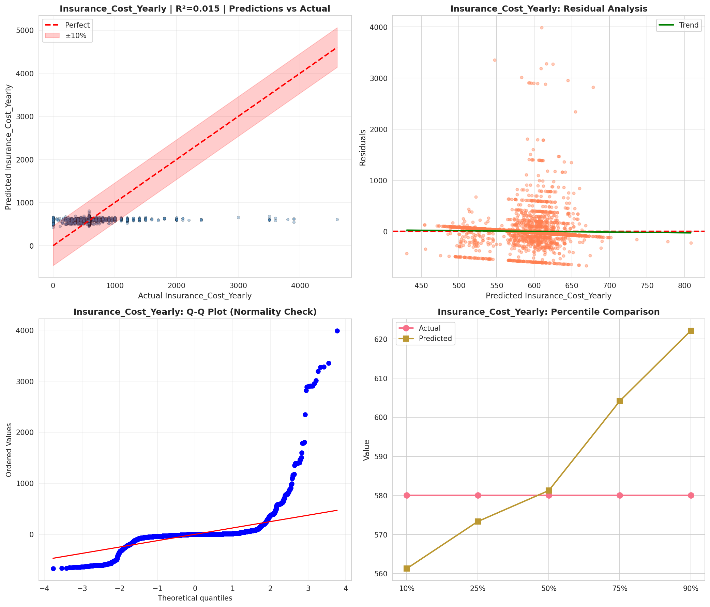
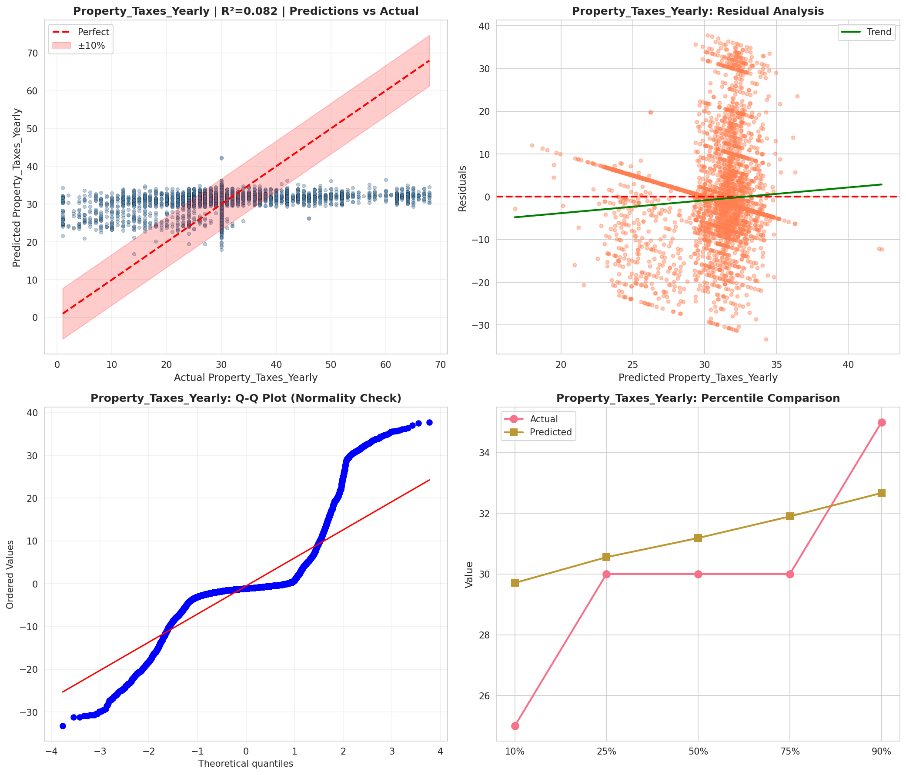
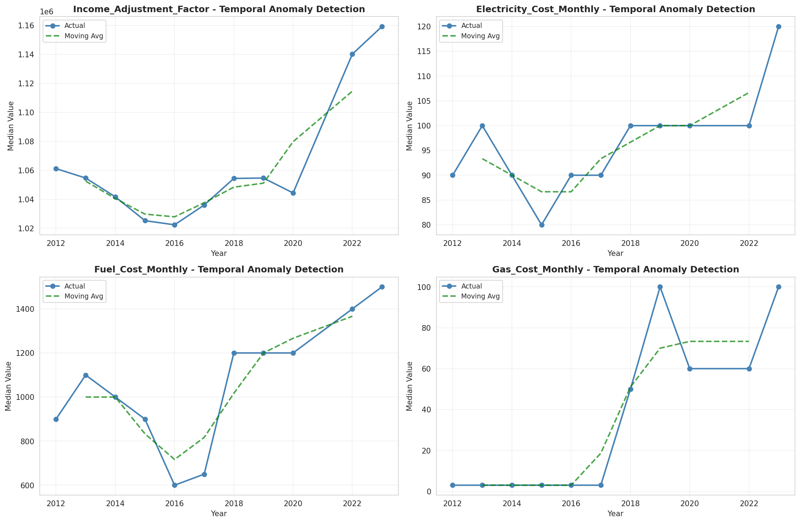
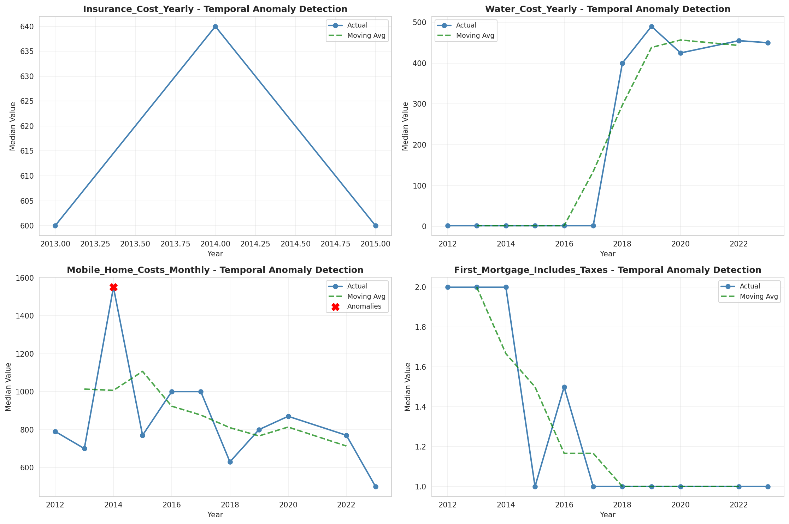
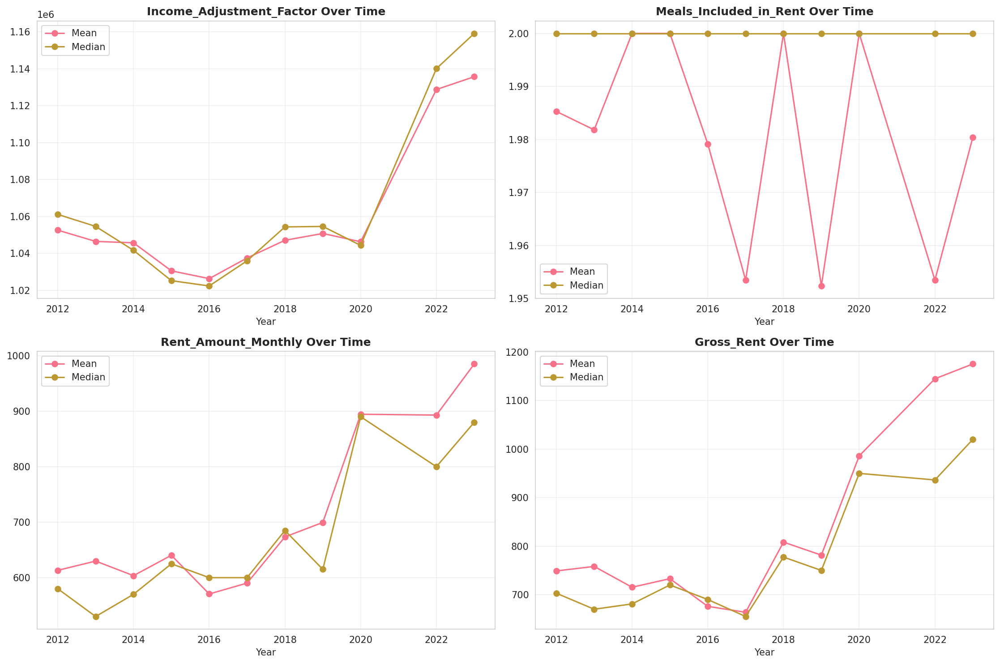
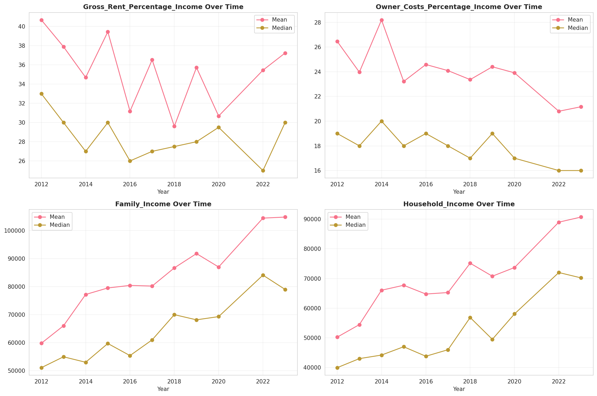
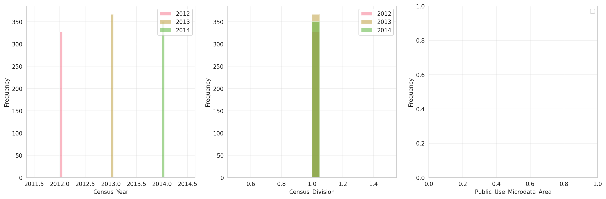
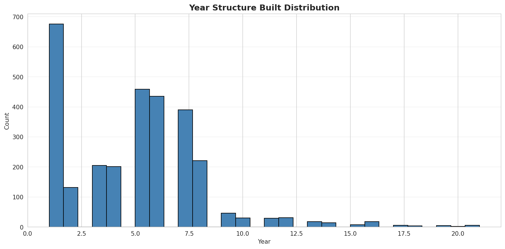
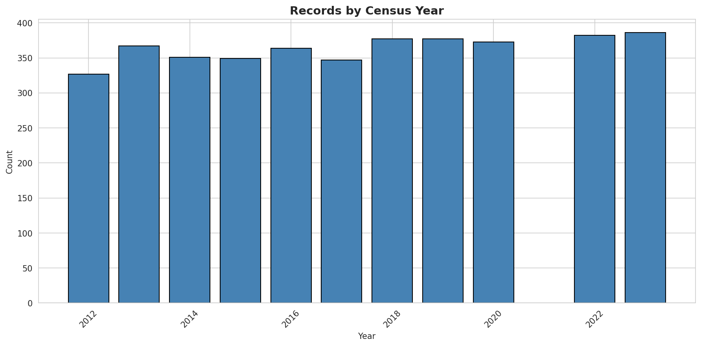
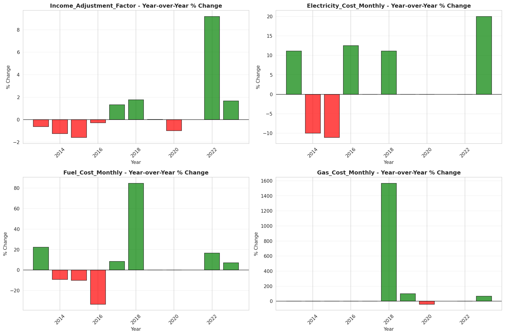
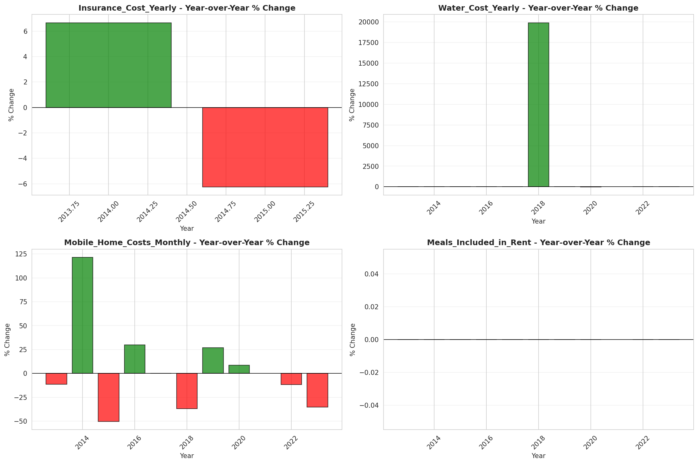
