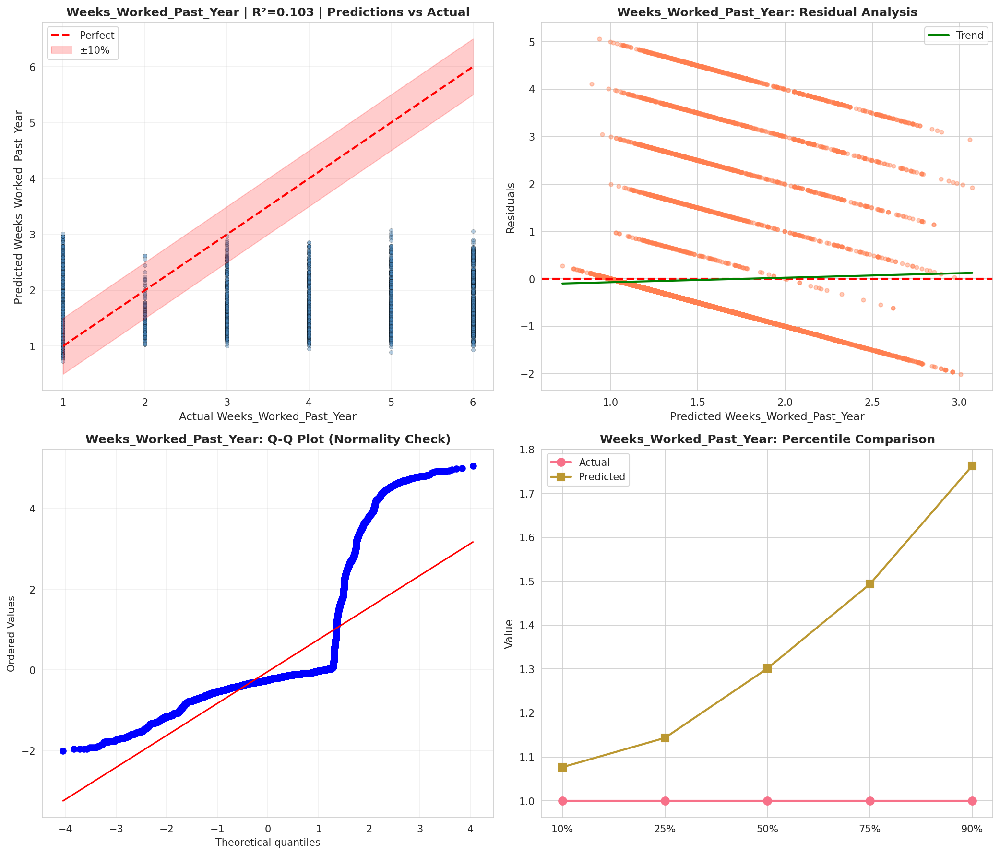
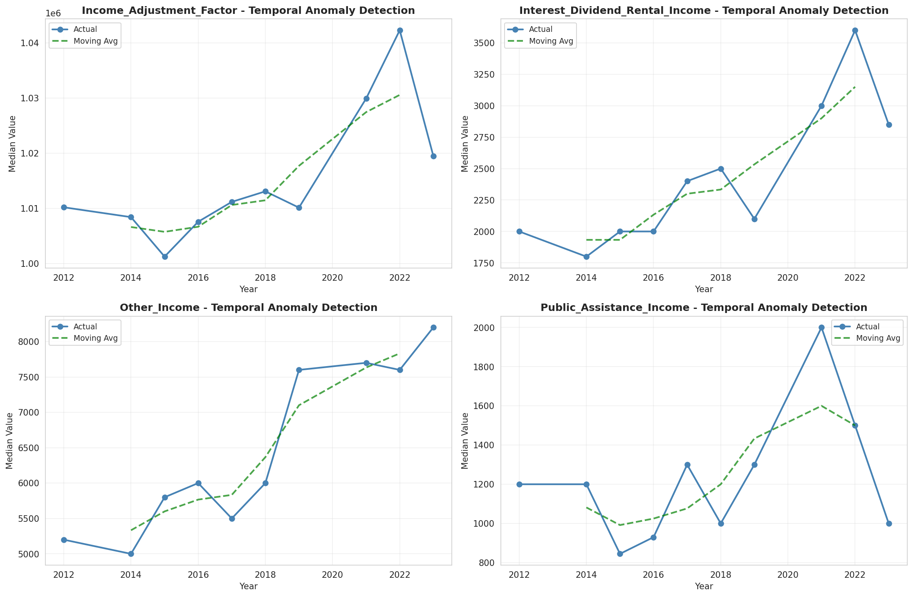
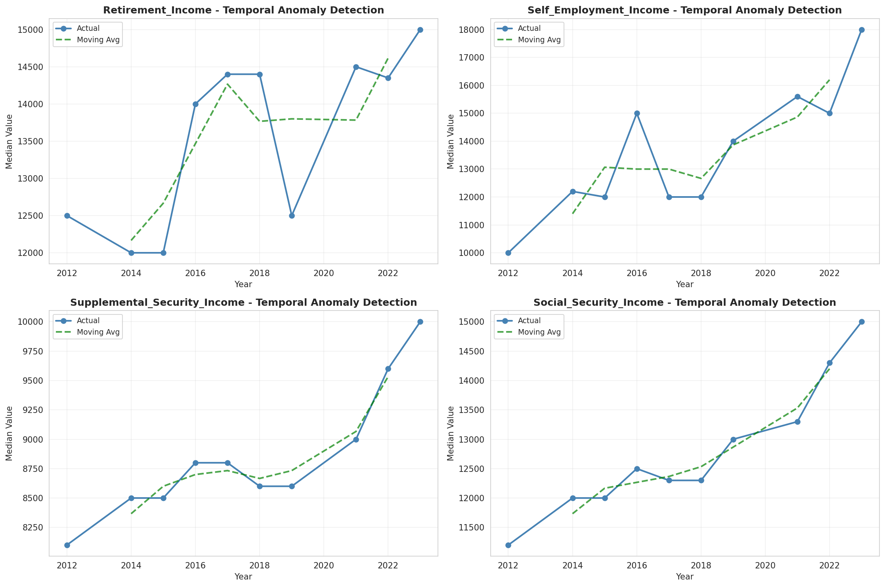
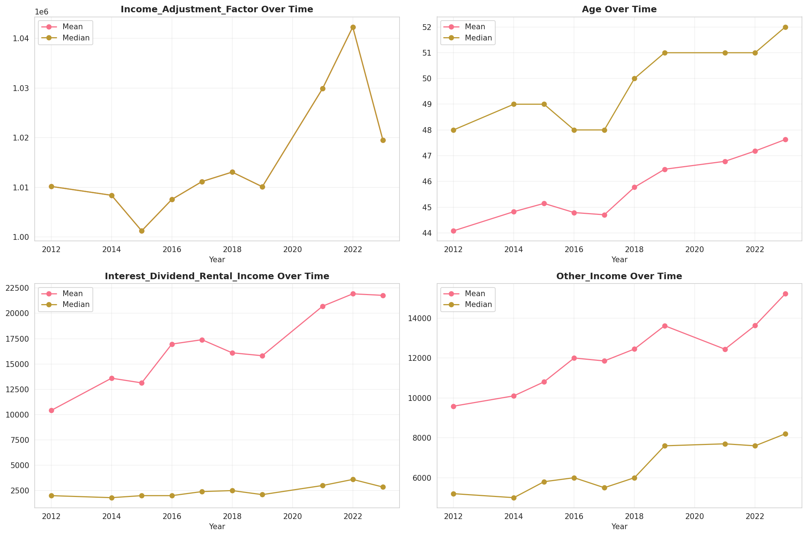
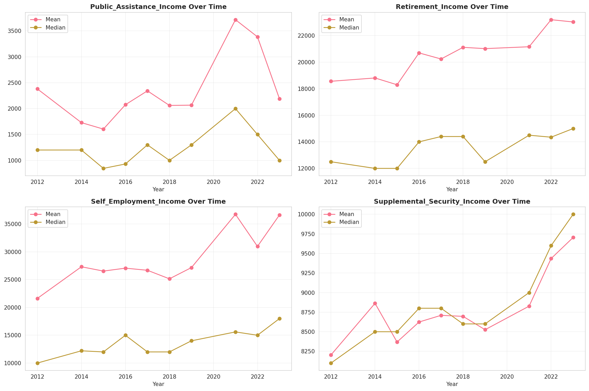
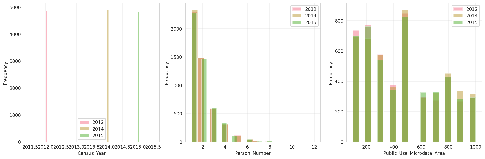
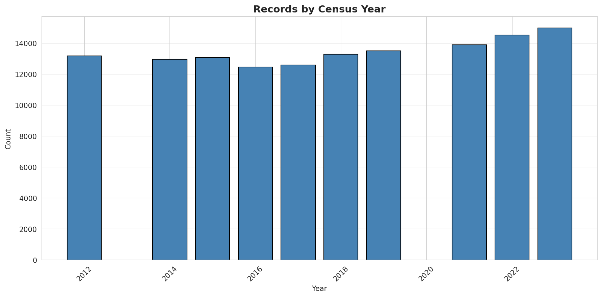
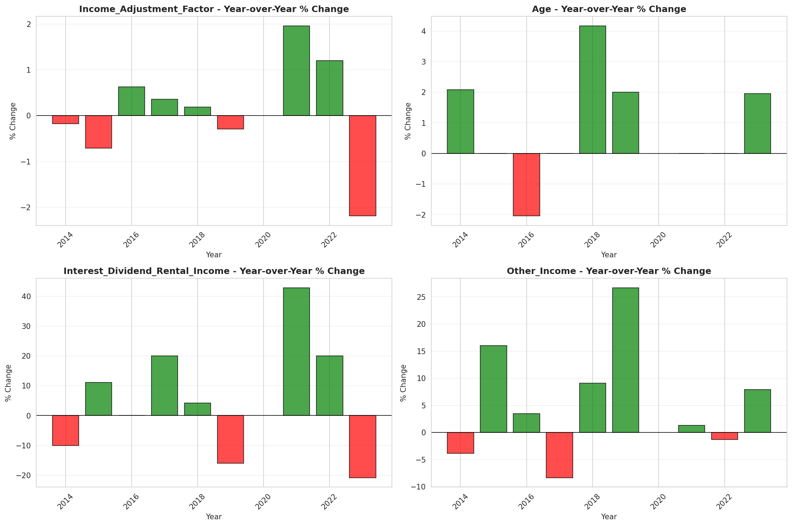
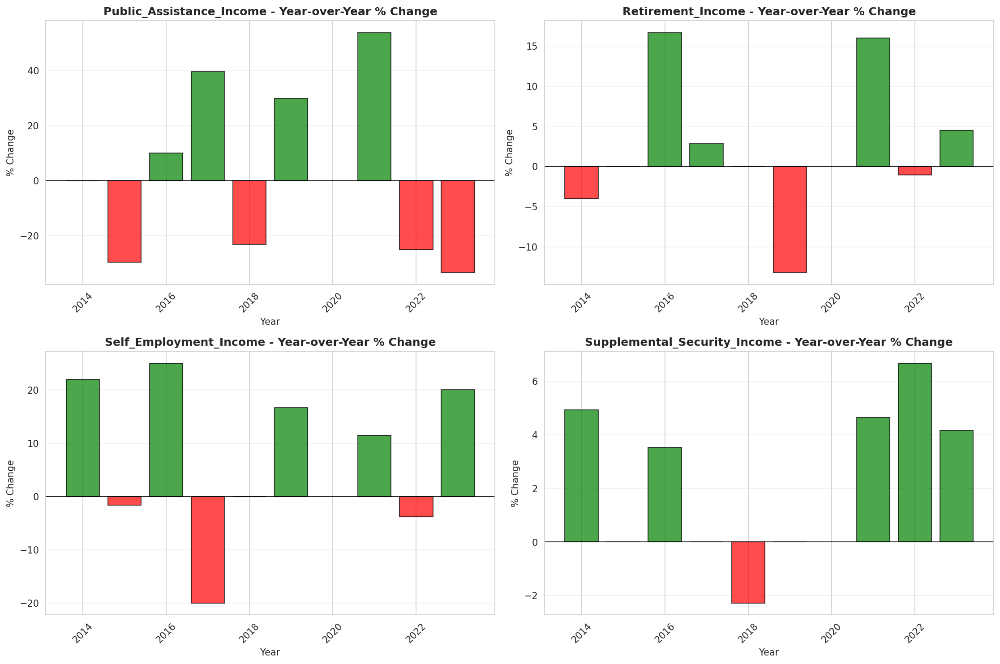

# Temporal Analysis

## Year Distribution

- 2012: 13,172 records

- 2014: 12,962 records

- 2015: 13,059 records

- 2016: 12,460 records

- 2017: 12,583 records

- 2018: 13,275 records

- 2019: 13,493 records

- 2021: 13,883 records

- 2022: 14,523 records

- 2023: 14,972 records

## Temporal Trends

- Census_Year: {np.int64(2012): {'mean': 2012.0, 'median': 2012.0, 'std': 0.0}, np.int64(2014): {'mean': 2014.0, 'median': 2014.0, 'std': 0.0}, np.int64(2015): {'mean': 2015.0, 'median': 2015.0, 'std': 0.0}, np.int64(2016): {'mean': 2016.0, 'median': 2016.0, 'std': 0.0}, np.int64(2017): {'mean': 2017.0, 'median': 2017.0, 'std': 0.0}, np.int64(2018): {'mean': 2018.0, 'median': 2018.0, 'std': 0.0}, np.int64(2019): {'mean': 2019.0, 'median': 2019.0, 'std': 0.0}, np.int64(2021): {'mean': 2021.0, 'median': 2021.0, 'std': 0.0}, np.int64(2022): {'mean': 2022.0, 'median': 2022.0, 'std': 0.0}, np.int64(2023): {'mean': 2023.0, 'median': 2023.0, 'std': 0.0}}

- Person_Number: {np.int64(2012): {'mean': 1.906012754327361, 'median': 2.0, 'std': 1.1676570381589864}, np.int64(2014): {'mean': 1.9026384817157846, 'median': 2.0, 'std': 1.1682451282035942}, np.int64(2015): {'mean': 1.8917987594762233, 'median': 2.0, 'std': 1.170818396727076}, np.int64(2016): {'mean': 1.8913322632423757, 'median': 2.0, 'std': 1.178671244629299}, np.int64(2017): {'mean': 1.8883414130175633, 'median': 2.0, 'std': 1.1591699902894606}, np.int64(2018): {'mean': 1.8908474576271186, 'median': 2.0, 'std': 1.1614066032332862}, np.int64(2019): {'mean': 1.88045653301712, 'median': 2.0, 'std': 1.1969602889301567}, np.int64(2021): {'mean': 1.8774760498451344, 'median': 2.0, 'std': 1.1635023423595496}, np.int64(2022): {'mean': 1.8648350891689045, 'median': 2.0, 'std': 1.188061837459091}, np.int64(2023): {'mean': 1.8649479027518034, 'median': 2.0, 'std': 1.161322121905838}}

- Public_Use_Microdata_Area: {np.int64(2012): {'mean': 463.55906468266016, 'median': 500.0, 'std': 278.63300033582357}, np.int64(2014): {'mean': 472.45795401944144, 'median': 500.0, 'std': 279.1092516429158}, np.int64(2015): {'mean': 468.4125890190673, 'median': 500.0, 'std': 277.76653817494866}, np.int64(2016): {'mean': 480.79454253611556, 'median': 500.0, 'std': 277.6898574977678}, np.int64(2017): {'mean': 483.9783835333386, 'median': 500.0, 'std': 278.72561827818896}, np.int64(2018): {'mean': 474.4783427495292, 'median': 500.0, 'std': 279.53841483264756}, np.int64(2019): {'mean': 475.520640332024, 'median': 500.0, 'std': 279.1956793309592}, np.int64(2021): {'mean': 478.4052438233811, 'median': 500.0, 'std': 277.4850900981647}, np.int64(2022): {'mean': 478.268952695724, 'median': 500.0, 'std': 283.258928436925}, np.int64(2023): {'mean': 467.67966871493456, 'median': 500.0, 'std': 283.88816741191744}}

- State_Code: {np.int64(2012): {'mean': 23.0, 'median': 23.0, 'std': 0.0}, np.int64(2014): {'mean': 23.0, 'median': 23.0, 'std': 0.0}, np.int64(2015): {'mean': 23.0, 'median': 23.0, 'std': 0.0}, np.int64(2016): {'mean': 23.0, 'median': 23.0, 'std': 0.0}, np.int64(2017): {'mean': 23.0, 'median': 23.0, 'std': 0.0}, np.int64(2018): {'mean': 23.0, 'median': 23.0, 'std': 0.0}, np.int64(2019): {'mean': 23.0, 'median': 23.0, 'std': 0.0}, np.int64(2021): {'mean': 23.0, 'median': 23.0, 'std': 0.0}, np.int64(2022): {'mean': 23.0, 'median': 23.0, 'std': 0.0}, np.int64(2023): {'mean': None, 'median': None, 'std': None}}

- Income_Adjustment_Factor: {np.int64(2012): {'mean': 1010207.0, 'median': 1010207.0, 'std': 0.0}, np.int64(2014): {'mean': 1008425.0, 'median': 1008425.0, 'std': 0.0}, np.int64(2015): {'mean': 1001264.0, 'median': 1001264.0, 'std': 0.0}, np.int64(2016): {'mean': 1007588.0, 'median': 1007588.0, 'std': 0.0}, np.int64(2017): {'mean': 1011189.0, 'median': 1011189.0, 'std': 0.0}, np.int64(2018): {'mean': 1013097.0, 'median': 1013097.0, 'std': 0.0}, np.int64(2019): {'mean': 1010145.0, 'median': 1010145.0, 'std': 0.0}, np.int64(2021): {'mean': 1029928.0, 'median': 1029928.0, 'std': 0.0}, np.int64(2022): {'mean': 1042311.0, 'median': 1042311.0, 'std': 0.0}, np.int64(2023): {'mean': 1019518.0, 'median': 1019518.0, 'std': 0.0}}

- Person_Weight: {np.int64(2012): {'mean': 100.91041603401153, 'median': 73.0, 'std': 95.96352733994689}, np.int64(2014): {'mean': 102.61448850486036, 'median': 77.0, 'std': 97.03165190025852}, np.int64(2015): {'mean': 101.79401179263343, 'median': 73.0, 'std': 101.2536602477374}, np.int64(2016): {'mean': 106.86027287319422, 'median': 79.0, 'std': 102.01633530941635}, np.int64(2017): {'mean': 106.16760708892951, 'median': 82.0, 'std': 95.7652981598051}, np.int64(2018): {'mean': 100.82139359698682, 'median': 75.0, 'std': 94.11538025572341}, np.int64(2019): {'mean': 99.62291558585933, 'median': 72.0, 'std': 96.84060834094237}, np.int64(2021): {'mean': 98.84369372613989, 'median': 71.0, 'std': 96.25979456107352}, np.int64(2022): {'mean': 95.38938235901674, 'median': 71.0, 'std': 93.4195086108337}, np.int64(2023): {'mean': 93.22214800961795, 'median': 68.0, 'std': 98.62141906651003}}

- Age: {np.int64(2012): {'mean': 44.079259034315214, 'median': 48.0, 'std': 23.399926174080314}, np.int64(2014): {'mean': 44.82479555624132, 'median': 49.0, 'std': 23.469898429637965}, np.int64(2015): {'mean': 45.14541695382495, 'median': 49.0, 'std': 23.52586108470293}, np.int64(2016): {'mean': 44.78900481540931, 'median': 48.0, 'std': 23.763378409562254}, np.int64(2017): {'mean': 44.70404514026862, 'median': 48.0, 'std': 23.735681984660463}, np.int64(2018): {'mean': 45.774387947269304, 'median': 50.0, 'std': 23.822028105205597}, np.int64(2019): {'mean': 46.47291188023419, 'median': 51.0, 'std': 23.989901381914436}, np.int64(2021): {'mean': 46.78016278902255, 'median': 51.0, 'std': 24.020741914620515}, np.int64(2022): {'mean': 47.18102320457206, 'median': 51.0, 'std': 24.24042495580377}, np.int64(2023): {'mean': 47.6264360138926, 'median': 52.0, 'std': 24.154413387650514}}

- Citizenship_Status: {np.int64(2012): {'mean': 1.1276191922259338, 'median': 1.0, 'std': 0.6400967095491102}, np.int64(2014): {'mean': 1.1387903101373245, 'median': 1.0, 'std': 0.6635852331299938}, np.int64(2015): {'mean': 1.1245118309212037, 'median': 1.0, 'std': 0.621360209499787}, np.int64(2016): {'mean': 1.1321027287319423, 'median': 1.0, 'std': 0.6403355446956877}, np.int64(2017): {'mean': 1.1281888261940713, 'median': 1.0, 'std': 0.6311618159452012}, np.int64(2018): {'mean': 1.1257250470809792, 'median': 1.0, 'std': 0.6272865298806233}, np.int64(2019): {'mean': 1.1312532424219965, 'median': 1.0, 'std': 0.6350139368123681}, np.int64(2021): {'mean': 1.1364258445580926, 'median': 1.0, 'std': 0.6545535782968295}, np.int64(2022): {'mean': 1.1363354678785376, 'median': 1.0, 'std': 0.6521423264422493}, np.int64(2023): {'mean': 1.1339834357467273, 'median': 1.0, 'std': 0.6499990611530423}}

- Class_of_Worker: {np.int64(2012): {'mean': 2.3463155291790305, 'median': 1.0, 'std': 2.0014515013176895}, np.int64(2014): {'mean': 2.3655684104627768, 'median': 1.0, 'std': 2.0146705251637287}, np.int64(2015): {'mean': 2.351512146752603, 'median': 1.0, 'std': 2.024613375969141}, np.int64(2016): {'mean': 2.31741718426501, 'median': 1.0, 'std': 1.9730412797704606}, np.int64(2017): {'mean': 2.3248464687819856, 'median': 1.0, 'std': 2.00320328297751}, np.int64(2018): {'mean': 2.2890251379521764, 'median': 1.0, 'std': 1.9684713707929398}, np.int64(2019): {'mean': 2.362653208363374, 'median': 1.0, 'std': 1.986479736780918}, np.int64(2021): {'mean': 2.3566066960562373, 'median': 1.0, 'std': 1.980592086762152}, np.int64(2022): {'mean': 2.366685681688534, 'median': 1.0, 'std': 2.0110793138854945}, np.int64(2023): {'mean': 2.3216876883580757, 'median': 1.0, 'std': 1.9529774751196223}}

- English_Speaking_Ability: {np.int64(2012): {'mean': 1.3506172839506172, 'median': 1.0, 'std': 0.6803117617310445}, np.int64(2014): {'mean': 1.3506815365551426, 'median': 1.0, 'std': 0.6882180438455237}, np.int64(2015): {'mean': 1.2611637347767253, 'median': 1.0, 'std': 0.5467263986651958}, np.int64(2016): {'mean': 1.3071625344352618, 'median': 1.0, 'std': 0.6308207623689751}, np.int64(2017): {'mean': 1.3188602442333786, 'median': 1.0, 'std': 0.6363831250123494}, np.int64(2018): {'mean': 1.2971428571428572, 'median': 1.0, 'std': 0.6194213526999746}, np.int64(2019): {'mean': 1.2591587516960652, 'median': 1.0, 'std': 0.5798949005531692}, np.int64(2021): {'mean': 1.2891246684350133, 'median': 1.0, 'std': 0.5773167109158933}, np.int64(2022): {'mean': 1.3004866180048662, 'median': 1.0, 'std': 0.6211652691016472}, np.int64(2023): {'mean': 1.3544152744630071, 'median': 1.0, 'std': 0.6735652600005981}}

- Fertility_Status: {np.int64(2012): {'mean': 1.9620905410379095, 'median': 2.0, 'std': 0.19101246183669904}, np.int64(2014): {'mean': 1.9538461538461538, 'median': 2.0, 'std': 0.20985957645791894}, np.int64(2015): {'mean': 1.9609053497942386, 'median': 2.0, 'std': 0.19386006360568228}, np.int64(2016): {'mean': 1.956093557652852, 'median': 2.0, 'std': 0.20492901036541758}, np.int64(2017): {'mean': 1.9526943644590704, 'median': 2.0, 'std': 0.21233548646387182}, np.int64(2018): {'mean': 1.9550517104216387, 'median': 2.0, 'std': 0.2072318102764817}, np.int64(2019): {'mean': 1.9529754473574699, 'median': 2.0, 'std': 0.21173544986406945}, np.int64(2021): {'mean': 1.9524737047136735, 'median': 2.0, 'std': 0.2128031668732433}, np.int64(2022): {'mean': 1.9536220774243005, 'median': 2.0, 'std': 0.2103425042233561}, np.int64(2023): {'mean': 1.963072378138848, 'median': 2.0, 'std': 0.1886189555310501}}

- Marital_Status: {np.int64(2012): {'mean': 2.7187974491345277, 'median': 2.0, 'std': 1.8082145325940908}, np.int64(2014): {'mean': 2.7241937972535104, 'median': 2.0, 'std': 1.8060198359812756}, np.int64(2015): {'mean': 2.7494448273221535, 'median': 2.0, 'std': 1.810399145559558}, np.int64(2016): {'mean': 2.7291332263242376, 'median': 2.0, 'std': 1.8110616190633384}, np.int64(2017): {'mean': 2.7568942223635062, 'median': 2.0, 'std': 1.814636518080785}, np.int64(2018): {'mean': 2.741694915254237, 'median': 2.0, 'std': 1.8105060585558432}, np.int64(2019): {'mean': 2.718817164455644, 'median': 2.0, 'std': 1.8012577613501735}, np.int64(2021): {'mean': 2.743715335302168, 'median': 2.0, 'std': 1.8136045444948856}, np.int64(2022): {'mean': 2.7377952213729944, 'median': 2.0, 'std': 1.8143698738249097}, np.int64(2023): {'mean': 2.73764360138926, 'median': 2.0, 'std': 1.8102393228895597}}

- Mobility_Status: {np.int64(2012): {'mean': 1.2420094815721059, 'median': 1.0, 'std': 0.6498827836983752}, np.int64(2014): {'mean': 1.2451964216258264, 'median': 1.0, 'std': 0.6520509515112194}, np.int64(2015): {'mean': 1.2383962991518889, 'median': 1.0, 'std': 0.6461615605698872}, np.int64(2016): {'mean': 1.2497574385510997, 'median': 1.0, 'std': 0.6591684566807036}, np.int64(2017): {'mean': 1.2571909302139253, 'median': 1.0, 'std': 0.6678525378710556}, np.int64(2018): {'mean': 1.2500569519325688, 'median': 1.0, 'std': 0.659169968124863}, np.int64(2019): {'mean': 1.2193827990734514, 'median': 1.0, 'std': 0.6232368405846939}, np.int64(2021): {'mean': 1.223520023215322, 'median': 1.0, 'std': 0.6280312003395894}, np.int64(2022): {'mean': 1.2033157602663707, 'median': 1.0, 'std': 0.6019439837740321}, np.int64(2023): {'mean': 1.2050524052674012, 'median': 1.0, 'std': 0.603032720459479}}

- Military_Service: {np.int64(2012): {'mean': 4.717326057298772, 'median': 5.0, 'std': 0.6971608387201536}, np.int64(2014): {'mean': 3.742209109349069, 'median': 4.0, 'std': 0.6565776469868749}, np.int64(2015): {'mean': 3.7573054164770143, 'median': 4.0, 'std': 0.6402794535332769}, np.int64(2016): {'mean': 3.768988248781886, 'median': 4.0, 'std': 0.624780763042841}, np.int64(2017): {'mean': 3.7567057045712127, 'median': 4.0, 'std': 0.6449133895056576}, np.int64(2018): {'mean': 3.7621684379744575, 'median': 4.0, 'std': 0.6384471262128537}, np.int64(2019): {'mean': 3.7661669862297367, 'median': 4.0, 'std': 0.6324848873698006}, np.int64(2021): {'mean': 3.7804981362250083, 'median': 4.0, 'std': 0.6147299939233821}, np.int64(2022): {'mean': 3.775983202778002, 'median': 4.0, 'std': 0.6239562374451125}, np.int64(2023): {'mean': 3.792773148508683, 'median': 4.0, 'std': 0.6002056597288387}}

- Travel_Time_To_Work_Minutes: {np.int64(2012): {'mean': 24.2497308934338, 'median': 20.0, 'std': 23.37783021109639}, np.int64(2014): {'mean': 24.907865986890023, 'median': 20.0, 'std': 23.58647639107197}, np.int64(2015): {'mean': 24.863880918220946, 'median': 20.0, 'std': 23.904307305043993}, np.int64(2016): {'mean': 24.767467859139185, 'median': 20.0, 'std': 21.989552121715516}, np.int64(2017): {'mean': 25.132787799888412, 'median': 20.0, 'std': 23.541966349404987}, np.int64(2018): {'mean': 25.346174142480212, 'median': 20.0, 'std': 23.6438234785612}, np.int64(2019): {'mean': 25.32470711662878, 'median': 20.0, 'std': 23.664363543913712}, np.int64(2021): {'mean': 25.089081037603055, 'median': 20.0, 'std': 23.76164463272097}, np.int64(2022): {'mean': 25.500928332714444, 'median': 20.0, 'std': 23.56136024183182}, np.int64(2023): {'mean': 25.179152512068658, 'median': 20.0, 'std': 23.12512030353006}}

- Vehicle_Occupancy: {np.int64(2012): {'mean': 1.1698953893839596, 'median': 1.0, 'std': 0.5285863735048805}, np.int64(2014): {'mean': 1.1666666666666667, 'median': 1.0, 'std': 0.6315016328556288}, np.int64(2015): {'mean': 1.1658021133525456, 'median': 1.0, 'std': 0.6656605106836508}, np.int64(2016): {'mean': 1.1465811108883095, 'median': 1.0, 'std': 0.5710366657530018}, np.int64(2017): {'mean': 1.1579263410728582, 'median': 1.0, 'std': 0.624875742105401}, np.int64(2018): {'mean': 1.164743710989219, 'median': 1.0, 'std': 0.615954517322371}, np.int64(2019): {'mean': 1.1532531026701767, 'median': 1.0, 'std': 0.5707592917694878}, np.int64(2021): {'mean': 1.1432920200043488, 'median': 1.0, 'std': 0.5310233210206882}, np.int64(2022): {'mean': 1.1471531676022453, 'median': 1.0, 'std': 0.5713551228041209}, np.int64(2023): {'mean': 1.1301079414032382, 'median': 1.0, 'std': 0.5156462942199653}}

- Transportation_To_Work: {np.int64(2012): {'mean': 2.1691735676863275, 'median': 1.0, 'std': 3.125438637471016}, np.int64(2014): {'mean': 2.1647562018819504, 'median': 1.0, 'std': 3.1108413620333932}, np.int64(2015): {'mean': 2.1122931442080377, 'median': 1.0, 'std': 3.071800936958901}, np.int64(2016): {'mean': 2.196300820101204, 'median': 1.0, 'std': 3.161564593153476}, np.int64(2017): {'mean': 2.2608168916580134, 'median': 1.0, 'std': 3.2418510491278014}, np.int64(2018): {'mean': 2.2151545036160423, 'median': 1.0, 'std': 3.1903644889021403}, np.int64(2019): {'mean': None, 'median': None, 'std': None}, np.int64(2021): {'mean': None, 'median': None, 'std': None}, np.int64(2022): {'mean': None, 'median': None, 'std': None}, np.int64(2023): {'mean': None, 'median': None, 'std': None}}

- Language_Other_Than_English: {np.int64(2012): {'mean': 1.9358314188386279, 'median': 2.0, 'std': 0.24506271033443178}, np.int64(2014): {'mean': 1.9351598907279448, 'median': 2.0, 'std': 0.24625340974158558}, np.int64(2015): {'mean': 1.9411951937614387, 'median': 2.0, 'std': 0.2352683690813277}, np.int64(2016): {'mean': 1.9391552128729468, 'median': 2.0, 'std': 0.23905540871799572}, np.int64(2017): {'mean': 1.938751765976897, 'median': 2.0, 'std': 0.23979505106730326}, np.int64(2018): {'mean': 1.945162553858206, 'median': 2.0, 'std': 0.2276716084743373}, np.int64(2019): {'mean': 1.9429743113587126, 'median': 2.0, 'std': 0.23190066961042705}, np.int64(2021): {'mean': 1.9435839880284325, 'median': 2.0, 'std': 0.2307319416477612}, np.int64(2022): {'mean': 1.941214331688479, 'median': 2.0, 'std': 0.23523152581494783}, np.int64(2023): {'mean': 1.9419587200443276, 'median': 2.0, 'std': 0.23382958911790694}}

- Grandparents_Living_With_Grandchildren: {np.int64(2012): {'mean': 1.9776854080070008, 'median': 2.0, 'std': 0.1477126861788807}, np.int64(2014): {'mean': 1.9765710532077951, 'median': 2.0, 'std': 0.1512697473018108}, np.int64(2015): {'mean': 1.9772530329289428, 'median': 2.0, 'std': 0.1491038252372013}, np.int64(2016): {'mean': 1.9811472583055523, 'median': 2.0, 'std': 0.1360126554486138}, np.int64(2017): {'mean': 1.9771871791947073, 'median': 2.0, 'std': 0.14931489900357228}, np.int64(2018): {'mean': 1.9782056707575117, 'median': 2.0, 'std': 0.14601915022041365}, np.int64(2019): {'mean': 1.9810794044665012, 'median': 2.0, 'std': 0.1362517009338957}, np.int64(2021): {'mean': 1.9789273943872965, 'median': 2.0, 'std': 0.1436336008322089}, np.int64(2022): {'mean': 1.983496158588637, 'median': 2.0, 'std': 0.12740880787852102}, np.int64(2023): {'mean': 1.9812288251991577, 'median': 2.0, 'std': 0.1357221592164122}}

- Months_Responsible_For_Grandchildren: {np.int64(2012): {'mean': 3.7857142857142856, 'median': 4.0, 'std': 1.2617775620841423}, np.int64(2014): {'mean': 3.670886075949367, 'median': 4.0, 'std': 1.3841735383581115}, np.int64(2015): {'mean': 3.6597938144329896, 'median': 4.0, 'std': 1.3454134892458427}, np.int64(2016): {'mean': 3.7971014492753623, 'median': 4.0, 'std': 1.3237614649276053}, np.int64(2017): {'mean': 3.6463414634146343, 'median': 4.0, 'std': 1.3732178234370687}, np.int64(2018): {'mean': 3.9019607843137254, 'median': 5.0, 'std': 1.3000754125939664}, np.int64(2019): {'mean': 3.9692307692307693, 'median': 5.0, 'std': 1.4138735663200093}, np.int64(2021): {'mean': 3.926470588235294, 'median': 4.0, 'std': 1.163065641178176}, np.int64(2022): {'mean': 3.6865671641791047, 'median': 3.0, 'std': 1.269800213632773}, np.int64(2023): {'mean': 3.5555555555555554, 'median': 4.0, 'std': 1.438719086284203}}

- Grandparents_Responsible_For_Grandchildren: {np.int64(2012): {'mean': 1.588235294117647, 'median': 2.0, 'std': 0.4933636669949972}, np.int64(2014): {'mean': 1.6308411214953271, 'median': 2.0, 'std': 0.48370852492014915}, np.int64(2015): {'mean': 1.5380952380952382, 'median': 2.0, 'std': 0.4997379126271376}, np.int64(2016): {'mean': 1.579268292682927, 'median': 2.0, 'std': 0.49518858151053624}, np.int64(2017): {'mean': 1.59, 'median': 2.0, 'std': 0.4930675185909605}, np.int64(2018): {'mean': 1.7524271844660195, 'median': 2.0, 'std': 0.4326536744199769}, np.int64(2019): {'mean': 1.644808743169399, 'median': 2.0, 'std': 0.4798841910776118}, np.int64(2021): {'mean': 1.6777251184834123, 'median': 2.0, 'std': 0.46845901409820995}, np.int64(2022): {'mean': 1.6149425287356323, 'median': 2.0, 'std': 0.4880132509411467}, np.int64(2023): {'mean': 1.5609756097560976, 'median': 2.0, 'std': 0.49748290382512483}}

- Interest_Dividend_Rental_Income: {np.int64(2012): {'mean': 10412.446831955924, 'median': 2000.0, 'std': 26238.721682879484}, np.int64(2014): {'mean': 13594.004454342985, 'median': 1800.0, 'std': 36760.017544301576}, np.int64(2015): {'mean': 13131.587978142077, 'median': 2000.0, 'std': 34579.42184111361}, np.int64(2016): {'mean': 16961.447023809524, 'median': 2000.0, 'std': 48949.43733187727}, np.int64(2017): {'mean': 17392.408088235294, 'median': 2400.0, 'std': 46113.95974280867}, np.int64(2018): {'mean': 16100.542907180385, 'median': 2500.0, 'std': 39489.648556357344}, np.int64(2019): {'mean': 15811.471935853378, 'median': 2100.0, 'std': 41886.941176202425}, np.int64(2021): {'mean': 20701.92655027092, 'median': 3000.0, 'std': 58463.72892675512}, np.int64(2022): {'mean': 21923.701979045403, 'median': 3600.0, 'std': 54203.102874684984}, np.int64(2023): {'mean': 21771.29469122427, 'median': 2850.0, 'std': 60427.10645997398}}

- Military_Service_Period_1: {np.int64(2012): {'mean': 0.08201240523776705, 'median': 0.0, 'std': 0.2744782181882509}, np.int64(2014): {'mean': 0.11067503924646782, 'median': 0.0, 'std': 0.3138525022032428}, np.int64(2015): {'mean': 0.09292763157894737, 'median': 0.0, 'std': 0.29045044856439517}, np.int64(2016): {'mean': 0.11981566820276497, 'median': 0.0, 'std': 0.3248956164099466}, np.int64(2017): {'mean': 0.1173512154233026, 'median': 0.0, 'std': 0.3219732963425162}, np.int64(2018): {'mean': 0.14239218877135884, 'median': 0.0, 'std': 0.34959418884907945}, np.int64(2019): {'mean': 0.15353371242891958, 'median': 0.0, 'std': 0.3606477104003567}, np.int64(2021): {'mean': 0.15255658005029338, 'median': 0.0, 'std': 0.3597103402530131}, np.int64(2022): {'mean': 0.178516228748068, 'median': 0.0, 'std': 0.3830947687251694}, np.int64(2023): {'mean': 0.1810064935064935, 'median': 0.0, 'std': 0.38517991612859537}}

- Military_Service_Period_2: {np.int64(2012): {'mean': 0.12198483804272915, 'median': 0.0, 'std': 0.3273811273249838}, np.int64(2014): {'mean': 0.15149136577708006, 'median': 0.0, 'std': 0.3586679624799565}, np.int64(2015): {'mean': 0.1455592105263158, 'median': 0.0, 'std': 0.3528088580497784}, np.int64(2016): {'mean': 0.15668202764976957, 'median': 0.0, 'std': 0.3636683428076473}, np.int64(2017): {'mean': 0.16512992455993294, 'median': 0.0, 'std': 0.37145348112833726}, np.int64(2018): {'mean': 0.16354759967453214, 'median': 0.0, 'std': 0.3700151115690131}, np.int64(2019): {'mean': 0.1892770105605199, 'median': 0.0, 'std': 0.3918877146917727}, np.int64(2021): {'mean': 0.16680637049455155, 'median': 0.0, 'std': 0.37295924830868593}, np.int64(2022): {'mean': 0.18238021638330756, 'median': 0.0, 'std': 0.3863068727690455}, np.int64(2023): {'mean': 0.1891233766233766, 'median': 0.0, 'std': 0.39176562279778376}}

- Military_Service_Period_3: {np.int64(2012): {'mean': 0.18263266712611992, 'median': 0.0, 'std': 0.38649828764538213}, np.int64(2014): {'mean': None, 'median': None, 'std': None}, np.int64(2015): {'mean': None, 'median': None, 'std': None}, np.int64(2016): {'mean': None, 'median': None, 'std': None}, np.int64(2017): {'mean': None, 'median': None, 'std': None}, np.int64(2018): {'mean': None, 'median': None, 'std': None}, np.int64(2019): {'mean': None, 'median': None, 'std': None}, np.int64(2021): {'mean': None, 'median': None, 'std': None}, np.int64(2022): {'mean': None, 'median': None, 'std': None}, np.int64(2023): {'mean': None, 'median': None, 'std': None}}

- Military_Service_Period_4: {np.int64(2012): {'mean': 0.13783597518952448, 'median': 0.0, 'std': 0.3448465975414687}, np.int64(2014): {'mean': None, 'median': None, 'std': None}, np.int64(2015): {'mean': None, 'median': None, 'std': None}, np.int64(2016): {'mean': None, 'median': None, 'std': None}, np.int64(2017): {'mean': None, 'median': None, 'std': None}, np.int64(2018): {'mean': None, 'median': None, 'std': None}, np.int64(2019): {'mean': None, 'median': None, 'std': None}, np.int64(2021): {'mean': None, 'median': None, 'std': None}, np.int64(2022): {'mean': None, 'median': None, 'std': None}, np.int64(2023): {'mean': None, 'median': None, 'std': None}}

- Military_Service_Period_5: {np.int64(2012): {'mean': 0.37767057201929705, 'median': 0.0, 'std': 0.4849717564001128}, np.int64(2014): {'mean': 0.4364207221350079, 'median': 0.0, 'std': 0.4961359556442772}, np.int64(2015): {'mean': 0.4300986842105263, 'median': 0.0, 'std': 0.4952933936657815}, np.int64(2016): {'mean': 0.41382488479262675, 'median': 0.0, 'std': 0.49274499097701946}, np.int64(2017): {'mean': 0.42330259849119867, 'median': 0.0, 'std': 0.49428969761610103}, np.int64(2018): {'mean': 0.44100895036615134, 'median': 0.0, 'std': 0.4967099810698576}, np.int64(2019): {'mean': 0.43135662063363117, 'median': 0.0, 'std': 0.49546695921895384}, np.int64(2021): {'mean': 0.4509639564124057, 'median': 0.0, 'std': 0.49779833341098045}, np.int64(2022): {'mean': 0.4234930448222566, 'median': 0.0, 'std': 0.4943030524744313}, np.int64(2023): {'mean': 0.43912337662337664, 'median': 0.0, 'std': 0.4964817349276587}}

- Military_Service_Period_6: {np.int64(2012): {'mean': 0.11371467953135768, 'median': 0.0, 'std': 0.31757386094698736}, np.int64(2014): {'mean': None, 'median': None, 'std': None}, np.int64(2015): {'mean': None, 'median': None, 'std': None}, np.int64(2016): {'mean': None, 'median': None, 'std': None}, np.int64(2017): {'mean': None, 'median': None, 'std': None}, np.int64(2018): {'mean': None, 'median': None, 'std': None}, np.int64(2019): {'mean': None, 'median': None, 'std': None}, np.int64(2021): {'mean': None, 'median': None, 'std': None}, np.int64(2022): {'mean': None, 'median': None, 'std': None}, np.int64(2023): {'mean': None, 'median': None, 'std': None}}

- Military_Service_Period_7: {np.int64(2012): {'mean': 0.12887663680220537, 'median': 0.0, 'std': 0.33517887033023663}, np.int64(2014): {'mean': None, 'median': None, 'std': None}, np.int64(2015): {'mean': None, 'median': None, 'std': None}, np.int64(2016): {'mean': None, 'median': None, 'std': None}, np.int64(2017): {'mean': None, 'median': None, 'std': None}, np.int64(2018): {'mean': None, 'median': None, 'std': None}, np.int64(2019): {'mean': None, 'median': None, 'std': None}, np.int64(2021): {'mean': None, 'median': None, 'std': None}, np.int64(2022): {'mean': None, 'median': None, 'std': None}, np.int64(2023): {'mean': None, 'median': None, 'std': None}}

- Military_Service_Period_8: {np.int64(2012): {'mean': 0.1268090971743625, 'median': 0.0, 'std': 0.3328737216505087}, np.int64(2014): {'mean': 0.1130298273155416, 'median': 0.0, 'std': 0.31675359452388796}, np.int64(2015): {'mean': 0.10444078947368421, 'median': 0.0, 'std': 0.30595733818217924}, np.int64(2016): {'mean': 0.10414746543778802, 'median': 0.0, 'std': 0.3055926074081609}, np.int64(2017): {'mean': 0.09388097233864208, 'median': 0.0, 'std': 0.2917853673261065}, np.int64(2018): {'mean': 0.0951993490642799, 'median': 0.0, 'std': 0.29360956502999075}, np.int64(2019): {'mean': 0.07229894394800974, 'median': 0.0, 'std': 0.2590875075647603}, np.int64(2021): {'mean': 0.05699916177703269, 'median': 0.0, 'std': 0.23193824572827884}, np.int64(2022): {'mean': 0.0517774343122102, 'median': 0.0, 'std': 0.22166303848495}, np.int64(2023): {'mean': 0.04383116883116883, 'median': 0.0, 'std': 0.20480244861689875}}

- Military_Service_Period_9: {np.int64(2012): {'mean': 0.028256374913852515, 'median': 0.0, 'std': 0.165761541707757}, np.int64(2014): {'mean': 0.015698587127158554, 'median': 0.0, 'std': 0.1243554576872441}, np.int64(2015): {'mean': 0.013980263157894737, 'median': 0.0, 'std': 0.1174570599283367}, np.int64(2016): {'mean': 0.01566820276497696, 'median': 0.0, 'std': 0.12424547387939744}, np.int64(2017): {'mean': 0.01173512154233026, 'median': 0.0, 'std': 0.10773642761032301}, np.int64(2018): {'mean': 0.014646053702196907, 'median': 0.0, 'std': 0.12018027661434863}, np.int64(2019): {'mean': 0.010560519902518278, 'median': 0.0, 'std': 0.1022618718783041}, np.int64(2021): {'mean': None, 'median': None, 'std': None}, np.int64(2022): {'mean': None, 'median': None, 'std': None}, np.int64(2023): {'mean': None, 'median': None, 'std': None}}

- Military_Service_Period_10: {np.int64(2012): {'mean': 0.09510682288077188, 'median': 0.0, 'std': 0.29346357165983517}, np.int64(2014): {'mean': 0.059654631083202514, 'median': 0.0, 'std': 0.23693885714437704}, np.int64(2015): {'mean': 0.0625, 'median': 0.0, 'std': 0.24216105241892627}, np.int64(2016): {'mean': 0.05622119815668203, 'median': 0.0, 'std': 0.23045460229721018}, np.int64(2017): {'mean': 0.038558256496227995, 'median': 0.0, 'std': 0.19262039772161763}, np.int64(2018): {'mean': 0.030105777054515868, 'median': 0.0, 'std': 0.17094793731179883}, np.int64(2019): {'mean': 0.021933387489845652, 'median': 0.0, 'std': 0.14652561178428658}, np.int64(2021): {'mean': 0.010896898575020955, 'median': 0.0, 'std': 0.10386143776106659}, np.int64(2022): {'mean': 0.017001545595054096, 'median': 0.0, 'std': 0.1293267891985846}, np.int64(2023): {'mean': 0.00487012987012987, 'median': 0.0, 'std': 0.06964444469235338}}

- Military_Service_Period_11: {np.int64(2012): {'mean': 0.0, 'median': 0.0, 'std': 0.0}, np.int64(2014): {'mean': 0.0015698587127158557, 'median': 0.0, 'std': 0.03960587729813649}, np.int64(2015): {'mean': 0.0024671052631578946, 'median': 0.0, 'std': 0.04962906592447023}, np.int64(2016): {'mean': 0.0009216589861751152, 'median': 0.0, 'std': 0.030358837035945836}, np.int64(2017): {'mean': 0.004191114836546521, 'median': 0.0, 'std': 0.06463010670577392}, np.int64(2018): {'mean': 0.0008136696501220504, 'median': 0.0, 'std': 0.02852489526925647}, np.int64(2019): {'mean': 0.0, 'median': 0.0, 'std': 0.0}, np.int64(2021): {'mean': None, 'median': None, 'std': None}, np.int64(2022): {'mean': None, 'median': None, 'std': None}, np.int64(2023): {'mean': None, 'median': None, 'std': None}}

- Temporary_Absence_From_Work: {np.int64(2012): {'mean': 2.5139499416883466, 'median': 3.0, 'std': 0.5323367821915895}, np.int64(2014): {'mean': 2.558133187772926, 'median': 3.0, 'std': 0.526683400816793}, np.int64(2015): {'mean': 2.556203462815107, 'median': 3.0, 'std': 0.5215212714915763}, np.int64(2016): {'mean': 2.5691915856994623, 'median': 3.0, 'std': 0.5237291871750169}, np.int64(2017): {'mean': 2.557979120059657, 'median': 3.0, 'std': 0.523337792426739}, np.int64(2018): {'mean': 2.56435119887165, 'median': 3.0, 'std': 0.5211749677244718}, np.int64(2019): {'mean': 2.5590286747610436, 'median': 3.0, 'std': 0.5292662756252621}, np.int64(2021): {'mean': 2.5327587649569074, 'median': 3.0, 'std': 0.5230202715752111}, np.int64(2022): {'mean': 2.540883009244501, 'median': 3.0, 'std': 0.5248299558202694}, np.int64(2023): {'mean': 2.536940126212098, 'median': 3.0, 'std': 0.5212906281418727}}

- Available_For_Work: {np.int64(2012): {'mean': 4.508387907060196, 'median': 5.0, 'std': 1.19939147090289}, np.int64(2014): {'mean': 4.711608442503639, 'median': 5.0, 'std': 0.9525069404653494}, np.int64(2015): {'mean': 4.71400376782991, 'median': 5.0, 'std': 0.9438879479402204}, np.int64(2016): {'mean': 4.746722007357796, 'median': 5.0, 'std': 0.8884451432803625}, np.int64(2017): {'mean': 4.72678970917226, 'median': 5.0, 'std': 0.9201462992605426}, np.int64(2018): {'mean': 4.739862482369534, 'median': 5.0, 'std': 0.8896306358298617}, np.int64(2019): {'mean': 4.729613364333075, 'median': 5.0, 'std': 0.9032124874310694}, np.int64(2021): {'mean': 4.747803531085265, 'median': 5.0, 'std': 0.8869995420928268}, np.int64(2022): {'mean': 4.780841568377431, 'median': 5.0, 'std': 0.8198401713227653}, np.int64(2023): {'mean': 4.7574265045405575, 'median': 5.0, 'std': 0.86142112754826}}

- On_Layoff_From_Work: {np.int64(2012): {'mean': 2.4767201937741095, 'median': 2.0, 'std': 0.5336941405875694}, np.int64(2014): {'mean': 2.5388464337700145, 'median': 3.0, 'std': 0.5208257349279538}, np.int64(2015): {'mean': 2.5365569211447028, 'median': 3.0, 'std': 0.5161880679901427}, np.int64(2016): {'mean': 2.5583435524950477, 'median': 3.0, 'std': 0.5095470160673997}, np.int64(2017): {'mean': 2.544835943325876, 'median': 3.0, 'std': 0.5142179044475482}, np.int64(2018): {'mean': 2.55086389280677, 'median': 3.0, 'std': 0.5100291467843364}, np.int64(2019): {'mean': 2.5494704210798242, 'median': 3.0, 'std': 0.5090322018892822}, np.int64(2021): {'mean': 2.514517613588821, 'median': 3.0, 'std': 0.5188683529589061}, np.int64(2022): {'mean': 2.5333120816066304, 'median': 3.0, 'std': 0.5096561451592547}, np.int64(2023): {'mean': 2.5269355086963214, 'median': 3.0, 'std': 0.509818367002302}}

- Looking_For_Work: {np.int64(2012): {'mean': 2.480846864627254, 'median': 3.0, 'std': 0.5920294806334931}, np.int64(2014): {'mean': 2.5430312954876273, 'median': 3.0, 'std': 0.563633128419013}, np.int64(2015): {'mean': 2.536915762088454, 'median': 3.0, 'std': 0.5612940979636347}, np.int64(2016): {'mean': 2.5624941043297804, 'median': 3.0, 'std': 0.5467612752054545}, np.int64(2017): {'mean': 2.5459545115585382, 'median': 3.0, 'std': 0.5525726019731271}, np.int64(2018): {'mean': 2.5558004231311706, 'median': 3.0, 'std': 0.5426919306745969}, np.int64(2019): {'mean': 2.5446482390424525, 'median': 3.0, 'std': 0.5436588297708213}, np.int64(2021): {'mean': 2.504309262823195, 'median': 3.0, 'std': 0.5506578851921003}, np.int64(2022): {'mean': 2.5235097226649663, 'median': 3.0, 'std': 0.5437769427792556}, np.int64(2023): {'mean': 2.511312913652455, 'median': 3.0, 'std': 0.5498918543365071}}

- Informed_Of_Recall: {np.int64(2012): {'mean': 2.8788911814838074, 'median': 3.0, 'std': 0.3589994338250886}, np.int64(2014): {'mean': 2.931859534206696, 'median': 3.0, 'std': 0.27611739243406425}, np.int64(2015): {'mean': 2.9298465954965462, 'median': 3.0, 'std': 0.2798868099503807}, np.int64(2016): {'mean': 2.936421092349778, 'median': 3.0, 'std': 0.2665552114998173}, np.int64(2017): {'mean': 2.932419835943326, 'median': 3.0, 'std': 0.27715685211260205}, np.int64(2018): {'mean': 2.9314174894217206, 'median': 3.0, 'std': 0.2744911551064871}, np.int64(2019): {'mean': 2.9171618014294327, 'median': 3.0, 'std': 0.2972936912162599}, np.int64(2021): {'mean': 2.926198644464898, 'median': 3.0, 'std': 0.287087117304159}, np.int64(2022): {'mean': 2.941345234300287, 'median': 3.0, 'std': 0.25732747591217253}, np.int64(2023): {'mean': 2.9311220563336926, 'median': 3.0, 'std': 0.2691670051438275}}

- Other_Income: {np.int64(2012): {'mean': 9586.247658688866, 'median': 5200.0, 'std': 11981.96920833277}, np.int64(2014): {'mean': 10104.665183537263, 'median': 5000.0, 'std': 12442.881058317073}, np.int64(2015): {'mean': 10804.218140068886, 'median': 5800.0, 'std': 13314.433582789818}, np.int64(2016): {'mean': 12001.71151178918, 'median': 6000.0, 'std': 14791.839069605352}, np.int64(2017): {'mean': 11854.470752089137, 'median': 5500.0, 'std': 15110.749577299146}, np.int64(2018): {'mean': 12453.579920739763, 'median': 6000.0, 'std': 14921.85816365054}, np.int64(2019): {'mean': 13621.96195652174, 'median': 7600.0, 'std': 15409.231548067284}, np.int64(2021): {'mean': 12444.006355932202, 'median': 7700.0, 'std': 14305.085045204833}, np.int64(2022): {'mean': 13630.841514726508, 'median': 7600.0, 'std': 15960.832752586166}, np.int64(2023): {'mean': 15219.749391727493, 'median': 8200.0, 'std': 17072.70533939527}}

- Public_Assistance_Income: {np.int64(2012): {'mean': 2380.3508771929824, 'median': 1200.0, 'std': 3078.215921070739}, np.int64(2014): {'mean': 1729.1416309012875, 'median': 1200.0, 'std': 2152.397248464849}, np.int64(2015): {'mean': 1604.2920353982302, 'median': 845.0, 'std': 2193.216954081291}, np.int64(2016): {'mean': 2075.159574468085, 'median': 930.0, 'std': 3716.6737293934552}, np.int64(2017): {'mean': 2343.093525179856, 'median': 1300.0, 'std': 2829.266778810794}, np.int64(2018): {'mean': 2061.125, 'median': 1000.0, 'std': 3024.8116501474806}, np.int64(2019): {'mean': 2066.7073170731705, 'median': 1300.0, 'std': 2602.553279042117}, np.int64(2021): {'mean': 3717.7272727272725, 'median': 2000.0, 'std': 4506.198594487155}, np.int64(2022): {'mean': 3386.3297872340427, 'median': 1500.0, 'std': 4595.347081532546}, np.int64(2023): {'mean': 2188.4297520661157, 'median': 1000.0, 'std': 3005.8187024184003}}

- Retirement_Income: {np.int64(2012): {'mean': 18562.962447844227, 'median': 12500.0, 'std': 20888.376809130747}, np.int64(2014): {'mean': 18810.668941979522, 'median': 12000.0, 'std': 21347.290391660343}, np.int64(2015): {'mean': 18299.615639496355, 'median': 12000.0, 'std': 20147.915310624703}, np.int64(2016): {'mean': 20698.44255319149, 'median': 14000.0, 'std': 24695.152307235032}, np.int64(2017): {'mean': 20240.711841204655, 'median': 14400.0, 'std': 22795.3358312028}, np.int64(2018): {'mean': 21118.60450563204, 'median': 14400.0, 'std': 23924.33728355158}, np.int64(2019): {'mean': 21021.918215613383, 'median': 12500.0, 'std': 26134.721674493252}, np.int64(2021): {'mean': 21163.021048287246, 'median': 14500.0, 'std': 22301.68361414824}, np.int64(2022): {'mean': 23201.15635179153, 'median': 14350.0, 'std': 28606.679459542374}, np.int64(2023): {'mean': 23029.934464148035, 'median': 15000.0, 'std': 26388.203634361682}}

- Self_Employment_Income: {np.int64(2012): {'mean': 21628.20802534319, 'median': 10000.0, 'std': 30080.948785135985}, np.int64(2014): {'mean': 27320.369495166487, 'median': 12200.0, 'std': 47334.12377091289}, np.int64(2015): {'mean': 26544.8953722334, 'median': 12000.0, 'std': 44727.94223787813}, np.int64(2016): {'mean': 27071.1838150289, 'median': 15000.0, 'std': 39103.34910119966}, np.int64(2017): {'mean': 26688.906284454246, 'median': 12000.0, 'std': 42350.22505950287}, np.int64(2018): {'mean': 25153.05172413793, 'median': 12000.0, 'std': 38041.35719140263}, np.int64(2019): {'mean': 27174.97510373444, 'median': 14000.0, 'std': 38049.65580007331}, np.int64(2021): {'mean': 36754.791932059445, 'median': 15600.0, 'std': 68083.64371127973}, np.int64(2022): {'mean': 30984.304801670147, 'median': 15000.0, 'std': 48866.986289634704}, np.int64(2023): {'mean': 36646.748046875, 'median': 18000.0, 'std': 61231.03774120687}}

- Supplemental_Security_Income: {np.int64(2012): {'mean': 8204.20353982301, 'median': 8100.0, 'std': 4228.092621202686}, np.int64(2014): {'mean': 8862.844036697248, 'median': 8500.0, 'std': 4700.310107987741}, np.int64(2015): {'mean': 8368.31119544592, 'median': 8500.0, 'std': 4324.05087433182}, np.int64(2016): {'mean': 8624.193548387097, 'median': 8800.0, 'std': 4464.640645313211}, np.int64(2017): {'mean': 8709.55710955711, 'median': 8800.0, 'std': 4634.2817487453485}, np.int64(2018): {'mean': 8696.375266524521, 'median': 8600.0, 'std': 5018.849903573589}, np.int64(2019): {'mean': 8525.806451612903, 'median': 8600.0, 'std': 4472.912285156567}, np.int64(2021): {'mean': 8826.960784313726, 'median': 9000.0, 'std': 5074.928360654982}, np.int64(2022): {'mean': 9435.283018867925, 'median': 9600.0, 'std': 5216.980093858044}, np.int64(2023): {'mean': 9704.186795491143, 'median': 10000.0, 'std': 5566.786458517032}}

- Social_Security_Income: {np.int64(2012): {'mean': 11659.726430169383, 'median': 11200.0, 'std': 5930.708471483734}, np.int64(2014): {'mean': 12630.165936130245, 'median': 12000.0, 'std': 6367.689693785828}, np.int64(2015): {'mean': 12639.34763181412, 'median': 12000.0, 'std': 6837.2599236246915}, np.int64(2016): {'mean': 13309.977470228516, 'median': 12500.0, 'std': 7114.027446494201}, np.int64(2017): {'mean': 13173.140367258015, 'median': 12300.0, 'std': 7120.037180824137}, np.int64(2018): {'mean': 13151.222622678126, 'median': 12300.0, 'std': 7073.800608543274}, np.int64(2019): {'mean': 13796.514329976762, 'median': 13000.0, 'std': 7555.336053277725}, np.int64(2021): {'mean': 14218.028628829734, 'median': 13300.0, 'std': 7939.48469916679}, np.int64(2022): {'mean': 15167.654261704682, 'median': 14300.0, 'std': 8314.213995712846}, np.int64(2023): {'mean': 16281.711000901712, 'median': 15000.0, 'std': 9270.40706742856}}

- Wage_Income: {np.int64(2012): {'mean': 33788.909005774934, 'median': 26000.0, 'std': 37436.23679905585}, np.int64(2014): {'mean': 36072.92349726776, 'median': 27000.0, 'std': 41395.14885788747}, np.int64(2015): {'mean': 37349.75146430267, 'median': 29000.0, 'std': 43387.81045367678}, np.int64(2016): {'mean': 39322.14877928887, 'median': 30000.0, 'std': 44815.71603722691}, np.int64(2017): {'mean': 39997.579116465866, 'median': 30000.0, 'std': 46109.493514831585}, np.int64(2018): {'mean': 40644.23273064441, 'median': 32000.0, 'std': 44445.77632535107}, np.int64(2019): {'mean': 41368.131498470946, 'median': 32000.0, 'std': 46030.83450983323}, np.int64(2021): {'mean': 46501.155347384854, 'median': 35000.0, 'std': 56310.085826424314}, np.int64(2022): {'mean': 49117.28806036396, 'median': 38500.0, 'std': 56509.89242202907}, np.int64(2023): {'mean': 52611.457471264366, 'median': 40000.0, 'std': 60459.235252917555}}

- Relationship_To_Householder: {np.int64(2012): {'mean': 2.5388703310051626, 'median': 1.0, 'std': 4.59866897182139}, np.int64(2014): {'mean': 2.5819318006480483, 'median': 1.0, 'std': 4.637740874141893}, np.int64(2015): {'mean': 2.7346657477601655, 'median': 1.0, 'std': 4.845836066936591}, np.int64(2016): {'mean': 2.6892455858747994, 'median': 1.0, 'std': 4.791911668832182}, np.int64(2017): {'mean': 2.7369466740840815, 'median': 1.0, 'std': 4.836060545526861}, np.int64(2018): {'mean': 2.674651600753296, 'median': 1.0, 'std': 4.75031080926984}, np.int64(2019): {'mean': None, 'median': None, 'std': None}, np.int64(2021): {'mean': None, 'median': None, 'std': None}, np.int64(2022): {'mean': None, 'median': None, 'std': None}, np.int64(2023): {'mean': None, 'median': None, 'std': None}}

- School_Enrollment: {np.int64(2012): {'mean': 1.2654805376427627, 'median': 1.0, 'std': 0.5326812011631576}, np.int64(2014): {'mean': 1.2507901390644753, 'median': 1.0, 'std': 0.5154271242337177}, np.int64(2015): {'mean': 1.253520025031289, 'median': 1.0, 'std': 0.522612480682838}, np.int64(2016): {'mean': 1.2614448919207693, 'median': 1.0, 'std': 0.5386083435938606}, np.int64(2017): {'mean': 1.2564646382249776, 'median': 1.0, 'std': 0.5295690685702991}, np.int64(2018): {'mean': 1.2458940550543605, 'median': 1.0, 'std': 0.5213548774768894}, np.int64(2019): {'mean': 1.2309677419354839, 'median': 1.0, 'std': 0.5059360072737208}, np.int64(2021): {'mean': 1.2408415477416508, 'median': 1.0, 'std': 0.5216905424173034}, np.int64(2022): {'mean': 1.2378401240659807, 'median': 1.0, 'std': 0.5264607334553868}, np.int64(2023): {'mean': 1.2321428571428572, 'median': 1.0, 'std': 0.5175221230842518}}

- School_Grade_Attending: {np.int64(2012): {'mean': 10.125439212930429, 'median': 11.0, 'std': 4.781342554764809}, np.int64(2014): {'mean': 9.938851603281133, 'median': 11.0, 'std': 4.806124545353047}, np.int64(2015): {'mean': 10.186691312384474, 'median': 11.0, 'std': 4.748275959596121}, np.int64(2016): {'mean': 10.080663836356619, 'median': 11.0, 'std': 4.899615510019506}, np.int64(2017): {'mean': 10.181572860447186, 'median': 11.0, 'std': 4.853006239977849}, np.int64(2018): {'mean': 9.93990110308102, 'median': 11.0, 'std': 4.759933312013133}, np.int64(2019): {'mean': 9.994855559952512, 'median': 11.0, 'std': 4.91281602862031}, np.int64(2021): {'mean': 10.23472065991751, 'median': 11.0, 'std': 4.718841615442528}, np.int64(2022): {'mean': 10.180029695619895, 'median': 11.0, 'std': 4.702263622738418}, np.int64(2023): {'mean': 10.133503092033466, 'median': 11.0, 'std': 4.792491867373818}}

- Educational_Attainment: {np.int64(2012): {'mean': 16.26944293372698, 'median': 17.0, 'std': 5.120017026500765}, np.int64(2014): {'mean': 16.39704487989886, 'median': 17.0, 'std': 5.129225759586888}, np.int64(2015): {'mean': 16.479036295369212, 'median': 17.0, 'std': 5.074570126349071}, np.int64(2016): {'mean': 16.49889044135777, 'median': 17.0, 'std': 5.173464260320718}, np.int64(2017): {'mean': 16.60478016151399, 'median': 18.0, 'std': 5.151942924605808}, np.int64(2018): {'mean': 16.611612306268796, 'median': 18.0, 'std': 5.016741644671951}, np.int64(2019): {'mean': 16.748311195445922, 'median': 18.0, 'std': 5.038905866722957}, np.int64(2021): {'mean': 16.87575400912167, 'median': 18.0, 'std': 5.042314500292128}, np.int64(2022): {'mean': 16.878824192866205, 'median': 18.0, 'std': 4.980219588990758}, np.int64(2023): {'mean': 16.91016902944384, 'median': 18.0, 'std': 4.982702017047554}}

- Sex: {np.int64(2012): {'mean': 1.5114637109019131, 'median': 2.0, 'std': 0.49988754180261163}, np.int64(2014): {'mean': 1.512189476932572, 'median': 2.0, 'std': 0.4998706770989539}, np.int64(2015): {'mean': 1.5057814534037828, 'median': 2.0, 'std': 0.49998571738430675}, np.int64(2016): {'mean': 1.5085072231139647, 'median': 2.0, 'std': 0.4999476844249652}, np.int64(2017): {'mean': 1.507192243503139, 'median': 2.0, 'std': 0.4999681361618511}, np.int64(2018): {'mean': 1.5087005649717513, 'median': 2.0, 'std': 0.49994312504200383}, np.int64(2019): {'mean': 1.5082635440598828, 'median': 2.0, 'std': 0.4999502358008228}, np.int64(2021): {'mean': 1.50846358856155, 'median': 2.0, 'std': 0.49994636856467317}, np.int64(2022): {'mean': 1.5082971837774564, 'median': 2.0, 'std': 0.4999483645941363}, np.int64(2023): {'mean': 1.5092839967940155, 'median': 2.0, 'std': 0.4999304957666917}}

- Hours_Worked_Per_Week: {np.int64(2012): {'mean': 36.71885210967467, 'median': 40.0, 'std': 14.014468066699244}, np.int64(2014): {'mean': 37.08154069767442, 'median': 40.0, 'std': 13.914391840327594}, np.int64(2015): {'mean': 37.01326865458696, 'median': 40.0, 'std': 14.355303490391446}, np.int64(2016): {'mean': 37.39393939393939, 'median': 40.0, 'std': 14.085210727323652}, np.int64(2017): {'mean': 37.16380700982549, 'median': 40.0, 'std': 13.943564895331566}, np.int64(2018): {'mean': 36.65734068107955, 'median': 40.0, 'std': 14.032003571983266}, np.int64(2019): {'mean': 36.61503131524008, 'median': 40.0, 'std': 14.255977805961198}, np.int64(2021): {'mean': 36.758659852356615, 'median': 40.0, 'std': 13.538339193039123}, np.int64(2022): {'mean': 36.72509798621435, 'median': 40.0, 'std': 13.75547692196202}, np.int64(2023): {'mean': 36.639963167587474, 'median': 40.0, 'std': 14.104024508154643}}

- When_Last_Worked: {np.int64(2012): {'mean': 1.6475284829999104, 'median': 1.0, 'std': 0.8867375901104786}, np.int64(2014): {'mean': 1.6547489082969433, 'median': 1.0, 'std': 0.88737913812632}, np.int64(2015): {'mean': 1.6517448640889925, 'median': 1.0, 'std': 0.8877454656029963}, np.int64(2016): {'mean': 1.641920573530799, 'median': 1.0, 'std': 0.8818254275276004}, np.int64(2017): {'mean': 1.6395413870246085, 'median': 1.0, 'std': 0.8837061536581347}, np.int64(2018): {'mean': 1.6591149506346967, 'median': 1.0, 'std': 0.8892075541831194}, np.int64(2019): {'mean': 1.666752777060191, 'median': 1.0, 'std': 0.8906030097138552}, np.int64(2021): {'mean': 1.710233453267509, 'median': 1.0, 'std': 0.8973013211715359}, np.int64(2022): {'mean': 1.7149346509403889, 'median': 1.0, 'std': 0.9016920964711774}, np.int64(2023): {'mean': 1.72641219024165, 'median': 1.0, 'std': 0.9064787010844879}}

- Weeks_Worked_Past_Year: {np.int64(2012): {'mean': 2.1129421792868306, 'median': 1.0, 'std': 1.7559710566318432}, np.int64(2014): {'mean': 2.0723837209302327, 'median': 1.0, 'std': 1.72788932730047}, np.int64(2015): {'mean': 2.1149950064203167, 'median': 1.0, 'std': 1.7598918907173662}, np.int64(2016): {'mean': 2.0355276907001043, 'median': 1.0, 'std': 1.6916506013900308}, np.int64(2017): {'mean': 2.024197096348438, 'median': 1.0, 'std': 1.707360194092202}, np.int64(2018): {'mean': 1.9987282746926665, 'median': 1.0, 'std': 1.6914721660538181}}

- Year_Of_Entry: {np.int64(2012): {'mean': 1981.4756554307116, 'median': 1984.0, 'std': 21.651390447123877}, np.int64(2014): {'mean': 1982.6458333333333, 'median': 1984.0, 'std': 22.833832640261654}, np.int64(2015): {'mean': 1982.796672828096, 'median': 1984.0, 'std': 22.280020696641188}, np.int64(2016): {'mean': 1984.6395563770795, 'median': 1989.0, 'std': 22.649695995569626}, np.int64(2017): {'mean': 1985.7396226415094, 'median': 1988.5, 'std': 22.74366352374104}, np.int64(2018): {'mean': 1985.049001814882, 'median': 1987.0, 'std': 22.74185876112386}, np.int64(2019): {'mean': 1986.0255102040817, 'median': 1988.0, 'std': 22.879307708152545}, np.int64(2021): {'mean': 1990.5219512195122, 'median': 1995.0, 'std': 22.58142896933881}, np.int64(2022): {'mean': 1990.0061633281973, 'median': 1993.0, 'std': 23.14553977200544}, np.int64(2023): {'mean': 1992.3225806451612, 'median': 1996.0, 'std': 23.43719128828931}}

- Ancestry_Recode: {np.int64(2012): {'mean': 1.7439265107804434, 'median': 1.0, 'std': 0.9920060148788036}, np.int64(2014): {'mean': 1.8354420614102762, 'median': 1.0, 'std': 1.0687355414273816}, np.int64(2015): {'mean': 1.8184393904586875, 'median': 1.0, 'std': 1.0551683692881175}, np.int64(2016): {'mean': 1.909390048154093, 'median': 2.0, 'std': 1.0745806635919375}, np.int64(2017): {'mean': 1.9263291742827624, 'median': 2.0, 'std': 1.0937135994645937}, np.int64(2018): {'mean': 1.9667796610169492, 'median': 2.0, 'std': 1.1164780632959364}, np.int64(2019): {'mean': 1.9669458237604684, 'median': 2.0, 'std': 1.1185727505731222}, np.int64(2021): {'mean': 1.998199236476266, 'median': 2.0, 'std': 1.1459843566025965}, np.int64(2022): {'mean': 2.0257522550437237, 'median': 2.0, 'std': 1.1561815878022115}, np.int64(2023): {'mean': 1.9918514560512957, 'median': 2.0, 'std': 1.149473016528134}}

- First_Ancestry_Code: {np.int64(2012): {'mean': 409.3877922866687, 'median': 88.0, 'std': 442.1032488033315}, np.int64(2014): {'mean': 429.5955099521679, 'median': 89.0, 'std': 446.07762353664253}, np.int64(2015): {'mean': 424.9473160272609, 'median': 88.0, 'std': 445.380935436149}, np.int64(2016): {'mean': 442.20232744783306, 'median': 94.0, 'std': 447.61336366010505}, np.int64(2017): {'mean': 454.8184057855837, 'median': 125.0, 'std': 449.4421457922473}, np.int64(2018): {'mean': 466.48828625235404, 'median': 142.0, 'std': 451.19017612146143}, np.int64(2019): {'mean': 473.02112206329207, 'median': 181.0, 'std': 451.2316273746254}, np.int64(2021): {'mean': 433.97442915796296, 'median': 89.0, 'std': 450.69697197522925}, np.int64(2022): {'mean': 454.7650623149487, 'median': 97.0, 'std': 454.4196281902322}, np.int64(2023): {'mean': 447.5987843975421, 'median': 97.0, 'std': 451.6467223387511}}

- Second_Ancestry_Code: {np.int64(2012): {'mean': 729.410871545703, 'median': 999.0, 'std': 423.4550790349052}, np.int64(2014): {'mean': 739.1247492670884, 'median': 999.0, 'std': 418.31075925786166}, np.int64(2015): {'mean': 738.5102228348265, 'median': 999.0, 'std': 419.55460847050443}, np.int64(2016): {'mean': 720.1562600321028, 'median': 999.0, 'std': 426.9044353985738}, np.int64(2017): {'mean': 725.2675832472383, 'median': 999.0, 'std': 424.505915503548}, np.int64(2018): {'mean': 735.4334463276837, 'median': 999.0, 'std': 419.82271525696524}, np.int64(2019): {'mean': 738.6368487363818, 'median': 999.0, 'std': 417.888592415993}, np.int64(2021): {'mean': 740.5444068284953, 'median': 999.0, 'std': 418.0862827793266}, np.int64(2022): {'mean': 748.557529436067, 'median': 999.0, 'std': 413.63780337906144}, np.int64(2023): {'mean': 749.5646540208389, 'median': 999.0, 'std': 413.2305485251315}}

- Decade_Of_Entry: {np.int64(2012): {'mean': 4.676029962546816, 'median': 5.0, 'std': 2.044969659229228}, np.int64(2014): {'mean': 4.677083333333333, 'median': 5.0, 'std': 2.077597902260747}, np.int64(2015): {'mean': 4.7319778188539745, 'median': 5.0, 'std': 2.029475750465944}, np.int64(2016): {'mean': 4.89279112754159, 'median': 5.0, 'std': 2.0520007785525802}, np.int64(2017): {'mean': 5.126415094339623, 'median': 5.0, 'std': 2.296759527339724}, np.int64(2018): {'mean': 5.058076225045372, 'median': 5.0, 'std': 2.235312286825651}, np.int64(2019): {'mean': 5.14625850340136, 'median': 5.0, 'std': 2.2109460418206477}, np.int64(2021): {'mean': 5.541463414634146, 'median': 6.0, 'std': 2.2033039607664313}, np.int64(2022): {'mean': 5.50231124807396, 'median': 6.0, 'std': 2.2354628229082154}, np.int64(2023): {'mean': 5.666666666666667, 'median': 6.0, 'std': 2.2148681734227487}}

- Drives_Alone_To_Work: {np.int64(2012): {'mean': 1.1664083688492832, 'median': 1.0, 'std': 0.4878002478451647}, np.int64(2014): {'mean': 1.1566430817610063, 'median': 1.0, 'std': 0.5253838616208123}, np.int64(2015): {'mean': 1.1540826128722381, 'median': 1.0, 'std': 0.5383854618662154}, np.int64(2016): {'mean': 1.1395628634449568, 'median': 1.0, 'std': 0.48624568587923067}, np.int64(2017): {'mean': 1.148718975180144, 'median': 1.0, 'std': 0.5249532705150576}, np.int64(2018): {'mean': 1.1567996973709098, 'median': 1.0, 'std': 0.5286017383105124}, np.int64(2019): {'mean': 1.1464836404663408, 'median': 1.0, 'std': 0.4885157024225483}, np.int64(2021): {'mean': 1.1393781256794955, 'median': 1.0, 'std': 0.4863644460574227}, np.int64(2022): {'mean': 1.1401363271852445, 'median': 1.0, 'std': 0.487469764256482}, np.int64(2023): {'mean': 1.1249036237471086, 'median': 1.0, 'std': 0.44237263877297667}}

- Employment_Status_Parents: {np.int64(2012): {'mean': 2.95125284738041, 'median': 2.0, 'std': 2.541881104791838}, np.int64(2014): {'mean': 3.099146110056926, 'median': 2.0, 'std': 2.591494105824123}, np.int64(2015): {'mean': 3.035429141716567, 'median': 2.0, 'std': 2.4981755230673803}, np.int64(2016): {'mean': 2.9177944862155387, 'median': 2.0, 'std': 2.4729751243728657}, np.int64(2017): {'mean': 2.906988436400201, 'median': 2.0, 'std': 2.4798780618362004}, np.int64(2018): {'mean': 2.8908739739256397, 'median': 2.0, 'std': 2.467306763609316}, np.int64(2019): {'mean': 3.0040547389761785, 'median': 2.0, 'std': 2.550500841926829}, np.int64(2021): {'mean': 2.895320791123975, 'median': 2.0, 'std': 2.462879295963067}, np.int64(2022): {'mean': 2.908274231678487, 'median': 2.0, 'std': 2.4340113319617225}, np.int64(2023): {'mean': 2.863227638428774, 'median': 2.0, 'std': 2.42730217060373}}

- Employment_Status_Recode: {np.int64(2012): {'mean': 3.1582488561944917, 'median': 1.0, 'std': 2.4073510435711363}, np.int64(2014): {'mean': 3.1878639010189227, 'median': 1.0, 'std': 2.426708606628806}, np.int64(2015): {'mean': 3.2060644119494035, 'median': 1.0, 'std': 2.4338672632607654}, np.int64(2016): {'mean': 3.1868691632864823, 'median': 1.0, 'std': 2.4409790061074865}, np.int64(2017): {'mean': 3.1872669649515286, 'median': 1.0, 'std': 2.4380987666454366}, np.int64(2018): {'mean': 3.2161495063469676, 'median': 1.0, 'std': 2.4477615804782427}, np.int64(2019): {'mean': 3.226728666150004, 'median': 1.0, 'std': 2.4478723779255027}, np.int64(2021): {'mean': 3.3721027529077063, 'median': 1.0, 'std': 2.4549882454246448}, np.int64(2022): {'mean': 3.3683455530761877, 'median': 1.0, 'std': 2.4623652766260644}, np.int64(2023): {'mean': 3.3789441280591044, 'median': 1.0, 'std': 2.46271479129529}}

- Hispanic_Origin: {np.int64(2012): {'mean': 1.0996811418159733, 'median': 1.0, 'std': 1.3143213029906031}, np.int64(2014): {'mean': 1.0762228051226663, 'median': 1.0, 'std': 1.0793919320730385}, np.int64(2015): {'mean': 1.0971743625086148, 'median': 1.0, 'std': 1.2483619450585905}, np.int64(2016): {'mean': 1.0948635634028892, 'median': 1.0, 'std': 1.1900904231826117}, np.int64(2017): {'mean': 1.0884526742430263, 'median': 1.0, 'std': 1.2132550980913426}, np.int64(2018): {'mean': 1.0754048964218457, 'median': 1.0, 'std': 1.102871992077353}, np.int64(2019): {'mean': 1.1305121173942043, 'median': 1.0, 'std': 1.5275212244387768}, np.int64(2021): {'mean': 1.1311676150687893, 'median': 1.0, 'std': 1.4730480669259907}, np.int64(2022): {'mean': 1.1295186944846105, 'median': 1.0, 'std': 1.4462641142430595}, np.int64(2023): {'mean': 1.1918247395137591, 'median': 1.0, 'std': 1.8010209320206196}}

- Time_Of_Arrival_At_Work: {np.int64(2012): {'mean': 99.30086114101184, 'median': 89.0, 'std': 40.586332623349}, np.int64(2014): {'mean': 99.65313182811362, 'median': 90.0, 'std': 40.80367781382807}, np.int64(2015): {'mean': 99.85796269727403, 'median': 89.0, 'std': 42.13500724147068}, np.int64(2016): {'mean': 98.75032606670393, 'median': 89.0, 'std': 40.80460662600004}, np.int64(2017): {'mean': 99.77943090942905, 'median': 89.0, 'std': 40.941092638291195}, np.int64(2018): {'mean': 97.39472295514511, 'median': 89.0, 'std': 39.154627337747556}, np.int64(2019): {'mean': 98.4297954187795, 'median': 89.0, 'std': 39.97641741619021}, np.int64(2021): {'mean': 98.13854816006435, 'median': 90.0, 'std': 38.93342591298827}, np.int64(2022): {'mean': 97.65113256591162, 'median': 90.0, 'std': 38.32237171946075}, np.int64(2023): {'mean': 96.72680135884141, 'median': 89.0, 'std': 37.1291354938035}}

- Time_Of_Departure_For_Work: {np.int64(2012): {'mean': 51.52798708288482, 'median': 43.0, 'std': 28.465350462047038}, np.int64(2014): {'mean': 51.613255644573925, 'median': 45.0, 'std': 28.424054784004078}, np.int64(2015): {'mean': 51.71395265423242, 'median': 44.0, 'std': 29.015223326052734}, np.int64(2016): {'mean': 50.89472703558785, 'median': 43.0, 'std': 28.222927587169085}, np.int64(2017): {'mean': 51.685698344801935, 'median': 44.0, 'std': 28.49801198620148}, np.int64(2018): {'mean': 50.04080914687775, 'median': 43.0, 'std': 27.494528059902983}, np.int64(2019): {'mean': 50.82217170834062, 'median': 45.0, 'std': 27.91708776979768}, np.int64(2021): {'mean': 50.768550170922985, 'median': 46.0, 'std': 27.467023310119547}, np.int64(2022): {'mean': 50.40215373189751, 'median': 46.0, 'std': 27.118478438103864}, np.int64(2023): {'mean': 49.92383336313249, 'median': 43.0, 'std': 26.50727203718793}}

- Language_Spoken_At_Home: {np.int64(2012): {'mean': 644.8864197530864, 'median': 620.0, 'std': 55.49916814282414}, np.int64(2014): {'mean': 654.4089219330855, 'median': 620.0, 'std': 68.06540658003748}, np.int64(2015): {'mean': 655.7834912043302, 'median': 620.0, 'std': 70.79562706199592}, np.int64(2016): {'mean': 1808.2685950413222, 'median': 1170.0, 'std': 1516.0296224127862}, np.int64(2017): {'mean': 1669.9782903663502, 'median': 1170.0, 'std': 1320.8381107257028}, np.int64(2018): {'mean': 1741.7457142857143, 'median': 1170.0, 'std': 1357.213664444337}, np.int64(2019): {'mean': 1581.8833107191317, 'median': 1170.0, 'std': 1217.0321784248893}, np.int64(2021): {'mean': 1641.3740053050399, 'median': 1170.0, 'std': 1234.7057020566642}, np.int64(2022): {'mean': 1670.7189781021898, 'median': 1170.0, 'std': 1298.0275648754691}, np.int64(2023): {'mean': 1808.1539379474941, 'median': 1200.0, 'std': 1576.2061172905007}}

- Migration_PUMA: {np.int64(2012): {'mean': 868.4298190892077, 'median': 500.0, 'std': 2764.945042703868}, np.int64(2014): {'mean': 1232.6177750155375, 'median': 500.0, 'std': 4221.804612841791}, np.int64(2015): {'mean': 999.0300896286811, 'median': 500.0, 'std': 3290.1296876691836}, np.int64(2016): {'mean': 1202.5618193465727, 'median': 500.0, 'std': 4482.915164342857}, np.int64(2017): {'mean': 1292.3119209388512, 'median': 500.0, 'std': 4939.030450105605}, np.int64(2018): {'mean': 1380.5812837432513, 'median': 500.0, 'std': 5380.781079346306}, np.int64(2019): {'mean': 1164.157113958193, 'median': 500.0, 'std': 4934.446786143822}, np.int64(2021): {'mean': 1353.311738293778, 'median': 500.0, 'std': 4504.5255146351965}, np.int64(2022): {'mean': 1385.864828513786, 'median': 500.0, 'std': 4029.0675625810604}, np.int64(2023): {'mean': 1702.1956382296344, 'median': 500.0, 'std': 5960.689017695901}}

- Migration_State_Or_Country: {np.int64(2012): {'mean': 29.727386150966936, 'median': 23.0, 'std': 39.108669847885274}, np.int64(2014): {'mean': 36.699813548788065, 'median': 23.0, 'std': 63.303216899820406}, np.int64(2015): {'mean': 28.98911651728553, 'median': 23.0, 'std': 37.26882461608419}, np.int64(2016): {'mean': 30.879564381806535, 'median': 23.0, 'std': 49.037357280351934}, np.int64(2017): {'mean': 27.291537986411367, 'median': 23.0, 'std': 27.03786195374778}, np.int64(2018): {'mean': 30.849430113977206, 'median': 23.0, 'std': 44.39790077934555}, np.int64(2019): {'mean': 30.345920431557655, 'median': 23.0, 'std': 47.53962437632967}, np.int64(2021): {'mean': 28.38165490699166, 'median': 23.0, 'std': 29.603779675441878}, np.int64(2022): {'mean': 29.98117014122394, 'median': 23.0, 'std': 37.839957239745374}, np.int64(2023): {'mean': 39.05452212957024, 'median': 23.0, 'std': 73.11794490776283}}

- Place_Of_Birth: {np.int64(2012): {'mean': 33.43668387488612, 'median': 23.0, 'std': 47.242324592326916}, np.int64(2014): {'mean': 34.79293318932263, 'median': 23.0, 'std': 52.11790997177108}, np.int64(2015): {'mean': 33.78551190749675, 'median': 23.0, 'std': 48.177331895147745}, np.int64(2016): {'mean': 34.84983948635634, 'median': 23.0, 'std': 52.775258136673166}, np.int64(2017): {'mean': 34.143765397758884, 'median': 23.0, 'std': 49.67516556056623}, np.int64(2018): {'mean': 33.99819209039548, 'median': 23.0, 'std': 49.706788269875574}, np.int64(2019): {'mean': 34.68591121322167, 'median': 23.0, 'std': 51.921621650529715}, np.int64(2021): {'mean': 34.91889361089102, 'median': 23.0, 'std': 52.3608691315228}, np.int64(2022): {'mean': 34.45934035667562, 'median': 23.0, 'std': 50.63821761085259}, np.int64(2023): {'mean': 35.182473951375904, 'median': 23.0, 'std': 54.18103692823468}}

- Place_Of_Work_PUMA: {np.int64(2012): {'mean': 499.24100050701367, 'median': 500.0, 'std': 860.8688042295137}, np.int64(2014): {'mean': 503.80119760479045, 'median': 500.0, 'std': 761.2440254535845}, np.int64(2015): {'mean': 489.06028368794324, 'median': 500.0, 'std': 314.37742592497824}, np.int64(2016): {'mean': 532.2886058279532, 'median': 500.0, 'std': 1415.902731956029}, np.int64(2017): {'mean': 534.9956732433368, 'median': 500.0, 'std': 1381.5275107360412}, np.int64(2018): {'mean': 497.64299802761343, 'median': 500.0, 'std': 337.40909494546486}, np.int64(2019): {'mean': 503.0461389023798, 'median': 500.0, 'std': 582.0286777954302}, np.int64(2021): {'mean': 501.35607071380923, 'median': 500.0, 'std': 373.0465774166445}, np.int64(2022): {'mean': 508.8445318646735, 'median': 500.0, 'std': 563.9831591809325}, np.int64(2023): {'mean': 522.132946210269, 'median': 500.0, 'std': 771.4900628407472}}

- Place_Of_Work_State_Or_Country: {np.int64(2012): {'mean': 23.662159878316714, 'median': 23.0, 'std': 10.42562487767776}, np.int64(2014): {'mean': 23.4590248075278, 'median': 23.0, 'std': 8.87942499843163}, np.int64(2015): {'mean': 23.526849037487334, 'median': 23.0, 'std': 10.148935090251799}, np.int64(2016): {'mean': 23.39731285988484, 'median': 23.0, 'std': 7.156031135254613}, np.int64(2017): {'mean': 23.52630668051229, 'median': 23.0, 'std': 8.778489822863413}, np.int64(2018): {'mean': 23.453648915187376, 'median': 23.0, 'std': 9.293026247644098}, np.int64(2019): {'mean': 23.472073822243807, 'median': 23.0, 'std': 7.831609351926438}, np.int64(2021): {'mean': 23.24449633088726, 'median': 23.0, 'std': 4.025182788009007}, np.int64(2022): {'mean': 23.493784421715183, 'median': 23.0, 'std': 10.151283307984773}, np.int64(2023): {'mean': 23.429553789731052, 'median': 23.0, 'std': 7.184895983343581}}

- Married_Spouse_Present: {np.int64(2012): {'mean': 2.8101221022827816, 'median': 1.0, 'std': 2.1169363531253538}, np.int64(2014): {'mean': 2.8253640122236203, 'median': 1.0, 'std': 2.113109052435107}, np.int64(2015): {'mean': 2.88855474969043, 'median': 1.0, 'std': 2.136011630677004}, np.int64(2016): {'mean': 2.836382303528094, 'median': 1.0, 'std': 2.1230726606636092}, np.int64(2017): {'mean': 2.8847004608294933, 'median': 1.0, 'std': 2.1387651933662153}, np.int64(2018): {'mean': 2.869978213507625, 'median': 1.0, 'std': 2.1336306956664504}, np.int64(2019): {'mean': 2.8596027619128805, 'median': 1.0, 'std': 2.1223803520605156}, np.int64(2021): {'mean': 2.900148784923128, 'median': 1.0, 'std': 2.1455545035375834}, np.int64(2022): {'mean': 2.904469625432798, 'median': 1.0, 'std': 2.1495226167121935}, np.int64(2023): {'mean': 2.918701041904327, 'median': 1.0, 'std': 2.1476544151475188}}

- Nativity: {np.int64(2012): {'mean': 1.0318858184026722, 'median': 1.0, 'std': 0.1757027509907226}, np.int64(2014): {'mean': 1.0347168646813762, 'median': 1.0, 'std': 0.18306881099870626}, np.int64(2015): {'mean': 1.0298644612910637, 'median': 1.0, 'std': 0.17021984021672318}, np.int64(2016): {'mean': 1.0331460674157302, 'median': 1.0, 'std': 0.17902507606468174}, np.int64(2017): {'mean': 1.031788921560836, 'median': 1.0, 'std': 0.17544467005437983}, np.int64(2018): {'mean': 1.0298305084745762, 'median': 1.0, 'std': 0.17012592245020566}, np.int64(2019): {'mean': 1.0326095012228562, 'median': 1.0, 'std': 0.17761886101472057}, np.int64(2021): {'mean': 1.033782323705251, 'median': 1.0, 'std': 0.18067492807309976}, np.int64(2022): {'mean': 1.0342904358603595, 'median': 1.0, 'std': 0.18198044448439415}, np.int64(2023): {'mean': 1.0333288805770773, 'median': 1.0, 'std': 0.17949991177779764}}

- Nativity_Of_Parent: {np.int64(2012): {'mean': 2.711161731207289, 'median': 1.0, 'std': 2.537851693935775}, np.int64(2014): {'mean': 2.8657495256166983, 'median': 1.0, 'std': 2.5779731330958753}, np.int64(2015): {'mean': 2.817864271457086, 'median': 1.0, 'std': 2.5275832753284995}, np.int64(2016): {'mean': 2.680200501253133, 'median': 1.0, 'std': 2.460721318663315}, np.int64(2017): {'mean': 2.6701860231271994, 'median': 1.0, 'std': 2.483511220728959}, np.int64(2018): {'mean': 2.650410429744085, 'median': 1.0, 'std': 2.4879319498373746}, np.int64(2019): {'mean': 2.8053725291434364, 'median': 1.0, 'std': 2.552020939938768}, np.int64(2021): {'mean': 2.633863965267728, 'median': 1.0, 'std': 2.505505785685472}, np.int64(2022): {'mean': 2.647754137115839, 'median': 1.0, 'std': 2.453018995274695}, np.int64(2023): {'mean': 2.6194983435873165, 'median': 1.0, 'std': 2.4322327187630894}}

- Own_Child: {np.int64(2012): {'mean': 0.15662010324931674, 'median': 0.0, 'std': 0.36345601573982855}, np.int64(2014): {'mean': 0.1534485418916834, 'median': 0.0, 'std': 0.36043322463228744}, np.int64(2015): {'mean': 0.1452638027414044, 'median': 0.0, 'std': 0.3523801056709758}, np.int64(2016): {'mean': 0.1514446227929374, 'median': 0.0, 'std': 0.3584961137637795}, np.int64(2017): {'mean': 0.1600373958864525, 'median': 0.0, 'std': 0.3666563154782032}, np.int64(2018): {'mean': 0.15432592355669278, 'median': 0.0, 'std': 0.3612753374575467}, np.int64(2019): {'mean': 0.14622790404040403, 'median': 0.0, 'std': 0.35334849222526293}, np.int64(2021): {'mean': 0.1507942657884541, 'median': 0.0, 'std': 0.35786209479124925}, np.int64(2022): {'mean': 0.14833071924714317, 'median': 0.0, 'std': 0.3554407868282421}, np.int64(2023): {'mean': 0.14312428078250863, 'median': 0.0, 'std': 0.35021213875403856}}

- Presence_And_Age_Own_Children: {np.int64(2012): {'mean': 3.572481119911586, 'median': 4.0, 'std': 0.8784583911870497}, np.int64(2014): {'mean': 3.582803738317757, 'median': 4.0, 'std': 0.8734485156988919}, np.int64(2015): {'mean': 3.610039333208466, 'median': 4.0, 'std': 0.8468421374708417}, np.int64(2016): {'mean': 3.6103056426332287, 'median': 4.0, 'std': 0.8459535762117945}, np.int64(2017): {'mean': 3.5848205530496178, 'median': 4.0, 'std': 0.8739803912924358}, np.int64(2018): {'mean': 3.6089813800657176, 'median': 4.0, 'std': 0.8497105711905144}, np.int64(2019): {'mean': 3.6304581245526126, 'median': 4.0, 'std': 0.8350535820602213}, np.int64(2021): {'mean': 3.6242307016001405, 'median': 4.0, 'std': 0.8330557526188854}, np.int64(2022): {'mean': 3.633170072622868, 'median': 4.0, 'std': 0.8292830465162869}, np.int64(2023): {'mean': 3.648042878025012, 'median': 4.0, 'std': 0.8135376781174504}}

- Total_Person_Earnings: {np.int64(2012): {'mean': 33728.93932488249, 'median': 25000.0, 'std': 38491.81971396803}, np.int64(2014): {'mean': 36387.39656177156, 'median': 26000.0, 'std': 43955.390886462614}, np.int64(2015): {'mean': 37487.64741206748, 'median': 28000.0, 'std': 45512.594120738795}, np.int64(2016): {'mean': 39395.652850516235, 'median': 30000.0, 'std': 45889.661114538816}, np.int64(2017): {'mean': 40139.30726256983, 'median': 30000.0, 'std': 47782.224352915124}, np.int64(2018): {'mean': 40556.456284540174, 'median': 31000.0, 'std': 44998.4981999128}, np.int64(2019): {'mean': 41404.628786821166, 'median': 31500.0, 'std': 47223.60012265037}, np.int64(2021): {'mean': 47282.270062606716, 'median': 35000.0, 'std': 61727.379945457804}, np.int64(2022): {'mean': 48973.46755182224, 'median': 37000.0, 'std': 57996.90018770943}, np.int64(2023): {'mean': 53176.10197628458, 'median': 40000.0, 'std': 63397.66016083432}}

- Total_Person_Income: {np.int64(2012): {'mean': 32057.355006752845, 'median': 22600.0, 'std': 36780.77576384194}, np.int64(2014): {'mean': 34905.7708783651, 'median': 24000.0, 'std': 43479.53336552231}, np.int64(2015): {'mean': 35530.221262713494, 'median': 24000.0, 'std': 44384.65584162851}, np.int64(2016): {'mean': 38100.87858158911, 'median': 25900.0, 'std': 47012.77409297257}, np.int64(2017): {'mean': 38493.40524897715, 'median': 26000.0, 'std': 48771.91628052136}, np.int64(2018): {'mean': 38656.718380474886, 'median': 27000.0, 'std': 44914.06907840159}, np.int64(2019): {'mean': 40404.24431247145, 'median': 28000.0, 'std': 48433.97215546606}, np.int64(2021): {'mean': 44211.54101316027, 'median': 30000.0, 'std': 60784.46724005962}, np.int64(2022): {'mean': 45907.235354750046, 'median': 31000.0, 'std': 56541.53725163669}, np.int64(2023): {'mean': 49056.557590759076, 'median': 34450.0, 'std': 60917.93818193681}}

- Poverty_Status: {np.int64(2012): {'mean': 291.25654324928183, 'median': 283.0, 'std': 157.23513416626682}, np.int64(2014): {'mean': 294.32169192123814, 'median': 287.0, 'std': 160.5056194664652}, np.int64(2015): {'mean': 299.69402622632344, 'median': 297.0, 'std': 159.02236215932535}, np.int64(2016): {'mean': 311.0335062505315, 'median': 319.0, 'std': 160.4207065675754}, np.int64(2017): {'mean': 313.0803728898967, 'median': 321.0, 'std': 160.05590691404365}, np.int64(2018): {'mean': 311.0181789314916, 'median': 313.0, 'std': 159.42934637124384}, np.int64(2019): {'mean': 316.29640929359306, 'median': 320.0, 'std': 158.4614025843389}, np.int64(2021): {'mean': 320.11080565101184, 'median': 333.0, 'std': 160.49492059647565}, np.int64(2022): {'mean': 318.0712242353114, 'median': 327.0, 'std': 161.45321198327827}, np.int64(2023): {'mean': 319.8434985175773, 'median': 330.5, 'std': 159.68310747762516}}

- Quarter_Of_Birth: {np.int64(2012): {'mean': 2.4937746735499546, 'median': 3.0, 'std': 1.1027429555013073}, np.int64(2014): {'mean': 2.514658231754359, 'median': 3.0, 'std': 1.099049358665696}, np.int64(2015): {'mean': 2.5119840722873112, 'median': 3.0, 'std': 1.1004418031403882}, np.int64(2016): {'mean': 2.5185393258426965, 'median': 3.0, 'std': 1.1008507321683698}, np.int64(2017): {'mean': 2.4843836922832394, 'median': 2.0, 'std': 1.1109447203334484}, np.int64(2018): {'mean': 2.525499058380414, 'median': 3.0, 'std': 1.1067110255228017}, np.int64(2019): {'mean': 2.526346994738012, 'median': 3.0, 'std': 1.1033156120123777}, np.int64(2021): {'mean': 2.5125693293956637, 'median': 3.0, 'std': 1.1082640888315407}, np.int64(2022): {'mean': 2.49142739103491, 'median': 3.0, 'std': 1.1041258874604851}, np.int64(2023): {'mean': 2.5014694095645202, 'median': 3.0, 'std': 1.109915706901682}}

- Race_Recode: {np.int64(2012): {'mean': 1.2306407531126633, 'median': 1.0, 'std': 1.2112434006680737}, np.int64(2014): {'mean': 1.2538960037031321, 'median': 1.0, 'std': 1.2903895462484505}, np.int64(2015): {'mean': 1.2618117773183246, 'median': 1.0, 'std': 1.3077483174983633}, np.int64(2016): {'mean': 1.2523274478330657, 'median': 1.0, 'std': 1.2601520484324014}, np.int64(2017): {'mean': 1.289199713899706, 'median': 1.0, 'std': 1.3511153967080882}, np.int64(2018): {'mean': 1.2693032015065913, 'median': 1.0, 'std': 1.3246040699160329}, np.int64(2019): {'mean': 1.254354109538279, 'median': 1.0, 'std': 1.2648482686108353}, np.int64(2021): {'mean': 1.5614060361593316, 'median': 1.0, 'std': 1.9460820553723266}, np.int64(2022): {'mean': 1.5370791158851478, 'median': 1.0, 'std': 1.9033017885756507}, np.int64(2023): {'mean': 1.541277050494256, 'median': 1.0, 'std': 1.909716458437243}}

- Race_Two_Categories: {np.int64(2012): {'mean': 2.993395080473732, 'median': 1.0, 'std': 10.519388642929801}, np.int64(2014): {'mean': 3.144113562721802, 'median': 1.0, 'std': 11.119563282379223}, np.int64(2015): {'mean': 3.2366949996171224, 'median': 1.0, 'std': 11.253369930613465}, np.int64(2016): {'mean': 3.1619582664526487, 'median': 1.0, 'std': 10.956301677565268}, np.int64(2017): {'mean': 3.4777080187554636, 'median': 1.0, 'std': 11.664137259353051}, np.int64(2018): {'mean': 3.306064030131827, 'median': 1.0, 'std': 11.443013327080198}, np.int64(2019): {'mean': 3.1831319943674496, 'median': 1.0, 'std': 11.058493645645678}, np.int64(2021): {'mean': 5.770294604912483, 'median': 1.0, 'std': 16.69121858359767}, np.int64(2022): {'mean': 5.5678578806031815, 'median': 1.0, 'std': 16.337681512887468}, np.int64(2023): {'mean': 1558.6197568795085, 'median': 1000.0, 'std': 1914.344085360367}}

- Race_Three_Categories: {np.int64(2012): {'mean': 1.4891436380200425, 'median': 1.0, 'std': 3.4346005180024375}, np.int64(2014): {'mean': 1.617343002623052, 'median': 1.0, 'std': 4.472084381539458}, np.int64(2015): {'mean': 1.5475151236695, 'median': 1.0, 'std': 3.516903004661909}, np.int64(2016): {'mean': 1.5696629213483146, 'median': 1.0, 'std': 4.058866668697296}, np.int64(2017): {'mean': 1.6353015973933085, 'median': 1.0, 'std': 4.137685563702144}, np.int64(2018): {'mean': 1.6066290018832392, 'median': 1.0, 'std': 4.085143770655739}, np.int64(2019): {'mean': 1.5473208330245312, 'median': 1.0, 'std': 3.7091188546261744}, np.int64(2021): {'mean': 2.495209969026867, 'median': 1.0, 'std': 6.176301144411743}, np.int64(2022): {'mean': 2.4437788335743305, 'median': 1.0, 'std': 6.421138383434082}, np.int64(2023): {'mean': 2.437349719476356, 'median': 1.0, 'std': 6.252562010653894}}

- Number_Of_Races: {np.int64(2012): {'mean': 1.0191314910416034, 'median': 1.0, 'std': 0.14135661257408683}, np.int64(2014): {'mean': 1.023530319395155, 'median': 1.0, 'std': 0.16381740824443028}, np.int64(2015): {'mean': 1.0228195114480434, 'median': 1.0, 'std': 0.1563482279602603}, np.int64(2016): {'mean': 1.0197431781701445, 'median': 1.0, 'std': 0.14477639214256985}, np.int64(2017): {'mean': 1.0240006357784313, 'median': 1.0, 'std': 0.16262427428127696}, np.int64(2018): {'mean': 1.0236534839924671, 'median': 1.0, 'std': 0.16017844643209211}, np.int64(2019): {'mean': 1.0195657007337138, 'median': 1.0, 'std': 0.14580675488199688}, np.int64(2021): {'mean': 1.0551753943672117, 'median': 1.0, 'std': 0.23669548987740358}, np.int64(2022): {'mean': 1.0532259175101564, 'median': 1.0, 'std': 0.23644295802172133}, np.int64(2023): {'mean': 1.0554368153887257, 'median': 1.0, 'std': 0.24436573231533276}}

- Race_American_Indian_Alaska_Native: {np.int64(2012): {'mean': 0.022547828727604007, 'median': 0.0, 'std': 0.1484624446682513}, np.int64(2014): {'mean': 0.02013578151519827, 'median': 0.0, 'std': 0.14047011818410599}, np.int64(2015): {'mean': 0.02297266253158741, 'median': 0.0, 'std': 0.14982202164994368}, np.int64(2016): {'mean': 0.019502407704654896, 'median': 0.0, 'std': 0.1382880999855797}, np.int64(2017): {'mean': 0.023762218866724947, 'median': 0.0, 'std': 0.15231355662768248}, np.int64(2018): {'mean': 0.019887005649717515, 'median': 0.0, 'std': 0.13961726631697496}, np.int64(2019): {'mean': 0.01615652560586971, 'median': 0.0, 'std': 0.1260819988271436}, np.int64(2021): {'mean': 0.026651300151264136, 'median': 0.0, 'std': 0.1610679267606614}, np.int64(2022): {'mean': 0.027817943950974318, 'median': 0.0, 'std': 0.1644565846372026}, np.int64(2023): {'mean': 0.031391931605663906, 'median': 0.0, 'std': 0.17438035801353008}}

- Race_Asian: {np.int64(2012): {'mean': 0.011160036440935318, 'median': 0.0, 'std': 0.1050539284858165}, np.int64(2014): {'mean': 0.011958031168029626, 'median': 0.0, 'std': 0.10870118786075429}, np.int64(2015): {'mean': 0.011869208974653496, 'median': 0.0, 'std': 0.10830156520123174}, np.int64(2016): {'mean': 0.014365971107544142, 'median': 0.0, 'std': 0.11899885073639643}, np.int64(2017): {'mean': 0.015894460780418024, 'median': 0.0, 'std': 0.1250722594652299}, np.int64(2018): {'mean': 0.015593220338983051, 'median': 0.0, 'std': 0.12390007352627136}, np.int64(2019): {'mean': 0.016008300600311273, 'median': 0.0, 'std': 0.12551176208411557}, np.int64(2021): {'mean': 0.016927177123100195, 'median': 0.0, 'std': 0.12900328103947795}, np.int64(2022): {'mean': 0.01549266680437926, 'median': 0.0, 'std': 0.12350584760479104}, np.int64(2023): {'mean': 0.014159764894469677, 'median': 0.0, 'std': 0.11815328337804525}}

- Race_Black: {np.int64(2012): {'mean': 0.01290616459155785, 'median': 0.0, 'std': 0.1128741013385051}, np.int64(2014): {'mean': 0.01704983798796482, 'median': 0.0, 'std': 0.1294620950563282}, np.int64(2015): {'mean': 0.014089899686040278, 'median': 0.0, 'std': 0.11786618783120933}, np.int64(2016): {'mean': 0.01597110754414125, 'median': 0.0, 'std': 0.12536862720758166}, np.int64(2017): {'mean': 0.016291822299928475, 'median': 0.0, 'std': 0.1266004446364321}, np.int64(2018): {'mean': 0.01431261770244821, 'median': 0.0, 'std': 0.1187805939072792}, np.int64(2019): {'mean': 0.018231675683687838, 'median': 0.0, 'std': 0.1337931550728147}, np.int64(2021): {'mean': 0.019880429302024057, 'median': 0.0, 'std': 0.139594417736656}, np.int64(2022): {'mean': 0.02038146388487227, 'median': 0.0, 'std': 0.14130617360325767}, np.int64(2023): {'mean': 0.019569863745658563, 'median': 0.0, 'std': 0.13852135496743237}}

- Race_Some_Other: {np.int64(2012): {'mean': 0.002353477072578196, 'median': 0.0, 'std': 0.0484573676957277}, np.int64(2014): {'mean': 0.003008794939052615, 'median': 0.0, 'std': 0.05477201416590599}, np.int64(2015): {'mean': 0.0033693238379661535, 'median': 0.0, 'std': 0.05795022565115293}, np.int64(2016): {'mean': 0.0038523274478330658, 'median': 0.0, 'std': 0.061949939711832706}, np.int64(2017): {'mean': 0.004529921322419137, 'median': 0.0, 'std': 0.06715474321455038}, np.int64(2018): {'mean': 0.003088512241054614, 'median': 0.0, 'std': 0.055490587385538595}, np.int64(2019): {'mean': 0.0037797376417401615, 'median': 0.0, 'std': 0.061365546626735344}, np.int64(2021): {'mean': 0.03162140747677015, 'median': 0.0, 'std': 0.1749962854109431}, np.int64(2022): {'mean': 0.026578530606623976, 'median': 0.0, 'std': 0.1608536412330702}, np.int64(2023): {'mean': 0.02811915575741384, 'median': 0.0, 'std': 0.16531876561354295}}

- Race_White: {np.int64(2012): {'mean': 0.9697843911327058, 'median': 1.0, 'std': 0.1711865959465076}, np.int64(2014): {'mean': 0.9706063879031014, 'median': 1.0, 'std': 0.16891367278912073}, np.int64(2015): {'mean': 0.9697526610000766, 'median': 1.0, 'std': 0.17127371019117937}, np.int64(2016): {'mean': 0.9647672552166934, 'median': 1.0, 'std': 0.18437496234281375}, np.int64(2017): {'mean': 0.9628864340777239, 'median': 1.0, 'std': 0.18904758503254204}, np.int64(2018): {'mean': 0.9699435028248587, 'median': 1.0, 'std': 0.17074923252786053}, np.int64(2019): {'mean': 0.964796561179871, 'median': 1.0, 'std': 0.18430049937694865}, np.int64(2021): {'mean': 0.9594468054455089, 'median': 1.0, 'std': 0.1972598179500446}, np.int64(2022): {'mean': 0.9617158989189561, 'median': 1.0, 'std': 0.19188789446104346}, np.int64(2023): {'mean': 0.9611942292278921, 'median': 1.0, 'std': 0.19313822615578988}}

- Related_Child: {np.int64(2012): {'mean': 0.170589128454297, 'median': 0.0, 'std': 0.37616382087110817}, np.int64(2014): {'mean': 0.16779817929331894, 'median': 0.0, 'std': 0.3737013839012156}, np.int64(2015): {'mean': 0.1591239758021288, 'median': 0.0, 'std': 0.36580566287303673}, np.int64(2016): {'mean': 0.16380417335473516, 'median': 0.0, 'std': 0.3701126314994182}, np.int64(2017): {'mean': 0.17457079721230664, 'median': 0.0, 'std': 0.37961570280042245}, np.int64(2018): {'mean': 0.16935870782024628, 'median': 0.0, 'std': 0.3750834380677614}, np.int64(2019): {'mean': 0.16011679292929293, 'median': 0.0, 'std': 0.36672880813441167}, np.int64(2021): {'mean': 0.16559473072452538, 'median': 0.0, 'std': 0.3717308484035354}, np.int64(2022): {'mean': 0.16207334378967808, 'median': 0.0, 'std': 0.3685318423839938}, np.int64(2023): {'mean': 0.15765247410817032, 'median': 0.0, 'std': 0.36442793976244503}}

- Subfamily_Number: {np.int64(2012): {'mean': 1.0, 'median': 1.0, 'std': 0.0}, np.int64(2014): {'mean': 1.0116731517509727, 'median': 1.0, 'std': 0.10761949290401948}, np.int64(2015): {'mean': 1.0180995475113122, 'median': 1.0, 'std': 0.13361412911737414}, np.int64(2016): {'mean': 1.033195020746888, 'median': 1.0, 'std': 0.1795183351130753}, np.int64(2017): {'mean': 1.0130434782608695, 'median': 1.0, 'std': 0.11370822934230965}, np.int64(2018): {'mean': 1.0066889632107023, 'median': 1.0, 'std': 0.08164874172595395}, np.int64(2019): {'mean': 1.0, 'median': 1.0, 'std': 0.0}, np.int64(2021): {'mean': 1.007380073800738, 'median': 1.0, 'std': 0.08574812064452848}, np.int64(2022): {'mean': 1.0291970802919708, 'median': 1.0, 'std': 0.1686666452134544}, np.int64(2023): {'mean': 1.007462686567164, 'median': 1.0, 'std': 0.08622491768745573}}

- Subfamily_Relationship: {np.int64(2012): {'mean': 3.5294117647058822, 'median': 3.0, 'std': 1.526838261590485}, np.int64(2014): {'mean': 3.529182879377432, 'median': 3.0, 'std': 1.5637883793310203}, np.int64(2015): {'mean': 3.5384615384615383, 'median': 3.0, 'std': 1.5149603609021904}, np.int64(2016): {'mean': 3.340248962655602, 'median': 3.0, 'std': 1.683374073428918}, np.int64(2017): {'mean': 3.4782608695652173, 'median': 3.0, 'std': 1.6151457061744965}, np.int64(2018): {'mean': 3.3444816053511706, 'median': 3.0, 'std': 1.4854082152511716}, np.int64(2019): {'mean': 3.57201646090535, 'median': 3.0, 'std': 1.5686622609676435}, np.int64(2021): {'mean': 3.4317343173431736, 'median': 3.0, 'std': 1.5640487404440524}, np.int64(2022): {'mean': 3.4562043795620436, 'median': 3.0, 'std': 1.6815900949557472}, np.int64(2023): {'mean': 3.4776119402985075, 'median': 3.0, 'std': 1.6836575928745607}}

- Veteran_Period_Of_Service: {np.int64(2012): {'mean': 7.9669193659545146, 'median': 6.0, 'std': 3.5952470664289615}, np.int64(2014): {'mean': 7.354003139717426, 'median': 6.0, 'std': 3.537626787369523}, np.int64(2015): {'mean': 7.589638157894737, 'median': 6.0, 'std': 3.539573971805695}, np.int64(2016): {'mean': 7.409216589861751, 'median': 6.0, 'std': 3.6244744922694627}, np.int64(2017): {'mean': 7.322715842414082, 'median': 6.0, 'std': 3.642445800551949}, np.int64(2018): {'mean': 6.97233523189585, 'median': 6.0, 'std': 3.611989106811299}, np.int64(2019): {'mean': 6.850528025995126, 'median': 6.0, 'std': 3.692058843172689}, np.int64(2021): {'mean': 6.992455993294216, 'median': 6.0, 'std': 3.7379484314874416}, np.int64(2022): {'mean': 6.700927357032458, 'median': 6.0, 'std': 3.781673036742148}, np.int64(2023): {'mean': 6.575487012987013, 'median': 6.0, 'std': 3.742414988943053}}

- World_Area_Of_Birth: {np.int64(2012): {'mean': 1.17438505921652, 'median': 1.0, 'std': 0.8903278825460704}, np.int64(2014): {'mean': 1.1938744020984415, 'median': 1.0, 'std': 0.9420273896081256}, np.int64(2015): {'mean': 1.1791101922046099, 'median': 1.0, 'std': 0.908599058145709}, np.int64(2016): {'mean': 1.1859550561797754, 'median': 1.0, 'std': 0.9248225473609458}, np.int64(2017): {'mean': 1.1753953747119128, 'median': 1.0, 'std': 0.8810110378968623}, np.int64(2018): {'mean': 1.1777024482109228, 'median': 1.0, 'std': 0.9015831556659444}, np.int64(2019): {'mean': 1.1872081820203069, 'median': 1.0, 'std': 0.923356711824162}, np.int64(2021): {'mean': 1.185190520780811, 'median': 1.0, 'std': 0.9072724460655442}, np.int64(2022): {'mean': 1.1825380431040418, 'median': 1.0, 'std': 0.8940996063233059}, np.int64(2023): {'mean': 1.1817392465936414, 'median': 1.0, 'std': 0.9024450237595296}}

- Flag_Age: {np.int64(2012): {'mean': 0.008047373215912541, 'median': 0.0, 'std': 0.08934886163333991}, np.int64(2014): {'mean': 0.01018361363987039, 'median': 0.0, 'std': 0.10040261631923704}, np.int64(2015): {'mean': 0.010261122597442376, 'median': 0.0, 'std': 0.10078000649123633}, np.int64(2016): {'mean': 0.012760834670947031, 'median': 0.0, 'std': 0.11224529801155096}, np.int64(2017): {'mean': 0.012795040928236509, 'median': 0.0, 'std': 0.11239364651256395}, np.int64(2018): {'mean': 0.011676082862523541, 'median': 0.0, 'std': 0.10742728378542776}, np.int64(2019): {'mean': 0.009115837841843919, 'median': 0.0, 'std': 0.09504424670027228}, np.int64(2021): {'mean': 0.011813008715695454, 'median': 0.0, 'std': 0.1080476859867847}, np.int64(2022): {'mean': 0.0106727260207946, 'median': 0.0, 'std': 0.10275965176720064}, np.int64(2023): {'mean': 0.010486240983168582, 'median': 0.0, 'std': 0.10186742769487922}}

- Flag_Ancestry: {np.int64(2012): {'mean': 0.0, 'median': 0.0, 'std': 0.0}, np.int64(2014): {'mean': 0.0, 'median': 0.0, 'std': 0.0}, np.int64(2015): {'mean': 0.0, 'median': 0.0, 'std': 0.0}, np.int64(2016): {'mean': 0.0, 'median': 0.0, 'std': 0.0}, np.int64(2017): {'mean': 0.0, 'median': 0.0, 'std': 0.0}, np.int64(2018): {'mean': 0.0, 'median': 0.0, 'std': 0.0}, np.int64(2019): {'mean': 0.0, 'median': 0.0, 'std': 0.0}, np.int64(2021): {'mean': 0.0, 'median': 0.0, 'std': 0.0}, np.int64(2022): {'mean': 0.0, 'median': 0.0, 'std': 0.0}, np.int64(2023): {'mean': 0.0, 'median': 0.0, 'std': 0.0}}

- Flag_Citizenship: {np.int64(2012): {'mean': 0.016094746431825083, 'median': 0.0, 'std': 0.12584477694857577}, np.int64(2014): {'mean': 0.04451473538034254, 'median': 0.0, 'std': 0.20624367951972844}, np.int64(2015): {'mean': 0.04173367026571713, 'median': 0.0, 'std': 0.1999875837976979}, np.int64(2016): {'mean': 0.041653290529695026, 'median': 0.0, 'std': 0.19980364834078332}, np.int64(2017): {'mean': 0.042676627195422395, 'median': 0.0, 'std': 0.20213505339776439}, np.int64(2018): {'mean': 0.049416195856873825, 'median': 0.0, 'std': 0.21674356797675823}, np.int64(2019): {'mean': 0.04217001408137553, 'median': 0.0, 'std': 0.20098432213956724}, np.int64(2021): {'mean': 0.07419145717784341, 'median': 0.0, 'std': 0.2620916495883686}, np.int64(2022): {'mean': 0.06651518281346828, 'median': 0.0, 'std': 0.2491890625880747}, np.int64(2023): {'mean': 0.06772642265562383, 'median': 0.0, 'std': 0.2512842450040767}}

- Flag_English_Ability: {np.int64(2012): {'mean': 0.002657151533556028, 'median': 0.0, 'std': 0.05148098955735106}, np.int64(2014): {'mean': 0.003008794939052615, 'median': 0.0, 'std': 0.054772014165906}, np.int64(2015): {'mean': 0.002680143962018531, 'median': 0.0, 'std': 0.051702664239446965}, np.int64(2016): {'mean': 0.0026484751203852326, 'median': 0.0, 'std': 0.05139720529540618}, np.int64(2017): {'mean': 0.0036557259794961455, 'median': 0.0, 'std': 0.06035437960030043}, np.int64(2018): {'mean': 0.003239171374764595, 'median': 0.0, 'std': 0.05682360756669319}, np.int64(2019): {'mean': 0.004150300155636256, 'median': 0.0, 'std': 0.06429137966712367}, np.int64(2021): {'mean': 0.0044658935388604765, 'median': 0.0, 'std': 0.06668035393550792}, np.int64(2022): {'mean': 0.0033739585485092613, 'median': 0.0, 'std': 0.057989710316789664}, np.int64(2023): {'mean': 0.0043414373497194765, 'median': 0.0, 'std': 0.06574859696061183}}

- Flag_Fertility: {np.int64(2012): {'mean': 0.009793501366535074, 'median': 0.0, 'std': 0.09848007402983344}, np.int64(2014): {'mean': 0.01226662552075297, 'median': 0.0, 'std': 0.1100776554778085}, np.int64(2015): {'mean': 0.011026878015161957, 'median': 0.0, 'std': 0.10443237581580729}, np.int64(2016): {'mean': 0.009069020866773676, 'median': 0.0, 'std': 0.09480239994366928}, np.int64(2017): {'mean': 0.010251927203369626, 'median': 0.0, 'std': 0.10073545377697297}, np.int64(2018): {'mean': 0.01295668549905838, 'median': 0.0, 'std': 0.11309187967319229}, np.int64(2019): {'mean': 0.01163566293633736, 'median': 0.0, 'std': 0.10724330590601433}, np.int64(2021): {'mean': 0.016855146582150832, 'median': 0.0, 'std': 0.12873322929053066}, np.int64(2022): {'mean': 0.016181229773462782, 'median': 0.0, 'std': 0.12617643917439317}, np.int64(2023): {'mean': 0.015896339834357467, 'median': 0.0, 'std': 0.1250787397768849}}

- Flag_Hispanic_Origin: {np.int64(2012): {'mean': 0.020801700576981476, 'median': 0.0, 'std': 0.14272538783621241}, np.int64(2014): {'mean': 0.02376176515969758, 'median': 0.0, 'std': 0.15231196092610463}, np.int64(2015): {'mean': 0.02266636036449958, 'median': 0.0, 'std': 0.14884318240789987}, np.int64(2016): {'mean': 0.02335473515248796, 'median': 0.0, 'std': 0.15103351365382137}, np.int64(2017): {'mean': 0.0201064928872288, 'median': 0.0, 'std': 0.14037018107992746}, np.int64(2018): {'mean': 0.024256120527306968, 'median': 0.0, 'std': 0.1538490954174935}, np.int64(2019): {'mean': 0.02408656340324613, 'median': 0.0, 'std': 0.15332365477638893}, np.int64(2021): {'mean': 0.006482748685442628, 'median': 0.0, 'std': 0.08025700353913297}, np.int64(2022): {'mean': 0.006610204503201818, 'median': 0.0, 'std': 0.08103679334909786}, np.int64(2023): {'mean': 0.010219075607801229, 'median': 0.0, 'std': 0.10057495571688906}}

- Flag_Marital_Status: {np.int64(2012): {'mean': 0.0301396902520498, 'median': 0.0, 'std': 0.17097809418477783}, np.int64(2014): {'mean': 0.0329424471532171, 'median': 0.0, 'std': 0.1784928577273313}, np.int64(2015): {'mean': 0.0319320009189065, 'median': 0.0, 'std': 0.17582581024216307}, np.int64(2016): {'mean': 0.030658105939004816, 'median': 0.0, 'std': 0.17239655378768343}, np.int64(2017): {'mean': 0.033855201462290395, 'median': 0.0, 'std': 0.1808635575912344}, np.int64(2018): {'mean': 0.03751412429378531, 'median': 0.0, 'std': 0.19002509015358568}, np.int64(2019): {'mean': 0.03527755132290818, 'median': 0.0, 'std': 0.1844873116414989}, np.int64(2021): {'mean': 0.04379456889721242, 'median': 0.0, 'std': 0.2046451104817622}, np.int64(2022): {'mean': 0.04468773669352062, 'median': 0.0, 'std': 0.20662449663971902}, np.int64(2023): {'mean': 0.045150948437082554, 'median': 0.0, 'std': 0.2076420478029425}}

- Flag_Mobility_Status: {np.int64(2012): {'mean': 0.03575766778013969, 'median': 0.0, 'std': 0.18569241981315474}, np.int64(2014): {'mean': 0.059713007251967286, 'median': 0.0, 'std': 0.23696349094526747}, np.int64(2015): {'mean': 0.05827398728846007, 'median': 0.0, 'std': 0.23426978537211537}, np.int64(2016): {'mean': 0.05714285714285714, 'median': 0.0, 'std': 0.23212469797176374}, np.int64(2017): {'mean': 0.05729953111340698, 'median': 0.0, 'std': 0.2324232948483783}, np.int64(2018): {'mean': 0.0656120527306968, 'median': 0.0, 'std': 0.24761205514516746}, np.int64(2019): {'mean': 0.05721485214555696, 'median': 0.0, 'std': 0.23226129867354178}, np.int64(2021): {'mean': 0.08859756536771592, 'median': 0.0, 'std': 0.2841722251072087}, np.int64(2022): {'mean': 0.08262755629002272, 'median': 0.0, 'std': 0.2753279188804208}, np.int64(2023): {'mean': 0.08462463264760887, 'median': 0.0, 'std': 0.2783315979558293}}

- Flag_Race: {np.int64(2012): {'mean': 0.013058001822046765, 'median': 0.0, 'std': 0.11352739266438111}, np.int64(2014): {'mean': 0.010723653757136244, 'median': 0.0, 'std': 0.10300230829107905}, np.int64(2015): {'mean': 0.012711539934145035, 'median': 0.0, 'std': 0.11203087868965604}, np.int64(2016): {'mean': 0.012439807383627608, 'median': 0.0, 'std': 0.11084243147269665}, np.int64(2017): {'mean': 0.014066597790669952, 'median': 0.0, 'std': 0.11777024617737986}, np.int64(2018): {'mean': 0.011676082862523541, 'median': 0.0, 'std': 0.10742728378542828}, np.int64(2019): {'mean': 0.013117912991921736, 'median': 0.0, 'std': 0.11378397457410548}, np.int64(2021): {'mean': 0.013469711157530793, 'median': 0.0, 'std': 0.115278945474309}, np.int64(2022): {'mean': 0.015423810507470909, 'median': 0.0, 'std': 0.12323539383994137}, np.int64(2023): {'mean': 0.018434410900347316, 'median': 0.0, 'std': 0.13452060079174705}}

- Flag_Sex: {np.int64(2012): {'mean': 0.0012146978439113271, 'median': 0.0, 'std': 0.034832663782913}, np.int64(2014): {'mean': 0.0006171887054466903, 'median': 0.0, 'std': 0.02483657329564004}, np.int64(2015): {'mean': 0.0009954820430354545, 'median': 0.0, 'std': 0.03153675979014014}, np.int64(2016): {'mean': 0.0004012841091492777, 'median': 0.0, 'std': 0.020028861067482234}, np.int64(2017): {'mean': 0.000635778431216721, 'median': 0.0, 'std': 0.02520763209167471}, np.int64(2018): {'mean': 0.000903954802259887, 'median': 0.0, 'std': 0.030053380942416077}, np.int64(2019): {'mean': 0.0008893500333506262, 'median': 0.0, 'std': 0.02980981294955977}, np.int64(2021): {'mean': 0.0006482748685442628, 'median': 0.0, 'std': 0.02545390494439964}, np.int64(2022): {'mean': 0.0004819940783584659, 'median': 0.0, 'std': 0.02194982766861654}, np.int64(2023): {'mean': 0.0016029922522041143, 'median': 0.0, 'std': 0.04000661907190251}}

- Flag_Education: {np.int64(2012): {'mean': 0.03507440024293957, 'median': 0.0, 'std': 0.18397487950643027}, np.int64(2014): {'mean': 0.057938589723808054, 'median': 0.0, 'std': 0.23363630020043177}, np.int64(2015): {'mean': 0.05796768512137224, 'median': 0.0, 'std': 0.23369128036152803}, np.int64(2016): {'mean': 0.05441412520064205, 'median': 0.0, 'std': 0.22684214331402916}, np.int64(2017): {'mean': 0.05412063895732337, 'median': 0.0, 'std': 0.22626458855407505}, np.int64(2018): {'mean': 0.064030131826742, 'median': 0.0, 'std': 0.24481582650367978}, np.int64(2019): {'mean': 0.05254576447046617, 'median': 0.0, 'std': 0.22313313749731373}, np.int64(2021): {'mean': 0.08787725995822229, 'median': 0.0, 'std': 0.28312651086283347}, np.int64(2022): {'mean': 0.08407353852509812, 'median': 0.0, 'std': 0.27750762386199895}, np.int64(2023): {'mean': 0.08702912102591503, 'median': 0.0, 'std': 0.28188714121723163}}

- Flag_School_Enrollment: {np.int64(2012): {'mean': 0.025053143030671122, 'median': 0.0, 'std': 0.1562924743696777}, np.int64(2014): {'mean': 0.04891220490665021, 'median': 0.0, 'std': 0.21569281474286875}, np.int64(2015): {'mean': 0.04923807335936902, 'median': 0.0, 'std': 0.21637298941661562}, np.int64(2016): {'mean': 0.049678972712680576, 'median': 0.0, 'std': 0.21728958026009837}, np.int64(2017): {'mean': 0.048637049988079155, 'median': 0.0, 'std': 0.21511663104118242}, np.int64(2018): {'mean': 0.05205273069679849, 'median': 0.0, 'std': 0.22214175926425545}, np.int64(2019): {'mean': 0.047432001778700064, 'median': 0.0, 'std': 0.21256894364087067}, np.int64(2021): {'mean': 0.07563206799683066, 'median': 0.0, 'std': 0.2644180297163597}, np.int64(2022): {'mean': 0.07057770433106107, 'median': 0.0, 'std': 0.2561269392800633}, np.int64(2023): {'mean': 0.07106598984771574, 'median': 0.0, 'std': 0.2569436212495595}}

- Flag_School_Grade: {np.int64(2012): {'mean': 0.010932280595201944, 'median': 0.0, 'std': 0.10398839737549825}, np.int64(2014): {'mean': 0.01666409504706064, 'median': 0.0, 'std': 0.1280143244668988}, np.int64(2015): {'mean': 0.016616892564514894, 'median': 0.0, 'std': 0.1278359215763213}, np.int64(2016): {'mean': 0.014686998394863563, 'median': 0.0, 'std': 0.12030150450436312}, np.int64(2017): {'mean': 0.016768656123341014, 'median': 0.0, 'std': 0.12840863949279135}, np.int64(2018): {'mean': 0.01928436911487759, 'median': 0.0, 'std': 0.13752784081465255}, np.int64(2019): {'mean': 0.01422960053361002, 'median': 0.0, 'std': 0.11844052796324366}, np.int64(2021): {'mean': 0.026867391774112223, 'median': 0.0, 'std': 0.16170163402410018}, np.int64(2022): {'mean': 0.02609653652826551, 'median': 0.0, 'std': 0.15942790674069524}, np.int64(2023): {'mean': 0.02631578947368421, 'median': 0.0, 'std': 0.1600780441688558}}

- Flag_Interest_Dividend_Income: {np.int64(2012): {'mean': 0.07318554509565746, 'median': 0.0, 'std': 0.26045070741198656}, np.int64(2014): {'mean': 0.09435272334516279, 'median': 0.0, 'std': 0.2923300870935836}, np.int64(2015): {'mean': 0.12343977333639636, 'median': 0.0, 'std': 0.32895392076498203}, np.int64(2016): {'mean': 0.11958266452648475, 'median': 0.0, 'std': 0.3244859029301278}, np.int64(2017): {'mean': 0.11849320511801636, 'median': 0.0, 'std': 0.32320406433808974}, np.int64(2018): {'mean': 0.13303201506591336, 'median': 0.0, 'std': 0.3396221235221815}, np.int64(2019): {'mean': 0.1281405173052694, 'median': 0.0, 'std': 0.33425859096128746}, np.int64(2021): {'mean': 0.1614924728084708, 'median': 0.0, 'std': 0.36799783774367906}, np.int64(2022): {'mean': 0.1582317702953935, 'median': 0.0, 'std': 0.36497075098504655}, np.int64(2023): {'mean': 0.15742719743521238, 'median': 0.0, 'std': 0.3642152316932145}}

- Flag_Other_Income: {np.int64(2012): {'mean': 0.05496507743698755, 'median': 0.0, 'std': 0.22792073514501518}, np.int64(2014): {'mean': 0.07645425088720877, 'median': 0.0, 'std': 0.2657337882417572}, np.int64(2015): {'mean': 0.09564285167317559, 'median': 0.0, 'std': 0.29411208837520914}, np.int64(2016): {'mean': 0.09534510433386838, 'median': 0.0, 'std': 0.2937028063779868}, np.int64(2017): {'mean': 0.0941746801239768, 'median': 0.0, 'std': 0.2920831897517919}, np.int64(2018): {'mean': 0.10892655367231638, 'median': 0.0, 'std': 0.31155877733334925}, np.int64(2019): {'mean': 0.10568442896316609, 'median': 0.0, 'std': 0.3074446872485405}, np.int64(2021): {'mean': 0.14240437945688972, 'median': 0.0, 'std': 0.34947699431964063}, np.int64(2022): {'mean': 0.14067341458376367, 'median': 0.0, 'std': 0.3476963175513464}, np.int64(2023): {'mean': 0.1404621960993855, 'median': 0.0, 'std': 0.34747752732427273}}

- Flag_Public_Assistance: {np.int64(2012): {'mean': 0.05299119344063164, 'median': 0.0, 'std': 0.22402441157411448}, np.int64(2014): {'mean': 0.07375405030087949, 'median': 0.0, 'std': 0.2613802998133105}, np.int64(2015): {'mean': 0.09839957117696607, 'median': 0.0, 'std': 0.29786555633217027}, np.int64(2016): {'mean': 0.09695024077046549, 'median': 0.0, 'std': 0.2959018734399893}, np.int64(2017): {'mean': 0.09679726615274577, 'median': 0.0, 'std': 0.2956932600509803}, np.int64(2018): {'mean': 0.10998116760828625, 'median': 0.0, 'std': 0.3128780666543003}, np.int64(2019): {'mean': 0.10998295412436078, 'median': 0.0, 'std': 0.31288010338267674}, np.int64(2021): {'mean': 0.1439890513577757, 'median': 0.0, 'std': 0.351091274880897}, np.int64(2022): {'mean': 0.1432210975693727, 'median': 0.0, 'std': 0.35031024055372195}, np.int64(2023): {'mean': 0.14266631044616618, 'median': 0.0, 'std': 0.34974391242842584}}

- Flag_Retirement_Income: {np.int64(2012): {'mean': 0.05648344974187671, 'median': 0.0, 'std': 0.23086168129503168}, np.int64(2014): {'mean': 0.07900015429717636, 'median': 0.0, 'std': 0.2697494089250953}, np.int64(2015): {'mean': 0.10184547055670419, 'median': 0.0, 'std': 0.30245656847305613}, np.int64(2016): {'mean': 0.09919743178170144, 'median': 0.0, 'std': 0.29893891251932647}, np.int64(2017): {'mean': 0.10100929825955654, 'median': 0.0, 'std': 0.30135301075919946}, np.int64(2018): {'mean': 0.11404896421845574, 'median': 0.0, 'std': 0.3178826984713672}, np.int64(2019): {'mean': 0.11576372934113985, 'median': 0.0, 'std': 0.3199532391032396}, np.int64(2021): {'mean': 0.15068789166606641, 'median': 0.0, 'std': 0.3577572783042994}, np.int64(2022): {'mean': 0.15079529022929147, 'median': 0.0, 'std': 0.35786154969199846}, np.int64(2023): {'mean': 0.14774245257814586, 'median': 0.0, 'std': 0.35485635241995034}}

- Flag_Self_Employment_Income: {np.int64(2012): {'mean': 0.04684178560583055, 'median': 0.0, 'std': 0.21130788572812595}, np.int64(2014): {'mean': 0.07383119888906033, 'median': 0.0, 'std': 0.26150607793882824}, np.int64(2015): {'mean': 0.06945401638716595, 'median': 0.0, 'std': 0.2542343514615519}, np.int64(2016): {'mean': 0.07086677367576244, 'median': 0.0, 'std': 0.25661246846748503}, np.int64(2017): {'mean': 0.06874354287530796, 'median': 0.0, 'std': 0.2530275799988879}, np.int64(2018): {'mean': 0.08030131826741996, 'median': 0.0, 'std': 0.2717693512646272}, np.int64(2019): {'mean': 0.07885570295708887, 'median': 0.0, 'std': 0.26952340308914396}, np.int64(2021): {'mean': 0.10084275732910754, 'median': 0.0, 'std': 0.3011312460619017}, np.int64(2022): {'mean': 0.09212972526337533, 'median': 0.0, 'std': 0.2892189458700088}, np.int64(2023): {'mean': 0.09704782260219076, 'median': 0.0, 'std': 0.29603276172787446}}

- Flag_Social_Security_Income: {np.int64(2012): {'mean': 0.07068023079259034, 'median': 0.0, 'std': 0.25629967386890196}, np.int64(2014): {'mean': 0.0892609165252276, 'median': 0.0, 'std': 0.2851309829913961}, np.int64(2015): {'mean': 0.1080480894402328, 'median': 0.0, 'std': 0.3104530242113679}, np.int64(2016): {'mean': 0.10682182985553772, 'median': 0.0, 'std': 0.3088989875577275}, np.int64(2017): {'mean': 0.11062544703170944, 'median': 0.0, 'std': 0.3136802148687676}, np.int64(2018): {'mean': 0.1192467043314501, 'median': 0.0, 'std': 0.3240907898514603}, np.int64(2019): {'mean': 0.1163566293633736, 'median': 0.0, 'std': 0.3206639749226375}, np.int64(2021): {'mean': 0.15198444140315492, 'median': 0.0, 'std': 0.35901873949958046}, np.int64(2022): {'mean': 0.1496247331818495, 'median': 0.0, 'std': 0.35671548058071256}, np.int64(2023): {'mean': 0.1544215869623297, 'median': 0.0, 'std': 0.36136447299377417}}

- Flag_Supplemental_Security_Income: {np.int64(2012): {'mean': 0.053598542362587306, 'median': 0.0, 'std': 0.22523230216692586}, np.int64(2014): {'mean': 0.07344545594815614, 'median': 0.0, 'std': 0.2608763527217633}, np.int64(2015): {'mean': 0.09418791637950838, 'median': 0.0, 'std': 0.29210115790452745}, np.int64(2016): {'mean': 0.09085072231139647, 'median': 0.0, 'std': 0.28740824285521244}, np.int64(2017): {'mean': 0.09242628943813082, 'median': 0.0, 'std': 0.2896382872087525}, np.int64(2018): {'mean': 0.10493408662900189, 'median': 0.0, 'std': 0.30648001533303737}, np.int64(2019): {'mean': 0.10057066627139999, 'median': 0.0, 'std': 0.3007705301220987}, np.int64(2021): {'mean': 0.1351292948210041, 'median': 0.0, 'std': 0.3418739347660556}, np.int64(2022): {'mean': 0.13681746195689595, 'median': 0.0, 'std': 0.3436663737435803}, np.int64(2023): {'mean': 0.14099652685012024, 'median': 0.0, 'std': 0.3480295911856994}}

- Flag_Wage_Income: {np.int64(2012): {'mean': 0.09732766474339508, 'median': 0.0, 'std': 0.2964146770229335}, np.int64(2014): {'mean': 0.11255979015584015, 'median': 0.0, 'std': 0.31606611771816584}, np.int64(2015): {'mean': 0.10735890956428516, 'median': 0.0, 'std': 0.3095808668592969}, np.int64(2016): {'mean': 0.10642054574638844, 'median': 0.0, 'std': 0.3083874930044727}, np.int64(2017): {'mean': 0.10665183183660494, 'median': 0.0, 'std': 0.3086823466030692}, np.int64(2018): {'mean': 0.11427495291902072, 'median': 0.0, 'std': 0.31815690028723237}, np.int64(2019): {'mean': 0.11146520417994515, 'median': 0.0, 'std': 0.31471900663318997}, np.int64(2021): {'mean': 0.1316718288554347, 'median': 0.0, 'std': 0.3381458183982697}, np.int64(2022): {'mean': 0.12545617296701783, 'median': 0.0, 'std': 0.33124685183808733}, np.int64(2023): {'mean': 0.12857333689553835, 'median': 0.0, 'std': 0.33473828267217864}}

- Flag_Class_Worker: {np.int64(2012): {'mean': 0.04243850592165199, 'median': 0.0, 'std': 0.2015950508126886}, np.int64(2014): {'mean': 0.058555778429254746, 'median': 0.0, 'std': 0.23480045259772564}, np.int64(2015): {'mean': 0.053449728156826706, 'median': 0.0, 'std': 0.22493716720172685}, np.int64(2016): {'mean': 0.055537720706260035, 'median': 0.0, 'std': 0.2290360066815503}, np.int64(2017): {'mean': 0.05809425415242788, 'median': 0.0, 'std': 0.23393088894436934}, np.int64(2018): {'mean': 0.06425612052730696, 'median': 0.0, 'std': 0.2452178647746245}, np.int64(2019): {'mean': 0.06781294004298526, 'median': 0.0, 'std': 0.25143394863519736}, np.int64(2021): {'mean': 0.08658071022113376, 'median': 0.0, 'std': 0.2812297774911913}, np.int64(2022): {'mean': 0.08751635337051573, 'median': 0.0, 'std': 0.2825999651730376}, np.int64(2023): {'mean': 0.08582687683676196, 'median': 0.0, 'std': 0.2801175911822946}}

- Flag_Employment_Status: {np.int64(2012): {'mean': 0.040616459155785, 'median': 0.0, 'std': 0.19740749967688853}, np.int64(2014): {'mean': 0.06349328807282827, 'median': 0.0, 'std': 0.24385749567599077}, np.int64(2015): {'mean': 0.05934604487326748, 'median': 0.0, 'std': 0.23628027196236817}, np.int64(2016): {'mean': 0.06075441412520064, 'median': 0.0, 'std': 0.23888887662973324}, np.int64(2017): {'mean': 0.056027974250973535, 'median': 0.0, 'std': 0.22998487751233485}, np.int64(2018): {'mean': 0.0631261770244821, 'median': 0.0, 'std': 0.24319892725933406}, np.int64(2019): {'mean': 0.06610835247906321, 'median': 0.0, 'std': 0.24848061113742292}, np.int64(2021): {'mean': 0.07411942663689404, 'median': 0.0, 'std': 0.26197458032597587}, np.int64(2022): {'mean': 0.07030227914342767, 'median': 0.0, 'std': 0.2556645643007588}, np.int64(2023): {'mean': 0.0718674859738178, 'median': 0.0, 'std': 0.2582769944927113}}

- Flag_Grandparents_Living_Grandchildren: {np.int64(2012): {'mean': 0.003416337686000607, 'median': 0.0, 'std': 0.05835173365027943}, np.int64(2014): {'mean': 0.00416602376176516, 'median': 0.0, 'std': 0.06441263925935323}, np.int64(2015): {'mean': 0.00428823033922965, 'median': 0.0, 'std': 0.0653465256172572}, np.int64(2016): {'mean': 0.004414125200642055, 'median': 0.0, 'std': 0.06629474660604383}, np.int64(2017): {'mean': 0.008503536517523643, 'median': 0.0, 'std': 0.09182535862417746}, np.int64(2018): {'mean': 0.002184557438794727, 'median': 0.0, 'std': 0.046689927845656065}, np.int64(2019): {'mean': 0.0024457125917142224, 'median': 0.0, 'std': 0.049395464463968246}, np.int64(2021): {'mean': 0.0015846719008859756, 'median': 0.0, 'std': 0.0397778165307527}, np.int64(2022): {'mean': 0.0019968326103422156, 'median': 0.0, 'std': 0.0446428325631696}, np.int64(2023): {'mean': 0.002204114346780657, 'median': 0.0, 'std': 0.04689779448777453}}

- Flag_Months_Responsible_Grandchildren: {np.int64(2012): {'mean': 0.0003036744609778318, 'median': 0.0, 'std': 0.017424273072152514}, np.int64(2014): {'mean': 0.0012343774108933806, 'median': 0.0, 'std': 0.03511337129304786}, np.int64(2015): {'mean': 0.0011486331265793705, 'median': 0.0, 'std': 0.03387331739616678}, np.int64(2016): {'mean': 0.0006420545746388443, 'median': 0.0, 'std': 0.025331676629672322}, np.int64(2017): {'mean': 0.000715250735118811, 'median': 0.0, 'std': 0.0267356682726713}, np.int64(2018): {'mean': 0.0006026365348399247, 'median': 0.0, 'std': 0.02454218279730483}, np.int64(2019): {'mean': 0.0002964500111168754, 'median': 0.0, 'std': 0.017215809428394464}, np.int64(2021): {'mean': 0.0005042137866455377, 'median': 0.0, 'std': 0.02244985207517402}, np.int64(2022): {'mean': 0.0011705570474419885, 'median': 0.0, 'std': 0.03419455154057209}, np.int64(2023): {'mean': 0.0016697835960459524, 'median': 0.0, 'std': 0.040830218797964446}}

- Flag_Grandparents_Responsible: {np.int64(2012): {'mean': 0.001366535074400243, 'median': 0.0, 'std': 0.0369428107733488}, np.int64(2014): {'mean': 0.0022373090572442526, 'median': 0.0, 'std': 0.047249081872327924}, np.int64(2015): {'mean': 0.002144115169614825, 'median': 0.0, 'std': 0.04625669451059286}, np.int64(2016): {'mean': 0.001765650080256822, 'median': 0.0, 'std': 0.04198421163564011}, np.int64(2017): {'mean': 0.0017483906858459827, 'median': 0.0, 'std': 0.04177885269582204}, np.int64(2018): {'mean': 0.0015819209039548022, 'median': 0.0, 'std': 0.03974339462197228}, np.int64(2019): {'mean': 0.001037575038909064, 'median': 0.0, 'std': 0.03219588949132342}, np.int64(2021): {'mean': 0.0016567024418353382, 'median': 0.0, 'std': 0.0406703445142783}, np.int64(2022): {'mean': 0.0024788266887006815, 'median': 0.0, 'std': 0.04972778276180885}, np.int64(2023): {'mean': 0.0030056104728827145, 'median': 0.0, 'std': 0.05474282544157579}}

- Flag_Industry: {np.int64(2012): {'mean': 0.04092013361676283, 'median': 0.0, 'std': 0.19811273554509726}, np.int64(2014): {'mean': 0.06750501465823175, 'median': 0.0, 'std': 0.2509042534215088}, np.int64(2015): {'mean': 0.05490466345049391, 'median': 0.0, 'std': 0.2278027989333501}, np.int64(2016): {'mean': 0.05714285714285714, 'median': 0.0, 'std': 0.2321246979717642}, np.int64(2017): {'mean': 0.057458475721211155, 'median': 0.0, 'std': 0.23272581208921894}, np.int64(2018): {'mean': 0.07133709981167609, 'median': 0.0, 'std': 0.2573967925599021}, np.int64(2019): {'mean': 0.0699622026235826, 'median': 0.0, 'std': 0.2550927586189046}, np.int64(2021): {'mean': 0.0857163437297414, 'median': 0.0, 'std': 0.27995481335244987}, np.int64(2022): {'mean': 0.08104386146113061, 'median': 0.0, 'std': 0.2729118584055229}, np.int64(2023): {'mean': 0.08315522308308843, 'median': 0.0, 'std': 0.2761259214527555}}

- Flag_Departure_Time_Work: {np.int64(2012): {'mean': 0.044108715457030066, 'median': 0.0, 'std': 0.2053444371969767}, np.int64(2014): {'mean': 0.07344545594815614, 'median': 0.0, 'std': 0.2608763527217621}, np.int64(2015): {'mean': 0.06570181484033999, 'median': 0.0, 'std': 0.247769625505729}, np.int64(2016): {'mean': 0.07054574638844302, 'median': 0.0, 'std': 0.2560748071177651}, np.int64(2017): {'mean': 0.07390924262894381, 'median': 0.0, 'std': 0.26163353479547125}, np.int64(2018): {'mean': 0.07796610169491526, 'median': 0.0, 'std': 0.26812833556941357}, np.int64(2019): {'mean': 0.0841176906544134, 'median': 0.0, 'std': 0.2775745214621825}, np.int64(2021): {'mean': 0.09090254267809551, 'median': 0.0, 'std': 0.2874808226523995}, np.int64(2022): {'mean': 0.09343799490463403, 'median': 0.0, 'std': 0.2910552680298974}, np.int64(2023): {'mean': 0.09083622762489982, 'median': 0.0, 'std': 0.287385670672434}}

- Flag_Travel_Time_Work: {np.int64(2012): {'mean': 0.02877315517764956, 'median': 0.0, 'std': 0.16717470635639697}, np.int64(2014): {'mean': 0.043820398086715014, 'median': 0.0, 'std': 0.20470320854022692}, np.int64(2015): {'mean': 0.04135079255685734, 'median': 0.0, 'std': 0.19910786088947144}, np.int64(2016): {'mean': 0.04269662921348315, 'median': 0.0, 'std': 0.20218038410782865}, np.int64(2017): {'mean': 0.044425017881268375, 'median': 0.0, 'std': 0.2060456494300519}, np.int64(2018): {'mean': 0.04775894538606403, 'median': 0.0, 'std': 0.21326381460517727}, np.int64(2019): {'mean': 0.05232342696212851, 'median': 0.0, 'std': 0.2226866882971071}, np.int64(2021): {'mean': 0.06043362385651516, 'median': 0.0, 'std': 0.2382970651387416}, np.int64(2022): {'mean': 0.0591475590442746, 'median': 0.0, 'std': 0.2359087903405355}, np.int64(2023): {'mean': 0.05864279989313385, 'median': 0.0, 'std': 0.23496278279243316}}

- Flag_Vehicle_Occupancy: {np.int64(2012): {'mean': 0.02019435165502581, 'median': 0.0, 'std': 0.14066997581933863}, np.int64(2014): {'mean': 0.0329424471532171, 'median': 0.0, 'std': 0.1784928577273318}, np.int64(2015): {'mean': 0.03246802971131021, 'median': 0.0, 'std': 0.17724633275556115}, np.int64(2016): {'mean': 0.03258426966292135, 'median': 0.0, 'std': 0.17755299246982895}, np.int64(2017): {'mean': 0.03290153381546531, 'median': 0.0, 'std': 0.17838596306910487}, np.int64(2018): {'mean': 0.035706214689265534, 'median': 0.0, 'std': 0.1855636678089335}, np.int64(2019): {'mean': 0.04061365152301193, 'median': 0.0, 'std': 0.19740078718212023}, np.int64(2021): {'mean': 0.047252034862781817, 'median': 0.0, 'std': 0.21218511507831841}, np.int64(2022): {'mean': 0.045307443365695796, 'median': 0.0, 'std': 0.20798475305528696}, np.int64(2023): {'mean': 0.046820732033128504, 'median': 0.0, 'std': 0.21126176200395552}}

- Flag_Transportation_Work: {np.int64(2012): {'mean': 0.02064986334649256, 'median': 0.0, 'std': 0.14221456304783361}, np.int64(2014): {'mean': 0.03386823021138713, 'median': 0.0, 'std': 0.18089692584679098}, np.int64(2015): {'mean': 0.03216172754422238, 'median': 0.0, 'std': 0.1764362054734969}, np.int64(2016): {'mean': 0.030818619582664526, 'median': 0.0, 'std': 0.17283295299114315}, np.int64(2017): {'mean': 0.03202733847254232, 'median': 0.0, 'std': 0.1760796752221916}, np.int64(2018): {'mean': 0.035103578154425615, 'median': 0.0, 'std': 0.1840485497335839}, np.int64(2019): {'mean': None, 'median': None, 'std': None}, np.int64(2021): {'mean': None, 'median': None, 'std': None}, np.int64(2022): {'mean': None, 'median': None, 'std': None}, np.int64(2023): {'mean': None, 'median': None, 'std': None}}

- Flag_Language_Home: {np.int64(2012): {'mean': 0.0060734892195566355, 'median': 0.0, 'std': 0.07769852169451315}, np.int64(2014): {'mean': 0.005323252584477704, 'median': 0.0, 'std': 0.07276897754659804}, np.int64(2015): {'mean': 0.005743165632896853, 'median': 0.0, 'std': 0.0755686375102254}, np.int64(2016): {'mean': 0.006099518459069021, 'median': 0.0, 'std': 0.07786398984620123}, np.int64(2017): {'mean': 0.00691409043948184, 'median': 0.0, 'std': 0.08286634730575247}, np.int64(2018): {'mean': 0.00647834274952919, 'median': 0.0, 'std': 0.08023003621167944}, np.int64(2019): {'mean': 0.006744237752908916, 'median': 0.0, 'std': 0.08184894323196198}, np.int64(2021): {'mean': 0.007491176258733703, 'median': 0.0, 'std': 0.08622989114490136}, np.int64(2022): {'mean': 0.005439647455759829, 'median': 0.0, 'std': 0.07355562679705371}, np.int64(2023): {'mean': 0.006612343040341972, 'median': 0.0, 'std': 0.08104972989540597}}

- Flag_Language_Other: {np.int64(2012): {'mean': 0.030747039174005467, 'median': 0.0, 'std': 0.17263812275532056}, np.int64(2014): {'mean': 0.049375096435735226, 'median': 0.0, 'std': 0.21665829710747517}, np.int64(2015): {'mean': 0.050922735278352095, 'median': 0.0, 'std': 0.21984838289064945}, np.int64(2016): {'mean': 0.047752808988764044, 'median': 0.0, 'std': 0.21325132588555792}, np.int64(2017): {'mean': 0.048954939203687514, 'median': 0.0, 'std': 0.2157824217236408}, np.int64(2018): {'mean': 0.05627118644067797, 'median': 0.0, 'std': 0.23045333730642195}, np.int64(2019): {'mean': 0.05224931445934929, 'median': 0.0, 'std': 0.22253762349521503}, np.int64(2021): {'mean': 0.07966577828999495, 'median': 0.0, 'std': 0.2707848290753103}, np.int64(2022): {'mean': 0.0731253873166701, 'median': 0.0, 'std': 0.2603511711408237}, np.int64(2023): {'mean': 0.07507347047822602, 'median': 0.0, 'std': 0.2635186570977461}}

- Flag_Migration_State: {np.int64(2012): {'mean': 0.011691466747646522, 'median': 0.0, 'std': 0.10749722620680924}, np.int64(2014): {'mean': 0.017435580928869, 'median': 0.0, 'std': 0.13089271647359582}, np.int64(2015): {'mean': 0.015544834979707482, 'median': 0.0, 'std': 0.12371081207883305}, np.int64(2016): {'mean': 0.013964686998394864, 'median': 0.0, 'std': 0.11734896554484703}, np.int64(2017): {'mean': 0.014702376221886672, 'median': 0.0, 'std': 0.1203634815872546}, np.int64(2018): {'mean': 0.018757062146892656, 'median': 0.0, 'std': 0.13567100401088772}, np.int64(2019): {'mean': 0.013192025494700957, 'median': 0.0, 'std': 0.11410066093506438}, np.int64(2021): {'mean': 0.018079665778289997, 'median': 0.0, 'std': 0.1332444006287806}, np.int64(2022): {'mean': 0.018109206086896645, 'median': 0.0, 'std': 0.1333509924148146}, np.int64(2023): {'mean': 0.021239647341704516, 'median': 0.0, 'std': 0.14418707746796455}}

- Flag_Military_Periods: {np.int64(2012): {'mean': 0.005542058912845429, 'median': 0.0, 'std': 0.07424124824692839}, np.int64(2014): {'mean': 0.007251967288998611, 'median': 0.0, 'std': 0.08485241142127549}, np.int64(2015): {'mean': 0.0065854965923883915, 'median': 0.0, 'std': 0.08088651823615273}, np.int64(2016): {'mean': 0.007142857142857143, 'median': 0.0, 'std': 0.0842164232715595}, np.int64(2017): {'mean': 0.006119367400460939, 'median': 0.0, 'std': 0.07798976936591266}, np.int64(2018): {'mean': 0.00783427495291902, 'median': 0.0, 'std': 0.08816736733119358}, np.int64(2019): {'mean': 0.006003112725116727, 'median': 0.0, 'std': 0.0772497095812873}, np.int64(2021): {'mean': 0.007779298422531153, 'median': 0.0, 'std': 0.08785975737845983}, np.int64(2022): {'mean': 0.010190731942436136, 'median': 0.0, 'std': 0.10043692308114824}, np.int64(2023): {'mean': 0.008616083355597114, 'median': 0.0, 'std': 0.09242519690386994}}

- Flag_Military_Service: {np.int64(2012): {'mean': 0.03059520194351655, 'median': 0.0, 'std': 0.17222481648418303}, np.int64(2014): {'mean': 0.04729208455485265, 'median': 0.0, 'std': 0.21227109914694253}, np.int64(2015): {'mean': 0.04632820277203461, 'median': 0.0, 'std': 0.21020295885643925}, np.int64(2016): {'mean': 0.04614767255216693, 'median': 0.0, 'std': 0.20981324530096876}, np.int64(2017): {'mean': 0.045855519351506, 'median': 0.0, 'std': 0.20917998974076474}, np.int64(2018): {'mean': 0.05129943502824859, 'median': 0.0, 'std': 0.2206161131801995}, np.int64(2019): {'mean': 0.0475802267842585, 'median': 0.0, 'std': 0.21288425860163904}, np.int64(2021): {'mean': 0.06576388388676799, 'median': 0.0, 'std': 0.24787783536606753}, np.int64(2022): {'mean': 0.06555119465675135, 'median': 0.0, 'std': 0.2475044516086343}, np.int64(2023): {'mean': 0.06271707186748597, 'median': 0.0, 'std': 0.24246147583579836}}

- Flag_Occupation: {np.int64(2012): {'mean': 0.04160340115396295, 'median': 0.0, 'std': 0.19968872142816668}, np.int64(2014): {'mean': 0.07012806665638019, 'median': 0.0, 'std': 0.2553725752314394}, np.int64(2015): {'mean': 0.05735508078719657, 'median': 0.0, 'std': 0.2325287421056197}, np.int64(2016): {'mean': 0.060112359550561795, 'median': 0.0, 'std': 0.2377044353036288}, np.int64(2017): {'mean': 0.060001589446078044, 'median': 0.0, 'std': 0.23749922403109422}, np.int64(2018): {'mean': 0.07630885122410547, 'median': 0.0, 'std': 0.26550163938201665}, np.int64(2019): {'mean': 0.07366782776254355, 'median': 0.0, 'std': 0.2612392328737629}, np.int64(2021): {'mean': 0.08975005402290571, 'median': 0.0, 'std': 0.28583363480077256}, np.int64(2022): {'mean': 0.08689664669834056, 'median': 0.0, 'std': 0.28169324328545203}, np.int64(2023): {'mean': 0.08509217205450173, 'median': 0.0, 'std': 0.2790281248598411}}

- Flag_Place_Birth: {np.int64(2012): {'mean': 0.07037655633161251, 'median': 0.0, 'std': 0.2557902732788653}, np.int64(2014): {'mean': 0.08494059558710075, 'median': 0.0, 'std': 0.2788040309937648}, np.int64(2015): {'mean': 0.09349873650356076, 'median': 0.0, 'std': 0.2911412261511577}, np.int64(2016): {'mean': 0.08932584269662922, 'median': 0.0, 'std': 0.2852249387373324}, np.int64(2017): {'mean': 0.0925057617420329, 'median': 0.0, 'std': 0.28975009558790893}, np.int64(2018): {'mean': 0.12346516007532957, 'median': 0.0, 'std': 0.32898277647447643}, np.int64(2019): {'mean': 0.0955310160824131, 'median': 0.0, 'std': 0.29395789698922054}, np.int64(2021): {'mean': 0.12439674421954909, 'median': 0.0, 'std': 0.33004551282644456}, np.int64(2022): {'mean': 0.11230462025752255, 'median': 0.0, 'std': 0.3157517338687512}, np.int64(2023): {'mean': 0.11367886721880845, 'median': 0.0, 'std': 0.3174314295145173}}

- Flag_Place_Work: {np.int64(2012): {'mean': 0.02687518979653811, 'median': 0.0, 'std': 0.16172476499812422}, np.int64(2014): {'mean': 0.040194414442215706, 'median': 0.0, 'std': 0.196422503856519}, np.int64(2015): {'mean': 0.04112106593154147, 'median': 0.0, 'std': 0.19857780208905837}, np.int64(2016): {'mean': 0.04261637239165329, 'median': 0.0, 'std': 0.201998742457504}, np.int64(2017): {'mean': 0.04418660096956211, 'median': 0.0, 'std': 0.20551764395280495}, np.int64(2018): {'mean': 0.05446327683615819, 'median': 0.0, 'std': 0.2269381145896545}, np.int64(2019): {'mean': 0.055287927073297265, 'median': 0.0, 'std': 0.2285498708445031}, np.int64(2021): {'mean': 0.06245047900309731, 'median': 0.0, 'std': 0.24198064880765058}, np.int64(2022): {'mean': 0.06527576946911795, 'median': 0.0, 'std': 0.24702033303922086}, np.int64(2023): {'mean': 0.06378573336895538, 'median': 0.0, 'std': 0.24437901391123548}}

- Flag_Relationship: {np.int64(2012): {'mean': 0.005466140297600972, 'median': 0.0, 'std': 0.07373380739278491}, np.int64(2014): {'mean': 0.007560561641721956, 'median': 0.0, 'std': 0.086625507044568}, np.int64(2015): {'mean': 0.007887280802511679, 'median': 0.0, 'std': 0.0884628219029879}, np.int64(2016): {'mean': 0.007383627608346709, 'median': 0.0, 'std': 0.08561365492692855}, np.int64(2017): {'mean': 0.007708813478502742, 'median': 0.0, 'std': 0.08746425347554519}, np.int64(2018): {'mean': 0.010546139359698682, 'median': 0.0, 'std': 0.10215529561113497}, np.int64(2019): {'mean': None, 'median': None, 'std': None}, np.int64(2021): {'mean': None, 'median': None, 'std': None}, np.int64(2022): {'mean': None, 'median': None, 'std': None}, np.int64(2023): {'mean': None, 'median': None, 'std': None}}

- Flag_Hours_Worked: {np.int64(2012): {'mean': 0.034391132705739444, 'median': 0.0, 'std': 0.18223859092629116}, np.int64(2014): {'mean': 0.04906650208301188, 'median': 0.0, 'std': 0.21601523189013547}, np.int64(2015): {'mean': 0.04395436097710391, 'median': 0.0, 'std': 0.2050014469723827}, np.int64(2016): {'mean': 0.0449438202247191, 'median': 0.0, 'std': 0.20718908865689875}, np.int64(2017): {'mean': 0.048001271556862436, 'median': 0.0, 'std': 0.21377741094927982}, np.int64(2018): {'mean': 0.047080979284369114, 'median': 0.0, 'std': 0.21182006642774578}, np.int64(2019): {'mean': 0.05365745201215445, 'median': 0.0, 'std': 0.22534882614240412}, np.int64(2021): {'mean': 0.07044586904847655, 'median': 0.0, 'std': 0.255906165842243}, np.int64(2022): {'mean': 0.06899400950216897, 'median': 0.0, 'std': 0.25345267677348193}, np.int64(2023): {'mean': 0.06839433609404222, 'median': 0.0, 'std': 0.2524298058522797}}

- Flag_When_Last_Worked: {np.int64(2012): {'mean': 0.044412389918007895, 'median': 0.0, 'std': 0.20601735792181974}, np.int64(2014): {'mean': 0.07012806665638019, 'median': 0.0, 'std': 0.2553725752314385}, np.int64(2015): {'mean': 0.06363427521249714, 'median': 0.0, 'std': 0.2441096420263871}, np.int64(2016): {'mean': 0.06364365971107544, 'median': 0.0, 'std': 0.24412686748881163}, np.int64(2017): {'mean': 0.06206786934753238, 'median': 0.0, 'std': 0.24128836653628677}, np.int64(2018): {'mean': 0.07329566854990584, 'median': 0.0, 'std': 0.26063102376446207}, np.int64(2019): {'mean': 0.07759579040984214, 'median': 0.0, 'std': 0.2675443677086565}, np.int64(2021): {'mean': 0.10199524598429734, 'median': 0.0, 'std': 0.3026529591677582}, np.int64(2022): {'mean': 0.08434896371273153, 'median': 0.0, 'std': 0.27792001450352183}, np.int64(2023): {'mean': 0.08656158161902218, 'median': 0.0, 'std': 0.2812009168946601}}

- Flag_Weeks_Worked: {np.int64(2012): {'mean': 0.028241724870938355, 'median': 0.0, 'std': 0.16566898782143025}, np.int64(2014): {'mean': 0.04181453479401327, 'median': 0.0, 'std': 0.2001728521901174}, np.int64(2015): {'mean': 0.03935982847078643, 'median': 0.0, 'std': 0.19445700801186558}, np.int64(2016): {'mean': 0.039727126805778494, 'median': 0.0, 'std': 0.19532522662298532}, np.int64(2017): {'mean': 0.042358737979814036, 'median': 0.0, 'std': 0.20141424801909938}, np.int64(2018): {'mean': 0.04497175141242938, 'median': 0.0, 'std': 0.20724991817296703}, np.int64(2019): {'mean': None, 'median': None, 'std': None}, np.int64(2021): {'mean': None, 'median': None, 'std': None}, np.int64(2022): {'mean': None, 'median': None, 'std': None}, np.int64(2023): {'mean': None, 'median': None, 'std': None}}

- Flag_Year_Entry: {np.int64(2012): {'mean': 0.002884907379289402, 'median': 0.0, 'std': 0.05363583775433527}, np.int64(2014): {'mean': 0.003780280820860978, 'median': 0.0, 'std': 0.061370032271683965}, np.int64(2015): {'mean': 0.0035990504632820277, 'median': 0.0, 'std': 0.05988632504518982}, np.int64(2016): {'mean': 0.004735152487961477, 'median': 0.0, 'std': 0.06865208720813074}, np.int64(2017): {'mean': 0.005483588969244218, 'median': 0.0, 'std': 0.07385088123674519}, np.int64(2018): {'mean': 0.004293785310734463, 'median': 0.0, 'std': 0.06538861370964646}, np.int64(2019): {'mean': 0.008226487808493292, 'median': 0.0, 'std': 0.09032949364231138}, np.int64(2021): {'mean': 0.006050565439746453, 'median': 0.0, 'std': 0.07755249394649937}, np.int64(2022): {'mean': 0.006885629690835227, 'median': 0.0, 'std': 0.08269636437821325}, np.int64(2023): {'mean': 0.007213465134918514, 'median': 0.0, 'std': 0.08462806513928893}}

- Person_Weight_Replicate_1: {np.int64(2012): {'mean': None, 'median': None, 'std': None}, np.int64(2014): {'mean': None, 'median': None, 'std': None}, np.int64(2015): {'mean': None, 'median': None, 'std': None}, np.int64(2016): {'mean': None, 'median': None, 'std': None}, np.int64(2017): {'mean': 106.16760708892951, 'median': 66.0, 'std': 117.01119763378892}, np.int64(2018): {'mean': 100.82139359698682, 'median': 62.0, 'std': 114.21589125420809}, np.int64(2019): {'mean': 99.62291558585933, 'median': 59.0, 'std': 116.03327018186346}, np.int64(2021): {'mean': 98.84369372613989, 'median': 58.0, 'std': 116.14210491040771}, np.int64(2022): {'mean': 95.38938235901674, 'median': 58.0, 'std': 111.0948794417357}, np.int64(2023): {'mean': 93.22214800961795, 'median': 55.0, 'std': 113.4238179123903}}

- Person_Weight_Replicate_2: {np.int64(2012): {'mean': None, 'median': None, 'std': None}, np.int64(2014): {'mean': None, 'median': None, 'std': None}, np.int64(2015): {'mean': None, 'median': None, 'std': None}, np.int64(2016): {'mean': None, 'median': None, 'std': None}, np.int64(2017): {'mean': 106.16760708892951, 'median': 66.0, 'std': 115.78115937015373}, np.int64(2018): {'mean': 100.82139359698682, 'median': 62.0, 'std': 112.70853858335747}, np.int64(2019): {'mean': 99.62291558585933, 'median': 60.0, 'std': 117.01910042046705}, np.int64(2021): {'mean': 98.84369372613989, 'median': 58.0, 'std': 119.00099300396789}, np.int64(2022): {'mean': 95.38938235901674, 'median': 57.0, 'std': 112.49211912678842}, np.int64(2023): {'mean': 93.22214800961795, 'median': 55.0, 'std': 117.28177367758136}}

- Person_Weight_Replicate_3: {np.int64(2012): {'mean': None, 'median': None, 'std': None}, np.int64(2014): {'mean': None, 'median': None, 'std': None}, np.int64(2015): {'mean': None, 'median': None, 'std': None}, np.int64(2016): {'mean': None, 'median': None, 'std': None}, np.int64(2017): {'mean': 106.16760708892951, 'median': 65.0, 'std': 117.47968216080902}, np.int64(2018): {'mean': 100.82139359698682, 'median': 60.0, 'std': 113.42437573296453}, np.int64(2019): {'mean': 99.62291558585933, 'median': 59.0, 'std': 118.92529718895356}, np.int64(2021): {'mean': 98.84369372613989, 'median': 58.0, 'std': 117.17310150552076}, np.int64(2022): {'mean': 95.38938235901674, 'median': 58.0, 'std': 111.82750030865874}, np.int64(2023): {'mean': 93.22214800961795, 'median': 54.0, 'std': 117.2942577394651}}

- Person_Weight_Replicate_4: {np.int64(2012): {'mean': None, 'median': None, 'std': None}, np.int64(2014): {'mean': None, 'median': None, 'std': None}, np.int64(2015): {'mean': None, 'median': None, 'std': None}, np.int64(2016): {'mean': None, 'median': None, 'std': None}, np.int64(2017): {'mean': 106.16760708892951, 'median': 65.0, 'std': 116.38371011179883}, np.int64(2018): {'mean': 100.82139359698682, 'median': 60.0, 'std': 116.72060713470616}, np.int64(2019): {'mean': 99.62291558585933, 'median': 60.0, 'std': 117.1051861430169}, np.int64(2021): {'mean': 98.84369372613989, 'median': 59.0, 'std': 116.58868591704322}, np.int64(2022): {'mean': 95.38938235901674, 'median': 58.0, 'std': 112.57307563836326}, np.int64(2023): {'mean': 93.22214800961795, 'median': 54.0, 'std': 118.54777737993791}}

- Person_Weight_Replicate_5: {np.int64(2012): {'mean': None, 'median': None, 'std': None}, np.int64(2014): {'mean': None, 'median': None, 'std': None}, np.int64(2015): {'mean': None, 'median': None, 'std': None}, np.int64(2016): {'mean': None, 'median': None, 'std': None}, np.int64(2017): {'mean': 106.16760708892951, 'median': 66.0, 'std': 116.58251257307711}, np.int64(2018): {'mean': 100.82139359698682, 'median': 62.0, 'std': 113.31919977184204}, np.int64(2019): {'mean': 99.62291558585933, 'median': 59.0, 'std': 115.48383806414067}, np.int64(2021): {'mean': 98.84369372613989, 'median': 60.0, 'std': 115.5656275203956}, np.int64(2022): {'mean': 95.38938235901674, 'median': 59.0, 'std': 109.3034011855341}, np.int64(2023): {'mean': 93.22214800961795, 'median': 54.0, 'std': 117.4856537687683}}

- Person_Weight_Replicate_6: {np.int64(2012): {'mean': None, 'median': None, 'std': None}, np.int64(2014): {'mean': None, 'median': None, 'std': None}, np.int64(2015): {'mean': None, 'median': None, 'std': None}, np.int64(2016): {'mean': None, 'median': None, 'std': None}, np.int64(2017): {'mean': 106.16760708892951, 'median': 66.0, 'std': 117.35775811041255}, np.int64(2018): {'mean': 100.82139359698682, 'median': 62.0, 'std': 113.76079607066744}, np.int64(2019): {'mean': 99.62291558585933, 'median': 60.0, 'std': 114.50425099094396}, np.int64(2021): {'mean': 98.84369372613989, 'median': 59.0, 'std': 115.24567908479445}, np.int64(2022): {'mean': 95.38938235901674, 'median': 59.0, 'std': 111.38272650824194}, np.int64(2023): {'mean': 93.22214800961795, 'median': 55.0, 'std': 116.35721670505913}}

- Person_Weight_Replicate_7: {np.int64(2012): {'mean': None, 'median': None, 'std': None}, np.int64(2014): {'mean': None, 'median': None, 'std': None}, np.int64(2015): {'mean': None, 'median': None, 'std': None}, np.int64(2016): {'mean': None, 'median': None, 'std': None}, np.int64(2017): {'mean': 106.16760708892951, 'median': 66.0, 'std': 117.29735160989264}, np.int64(2018): {'mean': 100.82139359698682, 'median': 62.0, 'std': 112.69568704647632}, np.int64(2019): {'mean': 99.62291558585933, 'median': 61.0, 'std': 115.65671273087014}, np.int64(2021): {'mean': 98.84369372613989, 'median': 60.0, 'std': 114.21613509554501}, np.int64(2022): {'mean': 95.38938235901674, 'median': 59.0, 'std': 110.06484768392919}, np.int64(2023): {'mean': 93.22214800961795, 'median': 55.0, 'std': 115.84461328120582}}

- Person_Weight_Replicate_8: {np.int64(2012): {'mean': None, 'median': None, 'std': None}, np.int64(2014): {'mean': None, 'median': None, 'std': None}, np.int64(2015): {'mean': None, 'median': None, 'std': None}, np.int64(2016): {'mean': None, 'median': None, 'std': None}, np.int64(2017): {'mean': 106.16760708892951, 'median': 66.0, 'std': 117.79893419789514}, np.int64(2018): {'mean': 100.82139359698682, 'median': 62.0, 'std': 114.32256514761201}, np.int64(2019): {'mean': 99.62291558585933, 'median': 61.0, 'std': 117.73337692802872}, np.int64(2021): {'mean': 98.84369372613989, 'median': 58.0, 'std': 114.85031971350023}, np.int64(2022): {'mean': 95.38938235901674, 'median': 60.0, 'std': 111.0058632827736}, np.int64(2023): {'mean': 93.22214800961795, 'median': 54.0, 'std': 115.43624254465067}}

- Person_Weight_Replicate_9: {np.int64(2012): {'mean': None, 'median': None, 'std': None}, np.int64(2014): {'mean': None, 'median': None, 'std': None}, np.int64(2015): {'mean': None, 'median': None, 'std': None}, np.int64(2016): {'mean': None, 'median': None, 'std': None}, np.int64(2017): {'mean': 106.16760708892951, 'median': 64.0, 'std': 118.34857596478382}, np.int64(2018): {'mean': 100.82139359698682, 'median': 60.0, 'std': 114.89386509019428}, np.int64(2019): {'mean': 99.62291558585933, 'median': 58.0, 'std': 118.81556903533227}, np.int64(2021): {'mean': 98.84369372613989, 'median': 59.0, 'std': 116.4549904042052}, np.int64(2022): {'mean': 95.38938235901674, 'median': 57.0, 'std': 113.6758805929749}, np.int64(2023): {'mean': 93.22214800961795, 'median': 55.0, 'std': 118.45914334383573}}

- Person_Weight_Replicate_10: {np.int64(2012): {'mean': None, 'median': None, 'std': None}, np.int64(2014): {'mean': None, 'median': None, 'std': None}, np.int64(2015): {'mean': None, 'median': None, 'std': None}, np.int64(2016): {'mean': None, 'median': None, 'std': None}, np.int64(2017): {'mean': 106.16760708892951, 'median': 68.0, 'std': 117.29916074093154}, np.int64(2018): {'mean': 100.82139359698682, 'median': 61.0, 'std': 114.81962635661009}, np.int64(2019): {'mean': 99.62291558585933, 'median': 58.0, 'std': 119.04779009416552}, np.int64(2021): {'mean': 98.84369372613989, 'median': 58.0, 'std': 115.92524592761899}, np.int64(2022): {'mean': 95.38938235901674, 'median': 58.0, 'std': 112.91168595597509}, np.int64(2023): {'mean': 93.22214800961795, 'median': 55.0, 'std': 118.28602313898594}}

- Person_Weight_Replicate_11: {np.int64(2012): {'mean': None, 'median': None, 'std': None}, np.int64(2014): {'mean': None, 'median': None, 'std': None}, np.int64(2015): {'mean': None, 'median': None, 'std': None}, np.int64(2016): {'mean': None, 'median': None, 'std': None}, np.int64(2017): {'mean': 106.16760708892951, 'median': 66.0, 'std': 117.14937727051583}, np.int64(2018): {'mean': 100.82139359698682, 'median': 61.0, 'std': 115.98810665865797}, np.int64(2019): {'mean': 99.62291558585933, 'median': 60.0, 'std': 115.44047477515608}, np.int64(2021): {'mean': 98.84369372613989, 'median': 59.0, 'std': 114.38941494771609}, np.int64(2022): {'mean': 95.38938235901674, 'median': 58.0, 'std': 111.64509015790547}, np.int64(2023): {'mean': 93.22214800961795, 'median': 55.0, 'std': 115.73095728613458}}

- Person_Weight_Replicate_12: {np.int64(2012): {'mean': None, 'median': None, 'std': None}, np.int64(2014): {'mean': None, 'median': None, 'std': None}, np.int64(2015): {'mean': None, 'median': None, 'std': None}, np.int64(2016): {'mean': None, 'median': None, 'std': None}, np.int64(2017): {'mean': 106.16760708892951, 'median': 67.0, 'std': 116.71120395101015}, np.int64(2018): {'mean': 100.82139359698682, 'median': 62.0, 'std': 113.99135843085975}, np.int64(2019): {'mean': 99.62291558585933, 'median': 62.0, 'std': 114.22354415755342}, np.int64(2021): {'mean': 98.84369372613989, 'median': 59.0, 'std': 115.1454079732948}, np.int64(2022): {'mean': 95.38938235901674, 'median': 58.0, 'std': 113.36241250148055}, np.int64(2023): {'mean': 93.22214800961795, 'median': 55.0, 'std': 115.83262056932877}}

- Person_Weight_Replicate_13: {np.int64(2012): {'mean': None, 'median': None, 'std': None}, np.int64(2014): {'mean': None, 'median': None, 'std': None}, np.int64(2015): {'mean': None, 'median': None, 'std': None}, np.int64(2016): {'mean': None, 'median': None, 'std': None}, np.int64(2017): {'mean': 106.16760708892951, 'median': 68.0, 'std': 115.84079425430237}, np.int64(2018): {'mean': 100.82139359698682, 'median': 63.0, 'std': 111.49303482793768}, np.int64(2019): {'mean': 99.62291558585933, 'median': 62.0, 'std': 113.06117977956502}, np.int64(2021): {'mean': 98.84369372613989, 'median': 60.0, 'std': 112.98716888422632}, np.int64(2022): {'mean': 95.38938235901674, 'median': 61.0, 'std': 108.9031064240788}, np.int64(2023): {'mean': 93.22214800961795, 'median': 55.0, 'std': 113.62996154547271}}

- Person_Weight_Replicate_14: {np.int64(2012): {'mean': None, 'median': None, 'std': None}, np.int64(2014): {'mean': None, 'median': None, 'std': None}, np.int64(2015): {'mean': None, 'median': None, 'std': None}, np.int64(2016): {'mean': None, 'median': None, 'std': None}, np.int64(2017): {'mean': 106.16760708892951, 'median': 67.0, 'std': 117.11897793517777}, np.int64(2018): {'mean': 100.82139359698682, 'median': 63.0, 'std': 114.54212110934562}, np.int64(2019): {'mean': 99.62291558585933, 'median': 61.0, 'std': 115.56036452941187}, np.int64(2021): {'mean': 98.84369372613989, 'median': 58.0, 'std': 117.865804401616}, np.int64(2022): {'mean': 95.38938235901674, 'median': 59.0, 'std': 111.52187853885728}, np.int64(2023): {'mean': 93.22214800961795, 'median': 57.0, 'std': 112.71374965732501}}

- Person_Weight_Replicate_15: {np.int64(2012): {'mean': None, 'median': None, 'std': None}, np.int64(2014): {'mean': None, 'median': None, 'std': None}, np.int64(2015): {'mean': None, 'median': None, 'std': None}, np.int64(2016): {'mean': None, 'median': None, 'std': None}, np.int64(2017): {'mean': 106.16760708892951, 'median': 69.0, 'std': 111.92706864156992}, np.int64(2018): {'mean': 100.82139359698682, 'median': 64.0, 'std': 110.64905337245698}, np.int64(2019): {'mean': 99.62291558585933, 'median': 61.0, 'std': 114.07048958047558}, np.int64(2021): {'mean': 98.84369372613989, 'median': 60.0, 'std': 116.8630090674564}, np.int64(2022): {'mean': 95.38938235901674, 'median': 60.0, 'std': 108.43950237039806}, np.int64(2023): {'mean': 93.22214800961795, 'median': 57.0, 'std': 112.53415519512261}}

- Person_Weight_Replicate_16: {np.int64(2012): {'mean': None, 'median': None, 'std': None}, np.int64(2014): {'mean': None, 'median': None, 'std': None}, np.int64(2015): {'mean': None, 'median': None, 'std': None}, np.int64(2016): {'mean': None, 'median': None, 'std': None}, np.int64(2017): {'mean': 106.16760708892951, 'median': 68.0, 'std': 113.62664837738998}, np.int64(2018): {'mean': 100.82139359698682, 'median': 62.0, 'std': 113.79615802456829}, np.int64(2019): {'mean': 99.62291558585933, 'median': 60.0, 'std': 115.40000085887635}, np.int64(2021): {'mean': 98.84369372613989, 'median': 61.0, 'std': 111.7455621210614}, np.int64(2022): {'mean': 95.38938235901674, 'median': 59.0, 'std': 110.84479442362954}, np.int64(2023): {'mean': 93.22214800961795, 'median': 55.0, 'std': 115.93028428883814}}

- Person_Weight_Replicate_17: {np.int64(2012): {'mean': None, 'median': None, 'std': None}, np.int64(2014): {'mean': None, 'median': None, 'std': None}, np.int64(2015): {'mean': None, 'median': None, 'std': None}, np.int64(2016): {'mean': None, 'median': None, 'std': None}, np.int64(2017): {'mean': 106.16760708892951, 'median': 67.0, 'std': 115.85382877609149}, np.int64(2018): {'mean': 100.82139359698682, 'median': 61.0, 'std': 114.58256562695091}, np.int64(2019): {'mean': 99.62291558585933, 'median': 60.0, 'std': 114.50033414366658}, np.int64(2021): {'mean': 98.84369372613989, 'median': 61.0, 'std': 112.44288335910284}, np.int64(2022): {'mean': 95.38938235901674, 'median': 60.0, 'std': 109.81647403812697}, np.int64(2023): {'mean': 93.22214800961795, 'median': 55.0, 'std': 115.17984622552656}}

- Person_Weight_Replicate_18: {np.int64(2012): {'mean': None, 'median': None, 'std': None}, np.int64(2014): {'mean': None, 'median': None, 'std': None}, np.int64(2015): {'mean': None, 'median': None, 'std': None}, np.int64(2016): {'mean': None, 'median': None, 'std': None}, np.int64(2017): {'mean': 106.16760708892951, 'median': 67.0, 'std': 116.36158063072375}, np.int64(2018): {'mean': 100.82139359698682, 'median': 63.0, 'std': 112.98268340925273}, np.int64(2019): {'mean': 99.62291558585933, 'median': 60.0, 'std': 115.35599823706293}, np.int64(2021): {'mean': 98.84369372613989, 'median': 59.0, 'std': 116.96341330935086}, np.int64(2022): {'mean': 95.38938235901674, 'median': 58.0, 'std': 112.65751984440931}, np.int64(2023): {'mean': 93.22214800961795, 'median': 54.0, 'std': 118.13184498316384}}

- Person_Weight_Replicate_19: {np.int64(2012): {'mean': None, 'median': None, 'std': None}, np.int64(2014): {'mean': None, 'median': None, 'std': None}, np.int64(2015): {'mean': None, 'median': None, 'std': None}, np.int64(2016): {'mean': None, 'median': None, 'std': None}, np.int64(2017): {'mean': 106.16760708892951, 'median': 68.0, 'std': 115.11937419938774}, np.int64(2018): {'mean': 100.82139359698682, 'median': 63.0, 'std': 112.16450200637203}, np.int64(2019): {'mean': 99.62291558585933, 'median': 60.0, 'std': 112.25305980816587}, np.int64(2021): {'mean': 98.84369372613989, 'median': 61.0, 'std': 112.41251022304085}, np.int64(2022): {'mean': 95.38938235901674, 'median': 60.0, 'std': 112.40105506462947}, np.int64(2023): {'mean': 93.22214800961795, 'median': 57.0, 'std': 113.44017120243079}}

- Person_Weight_Replicate_20: {np.int64(2012): {'mean': None, 'median': None, 'std': None}, np.int64(2014): {'mean': None, 'median': None, 'std': None}, np.int64(2015): {'mean': None, 'median': None, 'std': None}, np.int64(2016): {'mean': None, 'median': None, 'std': None}, np.int64(2017): {'mean': 106.16760708892951, 'median': 67.0, 'std': 115.6292720637454}, np.int64(2018): {'mean': 100.82139359698682, 'median': 63.0, 'std': 110.56991047305912}, np.int64(2019): {'mean': 99.62291558585933, 'median': 60.0, 'std': 115.36413797644425}, np.int64(2021): {'mean': 98.84369372613989, 'median': 58.0, 'std': 115.13310288475749}, np.int64(2022): {'mean': 95.38938235901674, 'median': 59.0, 'std': 113.5864633691231}, np.int64(2023): {'mean': 93.22214800961795, 'median': 54.0, 'std': 117.39007100832374}}

- Person_Weight_Replicate_21: {np.int64(2012): {'mean': None, 'median': None, 'std': None}, np.int64(2014): {'mean': None, 'median': None, 'std': None}, np.int64(2015): {'mean': None, 'median': None, 'std': None}, np.int64(2016): {'mean': None, 'median': None, 'std': None}, np.int64(2017): {'mean': 106.16760708892951, 'median': 67.0, 'std': 118.37474324194845}, np.int64(2018): {'mean': 100.82139359698682, 'median': 62.0, 'std': 113.78903182673834}, np.int64(2019): {'mean': 99.62291558585933, 'median': 61.0, 'std': 114.48559379013757}, np.int64(2021): {'mean': 98.84369372613989, 'median': 60.0, 'std': 116.06673644249999}, np.int64(2022): {'mean': 95.38938235901674, 'median': 60.0, 'std': 109.01203455293111}, np.int64(2023): {'mean': 93.22214800961795, 'median': 56.0, 'std': 117.35123495835393}}

- Person_Weight_Replicate_22: {np.int64(2012): {'mean': None, 'median': None, 'std': None}, np.int64(2014): {'mean': None, 'median': None, 'std': None}, np.int64(2015): {'mean': None, 'median': None, 'std': None}, np.int64(2016): {'mean': None, 'median': None, 'std': None}, np.int64(2017): {'mean': 106.16760708892951, 'median': 66.0, 'std': 118.70890366080029}, np.int64(2018): {'mean': 100.82139359698682, 'median': 62.0, 'std': 114.15941670134995}, np.int64(2019): {'mean': 99.62291558585933, 'median': 61.0, 'std': 113.6676565886302}, np.int64(2021): {'mean': 98.84369372613989, 'median': 58.0, 'std': 117.61126132079086}, np.int64(2022): {'mean': 95.38938235901674, 'median': 59.0, 'std': 110.21260989760088}, np.int64(2023): {'mean': 93.22214800961795, 'median': 56.0, 'std': 115.1442576184424}}

- Person_Weight_Replicate_23: {np.int64(2012): {'mean': None, 'median': None, 'std': None}, np.int64(2014): {'mean': None, 'median': None, 'std': None}, np.int64(2015): {'mean': None, 'median': None, 'std': None}, np.int64(2016): {'mean': None, 'median': None, 'std': None}, np.int64(2017): {'mean': 106.16760708892951, 'median': 67.0, 'std': 116.22431553231212}, np.int64(2018): {'mean': 100.82139359698682, 'median': 62.0, 'std': 115.41296153090428}, np.int64(2019): {'mean': 99.62291558585933, 'median': 61.0, 'std': 115.98667697065336}, np.int64(2021): {'mean': 98.84369372613989, 'median': 60.0, 'std': 115.55234417982841}, np.int64(2022): {'mean': 95.38938235901674, 'median': 59.0, 'std': 113.00317580293044}, np.int64(2023): {'mean': 93.22214800961795, 'median': 57.0, 'std': 114.31385252459155}}

- Person_Weight_Replicate_24: {np.int64(2012): {'mean': None, 'median': None, 'std': None}, np.int64(2014): {'mean': None, 'median': None, 'std': None}, np.int64(2015): {'mean': None, 'median': None, 'std': None}, np.int64(2016): {'mean': None, 'median': None, 'std': None}, np.int64(2017): {'mean': 106.16760708892951, 'median': 65.0, 'std': 117.05214589005587}, np.int64(2018): {'mean': 100.82139359698682, 'median': 62.0, 'std': 113.79925292225559}, np.int64(2019): {'mean': 99.62291558585933, 'median': 61.0, 'std': 119.28607839745706}, np.int64(2021): {'mean': 98.84369372613989, 'median': 60.0, 'std': 114.67709871567567}, np.int64(2022): {'mean': 95.38938235901674, 'median': 59.0, 'std': 110.22258940514016}, np.int64(2023): {'mean': 93.22214800961795, 'median': 54.0, 'std': 119.40214750938279}}

- Person_Weight_Replicate_25: {np.int64(2012): {'mean': None, 'median': None, 'std': None}, np.int64(2014): {'mean': None, 'median': None, 'std': None}, np.int64(2015): {'mean': None, 'median': None, 'std': None}, np.int64(2016): {'mean': None, 'median': None, 'std': None}, np.int64(2017): {'mean': 106.16760708892951, 'median': 66.0, 'std': 115.82448994715564}, np.int64(2018): {'mean': 100.82139359698682, 'median': 62.0, 'std': 114.07499057540649}, np.int64(2019): {'mean': 99.62291558585933, 'median': 61.0, 'std': 115.23509316564326}, np.int64(2021): {'mean': 98.84369372613989, 'median': 58.0, 'std': 116.98072140887926}, np.int64(2022): {'mean': 95.38938235901674, 'median': 59.0, 'std': 110.01645813536294}, np.int64(2023): {'mean': 93.22214800961795, 'median': 54.0, 'std': 118.61011524019972}}

- Person_Weight_Replicate_26: {np.int64(2012): {'mean': None, 'median': None, 'std': None}, np.int64(2014): {'mean': None, 'median': None, 'std': None}, np.int64(2015): {'mean': None, 'median': None, 'std': None}, np.int64(2016): {'mean': None, 'median': None, 'std': None}, np.int64(2017): {'mean': 106.16760708892951, 'median': 67.0, 'std': 117.20108388692633}, np.int64(2018): {'mean': 100.82139359698682, 'median': 62.0, 'std': 114.3242916382913}, np.int64(2019): {'mean': 99.62291558585933, 'median': 61.0, 'std': 115.29268989362257}, np.int64(2021): {'mean': 98.84369372613989, 'median': 60.0, 'std': 113.40618159461839}, np.int64(2022): {'mean': 95.38938235901674, 'median': 58.0, 'std': 110.54665068593889}, np.int64(2023): {'mean': 93.22214800961795, 'median': 55.0, 'std': 115.70905297310107}}

- Person_Weight_Replicate_27: {np.int64(2012): {'mean': None, 'median': None, 'std': None}, np.int64(2014): {'mean': None, 'median': None, 'std': None}, np.int64(2015): {'mean': None, 'median': None, 'std': None}, np.int64(2016): {'mean': None, 'median': None, 'std': None}, np.int64(2017): {'mean': 106.16760708892951, 'median': 67.0, 'std': 114.76192780209838}, np.int64(2018): {'mean': 100.82139359698682, 'median': 62.0, 'std': 112.053206169317}, np.int64(2019): {'mean': 99.62291558585933, 'median': 61.0, 'std': 114.66016746003906}, np.int64(2021): {'mean': 98.84369372613989, 'median': 59.0, 'std': 113.41350713214615}, np.int64(2022): {'mean': 95.38938235901674, 'median': 58.0, 'std': 110.33635053538325}, np.int64(2023): {'mean': 93.22214800961795, 'median': 55.0, 'std': 114.90680245601641}}

- Person_Weight_Replicate_28: {np.int64(2012): {'mean': None, 'median': None, 'std': None}, np.int64(2014): {'mean': None, 'median': None, 'std': None}, np.int64(2015): {'mean': None, 'median': None, 'std': None}, np.int64(2016): {'mean': None, 'median': None, 'std': None}, np.int64(2017): {'mean': 106.16760708892951, 'median': 67.0, 'std': 115.85231196493731}, np.int64(2018): {'mean': 100.82139359698682, 'median': 62.0, 'std': 115.33751152282348}, np.int64(2019): {'mean': 99.62291558585933, 'median': 60.0, 'std': 114.66742517244815}, np.int64(2021): {'mean': 98.84369372613989, 'median': 58.0, 'std': 117.45149624537399}, np.int64(2022): {'mean': 95.38938235901674, 'median': 58.0, 'std': 113.93574089586002}, np.int64(2023): {'mean': 93.22214800961795, 'median': 55.0, 'std': 116.70713180708508}}

- Person_Weight_Replicate_29: {np.int64(2012): {'mean': None, 'median': None, 'std': None}, np.int64(2014): {'mean': None, 'median': None, 'std': None}, np.int64(2015): {'mean': None, 'median': None, 'std': None}, np.int64(2016): {'mean': None, 'median': None, 'std': None}, np.int64(2017): {'mean': 106.16760708892951, 'median': 67.0, 'std': 117.17655846004018}, np.int64(2018): {'mean': 100.82139359698682, 'median': 62.0, 'std': 115.40437826679002}, np.int64(2019): {'mean': 99.62291558585933, 'median': 60.0, 'std': 117.17252572699441}, np.int64(2021): {'mean': 98.84369372613989, 'median': 59.0, 'std': 115.93470632795405}, np.int64(2022): {'mean': 95.38938235901674, 'median': 58.0, 'std': 112.31721751546951}, np.int64(2023): {'mean': 93.22214800961795, 'median': 55.0, 'std': 114.44121696539092}}

- Person_Weight_Replicate_30: {np.int64(2012): {'mean': None, 'median': None, 'std': None}, np.int64(2014): {'mean': None, 'median': None, 'std': None}, np.int64(2015): {'mean': None, 'median': None, 'std': None}, np.int64(2016): {'mean': None, 'median': None, 'std': None}, np.int64(2017): {'mean': 106.16760708892951, 'median': 66.0, 'std': 116.8040867615662}, np.int64(2018): {'mean': 100.82139359698682, 'median': 61.0, 'std': 113.90682559970847}, np.int64(2019): {'mean': 99.62291558585933, 'median': 59.0, 'std': 115.30185168617494}, np.int64(2021): {'mean': 98.84369372613989, 'median': 58.0, 'std': 117.12617575532451}, np.int64(2022): {'mean': 95.38938235901674, 'median': 59.0, 'std': 110.2593220531734}, np.int64(2023): {'mean': 93.22214800961795, 'median': 56.0, 'std': 115.53239644935681}}

- Person_Weight_Replicate_31: {np.int64(2012): {'mean': None, 'median': None, 'std': None}, np.int64(2014): {'mean': None, 'median': None, 'std': None}, np.int64(2015): {'mean': None, 'median': None, 'std': None}, np.int64(2016): {'mean': None, 'median': None, 'std': None}, np.int64(2017): {'mean': 106.16760708892951, 'median': 68.0, 'std': 115.18167852677031}, np.int64(2018): {'mean': 100.82139359698682, 'median': 61.0, 'std': 115.1389061988749}, np.int64(2019): {'mean': 99.62291558585933, 'median': 58.0, 'std': 116.63939344051708}, np.int64(2021): {'mean': 98.84369372613989, 'median': 60.0, 'std': 116.26619906883745}, np.int64(2022): {'mean': 95.38938235901674, 'median': 59.0, 'std': 111.98383095050222}, np.int64(2023): {'mean': 93.22214800961795, 'median': 55.0, 'std': 118.1395261593435}}

- Person_Weight_Replicate_32: {np.int64(2012): {'mean': None, 'median': None, 'std': None}, np.int64(2014): {'mean': None, 'median': None, 'std': None}, np.int64(2015): {'mean': None, 'median': None, 'std': None}, np.int64(2016): {'mean': None, 'median': None, 'std': None}, np.int64(2017): {'mean': 106.16760708892951, 'median': 66.0, 'std': 116.6114521284132}, np.int64(2018): {'mean': 100.82139359698682, 'median': 62.0, 'std': 114.4679214529214}, np.int64(2019): {'mean': 99.62291558585933, 'median': 59.0, 'std': 117.33594542143084}, np.int64(2021): {'mean': 98.84369372613989, 'median': 58.0, 'std': 115.72550500815454}, np.int64(2022): {'mean': 95.38938235901674, 'median': 58.0, 'std': 114.39182400130066}, np.int64(2023): {'mean': 93.22214800961795, 'median': 55.0, 'std': 114.86491592420442}}

- Person_Weight_Replicate_33: {np.int64(2012): {'mean': None, 'median': None, 'std': None}, np.int64(2014): {'mean': None, 'median': None, 'std': None}, np.int64(2015): {'mean': None, 'median': None, 'std': None}, np.int64(2016): {'mean': None, 'median': None, 'std': None}, np.int64(2017): {'mean': 106.16760708892951, 'median': 66.0, 'std': 118.31083074598399}, np.int64(2018): {'mean': 100.82139359698682, 'median': 62.0, 'std': 112.54990473123978}, np.int64(2019): {'mean': 99.62291558585933, 'median': 59.0, 'std': 118.5460219020981}, np.int64(2021): {'mean': 98.84369372613989, 'median': 58.0, 'std': 116.95996985911151}, np.int64(2022): {'mean': 95.38938235901674, 'median': 57.0, 'std': 112.71866659693627}, np.int64(2023): {'mean': 93.22214800961795, 'median': 55.0, 'std': 115.7777691380318}}

- Person_Weight_Replicate_34: {np.int64(2012): {'mean': None, 'median': None, 'std': None}, np.int64(2014): {'mean': None, 'median': None, 'std': None}, np.int64(2015): {'mean': None, 'median': None, 'std': None}, np.int64(2016): {'mean': None, 'median': None, 'std': None}, np.int64(2017): {'mean': 106.16760708892951, 'median': 67.0, 'std': 116.56107065223408}, np.int64(2018): {'mean': 100.82139359698682, 'median': 62.0, 'std': 115.96047198310555}, np.int64(2019): {'mean': 99.62291558585933, 'median': 60.0, 'std': 115.5614099725209}, np.int64(2021): {'mean': 98.84369372613989, 'median': 58.0, 'std': 116.52371073386185}, np.int64(2022): {'mean': 95.38938235901674, 'median': 58.0, 'std': 112.01386266527146}, np.int64(2023): {'mean': 93.22214800961795, 'median': 56.0, 'std': 115.12813304002395}}

- Person_Weight_Replicate_35: {np.int64(2012): {'mean': None, 'median': None, 'std': None}, np.int64(2014): {'mean': None, 'median': None, 'std': None}, np.int64(2015): {'mean': None, 'median': None, 'std': None}, np.int64(2016): {'mean': None, 'median': None, 'std': None}, np.int64(2017): {'mean': 106.16760708892951, 'median': 68.0, 'std': 113.49986975885257}, np.int64(2018): {'mean': 100.82139359698682, 'median': 62.0, 'std': 112.12318324458757}, np.int64(2019): {'mean': 99.62291558585933, 'median': 59.0, 'std': 116.23093947916927}, np.int64(2021): {'mean': 98.84369372613989, 'median': 60.0, 'std': 115.59048892806283}, np.int64(2022): {'mean': 95.38938235901674, 'median': 58.0, 'std': 111.73244334417366}, np.int64(2023): {'mean': 93.22214800961795, 'median': 55.0, 'std': 114.46909077571047}}

- Person_Weight_Replicate_36: {np.int64(2012): {'mean': None, 'median': None, 'std': None}, np.int64(2014): {'mean': None, 'median': None, 'std': None}, np.int64(2015): {'mean': None, 'median': None, 'std': None}, np.int64(2016): {'mean': None, 'median': None, 'std': None}, np.int64(2017): {'mean': 106.16760708892951, 'median': 67.0, 'std': 117.95474155458827}, np.int64(2018): {'mean': 100.82139359698682, 'median': 61.0, 'std': 116.76618963059545}, np.int64(2019): {'mean': 99.62291558585933, 'median': 61.0, 'std': 115.75719903299637}, np.int64(2021): {'mean': 98.84369372613989, 'median': 59.0, 'std': 117.53392310884615}, np.int64(2022): {'mean': 95.38938235901674, 'median': 59.0, 'std': 113.78076368377114}, np.int64(2023): {'mean': 93.22214800961795, 'median': 54.0, 'std': 118.35435098472547}}

- Person_Weight_Replicate_37: {np.int64(2012): {'mean': None, 'median': None, 'std': None}, np.int64(2014): {'mean': None, 'median': None, 'std': None}, np.int64(2015): {'mean': None, 'median': None, 'std': None}, np.int64(2016): {'mean': None, 'median': None, 'std': None}, np.int64(2017): {'mean': 106.16760708892951, 'median': 68.0, 'std': 115.84027007105878}, np.int64(2018): {'mean': 100.82139359698682, 'median': 62.0, 'std': 114.55650493261376}, np.int64(2019): {'mean': 99.62291558585933, 'median': 60.0, 'std': 115.75940032370731}, np.int64(2021): {'mean': 98.84369372613989, 'median': 59.0, 'std': 115.58047370674396}, np.int64(2022): {'mean': 95.38938235901674, 'median': 61.0, 'std': 113.57196474024451}, np.int64(2023): {'mean': 93.22214800961795, 'median': 55.0, 'std': 116.09222479586488}}

- Person_Weight_Replicate_38: {np.int64(2012): {'mean': None, 'median': None, 'std': None}, np.int64(2014): {'mean': None, 'median': None, 'std': None}, np.int64(2015): {'mean': None, 'median': None, 'std': None}, np.int64(2016): {'mean': None, 'median': None, 'std': None}, np.int64(2017): {'mean': 106.16760708892951, 'median': 68.0, 'std': 114.9282379665912}, np.int64(2018): {'mean': 100.82139359698682, 'median': 62.0, 'std': 112.52445719596096}, np.int64(2019): {'mean': 99.62291558585933, 'median': 61.0, 'std': 113.37447801263902}, np.int64(2021): {'mean': 98.84369372613989, 'median': 59.0, 'std': 114.85757384166288}, np.int64(2022): {'mean': 95.38938235901674, 'median': 59.0, 'std': 111.55443897563491}, np.int64(2023): {'mean': 93.22214800961795, 'median': 55.0, 'std': 116.43239575432385}}

- Person_Weight_Replicate_39: {np.int64(2012): {'mean': None, 'median': None, 'std': None}, np.int64(2014): {'mean': None, 'median': None, 'std': None}, np.int64(2015): {'mean': None, 'median': None, 'std': None}, np.int64(2016): {'mean': None, 'median': None, 'std': None}, np.int64(2017): {'mean': 106.16760708892951, 'median': 67.0, 'std': 115.1979503153032}, np.int64(2018): {'mean': 100.82139359698682, 'median': 61.0, 'std': 114.27695790115892}, np.int64(2019): {'mean': 99.62291558585933, 'median': 60.0, 'std': 116.1484315545068}, np.int64(2021): {'mean': 98.84369372613989, 'median': 61.0, 'std': 114.66817533545809}, np.int64(2022): {'mean': 95.38938235901674, 'median': 60.0, 'std': 109.96640791267284}, np.int64(2023): {'mean': 93.22214800961795, 'median': 55.0, 'std': 116.60942045619775}}

- Person_Weight_Replicate_40: {np.int64(2012): {'mean': None, 'median': None, 'std': None}, np.int64(2014): {'mean': None, 'median': None, 'std': None}, np.int64(2015): {'mean': None, 'median': None, 'std': None}, np.int64(2016): {'mean': None, 'median': None, 'std': None}, np.int64(2017): {'mean': 106.16760708892951, 'median': 63.0, 'std': 120.36655175275878}, np.int64(2018): {'mean': 100.82139359698682, 'median': 61.0, 'std': 115.98824760188077}, np.int64(2019): {'mean': 99.62291558585933, 'median': 62.0, 'std': 115.61318733803125}, np.int64(2021): {'mean': 98.84369372613989, 'median': 58.0, 'std': 117.53772114598078}, np.int64(2022): {'mean': 95.38938235901674, 'median': 59.0, 'std': 112.85454470583004}, np.int64(2023): {'mean': 93.22214800961795, 'median': 55.0, 'std': 114.72593903945928}}

- Person_Weight_Replicate_41: {np.int64(2012): {'mean': None, 'median': None, 'std': None}, np.int64(2014): {'mean': None, 'median': None, 'std': None}, np.int64(2015): {'mean': None, 'median': None, 'std': None}, np.int64(2016): {'mean': None, 'median': None, 'std': None}, np.int64(2017): {'mean': 106.16760708892951, 'median': 66.0, 'std': 115.7847007402126}, np.int64(2018): {'mean': 100.82139359698682, 'median': 62.0, 'std': 116.90320488874713}, np.int64(2019): {'mean': 99.62291558585933, 'median': 59.0, 'std': 117.97899616670367}, np.int64(2021): {'mean': 98.84369372613989, 'median': 57.0, 'std': 119.14372280209574}, np.int64(2022): {'mean': 95.38938235901674, 'median': 58.0, 'std': 110.67953800230298}, np.int64(2023): {'mean': 93.22214800961795, 'median': 55.0, 'std': 118.16372439482511}}

- Person_Weight_Replicate_42: {np.int64(2012): {'mean': None, 'median': None, 'std': None}, np.int64(2014): {'mean': None, 'median': None, 'std': None}, np.int64(2015): {'mean': None, 'median': None, 'std': None}, np.int64(2016): {'mean': None, 'median': None, 'std': None}, np.int64(2017): {'mean': 106.16760708892951, 'median': 65.0, 'std': 118.86979271515477}, np.int64(2018): {'mean': 100.82139359698682, 'median': 61.0, 'std': 116.56087405545186}, np.int64(2019): {'mean': 99.62291558585933, 'median': 59.0, 'std': 115.34276487504633}, np.int64(2021): {'mean': 98.84369372613989, 'median': 59.0, 'std': 114.7943397644979}, np.int64(2022): {'mean': 95.38938235901674, 'median': 59.0, 'std': 109.87760936727355}, np.int64(2023): {'mean': 93.22214800961795, 'median': 55.0, 'std': 114.47956285577999}}

- Person_Weight_Replicate_43: {np.int64(2012): {'mean': None, 'median': None, 'std': None}, np.int64(2014): {'mean': None, 'median': None, 'std': None}, np.int64(2015): {'mean': None, 'median': None, 'std': None}, np.int64(2016): {'mean': None, 'median': None, 'std': None}, np.int64(2017): {'mean': 106.16760708892951, 'median': 66.0, 'std': 117.15440710383325}, np.int64(2018): {'mean': 100.82139359698682, 'median': 61.0, 'std': 115.11254017502212}, np.int64(2019): {'mean': 99.62291558585933, 'median': 59.0, 'std': 116.25528095286428}, np.int64(2021): {'mean': 98.84369372613989, 'median': 58.0, 'std': 117.72525540275764}, np.int64(2022): {'mean': 95.38938235901674, 'median': 57.0, 'std': 114.49117538632157}, np.int64(2023): {'mean': 93.22214800961795, 'median': 54.0, 'std': 120.19287794904237}}

- Person_Weight_Replicate_44: {np.int64(2012): {'mean': None, 'median': None, 'std': None}, np.int64(2014): {'mean': None, 'median': None, 'std': None}, np.int64(2015): {'mean': None, 'median': None, 'std': None}, np.int64(2016): {'mean': None, 'median': None, 'std': None}, np.int64(2017): {'mean': 106.16760708892951, 'median': 66.0, 'std': 117.05094405066242}, np.int64(2018): {'mean': 100.82139359698682, 'median': 61.0, 'std': 116.26616886401507}, np.int64(2019): {'mean': 99.62291558585933, 'median': 60.0, 'std': 118.19885665681913}, np.int64(2021): {'mean': 98.84369372613989, 'median': 58.0, 'std': 118.76157131359852}, np.int64(2022): {'mean': 95.38938235901674, 'median': 58.0, 'std': 111.57848647927088}, np.int64(2023): {'mean': 93.22214800961795, 'median': 55.0, 'std': 113.9218646505395}}

- Person_Weight_Replicate_45: {np.int64(2012): {'mean': None, 'median': None, 'std': None}, np.int64(2014): {'mean': None, 'median': None, 'std': None}, np.int64(2015): {'mean': None, 'median': None, 'std': None}, np.int64(2016): {'mean': None, 'median': None, 'std': None}, np.int64(2017): {'mean': 106.16760708892951, 'median': 68.0, 'std': 114.2487774285043}, np.int64(2018): {'mean': 100.82139359698682, 'median': 61.0, 'std': 113.46944529756999}, np.int64(2019): {'mean': 99.62291558585933, 'median': 58.0, 'std': 119.23144828149103}, np.int64(2021): {'mean': 98.84369372613989, 'median': 58.0, 'std': 118.00666763881175}, np.int64(2022): {'mean': 95.38938235901674, 'median': 58.0, 'std': 113.65973395215255}, np.int64(2023): {'mean': 93.22214800961795, 'median': 54.0, 'std': 117.2559391070492}}

- Person_Weight_Replicate_46: {np.int64(2012): {'mean': None, 'median': None, 'std': None}, np.int64(2014): {'mean': None, 'median': None, 'std': None}, np.int64(2015): {'mean': None, 'median': None, 'std': None}, np.int64(2016): {'mean': None, 'median': None, 'std': None}, np.int64(2017): {'mean': 106.16760708892951, 'median': 67.0, 'std': 115.49754474398651}, np.int64(2018): {'mean': 100.82139359698682, 'median': 62.0, 'std': 113.71805201303836}, np.int64(2019): {'mean': 99.62291558585933, 'median': 60.0, 'std': 114.8164196143225}, np.int64(2021): {'mean': 98.84369372613989, 'median': 58.0, 'std': 115.31335096374285}, np.int64(2022): {'mean': 95.38938235901674, 'median': 58.0, 'std': 112.53977522776377}, np.int64(2023): {'mean': 93.22214800961795, 'median': 55.0, 'std': 119.73209388480466}}

- Person_Weight_Replicate_47: {np.int64(2012): {'mean': None, 'median': None, 'std': None}, np.int64(2014): {'mean': None, 'median': None, 'std': None}, np.int64(2015): {'mean': None, 'median': None, 'std': None}, np.int64(2016): {'mean': None, 'median': None, 'std': None}, np.int64(2017): {'mean': 106.16760708892951, 'median': 66.0, 'std': 120.05641441257113}, np.int64(2018): {'mean': 100.82139359698682, 'median': 62.0, 'std': 112.89582518409253}, np.int64(2019): {'mean': 99.62291558585933, 'median': 61.0, 'std': 116.0511746619424}, np.int64(2021): {'mean': 98.84369372613989, 'median': 60.0, 'std': 112.93733793785307}, np.int64(2022): {'mean': 95.38938235901674, 'median': 59.0, 'std': 111.93260012919181}, np.int64(2023): {'mean': 93.22214800961795, 'median': 54.5, 'std': 114.6856749126629}}

- Person_Weight_Replicate_48: {np.int64(2012): {'mean': None, 'median': None, 'std': None}, np.int64(2014): {'mean': None, 'median': None, 'std': None}, np.int64(2015): {'mean': None, 'median': None, 'std': None}, np.int64(2016): {'mean': None, 'median': None, 'std': None}, np.int64(2017): {'mean': 106.16760708892951, 'median': 66.0, 'std': 118.4958596672374}, np.int64(2018): {'mean': 100.82139359698682, 'median': 62.0, 'std': 116.80287591461101}, np.int64(2019): {'mean': 99.62291558585933, 'median': 59.0, 'std': 119.37821150337612}, np.int64(2021): {'mean': 98.84369372613989, 'median': 59.0, 'std': 117.38426352415401}, np.int64(2022): {'mean': 95.38938235901674, 'median': 58.0, 'std': 111.92439550904312}, np.int64(2023): {'mean': 93.22214800961795, 'median': 54.0, 'std': 116.3979412982712}}

- Person_Weight_Replicate_49: {np.int64(2012): {'mean': None, 'median': None, 'std': None}, np.int64(2014): {'mean': None, 'median': None, 'std': None}, np.int64(2015): {'mean': None, 'median': None, 'std': None}, np.int64(2016): {'mean': None, 'median': None, 'std': None}, np.int64(2017): {'mean': 106.16760708892951, 'median': 66.0, 'std': 115.37317677287663}, np.int64(2018): {'mean': 100.82139359698682, 'median': 59.0, 'std': 117.76021952558297}, np.int64(2019): {'mean': 99.62291558585933, 'median': 60.0, 'std': 115.7669463737486}, np.int64(2021): {'mean': 98.84369372613989, 'median': 59.0, 'std': 116.21013190297667}, np.int64(2022): {'mean': 95.38938235901674, 'median': 58.0, 'std': 112.55374484562564}, np.int64(2023): {'mean': 93.22214800961795, 'median': 55.0, 'std': 117.89070686584111}}

- Person_Weight_Replicate_50: {np.int64(2012): {'mean': None, 'median': None, 'std': None}, np.int64(2014): {'mean': None, 'median': None, 'std': None}, np.int64(2015): {'mean': None, 'median': None, 'std': None}, np.int64(2016): {'mean': None, 'median': None, 'std': None}, np.int64(2017): {'mean': 106.16760708892951, 'median': 65.0, 'std': 119.94999737003286}, np.int64(2018): {'mean': 100.82139359698682, 'median': 61.0, 'std': 118.36820161237132}, np.int64(2019): {'mean': 99.62291558585933, 'median': 59.0, 'std': 116.61036711940673}, np.int64(2021): {'mean': 98.84369372613989, 'median': 59.0, 'std': 114.33823387495413}, np.int64(2022): {'mean': 95.38938235901674, 'median': 59.0, 'std': 112.61059661671784}, np.int64(2023): {'mean': 93.22214800961795, 'median': 54.0, 'std': 118.63303622430239}}

- Person_Weight_Replicate_51: {np.int64(2012): {'mean': None, 'median': None, 'std': None}, np.int64(2014): {'mean': None, 'median': None, 'std': None}, np.int64(2015): {'mean': None, 'median': None, 'std': None}, np.int64(2016): {'mean': None, 'median': None, 'std': None}, np.int64(2017): {'mean': 106.16760708892951, 'median': 67.0, 'std': 115.57978824885043}, np.int64(2018): {'mean': 100.82139359698682, 'median': 61.0, 'std': 113.86121459195216}, np.int64(2019): {'mean': 99.62291558585933, 'median': 59.0, 'std': 114.4334675023902}, np.int64(2021): {'mean': 98.84369372613989, 'median': 59.0, 'std': 114.49809632689416}, np.int64(2022): {'mean': 95.38938235901674, 'median': 57.0, 'std': 113.20403297159045}, np.int64(2023): {'mean': 93.22214800961795, 'median': 55.0, 'std': 117.80677790529448}}

- Person_Weight_Replicate_52: {np.int64(2012): {'mean': None, 'median': None, 'std': None}, np.int64(2014): {'mean': None, 'median': None, 'std': None}, np.int64(2015): {'mean': None, 'median': None, 'std': None}, np.int64(2016): {'mean': None, 'median': None, 'std': None}, np.int64(2017): {'mean': 106.16760708892951, 'median': 68.0, 'std': 115.63346280504989}, np.int64(2018): {'mean': 100.82139359698682, 'median': 61.0, 'std': 113.32144213904103}, np.int64(2019): {'mean': 99.62291558585933, 'median': 60.0, 'std': 118.17795358231602}, np.int64(2021): {'mean': 98.84369372613989, 'median': 62.0, 'std': 112.94993517432532}, np.int64(2022): {'mean': 95.38938235901674, 'median': 59.0, 'std': 111.61100387187844}, np.int64(2023): {'mean': 93.22214800961795, 'median': 56.0, 'std': 113.38820067161987}}

- Person_Weight_Replicate_53: {np.int64(2012): {'mean': None, 'median': None, 'std': None}, np.int64(2014): {'mean': None, 'median': None, 'std': None}, np.int64(2015): {'mean': None, 'median': None, 'std': None}, np.int64(2016): {'mean': None, 'median': None, 'std': None}, np.int64(2017): {'mean': 106.16760708892951, 'median': 67.0, 'std': 114.07508031218539}, np.int64(2018): {'mean': 100.82139359698682, 'median': 63.0, 'std': 111.49383484747685}, np.int64(2019): {'mean': 99.62291558585933, 'median': 62.0, 'std': 113.83155794391413}, np.int64(2021): {'mean': 98.84369372613989, 'median': 60.0, 'std': 114.4674755945124}, np.int64(2022): {'mean': 95.38938235901674, 'median': 58.0, 'std': 111.29057401042428}, np.int64(2023): {'mean': 93.22214800961795, 'median': 56.0, 'std': 115.31374177953907}}

- Person_Weight_Replicate_54: {np.int64(2012): {'mean': None, 'median': None, 'std': None}, np.int64(2014): {'mean': None, 'median': None, 'std': None}, np.int64(2015): {'mean': None, 'median': None, 'std': None}, np.int64(2016): {'mean': None, 'median': None, 'std': None}, np.int64(2017): {'mean': 106.16760708892951, 'median': 67.0, 'std': 115.24403951540576}, np.int64(2018): {'mean': 100.82139359698682, 'median': 64.0, 'std': 110.85946358467281}, np.int64(2019): {'mean': 99.62291558585933, 'median': 61.0, 'std': 114.0746986228039}, np.int64(2021): {'mean': 98.84369372613989, 'median': 59.0, 'std': 114.05620018149158}, np.int64(2022): {'mean': 95.38938235901674, 'median': 59.0, 'std': 109.13987790363159}, np.int64(2023): {'mean': 93.22214800961795, 'median': 56.0, 'std': 116.8542630175142}}

- Person_Weight_Replicate_55: {np.int64(2012): {'mean': None, 'median': None, 'std': None}, np.int64(2014): {'mean': None, 'median': None, 'std': None}, np.int64(2015): {'mean': None, 'median': None, 'std': None}, np.int64(2016): {'mean': None, 'median': None, 'std': None}, np.int64(2017): {'mean': 106.16760708892951, 'median': 68.0, 'std': 114.04836346794356}, np.int64(2018): {'mean': 100.82139359698682, 'median': 62.0, 'std': 111.95666562096186}, np.int64(2019): {'mean': 99.62291558585933, 'median': 60.0, 'std': 112.83385137535134}, np.int64(2021): {'mean': 98.84369372613989, 'median': 62.0, 'std': 111.61516613606936}, np.int64(2022): {'mean': 95.38938235901674, 'median': 61.0, 'std': 111.98106131894141}, np.int64(2023): {'mean': 93.22214800961795, 'median': 57.0, 'std': 112.74281246768382}}

- Person_Weight_Replicate_56: {np.int64(2012): {'mean': None, 'median': None, 'std': None}, np.int64(2014): {'mean': None, 'median': None, 'std': None}, np.int64(2015): {'mean': None, 'median': None, 'std': None}, np.int64(2016): {'mean': None, 'median': None, 'std': None}, np.int64(2017): {'mean': 106.16760708892951, 'median': 67.0, 'std': 116.33735644760738}, np.int64(2018): {'mean': 100.82139359698682, 'median': 63.0, 'std': 114.38868429915675}, np.int64(2019): {'mean': 99.62291558585933, 'median': 61.0, 'std': 113.0414025312031}, np.int64(2021): {'mean': 98.84369372613989, 'median': 59.0, 'std': 113.575495093256}, np.int64(2022): {'mean': 95.38938235901674, 'median': 58.0, 'std': 112.48898675767482}, np.int64(2023): {'mean': 93.22214800961795, 'median': 57.0, 'std': 112.54666259595133}}

- Person_Weight_Replicate_57: {np.int64(2012): {'mean': None, 'median': None, 'std': None}, np.int64(2014): {'mean': None, 'median': None, 'std': None}, np.int64(2015): {'mean': None, 'median': None, 'std': None}, np.int64(2016): {'mean': None, 'median': None, 'std': None}, np.int64(2017): {'mean': 106.16760708892951, 'median': 67.0, 'std': 117.92054498261858}, np.int64(2018): {'mean': 100.82139359698682, 'median': 64.0, 'std': 111.69541358272055}, np.int64(2019): {'mean': 99.62291558585933, 'median': 60.0, 'std': 116.98410390242732}, np.int64(2021): {'mean': 98.84369372613989, 'median': 60.0, 'std': 116.02602520907362}, np.int64(2022): {'mean': 95.38938235901674, 'median': 59.0, 'std': 111.7910457855735}, np.int64(2023): {'mean': 93.22214800961795, 'median': 55.0, 'std': 115.17517830532528}}

- Person_Weight_Replicate_58: {np.int64(2012): {'mean': None, 'median': None, 'std': None}, np.int64(2014): {'mean': None, 'median': None, 'std': None}, np.int64(2015): {'mean': None, 'median': None, 'std': None}, np.int64(2016): {'mean': None, 'median': None, 'std': None}, np.int64(2017): {'mean': 106.16760708892951, 'median': 67.0, 'std': 116.03907823387938}, np.int64(2018): {'mean': 100.82139359698682, 'median': 63.0, 'std': 113.57574705117507}, np.int64(2019): {'mean': 99.62291558585933, 'median': 60.0, 'std': 115.1411833299191}, np.int64(2021): {'mean': 98.84369372613989, 'median': 58.0, 'std': 115.13392188843643}, np.int64(2022): {'mean': 95.38938235901674, 'median': 60.0, 'std': 112.2507016190197}, np.int64(2023): {'mean': 93.22214800961795, 'median': 54.0, 'std': 116.72034860849234}}

- Person_Weight_Replicate_59: {np.int64(2012): {'mean': None, 'median': None, 'std': None}, np.int64(2014): {'mean': None, 'median': None, 'std': None}, np.int64(2015): {'mean': None, 'median': None, 'std': None}, np.int64(2016): {'mean': None, 'median': None, 'std': None}, np.int64(2017): {'mean': 106.16760708892951, 'median': 68.0, 'std': 113.22361990050395}, np.int64(2018): {'mean': 100.82139359698682, 'median': 62.0, 'std': 112.37301256264614}, np.int64(2019): {'mean': 99.62291558585933, 'median': 60.0, 'std': 114.36224032711675}, np.int64(2021): {'mean': 98.84369372613989, 'median': 61.0, 'std': 112.97502341332653}, np.int64(2022): {'mean': 95.38938235901674, 'median': 60.0, 'std': 112.08854705110366}, np.int64(2023): {'mean': 93.22214800961795, 'median': 56.0, 'std': 115.21102289561908}}

- Person_Weight_Replicate_60: {np.int64(2012): {'mean': None, 'median': None, 'std': None}, np.int64(2014): {'mean': None, 'median': None, 'std': None}, np.int64(2015): {'mean': None, 'median': None, 'std': None}, np.int64(2016): {'mean': None, 'median': None, 'std': None}, np.int64(2017): {'mean': 106.16760708892951, 'median': 66.0, 'std': 116.93717855699545}, np.int64(2018): {'mean': 100.82139359698682, 'median': 61.0, 'std': 114.88594730981526}, np.int64(2019): {'mean': 99.62291558585933, 'median': 60.0, 'std': 114.15828787161807}, np.int64(2021): {'mean': 98.84369372613989, 'median': 58.0, 'std': 117.30017963946618}, np.int64(2022): {'mean': 95.38938235901674, 'median': 58.0, 'std': 115.8060495526221}, np.int64(2023): {'mean': 93.22214800961795, 'median': 55.0, 'std': 120.77868641372791}}

- Person_Weight_Replicate_61: {np.int64(2012): {'mean': None, 'median': None, 'std': None}, np.int64(2014): {'mean': None, 'median': None, 'std': None}, np.int64(2015): {'mean': None, 'median': None, 'std': None}, np.int64(2016): {'mean': None, 'median': None, 'std': None}, np.int64(2017): {'mean': 106.16760708892951, 'median': 67.0, 'std': 115.25676087780704}, np.int64(2018): {'mean': 100.82139359698682, 'median': 63.0, 'std': 112.3112836407968}, np.int64(2019): {'mean': 99.62291558585933, 'median': 62.0, 'std': 111.78128705898173}, np.int64(2021): {'mean': 98.84369372613989, 'median': 59.0, 'std': 115.11161212318079}, np.int64(2022): {'mean': 95.38938235901674, 'median': 60.0, 'std': 109.79532643191664}, np.int64(2023): {'mean': 93.22214800961795, 'median': 55.0, 'std': 113.34707888728171}}

- Person_Weight_Replicate_62: {np.int64(2012): {'mean': None, 'median': None, 'std': None}, np.int64(2014): {'mean': None, 'median': None, 'std': None}, np.int64(2015): {'mean': None, 'median': None, 'std': None}, np.int64(2016): {'mean': None, 'median': None, 'std': None}, np.int64(2017): {'mean': 106.16760708892951, 'median': 66.0, 'std': 118.8762781440296}, np.int64(2018): {'mean': 100.82139359698682, 'median': 62.0, 'std': 115.5253375907196}, np.int64(2019): {'mean': 99.62291558585933, 'median': 59.0, 'std': 116.4346485320415}, np.int64(2021): {'mean': 98.84369372613989, 'median': 59.0, 'std': 115.3658159480807}, np.int64(2022): {'mean': 95.38938235901674, 'median': 60.0, 'std': 109.22904987018474}, np.int64(2023): {'mean': 93.22214800961795, 'median': 55.0, 'std': 116.8292218242249}}

- Person_Weight_Replicate_63: {np.int64(2012): {'mean': None, 'median': None, 'std': None}, np.int64(2014): {'mean': None, 'median': None, 'std': None}, np.int64(2015): {'mean': None, 'median': None, 'std': None}, np.int64(2016): {'mean': None, 'median': None, 'std': None}, np.int64(2017): {'mean': 106.16760708892951, 'median': 66.0, 'std': 116.94282579355581}, np.int64(2018): {'mean': 100.82139359698682, 'median': 61.0, 'std': 114.28152432297787}, np.int64(2019): {'mean': 99.62291558585933, 'median': 60.0, 'std': 116.72743044236516}, np.int64(2021): {'mean': 98.84369372613989, 'median': 60.0, 'std': 114.09462099348713}, np.int64(2022): {'mean': 95.38938235901674, 'median': 59.0, 'std': 110.83673356279265}, np.int64(2023): {'mean': 93.22214800961795, 'median': 55.0, 'std': 118.18179224687772}}

- Person_Weight_Replicate_64: {np.int64(2012): {'mean': None, 'median': None, 'std': None}, np.int64(2014): {'mean': None, 'median': None, 'std': None}, np.int64(2015): {'mean': None, 'median': None, 'std': None}, np.int64(2016): {'mean': None, 'median': None, 'std': None}, np.int64(2017): {'mean': 106.16760708892951, 'median': 67.0, 'std': 114.82106898310599}, np.int64(2018): {'mean': 100.82139359698682, 'median': 63.0, 'std': 113.66848286178119}, np.int64(2019): {'mean': 99.62291558585933, 'median': 60.0, 'std': 116.65720044574668}, np.int64(2021): {'mean': 98.84369372613989, 'median': 59.0, 'std': 116.87721526156247}, np.int64(2022): {'mean': 95.38938235901674, 'median': 59.0, 'std': 110.44963413429419}, np.int64(2023): {'mean': 93.22214800961795, 'median': 54.0, 'std': 115.22881521898566}}

- Person_Weight_Replicate_65: {np.int64(2012): {'mean': None, 'median': None, 'std': None}, np.int64(2014): {'mean': None, 'median': None, 'std': None}, np.int64(2015): {'mean': None, 'median': None, 'std': None}, np.int64(2016): {'mean': None, 'median': None, 'std': None}, np.int64(2017): {'mean': 106.16760708892951, 'median': 66.0, 'std': 115.13749443907189}, np.int64(2018): {'mean': 100.82139359698682, 'median': 63.0, 'std': 112.57610136739629}, np.int64(2019): {'mean': 99.62291558585933, 'median': 61.0, 'std': 115.35823802371597}, np.int64(2021): {'mean': 98.84369372613989, 'median': 60.0, 'std': 114.29516242277143}, np.int64(2022): {'mean': 95.38938235901674, 'median': 60.0, 'std': 109.78080759247585}, np.int64(2023): {'mean': 93.22214800961795, 'median': 55.0, 'std': 114.73413874138468}}

- Person_Weight_Replicate_66: {np.int64(2012): {'mean': None, 'median': None, 'std': None}, np.int64(2014): {'mean': None, 'median': None, 'std': None}, np.int64(2015): {'mean': None, 'median': None, 'std': None}, np.int64(2016): {'mean': None, 'median': None, 'std': None}, np.int64(2017): {'mean': 106.16760708892951, 'median': 66.0, 'std': 114.12573469100153}, np.int64(2018): {'mean': 100.82139359698682, 'median': 61.0, 'std': 115.88849230663473}, np.int64(2019): {'mean': 99.62291558585933, 'median': 60.0, 'std': 115.33726225389292}, np.int64(2021): {'mean': 98.84369372613989, 'median': 59.0, 'std': 115.1495706845134}, np.int64(2022): {'mean': 95.38938235901674, 'median': 59.0, 'std': 110.58910781492887}, np.int64(2023): {'mean': 93.22214800961795, 'median': 54.0, 'std': 118.69550319693812}}

- Person_Weight_Replicate_67: {np.int64(2012): {'mean': None, 'median': None, 'std': None}, np.int64(2014): {'mean': None, 'median': None, 'std': None}, np.int64(2015): {'mean': None, 'median': None, 'std': None}, np.int64(2016): {'mean': None, 'median': None, 'std': None}, np.int64(2017): {'mean': 106.16760708892951, 'median': 67.0, 'std': 114.17061245670985}, np.int64(2018): {'mean': 100.82139359698682, 'median': 61.0, 'std': 113.80676771174062}, np.int64(2019): {'mean': 99.62291558585933, 'median': 60.0, 'std': 115.01926693630702}, np.int64(2021): {'mean': 98.84369372613989, 'median': 59.0, 'std': 116.8966122366777}, np.int64(2022): {'mean': 95.38938235901674, 'median': 58.0, 'std': 109.66060468301082}, np.int64(2023): {'mean': 93.22214800961795, 'median': 55.0, 'std': 116.74940153900896}}

- Person_Weight_Replicate_68: {np.int64(2012): {'mean': None, 'median': None, 'std': None}, np.int64(2014): {'mean': None, 'median': None, 'std': None}, np.int64(2015): {'mean': None, 'median': None, 'std': None}, np.int64(2016): {'mean': None, 'median': None, 'std': None}, np.int64(2017): {'mean': 106.16760708892951, 'median': 66.0, 'std': 116.73299344825514}, np.int64(2018): {'mean': 100.82139359698682, 'median': 62.0, 'std': 115.0835437951482}, np.int64(2019): {'mean': 99.62291558585933, 'median': 60.0, 'std': 117.55333846688285}, np.int64(2021): {'mean': 98.84369372613989, 'median': 59.0, 'std': 116.45898939982683}, np.int64(2022): {'mean': 95.38938235901674, 'median': 58.0, 'std': 113.26782476455703}, np.int64(2023): {'mean': 93.22214800961795, 'median': 55.0, 'std': 114.45089612487648}}

- Person_Weight_Replicate_69: {np.int64(2012): {'mean': None, 'median': None, 'std': None}, np.int64(2014): {'mean': None, 'median': None, 'std': None}, np.int64(2015): {'mean': None, 'median': None, 'std': None}, np.int64(2016): {'mean': None, 'median': None, 'std': None}, np.int64(2017): {'mean': 106.16760708892951, 'median': 65.0, 'std': 118.20272652789048}, np.int64(2018): {'mean': 100.82139359698682, 'median': 61.0, 'std': 115.8021299784028}, np.int64(2019): {'mean': 99.62291558585933, 'median': 58.0, 'std': 119.32747961236338}, np.int64(2021): {'mean': 98.84369372613989, 'median': 58.0, 'std': 117.34677061571149}, np.int64(2022): {'mean': 95.38938235901674, 'median': 58.0, 'std': 112.50892603887789}, np.int64(2023): {'mean': 93.22214800961795, 'median': 54.0, 'std': 118.23109356645901}}

- Person_Weight_Replicate_70: {np.int64(2012): {'mean': None, 'median': None, 'std': None}, np.int64(2014): {'mean': None, 'median': None, 'std': None}, np.int64(2015): {'mean': None, 'median': None, 'std': None}, np.int64(2016): {'mean': None, 'median': None, 'std': None}, np.int64(2017): {'mean': 106.16760708892951, 'median': 64.0, 'std': 120.99647185866684}, np.int64(2018): {'mean': 100.82139359698682, 'median': 61.0, 'std': 114.45952467017214}, np.int64(2019): {'mean': 99.62291558585933, 'median': 58.0, 'std': 116.09331899755804}, np.int64(2021): {'mean': 98.84369372613989, 'median': 59.0, 'std': 115.52177154735678}, np.int64(2022): {'mean': 95.38938235901674, 'median': 59.0, 'std': 109.66054251624824}, np.int64(2023): {'mean': 93.22214800961795, 'median': 54.0, 'std': 119.09662500458909}}

- Person_Weight_Replicate_71: {np.int64(2012): {'mean': None, 'median': None, 'std': None}, np.int64(2014): {'mean': None, 'median': None, 'std': None}, np.int64(2015): {'mean': None, 'median': None, 'std': None}, np.int64(2016): {'mean': None, 'median': None, 'std': None}, np.int64(2017): {'mean': 106.16760708892951, 'median': 68.0, 'std': 114.72336902369557}, np.int64(2018): {'mean': 100.82139359698682, 'median': 63.0, 'std': 110.28064843676702}, np.int64(2019): {'mean': 99.62291558585933, 'median': 59.0, 'std': 115.47040175635657}, np.int64(2021): {'mean': 98.84369372613989, 'median': 58.0, 'std': 115.90749992465112}, np.int64(2022): {'mean': 95.38938235901674, 'median': 59.0, 'std': 109.2337262840987}, np.int64(2023): {'mean': 93.22214800961795, 'median': 54.0, 'std': 117.2329955880172}}

- Person_Weight_Replicate_72: {np.int64(2012): {'mean': None, 'median': None, 'std': None}, np.int64(2014): {'mean': None, 'median': None, 'std': None}, np.int64(2015): {'mean': None, 'median': None, 'std': None}, np.int64(2016): {'mean': None, 'median': None, 'std': None}, np.int64(2017): {'mean': 106.16760708892951, 'median': 65.0, 'std': 116.88259176303548}, np.int64(2018): {'mean': 100.82139359698682, 'median': 61.0, 'std': 112.73435353829663}, np.int64(2019): {'mean': 99.62291558585933, 'median': 61.0, 'std': 116.5993248868754}, np.int64(2021): {'mean': 98.84369372613989, 'median': 58.0, 'std': 114.55190061768361}, np.int64(2022): {'mean': 95.38938235901674, 'median': 58.0, 'std': 113.7005689539003}, np.int64(2023): {'mean': 93.22214800961795, 'median': 55.0, 'std': 115.84717853856874}}

- Person_Weight_Replicate_73: {np.int64(2012): {'mean': None, 'median': None, 'std': None}, np.int64(2014): {'mean': None, 'median': None, 'std': None}, np.int64(2015): {'mean': None, 'median': None, 'std': None}, np.int64(2016): {'mean': None, 'median': None, 'std': None}, np.int64(2017): {'mean': 106.16760708892951, 'median': 66.0, 'std': 116.12624595899317}, np.int64(2018): {'mean': 100.82139359698682, 'median': 61.0, 'std': 114.77037084335392}, np.int64(2019): {'mean': 99.62291558585933, 'median': 60.0, 'std': 115.24946755325601}, np.int64(2021): {'mean': 98.84369372613989, 'median': 59.0, 'std': 114.61307119228377}, np.int64(2022): {'mean': 95.38938235901674, 'median': 59.0, 'std': 110.3285820754369}, np.int64(2023): {'mean': 93.22214800961795, 'median': 54.0, 'std': 113.78779704803574}}

- Person_Weight_Replicate_74: {np.int64(2012): {'mean': None, 'median': None, 'std': None}, np.int64(2014): {'mean': None, 'median': None, 'std': None}, np.int64(2015): {'mean': None, 'median': None, 'std': None}, np.int64(2016): {'mean': None, 'median': None, 'std': None}, np.int64(2017): {'mean': 106.16760708892951, 'median': 66.0, 'std': 117.04059346198824}, np.int64(2018): {'mean': 100.82139359698682, 'median': 61.0, 'std': 115.08020390858788}, np.int64(2019): {'mean': 99.62291558585933, 'median': 60.0, 'std': 115.78280453699873}, np.int64(2021): {'mean': 98.84369372613989, 'median': 58.0, 'std': 117.78541887490984}, np.int64(2022): {'mean': 95.38938235901674, 'median': 58.0, 'std': 111.74131220845284}, np.int64(2023): {'mean': 93.22214800961795, 'median': 56.0, 'std': 114.40613891154564}}

- Person_Weight_Replicate_75: {np.int64(2012): {'mean': None, 'median': None, 'std': None}, np.int64(2014): {'mean': None, 'median': None, 'std': None}, np.int64(2015): {'mean': None, 'median': None, 'std': None}, np.int64(2016): {'mean': None, 'median': None, 'std': None}, np.int64(2017): {'mean': 106.16760708892951, 'median': 68.0, 'std': 115.37509736269787}, np.int64(2018): {'mean': 100.82139359698682, 'median': 62.0, 'std': 112.23916861836801}, np.int64(2019): {'mean': 99.62291558585933, 'median': 60.0, 'std': 116.97468038831902}, np.int64(2021): {'mean': 98.84369372613989, 'median': 59.0, 'std': 116.01727263840004}, np.int64(2022): {'mean': 95.38938235901674, 'median': 58.0, 'std': 112.38660325542887}, np.int64(2023): {'mean': 93.22214800961795, 'median': 56.0, 'std': 113.01185360492686}}

- Person_Weight_Replicate_76: {np.int64(2012): {'mean': None, 'median': None, 'std': None}, np.int64(2014): {'mean': None, 'median': None, 'std': None}, np.int64(2015): {'mean': None, 'median': None, 'std': None}, np.int64(2016): {'mean': None, 'median': None, 'std': None}, np.int64(2017): {'mean': 106.16760708892951, 'median': 68.0, 'std': 116.38383235111878}, np.int64(2018): {'mean': 100.82139359698682, 'median': 63.0, 'std': 112.14406654929715}, np.int64(2019): {'mean': 99.62291558585933, 'median': 60.0, 'std': 116.23963071507517}, np.int64(2021): {'mean': 98.84369372613989, 'median': 59.0, 'std': 115.4383859428853}, np.int64(2022): {'mean': 95.38938235901674, 'median': 61.0, 'std': 109.11868562656295}, np.int64(2023): {'mean': 93.22214800961795, 'median': 55.0, 'std': 114.59907930289131}}

- Person_Weight_Replicate_77: {np.int64(2012): {'mean': None, 'median': None, 'std': None}, np.int64(2014): {'mean': None, 'median': None, 'std': None}, np.int64(2015): {'mean': None, 'median': None, 'std': None}, np.int64(2016): {'mean': None, 'median': None, 'std': None}, np.int64(2017): {'mean': 106.16760708892951, 'median': 67.0, 'std': 116.36174250906721}, np.int64(2018): {'mean': 100.82139359698682, 'median': 62.0, 'std': 115.23844155597938}, np.int64(2019): {'mean': 99.62291558585933, 'median': 61.0, 'std': 115.54229097881183}, np.int64(2021): {'mean': 98.84369372613989, 'median': 59.0, 'std': 115.20308696960518}, np.int64(2022): {'mean': 95.38938235901674, 'median': 60.0, 'std': 112.61592018349019}, np.int64(2023): {'mean': 93.22214800961795, 'median': 55.0, 'std': 115.97721323358121}}

- Person_Weight_Replicate_78: {np.int64(2012): {'mean': None, 'median': None, 'std': None}, np.int64(2014): {'mean': None, 'median': None, 'std': None}, np.int64(2015): {'mean': None, 'median': None, 'std': None}, np.int64(2016): {'mean': None, 'median': None, 'std': None}, np.int64(2017): {'mean': 106.16760708892951, 'median': 67.0, 'std': 117.01505293333298}, np.int64(2018): {'mean': 100.82139359698682, 'median': 61.0, 'std': 114.4567615872098}, np.int64(2019): {'mean': 99.62291558585933, 'median': 60.0, 'std': 115.13154137737574}, np.int64(2021): {'mean': 98.84369372613989, 'median': 58.0, 'std': 115.91609361483947}, np.int64(2022): {'mean': 95.38938235901674, 'median': 58.0, 'std': 112.51276046401617}, np.int64(2023): {'mean': 93.22214800961795, 'median': 55.0, 'std': 116.97269106902475}}

- Person_Weight_Replicate_79: {np.int64(2012): {'mean': None, 'median': None, 'std': None}, np.int64(2014): {'mean': None, 'median': None, 'std': None}, np.int64(2015): {'mean': None, 'median': None, 'std': None}, np.int64(2016): {'mean': None, 'median': None, 'std': None}, np.int64(2017): {'mean': 106.16760708892951, 'median': 68.0, 'std': 113.9212351044062}, np.int64(2018): {'mean': 100.82139359698682, 'median': 62.0, 'std': 112.98256205418348}, np.int64(2019): {'mean': 99.62291558585933, 'median': 60.0, 'std': 113.08249515785006}, np.int64(2021): {'mean': 98.84369372613989, 'median': 61.0, 'std': 114.25461750427341}, np.int64(2022): {'mean': 95.38938235901674, 'median': 61.0, 'std': 108.91382932169586}, np.int64(2023): {'mean': 93.22214800961795, 'median': 56.0, 'std': 115.73926931140855}}

- Person_Weight_Replicate_80: {np.int64(2012): {'mean': None, 'median': None, 'std': None}, np.int64(2014): {'mean': None, 'median': None, 'std': None}, np.int64(2015): {'mean': None, 'median': None, 'std': None}, np.int64(2016): {'mean': None, 'median': None, 'std': None}, np.int64(2017): {'mean': 106.16760708892951, 'median': 66.0, 'std': 116.97110952662135}, np.int64(2018): {'mean': 100.82139359698682, 'median': 61.0, 'std': 115.1083352659076}, np.int64(2019): {'mean': 99.62291558585933, 'median': 59.0, 'std': 117.47521813036883}, np.int64(2021): {'mean': 98.84369372613989, 'median': 58.0, 'std': 116.09121813250042}, np.int64(2022): {'mean': 95.38938235901674, 'median': 59.0, 'std': 111.67969199624793}, np.int64(2023): {'mean': 93.22214800961795, 'median': 54.0, 'std': 117.94086782126327}}

- Total_Person_Income_is_zero: {np.int64(2012): {'mean': 0.0702247191011236, 'median': 0.0, 'std': 0.2555350568406953}, np.int64(2014): {'mean': 0.07282826724270945, 'median': 0.0, 'std': 0.25986442723140135}, np.int64(2015): {'mean': 0.06723332567577915, 'median': 0.0, 'std': 0.2504352376254162}, np.int64(2016): {'mean': 0.0687800963081862, 'median': 0.0, 'std': 0.25308997505524383}, np.int64(2017): {'mean': 0.06492887228800763, 'median': 0.0, 'std': 0.24641010374157502}, np.int64(2018): {'mean': 0.06666666666666667, 'median': 0.0, 'std': 0.24945322156344302}, np.int64(2019): {'mean': 0.05714073964277774, 'median': 0.0, 'std': 0.23211994458242466}, np.int64(2021): {'mean': 0.0709500828351221, 'median': 0.0, 'std': 0.2567506901648283}, np.int64(2022): {'mean': 0.07195483026922812, 'median': 0.0, 'std': 0.2584220018238099}, np.int64(2023): {'mean': 0.06772642265562383, 'median': 0.0, 'std': 0.25128424500407626}}

- Wage_Income_is_zero: {np.int64(2012): {'mean': 0.3716216216216216, 'median': 0.0, 'std': 0.48325637269410204}, np.int64(2014): {'mean': 0.3783366764388212, 'median': 0.0, 'std': 0.4849909094987557}, np.int64(2015): {'mean': 0.3820353779002986, 'median': 0.0, 'std': 0.48590372256670583}, np.int64(2016): {'mean': 0.3700642054574639, 'median': 0.0, 'std': 0.4828409676103092}, np.int64(2017): {'mean': 0.3675594055471668, 'median': 0.0, 'std': 0.48215968775959034}, np.int64(2018): {'mean': 0.3769491525423729, 'median': 0.0, 'std': 0.48464026046235537}, np.int64(2019): {'mean': 0.38471800192692507, 'median': 0.0, 'std': 0.4865466117399176}, np.int64(2021): {'mean': 0.41006986962472086, 'median': 0.0, 'std': 0.4918638002529897}, np.int64(2022): {'mean': 0.40962611030778767, 'median': 0.0, 'std': 0.4917816719877938}, np.int64(2023): {'mean': 0.413371627037136, 'median': 0.0, 'std': 0.4924547925258347}}

- Income_Per_Hour: {np.int64(2012): {'mean': 20.36731640214027, 'median': 15.0, 'std': 29.814135828674427}, np.int64(2014): {'mean': 22.664484420088613, 'median': 15.384615384615385, 'std': 41.396751150325805}, np.int64(2015): {'mean': 23.2807000767225, 'median': 16.025641025641026, 'std': 41.76095317436762}, np.int64(2016): {'mean': 24.118076225771457, 'median': 16.826923076923077, 'std': 41.598837036676}, np.int64(2017): {'mean': 25.39426770439978, 'median': 17.307692307692307, 'std': 44.33503184892411}, np.int64(2018): {'mean': 25.79488899940678, 'median': 17.94871794871795, 'std': 41.43743085054645}, np.int64(2019): {'mean': 28.19423964679634, 'median': 18.701923076923077, 'std': 57.620989090535026}, np.int64(2021): {'mean': 30.86328253386232, 'median': 20.192307692307693, 'std': 55.643995020993486}, np.int64(2022): {'mean': 33.173147043301086, 'median': 21.367521367521366, 'std': 98.41849176240166}, np.int64(2023): {'mean': 34.765475249736284, 'median': 23.076923076923077, 'std': 59.89887992049444}}

- Income_Per_Week_Worked: {np.int64(2012): {'mean': 32532.31378182335, 'median': 24100.0, 'std': 39778.32426905369}, np.int64(2014): {'mean': 35537.84735349716, 'median': 25100.0, 'std': 46117.951416306365}, np.int64(2015): {'mean': 36725.64177136874, 'median': 26010.0, 'std': 47916.988215715624}, np.int64(2016): {'mean': 38428.92880396849, 'median': 28000.0, 'std': 48174.724882348964}, np.int64(2017): {'mean': 39591.38996526248, 'median': 29900.0, 'std': 52051.74806009059}, np.int64(2018): {'mean': 40142.81144257505, 'median': 30000.0, 'std': 47286.020261026504}}

- Total_Annual_Hours: {np.int64(2012): {'mean': 69.00312544395511, 'median': 40.0, 'std': 61.83490326356251}, np.int64(2014): {'mean': 68.1767441860465, 'median': 40.0, 'std': 60.24943195853148}, np.int64(2015): {'mean': 68.45627050934513, 'median': 42.0, 'std': 60.14965028217842}, np.int64(2016): {'mean': 66.77638453500522, 'median': 42.0, 'std': 57.011205469838536}, np.int64(2017): {'mean': 66.50315295497873, 'median': 40.0, 'std': 60.017254146444294}, np.int64(2018): {'mean': 63.279073053553766, 'median': 40.0, 'std': 54.3983743360153}}

- Years_Since_Start: {np.int64(2012): {'mean': 0.0, 'median': 0.0, 'std': 0.0}, np.int64(2014): {'mean': 2.0, 'median': 2.0, 'std': 0.0}, np.int64(2015): {'mean': 3.0, 'median': 3.0, 'std': 0.0}, np.int64(2016): {'mean': 4.0, 'median': 4.0, 'std': 0.0}, np.int64(2017): {'mean': 5.0, 'median': 5.0, 'std': 0.0}, np.int64(2018): {'mean': 6.0, 'median': 6.0, 'std': 0.0}, np.int64(2019): {'mean': 7.0, 'median': 7.0, 'std': 0.0}, np.int64(2021): {'mean': 9.0, 'median': 9.0, 'std': 0.0}, np.int64(2022): {'mean': 10.0, 'median': 10.0, 'std': 0.0}, np.int64(2023): {'mean': 11.0, 'median': 11.0, 'std': 0.0}}

- Decade: {np.int64(2012): {'mean': 2010.0, 'median': 2010.0, 'std': 0.0}, np.int64(2014): {'mean': 2010.0, 'median': 2010.0, 'std': 0.0}, np.int64(2015): {'mean': 2010.0, 'median': 2010.0, 'std': 0.0}, np.int64(2016): {'mean': 2010.0, 'median': 2010.0, 'std': 0.0}, np.int64(2017): {'mean': 2010.0, 'median': 2010.0, 'std': 0.0}, np.int64(2018): {'mean': 2010.0, 'median': 2010.0, 'std': 0.0}, np.int64(2019): {'mean': 2010.0, 'median': 2010.0, 'std': 0.0}, np.int64(2021): {'mean': 2020.0, 'median': 2020.0, 'std': 0.0}, np.int64(2022): {'mean': 2020.0, 'median': 2020.0, 'std': 0.0}, np.int64(2023): {'mean': 2020.0, 'median': 2020.0, 'std': 0.0}}

## Growth Rates

- sample_growth: 1366.54%

## Visualizations

