# Temporal Analysis

## Year Distribution

- 2012: 26,887 records

- 2013: 26,704 records

- 2014: 26,777 records

- 2015: 27,051 records

- 2017: 27,203 records

- 2018: 27,390 records

- 2019: 27,570 records

- 2022: 28,361 records

- 2023: 28,314 records

## Temporal Trends

- Census_Year: {np.int64(2012): {'mean': 2012.0, 'median': 2012.0, 'std': 0.0}, np.int64(2013): {'mean': 2013.0, 'median': 2013.0, 'std': 0.0}, np.int64(2014): {'mean': 2014.0, 'median': 2014.0, 'std': 0.0}, np.int64(2015): {'mean': 2015.0, 'median': 2015.0, 'std': 0.0}, np.int64(2017): {'mean': 2017.0, 'median': 2017.0, 'std': 0.0}, np.int64(2018): {'mean': 2018.0, 'median': 2018.0, 'std': 0.0}, np.int64(2019): {'mean': 2019.0, 'median': 2019.0, 'std': 0.0}, np.int64(2022): {'mean': 2022.0, 'median': 2022.0, 'std': 0.0}, np.int64(2023): {'mean': 2023.0, 'median': 2023.0, 'std': 0.0}}

- Census_Division: {np.int64(2012): {'mean': 5.0, 'median': 5.0, 'std': 0.0}, np.int64(2013): {'mean': 5.0, 'median': 5.0, 'std': 0.0}, np.int64(2014): {'mean': 5.0, 'median': 5.0, 'std': 0.0}, np.int64(2015): {'mean': 5.0, 'median': 5.0, 'std': 0.0}, np.int64(2017): {'mean': 5.0, 'median': 5.0, 'std': 0.0}, np.int64(2018): {'mean': 5.0, 'median': 5.0, 'std': 0.0}, np.int64(2019): {'mean': 5.0, 'median': 5.0, 'std': 0.0}, np.int64(2022): {'mean': 5.0, 'median': 5.0, 'std': 0.0}, np.int64(2023): {'mean': 5.0, 'median': 5.0, 'std': 0.0}}

- Public_Use_Microdata_Area: {np.int64(2012): {'mean': 870.8403689515379, 'median': 1001.0, 'std': 368.81334893430426}, np.int64(2013): {'mean': 873.6198696824446, 'median': 1001.0, 'std': 367.4435627882436}, np.int64(2014): {'mean': 874.200731971468, 'median': 1001.0, 'std': 366.0733835471822}, np.int64(2015): {'mean': 873.9700935270415, 'median': 1001.0, 'std': 366.3310250564064}, np.int64(2017): {'mean': 869.7567915303459, 'median': 1001.0, 'std': 366.4011216714396}, np.int64(2018): {'mean': 873.2395034684191, 'median': 1001.0, 'std': 369.1236002226222}, np.int64(2019): {'mean': 870.8947769314473, 'median': 1001.0, 'std': 371.4334452193256}, np.int64(2022): {'mean': 876.7328020873736, 'median': 1002.0, 'std': 378.244234067856}, np.int64(2023): {'mean': 877.4637988274352, 'median': 1002.0, 'std': 379.569207329042}}

- Census_Region: {np.int64(2012): {'mean': 3.0, 'median': 3.0, 'std': 0.0}, np.int64(2013): {'mean': 3.0, 'median': 3.0, 'std': 0.0}, np.int64(2014): {'mean': 3.0, 'median': 3.0, 'std': 0.0}, np.int64(2015): {'mean': 3.0, 'median': 3.0, 'std': 0.0}, np.int64(2017): {'mean': 3.0, 'median': 3.0, 'std': 0.0}, np.int64(2018): {'mean': 3.0, 'median': 3.0, 'std': 0.0}, np.int64(2019): {'mean': 3.0, 'median': 3.0, 'std': 0.0}, np.int64(2022): {'mean': 3.0, 'median': 3.0, 'std': 0.0}, np.int64(2023): {'mean': 3.0, 'median': 3.0, 'std': 0.0}}

- State_Code: {np.int64(2012): {'mean': 24.0, 'median': 24.0, 'std': 0.0}, np.int64(2013): {'mean': 24.0, 'median': 24.0, 'std': 0.0}, np.int64(2014): {'mean': 24.0, 'median': 24.0, 'std': 0.0}, np.int64(2015): {'mean': 24.0, 'median': 24.0, 'std': 0.0}, np.int64(2017): {'mean': 24.0, 'median': 24.0, 'std': 0.0}, np.int64(2018): {'mean': 24.0, 'median': 24.0, 'std': 0.0}, np.int64(2019): {'mean': 24.0, 'median': 24.0, 'std': 0.0}, np.int64(2022): {'mean': 24.0, 'median': 24.0, 'std': 0.0}, np.int64(2023): {'mean': None, 'median': None, 'std': None}}

- Housing_Adjustment_Factor: {np.int64(2012): {'mean': 1000000.0, 'median': 1000000.0, 'std': 0.0}, np.int64(2013): {'mean': 1000000.0, 'median': 1000000.0, 'std': 0.0}, np.int64(2014): {'mean': 1000000.0, 'median': 1000000.0, 'std': 0.0}, np.int64(2015): {'mean': 1000000.0, 'median': 1000000.0, 'std': 0.0}, np.int64(2017): {'mean': 1000000.0, 'median': 1000000.0, 'std': 0.0}, np.int64(2018): {'mean': 1000000.0, 'median': 1000000.0, 'std': 0.0}, np.int64(2019): {'mean': 1000000.0, 'median': 1000000.0, 'std': 0.0}, np.int64(2022): {'mean': 1000000.0, 'median': 1000000.0, 'std': 0.0}, np.int64(2023): {'mean': 1000000.0, 'median': 1000000.0, 'std': 0.0}}

- Income_Adjustment_Factor: {np.int64(2012): {'mean': 1010207.0, 'median': 1010207.0, 'std': 0.0}, np.int64(2013): {'mean': 1007549.0, 'median': 1007549.0, 'std': 0.0}, np.int64(2014): {'mean': 1008425.0, 'median': 1008425.0, 'std': 0.0}, np.int64(2015): {'mean': 1001264.0, 'median': 1001264.0, 'std': 0.0}, np.int64(2017): {'mean': 1011189.0, 'median': 1011189.0, 'std': 0.0}, np.int64(2018): {'mean': 1013097.0, 'median': 1013097.0, 'std': 0.0}, np.int64(2019): {'mean': 1010145.0, 'median': 1010145.0, 'std': 0.0}, np.int64(2022): {'mean': 1042311.0, 'median': 1042311.0, 'std': 0.0}, np.int64(2023): {'mean': 1019518.0, 'median': 1019518.0, 'std': 0.0}}

- Housing_Unit_Weight: {np.int64(2012): {'mean': 89.10012273589467, 'median': 73.0, 'std': 72.76653302247642}, np.int64(2013): {'mean': 90.03059466746555, 'median': 73.0, 'std': 73.08607036238531}, np.int64(2014): {'mean': 90.46259849871159, 'median': 74.0, 'std': 71.59963337175049}, np.int64(2015): {'mean': 89.99537909873942, 'median': 73.0, 'std': 72.32870756470797}, np.int64(2017): {'mean': 90.03135683564312, 'median': 73.0, 'std': 72.47006035794307}, np.int64(2018): {'mean': 89.76922234392114, 'median': 73.0, 'std': 73.97451888633276}, np.int64(2019): {'mean': 89.6012694958288, 'median': 70.0, 'std': 81.55556396261483}, np.int64(2022): {'mean': 90.23155036846373, 'median': 68.0, 'std': 84.41160999280375}, np.int64(2023): {'mean': 90.85194603376422, 'median': 67.0, 'std': 85.3333621274291}}

- Number_of_Persons: {np.int64(2012): {'mean': 2.172685684531558, 'median': 2.0, 'std': 1.46586060628871}, np.int64(2013): {'mean': 2.210642600359497, 'median': 2.0, 'std': 1.481237881645675}, np.int64(2014): {'mean': 2.1987526608656682, 'median': 2.0, 'std': 1.4926150037951993}, np.int64(2015): {'mean': 2.193338508742745, 'median': 2.0, 'std': 1.4992892906483055}, np.int64(2017): {'mean': 2.185898614123442, 'median': 2.0, 'std': 1.4836920862373615}, np.int64(2018): {'mean': 2.1847389558232932, 'median': 2.0, 'std': 1.4734524551146677}, np.int64(2019): {'mean': 2.1848748639825897, 'median': 2.0, 'std': 1.4850591683061367}, np.int64(2022): {'mean': 2.2016854130672403, 'median': 2.0, 'std': 1.465859229455622}, np.int64(2023): {'mean': 2.1908243271879635, 'median': 2.0, 'std': 1.4517514412018098}}

- Housing_Unit_Type: {np.int64(2012): {'mean': 1.1677762487447465, 'median': 1.0, 'std': 0.5071152345513343}, np.int64(2013): {'mean': 1.1531980227681247, 'median': 1.0, 'std': 0.48650541783614976}, np.int64(2014): {'mean': 1.1487844045262725, 'median': 1.0, 'std': 0.48310424562819376}, np.int64(2015): {'mean': 1.155225315145466, 'median': 1.0, 'std': 0.49137510853762084}, np.int64(2017): {'mean': 1.1549093849943022, 'median': 1.0, 'std': 0.4911993611832235}, np.int64(2018): {'mean': 1.1565169769989048, 'median': 1.0, 'std': 0.49044362474472764}, np.int64(2019): {'mean': 1.160790714544795, 'median': 1.0, 'std': 0.4986184534177306}, np.int64(2022): {'mean': None, 'median': None, 'std': None}, np.int64(2023): {'mean': None, 'median': None, 'std': None}}

- Number_of_Bedrooms: {np.int64(2012): {'mean': 2.992611454332944, 'median': 3.0, 'std': 1.1889649897780223}, np.int64(2013): {'mean': 3.0347323322657127, 'median': 3.0, 'std': 1.249492384493955}, np.int64(2014): {'mean': 3.022252497729337, 'median': 3.0, 'std': 1.255498716985572}, np.int64(2015): {'mean': 2.9891143608281303, 'median': 3.0, 'std': 1.1569535351005953}, np.int64(2017): {'mean': 2.998611678236015, 'median': 3.0, 'std': 1.150909548348135}, np.int64(2018): {'mean': 3.0200902842734556, 'median': 3.0, 'std': 1.1545609719227221}, np.int64(2019): {'mean': 3.0406411917098444, 'median': 3.0, 'std': 1.1651331983665034}, np.int64(2022): {'mean': 3.0602532041262895, 'median': 3.0, 'std': 1.1762217889568027}, np.int64(2023): {'mean': 3.0622351797862004, 'median': 3.0, 'std': 1.1720213385119376}}

- Number_of_Rooms: {np.int64(2012): {'mean': 6.732259141759893, 'median': 6.0, 'std': 2.714854044549732}, np.int64(2013): {'mean': 6.809034565949836, 'median': 6.0, 'std': 2.848447906851751}, np.int64(2014): {'mean': 6.826438774667658, 'median': 6.0, 'std': 2.962939052406784}, np.int64(2015): {'mean': 6.777727571475517, 'median': 6.0, 'std': 2.787126908386654}, np.int64(2017): {'mean': 6.788403429971417, 'median': 6.0, 'std': 2.7975761909494627}, np.int64(2018): {'mean': 6.855585831062671, 'median': 7.0, 'std': 2.816916129934538}, np.int64(2019): {'mean': 6.88196243523316, 'median': 7.0, 'std': 2.852950631688363}, np.int64(2022): {'mean': 6.9410753360425135, 'median': 7.0, 'std': 2.911570645712673}, np.int64(2023): {'mean': 6.913935860058309, 'median': 7.0, 'std': 2.9057089822549655}}

- Building_Type: {np.int64(2012): {'mean': 3.2468692603105693, 'median': 2.0, 'std': 2.1133405089190886}, np.int64(2013): {'mean': 3.2452061062351816, 'median': 2.0, 'std': 2.1051943326430287}, np.int64(2014): {'mean': 3.273429114028569, 'median': 2.0, 'std': 2.1228532409018284}, np.int64(2015): {'mean': 3.277357870522511, 'median': 2.0, 'std': 2.1405573508852154}, np.int64(2017): {'mean': 3.2728052266231114, 'median': 2.0, 'std': 2.144998924933826}, np.int64(2018): {'mean': 3.2699174427589575, 'median': 2.0, 'std': 2.1545118190242003}, np.int64(2019): {'mean': 3.2454663212435233, 'median': 2.0, 'std': 2.15022474890236}, np.int64(2022): {'mean': 3.211902156924039, 'median': 2.0, 'std': 2.131174226432053}, np.int64(2023): {'mean': 3.2127502429543244, 'median': 2.0, 'std': 2.1368094602891885}}

- Year_Structure_Built: {np.int64(2012): {'mean': 4.851686425112707, 'median': 5.0, 'std': 2.654800685936051}, np.int64(2013): {'mean': 4.91502017386964, 'median': 5.0, 'std': 2.7434037226879067}, np.int64(2014): {'mean': 4.962348278424573, 'median': 5.0, 'std': 2.857975162891529}, np.int64(2015): {'mean': 5.085154452842589, 'median': 5.0, 'std': 3.033697793599461}, np.int64(2017): {'mean': 5.2787260106165785, 'median': 5.0, 'std': 3.4559903557964056}, np.int64(2018): {'mean': 5.428565618772622, 'median': 5.0, 'std': 3.6991318385220424}, np.int64(2019): {'mean': 5.5908354922279795, 'median': 5.0, 'std': 4.008442317256101}, np.int64(2022): {'mean': None, 'median': None, 'std': None}, np.int64(2023): {'mean': None, 'median': None, 'std': None}}

- Bathtub_or_Shower: {np.int64(2012): {'mean': 1.0057188178326932, 'median': 1.0, 'std': 0.07540789296701587}, np.int64(2013): {'mean': 1.0066968928081195, 'median': 1.0, 'std': 0.08156176274563524}, np.int64(2014): {'mean': 1.007555115184543, 'median': 1.0, 'std': 0.08659298462712021}, np.int64(2015): {'mean': 1.0080923430824844, 'median': 1.0, 'std': 0.08959456906400898}, np.int64(2017): {'mean': 1.0084115965700287, 'median': 1.0, 'std': 0.09133007285996701}, np.int64(2018): {'mean': 1.0080930497376877, 'median': 1.0, 'std': 0.08959843060095556}, np.int64(2019): {'mean': 1.0075696243523315, 'median': 1.0, 'std': 0.08667542469049945}, np.int64(2022): {'mean': 1.0052750859643638, 'median': 1.0, 'std': 0.07243938483718315}, np.int64(2023): {'mean': 1.0063362487852283, 'median': 1.0, 'std': 0.07934951475881068}}

- Refrigerator: {np.int64(2012): {'mean': 1.0117715812322592, 'median': 1.0, 'std': 0.1078586886944388}, np.int64(2013): {'mean': 1.0116883657085811, 'median': 1.0, 'std': 0.10748129296579648}, np.int64(2014): {'mean': 1.012798282553051, 'median': 1.0, 'std': 0.11240555213291564}, np.int64(2015): {'mean': 1.0135146237265855, 'median': 1.0, 'std': 0.11546655941908254}, np.int64(2017): {'mean': 1.013148223764802, 'median': 1.0, 'std': 0.11391171063837785}, np.int64(2018): {'mean': 1.013623978201635, 'median': 1.0, 'std': 0.11592632126147571}, np.int64(2019): {'mean': 1.0124271373056994, 'median': 1.0, 'std': 0.11078447713616306}, np.int64(2022): {'mean': 1.010081275398562, 'median': 1.0, 'std': 0.0999001163753775}, np.int64(2023): {'mean': 1.0103790087463558, 'median': 1.0, 'std': 0.10134931776689314}}

- Hot_and_Cold_Running_Water: {np.int64(2012): {'mean': 1.0096844214393055, 'median': 1.0, 'std': 0.09793382347837196}, np.int64(2013): {'mean': 1.010648475520985, 'median': 1.0, 'std': 0.10264269930966123}, np.int64(2014): {'mean': 1.0115184542977458, 'median': 1.0, 'std': 0.10670637088371794}, np.int64(2015): {'mean': 1.0120768977982255, 'median': 1.0, 'std': 0.10923157263384682}, np.int64(2017): {'mean': 1.0120457329522254, 'median': 1.0, 'std': 0.1090922509997286}, np.int64(2018): {'mean': 1.0124039204522348, 'median': 1.0, 'std': 0.11068225432619819}, np.int64(2019): {'mean': 1.0115365932642486, 'median': 1.0, 'std': 0.10678933422495696}, np.int64(2022): {'mean': 1.0088699593623007, 'median': 1.0, 'std': 0.09376367480791072}, np.int64(2023): {'mean': 1.0090962099125365, 'median': 1.0, 'std': 0.09494113581152876}}

- Running_Water: {np.int64(2012): {'mean': None, 'median': None, 'std': None}, np.int64(2013): {'mean': 9.0, 'median': 9.0, 'std': 0.0}, np.int64(2014): {'mean': 9.0, 'median': 9.0, 'std': 0.0}, np.int64(2015): {'mean': 9.0, 'median': 9.0, 'std': 0.0}, np.int64(2017): {'mean': 9.0, 'median': 9.0, 'std': 0.0}, np.int64(2018): {'mean': 9.0, 'median': 9.0, 'std': 0.0}, np.int64(2019): {'mean': 9.0, 'median': 9.0, 'std': 0.0}, np.int64(2022): {'mean': 9.0, 'median': 9.0, 'std': 0.0}, np.int64(2023): {'mean': 9.0, 'median': 9.0, 'std': 0.0}}

- Sink_with_Faucet: {np.int64(2012): {'mean': 1.0070546001001837, 'median': 1.0, 'std': 0.0836966255826401}, np.int64(2013): {'mean': 1.0068632752381348, 'median': 1.0, 'std': 0.08256182062972552}, np.int64(2014): {'mean': 1.0078441086615473, 'median': 1.0, 'std': 0.0882207454977783}, np.int64(2015): {'mean': 1.0081744988498194, 'median': 1.0, 'std': 0.09004448610683322}, np.int64(2017): {'mean': 1.008779093507554, 'median': 1.0, 'std': 0.0932865283350901}, np.int64(2018): {'mean': 1.0083370612875675, 'median': 1.0, 'std': 0.09092794367044378}, np.int64(2019): {'mean': 1.0077720207253886, 'median': 1.0, 'std': 0.08781758703419276}, np.int64(2022): {'mean': 1.0056658330728352, 'median': 1.0, 'std': 0.07505965329958503}, np.int64(2023): {'mean': 1.0061030126336248, 'median': 1.0, 'std': 0.07788454064981679}}

- Stove_or_Range: {np.int64(2012): {'mean': 1.0130656203038904, 'median': 1.0, 'std': 0.11355812682139302}, np.int64(2013): {'mean': 1.0126450646811698, 'median': 1.0, 'std': 0.11173936804049124}, np.int64(2014): {'mean': 1.0133762695070596, 'median': 1.0, 'std': 0.11488206906712145}, np.int64(2015): {'mean': 1.0152398948406178, 'median': 1.0, 'std': 0.12250819137224234}, np.int64(2017): {'mean': 1.0149040424663127, 'median': 1.0, 'std': 0.1211714137714248}, np.int64(2018): {'mean': 1.0154133962340883, 'median': 1.0, 'std': 0.1231926972473897}, np.int64(2019): {'mean': 1.0143701424870466, 'median': 1.0, 'std': 0.11901350700273994}, np.int64(2022): {'mean': 1.011214442013129, 'median': 1.0, 'std': 0.10530485082508237}, np.int64(2023): {'mean': 1.01201166180758, 'median': 1.0, 'std': 0.10893963063646814}}

- Telephone_Service: {np.int64(2012): {'mean': 1.0208944607450876, 'median': 1.0, 'std': 0.1430342328865128}, np.int64(2013): {'mean': 1.018968268037582, 'median': 1.0, 'std': 0.1364158992904377}, np.int64(2014): {'mean': 1.022129768965212, 'median': 1.0, 'std': 0.14710880365030354}, np.int64(2015): {'mean': 1.0211397868404828, 'median': 1.0, 'std': 0.14385342412820687}, np.int64(2017): {'mean': 1.012797554051103, 'median': 1.0, 'std': 0.11240252888303869}, np.int64(2018): {'mean': 1.013934710887307, 'median': 1.0, 'std': 0.11722257131892014}, np.int64(2019): {'mean': 1.007116977225673, 'median': 1.0, 'std': 0.08406325396511169}, np.int64(2022): {'mean': 1.0074482531583062, 'median': 1.0, 'std': 0.08598302688722419}, np.int64(2023): {'mean': 1.0073667839895228, 'median': 1.0, 'std': 0.085514991502167}}

- Lot_Acreage: {np.int64(2012): {'mean': 1.2126409401302207, 'median': 1.0, 'std': 0.46342233621087797}, np.int64(2013): {'mean': 1.2085220688928684, 'median': 1.0, 'std': 0.45285860131676386}, np.int64(2014): {'mean': 1.207707311929991, 'median': 1.0, 'std': 0.4558556402766446}, np.int64(2015): {'mean': 1.2038977367979882, 'median': 1.0, 'std': 0.4504254817399108}, np.int64(2017): {'mean': 1.2118384906442752, 'median': 1.0, 'std': 0.45495954350838796}, np.int64(2018): {'mean': 1.2147530005666307, 'median': 1.0, 'std': 0.4589974842344703}, np.int64(2019): {'mean': 1.2225508694986995, 'median': 1.0, 'std': 0.4656054702999738}, np.int64(2022): {'mean': 1.2214101252253569, 'median': 1.0, 'std': 0.4660751231464107}, np.int64(2023): {'mean': 1.220518295642046, 'median': 1.0, 'std': 0.46262729785889073}}

- Agricultural_Sales: {np.int64(2012): {'mean': 1.173403632103105, 'median': 1.0, 'std': 0.8197219358376682}, np.int64(2013): {'mean': 1.121026538349373, 'median': 1.0, 'std': 0.690148629119607}, np.int64(2014): {'mean': 1.130059523809524, 'median': 1.0, 'std': 0.6910657659395355}, np.int64(2015): {'mean': 1.138250223947447, 'median': 1.0, 'std': 0.7297628430814168}, np.int64(2017): {'mean': 1.1520880361173815, 'median': 1.0, 'std': 0.7439708833579638}, np.int64(2018): {'mean': 1.1571349250416436, 'median': 1.0, 'std': 0.7634859239171076}, np.int64(2019): {'mean': 1.1374734607218684, 'median': 1.0, 'std': 0.7065976663590674}, np.int64(2022): {'mean': 1.1726673427991887, 'median': 1.0, 'std': 0.8144356868984642}, np.int64(2023): {'mean': 1.1463661686502913, 'median': 1.0, 'std': 0.7330316838126338}}

- Tenure: {np.int64(2012): {'mean': 1.7558460033786787, 'median': 1.0, 'std': 0.8830393110547146}, np.int64(2013): {'mean': 1.7635614252792058, 'median': 1.0, 'std': 0.881127759126064}, np.int64(2014): {'mean': 1.7755156236168894, 'median': 1.0, 'std': 0.8871981622346237}, np.int64(2015): {'mean': 1.7711177662291906, 'median': 1.0, 'std': 0.8835649555398539}, np.int64(2017): {'mean': 1.7654072941690326, 'median': 1.0, 'std': 0.8764660016745964}, np.int64(2018): {'mean': 1.7643688140302136, 'median': 1.0, 'std': 0.8712914880037346}, np.int64(2019): {'mean': 1.7542701863354038, 'median': 1.0, 'std': 0.8633272626606966}, np.int64(2022): {'mean': 1.7461009834986214, 'median': 1.0, 'std': 0.8533507682484534}, np.int64(2023): {'mean': 1.7476057952034052, 'median': 1.0, 'std': 0.8473872281043259}}

- Vacancy_Status: {np.int64(2012): {'mean': 4.55608755129959, 'median': 5.0, 'std': 2.340445914326447}, np.int64(2013): {'mean': 4.6350710900473935, 'median': 5.0, 'std': 2.3521747011836904}, np.int64(2014): {'mean': 4.707002457002457, 'median': 5.0, 'std': 2.3008563345309745}, np.int64(2015): {'mean': 4.892551892551893, 'median': 5.0, 'std': 2.200556537187644}, np.int64(2017): {'mean': 4.846394984326019, 'median': 5.0, 'std': 2.259424257278573}, np.int64(2018): {'mean': 4.770766258853831, 'median': 5.0, 'std': 2.296679694957905}, np.int64(2019): {'mean': 4.8875, 'median': 5.0, 'std': 2.255526823343698}, np.int64(2022): {'mean': 5.006196746707978, 'median': 5.0, 'std': 2.1752573448443964}, np.int64(2023): {'mean': 4.858249419054996, 'median': 5.0, 'std': 2.248696374058347}}

- Property_Value: {np.int64(2012): {'mean': 344341.88690656185, 'median': 268000.0, 'std': 325806.9462916853}, np.int64(2013): {'mean': 347203.83910264145, 'median': 270000.0, 'std': 351235.2360307651}, np.int64(2014): {'mean': 354114.69530348136, 'median': 275000.0, 'std': 365422.16579998407}, np.int64(2015): {'mean': 368332.12484993995, 'median': 295000.0, 'std': 352775.3993354684}, np.int64(2017): {'mean': 383046.30068769265, 'median': 300000.0, 'std': 375916.86944390443}, np.int64(2018): {'mean': 397394.62843768287, 'median': 303500.0, 'std': 393553.2341512185}, np.int64(2019): {'mean': 398223.28845932573, 'median': 325000.0, 'std': 335381.7952444235}, np.int64(2022): {'mean': 495057.1961706961, 'median': 400000.0, 'std': 498983.16236559994}, np.int64(2023): {'mean': 509637.0545298411, 'median': 400000.0, 'std': 504552.17562087724}}

- Vehicles_Available: {np.int64(2012): {'mean': 1.8145727749622123, 'median': 2.0, 'std': 1.0962967179417933}, np.int64(2013): {'mean': 1.8220616911895053, 'median': 2.0, 'std': 1.086690821465977}, np.int64(2014): {'mean': 1.825042046561034, 'median': 2.0, 'std': 1.092932904173884}, np.int64(2015): {'mean': 1.8502158019906632, 'median': 2.0, 'std': 1.1152006512353543}, np.int64(2017): {'mean': 1.8753439615636602, 'median': 2.0, 'std': 1.1051202667489726}, np.int64(2018): {'mean': 1.885353359958326, 'median': 2.0, 'std': 1.1089199328927}, np.int64(2019): {'mean': 1.8997153209109732, 'median': 2.0, 'std': 1.1204059143810832}, np.int64(2022): {'mean': 1.8676597670877741, 'median': 2.0, 'std': 1.0893119701683402}, np.int64(2023): {'mean': 1.8561430793157077, 'median': 2.0, 'std': 1.0934957430331869}}

- Condo_Fee_Monthly: {np.int64(2012): {'mean': 282.4519104084321, 'median': 210.0, 'std': 251.94654452534104}, np.int64(2013): {'mean': 317.80906148867314, 'median': 250.0, 'std': 245.12582068481882}, np.int64(2014): {'mean': 310.48127490039843, 'median': 240.0, 'std': 235.17655200721728}, np.int64(2015): {'mean': 338.0048740861088, 'median': 260.0, 'std': 261.1170437664489}, np.int64(2017): {'mean': 342.3451536643026, 'median': 270.0, 'std': 261.2874651606444}, np.int64(2018): {'mean': 361.56285028022415, 'median': 290.0, 'std': 270.76334004273957}, np.int64(2019): {'mean': 371.2374900714853, 'median': 290.0, 'std': 273.50298416171734}, np.int64(2022): {'mean': 463.3223388305847, 'median': 325.0, 'std': 475.1101924495721}, np.int64(2023): {'mean': 460.47083626141955, 'median': 340.0, 'std': 419.32232561178165}}

- Electricity_Cost_Monthly: {np.int64(2012): {'mean': 153.70267626922734, 'median': 140.0, 'std': 104.93517178203696}, np.int64(2013): {'mean': 160.50629321042368, 'median': 140.0, 'std': 107.54229913065593}, np.int64(2014): {'mean': 167.02810480658582, 'median': 150.0, 'std': 114.71953933964545}, np.int64(2015): {'mean': 169.70122434598784, 'median': 150.0, 'std': 119.88184396331378}, np.int64(2017): {'mean': 159.72561694693164, 'median': 140.0, 'std': 108.89788671185273}, np.int64(2018): {'mean': 174.89972375690607, 'median': 150.0, 'std': 109.76833941225551}, np.int64(2019): {'mean': 170.68346571715512, 'median': 150.0, 'std': 107.57148139178754}, np.int64(2022): {'mean': 198.8345192641444, 'median': 150.0, 'std': 245.30622504785487}, np.int64(2023): {'mean': 208.571256454389, 'median': 170.0, 'std': 237.42764419020716}}

- Fuel_Cost_Monthly: {np.int64(2012): {'mean': 236.97381523961946, 'median': 2.0, 'std': 699.1832812774543}, np.int64(2013): {'mean': 183.93884063109377, 'median': 2.0, 'std': 617.0357898549953}, np.int64(2014): {'mean': 210.2414800389484, 'median': 2.0, 'std': 707.1308458959958}, np.int64(2015): {'mean': 187.92032942834493, 'median': 2.0, 'std': 644.2852964509619}, np.int64(2017): {'mean': 130.75601659751038, 'median': 2.0, 'std': 447.99550113359066}, np.int64(2018): {'mean': 1095.8469486599936, 'median': 850.0, 'std': 994.9982463097381}, np.int64(2019): {'mean': 1126.8805822031095, 'median': 820.0, 'std': 1042.971554627674}, np.int64(2022): {'mean': 1247.2875629043854, 'median': 900.0, 'std': 1203.8865994131497}, np.int64(2023): {'mean': 1315.9898807372606, 'median': 1000.0, 'std': 1246.1187813571948}}

- Gas_Cost_Monthly: {np.int64(2012): {'mean': 48.97612696719125, 'median': 3.0, 'std': 77.90038980798401}, np.int64(2013): {'mean': 45.6443892926786, 'median': 3.0, 'std': 76.34105733453511}, np.int64(2014): {'mean': 50.57139063468178, 'median': 3.0, 'std': 85.80868596342971}, np.int64(2015): {'mean': 48.41544085263807, 'median': 3.0, 'std': 83.87578355263484}, np.int64(2017): {'mean': 43.71714348110941, 'median': 3.0, 'std': 75.35166099538195}, np.int64(2018): {'mean': 105.52445680156524, 'median': 80.0, 'std': 95.6073630122358}, np.int64(2019): {'mean': 103.50283515593358, 'median': 80.0, 'std': 93.88616803833823}, np.int64(2022): {'mean': 135.5697074010327, 'median': 100.0, 'std': 176.03174394544766}, np.int64(2023): {'mean': 134.95043405208625, 'median': 90.0, 'std': 190.36947063815933}}

- House_Heating_Fuel: {np.int64(2012): {'mean': 2.278118609406953, 'median': 3.0, 'std': 1.3442013427277393}, np.int64(2013): {'mean': 2.2941854281155822, 'median': 3.0, 'std': 1.3964771197135584}, np.int64(2014): {'mean': 2.2808710277064708, 'median': 3.0, 'std': 1.3900900669701808}, np.int64(2015): {'mean': 2.272791332687395, 'median': 3.0, 'std': 1.3832981547243757}, np.int64(2017): {'mean': 2.286525442236296, 'median': 3.0, 'std': 1.3762133491746447}, np.int64(2018): {'mean': 2.2885917694044107, 'median': 3.0, 'std': 1.3816283795756914}, np.int64(2019): {'mean': 2.291839199447895, 'median': 3.0, 'std': 1.3705232397118674}, np.int64(2022): {'mean': 2.2719641167030162, 'median': 3.0, 'std': 1.3477857035080314}, np.int64(2023): {'mean': 2.296553982156012, 'median': 3.0, 'std': 1.382592129743643}}

- Insurance_Cost_Yearly: {np.int64(2012): {'mean': 919.0450391215727, 'median': 750.0, 'std': 742.0325631043937}, np.int64(2013): {'mean': 953.2637907115017, 'median': 800.0, 'std': 772.0363940187411}, np.int64(2014): {'mean': 995.5130365022062, 'median': 800.0, 'std': 799.6406255123431}, np.int64(2015): {'mean': 1039.4001046025105, 'median': 860.0, 'std': 807.2855858294038}, np.int64(2017): {'mean': 1118.4374147450471, 'median': 920.0, 'std': 886.56113135475}, np.int64(2018): {'mean': 1167.4191431879583, 'median': 1000.0, 'std': 910.8967549739801}, np.int64(2019): {'mean': 1234.2507374631268, 'median': 1000.0, 'std': 975.9588930348293}, np.int64(2022): {'mean': 1399.834964866975, 'median': 1200.0, 'std': 1108.445809492545}, np.int64(2023): {'mean': 1567.8768335411842, 'median': 1200.0, 'std': 1312.0870355716202}}

- Water_Cost_Yearly: {np.int64(2012): {'mean': 324.67280163599185, 'median': 180.0, 'std': 426.1986582644383}, np.int64(2013): {'mean': 330.4187200850913, 'median': 180.0, 'std': 424.0479655926715}, np.int64(2014): {'mean': 354.10431973090203, 'median': 200.0, 'std': 450.43174580538005}, np.int64(2015): {'mean': 357.4353034440236, 'median': 200.0, 'std': 457.1018299608607}, np.int64(2017): {'mean': 379.7372788818519, 'median': 200.0, 'std': 486.3885709100939}, np.int64(2018): {'mean': 576.7423844032579, 'median': 480.0, 'std': 501.3948413697182}, np.int64(2019): {'mean': 588.0015391521837, 'median': 480.0, 'std': 530.7303055769135}, np.int64(2022): {'mean': 648.3566296538211, 'median': 510.0, 'std': 594.492466729193}, np.int64(2023): {'mean': 664.0564036825544, 'median': 530.0, 'std': 617.6796165489278}}

- Mobile_Home_Costs_Monthly: {np.int64(2012): {'mean': 3575.8470588235296, 'median': 3950.0, 'std': 2697.129466875101}, np.int64(2013): {'mean': 3894.858695652174, 'median': 4700.0, 'std': 2667.7149432005167}, np.int64(2014): {'mean': 3601.4, 'median': 3700.0, 'std': 2675.4037592796694}, np.int64(2015): {'mean': 4331.297619047619, 'median': 4800.0, 'std': 2758.846596971829}, np.int64(2017): {'mean': 4387.267080745341, 'median': 4600.0, 'std': 3038.582726284089}, np.int64(2018): {'mean': 3673.521739130435, 'median': 2900.0, 'std': 3027.902328871595}, np.int64(2019): {'mean': 4367.878787878788, 'median': 4400.0, 'std': 3290.546657060374}, np.int64(2022): {'mean': 5671.647727272727, 'median': 3950.0, 'std': 8255.798177959223}, np.int64(2023): {'mean': 4407.580645161291, 'median': 2550.0, 'std': 4076.828928846883}}

- First_Mortgage_Includes_Insurance: {np.int64(2012): {'mean': 1.298472385428907, 'median': 1.0, 'std': 0.45760703324861957}, np.int64(2013): {'mean': 1.3022169370593732, 'median': 1.0, 'std': 0.4592382539220108}, np.int64(2014): {'mean': 1.3038158795345653, 'median': 1.0, 'std': 0.4599237859873974}, np.int64(2015): {'mean': 1.2870992431329196, 'median': 1.0, 'std': 0.452427535496302}, np.int64(2017): {'mean': 1.2940084388185653, 'median': 1.0, 'std': 0.45561496292712483}, np.int64(2018): {'mean': 1.2965435646074537, 'median': 1.0, 'std': 0.4567527881862645}, np.int64(2019): {'mean': 1.290752219802312, 'median': 1.0, 'std': 0.4541284419540216}, np.int64(2022): {'mean': 1.268067785346403, 'median': 1.0, 'std': 0.44297149814303116}, np.int64(2023): {'mean': 1.2726063829787233, 'median': 1.0, 'std': 0.4453185654173044}}

- First_Mortgage_Payment_Monthly: {np.int64(2012): {'mean': 1620.6661071008898, 'median': 1500.0, 'std': 973.3601744435714}, np.int64(2013): {'mean': 1586.1041365837084, 'median': 1400.0, 'std': 966.7489590410977}, np.int64(2014): {'mean': 1599.2275838466803, 'median': 1400.0, 'std': 987.2204912448825}, np.int64(2015): {'mean': 1638.845139892848, 'median': 1500.0, 'std': 981.5091131641839}, np.int64(2017): {'mean': 1667.2445569620254, 'median': 1500.0, 'std': 986.1276776087528}, np.int64(2018): {'mean': 1721.7966703287416, 'median': 1500.0, 'std': 1051.206015706151}, np.int64(2019): {'mean': 1786.1430725414643, 'median': 1600.0, 'std': 1050.5564690516844}, np.int64(2022): {'mean': 1023.3750616067028, 'median': 700.0, 'std': 1216.4172814335109}, np.int64(2023): {'mean': 1997.5791223404256, 'median': 1800.0, 'std': 1128.6196598883623}}

- First_Mortgage_Includes_Taxes: {np.int64(2012): {'mean': 1.192882323317106, 'median': 1.0, 'std': 0.394578003238156}, np.int64(2013): {'mean': 1.1909453835046293, 'median': 1.0, 'std': 0.3930628030382848}, np.int64(2014): {'mean': 1.1875427789185489, 'median': 1.0, 'std': 0.3903633212773193}, np.int64(2015): {'mean': 1.1759503359129178, 'median': 1.0, 'std': 0.3807940999256695}, np.int64(2017): {'mean': 1.1722362869198313, 'median': 1.0, 'std': 0.3776016163987483}, np.int64(2018): {'mean': 1.1706245246344968, 'median': 1.0, 'std': 0.3761964331552169}, np.int64(2019): {'mean': 1.157647847210588, 'median': 1.0, 'std': 0.36442575119656734}, np.int64(2022): {'mean': 1.1388104336268483, 'median': 1.0, 'std': 0.345762965575177}, np.int64(2023): {'mean': 1.139627659574468, 'median': 1.0, 'std': 0.34661471613668504}}

- First_Mortgage_Status: {np.int64(2012): {'mean': 1.546133137542829, 'median': 1.0, 'std': 0.888827896004176}, np.int64(2013): {'mean': 1.5692260816575259, 'median': 1.0, 'std': 0.9002223833716041}, np.int64(2014): {'mean': 1.5685516055749984, 'median': 1.0, 'std': 0.9000529454992767}, np.int64(2015): {'mean': 1.5724104373213308, 'median': 1.0, 'std': 0.9024178583902602}, np.int64(2017): {'mean': 1.582008995502249, 'median': 1.0, 'std': 0.9066611642469676}, np.int64(2018): {'mean': 1.6034921574430305, 'median': 1.0, 'std': 0.9157344315426565}, np.int64(2019): {'mean': 1.614726923748037, 'median': 1.0, 'std': 0.9209681647968483}, np.int64(2022): {'mean': 1.6908644668666486, 'median': 1.0, 'std': 0.9489483019622857}, np.int64(2023): {'mean': 1.7051358211373333, 'median': 1.0, 'std': 0.9531032413602392}}

- Second_Mortgage_Payment_Monthly: {np.int64(2012): {'mean': 458.68238656663095, 'median': 340.0, 'std': 423.50884124642323}, np.int64(2013): {'mean': 442.3467374810319, 'median': 300.0, 'std': 448.4029290140347}, np.int64(2014): {'mean': 435.01693515076414, 'median': 300.0, 'std': 406.3143494137617}, np.int64(2015): {'mean': 448.87228714524207, 'median': 300.0, 'std': 443.45265446438634}, np.int64(2017): {'mean': 484.30584707646176, 'median': 320.0, 'std': 521.5186501083106}, np.int64(2018): {'mean': 500.89256198347107, 'median': 350.0, 'std': 510.07349607369673}, np.int64(2019): {'mean': 505.91063829787237, 'median': 350.0, 'std': 508.7351756772725}, np.int64(2022): {'mean': 525.869222096956, 'median': 340.0, 'std': 610.3238799085677}, np.int64(2023): {'mean': 637.8338209479227, 'median': 440.0, 'std': 692.4484579966492}}

- Second_Mortgage_Status: {np.int64(2012): {'mean': 2.731408427060601, 'median': 3.0, 'std': 0.5613915693452748}, np.int64(2013): {'mean': 2.7469633908094795, 'median': 3.0, 'std': 0.5461386355222572}, np.int64(2014): {'mean': 2.7644592744695413, 'median': 3.0, 'std': 0.5311029724057754}, np.int64(2015): {'mean': 2.7717492984097287, 'median': 3.0, 'std': 0.5201645032796486}, np.int64(2017): {'mean': 2.8129957805907173, 'median': 3.0, 'std': 0.4655032522936258}, np.int64(2018): {'mean': 2.818051212710217, 'median': 3.0, 'std': 0.4636248050435618}, np.int64(2019): {'mean': 2.823756073044061, 'median': 3.0, 'std': 0.45480897119028946}, np.int64(2022): {'mean': 2.845565749235474, 'median': 3.0, 'std': 0.4103922325407842}, np.int64(2023): {'mean': 2.8512824662189495, 'median': 3.0, 'std': 0.40775152020087263}}

- Property_Taxes_Yearly: {np.int64(2012): {'mean': 41.970264317180614, 'median': 42.0, 'std': 16.18291233626312}, np.int64(2013): {'mean': 41.48823887873248, 'median': 42.0, 'std': 16.921207801271525}, np.int64(2014): {'mean': 41.57499846503346, 'median': 42.0, 'std': 17.095002475178692}, np.int64(2015): {'mean': 43.07219755489326, 'median': 42.0, 'std': 16.17496958917096}, np.int64(2017): {'mean': 44.01547226386806, 'median': 43.0, 'std': 16.413983556487135}}

- Meals_Included_in_Rent: {np.int64(2012): {'mean': 1.974190445655659, 'median': 2.0, 'std': 0.15857948348213013}, np.int64(2013): {'mean': 1.9763893350465789, 'median': 2.0, 'std': 0.1518450024841553}, np.int64(2014): {'mean': 1.9775545440276252, 'median': 2.0, 'std': 0.14813879305834576}, np.int64(2015): {'mean': 1.9759400892288081, 'median': 2.0, 'std': 0.15324742562901447}, np.int64(2017): {'mean': 1.9734161095192613, 'median': 2.0, 'std': 0.16087668309244493}, np.int64(2018): {'mean': 1.9750362377194395, 'median': 2.0, 'std': 0.15602722100024563}, np.int64(2019): {'mean': 1.973841059602649, 'median': 2.0, 'std': 0.1596210155034908}, np.int64(2022): {'mean': 1.9718929901794784, 'median': 2.0, 'std': 0.1652925645637142}, np.int64(2023): {'mean': 1.9687077131258457, 'median': 2.0, 'std': 0.17412124484194605}}

- Rent_Amount_Monthly: {np.int64(2012): {'mean': 1049.9775569092658, 'median': 980.0, 'std': 576.8874643481522}, np.int64(2013): {'mean': 1104.8923867651783, 'median': 1000.0, 'std': 599.3634183807302}, np.int64(2014): {'mean': 1127.645267618898, 'median': 1100.0, 'std': 591.2239395293935}, np.int64(2015): {'mean': 1156.3374760994263, 'median': 1100.0, 'std': 613.5225870469906}, np.int64(2017): {'mean': 1223.064310729067, 'median': 1200.0, 'std': 624.4705309624405}, np.int64(2018): {'mean': 1250.9177001127396, 'median': 1200.0, 'std': 630.4590945756214}, np.int64(2019): {'mean': 1300.244701986755, 'median': 1300.0, 'std': 643.2111045186227}, np.int64(2022): {'mean': 1456.3921435827972, 'median': 1400.0, 'std': 823.8133725456325}, np.int64(2023): {'mean': 1563.4776725304466, 'median': 1500.0, 'std': 897.1825275514792}}

- Gross_Rent: {np.int64(2012): {'mean': 1205.3553929908132, 'median': 1127.5, 'std': 606.3158804129343}, np.int64(2013): {'mean': 1262.6390119250425, 'median': 1192.0, 'std': 633.0945596266878}, np.int64(2014): {'mean': 1296.5386795598533, 'median': 1220.0, 'std': 619.7405378501965}, np.int64(2015): {'mean': 1319.5242962466489, 'median': 1250.0, 'std': 644.4021527631985}, np.int64(2017): {'mean': 1379.0422747861096, 'median': 1320.0, 'std': 653.8792644730714}, np.int64(2018): {'mean': 1412.3352050365834, 'median': 1371.0, 'std': 663.2089565812042}, np.int64(2019): {'mean': 1457.459153457586, 'median': 1411.0, 'std': 671.4391771291594}, np.int64(2022): {'mean': 1649.7378435517971, 'median': 1540.0, 'std': 898.0321205278656}, np.int64(2023): {'mean': 1757.0964197093228, 'median': 1650.0, 'std': 958.1007898334426}}

- Gross_Rent_Percentage_Income: {np.int64(2012): {'mean': 39.14295592048401, 'median': 30.0, 'std': 26.97814537188185}, np.int64(2013): {'mean': 39.324506749740394, 'median': 30.0, 'std': 27.277475694369567}, np.int64(2014): {'mean': 39.95198506956227, 'median': 31.0, 'std': 27.150907886209367}, np.int64(2015): {'mean': 38.76515798462852, 'median': 29.0, 'std': 26.77030340798674}, np.int64(2017): {'mean': 38.87090723055935, 'median': 30.0, 'std': 26.79236871034278}, np.int64(2018): {'mean': 38.95750953867499, 'median': 29.0, 'std': 27.241277126878213}, np.int64(2019): {'mean': 38.186626569962854, 'median': 29.0, 'std': 27.071123685755357}, np.int64(2022): {'mean': 39.87785984507296, 'median': 30.0, 'std': 28.12405974876748}, np.int64(2023): {'mean': 40.74141048824593, 'median': 31.0, 'std': 28.310822343813967}}

- Selected_Monthly_Owner_Costs: {np.int64(2012): {'mean': 1720.4618633692457, 'median': 1530.0, 'std': 1192.1543114506733}, np.int64(2013): {'mean': 1667.1774213222736, 'median': 1482.0, 'std': 1165.0122835892228}, np.int64(2014): {'mean': 1691.7258926925203, 'median': 1498.0, 'std': 1180.2121380540718}, np.int64(2015): {'mean': 1725.085281227173, 'median': 1530.0, 'std': 1188.1924125323933}, np.int64(2017): {'mean': 1719.985832632969, 'median': 1528.0, 'std': 1172.0058002778876}, np.int64(2018): {'mean': 1763.9076585914825, 'median': 1553.0, 'std': 1240.887275637852}, np.int64(2019): {'mean': 1787.0048862777035, 'median': 1580.0, 'std': 1241.207172474561}, np.int64(2022): {'mean': 1870.427020835606, 'median': 1658.0, 'std': 1280.9052841281502}, np.int64(2023): {'mean': 1964.0669727248178, 'median': 1717.0, 'std': 1376.3879342080133}}

- Owner_Costs_Percentage_Income: {np.int64(2012): {'mean': 25.97378138847858, 'median': 20.0, 'std': 20.976175248132037}, np.int64(2013): {'mean': 24.912343032159264, 'median': 19.0, 'std': 20.9983336214721}, np.int64(2014): {'mean': 24.997962711445858, 'median': 19.0, 'std': 21.25637803135237}, np.int64(2015): {'mean': 24.714390691977954, 'median': 19.0, 'std': 20.962897503073847}, np.int64(2017): {'mean': 23.502110467920886, 'median': 18.0, 'std': 20.257436697435402}, np.int64(2018): {'mean': 23.13120799381431, 'median': 18.0, 'std': 20.117789819849552}, np.int64(2019): {'mean': 22.4970189385083, 'median': 17.0, 'std': 19.834220935062874}, np.int64(2022): {'mean': 23.19902165549082, 'median': 17.0, 'std': 21.745456007064377}, np.int64(2023): {'mean': 23.127179877220623, 'median': 17.0, 'std': 21.67160198768343}}

- Satellite_Internet: {np.int64(2012): {'mean': None, 'median': None, 'std': None}, np.int64(2013): {'mean': 1.959065934065934, 'median': 2.0, 'std': 0.19814294172992605}, np.int64(2014): {'mean': 1.9584032930726318, 'median': 2.0, 'std': 0.19967118038744164}, np.int64(2015): {'mean': 1.9579181683273268, 'median': 2.0, 'std': 0.20078119359354343}, np.int64(2017): {'mean': 1.9462529504327302, 'median': 2.0, 'std': 0.22552340289459577}, np.int64(2018): {'mean': 1.9432099965964895, 'median': 2.0, 'std': 0.23144654556398297}, np.int64(2019): {'mean': 1.9492228473347954, 'median': 2.0, 'std': 0.21954756106527654}, np.int64(2022): {'mean': 1.9507225880585142, 'median': 2.0, 'std': 0.21645142458047842}, np.int64(2023): {'mean': 1.9502143669612388, 'median': 2.0, 'std': 0.2175065366303204}}

- Smartphone: {np.int64(2012): {'mean': None, 'median': None, 'std': None}, np.int64(2013): {'mean': None, 'median': None, 'std': None}, np.int64(2014): {'mean': None, 'median': None, 'std': None}, np.int64(2015): {'mean': None, 'median': None, 'std': None}, np.int64(2017): {'mean': 1.16545097182791, 'median': 1.0, 'std': 0.3715951814681669}, np.int64(2018): {'mean': 1.1466400416739018, 'median': 1.0, 'std': 0.3537543954678283}, np.int64(2019): {'mean': 1.1275879917184266, 'median': 1.0, 'std': 0.33363767386251614}, np.int64(2022): {'mean': 1.0873626599728405, 'median': 1.0, 'std': 0.2823715755928425}, np.int64(2023): {'mean': 1.08111647704019, 'median': 1.0, 'std': 0.27301949535765063}}

- Tablet_Computer: {np.int64(2012): {'mean': None, 'median': None, 'std': None}, np.int64(2013): {'mean': None, 'median': None, 'std': None}, np.int64(2014): {'mean': None, 'median': None, 'std': None}, np.int64(2015): {'mean': None, 'median': None, 'std': None}, np.int64(2017): {'mean': 1.3060056780956542, 'median': 1.0, 'std': 0.46084214122908074}, np.int64(2018): {'mean': 1.3011373502344157, 'median': 1.0, 'std': 0.4587622290291111}, np.int64(2019): {'mean': 1.3063750862663905, 'median': 1.0, 'std': 0.4609973529058283}, np.int64(2022): {'mean': 1.2977655240525081, 'median': 1.0, 'std': 0.4572852739008625}, np.int64(2023): {'mean': 1.295244331668986, 'median': 1.0, 'std': 0.4561618489497735}}

- Food_Stamp_SNAP: {np.int64(2012): {'mean': 1.904582104228122, 'median': 2.0, 'std': 0.2937970658341491}, np.int64(2013): {'mean': 1.9016926309113251, 'median': 2.0, 'std': 0.2977356952509983}, np.int64(2014): {'mean': 1.8986440812755974, 'median': 2.0, 'std': 0.3018054312604347}, np.int64(2015): {'mean': 1.9016251524810137, 'median': 2.0, 'std': 0.29782667318897177}, np.int64(2017): {'mean': 1.9146360512339893, 'median': 2.0, 'std': 0.2794279765235151}, np.int64(2018): {'mean': 1.9151604288423578, 'median': 2.0, 'std': 0.27864820742821866}, np.int64(2019): {'mean': 1.9205758157389636, 'median': 2.0, 'std': 0.27040486326774493}, np.int64(2022): {'mean': 1.8951606944957518, 'median': 2.0, 'std': 0.30635190960452724}, np.int64(2023): {'mean': 1.90911445805425, 'median': 2.0, 'std': 0.2874515923038835}}

- Family_Type_Employment_Status: {np.int64(2012): {'mean': 3.0489728296885357, 'median': 2.0, 'std': 2.4054085714441333}, np.int64(2013): {'mean': 3.052323285507437, 'median': 2.0, 'std': 2.4049002578722574}, np.int64(2014): {'mean': 3.096912804918358, 'median': 2.0, 'std': 2.425457857189678}, np.int64(2015): {'mean': 3.0774513040607463, 'median': 2.0, 'std': 2.394969492678807}, np.int64(2017): {'mean': 3.0655931646401577, 'median': 2.0, 'std': 2.398738467436094}, np.int64(2018): {'mean': 3.0471033402922756, 'median': 2.0, 'std': 2.3695011874020655}, np.int64(2019): {'mean': 2.998503870422169, 'median': 2.0, 'std': 2.343195473409792}, np.int64(2022): {'mean': None, 'median': None, 'std': None}, np.int64(2023): {'mean': None, 'median': None, 'std': None}}

- Family_Income: {np.int64(2012): {'mean': 113465.79752066116, 'median': 90000.0, 'std': 97727.06183029937}, np.int64(2013): {'mean': 118596.2265753605, 'median': 92000.0, 'std': 108465.87225434503}, np.int64(2014): {'mean': 118614.54168865435, 'median': 94000.0, 'std': 105661.47790390483}, np.int64(2015): {'mean': 124782.25608709997, 'median': 97500.0, 'std': 113832.92497980088}, np.int64(2017): {'mean': 132343.05478374838, 'median': 103225.0, 'std': 118639.08657718712}, np.int64(2018): {'mean': 137968.4494864127, 'median': 107000.0, 'std': 123297.5801468934}, np.int64(2019): {'mean': 145444.6192946058, 'median': 113800.0, 'std': 128927.09292294657}, np.int64(2022): {'mean': 157723.08415225774, 'median': 124300.0, 'std': 135945.61524459973}, np.int64(2023): {'mean': 166385.51715976332, 'median': 130400.0, 'std': 144026.6599451698}}

- Family_Presence_Children: {np.int64(2012): {'mean': 3.103711066931743, 'median': 4.0, 'std': 1.0797816001762786}, np.int64(2013): {'mean': 3.1073368675960467, 'median': 4.0, 'std': 1.0744618911895842}, np.int64(2014): {'mean': 3.111052769755841, 'median': 4.0, 'std': 1.0745160553040642}, np.int64(2015): {'mean': 3.115452697829935, 'median': 4.0, 'std': 1.0765265936763062}, np.int64(2017): {'mean': 3.1382299270072993, 'median': 4.0, 'std': 1.0682202918801231}, np.int64(2018): {'mean': 3.145822555613037, 'median': 4.0, 'std': 1.0649893418253935}, np.int64(2019): {'mean': 3.163159932877243, 'median': 4.0, 'std': 1.0590739458494618}, np.int64(2022): {'mean': 3.160741885625966, 'median': 4.0, 'std': 1.062300428157886}, np.int64(2023): {'mean': 3.1826011524877624, 'median': 4.0, 'std': 1.055906391365011}}

- Household_Family_Type: {np.int64(2012): {'mean': 2.727571796923624, 'median': 1.0, 'std': 2.033885354564257}, np.int64(2013): {'mean': 2.7071884417656444, 'median': 1.0, 'std': 2.0348032643345717}, np.int64(2014): {'mean': 2.719527308134903, 'median': 1.0, 'std': 2.0293038070029668}, np.int64(2015): {'mean': 2.71985378314102, 'median': 1.0, 'std': 2.0341176067252946}, np.int64(2017): {'mean': 2.7168814151561476, 'median': 1.0, 'std': 2.0302467931951043}, np.int64(2018): {'mean': 2.706416044452162, 'median': 1.0, 'std': 2.035409269040338}, np.int64(2019): {'mean': 2.707815734989648, 'median': 1.0, 'std': 2.0474332912084954}, np.int64(2022): {'mean': 2.7219455989465455, 'median': 1.0, 'std': 2.0528228723767565}, np.int64(2023): {'mean': 2.7414668085454696, 'median': 1.0, 'std': 2.05819088244354}}

- Household_Income: {np.int64(2012): {'mean': 96438.7869448183, 'median': 73000.0, 'std': 90561.81054725852}, np.int64(2013): {'mean': 101367.46581158384, 'median': 76000.0, 'std': 101075.33275798931}, np.int64(2014): {'mean': 101091.87324069523, 'median': 76100.0, 'std': 97185.66457965472}, np.int64(2015): {'mean': 106547.11038411893, 'median': 80000.0, 'std': 105130.45316884216}, np.int64(2017): {'mean': 112122.0944493392, 'median': 85000.0, 'std': 109439.71401816265}, np.int64(2018): {'mean': 117280.73488168273, 'median': 87600.0, 'std': 114237.41166403562}, np.int64(2019): {'mean': 122942.27441092079, 'median': 93300.0, 'std': 118885.58754521664}, np.int64(2022): {'mean': 133590.2750395471, 'median': 100000.0, 'std': 127520.78394447349}, np.int64(2023): {'mean': 139470.97095401396, 'median': 104900.0, 'std': 133244.07639527213}}

- Number_Persons_Family: {np.int64(2012): {'mean': 3.0129224652087476, 'median': 3.0, 'std': 1.2495735933663659}, np.int64(2013): {'mean': 3.0281432030892073, 'median': 3.0, 'std': 1.238480060068724}, np.int64(2014): {'mean': 3.0305854555001313, 'median': 3.0, 'std': 1.2589749263956251}, np.int64(2015): {'mean': 3.0302891234511242, 'median': 3.0, 'std': 1.2694850702646379}, np.int64(2017): {'mean': 3.022745046923879, 'median': 3.0, 'std': 1.268827755326211}, np.int64(2018): {'mean': 3.0078246249353335, 'median': 3.0, 'std': 1.250132327481521}, np.int64(2019): {'mean': 3.0178778882147927, 'median': 3.0, 'std': 1.2648918731072805}, np.int64(2022): {'mean': 2.9987017001545597, 'median': 3.0, 'std': 1.2563422074753774}, np.int64(2023): {'mean': 2.982155028192577, 'median': 3.0, 'std': 1.2401267192685657}}

- Workers_In_Family: {np.int64(2012): {'mean': 1.5873426110006628, 'median': 2.0, 'std': 0.8687238082308741}, np.int64(2013): {'mean': 1.596374108253158, 'median': 2.0, 'std': 0.8660004292121057}, np.int64(2014): {'mean': 1.5878839590443685, 'median': 2.0, 'std': 0.8691678768143479}, np.int64(2015): {'mean': 1.5880810332393627, 'median': 2.0, 'std': 0.8742353870226045}, np.int64(2017): {'mean': 1.6042101147028154, 'median': 2.0, 'std': 0.8757588315454224}, np.int64(2018): {'mean': 1.5960294878427315, 'median': 2.0, 'std': 0.8796636862474102}, np.int64(2019): {'mean': 1.5896476055247193, 'median': 2.0, 'std': 0.8875662226096708}, np.int64(2022): {'mean': 1.5491808346213292, 'median': 2.0, 'std': 0.8928852868124382}, np.int64(2023): {'mean': 1.5533800111531073, 'median': 2.0, 'std': 0.8937467146852238}}

- Work_Experience_Householder_Spouse: {np.int64(2012): {'mean': 6.0779324055666, 'median': 4.0, 'std': 4.786074744998554}, np.int64(2013): {'mean': 6.105177040382224, 'median': 5.0, 'std': 4.755743391100565}, np.int64(2014): {'mean': 6.1818718823838275, 'median': 5.0, 'std': 4.78145301606034}, np.int64(2015): {'mean': 6.100570379597456, 'median': 5.0, 'std': 4.75816774707626}, np.int64(2017): {'mean': 6.053962460896767, 'median': 4.0, 'std': 4.770625585768793}, np.int64(2018): {'mean': 6.024379203310915, 'median': 4.0, 'std': 4.722430751019347}, np.int64(2019): {'mean': 5.920356266942042, 'median': 4.0, 'std': 4.705362093367959}, np.int64(2022): {'mean': 6.020834621329212, 'median': 5.0, 'std': 4.705826067956656}, np.int64(2023): {'mean': 6.032529896523948, 'median': 5.0, 'std': 4.69825608333382}}

- Work_Status_Householder_Spouse: {np.int64(2012): {'mean': 5.601855533465871, 'median': 3.0, 'std': 4.9862289518220475}, np.int64(2013): {'mean': 5.611096485454785, 'median': 3.0, 'std': 4.981681503708722}, np.int64(2014): {'mean': 5.686917432405632, 'median': 3.0, 'std': 5.022211941294281}, np.int64(2015): {'mean': 5.649521294156488, 'median': 3.0, 'std': 4.981659833383674}, np.int64(2017): {'mean': 5.608544199802826, 'median': 3.0, 'std': 4.9928204616581215}, np.int64(2018): {'mean': 5.586443110647181, 'median': 3.0, 'std': 4.947782813007185}, np.int64(2019): {'mean': 5.504976257074091, 'median': 3.0, 'std': 4.90719803874744}, np.int64(2022): {'mean': 5.622843210802701, 'median': 3.0, 'std': 4.90713774194579}, np.int64(2023): {'mean': 5.6643929912390485, 'median': 3.0, 'std': 4.895204050193974}}

- Complete_Kitchen_Facilities: {np.int64(2012): {'mean': 1.0146936049423945, 'median': 1.0, 'std': 0.12032583798589551}, np.int64(2013): {'mean': 1.0148912274863775, 'median': 1.0, 'std': 0.12112014300516737}, np.int64(2014): {'mean': 1.0156469325406654, 'median': 1.0, 'std': 0.12410778356567001}, np.int64(2015): {'mean': 1.0170883996056523, 'median': 1.0, 'std': 0.1296035346466741}, np.int64(2017): {'mean': 1.0161290322580645, 'median': 1.0, 'std': 0.1259743409471866}, np.int64(2018): {'mean': 1.0169994713083086, 'median': 1.0, 'std': 0.1292716863943946}, np.int64(2019): {'mean': 1.0157464378238341, 'median': 1.0, 'std': 0.12449544133269737}, np.int64(2022): {'mean': 1.0130118787120976, 'median': 1.0, 'std': 0.11332727634504824}, np.int64(2023): {'mean': 1.0137998056365403, 'median': 1.0, 'std': 0.11666147630810288}}

- Complete_Plumbing_Facilities: {np.int64(2012): {'mean': 1.0109784605109366, 'median': 1.0, 'std': 0.10420358525276018}, np.int64(2013): {'mean': 1.0119379393536043, 'median': 1.0, 'std': 0.10860900338309898}, np.int64(2014): {'mean': 1.012798282553051, 'median': 1.0, 'std': 0.11240555213291599}, np.int64(2015): {'mean': 1.0134324679592508, 'median': 1.0, 'std': 0.11511985559303546}, np.int64(2017): {'mean': 1.0127807268272764, 'median': 1.0, 'std': 0.11232940432257697}, np.int64(2018): {'mean': 1.013379966651755, 'median': 1.0, 'std': 0.11489769375297866}, np.int64(2019): {'mean': 1.0124271373056994, 'median': 1.0, 'std': 0.11078447713616302}, np.int64(2022): {'mean': 1.0093779306033135, 'median': 1.0, 'std': 0.09638645153016208}, np.int64(2023): {'mean': 1.0101457725947522, 'median': 1.0, 'std': 0.10021589844156342}}

- Plumbing_Facilities_for_Project: {np.int64(2012): {'mean': None, 'median': None, 'std': None}, np.int64(2013): {'mean': None, 'median': None, 'std': None}, np.int64(2014): {'mean': 9.0, 'median': 9.0, 'std': 0.0}, np.int64(2015): {'mean': 9.0, 'median': 9.0, 'std': 0.0}, np.int64(2017): {'mean': 9.0, 'median': 9.0, 'std': 0.0}, np.int64(2018): {'mean': 9.0, 'median': 9.0, 'std': 0.0}, np.int64(2019): {'mean': 9.0, 'median': 9.0, 'std': 0.0}, np.int64(2022): {'mean': 9.0, 'median': 9.0, 'std': 0.0}, np.int64(2023): {'mean': 9.0, 'median': 9.0, 'std': 0.0}}

- Response_Mode: {np.int64(2012): {'mean': 1.2982551344130906, 'median': 1.0, 'std': 0.45750163538895866}, np.int64(2013): {'mean': 2.1593111767397364, 'median': 2.0, 'std': 0.840178606741791}, np.int64(2014): {'mean': 2.1821897448600445, 'median': 2.0, 'std': 0.8379986385285245}, np.int64(2015): {'mean': 2.230282615839632, 'median': 2.0, 'std': 0.83599533990285}, np.int64(2017): {'mean': 2.308248264597795, 'median': 3.0, 'std': 0.8325926844750073}, np.int64(2018): {'mean': 2.3408027979991055, 'median': 3.0, 'std': 0.842387913499553}, np.int64(2019): {'mean': 2.358646373056995, 'median': 3.0, 'std': 0.8455706973773673}, np.int64(2022): {'mean': 2.5458346358236947, 'median': 3.0, 'std': 0.7563632337812835}, np.int64(2023): {'mean': 2.5387366375121476, 'median': 3.0, 'std': 0.7703757597788411}}

- Specified_Rent_Unit: {np.int64(2012): {'mean': 0.2690766405075973, 'median': 0.0, 'std': 0.44348913425420594}, np.int64(2013): {'mean': 0.2684580508298324, 'median': 0.0, 'std': 0.44316644165144164}, np.int64(2014): {'mean': 0.2733052596812815, 'median': 0.0, 'std': 0.4456654514320543}, np.int64(2015): {'mean': 0.2675813342096615, 'median': 0.0, 'std': 0.4427071431892978}, np.int64(2017): {'mean': 0.2647611269906084, 'median': 0.0, 'std': 0.4412149381077369}, np.int64(2018): {'mean': 0.26060433527186955, 'median': 0.0, 'std': 0.4389732935469413}, np.int64(2019): {'mean': 0.2521454015544041, 'median': 0.0, 'std': 0.43425307303252375}, np.int64(2022): {'mean': 0.2396842763363551, 'median': 0.0, 'std': 0.42689910412174575}, np.int64(2023): {'mean': 0.23891156462585034, 'median': 0.0, 'std': 0.42642689586867766}}

- Specified_Value_Unit: {np.int64(2012): {'mean': 0.620262147269995, 'median': 1.0, 'std': 0.48533168906659707}, np.int64(2013): {'mean': 0.62281103115511, 'median': 1.0, 'std': 0.4846929157385752}, np.int64(2014): {'mean': 0.6149368342828834, 'median': 1.0, 'std': 0.48662028351952424}, np.int64(2015): {'mean': 0.6204403549129149, 'median': 1.0, 'std': 0.4852873323155484}, np.int64(2017): {'mean': 0.6335238873009391, 'median': 1.0, 'std': 0.4818514835083223}, np.int64(2018): {'mean': 0.6376835170198056, 'median': 1.0, 'std': 0.4806793585403427}, np.int64(2019): {'mean': 0.6473040803108808, 'median': 1.0, 'std': 0.4778187415509151}, np.int64(2022): {'mean': 0.6659893716786496, 'median': 1.0, 'std': 0.47165264856908773}, np.int64(2023): {'mean': 0.6643343051506316, 'median': 1.0, 'std': 0.4722318338209308}}

- Moved_When: {np.int64(2012): {'mean': 4.302615535889872, 'median': 4.0, 'std': 1.8079355795765129}, np.int64(2013): {'mean': 4.326375038780304, 'median': 5.0, 'std': 1.7878403989210214}, np.int64(2014): {'mean': 4.3175179251128615, 'median': 5.0, 'std': 1.8065879040484616}, np.int64(2015): {'mean': 4.315026865145777, 'median': 5.0, 'std': 1.815900467894111}, np.int64(2017): {'mean': 4.3040838611050445, 'median': 5.0, 'std': 1.850687567565998}, np.int64(2018): {'mean': 4.295754471262372, 'median': 5.0, 'std': 1.8637788435009244}, np.int64(2019): {'mean': 4.313103864734299, 'median': 5.0, 'std': 1.8568929824767484}, np.int64(2022): {'mean': 4.333854573885849, 'median': 4.0, 'std': 1.8637591757267076}, np.int64(2023): {'mean': 4.383522959810101, 'median': 4.0, 'std': 1.834593994978676}}

- Household_Language: {np.int64(2012): {'mean': 1.3467146794700808, 'median': 1.0, 'std': 0.877176234207972}, np.int64(2013): {'mean': 1.3404095018613722, 'median': 1.0, 'std': 0.8766577262852691}, np.int64(2014): {'mean': 1.3396034345401433, 'median': 1.0, 'std': 0.8718443382878871}, np.int64(2015): {'mean': 1.3560732845943804, 'median': 1.0, 'std': 0.8958085248496598}, np.int64(2017): {'mean': 1.366804979253112, 'median': 1.0, 'std': 0.9065145688791342}, np.int64(2018): {'mean': 1.381880534815072, 'median': 1.0, 'std': 0.9352280385318217}, np.int64(2019): {'mean': 1.3719806763285025, 'median': 1.0, 'std': 0.920889170997725}, np.int64(2022): {'mean': 1.4139335829801243, 'median': 1.0, 'std': 0.9615925167468254}, np.int64(2023): {'mean': 1.423180813620365, 'median': 1.0, 'std': 0.9678309235422795}}

- Household_Language_Detailed: {np.int64(2012): {'mean': None, 'median': None, 'std': None}, np.int64(2013): {'mean': None, 'median': None, 'std': None}, np.int64(2014): {'mean': None, 'median': None, 'std': None}, np.int64(2015): {'mean': None, 'median': None, 'std': None}, np.int64(2017): {'mean': 8185.899191963311, 'median': 9500.0, 'std': 2926.044616734958}, np.int64(2018): {'mean': 8173.748697690571, 'median': 9500.0, 'std': 2927.4259926577042}, np.int64(2019): {'mean': 8203.898852657005, 'median': 9500.0, 'std': 2903.0324717399235}, np.int64(2022): {'mean': 8052.55417472532, 'median': 9500.0, 'std': 3029.846184703125}, np.int64(2023): {'mean': 8011.407587787509, 'median': 9500.0, 'std': 3064.9591402238807}}

- Limited_English_Speaking_Household: {np.int64(2012): {'mean': 1.0268516048724103, 'median': 1.0, 'std': 0.16165320259568433}, np.int64(2013): {'mean': 1.0261478461265734, 'median': 1.0, 'std': 0.1595783971873452}, np.int64(2014): {'mean': 1.0248738603168983, 'median': 1.0, 'std': 0.15574410088071552}, np.int64(2015): {'mean': 1.025852197657007, 'median': 1.0, 'std': 0.1586977337904073}, np.int64(2017): {'mean': 1.0257698187377156, 'median': 1.0, 'std': 0.15845135464102303}, np.int64(2018): {'mean': 1.02635006077444, 'median': 1.0, 'std': 0.16017755411884463}, np.int64(2019): {'mean': 1.0255348516218081, 'median': 1.0, 'std': 0.15774630359035102}, np.int64(2022): {'mean': 1.0271182255874245, 'median': 1.0, 'std': 0.1624312566640944}, np.int64(2023): {'mean': 1.0289760170254563, 'median': 1.0, 'std': 0.16774253794668026}}

- Household_Grandchildren: {np.int64(2012): {'mean': 0.04152218369342936, 'median': 0.0, 'std': 0.19949902583549387}, np.int64(2013): {'mean': 0.042457011168232583, 'median': 0.0, 'std': 0.20163386419106266}, np.int64(2014): {'mean': 0.04271045410285917, 'median': 0.0, 'std': 0.20220801393800983}, np.int64(2015): {'mean': 0.04531841803928477, 'median': 0.0, 'std': 0.2080061646636961}, np.int64(2017): {'mean': 0.04350294824197423, 'median': 0.0, 'std': 0.20399083131919282}, np.int64(2018): {'mean': 0.04102274700468831, 'median': 0.0, 'std': 0.1983471428168897}, np.int64(2019): {'mean': 0.04175293305728088, 'median': 0.0, 'std': 0.20002837662649717}, np.int64(2022): {'mean': 0.03765277149088515, 'median': 0.0, 'std': 0.1903589541993279}, np.int64(2023): {'mean': 0.03720225914709012, 'median': 0.0, 'std': 0.18926097600899217}}

- Household_Children_Present: {np.int64(2012): {'mean': 3.384146883613408, 'median': 4.0, 'std': 1.0033861395829693}, np.int64(2013): {'mean': 3.3808721857826627, 'median': 4.0, 'std': 1.0008812417066122}, np.int64(2014): {'mean': 3.388908559794636, 'median': 4.0, 'std': 0.9947336315771526}, np.int64(2015): {'mean': 3.392010922223201, 'median': 4.0, 'std': 0.9962207993915446}, np.int64(2017): {'mean': 3.408211399868967, 'median': 4.0, 'std': 0.9866510144799329}, np.int64(2018): {'mean': 3.4128320889043238, 'median': 4.0, 'std': 0.9820610823027057}, np.int64(2019): {'mean': 3.4260265700483092, 'median': 4.0, 'std': 0.9746636255241778}, np.int64(2022): {'mean': 3.430517262664088, 'median': 4.0, 'std': 0.9718661442745934}, np.int64(2023): {'mean': 3.4472865678971925, 'median': 4.0, 'std': 0.9627916879905524}}

- Household_Own_Children_Present: {np.int64(2012): {'mean': 3.4571885836222993, 'median': 4.0, 'std': 0.9586728321828233}, np.int64(2013): {'mean': 3.453642971104414, 'median': 4.0, 'std': 0.9578843672439243}, np.int64(2014): {'mean': 3.4633973621315395, 'median': 4.0, 'std': 0.9508393657310559}, np.int64(2015): {'mean': 3.4734431427816435, 'median': 4.0, 'std': 0.9472891866433142}, np.int64(2017): {'mean': 3.4853024677877267, 'median': 4.0, 'std': 0.9389228646342439}, np.int64(2018): {'mean': 3.4845025177982287, 'median': 4.0, 'std': 0.9374041856568136}, np.int64(2019): {'mean': 3.494004485852312, 'median': 4.0, 'std': 0.9332916855379818}, np.int64(2022): {'mean': 3.490638245339698, 'median': 4.0, 'std': 0.9361316120585065}, np.int64(2023): {'mean': 3.510027011541295, 'median': 4.0, 'std': 0.9215102626061308}}

- Household_Related_Children_Present: {np.int64(2012): {'mean': 3.388859251355917, 'median': 4.0, 'std': 1.0017467545201282}, np.int64(2013): {'mean': 3.3858801630916506, 'median': 4.0, 'std': 0.9997371772681826}, np.int64(2014): {'mean': 3.394662299725591, 'median': 4.0, 'std': 0.9928660746751409}, np.int64(2015): {'mean': 3.3978243636043337, 'median': 4.0, 'std': 0.9947107979794492}, np.int64(2017): {'mean': 3.413802140205285, 'median': 4.0, 'std': 0.9842304817040378}, np.int64(2018): {'mean': 3.4196475082479596, 'median': 4.0, 'std': 0.9786580326872166}, np.int64(2019): {'mean': 3.4312888198757765, 'median': 4.0, 'std': 0.9728342879372205}, np.int64(2022): {'mean': 3.4360314390354305, 'median': 4.0, 'std': 0.9691923342350277}, np.int64(2023): {'mean': 3.4527298027338955, 'median': 4.0, 'std': 0.9603932170019556}}

- Number_Own_Children: {np.int64(2012): {'mean': 0.4735929581221659, 'median': 0.0, 'std': 0.9126188039237789}, np.int64(2013): {'mean': 0.47739762453465695, 'median': 0.0, 'std': 0.9131857926117191}, np.int64(2014): {'mean': 0.47742763565548374, 'median': 0.0, 'std': 0.9209682614412127}, np.int64(2015): {'mean': 0.4640623623711794, 'median': 0.0, 'std': 0.9103668972389142}, np.int64(2017): {'mean': 0.4522384800174711, 'median': 0.0, 'std': 0.8982847378961569}, np.int64(2018): {'mean': 0.45819586733807954, 'median': 0.0, 'std': 0.9047721590964914}, np.int64(2019): {'mean': 0.45393374741200826, 'median': 0.0, 'std': 0.9100701259455999}, np.int64(2022): {'mean': 0.4452491667009588, 'median': 0.0, 'std': 0.8899624076838043}, np.int64(2023): {'mean': 0.4345993288041254, 'median': 0.0, 'std': 0.8866968565010346}}

- Number_Related_Children: {np.int64(2012): {'mean': 0.5310749533208856, 'median': 0.0, 'std': 0.9568974907895217}, np.int64(2013): {'mean': 0.5354990249955681, 'median': 0.0, 'std': 0.9575154104479612}, np.int64(2014): {'mean': 0.5356289280339913, 'median': 0.0, 'std': 0.9637757780762269}, np.int64(2015): {'mean': 0.5290672069056637, 'median': 0.0, 'std': 0.9618880456433413}, np.int64(2017): {'mean': 0.5140860449879886, 'median': 0.0, 'std': 0.9491115617454637}, np.int64(2018): {'mean': 0.5124153498871332, 'median': 0.0, 'std': 0.9462078406027278}, np.int64(2019): {'mean': 0.5063405797101449, 'median': 0.0, 'std': 0.9485552490773738}, np.int64(2022): {'mean': 0.4927780749763384, 'median': 0.0, 'std': 0.929843177896019}, np.int64(2023): {'mean': 0.4815011868707539, 'median': 0.0, 'std': 0.9239962245041646}}

- Multigenerational_Household: {np.int64(2012): {'mean': 1.0413888147950565, 'median': 1.0, 'std': 0.19919223057571028}, np.int64(2013): {'mean': 1.0436979258996633, 'median': 1.0, 'std': 0.20442668428779026}, np.int64(2014): {'mean': 1.0438169425511197, 'median': 1.0, 'std': 0.20469214083918494}, np.int64(2015): {'mean': 1.0462873249361402, 'median': 1.0, 'std': 0.21011128661583411}, np.int64(2017): {'mean': 1.0449006333260538, 'median': 1.0, 'std': 0.207090414148637}, np.int64(2018): {'mean': 1.041587081090467, 'median': 1.0, 'std': 0.1996480054563894}, np.int64(2019): {'mean': 1.0440821256038648, 'median': 1.0, 'std': 0.20528202422414346}, np.int64(2022): {'mean': 1.040451010246492, 'median': 1.0, 'std': 0.1970185862561137}, np.int64(2023): {'mean': 1.0402308258983384, 'median': 1.0, 'std': 0.1965041650452179}}

- Grandparent_Grandchildren: {np.int64(2012): {'mean': 0.0044456299457633144, 'median': 0.0, 'std': 0.06652866364609065}, np.int64(2013): {'mean': 0.0037670625775571708, 'median': 0.0, 'std': 0.06126204490283416}, np.int64(2014): {'mean': 0.004337434717181552, 'median': 0.0, 'std': 0.06571767285823932}, np.int64(2015): {'mean': 0.004095833700343521, 'median': 0.0, 'std': 0.0638689087212973}, np.int64(2017): {'mean': 0.005197641406420616, 'median': 0.0, 'std': 0.07190863495388497}, np.int64(2018): {'mean': 0.004123979857614169, 'median': 0.0, 'std': 0.064087057511336}, np.int64(2019): {'mean': 0.0037525879917184265, 'median': 0.0, 'std': 0.06114464273958283}, np.int64(2022): {'mean': 0.0033743467347022754, 'median': 0.0, 'std': 0.057992231481925796}, np.int64(2023): {'mean': 0.003110419906687403, 'median': 0.0, 'std': 0.055685474791678034}}

- Nonrelative_Present: {np.int64(2012): {'mean': 0.0938917044545212, 'median': 0.0, 'std': 0.2916844778587845}, np.int64(2013): {'mean': 0.09834249246587484, 'median': 0.0, 'std': 0.29778377488025837}, np.int64(2014): {'mean': 0.09856599097105426, 'median': 0.0, 'std': 0.2980850030805721}, np.int64(2015): {'mean': 0.1015590592794856, 'median': 0.0, 'std': 0.30207422178667526}, np.int64(2017): {'mean': 0.09888621969862416, 'median': 0.0, 'std': 0.2985157071907694}, np.int64(2018): {'mean': 0.10197082826879666, 'median': 0.0, 'std': 0.30261651281223423}, np.int64(2019): {'mean': 0.0992063492063492, 'median': 0.0, 'std': 0.29894531978945216}, np.int64(2022): {'mean': 0.10057199292210198, 'median': 0.0, 'std': 0.3007673348006086}, np.int64(2023): {'mean': 0.09920602439224033, 'median': 0.0, 'std': 0.2989445544522385}}

- Unmarried_Partner_Household: {np.int64(2012): {'mean': 0.1524851071396817, 'median': 0.0, 'std': 0.6923175638639183}, np.int64(2013): {'mean': 0.14917567807126397, 'median': 0.0, 'std': 0.6887022606796575}, np.int64(2014): {'mean': 0.15079224572895458, 'median': 0.0, 'std': 0.6943713614535415}, np.int64(2015): {'mean': 0.14718576587686075, 'median': 0.0, 'std': 0.6809486358919966}, np.int64(2017): {'mean': 0.1451408604498799, 'median': 0.0, 'std': 0.6778289782328606}, np.int64(2018): {'mean': 0.1518058690744921, 'median': 0.0, 'std': 0.6944267850803642}, np.int64(2019): {'mean': 0.16433747412008282, 'median': 0.0, 'std': 0.7201739278031895}, np.int64(2022): {'mean': 0.1743138142463273, 'median': 0.0, 'std': 0.7420804556020353}, np.int64(2023): {'mean': 0.16096423017107309, 'median': 0.0, 'std': 0.7072059735787656}}

- Subfamilies_Present: {np.int64(2012): {'mean': 0.03445363207966569, 'median': 0.0, 'std': 0.18239533516772446}, np.int64(2013): {'mean': 0.03408083673107605, 'median': 0.0, 'std': 0.18144087823606947}, np.int64(2014): {'mean': 0.03487651588917412, 'median': 0.0, 'std': 0.1834710723165641}, np.int64(2015): {'mean': 0.038580110983880915, 'median': 0.0, 'std': 0.1925962607516035}, np.int64(2017): {'mean': 0.03599039091504695, 'median': 0.0, 'std': 0.18627022881557548}, np.int64(2018): {'mean': 0.03181976037506511, 'median': 0.0, 'std': 0.17552378937276572}, np.int64(2019): {'mean': 0.03243616287094548, 'median': 0.0, 'std': 0.17715928415485002}, np.int64(2022): {'mean': 0.02864079667503395, 'median': 0.0, 'std': 0.16679822036657282}, np.int64(2023): {'mean': 0.029876401735286894, 'median': 0.0, 'std': 0.17024978299847413}}

- Persons_Under_18: {np.int64(2012): {'mean': 0.30092469102871877, 'median': 0.0, 'std': 0.45867022358333154}, np.int64(2013): {'mean': 0.3044672930331502, 'median': 0.0, 'std': 0.46019164061452617}, np.int64(2014): {'mean': 0.30131893423032663, 'median': 0.0, 'std': 0.45884109699675396}, np.int64(2015): {'mean': 0.2978067471152999, 'median': 0.0, 'std': 0.45730416431627446}, np.int64(2017): {'mean': 0.2905001091941472, 'median': 0.0, 'std': 0.45400308208084583}, np.int64(2018): {'mean': 0.2895033860045147, 'median': 0.0, 'std': 0.45354173457648}, np.int64(2019): {'mean': 0.2829968944099379, 'median': 0.0, 'std': 0.45046465419991455}, np.int64(2022): {'mean': 0.2799061767005473, 'median': 0.0, 'std': 0.4489621404333608}, np.int64(2023): {'mean': 0.2709339445035606, 'median': 0.0, 'std': 0.444451152237895}}

- Persons_60_And_Over: {np.int64(2012): {'mean': 0.561438605850449, 'median': 0.0, 'std': 0.7507192670333636}, np.int64(2013): {'mean': 0.5713525970572594, 'median': 0.0, 'std': 0.7561335223302965}, np.int64(2014): {'mean': 0.5790917942816677, 'median': 0.0, 'std': 0.758059514534142}, np.int64(2015): {'mean': 0.6009865233858892, 'median': 0.0, 'std': 0.7642340219134406}, np.int64(2017): {'mean': 0.6253330421489408, 'median': 0.0, 'std': 0.7749266736307321}, np.int64(2018): {'mean': 0.6440788331307519, 'median': 0.0, 'std': 0.7808985700058951}, np.int64(2019): {'mean': 0.6715407177363699, 'median': 0.0, 'std': 0.7888873220555577}, np.int64(2022): {'mean': 0.6998477428912391, 'median': 0.0, 'std': 0.7956333873744157}, np.int64(2023): {'mean': 0.7122452320536957, 'median': 0.0, 'std': 0.8013463333142308}}

- Persons_65_And_Over: {np.int64(2012): {'mean': 0.3920601049168667, 'median': 0.0, 'std': 0.6597800678308052}, np.int64(2013): {'mean': 0.40458252082964014, 'median': 0.0, 'std': 0.6681795812610356}, np.int64(2014): {'mean': 0.4107727715322652, 'median': 0.0, 'std': 0.670482745687958}, np.int64(2015): {'mean': 0.4300184973134854, 'median': 0.0, 'std': 0.6845351633628849}, np.int64(2017): {'mean': 0.44315352697095434, 'median': 0.0, 'std': 0.6911363445903352}, np.int64(2018): {'mean': 0.4646640041673902, 'median': 0.0, 'std': 0.7049773890984755}, np.int64(2019): {'mean': 0.48429951690821255, 'median': 0.0, 'std': 0.7141112832805088}, np.int64(2022): {'mean': 0.5177564709271223, 'median': 0.0, 'std': 0.7303978306796366}, np.int64(2023): {'mean': 0.5387983956781534, 'median': 0.0, 'std': 0.7391203028747074}}

- Same_Sex_Married_Couple: {np.int64(2012): {'mean': None, 'median': None, 'std': None}, np.int64(2013): {'mean': 0.007401170005318206, 'median': 0.0, 'std': 0.12089357000220093}, np.int64(2014): {'mean': 0.009560060192971585, 'median': 0.0, 'std': 0.13762646867911515}, np.int64(2015): {'mean': 0.009380780410464194, 'median': 0.0, 'std': 0.13616994799012838}, np.int64(2017): {'mean': 0.011181480672635948, 'median': 0.0, 'std': 0.14883396133021398}, np.int64(2018): {'mean': 0.0116773745441917, 'median': 0.0, 'std': 0.1519511743190265}, np.int64(2019): {'mean': None, 'median': None, 'std': None}, np.int64(2022): {'mean': None, 'median': None, 'std': None}, np.int64(2023): {'mean': None, 'median': None, 'std': None}}

- Flag_Access: {np.int64(2012): {'mean': None, 'median': None, 'std': None}, np.int64(2013): {'mean': 0.04725261012437087, 'median': 0.0, 'std': 0.21218311352384295}, np.int64(2014): {'mean': 0.0230781933779209, 'median': 0.0, 'std': 0.15015499058157952}, np.int64(2015): {'mean': 0.021976667762076896, 'median': 0.0, 'std': 0.14661028881997676}, np.int64(2017): {'mean': 0.022458146182115148, 'median': 0.0, 'std': 0.14817109815089552}, np.int64(2018): {'mean': 0.022693074138842573, 'median': 0.0, 'std': 0.1489261579229337}, np.int64(2019): {'mean': 0.019268134715025906, 'median': 0.0, 'std': 0.13746868247835364}, np.int64(2022): {'mean': 0.024030947170990934, 'median': 0.0, 'std': 0.1531482197809166}, np.int64(2023): {'mean': 0.021807580174927114, 'median': 0.0, 'std': 0.14605765603594797}}

- Flag_Lot_Acreage: {np.int64(2012): {'mean': 0.04491567874436467, 'median': 0.0, 'std': 0.2071232756899689}, np.int64(2013): {'mean': 0.03664573021088973, 'median': 0.0, 'std': 0.1878943564122029}, np.int64(2014): {'mean': 0.03344067376764925, 'median': 0.0, 'std': 0.1797880129034137}, np.int64(2015): {'mean': 0.033149852119618795, 'median': 0.0, 'std': 0.17903143875563343}, np.int64(2017): {'mean': 0.031972233564720294, 'median': 0.0, 'std': 0.17592974074540843}, np.int64(2018): {'mean': 0.032128187400870305, 'median': 0.0, 'std': 0.17634407179097414}, np.int64(2019): {'mean': 0.030926165803108807, 'median': 0.0, 'std': 0.1731212039993779}, np.int64(2022): {'mean': 0.0317677399187246, 'median': 0.0, 'std': 0.17538458469209164}, np.int64(2023): {'mean': 0.029970845481049564, 'median': 0.0, 'std': 0.17051018760214914}}

- Flag_Agricultural_Sales: {np.int64(2012): {'mean': 0.0064284521622975455, 'median': 0.0, 'std': 0.07992117238457436}, np.int64(2013): {'mean': 0.005698598228027121, 'median': 0.0, 'std': 0.07527522767780298}, np.int64(2014): {'mean': 0.005449591280653951, 'median': 0.0, 'std': 0.0736214439132988}, np.int64(2015): {'mean': 0.0052579691094314825, 'median': 0.0, 'std': 0.07232245660717096}, np.int64(2017): {'mean': 0.004981625153123724, 'median': 0.0, 'std': 0.07040604358684091}, np.int64(2018): {'mean': 0.0050835739558339095, 'median': 0.0, 'std': 0.07111917414341277}, np.int64(2019): {'mean': 0.004331282383419689, 'median': 0.0, 'std': 0.0656711272263465}, np.int64(2022): {'mean': 0.005509534229446702, 'median': 0.0, 'std': 0.07402292460942574}, np.int64(2023): {'mean': 0.00586977648202138, 'median': 0.0, 'std': 0.07639076547314443}}

- Flag_Bathtub: {np.int64(2012): {'mean': 0.017866087827684087, 'median': 0.0, 'std': 0.13246744214066636}, np.int64(2013): {'mean': 0.025997254689904745, 'median': 0.0, 'std': 0.15913029485680988}, np.int64(2014): {'mean': 0.025679134670960283, 'median': 0.0, 'std': 0.15817948567914297}, np.int64(2015): {'mean': 0.02522182057180414, 'median': 0.0, 'std': 0.1568014359247132}, np.int64(2017): {'mean': 0.021478154348713762, 'median': 0.0, 'std': 0.14497483040219042}, np.int64(2018): {'mean': 0.01785351173288869, 'median': 0.0, 'std': 0.1324215880996962}, np.int64(2019): {'mean': 0.016677461139896373, 'median': 0.0, 'std': 0.12806243512214163}, np.int64(2022): {'mean': 0.022350734604563927, 'median': 0.0, 'std': 0.14782433199266024}, np.int64(2023): {'mean': 0.021690962099125365, 'median': 0.0, 'std': 0.14567528682304604}}

- Flag_Bedrooms: {np.int64(2012): {'mean': 0.03460510936717315, 'median': 0.0, 'std': 0.18278126373041537}, np.int64(2013): {'mean': 0.04196996797138222, 'median': 0.0, 'std': 0.20052471749386216}, np.int64(2014): {'mean': 0.042523325902072494, 'median': 0.0, 'std': 0.20178397765788955}, np.int64(2015): {'mean': 0.047773578705225105, 'median': 0.0, 'std': 0.2132911921400674}, np.int64(2017): {'mean': 0.049693752552062063, 'median': 0.0, 'std': 0.21731592646867623}, np.int64(2018): {'mean': 0.04807027532636545, 'median': 0.0, 'std': 0.21391910856090643}, np.int64(2019): {'mean': 0.04145077720207254, 'median': 0.0, 'std': 0.19933443928174074}, np.int64(2022): {'mean': 0.051461394185683025, 'median': 0.0, 'std': 0.22094122867223226}, np.int64(2023): {'mean': 0.04847424684159378, 'median': 0.0, 'std': 0.2147703128639748}}

- Flag_Building_Type: {np.int64(2012): {'mean': 0.012940390716313241, 'median': 0.0, 'std': 0.11301977795895338}, np.int64(2013): {'mean': 0.012977829541200449, 'median': 0.0, 'std': 0.1131809980463439}, np.int64(2014): {'mean': 0.0121377260341838, 'median': 0.0, 'std': 0.10950295284814707}, np.int64(2015): {'mean': 0.012323365100230035, 'median': 0.0, 'std': 0.11032678628885682}, np.int64(2017): {'mean': 0.011555737035524705, 'median': 0.0, 'std': 0.10687688430540059}, np.int64(2018): {'mean': 0.009923136361787792, 'median': 0.0, 'std': 0.09912147748184051}, np.int64(2019): {'mean': 0.010079339378238341, 'median': 0.0, 'std': 0.09989069127911211}, np.int64(2022): {'mean': 0.01570803376055017, 'median': 0.0, 'std': 0.12434587088049036}, np.int64(2023): {'mean': 0.013683187560738582, 'median': 0.0, 'std': 0.11617436284966633}}

- Flag_Kitchen: {np.int64(2012): {'mean': 0.023042244114209385, 'median': 0.0, 'std': 0.1500407905643843}, np.int64(2013): {'mean': 0.034773927873216585, 'median': 0.0, 'std': 0.18321052921631778}, np.int64(2014): {'mean': 0.03670217157955578, 'median': 0.0, 'std': 0.1880334594419052}, np.int64(2015): {'mean': 0.03471081169898127, 'median': 0.0, 'std': 0.1830501233572607}, np.int64(2017): {'mean': 0.03111474071049408, 'median': 0.0, 'std': 0.17363134696172777}, np.int64(2018): {'mean': 0.027776648094676483, 'median': 0.0, 'std': 0.1643356450061648}, np.int64(2019): {'mean': 0.021575453367875648, 'median': 0.0, 'std': 0.14529558744170312}, np.int64(2022): {'mean': 0.027899343544857767, 'median': 0.0, 'std': 0.16468767397744793}, np.int64(2023): {'mean': 0.02662779397473275, 'median': 0.0, 'std': 0.16099615564882377}}

- Flag_Plumbing: {np.int64(2012): {'mean': 0.019118383703456338, 'median': 0.0, 'std': 0.13694398104872496}, np.int64(2013): {'mean': 0.029990433010274115, 'median': 0.0, 'std': 0.1705644073263002}, np.int64(2014): {'mean': 0.029766328131450748, 'median': 0.0, 'std': 0.16994553894379158}, np.int64(2015): {'mean': 0.03187643772592836, 'median': 0.0, 'std': 0.17567469417355727}, np.int64(2017): {'mean': 0.0236014699877501, 'median': 0.0, 'std': 0.15180705390091334}, np.int64(2018): {'mean': 0.019398918215462198, 'median': 0.0, 'std': 0.13792524729488256}, np.int64(2019): {'mean': 0.017770401554404146, 'median': 0.0, 'std': 0.13211858673831645}, np.int64(2022): {'mean': 0.024070021881838075, 'median': 0.0, 'std': 0.15326961164856362}, np.int64(2023): {'mean': 0.02301263362487852, 'median': 0.0, 'std': 0.14994641152514177}}

- Flag_Plumbing_Project: {np.int64(2012): {'mean': None, 'median': None, 'std': None}, np.int64(2013): {'mean': None, 'median': None, 'std': None}, np.int64(2014): {'mean': 0.0, 'median': 0.0, 'std': 0.0}, np.int64(2015): {'mean': 0.0, 'median': 0.0, 'std': 0.0}, np.int64(2017): {'mean': 0.0, 'median': 0.0, 'std': 0.0}, np.int64(2018): {'mean': 0.0, 'median': 0.0, 'std': 0.0}, np.int64(2019): {'mean': 0.0, 'median': 0.0, 'std': 0.0}, np.int64(2022): {'mean': 0.0, 'median': 0.0, 'std': 0.0}, np.int64(2023): {'mean': 0.0, 'median': 0.0, 'std': 0.0}}

- Flag_Refrigerator: {np.int64(2012): {'mean': 0.021622975455000835, 'median': 0.0, 'std': 0.1454520729287768}, np.int64(2013): {'mean': 0.02836820431762406, 'median': 0.0, 'std': 0.16602588914843508}, np.int64(2014): {'mean': 0.029064486830154404, 'median': 0.0, 'std': 0.16799079596656938}, np.int64(2015): {'mean': 0.02780972724285245, 'median': 0.0, 'std': 0.16443070563323006}, np.int64(2017): {'mean': 0.026133115557370357, 'median': 0.0, 'std': 0.15953436958199285}, np.int64(2018): {'mean': 0.020822318923095693, 'median': 0.0, 'std': 0.14279208372045632}, np.int64(2019): {'mean': 0.017446567357512953, 'median': 0.0, 'std': 0.13093081599166145}, np.int64(2022): {'mean': 0.024187246014379493, 'median': 0.0, 'std': 0.15363315212122103}, np.int64(2023): {'mean': 0.02316812439261419, 'median': 0.0, 'std': 0.15044016146269124}}

- Flag_Rooms: {np.int64(2012): {'mean': 0.04620971781599599, 'median': 0.0, 'std': 0.20994337254991577}, np.int64(2013): {'mean': 0.05153695769726717, 'median': 0.0, 'std': 0.2210948506950626}, np.int64(2014): {'mean': 0.054165634547105934, 'median': 0.0, 'std': 0.2263489203837633}, np.int64(2015): {'mean': 0.04280315478146566, 'median': 0.0, 'std': 0.20241721220085374}, np.int64(2017): {'mean': 0.04136382196815026, 'median': 0.0, 'std': 0.1991343150018512}, np.int64(2018): {'mean': 0.03725242994835089, 'median': 0.0, 'std': 0.18938359231174368}, np.int64(2019): {'mean': 0.03185718911917099, 'median': 0.0, 'std': 0.17562333884030298}, np.int64(2022): {'mean': 0.03891841200375117, 'median': 0.0, 'std': 0.19340431952114043}, np.int64(2023): {'mean': 0.03766763848396502, 'median': 0.0, 'std': 0.1903948440418829}}

- Flag_Running_Water: {np.int64(2012): {'mean': 0.017156453498079812, 'median': 0.0, 'std': 0.12985689627114558}, np.int64(2013): {'mean': 0.022253650014558462, 'median': 0.0, 'std': 0.14751044087841803}, np.int64(2014): {'mean': 0.022706630336058128, 'median': 0.0, 'std': 0.14896964611924438}, np.int64(2015): {'mean': 0.021483733158067696, 'median': 0.0, 'std': 0.14499326173962818}, np.int64(2017): {'mean': 0.01976316864026133, 'median': 0.0, 'std': 0.13918827852416876}, np.int64(2018): {'mean': 0.015332059050795072, 'median': 0.0, 'std': 0.12287229555204264}, np.int64(2019): {'mean': 0.012993847150259067, 'median': 0.0, 'std': 0.1132498399755784}, np.int64(2022): {'mean': 0.019654579556111284, 'median': 0.0, 'std': 0.1388129316395232}, np.int64(2023): {'mean': 0.01889212827988338, 'median': 0.0, 'std': 0.136146745501615}}

- Flag_Running_Water_Project: {np.int64(2012): {'mean': None, 'median': None, 'std': None}, np.int64(2013): {'mean': 0.0, 'median': 0.0, 'std': 0.0}, np.int64(2014): {'mean': 0.0, 'median': 0.0, 'std': 0.0}, np.int64(2015): {'mean': 0.0, 'median': 0.0, 'std': 0.0}, np.int64(2017): {'mean': 0.0, 'median': 0.0, 'std': 0.0}, np.int64(2018): {'mean': 0.0, 'median': 0.0, 'std': 0.0}, np.int64(2019): {'mean': 0.0, 'median': 0.0, 'std': 0.0}, np.int64(2022): {'mean': 0.0, 'median': 0.0, 'std': 0.0}, np.int64(2023): {'mean': 0.0, 'median': 0.0, 'std': 0.0}}

- Flag_Sink: {np.int64(2012): {'mean': 0.01832526298213391, 'median': 0.0, 'std': 0.13412754633988083}, np.int64(2013): {'mean': 0.026371615157439375, 'median': 0.0, 'std': 0.16024113432898318}, np.int64(2014): {'mean': 0.025761704235818677, 'median': 0.0, 'std': 0.15842687600447475}, np.int64(2015): {'mean': 0.024893197502464673, 'median': 0.0, 'std': 0.15580283491199667}, np.int64(2017): {'mean': 0.022417313189056758, 'median': 0.0, 'std': 0.1480394276567181}, np.int64(2018): {'mean': 0.019927609906868926, 'median': 0.0, 'std': 0.13975440808973516}, np.int64(2019): {'mean': 0.01764896373056995, 'median': 0.0, 'std': 0.1316745216309599}, np.int64(2022): {'mean': 0.02332760237574242, 'median': 0.0, 'std': 0.15094474364378163}, np.int64(2023): {'mean': 0.02239067055393586, 'median': 0.0, 'std': 0.1479533012686076}}

- Flag_Stove: {np.int64(2012): {'mean': 0.019786274837201537, 'median': 0.0, 'std': 0.13926804299295864}, np.int64(2013): {'mean': 0.027286718522524022, 'median': 0.0, 'std': 0.16292101643962806}, np.int64(2014): {'mean': 0.028197506399141276, 'median': 0.0, 'std': 0.1655401412985126}, np.int64(2015): {'mean': 0.02690601380216891, 'median': 0.0, 'std': 0.1618121002028997}, np.int64(2017): {'mean': 0.02388730093915884, 'median': 0.0, 'std': 0.15270117852340975}, np.int64(2018): {'mean': 0.018585546382528774, 'median': 0.0, 'std': 0.1350587489891312}, np.int64(2019): {'mean': 0.017284650259067356, 'median': 0.0, 'std': 0.13033256971637625}, np.int64(2022): {'mean': 0.023913723038449516, 'median': 0.0, 'std': 0.152783405515255}, np.int64(2023): {'mean': 0.022779397473275023, 'median': 0.0, 'std': 0.1492024191596504}}

- Flag_Condo_Fee: {np.int64(2012): {'mean': 0.0037568876273167476, 'median': 0.0, 'std': 0.06117948728551547}, np.int64(2013): {'mean': 0.004034773927873217, 'median': 0.0, 'std': 0.06339291510806483}, np.int64(2014): {'mean': 0.005243167368507968, 'median': 0.0, 'std': 0.07222113195883952}, np.int64(2015): {'mean': 0.005627670062438383, 'median': 0.0, 'std': 0.07480794926584895}, np.int64(2017): {'mean': 0.004981625153123724, 'median': 0.0, 'std': 0.07040604358684116}, np.int64(2018): {'mean': 0.005978282972060677, 'median': 0.0, 'std': 0.07708945965211123}, np.int64(2019): {'mean': 0.005667098445595855, 'median': 0.0, 'std': 0.07506803947112956}, np.int64(2022): {'mean': 0.004610815879962488, 'median': 0.0, 'std': 0.0677475874070434}, np.int64(2023): {'mean': 0.004586977648202138, 'median': 0.0, 'std': 0.06757303294532731}}

- Flag_Electricity: {np.int64(2012): {'mean': 0.054266154616797464, 'median': 0.0, 'std': 0.2265468637744596}, np.int64(2013): {'mean': 0.06938147331641778, 'median': 0.0, 'std': 0.2541070056504565}, np.int64(2014): {'mean': 0.06758318883659484, 'median': 0.0, 'std': 0.25103446600059875}, np.int64(2015): {'mean': 0.07081827144265528, 'median': 0.0, 'std': 0.2565263086573204}, np.int64(2017): {'mean': 0.060800326663944464, 'median': 0.0, 'std': 0.23896857272356092}, np.int64(2018): {'mean': 0.05831876042132661, 'median': 0.0, 'std': 0.23434998638764246}, np.int64(2019): {'mean': 0.05630667098445596, 'median': 0.0, 'std': 0.23051763661423505}, np.int64(2022): {'mean': 0.06376992810253204, 'median': 0.0, 'std': 0.24434741118666953}, np.int64(2023): {'mean': 0.06421768707482993, 'median': 0.0, 'std': 0.24514508324506765}}

- Flag_Family_Income: {np.int64(2012): {'mean': 0.17068792786775755, 'median': 0.0, 'std': 0.3762438946914354}, np.int64(2013): {'mean': 0.19354436171540285, 'median': 0.0, 'std': 0.39508408533073464}, np.int64(2014): {'mean': 0.19362562959293206, 'median': 0.0, 'std': 0.3951470503657955}, np.int64(2015): {'mean': 0.22732500821557675, 'median': 0.0, 'std': 0.4191128301713107}, np.int64(2017): {'mean': 0.21870151082074316, 'median': 0.0, 'std': 0.41337408899357503}, np.int64(2018): {'mean': 0.2109479848712839, 'median': 0.0, 'std': 0.4079898308401853}, np.int64(2019): {'mean': 0.21543069948186527, 'median': 0.0, 'std': 0.41112912241685745}, np.int64(2022): {'mean': 0.23147858705845575, 'median': 0.0, 'std': 0.4217857303276914}, np.int64(2023): {'mean': 0.22433430515063169, 'median': 0.0, 'std': 0.41715127846148725}}

- Flag_Food_Stamp: {np.int64(2012): {'mean': 0.02186930486852382, 'median': 0.0, 'std': 0.14625947488301744}, np.int64(2013): {'mean': 0.025913720790892752, 'median': 0.0, 'std': 0.15888091502819154}, np.int64(2014): {'mean': 0.032864025096164616, 'median': 0.0, 'std': 0.17828395324059815}, np.int64(2015): {'mean': 0.024841965176888102, 'median': 0.0, 'std': 0.15564619333914365}, np.int64(2017): {'mean': 0.025034003602543837, 'median': 0.0, 'std': 0.1562312373614373}, np.int64(2018): {'mean': 0.029317269076305223, 'median': 0.0, 'std': 0.16869737944605484}, np.int64(2019): {'mean': 0.029923830250272034, 'median': 0.0, 'std': 0.1703803027626699}, np.int64(2022): {'mean': 0.048764147949649166, 'median': 0.0, 'std': 0.21537836809947175}, np.int64(2023): {'mean': 0.04605495514586424, 'median': 0.0, 'std': 0.2096078433028397}}

- Flag_Fuel: {np.int64(2012): {'mean': 0.11329103356152948, 'median': 0.0, 'std': 0.31695483718179984}, np.int64(2013): {'mean': 0.08718439332806456, 'median': 0.0, 'std': 0.2821109450915503}, np.int64(2014): {'mean': 0.08393196267855668, 'median': 0.0, 'std': 0.2772914761214911}, np.int64(2015): {'mean': 0.07751396648044692, 'median': 0.0, 'std': 0.2674107120111359}, np.int64(2017): {'mean': 0.0708452429563087, 'median': 0.0, 'std': 0.2565713984392507}, np.int64(2018): {'mean': 0.06722518199194762, 'median': 0.0, 'std': 0.25041666710658056}, np.int64(2019): {'mean': 0.06998866580310881, 'median': 0.0, 'std': 0.25513307777525285}, np.int64(2022): {'mean': 0.06646608315098468, 'median': 0.0, 'std': 0.24909991480799726}, np.int64(2023): {'mean': 0.07129251700680272, 'median': 0.0, 'std': 0.2573178343654088}}

- Flag_Gas: {np.int64(2012): {'mean': 0.10669560861579562, 'median': 0.0, 'std': 0.30873230232209276}, np.int64(2013): {'mean': 0.1019092383844266, 'median': 0.0, 'std': 0.3025352089600293}, np.int64(2014): {'mean': 0.10135414086367765, 'median': 0.0, 'std': 0.30180331248638687}, np.int64(2015): {'mean': 0.09694380545514295, 'median': 0.0, 'std': 0.29588731027030346}, np.int64(2017): {'mean': 0.09289505920783993, 'median': 0.0, 'std': 0.2902912470923588}, np.int64(2018): {'mean': 0.08943023303103013, 'median': 0.0, 'std': 0.28536954695527766}, np.int64(2019): {'mean': 0.08694948186528498, 'median': 0.0, 'std': 0.2817667177272254}, np.int64(2022): {'mean': 0.08604251328540169, 'median': 0.0, 'std': 0.28043229506776984}, np.int64(2023): {'mean': 0.08688046647230321, 'median': 0.0, 'std': 0.28166528894397863}}

- Flag_Gross_Rent: {np.int64(2012): {'mean': 0.21520925484858797, 'median': 0.0, 'std': 0.41100239615747963}, np.int64(2013): {'mean': 0.21652470187393527, 'median': 0.0, 'std': 0.4119109856078676}, np.int64(2014): {'mean': 0.16561762391817467, 'median': 0.0, 'std': 0.37176141494002446}, np.int64(2015): {'mean': 0.17157507231133315, 'median': 0.0, 'std': 0.377035484831754}, np.int64(2017): {'mean': 0.04997958350347081, 'median': 0.0, 'std': 0.21790723630094255}, np.int64(2018): {'mean': 0.04676888039367197, 'median': 0.0, 'std': 0.21114773350210217}, np.int64(2019): {'mean': 0.04460816062176166, 'median': 0.0, 'std': 0.20644611368175933}, np.int64(2022): {'mean': 0.044388871522350735, 'median': 0.0, 'std': 0.20596154292172672}, np.int64(2023): {'mean': 0.044081632653061226, 'median': 0.0, 'std': 0.20528049204458207}}

- Flag_House_Heating_Fuel: {np.int64(2012): {'mean': 0.04332943730171982, 'median': 0.0, 'std': 0.20360188500086426}, np.int64(2013): {'mean': 0.04130443825132066, 'median': 0.0, 'std': 0.19899755983257505}, np.int64(2014): {'mean': 0.03942696721988275, 'median': 0.0, 'std': 0.19461255123304974}, np.int64(2015): {'mean': 0.04128327308577062, 'median': 0.0, 'std': 0.19894871282815907}, np.int64(2017): {'mean': 0.03458554512045733, 'median': 0.0, 'std': 0.18273135645910812}, np.int64(2018): {'mean': 0.03505632599943064, 'median': 0.0, 'std': 0.1839259518793005}, np.int64(2019): {'mean': 0.03477169689119171, 'median': 0.0, 'std': 0.18320476148902237}, np.int64(2022): {'mean': 0.03602688340106283, 'median': 0.0, 'std': 0.1863606829512633}, np.int64(2023): {'mean': 0.03568513119533528, 'median': 0.0, 'std': 0.18550752096457593}}

- Flag_Household_Income: {np.int64(2012): {'mean': 0.2501669727834363, 'median': 0.0, 'std': 0.43311810072049955}, np.int64(2013): {'mean': 0.2817686452310636, 'median': 0.0, 'std': 0.4498705303307841}, np.int64(2014): {'mean': 0.27867228139707706, 'median': 0.0, 'std': 0.4483551495651656}, np.int64(2015): {'mean': 0.3313752875451857, 'median': 0.0, 'std': 0.47071733362361423}, np.int64(2017): {'mean': 0.31894650877909353, 'median': 0.0, 'std': 0.4660777868625506}, np.int64(2018): {'mean': 0.3087559477815283, 'median': 0.0, 'std': 0.4619896022284628}, np.int64(2019): {'mean': 0.31205472797927464, 'median': 0.0, 'std': 0.4633414130302334}, np.int64(2022): {'mean': 0.33490934667083466, 'median': 0.0, 'std': 0.47196798643859517}, np.int64(2023): {'mean': 0.326958211856171, 'median': 0.0, 'std': 0.46911096137118213}}

- Flag_Insurance: {np.int64(2012): {'mean': 0.1291117047921189, 'median': 0.0, 'std': 0.33533053299220317}, np.int64(2013): {'mean': 0.1411338962605549, 'median': 0.0, 'std': 0.3481668591539723}, np.int64(2014): {'mean': 0.14379489720089175, 'median': 0.0, 'std': 0.35088888247772615}, np.int64(2015): {'mean': 0.1284505422280644, 'median': 0.0, 'std': 0.3345976678467231}, np.int64(2017): {'mean': 0.1272764393630053, 'median': 0.0, 'std': 0.3332891884590269}, np.int64(2018): {'mean': 0.1217617633901338, 'median': 0.0, 'std': 0.3270171027224616}, np.int64(2019): {'mean': 0.11439443005181348, 'median': 0.0, 'std': 0.318296160013337}, np.int64(2022): {'mean': 0.13383088465145357, 'median': 0.0, 'std': 0.3404771779272942}, np.int64(2023): {'mean': 0.12318756073858114, 'median': 0.0, 'std': 0.32865876606789796}}

- Flag_Mobile_Home: {np.int64(2012): {'mean': 0.002462848555685423, 'median': 0.0, 'std': 0.04956697984474592}, np.int64(2013): {'mean': 0.0024957364502308558, 'median': 0.0, 'std': 0.04989600491719354}, np.int64(2014): {'mean': 0.0019816695566014365, 'median': 0.0, 'std': 0.04447273542757962}, np.int64(2015): {'mean': 0.0015609595793624712, 'median': 0.0, 'std': 0.03947894385631246}, np.int64(2017): {'mean': 0.0018374846876276032, 'median': 0.0, 'std': 0.042827365466971606}, np.int64(2018): {'mean': 0.0022367725405669204, 'median': 0.0, 'std': 0.04724256720139142}, np.int64(2019): {'mean': 0.0021049222797927462, 'median': 0.0, 'std': 0.04583204786834521}, np.int64(2022): {'mean': 0.002344482650828384, 'median': 0.0, 'std': 0.04836400986997867}, np.int64(2023): {'mean': 0.0024489795918367346, 'median': 0.0, 'std': 0.04942749295460398}}

- Flag_First_Mortgage_Insurance: {np.int64(2012): {'mean': 0.04938220070128569, 'median': 0.0, 'std': 0.21666923780922734}, np.int64(2013): {'mean': 0.05320078199742107, 'median': 0.0, 'std': 0.22443830793621652}, np.int64(2014): {'mean': 0.05168854760135414, 'median': 0.0, 'std': 0.22140204466402155}, np.int64(2015): {'mean': 0.050607952678278015, 'median': 0.0, 'std': 0.21920027724760902}, np.int64(2017): {'mean': 0.04528378930175582, 'median': 0.0, 'std': 0.20793011600043632}, np.int64(2018): {'mean': 0.0458741713774452, 'median': 0.0, 'std': 0.20921642359915568}, np.int64(2019): {'mean': 0.0430699481865285, 'median': 0.0, 'std': 0.20301870891041773}, np.int64(2022): {'mean': 0.03649577993122851, 'median': 0.0, 'std': 0.18752389727427363}, np.int64(2023): {'mean': 0.0371622934888241, 'median': 0.0, 'std': 0.18916302069733992}}

- Flag_First_Mortgage_Payment: {np.int64(2012): {'mean': 0.04416430121890132, 'median': 0.0, 'std': 0.20546429843134617}, np.int64(2013): {'mean': 0.054573437045048044, 'median': 0.0, 'std': 0.22715044185768984}, np.int64(2014): {'mean': 0.05639501279828255, 'median': 0.0, 'std': 0.23068769445786336}, np.int64(2015): {'mean': 0.04814327965823201, 'median': 0.0, 'std': 0.2140733210235321}, np.int64(2017): {'mean': 0.04234381380155165, 'median': 0.0, 'std': 0.20137644130598437}, np.int64(2018): {'mean': 0.043515393061938266, 'median': 0.0, 'std': 0.20401837269613982}, np.int64(2019): {'mean': 0.040317357512953365, 'median': 0.0, 'std': 0.1967064678099981}, np.int64(2022): {'mean': 0.0466161300406377, 'median': 0.0, 'std': 0.21081936137011517}, np.int64(2023): {'mean': 0.04551992225461613, 'median': 0.0, 'std': 0.20844555148393362}}

- Flag_First_Mortgage_Taxes: {np.int64(2012): {'mean': 0.04015695441643012, 'median': 0.0, 'std': 0.19633130789795686}, np.int64(2013): {'mean': 0.048542073956990145, 'median': 0.0, 'std': 0.2149131504045605}, np.int64(2014): {'mean': 0.0473123606638593, 'median': 0.0, 'std': 0.21231053232306837}, np.int64(2015): {'mean': 0.04571968452185343, 'median': 0.0, 'std': 0.20888079673801946}, np.int64(2017): {'mean': 0.041037158023683136, 'median': 0.0, 'std': 0.19838023252303727}, np.int64(2018): {'mean': 0.04282402700394485, 'median': 0.0, 'std': 0.20246430992586026}, np.int64(2019): {'mean': 0.03873866580310881, 'median': 0.0, 'std': 0.19297535853679762}, np.int64(2022): {'mean': 0.032588308846514535, 'median': 0.0, 'std': 0.17755996987683198}, np.int64(2023): {'mean': 0.033935860058309036, 'median': 0.0, 'std': 0.18106764459930205}}

- Flag_First_Mortgage_Status: {np.int64(2012): {'mean': 0.012272499582568042, 'median': 0.0, 'std': 0.11010173188429362}, np.int64(2013): {'mean': 0.017345368329104445, 'median': 0.0, 'std': 0.13055732661450764}, np.int64(2014): {'mean': 0.017174469490545786, 'median': 0.0, 'std': 0.12992383916669437}, np.int64(2015): {'mean': 0.01581498521196188, 'median': 0.0, 'std': 0.12476181648626022}, np.int64(2017): {'mean': 0.013270722743977134, 'median': 0.0, 'std': 0.11443402193320766}, np.int64(2018): {'mean': 0.015128716092561714, 'median': 0.0, 'std': 0.12206737492887135}, np.int64(2019): {'mean': 0.01522020725388601, 'median': 0.0, 'std': 0.12243022214849557}, np.int64(2022): {'mean': 0.02153016567677399, 'median': 0.0, 'std': 0.1451462739682421}, np.int64(2023): {'mean': 0.021496598639455782, 'median': 0.0, 'std': 0.1450355562805743}}

- Flag_Meals_Included_Rent: {np.int64(2012): {'mean': 0.009308732676573719, 'median': 0.0, 'std': 0.09603366674088168}, np.int64(2013): {'mean': 0.009359011688365709, 'median': 0.0, 'std': 0.09629021889577638}, np.int64(2014): {'mean': 0.008958797787135661, 'median': 0.0, 'std': 0.09422793796415588}, np.int64(2015): {'mean': 0.008954978639500493, 'median': 0.0, 'std': 0.09420802285108358}, np.int64(2017): {'mean': 0.007472437729685586, 'median': 0.0, 'std': 0.08612144482311473}, np.int64(2018): {'mean': 0.007198340721460816, 'median': 0.0, 'std': 0.08453883878567314}, np.int64(2019): {'mean': 0.006881476683937824, 'median': 0.0, 'std': 0.08267042163969245}, np.int64(2022): {'mean': 0.01015942482025633, 'median': 0.0, 'std': 0.10028261996211552}, np.int64(2023): {'mean': 0.01119533527696793, 'median': 0.0, 'std': 0.10521611132532162}}

- Flag_Rent_Amount: {np.int64(2012): {'mean': 0.02458674236099516, 'median': 0.0, 'std': 0.15486521752146273}, np.int64(2013): {'mean': 0.027910652635081735, 'median': 0.0, 'std': 0.16472029841187158}, np.int64(2014): {'mean': 0.025885558583106268, 'median': 0.0, 'std': 0.1587971583474058}, np.int64(2015): {'mean': 0.027522182057180412, 'median': 0.0, 'std': 0.16360260094162243}, np.int64(2017): {'mean': 0.025683952633728052, 'median': 0.0, 'std': 0.15819389706656847}, np.int64(2018): {'mean': 0.02334377160518931, 'median': 0.0, 'std': 0.15099591771585877}, np.int64(2019): {'mean': 0.023113665803108807, 'median': 0.0, 'std': 0.15026755568640038}, np.int64(2022): {'mean': 0.025554860894029384, 'median': 0.0, 'std': 0.1578061565584913}, np.int64(2023): {'mean': 0.026044703595724004, 'median': 0.0, 'std': 0.15927135055629477}}

- Flag_Selected_Monthly_Owner_Costs: {np.int64(2012): {'mean': 0.32501223690651004, 'median': 0.0, 'std': 0.4683937512475073}, np.int64(2013): {'mean': 0.29981718464351004, 'median': 0.0, 'std': 0.4581916998727532}, np.int64(2014): {'mean': 0.276974602288585, 'median': 0.0, 'std': 0.4475163135836799}, np.int64(2015): {'mean': 0.24957132584766856, 'median': 0.0, 'std': 0.4327768928887466}, np.int64(2017): {'mean': 0.17999183340138833, 'median': 0.0, 'std': 0.38418849578383907}, np.int64(2018): {'mean': 0.1827646508601407, 'median': 0.0, 'std': 0.38648131628125754}, np.int64(2019): {'mean': 0.17527525906735753, 'median': 0.0, 'std': 0.38021006601323964}, np.int64(2022): {'mean': 0.17255392310096906, 'median': 0.0, 'std': 0.37786855650105255}, np.int64(2023): {'mean': 0.17481049562682216, 'median': 0.0, 'std': 0.37981231406940874}}

- Flag_Second_Mortgage_Payment: {np.int64(2012): {'mean': 0.04149273668392052, 'median': 0.0, 'std': 0.1994310651029097}, np.int64(2013): {'mean': 0.045879955076743896, 'median': 0.0, 'std': 0.20922907475235966}, np.int64(2014): {'mean': 0.04272974981421848, 'median': 0.0, 'std': 0.2022513462850643}, np.int64(2015): {'mean': 0.044240880709825826, 'median': 0.0, 'std': 0.20563404916752798}, np.int64(2017): {'mean': 0.03850551245406288, 'median': 0.0, 'std': 0.1924171244451239}, np.int64(2018): {'mean': 0.035910366424010735, 'median': 0.0, 'std': 0.18607047064011215}, np.int64(2019): {'mean': 0.03428594559585492, 'median': 0.0, 'std': 0.18196637016348258}, np.int64(2022): {'mean': 0.032861831822444516, 'median': 0.0, 'std': 0.17827836029659339}, np.int64(2023): {'mean': 0.0321865889212828, 'median': 0.0, 'std': 0.1764987914126556}}

- Flag_Second_Mortgage_Home_Equity: {np.int64(2012): {'mean': 0.016572048756052764, 'median': 0.0, 'std': 0.12766399762934413}, np.int64(2013): {'mean': 0.019757913564327607, 'median': 0.0, 'std': 0.13917019815301493}, np.int64(2014): {'mean': 0.017876310791842126, 'median': 0.0, 'std': 0.13250461562064578}, np.int64(2015): {'mean': 0.018936904370686822, 'median': 0.0, 'std': 0.13630503003212086}, np.int64(2017): {'mean': 0.01551653736218865, 'median': 0.0, 'std': 0.12359772737206175}, np.int64(2018): {'mean': 0.014803367359388345, 'median': 0.0, 'std': 0.1207676315008848}, np.int64(2019): {'mean': 0.015017810880829015, 'median': 0.0, 'std': 0.1216259636838605}, np.int64(2022): {'mean': 0.017778993435448576, 'median': 0.0, 'std': 0.13214985135192245}, np.int64(2023): {'mean': 0.017764820213799805, 'median': 0.0, 'std': 0.1320981063510571}}

- Flag_Second_Mortgage_Status: {np.int64(2012): {'mean': 0.013149106695608617, 'median': 0.0, 'std': 0.11391553616476961}, np.int64(2013): {'mean': 0.016887816646562123, 'median': 0.0, 'std': 0.12885382772814805}, np.int64(2014): {'mean': 0.01639005862439105, 'median': 0.0, 'std': 0.12697279314745435}, np.int64(2015): {'mean': 0.015732829444627013, 'median': 0.0, 'std': 0.12444253152393277}, np.int64(2017): {'mean': 0.013679052674561045, 'median': 0.0, 'std': 0.1161571656468985}, np.int64(2018): {'mean': 0.013745983976574892, 'median': 0.0, 'std': 0.11643703564119269}, np.int64(2019): {'mean': 0.013762953367875648, 'median': 0.0, 'std': 0.11650787077078144}, np.int64(2022): {'mean': 0.017818068146295718, 'median': 0.0, 'std': 0.13229235975986664}, np.int64(2023): {'mean': 0.017648202137998056, 'median': 0.0, 'std': 0.13167162584006636}}

- Flag_Property_Taxes: {np.int64(2012): {'mean': 0.098555685423276, 'median': 0.0, 'std': 0.29807074834197056}, np.int64(2013): {'mean': 0.1114346325028077, 'median': 0.0, 'std': 0.3146761414907411}, np.int64(2014): {'mean': 0.11002394517380894, 'median': 0.0, 'std': 0.3129260605644151}, np.int64(2015): {'mean': 0.09702596122247782, 'median': 0.0, 'std': 0.2959991944779553}, np.int64(2017): {'mean': 0.09505920783993467, 'median': 0.0, 'std': 0.2933026893210012}, np.int64(2018): {'mean': 0.09113831388019034, 'median': 0.0, 'std': 0.2878115536701058}, np.int64(2019): {'mean': 0.08719235751295337, 'median': 0.0, 'std': 0.28212244181226054}, np.int64(2022): {'mean': 0.10753360425132855, 'median': 0.0, 'std': 0.3097965112127531}, np.int64(2023): {'mean': 0.10083576287657921, 'median': 0.0, 'std': 0.3011169813286752}}

- Flag_Property_Value: {np.int64(2012): {'mean': 0.0705460010018367, 'median': 0.0, 'std': 0.25607030270869313}, np.int64(2013): {'mean': 0.07054615032652552, 'median': 0.0, 'std': 0.256070534253236}, np.int64(2014): {'mean': 0.065518949715135, 'median': 0.0, 'std': 0.24744442761712346}, np.int64(2015): {'mean': 0.06280808412750576, 'median': 0.0, 'std': 0.24262243666225047}, np.int64(2017): {'mean': 0.05671702735810535, 'median': 0.0, 'std': 0.23130583829319684}, np.int64(2018): {'mean': 0.05148643702468583, 'median': 0.0, 'std': 0.22099223964288717}, np.int64(2019): {'mean': 0.05120628238341969, 'median': 0.0, 'std': 0.22042269792522562}, np.int64(2022): {'mean': 0.06611441075336043, 'median': 0.0, 'std': 0.24848683695477314}, np.int64(2023): {'mean': 0.0657725947521866, 'median': 0.0, 'std': 0.2478889856726676}}

- Flag_Water_Cost: {np.int64(2012): {'mean': 0.07029554182668225, 'median': 0.0, 'std': 0.2556497737686535}, np.int64(2013): {'mean': 0.07811655089222579, 'median': 0.0, 'std': 0.2683604869841923}, np.int64(2014): {'mean': 0.07315663446453637, 'median': 0.0, 'std': 0.2603988108995971}, np.int64(2015): {'mean': 0.07221491948734801, 'median': 0.0, 'std': 0.2588487535588384}, np.int64(2017): {'mean': 0.06533278889342589, 'median': 0.0, 'std': 0.24711719716262012}, np.int64(2018): {'mean': 0.06466306071820734, 'median': 0.0, 'std': 0.24593537587008785}, np.int64(2019): {'mean': 0.06351198186528498, 'median': 0.0, 'std': 0.24388648539246502}, np.int64(2022): {'mean': 0.07893091591122225, 'median': 0.0, 'std': 0.2696361757988258}, np.int64(2023): {'mean': 0.08058309037900875, 'median': 0.0, 'std': 0.27219907437853785}}

- Flag_Broadband: {np.int64(2012): {'mean': None, 'median': None, 'std': None}, np.int64(2013): {'mean': 0.24728588661037396, 'median': 0.0, 'std': 0.4314432982886146}, np.int64(2014): {'mean': 0.24498389893485262, 'median': 0.0, 'std': 0.4300865317891438}, np.int64(2015): {'mean': 0.25, 'median': 0.0, 'std': 0.4330215957889256}, np.int64(2017): {'mean': 0.07072274397713352, 'median': 0.0, 'std': 0.2563663807087985}, np.int64(2018): {'mean': 0.07173939566472813, 'median': 0.0, 'std': 0.25806116159187925}, np.int64(2019): {'mean': 0.07144591968911918, 'median': 0.0, 'std': 0.25757345711342916}, np.int64(2022): {'mean': 0.07381212879024696, 'median': 0.0, 'std': 0.2614700170911515}, np.int64(2023): {'mean': 0.07696793002915452, 'median': 0.0, 'std': 0.26654573631916345}}

- Flag_Computer_Other: {np.int64(2012): {'mean': None, 'median': None, 'std': None}, np.int64(2013): {'mean': 0.04396655713156691, 'median': 0.0, 'std': 0.20502499229903282}, np.int64(2014): {'mean': 0.019321278176864007, 'median': 0.0, 'std': 0.137654453910663}, np.int64(2015): {'mean': 0.019840617811370358, 'median': 0.0, 'std': 0.13945524934302828}, np.int64(2017): {'mean': 0.013638219681502655, 'median': 0.0, 'std': 0.11598606796595273}, np.int64(2018): {'mean': 0.014925373134328358, 'median': 0.0, 'std': 0.1212567702429114}, np.int64(2019): {'mean': 0.013601036269430052, 'median': 0.0, 'std': 0.11583000982347481}, np.int64(2022): {'mean': 0.019967177242888403, 'median': 0.0, 'std': 0.13989014882675216}, np.int64(2023): {'mean': 0.01827016520894072, 'median': 0.0, 'std': 0.13392932290623893}}

- Flag_Dialup: {np.int64(2012): {'mean': None, 'median': None, 'std': None}, np.int64(2013): {'mean': 0.04546399900170542, 'median': 0.0, 'std': 0.20832385604422587}, np.int64(2014): {'mean': 0.02683510857897779, 'median': 0.0, 'std': 0.16160465253989773}, np.int64(2015): {'mean': 0.02867236279986855, 'median': 0.0, 'std': 0.16688739463486318}, np.int64(2017): {'mean': 0.02347897100857493, 'median': 0.0, 'std': 0.15142207624439225}, np.int64(2018): {'mean': 0.025051852454349505, 'median': 0.0, 'std': 0.15628579744651394}, np.int64(2019): {'mean': 0.021575453367875648, 'median': 0.0, 'std': 0.1452955874417037}, np.int64(2022): {'mean': 0.02766489527977493, 'median': 0.0, 'std': 0.16401402373608148}, np.int64(2023): {'mean': 0.028338192419825072, 'median': 0.0, 'std': 0.1659403798862642}}

- Flag_High_Speed: {np.int64(2012): {'mean': None, 'median': None, 'std': None}, np.int64(2013): {'mean': None, 'median': None, 'std': None}, np.int64(2014): {'mean': None, 'median': None, 'std': None}, np.int64(2015): {'mean': None, 'median': None, 'std': None}, np.int64(2017): {'mean': 0.02356063699469171, 'median': 0.0, 'std': 0.15167884757684638}, np.int64(2018): {'mean': 0.02517385822928952, 'median': 0.0, 'std': 0.15665609833154714}, np.int64(2019): {'mean': 0.021615932642487047, 'median': 0.0, 'std': 0.14542881494576249}, np.int64(2022): {'mean': 0.02766489527977493, 'median': 0.0, 'std': 0.16401402373608148}, np.int64(2023): {'mean': 0.028338192419825072, 'median': 0.0, 'std': 0.1659403798862642}}

- Flag_Hot_Water: {np.int64(2012): {'mean': None, 'median': None, 'std': None}, np.int64(2013): {'mean': None, 'median': None, 'std': None}, np.int64(2014): {'mean': 0.0, 'median': 0.0, 'std': 0.0}, np.int64(2015): {'mean': 0.0, 'median': 0.0, 'std': 0.0}, np.int64(2017): {'mean': 0.0, 'median': 0.0, 'std': 0.0}, np.int64(2018): {'mean': 0.0, 'median': 0.0, 'std': 0.0}, np.int64(2019): {'mean': 0.0, 'median': 0.0, 'std': 0.0}, np.int64(2022): {'mean': 0.0, 'median': 0.0, 'std': 0.0}, np.int64(2023): {'mean': 0.0, 'median': 0.0, 'std': 0.0}}

- Flag_Laptop: {np.int64(2012): {'mean': None, 'median': None, 'std': None}, np.int64(2013): {'mean': 0.038475936941059025, 'median': 0.0, 'std': 0.1923462454364724}, np.int64(2014): {'mean': 0.013623978201634877, 'median': 0.0, 'std': 0.11592635697931049}, np.int64(2015): {'mean': 0.013596779493920474, 'median': 0.0, 'std': 0.11581216704951658}, np.int64(2017): {'mean': 0.010779910167415271, 'median': 0.0, 'std': 0.1032673189005974}, np.int64(2018): {'mean': 0.011834560169181342, 'median': 0.0, 'std': 0.1081433260682674}, np.int64(2019): {'mean': 0.010565090673575129, 'median': 0.0, 'std': 0.10224427953987235}, np.int64(2022): {'mean': 0.017192872772741483, 'median': 0.0, 'std': 0.1299920696835392}, np.int64(2023): {'mean': 0.01578231292517007, 'median': 0.0, 'std': 0.12463480800281612}}

- Flag_Moved_When: {np.int64(2012): {'mean': 0.021794919477814558, 'median': 0.0, 'std': 0.14601607424131277}, np.int64(2013): {'mean': 0.02572648292390653, 'median': 0.0, 'std': 0.15832109665180916}, np.int64(2014): {'mean': 0.028073652051853686, 'median': 0.0, 'std': 0.16518670841104963}, np.int64(2015): {'mean': 0.026782780151166613, 'median': 0.0, 'std': 0.1614513350721368}, np.int64(2017): {'mean': 0.02274397713352389, 'median': 0.0, 'std': 0.14908922247083226}, np.int64(2018): {'mean': 0.023506445971775997, 'median': 0.0, 'std': 0.15150850309476943}, np.int64(2019): {'mean': 0.02270887305699482, 'median': 0.0, 'std': 0.1489767718192207}, np.int64(2022): {'mean': 0.032744607689903095, 'median': 0.0, 'std': 0.17797088524616989}, np.int64(2023): {'mean': 0.03374149659863945, 'median': 0.0, 'std': 0.18056654015037774}}

- Flag_Other_Service: {np.int64(2012): {'mean': None, 'median': None, 'std': None}, np.int64(2013): {'mean': 0.04546399900170542, 'median': 0.0, 'std': 0.2083238560442259}, np.int64(2014): {'mean': 0.026917678143836183, 'median': 0.0, 'std': 0.16184621765414683}, np.int64(2015): {'mean': 0.028918830101873152, 'median': 0.0, 'std': 0.16758187546914782}, np.int64(2017): {'mean': 0.02356063699469171, 'median': 0.0, 'std': 0.15167884757684638}, np.int64(2018): {'mean': 0.02517385822928952, 'median': 0.0, 'std': 0.15665609833154714}, np.int64(2019): {'mean': 0.021615932642487047, 'median': 0.0, 'std': 0.14542881494576249}, np.int64(2022): {'mean': 0.02766489527977493, 'median': 0.0, 'std': 0.16401402373608148}, np.int64(2023): {'mean': 0.028338192419825072, 'median': 0.0, 'std': 0.1659403798862642}}

- Flag_Satellite: {np.int64(2012): {'mean': None, 'median': None, 'std': None}, np.int64(2013): {'mean': 0.04546399900170542, 'median': 0.0, 'std': 0.2083238560442259}, np.int64(2014): {'mean': 0.026917678143836183, 'median': 0.0, 'std': 0.16184621765414683}, np.int64(2015): {'mean': 0.028918830101873152, 'median': 0.0, 'std': 0.16758187546914782}, np.int64(2017): {'mean': 0.02356063699469171, 'median': 0.0, 'std': 0.15167884757684638}, np.int64(2018): {'mean': 0.02517385822928952, 'median': 0.0, 'std': 0.15665609833154714}, np.int64(2019): {'mean': 0.021615932642487047, 'median': 0.0, 'std': 0.14542881494576249}, np.int64(2022): {'mean': 0.02766489527977493, 'median': 0.0, 'std': 0.16401402373608148}, np.int64(2023): {'mean': 0.028338192419825072, 'median': 0.0, 'std': 0.1659403798862642}}

- Flag_Smartphone: {np.int64(2012): {'mean': None, 'median': None, 'std': None}, np.int64(2013): {'mean': None, 'median': None, 'std': None}, np.int64(2014): {'mean': None, 'median': None, 'std': None}, np.int64(2015): {'mean': None, 'median': None, 'std': None}, np.int64(2017): {'mean': 0.01208656594528379, 'median': 0.0, 'std': 0.10927473840927779}, np.int64(2018): {'mean': 0.012810606368701452, 'median': 0.0, 'std': 0.11245892169683572}, np.int64(2019): {'mean': 0.012022344559585492, 'median': 0.0, 'std': 0.108987561746205}, np.int64(2022): {'mean': 0.018404188809002815, 'median': 0.0, 'std': 0.1344104927975025}, np.int64(2023): {'mean': 0.01694849368318756, 'median': 0.0, 'std': 0.1290809433556054}}

- Flag_Tablet: {np.int64(2012): {'mean': None, 'median': None, 'std': None}, np.int64(2013): {'mean': None, 'median': None, 'std': None}, np.int64(2014): {'mean': None, 'median': None, 'std': None}, np.int64(2015): {'mean': None, 'median': None, 'std': None}, np.int64(2017): {'mean': 0.011841567986933442, 'median': 0.0, 'std': 0.10817496510285869}, np.int64(2018): {'mean': 0.012729269185408109, 'median': 0.0, 'std': 0.1121059588244249}, np.int64(2019): {'mean': 0.0117389896373057, 'median': 0.0, 'std': 0.10771098080602172}, np.int64(2022): {'mean': 0.018326039387308535, 'median': 0.0, 'std': 0.13413015565802577}, np.int64(2023): {'mean': 0.01694849368318756, 'median': 0.0, 'std': 0.12908094335560555}}

- Flag_Telephone: {np.int64(2012): {'mean': 0.012606445149440641, 'median': 0.0, 'std': 0.11157079506395522}, np.int64(2013): {'mean': 0.016638243001539037, 'median': 0.0, 'std': 0.1279143950559777}, np.int64(2014): {'mean': 0.016224919494674264, 'median': 0.0, 'std': 0.12634211682335655}, np.int64(2015): {'mean': 0.016472231350640815, 'median': 0.0, 'std': 0.12728535843085095}, np.int64(2017): {'mean': 0.014985708452429563, 'median': 0.0, 'std': 0.1214979002313436}, np.int64(2018): {'mean': 0.015128716092561714, 'median': 0.0, 'std': 0.12206737492887149}, np.int64(2019): {'mean': 0.008257772020725388, 'median': 0.0, 'std': 0.09049813668637671}, np.int64(2022): {'mean': 0.014223194748358862, 'median': 0.0, 'std': 0.11841217573946622}, np.int64(2023): {'mean': 0.0132555879494655, 'median': 0.0, 'std': 0.11436951432697116}}

- Flag_Tenure: {np.int64(2012): {'mean': 0.010268826181332442, 'median': 0.0, 'std': 0.10081568161627116}, np.int64(2013): {'mean': 0.015806330851462085, 'median': 0.0, 'std': 0.1247282560812775}, np.int64(2014): {'mean': 0.013789117331351663, 'median': 0.0, 'std': 0.1166170614815165}, np.int64(2015): {'mean': 0.012651988169569504, 'median': 0.0, 'std': 0.11176953309132344}, np.int64(2017): {'mean': 0.011229073091057574, 'median': 0.0, 'std': 0.105372835185511}, np.int64(2018): {'mean': 0.0114685428443613, 'median': 0.0, 'std': 0.10647758660200919}, np.int64(2019): {'mean': 0.012508095854922279, 'median': 0.0, 'std': 0.111140197043244}, np.int64(2022): {'mean': 0.02070959674898406, 'median': 0.0, 'std': 0.14241313789569646}, np.int64(2023): {'mean': 0.02033041788143829, 'median': 0.0, 'std': 0.1411306708383517}}

- Flag_Vacancy_Status: {np.int64(2012): {'mean': 0.004883953915511771, 'median': 0.0, 'std': 0.06971587906837395}, np.int64(2013): {'mean': 0.0059065762655463585, 'median': 0.0, 'std': 0.07662853821508368}, np.int64(2014): {'mean': 0.007059697795392618, 'median': 0.0, 'std': 0.08372662584184398}, np.int64(2015): {'mean': 0.007270785409135721, 'median': 0.0, 'std': 0.08496009414879889}, np.int64(2017): {'mean': 0.0057574520212331564, 'median': 0.0, 'std': 0.07566067351971614}, np.int64(2018): {'mean': 0.005327585505713937, 'median': 0.0, 'std': 0.07279710061708565}, np.int64(2019): {'mean': 0.005343264248704663, 'median': 0.0, 'std': 0.07290355903754268}, np.int64(2022): {'mean': 0.006916223819943733, 'median': 0.0, 'std': 0.08287736759118085}, np.int64(2023): {'mean': 0.008085519922254616, 'median': 0.0, 'std': 0.08955699898142669}}

- Flag_Vehicles: {np.int64(2012): {'mean': 0.011521122057104692, 'median': 0.0, 'std': 0.10671860761420242}, np.int64(2013): {'mean': 0.015515161598935153, 'median': 0.0, 'std': 0.12359238138166316}, np.int64(2014): {'mean': 0.01469738254479399, 'median': 0.0, 'std': 0.12034104609815462}, np.int64(2015): {'mean': 0.012569832402234637, 'median': 0.0, 'std': 0.11141068884240067}, np.int64(2017): {'mean': 0.01175990200081666, 'median': 0.0, 'std': 0.10780575712879024}, np.int64(2018): {'mean': 0.011956565944121355, 'median': 0.0, 'std': 0.10869262595605352}, np.int64(2019): {'mean': 0.0116985103626943, 'median': 0.0, 'std': 0.10752731394557426}, np.int64(2022): {'mean': 0.018677711784932792, 'median': 0.0, 'std': 0.13538674636057296}, np.int64(2023): {'mean': 0.017376093294460642, 'median': 0.0, 'std': 0.13067068692261408}}

- Flag_Year_Built: {np.int64(2012): {'mean': 0.12418600768074804, 'median': 0.0, 'std': 0.32980052079552835}, np.int64(2013): {'mean': 0.1123081402603885, 'median': 0.0, 'std': 0.3157517520761211}, np.int64(2014): {'mean': 0.11006522995623813, 'median': 0.0, 'std': 0.31297750583459377}, np.int64(2015): {'mean': 0.11325172527111403, 'median': 0.0, 'std': 0.31690676458837846}, np.int64(2017): {'mean': 0.0986116782360147, 'median': 0.0, 'std': 0.29814601261614876}, np.int64(2018): {'mean': 0.08511936231648298, 'median': 0.0, 'std': 0.27906490935322686}, np.int64(2019): {'mean': 0.08043231865284974, 'median': 0.0, 'std': 0.2719668267586599}, np.int64(2022): {'mean': None, 'median': None, 'std': None}, np.int64(2023): {'mean': None, 'median': None, 'std': None}}

- Weight_Replicate_1: {np.int64(2012): {'mean': None, 'median': None, 'std': None}, np.int64(2013): {'mean': None, 'median': None, 'std': None}, np.int64(2014): {'mean': None, 'median': None, 'std': None}, np.int64(2015): {'mean': None, 'median': None, 'std': None}, np.int64(2017): {'mean': 90.03731206116973, 'median': 67.0, 'std': 91.92610569621728}, np.int64(2018): {'mean': 89.7722891566265, 'median': 67.0, 'std': 93.07753389700729}, np.int64(2019): {'mean': 89.60119695321, 'median': 64.0, 'std': 100.19401871185924}, np.int64(2022): {'mean': 90.23038679877297, 'median': 63.0, 'std': 102.59723735009072}, np.int64(2023): {'mean': 90.85314685314685, 'median': 62.0, 'std': 102.82578984581563}}

- Weight_Replicate_2: {np.int64(2012): {'mean': None, 'median': None, 'std': None}, np.int64(2013): {'mean': None, 'median': None, 'std': None}, np.int64(2014): {'mean': None, 'median': None, 'std': None}, np.int64(2015): {'mean': None, 'median': None, 'std': None}, np.int64(2017): {'mean': 90.02999669154137, 'median': 68.0, 'std': 90.49974713854733}, np.int64(2018): {'mean': 89.76546184738956, 'median': 67.0, 'std': 92.36991040288517}, np.int64(2019): {'mean': 89.60087051142547, 'median': 64.0, 'std': 100.11280589772575}, np.int64(2022): {'mean': 90.23109199252495, 'median': 63.0, 'std': 102.36335062357242}, np.int64(2023): {'mean': 90.85452426361518, 'median': 62.0, 'std': 104.05488211880026}}

- Weight_Replicate_3: {np.int64(2012): {'mean': None, 'median': None, 'std': None}, np.int64(2013): {'mean': None, 'median': None, 'std': None}, np.int64(2014): {'mean': None, 'median': None, 'std': None}, np.int64(2015): {'mean': None, 'median': None, 'std': None}, np.int64(2017): {'mean': 90.03073190456935, 'median': 67.0, 'std': 91.90521715377547}, np.int64(2018): {'mean': 89.77356699525374, 'median': 66.0, 'std': 95.02207211869066}, np.int64(2019): {'mean': 89.60192237939789, 'median': 63.0, 'std': 100.94816085437175}, np.int64(2022): {'mean': 90.2335954303445, 'median': 63.0, 'std': 104.21812988958516}, np.int64(2023): {'mean': 90.85229921593557, 'median': 62.0, 'std': 103.9230434097898}}

- Weight_Replicate_4: {np.int64(2012): {'mean': None, 'median': None, 'std': None}, np.int64(2013): {'mean': None, 'median': None, 'std': None}, np.int64(2014): {'mean': None, 'median': None, 'std': None}, np.int64(2015): {'mean': None, 'median': None, 'std': None}, np.int64(2017): {'mean': 90.03459177296622, 'median': 68.0, 'std': 92.3042380616019}, np.int64(2018): {'mean': 89.7723986856517, 'median': 67.0, 'std': 92.67737958110509}, np.int64(2019): {'mean': 89.60014508523757, 'median': 64.0, 'std': 99.60290449163733}, np.int64(2022): {'mean': 90.23281971721731, 'median': 63.0, 'std': 101.59247728975409}, np.int64(2023): {'mean': 90.8626121353394, 'median': 62.0, 'std': 104.84163567672135}}

- Weight_Replicate_5: {np.int64(2012): {'mean': None, 'median': None, 'std': None}, np.int64(2013): {'mean': None, 'median': None, 'std': None}, np.int64(2014): {'mean': None, 'median': None, 'std': None}, np.int64(2015): {'mean': None, 'median': None, 'std': None}, np.int64(2017): {'mean': 90.03315810756166, 'median': 67.0, 'std': 91.02803985491211}, np.int64(2018): {'mean': 89.77466228550566, 'median': 67.0, 'std': 92.14955040895184}, np.int64(2019): {'mean': 89.60482408414944, 'median': 64.0, 'std': 100.26653470130236}, np.int64(2022): {'mean': 90.23479425972286, 'median': 63.0, 'std': 103.6326455774108}, np.int64(2023): {'mean': 90.86296531751077, 'median': 62.0, 'std': 104.23932344516528}}

- Weight_Replicate_6: {np.int64(2012): {'mean': None, 'median': None, 'std': None}, np.int64(2013): {'mean': None, 'median': None, 'std': None}, np.int64(2014): {'mean': None, 'median': None, 'std': None}, np.int64(2015): {'mean': None, 'median': None, 'std': None}, np.int64(2017): {'mean': 90.03422416645223, 'median': 68.0, 'std': 91.16512228511233}, np.int64(2018): {'mean': 89.77071924059877, 'median': 67.0, 'std': 93.48017395659686}, np.int64(2019): {'mean': 89.60181356546971, 'median': 64.0, 'std': 100.57113133403898}, np.int64(2022): {'mean': 90.23451218222206, 'median': 63.0, 'std': 103.28944419820506}, np.int64(2023): {'mean': 90.86158790704245, 'median': 62.0, 'std': 105.76808736295999}}

- Weight_Replicate_7: {np.int64(2012): {'mean': None, 'median': None, 'std': None}, np.int64(2013): {'mean': None, 'median': None, 'std': None}, np.int64(2014): {'mean': None, 'median': None, 'std': None}, np.int64(2015): {'mean': None, 'median': None, 'std': None}, np.int64(2017): {'mean': 90.03106275043194, 'median': 68.0, 'std': 90.98859352067404}, np.int64(2018): {'mean': 89.77210660825119, 'median': 67.0, 'std': 93.41315528160462}, np.int64(2019): {'mean': 89.60206746463547, 'median': 64.0, 'std': 99.35165340816496}, np.int64(2022): {'mean': 90.22234759000035, 'median': 63.0, 'std': 103.6200097139565}, np.int64(2023): {'mean': 90.84657766475948, 'median': 62.0, 'std': 104.85198322574969}}

- Weight_Replicate_8: {np.int64(2012): {'mean': None, 'median': None, 'std': None}, np.int64(2013): {'mean': None, 'median': None, 'std': None}, np.int64(2014): {'mean': None, 'median': None, 'std': None}, np.int64(2015): {'mean': None, 'median': None, 'std': None}, np.int64(2017): {'mean': 90.03532698599419, 'median': 67.0, 'std': 91.76257693685595}, np.int64(2018): {'mean': 89.77112084702446, 'median': 68.0, 'std': 92.18821185290759}, np.int64(2019): {'mean': 89.59989118607182, 'median': 64.0, 'std': 100.45859288223915}, np.int64(2022): {'mean': 90.2326434187793, 'median': 62.0, 'std': 102.85588412487039}, np.int64(2023): {'mean': 90.86183513456241, 'median': 62.0, 'std': 103.69503174514547}}

- Weight_Replicate_9: {np.int64(2012): {'mean': None, 'median': None, 'std': None}, np.int64(2013): {'mean': None, 'median': None, 'std': None}, np.int64(2014): {'mean': None, 'median': None, 'std': None}, np.int64(2015): {'mean': None, 'median': None, 'std': None}, np.int64(2017): {'mean': 90.02966584567879, 'median': 67.0, 'std': 93.26140083316203}, np.int64(2018): {'mean': 89.77353048557868, 'median': 67.0, 'std': 93.25257411722322}, np.int64(2019): {'mean': 89.60826985854189, 'median': 63.0, 'std': 100.531036465591}, np.int64(2022): {'mean': 90.23193822502732, 'median': 62.0, 'std': 104.67737127038181}, np.int64(2023): {'mean': 90.8587271314544, 'median': 62.0, 'std': 105.25352347222146}}

- Weight_Replicate_10: {np.int64(2012): {'mean': None, 'median': None, 'std': None}, np.int64(2013): {'mean': None, 'median': None, 'std': None}, np.int64(2014): {'mean': None, 'median': None, 'std': None}, np.int64(2015): {'mean': None, 'median': None, 'std': None}, np.int64(2017): {'mean': 90.03363599602984, 'median': 67.0, 'std': 93.49485390990337}, np.int64(2018): {'mean': 89.77053669222344, 'median': 66.0, 'std': 94.722691516407}, np.int64(2019): {'mean': 89.60750816104462, 'median': 64.0, 'std': 100.94449891937961}, np.int64(2022): {'mean': 90.2333838722189, 'median': 62.0, 'std': 103.56335799697845}, np.int64(2023): {'mean': 90.85823267641449, 'median': 62.0, 'std': 105.25406742897754}}

- Weight_Replicate_11: {np.int64(2012): {'mean': None, 'median': None, 'std': None}, np.int64(2013): {'mean': None, 'median': None, 'std': None}, np.int64(2014): {'mean': None, 'median': None, 'std': None}, np.int64(2015): {'mean': None, 'median': None, 'std': None}, np.int64(2017): {'mean': 90.0350696614344, 'median': 67.0, 'std': 92.26074512053981}, np.int64(2018): {'mean': 89.77166849215043, 'median': 67.0, 'std': 92.2385758396809}, np.int64(2019): {'mean': 89.60431628581792, 'median': 64.0, 'std': 100.88124498558821}, np.int64(2022): {'mean': 90.23475900003525, 'median': 62.0, 'std': 104.31242046843587}, np.int64(2023): {'mean': 90.84343434343434, 'median': 62.0, 'std': 104.15024523547791}}

- Weight_Replicate_12: {np.int64(2012): {'mean': None, 'median': None, 'std': None}, np.int64(2013): {'mean': None, 'median': None, 'std': None}, np.int64(2014): {'mean': None, 'median': None, 'std': None}, np.int64(2015): {'mean': None, 'median': None, 'std': None}, np.int64(2017): {'mean': 90.02584273793332, 'median': 68.0, 'std': 91.71808597424071}, np.int64(2018): {'mean': 89.76787148594377, 'median': 68.0, 'std': 92.57560863419289}, np.int64(2019): {'mean': 89.60007254261879, 'median': 64.0, 'std': 99.37603994837215}, np.int64(2022): {'mean': 90.23056309721096, 'median': 63.0, 'std': 101.51298202705321}, np.int64(2023): {'mean': 90.8518400791128, 'median': 63.0, 'std': 103.75245376425269}}

- Weight_Replicate_13: {np.int64(2012): {'mean': None, 'median': None, 'std': None}, np.int64(2013): {'mean': None, 'median': None, 'std': None}, np.int64(2014): {'mean': None, 'median': None, 'std': None}, np.int64(2015): {'mean': None, 'median': None, 'std': None}, np.int64(2017): {'mean': 90.02779105245745, 'median': 69.0, 'std': 89.4431685380786}, np.int64(2018): {'mean': 89.77729098211026, 'median': 68.0, 'std': 90.2578234667684}, np.int64(2019): {'mean': 89.6, 'median': 65.0, 'std': 97.29932278251455}, np.int64(2022): {'mean': 90.22996368252177, 'median': 63.0, 'std': 100.86650049952466}, np.int64(2023): {'mean': 90.84926184926185, 'median': 63.0, 'std': 101.39126156870687}}

- Weight_Replicate_14: {np.int64(2012): {'mean': None, 'median': None, 'std': None}, np.int64(2013): {'mean': None, 'median': None, 'std': None}, np.int64(2014): {'mean': None, 'median': None, 'std': None}, np.int64(2015): {'mean': None, 'median': None, 'std': None}, np.int64(2017): {'mean': 90.03264345844208, 'median': 68.0, 'std': 91.25608756196364}, np.int64(2018): {'mean': 89.77097480832421, 'median': 68.0, 'std': 91.86597848115038}, np.int64(2019): {'mean': 89.60261153427639, 'median': 64.0, 'std': 99.47521048972817}, np.int64(2022): {'mean': 90.23535841472444, 'median': 63.0, 'std': 102.34594015514494}, np.int64(2023): {'mean': 90.85551317369499, 'median': 63.0, 'std': 103.14902587016846}}

- Weight_Replicate_15: {np.int64(2012): {'mean': None, 'median': None, 'std': None}, np.int64(2013): {'mean': None, 'median': None, 'std': None}, np.int64(2014): {'mean': None, 'median': None, 'std': None}, np.int64(2015): {'mean': None, 'median': None, 'std': None}, np.int64(2017): {'mean': 90.029040914605, 'median': 69.0, 'std': 90.31884046983667}, np.int64(2018): {'mean': 89.77039065352318, 'median': 68.0, 'std': 91.15748695953982}, np.int64(2019): {'mean': 89.60460645629307, 'median': 65.0, 'std': 97.74137707909503}, np.int64(2022): {'mean': 90.22354641937872, 'median': 64.0, 'std': 101.06677691596374}, np.int64(2023): {'mean': 90.84837889383344, 'median': 63.0, 'std': 102.16354380527386}}

- Weight_Replicate_16: {np.int64(2012): {'mean': None, 'median': None, 'std': None}, np.int64(2013): {'mean': None, 'median': None, 'std': None}, np.int64(2014): {'mean': None, 'median': None, 'std': None}, np.int64(2015): {'mean': None, 'median': None, 'std': None}, np.int64(2017): {'mean': 90.0318714847627, 'median': 68.0, 'std': 91.61796712107255}, np.int64(2018): {'mean': 89.77166849215043, 'median': 68.0, 'std': 92.00057385893764}, np.int64(2019): {'mean': 89.60642002176279, 'median': 64.0, 'std': 99.5689571621343}, np.int64(2022): {'mean': 90.23056309721096, 'median': 63.0, 'std': 102.2626408827146}, np.int64(2023): {'mean': 90.84827293918202, 'median': 62.0, 'std': 103.97390484199352}}

- Weight_Replicate_17: {np.int64(2012): {'mean': None, 'median': None, 'std': None}, np.int64(2013): {'mean': None, 'median': None, 'std': None}, np.int64(2014): {'mean': None, 'median': None, 'std': None}, np.int64(2015): {'mean': None, 'median': None, 'std': None}, np.int64(2017): {'mean': 90.03113627173474, 'median': 68.0, 'std': 90.7637646556802}, np.int64(2018): {'mean': 89.7732018985031, 'median': 68.0, 'std': 92.43750675503722}, np.int64(2019): {'mean': 89.59898440333696, 'median': 64.0, 'std': 100.93018075982057}, np.int64(2022): {'mean': 90.23486477909806, 'median': 63.0, 'std': 102.38127159359149}, np.int64(2023): {'mean': 90.84530620894257, 'median': 63.0, 'std': 103.44210257332965}}

- Weight_Replicate_18: {np.int64(2012): {'mean': None, 'median': None, 'std': None}, np.int64(2013): {'mean': None, 'median': None, 'std': None}, np.int64(2014): {'mean': None, 'median': None, 'std': None}, np.int64(2015): {'mean': None, 'median': None, 'std': None}, np.int64(2017): {'mean': 90.03374627798405, 'median': 69.0, 'std': 89.80569853159523}, np.int64(2018): {'mean': 89.77203358890105, 'median': 67.0, 'std': 91.82418440618392}, np.int64(2019): {'mean': 89.60261153427639, 'median': 64.0, 'std': 99.23175614388377}, np.int64(2022): {'mean': 90.23504107753605, 'median': 63.0, 'std': 101.52791469238102}, np.int64(2023): {'mean': 90.84837889383344, 'median': 63.0, 'std': 103.66582050680054}}

- Weight_Replicate_19: {np.int64(2012): {'mean': None, 'median': None, 'std': None}, np.int64(2013): {'mean': None, 'median': None, 'std': None}, np.int64(2014): {'mean': None, 'median': None, 'std': None}, np.int64(2015): {'mean': None, 'median': None, 'std': None}, np.int64(2017): {'mean': 90.02922471786201, 'median': 69.0, 'std': 89.6050614937777}, np.int64(2018): {'mean': 89.77404162102957, 'median': 68.0, 'std': 90.43923361139471}, np.int64(2019): {'mean': 89.60587595212188, 'median': 65.0, 'std': 97.735309018278}, np.int64(2022): {'mean': 90.23373646909488, 'median': 63.0, 'std': 100.65844395751728}, np.int64(2023): {'mean': 90.84770784770785, 'median': 64.0, 'std': 101.53615287521981}}

- Weight_Replicate_20: {np.int64(2012): {'mean': None, 'median': None, 'std': None}, np.int64(2013): {'mean': None, 'median': None, 'std': None}, np.int64(2014): {'mean': None, 'median': None, 'std': None}, np.int64(2015): {'mean': None, 'median': None, 'std': None}, np.int64(2017): {'mean': 90.03058486196376, 'median': 68.0, 'std': 91.52867068459891}, np.int64(2018): {'mean': 89.76958744067178, 'median': 67.0, 'std': 92.90008634050386}, np.int64(2019): {'mean': 89.60174102285093, 'median': 64.0, 'std': 99.85287285482171}, np.int64(2022): {'mean': 90.22139557843518, 'median': 62.0, 'std': 102.82421407725504}, np.int64(2023): {'mean': 90.85127498763862, 'median': 62.0, 'std': 103.33364308971468}}

- Weight_Replicate_21: {np.int64(2012): {'mean': None, 'median': None, 'std': None}, np.int64(2013): {'mean': None, 'median': None, 'std': None}, np.int64(2014): {'mean': None, 'median': None, 'std': None}, np.int64(2015): {'mean': None, 'median': None, 'std': None}, np.int64(2017): {'mean': 90.02948204242179, 'median': 68.0, 'std': 89.69357567663653}, np.int64(2018): {'mean': 89.77002555677254, 'median': 68.0, 'std': 91.50307228809696}, np.int64(2019): {'mean': 89.60449764236489, 'median': 65.0, 'std': 98.14122738675123}, np.int64(2022): {'mean': 90.22961108564579, 'median': 63.0, 'std': 101.72252330716339}, np.int64(2023): {'mean': 90.85667867486049, 'median': 63.0, 'std': 102.69417343543394}}

- Weight_Replicate_22: {np.int64(2012): {'mean': None, 'median': None, 'std': None}, np.int64(2013): {'mean': None, 'median': None, 'std': None}, np.int64(2014): {'mean': None, 'median': None, 'std': None}, np.int64(2015): {'mean': None, 'median': None, 'std': None}, np.int64(2017): {'mean': 90.03102598978055, 'median': 68.0, 'std': 90.27963644660944}, np.int64(2018): {'mean': 89.76746987951807, 'median': 68.0, 'std': 91.98287355564347}, np.int64(2019): {'mean': 89.60137830975698, 'median': 64.0, 'std': 99.53224768119779}, np.int64(2022): {'mean': 90.23659250379042, 'median': 63.0, 'std': 102.00460429337825}, np.int64(2023): {'mean': 90.85565444656353, 'median': 62.0, 'std': 104.21925304767106}}

- Weight_Replicate_23: {np.int64(2012): {'mean': None, 'median': None, 'std': None}, np.int64(2013): {'mean': None, 'median': None, 'std': None}, np.int64(2014): {'mean': None, 'median': None, 'std': None}, np.int64(2015): {'mean': None, 'median': None, 'std': None}, np.int64(2017): {'mean': 90.03451825166341, 'median': 68.0, 'std': 91.05791052894813}, np.int64(2018): {'mean': 89.77718145308506, 'median': 67.0, 'std': 92.68497005669114}, np.int64(2019): {'mean': 89.60105186797243, 'median': 64.0, 'std': 100.12396302392602}, np.int64(2022): {'mean': 90.2370156200416, 'median': 63.0, 'std': 102.24471266879053}, np.int64(2023): {'mean': 90.85777353959172, 'median': 62.0, 'std': 103.66501851194582}}

- Weight_Replicate_24: {np.int64(2012): {'mean': None, 'median': None, 'std': None}, np.int64(2013): {'mean': None, 'median': None, 'std': None}, np.int64(2014): {'mean': None, 'median': None, 'std': None}, np.int64(2015): {'mean': None, 'median': None, 'std': None}, np.int64(2017): {'mean': 90.02771753115465, 'median': 68.0, 'std': 91.77073683047463}, np.int64(2018): {'mean': 89.77407813070464, 'median': 67.0, 'std': 93.25045823316327}, np.int64(2019): {'mean': 89.59789626405514, 'median': 64.0, 'std': 100.04081329674727}, np.int64(2022): {'mean': 90.23616938753922, 'median': 63.0, 'std': 103.73624845351894}, np.int64(2023): {'mean': 90.8559016740835, 'median': 63.0, 'std': 103.3085094024636}}

- Weight_Replicate_25: {np.int64(2012): {'mean': None, 'median': None, 'std': None}, np.int64(2013): {'mean': None, 'median': None, 'std': None}, np.int64(2014): {'mean': None, 'median': None, 'std': None}, np.int64(2015): {'mean': None, 'median': None, 'std': None}, np.int64(2017): {'mean': 90.02970260633019, 'median': 68.0, 'std': 90.88735047948953}, np.int64(2018): {'mean': 89.77290982110259, 'median': 67.0, 'std': 92.00771649603628}, np.int64(2019): {'mean': 89.59909321726515, 'median': 64.0, 'std': 99.32101488908258}, np.int64(2022): {'mean': 90.2330312753429, 'median': 64.0, 'std': 101.87215308720434}, np.int64(2023): {'mean': 90.85593699230063, 'median': 63.0, 'std': 104.13905610934953}}

- Weight_Replicate_26: {np.int64(2012): {'mean': None, 'median': None, 'std': None}, np.int64(2013): {'mean': None, 'median': None, 'std': None}, np.int64(2014): {'mean': None, 'median': None, 'std': None}, np.int64(2015): {'mean': None, 'median': None, 'std': None}, np.int64(2017): {'mean': 90.03393008124104, 'median': 67.0, 'std': 91.19456107737663}, np.int64(2018): {'mean': 89.77393209200439, 'median': 67.0, 'std': 93.38145599039218}, np.int64(2019): {'mean': 89.60663764961915, 'median': 65.0, 'std': 99.05603450485692}, np.int64(2022): {'mean': 90.23817918973238, 'median': 63.0, 'std': 103.36303736313457}, np.int64(2023): {'mean': 90.86610863883591, 'median': 63.0, 'std': 103.0261725845046}}

- Weight_Replicate_27: {np.int64(2012): {'mean': None, 'median': None, 'std': None}, np.int64(2013): {'mean': None, 'median': None, 'std': None}, np.int64(2014): {'mean': None, 'median': None, 'std': None}, np.int64(2015): {'mean': None, 'median': None, 'std': None}, np.int64(2017): {'mean': 90.02823218027423, 'median': 68.0, 'std': 91.41387487295594}, np.int64(2018): {'mean': 89.77053669222344, 'median': 67.0, 'std': 92.83486639316942}, np.int64(2019): {'mean': 89.60184983677911, 'median': 64.0, 'std': 99.4825628693369}, np.int64(2022): {'mean': 90.21497831529213, 'median': 63.0, 'std': 102.85057634013643}, np.int64(2023): {'mean': 90.83884297520662, 'median': 62.0, 'std': 104.90752969659114}}

- Weight_Replicate_28: {np.int64(2012): {'mean': None, 'median': None, 'std': None}, np.int64(2013): {'mean': None, 'median': None, 'std': None}, np.int64(2014): {'mean': None, 'median': None, 'std': None}, np.int64(2015): {'mean': None, 'median': None, 'std': None}, np.int64(2017): {'mean': 90.02882035069662, 'median': 68.0, 'std': 92.17732074168248}, np.int64(2018): {'mean': 89.7763417305586, 'median': 67.0, 'std': 93.21335190851305}, np.int64(2019): {'mean': 89.60812477330431, 'median': 64.0, 'std': 99.64347635187163}, np.int64(2022): {'mean': 90.22707238813864, 'median': 62.0, 'std': 102.76590293403224}, np.int64(2023): {'mean': 90.85042735042735, 'median': 63.0, 'std': 103.9056480424251}}

- Weight_Replicate_29: {np.int64(2012): {'mean': None, 'median': None, 'std': None}, np.int64(2013): {'mean': None, 'median': None, 'std': None}, np.int64(2014): {'mean': None, 'median': None, 'std': None}, np.int64(2015): {'mean': None, 'median': None, 'std': None}, np.int64(2017): {'mean': 90.03095246847774, 'median': 67.0, 'std': 92.45107599967012}, np.int64(2018): {'mean': 89.77115735669952, 'median': 67.0, 'std': 92.00166552470604}, np.int64(2019): {'mean': 89.60210373594487, 'median': 64.0, 'std': 100.08362839936437}, np.int64(2022): {'mean': 90.23500581784846, 'median': 63.0, 'std': 102.67141033863689}, np.int64(2023): {'mean': 90.84799039344495, 'median': 62.0, 'std': 103.04518095992577}}

- Weight_Replicate_30: {np.int64(2012): {'mean': None, 'median': None, 'std': None}, np.int64(2013): {'mean': None, 'median': None, 'std': None}, np.int64(2014): {'mean': None, 'median': None, 'std': None}, np.int64(2015): {'mean': None, 'median': None, 'std': None}, np.int64(2017): {'mean': 90.03437120905782, 'median': 67.0, 'std': 91.98374713443332}, np.int64(2018): {'mean': 89.77137641474991, 'median': 67.0, 'std': 92.95960403709913}, np.int64(2019): {'mean': 89.60344577439245, 'median': 64.0, 'std': 100.13737878863951}, np.int64(2022): {'mean': 90.23200874440252, 'median': 63.0, 'std': 101.20422442613099}, np.int64(2023): {'mean': 90.85314685314685, 'median': 62.0, 'std': 105.13224637103497}}

- Weight_Replicate_31: {np.int64(2012): {'mean': None, 'median': None, 'std': None}, np.int64(2013): {'mean': None, 'median': None, 'std': None}, np.int64(2014): {'mean': None, 'median': None, 'std': None}, np.int64(2015): {'mean': None, 'median': None, 'std': None}, np.int64(2017): {'mean': 90.02779105245745, 'median': 68.0, 'std': 91.17380373596018}, np.int64(2018): {'mean': 89.7701715954728, 'median': 68.0, 'std': 92.49474837991121}, np.int64(2019): {'mean': 89.6050054406964, 'median': 64.0, 'std': 100.56544234637204}, np.int64(2022): {'mean': 90.22805965939142, 'median': 63.0, 'std': 102.62407690421199}, np.int64(2023): {'mean': 90.85018012290739, 'median': 63.0, 'std': 103.19978598574058}}

- Weight_Replicate_32: {np.int64(2012): {'mean': None, 'median': None, 'std': None}, np.int64(2013): {'mean': None, 'median': None, 'std': None}, np.int64(2014): {'mean': None, 'median': None, 'std': None}, np.int64(2015): {'mean': None, 'median': None, 'std': None}, np.int64(2017): {'mean': 90.02775429180605, 'median': 68.0, 'std': 91.44807160067403}, np.int64(2018): {'mean': 89.77484483388098, 'median': 67.0, 'std': 93.05396125128762}, np.int64(2019): {'mean': 89.602575262967, 'median': 64.0, 'std': 100.49864584304018}, np.int64(2022): {'mean': 90.2204788265576, 'median': 63.0, 'std': 103.42993791611106}, np.int64(2023): {'mean': 90.84897930352476, 'median': 62.0, 'std': 104.35401444329455}}

- Weight_Replicate_33: {np.int64(2012): {'mean': None, 'median': None, 'std': None}, np.int64(2013): {'mean': None, 'median': None, 'std': None}, np.int64(2014): {'mean': None, 'median': None, 'std': None}, np.int64(2015): {'mean': None, 'median': None, 'std': None}, np.int64(2017): {'mean': 90.02477667904276, 'median': 67.0, 'std': 91.46895048616723}, np.int64(2018): {'mean': 89.76761591821833, 'median': 67.0, 'std': 93.04282243645363}, np.int64(2019): {'mean': 89.60235763511062, 'median': 65.0, 'std': 99.14474555139387}, np.int64(2022): {'mean': 90.23458270159726, 'median': 63.0, 'std': 102.88509590384146}, np.int64(2023): {'mean': 90.8517341244614, 'median': 63.0, 'std': 103.42498008966064}}

- Weight_Replicate_34: {np.int64(2012): {'mean': None, 'median': None, 'std': None}, np.int64(2013): {'mean': None, 'median': None, 'std': None}, np.int64(2014): {'mean': None, 'median': None, 'std': None}, np.int64(2015): {'mean': None, 'median': None, 'std': None}, np.int64(2017): {'mean': 90.02973936698159, 'median': 68.0, 'std': 91.5787441639719}, np.int64(2018): {'mean': 89.76666666666667, 'median': 67.0, 'std': 93.2215770763759}, np.int64(2019): {'mean': 89.60547696771853, 'median': 64.0, 'std': 99.6617245901802}, np.int64(2022): {'mean': 90.23006946158458, 'median': 62.0, 'std': 103.25467026815272}, np.int64(2023): {'mean': 90.8483435756163, 'median': 63.0, 'std': 103.2062521887391}}

- Weight_Replicate_35: {np.int64(2012): {'mean': None, 'median': None, 'std': None}, np.int64(2013): {'mean': None, 'median': None, 'std': None}, np.int64(2014): {'mean': None, 'median': None, 'std': None}, np.int64(2015): {'mean': None, 'median': None, 'std': None}, np.int64(2017): {'mean': 90.03308458625887, 'median': 68.0, 'std': 90.75993210381871}, np.int64(2018): {'mean': 89.77374954362907, 'median': 67.0, 'std': 92.59543468781531}, np.int64(2019): {'mean': 89.60598476605006, 'median': 64.0, 'std': 100.02935707724274}, np.int64(2022): {'mean': 90.23119777158774, 'median': 63.0, 'std': 101.660738482507}, np.int64(2023): {'mean': 90.86187045277954, 'median': 62.0, 'std': 103.23360306268883}}

- Weight_Replicate_36: {np.int64(2012): {'mean': None, 'median': None, 'std': None}, np.int64(2013): {'mean': None, 'median': None, 'std': None}, np.int64(2014): {'mean': None, 'median': None, 'std': None}, np.int64(2015): {'mean': None, 'median': None, 'std': None}, np.int64(2017): {'mean': 90.03293754365328, 'median': 67.0, 'std': 92.79698626069582}, np.int64(2018): {'mean': 89.77039065352318, 'median': 67.0, 'std': 92.9193440052864}, np.int64(2019): {'mean': 89.60090678273485, 'median': 64.0, 'std': 99.98646137402282}, np.int64(2022): {'mean': 90.20619865307994, 'median': 64.0, 'std': 101.69593949451102}, np.int64(2023): {'mean': 90.84191566009748, 'median': 62.0, 'std': 103.77191836608056}}

- Weight_Replicate_37: {np.int64(2012): {'mean': None, 'median': None, 'std': None}, np.int64(2013): {'mean': None, 'median': None, 'std': None}, np.int64(2014): {'mean': None, 'median': None, 'std': None}, np.int64(2015): {'mean': None, 'median': None, 'std': None}, np.int64(2017): {'mean': 90.02757048854906, 'median': 68.0, 'std': 91.66973341079496}, np.int64(2018): {'mean': 89.77126688572471, 'median': 67.0, 'std': 92.8441890891745}, np.int64(2019): {'mean': 89.60525933986217, 'median': 64.0, 'std': 99.59432331760794}, np.int64(2022): {'mean': 90.21466097810374, 'median': 63.0, 'std': 102.82426144998541}, np.int64(2023): {'mean': 90.84763721127358, 'median': 62.0, 'std': 103.89464108945495}}

- Weight_Replicate_38: {np.int64(2012): {'mean': None, 'median': None, 'std': None}, np.int64(2013): {'mean': None, 'median': None, 'std': None}, np.int64(2014): {'mean': None, 'median': None, 'std': None}, np.int64(2015): {'mean': None, 'median': None, 'std': None}, np.int64(2017): {'mean': 90.03937065764805, 'median': 68.0, 'std': 90.60299774038995}, np.int64(2018): {'mean': 89.77261774370209, 'median': 67.0, 'std': 92.69610384564578}, np.int64(2019): {'mean': 89.60184983677911, 'median': 64.0, 'std': 98.84799287660218}, np.int64(2022): {'mean': 90.23239660096611, 'median': 62.0, 'std': 104.27982644256531}, np.int64(2023): {'mean': 90.85515999152362, 'median': 62.0, 'std': 104.3700785916885}}

- Weight_Replicate_39: {np.int64(2012): {'mean': None, 'median': None, 'std': None}, np.int64(2013): {'mean': None, 'median': None, 'std': None}, np.int64(2014): {'mean': None, 'median': None, 'std': None}, np.int64(2015): {'mean': None, 'median': None, 'std': None}, np.int64(2017): {'mean': 90.03198176671691, 'median': 69.0, 'std': 90.4769624590876}, np.int64(2018): {'mean': 89.76816356334429, 'median': 68.0, 'std': 91.57865411793155}, np.int64(2019): {'mean': 89.60536815379035, 'median': 64.0, 'std': 98.87075383623285}, np.int64(2022): {'mean': 90.2288353725186, 'median': 63.0, 'std': 102.53145770300749}, np.int64(2023): {'mean': 90.8528996256269, 'median': 63.0, 'std': 103.39220654619074}}

- Weight_Replicate_40: {np.int64(2012): {'mean': None, 'median': None, 'std': None}, np.int64(2013): {'mean': None, 'median': None, 'std': None}, np.int64(2014): {'mean': None, 'median': None, 'std': None}, np.int64(2015): {'mean': None, 'median': None, 'std': None}, np.int64(2017): {'mean': 90.03198176671691, 'median': 68.0, 'std': 92.22790828290586}, np.int64(2018): {'mean': 89.77893391748813, 'median': 66.0, 'std': 94.26658395834887}, np.int64(2019): {'mean': 89.6057308668843, 'median': 64.0, 'std': 100.98193341279061}, np.int64(2022): {'mean': 90.22157187687317, 'median': 62.0, 'std': 103.5705760957429}, np.int64(2023): {'mean': 90.84156247792612, 'median': 62.0, 'std': 104.46690075766004}}

- Weight_Replicate_41: {np.int64(2012): {'mean': None, 'median': None, 'std': None}, np.int64(2013): {'mean': None, 'median': None, 'std': None}, np.int64(2014): {'mean': None, 'median': None, 'std': None}, np.int64(2015): {'mean': None, 'median': None, 'std': None}, np.int64(2017): {'mean': 90.03264345844208, 'median': 67.0, 'std': 91.89570602427456}, np.int64(2018): {'mean': 89.77130339539978, 'median': 67.0, 'std': 93.25271648357625}, np.int64(2019): {'mean': 89.60779833151977, 'median': 63.0, 'std': 100.8296833990337}, np.int64(2022): {'mean': 90.2331723140933, 'median': 62.0, 'std': 103.13515941861685}, np.int64(2023): {'mean': 90.84947375856467, 'median': 62.0, 'std': 105.37751501610533}}

- Weight_Replicate_42: {np.int64(2012): {'mean': None, 'median': None, 'std': None}, np.int64(2013): {'mean': None, 'median': None, 'std': None}, np.int64(2014): {'mean': None, 'median': None, 'std': None}, np.int64(2015): {'mean': None, 'median': None, 'std': None}, np.int64(2017): {'mean': 90.03109951108334, 'median': 68.0, 'std': 91.23625512543265}, np.int64(2018): {'mean': 89.77272727272727, 'median': 67.0, 'std': 93.54807185443451}, np.int64(2019): {'mean': 89.59909321726515, 'median': 64.0, 'std': 99.02796568393153}, np.int64(2022): {'mean': 90.23475900003525, 'median': 63.0, 'std': 102.3676511428978}, np.int64(2023): {'mean': 90.84876739422194, 'median': 62.0, 'std': 104.98463716644422}}

- Weight_Replicate_43: {np.int64(2012): {'mean': None, 'median': None, 'std': None}, np.int64(2013): {'mean': None, 'median': None, 'std': None}, np.int64(2014): {'mean': None, 'median': None, 'std': None}, np.int64(2015): {'mean': None, 'median': None, 'std': None}, np.int64(2017): {'mean': 90.0293717604676, 'median': 67.0, 'std': 91.7857007602643}, np.int64(2018): {'mean': 89.76772544724352, 'median': 66.0, 'std': 94.03571346315339}, np.int64(2019): {'mean': 89.60304678998912, 'median': 64.0, 'std': 100.51454760720019}, np.int64(2022): {'mean': 90.2161418849829, 'median': 62.0, 'std': 103.12170070804608}, np.int64(2023): {'mean': 90.84382284382285, 'median': 61.0, 'std': 105.36977277712587}}

- Weight_Replicate_44: {np.int64(2012): {'mean': None, 'median': None, 'std': None}, np.int64(2013): {'mean': None, 'median': None, 'std': None}, np.int64(2014): {'mean': None, 'median': None, 'std': None}, np.int64(2015): {'mean': None, 'median': None, 'std': None}, np.int64(2017): {'mean': 90.03165092085432, 'median': 67.0, 'std': 92.03601007499273}, np.int64(2018): {'mean': 89.77440671778021, 'median': 67.0, 'std': 92.69558652327204}, np.int64(2019): {'mean': 89.6069278200943, 'median': 64.0, 'std': 100.7727992590574}, np.int64(2022): {'mean': 90.23021050033496, 'median': 62.0, 'std': 103.31462756667095}, np.int64(2023): {'mean': 90.84859080313626, 'median': 63.0, 'std': 102.91611999266695}}

- Weight_Replicate_45: {np.int64(2012): {'mean': None, 'median': None, 'std': None}, np.int64(2013): {'mean': None, 'median': None, 'std': None}, np.int64(2014): {'mean': None, 'median': None, 'std': None}, np.int64(2015): {'mean': None, 'median': None, 'std': None}, np.int64(2017): {'mean': 90.03286402235048, 'median': 67.0, 'std': 92.06621263520448}, np.int64(2018): {'mean': 89.76987951807229, 'median': 66.0, 'std': 93.53266936054315}, np.int64(2019): {'mean': 89.60533188248095, 'median': 63.0, 'std': 100.23362795973837}, np.int64(2022): {'mean': 90.22813017876662, 'median': 63.0, 'std': 103.77326782059887}, np.int64(2023): {'mean': 90.85576040121495, 'median': 63.0, 'std': 103.3387146325927}}

- Weight_Replicate_46: {np.int64(2012): {'mean': None, 'median': None, 'std': None}, np.int64(2013): {'mean': None, 'median': None, 'std': None}, np.int64(2014): {'mean': None, 'median': None, 'std': None}, np.int64(2015): {'mean': None, 'median': None, 'std': None}, np.int64(2017): {'mean': 90.03256993713929, 'median': 68.0, 'std': 91.34391978052167}, np.int64(2018): {'mean': 89.76955093099672, 'median': 67.0, 'std': 93.07641253131055}, np.int64(2019): {'mean': 89.60032644178455, 'median': 64.0, 'std': 100.67458978098453}, np.int64(2022): {'mean': 90.23814393004479, 'median': 62.0, 'std': 104.47019766149653}, np.int64(2023): {'mean': 90.85819735819736, 'median': 62.0, 'std': 103.8565246656248}}

- Weight_Replicate_47: {np.int64(2012): {'mean': None, 'median': None, 'std': None}, np.int64(2013): {'mean': None, 'median': None, 'std': None}, np.int64(2014): {'mean': None, 'median': None, 'std': None}, np.int64(2015): {'mean': None, 'median': None, 'std': None}, np.int64(2017): {'mean': 90.03117303238614, 'median': 68.0, 'std': 91.85121166127014}, np.int64(2018): {'mean': 89.77137641474991, 'median': 67.0, 'std': 92.98848680884794}, np.int64(2019): {'mean': 89.59771490750816, 'median': 64.0, 'std': 98.5137445258117}, np.int64(2022): {'mean': 90.23553471316244, 'median': 63.0, 'std': 102.25880642675013}, np.int64(2023): {'mean': 90.85611358338632, 'median': 63.0, 'std': 103.20690258319199}}

- Weight_Replicate_48: {np.int64(2012): {'mean': None, 'median': None, 'std': None}, np.int64(2013): {'mean': None, 'median': None, 'std': None}, np.int64(2014): {'mean': None, 'median': None, 'std': None}, np.int64(2015): {'mean': None, 'median': None, 'std': None}, np.int64(2017): {'mean': 90.02826894092563, 'median': 67.0, 'std': 92.86299882640265}, np.int64(2018): {'mean': 89.77002555677254, 'median': 67.0, 'std': 93.21042288513432}, np.int64(2019): {'mean': 89.60087051142547, 'median': 63.0, 'std': 100.69854497258714}, np.int64(2022): {'mean': 90.23211452346533, 'median': 62.0, 'std': 103.03487827966256}, np.int64(2023): {'mean': 90.84883803065621, 'median': 62.0, 'std': 104.22492464745768}}

- Weight_Replicate_49: {np.int64(2012): {'mean': None, 'median': None, 'std': None}, np.int64(2013): {'mean': None, 'median': None, 'std': None}, np.int64(2014): {'mean': None, 'median': None, 'std': None}, np.int64(2015): {'mean': None, 'median': None, 'std': None}, np.int64(2017): {'mean': 90.02779105245745, 'median': 67.0, 'std': 92.03768591921528}, np.int64(2018): {'mean': 89.76969696969697, 'median': 67.0, 'std': 92.58689367255528}, np.int64(2019): {'mean': 89.59931084512151, 'median': 64.0, 'std': 101.23714130354497}, np.int64(2022): {'mean': 90.23013998095976, 'median': 63.0, 'std': 103.23918523504149}, np.int64(2023): {'mean': 90.84428198064562, 'median': 62.0, 'std': 104.28935909926207}}

- Weight_Replicate_50: {np.int64(2012): {'mean': None, 'median': None, 'std': None}, np.int64(2013): {'mean': None, 'median': None, 'std': None}, np.int64(2014): {'mean': None, 'median': None, 'std': None}, np.int64(2015): {'mean': None, 'median': None, 'std': None}, np.int64(2017): {'mean': 90.03444473036062, 'median': 67.0, 'std': 92.42473648339092}, np.int64(2018): {'mean': 89.77254472435196, 'median': 67.0, 'std': 93.2764121483036}, np.int64(2019): {'mean': 89.60290170475155, 'median': 64.0, 'std': 101.3979676623456}, np.int64(2022): {'mean': 90.23398328690807, 'median': 63.0, 'std': 103.96719932848899}, np.int64(2023): {'mean': 90.84576534576534, 'median': 62.0, 'std': 104.752254587395}}

- Weight_Replicate_51: {np.int64(2012): {'mean': None, 'median': None, 'std': None}, np.int64(2013): {'mean': None, 'median': None, 'std': None}, np.int64(2014): {'mean': None, 'median': None, 'std': None}, np.int64(2015): {'mean': None, 'median': None, 'std': None}, np.int64(2017): {'mean': 90.03161416020292, 'median': 68.0, 'std': 91.84303716221017}, np.int64(2018): {'mean': 89.77217962760132, 'median': 67.0, 'std': 93.34756023262148}, np.int64(2019): {'mean': 89.59883931809938, 'median': 64.0, 'std': 99.7095963129786}, np.int64(2022): {'mean': 90.22407531469271, 'median': 63.0, 'std': 102.62580861480488}, np.int64(2023): {'mean': 90.85297026206118, 'median': 62.0, 'std': 103.22278877075536}}

- Weight_Replicate_52: {np.int64(2012): {'mean': None, 'median': None, 'std': None}, np.int64(2013): {'mean': None, 'median': None, 'std': None}, np.int64(2014): {'mean': None, 'median': None, 'std': None}, np.int64(2015): {'mean': None, 'median': None, 'std': None}, np.int64(2017): {'mean': 90.03076866522075, 'median': 68.0, 'std': 91.3147869255038}, np.int64(2018): {'mean': 89.76721431179263, 'median': 68.0, 'std': 91.1895560523576}, np.int64(2019): {'mean': 89.60544069640915, 'median': 64.0, 'std': 99.39941050312109}, np.int64(2022): {'mean': 90.23066887627375, 'median': 64.0, 'std': 101.32022908098358}, np.int64(2023): {'mean': 90.86300063572791, 'median': 63.0, 'std': 103.53041929502297}}

- Weight_Replicate_53: {np.int64(2012): {'mean': None, 'median': None, 'std': None}, np.int64(2013): {'mean': None, 'median': None, 'std': None}, np.int64(2014): {'mean': None, 'median': None, 'std': None}, np.int64(2015): {'mean': None, 'median': None, 'std': None}, np.int64(2017): {'mean': 90.02709260008088, 'median': 68.0, 'std': 90.64192825960282}, np.int64(2018): {'mean': 89.77232566630157, 'median': 68.0, 'std': 91.62962978662618}, np.int64(2019): {'mean': 89.60141458106638, 'median': 65.0, 'std': 98.46239241404186}, np.int64(2022): {'mean': 90.2376150347308, 'median': 64.0, 'std': 100.93607364592869}, np.int64(2023): {'mean': 90.86222363495091, 'median': 63.0, 'std': 102.93607293993063}}

- Weight_Replicate_54: {np.int64(2012): {'mean': None, 'median': None, 'std': None}, np.int64(2013): {'mean': None, 'median': None, 'std': None}, np.int64(2014): {'mean': None, 'median': None, 'std': None}, np.int64(2015): {'mean': None, 'median': None, 'std': None}, np.int64(2017): {'mean': 90.03598867771937, 'median': 68.0, 'std': 90.65428499823226}, np.int64(2018): {'mean': 89.7733114275283, 'median': 67.0, 'std': 93.17696703845611}, np.int64(2019): {'mean': 89.60460645629307, 'median': 64.0, 'std': 99.77842455225174}, np.int64(2022): {'mean': 90.23063361658616, 'median': 63.0, 'std': 102.46346358104329}, np.int64(2023): {'mean': 90.8429045701773, 'median': 63.0, 'std': 102.80531759257867}}

- Weight_Replicate_55: {np.int64(2012): {'mean': None, 'median': None, 'std': None}, np.int64(2013): {'mean': None, 'median': None, 'std': None}, np.int64(2014): {'mean': None, 'median': None, 'std': None}, np.int64(2015): {'mean': None, 'median': None, 'std': None}, np.int64(2017): {'mean': 90.03440796970922, 'median': 69.0, 'std': 89.31065927721099}, np.int64(2018): {'mean': 89.76816356334429, 'median': 68.0, 'std': 90.3543253873378}, np.int64(2019): {'mean': 89.59651795429815, 'median': 65.0, 'std': 97.98428670969768}, np.int64(2022): {'mean': 90.22957582595818, 'median': 64.0, 'std': 101.36210526301109}, np.int64(2023): {'mean': 90.84830825739917, 'median': 63.0, 'std': 102.36272680148573}}

- Weight_Replicate_56: {np.int64(2012): {'mean': None, 'median': None, 'std': None}, np.int64(2013): {'mean': None, 'median': None, 'std': None}, np.int64(2014): {'mean': None, 'median': None, 'std': None}, np.int64(2015): {'mean': None, 'median': None, 'std': None}, np.int64(2017): {'mean': 90.0293717604676, 'median': 68.0, 'std': 90.42389239090816}, np.int64(2018): {'mean': 89.76911281489595, 'median': 68.0, 'std': 92.4577190007421}, np.int64(2019): {'mean': 89.60333696046428, 'median': 64.0, 'std': 100.098314342023}, np.int64(2022): {'mean': 90.22559148125947, 'median': 62.0, 'std': 102.35840725344478}, np.int64(2023): {'mean': 90.85607826516917, 'median': 62.0, 'std': 104.54317550883644}}

- Weight_Replicate_57: {np.int64(2012): {'mean': None, 'median': None, 'std': None}, np.int64(2013): {'mean': None, 'median': None, 'std': None}, np.int64(2014): {'mean': None, 'median': None, 'std': None}, np.int64(2015): {'mean': None, 'median': None, 'std': None}, np.int64(2017): {'mean': 90.03253317648789, 'median': 68.0, 'std': 91.47188856084537}, np.int64(2018): {'mean': 89.77663380795912, 'median': 68.0, 'std': 92.93911866495628}, np.int64(2019): {'mean': 89.60874138556402, 'median': 64.0, 'std': 100.50574033869339}, np.int64(2022): {'mean': 90.23080991502415, 'median': 63.0, 'std': 102.35378113845682}, np.int64(2023): {'mean': 90.8494031221304, 'median': 63.0, 'std': 103.75427370206951}}

- Weight_Replicate_58: {np.int64(2012): {'mean': None, 'median': None, 'std': None}, np.int64(2013): {'mean': None, 'median': None, 'std': None}, np.int64(2014): {'mean': None, 'median': None, 'std': None}, np.int64(2015): {'mean': None, 'median': None, 'std': None}, np.int64(2017): {'mean': 90.02753372789766, 'median': 68.0, 'std': 91.0495381364969}, np.int64(2018): {'mean': 89.77758305951077, 'median': 67.0, 'std': 92.36444083941788}, np.int64(2019): {'mean': 89.60199492201669, 'median': 64.0, 'std': 99.81281797529533}, np.int64(2022): {'mean': 90.23712139910441, 'median': 63.0, 'std': 102.55779965143493}, np.int64(2023): {'mean': 90.85049798686163, 'median': 63.0, 'std': 102.13221551038563}}

- Weight_Replicate_59: {np.int64(2012): {'mean': None, 'median': None, 'std': None}, np.int64(2013): {'mean': None, 'median': None, 'std': None}, np.int64(2014): {'mean': None, 'median': None, 'std': None}, np.int64(2015): {'mean': None, 'median': None, 'std': None}, np.int64(2017): {'mean': 90.03293754365328, 'median': 69.0, 'std': 90.5344668500099}, np.int64(2018): {'mean': 89.77604965315808, 'median': 68.0, 'std': 90.98099208692231}, np.int64(2019): {'mean': 89.60101559666305, 'median': 64.0, 'std': 98.27416790669194}, np.int64(2022): {'mean': 90.21836324530165, 'median': 63.0, 'std': 101.53737989575005}, np.int64(2023): {'mean': 90.8600692237056, 'median': 63.0, 'std': 102.257815066686}}

- Weight_Replicate_60: {np.int64(2012): {'mean': None, 'median': None, 'std': None}, np.int64(2013): {'mean': None, 'median': None, 'std': None}, np.int64(2014): {'mean': None, 'median': None, 'std': None}, np.int64(2015): {'mean': None, 'median': None, 'std': None}, np.int64(2017): {'mean': 90.02790133441165, 'median': 68.0, 'std': 91.63304225880347}, np.int64(2018): {'mean': 89.77677984665937, 'median': 67.0, 'std': 92.47574403367888}, np.int64(2019): {'mean': 89.60286543344215, 'median': 64.0, 'std': 100.57685459744216}, np.int64(2022): {'mean': 90.2288706322062, 'median': 62.0, 'std': 103.7348247777756}, np.int64(2023): {'mean': 90.85081585081585, 'median': 63.0, 'std': 104.75128089742113}}

- Weight_Replicate_61: {np.int64(2012): {'mean': None, 'median': None, 'std': None}, np.int64(2013): {'mean': None, 'median': None, 'std': None}, np.int64(2014): {'mean': None, 'median': None, 'std': None}, np.int64(2015): {'mean': None, 'median': None, 'std': None}, np.int64(2017): {'mean': 90.02393118406059, 'median': 68.0, 'std': 90.20174217214645}, np.int64(2018): {'mean': 89.77323840817817, 'median': 67.0, 'std': 91.97645345525146}, np.int64(2019): {'mean': 89.60536815379035, 'median': 65.0, 'std': 98.8425827135152}, np.int64(2022): {'mean': 90.23172666690174, 'median': 63.0, 'std': 101.77761043039155}, np.int64(2023): {'mean': 90.86119940665395, 'median': 63.0, 'std': 102.89594936869274}}

- Weight_Replicate_62: {np.int64(2012): {'mean': None, 'median': None, 'std': None}, np.int64(2013): {'mean': None, 'median': None, 'std': None}, np.int64(2014): {'mean': None, 'median': None, 'std': None}, np.int64(2015): {'mean': None, 'median': None, 'std': None}, np.int64(2017): {'mean': 90.03304782560747, 'median': 68.0, 'std': 91.31630346095838}, np.int64(2018): {'mean': 89.77440671778021, 'median': 68.0, 'std': 92.49239904493572}, np.int64(2019): {'mean': 89.60359085963003, 'median': 64.0, 'std': 99.41325500990295}, np.int64(2022): {'mean': 90.2327139381545, 'median': 63.0, 'std': 101.51193175194543}, np.int64(2023): {'mean': 90.84710743801652, 'median': 63.0, 'std': 102.91751593356598}}

- Weight_Replicate_63: {np.int64(2012): {'mean': None, 'median': None, 'std': None}, np.int64(2013): {'mean': None, 'median': None, 'std': None}, np.int64(2014): {'mean': None, 'median': None, 'std': None}, np.int64(2015): {'mean': None, 'median': None, 'std': None}, np.int64(2017): {'mean': 90.02650442965849, 'median': 68.0, 'std': 89.76169667471623}, np.int64(2018): {'mean': 89.77126688572471, 'median': 67.0, 'std': 92.7553998650992}, np.int64(2019): {'mean': 89.60384475879579, 'median': 64.0, 'std': 98.87708447120163}, np.int64(2022): {'mean': 90.2075385212087, 'median': 63.0, 'std': 103.01953756877258}, np.int64(2023): {'mean': 90.84092675001766, 'median': 62.0, 'std': 102.88309627486129}}

- Weight_Replicate_64: {np.int64(2012): {'mean': None, 'median': None, 'std': None}, np.int64(2013): {'mean': None, 'median': None, 'std': None}, np.int64(2014): {'mean': None, 'median': None, 'std': None}, np.int64(2015): {'mean': None, 'median': None, 'std': None}, np.int64(2017): {'mean': 90.03422416645223, 'median': 68.0, 'std': 91.81910637560279}, np.int64(2018): {'mean': 89.77064622124863, 'median': 68.0, 'std': 92.01523795651927}, np.int64(2019): {'mean': 89.60554951033733, 'median': 64.0, 'std': 99.66640889935827}, np.int64(2022): {'mean': 90.23465322097246, 'median': 63.0, 'std': 102.87149531359051}, np.int64(2023): {'mean': 90.85939817757999, 'median': 63.0, 'std': 104.84536250760468}}

- Weight_Replicate_65: {np.int64(2012): {'mean': None, 'median': None, 'std': None}, np.int64(2013): {'mean': None, 'median': None, 'std': None}, np.int64(2014): {'mean': None, 'median': None, 'std': None}, np.int64(2015): {'mean': None, 'median': None, 'std': None}, np.int64(2017): {'mean': 90.02451935448296, 'median': 68.0, 'std': 90.80936560191981}, np.int64(2018): {'mean': 89.77236217597664, 'median': 67.0, 'std': 92.58629435373598}, np.int64(2019): {'mean': 89.60612985128763, 'median': 64.0, 'std': 99.15924741656352}, np.int64(2022): {'mean': 90.23553471316244, 'median': 64.0, 'std': 102.1993396710571}, np.int64(2023): {'mean': 90.85657272020909, 'median': 63.0, 'std': 101.09965131345521}}

- Weight_Replicate_66: {np.int64(2012): {'mean': None, 'median': None, 'std': None}, np.int64(2013): {'mean': None, 'median': None, 'std': None}, np.int64(2014): {'mean': None, 'median': None, 'std': None}, np.int64(2015): {'mean': None, 'median': None, 'std': None}, np.int64(2017): {'mean': 90.03018049479837, 'median': 68.0, 'std': 91.29857719105506}, np.int64(2018): {'mean': 89.76703176341731, 'median': 67.0, 'std': 92.59366334696314}, np.int64(2019): {'mean': 89.60206746463547, 'median': 64.0, 'std': 100.1271430989761}, np.int64(2022): {'mean': 90.21050033496704, 'median': 63.0, 'std': 102.0392111419548}, np.int64(2023): {'mean': 90.84244543335453, 'median': 62.0, 'std': 103.59428526025079}}

- Weight_Replicate_67: {np.int64(2012): {'mean': None, 'median': None, 'std': None}, np.int64(2013): {'mean': None, 'median': None, 'std': None}, np.int64(2014): {'mean': None, 'median': None, 'std': None}, np.int64(2015): {'mean': None, 'median': None, 'std': None}, np.int64(2017): {'mean': 90.03098922912913, 'median': 67.0, 'std': 92.26105956936654}, np.int64(2018): {'mean': 89.77309236947791, 'median': 67.0, 'std': 92.81856898824775}, np.int64(2019): {'mean': 89.60087051142547, 'median': 64.0, 'std': 99.77049945701944}, np.int64(2022): {'mean': 90.23581679066324, 'median': 62.0, 'std': 103.65174359963687}, np.int64(2023): {'mean': 90.85844458571731, 'median': 62.0, 'std': 104.69002750704114}}

- Weight_Replicate_68: {np.int64(2012): {'mean': None, 'median': None, 'std': None}, np.int64(2013): {'mean': None, 'median': None, 'std': None}, np.int64(2014): {'mean': None, 'median': None, 'std': None}, np.int64(2015): {'mean': None, 'median': None, 'std': None}, np.int64(2017): {'mean': 90.0204389221777, 'median': 68.0, 'std': 90.97745253192866}, np.int64(2018): {'mean': 89.76823658269441, 'median': 67.0, 'std': 93.36721446058405}, np.int64(2019): {'mean': 89.60656510700036, 'median': 64.0, 'std': 99.51345735696452}, np.int64(2022): {'mean': 90.22805965939142, 'median': 62.0, 'std': 103.45290707039615}, np.int64(2023): {'mean': 90.85014480469026, 'median': 63.0, 'std': 103.40070414687536}}

- Weight_Replicate_69: {np.int64(2012): {'mean': None, 'median': None, 'std': None}, np.int64(2013): {'mean': None, 'median': None, 'std': None}, np.int64(2014): {'mean': None, 'median': None, 'std': None}, np.int64(2015): {'mean': None, 'median': None, 'std': None}, np.int64(2017): {'mean': 90.03301106495607, 'median': 67.0, 'std': 92.45441498349324}, np.int64(2018): {'mean': 89.77006206644761, 'median': 67.0, 'std': 92.72413942451168}, np.int64(2019): {'mean': 89.60094305404425, 'median': 64.0, 'std': 100.07978455564816}, np.int64(2022): {'mean': 90.23574627128804, 'median': 63.0, 'std': 103.1188524774365}, np.int64(2023): {'mean': 90.85268771632408, 'median': 61.0, 'std': 104.4675629621198}}

- Weight_Replicate_70: {np.int64(2012): {'mean': None, 'median': None, 'std': None}, np.int64(2013): {'mean': None, 'median': None, 'std': None}, np.int64(2014): {'mean': None, 'median': None, 'std': None}, np.int64(2015): {'mean': None, 'median': None, 'std': None}, np.int64(2017): {'mean': 90.0293349998162, 'median': 67.0, 'std': 92.0448675909187}, np.int64(2018): {'mean': 89.76900328587075, 'median': 67.0, 'std': 93.31736503748667}, np.int64(2019): {'mean': 89.60007254261879, 'median': 63.0, 'std': 101.0597257603948}, np.int64(2022): {'mean': 90.23172666690174, 'median': 62.0, 'std': 103.71622907683773}, np.int64(2023): {'mean': 90.85003885003886, 'median': 62.0, 'std': 105.30830948934269}}

- Weight_Replicate_71: {np.int64(2012): {'mean': None, 'median': None, 'std': None}, np.int64(2013): {'mean': None, 'median': None, 'std': None}, np.int64(2014): {'mean': None, 'median': None, 'std': None}, np.int64(2015): {'mean': None, 'median': None, 'std': None}, np.int64(2017): {'mean': 90.03466529426902, 'median': 67.0, 'std': 91.95569717543275}, np.int64(2018): {'mean': 89.77287331142753, 'median': 67.0, 'std': 92.01478419184318}, np.int64(2019): {'mean': 89.6005803409503, 'median': 64.0, 'std': 99.54364177022124}, np.int64(2022): {'mean': 90.23155036846373, 'median': 63.0, 'std': 102.3718712069494}, np.int64(2023): {'mean': 90.85321748958113, 'median': 62.0, 'std': 104.06148421559583}}

- Weight_Replicate_72: {np.int64(2012): {'mean': None, 'median': None, 'std': None}, np.int64(2013): {'mean': None, 'median': None, 'std': None}, np.int64(2014): {'mean': None, 'median': None, 'std': None}, np.int64(2015): {'mean': None, 'median': None, 'std': None}, np.int64(2017): {'mean': 90.02720288203507, 'median': 67.0, 'std': 92.583669710095}, np.int64(2018): {'mean': 89.77342095655348, 'median': 67.0, 'std': 93.35042627980214}, np.int64(2019): {'mean': 89.60438882843671, 'median': 64.0, 'std': 101.16614730290382}, np.int64(2022): {'mean': 90.23334861253129, 'median': 63.0, 'std': 102.26610861398137}, np.int64(2023): {'mean': 90.86091686091686, 'median': 62.0, 'std': 104.72410623751037}}

- Weight_Replicate_73: {np.int64(2012): {'mean': None, 'median': None, 'std': None}, np.int64(2013): {'mean': None, 'median': None, 'std': None}, np.int64(2014): {'mean': None, 'median': None, 'std': None}, np.int64(2015): {'mean': None, 'median': None, 'std': None}, np.int64(2017): {'mean': 90.02587949858471, 'median': 68.0, 'std': 91.36506617568244}, np.int64(2018): {'mean': 89.7648046732384, 'median': 67.0, 'std': 91.92725577245271}, np.int64(2019): {'mean': 89.60689154878492, 'median': 65.0, 'std': 99.7950090692247}, np.int64(2022): {'mean': 90.22333486125314, 'median': 63.0, 'std': 101.84826295539195}, np.int64(2023): {'mean': 90.85558381012926, 'median': 63.0, 'std': 102.66310580543434}}

- Weight_Replicate_74: {np.int64(2012): {'mean': None, 'median': None, 'std': None}, np.int64(2013): {'mean': None, 'median': None, 'std': None}, np.int64(2014): {'mean': None, 'median': None, 'std': None}, np.int64(2015): {'mean': None, 'median': None, 'std': None}, np.int64(2017): {'mean': 90.029408521119, 'median': 68.0, 'std': 92.16267797526304}, np.int64(2018): {'mean': 89.77393209200439, 'median': 67.0, 'std': 93.27066174243298}, np.int64(2019): {'mean': 89.60072542618788, 'median': 63.0, 'std': 100.50733267413857}, np.int64(2022): {'mean': 90.23239660096611, 'median': 62.0, 'std': 103.51051595732594}, np.int64(2023): {'mean': 90.85579571943208, 'median': 63.0, 'std': 103.20103238653653}}

- Weight_Replicate_75: {np.int64(2012): {'mean': None, 'median': None, 'std': None}, np.int64(2013): {'mean': None, 'median': None, 'std': None}, np.int64(2014): {'mean': None, 'median': None, 'std': None}, np.int64(2015): {'mean': None, 'median': None, 'std': None}, np.int64(2017): {'mean': 90.02587949858471, 'median': 68.0, 'std': 90.38051636922353}, np.int64(2018): {'mean': 89.77725447243519, 'median': 68.0, 'std': 91.4439990736161}, np.int64(2019): {'mean': 89.59630032644178, 'median': 65.0, 'std': 99.06778055959772}, np.int64(2022): {'mean': 90.23229082190332, 'median': 63.0, 'std': 101.48215530048186}, np.int64(2023): {'mean': 90.84414070777707, 'median': 63.0, 'std': 103.17598956625926}}

- Weight_Replicate_76: {np.int64(2012): {'mean': None, 'median': None, 'std': None}, np.int64(2013): {'mean': None, 'median': None, 'std': None}, np.int64(2014): {'mean': None, 'median': None, 'std': None}, np.int64(2015): {'mean': None, 'median': None, 'std': None}, np.int64(2017): {'mean': 90.03459177296622, 'median': 67.0, 'std': 91.63002019148497}, np.int64(2018): {'mean': 89.77656078860898, 'median': 68.0, 'std': 92.2970566717599}, np.int64(2019): {'mean': 89.60536815379035, 'median': 64.0, 'std': 99.16677431399751}, np.int64(2022): {'mean': 90.2331370544057, 'median': 63.0, 'std': 101.60089347505466}, np.int64(2023): {'mean': 90.84844953026771, 'median': 62.0, 'std': 103.02144863156187}}

- Weight_Replicate_77: {np.int64(2012): {'mean': None, 'median': None, 'std': None}, np.int64(2013): {'mean': None, 'median': None, 'std': None}, np.int64(2014): {'mean': None, 'median': None, 'std': None}, np.int64(2015): {'mean': None, 'median': None, 'std': None}, np.int64(2017): {'mean': 90.03308458625887, 'median': 68.0, 'std': 91.2165142666636}, np.int64(2018): {'mean': 89.77667031763417, 'median': 67.0, 'std': 92.55277781676634}, np.int64(2019): {'mean': 89.60214000725426, 'median': 64.0, 'std': 100.31311653574801}, np.int64(2022): {'mean': 90.23620464722683, 'median': 63.0, 'std': 102.82564608659887}, np.int64(2023): {'mean': 90.8574556756375, 'median': 62.0, 'std': 104.1651494815508}}

- Weight_Replicate_78: {np.int64(2012): {'mean': None, 'median': None, 'std': None}, np.int64(2013): {'mean': None, 'median': None, 'std': None}, np.int64(2014): {'mean': None, 'median': None, 'std': None}, np.int64(2015): {'mean': None, 'median': None, 'std': None}, np.int64(2017): {'mean': 90.0322390912767, 'median': 68.0, 'std': 90.04045540083874}, np.int64(2018): {'mean': 89.77133990507484, 'median': 67.0, 'std': 92.20564163781994}, np.int64(2019): {'mean': 89.60021762785637, 'median': 64.0, 'std': 99.00905502817615}, np.int64(2022): {'mean': 90.22301752406473, 'median': 62.0, 'std': 103.27178091776418}, np.int64(2023): {'mean': 90.85304089849545, 'median': 62.0, 'std': 104.64689927644051}}

- Weight_Replicate_79: {np.int64(2012): {'mean': None, 'median': None, 'std': None}, np.int64(2013): {'mean': None, 'median': None, 'std': None}, np.int64(2014): {'mean': None, 'median': None, 'std': None}, np.int64(2015): {'mean': None, 'median': None, 'std': None}, np.int64(2017): {'mean': 90.02863654743962, 'median': 69.0, 'std': 89.8322351891966}, np.int64(2018): {'mean': 89.77053669222344, 'median': 68.0, 'std': 91.14552320999394}, np.int64(2019): {'mean': 89.60210373594487, 'median': 65.0, 'std': 98.97423283831108}, np.int64(2022): {'mean': 90.23514685659885, 'median': 63.0, 'std': 100.74620615087458}, np.int64(2023): {'mean': 90.85491276400367, 'median': 63.0, 'std': 101.95457562994086}}

- Weight_Replicate_80: {np.int64(2012): {'mean': None, 'median': None, 'std': None}, np.int64(2013): {'mean': None, 'median': None, 'std': None}, np.int64(2014): {'mean': None, 'median': None, 'std': None}, np.int64(2015): {'mean': None, 'median': None, 'std': None}, np.int64(2017): {'mean': 90.02551189207072, 'median': 67.0, 'std': 91.79171091837235}, np.int64(2018): {'mean': 89.7733114275283, 'median': 67.0, 'std': 93.8082349203308}, np.int64(2019): {'mean': 89.60598476605006, 'median': 64.0, 'std': 100.80330850075254}, np.int64(2022): {'mean': 90.23652198441522, 'median': 62.0, 'std': 103.47288801745624}, np.int64(2023): {'mean': 90.84848484848484, 'median': 63.0, 'std': 104.86678684783077}}

- Property_Value_is_zero: {np.int64(2012): {'mean': 0.0, 'median': 0.0, 'std': 0.0}, np.int64(2013): {'mean': 0.0, 'median': 0.0, 'std': 0.0}, np.int64(2014): {'mean': 0.0, 'median': 0.0, 'std': 0.0}, np.int64(2015): {'mean': 0.0, 'median': 0.0, 'std': 0.0}, np.int64(2017): {'mean': 0.0, 'median': 0.0, 'std': 0.0}, np.int64(2018): {'mean': 0.0, 'median': 0.0, 'std': 0.0}, np.int64(2019): {'mean': 0.0, 'median': 0.0, 'std': 0.0}, np.int64(2022): {'mean': 0.0, 'median': 0.0, 'std': 0.0}, np.int64(2023): {'mean': 0.0, 'median': 0.0, 'std': 0.0}}

- Gross_Rent_is_zero: {np.int64(2012): {'mean': 0.0, 'median': 0.0, 'std': 0.0}, np.int64(2013): {'mean': 0.0, 'median': 0.0, 'std': 0.0}, np.int64(2014): {'mean': 0.0, 'median': 0.0, 'std': 0.0}, np.int64(2015): {'mean': 0.0, 'median': 0.0, 'std': 0.0}, np.int64(2017): {'mean': 0.0, 'median': 0.0, 'std': 0.0}, np.int64(2018): {'mean': 0.0, 'median': 0.0, 'std': 0.0}, np.int64(2019): {'mean': 0.0, 'median': 0.0, 'std': 0.0}, np.int64(2022): {'mean': 0.0, 'median': 0.0, 'std': 0.0}, np.int64(2023): {'mean': 0.0, 'median': 0.0, 'std': 0.0}}

- Annual_Rent_to_Value_Ratio: {}

- Total_Monthly_Utility_Cost: {np.int64(2012): {'mean': 202.6788032364186, 'median': 180.0, 'std': 136.86503727271304}, np.int64(2013): {'mean': 206.15068250310227, 'median': 183.0, 'std': 135.8822341166434}, np.int64(2014): {'mean': 217.5994954412676, 'median': 192.0, 'std': 147.7150226525453}, np.int64(2015): {'mean': 218.11666519862592, 'median': 190.0, 'std': 151.71381018406893}, np.int64(2017): {'mean': 203.44276042804105, 'median': 180.0, 'std': 137.96886953338048}, np.int64(2018): {'mean': 220.84932008607663, 'median': 190.0, 'std': 140.25098922173171}, np.int64(2019): {'mean': 216.30939075916586, 'median': 190.0, 'std': 138.06838955041624}, np.int64(2022): {'mean': 258.98942552548664, 'median': 200.0, 'std': 298.1319474335313}, np.int64(2023): {'mean': 269.365636503724, 'median': 210.0, 'std': 298.8993813133807}}

- Property_Tax_Rate: {np.int64(2012): {'mean': 0.017555921994267594, 'median': 0.014666666666666666, 'std': 0.023646169754291742}, np.int64(2013): {'mean': 0.06545062106583216, 'median': 0.014666666666666666, 'std': 0.5383677159055574}, np.int64(2014): {'mean': 0.0543297323976577, 'median': 0.0144, 'std': 0.4069730128147667}, np.int64(2015): {'mean': 0.02461143191719854, 'median': 0.013999999999999999, 'std': 0.16374958855190205}, np.int64(2017): {'mean': 0.02646997172809597, 'median': 0.013999999999999999, 'std': 0.1783083197600824}}

- Years_Since_Start: {np.int64(2012): {'mean': 0.0, 'median': 0.0, 'std': 0.0}, np.int64(2013): {'mean': 1.0, 'median': 1.0, 'std': 0.0}, np.int64(2014): {'mean': 2.0, 'median': 2.0, 'std': 0.0}, np.int64(2015): {'mean': 3.0, 'median': 3.0, 'std': 0.0}, np.int64(2017): {'mean': 5.0, 'median': 5.0, 'std': 0.0}, np.int64(2018): {'mean': 6.0, 'median': 6.0, 'std': 0.0}, np.int64(2019): {'mean': 7.0, 'median': 7.0, 'std': 0.0}, np.int64(2022): {'mean': 10.0, 'median': 10.0, 'std': 0.0}, np.int64(2023): {'mean': 11.0, 'median': 11.0, 'std': 0.0}}

- Decade: {np.int64(2012): {'mean': 2010.0, 'median': 2010.0, 'std': 0.0}, np.int64(2013): {'mean': 2010.0, 'median': 2010.0, 'std': 0.0}, np.int64(2014): {'mean': 2010.0, 'median': 2010.0, 'std': 0.0}, np.int64(2015): {'mean': 2010.0, 'median': 2010.0, 'std': 0.0}, np.int64(2017): {'mean': 2010.0, 'median': 2010.0, 'std': 0.0}, np.int64(2018): {'mean': 2010.0, 'median': 2010.0, 'std': 0.0}, np.int64(2019): {'mean': 2010.0, 'median': 2010.0, 'std': 0.0}, np.int64(2022): {'mean': 2020.0, 'median': 2020.0, 'std': 0.0}, np.int64(2023): {'mean': 2020.0, 'median': 2020.0, 'std': 0.0}}

## Growth Rates

- sample_growth: 530.74%

## Visualizations

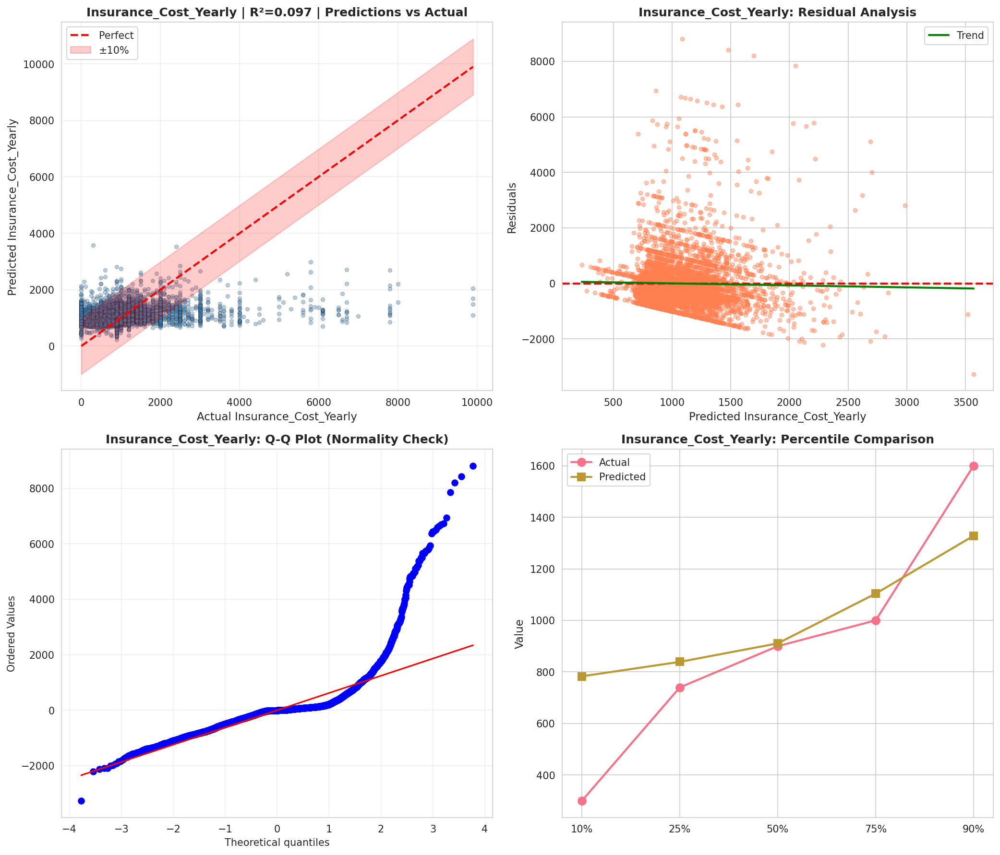
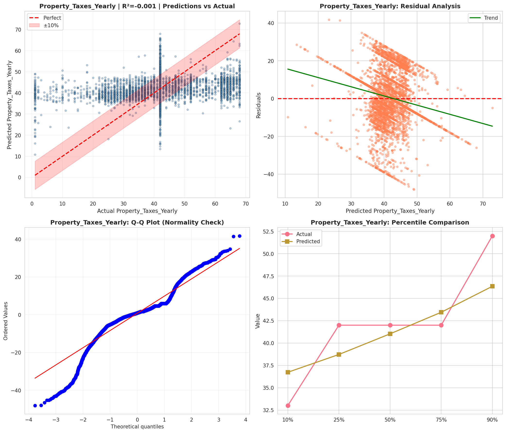
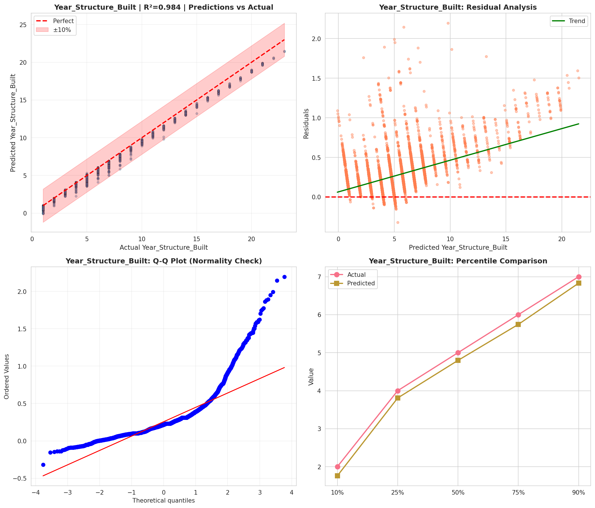
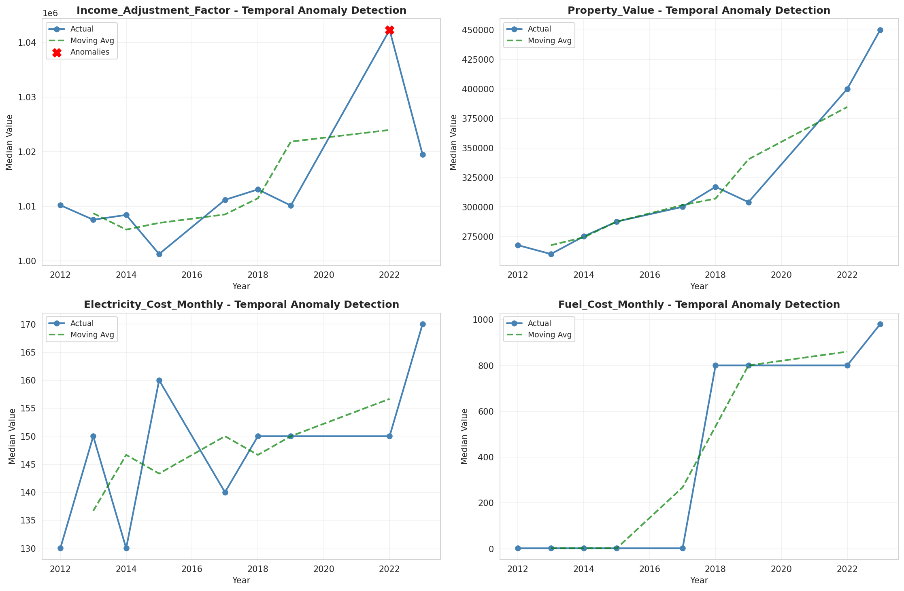
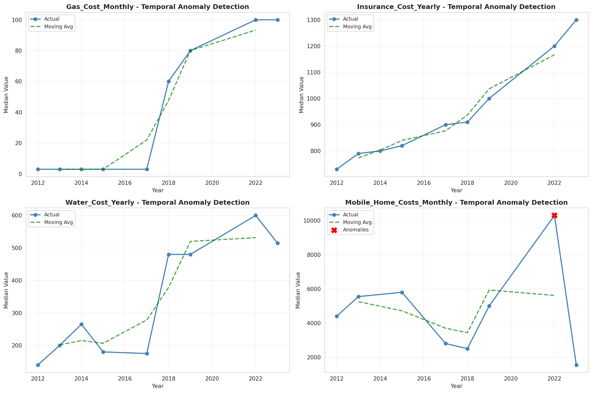
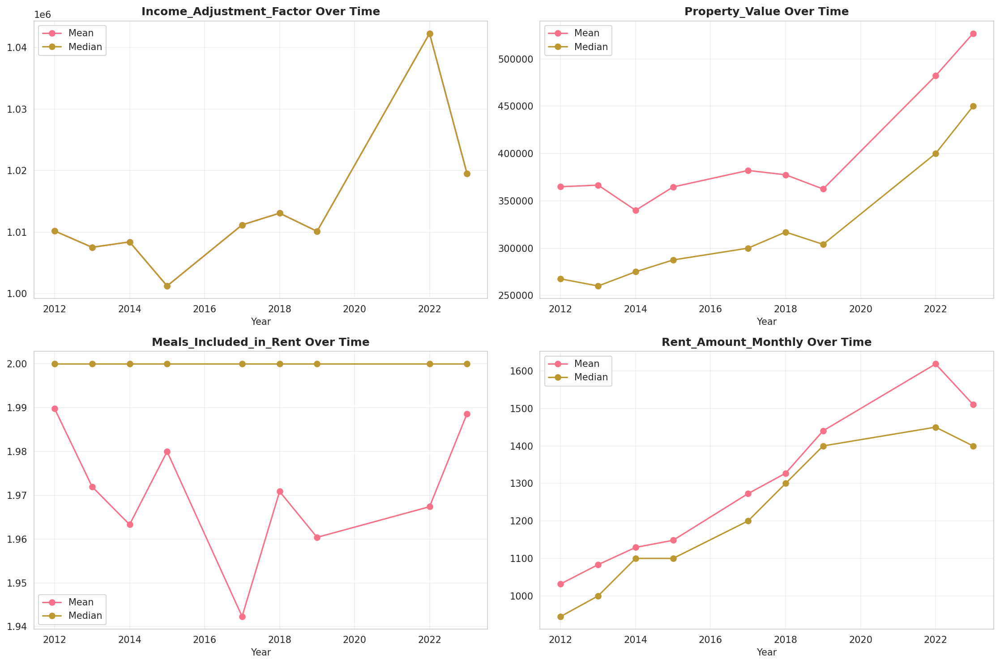
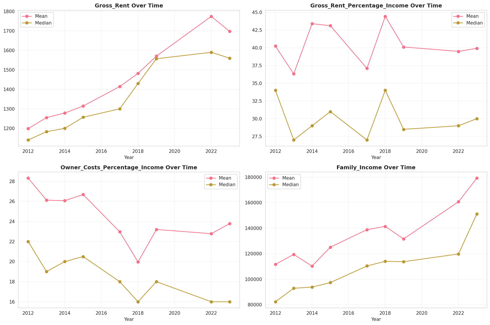
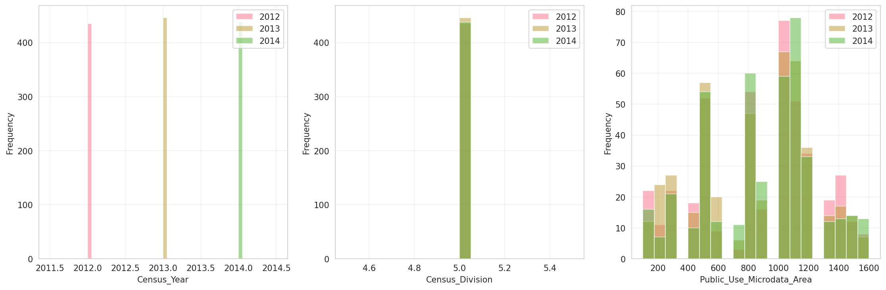
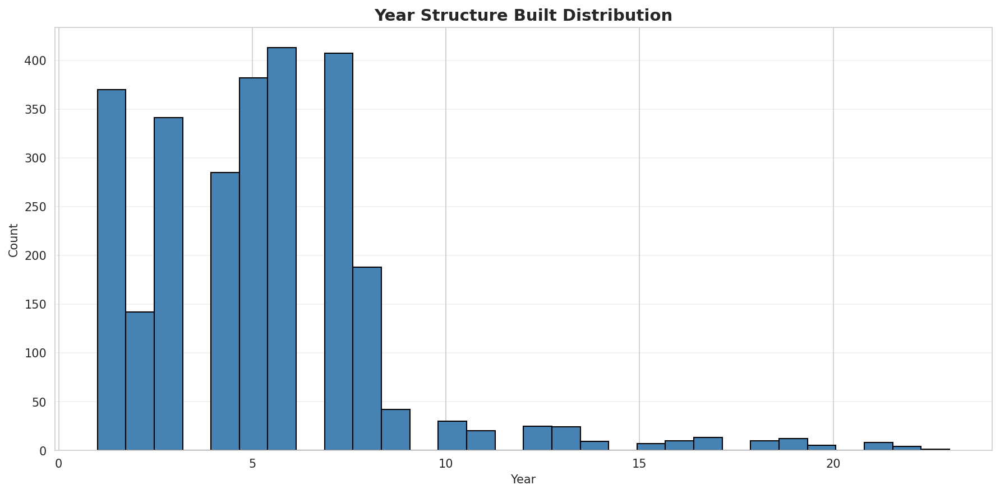
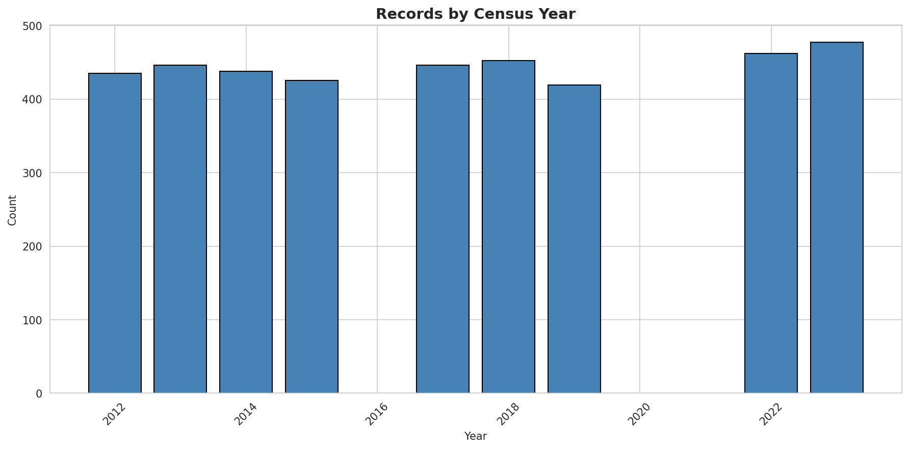
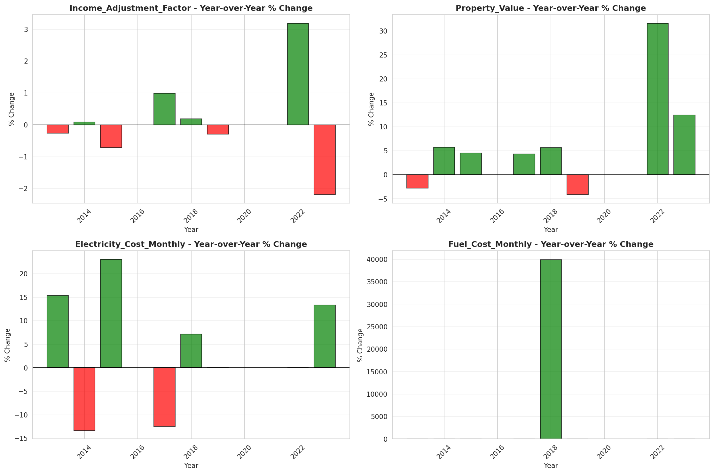
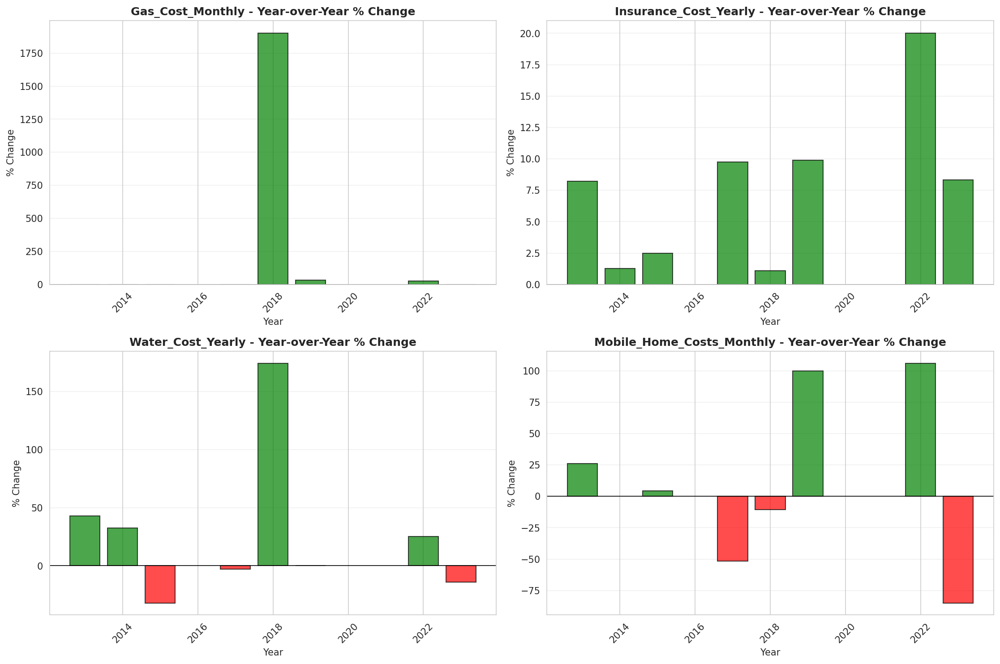
