# Temporal Analysis

## Year Distribution

- 2012: 128,319 records

- 2014: 132,188 records

- 2015: 134,050 records

- 2016: 134,588 records

- 2017: 134,904 records

- 2018: 135,590 records

- 2019: 136,383 records

- 2020: 132,380 records

- 2022: 135,216 records

- 2023: 136,140 records

## Temporal Trends

- Census_Year: {np.int64(2012): {'mean': 2012.0, 'median': 2012.0, 'std': 0.0}, np.int64(2014): {'mean': 2014.0, 'median': 2014.0, 'std': 0.0}, np.int64(2015): {'mean': 2015.0, 'median': 2015.0, 'std': 0.0}, np.int64(2016): {'mean': 2016.0, 'median': 2016.0, 'std': 0.0}, np.int64(2017): {'mean': 2017.0, 'median': 2017.0, 'std': 0.0}, np.int64(2018): {'mean': 2018.0, 'median': 2018.0, 'std': 0.0}, np.int64(2019): {'mean': 2019.0, 'median': 2019.0, 'std': 0.0}, np.int64(2020): {'mean': 2020.0, 'median': 2020.0, 'std': 0.0}, np.int64(2022): {'mean': 2022.0, 'median': 2022.0, 'std': 0.0}, np.int64(2023): {'mean': 2023.0, 'median': 2023.0, 'std': 0.0}}

- Census_Division: {np.int64(2012): {'mean': 5.0, 'median': 5.0, 'std': 0.0}, np.int64(2014): {'mean': 5.0, 'median': 5.0, 'std': 0.0}, np.int64(2015): {'mean': 5.0, 'median': 5.0, 'std': 0.0}, np.int64(2016): {'mean': 5.0, 'median': 5.0, 'std': 0.0}, np.int64(2017): {'mean': 5.0, 'median': 5.0, 'std': 0.0}, np.int64(2018): {'mean': 5.0, 'median': 5.0, 'std': 0.0}, np.int64(2019): {'mean': 5.0, 'median': 5.0, 'std': 0.0}, np.int64(2020): {'mean': 5.0, 'median': 5.0, 'std': 0.0}, np.int64(2022): {'mean': 5.0, 'median': 5.0, 'std': 0.0}, np.int64(2023): {'mean': 5.0, 'median': 5.0, 'std': 0.0}}

- Public_Use_Microdata_Area: {np.int64(2012): {'mean': None, 'median': None, 'std': None}, np.int64(2014): {'mean': None, 'median': None, 'std': None}, np.int64(2015): {'mean': None, 'median': None, 'std': None}, np.int64(2016): {'mean': 873.1548726483787, 'median': 1001.0, 'std': 367.39876202966184}, np.int64(2017): {'mean': 872.9309508984167, 'median': 1001.0, 'std': 366.9167329601849}, np.int64(2018): {'mean': 872.8576001180028, 'median': 1001.0, 'std': 367.2597635267499}, np.int64(2019): {'mean': 872.1971066775185, 'median': 1001.0, 'std': 368.33919299057305}, np.int64(2020): {'mean': 871.3710681371808, 'median': 1001.0, 'std': 369.17168361700556}, np.int64(2022): {'mean': None, 'median': None, 'std': None}, np.int64(2023): {'mean': 874.737197003085, 'median': 1001.0, 'std': 378.4058339608728}}

- Census_Region: {np.int64(2012): {'mean': 3.0, 'median': 3.0, 'std': 0.0}, np.int64(2014): {'mean': 3.0, 'median': 3.0, 'std': 0.0}, np.int64(2015): {'mean': 3.0, 'median': 3.0, 'std': 0.0}, np.int64(2016): {'mean': 3.0, 'median': 3.0, 'std': 0.0}, np.int64(2017): {'mean': 3.0, 'median': 3.0, 'std': 0.0}, np.int64(2018): {'mean': 3.0, 'median': 3.0, 'std': 0.0}, np.int64(2019): {'mean': 3.0, 'median': 3.0, 'std': 0.0}, np.int64(2020): {'mean': 3.0, 'median': 3.0, 'std': 0.0}, np.int64(2022): {'mean': 3.0, 'median': 3.0, 'std': 0.0}, np.int64(2023): {'mean': 3.0, 'median': 3.0, 'std': 0.0}}

- State_Code: {np.int64(2012): {'mean': 24.0, 'median': 24.0, 'std': 0.0}, np.int64(2014): {'mean': 24.0, 'median': 24.0, 'std': 0.0}, np.int64(2015): {'mean': 24.0, 'median': 24.0, 'std': 0.0}, np.int64(2016): {'mean': 24.0, 'median': 24.0, 'std': 0.0}, np.int64(2017): {'mean': 24.0, 'median': 24.0, 'std': 0.0}, np.int64(2018): {'mean': 24.0, 'median': 24.0, 'std': 0.0}, np.int64(2019): {'mean': 24.0, 'median': 24.0, 'std': 0.0}, np.int64(2020): {'mean': 24.0, 'median': 24.0, 'std': 0.0}, np.int64(2022): {'mean': 24.0, 'median': 24.0, 'std': 0.0}, np.int64(2023): {'mean': None, 'median': None, 'std': None}}

- Housing_Adjustment_Factor: {np.int64(2012): {'mean': 1041221.7689508179, 'median': 1053092.0, 'std': 27526.518796128646}, np.int64(2014): {'mean': 1036607.888734227, 'median': 1031130.0, 'std': 29571.514675812396}, np.int64(2015): {'mean': 1020907.0748601268, 'median': 1017534.0, 'std': 20259.91570258307}, np.int64(2016): {'mean': 1020377.3598017654, 'median': 1013801.0, 'std': 15781.586795585546}, np.int64(2017): {'mean': 1029214.7329656645, 'median': 1034680.0, 'std': 17951.194216402044}, np.int64(2018): {'mean': 1038330.6944022421, 'median': 1046406.0, 'std': 23449.575897251692}, np.int64(2019): {'mean': 1040914.4696846381, 'median': 1042936.0, 'std': 29188.85333494329}, np.int64(2020): {'mean': 1036621.099289923, 'median': 1030827.0, 'std': 28308.739854359046}, np.int64(2022): {'mean': 1104422.5411341854, 'median': 1133141.0, 'std': 61506.05197399942}, np.int64(2023): {'mean': 1105247.8088732187, 'median': 1125501.0, 'std': 76417.34387161119}}

- Income_Adjustment_Factor: {np.int64(2012): {'mean': 1052476.687832667, 'median': 1061121.0, 'std': 26458.319495441396}, np.int64(2014): {'mean': 1047450.2478742397, 'median': 1041654.0, 'std': 31007.405999008184}, np.int64(2015): {'mean': 1030308.9847594182, 'median': 1025215.0, 'std': 25620.83009868697}, np.int64(2016): {'mean': 1027540.5096442476, 'median': 1022342.0, 'std': 17538.988582301827}, np.int64(2017): {'mean': 1036602.5417111428, 'median': 1035988.0, 'std': 16829.25096819469}, np.int64(2018): {'mean': 1046900.3811564274, 'median': 1054346.0, 'std': 20472.67190028915}, np.int64(2019): {'mean': 1049851.849563362, 'median': 1054606.0, 'std': 26231.536424327875}, np.int64(2020): {'mean': 1046732.1076899833, 'median': 1044328.0, 'std': 28791.282833151643}, np.int64(2022): {'mean': 1126862.6407525737, 'median': 1140108.0, 'std': 49607.186948239076}, np.int64(2023): {'mean': 1129307.2212061114, 'median': 1159185.0, 'std': 70075.04573806233}}

- Housing_Unit_Weight: {np.int64(2012): {'mean': 18.5392030798245, 'median': 15.0, 'std': 14.098317178190708}, np.int64(2014): {'mean': 18.151231579265893, 'median': 15.0, 'std': 14.664591279240614}, np.int64(2015): {'mean': 17.980276016411786, 'median': 15.0, 'std': 14.92886944859788}, np.int64(2016): {'mean': 17.994984694029185, 'median': 15.0, 'std': 14.56262556476227}, np.int64(2017): {'mean': 17.99067485026389, 'median': 15.0, 'std': 14.501011807680309}, np.int64(2018): {'mean': 17.978759495538018, 'median': 15.0, 'std': 14.504499610294147}, np.int64(2019): {'mean': 17.952545405219126, 'median': 14.0, 'std': 14.908587455658752}, np.int64(2020): {'mean': 18.580223598730925, 'median': 14.0, 'std': 18.491788390743686}, np.int64(2022): {'mean': 18.718753697787243, 'median': 14.0, 'std': 19.28293156647933}, np.int64(2023): {'mean': 18.697899221389747, 'median': 13.0, 'std': 19.706903626527204}}

- Number_of_Persons: {np.int64(2012): {'mean': 2.2371433692594236, 'median': 2.0, 'std': 1.4857493842056742}, np.int64(2014): {'mean': 2.2117136199957637, 'median': 2.0, 'std': 1.4863109638799976}, np.int64(2015): {'mean': 2.193159268929504, 'median': 2.0, 'std': 1.4835860063029904}, np.int64(2016): {'mean': 2.19236484679169, 'median': 2.0, 'std': 1.4826140772946896}, np.int64(2017): {'mean': 2.194983099092688, 'median': 2.0, 'std': 1.486121959837415}, np.int64(2018): {'mean': 2.1898296334537943, 'median': 2.0, 'std': 1.484514999554513}, np.int64(2019): {'mean': 2.1870761018602027, 'median': 2.0, 'std': 1.4830235047020262}, np.int64(2020): {'mean': 2.1775721408067685, 'median': 2.0, 'std': 1.479095915544915}, np.int64(2022): {'mean': 2.1794092415098807, 'median': 2.0, 'std': 1.4771283475838612}, np.int64(2023): {'mean': 2.1807110327603936, 'median': 2.0, 'std': 1.4726344553384714}}

- Housing_Unit_Type: {np.int64(2012): {'mean': 1.1132490122273397, 'median': 1.0, 'std': 0.41545698785088425}, np.int64(2014): {'mean': 1.1406708627106847, 'median': 1.0, 'std': 0.4657079006183984}, np.int64(2015): {'mean': 1.1557478552778815, 'median': 1.0, 'std': 0.4903890679481377}, np.int64(2016): {'mean': 1.155712247748685, 'median': 1.0, 'std': 0.49141876829607767}, np.int64(2017): {'mean': 1.1531459408171736, 'median': 1.0, 'std': 0.488149331814835}, np.int64(2018): {'mean': 1.1538166531455123, 'median': 1.0, 'std': 0.48893832933581816}, np.int64(2019): {'mean': 1.156214484209909, 'median': 1.0, 'std': 0.49204230794730114}, np.int64(2020): {'mean': None, 'median': None, 'std': None}, np.int64(2022): {'mean': None, 'median': None, 'std': None}, np.int64(2023): {'mean': None, 'median': None, 'std': None}}

- Building_Type: {np.int64(2012): {'mean': 3.2299312604502695, 'median': 2.0, 'std': 2.0990034089165817}, np.int64(2014): {'mean': 3.2402741416398473, 'median': 2.0, 'std': 2.105589962573669}, np.int64(2015): {'mean': 3.2462212704499613, 'median': 2.0, 'std': 2.1104147684712067}, np.int64(2016): {'mean': 3.259396042467055, 'median': 2.0, 'std': 2.122217911146643}, np.int64(2017): {'mean': 3.264565802137058, 'median': 2.0, 'std': 2.1285627159042932}, np.int64(2018): {'mean': 3.269454703276366, 'median': 2.0, 'std': 2.13835040233308}, np.int64(2019): {'mean': 3.2638357572247734, 'median': 2.0, 'std': 2.143812296350395}, np.int64(2020): {'mean': 3.258727108010397, 'median': 2.0, 'std': 2.1458207824287108}, np.int64(2022): {'mean': 3.238097218871409, 'median': 2.0, 'std': 2.143939460745132}, np.int64(2023): {'mean': 3.226275146490411, 'median': 2.0, 'std': 2.140230834128875}}

- Year_Structure_Built: {np.int64(2012): {'mean': 4.770718978533669, 'median': 5.0, 'std': 2.4988572356066614}, np.int64(2014): {'mean': 4.843785956077307, 'median': 5.0, 'std': 2.666306829017386}, np.int64(2015): {'mean': 4.896901483270666, 'median': 5.0, 'std': 2.780247351501897}, np.int64(2016): {'mean': 5.0030073945552935, 'median': 5.0, 'std': 2.926978557198448}, np.int64(2017): {'mean': 5.088369567899711, 'median': 5.0, 'std': 3.090354336652422}, np.int64(2018): {'mean': 5.190997158462785, 'median': 5.0, 'std': 3.284483882265027}, np.int64(2019): {'mean': 5.3167399407825515, 'median': 5.0, 'std': 3.5178606334576017}, np.int64(2020): {'mean': 5.428697220364239, 'median': 5.0, 'std': 3.737816226026154}, np.int64(2022): {'mean': None, 'median': None, 'std': None}, np.int64(2023): {'mean': None, 'median': None, 'std': None}}

- Bathtub_or_Shower: {np.int64(2012): {'mean': 1.0068992889594488, 'median': 1.0, 'std': 0.08277527790341797}, np.int64(2014): {'mean': 1.007312111257483, 'median': 1.0, 'std': 0.08519803288173329}, np.int64(2015): {'mean': 1.0073956024801414, 'median': 1.0, 'std': 0.0856794518926654}, np.int64(2016): {'mean': 1.0073862932209692, 'median': 1.0, 'std': 0.08562591003464062}, np.int64(2017): {'mean': 1.0079214273375614, 'median': 1.0, 'std': 0.08864955144160454}, np.int64(2018): {'mean': 1.0081970569208218, 'median': 1.0, 'std': 0.09016613418350077}, np.int64(2019): {'mean': 1.0081974567492393, 'median': 1.0, 'std': 0.09016831355020097}, np.int64(2020): {'mean': 1.0080434175211035, 'median': 1.0, 'std': 0.08932406456344494}, np.int64(2022): {'mean': 1.0072211176093775, 'median': 1.0, 'std': 0.08467014060987205}, np.int64(2023): {'mean': 1.0068568226209216, 'median': 1.0, 'std': 0.08252189241097137}}

- Refrigerator: {np.int64(2012): {'mean': 1.012016754209664, 'median': 1.0, 'std': 0.10896078233371433}, np.int64(2014): {'mean': 1.0126315262885823, 'median': 1.0, 'std': 0.11167844384610374}, np.int64(2015): {'mean': 1.0129983316317637, 'median': 1.0, 'std': 0.11326730108732189}, np.int64(2016): {'mean': 1.0126657578386418, 'median': 1.0, 'std': 0.1118277234762037}, np.int64(2017): {'mean': 1.0129391538961412, 'median': 1.0, 'std': 0.11301255351036238}, np.int64(2018): {'mean': 1.0133232883218553, 'median': 1.0, 'std': 0.11465550994205911}, np.int64(2019): {'mean': 1.0132464375729002, 'median': 1.0, 'std': 0.11432880687309736}, np.int64(2020): {'mean': 1.012996469363046, 'median': 1.0, 'std': 0.11325930317586314}, np.int64(2022): {'mean': 1.01202964984235, 'median': 1.0, 'std': 0.10901851329809192}, np.int64(2023): {'mean': 1.0113566124659013, 'median': 1.0, 'std': 0.10596099447973636}}

- Hot_and_Cold_Running_Water: {np.int64(2012): {'mean': 1.009280683679846, 'median': 1.0, 'std': 0.09588863454980663}, np.int64(2014): {'mean': 1.0107055311911155, 'median': 1.0, 'std': 0.10291263817957881}, np.int64(2015): {'mean': 1.0110809532109863, 'median': 1.0, 'std': 0.10468169202001232}, np.int64(2016): {'mean': 1.01111248812327, 'median': 1.0, 'std': 0.10482886779726457}, np.int64(2017): {'mean': 1.0115818999909516, 'median': 1.0, 'std': 0.1069946435626191}, np.int64(2018): {'mean': 1.0119311807528846, 'median': 1.0, 'std': 0.10857681251847152}, np.int64(2019): {'mean': 1.0119332131583454, 'median': 1.0, 'std': 0.10858594640489463}, np.int64(2020): {'mean': 1.01183652388895, 'median': 1.0, 'std': 0.10815044901777221}, np.int64(2022): {'mean': 1.0111228505112184, 'median': 1.0, 'std': 0.10487718633300845}, np.int64(2023): {'mean': 1.0104335786515466, 'median': 1.0, 'std': 0.10161104358599245}}

- Running_Water: {np.int64(2012): {'mean': None, 'median': None, 'std': None}, np.int64(2014): {'mean': 9.0, 'median': 9.0, 'std': 0.0}, np.int64(2015): {'mean': 9.0, 'median': 9.0, 'std': 0.0}, np.int64(2016): {'mean': 9.0, 'median': 9.0, 'std': 0.0}, np.int64(2017): {'mean': 9.0, 'median': 9.0, 'std': 0.0}, np.int64(2018): {'mean': 9.0, 'median': 9.0, 'std': 0.0}, np.int64(2019): {'mean': 9.0, 'median': 9.0, 'std': 0.0}, np.int64(2020): {'mean': 9.0, 'median': 9.0, 'std': 0.0}, np.int64(2022): {'mean': 9.0, 'median': 9.0, 'std': 0.0}, np.int64(2023): {'mean': 9.0, 'median': 9.0, 'std': 0.0}}

- Sink_with_Faucet: {np.int64(2012): {'mean': 1.006941512270094, 'median': 1.0, 'std': 0.08302641681906424}, np.int64(2014): {'mean': 1.0075789157731494, 'median': 1.0, 'std': 0.08672680393478091}, np.int64(2015): {'mean': 1.0077359163989807, 'median': 1.0, 'std': 0.08761355894483946}, np.int64(2016): {'mean': 1.0077415623579957, 'median': 1.0, 'std': 0.08764527389979088}, np.int64(2017): {'mean': 1.008085942962433, 'median': 1.0, 'std': 0.08955795031575835}, np.int64(2018): {'mean': 1.0083772120179828, 'median': 1.0, 'std': 0.09114330673479869}, np.int64(2019): {'mean': 1.008360590216886, 'median': 1.0, 'std': 0.09105360164825646}, np.int64(2020): {'mean': 1.008356687466662, 'median': 1.0, 'std': 0.0910325403611213}, np.int64(2022): {'mean': 1.007578845785879, 'median': 1.0, 'std': 0.0867264057567946}, np.int64(2023): {'mean': 1.0071123051945376, 'median': 1.0, 'std': 0.08403438884236905}}

- Stove_or_Range: {np.int64(2012): {'mean': 1.0126078805586989, 'median': 1.0, 'std': 0.111575207973563}, np.int64(2014): {'mean': 1.0134236021944671, 'median': 1.0, 'std': 0.11508049147576939}, np.int64(2015): {'mean': 1.0140192733882816, 'median': 1.0, 'std': 0.11757060898148813}, np.int64(2016): {'mean': 1.0138472342710787, 'median': 1.0, 'std': 0.11685718291013907}, np.int64(2017): {'mean': 1.0142141499888953, 'median': 1.0, 'std': 0.11837323679984019}, np.int64(2018): {'mean': 1.0147645290991427, 'median': 1.0, 'std': 0.12060952242786381}, np.int64(2019): {'mean': 1.014959338983189, 'median': 1.0, 'std': 0.12139059829526516}, np.int64(2020): {'mean': 1.014681353664835, 'median': 1.0, 'std': 0.1202744112391584}, np.int64(2022): {'mean': 1.0136435862665658, 'median': 1.0, 'std': 0.11600668419196972}, np.int64(2023): {'mean': 1.0129389561476525, 'median': 1.0, 'std': 0.11301170212572934}}

- Telephone_Service: {np.int64(2012): {'mean': 1.0184634192382716, 'median': 1.0, 'std': 0.13462051958460552}, np.int64(2014): {'mean': 1.0206446907299023, 'median': 1.0, 'std': 0.1421923602531124}, np.int64(2015): {'mean': 1.0209066647751956, 'median': 1.0, 'std': 0.14307256072906685}, np.int64(2016): {'mean': 1.021686321275562, 'median': 1.0, 'std': 0.14565785992930763}, np.int64(2017): {'mean': 1.0200517578296922, 'median': 1.0, 'std': 0.1401779504865024}, np.int64(2018): {'mean': 1.019030838549063, 'median': 1.0, 'std': 0.13663392471444605}, np.int64(2019): {'mean': 1.0160114417274217, 'median': 1.0, 'std': 0.1255197707922771}, np.int64(2020): {'mean': 1.0131495535309993, 'median': 1.0, 'std': 0.11391558406396671}, np.int64(2022): {'mean': 1.0082641703091544, 'median': 1.0, 'std': 0.09053146589557849}, np.int64(2023): {'mean': 1.0069308488323312, 'median': 1.0, 'std': 0.0829630780730131}}

- Lot_Acreage: {np.int64(2012): {'mean': 1.2089071073250923, 'median': 1.0, 'std': 0.4554010966608763}, np.int64(2014): {'mean': 1.2079837032815088, 'median': 1.0, 'std': 0.4546834559335993}, np.int64(2015): {'mean': 1.2076971608832807, 'median': 1.0, 'std': 0.4545340258394132}, np.int64(2016): {'mean': 1.2085934630921777, 'median': 1.0, 'std': 0.4551251041447043}, np.int64(2017): {'mean': 1.2084487028117066, 'median': 1.0, 'std': 0.4534347583128705}, np.int64(2018): {'mean': 1.2097072835833316, 'median': 1.0, 'std': 0.4546840142299159}, np.int64(2019): {'mean': 1.2127017587368507, 'median': 1.0, 'std': 0.4567150368745988}, np.int64(2020): {'mean': 1.215973545086792, 'median': 1.0, 'std': 0.4592586688514711}, np.int64(2022): {'mean': 1.220743124634289, 'median': 1.0, 'std': 0.4647437557435465}, np.int64(2023): {'mean': 1.221895414718722, 'median': 1.0, 'std': 0.46542914034009764}}

- Agricultural_Sales: {np.int64(2012): {'mean': 1.1525151623260792, 'median': 1.0, 'std': 0.7596204101699379}, np.int64(2014): {'mean': 1.1412439399314178, 'median': 1.0, 'std': 0.7320475301799803}, np.int64(2015): {'mean': 1.1429330185895545, 'median': 1.0, 'std': 0.7407685022013587}, np.int64(2016): {'mean': 1.1387472900919904, 'median': 1.0, 'std': 0.7302798835865294}, np.int64(2017): {'mean': 1.134616502878409, 'median': 1.0, 'std': 0.7139556418403964}, np.int64(2018): {'mean': 1.1419689119170984, 'median': 1.0, 'std': 0.7290515672058926}, np.int64(2019): {'mean': 1.1432669591630105, 'median': 1.0, 'std': 0.731337112216846}, np.int64(2020): {'mean': 1.1477677034316538, 'median': 1.0, 'std': 0.7394013695477935}, np.int64(2022): {'mean': 1.1613133084849814, 'median': 1.0, 'std': 0.7801831795331947}, np.int64(2023): {'mean': 1.1589478780054865, 'median': 1.0, 'std': 0.7736693280607824}}

- Business_On_Property: {np.int64(2012): {'mean': 1.983123038493563, 'median': 2.0, 'std': 0.1288111283910744}, np.int64(2014): {'mean': 1.983618842553012, 'median': 2.0, 'std': 0.12693693394020958}, np.int64(2015): {'mean': 1.9842586750788644, 'median': 2.0, 'std': 0.1244736860984336}, np.int64(2016): {'mean': 3.4101044016578355, 'median': 2.0, 'std': 2.8255507398293496}, np.int64(2017): {'mean': 4.818686198501677, 'median': 2.0, 'std': 3.4437614981961713}, np.int64(2018): {'mean': 6.222876401689309, 'median': 9.0, 'std': 3.431557738090695}, np.int64(2019): {'mean': 7.6164362328724655, 'median': 9.0, 'std': 2.791715766239699}, np.int64(2020): {'mean': None, 'median': None, 'std': None}, np.int64(2022): {'mean': None, 'median': None, 'std': None}, np.int64(2023): {'mean': None, 'median': None, 'std': None}}

- Tenure: {np.int64(2012): {'mean': 1.7315613005294526, 'median': 1.0, 'std': 0.8787923491951356}, np.int64(2014): {'mean': 1.7565598704925907, 'median': 1.0, 'std': 0.8836935399708714}, np.int64(2015): {'mean': 1.7630666654844973, 'median': 1.0, 'std': 0.8834789689575273}, np.int64(2016): {'mean': 1.7646835387129545, 'median': 1.0, 'std': 0.8826122125603235}, np.int64(2017): {'mean': 1.766579229970248, 'median': 1.0, 'std': 0.8812816008421238}, np.int64(2018): {'mean': 1.766729781377654, 'median': 1.0, 'std': 0.8793035110747095}, np.int64(2019): {'mean': 1.7624795060522551, 'median': 1.0, 'std': 0.8745263014850593}, np.int64(2020): {'mean': 1.7580101791309704, 'median': 1.0, 'std': 0.8699018075329978}, np.int64(2022): {'mean': 1.7515263055442496, 'median': 1.0, 'std': 0.8603136870717106}, np.int64(2023): {'mean': 1.7481034121101944, 'median': 1.0, 'std': 0.855311025331718}}

- Vacancy_Status: {np.int64(2012): {'mean': 4.538279180030679, 'median': 5.0, 'std': 2.350234931877734}, np.int64(2014): {'mean': 4.647896698615549, 'median': 5.0, 'std': 2.3240846715118963}, np.int64(2015): {'mean': 4.720156046814044, 'median': 5.0, 'std': 2.3026269247711877}, np.int64(2016): {'mean': 4.741379310344827, 'median': 5.0, 'std': 2.2782912340000543}, np.int64(2017): {'mean': 4.796433504960442, 'median': 5.0, 'std': 2.2613419154166143}, np.int64(2018): {'mean': 4.821122030103247, 'median': 5.0, 'std': 2.2500110165135876}, np.int64(2019): {'mean': 4.857268944647585, 'median': 5.0, 'std': 2.2397990262183893}, np.int64(2020): {'mean': 4.8493560556784185, 'median': 5.0, 'std': 2.2536740844813066}, np.int64(2022): {'mean': 4.869589422407794, 'median': 5.0, 'std': 2.2354081806157473}, np.int64(2023): {'mean': 4.889643218257981, 'median': 5.0, 'std': 2.2233586779592174}}

- Vehicles_Available: {np.int64(2012): {'mean': 1.8320404145729772, 'median': 2.0, 'std': 1.0963370389913505}, np.int64(2014): {'mean': 1.8218027858324586, 'median': 2.0, 'std': 1.09416954825268}, np.int64(2015): {'mean': 1.8241729986611932, 'median': 2.0, 'std': 1.0998432750604117}, np.int64(2016): {'mean': 1.8341769356477187, 'median': 2.0, 'std': 1.1000575351547086}, np.int64(2017): {'mean': 1.8463549460415822, 'median': 2.0, 'std': 1.1018752219453283}, np.int64(2018): {'mean': 1.859035046196462, 'median': 2.0, 'std': 1.1062894520621056}, np.int64(2019): {'mean': 1.873957860955105, 'median': 2.0, 'std': 1.1117118360286133}, np.int64(2020): {'mean': 1.8851225299306298, 'median': 2.0, 'std': 1.112306804333866}, np.int64(2022): {'mean': 1.8877700897202216, 'median': 2.0, 'std': 1.1055119310495845}, np.int64(2023): {'mean': 1.8815025870507622, 'median': 2.0, 'std': 1.1023464506228742}}

- Condo_Fee_Monthly: {np.int64(2012): {'mean': 267.1413955928646, 'median': 200.0, 'std': 237.22566294864933}, np.int64(2014): {'mean': 290.2926267281106, 'median': 220.0, 'std': 242.78517782750544}, np.int64(2015): {'mean': 304.36767615279257, 'median': 230.0, 'std': 248.8396229388629}, np.int64(2016): {'mean': 318.9612162581446, 'median': 250.0, 'std': 256.3780846962159}, np.int64(2017): {'mean': 332.58916478555307, 'median': 260.0, 'std': 257.60387051219976}, np.int64(2018): {'mean': 341.2671706610906, 'median': 260.0, 'std': 262.77589204200314}, np.int64(2019): {'mean': 353.5297332047573, 'median': 280.0, 'std': 269.8419131518507}, np.int64(2020): {'mean': 372.26653306613224, 'median': 290.0, 'std': 325.6848386084616}, np.int64(2022): {'mean': 409.91352405721716, 'median': 300.0, 'std': 388.0380947755523}, np.int64(2023): {'mean': 430.8324375592792, 'median': 320.0, 'std': 413.7297241505164}}

- Electricity_Cost_Monthly: {np.int64(2012): {'mean': 169.5934631945131, 'median': 150.0, 'std': 116.0309351496967}, np.int64(2014): {'mean': 165.78593919555973, 'median': 150.0, 'std': 112.82534282928988}, np.int64(2015): {'mean': 164.15763341519855, 'median': 150.0, 'std': 112.70005343785328}, np.int64(2016): {'mean': 163.63995406563313, 'median': 150.0, 'std': 112.22767320612874}, np.int64(2017): {'mean': 164.8186803513899, 'median': 150.0, 'std': 112.88210142340759}, np.int64(2018): {'mean': 175.97954755008337, 'median': 150.0, 'std': 109.71377712398457}, np.int64(2019): {'mean': 174.6256283965819, 'median': 150.0, 'std': 109.19156564901425}, np.int64(2020): {'mean': 172.9316981349519, 'median': 150.0, 'std': 110.43354468182687}, np.int64(2022): {'mean': 177.6947390076493, 'median': 150.0, 'std': 151.66637625727554}, np.int64(2023): {'mean': 184.87058584890005, 'median': 150.0, 'std': 180.27039901224362}}

- Fuel_Cost_Monthly: {np.int64(2012): {'mean': 239.82430986903017, 'median': 2.0, 'std': 686.0746329025013}, np.int64(2014): {'mean': 221.5444825929945, 'median': 2.0, 'std': 678.6085396082863}, np.int64(2015): {'mean': 213.8052080470267, 'median': 2.0, 'std': 678.7048403799638}, np.int64(2016): {'mean': 194.5493043593481, 'median': 2.0, 'std': 643.3413422772543}, np.int64(2017): {'mean': 173.2929950882876, 'median': 2.0, 'std': 596.7364413798026}, np.int64(2018): {'mean': 1189.9505640765624, 'median': 900.0, 'std': 1096.0812737550834}, np.int64(2019): {'mean': 1126.351515151515, 'median': 880.0, 'std': 1029.8571431129672}, np.int64(2020): {'mean': 1076.0437865748709, 'median': 800.0, 'std': 981.2927123094274}, np.int64(2022): {'mean': 1120.6973257406473, 'median': 800.0, 'std': 1047.9853045412951}, np.int64(2023): {'mean': 1166.2807354352801, 'median': 870.0, 'std': 1105.1862661832029}}

- Gas_Cost_Monthly: {np.int64(2012): {'mean': 55.7339613652503, 'median': 3.0, 'std': 89.06102711563723}, np.int64(2014): {'mean': 50.69840606265455, 'median': 3.0, 'std': 83.16936800622626}, np.int64(2015): {'mean': 49.421014833269794, 'median': 3.0, 'std': 82.1850091576207}, np.int64(2016): {'mean': 46.84803674749349, 'median': 3.0, 'std': 79.17400117395376}, np.int64(2017): {'mean': 45.79570621270003, 'median': 3.0, 'std': 78.67066371296954}, np.int64(2018): {'mean': 106.72817786778045, 'median': 80.0, 'std': 94.05717777312155}, np.int64(2019): {'mean': 104.01079204400477, 'median': 80.0, 'std': 92.70690707228685}, np.int64(2020): {'mean': 102.02197659859246, 'median': 80.0, 'std': 91.48819439517735}, np.int64(2022): {'mean': 111.1398216969672, 'median': 80.0, 'std': 117.4601482051778}, np.int64(2023): {'mean': 117.38568921345141, 'median': 80.0, 'std': 140.12967027285643}}

- House_Heating_Fuel: {np.int64(2012): {'mean': 2.267180238568231, 'median': 3.0, 'std': 1.334010495065224}, np.int64(2014): {'mean': 2.279606140928255, 'median': 3.0, 'std': 1.363573836913941}, np.int64(2015): {'mean': 2.2787111989856985, 'median': 3.0, 'std': 1.3725464499900157}, np.int64(2016): {'mean': 2.2810918245660528, 'median': 3.0, 'std': 1.375404887692679}, np.int64(2017): {'mean': 2.2827755576289985, 'median': 3.0, 'std': 1.3816621262675324}, np.int64(2018): {'mean': 2.281693227440874, 'median': 3.0, 'std': 1.378698934440422}, np.int64(2019): {'mean': 2.283906582481599, 'median': 3.0, 'std': 1.3747974201233806}, np.int64(2020): {'mean': 2.2825705022549854, 'median': 3.0, 'std': 1.3720082889658154}, np.int64(2022): {'mean': 2.2802031534799765, 'median': 3.0, 'std': 1.3679993542591318}, np.int64(2023): {'mean': 2.282006013145015, 'median': 3.0, 'std': 1.3683890873900406}}

- Insurance_Cost_Yearly: {np.int64(2014): {'mean': 922.2680450482566, 'median': 760.0, 'std': 734.6356371949839}, np.int64(2015): {'mean': 958.5780465631053, 'median': 800.0, 'std': 763.3304059397202}}

- Water_Cost_Yearly: {np.int64(2012): {'mean': 305.0942317545642, 'median': 160.0, 'std': 403.1757457915517}, np.int64(2014): {'mean': 324.9719282016615, 'median': 180.0, 'std': 422.3247409535512}, np.int64(2015): {'mean': 335.6354810394815, 'median': 180.0, 'std': 434.3573230446673}, np.int64(2016): {'mean': 347.58647586237356, 'median': 200.0, 'std': 446.0963122827724}, np.int64(2017): {'mean': 358.6027322500572, 'median': 200.0, 'std': 458.2499439794679}, np.int64(2018): {'mean': 552.7722655636421, 'median': 450.0, 'std': 481.45039180376136}, np.int64(2019): {'mean': 564.6678807430147, 'median': 470.0, 'std': 495.90936140540083}, np.int64(2020): {'mean': 579.9745176751742, 'median': 480.0, 'std': 512.9783273336124}, np.int64(2022): {'mean': 616.0770096650235, 'median': 500.0, 'std': 557.3409010673529}, np.int64(2023): {'mean': 634.2966851809582, 'median': 500.0, 'std': 581.0618361106666}}

- Mobile_Home_Costs_Monthly: {np.int64(2012): {'mean': 3623.5096251266464, 'median': 4000.0, 'std': 2575.324453979394}, np.int64(2014): {'mean': 3681.6886898096304, 'median': 4100.0, 'std': 2609.7494865978883}, np.int64(2015): {'mean': 3794.751162790698, 'median': 4200.0, 'std': 2643.545056648269}, np.int64(2016): {'mean': 3878.877403846154, 'median': 4400.0, 'std': 2720.571619055558}, np.int64(2017): {'mean': 4040.9258809234507, 'median': 4500.0, 'std': 2790.9591359231}, np.int64(2018): {'mean': 3991.4410692588094, 'median': 4300.0, 'std': 2875.61464389101}, np.int64(2019): {'mean': 4135.377088305489, 'median': 4450.0, 'std': 2991.3618718029725}, np.int64(2020): {'mean': 4164.883544303798, 'median': 4400.0, 'std': 3125.755580399413}, np.int64(2022): {'mean': 4539.2180451127815, 'median': 3700.0, 'std': 5120.666334470923}, np.int64(2023): {'mean': 4707.7225, 'median': 3850.0, 'std': 5263.750432321139}}

- First_Mortgage_Includes_Insurance: {np.int64(2012): {'mean': 1.3123070063904623, 'median': 1.0, 'std': 0.4634381152747446}, np.int64(2014): {'mean': 1.3043602549227329, 'median': 1.0, 'std': 0.460139816214345}, np.int64(2015): {'mean': 1.2996531009391656, 'median': 1.0, 'std': 0.45810989003384867}, np.int64(2016): {'mean': 1.2980868447316338, 'median': 1.0, 'std': 0.45742170593484355}, np.int64(2017): {'mean': 1.2971906592383113, 'median': 1.0, 'std': 0.45702506312489805}, np.int64(2018): {'mean': 1.296060088305449, 'median': 1.0, 'std': 0.4565216731688874}, np.int64(2019): {'mean': 1.2934656267371931, 'median': 1.0, 'std': 0.4553537586620245}, np.int64(2020): {'mean': 1.288608798211488, 'median': 1.0, 'std': 0.4531196024268724}, np.int64(2022): {'mean': 1.2756956872653262, 'median': 1.0, 'std': 0.4468680778593375}, np.int64(2023): {'mean': 1.270732432290665, 'median': 1.0, 'std': 0.4443420243061327}}

- First_Mortgage_Payment_Monthly: {np.int64(2012): {'mean': 1650.4482900972605, 'median': 1500.0, 'std': 1020.1832230586134}, np.int64(2014): {'mean': 1623.8722023239, 'median': 1500.0, 'std': 995.187272232071}, np.int64(2015): {'mean': 1615.215771215839, 'median': 1500.0, 'std': 981.5605187729226}, np.int64(2016): {'mean': 1616.4573303787404, 'median': 1500.0, 'std': 977.202026565775}, np.int64(2017): {'mean': 1625.799536010025, 'median': 1500.0, 'std': 979.9890688512108}, np.int64(2018): {'mean': 1652.9216246849255, 'median': 1500.0, 'std': 997.6279332144691}, np.int64(2019): {'mean': 1690.2845206610177, 'median': 1500.0, 'std': 1011.3028274563641}, np.int64(2020): {'mean': 1726.6822046578766, 'median': 1500.0, 'std': 1021.9010907838136}, np.int64(2022): {'mean': 1822.5461627539742, 'median': 1600.0, 'std': 1054.1175489703576}, np.int64(2023): {'mean': 1880.21345269526, 'median': 1700.0, 'std': 1071.289043383487}}

- First_Mortgage_Includes_Taxes: {np.int64(2012): {'mean': 1.1994583794316287, 'median': 1.0, 'std': 0.3995965102827785}, np.int64(2014): {'mean': 1.194101128318956, 'median': 1.0, 'std': 0.3955104432569849}, np.int64(2015): {'mean': 1.1888992300533041, 'median': 1.0, 'std': 0.39143186341222513}, np.int64(2016): {'mean': 1.1844647055838422, 'median': 1.0, 'std': 0.3878659855699721}, np.int64(2017): {'mean': 1.1803126005452729, 'median': 1.0, 'std': 0.3844508674826053}, np.int64(2018): {'mean': 1.1762556459662004, 'median': 1.0, 'std': 0.38104074507750935}, np.int64(2019): {'mean': 1.1702912588649494, 'median': 1.0, 'std': 0.375891641563723}, np.int64(2020): {'mean': 1.1643459432816379, 'median': 1.0, 'std': 0.3705924605907172}, np.int64(2022): {'mean': 1.1498052426571217, 'median': 1.0, 'std': 0.35688354774868075}, np.int64(2023): {'mean': 1.1433567044918085, 'median': 1.0, 'std': 0.3504393057573844}}

- First_Mortgage_Status: {np.int64(2012): {'mean': 1.5248021688159437, 'median': 1.0, 'std': 0.8776817687674311}, np.int64(2014): {'mean': 1.5497003791121438, 'median': 1.0, 'std': 0.8905034189663411}, np.int64(2015): {'mean': 1.560319554382879, 'median': 1.0, 'std': 0.8958992150602895}, np.int64(2016): {'mean': 1.5648088416081405, 'median': 1.0, 'std': 0.8981575460309307}, np.int64(2017): {'mean': 1.571986228299874, 'median': 1.0, 'std': 0.9016827043111619}, np.int64(2018): {'mean': 1.5789473684210527, 'median': 1.0, 'std': 0.9049331638504954}, np.int64(2019): {'mean': 1.5882998128256178, 'median': 1.0, 'std': 0.9092685658967681}, np.int64(2020): {'mean': 1.604821828748738, 'median': 1.0, 'std': 0.9165569996862938}, np.int64(2022): {'mean': 1.6501626653368477, 'median': 1.0, 'std': 0.9349002383294458}, np.int64(2023): {'mean': 1.6712059083919668, 'median': 1.0, 'std': 0.9424500236936134}}

- Second_Mortgage_Payment_Monthly: {np.int64(2012): {'mean': 483.68367997219167, 'median': 360.0, 'std': 459.0102653429318}, np.int64(2014): {'mean': 457.9233828762822, 'median': 330.0, 'std': 440.740609325498}, np.int64(2015): {'mean': 454.8724428399519, 'median': 320.0, 'std': 437.62704851999047}, np.int64(2016): {'mean': 452.6033394583367, 'median': 310.0, 'std': 436.94609473893667}, np.int64(2017): {'mean': 456.56455328952984, 'median': 310.0, 'std': 455.7026171888894}, np.int64(2018): {'mean': 467.75406116707506, 'median': 320.0, 'std': 467.58616539031465}, np.int64(2019): {'mean': 482.164344340523, 'median': 330.0, 'std': 487.86876215091087}, np.int64(2020): {'mean': 495.3981651376147, 'median': 350.0, 'std': 500.5636295912293}, np.int64(2022): {'mean': 514.16639548758, 'median': 350.0, 'std': 551.5618751712946}, np.int64(2023): {'mean': 540.5282473309609, 'median': 370.0, 'std': 590.9047137183816}}

- Second_Mortgage_Status: {np.int64(2012): {'mean': 2.6740038640003965, 'median': 3.0, 'std': 0.6061785466745169}, np.int64(2014): {'mean': 2.726058955085843, 'median': 3.0, 'std': 0.5642637060101875}, np.int64(2015): {'mean': 2.7448853540908704, 'median': 3.0, 'std': 0.548859748348578}, np.int64(2016): {'mean': 2.76052573709762, 'median': 3.0, 'std': 0.5307188921269268}, np.int64(2017): {'mean': 2.7769291991939444, 'median': 3.0, 'std': 0.5118405694079635}, np.int64(2018): {'mean': 2.7911288549050126, 'median': 3.0, 'std': 0.49527589591940646}, np.int64(2019): {'mean': 2.8029412260162054, 'median': 3.0, 'std': 0.4798561164443928}, np.int64(2020): {'mean': 2.8090322129096603, 'median': 3.0, 'std': 0.4678982169361244}, np.int64(2022): {'mean': 2.8254181292587237, 'median': 3.0, 'std': 0.4440413439359879}, np.int64(2023): {'mean': 2.8323556495344633, 'median': 3.0, 'std': 0.4326128072634891}}

- Property_Taxes_Yearly: {np.int64(2012): {'mean': 40.70620847987495, 'median': 39.0, 'std': 16.14980109374055}, np.int64(2014): {'mean': 41.517610370551544, 'median': 41.0, 'std': 16.560639493420723}, np.int64(2015): {'mean': 41.87631926121372, 'median': 42.0, 'std': 16.56474004510203}, np.int64(2016): {'mean': 42.35315310929075, 'median': 42.0, 'std': 16.547827961694985}, np.int64(2017): {'mean': 42.765056735525164, 'median': 42.0, 'std': 16.6031667101506}}

- Meals_Included_in_Rent: {np.int64(2012): {'mean': 1.9753853386614728, 'median': 2.0, 'std': 0.15495026958573768}, np.int64(2014): {'mean': 1.9759974156032951, 'median': 2.0, 'std': 0.15305952160603772}, np.int64(2015): {'mean': 1.9758209338122115, 'median': 2.0, 'std': 0.1536072771400063}, np.int64(2016): {'mean': 1.975763962065332, 'median': 2.0, 'std': 0.15378363879773427}, np.int64(2017): {'mean': 1.9756066451962628, 'median': 2.0, 'std': 0.15426949769842938}, np.int64(2018): {'mean': 1.9753381827462992, 'median': 2.0, 'std': 0.15509474348008673}, np.int64(2019): {'mean': 1.9745913004224036, 'median': 2.0, 'std': 0.15736548561826924}, np.int64(2020): {'mean': 1.9739578041924888, 'median': 2.0, 'std': 0.1592634886794058}, np.int64(2022): {'mean': 1.9731520463800125, 'median': 2.0, 'std': 0.16164171075995776}, np.int64(2023): {'mean': 1.9718280394686378, 'median': 2.0, 'std': 0.1654667815127649}}

- Rent_Amount_Monthly: {np.int64(2012): {'mean': 1008.1225024346015, 'median': 940.0, 'std': 552.1120417690316}, np.int64(2014): {'mean': 1063.178614117267, 'median': 1000.0, 'std': 578.7776810137265}, np.int64(2015): {'mean': 1091.9454207285787, 'median': 1000.0, 'std': 591.999213207354}, np.int64(2016): {'mean': 1123.654245298081, 'median': 1100.0, 'std': 600.7856888008647}, np.int64(2017): {'mean': 1158.2223143394663, 'median': 1100.0, 'std': 609.9656458319319}, np.int64(2018): {'mean': 1187.1777054619704, 'median': 1100.0, 'std': 616.3913469857321}, np.int64(2019): {'mean': 1221.4280463031632, 'median': 1200.0, 'std': 627.1747548976095}, np.int64(2020): {'mean': 1262.8053100342036, 'median': 1200.0, 'std': 664.1088620549807}, np.int64(2022): {'mean': 1356.0739181447996, 'median': 1300.0, 'std': 739.7893423340665}, np.int64(2023): {'mean': 1421.5906697813884, 'median': 1300.0, 'std': 796.8677134042277}}

- Gross_Rent: {np.int64(2012): {'mean': 1173.7069802298195, 'median': 1100.0, 'std': 591.3324657448512}, np.int64(2014): {'mean': 1227.3340408051486, 'median': 1150.0, 'std': 613.0726790816545}, np.int64(2015): {'mean': 1254.3523444391667, 'median': 1180.0, 'std': 623.9048590626471}, np.int64(2016): {'mean': 1284.564015125937, 'median': 1210.0, 'std': 631.1191738964745}, np.int64(2017): {'mean': 1319.2016767112218, 'median': 1253.0, 'std': 640.0030141436932}, np.int64(2018): {'mean': 1348.8020735155515, 'median': 1300.0, 'std': 646.1663109005749}, np.int64(2019): {'mean': 1380.6270075718992, 'median': 1329.0, 'std': 656.9365657855813}, np.int64(2020): {'mean': 1419.234653040806, 'median': 1370.0, 'std': 689.9946828979878}, np.int64(2022): {'mean': 1520.3916467087597, 'median': 1451.0, 'std': 776.4198336127547}, np.int64(2023): {'mean': 1592.511693445083, 'median': 1500.0, 'std': 840.7134506074457}}

- Gross_Rent_Percentage_Income: {np.int64(2012): {'mean': 39.450845244141334, 'median': 30.0, 'std': 26.879476448355458}, np.int64(2014): {'mean': 39.76704505884811, 'median': 30.0, 'std': 27.142098484940973}, np.int64(2015): {'mean': 39.611550277883254, 'median': 30.0, 'std': 27.13668249007499}, np.int64(2016): {'mean': 39.2158298106334, 'median': 30.0, 'std': 27.173653235980936}, np.int64(2017): {'mean': 39.160954208938854, 'median': 30.0, 'std': 27.136528191045535}, np.int64(2018): {'mean': 39.08832807570978, 'median': 30.0, 'std': 27.129236806919526}, np.int64(2019): {'mean': 38.736092383224424, 'median': 29.0, 'std': 27.11130976389114}, np.int64(2020): {'mean': 38.62843636363636, 'median': 29.0, 'std': 27.1626542902712}, np.int64(2022): {'mean': 39.04119365455016, 'median': 29.0, 'std': 27.468582823190953}, np.int64(2023): {'mean': 39.40993024210094, 'median': 30.0, 'std': 27.701018488480962}}

- Selected_Monthly_Owner_Costs: {np.int64(2012): {'mean': 1795.4713859837748, 'median': 1590.0, 'std': 1264.7284976038234}, np.int64(2014): {'mean': 1732.5215933427155, 'median': 1538.0, 'std': 1211.6881243684784}, np.int64(2015): {'mean': 1712.2389765656517, 'median': 1520.0, 'std': 1192.7341212867445}, np.int64(2016): {'mean': 1705.1747773866225, 'median': 1516.0, 'std': 1178.8365594216439}, np.int64(2017): {'mean': 1705.138287933022, 'median': 1515.0, 'std': 1174.7976313042466}, np.int64(2018): {'mean': 1724.6144121975344, 'median': 1528.0, 'std': 1190.4739026983664}, np.int64(2019): {'mean': 1743.7941471212807, 'median': 1543.0, 'std': 1203.108799107129}, np.int64(2020): {'mean': 1758.5128991720876, 'median': 1555.5, 'std': 1214.253263621553}, np.int64(2022): {'mean': 1808.204097143875, 'median': 1598.0, 'std': 1258.6381823379809}, np.int64(2023): {'mean': 1850.5361673870243, 'median': 1630.0, 'std': 1289.5276683171683}}

- Owner_Costs_Percentage_Income: {np.int64(2012): {'mean': 27.247077009900746, 'median': 21.0, 'std': 21.514554385372612}, np.int64(2014): {'mean': 26.129073498137654, 'median': 20.0, 'std': 21.33152737590972}, np.int64(2015): {'mean': 25.551145507032736, 'median': 20.0, 'std': 21.183637617242695}, np.int64(2016): {'mean': 25.00960820552992, 'median': 19.0, 'std': 21.026481949602804}, np.int64(2017): {'mean': 24.51390226361276, 'median': 19.0, 'std': 20.884039372749616}, np.int64(2018): {'mean': 24.153383823083914, 'median': 18.0, 'std': 20.71289099265967}, np.int64(2019): {'mean': 23.649787259543356, 'median': 18.0, 'std': 20.431870499674897}, np.int64(2020): {'mean': 23.204733859592686, 'median': 18.0, 'std': 20.297468973757468}, np.int64(2022): {'mean': 22.86247089030871, 'median': 17.0, 'std': 20.753015020485694}, np.int64(2023): {'mean': 22.8666221331552, 'median': 17.0, 'std': 21.076292261038986}}

- Satellite_Internet: {np.int64(2012): {'mean': None, 'median': None, 'std': None}, np.int64(2014): {'mean': None, 'median': None, 'std': None}, np.int64(2015): {'mean': None, 'median': None, 'std': None}, np.int64(2016): {'mean': None, 'median': None, 'std': None}, np.int64(2017): {'mean': 1.9529119162321174, 'median': 2.0, 'std': 0.21182838583035174}, np.int64(2018): {'mean': 1.9497348562104835, 'median': 2.0, 'std': 0.2184926679419616}, np.int64(2019): {'mean': 1.948036710383709, 'median': 2.0, 'std': 0.22195404025951918}, np.int64(2020): {'mean': 1.9464564375899318, 'median': 2.0, 'std': 0.2251158876085367}, np.int64(2022): {'mean': 1.947521696643672, 'median': 2.0, 'std': 0.22299060996113998}, np.int64(2023): {'mean': 1.948943661971831, 'median': 2.0, 'std': 0.22011371373481303}}

- Smartphone: {np.int64(2012): {'mean': None, 'median': None, 'std': None}, np.int64(2014): {'mean': None, 'median': None, 'std': None}, np.int64(2015): {'mean': None, 'median': None, 'std': None}, np.int64(2016): {'mean': None, 'median': None, 'std': None}, np.int64(2017): {'mean': 1.2576624474059468, 'median': 1.0, 'std': 0.4373490531206233}, np.int64(2018): {'mean': 1.2173162222339102, 'median': 1.0, 'std': 0.41242135346913694}, np.int64(2019): {'mean': 1.184506575504936, 'median': 1.0, 'std': 0.3878984548586502}, np.int64(2020): {'mean': 1.1558928474398218, 'median': 1.0, 'std': 0.3627553711126416}, np.int64(2022): {'mean': 1.1127077102762393, 'median': 1.0, 'std': 0.31623656838606234}, np.int64(2023): {'mean': 1.0991294923786883, 'median': 1.0, 'std': 0.29883710719434997}}

- Tablet_Computer: {np.int64(2012): {'mean': None, 'median': None, 'std': None}, np.int64(2014): {'mean': None, 'median': None, 'std': None}, np.int64(2015): {'mean': None, 'median': None, 'std': None}, np.int64(2016): {'mean': None, 'median': None, 'std': None}, np.int64(2017): {'mean': 1.4165272960935162, 'median': 1.0, 'std': 0.49298524012113015}, np.int64(2018): {'mean': 1.374629639369554, 'median': 1.0, 'std': 0.4840292619211014}, np.int64(2019): {'mean': 1.3429378728154324, 'median': 1.0, 'std': 0.47469300953219673}, np.int64(2020): {'mean': 1.3128724348408831, 'median': 1.0, 'std': 0.4636649882183756}, np.int64(2022): {'mean': 1.2981383496434196, 'median': 1.0, 'std': 0.4574425927078425}, np.int64(2023): {'mean': 1.2969165151727031, 'median': 1.0, 'std': 0.45690143658230997}}

- Food_Stamp_SNAP: {np.int64(2012): {'mean': 1.9249760623369763, 'median': 2.0, 'std': 0.2634310521937638}, np.int64(2014): {'mean': 1.9077368539253745, 'median': 2.0, 'std': 0.2893982199372636}, np.int64(2015): {'mean': 1.90269863880975, 'median': 2.0, 'std': 0.2963688603985833}, np.int64(2016): {'mean': 1.9022783571845563, 'median': 2.0, 'std': 0.29693908287817583}, np.int64(2017): {'mean': 1.9043098762417185, 'median': 2.0, 'std': 0.2941669690189477}, np.int64(2018): {'mean': 1.907025425124068, 'median': 2.0, 'std': 0.2903979415516555}, np.int64(2019): {'mean': 1.911414380468969, 'median': 2.0, 'std': 0.2841458007712167}, np.int64(2020): {'mean': 1.914413800293521, 'median': 2.0, 'std': 0.2797531586280941}, np.int64(2022): {'mean': 1.9083347001897977, 'median': 2.0, 'std': 0.28855402086766246}, np.int64(2023): {'mean': 1.9071329623811109, 'median': 2.0, 'std': 0.29024714106381583}}

- Family_Type_Employment_Status: {np.int64(2012): {'mean': 3.003005758821104, 'median': 2.0, 'std': 2.398720755683253}, np.int64(2014): {'mean': 3.0605172482078498, 'median': 2.0, 'std': 2.4134438857847993}, np.int64(2015): {'mean': 3.0772047644858085, 'median': 2.0, 'std': 2.4122338423973253}, np.int64(2016): {'mean': 3.0656509695290857, 'median': 2.0, 'std': 2.4040759114617645}, np.int64(2017): {'mean': 3.068953710410219, 'median': 2.0, 'std': 2.402728666222827}, np.int64(2018): {'mean': 3.06787258935966, 'median': 2.0, 'std': 2.395643838253618}, np.int64(2019): {'mean': 3.0481425669920723, 'median': 2.0, 'std': 2.3792789161027526}, np.int64(2020): {'mean': 3.0428245146555004, 'median': 2.0, 'std': 2.3735253310557067}, np.int64(2022): {'mean': None, 'median': None, 'std': None}, np.int64(2023): {'mean': None, 'median': None, 'std': None}}

- Family_Income: {np.int64(2012): {'mean': 111173.65961114453, 'median': 88000.0, 'std': 97799.2354388002}, np.int64(2014): {'mean': 114018.08978008447, 'median': 90000.0, 'std': 100320.42077080111}, np.int64(2015): {'mean': 117135.09558872218, 'median': 92000.0, 'std': 104577.9706837101}, np.int64(2016): {'mean': 120654.2700784805, 'median': 95000.0, 'std': 107493.73951975738}, np.int64(2017): {'mean': 124416.89574213563, 'median': 98000.0, 'std': 111619.10560927502}, np.int64(2018): {'mean': 128309.17411428422, 'median': 100100.0, 'std': 114740.80336852488}, np.int64(2019): {'mean': 133683.11549719065, 'median': 104500.0, 'std': 119457.76296291366}, np.int64(2020): {'mean': 138317.8804763066, 'median': 108000.0, 'std': 123690.84697888893}, np.int64(2022): {'mean': 148514.2198451589, 'median': 115700.0, 'std': 132667.55564072923}, np.int64(2023): {'mean': 154425.8066363062, 'median': 120000.0, 'std': 136968.58450892457}}

- Family_Presence_Children: {np.int64(2012): {'mean': 3.078016731170783, 'median': 4.0, 'std': 1.0829458145088398}, np.int64(2014): {'mean': 3.098523854044587, 'median': 4.0, 'std': 1.0776834843505314}, np.int64(2015): {'mean': 3.1081440516163013, 'median': 4.0, 'std': 1.0765546605317136}, np.int64(2016): {'mean': 3.1142579790373994, 'median': 4.0, 'std': 1.075899710155304}, np.int64(2017): {'mean': 3.1211479375040856, 'median': 4.0, 'std': 1.0736163653421713}, np.int64(2018): {'mean': 3.1288770053475936, 'median': 4.0, 'std': 1.0717248567477007}, np.int64(2019): {'mean': 3.1393120840266224, 'median': 4.0, 'std': 1.068664426709722}, np.int64(2020): {'mean': 3.1500296607884377, 'median': 4.0, 'std': 1.065113090472007}, np.int64(2022): {'mean': 3.1641524886399663, 'median': 4.0, 'std': 1.0594464653716773}, np.int64(2023): {'mean': 3.171761871718666, 'median': 4.0, 'std': 1.0575474253793005}}

- Household_Family_Type: {np.int64(2012): {'mean': 2.706392082483123, 'median': 1.0, 'std': 2.0331310200066937}, np.int64(2014): {'mean': 2.7139718570437443, 'median': 1.0, 'std': 2.030856461593422}, np.int64(2015): {'mean': 2.7220601665085513, 'median': 1.0, 'std': 2.0327220978325444}, np.int64(2016): {'mean': 2.7170443001634204, 'median': 1.0, 'std': 2.0338778614644624}, np.int64(2017): {'mean': 2.7149270285020157, 'median': 1.0, 'std': 2.0331386582154947}, np.int64(2018): {'mean': 2.714739038201932, 'median': 1.0, 'std': 2.0332687057510523}, np.int64(2019): {'mean': 2.7123957860955104, 'median': 1.0, 'std': 2.0369195227105403}, np.int64(2020): {'mean': 2.7054210211733167, 'median': 1.0, 'std': 2.0367164681833416}, np.int64(2022): {'mean': 2.7061264577323967, 'median': 1.0, 'std': 2.0422087590545925}, np.int64(2023): {'mean': 2.7136152286393513, 'median': 1.0, 'std': 2.047047537339306}}

- Household_Income: {np.int64(2012): {'mean': 94639.2343107229, 'median': 72000.0, 'std': 90222.90754729425}, np.int64(2014): {'mean': 97249.58458280617, 'median': 73740.0, 'std': 92934.98312114402}, np.int64(2015): {'mean': 99788.69788460161, 'median': 75000.0, 'std': 96783.63996082214}, np.int64(2016): {'mean': 102741.52449179743, 'median': 77910.0, 'std': 99582.30604614434}, np.int64(2017): {'mean': 105881.14391045572, 'median': 80000.0, 'std': 103304.13112053288}, np.int64(2018): {'mean': 109076.64824711983, 'median': 82002.0, 'std': 106085.66377028268}, np.int64(2019): {'mean': 113455.97136445637, 'median': 85700.0, 'std': 110455.97329153212}, np.int64(2020): {'mean': 117302.99217301562, 'median': 89000.0, 'std': 114311.85537557308}, np.int64(2022): {'mean': 125821.40805752826, 'median': 94940.0, 'std': 122822.80908256775}, np.int64(2023): {'mean': 130456.26027989552, 'median': 98100.0, 'std': 126762.62459140028}}

- Number_Persons_Family: {np.int64(2012): {'mean': 3.0353110162390777, 'median': 3.0, 'std': 1.251350545889841}, np.int64(2014): {'mean': 3.029048866883502, 'median': 3.0, 'std': 1.2527973345432601}, np.int64(2015): {'mean': 3.0247547567318454, 'median': 3.0, 'std': 1.2535500051107535}, np.int64(2016): {'mean': 3.0236517952014275, 'median': 3.0, 'std': 1.250592701215031}, np.int64(2017): {'mean': 3.025586716349611, 'median': 3.0, 'std': 1.2544618698343752}, np.int64(2018): {'mean': 3.021494717620973, 'median': 3.0, 'std': 1.2567706611868743}, np.int64(2019): {'mean': 3.0189657861896837, 'median': 3.0, 'std': 1.2579660446634817}, np.int64(2020): {'mean': 3.0171358464110445, 'median': 3.0, 'std': 1.25540838489944}, np.int64(2022): {'mean': 3.0129319454718377, 'median': 3.0, 'std': 1.263445785998017}, np.int64(2023): {'mean': 3.007462784273164, 'median': 3.0, 'std': 1.2613087714239064}}

- Workers_In_Family: {np.int64(2012): {'mean': 1.6138397903948716, 'median': 2.0, 'std': 0.8641177297671608}, np.int64(2014): {'mean': 1.5903267009915592, 'median': 2.0, 'std': 0.869717426120527}, np.int64(2015): {'mean': 1.5881624860096122, 'median': 2.0, 'std': 0.8713757923848565}, np.int64(2016): {'mean': 1.5925148561608795, 'median': 2.0, 'std': 0.8702472652801675}, np.int64(2017): {'mean': 1.595881545401059, 'median': 2.0, 'std': 0.8716617695258402}, np.int64(2018): {'mean': 1.5958132255119342, 'median': 2.0, 'std': 0.874403190429339}, np.int64(2019): {'mean': 1.596141846921797, 'median': 2.0, 'std': 0.8780972781564907}, np.int64(2020): {'mean': 1.5970986356037318, 'median': 2.0, 'std': 0.8807019764300098}, np.int64(2022): {'mean': 1.5731137060128924, 'median': 2.0, 'std': 0.8901110816642623}, np.int64(2023): {'mean': 1.5643043244870973, 'median': 2.0, 'std': 0.8929219940617127}}

- Work_Experience_Householder_Spouse: {np.int64(2012): {'mean': 5.981752649988695, 'median': 4.0, 'std': 4.766228670855141}, np.int64(2014): {'mean': 6.113298481716069, 'median': 4.0, 'std': 4.780850744449899}, np.int64(2015): {'mean': 6.13354401211403, 'median': 5.0, 'std': 4.780102897644149}, np.int64(2016): {'mean': 6.101402316642836, 'median': 4.0, 'std': 4.767079266621862}, np.int64(2017): {'mean': 6.096515656664706, 'median': 5.0, 'std': 4.764068485647071}, np.int64(2018): {'mean': 6.080239989565671, 'median': 4.0, 'std': 4.757441154575952}, np.int64(2019): {'mean': 6.027909213810316, 'median': 4.0, 'std': 4.742256539568655}, np.int64(2020): {'mean': 6.015693253518848, 'median': 4.0, 'std': 4.733503783586813}, np.int64(2022): {'mean': 6.022429462115608, 'median': 5.0, 'std': 4.7099761505555335}, np.int64(2023): {'mean': 6.024168946961861, 'median': 5.0, 'std': 4.704977304883717}}

- Work_Status_Householder_Spouse: {np.int64(2012): {'mean': 5.490976073627792, 'median': 3.0, 'std': 4.971559705572758}, np.int64(2014): {'mean': 5.626770697189327, 'median': 3.0, 'std': 4.996042362604863}, np.int64(2015): {'mean': 5.65889771690705, 'median': 3.0, 'std': 4.99830604933671}, np.int64(2016): {'mean': 5.6279514575913465, 'median': 3.0, 'std': 4.989613624806834}, np.int64(2017): {'mean': 5.629248699545664, 'median': 3.0, 'std': 4.990922355467995}, np.int64(2018): {'mean': 5.62424903705846, 'median': 3.0, 'std': 4.98413493702169}, np.int64(2019): {'mean': 5.587800563454104, 'median': 3.0, 'std': 4.961204474503693}, np.int64(2020): {'mean': 5.5831475338517595, 'median': 3.0, 'std': 4.953633796914783}, np.int64(2022): {'mean': 5.600261301977096, 'median': 3.0, 'std': 4.923007680732679}, np.int64(2023): {'mean': 5.616605648881194, 'median': 3.0, 'std': 4.912165997874934}}

- Complete_Kitchen_Facilities: {np.int64(2012): {'mean': 1.014989275279096, 'median': 1.0, 'std': 0.1215101707215853}, np.int64(2014): {'mean': 1.0157164535009755, 'median': 1.0, 'std': 0.12437674851071084}, np.int64(2015): {'mean': 1.016160760975124, 'median': 1.0, 'std': 0.1260941027682318}, np.int64(2016): {'mean': 1.015697938612798, 'median': 1.0, 'std': 0.12430462983610957}, np.int64(2017): {'mean': 1.0159826929562634, 'median': 1.0, 'std': 0.1254088348246751}, np.int64(2018): {'mean': 1.0164023027096964, 'median': 1.0, 'std': 0.12701731885768128}, np.int64(2019): {'mean': 1.0164193835186257, 'median': 1.0, 'std': 0.1270823319470855}, np.int64(2020): {'mean': 1.0161461023292044, 'median': 1.0, 'std': 0.12603785228160877}, np.int64(2022): {'mean': 1.0153240767701306, 'median': 1.0, 'std': 0.12283881704781369}, np.int64(2023): {'mean': 1.0146614031762253, 'median': 1.0, 'std': 0.12019386628555176}}

- Complete_Plumbing_Facilities: {np.int64(2012): {'mean': 1.0103193771217214, 'median': 1.0, 'std': 0.10105925896549187}, np.int64(2014): {'mean': 1.011872800947156, 'median': 1.0, 'std': 0.10831405892815542}, np.int64(2015): {'mean': 1.0123675058309884, 'median': 1.0, 'std': 0.11051991683071241}, np.int64(2016): {'mean': 1.012368323212294, 'median': 1.0, 'std': 0.11052352110812677}, np.int64(2017): {'mean': 1.0127252835838083, 'median': 1.0, 'std': 0.112086814950489}, np.int64(2018): {'mean': 1.0130121113358501, 'median': 1.0, 'std': 0.11332652585894863}, np.int64(2019): {'mean': 1.0129364839843717, 'median': 1.0, 'std': 0.11300104212341411}, np.int64(2020): {'mean': 1.0127424667044849, 'median': 1.0, 'std': 0.11216150302250838}, np.int64(2022): {'mean': 1.0119464572431636, 'median': 1.0, 'std': 0.10864546746962801}, np.int64(2023): {'mean': 1.0112741987324767, 'median': 1.0, 'std': 0.1055802208915784}}

- Plumbing_Facilities_for_Project: {np.int64(2012): {'mean': None, 'median': None, 'std': None}, np.int64(2014): {'mean': None, 'median': None, 'std': None}, np.int64(2015): {'mean': None, 'median': None, 'std': None}, np.int64(2016): {'mean': None, 'median': None, 'std': None}, np.int64(2017): {'mean': 9.0, 'median': 9.0, 'std': 0.0}, np.int64(2018): {'mean': 9.0, 'median': 9.0, 'std': 0.0}, np.int64(2019): {'mean': 9.0, 'median': 9.0, 'std': 0.0}, np.int64(2020): {'mean': 9.0, 'median': 9.0, 'std': 0.0}, np.int64(2022): {'mean': 9.0, 'median': 9.0, 'std': 0.0}, np.int64(2023): {'mean': 9.0, 'median': 9.0, 'std': 0.0}}

- Response_Mode: {np.int64(2012): {'mean': 1.3017784458443817, 'median': 1.0, 'std': 0.4590315837094943}, np.int64(2014): {'mean': 1.6519118211075723, 'median': 1.0, 'std': 0.7686019982649207}, np.int64(2015): {'mean': 1.8390813184259236, 'median': 2.0, 'std': 0.8340769536975746}, np.int64(2016): {'mean': 2.0301978766472506, 'median': 2.0, 'std': 0.8583935323370957}, np.int64(2017): {'mean': 2.2304452615387147, 'median': 2.0, 'std': 0.8377971631518161}, np.int64(2018): {'mean': 2.2666704881384248, 'median': 3.0, 'std': 0.8383402273594179}, np.int64(2019): {'mean': 2.3018947952267146, 'median': 3.0, 'std': 0.8393060070537245}, np.int64(2020): {'mean': 2.350015663497278, 'median': 3.0, 'std': 0.8261952401143889}, np.int64(2022): {'mean': 2.451893879520478, 'median': 3.0, 'std': 0.7970374942421997}, np.int64(2023): {'mean': 2.4928176431320517, 'median': 3.0, 'std': 0.7802348001751038}}

- Specified_Rent_Unit: {np.int64(2012): {'mean': 0.26036582276343123, 'median': 0.0, 'std': 0.4388360597633094}, np.int64(2014): {'mean': 0.2677466691123747, 'median': 0.0, 'std': 0.4427866585272535}, np.int64(2015): {'mean': 0.2684827809457407, 'median': 0.0, 'std': 0.44317198408715114}, np.int64(2016): {'mean': 0.26821167430908416, 'median': 0.0, 'std': 0.4430302401849393}, np.int64(2017): {'mean': 0.26734611619738585, 'median': 0.0, 'std': 0.4425763002765038}, np.int64(2018): {'mean': 0.26576971265262, 'median': 0.0, 'std': 0.4417440100857299}, np.int64(2019): {'mean': 0.261535575330957, 'median': 0.0, 'std': 0.439472744907952}, np.int64(2020): {'mean': 0.2579651000347137, 'median': 0.0, 'std': 0.43751654587141153}, np.int64(2022): {'mean': 0.24888729898588222, 'median': 0.0, 'std': 0.4323701731443106}, np.int64(2023): {'mean': 0.24439792647046704, 'median': 0.0, 'std': 0.4297314300053209}}

- Specified_Value_Unit: {np.int64(2012): {'mean': 0.6307402590822341, 'median': 1.0, 'std': 0.4826064146823084}, np.int64(2014): {'mean': 0.6230635828511397, 'median': 1.0, 'std': 0.48462079271511466}, np.int64(2015): {'mean': 0.6220523419407854, 'median': 1.0, 'std': 0.4848764556869702}, np.int64(2016): {'mean': 0.6230594456149048, 'median': 1.0, 'std': 0.4846218249949861}, np.int64(2017): {'mean': 0.6257187276361572, 'median': 1.0, 'std': 0.48393876469300917}, np.int64(2018): {'mean': 0.6287003447513451, 'median': 1.0, 'std': 0.4831543571726866}, np.int64(2019): {'mean': 0.6351683129552443, 'median': 1.0, 'std': 0.4813848952037403}, np.int64(2020): {'mean': 0.6404507700513932, 'median': 1.0, 'std': 0.47987032714946937}, np.int64(2022): {'mean': 0.6517640990657471, 'median': 1.0, 'std': 0.47641320978055735}, np.int64(2023): {'mean': 0.6572824895540593, 'median': 1.0, 'std': 0.4746199268520218}}

- Moved_When: {np.int64(2012): {'mean': 4.2463598243470795, 'median': 4.0, 'std': 1.783101961342302}, np.int64(2014): {'mean': 4.316504336224149, 'median': 4.0, 'std': 1.7869938023014986}, np.int64(2015): {'mean': 4.328746475626407, 'median': 5.0, 'std': 1.796083028560286}, np.int64(2016): {'mean': 4.327644387908341, 'median': 5.0, 'std': 1.8037760159143956}, np.int64(2017): {'mean': 4.3218224870822075, 'median': 5.0, 'std': 1.8181294526835297}, np.int64(2018): {'mean': 4.3156579823977, 'median': 5.0, 'std': 1.833366138519104}, np.int64(2019): {'mean': 4.314775085901662, 'median': 5.0, 'std': 1.8433637369122589}, np.int64(2020): {'mean': 4.318918674153233, 'median': 5.0, 'std': 1.8515248908965396}, np.int64(2022): {'mean': 4.324965934629882, 'median': 5.0, 'std': 1.862007280932847}, np.int64(2023): {'mean': 4.343352328345686, 'median': 4.0, 'std': 1.8558891779503726}}

- Household_Language: {np.int64(2012): {'mean': 1.3389934110582757, 'median': 1.0, 'std': 0.8645470087402563}, np.int64(2014): {'mean': 1.3410243182182058, 'median': 1.0, 'std': 0.8708718950509449}, np.int64(2015): {'mean': 1.343053720730226, 'median': 1.0, 'std': 0.876502362850943}, np.int64(2016): {'mean': 1.347864493617773, 'median': 1.0, 'std': 0.8841955929485471}, np.int64(2017): {'mean': 1.3519092301462952, 'median': 1.0, 'std': 0.8901458729245219}, np.int64(2018): {'mean': 1.3602359788916356, 'median': 1.0, 'std': 0.9020952302712304}, np.int64(2019): {'mean': 1.3666759688840828, 'median': 1.0, 'std': 0.9116899007720943}, np.int64(2020): {'mean': 1.3740921193240478, 'median': 1.0, 'std': 0.9208789631733527}, np.int64(2022): {'mean': 1.3987329451945707, 'median': 1.0, 'std': 0.9481991042714185}, np.int64(2023): {'mean': 1.4073468745629982, 'median': 1.0, 'std': 0.955002031008961}}

- Household_Language_Detailed: {np.int64(2012): {'mean': None, 'median': None, 'std': None}, np.int64(2014): {'mean': None, 'median': None, 'std': None}, np.int64(2015): {'mean': None, 'median': None, 'std': None}, np.int64(2016): {'mean': None, 'median': None, 'std': None}, np.int64(2017): {'mean': None, 'median': None, 'std': None}, np.int64(2018): {'mean': None, 'median': None, 'std': None}, np.int64(2019): {'mean': None, 'median': None, 'std': None}, np.int64(2020): {'mean': None, 'median': None, 'std': None}, np.int64(2022): {'mean': 8106.919941956148, 'median': 9500.0, 'std': 2986.2653622341595}, np.int64(2023): {'mean': 8073.067630401342, 'median': 9500.0, 'std': 3014.8683104216584}}

- Limited_English_Speaking_Household: {np.int64(2012): {'mean': 1.026832184238676, 'median': 1.0, 'std': 0.16159348022944647}, np.int64(2014): {'mean': 1.0257235870706065, 'median': 1.0, 'std': 0.15831016094914577}, np.int64(2015): {'mean': 1.0254373287701597, 'median': 1.0, 'std': 0.15744996308156184}, np.int64(2016): {'mean': 1.0260235855306745, 'median': 1.0, 'std': 0.15920610046933317}, np.int64(2017): {'mean': 1.0258084960301392, 'median': 1.0, 'std': 0.1585643051798193}, np.int64(2018): {'mean': 1.0258507337085152, 'median': 1.0, 'std': 0.15869056060469408}, np.int64(2019): {'mean': 1.0259793490773363, 'median': 1.0, 'std': 0.15907433223595743}, np.int64(2020): {'mean': 1.026045534404376, 'median': 1.0, 'std': 0.15927144839332774}, np.int64(2022): {'mean': 1.0265355960997364, 'median': 1.0, 'std': 0.1607223904810957}, np.int64(2023): {'mean': 1.027094112711509, 'median': 1.0, 'std': 0.16235840648838185}}

- Household_Grandchildren: {np.int64(2012): {'mean': 0.04220338525982723, 'median': 0.0, 'std': 0.20105378109265942}, np.int64(2014): {'mean': 0.04318396100546137, 'median': 0.0, 'std': 0.20327192143359205}, np.int64(2015): {'mean': 0.04324966529830566, 'median': 0.0, 'std': 0.20341951389112156}, np.int64(2016): {'mean': 0.04249812287443134, 'median': 0.0, 'std': 0.20172355312191687}, np.int64(2017): {'mean': 0.042893861239723254, 'median': 0.0, 'std': 0.20261870417712133}, np.int64(2018): {'mean': 0.04260242991637301, 'median': 0.0, 'std': 0.20195994757589034}, np.int64(2019): {'mean': 0.04240939058848153, 'median': 0.0, 'std': 0.20152217828719748}, np.int64(2020): {'mean': 0.04168553367988263, 'median': 0.0, 'std': 0.19987048741461824}, np.int64(2022): {'mean': 0.04029446636818914, 'median': 0.0, 'std': 0.19664985257172796}, np.int64(2023): {'mean': 0.03948748426793455, 'median': 0.0, 'std': 0.1947525464559278}}

- Household_Children_Present: {np.int64(2012): {'mean': 3.361726608357978, 'median': 4.0, 'std': 1.0128205705310158}, np.int64(2014): {'mean': 3.376790066354758, 'median': 4.0, 'std': 1.003661502167455}, np.int64(2015): {'mean': 3.385735944745405, 'median': 4.0, 'std': 0.9992024730483307}, np.int64(2016): {'mean': 3.389532264475951, 'median': 4.0, 'std': 0.9976288791751793}, np.int64(2017): {'mean': 3.394362973786596, 'median': 4.0, 'std': 0.994300690622468}, np.int64(2018): {'mean': 3.400760882904679, 'median': 4.0, 'std': 0.9905273530487454}, np.int64(2019): {'mean': 3.4082045557609795, 'median': 4.0, 'std': 0.9865303750371971}, np.int64(2020): {'mean': 3.414473565050443, 'median': 4.0, 'std': 0.9828672828195167}, np.int64(2022): {'mean': 3.426710789431772, 'median': 4.0, 'std': 0.9739042908138308}, np.int64(2023): {'mean': 3.4338991050202767, 'median': 4.0, 'std': 0.9698873876132352}}

- Household_Own_Children_Present: {np.int64(2012): {'mean': 3.433090330525767, 'median': 4.0, 'std': 0.9727869987925157}, np.int64(2014): {'mean': 3.4511767740558232, 'median': 4.0, 'std': 0.9599056237094893}, np.int64(2015): {'mean': 3.4612942981017314, 'median': 4.0, 'std': 0.9537836006860253}, np.int64(2016): {'mean': 3.4645377854335058, 'median': 4.0, 'std': 0.9527125876604218}, np.int64(2017): {'mean': 3.4701776314631267, 'median': 4.0, 'std': 0.9487851797593981}, np.int64(2018): {'mean': 3.4763407493118743, 'median': 4.0, 'std': 0.9446568609602265}, np.int64(2019): {'mean': 3.4824624132277533, 'median': 4.0, 'std': 0.9411403121700876}, np.int64(2020): {'mean': 3.486596873811378, 'median': 4.0, 'std': 0.9384556418910952}, np.int64(2022): {'mean': 3.4937001185651844, 'median': 4.0, 'std': 0.9327626854783732}, np.int64(2023): {'mean': 3.499038596000559, 'median': 4.0, 'std': 0.9294376468742713}}

- Household_Related_Children_Present: {np.int64(2012): {'mean': 3.366670561902793, 'median': 4.0, 'std': 1.0113523372470354}, np.int64(2014): {'mean': 3.382073541707434, 'median': 4.0, 'std': 1.0019462093853797}, np.int64(2015): {'mean': 3.39110890439501, 'median': 4.0, 'std': 0.9975383494287804}, np.int64(2016): {'mean': 3.395247559736761, 'median': 4.0, 'std': 0.9957022376554353}, np.int64(2017): {'mean': 3.4002517472668696, 'median': 4.0, 'std': 0.9922154323957925}, np.int64(2018): {'mean': 3.4070109924788303, 'median': 4.0, 'std': 0.9879888805932168}, np.int64(2019): {'mean': 3.414352740084418, 'median': 4.0, 'std': 0.9839948928882268}, np.int64(2020): {'mean': 3.420821937657351, 'median': 4.0, 'std': 0.9798840999709697}, np.int64(2022): {'mean': 3.432957581978092, 'median': 4.0, 'std': 0.9708517207516394}, np.int64(2023): {'mean': 3.439859809816809, 'median': 4.0, 'std': 0.9670450435955391}}

- Number_Own_Children: {np.int64(2012): {'mean': 0.4941975963396766, 'median': 0.0, 'std': 0.9252873427981781}, np.int64(2014): {'mean': 0.4805738886022806, 'median': 0.0, 'std': 0.9166173922804741}, np.int64(2015): {'mean': 0.4727761178149964, 'median': 0.0, 'std': 0.9134186803707675}, np.int64(2016): {'mean': 0.4706859237666181, 'median': 0.0, 'std': 0.9126836872669825}, np.int64(2017): {'mean': 0.4663926201080929, 'median': 0.0, 'std': 0.9098398325855136}, np.int64(2018): {'mean': 0.46256070407966476, 'median': 0.0, 'std': 0.9081410225431363}, np.int64(2019): {'mean': 0.4578871175916559, 'median': 0.0, 'std': 0.9059558903934551}, np.int64(2020): {'mean': 0.4545199326221224, 'median': 0.0, 'std': 0.9022215186421522}, np.int64(2022): {'mean': 0.45019377444300906, 'median': 0.0, 'std': 0.9007094010466093}, np.int64(2023): {'mean': 0.445252412250035, 'median': 0.0, 'std': 0.8969206942228269}}

- Number_Related_Children: {np.int64(2012): {'mean': 0.5523744460524779, 'median': 0.0, 'std': 0.9694866006440311}, np.int64(2014): {'mean': 0.5393325387365911, 'median': 0.0, 'std': 0.9607395209281375}, np.int64(2015): {'mean': 0.5321623946022148, 'median': 0.0, 'std': 0.9587361905241529}, np.int64(2016): {'mean': 0.5296409169206308, 'median': 0.0, 'std': 0.9575998869057661}, np.int64(2017): {'mean': 0.5262222065735964, 'median': 0.0, 'std': 0.9560537925943373}, np.int64(2018): {'mean': 0.5215992566489595, 'median': 0.0, 'std': 0.9537839333811536}, np.int64(2019): {'mean': 0.5157498168625946, 'median': 0.0, 'std': 0.9507322202663364}, np.int64(2020): {'mean': 0.5104236474615566, 'median': 0.0, 'std': 0.9456743725263154}, np.int64(2022): {'mean': 0.502247429612982, 'median': 0.0, 'std': 0.9421911847822312}, np.int64(2023): {'mean': 0.4957698224024612, 'median': 0.0, 'std': 0.937536796319258}}

- Multigenerational_Household: {np.int64(2012): {'mean': 1.0423561983693943, 'median': 1.0, 'std': 0.20140137895704532}, np.int64(2014): {'mean': 1.0437799085620765, 'median': 1.0, 'std': 0.20460596407289802}, np.int64(2015): {'mean': 1.0439678331722628, 'median': 1.0, 'std': 0.20502447539836635}, np.int64(2016): {'mean': 1.0436376485137582, 'median': 1.0, 'std': 0.2042884548929996}, np.int64(2017): {'mean': 1.0443374469658293, 'median': 1.0, 'std': 0.20584462765817896}, np.int64(2018): {'mean': 1.0439085537965251, 'median': 1.0, 'std': 0.20489255892363026}, np.int64(2019): {'mean': 1.0439616981197892, 'median': 1.0, 'std': 0.20501081373847155}, np.int64(2020): {'mean': 1.0436054409447393, 'median': 1.0, 'std': 0.2042165129136065}, np.int64(2022): {'mean': 1.042656921906245, 'median': 1.0, 'std': 0.20208332503569745}, np.int64(2023): {'mean': 1.0423542161935393, 'median': 1.0, 'std': 0.20139684969255198}}

- Grandparent_Grandchildren: {np.int64(2012): {'mean': 0.004575404280564869, 'median': 0.0, 'std': 0.06748711652428217}, np.int64(2014): {'mean': 0.004313948730720652, 'median': 0.0, 'std': 0.06553912406591614}, np.int64(2015): {'mean': 0.004220344543254099, 'median': 0.0, 'std': 0.06482723576025146}, np.int64(2016): {'mean': 0.004089925356653858, 'median': 0.0, 'std': 0.06382189160682068}, np.int64(2017): {'mean': 0.004242733658433534, 'median': 0.0, 'std': 0.06499823118708882}, np.int64(2018): {'mean': 0.00431283858412665, 'median': 0.0, 'std': 0.06553072295345604}, np.int64(2019): {'mean': 0.0041947186660620224, 'median': 0.0, 'std': 0.06463094792486757}, np.int64(2020): {'mean': 0.004165836518085164, 'median': 0.0, 'std': 0.06440900475768922}, np.int64(2022): {'mean': 0.0036277407138685875, 'median': 0.0, 'std': 0.0601216449692246}, np.int64(2023): {'mean': 0.0034173542161935393, 'median': 0.0, 'std': 0.058358424176342794}}

- Nonrelative_Present: {np.int64(2012): {'mean': 0.0930991397520832, 'median': 0.0, 'std': 0.290572622408466}, np.int64(2014): {'mean': 0.09625887250280184, 'median': 0.0, 'std': 0.29494724232507596}, np.int64(2015): {'mean': 0.09763536577797087, 'median': 0.0, 'std': 0.2968223075791954}, np.int64(2016): {'mean': 0.09822887681639504, 'median': 0.0, 'std': 0.29762517880155137}, np.int64(2017): {'mean': 0.09922011161382321, 'median': 0.0, 'std': 0.2989586389227305}, np.int64(2018): {'mean': 0.09994915759392696, 'median': 0.0, 'std': 0.29993351275645236}, np.int64(2019): {'mean': 0.10007151079638608, 'median': 0.0, 'std': 0.3000966326096009}, np.int64(2020): {'mean': 0.10032421075510314, 'median': 0.0, 'std': 0.3004331554635336}, np.int64(2022): {'mean': 0.10069192518005982, 'median': 0.0, 'std': 0.3009216885131059}, np.int64(2023): {'mean': 0.10011711648720459, 'median': 0.0, 'std': 0.3001574035442214}}

- Unmarried_Partner_Household: {np.int64(2012): {'mean': 0.14774330993195323, 'median': 0.0, 'std': 0.6837409389471418}, np.int64(2014): {'mean': 0.15064131072883497, 'median': 0.0, 'std': 0.6908322353013964}, np.int64(2015): {'mean': 0.15026554478796314, 'median': 0.0, 'std': 0.6896008021184817}, np.int64(2016): {'mean': 0.15163641181926593, 'median': 0.0, 'std': 0.6935536421131716}, np.int64(2017): {'mean': 0.15015932257099096, 'median': 0.0, 'std': 0.6906636367368806}, np.int64(2018): {'mean': 0.15068637248198602, 'median': 0.0, 'std': 0.6918120672827041}, np.int64(2019): {'mean': 0.15342554156347019, 'median': 0.0, 'std': 0.6971596596319298}, np.int64(2020): {'mean': 0.15642716125409792, 'median': 0.0, 'std': 0.7036951816537864}, np.int64(2022): {'mean': 0.1646197950768904, 'median': 0.0, 'std': 0.7211557071577327}, np.int64(2023): {'mean': 0.16641903230317437, 'median': 0.0, 'std': 0.723460291026761}}

- Subfamilies_Present: {np.int64(2012): {'mean': 0.033196400801819376, 'median': 0.0, 'std': 0.1791499044794177}, np.int64(2014): {'mean': 0.03466280041983171, 'median': 0.0, 'std': 0.18292508936448035}, np.int64(2015): {'mean': 0.035420748845168326, 'median': 0.0, 'std': 0.18484161415964317}, np.int64(2016): {'mean': 0.03502495472814805, 'median': 0.0, 'std': 0.18384369946948217}, np.int64(2017): {'mean': 0.035332640881643576, 'median': 0.0, 'std': 0.18462000269239104}, np.int64(2018): {'mean': 0.03487087782043865, 'median': 0.0, 'std': 0.1834535219602553}, np.int64(2019): {'mean': 0.034377507238287926, 'median': 0.0, 'std': 0.18219765017930745}, np.int64(2020): {'mean': 0.03310028798608973, 'median': 0.0, 'std': 0.17889926987963756}, np.int64(2022): {'mean': 0.031163177546939425, 'median': 0.0, 'std': 0.1737593193416347}, np.int64(2023): {'mean': 0.030756187945741854, 'median': 0.0, 'std': 0.17265719039092778}}

- Persons_Under_18: {np.int64(2012): {'mean': 0.31261067714185553, 'median': 0.0, 'std': 0.463559244650511}, np.int64(2014): {'mean': 0.3059523597744294, 'median': 0.0, 'std': 0.4608116774754576}, np.int64(2015): {'mean': 0.30145318166100704, 'median': 0.0, 'std': 0.458891085112498}, np.int64(2016): {'mean': 0.29940373658407315, 'median': 0.0, 'std': 0.4579988996184255}, np.int64(2017): {'mean': 0.2973082407619316, 'median': 0.0, 'std': 0.4570753654549559}, np.int64(2018): {'mean': 0.29431616963831764, 'median': 0.0, 'std': 0.45573674701149586}, np.int64(2019): {'mean': 0.29064778316531203, 'median': 0.0, 'std': 0.4540632635544778}, np.int64(2020): {'mean': 0.28770534857184255, 'median': 0.0, 'std': 0.4526950815735195}, np.int64(2022): {'mean': 0.2824594312410412, 'median': 0.0, 'std': 0.4501976169062302}, np.int64(2023): {'mean': 0.2785799188924626, 'median': 0.0, 'std': 0.4483022464925888}}

- Persons_60_And_Over: {np.int64(2012): {'mean': 0.5321581705574083, 'median': 0.0, 'std': 0.7386771456988721}, np.int64(2014): {'mean': 0.5583939658086208, 'median': 0.0, 'std': 0.7498107009758505}, np.int64(2015): {'mean': 0.5737629336714337, 'median': 0.0, 'std': 0.7554123172083768}, np.int64(2016): {'mean': 0.5861490216863213, 'median': 0.0, 'std': 0.7602699075811482}, np.int64(2017): {'mean': 0.5989384363501927, 'median': 0.0, 'std': 0.7651320011801864}, np.int64(2018): {'mean': 0.6135100545240976, 'median': 0.0, 'std': 0.7701332147581003}, np.int64(2019): {'mean': 0.6320246276206091, 'median': 0.0, 'std': 0.7763739410301157}, np.int64(2020): {'mean': 0.6464110412780062, 'median': 0.0, 'std': 0.7816952539818178}, np.int64(2022): {'mean': 0.6769098727636306, 'median': 0.0, 'std': 0.7908588991845454}, np.int64(2023): {'mean': 0.6910659348342889, 'median': 0.0, 'std': 0.794999819830452}}

- Persons_65_And_Over: {np.int64(2012): {'mean': 0.37115607611890655, 'median': 0.0, 'std': 0.6460155142063697}, np.int64(2014): {'mean': 0.391457492039208, 'median': 0.0, 'std': 0.6588509331776228}, np.int64(2015): {'mean': 0.40454130351902257, 'median': 0.0, 'std': 0.6676493280193637}, np.int64(2016): {'mean': 0.415608851199152, 'median': 0.0, 'std': 0.6748196829793378}, np.int64(2017): {'mean': 0.4258225797933208, 'median': 0.0, 'std': 0.6810183444484263}, np.int64(2018): {'mean': 0.43786707340591524, 'median': 0.0, 'std': 0.6884676906298763}, np.int64(2019): {'mean': 0.45259357449331983, 'median': 0.0, 'std': 0.6972441805259442}, np.int64(2020): {'mean': 0.46446360326746483, 'median': 0.0, 'std': 0.7037403622449645}, np.int64(2022): {'mean': 0.49395671485957987, 'median': 0.0, 'std': 0.7193382887728536}, np.int64(2023): {'mean': 0.5094304992308768, 'median': 0.0, 'std': 0.7264598777298236}}

- Same_Sex_Married_Couple: {np.int64(2012): {'mean': None, 'median': None, 'std': None}, np.int64(2014): {'mean': None, 'median': None, 'std': None}, np.int64(2015): {'mean': None, 'median': None, 'std': None}, np.int64(2016): {'mean': None, 'median': None, 'std': None}, np.int64(2017): {'mean': 0.009568156611446579, 'median': 0.0, 'std': 0.13758815232069752}, np.int64(2018): {'mean': 0.010422693244972739, 'median': 0.0, 'std': 0.14360702496057598}, np.int64(2019): {'mean': None, 'median': None, 'std': None}, np.int64(2020): {'mean': None, 'median': None, 'std': None}, np.int64(2022): {'mean': None, 'median': None, 'std': None}, np.int64(2023): {'mean': None, 'median': None, 'std': None}}

- Flag_Lot_Acreage: {np.int64(2012): {'mean': 0.04131973179753078, 'median': 0.0, 'std': 0.19902951057058715}, np.int64(2014): {'mean': 0.0393119778552252, 'median': 0.0, 'std': 0.19433697831053443}, np.int64(2015): {'mean': 0.03785784838599899, 'median': 0.0, 'std': 0.19085317403936422}, np.int64(2016): {'mean': 0.03641921758169125, 'median': 0.0, 'std': 0.18733165273006802}, np.int64(2017): {'mean': 0.033849089817305396, 'median': 0.0, 'std': 0.1808413612769164}, np.int64(2018): {'mean': 0.03295200504434272, 'median': 0.0, 'std': 0.17851171210288125}, np.int64(2019): {'mean': 0.0324472467148998, 'median': 0.0, 'std': 0.17718543668051298}, np.int64(2020): {'mean': 0.032190603594984296, 'median': 0.0, 'std': 0.1765067489186273}, np.int64(2022): {'mean': 0.031363609893263894, 'median': 0.0, 'std': 0.17429912968341477}, np.int64(2023): {'mean': 0.030913391407544153, 'median': 0.0, 'std': 0.17308379627883813}}

- Flag_Agricultural_Sales: {np.int64(2012): {'mean': 0.006173048016348866, 'median': 0.0, 'std': 0.07832619805966823}, np.int64(2014): {'mean': 0.005894712268005136, 'median': 0.0, 'std': 0.0765507249735225}, np.int64(2015): {'mean': 0.005727234243880575, 'median': 0.0, 'std': 0.075461780378652}, np.int64(2016): {'mean': 0.005717354484240096, 'median': 0.0, 'std': 0.07539703780293786}, np.int64(2017): {'mean': 0.005429015620758581, 'median': 0.0, 'std': 0.0734818741320607}, np.int64(2018): {'mean': 0.0053063864981943544, 'median': 0.0, 'std': 0.07265171700379112}, np.int64(2019): {'mean': 0.005081607517190189, 'median': 0.0, 'std': 0.07110433194224466}, np.int64(2020): {'mean': 0.004927651576086496, 'median': 0.0, 'std': 0.0700243624891724}, np.int64(2022): {'mean': 0.004908363351996206, 'median': 0.0, 'std': 0.06988785270032023}, np.int64(2023): {'mean': 0.005076685978951533, 'median': 0.0, 'std': 0.07107007010850211}}

- Flag_Bedrooms: {np.int64(2012): {'mean': 0.031701261632522085, 'median': 0.0, 'std': 0.17520431177750406}, np.int64(2014): {'mean': 0.03743600860444563, 'median': 0.0, 'std': 0.18982848656062373}, np.int64(2015): {'mean': 0.0403230492127128, 'median': 0.0, 'std': 0.19671660356117013}, np.int64(2016): {'mean': 0.043004089726112284, 'median': 0.0, 'std': 0.2028671437645783}, np.int64(2017): {'mean': 0.046006794495307195, 'median': 0.0, 'std': 0.20950066918622287}, np.int64(2018): {'mean': 0.047217013192266434, 'median': 0.0, 'std': 0.2121035955794574}, np.int64(2019): {'mean': 0.04698243868220785, 'median': 0.0, 'std': 0.21160211330806095}, np.int64(2020): {'mean': 0.04906484687873067, 'median': 0.0, 'std': 0.21600435810504637}, np.int64(2022): {'mean': 0.05038143806726954, 'median': 0.0, 'std': 0.21873167760624768}, np.int64(2023): {'mean': 0.05044544622915963, 'median': 0.0, 'std': 0.21886319460962889}}

- Flag_Building_Type: {np.int64(2012): {'mean': 0.011324291915080477, 'median': 0.0, 'std': 0.10581184657390778}, np.int64(2014): {'mean': 0.012122930180593306, 'median': 0.0, 'std': 0.10943520729892338}, np.int64(2015): {'mean': 0.012159997343891366, 'median': 0.0, 'std': 0.10960032624991366}, np.int64(2016): {'mean': 0.01251704052546784, 'median': 0.0, 'std': 0.11117763419423102}, np.int64(2017): {'mean': 0.01223996249043753, 'median': 0.0, 'std': 0.10995565133444868}, np.int64(2018): {'mean': 0.011628192634932073, 'median': 0.0, 'std': 0.10720574558402264}, np.int64(2019): {'mean': 0.011215425900700658, 'median': 0.0, 'std': 0.10530778973027911}, np.int64(2020): {'mean': 0.012598531864633517, 'median': 0.0, 'std': 0.11153436324827712}, np.int64(2022): {'mean': 0.013976356663311231, 'median': 0.0, 'std': 0.11739306949968005}, np.int64(2023): {'mean': 0.01473557553630737, 'median': 0.0, 'std': 0.1204929790601017}}

- Flag_Kitchen: {np.int64(2012): {'mean': 0.020157408502085833, 'median': 0.0, 'std': 0.14053915531706407}, np.int64(2014): {'mean': 0.027789357834881356, 'median': 0.0, 'std': 0.1643695065602081}, np.int64(2015): {'mean': 0.03028793877669597, 'median': 0.0, 'std': 0.17137917997574834}, np.int64(2016): {'mean': 0.032048580988970135, 'median': 0.0, 'std': 0.17612985479277776}, np.int64(2017): {'mean': 0.03363521950497248, 'median': 0.0, 'std': 0.18028909807840657}, np.int64(2018): {'mean': 0.032231384655699045, 'median': 0.0, 'std': 0.17661477269022038}, np.int64(2019): {'mean': 0.02920089070873335, 'median': 0.0, 'std': 0.16836991987713704}, np.int64(2020): {'mean': 0.02871923392798178, 'median': 0.0, 'std': 0.1670169922731351}, np.int64(2022): {'mean': 0.02744523847158557, 'median': 0.0, 'std': 0.16337753644958122}, np.int64(2023): {'mean': 0.02720477340343995, 'median': 0.0, 'std': 0.16268033628733838}}

- Flag_Plumbing: {np.int64(2012): {'mean': 0.016213751287810975, 'median': 0.0, 'std': 0.12629726939960276}, np.int64(2014): {'mean': 0.023003551835114808, 'median': 0.0, 'std': 0.14991522878957747}, np.int64(2015): {'mean': 0.02584725715281755, 'median': 0.0, 'std': 0.15868013564381941}, np.int64(2016): {'mean': 0.026818688809022183, 'median': 0.0, 'std': 0.1615538992933991}, np.int64(2017): {'mean': 0.027687979665868764, 'median': 0.0, 'std': 0.16407795982060858}, np.int64(2018): {'mean': 0.025565646060745024, 'median': 0.0, 'std': 0.15783614226580667}, np.int64(2019): {'mean': 0.023164952405810815, 'median': 0.0, 'std': 0.1504277964982211}, np.int64(2020): {'mean': 0.022343767198096675, 'median': 0.0, 'std': 0.14779955419179322}, np.int64(2022): {'mean': 0.022769814397311215, 'median': 0.0, 'std': 0.1491694843656951}, np.int64(2023): {'mean': 0.0235043967726782, 'median': 0.0, 'std': 0.15149960152454867}}

- Flag_Rooms: {np.int64(2012): {'mean': 0.041480180377983074, 'median': 0.0, 'std': 0.19939887354949157}, np.int64(2014): {'mean': 0.047891410562123767, 'median': 0.0, 'std': 0.21353735864703116}, np.int64(2015): {'mean': 0.04771035135337035, 'median': 0.0, 'std': 0.21315358511757307}, np.int64(2016): {'mean': 0.04688726401454125, 'median': 0.0, 'std': 0.21139824434783994}, np.int64(2017): {'mean': 0.04590808512038431, 'median': 0.0, 'std': 0.20928662914177978}, np.int64(2018): {'mean': 0.04305706822145975, 'median': 0.0, 'std': 0.20298643922097998}, np.int64(2019): {'mean': 0.03860553511855725, 'median': 0.0, 'std': 0.1926537062072101}, np.int64(2020): {'mean': 0.03951434691683106, 'median': 0.0, 'std': 0.1948160276921309}, np.int64(2022): {'mean': 0.03928354533580693, 'median': 0.0, 'std': 0.19426956111556987}, np.int64(2023): {'mean': 0.03935255771021683, 'median': 0.0, 'std': 0.19443313881841506}}

- Flag_Condo_Fee: {np.int64(2012): {'mean': 0.0037747639716934926, 'median': 0.0, 'std': 0.06132329806198754}, np.int64(2014): {'mean': 0.00419383348063166, 'median': 0.0, 'std': 0.06462414457223258}, np.int64(2015): {'mean': 0.004623289092523884, 'median': 0.0, 'std': 0.06783769223859856}, np.int64(2016): {'mean': 0.004750691948609906, 'median': 0.0, 'std': 0.06876163130000798}, np.int64(2017): {'mean': 0.00499304921484918, 'median': 0.0, 'std': 0.07048517249309127}, np.int64(2018): {'mean': 0.005380086310669276, 'median': 0.0, 'std': 0.07315179288373767}, np.int64(2019): {'mean': 0.005464971166159594, 'median': 0.0, 'std': 0.07372346701731085}, np.int64(2020): {'mean': 0.005190120989933028, 'median': 0.0, 'std': 0.07185560068516145}, np.int64(2022): {'mean': 0.004841809272647105, 'median': 0.0, 'std': 0.0694147408061743}, np.int64(2023): {'mean': 0.004557479458376944, 'median': 0.0, 'std': 0.06735537267644479}}

- Flag_Electricity: {np.int64(2012): {'mean': 0.05439206877332838, 'median': 0.0, 'std': 0.22679066552812138}, np.int64(2014): {'mean': 0.06070636495522687, 'median': 0.0, 'std': 0.2387919128333275}, np.int64(2015): {'mean': 0.06343119433584833, 'median': 0.0, 'std': 0.24373791463160485}, np.int64(2016): {'mean': 0.06593134217375139, 'median': 0.0, 'std': 0.24816306959725307}, np.int64(2017): {'mean': 0.0671964069787528, 'median': 0.0, 'std': 0.2503628675996988}, np.int64(2018): {'mean': 0.06497866799872254, 'median': 0.0, 'std': 0.24648922539207452}, np.int64(2019): {'mean': 0.06271666163671807, 'median': 0.0, 'std': 0.24245362746266655}, np.int64(2020): {'mean': 0.06013089603671185, 'median': 0.0, 'std': 0.23773020397650677}, np.int64(2022): {'mean': 0.061154879661905276, 'median': 0.0, 'std': 0.23961518735129275}, np.int64(2023): {'mean': 0.06237895482903271, 'median': 0.0, 'std': 0.24184355035313754}}

- Flag_Food_Stamp: {np.int64(2012): {'mean': 0.016162844161815477, 'median': 0.0, 'std': 0.12610206403483643}, np.int64(2014): {'mean': 0.02196871122946107, 'median': 0.0, 'std': 0.1465818866691737}, np.int64(2015): {'mean': 0.02424468481909735, 'median': 0.0, 'std': 0.15380850612520605}, np.int64(2016): {'mean': 0.026176182126192528, 'median': 0.0, 'std': 0.1596595722688208}, np.int64(2017): {'mean': 0.026804245982328175, 'median': 0.0, 'std': 0.16151152202419744}, np.int64(2018): {'mean': 0.027487277822848294, 'median': 0.0, 'std': 0.16349900468615522}, np.int64(2019): {'mean': 0.0269241767668991, 'median': 0.0, 'std': 0.1618624649954433}, np.int64(2020): {'mean': 0.03144734854207584, 'median': 0.0, 'std': 0.17452404675768282}, np.int64(2022): {'mean': 0.041252514495326, 'median': 0.0, 'std': 0.19887442531853783}, np.int64(2023): {'mean': 0.04465256353753489, 'median': 0.0, 'std': 0.2065406145381663}}

- Flag_Fuel: {np.int64(2012): {'mean': 0.10929926193652992, 'median': 0.0, 'std': 0.3120156332561403}, np.int64(2014): {'mean': 0.09956811019026497, 'median': 0.0, 'std': 0.2994245299487438}, np.int64(2015): {'mean': 0.09354482598338272, 'median': 0.0, 'std': 0.29119563070475324}, np.int64(2016): {'mean': 0.08676002809104805, 'median': 0.0, 'std': 0.28148424511623626}, np.int64(2017): {'mean': 0.0783258890013079, 'median': 0.0, 'std': 0.26868483013609307}, np.int64(2018): {'mean': 0.07434673305109035, 'median': 0.0, 'std': 0.26233539580558396}, np.int64(2019): {'mean': 0.07157480892992601, 'median': 0.0, 'std': 0.2577836257155852}, np.int64(2020): {'mean': 0.06770864201711978, 'median': 0.0, 'std': 0.2512463258932194}, np.int64(2022): {'mean': 0.0657554303969119, 'median': 0.0, 'std': 0.2478551287352692}, np.int64(2023): {'mean': 0.06663150347373886, 'median': 0.0, 'std': 0.24938375802804613}}

- Flag_Gas: {np.int64(2012): {'mean': 0.10235774966643585, 'median': 0.0, 'std': 0.30311947587903115}, np.int64(2014): {'mean': 0.10215277893578349, 'median': 0.0, 'std': 0.3028503812218122}, np.int64(2015): {'mean': 0.10146334985100891, 'median': 0.0, 'std': 0.30194253629477497}, np.int64(2016): {'mean': 0.10035113810054942, 'median': 0.0, 'std': 0.30046885544942603}, np.int64(2017): {'mean': 0.09759889445500086, 'median': 0.0, 'std': 0.29677276615996184}, np.int64(2018): {'mean': 0.09510551356485993, 'median': 0.0, 'std': 0.2933618236886063}, np.int64(2019): {'mean': 0.09222750593397988, 'median': 0.0, 'std': 0.28934801879127753}, np.int64(2020): {'mean': 0.08904486533625719, 'median': 0.0, 'std': 0.2848096980223862}, np.int64(2022): {'mean': 0.08667836909228555, 'median': 0.0, 'std': 0.2813643332503008}, np.int64(2023): {'mean': 0.08616355829535434, 'median': 0.0, 'std': 0.2806065723452938}}

- Flag_House_Heating_Fuel: {np.int64(2012): {'mean': 0.037029843435964126, 'median': 0.0, 'std': 0.18883573618023664}, np.int64(2014): {'mean': 0.039103536827360806, 'median': 0.0, 'std': 0.19384210976938257}, np.int64(2015): {'mean': 0.04043925396548719, 'median': 0.0, 'std': 0.19698792549948338}, np.int64(2016): {'mean': 0.04062461271533028, 'median': 0.0, 'std': 0.19741979527860504}, np.int64(2017): {'mean': 0.03887504215712887, 'median': 0.0, 'std': 0.19329790636001146}, np.int64(2018): {'mean': 0.037627848702473855, 'median': 0.0, 'std': 0.1902952712028449}, np.int64(2019): {'mean': 0.03669687354709256, 'median': 0.0, 'std': 0.18801729005986273}, np.int64(2020): {'mean': 0.034451227256178614, 'median': 0.0, 'std': 0.18238591458809147}, np.int64(2022): {'mean': 0.03429198938462434, 'median': 0.0, 'std': 0.1819789118331534}, np.int64(2023): {'mean': 0.03443245782477192, 'median': 0.0, 'std': 0.18233797650240605}}

- Flag_Insurance: {np.int64(2012): {'mean': 0.1263574794372477, 'median': 0.0, 'std': 0.33225321526259904}, np.int64(2014): {'mean': 0.13390251630008837, 'median': 0.0, 'std': 0.34054896766081016}, np.int64(2015): {'mean': 0.13430779318874142, 'median': 0.0, 'std': 0.3409841271370807}, np.int64(2016): {'mean': 0.13471309951666874, 'median': 0.0, 'std': 0.3414182821931764}, np.int64(2017): {'mean': 0.13431878192631344, 'median': 0.0, 'std': 0.34099589913547196}, np.int64(2018): {'mean': 0.13044866808061123, 'median': 0.0, 'std': 0.336797776065048}, np.int64(2019): {'mean': 0.12457687256829175, 'median': 0.0, 'std': 0.33023985971238756}, np.int64(2020): {'mean': 0.12421576679169243, 'median': 0.0, 'std': 0.329828942250464}, np.int64(2022): {'mean': 0.12516326547590326, 'median': 0.0, 'std': 0.33090532391668676}, np.int64(2023): {'mean': 0.12543370227214662, 'median': 0.0, 'std': 0.3312114018165524}}

- Flag_Mobile_Home: {np.int64(2012): {'mean': 0.002305392761235623, 'median': 0.0, 'std': 0.047959330155842056}, np.int64(2014): {'mean': 0.002326201870966666, 'median': 0.0, 'std': 0.04817478599748144}, np.int64(2015): {'mean': 0.0021663886052939564, 'median': 0.0, 'std': 0.04649422876722598}, np.int64(2016): {'mean': 0.002090304457388359, 'median': 0.0, 'std': 0.04567222699796914}, np.int64(2017): {'mean': 0.0019659617172140924, 'median': 0.0, 'std': 0.044295743042098504}, np.int64(2018): {'mean': 0.0019161951243479613, 'median': 0.0, 'std': 0.04373258490099501}, np.int64(2019): {'mean': 0.0019412882649940048, 'median': 0.0, 'std': 0.04401744504977728}, np.int64(2020): {'mean': 0.001989687492062417, 'median': 0.0, 'std': 0.04456170383375316}, np.int64(2022): {'mean': 0.0022129231383576117, 'median': 0.0, 'std': 0.04698983378175822}, np.int64(2023): {'mean': 0.0022581362958323374, 'median': 0.0, 'std': 0.047466363717635164}}

- Flag_First_Mortgage_Insurance: {np.int64(2012): {'mean': 0.048303467378270196, 'median': 0.0, 'std': 0.2144076272522742}, np.int64(2014): {'mean': 0.05041771581984025, 'median': 0.0, 'std': 0.21880623603011204}, np.int64(2015): {'mean': 0.050972384770537116, 'median': 0.0, 'std': 0.21994227035057085}, np.int64(2016): {'mean': 0.05082001074069484, 'median': 0.0, 'std': 0.21963090809970845}, np.int64(2017): {'mean': 0.049988072617196816, 'median': 0.0, 'std': 0.21792121478354343}, np.int64(2018): {'mean': 0.048527232080709484, 'median': 0.0, 'std': 0.2148783793907373}, np.int64(2019): {'mean': 0.046802991867796635, 'median': 0.0, 'std': 0.21121750806301282}, np.int64(2020): {'mean': 0.04345985487981441, 'median': 0.0, 'std': 0.20389077435949637}, np.int64(2022): {'mean': 0.03864296232207183, 'median': 0.0, 'std': 0.19274333411429048}, np.int64(2023): {'mean': 0.03686366296079579, 'median': 0.0, 'std': 0.1884277737598222}}

- Flag_First_Mortgage_Payment: {np.int64(2012): {'mean': 0.04147173571585401, 'median': 0.0, 'std': 0.19937945367109255}, np.int64(2014): {'mean': 0.048491720722373226, 'median': 0.0, 'std': 0.2148037673040389}, np.int64(2015): {'mean': 0.049818637582277114, 'median': 0.0, 'std': 0.21757098576327674}, np.int64(2016): {'mean': 0.05010121039368778, 'median': 0.0, 'std': 0.21815469812725038}, np.int64(2017): {'mean': 0.04970839605491532, 'median': 0.0, 'std': 0.2173427247111489}, np.int64(2018): {'mean': 0.04750362357411335, 'median': 0.0, 'std': 0.21271436210662817}, np.int64(2019): {'mean': 0.04429889313942202, 'median': 0.0, 'std': 0.20575919550259025}, np.int64(2020): {'mean': 0.04314658493425565, 'median': 0.0, 'std': 0.2031878606003707}, np.int64(2022): {'mean': 0.044250143507233594, 'median': 0.0, 'std': 0.20565120993677402}, np.int64(2023): {'mean': 0.04466824351609952, 'median': 0.0, 'std': 0.20657527253821864}}

- Flag_First_Mortgage_Taxes: {np.int64(2012): {'mean': 0.035374689658666754, 'median': 0.0, 'std': 0.18472576742991098}, np.int64(2014): {'mean': 0.043372409078023644, 'median': 0.0, 'std': 0.20369484321104425}, np.int64(2015): {'mean': 0.04463092540484906, 'median': 0.0, 'std': 0.20649300187540906}, np.int64(2016): {'mean': 0.04525137356962862, 'median': 0.0, 'std': 0.2078558243462317}, np.int64(2017): {'mean': 0.04540631246452632, 'median': 0.0, 'std': 0.20819446630220523}, np.int64(2018): {'mean': 0.044269020693269566, 'median': 0.0, 'std': 0.205693026055895}, np.int64(2019): {'mean': 0.04255336503560388, 'median': 0.0, 'std': 0.2018487267394757}, np.int64(2020): {'mean': 0.03964981500139701, 'median': 0.0, 'std': 0.1951359258801674}, np.int64(2022): {'mean': 0.035057361297139, 'median': 0.0, 'std': 0.1839255940459026}, np.int64(2023): {'mean': 0.033245700063458575, 'median': 0.0, 'std': 0.17927824289121586}}

- Flag_First_Mortgage_Status: {np.int64(2012): {'mean': 0.010268709148946951, 'median': 0.0, 'std': 0.10081343455812858}, np.int64(2014): {'mean': 0.013557004452300354, 'median': 0.0, 'std': 0.11564308705907698}, np.int64(2015): {'mean': 0.014683300546992371, 'median': 0.0, 'std': 0.12028225687884148}, np.int64(2016): {'mean': 0.01549964886189945, 'median': 0.0, 'std': 0.12352949373512145}, np.int64(2017): {'mean': 0.01568656483149487, 'median': 0.0, 'std': 0.12426030551416567}, np.int64(2018): {'mean': 0.015247672314256, 'median': 0.0, 'std': 0.12253694855672784}, np.int64(2019): {'mean': 0.014861458902601163, 'median': 0.0, 'std': 0.12099882380180722}, np.int64(2020): {'mean': 0.01520629249252809, 'median': 0.0, 'std': 0.1223731504555284}, np.int64(2022): {'mean': 0.01849371479913147, 'median': 0.0, 'std': 0.13472879544478922}, np.int64(2023): {'mean': 0.019812261515258903, 'median': 0.0, 'std': 0.13935528642833153}}

- Flag_Meals_Included_Rent: {np.int64(2012): {'mean': 0.00681484233815805, 'median': 0.0, 'std': 0.08227063521937991}, np.int64(2014): {'mean': 0.00824592706231553, 'median': 0.0, 'std': 0.09043229475373792}, np.int64(2015): {'mean': 0.008632353063240287, 'median': 0.0, 'std': 0.09250895403884787}, np.int64(2016): {'mean': 0.008881728425661999, 'median': 0.0, 'std': 0.09382385654069765}, np.int64(2017): {'mean': 0.008513683587098685, 'median': 0.0, 'std': 0.09187638551292528}, np.int64(2018): {'mean': 0.008082412768083068, 'median': 0.0, 'std': 0.0895385560713239}, np.int64(2019): {'mean': 0.007667272979388086, 'median': 0.0, 'std': 0.0872269910342459}, np.int64(2020): {'mean': 0.007662413533261648, 'median': 0.0, 'std': 0.08719957185288983}, np.int64(2022): {'mean': 0.008419091037661289, 'median': 0.0, 'std': 0.09136891919721343}, np.int64(2023): {'mean': 0.009255062263575602, 'median': 0.0, 'std': 0.09575741044532558}}

- Flag_Rent_Amount: {np.int64(2012): {'mean': 0.02153388842912395, 'median': 0.0, 'std': 0.1451563226673248}, np.int64(2014): {'mean': 0.024262535643415763, 'median': 0.0, 'std': 0.15386377869207513}, np.int64(2015): {'mean': 0.025415639499655536, 'median': 0.0, 'std': 0.15738453026577373}, np.int64(2016): {'mean': 0.0260585780972446, 'median': 0.0, 'std': 0.15931019519805886}, np.int64(2017): {'mean': 0.026273145291974106, 'median': 0.0, 'std': 0.15994710866170792}, np.int64(2018): {'mean': 0.025360924359425798, 'median': 0.0, 'std': 0.1572194335541721}, np.int64(2019): {'mean': 0.02480444375565869, 'median': 0.0, 'std': 0.15552935616952862}, np.int64(2020): {'mean': 0.02382544937303677, 'median': 0.0, 'std': 0.15250571876147848}, np.int64(2022): {'mean': 0.02363501742884953, 'median': 0.0, 'std': 0.15190982641087628}, np.int64(2023): {'mean': 0.02420491350678677, 'median': 0.0, 'std': 0.15368549158528796}}

- Flag_Second_Mortgage_Payment: {np.int64(2012): {'mean': 0.04117617254133662, 'median': 0.0, 'std': 0.19869833607791218}, np.int64(2014): {'mean': 0.0427304107122013, 'median': 0.0, 'std': 0.20224950868331365}, np.int64(2015): {'mean': 0.04313686429774978, 'median': 0.0, 'std': 0.20316598594397559}, np.int64(2016): {'mean': 0.04354112446812906, 'median': 0.0, 'std': 0.20407263174538592}, np.int64(2017): {'mean': 0.04293035231021066, 'median': 0.0, 'std': 0.20270095001987448}, np.int64(2018): {'mean': 0.04093615139579256, 'median': 0.0, 'std': 0.19814314120206403}, np.int64(2019): {'mean': 0.03924175564237881, 'median': 0.0, 'std': 0.19417040912710698}, np.int64(2020): {'mean': 0.03684731900193889, 'median': 0.0, 'std': 0.18838761787485234}, np.int64(2022): {'mean': 0.03399249602755339, 'median': 0.0, 'std': 0.1812105941252678}, np.int64(2023): {'mean': 0.033220975943431215, 'median': 0.0, 'std': 0.179213859380324}}

- Flag_Second_Mortgage_Home_Equity: {np.int64(2012): {'mean': 0.01565640358729247, 'median': 0.0, 'std': 0.1241427032014411}, np.int64(2014): {'mean': 0.01743400757057813, 'median': 0.0, 'std': 0.13088241201977968}, np.int64(2015): {'mean': 0.017995136001062444, 'median': 0.0, 'std': 0.1329340353726773}, np.int64(2016): {'mean': 0.017920436237451976, 'median': 0.0, 'std': 0.13266287954950062}, np.int64(2017): {'mean': 0.017701881236170405, 'median': 0.0, 'std': 0.13186609750897715}, np.int64(2018): {'mean': 0.016713479695701663, 'median': 0.0, 'std': 0.1281962318879269}, np.int64(2019): {'mean': 0.01614205662362662, 'median': 0.0, 'std': 0.1260223002994885}, np.int64(2020): {'mean': 0.015485695416945364, 'median': 0.0, 'std': 0.12347476559483833}, np.int64(2022): {'mean': 0.016513730938495712, 'median': 0.0, 'std': 0.12744082055385872}, np.int64(2023): {'mean': 0.01712557380561897, 'median': 0.0, 'std': 0.12973984449568482}}

- Flag_Second_Mortgage_Status: {np.int64(2012): {'mean': 0.011602965765339729, 'median': 0.0, 'std': 0.1070907736354382}, np.int64(2014): {'mean': 0.014040587636945755, 'median': 0.0, 'std': 0.11765867991113696}, np.int64(2015): {'mean': 0.014841006997186185, 'median': 0.0, 'std': 0.12091680142438355}, np.int64(2016): {'mean': 0.015284834965092742, 'median': 0.0, 'std': 0.12268387481814776}, np.int64(2017): {'mean': 0.015382210925482647, 'median': 0.0, 'std': 0.12306796129753467}, np.int64(2018): {'mean': 0.014756340231089857, 'median': 0.0, 'std': 0.1205765719766885}, np.int64(2019): {'mean': 0.014233395052161927, 'median': 0.0, 'std': 0.11845218429004341}, np.int64(2020): {'mean': 0.014164881592427334, 'median': 0.0, 'std': 0.11817087608494878}, np.int64(2022): {'mean': 0.016097767942563828, 'median': 0.0, 'std': 0.12585214172434817}, np.int64(2023): {'mean': 0.016903056725372716, 'median': 0.0, 'std': 0.12890880633056484}}

- Flag_Property_Taxes: {np.int64(2012): {'mean': 0.09237615902987721, 'median': 0.0, 'std': 0.28955744214731727}, np.int64(2014): {'mean': 0.10106888559088863, 'median': 0.0, 'std': 0.30142117289663256}, np.int64(2015): {'mean': 0.10203607327539696, 'median': 0.0, 'std': 0.3026969995696517}, np.int64(2016): {'mean': 0.10316024290494485, 'median': 0.0, 'std': 0.30416931401315034}, np.int64(2017): {'mean': 0.10243565382622215, 'median': 0.0, 'std': 0.3032216136050927}, np.int64(2018): {'mean': 0.09838924965402032, 'median': 0.0, 'std': 0.2978414538595809}, np.int64(2019): {'mean': 0.09383437059029845, 'median': 0.0, 'std': 0.29159933993338416}, np.int64(2020): {'mean': 0.09308350760737963, 'median': 0.0, 'std': 0.29055065475693415}, np.int64(2022): {'mean': 0.0966115654351389, 'median': 0.0, 'std': 0.29542934341702437}, np.int64(2023): {'mean': 0.09861627341580201, 'median': 0.0, 'std': 0.29814734046137925}}

- Flag_Property_Value: {np.int64(2012): {'mean': 0.06351230387272205, 'median': 0.0, 'std': 0.2438831552393542}, np.int64(2014): {'mean': 0.0672597508712835, 'median': 0.0, 'std': 0.2504723534795865}, np.int64(2015): {'mean': 0.067348954572242, 'median': 0.0, 'std': 0.2506264037654944}, np.int64(2016): {'mean': 0.06584045937125625, 'median': 0.0, 'std': 0.24800403514481079}, np.int64(2017): {'mean': 0.06307529057572243, 'median': 0.0, 'std': 0.2430993303484088}, np.int64(2018): {'mean': 0.0592710269659425, 'median': 0.0, 'std': 0.2361322276326582}, np.int64(2019): {'mean': 0.05641155311217873, 'median': 0.0, 'std': 0.2307156777618779}, np.int64(2020): {'mean': 0.054559771058937084, 'median': 0.0, 'std': 0.22711987844592085}, np.int64(2022): {'mean': 0.05679558746453915, 'median': 0.0, 'std': 0.23145257478433745}, np.int64(2023): {'mean': 0.059774680852817313, 'median': 0.0, 'std': 0.23706988751106567}}

- Flag_Water_Cost: {np.int64(2012): {'mean': 0.06383320103362665, 'median': 0.0, 'std': 0.24445659762875993}, np.int64(2014): {'mean': 0.06971935500008337, 'median': 0.0, 'std': 0.2546745124868539}, np.int64(2015): {'mean': 0.07116711073482905, 'median': 0.0, 'std': 0.25710484585283827}, np.int64(2016): {'mean': 0.072640145412484, 'median': 0.0, 'std': 0.2595459713695008}, np.int64(2017): {'mean': 0.07163010306903898, 'median': 0.0, 'std': 0.25787550953122207}, np.int64(2018): {'mean': 0.06895026900431553, 'median': 0.0, 'std': 0.25337058847957544}, np.int64(2019): {'mean': 0.06702338518258713, 'median': 0.0, 'std': 0.25006351407673644}, np.int64(2020): {'mean': 0.06512628165508132, 'median': 0.0, 'std': 0.24674959897504783}, np.int64(2022): {'mean': 0.07016463815378984, 'median': 0.0, 'std': 0.2554253403101639}, np.int64(2023): {'mean': 0.07348832609466041, 'median': 0.0, 'std': 0.2609374506735357}}

- Flag_Moved_When: {np.int64(2012): {'mean': 0.021298482687676805, 'median': 0.0, 'std': 0.1443780446250347}, np.int64(2014): {'mean': 0.027130684186829863, 'median': 0.0, 'std': 0.16246485845562428}, np.int64(2015): {'mean': 0.026801796193464313, 'median': 0.0, 'std': 0.16150441609329946}, np.int64(2016): {'mean': 0.026488205890858017, 'median': 0.0, 'std': 0.1605826699613429}, np.int64(2017): {'mean': 0.026133307010833353, 'median': 0.0, 'std': 0.1595323372432825}, np.int64(2018): {'mean': 0.025123447185895494, 'median': 0.0, 'std': 0.15650067141363175}, np.int64(2019): {'mean': 0.02405402980448454, 'median': 0.0, 'std': 0.15321757385383192}, np.int64(2020): {'mean': 0.023215842992489986, 'median': 0.0, 'std': 0.15058904219016844}, np.int64(2022): {'mean': 0.02655507766029134, 'median': 0.0, 'std': 0.16077972684582753}, np.int64(2023): {'mean': 0.028696461978424084, 'median': 0.0, 'std': 0.16695270216990166}}

- Flag_Telephone: {np.int64(2012): {'mean': 0.010310932459592291, 'median': 0.0, 'std': 0.10101833153778329}, np.int64(2014): {'mean': 0.01332355050109223, 'median': 0.0, 'std': 0.1146566313431556}, np.int64(2015): {'mean': 0.014293184591249782, 'median': 0.0, 'std': 0.11869712047487267}, np.int64(2016): {'mean': 0.01605320774982443, 'median': 0.0, 'std': 0.1256806778126053}, np.int64(2017): {'mean': 0.016517368737095806, 'median': 0.0, 'std': 0.12745461502932592}, np.int64(2018): {'mean': 0.01621395874448275, 'median': 0.0, 'std': 0.12629804792063}, np.int64(2019): {'mean': 0.014608602027749003, 'median': 0.0, 'std': 0.11998044920890742}, np.int64(2020): {'mean': 0.013910878933866175, 'median': 0.0, 'std': 0.11712165693722516}, np.int64(2022): {'mean': 0.01292812991356289, 'median': 0.0, 'std': 0.11296503677423773}, np.int64(2023): {'mean': 0.012551611600557117, 'median': 0.0, 'std': 0.11132911026220622}}

- Flag_Tenure: {np.int64(2012): {'mean': 0.00819132226519617, 'median': 0.0, 'std': 0.09013486069026916}, np.int64(2014): {'mean': 0.011414230685854359, 'median': 0.0, 'std': 0.10622636257530955}, np.int64(2015): {'mean': 0.012035492251633091, 'median': 0.0, 'std': 0.1090446600024739}, np.int64(2016): {'mean': 0.012847523443632007, 'median': 0.0, 'std': 0.1126169142238896}, np.int64(2017): {'mean': 0.013029637489820596, 'median': 0.0, 'std': 0.11340181577038033}, np.int64(2018): {'mean': 0.012168657926414831, 'median': 0.0, 'std': 0.10963886230004531}, np.int64(2019): {'mean': 0.011916899811580844, 'median': 0.0, 'std': 0.10851259537562812}, np.int64(2020): {'mean': 0.012674732662201864, 'median': 0.0, 'std': 0.11186683945086623}, np.int64(2022): {'mean': 0.016638519837275274, 'median': 0.0, 'std': 0.12791331288453395}, np.int64(2023): {'mean': 0.018468917660438934, 'median': 0.0, 'std': 0.13464013569596567}}

- Flag_Vacancy_Status: {np.int64(2012): {'mean': 0.003867655255113243, 'median': 0.0, 'std': 0.06207035550837265}, np.int64(2014): {'mean': 0.005427804365588888, 'median': 0.0, 'std': 0.07347372533894062}, np.int64(2015): {'mean': 0.005984544767881007, 'median': 0.0, 'std': 0.07712833051927519}, np.int64(2016): {'mean': 0.006229603007394556, 'median': 0.0, 'std': 0.07868193060028307}, np.int64(2017): {'mean': 0.006399657807500268, 'median': 0.0, 'std': 0.07974179890854377}, np.int64(2018): {'mean': 0.006280861796473873, 'median': 0.0, 'std': 0.0790029346422648}, np.int64(2019): {'mean': 0.005938058222334603, 'median': 0.0, 'std': 0.07682998004990119}, np.int64(2020): {'mean': 0.006468601038024198, 'median': 0.0, 'std': 0.08016740393005842}, np.int64(2022): {'mean': 0.006439107177025532, 'median': 0.0, 'std': 0.07998561308074909}, np.int64(2023): {'mean': 0.0070134087144281725, 'median': 0.0, 'std': 0.08345225106520122}}

- Flag_Vehicles: {np.int64(2012): {'mean': 0.009314462328362243, 'median': 0.0, 'std': 0.09606134001453893}, np.int64(2014): {'mean': 0.01235638413180143, 'median': 0.0, 'std': 0.11047083621454458}, np.int64(2015): {'mean': 0.012616516015505034, 'median': 0.0, 'std': 0.11161291565110626}, np.int64(2016): {'mean': 0.013087123559301028, 'median': 0.0, 'std': 0.11364839404420765}, np.int64(2017): {'mean': 0.013128346864743479, 'median': 0.0, 'std': 0.11382486524211899}, np.int64(2018): {'mean': 0.012422512836050673, 'median': 0.0, 'std': 0.1107623332831761}, np.int64(2019): {'mean': 0.01182717640437524, 'median': 0.0, 'std': 0.1081082311061232}, np.int64(2020): {'mean': 0.012276795163789381, 'median': 0.0, 'std': 0.11011892722724193}, np.int64(2022): {'mean': 0.015249203430862791, 'median': 0.0, 'std': 0.12254301348574466}, np.int64(2023): {'mean': 0.01636736745811322, 'median': 0.0, 'std': 0.12688423630812468}}

- Flag_Year_Built: {np.int64(2012): {'mean': 0.1149909642115219, 'median': 0.0, 'std': 0.31901238497151935}, np.int64(2014): {'mean': 0.11571812102919841, 'median': 0.0, 'std': 0.3198879345508884}, np.int64(2015): {'mean': 0.1155822273130971, 'median': 0.0, 'std': 0.3197246073340125}, np.int64(2016): {'mean': 0.11210806791423969, 'median': 0.0, 'std': 0.31550066788370745}, np.int64(2017): {'mean': 0.10700918819764907, 'median': 0.0, 'std': 0.3091262005822609}, np.int64(2018): {'mean': 0.10155834159044196, 'median': 0.0, 'std': 0.3020678599868646}, np.int64(2019): {'mean': 0.09562068206102824, 'median': 0.0, 'std': 0.2940715433301977}, np.int64(2020): {'mean': 0.09210136399427647, 'median': 0.0, 'std': 0.28917021065413795}, np.int64(2022): {'mean': None, 'median': None, 'std': None}, np.int64(2023): {'mean': None, 'median': None, 'std': None}}

- Flag_Business_On_Property: {np.int64(2012): {'mean': 0.03173504028103836, 'median': 0.0, 'std': 0.17529457204533108}, np.int64(2014): {'mean': 0.02924844502993213, 'median': 0.0, 'std': 0.16850284931021153}, np.int64(2015): {'mean': 0.027938942702756542, 'median': 0.0, 'std': 0.16479861531236317}, np.int64(2016): {'mean': 0.021720989796339903, 'median': 0.0, 'std': 0.14577161576384562}, np.int64(2017): {'mean': 0.014674793738535318, 'median': 0.0, 'std': 0.12024792351001122}, np.int64(2018): {'mean': 0.009490898073159348, 'median': 0.0, 'std': 0.0969582276531337}, np.int64(2019): {'mean': 0.0048450639891026845, 'median': 0.0, 'std': 0.0694379483603484}, np.int64(2020): {'mean': None, 'median': None, 'std': None}, np.int64(2022): {'mean': None, 'median': None, 'std': None}, np.int64(2023): {'mean': None, 'median': None, 'std': None}}

- Weight_Replicate_1: {np.int64(2012): {'mean': 18.539756388375846, 'median': 15.0, 'std': 18.140258018079223}, np.int64(2014): {'mean': 18.15142070384604, 'median': 14.0, 'std': 18.582347313982183}, np.int64(2015): {'mean': 17.98048489369638, 'median': 14.0, 'std': 18.753898146505467}, np.int64(2016): {'mean': 17.99612892679882, 'median': 14.0, 'std': 18.411087808789198}, np.int64(2017): {'mean': 17.989955820435274, 'median': 14.0, 'std': 18.381063151444135}, np.int64(2018): {'mean': 17.979600265506306, 'median': 14.0, 'std': 18.347003145623926}, np.int64(2019): {'mean': 17.95198815101589, 'median': 13.0, 'std': 18.710260908249428}, np.int64(2020): {'mean': 18.579377549478775, 'median': 13.0, 'std': 22.274971825060135}, np.int64(2022): {'mean': 18.720232812684888, 'median': 13.0, 'std': 22.921778578369654}, np.int64(2023): {'mean': 18.698031438225357, 'median': 12.0, 'std': 23.321653350455932}}

- Weight_Replicate_2: {np.int64(2012): {'mean': 18.53737170645033, 'median': 15.0, 'std': 18.190023806584765}, np.int64(2014): {'mean': 18.151564438526947, 'median': 14.0, 'std': 18.55056303416381}, np.int64(2015): {'mean': 17.98159641924655, 'median': 14.0, 'std': 18.779259206481406}, np.int64(2016): {'mean': 17.993387226201445, 'median': 14.0, 'std': 18.47550677527378}, np.int64(2017): {'mean': 17.99059331079879, 'median': 14.0, 'std': 18.389791643487627}, np.int64(2018): {'mean': 17.979342134375692, 'median': 14.0, 'std': 18.39801565509122}, np.int64(2019): {'mean': 17.95202481247663, 'median': 13.0, 'std': 18.709809344739682}, np.int64(2020): {'mean': 18.577813869164526, 'median': 13.0, 'std': 22.153203428545396}, np.int64(2022): {'mean': 18.719419299491186, 'median': 13.0, 'std': 22.964021875478}, np.int64(2023): {'mean': 18.69831056265609, 'median': 12.0, 'std': 23.400455188243214}}

- Weight_Replicate_3: {np.int64(2012): {'mean': 18.538735495133224, 'median': 15.0, 'std': 18.20061249941599}, np.int64(2014): {'mean': 18.151972947620056, 'median': 14.0, 'std': 18.56536654131064}, np.int64(2015): {'mean': 17.978724356583363, 'median': 14.0, 'std': 18.733601561102677}, np.int64(2016): {'mean': 17.995356198175173, 'median': 14.0, 'std': 18.518912153467564}, np.int64(2017): {'mean': 17.989548123109767, 'median': 14.0, 'std': 18.46365984669314}, np.int64(2018): {'mean': 17.97897337561767, 'median': 13.0, 'std': 18.521492449677062}, np.int64(2019): {'mean': 17.95239875937617, 'median': 13.0, 'std': 18.90984581431796}, np.int64(2020): {'mean': 18.57736818250491, 'median': 13.0, 'std': 22.45000465148435}, np.int64(2022): {'mean': 18.71993698970536, 'median': 13.0, 'std': 23.25457161699265}, np.int64(2023): {'mean': 18.69954458645512, 'median': 12.0, 'std': 23.657165502309695}}

- Weight_Replicate_4: {np.int64(2012): {'mean': 18.536927500993617, 'median': 15.0, 'std': 18.14865695718456}, np.int64(2014): {'mean': 18.151125669501013, 'median': 14.0, 'std': 18.6118898754904}, np.int64(2015): {'mean': 17.98001491980604, 'median': 14.0, 'std': 18.793077808475882}, np.int64(2016): {'mean': 17.995571670579842, 'median': 14.0, 'std': 18.447734996442307}, np.int64(2017): {'mean': 17.9905784854415, 'median': 14.0, 'std': 18.361268663379363}, np.int64(2018): {'mean': 17.978184231875506, 'median': 14.0, 'std': 18.387395589952828}, np.int64(2019): {'mean': 17.951819508296488, 'median': 13.0, 'std': 18.744307188359652}, np.int64(2020): {'mean': 18.579241577277536, 'median': 13.0, 'std': 22.306375475247723}, np.int64(2022): {'mean': 18.72027718613182, 'median': 13.0, 'std': 22.920096134590082}, np.int64(2023): {'mean': 18.699794329366828, 'median': 12.0, 'std': 23.399419539401936}}

- Weight_Replicate_5: {np.int64(2012): {'mean': 18.53908618365168, 'median': 15.0, 'std': 18.090156813612587}, np.int64(2014): {'mean': 18.152252851998668, 'median': 14.0, 'std': 18.46236162298495}, np.int64(2015): {'mean': 17.9787019768743, 'median': 14.0, 'std': 18.746183819241658}, np.int64(2016): {'mean': 17.995304187594733, 'median': 14.0, 'std': 18.40194068047455}, np.int64(2017): {'mean': 17.989955820435274, 'median': 14.0, 'std': 18.281656183293066}, np.int64(2018): {'mean': 17.979932148388524, 'median': 14.0, 'std': 18.256711049961407}, np.int64(2019): {'mean': 17.95311732400666, 'median': 13.0, 'std': 18.666911384061052}, np.int64(2020): {'mean': 18.57959661580299, 'median': 13.0, 'std': 22.19070143275633}, np.int64(2022): {'mean': 18.71981126493906, 'median': 13.0, 'std': 23.122750465629302}, np.int64(2023): {'mean': 18.69781842221243, 'median': 12.0, 'std': 23.578436609433982}}

- Weight_Replicate_6: {np.int64(2012): {'mean': 18.537714601890602, 'median': 15.0, 'std': 18.206727598972435}, np.int64(2014): {'mean': 18.150512905861348, 'median': 14.0, 'std': 18.69137575953982}, np.int64(2015): {'mean': 17.980552032823574, 'median': 13.5, 'std': 18.861465555719764}, np.int64(2016): {'mean': 17.994420007727285, 'median': 14.0, 'std': 18.525329884677163}, np.int64(2017): {'mean': 17.98971120203997, 'median': 14.0, 'std': 18.441269643861744}, np.int64(2018): {'mean': 17.97820635740099, 'median': 14.0, 'std': 18.406609415511888}, np.int64(2019): {'mean': 17.952032144768776, 'median': 13.0, 'std': 18.8080221592507}, np.int64(2020): {'mean': 18.57884876869618, 'median': 13.0, 'std': 22.244360943996917}, np.int64(2022): {'mean': 18.71906431191575, 'median': 13.0, 'std': 23.183731801139594}, np.int64(2023): {'mean': 18.699001028353166, 'median': 12.0, 'std': 23.62608245385367}}

- Weight_Replicate_7: {np.int64(2012): {'mean': 18.53762887803053, 'median': 15.0, 'std': 18.026221710973275}, np.int64(2014): {'mean': 18.15281266075589, 'median': 14.0, 'std': 18.440651817030627}, np.int64(2015): {'mean': 17.979089891831407, 'median': 14.0, 'std': 18.66208363573704}, np.int64(2016): {'mean': 17.994977263946264, 'median': 14.0, 'std': 18.364271551147326}, np.int64(2017): {'mean': 17.99159402241594, 'median': 14.0, 'std': 18.222757271798983}, np.int64(2018): {'mean': 17.977136957002728, 'median': 14.0, 'std': 18.273084984658876}, np.int64(2019): {'mean': 17.95440780742468, 'median': 13.0, 'std': 18.603350853780434}, np.int64(2020): {'mean': 18.57971747998187, 'median': 13.0, 'std': 22.100415700812615}, np.int64(2022): {'mean': 18.71926399242693, 'median': 13.0, 'std': 23.113864902669196}, np.int64(2023): {'mean': 18.697634787718524, 'median': 12.0, 'std': 23.52360335452934}}

- Weight_Replicate_8: {np.int64(2012): {'mean': 18.538688736664096, 'median': 15.0, 'std': 18.0765299539169}, np.int64(2014): {'mean': 18.153054740218476, 'median': 14.0, 'std': 18.573853126787032}, np.int64(2015): {'mean': 17.97887355464379, 'median': 14.0, 'std': 18.73115734074768}, np.int64(2016): {'mean': 17.995854013730792, 'median': 14.0, 'std': 18.448335980571517}, np.int64(2017): {'mean': 17.9914087054498, 'median': 14.0, 'std': 18.414611658333143}, np.int64(2018): {'mean': 17.979224131573126, 'median': 14.0, 'std': 18.40143383193067}, np.int64(2019): {'mean': 17.953014671916588, 'median': 13.0, 'std': 18.750976455931422}, np.int64(2020): {'mean': 18.580336908898627, 'median': 13.0, 'std': 22.426649599630093}, np.int64(2022): {'mean': 18.720373328600164, 'median': 13.0, 'std': 23.090699671339753}, np.int64(2023): {'mean': 18.698435434111943, 'median': 12.0, 'std': 23.477358204601945}}

- Weight_Replicate_9: {np.int64(2012): {'mean': 18.536950880228183, 'median': 15.0, 'std': 18.327414195524835}, np.int64(2014): {'mean': 18.152131812267378, 'median': 14.0, 'std': 18.779688029815198}, np.int64(2015): {'mean': 17.978910854158897, 'median': 13.0, 'std': 18.976686750511362}, np.int64(2016): {'mean': 17.994791511873274, 'median': 13.0, 'std': 18.663337715264035}, np.int64(2017): {'mean': 17.98919231453478, 'median': 13.0, 'std': 18.5924742265745}, np.int64(2018): {'mean': 17.979393760601813, 'median': 13.0, 'std': 18.633492244125577}, np.int64(2019): {'mean': 17.952684718769934, 'median': 13.0, 'std': 18.98133998753023}, np.int64(2020): {'mean': 18.579475751624113, 'median': 13.0, 'std': 22.63359110713038}, np.int64(2022): {'mean': 18.718982960596378, 'median': 13.0, 'std': 23.248135189210497}, np.int64(2023): {'mean': 18.699052446011457, 'median': 12.0, 'std': 23.630318634973854}}

- Weight_Replicate_10: {np.int64(2012): {'mean': 18.538002945783553, 'median': 15.0, 'std': 18.34778692801676}, np.int64(2014): {'mean': 18.15192755772082, 'median': 14.0, 'std': 18.821793709427112}, np.int64(2015): {'mean': 17.98016411786647, 'median': 13.0, 'std': 18.992873078940367}, np.int64(2016): {'mean': 17.995430499004367, 'median': 14.0, 'std': 18.65781084230948}, np.int64(2017): {'mean': 17.99076380240764, 'median': 13.0, 'std': 18.653491761085913}, np.int64(2018): {'mean': 17.98035990854783, 'median': 13.0, 'std': 18.639803131775285}, np.int64(2019): {'mean': 17.950404375911955, 'median': 13.0, 'std': 18.985513583476067}, np.int64(2020): {'mean': 18.579309563378153, 'median': 13.0, 'std': 22.48943249572919}, np.int64(2022): {'mean': 18.71873151106378, 'median': 12.0, 'std': 23.192800448735746}, np.int64(2023): {'mean': 18.69919935360658, 'median': 12.0, 'std': 23.601318635454156}}

- Weight_Replicate_11: {np.int64(2012): {'mean': 18.536475502458718, 'median': 15.0, 'std': 18.139434897035358}, np.int64(2014): {'mean': 18.151428268829243, 'median': 14.0, 'std': 18.54903276965021}, np.int64(2015): {'mean': 17.979082431928386, 'median': 14.0, 'std': 18.71999367687484}, np.int64(2016): {'mean': 17.995846583647875, 'median': 14.0, 'std': 18.4049092849889}, np.int64(2017): {'mean': 17.991282689912826, 'median': 14.0, 'std': 18.357141966805955}, np.int64(2018): {'mean': 17.978811121764142, 'median': 14.0, 'std': 18.316793292157513}, np.int64(2019): {'mean': 17.951819508296488, 'median': 13.0, 'std': 18.70979392502514}, np.int64(2020): {'mean': 18.576620335398097, 'median': 13.0, 'std': 22.122808770930114}, np.int64(2022): {'mean': 18.71947846408709, 'median': 13.0, 'std': 23.127699135716473}, np.int64(2023): {'mean': 18.700044072278537, 'median': 12.0, 'std': 23.503417448933032}}

- Weight_Replicate_12: {np.int64(2012): {'mean': 18.538774460524163, 'median': 15.0, 'std': 18.028400650200226}, np.int64(2014): {'mean': 18.150717160407904, 'median': 14.0, 'std': 18.55998339008506}, np.int64(2015): {'mean': 17.97923908989183, 'median': 14.0, 'std': 18.76675646402545}, np.int64(2016): {'mean': 17.99451659880524, 'median': 14.0, 'std': 18.424873188453493}, np.int64(2017): {'mean': 17.9899928838285, 'median': 14.0, 'std': 18.40266291451704}, np.int64(2018): {'mean': 17.97936425990117, 'median': 14.0, 'std': 18.371404059788244}, np.int64(2019): {'mean': 17.952105467690256, 'median': 13.0, 'std': 18.706809915912807}, np.int64(2020): {'mean': 18.581054539960718, 'median': 13.0, 'std': 22.27074052647894}, np.int64(2022): {'mean': 18.719870429534968, 'median': 13.0, 'std': 22.9698173234706}, np.int64(2023): {'mean': 18.6984427794917, 'median': 12.0, 'std': 23.381853671169214}}

- Weight_Replicate_13: {np.int64(2012): {'mean': 18.538922529009735, 'median': 15.0, 'std': 17.693736891557027}, np.int64(2014): {'mean': 18.1516325233758, 'median': 14.0, 'std': 18.09826489104841}, np.int64(2015): {'mean': 17.978798955613577, 'median': 14.0, 'std': 18.329576672071383}, np.int64(2016): {'mean': 17.99541563883853, 'median': 14.0, 'std': 17.980491956155827}, np.int64(2017): {'mean': 17.989488821680602, 'median': 14.0, 'std': 17.911904632047428}, np.int64(2018): {'mean': 17.97981414558596, 'median': 14.0, 'std': 17.871008404641202}, np.int64(2019): {'mean': 17.951834172880783, 'median': 14.0, 'std': 18.22541399824226}, np.int64(2020): {'mean': 18.58004230246261, 'median': 13.0, 'std': 21.839782807242006}, np.int64(2022): {'mean': 18.719951780854338, 'median': 13.0, 'std': 22.528627962421623}, np.int64(2023): {'mean': 18.698699867783166, 'median': 12.0, 'std': 22.94268673915218}}

- Weight_Replicate_14: {np.int64(2012): {'mean': 18.539608319890274, 'median': 15.0, 'std': 18.02652009346022}, np.int64(2014): {'mean': 18.151655218325416, 'median': 14.0, 'std': 18.42431582658865}, np.int64(2015): {'mean': 17.980350615442, 'median': 14.0, 'std': 18.668515494597827}, np.int64(2016): {'mean': 17.994189675156775, 'median': 14.0, 'std': 18.32468126243696}, np.int64(2017): {'mean': 17.988799442566567, 'median': 14.0, 'std': 18.257441606265505}, np.int64(2018): {'mean': 17.980168153993656, 'median': 14.0, 'std': 18.228948927488847}, np.int64(2019): {'mean': 17.953022004208737, 'median': 13.0, 'std': 18.63181985922863}, np.int64(2020): {'mean': 18.57868258045022, 'median': 13.0, 'std': 22.183606226535506}, np.int64(2022): {'mean': 18.71976689149213, 'median': 13.0, 'std': 22.963826285213315}, np.int64(2023): {'mean': 18.69822976347877, 'median': 12.0, 'std': 23.37780477813352}}

- Weight_Replicate_15: {np.int64(2012): {'mean': 18.538610805882215, 'median': 15.0, 'std': 17.747858311336508}, np.int64(2014): {'mean': 18.151216449299483, 'median': 14.0, 'std': 18.166783780045307}, np.int64(2015): {'mean': 17.979738903394257, 'median': 14.0, 'std': 18.412352126252735}, np.int64(2016): {'mean': 17.994145094659256, 'median': 14.0, 'std': 18.042671762019335}, np.int64(2017): {'mean': 17.99106030955346, 'median': 14.0, 'std': 17.993069658155715}, np.int64(2018): {'mean': 17.980315657496867, 'median': 14.0, 'std': 17.971927748030367}, np.int64(2019): {'mean': 17.95201014789233, 'median': 14.0, 'std': 18.33944536145782}, np.int64(2020): {'mean': 18.57968726393715, 'median': 13.0, 'std': 21.875052568857917}, np.int64(2022): {'mean': 18.719167849958584, 'median': 13.0, 'std': 22.605347055416086}, np.int64(2023): {'mean': 18.697517261642428, 'median': 12.0, 'std': 23.039389335529926}}

- Weight_Replicate_16: {np.int64(2012): {'mean': 18.538610805882215, 'median': 15.0, 'std': 17.921472690002346}, np.int64(2014): {'mean': 18.15232093684752, 'median': 14.0, 'std': 18.389473215372576}, np.int64(2015): {'mean': 17.97840358075345, 'median': 14.0, 'std': 18.673280575684103}, np.int64(2016): {'mean': 17.994100514161737, 'median': 14.0, 'std': 18.332393708447956}, np.int64(2017): {'mean': 17.991571784380003, 'median': 14.0, 'std': 18.26885414055223}, np.int64(2018): {'mean': 17.977778597241684, 'median': 14.0, 'std': 18.273448417643607}, np.int64(2019): {'mean': 17.952882690657926, 'median': 13.0, 'std': 18.65913685859083}, np.int64(2020): {'mean': 18.577942287354585, 'median': 13.0, 'std': 22.241067788290106}, np.int64(2022): {'mean': 18.718945982723938, 'median': 13.0, 'std': 22.953530870097357}, np.int64(2023): {'mean': 18.698009402086086, 'median': 12.0, 'std': 23.342141947282226}}

- Weight_Replicate_17: {np.int64(2012): {'mean': 18.537769153437917, 'median': 15.0, 'std': 18.025888958632144}, np.int64(2014): {'mean': 18.149627802826277, 'median': 14.0, 'std': 18.426102417141767}, np.int64(2015): {'mean': 17.97906751212234, 'median': 14.0, 'std': 18.623519539461117}, np.int64(2016): {'mean': 17.995571670579842, 'median': 14.0, 'std': 18.289058374143394}, np.int64(2017): {'mean': 17.990867579908677, 'median': 14.0, 'std': 18.178537873621295}, np.int64(2018): {'mean': 17.980315657496867, 'median': 14.0, 'std': 18.20307587994323}, np.int64(2019): {'mean': 17.954481130346156, 'median': 13.0, 'std': 18.63313450960757}, np.int64(2020): {'mean': 18.579430427557032, 'median': 13.0, 'std': 22.12250212847063}, np.int64(2022): {'mean': 18.720114483493077, 'median': 13.0, 'std': 23.095981451870532}, np.int64(2023): {'mean': 18.699875128544146, 'median': 12.0, 'std': 23.520191494595824}}

- Weight_Replicate_18: {np.int64(2012): {'mean': 18.53860301280403, 'median': 15.0, 'std': 17.999261916158165}, np.int64(2014): {'mean': 18.15278240082307, 'median': 14.0, 'std': 18.44457843970427}, np.int64(2015): {'mean': 17.97821708317792, 'median': 14.0, 'std': 18.618574115386725}, np.int64(2016): {'mean': 17.994167384908014, 'median': 14.0, 'std': 18.343445997183}, np.int64(2017): {'mean': 17.990007709185793, 'median': 14.0, 'std': 18.215769829428645}, np.int64(2018): {'mean': 17.97970351795855, 'median': 14.0, 'std': 18.161416189009337}, np.int64(2019): {'mean': 17.95228877499395, 'median': 13.0, 'std': 18.53356656393193}, np.int64(2020): {'mean': 18.57853150022662, 'median': 13.0, 'std': 22.19297977000216}, np.int64(2022): {'mean': 18.71996657200331, 'median': 13.0, 'std': 22.844320308076064}, np.int64(2023): {'mean': 18.69768620537682, 'median': 12.0, 'std': 23.28537625775283}}

- Weight_Replicate_19: {np.int64(2012): {'mean': 18.538641978194967, 'median': 15.0, 'std': 17.586249139343362}, np.int64(2014): {'mean': 18.151587133476564, 'median': 14.0, 'std': 18.030922124370075}, np.int64(2015): {'mean': 17.979671764267064, 'median': 14.0, 'std': 18.306972712952266}, np.int64(2016): {'mean': 17.994234255654295, 'median': 14.0, 'std': 18.039697871451903}, np.int64(2017): {'mean': 17.990385755796716, 'median': 14.0, 'std': 17.95302238014045}, np.int64(2018): {'mean': 17.97982889593628, 'median': 14.0, 'std': 17.951141184872213}, np.int64(2019): {'mean': 17.951738853082862, 'median': 14.0, 'std': 18.315698983857832}, np.int64(2020): {'mean': 18.579279347333433, 'median': 13.0, 'std': 21.88542559019845}, np.int64(2022): {'mean': 18.71919743225654, 'median': 13.0, 'std': 22.654910927776186}, np.int64(2023): {'mean': 18.69869252240341, 'median': 12.0, 'std': 22.991521066851377}}

- Weight_Replicate_20: {np.int64(2012): {'mean': 18.53817439350369, 'median': 15.0, 'std': 18.19636478695005}, np.int64(2014): {'mean': 18.15175356310709, 'median': 14.0, 'std': 18.590426398232278}, np.int64(2015): {'mean': 17.980134278254383, 'median': 14.0, 'std': 18.795533719493164}, np.int64(2016): {'mean': 17.992926561060422, 'median': 14.0, 'std': 18.42653725649421}, np.int64(2017): {'mean': 17.990600723477435, 'median': 14.0, 'std': 18.317772292492723}, np.int64(2018): {'mean': 17.97717383287853, 'median': 14.0, 'std': 18.35242729488764}, np.int64(2019): {'mean': 17.952186122903882, 'median': 13.0, 'std': 18.715934912019296}, np.int64(2020): {'mean': 18.578425744070103, 'median': 13.0, 'std': 22.268468414240356}, np.int64(2022): {'mean': 18.719885220683942, 'median': 13.0, 'std': 22.992356693340444}, np.int64(2023): {'mean': 18.698450124871457, 'median': 12.0, 'std': 23.399076879406785}}

- Weight_Replicate_21: {np.int64(2012): {'mean': 18.539951215330543, 'median': 15.0, 'std': 17.90075460376986}, np.int64(2014): {'mean': 18.15210911731776, 'median': 14.0, 'std': 18.319088694127977}, np.int64(2015): {'mean': 17.979649384558, 'median': 14.0, 'std': 18.50694698857171}, np.int64(2016): {'mean': 17.993729010015752, 'median': 14.0, 'std': 18.19842711616684}, np.int64(2017): {'mean': 17.992105497242484, 'median': 14.0, 'std': 18.122379329050894}, np.int64(2018): {'mean': 17.97824323327679, 'median': 14.0, 'std': 18.11148572621672}, np.int64(2019): {'mean': 17.95345460944546, 'median': 14.0, 'std': 18.415170628037483}, np.int64(2020): {'mean': 18.57870524248376, 'median': 13.0, 'std': 21.986750805043037}, np.int64(2022): {'mean': 18.719641166725832, 'median': 13.0, 'std': 22.732250626709924}, np.int64(2023): {'mean': 18.69990451006317, 'median': 12.0, 'std': 23.150746488885947}}

- Weight_Replicate_22: {np.int64(2012): {'mean': 18.540138249207054, 'median': 15.0, 'std': 17.996410689070952}, np.int64(2014): {'mean': 18.15260840620934, 'median': 14.0, 'std': 18.520359545444066}, np.int64(2015): {'mean': 17.981529280119357, 'median': 14.0, 'std': 18.710366759551384}, np.int64(2016): {'mean': 17.994434867893126, 'median': 14.0, 'std': 18.371813364009693}, np.int64(2017): {'mean': 17.990385755796716, 'median': 14.0, 'std': 18.23987161732698}, np.int64(2018): {'mean': 17.97859724168449, 'median': 14.0, 'std': 18.246383268875597}, np.int64(2019): {'mean': 17.953887214682183, 'median': 13.0, 'std': 18.57993210896166}, np.int64(2020): {'mean': 18.579437981568212, 'median': 13.0, 'std': 22.086148512068775}, np.int64(2022): {'mean': 18.718901609277008, 'median': 13.0, 'std': 22.858547699021933}, np.int64(2023): {'mean': 18.696907595122667, 'median': 12.0, 'std': 23.270091633867864}}

- Weight_Replicate_23: {np.int64(2012): {'mean': 18.5357741254218, 'median': 15.0, 'std': 18.045663889141707}, np.int64(2014): {'mean': 18.151178624383455, 'median': 14.0, 'std': 18.49096433700907}, np.int64(2015): {'mean': 17.98117866467736, 'median': 14.0, 'std': 18.611271845594906}, np.int64(2016): {'mean': 17.992748239070348, 'median': 14.0, 'std': 18.288396879591616}, np.int64(2017): {'mean': 17.989866868291525, 'median': 14.0, 'std': 18.160220901221642}, np.int64(2018): {'mean': 17.979902647687883, 'median': 14.0, 'std': 18.19642790575738}, np.int64(2019): {'mean': 17.951797511420047, 'median': 13.0, 'std': 18.615817422401186}, np.int64(2020): {'mean': 18.579294455355793, 'median': 13.0, 'std': 22.24112584282693}, np.int64(2022): {'mean': 18.720306768429772, 'median': 13.0, 'std': 23.024580914113724}, np.int64(2023): {'mean': 18.698641104745114, 'median': 12.0, 'std': 23.400260904051084}}

- Weight_Replicate_24: {np.int64(2012): {'mean': 18.53882121899329, 'median': 15.0, 'std': 18.10659161918767}, np.int64(2014): {'mean': 18.15260840620934, 'median': 14.0, 'std': 18.594818834390445}, np.int64(2015): {'mean': 17.97951510630362, 'median': 14.0, 'std': 18.768042069363073}, np.int64(2016): {'mean': 17.99407079383006, 'median': 14.0, 'std': 18.466988468787832}, np.int64(2017): {'mean': 17.98996323311392, 'median': 14.0, 'std': 18.441465136408823}, np.int64(2018): {'mean': 17.977409838483663, 'median': 14.0, 'std': 18.39985689721028}, np.int64(2019): {'mean': 17.952068806229516, 'median': 13.0, 'std': 18.755103556489093}, np.int64(2020): {'mean': 18.577730775041548, 'median': 13.0, 'std': 22.23001916911518}, np.int64(2022): {'mean': 18.719552419831974, 'median': 13.0, 'std': 22.9923624469116}, np.int64(2023): {'mean': 18.69821507271926, 'median': 12.0, 'std': 23.35703989696589}}

- Weight_Replicate_25: {np.int64(2012): {'mean': 18.537130121026504, 'median': 15.0, 'std': 17.987129108585734}, np.int64(2014): {'mean': 18.151284534148335, 'median': 14.0, 'std': 18.43331150635418}, np.int64(2015): {'mean': 17.98036553524804, 'median': 14.0, 'std': 18.684164521857547}, np.int64(2016): {'mean': 17.994494308556483, 'median': 14.0, 'std': 18.3269342210358}, np.int64(2017): {'mean': 17.990215264187867, 'median': 14.0, 'std': 18.248980598126423}, np.int64(2018): {'mean': 17.978729994837376, 'median': 14.0, 'std': 18.236569583278392}, np.int64(2019): {'mean': 17.952846029197186, 'median': 13.0, 'std': 18.584513045143844}, np.int64(2020): {'mean': 18.57986856020547, 'median': 13.0, 'std': 22.084452832312245}, np.int64(2022): {'mean': 18.72010708791859, 'median': 13.0, 'std': 22.806563904258514}, np.int64(2023): {'mean': 18.69840605259292, 'median': 12.0, 'std': 23.252081850179497}}

- Weight_Replicate_26: {np.int64(2012): {'mean': 18.53850949586577, 'median': 15.0, 'std': 18.14113364343495}, np.int64(2014): {'mean': 18.15183677792235, 'median': 14.0, 'std': 18.5590453213162}, np.int64(2015): {'mean': 17.97809026482656, 'median': 14.0, 'std': 18.738993248491035}, np.int64(2016): {'mean': 17.99569798198948, 'median': 14.0, 'std': 18.40002660898758}, np.int64(2017): {'mean': 17.989473996323312, 'median': 14.0, 'std': 18.30274724107928}, np.int64(2018): {'mean': 17.977402463308504, 'median': 14.0, 'std': 18.322857108519347}, np.int64(2019): {'mean': 17.954151177199503, 'median': 13.0, 'std': 18.673053766094004}, np.int64(2020): {'mean': 18.579505967668833, 'median': 13.0, 'std': 22.185322534137175}, np.int64(2022): {'mean': 18.719759495917643, 'median': 13.0, 'std': 22.957845004271636}, np.int64(2023): {'mean': 18.698876156897313, 'median': 12.0, 'std': 23.30818426319434}}

- Weight_Replicate_27: {np.int64(2012): {'mean': 18.537091155635565, 'median': 15.0, 'std': 18.082808445402726}, np.int64(2014): {'mean': 18.151284534148335, 'median': 14.0, 'std': 18.509623880266343}, np.int64(2015): {'mean': 17.979843342036553, 'median': 14.0, 'std': 18.752434767297665}, np.int64(2016): {'mean': 17.99532647784349, 'median': 14.0, 'std': 18.47912224494696}, np.int64(2017): {'mean': 17.992083259206545, 'median': 14.0, 'std': 18.347460938322442}, np.int64(2018): {'mean': 17.978449738181283, 'median': 14.0, 'std': 18.3722705262535}, np.int64(2019): {'mean': 17.952963345871552, 'median': 13.0, 'std': 18.69426571248092}, np.int64(2020): {'mean': 18.579158483154554, 'median': 13.0, 'std': 22.26599373610897}, np.int64(2022): {'mean': 18.72027718613182, 'median': 13.0, 'std': 22.95717868080423}, np.int64(2023): {'mean': 18.6984427794917, 'median': 12.0, 'std': 23.370413575496038}}

- Weight_Replicate_28: {np.int64(2012): {'mean': 18.53921087290269, 'median': 15.0, 'std': 18.158315951553956}, np.int64(2014): {'mean': 18.151904862771204, 'median': 14.0, 'std': 18.564246694803003}, np.int64(2015): {'mean': 17.97864229765013, 'median': 14.0, 'std': 18.771063902397298}, np.int64(2016): {'mean': 17.99407822391298, 'median': 14.0, 'std': 18.454856740637513}, np.int64(2017): {'mean': 17.990741564371703, 'median': 14.0, 'std': 18.403261264656884}, np.int64(2018): {'mean': 17.980087027066894, 'median': 14.0, 'std': 18.36955286792895}, np.int64(2019): {'mean': 17.95225944582536, 'median': 13.0, 'std': 18.75187489196281}, np.int64(2020): {'mean': 18.57959661580299, 'median': 13.0, 'std': 22.157562047406977}, np.int64(2022): {'mean': 18.71868713761685, 'median': 13.0, 'std': 23.024248486130283}, np.int64(2023): {'mean': 18.697649478478038, 'median': 12.0, 'std': 23.435428052228833}}

- Weight_Replicate_29: {np.int64(2012): {'mean': 18.539078390573493, 'median': 15.0, 'std': 17.94272711476324}, np.int64(2014): {'mean': 18.15152661361092, 'median': 14.0, 'std': 18.43436873136961}, np.int64(2015): {'mean': 17.980156657963448, 'median': 14.0, 'std': 18.597720397081737}, np.int64(2016): {'mean': 17.995504799833565, 'median': 14.0, 'std': 18.34312637600277}, np.int64(2017): {'mean': 17.988962521496767, 'median': 14.0, 'std': 18.370497212262027}, np.int64(2018): {'mean': 17.977667969614277, 'median': 14.0, 'std': 18.314772741670602}, np.int64(2019): {'mean': 17.95368191050204, 'median': 13.0, 'std': 18.70904538384801}, np.int64(2020): {'mean': 18.579173591176914, 'median': 13.0, 'std': 22.13093700148175}, np.int64(2022): {'mean': 18.720003549875756, 'median': 13.0, 'std': 22.94088735523937}, np.int64(2023): {'mean': 18.700124871455856, 'median': 12.0, 'std': 23.367384223679178}}

- Weight_Replicate_30: {np.int64(2012): {'mean': 18.53958494065571, 'median': 15.0, 'std': 18.243006784705525}, np.int64(2014): {'mean': 18.1515039186613, 'median': 14.0, 'std': 18.577577352474595}, np.int64(2015): {'mean': 17.97924654979485, 'median': 14.0, 'std': 18.730303858778512}, np.int64(2016): {'mean': 17.996010045472108, 'median': 14.0, 'std': 18.472312279402047}, np.int64(2017): {'mean': 17.989548123109767, 'median': 14.0, 'std': 18.380442062540357}, np.int64(2018): {'mean': 17.9780367283723, 'median': 14.0, 'std': 18.41403659276822}, np.int64(2019): {'mean': 17.95390187926648, 'median': 13.0, 'std': 18.781761517848356}, np.int64(2020): {'mean': 18.578924308807977, 'median': 13.0, 'std': 22.32075039695395}, np.int64(2022): {'mean': 18.720743107324576, 'median': 13.0, 'std': 23.107711155152355}, np.int64(2023): {'mean': 18.69941236961951, 'median': 12.0, 'std': 23.54698733818394}}

- Weight_Replicate_31: {np.int64(2012): {'mean': 18.538244531207383, 'median': 15.0, 'std': 18.109882981437302}, np.int64(2014): {'mean': 18.152328501830727, 'median': 14.0, 'std': 18.548955453791795}, np.int64(2015): {'mean': 17.979806042521446, 'median': 14.0, 'std': 18.730728835901}, np.int64(2016): {'mean': 17.994999554195026, 'median': 14.0, 'std': 18.403405214959054}, np.int64(2017): {'mean': 17.99084534187274, 'median': 14.0, 'std': 18.380066275041916}, np.int64(2018): {'mean': 17.97808097942326, 'median': 14.0, 'std': 18.335122090343642}, np.int64(2019): {'mean': 17.95470843140274, 'median': 13.0, 'std': 18.72662797340633}, np.int64(2020): {'mean': 18.57971747998187, 'median': 13.0, 'std': 22.16004340841419}, np.int64(2022): {'mean': 18.719249201277954, 'median': 13.0, 'std': 23.020097224396874}, np.int64(2023): {'mean': 18.6987439400617, 'median': 12.0, 'std': 23.35004209979056}}

- Weight_Replicate_32: {np.int64(2012): {'mean': 18.539655078359402, 'median': 15.0, 'std': 18.122872831186037}, np.int64(2014): {'mean': 18.150270826398767, 'median': 14.0, 'std': 18.565322330520782}, np.int64(2015): {'mean': 17.97906005221932, 'median': 14.0, 'std': 18.83625568832083}, np.int64(2016): {'mean': 17.9946131898832, 'median': 14.0, 'std': 18.450475971139056}, np.int64(2017): {'mean': 17.989562948467057, 'median': 14.0, 'std': 18.39437223493337}, np.int64(2018): {'mean': 17.97946751235342, 'median': 14.0, 'std': 18.366706591199062}, np.int64(2019): {'mean': 17.954613111604818, 'median': 13.0, 'std': 18.730489755031133}, np.int64(2020): {'mean': 18.579279347333433, 'median': 13.0, 'std': 22.16013940567236}, np.int64(2022): {'mean': 18.720247603833865, 'median': 13.0, 'std': 23.01981043724578}, np.int64(2023): {'mean': 18.698582341707066, 'median': 12.0, 'std': 23.430013136706066}}

- Weight_Replicate_33: {np.int64(2012): {'mean': 18.538002945783553, 'median': 15.0, 'std': 17.96018854433778}, np.int64(2014): {'mean': 18.15175356310709, 'median': 14.0, 'std': 18.46066353439396}, np.int64(2015): {'mean': 17.979388287952258, 'median': 14.0, 'std': 18.70095326264642}, np.int64(2016): {'mean': 17.994405147561448, 'median': 14.0, 'std': 18.426579095822095}, np.int64(2017): {'mean': 17.98989651900611, 'median': 14.0, 'std': 18.326161122844297}, np.int64(2018): {'mean': 17.979216756397964, 'median': 14.0, 'std': 18.387831174814604}, np.int64(2019): {'mean': 17.95286069378148, 'median': 13.0, 'std': 18.67986566697526}, np.int64(2020): {'mean': 18.57817646170116, 'median': 13.0, 'std': 22.31981284348518}, np.int64(2022): {'mean': 18.718376523488345, 'median': 13.0, 'std': 22.963472725162294}, np.int64(2023): {'mean': 18.69781107683267, 'median': 12.0, 'std': 23.328334921651983}}

- Weight_Replicate_34: {np.int64(2012): {'mean': 18.540052525346987, 'median': 15.0, 'std': 17.99152077788086}, np.int64(2014): {'mean': 18.151352618997187, 'median': 14.0, 'std': 18.499666754544844}, np.int64(2015): {'mean': 17.98005221932115, 'median': 14.0, 'std': 18.71614680139265}, np.int64(2016): {'mean': 17.993097452967575, 'median': 14.0, 'std': 18.42640082734163}, np.int64(2017): {'mean': 17.989436932930083, 'median': 14.0, 'std': 18.37660606510443}, np.int64(2018): {'mean': 17.977933475920054, 'median': 14.0, 'std': 18.346454910112094}, np.int64(2019): {'mean': 17.95150421973413, 'median': 13.0, 'std': 18.735940161026708}, np.int64(2020): {'mean': 18.57860704033842, 'median': 13.0, 'std': 22.186342782904937}, np.int64(2022): {'mean': 18.718339545615905, 'median': 13.0, 'std': 23.126146170546868}, np.int64(2023): {'mean': 18.698244454238285, 'median': 12.0, 'std': 23.49455622030558}}

- Weight_Replicate_35: {np.int64(2012): {'mean': 18.537823704985232, 'median': 15.0, 'std': 18.018586169980576}, np.int64(2014): {'mean': 18.150959239870488, 'median': 14.0, 'std': 18.462849398693773}, np.int64(2015): {'mean': 17.97875419619545, 'median': 14.0, 'std': 18.64971223726429}, np.int64(2016): {'mean': 17.99508871519006, 'median': 14.0, 'std': 18.28972430423951}, np.int64(2017): {'mean': 17.990830516515448, 'median': 14.0, 'std': 18.234478897743276}, np.int64(2018): {'mean': 17.97837598642968, 'median': 14.0, 'std': 18.25364588584482}, np.int64(2019): {'mean': 17.95311732400666, 'median': 13.0, 'std': 18.60147262212616}, np.int64(2020): {'mean': 18.57862970237196, 'median': 13.0, 'std': 22.191149118244205}, np.int64(2022): {'mean': 18.719618980002366, 'median': 13.0, 'std': 22.95141425486174}, np.int64(2023): {'mean': 18.69969883943, 'median': 12.0, 'std': 23.371987862412034}}

- Weight_Replicate_36: {np.int64(2012): {'mean': 18.53893811516611, 'median': 15.0, 'std': 18.110846697200273}, np.int64(2014): {'mean': 18.152298241897903, 'median': 14.0, 'std': 18.585412341157205}, np.int64(2015): {'mean': 17.979574785527788, 'median': 14.0, 'std': 18.828665162776762}, np.int64(2016): {'mean': 17.996574731774007, 'median': 14.0, 'std': 18.573811278681184}, np.int64(2017): {'mean': 17.99144576884303, 'median': 14.0, 'std': 18.55694280789212}, np.int64(2018): {'mean': 17.98002065049045, 'median': 14.0, 'std': 18.504977336493003}, np.int64(2019): {'mean': 17.951724188498567, 'median': 13.0, 'std': 18.813044724002378}, np.int64(2020): {'mean': 18.578992294908595, 'median': 13.0, 'std': 22.318185367287573}, np.int64(2022): {'mean': 18.71978168264111, 'median': 13.0, 'std': 23.012657758250278}, np.int64(2023): {'mean': 18.699926546202438, 'median': 12.0, 'std': 23.399560613260753}}

- Weight_Replicate_37: {np.int64(2012): {'mean': 18.536997638697308, 'median': 15.0, 'std': 17.998281553289385}, np.int64(2014): {'mean': 18.15139800889642, 'median': 14.0, 'std': 18.454467918087023}, np.int64(2015): {'mean': 17.98, 'median': 14.0, 'std': 18.662711812876}, np.int64(2016): {'mean': 17.995430499004367, 'median': 14.0, 'std': 18.342044400083118}, np.int64(2017): {'mean': 17.991712625274268, 'median': 14.0, 'std': 18.326552564217263}, np.int64(2018): {'mean': 17.978663618260935, 'median': 14.0, 'std': 18.324962648041012}, np.int64(2019): {'mean': 17.951496887441984, 'median': 13.0, 'std': 18.68885123083864}, np.int64(2020): {'mean': 18.57859948632724, 'median': 13.0, 'std': 22.379199140475258}, np.int64(2022): {'mean': 18.7186575553189, 'median': 13.0, 'std': 22.96381272081729}, np.int64(2023): {'mean': 18.697789040693404, 'median': 12.0, 'std': 23.379038278667455}}

- Weight_Replicate_38: {np.int64(2012): {'mean': 18.53826011736376, 'median': 15.0, 'std': 18.054158750874095}, np.int64(2014): {'mean': 18.15328168971465, 'median': 14.0, 'std': 18.537238023488623}, np.int64(2015): {'mean': 17.978910854158897, 'median': 14.0, 'std': 18.78333325889613}, np.int64(2016): {'mean': 17.994174814990934, 'median': 14.0, 'std': 18.390127930120673}, np.int64(2017): {'mean': 17.98922937792801, 'median': 14.0, 'std': 18.293003083466786}, np.int64(2018): {'mean': 17.979268382624088, 'median': 14.0, 'std': 18.25053371854941}, np.int64(2019): {'mean': 17.953351957355387, 'median': 13.0, 'std': 18.606931816906684}, np.int64(2020): {'mean': 18.578206677745882, 'median': 13.0, 'std': 22.10323808865161}, np.int64(2022): {'mean': 18.71964856230032, 'median': 13.0, 'std': 22.834751274150587}, np.int64(2023): {'mean': 18.698699867783166, 'median': 12.0, 'std': 23.256572962730132}}

- Weight_Replicate_39: {np.int64(2012): {'mean': 18.538493909709395, 'median': 15.0, 'std': 17.912362708543736}, np.int64(2014): {'mean': 18.152010772536084, 'median': 14.0, 'std': 18.338823090746107}, np.int64(2015): {'mean': 17.980246176799703, 'median': 14.0, 'std': 18.61888409301813}, np.int64(2016): {'mean': 17.992777959402027, 'median': 14.0, 'std': 18.29296895708434}, np.int64(2017): {'mean': 17.989473996323312, 'median': 14.0, 'std': 18.195076247006035}, np.int64(2018): {'mean': 17.980109152592373, 'median': 14.0, 'std': 18.16262574034652}, np.int64(2019): {'mean': 17.952677386477788, 'median': 13.0, 'std': 18.50375280543664}, np.int64(2020): {'mean': 18.57973258800423, 'median': 13.0, 'std': 22.017380783402345}, np.int64(2022): {'mean': 18.72027718613182, 'median': 13.0, 'std': 22.962300920702766}, np.int64(2023): {'mean': 18.698619068605847, 'median': 12.0, 'std': 23.38220025110699}}

- Weight_Replicate_40: {np.int64(2012): {'mean': 18.539366734466448, 'median': 15.0, 'std': 18.260474178635285}, np.int64(2014): {'mean': 18.15164765334221, 'median': 14.0, 'std': 18.6971853587277}, np.int64(2015): {'mean': 17.979962700484894, 'median': 14.0, 'std': 18.932567005353757}, np.int64(2016): {'mean': 17.994353136981008, 'median': 14.0, 'std': 18.512333725036612}, np.int64(2017): {'mean': 17.99196465634822, 'median': 14.0, 'std': 18.431545887300707}, np.int64(2018): {'mean': 17.978722619662218, 'median': 14.0, 'std': 18.476810175212695}, np.int64(2019): {'mean': 17.953124656298804, 'median': 13.0, 'std': 18.87449748136117}, np.int64(2020): {'mean': 18.579528629702374, 'median': 13.0, 'std': 22.284283831350823}, np.int64(2022): {'mean': 18.71893119157496, 'median': 13.0, 'std': 23.08770218610144}, np.int64(2023): {'mean': 18.699625385632437, 'median': 12.0, 'std': 23.54832250416825}}

- Weight_Replicate_41: {np.int64(2012): {'mean': 18.53901604594799, 'median': 15.0, 'std': 18.102916903954373}, np.int64(2014): {'mean': 18.151246709232307, 'median': 14.0, 'std': 18.566338992285743}, np.int64(2015): {'mean': 17.97972398358821, 'median': 14.0, 'std': 18.756338764920518}, np.int64(2016): {'mean': 17.9951407257705, 'median': 14.0, 'std': 18.510774994816884}, np.int64(2017): {'mean': 17.98844363399158, 'median': 14.0, 'std': 18.472978127815942}, np.int64(2018): {'mean': 17.979275757799247, 'median': 14.0, 'std': 18.440889480522284}, np.int64(2019): {'mean': 17.95348393861405, 'median': 13.0, 'std': 18.80092370119618}, np.int64(2020): {'mean': 18.57711890013597, 'median': 13.0, 'std': 22.294422635829058}, np.int64(2022): {'mean': 18.71872411548929, 'median': 13.0, 'std': 23.076021087027108}, np.int64(2023): {'mean': 18.699382988100485, 'median': 12.0, 'std': 23.532039913501695}}

- Weight_Replicate_42: {np.int64(2012): {'mean': 18.538844598227854, 'median': 15.0, 'std': 18.110684243024348}, np.int64(2014): {'mean': 18.15122401428269, 'median': 14.0, 'std': 18.50537086565157}, np.int64(2015): {'mean': 17.978366281238344, 'median': 14.0, 'std': 18.697348624948102}, np.int64(2016): {'mean': 17.99504413469254, 'median': 14.0, 'std': 18.444129141424757}, np.int64(2017): {'mean': 17.98987428097017, 'median': 14.0, 'std': 18.329963520977298}, np.int64(2018): {'mean': 17.979651891732427, 'median': 14.0, 'std': 18.382486922867376}, np.int64(2019): {'mean': 17.953234640681025, 'median': 13.0, 'std': 18.69059304758567}, np.int64(2020): {'mean': 18.57956639975827, 'median': 13.0, 'std': 22.199667306662892}, np.int64(2022): {'mean': 18.719123476511655, 'median': 13.0, 'std': 23.024576788038374}, np.int64(2023): {'mean': 18.698582341707066, 'median': 12.0, 'std': 23.452172499937976}}

- Weight_Replicate_43: {np.int64(2012): {'mean': 18.53847832355302, 'median': 15.0, 'std': 18.23946915443101}, np.int64(2014): {'mean': 18.152177202166612, 'median': 14.0, 'std': 18.710503712650215}, np.int64(2015): {'mean': 17.978545318910854, 'median': 13.0, 'std': 18.92425988681478}, np.int64(2016): {'mean': 17.994538889054002, 'median': 14.0, 'std': 18.599939773057017}, np.int64(2017): {'mean': 17.990956532052422, 'median': 14.0, 'std': 18.50201439423884}, np.int64(2018): {'mean': 17.9777195958404, 'median': 13.0, 'std': 18.505292752284767}, np.int64(2019): {'mean': 17.9536599136256, 'median': 13.0, 'std': 18.867938001137308}, np.int64(2020): {'mean': 18.578886538752077, 'median': 13.0, 'std': 22.532139990842264}, np.int64(2022): {'mean': 18.718043722636374, 'median': 13.0, 'std': 23.26730457777646}, np.int64(2023): {'mean': 18.69747318936389, 'median': 12.0, 'std': 23.635874271086657}}

- Weight_Replicate_44: {np.int64(2012): {'mean': 18.53813542811275, 'median': 15.0, 'std': 18.23635653538828}, np.int64(2014): {'mean': 18.1512391442491, 'median': 14.0, 'std': 18.70516139559984}, np.int64(2015): {'mean': 17.98052965311451, 'median': 13.0, 'std': 18.906156007711193}, np.int64(2016): {'mean': 17.99427883615181, 'median': 14.0, 'std': 18.533116976790165}, np.int64(2017): {'mean': 17.990815691158158, 'median': 14.0, 'std': 18.445554468572922}, np.int64(2018): {'mean': 17.97827273397743, 'median': 14.0, 'std': 18.40772716740669}, np.int64(2019): {'mean': 17.95293401670296, 'median': 13.0, 'std': 18.809348913301285}, np.int64(2020): {'mean': 18.57848617615954, 'median': 13.0, 'std': 22.27293978343993}, np.int64(2022): {'mean': 18.717925393444563, 'median': 13.0, 'std': 23.029426935803944}, np.int64(2023): {'mean': 18.700257088291465, 'median': 12.0, 'std': 23.399583527624607}}

- Weight_Replicate_45: {np.int64(2012): {'mean': 18.537893842688923, 'median': 15.0, 'std': 18.13879914202341}, np.int64(2014): {'mean': 18.15166278330862, 'median': 14.0, 'std': 18.603626990630982}, np.int64(2015): {'mean': 17.981074226035062, 'median': 13.0, 'std': 18.786835393809863}, np.int64(2016): {'mean': 17.994145094659256, 'median': 14.0, 'std': 18.561429722716003}, np.int64(2017): {'mean': 17.99077862776493, 'median': 14.0, 'std': 18.467637505810394}, np.int64(2018): {'mean': 17.979408510952137, 'median': 13.0, 'std': 18.48024002923052}, np.int64(2019): {'mean': 17.952384094791874, 'median': 13.0, 'std': 18.80571420815629}, np.int64(2020): {'mean': 18.57844085209246, 'median': 13.0, 'std': 22.345340909121536}, np.int64(2022): {'mean': 18.719249201277954, 'median': 13.0, 'std': 23.150850929077478}, np.int64(2023): {'mean': 18.700389305127075, 'median': 12.0, 'std': 23.49310137970386}}

- Weight_Replicate_46: {np.int64(2012): {'mean': 18.538564047413086, 'median': 15.0, 'std': 18.09361085269005}, np.int64(2014): {'mean': 18.152252851998668, 'median': 14.0, 'std': 18.63784308459379}, np.int64(2015): {'mean': 17.980029839612087, 'median': 13.0, 'std': 18.81800657767105}, np.int64(2016): {'mean': 17.995467649418966, 'median': 14.0, 'std': 18.629559789020362}, np.int64(2017): {'mean': 17.99120856312637, 'median': 14.0, 'std': 18.469206684144687}, np.int64(2018): {'mean': 17.97879637141382, 'median': 14.0, 'std': 18.477032990718545}, np.int64(2019): {'mean': 17.953879882390034, 'median': 13.0, 'std': 18.812145505704777}, np.int64(2020): {'mean': 18.57870524248376, 'median': 13.0, 'std': 22.248690524437365}, np.int64(2022): {'mean': 18.719071707490237, 'median': 13.0, 'std': 23.125728625657587}, np.int64(2023): {'mean': 18.698626413985604, 'median': 12.0, 'std': 23.49684768998119}}

- Weight_Replicate_47: {np.int64(2012): {'mean': 18.537208051808385, 'median': 15.0, 'std': 17.98471898302293}, np.int64(2014): {'mean': 18.15180651798953, 'median': 14.0, 'std': 18.42557713512798}, np.int64(2015): {'mean': 17.97794106676613, 'median': 14.0, 'std': 18.632498578969933}, np.int64(2016): {'mean': 17.995244746931377, 'median': 14.0, 'std': 18.327640864928615}, np.int64(2017): {'mean': 17.989436932930083, 'median': 14.0, 'std': 18.273671177769113}, np.int64(2018): {'mean': 17.979415886127295, 'median': 14.0, 'std': 18.295198083406156}, np.int64(2019): {'mean': 17.95252340834268, 'median': 13.0, 'std': 18.606680473259935}, np.int64(2020): {'mean': 18.57856171627134, 'median': 13.0, 'std': 22.253019601045153}, np.int64(2022): {'mean': 18.719256596852443, 'median': 13.0, 'std': 22.846422608216393}, np.int64(2023): {'mean': 18.69785514911121, 'median': 12.0, 'std': 23.20414381815091}}

- Weight_Replicate_48: {np.int64(2012): {'mean': 18.538158807347315, 'median': 15.0, 'std': 18.169634648484298}, np.int64(2014): {'mean': 18.151980512603263, 'median': 14.0, 'std': 18.607204141445415}, np.int64(2015): {'mean': 17.980037299515107, 'median': 13.0, 'std': 18.87491736011389}, np.int64(2016): {'mean': 17.995237316848456, 'median': 14.0, 'std': 18.607258033997315}, np.int64(2017): {'mean': 17.989577773824347, 'median': 14.0, 'std': 18.53607317661754}, np.int64(2018): {'mean': 17.979017626668632, 'median': 13.0, 'std': 18.539843542785047}, np.int64(2019): {'mean': 17.953219976096726, 'median': 13.0, 'std': 18.923668138503757}, np.int64(2020): {'mean': 18.578735458528477, 'median': 13.0, 'std': 22.464247161527208}, np.int64(2022): {'mean': 18.71998136315229, 'median': 13.0, 'std': 23.078019161441897}, np.int64(2023): {'mean': 18.6981416189217, 'median': 12.0, 'std': 23.45851660091174}}

- Weight_Replicate_49: {np.int64(2012): {'mean': 18.538065290409058, 'median': 15.0, 'std': 18.192564490321974}, np.int64(2014): {'mean': 18.151867037855176, 'median': 14.0, 'std': 18.608078146046353}, np.int64(2015): {'mean': 17.978604998135026, 'median': 13.0, 'std': 18.81650705392361}, np.int64(2016): {'mean': 17.993929622254583, 'median': 14.0, 'std': 18.468491731447582}, np.int64(2017): {'mean': 17.991438356164384, 'median': 14.0, 'std': 18.438531539002465}, np.int64(2018): {'mean': 17.977763846891364, 'median': 14.0, 'std': 18.406792398505694}, np.int64(2019): {'mean': 17.95236943020758, 'median': 13.0, 'std': 18.797652042424478}, np.int64(2020): {'mean': 18.57774588306391, 'median': 13.0, 'std': 22.299781156107763}, np.int64(2022): {'mean': 18.71938971719323, 'median': 13.0, 'std': 23.067292911145188}, np.int64(2023): {'mean': 18.6981416189217, 'median': 12.0, 'std': 23.456834436374102}}

- Weight_Replicate_50: {np.int64(2012): {'mean': 18.538151014269125, 'median': 15.0, 'std': 18.21634854221582}, np.int64(2014): {'mean': 18.152245287015464, 'median': 14.0, 'std': 18.60222597016171}, np.int64(2015): {'mean': 17.979507646400595, 'median': 13.0, 'std': 18.795788252095612}, np.int64(2016): {'mean': 17.994397717478527, 'median': 14.0, 'std': 18.474369359330392}, np.int64(2017): {'mean': 17.990385755796716, 'median': 14.0, 'std': 18.491984253052003}, np.int64(2018): {'mean': 17.979224131573126, 'median': 14.0, 'std': 18.450702312730012}, np.int64(2019): {'mean': 17.95239142708402, 'median': 13.0, 'std': 18.889537388002367}, np.int64(2020): {'mean': 18.57957395376945, 'median': 13.0, 'std': 22.444508887047885}, np.int64(2022): {'mean': 18.719655957874807, 'median': 13.0, 'std': 23.108704047961893}, np.int64(2023): {'mean': 18.69990451006317, 'median': 12.0, 'std': 23.59436219779712}}

- Weight_Replicate_51: {np.int64(2012): {'mean': 18.538992666713426, 'median': 15.0, 'std': 18.050865526098914}, np.int64(2014): {'mean': 18.15367506884135, 'median': 14.0, 'std': 18.459620669454065}, np.int64(2015): {'mean': 17.977859007832897, 'median': 14.0, 'std': 18.6809481470548}, np.int64(2016): {'mean': 17.99436799714685, 'median': 14.0, 'std': 18.330837775876862}, np.int64(2017): {'mean': 17.99144576884303, 'median': 14.0, 'std': 18.331297192935768}, np.int64(2018): {'mean': 17.980005900140128, 'median': 14.0, 'std': 18.357716794986402}, np.int64(2019): {'mean': 17.95294134899511, 'median': 13.0, 'std': 18.699378190569508}, np.int64(2020): {'mean': 18.580193382686208, 'median': 13.0, 'std': 22.282780366717237}, np.int64(2022): {'mean': 18.71814726067921, 'median': 13.0, 'std': 23.02002223575043}, np.int64(2023): {'mean': 18.697957984427795, 'median': 12.0, 'std': 23.38784221942344}}

- Weight_Replicate_52: {np.int64(2012): {'mean': 18.5398499053141, 'median': 15.0, 'std': 17.88659025512933}, np.int64(2014): {'mean': 18.151882167821586, 'median': 14.0, 'std': 18.353327605790113}, np.int64(2015): {'mean': 17.978254382693024, 'median': 14.0, 'std': 18.6055375074787}, np.int64(2016): {'mean': 17.99512586560466, 'median': 14.0, 'std': 18.248750903210375}, np.int64(2017): {'mean': 17.99047470794046, 'median': 14.0, 'std': 18.22316533146249}, np.int64(2018): {'mean': 17.97875212036286, 'median': 14.0, 'std': 18.187739905577647}, np.int64(2019): {'mean': 17.952787370860005, 'median': 13.0, 'std': 18.573693019933067}, np.int64(2020): {'mean': 18.580185828675027, 'median': 13.0, 'std': 22.049248191225566}, np.int64(2022): {'mean': 18.719574606555437, 'median': 13.0, 'std': 22.920384565285516}, np.int64(2023): {'mean': 18.698428088732186, 'median': 12.0, 'std': 23.313699612669414}}

- Weight_Replicate_53: {np.int64(2012): {'mean': 18.539631699124836, 'median': 15.0, 'std': 17.833550042627078}, np.int64(2014): {'mean': 18.152464671528428, 'median': 14.0, 'std': 18.319738822180458}, np.int64(2015): {'mean': 17.978963073480045, 'median': 14.0, 'std': 18.46138171114721}, np.int64(2016): {'mean': 17.99488810295123, 'median': 14.0, 'std': 18.146733817665282}, np.int64(2017): {'mean': 17.989051473640515, 'median': 14.0, 'std': 18.089683326135585}, np.int64(2018): {'mean': 17.980323032672025, 'median': 14.0, 'std': 18.055356426789295}, np.int64(2019): {'mean': 17.9526333927249, 'median': 14.0, 'std': 18.434633082292425}, np.int64(2020): {'mean': 18.580563529234023, 'median': 13.0, 'std': 21.960817486249017}, np.int64(2022): {'mean': 18.71977428706662, 'median': 13.0, 'std': 22.70179143373962}, np.int64(2023): {'mean': 18.699118554429266, 'median': 12.0, 'std': 23.19111918021362}}

- Weight_Replicate_54: {np.int64(2012): {'mean': 18.537730188046975, 'median': 15.0, 'std': 17.903897603460848}, np.int64(2014): {'mean': 18.150074136835418, 'median': 14.0, 'std': 18.36935829648317}, np.int64(2015): {'mean': 17.98046997389034, 'median': 14.0, 'std': 18.602343889726477}, np.int64(2016): {'mean': 17.993855321425386, 'median': 14.0, 'std': 18.29094263064069}, np.int64(2017): {'mean': 17.990296803652967, 'median': 14.0, 'std': 18.22586521205926}, np.int64(2018): {'mean': 17.980418909949112, 'median': 14.0, 'std': 18.29002677849664}, np.int64(2019): {'mean': 17.95372590425493, 'median': 13.0, 'std': 18.632428447793956}, np.int64(2020): {'mean': 18.57968726393715, 'median': 13.0, 'std': 22.297899238153267}, np.int64(2022): {'mean': 18.719160454384095, 'median': 13.0, 'std': 22.89689285778966}, np.int64(2023): {'mean': 18.697414426325842, 'median': 12.0, 'std': 23.35724763268109}}

- Weight_Replicate_55: {np.int64(2012): {'mean': 18.537511981857715, 'median': 15.0, 'std': 17.84779578763498}, np.int64(2014): {'mean': 18.15201833751929, 'median': 14.0, 'std': 18.231611937847195}, np.int64(2015): {'mean': 17.97982096232749, 'median': 14.0, 'std': 18.466974957463357}, np.int64(2016): {'mean': 17.99350610752816, 'median': 14.0, 'std': 18.087464023640056}, np.int64(2017): {'mean': 17.991586609737293, 'median': 14.0, 'std': 17.981158800001122}, np.int64(2018): {'mean': 17.979238881923447, 'median': 14.0, 'std': 17.95937165210754}, np.int64(2019): {'mean': 17.952926684410812, 'median': 14.0, 'std': 18.342345551048673}, np.int64(2020): {'mean': 18.578894092763257, 'median': 13.0, 'std': 21.79872115404471}, np.int64(2022): {'mean': 18.718635368595432, 'median': 13.0, 'std': 22.671101368887978}, np.int64(2023): {'mean': 18.69810489202292, 'median': 12.0, 'std': 23.03809016047029}}

- Weight_Replicate_56: {np.int64(2012): {'mean': 18.537504188779526, 'median': 15.0, 'std': 18.024009641525772}, np.int64(2014): {'mean': 18.15192755772082, 'median': 14.0, 'std': 18.506041045618442}, np.int64(2015): {'mean': 17.979298769116003, 'median': 14.0, 'std': 18.684289737761226}, np.int64(2016): {'mean': 17.995913454394152, 'median': 14.0, 'std': 18.394390406689894}, np.int64(2017): {'mean': 17.989785328826425, 'median': 14.0, 'std': 18.271786826808693}, np.int64(2018): {'mean': 17.979592890331144, 'median': 14.0, 'std': 18.267878340845616}, np.int64(2019): {'mean': 17.95236943020758, 'median': 13.0, 'std': 18.641174405896876}, np.int64(2020): {'mean': 18.57871279649494, 'median': 13.0, 'std': 22.09833760197809}, np.int64(2022): {'mean': 18.71926399242693, 'median': 13.0, 'std': 22.839597698377318}, np.int64(2023): {'mean': 18.6988614661378, 'median': 12.0, 'std': 23.242216176216772}}

- Weight_Replicate_57: {np.int64(2012): {'mean': 18.537901635767113, 'median': 15.0, 'std': 17.960775397675736}, np.int64(2014): {'mean': 18.15201833751929, 'median': 14.0, 'std': 18.473226440012123}, np.int64(2015): {'mean': 17.98017903767251, 'median': 14.0, 'std': 18.682457582843927}, np.int64(2016): {'mean': 17.995207596516778, 'median': 14.0, 'std': 18.39106050067247}, np.int64(2017): {'mean': 17.9904969459764, 'median': 14.0, 'std': 18.328991638371075}, np.int64(2018): {'mean': 17.979342134375692, 'median': 14.0, 'std': 18.301743962686995}, np.int64(2019): {'mean': 17.95390187926648, 'median': 13.0, 'std': 18.68525570173048}, np.int64(2020): {'mean': 18.580344462909807, 'median': 13.0, 'std': 22.235174448863244}, np.int64(2022): {'mean': 18.719175245533073, 'median': 13.0, 'std': 22.90512184868805}, np.int64(2023): {'mean': 18.69838401645365, 'median': 12.0, 'std': 23.281541358402542}}

- Weight_Replicate_58: {np.int64(2012): {'mean': 18.54030969692719, 'median': 15.0, 'std': 17.997701580410244}, np.int64(2014): {'mean': 18.153289254697853, 'median': 14.0, 'std': 18.402750792518496}, np.int64(2015): {'mean': 17.979776202909363, 'median': 14.0, 'std': 18.562120614650862}, np.int64(2016): {'mean': 17.99456117930276, 'median': 14.0, 'std': 18.255817243806668}, np.int64(2017): {'mean': 17.988784617209276, 'median': 14.0, 'std': 18.18190766637637}, np.int64(2018): {'mean': 17.977638468913636, 'median': 14.0, 'std': 18.167668554920002}, np.int64(2019): {'mean': 17.950668338429278, 'median': 13.0, 'std': 18.57394509866285}, np.int64(2020): {'mean': 18.579626831847712, 'median': 13.0, 'std': 22.10185088516502}, np.int64(2022): {'mean': 18.718554017276062, 'median': 13.0, 'std': 22.88404041005203}, np.int64(2023): {'mean': 18.698905538416337, 'median': 12.0, 'std': 23.28818805907804}}

- Weight_Replicate_59: {np.int64(2012): {'mean': 18.538221151972817, 'median': 15.0, 'std': 17.753460786459378}, np.int64(2014): {'mean': 18.15083063515599, 'median': 14.0, 'std': 18.20211785092235}, np.int64(2015): {'mean': 17.980910108168594, 'median': 14.0, 'std': 18.40252581505907}, np.int64(2016): {'mean': 17.994999554195026, 'median': 14.0, 'std': 18.062766383498307}, np.int64(2017): {'mean': 17.990193026151932, 'median': 14.0, 'std': 18.08028658642698}, np.int64(2018): {'mean': 17.97873737001254, 'median': 14.0, 'std': 18.04942683286956}, np.int64(2019): {'mean': 17.952890022950076, 'median': 14.0, 'std': 18.38046734087158}, np.int64(2020): {'mean': 18.578002719444026, 'median': 13.0, 'std': 21.955020626406085}, np.int64(2022): {'mean': 18.71876848893622, 'median': 13.0, 'std': 22.60612890355639}, np.int64(2023): {'mean': 18.698376671073895, 'median': 12.0, 'std': 23.03689533425943}}

- Weight_Replicate_60: {np.int64(2012): {'mean': 18.538423772005704, 'median': 15.0, 'std': 18.195290960723998}, np.int64(2014): {'mean': 18.15183677792235, 'median': 14.0, 'std': 18.636281072516514}, np.int64(2015): {'mean': 17.979254009697875, 'median': 14.0, 'std': 18.87849163721598}, np.int64(2016): {'mean': 17.995868873896633, 'median': 14.0, 'std': 18.532690022944045}, np.int64(2017): {'mean': 17.989918757042044, 'median': 14.0, 'std': 18.437227161574967}, np.int64(2018): {'mean': 17.978545615458366, 'median': 14.0, 'std': 18.378554594310977}, np.int64(2019): {'mean': 17.95474509286348, 'median': 13.0, 'std': 18.731612373148167}, np.int64(2020): {'mean': 18.57634083698444, 'median': 13.0, 'std': 22.2822511386223}, np.int64(2022): {'mean': 18.71918264110756, 'median': 13.0, 'std': 23.058723033587338}, np.int64(2023): {'mean': 18.69872924930219, 'median': 12.0, 'std': 23.52603836354551}}

- Weight_Replicate_61: {np.int64(2012): {'mean': 18.53779253267248, 'median': 15.0, 'std': 17.88042592743364}, np.int64(2014): {'mean': 18.152578146276515, 'median': 14.0, 'std': 18.277884983388233}, np.int64(2015): {'mean': 17.97924654979485, 'median': 14.0, 'std': 18.49998790556868}, np.int64(2016): {'mean': 17.99456860938568, 'median': 14.0, 'std': 18.159438329017835}, np.int64(2017): {'mean': 17.990897230623258, 'median': 14.0, 'std': 18.04625138855379}, np.int64(2018): {'mean': 17.977999852496495, 'median': 14.0, 'std': 18.061662619795438}, np.int64(2019): {'mean': 17.953161317759545, 'median': 14.0, 'std': 18.41700734168046}, np.int64(2020): {'mean': 18.578078259555824, 'median': 13.0, 'std': 22.096219667603126}, np.int64(2022): {'mean': 18.718701928765828, 'median': 13.0, 'std': 22.653468530876307}, np.int64(2023): {'mean': 18.69770089613633, 'median': 12.0, 'std': 23.126115598913454}}

- Weight_Replicate_62: {np.int64(2012): {'mean': 18.53767563649966, 'median': 15.0, 'std': 18.088515820316932}, np.int64(2014): {'mean': 18.151708173207854, 'median': 14.0, 'std': 18.442848190292285}, np.int64(2015): {'mean': 17.98058933233868, 'median': 14.0, 'std': 18.660460046910515}, np.int64(2016): {'mean': 17.995111005438822, 'median': 14.0, 'std': 18.380659778812955}, np.int64(2017): {'mean': 17.991386467413864, 'median': 14.0, 'std': 18.335505021533464}, np.int64(2018): {'mean': 17.978855372815104, 'median': 14.0, 'std': 18.385994668082546}, np.int64(2019): {'mean': 17.952230116656768, 'median': 13.0, 'std': 18.73398966536159}, np.int64(2020): {'mean': 18.577987611421666, 'median': 13.0, 'std': 22.408618885335922}, np.int64(2022): {'mean': 18.719175245533073, 'median': 13.0, 'std': 23.060467810240524}, np.int64(2023): {'mean': 18.699001028353166, 'median': 12.0, 'std': 23.44381981470274}}

- Weight_Replicate_63: {np.int64(2012): {'mean': 18.53992004301779, 'median': 15.0, 'std': 17.95267440269809}, np.int64(2014): {'mean': 18.1505809907102, 'median': 14.0, 'std': 18.35708226873725}, np.int64(2015): {'mean': 17.98161133905259, 'median': 14.0, 'std': 18.56134283754427}, np.int64(2016): {'mean': 17.995311617677654, 'median': 14.0, 'std': 18.27395153774396}, np.int64(2017): {'mean': 17.9906600249066, 'median': 14.0, 'std': 18.170799018596046}, np.int64(2018): {'mean': 17.98038940924847, 'median': 14.0, 'std': 18.184022473316123}, np.int64(2019): {'mean': 17.953703907378486, 'median': 13.0, 'std': 18.53818197459167}, np.int64(2020): {'mean': 18.577821423175706, 'median': 13.0, 'std': 22.01138606194854}, np.int64(2022): {'mean': 18.718798071234172, 'median': 13.0, 'std': 23.04776729765411}, np.int64(2023): {'mean': 18.697803731452915, 'median': 12.0, 'std': 23.34744019086742}}

- Weight_Replicate_64: {np.int64(2012): {'mean': 18.53966287143759, 'median': 15.0, 'std': 18.117331631161935}, np.int64(2014): {'mean': 18.152381456713165, 'median': 14.0, 'std': 18.53253721598125}, np.int64(2015): {'mean': 17.97958970533383, 'median': 14.0, 'std': 18.741112903028498}, np.int64(2016): {'mean': 17.99545278925313, 'median': 14.0, 'std': 18.361721320013526}, np.int64(2017): {'mean': 17.989340568107693, 'median': 14.0, 'std': 18.336526349621302}, np.int64(2018): {'mean': 17.979991149789807, 'median': 14.0, 'std': 18.26182228135904}, np.int64(2019): {'mean': 17.952406091668315, 'median': 13.0, 'std': 18.629500207559623}, np.int64(2020): {'mean': 18.579264239311073, 'median': 13.0, 'std': 22.086753490448036}, np.int64(2022): {'mean': 18.718827653532127, 'median': 13.0, 'std': 22.94999074677049}, np.int64(2023): {'mean': 18.69834728955487, 'median': 12.0, 'std': 23.374325582239706}}

- Weight_Replicate_65: {np.int64(2012): {'mean': 18.537776946516104, 'median': 15.0, 'std': 17.860929024781914}, np.int64(2014): {'mean': 18.14994553212092, 'median': 14.0, 'std': 18.28808728133818}, np.int64(2015): {'mean': 17.980044759418128, 'median': 14.0, 'std': 18.523905088154848}, np.int64(2016): {'mean': 17.996032335720866, 'median': 14.0, 'std': 18.219419451154586}, np.int64(2017): {'mean': 17.990956532052422, 'median': 14.0, 'std': 18.165295530163622}, np.int64(2018): {'mean': 17.979629766206948, 'median': 14.0, 'std': 18.197648968891496}, np.int64(2019): {'mean': 17.953095327130214, 'median': 13.0, 'std': 18.575015444708367}, np.int64(2020): {'mean': 18.578720350506117, 'median': 13.0, 'std': 22.00386058936693}, np.int64(2022): {'mean': 18.72031416400426, 'median': 13.0, 'std': 22.907594712399778}, np.int64(2023): {'mean': 18.697421771705596, 'median': 12.0, 'std': 23.17052442980761}}

- Weight_Replicate_66: {np.int64(2012): {'mean': 18.53886018438423, 'median': 15.0, 'std': 18.08425703943329}, np.int64(2014): {'mean': 18.15171573819106, 'median': 14.0, 'std': 18.600300529148583}, np.int64(2015): {'mean': 17.980581872435657, 'median': 14.0, 'std': 18.823986697140025}, np.int64(2016): {'mean': 17.995437929087288, 'median': 14.0, 'std': 18.522673419899682}, np.int64(2017): {'mean': 17.99106030955346, 'median': 14.0, 'std': 18.431506861876173}, np.int64(2018): {'mean': 17.97696732797404, 'median': 14.0, 'std': 18.413022137456306}, np.int64(2019): {'mean': 17.951247589508956, 'median': 13.0, 'std': 18.743097715294798}, np.int64(2020): {'mean': 18.579264239311073, 'median': 13.0, 'std': 22.20756960770318}, np.int64(2022): {'mean': 18.719249201277954, 'median': 13.0, 'std': 23.014346444738432}, np.int64(2023): {'mean': 18.699419714999266, 'median': 12.0, 'std': 23.43200673061013}}

- Weight_Replicate_67: {np.int64(2012): {'mean': 18.538657564351343, 'median': 15.0, 'std': 18.134891259624272}, np.int64(2014): {'mean': 18.15306987018489, 'median': 14.0, 'std': 18.55043954540841}, np.int64(2015): {'mean': 17.981820216337187, 'median': 14.0, 'std': 18.770094344943605}, np.int64(2016): {'mean': 17.99384789134247, 'median': 14.0, 'std': 18.405935921975523}, np.int64(2017): {'mean': 17.98994840775663, 'median': 14.0, 'std': 18.344931363992593}, np.int64(2018): {'mean': 17.978929124566708, 'median': 14.0, 'std': 18.37502289779245}, np.int64(2019): {'mean': 17.953168650051694, 'median': 13.0, 'std': 18.731912450716088}, np.int64(2020): {'mean': 18.577828977186886, 'median': 13.0, 'std': 22.309082716495915}, np.int64(2022): {'mean': 18.719411903916697, 'median': 13.0, 'std': 23.115615881374026}, np.int64(2023): {'mean': 18.6985603055678, 'median': 12.0, 'std': 23.51154930493019}}

- Weight_Replicate_68: {np.int64(2012): {'mean': 18.53962390604665, 'median': 15.0, 'std': 18.058423062731574}, np.int64(2014): {'mean': 18.15329681968106, 'median': 14.0, 'std': 18.492868031459558}, np.int64(2015): {'mean': 17.98036553524804, 'median': 14.0, 'std': 18.74698727935702}, np.int64(2016): {'mean': 17.995519659999406, 'median': 14.0, 'std': 18.428805495440713}, np.int64(2017): {'mean': 17.990222676866512, 'median': 14.0, 'std': 18.391804369439413}, np.int64(2018): {'mean': 17.980153403643335, 'median': 14.0, 'std': 18.394829348361302}, np.int64(2019): {'mean': 17.953322628186797, 'median': 13.0, 'std': 18.751219276072774}, np.int64(2020): {'mean': 18.57883366067382, 'median': 13.0, 'std': 22.16913377282858}, np.int64(2022): {'mean': 18.720181043663473, 'median': 13.0, 'std': 23.17125673714623}, np.int64(2023): {'mean': 18.699382988100485, 'median': 12.0, 'std': 23.51819809523965}}

- Weight_Replicate_69: {np.int64(2012): {'mean': 18.538922529009735, 'median': 15.0, 'std': 18.094200581893055}, np.int64(2014): {'mean': 18.152434411595607, 'median': 14.0, 'std': 18.595169526907817}, np.int64(2015): {'mean': 17.980917568071614, 'median': 14.0, 'std': 18.808909886063525}, np.int64(2016): {'mean': 17.99508871519006, 'median': 14.0, 'std': 18.493009329732317}, np.int64(2017): {'mean': 17.98972602739726, 'median': 14.0, 'std': 18.48832346552967}, np.int64(2018): {'mean': 17.978899623866067, 'median': 14.0, 'std': 18.440264938704612}, np.int64(2019): {'mean': 17.95286069378148, 'median': 13.0, 'std': 18.82149485958918}, np.int64(2020): {'mean': 18.578992294908595, 'median': 13.0, 'std': 22.32249538485281}, np.int64(2022): {'mean': 18.719567210980948, 'median': 13.0, 'std': 23.013493751327882}, np.int64(2023): {'mean': 18.69695901278096, 'median': 12.0, 'std': 23.494712410606468}}

- Weight_Replicate_70: {np.int64(2012): {'mean': 18.53797956654899, 'median': 15.0, 'std': 18.352986822809306}, np.int64(2014): {'mean': 18.151050019668958, 'median': 14.0, 'std': 18.657190103038882}, np.int64(2015): {'mean': 17.98000745990302, 'median': 13.0, 'std': 18.882798571988666}, np.int64(2016): {'mean': 17.995222456682615, 'median': 14.0, 'std': 18.60220003126658}, np.int64(2017): {'mean': 17.991238213840955, 'median': 14.0, 'std': 18.48251409191402}, np.int64(2018): {'mean': 17.978021978021978, 'median': 14.0, 'std': 18.458179281877328}, np.int64(2019): {'mean': 17.95280936773645, 'median': 13.0, 'std': 18.840839749314434}, np.int64(2020): {'mean': 18.576801631666417, 'median': 13.0, 'std': 22.450838706357786}, np.int64(2022): {'mean': 18.718783280085198, 'median': 13.0, 'std': 23.259349264592302}, np.int64(2023): {'mean': 18.698795357719995, 'median': 12.0, 'std': 23.651558325894936}}

- Weight_Replicate_71: {np.int64(2012): {'mean': 18.537091155635565, 'median': 15.0, 'std': 18.272199152113302}, np.int64(2014): {'mean': 18.150626380609435, 'median': 14.0, 'std': 18.719945666066053}, np.int64(2015): {'mean': 17.979306229019024, 'median': 14.0, 'std': 18.863077657246276}, np.int64(2016): {'mean': 17.9929934318067, 'median': 14.0, 'std': 18.472096186611918}, np.int64(2017): {'mean': 17.989540710431122, 'median': 14.0, 'std': 18.415728529247463}, np.int64(2018): {'mean': 17.98024928092042, 'median': 14.0, 'std': 18.312224470284217}, np.int64(2019): {'mean': 17.95215679373529, 'median': 13.0, 'std': 18.656398021305726}, np.int64(2020): {'mean': 18.576975373923553, 'median': 13.0, 'std': 22.327554598959036}, np.int64(2022): {'mean': 18.717910602295586, 'median': 13.0, 'std': 22.964396293557627}, np.int64(2023): {'mean': 18.699779638607318, 'median': 12.0, 'std': 23.276821932597162}}

- Weight_Replicate_72: {np.int64(2012): {'mean': 18.536366399364084, 'median': 15.0, 'std': 18.252606388516405}, np.int64(2014): {'mean': 18.152010772536084, 'median': 14.0, 'std': 18.681087841132356}, np.int64(2015): {'mean': 17.979768743006343, 'median': 13.0, 'std': 18.875818575313787}, np.int64(2016): {'mean': 17.99459089963444, 'median': 14.0, 'std': 18.605146364858687}, np.int64(2017): {'mean': 17.99048953329775, 'median': 14.0, 'std': 18.53959032864676}, np.int64(2018): {'mean': 17.978434987830962, 'median': 14.0, 'std': 18.538089866621736}, np.int64(2019): {'mean': 17.952567402095568, 'median': 13.0, 'std': 18.884715759593135}, np.int64(2020): {'mean': 18.5786145943496, 'median': 13.0, 'std': 22.25410634706075}, np.int64(2022): {'mean': 18.719582002129926, 'median': 13.0, 'std': 23.243165108472226}, np.int64(2023): {'mean': 18.697715586895843, 'median': 12.0, 'std': 23.634201149414547}}

- Weight_Replicate_73: {np.int64(2012): {'mean': 18.5385562543349, 'median': 15.0, 'std': 17.939200235863677}, np.int64(2014): {'mean': 18.15232093684752, 'median': 14.0, 'std': 18.340861322065734}, np.int64(2015): {'mean': 17.97953002610966, 'median': 14.0, 'std': 18.596565653475707}, np.int64(2016): {'mean': 17.994769221624512, 'median': 14.0, 'std': 18.32368354422571}, np.int64(2017): {'mean': 17.989251615963944, 'median': 14.0, 'std': 18.272057115787877}, np.int64(2018): {'mean': 17.978663618260935, 'median': 14.0, 'std': 18.265564182481654}, np.int64(2019): {'mean': 17.952105467690256, 'median': 13.0, 'std': 18.59819450607336}, np.int64(2020): {'mean': 18.57868258045022, 'median': 13.0, 'std': 22.186480750722996}, np.int64(2022): {'mean': 18.720964974559223, 'median': 13.0, 'std': 22.875307546847658}, np.int64(2023): {'mean': 18.699140590568533, 'median': 12.0, 'std': 23.263658796624565}}

- Weight_Replicate_74: {np.int64(2012): {'mean': 18.537597705717783, 'median': 15.0, 'std': 18.145854350558018}, np.int64(2014): {'mean': 18.151957817653646, 'median': 14.0, 'std': 18.605037411769327}, np.int64(2015): {'mean': 17.97911227154047, 'median': 14.0, 'std': 18.767087246810174}, np.int64(2016): {'mean': 17.996686183017804, 'median': 14.0, 'std': 18.52536993499479}, np.int64(2017): {'mean': 17.990333867046196, 'median': 14.0, 'std': 18.42496915032687}, np.int64(2018): {'mean': 17.97970351795855, 'median': 14.0, 'std': 18.416833937542332}, np.int64(2019): {'mean': 17.953601255288415, 'median': 13.0, 'std': 18.813134022198668}, np.int64(2020): {'mean': 18.578214231757062, 'median': 13.0, 'std': 22.388124171705304}, np.int64(2022): {'mean': 18.719049520766774, 'median': 13.0, 'std': 23.095683210073634}, np.int64(2023): {'mean': 18.69859703246658, 'median': 12.0, 'std': 23.50884142348596}}

- Weight_Replicate_75: {np.int64(2012): {'mean': 18.539795353766785, 'median': 15.0, 'std': 17.932568365273383}, np.int64(2014): {'mean': 18.150535600810965, 'median': 14.0, 'std': 18.387591775459732}, np.int64(2015): {'mean': 17.97982096232749, 'median': 14.0, 'std': 18.602037815861802}, np.int64(2016): {'mean': 17.99512586560466, 'median': 14.0, 'std': 18.306470460234156}, np.int64(2017): {'mean': 17.99039316847536, 'median': 14.0, 'std': 18.17658184015563}, np.int64(2018): {'mean': 17.97784497381813, 'median': 14.0, 'std': 18.116034461276424}, np.int64(2019): {'mean': 17.953337292771092, 'median': 13.0, 'std': 18.504568386851528}, np.int64(2020): {'mean': 18.57743616860553, 'median': 13.0, 'std': 21.98757403191151}, np.int64(2022): {'mean': 18.721475269198912, 'median': 13.0, 'std': 22.895040407772836}, np.int64(2023): {'mean': 18.699192008226824, 'median': 12.0, 'std': 23.37886361674714}}

- Weight_Replicate_76: {np.int64(2012): {'mean': 18.537582119561407, 'median': 15.0, 'std': 17.947142602752166}, np.int64(2014): {'mean': 18.15052803582776, 'median': 14.0, 'std': 18.42775552493728}, np.int64(2015): {'mean': 17.980216337187617, 'median': 14.0, 'std': 18.67617213705473}, np.int64(2016): {'mean': 17.994687490712398, 'median': 14.0, 'std': 18.3397119612539}, np.int64(2017): {'mean': 17.9899928838285, 'median': 14.0, 'std': 18.310020410732584}, np.int64(2018): {'mean': 17.979725643484034, 'median': 14.0, 'std': 18.264268815699772}, np.int64(2019): {'mean': 17.95481108349281, 'median': 13.0, 'std': 18.650266617466986}, np.int64(2020): {'mean': 18.579347333434054, 'median': 13.0, 'std': 22.17889287837225}, np.int64(2022): {'mean': 18.719300970299372, 'median': 13.0, 'std': 22.85395077428906}, np.int64(2023): {'mean': 18.69756867930072, 'median': 12.0, 'std': 23.29249088745259}}

- Weight_Replicate_77: {np.int64(2012): {'mean': 18.538158807347315, 'median': 15.0, 'std': 17.990389556039535}, np.int64(2014): {'mean': 18.15297909038642, 'median': 14.0, 'std': 18.420922244469903}, np.int64(2015): {'mean': 17.980096978739276, 'median': 14.0, 'std': 18.63960848179671}, np.int64(2016): {'mean': 17.995519659999406, 'median': 14.0, 'std': 18.322635309155984}, np.int64(2017): {'mean': 17.990155962758703, 'median': 14.0, 'std': 18.297255312013867}, np.int64(2018): {'mean': 17.978014602846816, 'median': 14.0, 'std': 18.294895720287073}, np.int64(2019): {'mean': 17.95314665317525, 'median': 13.0, 'std': 18.683389177447825}, np.int64(2020): {'mean': 18.57866747242786, 'median': 13.0, 'std': 22.052917802954198}, np.int64(2022): {'mean': 18.719759495917643, 'median': 13.0, 'std': 23.073517383070694}, np.int64(2023): {'mean': 18.6988614661378, 'median': 12.0, 'std': 23.47095484602661}}

- Weight_Replicate_78: {np.int64(2012): {'mean': 18.537917221923486, 'median': 15.0, 'std': 18.09223948801031}, np.int64(2014): {'mean': 18.149983357036948, 'median': 14.0, 'std': 18.574708637378723}, np.int64(2015): {'mean': 17.979940320775828, 'median': 14.0, 'std': 18.7688305201412}, np.int64(2016): {'mean': 17.994420007727285, 'median': 14.0, 'std': 18.3981460244278}, np.int64(2017): {'mean': 17.989866868291525, 'median': 14.0, 'std': 18.250488768902592}, np.int64(2018): {'mean': 17.978575116159007, 'median': 14.0, 'std': 18.272501279496215}, np.int64(2019): {'mean': 17.954187838660243, 'median': 13.0, 'std': 18.57489284024137}, np.int64(2020): {'mean': 18.579332225411694, 'median': 13.0, 'std': 22.16191856686062}, np.int64(2022): {'mean': 18.71827298544551, 'median': 13.0, 'std': 22.946648577161913}, np.int64(2023): {'mean': 18.698582341707066, 'median': 12.0, 'std': 23.37618985605482}}

- Weight_Replicate_79: {np.int64(2012): {'mean': 18.53634302012952, 'median': 15.0, 'std': 17.75855203796869}, np.int64(2014): {'mean': 18.151693043241444, 'median': 14.0, 'std': 18.219254973668207}, np.int64(2015): {'mean': 17.97923908989183, 'median': 14.0, 'std': 18.469746900545662}, np.int64(2016): {'mean': 17.994390287395607, 'median': 14.0, 'std': 18.075069638201846}, np.int64(2017): {'mean': 17.9886586016723, 'median': 14.0, 'std': 18.016088047492993}, np.int64(2018): {'mean': 17.979924773213362, 'median': 14.0, 'std': 18.003650646071723}, np.int64(2019): {'mean': 17.95324197297317, 'median': 14.0, 'std': 18.358603166290717}, np.int64(2020): {'mean': 18.579460643601752, 'median': 13.0, 'std': 21.923129960462145}, np.int64(2022): {'mean': 18.71876109336173, 'median': 13.0, 'std': 22.64814362252923}, np.int64(2023): {'mean': 18.699382988100485, 'median': 12.0, 'std': 23.060355834745355}}

- Weight_Replicate_80: {np.int64(2012): {'mean': 18.537395085684896, 'median': 15.0, 'std': 18.29885596757648}, np.int64(2014): {'mean': 18.149567282960632, 'median': 14.0, 'std': 18.74497689030532}, np.int64(2015): {'mean': 17.979738903394257, 'median': 13.0, 'std': 18.946508250014354}, np.int64(2016): {'mean': 17.994940113531666, 'median': 14.0, 'std': 18.617559401090414}, np.int64(2017): {'mean': 17.991645911166458, 'median': 14.0, 'std': 18.532834882168753}, np.int64(2018): {'mean': 17.97767534478944, 'median': 13.0, 'std': 18.496545712651077}, np.int64(2019): {'mean': 17.952149461443142, 'median': 13.0, 'std': 18.846372868992255}, np.int64(2020): {'mean': 18.579385103489955, 'median': 13.0, 'std': 22.313090073727672}, np.int64(2022): {'mean': 18.719034729617796, 'median': 13.0, 'std': 23.05940469779223}, np.int64(2023): {'mean': 18.69863375936536, 'median': 12.0, 'std': 23.5100137241748}}

- Property_Value_is_zero: {np.int64(2012): {'mean': 0.0, 'median': 0.0, 'std': 0.0}, np.int64(2014): {'mean': 0.0, 'median': 0.0, 'std': 0.0}, np.int64(2015): {'mean': 0.0, 'median': 0.0, 'std': 0.0}, np.int64(2016): {'mean': 0.0, 'median': 0.0, 'std': 0.0}, np.int64(2017): {'mean': 0.0, 'median': 0.0, 'std': 0.0}, np.int64(2018): {'mean': 0.0, 'median': 0.0, 'std': 0.0}, np.int64(2019): {'mean': 0.0, 'median': 0.0, 'std': 0.0}, np.int64(2020): {'mean': 0.0, 'median': 0.0, 'std': 0.0}, np.int64(2022): {'mean': 0.0, 'median': 0.0, 'std': 0.0}, np.int64(2023): {'mean': 0.0, 'median': 0.0, 'std': 0.0}}

- Gross_Rent_is_zero: {np.int64(2012): {'mean': 0.0, 'median': 0.0, 'std': 0.0}, np.int64(2014): {'mean': 0.0, 'median': 0.0, 'std': 0.0}, np.int64(2015): {'mean': 0.0, 'median': 0.0, 'std': 0.0}, np.int64(2016): {'mean': 0.0, 'median': 0.0, 'std': 0.0}, np.int64(2017): {'mean': 0.0, 'median': 0.0, 'std': 0.0}, np.int64(2018): {'mean': 0.0, 'median': 0.0, 'std': 0.0}, np.int64(2019): {'mean': 0.0, 'median': 0.0, 'std': 0.0}, np.int64(2020): {'mean': 0.0, 'median': 0.0, 'std': 0.0}, np.int64(2022): {'mean': 0.0, 'median': 0.0, 'std': 0.0}, np.int64(2023): {'mean': 0.0, 'median': 0.0, 'std': 0.0}}

- Total_Monthly_Utility_Cost: {np.int64(2012): {'mean': 225.32742455976341, 'median': 200.0, 'std': 151.4805186258314}, np.int64(2014): {'mean': 216.4843452582143, 'median': 192.0, 'std': 145.436828142628}, np.int64(2015): {'mean': 213.57864824846834, 'median': 190.0, 'std': 144.761311639977}, np.int64(2016): {'mean': 210.48799081312663, 'median': 183.0, 'std': 142.26121615220458}, np.int64(2017): {'mean': 210.61438656408993, 'median': 183.0, 'std': 142.44993990723492}, np.int64(2018): {'mean': 221.91538283385057, 'median': 190.0, 'std': 139.42208936026705}, np.int64(2019): {'mean': 219.50256939200264, 'median': 190.0, 'std': 138.4546952157253}, np.int64(2020): {'mean': 217.1560616336941, 'median': 190.0, 'std': 139.17284866000546}, np.int64(2022): {'mean': 226.99614855058982, 'median': 190.0, 'std': 188.71440532502217}, np.int64(2023): {'mean': 237.3076605542458, 'median': 200.0, 'std': 224.92602677492812}}

- Years_Since_Start: {np.int64(2012): {'mean': 0.0, 'median': 0.0, 'std': 0.0}, np.int64(2014): {'mean': 2.0, 'median': 2.0, 'std': 0.0}, np.int64(2015): {'mean': 3.0, 'median': 3.0, 'std': 0.0}, np.int64(2016): {'mean': 4.0, 'median': 4.0, 'std': 0.0}, np.int64(2017): {'mean': 5.0, 'median': 5.0, 'std': 0.0}, np.int64(2018): {'mean': 6.0, 'median': 6.0, 'std': 0.0}, np.int64(2019): {'mean': 7.0, 'median': 7.0, 'std': 0.0}, np.int64(2020): {'mean': 8.0, 'median': 8.0, 'std': 0.0}, np.int64(2022): {'mean': 10.0, 'median': 10.0, 'std': 0.0}, np.int64(2023): {'mean': 11.0, 'median': 11.0, 'std': 0.0}}

- Decade: {np.int64(2012): {'mean': 2010.0, 'median': 2010.0, 'std': 0.0}, np.int64(2014): {'mean': 2010.0, 'median': 2010.0, 'std': 0.0}, np.int64(2015): {'mean': 2010.0, 'median': 2010.0, 'std': 0.0}, np.int64(2016): {'mean': 2010.0, 'median': 2010.0, 'std': 0.0}, np.int64(2017): {'mean': 2010.0, 'median': 2010.0, 'std': 0.0}, np.int64(2018): {'mean': 2010.0, 'median': 2010.0, 'std': 0.0}, np.int64(2019): {'mean': 2010.0, 'median': 2010.0, 'std': 0.0}, np.int64(2020): {'mean': 2020.0, 'median': 2020.0, 'std': 0.0}, np.int64(2022): {'mean': 2020.0, 'median': 2020.0, 'std': 0.0}, np.int64(2023): {'mean': 2020.0, 'median': 2020.0, 'std': 0.0}}

## Growth Rates

- sample_growth: 609.50%

## Visualizations

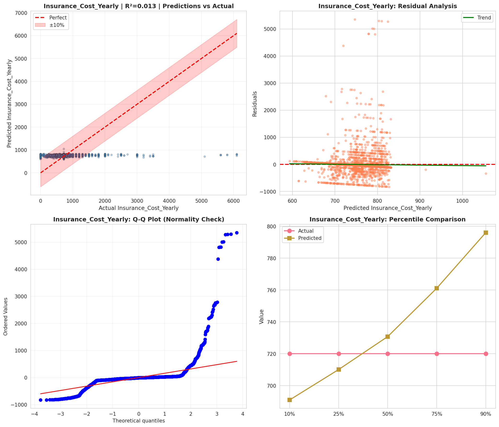
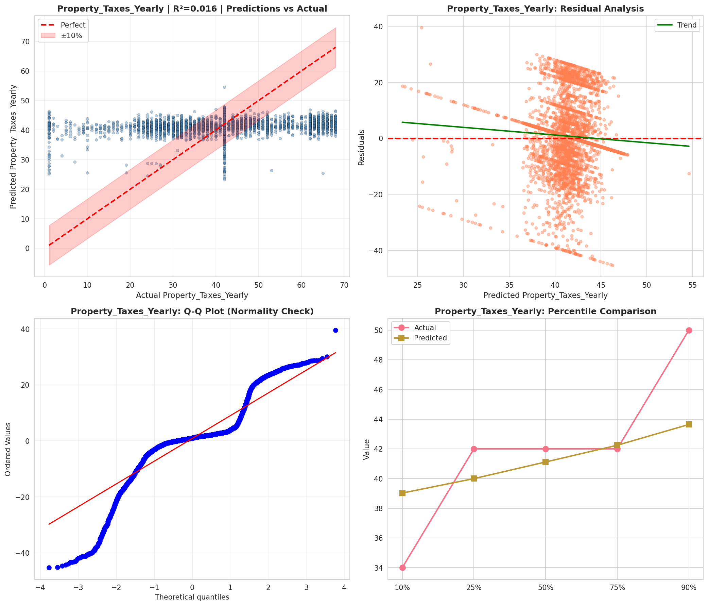
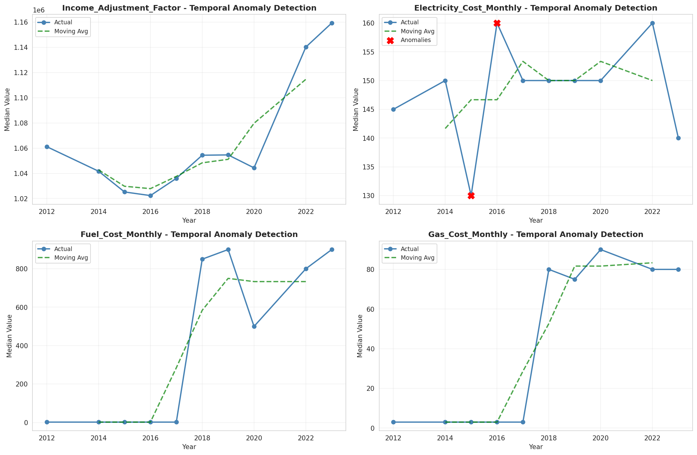
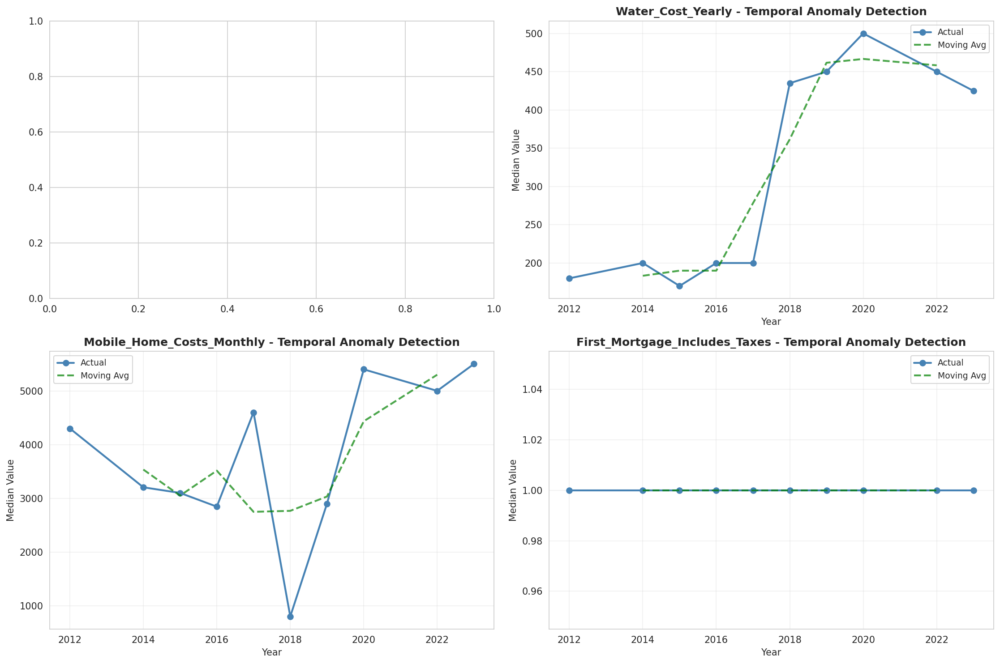
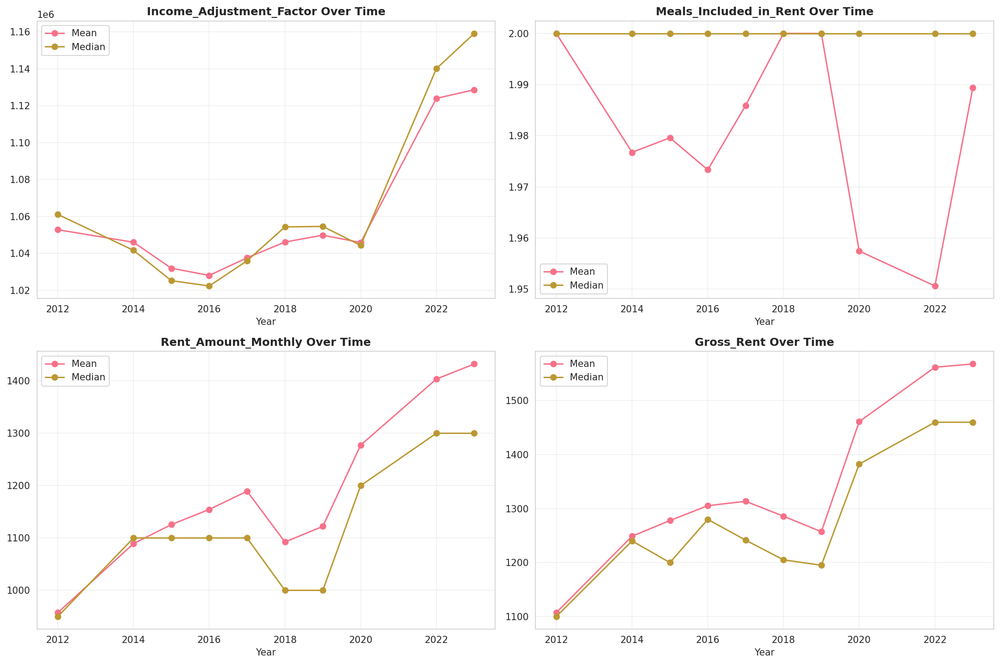
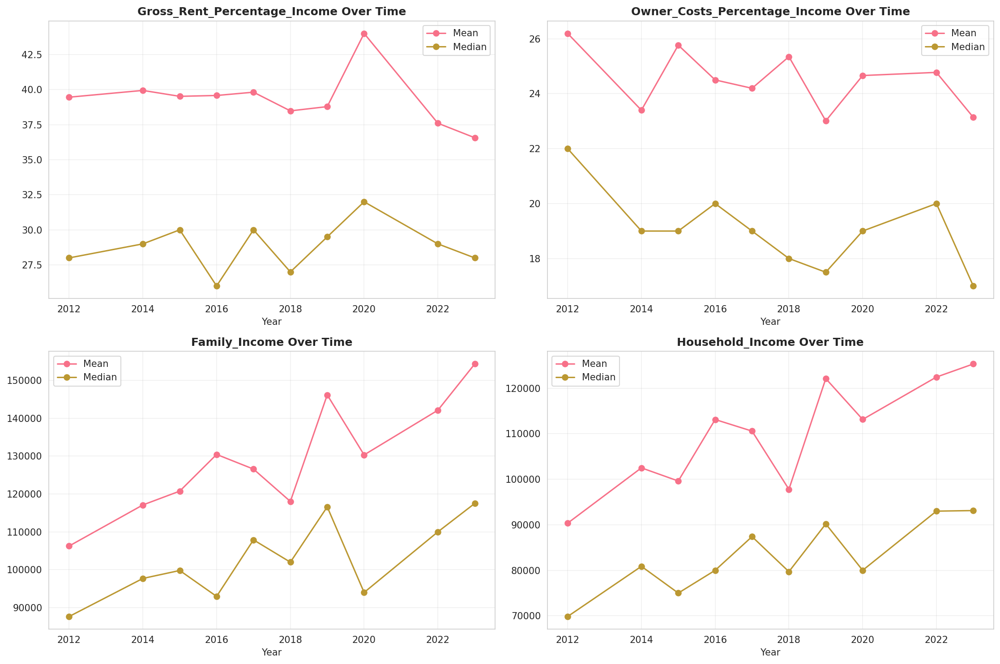
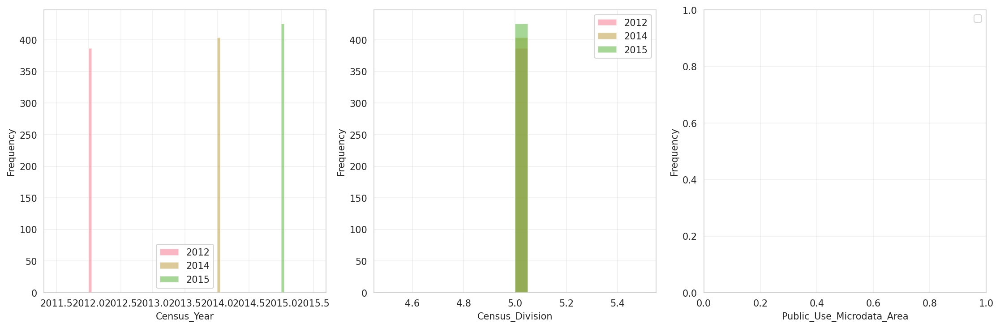
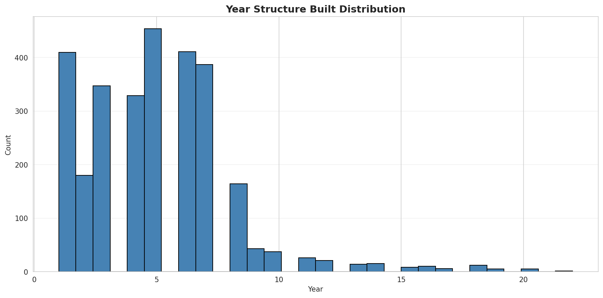
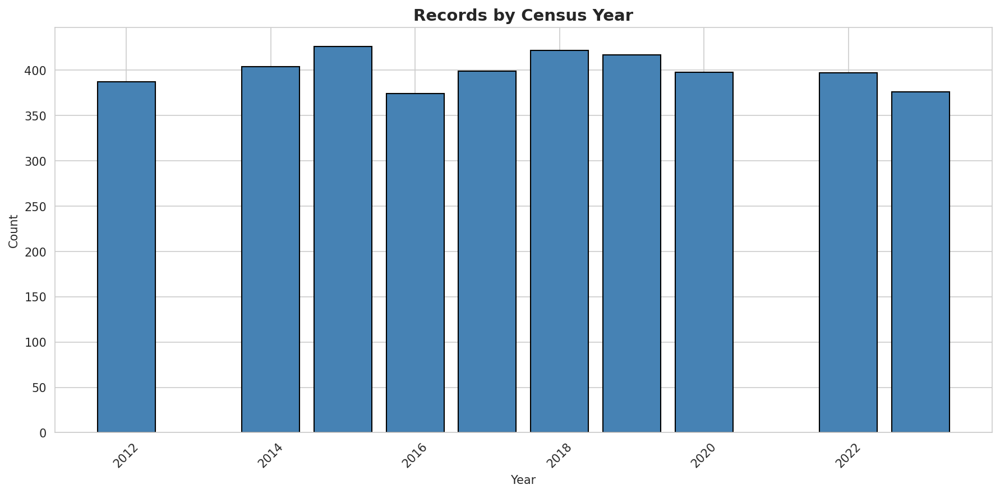
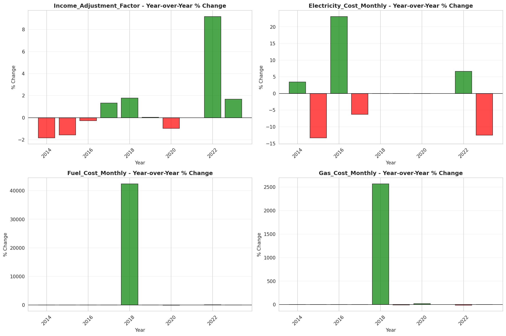
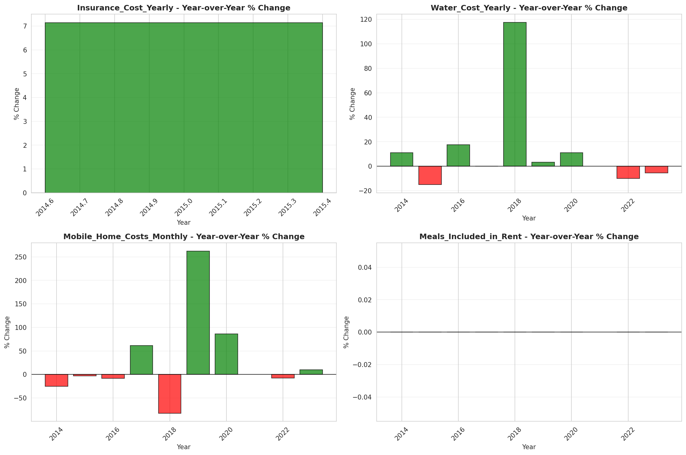
