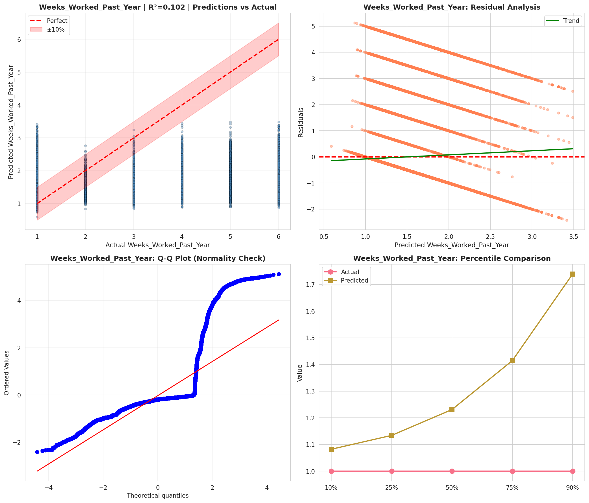
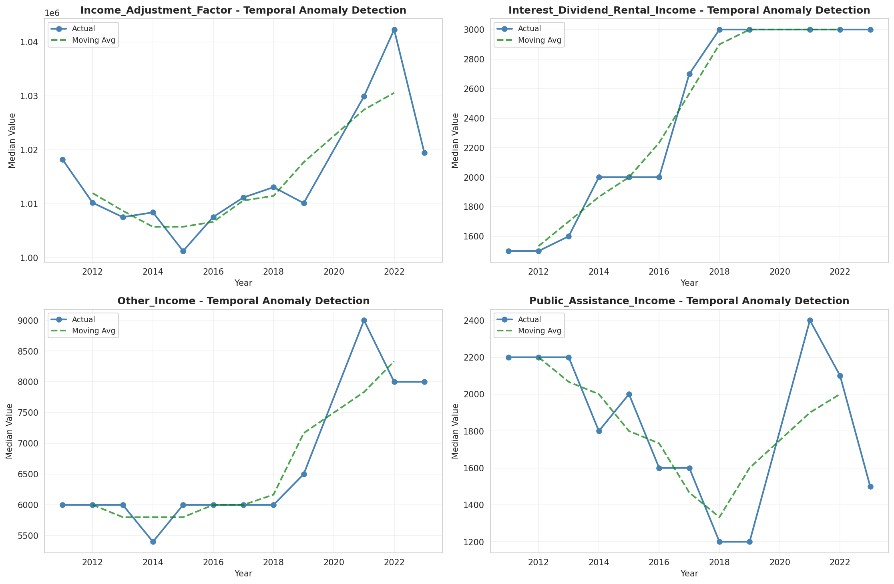
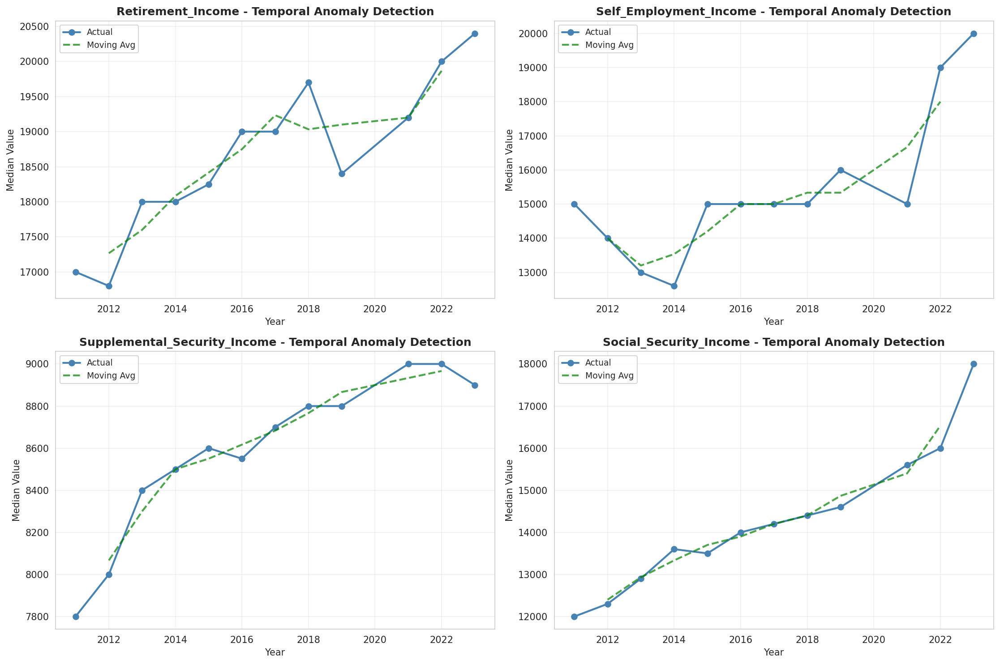
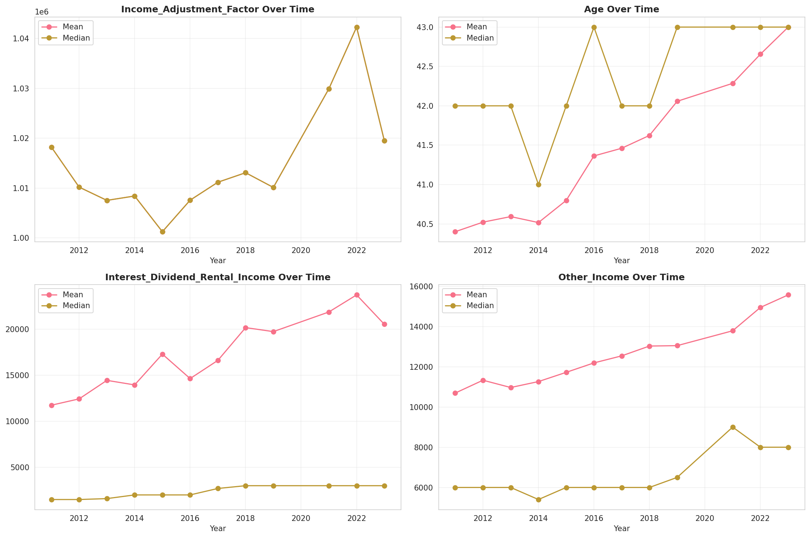
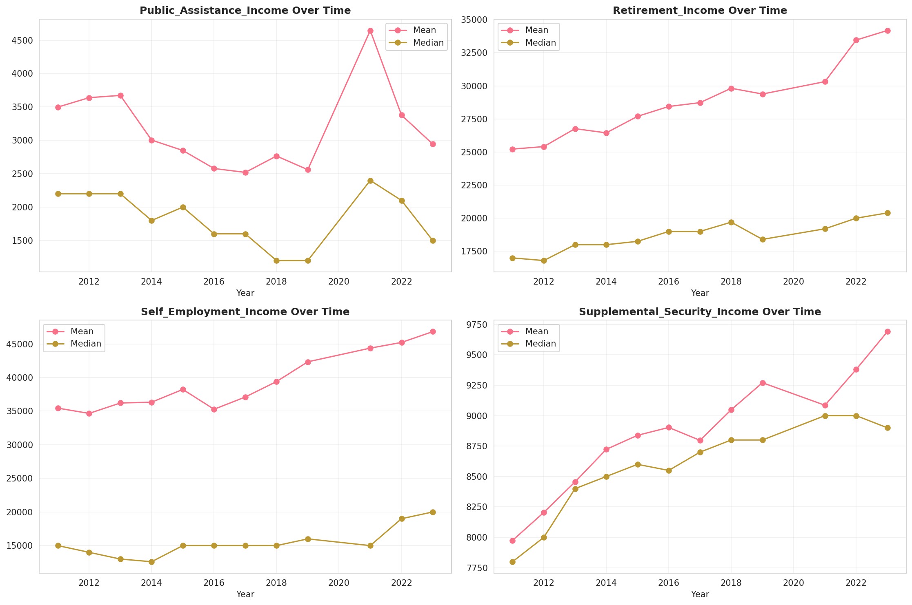
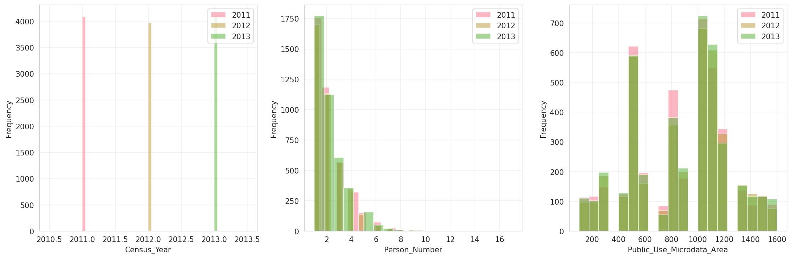
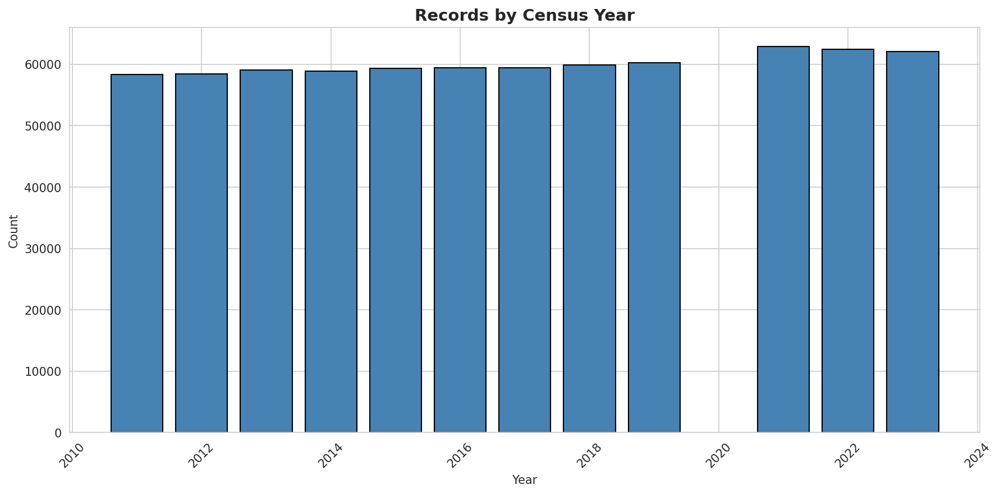
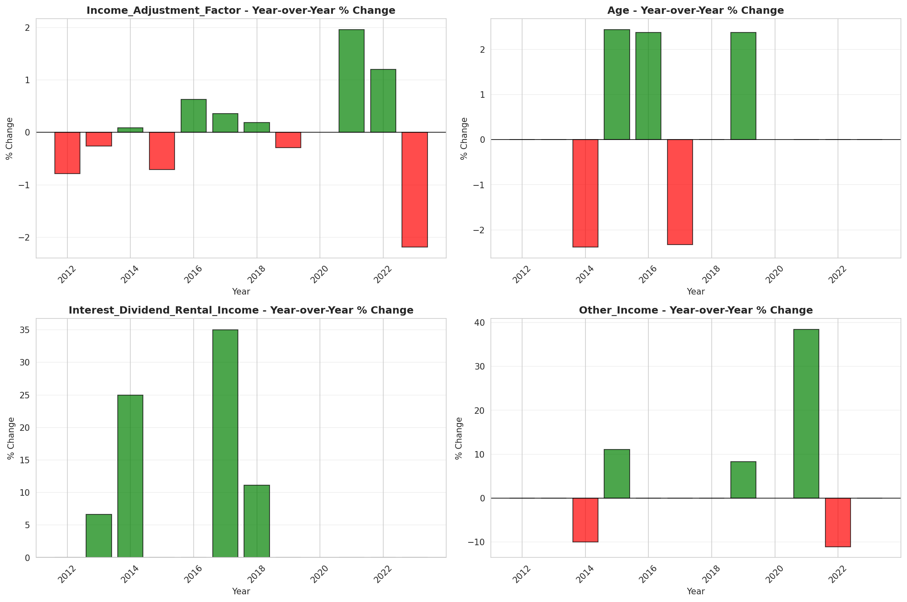
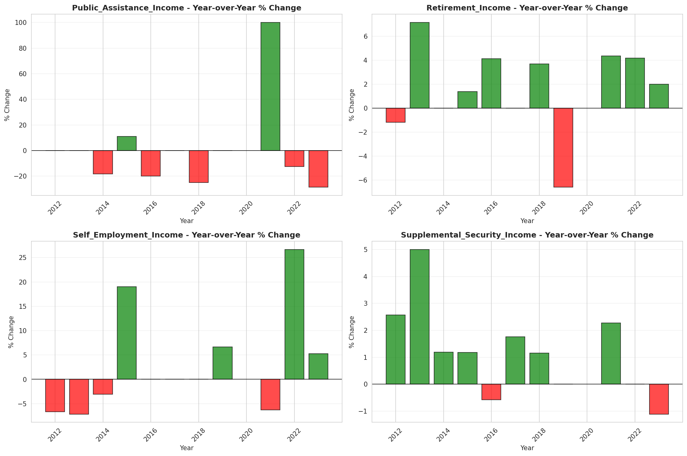

# Temporal Analysis

## Year Distribution

- 2011: 58,335 records

- 2012: 58,417 records

- 2013: 59,033 records

- 2014: 58,876 records

- 2015: 59,332 records

- 2016: 59,408 records

- 2017: 59,463 records

- 2018: 59,840 records

- 2019: 60,237 records

- 2021: 62,853 records

- 2022: 62,442 records

- 2023: 62,031 records

## Temporal Trends

- Census_Year: {np.int64(2011): {'mean': 2011.0, 'median': 2011.0, 'std': 0.0}, np.int64(2012): {'mean': 2012.0, 'median': 2012.0, 'std': 0.0}, np.int64(2013): {'mean': 2013.0, 'median': 2013.0, 'std': 0.0}, np.int64(2014): {'mean': 2014.0, 'median': 2014.0, 'std': 0.0}, np.int64(2015): {'mean': 2015.0, 'median': 2015.0, 'std': 0.0}, np.int64(2016): {'mean': 2016.0, 'median': 2016.0, 'std': 0.0}, np.int64(2017): {'mean': 2017.0, 'median': 2017.0, 'std': 0.0}, np.int64(2018): {'mean': 2018.0, 'median': 2018.0, 'std': 0.0}, np.int64(2019): {'mean': 2019.0, 'median': 2019.0, 'std': 0.0}, np.int64(2021): {'mean': 2021.0, 'median': 2021.0, 'std': 0.0}, np.int64(2022): {'mean': 2022.0, 'median': 2022.0, 'std': 0.0}, np.int64(2023): {'mean': 2023.0, 'median': 2023.0, 'std': 0.0}}

- Person_Number: {np.int64(2011): {'mean': 2.0941458815462415, 'median': 2.0, 'std': 1.3184262825915305}, np.int64(2012): {'mean': 2.0808155160312922, 'median': 2.0, 'std': 1.3101553149434046}, np.int64(2013): {'mean': 2.101553368454932, 'median': 2.0, 'std': 1.3342757714181677}, np.int64(2014): {'mean': 2.105985460968816, 'median': 2.0, 'std': 1.3314975731245584}, np.int64(2015): {'mean': 2.1090811029461336, 'median': 2.0, 'std': 1.33535873138763}, np.int64(2016): {'mean': 2.0898868839213574, 'median': 2.0, 'std': 1.3086735750998384}, np.int64(2017): {'mean': 2.0964633469552494, 'median': 2.0, 'std': 1.333336259692603}, np.int64(2018): {'mean': 2.089221256684492, 'median': 2.0, 'std': 1.314615851998426}, np.int64(2019): {'mean': 2.097116390258479, 'median': 2.0, 'std': 1.3396785113584215}, np.int64(2021): {'mean': 2.0933766089128603, 'median': 2.0, 'std': 1.3412456647507882}, np.int64(2022): {'mean': 2.0888024086352135, 'median': 2.0, 'std': 1.3372335267164746}, np.int64(2023): {'mean': 2.0763972852283534, 'median': 2.0, 'std': 1.3131421501074871}}

- Public_Use_Microdata_Area: {np.int64(2011): {'mean': 868.0876146395817, 'median': 1001.0, 'std': 361.23255559412706}, np.int64(2012): {'mean': 873.1812486091377, 'median': 1001.0, 'std': 364.41314028753766}, np.int64(2013): {'mean': 875.6654921823387, 'median': 1002.0, 'std': 362.75267960939846}, np.int64(2014): {'mean': 876.2634180311162, 'median': 1001.0, 'std': 362.5256830764097}, np.int64(2015): {'mean': 875.9837524438751, 'median': 1002.0, 'std': 362.66251513772175}, np.int64(2016): {'mean': 874.2911055750068, 'median': 1001.0, 'std': 363.6667412699139}, np.int64(2017): {'mean': 872.7755747271412, 'median': 1001.0, 'std': 361.70723108505507}, np.int64(2018): {'mean': 876.1743983957219, 'median': 1002.0, 'std': 364.9452300539894}, np.int64(2019): {'mean': 875.8051529790661, 'median': 1002.0, 'std': 366.152103014595}, np.int64(2021): {'mean': 875.8799579972316, 'median': 1002.0, 'std': 362.7554426300026}, np.int64(2022): {'mean': 881.151340443932, 'median': 1002.0, 'std': 374.83671818402195}, np.int64(2023): {'mean': 882.0483467943448, 'median': 1002.0, 'std': 376.96914184463344}}

- State_Code: {np.int64(2011): {'mean': 24.0, 'median': 24.0, 'std': 0.0}, np.int64(2012): {'mean': 24.0, 'median': 24.0, 'std': 0.0}, np.int64(2013): {'mean': 24.0, 'median': 24.0, 'std': 0.0}, np.int64(2014): {'mean': 24.0, 'median': 24.0, 'std': 0.0}, np.int64(2015): {'mean': 24.0, 'median': 24.0, 'std': 0.0}, np.int64(2016): {'mean': 24.0, 'median': 24.0, 'std': 0.0}, np.int64(2017): {'mean': 24.0, 'median': 24.0, 'std': 0.0}, np.int64(2018): {'mean': 24.0, 'median': 24.0, 'std': 0.0}, np.int64(2019): {'mean': 24.0, 'median': 24.0, 'std': 0.0}, np.int64(2021): {'mean': 24.0, 'median': 24.0, 'std': 0.0}, np.int64(2022): {'mean': 24.0, 'median': 24.0, 'std': 0.0}, np.int64(2023): {'mean': None, 'median': None, 'std': None}}

- Income_Adjustment_Factor: {np.int64(2011): {'mean': 1018237.0, 'median': 1018237.0, 'std': 0.0}, np.int64(2012): {'mean': 1010207.0, 'median': 1010207.0, 'std': 0.0}, np.int64(2013): {'mean': 1007549.0, 'median': 1007549.0, 'std': 0.0}, np.int64(2014): {'mean': 1008425.0, 'median': 1008425.0, 'std': 0.0}, np.int64(2015): {'mean': 1001264.0, 'median': 1001264.0, 'std': 0.0}, np.int64(2016): {'mean': 1007588.0, 'median': 1007588.0, 'std': 0.0}, np.int64(2017): {'mean': 1011189.0, 'median': 1011189.0, 'std': 0.0}, np.int64(2018): {'mean': 1013097.0, 'median': 1013097.0, 'std': 0.0}, np.int64(2019): {'mean': 1010145.0, 'median': 1010145.0, 'std': 0.0}, np.int64(2021): {'mean': 1029928.0, 'median': 1029928.0, 'std': 0.0}, np.int64(2022): {'mean': 1042311.0, 'median': 1042311.0, 'std': 0.0}, np.int64(2023): {'mean': 1019518.0, 'median': 1019518.0, 'std': 0.0}}

- Person_Weight: {np.int64(2011): {'mean': 99.91067112368218, 'median': 79.0, 'std': 79.173628784001}, np.int64(2012): {'mean': 100.73374189020319, 'median': 79.0, 'std': 73.02991865754456}, np.int64(2013): {'mean': 100.43219893957617, 'median': 78.0, 'std': 73.72441350165028}, np.int64(2014): {'mean': 101.50837353081052, 'median': 80.0, 'std': 73.07613165002394}, np.int64(2015): {'mean': 101.23375244387515, 'median': 79.0, 'std': 73.45107630659653}, np.int64(2016): {'mean': 101.27334702396983, 'median': 79.0, 'std': 75.63807499337196}, np.int64(2017): {'mean': 101.78055261254897, 'median': 80.0, 'std': 75.17741904800042}, np.int64(2018): {'mean': 100.98125, 'median': 81.0, 'std': 74.42377460383332}, np.int64(2019): {'mean': 100.36489200989425, 'median': 77.0, 'std': 84.21202159159728}, np.int64(2021): {'mean': 98.0880626223092, 'median': 74.0, 'std': 77.87731716337777}, np.int64(2022): {'mean': 98.72617789308478, 'median': 73.0, 'std': 84.97413647155373}, np.int64(2023): {'mean': 99.63168415792104, 'median': 72.0, 'std': 86.77075908067016}}

- Age: {np.int64(2011): {'mean': 40.40130281991943, 'median': 42.0, 'std': 23.135262389722154}, np.int64(2012): {'mean': 40.52260472122841, 'median': 42.0, 'std': 23.26283702437536}, np.int64(2013): {'mean': 40.59312587874579, 'median': 42.0, 'std': 23.229025343705477}, np.int64(2014): {'mean': 40.517358516203544, 'median': 41.0, 'std': 23.198011211190213}, np.int64(2015): {'mean': 40.79862468819524, 'median': 42.0, 'std': 23.25706490954415}, np.int64(2016): {'mean': 41.36365472663614, 'median': 43.0, 'std': 23.373609295854195}, np.int64(2017): {'mean': 41.461177538973814, 'median': 42.0, 'std': 23.373303725367013}, np.int64(2018): {'mean': 41.62391377005348, 'median': 42.0, 'std': 23.50348762140943}, np.int64(2019): {'mean': 42.057456380629844, 'median': 43.0, 'std': 23.683757772385697}, np.int64(2021): {'mean': 42.28560291473756, 'median': 43.0, 'std': 23.684485397958635}, np.int64(2022): {'mean': 42.65606482816053, 'median': 43.0, 'std': 23.851743108312718}, np.int64(2023): {'mean': 42.99887153197595, 'median': 43.0, 'std': 23.87178792891759}}

- Citizenship_Status: {np.int64(2011): {'mean': 1.4527470643695894, 'median': 1.0, 'std': 1.1711429062425363}, np.int64(2012): {'mean': 1.4509303798551791, 'median': 1.0, 'std': 1.1661304275946733}, np.int64(2013): {'mean': 1.453610692324632, 'median': 1.0, 'std': 1.1621866531642477}, np.int64(2014): {'mean': 1.4714144982675454, 'median': 1.0, 'std': 1.1843630203263302}, np.int64(2015): {'mean': 1.474465718330749, 'median': 1.0, 'std': 1.1820395799681127}, np.int64(2016): {'mean': 1.4754915162941018, 'median': 1.0, 'std': 1.1838596423977854}, np.int64(2017): {'mean': 1.4943746531456537, 'median': 1.0, 'std': 1.202733846178704}, np.int64(2018): {'mean': 1.476336898395722, 'median': 1.0, 'std': 1.179296415905234}, np.int64(2019): {'mean': 1.4810332519879807, 'median': 1.0, 'std': 1.1846404830503974}, np.int64(2021): {'mean': 1.5266256185066742, 'median': 1.0, 'std': 1.2269039329931506}, np.int64(2022): {'mean': 1.5335030908683258, 'median': 1.0, 'std': 1.2330912171088506}, np.int64(2023): {'mean': 1.5354419564411343, 'median': 1.0, 'std': 1.2328189280713564}}

- Class_of_Worker: {np.int64(2011): {'mean': 2.3963150090614533, 'median': 1.0, 'std': 1.9997321502425573}, np.int64(2012): {'mean': 2.3822914948595306, 'median': 1.0, 'std': 1.980861172429906}, np.int64(2013): {'mean': 2.386988797408557, 'median': 1.0, 'std': 1.973231731763318}, np.int64(2014): {'mean': 2.371599149446595, 'median': 1.0, 'std': 1.9667205569920452}, np.int64(2015): {'mean': 2.373939756415833, 'median': 1.0, 'std': 1.9672816435970581}, np.int64(2016): {'mean': 2.380724832214765, 'median': 1.0, 'std': 1.9660229721111198}, np.int64(2017): {'mean': 2.3792318405828157, 'median': 1.0, 'std': 1.9749567509657147}, np.int64(2018): {'mean': 2.3627414363461745, 'median': 1.0, 'std': 1.9672288089674372}, np.int64(2019): {'mean': 2.4103154624819236, 'median': 1.0, 'std': 1.9715929798039382}, np.int64(2021): {'mean': 2.4140578701914404, 'median': 1.0, 'std': 1.9762053359046308}, np.int64(2022): {'mean': 2.4217291230248015, 'median': 1.0, 'std': 1.9687851623625914}, np.int64(2023): {'mean': 2.4099758898711534, 'median': 1.0, 'std': 1.9555800425580323}}

- English_Speaking_Ability: {np.int64(2011): {'mean': 1.542885109506913, 'median': 1.0, 'std': 0.822783348584253}, np.int64(2012): {'mean': 1.5491842610364683, 'median': 1.0, 'std': 0.8361819743920238}, np.int64(2013): {'mean': 1.553222302679218, 'median': 1.0, 'std': 0.837563279265216}, np.int64(2014): {'mean': 1.555729794933655, 'median': 1.0, 'std': 0.8401460812849746}, np.int64(2015): {'mean': 1.5427492274236008, 'median': 1.0, 'std': 0.8455796478649359}, np.int64(2016): {'mean': 1.5503080082135523, 'median': 1.0, 'std': 0.839777913785076}, np.int64(2017): {'mean': 1.5366113239676458, 'median': 1.0, 'std': 0.8318055986651829}, np.int64(2018): {'mean': 1.5048163438128506, 'median': 1.0, 'std': 0.7962921468808083}, np.int64(2019): {'mean': 1.5292482087477275, 'median': 1.0, 'std': 0.8223970842368249}, np.int64(2021): {'mean': 1.523787988422576, 'median': 1.0, 'std': 0.8263931952560627}, np.int64(2022): {'mean': 1.5534836255682345, 'median': 1.0, 'std': 0.8514620550987333}, np.int64(2023): {'mean': 1.5372916856388308, 'median': 1.0, 'std': 0.8309791366619729}}

- Fertility_Status: {np.int64(2011): {'mean': 1.9482758620689655, 'median': 2.0, 'std': 0.22147758343877838}, np.int64(2012): {'mean': 1.9487198297997212, 'median': 2.0, 'std': 0.2205767070989149}, np.int64(2013): {'mean': 1.9528898582333696, 'median': 2.0, 'std': 0.21188213738682812}, np.int64(2014): {'mean': 1.9510980966325036, 'median': 2.0, 'std': 0.21567084256469493}, np.int64(2015): {'mean': 1.9493661556603774, 'median': 2.0, 'std': 0.21925692989615453}, np.int64(2016): {'mean': 1.9499167801482826, 'median': 2.0, 'std': 0.21812494232356242}, np.int64(2017): {'mean': 1.9476208602969167, 'median': 2.0, 'std': 0.22279888822206062}, np.int64(2018): {'mean': 1.9495048756519766, 'median': 2.0, 'std': 0.21897258116359067}, np.int64(2019): {'mean': 1.9501909854851032, 'median': 2.0, 'std': 0.2175584805390248}, np.int64(2021): {'mean': 1.9502844057028883, 'median': 2.0, 'std': 0.21736477227376041}, np.int64(2022): {'mean': 1.9502336275309649, 'median': 2.0, 'std': 0.21746997093032458}, np.int64(2023): {'mean': 1.947573105975619, 'median': 2.0, 'std': 0.22289466225752294}}

- Marital_Status: {np.int64(2011): {'mean': 3.003874175023571, 'median': 3.0, 'std': 1.858316391068174}, np.int64(2012): {'mean': 2.9872639813752846, 'median': 3.0, 'std': 1.8587595501366787}, np.int64(2013): {'mean': 2.9885148984466317, 'median': 3.0, 'std': 1.8615526642957363}, np.int64(2014): {'mean': 3.0017834091989943, 'median': 3.0, 'std': 1.8640631498466773}, np.int64(2015): {'mean': 2.997556124856738, 'median': 3.0, 'std': 1.8610830819139619}, np.int64(2016): {'mean': 2.9793293832480474, 'median': 3.0, 'std': 1.8609507296460126}, np.int64(2017): {'mean': 2.974336982661487, 'median': 3.0, 'std': 1.862819322926089}, np.int64(2018): {'mean': 2.9703375668449197, 'median': 3.0, 'std': 1.862089314076793}, np.int64(2019): {'mean': 2.957551006856251, 'median': 3.0, 'std': 1.864092253177747}, np.int64(2021): {'mean': 2.9876696418627593, 'median': 3.0, 'std': 1.8669527835633528}, np.int64(2022): {'mean': 2.9550783126741615, 'median': 3.0, 'std': 1.8650049266476851}, np.int64(2023): {'mean': 2.953120214086505, 'median': 3.0, 'std': 1.8668116860228479}}

- Mobility_Status: {np.int64(2011): {'mean': 1.2289325599515193, 'median': 1.0, 'std': 0.6318180585840952}, np.int64(2012): {'mean': 1.2263136047597634, 'median': 1.0, 'std': 0.628820013655445}, np.int64(2013): {'mean': 1.2362016180067388, 'median': 1.0, 'std': 0.6403791419762025}, np.int64(2014): {'mean': 1.245293048458452, 'median': 1.0, 'std': 0.6508324532545482}, np.int64(2015): {'mean': 1.2551046474004188, 'median': 1.0, 'std': 0.6618822293456254}, np.int64(2016): {'mean': 1.2323980762367657, 'median': 1.0, 'std': 0.6355670054097315}, np.int64(2017): {'mean': 1.2430106431736008, 'median': 1.0, 'std': 0.6478757531749175}, np.int64(2018): {'mean': 1.2438835082509365, 'median': 1.0, 'std': 0.649525364180071}, np.int64(2019): {'mean': 1.232650872901518, 'median': 1.0, 'std': 0.6364617203486843}, np.int64(2021): {'mean': 1.2142650834403081, 'median': 1.0, 'std': 0.6144951060168234}, np.int64(2022): {'mean': 1.2158953234795251, 'median': 1.0, 'std': 0.6148413100536277}, np.int64(2023): {'mean': 1.1937073170731707, 'median': 1.0, 'std': 0.5864556438002742}}

- Military_Service: {np.int64(2011): {'mean': 4.760663557571498, 'median': 5.0, 'std': 0.6799955924730255}, np.int64(2012): {'mean': 4.7583184409837465, 'median': 5.0, 'std': 0.688833025142473}, np.int64(2013): {'mean': 3.780862897109632, 'median': 4.0, 'std': 0.6273675045737308}, np.int64(2014): {'mean': 3.7903870135909195, 'median': 4.0, 'std': 0.6143542597679774}, np.int64(2015): {'mean': 3.796744565558508, 'median': 4.0, 'std': 0.6078952577310778}, np.int64(2016): {'mean': 3.7958181629044003, 'median': 4.0, 'std': 0.6084554471629344}, np.int64(2017): {'mean': 3.8034035488222475, 'median': 4.0, 'std': 0.596189993424798}, np.int64(2018): {'mean': 3.79938959003547, 'median': 4.0, 'std': 0.604173579947987}, np.int64(2019): {'mean': 3.80652413849487, 'median': 4.0, 'std': 0.5972267281728081}, np.int64(2021): {'mean': 3.8194509345794394, 'median': 4.0, 'std': 0.579657497015909}, np.int64(2022): {'mean': 3.821646550878226, 'median': 4.0, 'std': 0.575996755479154}, np.int64(2023): {'mean': 3.8254409301409007, 'median': 4.0, 'std': 0.5705016130366845}}

- Travel_Time_To_Work_Minutes: {np.int64(2011): {'mean': 32.13003663003663, 'median': 29.5, 'std': 24.68579252938725}, np.int64(2012): {'mean': 31.837034836217782, 'median': 30.0, 'std': 23.857684601302747}, np.int64(2013): {'mean': 32.42935354048077, 'median': 30.0, 'std': 24.090671720329432}, np.int64(2014): {'mean': 32.406802473626776, 'median': 30.0, 'std': 23.735077701376692}, np.int64(2015): {'mean': 32.83632270713819, 'median': 30.0, 'std': 24.294896001142277}, np.int64(2016): {'mean': 32.77224557243956, 'median': 30.0, 'std': 24.033817271594472}, np.int64(2017): {'mean': 33.24143964008998, 'median': 30.0, 'std': 24.428198696679285}, np.int64(2018): {'mean': 33.41887937187723, 'median': 30.0, 'std': 24.687312247733036}, np.int64(2019): {'mean': 33.767542613636365, 'median': 30.0, 'std': 25.115539210025474}, np.int64(2021): {'mean': 29.186895179524285, 'median': 25.0, 'std': 21.369253272009622}, np.int64(2022): {'mean': 30.4748900141114, 'median': 25.0, 'std': 23.047712272268758}, np.int64(2023): {'mean': 31.038793447862567, 'median': 25.0, 'std': 23.02408667731229}}

- Vehicle_Occupancy: {np.int64(2011): {'mean': 1.1782399449982812, 'median': 1.0, 'std': 0.6495589982362867}, np.int64(2012): {'mean': 1.1715933669790917, 'median': 1.0, 'std': 0.6623463908107875}, np.int64(2013): {'mean': 1.1658199383692847, 'median': 1.0, 'std': 0.6265846942116121}, np.int64(2014): {'mean': 1.1597033063738842, 'median': 1.0, 'std': 0.6122396815664324}, np.int64(2015): {'mean': 1.151987334388801, 'median': 1.0, 'std': 0.5742829007880036}, np.int64(2016): {'mean': 1.1513981850285386, 'median': 1.0, 'std': 0.5641645648219288}, np.int64(2017): {'mean': 1.1606692176178457, 'median': 1.0, 'std': 0.6167100685847201}, np.int64(2018): {'mean': 1.151561679259768, 'median': 1.0, 'std': 0.576270009502746}, np.int64(2019): {'mean': 1.1462441030603605, 'median': 1.0, 'std': 0.5630623582537385}, np.int64(2021): {'mean': 1.144578313253012, 'median': 1.0, 'std': 0.5770815262929556}, np.int64(2022): {'mean': 1.147165148949801, 'median': 1.0, 'std': 0.559424801389873}, np.int64(2023): {'mean': 1.1555703802535022, 'median': 1.0, 'std': 0.5563678852243401}}

- Transportation_To_Work: {np.int64(2011): {'mean': 1.9749624973212372, 'median': 1.0, 'std': 2.671949974541212}, np.int64(2012): {'mean': 1.9925608416876261, 'median': 1.0, 'std': 2.720601668178927}, np.int64(2013): {'mean': 1.993988183671354, 'median': 1.0, 'std': 2.7026206638935535}, np.int64(2014): {'mean': 1.9848047567717932, 'median': 1.0, 'std': 2.6828588115469647}, np.int64(2015): {'mean': 2.0205640423031728, 'median': 1.0, 'std': 2.7427823507337723}, np.int64(2016): {'mean': 2.1030920852101467, 'median': 1.0, 'std': 2.8742420945564544}, np.int64(2017): {'mean': 2.0717830975453286, 'median': 1.0, 'std': 2.8380053469812463}, np.int64(2018): {'mean': 2.0851299989909524, 'median': 1.0, 'std': 2.8689713901130816}, np.int64(2019): {'mean': None, 'median': None, 'std': None}, np.int64(2021): {'mean': None, 'median': None, 'std': None}, np.int64(2022): {'mean': None, 'median': None, 'std': None}, np.int64(2023): {'mean': None, 'median': None, 'std': None}}

- Language_Other_Than_English: {np.int64(2011): {'mean': 1.852029547018141, 'median': 2.0, 'std': 0.3550739086902598}, np.int64(2012): {'mean': 1.8491358248122343, 'median': 2.0, 'std': 0.35791967575483424}, np.int64(2013): {'mean': 1.8516436295924945, 'median': 2.0, 'std': 0.3554560732048572}, np.int64(2014): {'mean': 1.8514869222500896, 'median': 2.0, 'std': 0.35561103606219563}, np.int64(2015): {'mean': 1.8447638676663942, 'median': 2.0, 'std': 0.36213285629392755}, np.int64(2016): {'mean': 1.8444558794825843, 'median': 2.0, 'std': 0.36242582387502287}, np.int64(2017): {'mean': 1.8336107667788206, 'median': 2.0, 'std': 0.37243296386390573}, np.int64(2018): {'mean': 1.833825857519789, 'median': 2.0, 'std': 0.3722401566064436}, np.int64(2019): {'mean': 1.8366095298002831, 'median': 2.0, 'std': 0.36972478000614595}, np.int64(2021): {'mean': 1.815478078007911, 'median': 2.0, 'std': 0.3879124820181046}, np.int64(2022): {'mean': 1.8189194637637336, 'median': 2.0, 'std': 0.38508812869412024}, np.int64(2023): {'mean': 1.8145414625907785, 'median': 2.0, 'std': 0.38867238090007383}}

- Grandparents_Living_With_Grandchildren: {np.int64(2011): {'mean': 1.962953041707964, 'median': 2.0, 'std': 0.18887942403853883}, np.int64(2012): {'mean': 1.9653547081380485, 'median': 2.0, 'std': 0.18288216498338547}, np.int64(2013): {'mean': 1.9645408699306577, 'median': 2.0, 'std': 0.18493966186944208}, np.int64(2014): {'mean': 1.96409131744438, 'median': 2.0, 'std': 0.1860649452123775}, np.int64(2015): {'mean': 1.9616945513575785, 'median': 2.0, 'std': 0.1919351604005158}, np.int64(2016): {'mean': 1.9656167843703283, 'median': 2.0, 'std': 0.18221379167049673}, np.int64(2017): {'mean': 1.9643507009405674, 'median': 2.0, 'std': 0.18541657862085117}, np.int64(2018): {'mean': 1.9665505934982082, 'median': 2.0, 'std': 0.17980924750516816}, np.int64(2019): {'mean': 1.9659761833283298, 'median': 2.0, 'std': 0.1812926331151075}, np.int64(2021): {'mean': 1.9678183471311672, 'median': 2.0, 'std': 0.17648438835132263}, np.int64(2022): {'mean': 1.9694385555370286, 'median': 2.0, 'std': 0.17212829031475102}, np.int64(2023): {'mean': 1.9693087930665016, 'median': 2.0, 'std': 0.1724817819360398}}

- Months_Responsible_For_Grandchildren: {np.int64(2011): {'mean': 3.6141732283464565, 'median': 4.0, 'std': 1.3619063335822652}, np.int64(2012): {'mean': 3.7892561983471076, 'median': 4.0, 'std': 1.2841638829705078}, np.int64(2013): {'mean': 3.7612612612612613, 'median': 4.0, 'std': 1.3309085592136003}, np.int64(2014): {'mean': 3.693304535637149, 'median': 4.0, 'std': 1.3615381898996224}, np.int64(2015): {'mean': 3.7958762886597937, 'median': 4.0, 'std': 1.322713021305075}, np.int64(2016): {'mean': 3.920863309352518, 'median': 5.0, 'std': 1.2637593578066306}, np.int64(2017): {'mean': 3.8646288209606987, 'median': 4.0, 'std': 1.326061761864481}, np.int64(2018): {'mean': 3.9257425742574257, 'median': 4.0, 'std': 1.2891725828824814}, np.int64(2019): {'mean': 3.9872448979591835, 'median': 5.0, 'std': 1.2863002561916725}, np.int64(2021): {'mean': 3.871866295264624, 'median': 5.0, 'std': 1.3681388997876693}, np.int64(2022): {'mean': 3.991279069767442, 'median': 5.0, 'std': 1.265111384037504}, np.int64(2023): {'mean': 3.8276923076923075, 'median': 4.0, 'std': 1.4124127518457374}}

- Grandparents_Responsible_For_Grandchildren: {np.int64(2011): {'mean': 1.6326825741142443, 'median': 2.0, 'std': 0.48224837297233947}, np.int64(2012): {'mean': 1.627978478093774, 'median': 2.0, 'std': 0.4835299556366594}, np.int64(2013): {'mean': 1.6711111111111112, 'median': 2.0, 'std': 0.4699836229922264}, np.int64(2014): {'mean': 1.6593083149374541, 'median': 2.0, 'std': 0.474116300535027}, np.int64(2015): {'mean': 1.6684894053315107, 'median': 2.0, 'std': 0.47091708529364884}, np.int64(2016): {'mean': 1.6874062968515742, 'median': 2.0, 'std': 0.46372414144636626}, np.int64(2017): {'mean': 1.6707404744787921, 'median': 2.0, 'std': 0.4701133625044526}, np.int64(2018): {'mean': 1.6930091185410334, 'median': 2.0, 'std': 0.4614209198942206}, np.int64(2019): {'mean': 1.7117647058823529, 'median': 2.0, 'std': 0.45310779085049974}, np.int64(2021): {'mean': 1.733085501858736, 'median': 2.0, 'std': 0.4425118500963099}, np.int64(2022): {'mean': 1.7318784099766174, 'median': 2.0, 'std': 0.4431540030099483}, np.int64(2023): {'mean': 1.747866563227308, 'median': 2.0, 'std': 0.43440599216831205}}

- Interest_Dividend_Rental_Income: {np.int64(2011): {'mean': 11733.956246838645, 'median': 1500.0, 'std': 31985.921923957652}, np.int64(2012): {'mean': 12420.057084607542, 'median': 1500.0, 'std': 34756.90961335733}, np.int64(2013): {'mean': 14429.016627078385, 'median': 1600.0, 'std': 41683.86556852404}, np.int64(2014): {'mean': 13935.425093875438, 'median': 2000.0, 'std': 37495.16976032765}, np.int64(2015): {'mean': 17277.125198307775, 'median': 2000.0, 'std': 48488.941213335245}, np.int64(2016): {'mean': 14623.461266220998, 'median': 2000.0, 'std': 39180.11817962258}, np.int64(2017): {'mean': 16596.8115942029, 'median': 2700.0, 'std': 42763.19054915934}, np.int64(2018): {'mean': 20150.955212049146, 'median': 3000.0, 'std': 49755.73087588904}, np.int64(2019): {'mean': 19718.209032258066, 'median': 3000.0, 'std': 52796.38010892105}, np.int64(2021): {'mean': 21847.150890346766, 'median': 3000.0, 'std': 54932.92792563968}, np.int64(2022): {'mean': 23699.89979123173, 'median': 3000.0, 'std': 60019.70082945258}, np.int64(2023): {'mean': 20513.037307380375, 'median': 3000.0, 'std': 49828.386457030094}}

- Military_Service_Period_1: {np.int64(2011): {'mean': 0.16919091271422879, 'median': 0.0, 'std': 0.3749578183984944}, np.int64(2012): {'mean': 0.19251550930558334, 'median': 0.0, 'std': 0.39431510690364363}, np.int64(2013): {'mean': 0.2110403397027601, 'median': 0.0, 'std': 0.40809027559830013}, np.int64(2014): {'mean': 0.22434898731359892, 'median': 0.0, 'std': 0.41719930298631247}, np.int64(2015): {'mean': 0.24306987399770905, 'median': 0.0, 'std': 0.4289860959355858}, np.int64(2016): {'mean': 0.2515880217785844, 'median': 0.0, 'std': 0.4339749009146789}, np.int64(2017): {'mean': 0.2619718309859155, 'median': 0.0, 'std': 0.43975901013723573}, np.int64(2018): {'mean': 0.26701690269529466, 'median': 0.0, 'std': 0.44245179587407635}, np.int64(2019): {'mean': 0.2954866008462623, 'median': 0.0, 'std': 0.45631482245965915}, np.int64(2021): {'mean': 0.32486080852093924, 'median': 0.0, 'std': 0.46837951411317674}, np.int64(2022): {'mean': 0.3268616367657901, 'median': 0.0, 'std': 0.4691238572979532}, np.int64(2023): {'mean': 0.35514967021816335, 'median': 0.0, 'std': 0.4786193620256115}}

- Military_Service_Period_2: {np.int64(2011): {'mean': 0.18393782383419688, 'median': 0.0, 'std': 0.38747208933311017}, np.int64(2012): {'mean': 0.20072043225935562, 'median': 0.0, 'std': 0.4005793958389151}, np.int64(2013): {'mean': 0.21825902335456476, 'median': 0.0, 'std': 0.41310804307600885}, np.int64(2014): {'mean': 0.2294680614288894, 'median': 0.0, 'std': 0.42053755105727053}, np.int64(2015): {'mean': 0.23413516609392898, 'median': 0.0, 'std': 0.4235055842521563}, np.int64(2016): {'mean': 0.23207803992740472, 'median': 0.0, 'std': 0.4222064222932918}, np.int64(2017): {'mean': 0.23990610328638498, 'median': 0.0, 'std': 0.42707608266054903}, np.int64(2018): {'mean': 0.24394700776610323, 'median': 0.0, 'std': 0.42951018952157116}, np.int64(2019): {'mean': 0.25011753643629525, 'median': 0.0, 'std': 0.4331314520388752}, np.int64(2021): {'mean': 0.2553861050593077, 'median': 0.0, 'std': 0.4361308140504053}, np.int64(2022): {'mean': 0.2568198574588351, 'median': 0.0, 'std': 0.4369328741558278}, np.int64(2023): {'mean': 0.267376966007103, 'median': 0.0, 'std': 0.44264684437190593}}

- Military_Service_Period_3: {np.int64(2011): {'mean': 0.19569549621363092, 'median': 0.0, 'std': 0.3967746741673885}, np.int64(2012): {'mean': 0.22133279967980787, 'median': 0.0, 'std': 0.4151856066643104}, np.int64(2013): {'mean': None, 'median': None, 'std': None}, np.int64(2014): {'mean': None, 'median': None, 'std': None}, np.int64(2015): {'mean': None, 'median': None, 'std': None}, np.int64(2016): {'mean': None, 'median': None, 'std': None}, np.int64(2017): {'mean': None, 'median': None, 'std': None}, np.int64(2018): {'mean': None, 'median': None, 'std': None}, np.int64(2019): {'mean': None, 'median': None, 'std': None}, np.int64(2021): {'mean': None, 'median': None, 'std': None}, np.int64(2022): {'mean': None, 'median': None, 'std': None}, np.int64(2023): {'mean': None, 'median': None, 'std': None}}

- Military_Service_Period_4: {np.int64(2011): {'mean': 0.13730569948186527, 'median': 0.0, 'std': 0.34420408868218916}, np.int64(2012): {'mean': 0.14808885331198718, 'median': 0.0, 'std': 0.3552235869804032}, np.int64(2013): {'mean': None, 'median': None, 'std': None}, np.int64(2014): {'mean': None, 'median': None, 'std': None}, np.int64(2015): {'mean': None, 'median': None, 'std': None}, np.int64(2016): {'mean': None, 'median': None, 'std': None}, np.int64(2017): {'mean': None, 'median': None, 'std': None}, np.int64(2018): {'mean': None, 'median': None, 'std': None}, np.int64(2019): {'mean': None, 'median': None, 'std': None}, np.int64(2021): {'mean': None, 'median': None, 'std': None}, np.int64(2022): {'mean': None, 'median': None, 'std': None}, np.int64(2023): {'mean': None, 'median': None, 'std': None}}

- Military_Service_Period_5: {np.int64(2011): {'mean': 0.3365882821841371, 'median': 0.0, 'std': 0.47258979937719964}, np.int64(2012): {'mean': 0.31258755253151893, 'median': 0.0, 'std': 0.46359420213863595}, np.int64(2013): {'mean': 0.31910828025477705, 'median': 0.0, 'std': 0.4661805731405371}, np.int64(2014): {'mean': 0.31404406855107947, 'median': 0.0, 'std': 0.4641856826885196}, np.int64(2015): {'mean': 0.33906071019473083, 'median': 0.0, 'std': 0.47344471338714256}, np.int64(2016): {'mean': 0.3216878402903811, 'median': 0.0, 'std': 0.4671769332091183}, np.int64(2017): {'mean': 0.3232394366197183, 'median': 0.0, 'std': 0.4677681759104727}, np.int64(2018): {'mean': 0.3259479214253084, 'median': 0.0, 'std': 0.4687814730583641}, np.int64(2019): {'mean': 0.31006111894687355, 'median': 0.0, 'std': 0.46257271950957873}, np.int64(2021): {'mean': 0.30888404744613895, 'median': 0.0, 'std': 0.46208914883061764}, np.int64(2022): {'mean': 0.3135905627918407, 'median': 0.0, 'std': 0.4640090894294624}, np.int64(2023): {'mean': 0.297818366311517, 'median': 0.0, 'std': 0.4573572458482932}}

- Military_Service_Period_6: {np.int64(2011): {'mean': 0.10003985651654046, 'median': 0.0, 'std': 0.30008303682011594}, np.int64(2012): {'mean': 0.08965379227536521, 'median': 0.0, 'std': 0.2857137134842944}, np.int64(2013): {'mean': None, 'median': None, 'std': None}, np.int64(2014): {'mean': None, 'median': None, 'std': None}, np.int64(2015): {'mean': None, 'median': None, 'std': None}, np.int64(2016): {'mean': None, 'median': None, 'std': None}, np.int64(2017): {'mean': None, 'median': None, 'std': None}, np.int64(2018): {'mean': None, 'median': None, 'std': None}, np.int64(2019): {'mean': None, 'median': None, 'std': None}, np.int64(2021): {'mean': None, 'median': None, 'std': None}, np.int64(2022): {'mean': None, 'median': None, 'std': None}, np.int64(2023): {'mean': None, 'median': None, 'std': None}}

- Military_Service_Period_7: {np.int64(2011): {'mean': 0.11000398565165405, 'median': 0.0, 'std': 0.31292590667062775}, np.int64(2012): {'mean': 0.10926555933560136, 'median': 0.0, 'std': 0.3120033297623256}, np.int64(2013): {'mean': None, 'median': None, 'std': None}, np.int64(2014): {'mean': None, 'median': None, 'std': None}, np.int64(2015): {'mean': None, 'median': None, 'std': None}, np.int64(2016): {'mean': None, 'median': None, 'std': None}, np.int64(2017): {'mean': None, 'median': None, 'std': None}, np.int64(2018): {'mean': None, 'median': None, 'std': None}, np.int64(2019): {'mean': None, 'median': None, 'std': None}, np.int64(2021): {'mean': None, 'median': None, 'std': None}, np.int64(2022): {'mean': None, 'median': None, 'std': None}, np.int64(2023): {'mean': None, 'median': None, 'std': None}}

- Military_Service_Period_8: {np.int64(2011): {'mean': 0.11060183339976086, 'median': 0.0, 'std': 0.31366969091328284}, np.int64(2012): {'mean': 0.10046027616569941, 'median': 0.0, 'std': 0.3006428065839664}, np.int64(2013): {'mean': 0.09681528662420383, 'median': 0.0, 'std': 0.2957374782496922}, np.int64(2014): {'mean': 0.08969508123748053, 'median': 0.0, 'std': 0.2857762242906747}, np.int64(2015): {'mean': 0.07880870561282932, 'median': 0.0, 'std': 0.26947083174886505}, np.int64(2016): {'mean': 0.0750907441016334, 'median': 0.0, 'std': 0.26356760755763486}, np.int64(2017): {'mean': 0.06666666666666667, 'median': 0.0, 'std': 0.24947310838475903}, np.int64(2018): {'mean': 0.06692553677478301, 'median': 0.0, 'std': 0.24992154022410573}, np.int64(2019): {'mean': 0.056417489421720736, 'median': 0.0, 'std': 0.2307532735445743}, np.int64(2021): {'mean': 0.05131929314935851, 'median': 0.0, 'std': 0.22067490021867464}, np.int64(2022): {'mean': 0.04128778569673138, 'median': 0.0, 'std': 0.198979483387068}, np.int64(2023): {'mean': 0.03297818366311517, 'median': 0.0, 'std': 0.17860211386866204}}

- Military_Service_Period_9: {np.int64(2011): {'mean': 0.022319649262654444, 'median': 0.0, 'std': 0.1477356829869568}, np.int64(2012): {'mean': 0.019411646988192914, 'median': 0.0, 'std': 0.13798059633296506}, np.int64(2013): {'mean': 0.01613588110403397, 'median': 0.0, 'std': 0.12601145090171326}, np.int64(2014): {'mean': 0.01424438014689517, 'median': 0.0, 'std': 0.1185099306668075}, np.int64(2015): {'mean': 0.013745704467353952, 'median': 0.0, 'std': 0.11644684012326255}, np.int64(2016): {'mean': 0.014972776769509982, 'median': 0.0, 'std': 0.12145756194667529}, np.int64(2017): {'mean': 0.011737089201877934, 'median': 0.0, 'std': 0.10771282851018599}, np.int64(2018): {'mean': 0.013248058474189127, 'median': 0.0, 'std': 0.11434830154562405}, np.int64(2019): {'mean': 0.009402914903620122, 'median': 0.0, 'std': 0.09652300345546044}, np.int64(2021): {'mean': None, 'median': None, 'std': None}, np.int64(2022): {'mean': None, 'median': None, 'std': None}, np.int64(2023): {'mean': None, 'median': None, 'std': None}}

- Military_Service_Period_10: {np.int64(2011): {'mean': 0.08868074930251096, 'median': 0.0, 'std': 0.28431071476725894}, np.int64(2012): {'mean': 0.08204922953772263, 'median': 0.0, 'std': 0.27446717282960414}, np.int64(2013): {'mean': 0.06454352441613588, 'median': 0.0, 'std': 0.24574474486743977}, np.int64(2014): {'mean': 0.06254173158246161, 'median': 0.0, 'std': 0.24216381964359185}, np.int64(2015): {'mean': 0.038946162657502864, 'median': 0.0, 'std': 0.19348885218139816}, np.int64(2016): {'mean': 0.038112522686025406, 'median': 0.0, 'std': 0.19148962602486141}, np.int64(2017): {'mean': 0.03333333333333333, 'median': 0.0, 'std': 0.17952656600106057}, np.int64(2018): {'mean': 0.026496116948378255, 'median': 0.0, 'std': 0.16062367767270164}, np.int64(2019): {'mean': 0.019511048425011755, 'median': 0.0, 'std': 0.13832883105907026}, np.int64(2021): {'mean': 0.012345679012345678, 'median': 0.0, 'std': 0.11043647760611566}, np.int64(2022): {'mean': 0.010813467682477268, 'median': 0.0, 'std': 0.10343677311736314}, np.int64(2023): {'mean': 0.0060882800608828, 'median': 0.0, 'std': 0.07779941103834867}}

- Military_Service_Period_11: {np.int64(2011): {'mean': 0.0031885213232363493, 'median': 0.0, 'std': 0.056382516545298994}, np.int64(2012): {'mean': 0.0022013207924754855, 'median': 0.0, 'std': 0.046871255860679854}, np.int64(2013): {'mean': 0.0010615711252653928, 'median': 0.0, 'std': 0.032567919602123484}, np.int64(2014): {'mean': 0.0024482528377476075, 'median': 0.0, 'std': 0.04942471635275697}, np.int64(2015): {'mean': 0.0013745704467353953, 'median': 0.0, 'std': 0.03705395457086816}, np.int64(2016): {'mean': 0.001134301270417423, 'median': 0.0, 'std': 0.03366410143397434}, np.int64(2017): {'mean': 0.0007042253521126761, 'median': 0.0, 'std': 0.026531013027258517}, np.int64(2018): {'mean': 0.0013704888076747374, 'median': 0.0, 'std': 0.036998962829179256}, np.int64(2019): {'mean': 0.00023507287259050304, 'median': 0.0, 'std': 0.015332086374349154}, np.int64(2021): {'mean': None, 'median': None, 'std': None}, np.int64(2022): {'mean': None, 'median': None, 'std': None}, np.int64(2023): {'mean': None, 'median': None, 'std': None}}

- Temporary_Absence_From_Work: {np.int64(2011): {'mean': 2.5383858267716537, 'median': 3.0, 'std': 0.5333948228633187}, np.int64(2012): {'mean': 2.548653463271508, 'median': 3.0, 'std': 0.5319526025728004}, np.int64(2013): {'mean': 2.623412994772218, 'median': 3.0, 'std': 0.5137128779601469}, np.int64(2014): {'mean': 2.6271906974805677, 'median': 3.0, 'std': 0.5083482121168285}, np.int64(2015): {'mean': 2.6216700661351133, 'median': 3.0, 'std': 0.5122073234424194}, np.int64(2016): {'mean': 2.6320965395726197, 'median': 3.0, 'std': 0.5068890586771635}, np.int64(2017): {'mean': 2.6331894700239316, 'median': 3.0, 'std': 0.5066443400214756}, np.int64(2018): {'mean': 2.631954321940911, 'median': 3.0, 'std': 0.5057648007888886}, np.int64(2019): {'mean': 2.6417847282400597, 'median': 3.0, 'std': 0.500860274528039}, np.int64(2021): {'mean': 2.6312792392054605, 'median': 3.0, 'std': 0.5043788897319652}, np.int64(2022): {'mean': 2.6329469141297825, 'median': 3.0, 'std': 0.5042584511058008}, np.int64(2023): {'mean': 2.6340435449725175, 'median': 3.0, 'std': 0.5027726502571923}}

- Available_For_Work: {np.int64(2011): {'mean': 4.516585692745854, 'median': 5.0, 'std': 1.2211690637461028}, np.int64(2012): {'mean': 4.515540186524154, 'median': 5.0, 'std': 1.2078256634861588}, np.int64(2013): {'mean': 4.695336486598623, 'median': 5.0, 'std': 1.0011891736684988}, np.int64(2014): {'mean': 4.703315481276179, 'median': 5.0, 'std': 0.9845332310551573}, np.int64(2015): {'mean': 4.738714794898737, 'median': 5.0, 'std': 0.9249528454887008}, np.int64(2016): {'mean': 4.748345592001475, 'median': 5.0, 'std': 0.9055313743194942}, np.int64(2017): {'mean': 4.751825564032809, 'median': 5.0, 'std': 0.8973439822932385}, np.int64(2018): {'mean': 4.748303328321209, 'median': 5.0, 'std': 0.9005947606357142}, np.int64(2019): {'mean': 4.760544930573749, 'median': 5.0, 'std': 0.8810421587365287}, np.int64(2021): {'mean': 4.77022777820385, 'median': 5.0, 'std': 0.8710604062350764}, np.int64(2022): {'mean': 4.812196396431267, 'median': 5.0, 'std': 0.7785785213172597}, np.int64(2023): {'mean': 4.806436576223124, 'median': 5.0, 'std': 0.7916766213017057}}

- On_Layoff_From_Work: {np.int64(2011): {'mean': 2.5051934997487018, 'median': 3.0, 'std': 0.5319219143406263}, np.int64(2012): {'mean': 2.5147018757204234, 'median': 3.0, 'std': 0.5309397956144276}, np.int64(2013): {'mean': 2.6062774873454484, 'median': 3.0, 'std': 0.5101817993423191}, np.int64(2014): {'mean': 2.6078521266176256, 'median': 3.0, 'std': 0.5088423586586419}, np.int64(2015): {'mean': 2.6096998166347323, 'median': 3.0, 'std': 0.5034525869437153}, np.int64(2016): {'mean': 2.620746173861378, 'median': 3.0, 'std': 0.4978365015467746}, np.int64(2017): {'mean': 2.6209781341406044, 'median': 3.0, 'std': 0.4998511647574432}, np.int64(2018): {'mean': 2.6216320559190476, 'median': 3.0, 'std': 0.497272967113155}, np.int64(2019): {'mean': 2.6322927792668427, 'median': 3.0, 'std': 0.49289212320031583}, np.int64(2021): {'mean': 2.6118567374798682, 'median': 3.0, 'std': 0.5116686137258405}, np.int64(2022): {'mean': 2.626037816183159, 'median': 3.0, 'std': 0.4938352045501556}, np.int64(2023): {'mean': 2.625886146017441, 'median': 3.0, 'std': 0.4935157949754214}}

- Looking_For_Work: {np.int64(2011): {'mean': 2.493424359189144, 'median': 3.0, 'std': 0.6119501188623567}, np.int64(2012): {'mean': 2.504600230535471, 'median': 3.0, 'std': 0.6068543568680315}, np.int64(2013): {'mean': 2.588706331424778, 'median': 3.0, 'std': 0.5843510307565021}, np.int64(2014): {'mean': 2.590201512909746, 'median': 3.0, 'std': 0.5791338413141992}, np.int64(2015): {'mean': 2.5977707728124937, 'median': 3.0, 'std': 0.5626315716610211}, np.int64(2016): {'mean': 2.608432870986908, 'median': 3.0, 'std': 0.5583911796590437}, np.int64(2017): {'mean': 2.6091145247397165, 'median': 3.0, 'std': 0.5570867605745063}, np.int64(2018): {'mean': 2.611269151054578, 'median': 3.0, 'std': 0.5543287797054175}, np.int64(2019): {'mean': 2.612422159972592, 'median': 3.0, 'std': 0.5515012485737584}, np.int64(2021): {'mean': 2.5915139197791244, 'median': 3.0, 'std': 0.5643043021543067}, np.int64(2022): {'mean': 2.6060265913181473, 'median': 3.0, 'std': 0.5458445394643814}, np.int64(2023): {'mean': 2.6065414570668324, 'median': 3.0, 'std': 0.5441919790105514}}

- Informed_Of_Recall: {np.int64(2011): {'mean': 2.882748366560563, 'median': 3.0, 'std': 0.3413674862709855}, np.int64(2012): {'mean': 2.88332809389081, 'median': 3.0, 'std': 0.34097713157396037}, np.int64(2013): {'mean': 2.941208198489752, 'median': 3.0, 'std': 0.2518476846848967}, np.int64(2014): {'mean': 2.94265113468231, 'median': 3.0, 'std': 0.24753087871973042}, np.int64(2015): {'mean': 2.9452376537486864, 'median': 3.0, 'std': 0.24487669769836273}, np.int64(2016): {'mean': 2.948800426150915, 'median': 3.0, 'std': 0.23463486792357952}, np.int64(2017): {'mean': 2.949170570066886, 'median': 3.0, 'std': 0.23302669672981882}, np.int64(2018): {'mean': 2.9490592107936764, 'median': 3.0, 'std': 0.23341678925462456}, np.int64(2019): {'mean': 2.9418995989601178, 'median': 3.0, 'std': 0.24561845802104676}, np.int64(2021): {'mean': 2.949171715622364, 'median': 3.0, 'std': 0.23904445872543698}, np.int64(2022): {'mean': 2.957074567939463, 'median': 3.0, 'std': 0.21537529600283492}, np.int64(2023): {'mean': 2.953852428768427, 'median': 3.0, 'std': 0.21993072802194735}}

- Other_Income: {np.int64(2011): {'mean': 10692.13119055428, 'median': 6000.0, 'std': 13961.031340028972}, np.int64(2012): {'mean': 11331.001007049346, 'median': 6000.0, 'std': 15033.84897236146}, np.int64(2013): {'mean': 10968.356741573034, 'median': 6000.0, 'std': 14417.257668838796}, np.int64(2014): {'mean': 11263.854343807763, 'median': 5400.0, 'std': 15563.682588068572}, np.int64(2015): {'mean': 11722.853695324284, 'median': 6000.0, 'std': 15900.13117002981}, np.int64(2016): {'mean': 12191.969674556212, 'median': 6000.0, 'std': 16651.631770464166}, np.int64(2017): {'mean': 12541.876623376624, 'median': 6000.0, 'std': 16267.872495356303}, np.int64(2018): {'mean': 13030.150119142176, 'median': 6000.0, 'std': 16799.586352855193}, np.int64(2019): {'mean': 13049.700562527045, 'median': 6500.0, 'std': 17027.910978892967}, np.int64(2021): {'mean': 13788.93839132915, 'median': 9000.0, 'std': 15116.084524807007}, np.int64(2022): {'mean': 14949.91124260355, 'median': 8000.0, 'std': 18432.341859329215}, np.int64(2023): {'mean': 15571.904028972385, 'median': 8000.0, 'std': 18734.398706372634}}

- Public_Assistance_Income: {np.int64(2011): {'mean': 3497.9479768786127, 'median': 2200.0, 'std': 4266.088961868326}, np.int64(2012): {'mean': 3638.971153846154, 'median': 2200.0, 'std': 4534.92759245718}, np.int64(2013): {'mean': 3672.7906976744184, 'median': 2200.0, 'std': 5275.9638924981655}, np.int64(2014): {'mean': 3004.003241491086, 'median': 1800.0, 'std': 4132.145171792576}, np.int64(2015): {'mean': 2848.527918781726, 'median': 2000.0, 'std': 3573.34117477437}, np.int64(2016): {'mean': 2578.0272108843537, 'median': 1600.0, 'std': 2907.532223602271}, np.int64(2017): {'mean': 2520.221843003413, 'median': 1600.0, 'std': 3491.201657098974}, np.int64(2018): {'mean': 2765.299625468165, 'median': 1200.0, 'std': 3820.8882551409133}, np.int64(2019): {'mean': 2560.719696969697, 'median': 1200.0, 'std': 3552.2342239782247}, np.int64(2021): {'mean': 4645.18771331058, 'median': 2400.0, 'std': 5736.0113633029005}, np.int64(2022): {'mean': 3377.824773413897, 'median': 2100.0, 'std': 3746.735718480252}, np.int64(2023): {'mean': 2943.663716814159, 'median': 1500.0, 'std': 3928.451799270977}}

- Retirement_Income: {np.int64(2011): {'mean': 25223.019665203967, 'median': 17000.0, 'std': 25598.871218379365}, np.int64(2012): {'mean': 25409.056490003175, 'median': 16800.0, 'std': 26846.35346681749}, np.int64(2013): {'mean': 26764.240138299545, 'median': 18000.0, 'std': 27734.897801017112}, np.int64(2014): {'mean': 26447.73033354311, 'median': 18000.0, 'std': 26587.77923271781}, np.int64(2015): {'mean': 27694.5276092233, 'median': 18250.0, 'std': 28808.315602900864}, np.int64(2016): {'mean': 28440.108628996935, 'median': 19000.0, 'std': 30573.818927771386}, np.int64(2017): {'mean': 28729.06165902706, 'median': 19000.0, 'std': 31825.693034206764}, np.int64(2018): {'mean': 29816.07468045383, 'median': 19700.0, 'std': 31723.807056990998}, np.int64(2019): {'mean': 29381.445309928687, 'median': 18400.0, 'std': 32667.072312615863}, np.int64(2021): {'mean': 30316.913411109923, 'median': 19200.0, 'std': 33410.0513911649}, np.int64(2022): {'mean': 33457.82993986707, 'median': 20000.0, 'std': 40100.11206424597}, np.int64(2023): {'mean': 34183.52469904525, 'median': 20400.0, 'std': 41455.44193988344}}

- Self_Employment_Income: {np.int64(2011): {'mean': 35446.059587471354, 'median': 15000.0, 'std': 63119.70804087837}, np.int64(2012): {'mean': 34661.590735068916, 'median': 14000.0, 'std': 61429.33655871791}, np.int64(2013): {'mean': 36210.005620082426, 'median': 13000.0, 'std': 66953.29882165845}, np.int64(2014): {'mean': 36328.51887894122, 'median': 12600.0, 'std': 68708.75616449374}, np.int64(2015): {'mean': 38227.9395817196, 'median': 15000.0, 'std': 72670.93446073587}, np.int64(2016): {'mean': 35276.22448979592, 'median': 15000.0, 'std': 61020.882312285416}, np.int64(2017): {'mean': 37101.6200211491, 'median': 15000.0, 'std': 67752.06962790157}, np.int64(2018): {'mean': 39397.63806228374, 'median': 15000.0, 'std': 73524.32241648238}, np.int64(2019): {'mean': 42333.44433094995, 'median': 16000.0, 'std': 74220.8216261085}, np.int64(2021): {'mean': 44370.973906911146, 'median': 15000.0, 'std': 85666.76481870742}, np.int64(2022): {'mean': 45216.63201094391, 'median': 19000.0, 'std': 79252.75636023338}, np.int64(2023): {'mean': 46822.686003372684, 'median': 20000.0, 'std': 77307.07808940184}}

- Supplemental_Security_Income: {np.int64(2011): {'mean': 7975.104427736007, 'median': 7800.0, 'std': 4586.141158866817}, np.int64(2012): {'mean': 8204.841673502871, 'median': 8000.0, 'std': 4704.979716399059}, np.int64(2013): {'mean': 8455.311958405546, 'median': 8400.0, 'std': 4980.41144129951}, np.int64(2014): {'mean': 8723.182207014543, 'median': 8500.0, 'std': 4874.442518369522}, np.int64(2015): {'mean': 8838.360402165506, 'median': 8600.0, 'std': 4936.668362697708}, np.int64(2016): {'mean': 8903.082191780823, 'median': 8550.0, 'std': 5556.529535904978}, np.int64(2017): {'mean': 8797.05654531371, 'median': 8700.0, 'std': 5267.518487796771}, np.int64(2018): {'mean': 9048.374905517763, 'median': 8800.0, 'std': 5258.434907343697}, np.int64(2019): {'mean': 9270.515970515971, 'median': 8800.0, 'std': 5760.105771949686}, np.int64(2021): {'mean': 9085.233358837031, 'median': 9000.0, 'std': 5524.7809408130015}, np.int64(2022): {'mean': 9379.543782192788, 'median': 9000.0, 'std': 5565.262242433696}, np.int64(2023): {'mean': 9690.022505626406, 'median': 8900.0, 'std': 6397.266055705448}}

- Social_Security_Income: {np.int64(2011): {'mean': 12718.308224926563, 'median': 12000.0, 'std': 6723.2698731856635}, np.int64(2012): {'mean': 13040.325796613733, 'median': 12300.0, 'std': 6906.230355273206}, np.int64(2013): {'mean': 13352.10935878813, 'median': 12900.0, 'std': 7271.830686514482}, np.int64(2014): {'mean': 13997.937747241307, 'median': 13600.0, 'std': 7477.770864377452}, np.int64(2015): {'mean': 14279.129954841947, 'median': 13500.0, 'std': 7776.602927164511}, np.int64(2016): {'mean': 14523.24074074074, 'median': 14000.0, 'std': 7981.104287640695}, np.int64(2017): {'mean': 14705.535853468433, 'median': 14200.0, 'std': 8174.007361233491}, np.int64(2018): {'mean': 15222.429950332677, 'median': 14400.0, 'std': 8421.061096987281}, np.int64(2019): {'mean': 15502.960282276304, 'median': 14600.0, 'std': 8782.239979890282}, np.int64(2021): {'mean': 16501.704474690865, 'median': 15600.0, 'std': 9753.753111676868}, np.int64(2022): {'mean': 16898.545857483805, 'median': 16000.0, 'std': 10202.527799787696}, np.int64(2023): {'mean': 18506.6161998486, 'median': 18000.0, 'std': 11126.656513030315}}

- Wage_Income: {np.int64(2011): {'mean': 52784.05948521141, 'median': 40000.0, 'std': 56653.572656396136}, np.int64(2012): {'mean': 54447.43348910683, 'median': 40000.0, 'std': 58080.222108816466}, np.int64(2013): {'mean': 55923.58282841305, 'median': 40000.0, 'std': 63513.089869429015}, np.int64(2014): {'mean': 56332.436933865785, 'median': 40600.0, 'std': 62826.66781422582}, np.int64(2015): {'mean': 58780.40226573879, 'median': 44000.0, 'std': 66317.61515094142}, np.int64(2016): {'mean': 59818.22647527911, 'median': 44650.0, 'std': 68072.91375760762}, np.int64(2017): {'mean': 62113.52689883491, 'median': 46000.0, 'std': 70295.80105309916}, np.int64(2018): {'mean': 63761.9877898333, 'median': 47000.0, 'std': 72629.48140134687}, np.int64(2019): {'mean': 66494.08110166265, 'median': 50000.0, 'std': 74688.62349652757}, np.int64(2021): {'mean': 70523.38014497321, 'median': 50000.0, 'std': 79388.54631977688}, np.int64(2022): {'mean': 73934.41817330211, 'median': 55000.0, 'std': 79828.35616798134}, np.int64(2023): {'mean': 78194.9469331924, 'median': 59000.0, 'std': 86006.18685904256}}

- Relationship_To_Householder: {np.int64(2011): {'mean': 2.571440815976686, 'median': 1.0, 'std': 4.3338735536161055}, np.int64(2012): {'mean': 2.612715476659192, 'median': 1.0, 'std': 4.4081865800663484}, np.int64(2013): {'mean': 2.5815730184811887, 'median': 1.0, 'std': 4.339336979887071}, np.int64(2014): {'mean': 2.5533154426251783, 'median': 1.0, 'std': 4.294274354862518}, np.int64(2015): {'mean': 2.6242668374570215, 'median': 1.0, 'std': 4.377588790934423}, np.int64(2016): {'mean': 2.588994748182063, 'median': 1.0, 'std': 4.349834621527773}, np.int64(2017): {'mean': 2.6017523502009654, 'median': 1.0, 'std': 4.357390317821249}, np.int64(2018): {'mean': 2.6147393048128342, 'median': 1.0, 'std': 4.403650633843189}, np.int64(2019): {'mean': None, 'median': None, 'std': None}, np.int64(2021): {'mean': None, 'median': None, 'std': None}, np.int64(2022): {'mean': None, 'median': None, 'std': None}, np.int64(2023): {'mean': None, 'median': None, 'std': None}}

- School_Enrollment: {np.int64(2011): {'mean': 1.3190074459241965, 'median': 1.0, 'std': 0.5756997356882094}, np.int64(2012): {'mean': 1.3192880750808604, 'median': 1.0, 'std': 0.5767947891982647}, np.int64(2013): {'mean': 1.3143781138012411, 'median': 1.0, 'std': 0.571908161816853}, np.int64(2014): {'mean': 1.314544372066961, 'median': 1.0, 'std': 0.5691510855749098}, np.int64(2015): {'mean': 1.3166223704552955, 'median': 1.0, 'std': 0.5750780193819978}, np.int64(2016): {'mean': 1.3000780640124903, 'median': 1.0, 'std': 0.5597225397488301}, np.int64(2017): {'mean': 1.3005302557704304, 'median': 1.0, 'std': 0.5634549495171675}, np.int64(2018): {'mean': 1.300523668435196, 'median': 1.0, 'std': 0.5627658315308884}, np.int64(2019): {'mean': 1.2991679338447608, 'median': 1.0, 'std': 0.5644549358722771}, np.int64(2021): {'mean': 1.2948896043406495, 'median': 1.0, 'std': 0.5653509442716805}, np.int64(2022): {'mean': 1.288016726207135, 'median': 1.0, 'std': 0.5587558937584642}, np.int64(2023): {'mean': 1.2851133597204512, 'median': 1.0, 'std': 0.5557801099111951}}

- School_Grade_Attending: {np.int64(2011): {'mean': 10.148693362144641, 'median': 11.0, 'std': 4.9282300260504055}, np.int64(2012): {'mean': 10.07208485339819, 'median': 11.0, 'std': 4.989564716603375}, np.int64(2013): {'mean': 9.990469109098283, 'median': 11.0, 'std': 4.993145143210937}, np.int64(2014): {'mean': 9.953732347007398, 'median': 11.0, 'std': 4.967539854520602}, np.int64(2015): {'mean': 9.987546866630959, 'median': 11.0, 'std': 4.955548531348273}, np.int64(2016): {'mean': 9.959293394777266, 'median': 11.0, 'std': 4.9263925427266635}, np.int64(2017): {'mean': 9.90707467714767, 'median': 11.0, 'std': 4.9555968053967545}, np.int64(2018): {'mean': 9.90045280390108, 'median': 11.0, 'std': 4.925633015187473}, np.int64(2019): {'mean': 9.869850579527998, 'median': 11.0, 'std': 4.949909004588575}, np.int64(2021): {'mean': 10.175018800847747, 'median': 11.0, 'std': 4.827929024405295}, np.int64(2022): {'mean': 9.777333052454182, 'median': 10.0, 'std': 4.907307403117209}, np.int64(2023): {'mean': 9.764312161777271, 'median': 10.0, 'std': 4.876965736130347}}

- Educational_Attainment: {np.int64(2011): {'mean': 16.304663872234308, 'median': 18.0, 'std': 5.651567644473349}, np.int64(2012): {'mean': 16.322982025133, 'median': 18.0, 'std': 5.7058058326540575}, np.int64(2013): {'mean': 16.400646796608687, 'median': 18.0, 'std': 5.735884124425998}, np.int64(2014): {'mean': 16.43909784968831, 'median': 18.0, 'std': 5.718955235649354}, np.int64(2015): {'mean': 16.48116108186982, 'median': 18.0, 'std': 5.741621568844206}, np.int64(2016): {'mean': 16.54859918466476, 'median': 18.0, 'std': 5.73344645210375}, np.int64(2017): {'mean': 16.623968947113053, 'median': 18.0, 'std': 5.724214672536223}, np.int64(2018): {'mean': 16.65720388617102, 'median': 18.0, 'std': 5.710358614507146}, np.int64(2019): {'mean': 16.683592748893712, 'median': 18.0, 'std': 5.75140748415046}, np.int64(2021): {'mean': 16.741015542009183, 'median': 19.0, 'std': 5.756398126516522}, np.int64(2022): {'mean': 16.821345669459856, 'median': 19.0, 'std': 5.80120957369619}, np.int64(2023): {'mean': 16.847622675256282, 'median': 19.0, 'std': 5.774245070557587}}

- Sex: {np.int64(2011): {'mean': 1.5201508528327763, 'median': 2.0, 'std': 0.49959806027898346}, np.int64(2012): {'mean': 1.5234777547631682, 'median': 2.0, 'std': 0.49945276577954134}, np.int64(2013): {'mean': 1.521708197110091, 'median': 2.0, 'std': 0.49953276287600246}, np.int64(2014): {'mean': 1.5219274407228751, 'median': 2.0, 'std': 0.49952319812114376}, np.int64(2015): {'mean': 1.5234612013753117, 'median': 2.0, 'std': 0.49945347771502874}, np.int64(2016): {'mean': 1.5180447077834636, 'median': 2.0, 'std': 0.49967848792825575}, np.int64(2017): {'mean': 1.518742747590939, 'median': 2.0, 'std': 0.49965278731409}, np.int64(2018): {'mean': 1.5188001336898396, 'median': 2.0, 'std': 0.4996506048669863}, np.int64(2019): {'mean': 1.5189501469196673, 'median': 2.0, 'std': 0.4996449102232781}, np.int64(2021): {'mean': 1.5156953526482426, 'median': 2.0, 'std': 0.49975757081207145}, np.int64(2022): {'mean': 1.5200666218250536, 'median': 2.0, 'std': 0.49960116895309953}, np.int64(2023): {'mean': 1.520707388241363, 'median': 2.0, 'std': 0.4995750468822632}}

- Hours_Worked_Per_Week: {np.int64(2011): {'mean': 38.24671331304321, 'median': 40.0, 'std': 12.715065583396322}, np.int64(2012): {'mean': 38.325456364091025, 'median': 40.0, 'std': 12.6880877160258}, np.int64(2013): {'mean': 38.15127339674747, 'median': 40.0, 'std': 12.815053820063445}, np.int64(2014): {'mean': 38.21127458572092, 'median': 40.0, 'std': 12.547461495873248}, np.int64(2015): {'mean': 38.39395155068662, 'median': 40.0, 'std': 12.710689299545068}, np.int64(2016): {'mean': 38.2979381443299, 'median': 40.0, 'std': 12.784876214484717}, np.int64(2017): {'mean': 38.413128229925356, 'median': 40.0, 'std': 12.678455994578341}, np.int64(2018): {'mean': 38.286225026288115, 'median': 40.0, 'std': 12.773370711925066}, np.int64(2019): {'mean': 38.2050422705314, 'median': 40.0, 'std': 12.97923952988554}, np.int64(2021): {'mean': 38.07173021054838, 'median': 40.0, 'std': 12.730055267778447}, np.int64(2022): {'mean': 38.14546264666568, 'median': 40.0, 'std': 12.632292661631856}, np.int64(2023): {'mean': 37.85756930897913, 'median': 40.0, 'std': 12.639394056133622}}

- When_Last_Worked: {np.int64(2011): {'mean': 1.578635449824091, 'median': 1.0, 'std': 0.857879864764002}, np.int64(2012): {'mean': 1.5746201404170597, 'median': 1.0, 'std': 0.8571169545285563}, np.int64(2013): {'mean': 1.5627333831217327, 'median': 1.0, 'std': 0.8507151385172818}, np.int64(2014): {'mean': 1.5698209931856544, 'median': 1.0, 'std': 0.8546080940536148}, np.int64(2015): {'mean': 1.580258359601953, 'median': 1.0, 'std': 0.8598607724802481}, np.int64(2016): {'mean': 1.5666782765473581, 'median': 1.0, 'std': 0.8545850664126203}, np.int64(2017): {'mean': 1.5655464419399048, 'median': 1.0, 'std': 0.8546632795698015}, np.int64(2018): {'mean': 1.567257284512537, 'median': 1.0, 'std': 0.8559613252151203}, np.int64(2019): {'mean': 1.5854779226537152, 'median': 1.0, 'std': 0.8652069923913451}, np.int64(2021): {'mean': 1.6196027302707263, 'median': 1.0, 'std': 0.8690606321163878}, np.int64(2022): {'mean': 1.6042267422732286, 'median': 1.0, 'std': 0.8664045247195813}, np.int64(2023): {'mean': 1.5974712063239265, 'median': 1.0, 'std': 0.8658694151290521}}

- Weeks_Worked_Past_Year: {np.int64(2011): {'mean': 1.8641711901101314, 'median': 1.0, 'std': 1.6239596566689911}, np.int64(2012): {'mean': 1.846774193548387, 'median': 1.0, 'std': 1.6059664073550093}, np.int64(2013): {'mean': 1.830929733046947, 'median': 1.0, 'std': 1.5876454537300821}, np.int64(2014): {'mean': 1.8350627226266067, 'median': 1.0, 'std': 1.5920785372670043}, np.int64(2015): {'mean': 1.8084554852646197, 'median': 1.0, 'std': 1.5717039014522356}, np.int64(2016): {'mean': 1.8090357792601577, 'median': 1.0, 'std': 1.5736592350789997}, np.int64(2017): {'mean': 1.7880262322826317, 'median': 1.0, 'std': 1.5464794359545202}, np.int64(2018): {'mean': 1.8129788192879674, 'median': 1.0, 'std': 1.578864515395744}}

- Year_Of_Entry: {np.int64(2011): {'mean': 1991.2698432760365, 'median': 1995.0, 'std': 15.205102982023144}, np.int64(2012): {'mean': 1991.6920650939826, 'median': 1995.0, 'std': 15.360243630633967}, np.int64(2013): {'mean': 1992.0149729995092, 'median': 1996.0, 'std': 15.404604836378542}, np.int64(2014): {'mean': 1993.1434348239773, 'median': 1997.0, 'std': 15.613808298666928}, np.int64(2015): {'mean': 1993.6291821561338, 'median': 1998.0, 'std': 15.780092220781993}, np.int64(2016): {'mean': 1994.8678393704433, 'median': 1999.0, 'std': 15.899616640793427}, np.int64(2017): {'mean': 1995.4765511863652, 'median': 1999.0, 'std': 16.172199310192834}, np.int64(2018): {'mean': 1995.9903111820358, 'median': 1999.0, 'std': 15.932312996127587}, np.int64(2019): {'mean': 1996.5802760013464, 'median': 2000.0, 'std': 16.41322461184894}, np.int64(2021): {'mean': 1998.2042315603878, 'median': 2001.0, 'std': 16.194174596736065}, np.int64(2022): {'mean': 1998.974820143885, 'median': 2001.0, 'std': 16.674587100583416}, np.int64(2023): {'mean': 1999.6362929106292, 'median': 2002.0, 'std': 16.78990088667181}}

- Ancestry_Recode: {np.int64(2011): {'mean': 1.5780406274106453, 'median': 1.0, 'std': 0.9081716658983066}, np.int64(2012): {'mean': 1.611688378383005, 'median': 1.0, 'std': 0.9416663258875009}, np.int64(2013): {'mean': 1.7232056646282587, 'median': 1.0, 'std': 1.049535262635977}, np.int64(2014): {'mean': 1.7237584075005095, 'median': 1.0, 'std': 1.0518870455096667}, np.int64(2015): {'mean': 1.7443875143261647, 'median': 1.0, 'std': 1.0658121733464834}, np.int64(2016): {'mean': 1.8092849447885806, 'median': 1.0, 'std': 1.091109347962865}, np.int64(2017): {'mean': 1.8210820173889646, 'median': 1.0, 'std': 1.101210738244}, np.int64(2018): {'mean': 1.8556818181818182, 'median': 1.0, 'std': 1.1218309992533875}, np.int64(2019): {'mean': 1.8604844198748278, 'median': 1.0, 'std': 1.120722168769235}, np.int64(2021): {'mean': 1.9250632428046395, 'median': 1.0, 'std': 1.1678695017827638}, np.int64(2022): {'mean': 1.931280228051632, 'median': 1.0, 'std': 1.1680316230859442}, np.int64(2023): {'mean': 1.9402073156969901, 'median': 1.0, 'std': 1.164173318410003}}

- First_Ancestry_Code: {np.int64(2011): {'mean': 489.4620039427445, 'median': 431.0, 'std': 411.81344322726085}, np.int64(2012): {'mean': 493.7761268124005, 'median': 522.0, 'std': 411.67038234588733}, np.int64(2013): {'mean': 513.3575457794793, 'median': 599.0, 'std': 415.71039699445055}, np.int64(2014): {'mean': 512.8947788572593, 'median': 599.0, 'std': 414.1703027498649}, np.int64(2015): {'mean': 512.5400121351041, 'median': 599.0, 'std': 414.7706750915077}, np.int64(2016): {'mean': 523.5762018583356, 'median': 609.0, 'std': 415.8296432497302}, np.int64(2017): {'mean': 528.2259051847367, 'median': 615.0, 'std': 413.96650383177644}, np.int64(2018): {'mean': 534.2599598930482, 'median': 615.0, 'std': 414.650774945117}, np.int64(2019): {'mean': 529.3905738997626, 'median': 615.0, 'std': 415.508069963818}, np.int64(2021): {'mean': 535.6759422780137, 'median': 615.0, 'std': 417.8647743807818}, np.int64(2022): {'mean': 530.8214182761603, 'median': 615.0, 'std': 418.35323470857657}, np.int64(2023): {'mean': 532.0544566426464, 'median': 615.0, 'std': 418.30106642303764}}

- Second_Ancestry_Code: {np.int64(2011): {'mean': 778.6379360589698, 'median': 999.0, 'std': 392.1979420292106}, np.int64(2012): {'mean': 780.8690449697862, 'median': 999.0, 'std': 390.76082421852476}, np.int64(2013): {'mean': 791.6057459387123, 'median': 999.0, 'std': 383.82855690334964}, np.int64(2014): {'mean': 794.0306236836742, 'median': 999.0, 'std': 382.52741753804946}, np.int64(2015): {'mean': 793.0283826602845, 'median': 999.0, 'std': 382.7592776326104}, np.int64(2016): {'mean': 781.1044135469971, 'median': 999.0, 'std': 390.3197778749276}, np.int64(2017): {'mean': 788.2130736760674, 'median': 999.0, 'std': 384.68689144004594}, np.int64(2018): {'mean': 788.1388870320856, 'median': 999.0, 'std': 384.33916145911746}, np.int64(2019): {'mean': 781.2984876404868, 'median': 999.0, 'std': 389.18031250951077}, np.int64(2021): {'mean': 794.3099772485004, 'median': 999.0, 'std': 380.9191198855424}, np.int64(2022): {'mean': 792.3784632138625, 'median': 999.0, 'std': 382.4626423765503}, np.int64(2023): {'mean': 787.6105334429559, 'median': 999.0, 'std': 385.3411499383949}}

- Decade_Of_Entry: {np.int64(2011): {'mean': 5.635237613751264, 'median': 6.0, 'std': 1.477993278955066}, np.int64(2012): {'mean': 5.665951810268702, 'median': 6.0, 'std': 1.4701779531498127}, np.int64(2013): {'mean': 5.687162493863525, 'median': 6.0, 'std': 1.4584620242678634}, np.int64(2014): {'mean': 5.761774500475737, 'median': 6.0, 'std': 1.4476238749638672}, np.int64(2015): {'mean': 5.78217936802974, 'median': 6.0, 'std': 1.4491331172709692}, np.int64(2016): {'mean': 5.858928364772596, 'median': 6.0, 'std': 1.4243676990881837}, np.int64(2017): {'mean': 6.10426645872786, 'median': 6.0, 'std': 1.6287033282606704}, np.int64(2018): {'mean': 6.150233671492078, 'median': 6.0, 'std': 1.5853147903829985}, np.int64(2019): {'mean': 6.189835072366207, 'median': 7.0, 'std': 1.6258818577176637}, np.int64(2021): {'mean': 6.333333333333333, 'median': 7.0, 'std': 1.591964868365743}, np.int64(2022): {'mean': 6.384892086330935, 'median': 7.0, 'std': 1.6005957881446289}, np.int64(2023): {'mean': 6.437226490323836, 'median': 7.0, 'std': 1.5931258459546787}}

- Drives_Alone_To_Work: {np.int64(2011): {'mean': 1.1691732554142318, 'median': 1.0, 'std': 0.5530187913344344}, np.int64(2012): {'mean': 1.160609016497731, 'median': 1.0, 'std': 0.5481627351379057}, np.int64(2013): {'mean': 1.1569917548096944, 'median': 1.0, 'std': 0.5283036028691673}, np.int64(2014): {'mean': 1.1519088128064368, 'median': 1.0, 'std': 0.5262504238224647}, np.int64(2015): {'mean': 1.1459045079576702, 'median': 1.0, 'std': 0.5026923227963289}, np.int64(2016): {'mean': 1.1462242844824047, 'median': 1.0, 'std': 0.5050783221324164}, np.int64(2017): {'mean': 1.153138484083693, 'median': 1.0, 'std': 0.5363973202743685}, np.int64(2018): {'mean': 1.145783668026991, 'median': 1.0, 'std': 0.5098834284671826}, np.int64(2019): {'mean': 1.1405185274787306, 'median': 1.0, 'std': 0.4973029246448774}, np.int64(2021): {'mean': 1.137686548663791, 'median': 1.0, 'std': 0.4940464901894309}, np.int64(2022): {'mean': 1.1424518372763466, 'median': 1.0, 'std': 0.5032180639144851}, np.int64(2023): {'mean': 1.151567711807872, 'median': 1.0, 'std': 0.5095362280366846}}

- Employment_Status_Parents: {np.int64(2011): {'mean': 3.0818920788654447, 'median': 2.0, 'std': 2.619049028857513}, np.int64(2012): {'mean': 3.0107637991905625, 'median': 2.0, 'std': 2.584294600981578}, np.int64(2013): {'mean': 2.9749021609664794, 'median': 2.0, 'std': 2.5854509869088442}, np.int64(2014): {'mean': 2.9761176270610235, 'median': 2.0, 'std': 2.5744880791723626}, np.int64(2015): {'mean': 3.02514539856312, 'median': 2.0, 'std': 2.585441949085598}, np.int64(2016): {'mean': 2.909297052154195, 'median': 1.0, 'std': 2.541271524734868}, np.int64(2017): {'mean': 2.903194663858171, 'median': 1.0, 'std': 2.5443356286653667}, np.int64(2018): {'mean': 2.854518544314818, 'median': 1.0, 'std': 2.523272617197936}, np.int64(2019): {'mean': 2.8113306522119252, 'median': 1.0, 'std': 2.5043610043630453}, np.int64(2021): {'mean': 2.838944572946115, 'median': 1.0, 'std': 2.504471939302072}, np.int64(2022): {'mean': 2.756024354686562, 'median': 1.0, 'std': 2.466184497714091}, np.int64(2023): {'mean': 2.762381408303595, 'median': 1.0, 'std': 2.4621313908446165}}

- Employment_Status_Recode: {np.int64(2011): {'mean': 2.876528731780868, 'median': 1.0, 'std': 2.338158520135895}, np.int64(2012): {'mean': 2.8688043592161794, 'median': 1.0, 'std': 2.339524974671364}, np.int64(2013): {'mean': 2.8348269853124224, 'median': 1.0, 'std': 2.3367642230990935}, np.int64(2014): {'mean': 2.852543397170067, 'median': 1.0, 'std': 2.346769497883577}, np.int64(2015): {'mean': 2.894245627047407, 'median': 1.0, 'std': 2.3670959616484217}, np.int64(2016): {'mean': 2.8579565244114815, 'median': 1.0, 'std': 2.3606474492750094}, np.int64(2017): {'mean': 2.8522776084599806, 'median': 1.0, 'std': 2.3612761115518945}, np.int64(2018): {'mean': 2.8686755801194783, 'median': 1.0, 'std': 2.3667644109061734}, np.int64(2019): {'mean': 2.8773301626327563, 'median': 1.0, 'std': 2.3715629734672956}, np.int64(2021): {'mean': 2.9967788940869697, 'median': 1.0, 'std': 2.3892733913854576}, np.int64(2022): {'mean': 2.947204428015715, 'median': 1.0, 'std': 2.393583665810273}, np.int64(2023): {'mean': 2.926855322702818, 'median': 1.0, 'std': 2.389607272710153}}

- Hispanic_Origin: {np.int64(2011): {'mean': 1.5230479129167738, 'median': 1.0, 'std': 2.5505039010281347}, np.int64(2012): {'mean': 1.5250526387866545, 'median': 1.0, 'std': 2.521835569624002}, np.int64(2013): {'mean': 1.5812511646028493, 'median': 1.0, 'std': 2.7284449771451125}, np.int64(2014): {'mean': 1.5910387933962906, 'median': 1.0, 'std': 2.726643043312745}, np.int64(2015): {'mean': 1.6192611069911684, 'median': 1.0, 'std': 2.8247453693792}, np.int64(2016): {'mean': 1.6162469701050364, 'median': 1.0, 'std': 2.7866409332900552}, np.int64(2017): {'mean': 1.6902275364512387, 'median': 1.0, 'std': 2.9400121497953617}, np.int64(2018): {'mean': 1.6525401069518717, 'median': 1.0, 'std': 2.851240886037666}, np.int64(2019): {'mean': 1.681159420289855, 'median': 1.0, 'std': 2.9716558055641076}, np.int64(2021): {'mean': 1.7932000063640559, 'median': 1.0, 'std': 3.1782520003022134}, np.int64(2022): {'mean': 1.790893949585215, 'median': 1.0, 'std': 3.2053277541853404}, np.int64(2023): {'mean': 1.8316486917831407, 'median': 1.0, 'std': 3.289240362894239}}

- Time_Of_Arrival_At_Work: {np.int64(2011): {'mean': 102.72321895791283, 'median': 94.0, 'std': 39.34335115296555}, np.int64(2012): {'mean': 102.48904404664637, 'median': 94.0, 'std': 38.839142241141666}, np.int64(2013): {'mean': 103.05514665893187, 'median': 94.0, 'std': 39.871865619071826}, np.int64(2014): {'mean': 102.67282648235722, 'median': 94.0, 'std': 39.23066745630233}, np.int64(2015): {'mean': 102.9541064555951, 'median': 94.0, 'std': 39.95557515911045}, np.int64(2016): {'mean': 102.5939576822215, 'median': 94.0, 'std': 38.96940110807116}, np.int64(2017): {'mean': 102.768093690863, 'median': 94.0, 'std': 39.3766580790634}, np.int64(2018): {'mean': 102.96184867951463, 'median': 94.0, 'std': 39.56774195621077}, np.int64(2019): {'mean': 101.85511363636364, 'median': 94.0, 'std': 37.20374214727424}, np.int64(2021): {'mean': 103.54730035271774, 'median': 94.0, 'std': 41.53721092755029}, np.int64(2022): {'mean': 102.53714617747157, 'median': 94.0, 'std': 39.24773902587534}, np.int64(2023): {'mean': 102.14822213343987, 'median': 94.0, 'std': 37.95527400189455}}

- Time_Of_Departure_For_Work: {np.int64(2011): {'mean': 53.347275173805784, 'median': 49.0, 'std': 27.406010117973846}, np.int64(2012): {'mean': 53.26847656540147, 'median': 49.0, 'std': 27.047024755261738}, np.int64(2013): {'mean': 53.535984917153115, 'median': 49.0, 'std': 27.60226389739456}, np.int64(2014): {'mean': 53.35740269188796, 'median': 49.0, 'std': 27.440747710152117}, np.int64(2015): {'mean': 53.396449059618035, 'median': 49.0, 'std': 27.72772048258411}, np.int64(2016): {'mean': 53.1764917196537, 'median': 49.0, 'std': 27.146470804582226}, np.int64(2017): {'mean': 53.25829256971471, 'median': 49.0, 'std': 27.46412714918854}, np.int64(2018): {'mean': 53.385260528194145, 'median': 49.0, 'std': 27.677523921122326}, np.int64(2019): {'mean': 52.88178267045455, 'median': 49.0, 'std': 26.385304454385313}, np.int64(2021): {'mean': 54.68047390793163, 'median': 49.0, 'std': 28.651610188001552}, np.int64(2022): {'mean': 53.92404748070059, 'median': 49.0, 'std': 27.294282114976102}, np.int64(2023): {'mean': 53.67866560127847, 'median': 49.0, 'std': 26.846767245980157}}

- Language_Spoken_At_Home: {np.int64(2011): {'mean': 669.7084301969901, 'median': 629.0, 'std': 62.34368822285482}, np.int64(2012): {'mean': 670.4545345489444, 'median': 629.0, 'std': 63.76979704239551}, np.int64(2013): {'mean': 670.8991069273474, 'median': 637.0, 'std': 62.62951736835069}, np.int64(2014): {'mean': 670.3599517490953, 'median': 637.0, 'std': 62.759622097010215}, np.int64(2015): {'mean': 671.3732402426463, 'median': 631.0, 'std': 64.5938191861795}, np.int64(2016): {'mean': 1933.0650239561944, 'median': 1210.0, 'std': 1381.8531553488845}, np.int64(2017): {'mean': 1876.136760323542, 'median': 1200.0, 'std': 1301.7981199908033}, np.int64(2018): {'mean': 1976.284005504393, 'median': 1210.0, 'std': 1421.5850630808402}, np.int64(2019): {'mean': 1921.2714148219443, 'median': 1210.0, 'std': 1341.565178692059}, np.int64(2021): {'mean': 1925.0786903039075, 'median': 1210.0, 'std': 1369.206445803287}, np.int64(2022): {'mean': 1941.3132943686799, 'median': 1242.0, 'std': 1363.9447604016336}, np.int64(2023): {'mean': 1919.513887624078, 'median': 1210.0, 'std': 1355.9883441078325}}

- Migration_PUMA: {np.int64(2011): {'mean': 1032.1866902237928, 'median': 900.0, 'std': 969.8963616441467}, np.int64(2012): {'mean': 2737.2779928528885, 'median': 1000.0, 'std': 9194.986464719328}, np.int64(2013): {'mean': 2517.0700394588503, 'median': 1000.0, 'std': 8532.773829764092}, np.int64(2014): {'mean': 2180.6883841131666, 'median': 900.0, 'std': 7701.36478536208}, np.int64(2015): {'mean': 2434.432636091984, 'median': 1000.0, 'std': 8267.767741139654}, np.int64(2016): {'mean': 2529.7050717431453, 'median': 1000.0, 'std': 8597.252034120129}, np.int64(2017): {'mean': 2310.6332926332925, 'median': 1000.0, 'std': 8017.792242434818}, np.int64(2018): {'mean': 2817.349737090468, 'median': 1000.0, 'std': 9414.721820218647}, np.int64(2019): {'mean': 2648.3987368421053, 'median': 1000.0, 'std': 8955.11104303683}, np.int64(2021): {'mean': 2595.2199619493636, 'median': 1000.0, 'std': 8742.66083723872}, np.int64(2022): {'mean': 1720.2940324449594, 'median': 1000.0, 'std': 5219.270205310462}, np.int64(2023): {'mean': 2105.8641693811073, 'median': 1000.0, 'std': 6507.263414166141}}

- Migration_State_Or_Country: {np.int64(2011): {'mean': 37.59643698468787, 'median': 24.0, 'std': 59.479657051557034}, np.int64(2012): {'mean': 38.85110184633711, 'median': 24.0, 'std': 64.69057239382951}, np.int64(2013): {'mean': 38.65628523111612, 'median': 24.0, 'std': 63.91111988138786}, np.int64(2014): {'mean': 38.47361262241567, 'median': 24.0, 'std': 62.62886307974112}, np.int64(2015): {'mean': 37.96440171495388, 'median': 24.0, 'std': 61.552958206656314}, np.int64(2016): {'mean': 39.3543116920017, 'median': 24.0, 'std': 62.329919016319046}, np.int64(2017): {'mean': 39.31284764618098, 'median': 24.0, 'std': 63.88455557823416}, np.int64(2018): {'mean': 38.30362680328974, 'median': 24.0, 'std': 61.68620594018924}, np.int64(2019): {'mean': 37.88870175438596, 'median': 24.0, 'std': 60.524405336044}, np.int64(2021): {'mean': 35.816039806819845, 'median': 24.0, 'std': 53.100750095641125}, np.int64(2022): {'mean': 42.092699884125146, 'median': 24.0, 'std': 69.96000665440364}, np.int64(2023): {'mean': 39.82947882736156, 'median': 24.0, 'std': 63.99127504097951}}

- Place_Of_Birth: {np.int64(2011): {'mean': 59.39094883003343, 'median': 24.0, 'std': 92.07616760119829}, np.int64(2012): {'mean': 59.24150504134071, 'median': 24.0, 'std': 91.8449112544851}, np.int64(2013): {'mean': 59.871393966086764, 'median': 24.0, 'std': 92.9097762069328}, np.int64(2014): {'mean': 60.94114749643318, 'median': 24.0, 'std': 93.58248380534415}, np.int64(2015): {'mean': 61.71177442189712, 'median': 24.0, 'std': 95.24763735163201}, np.int64(2016): {'mean': 61.38479666038244, 'median': 24.0, 'std': 94.45407329506985}, np.int64(2017): {'mean': 63.00410339202529, 'median': 24.0, 'std': 96.07700789792328}, np.int64(2018): {'mean': 62.60332553475936, 'median': 24.0, 'std': 97.07267543212289}, np.int64(2019): {'mean': 62.6369175091721, 'median': 24.0, 'std': 96.31812991637852}, np.int64(2021): {'mean': 66.4928006618618, 'median': 24.0, 'std': 100.93810394106828}, np.int64(2022): {'mean': 66.59900387559655, 'median': 24.0, 'std': 100.30251710176127}, np.int64(2023): {'mean': 67.41339007915397, 'median': 24.0, 'std': 101.74174492615587}}

- Place_Of_Work_PUMA: {np.int64(2011): {'mean': 772.6901564397457, 'median': 800.0, 'std': 478.11203351070805}, np.int64(2012): {'mean': 2382.2165857805803, 'median': 900.0, 'std': 9233.709069845409}, np.int64(2013): {'mean': 2543.1765539163184, 'median': 900.0, 'std': 9651.523183329062}, np.int64(2014): {'mean': 2479.8996140338677, 'median': 900.0, 'std': 9473.620149206674}, np.int64(2015): {'mean': 2411.8849796087648, 'median': 900.0, 'std': 9307.830369695992}, np.int64(2016): {'mean': 2391.9738883056184, 'median': 900.0, 'std': 9231.034788269408}, np.int64(2017): {'mean': 2382.961643650606, 'median': 900.0, 'std': 9192.701251807572}, np.int64(2018): {'mean': 2490.167939188053, 'median': 900.0, 'std': 9486.142844352178}, np.int64(2019): {'mean': 2402.576669332267, 'median': 900.0, 'std': 9244.61748066153}, np.int64(2021): {'mean': 2068.742681099084, 'median': 1000.0, 'std': 8124.03108217297}, np.int64(2022): {'mean': 1216.3998955033799, 'median': 1000.0, 'std': 3624.5746563045004}, np.int64(2023): {'mean': 1212.91723285979, 'median': 1000.0, 'std': 3585.7840169705382}}

- Place_Of_Work_State_Or_Country: {np.int64(2011): {'mean': 24.0073933852418, 'median': 24.0, 'std': 12.508361270529452}, np.int64(2012): {'mean': 24.004746891494563, 'median': 24.0, 'std': 11.684042115456018}, np.int64(2013): {'mean': 24.10841999792696, 'median': 24.0, 'std': 11.073930914241371}, np.int64(2014): {'mean': 24.07893181264995, 'median': 24.0, 'std': 10.385976961679917}, np.int64(2015): {'mean': 23.907824704499895, 'median': 24.0, 'std': 9.331691571190005}, np.int64(2016): {'mean': 24.028414671317776, 'median': 24.0, 'std': 10.660197671898086}, np.int64(2017): {'mean': 24.123915318904682, 'median': 24.0, 'std': 10.863242432876314}, np.int64(2018): {'mean': 24.124247418519392, 'median': 24.0, 'std': 11.174482352085365}, np.int64(2019): {'mean': 24.176429428228708, 'median': 24.0, 'std': 10.818129005070885}, np.int64(2021): {'mean': 24.355703580349708, 'median': 24.0, 'std': 10.906643493496338}, np.int64(2022): {'mean': 24.176338046566308, 'median': 24.0, 'std': 9.002234453188356}, np.int64(2023): {'mean': 24.21465492019115, 'median': 24.0, 'std': 8.664460453672245}}

- Married_Spouse_Present: {np.int64(2011): {'mean': 3.1236368142762725, 'median': 3.0, 'std': 2.220322935155604}, np.int64(2012): {'mean': 3.096280087527352, 'median': 2.0, 'std': 2.215608063418019}, np.int64(2013): {'mean': 3.0944923743713457, 'median': 2.0, 'std': 2.2191269190430845}, np.int64(2014): {'mean': 3.1100147698367113, 'median': 2.0, 'std': 2.2263497119194446}, np.int64(2015): {'mean': 3.1136345185906804, 'median': 2.0, 'std': 2.2234876271738737}, np.int64(2016): {'mean': 3.1025780572856827, 'median': 2.0, 'std': 2.222808686616183}, np.int64(2017): {'mean': 3.095170912608836, 'median': 2.0, 'std': 2.220980474220355}, np.int64(2018): {'mean': 3.088826189618602, 'median': 2.0, 'std': 2.221963108540682}, np.int64(2019): {'mean': 3.0712795756600513, 'median': 2.0, 'std': 2.221280690708888}, np.int64(2021): {'mean': 3.133233759358693, 'median': 3.0, 'std': 2.239384684981357}, np.int64(2022): {'mean': 3.079956501831502, 'median': 2.0, 'std': 2.2258182657674634}, np.int64(2023): {'mean': 3.086261002678913, 'median': 2.0, 'std': 2.2309623759073527}}

- Nativity: {np.int64(2011): {'mean': 1.1229279163452472, 'median': 1.0, 'std': 0.32835726273749477}, np.int64(2012): {'mean': 1.123251793142407, 'median': 1.0, 'std': 0.3287288220992346}, np.int64(2013): {'mean': 1.1246929683397422, 'median': 1.0, 'std': 0.3303732448195316}, np.int64(2014): {'mean': 1.12915279570623, 'median': 1.0, 'std': 0.33537182562925705}, np.int64(2015): {'mean': 1.1300984291781837, 'median': 1.0, 'std': 0.33641452909435676}, np.int64(2016): {'mean': 1.1299993266900081, 'median': 1.0, 'std': 0.3363055241262229}, np.int64(2017): {'mean': 1.1360846240519316, 'median': 1.0, 'std': 0.3428812860214444}, np.int64(2018): {'mean': 1.13125, 'median': 1.0, 'std': 0.33767638798667293}, np.int64(2019): {'mean': 1.132526520245032, 'median': 1.0, 'std': 0.3390651120711924}, np.int64(2021): {'mean': 1.145736878112421, 'median': 1.0, 'std': 0.35284503861725464}, np.int64(2022): {'mean': 1.1481695012972037, 'median': 1.0, 'std': 0.3552707721379599}, np.int64(2023): {'mean': 1.1487965694572069, 'median': 1.0, 'std': 0.3558907026435435}}

- Nativity_Of_Parent: {np.int64(2011): {'mean': 3.299636803874092, 'median': 2.0, 'std': 2.604135882413565}, np.int64(2012): {'mean': 3.257728407818824, 'median': 2.0, 'std': 2.5688859247813913}, np.int64(2013): {'mean': 3.239559313348706, 'median': 1.0, 'std': 2.5779119471677614}, np.int64(2014): {'mean': 3.2626211116777153, 'median': 2.0, 'std': 2.561981356549274}, np.int64(2015): {'mean': 3.2661648990762915, 'median': 2.0, 'std': 2.5763127318480743}, np.int64(2016): {'mean': 3.199284842141985, 'median': 2.0, 'std': 2.5239823809552395}, np.int64(2017): {'mean': 3.2149376865016674, 'median': 2.0, 'std': 2.524393718271453}, np.int64(2018): {'mean': 3.201985025248128, 'median': 2.0, 'std': 2.516249234122388}, np.int64(2019): {'mean': 3.15343591536982, 'median': 2.0, 'std': 2.5004278722514752}, np.int64(2021): {'mean': 3.2077443673434423, 'median': 2.0, 'std': 2.492126393402145}, np.int64(2022): {'mean': 3.1306062944858932, 'median': 2.0, 'std': 2.472769133607425}, np.int64(2023): {'mean': 3.1779963443293586, 'median': 2.0, 'std': 2.465800152707529}}

- Own_Child: {np.int64(2011): {'mean': 0.18126339247450074, 'median': 0.0, 'std': 0.38523956068092524}, np.int64(2012): {'mean': 0.1823612989369533, 'median': 0.0, 'std': 0.3861453198819133}, np.int64(2013): {'mean': 0.18247420934053835, 'median': 0.0, 'std': 0.38623813810331264}, np.int64(2014): {'mean': 0.18321557171003464, 'median': 0.0, 'std': 0.38684643953199327}, np.int64(2015): {'mean': 0.17759387851412392, 'median': 0.0, 'std': 0.3821737229512869}, np.int64(2016): {'mean': 0.17733301912200378, 'median': 0.0, 'std': 0.38195349868181583}, np.int64(2017): {'mean': 0.18244933920704845, 'median': 0.0, 'std': 0.38621782231549406}, np.int64(2018): {'mean': 0.18504882624169428, 'median': 0.0, 'std': 0.38834057488329166}, np.int64(2019): {'mean': 0.18343762528106536, 'median': 0.0, 'std': 0.38702825972856036}, np.int64(2021): {'mean': 0.1809315621321675, 'median': 0.0, 'std': 0.38496470478833683}, np.int64(2022): {'mean': 0.1813215357029142, 'median': 0.0, 'std': 0.385287586173975}, np.int64(2023): {'mean': 0.17864472931597186, 'median': 0.0, 'std': 0.38305777438274263}}

- Presence_And_Age_Own_Children: {np.int64(2011): {'mean': 3.4741972952791835, 'median': 4.0, 'std': 0.953654326293242}, np.int64(2012): {'mean': 3.474785004592135, 'median': 4.0, 'std': 0.9556890445209153}, np.int64(2013): {'mean': 3.4745310511841727, 'median': 4.0, 'std': 0.9529388113523267}, np.int64(2014): {'mean': 3.4790012751429393, 'median': 4.0, 'std': 0.9494641185105274}, np.int64(2015): {'mean': 3.4870286391306125, 'median': 4.0, 'std': 0.9453771799964769}, np.int64(2016): {'mean': 3.4963396180115334, 'median': 4.0, 'std': 0.9403567698668601}, np.int64(2017): {'mean': 3.4971638441134463, 'median': 4.0, 'std': 0.9383122313938617}, np.int64(2018): {'mean': 3.505556006164328, 'median': 4.0, 'std': 0.9291252164313224}, np.int64(2019): {'mean': 3.5119661563255438, 'median': 4.0, 'std': 0.9256463837512535}, np.int64(2021): {'mean': 3.5249593054801953, 'median': 4.0, 'std': 0.9137110491679982}, np.int64(2022): {'mean': 3.516592792445558, 'median': 4.0, 'std': 0.9218019781618555}, np.int64(2023): {'mean': 3.530530684394574, 'median': 4.0, 'std': 0.912923409246849}}

- Total_Person_Earnings: {np.int64(2011): {'mean': 53039.57853057633, 'median': 40000.0, 'std': 59336.09119437324}, np.int64(2012): {'mean': 54594.71389227929, 'median': 40000.0, 'std': 60533.18521194216}, np.int64(2013): {'mean': 56254.40192916167, 'median': 40000.0, 'std': 66179.46891697167}, np.int64(2014): {'mean': 56665.4683964165, 'median': 40000.0, 'std': 65323.609870373635}, np.int64(2015): {'mean': 59138.729278012914, 'median': 42900.0, 'std': 69546.22210613046}, np.int64(2016): {'mean': 59846.193485717755, 'median': 43000.0, 'std': 69973.70760204646}, np.int64(2017): {'mean': 62199.91168996188, 'median': 45000.0, 'std': 73427.30796303027}, np.int64(2018): {'mean': 64033.748706689126, 'median': 45000.0, 'std': 75710.36864865763}, np.int64(2019): {'mean': 67071.78698582525, 'median': 49500.0, 'std': 78180.93406790572}, np.int64(2021): {'mean': 70855.36417883595, 'median': 50000.0, 'std': 83122.37817049271}, np.int64(2022): {'mean': 74322.04362306342, 'median': 55000.0, 'std': 83149.42642649061}, np.int64(2023): {'mean': 78487.42850381589, 'median': 57000.0, 'std': 88777.94272257597}}

- Total_Person_Income: {np.int64(2011): {'mean': 49347.65656636836, 'median': 33100.0, 'std': 58514.16068538901}, np.int64(2012): {'mean': 51048.86209652773, 'median': 35000.0, 'std': 60362.953352294084}, np.int64(2013): {'mean': 53040.757742234586, 'median': 35000.0, 'std': 66586.76727611209}, np.int64(2014): {'mean': 53368.743633554914, 'median': 36000.0, 'std': 64539.22559132187}, np.int64(2015): {'mean': 55885.827358621646, 'median': 38000.0, 'std': 70091.03025027081}, np.int64(2016): {'mean': 56484.000045718465, 'median': 38700.0, 'std': 68772.92570350015}, np.int64(2017): {'mean': 58534.292480379634, 'median': 40000.0, 'std': 72658.15244384136}, np.int64(2018): {'mean': 60786.90912369275, 'median': 40000.0, 'std': 75446.16190476232}, np.int64(2019): {'mean': 63706.78004778172, 'median': 43000.0, 'std': 78372.05729784018}, np.int64(2021): {'mean': 66267.00597985051, 'median': 45000.0, 'std': 81757.8792301623}, np.int64(2022): {'mean': 69849.78589012698, 'median': 48000.0, 'std': 83688.19681577178}, np.int64(2023): {'mean': 73216.5241753276, 'median': 50000.0, 'std': 87444.4333231585}}

- Poverty_Status: {np.int64(2011): {'mean': 357.24359569831006, 'median': 425.0, 'std': 160.4639921926883}, np.int64(2012): {'mean': 357.5365099783817, 'median': 423.0, 'std': 160.71485297063236}, np.int64(2013): {'mean': 359.9882769805733, 'median': 427.0, 'std': 159.47555605320392}, np.int64(2014): {'mean': 359.1842806472675, 'median': 427.0, 'std': 160.1696756268842}, np.int64(2015): {'mean': 363.58006773950126, 'median': 440.0, 'std': 159.33328085625973}, np.int64(2016): {'mean': 369.5848045397226, 'median': 456.0, 'std': 157.52633894872056}, np.int64(2017): {'mean': 369.9652169351031, 'median': 456.0, 'std': 157.61125837098137}, np.int64(2018): {'mean': 373.6205417843322, 'median': 466.0, 'std': 155.94560038352438}, np.int64(2019): {'mean': 378.9654061915645, 'median': 483.0, 'std': 154.72819015294994}, np.int64(2021): {'mean': 374.5846713016222, 'median': 479.0, 'std': 158.63611326493344}, np.int64(2022): {'mean': 374.23676866341077, 'median': 477.0, 'std': 158.02591722062007}, np.int64(2023): {'mean': 375.0595807282089, 'median': 474.0, 'std': 157.26755035780434}}

- Quarter_Of_Birth: {np.int64(2011): {'mean': 2.521539384589012, 'median': 3.0, 'std': 1.1105663692123728}, np.int64(2012): {'mean': 2.518102607117791, 'median': 3.0, 'std': 1.1159275104853914}, np.int64(2013): {'mean': 2.522436603255806, 'median': 3.0, 'std': 1.113787521914551}, np.int64(2014): {'mean': 2.5090529247910864, 'median': 3.0, 'std': 1.1139735865095497}, np.int64(2015): {'mean': 2.516837457021506, 'median': 3.0, 'std': 1.1124151284713248}, np.int64(2016): {'mean': 2.5171862375437652, 'median': 3.0, 'std': 1.1135360390822262}, np.int64(2017): {'mean': 2.5117972520727174, 'median': 3.0, 'std': 1.1114712652803735}, np.int64(2018): {'mean': 2.516577540106952, 'median': 3.0, 'std': 1.1095326054938746}, np.int64(2019): {'mean': 2.526155021000382, 'median': 3.0, 'std': 1.112847499204061}, np.int64(2021): {'mean': 2.5192592239033935, 'median': 3.0, 'std': 1.1128486588717899}, np.int64(2022): {'mean': 2.518689343710964, 'median': 3.0, 'std': 1.109575254326404}, np.int64(2023): {'mean': 2.5181119117860424, 'median': 3.0, 'std': 1.1112210437525376}}

- Race_Recode: {np.int64(2011): {'mean': 1.8977286363246764, 'median': 1.0, 'std': 1.8871360380490292}, np.int64(2012): {'mean': 1.933289966961672, 'median': 1.0, 'std': 1.9370353941547291}, np.int64(2013): {'mean': 1.9394067724831874, 'median': 1.0, 'std': 1.9367552165473103}, np.int64(2014): {'mean': 1.956841497384333, 'median': 1.0, 'std': 1.9554066121962639}, np.int64(2015): {'mean': 1.9838030068091417, 'median': 1.0, 'std': 2.0031132949788324}, np.int64(2016): {'mean': 1.9817364664691623, 'median': 1.0, 'std': 2.001763257550332}, np.int64(2017): {'mean': 2.0764004507004357, 'median': 1.0, 'std': 2.1193252106982348}, np.int64(2018): {'mean': 2.0674966577540106, 'median': 1.0, 'std': 2.1169786582939394}, np.int64(2019): {'mean': 2.051430184106114, 'median': 1.0, 'std': 2.105786337571452}, np.int64(2021): {'mean': 2.5930663611919877, 'median': 1.0, 'std': 2.644731389518465}, np.int64(2022): {'mean': 2.591268697351142, 'median': 1.0, 'std': 2.6664728891214637}, np.int64(2023): {'mean': 2.586013444890458, 'median': 1.0, 'std': 2.66717625960851}}

- Race_Two_Categories: {np.int64(2011): {'mean': 6.869289448872889, 'median': 1.0, 'std': 16.737679084088906}, np.int64(2012): {'mean': 7.209442456819077, 'median': 1.0, 'std': 17.331165294362226}, np.int64(2013): {'mean': 7.29556349838226, 'median': 1.0, 'std': 17.46889526957252}, np.int64(2014): {'mean': 7.447975405937903, 'median': 1.0, 'std': 17.595922925118888}, np.int64(2015): {'mean': 7.711622733095126, 'median': 1.0, 'std': 18.08000506503047}, np.int64(2016): {'mean': 7.6786796391058445, 'median': 1.0, 'std': 18.015349537394915}, np.int64(2017): {'mean': 8.657938550022703, 'median': 1.0, 'std': 19.23889075794757}, np.int64(2018): {'mean': 8.534024064171122, 'median': 1.0, 'std': 19.149772691366543}, np.int64(2019): {'mean': 8.483490213656058, 'median': 1.0, 'std': 19.05046354334124}, np.int64(2021): {'mean': 13.140502442206419, 'median': 1.0, 'std': 23.92347969636439}, np.int64(2022): {'mean': 13.22670638352391, 'median': 1.0, 'std': 23.97781439375579}, np.int64(2023): {'mean': 2659.4261740097695, 'median': 1000.0, 'std': 2522.749797630017}}

- Race_Three_Categories: {np.int64(2011): {'mean': 58.04093597325791, 'median': 69.0, 'std': 16.928457458938965}, np.int64(2012): {'mean': 2.658575414690929, 'median': 1.0, 'std': 5.862075500563055}, np.int64(2013): {'mean': 2.715667508003998, 'median': 1.0, 'std': 6.165315947556364}, np.int64(2014): {'mean': 2.7348834839323324, 'median': 1.0, 'std': 6.182073661539414}, np.int64(2015): {'mean': 2.8220184723252206, 'median': 1.0, 'std': 6.421578003524208}, np.int64(2016): {'mean': 2.7660584433072986, 'median': 1.0, 'std': 6.127417908643373}, np.int64(2017): {'mean': 3.0848090409162, 'median': 1.0, 'std': 7.093916919460711}, np.int64(2018): {'mean': 3.031116310160428, 'median': 1.0, 'std': 6.8390477478717235}, np.int64(2019): {'mean': 3.0020751365439846, 'median': 1.0, 'std': 6.808215278766007}, np.int64(2021): {'mean': 4.683754156523952, 'median': 1.0, 'std': 9.498110646740056}, np.int64(2022): {'mean': 4.687950417987893, 'median': 1.0, 'std': 9.449190999713718}, np.int64(2023): {'mean': 4.638084183714595, 'median': 1.0, 'std': 9.266362185849829}}

- Number_Of_Races: {np.int64(2011): {'mean': 1.0291420245135854, 'median': 1.0, 'std': 0.18294899733156614}, np.int64(2012): {'mean': 1.0321310577400413, 'median': 1.0, 'std': 0.1912515005956997}, np.int64(2013): {'mean': 1.0306438771534565, 'median': 1.0, 'std': 0.19144377424933676}, np.int64(2014): {'mean': 1.0311671988586182, 'median': 1.0, 'std': 0.19294601469735354}, np.int64(2015): {'mean': 1.032764781231039, 'median': 1.0, 'std': 0.1980124592947332}, np.int64(2016): {'mean': 1.0326892001077297, 'median': 1.0, 'std': 0.19411604907079602}, np.int64(2017): {'mean': 1.0363587440929654, 'median': 1.0, 'std': 0.2115605558971872}, np.int64(2018): {'mean': 1.0376169786096257, 'median': 1.0, 'std': 0.21132574424921696}, np.int64(2019): {'mean': 1.0360243704035725, 'median': 1.0, 'std': 0.20711123746106175}, np.int64(2021): {'mean': 1.0852942580306428, 'median': 1.0, 'std': 0.30777638180151895}, np.int64(2022): {'mean': 1.087409115659332, 'median': 1.0, 'std': 0.3094917736173177}, np.int64(2023): {'mean': 1.0869565217391304, 'median': 1.0, 'std': 0.3104124686948795}}

- Race_American_Indian_Alaska_Native: {np.int64(2011): {'mean': 0.00956544098740036, 'median': 0.0, 'std': 0.09733501802906216}, np.int64(2012): {'mean': 0.009962853279011247, 'median': 0.0, 'std': 0.09931648244105011}, np.int64(2013): {'mean': 0.009045787949113208, 'median': 0.0, 'std': 0.0946790025226704}, np.int64(2014): {'mean': 0.009545485426999116, 'median': 0.0, 'std': 0.09723440604398442}, np.int64(2015): {'mean': 0.009623811771051035, 'median': 0.0, 'std': 0.09762865697358183}, np.int64(2016): {'mean': 0.00836587664960948, 'median': 0.0, 'std': 0.09108253621009639}, np.int64(2017): {'mean': 0.010023039537191195, 'median': 0.0, 'std': 0.09961297650518043}, np.int64(2018): {'mean': 0.009107620320855615, 'median': 0.0, 'std': 0.0949990651997633}, np.int64(2019): {'mean': 0.007968524328900842, 'median': 0.0, 'std': 0.08891095648558535}, np.int64(2021): {'mean': 0.018742144368606113, 'median': 0.0, 'std': 0.1356140442547802}, np.int64(2022): {'mean': 0.019442042215175682, 'median': 0.0, 'std': 0.13807372857528652}, np.int64(2023): {'mean': 0.019441891957247184, 'median': 0.0, 'std': 0.13807321292703964}}

- Race_Asian: {np.int64(2011): {'mean': 0.06490100282849061, 'median': 0.0, 'std': 0.24635320787227497}, np.int64(2012): {'mean': 0.06777136792372083, 'median': 0.0, 'std': 0.2513553085559209}, np.int64(2013): {'mean': 0.06914776480951332, 'median': 0.0, 'std': 0.25370739404890763}, np.int64(2014): {'mean': 0.07274611046946124, 'median': 0.0, 'std': 0.2597215039199853}, np.int64(2015): {'mean': 0.06831052383199622, 'median': 0.0, 'std': 0.2522801396522728}, np.int64(2016): {'mean': 0.07120253164556962, 'median': 0.0, 'std': 0.257165013847697}, np.int64(2017): {'mean': 0.07751038460891647, 'median': 0.0, 'std': 0.26740180885285486}, np.int64(2018): {'mean': 0.0762533422459893, 'median': 0.0, 'std': 0.26540525085321787}, np.int64(2019): {'mean': 0.07898799741022959, 'median': 0.0, 'std': 0.2697222671684769}, np.int64(2021): {'mean': 0.08931952333221962, 'median': 0.0, 'std': 0.2852066623693484}, np.int64(2022): {'mean': 0.09222958905864642, 'median': 0.0, 'std': 0.28935209140274576}, np.int64(2023): {'mean': 0.09287291837951991, 'median': 0.0, 'std': 0.2902566064455574}}

- Race_Black: {np.int64(2011): {'mean': 0.2701122825062141, 'median': 0.0, 'std': 0.44402141507952736}, np.int64(2012): {'mean': 0.2712395364363113, 'median': 0.0, 'std': 0.44460323224220794}, np.int64(2013): {'mean': 0.27235613978622125, 'median': 0.0, 'std': 0.44517595402259785}, np.int64(2014): {'mean': 0.26966845573748216, 'median': 0.0, 'std': 0.44379130781941806}, np.int64(2015): {'mean': 0.2711184521000472, 'median': 0.0, 'std': 0.44454085045367947}, np.int64(2016): {'mean': 0.2677585510368974, 'median': 0.0, 'std': 0.44279477157459946}, np.int64(2017): {'mean': 0.2591527504498596, 'median': 0.0, 'std': 0.4381732890223554}, np.int64(2018): {'mean': 0.26149732620320854, 'median': 0.0, 'std': 0.43945386772621325}, np.int64(2019): {'mean': 0.25047728140511644, 'median': 0.0, 'std': 0.4332915065166748}, np.int64(2021): {'mean': 0.267513086089765, 'median': 0.0, 'std': 0.4426657344987421}, np.int64(2022): {'mean': 0.24576406905608406, 'median': 0.0, 'std': 0.43054275054276275}, np.int64(2023): {'mean': 0.24079895536102916, 'median': 0.0, 'std': 0.42757194208472715}}

- Race_Native_Hawaiian_Pacific_Islander: {np.int64(2011): {'mean': 0.0014056741235964688, 'median': 0.0, 'std': 0.037466281734080446}, np.int64(2012): {'mean': None, 'median': None, 'std': None}, np.int64(2013): {'mean': None, 'median': None, 'std': None}, np.int64(2014): {'mean': None, 'median': None, 'std': None}, np.int64(2015): {'mean': None, 'median': None, 'std': None}, np.int64(2016): {'mean': None, 'median': None, 'std': None}, np.int64(2017): {'mean': None, 'median': None, 'std': None}, np.int64(2018): {'mean': None, 'median': None, 'std': None}, np.int64(2019): {'mean': None, 'median': None, 'std': None}, np.int64(2021): {'mean': None, 'median': None, 'std': None}, np.int64(2022): {'mean': None, 'median': None, 'std': None}, np.int64(2023): {'mean': None, 'median': None, 'std': None}}

- Race_Some_Other: {np.int64(2011): {'mean': 0.02377646352961344, 'median': 0.0, 'std': 0.15235334329250827}, np.int64(2012): {'mean': 0.02470171354229077, 'median': 0.0, 'std': 0.15521582169265574}, np.int64(2013): {'mean': 0.026053224467670624, 'median': 0.0, 'std': 0.1592949585042277}, np.int64(2014): {'mean': 0.02642842584414702, 'median': 0.0, 'std': 0.16040698606525683}, np.int64(2015): {'mean': 0.030708555248432547, 'median': 0.0, 'std': 0.17252837902536008}, np.int64(2016): {'mean': 0.02987813089146243, 'median': 0.0, 'std': 0.17025250687895443}, np.int64(2017): {'mean': 0.03867951499251635, 'median': 0.0, 'std': 0.19283162459278594}, np.int64(2018): {'mean': 0.03704879679144385, 'median': 0.0, 'std': 0.18888297872126772}, np.int64(2019): {'mean': 0.03532712452479373, 'median': 0.0, 'std': 0.18460683778667003}, np.int64(2021): {'mean': 0.08791943105341034, 'median': 0.0, 'std': 0.28317994375441724}, np.int64(2022): {'mean': 0.08766535344799975, 'median': 0.0, 'std': 0.2828098657123308}, np.int64(2023): {'mean': 0.0875046347793845, 'median': 0.0, 'std': 0.282575407480452}}

- Race_White: {np.int64(2011): {'mean': 0.6593811605382703, 'median': 1.0, 'std': 0.4739214026258204}, np.int64(2012): {'mean': 0.6570005306674427, 'median': 1.0, 'std': 0.4747153790013428}, np.int64(2013): {'mean': 0.6525841478495079, 'median': 1.0, 'std': 0.47615325098259204}, np.int64(2014): {'mean': 0.6516237516135607, 'median': 1.0, 'std': 0.47645996027667686}, np.int64(2015): {'mean': 0.6511326097215667, 'median': 1.0, 'std': 0.47661594911487903}, np.int64(2016): {'mean': 0.653952329652572, 'median': 1.0, 'std': 0.47571261228574774}, np.int64(2017): {'mean': 0.6490758959352875, 'median': 1.0, 'std': 0.47726324797950115}, np.int64(2018): {'mean': 0.6518215240641712, 'median': 1.0, 'std': 0.4763969117360114}, np.int64(2019): {'mean': 0.6615701313146405, 'median': 1.0, 'std': 0.4731794687344171}, np.int64(2021): {'mean': 0.6199863172800025, 'median': 1.0, 'std': 0.48539368785176656}, np.int64(2022): {'mean': 0.6395214759296627, 'median': 1.0, 'std': 0.48014315550656794}, np.int64(2023): {'mean': 0.6445809353387822, 'median': 1.0, 'std': 0.4786439662755028}}

- Related_Child: {np.int64(2011): {'mean': 0.20359989714579582, 'median': 0.0, 'std': 0.4026782321640285}, np.int64(2012): {'mean': 0.20449526678877725, 'median': 0.0, 'std': 0.403335762673067}, np.int64(2013): {'mean': 0.20468212694594548, 'median': 0.0, 'std': 0.4034725659408177}, np.int64(2014): {'mean': 0.20555064882125143, 'median': 0.0, 'std': 0.4041068587098084}, np.int64(2015): {'mean': 0.20247084204139418, 'median': 0.0, 'std': 0.401844648818215}, np.int64(2016): {'mean': 0.19886210611365474, 'median': 0.0, 'std': 0.3991474046473053}, np.int64(2017): {'mean': 0.20740088105726873, 'median': 0.0, 'std': 0.40544870490639995}, np.int64(2018): {'mean': 0.20694612458142675, 'median': 0.0, 'std': 0.4051201099329517}, np.int64(2019): {'mean': 0.20461557232748254, 'median': 0.0, 'std': 0.40342394165807766}, np.int64(2021): {'mean': 0.20195056330923156, 'median': 0.0, 'std': 0.4014588937631468}, np.int64(2022): {'mean': 0.2006770231092789, 'median': 0.0, 'std': 0.40051022911982376}, np.int64(2023): {'mean': 0.19792402678240975, 'median': 0.0, 'std': 0.39843792129004807}}

- Subfamily_Number: {np.int64(2011): {'mean': 1.011358024691358, 'median': 1.0, 'std': 0.10599324460188302}, np.int64(2012): {'mean': 1.014014014014014, 'median': 1.0, 'std': 0.117577806641925}, np.int64(2013): {'mean': 1.0162767039674465, 'median': 1.0, 'std': 0.12656982800148933}, np.int64(2014): {'mean': 1.0139026812313803, 'median': 1.0, 'std': 0.11711621201397966}, np.int64(2015): {'mean': 1.0127192982456141, 'median': 1.0, 'std': 0.11208491333656109}, np.int64(2016): {'mean': 1.0109717868338557, 'median': 1.0, 'std': 0.10419730890330899}, np.int64(2017): {'mean': 1.013986013986014, 'median': 1.0, 'std': 0.11745993994067659}, np.int64(2018): {'mean': 1.0172955974842768, 'median': 1.0, 'std': 0.13821326946734575}, np.int64(2019): {'mean': 1.0241090146750524, 'median': 1.0, 'std': 0.20848667566592724}, np.int64(2021): {'mean': 1.013939081053175, 'median': 1.0, 'std': 0.11726842136995527}, np.int64(2022): {'mean': 1.0222593210907067, 'median': 1.0, 'std': 0.1549294457505201}, np.int64(2023): {'mean': 1.0139186295503213, 'median': 1.0, 'std': 0.12599494899732958}}

- Subfamily_Relationship: {np.int64(2011): {'mean': 3.5925925925925926, 'median': 3.0, 'std': 1.5385187567482077}, np.int64(2012): {'mean': 3.537037037037037, 'median': 3.0, 'std': 1.5326131227761914}, np.int64(2013): {'mean': 3.6709053916581893, 'median': 3.0, 'std': 1.512976236870489}, np.int64(2014): {'mean': 3.594836146971202, 'median': 3.0, 'std': 1.5353729974814518}, np.int64(2015): {'mean': 3.6719298245614036, 'median': 4.0, 'std': 1.4916181654650722}, np.int64(2016): {'mean': 3.6337513061650992, 'median': 3.0, 'std': 1.5591256522785972}, np.int64(2017): {'mean': 3.5543123543123545, 'median': 3.0, 'std': 1.5787657260302383}, np.int64(2018): {'mean': 3.5634171907756813, 'median': 3.0, 'std': 1.5319232833090866}, np.int64(2019): {'mean': 3.55293501048218, 'median': 3.0, 'std': 1.5628174247374795}, np.int64(2021): {'mean': 3.501290655653072, 'median': 3.0, 'std': 1.6096697041592252}, np.int64(2022): {'mean': 3.4680022259321093, 'median': 3.0, 'std': 1.606537681766259}, np.int64(2023): {'mean': 3.47644539614561, 'median': 3.0, 'std': 1.6309085400489216}}

- Veteran_Period_Of_Service: {np.int64(2011): {'mean': 7.225388601036269, 'median': 6.0, 'std': 3.8697161533992195}, np.int64(2012): {'mean': 7.083650190114068, 'median': 6.0, 'std': 3.9845336051471496}, np.int64(2013): {'mean': 6.900212314225053, 'median': 6.0, 'std': 3.988492147261596}, np.int64(2014): {'mean': 6.687513910527487, 'median': 6.0, 'std': 3.9861533917433305}, np.int64(2015): {'mean': 6.398625429553265, 'median': 6.0, 'std': 3.9412618936734876}, np.int64(2016): {'mean': 6.4167422867513615, 'median': 6.0, 'std': 4.021313886982096}, np.int64(2017): {'mean': 6.278638497652582, 'median': 6.0, 'std': 4.010969231135113}, np.int64(2018): {'mean': 6.206943809958886, 'median': 6.0, 'std': 3.9906936779352016}, np.int64(2019): {'mean': 6.005876821814763, 'median': 6.0, 'std': 4.060582053311469}, np.int64(2021): {'mean': 5.665940450254176, 'median': 6.0, 'std': 3.992395853880238}, np.int64(2022): {'mean': 5.658884246743671, 'median': 6.0, 'std': 4.006095752670853}, np.int64(2023): {'mean': 5.423135464231355, 'median': 6.0, 'std': 4.005078292660215}}

- World_Area_Of_Birth: {np.int64(2011): {'mean': 1.427479214879575, 'median': 1.0, 'std': 1.1578753229332663}, np.int64(2012): {'mean': 1.4241231148467055, 'median': 1.0, 'std': 1.1487099163114896}, np.int64(2013): {'mean': 1.434299459624278, 'median': 1.0, 'std': 1.1644162192677847}, np.int64(2014): {'mean': 1.4465826482777362, 'median': 1.0, 'std': 1.1744267422401808}, np.int64(2015): {'mean': 1.458774354479876, 'median': 1.0, 'std': 1.1988302973581153}, np.int64(2016): {'mean': 1.4556962025316456, 'median': 1.0, 'std': 1.1862110600259093}, np.int64(2017): {'mean': 1.467769873702975, 'median': 1.0, 'std': 1.1928502046888623}, np.int64(2018): {'mean': 1.4642212566844919, 'median': 1.0, 'std': 1.2050116060218223}, np.int64(2019): {'mean': 1.4649965967760679, 'median': 1.0, 'std': 1.1996928722192144}, np.int64(2021): {'mean': 1.5113837048350913, 'median': 1.0, 'std': 1.2502090766355187}, np.int64(2022): {'mean': 1.5182088978572115, 'median': 1.0, 'std': 1.2557505111099683}, np.int64(2023): {'mean': 1.5202237590881977, 'median': 1.0, 'std': 1.2571278592592026}}

- Flag_Age: {np.int64(2011): {'mean': 0.009668295191565954, 'median': 0.0, 'std': 0.09785184411924765}, np.int64(2012): {'mean': 0.009825906842186349, 'median': 0.0, 'std': 0.09863835435512303}, np.int64(2013): {'mean': 0.012128809310046923, 'median': 0.0, 'std': 0.10946188498452428}, np.int64(2014): {'mean': 0.012670697737618045, 'median': 0.0, 'std': 0.11184973689331475}, np.int64(2015): {'mean': 0.012859839546956112, 'median': 0.0, 'std': 0.11267066181503706}, np.int64(2016): {'mean': 0.012809722596283329, 'median': 0.0, 'std': 0.1124537525725987}, np.int64(2017): {'mean': 0.012982863293140271, 'median': 0.0, 'std': 0.1132012546662578}, np.int64(2018): {'mean': 0.011012700534759359, 'median': 0.0, 'std': 0.10436284287893241}, np.int64(2019): {'mean': 0.011919584308647509, 'median': 0.0, 'std': 0.10852512769537356}, np.int64(2021): {'mean': 0.011725772835027763, 'median': 0.0, 'std': 0.10764972578004932}, np.int64(2022): {'mean': 0.010153422375964895, 'median': 0.0, 'std': 0.10025213886621076}, np.int64(2023): {'mean': 0.010784930115587368, 'median': 0.0, 'std': 0.10328982229246791}}

- Flag_Ancestry: {np.int64(2011): {'mean': 0.0, 'median': 0.0, 'std': 0.0}, np.int64(2012): {'mean': 0.0, 'median': 0.0, 'std': 0.0}, np.int64(2013): {'mean': 0.0, 'median': 0.0, 'std': 0.0}, np.int64(2014): {'mean': 0.0, 'median': 0.0, 'std': 0.0}, np.int64(2015): {'mean': 0.0, 'median': 0.0, 'std': 0.0}, np.int64(2016): {'mean': 0.0, 'median': 0.0, 'std': 0.0}, np.int64(2017): {'mean': 0.0, 'median': 0.0, 'std': 0.0}, np.int64(2018): {'mean': 0.0, 'median': 0.0, 'std': 0.0}, np.int64(2019): {'mean': 0.0, 'median': 0.0, 'std': 0.0}, np.int64(2021): {'mean': 0.0, 'median': 0.0, 'std': 0.0}, np.int64(2022): {'mean': 0.0, 'median': 0.0, 'std': 0.0}, np.int64(2023): {'mean': 0.0, 'median': 0.0, 'std': 0.0}}

- Flag_Citizenship: {np.int64(2011): {'mean': 0.028456329819148023, 'median': 0.0, 'std': 0.16627399390195063}, np.int64(2012): {'mean': 0.03368882345892463, 'median': 0.0, 'std': 0.1804285008244682}, np.int64(2013): {'mean': 0.06635271797130418, 'median': 0.0, 'std': 0.2488997473291832}, np.int64(2014): {'mean': 0.06717507982879271, 'median': 0.0, 'std': 0.25032709164511346}, np.int64(2015): {'mean': 0.0712431740039102, 'median': 0.0, 'std': 0.257232772775202}, np.int64(2016): {'mean': 0.07037772690546727, 'median': 0.0, 'std': 0.2557846824132987}, np.int64(2017): {'mean': 0.0679077745825135, 'median': 0.0, 'std': 0.25158969219169197}, np.int64(2018): {'mean': 0.07170788770053475, 'median': 0.0, 'std': 0.25800577311012746}, np.int64(2019): {'mean': 0.07694606305094875, 'median': 0.0, 'std': 0.26650805907167363}, np.int64(2021): {'mean': 0.09953383291171464, 'median': 0.0, 'std': 0.29937981731569596}, np.int64(2022): {'mean': 0.09467986291278306, 'median': 0.0, 'std': 0.2927745877238245}, np.int64(2023): {'mean': 0.09577469329851203, 'median': 0.0, 'std': 0.29428438210581714}}

- Flag_English_Ability: {np.int64(2011): {'mean': 0.006274106454101311, 'median': 0.0, 'std': 0.0789610595317371}, np.int64(2012): {'mean': 0.007326634370131982, 'median': 0.0, 'std': 0.08528235047021886}, np.int64(2013): {'mean': 0.011044669930377924, 'median': 0.0, 'std': 0.10451253621651851}, np.int64(2014): {'mean': 0.010683470344452748, 'median': 0.0, 'std': 0.10280813843001584}, np.int64(2015): {'mean': 0.012994674037618822, 'median': 0.0, 'std': 0.11325205807469924}, np.int64(2016): {'mean': 0.013095879342849448, 'median': 0.0, 'std': 0.11368638811906318}, np.int64(2017): {'mean': 0.014664581336293158, 'median': 0.0, 'std': 0.12020721440490852}, np.int64(2018): {'mean': 0.015223930481283423, 'median': 0.0, 'std': 0.12244350927527674}, np.int64(2019): {'mean': 0.015571824626060394, 'median': 0.0, 'std': 0.12381275133013404}, np.int64(2021): {'mean': 0.021415047809969293, 'median': 0.0, 'std': 0.1447645569969095}, np.int64(2022): {'mean': 0.020162710995804106, 'median': 0.0, 'std': 0.14055779052973374}, np.int64(2023): {'mean': 0.022891779916493365, 'median': 0.0, 'std': 0.14955971023095904}}

- Flag_Fertility: {np.int64(2011): {'mean': 0.010096854375589269, 'median': 0.0, 'std': 0.09997539320566622}, np.int64(2012): {'mean': 0.010099799715836143, 'median': 0.0, 'std': 0.09998982403097287}, np.int64(2013): {'mean': 0.019971880134839835, 'median': 0.0, 'std': 0.1399047379638008}, np.int64(2014): {'mean': 0.019685440586996398, 'median': 0.0, 'std': 0.13891814782019996}, np.int64(2015): {'mean': 0.02241623407267579, 'median': 0.0, 'std': 0.1480341712916523}, np.int64(2016): {'mean': 0.0213944249932669, 'median': 0.0, 'std': 0.14469642704883717}, np.int64(2017): {'mean': 0.020416057043876022, 'median': 0.0, 'std': 0.14141986421705033}, np.int64(2018): {'mean': 0.0209725935828877, 'median': 0.0, 'std': 0.14329370898414745}, np.int64(2019): {'mean': 0.023673157693776252, 'median': 0.0, 'std': 0.1520300069120277}, np.int64(2021): {'mean': 0.0295451291107823, 'median': 0.0, 'std': 0.1693300642024322}, np.int64(2022): {'mean': 0.028506453989302072, 'median': 0.0, 'std': 0.166415983578255}, np.int64(2023): {'mean': 0.028098853798907, 'median': 0.0, 'std': 0.16525661400917918}}

- Flag_Hispanic_Origin: {np.int64(2011): {'mean': 0.02398217193794463, 'median': 0.0, 'std': 0.1529948647040941}, np.int64(2012): {'mean': 0.02721810431894825, 'median': 0.0, 'std': 0.16271979710569606}, np.int64(2013): {'mean': 0.023495333118764082, 'median': 0.0, 'std': 0.1514717501685957}, np.int64(2014): {'mean': 0.02422039540729669, 'median': 0.0, 'std': 0.1537340862542181}, np.int64(2015): {'mean': 0.025382592867255444, 'median': 0.0, 'std': 0.15728551681865682}, np.int64(2016): {'mean': 0.023448020468623754, 'median': 0.0, 'std': 0.15132282131611238}, np.int64(2017): {'mean': 0.02268637640213242, 'median': 0.0, 'std': 0.14890291333517486}, np.int64(2018): {'mean': 0.021758021390374332, 'median': 0.0, 'std': 0.1458936790731689}, np.int64(2019): {'mean': 0.02352374786260936, 'median': 0.0, 'std': 0.1515610850081747}, np.int64(2021): {'mean': 0.013539528741667065, 'median': 0.0, 'std': 0.11556998920855091}, np.int64(2022): {'mean': 0.010922135741968547, 'median': 0.0, 'std': 0.10393755674252687}, np.int64(2023): {'mean': 0.009366284599635667, 'median': 0.0, 'std': 0.09632604473456871}}

- Flag_Marital_Status: {np.int64(2011): {'mean': 0.03368475186423245, 'median': 0.0, 'std': 0.18041797956753672}, np.int64(2012): {'mean': 0.03742061386240307, 'median': 0.0, 'std': 0.18979180208266072}, np.int64(2013): {'mean': 0.04926058306371013, 'median': 0.0, 'std': 0.2164134269999698}, np.int64(2014): {'mean': 0.05124329098444188, 'median': 0.0, 'std': 0.2204954464088714}, np.int64(2015): {'mean': 0.05202925908447381, 'median': 0.0, 'std': 0.22208792535745298}, np.int64(2016): {'mean': 0.0531241583625101, 'median': 0.0, 'std': 0.2242829215426748}, np.int64(2017): {'mean': 0.05119149723357382, 'median': 0.0, 'std': 0.22038998317608166}, np.int64(2018): {'mean': 0.05115307486631016, 'median': 0.0, 'std': 0.2203117085294369}, np.int64(2019): {'mean': 0.05544764845526836, 'median': 0.0, 'std': 0.22885383152336622}, np.int64(2021): {'mean': 0.06820676817335689, 'median': 0.0, 'std': 0.25210239214934854}, np.int64(2022): {'mean': 0.06641363185035713, 'median': 0.0, 'std': 0.2490057315363649}, np.int64(2023): {'mean': 0.06599925843529848, 'median': 0.0, 'std': 0.24828280264270594}}

- Flag_Mobility_Status: {np.int64(2011): {'mean': 0.0464043884460444, 'median': 0.0, 'std': 0.21036106997079634}, np.int64(2012): {'mean': 0.051954054470445245, 'median': 0.0, 'std': 0.2219361932361564}, np.int64(2013): {'mean': 0.08170006606474345, 'median': 0.0, 'std': 0.27390954016502567}, np.int64(2014): {'mean': 0.08319179292071473, 'median': 0.0, 'std': 0.27617424569178817}, np.int64(2015): {'mean': 0.0864794714487966, 'median': 0.0, 'std': 0.2810731292613891}, np.int64(2016): {'mean': 0.084146916240237, 'median': 0.0, 'std': 0.27761035640913667}, np.int64(2017): {'mean': 0.08361502110556145, 'median': 0.0, 'std': 0.276811918032449}, np.int64(2018): {'mean': 0.08661430481283422, 'median': 0.0, 'std': 0.2812713798096109}, np.int64(2019): {'mean': 0.09165463087471155, 'median': 0.0, 'std': 0.2885401906930946}, np.int64(2021): {'mean': 0.1120710228628705, 'median': 0.0, 'std': 0.3154563233763991}, np.int64(2022): {'mean': 0.11099900707856891, 'median': 0.0, 'std': 0.31413342364292507}, np.int64(2023): {'mean': 0.1138785445986684, 'median': 0.0, 'std': 0.31766625328451076}}

- Flag_Race: {np.int64(2011): {'mean': 0.015325276420673694, 'median': 0.0, 'std': 0.12284409230048411}, np.int64(2012): {'mean': 0.015252409401372888, 'median': 0.0, 'std': 0.12255623413879665}, np.int64(2013): {'mean': 0.014009113546660342, 'median': 0.0, 'std': 0.11752911245146806}, np.int64(2014): {'mean': 0.014573000883212174, 'median': 0.0, 'std': 0.1198368576262225}, np.int64(2015): {'mean': 0.015000337086226657, 'median': 0.0, 'std': 0.12155482715912333}, np.int64(2016): {'mean': 0.01646242930245085, 'median': 0.0, 'std': 0.12724657274199577}, np.int64(2017): {'mean': 0.016480836822898273, 'median': 0.0, 'std': 0.12731650104545553}, np.int64(2018): {'mean': 0.017663770053475934, 'median': 0.0, 'std': 0.13172718495091404}, np.int64(2019): {'mean': 0.018925245281139497, 'median': 0.0, 'std': 0.1362622053656892}, np.int64(2021): {'mean': 0.018710324089542266, 'median': 0.0, 'std': 0.13550107003547773}, np.int64(2022): {'mean': 0.017135902117164727, 'median': 0.0, 'std': 0.12977878373073673}, np.int64(2023): {'mean': 0.015830794280279215, 'median': 0.0, 'std': 0.12482159830906524}}

- Flag_Sex: {np.int64(2011): {'mean': 0.0015256706951229965, 'median': 0.0, 'std': 0.03903036174834195}, np.int64(2012): {'mean': 0.0016775938511049866, 'median': 0.0, 'std': 0.04092442058053674}, np.int64(2013): {'mean': 0.0007792251791370928, 'median': 0.0, 'std': 0.027903963464328187}, np.int64(2014): {'mean': 0.0005774848834839323, 'median': 0.0, 'std': 0.024024179438419127}, np.int64(2015): {'mean': 0.0006910267646463965, 'median': 0.0, 'std': 0.026278525179033334}, np.int64(2016): {'mean': 0.0008079719903043361, 'median': 0.0, 'std': 0.028413601693512848}, np.int64(2017): {'mean': 0.0007063215781242117, 'median': 0.0, 'std': 0.02656754708473473}, np.int64(2018): {'mean': 0.00040106951871657755, 'median': 0.0, 'std': 0.020022870966635353}, np.int64(2019): {'mean': 0.0007304480634825771, 'median': 0.0, 'std': 0.027017154304042928}, np.int64(2021): {'mean': 0.00041366362783001604, 'median': 0.0, 'std': 0.020334677009021536}, np.int64(2022): {'mean': 0.0005765350245027386, 'median': 0.0, 'std': 0.024004413340499617}, np.int64(2023): {'mean': 0.0005481130402540665, 'median': 0.0, 'std': 0.023405585738519648}}

- Flag_Education: {np.int64(2011): {'mean': 0.049455729836290395, 'median': 0.0, 'std': 0.216819432931564}, np.int64(2012): {'mean': 0.055343478781861445, 'median': 0.0, 'std': 0.22865142271231398}, np.int64(2013): {'mean': 0.08527433808208967, 'median': 0.0, 'std': 0.2792918665276095}, np.int64(2014): {'mean': 0.08806644473129968, 'median': 0.0, 'std': 0.2833939133658184}, np.int64(2015): {'mean': 0.09411447448257264, 'median': 0.0, 'std': 0.29199037166775466}, np.int64(2016): {'mean': 0.09052652841368165, 'median': 0.0, 'std': 0.2869370348273548}, np.int64(2017): {'mean': 0.08753342414610767, 'median': 0.0, 'std': 0.28261752782942967}, np.int64(2018): {'mean': 0.08622994652406417, 'median': 0.0, 'std': 0.28070564586218927}, np.int64(2019): {'mean': 0.0894798877766157, 'median': 0.0, 'std': 0.2854375413769076}, np.int64(2021): {'mean': 0.1115937186769128, 'median': 0.0, 'std': 0.3148684455356234}, np.int64(2022): {'mean': 0.10691521732167451, 'median': 0.0, 'std': 0.3090079009021469}, np.int64(2023): {'mean': 0.10826844642195031, 'median': 0.0, 'std': 0.3107216541827192}}

- Flag_School_Enrollment: {np.int64(2011): {'mean': 0.03875889260306849, 'median': 0.0, 'std': 0.19302144835542107}, np.int64(2012): {'mean': 0.04507249601999418, 'median': 0.0, 'std': 0.2074649438423351}, np.int64(2013): {'mean': 0.07001168837768705, 'median': 0.0, 'std': 0.2551688751203363}, np.int64(2014): {'mean': 0.07228751953257694, 'median': 0.0, 'std': 0.258965582868279}, np.int64(2015): {'mean': 0.07783320973505023, 'median': 0.0, 'std': 0.26791119972738453}, np.int64(2016): {'mean': 0.07458591435496903, 'median': 0.0, 'std': 0.26272422347172547}, np.int64(2017): {'mean': 0.07396195953786389, 'median': 0.0, 'std': 0.26171117655527987}, np.int64(2018): {'mean': 0.07657085561497326, 'median': 0.0, 'std': 0.2659115291196326}, np.int64(2019): {'mean': 0.07938642362667464, 'median': 0.0, 'std': 0.2703431757386494}, np.int64(2021): {'mean': 0.09754506547022418, 'median': 0.0, 'std': 0.2967009037143453}, np.int64(2022): {'mean': 0.09626533423016559, 'median': 0.0, 'std': 0.2949571374693262}, np.int64(2023): {'mean': 0.1016266060518128, 'median': 0.0, 'std': 0.3021590820093169}}

- Flag_School_Grade: {np.int64(2011): {'mean': 0.016525242135938974, 'median': 0.0, 'std': 0.12748504662718346}, np.int64(2012): {'mean': 0.018042693051680162, 'median': 0.0, 'std': 0.13310694035984208}, np.int64(2013): {'mean': 0.026612233835312454, 'median': 0.0, 'std': 0.1609486304969417}, np.int64(2014): {'mean': 0.028806304776139685, 'median': 0.0, 'std': 0.16726319608934914}, np.int64(2015): {'mean': 0.03072540955976539, 'median': 0.0, 'std': 0.1725742180046108}, np.int64(2016): {'mean': 0.030012792889846485, 'median': 0.0, 'std': 0.17062389983962387}, np.int64(2017): {'mean': 0.02865647545532516, 'median': 0.0, 'std': 0.16684049265281434}, np.int64(2018): {'mean': 0.0285427807486631, 'median': 0.0, 'std': 0.1665189292363946}, np.int64(2019): {'mean': 0.031027441605657652, 'median': 0.0, 'std': 0.17339330606706668}, np.int64(2021): {'mean': 0.03877301003929805, 'median': 0.0, 'std': 0.1930550613342602}, np.int64(2022): {'mean': 0.036770122673841325, 'median': 0.0, 'std': 0.1881984271378061}, np.int64(2023): {'mean': 0.038819300027405655, 'median': 0.0, 'std': 0.19316563745661267}}

- Flag_Interest_Dividend_Income: {np.int64(2011): {'mean': 0.07775777834919002, 'median': 0.0, 'std': 0.2677923366742321}, np.int64(2012): {'mean': 0.08328055189414041, 'median': 0.0, 'std': 0.2763081766578759}, np.int64(2013): {'mean': 0.119882099842461, 'median': 0.0, 'std': 0.32482636795983155}, np.int64(2014): {'mean': 0.11846932536177729, 'median': 0.0, 'std': 0.323165775016248}, np.int64(2015): {'mean': 0.14321108339513247, 'median': 0.0, 'std': 0.35029093204779266}, np.int64(2016): {'mean': 0.14627659574468085, 'median': 0.0, 'std': 0.3533862693810478}, np.int64(2017): {'mean': 0.14323192573533122, 'median': 0.0, 'std': 0.3503121536093245}, np.int64(2018): {'mean': 0.14202874331550802, 'median': 0.0, 'std': 0.349082534359821}, np.int64(2019): {'mean': 0.14471172203130966, 'median': 0.0, 'std': 0.3518128682884265}, np.int64(2021): {'mean': 0.17063624647988163, 'median': 0.0, 'std': 0.3761937924770131}, np.int64(2022): {'mean': 0.1697895647160565, 'median': 0.0, 'std': 0.37545083025313897}, np.int64(2023): {'mean': 0.17026970385774853, 'median': 0.0, 'std': 0.37587259727228034}}

- Flag_Other_Income: {np.int64(2011): {'mean': 0.062021085111853946, 'median': 0.0, 'std': 0.24119591078340186}, np.int64(2012): {'mean': 0.0702706403957752, 'median': 0.0, 'std': 0.25560476501419416}, np.int64(2013): {'mean': 0.10368776785865533, 'median': 0.0, 'std': 0.3048576536649905}, np.int64(2014): {'mean': 0.10440586996399212, 'median': 0.0, 'std': 0.3057889345303579}, np.int64(2015): {'mean': 0.12436796332501854, 'median': 0.0, 'std': 0.3300036492199789}, np.int64(2016): {'mean': 0.12508416374899003, 'median': 0.0, 'std': 0.3308171064253394}, np.int64(2017): {'mean': 0.1216554832416797, 'median': 0.0, 'std': 0.3268902318456832}, np.int64(2018): {'mean': 0.12369652406417113, 'median': 0.0, 'std': 0.3292377643197265}, np.int64(2019): {'mean': 0.12910669522054552, 'median': 0.0, 'std': 0.33532077641712293}, np.int64(2021): {'mean': 0.15846498973796, 'median': 0.0, 'std': 0.3651793511101273}, np.int64(2022): {'mean': 0.1557765606482816, 'median': 0.0, 'std': 0.3626462876587359}, np.int64(2023): {'mean': 0.15574470829101578, 'median': 0.0, 'std': 0.36261606953307285}}

- Flag_Public_Assistance: {np.int64(2011): {'mean': 0.059124025027856346, 'median': 0.0, 'std': 0.23585870412334453}, np.int64(2012): {'mean': 0.06783984114213329, 'median': 0.0, 'std': 0.2514730196957986}, np.int64(2013): {'mean': 0.10136703199905138, 'median': 0.0, 'std': 0.3018166660638633}, np.int64(2014): {'mean': 0.10308105170188192, 'median': 0.0, 'std': 0.304067293290101}, np.int64(2015): {'mean': 0.1256488909863143, 'median': 0.0, 'std': 0.3314560285273068}, np.int64(2016): {'mean': 0.12663277673040668, 'median': 0.0, 'std': 0.3325639461359521}, np.int64(2017): {'mean': 0.12431259774986125, 'median': 0.0, 'std': 0.3299406105988888}, np.int64(2018): {'mean': 0.1270220588235294, 'median': 0.0, 'std': 0.33300046320161963}, np.int64(2019): {'mean': 0.1305343891628069, 'median': 0.0, 'std': 0.3368932272748332}, np.int64(2021): {'mean': 0.15817860722638538, 'median': 0.0, 'std': 0.3649112961262346}, np.int64(2022): {'mean': 0.15654527401428525, 'median': 0.0, 'std': 0.3633744154668802}, np.int64(2023): {'mean': 0.15701826506101788, 'median': 0.0, 'std': 0.36382092210504946}}

- Flag_Retirement_Income: {np.int64(2011): {'mean': 0.06772949344304448, 'median': 0.0, 'std': 0.2512832895090595}, np.int64(2012): {'mean': 0.07485834602940925, 'median': 0.0, 'std': 0.2631648905160771}, np.int64(2013): {'mean': 0.10780410956583605, 'median': 0.0, 'std': 0.3101354749988151}, np.int64(2014): {'mean': 0.10872002174060738, 'median': 0.0, 'std': 0.3112902575938399}, np.int64(2015): {'mean': 0.12891862738488505, 'median': 0.0, 'std': 0.33511267902871145}, np.int64(2016): {'mean': 0.12893886345273364, 'median': 0.0, 'std': 0.33513508250160323}, np.int64(2017): {'mean': 0.1274405933101256, 'median': 0.0, 'std': 0.3334686770600797}, np.int64(2018): {'mean': 0.13043114973262032, 'median': 0.0, 'std': 0.33677998799283165}, np.int64(2019): {'mean': 0.1366933944253532, 'median': 0.0, 'std': 0.3435262281765539}, np.int64(2021): {'mean': 0.16775651122460344, 'median': 0.0, 'std': 0.3736528943874482}, np.int64(2022): {'mean': 0.16538547772332723, 'median': 0.0, 'std': 0.37153106478236686}, np.int64(2023): {'mean': 0.16602988828166562, 'median': 0.0, 'std': 0.37211046301937195}}

- Flag_Self_Employment_Income: {np.int64(2011): {'mean': 0.04717579497728636, 'median': 0.0, 'std': 0.21201653216735822}, np.int64(2012): {'mean': 0.05486416625297431, 'median': 0.0, 'std': 0.22771687944383023}, np.int64(2013): {'mean': 0.08502024291497975, 'median': 0.0, 'std': 0.2789141785568259}, np.int64(2014): {'mean': 0.08704735376044569, 'median': 0.0, 'std': 0.28190683172737907}, np.int64(2015): {'mean': 0.09655834962583429, 'median': 0.0, 'std': 0.2953579270160438}, np.int64(2016): {'mean': 0.09582884460005386, 'median': 0.0, 'std': 0.29435885522984995}, np.int64(2017): {'mean': 0.09232632056909339, 'median': 0.0, 'std': 0.28948848066753996}, np.int64(2018): {'mean': 0.09520387700534759, 'median': 0.0, 'std': 0.29349878762876186}, np.int64(2019): {'mean': 0.09963975629596428, 'median': 0.0, 'std': 0.2995215594874188}, np.int64(2021): {'mean': 0.1235422334653875, 'median': 0.0, 'std': 0.32906119914983817}, np.int64(2022): {'mean': 0.11918260145414945, 'median': 0.0, 'std': 0.3240058490237511}, np.int64(2023): {'mean': 0.11863423127146104, 'median': 0.0, 'std': 0.32336022649747725}}

- Flag_Social_Security_Income: {np.int64(2011): {'mean': 0.07683209051169966, 'median': 0.0, 'std': 0.2663271227076862}, np.int64(2012): {'mean': 0.08286971258366571, 'median': 0.0, 'std': 0.27568754845505716}, np.int64(2013): {'mean': 0.11478325682245524, 'median': 0.0, 'std': 0.3187628930924282}, np.int64(2014): {'mean': 0.11437597662884706, 'median': 0.0, 'std': 0.3182700631437483}, np.int64(2015): {'mean': 0.13217150947212297, 'median': 0.0, 'std': 0.3386799888023842}, np.int64(2016): {'mean': 0.13375302989496365, 'median': 0.0, 'std': 0.3403896402907115}, np.int64(2017): {'mean': 0.1308712981181575, 'median': 0.0, 'std': 0.33726238203006126}, np.int64(2018): {'mean': 0.13499331550802138, 'median': 0.0, 'std': 0.3417192878388832}, np.int64(2019): {'mean': 0.13873532878463402, 'median': 0.0, 'std': 0.34567299719996514}, np.int64(2021): {'mean': 0.16743830843396496, 'median': 0.0, 'std': 0.37336970853936763}, np.int64(2022): {'mean': 0.16392812530027867, 'median': 0.0, 'std': 0.3702133033792557}, np.int64(2023): {'mean': 0.16528832358014542, 'median': 0.0, 'std': 0.37144355948624386}}

- Flag_Supplemental_Security_Income: {np.int64(2011): {'mean': 0.05854118453758464, 'median': 0.0, 'std': 0.23476596655629295}, np.int64(2012): {'mean': 0.06777136792372083, 'median': 0.0, 'std': 0.2513553085559217}, np.int64(2013): {'mean': 0.10028289261938238, 'median': 0.0, 'std': 0.3003793642987122}, np.int64(2014): {'mean': 0.10124668795434473, 'median': 0.0, 'std': 0.30165765647298903}, np.int64(2015): {'mean': 0.12005325962381178, 'median': 0.0, 'std': 0.3250265450774194}, np.int64(2016): {'mean': 0.12064031780231618, 'median': 0.0, 'std': 0.3257115553306689}, np.int64(2017): {'mean': 0.11894791719220356, 'median': 0.0, 'std': 0.32372993782841447}, np.int64(2018): {'mean': 0.12262700534759358, 'median': 0.0, 'std': 0.32801131214037427}, np.int64(2019): {'mean': 0.1271975696000797, 'median': 0.0, 'std': 0.33319692517242105}, np.int64(2021): {'mean': 0.154089701366681, 'median': 0.0, 'std': 0.36103758690265286}, np.int64(2022): {'mean': 0.15409500016014863, 'median': 0.0, 'std': 0.3610426825905127}, np.int64(2023): {'mean': 0.15261723976721317, 'median': 0.0, 'std': 0.3596210544098432}}

- Flag_Wage_Income: {np.int64(2011): {'mean': 0.11840233136196109, 'median': 0.0, 'std': 0.3230866891349433}, np.int64(2012): {'mean': 0.12224181317082357, 'median': 0.0, 'std': 0.32756768626911403}, np.int64(2013): {'mean': 0.14962817407212914, 'median': 0.0, 'std': 0.35670960041752847}, np.int64(2014): {'mean': 0.1517256607106461, 'median': 0.0, 'std': 0.35875781617198144}, np.int64(2015): {'mean': 0.1526157891188566, 'median': 0.0, 'std': 0.3596197849642333}, np.int64(2016): {'mean': 0.1502322919472125, 'median': 0.0, 'std': 0.35730197221879656}, np.int64(2017): {'mean': 0.1461412979499857, 'median': 0.0, 'std': 0.3532507856100727}, np.int64(2018): {'mean': 0.13967245989304813, 'median': 0.0, 'std': 0.3466497828693022}, np.int64(2019): {'mean': 0.14129189700682304, 'median': 0.0, 'std': 0.3483252948983998}, np.int64(2021): {'mean': 0.16875885001511462, 'median': 0.0, 'std': 0.3745417632994282}, np.int64(2022): {'mean': 0.1636078280644438, 'median': 0.0, 'std': 0.3699222866686663}, np.int64(2023): {'mean': 0.16077445148393546, 'median': 0.0, 'std': 0.36732574427572917}}

- Flag_Class_Worker: {np.int64(2011): {'mean': 0.047261506814091025, 'median': 0.0, 'std': 0.2121995020848242}, np.int64(2012): {'mean': 0.04837632880839482, 'median': 0.0, 'std': 0.21456199032493684}, np.int64(2013): {'mean': 0.07577117883217861, 'median': 0.0, 'std': 0.2646338859532599}, np.int64(2014): {'mean': 0.07723011074121883, 'median': 0.0, 'std': 0.2669584821512905}, np.int64(2015): {'mean': 0.07850738218836378, 'median': 0.0, 'std': 0.26897061634812774}, np.int64(2016): {'mean': 0.08147050902235389, 'median': 0.0, 'std': 0.2735586314658305}, np.int64(2017): {'mean': 0.0801506819366665, 'median': 0.0, 'std': 0.2715286173045134}, np.int64(2018): {'mean': 0.08499331550802139, 'median': 0.0, 'std': 0.2788740781641165}, np.int64(2019): {'mean': 0.08499759284160897, 'median': 0.0, 'std': 0.27888042812460756}, np.int64(2021): {'mean': 0.10440233560848329, 'median': 0.0, 'std': 0.30578419774290994}, np.int64(2022): {'mean': 0.1072515294193011, 'median': 0.0, 'std': 0.3094352473172656}, np.int64(2023): {'mean': 0.10751076074865792, 'median': 0.0, 'std': 0.30976401330609826}}

- Flag_Employment_Status: {np.int64(2011): {'mean': 0.044415873832176225, 'median': 0.0, 'std': 0.20601900779212906}, np.int64(2012): {'mean': 0.047486176969032984, 'median': 0.0, 'std': 0.2126781941368145}, np.int64(2013): {'mean': 0.07446682364101435, 'median': 0.0, 'std': 0.2625312997451582}, np.int64(2014): {'mean': 0.07417283782865684, 'median': 0.0, 'std': 0.2620541820833716}, np.int64(2015): {'mean': 0.07778264680105171, 'median': 0.0, 'std': 0.2678315061378183}, np.int64(2016): {'mean': 0.0752423915970913, 'median': 0.0, 'std': 0.2637842780809445}, np.int64(2017): {'mean': 0.07505507626591326, 'median': 0.0, 'std': 0.2634824079353303}, np.int64(2018): {'mean': 0.07690508021390374, 'median': 0.0, 'std': 0.266443005561693}, np.int64(2019): {'mean': 0.08209240168003054, 'median': 0.0, 'std': 0.27450772344924446}, np.int64(2021): {'mean': 0.09611315291235104, 'median': 0.0, 'std': 0.2947487013907926}, np.int64(2022): {'mean': 0.09022773133467858, 'median': 0.0, 'std': 0.28651003902287686}, np.int64(2023): {'mean': 0.09256661991584852, 'median': 0.0, 'std': 0.2898264911030034}}

- Flag_Grandparents_Living_Grandchildren: {np.int64(2011): {'mean': 0.0055541270249421446, 'median': 0.0, 'std': 0.07431940111188033}, np.int64(2012): {'mean': 0.00568327712823322, 'median': 0.0, 'std': 0.07517362719815293}, np.int64(2013): {'mean': 0.0065556553114359765, 'median': 0.0, 'std': 0.08070185263933652}, np.int64(2014): {'mean': 0.006335348868809022, 'median': 0.0, 'std': 0.07934304726041161}, np.int64(2015): {'mean': 0.00652261848580867, 'median': 0.0, 'std': 0.0804995847996845}, np.int64(2016): {'mean': 0.006665768920010773, 'median': 0.0, 'std': 0.08137227968965612}, np.int64(2017): {'mean': 0.015169096749239023, 'median': 0.0, 'std': 0.12222621031945247}, np.int64(2018): {'mean': 0.002707219251336898, 'median': 0.0, 'std': 0.05196090197929911}, np.int64(2019): {'mean': 0.0033866228397828576, 'median': 0.0, 'std': 0.05809655461119133}, np.int64(2021): {'mean': 0.0020683181391500803, 'median': 0.0, 'std': 0.04543207059903155}, np.int64(2022): {'mean': 0.0023541846833861823, 'median': 0.0, 'std': 0.048463183053221746}, np.int64(2023): {'mean': 0.002305298963421515, 'median': 0.0, 'std': 0.04795854083158362}}

- Flag_Months_Responsible_Grandchildren: {np.int64(2011): {'mean': 0.000977114939573155, 'median': 0.0, 'std': 0.031243830110141486}, np.int64(2012): {'mean': 0.0011469264084085112, 'median': 0.0, 'std': 0.033847165013859364}, np.int64(2013): {'mean': 0.0012196568021276236, 'median': 0.0, 'std': 0.03490257691283918}, np.int64(2014): {'mean': 0.0015116516067667641, 'median': 0.0, 'std': 0.038850896424472404}, np.int64(2015): {'mean': 0.0013651992179599542, 'median': 0.0, 'std': 0.036923683829252915}, np.int64(2016): {'mean': 0.0013129544842445462, 'median': 0.0, 'std': 0.03621122349155833}, np.int64(2017): {'mean': 0.0011603854497754906, 'median': 0.0, 'std': 0.03404494745888854}, np.int64(2018): {'mean': 0.001052807486631016, 'median': 0.0, 'std': 0.032430181290058056}, np.int64(2019): {'mean': 0.001079071002871989, 'median': 0.0, 'std': 0.03283176058890196}, np.int64(2021): {'mean': 0.001304631441617743, 'median': 0.0, 'std': 0.03609640021577384}, np.int64(2022): {'mean': 0.0009608917075045642, 'median': 0.0, 'std': 0.030983604836080265}, np.int64(2023): {'mean': 0.0009188953910141703, 'median': 0.0, 'std': 0.030299601026874193}}

- Flag_Grandparents_Responsible: {np.int64(2011): {'mean': 0.0025027856346961515, 'median': 0.0, 'std': 0.04996563314708055}, np.int64(2012): {'mean': 0.00251639077665748, 'median': 0.0, 'std': 0.05010091339286275}, np.int64(2013): {'mean': 0.0034556942726949335, 'median': 0.0, 'std': 0.05868399089047854}, np.int64(2014): {'mean': 0.00411033358244446, 'median': 0.0, 'std': 0.0639805303815727}, np.int64(2015): {'mean': 0.004264140767208252, 'median': 0.0, 'std': 0.06516156408978907}, np.int64(2016): {'mean': 0.004006194451925666, 'median': 0.0, 'std': 0.0631681250646213}, np.int64(2017): {'mean': 0.003279350184148126, 'median': 0.0, 'std': 0.05717211747007194}, np.int64(2018): {'mean': 0.002807486631016043, 'median': 0.0, 'std': 0.052911732493385974}, np.int64(2019): {'mean': 0.0033368195627272276, 'median': 0.0, 'std': 0.05766923277499635}, np.int64(2021): {'mean': 0.0036911523714062973, 'median': 0.0, 'std': 0.060643105762223266}, np.int64(2022): {'mean': 0.003154927772973319, 'median': 0.0, 'std': 0.05608051863931439}, np.int64(2023): {'mean': 0.0037400654511453952, 'median': 0.0, 'std': 0.061042095561365306}}

- Flag_Industry: {np.int64(2011): {'mean': 0.050141424530727695, 'median': 0.0, 'std': 0.21823858168246882}, np.int64(2012): {'mean': 0.05070441823441806, 'median': 0.0, 'std': 0.2193953148624832}, np.int64(2013): {'mean': 0.08042959022919384, 'median': 0.0, 'std': 0.27195941633987103}, np.int64(2014): {'mean': 0.090784020653577, 'median': 0.0, 'std': 0.28730416676338616}, np.int64(2015): {'mean': 0.08497943774017394, 'median': 0.0, 'std': 0.2788534444471422}, np.int64(2016): {'mean': 0.08769862644761649, 'median': 0.0, 'std': 0.2828584878291964}, np.int64(2017): {'mean': 0.08798748801775894, 'median': 0.0, 'std': 0.2832790841185171}, np.int64(2018): {'mean': 0.0982620320855615, 'median': 0.0, 'std': 0.29767110354563514}, np.int64(2019): {'mean': 0.09301592044756544, 'median': 0.0, 'std': 0.2904571561314725}, np.int64(2021): {'mean': 0.11370976723465864, 'median': 0.0, 'std': 0.3174609574690743}, np.int64(2022): {'mean': 0.1154191089330899, 'median': 0.0, 'std': 0.31952961260316864}, np.int64(2023): {'mean': 0.11362060905031356, 'median': 0.0, 'std': 0.317352469399826}}

- Flag_Departure_Time_Work: {np.int64(2011): {'mean': 0.05536984657581212, 'median': 0.0, 'std': 0.22870269630284842}, np.int64(2012): {'mean': 0.05373435814916891, 'median': 0.0, 'std': 0.22549467251446198}, np.int64(2013): {'mean': 0.08861145461013331, 'median': 0.0, 'std': 0.2841845048282832}, np.int64(2014): {'mean': 0.09047829336232081, 'median': 0.0, 'std': 0.286868209345442}, np.int64(2015): {'mean': 0.09470437537922201, 'median': 0.0, 'std': 0.2928086434852759}, np.int64(2016): {'mean': 0.1021411257743065, 'median': 0.0, 'std': 0.3028363583339838}, np.int64(2017): {'mean': 0.10537645258395978, 'median': 0.0, 'std': 0.3070404553881754}, np.int64(2018): {'mean': 0.10523061497326203, 'median': 0.0, 'std': 0.3068529063792611}, np.int64(2019): {'mean': 0.11026445540116539, 'median': 0.0, 'std': 0.3132217009938217}, np.int64(2021): {'mean': 0.10419550379456828, 'median': 0.0, 'std': 0.305516424829398}, np.int64(2022): {'mean': 0.1145543063963358, 'median': 0.0, 'std': 0.3184858579619158}, np.int64(2023): {'mean': 0.11757024713449726, 'median': 0.0, 'std': 0.32210115904860726}}

- Flag_Travel_Time_Work: {np.int64(2011): {'mean': 0.040455986971800806, 'median': 0.0, 'std': 0.19702782939485652}, np.int64(2012): {'mean': 0.03968023007001387, 'median': 0.0, 'std': 0.19520850833893458}, np.int64(2013): {'mean': 0.062625988853692, 'median': 0.0, 'std': 0.24229108282610548}, np.int64(2014): {'mean': 0.0643046402608873, 'median': 0.0, 'std': 0.24529691292386016}, np.int64(2015): {'mean': 0.06858019281332164, 'median': 0.0, 'std': 0.2527410267193614}, np.int64(2016): {'mean': 0.06881228117425263, 'median': 0.0, 'std': 0.2531367807069072}, np.int64(2017): {'mean': 0.07068260935371576, 'median': 0.0, 'std': 0.25629608418834343}, np.int64(2018): {'mean': 0.07239304812834224, 'median': 0.0, 'std': 0.25913976330779925}, np.int64(2019): {'mean': 0.0752693527234092, 'median': 0.0, 'std': 0.2638276573515095}, np.int64(2021): {'mean': 0.07562089319523332, 'median': 0.0, 'std': 0.26439267365379526}, np.int64(2022): {'mean': 0.08198007751193107, 'median': 0.0, 'std': 0.274336562802647}, np.int64(2023): {'mean': 0.08402250487659396, 'median': 0.0, 'std': 0.27742379905976405}}

- Flag_Vehicle_Occupancy: {np.int64(2011): {'mean': 0.027564926716379532, 'median': 0.0, 'std': 0.16372403929256932}, np.int64(2012): {'mean': 0.028553332077990996, 'median': 0.0, 'std': 0.16654883410450347}, np.int64(2013): {'mean': 0.044805447800382835, 'median': 0.0, 'std': 0.2068783329472684}, np.int64(2014): {'mean': 0.04489095726611862, 'median': 0.0, 'std': 0.20706638421660245}, np.int64(2015): {'mean': 0.04864154250657318, 'median': 0.0, 'std': 0.21511932224862032}, np.int64(2016): {'mean': 0.04965661190412066, 'median': 0.0, 'std': 0.21723633941672257}, np.int64(2017): {'mean': 0.05031700385113432, 'median': 0.0, 'std': 0.2186001065884334}, np.int64(2018): {'mean': 0.053877005347593585, 'median': 0.0, 'std': 0.22577671602583993}, np.int64(2019): {'mean': 0.05586267576406528, 'median': 0.0, 'std': 0.22965825221513525}, np.int64(2021): {'mean': 0.0551922740362433, 'median': 0.0, 'std': 0.22835699373496302}, np.int64(2022): {'mean': 0.06018385061336921, 'median': 0.0, 'std': 0.2378290574801754}, np.int64(2023): {'mean': 0.06271058019377408, 'median': 0.0, 'std': 0.24244362416590257}}

- Flag_Transportation_Work: {np.int64(2011): {'mean': 0.028044913002485645, 'median': 0.0, 'std': 0.16510258368243172}, np.int64(2012): {'mean': 0.027885718198469623, 'median': 0.0, 'std': 0.1646468006727311}, np.int64(2013): {'mean': 0.04782071045008724, 'median': 0.0, 'std': 0.21338852228887617}, np.int64(2014): {'mean': 0.04815204837285142, 'median': 0.0, 'std': 0.21408925030804266}, np.int64(2015): {'mean': 0.05233263668846491, 'median': 0.0, 'std': 0.22269882736860772}, np.int64(2016): {'mean': 0.051575545381093456, 'median': 0.0, 'std': 0.22117036848572658}, np.int64(2017): {'mean': 0.05093923952710089, 'median': 0.0, 'std': 0.2198755248640324}, np.int64(2018): {'mean': 0.055581550802139036, 'median': 0.0, 'std': 0.22911376920027107}, np.int64(2019): {'mean': None, 'median': None, 'std': None}, np.int64(2021): {'mean': None, 'median': None, 'std': None}, np.int64(2022): {'mean': None, 'median': None, 'std': None}, np.int64(2023): {'mean': None, 'median': None, 'std': None}}

- Flag_Language_Home: {np.int64(2011): {'mean': 0.010679694865860975, 'median': 0.0, 'std': 0.1027901751462802}, np.int64(2012): {'mean': 0.01225670609582827, 'median': 0.0, 'std': 0.11003038897257406}, np.int64(2013): {'mean': 0.013500923212440499, 'median': 0.0, 'std': 0.11540742568086763}, np.int64(2014): {'mean': 0.01336707656770161, 'median': 0.0, 'std': 0.11484172516333943}, np.int64(2015): {'mean': 0.015607092294208858, 'median': 0.0, 'std': 0.12395067531115021}, np.int64(2016): {'mean': 0.015991112308106653, 'median': 0.0, 'std': 0.1254418650599128}, np.int64(2017): {'mean': 0.01738896456620083, 'median': 0.0, 'std': 0.13071677715806038}, np.int64(2018): {'mean': 0.018399064171122994, 'median': 0.0, 'std': 0.1343906262639144}, np.int64(2019): {'mean': 0.018028786294138153, 'median': 0.0, 'std': 0.13305654085896154}, np.int64(2021): {'mean': 0.024326603344311328, 'median': 0.0, 'std': 0.1540623164318305}, np.int64(2022): {'mean': 0.022965311809359085, 'median': 0.0, 'std': 0.14979407734813988}, np.int64(2023): {'mean': 0.026599603424094405, 'median': 0.0, 'std': 0.1609114102037064}}

- Flag_Language_Other: {np.int64(2011): {'mean': 0.035467558069769436, 'median': 0.0, 'std': 0.18495998712721243}, np.int64(2012): {'mean': 0.039098207713508054, 'median': 0.0, 'std': 0.19383028918335274}, np.int64(2013): {'mean': 0.07112970711297072, 'median': 0.0, 'std': 0.2570435587737441}, np.int64(2014): {'mean': 0.07378218628982947, 'median': 0.0, 'std': 0.2614183161388229}, np.int64(2015): {'mean': 0.07606350704510213, 'median': 0.0, 'std': 0.26510193218049033}, np.int64(2016): {'mean': 0.074518583355777, 'median': 0.0, 'std': 0.2626151651943424}, np.int64(2017): {'mean': 0.07505507626591326, 'median': 0.0, 'std': 0.26348240793532984}, np.int64(2018): {'mean': 0.07747326203208556, 'median': 0.0, 'std': 0.267343131748453}, np.int64(2019): {'mean': 0.08197619403356741, 'median': 0.0, 'std': 0.2743307255841124}, np.int64(2021): {'mean': 0.10627973207325028, 'median': 0.0, 'std': 0.3081977642066908}, np.int64(2022): {'mean': 0.10273533839402967, 'median': 0.0, 'std': 0.3036153239303414}, np.int64(2023): {'mean': 0.10614047814802276, 'median': 0.0, 'std': 0.3080198151794444}}

- Flag_Migration_State: {np.int64(2011): {'mean': 0.013011056826947802, 'median': 0.0, 'std': 0.11332250160181416}, np.int64(2012): {'mean': 0.012462125751065615, 'median': 0.0, 'std': 0.11093706255508161}, np.int64(2013): {'mean': 0.019074077211051445, 'median': 0.0, 'std': 0.13678659927306092}, np.int64(2014): {'mean': 0.0200421224267953, 'median': 0.0, 'std': 0.14014552918640122}, np.int64(2015): {'mean': 0.021455538326703973, 'median': 0.0, 'std': 0.14489841982363574}, np.int64(2016): {'mean': 0.02127659574468085, 'median': 0.0, 'std': 0.14430610779739925}, np.int64(2017): {'mean': 0.020079713435245446, 'median': 0.0, 'std': 0.14027419382313827}, np.int64(2018): {'mean': 0.024247994652406415, 'median': 0.0, 'std': 0.1538194552146854}, np.int64(2019): {'mean': 0.022262064843866728, 'median': 0.0, 'std': 0.14753584874820852}, np.int64(2021): {'mean': 0.022942421205033967, 'median': 0.0, 'std': 0.14972115135379135}, np.int64(2022): {'mean': 0.026600685436084688, 'median': 0.0, 'std': 0.16091458495517805}, np.int64(2023): {'mean': 0.024826296529154777, 'median': 0.0, 'std': 0.15559672819194645}}

- Flag_Military_Periods: {np.int64(2011): {'mean': 0.005142710208279763, 'median': 0.0, 'std': 0.07152866870250224}, np.int64(2012): {'mean': 0.00641936422616704, 'median': 0.0, 'std': 0.07986404180972152}, np.int64(2013): {'mean': 0.008114105669710162, 'median': 0.0, 'std': 0.08971289370123789}, np.int64(2014): {'mean': 0.0075922277328622865, 'median': 0.0, 'std': 0.08680272914427556}, np.int64(2015): {'mean': 0.0075675857884446845, 'median': 0.0, 'std': 0.08666281796215144}, np.int64(2016): {'mean': 0.0075915701589011585, 'median': 0.0, 'std': 0.08679899216267078}, np.int64(2017): {'mean': 0.007063215781242117, 'median': 0.0, 'std': 0.0837463116228708}, np.int64(2018): {'mean': 0.008038101604278074, 'median': 0.0, 'std': 0.08929514978954832}, np.int64(2019): {'mean': 0.006889453326028853, 'median': 0.0, 'std': 0.08271700154907786}, np.int64(2021): {'mean': 0.007509585859067984, 'median': 0.0, 'std': 0.08633255795181924}, np.int64(2022): {'mean': 0.008103520066621826, 'median': 0.0, 'std': 0.08965479215478997}, np.int64(2023): {'mean': 0.007431767986974255, 'median': 0.0, 'std': 0.08588745968079882}}

- Flag_Military_Service: {np.int64(2011): {'mean': 0.03317048084340447, 'median': 0.0, 'std': 0.17908308075470641}, np.int64(2012): {'mean': 0.03817381926494, 'median': 0.0, 'std': 0.1916173460937379}, np.int64(2013): {'mean': 0.06586146731489168, 'median': 0.0, 'std': 0.24804188486607487}, np.int64(2014): {'mean': 0.06880562538215912, 'median': 0.0, 'std': 0.2531254620927969}, np.int64(2015): {'mean': 0.06970943167262186, 'median': 0.0, 'std': 0.25465883026014735}, np.int64(2016): {'mean': 0.06859345542687853, 'median': 0.0, 'std': 0.25276366181656945}, np.int64(2017): {'mean': 0.06716781864352622, 'median': 0.0, 'std': 0.250314515164954}, np.int64(2018): {'mean': 0.06878342245989305, 'median': 0.0, 'std': 0.2530876007721147}, np.int64(2019): {'mean': 0.07160051131364444, 'median': 0.0, 'std': 0.2578274261023811}, np.int64(2021): {'mean': 0.08806262230919765, 'median': 0.0, 'std': 0.28338820474152704}, np.int64(2022): {'mean': 0.08579161461836585, 'median': 0.0, 'std': 0.28005833243790884}, np.int64(2023): {'mean': 0.0880366268478664, 'median': 0.0, 'std': 0.2833504429027945}}

- Flag_Occupation: {np.int64(2011): {'mean': 0.05211279677723494, 'median': 0.0, 'std': 0.2222563834544197}, np.int64(2012): {'mean': 0.05270725987298218, 'median': 0.0, 'std': 0.22345035096779114}, np.int64(2013): {'mean': 0.08266562769976116, 'median': 0.0, 'std': 0.27537847825954265}, np.int64(2014): {'mean': 0.0952170663767919, 'median': 0.0, 'std': 0.2935170181270922}, np.int64(2015): {'mean': 0.08902447246005528, 'median': 0.0, 'std': 0.28478146473400956}, np.int64(2016): {'mean': 0.09210880689469432, 'median': 0.0, 'std': 0.28918191894676215}, np.int64(2017): {'mean': 0.09346988883843735, 'median': 0.0, 'std': 0.2910922426269733}, np.int64(2018): {'mean': 0.10315842245989305, 'median': 0.0, 'std': 0.3041682238995486}, np.int64(2019): {'mean': 0.09709978916612713, 'median': 0.0, 'std': 0.2960960580209149}, np.int64(2021): {'mean': 0.12113980239606702, 'median': 0.0, 'std': 0.32629226863454897}, np.int64(2022): {'mean': 0.12145671182857692, 'median': 0.0, 'std': 0.32665989633443776}, np.int64(2023): {'mean': 0.11850526349728362, 'median': 0.0, 'std': 0.3232080600372642}}

- Flag_Place_Birth: {np.int64(2011): {'mean': 0.06728379189166024, 'median': 0.0, 'std': 0.2505149876891608}, np.int64(2012): {'mean': 0.08001095571494599, 'median': 0.0, 'std': 0.2713124817748905}, np.int64(2013): {'mean': 0.10129927328782207, 'median': 0.0, 'std': 0.3017271494167028}, np.int64(2014): {'mean': 0.1014335212990013, 'median': 0.0, 'std': 0.3019044719149553}, np.int64(2015): {'mean': 0.10244050428099508, 'median': 0.0, 'std': 0.30322928137602445}, np.int64(2016): {'mean': 0.10183813627794236, 'median': 0.0, 'std': 0.30243787783049475}, np.int64(2017): {'mean': 0.09974269713939761, 'median': 0.0, 'std': 0.2996591423861285}, np.int64(2018): {'mean': 0.12366310160427807, 'median': 0.0, 'std': 0.3291995594485946}, np.int64(2019): {'mean': 0.1098328270000166, 'median': 0.0, 'std': 0.3126838662641955}, np.int64(2021): {'mean': 0.12812435365058153, 'median': 0.0, 'std': 0.33423087974985094}, np.int64(2022): {'mean': 0.12273790077191633, 'median': 0.0, 'std': 0.32813874030170437}, np.int64(2023): {'mean': 0.12492141026261062, 'median': 0.0, 'std': 0.3306324452167435}}

- Flag_Place_Work: {np.int64(2011): {'mean': 0.03455901259964001, 'median': 0.0, 'std': 0.1826615975165778}, np.int64(2012): {'mean': 0.0346474485166989, 'median': 0.0, 'std': 0.18288678299364738}, np.int64(2013): {'mean': 0.06110141785103247, 'median': 0.0, 'std': 0.23951827988717347}, np.int64(2014): {'mean': 0.062487261362864324, 'median': 0.0, 'std': 0.24204048951330207}, np.int64(2015): {'mean': 0.06578237713207039, 'median': 0.0, 'std': 0.24790339205228504}, np.int64(2016): {'mean': 0.06936776191758685, 'median': 0.0, 'std': 0.25408062144784777}, np.int64(2017): {'mean': 0.07357516438793872, 'median': 0.0, 'std': 0.26108045863831975}, np.int64(2018): {'mean': 0.08467580213903743, 'median': 0.0, 'std': 0.2784009804404744}, np.int64(2019): {'mean': 0.08049869681425038, 'median': 0.0, 'std': 0.27206595787862253}, np.int64(2021): {'mean': 0.08053712631059774, 'median': 0.0, 'std': 0.27212511051919946}, np.int64(2022): {'mean': 0.08750520483008231, 'median': 0.0, 'std': 0.28257622464318377}, np.int64(2023): {'mean': 0.09197014396027793, 'median': 0.0, 'std': 0.28898612923572076}}

- Flag_Relationship: {np.int64(2011): {'mean': 0.009668295191565954, 'median': 0.0, 'std': 0.0978518441192477}, np.int64(2012): {'mean': 0.01047640241710461, 'median': 0.0, 'std': 0.10181760590372124}, np.int64(2013): {'mean': 0.008961089560076567, 'median': 0.0, 'std': 0.09423873340732046}, np.int64(2014): {'mean': 0.007490318635776887, 'median': 0.0, 'std': 0.08622261903733913}, np.int64(2015): {'mean': 0.009151891053731544, 'median': 0.0, 'std': 0.09522755264943529}, np.int64(2016): {'mean': 0.009241179639105845, 'median': 0.0, 'std': 0.09568664670441615}, np.int64(2017): {'mean': 0.010645275213157761, 'median': 0.0, 'std': 0.1026261684441742}, np.int64(2018): {'mean': 0.010377673796791444, 'median': 0.0, 'std': 0.10134174515068137}, np.int64(2019): {'mean': None, 'median': None, 'std': None}, np.int64(2021): {'mean': None, 'median': None, 'std': None}, np.int64(2022): {'mean': None, 'median': None, 'std': None}, np.int64(2023): {'mean': None, 'median': None, 'std': None}}

- Flag_Hours_Worked: {np.int64(2011): {'mean': 0.04071312248221479, 'median': 0.0, 'std': 0.19762650038966992}, np.int64(2012): {'mean': 0.04175154492699043, 'median': 0.0, 'std': 0.20002259449898235}, np.int64(2013): {'mean': 0.06589534667050632, 'median': 0.0, 'std': 0.2481011742533109}, np.int64(2014): {'mean': 0.06411780691623072, 'median': 0.0, 'std': 0.24496475863845818}, np.int64(2015): {'mean': 0.06908582215330682, 'median': 0.0, 'std': 0.25360215949360365}, np.int64(2016): {'mean': 0.07093320764880151, 'median': 0.0, 'std': 0.25671540083669886}, np.int64(2017): {'mean': 0.072280241494711, 'median': 0.0, 'std': 0.2589535400274863}, np.int64(2018): {'mean': 0.07362967914438502, 'median': 0.0, 'std': 0.2611694648268453}, np.int64(2019): {'mean': 0.07453890465992662, 'median': 0.0, 'std': 0.2626480564592199}, np.int64(2021): {'mean': 0.09173786454107202, 'median': 0.0, 'std': 0.2886578501214061}, np.int64(2022): {'mean': 0.09333461452227668, 'median': 0.0, 'std': 0.2909031101687306}, np.int64(2023): {'mean': 0.09395302348825588, 'median': 0.0, 'std': 0.2917657025753124}}

- Flag_When_Last_Worked: {np.int64(2011): {'mean': 0.04986714665295277, 'median': 0.0, 'std': 0.21767229167727617}, np.int64(2012): {'mean': 0.056884126196141534, 'median': 0.0, 'std': 0.23162305750310874}, np.int64(2013): {'mean': 0.08615520132807074, 'median': 0.0, 'std': 0.28059546742182295}, np.int64(2014): {'mean': 0.08725117195461649, 'median': 0.0, 'std': 0.2822051693652335}, np.int64(2015): {'mean': 0.09103013550866311, 'median': 0.0, 'std': 0.2876543838509677}, np.int64(2016): {'mean': 0.08875908968489092, 'median': 0.0, 'std': 0.2843980927402672}, np.int64(2017): {'mean': 0.08608714662899618, 'median': 0.0, 'std': 0.28049504977366807}, np.int64(2018): {'mean': 0.08945521390374332, 'median': 0.0, 'std': 0.28540206693607195}, np.int64(2019): {'mean': 0.0961867290867739, 'median': 0.0, 'std': 0.29484959805240457}, np.int64(2021): {'mean': 0.12048748667525815, 'median': 0.0, 'std': 0.3255333135921135}, np.int64(2022): {'mean': 0.11077479901348451, 'median': 0.0, 'std': 0.3138555726223445}, np.int64(2023): {'mean': 0.11154100369170254, 'median': 0.0, 'std': 0.3148034399349723}}

- Flag_Weeks_Worked: {np.int64(2011): {'mean': 0.03929030599125739, 'median': 0.0, 'std': 0.1942864506937303}, np.int64(2012): {'mean': 0.03879007823065204, 'median': 0.0, 'std': 0.19309595111086747}, np.int64(2013): {'mean': 0.06083038300611522, 'median': 0.0, 'std': 0.23902095157210895}, np.int64(2014): {'mean': 0.0604830491201848, 'median': 0.0, 'std': 0.238381658411941}, np.int64(2015): {'mean': 0.06370929683813119, 'median': 0.0, 'std': 0.24423641767405688}, np.int64(2016): {'mean': 0.06450309722596283, 'median': 0.0, 'std': 0.24564906558064098}, np.int64(2017): {'mean': 0.06472932748095454, 'median': 0.0, 'std': 0.24604970994628936}, np.int64(2018): {'mean': 0.06975267379679144, 'median': 0.0, 'std': 0.2547318642389881}, np.int64(2019): {'mean': None, 'median': None, 'std': None}, np.int64(2021): {'mean': None, 'median': None, 'std': None}, np.int64(2022): {'mean': None, 'median': None, 'std': None}, np.int64(2023): {'mean': None, 'median': None, 'std': None}}

- Flag_Year_Entry: {np.int64(2011): {'mean': 0.01043970172280792, 'median': 0.0, 'std': 0.10164099294420034}, np.int64(2012): {'mean': 0.010082681411233032, 'median': 0.0, 'std': 0.09990591477922818}, np.int64(2013): {'mean': 0.015601443260549184, 'median': 0.0, 'std': 0.1239286019987457}, np.int64(2014): {'mean': 0.017137713159861404, 'median': 0.0, 'std': 0.12978558489053885}, np.int64(2015): {'mean': 0.019803815816085753, 'median': 0.0, 'std': 0.13932678087965994}, np.int64(2016): {'mean': 0.020333961755992457, 'median': 0.0, 'std': 0.14114116011141528}, np.int64(2017): {'mean': 0.020668314750348957, 'median': 0.0, 'std': 0.1422725409918649}, np.int64(2018): {'mean': 0.020203877005347592, 'median': 0.0, 'std': 0.14069829840831416}, np.int64(2019): {'mean': 0.028188654813486726, 'median': 0.0, 'std': 0.1655128675725005}, np.int64(2021): {'mean': 0.03374540594721016, 'median': 0.0, 'std': 0.18057456163405067}, np.int64(2022): {'mean': 0.03425578937253772, 'median': 0.0, 'std': 0.18188694313895626}, np.int64(2023): {'mean': 0.035095355548032434, 'median': 0.0, 'std': 0.18402232878399222}}

- Person_Weight_Replicate_1: {np.int64(2011): {'mean': None, 'median': None, 'std': None}, np.int64(2012): {'mean': None, 'median': None, 'std': None}, np.int64(2013): {'mean': None, 'median': None, 'std': None}, np.int64(2014): {'mean': None, 'median': None, 'std': None}, np.int64(2015): {'mean': None, 'median': None, 'std': None}, np.int64(2016): {'mean': None, 'median': None, 'std': None}, np.int64(2017): {'mean': 101.78055261254897, 'median': 76.0, 'std': 96.67412010016776}, np.int64(2018): {'mean': 100.98125, 'median': 76.0, 'std': 95.87216453378812}, np.int64(2019): {'mean': 100.36489200989425, 'median': 72.0, 'std': 104.60114018030978}, np.int64(2021): {'mean': 98.0880626223092, 'median': 70.0, 'std': 97.34897978492451}, np.int64(2022): {'mean': 98.72617789308478, 'median': 70.0, 'std': 104.49893578917603}, np.int64(2023): {'mean': 99.63168415792104, 'median': 70.0, 'std': 105.36319413126428}}

- Person_Weight_Replicate_2: {np.int64(2011): {'mean': None, 'median': None, 'std': None}, np.int64(2012): {'mean': None, 'median': None, 'std': None}, np.int64(2013): {'mean': None, 'median': None, 'std': None}, np.int64(2014): {'mean': None, 'median': None, 'std': None}, np.int64(2015): {'mean': None, 'median': None, 'std': None}, np.int64(2016): {'mean': None, 'median': None, 'std': None}, np.int64(2017): {'mean': 101.78055261254897, 'median': 77.0, 'std': 95.34909115914576}, np.int64(2018): {'mean': 100.98125, 'median': 76.0, 'std': 96.277146516542}, np.int64(2019): {'mean': 100.36489200989425, 'median': 73.0, 'std': 103.99797075617754}, np.int64(2021): {'mean': 98.0880626223092, 'median': 71.0, 'std': 97.20583084434645}, np.int64(2022): {'mean': 98.72617789308478, 'median': 70.0, 'std': 104.2331102961244}, np.int64(2023): {'mean': 99.63168415792104, 'median': 69.0, 'std': 107.24162251061615}}

- Person_Weight_Replicate_3: {np.int64(2011): {'mean': None, 'median': None, 'std': None}, np.int64(2012): {'mean': None, 'median': None, 'std': None}, np.int64(2013): {'mean': None, 'median': None, 'std': None}, np.int64(2014): {'mean': None, 'median': None, 'std': None}, np.int64(2015): {'mean': None, 'median': None, 'std': None}, np.int64(2016): {'mean': None, 'median': None, 'std': None}, np.int64(2017): {'mean': 101.78055261254897, 'median': 76.0, 'std': 96.56673928204376}, np.int64(2018): {'mean': 100.98125, 'median': 76.0, 'std': 98.12958599744806}, np.int64(2019): {'mean': 100.36489200989425, 'median': 73.0, 'std': 105.30401029966514}, np.int64(2021): {'mean': 98.0880626223092, 'median': 70.0, 'std': 98.86398388415945}, np.int64(2022): {'mean': 98.72617789308478, 'median': 69.0, 'std': 106.89997799079111}, np.int64(2023): {'mean': 99.63168415792104, 'median': 68.0, 'std': 107.6753704223117}}

- Person_Weight_Replicate_4: {np.int64(2011): {'mean': None, 'median': None, 'std': None}, np.int64(2012): {'mean': None, 'median': None, 'std': None}, np.int64(2013): {'mean': None, 'median': None, 'std': None}, np.int64(2014): {'mean': None, 'median': None, 'std': None}, np.int64(2015): {'mean': None, 'median': None, 'std': None}, np.int64(2016): {'mean': None, 'median': None, 'std': None}, np.int64(2017): {'mean': 101.78055261254897, 'median': 76.0, 'std': 97.03332089171596}, np.int64(2018): {'mean': 100.98125, 'median': 77.0, 'std': 95.47544695530203}, np.int64(2019): {'mean': 100.36489200989425, 'median': 73.0, 'std': 103.81909476155036}, np.int64(2021): {'mean': 98.0880626223092, 'median': 70.0, 'std': 98.90732194049329}, np.int64(2022): {'mean': 98.72617789308478, 'median': 70.0, 'std': 103.66242166972044}, np.int64(2023): {'mean': 99.63168415792104, 'median': 69.0, 'std': 107.5537862128118}}

- Person_Weight_Replicate_5: {np.int64(2011): {'mean': None, 'median': None, 'std': None}, np.int64(2012): {'mean': None, 'median': None, 'std': None}, np.int64(2013): {'mean': None, 'median': None, 'std': None}, np.int64(2014): {'mean': None, 'median': None, 'std': None}, np.int64(2015): {'mean': None, 'median': None, 'std': None}, np.int64(2016): {'mean': None, 'median': None, 'std': None}, np.int64(2017): {'mean': 101.78055261254897, 'median': 76.0, 'std': 95.79660008680612}, np.int64(2018): {'mean': 100.98125, 'median': 76.0, 'std': 95.61862853931925}, np.int64(2019): {'mean': 100.36489200989425, 'median': 73.0, 'std': 103.05098450101146}, np.int64(2021): {'mean': 98.0880626223092, 'median': 70.0, 'std': 99.2040185993756}, np.int64(2022): {'mean': 98.72617789308478, 'median': 70.0, 'std': 105.03370223522215}, np.int64(2023): {'mean': 99.63168415792104, 'median': 69.0, 'std': 107.59888463931217}}

- Person_Weight_Replicate_6: {np.int64(2011): {'mean': None, 'median': None, 'std': None}, np.int64(2012): {'mean': None, 'median': None, 'std': None}, np.int64(2013): {'mean': None, 'median': None, 'std': None}, np.int64(2014): {'mean': None, 'median': None, 'std': None}, np.int64(2015): {'mean': None, 'median': None, 'std': None}, np.int64(2016): {'mean': None, 'median': None, 'std': None}, np.int64(2017): {'mean': 101.78055261254897, 'median': 77.0, 'std': 95.83842789855879}, np.int64(2018): {'mean': 100.98125, 'median': 77.0, 'std': 96.20247923010379}, np.int64(2019): {'mean': 100.36489200989425, 'median': 73.0, 'std': 105.07297525712674}, np.int64(2021): {'mean': 98.0880626223092, 'median': 70.0, 'std': 99.19897001271903}, np.int64(2022): {'mean': 98.72617789308478, 'median': 69.0, 'std': 104.62888711836894}, np.int64(2023): {'mean': 99.63168415792104, 'median': 69.0, 'std': 108.6538757341026}}

- Person_Weight_Replicate_7: {np.int64(2011): {'mean': None, 'median': None, 'std': None}, np.int64(2012): {'mean': None, 'median': None, 'std': None}, np.int64(2013): {'mean': None, 'median': None, 'std': None}, np.int64(2014): {'mean': None, 'median': None, 'std': None}, np.int64(2015): {'mean': None, 'median': None, 'std': None}, np.int64(2016): {'mean': None, 'median': None, 'std': None}, np.int64(2017): {'mean': 101.78055261254897, 'median': 76.0, 'std': 95.64348217453197}, np.int64(2018): {'mean': 100.98125, 'median': 77.0, 'std': 95.89584480602883}, np.int64(2019): {'mean': 100.36489200989425, 'median': 73.0, 'std': 103.71502873882042}, np.int64(2021): {'mean': 98.0880626223092, 'median': 71.0, 'std': 98.7495697597617}, np.int64(2022): {'mean': 98.72617789308478, 'median': 70.0, 'std': 105.15648845612317}, np.int64(2023): {'mean': 99.63168415792104, 'median': 69.0, 'std': 107.02717484308398}}

- Person_Weight_Replicate_8: {np.int64(2011): {'mean': None, 'median': None, 'std': None}, np.int64(2012): {'mean': None, 'median': None, 'std': None}, np.int64(2013): {'mean': None, 'median': None, 'std': None}, np.int64(2014): {'mean': None, 'median': None, 'std': None}, np.int64(2015): {'mean': None, 'median': None, 'std': None}, np.int64(2016): {'mean': None, 'median': None, 'std': None}, np.int64(2017): {'mean': 101.78055261254897, 'median': 76.0, 'std': 97.20920603091307}, np.int64(2018): {'mean': 100.98125, 'median': 77.0, 'std': 94.42465457005027}, np.int64(2019): {'mean': 100.36489200989425, 'median': 73.0, 'std': 104.988945252826}, np.int64(2021): {'mean': 98.0880626223092, 'median': 71.0, 'std': 97.19284790842752}, np.int64(2022): {'mean': 98.72617789308478, 'median': 69.0, 'std': 104.22096086311429}, np.int64(2023): {'mean': 99.63168415792104, 'median': 69.0, 'std': 106.52387132386924}}

- Person_Weight_Replicate_9: {np.int64(2011): {'mean': None, 'median': None, 'std': None}, np.int64(2012): {'mean': None, 'median': None, 'std': None}, np.int64(2013): {'mean': None, 'median': None, 'std': None}, np.int64(2014): {'mean': None, 'median': None, 'std': None}, np.int64(2015): {'mean': None, 'median': None, 'std': None}, np.int64(2016): {'mean': None, 'median': None, 'std': None}, np.int64(2017): {'mean': 101.78055261254897, 'median': 75.0, 'std': 98.07144160862856}, np.int64(2018): {'mean': 100.98125, 'median': 76.0, 'std': 96.7324988781876}, np.int64(2019): {'mean': 100.36489200989425, 'median': 72.0, 'std': 104.70185470945864}, np.int64(2021): {'mean': 98.0880626223092, 'median': 70.0, 'std': 99.73784765335881}, np.int64(2022): {'mean': 98.72617789308478, 'median': 69.0, 'std': 106.91809092208487}, np.int64(2023): {'mean': 99.63168415792104, 'median': 69.0, 'std': 107.78348470808247}}

- Person_Weight_Replicate_10: {np.int64(2011): {'mean': None, 'median': None, 'std': None}, np.int64(2012): {'mean': None, 'median': None, 'std': None}, np.int64(2013): {'mean': None, 'median': None, 'std': None}, np.int64(2014): {'mean': None, 'median': None, 'std': None}, np.int64(2015): {'mean': None, 'median': None, 'std': None}, np.int64(2016): {'mean': None, 'median': None, 'std': None}, np.int64(2017): {'mean': 101.78055261254897, 'median': 76.0, 'std': 99.04500480527327}, np.int64(2018): {'mean': 100.98125, 'median': 76.0, 'std': 97.37104749580855}, np.int64(2019): {'mean': 100.36489200989425, 'median': 72.0, 'std': 106.13632074588452}, np.int64(2021): {'mean': 98.0880626223092, 'median': 69.0, 'std': 100.05415255361437}, np.int64(2022): {'mean': 98.72617789308478, 'median': 69.0, 'std': 104.8460973223448}, np.int64(2023): {'mean': 99.63168415792104, 'median': 69.0, 'std': 107.92950751496194}}

- Person_Weight_Replicate_11: {np.int64(2011): {'mean': None, 'median': None, 'std': None}, np.int64(2012): {'mean': None, 'median': None, 'std': None}, np.int64(2013): {'mean': None, 'median': None, 'std': None}, np.int64(2014): {'mean': None, 'median': None, 'std': None}, np.int64(2015): {'mean': None, 'median': None, 'std': None}, np.int64(2016): {'mean': None, 'median': None, 'std': None}, np.int64(2017): {'mean': 101.78055261254897, 'median': 76.0, 'std': 96.83547023118606}, np.int64(2018): {'mean': 100.98125, 'median': 76.0, 'std': 95.95458695710795}, np.int64(2019): {'mean': 100.36489200989425, 'median': 73.0, 'std': 105.71901306285103}, np.int64(2021): {'mean': 98.0880626223092, 'median': 70.0, 'std': 98.6081694427329}, np.int64(2022): {'mean': 98.72617789308478, 'median': 69.0, 'std': 105.96959215947913}, np.int64(2023): {'mean': 99.63168415792104, 'median': 69.0, 'std': 107.397684108164}}

- Person_Weight_Replicate_12: {np.int64(2011): {'mean': None, 'median': None, 'std': None}, np.int64(2012): {'mean': None, 'median': None, 'std': None}, np.int64(2013): {'mean': None, 'median': None, 'std': None}, np.int64(2014): {'mean': None, 'median': None, 'std': None}, np.int64(2015): {'mean': None, 'median': None, 'std': None}, np.int64(2016): {'mean': None, 'median': None, 'std': None}, np.int64(2017): {'mean': 101.78055261254897, 'median': 77.0, 'std': 96.23656370486796}, np.int64(2018): {'mean': 100.98125, 'median': 77.0, 'std': 95.08006487333412}, np.int64(2019): {'mean': 100.36489200989425, 'median': 73.0, 'std': 104.13914001625845}, np.int64(2021): {'mean': 98.0880626223092, 'median': 70.0, 'std': 97.72941192603845}, np.int64(2022): {'mean': 98.72617789308478, 'median': 70.0, 'std': 103.80080986730054}, np.int64(2023): {'mean': 99.63168415792104, 'median': 69.0, 'std': 106.7245535266129}}

- Person_Weight_Replicate_13: {np.int64(2011): {'mean': None, 'median': None, 'std': None}, np.int64(2012): {'mean': None, 'median': None, 'std': None}, np.int64(2013): {'mean': None, 'median': None, 'std': None}, np.int64(2014): {'mean': None, 'median': None, 'std': None}, np.int64(2015): {'mean': None, 'median': None, 'std': None}, np.int64(2016): {'mean': None, 'median': None, 'std': None}, np.int64(2017): {'mean': 101.78055261254897, 'median': 77.0, 'std': 93.78001361018713}, np.int64(2018): {'mean': 100.98125, 'median': 77.0, 'std': 93.07587379893695}, np.int64(2019): {'mean': 100.36489200989425, 'median': 74.0, 'std': 101.03474066148247}, np.int64(2021): {'mean': 98.0880626223092, 'median': 71.0, 'std': 97.30133745254062}, np.int64(2022): {'mean': 98.72617789308478, 'median': 70.0, 'std': 102.79490188985352}, np.int64(2023): {'mean': 99.63168415792104, 'median': 69.0, 'std': 104.65198616718655}}

- Person_Weight_Replicate_14: {np.int64(2011): {'mean': None, 'median': None, 'std': None}, np.int64(2012): {'mean': None, 'median': None, 'std': None}, np.int64(2013): {'mean': None, 'median': None, 'std': None}, np.int64(2014): {'mean': None, 'median': None, 'std': None}, np.int64(2015): {'mean': None, 'median': None, 'std': None}, np.int64(2016): {'mean': None, 'median': None, 'std': None}, np.int64(2017): {'mean': 101.78055261254897, 'median': 77.0, 'std': 95.40490968367423}, np.int64(2018): {'mean': 100.98125, 'median': 77.0, 'std': 94.26413005336534}, np.int64(2019): {'mean': 100.36489200989425, 'median': 73.0, 'std': 103.5254780129465}, np.int64(2021): {'mean': 98.0880626223092, 'median': 71.0, 'std': 97.64693122590513}, np.int64(2022): {'mean': 98.72617789308478, 'median': 70.0, 'std': 104.02541413404515}, np.int64(2023): {'mean': 99.63168415792104, 'median': 69.0, 'std': 107.63617359569257}}

- Person_Weight_Replicate_15: {np.int64(2011): {'mean': None, 'median': None, 'std': None}, np.int64(2012): {'mean': None, 'median': None, 'std': None}, np.int64(2013): {'mean': None, 'median': None, 'std': None}, np.int64(2014): {'mean': None, 'median': None, 'std': None}, np.int64(2015): {'mean': None, 'median': None, 'std': None}, np.int64(2016): {'mean': None, 'median': None, 'std': None}, np.int64(2017): {'mean': 101.78055261254897, 'median': 77.0, 'std': 94.3032019559584}, np.int64(2018): {'mean': 100.98125, 'median': 77.0, 'std': 93.87237761187112}, np.int64(2019): {'mean': 100.36489200989425, 'median': 73.0, 'std': 102.10061567260797}, np.int64(2021): {'mean': 98.0880626223092, 'median': 71.0, 'std': 96.92171318880422}, np.int64(2022): {'mean': 98.72617789308478, 'median': 70.0, 'std': 102.9812336398477}, np.int64(2023): {'mean': 99.63168415792104, 'median': 70.0, 'std': 105.49793497898058}}

- Person_Weight_Replicate_16: {np.int64(2011): {'mean': None, 'median': None, 'std': None}, np.int64(2012): {'mean': None, 'median': None, 'std': None}, np.int64(2013): {'mean': None, 'median': None, 'std': None}, np.int64(2014): {'mean': None, 'median': None, 'std': None}, np.int64(2015): {'mean': None, 'median': None, 'std': None}, np.int64(2016): {'mean': None, 'median': None, 'std': None}, np.int64(2017): {'mean': 101.78055261254897, 'median': 77.0, 'std': 96.92270365878497}, np.int64(2018): {'mean': 100.98125, 'median': 77.0, 'std': 95.46901018999752}, np.int64(2019): {'mean': 100.36489200989425, 'median': 73.0, 'std': 104.01568325306}, np.int64(2021): {'mean': 98.0880626223092, 'median': 70.0, 'std': 98.12077196109031}, np.int64(2022): {'mean': 98.72617789308478, 'median': 69.0, 'std': 104.42729733205762}, np.int64(2023): {'mean': 99.63168415792104, 'median': 69.0, 'std': 106.21228018379175}}

- Person_Weight_Replicate_17: {np.int64(2011): {'mean': None, 'median': None, 'std': None}, np.int64(2012): {'mean': None, 'median': None, 'std': None}, np.int64(2013): {'mean': None, 'median': None, 'std': None}, np.int64(2014): {'mean': None, 'median': None, 'std': None}, np.int64(2015): {'mean': None, 'median': None, 'std': None}, np.int64(2016): {'mean': None, 'median': None, 'std': None}, np.int64(2017): {'mean': 101.78055261254897, 'median': 77.0, 'std': 96.4232853541018}, np.int64(2018): {'mean': 100.98125, 'median': 76.0, 'std': 95.13111368859563}, np.int64(2019): {'mean': 100.36489200989425, 'median': 72.0, 'std': 105.0875924156295}, np.int64(2021): {'mean': 98.0880626223092, 'median': 71.0, 'std': 96.40075092580192}, np.int64(2022): {'mean': 98.72617789308478, 'median': 70.0, 'std': 104.50260452688686}, np.int64(2023): {'mean': 99.63168415792104, 'median': 69.0, 'std': 106.52990489338899}}

- Person_Weight_Replicate_18: {np.int64(2011): {'mean': None, 'median': None, 'std': None}, np.int64(2012): {'mean': None, 'median': None, 'std': None}, np.int64(2013): {'mean': None, 'median': None, 'std': None}, np.int64(2014): {'mean': None, 'median': None, 'std': None}, np.int64(2015): {'mean': None, 'median': None, 'std': None}, np.int64(2016): {'mean': None, 'median': None, 'std': None}, np.int64(2017): {'mean': 101.78055261254897, 'median': 77.0, 'std': 94.64086112304314}, np.int64(2018): {'mean': 100.98125, 'median': 77.0, 'std': 94.68573815461754}, np.int64(2019): {'mean': 100.36489200989425, 'median': 73.0, 'std': 103.3791784004648}, np.int64(2021): {'mean': 98.0880626223092, 'median': 70.0, 'std': 97.94296344256213}, np.int64(2022): {'mean': 98.72617789308478, 'median': 70.0, 'std': 103.8719748946795}, np.int64(2023): {'mean': 99.63168415792104, 'median': 69.0, 'std': 107.0132062470238}}

- Person_Weight_Replicate_19: {np.int64(2011): {'mean': None, 'median': None, 'std': None}, np.int64(2012): {'mean': None, 'median': None, 'std': None}, np.int64(2013): {'mean': None, 'median': None, 'std': None}, np.int64(2014): {'mean': None, 'median': None, 'std': None}, np.int64(2015): {'mean': None, 'median': None, 'std': None}, np.int64(2016): {'mean': None, 'median': None, 'std': None}, np.int64(2017): {'mean': 101.78055261254897, 'median': 77.0, 'std': 94.71119066366188}, np.int64(2018): {'mean': 100.98125, 'median': 77.0, 'std': 92.79865111231142}, np.int64(2019): {'mean': 100.36489200989425, 'median': 73.0, 'std': 100.8500514554722}, np.int64(2021): {'mean': 98.0880626223092, 'median': 70.0, 'std': 97.03569566212202}, np.int64(2022): {'mean': 98.72617789308478, 'median': 70.0, 'std': 102.60893662665332}, np.int64(2023): {'mean': 99.63168415792104, 'median': 70.0, 'std': 103.70862670671609}}

- Person_Weight_Replicate_20: {np.int64(2011): {'mean': None, 'median': None, 'std': None}, np.int64(2012): {'mean': None, 'median': None, 'std': None}, np.int64(2013): {'mean': None, 'median': None, 'std': None}, np.int64(2014): {'mean': None, 'median': None, 'std': None}, np.int64(2015): {'mean': None, 'median': None, 'std': None}, np.int64(2016): {'mean': None, 'median': None, 'std': None}, np.int64(2017): {'mean': 101.78055261254897, 'median': 77.0, 'std': 96.67359595622855}, np.int64(2018): {'mean': 100.98125, 'median': 77.0, 'std': 95.6675872670844}, np.int64(2019): {'mean': 100.36489200989425, 'median': 73.0, 'std': 103.94334977624585}, np.int64(2021): {'mean': 98.0880626223092, 'median': 71.0, 'std': 97.99021669610869}, np.int64(2022): {'mean': 98.72617789308478, 'median': 70.0, 'std': 105.02191731431934}, np.int64(2023): {'mean': 99.63168415792104, 'median': 69.0, 'std': 105.77940616122486}}

- Person_Weight_Replicate_21: {np.int64(2011): {'mean': None, 'median': None, 'std': None}, np.int64(2012): {'mean': None, 'median': None, 'std': None}, np.int64(2013): {'mean': None, 'median': None, 'std': None}, np.int64(2014): {'mean': None, 'median': None, 'std': None}, np.int64(2015): {'mean': None, 'median': None, 'std': None}, np.int64(2016): {'mean': None, 'median': None, 'std': None}, np.int64(2017): {'mean': 101.78055261254897, 'median': 77.0, 'std': 94.66636121682023}, np.int64(2018): {'mean': 100.98125, 'median': 77.0, 'std': 94.32919258381249}, np.int64(2019): {'mean': 100.36489200989425, 'median': 73.0, 'std': 103.45921617177251}, np.int64(2021): {'mean': 98.0880626223092, 'median': 71.0, 'std': 97.31733804377811}, np.int64(2022): {'mean': 98.72617789308478, 'median': 70.0, 'std': 103.35479032830308}, np.int64(2023): {'mean': 99.63168415792104, 'median': 69.0, 'std': 105.79157616019104}}

- Person_Weight_Replicate_22: {np.int64(2011): {'mean': None, 'median': None, 'std': None}, np.int64(2012): {'mean': None, 'median': None, 'std': None}, np.int64(2013): {'mean': None, 'median': None, 'std': None}, np.int64(2014): {'mean': None, 'median': None, 'std': None}, np.int64(2015): {'mean': None, 'median': None, 'std': None}, np.int64(2016): {'mean': None, 'median': None, 'std': None}, np.int64(2017): {'mean': 101.78055261254897, 'median': 77.0, 'std': 95.12644720461354}, np.int64(2018): {'mean': 100.98125, 'median': 77.0, 'std': 94.61488300052852}, np.int64(2019): {'mean': 100.36489200989425, 'median': 73.0, 'std': 104.16455105594594}, np.int64(2021): {'mean': 98.0880626223092, 'median': 70.0, 'std': 98.24411089920861}, np.int64(2022): {'mean': 98.72617789308478, 'median': 70.0, 'std': 104.59915657169653}, np.int64(2023): {'mean': 99.63168415792104, 'median': 69.0, 'std': 106.8478304700473}}

- Person_Weight_Replicate_23: {np.int64(2011): {'mean': None, 'median': None, 'std': None}, np.int64(2012): {'mean': None, 'median': None, 'std': None}, np.int64(2013): {'mean': None, 'median': None, 'std': None}, np.int64(2014): {'mean': None, 'median': None, 'std': None}, np.int64(2015): {'mean': None, 'median': None, 'std': None}, np.int64(2016): {'mean': None, 'median': None, 'std': None}, np.int64(2017): {'mean': 101.78055261254897, 'median': 76.0, 'std': 96.43570362381577}, np.int64(2018): {'mean': 100.98125, 'median': 76.0, 'std': 95.97774578166904}, np.int64(2019): {'mean': 100.36489200989425, 'median': 73.0, 'std': 103.81276690101848}, np.int64(2021): {'mean': 98.0880626223092, 'median': 70.0, 'std': 98.14672422027175}, np.int64(2022): {'mean': 98.72617789308478, 'median': 70.0, 'std': 105.2684532860855}, np.int64(2023): {'mean': 99.63168415792104, 'median': 69.0, 'std': 106.84654707459163}}

- Person_Weight_Replicate_24: {np.int64(2011): {'mean': None, 'median': None, 'std': None}, np.int64(2012): {'mean': None, 'median': None, 'std': None}, np.int64(2013): {'mean': None, 'median': None, 'std': None}, np.int64(2014): {'mean': None, 'median': None, 'std': None}, np.int64(2015): {'mean': None, 'median': None, 'std': None}, np.int64(2016): {'mean': None, 'median': None, 'std': None}, np.int64(2017): {'mean': 101.78055261254897, 'median': 77.0, 'std': 96.3835145029124}, np.int64(2018): {'mean': 100.98125, 'median': 76.0, 'std': 96.33396323819557}, np.int64(2019): {'mean': 100.36489200989425, 'median': 73.0, 'std': 104.24605707456072}, np.int64(2021): {'mean': 98.0880626223092, 'median': 70.0, 'std': 99.66404631435886}, np.int64(2022): {'mean': 98.72617789308478, 'median': 70.0, 'std': 105.50594804001216}, np.int64(2023): {'mean': 99.63168415792104, 'median': 70.0, 'std': 106.40638264114332}}

- Person_Weight_Replicate_25: {np.int64(2011): {'mean': None, 'median': None, 'std': None}, np.int64(2012): {'mean': None, 'median': None, 'std': None}, np.int64(2013): {'mean': None, 'median': None, 'std': None}, np.int64(2014): {'mean': None, 'median': None, 'std': None}, np.int64(2015): {'mean': None, 'median': None, 'std': None}, np.int64(2016): {'mean': None, 'median': None, 'std': None}, np.int64(2017): {'mean': 101.78055261254897, 'median': 77.0, 'std': 96.07313471448889}, np.int64(2018): {'mean': 100.98125, 'median': 77.0, 'std': 94.97619507549376}, np.int64(2019): {'mean': 100.36489200989425, 'median': 73.0, 'std': 103.12633079619734}, np.int64(2021): {'mean': 98.0880626223092, 'median': 70.0, 'std': 98.06072329765499}, np.int64(2022): {'mean': 98.72617789308478, 'median': 71.0, 'std': 104.29238602274008}, np.int64(2023): {'mean': 99.63168415792104, 'median': 69.0, 'std': 106.38425967179403}}

- Person_Weight_Replicate_26: {np.int64(2011): {'mean': None, 'median': None, 'std': None}, np.int64(2012): {'mean': None, 'median': None, 'std': None}, np.int64(2013): {'mean': None, 'median': None, 'std': None}, np.int64(2014): {'mean': None, 'median': None, 'std': None}, np.int64(2015): {'mean': None, 'median': None, 'std': None}, np.int64(2016): {'mean': None, 'median': None, 'std': None}, np.int64(2017): {'mean': 101.78055261254897, 'median': 77.0, 'std': 95.58206354048636}, np.int64(2018): {'mean': 100.98125, 'median': 77.0, 'std': 96.08462068318796}, np.int64(2019): {'mean': 100.36489200989425, 'median': 73.0, 'std': 103.70325433203519}, np.int64(2021): {'mean': 98.0880626223092, 'median': 71.0, 'std': 97.57175317666967}, np.int64(2022): {'mean': 98.72617789308478, 'median': 70.0, 'std': 104.99822300765824}, np.int64(2023): {'mean': 99.63168415792104, 'median': 69.0, 'std': 106.05040048476214}}

- Person_Weight_Replicate_27: {np.int64(2011): {'mean': None, 'median': None, 'std': None}, np.int64(2012): {'mean': None, 'median': None, 'std': None}, np.int64(2013): {'mean': None, 'median': None, 'std': None}, np.int64(2014): {'mean': None, 'median': None, 'std': None}, np.int64(2015): {'mean': None, 'median': None, 'std': None}, np.int64(2016): {'mean': None, 'median': None, 'std': None}, np.int64(2017): {'mean': 101.78055261254897, 'median': 77.0, 'std': 96.17698775441642}, np.int64(2018): {'mean': 100.98125, 'median': 77.0, 'std': 95.9958983651093}, np.int64(2019): {'mean': 100.36489200989425, 'median': 73.0, 'std': 104.00624253946177}, np.int64(2021): {'mean': 98.0880626223092, 'median': 70.0, 'std': 98.19921785149077}, np.int64(2022): {'mean': 98.72617789308478, 'median': 70.0, 'std': 105.44746203165336}, np.int64(2023): {'mean': 99.63168415792104, 'median': 69.0, 'std': 107.96676724382387}}

- Person_Weight_Replicate_28: {np.int64(2011): {'mean': None, 'median': None, 'std': None}, np.int64(2012): {'mean': None, 'median': None, 'std': None}, np.int64(2013): {'mean': None, 'median': None, 'std': None}, np.int64(2014): {'mean': None, 'median': None, 'std': None}, np.int64(2015): {'mean': None, 'median': None, 'std': None}, np.int64(2016): {'mean': None, 'median': None, 'std': None}, np.int64(2017): {'mean': 101.78055261254897, 'median': 76.0, 'std': 97.17278506312559}, np.int64(2018): {'mean': 100.98125, 'median': 76.0, 'std': 96.9584050908485}, np.int64(2019): {'mean': 100.36489200989425, 'median': 73.0, 'std': 103.59731563248057}, np.int64(2021): {'mean': 98.0880626223092, 'median': 70.0, 'std': 99.28030025024121}, np.int64(2022): {'mean': 98.72617789308478, 'median': 70.0, 'std': 103.7803503170203}, np.int64(2023): {'mean': 99.63168415792104, 'median': 70.0, 'std': 106.40159978445496}}

- Person_Weight_Replicate_29: {np.int64(2011): {'mean': None, 'median': None, 'std': None}, np.int64(2012): {'mean': None, 'median': None, 'std': None}, np.int64(2013): {'mean': None, 'median': None, 'std': None}, np.int64(2014): {'mean': None, 'median': None, 'std': None}, np.int64(2015): {'mean': None, 'median': None, 'std': None}, np.int64(2016): {'mean': None, 'median': None, 'std': None}, np.int64(2017): {'mean': 101.78055261254897, 'median': 76.0, 'std': 97.54862776603304}, np.int64(2018): {'mean': 100.98125, 'median': 77.0, 'std': 95.24965888502874}, np.int64(2019): {'mean': 100.36489200989425, 'median': 73.0, 'std': 103.86092144440477}, np.int64(2021): {'mean': 98.0880626223092, 'median': 70.0, 'std': 97.79171614996723}, np.int64(2022): {'mean': 98.72617789308478, 'median': 70.0, 'std': 104.68593439321955}, np.int64(2023): {'mean': 99.63168415792104, 'median': 69.0, 'std': 106.43635938376819}}

- Person_Weight_Replicate_30: {np.int64(2011): {'mean': None, 'median': None, 'std': None}, np.int64(2012): {'mean': None, 'median': None, 'std': None}, np.int64(2013): {'mean': None, 'median': None, 'std': None}, np.int64(2014): {'mean': None, 'median': None, 'std': None}, np.int64(2015): {'mean': None, 'median': None, 'std': None}, np.int64(2016): {'mean': None, 'median': None, 'std': None}, np.int64(2017): {'mean': 101.78055261254897, 'median': 76.0, 'std': 97.24331861653444}, np.int64(2018): {'mean': 100.98125, 'median': 76.0, 'std': 95.40651198684421}, np.int64(2019): {'mean': 100.36489200989425, 'median': 73.0, 'std': 105.17016650709179}, np.int64(2021): {'mean': 98.0880626223092, 'median': 70.0, 'std': 99.39403957478562}, np.int64(2022): {'mean': 98.72617789308478, 'median': 70.0, 'std': 103.18082153762198}, np.int64(2023): {'mean': 99.63168415792104, 'median': 69.0, 'std': 107.6840987852614}}

- Person_Weight_Replicate_31: {np.int64(2011): {'mean': None, 'median': None, 'std': None}, np.int64(2012): {'mean': None, 'median': None, 'std': None}, np.int64(2013): {'mean': None, 'median': None, 'std': None}, np.int64(2014): {'mean': None, 'median': None, 'std': None}, np.int64(2015): {'mean': None, 'median': None, 'std': None}, np.int64(2016): {'mean': None, 'median': None, 'std': None}, np.int64(2017): {'mean': 101.78055261254897, 'median': 77.0, 'std': 95.38970320021149}, np.int64(2018): {'mean': 100.98125, 'median': 77.0, 'std': 94.96863699194374}, np.int64(2019): {'mean': 100.36489200989425, 'median': 73.0, 'std': 104.69268169900175}, np.int64(2021): {'mean': 98.0880626223092, 'median': 70.0, 'std': 98.33494771401142}, np.int64(2022): {'mean': 98.72617789308478, 'median': 70.0, 'std': 104.52732219998438}, np.int64(2023): {'mean': 99.63168415792104, 'median': 69.0, 'std': 106.66003281529767}}

- Person_Weight_Replicate_32: {np.int64(2011): {'mean': None, 'median': None, 'std': None}, np.int64(2012): {'mean': None, 'median': None, 'std': None}, np.int64(2013): {'mean': None, 'median': None, 'std': None}, np.int64(2014): {'mean': None, 'median': None, 'std': None}, np.int64(2015): {'mean': None, 'median': None, 'std': None}, np.int64(2016): {'mean': None, 'median': None, 'std': None}, np.int64(2017): {'mean': 101.78055261254897, 'median': 77.0, 'std': 96.7541623026763}, np.int64(2018): {'mean': 100.98125, 'median': 76.0, 'std': 96.08996733408057}, np.int64(2019): {'mean': 100.36489200989425, 'median': 73.0, 'std': 105.1414388054852}, np.int64(2021): {'mean': 98.0880626223092, 'median': 70.0, 'std': 98.14736649101445}, np.int64(2022): {'mean': 98.72617789308478, 'median': 69.0, 'std': 105.35585882156967}, np.int64(2023): {'mean': 99.63168415792104, 'median': 69.0, 'std': 108.02135763109395}}

- Person_Weight_Replicate_33: {np.int64(2011): {'mean': None, 'median': None, 'std': None}, np.int64(2012): {'mean': None, 'median': None, 'std': None}, np.int64(2013): {'mean': None, 'median': None, 'std': None}, np.int64(2014): {'mean': None, 'median': None, 'std': None}, np.int64(2015): {'mean': None, 'median': None, 'std': None}, np.int64(2016): {'mean': None, 'median': None, 'std': None}, np.int64(2017): {'mean': 101.78055261254897, 'median': 77.0, 'std': 96.15603257817205}, np.int64(2018): {'mean': 100.98125, 'median': 76.0, 'std': 96.28668740416761}, np.int64(2019): {'mean': 100.36489200989425, 'median': 73.0, 'std': 103.86005093962294}, np.int64(2021): {'mean': 98.0880626223092, 'median': 71.0, 'std': 97.16075560006381}, np.int64(2022): {'mean': 98.72617789308478, 'median': 69.0, 'std': 104.3943708125612}, np.int64(2023): {'mean': 99.63168415792104, 'median': 69.0, 'std': 106.47223203062394}}

- Person_Weight_Replicate_34: {np.int64(2011): {'mean': None, 'median': None, 'std': None}, np.int64(2012): {'mean': None, 'median': None, 'std': None}, np.int64(2013): {'mean': None, 'median': None, 'std': None}, np.int64(2014): {'mean': None, 'median': None, 'std': None}, np.int64(2015): {'mean': None, 'median': None, 'std': None}, np.int64(2016): {'mean': None, 'median': None, 'std': None}, np.int64(2017): {'mean': 101.78055261254897, 'median': 76.0, 'std': 97.63962140618689}, np.int64(2018): {'mean': 100.98125, 'median': 77.0, 'std': 95.79915735616457}, np.int64(2019): {'mean': 100.36489200989425, 'median': 73.0, 'std': 105.6801773356401}, np.int64(2021): {'mean': 98.0880626223092, 'median': 71.0, 'std': 98.10335214190872}, np.int64(2022): {'mean': 98.72617789308478, 'median': 69.0, 'std': 105.41842448442415}, np.int64(2023): {'mean': 99.63168415792104, 'median': 69.0, 'std': 105.57102401018277}}

- Person_Weight_Replicate_35: {np.int64(2011): {'mean': None, 'median': None, 'std': None}, np.int64(2012): {'mean': None, 'median': None, 'std': None}, np.int64(2013): {'mean': None, 'median': None, 'std': None}, np.int64(2014): {'mean': None, 'median': None, 'std': None}, np.int64(2015): {'mean': None, 'median': None, 'std': None}, np.int64(2016): {'mean': None, 'median': None, 'std': None}, np.int64(2017): {'mean': 101.78055261254897, 'median': 76.0, 'std': 95.82182157461075}, np.int64(2018): {'mean': 100.98125, 'median': 77.0, 'std': 95.68006651144265}, np.int64(2019): {'mean': 100.36489200989425, 'median': 73.0, 'std': 104.87485638410865}, np.int64(2021): {'mean': 98.0880626223092, 'median': 71.0, 'std': 98.59186952298226}, np.int64(2022): {'mean': 98.72617789308478, 'median': 70.0, 'std': 103.57244544959178}, np.int64(2023): {'mean': 99.63168415792104, 'median': 69.0, 'std': 106.256139638295}}

- Person_Weight_Replicate_36: {np.int64(2011): {'mean': None, 'median': None, 'std': None}, np.int64(2012): {'mean': None, 'median': None, 'std': None}, np.int64(2013): {'mean': None, 'median': None, 'std': None}, np.int64(2014): {'mean': None, 'median': None, 'std': None}, np.int64(2015): {'mean': None, 'median': None, 'std': None}, np.int64(2016): {'mean': None, 'median': None, 'std': None}, np.int64(2017): {'mean': 101.78055261254897, 'median': 76.0, 'std': 97.74138297620271}, np.int64(2018): {'mean': 100.98125, 'median': 77.0, 'std': 96.03347105742206}, np.int64(2019): {'mean': 100.36489200989425, 'median': 73.0, 'std': 103.59311237575531}, np.int64(2021): {'mean': 98.0880626223092, 'median': 70.0, 'std': 98.13033192516885}, np.int64(2022): {'mean': 98.72617789308478, 'median': 70.0, 'std': 103.52554010673309}, np.int64(2023): {'mean': 99.63168415792104, 'median': 69.0, 'std': 106.70567638004452}}

- Person_Weight_Replicate_37: {np.int64(2011): {'mean': None, 'median': None, 'std': None}, np.int64(2012): {'mean': None, 'median': None, 'std': None}, np.int64(2013): {'mean': None, 'median': None, 'std': None}, np.int64(2014): {'mean': None, 'median': None, 'std': None}, np.int64(2015): {'mean': None, 'median': None, 'std': None}, np.int64(2016): {'mean': None, 'median': None, 'std': None}, np.int64(2017): {'mean': 101.78055261254897, 'median': 76.0, 'std': 97.36358375652128}, np.int64(2018): {'mean': 100.98125, 'median': 76.0, 'std': 95.42719066616239}, np.int64(2019): {'mean': 100.36489200989425, 'median': 73.0, 'std': 105.15227509408012}, np.int64(2021): {'mean': 98.0880626223092, 'median': 71.0, 'std': 97.90300295957641}, np.int64(2022): {'mean': 98.72617789308478, 'median': 70.0, 'std': 104.15100073381097}, np.int64(2023): {'mean': 99.63168415792104, 'median': 69.0, 'std': 106.634089690492}}

- Person_Weight_Replicate_38: {np.int64(2011): {'mean': None, 'median': None, 'std': None}, np.int64(2012): {'mean': None, 'median': None, 'std': None}, np.int64(2013): {'mean': None, 'median': None, 'std': None}, np.int64(2014): {'mean': None, 'median': None, 'std': None}, np.int64(2015): {'mean': None, 'median': None, 'std': None}, np.int64(2016): {'mean': None, 'median': None, 'std': None}, np.int64(2017): {'mean': 101.78055261254897, 'median': 76.0, 'std': 95.01577802260374}, np.int64(2018): {'mean': 100.98125, 'median': 77.0, 'std': 95.75945598055077}, np.int64(2019): {'mean': 100.36489200989425, 'median': 73.0, 'std': 102.82745120503135}, np.int64(2021): {'mean': 98.0880626223092, 'median': 70.0, 'std': 97.79624926395512}, np.int64(2022): {'mean': 98.72617789308478, 'median': 69.0, 'std': 104.81739906953088}, np.int64(2023): {'mean': 99.63168415792104, 'median': 69.0, 'std': 106.10669426229957}}

- Person_Weight_Replicate_39: {np.int64(2011): {'mean': None, 'median': None, 'std': None}, np.int64(2012): {'mean': None, 'median': None, 'std': None}, np.int64(2013): {'mean': None, 'median': None, 'std': None}, np.int64(2014): {'mean': None, 'median': None, 'std': None}, np.int64(2015): {'mean': None, 'median': None, 'std': None}, np.int64(2016): {'mean': None, 'median': None, 'std': None}, np.int64(2017): {'mean': 101.78055261254897, 'median': 77.0, 'std': 96.19662824503052}, np.int64(2018): {'mean': 100.98125, 'median': 77.0, 'std': 94.51990928688063}, np.int64(2019): {'mean': 100.36489200989425, 'median': 74.0, 'std': 102.52308955184049}, np.int64(2021): {'mean': 98.0880626223092, 'median': 70.0, 'std': 97.03755467187042}, np.int64(2022): {'mean': 98.72617789308478, 'median': 69.0, 'std': 105.39343881129146}, np.int64(2023): {'mean': 99.63168415792104, 'median': 70.0, 'std': 105.43805906473335}}

- Person_Weight_Replicate_40: {np.int64(2011): {'mean': None, 'median': None, 'std': None}, np.int64(2012): {'mean': None, 'median': None, 'std': None}, np.int64(2013): {'mean': None, 'median': None, 'std': None}, np.int64(2014): {'mean': None, 'median': None, 'std': None}, np.int64(2015): {'mean': None, 'median': None, 'std': None}, np.int64(2016): {'mean': None, 'median': None, 'std': None}, np.int64(2017): {'mean': 101.78055261254897, 'median': 76.0, 'std': 97.26006540582098}, np.int64(2018): {'mean': 100.98125, 'median': 76.0, 'std': 96.24923804114724}, np.int64(2019): {'mean': 100.36489200989425, 'median': 73.0, 'std': 105.38979926628909}, np.int64(2021): {'mean': 98.0880626223092, 'median': 71.0, 'std': 97.54142566207452}, np.int64(2022): {'mean': 98.72617789308478, 'median': 69.0, 'std': 105.4044703590534}, np.int64(2023): {'mean': 99.63168415792104, 'median': 69.0, 'std': 108.05935550536744}}

- Person_Weight_Replicate_41: {np.int64(2011): {'mean': None, 'median': None, 'std': None}, np.int64(2012): {'mean': None, 'median': None, 'std': None}, np.int64(2013): {'mean': None, 'median': None, 'std': None}, np.int64(2014): {'mean': None, 'median': None, 'std': None}, np.int64(2015): {'mean': None, 'median': None, 'std': None}, np.int64(2016): {'mean': None, 'median': None, 'std': None}, np.int64(2017): {'mean': 101.78055261254897, 'median': 76.0, 'std': 96.4613417117938}, np.int64(2018): {'mean': 100.98125, 'median': 77.0, 'std': 96.0111876132287}, np.int64(2019): {'mean': 100.36489200989425, 'median': 72.0, 'std': 105.26283810170148}, np.int64(2021): {'mean': 98.0880626223092, 'median': 70.0, 'std': 97.76140869905952}, np.int64(2022): {'mean': 98.72617789308478, 'median': 70.0, 'std': 104.35557946333718}, np.int64(2023): {'mean': 99.63168415792104, 'median': 69.0, 'std': 108.13873410917164}}

- Person_Weight_Replicate_42: {np.int64(2011): {'mean': None, 'median': None, 'std': None}, np.int64(2012): {'mean': None, 'median': None, 'std': None}, np.int64(2013): {'mean': None, 'median': None, 'std': None}, np.int64(2014): {'mean': None, 'median': None, 'std': None}, np.int64(2015): {'mean': None, 'median': None, 'std': None}, np.int64(2016): {'mean': None, 'median': None, 'std': None}, np.int64(2017): {'mean': 101.78055261254897, 'median': 77.0, 'std': 95.96971725830353}, np.int64(2018): {'mean': 100.98125, 'median': 76.0, 'std': 96.74626272696689}, np.int64(2019): {'mean': 100.36489200989425, 'median': 73.0, 'std': 103.39438071082111}, np.int64(2021): {'mean': 98.0880626223092, 'median': 70.0, 'std': 97.87123715116611}, np.int64(2022): {'mean': 98.72617789308478, 'median': 70.0, 'std': 103.85859417782274}, np.int64(2023): {'mean': 99.63168415792104, 'median': 69.0, 'std': 106.89562785880058}}

- Person_Weight_Replicate_43: {np.int64(2011): {'mean': None, 'median': None, 'std': None}, np.int64(2012): {'mean': None, 'median': None, 'std': None}, np.int64(2013): {'mean': None, 'median': None, 'std': None}, np.int64(2014): {'mean': None, 'median': None, 'std': None}, np.int64(2015): {'mean': None, 'median': None, 'std': None}, np.int64(2016): {'mean': None, 'median': None, 'std': None}, np.int64(2017): {'mean': 101.78055261254897, 'median': 76.0, 'std': 97.15264517318084}, np.int64(2018): {'mean': 100.98125, 'median': 76.0, 'std': 96.9918521908338}, np.int64(2019): {'mean': 100.36489200989425, 'median': 72.0, 'std': 104.44480252862989}, np.int64(2021): {'mean': 98.0880626223092, 'median': 70.0, 'std': 99.16250888781887}, np.int64(2022): {'mean': 98.72617789308478, 'median': 69.0, 'std': 105.45991466046446}, np.int64(2023): {'mean': 99.63168415792104, 'median': 68.0, 'std': 109.01000491615217}}

- Person_Weight_Replicate_44: {np.int64(2011): {'mean': None, 'median': None, 'std': None}, np.int64(2012): {'mean': None, 'median': None, 'std': None}, np.int64(2013): {'mean': None, 'median': None, 'std': None}, np.int64(2014): {'mean': None, 'median': None, 'std': None}, np.int64(2015): {'mean': None, 'median': None, 'std': None}, np.int64(2016): {'mean': None, 'median': None, 'std': None}, np.int64(2017): {'mean': 101.78055261254897, 'median': 76.0, 'std': 96.91020618844364}, np.int64(2018): {'mean': 100.98125, 'median': 76.0, 'std': 95.972214919596}, np.int64(2019): {'mean': 100.36489200989425, 'median': 72.0, 'std': 104.82146395953959}, np.int64(2021): {'mean': 98.0880626223092, 'median': 71.0, 'std': 99.00196672785539}, np.int64(2022): {'mean': 98.72617789308478, 'median': 69.0, 'std': 105.50598978321881}, np.int64(2023): {'mean': 99.63168415792104, 'median': 69.0, 'std': 106.16725206815573}}

- Person_Weight_Replicate_45: {np.int64(2011): {'mean': None, 'median': None, 'std': None}, np.int64(2012): {'mean': None, 'median': None, 'std': None}, np.int64(2013): {'mean': None, 'median': None, 'std': None}, np.int64(2014): {'mean': None, 'median': None, 'std': None}, np.int64(2015): {'mean': None, 'median': None, 'std': None}, np.int64(2016): {'mean': None, 'median': None, 'std': None}, np.int64(2017): {'mean': 101.78055261254897, 'median': 76.0, 'std': 97.63325485811679}, np.int64(2018): {'mean': 100.98125, 'median': 76.0, 'std': 96.5356811527851}, np.int64(2019): {'mean': 100.36489200989425, 'median': 73.0, 'std': 104.56420744631899}, np.int64(2021): {'mean': 98.0880626223092, 'median': 70.0, 'std': 98.97020158340794}, np.int64(2022): {'mean': 98.72617789308478, 'median': 71.0, 'std': 104.4621838341781}, np.int64(2023): {'mean': 99.63168415792104, 'median': 69.0, 'std': 105.50982146725086}}

- Person_Weight_Replicate_46: {np.int64(2011): {'mean': None, 'median': None, 'std': None}, np.int64(2012): {'mean': None, 'median': None, 'std': None}, np.int64(2013): {'mean': None, 'median': None, 'std': None}, np.int64(2014): {'mean': None, 'median': None, 'std': None}, np.int64(2015): {'mean': None, 'median': None, 'std': None}, np.int64(2016): {'mean': None, 'median': None, 'std': None}, np.int64(2017): {'mean': 101.78055261254897, 'median': 77.0, 'std': 95.65766924136334}, np.int64(2018): {'mean': 100.98125, 'median': 77.0, 'std': 96.12400434338949}, np.int64(2019): {'mean': 100.36489200989425, 'median': 73.0, 'std': 105.4929285774156}, np.int64(2021): {'mean': 98.0880626223092, 'median': 70.0, 'std': 99.07043657354707}, np.int64(2022): {'mean': 98.72617789308478, 'median': 69.0, 'std': 106.5602226703297}, np.int64(2023): {'mean': 99.63168415792104, 'median': 69.0, 'std': 106.78678210332902}}

- Person_Weight_Replicate_47: {np.int64(2011): {'mean': None, 'median': None, 'std': None}, np.int64(2012): {'mean': None, 'median': None, 'std': None}, np.int64(2013): {'mean': None, 'median': None, 'std': None}, np.int64(2014): {'mean': None, 'median': None, 'std': None}, np.int64(2015): {'mean': None, 'median': None, 'std': None}, np.int64(2016): {'mean': None, 'median': None, 'std': None}, np.int64(2017): {'mean': 101.78055261254897, 'median': 76.0, 'std': 96.26111243049131}, np.int64(2018): {'mean': 100.98125, 'median': 77.0, 'std': 95.25777746668344}, np.int64(2019): {'mean': 100.36489200989425, 'median': 73.0, 'std': 102.58957380418285}, np.int64(2021): {'mean': 98.0880626223092, 'median': 70.0, 'std': 97.88312802494285}, np.int64(2022): {'mean': 98.72617789308478, 'median': 70.0, 'std': 105.1595264518677}, np.int64(2023): {'mean': 99.63168415792104, 'median': 69.0, 'std': 105.95877836691518}}

- Person_Weight_Replicate_48: {np.int64(2011): {'mean': None, 'median': None, 'std': None}, np.int64(2012): {'mean': None, 'median': None, 'std': None}, np.int64(2013): {'mean': None, 'median': None, 'std': None}, np.int64(2014): {'mean': None, 'median': None, 'std': None}, np.int64(2015): {'mean': None, 'median': None, 'std': None}, np.int64(2016): {'mean': None, 'median': None, 'std': None}, np.int64(2017): {'mean': 101.78055261254897, 'median': 76.0, 'std': 97.84267466235589}, np.int64(2018): {'mean': 100.98125, 'median': 76.0, 'std': 96.80100990183459}, np.int64(2019): {'mean': 100.36489200989425, 'median': 73.0, 'std': 104.2646557024031}, np.int64(2021): {'mean': 98.0880626223092, 'median': 70.0, 'std': 99.1369114543733}, np.int64(2022): {'mean': 98.72617789308478, 'median': 70.0, 'std': 105.61475065519306}, np.int64(2023): {'mean': 99.63168415792104, 'median': 69.0, 'std': 107.17178194169563}}

- Person_Weight_Replicate_49: {np.int64(2011): {'mean': None, 'median': None, 'std': None}, np.int64(2012): {'mean': None, 'median': None, 'std': None}, np.int64(2013): {'mean': None, 'median': None, 'std': None}, np.int64(2014): {'mean': None, 'median': None, 'std': None}, np.int64(2015): {'mean': None, 'median': None, 'std': None}, np.int64(2016): {'mean': None, 'median': None, 'std': None}, np.int64(2017): {'mean': 101.78055261254897, 'median': 76.0, 'std': 96.69058404485776}, np.int64(2018): {'mean': 100.98125, 'median': 76.0, 'std': 96.78414051461614}, np.int64(2019): {'mean': 100.36489200989425, 'median': 73.0, 'std': 105.94858951548329}, np.int64(2021): {'mean': 98.0880626223092, 'median': 70.0, 'std': 98.52010566166436}, np.int64(2022): {'mean': 98.72617789308478, 'median': 70.0, 'std': 105.30459109056893}, np.int64(2023): {'mean': 99.63168415792104, 'median': 69.0, 'std': 106.99518175919523}}

- Person_Weight_Replicate_50: {np.int64(2011): {'mean': None, 'median': None, 'std': None}, np.int64(2012): {'mean': None, 'median': None, 'std': None}, np.int64(2013): {'mean': None, 'median': None, 'std': None}, np.int64(2014): {'mean': None, 'median': None, 'std': None}, np.int64(2015): {'mean': None, 'median': None, 'std': None}, np.int64(2016): {'mean': None, 'median': None, 'std': None}, np.int64(2017): {'mean': 101.78055261254897, 'median': 76.0, 'std': 97.64633044633996}, np.int64(2018): {'mean': 100.98125, 'median': 76.0, 'std': 96.66989560922921}, np.int64(2019): {'mean': 100.36489200989425, 'median': 73.0, 'std': 105.8632841161647}, np.int64(2021): {'mean': 98.0880626223092, 'median': 70.0, 'std': 99.3267646347598}, np.int64(2022): {'mean': 98.72617789308478, 'median': 70.0, 'std': 105.10509361214476}, np.int64(2023): {'mean': 99.63168415792104, 'median': 69.0, 'std': 107.45385462409791}}

- Person_Weight_Replicate_51: {np.int64(2011): {'mean': None, 'median': None, 'std': None}, np.int64(2012): {'mean': None, 'median': None, 'std': None}, np.int64(2013): {'mean': None, 'median': None, 'std': None}, np.int64(2014): {'mean': None, 'median': None, 'std': None}, np.int64(2015): {'mean': None, 'median': None, 'std': None}, np.int64(2016): {'mean': None, 'median': None, 'std': None}, np.int64(2017): {'mean': 101.78055261254897, 'median': 76.0, 'std': 96.64678915414892}, np.int64(2018): {'mean': 100.98125, 'median': 77.0, 'std': 95.83863548126915}, np.int64(2019): {'mean': 100.36489200989425, 'median': 73.0, 'std': 103.99268058828774}, np.int64(2021): {'mean': 98.0880626223092, 'median': 70.0, 'std': 98.23250343288078}, np.int64(2022): {'mean': 98.72617789308478, 'median': 70.0, 'std': 104.55687650075386}, np.int64(2023): {'mean': 99.63168415792104, 'median': 69.0, 'std': 106.64611091156107}}

- Person_Weight_Replicate_52: {np.int64(2011): {'mean': None, 'median': None, 'std': None}, np.int64(2012): {'mean': None, 'median': None, 'std': None}, np.int64(2013): {'mean': None, 'median': None, 'std': None}, np.int64(2014): {'mean': None, 'median': None, 'std': None}, np.int64(2015): {'mean': None, 'median': None, 'std': None}, np.int64(2016): {'mean': None, 'median': None, 'std': None}, np.int64(2017): {'mean': 101.78055261254897, 'median': 77.0, 'std': 95.73415857612108}, np.int64(2018): {'mean': 100.98125, 'median': 78.0, 'std': 93.16209281175516}, np.int64(2019): {'mean': 100.36489200989425, 'median': 73.0, 'std': 103.75968409993621}, np.int64(2021): {'mean': 98.0880626223092, 'median': 70.0, 'std': 97.78373782754599}, np.int64(2022): {'mean': 98.72617789308478, 'median': 70.0, 'std': 102.85662688193064}, np.int64(2023): {'mean': 99.63168415792104, 'median': 69.0, 'std': 106.32914733011111}}

- Person_Weight_Replicate_53: {np.int64(2011): {'mean': None, 'median': None, 'std': None}, np.int64(2012): {'mean': None, 'median': None, 'std': None}, np.int64(2013): {'mean': None, 'median': None, 'std': None}, np.int64(2014): {'mean': None, 'median': None, 'std': None}, np.int64(2015): {'mean': None, 'median': None, 'std': None}, np.int64(2016): {'mean': None, 'median': None, 'std': None}, np.int64(2017): {'mean': 101.78055261254897, 'median': 77.0, 'std': 95.05581381440405}, np.int64(2018): {'mean': 100.98125, 'median': 77.0, 'std': 94.22141304620425}, np.int64(2019): {'mean': 100.36489200989425, 'median': 73.0, 'std': 103.44068955022269}, np.int64(2021): {'mean': 98.0880626223092, 'median': 70.0, 'std': 97.57977182146647}, np.int64(2022): {'mean': 98.72617789308478, 'median': 71.0, 'std': 102.58003933657767}, np.int64(2023): {'mean': 99.63168415792104, 'median': 69.0, 'std': 105.2944991472408}}

- Person_Weight_Replicate_54: {np.int64(2011): {'mean': None, 'median': None, 'std': None}, np.int64(2012): {'mean': None, 'median': None, 'std': None}, np.int64(2013): {'mean': None, 'median': None, 'std': None}, np.int64(2014): {'mean': None, 'median': None, 'std': None}, np.int64(2015): {'mean': None, 'median': None, 'std': None}, np.int64(2016): {'mean': None, 'median': None, 'std': None}, np.int64(2017): {'mean': 101.78055261254897, 'median': 77.0, 'std': 95.38872506775728}, np.int64(2018): {'mean': 100.98125, 'median': 77.0, 'std': 95.80504916768108}, np.int64(2019): {'mean': 100.36489200989425, 'median': 73.0, 'std': 103.61061961308302}, np.int64(2021): {'mean': 98.0880626223092, 'median': 71.0, 'std': 97.14258170732387}, np.int64(2022): {'mean': 98.72617789308478, 'median': 70.0, 'std': 104.74026030100619}, np.int64(2023): {'mean': 99.63168415792104, 'median': 69.0, 'std': 105.86333831087394}}

- Person_Weight_Replicate_55: {np.int64(2011): {'mean': None, 'median': None, 'std': None}, np.int64(2012): {'mean': None, 'median': None, 'std': None}, np.int64(2013): {'mean': None, 'median': None, 'std': None}, np.int64(2014): {'mean': None, 'median': None, 'std': None}, np.int64(2015): {'mean': None, 'median': None, 'std': None}, np.int64(2016): {'mean': None, 'median': None, 'std': None}, np.int64(2017): {'mean': 101.78055261254897, 'median': 77.0, 'std': 93.54904250312543}, np.int64(2018): {'mean': 100.98125, 'median': 77.0, 'std': 93.0579157341551}, np.int64(2019): {'mean': 100.36489200989425, 'median': 74.0, 'std': 101.01143421669215}, np.int64(2021): {'mean': 98.0880626223092, 'median': 71.0, 'std': 96.48772831481362}, np.int64(2022): {'mean': 98.72617789308478, 'median': 70.0, 'std': 103.09522783320197}, np.int64(2023): {'mean': 99.63168415792104, 'median': 70.0, 'std': 105.68604692234992}}

- Person_Weight_Replicate_56: {np.int64(2011): {'mean': None, 'median': None, 'std': None}, np.int64(2012): {'mean': None, 'median': None, 'std': None}, np.int64(2013): {'mean': None, 'median': None, 'std': None}, np.int64(2014): {'mean': None, 'median': None, 'std': None}, np.int64(2015): {'mean': None, 'median': None, 'std': None}, np.int64(2016): {'mean': None, 'median': None, 'std': None}, np.int64(2017): {'mean': 101.78055261254897, 'median': 77.0, 'std': 95.4817128177509}, np.int64(2018): {'mean': 100.98125, 'median': 77.0, 'std': 95.79504319997189}, np.int64(2019): {'mean': 100.36489200989425, 'median': 73.0, 'std': 105.51502141197217}, np.int64(2021): {'mean': 98.0880626223092, 'median': 70.0, 'std': 97.71115312623401}, np.int64(2022): {'mean': 98.72617789308478, 'median': 70.0, 'std': 104.48170146548303}, np.int64(2023): {'mean': 99.63168415792104, 'median': 69.0, 'std': 107.33433403653079}}

- Person_Weight_Replicate_57: {np.int64(2011): {'mean': None, 'median': None, 'std': None}, np.int64(2012): {'mean': None, 'median': None, 'std': None}, np.int64(2013): {'mean': None, 'median': None, 'std': None}, np.int64(2014): {'mean': None, 'median': None, 'std': None}, np.int64(2015): {'mean': None, 'median': None, 'std': None}, np.int64(2016): {'mean': None, 'median': None, 'std': None}, np.int64(2017): {'mean': 101.78055261254897, 'median': 76.0, 'std': 97.28644876566565}, np.int64(2018): {'mean': 100.98125, 'median': 77.0, 'std': 96.12267487531686}, np.int64(2019): {'mean': 100.36489200989425, 'median': 72.0, 'std': 104.77944287917413}, np.int64(2021): {'mean': 98.0880626223092, 'median': 71.0, 'std': 97.8598823347377}, np.int64(2022): {'mean': 98.72617789308478, 'median': 70.0, 'std': 104.38422103441329}, np.int64(2023): {'mean': 99.63168415792104, 'median': 69.0, 'std': 106.7410955901969}}

- Person_Weight_Replicate_58: {np.int64(2011): {'mean': None, 'median': None, 'std': None}, np.int64(2012): {'mean': None, 'median': None, 'std': None}, np.int64(2013): {'mean': None, 'median': None, 'std': None}, np.int64(2014): {'mean': None, 'median': None, 'std': None}, np.int64(2015): {'mean': None, 'median': None, 'std': None}, np.int64(2016): {'mean': None, 'median': None, 'std': None}, np.int64(2017): {'mean': 101.78055261254897, 'median': 76.0, 'std': 96.0787487076684}, np.int64(2018): {'mean': 100.98125, 'median': 77.0, 'std': 95.1986116709357}, np.int64(2019): {'mean': 100.36489200989425, 'median': 73.0, 'std': 103.72082780915397}, np.int64(2021): {'mean': 98.0880626223092, 'median': 70.0, 'std': 96.74862432285784}, np.int64(2022): {'mean': 98.72617789308478, 'median': 70.0, 'std': 105.14678525795632}, np.int64(2023): {'mean': 99.63168415792104, 'median': 70.0, 'std': 105.55150115114243}}

- Person_Weight_Replicate_59: {np.int64(2011): {'mean': None, 'median': None, 'std': None}, np.int64(2012): {'mean': None, 'median': None, 'std': None}, np.int64(2013): {'mean': None, 'median': None, 'std': None}, np.int64(2014): {'mean': None, 'median': None, 'std': None}, np.int64(2015): {'mean': None, 'median': None, 'std': None}, np.int64(2016): {'mean': None, 'median': None, 'std': None}, np.int64(2017): {'mean': 101.78055261254897, 'median': 77.0, 'std': 95.86463605302735}, np.int64(2018): {'mean': 100.98125, 'median': 77.0, 'std': 93.8975450109422}, np.int64(2019): {'mean': 100.36489200989425, 'median': 73.0, 'std': 103.14960986821212}, np.int64(2021): {'mean': 98.0880626223092, 'median': 71.0, 'std': 95.90411533247291}, np.int64(2022): {'mean': 98.72617789308478, 'median': 70.0, 'std': 103.67362999424142}, np.int64(2023): {'mean': 99.63168415792104, 'median': 70.0, 'std': 104.84269433001131}}

- Person_Weight_Replicate_60: {np.int64(2011): {'mean': None, 'median': None, 'std': None}, np.int64(2012): {'mean': None, 'median': None, 'std': None}, np.int64(2013): {'mean': None, 'median': None, 'std': None}, np.int64(2014): {'mean': None, 'median': None, 'std': None}, np.int64(2015): {'mean': None, 'median': None, 'std': None}, np.int64(2016): {'mean': None, 'median': None, 'std': None}, np.int64(2017): {'mean': 101.78055261254897, 'median': 77.0, 'std': 96.83158879168687}, np.int64(2018): {'mean': 100.98125, 'median': 77.0, 'std': 95.07321305295659}, np.int64(2019): {'mean': 100.36489200989425, 'median': 72.0, 'std': 105.32813267813121}, np.int64(2021): {'mean': 98.0880626223092, 'median': 70.0, 'std': 98.74887130814966}, np.int64(2022): {'mean': 98.72617789308478, 'median': 69.0, 'std': 105.1191866597494}, np.int64(2023): {'mean': 99.63168415792104, 'median': 69.0, 'std': 108.3843108009285}}

- Person_Weight_Replicate_61: {np.int64(2011): {'mean': None, 'median': None, 'std': None}, np.int64(2012): {'mean': None, 'median': None, 'std': None}, np.int64(2013): {'mean': None, 'median': None, 'std': None}, np.int64(2014): {'mean': None, 'median': None, 'std': None}, np.int64(2015): {'mean': None, 'median': None, 'std': None}, np.int64(2016): {'mean': None, 'median': None, 'std': None}, np.int64(2017): {'mean': 101.78055261254897, 'median': 76.0, 'std': 95.20949370459046}, np.int64(2018): {'mean': 100.98125, 'median': 77.0, 'std': 95.13725766031577}, np.int64(2019): {'mean': 100.36489200989425, 'median': 73.0, 'std': 103.69990785465198}, np.int64(2021): {'mean': 98.0880626223092, 'median': 71.0, 'std': 97.52395064998922}, np.int64(2022): {'mean': 98.72617789308478, 'median': 69.0, 'std': 104.1801537300502}, np.int64(2023): {'mean': 99.63168415792104, 'median': 70.0, 'std': 105.26406720585877}}

- Person_Weight_Replicate_62: {np.int64(2011): {'mean': None, 'median': None, 'std': None}, np.int64(2012): {'mean': None, 'median': None, 'std': None}, np.int64(2013): {'mean': None, 'median': None, 'std': None}, np.int64(2014): {'mean': None, 'median': None, 'std': None}, np.int64(2015): {'mean': None, 'median': None, 'std': None}, np.int64(2016): {'mean': None, 'median': None, 'std': None}, np.int64(2017): {'mean': 101.78055261254897, 'median': 76.0, 'std': 96.99210877190636}, np.int64(2018): {'mean': 100.98125, 'median': 77.0, 'std': 95.77889625541489}, np.int64(2019): {'mean': 100.36489200989425, 'median': 73.0, 'std': 104.02238482885005}, np.int64(2021): {'mean': 98.0880626223092, 'median': 70.0, 'std': 99.17745458432782}, np.int64(2022): {'mean': 98.72617789308478, 'median': 70.0, 'std': 103.50716771176052}, np.int64(2023): {'mean': 99.63168415792104, 'median': 70.0, 'std': 106.04164969511825}}

- Person_Weight_Replicate_63: {np.int64(2011): {'mean': None, 'median': None, 'std': None}, np.int64(2012): {'mean': None, 'median': None, 'std': None}, np.int64(2013): {'mean': None, 'median': None, 'std': None}, np.int64(2014): {'mean': None, 'median': None, 'std': None}, np.int64(2015): {'mean': None, 'median': None, 'std': None}, np.int64(2016): {'mean': None, 'median': None, 'std': None}, np.int64(2017): {'mean': 101.78055261254897, 'median': 77.0, 'std': 94.65060076585796}, np.int64(2018): {'mean': 100.98125, 'median': 77.0, 'std': 95.94806041468165}, np.int64(2019): {'mean': 100.36489200989425, 'median': 73.0, 'std': 102.03319047345065}, np.int64(2021): {'mean': 98.0880626223092, 'median': 70.0, 'std': 98.19667359362221}, np.int64(2022): {'mean': 98.72617789308478, 'median': 70.0, 'std': 105.04798186129689}, np.int64(2023): {'mean': 99.63168415792104, 'median': 69.0, 'std': 105.87880841501803}}

- Person_Weight_Replicate_64: {np.int64(2011): {'mean': None, 'median': None, 'std': None}, np.int64(2012): {'mean': None, 'median': None, 'std': None}, np.int64(2013): {'mean': None, 'median': None, 'std': None}, np.int64(2014): {'mean': None, 'median': None, 'std': None}, np.int64(2015): {'mean': None, 'median': None, 'std': None}, np.int64(2016): {'mean': None, 'median': None, 'std': None}, np.int64(2017): {'mean': 101.78055261254897, 'median': 77.0, 'std': 96.82501036119704}, np.int64(2018): {'mean': 100.98125, 'median': 77.0, 'std': 94.67277110043656}, np.int64(2019): {'mean': 100.36489200989425, 'median': 73.0, 'std': 103.80187538054973}, np.int64(2021): {'mean': 98.0880626223092, 'median': 70.0, 'std': 97.90237842476026}, np.int64(2022): {'mean': 98.72617789308478, 'median': 70.0, 'std': 105.32985054254024}, np.int64(2023): {'mean': 99.63168415792104, 'median': 69.0, 'std': 107.02657910981611}}

- Person_Weight_Replicate_65: {np.int64(2011): {'mean': None, 'median': None, 'std': None}, np.int64(2012): {'mean': None, 'median': None, 'std': None}, np.int64(2013): {'mean': None, 'median': None, 'std': None}, np.int64(2014): {'mean': None, 'median': None, 'std': None}, np.int64(2015): {'mean': None, 'median': None, 'std': None}, np.int64(2016): {'mean': None, 'median': None, 'std': None}, np.int64(2017): {'mean': 101.78055261254897, 'median': 77.0, 'std': 95.54953245190794}, np.int64(2018): {'mean': 100.98125, 'median': 76.0, 'std': 96.01379792462087}, np.int64(2019): {'mean': 100.36489200989425, 'median': 73.0, 'std': 103.03982040861791}, np.int64(2021): {'mean': 98.0880626223092, 'median': 70.0, 'std': 97.58632540062221}, np.int64(2022): {'mean': 98.72617789308478, 'median': 70.0, 'std': 104.19347286252095}, np.int64(2023): {'mean': 99.63168415792104, 'median': 70.0, 'std': 105.08075766262817}}

- Person_Weight_Replicate_66: {np.int64(2011): {'mean': None, 'median': None, 'std': None}, np.int64(2012): {'mean': None, 'median': None, 'std': None}, np.int64(2013): {'mean': None, 'median': None, 'std': None}, np.int64(2014): {'mean': None, 'median': None, 'std': None}, np.int64(2015): {'mean': None, 'median': None, 'std': None}, np.int64(2016): {'mean': None, 'median': None, 'std': None}, np.int64(2017): {'mean': 101.78055261254897, 'median': 76.0, 'std': 96.020821390522}, np.int64(2018): {'mean': 100.98125, 'median': 77.0, 'std': 96.19230247881433}, np.int64(2019): {'mean': 100.36489200989425, 'median': 73.0, 'std': 103.9659002819489}, np.int64(2021): {'mean': 98.0880626223092, 'median': 70.0, 'std': 98.64570416523065}, np.int64(2022): {'mean': 98.72617789308478, 'median': 70.0, 'std': 104.61668200042469}, np.int64(2023): {'mean': 99.63168415792104, 'median': 69.0, 'std': 106.48429771553339}}

- Person_Weight_Replicate_67: {np.int64(2011): {'mean': None, 'median': None, 'std': None}, np.int64(2012): {'mean': None, 'median': None, 'std': None}, np.int64(2013): {'mean': None, 'median': None, 'std': None}, np.int64(2014): {'mean': None, 'median': None, 'std': None}, np.int64(2015): {'mean': None, 'median': None, 'std': None}, np.int64(2016): {'mean': None, 'median': None, 'std': None}, np.int64(2017): {'mean': 101.78055261254897, 'median': 76.0, 'std': 97.23625229167179}, np.int64(2018): {'mean': 100.98125, 'median': 77.0, 'std': 96.01405117169975}, np.int64(2019): {'mean': 100.36489200989425, 'median': 73.0, 'std': 104.79630900051683}, np.int64(2021): {'mean': 98.0880626223092, 'median': 70.0, 'std': 98.23624058101818}, np.int64(2022): {'mean': 98.72617789308478, 'median': 69.0, 'std': 105.33080782792408}, np.int64(2023): {'mean': 99.63168415792104, 'median': 69.0, 'std': 107.5812713186883}}

- Person_Weight_Replicate_68: {np.int64(2011): {'mean': None, 'median': None, 'std': None}, np.int64(2012): {'mean': None, 'median': None, 'std': None}, np.int64(2013): {'mean': None, 'median': None, 'std': None}, np.int64(2014): {'mean': None, 'median': None, 'std': None}, np.int64(2015): {'mean': None, 'median': None, 'std': None}, np.int64(2016): {'mean': None, 'median': None, 'std': None}, np.int64(2017): {'mean': 101.78055261254897, 'median': 76.0, 'std': 95.93178861137426}, np.int64(2018): {'mean': 100.98125, 'median': 77.0, 'std': 95.88719535597109}, np.int64(2019): {'mean': 100.36489200989425, 'median': 73.0, 'std': 104.50195788453122}, np.int64(2021): {'mean': 98.0880626223092, 'median': 71.0, 'std': 97.27486262430472}, np.int64(2022): {'mean': 98.72617789308478, 'median': 69.0, 'std': 104.58264777465504}, np.int64(2023): {'mean': 99.63168415792104, 'median': 69.0, 'std': 106.82284584664467}}

- Person_Weight_Replicate_69: {np.int64(2011): {'mean': None, 'median': None, 'std': None}, np.int64(2012): {'mean': None, 'median': None, 'std': None}, np.int64(2013): {'mean': None, 'median': None, 'std': None}, np.int64(2014): {'mean': None, 'median': None, 'std': None}, np.int64(2015): {'mean': None, 'median': None, 'std': None}, np.int64(2016): {'mean': None, 'median': None, 'std': None}, np.int64(2017): {'mean': 101.78055261254897, 'median': 76.0, 'std': 96.91856456320285}, np.int64(2018): {'mean': 100.98125, 'median': 76.0, 'std': 96.24245643514305}, np.int64(2019): {'mean': 100.36489200989425, 'median': 72.0, 'std': 104.75459811535856}, np.int64(2021): {'mean': 98.0880626223092, 'median': 70.0, 'std': 98.66577315575641}, np.int64(2022): {'mean': 98.72617789308478, 'median': 69.0, 'std': 105.17815319772927}, np.int64(2023): {'mean': 99.63168415792104, 'median': 68.0, 'std': 106.72322287859963}}

- Person_Weight_Replicate_70: {np.int64(2011): {'mean': None, 'median': None, 'std': None}, np.int64(2012): {'mean': None, 'median': None, 'std': None}, np.int64(2013): {'mean': None, 'median': None, 'std': None}, np.int64(2014): {'mean': None, 'median': None, 'std': None}, np.int64(2015): {'mean': None, 'median': None, 'std': None}, np.int64(2016): {'mean': None, 'median': None, 'std': None}, np.int64(2017): {'mean': 101.78055261254897, 'median': 76.0, 'std': 97.63242925374307}, np.int64(2018): {'mean': 100.98125, 'median': 76.0, 'std': 96.09258524444674}, np.int64(2019): {'mean': 100.36489200989425, 'median': 72.0, 'std': 105.4898941353436}, np.int64(2021): {'mean': 98.0880626223092, 'median': 70.0, 'std': 98.68238106831939}, np.int64(2022): {'mean': 98.72617789308478, 'median': 69.0, 'std': 105.72719508899978}, np.int64(2023): {'mean': 99.63168415792104, 'median': 69.0, 'std': 108.23900313910615}}

- Person_Weight_Replicate_71: {np.int64(2011): {'mean': None, 'median': None, 'std': None}, np.int64(2012): {'mean': None, 'median': None, 'std': None}, np.int64(2013): {'mean': None, 'median': None, 'std': None}, np.int64(2014): {'mean': None, 'median': None, 'std': None}, np.int64(2015): {'mean': None, 'median': None, 'std': None}, np.int64(2016): {'mean': None, 'median': None, 'std': None}, np.int64(2017): {'mean': 101.78055261254897, 'median': 76.0, 'std': 97.71855351623759}, np.int64(2018): {'mean': 100.98125, 'median': 77.0, 'std': 94.56072578252258}, np.int64(2019): {'mean': 100.36489200989425, 'median': 73.0, 'std': 103.0573370668742}, np.int64(2021): {'mean': 98.0880626223092, 'median': 70.0, 'std': 98.93066857185114}, np.int64(2022): {'mean': 98.72617789308478, 'median': 70.0, 'std': 105.27491323757563}, np.int64(2023): {'mean': 99.63168415792104, 'median': 69.0, 'std': 107.89879887848105}}

- Person_Weight_Replicate_72: {np.int64(2011): {'mean': None, 'median': None, 'std': None}, np.int64(2012): {'mean': None, 'median': None, 'std': None}, np.int64(2013): {'mean': None, 'median': None, 'std': None}, np.int64(2014): {'mean': None, 'median': None, 'std': None}, np.int64(2015): {'mean': None, 'median': None, 'std': None}, np.int64(2016): {'mean': None, 'median': None, 'std': None}, np.int64(2017): {'mean': 101.78055261254897, 'median': 76.0, 'std': 97.20358950628506}, np.int64(2018): {'mean': 100.98125, 'median': 76.0, 'std': 95.21579320802279}, np.int64(2019): {'mean': 100.36489200989425, 'median': 72.0, 'std': 106.13555493272824}, np.int64(2021): {'mean': 98.0880626223092, 'median': 70.0, 'std': 99.838238954049}, np.int64(2022): {'mean': 98.72617789308478, 'median': 70.0, 'std': 104.87334050749124}, np.int64(2023): {'mean': 99.63168415792104, 'median': 69.0, 'std': 107.60011336455729}}

- Person_Weight_Replicate_73: {np.int64(2011): {'mean': None, 'median': None, 'std': None}, np.int64(2012): {'mean': None, 'median': None, 'std': None}, np.int64(2013): {'mean': None, 'median': None, 'std': None}, np.int64(2014): {'mean': None, 'median': None, 'std': None}, np.int64(2015): {'mean': None, 'median': None, 'std': None}, np.int64(2016): {'mean': None, 'median': None, 'std': None}, np.int64(2017): {'mean': 101.78055261254897, 'median': 77.0, 'std': 96.05034751732624}, np.int64(2018): {'mean': 100.98125, 'median': 77.0, 'std': 94.88846805619393}, np.int64(2019): {'mean': 100.36489200989425, 'median': 74.0, 'std': 103.76560258643144}, np.int64(2021): {'mean': 98.0880626223092, 'median': 71.0, 'std': 97.76053962530511}, np.int64(2022): {'mean': 98.72617789308478, 'median': 70.0, 'std': 103.32600801437088}, np.int64(2023): {'mean': 99.63168415792104, 'median': 69.0, 'std': 105.06925808170976}}

- Person_Weight_Replicate_74: {np.int64(2011): {'mean': None, 'median': None, 'std': None}, np.int64(2012): {'mean': None, 'median': None, 'std': None}, np.int64(2013): {'mean': None, 'median': None, 'std': None}, np.int64(2014): {'mean': None, 'median': None, 'std': None}, np.int64(2015): {'mean': None, 'median': None, 'std': None}, np.int64(2016): {'mean': None, 'median': None, 'std': None}, np.int64(2017): {'mean': 101.78055261254897, 'median': 77.0, 'std': 96.73863594702988}, np.int64(2018): {'mean': 100.98125, 'median': 77.0, 'std': 96.0451143878177}, np.int64(2019): {'mean': 100.36489200989425, 'median': 73.0, 'std': 104.56011387109791}, np.int64(2021): {'mean': 98.0880626223092, 'median': 71.0, 'std': 98.84175375932057}, np.int64(2022): {'mean': 98.72617789308478, 'median': 70.0, 'std': 104.43596112590431}, np.int64(2023): {'mean': 99.63168415792104, 'median': 69.0, 'std': 105.93304989748393}}

- Person_Weight_Replicate_75: {np.int64(2011): {'mean': None, 'median': None, 'std': None}, np.int64(2012): {'mean': None, 'median': None, 'std': None}, np.int64(2013): {'mean': None, 'median': None, 'std': None}, np.int64(2014): {'mean': None, 'median': None, 'std': None}, np.int64(2015): {'mean': None, 'median': None, 'std': None}, np.int64(2016): {'mean': None, 'median': None, 'std': None}, np.int64(2017): {'mean': 101.78055261254897, 'median': 77.0, 'std': 94.75211569810178}, np.int64(2018): {'mean': 100.98125, 'median': 77.0, 'std': 95.03222382051533}, np.int64(2019): {'mean': 100.36489200989425, 'median': 73.0, 'std': 102.76615827676456}, np.int64(2021): {'mean': 98.0880626223092, 'median': 70.0, 'std': 99.13142418053643}, np.int64(2022): {'mean': 98.72617789308478, 'median': 70.0, 'std': 103.58600227612241}, np.int64(2023): {'mean': 99.63168415792104, 'median': 70.0, 'std': 106.21261440970484}}

- Person_Weight_Replicate_76: {np.int64(2011): {'mean': None, 'median': None, 'std': None}, np.int64(2012): {'mean': None, 'median': None, 'std': None}, np.int64(2013): {'mean': None, 'median': None, 'std': None}, np.int64(2014): {'mean': None, 'median': None, 'std': None}, np.int64(2015): {'mean': None, 'median': None, 'std': None}, np.int64(2016): {'mean': None, 'median': None, 'std': None}, np.int64(2017): {'mean': 101.78055261254897, 'median': 76.0, 'std': 96.78583637957087}, np.int64(2018): {'mean': 100.98125, 'median': 77.0, 'std': 95.24514972501491}, np.int64(2019): {'mean': 100.36489200989425, 'median': 73.0, 'std': 103.87462909450137}, np.int64(2021): {'mean': 98.0880626223092, 'median': 70.0, 'std': 98.1074641273111}, np.int64(2022): {'mean': 98.72617789308478, 'median': 70.0, 'std': 103.37113330677856}, np.int64(2023): {'mean': 99.63168415792104, 'median': 69.0, 'std': 106.48773388123364}}

- Person_Weight_Replicate_77: {np.int64(2011): {'mean': None, 'median': None, 'std': None}, np.int64(2012): {'mean': None, 'median': None, 'std': None}, np.int64(2013): {'mean': None, 'median': None, 'std': None}, np.int64(2014): {'mean': None, 'median': None, 'std': None}, np.int64(2015): {'mean': None, 'median': None, 'std': None}, np.int64(2016): {'mean': None, 'median': None, 'std': None}, np.int64(2017): {'mean': 101.78055261254897, 'median': 77.0, 'std': 96.21880453959614}, np.int64(2018): {'mean': 100.98125, 'median': 76.0, 'std': 95.00679676413979}, np.int64(2019): {'mean': 100.36489200989425, 'median': 73.0, 'std': 104.54552332136043}, np.int64(2021): {'mean': 98.0880626223092, 'median': 71.0, 'std': 97.51034419059182}, np.int64(2022): {'mean': 98.72617789308478, 'median': 70.0, 'std': 104.71260120477018}, np.int64(2023): {'mean': 99.63168415792104, 'median': 69.0, 'std': 107.23479462500873}}

- Person_Weight_Replicate_78: {np.int64(2011): {'mean': None, 'median': None, 'std': None}, np.int64(2012): {'mean': None, 'median': None, 'std': None}, np.int64(2013): {'mean': None, 'median': None, 'std': None}, np.int64(2014): {'mean': None, 'median': None, 'std': None}, np.int64(2015): {'mean': None, 'median': None, 'std': None}, np.int64(2016): {'mean': None, 'median': None, 'std': None}, np.int64(2017): {'mean': 101.78055261254897, 'median': 77.0, 'std': 94.77707056752828}, np.int64(2018): {'mean': 100.98125, 'median': 77.0, 'std': 94.99204023526538}, np.int64(2019): {'mean': 100.36489200989425, 'median': 74.0, 'std': 103.18270779490128}, np.int64(2021): {'mean': 98.0880626223092, 'median': 70.0, 'std': 97.99777881691107}, np.int64(2022): {'mean': 98.72617789308478, 'median': 69.0, 'std': 104.70180267951045}, np.int64(2023): {'mean': 99.63168415792104, 'median': 69.0, 'std': 108.21181187398092}}

- Person_Weight_Replicate_79: {np.int64(2011): {'mean': None, 'median': None, 'std': None}, np.int64(2012): {'mean': None, 'median': None, 'std': None}, np.int64(2013): {'mean': None, 'median': None, 'std': None}, np.int64(2014): {'mean': None, 'median': None, 'std': None}, np.int64(2015): {'mean': None, 'median': None, 'std': None}, np.int64(2016): {'mean': None, 'median': None, 'std': None}, np.int64(2017): {'mean': 101.78055261254897, 'median': 77.0, 'std': 95.33421535305663}, np.int64(2018): {'mean': 100.98125, 'median': 77.0, 'std': 93.6867947524953}, np.int64(2019): {'mean': 100.36489200989425, 'median': 74.0, 'std': 104.20374596551542}, np.int64(2021): {'mean': 98.0880626223092, 'median': 71.0, 'std': 96.04426506759083}, np.int64(2022): {'mean': 98.72617789308478, 'median': 70.0, 'std': 103.38210536935651}, np.int64(2023): {'mean': 99.63168415792104, 'median': 70.0, 'std': 104.46081872417123}}

- Person_Weight_Replicate_80: {np.int64(2011): {'mean': None, 'median': None, 'std': None}, np.int64(2012): {'mean': None, 'median': None, 'std': None}, np.int64(2013): {'mean': None, 'median': None, 'std': None}, np.int64(2014): {'mean': None, 'median': None, 'std': None}, np.int64(2015): {'mean': None, 'median': None, 'std': None}, np.int64(2016): {'mean': None, 'median': None, 'std': None}, np.int64(2017): {'mean': 101.78055261254897, 'median': 76.0, 'std': 96.5081095045658}, np.int64(2018): {'mean': 100.98125, 'median': 76.0, 'std': 96.79696698641666}, np.int64(2019): {'mean': 100.36489200989425, 'median': 72.0, 'std': 105.42413205991345}, np.int64(2021): {'mean': 98.0880626223092, 'median': 71.0, 'std': 99.09792869354837}, np.int64(2022): {'mean': 98.72617789308478, 'median': 70.0, 'std': 105.41500031436206}, np.int64(2023): {'mean': 99.63168415792104, 'median': 69.0, 'std': 107.82712653276903}}

- Total_Person_Income_is_zero: {np.int64(2011): {'mean': 0.09949430016285249, 'median': 0.0, 'std': 0.2993271125338478}, np.int64(2012): {'mean': 0.1006727493709023, 'median': 0.0, 'std': 0.30089748550672096}, np.int64(2013): {'mean': 0.09745396642555859, 'median': 0.0, 'std': 0.2965774449224494}, np.int64(2014): {'mean': 0.10197703648345675, 'median': 0.0, 'std': 0.30262068001663145}, np.int64(2015): {'mean': 0.1021876896110025, 'median': 0.0, 'std': 0.30289752728272334}, np.int64(2016): {'mean': 0.09820226232157285, 'median': 0.0, 'std': 0.29759043786045375}, np.int64(2017): {'mean': 0.09629517515093419, 'median': 0.0, 'std': 0.29499809811224464}, np.int64(2018): {'mean': 0.0927807486631016, 'median': 0.0, 'std': 0.2901273651171383}, np.int64(2019): {'mean': 0.09113999701180338, 'median': 0.0, 'std': 0.2878104812300455}, np.int64(2021): {'mean': 0.10624791179418644, 'median': 0.0, 'std': 0.30815710907457644}, np.int64(2022): {'mean': 0.09672976522212613, 'median': 0.0, 'std': 0.29559180812907027}, np.int64(2023): {'mean': 0.09242153116989892, 'median': 0.0, 'std': 0.2896224162451267}}

- Wage_Income_is_zero: {np.int64(2011): {'mean': 0.311819662295363, 'median': 0.0, 'std': 0.4632405844844668}, np.int64(2012): {'mean': 0.3090881079137922, 'median': 0.0, 'std': 0.4621215264212951}, np.int64(2013): {'mean': 0.30298307726187046, 'median': 0.0, 'std': 0.45955185736752613}, np.int64(2014): {'mean': 0.3048270942319451, 'median': 0.0, 'std': 0.4603380672210473}, np.int64(2015): {'mean': 0.3097316793635812, 'median': 0.0, 'std': 0.4623868181949115}, np.int64(2016): {'mean': 0.30738284406140587, 'median': 0.0, 'std': 0.4614132800081091}, np.int64(2017): {'mean': 0.30610631821468814, 'median': 0.0, 'std': 0.4608783052835721}, np.int64(2018): {'mean': 0.30683489304812833, 'median': 0.0, 'std': 0.46118412351366644}, np.int64(2019): {'mean': 0.31244915915467236, 'median': 0.0, 'std': 0.4634956833475413}, np.int64(2021): {'mean': 0.33669037277456926, 'median': 0.0, 'std': 0.47258175898244126}, np.int64(2022): {'mean': 0.32655904679542613, 'median': 0.0, 'std': 0.46895816206570623}, np.int64(2023): {'mean': 0.3239186858183811, 'median': 0.0, 'std': 0.46797318435053625}}

- Income_Per_Hour: {np.int64(2011): {'mean': 29.83101641440647, 'median': 20.27972027972028, 'std': 90.85585234668244}, np.int64(2012): {'mean': 29.871990250930114, 'median': 21.351214574898783, 'std': 44.10499244604376}, np.int64(2013): {'mean': 32.06606646810275, 'median': 21.53846153846154, 'std': 61.382851350509654}, np.int64(2014): {'mean': 31.515348120671856, 'median': 21.634615384615383, 'std': 53.91034783446642}, np.int64(2015): {'mean': 33.653114569942495, 'median': 22.51012145748988, 'std': 68.25910981915973}, np.int64(2016): {'mean': 33.089118870278, 'median': 23.076923076923077, 'std': 55.06447164207331}, np.int64(2017): {'mean': 34.68427998817087, 'median': 23.80952380952381, 'std': 63.99918440311574}, np.int64(2018): {'mean': 36.191235270014474, 'median': 24.03846153846154, 'std': 70.60903738180596}, np.int64(2019): {'mean': 38.6507143076085, 'median': 25.641025641025642, 'std': 72.05489497567942}, np.int64(2021): {'mean': 41.23629200324184, 'median': 27.307692307692307, 'std': 70.90545932174231}, np.int64(2022): {'mean': 43.175176690156796, 'median': 28.846153846153847, 'std': 72.71381889179133}, np.int64(2023): {'mean': 45.76139551036015, 'median': 30.353126405757983, 'std': 88.54662042822864}}

- Income_Per_Week_Worked: {np.int64(2011): {'mean': 52670.714033517565, 'median': 37930.0, 'std': 63108.129245422875}, np.int64(2012): {'mean': 54233.908963011614, 'median': 39000.0, 'std': 64578.12163117044}, np.int64(2013): {'mean': 56150.18315016628, 'median': 39600.0, 'std': 71498.39008291144}, np.int64(2014): {'mean': 56187.143306480764, 'median': 40000.0, 'std': 69206.99528448482}, np.int64(2015): {'mean': 58894.210680316224, 'median': 41000.0, 'std': 74298.05463088777}, np.int64(2016): {'mean': 59602.893408877164, 'median': 41333.333333333336, 'std': 73642.53139675128}, np.int64(2017): {'mean': 61924.400909155054, 'median': 43000.0, 'std': 77768.26077498012}, np.int64(2018): {'mean': 64020.582199304445, 'median': 45000.0, 'std': 80315.41856542599}}

- Total_Annual_Hours: {np.int64(2011): {'mean': 62.94967211571648, 'median': 40.0, 'std': 52.51098089894494}, np.int64(2012): {'mean': 62.166729182295576, 'median': 40.0, 'std': 50.79601509434777}, np.int64(2013): {'mean': 61.25725682724762, 'median': 40.0, 'std': 50.36791307213668}, np.int64(2014): {'mean': 61.44014248102834, 'median': 40.0, 'std': 49.621968760314246}, np.int64(2015): {'mean': 60.78830427403179, 'median': 40.0, 'std': 49.62322233359881}, np.int64(2016): {'mean': 60.52783505154639, 'median': 40.0, 'std': 49.49305744545274}, np.int64(2017): {'mean': 59.958747620055, 'median': 40.0, 'std': 47.63294813615224}, np.int64(2018): {'mean': 60.42175153973261, 'median': 40.0, 'std': 48.753542099010915}}

- Years_Since_Start: {np.int64(2011): {'mean': 0.0, 'median': 0.0, 'std': 0.0}, np.int64(2012): {'mean': 1.0, 'median': 1.0, 'std': 0.0}, np.int64(2013): {'mean': 2.0, 'median': 2.0, 'std': 0.0}, np.int64(2014): {'mean': 3.0, 'median': 3.0, 'std': 0.0}, np.int64(2015): {'mean': 4.0, 'median': 4.0, 'std': 0.0}, np.int64(2016): {'mean': 5.0, 'median': 5.0, 'std': 0.0}, np.int64(2017): {'mean': 6.0, 'median': 6.0, 'std': 0.0}, np.int64(2018): {'mean': 7.0, 'median': 7.0, 'std': 0.0}, np.int64(2019): {'mean': 8.0, 'median': 8.0, 'std': 0.0}, np.int64(2021): {'mean': 10.0, 'median': 10.0, 'std': 0.0}, np.int64(2022): {'mean': 11.0, 'median': 11.0, 'std': 0.0}, np.int64(2023): {'mean': 12.0, 'median': 12.0, 'std': 0.0}}

- Decade: {np.int64(2011): {'mean': 2010.0, 'median': 2010.0, 'std': 0.0}, np.int64(2012): {'mean': 2010.0, 'median': 2010.0, 'std': 0.0}, np.int64(2013): {'mean': 2010.0, 'median': 2010.0, 'std': 0.0}, np.int64(2014): {'mean': 2010.0, 'median': 2010.0, 'std': 0.0}, np.int64(2015): {'mean': 2010.0, 'median': 2010.0, 'std': 0.0}, np.int64(2016): {'mean': 2010.0, 'median': 2010.0, 'std': 0.0}, np.int64(2017): {'mean': 2010.0, 'median': 2010.0, 'std': 0.0}, np.int64(2018): {'mean': 2010.0, 'median': 2010.0, 'std': 0.0}, np.int64(2019): {'mean': 2010.0, 'median': 2010.0, 'std': 0.0}, np.int64(2021): {'mean': 2020.0, 'median': 2020.0, 'std': 0.0}, np.int64(2022): {'mean': 2020.0, 'median': 2020.0, 'std': 0.0}, np.int64(2023): {'mean': 2020.0, 'median': 2020.0, 'std': 0.0}}

## Growth Rates

- sample_growth: 633.58%

## Visualizations

