# Temporal Analysis

## Year Distribution

- 2011: 33,478 records

- 2012: 33,188 records

- 2013: 33,055 records

- 2014: 32,977 records

- 2015: 33,592 records

- 2016: 33,604 records

- 2017: 34,087 records

- 2018: 34,279 records

- 2019: 34,257 records

- 2022: 35,515 records

- 2023: 35,600 records

## Temporal Trends

- Census_Year: {np.int64(2011): {'mean': 2011.0, 'median': 2011.0, 'std': 0.0}, np.int64(2012): {'mean': 2012.0, 'median': 2012.0, 'std': 0.0}, np.int64(2013): {'mean': 2013.0, 'median': 2013.0, 'std': 0.0}, np.int64(2014): {'mean': 2014.0, 'median': 2014.0, 'std': 0.0}, np.int64(2015): {'mean': 2015.0, 'median': 2015.0, 'std': 0.0}, np.int64(2016): {'mean': 2016.0, 'median': 2016.0, 'std': 0.0}, np.int64(2017): {'mean': 2017.0, 'median': 2017.0, 'std': 0.0}, np.int64(2018): {'mean': 2018.0, 'median': 2018.0, 'std': 0.0}, np.int64(2019): {'mean': 2019.0, 'median': 2019.0, 'std': 0.0}, np.int64(2022): {'mean': 2022.0, 'median': 2022.0, 'std': 0.0}, np.int64(2023): {'mean': 2023.0, 'median': 2023.0, 'std': 0.0}}

- Census_Division: {np.int64(2011): {'mean': 1.0, 'median': 1.0, 'std': 0.0}, np.int64(2012): {'mean': 1.0, 'median': 1.0, 'std': 0.0}, np.int64(2013): {'mean': 1.0, 'median': 1.0, 'std': 0.0}, np.int64(2014): {'mean': 1.0, 'median': 1.0, 'std': 0.0}, np.int64(2015): {'mean': 1.0, 'median': 1.0, 'std': 0.0}, np.int64(2016): {'mean': 1.0, 'median': 1.0, 'std': 0.0}, np.int64(2017): {'mean': 1.0, 'median': 1.0, 'std': 0.0}, np.int64(2018): {'mean': 1.0, 'median': 1.0, 'std': 0.0}, np.int64(2019): {'mean': 1.0, 'median': 1.0, 'std': 0.0}, np.int64(2022): {'mean': 1.0, 'median': 1.0, 'std': 0.0}, np.int64(2023): {'mean': 1.0, 'median': 1.0, 'std': 0.0}}

- Public_Use_Microdata_Area: {np.int64(2011): {'mean': 2483.9188720951074, 'median': 2600.0, 'std': 1415.5673099372807}, np.int64(2012): {'mean': 2159.7381282391225, 'median': 1900.0, 'std': 1688.8808056763091}, np.int64(2013): {'mean': 2158.489214944789, 'median': 1900.0, 'std': 1687.380296195671}, np.int64(2014): {'mean': 2155.759347423962, 'median': 1900.0, 'std': 1684.4800576792927}, np.int64(2015): {'mean': 2150.9468325791854, 'median': 1900.0, 'std': 1685.0477204757563}, np.int64(2016): {'mean': 2138.5768658493034, 'median': 1900.0, 'std': 1682.943900049137}, np.int64(2017): {'mean': 2144.5848270601696, 'median': 1900.0, 'std': 1685.4251721009214}, np.int64(2018): {'mean': 2142.4509758160975, 'median': 1900.0, 'std': 1684.9045926919043}, np.int64(2019): {'mean': 2132.7986688851915, 'median': 1900.0, 'std': 1677.5490518483803}, np.int64(2022): {'mean': 700.6022525693369, 'median': 701.0, 'std': 269.56374838906726}, np.int64(2023): {'mean': 698.7766853932584, 'median': 613.0, 'std': 269.94321489774546}}

- Census_Region: {np.int64(2011): {'mean': 1.0, 'median': 1.0, 'std': 0.0}, np.int64(2012): {'mean': 1.0, 'median': 1.0, 'std': 0.0}, np.int64(2013): {'mean': 1.0, 'median': 1.0, 'std': 0.0}, np.int64(2014): {'mean': 1.0, 'median': 1.0, 'std': 0.0}, np.int64(2015): {'mean': 1.0, 'median': 1.0, 'std': 0.0}, np.int64(2016): {'mean': 1.0, 'median': 1.0, 'std': 0.0}, np.int64(2017): {'mean': 1.0, 'median': 1.0, 'std': 0.0}, np.int64(2018): {'mean': 1.0, 'median': 1.0, 'std': 0.0}, np.int64(2019): {'mean': 1.0, 'median': 1.0, 'std': 0.0}, np.int64(2022): {'mean': 1.0, 'median': 1.0, 'std': 0.0}, np.int64(2023): {'mean': 1.0, 'median': 1.0, 'std': 0.0}}

- State_Code: {np.int64(2011): {'mean': 25.0, 'median': 25.0, 'std': 0.0}, np.int64(2012): {'mean': 25.0, 'median': 25.0, 'std': 0.0}, np.int64(2013): {'mean': 25.0, 'median': 25.0, 'std': 0.0}, np.int64(2014): {'mean': 25.0, 'median': 25.0, 'std': 0.0}, np.int64(2015): {'mean': 25.0, 'median': 25.0, 'std': 0.0}, np.int64(2016): {'mean': 25.0, 'median': 25.0, 'std': 0.0}, np.int64(2017): {'mean': 25.0, 'median': 25.0, 'std': 0.0}, np.int64(2018): {'mean': 25.0, 'median': 25.0, 'std': 0.0}, np.int64(2019): {'mean': 25.0, 'median': 25.0, 'std': 0.0}, np.int64(2022): {'mean': 25.0, 'median': 25.0, 'std': 0.0}, np.int64(2023): {'mean': None, 'median': None, 'std': None}}

- Housing_Adjustment_Factor: {np.int64(2011): {'mean': 1000000.0, 'median': 1000000.0, 'std': 0.0}, np.int64(2012): {'mean': 1000000.0, 'median': 1000000.0, 'std': 0.0}, np.int64(2013): {'mean': 1000000.0, 'median': 1000000.0, 'std': 0.0}, np.int64(2014): {'mean': 1000000.0, 'median': 1000000.0, 'std': 0.0}, np.int64(2015): {'mean': 1000000.0, 'median': 1000000.0, 'std': 0.0}, np.int64(2016): {'mean': 1000000.0, 'median': 1000000.0, 'std': 0.0}, np.int64(2017): {'mean': 1000000.0, 'median': 1000000.0, 'std': 0.0}, np.int64(2018): {'mean': 1000000.0, 'median': 1000000.0, 'std': 0.0}, np.int64(2019): {'mean': 1000000.0, 'median': 1000000.0, 'std': 0.0}, np.int64(2022): {'mean': 1000000.0, 'median': 1000000.0, 'std': 0.0}, np.int64(2023): {'mean': 1000000.0, 'median': 1000000.0, 'std': 0.0}}

- Income_Adjustment_Factor: {np.int64(2011): {'mean': 1018237.0, 'median': 1018237.0, 'std': 0.0}, np.int64(2012): {'mean': 1010207.0, 'median': 1010207.0, 'std': 0.0}, np.int64(2013): {'mean': 1007549.0, 'median': 1007549.0, 'std': 0.0}, np.int64(2014): {'mean': 1008425.0, 'median': 1008425.0, 'std': 0.0}, np.int64(2015): {'mean': 1001264.0, 'median': 1001264.0, 'std': 0.0}, np.int64(2016): {'mean': 1007588.0, 'median': 1007588.0, 'std': 0.0}, np.int64(2017): {'mean': 1011189.0, 'median': 1011189.0, 'std': 0.0}, np.int64(2018): {'mean': 1013097.0, 'median': 1013097.0, 'std': 0.0}, np.int64(2019): {'mean': 1010145.0, 'median': 1010145.0, 'std': 0.0}, np.int64(2022): {'mean': 1042311.0, 'median': 1042311.0, 'std': 0.0}, np.int64(2023): {'mean': 1019518.0, 'median': 1019518.0, 'std': 0.0}}

- Housing_Unit_Weight: {np.int64(2011): {'mean': 84.20538861341777, 'median': 71.0, 'std': 73.9645092315183}, np.int64(2012): {'mean': 84.68102928769434, 'median': 70.0, 'std': 71.13485783211961}, np.int64(2013): {'mean': 85.11998184843442, 'median': 70.0, 'std': 71.46161270837115}, np.int64(2014): {'mean': 85.7746914516178, 'median': 70.0, 'std': 71.57074119917678}, np.int64(2015): {'mean': 84.71674803524648, 'median': 70.0, 'std': 71.34921460077877}, np.int64(2016): {'mean': 85.05377336031425, 'median': 70.0, 'std': 71.07839682016936}, np.int64(2017): {'mean': 84.91771056414468, 'median': 70.0, 'std': 71.50806935863137}, np.int64(2018): {'mean': 85.0382741620234, 'median': 70.0, 'std': 72.26031899753106}, np.int64(2019): {'mean': 85.49546078173803, 'median': 70.0, 'std': 77.21155198951979}, np.int64(2022): {'mean': 85.49353794171476, 'median': 67.0, 'std': 78.00351483420332}, np.int64(2023): {'mean': 85.55806179775281, 'median': 65.0, 'std': 80.29141598124782}}

- Number_of_Persons: {np.int64(2011): {'mean': 2.0613238544715933, 'median': 2.0, 'std': 1.3987638738499646}, np.int64(2012): {'mean': 2.0620404965650234, 'median': 2.0, 'std': 1.398285053670415}, np.int64(2013): {'mean': 2.079110573286946, 'median': 2.0, 'std': 1.3870639663510127}, np.int64(2014): {'mean': 2.078539588197835, 'median': 2.0, 'std': 1.4007538353366464}, np.int64(2015): {'mean': 2.047660157180281, 'median': 2.0, 'std': 1.3787481879218488}, np.int64(2016): {'mean': 2.0570765385073204, 'median': 2.0, 'std': 1.3777227678209665}, np.int64(2017): {'mean': 2.042860914718221, 'median': 2.0, 'std': 1.3709030293893347}, np.int64(2018): {'mean': 2.045888153096648, 'median': 2.0, 'std': 1.3759117503436107}, np.int64(2019): {'mean': 2.060279650874274, 'median': 2.0, 'std': 1.3707821653249737}, np.int64(2022): {'mean': 2.0576376179079263, 'median': 2.0, 'std': 1.3579520550267166}, np.int64(2023): {'mean': 2.0541011235955056, 'median': 2.0, 'std': 1.3493196569021644}}

- Housing_Unit_Type: {np.int64(2011): {'mean': 1.2623215245833084, 'median': 1.0, 'std': 0.6342358014648555}, np.int64(2012): {'mean': 1.2535253706158853, 'median': 1.0, 'std': 0.6244010606929704}, np.int64(2013): {'mean': 1.2498260474965965, 'median': 1.0, 'std': 0.6240606542966928}, np.int64(2014): {'mean': 1.2385602086302574, 'median': 1.0, 'std': 0.6117344466327252}, np.int64(2015): {'mean': 1.2598833055489402, 'median': 1.0, 'std': 0.6374912767542574}, np.int64(2016): {'mean': 1.252856802761576, 'median': 1.0, 'std': 0.629041425588834}, np.int64(2017): {'mean': 1.2560506938128906, 'median': 1.0, 'std': 0.6331692428117984}, np.int64(2018): {'mean': 1.2516117739724029, 'median': 1.0, 'std': 0.6263289960124239}, np.int64(2019): {'mean': 1.245468079516595, 'median': 1.0, 'std': 0.6213369752660959}, np.int64(2022): {'mean': None, 'median': None, 'std': None}, np.int64(2023): {'mean': None, 'median': None, 'std': None}}

- Number_of_Bedrooms: {np.int64(2011): {'mean': 2.7374600922312875, 'median': 3.0, 'std': 1.3308855096364673}, np.int64(2012): {'mean': 2.7466462655232537, 'median': 3.0, 'std': 1.331477328800344}, np.int64(2013): {'mean': 2.7222064259311916, 'median': 3.0, 'std': 1.228428807531185}, np.int64(2014): {'mean': 2.7371398267633023, 'median': 3.0, 'std': 1.308385898901214}, np.int64(2015): {'mean': 2.6920265663984257, 'median': 3.0, 'std': 1.144207779735662}, np.int64(2016): {'mean': 2.6861201497498337, 'median': 3.0, 'std': 1.1508536379533274}, np.int64(2017): {'mean': 2.6922439108654346, 'median': 3.0, 'std': 1.1509620071673485}, np.int64(2018): {'mean': 2.6836706689536878, 'median': 3.0, 'std': 1.1509329780234603}, np.int64(2019): {'mean': 2.7136711281070744, 'median': 3.0, 'std': 1.197487240689536}, np.int64(2022): {'mean': 2.6921024897905412, 'median': 3.0, 'std': 1.1609367505691097}, np.int64(2023): {'mean': 2.7094221930400524, 'median': 3.0, 'std': 1.1983043908508035}}

- Number_of_Rooms: {np.int64(2011): {'mean': 5.985739623980135, 'median': 6.0, 'std': 2.562318926935473}, np.int64(2012): {'mean': 6.005906842685834, 'median': 6.0, 'std': 2.549202810245646}, np.int64(2013): {'mean': 5.9920386693204435, 'median': 6.0, 'std': 2.556072553954896}, np.int64(2014): {'mean': 6.005727417359024, 'median': 6.0, 'std': 2.657199324579173}, np.int64(2015): {'mean': 5.958955617247074, 'median': 6.0, 'std': 2.4532604411830916}, np.int64(2016): {'mean': 5.942409292886883, 'median': 6.0, 'std': 2.4549204078952305}, np.int64(2017): {'mean': 5.952737951286924, 'median': 6.0, 'std': 2.473067654444122}, np.int64(2018): {'mean': 5.934682675814751, 'median': 6.0, 'std': 2.4607497993015137}, np.int64(2019): {'mean': 5.991122644086315, 'median': 6.0, 'std': 2.5410461941553057}, np.int64(2022): {'mean': 5.958701093400079, 'median': 6.0, 'std': 2.5428010297841768}, np.int64(2023): {'mean': 5.975508864084045, 'median': 6.0, 'std': 2.565263116801022}}

- Building_Type: {np.int64(2011): {'mean': 3.538417878680383, 'median': 2.0, 'std': 2.207526602396215}, np.int64(2012): {'mean': 3.533466177988115, 'median': 2.0, 'std': 2.200020987241481}, np.int64(2013): {'mean': 3.5394156951947684, 'median': 2.0, 'std': 2.2040101744918283}, np.int64(2014): {'mean': 3.5422308644157683, 'median': 2.0, 'std': 2.2141789043876994}, np.int64(2015): {'mean': 3.5342797905611976, 'median': 2.0, 'std': 2.2022014222845625}, np.int64(2016): {'mean': 3.5859487071830936, 'median': 2.0, 'std': 2.253075939614836}, np.int64(2017): {'mean': 3.5712212817412334, 'median': 2.0, 'std': 2.240801997506495}, np.int64(2018): {'mean': 3.5975300171526587, 'median': 2.0, 'std': 2.257135184060607}, np.int64(2019): {'mean': 3.5939633979786945, 'median': 2.0, 'std': 2.2726189962430925}, np.int64(2022): {'mean': 3.6413186668423134, 'median': 2.0, 'std': 2.312113401046004}, np.int64(2023): {'mean': 3.6325016414970452, 'median': 2.0, 'std': 2.318341594886329}}

- Year_Structure_Built: {np.int64(2011): {'mean': 3.6849946789641717, 'median': 3.0, 'std': 2.620759356992794}, np.int64(2012): {'mean': 3.776678646407857, 'median': 3.0, 'std': 2.71193307388934}, np.int64(2013): {'mean': 3.871410292863236, 'median': 3.0, 'std': 2.802945735497998}, np.int64(2014): {'mean': 3.848435566554711, 'median': 3.0, 'std': 2.851205890033014}, np.int64(2015): {'mean': 3.954914432301367, 'median': 3.0, 'std': 3.0432476586836197}, np.int64(2016): {'mean': 4.0659179174976385, 'median': 4.0, 'std': 3.267284932060866}, np.int64(2017): {'mean': 4.208533425462083, 'median': 4.0, 'std': 3.516727834640062}, np.int64(2018): {'mean': 4.283396226415094, 'median': 4.0, 'std': 3.6811671967198643}, np.int64(2019): {'mean': 4.435570882272603, 'median': 4.0, 'std': 3.9799083202774352}, np.int64(2022): {'mean': None, 'median': None, 'std': None}, np.int64(2023): {'mean': None, 'median': None, 'std': None}}

- Bathtub_or_Shower: {np.int64(2011): {'mean': 1.0043277758070237, 'median': 1.0, 'std': 0.06564448968703039}, np.int64(2012): {'mean': 1.0034871721880225, 'median': 1.0, 'std': 0.0589502796876616}, np.int64(2013): {'mean': 1.0042294569235144, 'median': 1.0, 'std': 0.06489775272753918}, np.int64(2014): {'mean': 1.0047374933710447, 'median': 1.0, 'std': 0.06866743210123336}, np.int64(2015): {'mean': 1.0047791404575324, 'median': 1.0, 'std': 0.06896714739495985}, np.int64(2016): {'mean': 1.0041985934711872, 'median': 1.0, 'std': 0.06466151540096171}, np.int64(2017): {'mean': 1.0048713076524443, 'median': 1.0, 'std': 0.06962575310525704}, np.int64(2018): {'mean': 1.0048713550600343, 'median': 1.0, 'std': 0.06962608178643333}, np.int64(2019): {'mean': 1.0049166894291177, 'median': 1.0, 'std': 0.06994771367492496}, np.int64(2022): {'mean': 1.004182584639705, 'median': 1.0, 'std': 0.06453857607628871}, np.int64(2023): {'mean': 1.0041037426132633, 'median': 1.0, 'std': 0.0639299310728598}}

- Refrigerator: {np.int64(2011): {'mean': 1.0080525008868393, 'median': 1.0, 'std': 0.08937528448696198}, np.int64(2012): {'mean': 1.0064405935309397, 'median': 1.0, 'std': 0.07999587486938106}, np.int64(2013): {'mean': 1.007605914131362, 'median': 1.0, 'std': 0.08688113996613912}, np.int64(2014): {'mean': 1.0089093158918154, 'median': 1.0, 'std': 0.0939694214660874}, np.int64(2015): {'mean': 1.0075201180728819, 'median': 1.0, 'std': 0.08639344987606054}, np.int64(2016): {'mean': 1.0062629019278542, 'median': 1.0, 'std': 0.07889167098431141}, np.int64(2017): {'mean': 1.007773363275177, 'median': 1.0, 'std': 0.08782485170229457}, np.int64(2018): {'mean': 1.0076500857632933, 'median': 1.0, 'std': 0.08713106444307772}, np.int64(2019): {'mean': 1.0069994537011746, 'median': 1.0, 'std': 0.08337085025035501}, np.int64(2022): {'mean': 1.0059610064550124, 'median': 1.0, 'std': 0.07697836067005796}, np.int64(2023): {'mean': 1.0064018384766908, 'median': 1.0, 'std': 0.07975627733386835}}

- Hot_and_Cold_Running_Water: {np.int64(2011): {'mean': 1.0058531394111387, 'median': 1.0, 'std': 0.07628293776435738}, np.int64(2012): {'mean': 1.0047681742162757, 'median': 1.0, 'std': 0.06888837054048651}, np.int64(2013): {'mean': 1.005864373045209, 'median': 1.0, 'std': 0.07635567685885837}, np.int64(2014): {'mean': 1.0059395439278769, 'median': 1.0, 'std': 0.07684057844085417}, np.int64(2015): {'mean': 1.0063253329584987, 'median': 1.0, 'std': 0.07928142279324936}, np.int64(2016): {'mean': 1.0052482418389839, 'median': 1.0, 'std': 0.07225566044404756}, np.int64(2017): {'mean': 1.0065641734323718, 'median': 1.0, 'std': 0.08075463057673964}, np.int64(2018): {'mean': 1.0063464837049743, 'median': 1.0, 'std': 0.07941298504256886}, np.int64(2019): {'mean': 1.0054288445779842, 'median': 1.0, 'std': 0.0734816751663026}, np.int64(2022): {'mean': 1.005038861810038, 'median': 1.0, 'std': 0.07080703919452454}, np.int64(2023): {'mean': 1.0048916611950098, 'median': 1.0, 'std': 0.06977028492410926}}

- Running_Water: {np.int64(2011): {'mean': None, 'median': None, 'std': None}, np.int64(2012): {'mean': None, 'median': None, 'std': None}, np.int64(2013): {'mean': 9.0, 'median': 9.0, 'std': 0.0}, np.int64(2014): {'mean': 9.0, 'median': 9.0, 'std': 0.0}, np.int64(2015): {'mean': 9.0, 'median': 9.0, 'std': 0.0}, np.int64(2016): {'mean': 9.0, 'median': 9.0, 'std': 0.0}, np.int64(2017): {'mean': 9.0, 'median': 9.0, 'std': 0.0}, np.int64(2018): {'mean': 9.0, 'median': 9.0, 'std': 0.0}, np.int64(2019): {'mean': 9.0, 'median': 9.0, 'std': 0.0}, np.int64(2022): {'mean': 9.0, 'median': 9.0, 'std': 0.0}, np.int64(2023): {'mean': 9.0, 'median': 9.0, 'std': 0.0}}

- Sink_with_Faucet: {np.int64(2011): {'mean': 1.0040794608017027, 'median': 1.0, 'std': 0.06374137533093306}, np.int64(2012): {'mean': 1.0031669216809593, 'median': 1.0, 'std': 0.05618722830814628}, np.int64(2013): {'mean': 1.0039451236849588, 'median': 1.0, 'std': 0.06268731412404797}, np.int64(2014): {'mean': 1.00449001237405, 'median': 1.0, 'std': 0.06685813486468985}, np.int64(2015): {'mean': 1.0043925923322907, 'median': 1.0, 'std': 0.06613207354375852}, np.int64(2016): {'mean': 1.0036737692872888, 'median': 1.0, 'std': 0.06050124608333207}, np.int64(2017): {'mean': 1.003869407496977, 'median': 1.0, 'std': 0.062085170139984026}, np.int64(2018): {'mean': 1.0045283018867925, 'median': 1.0, 'std': 0.06714127654062453}, np.int64(2019): {'mean': 1.0041996722207047, 'median': 1.0, 'std': 0.06466975930733426}, np.int64(2022): {'mean': 1.0037873797918588, 'median': 1.0, 'std': 0.06142605156141026}, np.int64(2023): {'mean': 1.003447143795141, 'median': 1.0, 'std': 0.05861206171015448}}

- Stove_or_Range: {np.int64(2011): {'mean': 1.0092940759134446, 'median': 1.0, 'std': 0.09595844260833869}, np.int64(2012): {'mean': 1.0083976799629932, 'median': 1.0, 'std': 0.09125489166788628}, np.int64(2013): {'mean': 1.0092052885982372, 'median': 1.0, 'std': 0.09550327445206554}, np.int64(2014): {'mean': 1.0101113664486476, 'median': 1.0, 'std': 0.1000473917533652}, np.int64(2015): {'mean': 1.00903116983519, 'median': 1.0, 'std': 0.09460402905520945}, np.int64(2016): {'mean': 1.0101116126097758, 'median': 1.0, 'std': 0.10004857881556951}, np.int64(2017): {'mean': 1.0105026774917947, 'median': 1.0, 'std': 0.1019447414448998}, np.int64(2018): {'mean': 1.0104288164665522, 'median': 1.0, 'std': 0.10158942021002716}, np.int64(2019): {'mean': 1.0101406719475554, 'median': 1.0, 'std': 0.10019072542121224}, np.int64(2022): {'mean': 1.0087274403899356, 'median': 1.0, 'std': 0.0930137468457463}, np.int64(2023): {'mean': 1.0094550229809587, 'median': 1.0, 'std': 0.09677775056496861}}

- Telephone_Service: {np.int64(2011): {'mean': 1.0169343839975753, 'median': 1.0, 'std': 0.129028064183583}, np.int64(2012): {'mean': 1.0162471395881008, 'median': 1.0, 'std': 0.12642697356927216}, np.int64(2013): {'mean': 1.0157572996165092, 'median': 1.0, 'std': 0.12453752854183324}, np.int64(2014): {'mean': 1.0178510646344692, 'median': 1.0, 'std': 0.13241248894044289}, np.int64(2015): {'mean': 1.01931330472103, 'median': 1.0, 'std': 0.13762635673691392}, np.int64(2016): {'mean': 1.021504974194031, 'median': 1.0, 'std': 0.14506308040752328}, np.int64(2017): {'mean': 1.0112600933402474, 'median': 1.0, 'std': 0.10551642539726556}, np.int64(2018): {'mean': 1.0119564417629314, 'median': 1.0, 'std': 0.10869185749728}, np.int64(2019): {'mean': 1.0076744016876409, 'median': 1.0, 'std': 0.08726844930643457}, np.int64(2022): {'mean': 1.006436125800167, 'median': 1.0, 'std': 0.07996827222993176}, np.int64(2023): {'mean': 1.0067448376050638, 'median': 1.0, 'std': 0.08185094075084982}}

- Lot_Acreage: {np.int64(2011): {'mean': 1.2877596061343444, 'median': 1.0, 'std': 0.5098765567843673}, np.int64(2012): {'mean': 1.288878817064189, 'median': 1.0, 'std': 0.5061663339342908}, np.int64(2013): {'mean': 1.2871135771713282, 'median': 1.0, 'std': 0.5026990764699408}, np.int64(2014): {'mean': 1.2899128968811464, 'median': 1.0, 'std': 0.5114920402927113}, np.int64(2015): {'mean': 1.2861216730038023, 'median': 1.0, 'std': 0.5061228528548536}, np.int64(2016): {'mean': 1.2896098054649725, 'median': 1.0, 'std': 0.5086388862068097}, np.int64(2017): {'mean': 1.2877566791786266, 'median': 1.0, 'std': 0.5072439334568773}, np.int64(2018): {'mean': 1.2869277440706013, 'median': 1.0, 'std': 0.5067475575292653}, np.int64(2019): {'mean': 1.280784955028618, 'median': 1.0, 'std': 0.5031885193803357}, np.int64(2022): {'mean': 1.2946509038859142, 'median': 1.0, 'std': 0.5112627318386633}, np.int64(2023): {'mean': 1.2958433924635246, 'median': 1.0, 'std': 0.5095699289092681}}

- Agricultural_Sales: {np.int64(2011): {'mean': 1.0649380985750994, 'median': 1.0, 'std': 0.4523942558831882}, np.int64(2012): {'mean': 1.078377132319041, 'median': 1.0, 'std': 0.5071205622943704}, np.int64(2013): {'mean': 1.0629017447199265, 'median': 1.0, 'std': 0.42611774323704504}, np.int64(2014): {'mean': 1.0788143382352942, 'median': 1.0, 'std': 0.505989563416746}, np.int64(2015): {'mean': 1.0615774907749078, 'median': 1.0, 'std': 0.43187817335859}, np.int64(2016): {'mean': 1.0679194023092597, 'median': 1.0, 'std': 0.46176846261709764}, np.int64(2017): {'mean': 1.074400723654455, 'median': 1.0, 'std': 0.4631945958654143}, np.int64(2018): {'mean': 1.065771506599909, 'median': 1.0, 'std': 0.47134894026638086}, np.int64(2019): {'mean': 1.0871048442119626, 'median': 1.0, 'std': 0.5478967238338829}, np.int64(2022): {'mean': 1.0871377944548677, 'median': 1.0, 'std': 0.5448171912450258}, np.int64(2023): {'mean': 1.0768758945001022, 'median': 1.0, 'std': 0.5013467881387983}}

- Tenure: {np.int64(2011): {'mean': 1.8659645400818305, 'median': 2.0, 'std': 0.9047826564121253}, np.int64(2012): {'mean': 1.8719298245614036, 'median': 2.0, 'std': 0.9047876512227361}, np.int64(2013): {'mean': 1.872726582374606, 'median': 2.0, 'std': 0.8996459473052266}, np.int64(2014): {'mean': 1.8865020233727923, 'median': 2.0, 'std': 0.8988224051733861}, np.int64(2015): {'mean': 1.8863413899555757, 'median': 2.0, 'std': 0.9019943403388021}, np.int64(2016): {'mean': 1.885406537512155, 'median': 2.0, 'std': 0.8981678714678402}, np.int64(2017): {'mean': 1.8805837469442181, 'median': 2.0, 'std': 0.8967309844657305}, np.int64(2018): {'mean': 1.8944154219704217, 'median': 2.0, 'std': 0.8938546896516543}, np.int64(2019): {'mean': 1.8864115807085182, 'median': 2.0, 'std': 0.8925518046104982}, np.int64(2022): {'mean': 1.9050584469802394, 'median': 2.0, 'std': 0.884324919939695}, np.int64(2023): {'mean': 1.8917021203002318, 'median': 2.0, 'std': 0.8820418934028861}}

- Vacancy_Status: {np.int64(2011): {'mean': 4.62876254180602, 'median': 5.0, 'std': 1.9518401020762297}, np.int64(2012): {'mean': 4.64259160913436, 'median': 5.0, 'std': 1.8961429827198883}, np.int64(2013): {'mean': 4.588660366870483, 'median': 5.0, 'std': 1.9432448625768004}, np.int64(2014): {'mean': 4.675162689804773, 'median': 5.0, 'std': 1.8780542064550858}, np.int64(2015): {'mean': 4.7461741424802115, 'median': 5.0, 'std': 1.8380740578381674}, np.int64(2016): {'mean': 4.713510580575149, 'median': 5.0, 'std': 1.8579777202012433}, np.int64(2017): {'mean': 4.75346687211094, 'median': 5.0, 'std': 1.8535352874925481}, np.int64(2018): {'mean': 4.746443089430894, 'median': 5.0, 'std': 1.8100542649621816}, np.int64(2019): {'mean': 4.785953177257525, 'median': 5.0, 'std': 1.7923127073939493}, np.int64(2022): {'mean': 4.661728395061728, 'median': 5.0, 'std': 1.9658334175685617}, np.int64(2023): {'mean': 4.695287282117495, 'median': 5.0, 'std': 1.997442744497291}}

- Property_Value: {np.int64(2011): {'mean': 385654.41560606903, 'median': 300000.0, 'std': 374732.4956031799}, np.int64(2012): {'mean': 390433.245278777, 'median': 300000.0, 'std': 386943.77425700414}, np.int64(2013): {'mean': 389296.96170782007, 'median': 300000.0, 'std': 375172.8187806835}, np.int64(2014): {'mean': 414960.8171768235, 'median': 325000.0, 'std': 438287.6494758313}, np.int64(2015): {'mean': 434910.7158663421, 'median': 350000.0, 'std': 416917.00228945713}, np.int64(2016): {'mean': 450076.48939101683, 'median': 350000.0, 'std': 438921.21397877135}, np.int64(2017): {'mean': 478537.7677503534, 'median': 370000.0, 'std': 486600.2778286335}, np.int64(2018): {'mean': 498955.54953392583, 'median': 385000.0, 'std': 514348.5374789217}, np.int64(2019): {'mean': 519115.94747710065, 'median': 400000.0, 'std': 514282.2329267578}, np.int64(2022): {'mean': 644467.6920722375, 'median': 500000.0, 'std': 641367.5949165658}, np.int64(2023): {'mean': 691177.2576427996, 'median': 550000.0, 'std': 737586.4615152404}}

- Vehicles_Available: {np.int64(2011): {'mean': 1.6184270343991514, 'median': 2.0, 'std': 1.0178329812228635}, np.int64(2012): {'mean': 1.626086956521739, 'median': 2.0, 'std': 1.0222393848035745}, np.int64(2013): {'mean': 1.6468846110035311, 'median': 2.0, 'std': 1.0162715311957495}, np.int64(2014): {'mean': 1.6418062856926743, 'median': 2.0, 'std': 1.0317674884484322}, np.int64(2015): {'mean': 1.644078006174234, 'median': 2.0, 'std': 1.0296810029806405}, np.int64(2016): {'mean': 1.6509836188196574, 'median': 2.0, 'std': 1.0432359356564196}, np.int64(2017): {'mean': 1.667086450848211, 'median': 2.0, 'std': 1.0395336367238697}, np.int64(2018): {'mean': 1.6782429548966227, 'median': 2.0, 'std': 1.0495244268318273}, np.int64(2019): {'mean': 1.686477049538081, 'median': 2.0, 'std': 1.0512532451700711}, np.int64(2022): {'mean': 1.6773239632618981, 'median': 2.0, 'std': 1.044768675047164}, np.int64(2023): {'mean': 1.669157068243921, 'median': 2.0, 'std': 1.0450338383044926}}

- Condo_Fee_Monthly: {np.int64(2011): {'mean': 319.8375321336761, 'median': 280.0, 'std': 199.85000118421416}, np.int64(2012): {'mean': 338.70381526104416, 'median': 290.0, 'std': 219.5728299447058}, np.int64(2013): {'mean': 338.3358395989975, 'median': 290.0, 'std': 215.6444878245714}, np.int64(2014): {'mean': 344.38128772635815, 'median': 290.0, 'std': 216.94073111627503}, np.int64(2015): {'mean': 352.6787463271303, 'median': 300.0, 'std': 220.69580321981462}, np.int64(2016): {'mean': 362.6750849927149, 'median': 310.0, 'std': 218.3420360788935}, np.int64(2017): {'mean': 376.5625, 'median': 320.0, 'std': 238.35812171802394}, np.int64(2018): {'mean': 383.17225950783, 'median': 330.0, 'std': 237.2909329822773}, np.int64(2019): {'mean': 383.441743503772, 'median': 330.0, 'std': 226.21436967885586}, np.int64(2022): {'mean': 449.8365988909427, 'median': 360.0, 'std': 371.4894157470665}, np.int64(2023): {'mean': 468.863403944485, 'median': 390.0, 'std': 350.9172566998048}}

- Electricity_Cost_Monthly: {np.int64(2011): {'mean': 102.12369298378542, 'median': 80.0, 'std': 80.42666275982467}, np.int64(2012): {'mean': 100.36994660564454, 'median': 80.0, 'std': 79.04832163386095}, np.int64(2013): {'mean': 104.59847363025402, 'median': 90.0, 'std': 83.54626269030273}, np.int64(2014): {'mean': 112.3528989070005, 'median': 90.0, 'std': 89.62691330883837}, np.int64(2015): {'mean': 128.0036141856788, 'median': 100.0, 'std': 104.25097645286586}, np.int64(2016): {'mean': 120.28610965666842, 'median': 100.0, 'std': 95.42410246920848}, np.int64(2017): {'mean': 120.58000592636492, 'median': 100.0, 'std': 94.98106885400347}, np.int64(2018): {'mean': 143.85697277561712, 'median': 120.0, 'std': 103.06808691605707}, np.int64(2019): {'mean': 143.00611093701033, 'median': 120.0, 'std': 102.22128685042297}, np.int64(2022): {'mean': 190.8387337892888, 'median': 140.0, 'std': 225.73473044270875}, np.int64(2023): {'mean': 212.39289291145815, 'median': 150.0, 'std': 255.2123280459077}}

- Fuel_Cost_Monthly: {np.int64(2011): {'mean': 728.2591301712381, 'median': 2.0, 'std': 1220.763587762145}, np.int64(2012): {'mean': 717.9009153318078, 'median': 2.0, 'std': 1228.6600587215828}, np.int64(2013): {'mean': 569.0530052777461, 'median': 2.0, 'std': 1124.9684873068024}, np.int64(2014): {'mean': 607.355962331228, 'median': 2.0, 'std': 1230.358905142947}, np.int64(2015): {'mean': 556.7183946991944, 'median': 2.0, 'std': 1154.7714145996044}, np.int64(2016): {'mean': 409.24145411025506, 'median': 2.0, 'std': 883.7538957441546}, np.int64(2017): {'mean': 385.8305800429661, 'median': 2.0, 'std': 831.8788547031444}, np.int64(2018): {'mean': 1602.7363649242102, 'median': 1400.0, 'std': 1121.4601819485656}, np.int64(2019): {'mean': 1758.569545910328, 'median': 1500.0, 'std': 1227.9448966738091}, np.int64(2022): {'mean': 1943.4005320721253, 'median': 1700.0, 'std': 1421.2780312321997}, np.int64(2023): {'mean': 2134.7340955731456, 'median': 1900.0, 'std': 1562.234847129366}}

- Gas_Cost_Monthly: {np.int64(2011): {'mean': 67.03530838005759, 'median': 20.0, 'std': 99.19605403210602}, np.int64(2012): {'mean': 58.92433257055683, 'median': 20.0, 'std': 85.38446286170267}, np.int64(2013): {'mean': 62.19911151611801, 'median': 20.0, 'std': 89.6231380558053}, np.int64(2014): {'mean': 70.75901062743466, 'median': 20.0, 'std': 102.64660494825105}, np.int64(2015): {'mean': 68.75528951133198, 'median': 20.0, 'std': 104.20871483325128}, np.int64(2016): {'mean': 57.09151769017877, 'median': 20.0, 'std': 84.0599612555991}, np.int64(2017): {'mean': 61.138121342321654, 'median': 20.0, 'std': 89.9072921503982}, np.int64(2018): {'mean': 127.56671505873037, 'median': 100.0, 'std': 114.98388900401392}, np.int64(2019): {'mean': 128.36889832143547, 'median': 100.0, 'std': 113.93409443585418}, np.int64(2022): {'mean': 164.9592290585619, 'median': 110.0, 'std': 187.49229890342895}, np.int64(2023): {'mean': 169.83978474897572, 'median': 110.0, 'std': 209.17423674010328}}

- House_Heating_Fuel: {np.int64(2011): {'mean': 2.4767010153053493, 'median': 2.0, 'std': 1.5684745977893075}, np.int64(2012): {'mean': 2.4619755911517927, 'median': 2.0, 'std': 1.568491599409155}, np.int64(2013): {'mean': 2.4519117591221478, 'median': 2.0, 'std': 1.6038539815952328}, np.int64(2014): {'mean': 2.4168904353088005, 'median': 2.0, 'std': 1.627784670145199}, np.int64(2015): {'mean': 2.4145395678036294, 'median': 2.0, 'std': 1.612473787346478}, np.int64(2016): {'mean': 2.3872391353130378, 'median': 2.0, 'std': 1.5860280995930773}, np.int64(2017): {'mean': 2.366656789391807, 'median': 1.0, 'std': 1.574718124727557}, np.int64(2018): {'mean': 2.3550143477301155, 'median': 1.0, 'std': 1.5880299774148892}, np.int64(2019): {'mean': 2.331163162871899, 'median': 1.0, 'std': 1.5871001756872074}, np.int64(2022): {'mean': 2.3478639020317282, 'median': 2.0, 'std': 1.5981357303000354}, np.int64(2023): {'mean': 2.3580989934626957, 'median': 2.0, 'std': 1.585449240775986}}

- Insurance_Cost_Yearly: {np.int64(2011): {'mean': 1099.3296102950103, 'median': 900.0, 'std': 816.2125592005057}, np.int64(2012): {'mean': 1138.7727272727273, 'median': 950.0, 'std': 826.469551029059}, np.int64(2013): {'mean': 1189.714531278777, 'median': 1000.0, 'std': 928.8518303667691}, np.int64(2014): {'mean': 1256.3997773517224, 'median': 1000.0, 'std': 972.4690101718575}, np.int64(2015): {'mean': 1321.8617371177975, 'median': 1100.0, 'std': 1004.1504518119347}, np.int64(2016): {'mean': 1356.3780811986467, 'median': 1100.0, 'std': 1003.7687283826982}, np.int64(2017): {'mean': 1419.7642480842912, 'median': 1200.0, 'std': 1104.941103236638}, np.int64(2018): {'mean': 1455.8368995238382, 'median': 1200.0, 'std': 1116.107339014997}, np.int64(2019): {'mean': 1498.53588120452, 'median': 1200.0, 'std': 1141.4639228777992}, np.int64(2022): {'mean': 1677.5057880173922, 'median': 1300.0, 'std': 1358.939452702429}, np.int64(2023): {'mean': 1857.2747447847314, 'median': 1500.0, 'std': 1520.6334315508373}}

- Water_Cost_Yearly: {np.int64(2011): {'mean': 332.7627670859221, 'median': 110.0, 'std': 493.6039236395665}, np.int64(2012): {'mean': 332.96601830663616, 'median': 100.0, 'std': 496.28292421193396}, np.int64(2013): {'mean': 336.9871663439268, 'median': 100.0, 'std': 500.27024682017264}, np.int64(2014): {'mean': 342.7479293521425, 'median': 100.0, 'std': 510.5324991007116}, np.int64(2015): {'mean': 349.3002409457119, 'median': 100.0, 'std': 516.8894537274521}, np.int64(2016): {'mean': 360.1589498092602, 'median': 100.0, 'std': 533.8700918338498}, np.int64(2017): {'mean': 364.11723090599304, 'median': 100.0, 'std': 541.8553665734128}, np.int64(2018): {'mean': 661.9328956965718, 'median': 500.0, 'std': 595.938445680827}, np.int64(2019): {'mean': 662.9942665721832, 'median': 500.0, 'std': 592.6894138602478}, np.int64(2022): {'mean': 758.0741009368389, 'median': 600.0, 'std': 715.6366659093321}, np.int64(2023): {'mean': 779.9654905694056, 'median': 600.0, 'std': 740.9364593830346}}

- Mobile_Home_Costs_Monthly: {np.int64(2011): {'mean': 3313.439024390244, 'median': 3600.0, 'std': 1923.7603711440572}, np.int64(2012): {'mean': 3139.9236641221373, 'median': 3100.0, 'std': 1935.4440938146095}, np.int64(2013): {'mean': 3053.8814814814814, 'median': 3100.0, 'std': 2051.0710382039388}, np.int64(2014): {'mean': 3744.0434782608695, 'median': 3850.0, 'std': 1796.1374529586149}, np.int64(2015): {'mean': 3229.051851851852, 'median': 3200.0, 'std': 2191.5570806141077}, np.int64(2016): {'mean': 3538.6013986013986, 'median': 3700.0, 'std': 2218.7090528333792}, np.int64(2017): {'mean': 3330.8275862068967, 'median': 3600.0, 'std': 2302.3265719002943}, np.int64(2018): {'mean': 3515.9886363636365, 'median': 3600.0, 'std': 2514.0591241794878}, np.int64(2019): {'mean': 3711.186046511628, 'median': 4000.0, 'std': 2690.402363488587}, np.int64(2022): {'mean': 4436.523255813953, 'median': 4100.0, 'std': 3791.9968885753033}, np.int64(2023): {'mean': 4480.527027027027, 'median': 4500.0, 'std': 4008.554467340055}}

- First_Mortgage_Includes_Insurance: {np.int64(2011): {'mean': 1.5849783341357728, 'median': 2.0, 'std': 0.4927455385991267}, np.int64(2012): {'mean': 1.5731945348080676, 'median': 2.0, 'std': 0.49463366019890814}, np.int64(2013): {'mean': 1.5810224948875256, 'median': 2.0, 'std': 0.49341186635882855}, np.int64(2014): {'mean': 1.5779724655819776, 'median': 2.0, 'std': 0.4939034808955335}, np.int64(2015): {'mean': 1.5634513567174058, 'median': 2.0, 'std': 0.4959780999381398}, np.int64(2016): {'mean': 1.561049860128353, 'median': 2.0, 'std': 0.49627933560691867}, np.int64(2017): {'mean': 1.537059538274605, 'median': 2.0, 'std': 0.4986448958085866}, np.int64(2018): {'mean': 1.5464300453982667, 'median': 2.0, 'std': 0.4978601311696997}, np.int64(2019): {'mean': 1.5402970538105674, 'median': 2.0, 'std': 0.49839372774521074}, np.int64(2022): {'mean': 1.5008484642796538, 'median': 2.0, 'std': 0.5000204930341883}, np.int64(2023): {'mean': 1.5155511321224184, 'median': 2.0, 'std': 0.4997788298766631}}

- First_Mortgage_Payment_Monthly: {np.int64(2011): {'mean': 1549.713850104317, 'median': 1400.0, 'std': 915.2202388903257}, np.int64(2012): {'mean': 1563.0216330513988, 'median': 1400.0, 'std': 924.9327759991945}, np.int64(2013): {'mean': 1533.598527607362, 'median': 1400.0, 'std': 948.5979208855039}, np.int64(2014): {'mean': 1554.8457238214435, 'median': 1400.0, 'std': 952.695273784608}, np.int64(2015): {'mean': 1600.614493712773, 'median': 1500.0, 'std': 969.3179083976516}, np.int64(2016): {'mean': 1643.4059568866217, 'median': 1500.0, 'std': 980.9475479923377}, np.int64(2017): {'mean': 1695.2481166464156, 'median': 1500.0, 'std': 1012.8161723214979}, np.int64(2018): {'mean': 1751.333718530747, 'median': 1600.0, 'std': 1064.9284074254551}, np.int64(2019): {'mean': 1825.4128723317913, 'median': 1700.0, 'std': 1105.86187125928}, np.int64(2022): {'mean': 927.2513686131387, 'median': 4.0, 'std': 1292.9361042534915}, np.int64(2023): {'mean': 2183.6567968814797, 'median': 1900.0, 'std': 1290.9585549875512}}

- First_Mortgage_Includes_Taxes: {np.int64(2011): {'mean': 1.306291125020061, 'median': 1.0, 'std': 0.4609706314983182}, np.int64(2012): {'mean': 1.2928594664931685, 'median': 1.0, 'std': 0.4550930048226181}, np.int64(2013): {'mean': 1.2939059304703477, 'median': 1.0, 'std': 0.45556800960198357}, np.int64(2014): {'mean': 1.2967042136003337, 'median': 1.0, 'std': 0.45682407520183677}, np.int64(2015): {'mean': 1.2878060886829914, 'median': 1.0, 'std': 0.45275898908622897}, np.int64(2016): {'mean': 1.2807306236629916, 'median': 1.0, 'std': 0.4493746271272896}, np.int64(2017): {'mean': 1.2690968003240177, 'median': 1.0, 'std': 0.4435083380581008}, np.int64(2018): {'mean': 1.2685926537350392, 'median': 1.0, 'std': 0.4432458199706201}, np.int64(2019): {'mean': 1.2582582582582582, 'median': 1.0, 'std': 0.4376945042795015}, np.int64(2022): {'mean': 1.222382487697268, 'median': 1.0, 'std': 0.4158643895247528}, np.int64(2023): {'mean': 1.220618727710044, 'median': 1.0, 'std': 0.41468104246320975}}

- First_Mortgage_Status: {np.int64(2011): {'mean': 1.6029741863075195, 'median': 1.0, 'std': 0.9169461820070594}, np.int64(2012): {'mean': 1.6052123552123552, 'median': 1.0, 'std': 0.9179637876943882}, np.int64(2013): {'mean': 1.6270662318677611, 'median': 1.0, 'std': 0.9269443186107917}, np.int64(2014): {'mean': 1.6572967513886552, 'median': 1.0, 'std': 0.9383046932160655}, np.int64(2015): {'mean': 1.6503828740707618, 'median': 1.0, 'std': 0.9360235122586308}, np.int64(2016): {'mean': 1.6500055598799066, 'median': 1.0, 'std': 0.9359761918541362}, np.int64(2017): {'mean': 1.6446594469792755, 'median': 1.0, 'std': 0.9337328263181871}, np.int64(2018): {'mean': 1.6750424262330978, 'median': 1.0, 'std': 0.9449726898414222}, np.int64(2019): {'mean': 1.6813286900616127, 'median': 1.0, 'std': 0.9470707158785766}, np.int64(2022): {'mean': 1.7917864476386036, 'median': 1.0, 'std': 0.9771632842948191}, np.int64(2023): {'mean': 1.7834520381876042, 'median': 1.0, 'std': 0.9755202043060955}}

- Second_Mortgage_Payment_Monthly: {np.int64(2011): {'mean': 380.41588360109125, 'median': 280.0, 'std': 363.4138206448512}, np.int64(2012): {'mean': 386.46590909090907, 'median': 280.0, 'std': 402.32536826149703}, np.int64(2013): {'mean': 408.62469048461264, 'median': 260.0, 'std': 497.2979148706324}, np.int64(2014): {'mean': 360.81095273818454, 'median': 250.0, 'std': 365.80171518096495}, np.int64(2015): {'mean': 386.792125984252, 'median': 250.0, 'std': 442.51739228464993}, np.int64(2016): {'mean': 406.74301034086557, 'median': 270.0, 'std': 474.6517685250541}, np.int64(2017): {'mean': 447.14602132895817, 'median': 300.0, 'std': 562.5644612738975}, np.int64(2018): {'mean': 476.9449893390192, 'median': 300.0, 'std': 657.6619234761001}, np.int64(2019): {'mean': 462.8639253921153, 'median': 320.0, 'std': 496.17437020555207}, np.int64(2022): {'mean': 494.9919289749798, 'median': 300.0, 'std': 617.3209042668199}, np.int64(2023): {'mean': 627.0694497153701, 'median': 400.0, 'std': 731.0464884121284}}

- Second_Mortgage_Status: {np.int64(2011): {'mean': 2.7054244904509708, 'median': 3.0, 'std': 0.5609910539026679}, np.int64(2012): {'mean': 2.7280416395575795, 'median': 3.0, 'std': 0.5438533193005604}, np.int64(2013): {'mean': 2.7429856850715746, 'median': 3.0, 'std': 0.5345140351792217}, np.int64(2014): {'mean': 2.7569461827284103, 'median': 3.0, 'std': 0.5169832829119354}, np.int64(2015): {'mean': 2.770019854401059, 'median': 3.0, 'std': 0.49808562076768675}, np.int64(2016): {'mean': 2.7634523613625146, 'median': 3.0, 'std': 0.5031723225227972}, np.int64(2017): {'mean': 2.7900364520048604, 'median': 3.0, 'std': 0.46015707147393003}, np.int64(2018): {'mean': 2.79339661576558, 'median': 3.0, 'std': 0.4645135116242903}, np.int64(2019): {'mean': 2.7977436896355816, 'median': 3.0, 'std': 0.4590342483059904}, np.int64(2022): {'mean': 2.7892097387365524, 'median': 3.0, 'std': 0.4479618749186563}, np.int64(2023): {'mean': 2.7810195829699516, 'median': 3.0, 'std': 0.4558858553536841}}

- Property_Taxes_Yearly: {np.int64(2011): {'mean': 46.71391694725028, 'median': 47.0, 'std': 15.210197452664}, np.int64(2012): {'mean': 47.38150124914831, 'median': 48.0, 'std': 15.421641368285655}, np.int64(2013): {'mean': 47.309007084223545, 'median': 50.0, 'std': 16.57795362410425}, np.int64(2014): {'mean': 47.90035347584582, 'median': 51.0, 'std': 16.911224346830284}, np.int64(2015): {'mean': 49.95221060868593, 'median': 52.0, 'std': 15.383075896572509}, np.int64(2016): {'mean': 50.69092627599244, 'median': 53.0, 'std': 15.493930330086505}, np.int64(2017): {'mean': 51.45137705458743, 'median': 55.0, 'std': 15.285526473479937}}

- Meals_Included_in_Rent: {np.int64(2011): {'mean': 1.980470120453748, 'median': 2.0, 'std': 0.13838606482416393}, np.int64(2012): {'mean': 1.980120902115787, 'median': 2.0, 'std': 0.13959292482118285}, np.int64(2013): {'mean': 1.9807557732680197, 'median': 2.0, 'std': 0.13739027629083678}, np.int64(2014): {'mean': 1.9790936697033403, 'median': 2.0, 'std': 0.1430791621412736}, np.int64(2015): {'mean': 1.9788995103753788, 'median': 2.0, 'std': 0.14372775367720397}, np.int64(2016): {'mean': 1.9773901067370596, 'median': 2.0, 'std': 0.14866479936318808}, np.int64(2017): {'mean': 1.977019340159272, 'median': 2.0, 'std': 0.14985027104854606}, np.int64(2018): {'mean': 1.9786108296746594, 'median': 2.0, 'std': 0.14468597153084037}, np.int64(2019): {'mean': 1.9778364722094626, 'median': 2.0, 'std': 0.14722362206301373}, np.int64(2022): {'mean': 1.978813559322034, 'median': 2.0, 'std': 0.1440132936879818}, np.int64(2023): {'mean': 1.9767955801104973, 'median': 2.0, 'std': 0.15056055124589965}}

- Rent_Amount_Monthly: {np.int64(2011): {'mean': 956.8202549409426, 'median': 880.0, 'std': 587.7951191307225}, np.int64(2012): {'mean': 987.6114857009998, 'median': 900.0, 'std': 597.7630004986664}, np.int64(2013): {'mean': 1044.8574760905062, 'median': 930.0, 'std': 637.6313964336491}, np.int64(2014): {'mean': 1068.866152768045, 'median': 950.0, 'std': 656.094895342017}, np.int64(2015): {'mean': 1126.1303334110514, 'median': 1000.0, 'std': 699.0096222082724}, np.int64(2016): {'mean': 1171.0816022036038, 'median': 1000.0, 'std': 730.129501496523}, np.int64(2017): {'mean': 1234.1672354948805, 'median': 1100.0, 'std': 762.9335487089106}, np.int64(2018): {'mean': 1293.7852077001014, 'median': 1200.0, 'std': 795.4478473697649}, np.int64(2019): {'mean': 1367.8380799265044, 'median': 1200.0, 'std': 833.1659172685963}, np.int64(2022): {'mean': 1614.5123859191656, 'median': 1500.0, 'std': 1055.8631858417566}, np.int64(2023): {'mean': 1748.5193370165746, 'median': 1600.0, 'std': 1162.6180362965422}}

- Gross_Rent: {np.int64(2011): {'mean': 1070.2113514827417, 'median': 1000.0, 'std': 620.4191094199036}, np.int64(2012): {'mean': 1098.1895385358782, 'median': 1020.0, 'std': 623.9772929761285}, np.int64(2013): {'mean': 1162.9466520840929, 'median': 1070.0, 'std': 667.3663474500588}, np.int64(2014): {'mean': 1193.884997576345, 'median': 1100.0, 'std': 685.9987120431215}, np.int64(2015): {'mean': 1259.9621660824369, 'median': 1157.0, 'std': 730.8103500839946}, np.int64(2016): {'mean': 1288.8426432136914, 'median': 1170.0, 'std': 750.5798799237773}, np.int64(2017): {'mean': 1356.2599788060757, 'median': 1240.0, 'std': 786.8100781943695}, np.int64(2018): {'mean': 1433.4760629004077, 'median': 1320.0, 'std': 822.9807835822947}, np.int64(2019): {'mean': 1504.2197399527188, 'median': 1400.0, 'std': 860.3633851864577}, np.int64(2022): {'mean': 1782.3764335507083, 'median': 1660.0, 'std': 1094.5136855106982}, np.int64(2023): {'mean': 1934.149782757832, 'median': 1800.0, 'std': 1202.7270999890115}}

- Gross_Rent_Percentage_Income: {np.int64(2011): {'mean': 39.587673611111114, 'median': 30.0, 'std': 27.429324727134627}, np.int64(2012): {'mean': 39.63505357802685, 'median': 30.0, 'std': 27.93858675168027}, np.int64(2013): {'mean': 39.06017655103817, 'median': 29.0, 'std': 27.64532462204067}, np.int64(2014): {'mean': 39.3659169550173, 'median': 30.0, 'std': 27.61963677655424}, np.int64(2015): {'mean': 38.87803368003962, 'median': 30.0, 'std': 27.39568306408818}, np.int64(2016): {'mean': 38.78733252131547, 'median': 29.0, 'std': 27.549096103796607}, np.int64(2017): {'mean': 38.91368725171542, 'median': 29.0, 'std': 27.844251206991604}, np.int64(2018): {'mean': 38.33003221572605, 'median': 29.0, 'std': 27.27422645112626}, np.int64(2019): {'mean': 37.726166084126795, 'median': 28.0, 'std': 27.35480176359259}, np.int64(2022): {'mean': 40.424723756906076, 'median': 30.0, 'std': 28.388307892839432}, np.int64(2023): {'mean': 40.224059625014554, 'median': 30.0, 'std': 28.42285136998349}}

- Selected_Monthly_Owner_Costs: {np.int64(2011): {'mean': 1756.9720990287992, 'median': 1575.0, 'std': 1138.2285797947247}, np.int64(2012): {'mean': 1757.9395023858215, 'median': 1573.0, 'std': 1142.975905476784}, np.int64(2013): {'mean': 1718.179041511981, 'median': 1530.0, 'std': 1155.79616406129}, np.int64(2014): {'mean': 1739.4073304894478, 'median': 1550.0, 'std': 1144.575540222187}, np.int64(2015): {'mean': 1803.4682624014317, 'median': 1594.0, 'std': 1173.894937022782}, np.int64(2016): {'mean': 1810.943288067676, 'median': 1603.0, 'std': 1184.8989276088762}, np.int64(2017): {'mean': 1864.9008964417312, 'median': 1649.0, 'std': 1215.2149470254908}, np.int64(2018): {'mean': 1927.6157764995892, 'median': 1681.0, 'std': 1289.4864852712456}, np.int64(2019): {'mean': 1965.756270096463, 'median': 1713.0, 'std': 1318.0292080914164}, np.int64(2022): {'mean': 2173.71805534165, 'median': 1870.0, 'std': 1461.8934378871622}, np.int64(2023): {'mean': 2337.0470320788077, 'median': 1995.0, 'std': 1599.03628118776}}

- Owner_Costs_Percentage_Income: {np.int64(2011): {'mean': 28.71714608009024, 'median': 22.0, 'std': 22.365432270365048}, np.int64(2012): {'mean': 27.710060523010164, 'median': 21.0, 'std': 21.964256828923897}, np.int64(2013): {'mean': 26.488494374399277, 'median': 20.0, 'std': 21.895281145911493}, np.int64(2014): {'mean': 26.218215676316234, 'median': 20.0, 'std': 21.83855336535381}, np.int64(2015): {'mean': 26.376840094392627, 'median': 20.0, 'std': 21.806207323563342}, np.int64(2016): {'mean': 25.443276488677665, 'median': 19.0, 'std': 21.173434833595724}, np.int64(2017): {'mean': 25.26708692767087, 'median': 19.0, 'std': 21.07762619078816}, np.int64(2018): {'mean': 25.495758510521096, 'median': 19.0, 'std': 21.344973601663483}, np.int64(2019): {'mean': 24.291440253940927, 'median': 18.0, 'std': 20.78029691087969}, np.int64(2022): {'mean': 25.741812170678788, 'median': 19.0, 'std': 22.66574715938066}, np.int64(2023): {'mean': 25.707036811063656, 'median': 19.0, 'std': 22.568956660741584}}

- Satellite_Internet: {np.int64(2011): {'mean': None, 'median': None, 'std': None}, np.int64(2012): {'mean': None, 'median': None, 'std': None}, np.int64(2013): {'mean': 1.9672466734902763, 'median': 2.0, 'std': 0.17799443841297027}, np.int64(2014): {'mean': 1.9665900735294117, 'median': 2.0, 'std': 0.17970861815075154}, np.int64(2015): {'mean': 1.9696833796753073, 'median': 2.0, 'std': 0.17146090314914125}, np.int64(2016): {'mean': 1.9629374542636995, 'median': 2.0, 'std': 0.18891916199382214}, np.int64(2017): {'mean': 1.9638877251780478, 'median': 2.0, 'std': 0.1865734084209077}, np.int64(2018): {'mean': 1.9640625, 'median': 2.0, 'std': 0.18613817647378125}, np.int64(2019): {'mean': 1.9651551120589064, 'median': 2.0, 'std': 0.1833904985693546}, np.int64(2022): {'mean': 1.9641915233460867, 'median': 2.0, 'std': 0.1858158018119879}, np.int64(2023): {'mean': 1.9634924125797228, 'median': 2.0, 'std': 0.18755285343600017}}

- Smartphone: {np.int64(2011): {'mean': None, 'median': None, 'std': None}, np.int64(2012): {'mean': None, 'median': None, 'std': None}, np.int64(2013): {'mean': None, 'median': None, 'std': None}, np.int64(2014): {'mean': None, 'median': None, 'std': None}, np.int64(2015): {'mean': None, 'median': None, 'std': None}, np.int64(2016): {'mean': 1.2518886977335628, 'median': 1.0, 'std': 0.4341057816109143}, np.int64(2017): {'mean': 1.1905326320468184, 'median': 1.0, 'std': 0.3927284825769509}, np.int64(2018): {'mean': 1.1676477080420866, 'median': 1.0, 'std': 0.3735600190536099}, np.int64(2019): {'mean': 1.145195315341529, 'median': 1.0, 'std': 0.35230405918273816}, np.int64(2022): {'mean': 1.0979334817701085, 'median': 1.0, 'std': 0.29722985793819146}, np.int64(2023): {'mean': 1.0879941890629865, 'median': 1.0, 'std': 0.2832913476478832}}

- Tablet_Computer: {np.int64(2011): {'mean': None, 'median': None, 'std': None}, np.int64(2012): {'mean': None, 'median': None, 'std': None}, np.int64(2013): {'mean': None, 'median': None, 'std': None}, np.int64(2014): {'mean': None, 'median': None, 'std': None}, np.int64(2015): {'mean': None, 'median': None, 'std': None}, np.int64(2016): {'mean': 1.3823397411923106, 'median': 1.0, 'std': 0.48596799900180876}, np.int64(2017): {'mean': 1.3265427068671753, 'median': 1.0, 'std': 0.46895704843197633}, np.int64(2018): {'mean': 1.3179677727908174, 'median': 1.0, 'std': 0.46569544423532694}, np.int64(2019): {'mean': 1.3288717538372008, 'median': 1.0, 'std': 0.46981182553575035}, np.int64(2022): {'mean': 1.3195101586418034, 'median': 1.0, 'std': 0.4662949512507074}, np.int64(2023): {'mean': 1.3161080557573241, 'median': 1.0, 'std': 0.4649636874658513}}

- Food_Stamp_SNAP: {np.int64(2011): {'mean': 1.8931006186087616, 'median': 2.0, 'std': 0.3089901567969057}, np.int64(2012): {'mean': 1.8850023957834212, 'median': 2.0, 'std': 0.319024146992125}, np.int64(2013): {'mean': 1.8844701817251088, 'median': 2.0, 'std': 0.3196653698587162}, np.int64(2014): {'mean': 1.8897953939549674, 'median': 2.0, 'std': 0.3131496457777978}, np.int64(2015): {'mean': 1.894217118339275, 'median': 2.0, 'std': 0.307564380230973}, np.int64(2016): {'mean': 1.89354869179182, 'median': 2.0, 'std': 0.30841923113374187}, np.int64(2017): {'mean': 1.8977286869943994, 'median': 2.0, 'std': 0.30300948541997186}, np.int64(2018): {'mean': 1.9065333787255114, 'median': 2.0, 'std': 0.2910897360074448}, np.int64(2019): {'mean': 1.909928225980347, 'median': 2.0, 'std': 0.2862889699366562}, np.int64(2022): {'mean': 1.8756158725475733, 'median': 2.0, 'std': 0.33002413491068994}, np.int64(2023): {'mean': 1.8745704971953834, 'median': 2.0, 'std': 0.3312101512239005}}

- Family_Type_Employment_Status: {np.int64(2011): {'mean': 2.951078627843923, 'median': 2.0, 'std': 2.3810752444728602}, np.int64(2012): {'mean': 2.9923664122137406, 'median': 2.0, 'std': 2.38619554501002}, np.int64(2013): {'mean': 2.9371610469228955, 'median': 2.0, 'std': 2.355297764311303}, np.int64(2014): {'mean': 2.953206650831354, 'median': 2.0, 'std': 2.3441267102912304}, np.int64(2015): {'mean': 2.988388710253662, 'median': 2.0, 'std': 2.357329436502815}, np.int64(2016): {'mean': 2.9847508718009337, 'median': 2.0, 'std': 2.3623728321525057}, np.int64(2017): {'mean': 2.9824076253236056, 'median': 2.0, 'std': 2.3598801695904483}, np.int64(2018): {'mean': 2.939934109895282, 'median': 2.0, 'std': 2.3257876665894592}, np.int64(2019): {'mean': 2.9181164463001625, 'median': 2.0, 'std': 2.302178937847185}, np.int64(2022): {'mean': None, 'median': None, 'std': None}, np.int64(2023): {'mean': None, 'median': None, 'std': None}}

- Family_Income: {np.int64(2011): {'mean': 106164.47958760444, 'median': 82500.0, 'std': 97449.90244142848}, np.int64(2012): {'mean': 109996.51832678805, 'median': 85000.0, 'std': 104419.54284399505}, np.int64(2013): {'mean': 115991.48260078634, 'median': 89000.0, 'std': 112510.44665434235}, np.int64(2014): {'mean': 121471.67072738025, 'median': 92000.0, 'std': 118674.40693891725}, np.int64(2015): {'mean': 124485.05383341221, 'median': 96000.0, 'std': 118253.910519203}, np.int64(2016): {'mean': 128344.6592296853, 'median': 100000.0, 'std': 119551.28799568569}, np.int64(2017): {'mean': 133661.67081071617, 'median': 102400.0, 'std': 123386.59378773042}, np.int64(2018): {'mean': 141012.5328501286, 'median': 106400.0, 'std': 134806.6746174393}, np.int64(2019): {'mean': 149056.58636965405, 'median': 114000.0, 'std': 138991.05936756748}, np.int64(2022): {'mean': 167293.57339320797, 'median': 124600.0, 'std': 165304.9549215243}, np.int64(2023): {'mean': 176253.69079202975, 'median': 132300.0, 'std': 161775.59877188425}}

- Family_Presence_Children: {np.int64(2011): {'mean': 3.0904161263703878, 'median': 4.0, 'std': 1.0831970032466327}, np.int64(2012): {'mean': 3.106751878809397, 'median': 4.0, 'std': 1.0798792363163094}, np.int64(2013): {'mean': 3.1198995972214116, 'median': 4.0, 'std': 1.0772748430221826}, np.int64(2014): {'mean': 3.1305524504324294, 'median': 4.0, 'std': 1.0752818792399297}, np.int64(2015): {'mean': 3.1487608170954258, 'median': 4.0, 'std': 1.0736748413059682}, np.int64(2016): {'mean': 3.1495272557488034, 'median': 4.0, 'std': 1.0740653988957007}, np.int64(2017): {'mean': 3.166695697613656, 'median': 4.0, 'std': 1.0684508926296783}, np.int64(2018): {'mean': 3.175575180106902, 'median': 4.0, 'std': 1.0645707014205246}, np.int64(2019): {'mean': 3.1932215034064235, 'median': 4.0, 'std': 1.0629148660554069}, np.int64(2022): {'mean': 3.1994424310008363, 'median': 4.0, 'std': 1.0629142420089204}, np.int64(2023): {'mean': 3.2214494673511065, 'median': 4.0, 'std': 1.0527997542943628}}

- Household_Family_Type: {np.int64(2011): {'mean': 2.8186467646613123, 'median': 2.0, 'std': 2.088248740485216}, np.int64(2012): {'mean': 2.820099160945843, 'median': 2.0, 'std': 2.0840166769553554}, np.int64(2013): {'mean': 2.783688347192163, 'median': 1.0, 'std': 2.085001410602091}, np.int64(2014): {'mean': 2.8113913997201316, 'median': 1.0, 'std': 2.094590042811103}, np.int64(2015): {'mean': 2.829003840072284, 'median': 2.0, 'std': 2.0976978838939706}, np.int64(2016): {'mean': 2.822238013314384, 'median': 2.0, 'std': 2.090449193682515}, np.int64(2017): {'mean': 2.8388028742869844, 'median': 2.0, 'std': 2.103011404134155}, np.int64(2018): {'mean': 2.843756897947171, 'median': 2.0, 'std': 2.1099904575375623}, np.int64(2019): {'mean': 2.829926529424602, 'median': 2.0, 'std': 2.1124391179588753}, np.int64(2022): {'mean': 2.8797662120790424, 'median': 2.0, 'std': 2.126553673599668}, np.int64(2023): {'mean': 2.87053370689357, 'median': 2.0, 'std': 2.1214948723540448}}

- Household_Income: {np.int64(2011): {'mean': 88252.86535002105, 'median': 65000.0, 'std': 89794.47208094242}, np.int64(2012): {'mean': 91922.7166088632, 'median': 67800.0, 'std': 96067.82277975683}, np.int64(2013): {'mean': 97127.8133712223, 'median': 70900.0, 'std': 103487.45659871218}, np.int64(2014): {'mean': 100629.38813727738, 'median': 72200.0, 'std': 108007.98165961105}, np.int64(2015): {'mean': 103622.7384996192, 'median': 75000.0, 'std': 108247.08473792004}, np.int64(2016): {'mean': 106852.34284308903, 'median': 79400.0, 'std': 109794.88450555796}, np.int64(2017): {'mean': 111739.3770368983, 'median': 81600.0, 'std': 115512.27215948883}, np.int64(2018): {'mean': 116711.64656809802, 'median': 84400.0, 'std': 122766.89619291126}, np.int64(2019): {'mean': 124583.39254772394, 'median': 91595.0, 'std': 128460.51200181305}, np.int64(2022): {'mean': 137740.61848082545, 'median': 98000.0, 'std': 150810.02029522846}, np.int64(2023): {'mean': 145786.11816116064, 'median': 104500.0, 'std': 149613.48642103103}}

- Number_Persons_Family: {np.int64(2011): {'mean': 3.0109041612637037, 'median': 3.0, 'std': 1.1931868363408558}, np.int64(2012): {'mean': 2.999171548612344, 'median': 3.0, 'std': 1.184085608789795}, np.int64(2013): {'mean': 2.980036191699259, 'median': 3.0, 'std': 1.1674004625253165}, np.int64(2014): {'mean': 2.9898805671589104, 'median': 3.0, 'std': 1.1842065807077107}, np.int64(2015): {'mean': 2.9590863601577677, 'median': 3.0, 'std': 1.171820838479069}, np.int64(2016): {'mean': 2.9573362904167153, 'median': 3.0, 'std': 1.1615499145327852}, np.int64(2017): {'mean': 2.9421122917029554, 'median': 3.0, 'std': 1.161334802078766}, np.int64(2018): {'mean': 2.946839414362073, 'median': 3.0, 'std': 1.1655773543883234}, np.int64(2019): {'mean': 2.926547203297647, 'median': 3.0, 'std': 1.153181293716299}, np.int64(2022): {'mean': 2.9308056872037915, 'median': 3.0, 'std': 1.1511004877408437}, np.int64(2023): {'mean': 2.9137826350941105, 'median': 3.0, 'std': 1.1548119606178362}}

- Workers_In_Family: {np.int64(2011): {'mean': 1.5779794883885419, 'median': 2.0, 'std': 0.8939767381219133}, np.int64(2012): {'mean': 1.5873128587490384, 'median': 2.0, 'std': 0.8858349213735863}, np.int64(2013): {'mean': 1.5986807541883137, 'median': 2.0, 'std': 0.8774242602414648}, np.int64(2014): {'mean': 1.5977525445666882, 'median': 2.0, 'std': 0.8871627736564349}, np.int64(2015): {'mean': 1.599399540825337, 'median': 2.0, 'std': 0.8872274823288157}, np.int64(2016): {'mean': 1.6130500758725341, 'median': 2.0, 'std': 0.8906382886445666}, np.int64(2017): {'mean': 1.6007664170005225, 'median': 2.0, 'std': 0.8830350464365179}, np.int64(2018): {'mean': 1.6108528933302346, 'median': 2.0, 'std': 0.8866203674592649}, np.int64(2019): {'mean': 1.6061143871300165, 'median': 2.0, 'std': 0.8943397137635716}, np.int64(2022): {'mean': 1.5884583217173125, 'median': 2.0, 'std': 0.9055240700565277}, np.int64(2023): {'mean': 1.5826571728211072, 'median': 2.0, 'std': 0.9046343869306864}}

- Work_Experience_Householder_Spouse: {np.int64(2011): {'mean': 6.1143463397383, 'median': 5.0, 'std': 4.670606951528065}, np.int64(2012): {'mean': 6.141901887685662, 'median': 5.0, 'std': 4.6902752006429225}, np.int64(2013): {'mean': 6.038059657930068, 'median': 5.0, 'std': 4.632036372020824}, np.int64(2014): {'mean': 6.033064658469142, 'median': 5.0, 'std': 4.6213115259811115}, np.int64(2015): {'mean': 6.088538293989521, 'median': 5.0, 'std': 4.631027634929774}, np.int64(2016): {'mean': 6.033442278510564, 'median': 5.0, 'std': 4.662557313704413}, np.int64(2017): {'mean': 6.022179643499971, 'median': 5.0, 'std': 4.662637511083174}, np.int64(2018): {'mean': 5.954276086451313, 'median': 5.0, 'std': 4.601895864238223}, np.int64(2019): {'mean': 5.876853495162306, 'median': 4.0, 'std': 4.598615436609115}, np.int64(2022): {'mean': 5.9833844438249235, 'median': 5.0, 'std': 4.593653579037901}, np.int64(2023): {'mean': 5.999944803223491, 'median': 5.0, 'std': 4.62998879039737}}

- Work_Status_Householder_Spouse: {np.int64(2011): {'mean': 5.456560179181893, 'median': 3.0, 'std': 4.94001438331924}, np.int64(2012): {'mean': 5.536067222912599, 'median': 3.0, 'std': 4.948012168409262}, np.int64(2013): {'mean': 5.406861589247819, 'median': 3.0, 'std': 4.908187532916854}, np.int64(2014): {'mean': 5.444418052256532, 'median': 3.0, 'std': 4.896166199437657}, np.int64(2015): {'mean': 5.490591878051685, 'median': 3.0, 'std': 4.923066877254577}, np.int64(2016): {'mean': 5.481175010343401, 'median': 3.0, 'std': 4.932106455580902}, np.int64(2017): {'mean': 5.46834549305719, 'median': 3.0, 'std': 4.929380487475758}, np.int64(2018): {'mean': 5.388869278738675, 'median': 3.0, 'std': 4.882761382080243}, np.int64(2019): {'mean': 5.353108327534215, 'median': 3.0, 'std': 4.850038598468795}, np.int64(2022): {'mean': 5.46284873521589, 'median': 3.0, 'std': 4.8509846502194796}, np.int64(2023): {'mean': 5.524644337403383, 'median': 3.0, 'std': 4.86590853210393}}

- Complete_Kitchen_Facilities: {np.int64(2011): {'mean': 1.0120964881163532, 'median': 1.0, 'std': 0.10931874048677866}, np.int64(2012): {'mean': 1.011030850798847, 'median': 1.0, 'std': 0.10444883593703379}, np.int64(2013): {'mean': 1.0119419960193348, 'median': 1.0, 'std': 0.10862690336640485}, np.int64(2014): {'mean': 1.0130104295563018, 'median': 1.0, 'std': 0.11332083783188897}, np.int64(2015): {'mean': 1.011491021541273, 'median': 1.0, 'std': 0.1065803787857517}, np.int64(2016): {'mean': 1.011756061719324, 'median': 1.0, 'std': 0.10778804773818985}, np.int64(2017): {'mean': 1.0129901537398514, 'median': 1.0, 'std': 0.1132336196482149}, np.int64(2018): {'mean': 1.0125214408233276, 'median': 1.0, 'std': 0.11119837467777233}, np.int64(2019): {'mean': 1.0119161431302923, 'median': 1.0, 'std': 0.10851060173845437}, np.int64(2022): {'mean': 1.0105387959425636, 'median': 1.0, 'std': 0.10211793749418727}, np.int64(2023): {'mean': 1.0113263296126067, 'median': 1.0, 'std': 0.10582254728223763}}

- Complete_Plumbing_Facilities: {np.int64(2011): {'mean': 1.0069173465768002, 'median': 1.0, 'std': 0.082883898239497}, np.int64(2012): {'mean': 1.0059780094651816, 'median': 1.0, 'std': 0.07708751080266554}, np.int64(2013): {'mean': 1.0069306226897925, 'median': 1.0, 'std': 0.0829628458180334}, np.int64(2014): {'mean': 1.0072476577691356, 'median': 1.0, 'std': 0.08482560706926937}, np.int64(2015): {'mean': 1.0076606810275153, 'median': 1.0, 'std': 0.08719095218436962}, np.int64(2016): {'mean': 1.006192925370001, 'median': 1.0, 'std': 0.07845245943127332}, np.int64(2017): {'mean': 1.00815339436863, 'median': 1.0, 'std': 0.08992883813115195}, np.int64(2018): {'mean': 1.0075128644939966, 'median': 1.0, 'std': 0.08635205362217951}, np.int64(2019): {'mean': 1.0067945916416279, 'median': 1.0, 'std': 0.08215020139942036}, np.int64(2022): {'mean': 1.0062903438282176, 'median': 1.0, 'std': 0.07906314736282392}, np.int64(2023): {'mean': 1.006106369008536, 'median': 1.0, 'std': 0.07790558722061056}}

- Plumbing_Facilities_for_Project: {np.int64(2011): {'mean': None, 'median': None, 'std': None}, np.int64(2012): {'mean': None, 'median': None, 'std': None}, np.int64(2013): {'mean': None, 'median': None, 'std': None}, np.int64(2014): {'mean': 9.0, 'median': 9.0, 'std': 0.0}, np.int64(2015): {'mean': 9.0, 'median': 9.0, 'std': 0.0}, np.int64(2016): {'mean': 9.0, 'median': 9.0, 'std': 0.0}, np.int64(2017): {'mean': 9.0, 'median': 9.0, 'std': 0.0}, np.int64(2018): {'mean': 9.0, 'median': 9.0, 'std': 0.0}, np.int64(2019): {'mean': 9.0, 'median': 9.0, 'std': 0.0}, np.int64(2022): {'mean': 9.0, 'median': 9.0, 'std': 0.0}, np.int64(2023): {'mean': 9.0, 'median': 9.0, 'std': 0.0}}

- Response_Mode: {np.int64(2011): {'mean': 1.311741752394466, 'median': 1.0, 'std': 0.4632131730064697}, np.int64(2012): {'mean': 1.302636729174821, 'median': 1.0, 'std': 0.4594074981869226}, np.int64(2013): {'mean': 2.151620699459767, 'median': 2.0, 'std': 0.8356969615992724}, np.int64(2014): {'mean': 2.1534382181368215, 'median': 2.0, 'std': 0.8376583733615209}, np.int64(2015): {'mean': 2.2087711283691185, 'median': 2.0, 'std': 0.8323117544304438}, np.int64(2016): {'mean': 2.2344564570868757, 'median': 2.0, 'std': 0.8367835400085778}, np.int64(2017): {'mean': 2.2892382103990325, 'median': 3.0, 'std': 0.8319743832990547}, np.int64(2018): {'mean': 2.3175300171526585, 'median': 3.0, 'std': 0.8397019658457202}, np.int64(2019): {'mean': 2.33105708822726, 'median': 3.0, 'std': 0.8481946923296358}, np.int64(2022): {'mean': 2.5313529179291265, 'median': 3.0, 'std': 0.7658168070429481}, np.int64(2023): {'mean': 2.53827971109652, 'median': 3.0, 'std': 0.7675492243764458}}

- Specified_Rent_Unit: {np.int64(2011): {'mean': 0.3140475345867329, 'median': 0.0, 'std': 0.46414364441879014}, np.int64(2012): {'mean': 0.3165854179269117, 'median': 0.0, 'std': 0.46515243753715896}, np.int64(2013): {'mean': 0.31507676997441003, 'median': 0.0, 'std': 0.46455469998637805}, np.int64(2014): {'mean': 0.31412409404277886, 'median': 0.0, 'std': 0.46417428296993274}, np.int64(2015): {'mean': 0.31370137400288156, 'median': 0.0, 'std': 0.46400472817229604}, np.int64(2016): {'mean': 0.3151044400125958, 'median': 0.0, 'std': 0.46456558536841225}, np.int64(2017): {'mean': 0.31328381413024703, 'median': 0.0, 'std': 0.4638367156736307}, np.int64(2018): {'mean': 0.31499142367066896, 'median': 0.0, 'std': 0.4645204291089036}, np.int64(2019): {'mean': 0.30821496858781755, 'median': 0.0, 'std': 0.46176377298178084}, np.int64(2022): {'mean': 0.31369384797786853, 'median': 0.0, 'std': 0.46400119424104336}, np.int64(2023): {'mean': 0.3078135259356533, 'median': 0.0, 'std': 0.4615965276154991}}

- Specified_Value_Unit: {np.int64(2011): {'mean': 0.5139765874423554, 'median': 1.0, 'std': 0.4998134819923195}, np.int64(2012): {'mean': 0.5116535601181369, 'median': 1.0, 'std': 0.49987306975667056}, np.int64(2013): {'mean': 0.5164557861814046, 'median': 1.0, 'std': 0.4997380145695335}, np.int64(2014): {'mean': 0.512745271345236, 'median': 1.0, 'std': 0.4998463676317179}, np.int64(2015): {'mean': 0.5129493621955934, 'median': 1.0, 'std': 0.49984106836003733}, np.int64(2016): {'mean': 0.5186662468073195, 'median': 1.0, 'std': 0.4996601909443713}, np.int64(2017): {'mean': 0.5192606667818276, 'median': 1.0, 'std': 0.49963751987505967}, np.int64(2018): {'mean': 0.5160205831903946, 'median': 1.0, 'std': 0.4997518471528868}, np.int64(2019): {'mean': 0.526154056268779, 'median': 1.0, 'std': 0.499324021247766}, np.int64(2022): {'mean': 0.5263799235937294, 'median': 1.0, 'std': 0.4993118368488085}, np.int64(2023): {'mean': 0.536736703873933, 'median': 1.0, 'std': 0.49865677377821865}}

- Moved_When: {np.int64(2011): {'mean': 4.554096704961495, 'median': 5.0, 'std': 1.7339019591020566}, np.int64(2012): {'mean': 4.464079220571794, 'median': 5.0, 'std': 1.6934414560596305}, np.int64(2013): {'mean': 4.337168242396628, 'median': 5.0, 'std': 1.838728201950997}, np.int64(2014): {'mean': 4.380621005256987, 'median': 5.0, 'std': 1.8561692348917893}, np.int64(2015): {'mean': 4.369512837888713, 'median': 5.0, 'std': 1.8553365437579286}, np.int64(2016): {'mean': 4.349539980552024, 'median': 5.0, 'std': 1.8844902261793308}, np.int64(2017): {'mean': 4.298022075709312, 'median': 5.0, 'std': 1.8908438274032409}, np.int64(2018): {'mean': 4.307446104039438, 'median': 4.5, 'std': 1.8893226899985014}, np.int64(2019): {'mean': 4.299265294246017, 'median': 4.0, 'std': 1.8907494396094735}, np.int64(2022): {'mean': 4.296166156415252, 'median': 4.0, 'std': 1.9038369465830456}, np.int64(2023): {'mean': 4.345854519041195, 'median': 4.0, 'std': 1.8714553781059473}}

- Household_Language: {np.int64(2011): {'mean': 1.4314668889225641, 'median': 1.0, 'std': 0.8988431790396965}, np.int64(2012): {'mean': 1.4329519450800916, 'median': 1.0, 'std': 0.8962999813051918}, np.int64(2013): {'mean': 1.4207009150624597, 'median': 1.0, 'std': 0.894253836927641}, np.int64(2014): {'mean': 1.4287659316969858, 'median': 1.0, 'std': 0.9060663060707206}, np.int64(2015): {'mean': 1.4306151645207439, 'median': 1.0, 'std': 0.907959270053394}, np.int64(2016): {'mean': 1.4382526740967911, 'median': 1.0, 'std': 0.9094993718602659}, np.int64(2017): {'mean': 1.4390325209274761, 'median': 1.0, 'std': 0.9112392579339882}, np.int64(2018): {'mean': 1.4454418365094548, 'median': 1.0, 'std': 0.9232851133826033}, np.int64(2019): {'mean': 1.4533352731505056, 'median': 1.0, 'std': 0.9348942058900293}, np.int64(2022): {'mean': 1.4836139716114667, 'median': 1.0, 'std': 0.9651456790044184}, np.int64(2023): {'mean': 1.477845802635675, 'median': 1.0, 'std': 0.966429958115364}}

- Household_Language_Detailed: {np.int64(2011): {'mean': None, 'median': None, 'std': None}, np.int64(2012): {'mean': None, 'median': None, 'std': None}, np.int64(2013): {'mean': None, 'median': None, 'std': None}, np.int64(2014): {'mean': None, 'median': None, 'std': None}, np.int64(2015): {'mean': None, 'median': None, 'std': None}, np.int64(2016): {'mean': 7711.4493978607225, 'median': 9500.0, 'std': 3347.091656249739}, np.int64(2017): {'mean': 7720.66360471146, 'median': 9500.0, 'std': 3340.6130258283647}, np.int64(2018): {'mean': 7718.651681259657, 'median': 9500.0, 'std': 3335.7968417856237}, np.int64(2019): {'mean': 7716.447152105914, 'median': 9500.0, 'std': 3335.3363640941634}, np.int64(2022): {'mean': 7619.072989145561, 'median': 9500.0, 'std': 3392.433061472334}, np.int64(2023): {'mean': 7659.530351769223, 'median': 9500.0, 'std': 3363.06102744781}}

- Limited_English_Speaking_Household: {np.int64(2011): {'mean': 1.0509546901045612, 'median': 1.0, 'std': 0.21990939443791827}, np.int64(2012): {'mean': 1.0490083905415712, 'median': 1.0, 'std': 0.2158896611365508}, np.int64(2013): {'mean': 1.046854235486198, 'median': 1.0, 'std': 0.21133057478672695}, np.int64(2014): {'mean': 1.0475398056049317, 'median': 1.0, 'std': 0.21279446664822937}, np.int64(2015): {'mean': 1.0457420374971764, 'median': 1.0, 'std': 0.20892904747435498}, np.int64(2016): {'mean': 1.0470865434961478, 'median': 1.0, 'std': 0.21182794691465306}, np.int64(2017): {'mean': 1.0483739536261945, 'median': 1.0, 'std': 0.21455912794848106}, np.int64(2018): {'mean': 1.045103377234935, 'median': 1.0, 'std': 0.20753468896836702}, np.int64(2019): {'mean': 1.0435367716592712, 'median': 1.0, 'std': 0.20406576339052798}, np.int64(2022): {'mean': 1.0463401057612023, 'median': 1.0, 'std': 0.21022425614328508}, np.int64(2023): {'mean': 1.0443775725502404, 'median': 1.0, 'std': 0.20593608355287923}}

- Household_Grandchildren: {np.int64(2011): {'mean': 0.0297014699196848, 'median': 0.0, 'std': 0.1697656751259076}, np.int64(2012): {'mean': 0.030663615560640733, 'median': 0.0, 'std': 0.17240792295771792}, np.int64(2013): {'mean': 0.030793180696358734, 'median': 0.0, 'std': 0.17276022099181407}, np.int64(2014): {'mean': 0.02953746076169585, 'median': 0.0, 'std': 0.16931061197165026}, np.int64(2015): {'mean': 0.029817031850011295, 'median': 0.0, 'std': 0.1700854655060242}, np.int64(2016): {'mean': 0.03085496297404443, 'median': 0.0, 'std': 0.17292788278395538}, np.int64(2017): {'mean': 0.029335506333802504, 'median': 0.0, 'std': 0.16874830116577744}, np.int64(2018): {'mean': 0.03068206901626076, 'median': 0.0, 'std': 0.17245803497892986}, np.int64(2019): {'mean': 0.030115661598894304, 'median': 0.0, 'std': 0.1709086625383312}, np.int64(2022): {'mean': 0.02786668522126357, 'median': 0.0, 'std': 0.16459366807692852}, np.int64(2023): {'mean': 0.02794783992252084, 'median': 0.0, 'std': 0.1648262657080594}}

- Household_Children_Present: {np.int64(2011): {'mean': 3.4015381118351264, 'median': 4.0, 'std': 0.9946836814617491}, np.int64(2012): {'mean': 3.4124332570556826, 'median': 4.0, 'std': 0.9869654093518293}, np.int64(2013): {'mean': 3.4099935452025667, 'median': 4.0, 'std': 0.9918579856913633}, np.int64(2014): {'mean': 3.430127453575886, 'median': 4.0, 'std': 0.9766401788654493}, np.int64(2015): {'mean': 3.4413447782546496, 'median': 4.0, 'std': 0.9731363129171415}, np.int64(2016): {'mean': 3.438028274366071, 'median': 4.0, 'std': 0.977891004978038}, np.int64(2017): {'mean': 3.4545892288317654, 'median': 4.0, 'std': 0.9656052328662593}, np.int64(2018): {'mean': 3.459752777573394, 'median': 4.0, 'std': 0.9635853501773751}, np.int64(2019): {'mean': 3.4734851240270603, 'median': 4.0, 'std': 0.9541210726406195}, np.int64(2022): {'mean': 3.487823545783468, 'median': 4.0, 'std': 0.9464259229647894}, np.int64(2023): {'mean': 3.4988066825775657, 'median': 4.0, 'std': 0.937029994358156}}

- Household_Own_Children_Present: {np.int64(2011): {'mean': 3.450901651765419, 'median': 4.0, 'std': 0.9640118023620442}, np.int64(2012): {'mean': 3.459801678108314, 'median': 4.0, 'std': 0.9579955539940922}, np.int64(2013): {'mean': 3.4639480578653603, 'median': 4.0, 'std': 0.9585108842174855}, np.int64(2014): {'mean': 3.4775916190764344, 'median': 4.0, 'std': 0.9469070008009007}, np.int64(2015): {'mean': 3.4904374670582032, 'median': 4.0, 'std': 0.941816050836321}, np.int64(2016): {'mean': 3.490014211982946, 'median': 4.0, 'std': 0.9444660263344204}, np.int64(2017): {'mean': 3.5076301948292468, 'median': 4.0, 'std': 0.9297255937044155}, np.int64(2018): {'mean': 3.510558457802958, 'median': 4.0, 'std': 0.9297155789918732}, np.int64(2019): {'mean': 3.5245144395140757, 'median': 4.0, 'std': 0.9178804596269022}, np.int64(2022): {'mean': 3.5315892012246035, 'median': 4.0, 'std': 0.9167655851203352}, np.int64(2023): {'mean': 3.5425962436442875, 'median': 4.0, 'std': 0.907085997073157}}

- Household_Related_Children_Present: {np.int64(2011): {'mean': 3.4058948325503864, 'median': 4.0, 'std': 0.9930854478476927}, np.int64(2012): {'mean': 3.4170099160945844, 'median': 4.0, 'std': 0.9849241870307469}, np.int64(2013): {'mean': 3.416638189619167, 'median': 4.0, 'std': 0.9886819476811562}, np.int64(2014): {'mean': 3.434628039786695, 'median': 4.0, 'std': 0.9746261660990313}, np.int64(2015): {'mean': 3.44797078533243, 'median': 4.0, 'std': 0.9698321307621809}, np.int64(2016): {'mean': 3.443750467499439, 'median': 4.0, 'std': 0.9754418127783364}, np.int64(2017): {'mean': 3.460515593747685, 'median': 4.0, 'std': 0.9622540555717811}, np.int64(2018): {'mean': 3.467220955043779, 'median': 4.0, 'std': 0.9595838001611972}, np.int64(2019): {'mean': 3.4794864334036517, 'median': 4.0, 'std': 0.9508705950129721}, np.int64(2022): {'mean': 3.493076816031172, 'median': 4.0, 'std': 0.9431648702053428}, np.int64(2023): {'mean': 3.504963508699111, 'median': 4.0, 'std': 0.9326514524760372}}

- Number_Own_Children: {np.int64(2011): {'mean': 0.4771177451128959, 'median': 0.0, 'std': 0.9069866074647457}, np.int64(2012): {'mean': 0.46647597254004575, 'median': 0.0, 'std': 0.8910592083744902}, np.int64(2013): {'mean': 0.46045487337206215, 'median': 0.0, 'std': 0.8853871352985084}, np.int64(2014): {'mean': 0.45263038462993077, 'median': 0.0, 'std': 0.8844538892314198}, np.int64(2015): {'mean': 0.43355169038476016, 'median': 0.0, 'std': 0.86307436428709}, np.int64(2016): {'mean': 0.4292392849128581, 'median': 0.0, 'std': 0.8601725405149875}, np.int64(2017): {'mean': 0.4235128528039114, 'median': 0.0, 'std': 0.8633223941329352}, np.int64(2018): {'mean': 0.4157162828342285, 'median': 0.0, 'std': 0.8496132557664885}, np.int64(2019): {'mean': 0.4023787008074489, 'median': 0.0, 'std': 0.8324844665911336}, np.int64(2022): {'mean': 0.38846367937656556, 'median': 0.0, 'std': 0.8136027917227999}, np.int64(2023): {'mean': 0.3828300646812632, 'median': 0.0, 'std': 0.8127068684121569}}

- Number_Related_Children: {np.int64(2011): {'mean': 0.5124640096984392, 'median': 0.0, 'std': 0.930526666207057}, np.int64(2012): {'mean': 0.5033180778032037, 'median': 0.0, 'std': 0.9185260598949255}, np.int64(2013): {'mean': 0.49785472908835476, 'median': 0.0, 'std': 0.9118192627208697}, np.int64(2014): {'mean': 0.4878030331681858, 'median': 0.0, 'std': 0.9094876547721432}, np.int64(2015): {'mean': 0.46814998870566976, 'median': 0.0, 'std': 0.8916184330945544}, np.int64(2016): {'mean': 0.46484404218714936, 'median': 0.0, 'std': 0.8853035238512567}, np.int64(2017): {'mean': 0.461034150677828, 'median': 0.0, 'std': 0.8914177597217865}, np.int64(2018): {'mean': 0.44970936649253185, 'median': 0.0, 'std': 0.8745436711343911}, np.int64(2019): {'mean': 0.43660435004000875, 'median': 0.0, 'std': 0.859136314479263}, np.int64(2022): {'mean': 0.42033119955468967, 'median': 0.0, 'std': 0.8417893718255556}, np.int64(2023): {'mean': 0.4152744630071599, 'median': 0.0, 'std': 0.8411382069105707}}

- Multigenerational_Household: {np.int64(2011): {'mean': 1.0302318533111077, 'median': 1.0, 'std': 0.1712279156356356}, np.int64(2012): {'mean': 1.0326849733028223, 'median': 1.0, 'std': 0.17781414930061554}, np.int64(2013): {'mean': 1.032160078976345, 'median': 1.0, 'std': 0.17642842789532856}, np.int64(2014): {'mean': 1.0313906433190878, 'median': 1.0, 'std': 0.17437436968638273}, np.int64(2015): {'mean': 1.0331300353889015, 'median': 1.0, 'std': 0.1789794461359819}, np.int64(2016): {'mean': 1.0336599596080485, 'median': 1.0, 'std': 0.1803557131887641}, np.int64(2017): {'mean': 1.0312245351507519, 'median': 1.0, 'std': 0.17392723775784663}, np.int64(2018): {'mean': 1.032779044956221, 'median': 1.0, 'std': 0.17806107264724985}, np.int64(2019): {'mean': 1.0329162726413035, 'median': 1.0, 'std': 0.17842070924500877}, np.int64(2022): {'mean': 1.0325981074311161, 'median': 1.0, 'std': 0.17758538221402165}, np.int64(2023): {'mean': 1.031614264466812, 'median': 1.0, 'std': 0.1749738886758376}}

- Grandparent_Grandchildren: {np.int64(2011): {'mean': 0.0031444158205788755, 'median': 0.0, 'std': 0.055987920343200555}, np.int64(2012): {'mean': 0.002364607170099161, 'median': 0.0, 'std': 0.048570626684791805}, np.int64(2013): {'mean': 0.002809735353305236, 'median': 0.0, 'std': 0.052933421661475785}, np.int64(2014): {'mean': 0.002723043757800386, 'median': 0.0, 'std': 0.052112680794606514}, np.int64(2015): {'mean': 0.0027482870265793237, 'median': 0.0, 'std': 0.0523530049891876}, np.int64(2016): {'mean': 0.002917196499364201, 'median': 0.0, 'std': 0.053933248119876986}, np.int64(2017): {'mean': 0.0025557448699903697, 'median': 0.0, 'std': 0.050490667097389016}, np.int64(2018): {'mean': 0.0027591788683687733, 'median': 0.0, 'std': 0.052456334522738776}, np.int64(2019): {'mean': 0.0022914090346984797, 'median': 0.0, 'std': 0.0478146591908414}, np.int64(2022): {'mean': 0.0027831895352073478, 'median': 0.0, 'std': 0.05268339351152608}, np.int64(2023): {'mean': 0.0028362906852063227, 'median': 0.0, 'std': 0.05318217718082433}}

- Nonrelative_Present: {np.int64(2011): {'mean': 0.10122745870586453, 'median': 0.0, 'std': 0.301635387831389}, np.int64(2012): {'mean': 0.10404271548436309, 'median': 0.0, 'std': 0.3053217715674598}, np.int64(2013): {'mean': 0.1072635455822607, 'median': 0.0, 'std': 0.3094538954123283}, np.int64(2014): {'mean': 0.10718202791119852, 'median': 0.0, 'std': 0.3093503840219718}, np.int64(2015): {'mean': 0.11256682478729012, 'median': 0.0, 'std': 0.3160684984778686}, np.int64(2016): {'mean': 0.112499065001122, 'median': 0.0, 'std': 0.31598537883788796}, np.int64(2017): {'mean': 0.11756426401955701, 'median': 0.0, 'std': 0.3220974240846852}, np.int64(2018): {'mean': 0.12287543227135604, 'median': 0.0, 'std': 0.3283002064836278}, np.int64(2019): {'mean': 0.12413617516549065, 'median': 0.0, 'std': 0.329742839003602}, np.int64(2022): {'mean': 0.12392151405510715, 'median': 0.0, 'std': 0.3294977230604027}, np.int64(2023): {'mean': 0.1211649545155823, 'median': 0.0, 'std': 0.32632451885521163}}

- Unmarried_Partner_Household: {np.int64(2011): {'mean': 0.1755569025609941, 'median': 0.0, 'std': 0.7431309310856413}, np.int64(2012): {'mean': 0.17837528604118993, 'median': 0.0, 'std': 0.7464969307468926}, np.int64(2013): {'mean': 0.1719254281049474, 'median': 0.0, 'std': 0.736036520373409}, np.int64(2014): {'mean': 0.16916909345334896, 'median': 0.0, 'std': 0.7308396370442731}, np.int64(2015): {'mean': 0.1803328062645885, 'median': 0.0, 'std': 0.7558415720139955}, np.int64(2016): {'mean': 0.17372279153265016, 'median': 0.0, 'std': 0.7416881212157267}, np.int64(2017): {'mean': 0.19060671160826728, 'median': 0.0, 'std': 0.7743321287789194}, np.int64(2018): {'mean': 0.19880803472886469, 'median': 0.0, 'std': 0.790418537868322}, np.int64(2019): {'mean': 0.19793409471157344, 'median': 0.0, 'std': 0.7834455173893552}, np.int64(2022): {'mean': 0.22025466184247147, 'median': 0.0, 'std': 0.8299898358260483}, np.int64(2023): {'mean': 0.21355193524955898, 'median': 0.0, 'std': 0.8154409703921098}}

- Subfamilies_Present: {np.int64(2011): {'mean': 0.023980906197908772, 'median': 0.0, 'std': 0.1529925131761709}, np.int64(2012): {'mean': 0.02486651411136537, 'median': 0.0, 'std': 0.15572121056339497}, np.int64(2013): {'mean': 0.024376352659756236, 'median': 0.0, 'std': 0.15421753829830556}, np.int64(2014): {'mean': 0.02329715215006997, 'median': 0.0, 'std': 0.15084845195332788}, np.int64(2015): {'mean': 0.02409457119192832, 'median': 0.0, 'std': 0.15334571436723826}, np.int64(2016): {'mean': 0.024945770065075923, 'median': 0.0, 'std': 0.15596277873893208}, np.int64(2017): {'mean': 0.024446255278168752, 'median': 0.0, 'std': 0.15443289566024213}, np.int64(2018): {'mean': 0.024464719299536457, 'median': 0.0, 'std': 0.15448972411192638}, np.int64(2019): {'mean': 0.023677893358550958, 'median': 0.0, 'std': 0.15204634676960707}, np.int64(2022): {'mean': 0.021813247982187586, 'median': 0.0, 'std': 0.14607591364385425}, np.int64(2023): {'mean': 0.022724914392445783, 'median': 0.0, 'std': 0.1490277184031352}}

- Persons_Under_18: {np.int64(2011): {'mean': 0.2908774056675254, 'median': 0.0, 'std': 0.4541756875832228}, np.int64(2012): {'mean': 0.2860030511060259, 'median': 0.0, 'std': 0.45189942942163763}, np.int64(2013): {'mean': 0.2854539241371455, 'median': 0.0, 'std': 0.45163893348896356}, np.int64(2014): {'mean': 0.277561363034681, 'median': 0.0, 'std': 0.44780423935970004}, np.int64(2015): {'mean': 0.2703486183269332, 'median': 0.0, 'std': 0.4441482518067686}, np.int64(2016): {'mean': 0.27010247587702896, 'median': 0.0, 'std': 0.444020835064813}, np.int64(2017): {'mean': 0.26413067634639603, 'median': 0.0, 'std': 0.4408773771553351}, np.int64(2018): {'mean': 0.26079758663821645, 'median': 0.0, 'std': 0.43907778123849955}, np.int64(2019): {'mean': 0.25445551756746926, 'median': 0.0, 'std': 0.43556263312262267}, np.int64(2022): {'mean': 0.2470428611188422, 'median': 0.0, 'std': 0.43129938264645584}, np.int64(2023): {'mean': 0.242917920514683, 'median': 0.0, 'std': 0.42885331505395813}}

- Persons_60_And_Over: {np.int64(2011): {'mean': 0.5547052583724806, 'median': 0.0, 'std': 0.7478960983019483}, np.int64(2012): {'mean': 0.5658657513348588, 'median': 0.0, 'std': 0.7539324381807644}, np.int64(2013): {'mean': 0.5757299616509094, 'median': 0.0, 'std': 0.7597384806045242}, np.int64(2014): {'mean': 0.6027381717786771, 'median': 0.0, 'std': 0.767512677024599}, np.int64(2015): {'mean': 0.6109103230178451, 'median': 0.0, 'std': 0.771215092541307}, np.int64(2016): {'mean': 0.6244670506395392, 'median': 0.0, 'std': 0.7721319943595135}, np.int64(2017): {'mean': 0.6272316467886511, 'median': 0.0, 'std': 0.7783714451673321}, np.int64(2018): {'mean': 0.6452431756309323, 'median': 0.0, 'std': 0.7850109718440216}, np.int64(2019): {'mean': 0.6582527096821125, 'median': 0.0, 'std': 0.789644505268863}, np.int64(2022): {'mean': 0.6923879766212079, 'median': 0.0, 'std': 0.7983582310312265}, np.int64(2023): {'mean': 0.707377814672616, 'median': 0.0, 'std': 0.8030212819411732}}

- Persons_65_And_Over: {np.int64(2011): {'mean': 0.39487043491438095, 'median': 0.0, 'std': 0.6613648787305233}, np.int64(2012): {'mean': 0.40106788710907704, 'median': 0.0, 'std': 0.6653919787172095}, np.int64(2013): {'mean': 0.4083608611459164, 'median': 0.0, 'std': 0.6729080510960894}, np.int64(2014): {'mean': 0.43296395749026134, 'median': 0.0, 'std': 0.6848652543314266}, np.int64(2015): {'mean': 0.43678939838867553, 'median': 0.0, 'std': 0.689418028282746}, np.int64(2016): {'mean': 0.44864986162016607, 'median': 0.0, 'std': 0.6943365986782438}, np.int64(2017): {'mean': 0.4531076376027854, 'median': 0.0, 'std': 0.6986123400955065}, np.int64(2018): {'mean': 0.46939150908689575, 'median': 0.0, 'std': 0.7083422798233853}, np.int64(2019): {'mean': 0.48439659562086274, 'median': 0.0, 'std': 0.7159582088519647}, np.int64(2022): {'mean': 0.512907041469524, 'median': 0.0, 'std': 0.7317628464886647}, np.int64(2023): {'mean': 0.52997129120404, 'median': 0.0, 'std': 0.7373463848991324}}

- Same_Sex_Married_Couple: {np.int64(2011): {'mean': None, 'median': None, 'std': None}, np.int64(2012): {'mean': None, 'median': None, 'std': None}, np.int64(2013): {'mean': 0.0125299008998747, 'median': 0.0, 'std': 0.15732725641136394}, np.int64(2014): {'mean': 0.011610756022843312, 'median': 0.0, 'std': 0.1510722515399927}, np.int64(2015): {'mean': 0.014532038250131767, 'median': 0.0, 'std': 0.1698646009402491}, np.int64(2016): {'mean': 0.01600718079138305, 'median': 0.0, 'std': 0.1780014517781965}, np.int64(2017): {'mean': 0.01666790132602415, 'median': 0.0, 'std': 0.18141401162086482}, np.int64(2018): {'mean': 0.015672135972334633, 'median': 0.0, 'std': 0.1761426110308458}, np.int64(2019): {'mean': None, 'median': None, 'std': None}, np.int64(2022): {'mean': None, 'median': None, 'std': None}, np.int64(2023): {'mean': None, 'median': None, 'std': None}}

- Flag_Access: {np.int64(2011): {'mean': None, 'median': None, 'std': None}, np.int64(2012): {'mean': None, 'median': None, 'std': None}, np.int64(2013): {'mean': 0.04410719363093546, 'median': 0.0, 'std': 0.20533691254261305}, np.int64(2014): {'mean': 0.023298568145660243, 'median': 0.0, 'std': 0.1508527408196926}, np.int64(2015): {'mean': 0.023684857855712126, 'median': 0.0, 'std': 0.1520680702285503}, np.int64(2016): {'mean': 0.029425142577236624, 'median': 0.0, 'std': 0.16899793737613386}, np.int64(2017): {'mean': 0.028813266539989637, 'median': 0.0, 'std': 0.1672842760434741}, np.int64(2018): {'mean': 0.025042881646655232, 'median': 0.0, 'std': 0.156258034493537}, np.int64(2019): {'mean': 0.023593280524446873, 'median': 0.0, 'std': 0.15178084273354034}, np.int64(2022): {'mean': 0.025128441575549994, 'median': 0.0, 'std': 0.15651776194402622}, np.int64(2023): {'mean': 0.026625082074852265, 'median': 0.0, 'std': 0.1609876949775464}}

- Flag_Lot_Acreage: {np.int64(2011): {'mean': 0.0285207520397304, 'median': 0.0, 'std': 0.16645810780871426}, np.int64(2012): {'mean': 0.030957549016119277, 'median': 0.0, 'std': 0.1732057928751284}, np.int64(2013): {'mean': 0.02192920102359966, 'median': 0.0, 'std': 0.14645502211133948}, np.int64(2014): {'mean': 0.021071239172706382, 'median': 0.0, 'std': 0.14362441067786305}, np.int64(2015): {'mean': 0.02280633938925396, 'median': 0.0, 'std': 0.14928828974279512}, np.int64(2016): {'mean': 0.021167908750568558, 'median': 0.0, 'std': 0.1439463558628588}, np.int64(2017): {'mean': 0.021661772326826742, 'median': 0.0, 'std': 0.14557909237803812}, np.int64(2018): {'mean': 0.021029159519725556, 'median': 0.0, 'std': 0.14348393720256875}, np.int64(2019): {'mean': 0.022466539196940728, 'median': 0.0, 'std': 0.14819765077571947}, np.int64(2022): {'mean': 0.021209326834409167, 'median': 0.0, 'std': 0.14408391652016753}, np.int64(2023): {'mean': 0.0232107682206172, 'median': 0.0, 'std': 0.15057480800259185}}

- Flag_Agricultural_Sales: {np.int64(2011): {'mean': 0.005675771550195104, 'median': 0.0, 'std': 0.07512494506979449}, np.int64(2012): {'mean': 0.006227093192897555, 'median': 0.0, 'std': 0.07866725311321}, np.int64(2013): {'mean': 0.0036607904464031845, 'median': 0.0, 'std': 0.06039469097993005}, np.int64(2014): {'mean': 0.0042425313770549766, 'median': 0.0, 'std': 0.0649975512290581}, np.int64(2015): {'mean': 0.0046737182415574376, 'median': 0.0, 'std': 0.06820585074178173}, np.int64(2016): {'mean': 0.0044435114236730695, 'median': 0.0, 'std': 0.06651256584508837}, np.int64(2017): {'mean': 0.004249438590430126, 'median': 0.0, 'std': 0.06505018873210844}, np.int64(2018): {'mean': 0.004493996569468268, 'median': 0.0, 'std': 0.06688762250756938}, np.int64(2019): {'mean': 0.00416552854411363, 'median': 0.0, 'std': 0.06440744176652993}, np.int64(2022): {'mean': 0.004775391911474114, 'median': 0.0, 'std': 0.06894014845640135}, np.int64(2023): {'mean': 0.004497701904136573, 'median': 0.0, 'std': 0.06691501760968424}}

- Flag_Bathtub: {np.int64(2011): {'mean': 0.011422490244767648, 'median': 0.0, 'std': 0.10626578726836196}, np.int64(2012): {'mean': 0.011742518592321104, 'median': 0.0, 'std': 0.10772671347563403}, np.int64(2013): {'mean': 0.01482087005970998, 'median': 0.0, 'std': 0.12083762179081686}, np.int64(2014): {'mean': 0.014566024394555418, 'median': 0.0, 'std': 0.11980969417447623}, np.int64(2015): {'mean': 0.017640650806479953, 'median': 0.0, 'std': 0.13164371324513546}, np.int64(2016): {'mean': 0.016374514537629895, 'median': 0.0, 'std': 0.126913172546682}, np.int64(2017): {'mean': 0.01872516842287096, 'median': 0.0, 'std': 0.1355550490427872}, np.int64(2018): {'mean': 0.018456260720411663, 'median': 0.0, 'std': 0.1345966145350255}, np.int64(2019): {'mean': 0.018744878448511335, 'median': 0.0, 'std': 0.13562498303739426}, np.int64(2022): {'mean': 0.023350019760242393, 'median': 0.0, 'std': 0.15101505689614608}, np.int64(2023): {'mean': 0.025114904793171373, 'median': 0.0, 'std': 0.15647667618488412}}

- Flag_Bedrooms: {np.int64(2011): {'mean': 0.02036183043632494, 'median': 0.0, 'std': 0.14123715489233457}, np.int64(2012): {'mean': 0.024303455147137318, 'median': 0.0, 'std': 0.15399234080556656}, np.int64(2013): {'mean': 0.02704719931760023, 'median': 0.0, 'std': 0.16222386896387023}, np.int64(2014): {'mean': 0.025278416121619234, 'median': 0.0, 'std': 0.15697225532980708}, np.int64(2015): {'mean': 0.0325051832589521, 'median': 0.0, 'std': 0.17734063687151577}, np.int64(2016): {'mean': 0.03558307966831112, 'median': 0.0, 'std': 0.1852515177852911}, np.int64(2017): {'mean': 0.039972361375021595, 'median': 0.0, 'std': 0.19589767104900951}, np.int64(2018): {'mean': 0.03962264150943396, 'median': 0.0, 'std': 0.19507432748458264}, np.int64(2019): {'mean': 0.03766047527997815, 'median': 0.0, 'std': 0.19037699799250732}, np.int64(2022): {'mean': 0.0470293768936899, 'median': 0.0, 'std': 0.21170519753383485}, np.int64(2023): {'mean': 0.04780039395929087, 'median': 0.0, 'std': 0.21334715985312763}}

- Flag_Building_Type: {np.int64(2011): {'mean': 0.012061014544164597, 'median': 0.0, 'std': 0.10916029119749891}, np.int64(2012): {'mean': 0.013237020958616518, 'median': 0.0, 'std': 0.11429027532776166}, np.int64(2013): {'mean': 0.014038953653682115, 'median': 0.0, 'std': 0.1176535312438128}, np.int64(2014): {'mean': 0.013752872547286547, 'median': 0.0, 'std': 0.11646549102156215}, np.int64(2015): {'mean': 0.014723969497838845, 'median': 0.0, 'std': 0.12044784776324834}, np.int64(2016): {'mean': 0.013470487386725447, 'median': 0.0, 'std': 0.11528008645453057}, np.int64(2017): {'mean': 0.014095698738987736, 'median': 0.0, 'std': 0.1178876166119472}, np.int64(2018): {'mean': 0.013173241852487135, 'median': 0.0, 'std': 0.11401821576386441}, np.int64(2019): {'mean': 0.015296367112810707, 'median': 0.0, 'std': 0.12273101714250867}, np.int64(2022): {'mean': 0.019068633908575945, 'median': 0.0, 'std': 0.13676855324224604}, np.int64(2023): {'mean': 0.017498358502954694, 'median': 0.0, 'std': 0.13112105242477076}}

- Flag_Kitchen: {np.int64(2011): {'mean': 0.016353316778999646, 'median': 0.0, 'std': 0.12683239512600714}, np.int64(2012): {'mean': 0.01715119382272355, 'median': 0.0, 'std': 0.12983693705877472}, np.int64(2013): {'mean': 0.026478532840489052, 'median': 0.0, 'std': 0.16055633386396304}, np.int64(2014): {'mean': 0.022980378292381122, 'median': 0.0, 'std': 0.14984349943031489}, np.int64(2015): {'mean': 0.026179850300453316, 'median': 0.0, 'std': 0.1596726703745524}, np.int64(2016): {'mean': 0.024981631153563555, 'median': 0.0, 'std': 0.15607178321854742}, np.int64(2017): {'mean': 0.028467783727759544, 'median': 0.0, 'std': 0.16630792093272107}, np.int64(2018): {'mean': 0.027993138936535163, 'median': 0.0, 'std': 0.16495592311997145}, np.int64(2019): {'mean': 0.023046981698989347, 'median': 0.0, 'std': 0.15005528025572698}, np.int64(2022): {'mean': 0.028454749044921616, 'median': 0.0, 'std': 0.16627082362031842}, np.int64(2023): {'mean': 0.029711096520026264, 'median': 0.0, 'std': 0.1697919130218323}}

- Flag_Plumbing: {np.int64(2011): {'mean': 0.012841433132316424, 'median': 0.0, 'std': 0.11259209752555899}, np.int64(2012): {'mean': 0.01348610468633242, 'median': 0.0, 'std': 0.11534601463924225}, np.int64(2013): {'mean': 0.018446118851293717, 'median': 0.0, 'std': 0.13456040682793846}, np.int64(2014): {'mean': 0.0176772140710624, 'median': 0.0, 'std': 0.1317776313171507}, np.int64(2015): {'mean': 0.0241768281969287, 'median': 0.0, 'std': 0.15360058025792292}, np.int64(2016): {'mean': 0.018018963647178195, 'median': 0.0, 'std': 0.13302217751317455}, np.int64(2017): {'mean': 0.020210744515460354, 'median': 0.0, 'std': 0.14072297068933556}, np.int64(2018): {'mean': 0.019794168096054887, 'median': 0.0, 'std': 0.13929474014605517}, np.int64(2019): {'mean': 0.019974050805790768, 'median': 0.0, 'std': 0.13991338923954774}, np.int64(2022): {'mean': 0.024305098142537215, 'median': 0.0, 'std': 0.15399721223144075}, np.int64(2023): {'mean': 0.025935653315824033, 'median': 0.0, 'std': 0.1589459801718011}}

- Flag_Plumbing_Project: {np.int64(2011): {'mean': None, 'median': None, 'std': None}, np.int64(2012): {'mean': None, 'median': None, 'std': None}, np.int64(2013): {'mean': None, 'median': None, 'std': None}, np.int64(2014): {'mean': 0.0, 'median': 0.0, 'std': 0.0}, np.int64(2015): {'mean': 0.0, 'median': 0.0, 'std': 0.0}, np.int64(2016): {'mean': 0.0, 'median': 0.0, 'std': 0.0}, np.int64(2017): {'mean': 0.0, 'median': 0.0, 'std': 0.0}, np.int64(2018): {'mean': 0.0, 'median': 0.0, 'std': 0.0}, np.int64(2019): {'mean': 0.0, 'median': 0.0, 'std': 0.0}, np.int64(2022): {'mean': 0.0, 'median': 0.0, 'std': 0.0}, np.int64(2023): {'mean': 0.0, 'median': 0.0, 'std': 0.0}}

- Flag_Refrigerator: {np.int64(2011): {'mean': 0.014473217452997516, 'median': 0.0, 'std': 0.11943303325896812}, np.int64(2012): {'mean': 0.015870191794470342, 'median': 0.0, 'std': 0.12497553592496972}, np.int64(2013): {'mean': 0.019192493602502133, 'median': 0.0, 'std': 0.13720353806206886}, np.int64(2014): {'mean': 0.017252960933356903, 'median': 0.0, 'std': 0.13021480614118508}, np.int64(2015): {'mean': 0.019924798819271183, 'median': 0.0, 'std': 0.13974436466905074}, np.int64(2016): {'mean': 0.019663412756726496, 'median': 0.0, 'std': 0.13884321171682515}, np.int64(2017): {'mean': 0.022698220763517015, 'median': 0.0, 'std': 0.14894219667067712}, np.int64(2018): {'mean': 0.022298456260720412, 'median': 0.0, 'std': 0.14765494584691488}, np.int64(2019): {'mean': 0.0204520622780661, 'median': 0.0, 'std': 0.14154313645226801}, np.int64(2022): {'mean': 0.02470030299038335, 'median': 0.0, 'std': 0.1552127295969954}, np.int64(2023): {'mean': 0.026460932370321735, 'median': 0.0, 'std': 0.16050419676796027}}

- Flag_Rooms: {np.int64(2011): {'mean': 0.02908832919474991, 'median': 0.0, 'std': 0.16805713369746697}, np.int64(2012): {'mean': 0.03149129986122478, 'median': 0.0, 'std': 0.17464444798495965}, np.int64(2013): {'mean': 0.03326698891100369, 'median': 0.0, 'std': 0.1793361074367831}, np.int64(2014): {'mean': 0.03273820045960757, 'median': 0.0, 'std': 0.17795373072149337}, np.int64(2015): {'mean': 0.02941279825701936, 'median': 0.0, 'std': 0.1689635723394915}, np.int64(2016): {'mean': 0.029600083971869424, 'median': 0.0, 'std': 0.16948428846469066}, np.int64(2017): {'mean': 0.03361547762998791, 'median': 0.0, 'std': 0.1802403940571494}, np.int64(2018): {'mean': 0.032761578044596916, 'median': 0.0, 'std': 0.17801501105702336}, np.int64(2019): {'mean': 0.03195848128926523, 'median': 0.0, 'std': 0.17589256126001745}, np.int64(2022): {'mean': 0.038236069029113424, 'median': 0.0, 'std': 0.19176882750288393}, np.int64(2023): {'mean': 0.0412344057780696, 'median': 0.0, 'std': 0.19883517672672457}}

- Flag_Running_Water: {np.int64(2011): {'mean': 0.0107839659453707, 'median': 0.0, 'std': 0.10328625493122413}, np.int64(2012): {'mean': 0.011671351812973704, 'median': 0.0, 'std': 0.10740363975914262}, np.int64(2013): {'mean': 0.0121907876030708, 'median': 0.0, 'std': 0.10973878218128318}, np.int64(2014): {'mean': 0.012126568852748806, 'median': 0.0, 'std': 0.1094529064232245}, np.int64(2015): {'mean': 0.014548265804547211, 'median': 0.0, 'std': 0.1197377032664715}, np.int64(2016): {'mean': 0.014870018543787831, 'median': 0.0, 'std': 0.12103476215561423}, np.int64(2017): {'mean': 0.01710139920538953, 'median': 0.0, 'std': 0.12965154102710835}, np.int64(2018): {'mean': 0.016054888507718697, 'median': 0.0, 'std': 0.12568878632097746}, np.int64(2019): {'mean': 0.016764545206227808, 'median': 0.0, 'std': 0.12839025686010316}, np.int64(2022): {'mean': 0.020583585825319457, 'median': 0.0, 'std': 0.14198790717053558}, np.int64(2023): {'mean': 0.022291529875246224, 'median': 0.0, 'std': 0.1476324256745967}}

- Flag_Running_Water_Project: {np.int64(2011): {'mean': None, 'median': None, 'std': None}, np.int64(2012): {'mean': None, 'median': None, 'std': None}, np.int64(2013): {'mean': 0.0, 'median': 0.0, 'std': 0.0}, np.int64(2014): {'mean': 0.0, 'median': 0.0, 'std': 0.0}, np.int64(2015): {'mean': 0.0, 'median': 0.0, 'std': 0.0}, np.int64(2016): {'mean': 0.0, 'median': 0.0, 'std': 0.0}, np.int64(2017): {'mean': 0.0, 'median': 0.0, 'std': 0.0}, np.int64(2018): {'mean': 0.0, 'median': 0.0, 'std': 0.0}, np.int64(2019): {'mean': 0.0, 'median': 0.0, 'std': 0.0}, np.int64(2022): {'mean': 0.0, 'median': 0.0, 'std': 0.0}, np.int64(2023): {'mean': 0.0, 'median': 0.0, 'std': 0.0}}

- Flag_Sink: {np.int64(2011): {'mean': 0.011706278822277403, 'median': 0.0, 'std': 0.10756231810121836}, np.int64(2012): {'mean': 0.012098352489058108, 'median': 0.0, 'std': 0.10932706738629733}, np.int64(2013): {'mean': 0.01570941143019619, 'median': 0.0, 'std': 0.12435101692208161}, np.int64(2014): {'mean': 0.014353897825702669, 'median': 0.0, 'std': 0.11894689424368328}, np.int64(2015): {'mean': 0.0170432582492884, 'median': 0.0, 'std': 0.12943482654790067}, np.int64(2016): {'mean': 0.01752912774220636, 'median': 0.0, 'std': 0.1312343705247916}, np.int64(2017): {'mean': 0.021074451546035586, 'median': 0.0, 'std': 0.1436350646769727}, np.int64(2018): {'mean': 0.019485420240137222, 'median': 0.0, 'std': 0.13822588067765962}, np.int64(2019): {'mean': 0.019359464627151053, 'median': 0.0, 'std': 0.1377872417361754}, np.int64(2022): {'mean': 0.024305098142537215, 'median': 0.0, 'std': 0.15399721223144106}, np.int64(2023): {'mean': 0.025738673670387395, 'median': 0.0, 'std': 0.15835724683475377}}

- Flag_Stove: {np.int64(2011): {'mean': 0.013054274565448741, 'median': 0.0, 'std': 0.11350910771293528}, np.int64(2012): {'mean': 0.01352168807600612, 'median': 0.0, 'std': 0.11549600290071}, np.int64(2013): {'mean': 0.017344327551890817, 'median': 0.0, 'std': 0.13055308356930384}, np.int64(2014): {'mean': 0.01640445465794591, 'median': 0.0, 'std': 0.12702723724268783}, np.int64(2015): {'mean': 0.01911656183012967, 'median': 0.0, 'std': 0.13693713099539126}, np.int64(2016): {'mean': 0.01847381127322347, 'median': 0.0, 'std': 0.13465943716823295}, np.int64(2017): {'mean': 0.020901710139920537, 'median': 0.0, 'std': 0.14305780545720048}, np.int64(2018): {'mean': 0.02044596912521441, 'median': 0.0, 'std': 0.14152250195590982}, np.int64(2019): {'mean': 0.019496039333515434, 'median': 0.0, 'std': 0.13826278058360325}, np.int64(2022): {'mean': 0.024305098142537215, 'median': 0.0, 'std': 0.15399721223144083}, np.int64(2023): {'mean': 0.0262967826657912, 'median': 0.0, 'std': 0.16001906928254636}}

- Flag_Condo_Fee: {np.int64(2011): {'mean': 0.007839659453706987, 'median': 0.0, 'std': 0.08819566385971453}, np.int64(2012): {'mean': 0.007792762338540369, 'median': 0.0, 'std': 0.08793355636778921}, np.int64(2013): {'mean': 0.008956497014500995, 'median': 0.0, 'std': 0.09421567632065414}, np.int64(2014): {'mean': 0.00972246773908432, 'median': 0.0, 'std': 0.09812380833692946}, np.int64(2015): {'mean': 0.009944829040306427, 'median': 0.0, 'std': 0.09922840027460289}, np.int64(2016): {'mean': 0.00972674154158357, 'median': 0.0, 'std': 0.09814514284507997}, np.int64(2017): {'mean': 0.009535325617550527, 'median': 0.0, 'std': 0.09718399807626754}, np.int64(2018): {'mean': 0.010291595197255575, 'median': 0.0, 'std': 0.10092585248817011}, np.int64(2019): {'mean': 0.010823545479377219, 'median': 0.0, 'std': 0.10347348409543895}, np.int64(2022): {'mean': 0.011230404426294296, 'median': 0.0, 'std': 0.10537859441215618}, np.int64(2023): {'mean': 0.010439921208141825, 'median': 0.0, 'std': 0.10164284740325627}}

- Flag_Electricity: {np.int64(2011): {'mean': 0.05420361830436325, 'median': 0.0, 'std': 0.22642306575315987}, np.int64(2012): {'mean': 0.056791089919225705, 'median': 0.0, 'std': 0.23144711738922058}, np.int64(2013): {'mean': 0.06951947682684106, 'median': 0.0, 'std': 0.25433996602228054}, np.int64(2014): {'mean': 0.06706735018561075, 'median': 0.0, 'std': 0.2501430248986673}, np.int64(2015): {'mean': 0.07681765470710195, 'median': 0.0, 'std': 0.2663065804393346}, np.int64(2016): {'mean': 0.0776040026591092, 'median': 0.0, 'std': 0.26755209966614457}, np.int64(2017): {'mean': 0.07749179478320954, 'median': 0.0, 'std': 0.2673748050143393}, np.int64(2018): {'mean': 0.07722126929674099, 'median': 0.0, 'std': 0.2669467914811413}, np.int64(2019): {'mean': 0.07549166894291177, 'median': 0.0, 'std': 0.26418754687357854}, np.int64(2022): {'mean': 0.08440916875247002, 'median': 0.0, 'std': 0.2780050473037575}, np.int64(2023): {'mean': 0.08834537097833224, 'median': 0.0, 'std': 0.283801181517266}}

- Flag_Family_Income: {np.int64(2011): {'mean': 0.171301880099326, 'median': 0.0, 'std': 0.37677922168513933}, np.int64(2012): {'mean': 0.1689143507810554, 'median': 0.0, 'std': 0.3746829170603542}, np.int64(2013): {'mean': 0.1882996872334376, 'median': 0.0, 'std': 0.39095824266081575}, np.int64(2014): {'mean': 0.18889870956337282, 'median': 0.0, 'std': 0.3914350573770657}, np.int64(2015): {'mean': 0.22426819411744034, 'median': 0.0, 'std': 0.41710680280134116}, np.int64(2016): {'mean': 0.2206710751898114, 'median': 0.0, 'std': 0.41470636490955226}, np.int64(2017): {'mean': 0.22086716185869754, 'median': 0.0, 'std': 0.41483828670058653}, np.int64(2018): {'mean': 0.21763293310463122, 'median': 0.0, 'std': 0.4126435275875101}, np.int64(2019): {'mean': 0.21947555312756079, 'median': 0.0, 'std': 0.41389839806947026}, np.int64(2022): {'mean': 0.22879067316559082, 'median': 0.0, 'std': 0.4200610815574257}, np.int64(2023): {'mean': 0.2319435325016415, 'median': 0.0, 'std': 0.42208006223714295}}

- Flag_Food_Stamp: {np.int64(2011): {'mean': 0.033723639404982374, 'median': 0.0, 'std': 0.18051960820253754}, np.int64(2012): {'mean': 0.027961913944799324, 'median': 0.0, 'std': 0.16486620123632967}, np.int64(2013): {'mean': 0.03421570110422024, 'median': 0.0, 'std': 0.18178555121210546}, np.int64(2014): {'mean': 0.030688055311277558, 'median': 0.0, 'std': 0.1724737679518821}, np.int64(2015): {'mean': 0.03783638961657537, 'median': 0.0, 'std': 0.19080325207857698}, np.int64(2016): {'mean': 0.03984644685156529, 'median': 0.0, 'std': 0.19560124251963262}, np.int64(2017): {'mean': 0.03778566608971162, 'median': 0.0, 'std': 0.19068029835341135}, np.int64(2018): {'mean': 0.04632573879051314, 'median': 0.0, 'std': 0.21019265824375272}, np.int64(2019): {'mean': 0.05225209446244563, 'median': 0.0, 'std': 0.2225382185734305}, np.int64(2022): {'mean': 0.06346614106715473, 'median': 0.0, 'std': 0.24380291971257553}, np.int64(2023): {'mean': 0.06348314606741573, 'median': 0.0, 'std': 0.24383335766219183}}

- Flag_Fuel: {np.int64(2011): {'mean': 0.08719404043987229, 'median': 0.0, 'std': 0.28212419824855595}, np.int64(2012): {'mean': 0.1007365761662456, 'median': 0.0, 'std': 0.30098495304071327}, np.int64(2013): {'mean': 0.08043076485641172, 'median': 0.0, 'std': 0.2719637581262198}, np.int64(2014): {'mean': 0.08280007070885628, 'median': 0.0, 'std': 0.2755846586057128}, np.int64(2015): {'mean': 0.07456864743296904, 'median': 0.0, 'std': 0.26269866641471823}, np.int64(2016): {'mean': 0.07865365102690598, 'median': 0.0, 'std': 0.26920213557894224}, np.int64(2017): {'mean': 0.07648989462774226, 'median': 0.0, 'std': 0.26578493409995935}, np.int64(2018): {'mean': 0.07478559176672384, 'median': 0.0, 'std': 0.26304957857793365}, np.int64(2019): {'mean': 0.07494537011745425, 'median': 0.0, 'std': 0.26330766952032436}, np.int64(2022): {'mean': 0.07946910815439336, 'median': 0.0, 'std': 0.2704739882315832}, np.int64(2023): {'mean': 0.08138542350623769, 'median': 0.0, 'std': 0.27343059604623465}}

- Flag_Gas: {np.int64(2011): {'mean': 0.10234125576445548, 'median': 0.0, 'std': 0.30310193354353876}, np.int64(2012): {'mean': 0.10461516564067894, 'median': 0.0, 'std': 0.3060623563965411}, np.int64(2013): {'mean': 0.09685100938299687, 'median': 0.0, 'std': 0.29576003843524373}, np.int64(2014): {'mean': 0.09648223439985858, 'median': 0.0, 'std': 0.2952566594002493}, np.int64(2015): {'mean': 0.0984292089819728, 'median': 0.0, 'std': 0.297899342616783}, np.int64(2016): {'mean': 0.09817711066792624, 'median': 0.0, 'std': 0.2975591765048524}, np.int64(2017): {'mean': 0.09504232164449819, 'median': 0.0, 'std': 0.2932784518445481}, np.int64(2018): {'mean': 0.09437392795883362, 'median': 0.0, 'std': 0.2923532482638001}, np.int64(2019): {'mean': 0.0957388691614313, 'median': 0.0, 'std': 0.29423781897038886}, np.int64(2022): {'mean': 0.09013963904623896, 'median': 0.0, 'std': 0.28638642714224516}, np.int64(2023): {'mean': 0.095370978332239, 'median': 0.0, 'std': 0.29373148849243635}}

- Flag_Gross_Rent: {np.int64(2011): {'mean': 0.2012639766650462, 'median': 0.0, 'std': 0.4009692363622119}, np.int64(2012): {'mean': 0.205242812273496, 'median': 0.0, 'std': 0.4039033395376439}, np.int64(2013): {'mean': 0.20403451209138412, 'median': 0.0, 'std': 0.4030188184032926}, np.int64(2014): {'mean': 0.16798732171156894, 'median': 0.0, 'std': 0.37387354370725073}, np.int64(2015): {'mean': 0.1712234461054288, 'median': 0.0, 'std': 0.3767226235794691}, np.int64(2016): {'mean': 0.18104708979233694, 'median': 0.0, 'std': 0.3850759637783671}, np.int64(2017): {'mean': 0.06522715494904129, 'median': 0.0, 'std': 0.24693051609041647}, np.int64(2018): {'mean': 0.06473413379073756, 'median': 0.0, 'std': 0.24606036404233383}, np.int64(2019): {'mean': 0.06268779022125102, 'median': 0.0, 'std': 0.24240469768992318}, np.int64(2022): {'mean': 0.06270583585825319, 'median': 0.0, 'std': 0.24243710465329565}, np.int64(2023): {'mean': 0.06323046618516087, 'median': 0.0, 'std': 0.24338101608457569}}

- Flag_House_Heating_Fuel: {np.int64(2011): {'mean': 0.03703440936502306, 'median': 0.0, 'std': 0.18884948245094882}, np.int64(2012): {'mean': 0.038750311354659644, 'median': 0.0, 'std': 0.19300272072597394}, np.int64(2013): {'mean': 0.03667898777367074, 'median': 0.0, 'std': 0.1879757843186942}, np.int64(2014): {'mean': 0.03595545342054092, 'median': 0.0, 'std': 0.18618239527858563}, np.int64(2015): {'mean': 0.04090381979829216, 'median': 0.0, 'std': 0.19807088622089222}, np.int64(2016): {'mean': 0.03813722402994996, 'median': 0.0, 'std': 0.19153083220555367}, np.int64(2017): {'mean': 0.037381240283295904, 'median': 0.0, 'std': 0.18969746013704142}, np.int64(2018): {'mean': 0.035849056603773584, 'median': 0.0, 'std': 0.18591688333954054}, np.int64(2019): {'mean': 0.03923108440316853, 'median': 0.0, 'std': 0.19414760726658442}, np.int64(2022): {'mean': 0.04162824397312607, 'median': 0.0, 'std': 0.19974145093730444}, np.int64(2023): {'mean': 0.04281024294156271, 'median': 0.0, 'std': 0.20243238716858697}}

- Flag_Household_Income: {np.int64(2011): {'mean': 0.2583185526782547, 'median': 0.0, 'std': 0.4377178025235327}, np.int64(2012): {'mean': 0.2574102408995481, 'median': 0.0, 'std': 0.4372150624052083}, np.int64(2013): {'mean': 0.2829115723628092, 'median': 0.0, 'std': 0.45042183036652694}, np.int64(2014): {'mean': 0.28237581757115077, 'median': 0.0, 'std': 0.4501631700691666}, np.int64(2015): {'mean': 0.34075974276979304, 'median': 0.0, 'std': 0.47397303178501377}, np.int64(2016): {'mean': 0.3362373604842378, 'median': 0.0, 'std': 0.47242947295765747}, np.int64(2017): {'mean': 0.33902228364138887, 'median': 0.0, 'std': 0.47338559008025094}, np.int64(2018): {'mean': 0.33077186963979416, 'median': 0.0, 'std': 0.4704991328828051}, np.int64(2019): {'mean': 0.3370663753072931, 'median': 0.0, 'std': 0.47271583821517055}, np.int64(2022): {'mean': 0.3485048083256488, 'median': 0.0, 'std': 0.4765046534135468}, np.int64(2023): {'mean': 0.3506565988181221, 'median': 0.0, 'std': 0.4771834280788511}}

- Flag_Insurance: {np.int64(2011): {'mean': 0.09865200425682866, 'median': 0.0, 'std': 0.29819949820094793}, np.int64(2012): {'mean': 0.10159057751841441, 'median': 0.0, 'std': 0.3021145145255623}, np.int64(2013): {'mean': 0.11479954506681832, 'median': 0.0, 'std': 0.3187855414103174}, np.int64(2014): {'mean': 0.10949266395616052, 'median': 0.0, 'std': 0.3122618577679767}, np.int64(2015): {'mean': 0.1045085567698633, 'median': 0.0, 'std': 0.30592451217040123}, np.int64(2016): {'mean': 0.10363528218046954, 'median': 0.0, 'std': 0.3047921600338588}, np.int64(2017): {'mean': 0.10257384695111418, 'median': 0.0, 'std': 0.3034067125768125}, np.int64(2018): {'mean': 0.09859348198970841, 'median': 0.0, 'std': 0.2981205397373745}, np.int64(2019): {'mean': 0.10127014476918875, 'median': 0.0, 'std': 0.3016912498291321}, np.int64(2022): {'mean': 0.116881833750494, 'median': 0.0, 'std': 0.3212847183378676}, np.int64(2023): {'mean': 0.11149047931713722, 'median': 0.0, 'std': 0.3147437125520636}}

- Flag_Mobile_Home: {np.int64(2011): {'mean': 0.001135154310039021, 'median': 0.0, 'std': 0.0336735201371388}, np.int64(2012): {'mean': 0.0012810020282532115, 'median': 0.0, 'std': 0.03576879348929708}, np.int64(2013): {'mean': 0.0012794995735001423, 'median': 0.0, 'std': 0.03574783732342531}, np.int64(2014): {'mean': 0.0013788226975428673, 'median': 0.0, 'std': 0.03710754946781808}, np.int64(2015): {'mean': 0.0013704888076747374, 'median': 0.0, 'std': 0.036995387060810625}, np.int64(2016): {'mean': 0.0011896014835030264, 'median': 0.0, 'std': 0.03447068183054799}, np.int64(2017): {'mean': 0.0010364484366902746, 'median': 0.0, 'std': 0.03217778710482797}, np.int64(2018): {'mean': 0.0013722126929674098, 'median': 0.0, 'std': 0.03701859987224628}, np.int64(2019): {'mean': 0.0013998907402349085, 'median': 0.0, 'std': 0.03738955440073602}, np.int64(2022): {'mean': 0.0014161507047819786, 'median': 0.0, 'std': 0.03760574153748967}, np.int64(2023): {'mean': 0.0013788575180564676, 'median': 0.0, 'std': 0.037107970530311646}}

- Flag_First_Mortgage_Insurance: {np.int64(2011): {'mean': 0.054984036892515076, 'median': 0.0, 'std': 0.2279531440446317}, np.int64(2012): {'mean': 0.05220083265131836, 'median': 0.0, 'std': 0.22243575770299936}, np.int64(2013): {'mean': 0.04783906738697754, 'median': 0.0, 'std': 0.2134294028851058}, np.int64(2014): {'mean': 0.04539508573448824, 'median': 0.0, 'std': 0.2081727744969362}, np.int64(2015): {'mean': 0.049724145201532136, 'median': 0.0, 'std': 0.21737827651793024}, np.int64(2016): {'mean': 0.04691928204051643, 'median': 0.0, 'std': 0.2114696849884817}, np.int64(2017): {'mean': 0.0468129210571774, 'median': 0.0, 'std': 0.2112415989517189}, np.int64(2018): {'mean': 0.04384219554030875, 'median': 0.0, 'std': 0.20474739451510027}, np.int64(2019): {'mean': 0.04332832559409997, 'median': 0.0, 'std': 0.20359861770786475}, np.int64(2022): {'mean': 0.03599657489131867, 'median': 0.0, 'std': 0.1862846326265025}, np.int64(2023): {'mean': 0.03906762967826658, 'median': 0.0, 'std': 0.19375908368474926}}

- Flag_First_Mortgage_Payment: {np.int64(2011): {'mean': 0.04519333096842852, 'median': 0.0, 'std': 0.2077316166958089}, np.int64(2012): {'mean': 0.04390990285734619, 'median': 0.0, 'std': 0.2048983094052762}, np.int64(2013): {'mean': 0.05274381575206141, 'median': 0.0, 'std': 0.22352557223703431}, np.int64(2014): {'mean': 0.05027399681810147, 'median': 0.0, 'std': 0.2185136384134865}, np.int64(2015): {'mean': 0.04852936008714903, 'median': 0.0, 'std': 0.2148857462731084}, np.int64(2016): {'mean': 0.04635946957769147, 'median': 0.0, 'std': 0.21026606015598087}, np.int64(2017): {'mean': 0.044912765589911904, 'median': 0.0, 'std': 0.2071161294968224}, np.int64(2018): {'mean': 0.04198970840480275, 'median': 0.0, 'std': 0.20056907245527444}, np.int64(2019): {'mean': 0.04182600382409178, 'median': 0.0, 'std': 0.20019479922571015}, np.int64(2022): {'mean': 0.04666710578316428, 'median': 0.0, 'std': 0.21092831073076906}, np.int64(2023): {'mean': 0.047176625082074854, 'median': 0.0, 'std': 0.2120199681982153}}

- Flag_First_Mortgage_Taxes: {np.int64(2011): {'mean': 0.0404043987229514, 'median': 0.0, 'std': 0.1969092651775934}, np.int64(2012): {'mean': 0.03988897982421805, 'median': 0.0, 'std': 0.19570184446903785}, np.int64(2013): {'mean': 0.04417827694057435, 'median': 0.0, 'std': 0.20549466572683792}, np.int64(2014): {'mean': 0.04115255435743327, 'median': 0.0, 'std': 0.19864646165426456}, np.int64(2015): {'mean': 0.04526127139192466, 'median': 0.0, 'std': 0.20788027151001043}, np.int64(2016): {'mean': 0.0439102900528323, 'median': 0.0, 'std': 0.20489911033434177}, np.int64(2017): {'mean': 0.043047158403869405, 'median': 0.0, 'std': 0.202966804654758}, np.int64(2018): {'mean': 0.04078902229845626, 'median': 0.0, 'std': 0.19780449997286345}, np.int64(2019): {'mean': 0.040323682054083584, 'median': 0.0, 'std': 0.19672062435332793}, np.int64(2022): {'mean': 0.032999604795152154, 'median': 0.0, 'std': 0.17863841090164057}, np.int64(2023): {'mean': 0.03542350623768877, 'median': 0.0, 'std': 0.1848507593604588}}

- Flag_First_Mortgage_Status: {np.int64(2011): {'mean': 0.011422490244767648, 'median': 0.0, 'std': 0.10626578726836172}, np.int64(2012): {'mean': 0.01231185282710031, 'median': 0.0, 'std': 0.11027558127766567}, np.int64(2013): {'mean': 0.013363662212112597, 'median': 0.0, 'std': 0.11482832133417477}, np.int64(2014): {'mean': 0.01488421424783454, 'median': 0.0, 'std': 0.12109167115394869}, np.int64(2015): {'mean': 0.014407702849913905, 'median': 0.0, 'std': 0.11916635418094165}, np.int64(2016): {'mean': 0.013925335012770722, 'median': 0.0, 'std': 0.11718319211012368}, np.int64(2017): {'mean': 0.015408533425462083, 'median': 0.0, 'std': 0.12317318976563009}, np.int64(2018): {'mean': 0.0146483704974271, 'median': 0.0, 'std': 0.12014279384185808}, np.int64(2019): {'mean': 0.01577437858508604, 'median': 0.0, 'std': 0.12460368246049433}, np.int64(2022): {'mean': 0.022559610064550126, 'median': 0.0, 'std': 0.1484971390071554}, np.int64(2023): {'mean': 0.024359816152330925, 'median': 0.0, 'std': 0.1541661304729043}}

- Flag_Meals_Included_Rent: {np.int64(2011): {'mean': 0.007839659453706987, 'median': 0.0, 'std': 0.08819566385971436}, np.int64(2012): {'mean': 0.008041846066256271, 'median': 0.0, 'std': 0.0893166201953615}, np.int64(2013): {'mean': 0.008814330395223202, 'median': 0.0, 'std': 0.09347164543600818}, np.int64(2014): {'mean': 0.008308290613399329, 'median': 0.0, 'std': 0.09077199031204732}, np.int64(2015): {'mean': 0.00878518466458165, 'median': 0.0, 'std': 0.09331833266555532}, np.int64(2016): {'mean': 0.009446835310171093, 'median': 0.0, 'std': 0.09673634286197577}, np.int64(2017): {'mean': 0.009466229055104509, 'median': 0.0, 'std': 0.09683461942850059}, np.int64(2018): {'mean': 0.00946826758147513, 'median': 0.0, 'std': 0.09684493398229989}, np.int64(2019): {'mean': 0.009833378858235455, 'median': 0.0, 'std': 0.09867631922599385}, np.int64(2022): {'mean': 0.013667500988012119, 'median': 0.0, 'std': 0.11610833040407989}, np.int64(2023): {'mean': 0.015233092580433356, 'median': 0.0, 'std': 0.12248076571639491}}

- Flag_Rent_Amount: {np.int64(2011): {'mean': 0.027740333451578576, 'median': 0.0, 'std': 0.1642308257800458}, np.int64(2012): {'mean': 0.029747713767213465, 'median': 0.0, 'std': 0.169893538326776}, np.int64(2013): {'mean': 0.032591697469434175, 'median': 0.0, 'std': 0.1775685765420622}, np.int64(2014): {'mean': 0.031854339756054444, 'median': 0.0, 'std': 0.17561529304469378}, np.int64(2015): {'mean': 0.03503531644235162, 'median': 0.0, 'std': 0.1838723228723199}, np.int64(2016): {'mean': 0.03670270459396102, 'median': 0.0, 'std': 0.18803418078873124}, np.int64(2017): {'mean': 0.03876317153221627, 'median': 0.0, 'std': 0.19303335307332384}, np.int64(2018): {'mean': 0.037598627787307035, 'median': 0.0, 'std': 0.19022673932787704}, np.int64(2019): {'mean': 0.03813848675225348, 'median': 0.0, 'std': 0.1915337963596516}, np.int64(2022): {'mean': 0.04159531023580556, 'median': 0.0, 'std': 0.19966585425028263}, np.int64(2023): {'mean': 0.04195666447800394, 'median': 0.0, 'std': 0.20049344744767614}}

- Flag_Selected_Monthly_Owner_Costs: {np.int64(2011): {'mean': 0.34629629629629627, 'median': 0.0, 'std': 0.4758023493147347}, np.int64(2012): {'mean': 0.35583692936634115, 'median': 0.0, 'std': 0.47877972453357764}, np.int64(2013): {'mean': 0.32098279545710107, 'median': 0.0, 'std': 0.4668673209236014}, np.int64(2014): {'mean': 0.28621548787308687, 'median': 0.0, 'std': 0.45200284365065496}, np.int64(2015): {'mean': 0.2760537753967452, 'median': 0.0, 'std': 0.4470550183993207}, np.int64(2016): {'mean': 0.2810025719905189, 'median': 0.0, 'std': 0.4495000735955872}, np.int64(2017): {'mean': 0.1912592848505787, 'median': 0.0, 'std': 0.39329952312855065}, np.int64(2018): {'mean': 0.19073756432247, 'median': 0.0, 'std': 0.39288934996715336}, np.int64(2019): {'mean': 0.18799508331057088, 'median': 0.0, 'std': 0.3907149143198015}, np.int64(2022): {'mean': 0.1867013568699776, 'median': 0.0, 'std': 0.3896780224322209}, np.int64(2023): {'mean': 0.18706500328299408, 'median': 0.0, 'std': 0.38997010205676186}}

- Flag_Second_Mortgage_Payment: {np.int64(2011): {'mean': 0.042710180915218166, 'median': 0.0, 'std': 0.20220650777383398}, np.int64(2012): {'mean': 0.041098815073123865, 'median': 0.0, 'std': 0.19852230316367583}, np.int64(2013): {'mean': 0.0432541939152687, 'median': 0.0, 'std': 0.20343239541954752}, np.int64(2014): {'mean': 0.041965706204702136, 'median': 0.0, 'std': 0.2005143565130293}, np.int64(2015): {'mean': 0.043258249288400046, 'median': 0.0, 'std': 0.20344145982768463}, np.int64(2016): {'mean': 0.043315489311080785, 'median': 0.0, 'std': 0.20356990847338027}, np.int64(2017): {'mean': 0.04163067887372603, 'median': 0.0, 'std': 0.19974719995577594}, np.int64(2018): {'mean': 0.038799313893653514, 'median': 0.0, 'std': 0.19311966901103256}, np.int64(2019): {'mean': 0.03970909587544387, 'median': 0.0, 'std': 0.1952782261313657}, np.int64(2022): {'mean': 0.038236069029113424, 'median': 0.0, 'std': 0.19176882750288451}, np.int64(2023): {'mean': 0.0402166776099803, 'median': 0.0, 'std': 0.19647026163320644}}

- Flag_Second_Mortgage_Home_Equity: {np.int64(2011): {'mean': 0.01653068463994324, 'median': 0.0, 'std': 0.127506854068861}, np.int64(2012): {'mean': 0.016403942639575845, 'median': 0.0, 'std': 0.12702530243481447}, np.int64(2013): {'mean': 0.016491327836224055, 'median': 0.0, 'std': 0.12735752991459134}, np.int64(2014): {'mean': 0.01619232808909316, 'median': 0.0, 'std': 0.1262168761336238}, np.int64(2015): {'mean': 0.017078398987946726, 'median': 0.0, 'std': 0.12956587974726058}, np.int64(2016): {'mean': 0.01665442076904237, 'median': 0.0, 'std': 0.12797509157163722}, np.int64(2017): {'mean': 0.017239592330281567, 'median': 0.0, 'std': 0.13016518020270448}, np.int64(2018): {'mean': 0.015334476843910805, 'median': 0.0, 'std': 0.12288144151552974}, np.int64(2019): {'mean': 0.016252390057361378, 'median': 0.0, 'std': 0.12644681012606643}, np.int64(2022): {'mean': 0.02005664602819128, 'median': 0.0, 'std': 0.14019637759834608}, np.int64(2023): {'mean': 0.02127380170715693, 'median': 0.0, 'std': 0.14429799253689465}}

- Flag_Second_Mortgage_Status: {np.int64(2011): {'mean': 0.01245122383824051, 'median': 0.0, 'std': 0.11089015767171848}, np.int64(2012): {'mean': 0.012810020282532114, 'median': 0.0, 'std': 0.11245609660545396}, np.int64(2013): {'mean': 0.01350582883139039, 'median': 0.0, 'std': 0.11542917730038439}, np.int64(2014): {'mean': 0.013399328265865299, 'median': 0.0, 'std': 0.11497936189767721}, np.int64(2015): {'mean': 0.013704888076747372, 'median': 0.0, 'std': 0.11626495231092385}, np.int64(2016): {'mean': 0.013120604597459852, 'median': 0.0, 'std': 0.11379326602413974}, np.int64(2017): {'mean': 0.014026602176541718, 'median': 0.0, 'std': 0.11760244224592406}, np.int64(2018): {'mean': 0.013516295025728988, 'median': 0.0, 'std': 0.11547320998284502}, np.int64(2019): {'mean': 0.014647637257579896, 'median': 0.0, 'std': 0.12013982185657006}, np.int64(2022): {'mean': 0.01999077855355026, 'median': 0.0, 'std': 0.13997068463547258}, np.int64(2023): {'mean': 0.021175311884438608, 'median': 0.0, 'std': 0.1439708252975943}}

- Flag_Property_Taxes: {np.int64(2011): {'mean': 0.06991841078396595, 'median': 0.0, 'std': 0.2550139869487439}, np.int64(2012): {'mean': 0.07468953492509696, 'median': 0.0, 'std': 0.26289440387581237}, np.int64(2013): {'mean': 0.08963605345464885, 'median': 0.0, 'std': 0.2856647190829039}, np.int64(2014): {'mean': 0.08729008308290613, 'median': 0.0, 'std': 0.2822646653120169}, np.int64(2015): {'mean': 0.07629054362722705, 'median': 0.0, 'std': 0.2654670846745215}, np.int64(2016): {'mean': 0.07494489346069066, 'median': 0.0, 'std': 0.2633070112294824}, np.int64(2017): {'mean': 0.0761789600967352, 'median': 0.0, 'std': 0.26528881917580904}, np.int64(2018): {'mean': 0.07289879931389365, 'median': 0.0, 'std': 0.2599747737030531}, np.int64(2019): {'mean': 0.0738527724665392, 'median': 0.0, 'std': 0.26153561119459623}, np.int64(2022): {'mean': 0.093169542879726, 'median': 0.0, 'std': 0.29067466657553404}, np.int64(2023): {'mean': 0.09084044648719632, 'median': 0.0, 'std': 0.2873867972480186}}

- Flag_Property_Value: {np.int64(2011): {'mean': 0.06236253990776871, 'median': 0.0, 'std': 0.24181713723365295}, np.int64(2012): {'mean': 0.06956552681208412, 'median': 0.0, 'std': 0.25441789942872534}, np.int64(2013): {'mean': 0.06592976969007677, 'median': 0.0, 'std': 0.24816370403317178}, np.int64(2014): {'mean': 0.06423899593424076, 'median': 0.0, 'std': 0.24518252924791545}, np.int64(2015): {'mean': 0.06128544822012159, 'median': 0.0, 'std': 0.23985738212159927}, np.int64(2016): {'mean': 0.06315384346244009, 'median': 0.0, 'std': 0.24324371664557815}, np.int64(2017): {'mean': 0.06311970979443772, 'median': 0.0, 'std': 0.2431823495532602}, np.int64(2018): {'mean': 0.059622641509433964, 'median': 0.0, 'std': 0.23679042551994164}, np.int64(2019): {'mean': 0.06135618683419831, 'median': 0.0, 'std': 0.23998660718391965}, np.int64(2022): {'mean': 0.07212488473191937, 'median': 0.0, 'std': 0.2586988400199257}, np.int64(2023): {'mean': 0.07127380170715693, 'median': 0.0, 'std': 0.2572858723459071}}

- Flag_Water_Cost: {np.int64(2011): {'mean': 0.069279886484569, 'median': 0.0, 'std': 0.2539339899203187}, np.int64(2012): {'mean': 0.07155819663381134, 'median': 0.0, 'std': 0.2577595493637709}, np.int64(2013): {'mean': 0.07396218367927211, 'median': 0.0, 'std': 0.26171399172065263}, np.int64(2014): {'mean': 0.07148665370337635, 'median': 0.0, 'std': 0.25764056129653473}, np.int64(2015): {'mean': 0.07449836595565239, 'median': 0.0, 'std': 0.262584809931982}, np.int64(2016): {'mean': 0.07515482313425002, 'median': 0.0, 'std': 0.2636456100420771}, np.int64(2017): {'mean': 0.07438244947313871, 'median': 0.0, 'std': 0.26239679762626056}, np.int64(2018): {'mean': 0.07080617495711836, 'median': 0.0, 'std': 0.2565052000653962}, np.int64(2019): {'mean': 0.07228216334334882, 'median': 0.0, 'std': 0.25895895789080775}, np.int64(2022): {'mean': 0.08878935581609801, 'median': 0.0, 'std': 0.2844441434239454}, np.int64(2023): {'mean': 0.09093893630991465, 'median': 0.0, 'std': 0.28752697313772263}}

- Flag_Broadband: {np.int64(2011): {'mean': None, 'median': None, 'std': None}, np.int64(2012): {'mean': None, 'median': None, 'std': None}, np.int64(2013): {'mean': 0.2718581177139608, 'median': 0.0, 'std': 0.4449250693242235}, np.int64(2014): {'mean': 0.263178363089977, 'median': 0.0, 'std': 0.440366175251564}, np.int64(2015): {'mean': 0.2719190357381312, 'median': 0.0, 'std': 0.4449562125836149}, np.int64(2016): {'mean': 0.0847066232812008, 'median': 0.0, 'std': 0.2784494999798983}, np.int64(2017): {'mean': 0.07721540853342546, 'median': 0.0, 'std': 0.26693754134387127}, np.int64(2018): {'mean': 0.07492281303602058, 'median': 0.0, 'std': 0.2632712724260096}, np.int64(2019): {'mean': 0.08570062824364928, 'median': 0.0, 'std': 0.27992625103160496}, np.int64(2022): {'mean': 0.08951389803714925, 'median': 0.0, 'std': 0.2854887814285239}, np.int64(2023): {'mean': 0.0876231122783979, 'median': 0.0, 'std': 0.2827506448423581}}

- Flag_Computer_Other: {np.int64(2011): {'mean': None, 'median': None, 'std': None}, np.int64(2012): {'mean': None, 'median': None, 'std': None}, np.int64(2013): {'mean': 0.03952232015922661, 'median': 0.0, 'std': 0.19483751073270605}, np.int64(2014): {'mean': 0.018066112780625775, 'median': 0.0, 'std': 0.1331929260499559}, np.int64(2015): {'mean': 0.019784235864637876, 'median': 0.0, 'std': 0.1392605521239016}, np.int64(2016): {'mean': 0.017948987089325075, 'median': 0.0, 'std': 0.1327683610861395}, np.int64(2017): {'mean': 0.01799965451718777, 'median': 0.0, 'std': 0.1329521629739833}, np.int64(2018): {'mean': 0.016295025728987993, 'median': 0.0, 'std': 0.1266098249795626}, np.int64(2019): {'mean': 0.01864244741873805, 'median': 0.0, 'std': 0.1352609745997701}, np.int64(2022): {'mean': 0.022790146225793704, 'median': 0.0, 'std': 0.1492363526228357}, np.int64(2023): {'mean': 0.023473407747866055, 'median': 0.0, 'std': 0.15140396111904827}}

- Flag_Dialup: {np.int64(2011): {'mean': None, 'median': None, 'std': None}, np.int64(2012): {'mean': None, 'median': None, 'std': None}, np.int64(2013): {'mean': 0.046097526300824566, 'median': 0.0, 'std': 0.20970004120722394}, np.int64(2014): {'mean': 0.02902598550468446, 'median': 0.0, 'std': 0.1678823222264072}, np.int64(2015): {'mean': 0.031450961099202306, 'median': 0.0, 'std': 0.1745361527960444}, np.int64(2016): {'mean': 0.031139568244638045, 'median': 0.0, 'std': 0.17369787322771213}, np.int64(2017): {'mean': 0.02953878044567283, 'median': 0.0, 'std': 0.16931400207609532}, np.int64(2018): {'mean': 0.02648370497427101, 'median': 0.0, 'std': 0.16057148827255166}, np.int64(2019): {'mean': 0.02652963671128107, 'median': 0.0, 'std': 0.16070686639230744}, np.int64(2022): {'mean': 0.031550520353049664, 'median': 0.0, 'std': 0.17480300725327094}, np.int64(2023): {'mean': 0.03158240315167433, 'median': 0.0, 'std': 0.17488841899356614}}

- Flag_High_Speed: {np.int64(2011): {'mean': None, 'median': None, 'std': None}, np.int64(2012): {'mean': None, 'median': None, 'std': None}, np.int64(2013): {'mean': None, 'median': None, 'std': None}, np.int64(2014): {'mean': None, 'median': None, 'std': None}, np.int64(2015): {'mean': None, 'median': None, 'std': None}, np.int64(2016): {'mean': 0.031244533081417725, 'median': 0.0, 'std': 0.17398095098932032}, np.int64(2017): {'mean': 0.029642425289341856, 'median': 0.0, 'std': 0.16960172665639578}, np.int64(2018): {'mean': 0.02648370497427101, 'median': 0.0, 'std': 0.16057148827255166}, np.int64(2019): {'mean': 0.026563780387872167, 'median': 0.0, 'std': 0.1608074279431643}, np.int64(2022): {'mean': 0.031550520353049664, 'median': 0.0, 'std': 0.17480300725327094}, np.int64(2023): {'mean': 0.03158240315167433, 'median': 0.0, 'std': 0.17488841899356614}}

- Flag_Hot_Water: {np.int64(2011): {'mean': None, 'median': None, 'std': None}, np.int64(2012): {'mean': None, 'median': None, 'std': None}, np.int64(2013): {'mean': None, 'median': None, 'std': None}, np.int64(2014): {'mean': 0.0, 'median': 0.0, 'std': 0.0}, np.int64(2015): {'mean': 0.0, 'median': 0.0, 'std': 0.0}, np.int64(2016): {'mean': 0.0, 'median': 0.0, 'std': 0.0}, np.int64(2017): {'mean': 0.0, 'median': 0.0, 'std': 0.0}, np.int64(2018): {'mean': 0.0, 'median': 0.0, 'std': 0.0}, np.int64(2019): {'mean': 0.0, 'median': 0.0, 'std': 0.0}, np.int64(2022): {'mean': 0.0, 'median': 0.0, 'std': 0.0}, np.int64(2023): {'mean': 0.0, 'median': 0.0, 'std': 0.0}}

- Flag_Laptop: {np.int64(2011): {'mean': None, 'median': None, 'std': None}, np.int64(2012): {'mean': None, 'median': None, 'std': None}, np.int64(2013): {'mean': 0.03340915553028149, 'median': 0.0, 'std': 0.1797056806111444}, np.int64(2014): {'mean': 0.012904366271875552, 'median': 0.0, 'std': 0.11286405077833762}, np.int64(2015): {'mean': 0.013248058474189127, 'median': 0.0, 'std': 0.11433725034287613}, np.int64(2016): {'mean': 0.013995311570623841, 'median': 0.0, 'std': 0.11747308483356145}, np.int64(2017): {'mean': 0.014786664363447919, 'median': 0.0, 'std': 0.12070013354530283}, np.int64(2018): {'mean': 0.012898799313893653, 'median': 0.0, 'std': 0.11283996231325422}, np.int64(2019): {'mean': 0.014203769461895657, 'median': 0.0, 'std': 0.11833216169671391}, np.int64(2022): {'mean': 0.01959557370570412, 'median': 0.0, 'std': 0.1386081524552323}, np.int64(2023): {'mean': 0.02143795141168746, 'median': 0.0, 'std': 0.14484148021914633}}

- Flag_Moved_When: {np.int64(2011): {'mean': 0.025359937869645736, 'median': 0.0, 'std': 0.15721815971148984}, np.int64(2012): {'mean': 0.02166445703266241, 'median': 0.0, 'std': 0.1455875921605148}, np.int64(2013): {'mean': 0.02353653002571472, 'median': 0.0, 'std': 0.1516022990708261}, np.int64(2014): {'mean': 0.02686936538801485, 'median': 0.0, 'std': 0.16170444350978758}, np.int64(2015): {'mean': 0.02769090206276136, 'median': 0.0, 'std': 0.16408858026165313}, np.int64(2016): {'mean': 0.029740037087575662, 'median': 0.0, 'std': 0.16987223705940685}, np.int64(2017): {'mean': 0.029746070133010883, 'median': 0.0, 'std': 0.16988890071275584}, np.int64(2018): {'mean': 0.02816466552315609, 'median': 0.0, 'std': 0.16544593121768988}, np.int64(2019): {'mean': 0.02960256760447965, 'median': 0.0, 'std': 0.16949111023641542}, np.int64(2022): {'mean': 0.03602950862863918, 'median': 0.0, 'std': 0.1863666467169994}, np.int64(2023): {'mean': 0.04169402495075509, 'median': 0.0, 'std': 0.1998923335656087}}

- Flag_Other_Service: {np.int64(2011): {'mean': None, 'median': None, 'std': None}, np.int64(2012): {'mean': None, 'median': None, 'std': None}, np.int64(2013): {'mean': 0.04627523457492181, 'median': 0.0, 'std': 0.21008428281363428}, np.int64(2014): {'mean': 0.02916740321725296, 'median': 0.0, 'std': 0.1682785398134204}, np.int64(2015): {'mean': 0.03155638331517729, 'median': 0.0, 'std': 0.17481891186672827}, np.int64(2016): {'mean': 0.031244533081417725, 'median': 0.0, 'std': 0.17398095098932032}, np.int64(2017): {'mean': 0.029642425289341856, 'median': 0.0, 'std': 0.16960172665639578}, np.int64(2018): {'mean': 0.02648370497427101, 'median': 0.0, 'std': 0.16057148827255166}, np.int64(2019): {'mean': 0.026563780387872167, 'median': 0.0, 'std': 0.1608074279431643}, np.int64(2022): {'mean': 0.031550520353049664, 'median': 0.0, 'std': 0.17480300725327094}, np.int64(2023): {'mean': 0.03158240315167433, 'median': 0.0, 'std': 0.17488841899356614}}

- Flag_Satellite: {np.int64(2011): {'mean': None, 'median': None, 'std': None}, np.int64(2012): {'mean': None, 'median': None, 'std': None}, np.int64(2013): {'mean': 0.04627523457492181, 'median': 0.0, 'std': 0.21008428281363428}, np.int64(2014): {'mean': 0.02916740321725296, 'median': 0.0, 'std': 0.1682785398134204}, np.int64(2015): {'mean': 0.03155638331517729, 'median': 0.0, 'std': 0.17481891186672827}, np.int64(2016): {'mean': 0.031244533081417725, 'median': 0.0, 'std': 0.17398095098932032}, np.int64(2017): {'mean': 0.029642425289341856, 'median': 0.0, 'std': 0.16960172665639578}, np.int64(2018): {'mean': 0.02648370497427101, 'median': 0.0, 'std': 0.16057148827255166}, np.int64(2019): {'mean': 0.026563780387872167, 'median': 0.0, 'std': 0.1608074279431643}, np.int64(2022): {'mean': 0.031550520353049664, 'median': 0.0, 'std': 0.17480300725327094}, np.int64(2023): {'mean': 0.03158240315167433, 'median': 0.0, 'std': 0.17488841899356614}}

- Flag_Smartphone: {np.int64(2011): {'mean': None, 'median': None, 'std': None}, np.int64(2012): {'mean': None, 'median': None, 'std': None}, np.int64(2013): {'mean': None, 'median': None, 'std': None}, np.int64(2014): {'mean': None, 'median': None, 'std': None}, np.int64(2015): {'mean': None, 'median': None, 'std': None}, np.int64(2016): {'mean': 0.016269549700850216, 'median': 0.0, 'std': 0.12651249525316466}, np.int64(2017): {'mean': 0.015788564518915183, 'median': 0.0, 'std': 0.1246588248922207}, np.int64(2018): {'mean': 0.014133790737564322, 'median': 0.0, 'std': 0.11804450315265598}, np.int64(2019): {'mean': 0.01601338432122371, 'median': 0.0, 'std': 0.12552885669270972}, np.int64(2022): {'mean': 0.020550652087998948, 'median': 0.0, 'std': 0.14187665667573737}, np.int64(2023): {'mean': 0.022291529875246224, 'median': 0.0, 'std': 0.14763242567459614}}

- Flag_Tablet: {np.int64(2011): {'mean': None, 'median': None, 'std': None}, np.int64(2012): {'mean': None, 'median': None, 'std': None}, np.int64(2013): {'mean': None, 'median': None, 'std': None}, np.int64(2014): {'mean': None, 'median': None, 'std': None}, np.int64(2015): {'mean': None, 'median': None, 'std': None}, np.int64(2016): {'mean': 0.017354186347573564, 'median': 0.0, 'std': 0.13058949130934677}, np.int64(2017): {'mean': 0.015615823112800138, 'median': 0.0, 'std': 0.12398588740164107}, np.int64(2018): {'mean': 0.013756432246998285, 'median': 0.0, 'std': 0.11648029130137931}, np.int64(2019): {'mean': 0.01614995902758809, 'median': 0.0, 'std': 0.12605427554471735}, np.int64(2022): {'mean': 0.020550652087998948, 'median': 0.0, 'std': 0.1418766566757367}, np.int64(2023): {'mean': 0.021897570584372947, 'median': 0.0, 'std': 0.14635152942089197}}

- Flag_Telephone: {np.int64(2011): {'mean': 0.011387016672578928, 'median': 0.0, 'std': 0.10610255358167081}, np.int64(2012): {'mean': 0.012703270113511012, 'median': 0.0, 'std': 0.1119926039568004}, np.int64(2013): {'mean': 0.013328120557293148, 'median': 0.0, 'std': 0.11467758789841732}, np.int64(2014): {'mean': 0.013576100406575923, 'median': 0.0, 'std': 0.11572494709499666}, np.int64(2015): {'mean': 0.01732438415855501, 'median': 0.0, 'std': 0.13047930156856638}, np.int64(2016): {'mean': 0.0178440222525454, 'median': 0.0, 'std': 0.13238665467067123}, np.int64(2017): {'mean': 0.015512178269131111, 'median': 0.0, 'std': 0.1235802501151823}, np.int64(2018): {'mean': 0.014957118353344769, 'median': 0.0, 'std': 0.12138331193089281}, np.int64(2019): {'mean': 0.011984430483474461, 'median': 0.0, 'std': 0.10881731577209994}, np.int64(2022): {'mean': 0.01607166381240943, 'median': 0.0, 'std': 0.12575327528571925}, np.int64(2023): {'mean': 0.01743269862114248, 'median': 0.0, 'std': 0.13087918855138495}}

- Flag_Tenure: {np.int64(2011): {'mean': 0.01071301880099326, 'median': 0.0, 'std': 0.10294962846114264}, np.int64(2012): {'mean': 0.011386684695584102, 'median': 0.0, 'std': 0.10610103055436838}, np.int64(2013): {'mean': 0.011231162922945691, 'median': 0.0, 'std': 0.10538224996316345}, np.int64(2014): {'mean': 0.01258617641859643, 'median': 0.0, 'std': 0.11148185490832425}, np.int64(2015): {'mean': 0.0132129177355308, 'median': 0.0, 'std': 0.11418754193572533}, np.int64(2016): {'mean': 0.012700745250341136, 'median': 0.0, 'std': 0.11198158361567175}, np.int64(2017): {'mean': 0.01426844014510278, 'median': 0.0, 'std': 0.11859737642195381}, np.int64(2018): {'mean': 0.013653516295025729, 'median': 0.0, 'std': 0.11604981601329485}, np.int64(2019): {'mean': 0.01550122917235728, 'median': 0.0, 'std': 0.12353729051962903}, np.int64(2022): {'mean': 0.022658411276511657, 'median': 0.0, 'std': 0.14881443820013565}, np.int64(2023): {'mean': 0.024983585029546947, 'median': 0.0, 'std': 0.15607756165675193}}

- Flag_Vacancy_Status: {np.int64(2011): {'mean': 0.0010287335934728626, 'median': 0.0, 'std': 0.032057943746811625}, np.int64(2012): {'mean': 0.0021705867700957194, 'median': 0.0, 'std': 0.046539793672697935}, np.int64(2013): {'mean': 0.0026656241114586293, 'median': 0.0, 'std': 0.05156174018652189}, np.int64(2014): {'mean': 0.0026162276825172355, 'median': 0.0, 'std': 0.05108302351796693}, np.int64(2015): {'mean': 0.003689777559124293, 'median': 0.0, 'std': 0.06063243594244767}, np.int64(2016): {'mean': 0.0035688044505090793, 'median': 0.0, 'std': 0.05963382018920628}, np.int64(2017): {'mean': 0.003800310934531007, 'median': 0.0, 'std': 0.06153047514120836}, np.int64(2018): {'mean': 0.005591766723842195, 'median': 0.0, 'std': 0.07457003171496318}, np.int64(2019): {'mean': 0.004643540016388965, 'median': 0.0, 'std': 0.06798628809694171}, np.int64(2022): {'mean': 0.00757475958371756, 'median': 0.0, 'std': 0.08670426854904116}, np.int64(2023): {'mean': 0.006730137885751806, 'median': 0.0, 'std': 0.08176223211239211}}

- Flag_Vehicles: {np.int64(2011): {'mean': 0.010429230223483505, 'median': 0.0, 'std': 0.10159147354501946}, np.int64(2012): {'mean': 0.010425933174394194, 'median': 0.0, 'std': 0.1015755887358109}, np.int64(2013): {'mean': 0.011017912994029003, 'median': 0.0, 'std': 0.10438824589652082}, np.int64(2014): {'mean': 0.011384125861764186, 'median': 0.0, 'std': 0.10608923343855797}, np.int64(2015): {'mean': 0.011280177109322838, 'median': 0.0, 'std': 0.10560931137850552}, np.int64(2016): {'mean': 0.012525803855708338, 'median': 0.0, 'std': 0.1112175385243954}, np.int64(2017): {'mean': 0.013197443427189497, 'median': 0.0, 'std': 0.11412151795935108}, np.int64(2018): {'mean': 0.012795883361921098, 'median': 0.0, 'std': 0.11239476008981293}, np.int64(2019): {'mean': 0.01454520622780661, 'median': 0.0, 'std': 0.11972523803937803}, np.int64(2022): {'mean': 0.020550652087998948, 'median': 0.0, 'std': 0.14187665667573698}, np.int64(2023): {'mean': 0.02248850952068286, 'median': 0.0, 'std': 0.14826833167324432}}

- Flag_Year_Built: {np.int64(2011): {'mean': 0.11979425328130543, 'median': 0.0, 'std': 0.32472654766061204}, np.int64(2012): {'mean': 0.1242927801302352, 'median': 0.0, 'std': 0.3299211392394259}, np.int64(2013): {'mean': 0.11145862951379017, 'median': 0.0, 'std': 0.3147048195294073}, np.int64(2014): {'mean': 0.10599257557009015, 'median': 0.0, 'std': 0.30783355849020494}, np.int64(2015): {'mean': 0.10798748989703763, 'median': 0.0, 'std': 0.31037006462490324}, np.int64(2016): {'mean': 0.11357195339561248, 'median': 0.0, 'std': 0.31729621382634243}, np.int64(2017): {'mean': 0.11248920366211781, 'median': 0.0, 'std': 0.31597283424627554}, np.int64(2018): {'mean': 0.10950257289879932, 'median': 0.0, 'std': 0.3122740858828239}, np.int64(2019): {'mean': 0.10543567331330238, 'median': 0.0, 'std': 0.3071192156368516}, np.int64(2022): {'mean': None, 'median': None, 'std': None}, np.int64(2023): {'mean': None, 'median': None, 'std': None}}

- Weight_Replicate_1: {np.int64(2011): {'mean': None, 'median': None, 'std': None}, np.int64(2012): {'mean': None, 'median': None, 'std': None}, np.int64(2013): {'mean': None, 'median': None, 'std': None}, np.int64(2014): {'mean': None, 'median': None, 'std': None}, np.int64(2015): {'mean': None, 'median': None, 'std': None}, np.int64(2016): {'mean': None, 'median': None, 'std': None}, np.int64(2017): {'mean': 84.92087892745035, 'median': 64.0, 'std': 89.4425891464812}, np.int64(2018): {'mean': 85.03430671839902, 'median': 63.0, 'std': 91.021814418415}, np.int64(2019): {'mean': 85.49537320839536, 'median': 62.0, 'std': 95.47248276268901}, np.int64(2022): {'mean': 85.49049697310996, 'median': 61.0, 'std': 96.15333105048818}, np.int64(2023): {'mean': 85.5569382022472, 'median': 60.0, 'std': 99.0548858264257}}

- Weight_Replicate_2: {np.int64(2011): {'mean': None, 'median': None, 'std': None}, np.int64(2012): {'mean': None, 'median': None, 'std': None}, np.int64(2013): {'mean': None, 'median': None, 'std': None}, np.int64(2014): {'mean': None, 'median': None, 'std': None}, np.int64(2015): {'mean': None, 'median': None, 'std': None}, np.int64(2016): {'mean': None, 'median': None, 'std': None}, np.int64(2017): {'mean': 84.91671311643735, 'median': 63.0, 'std': 89.91634003875721}, np.int64(2018): {'mean': 85.0337232708072, 'median': 63.0, 'std': 91.2565354713407}, np.int64(2019): {'mean': 85.49315468371428, 'median': 62.0, 'std': 96.37257486218122}, np.int64(2022): {'mean': 85.49027171617627, 'median': 61.0, 'std': 95.90500620014633}, np.int64(2023): {'mean': 85.55573033707866, 'median': 60.0, 'std': 98.04528309284962}}

- Weight_Replicate_3: {np.int64(2011): {'mean': None, 'median': None, 'std': None}, np.int64(2012): {'mean': None, 'median': None, 'std': None}, np.int64(2013): {'mean': None, 'median': None, 'std': None}, np.int64(2014): {'mean': None, 'median': None, 'std': None}, np.int64(2015): {'mean': None, 'median': None, 'std': None}, np.int64(2016): {'mean': None, 'median': None, 'std': None}, np.int64(2017): {'mean': 84.91991081644028, 'median': 63.0, 'std': 91.00496425597701}, np.int64(2018): {'mean': 85.03241051372561, 'median': 62.0, 'std': 92.26690605630908}, np.int64(2019): {'mean': 85.49321306594273, 'median': 61.0, 'std': 96.51405085104388}, np.int64(2022): {'mean': 85.49089117274391, 'median': 60.0, 'std': 96.83138580948842}, np.int64(2023): {'mean': 85.56025280898876, 'median': 60.0, 'std': 98.66142974889793}}

- Weight_Replicate_4: {np.int64(2011): {'mean': None, 'median': None, 'std': None}, np.int64(2012): {'mean': None, 'median': None, 'std': None}, np.int64(2013): {'mean': None, 'median': None, 'std': None}, np.int64(2014): {'mean': None, 'median': None, 'std': None}, np.int64(2015): {'mean': None, 'median': None, 'std': None}, np.int64(2016): {'mean': None, 'median': None, 'std': None}, np.int64(2017): {'mean': 84.91524628157362, 'median': 64.0, 'std': 89.3980518839544}, np.int64(2018): {'mean': 85.03316899559498, 'median': 63.0, 'std': 90.29699737961258}, np.int64(2019): {'mean': 85.49540239950959, 'median': 62.0, 'std': 94.9065802633573}, np.int64(2022): {'mean': 85.48956778825848, 'median': 61.0, 'std': 96.72525254586012}, np.int64(2023): {'mean': 85.5573595505618, 'median': 60.0, 'std': 98.7054518544298}}

- Weight_Replicate_5: {np.int64(2011): {'mean': None, 'median': None, 'std': None}, np.int64(2012): {'mean': None, 'median': None, 'std': None}, np.int64(2013): {'mean': None, 'median': None, 'std': None}, np.int64(2014): {'mean': None, 'median': None, 'std': None}, np.int64(2015): {'mean': None, 'median': None, 'std': None}, np.int64(2016): {'mean': None, 'median': None, 'std': None}, np.int64(2017): {'mean': 84.9158623522164, 'median': 63.0, 'std': 89.63863717884676}, np.int64(2018): {'mean': 85.03375244318678, 'median': 63.0, 'std': 89.98500337750595}, np.int64(2019): {'mean': 85.49067343900516, 'median': 62.0, 'std': 95.3002248713279}, np.int64(2022): {'mean': 85.4931155849641, 'median': 61.0, 'std': 95.85705540473604}, np.int64(2023): {'mean': 85.55598314606742, 'median': 60.0, 'std': 98.72802950720941}}

- Weight_Replicate_6: {np.int64(2011): {'mean': None, 'median': None, 'std': None}, np.int64(2012): {'mean': None, 'median': None, 'std': None}, np.int64(2013): {'mean': None, 'median': None, 'std': None}, np.int64(2014): {'mean': None, 'median': None, 'std': None}, np.int64(2015): {'mean': None, 'median': None, 'std': None}, np.int64(2016): {'mean': None, 'median': None, 'std': None}, np.int64(2017): {'mean': 84.91636107607006, 'median': 63.0, 'std': 90.2726301818182}, np.int64(2018): {'mean': 85.03267306514192, 'median': 63.0, 'std': 90.86616402413073}, np.int64(2019): {'mean': 85.49370931488455, 'median': 62.0, 'std': 95.59609942398563}, np.int64(2022): {'mean': 85.4923553428129, 'median': 61.0, 'std': 96.958059258819}, np.int64(2023): {'mean': 85.55308988764045, 'median': 59.0, 'std': 99.02692659471458}}

- Weight_Replicate_7: {np.int64(2011): {'mean': None, 'median': None, 'std': None}, np.int64(2012): {'mean': None, 'median': None, 'std': None}, np.int64(2013): {'mean': None, 'median': None, 'std': None}, np.int64(2014): {'mean': None, 'median': None, 'std': None}, np.int64(2015): {'mean': None, 'median': None, 'std': None}, np.int64(2016): {'mean': None, 'median': None, 'std': None}, np.int64(2017): {'mean': 84.91680112652918, 'median': 64.0, 'std': 89.51450183017292}, np.int64(2018): {'mean': 85.03165203185624, 'median': 63.0, 'std': 90.51124584884845}, np.int64(2019): {'mean': 85.49569431065184, 'median': 62.0, 'std': 95.11585980783445}, np.int64(2022): {'mean': 85.49167957201183, 'median': 62.0, 'std': 95.23032581284824}, np.int64(2023): {'mean': 85.55637640449439, 'median': 60.0, 'std': 98.50386233565071}}

- Weight_Replicate_8: {np.int64(2011): {'mean': None, 'median': None, 'std': None}, np.int64(2012): {'mean': None, 'median': None, 'std': None}, np.int64(2013): {'mean': None, 'median': None, 'std': None}, np.int64(2014): {'mean': None, 'median': None, 'std': None}, np.int64(2015): {'mean': None, 'median': None, 'std': None}, np.int64(2016): {'mean': None, 'median': None, 'std': None}, np.int64(2017): {'mean': 84.91903071552204, 'median': 63.0, 'std': 90.01524747864379}, np.int64(2018): {'mean': 85.03547361358267, 'median': 63.0, 'std': 90.41291862027332}, np.int64(2019): {'mean': 85.4935341681992, 'median': 62.0, 'std': 96.1285836844279}, np.int64(2022): {'mean': 85.4893425313248, 'median': 61.0, 'std': 96.08346785983504}, np.int64(2023): {'mean': 85.5598595505618, 'median': 60.0, 'std': 98.75554842863002}}

- Weight_Replicate_9: {np.int64(2011): {'mean': None, 'median': None, 'std': None}, np.int64(2012): {'mean': None, 'median': None, 'std': None}, np.int64(2013): {'mean': None, 'median': None, 'std': None}, np.int64(2014): {'mean': None, 'median': None, 'std': None}, np.int64(2015): {'mean': None, 'median': None, 'std': None}, np.int64(2016): {'mean': None, 'median': None, 'std': None}, np.int64(2017): {'mean': 84.91832663478746, 'median': 63.0, 'std': 91.00769363009638}, np.int64(2018): {'mean': 85.03754485253363, 'median': 62.0, 'std': 90.98642296457565}, np.int64(2019): {'mean': 85.49443909274017, 'median': 62.0, 'std': 96.00157318940884}, np.int64(2022): {'mean': 85.49294664226383, 'median': 60.0, 'std': 97.88298761296784}, np.int64(2023): {'mean': 85.55752808988764, 'median': 59.0, 'std': 99.49112131716286}}

- Weight_Replicate_10: {np.int64(2011): {'mean': None, 'median': None, 'std': None}, np.int64(2012): {'mean': None, 'median': None, 'std': None}, np.int64(2013): {'mean': None, 'median': None, 'std': None}, np.int64(2014): {'mean': None, 'median': None, 'std': None}, np.int64(2015): {'mean': None, 'median': None, 'std': None}, np.int64(2016): {'mean': None, 'median': None, 'std': None}, np.int64(2017): {'mean': 84.91683046322645, 'median': 63.0, 'std': 90.3292138372242}, np.int64(2018): {'mean': 85.03777823157034, 'median': 62.0, 'std': 91.63123398129888}, np.int64(2019): {'mean': 85.4928335814578, 'median': 61.0, 'std': 97.48997129387034}, np.int64(2022): {'mean': 85.4921019287625, 'median': 61.0, 'std': 96.78910553018076}, np.int64(2023): {'mean': 85.56120786516854, 'median': 59.0, 'std': 99.7231120765046}}

- Weight_Replicate_11: {np.int64(2011): {'mean': None, 'median': None, 'std': None}, np.int64(2012): {'mean': None, 'median': None, 'std': None}, np.int64(2013): {'mean': None, 'median': None, 'std': None}, np.int64(2014): {'mean': None, 'median': None, 'std': None}, np.int64(2015): {'mean': None, 'median': None, 'std': None}, np.int64(2016): {'mean': None, 'median': None, 'std': None}, np.int64(2017): {'mean': 84.91069909349605, 'median': 63.0, 'std': 89.65428855311693}, np.int64(2018): {'mean': 85.03386913270515, 'median': 63.0, 'std': 91.46346306630811}, np.int64(2019): {'mean': 85.49610298625099, 'median': 63.0, 'std': 95.24998141670665}, np.int64(2022): {'mean': 85.49032803040969, 'median': 61.0, 'std': 96.41617541858406}, np.int64(2023): {'mean': 85.55261235955057, 'median': 59.0, 'std': 98.44842880123667}}

- Weight_Replicate_12: {np.int64(2011): {'mean': None, 'median': None, 'std': None}, np.int64(2012): {'mean': None, 'median': None, 'std': None}, np.int64(2013): {'mean': None, 'median': None, 'std': None}, np.int64(2014): {'mean': None, 'median': None, 'std': None}, np.int64(2015): {'mean': None, 'median': None, 'std': None}, np.int64(2016): {'mean': None, 'median': None, 'std': None}, np.int64(2017): {'mean': 84.91269398891073, 'median': 64.0, 'std': 89.74209890931562}, np.int64(2018): {'mean': 85.03561947548062, 'median': 64.0, 'std': 90.12262223540228}, np.int64(2019): {'mean': 85.49280439034358, 'median': 63.0, 'std': 94.94483797543752}, np.int64(2022): {'mean': 85.49503026890046, 'median': 62.0, 'std': 95.70929666241419}, np.int64(2023): {'mean': 85.55469101123596, 'median': 60.0, 'std': 98.20007047790952}}

- Weight_Replicate_13: {np.int64(2011): {'mean': None, 'median': None, 'std': None}, np.int64(2012): {'mean': None, 'median': None, 'std': None}, np.int64(2013): {'mean': None, 'median': None, 'std': None}, np.int64(2014): {'mean': None, 'median': None, 'std': None}, np.int64(2015): {'mean': None, 'median': None, 'std': None}, np.int64(2016): {'mean': None, 'median': None, 'std': None}, np.int64(2017): {'mean': 84.91917739900842, 'median': 64.0, 'std': 88.24480717571572}, np.int64(2018): {'mean': 85.03366492604802, 'median': 64.0, 'std': 88.49928593708513}, np.int64(2019): {'mean': 85.49417637271215, 'median': 64.0, 'std': 92.82355506082345}, np.int64(2022): {'mean': 85.4893706884415, 'median': 62.0, 'std': 94.1783819562931}, np.int64(2023): {'mean': 85.56036516853932, 'median': 61.0, 'std': 96.12282841505993}}

- Weight_Replicate_14: {np.int64(2011): {'mean': None, 'median': None, 'std': None}, np.int64(2012): {'mean': None, 'median': None, 'std': None}, np.int64(2013): {'mean': None, 'median': None, 'std': None}, np.int64(2014): {'mean': None, 'median': None, 'std': None}, np.int64(2015): {'mean': None, 'median': None, 'std': None}, np.int64(2016): {'mean': None, 'median': None, 'std': None}, np.int64(2017): {'mean': 84.92073224396397, 'median': 64.0, 'std': 89.15459758249652}, np.int64(2018): {'mean': 85.03529857930512, 'median': 64.0, 'std': 90.38956235286224}, np.int64(2019): {'mean': 85.49286277257202, 'median': 63.0, 'std': 94.66171556161562}, np.int64(2022): {'mean': 85.4893425313248, 'median': 61.0, 'std': 96.33755352443148}, np.int64(2023): {'mean': 85.55780898876405, 'median': 60.0, 'std': 97.69367009416995}}

- Weight_Replicate_15: {np.int64(2011): {'mean': None, 'median': None, 'std': None}, np.int64(2012): {'mean': None, 'median': None, 'std': None}, np.int64(2013): {'mean': None, 'median': None, 'std': None}, np.int64(2014): {'mean': None, 'median': None, 'std': None}, np.int64(2015): {'mean': None, 'median': None, 'std': None}, np.int64(2016): {'mean': None, 'median': None, 'std': None}, np.int64(2017): {'mean': 84.91433684395811, 'median': 64.0, 'std': 88.45282728087727}, np.int64(2018): {'mean': 85.03958691910499, 'median': 64.0, 'std': 88.15156948689801}, np.int64(2019): {'mean': 85.4977668797618, 'median': 63.0, 'std': 93.2986871718994}, np.int64(2022): {'mean': 85.49094748697733, 'median': 62.0, 'std': 94.17581290919136}, np.int64(2023): {'mean': 85.55651685393258, 'median': 60.0, 'std': 96.65976287145791}}

- Weight_Replicate_16: {np.int64(2011): {'mean': None, 'median': None, 'std': None}, np.int64(2012): {'mean': None, 'median': None, 'std': None}, np.int64(2013): {'mean': None, 'median': None, 'std': None}, np.int64(2014): {'mean': None, 'median': None, 'std': None}, np.int64(2015): {'mean': None, 'median': None, 'std': None}, np.int64(2016): {'mean': None, 'median': None, 'std': None}, np.int64(2017): {'mean': 84.92260979258955, 'median': 64.0, 'std': 89.18617719053213}, np.int64(2018): {'mean': 85.0331106508358, 'median': 64.0, 'std': 89.65897839140733}, np.int64(2019): {'mean': 85.4960154129083, 'median': 63.0, 'std': 94.77081854876653}, np.int64(2022): {'mean': 85.49576235393496, 'median': 61.0, 'std': 95.37832744014192}, np.int64(2023): {'mean': 85.55606741573034, 'median': 60.0, 'std': 97.13140476752687}}

- Weight_Replicate_17: {np.int64(2011): {'mean': None, 'median': None, 'std': None}, np.int64(2012): {'mean': None, 'median': None, 'std': None}, np.int64(2013): {'mean': None, 'median': None, 'std': None}, np.int64(2014): {'mean': None, 'median': None, 'std': None}, np.int64(2015): {'mean': None, 'median': None, 'std': None}, np.int64(2016): {'mean': None, 'median': None, 'std': None}, np.int64(2017): {'mean': 84.91929474579752, 'median': 64.0, 'std': 89.53187777119692}, np.int64(2018): {'mean': 85.03398582222351, 'median': 63.0, 'std': 90.17036073731038}, np.int64(2019): {'mean': 85.49090696791896, 'median': 63.0, 'std': 94.42775384006661}, np.int64(2022): {'mean': 85.48948331690835, 'median': 61.0, 'std': 94.89161362865849}, np.int64(2023): {'mean': 85.55643258426966, 'median': 60.0, 'std': 97.75571864755334}}

- Weight_Replicate_18: {np.int64(2011): {'mean': None, 'median': None, 'std': None}, np.int64(2012): {'mean': None, 'median': None, 'std': None}, np.int64(2013): {'mean': None, 'median': None, 'std': None}, np.int64(2014): {'mean': None, 'median': None, 'std': None}, np.int64(2015): {'mean': None, 'median': None, 'std': None}, np.int64(2016): {'mean': None, 'median': None, 'std': None}, np.int64(2017): {'mean': 84.91630240267551, 'median': 64.0, 'std': 88.85191764780839}, np.int64(2018): {'mean': 85.03375244318678, 'median': 64.0, 'std': 90.47471253555287}, np.int64(2019): {'mean': 85.48865925212365, 'median': 62.0, 'std': 95.22081073945101}, np.int64(2022): {'mean': 85.49170772912854, 'median': 61.0, 'std': 95.3480551859885}, np.int64(2023): {'mean': 85.56095505617978, 'median': 59.0, 'std': 97.91071434804097}}

- Weight_Replicate_19: {np.int64(2011): {'mean': None, 'median': None, 'std': None}, np.int64(2012): {'mean': None, 'median': None, 'std': None}, np.int64(2013): {'mean': None, 'median': None, 'std': None}, np.int64(2014): {'mean': None, 'median': None, 'std': None}, np.int64(2015): {'mean': None, 'median': None, 'std': None}, np.int64(2016): {'mean': None, 'median': None, 'std': None}, np.int64(2017): {'mean': 84.91718250359375, 'median': 65.0, 'std': 86.60576993057029}, np.int64(2018): {'mean': 85.03725312873772, 'median': 65.0, 'std': 89.1014577079044}, np.int64(2019): {'mean': 85.49662842630703, 'median': 63.0, 'std': 94.22448863197576}, np.int64(2022): {'mean': 85.49412924116571, 'median': 62.0, 'std': 94.18495323296965}, np.int64(2023): {'mean': 85.56202247191011, 'median': 60.0, 'std': 96.38779114910228}}

- Weight_Replicate_20: {np.int64(2011): {'mean': None, 'median': None, 'std': None}, np.int64(2012): {'mean': None, 'median': None, 'std': None}, np.int64(2013): {'mean': None, 'median': None, 'std': None}, np.int64(2014): {'mean': None, 'median': None, 'std': None}, np.int64(2015): {'mean': None, 'median': None, 'std': None}, np.int64(2016): {'mean': None, 'median': None, 'std': None}, np.int64(2017): {'mean': 84.91882535864113, 'median': 64.0, 'std': 89.91089886701693}, np.int64(2018): {'mean': 85.03039761953383, 'median': 63.0, 'std': 90.28699570272585}, np.int64(2019): {'mean': 85.49473100388242, 'median': 63.0, 'std': 94.16920758536503}, np.int64(2022): {'mean': 85.4946360692665, 'median': 61.0, 'std': 96.79529716117021}, np.int64(2023): {'mean': 85.56033707865168, 'median': 60.0, 'std': 98.65602417967175}}

- Weight_Replicate_21: {np.int64(2011): {'mean': None, 'median': None, 'std': None}, np.int64(2012): {'mean': None, 'median': None, 'std': None}, np.int64(2013): {'mean': None, 'median': None, 'std': None}, np.int64(2014): {'mean': None, 'median': None, 'std': None}, np.int64(2015): {'mean': None, 'median': None, 'std': None}, np.int64(2016): {'mean': None, 'median': None, 'std': None}, np.int64(2017): {'mean': 84.91955877607299, 'median': 64.0, 'std': 89.27496844859115}, np.int64(2018): {'mean': 85.03573616499898, 'median': 64.0, 'std': 89.3447722993302}, np.int64(2019): {'mean': 85.49715386636308, 'median': 63.0, 'std': 94.3288013135664}, np.int64(2022): {'mean': 85.4911164296776, 'median': 61.0, 'std': 95.16887116094153}, np.int64(2023): {'mean': 85.55845505617978, 'median': 60.0, 'std': 97.27929523468467}}

- Weight_Replicate_22: {np.int64(2011): {'mean': None, 'median': None, 'std': None}, np.int64(2012): {'mean': None, 'median': None, 'std': None}, np.int64(2013): {'mean': None, 'median': None, 'std': None}, np.int64(2014): {'mean': None, 'median': None, 'std': None}, np.int64(2015): {'mean': None, 'median': None, 'std': None}, np.int64(2016): {'mean': None, 'median': None, 'std': None}, np.int64(2017): {'mean': 84.91771056414468, 'median': 64.0, 'std': 89.34810984062986}, np.int64(2018): {'mean': 85.04203739899063, 'median': 64.0, 'std': 90.48372292367742}, np.int64(2019): {'mean': 85.49213299471641, 'median': 62.0, 'std': 94.88261420232833}, np.int64(2022): {'mean': 85.49072223004364, 'median': 62.0, 'std': 95.52919856033506}, np.int64(2023): {'mean': 85.55792134831461, 'median': 60.0, 'std': 98.35846343937438}}

- Weight_Replicate_23: {np.int64(2011): {'mean': None, 'median': None, 'std': None}, np.int64(2012): {'mean': None, 'median': None, 'std': None}, np.int64(2013): {'mean': None, 'median': None, 'std': None}, np.int64(2014): {'mean': None, 'median': None, 'std': None}, np.int64(2015): {'mean': None, 'median': None, 'std': None}, np.int64(2016): {'mean': None, 'median': None, 'std': None}, np.int64(2017): {'mean': 84.91773990084197, 'median': 64.0, 'std': 89.39341232412329}, np.int64(2018): {'mean': 85.03885760961522, 'median': 64.0, 'std': 89.9004311821811}, np.int64(2019): {'mean': 85.49321306594273, 'median': 62.0, 'std': 94.96775256417965}, np.int64(2022): {'mean': 85.49044065887654, 'median': 62.0, 'std': 95.36033031305703}, np.int64(2023): {'mean': 85.5569382022472, 'median': 60.0, 'std': 97.29383456171345}}

- Weight_Replicate_24: {np.int64(2011): {'mean': None, 'median': None, 'std': None}, np.int64(2012): {'mean': None, 'median': None, 'std': None}, np.int64(2013): {'mean': None, 'median': None, 'std': None}, np.int64(2014): {'mean': None, 'median': None, 'std': None}, np.int64(2015): {'mean': None, 'median': None, 'std': None}, np.int64(2016): {'mean': None, 'median': None, 'std': None}, np.int64(2017): {'mean': 84.9148062311145, 'median': 63.0, 'std': 89.99217314850667}, np.int64(2018): {'mean': 85.04168733043555, 'median': 63.0, 'std': 90.54970010542688}, np.int64(2019): {'mean': 85.49303791925738, 'median': 62.0, 'std': 94.64336784474183}, np.int64(2022): {'mean': 85.4903561875264, 'median': 61.0, 'std': 96.10788176818805}, np.int64(2023): {'mean': 85.56176966292135, 'median': 60.0, 'std': 98.35489995032037}}

- Weight_Replicate_25: {np.int64(2011): {'mean': None, 'median': None, 'std': None}, np.int64(2012): {'mean': None, 'median': None, 'std': None}, np.int64(2013): {'mean': None, 'median': None, 'std': None}, np.int64(2014): {'mean': None, 'median': None, 'std': None}, np.int64(2015): {'mean': None, 'median': None, 'std': None}, np.int64(2016): {'mean': None, 'median': None, 'std': None}, np.int64(2017): {'mean': 84.91741719717194, 'median': 64.0, 'std': 88.78682036120566}, np.int64(2018): {'mean': 85.04110388284373, 'median': 63.0, 'std': 90.10591965702777}, np.int64(2019): {'mean': 85.49213299471641, 'median': 63.0, 'std': 95.02493406189754}, np.int64(2022): {'mean': 85.49573419681825, 'median': 61.0, 'std': 95.74913959609925}, np.int64(2023): {'mean': 85.55584269662921, 'median': 60.0, 'std': 97.92217583728898}}

- Weight_Replicate_26: {np.int64(2011): {'mean': None, 'median': None, 'std': None}, np.int64(2012): {'mean': None, 'median': None, 'std': None}, np.int64(2013): {'mean': None, 'median': None, 'std': None}, np.int64(2014): {'mean': None, 'median': None, 'std': None}, np.int64(2015): {'mean': None, 'median': None, 'std': None}, np.int64(2016): {'mean': None, 'median': None, 'std': None}, np.int64(2017): {'mean': 84.92310851644322, 'median': 64.0, 'std': 90.53929601087358}, np.int64(2018): {'mean': 85.0356778202398, 'median': 64.0, 'std': 90.18560503907618}, np.int64(2019): {'mean': 85.49621975070788, 'median': 62.0, 'std': 96.20978171248613}, np.int64(2022): {'mean': 85.49032803040969, 'median': 61.0, 'std': 96.15881584211184}, np.int64(2023): {'mean': 85.55752808988764, 'median': 60.0, 'std': 98.67941052741256}}

- Weight_Replicate_27: {np.int64(2011): {'mean': None, 'median': None, 'std': None}, np.int64(2012): {'mean': None, 'median': None, 'std': None}, np.int64(2013): {'mean': None, 'median': None, 'std': None}, np.int64(2014): {'mean': None, 'median': None, 'std': None}, np.int64(2015): {'mean': None, 'median': None, 'std': None}, np.int64(2016): {'mean': None, 'median': None, 'std': None}, np.int64(2017): {'mean': 84.9203508668994, 'median': 64.0, 'std': 90.06529422841002}, np.int64(2018): {'mean': 85.03559030310102, 'median': 63.0, 'std': 91.1141353030186}, np.int64(2019): {'mean': 85.49692033744928, 'median': 62.0, 'std': 95.37707037662896}, np.int64(2022): {'mean': 85.48866676052373, 'median': 61.0, 'std': 95.88632788295085}, np.int64(2023): {'mean': 85.56185393258427, 'median': 60.0, 'std': 97.74523752430403}}

- Weight_Replicate_28: {np.int64(2011): {'mean': None, 'median': None, 'std': None}, np.int64(2012): {'mean': None, 'median': None, 'std': None}, np.int64(2013): {'mean': None, 'median': None, 'std': None}, np.int64(2014): {'mean': None, 'median': None, 'std': None}, np.int64(2015): {'mean': None, 'median': None, 'std': None}, np.int64(2016): {'mean': None, 'median': None, 'std': None}, np.int64(2017): {'mean': 84.9181506146038, 'median': 63.0, 'std': 90.01677391982824}, np.int64(2018): {'mean': 85.03716561159894, 'median': 63.0, 'std': 90.3237473167324}, np.int64(2019): {'mean': 85.49452666608285, 'median': 62.0, 'std': 96.10771436823185}, np.int64(2022): {'mean': 85.4923834999296, 'median': 61.0, 'std': 96.57244137553036}, np.int64(2023): {'mean': 85.56123595505618, 'median': 60.0, 'std': 98.4101151305625}}

- Weight_Replicate_29: {np.int64(2011): {'mean': None, 'median': None, 'std': None}, np.int64(2012): {'mean': None, 'median': None, 'std': None}, np.int64(2013): {'mean': None, 'median': None, 'std': None}, np.int64(2014): {'mean': None, 'median': None, 'std': None}, np.int64(2015): {'mean': None, 'median': None, 'std': None}, np.int64(2016): {'mean': None, 'median': None, 'std': None}, np.int64(2017): {'mean': 84.91427817056356, 'median': 63.0, 'std': 90.48027944992648}, np.int64(2018): {'mean': 85.03483182123166, 'median': 63.0, 'std': 90.86694178246526}, np.int64(2019): {'mean': 85.49312549260006, 'median': 62.0, 'std': 94.727383097848}, np.int64(2022): {'mean': 85.48801914683936, 'median': 61.0, 'std': 95.59870322700593}, np.int64(2023): {'mean': 85.55971910112359, 'median': 59.0, 'std': 99.35834265982928}}

- Weight_Replicate_30: {np.int64(2011): {'mean': None, 'median': None, 'std': None}, np.int64(2012): {'mean': None, 'median': None, 'std': None}, np.int64(2013): {'mean': None, 'median': None, 'std': None}, np.int64(2014): {'mean': None, 'median': None, 'std': None}, np.int64(2015): {'mean': None, 'median': None, 'std': None}, np.int64(2016): {'mean': None, 'median': None, 'std': None}, np.int64(2017): {'mean': 84.91903071552204, 'median': 63.0, 'std': 90.93940494552925}, np.int64(2018): {'mean': 85.03669885352548, 'median': 63.0, 'std': 90.76793622142478}, np.int64(2019): {'mean': 85.49969349330064, 'median': 62.0, 'std': 95.77035648826198}, np.int64(2022): {'mean': 85.49131352949458, 'median': 61.0, 'std': 96.7190873458822}, np.int64(2023): {'mean': 85.55707865168539, 'median': 59.0, 'std': 99.08144180878153}}

- Weight_Replicate_31: {np.int64(2011): {'mean': None, 'median': None, 'std': None}, np.int64(2012): {'mean': None, 'median': None, 'std': None}, np.int64(2013): {'mean': None, 'median': None, 'std': None}, np.int64(2014): {'mean': None, 'median': None, 'std': None}, np.int64(2015): {'mean': None, 'median': None, 'std': None}, np.int64(2016): {'mean': None, 'median': None, 'std': None}, np.int64(2017): {'mean': 84.9203508668994, 'median': 64.0, 'std': 89.43161953978152}, np.int64(2018): {'mean': 85.03646547448875, 'median': 63.0, 'std': 90.3710331725889}, np.int64(2019): {'mean': 85.49642408850745, 'median': 62.0, 'std': 95.39378638429149}, np.int64(2022): {'mean': 85.48996198789244, 'median': 61.0, 'std': 96.0860494288467}, np.int64(2023): {'mean': 85.5572191011236, 'median': 60.0, 'std': 98.99852628469823}}

- Weight_Replicate_32: {np.int64(2011): {'mean': None, 'median': None, 'std': None}, np.int64(2012): {'mean': None, 'median': None, 'std': None}, np.int64(2013): {'mean': None, 'median': None, 'std': None}, np.int64(2014): {'mean': None, 'median': None, 'std': None}, np.int64(2015): {'mean': None, 'median': None, 'std': None}, np.int64(2016): {'mean': None, 'median': None, 'std': None}, np.int64(2017): {'mean': 84.9167717898319, 'median': 63.0, 'std': 89.93973627016264}, np.int64(2018): {'mean': 85.03704892208057, 'median': 64.0, 'std': 90.36556006704078}, np.int64(2019): {'mean': 85.49426394605482, 'median': 63.0, 'std': 95.23428746863496}, np.int64(2022): {'mean': 85.48748416162185, 'median': 61.0, 'std': 96.62225841238846}, np.int64(2023): {'mean': 85.56148876404494, 'median': 59.0, 'std': 98.61363177662639}}

- Weight_Replicate_33: {np.int64(2011): {'mean': None, 'median': None, 'std': None}, np.int64(2012): {'mean': None, 'median': None, 'std': None}, np.int64(2013): {'mean': None, 'median': None, 'std': None}, np.int64(2014): {'mean': None, 'median': None, 'std': None}, np.int64(2015): {'mean': None, 'median': None, 'std': None}, np.int64(2016): {'mean': None, 'median': None, 'std': None}, np.int64(2017): {'mean': 84.9212896412122, 'median': 64.0, 'std': 89.28240684961413}, np.int64(2018): {'mean': 85.03736981825608, 'median': 63.0, 'std': 90.08749355384941}, np.int64(2019): {'mean': 85.49443909274017, 'median': 62.0, 'std': 94.85262284431695}, np.int64(2022): {'mean': 85.49272138533014, 'median': 61.0, 'std': 96.38090380781715}, np.int64(2023): {'mean': 85.55879213483146, 'median': 60.0, 'std': 98.20561771549725}}

- Weight_Replicate_34: {np.int64(2011): {'mean': None, 'median': None, 'std': None}, np.int64(2012): {'mean': None, 'median': None, 'std': None}, np.int64(2013): {'mean': None, 'median': None, 'std': None}, np.int64(2014): {'mean': None, 'median': None, 'std': None}, np.int64(2015): {'mean': None, 'median': None, 'std': None}, np.int64(2016): {'mean': None, 'median': None, 'std': None}, np.int64(2017): {'mean': 84.91017103294512, 'median': 64.0, 'std': 89.27489837253013}, np.int64(2018): {'mean': 85.03734064587648, 'median': 63.0, 'std': 90.02828713849716}, np.int64(2019): {'mean': 85.492600052544, 'median': 62.0, 'std': 95.54589622318692}, np.int64(2022): {'mean': 85.49063775869351, 'median': 61.0, 'std': 95.33270090612089}, np.int64(2023): {'mean': 85.55907303370786, 'median': 60.0, 'std': 97.21058394586841}}

- Weight_Replicate_35: {np.int64(2011): {'mean': None, 'median': None, 'std': None}, np.int64(2012): {'mean': None, 'median': None, 'std': None}, np.int64(2013): {'mean': None, 'median': None, 'std': None}, np.int64(2014): {'mean': None, 'median': None, 'std': None}, np.int64(2015): {'mean': None, 'median': None, 'std': None}, np.int64(2016): {'mean': None, 'median': None, 'std': None}, np.int64(2017): {'mean': 84.91486490450905, 'median': 64.0, 'std': 89.03522198827766}, np.int64(2018): {'mean': 85.03719478397853, 'median': 63.0, 'std': 90.21007365531936}, np.int64(2019): {'mean': 85.49782526199024, 'median': 62.0, 'std': 94.82686571202014}, np.int64(2022): {'mean': 85.49027171617627, 'median': 61.0, 'std': 96.28731212954497}, np.int64(2023): {'mean': 85.56078651685394, 'median': 60.0, 'std': 97.52106208916061}}

- Weight_Replicate_36: {np.int64(2011): {'mean': None, 'median': None, 'std': None}, np.int64(2012): {'mean': None, 'median': None, 'std': None}, np.int64(2013): {'mean': None, 'median': None, 'std': None}, np.int64(2014): {'mean': None, 'median': None, 'std': None}, np.int64(2015): {'mean': None, 'median': None, 'std': None}, np.int64(2016): {'mean': None, 'median': None, 'std': None}, np.int64(2017): {'mean': 84.91955877607299, 'median': 63.0, 'std': 90.60216701419978}, np.int64(2018): {'mean': 85.03652381924793, 'median': 63.0, 'std': 90.58585602804555}, np.int64(2019): {'mean': 85.4936509326561, 'median': 62.0, 'std': 96.03101493128692}, np.int64(2022): {'mean': 85.49328452766437, 'median': 61.0, 'std': 96.7848292884257}, np.int64(2023): {'mean': 85.55966292134832, 'median': 60.0, 'std': 98.62063326874147}}

- Weight_Replicate_37: {np.int64(2011): {'mean': None, 'median': None, 'std': None}, np.int64(2012): {'mean': None, 'median': None, 'std': None}, np.int64(2013): {'mean': None, 'median': None, 'std': None}, np.int64(2014): {'mean': None, 'median': None, 'std': None}, np.int64(2015): {'mean': None, 'median': None, 'std': None}, np.int64(2016): {'mean': None, 'median': None, 'std': None}, np.int64(2017): {'mean': 84.91498225129816, 'median': 64.0, 'std': 89.08138532731596}, np.int64(2018): {'mean': 85.03267306514192, 'median': 63.0, 'std': 90.15274288126732}, np.int64(2019): {'mean': 85.49727063081998, 'median': 63.0, 'std': 94.83058562240663}, np.int64(2022): {'mean': 85.49089117274391, 'median': 61.0, 'std': 95.76745222256147}, np.int64(2023): {'mean': 85.55873595505618, 'median': 60.0, 'std': 98.08920393740748}}

- Weight_Replicate_38: {np.int64(2011): {'mean': None, 'median': None, 'std': None}, np.int64(2012): {'mean': None, 'median': None, 'std': None}, np.int64(2013): {'mean': None, 'median': None, 'std': None}, np.int64(2014): {'mean': None, 'median': None, 'std': None}, np.int64(2015): {'mean': None, 'median': None, 'std': None}, np.int64(2016): {'mean': None, 'median': None, 'std': None}, np.int64(2017): {'mean': 84.9172411769883, 'median': 64.0, 'std': 89.51389378517301}, np.int64(2018): {'mean': 85.03509437264798, 'median': 63.0, 'std': 90.5647161733057}, np.int64(2019): {'mean': 85.49414718159792, 'median': 62.0, 'std': 95.32640757164121}, np.int64(2022): {'mean': 85.49058144446009, 'median': 61.0, 'std': 96.31082643506012}, np.int64(2023): {'mean': 85.55893258426967, 'median': 60.0, 'std': 98.71161639782936}}

- Weight_Replicate_39: {np.int64(2011): {'mean': None, 'median': None, 'std': None}, np.int64(2012): {'mean': None, 'median': None, 'std': None}, np.int64(2013): {'mean': None, 'median': None, 'std': None}, np.int64(2014): {'mean': None, 'median': None, 'std': None}, np.int64(2015): {'mean': None, 'median': None, 'std': None}, np.int64(2016): {'mean': None, 'median': None, 'std': None}, np.int64(2017): {'mean': 84.9202335201103, 'median': 64.0, 'std': 89.10832121384948}, np.int64(2018): {'mean': 85.03579450975816, 'median': 64.0, 'std': 90.09643443291358}, np.int64(2019): {'mean': 85.49613217736521, 'median': 63.0, 'std': 93.81011006742065}, np.int64(2022): {'mean': 85.48951147402506, 'median': 61.0, 'std': 96.13397758732158}, np.int64(2023): {'mean': 85.55601123595505, 'median': 60.0, 'std': 97.82927413951828}}

- Weight_Replicate_40: {np.int64(2011): {'mean': None, 'median': None, 'std': None}, np.int64(2012): {'mean': None, 'median': None, 'std': None}, np.int64(2013): {'mean': None, 'median': None, 'std': None}, np.int64(2014): {'mean': None, 'median': None, 'std': None}, np.int64(2015): {'mean': None, 'median': None, 'std': None}, np.int64(2016): {'mean': None, 'median': None, 'std': None}, np.int64(2017): {'mean': 84.9172411769883, 'median': 63.0, 'std': 90.32798846821855}, np.int64(2018): {'mean': 85.03777823157034, 'median': 64.0, 'std': 90.64881401468143}, np.int64(2019): {'mean': 85.49379688822722, 'median': 62.0, 'std': 95.88023350582867}, np.int64(2022): {'mean': 85.48970857384204, 'median': 61.0, 'std': 96.04960010166197}, np.int64(2023): {'mean': 85.55890449438202, 'median': 59.0, 'std': 99.6505062228393}}

- Weight_Replicate_41: {np.int64(2011): {'mean': None, 'median': None, 'std': None}, np.int64(2012): {'mean': None, 'median': None, 'std': None}, np.int64(2013): {'mean': None, 'median': None, 'std': None}, np.int64(2014): {'mean': None, 'median': None, 'std': None}, np.int64(2015): {'mean': None, 'median': None, 'std': None}, np.int64(2016): {'mean': None, 'median': None, 'std': None}, np.int64(2017): {'mean': 84.91685979992373, 'median': 63.0, 'std': 90.09222855286697}, np.int64(2018): {'mean': 85.0369614049418, 'median': 63.0, 'std': 90.16794014251259}, np.int64(2019): {'mean': 85.49119887906122, 'median': 62.0, 'std': 95.8649964678011}, np.int64(2022): {'mean': 85.49075038716036, 'median': 61.0, 'std': 96.096504923309}, np.int64(2023): {'mean': 85.55814606741573, 'median': 59.0, 'std': 99.26079687451616}}

- Weight_Replicate_42: {np.int64(2011): {'mean': None, 'median': None, 'std': None}, np.int64(2012): {'mean': None, 'median': None, 'std': None}, np.int64(2013): {'mean': None, 'median': None, 'std': None}, np.int64(2014): {'mean': None, 'median': None, 'std': None}, np.int64(2015): {'mean': None, 'median': None, 'std': None}, np.int64(2016): {'mean': None, 'median': None, 'std': None}, np.int64(2017): {'mean': 84.91668377974008, 'median': 63.0, 'std': 89.68006486704718}, np.int64(2018): {'mean': 85.04057878001109, 'median': 64.0, 'std': 90.14859541853293}, np.int64(2019): {'mean': 85.49613217736521, 'median': 62.0, 'std': 95.23890437419114}, np.int64(2022): {'mean': 85.49044065887654, 'median': 61.0, 'std': 96.27057631466636}, np.int64(2023): {'mean': 85.56036516853932, 'median': 59.0, 'std': 98.87533471399877}}

- Weight_Replicate_43: {np.int64(2011): {'mean': None, 'median': None, 'std': None}, np.int64(2012): {'mean': None, 'median': None, 'std': None}, np.int64(2013): {'mean': None, 'median': None, 'std': None}, np.int64(2014): {'mean': None, 'median': None, 'std': None}, np.int64(2015): {'mean': None, 'median': None, 'std': None}, np.int64(2016): {'mean': None, 'median': None, 'std': None}, np.int64(2017): {'mean': 84.91817995130108, 'median': 64.0, 'std': 89.66485264994279}, np.int64(2018): {'mean': 85.0388867819948, 'median': 62.0, 'std': 91.67670327286206}, np.int64(2019): {'mean': 85.49627813293634, 'median': 61.0, 'std': 95.9583108675443}, np.int64(2022): {'mean': 85.4923553428129, 'median': 60.0, 'std': 96.93259363846643}, np.int64(2023): {'mean': 85.55601123595505, 'median': 59.0, 'std': 99.50013756850223}}

- Weight_Replicate_44: {np.int64(2011): {'mean': None, 'median': None, 'std': None}, np.int64(2012): {'mean': None, 'median': None, 'std': None}, np.int64(2013): {'mean': None, 'median': None, 'std': None}, np.int64(2014): {'mean': None, 'median': None, 'std': None}, np.int64(2015): {'mean': None, 'median': None, 'std': None}, np.int64(2016): {'mean': None, 'median': None, 'std': None}, np.int64(2017): {'mean': 84.91753454396104, 'median': 63.0, 'std': 90.2184885319629}, np.int64(2018): {'mean': 85.03769071443158, 'median': 63.0, 'std': 91.01863678908263}, np.int64(2019): {'mean': 85.49566511953762, 'median': 62.0, 'std': 95.54345276557179}, np.int64(2022): {'mean': 85.49291848514711, 'median': 61.0, 'std': 96.9409509970111}, np.int64(2023): {'mean': 85.5576404494382, 'median': 60.0, 'std': 98.9974673691969}}

- Weight_Replicate_45: {np.int64(2011): {'mean': None, 'median': None, 'std': None}, np.int64(2012): {'mean': None, 'median': None, 'std': None}, np.int64(2013): {'mean': None, 'median': None, 'std': None}, np.int64(2014): {'mean': None, 'median': None, 'std': None}, np.int64(2015): {'mean': None, 'median': None, 'std': None}, np.int64(2016): {'mean': None, 'median': None, 'std': None}, np.int64(2017): {'mean': 84.91621439258368, 'median': 63.0, 'std': 90.05862060930853}, np.int64(2018): {'mean': 85.03506520026839, 'median': 63.0, 'std': 91.21029858163052}, np.int64(2019): {'mean': 85.49052748343404, 'median': 62.0, 'std': 95.99835355535463}, np.int64(2022): {'mean': 85.49601576798536, 'median': 61.0, 'std': 96.05605016898987}, np.int64(2023): {'mean': 85.5592415730337, 'median': 60.0, 'std': 98.86411755951715}}

- Weight_Replicate_46: {np.int64(2011): {'mean': None, 'median': None, 'std': None}, np.int64(2012): {'mean': None, 'median': None, 'std': None}, np.int64(2013): {'mean': None, 'median': None, 'std': None}, np.int64(2014): {'mean': None, 'median': None, 'std': None}, np.int64(2015): {'mean': None, 'median': None, 'std': None}, np.int64(2016): {'mean': None, 'median': None, 'std': None}, np.int64(2017): {'mean': 84.92146566139584, 'median': 64.0, 'std': 90.68125091358571}, np.int64(2018): {'mean': 85.03381078794597, 'median': 63.0, 'std': 91.20500593353923}, np.int64(2019): {'mean': 85.49111130571853, 'median': 62.0, 'std': 95.85618441373809}, np.int64(2022): {'mean': 85.49091932986062, 'median': 61.0, 'std': 96.02489332467695}, np.int64(2023): {'mean': 85.55662921348315, 'median': 59.0, 'std': 99.29816409259601}}

- Weight_Replicate_47: {np.int64(2011): {'mean': None, 'median': None, 'std': None}, np.int64(2012): {'mean': None, 'median': None, 'std': None}, np.int64(2013): {'mean': None, 'median': None, 'std': None}, np.int64(2014): {'mean': None, 'median': None, 'std': None}, np.int64(2015): {'mean': None, 'median': None, 'std': None}, np.int64(2016): {'mean': None, 'median': None, 'std': None}, np.int64(2017): {'mean': 84.92152433479039, 'median': 64.0, 'std': 89.37091271020506}, np.int64(2018): {'mean': 85.03774905919076, 'median': 64.0, 'std': 89.63971216023644}, np.int64(2019): {'mean': 85.4976501153049, 'median': 62.0, 'std': 95.4155557090986}, np.int64(2022): {'mean': 85.49218640011263, 'median': 61.0, 'std': 96.67494656992997}, np.int64(2023): {'mean': 85.55629213483147, 'median': 60.0, 'std': 97.4714386100695}}

- Weight_Replicate_48: {np.int64(2011): {'mean': None, 'median': None, 'std': None}, np.int64(2012): {'mean': None, 'median': None, 'std': None}, np.int64(2013): {'mean': None, 'median': None, 'std': None}, np.int64(2014): {'mean': None, 'median': None, 'std': None}, np.int64(2015): {'mean': None, 'median': None, 'std': None}, np.int64(2016): {'mean': None, 'median': None, 'std': None}, np.int64(2017): {'mean': 84.91518760817907, 'median': 63.0, 'std': 90.3150216704567}, np.int64(2018): {'mean': 85.03982029814172, 'median': 63.0, 'std': 90.80888016790628}, np.int64(2019): {'mean': 85.493767697113, 'median': 62.0, 'std': 95.25532120501987}, np.int64(2022): {'mean': 85.4903561875264, 'median': 61.0, 'std': 97.1934046386302}, np.int64(2023): {'mean': 85.5606179775281, 'median': 60.0, 'std': 98.4349512334246}}

- Weight_Replicate_49: {np.int64(2011): {'mean': None, 'median': None, 'std': None}, np.int64(2012): {'mean': None, 'median': None, 'std': None}, np.int64(2013): {'mean': None, 'median': None, 'std': None}, np.int64(2014): {'mean': None, 'median': None, 'std': None}, np.int64(2015): {'mean': None, 'median': None, 'std': None}, np.int64(2016): {'mean': None, 'median': None, 'std': None}, np.int64(2017): {'mean': 84.91419016047173, 'median': 62.0, 'std': 91.03550602689397}, np.int64(2018): {'mean': 85.03719478397853, 'median': 63.0, 'std': 91.14860852735941}, np.int64(2019): {'mean': 85.494935341682, 'median': 62.0, 'std': 94.97194689099409}, np.int64(2022): {'mean': 85.48939884555821, 'median': 61.0, 'std': 96.49154820966808}, np.int64(2023): {'mean': 85.56075842696629, 'median': 60.0, 'std': 99.09214129884748}}

- Weight_Replicate_50: {np.int64(2011): {'mean': None, 'median': None, 'std': None}, np.int64(2012): {'mean': None, 'median': None, 'std': None}, np.int64(2013): {'mean': None, 'median': None, 'std': None}, np.int64(2014): {'mean': None, 'median': None, 'std': None}, np.int64(2015): {'mean': None, 'median': None, 'std': None}, np.int64(2016): {'mean': None, 'median': None, 'std': None}, np.int64(2017): {'mean': 84.91245929533252, 'median': 63.0, 'std': 90.16114365264639}, np.int64(2018): {'mean': 85.03783657632952, 'median': 63.0, 'std': 91.35223615121167}, np.int64(2019): {'mean': 85.49289196368625, 'median': 62.0, 'std': 95.29354775650506}, np.int64(2022): {'mean': 85.48613262001972, 'median': 61.0, 'std': 96.85508577154256}, np.int64(2023): {'mean': 85.5577808988764, 'median': 59.0, 'std': 99.34430515783878}}

- Weight_Replicate_51: {np.int64(2011): {'mean': None, 'median': None, 'std': None}, np.int64(2012): {'mean': None, 'median': None, 'std': None}, np.int64(2013): {'mean': None, 'median': None, 'std': None}, np.int64(2014): {'mean': None, 'median': None, 'std': None}, np.int64(2015): {'mean': None, 'median': None, 'std': None}, np.int64(2016): {'mean': None, 'median': None, 'std': None}, np.int64(2017): {'mean': 84.91900137882477, 'median': 63.0, 'std': 89.5648193918723}, np.int64(2018): {'mean': 85.0353277516847, 'median': 63.0, 'std': 90.5823224110683}, np.int64(2019): {'mean': 85.49732901304843, 'median': 62.0, 'std': 95.90847300420477}, np.int64(2022): {'mean': 85.49046881599324, 'median': 61.0, 'std': 96.51249182353976}, np.int64(2023): {'mean': 85.55556179775282, 'median': 60.0, 'std': 98.37266755233358}}

- Weight_Replicate_52: {np.int64(2011): {'mean': None, 'median': None, 'std': None}, np.int64(2012): {'mean': None, 'median': None, 'std': None}, np.int64(2013): {'mean': None, 'median': None, 'std': None}, np.int64(2014): {'mean': None, 'median': None, 'std': None}, np.int64(2015): {'mean': None, 'median': None, 'std': None}, np.int64(2016): {'mean': None, 'median': None, 'std': None}, np.int64(2017): {'mean': 84.91800393111744, 'median': 64.0, 'std': 88.33551111992956}, np.int64(2018): {'mean': 85.03588202689693, 'median': 64.0, 'std': 89.45607460454792}, np.int64(2019): {'mean': 85.49654085296436, 'median': 63.0, 'std': 94.44011430089742}, np.int64(2022): {'mean': 85.49142615796143, 'median': 62.0, 'std': 94.50663782857073}, np.int64(2023): {'mean': 85.5538202247191, 'median': 60.0, 'std': 97.36355167612766}}

- Weight_Replicate_53: {np.int64(2011): {'mean': None, 'median': None, 'std': None}, np.int64(2012): {'mean': None, 'median': None, 'std': None}, np.int64(2013): {'mean': None, 'median': None, 'std': None}, np.int64(2014): {'mean': None, 'median': None, 'std': None}, np.int64(2015): {'mean': None, 'median': None, 'std': None}, np.int64(2016): {'mean': None, 'median': None, 'std': None}, np.int64(2017): {'mean': 84.91641974946461, 'median': 64.0, 'std': 88.85994881183444}, np.int64(2018): {'mean': 85.0356778202398, 'median': 64.0, 'std': 88.83420642407057}, np.int64(2019): {'mean': 85.4941179904837, 'median': 63.0, 'std': 94.11840367383685}, np.int64(2022): {'mean': 85.4918766718288, 'median': 62.0, 'std': 95.5825177247967}, np.int64(2023): {'mean': 85.5548595505618, 'median': 61.0, 'std': 96.28750548166795}}

- Weight_Replicate_54: {np.int64(2011): {'mean': None, 'median': None, 'std': None}, np.int64(2012): {'mean': None, 'median': None, 'std': None}, np.int64(2013): {'mean': None, 'median': None, 'std': None}, np.int64(2014): {'mean': None, 'median': None, 'std': None}, np.int64(2015): {'mean': None, 'median': None, 'std': None}, np.int64(2016): {'mean': None, 'median': None, 'std': None}, np.int64(2017): {'mean': 84.91583301551911, 'median': 64.0, 'std': 90.18755476163328}, np.int64(2018): {'mean': 85.0398494705213, 'median': 64.0, 'std': 89.57909720257412}, np.int64(2019): {'mean': 85.4952856350527, 'median': 63.0, 'std': 94.65357099507737}, np.int64(2022): {'mean': 85.48790651837251, 'median': 61.0, 'std': 95.36573525080702}, np.int64(2023): {'mean': 85.56005617977529, 'median': 60.0, 'std': 97.41909378402215}}

- Weight_Replicate_55: {np.int64(2011): {'mean': None, 'median': None, 'std': None}, np.int64(2012): {'mean': None, 'median': None, 'std': None}, np.int64(2013): {'mean': None, 'median': None, 'std': None}, np.int64(2014): {'mean': None, 'median': None, 'std': None}, np.int64(2015): {'mean': None, 'median': None, 'std': None}, np.int64(2016): {'mean': None, 'median': None, 'std': None}, np.int64(2017): {'mean': 84.91914806231115, 'median': 65.0, 'std': 87.84031300193797}, np.int64(2018): {'mean': 85.03690306018262, 'median': 64.0, 'std': 89.67500759689463}, np.int64(2019): {'mean': 85.4952856350527, 'median': 63.0, 'std': 93.3282736966675}, np.int64(2022): {'mean': 85.49122905814444, 'median': 62.0, 'std': 94.61137257852818}, np.int64(2023): {'mean': 85.55929775280899, 'median': 61.0, 'std': 96.50452716082219}}

- Weight_Replicate_56: {np.int64(2011): {'mean': None, 'median': None, 'std': None}, np.int64(2012): {'mean': None, 'median': None, 'std': None}, np.int64(2013): {'mean': None, 'median': None, 'std': None}, np.int64(2014): {'mean': None, 'median': None, 'std': None}, np.int64(2015): {'mean': None, 'median': None, 'std': None}, np.int64(2016): {'mean': None, 'median': None, 'std': None}, np.int64(2017): {'mean': 84.9180332678147, 'median': 64.0, 'std': 89.33342588643079}, np.int64(2018): {'mean': 85.03990781528049, 'median': 63.0, 'std': 90.94653403084253}, np.int64(2019): {'mean': 85.49759173307645, 'median': 62.0, 'std': 94.95511520650219}, np.int64(2022): {'mean': 85.49308742784739, 'median': 61.0, 'std': 95.73560256917905}, np.int64(2023): {'mean': 85.56064606741573, 'median': 60.0, 'std': 98.04988509712386}}

- Weight_Replicate_57: {np.int64(2011): {'mean': None, 'median': None, 'std': None}, np.int64(2012): {'mean': None, 'median': None, 'std': None}, np.int64(2013): {'mean': None, 'median': None, 'std': None}, np.int64(2014): {'mean': None, 'median': None, 'std': None}, np.int64(2015): {'mean': None, 'median': None, 'std': None}, np.int64(2016): {'mean': None, 'median': None, 'std': None}, np.int64(2017): {'mean': 84.9146888843254, 'median': 63.0, 'std': 89.27345489083034}, np.int64(2018): {'mean': 85.0392368505499, 'median': 64.0, 'std': 89.76960842078958}, np.int64(2019): {'mean': 85.49522725282424, 'median': 62.0, 'std': 95.27239939916447}, np.int64(2022): {'mean': 85.48939884555821, 'median': 61.0, 'std': 95.27842713682382}, np.int64(2023): {'mean': 85.55870786516854, 'median': 60.0, 'std': 98.46671270571372}}

- Weight_Replicate_58: {np.int64(2011): {'mean': None, 'median': None, 'std': None}, np.int64(2012): {'mean': None, 'median': None, 'std': None}, np.int64(2013): {'mean': None, 'median': None, 'std': None}, np.int64(2014): {'mean': None, 'median': None, 'std': None}, np.int64(2015): {'mean': None, 'median': None, 'std': None}, np.int64(2016): {'mean': None, 'median': None, 'std': None}, np.int64(2017): {'mean': 84.91771056414468, 'median': 64.0, 'std': 89.58873583370074}, np.int64(2018): {'mean': 85.03836167916216, 'median': 64.0, 'std': 90.01499064049241}, np.int64(2019): {'mean': 85.49461423942552, 'median': 63.0, 'std': 94.1841878168141}, np.int64(2022): {'mean': 85.49170772912854, 'median': 61.0, 'std': 95.54485250750328}, np.int64(2023): {'mean': 85.55584269662921, 'median': 60.0, 'std': 97.13146331593941}}

- Weight_Replicate_59: {np.int64(2011): {'mean': None, 'median': None, 'std': None}, np.int64(2012): {'mean': None, 'median': None, 'std': None}, np.int64(2013): {'mean': None, 'median': None, 'std': None}, np.int64(2014): {'mean': None, 'median': None, 'std': None}, np.int64(2015): {'mean': None, 'median': None, 'std': None}, np.int64(2016): {'mean': None, 'median': None, 'std': None}, np.int64(2017): {'mean': 84.92172969167132, 'median': 64.0, 'std': 88.66821280449888}, np.int64(2018): {'mean': 85.0363196125908, 'median': 64.0, 'std': 88.89521523204293}, np.int64(2019): {'mean': 85.49391365268413, 'median': 63.0, 'std': 94.32746919038894}, np.int64(2022): {'mean': 85.49004645924258, 'median': 62.0, 'std': 93.84504260179783}, np.int64(2023): {'mean': 85.5563202247191, 'median': 61.0, 'std': 96.96374091290977}}

- Weight_Replicate_60: {np.int64(2011): {'mean': None, 'median': None, 'std': None}, np.int64(2012): {'mean': None, 'median': None, 'std': None}, np.int64(2013): {'mean': None, 'median': None, 'std': None}, np.int64(2014): {'mean': None, 'median': None, 'std': None}, np.int64(2015): {'mean': None, 'median': None, 'std': None}, np.int64(2016): {'mean': None, 'median': None, 'std': None}, np.int64(2017): {'mean': 84.91797459442016, 'median': 63.0, 'std': 90.0629882942986}, np.int64(2018): {'mean': 85.03617375069284, 'median': 63.0, 'std': 90.92242434999481}, np.int64(2019): {'mean': 85.49166593688881, 'median': 63.0, 'std': 94.40825498345491}, np.int64(2022): {'mean': 85.4896241024919, 'median': 60.0, 'std': 97.53574654504486}, np.int64(2023): {'mean': 85.55592696629213, 'median': 60.0, 'std': 99.02470673177078}}

- Weight_Replicate_61: {np.int64(2011): {'mean': None, 'median': None, 'std': None}, np.int64(2012): {'mean': None, 'median': None, 'std': None}, np.int64(2013): {'mean': None, 'median': None, 'std': None}, np.int64(2014): {'mean': None, 'median': None, 'std': None}, np.int64(2015): {'mean': None, 'median': None, 'std': None}, np.int64(2016): {'mean': None, 'median': None, 'std': None}, np.int64(2017): {'mean': 84.91941209258661, 'median': 64.0, 'std': 88.63294218277932}, np.int64(2018): {'mean': 85.03646547448875, 'median': 64.0, 'std': 89.54775034641877}, np.int64(2019): {'mean': 85.4890679277228, 'median': 63.0, 'std': 94.05683916304281}, np.int64(2022): {'mean': 85.49201745741236, 'median': 62.0, 'std': 94.99539806908511}, np.int64(2023): {'mean': 85.5576404494382, 'median': 60.0, 'std': 97.04273977543072}}

- Weight_Replicate_62: {np.int64(2011): {'mean': None, 'median': None, 'std': None}, np.int64(2012): {'mean': None, 'median': None, 'std': None}, np.int64(2013): {'mean': None, 'median': None, 'std': None}, np.int64(2014): {'mean': None, 'median': None, 'std': None}, np.int64(2015): {'mean': None, 'median': None, 'std': None}, np.int64(2016): {'mean': None, 'median': None, 'std': None}, np.int64(2017): {'mean': 84.91779857423651, 'median': 63.0, 'std': 89.84187535540866}, np.int64(2018): {'mean': 85.03518188978676, 'median': 63.0, 'std': 90.50387916203341}, np.int64(2019): {'mean': 85.49160755466036, 'median': 62.0, 'std': 94.77204204410839}, np.int64(2022): {'mean': 85.48999014500914, 'median': 61.0, 'std': 96.48682976244534}, np.int64(2023): {'mean': 85.5589606741573, 'median': 60.0, 'std': 98.13515713559758}}

- Weight_Replicate_63: {np.int64(2011): {'mean': None, 'median': None, 'std': None}, np.int64(2012): {'mean': None, 'median': None, 'std': None}, np.int64(2013): {'mean': None, 'median': None, 'std': None}, np.int64(2014): {'mean': None, 'median': None, 'std': None}, np.int64(2015): {'mean': None, 'median': None, 'std': None}, np.int64(2016): {'mean': None, 'median': None, 'std': None}, np.int64(2017): {'mean': 84.91157919441429, 'median': 63.0, 'std': 89.5134077347146}, np.int64(2018): {'mean': 85.03206044517052, 'median': 63.0, 'std': 90.33719818143513}, np.int64(2019): {'mean': 85.49289196368625, 'median': 62.0, 'std': 93.86018770135593}, np.int64(2022): {'mean': 85.49165141489512, 'median': 62.0, 'std': 95.26754403589301}, np.int64(2023): {'mean': 85.55744382022472, 'median': 60.0, 'std': 97.48580910993807}}

- Weight_Replicate_64: {np.int64(2011): {'mean': None, 'median': None, 'std': None}, np.int64(2012): {'mean': None, 'median': None, 'std': None}, np.int64(2013): {'mean': None, 'median': None, 'std': None}, np.int64(2014): {'mean': None, 'median': None, 'std': None}, np.int64(2015): {'mean': None, 'median': None, 'std': None}, np.int64(2016): {'mean': None, 'median': None, 'std': None}, np.int64(2017): {'mean': 84.91923607240297, 'median': 63.0, 'std': 89.77814628613794}, np.int64(2018): {'mean': 85.03900347151317, 'median': 64.0, 'std': 89.5029269483884}, np.int64(2019): {'mean': 85.49519806171001, 'median': 62.0, 'std': 94.52275486330123}, np.int64(2022): {'mean': 85.49305927073068, 'median': 61.0, 'std': 95.95317210028637}, np.int64(2023): {'mean': 85.55772471910112, 'median': 59.0, 'std': 98.7640184484484}}

- Weight_Replicate_65: {np.int64(2011): {'mean': None, 'median': None, 'std': None}, np.int64(2012): {'mean': None, 'median': None, 'std': None}, np.int64(2013): {'mean': None, 'median': None, 'std': None}, np.int64(2014): {'mean': None, 'median': None, 'std': None}, np.int64(2015): {'mean': None, 'median': None, 'std': None}, np.int64(2016): {'mean': None, 'median': None, 'std': None}, np.int64(2017): {'mean': 84.91257664212164, 'median': 64.0, 'std': 88.18963093178299}, np.int64(2018): {'mean': 85.03596954403571, 'median': 64.0, 'std': 89.74624596454268}, np.int64(2019): {'mean': 85.49219137694486, 'median': 63.0, 'std': 94.43066544755557}, np.int64(2022): {'mean': 85.48813177530621, 'median': 61.0, 'std': 95.54442686446195}, np.int64(2023): {'mean': 85.5588202247191, 'median': 60.0, 'std': 97.11884803316576}}

- Weight_Replicate_66: {np.int64(2011): {'mean': None, 'median': None, 'std': None}, np.int64(2012): {'mean': None, 'median': None, 'std': None}, np.int64(2013): {'mean': None, 'median': None, 'std': None}, np.int64(2014): {'mean': None, 'median': None, 'std': None}, np.int64(2015): {'mean': None, 'median': None, 'std': None}, np.int64(2016): {'mean': None, 'median': None, 'std': None}, np.int64(2017): {'mean': 84.91926540910025, 'median': 64.0, 'std': 89.52958282783491}, np.int64(2018): {'mean': 85.03605706117447, 'median': 63.0, 'std': 90.29661616709}, np.int64(2019): {'mean': 85.49397203491257, 'median': 62.0, 'std': 96.47851549824328}, np.int64(2022): {'mean': 85.48883570322398, 'median': 61.0, 'std': 97.03667996505469}, np.int64(2023): {'mean': 85.5626404494382, 'median': 59.0, 'std': 98.47637541196559}}

- Weight_Replicate_67: {np.int64(2011): {'mean': None, 'median': None, 'std': None}, np.int64(2012): {'mean': None, 'median': None, 'std': None}, np.int64(2013): {'mean': None, 'median': None, 'std': None}, np.int64(2014): {'mean': None, 'median': None, 'std': None}, np.int64(2015): {'mean': None, 'median': None, 'std': None}, np.int64(2016): {'mean': None, 'median': None, 'std': None}, np.int64(2017): {'mean': 84.91627306597823, 'median': 63.0, 'std': 90.42950689895282}, np.int64(2018): {'mean': 85.03920767817031, 'median': 63.0, 'std': 91.14194358352266}, np.int64(2019): {'mean': 85.49043991009137, 'median': 62.0, 'std': 95.6532554606259}, np.int64(2022): {'mean': 85.49106011544418, 'median': 61.0, 'std': 96.19217016555882}, np.int64(2023): {'mean': 85.55926966292135, 'median': 60.0, 'std': 99.49487228764326}}

- Weight_Replicate_68: {np.int64(2011): {'mean': None, 'median': None, 'std': None}, np.int64(2012): {'mean': None, 'median': None, 'std': None}, np.int64(2013): {'mean': None, 'median': None, 'std': None}, np.int64(2014): {'mean': None, 'median': None, 'std': None}, np.int64(2015): {'mean': None, 'median': None, 'std': None}, np.int64(2016): {'mean': None, 'median': None, 'std': None}, np.int64(2017): {'mean': 84.91776923753923, 'median': 64.0, 'std': 89.97643567903285}, np.int64(2018): {'mean': 85.03614457831326, 'median': 63.0, 'std': 89.96200814592045}, np.int64(2019): {'mean': 85.49616136847943, 'median': 62.0, 'std': 95.6854996613124}, np.int64(2022): {'mean': 85.49145431507813, 'median': 62.0, 'std': 95.15884056496941}, np.int64(2023): {'mean': 85.55918539325843, 'median': 60.0, 'std': 98.61772306240631}}

- Weight_Replicate_69: {np.int64(2011): {'mean': None, 'median': None, 'std': None}, np.int64(2012): {'mean': None, 'median': None, 'std': None}, np.int64(2013): {'mean': None, 'median': None, 'std': None}, np.int64(2014): {'mean': None, 'median': None, 'std': None}, np.int64(2015): {'mean': None, 'median': None, 'std': None}, np.int64(2016): {'mean': None, 'median': None, 'std': None}, np.int64(2017): {'mean': 84.91592102561094, 'median': 63.0, 'std': 90.45433754307906}, np.int64(2018): {'mean': 85.03906181627235, 'median': 63.0, 'std': 90.47461817931911}, np.int64(2019): {'mean': 85.49481857722509, 'median': 62.0, 'std': 94.83399286037663}, np.int64(2022): {'mean': 85.49049697310996, 'median': 61.0, 'std': 96.12539232587616}, np.int64(2023): {'mean': 85.55539325842696, 'median': 60.0, 'std': 98.19797699339294}}

- Weight_Replicate_70: {np.int64(2011): {'mean': None, 'median': None, 'std': None}, np.int64(2012): {'mean': None, 'median': None, 'std': None}, np.int64(2013): {'mean': None, 'median': None, 'std': None}, np.int64(2014): {'mean': None, 'median': None, 'std': None}, np.int64(2015): {'mean': None, 'median': None, 'std': None}, np.int64(2016): {'mean': None, 'median': None, 'std': None}, np.int64(2017): {'mean': 84.91738786047466, 'median': 63.0, 'std': 90.77496694744386}, np.int64(2018): {'mean': 85.03442340791739, 'median': 63.0, 'std': 91.45672855817716}, np.int64(2019): {'mean': 85.49546078173803, 'median': 62.0, 'std': 95.41356359767218}, np.int64(2022): {'mean': 85.49274954244686, 'median': 61.0, 'std': 96.92576866601435}, np.int64(2023): {'mean': 85.56078651685394, 'median': 59.0, 'std': 98.63717245908789}}

- Weight_Replicate_71: {np.int64(2011): {'mean': None, 'median': None, 'std': None}, np.int64(2012): {'mean': None, 'median': None, 'std': None}, np.int64(2013): {'mean': None, 'median': None, 'std': None}, np.int64(2014): {'mean': None, 'median': None, 'std': None}, np.int64(2015): {'mean': None, 'median': None, 'std': None}, np.int64(2016): {'mean': None, 'median': None, 'std': None}, np.int64(2017): {'mean': 84.91876668524658, 'median': 63.0, 'std': 89.77449436665565}, np.int64(2018): {'mean': 85.03477347647248, 'median': 63.0, 'std': 90.45700344181894}, np.int64(2019): {'mean': 85.4968327641066, 'median': 62.0, 'std': 95.80035805286904}, np.int64(2022): {'mean': 85.49252428551317, 'median': 61.0, 'std': 96.40776930199891}, np.int64(2023): {'mean': 85.55460674157304, 'median': 59.0, 'std': 98.53150016776135}}

- Weight_Replicate_72: {np.int64(2011): {'mean': None, 'median': None, 'std': None}, np.int64(2012): {'mean': None, 'median': None, 'std': None}, np.int64(2013): {'mean': None, 'median': None, 'std': None}, np.int64(2014): {'mean': None, 'median': None, 'std': None}, np.int64(2015): {'mean': None, 'median': None, 'std': None}, np.int64(2016): {'mean': None, 'median': None, 'std': None}, np.int64(2017): {'mean': 84.92020418341303, 'median': 63.0, 'std': 90.60551762359228}, np.int64(2018): {'mean': 85.03626126783162, 'median': 63.0, 'std': 90.78246770298843}, np.int64(2019): {'mean': 85.49195784803106, 'median': 62.0, 'std': 96.23820951980717}, np.int64(2022): {'mean': 85.4911164296776, 'median': 61.0, 'std': 97.00323519511203}, np.int64(2023): {'mean': 85.55643258426966, 'median': 60.0, 'std': 98.23223060258353}}

- Weight_Replicate_73: {np.int64(2011): {'mean': None, 'median': None, 'std': None}, np.int64(2012): {'mean': None, 'median': None, 'std': None}, np.int64(2013): {'mean': None, 'median': None, 'std': None}, np.int64(2014): {'mean': None, 'median': None, 'std': None}, np.int64(2015): {'mean': None, 'median': None, 'std': None}, np.int64(2016): {'mean': None, 'median': None, 'std': None}, np.int64(2017): {'mean': 84.91747587056649, 'median': 64.0, 'std': 88.76379757672834}, np.int64(2018): {'mean': 85.03704892208057, 'median': 64.0, 'std': 89.82804152925371}, np.int64(2019): {'mean': 85.49531482616692, 'median': 62.0, 'std': 95.21391288920164}, np.int64(2022): {'mean': 85.49446712656624, 'median': 61.0, 'std': 96.43690640991052}, np.int64(2023): {'mean': 85.56058988764045, 'median': 60.0, 'std': 97.80762413111066}}

- Weight_Replicate_74: {np.int64(2011): {'mean': None, 'median': None, 'std': None}, np.int64(2012): {'mean': None, 'median': None, 'std': None}, np.int64(2013): {'mean': None, 'median': None, 'std': None}, np.int64(2014): {'mean': None, 'median': None, 'std': None}, np.int64(2015): {'mean': None, 'median': None, 'std': None}, np.int64(2016): {'mean': None, 'median': None, 'std': None}, np.int64(2017): {'mean': 84.91668377974008, 'median': 63.0, 'std': 90.45616715857949}, np.int64(2018): {'mean': 85.03669885352548, 'median': 63.0, 'std': 91.02943837474209}, np.int64(2019): {'mean': 85.49537320839536, 'median': 62.0, 'std': 96.40753628329193}, np.int64(2022): {'mean': 85.4895959453752, 'median': 61.0, 'std': 95.81527546883959}, np.int64(2023): {'mean': 85.55873595505618, 'median': 59.0, 'std': 99.29915326943646}}

- Weight_Replicate_75: {np.int64(2011): {'mean': None, 'median': None, 'std': None}, np.int64(2012): {'mean': None, 'median': None, 'std': None}, np.int64(2013): {'mean': None, 'median': None, 'std': None}, np.int64(2014): {'mean': None, 'median': None, 'std': None}, np.int64(2015): {'mean': None, 'median': None, 'std': None}, np.int64(2016): {'mean': None, 'median': None, 'std': None}, np.int64(2017): {'mean': 84.91788658432834, 'median': 64.0, 'std': 89.39461606858542}, np.int64(2018): {'mean': 85.03427754601942, 'median': 63.0, 'std': 89.87248240503145}, np.int64(2019): {'mean': 85.49274600811513, 'median': 62.0, 'std': 94.47829574369507}, np.int64(2022): {'mean': 85.48956778825848, 'median': 61.0, 'std': 95.74517307739454}, np.int64(2023): {'mean': 85.55808988764045, 'median': 60.0, 'std': 97.98110947374387}}

- Weight_Replicate_76: {np.int64(2011): {'mean': None, 'median': None, 'std': None}, np.int64(2012): {'mean': None, 'median': None, 'std': None}, np.int64(2013): {'mean': None, 'median': None, 'std': None}, np.int64(2014): {'mean': None, 'median': None, 'std': None}, np.int64(2015): {'mean': None, 'median': None, 'std': None}, np.int64(2016): {'mean': None, 'median': None, 'std': None}, np.int64(2017): {'mean': 84.91592102561094, 'median': 64.0, 'std': 89.57801136756385}, np.int64(2018): {'mean': 85.03305230607661, 'median': 63.0, 'std': 90.02836901620856}, np.int64(2019): {'mean': 85.49440990162594, 'median': 62.0, 'std': 95.67754147352797}, np.int64(2022): {'mean': 85.49151062931156, 'median': 61.0, 'std': 95.0863913020577}, np.int64(2023): {'mean': 85.55898876404494, 'median': 60.0, 'std': 98.10290004512532}}

- Weight_Replicate_77: {np.int64(2011): {'mean': None, 'median': None, 'std': None}, np.int64(2012): {'mean': None, 'median': None, 'std': None}, np.int64(2013): {'mean': None, 'median': None, 'std': None}, np.int64(2014): {'mean': None, 'median': None, 'std': None}, np.int64(2015): {'mean': None, 'median': None, 'std': None}, np.int64(2016): {'mean': None, 'median': None, 'std': None}, np.int64(2017): {'mean': 84.9186200017602, 'median': 64.0, 'std': 89.0273117544139}, np.int64(2018): {'mean': 85.03109775664402, 'median': 63.0, 'std': 90.46320126278809}, np.int64(2019): {'mean': 85.49233733251599, 'median': 63.0, 'std': 94.51129093847604}, np.int64(2022): {'mean': 85.49201745741236, 'median': 61.0, 'std': 95.25368630335075}, np.int64(2023): {'mean': 85.5592415730337, 'median': 60.0, 'std': 98.27221144235756}}

- Weight_Replicate_78: {np.int64(2011): {'mean': None, 'median': None, 'std': None}, np.int64(2012): {'mean': None, 'median': None, 'std': None}, np.int64(2013): {'mean': None, 'median': None, 'std': None}, np.int64(2014): {'mean': None, 'median': None, 'std': None}, np.int64(2015): {'mean': None, 'median': None, 'std': None}, np.int64(2016): {'mean': None, 'median': None, 'std': None}, np.int64(2017): {'mean': 84.91941209258661, 'median': 64.0, 'std': 89.33524106840447}, np.int64(2018): {'mean': 85.03281892703988, 'median': 63.0, 'std': 89.99567546363653}, np.int64(2019): {'mean': 85.49487695945355, 'median': 63.0, 'std': 95.13918111384716}, np.int64(2022): {'mean': 85.48987751654231, 'median': 61.0, 'std': 95.76809897094246}, np.int64(2023): {'mean': 85.55817415730337, 'median': 60.0, 'std': 98.42456629554145}}

- Weight_Replicate_79: {np.int64(2011): {'mean': None, 'median': None, 'std': None}, np.int64(2012): {'mean': None, 'median': None, 'std': None}, np.int64(2013): {'mean': None, 'median': None, 'std': None}, np.int64(2014): {'mean': None, 'median': None, 'std': None}, np.int64(2015): {'mean': None, 'median': None, 'std': None}, np.int64(2016): {'mean': None, 'median': None, 'std': None}, np.int64(2017): {'mean': 84.92325519992959, 'median': 64.0, 'std': 88.37561743797198}, np.int64(2018): {'mean': 85.04078298666822, 'median': 64.0, 'std': 89.56082971407197}, np.int64(2019): {'mean': 85.497533350848, 'median': 63.0, 'std': 93.78393516931445}, np.int64(2022): {'mean': 85.48906096015767, 'median': 62.0, 'std': 94.5207404194283}, np.int64(2023): {'mean': 85.56095505617978, 'median': 60.0, 'std': 96.94344577447964}}

- Weight_Replicate_80: {np.int64(2011): {'mean': None, 'median': None, 'std': None}, np.int64(2012): {'mean': None, 'median': None, 'std': None}, np.int64(2013): {'mean': None, 'median': None, 'std': None}, np.int64(2014): {'mean': None, 'median': None, 'std': None}, np.int64(2015): {'mean': None, 'median': None, 'std': None}, np.int64(2016): {'mean': None, 'median': None, 'std': None}, np.int64(2017): {'mean': 84.92516208525244, 'median': 63.0, 'std': 90.59469174257481}, np.int64(2018): {'mean': 85.03448175267657, 'median': 63.0, 'std': 90.72112819297348}, np.int64(2019): {'mean': 85.49543159062381, 'median': 62.0, 'std': 95.67436835379353}, np.int64(2022): {'mean': 85.49018724482613, 'median': 61.0, 'std': 95.90879769388913}, np.int64(2023): {'mean': 85.5563202247191, 'median': 60.0, 'std': 98.80770764996299}}

- Property_Value_is_zero: {np.int64(2011): {'mean': 0.0, 'median': 0.0, 'std': 0.0}, np.int64(2012): {'mean': 0.0, 'median': 0.0, 'std': 0.0}, np.int64(2013): {'mean': 0.0, 'median': 0.0, 'std': 0.0}, np.int64(2014): {'mean': 0.0, 'median': 0.0, 'std': 0.0}, np.int64(2015): {'mean': 0.0, 'median': 0.0, 'std': 0.0}, np.int64(2016): {'mean': 0.0, 'median': 0.0, 'std': 0.0}, np.int64(2017): {'mean': 0.0, 'median': 0.0, 'std': 0.0}, np.int64(2018): {'mean': 0.0, 'median': 0.0, 'std': 0.0}, np.int64(2019): {'mean': 0.0, 'median': 0.0, 'std': 0.0}, np.int64(2022): {'mean': 0.0, 'median': 0.0, 'std': 0.0}, np.int64(2023): {'mean': 0.0, 'median': 0.0, 'std': 0.0}}

- Gross_Rent_is_zero: {np.int64(2011): {'mean': 0.0, 'median': 0.0, 'std': 0.0}, np.int64(2012): {'mean': 0.0, 'median': 0.0, 'std': 0.0}, np.int64(2013): {'mean': 0.0, 'median': 0.0, 'std': 0.0}, np.int64(2014): {'mean': 0.0, 'median': 0.0, 'std': 0.0}, np.int64(2015): {'mean': 0.0, 'median': 0.0, 'std': 0.0}, np.int64(2016): {'mean': 0.0, 'median': 0.0, 'std': 0.0}, np.int64(2017): {'mean': 0.0, 'median': 0.0, 'std': 0.0}, np.int64(2018): {'mean': 0.0, 'median': 0.0, 'std': 0.0}, np.int64(2019): {'mean': 0.0, 'median': 0.0, 'std': 0.0}, np.int64(2022): {'mean': 0.0, 'median': 0.0, 'std': 0.0}, np.int64(2023): {'mean': 0.0, 'median': 0.0, 'std': 0.0}}

- Annual_Rent_to_Value_Ratio: {}

- Total_Monthly_Utility_Cost: {np.int64(2011): {'mean': 169.159001363843, 'median': 133.0, 'std': 138.31066081987376}, np.int64(2012): {'mean': 159.29427917620137, 'median': 130.0, 'std': 126.47055507975294}, np.int64(2013): {'mean': 166.79758514637203, 'median': 140.0, 'std': 131.56222654494513}, np.int64(2014): {'mean': 183.11190953443517, 'median': 150.0, 'std': 147.0880392681617}, np.int64(2015): {'mean': 196.75890369701077, 'median': 153.0, 'std': 159.57575503909783}, np.int64(2016): {'mean': 177.3776273468472, 'median': 150.0, 'std': 137.45650770250333}, np.int64(2017): {'mean': 181.71812726868657, 'median': 152.0, 'std': 141.56284209355118}, np.int64(2018): {'mean': 218.6660634196239, 'median': 180.0, 'std': 158.05240061043796}, np.int64(2019): {'mean': 219.19444120958036, 'median': 180.0, 'std': 157.75920736829062}, np.int64(2022): {'mean': 287.72502589906765, 'median': 210.0, 'std': 302.11329689864056}, np.int64(2023): {'mean': 312.18481533152215, 'median': 230.0, 'std': 333.9173334962834}}

- Property_Tax_Rate: {np.int64(2011): {'mean': 0.016695122581786515, 'median': 0.014857142857142857, 'std': 0.018470225483598557}, np.int64(2012): {'mean': 0.01710139660090918, 'median': 0.01525, 'std': 0.022044062342489144}, np.int64(2013): {'mean': 0.0628276997042444, 'median': 0.015333333333333334, 'std': 0.49791578055020913}, np.int64(2014): {'mean': 0.033867662593258255, 'median': 0.015, 'std': 0.19946424174037616}, np.int64(2015): {'mean': 0.028624627346177406, 'median': 0.014666666666666666, 'std': 0.21057777034131955}, np.int64(2016): {'mean': 0.023836164087329907, 'median': 0.014444444444444444, 'std': 0.15553984279466884}, np.int64(2017): {'mean': 0.02512303299664221, 'median': 0.013999999999999999, 'std': 0.18035888602754221}}

- Years_Since_Start: {np.int64(2011): {'mean': 0.0, 'median': 0.0, 'std': 0.0}, np.int64(2012): {'mean': 1.0, 'median': 1.0, 'std': 0.0}, np.int64(2013): {'mean': 2.0, 'median': 2.0, 'std': 0.0}, np.int64(2014): {'mean': 3.0, 'median': 3.0, 'std': 0.0}, np.int64(2015): {'mean': 4.0, 'median': 4.0, 'std': 0.0}, np.int64(2016): {'mean': 5.0, 'median': 5.0, 'std': 0.0}, np.int64(2017): {'mean': 6.0, 'median': 6.0, 'std': 0.0}, np.int64(2018): {'mean': 7.0, 'median': 7.0, 'std': 0.0}, np.int64(2019): {'mean': 8.0, 'median': 8.0, 'std': 0.0}, np.int64(2022): {'mean': 11.0, 'median': 11.0, 'std': 0.0}, np.int64(2023): {'mean': 12.0, 'median': 12.0, 'std': 0.0}}

- Decade: {np.int64(2011): {'mean': 2010.0, 'median': 2010.0, 'std': 0.0}, np.int64(2012): {'mean': 2010.0, 'median': 2010.0, 'std': 0.0}, np.int64(2013): {'mean': 2010.0, 'median': 2010.0, 'std': 0.0}, np.int64(2014): {'mean': 2010.0, 'median': 2010.0, 'std': 0.0}, np.int64(2015): {'mean': 2010.0, 'median': 2010.0, 'std': 0.0}, np.int64(2016): {'mean': 2010.0, 'median': 2010.0, 'std': 0.0}, np.int64(2017): {'mean': 2010.0, 'median': 2010.0, 'std': 0.0}, np.int64(2018): {'mean': 2010.0, 'median': 2010.0, 'std': 0.0}, np.int64(2019): {'mean': 2010.0, 'median': 2010.0, 'std': 0.0}, np.int64(2022): {'mean': 2020.0, 'median': 2020.0, 'std': 0.0}, np.int64(2023): {'mean': 2020.0, 'median': 2020.0, 'std': 0.0}}

## Growth Rates

- sample_growth: 633.85%

## Visualizations

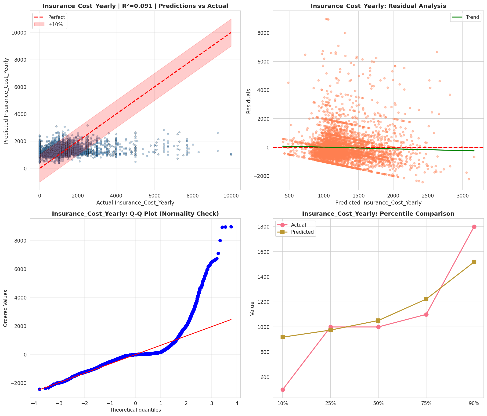
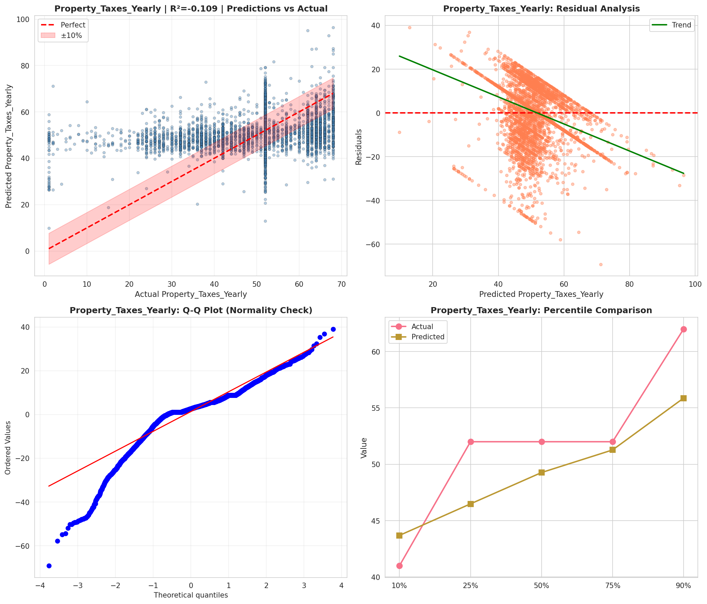
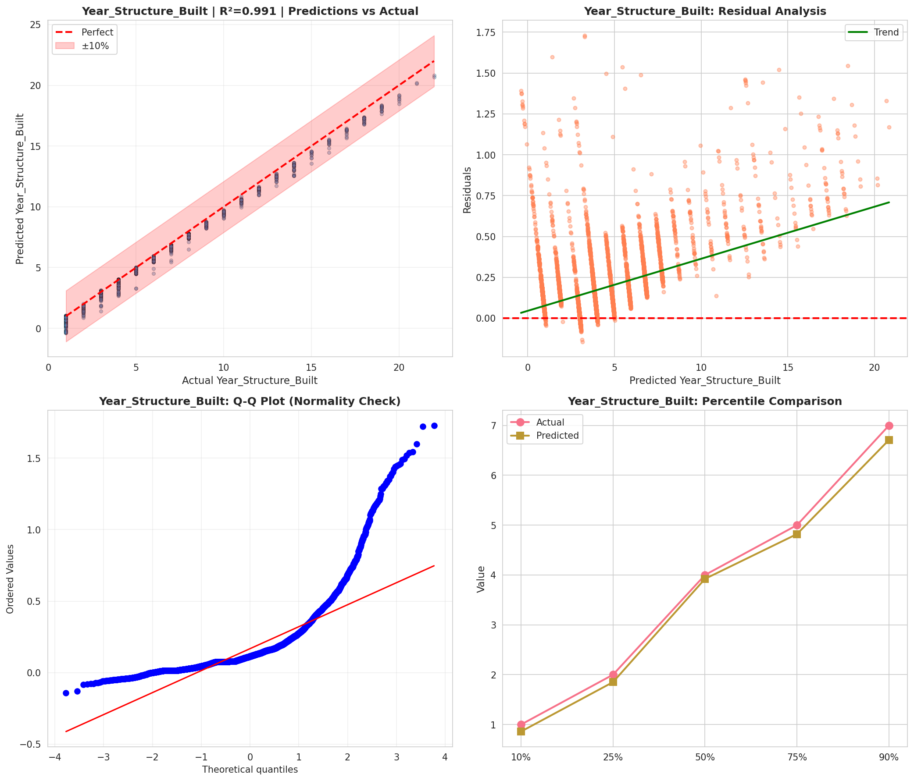
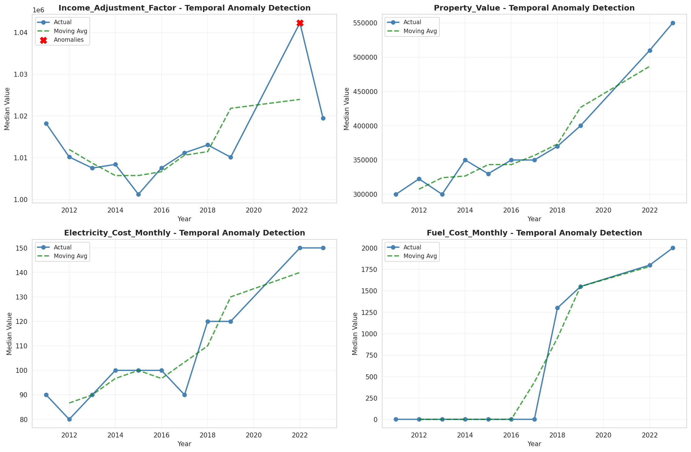
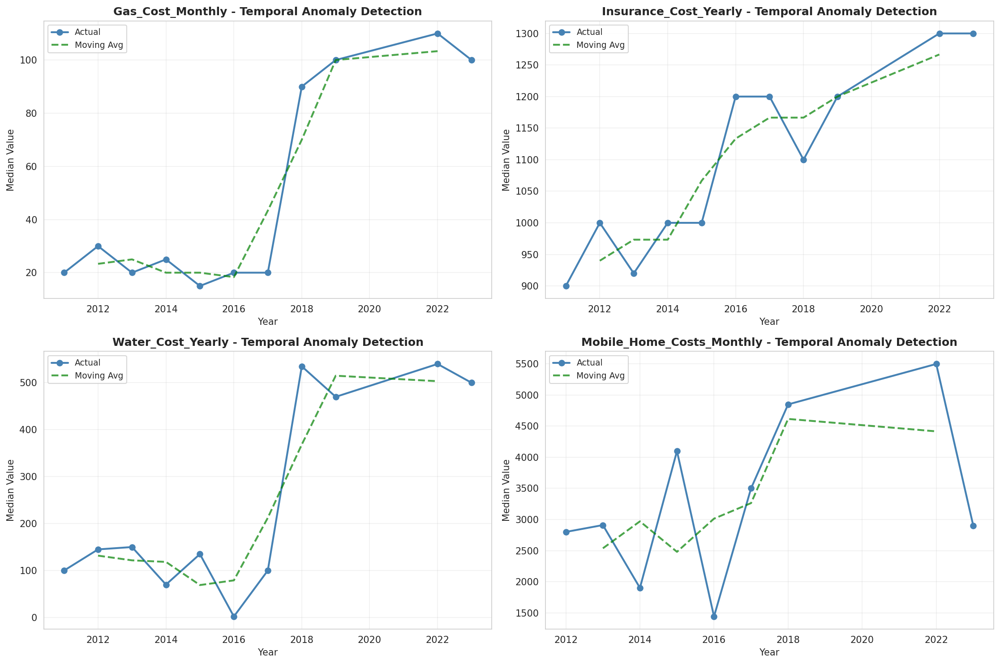
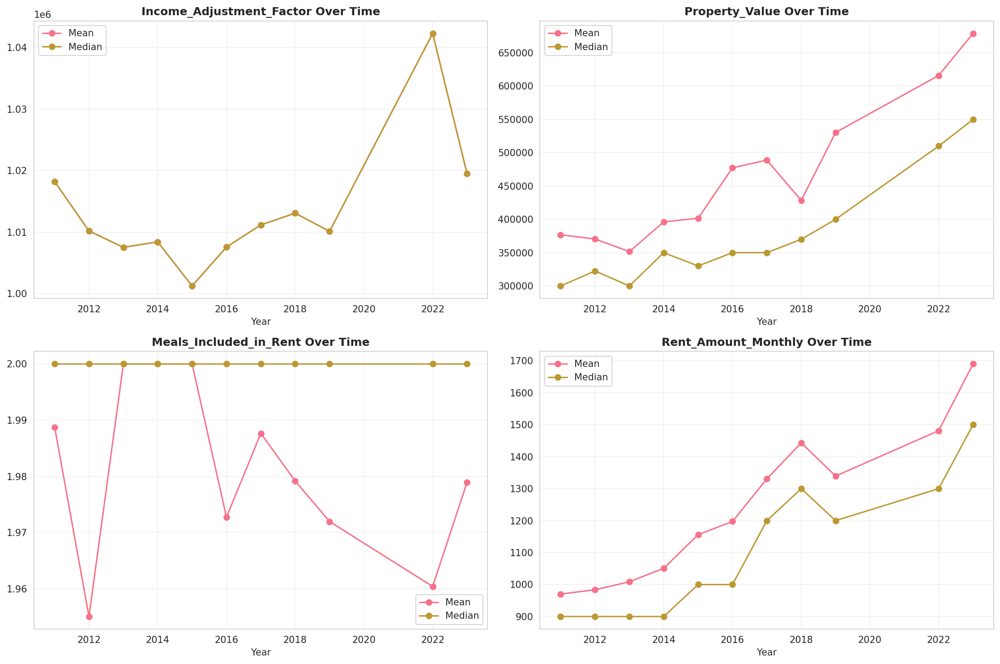
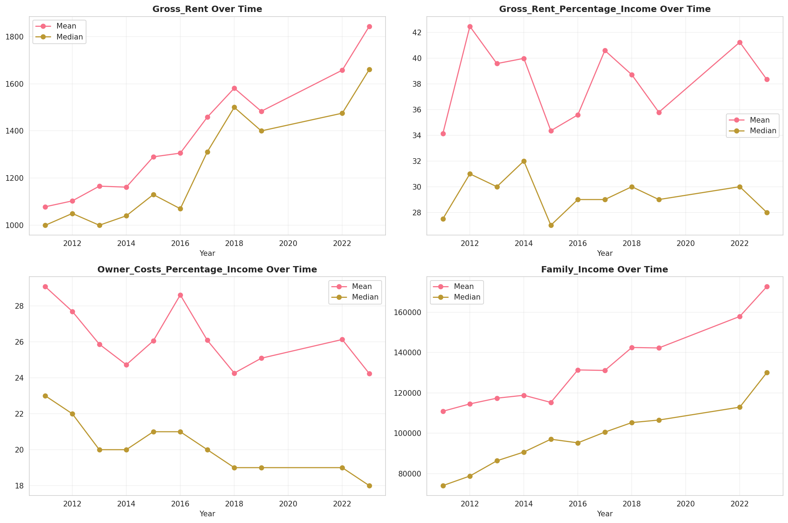

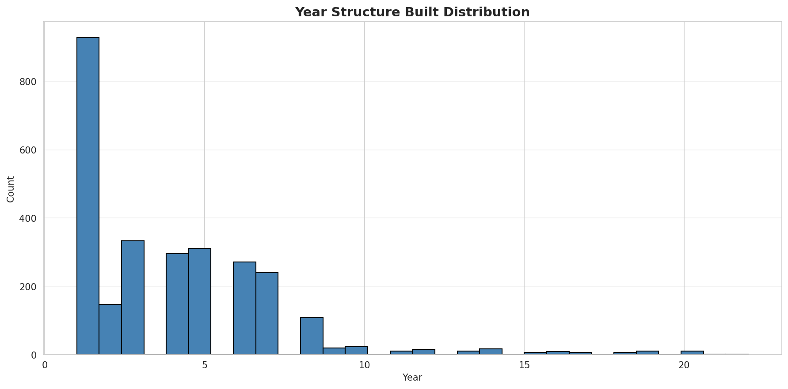
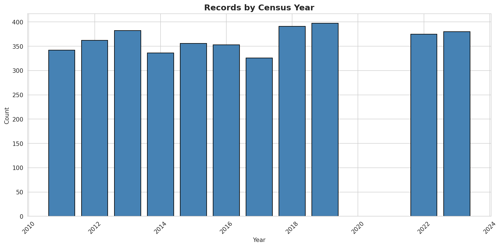
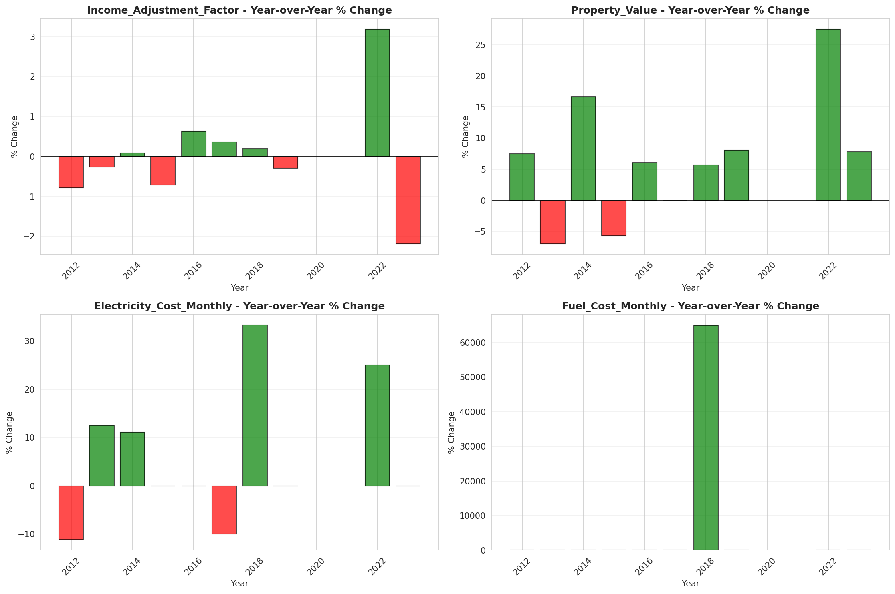
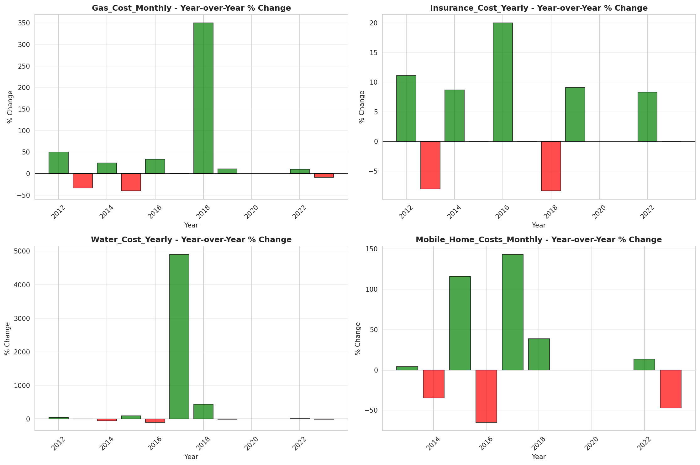
