# Temporal Analysis

## Year Distribution

- 2012: 156,894 records

- 2014: 163,175 records

- 2015: 166,290 records

- 2017: 167,315 records

- 2018: 168,539 records

- 2019: 169,819 records

- 2020: 163,982 records

- 2022: 167,143 records

- 2023: 168,464 records

## Temporal Trends

- Census_Year: {np.int64(2012): {'mean': 2012.0, 'median': 2012.0, 'std': 0.0}, np.int64(2014): {'mean': 2014.0, 'median': 2014.0, 'std': 0.0}, np.int64(2015): {'mean': 2015.0, 'median': 2015.0, 'std': 0.0}, np.int64(2017): {'mean': 2017.0, 'median': 2017.0, 'std': 0.0}, np.int64(2018): {'mean': 2018.0, 'median': 2018.0, 'std': 0.0}, np.int64(2019): {'mean': 2019.0, 'median': 2019.0, 'std': 0.0}, np.int64(2020): {'mean': 2020.0, 'median': 2020.0, 'std': 0.0}, np.int64(2022): {'mean': 2022.0, 'median': 2022.0, 'std': 0.0}, np.int64(2023): {'mean': 2023.0, 'median': 2023.0, 'std': 0.0}}

- Census_Division: {np.int64(2012): {'mean': 1.0, 'median': 1.0, 'std': 0.0}, np.int64(2014): {'mean': 1.0, 'median': 1.0, 'std': 0.0}, np.int64(2015): {'mean': 1.0, 'median': 1.0, 'std': 0.0}, np.int64(2017): {'mean': 1.0, 'median': 1.0, 'std': 0.0}, np.int64(2018): {'mean': 1.0, 'median': 1.0, 'std': 0.0}, np.int64(2019): {'mean': 1.0, 'median': 1.0, 'std': 0.0}, np.int64(2020): {'mean': 1.0, 'median': 1.0, 'std': 0.0}, np.int64(2022): {'mean': 1.0, 'median': 1.0, 'std': 0.0}, np.int64(2023): {'mean': 1.0, 'median': 1.0, 'std': 0.0}}

- Public_Use_Microdata_Area: {np.int64(2012): {'mean': None, 'median': None, 'std': None}, np.int64(2014): {'mean': None, 'median': None, 'std': None}, np.int64(2015): {'mean': None, 'median': None, 'std': None}, np.int64(2017): {'mean': 2149.604894958611, 'median': 1900.0, 'std': 1685.0472135510404}, np.int64(2018): {'mean': 2146.4074131209986, 'median': 1900.0, 'std': 1684.5557122233706}, np.int64(2019): {'mean': 2141.846124403041, 'median': 1900.0, 'std': 1683.1592394602917}, np.int64(2020): {'mean': 2137.6468697783903, 'median': 1900.0, 'std': 1682.2198811811418}, np.int64(2022): {'mean': None, 'median': None, 'std': None}, np.int64(2023): {'mean': 700.8855719916421, 'median': 701.0, 'std': 272.38452171407766}}

- Census_Region: {np.int64(2012): {'mean': 1.0, 'median': 1.0, 'std': 0.0}, np.int64(2014): {'mean': 1.0, 'median': 1.0, 'std': 0.0}, np.int64(2015): {'mean': 1.0, 'median': 1.0, 'std': 0.0}, np.int64(2017): {'mean': 1.0, 'median': 1.0, 'std': 0.0}, np.int64(2018): {'mean': 1.0, 'median': 1.0, 'std': 0.0}, np.int64(2019): {'mean': 1.0, 'median': 1.0, 'std': 0.0}, np.int64(2020): {'mean': 1.0, 'median': 1.0, 'std': 0.0}, np.int64(2022): {'mean': 1.0, 'median': 1.0, 'std': 0.0}, np.int64(2023): {'mean': 1.0, 'median': 1.0, 'std': 0.0}}

- State_Code: {np.int64(2012): {'mean': 25.0, 'median': 25.0, 'std': 0.0}, np.int64(2014): {'mean': 25.0, 'median': 25.0, 'std': 0.0}, np.int64(2015): {'mean': 25.0, 'median': 25.0, 'std': 0.0}, np.int64(2017): {'mean': 25.0, 'median': 25.0, 'std': 0.0}, np.int64(2018): {'mean': 25.0, 'median': 25.0, 'std': 0.0}, np.int64(2019): {'mean': 25.0, 'median': 25.0, 'std': 0.0}, np.int64(2020): {'mean': 25.0, 'median': 25.0, 'std': 0.0}, np.int64(2022): {'mean': 25.0, 'median': 25.0, 'std': 0.0}, np.int64(2023): {'mean': None, 'median': None, 'std': None}}

- Housing_Adjustment_Factor: {np.int64(2012): {'mean': 1040839.2974747282, 'median': 1053092.0, 'std': 27546.45811262234}, np.int64(2014): {'mean': 1036487.2267075226, 'median': 1031130.0, 'std': 29425.206397419413}, np.int64(2015): {'mean': 1021008.9236394251, 'median': 1017534.0, 'std': 20315.917128317342}, np.int64(2017): {'mean': 1029139.8305949855, 'median': 1034680.0, 'std': 17991.1150554903}, np.int64(2018): {'mean': 1038200.2495268157, 'median': 1046406.0, 'std': 23474.698274360595}, np.int64(2019): {'mean': 1040858.0934171088, 'median': 1042936.0, 'std': 29158.801412944562}, np.int64(2020): {'mean': 1036803.7107243477, 'median': 1030827.0, 'std': 28207.01211200799}, np.int64(2022): {'mean': 1104265.1699921624, 'median': 1133141.0, 'std': 61811.75006068847}, np.int64(2023): {'mean': 1104429.5834896476, 'median': 1125501.0, 'std': 76595.29153000863}}

- Income_Adjustment_Factor: {np.int64(2012): {'mean': 1052148.1231978277, 'median': 1061121.0, 'std': 26458.371200674792}, np.int64(2014): {'mean': 1047369.5887360196, 'median': 1041654.0, 'std': 30903.20422898342}, np.int64(2015): {'mean': 1030436.224463287, 'median': 1025215.0, 'std': 25703.4236976063}, np.int64(2017): {'mean': 1036531.7364671428, 'median': 1035988.0, 'std': 16857.689728003217}, np.int64(2018): {'mean': 1046782.2268911053, 'median': 1054346.0, 'std': 20488.310658720628}, np.int64(2019): {'mean': 1049808.1105824437, 'median': 1054606.0, 'std': 26202.179005438156}, np.int64(2020): {'mean': 1046945.9264736373, 'median': 1044328.0, 'std': 28667.77958786788}, np.int64(2022): {'mean': 1126779.2233775868, 'median': 1140108.0, 'std': 49887.87734010389}, np.int64(2023): {'mean': 1128569.5190010923, 'median': 1159185.0, 'std': 70307.50042054777}}

- Housing_Unit_Weight: {np.int64(2012): {'mean': 17.873252004538095, 'median': 16.0, 'std': 13.623933588131356}, np.int64(2014): {'mean': 17.26290792094377, 'median': 14.0, 'std': 14.089754482534719}, np.int64(2015): {'mean': 17.005352095736363, 'median': 14.0, 'std': 14.36890483214694}, np.int64(2017): {'mean': 17.123360129097808, 'median': 14.0, 'std': 14.332204524688484}, np.int64(2018): {'mean': 17.104266668248894, 'median': 14.0, 'std': 14.343167836909586}, np.int64(2019): {'mean': 17.06085302586872, 'median': 14.0, 'std': 14.575939178976396}, np.int64(2020): {'mean': 17.764150943396228, 'median': 14.0, 'std': 18.184549260516903}, np.int64(2022): {'mean': 17.944556457644055, 'median': 14.0, 'std': 18.534974510080783}, np.int64(2023): {'mean': 17.89496272200589, 'median': 13.0, 'std': 18.806281289420962}}

- Number_of_Persons: {np.int64(2012): {'mean': 2.1238606957563704, 'median': 2.0, 'std': 1.4161817580366773}, np.int64(2014): {'mean': 2.088022062203156, 'median': 2.0, 'std': 1.4028330613058908}, np.int64(2015): {'mean': 2.065656383426544, 'median': 2.0, 'std': 1.3927535616259985}, np.int64(2017): {'mean': 2.0608732032393986, 'median': 2.0, 'std': 1.3830288660612107}, np.int64(2018): {'mean': 2.0542485715472383, 'median': 2.0, 'std': 1.3807677681139745}, np.int64(2019): {'mean': 2.0507481495003503, 'median': 2.0, 'std': 1.3747954796404755}, np.int64(2020): {'mean': 2.0454074227659134, 'median': 2.0, 'std': 1.3743419352757584}, np.int64(2022): {'mean': 2.051141836630909, 'median': 2.0, 'std': 1.3727224130547415}, np.int64(2023): {'mean': 2.0528362142653624, 'median': 2.0, 'std': 1.3671557733687305}}

- Housing_Unit_Type: {np.int64(2012): {'mean': 1.1809565694035464, 'median': 1.0, 'std': 0.533692452975195}, np.int64(2014): {'mean': 1.2266401103110158, 'median': 1.0, 'std': 0.5952611480588237}, np.int64(2015): {'mean': 1.252877503157135, 'median': 1.0, 'std': 0.626559708507707}, np.int64(2017): {'mean': 1.2515016585482472, 'median': 1.0, 'std': 0.6272803062958839}, np.int64(2018): {'mean': 1.2518526869151947, 'median': 1.0, 'std': 0.6277161086624024}, np.int64(2019): {'mean': 1.2531459966199305, 'median': 1.0, 'std': 0.6294751419705336}, np.int64(2020): {'mean': None, 'median': None, 'std': None}, np.int64(2022): {'mean': None, 'median': None, 'std': None}, np.int64(2023): {'mean': None, 'median': None, 'std': None}}

- Building_Type: {np.int64(2012): {'mean': 3.509431116218934, 'median': 2.0, 'std': 2.192210129438725}, np.int64(2014): {'mean': 3.5343105921790885, 'median': 2.0, 'std': 2.2046307880121074}, np.int64(2015): {'mean': 3.5375608304821813, 'median': 2.0, 'std': 2.2055677671376306}, np.int64(2017): {'mean': 3.5547526754866436, 'median': 2.0, 'std': 2.2231501371479294}, np.int64(2018): {'mean': 3.5664560933774, 'median': 2.0, 'std': 2.2338655577450437}, np.int64(2019): {'mean': 3.576779000283892, 'median': 2.0, 'std': 2.2455851315699498}, np.int64(2020): {'mean': 3.5818621436304583, 'median': 2.0, 'std': 2.2550414345137084}, np.int64(2022): {'mean': 3.5924008250452077, 'median': 2.0, 'std': 2.2723306495679227}, np.int64(2023): {'mean': 3.5999034141015414, 'median': 2.0, 'std': 2.2853530090853527}}

- Year_Structure_Built: {np.int64(2012): {'mean': 3.69937508978595, 'median': 3.0, 'std': 2.5776040131224236}, np.int64(2014): {'mean': 3.7799036945497932, 'median': 3.0, 'std': 2.717151218239333}, np.int64(2015): {'mean': 3.8275566511535657, 'median': 3.0, 'std': 2.8116224734179576}, np.int64(2017): {'mean': 3.991095755737198, 'median': 4.0, 'std': 3.1131377494481205}, np.int64(2018): {'mean': 4.073986528887588, 'median': 4.0, 'std': 3.292980558726553}, np.int64(2019): {'mean': 4.191488772408444, 'median': 4.0, 'std': 3.520111936961713}, np.int64(2020): {'mean': 4.297805846264886, 'median': 4.0, 'std': 3.73130867415299}, np.int64(2022): {'mean': None, 'median': None, 'std': None}, np.int64(2023): {'mean': None, 'median': None, 'std': None}}

- Bathtub_or_Shower: {np.int64(2012): {'mean': 1.0047622468036201, 'median': 1.0, 'std': 0.0688447663441021}, np.int64(2014): {'mean': 1.0043181204812432, 'median': 1.0, 'std': 0.06557060967060596}, np.int64(2015): {'mean': 1.00431391716429, 'median': 1.0, 'std': 0.06553882596963109}, np.int64(2017): {'mean': 1.004564478525884, 'median': 1.0, 'std': 0.06740679467688263}, np.int64(2018): {'mean': 1.004692576942922, 'median': 1.0, 'std': 0.06834170930571144}, np.int64(2019): {'mean': 1.0047292291287278, 'median': 1.0, 'std': 0.068606822634994}, np.int64(2020): {'mean': 1.004525442078672, 'median': 1.0, 'std': 0.0671192592924385}, np.int64(2022): {'mean': 1.0045349231464737, 'median': 1.0, 'std': 0.06718920677473224}, np.int64(2023): {'mean': 1.0043743613432439, 'median': 1.0, 'std': 0.0659943693691341}}

- Refrigerator: {np.int64(2012): {'mean': 1.0083177704352824, 'median': 1.0, 'std': 0.09082204786976712}, np.int64(2014): {'mean': 1.007727162966435, 'median': 1.0, 'std': 0.08756430993782416}, np.int64(2015): {'mean': 1.0077069653115724, 'median': 1.0, 'std': 0.08745068421696249}, np.int64(2017): {'mean': 1.0076121457262437, 'median': 1.0, 'std': 0.08691521162450554}, np.int64(2018): {'mean': 1.007621079641328, 'median': 1.0, 'std': 0.08696580661820039}, np.int64(2019): {'mean': 1.0072427140097355, 'median': 1.0, 'std': 0.08479567731103438}, np.int64(2020): {'mean': 1.0069361241429087, 'median': 1.0, 'std': 0.08299436149612435}, np.int64(2022): {'mean': 1.0067882572332731, 'median': 1.0, 'std': 0.08211104933168277}, np.int64(2023): {'mean': 1.0065300466131946, 'median': 1.0, 'std': 0.08054471124753214}}

- Hot_and_Cold_Running_Water: {np.int64(2012): {'mean': 1.0057247521907773, 'median': 1.0, 'std': 0.07544547891164453}, np.int64(2014): {'mean': 1.0055112853510604, 'median': 1.0, 'std': 0.07403343846862971}, np.int64(2015): {'mean': 1.005751889552387, 'median': 1.0, 'std': 0.07562305091058613}, np.int64(2017): {'mean': 1.005990000280891, 'median': 1.0, 'std': 0.07716321655612043}, np.int64(2018): {'mean': 1.0060871020374011, 'median': 1.0, 'std': 0.07778233354180768}, np.int64(2019): {'mean': 1.0059825094688446, 'median': 1.0, 'std': 0.07711523990665768}, np.int64(2020): {'mean': 1.0057235654998196, 'median': 1.0, 'std': 0.0754377052415512}, np.int64(2022): {'mean': 1.0056015483725136, 'median': 1.0, 'std': 0.07463384202142986}, np.int64(2023): {'mean': 1.005298226458937, 'median': 1.0, 'std': 0.0725960890219746}}

- Running_Water: {np.int64(2012): {'mean': None, 'median': None, 'std': None}, np.int64(2014): {'mean': 9.0, 'median': 9.0, 'std': 0.0}, np.int64(2015): {'mean': 9.0, 'median': 9.0, 'std': 0.0}, np.int64(2017): {'mean': 9.0, 'median': 9.0, 'std': 0.0}, np.int64(2018): {'mean': 9.0, 'median': 9.0, 'std': 0.0}, np.int64(2019): {'mean': 9.0, 'median': 9.0, 'std': 0.0}, np.int64(2020): {'mean': 9.0, 'median': 9.0, 'std': 0.0}, np.int64(2022): {'mean': 9.0, 'median': 9.0, 'std': 0.0}, np.int64(2023): {'mean': 9.0, 'median': 9.0, 'std': 0.0}}

- Sink_with_Faucet: {np.int64(2012): {'mean': 1.0042953598620887, 'median': 1.0, 'std': 0.06539832158761545}, np.int64(2014): {'mean': 1.0039488075453473, 'median': 1.0, 'std': 0.06271556743648694}, np.int64(2015): {'mean': 1.0040164056357184, 'median': 1.0, 'std': 0.0632479442990951}, np.int64(2017): {'mean': 1.0040729193000197, 'median': 1.0, 'std': 0.06368955262256878}, np.int64(2018): {'mean': 1.0041905479089097, 'median': 1.0, 'std': 0.06459888786978173}, np.int64(2019): {'mean': 1.004133747862153, 'median': 1.0, 'std': 0.06416142529232705}, np.int64(2020): {'mean': 1.0039552508119813, 'median': 1.0, 'std': 0.06276651366572855}, np.int64(2022): {'mean': 1.0041110985533455, 'median': 1.0, 'std': 0.06398614180112523}, np.int64(2023): {'mean': 1.0038844328728005, 'median': 1.0, 'std': 0.062204269433065604}}

- Stove_or_Range: {np.int64(2012): {'mean': 1.009546042235311, 'median': 1.0, 'std': 0.09723673805164892}, np.int64(2014): {'mean': 1.0092683342566158, 'median': 1.0, 'std': 0.09582534869437224}, np.int64(2015): {'mean': 1.0092086901700774, 'median': 1.0, 'std': 0.09551939502502457}, np.int64(2017): {'mean': 1.0097960731440128, 'median': 1.0, 'std': 0.09848948274960896}, np.int64(2018): {'mean': 1.0100405806802493, 'median': 1.0, 'std': 0.09969872981443456}, np.int64(2019): {'mean': 1.0100470153232564, 'median': 1.0, 'std': 0.0997303448075479}, np.int64(2020): {'mean': 1.0098881270299531, 'median': 1.0, 'std': 0.0989465645550892}, np.int64(2022): {'mean': 1.009493670886076, 'median': 1.0, 'std': 0.09697219974741034}, np.int64(2023): {'mean': 1.0092946429821246, 'median': 1.0, 'std': 0.09595997625452715}}

- Telephone_Service: {np.int64(2012): {'mean': 1.0149889482409284, 'median': 1.0, 'std': 0.12150881855159715}, np.int64(2014): {'mean': 1.0165293022902504, 'median': 1.0, 'std': 0.12749983506357446}, np.int64(2015): {'mean': 1.0172254387826245, 'median': 1.0, 'std': 0.13011091934579577}, np.int64(2017): {'mean': 1.01712555231597, 'median': 1.0, 'std': 0.1297397173610299}, np.int64(2018): {'mean': 1.0163454573965247, 'median': 1.0, 'std': 0.12680064462726404}, np.int64(2019): {'mean': 1.0142842325188555, 'median': 1.0, 'std': 0.11866042954074438}, np.int64(2020): {'mean': 1.0118984153474107, 'median': 1.0, 'std': 0.10842939590612828}, np.int64(2022): {'mean': 1.007862926002636, 'median': 1.0, 'std': 0.08832417082567039}, np.int64(2023): {'mean': 1.0067953369416522, 'median': 1.0, 'std': 0.08215357883874123}}

- Lot_Acreage: {np.int64(2012): {'mean': 1.2864494774309099, 'median': 1.0, 'std': 0.5070819375412456}, np.int64(2014): {'mean': 1.288473048820427, 'median': 1.0, 'std': 0.5081577413688122}, np.int64(2015): {'mean': 1.2879555169574681, 'median': 1.0, 'std': 0.5072749906038239}, np.int64(2017): {'mean': 1.2881010275315712, 'median': 1.0, 'std': 0.5072438057252604}, np.int64(2018): {'mean': 1.2880583206072833, 'median': 1.0, 'std': 0.5080337410125506}, np.int64(2019): {'mean': 1.2862144226188499, 'median': 1.0, 'std': 0.5063734781127164}, np.int64(2020): {'mean': 1.2867683510301018, 'median': 1.0, 'std': 0.5071478753032707}, np.int64(2022): {'mean': 1.289135205086367, 'median': 1.0, 'std': 0.5084025697655079}, np.int64(2023): {'mean': 1.2910044660259052, 'median': 1.0, 'std': 0.5089888349532894}}

- Agricultural_Sales: {np.int64(2012): {'mean': 1.073251528017543, 'median': 1.0, 'std': 0.4870952776316595}, np.int64(2014): {'mean': 1.0701049031840657, 'median': 1.0, 'std': 0.47112044303877587}, np.int64(2015): {'mean': 1.0693348105063933, 'median': 1.0, 'std': 0.4660904287943022}, np.int64(2017): {'mean': 1.069140428643239, 'median': 1.0, 'std': 0.4587146064674434}, np.int64(2018): {'mean': 1.0697048492313306, 'median': 1.0, 'std': 0.46743842008138425}, np.int64(2019): {'mean': 1.07138304652645, 'median': 1.0, 'std': 0.47692349031880354}, np.int64(2020): {'mean': 1.0732828043581242, 'median': 1.0, 'std': 0.4833497286054603}, np.int64(2022): {'mean': 1.0790483149146042, 'median': 1.0, 'std': 0.5120891971087111}, np.int64(2023): {'mean': 1.081178834561286, 'median': 1.0, 'std': 0.5173776147703067}}

- Business_On_Property: {np.int64(2012): {'mean': 1.9821124940488335, 'median': 2.0, 'std': 0.13254335978133017}, np.int64(2014): {'mean': 1.9831505719996838, 'median': 2.0, 'std': 0.1287078546786573}, np.int64(2015): {'mean': 1.9831496791220689, 'median': 2.0, 'std': 0.12871120546803075}, np.int64(2017): {'mean': 4.806236903734747, 'median': 2.0, 'std': 3.442011378744472}, np.int64(2018): {'mean': 6.2094837868265875, 'median': 9.0, 'std': 3.4349832817585826}, np.int64(2019): {'mean': 7.609886883593135, 'median': 9.0, 'std': 2.7970920786496336}, np.int64(2020): {'mean': None, 'median': None, 'std': None}, np.int64(2022): {'mean': None, 'median': None, 'std': None}, np.int64(2023): {'mean': None, 'median': None, 'std': None}}

- Tenure: {np.int64(2012): {'mean': 1.845766562288942, 'median': 2.0, 'std': 0.9006460572458754}, np.int64(2014): {'mean': 1.8695354931824224, 'median': 2.0, 'std': 0.902202882469766}, np.int64(2015): {'mean': 1.8767164812513262, 'median': 2.0, 'std': 0.9020306988878832}, np.int64(2017): {'mean': 1.8823228831645076, 'median': 2.0, 'std': 0.8990661502449611}, np.int64(2018): {'mean': 1.886664526101209, 'median': 2.0, 'std': 0.8978926034712141}, np.int64(2019): {'mean': 1.8866448353016136, 'median': 2.0, 'std': 0.8966248327893731}, np.int64(2020): {'mean': 1.8857829389085907, 'median': 2.0, 'std': 0.8933819075288743}, np.int64(2022): {'mean': 1.8893918282809263, 'median': 2.0, 'std': 0.8882182339484781}, np.int64(2023): {'mean': 1.888873193362279, 'median': 2.0, 'std': 0.8857468399753577}}

- Vacancy_Status: {np.int64(2012): {'mean': 4.552666965486329, 'median': 5.0, 'std': 1.9709377459956288}, np.int64(2014): {'mean': 4.59626515234247, 'median': 5.0, 'std': 1.93602327898295}, np.int64(2015): {'mean': 4.657189365165491, 'median': 5.0, 'std': 1.9014138321118172}, np.int64(2017): {'mean': 4.6968267581475125, 'median': 5.0, 'std': 1.874324897498616}, np.int64(2018): {'mean': 4.727598188901759, 'median': 5.0, 'std': 1.8470443760205475}, np.int64(2019): {'mean': 4.748914999470731, 'median': 5.0, 'std': 1.8305413055676762}, np.int64(2020): {'mean': 4.75485144172788, 'median': 5.0, 'std': 1.8236941922880125}, np.int64(2022): {'mean': 4.739679290344593, 'median': 5.0, 'std': 1.8540074729327454}, np.int64(2023): {'mean': 4.729878194411273, 'median': 5.0, 'std': 1.8914462480027716}}

- Vehicles_Available: {np.int64(2012): {'mean': 1.6405261865291336, 'median': 2.0, 'std': 1.0180570321376796}, np.int64(2014): {'mean': 1.6338486079987846, 'median': 2.0, 'std': 1.0208350700502833}, np.int64(2015): {'mean': 1.6354769771742095, 'median': 2.0, 'std': 1.0236381590875105}, np.int64(2017): {'mean': 1.6502374582945083, 'median': 2.0, 'std': 1.0322301939833023}, np.int64(2018): {'mean': 1.656581118719245, 'median': 2.0, 'std': 1.0389186772091807}, np.int64(2019): {'mean': 1.6655652199682902, 'median': 2.0, 'std': 1.0428627913904933}, np.int64(2020): {'mean': 1.6754282270588507, 'median': 2.0, 'std': 1.0464608867406815}, np.int64(2022): {'mean': 1.6854980229711918, 'median': 2.0, 'std': 1.0504435224515802}, np.int64(2023): {'mean': 1.683451793255219, 'median': 2.0, 'std': 1.0494892463497028}}

- Condo_Fee_Monthly: {np.int64(2012): {'mean': 318.0782415809639, 'median': 270.0, 'std': 207.2632066580485}, np.int64(2014): {'mean': 331.67307885990533, 'median': 280.0, 'std': 212.45640753371828}, np.int64(2015): {'mean': 338.9441879140735, 'median': 290.0, 'std': 214.9982858588521}, np.int64(2017): {'mean': 355.40460686169695, 'median': 300.0, 'std': 222.8839263320454}, np.int64(2018): {'mean': 364.5330040839586, 'median': 310.0, 'std': 227.39938170011604}, np.int64(2019): {'mean': 372.3376029277219, 'median': 320.0, 'std': 228.8398325829534}, np.int64(2020): {'mean': 383.17454375292465, 'median': 330.0, 'std': 242.09400962834954}, np.int64(2022): {'mean': 413.7252897068848, 'median': 350.0, 'std': 306.2231977032288}, np.int64(2023): {'mean': 431.6396764441539, 'median': 350.0, 'std': 327.67240452640146}}

- Electricity_Cost_Monthly: {np.int64(2012): {'mean': 106.67896942346657, 'median': 90.0, 'std': 83.36570709285304}, np.int64(2014): {'mean': 105.00645675870713, 'median': 90.0, 'std': 83.27570595443902}, np.int64(2015): {'mean': 109.52834278092698, 'median': 90.0, 'std': 88.47927685842669}, np.int64(2017): {'mean': 117.20516096065407, 'median': 100.0, 'std': 94.18035478521588}, np.int64(2018): {'mean': 132.59586364698393, 'median': 100.0, 'std': 95.97896592534339}, np.int64(2019): {'mean': 136.94265032517856, 'median': 110.0, 'std': 98.77100533227153}, np.int64(2020): {'mean': 139.58703725291014, 'median': 110.0, 'std': 101.73287512095912}, np.int64(2022): {'mean': 158.46682314852288, 'median': 120.0, 'std': 145.22483200652258}, np.int64(2023): {'mean': 173.00610481122965, 'median': 130.0, 'std': 181.7726469373355}}

- Fuel_Cost_Monthly: {np.int64(2012): {'mean': 724.2484880579603, 'median': 2.0, 'std': 1203.0120258847899}, np.int64(2014): {'mean': 652.0383607429071, 'median': 2.0, 'std': 1178.7218081987457}, np.int64(2015): {'mean': 635.6686471247991, 'median': 2.0, 'std': 1194.876714688637}, np.int64(2017): {'mean': 504.92015089122003, 'median': 2.0, 'std': 1059.64332545543}, np.int64(2018): {'mean': 1739.0263728422844, 'median': 1500.0, 'std': 1264.9164547774346}, np.int64(2019): {'mean': 1658.9060961019447, 'median': 1400.0, 'std': 1202.0213865366713}, np.int64(2020): {'mean': 1583.8058900679623, 'median': 1300.0, 'std': 1143.3817979614275}, np.int64(2022): {'mean': 1692.1202819394014, 'median': 1500.0, 'std': 1228.2988265807787}, np.int64(2023): {'mean': 1804.318232112122, 'median': 1500.0, 'std': 1336.151191454247}}

- Gas_Cost_Monthly: {np.int64(2012): {'mean': 69.25943236937435, 'median': 20.0, 'std': 101.0588166329938}, np.int64(2014): {'mean': 65.22908579892893, 'median': 20.0, 'std': 95.21403603783003}, np.int64(2015): {'mean': 65.55075176574009, 'median': 20.0, 'std': 96.622726753026}, np.int64(2017): {'mean': 63.9670188463735, 'median': 20.0, 'std': 94.5280861042183}, np.int64(2018): {'mean': 117.57850679958823, 'median': 90.0, 'std': 107.05556770911225}, np.int64(2019): {'mean': 118.14535342326563, 'median': 90.0, 'std': 107.84445209594236}, np.int64(2020): {'mean': 118.25054408849581, 'median': 90.0, 'std': 108.22017897434378}, np.int64(2022): {'mean': 135.7376772586671, 'median': 100.0, 'std': 137.71452679433864}, np.int64(2023): {'mean': 144.71912807401355, 'median': 100.0, 'std': 160.0347925016409}}

- House_Heating_Fuel: {np.int64(2012): {'mean': 2.49131976422914, 'median': 2.0, 'std': 1.562817168769175}, np.int64(2014): {'mean': 2.457655057161305, 'median': 2.0, 'std': 1.5868915827158772}, np.int64(2015): {'mean': 2.4443299281578708, 'median': 2.0, 'std': 1.5966270376660638}, np.int64(2017): {'mean': 2.4072034025669544, 'median': 2.0, 'std': 1.6011855808937783}, np.int64(2018): {'mean': 2.3878181913217493, 'median': 2.0, 'std': 1.5979304645989199}, np.int64(2019): {'mean': 2.3705824825521953, 'median': 1.0, 'std': 1.5898685764964495}, np.int64(2020): {'mean': 2.35544584289456, 'median': 1.0, 'std': 1.5834160638810892}, np.int64(2022): {'mean': 2.343671624929392, 'median': 1.0, 'std': 1.5862367849299075}, np.int64(2023): {'mean': 2.344480461547612, 'median': 1.0, 'std': 1.5857105847039707}}

- Insurance_Cost_Yearly: {np.int64(2014): {'mean': 1150.6146876607, 'median': 960.0, 'std': 878.722518661361}, np.int64(2015): {'mean': 1201.1348025396514, 'median': 1000.0, 'std': 916.2027598226235}}

- Water_Cost_Yearly: {np.int64(2012): {'mean': 326.8993522441211, 'median': 120.0, 'std': 481.8576007464278}, np.int64(2014): {'mean': 334.20972311899425, 'median': 100.0, 'std': 495.5957425052469}, np.int64(2015): {'mean': 338.97599957561613, 'median': 100.0, 'std': 503.6556611801034}, np.int64(2017): {'mean': 350.7492635787069, 'median': 100.0, 'std': 521.1290587593024}, np.int64(2018): {'mean': 644.8062593748733, 'median': 500.0, 'std': 570.9773541131121}, np.int64(2019): {'mean': 653.1073791484366, 'median': 500.0, 'std': 579.709802500259}, np.int64(2020): {'mean': 668.0222219155015, 'median': 500.0, 'std': 599.0041078471031}, np.int64(2022): {'mean': 711.1464673805406, 'median': 530.0, 'std': 660.1157503408558}, np.int64(2023): {'mean': 735.6592179492145, 'median': 560.0, 'std': 689.9042530241472}}

- Mobile_Home_Costs_Monthly: {np.int64(2012): {'mean': 3065.0051948051946, 'median': 3150.0, 'std': 2010.9968628239262}, np.int64(2014): {'mean': 3222.9061224489797, 'median': 3400.0, 'std': 1991.2658799182236}, np.int64(2015): {'mean': 3299.584637268848, 'median': 3600.0, 'std': 1989.6303793924283}, np.int64(2017): {'mean': 3381.9885057471265, 'median': 3600.0, 'std': 2129.370057119115}, np.int64(2018): {'mean': 3474.089552238806, 'median': 3600.0, 'std': 2234.858080216421}, np.int64(2019): {'mean': 3478.664072632944, 'median': 3600.0, 'std': 2409.7693493105053}, np.int64(2020): {'mean': 3623.0511140235913, 'median': 3800.0, 'std': 2551.3439433622875}, np.int64(2022): {'mean': 4007.6896120150186, 'median': 4000.0, 'std': 3629.8884333925344}, np.int64(2023): {'mean': 4210.697795071336, 'median': 4100.0, 'std': 3902.923858457555}}

- First_Mortgage_Includes_Insurance: {np.int64(2012): {'mean': 1.596541557096183, 'median': 2.0, 'std': 0.4905951117303717}, np.int64(2014): {'mean': 1.5834483878827257, 'median': 2.0, 'std': 0.4929911908568267}, np.int64(2015): {'mean': 1.576175969601677, 'median': 2.0, 'std': 0.4941671997230932}, np.int64(2017): {'mean': 1.5640080925045643, 'median': 2.0, 'std': 0.49589011768402363}, np.int64(2018): {'mean': 1.557071530970389, 'median': 2.0, 'std': 0.4967362542100656}, np.int64(2019): {'mean': 1.549579666683054, 'median': 2.0, 'std': 0.49753986096772734}, np.int64(2020): {'mean': 1.5417308924643656, 'median': 2.0, 'std': 0.49825980407477016}, np.int64(2022): {'mean': 1.5228785649218695, 'median': 2.0, 'std': 0.49948067198353846}, np.int64(2023): {'mean': 1.5163258864377653, 'median': 2.0, 'std': 0.4997377760387074}}

- First_Mortgage_Payment_Monthly: {np.int64(2012): {'mean': 1570.129635827556, 'median': 1400.0, 'std': 947.1872973820566}, np.int64(2014): {'mean': 1554.487647202144, 'median': 1400.0, 'std': 935.5594796983904}, np.int64(2015): {'mean': 1560.251965408805, 'median': 1400.0, 'std': 942.3613058283628}, np.int64(2017): {'mean': 1605.8866391433787, 'median': 1500.0, 'std': 975.0590165257769}, np.int64(2018): {'mean': 1649.4843376670456, 'median': 1500.0, 'std': 999.4295725570882}, np.int64(2019): {'mean': 1703.5927764941089, 'median': 1500.0, 'std': 1031.29885445568}, np.int64(2020): {'mean': 1758.841199189456, 'median': 1600.0, 'std': 1048.6339713043733}, np.int64(2022): {'mean': 1909.1971480625043, 'median': 1700.0, 'std': 1121.1446249092758}, np.int64(2023): {'mean': 2000.7637218111038, 'median': 1800.0, 'std': 1171.2888080005127}}

- First_Mortgage_Includes_Taxes: {np.int64(2012): {'mean': 1.3119451749143358, 'median': 1.0, 'std': 0.4632912729301907}, np.int64(2014): {'mean': 1.301534963047186, 'median': 1.0, 'std': 0.4589281535562719}, np.int64(2015): {'mean': 1.2955647274633124, 'median': 1.0, 'std': 0.45629993368928173}, np.int64(2017): {'mean': 1.2855733013142097, 'median': 1.0, 'std': 0.4516907644873681}, np.int64(2018): {'mean': 1.280504885725114, 'median': 1.0, 'std': 0.4492496193478102}, np.int64(2019): {'mean': 1.272831555315209, 'median': 1.0, 'std': 0.44541862212501443}, np.int64(2020): {'mean': 1.2627167079443704, 'median': 1.0, 'std': 0.44011361494811124}, np.int64(2022): {'mean': 1.2411533879896293, 'median': 1.0, 'std': 0.42778690639313643}, np.int64(2023): {'mean': 1.2309823589239997, 'median': 1.0, 'std': 0.42146485468052086}}

- First_Mortgage_Status: {np.int64(2012): {'mean': 1.596944428899211, 'median': 1.0, 'std': 0.9143608478525441}, np.int64(2014): {'mean': 1.6177465580219164, 'median': 1.0, 'std': 0.9231865752646804}, np.int64(2015): {'mean': 1.628660099851572, 'median': 1.0, 'std': 0.9275571161404869}, np.int64(2017): {'mean': 1.645895826131561, 'median': 1.0, 'std': 0.9342448734881936}, np.int64(2018): {'mean': 1.6555158721355843, 'median': 1.0, 'std': 0.9378635096539467}, np.int64(2019): {'mean': 1.6604615384615384, 'median': 1.0, 'std': 0.9397323894981808}, np.int64(2020): {'mean': 1.6827733491697312, 'median': 1.0, 'std': 0.9475178407747509}, np.int64(2022): {'mean': 1.7380501787354605, 'median': 1.0, 'std': 0.9642722839938056}, np.int64(2023): {'mean': 1.7603578308139345, 'median': 1.0, 'std': 0.9700535276188829}}

- Second_Mortgage_Payment_Monthly: {np.int64(2012): {'mean': 412.3492744063324, 'median': 300.0, 'std': 412.6483747030819}, np.int64(2014): {'mean': 387.54454933402303, 'median': 280.0, 'std': 405.7179773307531}, np.int64(2015): {'mean': 384.72870706506563, 'median': 260.0, 'std': 415.7420552715054}, np.int64(2017): {'mean': 401.4450389848647, 'median': 260.0, 'std': 472.645740268682}, np.int64(2018): {'mean': 413.8855555555556, 'median': 270.0, 'std': 507.7718565965862}, np.int64(2019): {'mean': 434.79476124623767, 'median': 300.0, 'std': 530.9422589402312}, np.int64(2020): {'mean': 466.1402802248511, 'median': 300.0, 'std': 606.6566622709973}, np.int64(2022): {'mean': 491.01781812069254, 'median': 300.0, 'std': 630.6734656507401}, np.int64(2023): {'mean': 523.1393173613391, 'median': 330.0, 'std': 650.7952902730351}}

- Second_Mortgage_Status: {np.int64(2012): {'mean': 2.6746991792174675, 'median': 3.0, 'std': 0.584519210924949}, np.int64(2014): {'mean': 2.7207016973929994, 'median': 3.0, 'std': 0.5495473014038813}, np.int64(2015): {'mean': 2.740402253668763, 'median': 3.0, 'std': 0.5320514949042711}, np.int64(2017): {'mean': 2.7647581295129693, 'median': 3.0, 'std': 0.503288265674119}, np.int64(2018): {'mean': 2.7748611729035875, 'median': 3.0, 'std': 0.4891285607352742}, np.int64(2019): {'mean': 2.782999852514626, 'median': 3.0, 'std': 0.4774500052761983}, np.int64(2020): {'mean': 2.7809432278437565, 'median': 3.0, 'std': 0.4734341524287266}, np.int64(2022): {'mean': 2.785283166431474, 'median': 3.0, 'std': 0.4603302320647181}, np.int64(2023): {'mean': 2.7827193795835794, 'median': 3.0, 'std': 0.45851038447207415}}

- Property_Taxes_Yearly: {np.int64(2012): {'mean': 46.26574514522357, 'median': 47.0, 'std': 15.084055696885878}, np.int64(2014): {'mean': 47.09709468951953, 'median': 48.0, 'std': 15.865972760384267}, np.int64(2015): {'mean': 47.85438312418477, 'median': 50.0, 'std': 15.95560849616924}, np.int64(2017): {'mean': 49.472439979035876, 'median': 52.0, 'std': 16.020220178361626}}

- Meals_Included_in_Rent: {np.int64(2012): {'mean': 1.9783515973934054, 'median': 2.0, 'std': 0.1455344158728609}, np.int64(2014): {'mean': 1.979339133697615, 'median': 2.0, 'std': 0.14224791540425935}, np.int64(2015): {'mean': 1.979867963701682, 'median': 2.0, 'std': 0.14045354252646663}, np.int64(2017): {'mean': 1.978619524724067, 'median': 2.0, 'std': 0.1446507335287627}, np.int64(2018): {'mean': 1.9781969397601433, 'median': 2.0, 'std': 0.1460416954642393}, np.int64(2019): {'mean': 1.9779492581058802, 'median': 2.0, 'std': 0.14685026547711963}, np.int64(2020): {'mean': 1.977825825825826, 'median': 2.0, 'std': 0.14725148925157505}, np.int64(2022): {'mean': 1.9784864531142403, 'median': 2.0, 'std': 0.14509036515439563}, np.int64(2023): {'mean': 1.9780983916745507, 'median': 2.0, 'std': 0.1463640480388077}}

- Rent_Amount_Monthly: {np.int64(2012): {'mean': 950.3673150611378, 'median': 860.0, 'std': 576.906108739535}, np.int64(2014): {'mean': 1002.3773363664079, 'median': 900.0, 'std': 613.4042770074864}, np.int64(2015): {'mean': 1036.8672871906128, 'median': 930.0, 'std': 639.7147345747078}, np.int64(2017): {'mean': 1129.6978041048662, 'median': 1000.0, 'std': 702.4775391531476}, np.int64(2018): {'mean': 1179.897900105684, 'median': 1000.0, 'std': 735.2327502358473}, np.int64(2019): {'mean': 1239.1403645356293, 'median': 1100.0, 'std': 770.6440127273016}, np.int64(2020): {'mean': 1298.738930930931, 'median': 1200.0, 'std': 819.6420114920588}, np.int64(2022): {'mean': 1448.0289221855485, 'median': 1300.0, 'std': 937.9499957605499}, np.int64(2023): {'mean': 1544.755156102176, 'median': 1400.0, 'std': 1018.6380704006649}}

- Gross_Rent: {np.int64(2012): {'mean': 1068.919369220187, 'median': 1000.0, 'std': 609.9294844874862}, np.int64(2014): {'mean': 1118.8276434676434, 'median': 1030.0, 'std': 643.7511207527383}, np.int64(2015): {'mean': 1157.101454192923, 'median': 1060.0, 'std': 670.4233239309513}, np.int64(2017): {'mean': 1253.1751998271766, 'median': 1150.0, 'std': 729.3236874007043}, np.int64(2018): {'mean': 1307.6858414451294, 'median': 1200.0, 'std': 761.9961231566128}, np.int64(2019): {'mean': 1369.3024511545293, 'median': 1250.0, 'std': 797.1977144453731}, np.int64(2020): {'mean': 1427.4461228850407, 'median': 1310.0, 'std': 843.0003764827075}, np.int64(2022): {'mean': 1590.437366416902, 'median': 1480.0, 'std': 965.381436998599}, np.int64(2023): {'mean': 1696.9714432535604, 'median': 1570.0, 'std': 1050.8735048299923}}

- Gross_Rent_Percentage_Income: {np.int64(2012): {'mean': 39.38347914124763, 'median': 29.0, 'std': 27.603472495768635}, np.int64(2014): {'mean': 39.469259536275246, 'median': 30.0, 'std': 27.65149166543905}, np.int64(2015): {'mean': 39.30586225677081, 'median': 30.0, 'std': 27.60698141800966}, np.int64(2017): {'mean': 38.999926340601064, 'median': 29.0, 'std': 27.611665665538425}, np.int64(2018): {'mean': 38.851409925485804, 'median': 29.0, 'std': 27.53777799999115}, np.int64(2019): {'mean': 38.52431489423566, 'median': 29.0, 'std': 27.486735946940044}, np.int64(2020): {'mean': 38.399446166353336, 'median': 29.0, 'std': 27.490550287712047}, np.int64(2022): {'mean': 38.937633489961556, 'median': 29.0, 'std': 27.804415409987197}, np.int64(2023): {'mean': 39.34107441941855, 'median': 29.0, 'std': 28.049631377694027}}

- Selected_Monthly_Owner_Costs: {np.int64(2012): {'mean': 1790.9407759923856, 'median': 1604.0, 'std': 1188.665291736479}, np.int64(2014): {'mean': 1750.4420795808458, 'median': 1567.0, 'std': 1152.5167667050453}, np.int64(2015): {'mean': 1755.237760428385, 'median': 1565.0, 'std': 1151.519090834631}, np.int64(2017): {'mean': 1787.77816704974, 'median': 1585.0, 'std': 1176.4829703296903}, np.int64(2018): {'mean': 1829.8419031552778, 'median': 1613.0, 'std': 1204.7087236976854}, np.int64(2019): {'mean': 1875.4436759871135, 'median': 1647.0, 'std': 1240.0631754684082}, np.int64(2020): {'mean': 1910.4305449227006, 'median': 1671.0, 'std': 1274.5193487471145}, np.int64(2022): {'mean': 2025.985775485128, 'median': 1753.0, 'std': 1375.095092261033}, np.int64(2023): {'mean': 2112.5493540276675, 'median': 1818.0, 'std': 1446.07406771565}}

- Owner_Costs_Percentage_Income: {np.int64(2012): {'mean': 28.635637549918442, 'median': 22.0, 'std': 22.212618831481524}, np.int64(2014): {'mean': 27.58943383433156, 'median': 21.0, 'std': 22.121546546315777}, np.int64(2015): {'mean': 27.100497456189938, 'median': 21.0, 'std': 21.995571136319853}, np.int64(2017): {'mean': 25.955178020745723, 'median': 20.0, 'std': 21.563998502779352}, np.int64(2018): {'mean': 25.756910823051694, 'median': 20.0, 'std': 21.452496121664083}, np.int64(2019): {'mean': 25.36563618685641, 'median': 19.0, 'std': 21.245092647255504}, np.int64(2020): {'mean': 25.041011745525104, 'median': 19.0, 'std': 21.227089862054207}, np.int64(2022): {'mean': 25.109438119720895, 'median': 19.0, 'std': 21.84807640767287}, np.int64(2023): {'mean': 25.161316800367725, 'median': 18.0, 'std': 22.104119235699876}}

- Satellite_Internet: {np.int64(2012): {'mean': None, 'median': None, 'std': None}, np.int64(2014): {'mean': None, 'median': None, 'std': None}, np.int64(2015): {'mean': None, 'median': None, 'std': None}, np.int64(2017): {'mean': 1.9660017931169165, 'median': 2.0, 'std': 0.1812253303203775}, np.int64(2018): {'mean': 1.965361667489327, 'median': 2.0, 'std': 0.1828628119593768}, np.int64(2019): {'mean': 1.9650929393111358, 'median': 2.0, 'std': 0.18354520403519686}, np.int64(2020): {'mean': 1.9643728057280228, 'median': 2.0, 'std': 0.18535963532698424}, np.int64(2022): {'mean': 1.9654311661438917, 'median': 2.0, 'std': 0.18268580574542445}, np.int64(2023): {'mean': 1.965273992368615, 'median': 2.0, 'std': 0.18308571962369025}}

- Smartphone: {np.int64(2012): {'mean': None, 'median': None, 'std': None}, np.int64(2014): {'mean': None, 'median': None, 'std': None}, np.int64(2015): {'mean': None, 'median': None, 'std': None}, np.int64(2017): {'mean': 1.2815834560702155, 'median': 1.0, 'std': 0.44977297994617377}, np.int64(2018): {'mean': 1.2404253253783948, 'median': 1.0, 'std': 0.42734336540117895}, np.int64(2019): {'mean': 1.205669240001778, 'median': 1.0, 'std': 0.4041913087940914}, np.int64(2020): {'mean': 1.177533628475844, 'median': 1.0, 'std': 0.38212114230389316}, np.int64(2022): {'mean': 1.1289926567501412, 'median': 1.0, 'std': 0.3351930748928591}, np.int64(2023): {'mean': 1.112368405400583, 'median': 1.0, 'std': 0.3158203420080803}}

- Tablet_Computer: {np.int64(2012): {'mean': None, 'median': None, 'std': None}, np.int64(2014): {'mean': None, 'median': None, 'std': None}, np.int64(2015): {'mean': None, 'median': None, 'std': None}, np.int64(2017): {'mean': 1.4355706513571191, 'median': 1.0, 'std': 0.4958333454693441}, np.int64(2018): {'mean': 1.3930675547524287, 'median': 1.0, 'std': 0.4884334484411307}, np.int64(2019): {'mean': 1.3617437432394388, 'median': 1.0, 'std': 0.4805069386278103}, np.int64(2020): {'mean': 1.3347317834488406, 'median': 1.0, 'std': 0.47189843943461035}, np.int64(2022): {'mean': 1.320180756919601, 'median': 1.0, 'std': 0.4665476172728004}, np.int64(2023): {'mean': 1.3197525724142032, 'median': 1.0, 'std': 0.4663823345644481}}

- Food_Stamp_SNAP: {np.int64(2012): {'mean': 1.9065215922146381, 'median': 2.0, 'std': 0.29110267561827097}, np.int64(2014): {'mean': 1.8911361009752108, 'median': 2.0, 'std': 0.3114693891797452}, np.int64(2015): {'mean': 1.8893394875059686, 'median': 2.0, 'std': 0.3137122726622263}, np.int64(2017): {'mean': 1.8919974428275743, 'median': 2.0, 'std': 0.31038462366051944}, np.int64(2018): {'mean': 1.8964298738697953, 'median': 2.0, 'std': 0.30470303390927883}, np.int64(2019): {'mean': 1.90045020327738, 'median': 2.0, 'std': 0.29939972218883837}, np.int64(2020): {'mean': 1.9016279114819097, 'median': 2.0, 'std': 0.2978180542914353}, np.int64(2022): {'mean': 1.8946447742342911, 'median': 2.0, 'std': 0.3070115590797476}, np.int64(2023): {'mean': 1.8879755137735024, 'median': 2.0, 'std': 0.3153975619520591}}

- Family_Type_Employment_Status: {np.int64(2012): {'mean': 2.913608016757117, 'median': 2.0, 'std': 2.362785576624942}, np.int64(2014): {'mean': 2.9532158902813905, 'median': 2.0, 'std': 2.36928174045211}, np.int64(2015): {'mean': 2.96438677290648, 'median': 2.0, 'std': 2.3649346819677697}, np.int64(2017): {'mean': 2.9691645072355732, 'median': 2.0, 'std': 2.355853950456099}, np.int64(2018): {'mean': 2.96970915585414, 'median': 2.0, 'std': 2.3499449875008898}, np.int64(2019): {'mean': 2.962507798613318, 'median': 2.0, 'std': 2.341577488877194}, np.int64(2020): {'mean': 2.9538705085411348, 'median': 2.0, 'std': 2.331339582049793}, np.int64(2022): {'mean': None, 'median': None, 'std': None}, np.int64(2023): {'mean': None, 'median': None, 'std': None}}

- Family_Income: {np.int64(2012): {'mean': 107584.9370784098, 'median': 84000.0, 'std': 100376.04703693216}, np.int64(2014): {'mean': 111802.86612914683, 'median': 86000.0, 'std': 106498.72290954423}, np.int64(2015): {'mean': 115632.3968629492, 'median': 88850.0, 'std': 110790.85173097077}, np.int64(2017): {'mean': 124805.7374617737, 'median': 95800.0, 'std': 118681.6993094159}, np.int64(2018): {'mean': 129829.64913559063, 'median': 100000.0, 'std': 123308.15954782024}, np.int64(2019): {'mean': 135386.20080654588, 'median': 103600.0, 'std': 127641.08608120437}, np.int64(2020): {'mean': 140530.4210712241, 'median': 107530.0, 'std': 131971.47478505436}, np.int64(2022): {'mean': 153577.27348535604, 'median': 116050.0, 'std': 146725.44009266607}, np.int64(2023): {'mean': 160956.80307244387, 'median': 121300.0, 'std': 152384.3225515286}}

- Family_Presence_Children: {np.int64(2012): {'mean': 3.078501380557936, 'median': 4.0, 'std': 1.0864043938179309}, np.int64(2014): {'mean': 3.1043884858192783, 'median': 4.0, 'std': 1.0811714301754125}, np.int64(2015): {'mean': 3.1192986585078843, 'median': 4.0, 'std': 1.0780208167069742}, np.int64(2017): {'mean': 3.143122894047173, 'median': 4.0, 'std': 1.0738443740774015}, np.int64(2018): {'mean': 3.1543020116185287, 'median': 4.0, 'std': 1.071285947261637}, np.int64(2019): {'mean': 3.166897225160713, 'median': 4.0, 'std': 1.068816583253367}, np.int64(2020): {'mean': 3.1743170391907443, 'median': 4.0, 'std': 1.0673593859926511}, np.int64(2022): {'mean': 3.189159292035398, 'median': 4.0, 'std': 1.0642926152079273}, np.int64(2023): {'mean': 3.198794968050178, 'median': 4.0, 'std': 1.0618397834953697}}

- Household_Family_Type: {np.int64(2012): {'mean': 2.806110701786701, 'median': 2.0, 'std': 2.0885364570622333}, np.int64(2014): {'mean': 2.809951004595693, 'median': 2.0, 'std': 2.088556592736277}, np.int64(2015): {'mean': 2.812589044833126, 'median': 2.0, 'std': 2.089964993533975}, np.int64(2017): {'mean': 2.817164627731522, 'median': 2.0, 'std': 2.0942518730596587}, np.int64(2018): {'mean': 2.8291455410279194, 'median': 2.0, 'std': 2.0992148769939725}, np.int64(2019): {'mean': 2.832782609984145, 'median': 2.0, 'std': 2.102801114854711}, np.int64(2020): {'mean': 2.8286164615348954, 'median': 2.0, 'std': 2.104837882054896}, np.int64(2022): {'mean': 2.8436829222368667, 'median': 2.0, 'std': 2.1162720882631114}, np.int64(2023): {'mean': 2.849439421875929, 'median': 2.0, 'std': 2.1186909951478383}}

- Household_Income: {np.int64(2012): {'mean': 89672.2157373188, 'median': 66800.0, 'std': 92430.84758768922}, np.int64(2014): {'mean': 93192.85803009366, 'median': 68400.0, 'std': 97671.3745958033}, np.int64(2015): {'mean': 96325.25569922784, 'median': 70000.0, 'std': 101543.7292454803}, np.int64(2017): {'mean': 104037.43652681414, 'median': 75400.0, 'std': 109226.09412760971}, np.int64(2018): {'mean': 107966.77777358177, 'median': 78700.0, 'std': 113204.32978991124}, np.int64(2019): {'mean': 112796.34678404196, 'median': 82000.0, 'std': 117539.0857087549}, np.int64(2020): {'mean': 117206.33358068472, 'median': 85600.0, 'std': 121683.86709544656}, np.int64(2022): {'mean': 127456.57326417451, 'median': 92000.0, 'std': 134478.8485038907}, np.int64(2023): {'mean': 133565.9539181937, 'median': 96700.0, 'std': 140102.0955393928}}

- Number_Persons_Family: {np.int64(2012): {'mean': 3.0152694468247168, 'median': 3.0, 'std': 1.188671285476384}, np.int64(2014): {'mean': 2.9982804108169225, 'median': 3.0, 'std': 1.1836914249263515}, np.int64(2015): {'mean': 2.9877853612614733, 'median': 3.0, 'std': 1.1802520872292608}, np.int64(2017): {'mean': 2.9656378697117183, 'median': 3.0, 'std': 1.1693539611658132}, np.int64(2018): {'mean': 2.958972800486248, 'median': 3.0, 'std': 1.168979841188644}, np.int64(2019): {'mean': 2.94628180835358, 'median': 3.0, 'std': 1.162690482293329}, np.int64(2020): {'mean': 2.945980980071476, 'median': 3.0, 'std': 1.1629462149609375}, np.int64(2022): {'mean': 2.944012275192692, 'median': 3.0, 'std': 1.1640613325843918}, np.int64(2023): {'mean': 2.9369947162173293, 'median': 3.0, 'std': 1.1618497786284963}}

- Workers_In_Family: {np.int64(2012): {'mean': 1.605517471198705, 'median': 2.0, 'std': 0.8827214450743681}, np.int64(2014): {'mean': 1.5896777536982944, 'median': 2.0, 'std': 0.8844078429355856}, np.int64(2015): {'mean': 1.5922452341727464, 'median': 2.0, 'std': 0.8863433626589033}, np.int64(2017): {'mean': 1.6019398165481094, 'median': 2.0, 'std': 0.8850976548779154}, np.int64(2018): {'mean': 1.6043855855434643, 'median': 2.0, 'std': 0.8869365661748255}, np.int64(2019): {'mean': 1.6060472199295537, 'median': 2.0, 'std': 0.8883939707942737}, np.int64(2020): {'mean': 1.6094130474286752, 'median': 2.0, 'std': 0.890401354657164}, np.int64(2022): {'mean': 1.5979398610714626, 'median': 2.0, 'std': 0.8988365613344861}, np.int64(2023): {'mean': 1.592066088470998, 'median': 2.0, 'std': 0.9025162198933518}}

- Work_Experience_Householder_Spouse: {np.int64(2012): {'mean': 5.994775302294583, 'median': 4.0, 'std': 4.6503089026700914}, np.int64(2014): {'mean': 6.083388297371148, 'median': 5.0, 'std': 4.654747454094797}, np.int64(2015): {'mean': 6.083031301482702, 'median': 5.0, 'std': 4.649131524260618}, np.int64(2017): {'mean': 6.042973137401722, 'median': 5.0, 'std': 4.641969798021245}, np.int64(2018): {'mean': 6.0261124682945075, 'median': 5.0, 'std': 4.636065108557334}, np.int64(2019): {'mean': 5.9944317217488345, 'median': 5.0, 'std': 4.631778952176454}, np.int64(2020): {'mean': 5.968320310133866, 'median': 5.0, 'std': 4.61928932343418}, np.int64(2022): {'mean': 5.973689218764868, 'median': 5.0, 'std': 4.590890805749144}, np.int64(2023): {'mean': 5.983218988667522, 'median': 5.0, 'std': 4.597023657713469}}

- Work_Status_Householder_Spouse: {np.int64(2012): {'mean': 5.366073978863182, 'median': 3.0, 'std': 4.909003716668009}, np.int64(2014): {'mean': 5.455615984866399, 'median': 3.0, 'std': 4.922865198413596}, np.int64(2015): {'mean': 5.466831630418053, 'median': 3.0, 'std': 4.923225813378554}, np.int64(2017): {'mean': 5.458225361778661, 'median': 3.0, 'std': 4.917793497046036}, np.int64(2018): {'mean': 5.454587389262777, 'median': 3.0, 'std': 4.912741767932556}, np.int64(2019): {'mean': 5.4360042848230155, 'median': 3.0, 'std': 4.903542625500403}, np.int64(2020): {'mean': 5.428099842921657, 'median': 3.0, 'std': 4.88827239944565}, np.int64(2022): {'mean': 5.441527590198727, 'median': 3.0, 'std': 4.856356055525125}, np.int64(2023): {'mean': 5.469922658264108, 'median': 3.0, 'std': 4.853031662859756}}

- Complete_Kitchen_Facilities: {np.int64(2012): {'mean': 1.012548484413159, 'median': 1.0, 'std': 0.11131535813126217}, np.int64(2014): {'mean': 1.0119529552137043, 'median': 1.0, 'std': 0.10867458743051144}, np.int64(2015): {'mean': 1.0119146283585156, 'median': 1.0, 'std': 0.10850231971327505}, np.int64(2017): {'mean': 1.0122398247240245, 'median': 1.0, 'std': 0.10995497403358727}, np.int64(2018): {'mean': 1.0123554923370846, 'median': 1.0, 'std': 0.11046682412642447}, np.int64(2019): {'mean': 1.0121381239570422, 'median': 1.0, 'std': 0.10950284439710865}, np.int64(2020): {'mean': 1.0119162757127391, 'median': 1.0, 'std': 0.10850973720661825}, np.int64(2022): {'mean': 1.0114432640144666, 'median': 1.0, 'std': 0.10635974629068949}, np.int64(2023): {'mean': 1.0111983650387044, 'median': 1.0, 'std': 0.10522850925069305}}

- Complete_Plumbing_Facilities: {np.int64(2012): {'mean': 1.0068955609826173, 'median': 1.0, 'std': 0.08275301450780281}, np.int64(2014): {'mean': 1.0067470632519424, 'median': 1.0, 'std': 0.08186322730778596}, np.int64(2015): {'mean': 1.006949019274497, 'median': 1.0, 'std': 0.08307092925948151}, np.int64(2017): {'mean': 1.0072399651695176, 'median': 1.0, 'std': 0.08477970598647343}, np.int64(2018): {'mean': 1.0073561198733771, 'median': 1.0, 'std': 0.08545208182544897}, np.int64(2019): {'mean': 1.0072634866120578, 'median': 1.0, 'std': 0.0849163017516134}, np.int64(2020): {'mean': 1.0069361241429087, 'median': 1.0, 'std': 0.0829943614961243}, np.int64(2022): {'mean': 1.006830639692586, 'median': 1.0, 'std': 0.08236522308973472}, np.int64(2023): {'mean': 1.0065370455913436, 'median': 1.0, 'std': 0.08058758018547664}}

- Plumbing_Facilities_for_Project: {np.int64(2012): {'mean': None, 'median': None, 'std': None}, np.int64(2014): {'mean': None, 'median': None, 'std': None}, np.int64(2015): {'mean': None, 'median': None, 'std': None}, np.int64(2017): {'mean': 9.0, 'median': 9.0, 'std': 0.0}, np.int64(2018): {'mean': 9.0, 'median': 9.0, 'std': 0.0}, np.int64(2019): {'mean': 9.0, 'median': 9.0, 'std': 0.0}, np.int64(2020): {'mean': 9.0, 'median': 9.0, 'std': 0.0}, np.int64(2022): {'mean': 9.0, 'median': 9.0, 'std': 0.0}, np.int64(2023): {'mean': 9.0, 'median': 9.0, 'std': 0.0}}

- Response_Mode: {np.int64(2012): {'mean': 1.3020327539146674, 'median': 1.0, 'std': 0.4591410281198541}, np.int64(2014): {'mean': 1.6437905711566596, 'median': 1.0, 'std': 0.7617579092906277}, np.int64(2015): {'mean': 1.8267845379008436, 'median': 2.0, 'std': 0.8268933758305743}, np.int64(2017): {'mean': 2.207999775287211, 'median': 2.0, 'std': 0.8364793275810741}, np.int64(2018): {'mean': 2.241322567599604, 'median': 3.0, 'std': 0.8377091365398078}, np.int64(2019): {'mean': 2.2767326081387056, 'median': 3.0, 'std': 0.8391808600523455}, np.int64(2020): {'mean': 2.3239191627571274, 'median': 3.0, 'std': 0.8296930873307888}, np.int64(2022): {'mean': 2.4294120140144666, 'median': 3.0, 'std': 0.8051388906261714}, np.int64(2023): {'mean': 2.475447584652641, 'median': 3.0, 'std': 0.7886070926826241}}

- Specified_Rent_Unit: {np.int64(2012): {'mean': 0.30509984197672746, 'median': 0.0, 'std': 0.46045135604448795}, np.int64(2014): {'mean': 0.31372423687163536, 'median': 0.0, 'std': 0.464007402084194}, np.int64(2015): {'mean': 0.3147034447584844, 'median': 0.0, 'std': 0.4643993048165045}, np.int64(2017): {'mean': 0.3142538130951378, 'median': 0.0, 'std': 0.4642196326627726}, np.int64(2018): {'mean': 0.3142422847899148, 'median': 0.0, 'std': 0.4642150081695515}, np.int64(2019): {'mean': 0.31304311699822046, 'median': 0.0, 'std': 0.4637333424911685}, np.int64(2020): {'mean': 0.31069649945867917, 'median': 0.0, 'std': 0.4627804343830118}, np.int64(2022): {'mean': 0.3081346066907776, 'median': 0.0, 'std': 0.4617241349159698}, np.int64(2023): {'mean': 0.30666722658491863, 'median': 0.0, 'std': 0.46111162084017027}}

- Specified_Value_Unit: {np.int64(2012): {'mean': 0.5230713977876742, 'median': 1.0, 'std': 0.4994692207860551}, np.int64(2014): {'mean': 0.5151915455746368, 'median': 1.0, 'std': 0.4997709383903358}, np.int64(2015): {'mean': 0.5135544835695717, 'median': 1.0, 'std': 0.4998180124687631}, np.int64(2017): {'mean': 0.516031853037836, 'median': 1.0, 'std': 0.4997446682699911}, np.int64(2018): {'mean': 0.5159463944553683, 'median': 1.0, 'std': 0.4997473900875655}, np.int64(2019): {'mean': 0.5186434105843333, 'median': 1.0, 'std': 0.49965403220354077}, np.int64(2020): {'mean': 0.5214796102490076, 'median': 1.0, 'std': 0.4995402160279777}, np.int64(2022): {'mean': 0.5264466546112115, 'median': 1.0, 'std': 0.49930184805141214}, np.int64(2023): {'mean': 0.5307675079438402, 'median': 1.0, 'std': 0.49905420906566633}}

- Moved_When: {np.int64(2012): {'mean': 4.413570318307765, 'median': 5.0, 'std': 1.7569146020897106}, np.int64(2014): {'mean': 4.3599680960158, 'median': 5.0, 'std': 1.8397851158429699}, np.int64(2015): {'mean': 4.364401770287065, 'median': 5.0, 'std': 1.84352609550917}, np.int64(2017): {'mean': 4.346801827527127, 'median': 5.0, 'std': 1.8655739937591458}, np.int64(2018): {'mean': 4.340708328044146, 'median': 5.0, 'std': 1.8757080710180367}, np.int64(2019): {'mean': 4.324447671403381, 'median': 5.0, 'std': 1.8825189434261325}, np.int64(2020): {'mean': 4.324594951672346, 'median': 5.0, 'std': 1.8866230783481892}, np.int64(2022): {'mean': 4.3180568631142915, 'median': 4.0, 'std': 1.8919843769207692}, np.int64(2023): {'mean': 4.32617617319931, 'median': 4.0, 'std': 1.8881499050485089}}

- Household_Language: {np.int64(2012): {'mean': 1.417879290231473, 'median': 1.0, 'std': 0.8844578523079145}, np.int64(2014): {'mean': 1.4255003987998025, 'median': 1.0, 'std': 0.8956722064211896}, np.int64(2015): {'mean': 1.428900542605111, 'median': 1.0, 'std': 0.9007171090879617}, np.int64(2017): {'mean': 1.4315278487480838, 'median': 1.0, 'std': 0.905876951340348}, np.int64(2018): {'mean': 1.4364812090710195, 'median': 1.0, 'std': 0.9116919729937695}, np.int64(2019): {'mean': 1.4414257560715398, 'median': 1.0, 'std': 0.9175698348893738}, np.int64(2020): {'mean': 1.4482071251419697, 'median': 1.0, 'std': 0.9245163488070605}, np.int64(2022): {'mean': 1.4645302202974957, 'median': 1.0, 'std': 0.945088477046574}, np.int64(2023): {'mean': 1.4712499256527687, 'median': 1.0, 'std': 0.9539980170572008}}

- Household_Language_Detailed: {np.int64(2012): {'mean': None, 'median': None, 'std': None}, np.int64(2014): {'mean': None, 'median': None, 'std': None}, np.int64(2015): {'mean': None, 'median': None, 'std': None}, np.int64(2017): {'mean': None, 'median': None, 'std': None}, np.int64(2018): {'mean': None, 'median': None, 'std': None}, np.int64(2019): {'mean': None, 'median': None, 'std': None}, np.int64(2020): {'mean': None, 'median': None, 'std': None}, np.int64(2022): {'mean': 7673.061246469591, 'median': 9500.0, 'std': 3362.3775390703922}, np.int64(2023): {'mean': 7660.939332659252, 'median': 9500.0, 'std': 3367.7921656515728}}

- Limited_English_Speaking_Household: {np.int64(2012): {'mean': 1.0478295573156504, 'median': 1.0, 'std': 0.21340627987881114}, np.int64(2014): {'mean': 1.0481674199551825, 'median': 1.0, 'std': 0.21412068530968675}, np.int64(2015): {'mean': 1.0480160053351117, 'median': 1.0, 'std': 0.2138008769306001}, np.int64(2017): {'mean': 1.0471234482551324, 'median': 1.0, 'std': 0.21190367223022852}, np.int64(2018): {'mean': 1.046766377192524, 'median': 1.0, 'std': 0.21113885487224257}, np.int64(2019): {'mean': 1.0459569991257576, 'median': 1.0, 'std': 0.20939264122579232}, np.int64(2020): {'mean': 1.046303378686384, 'median': 1.0, 'std': 0.21014213522600791}, np.int64(2022): {'mean': 1.045618527584259, 'median': 1.0, 'std': 0.20865714804902713}, np.int64(2023): {'mean': 1.0454558972223875, 'median': 1.0, 'std': 0.20830261933684846}}

- Household_Grandchildren: {np.int64(2012): {'mean': 0.029655553508933504, 'median': 0.0, 'std': 0.1696358526623216}, np.int64(2014): {'mean': 0.0300733032017927, 'median': 0.0, 'std': 0.17078969878308484}, np.int64(2015): {'mean': 0.03010094273848859, 'median': 0.0, 'std': 0.17086572866865818}, np.int64(2017): {'mean': 0.030065526466079535, 'median': 0.0, 'std': 0.17076829249279185}, np.int64(2018): {'mean': 0.030047565355694774, 'median': 0.0, 'std': 0.17071885308789705}, np.int64(2019): {'mean': 0.030161364410923586, 'median': 0.0, 'std': 0.17103179011539507}, np.int64(2020): {'mean': 0.030201886748719375, 'median': 0.0, 'std': 0.17114309535268982}, np.int64(2022): {'mean': 0.02977217096591979, 'median': 0.0, 'std': 0.16995883724584507}, np.int64(2023): {'mean': 0.029196157735085944, 'median': 0.0, 'std': 0.16835662398027523}}

- Household_Children_Present: {np.int64(2012): {'mean': 3.392629090685823, 'median': 4.0, 'std': 0.999450637613836}, np.int64(2014): {'mean': 3.4092369630445516, 'median': 4.0, 'std': 0.9900862537192622}, np.int64(2015): {'mean': 3.4191321349540758, 'median': 4.0, 'std': 0.9847615385864551}, np.int64(2017): {'mean': 3.4349319186029037, 'median': 4.0, 'std': 0.9770985565453223}, np.int64(2018): {'mean': 3.4448742168890614, 'median': 4.0, 'std': 0.9713844979142432}, np.int64(2019): {'mean': 3.4535910619823076, 'median': 4.0, 'std': 0.9668813386897719}, np.int64(2020): {'mean': 3.4578417510758794, 'median': 4.0, 'std': 0.9649944923499191}, np.int64(2022): {'mean': 3.4720466955375637, 'median': 4.0, 'std': 0.9563271384430739}, np.int64(2023): {'mean': 3.480283114256825, 'median': 4.0, 'std': 0.9507617723545368}}

- Household_Own_Children_Present: {np.int64(2012): {'mean': 3.4395837170749677, 'median': 4.0, 'std': 0.9721333213349035}, np.int64(2014): {'mean': 3.457974097003304, 'median': 4.0, 'std': 0.9604257355977179}, np.int64(2015): {'mean': 3.4685804359028767, 'median': 4.0, 'std': 0.9539458923958861}, np.int64(2017): {'mean': 3.486045567946136, 'median': 4.0, 'std': 0.9443548188148011}, np.int64(2018): {'mean': 3.4953666713958227, 'median': 4.0, 'std': 0.9385517796570313}, np.int64(2019): {'mean': 3.5047861069539317, 'median': 4.0, 'std': 0.9327375009021358}, np.int64(2020): {'mean': 3.509004937069745, 'median': 4.0, 'std': 0.9305916530631386}, np.int64(2022): {'mean': 3.520195819996234, 'median': 4.0, 'std': 0.923528504087242}, np.int64(2023): {'mean': 3.526958306072682, 'median': 4.0, 'std': 0.9187825980269337}}

- Household_Related_Children_Present: {np.int64(2012): {'mean': 3.3971188678086817, 'median': 4.0, 'std': 0.9978482487923312}, np.int64(2014): {'mean': 3.414235253902541, 'median': 4.0, 'std': 0.9879593361830767}, np.int64(2015): {'mean': 3.424474824941647, 'median': 4.0, 'std': 0.9823431365913672}, np.int64(2017): {'mean': 3.4408157744446783, 'median': 4.0, 'std': 0.9742383935225067}, np.int64(2018): {'mean': 3.450930025910798, 'median': 4.0, 'std': 0.9683683987123888}, np.int64(2019): {'mean': 3.4599404329722763, 'median': 4.0, 'std': 0.963611911718659}, np.int64(2020): {'mean': 3.4640150198178152, 'median': 4.0, 'std': 0.9616918780512801}, np.int64(2022): {'mean': 3.4780267369610245, 'median': 4.0, 'std': 0.9529174145727014}, np.int64(2023): {'mean': 3.4860004163444955, 'median': 4.0, 'std': 0.9472752817552733}}

- Number_Own_Children: {np.int64(2012): {'mean': 0.48582458402406825, 'median': 0.0, 'std': 0.9098672758708384}, np.int64(2014): {'mean': 0.468988567738995, 'median': 0.0, 'std': 0.8964353909936987}, np.int64(2015): {'mean': 0.4580011518991179, 'median': 0.0, 'std': 0.8863766781137494}, np.int64(2017): {'mean': 0.4397637440259701, 'median': 0.0, 'std': 0.8713795065236251}, np.int64(2018): {'mean': 0.4308136886671993, 'median': 0.0, 'std': 0.8641834610218223}, np.int64(2019): {'mean': 0.4207476995569517, 'median': 0.0, 'std': 0.8537473736232725}, np.int64(2020): {'mean': 0.41563328156750035, 'median': 0.0, 'std': 0.847880703615992}, np.int64(2022): {'mean': 0.4027414799472792, 'median': 0.0, 'std': 0.8315855355883922}, np.int64(2023): {'mean': 0.39583952893594243, 'median': 0.0, 'std': 0.8238574405550723}}

- Number_Related_Children: {np.int64(2012): {'mean': 0.5208218210843003, 'median': 0.0, 'std': 0.9341309955409084}, np.int64(2014): {'mean': 0.5049944927646322, 'median': 0.0, 'std': 0.922203922708286}, np.int64(2015): {'mean': 0.4938691685107157, 'median': 0.0, 'std': 0.9125618068093796}, np.int64(2017): {'mean': 0.4758258438786859, 'median': 0.0, 'std': 0.8980210013571549}, np.int64(2018): {'mean': 0.4661927554304403, 'median': 0.0, 'std': 0.8905248765230902}, np.int64(2019): {'mean': 0.4559322536192156, 'median': 0.0, 'std': 0.880422095349763}, np.int64(2020): {'mean': 0.4509499416668598, 'median': 0.0, 'std': 0.8746137903454954}, np.int64(2022): {'mean': 0.43630954622481644, 'median': 0.0, 'std': 0.8585077177936208}, np.int64(2023): {'mean': 0.42908017605424376, 'median': 0.0, 'std': 0.8515165589966959}}

- Multigenerational_Household: {np.int64(2012): {'mean': 1.0309219009025603, 'median': 1.0, 'std': 0.17310680786992583}, np.int64(2014): {'mean': 1.0314406168103611, 'median': 1.0, 'std': 0.1745059762488758}, np.int64(2015): {'mean': 1.031919730819364, 'median': 1.0, 'std': 0.17578707512514316}, np.int64(2017): {'mean': 1.0323123628603204, 'median': 1.0, 'std': 0.17682903900097313}, np.int64(2018): {'mean': 1.0324370337736426, 'median': 1.0, 'std': 0.1771584233644879}, np.int64(2019): {'mean': 1.0327396387452399, 'median': 1.0, 'std': 0.17795502078603193}, np.int64(2020): {'mean': 1.0327515471803073, 'median': 1.0, 'std': 0.1779863143566614}, np.int64(2022): {'mean': 1.0332366785916023, 'median': 1.0, 'std': 0.17925468973788755}, np.int64(2023): {'mean': 1.0329804318087195, 'median': 1.0, 'std': 0.1785860018079749}}

- Grandparent_Grandchildren: {np.int64(2012): {'mean': 0.0027629397679130594, 'median': 0.0, 'std': 0.05249120953479972}, np.int64(2014): {'mean': 0.0028713585779938473, 'median': 0.0, 'std': 0.05350827624604679}, np.int64(2015): {'mean': 0.0027584952559944224, 'median': 0.0, 'std': 0.05244908776203111}, np.int64(2017): {'mean': 0.0027503080946226217, 'median': 0.0, 'std': 0.052371409285213694}, np.int64(2018): {'mean': 0.002740421591833992, 'median': 0.0, 'std': 0.05227745296377419}, np.int64(2019): {'mean': 0.0026523626772563605, 'median': 0.0, 'std': 0.0514329393329224}, np.int64(2020): {'mean': 0.002603744137712568, 'median': 0.0, 'std': 0.05096061929681415}, np.int64(2022): {'mean': 0.002470344567877989, 'median': 0.0, 'std': 0.049641318730131945}, np.int64(2023): {'mean': 0.0024906322488550525, 'median': 0.0, 'std': 0.049844232073882735}}

- Nonrelative_Present: {np.int64(2012): {'mean': 0.10012586725609382, 'median': 0.0, 'std': 0.3001689015791695}, np.int64(2014): {'mean': 0.10462987580234723, 'median': 0.0, 'std': 0.3060770761210854}, np.int64(2015): {'mean': 0.10646730728424626, 'median': 0.0, 'std': 0.30843595884200065}, np.int64(2017): {'mean': 0.11144759385614235, 'median': 0.0, 'std': 0.3146867836822936}, np.int64(2018): {'mean': 0.11458994481821372, 'median': 0.0, 'std': 0.3185276235657747}, np.int64(2019): {'mean': 0.11798568613214397, 'median': 0.0, 'std': 0.32259236662791374}, np.int64(2020): {'mean': 0.12002719637793693, 'median': 0.0, 'std': 0.32499459159333777}, np.int64(2022): {'mean': 0.12370551685181698, 'median': 0.0, 'std': 0.3292465313343289}, np.int64(2023): {'mean': 0.12332718729554511, 'median': 0.0, 'std': 0.328813618938835}}

- Unmarried_Partner_Household: {np.int64(2012): {'mean': 0.17147111192975995, 'median': 0.0, 'std': 0.7332665423125696}, np.int64(2014): {'mean': 0.17515287325762469, 'median': 0.0, 'std': 0.7424548051823373}, np.int64(2015): {'mean': 0.17507350935160204, 'median': 0.0, 'std': 0.7425297798246285}, np.int64(2017): {'mean': 0.1772070095283898, 'median': 0.0, 'std': 0.7480558020683352}, np.int64(2018): {'mean': 0.18263005801928003, 'median': 0.0, 'std': 0.7591990314548978}, np.int64(2019): {'mean': 0.1883844295938477, 'median': 0.0, 'std': 0.7695835338229193}, np.int64(2020): {'mean': 0.1936582991447048, 'median': 0.0, 'std': 0.7795291453857757}, np.int64(2022): {'mean': 0.2082846921483713, 'median': 0.0, 'std': 0.8069624443376762}, np.int64(2023): {'mean': 0.21133200499613394, 'median': 0.0, 'std': 0.812073894516868}}

- Subfamilies_Present: {np.int64(2012): {'mean': 0.02309357156013999, 'median': 0.0, 'std': 0.15020130379019644}, np.int64(2014): {'mean': 0.023722891108663453, 'median': 0.0, 'std': 0.15218505667774443}, np.int64(2015): {'mean': 0.024121676922610566, 'median': 0.0, 'std': 0.15342750737025393}, np.int64(2017): {'mean': 0.024234272145240314, 'median': 0.0, 'std': 0.1537762982237808}, np.int64(2018): {'mean': 0.02425310444217113, 'median': 0.0, 'std': 0.15383454773311991}, np.int64(2019): {'mean': 0.024323202987241988, 'median': 0.0, 'std': 0.1540511623077391}, np.int64(2020): {'mean': 0.024229500343817847, 'median': 0.0, 'std': 0.15376155021821136}, np.int64(2022): {'mean': 0.02322726416870646, 'median': 0.0, 'std': 0.15062512819231827}, np.int64(2023): {'mean': 0.02286920835068102, 'median': 0.0, 'std': 0.14948703555558399}}

- Persons_Under_18: {np.int64(2012): {'mean': 0.29522778903419905, 'median': 0.0, 'std': 0.456146838768112}, np.int64(2014): {'mean': 0.28715864635952754, 'median': 0.0, 'std': 0.4524379660470251}, np.int64(2015): {'mean': 0.28202582679074845, 'median': 0.0, 'std': 0.4499875490847113}, np.int64(2017): {'mean': 0.2734602783371908, 'median': 0.0, 'std': 0.4457367468582387}, np.int64(2018): {'mean': 0.2685314476445068, 'median': 0.0, 'std': 0.44319722019009816}, np.int64(2019): {'mean': 0.26389526871841984, 'median': 0.0, 'std': 0.4407448185480254}, np.int64(2020): {'mean': 0.26153335033106956, 'median': 0.0, 'std': 0.43947144299136376}, np.int64(2022): {'mean': 0.25475428356241764, 'median': 0.0, 'std': 0.4357246475430524}, np.int64(2023): {'mean': 0.2509888181764111, 'median': 0.0, 'std': 0.4335837047402988}}

- Persons_60_And_Over: {np.int64(2012): {'mean': 0.5420811076318536, 'median': 0.0, 'std': 0.7425662618149879}, np.int64(2014): {'mean': 0.5692886171142086, 'median': 0.0, 'std': 0.7551552431206598}, np.int64(2015): {'mean': 0.5820576555821637, 'median': 0.0, 'std': 0.7604250246207418}, np.int64(2017): {'mean': 0.608359133126935, 'median': 0.0, 'std': 0.7700795028639892}, np.int64(2018): {'mean': 0.6222623785664683, 'median': 0.0, 'std': 0.7750611171055886}, np.int64(2019): {'mean': 0.6334182879665713, 'median': 0.0, 'std': 0.7795597605327037}, np.int64(2020): {'mean': 0.6463852768699442, 'median': 0.0, 'std': 0.7846603237409034}, np.int64(2022): {'mean': 0.6724910562982489, 'median': 0.0, 'std': 0.7937617045995231}, np.int64(2023): {'mean': 0.6854963421162196, 'median': 0.0, 'std': 0.79747724142445}}

- Persons_65_And_Over: {np.int64(2012): {'mean': 0.38491588383373243, 'median': 0.0, 'std': 0.6537949371009768}, np.int64(2014): {'mean': 0.40473242432298984, 'median': 0.0, 'std': 0.6678392964677857}, np.int64(2015): {'mean': 0.41486556124768864, 'median': 0.0, 'std': 0.6751156459078697}, np.int64(2017): {'mean': 0.4360966665664733, 'median': 0.0, 'std': 0.6883238430873044}, np.int64(2018): {'mean': 0.44830907773986156, 'median': 0.0, 'std': 0.6953529161130677}, np.int64(2019): {'mean': 0.45866611347370606, 'median': 0.0, 'std': 0.7017026524718113}, np.int64(2020): {'mean': 0.470288729728268, 'median': 0.0, 'std': 0.7085857689749155}, np.int64(2022): {'mean': 0.494618715872717, 'median': 0.0, 'std': 0.7224429100000703}, np.int64(2023): {'mean': 0.5073157675608161, 'median': 0.0, 'std': 0.7284612764964512}}

- Same_Sex_Married_Couple: {np.int64(2012): {'mean': None, 'median': None, 'std': None}, np.int64(2014): {'mean': None, 'median': None, 'std': None}, np.int64(2015): {'mean': None, 'median': None, 'std': None}, np.int64(2017): {'mean': 0.014285070185457934, 'median': 0.0, 'std': 0.16804327653459797}, np.int64(2018): {'mean': 0.01491177634575608, 'median': 0.0, 'std': 0.17172479577989103}, np.int64(2019): {'mean': None, 'median': None, 'std': None}, np.int64(2020): {'mean': None, 'median': None, 'std': None}, np.int64(2022): {'mean': None, 'median': None, 'std': None}, np.int64(2023): {'mean': None, 'median': None, 'std': None}}

- Flag_Lot_Acreage: {np.int64(2012): {'mean': 0.02931331705214768, 'median': 0.0, 'std': 0.16868387853883474}, np.int64(2014): {'mean': 0.026072072839874432, 'median': 0.0, 'std': 0.1593502438015282}, np.int64(2015): {'mean': 0.025047637262610594, 'median': 0.0, 'std': 0.1562703622408715}, np.int64(2017): {'mean': 0.021726917783208337, 'median': 0.0, 'std': 0.1457909739502238}, np.int64(2018): {'mean': 0.02154541270970171, 'median': 0.0, 'std': 0.14519419717489546}, np.int64(2019): {'mean': 0.021825080840044038, 'median': 0.0, 'std': 0.1461126090055262}, np.int64(2020): {'mean': 0.021226993865030675, 'median': 0.0, 'std': 0.14414075951514066}, np.int64(2022): {'mean': 0.02129012206148282, 'median': 0.0, 'std': 0.1443502682758401}, np.int64(2023): {'mean': 0.021752824087683198, 'median': 0.0, 'std': 0.14587593245173233}}

- Flag_Agricultural_Sales: {np.int64(2012): {'mean': 0.005882775463295503, 'median': 0.0, 'std': 0.076473592978978}, np.int64(2014): {'mean': 0.0051561767588528575, 'median': 0.0, 'std': 0.07162141461586004}, np.int64(2015): {'mean': 0.004894773005787308, 'median': 0.0, 'std': 0.06979146585501048}, np.int64(2017): {'mean': 0.004255498441055027, 'median': 0.0, 'std': 0.06509546013657767}, np.int64(2018): {'mean': 0.004420644549498668, 'median': 0.0, 'std': 0.0663410366117282}, np.int64(2019): {'mean': 0.004403791692343911, 'median': 0.0, 'std': 0.066215018460608}, np.int64(2020): {'mean': 0.004178996752075063, 'median': 0.0, 'std': 0.06451017574586511}, np.int64(2022): {'mean': 0.004358329566003617, 'median': 0.0, 'std': 0.06587385810440381}, np.int64(2023): {'mean': 0.004360363386945506, 'median': 0.0, 'std': 0.06588915694793822}}

- Flag_Bedrooms: {np.int64(2012): {'mean': 0.020808791840252836, 'median': 0.0, 'std': 0.14274429018422338}, np.int64(2014): {'mean': 0.023721253959460804, 'median': 0.0, 'std': 0.15217989534516194}, np.int64(2015): {'mean': 0.025911837417033245, 'median': 0.0, 'std': 0.15887288281254183}, np.int64(2017): {'mean': 0.03212690654756889, 'median': 0.0, 'std': 0.1763377066335796}, np.int64(2018): {'mean': 0.03464697597233262, 'median': 0.0, 'std': 0.18288465282874025}, np.int64(2019): {'mean': 0.03709294354699109, 'median': 0.0, 'std': 0.18899022302700536}, np.int64(2020): {'mean': 0.0392854565138939, 'median': 0.0, 'std': 0.19427398649901287}, np.int64(2022): {'mean': 0.0433996383363472, 'median': 0.0, 'std': 0.2037557434523787}, np.int64(2023): {'mean': 0.045108414171530956, 'median': 0.0, 'std': 0.2075426380676299}}

- Flag_Building_Type: {np.int64(2012): {'mean': 0.012907628214337021, 'median': 0.0, 'std': 0.11287653815586043}, np.int64(2014): {'mean': 0.013217141801963041, 'median': 0.0, 'std': 0.11420394737013975}, np.int64(2015): {'mean': 0.013565108981306358, 'median': 0.0, 'std': 0.11567710052877814}, np.int64(2017): {'mean': 0.014016460211791804, 'median': 0.0, 'std': 0.11755890482406497}, np.int64(2018): {'mean': 0.013840661562704821, 'median': 0.0, 'std': 0.11682975999684844}, np.int64(2019): {'mean': 0.014153066382312821, 'median': 0.0, 'std': 0.11812219819598434}, np.int64(2020): {'mean': 0.015654998195597257, 'median': 0.0, 'std': 0.12413714371894581}, np.int64(2022): {'mean': 0.01821033001808318, 'median': 0.0, 'std': 0.13371178029721925}, np.int64(2023): {'mean': 0.019086213412841724, 'median': 0.0, 'std': 0.13682858219574062}}

- Flag_Kitchen: {np.int64(2012): {'mean': 0.01588133888809079, 'median': 0.0, 'std': 0.12501693575697717}, np.int64(2014): {'mean': 0.019829263788866635, 'median': 0.0, 'std': 0.1394137802575689}, np.int64(2015): {'mean': 0.021838762918729767, 'median': 0.0, 'std': 0.14615739007253964}, np.int64(2017): {'mean': 0.025827926181848825, 'median': 0.0, 'std': 0.15862225915234723}, np.int64(2018): {'mean': 0.026140372896010265, 'median': 0.0, 'std': 0.1595532240495527}, np.int64(2019): {'mean': 0.02613193372155019, 'median': 0.0, 'std': 0.1595281541832483}, np.int64(2020): {'mean': 0.02615662215806568, 'median': 0.0, 'std': 0.15960149475155713}, np.int64(2022): {'mean': 0.02744264240506329, 'median': 0.0, 'std': 0.1633699247484266}, np.int64(2023): {'mean': 0.027813939164881927, 'median': 0.0, 'std': 0.16443999881104154}}

- Flag_Plumbing: {np.int64(2012): {'mean': 0.012153426231863239, 'median': 0.0, 'std': 0.10957101212871447}, np.int64(2014): {'mean': 0.015049502137753724, 'median': 0.0, 'std': 0.12175023572668896}, np.int64(2015): {'mean': 0.017340671951038104, 'median': 0.0, 'std': 0.13053771007898884}, np.int64(2017): {'mean': 0.019711524957164123, 'median': 0.0, 'std': 0.13900761286079935}, np.int64(2018): {'mean': 0.019976571978412752, 'median': 0.0, 'std': 0.139920138143123}, np.int64(2019): {'mean': 0.020426392283670658, 'median': 0.0, 'std': 0.14145420930572788}, np.int64(2020): {'mean': 0.019963911945146157, 'median': 0.0, 'std': 0.1398767149354273}, np.int64(2022): {'mean': 0.022533340867992767, 'median': 0.0, 'std': 0.14841073074925043}, np.int64(2023): {'mean': 0.023817522641694313, 'median': 0.0, 'std': 0.15248085449008014}}

- Flag_Rooms: {np.int64(2012): {'mean': 0.027567878178422642, 'median': 0.0, 'std': 0.1637317404485074}, np.int64(2014): {'mean': 0.030979673584182042, 'median': 0.0, 'std': 0.17326322926991464}, np.int64(2015): {'mean': 0.031196208853093058, 'median': 0.0, 'std': 0.17384826572537618}, np.int64(2017): {'mean': 0.03172663689222213, 'median': 0.0, 'std': 0.17527199756357897}, np.int64(2018): {'mean': 0.03163480176825782, 'median': 0.0, 'std': 0.17502643996415346}, np.int64(2019): {'mean': 0.03148434091994932, 'median': 0.0, 'std': 0.17462327547734321}, np.int64(2020): {'mean': 0.032767953807289786, 'median': 0.0, 'std': 0.17802933401195023}, np.int64(2022): {'mean': 0.0362440664556962, 'median': 0.0, 'std': 0.18689751427938056}, np.int64(2023): {'mean': 0.03801844930640127, 'median': 0.0, 'std': 0.1912414777041992}}

- Flag_Condo_Fee: {np.int64(2012): {'mean': 0.0076784944691854614, 'median': 0.0, 'std': 0.08729026247206542}, np.int64(2014): {'mean': 0.00845868666638258, 'median': 0.0, 'std': 0.09158164037390834}, np.int64(2015): {'mean': 0.0088545097789206, 'median': 0.0, 'std': 0.09368121264394114}, np.int64(2017): {'mean': 0.009578382629701412, 'median': 0.0, 'std': 0.09739971167380546}, np.int64(2018): {'mean': 0.00984534716702227, 'median': 0.0, 'std': 0.09873441283925706}, np.int64(2019): {'mean': 0.01006778792557869, 'median': 0.0, 'std': 0.09983234236402347}, np.int64(2020): {'mean': 0.010025261638397691, 'median': 0.0, 'std': 0.09962342797265424}, np.int64(2022): {'mean': 0.010609742314647378, 'median': 0.0, 'std': 0.10245608733765608}, np.int64(2023): {'mean': 0.010638446786769132, 'median': 0.0, 'std': 0.1025930987122737}}

- Flag_Electricity: {np.int64(2012): {'mean': 0.05390748455681655, 'median': 0.0, 'std': 0.22583585633247852}, np.int64(2014): {'mean': 0.06097924745387139, 'median': 0.0, 'std': 0.23929309541357424}, np.int64(2015): {'mean': 0.06490709848339957, 'median': 0.0, 'std': 0.24636273457361196}, np.int64(2017): {'mean': 0.0737338838796663, 'median': 0.0, 'std': 0.261338244144898}, np.int64(2018): {'mean': 0.07526949197450808, 'median': 0.0, 'std': 0.2638266113916165}, np.int64(2019): {'mean': 0.07692094639976181, 'median': 0.0, 'std': 0.26646689485727026}, np.int64(2020): {'mean': 0.07713460844460483, 'median': 0.0, 'std': 0.26680587402274625}, np.int64(2022): {'mean': 0.08075271247739602, 'median': 0.0, 'std': 0.27245593453326306}, np.int64(2023): {'mean': 0.08309186858718627, 'median': 0.0, 'std': 0.27602199767595786}}

- Flag_Food_Stamp: {np.int64(2012): {'mean': 0.026036687190077377, 'median': 0.0, 'std': 0.15924490491466073}, np.int64(2014): {'mean': 0.029532710280373832, 'median': 0.0, 'std': 0.169294728056843}, np.int64(2015): {'mean': 0.03290035480185219, 'median': 0.0, 'std': 0.1783763235322229}, np.int64(2017): {'mean': 0.036105549412784266, 'median': 0.0, 'std': 0.18655333478158784}, np.int64(2018): {'mean': 0.03855487453942411, 'median': 0.0, 'std': 0.19253211713777513}, np.int64(2019): {'mean': 0.04284561798149795, 'median': 0.0, 'std': 0.20250953679853265}, np.int64(2020): {'mean': 0.05109097339951946, 'median': 0.0, 'std': 0.2201839719071271}, np.int64(2022): {'mean': 0.06364609944777826, 'median': 0.0, 'std': 0.24412216209842014}, np.int64(2023): {'mean': 0.06713600531864375, 'median': 0.0, 'std': 0.2502581344815403}}

- Flag_Fuel: {np.int64(2012): {'mean': 0.09340611981037207, 'median': 0.0, 'std': 0.29100176091018487}, np.int64(2014): {'mean': 0.08911805230039346, 'median': 0.0, 'std': 0.2849150778473317}, np.int64(2015): {'mean': 0.08511663160280794, 'median': 0.0, 'std': 0.27905616324412613}, np.int64(2017): {'mean': 0.07857223111710346, 'median': 0.0, 'std': 0.2690708903264311}, np.int64(2018): {'mean': 0.07743797849642305, 'median': 0.0, 'std': 0.2672860567257052}, np.int64(2019): {'mean': 0.07588231628364296, 'median': 0.0, 'std': 0.26481064162228685}, np.int64(2020): {'mean': 0.07498376037531577, 'median': 0.0, 'std': 0.26336608870740413}, np.int64(2022): {'mean': 0.07597762206148283, 'median': 0.0, 'std': 0.2649632406978809}, np.int64(2023): {'mean': 0.07737370343929786, 'median': 0.0, 'std': 0.2671844177623947}}

- Flag_Gas: {np.int64(2012): {'mean': 0.10323947708662548, 'median': 0.0, 'std': 0.3042724970495307}, np.int64(2014): {'mean': 0.10035368815783867, 'median': 0.0, 'std': 0.30047207297792544}, np.int64(2015): {'mean': 0.09973719814976163, 'median': 0.0, 'std': 0.299650338719061}, np.int64(2017): {'mean': 0.09699165753770961, 'median': 0.0, 'std': 0.29594744626530506}, np.int64(2018): {'mean': 0.09648719128700721, 'median': 0.0, 'std': 0.29525924382522334}, np.int64(2019): {'mean': 0.09633640537041012, 'median': 0.0, 'std': 0.2950530548326058}, np.int64(2020): {'mean': 0.09357632623601587, 'median': 0.0, 'std': 0.2912394368984125}, np.int64(2022): {'mean': 0.09221716772151899, 'median': 0.0, 'std': 0.28933329056884505}, np.int64(2023): {'mean': 0.09244950237265359, 'median': 0.0, 'std': 0.2896604548781556}}

- Flag_House_Heating_Fuel: {np.int64(2012): {'mean': 0.036948714265191786, 'median': 0.0, 'std': 0.18863658810817768}, np.int64(2014): {'mean': 0.037108847885683444, 'median': 0.0, 'std': 0.18902919105083713}, np.int64(2015): {'mean': 0.037868967422487625, 'median': 0.0, 'std': 0.19087998014793095}, np.int64(2017): {'mean': 0.037814949018286005, 'median': 0.0, 'std': 0.19074913933262647}, np.int64(2018): {'mean': 0.03763823229999024, 'median': 0.0, 'std': 0.19032038338208743}, np.int64(2019): {'mean': 0.038290830280914824, 'median': 0.0, 'std': 0.1918981437645959}, np.int64(2020): {'mean': 0.03729339588596175, 'median': 0.0, 'std': 0.1894804940940187}, np.int64(2022): {'mean': 0.03900599005424955, 'median': 0.0, 'std': 0.19360988501895163}, np.int64(2023): {'mean': 0.04046109268046865, 'median': 0.0, 'std': 0.1970387382971911}}

- Flag_Insurance: {np.int64(2012): {'mean': 0.0974069817554949, 'median': 0.0, 'std': 0.2965122142097983}, np.int64(2014): {'mean': 0.10436641524978338, 'median': 0.0, 'std': 0.30573637417110144}, np.int64(2015): {'mean': 0.1058078500541896, 'median': 0.0, 'std': 0.3075926187736599}, np.int64(2017): {'mean': 0.10696328754810258, 'median': 0.0, 'std': 0.30906765190235824}, np.int64(2018): {'mean': 0.10372477652735361, 'median': 0.0, 'std': 0.30490423985729626}, np.int64(2019): {'mean': 0.10209734041448267, 'median': 0.0, 'std': 0.3027773245550318}, np.int64(2020): {'mean': 0.10209310718152291, 'median': 0.0, 'std': 0.3027718056415996}, np.int64(2022): {'mean': 0.10833662974683544, 'median': 0.0, 'std': 0.3108061884245003}, np.int64(2023): {'mean': 0.11099679446800767, 'median': 0.0, 'std': 0.3141292675402575}}

- Flag_Mobile_Home: {np.int64(2012): {'mean': 0.0011995402959344922, 'median': 0.0, 'std': 0.034613725671885184}, np.int64(2014): {'mean': 0.00120736921350549, 'median': 0.0, 'std': 0.034726359408079374}, np.int64(2015): {'mean': 0.0012892166238108393, 'median': 0.0, 'std': 0.03588263737385763}, np.int64(2017): {'mean': 0.001249964888626724, 'median': 0.0, 'std': 0.03533286349973022}, np.int64(2018): {'mean': 0.0012690178359759585, 'median': 0.0, 'std': 0.03560079025705571}, np.int64(2019): {'mean': 0.001274052942439119, 'median': 0.0, 'std': 0.035671256526213085}, np.int64(2020): {'mean': 0.0013208228076506676, 'median': 0.0, 'std': 0.036319247726566584}, np.int64(2022): {'mean': 0.00149751356238698, 'median': 0.0, 'std': 0.03866887091450375}, np.int64(2023): {'mean': 0.0014977813239267068, 'median': 0.0, 'std': 0.03867232139842741}}

- Flag_First_Mortgage_Insurance: {np.int64(2012): {'mean': 0.05138629507254705, 'median': 0.0, 'std': 0.22078517588011407}, np.int64(2014): {'mean': 0.049892757205153335, 'median': 0.0, 'std': 0.21772415266479053}, np.int64(2015): {'mean': 0.05002443844698982, 'median': 0.0, 'std': 0.21799617114666556}, np.int64(2017): {'mean': 0.04733715345074577, 'median': 0.0, 'std': 0.21235975144807195}, np.int64(2018): {'mean': 0.04652832977729434, 'median': 0.0, 'std': 0.21062704868384943}, np.int64(2019): {'mean': 0.046101328754128555, 'median': 0.0, 'std': 0.20970527113539103}, np.int64(2020): {'mean': 0.042995308552869003, 'median': 0.0, 'std': 0.20284725528933412}, np.int64(2022): {'mean': 0.03864573915009042, 'median': 0.0, 'std': 0.19274985974421252}, np.int64(2023): {'mean': 0.03767549937709094, 'median': 0.0, 'std': 0.19041089748462053}}

- Flag_First_Mortgage_Payment: {np.int64(2012): {'mean': 0.04253699181152133, 'median': 0.0, 'std': 0.20181151771522465}, np.int64(2014): {'mean': 0.04729336231019446, 'median': 0.0, 'std': 0.21226638969533299}, np.int64(2015): {'mean': 0.04813311515821238, 'median': 0.0, 'std': 0.21404822571212448}, np.int64(2017): {'mean': 0.04853796241678605, 'median': 0.0, 'std': 0.2149007978728312}, np.int64(2018): {'mean': 0.04638190464237404, 'median': 0.0, 'std': 0.21031151173876053}, np.int64(2019): {'mean': 0.04469571599698105, 'median': 0.0, 'std': 0.20663568089788256}, np.int64(2020): {'mean': 0.043233489714904365, 'median': 0.0, 'std': 0.20338302199533242}, np.int64(2022): {'mean': 0.04412014014466546, 'median': 0.0, 'std': 0.20536273099941085}, np.int64(2023): {'mean': 0.04520639986561962, 'median': 0.0, 'std': 0.2077572703283473}}

- Flag_First_Mortgage_Taxes: {np.int64(2012): {'mean': 0.03471483982186468, 'median': 0.0, 'std': 0.18305725993769772}, np.int64(2014): {'mean': 0.040752262041732365, 'median': 0.0, 'std': 0.1977164454891027}, np.int64(2015): {'mean': 0.042182884586777734, 'median': 0.0, 'std': 0.20100690296408363}, np.int64(2017): {'mean': 0.043510013763658324, 'median': 0.0, 'std': 0.20400290368826976}, np.int64(2018): {'mean': 0.0428258656514524, 'median': 0.0, 'std': 0.20246505057711467}, np.int64(2019): {'mean': 0.04264615256783986, 'median': 0.0, 'std': 0.20205875615393568}, np.int64(2020): {'mean': 0.03968242511728618, 'median': 0.0, 'std': 0.1952127180868445}, np.int64(2022): {'mean': 0.035375226039783, 'median': 0.0, 'std': 0.18472698900273948}, np.int64(2023): {'mean': 0.03428099497473369, 'median': 0.0, 'std': 0.1819506528340224}}

- Flag_First_Mortgage_Status: {np.int64(2012): {'mean': 0.011047263324235024, 'median': 0.0, 'std': 0.10452415879763788}, np.int64(2014): {'mean': 0.012812318006846493, 'median': 0.0, 'std': 0.11246444924597206}, np.int64(2015): {'mean': 0.013281764668380899, 'median': 0.0, 'std': 0.11447904712024168}, np.int64(2017): {'mean': 0.014402685317828151, 'median': 0.0, 'std': 0.11914423048177354}, np.int64(2018): {'mean': 0.01465645874297508, 'median': 0.0, 'std': 0.12017382267776988}, np.int64(2019): {'mean': 0.014838562258951261, 'median': 0.0, 'std': 0.1209069086129192}, np.int64(2020): {'mean': 0.015611692529772646, 'median': 0.0, 'std': 0.12396805438071708}, np.int64(2022): {'mean': 0.019185126582278483, 'median': 0.0, 'std': 0.13717576469661807}, np.int64(2023): {'mean': 0.021213902770195553, 'median': 0.0, 'std': 0.14409725336162202}}

- Flag_Meals_Included_Rent: {np.int64(2012): {'mean': 0.007491739692572906, 'median': 0.0, 'std': 0.08623031333832344}, np.int64(2014): {'mean': 0.008274030198434682, 'median': 0.0, 'std': 0.09058492645300698}, np.int64(2015): {'mean': 0.008358657231301046, 'median': 0.0, 'std': 0.09104311503647529}, np.int64(2017): {'mean': 0.008967444734698463, 'median': 0.0, 'std': 0.09427137464379114}, np.int64(2018): {'mean': 0.009099276241475966, 'median': 0.0, 'std': 0.09495547526251275}, np.int64(2019): {'mean': 0.009403064651262628, 'median': 0.0, 'std': 0.09651275316433322}, np.int64(2020): {'mean': 0.00980873330927463, 'median': 0.0, 'std': 0.09855248430077154}, np.int64(2022): {'mean': 0.011591602622061483, 'median': 0.0, 'std': 0.10703886351353031}, np.int64(2023): {'mean': 0.012801131034868908, 'median': 0.0, 'std': 0.11241597096336958}}

- Flag_Rent_Amount: {np.int64(2012): {'mean': 0.026849590576066656, 'median': 0.0, 'std': 0.16164429387533003}, np.int64(2014): {'mean': 0.029708384824079205, 'median': 0.0, 'std': 0.169782217627287}, np.int64(2015): {'mean': 0.03140163347996402, 'median': 0.0, 'std': 0.17440122232443306}, np.int64(2017): {'mean': 0.03501306143085869, 'median': 0.0, 'std': 0.1838134495198604}, np.int64(2018): {'mean': 0.03601361056492212, 'median': 0.0, 'std': 0.18632464272540297}, np.int64(2019): {'mean': 0.03725912436557011, 'median': 0.0, 'std': 0.18939675392147104}, np.int64(2020): {'mean': 0.03778419343197402, 'median': 0.0, 'std': 0.1906746196219739}, np.int64(2022): {'mean': 0.03900599005424955, 'median': 0.0, 'std': 0.193609885018951}, np.int64(2023): {'mean': 0.039922171362981006, 'median': 0.0, 'std': 0.19577706673177675}}

- Flag_Second_Mortgage_Payment: {np.int64(2012): {'mean': 0.04168941244074127, 'median': 0.0, 'std': 0.1998791942627828}, np.int64(2014): {'mean': 0.04252780500276985, 'median': 0.0, 'std': 0.20179068363321676}, np.int64(2015): {'mean': 0.04245914529188006, 'median': 0.0, 'std': 0.20163495299366396}, np.int64(2017): {'mean': 0.04268138535434398, 'median': 0.0, 'std': 0.20213849615677165}, np.int64(2018): {'mean': 0.04177997183059309, 'median': 0.0, 'std': 0.20008669353880648}, np.int64(2019): {'mean': 0.04132363021998186, 'median': 0.0, 'std': 0.19903834333207546}, np.int64(2020): {'mean': 0.03979790689281848, 'median': 0.0, 'std': 0.19548480584379757}, np.int64(2022): {'mean': 0.03822191455696203, 'median': 0.0, 'std': 0.1917322598746989}, np.int64(2023): {'mean': 0.03852937471129215, 'median': 0.0, 'std': 0.19247109204668428}}

- Flag_Second_Mortgage_Home_Equity: {np.int64(2012): {'mean': 0.01636977445769286, 'median': 0.0, 'std': 0.12689334340301847}, np.int64(2014): {'mean': 0.01673981903666141, 'median': 0.0, 'std': 0.1282954184489889}, np.int64(2015): {'mean': 0.01654022426702368, 'median': 0.0, 'std': 0.12754121089111517}, np.int64(2017): {'mean': 0.016734080503356646, 'median': 0.0, 'std': 0.1282737954484117}, np.int64(2018): {'mean': 0.016497231867687458, 'median': 0.0, 'std': 0.12737812347706592}, np.int64(2019): {'mean': 0.016507294645515543, 'median': 0.0, 'std': 0.12741631089786595}, np.int64(2020): {'mean': 0.016333453626849515, 'median': 0.0, 'std': 0.12675483376697516}, np.int64(2022): {'mean': 0.01758872061482821, 'median': 0.0, 'std': 0.13145143430091677}, np.int64(2023): {'mean': 0.018834250199470878, 'median': 0.0, 'std': 0.13593987846678804}}

- Flag_Second_Mortgage_Status: {np.int64(2012): {'mean': 0.011844562562850165, 'median': 0.0, 'std': 0.10818665801040953}, np.int64(2014): {'mean': 0.012961463615573642, 'median': 0.0, 'std': 0.11310859798680796}, np.int64(2015): {'mean': 0.013175510551033852, 'median': 0.0, 'std': 0.11402635034886884}, np.int64(2017): {'mean': 0.013552990084548187, 'median': 0.0, 'std': 0.11562612346662068}, np.int64(2018): {'mean': 0.01355478391833661, 'median': 0.0, 'std': 0.11563366717029254}, np.int64(2019): {'mean': 0.013806856343606538, 'median': 0.0, 'std': 0.11668899409822882}, np.int64(2020): {'mean': 0.014211476001443523, 'median': 0.0, 'std': 0.1183622028657228}, np.int64(2022): {'mean': 0.016882346292947558, 'median': 0.0, 'std': 0.12883109064475423}, np.int64(2023): {'mean': 0.018484301292011368, 'median': 0.0, 'std': 0.1346950588497239}}

- Flag_Property_Taxes: {np.int64(2012): {'mean': 0.06973854331274242, 'median': 0.0, 'std': 0.25470678216795617}, np.int64(2014): {'mean': 0.07866365534580474, 'median': 0.0, 'std': 0.2692140401462449}, np.int64(2015): {'mean': 0.07956308306946894, 'median': 0.0, 'std': 0.2706165509314805}, np.int64(2017): {'mean': 0.08081935900676947, 'median': 0.0, 'std': 0.2725584559099762}, np.int64(2018): {'mean': 0.07747981424925741, 'median': 0.0, 'std': 0.26735218536013866}, np.int64(2019): {'mean': 0.07482291356520174, 'median': 0.0, 'std': 0.26310629885673875}, np.int64(2020): {'mean': 0.074976542764345, 'median': 0.0, 'std': 0.26335444059463425}, np.int64(2022): {'mean': 0.08248332956600361, 'median': 0.0, 'std': 0.27510064430381}, np.int64(2023): {'mean': 0.0862204118198743, 'median': 0.0, 'std': 0.2806902275356286}}

- Flag_Property_Value: {np.int64(2012): {'mean': 0.06349662404826893, 'median': 0.0, 'std': 0.243854936210272}, np.int64(2014): {'mean': 0.06542520702830926, 'median': 0.0, 'std': 0.24727552158920554}, np.int64(2015): {'mean': 0.06466625581741292, 'median': 0.0, 'std': 0.24593690172014365}, np.int64(2017): {'mean': 0.06353754108030674, 'median': 0.0, 'std': 0.24392814471830873}, np.int64(2018): {'mean': 0.0622725180939631, 'median': 0.0, 'std': 0.24165069573885886}, np.int64(2019): {'mean': 0.061701553098233636, 'median': 0.0, 'std': 0.24061353311735986}, np.int64(2020): {'mean': 0.06201371346084446, 'median': 0.0, 'std': 0.24118132730532574}, np.int64(2022): {'mean': 0.06632148508137432, 'median': 0.0, 'std': 0.24884409398025675}, np.int64(2023): {'mean': 0.06874396338134632, 'median': 0.0, 'std': 0.2530191276273495}}

- Flag_Water_Cost: {np.int64(2012): {'mean': 0.06880476942967964, 'median': 0.0, 'std': 0.25312276339439566}, np.int64(2014): {'mean': 0.07134131617448616, 'median': 0.0, 'std': 0.25739503358750226}, np.int64(2015): {'mean': 0.07216071289429132, 'median': 0.0, 'std': 0.2587547462074629}, np.int64(2017): {'mean': 0.07390241847139126, 'median': 0.0, 'std': 0.2616129423963945}, np.int64(2018): {'mean': 0.07326137583845821, 'median': 0.0, 'std': 0.260565961039565}, np.int64(2019): {'mean': 0.0734103766072801, 'median': 0.0, 'std': 0.26080982383723705}, np.int64(2020): {'mean': 0.07284734752796825, 'median': 0.0, 'std': 0.25988670410677983}, np.int64(2022): {'mean': 0.07881018309222423, 'median': 0.0, 'std': 0.26944322399809384}, np.int64(2023): {'mean': 0.08302887778384356, 'median': 0.0, 'std': 0.2759268310790248}}

- Flag_Moved_When: {np.int64(2012): {'mean': 0.02262674162173187, 'median': 0.0, 'std': 0.14871083733138346}, np.int64(2014): {'mean': 0.028316359142625817, 'median': 0.0, 'std': 0.16587567139858603}, np.int64(2015): {'mean': 0.027583568863293453, 'median': 0.0, 'std': 0.1637769995909126}, np.int64(2017): {'mean': 0.02834892278306789, 'median': 0.0, 'std': 0.16596823428552987}, np.int64(2018): {'mean': 0.028448311927373134, 'median': 0.0, 'std': 0.16625040810065164}, np.int64(2019): {'mean': 0.028991628641264082, 'median': 0.0, 'std': 0.16778351836609842}, np.int64(2020): {'mean': 0.029411764705882353, 'median': 0.0, 'std': 0.16895833463704257}, np.int64(2022): {'mean': 0.03257798372513562, 'median': 0.0, 'std': 0.17752994487887722}, np.int64(2023): {'mean': 0.03542182841305169, 'median': 0.0, 'std': 0.18484415495639905}}

- Flag_Telephone: {np.int64(2012): {'mean': 0.011291481109036059, 'median': 0.0, 'std': 0.10566013322671078}, np.int64(2014): {'mean': 0.012599252851521995, 'median': 0.0, 'std': 0.11153743781522311}, np.int64(2015): {'mean': 0.013671363098653406, 'median': 0.0, 'std': 0.11612300568345392}, np.int64(2017): {'mean': 0.01552624926266116, 'median': 0.0, 'std': 0.12363370165134924}, np.int64(2018): {'mean': 0.015841805073282294, 'median': 0.0, 'std': 0.12486372970228206}, np.int64(2019): {'mean': 0.015503285533267323, 'median': 0.0, 'std': 0.12354367387806771}, np.int64(2020): {'mean': 0.014586791771923494, 'median': 0.0, 'std': 0.11989212244572052}, np.int64(2022): {'mean': 0.01455131103074141, 'median': 0.0, 'std': 0.11974836812995256}, np.int64(2023): {'mean': 0.01508279791150492, 'median': 0.0, 'std': 0.12188277602419101}}

- Flag_Tenure: {np.int64(2012): {'mean': 0.01036489010199684, 'median': 0.0, 'std': 0.10127947883829679}, np.int64(2014): {'mean': 0.011590744449652704, 'median': 0.0, 'std': 0.1070349497063855}, np.int64(2015): {'mean': 0.011829625064637922, 'median': 0.0, 'std': 0.10811922974752833}, np.int64(2017): {'mean': 0.012808628971096317, 'median': 0.0, 'std': 0.11244846281399301}, np.int64(2018): {'mean': 0.013289824150385586, 'median': 0.0, 'std': 0.11451330122976962}, np.int64(2019): {'mean': 0.013876098351347796, 'median': 0.0, 'std': 0.11697712167005364}, np.int64(2020): {'mean': 0.015012630819198845, 'median': 0.0, 'std': 0.12160328311557267}, np.int64(2022): {'mean': 0.019354656419529836, 'median': 0.0, 'std': 0.13776860224878704}, np.int64(2023): {'mean': 0.02171782919693725, 'median': 0.0, 'std': 0.1457611532418561}}

- Flag_Vacancy_Status: {np.int64(2012): {'mean': 0.001587415601206723, 'median': 0.0, 'std': 0.03981089168942293}, np.int64(2014): {'mean': 0.002066732006647633, 'median': 0.0, 'std': 0.04541448308099665}, np.int64(2015): {'mean': 0.0024367610911589493, 'median': 0.0, 'std': 0.04930355469602973}, np.int64(2017): {'mean': 0.0032723799893261424, 'median': 0.0, 'std': 0.0571112460295318}, np.int64(2018): {'mean': 0.003862834511707038, 'median': 0.0, 'std': 0.06203176485870457}, np.int64(2019): {'mean': 0.004265307676861398, 'median': 0.0, 'std': 0.06517011765650309}, np.int64(2020): {'mean': 0.004547094911584265, 'median': 0.0, 'std': 0.06727890835630027}, np.int64(2022): {'mean': 0.005735759493670886, 'median': 0.0, 'std': 0.07551755319479592}, np.int64(2023): {'mean': 0.005977127339408446, 'median': 0.0, 'std': 0.07708075552435739}}

- Flag_Vehicles: {np.int64(2012): {'mean': 0.00986208878034765, 'median': 0.0, 'std': 0.09881749908436753}, np.int64(2014): {'mean': 0.010930242468146759, 'median': 0.0, 'std': 0.10397523285976383}, np.int64(2015): {'mean': 0.01090875604763018, 'median': 0.0, 'std': 0.10387411381118195}, np.int64(2017): {'mean': 0.01188871099126429, 'median': 0.0, 'std': 0.10838566342494406}, np.int64(2018): {'mean': 0.01224393032952628, 'median': 0.0, 'std': 0.10997318230935936}, np.int64(2019): {'mean': 0.012879013439873703, 'median': 0.0, 'std': 0.11275297105470711}, np.int64(2020): {'mean': 0.013713460844460484, 'median': 0.0, 'std': 0.11629918081362975}, np.int64(2022): {'mean': 0.017150768535262206, 'median': 0.0, 'std': 0.1298335039409551}, np.int64(2023): {'mean': 0.0191772001287812, 'median': 0.0, 'std': 0.1371479739979732}}

- Flag_Year_Built: {np.int64(2012): {'mean': 0.11378393908921132, 'median': 0.0, 'std': 0.31754980491339546}, np.int64(2014): {'mean': 0.11427394497237255, 'median': 0.0, 'std': 0.3181448244544731}, np.int64(2015): {'mean': 0.11388316297256519, 'median': 0.0, 'std': 0.3176704314264908}, np.int64(2017): {'mean': 0.110312912558636, 'median': 0.0, 'std': 0.31328048627427846}, np.int64(2018): {'mean': 0.1099234405723131, 'median': 0.0, 'std': 0.31279539637505605}, np.int64(2019): {'mean': 0.10978320327376212, 'median': 0.0, 'std': 0.3126204220223603}, np.int64(2020): {'mean': 0.11050162396246842, 'median': 0.0, 'std': 0.3135151104740486}, np.int64(2022): {'mean': None, 'median': None, 'std': None}, np.int64(2023): {'mean': None, 'median': None, 'std': None}}

- Flag_Business_On_Property: {np.int64(2012): {'mean': 0.02332279844849878, 'median': 0.0, 'std': 0.15092716501620332}, np.int64(2014): {'mean': 0.019694322523827787, 'median': 0.0, 'std': 0.1389481676845673}, np.int64(2015): {'mean': 0.018849480417366175, 'median': 0.0, 'std': 0.13599378115116043}, np.int64(2017): {'mean': 0.00950815988314935, 'median': 0.0, 'std': 0.09704545797362624}, np.int64(2018): {'mean': 0.0064984869402724904, 'median': 0.0, 'std': 0.08035111464773022}, np.int64(2019): {'mean': 0.0035174939932558283, 'median': 0.0, 'std': 0.05920426926830847}, np.int64(2020): {'mean': None, 'median': None, 'std': None}, np.int64(2022): {'mean': None, 'median': None, 'std': None}, np.int64(2023): {'mean': None, 'median': None, 'std': None}}

- Weight_Replicate_1: {np.int64(2012): {'mean': 17.873787397860976, 'median': 14.0, 'std': 17.574565316145353}, np.int64(2014): {'mean': 17.262013176037996, 'median': 13.0, 'std': 17.823668867042755}, np.int64(2015): {'mean': 17.005472367550663, 'median': 13.0, 'std': 18.03750850596529}, np.int64(2017): {'mean': 17.123790455129544, 'median': 13.0, 'std': 18.036630651448757}, np.int64(2018): {'mean': 17.103103732667215, 'median': 13.0, 'std': 18.0377115214752}, np.int64(2019): {'mean': 17.061229897714625, 'median': 13.0, 'std': 18.250690767810458}, np.int64(2020): {'mean': 17.762900806186046, 'median': 12.0, 'std': 21.890928712900973}, np.int64(2022): {'mean': 17.94519662803707, 'median': 12.0, 'std': 22.233666856827323}, np.int64(2023): {'mean': 17.894380995346186, 'median': 12.0, 'std': 22.556426711474167}}

- Weight_Replicate_2: {np.int64(2012): {'mean': 17.87448850816475, 'median': 14.0, 'std': 17.60950100783522}, np.int64(2014): {'mean': 17.26366171288494, 'median': 13.0, 'std': 17.86942078418906}, np.int64(2015): {'mean': 17.004756750255577, 'median': 13.0, 'std': 18.09433931968753}, np.int64(2017): {'mean': 17.12532647999283, 'median': 13.0, 'std': 18.097834604514727}, np.int64(2018): {'mean': 17.10306813259839, 'median': 13.0, 'std': 18.13227248796422}, np.int64(2019): {'mean': 17.063455797054512, 'median': 13.0, 'std': 18.38683351942241}, np.int64(2020): {'mean': 17.763961898257126, 'median': 12.0, 'std': 22.017550176497732}, np.int64(2022): {'mean': 17.945388080864888, 'median': 12.0, 'std': 22.294603478970224}, np.int64(2023): {'mean': 17.893935796371924, 'median': 12.0, 'std': 22.49905299927105}}

- Weight_Replicate_3: {np.int64(2012): {'mean': 17.873143651127513, 'median': 14.0, 'std': 17.645277105633458}, np.int64(2014): {'mean': 17.261761912057608, 'median': 13.0, 'std': 17.97568681050283}, np.int64(2015): {'mean': 17.005568585002106, 'median': 13.0, 'std': 18.160570094319077}, np.int64(2017): {'mean': 17.124710874697428, 'median': 13.0, 'std': 18.190090027375813}, np.int64(2018): {'mean': 17.10283079880621, 'median': 13.0, 'std': 18.23777496561898}, np.int64(2019): {'mean': 17.061059127659448, 'median': 13.0, 'std': 18.443105972094152}, np.int64(2020): {'mean': 17.763943603566243, 'median': 12.0, 'std': 22.11250774378736}, np.int64(2022): {'mean': 17.94518466223533, 'median': 12.0, 'std': 22.448215165326967}, np.int64(2023): {'mean': 17.89450565105898, 'median': 12.0, 'std': 22.652804791370254}}

- Weight_Replicate_4: {np.int64(2012): {'mean': 17.87214297551213, 'median': 14.0, 'std': 17.616819353094055}, np.int64(2014): {'mean': 17.26110617435269, 'median': 13.0, 'std': 17.870388207774173}, np.int64(2015): {'mean': 17.00678934391725, 'median': 13.0, 'std': 18.10507134273288}, np.int64(2017): {'mean': 17.124083315901146, 'median': 13.0, 'std': 18.098200165851022}, np.int64(2018): {'mean': 17.10391660090543, 'median': 13.0, 'std': 18.079519862652276}, np.int64(2019): {'mean': 17.060346604325783, 'median': 13.0, 'std': 18.277012969197827}, np.int64(2020): {'mean': 17.764236318620338, 'median': 12.0, 'std': 21.908155781555593}, np.int64(2022): {'mean': 17.944119705880592, 'median': 12.0, 'std': 22.288420265663444}, np.int64(2023): {'mean': 17.89596590369456, 'median': 12.0, 'std': 22.601573623722228}}

- Weight_Replicate_5: {np.int64(2012): {'mean': 17.873443216439124, 'median': 14.0, 'std': 17.56198674068903}, np.int64(2014): {'mean': 17.26216025739237, 'median': 13.0, 'std': 17.863969321164763}, np.int64(2015): {'mean': 17.00639244693006, 'median': 13.0, 'std': 18.077417021825323}, np.int64(2017): {'mean': 17.123856199384395, 'median': 13.0, 'std': 18.055184463952767}, np.int64(2018): {'mean': 17.103269866321742, 'median': 13.0, 'std': 18.02872687215051}, np.int64(2019): {'mean': 17.06069992168132, 'median': 13.0, 'std': 18.207714444980834}, np.int64(2020): {'mean': 17.764699784122648, 'median': 12.0, 'std': 21.74769180646183}, np.int64(2022): {'mean': 17.943844492440604, 'median': 12.0, 'std': 22.213221000307865}, np.int64(2023): {'mean': 17.893318453794283, 'median': 12.0, 'std': 22.490484915863025}}

- Weight_Replicate_6: {np.int64(2012): {'mean': 17.874768952286257, 'median': 14.0, 'std': 17.704845831307356}, np.int64(2014): {'mean': 17.262889535774477, 'median': 13.0, 'std': 17.946893709838818}, np.int64(2015): {'mean': 17.00543027241566, 'median': 13.0, 'std': 18.131362102051966}, np.int64(2017): {'mean': 17.122642919044914, 'median': 13.0, 'std': 18.12574161513021}, np.int64(2018): {'mean': 17.10293759901269, 'median': 13.0, 'std': 18.14250307761163}, np.int64(2019): {'mean': 17.059598749256562, 'median': 13.0, 'std': 18.3512088671904}, np.int64(2020): {'mean': 17.763937505335953, 'median': 12.0, 'std': 22.141410080737995}, np.int64(2022): {'mean': 17.944269278402327, 'median': 12.0, 'std': 22.42606535690271}, np.int64(2023): {'mean': 17.895817504036472, 'median': 12.0, 'std': 22.654600156020788}}

- Weight_Replicate_7: {np.int64(2012): {'mean': 17.874271801343582, 'median': 14.0, 'std': 17.493155532866112}, np.int64(2014): {'mean': 17.262319595526275, 'median': 13.0, 'std': 17.81471342223083}, np.int64(2015): {'mean': 17.004119309639787, 'median': 13.0, 'std': 18.00325978855562}, np.int64(2017): {'mean': 17.122876012312105, 'median': 13.0, 'std': 18.03167313897972}, np.int64(2018): {'mean': 17.103370733183418, 'median': 13.0, 'std': 18.013571952573393}, np.int64(2019): {'mean': 17.059840182782846, 'median': 13.0, 'std': 18.19154224392693}, np.int64(2020): {'mean': 17.76458391774707, 'median': 12.0, 'std': 21.862905680154643}, np.int64(2022): {'mean': 17.946010302555297, 'median': 12.0, 'std': 22.197693419950586}, np.int64(2023): {'mean': 17.893793332700163, 'median': 12.0, 'std': 22.452133507416434}}

- Weight_Replicate_8: {np.int64(2012): {'mean': 17.875629405840886, 'median': 14.0, 'std': 17.571289993830618}, np.int64(2014): {'mean': 17.26135743833308, 'median': 13.0, 'std': 17.934693599795192}, np.int64(2015): {'mean': 17.005075470563472, 'median': 13.0, 'std': 18.167544289194577}, np.int64(2017): {'mean': 17.12403550189762, 'median': 13.0, 'std': 18.13102946883093}, np.int64(2018): {'mean': 17.102581598324424, 'median': 13.0, 'std': 18.119798676473053}, np.int64(2019): {'mean': 17.06067636719095, 'median': 13.0, 'std': 18.30481338784784}, np.int64(2020): {'mean': 17.763278896464247, 'median': 12.0, 'std': 21.79074104837395}, np.int64(2022): {'mean': 17.944442782527535, 'median': 12.0, 'std': 22.211428350362507}, np.int64(2023): {'mean': 17.894220723715453, 'median': 12.0, 'std': 22.47705537384239}}

- Weight_Replicate_9: {np.int64(2012): {'mean': 17.874628730225503, 'median': 14.0, 'std': 17.766771994092565}, np.int64(2014): {'mean': 17.26173127010878, 'median': 13.0, 'std': 17.994108933138946}, np.int64(2015): {'mean': 17.006013590715018, 'median': 13.0, 'std': 18.19692413776}, np.int64(2017): {'mean': 17.123384036099573, 'median': 13.0, 'std': 18.213752823729667}, np.int64(2018): {'mean': 17.103299533045764, 'median': 13.0, 'std': 18.19028107716317}, np.int64(2019): {'mean': 17.0614772198635, 'median': 13.0, 'std': 18.366103573804722}, np.int64(2020): {'mean': 17.763839933651255, 'median': 12.0, 'std': 21.76253507807356}, np.int64(2022): {'mean': 17.94456842344579, 'median': 12.0, 'std': 22.485263312795112}, np.int64(2023): {'mean': 17.894683730648683, 'median': 12.0, 'std': 22.77893399659865}}

- Weight_Replicate_10: {np.int64(2012): {'mean': 17.87321376215789, 'median': 14.0, 'std': 17.82547253240495}, np.int64(2014): {'mean': 17.261749655278077, 'median': 13.0, 'std': 18.155873290037757}, np.int64(2015): {'mean': 17.005418245234228, 'median': 13.0, 'std': 18.316019945782955}, np.int64(2017): {'mean': 17.12215282550877, 'median': 13.0, 'std': 18.236877188623453}, np.int64(2018): {'mean': 17.1029494657023, 'median': 13.0, 'std': 18.194941515003336}, np.int64(2019): {'mean': 17.060305383967638, 'median': 13.0, 'std': 18.491123331673666}, np.int64(2020): {'mean': 17.762480028295787, 'median': 12.0, 'std': 21.994749019316462}, np.int64(2022): {'mean': 17.9444308167258, 'median': 12.0, 'std': 22.606315345343663}, np.int64(2023): {'mean': 17.895841247981764, 'median': 12.0, 'std': 22.80319994277736}}

- Weight_Replicate_11: {np.int64(2012): {'mean': 17.87288870192614, 'median': 14.0, 'std': 17.542503096306277}, np.int64(2014): {'mean': 17.261694499770186, 'median': 13.0, 'std': 17.875913759909817}, np.int64(2015): {'mean': 17.005123579289194, 'median': 13.0, 'std': 18.09050201516197}, np.int64(2017): {'mean': 17.123366105848252, 'median': 13.0, 'std': 18.11205407963616}, np.int64(2018): {'mean': 17.102551931600402, 'median': 13.0, 'std': 18.167781326442945}, np.int64(2019): {'mean': 17.060328938458007, 'median': 13.0, 'std': 18.321406249767527}, np.int64(2020): {'mean': 17.763858228342134, 'median': 12.0, 'std': 21.962824997960663}, np.int64(2022): {'mean': 17.944789790777957, 'median': 12.0, 'std': 22.23050323764903}, np.int64(2023): {'mean': 17.895692848323677, 'median': 12.0, 'std': 22.459403644441608}}

- Weight_Replicate_12: {np.int64(2012): {'mean': 17.87214297551213, 'median': 15.0, 'std': 17.396797894434048}, np.int64(2014): {'mean': 17.262276696797915, 'median': 13.0, 'std': 17.714753992193206}, np.int64(2015): {'mean': 17.005285946238498, 'median': 13.0, 'std': 17.942930138949706}, np.int64(2017): {'mean': 17.122475570032574, 'median': 13.0, 'std': 17.974447743019844}, np.int64(2018): {'mean': 17.10194079708554, 'median': 13.0, 'std': 17.970371601892985}, np.int64(2019): {'mean': 17.05992851212173, 'median': 13.0, 'std': 18.1929828601333}, np.int64(2020): {'mean': 17.76325450354307, 'median': 12.0, 'std': 21.776769255814468}, np.int64(2022): {'mean': 17.946034234158773, 'median': 12.0, 'std': 22.139620662026452}, np.int64(2023): {'mean': 17.895787824104854, 'median': 12.0, 'std': 22.383807832000908}}

- Weight_Replicate_13: {np.int64(2012): {'mean': 17.87272298494525, 'median': 15.0, 'std': 17.162084353537846}, np.int64(2014): {'mean': 17.262515703998773, 'median': 14.0, 'std': 17.414685938608578}, np.int64(2015): {'mean': 17.00466654639485, 'median': 13.0, 'std': 17.645314434996767}, np.int64(2017): {'mean': 17.12237994202552, 'median': 13.0, 'std': 17.62810572514663}, np.int64(2018): {'mean': 17.104088667904758, 'median': 13.0, 'std': 17.65185452378438}, np.int64(2019): {'mean': 17.061141568375742, 'median': 13.0, 'std': 17.857561028303017}, np.int64(2020): {'mean': 17.764833945189107, 'median': 13.0, 'std': 21.467738231505844}, np.int64(2022): {'mean': 17.94555560208923, 'median': 13.0, 'std': 21.711774392340203}, np.int64(2023): {'mean': 17.893425301548106, 'median': 12.0, 'std': 22.007537531406008}}

- Weight_Replicate_14: {np.int64(2012): {'mean': 17.873653549530257, 'median': 15.0, 'std': 17.489684778853594}, np.int64(2014): {'mean': 17.263765895510954, 'median': 13.0, 'std': 17.832721437411763}, np.int64(2015): {'mean': 17.0048048589813, 'median': 13.0, 'std': 17.99101793750394}, np.int64(2017): {'mean': 17.12305531482533, 'median': 13.0, 'std': 17.990443805404166}, np.int64(2018): {'mean': 17.103441933321072, 'median': 13.0, 'std': 17.99451154379269}, np.int64(2019): {'mean': 17.060434933664666, 'median': 13.0, 'std': 18.19659533169678}, np.int64(2020): {'mean': 17.76217511678111, 'median': 12.0, 'std': 21.96818868222208}, np.int64(2022): {'mean': 17.94380859503539, 'median': 12.0, 'std': 22.107958313445906}, np.int64(2023): {'mean': 17.894535330990596, 'median': 12.0, 'std': 22.372896573015456}}

- Weight_Replicate_15: {np.int64(2012): {'mean': 17.87245528828381, 'median': 15.0, 'std': 17.066604721573636}, np.int64(2014): {'mean': 17.262613758235023, 'median': 14.0, 'std': 17.39874225953299}, np.int64(2015): {'mean': 17.006218052799326, 'median': 13.0, 'std': 17.59061400650786}, np.int64(2017): {'mean': 17.12314496608194, 'median': 13.0, 'std': 17.690130766752798}, np.int64(2018): {'mean': 17.102801132082188, 'median': 13.0, 'std': 17.679872192986426}, np.int64(2019): {'mean': 17.060370158816152, 'median': 13.0, 'std': 17.891227650314796}, np.int64(2020): {'mean': 17.762748350428705, 'median': 13.0, 'std': 21.397646333222788}, np.int64(2022): {'mean': 17.94527440574837, 'median': 13.0, 'std': 21.78797459569962}, np.int64(2023): {'mean': 17.89386456453604, 'median': 12.0, 'std': 22.049528954955424}}

- Weight_Replicate_16: {np.int64(2012): {'mean': 17.871684066949662, 'median': 15.0, 'std': 17.43911809834165}, np.int64(2014): {'mean': 17.26252183238854, 'median': 13.0, 'std': 17.708312089579444}, np.int64(2015): {'mean': 17.004341812496243, 'median': 13.0, 'std': 17.887141064830054}, np.int64(2017): {'mean': 17.122021336999072, 'median': 13.0, 'std': 17.887164017857714}, np.int64(2018): {'mean': 17.103922534250234, 'median': 13.0, 'std': 17.910984026031844}, np.int64(2019): {'mean': 17.060847137246128, 'median': 13.0, 'std': 18.150019817272515}, np.int64(2020): {'mean': 17.764510738983546, 'median': 13.0, 'std': 21.709551558467986}, np.int64(2022): {'mean': 17.945842781330956, 'median': 12.0, 'std': 21.96736277197813}, np.int64(2023): {'mean': 17.894107939975306, 'median': 12.0, 'std': 22.269405136969706}}

- Weight_Replicate_17: {np.int64(2012): {'mean': 17.874259053883513, 'median': 15.0, 'std': 17.512164963127066}, np.int64(2014): {'mean': 17.263428834073846, 'median': 13.0, 'std': 17.846702652458408}, np.int64(2015): {'mean': 17.005159660833485, 'median': 13.0, 'std': 18.053904878636335}, np.int64(2017): {'mean': 17.12238591877596, 'median': 13.0, 'std': 18.02420214891484}, np.int64(2018): {'mean': 17.10353093349314, 'median': 13.0, 'std': 18.024649911130915}, np.int64(2019): {'mean': 17.0617834282383, 'median': 13.0, 'std': 18.15280454644102}, np.int64(2020): {'mean': 17.765138856703786, 'median': 12.0, 'std': 21.73215966411184}, np.int64(2022): {'mean': 17.945088935821424, 'median': 12.0, 'std': 22.072844852191714}, np.int64(2023): {'mean': 17.89505176180074, 'median': 12.0, 'std': 22.323491243765865}}

- Weight_Replicate_18: {np.int64(2012): {'mean': 17.872882328196106, 'median': 15.0, 'std': 17.41149830830567}, np.int64(2014): {'mean': 17.263379806955722, 'median': 13.0, 'std': 17.670597433083692}, np.int64(2015): {'mean': 17.005219796740633, 'median': 13.0, 'std': 17.918107141108287}, np.int64(2017): {'mean': 17.121656755222187, 'median': 13.0, 'std': 17.925268634185134}, np.int64(2018): {'mean': 17.10451586873068, 'median': 13.0, 'std': 17.986520898674097}, np.int64(2019): {'mean': 17.060146391157645, 'median': 13.0, 'std': 18.209526671752077}, np.int64(2020): {'mean': 17.763602102669804, 'median': 12.0, 'std': 21.79510917172333}, np.int64(2022): {'mean': 17.945005175209253, 'median': 12.0, 'std': 22.182291422820587}, np.int64(2023): {'mean': 17.895443536898092, 'median': 12.0, 'std': 22.43082668410877}}

- Weight_Replicate_19: {np.int64(2012): {'mean': 17.873309368108405, 'median': 15.0, 'std': 17.12885826792996}, np.int64(2014): {'mean': 17.262791481538226, 'median': 14.0, 'std': 17.380454131138425}, np.int64(2015): {'mean': 17.005700883997836, 'median': 13.0, 'std': 17.61176670857988}, np.int64(2017): {'mean': 17.12175835997968, 'median': 13.0, 'std': 17.55291242055179}, np.int64(2018): {'mean': 17.10244513139392, 'median': 13.0, 'std': 17.57857323745051}, np.int64(2019): {'mean': 17.061129791130558, 'median': 13.0, 'std': 17.829188983561483}, np.int64(2020): {'mean': 17.762565403519897, 'median': 13.0, 'std': 21.501419464447928}, np.int64(2022): {'mean': 17.94319833914672, 'median': 13.0, 'std': 21.794186533616568}, np.int64(2023): {'mean': 17.894392867318835, 'median': 12.0, 'std': 22.108242859903356}}

- Weight_Replicate_20: {np.int64(2012): {'mean': 17.872805843435696, 'median': 14.0, 'std': 17.562386072473167}, np.int64(2014): {'mean': 17.261210356978705, 'median': 13.0, 'std': 17.84544337317651}, np.int64(2015): {'mean': 17.006632990558664, 'median': 13.0, 'std': 18.07280402080515}, np.int64(2017): {'mean': 17.123162896333262, 'median': 13.0, 'std': 18.050251238036523}, np.int64(2018): {'mean': 17.1040115344223, 'median': 13.0, 'std': 18.031048093645584}, np.int64(2019): {'mean': 17.0593396498625, 'median': 13.0, 'std': 18.173811044950416}, np.int64(2020): {'mean': 17.762717859277238, 'median': 12.0, 'std': 21.65305329558658}, np.int64(2022): {'mean': 17.944101757177986, 'median': 12.0, 'std': 22.317428427754447}, np.int64(2023): {'mean': 17.89513486560927, 'median': 12.0, 'std': 22.555046606071958}}

- Weight_Replicate_21: {np.int64(2012): {'mean': 17.872570015424426, 'median': 15.0, 'std': 17.304745657056213}, np.int64(2014): {'mean': 17.26336755017619, 'median': 13.0, 'std': 17.647570747241485}, np.int64(2015): {'mean': 17.006302243069335, 'median': 13.0, 'std': 17.853685365192995}, np.int64(2017): {'mean': 17.121728476227474, 'median': 13.0, 'std': 17.84737986442104}, np.int64(2018): {'mean': 17.102866398875037, 'median': 13.0, 'std': 17.844397594622766}, np.int64(2019): {'mean': 17.059204211542877, 'median': 13.0, 'std': 18.05282467322553}, np.int64(2020): {'mean': 17.76358990620922, 'median': 13.0, 'std': 21.652033573520516}, np.int64(2022): {'mean': 17.944628252454486, 'median': 12.0, 'std': 21.98990427012198}, np.int64(2023): {'mean': 17.894517523031627, 'median': 12.0, 'std': 22.244008698977833}}

- Weight_Replicate_22: {np.int64(2012): {'mean': 17.873710913100563, 'median': 15.0, 'std': 17.477808933860654}, np.int64(2014): {'mean': 17.263238853991115, 'median': 13.0, 'std': 17.70831649962932}, np.int64(2015): {'mean': 17.004877022069877, 'median': 13.0, 'std': 17.9325214053264}, np.int64(2017): {'mean': 17.121740429728355, 'median': 13.0, 'std': 17.917143919151936}, np.int64(2018): {'mean': 17.104521802075485, 'median': 13.0, 'std': 17.926908397429397}, np.int64(2019): {'mean': 17.06049381989059, 'median': 13.0, 'std': 18.18233050275256}, np.int64(2020): {'mean': 17.764083862862996, 'median': 12.0, 'std': 21.6962603800992}, np.int64(2022): {'mean': 17.944891500092734, 'median': 12.0, 'std': 22.08831491236221}, np.int64(2023): {'mean': 17.89542572893912, 'median': 12.0, 'std': 22.376314124381313}}

- Weight_Replicate_23: {np.int64(2012): {'mean': 17.873022550256863, 'median': 15.0, 'std': 17.394074988107405}, np.int64(2014): {'mean': 17.260309483683162, 'median': 13.0, 'std': 17.684243731084848}, np.int64(2015): {'mean': 17.005418245234228, 'median': 13.0, 'std': 17.921264795023408}, np.int64(2017): {'mean': 17.123641036368525, 'median': 13.0, 'std': 17.92809497392512}, np.int64(2018): {'mean': 17.103525000148334, 'median': 13.0, 'std': 17.95309810579833}, np.int64(2019): {'mean': 17.060558594739106, 'median': 13.0, 'std': 18.171877550983513}, np.int64(2020): {'mean': 17.763327682306596, 'median': 13.0, 'std': 21.854920730307096}, np.int64(2022): {'mean': 17.94563337980053, 'median': 12.0, 'std': 22.17899746181715}, np.int64(2023): {'mean': 17.89390611644031, 'median': 12.0, 'std': 22.427707251999404}}

- Weight_Replicate_24: {np.int64(2012): {'mean': 17.874125205552794, 'median': 14.0, 'std': 17.642046252992003}, np.int64(2014): {'mean': 17.26098973494714, 'median': 13.0, 'std': 17.944173718846475}, np.int64(2015): {'mean': 17.003890793192614, 'median': 13.0, 'std': 18.154523469618198}, np.int64(2017): {'mean': 17.12358126886412, 'median': 13.0, 'std': 18.134341235208883}, np.int64(2018): {'mean': 17.102878265564648, 'median': 13.0, 'std': 18.095306614659965}, np.int64(2019): {'mean': 17.060152279780237, 'median': 13.0, 'std': 18.278802800198275}, np.int64(2020): {'mean': 17.762766645119587, 'median': 12.0, 'std': 21.763009018254913}, np.int64(2022): {'mean': 17.945579533692705, 'median': 12.0, 'std': 22.283043304868656}, np.int64(2023): {'mean': 17.895277329281033, 'median': 12.0, 'std': 22.483714729916574}}

- Weight_Replicate_25: {np.int64(2012): {'mean': 17.87339222659885, 'median': 15.0, 'std': 17.366324963924466}, np.int64(2014): {'mean': 17.263851692967673, 'median': 13.0, 'std': 17.64792727441883}, np.int64(2015): {'mean': 17.005893318900714, 'median': 13.0, 'std': 17.889015164622943}, np.int64(2017): {'mean': 17.124238711412605, 'median': 13.0, 'std': 17.897898603901115}, np.int64(2018): {'mean': 17.102611265048445, 'median': 13.0, 'std': 17.936005402288558}, np.int64(2019): {'mean': 17.059769519311736, 'median': 13.0, 'std': 18.124504360475303}, np.int64(2020): {'mean': 17.763803344269494, 'median': 13.0, 'std': 21.803125164811956}, np.int64(2022): {'mean': 17.943724834423218, 'median': 12.0, 'std': 22.10193130175097}, np.int64(2023): {'mean': 17.893917988412955, 'median': 12.0, 'std': 22.382658823130228}}

- Weight_Replicate_26: {np.int64(2012): {'mean': 17.87447576070468, 'median': 14.0, 'std': 17.537746405126196}, np.int64(2014): {'mean': 17.262276696797915, 'median': 13.0, 'std': 17.855755421381705}, np.int64(2015): {'mean': 17.00545432677852, 'median': 13.0, 'std': 18.097303761160298}, np.int64(2017): {'mean': 17.123635059618085, 'median': 13.0, 'std': 18.12227424929465}, np.int64(2018): {'mean': 17.1034775333899, 'median': 13.0, 'std': 18.061262940336455}, np.int64(2019): {'mean': 17.059039330110295, 'median': 13.0, 'std': 18.30203196493771}, np.int64(2020): {'mean': 17.76232757253845, 'median': 12.0, 'std': 21.94443545243951}, np.int64(2022): {'mean': 17.94459235504927, 'median': 12.0, 'std': 21.972807046420478}, np.int64(2023): {'mean': 17.894274147592363, 'median': 12.0, 'std': 22.231128518286724}}

- Weight_Replicate_27: {np.int64(2012): {'mean': 17.87397223603197, 'median': 14.0, 'std': 17.591381597269418}, np.int64(2014): {'mean': 17.2621725141719, 'median': 13.0, 'std': 17.872892668088912}, np.int64(2015): {'mean': 17.00543027241566, 'median': 13.0, 'std': 18.00411420307516}, np.int64(2017): {'mean': 17.12283417505902, 'median': 13.0, 'std': 17.982432877088442}, np.int64(2018): {'mean': 17.1024154646699, 'median': 13.0, 'std': 18.00543699088888}, np.int64(2019): {'mean': 17.060976686943157, 'median': 13.0, 'std': 18.273993809438988}, np.int64(2020): {'mean': 17.763839933651255, 'median': 12.0, 'std': 21.93991744443347}, np.int64(2022): {'mean': 17.946052182861383, 'median': 12.0, 'std': 22.106803302372676}, np.int64(2023): {'mean': 17.895075505746036, 'median': 12.0, 'std': 22.359045946009655}}

- Weight_Replicate_28: {np.int64(2012): {'mean': 17.87332848929851, 'median': 14.0, 'std': 17.55768611900033}, np.int64(2014): {'mean': 17.263122414585567, 'median': 13.0, 'std': 17.810284124447236}, np.int64(2015): {'mean': 17.005941427626436, 'median': 13.0, 'std': 18.079508652113024}, np.int64(2017): {'mean': 17.121722499477034, 'median': 13.0, 'std': 18.11567475750527}, np.int64(2018): {'mean': 17.10236206456666, 'median': 13.0, 'std': 18.10057495008709}, np.int64(2019): {'mean': 17.0593396498625, 'median': 13.0, 'std': 18.328910584367105}, np.int64(2020): {'mean': 17.764425363759436, 'median': 12.0, 'std': 21.79479561408592}, np.int64(2022): {'mean': 17.9451128674249, 'median': 12.0, 'std': 22.395285075953698}, np.int64(2023): {'mean': 17.89477870642986, 'median': 12.0, 'std': 22.68196715046624}}

- Weight_Replicate_29: {np.int64(2012): {'mean': 17.87465422514564, 'median': 14.0, 'std': 17.54958501313924}, np.int64(2014): {'mean': 17.263195955262756, 'median': 13.0, 'std': 17.82261353887208}, np.int64(2015): {'mean': 17.00586325094714, 'median': 13.0, 'std': 18.022837175295134}, np.int64(2017): {'mean': 17.122738547051966, 'median': 13.0, 'std': 18.06029368596273}, np.int64(2018): {'mean': 17.10313339939124, 'median': 13.0, 'std': 18.104083598759203}, np.int64(2019): {'mean': 17.060764696529834, 'median': 13.0, 'std': 18.26801690668308}, np.int64(2020): {'mean': 17.76418753277799, 'median': 12.0, 'std': 21.75754183647426}, np.int64(2022): {'mean': 17.944831671084042, 'median': 12.0, 'std': 22.278709243388317}, np.int64(2023): {'mean': 17.894885554183684, 'median': 12.0, 'std': 22.603379176108557}}

- Weight_Replicate_30: {np.int64(2012): {'mean': 17.87311178247734, 'median': 14.0, 'std': 17.64664818283237}, np.int64(2014): {'mean': 17.262662785353147, 'median': 13.0, 'std': 17.936786333572506}, np.int64(2015): {'mean': 17.004846954116303, 'median': 13.0, 'std': 18.116470641612462}, np.int64(2017): {'mean': 17.123330245345606, 'median': 13.0, 'std': 18.14559671744913}, np.int64(2018): {'mean': 17.102652798462078, 'median': 13.0, 'std': 18.16056646414359}, np.int64(2019): {'mean': 17.059433867823977, 'median': 13.0, 'std': 18.384868418535}, np.int64(2020): {'mean': 17.76355331682746, 'median': 12.0, 'std': 22.066818318862}, np.int64(2022): {'mean': 17.945226542541416, 'median': 12.0, 'std': 22.28864782426506}, np.int64(2023): {'mean': 17.89395954031722, 'median': 12.0, 'std': 22.611392689396283}}

- Weight_Replicate_31: {np.int64(2012): {'mean': 17.873175519777686, 'median': 14.0, 'std': 17.52365168439772}, np.int64(2014): {'mean': 17.261847709514324, 'median': 13.0, 'std': 17.830389112103614}, np.int64(2015): {'mean': 17.005255878284924, 'median': 13.0, 'std': 18.10927590457944}, np.int64(2017): {'mean': 17.12304933807489, 'median': 13.0, 'std': 18.040076995324128}, np.int64(2018): {'mean': 17.102611265048445, 'median': 13.0, 'std': 18.024923615517054}, np.int64(2019): {'mean': 17.06101201867871, 'median': 13.0, 'std': 18.26062508311711}, np.int64(2020): {'mean': 17.76337036991865, 'median': 12.0, 'std': 21.922936361443963}, np.int64(2022): {'mean': 17.944466714131014, 'median': 12.0, 'std': 22.14406929803454}, np.int64(2023): {'mean': 17.89387643650869, 'median': 12.0, 'std': 22.407821442088135}}

- Weight_Replicate_32: {np.int64(2012): {'mean': 17.87473070990605, 'median': 14.0, 'std': 17.58544553858517}, np.int64(2014): {'mean': 17.26393749042439, 'median': 13.0, 'std': 17.84686425723877}, np.int64(2015): {'mean': 17.005129592879907, 'median': 13.0, 'std': 18.065186714981365}, np.int64(2017): {'mean': 17.12321071033679, 'median': 13.0, 'std': 18.024289045185363}, np.int64(2018): {'mean': 17.102729931944534, 'median': 13.0, 'std': 18.03096856779071}, np.int64(2019): {'mean': 17.06110623664019, 'median': 13.0, 'std': 18.253504991625}, np.int64(2020): {'mean': 17.76443146198973, 'median': 12.0, 'std': 21.855922226991463}, np.int64(2022): {'mean': 17.94509491872229, 'median': 12.0, 'std': 22.2882735745992}, np.int64(2023): {'mean': 17.895277329281033, 'median': 12.0, 'std': 22.59189254096596}}

- Weight_Replicate_33: {np.int64(2012): {'mean': 17.873800145321045, 'median': 14.0, 'std': 17.50155148781428}, np.int64(2014): {'mean': 17.263986517542516, 'median': 13.0, 'std': 17.8042952952892}, np.int64(2015): {'mean': 17.00479283179987, 'median': 13.0, 'std': 18.024959822837047}, np.int64(2017): {'mean': 17.123234617338554, 'median': 13.0, 'std': 18.007775783714237}, np.int64(2018): {'mean': 17.104153934697607, 'median': 13.0, 'std': 18.004755582692148}, np.int64(2019): {'mean': 17.059863737273215, 'median': 13.0, 'std': 18.138193428479866}, np.int64(2020): {'mean': 17.76387042480272, 'median': 12.0, 'std': 21.93782871687093}, np.int64(2022): {'mean': 17.945986370951818, 'median': 12.0, 'std': 22.200714853069385}, np.int64(2023): {'mean': 17.893354069712224, 'median': 12.0, 'std': 22.490901306096315}}

- Weight_Replicate_34: {np.int64(2012): {'mean': 17.87258913661453, 'median': 14.0, 'std': 17.553716154833516}, np.int64(2014): {'mean': 17.261859966293855, 'median': 13.0, 'std': 17.83994348562509}, np.int64(2015): {'mean': 17.007011846773707, 'median': 13.0, 'std': 18.054712319514366}, np.int64(2017): {'mean': 17.123605175865883, 'median': 13.0, 'std': 18.024314861615867}, np.int64(2018): {'mean': 17.102777398702973, 'median': 13.0, 'std': 18.026092853275898}, np.int64(2019): {'mean': 17.060140502535052, 'median': 13.0, 'std': 18.222981096331548}, np.int64(2020): {'mean': 17.762900806186046, 'median': 12.0, 'std': 21.92336786906416}, np.int64(2022): {'mean': 17.944819705282303, 'median': 12.0, 'std': 22.256892579211506}, np.int64(2023): {'mean': 17.893793332700163, 'median': 12.0, 'std': 22.445766727395075}}

- Weight_Replicate_35: {np.int64(2012): {'mean': 17.872340561143194, 'median': 14.0, 'std': 17.470260732594113}, np.int64(2014): {'mean': 17.26324498238088, 'median': 13.0, 'std': 17.77179121198688}, np.int64(2015): {'mean': 17.005953454807866, 'median': 13.0, 'std': 17.950501282166254}, np.int64(2017): {'mean': 17.121447568956757, 'median': 13.0, 'std': 17.938553068828544}, np.int64(2018): {'mean': 17.103204599528894, 'median': 13.0, 'std': 17.948815584593344}, np.int64(2019): {'mean': 17.061536106089424, 'median': 13.0, 'std': 18.12520379373921}, np.int64(2020): {'mean': 17.76330328938542, 'median': 13.0, 'std': 21.634973693739298}, np.int64(2022): {'mean': 17.945005175209253, 'median': 12.0, 'std': 22.15023210330989}, np.int64(2023): {'mean': 17.895686912337354, 'median': 12.0, 'std': 22.350162674101554}}

- Weight_Replicate_36: {np.int64(2012): {'mean': 17.87374915548077, 'median': 14.0, 'std': 17.61261799510674}, np.int64(2014): {'mean': 17.26242377815229, 'median': 13.0, 'std': 17.9192237655084}, np.int64(2015): {'mean': 17.005947441217153, 'median': 13.0, 'std': 18.096902854722646}, np.int64(2017): {'mean': 17.121979499745986, 'median': 13.0, 'std': 18.146500419854316}, np.int64(2018): {'mean': 17.103091865977607, 'median': 13.0, 'std': 18.139428390298708}, np.int64(2019): {'mean': 17.05910410495881, 'median': 13.0, 'std': 18.348298511065767}, np.int64(2020): {'mean': 17.763943603566243, 'median': 12.0, 'std': 21.90513058750488}, np.int64(2022): {'mean': 17.945830815529217, 'median': 12.0, 'std': 22.28801458986667}, np.int64(2023): {'mean': 17.895330753157946, 'median': 12.0, 'std': 22.518499276823015}}

- Weight_Replicate_37: {np.int64(2012): {'mean': 17.87386388262139, 'median': 14.0, 'std': 17.58441105324157}, np.int64(2014): {'mean': 17.261608702313467, 'median': 13.0, 'std': 17.90360943516956}, np.int64(2015): {'mean': 17.005400204462084, 'median': 13.0, 'std': 18.05675852241777}, np.int64(2017): {'mean': 17.12330633834384, 'median': 13.0, 'std': 18.06355502649359}, np.int64(2018): {'mean': 17.10377420063012, 'median': 13.0, 'std': 18.049173128270674}, np.int64(2019): {'mean': 17.059863737273215, 'median': 13.0, 'std': 18.202959797291378}, np.int64(2020): {'mean': 17.762986181410156, 'median': 12.0, 'std': 21.771224849771173}, np.int64(2022): {'mean': 17.94456842344579, 'median': 12.0, 'std': 22.19561614252811}, np.int64(2023): {'mean': 17.894042644125747, 'median': 12.0, 'std': 22.444850737537063}}

- Weight_Replicate_38: {np.int64(2012): {'mean': 17.874705214985916, 'median': 14.0, 'std': 17.508979924154826}, np.int64(2014): {'mean': 17.26309177263674, 'median': 13.0, 'std': 17.79449549582965}, np.int64(2015): {'mean': 17.006356365385773, 'median': 13.0, 'std': 18.012030296425294}, np.int64(2017): {'mean': 17.122732570301526, 'median': 13.0, 'std': 18.0131989915057}, np.int64(2018): {'mean': 17.103857267457382, 'median': 13.0, 'std': 18.04374837887379}, np.int64(2019): {'mean': 17.05951630854027, 'median': 13.0, 'std': 18.215385080108394}, np.int64(2020): {'mean': 17.7645534265956, 'median': 12.0, 'std': 21.78942900005648}, np.int64(2022): {'mean': 17.944963294903168, 'median': 12.0, 'std': 22.105557002464085}, np.int64(2023): {'mean': 17.89349653338399, 'median': 12.0, 'std': 22.39396329075468}}

- Weight_Replicate_39: {np.int64(2012): {'mean': 17.873060792637066, 'median': 15.0, 'std': 17.351682224010627}, np.int64(2014): {'mean': 17.262025432817527, 'median': 13.0, 'std': 17.69877537677572}, np.int64(2015): {'mean': 17.005352095736363, 'median': 13.0, 'std': 17.933823880034577}, np.int64(2017): {'mean': 17.122840151809463, 'median': 13.0, 'std': 17.964426589780043}, np.int64(2018): {'mean': 17.103803867354145, 'median': 13.0, 'std': 17.969976277548767}, np.int64(2019): {'mean': 17.06008161630913, 'median': 13.0, 'std': 18.150244609973768}, np.int64(2020): {'mean': 17.76571209035138, 'median': 13.0, 'std': 21.78748733124179}, np.int64(2022): {'mean': 17.943994064962336, 'median': 12.0, 'std': 22.09395837201885}, np.int64(2023): {'mean': 17.89465998670339, 'median': 12.0, 'std': 22.325603542550223}}

- Weight_Replicate_40: {np.int64(2012): {'mean': 17.873895751271558, 'median': 14.0, 'std': 17.67826903713185}, np.int64(2014): {'mean': 17.26212961544354, 'median': 13.0, 'std': 17.92139145060589}, np.int64(2015): {'mean': 17.00426964940766, 'median': 13.0, 'std': 18.146256067516973}, np.int64(2017): {'mean': 17.124149060155993, 'median': 13.0, 'std': 18.141043973701635}, np.int64(2018): {'mean': 17.102332397842638, 'median': 13.0, 'std': 18.13755046867476}, np.int64(2019): {'mean': 17.06065281270058, 'median': 13.0, 'std': 18.29361198561089}, np.int64(2020): {'mean': 17.763620397360686, 'median': 12.0, 'std': 21.960434822749853}, np.int64(2022): {'mean': 17.94441286802319, 'median': 12.0, 'std': 22.195699584906137}, np.int64(2023): {'mean': 17.893882372495014, 'median': 12.0, 'std': 22.504017692756552}}

- Weight_Replicate_41: {np.int64(2012): {'mean': 17.87288870192614, 'median': 14.0, 'std': 17.584416898592924}, np.int64(2014): {'mean': 17.26381492262908, 'median': 13.0, 'std': 17.850442456705302}, np.int64(2015): {'mean': 17.00628420229719, 'median': 13.0, 'std': 18.039569675630304}, np.int64(2017): {'mean': 17.123180826584587, 'median': 13.0, 'std': 18.074023567136333}, np.int64(2018): {'mean': 17.102077264016042, 'median': 13.0, 'std': 18.066301399662628}, np.int64(2019): {'mean': 17.060175834270606, 'median': 13.0, 'std': 18.312823455112106}, np.int64(2020): {'mean': 17.7652181336976, 'median': 12.0, 'std': 21.916326618308744}, np.int64(2022): {'mean': 17.944694064364047, 'median': 12.0, 'std': 22.1455050291197}, np.int64(2023): {'mean': 17.89464217874442, 'median': 12.0, 'std': 22.482742149132598}}

- Weight_Replicate_42: {np.int64(2012): {'mean': 17.872429793363672, 'median': 14.0, 'std': 17.49539141781965}, np.int64(2014): {'mean': 17.262681170522445, 'median': 13.0, 'std': 17.787780530928494}, np.int64(2015): {'mean': 17.005400204462084, 'median': 13.0, 'std': 18.003629384215838}, np.int64(2017): {'mean': 17.12275050055285, 'median': 13.0, 'std': 18.021849648187054}, np.int64(2018): {'mean': 17.1037445339061, 'median': 13.0, 'std': 18.033896309477015}, np.int64(2019): {'mean': 17.061118013885373, 'median': 13.0, 'std': 18.239197010206645}, np.int64(2020): {'mean': 17.76443146198973, 'median': 12.0, 'std': 21.807907960283277}, np.int64(2022): {'mean': 17.944993209407514, 'median': 12.0, 'std': 22.1798667763201}, np.int64(2023): {'mean': 17.89537230506221, 'median': 12.0, 'std': 22.508124561774434}}

- Weight_Replicate_43: {np.int64(2012): {'mean': 17.87411883182276, 'median': 14.0, 'std': 17.76706973337896}, np.int64(2014): {'mean': 17.26252183238854, 'median': 13.0, 'std': 18.050584689566197}, np.int64(2015): {'mean': 17.005033375428468, 'median': 13.0, 'std': 18.231121735993874}, np.int64(2017): {'mean': 17.12252936078654, 'median': 13.0, 'std': 18.2179749555885}, np.int64(2018): {'mean': 17.103192732839283, 'median': 13.0, 'std': 18.267121335627902}, np.int64(2019): {'mean': 17.059781296556924, 'median': 13.0, 'std': 18.454656295901533}, np.int64(2020): {'mean': 17.764931516873805, 'median': 12.0, 'std': 22.03557788158148}, np.int64(2022): {'mean': 17.944209449393632, 'median': 12.0, 'std': 22.429823626350238}, np.int64(2023): {'mean': 17.895342625130592, 'median': 12.0, 'std': 22.668215130806267}}

- Weight_Replicate_44: {np.int64(2012): {'mean': 17.873334863028543, 'median': 14.0, 'std': 17.67862917167678}, np.int64(2014): {'mean': 17.261927378581277, 'median': 13.0, 'std': 17.945372951223654}, np.int64(2015): {'mean': 17.005388177280654, 'median': 13.0, 'std': 18.1234140594974}, np.int64(2017): {'mean': 17.12328840809252, 'median': 13.0, 'std': 18.154884606652068}, np.int64(2018): {'mean': 17.10270619856532, 'median': 13.0, 'std': 18.16629703150079}, np.int64(2019): {'mean': 17.061147456998334, 'median': 13.0, 'std': 18.36880222675228}, np.int64(2020): {'mean': 17.764285104462687, 'median': 12.0, 'std': 21.91825635387052}, np.int64(2022): {'mean': 17.94510688452403, 'median': 12.0, 'std': 22.451046456614804}, np.int64(2023): {'mean': 17.894772770443538, 'median': 12.0, 'std': 22.681593271902823}}

- Weight_Replicate_45: {np.int64(2012): {'mean': 17.87307991382717, 'median': 14.0, 'std': 17.610066223212154}, np.int64(2014): {'mean': 17.26398038915275, 'median': 13.0, 'std': 17.91462431176434}, np.int64(2015): {'mean': 17.003974983462626, 'median': 13.0, 'std': 18.097137666461325}, np.int64(2017): {'mean': 17.123605175865883, 'median': 13.0, 'std': 18.128342972358283}, np.int64(2018): {'mean': 17.102824865461407, 'median': 13.0, 'std': 18.086025242934248}, np.int64(2019): {'mean': 17.0614772198635, 'median': 13.0, 'std': 18.34638408404089}, np.int64(2020): {'mean': 17.765297410691417, 'median': 12.0, 'std': 21.967741739977082}, np.int64(2022): {'mean': 17.945765003619655, 'median': 12.0, 'std': 22.321957055412362}, np.int64(2023): {'mean': 17.89477870642986, 'median': 12.0, 'std': 22.578695264481215}}

- Weight_Replicate_46: {np.int64(2012): {'mean': 17.872965186686553, 'median': 14.0, 'std': 17.635904452128056}, np.int64(2014): {'mean': 17.262963076451662, 'median': 13.0, 'std': 17.892258734736693}, np.int64(2015): {'mean': 17.005538517048528, 'median': 13.0, 'std': 18.139302829329477}, np.int64(2017): {'mean': 17.124394106924065, 'median': 13.0, 'std': 18.136479165052247}, np.int64(2018): {'mean': 17.102652798462078, 'median': 13.0, 'std': 18.165585789240556}, np.int64(2019): {'mean': 17.058662458264386, 'median': 13.0, 'std': 18.375964584547816}, np.int64(2020): {'mean': 17.764266809771804, 'median': 12.0, 'std': 21.992427073538078}, np.int64(2022): {'mean': 17.945507738882274, 'median': 12.0, 'std': 22.358559714299897}, np.int64(2023): {'mean': 17.895669104378385, 'median': 12.0, 'std': 22.549286037018273}}

- Weight_Replicate_47: {np.int64(2012): {'mean': 17.873322115568474, 'median': 15.0, 'std': 17.48303062746147}, np.int64(2014): {'mean': 17.261198100199174, 'median': 13.0, 'std': 17.766043032130195}, np.int64(2015): {'mean': 17.005496421913524, 'median': 13.0, 'std': 17.972938879857264}, np.int64(2017): {'mean': 17.123623106117204, 'median': 13.0, 'std': 17.968254360568476}, np.int64(2018): {'mean': 17.10456926883392, 'median': 13.0, 'std': 17.961261646394927}, np.int64(2019): {'mean': 17.06062336958762, 'median': 13.0, 'std': 18.14585196095408}, np.int64(2020): {'mean': 17.764455854910906, 'median': 13.0, 'std': 21.55147580870965}, np.int64(2022): {'mean': 17.945382097964018, 'median': 12.0, 'std': 22.30128659115765}, np.int64(2023): {'mean': 17.894731218539274, 'median': 12.0, 'std': 22.54372464752471}}

- Weight_Replicate_48: {np.int64(2012): {'mean': 17.87518961846852, 'median': 14.0, 'std': 17.684826081015558}, np.int64(2014): {'mean': 17.261988662478934, 'median': 13.0, 'std': 17.9427258837921}, np.int64(2015): {'mean': 17.00518972878706, 'median': 13.0, 'std': 18.155020339336573}, np.int64(2017): {'mean': 17.122481546783014, 'median': 13.0, 'std': 18.187230422821685}, np.int64(2018): {'mean': 17.10395813431906, 'median': 13.0, 'std': 18.204808732649536}, np.int64(2019): {'mean': 17.060487931267996, 'median': 13.0, 'std': 18.37149611702442}, np.int64(2020): {'mean': 17.76248612652608, 'median': 12.0, 'std': 21.95953116986308}, np.int64(2022): {'mean': 17.945005175209253, 'median': 12.0, 'std': 22.376371306399008}, np.int64(2023): {'mean': 17.893086950327667, 'median': 12.0, 'std': 22.644268979333088}}

- Weight_Replicate_49: {np.int64(2012): {'mean': 17.873857508891355, 'median': 14.0, 'std': 17.682916990711504}, np.int64(2014): {'mean': 17.26255247433737, 'median': 13.0, 'std': 17.97754569001516}, np.int64(2015): {'mean': 17.005219796740633, 'median': 13.0, 'std': 18.201694493306942}, np.int64(2017): {'mean': 17.122254430266263, 'median': 13.0, 'std': 18.240843749212758}, np.int64(2018): {'mean': 17.10353093349314, 'median': 13.0, 'std': 18.198519752002458}, np.int64(2019): {'mean': 17.059692967218037, 'median': 13.0, 'std': 18.366753426217436}, np.int64(2020): {'mean': 17.763888719493604, 'median': 12.0, 'std': 22.032000426106208}, np.int64(2022): {'mean': 17.944089791376246, 'median': 12.0, 'std': 22.322803362975094}, np.int64(2023): {'mean': 17.895728464241618, 'median': 12.0, 'std': 22.588478881482864}}

- Weight_Replicate_50: {np.int64(2012): {'mean': 17.87246803574388, 'median': 14.0, 'std': 17.66083995748341}, np.int64(2014): {'mean': 17.262282825187683, 'median': 13.0, 'std': 17.892275056122767}, np.int64(2015): {'mean': 17.006055685850022, 'median': 13.0, 'std': 18.124065356476184}, np.int64(2017): {'mean': 17.12402952514718, 'median': 13.0, 'std': 18.106925571960467}, np.int64(2018): {'mean': 17.103376666528224, 'median': 13.0, 'std': 18.16944299176313}, np.int64(2019): {'mean': 17.060847137246128, 'median': 13.0, 'std': 18.333219242898643}, np.int64(2020): {'mean': 17.762047053944944, 'median': 12.0, 'std': 21.877655808216147}, np.int64(2022): {'mean': 17.944095774277116, 'median': 12.0, 'std': 22.39605675221257}, np.int64(2023): {'mean': 17.89583531199544, 'median': 12.0, 'std': 22.66458961957359}}

- Weight_Replicate_51: {np.int64(2012): {'mean': 17.873462337629228, 'median': 15.0, 'std': 17.522037476432295}, np.int64(2014): {'mean': 17.2621908993412, 'median': 13.0, 'std': 17.8679679980733}, np.int64(2015): {'mean': 17.005544530639245, 'median': 13.0, 'std': 18.06368372123824}, np.int64(2017): {'mean': 17.123156919582822, 'median': 13.0, 'std': 18.095434065645897}, np.int64(2018): {'mean': 17.103845400767774, 'median': 13.0, 'std': 18.10167181123599}, np.int64(2019): {'mean': 17.06121812046944, 'median': 13.0, 'std': 18.270421400640107}, np.int64(2020): {'mean': 17.763974094717714, 'median': 12.0, 'std': 21.940294121549645}, np.int64(2022): {'mean': 17.943413723578015, 'median': 12.0, 'std': 22.229577443370932}, np.int64(2023): {'mean': 17.895265457308387, 'median': 12.0, 'std': 22.484619433322635}}

- Weight_Replicate_52: {np.int64(2012): {'mean': 17.872659247644908, 'median': 15.0, 'std': 17.30458019855389}, np.int64(2014): {'mean': 17.261951892140342, 'median': 13.0, 'std': 17.631800943953586}, np.int64(2015): {'mean': 17.005748992723554, 'median': 13.0, 'std': 17.88517010092991}, np.int64(2017): {'mean': 17.122858082060784, 'median': 13.0, 'std': 17.86677425822046}, np.int64(2018): {'mean': 17.102967265736712, 'median': 13.0, 'std': 17.85971217912891}, np.int64(2019): {'mean': 17.060075727686538, 'median': 13.0, 'std': 18.041424691740882}, np.int64(2020): {'mean': 17.763998487638887, 'median': 13.0, 'std': 21.619143659507763}, np.int64(2022): {'mean': 17.94545987567532, 'median': 12.0, 'std': 22.06467875440168}, np.int64(2023): {'mean': 17.893081014341345, 'median': 12.0, 'std': 22.353444122127765}}

- Weight_Replicate_53: {np.int64(2012): {'mean': 17.873462337629228, 'median': 15.0, 'std': 17.248792365641545}, np.int64(2014): {'mean': 17.261890608242684, 'median': 14.0, 'std': 17.516415937085576}, np.int64(2015): {'mean': 17.005255878284924, 'median': 13.0, 'std': 17.742986105951136}, np.int64(2017): {'mean': 17.12252936078654, 'median': 13.0, 'std': 17.753998423754908}, np.int64(2018): {'mean': 17.1018873969823, 'median': 13.0, 'std': 17.765136328371252}, np.int64(2019): {'mean': 17.059681189972853, 'median': 13.0, 'std': 17.98181942508292}, np.int64(2020): {'mean': 17.764321693844447, 'median': 13.0, 'std': 21.715869877163012}, np.int64(2022): {'mean': 17.944837653984912, 'median': 12.0, 'std': 21.901019641215683}, np.int64(2023): {'mean': 17.893241285972078, 'median': 12.0, 'std': 22.29982400485452}}

- Weight_Replicate_54: {np.int64(2012): {'mean': 17.872914196846278, 'median': 15.0, 'std': 17.340617172435394}, np.int64(2014): {'mean': 17.26148000612839, 'median': 13.0, 'std': 17.69835147540533}, np.int64(2015): {'mean': 17.005712911179266, 'median': 13.0, 'std': 17.92580339199745}, np.int64(2017): {'mean': 17.12331231509428, 'median': 13.0, 'std': 17.964212920143186}, np.int64(2018): {'mean': 17.102320531153026, 'median': 13.0, 'std': 17.91088823654007}, np.int64(2019): {'mean': 17.060747030662057, 'median': 13.0, 'std': 18.16006360660131}, np.int64(2020): {'mean': 17.76426071154151, 'median': 13.0, 'std': 21.790807243446583}, np.int64(2022): {'mean': 17.945471841477058, 'median': 12.0, 'std': 22.218948356539205}, np.int64(2023): {'mean': 17.892540839585905, 'median': 12.0, 'std': 22.416325104705457}}

- Weight_Replicate_55: {np.int64(2012): {'mean': 17.87225132892271, 'median': 15.0, 'std': 17.108778715894964}, np.int64(2014): {'mean': 17.26259537306573, 'median': 14.0, 'std': 17.407373473580837}, np.int64(2015): {'mean': 17.00523783751278, 'median': 13.0, 'std': 17.654000130791502}, np.int64(2017): {'mean': 17.123951827391448, 'median': 13.0, 'std': 17.66615478449429}, np.int64(2018): {'mean': 17.10372080052688, 'median': 13.0, 'std': 17.675294170745403}, np.int64(2019): {'mean': 17.060576260606883, 'median': 13.0, 'std': 17.919342255276536}, np.int64(2020): {'mean': 17.762083643326708, 'median': 13.0, 'std': 21.597102079881537}, np.int64(2022): {'mean': 17.944269278402327, 'median': 12.0, 'std': 21.8378182987999}, np.int64(2023): {'mean': 17.89414949187957, 'median': 12.0, 'std': 22.038626384017952}}

- Weight_Replicate_56: {np.int64(2012): {'mean': 17.87272298494525, 'median': 14.0, 'std': 17.5905725741444}, np.int64(2014): {'mean': 17.261719013329248, 'median': 13.0, 'std': 17.885312742659476}, np.int64(2015): {'mean': 17.00481688616273, 'median': 13.0, 'std': 18.056713560442763}, np.int64(2017): {'mean': 17.12231419777067, 'median': 13.0, 'std': 17.99946105847311}, np.int64(2018): {'mean': 17.103204599528894, 'median': 13.0, 'std': 18.010432285757194}, np.int64(2019): {'mean': 17.05992851212173, 'median': 13.0, 'std': 18.177982968630264}, np.int64(2020): {'mean': 17.76513275847349, 'median': 12.0, 'std': 21.93262911837404}, np.int64(2022): {'mean': 17.94459833795014, 'median': 12.0, 'std': 22.190482085510947}, np.int64(2023): {'mean': 17.894196979770157, 'median': 12.0, 'std': 22.446560943703812}}

- Weight_Replicate_57: {np.int64(2012): {'mean': 17.873953114841868, 'median': 15.0, 'std': 17.52158431052691}, np.int64(2014): {'mean': 17.2625463459476, 'median': 13.0, 'std': 17.822125552708563}, np.int64(2015): {'mean': 17.004035119369775, 'median': 13.0, 'std': 18.031956492614274}, np.int64(2017): {'mean': 17.12253533753698, 'median': 13.0, 'std': 17.989927256669112}, np.int64(2018): {'mean': 17.103008799150345, 'median': 13.0, 'std': 17.966275158359483}, np.int64(2019): {'mean': 17.060452599532443, 'median': 13.0, 'std': 18.198466469767002}, np.int64(2020): {'mean': 17.764370479686797, 'median': 12.5, 'std': 21.867441276057125}, np.int64(2022): {'mean': 17.944993209407514, 'median': 12.0, 'std': 22.12011328369013}, np.int64(2023): {'mean': 17.895140801595595, 'median': 12.0, 'std': 22.429651443733412}}

- Weight_Replicate_58: {np.int64(2012): {'mean': 17.87404872079238, 'median': 15.0, 'std': 17.38114529136668}, np.int64(2014): {'mean': 17.260695572238394, 'median': 13.0, 'std': 17.670368108017584}, np.int64(2015): {'mean': 17.005761019904984, 'median': 13.0, 'std': 17.929205758521878}, np.int64(2017): {'mean': 17.12344978035442, 'median': 13.0, 'std': 17.958839814153414}, np.int64(2018): {'mean': 17.103845400767774, 'median': 13.0, 'std': 17.96667175792728}, np.int64(2019): {'mean': 17.05908055046844, 'median': 13.0, 'std': 18.115627031478287}, np.int64(2020): {'mean': 17.764541230135016, 'median': 13.0, 'std': 21.775725347543535}, np.int64(2022): {'mean': 17.945609448197054, 'median': 12.0, 'std': 22.024814721287356}, np.int64(2023): {'mean': 17.895301073226328, 'median': 12.0, 'std': 22.304208861033313}}

- Weight_Replicate_59: {np.int64(2012): {'mean': 17.87281221716573, 'median': 15.0, 'std': 17.301613077849144}, np.int64(2014): {'mean': 17.262932434502833, 'median': 13.0, 'std': 17.651556991415855}, np.int64(2015): {'mean': 17.005532503457815, 'median': 13.0, 'std': 17.82413850553494}, np.int64(2017): {'mean': 17.123395989600454, 'median': 13.0, 'std': 17.792752948521322}, np.int64(2018): {'mean': 17.103234266252915, 'median': 13.0, 'std': 17.753439222465143}, np.int64(2019): {'mean': 17.060234720496528, 'median': 13.0, 'std': 17.96216173340627}, np.int64(2020): {'mean': 17.76446805137149, 'median': 13.0, 'std': 21.44023486278364}, np.int64(2022): {'mean': 17.94464620115709, 'median': 12.0, 'std': 21.967822789271995}, np.int64(2023): {'mean': 17.893698356918986, 'median': 12.0, 'std': 22.245228849679343}}

- Weight_Replicate_60: {np.int64(2012): {'mean': 17.874316417453823, 'median': 14.0, 'std': 17.616282696898054}, np.int64(2014): {'mean': 17.263128542975334, 'median': 13.0, 'std': 17.84700943708082}, np.int64(2015): {'mean': 17.00511756569848, 'median': 13.0, 'std': 18.110342369718033}, np.int64(2017): {'mean': 17.12350954785883, 'median': 13.0, 'std': 18.085525954746476}, np.int64(2018): {'mean': 17.102451064738727, 'median': 13.0, 'std': 18.16702827803253}, np.int64(2019): {'mean': 17.060016841460612, 'median': 13.0, 'std': 18.259412758489514}, np.int64(2020): {'mean': 17.763224012391603, 'median': 12.0, 'std': 21.917528468261825}, np.int64(2022): {'mean': 17.945669277205745, 'median': 12.0, 'std': 22.100821001045055}, np.int64(2023): {'mean': 17.89395954031722, 'median': 12.0, 'std': 22.331751139111766}}

- Weight_Replicate_61: {np.int64(2012): {'mean': 17.873334863028543, 'median': 15.0, 'std': 17.27471556710193}, np.int64(2014): {'mean': 17.26286502221541, 'median': 13.0, 'std': 17.58293444855539}, np.int64(2015): {'mean': 17.005580612183536, 'median': 13.0, 'std': 17.77205728126267}, np.int64(2017): {'mean': 17.122499477034335, 'median': 13.0, 'std': 17.79401842978274}, np.int64(2018): {'mean': 17.102356131221853, 'median': 13.0, 'std': 17.85525157336227}, np.int64(2019): {'mean': 17.060181722893198, 'median': 13.0, 'std': 18.039079680257025}, np.int64(2020): {'mean': 17.76316303008867, 'median': 13.0, 'std': 21.810692077858782}, np.int64(2022): {'mean': 17.94468209856231, 'median': 12.0, 'std': 22.125727126041884}, np.int64(2023): {'mean': 17.893912052426632, 'median': 12.0, 'std': 22.327091826700592}}

- Weight_Replicate_62: {np.int64(2012): {'mean': 17.873150024857548, 'median': 14.0, 'std': 17.492368783649376}, np.int64(2014): {'mean': 17.262644400183852, 'median': 13.0, 'std': 17.831637723845883}, np.int64(2015): {'mean': 17.004630464850564, 'median': 13.0, 'std': 18.07565820300271}, np.int64(2017): {'mean': 17.122356035023756, 'median': 13.0, 'std': 18.048764144115168}, np.int64(2018): {'mean': 17.103370733183418, 'median': 13.0, 'std': 18.0526820386031}, np.int64(2019): {'mean': 17.06160088093794, 'median': 13.0, 'std': 18.232046570000374}, np.int64(2020): {'mean': 17.764711980583236, 'median': 12.0, 'std': 21.70725681983346}, np.int64(2022): {'mean': 17.944610303751876, 'median': 12.0, 'std': 22.216618517734638}, np.int64(2023): {'mean': 17.893935796371924, 'median': 12.0, 'std': 22.44121292709418}}

- Weight_Replicate_63: {np.int64(2012): {'mean': 17.873691791910463, 'median': 15.0, 'std': 17.40270484554938}, np.int64(2014): {'mean': 17.26314692814463, 'median': 13.0, 'std': 17.72786782017707}, np.int64(2015): {'mean': 17.006187984845752, 'median': 13.0, 'std': 17.937972923178233}, np.int64(2017): {'mean': 17.122254430266263, 'median': 13.0, 'std': 17.957581625375745}, np.int64(2018): {'mean': 17.104527735420287, 'median': 13.0, 'std': 17.98299704426445}, np.int64(2019): {'mean': 17.060717587549096, 'median': 13.0, 'std': 18.164757308205836}, np.int64(2020): {'mean': 17.763443548682172, 'median': 13.0, 'std': 21.703647925511756}, np.int64(2022): {'mean': 17.94501714101099, 'median': 12.0, 'std': 22.130471190815836}, np.int64(2023): {'mean': 17.894125747934275, 'median': 12.0, 'std': 22.34729910759176}}

- Weight_Replicate_64: {np.int64(2012): {'mean': 17.873086287557204, 'median': 15.0, 'std': 17.4833429904928}, np.int64(2014): {'mean': 17.26110617435269, 'median': 13.0, 'std': 17.765838273563244}, np.int64(2015): {'mean': 17.007090023453003, 'median': 13.0, 'std': 17.96483113509714}, np.int64(2017): {'mean': 17.122565221289186, 'median': 13.0, 'std': 18.0114116382736}, np.int64(2018): {'mean': 17.102320531153026, 'median': 13.0, 'std': 17.94262779641161}, np.int64(2019): {'mean': 17.06081180551057, 'median': 13.0, 'std': 18.17584317140119}, np.int64(2020): {'mean': 17.763443548682172, 'median': 12.0, 'std': 21.744925218505795}, np.int64(2022): {'mean': 17.945226542541416, 'median': 12.0, 'std': 22.173633585381264}, np.int64(2023): {'mean': 17.894351315414568, 'median': 12.0, 'std': 22.49011843221484}}

- Weight_Replicate_65: {np.int64(2012): {'mean': 17.873812892781114, 'median': 15.0, 'std': 17.287523501476574}, np.int64(2014): {'mean': 17.261725141719012, 'median': 13.0, 'std': 17.632358515713463}, np.int64(2015): {'mean': 17.00482891334416, 'median': 13.0, 'std': 17.850664050377762}, np.int64(2017): {'mean': 17.122481546783014, 'median': 13.0, 'std': 17.824022092902357}, np.int64(2018): {'mean': 17.102551931600402, 'median': 13.0, 'std': 17.824872413759262}, np.int64(2019): {'mean': 17.060970798320565, 'median': 13.0, 'std': 18.0564952377488}, np.int64(2020): {'mean': 17.764529033674428, 'median': 13.0, 'std': 21.619462971092208}, np.int64(2022): {'mean': 17.945059021317075, 'median': 12.0, 'std': 21.830835927852846}, np.int64(2023): {'mean': 17.8943335074556, 'median': 12.0, 'std': 22.107711480610714}}

- Weight_Replicate_66: {np.int64(2012): {'mean': 17.872952439226484, 'median': 14.0, 'std': 17.580048364411706}, np.int64(2014): {'mean': 17.262239926459323, 'median': 13.0, 'std': 17.8917463154549}, np.int64(2015): {'mean': 17.0056467616814, 'median': 13.0, 'std': 18.046407420815584}, np.int64(2017): {'mean': 17.123228640588113, 'median': 13.0, 'std': 18.049679102817834}, np.int64(2018): {'mean': 17.10211286408487, 'median': 13.0, 'std': 18.05335671418196}, np.int64(2019): {'mean': 17.06149488573128, 'median': 13.0, 'std': 18.254149206045604}, np.int64(2020): {'mean': 17.76435828322621, 'median': 12.0, 'std': 21.879865369743275}, np.int64(2022): {'mean': 17.94512483322664, 'median': 12.0, 'std': 22.261842029368427}, np.int64(2023): {'mean': 17.89452345901795, 'median': 12.0, 'std': 22.552631455903875}}

- Weight_Replicate_67: {np.int64(2012): {'mean': 17.87431004372379, 'median': 14.0, 'std': 17.626143772817006}, np.int64(2014): {'mean': 17.26345334763291, 'median': 13.0, 'std': 17.871990013394072}, np.int64(2015): {'mean': 17.005123579289194, 'median': 13.0, 'std': 18.038569108793588}, np.int64(2017): {'mean': 17.123336222096047, 'median': 13.0, 'std': 18.03492381678845}, np.int64(2018): {'mean': 17.1040115344223, 'median': 13.0, 'std': 18.055110026047235}, np.int64(2019): {'mean': 17.061206343224256, 'median': 13.0, 'std': 18.270185188641083}, np.int64(2020): {'mean': 17.763656986742447, 'median': 12.0, 'std': 21.804739887644875}, np.int64(2022): {'mean': 17.94484961978665, 'median': 12.0, 'std': 22.35498360924252}, np.int64(2023): {'mean': 17.893443109507075, 'median': 12.0, 'std': 22.651151634875717}}

- Weight_Replicate_68: {np.int64(2012): {'mean': 17.873220135887923, 'median': 14.0, 'std': 17.533701544288377}, np.int64(2014): {'mean': 17.262239926459323, 'median': 13.0, 'std': 17.798485616906536}, np.int64(2015): {'mean': 17.00573095195141, 'median': 13.0, 'std': 18.045375347586504}, np.int64(2017): {'mean': 17.123623106117204, 'median': 13.0, 'std': 18.076536214846893}, np.int64(2018): {'mean': 17.10254006491079, 'median': 13.0, 'std': 18.04043340810714}, np.int64(2019): {'mean': 17.06142422226017, 'median': 13.0, 'std': 18.245621969500963}, np.int64(2020): {'mean': 17.764608310668244, 'median': 12.0, 'std': 21.81012908474283}, np.int64(2022): {'mean': 17.944861585588388, 'median': 12.0, 'std': 22.109569493096696}, np.int64(2023): {'mean': 17.895722528255295, 'median': 12.0, 'std': 22.414312671187883}}

- Weight_Replicate_69: {np.int64(2012): {'mean': 17.872570015424426, 'median': 14.0, 'std': 17.689546688130857}, np.int64(2014): {'mean': 17.26321434043205, 'median': 13.0, 'std': 17.910035072410768}, np.int64(2015): {'mean': 17.005628720909254, 'median': 13.0, 'std': 18.115835398412855}, np.int64(2017): {'mean': 17.122565221289186, 'median': 13.0, 'std': 18.1165224026776}, np.int64(2018): {'mean': 17.104213268145653, 'median': 13.0, 'std': 18.110360030440535}, np.int64(2019): {'mean': 17.060770585152426, 'median': 13.0, 'std': 18.271264737207137}, np.int64(2020): {'mean': 17.764279006232393, 'median': 12.0, 'std': 21.78651334217184}, np.int64(2022): {'mean': 17.944837653984912, 'median': 12.0, 'std': 22.372071319187242}, np.int64(2023): {'mean': 17.894226659701776, 'median': 12.0, 'std': 22.59111054932785}}

- Weight_Replicate_70: {np.int64(2012): {'mean': 17.873207388427854, 'median': 14.0, 'std': 17.78883856958328}, np.int64(2014): {'mean': 17.262699555691743, 'median': 13.0, 'std': 18.080740902063887}, np.int64(2015): {'mean': 17.004329785314813, 'median': 13.0, 'std': 18.261961191029496}, np.int64(2017): {'mean': 17.12329438484296, 'median': 13.0, 'std': 18.211007454906376}, np.int64(2018): {'mean': 17.103750467250904, 'median': 13.0, 'std': 18.198262398330435}, np.int64(2019): {'mean': 17.061200454601664, 'median': 13.0, 'std': 18.36581801625789}, np.int64(2020): {'mean': 17.76408996109329, 'median': 12.0, 'std': 21.937131671192837}, np.int64(2022): {'mean': 17.945304320252717, 'median': 12.0, 'std': 22.295525064543188}, np.int64(2023): {'mean': 17.894909298128976, 'median': 12.0, 'std': 22.53025992109141}}

- Weight_Replicate_71: {np.int64(2012): {'mean': 17.87388300381149, 'median': 14.0, 'std': 17.64341481640372}, np.int64(2014): {'mean': 17.263545273479394, 'median': 13.0, 'std': 17.888132450762335}, np.int64(2015): {'mean': 17.00401707859763, 'median': 13.0, 'std': 18.094891355314957}, np.int64(2017): {'mean': 17.123342198846487, 'median': 13.0, 'std': 18.059331325012796}, np.int64(2018): {'mean': 17.103394466562634, 'median': 13.0, 'std': 18.070711310563397}, np.int64(2019): {'mean': 17.061306449808324, 'median': 13.0, 'std': 18.28195777180427}, np.int64(2020): {'mean': 17.763839933651255, 'median': 12.0, 'std': 21.97906278796108}, np.int64(2022): {'mean': 17.94512483322664, 'median': 12.0, 'std': 22.1078747493887}, np.int64(2023): {'mean': 17.893538085288252, 'median': 12.0, 'std': 22.388584125707368}}

- Weight_Replicate_72: {np.int64(2012): {'mean': 17.872225834002574, 'median': 14.0, 'std': 17.752872219360853}, np.int64(2014): {'mean': 17.262901792554008, 'median': 13.0, 'std': 18.06452033874909}, np.int64(2015): {'mean': 17.0048048589813, 'median': 13.0, 'std': 18.244399893731252}, np.int64(2017): {'mean': 17.122941756566956, 'median': 13.0, 'std': 18.202681758463477}, np.int64(2018): {'mean': 17.102913865633475, 'median': 13.0, 'std': 18.17546667968775}, np.int64(2019): {'mean': 17.05998739834765, 'median': 13.0, 'std': 18.360375288306134}, np.int64(2020): {'mean': 17.7633215840763, 'median': 12.0, 'std': 22.01248948673256}, np.int64(2022): {'mean': 17.946129960572684, 'median': 12.0, 'std': 22.307454589635807}, np.int64(2023): {'mean': 17.894475971127363, 'median': 12.0, 'std': 22.539448318331957}}

- Weight_Replicate_73: {np.int64(2012): {'mean': 17.873621680880085, 'median': 15.0, 'std': 17.392875209846622}, np.int64(2014): {'mean': 17.261737398498546, 'median': 13.0, 'std': 17.677659035329526}, np.int64(2015): {'mean': 17.0061278489386, 'median': 13.0, 'std': 17.89346785240118}, np.int64(2017): {'mean': 17.12267877954756, 'median': 13.0, 'std': 17.879235010791533}, np.int64(2018): {'mean': 17.102812998771796, 'median': 13.0, 'std': 17.90685387582978}, np.int64(2019): {'mean': 17.061182788733888, 'median': 13.0, 'std': 18.104723864813867}, np.int64(2020): {'mean': 17.763602102669804, 'median': 13.0, 'std': 21.790119210225594}, np.int64(2022): {'mean': 17.945322268955326, 'median': 12.0, 'std': 22.084219321906975}, np.int64(2023): {'mean': 17.893472789438693, 'median': 12.0, 'std': 22.36262081998791}}

- Weight_Replicate_74: {np.int64(2012): {'mean': 17.8743674072941, 'median': 14.0, 'std': 17.55784042411683}, np.int64(2014): {'mean': 17.263018231959553, 'median': 13.0, 'std': 17.85126820783731}, np.int64(2015): {'mean': 17.005785074267845, 'median': 13.0, 'std': 18.13846148894061}, np.int64(2017): {'mean': 17.122194662761856, 'median': 13.0, 'std': 18.147392512202014}, np.int64(2018): {'mean': 17.103780133974926, 'median': 13.0, 'std': 18.1712115305772}, np.int64(2019): {'mean': 17.05995795523469, 'median': 13.0, 'std': 18.451009145126324}, np.int64(2020): {'mean': 17.764333890305032, 'median': 12.0, 'std': 21.933757586822114}, np.int64(2022): {'mean': 17.945974405150082, 'median': 12.0, 'std': 22.3651056857153}, np.int64(2023): {'mean': 17.894428483236776, 'median': 12.0, 'std': 22.662807439562773}}

- Weight_Replicate_75: {np.int64(2012): {'mean': 17.87189440004079, 'median': 15.0, 'std': 17.447682911686112}, np.int64(2014): {'mean': 17.262846637046117, 'median': 13.0, 'std': 17.76982710010755}, np.int64(2015): {'mean': 17.005628720909254, 'median': 13.0, 'std': 17.972708971768977}, np.int64(2017): {'mean': 17.123617129366764, 'median': 13.0, 'std': 17.941833276575057}, np.int64(2018): {'mean': 17.102551931600402, 'median': 13.0, 'std': 17.925706375439045}, np.int64(2019): {'mean': 17.060346604325783, 'median': 13.0, 'std': 18.121026005914832}, np.int64(2020): {'mean': 17.764266809771804, 'median': 13.0, 'std': 21.802327435887257}, np.int64(2022): {'mean': 17.944688081463177, 'median': 12.0, 'std': 22.063307053615713}, np.int64(2023): {'mean': 17.895520704720298, 'median': 12.0, 'std': 22.31151274894609}}

- Weight_Replicate_76: {np.int64(2012): {'mean': 17.87197725853124, 'median': 15.0, 'std': 17.48631239875845}, np.int64(2014): {'mean': 17.262123487053778, 'median': 13.0, 'std': 17.820665643554985}, np.int64(2015): {'mean': 17.00570689758855, 'median': 13.0, 'std': 18.0393441830262}, np.int64(2017): {'mean': 17.124531572184203, 'median': 13.0, 'std': 18.028938460626243}, np.int64(2018): {'mean': 17.103364799838612, 'median': 13.0, 'std': 18.03167850528771}, np.int64(2019): {'mean': 17.06144777675054, 'median': 13.0, 'std': 18.257475961181797}, np.int64(2020): {'mean': 17.7629434937981, 'median': 12.0, 'std': 21.879718253773735}, np.int64(2022): {'mean': 17.94608209736573, 'median': 12.0, 'std': 22.2069346513076}, np.int64(2023): {'mean': 17.89411387596163, 'median': 12.0, 'std': 22.434842566173597}}

- Weight_Replicate_77: {np.int64(2012): {'mean': 17.8730671663671, 'median': 14.0, 'std': 17.50297354527779}, np.int64(2014): {'mean': 17.262356365864868, 'median': 13.0, 'std': 17.768543764504184}, np.int64(2015): {'mean': 17.005544530639245, 'median': 13.0, 'std': 17.959438973681397}, np.int64(2017): {'mean': 17.12292980306607, 'median': 13.0, 'std': 17.93776797618139}, np.int64(2018): {'mean': 17.10362586701001, 'median': 13.0, 'std': 17.979207509845224}, np.int64(2019): {'mean': 17.059610526501746, 'median': 13.0, 'std': 18.175942725504935}, np.int64(2020): {'mean': 17.763937505335953, 'median': 13.0, 'std': 21.825440887391856}, np.int64(2022): {'mean': 17.945477824377928, 'median': 12.0, 'std': 22.060711587539817}, np.int64(2023): {'mean': 17.8947134105803, 'median': 12.0, 'std': 22.329752928159298}}

- Weight_Replicate_78: {np.int64(2012): {'mean': 17.873800145321045, 'median': 14.0, 'std': 17.51373281779492}, np.int64(2014): {'mean': 17.263900720085797, 'median': 13.0, 'std': 17.850726829075416}, np.int64(2015): {'mean': 17.00518972878706, 'median': 13.0, 'std': 17.995640681979737}, np.int64(2017): {'mean': 17.12154319696381, 'median': 13.0, 'std': 17.936349959042523}, np.int64(2018): {'mean': 17.103685200458056, 'median': 13.0, 'std': 17.929049744659462}, np.int64(2019): {'mean': 17.060735253416873, 'median': 13.0, 'std': 18.151487428736143}, np.int64(2020): {'mean': 17.762784939810466, 'median': 13.0, 'std': 21.643497861883727}, np.int64(2022): {'mean': 17.94527440574837, 'median': 12.0, 'std': 22.162936993914734}, np.int64(2023): {'mean': 17.894256339633394, 'median': 12.0, 'std': 22.37775105059579}}

- Weight_Replicate_79: {np.int64(2012): {'mean': 17.875406325289685, 'median': 15.0, 'std': 17.230544248374013}, np.int64(2014): {'mean': 17.26207445993565, 'median': 14.0, 'std': 17.523571417436663}, np.int64(2015): {'mean': 17.004708641529856, 'median': 13.0, 'std': 17.706895726719676}, np.int64(2017): {'mean': 17.121979499745986, 'median': 13.0, 'std': 17.756088946393216}, np.int64(2018): {'mean': 17.10181619684465, 'median': 13.0, 'std': 17.774417567507985}, np.int64(2019): {'mean': 17.060464376777627, 'median': 13.0, 'std': 18.013227141358747}, np.int64(2020): {'mean': 17.764882731031456, 'median': 13.0, 'std': 21.548871677953343}, np.int64(2022): {'mean': 17.944006030764076, 'median': 12.0, 'std': 21.919090951937516}, np.int64(2023): {'mean': 17.894790578402507, 'median': 12.0, 'std': 22.197464257930346}}

- Weight_Replicate_80: {np.int64(2012): {'mean': 17.872295945032953, 'median': 14.0, 'std': 17.774003460979014}, np.int64(2014): {'mean': 17.262429906542057, 'median': 13.0, 'std': 18.057093846490627}, np.int64(2015): {'mean': 17.00604365866859, 'median': 13.0, 'std': 18.264168349164265}, np.int64(2017): {'mean': 17.12229029076891, 'median': 13.0, 'std': 18.19265486338934}, np.int64(2018): {'mean': 17.102522264876377, 'median': 13.0, 'std': 18.19175960339684}, np.int64(2019): {'mean': 17.059245431901022, 'median': 13.0, 'std': 18.3597124989574}, np.int64(2020): {'mean': 17.76405337171153, 'median': 12.0, 'std': 22.03035425114378}, np.int64(2022): {'mean': 17.944963294903168, 'median': 12.0, 'std': 22.148932880717805}, np.int64(2023): {'mean': 17.89464217874442, 'median': 12.0, 'std': 22.505121709537868}}

- Property_Value_is_zero: {np.int64(2012): {'mean': 0.0, 'median': 0.0, 'std': 0.0}, np.int64(2014): {'mean': 0.0, 'median': 0.0, 'std': 0.0}, np.int64(2015): {'mean': 0.0, 'median': 0.0, 'std': 0.0}, np.int64(2017): {'mean': 0.0, 'median': 0.0, 'std': 0.0}, np.int64(2018): {'mean': 0.0, 'median': 0.0, 'std': 0.0}, np.int64(2019): {'mean': 0.0, 'median': 0.0, 'std': 0.0}, np.int64(2020): {'mean': 0.0, 'median': 0.0, 'std': 0.0}, np.int64(2022): {'mean': 0.0, 'median': 0.0, 'std': 0.0}, np.int64(2023): {'mean': 0.0, 'median': 0.0, 'std': 0.0}}

- Gross_Rent_is_zero: {np.int64(2012): {'mean': 0.0, 'median': 0.0, 'std': 0.0}, np.int64(2014): {'mean': 0.0, 'median': 0.0, 'std': 0.0}, np.int64(2015): {'mean': 0.0, 'median': 0.0, 'std': 0.0}, np.int64(2017): {'mean': 0.0, 'median': 0.0, 'std': 0.0}, np.int64(2018): {'mean': 0.0, 'median': 0.0, 'std': 0.0}, np.int64(2019): {'mean': 0.0, 'median': 0.0, 'std': 0.0}, np.int64(2020): {'mean': 0.0, 'median': 0.0, 'std': 0.0}, np.int64(2022): {'mean': 0.0, 'median': 0.0, 'std': 0.0}, np.int64(2023): {'mean': 0.0, 'median': 0.0, 'std': 0.0}}

- Total_Monthly_Utility_Cost: {np.int64(2012): {'mean': 175.93840179284092, 'median': 140.0, 'std': 141.84084212694884}, np.int64(2014): {'mean': 170.23554255763608, 'median': 140.0, 'std': 136.76743660335435}, np.int64(2015): {'mean': 175.07909454666708, 'median': 140.0, 'std': 141.76608044273365}, np.int64(2017): {'mean': 181.17217980702756, 'median': 150.0, 'std': 144.08787411697452}, np.int64(2018): {'mean': 200.83930140773055, 'median': 160.0, 'std': 147.1858092454675}, np.int64(2019): {'mean': 205.74811494107212, 'median': 170.0, 'std': 150.06724767585973}, np.int64(2020): {'mean': 208.72887509902299, 'median': 170.0, 'std': 152.6497401772774}, np.int64(2022): {'mean': 238.3385067013162, 'median': 190.0, 'std': 206.03854231830354}, np.int64(2023): {'mean': 258.1924156304102, 'median': 200.0, 'std': 248.05695478879457}}

- Years_Since_Start: {np.int64(2012): {'mean': 0.0, 'median': 0.0, 'std': 0.0}, np.int64(2014): {'mean': 2.0, 'median': 2.0, 'std': 0.0}, np.int64(2015): {'mean': 3.0, 'median': 3.0, 'std': 0.0}, np.int64(2017): {'mean': 5.0, 'median': 5.0, 'std': 0.0}, np.int64(2018): {'mean': 6.0, 'median': 6.0, 'std': 0.0}, np.int64(2019): {'mean': 7.0, 'median': 7.0, 'std': 0.0}, np.int64(2020): {'mean': 8.0, 'median': 8.0, 'std': 0.0}, np.int64(2022): {'mean': 10.0, 'median': 10.0, 'std': 0.0}, np.int64(2023): {'mean': 11.0, 'median': 11.0, 'std': 0.0}}

- Decade: {np.int64(2012): {'mean': 2010.0, 'median': 2010.0, 'std': 0.0}, np.int64(2014): {'mean': 2010.0, 'median': 2010.0, 'std': 0.0}, np.int64(2015): {'mean': 2010.0, 'median': 2010.0, 'std': 0.0}, np.int64(2017): {'mean': 2010.0, 'median': 2010.0, 'std': 0.0}, np.int64(2018): {'mean': 2010.0, 'median': 2010.0, 'std': 0.0}, np.int64(2019): {'mean': 2010.0, 'median': 2010.0, 'std': 0.0}, np.int64(2020): {'mean': 2020.0, 'median': 2020.0, 'std': 0.0}, np.int64(2022): {'mean': 2020.0, 'median': 2020.0, 'std': 0.0}, np.int64(2023): {'mean': 2020.0, 'median': 2020.0, 'std': 0.0}}

## Growth Rates

- sample_growth: 737.44%

## Visualizations

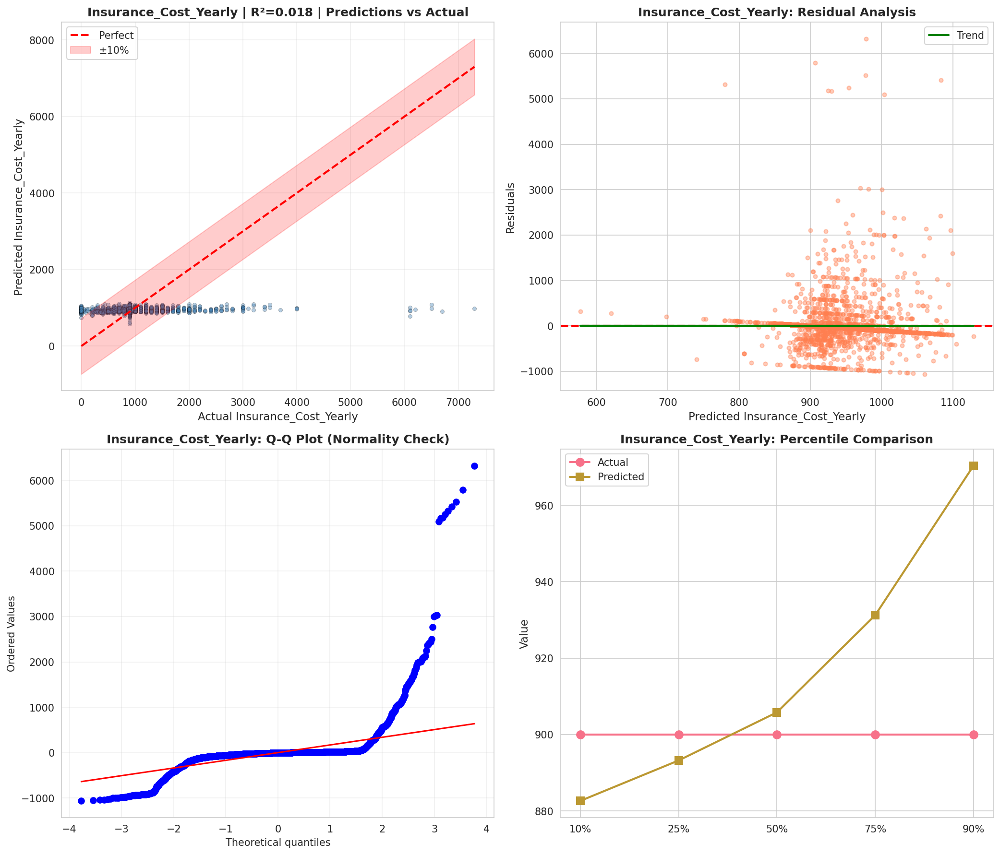
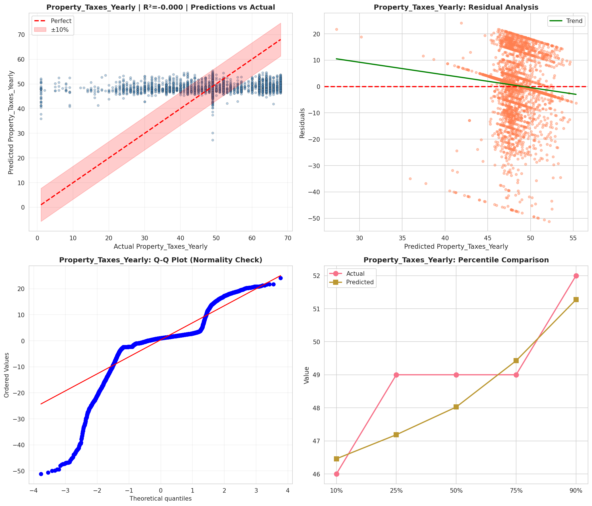
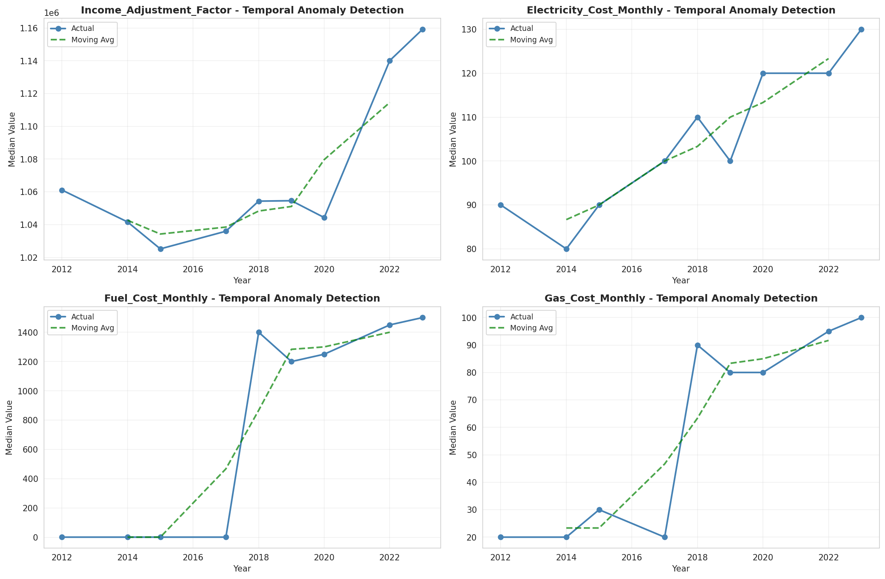
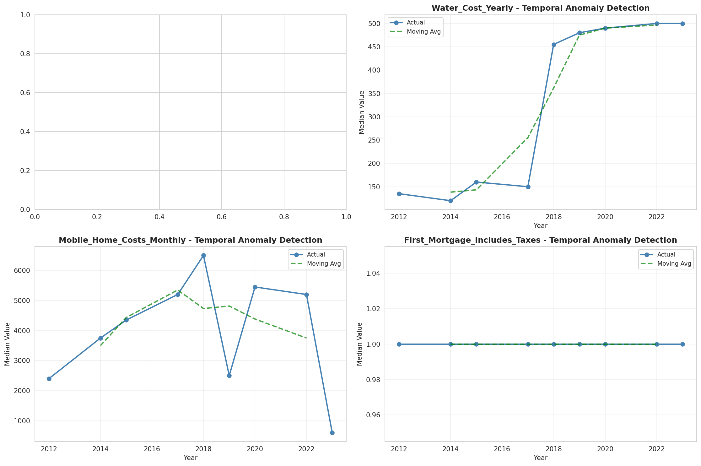
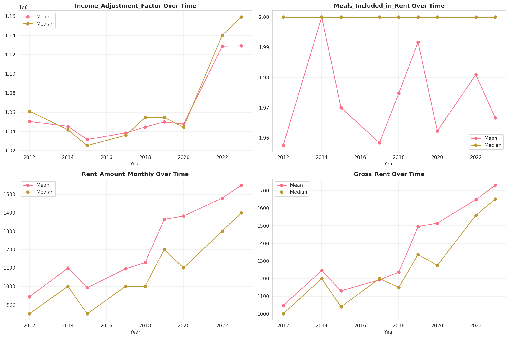
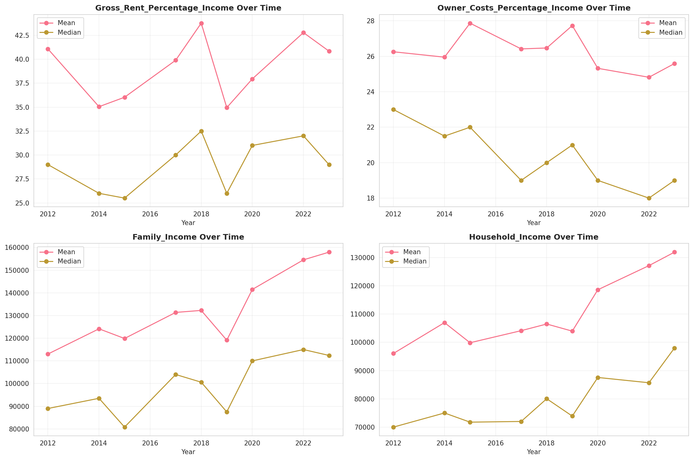
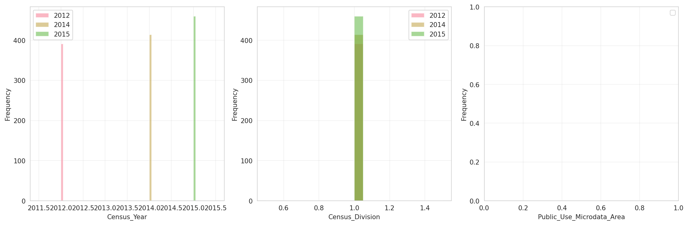
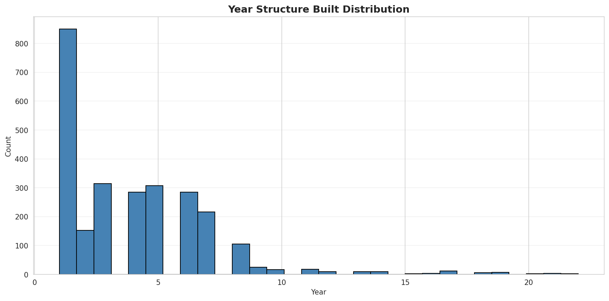
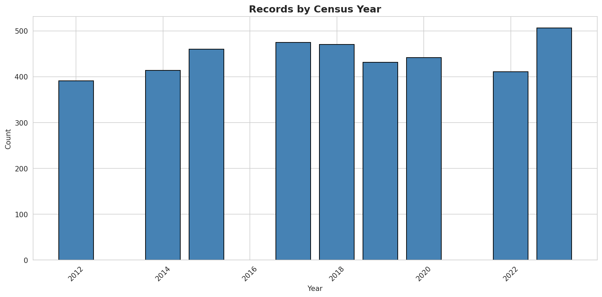
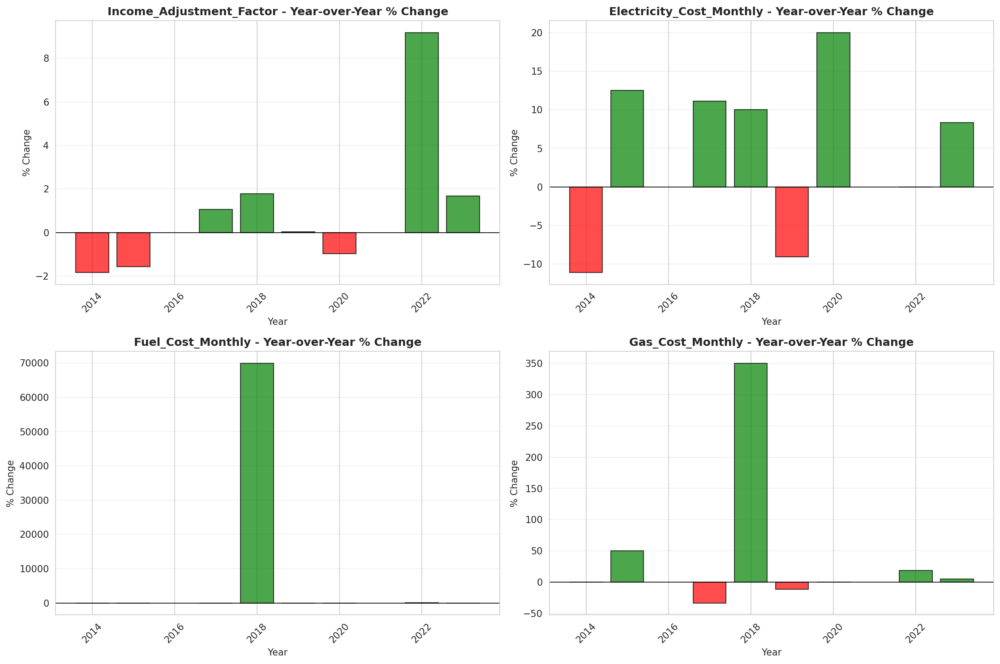
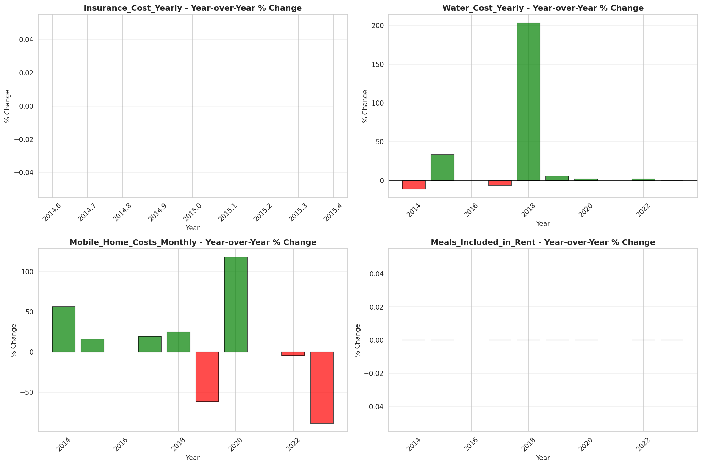
