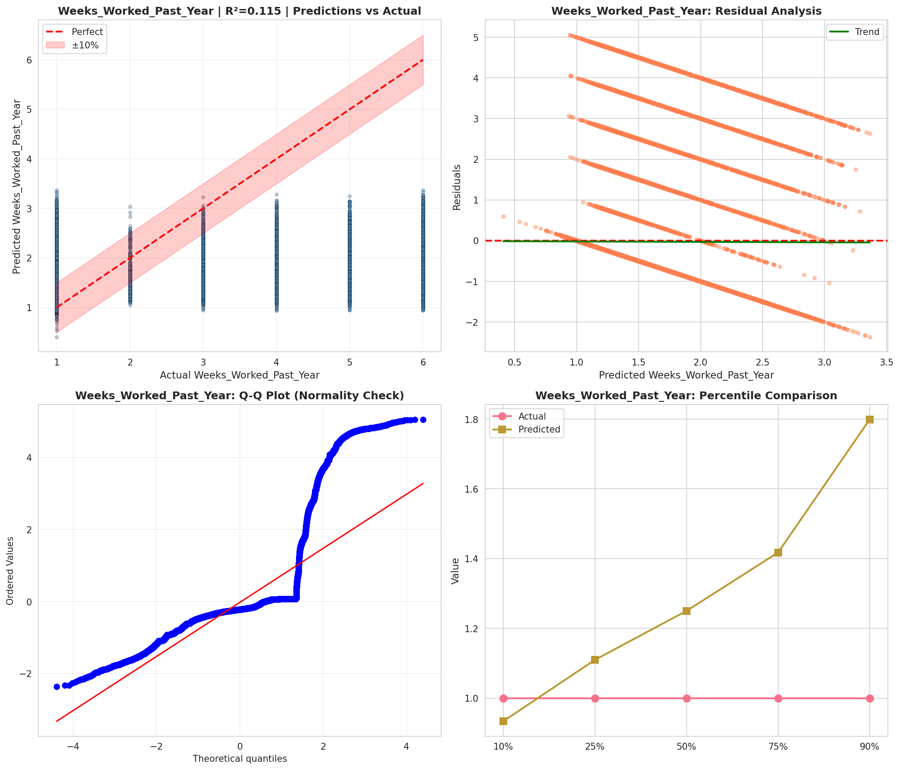
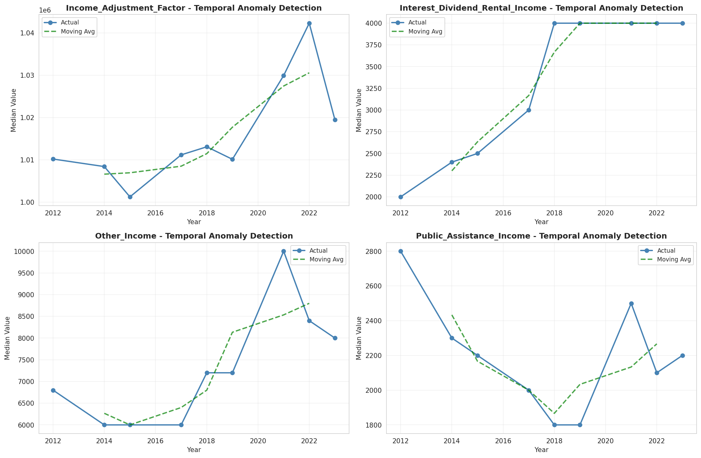
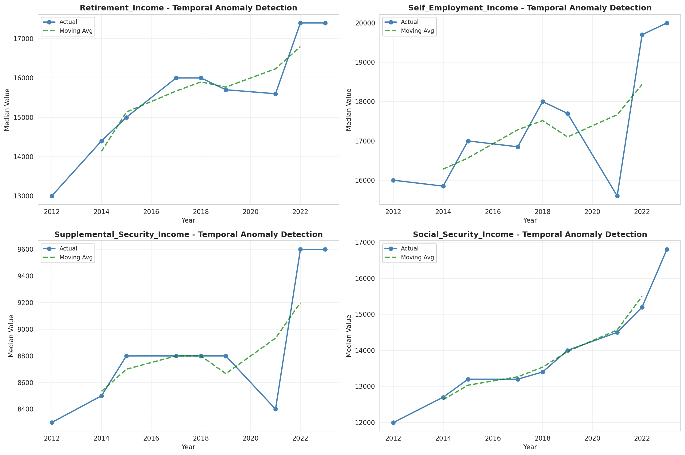
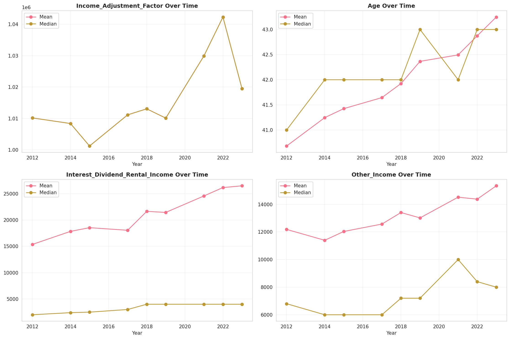
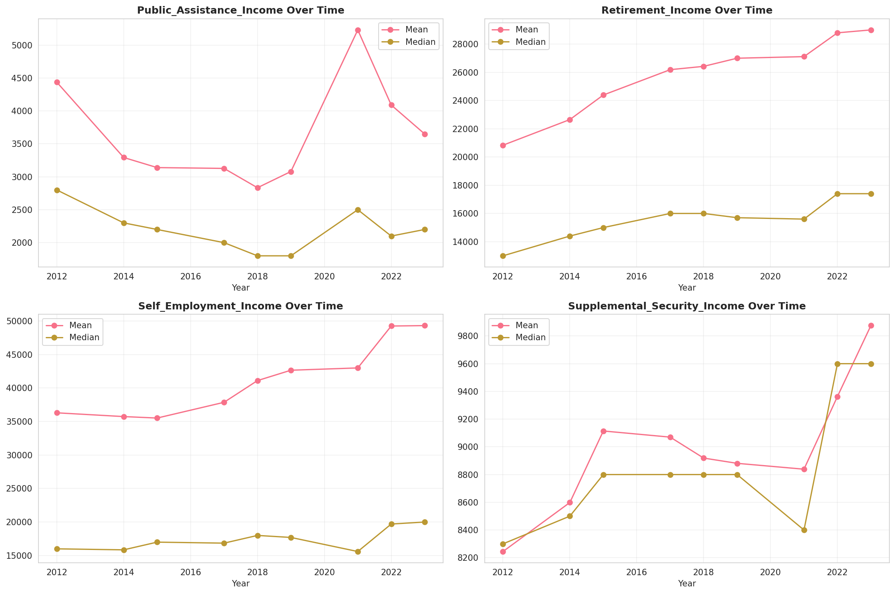
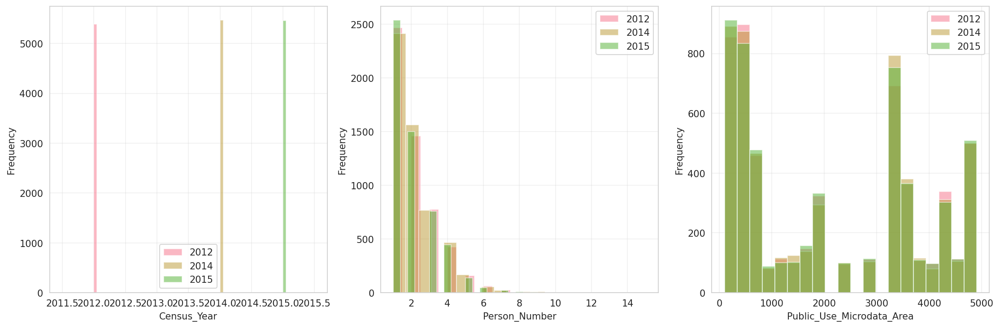
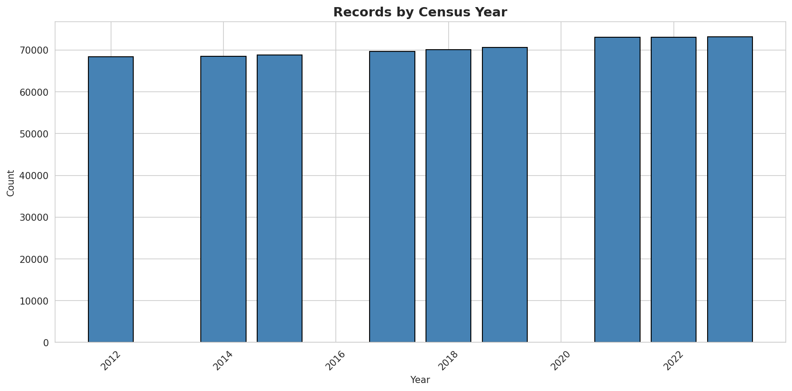
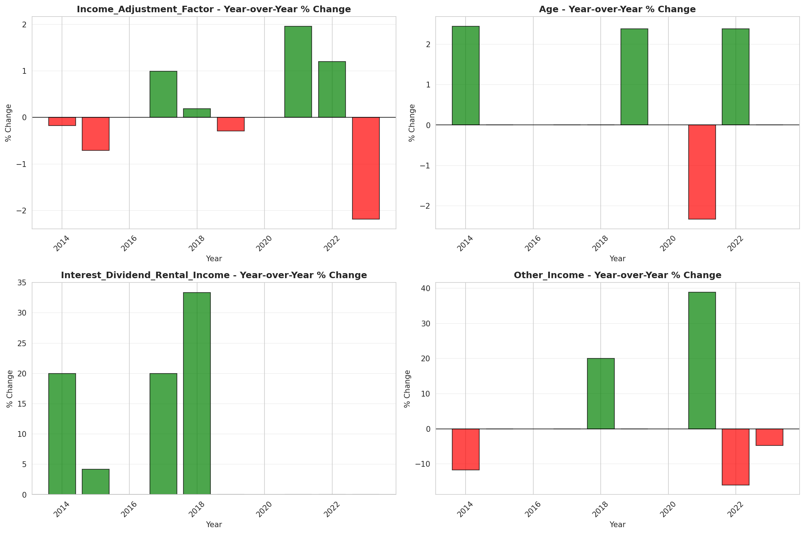
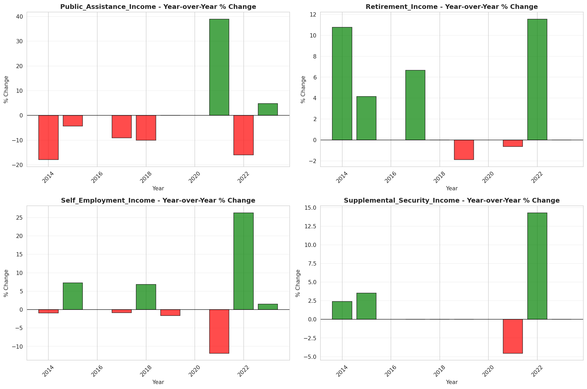

# Temporal Analysis

## Year Distribution

- 2012: 68,435 records

- 2014: 68,544 records

- 2015: 68,785 records

- 2017: 69,635 records

- 2018: 70,131 records

- 2019: 70,579 records

- 2021: 73,108 records

- 2022: 73,077 records

- 2023: 73,126 records

## Temporal Trends

- Census_Year: {np.int64(2012): {'mean': 2012.0, 'median': 2012.0, 'std': 0.0}, np.int64(2014): {'mean': 2014.0, 'median': 2014.0, 'std': 0.0}, np.int64(2015): {'mean': 2015.0, 'median': 2015.0, 'std': 0.0}, np.int64(2017): {'mean': 2017.0, 'median': 2017.0, 'std': 0.0}, np.int64(2018): {'mean': 2018.0, 'median': 2018.0, 'std': 0.0}, np.int64(2019): {'mean': 2019.0, 'median': 2019.0, 'std': 0.0}, np.int64(2021): {'mean': 2021.0, 'median': 2021.0, 'std': 0.0}, np.int64(2022): {'mean': 2022.0, 'median': 2022.0, 'std': 0.0}, np.int64(2023): {'mean': 2023.0, 'median': 2023.0, 'std': 0.0}}

- Person_Number: {np.int64(2012): {'mean': 2.00509972967049, 'median': 2.0, 'std': 1.231884069612868}, np.int64(2014): {'mean': 2.0112482492997197, 'median': 2.0, 'std': 1.2443492491092705}, np.int64(2015): {'mean': 1.9879915679290543, 'median': 2.0, 'std': 1.2201785897197657}, np.int64(2017): {'mean': 1.9814030300854455, 'median': 2.0, 'std': 1.2122989712773564}, np.int64(2018): {'mean': 1.9855983801742454, 'median': 2.0, 'std': 1.2179878025816357}, np.int64(2019): {'mean': 1.9861431870669746, 'median': 2.0, 'std': 1.2270878860818306}, np.int64(2021): {'mean': 1.996539366416808, 'median': 2.0, 'std': 1.2342660140010544}, np.int64(2022): {'mean': 1.9769010769462347, 'median': 2.0, 'std': 1.2340892200736706}, np.int64(2023): {'mean': 1.9702157919207943, 'median': 2.0, 'std': 1.219472381326383}}

- Public_Use_Microdata_Area: {np.int64(2012): {'mean': 2130.3778329802003, 'median': 1900.0, 'std': 1666.2210492235238}, np.int64(2014): {'mean': 2115.0764034780577, 'median': 1900.0, 'std': 1659.0590091213699}, np.int64(2015): {'mean': 2122.770196990623, 'median': 1900.0, 'std': 1661.380577800305}, np.int64(2017): {'mean': 2126.200330293674, 'median': 1900.0, 'std': 1665.0151786477168}, np.int64(2018): {'mean': 2110.8365772625516, 'median': 1900.0, 'std': 1657.8488062359045}, np.int64(2019): {'mean': 2109.538928009748, 'median': 1900.0, 'std': 1654.7546849045439}, np.int64(2021): {'mean': 2121.7460606226405, 'median': 1900.0, 'std': 1671.9640343565543}, np.int64(2022): {'mean': 700.3133270386031, 'median': 701.0, 'std': 258.0243463064336}, np.int64(2023): {'mean': 699.2565161502065, 'median': 613.0, 'std': 259.4196675558809}}

- State_Code: {np.int64(2012): {'mean': 25.0, 'median': 25.0, 'std': 0.0}, np.int64(2014): {'mean': 25.0, 'median': 25.0, 'std': 0.0}, np.int64(2015): {'mean': 25.0, 'median': 25.0, 'std': 0.0}, np.int64(2017): {'mean': 25.0, 'median': 25.0, 'std': 0.0}, np.int64(2018): {'mean': 25.0, 'median': 25.0, 'std': 0.0}, np.int64(2019): {'mean': 25.0, 'median': 25.0, 'std': 0.0}, np.int64(2021): {'mean': 25.0, 'median': 25.0, 'std': 0.0}, np.int64(2022): {'mean': 25.0, 'median': 25.0, 'std': 0.0}, np.int64(2023): {'mean': None, 'median': None, 'std': None}}

- Income_Adjustment_Factor: {np.int64(2012): {'mean': 1010207.0, 'median': 1010207.0, 'std': 0.0}, np.int64(2014): {'mean': 1008425.0, 'median': 1008425.0, 'std': 0.0}, np.int64(2015): {'mean': 1001264.0, 'median': 1001264.0, 'std': 0.0}, np.int64(2017): {'mean': 1011189.0, 'median': 1011189.0, 'std': 0.0}, np.int64(2018): {'mean': 1013097.0, 'median': 1013097.0, 'std': 0.0}, np.int64(2019): {'mean': 1010145.0, 'median': 1010145.0, 'std': 0.0}, np.int64(2021): {'mean': 1029928.0, 'median': 1029928.0, 'std': 0.0}, np.int64(2022): {'mean': 1042311.0, 'median': 1042311.0, 'std': 0.0}, np.int64(2023): {'mean': 1019518.0, 'median': 1019518.0, 'std': 0.0}}

- Person_Weight: {np.int64(2012): {'mean': 97.11615401475854, 'median': 78.0, 'std': 66.84326903907687}, np.int64(2014): {'mean': 98.40989729225024, 'median': 80.0, 'std': 67.79054931731048}, np.int64(2015): {'mean': 98.77766955004725, 'median': 80.0, 'std': 69.17497213091593}, np.int64(2017): {'mean': 98.51107919867883, 'median': 80.0, 'std': 69.74016952725529}, np.int64(2018): {'mean': 98.41863084798449, 'median': 80.0, 'std': 70.11785483367031}, np.int64(2019): {'mean': 97.65656923447484, 'median': 78.0, 'std': 75.06275578085521}, np.int64(2021): {'mean': 95.5397904470099, 'median': 77.0, 'std': 69.54702232086547}, np.int64(2022): {'mean': 95.54270153399838, 'median': 73.0, 'std': 74.48412745517754}, np.int64(2023): {'mean': 95.74431802642015, 'median': 72.0, 'std': 77.646664136172}}

- Age: {np.int64(2012): {'mean': 40.680704317965954, 'median': 41.0, 'std': 23.303057728317942}, np.int64(2014): {'mean': 41.24562324929972, 'median': 42.0, 'std': 23.43981123422877}, np.int64(2015): {'mean': 41.42486007123646, 'median': 42.0, 'std': 23.301330284775812}, np.int64(2017): {'mean': 41.644345515904355, 'median': 42.0, 'std': 23.407758094248553}, np.int64(2018): {'mean': 41.92350030656913, 'median': 42.0, 'std': 23.385585746185743}, np.int64(2019): {'mean': 42.366001218492755, 'median': 43.0, 'std': 23.460461617865853}, np.int64(2021): {'mean': 42.49417300432237, 'median': 42.0, 'std': 23.60242081007948}, np.int64(2022): {'mean': 42.873708553990994, 'median': 43.0, 'std': 23.570477335675108}, np.int64(2023): {'mean': 43.247271832180076, 'median': 43.0, 'std': 23.674443454891968}}

- Citizenship_Status: {np.int64(2012): {'mean': 1.5003433915394169, 'median': 1.0, 'std': 1.2054901996368979}, np.int64(2014): {'mean': 1.5247578197945846, 'median': 1.0, 'std': 1.2263013164827403}, np.int64(2015): {'mean': 1.5257977756778367, 'median': 1.0, 'std': 1.228765153848649}, np.int64(2017): {'mean': 1.537990952825447, 'median': 1.0, 'std': 1.2368749420329745}, np.int64(2018): {'mean': 1.5481883902981564, 'median': 1.0, 'std': 1.2447975143673304}, np.int64(2019): {'mean': 1.5399623117357855, 'median': 1.0, 'std': 1.2345221075706694}, np.int64(2021): {'mean': 1.5631531432948516, 'median': 1.0, 'std': 1.2572109811721661}, np.int64(2022): {'mean': 1.5771583398333264, 'median': 1.0, 'std': 1.2723140668660853}, np.int64(2023): {'mean': 1.5784809780379072, 'median': 1.0, 'std': 1.275660902170733}}

- Class_of_Worker: {np.int64(2012): {'mean': 2.069983546914467, 'median': 1.0, 'std': 1.8430908577964062}, np.int64(2014): {'mean': 2.069814105816689, 'median': 1.0, 'std': 1.835257010205787}, np.int64(2015): {'mean': 2.031344196904109, 'median': 1.0, 'std': 1.79367034869507}, np.int64(2017): {'mean': 2.0325512671263546, 'median': 1.0, 'std': 1.7857621443007523}, np.int64(2018): {'mean': 2.018623087313714, 'median': 1.0, 'std': 1.7741103442846713}, np.int64(2019): {'mean': 2.040752556594703, 'median': 1.0, 'std': 1.7685926208269367}, np.int64(2021): {'mean': 2.0399761844007824, 'median': 1.0, 'std': 1.7633194868177415}, np.int64(2022): {'mean': 2.0454219711660064, 'median': 1.0, 'std': 1.7791277430964372}, np.int64(2023): {'mean': 2.033516355387844, 'median': 1.0, 'std': 1.755055755447786}}

- English_Speaking_Ability: {np.int64(2012): {'mean': 1.620599938781757, 'median': 1.0, 'std': 0.9041004393227353}, np.int64(2014): {'mean': 1.6137178606851301, 'median': 1.0, 'std': 0.8973422245483268}, np.int64(2015): {'mean': 1.6082387235348266, 'median': 1.0, 'std': 0.8989733376694822}, np.int64(2017): {'mean': 1.6096673596673596, 'median': 1.0, 'std': 0.8921587455601017}, np.int64(2018): {'mean': 1.5887912087912088, 'median': 1.0, 'std': 0.8819584810652267}, np.int64(2019): {'mean': 1.5809140767824497, 'median': 1.0, 'std': 0.8875332489302725}, np.int64(2021): {'mean': 1.6121469701124211, 'median': 1.0, 'std': 0.9087950914981465}, np.int64(2022): {'mean': 1.6139376087829695, 'median': 1.0, 'std': 0.9083523450278007}, np.int64(2023): {'mean': 1.5872846266862561, 'median': 1.0, 'std': 0.9072906463192968}}

- Fertility_Status: {np.int64(2012): {'mean': 1.9565533980582523, 'median': 2.0, 'std': 0.20386641866220523}, np.int64(2014): {'mean': 1.9574785527788139, 'median': 2.0, 'std': 0.20178182496593772}, np.int64(2015): {'mean': 1.9545061194214366, 'median': 2.0, 'std': 0.2083911507836382}, np.int64(2017): {'mean': 1.9537755165353354, 'median': 2.0, 'std': 0.2099774184189663}, np.int64(2018): {'mean': 1.9575855430665094, 'median': 2.0, 'std': 0.20153906113514558}, np.int64(2019): {'mean': 1.9605124713746365, 'median': 2.0, 'std': 0.1947578274050679}, np.int64(2021): {'mean': 1.9593524754815077, 'median': 2.0, 'std': 0.19747811847167343}, np.int64(2022): {'mean': 1.9566477478565392, 'median': 2.0, 'std': 0.2036549499141604}, np.int64(2023): {'mean': 1.9600507675571135, 'median': 2.0, 'std': 0.1958458817281104}}

- Marital_Status: {np.int64(2012): {'mean': 3.0587418718492, 'median': 3.0, 'std': 1.8630205968915958}, np.int64(2014): {'mean': 3.027135854341737, 'median': 3.0, 'std': 1.8700058927392653}, np.int64(2015): {'mean': 3.034964018317947, 'median': 3.0, 'std': 1.8688340172654614}, np.int64(2017): {'mean': 3.040425073598047, 'median': 3.0, 'std': 1.8673335514987137}, np.int64(2018): {'mean': 3.0302148835750238, 'median': 3.0, 'std': 1.8693722507155883}, np.int64(2019): {'mean': 3.0147069241559104, 'median': 3.0, 'std': 1.8725612161989171}, np.int64(2021): {'mean': 3.0417601356896644, 'median': 3.0, 'std': 1.8741342539414108}, np.int64(2022): {'mean': 3.036659961410567, 'median': 3.0, 'std': 1.873455676033215}, np.int64(2023): {'mean': 3.021510816946093, 'median': 3.0, 'std': 1.8730263950935737}}

- Mobility_Status: {np.int64(2012): {'mean': 1.2406290995386406, 'median': 1.0, 'std': 0.6447344161366607}, np.int64(2014): {'mean': 1.2555020683360567, 'median': 1.0, 'std': 0.6602014894582906}, np.int64(2015): {'mean': 1.2444261910349683, 'median': 1.0, 'std': 0.6484969725992473}, np.int64(2017): {'mean': 1.2626005070626585, 'median': 1.0, 'std': 0.6683895997553055}, np.int64(2018): {'mean': 1.2454001839926403, 'median': 1.0, 'std': 0.6495184988265761}, np.int64(2019): {'mean': 1.243460994528806, 'median': 1.0, 'std': 0.6473998104198523}, np.int64(2021): {'mean': 1.2445596712358993, 'median': 1.0, 'std': 0.6498964165817763}, np.int64(2022): {'mean': 1.2400579550158686, 'median': 1.0, 'std': 0.6423824628159013}, np.int64(2023): {'mean': 1.2231269460747844, 'median': 1.0, 'std': 0.6224542715610543}}

- Military_Service: {np.int64(2012): {'mean': 4.824740050197203, 'median': 5.0, 'std': 0.5641204909745166}, np.int64(2014): {'mean': 3.8459713103054525, 'median': 4.0, 'std': 0.5213392091703599}, np.int64(2015): {'mean': 3.852944280287041, 'median': 4.0, 'std': 0.5102668911394506}, np.int64(2017): {'mean': 3.8619960114454175, 'median': 4.0, 'std': 0.49641060855335295}, np.int64(2018): {'mean': 3.867244955685461, 'median': 4.0, 'std': 0.4861791574023284}, np.int64(2019): {'mean': 3.870955733044538, 'median': 4.0, 'std': 0.48007791235636216}, np.int64(2021): {'mean': 3.8916125028578894, 'median': 4.0, 'std': 0.44175807831082675}, np.int64(2022): {'mean': 3.89198509914922, 'median': 4.0, 'std': 0.4418778889608007}, np.int64(2023): {'mean': 3.893138193441612, 'median': 4.0, 'std': 0.4383492432920364}}

- Travel_Time_To_Work_Minutes: {np.int64(2012): {'mean': 28.400333879097243, 'median': 20.0, 'std': 23.118147752509575}, np.int64(2014): {'mean': 28.93811095395254, 'median': 25.0, 'std': 22.66480206555488}, np.int64(2015): {'mean': 29.889953040039547, 'median': 25.0, 'std': 23.502558457467373}, np.int64(2017): {'mean': 30.024183796856107, 'median': 25.0, 'std': 23.478515413527177}, np.int64(2018): {'mean': 30.565084776172963, 'median': 25.0, 'std': 23.57139756745531}, np.int64(2019): {'mean': 31.15382599580713, 'median': 25.0, 'std': 24.40758851256379}, np.int64(2021): {'mean': 27.422092585622885, 'median': 20.0, 'std': 21.475355826786608}, np.int64(2022): {'mean': 28.594426406926406, 'median': 25.0, 'std': 22.1972774175036}, np.int64(2023): {'mean': 30.091645783838317, 'median': 25.0, 'std': 23.395099105543423}}

- Vehicle_Occupancy: {np.int64(2012): {'mean': 1.1436602364175426, 'median': 1.0, 'std': 0.5796910619441087}, np.int64(2014): {'mean': 1.13623011482852, 'median': 1.0, 'std': 0.5492848123928172}, np.int64(2015): {'mean': 1.1349824400671857, 'median': 1.0, 'std': 0.5526559479026201}, np.int64(2017): {'mean': 1.1404605140795299, 'median': 1.0, 'std': 0.582448604354384}, np.int64(2018): {'mean': 1.1385052802599513, 'median': 1.0, 'std': 0.5604898859843219}, np.int64(2019): {'mean': 1.1415179376239408, 'median': 1.0, 'std': 0.5693913107892173}, np.int64(2021): {'mean': 1.1302991697052234, 'median': 1.0, 'std': 0.5356761886781058}, np.int64(2022): {'mean': 1.136238122309754, 'median': 1.0, 'std': 0.5372583569548253}, np.int64(2023): {'mean': 1.1504214650362103, 'median': 1.0, 'std': 0.601606208851462}}

- Transportation_To_Work: {np.int64(2012): {'mean': 2.3245670301475303, 'median': 1.0, 'std': 3.0561724953391387}, np.int64(2014): {'mean': 2.4180669765224647, 'median': 1.0, 'std': 3.145147843252652}, np.int64(2015): {'mean': 2.485906629591687, 'median': 1.0, 'std': 3.1922297655147718}, np.int64(2017): {'mean': 2.5316863281472615, 'median': 1.0, 'std': 3.252438547341737}, np.int64(2018): {'mean': 2.546402796571944, 'median': 1.0, 'std': 3.2540275939545484}, np.int64(2019): {'mean': None, 'median': None, 'std': None}, np.int64(2021): {'mean': None, 'median': None, 'std': None}, np.int64(2022): {'mean': None, 'median': None, 'std': None}, np.int64(2023): {'mean': None, 'median': None, 'std': None}}

- Language_Other_Than_English: {np.int64(2012): {'mean': 1.79955518061201, 'median': 2.0, 'std': 0.40033629872003423}, np.int64(2014): {'mean': 1.799421540721697, 'median': 2.0, 'std': 0.4004362556019461}, np.int64(2015): {'mean': 1.801691614944627, 'median': 2.0, 'std': 0.39872871479694255}, np.int64(2017): {'mean': 1.797692723667608, 'median': 2.0, 'std': 0.4017231216144653}, np.int64(2018): {'mean': 1.7965753118433407, 'median': 2.0, 'std': 0.4025487540089074}, np.int64(2019): {'mean': 1.7973954012089606, 'median': 2.0, 'std': 0.4019432409419515}, np.int64(2021): {'mean': 1.7913734912190378, 'median': 2.0, 'std': 0.40632973039741166}, np.int64(2022): {'mean': 1.7867157828607327, 'median': 2.0, 'std': 0.40962965670250123}, np.int64(2023): {'mean': 1.7864061051280222, 'median': 2.0, 'std': 0.4098462382150726}}

- Grandparents_Living_With_Grandchildren: {np.int64(2012): {'mean': 1.9732737368384674, 'median': 2.0, 'std': 0.16128412614229026}, np.int64(2014): {'mean': 1.974403352158863, 'median': 2.0, 'std': 0.15793045134075545}, np.int64(2015): {'mean': 1.974737888647867, 'median': 2.0, 'std': 0.15692193438920068}, np.int64(2017): {'mean': 1.9750128053804867, 'median': 2.0, 'std': 0.15608772309986796}, np.int64(2018): {'mean': 1.9743128917722352, 'median': 2.0, 'std': 0.15820186232089276}, np.int64(2019): {'mean': 1.9742432747527958, 'median': 2.0, 'std': 0.15841041040631287}, np.int64(2021): {'mean': 1.9749164920434035, 'median': 2.0, 'std': 0.15638041104113345}, np.int64(2022): {'mean': 1.9766944358737015, 'median': 2.0, 'std': 0.15087373208951074}, np.int64(2023): {'mean': 1.9764199093544568, 'median': 2.0, 'std': 0.15173839340107356}}

- Months_Responsible_For_Grandchildren: {np.int64(2012): {'mean': 3.613095238095238, 'median': 4.0, 'std': 1.3446437479172977}, np.int64(2014): {'mean': 3.749185667752443, 'median': 4.0, 'std': 1.3952385140779562}, np.int64(2015): {'mean': 3.7725856697819315, 'median': 4.0, 'std': 1.2971106760485025}, np.int64(2017): {'mean': 3.856230031948882, 'median': 4.0, 'std': 1.2841868017494567}, np.int64(2018): {'mean': 3.883720930232558, 'median': 4.0, 'std': 1.2818349250951924}, np.int64(2019): {'mean': 3.9553903345724906, 'median': 5.0, 'std': 1.2805442581458901}, np.int64(2021): {'mean': 3.963265306122449, 'median': 4.0, 'std': 1.2621043248738086}, np.int64(2022): {'mean': 4.120300751879699, 'median': 5.0, 'std': 1.1429032477577803}, np.int64(2023): {'mean': 3.9891696750902526, 'median': 5.0, 'std': 1.3418669519584379}}

- Grandparents_Responsible_For_Grandchildren: {np.int64(2012): {'mean': 1.710344827586207, 'median': 2.0, 'std': 0.4537979523921534}, np.int64(2014): {'mean': 1.7268683274021353, 'median': 2.0, 'std': 0.44576624826984873}, np.int64(2015): {'mean': 1.7128801431127012, 'median': 2.0, 'std': 0.45262046719348664}, np.int64(2017): {'mean': 1.7210338680926915, 'median': 2.0, 'std': 0.44869083100884916}, np.int64(2018): {'mean': 1.743174061433447, 'median': 2.0, 'std': 0.4370690679848286}, np.int64(2019): {'mean': 1.7745180217937973, 'median': 2.0, 'std': 0.41807459341185293}, np.int64(2021): {'mean': 1.7973531844499586, 'median': 2.0, 'std': 0.402137840637654}, np.int64(2022): {'mean': 1.7652250661959399, 'median': 2.0, 'std': 0.42404524602753363}, np.int64(2023): {'mean': 1.7601731601731603, 'median': 2.0, 'std': 0.4271626242988614}}

- Interest_Dividend_Rental_Income: {np.int64(2012): {'mean': 15367.14025184542, 'median': 2000.0, 'std': 45964.513805058865}, np.int64(2014): {'mean': 17844.996850724332, 'median': 2400.0, 'std': 48513.91393498478}, np.int64(2015): {'mean': 18550.40345288254, 'median': 2500.0, 'std': 49589.14498476292}, np.int64(2017): {'mean': 18054.268228342302, 'median': 3000.0, 'std': 44102.242650475404}, np.int64(2018): {'mean': 21647.606161532058, 'median': 4000.0, 'std': 56194.00708104814}, np.int64(2019): {'mean': 21451.606919549813, 'median': 4000.0, 'std': 55060.12060260542}, np.int64(2021): {'mean': 24573.479430557112, 'median': 4000.0, 'std': 65856.23460190788}, np.int64(2022): {'mean': 26176.336467427805, 'median': 4000.0, 'std': 67348.7984875583}, np.int64(2023): {'mean': 26500.551394768263, 'median': 4000.0, 'std': 69669.25370982247}}

- Military_Service_Period_1: {np.int64(2012): {'mean': 0.08537693006357856, 'median': 0.0, 'std': 0.27947351393497705}, np.int64(2014): {'mean': 0.09945750452079566, 'median': 0.0, 'std': 0.2993139704548219}, np.int64(2015): {'mean': 0.10866057019903173, 'median': 0.0, 'std': 0.31125473100101064}, np.int64(2017): {'mean': 0.13920853213584058, 'median': 0.0, 'std': 0.34621259046075975}, np.int64(2018): {'mean': 0.1451332560834299, 'median': 0.0, 'std': 0.35228617038201054}, np.int64(2019): {'mean': 0.14781834372217276, 'median': 0.0, 'std': 0.3549725094012615}, np.int64(2021): {'mean': 0.15724137931034482, 'median': 0.0, 'std': 0.36409097635047516}, np.int64(2022): {'mean': 0.1900205058099795, 'median': 0.0, 'std': 0.39238416496171347}, np.int64(2023): {'mean': 0.1931106471816284, 'median': 0.0, 'std': 0.39480775162456727}}

- Military_Service_Period_2: {np.int64(2012): {'mean': 0.08628519527702089, 'median': 0.0, 'std': 0.28081660623961413}, np.int64(2014): {'mean': 0.10617411521570654, 'median': 0.0, 'std': 0.3081001375213217}, np.int64(2015): {'mean': 0.11242603550295859, 'median': 0.0, 'std': 0.315932378842392}, np.int64(2017): {'mean': 0.134717934325007, 'median': 0.0, 'std': 0.3414699667842073}, np.int64(2018): {'mean': 0.1257242178447277, 'median': 0.0, 'std': 0.3315863233685688}, np.int64(2019): {'mean': 0.14217868803799347, 'median': 0.0, 'std': 0.3492851575257036}, np.int64(2021): {'mean': 0.13310344827586207, 'median': 0.0, 'std': 0.3397450848078495}, np.int64(2022): {'mean': 0.15105946684894053, 'median': 0.0, 'std': 0.3581680432865494}, np.int64(2023): {'mean': 0.1370911621433542, 'median': 0.0, 'std': 0.3440034169786332}}

- Military_Service_Period_3: {np.int64(2012): {'mean': 0.13419618528610355, 'median': 0.0, 'std': 0.3409016829152802}, np.int64(2014): {'mean': None, 'median': None, 'std': None}, np.int64(2015): {'mean': None, 'median': None, 'std': None}, np.int64(2017): {'mean': None, 'median': None, 'std': None}, np.int64(2018): {'mean': None, 'median': None, 'std': None}, np.int64(2019): {'mean': None, 'median': None, 'std': None}, np.int64(2021): {'mean': None, 'median': None, 'std': None}, np.int64(2022): {'mean': None, 'median': None, 'std': None}, np.int64(2023): {'mean': None, 'median': None, 'std': None}}

- Military_Service_Period_4: {np.int64(2012): {'mean': 0.0860581289736603, 'median': 0.0, 'std': 0.2804817119086206}, np.int64(2014): {'mean': None, 'median': None, 'std': None}, np.int64(2015): {'mean': None, 'median': None, 'std': None}, np.int64(2017): {'mean': None, 'median': None, 'std': None}, np.int64(2018): {'mean': None, 'median': None, 'std': None}, np.int64(2019): {'mean': None, 'median': None, 'std': None}, np.int64(2021): {'mean': None, 'median': None, 'std': None}, np.int64(2022): {'mean': None, 'median': None, 'std': None}, np.int64(2023): {'mean': None, 'median': None, 'std': None}}

- Military_Service_Period_5: {np.int64(2012): {'mean': 0.34400544959128065, 'median': 0.0, 'std': 0.47509678272631506}, np.int64(2014): {'mean': 0.35468871092740895, 'median': 0.0, 'std': 0.47848069196480475}, np.int64(2015): {'mean': 0.3738569123184508, 'median': 0.0, 'std': 0.48389141248754475}, np.int64(2017): {'mean': 0.3628964355879877, 'median': 0.0, 'std': 0.48090281836813054}, np.int64(2018): {'mean': 0.3887601390498262, 'median': 0.0, 'std': 0.48753928086850734}, np.int64(2019): {'mean': 0.39062036212525975, 'median': 0.0, 'std': 0.48796185365099437}, np.int64(2021): {'mean': 0.39482758620689656, 'median': 0.0, 'std': 0.4888979284830603}, np.int64(2022): {'mean': 0.3943950786056049, 'median': 0.0, 'std': 0.4888039053410135}, np.int64(2023): {'mean': 0.40848990953375086, 'median': 0.0, 'std': 0.49164011801445995}}

- Military_Service_Period_6: {np.int64(2012): {'mean': 0.10104450499545867, 'median': 0.0, 'std': 0.3014218690592588}, np.int64(2014): {'mean': None, 'median': None, 'std': None}, np.int64(2015): {'mean': None, 'median': None, 'std': None}, np.int64(2017): {'mean': None, 'median': None, 'std': None}, np.int64(2018): {'mean': None, 'median': None, 'std': None}, np.int64(2019): {'mean': None, 'median': None, 'std': None}, np.int64(2021): {'mean': None, 'median': None, 'std': None}, np.int64(2022): {'mean': None, 'median': None, 'std': None}, np.int64(2023): {'mean': None, 'median': None, 'std': None}}

- Military_Service_Period_7: {np.int64(2012): {'mean': 0.121480472297911, 'median': 0.0, 'std': 0.3267219090321497}, np.int64(2014): {'mean': None, 'median': None, 'std': None}, np.int64(2015): {'mean': None, 'median': None, 'std': None}, np.int64(2017): {'mean': None, 'median': None, 'std': None}, np.int64(2018): {'mean': None, 'median': None, 'std': None}, np.int64(2019): {'mean': None, 'median': None, 'std': None}, np.int64(2021): {'mean': None, 'median': None, 'std': None}, np.int64(2022): {'mean': None, 'median': None, 'std': None}, np.int64(2023): {'mean': None, 'median': None, 'std': None}}

- Military_Service_Period_8: {np.int64(2012): {'mean': 0.14895549500454133, 'median': 0.0, 'std': 0.3560850273960412}, np.int64(2014): {'mean': 0.14363213639886335, 'median': 0.0, 'std': 0.35076164163272894}, np.int64(2015): {'mean': 0.12775685852608928, 'median': 0.0, 'std': 0.3338637797962045}, np.int64(2017): {'mean': 0.11984282907662082, 'median': 0.0, 'std': 0.3248232413486394}, np.int64(2018): {'mean': 0.10457705677867903, 'median': 0.0, 'std': 0.30605200593995696}, np.int64(2019): {'mean': 0.09498367468091422, 'median': 0.0, 'std': 0.2932359106892058}, np.int64(2021): {'mean': 0.08206896551724138, 'median': 0.0, 'std': 0.27451709691332904}, np.int64(2022): {'mean': 0.059125085440874914, 'median': 0.0, 'std': 0.23589897897173553}, np.int64(2023): {'mean': 0.060194850382741825, 'median': 0.0, 'std': 0.23788888390862362}}

- Military_Service_Period_9: {np.int64(2012): {'mean': 0.023614895549500452, 'median': 0.0, 'std': 0.1518633233116589}, np.int64(2014): {'mean': 0.0216998191681736, 'median': 0.0, 'std': 0.14572035729328633}, np.int64(2015): {'mean': 0.01694459386767079, 'median': 0.0, 'std': 0.12908119939069812}, np.int64(2017): {'mean': 0.01627841706427168, 'median': 0.0, 'std': 0.1265619446400469}, np.int64(2018): {'mean': 0.015063731170336037, 'median': 0.0, 'std': 0.1218241127754808}, np.int64(2019): {'mean': 0.013060255268625705, 'median': 0.0, 'std': 0.1135496019568832}, np.int64(2021): {'mean': None, 'median': None, 'std': None}, np.int64(2022): {'mean': None, 'median': None, 'std': None}, np.int64(2023): {'mean': None, 'median': None, 'std': None}}

- Military_Service_Period_10: {np.int64(2012): {'mean': 0.12488646684831971, 'median': 0.0, 'std': 0.33062767416229394}, np.int64(2014): {'mean': 0.09816584861792818, 'median': 0.0, 'std': 0.2975772010335867}, np.int64(2015): {'mean': 0.0849919311457773, 'median': 0.0, 'std': 0.2789071980363254}, np.int64(2017): {'mean': 0.05697445972495088, 'median': 0.0, 'std': 0.23182634541597327}, np.int64(2018): {'mean': 0.0388180764774044, 'median': 0.0, 'std': 0.19318914341244295}, np.int64(2019): {'mean': 0.04363312555654497, 'median': 0.0, 'std': 0.20430777233927908}, np.int64(2021): {'mean': 0.03206896551724138, 'median': 0.0, 'std': 0.17621366092605661}, np.int64(2022): {'mean': 0.01367053998632946, 'median': 0.0, 'std': 0.1161389948288044}, np.int64(2023): {'mean': 0.011482254697286013, 'median': 0.0, 'std': 0.10655685450618295}}

- Military_Service_Period_11: {np.int64(2012): {'mean': 0.002497729336966394, 'median': 0.0, 'std': 0.04992050227304995}, np.int64(2014): {'mean': 0.0025833118057349523, 'median': 0.0, 'std': 0.05076715575902546}, np.int64(2015): {'mean': 0.0005379236148466917, 'median': 0.0, 'std': 0.02319006026328691}, np.int64(2017): {'mean': 0.001122649452708392, 'median': 0.0, 'std': 0.03349184872458942}, np.int64(2018): {'mean': 0.0008690614136732329, 'median': 0.0, 'std': 0.029471303940323185}, np.int64(2019): {'mean': 0.0005936479667557139, 'median': 0.0, 'std': 0.024361274709729853}, np.int64(2021): {'mean': None, 'median': None, 'std': None}, np.int64(2022): {'mean': None, 'median': None, 'std': None}, np.int64(2023): {'mean': None, 'median': None, 'std': None}}

- Temporary_Absence_From_Work: {np.int64(2012): {'mean': 2.552858579265819, 'median': 3.0, 'std': 0.5291039091826428}, np.int64(2014): {'mean': 2.6208810510784795, 'median': 3.0, 'std': 0.5147880175029361}, np.int64(2015): {'mean': 2.626363919775538, 'median': 3.0, 'std': 0.511342312362446}, np.int64(2017): {'mean': 2.6358337037163664, 'median': 3.0, 'std': 0.5066048433211404}, np.int64(2018): {'mean': 2.6390265352026923, 'median': 3.0, 'std': 0.5069764670379322}, np.int64(2019): {'mean': 2.651222973537023, 'median': 3.0, 'std': 0.4993074296057468}, np.int64(2021): {'mean': 2.6382790082857785, 'median': 3.0, 'std': 0.5060583214366878}, np.int64(2022): {'mean': 2.638073969345458, 'median': 3.0, 'std': 0.5060310467835778}, np.int64(2023): {'mean': 2.6404656301538756, 'median': 3.0, 'std': 0.503669606737865}}

- Available_For_Work: {np.int64(2012): {'mean': 4.513962144331352, 'median': 5.0, 'std': 1.2048448550754356}, np.int64(2014): {'mean': 4.697270427878873, 'median': 5.0, 'std': 0.9831577407782643}, np.int64(2015): {'mean': 4.733728220582632, 'median': 5.0, 'std': 0.9230235775863203}, np.int64(2017): {'mean': 4.759632807959246, 'median': 5.0, 'std': 0.8762341749959504}, np.int64(2018): {'mean': 4.763043515026467, 'median': 5.0, 'std': 0.8704957582456779}, np.int64(2019): {'mean': 4.764237415477085, 'median': 5.0, 'std': 0.8671746044307387}, np.int64(2021): {'mean': 4.765177160911758, 'median': 5.0, 'std': 0.8802562458489326}, np.int64(2022): {'mean': 4.8093891584460655, 'median': 5.0, 'std': 0.7833828012064542}, np.int64(2023): {'mean': 4.800938305605816, 'median': 5.0, 'std': 0.8001999787611068}}

- On_Layoff_From_Work: {np.int64(2012): {'mean': 2.510204801637002, 'median': 3.0, 'std': 0.5376448620052542}, np.int64(2014): {'mean': 2.599978922223003, 'median': 3.0, 'std': 0.514426605872336}, np.int64(2015): {'mean': 2.6122657521909316, 'median': 3.0, 'std': 0.5048699118625388}, np.int64(2017): {'mean': 2.6209784949912818, 'median': 3.0, 'std': 0.5007530645491955}, np.int64(2018): {'mean': 2.6276108170271777, 'median': 3.0, 'std': 0.4979215795752716}, np.int64(2019): {'mean': 2.639936555639035, 'median': 3.0, 'std': 0.4931979935509465}, np.int64(2021): {'mean': 2.61300254699036, 'median': 3.0, 'std': 0.5171498580838182}, np.int64(2022): {'mean': 2.629671283056457, 'median': 3.0, 'std': 0.4958321992453777}, np.int64(2023): {'mean': 2.6290810689638606, 'median': 3.0, 'std': 0.49765129139707337}}

- Looking_For_Work: {np.int64(2012): {'mean': 2.5046834482880276, 'median': 3.0, 'std': 0.6118105418804689}, np.int64(2014): {'mean': 2.5905290522026276, 'median': 3.0, 'std': 0.5767934490293963}, np.int64(2015): {'mean': 2.6022203747964947, 'median': 3.0, 'std': 0.5646949265272091}, np.int64(2017): {'mean': 2.614089370576772, 'median': 3.0, 'std': 0.5540833435076055}, np.int64(2018): {'mean': 2.6210488930981413, 'median': 3.0, 'std': 0.5485778613200591}, np.int64(2019): {'mean': 2.6273478587528176, 'median': 3.0, 'std': 0.544024758609211}, np.int64(2021): {'mean': 2.600509398072025, 'median': 3.0, 'std': 0.5654469086940754}, np.int64(2022): {'mean': 2.6150187975964783, 'median': 3.0, 'std': 0.5446748481325796}, np.int64(2023): {'mean': 2.61462219589131, 'median': 3.0, 'std': 0.5468320433087203}}

- Informed_Of_Recall: {np.int64(2012): {'mean': 2.8805941187884776, 'median': 3.0, 'std': 0.34768552488003623}, np.int64(2014): {'mean': 2.9345535024239444, 'median': 3.0, 'std': 0.2700610302784014}, np.int64(2015): {'mean': 2.943745886591153, 'median': 3.0, 'std': 0.24967847900106427}, np.int64(2017): {'mean': 2.946032342986085, 'median': 3.0, 'std': 0.24308562659616817}, np.int64(2018): {'mean': 2.947707554668606, 'median': 3.0, 'std': 0.2408630610744462}, np.int64(2019): {'mean': 2.9396443776609065, 'median': 3.0, 'std': 0.2565733290829677}, np.int64(2021): {'mean': 2.9447722216848824, 'median': 3.0, 'std': 0.2516622036405648}, np.int64(2022): {'mean': 2.954516243051316, 'median': 3.0, 'std': 0.22346971556597203}, np.int64(2023): {'mean': 2.9537252013514164, 'median': 3.0, 'std': 0.22707675871966973}}

- Other_Income: {np.int64(2012): {'mean': 12185.023978919631, 'median': 6800.0, 'std': 14924.150834395432}, np.int64(2014): {'mean': 11397.850253807106, 'median': 6000.0, 'std': 14802.311536587391}, np.int64(2015): {'mean': 12036.453063885267, 'median': 6000.0, 'std': 15951.638703830466}, np.int64(2017): {'mean': 12573.09747048904, 'median': 6000.0, 'std': 16152.628653523667}, np.int64(2018): {'mean': 13408.323869610937, 'median': 7200.0, 'std': 16761.336932453643}, np.int64(2019): {'mean': 13019.191170674025, 'median': 7200.0, 'std': 16082.599028243712}, np.int64(2021): {'mean': 14522.38515674984, 'median': 10000.0, 'std': 14773.526747091068}, np.int64(2022): {'mean': 14378.017063633131, 'median': 8400.0, 'std': 17697.824302787623}, np.int64(2023): {'mean': 15343.2, 'median': 8000.0, 'std': 19046.93383979172}}

- Public_Assistance_Income: {np.int64(2012): {'mean': 4436.512363996044, 'median': 2800.0, 'std': 5652.716047306872}, np.int64(2014): {'mean': 3292.955414012739, 'median': 2300.0, 'std': 3732.8664957101337}, np.int64(2015): {'mean': 3139.499478623566, 'median': 2200.0, 'std': 3606.679745816478}, np.int64(2017): {'mean': 3127.2195121951218, 'median': 2000.0, 'std': 3783.5784336685015}, np.int64(2018): {'mean': 2833.6917562724016, 'median': 1800.0, 'std': 3389.955238951839}, np.int64(2019): {'mean': 3079.705521472393, 'median': 1800.0, 'std': 3609.340961119929}, np.int64(2021): {'mean': 5229.795630725864, 'median': 2500.0, 'std': 6581.912077911938}, np.int64(2022): {'mean': 4089.4910461828463, 'median': 2100.0, 'std': 5099.791516749146}, np.int64(2023): {'mean': 3649.9586349534643, 'median': 2200.0, 'std': 4806.756760778872}}

- Retirement_Income: {np.int64(2012): {'mean': 20833.782340862424, 'median': 13000.0, 'std': 22380.263773401493}, np.int64(2014): {'mean': 22649.57410217501, 'median': 14400.0, 'std': 25558.07557880226}, np.int64(2015): {'mean': 24388.1826745164, 'median': 15000.0, 'std': 29044.9068678935}, np.int64(2017): {'mean': 26183.359191655803, 'median': 16000.0, 'std': 32914.63175327478}, np.int64(2018): {'mean': 26418.0642530985, 'median': 16000.0, 'std': 31979.883239389812}, np.int64(2019): {'mean': 26994.297238530115, 'median': 15700.0, 'std': 32719.370803435148}, np.int64(2021): {'mean': 27106.350911458332, 'median': 15600.0, 'std': 33643.0074960357}, np.int64(2022): {'mean': 28792.44284352156, 'median': 17400.0, 'std': 35106.59689301212}, np.int64(2023): {'mean': 28998.83110300081, 'median': 17400.0, 'std': 34043.83217687903}}

- Self_Employment_Income: {np.int64(2012): {'mean': 36298.743195266274, 'median': 16000.0, 'std': 61114.95959527734}, np.int64(2014): {'mean': 35737.65673289183, 'median': 15850.0, 'std': 62357.60342264434}, np.int64(2015): {'mean': 35517.22155858931, 'median': 17000.0, 'std': 59867.184966426954}, np.int64(2017): {'mean': 37865.15907844213, 'median': 16850.0, 'std': 65105.13786711625}, np.int64(2018): {'mean': 41106.10192837466, 'median': 18000.0, 'std': 75759.28120743022}, np.int64(2019): {'mean': 42655.37959183673, 'median': 17700.0, 'std': 78504.23920113573}, np.int64(2021): {'mean': 42996.71740935511, 'median': 15600.0, 'std': 72990.1212863079}, np.int64(2022): {'mean': 49252.05261715539, 'median': 19700.0, 'std': 97642.84576664858}, np.int64(2023): {'mean': 49312.85323858978, 'median': 20000.0, 'std': 83416.88036234336}}

- Supplemental_Security_Income: {np.int64(2012): {'mean': 8244.689468946895, 'median': 8300.0, 'std': 4723.223413385941}, np.int64(2014): {'mean': 8598.397596394592, 'median': 8500.0, 'std': 4643.257166082337}, np.int64(2015): {'mean': 9114.439876670092, 'median': 8800.0, 'std': 4880.665608420254}, np.int64(2017): {'mean': 9070.113805047007, 'median': 8800.0, 'std': 5106.7357418939355}, np.int64(2018): {'mean': 8918.981481481482, 'median': 8800.0, 'std': 4906.226656170256}, np.int64(2019): {'mean': 8881.057744198597, 'median': 8800.0, 'std': 5097.535990910631}, np.int64(2021): {'mean': 8838.685156651258, 'median': 8400.0, 'std': 5656.6784072712935}, np.int64(2022): {'mean': 9363.02987197724, 'median': 9600.0, 'std': 5487.053692592059}, np.int64(2023): {'mean': 9874.741298212606, 'median': 9600.0, 'std': 5902.925041933784}}

- Social_Security_Income: {np.int64(2012): {'mean': 12593.347547974414, 'median': 12000.0, 'std': 6789.556283225952}, np.int64(2014): {'mean': 13373.004950093322, 'median': 12700.0, 'std': 7166.91104170995}, np.int64(2015): {'mean': 13918.597771185761, 'median': 13200.0, 'std': 7606.865156713982}, np.int64(2017): {'mean': 14260.36015264748, 'median': 13200.0, 'std': 7897.641480920734}, np.int64(2018): {'mean': 14521.901925903008, 'median': 13400.0, 'std': 8186.821739590189}, np.int64(2019): {'mean': 15043.020975832193, 'median': 14000.0, 'std': 8626.75256409378}, np.int64(2021): {'mean': 15752.13042520379, 'median': 14500.0, 'std': 9455.327346235483}, np.int64(2022): {'mean': 16608.985840580754, 'median': 15200.0, 'std': 9931.939739204798}, np.int64(2023): {'mean': 17759.21766342142, 'median': 16800.0, 'std': 10856.900254127948}}

- Wage_Income: {np.int64(2012): {'mean': 50899.617141419505, 'median': 36000.0, 'std': 62647.055610836884}, np.int64(2014): {'mean': 55752.98642258662, 'median': 40000.0, 'std': 70929.36146097271}, np.int64(2015): {'mean': 56133.904072593716, 'median': 40000.0, 'std': 71306.80146456993}, np.int64(2017): {'mean': 61292.319712427976, 'median': 43000.0, 'std': 76023.69741344727}, np.int64(2018): {'mean': 63168.92114967178, 'median': 45000.0, 'std': 79342.41309563674}, np.int64(2019): {'mean': 66322.41965252359, 'median': 48000.0, 'std': 81654.57639587256}, np.int64(2021): {'mean': 70943.5435538262, 'median': 50000.0, 'std': 87172.15073493094}, np.int64(2022): {'mean': 75563.06531925133, 'median': 52000.0, 'std': 96042.73580805793}, np.int64(2023): {'mean': 80409.07826917758, 'median': 58000.0, 'std': 96185.84840225997}}

- Relationship_To_Householder: {np.int64(2012): {'mean': 2.915306495214437, 'median': 1.0, 'std': 4.900994118591951}, np.int64(2014): {'mean': 2.868376517273576, 'median': 1.0, 'std': 4.8394778771514595}, np.int64(2015): {'mean': 2.9950425238060623, 'median': 1.0, 'std': 4.9897856085791155}, np.int64(2017): {'mean': 3.0073813455877074, 'median': 1.0, 'std': 4.99610125446832}, np.int64(2018): {'mean': 3.035889977328143, 'median': 1.0, 'std': 5.019625912595149}, np.int64(2019): {'mean': None, 'median': None, 'std': None}, np.int64(2021): {'mean': None, 'median': None, 'std': None}, np.int64(2022): {'mean': None, 'median': None, 'std': None}, np.int64(2023): {'mean': None, 'median': None, 'std': None}}

- School_Enrollment: {np.int64(2012): {'mean': 1.3572908534021981, 'median': 1.0, 'std': 0.6294971629017936}, np.int64(2014): {'mean': 1.342965539993402, 'median': 1.0, 'std': 0.6177140075378846}, np.int64(2015): {'mean': 1.342480888676541, 'median': 1.0, 'std': 0.6245227920686157}, np.int64(2017): {'mean': 1.3399578351442598, 'median': 1.0, 'std': 0.6229041320268031}, np.int64(2018): {'mean': 1.3397140390159663, 'median': 1.0, 'std': 0.6256063122285667}, np.int64(2019): {'mean': 1.3255915417169617, 'median': 1.0, 'std': 0.6134835606391833}, np.int64(2021): {'mean': 1.3250105263157894, 'median': 1.0, 'std': 0.6200069682771505}, np.int64(2022): {'mean': 1.3185388845247448, 'median': 1.0, 'std': 0.615251917802033}, np.int64(2023): {'mean': 1.3131413671283576, 'median': 1.0, 'std': 0.6100930270028848}}

- School_Grade_Attending: {np.int64(2012): {'mean': 10.4021262604121, 'median': 12.0, 'std': 4.936741267490506}, np.int64(2014): {'mean': 10.332578416940324, 'median': 12.0, 'std': 4.947824907384286}, np.int64(2015): {'mean': 10.531117235044206, 'median': 12.0, 'std': 4.917751692099786}, np.int64(2017): {'mean': 10.493546544831524, 'median': 12.0, 'std': 4.931518988499298}, np.int64(2018): {'mean': 10.548071979434447, 'median': 12.0, 'std': 4.946594339237435}, np.int64(2019): {'mean': 10.612836804329921, 'median': 12.0, 'std': 4.938696250746068}, np.int64(2021): {'mean': 10.673862715592083, 'median': 12.0, 'std': 4.87922796834451}, np.int64(2022): {'mean': 10.570872411962485, 'median': 12.0, 'std': 4.94889584930248}, np.int64(2023): {'mean': 10.51568756349728, 'median': 12.0, 'std': 4.980017036888439}}

- Educational_Attainment: {np.int64(2012): {'mean': 16.45366644645967, 'median': 18.0, 'std': 5.674088183053204}, np.int64(2014): {'mean': 16.608598506433136, 'median': 19.0, 'std': 5.732126105999409}, np.int64(2015): {'mean': 16.778502747252748, 'median': 19.0, 'std': 5.624761403598673}, np.int64(2017): {'mean': 16.886493977502248, 'median': 19.0, 'std': 5.632411006028134}, np.int64(2018): {'mean': 16.962403594269073, 'median': 19.0, 'std': 5.628137500625151}, np.int64(2019): {'mean': 17.105524934192346, 'median': 19.0, 'std': 5.569632079329028}, np.int64(2021): {'mean': 17.115424561403508, 'median': 19.0, 'std': 5.637095837156202}, np.int64(2022): {'mean': 17.152227583885086, 'median': 19.0, 'std': 5.659534298745804}, np.int64(2023): {'mean': 17.221737789491392, 'median': 19.0, 'std': 5.63917369921018}}

- Sex: {np.int64(2012): {'mean': 1.5209907211222329, 'median': 2.0, 'std': 0.4995628452388721}, np.int64(2014): {'mean': 1.5208333333333333, 'median': 2.0, 'std': 0.49956942784310626}, np.int64(2015): {'mean': 1.5188776622810205, 'median': 2.0, 'std': 0.499647138740966}, np.int64(2017): {'mean': 1.518891362102391, 'median': 2.0, 'std': 0.4996465766048779}, np.int64(2018): {'mean': 1.5169040795083486, 'median': 2.0, 'std': 0.4997177331550706}, np.int64(2019): {'mean': 1.5168676235140763, 'median': 2.0, 'std': 0.499718942432676}, np.int64(2021): {'mean': 1.521160474913826, 'median': 2.0, 'std': 0.49955545019727116}, np.int64(2022): {'mean': 1.5163047196792425, 'median': 2.0, 'std': 0.49973750467032024}, np.int64(2023): {'mean': 1.5181877854661816, 'median': 2.0, 'std': 0.49967251149083186}}

- Hours_Worked_Per_Week: {np.int64(2012): {'mean': 36.672379800741304, 'median': 40.0, 'std': 13.857557878040256}, np.int64(2014): {'mean': 36.955394487309384, 'median': 40.0, 'std': 13.72302547361946}, np.int64(2015): {'mean': 36.85133447194677, 'median': 40.0, 'std': 13.826931195065681}, np.int64(2017): {'mean': 37.19284145367412, 'median': 40.0, 'std': 13.660554189216883}, np.int64(2018): {'mean': 37.25007412532121, 'median': 40.0, 'std': 13.664808439595188}, np.int64(2019): {'mean': 37.01783492326835, 'median': 40.0, 'std': 13.718949772104835}, np.int64(2021): {'mean': 36.84415807560138, 'median': 40.0, 'std': 13.506753880680762}, np.int64(2022): {'mean': 37.06532132132132, 'median': 40.0, 'std': 13.441768145220594}, np.int64(2023): {'mean': 36.854614925373134, 'median': 40.0, 'std': 13.428217305526237}}

- When_Last_Worked: {np.int64(2012): {'mean': 1.576267000652684, 'median': 1.0, 'std': 0.8595492802156365}, np.int64(2014): {'mean': 1.5692756270638657, 'median': 1.0, 'std': 0.8579101658968281}, np.int64(2015): {'mean': 1.5622293809969172, 'median': 1.0, 'std': 0.8540850939650646}, np.int64(2017): {'mean': 1.5564805634380663, 'median': 1.0, 'std': 0.8541310057619176}, np.int64(2018): {'mean': 1.5558355460095723, 'median': 1.0, 'std': 0.8529389701312349}, np.int64(2019): {'mean': 1.555538859671091, 'median': 1.0, 'std': 0.8524281314530233}, np.int64(2021): {'mean': 1.5885804558790342, 'median': 1.0, 'std': 0.856037081009954}, np.int64(2022): {'mean': 1.5728607692554866, 'median': 1.0, 'std': 0.8531974156681255}, np.int64(2023): {'mean': 1.5771540198229068, 'median': 1.0, 'std': 0.8598695099424463}}

- Weeks_Worked_Past_Year: {np.int64(2012): {'mean': 2.0129071265213847, 'median': 1.0, 'std': 1.712856244469645}, np.int64(2014): {'mean': 1.9738134206219313, 'median': 1.0, 'std': 1.6754612568342306}, np.int64(2015): {'mean': 1.9824619541665605, 'median': 1.0, 'std': 1.6868659757794464}, np.int64(2017): {'mean': 1.9397713658146964, 'median': 1.0, 'std': 1.6550159093881032}, np.int64(2018): {'mean': 1.9259240956710812, 'median': 1.0, 'std': 1.637897771897358}}

- Year_Of_Entry: {np.int64(2012): {'mean': 1990.2182236539347, 'median': 1994.0, 'std': 17.082661997372373}, np.int64(2014): {'mean': 1992.268252164029, 'median': 1996.0, 'std': 16.84583566612323}, np.int64(2015): {'mean': 1993.3738008023722, 'median': 1997.0, 'std': 17.020763825406497}, np.int64(2017): {'mean': 1995.277355813371, 'median': 1999.0, 'std': 17.748712823681377}, np.int64(2018): {'mean': 1995.8823433287034, 'median': 2000.0, 'std': 17.431852169048952}, np.int64(2019): {'mean': 1996.4477025145384, 'median': 2000.0, 'std': 17.615581748891035}, np.int64(2021): {'mean': 1998.5996186117468, 'median': 2002.0, 'std': 17.417515684719056}, np.int64(2022): {'mean': 1999.1295088113986, 'median': 2002.0, 'std': 17.86200990374026}, np.int64(2023): {'mean': 2000.3386334658367, 'median': 2004.0, 'std': 17.965931167376223}}

- Ancestry_Recode: {np.int64(2012): {'mean': 1.6387374881274201, 'median': 1.0, 'std': 0.8749392567309496}, np.int64(2014): {'mean': 1.737044817927171, 'median': 1.0, 'std': 0.9884034705976515}, np.int64(2015): {'mean': 1.7599040488478592, 'median': 1.0, 'std': 1.0115911685813321}, np.int64(2017): {'mean': 1.8546564227759028, 'median': 2.0, 'std': 1.060590628328815}, np.int64(2018): {'mean': 1.8782564058690165, 'median': 2.0, 'std': 1.0809562734175535}, np.int64(2019): {'mean': 1.9087972343048216, 'median': 2.0, 'std': 1.0944379032046265}, np.int64(2021): {'mean': 1.9838594955408437, 'median': 2.0, 'std': 1.1525126075826557}, np.int64(2022): {'mean': 1.9597137266171298, 'median': 2.0, 'std': 1.1351993230382267}, np.int64(2023): {'mean': 1.9753029018406585, 'median': 2.0, 'std': 1.1420622944119976}}

- First_Ancestry_Code: {np.int64(2012): {'mean': 334.01348725067584, 'median': 89.0, 'std': 379.1402873105837}, np.int64(2014): {'mean': 364.125014589169, 'median': 129.0, 'std': 394.1704412784448}, np.int64(2015): {'mean': 371.0126626444719, 'median': 142.0, 'std': 396.3297208693485}, np.int64(2017): {'mean': 394.3363825662382, 'median': 148.0, 'std': 404.2713645138361}, np.int64(2018): {'mean': 408.91119476408437, 'median': 190.0, 'std': 407.70829236118544}, np.int64(2019): {'mean': 414.78470933280437, 'median': 190.0, 'std': 411.0226761481706}, np.int64(2021): {'mean': 433.8771680253871, 'median': 210.0, 'std': 418.2141040124751}, np.int64(2022): {'mean': 429.3997974738974, 'median': 210.0, 'std': 415.94351919443164}, np.int64(2023): {'mean': 436.45730656674783, 'median': 223.0, 'std': 417.3297237201352}}

- Second_Ancestry_Code: {np.int64(2012): {'mean': 700.9680134434135, 'median': 999.0, 'std': 431.18962572906656}, np.int64(2014): {'mean': 723.2872315592904, 'median': 999.0, 'std': 421.90595163660646}, np.int64(2015): {'mean': 726.8498945991132, 'median': 999.0, 'std': 420.1063927271152}, np.int64(2017): {'mean': 715.6327565161198, 'median': 999.0, 'std': 425.25668035155104}, np.int64(2018): {'mean': 726.1777815801856, 'median': 999.0, 'std': 419.8467843582174}, np.int64(2019): {'mean': 719.7357004208051, 'median': 999.0, 'std': 423.14509038409193}, np.int64(2021): {'mean': 739.9509492805165, 'median': 999.0, 'std': 413.65767516340725}, np.int64(2022): {'mean': 736.2256113414618, 'median': 999.0, 'std': 415.6150316411263}, np.int64(2023): {'mean': 740.9199190438421, 'median': 999.0, 'std': 412.73277000149466}}

- Decade_Of_Entry: {np.int64(2012): {'mean': 5.499677864703175, 'median': 6.0, 'std': 1.6053530457111118}, np.int64(2014): {'mean': 5.641689254175046, 'median': 6.0, 'std': 1.5451025700732586}, np.int64(2015): {'mean': 5.71777428920286, 'median': 6.0, 'std': 1.5237247955242648}, np.int64(2017): {'mean': 6.07695517903347, 'median': 6.0, 'std': 1.7813035529232597}, np.int64(2018): {'mean': 6.131301576926219, 'median': 7.0, 'std': 1.7355854260723076}, np.int64(2019): {'mean': 6.171512818412646, 'median': 7.0, 'std': 1.7361805067877387}, np.int64(2021): {'mean': 6.3534706331045, 'median': 7.0, 'std': 1.6927827819572647}, np.int64(2022): {'mean': 6.380277465316835, 'median': 7.0, 'std': 1.7035553609906449}, np.int64(2023): {'mean': 6.471011775294382, 'median': 7.0, 'std': 1.6821820435015662}}

- Drives_Alone_To_Work: {np.int64(2012): {'mean': 1.1364598975780678, 'median': 1.0, 'std': 0.4944974899216639}, np.int64(2014): {'mean': 1.1304696143135087, 'median': 1.0, 'std': 0.48018074826985263}, np.int64(2015): {'mean': 1.1281493357764545, 'median': 1.0, 'std': 0.46781516440907833}, np.int64(2017): {'mean': 1.1333556522709518, 'median': 1.0, 'std': 0.5005361304871951}, np.int64(2018): {'mean': 1.1325234473081751, 'median': 1.0, 'std': 0.48793173021133857}, np.int64(2019): {'mean': 1.135460609338381, 'median': 1.0, 'std': 0.5006692892234835}, np.int64(2021): {'mean': 1.1248517330756052, 'median': 1.0, 'std': 0.4669543506978722}, np.int64(2022): {'mean': 1.1316494761634046, 'median': 1.0, 'std': 0.48040559844403846}, np.int64(2023): {'mean': 1.143100241402509, 'median': 1.0, 'std': 0.5160304064355283}}

- Employment_Status_Parents: {np.int64(2012): {'mean': 2.971470429485697, 'median': 2.0, 'std': 2.6027829394391913}, np.int64(2014): {'mean': 2.796634273524532, 'median': 1.0, 'std': 2.508401442886827}, np.int64(2015): {'mean': 2.8144903806794925, 'median': 1.0, 'std': 2.514338042493269}, np.int64(2017): {'mean': 2.8406818554335356, 'median': 1.0, 'std': 2.540037332520791}, np.int64(2018): {'mean': 2.743993993993994, 'median': 1.0, 'std': 2.4908159925276863}, np.int64(2019): {'mean': 2.7466167333390077, 'median': 1.0, 'std': 2.4834604060913854}, np.int64(2021): {'mean': 2.755285761480013, 'median': 1.0, 'std': 2.504112611524414}, np.int64(2022): {'mean': 2.6995002964343184, 'median': 1.0, 'std': 2.459942109706225}, np.int64(2023): {'mean': 2.719921775359238, 'median': 1.0, 'std': 2.4862106498124685}}

- Employment_Status_Recode: {np.int64(2012): {'mean': 2.912522711637178, 'median': 1.0, 'std': 2.3531420979144464}, np.int64(2014): {'mean': 2.8789959952223705, 'median': 1.0, 'std': 2.358617107330535}, np.int64(2015): {'mean': 2.892860854203471, 'median': 1.0, 'std': 2.37141105059634}, np.int64(2017): {'mean': 2.871841772368286, 'median': 1.0, 'std': 2.373965289318577}, np.int64(2018): {'mean': 2.871636591181992, 'median': 1.0, 'std': 2.3741055958067685}, np.int64(2019): {'mean': 2.8317388763669755, 'median': 1.0, 'std': 2.3676023445932484}, np.int64(2021): {'mean': 2.9543959764000385, 'median': 1.0, 'std': 2.3792015007223775}, np.int64(2022): {'mean': 2.9070081295588186, 'median': 1.0, 'std': 2.387602076615065}, np.int64(2023): {'mean': 2.910684834995917, 'median': 1.0, 'std': 2.3889403097714608}}

- Hispanic_Origin: {np.int64(2012): {'mean': 1.5085847884854242, 'median': 1.0, 'std': 2.451558049114107}, np.int64(2014): {'mean': 1.4938725490196079, 'median': 1.0, 'std': 2.371207009453796}, np.int64(2015): {'mean': 1.5375590608417533, 'median': 1.0, 'std': 2.573803649637764}, np.int64(2017): {'mean': 1.542299131184031, 'median': 1.0, 'std': 2.5329722661061767}, np.int64(2018): {'mean': 1.5648857138783134, 'median': 1.0, 'std': 2.648841688795296}, np.int64(2019): {'mean': 1.562391079499568, 'median': 1.0, 'std': 2.6827545689902306}, np.int64(2021): {'mean': 1.6150079334682934, 'median': 1.0, 'std': 2.7810426105143367}, np.int64(2022): {'mean': 1.6906003256838678, 'median': 1.0, 'std': 3.020489614200498}, np.int64(2023): {'mean': 1.6718403850887509, 'median': 1.0, 'std': 2.9453603177391496}}

- Time_Of_Arrival_At_Work: {np.int64(2012): {'mean': 105.49292112106328, 'median': 95.0, 'std': 39.500176652801215}, np.int64(2014): {'mean': 105.86569228351406, 'median': 95.0, 'std': 40.150859316318474}, np.int64(2015): {'mean': 105.42297948591201, 'median': 95.0, 'std': 39.88945083996487}, np.int64(2017): {'mean': 104.91825876662637, 'median': 95.0, 'std': 39.316630367980295}, np.int64(2018): {'mean': 104.72061242187733, 'median': 95.0, 'std': 39.33373442645828}, np.int64(2019): {'mean': 104.08245981830888, 'median': 96.0, 'std': 37.23765720721721}, np.int64(2021): {'mean': 104.10383891607076, 'median': 94.0, 'std': 40.081551717435616}, np.int64(2022): {'mean': 104.14965503246754, 'median': 95.0, 'std': 38.65337452815128}, np.int64(2023): {'mean': 104.23165294366518, 'median': 96.0, 'std': 37.5227896618389}}

- Time_Of_Departure_For_Work: {np.int64(2012): {'mean': 56.26109987479534, 'median': 49.0, 'std': 27.08573555562752}, np.int64(2014): {'mean': 56.393493635077796, 'median': 49.0, 'std': 27.459949205565547}, np.int64(2015): {'mean': 55.931166584280774, 'median': 49.0, 'std': 27.433677971273436}, np.int64(2017): {'mean': 55.60211608222491, 'median': 49.0, 'std': 27.115850655072844}, np.int64(2018): {'mean': 55.39000029903412, 'median': 49.0, 'std': 27.183090024067937}, np.int64(2019): {'mean': 55.18471931050547, 'median': 49.0, 'std': 26.013261072836233}, np.int64(2021): {'mean': 55.54768535942792, 'median': 49.0, 'std': 27.56633903899292}, np.int64(2022): {'mean': 55.539603625541126, 'median': 50.0, 'std': 26.75561010401807}, np.int64(2023): {'mean': 55.49546001887591, 'median': 51.0, 'std': 26.18121592031361}}

- Language_Spoken_At_Home: {np.int64(2012): {'mean': 653.52318640955, 'median': 625.0, 'std': 50.86931892663642}, np.int64(2014): {'mean': 657.2065308613718, 'median': 629.0, 'std': 54.362661276065204}, np.int64(2015): {'mean': 655.9030377416385, 'median': 629.0, 'std': 50.43133736318903}, np.int64(2017): {'mean': 1586.3298188298188, 'median': 1210.0, 'std': 923.6134607220521}, np.int64(2018): {'mean': 1606.8054945054946, 'median': 1210.0, 'std': 946.1122869743944}, np.int64(2019): {'mean': 1607.3935648994516, 'median': 1210.0, 'std': 946.9479094019864}, np.int64(2021): {'mean': 1627.7883877159309, 'median': 1210.0, 'std': 974.3026802493123}, np.int64(2022): {'mean': 1646.590842147543, 'median': 1210.0, 'std': 1016.0905046891404}, np.int64(2023): {'mean': 1666.033524776279, 'median': 1210.0, 'std': 1036.0767554364465}}

- Migration_PUMA: {np.int64(2012): {'mean': 1475.9971506589102, 'median': 390.0, 'std': 4161.658330444749}, np.int64(2014): {'mean': 1419.7743259735937, 'median': 390.0, 'std': 4193.627915538456}, np.int64(2015): {'mean': 1347.7237940630798, 'median': 390.0, 'std': 3527.365734075092}, np.int64(2017): {'mean': 1342.304333936748, 'median': 390.0, 'std': 3531.0411313325467}, np.int64(2018): {'mean': 1419.1672134856885, 'median': 390.0, 'std': 3927.504975551}, np.int64(2019): {'mean': 1358.022448979592, 'median': 390.0, 'std': 3418.53888740208}, np.int64(2021): {'mean': 1538.5989691852176, 'median': 390.0, 'std': 4131.710045625414}, np.int64(2022): {'mean': 1578.7942573163998, 'median': 700.0, 'std': 4142.6054586783275}, np.int64(2023): {'mean': 1567.999525222552, 'median': 700.0, 'std': 4072.9621357332335}}

- Migration_State_Or_Country: {np.int64(2012): {'mean': 39.87819066840793, 'median': 25.0, 'std': 60.44633620911148}, np.int64(2014): {'mean': 42.69521801841784, 'median': 25.0, 'std': 66.90420489385197}, np.int64(2015): {'mean': 40.52191558441559, 'median': 25.0, 'std': 61.46872579762341}, np.int64(2017): {'mean': 41.07390054307316, 'median': 25.0, 'std': 61.3518256314283}, np.int64(2018): {'mean': 40.47222536486028, 'median': 25.0, 'std': 59.97415990618362}, np.int64(2019): {'mean': 40.05861678004535, 'median': 25.0, 'std': 59.9202769055196}, np.int64(2021): {'mean': 38.648645684833866, 'median': 25.0, 'std': 57.79383211152683}, np.int64(2022): {'mean': 44.293981225842074, 'median': 25.0, 'std': 68.9274880637413}, np.int64(2023): {'mean': 44.66919881305638, 'median': 25.0, 'std': 71.31154233646204}}

- Place_Of_Birth: {np.int64(2012): {'mean': 59.35306495214437, 'median': 25.0, 'std': 87.77870016300204}, np.int64(2014): {'mean': 61.277442226890756, 'median': 25.0, 'std': 90.14380716222388}, np.int64(2015): {'mean': 61.27014610743621, 'median': 25.0, 'std': 89.76580920498026}, np.int64(2017): {'mean': 62.41167516335176, 'median': 25.0, 'std': 91.42024309891671}, np.int64(2018): {'mean': 63.33622791632801, 'median': 25.0, 'std': 92.35054526317334}, np.int64(2019): {'mean': 62.354439705861516, 'median': 25.0, 'std': 90.72394261252148}, np.int64(2021): {'mean': 64.74824916561799, 'median': 25.0, 'std': 94.02635722357293}, np.int64(2022): {'mean': 66.29935547436266, 'median': 25.0, 'std': 96.12534347827348}, np.int64(2023): {'mean': 66.22376446134069, 'median': 25.0, 'std': 96.23427820392676}}

- Place_Of_Work_PUMA: {np.int64(2012): {'mean': 1047.3538287669141, 'median': 390.0, 'std': 1575.4510832016929}, np.int64(2014): {'mean': 1053.5514837325707, 'median': 390.0, 'std': 1370.7807726425438}, np.int64(2015): {'mean': 1072.1507683301625, 'median': 390.0, 'std': 1400.3869416765604}, np.int64(2017): {'mean': 1066.0356186242664, 'median': 390.0, 'std': 1473.3303226479832}, np.int64(2018): {'mean': 1071.5747068110059, 'median': 390.0, 'std': 1468.4746324151556}, np.int64(2019): {'mean': 1079.9454391383977, 'median': 390.0, 'std': 1554.7628915811101}, np.int64(2021): {'mean': 988.2339323703952, 'median': 390.0, 'std': 1498.8367621087857}, np.int64(2022): {'mean': 814.4750148560315, 'median': 600.0, 'std': 1599.032552710169}, np.int64(2023): {'mean': 836.035358431626, 'median': 600.0, 'std': 1827.4718015269618}}

- Place_Of_Work_State_Or_Country: {np.int64(2012): {'mean': 25.3880998197868, 'median': 25.0, 'std': 7.028821050620977}, np.int64(2014): {'mean': 25.351537361458707, 'median': 25.0, 'std': 7.063903598054746}, np.int64(2015): {'mean': 25.339938533587006, 'median': 25.0, 'std': 5.394874440976274}, np.int64(2017): {'mean': 25.434404741551262, 'median': 25.0, 'std': 7.676524696934788}, np.int64(2018): {'mean': 25.35340550293189, 'median': 25.0, 'std': 6.449662191709592}, np.int64(2019): {'mean': 25.429161085750213, 'median': 25.0, 'std': 8.54218655553568}, np.int64(2021): {'mean': 25.2672713022058, 'median': 25.0, 'std': 5.186600314292106}, np.int64(2022): {'mean': 25.31192264059208, 'median': 25.0, 'std': 6.560714395233623}, np.int64(2023): {'mean': 25.303306942424733, 'median': 25.0, 'std': 5.677271129576627}}

- Married_Spouse_Present: {np.int64(2012): {'mean': 3.2350744324202263, 'median': 3.0, 'std': 2.253061878513902}, np.int64(2014): {'mean': 3.1931725725760383, 'median': 3.0, 'std': 2.25444656071784}, np.int64(2015): {'mean': 3.232613376166228, 'median': 3.0, 'std': 2.2593896476970934}, np.int64(2017): {'mean': 3.240066141360285, 'median': 3.0, 'std': 2.2604005782491723}, np.int64(2018): {'mean': 3.237829183275238, 'median': 3.0, 'std': 2.2627549519901224}, np.int64(2019): {'mean': 3.2283114056781086, 'median': 3.0, 'std': 2.2667565255003357}, np.int64(2021): {'mean': 3.2654220779220777, 'median': 3.0, 'std': 2.2749610381174676}, np.int64(2022): {'mean': 3.2702724130276217, 'median': 3.0, 'std': 2.2748097682671276}, np.int64(2023): {'mean': 3.254767702963408, 'median': 3.0, 'std': 2.27232033820705}}

- Nativity: {np.int64(2012): {'mean': 1.1352524293124864, 'median': 1.0, 'std': 0.3419954952305372}, np.int64(2014): {'mean': 1.1419380252100841, 'median': 1.0, 'std': 0.3489891102513476}, np.int64(2015): {'mean': 1.1427782219960747, 'median': 1.0, 'std': 0.34984908274247783}, np.int64(2017): {'mean': 1.1451138077116392, 'median': 1.0, 'std': 0.35221807458385646}, np.int64(2018): {'mean': 1.149477406567709, 'median': 1.0, 'std': 0.3565609685952001}, np.int64(2019): {'mean': 1.147650150894742, 'median': 1.0, 'std': 0.35475536213447095}, np.int64(2021): {'mean': 1.1537998577447064, 'median': 1.0, 'std': 0.3607592572722358}, np.int64(2022): {'mean': 1.1579977284234437, 'median': 1.0, 'std': 0.3647413696454521}, np.int64(2023): {'mean': 1.1584115089024423, 'median': 1.0, 'std': 0.3651289168119876}}

- Nativity_Of_Parent: {np.int64(2012): {'mean': 3.1656257228776314, 'median': 1.0, 'std': 2.6068208226896776}, np.int64(2014): {'mean': 3.046772536936083, 'median': 1.0, 'std': 2.5389243907835284}, np.int64(2015): {'mean': 3.05861645517806, 'median': 1.0, 'std': 2.5363257493281113}, np.int64(2017): {'mean': 3.096131781675135, 'median': 1.0, 'std': 2.5407785992700243}, np.int64(2018): {'mean': 3.0890056723390056, 'median': 1.0, 'std': 2.5037559330376165}, np.int64(2019): {'mean': 3.0583879479104605, 'median': 1.0, 'std': 2.4988922616947318}, np.int64(2021): {'mean': 3.107532210109019, 'median': 2.0, 'std': 2.490089268712056}, np.int64(2022): {'mean': 3.0509867028034217, 'median': 1.0, 'std': 2.4745580906368634}, np.int64(2023): {'mean': 3.0902984440098633, 'median': 2.0, 'std': 2.485948659114571}}

- Own_Child: {np.int64(2012): {'mean': 0.17872433696208082, 'median': 0.0, 'std': 0.3831241224568087}, np.int64(2014): {'mean': 0.1746031746031746, 'median': 0.0, 'std': 0.3796300944317232}, np.int64(2015): {'mean': 0.16742022243221633, 'median': 0.0, 'std': 0.3733533420926295}, np.int64(2017): {'mean': 0.1772905586652815, 'median': 0.0, 'std': 0.38191737081186355}, np.int64(2018): {'mean': 0.17384080489831083, 'median': 0.0, 'std': 0.37897544637858466}, np.int64(2019): {'mean': 0.16861758878219785, 'median': 0.0, 'std': 0.374416658576285}, np.int64(2021): {'mean': 0.16812114611999823, 'median': 0.0, 'std': 0.3739765829204409}, np.int64(2022): {'mean': 0.16438477166328064, 'median': 0.0, 'std': 0.3706270912581786}, np.int64(2023): {'mean': 0.1627982231635925, 'median': 0.0, 'std': 0.3691841904500669}}

- Presence_And_Age_Own_Children: {np.int64(2012): {'mean': 3.47734072830767, 'median': 4.0, 'std': 0.9528460827672804}, np.int64(2014): {'mean': 3.4948089401586158, 'median': 4.0, 'std': 0.9398096059900202}, np.int64(2015): {'mean': 3.504788651256571, 'median': 4.0, 'std': 0.9367507684983113}, np.int64(2017): {'mean': 3.5193908773927274, 'median': 4.0, 'std': 0.9260109314780776}, np.int64(2018): {'mean': 3.5216409749902993, 'median': 4.0, 'std': 0.926042734111964}, np.int64(2019): {'mean': 3.5400159994434977, 'median': 4.0, 'std': 0.910837390014463}, np.int64(2021): {'mean': 3.544379877137639, 'median': 4.0, 'std': 0.9091609118294264}, np.int64(2022): {'mean': 3.549896535611775, 'median': 4.0, 'std': 0.9052414724273508}, np.int64(2023): {'mean': 3.5595412234042554, 'median': 4.0, 'std': 0.8951732828078441}}

- Total_Person_Earnings: {np.int64(2012): {'mean': 51137.686027844305, 'median': 35000.0, 'std': 64697.107368410485}, np.int64(2014): {'mean': 55800.00301714048, 'median': 39000.0, 'std': 72844.02067167703}, np.int64(2015): {'mean': 56232.4185981213, 'median': 39400.0, 'std': 72616.91488354332}, np.int64(2017): {'mean': 61413.414429278535, 'median': 42000.0, 'std': 77995.34244068948}, np.int64(2018): {'mean': 63439.54448292925, 'median': 43900.0, 'std': 81932.62369616586}, np.int64(2019): {'mean': 66678.17712736069, 'median': 46100.0, 'std': 84469.34736060542}, np.int64(2021): {'mean': 71029.38414649134, 'median': 50000.0, 'std': 89110.6729090779}, np.int64(2022): {'mean': 76087.77342058413, 'median': 50850.0, 'std': 100577.38503958366}, np.int64(2023): {'mean': 80741.44246856925, 'median': 56000.0, 'std': 99162.35132820859}}

- Total_Person_Income: {np.int64(2012): {'mean': 47285.31310390599, 'median': 30000.0, 'std': 64178.68532466862}, np.int64(2014): {'mean': 51484.679307152226, 'median': 31400.0, 'std': 71627.64451467372}, np.int64(2015): {'mean': 52683.55167080389, 'median': 32500.0, 'std': 72335.57679285441}, np.int64(2017): {'mean': 56975.52274225445, 'median': 36000.0, 'std': 75850.89237915433}, np.int64(2018): {'mean': 59115.50726092858, 'median': 37400.0, 'std': 80991.7221848072}, np.int64(2019): {'mean': 62737.221109385, 'median': 40000.0, 'std': 84102.21516241718}, np.int64(2021): {'mean': 65348.01149978605, 'median': 41600.0, 'std': 87588.80419055592}, np.int64(2022): {'mean': 69918.63303221708, 'median': 44400.0, 'std': 97718.59413518322}, np.int64(2023): {'mean': 73970.84004482106, 'median': 48000.0, 'std': 97095.10945258228}}

- Poverty_Status: {np.int64(2012): {'mean': 348.12196909450967, 'median': 405.0, 'std': 164.29447999596823}, np.int64(2014): {'mean': 354.758880099271, 'median': 418.0, 'std': 162.78828165523873}, np.int64(2015): {'mean': 358.4784498820022, 'median': 431.0, 'std': 163.27425384186813}, np.int64(2017): {'mean': 366.50631146787583, 'median': 460.0, 'std': 161.75780893363327}, np.int64(2018): {'mean': 369.9005393546028, 'median': 463.0, 'std': 159.7917971730229}, np.int64(2019): {'mean': 378.741827010073, 'median': 492.0, 'std': 157.23430506121494}, np.int64(2021): {'mean': 375.58357097130886, 'median': 492.0, 'std': 160.58783694833537}, np.int64(2022): {'mean': 373.727714489401, 'median': 481.0, 'std': 160.44242653938488}, np.int64(2023): {'mean': 376.3866695708996, 'median': 489.0, 'std': 158.99572708551412}}

- Quarter_Of_Birth: {np.int64(2012): {'mean': 2.502915174983561, 'median': 3.0, 'std': 1.1079618208840316}, np.int64(2014): {'mean': 2.49781162464986, 'median': 2.0, 'std': 1.106444495021643}, np.int64(2015): {'mean': 2.5104746674420295, 'median': 3.0, 'std': 1.1089775060881413}, np.int64(2017): {'mean': 2.4958856896675523, 'median': 3.0, 'std': 1.1084173714254926}, np.int64(2018): {'mean': 2.506309620567224, 'median': 3.0, 'std': 1.1071108971609651}, np.int64(2019): {'mean': 2.508734892815143, 'median': 3.0, 'std': 1.108379058082718}, np.int64(2021): {'mean': 2.5026672867538435, 'median': 3.0, 'std': 1.1086149200241224}, np.int64(2022): {'mean': 2.5049331527019447, 'median': 3.0, 'std': 1.1073618938646093}, np.int64(2023): {'mean': 2.5102972950797255, 'median': 3.0, 'std': 1.1081161106541744}}

- Race_Recode: {np.int64(2012): {'mean': 1.7668298385329144, 'median': 1.0, 'std': 2.0104074411705977}, np.int64(2014): {'mean': 1.8082837301587302, 'median': 1.0, 'std': 2.059895823860765}, np.int64(2015): {'mean': 1.822810205713455, 'median': 1.0, 'std': 2.07176157323421}, np.int64(2017): {'mean': 1.801191929345875, 'median': 1.0, 'std': 2.0464200402267787}, np.int64(2018): {'mean': 1.842480500777117, 'median': 1.0, 'std': 2.0890583683955075}, np.int64(2019): {'mean': 1.8621969707703425, 'median': 1.0, 'std': 2.1130310504461343}, np.int64(2021): {'mean': 2.4520161952180337, 'median': 1.0, 'std': 2.777741954798048}, np.int64(2022): {'mean': 2.4684100332525967, 'median': 1.0, 'std': 2.776181911515575}, np.int64(2023): {'mean': 2.5048272844132047, 'median': 1.0, 'std': 2.807661790742341}}

- Race_Two_Categories: {np.int64(2012): {'mean': 7.344180609337327, 'median': 1.0, 'std': 18.008014524226915}, np.int64(2014): {'mean': 7.673567343604108, 'median': 1.0, 'std': 18.339026756810625}, np.int64(2015): {'mean': 7.825179908410264, 'median': 1.0, 'std': 18.493582713989927}, np.int64(2017): {'mean': 7.608400947799239, 'median': 1.0, 'std': 18.190004001936227}, np.int64(2018): {'mean': 7.957750495501276, 'median': 1.0, 'std': 18.54652191611456}, np.int64(2019): {'mean': 8.14933620482013, 'median': 1.0, 'std': 18.75194417698755}, np.int64(2021): {'mean': 13.251614050445916, 'median': 1.0, 'std': 24.3018491075724}, np.int64(2022): {'mean': 13.370759609726727, 'median': 1.0, 'std': 24.321515334154462}, np.int64(2023): {'mean': 2410.961737275388, 'median': 1000.0, 'std': 2668.9870367624458}}

- Race_Three_Categories: {np.int64(2012): {'mean': 2.4942207934536422, 'median': 1.0, 'std': 5.671281541327968}, np.int64(2014): {'mean': 2.566905929038282, 'median': 1.0, 'std': 5.8766445643577505}, np.int64(2015): {'mean': 2.568714109180781, 'median': 1.0, 'std': 5.725729892143555}, np.int64(2017): {'mean': 2.580756803331658, 'median': 1.0, 'std': 6.088690949803041}, np.int64(2018): {'mean': 2.647074760091828, 'median': 1.0, 'std': 6.302192877798342}, np.int64(2019): {'mean': 2.6757392425509003, 'median': 1.0, 'std': 6.257825125825004}, np.int64(2021): {'mean': 4.896892268971932, 'median': 1.0, 'std': 10.285902173447703}, np.int64(2022): {'mean': 4.844027532602597, 'median': 1.0, 'std': 10.03082052287062}, np.int64(2023): {'mean': 4.989907830320269, 'median': 1.0, 'std': 10.322280641113084}}

- Number_Of_Races: {np.int64(2012): {'mean': 1.0265507415796011, 'median': 1.0, 'std': 0.1726870286635058}, np.int64(2014): {'mean': 1.0293242296918768, 'median': 1.0, 'std': 0.18081939956090337}, np.int64(2015): {'mean': 1.0283928182016429, 'median': 1.0, 'std': 0.17661414662257532}, np.int64(2017): {'mean': 1.0302146908882028, 'median': 1.0, 'std': 0.1840351020339379}, np.int64(2018): {'mean': 1.0303289558112674, 'median': 1.0, 'std': 0.1843162611249045}, np.int64(2019): {'mean': 1.032346732030774, 'median': 1.0, 'std': 0.19205035946424087}, np.int64(2021): {'mean': 1.1012885046780105, 'median': 1.0, 'std': 0.33672123415147137}, np.int64(2022): {'mean': 1.098047265213405, 'median': 1.0, 'std': 0.3275132374355607}, np.int64(2023): {'mean': 1.101837923583951, 'median': 1.0, 'std': 0.33598154168001393}}

- Race_American_Indian_Alaska_Native: {np.int64(2012): {'mean': 0.007145466501059399, 'median': 0.0, 'std': 0.08422892898189954}, np.int64(2014): {'mean': 0.006244164332399627, 'median': 0.0, 'std': 0.0787735061670698}, np.int64(2015): {'mean': 0.007632478011194301, 'median': 0.0, 'std': 0.08703064636474948}, np.int64(2017): {'mean': 0.006433546348818841, 'median': 0.0, 'std': 0.07995153298513293}, np.int64(2018): {'mean': 0.0061028646390326674, 'median': 0.0, 'std': 0.07788264359479423}, np.int64(2019): {'mean': 0.006078295243627708, 'median': 0.0, 'std': 0.07772666961060648}, np.int64(2021): {'mean': 0.013473217705312688, 'median': 0.0, 'std': 0.1152903808712317}, np.int64(2022): {'mean': 0.012945249531316283, 'median': 0.0, 'std': 0.11303912995252491}, np.int64(2023): {'mean': 0.012731449826327162, 'median': 0.0, 'std': 0.11211392375762655}}

- Race_Asian: {np.int64(2012): {'mean': 0.06043691093738584, 'median': 0.0, 'std': 0.2382962872160711}, np.int64(2014): {'mean': 0.06830648926237161, 'median': 0.0, 'std': 0.2522729499286068}, np.int64(2015): {'mean': 0.07032056407647017, 'median': 0.0, 'std': 0.2556883509117278}, np.int64(2017): {'mean': 0.07171680907589574, 'median': 0.0, 'std': 0.25802027908820907}, np.int64(2018): {'mean': 0.07735523520269211, 'median': 0.0, 'std': 0.2671561724738546}, np.int64(2019): {'mean': 0.08131313846894969, 'median': 0.0, 'std': 0.273317343766065}, np.int64(2021): {'mean': 0.08614652295234447, 'median': 0.0, 'std': 0.2805822096746859}, np.int64(2022): {'mean': 0.09046622056187309, 'median': 0.0, 'std': 0.28685050022389713}, np.int64(2023): {'mean': 0.09121242786423434, 'median': 0.0, 'std': 0.28791292857914014}}

- Race_Black: {np.int64(2012): {'mean': 0.074391758603054, 'median': 0.0, 'std': 0.26240928155320153}, np.int64(2014): {'mean': 0.07404003267973856, 'median': 0.0, 'std': 0.2618379393077178}, np.int64(2015): {'mean': 0.07213782074580213, 'median': 0.0, 'std': 0.25871785533165764}, np.int64(2017): {'mean': 0.07352624398650104, 'median': 0.0, 'std': 0.2610002177995855}, np.int64(2018): {'mean': 0.07253568322139996, 'median': 0.0, 'std': 0.2593746656100267}, np.int64(2019): {'mean': 0.07176355573187491, 'median': 0.0, 'std': 0.258097833445721}, np.int64(2021): {'mean': 0.07807627072276632, 'median': 0.0, 'std': 0.268293405178075}, np.int64(2022): {'mean': 0.07924517974191606, 'median': 0.0, 'std': 0.27012289742973844}, np.int64(2023): {'mean': 0.07882285370456472, 'median': 0.0, 'std': 0.2694639203921745}}

- Race_Some_Other: {np.int64(2012): {'mean': 0.03851830203843063, 'median': 0.0, 'std': 0.19244527434999065}, np.int64(2014): {'mean': 0.03730450513538749, 'median': 0.0, 'std': 0.18950831902240306}, np.int64(2015): {'mean': 0.037958857309006326, 'median': 0.0, 'std': 0.19109817730396325}, np.int64(2017): {'mean': 0.0337617577367703, 'median': 0.0, 'std': 0.1806166380152201}, np.int64(2018): {'mean': 0.03664570589325691, 'median': 0.0, 'std': 0.18789172819382124}, np.int64(2019): {'mean': 0.03542130095354142, 'median': 0.0, 'std': 0.1848434918783615}, np.int64(2021): {'mean': 0.10500902773978224, 'median': 0.0, 'std': 0.3065671498629679}, np.int64(2022): {'mean': 0.10486199488211065, 'median': 0.0, 'std': 0.3063776124477705}, np.int64(2023): {'mean': 0.10955063862374531, 'median': 0.0, 'std': 0.31233096261553306}}

- Race_White: {np.int64(2012): {'mean': 0.8451669467377804, 'median': 1.0, 'std': 0.3617481044647916}, np.int64(2014): {'mean': 0.8420722455648926, 'median': 1.0, 'std': 0.36467590955007284}, np.int64(2015): {'mean': 0.8389474449371229, 'median': 1.0, 'std': 0.36758209137939096}, np.int64(2017): {'mean': 0.8432110289365979, 'median': 1.0, 'std': 0.3636043016838931}, np.int64(2018): {'mean': 0.8365772625515108, 'median': 1.0, 'std': 0.369753560895622}, np.int64(2019): {'mean': 0.8363110840334944, 'median': 1.0, 'std': 0.3699956680573935}, np.int64(2021): {'mean': 0.8171609126224216, 'median': 1.0, 'std': 0.38653718994033553}, np.int64(2022): {'mean': 0.8092423060607304, 'median': 1.0, 'std': 0.3929011435329534}, np.int64(2023): {'mean': 0.8083171512184448, 'median': 1.0, 'std': 0.39362755633905616}}

- Related_Child: {np.int64(2012): {'mean': 0.19283992109300796, 'median': 0.0, 'std': 0.39453131741259484}, np.int64(2014): {'mean': 0.18817110177404295, 'median': 0.0, 'std': 0.39085159196951874}, np.int64(2015): {'mean': 0.18078069346514503, 'median': 0.0, 'std': 0.38483917087319874}, np.int64(2017): {'mean': 0.19299768967174732, 'median': 0.0, 'std': 0.3946542746187428}, np.int64(2018): {'mean': 0.18805575213070366, 'median': 0.0, 'std': 0.39075968992993493}, np.int64(2019): {'mean': 0.18295991464715744, 'median': 0.0, 'std': 0.38663660291097157}, np.int64(2021): {'mean': 0.1818810613530338, 'median': 0.0, 'std': 0.3857493107247486}, np.int64(2022): {'mean': 0.17787003503812973, 'median': 0.0, 'std': 0.38240611726660356}, np.int64(2023): {'mean': 0.1765951813608684, 'median': 0.0, 'std': 0.38132854879381256}}

- Subfamily_Number: {np.int64(2012): {'mean': 1.0091463414634145, 'median': 1.0, 'std': 0.09522717732256339}, np.int64(2014): {'mean': 1.0077619663648125, 'median': 1.0, 'std': 0.08778783044286685}, np.int64(2015): {'mean': 1.0075471698113208, 'median': 1.0, 'std': 0.0865732281235414}, np.int64(2017): {'mean': 1.0124703087885987, 'median': 1.0, 'std': 0.11100503303519191}, np.int64(2018): {'mean': 1.0151883353584448, 'median': 1.0, 'std': 0.1223386391281669}, np.int64(2019): {'mean': 1.010006253908693, 'median': 1.0, 'std': 0.09956067431848535}, np.int64(2021): {'mean': 1.024954351795496, 'median': 1.0, 'std': 0.17093436634651754}, np.int64(2022): {'mean': 1.0103159252095422, 'median': 1.0, 'std': 0.10107469354520125}, np.int64(2023): {'mean': 1.0157194679564692, 'median': 1.0, 'std': 0.13379674572667632}}

- Subfamily_Relationship: {np.int64(2012): {'mean': 3.390853658536585, 'median': 3.0, 'std': 1.6012622394645772}, np.int64(2014): {'mean': 3.3583441138421732, 'median': 3.0, 'std': 1.599246861767975}, np.int64(2015): {'mean': 3.3578616352201256, 'median': 3.0, 'std': 1.6418413448354012}, np.int64(2017): {'mean': 3.4180522565320666, 'median': 3.0, 'std': 1.6013384203296621}, np.int64(2018): {'mean': 3.233292831105711, 'median': 3.0, 'std': 1.6573343582355646}, np.int64(2019): {'mean': 3.3151969981238274, 'median': 3.0, 'std': 1.6715877789453313}, np.int64(2021): {'mean': 3.185636031649422, 'median': 3.0, 'std': 1.6448311632600783}, np.int64(2022): {'mean': 3.1856866537717603, 'median': 3.0, 'std': 1.6807299189520237}, np.int64(2023): {'mean': 3.2164449818621526, 'median': 3.0, 'std': 1.6845105339401811}}

- Veteran_Period_Of_Service: {np.int64(2012): {'mean': 8.196185286103542, 'median': 9.0, 'std': 3.560275437162682}, np.int64(2014): {'mean': 7.920950658744511, 'median': 6.0, 'std': 3.6251993049220306}, np.int64(2015): {'mean': 7.736417428725121, 'median': 6.0, 'std': 3.646901348887913}, np.int64(2017): {'mean': 7.412573673870334, 'median': 6.0, 'std': 3.791725258002739}, np.int64(2018): {'mean': 7.269409038238702, 'median': 6.0, 'std': 3.7988182210635553}, np.int64(2019): {'mean': 7.204214900563966, 'median': 6.0, 'std': 3.7987332300819716}, np.int64(2021): {'mean': 7.091724137931035, 'median': 6.0, 'std': 3.8497837921627336}, np.int64(2022): {'mean': 6.782638414217361, 'median': 6.0, 'std': 3.941441362084371}, np.int64(2023): {'mean': 6.728949199721642, 'median': 6.0, 'std': 3.9058646199046634}}

- World_Area_Of_Birth: {np.int64(2012): {'mean': 1.483524512310952, 'median': 1.0, 'std': 1.2201258074938917}, np.int64(2014): {'mean': 1.5151435574229692, 'median': 1.0, 'std': 1.2589888406632839}, np.int64(2015): {'mean': 1.5115650214436287, 'median': 1.0, 'std': 1.2516739781270414}, np.int64(2017): {'mean': 1.5229697709485173, 'median': 1.0, 'std': 1.2572905971726243}, np.int64(2018): {'mean': 1.5306212659166416, 'median': 1.0, 'std': 1.261372003123747}, np.int64(2019): {'mean': 1.5290950566032389, 'median': 1.0, 'std': 1.2638812585962267}, np.int64(2021): {'mean': 1.5472451715270559, 'median': 1.0, 'std': 1.2791410943737194}, np.int64(2022): {'mean': 1.5493246849213842, 'median': 1.0, 'std': 1.269887819592739}, np.int64(2023): {'mean': 1.5506522987719826, 'median': 1.0, 'std': 1.2724772737095693}}

- Flag_Age: {np.int64(2012): {'mean': 0.009746474757068751, 'median': 0.0, 'std': 0.09824266904098969}, np.int64(2014): {'mean': 0.011802637721755369, 'median': 0.0, 'std': 0.10799771120453922}, np.int64(2015): {'mean': 0.011150686923021007, 'median': 0.0, 'std': 0.10500718741185246}, np.int64(2017): {'mean': 0.01212034178214978, 'median': 0.0, 'std': 0.10942399666164186}, np.int64(2018): {'mean': 0.011179079151872924, 'median': 0.0, 'std': 0.10513926461736174}, np.int64(2019): {'mean': 0.01251080349679083, 'median': 0.0, 'std': 0.11115061105117849}, np.int64(2021): {'mean': 0.012283197461290146, 'median': 0.0, 'std': 0.11014756681081277}, np.int64(2022): {'mean': 0.011138935643225639, 'median': 0.0, 'std': 0.10495242011276133}, np.int64(2023): {'mean': 0.01203402346634576, 'median': 0.0, 'std': 0.10903838009153521}}

- Flag_Ancestry: {np.int64(2012): {'mean': 0.0, 'median': 0.0, 'std': 0.0}, np.int64(2014): {'mean': 0.0, 'median': 0.0, 'std': 0.0}, np.int64(2015): {'mean': 0.0, 'median': 0.0, 'std': 0.0}, np.int64(2017): {'mean': 0.0, 'median': 0.0, 'std': 0.0}, np.int64(2018): {'mean': 0.0, 'median': 0.0, 'std': 0.0}, np.int64(2019): {'mean': 0.0, 'median': 0.0, 'std': 0.0}, np.int64(2021): {'mean': 0.0, 'median': 0.0, 'std': 0.0}, np.int64(2022): {'mean': 0.0, 'median': 0.0, 'std': 0.0}, np.int64(2023): {'mean': 0.0, 'median': 0.0, 'std': 0.0}}

- Flag_Citizenship: {np.int64(2012): {'mean': 0.03173814568568715, 'median': 0.0, 'std': 0.17530340798777966}, np.int64(2014): {'mean': 0.06811683006535947, 'median': 0.0, 'std': 0.25194811691366237}, np.int64(2015): {'mean': 0.07492912698989605, 'median': 0.0, 'std': 0.2632788647701425}, np.int64(2017): {'mean': 0.07421555252387449, 'median': 0.0, 'std': 0.26212323625284856}, np.int64(2018): {'mean': 0.076528211489926, 'median': 0.0, 'std': 0.2658432847741539}, np.int64(2019): {'mean': 0.0866263336119809, 'median': 0.0, 'std': 0.28128870044401466}, np.int64(2021): {'mean': 0.1094408272692455, 'median': 0.0, 'std': 0.3121936350386798}, np.int64(2022): {'mean': 0.10160515620509873, 'median': 0.0, 'std': 0.302130431385751}, np.int64(2023): {'mean': 0.10425840330388644, 'median': 0.0, 'std': 0.3055975552148864}}

- Flag_English_Ability: {np.int64(2012): {'mean': 0.010447870241835319, 'median': 0.0, 'std': 0.10168020124347144}, np.int64(2014): {'mean': 0.017375700280112046, 'median': 0.0, 'std': 0.1306676486964595}, np.int64(2015): {'mean': 0.017896343679581303, 'median': 0.0, 'std': 0.13257571454818878}, np.int64(2017): {'mean': 0.019171393695699, 'median': 0.0, 'std': 0.1371281203758956}, np.int64(2018): {'mean': 0.019050063452681412, 'median': 0.0, 'std': 0.13670195682460148}, np.int64(2019): {'mean': 0.0218053528670001, 'median': 0.0, 'std': 0.1460485592892287}, np.int64(2021): {'mean': 0.027042184165891558, 'median': 0.0, 'std': 0.1622074731239573}, np.int64(2022): {'mean': 0.02851786471803714, 'median': 0.0, 'std': 0.16644811573062498}, np.int64(2023): {'mean': 0.030112408719197, 'median': 0.0, 'std': 0.17089777925371152}}

- Flag_Fertility: {np.int64(2012): {'mean': 0.012464382260539197, 'median': 0.0, 'std': 0.11094683998405942}, np.int64(2014): {'mean': 0.021985877684407098, 'median': 0.0, 'std': 0.14663837347372646}, np.int64(2015): {'mean': 0.02547066947735698, 'median': 0.0, 'std': 0.15755086588557868}, np.int64(2017): {'mean': 0.024714583183743807, 'median': 0.0, 'std': 0.15525501187167134}, np.int64(2018): {'mean': 0.02536681353467083, 'median': 0.0, 'std': 0.15723768899855356}, np.int64(2019): {'mean': 0.029130477904192466, 'median': 0.0, 'std': 0.1681734041979375}, np.int64(2021): {'mean': 0.03642556218197735, 'median': 0.0, 'std': 0.18734786014966925}, np.int64(2022): {'mean': 0.03338943853743312, 'median': 0.0, 'std': 0.17965251345129635}, np.int64(2023): {'mean': 0.035254218745726554, 'median': 0.0, 'std': 0.18442294846074322}}

- Flag_Hispanic_Origin: {np.int64(2012): {'mean': 0.02472419083802148, 'median': 0.0, 'std': 0.15528444087588003}, np.int64(2014): {'mean': 0.023036297852474324, 'median': 0.0, 'std': 0.150019849276387}, np.int64(2015): {'mean': 0.025078142036781274, 'median': 0.0, 'std': 0.15636362837349596}, np.int64(2017): {'mean': 0.020966468011775687, 'median': 0.0, 'std': 0.14327306101724788}, np.int64(2018): {'mean': 0.0227146340420071, 'median': 0.0, 'std': 0.1489932749438183}, np.int64(2019): {'mean': 0.024922427350911745, 'median': 0.0, 'std': 0.15588984663598984}, np.int64(2021): {'mean': 0.013363790556437051, 'median': 0.0, 'std': 0.11482760997782086}, np.int64(2022): {'mean': 0.012835775962341093, 'median': 0.0, 'std': 0.11256639024533534}, np.int64(2023): {'mean': 0.013278450892979242, 'median': 0.0, 'std': 0.11446533453119793}}

- Flag_Marital_Status: {np.int64(2012): {'mean': 0.04040330240374078, 'median': 0.0, 'std': 0.1969046523134071}, np.int64(2014): {'mean': 0.05101832399626517, 'median': 0.0, 'std': 0.2200367263990989}, np.int64(2015): {'mean': 0.05620411426909937, 'median': 0.0, 'std': 0.23031713569262743}, np.int64(2017): {'mean': 0.053665541753428594, 'median': 0.0, 'std': 0.2253581165676627}, np.int64(2018): {'mean': 0.05860461137015015, 'median': 0.0, 'std': 0.23488486026085578}, np.int64(2019): {'mean': 0.06415506028705423, 'median': 0.0, 'std': 0.24503069033314495}, np.int64(2021): {'mean': 0.08230289434808775, 'median': 0.0, 'std': 0.2748275114709005}, np.int64(2022): {'mean': 0.07237571328872286, 'median': 0.0, 'std': 0.2591107642486937}, np.int64(2023): {'mean': 0.07466564559800892, 'median': 0.0, 'std': 0.2628528710045749}}

- Flag_Mobility_Status: {np.int64(2012): {'mean': 0.049492218893840874, 'median': 0.0, 'std': 0.21689496670151268}, np.int64(2014): {'mean': 0.08267682072829131, 'median': 0.0, 'std': 0.27539511709754994}, np.int64(2015): {'mean': 0.08859489714327251, 'median': 0.0, 'std': 0.2841601929332494}, np.int64(2017): {'mean': 0.09006964888346378, 'median': 0.0, 'std': 0.2862835730585335}, np.int64(2018): {'mean': 0.09236999329825613, 'median': 0.0, 'std': 0.28954960386560635}, np.int64(2019): {'mean': 0.09940633899601864, 'median': 0.0, 'std': 0.29920893571917556}, np.int64(2021): {'mean': 0.12451441702686436, 'median': 0.0, 'std': 0.3301697564727866}, np.int64(2022): {'mean': 0.11433145859846464, 'median': 0.0, 'std': 0.31821559020703455}, np.int64(2023): {'mean': 0.1176736044635287, 'median': 0.0, 'std': 0.3222234428560959}}

- Flag_Race: {np.int64(2012): {'mean': 0.01987287206838606, 'median': 0.0, 'std': 0.1395644139739053}, np.int64(2014): {'mean': 0.01882002801120448, 'median': 0.0, 'std': 0.13589004364549062}, np.int64(2015): {'mean': 0.021196481791088174, 'median': 0.0, 'std': 0.1440398992603172}, np.int64(2017): {'mean': 0.019846341638543836, 'median': 0.0, 'std': 0.13947309315805367}, np.int64(2018): {'mean': 0.02183057421111919, 'median': 0.0, 'std': 0.14613112171058498}, np.int64(2019): {'mean': 0.02448320321908783, 'median': 0.0, 'std': 0.154544862036181}, np.int64(2021): {'mean': 0.020107238605898123, 'median': 0.0, 'std': 0.14036811272424127}, np.int64(2022): {'mean': 0.019773663396143795, 'median': 0.0, 'std': 0.1392225946887462}, np.int64(2023): {'mean': 0.020758690479446434, 'median': 0.0, 'std': 0.14257645400130256}}

- Flag_Sex: {np.int64(2012): {'mean': 0.0015196902169942281, 'median': 0.0, 'std': 0.03895385643997525}, np.int64(2014): {'mean': 0.0005106209150326798, 'median': 0.0, 'std': 0.02259131751698823}, np.int64(2015): {'mean': 0.00039252744057570693, 'median': 0.0, 'std': 0.019808560452791973}, np.int64(2017): {'mean': 0.0004882602139728585, 'median': 0.0, 'std': 0.022091374432578328}, np.int64(2018): {'mean': 0.0007985056537052088, 'median': 0.0, 'std': 0.028246759449756485}, np.int64(2019): {'mean': 0.0007509315802150782, 'median': 0.0, 'std': 0.027393034036545697}, np.int64(2021): {'mean': 0.0004513869891119987, 'median': 0.0, 'std': 0.021241219608214817}, np.int64(2022): {'mean': 0.00032842070692557163, 'median': 0.0, 'std': 0.01811952923018969}, np.int64(2023): {'mean': 0.00036922571999015397, 'median': 0.0, 'std': 0.019211830723128757}}

- Flag_Education: {np.int64(2012): {'mean': 0.055337181266895595, 'median': 0.0, 'std': 0.22863888888525907}, np.int64(2014): {'mean': 0.0843108076563959, 'median': 0.0, 'std': 0.2778553971140501}, np.int64(2015): {'mean': 0.09494802645925711, 'median': 0.0, 'std': 0.2931452678212288}, np.int64(2017): {'mean': 0.09262583470955697, 'median': 0.0, 'std': 0.28990946246359667}, np.int64(2018): {'mean': 0.09264091485933468, 'median': 0.0, 'std': 0.2899306371602778}, np.int64(2019): {'mean': 0.10058232618767622, 'median': 0.0, 'std': 0.3007769998306123}, np.int64(2021): {'mean': 0.1266072112491109, 'median': 0.0, 'std': 0.3325347167688507}, np.int64(2022): {'mean': 0.11571356240677641, 'median': 0.0, 'std': 0.3198833132907214}, np.int64(2023): {'mean': 0.11801548013018626, 'median': 0.0, 'std': 0.3226286565125563}}

- Flag_School_Enrollment: {np.int64(2012): {'mean': 0.042492876452107836, 'median': 0.0, 'std': 0.20171223673830482}, np.int64(2014): {'mean': 0.0702906162464986, 'median': 0.0, 'std': 0.2556380232438761}, np.int64(2015): {'mean': 0.076324780111943, 'median': 0.0, 'std': 0.265518988003512}, np.int64(2017): {'mean': 0.07622603575788038, 'median': 0.0, 'std': 0.2653613356450254}, np.int64(2018): {'mean': 0.07880965621479802, 'median': 0.0, 'std': 0.2694433697528861}, np.int64(2019): {'mean': 0.08458606667705691, 'median': 0.0, 'std': 0.2782667085785645}, np.int64(2021): {'mean': 0.10982382229031022, 'median': 0.0, 'std': 0.31267217273174913}, np.int64(2022): {'mean': 0.10107147255634467, 'median': 0.0, 'std': 0.3014254025466059}, np.int64(2023): {'mean': 0.10317807619724859, 'median': 0.0, 'std': 0.3041934026064495}}

- Flag_School_Grade: {np.int64(2012): {'mean': 0.017987871703075912, 'median': 0.0, 'std': 0.1329081122297765}, np.int64(2014): {'mean': 0.027456816059757236, 'median': 0.0, 'std': 0.16341153230722746}, np.int64(2015): {'mean': 0.031983717380242783, 'median': 0.0, 'std': 0.17595797600136318}, np.int64(2017): {'mean': 0.03190924104257916, 'median': 0.0, 'std': 0.17575973656886268}, np.int64(2018): {'mean': 0.030428769017980636, 'median': 0.0, 'std': 0.17176518774818095}, np.int64(2019): {'mean': 0.03176582269513595, 'median': 0.0, 'std': 0.1753772818455236}, np.int64(2021): {'mean': 0.03939377359522898, 'median': 0.0, 'std': 0.1945312875110256}, np.int64(2022): {'mean': 0.036181014546300475, 'median': 0.0, 'std': 0.18674160204361662}, np.int64(2023): {'mean': 0.037264447665672946, 'median': 0.0, 'std': 0.1894103989098629}}

- Flag_Interest_Dividend_Income: {np.int64(2012): {'mean': 0.09536056111638781, 'median': 0.0, 'std': 0.2937144618259283}, np.int64(2014): {'mean': 0.12961017740429506, 'median': 0.0, 'std': 0.33587650284861037}, np.int64(2015): {'mean': 0.159831358581086, 'median': 0.0, 'std': 0.36645224473371896}, np.int64(2017): {'mean': 0.16381130178789402, 'median': 0.0, 'std': 0.37010691198103884}, np.int64(2018): {'mean': 0.16728693445124124, 'median': 0.0, 'std': 0.3732345138824019}, np.int64(2019): {'mean': 0.17472619334362913, 'median': 0.0, 'std': 0.37973542603983507}, np.int64(2021): {'mean': 0.2064890299283252, 'median': 0.0, 'std': 0.4047882800933813}, np.int64(2022): {'mean': 0.19378190128220918, 'median': 0.0, 'std': 0.395262715083769}, np.int64(2023): {'mean': 0.19527938079479254, 'median': 0.0, 'std': 0.3964183310940044}}

- Flag_Other_Income: {np.int64(2012): {'mean': 0.07965222473880325, 'median': 0.0, 'std': 0.270756013878151}, np.int64(2014): {'mean': 0.11090686274509803, 'median': 0.0, 'std': 0.3140190585768064}, np.int64(2015): {'mean': 0.13552373337210147, 'median': 0.0, 'std': 0.34228461012030653}, np.int64(2017): {'mean': 0.13685646585768652, 'median': 0.0, 'std': 0.34369822520008686}, np.int64(2018): {'mean': 0.14568450471260927, 'median': 0.0, 'std': 0.3527921548318859}, np.int64(2019): {'mean': 0.15515946669689284, 'median': 0.0, 'std': 0.36205919943861553}, np.int64(2021): {'mean': 0.1941921540734256, 'median': 0.0, 'std': 0.3955802090795427}, np.int64(2022): {'mean': 0.1761840250694473, 'median': 0.0, 'std': 0.38097926528246495}, np.int64(2023): {'mean': 0.1778847468752564, 'median': 0.0, 'std': 0.38241830969731366}}

- Flag_Public_Assistance: {np.int64(2012): {'mean': 0.07708044129465917, 'median': 0.0, 'std': 0.2667209897857677}, np.int64(2014): {'mean': 0.10852882819794585, 'median': 0.0, 'std': 0.31104940632528433}, np.int64(2015): {'mean': 0.13760267500181725, 'median': 0.0, 'std': 0.3444849837998138}, np.int64(2017): {'mean': 0.14013068141021037, 'median': 0.0, 'std': 0.347125055173352}, np.int64(2018): {'mean': 0.14736707019720238, 'median': 0.0, 'std': 0.3544739884554893}, np.int64(2019): {'mean': 0.15591039827710793, 'median': 0.0, 'std': 0.36277294637710045}, np.int64(2021): {'mean': 0.19137440498987798, 'median': 0.0, 'std': 0.3933857634286283}, np.int64(2022): {'mean': 0.17805875993814743, 'median': 0.0, 'std': 0.3825648189646628}, np.int64(2023): {'mean': 0.17943002488854853, 'median': 0.0, 'std': 0.3837146133855713}}

- Flag_Retirement_Income: {np.int64(2012): {'mean': 0.08253086870753269, 'median': 0.0, 'std': 0.2751738193915058}, np.int64(2014): {'mean': 0.11459792250233426, 'median': 0.0, 'std': 0.3185384105184078}, np.int64(2015): {'mean': 0.14053936177945772, 'median': 0.0, 'std': 0.34754827811214983}, np.int64(2017): {'mean': 0.14283047318158973, 'median': 0.0, 'std': 0.3499023968253612}, np.int64(2018): {'mean': 0.1494203704495872, 'median': 0.0, 'std': 0.35650488861464535}, np.int64(2019): {'mean': 0.16408563453718528, 'median': 0.0, 'std': 0.3703558862490396}, np.int64(2021): {'mean': 0.19861027520927943, 'median': 0.0, 'std': 0.3989566529478998}, np.int64(2022): {'mean': 0.18603664627721445, 'median': 0.0, 'std': 0.3891389015562887}, np.int64(2023): {'mean': 0.18889314334162952, 'median': 0.0, 'std': 0.3914263902116826}}

- Flag_Self_Employment_Income: {np.int64(2012): {'mean': 0.06315481844085628, 'median': 0.0, 'std': 0.24324298946321232}, np.int64(2014): {'mean': 0.09482959850606909, 'median': 0.0, 'std': 0.29298156607750037}, np.int64(2015): {'mean': 0.10573526204841172, 'median': 0.0, 'std': 0.3075007171994646}, np.int64(2017): {'mean': 0.10557909097436634, 'median': 0.0, 'std': 0.30730034598847}, np.int64(2018): {'mean': 0.11040766565427557, 'median': 0.0, 'std': 0.3133994472390062}, np.int64(2019): {'mean': 0.11723033763584069, 'median': 0.0, 'std': 0.32169683221557127}, np.int64(2021): {'mean': 0.14444383651583959, 'median': 0.0, 'std': 0.35154161205310186}, np.int64(2022): {'mean': 0.13124512500513158, 'median': 0.0, 'std': 0.3376705531413022}, np.int64(2023): {'mean': 0.13223750786314034, 'median': 0.0, 'std': 0.33875111603993663}}

- Flag_Social_Security_Income: {np.int64(2012): {'mean': 0.09394315774092205, 'median': 0.0, 'std': 0.2917517517500187}, np.int64(2014): {'mean': 0.12748015873015872, 'median': 0.0, 'std': 0.3335125044464996}, np.int64(2015): {'mean': 0.15077415134113542, 'median': 0.0, 'std': 0.3578312006056849}, np.int64(2017): {'mean': 0.15404609750843684, 'median': 0.0, 'std': 0.36099552461421913}, np.int64(2018): {'mean': 0.15972964880010265, 'median': 0.0, 'std': 0.36635775126609893}, np.int64(2019): {'mean': 0.16823701100894034, 'median': 0.0, 'std': 0.37407927209602926}, np.int64(2021): {'mean': 0.20085353176122997, 'median': 0.0, 'std': 0.40064146828340685}, np.int64(2022): {'mean': 0.18923874816973876, 'median': 0.0, 'std': 0.3917008347206558}, np.int64(2023): {'mean': 0.1928178759948582, 'median': 0.0, 'std': 0.3945139681813862}}

- Flag_Supplemental_Security_Income: {np.int64(2012): {'mean': 0.0772119529480529, 'median': 0.0, 'std': 0.26692940719044356}, np.int64(2014): {'mean': 0.10953548085901027, 'median': 0.0, 'std': 0.312312155228121}, np.int64(2015): {'mean': 0.13375009086283346, 'median': 0.0, 'std': 0.34038608736986187}, np.int64(2017): {'mean': 0.13514755510878151, 'median': 0.0, 'std': 0.3418835649544638}, np.int64(2018): {'mean': 0.14346009610585903, 'median': 0.0, 'std': 0.3505439331890733}, np.int64(2019): {'mean': 0.15211323481488828, 'median': 0.0, 'std': 0.3591331591721807}, np.int64(2021): {'mean': 0.1872572085134322, 'median': 0.0, 'std': 0.390120530276234}, np.int64(2022): {'mean': 0.1748156054572574, 'median': 0.0, 'std': 0.37981190553758826}, np.int64(2023): {'mean': 0.17534119191532424, 'median': 0.0, 'std': 0.38026127297324974}}

- Flag_Wage_Income: {np.int64(2012): {'mean': 0.13422956089720173, 'median': 0.0, 'std': 0.3409012819572143}, np.int64(2014): {'mean': 0.1565563725490196, 'median': 0.0, 'std': 0.3633846464006883}, np.int64(2015): {'mean': 0.16166315330377262, 'median': 0.0, 'std': 0.368144195271613}, np.int64(2017): {'mean': 0.16361025346449343, 'median': 0.0, 'std': 0.36992418626738893}, np.int64(2018): {'mean': 0.16402161668876816, 'median': 0.0, 'std': 0.3702978276368384}, np.int64(2019): {'mean': 0.1665792941243146, 'median': 0.0, 'std': 0.37260246905499794}, np.int64(2021): {'mean': 0.1926328172019478, 'median': 0.0, 'std': 0.39436980399839355}, np.int64(2022): {'mean': 0.17904402205892414, 'median': 0.0, 'std': 0.3833917991479584}, np.int64(2023): {'mean': 0.17810354730191724, 'median': 0.0, 'std': 0.382602503330458}}

- Flag_Class_Worker: {np.int64(2012): {'mean': 0.057616716592386936, 'median': 0.0, 'std': 0.2330189348172055}, np.int64(2014): {'mean': 0.08181605975723623, 'median': 0.0, 'std': 0.27408627858647355}, np.int64(2015): {'mean': 0.08795522279566766, 'median': 0.0, 'std': 0.2832318269989551}, np.int64(2017): {'mean': 0.0920226897393552, 'median': 0.0, 'std': 0.28906005296862075}, np.int64(2018): {'mean': 0.09885785173461094, 'median': 0.0, 'std': 0.2984731933833561}, np.int64(2019): {'mean': 0.10204168378696213, 'median': 0.0, 'std': 0.30270526395350617}, np.int64(2021): {'mean': 0.12711331181266072, 'median': 0.0, 'std': 0.3331021397209615}, np.int64(2022): {'mean': 0.12266513403670101, 'median': 0.0, 'std': 0.3280546777899821}, np.int64(2023): {'mean': 0.12349916582337335, 'median': 0.0, 'std': 0.3290115532421695}}

- Flag_Employment_Status: {np.int64(2012): {'mean': 0.05500109593044495, 'median': 0.0, 'std': 0.22798406716708072}, np.int64(2014): {'mean': 0.08092612044817928, 'median': 0.0, 'std': 0.2727236120930098}, np.int64(2015): {'mean': 0.08689394490077779, 'median': 0.0, 'std': 0.28168163013502545}, np.int64(2017): {'mean': 0.08469878652976233, 'median': 0.0, 'std': 0.2784349392763439}, np.int64(2018): {'mean': 0.08887653106329584, 'median': 0.0, 'std': 0.28456747524336523}, np.int64(2019): {'mean': 0.09634593859363266, 'median': 0.0, 'std': 0.29506716572191055}, np.int64(2021): {'mean': 0.11543196367018657, 'median': 0.0, 'std': 0.31954471067143614}, np.int64(2022): {'mean': 0.10391778534969963, 'median': 0.0, 'std': 0.3051559494949385}, np.int64(2023): {'mean': 0.10784126029045757, 'median': 0.0, 'std': 0.31018194432067825}}

- Flag_Grandparents_Living_Grandchildren: {np.int64(2012): {'mean': 0.004500621027252137, 'median': 0.0, 'std': 0.06693602100137375}, np.int64(2014): {'mean': 0.0047706582633053225, 'median': 0.0, 'std': 0.06890550306000842}, np.int64(2015): {'mean': 0.004783019553681762, 'median': 0.0, 'std': 0.068994285863681}, np.int64(2017): {'mean': 0.010655561140231206, 'median': 0.0, 'std': 0.10267507754498668}, np.int64(2018): {'mean': 0.002438294049706977, 'median': 0.0, 'std': 0.0493191996616093}, np.int64(2019): {'mean': 0.0028053670355204807, 'median': 0.0, 'std': 0.05289174404640745}, np.int64(2021): {'mean': 0.0022022213711221754, 'median': 0.0, 'std': 0.04687645090105937}, np.int64(2022): {'mean': 0.0015599983578964654, 'median': 0.0, 'std': 0.03946626505426112}, np.int64(2023): {'mean': 0.0018461285999507699, 'median': 0.0, 'std': 0.04292721291603464}}

- Flag_Months_Responsible_Grandchildren: {np.int64(2012): {'mean': 0.00048220939577701467, 'median': 0.0, 'std': 0.021954132021563245}, np.int64(2014): {'mean': 0.000744047619047619, 'median': 0.0, 'std': 0.02726728551407812}, np.int64(2015): {'mean': 0.0008722832012793487, 'median': 0.0, 'std': 0.029521771520665083}, np.int64(2017): {'mean': 0.0006749479428448337, 'median': 0.0, 'std': 0.02597117776247522}, np.int64(2018): {'mean': 0.0008270237127661091, 'median': 0.0, 'std': 0.028746330679157387}, np.int64(2019): {'mean': 0.0006800889783079953, 'median': 0.0, 'std': 0.026069830968522268}, np.int64(2021): {'mean': 0.0007249548613010888, 'median': 0.0, 'std': 0.02691540842927781}, np.int64(2022): {'mean': 0.0009715779246548162, 'median': 0.0, 'std': 0.031155212140481267}, np.int64(2023): {'mean': 0.00088887673330963, 'median': 0.0, 'std': 0.02980098616215661}}

- Flag_Grandparents_Responsible: {np.int64(2012): {'mean': 0.0017681011178490539, 'median': 0.0, 'std': 0.04201191172980839}, np.int64(2014): {'mean': 0.002538515406162465, 'median': 0.0, 'std': 0.05032005849609953}, np.int64(2015): {'mean': 0.002558697390419423, 'median': 0.0, 'std': 0.05051918013905829}, np.int64(2017): {'mean': 0.0022402527464637037, 'median': 0.0, 'std': 0.04727860101405282}, np.int64(2018): {'mean': 0.002366998902054726, 'median': 0.0, 'std': 0.0485945458868683}, np.int64(2019): {'mean': 0.0027770299947576477, 'median': 0.0, 'std': 0.052624683722201616}, np.int64(2021): {'mean': 0.0034332767959730807, 'median': 0.0, 'std': 0.05849389889154521}, np.int64(2022): {'mean': 0.003448417422718502, 'median': 0.0, 'std': 0.05862228984553826}, np.int64(2023): {'mean': 0.003364056559910292, 'median': 0.0, 'std': 0.05790324285222363}}

- Flag_Industry: {np.int64(2012): {'mean': 0.058230437641557685, 'median': 0.0, 'std': 0.2341803901367976}, np.int64(2014): {'mean': 0.09462535014005602, 'median': 0.0, 'std': 0.2926988950160162}, np.int64(2015): {'mean': 0.09145889365413971, 'median': 0.0, 'std': 0.2882626796355355}, np.int64(2017): {'mean': 0.09910246284196166, 'median': 0.0, 'std': 0.2988016848172672}, np.int64(2018): {'mean': 0.10972323223681396, 'median': 0.0, 'std': 0.31254669642128347}, np.int64(2019): {'mean': 0.11278142223607589, 'median': 0.0, 'std': 0.3163276636366823}, np.int64(2021): {'mean': 0.13378836789407453, 'median': 0.0, 'std': 0.3404271224622214}, np.int64(2022): {'mean': 0.12704407679570864, 'median': 0.0, 'std': 0.3330246192071059}, np.int64(2023): {'mean': 0.13085633016984383, 'median': 0.0, 'std': 0.33724546897880153}}

- Flag_Departure_Time_Work: {np.int64(2012): {'mean': 0.060130050412800465, 'median': 0.0, 'std': 0.2377293698178184}, np.int64(2014): {'mean': 0.099250116713352, 'median': 0.0, 'std': 0.29899972463136726}, np.int64(2015): {'mean': 0.09961474158610162, 'median': 0.0, 'std': 0.2994878107798566}, np.int64(2017): {'mean': 0.11688087886838515, 'median': 0.0, 'std': 0.3212805959616061}, np.int64(2018): {'mean': 0.11974732999672043, 'median': 0.0, 'std': 0.32466815364502233}, np.int64(2019): {'mean': 0.12744584083084204, 'median': 0.0, 'std': 0.33347409808814693}, np.int64(2021): {'mean': 0.12072550199704547, 'median': 0.0, 'std': 0.325810231818534}, np.int64(2022): {'mean': 0.12782407597465686, 'median': 0.0, 'std': 0.33389610237389605}, np.int64(2023): {'mean': 0.1333451850231108, 'median': 0.0, 'std': 0.339949741903165}}

- Flag_Travel_Time_Work: {np.int64(2012): {'mean': 0.04177686856140864, 'median': 0.0, 'std': 0.20008035081084388}, np.int64(2014): {'mean': 0.06754785247432306, 'median': 0.0, 'std': 0.2509702353162416}, np.int64(2015): {'mean': 0.06989896052918514, 'median': 0.0, 'std': 0.2549785109057653}, np.int64(2017): {'mean': 0.08060601708910749, 'median': 0.0, 'std': 0.2722310624418667}, np.int64(2018): {'mean': 0.0807061071423479, 'median': 0.0, 'std': 0.27238518561456615}, np.int64(2019): {'mean': 0.0867963558565579, 'median': 0.0, 'std': 0.2815384014985505}, np.int64(2021): {'mean': 0.0884855282595612, 'median': 0.0, 'std': 0.2840016598641603}, np.int64(2022): {'mean': 0.09099990421062715, 'median': 0.0, 'std': 0.2876109413803996}, np.int64(2023): {'mean': 0.09588928698410962, 'median': 0.0, 'std': 0.2944413646076812}}

- Flag_Vehicle_Occupancy: {np.int64(2012): {'mean': 0.027208299846569736, 'median': 0.0, 'std': 0.16269110311557103}, np.int64(2014): {'mean': 0.04465744631185808, 'median': 0.0, 'std': 0.2065521271492413}, np.int64(2015): {'mean': 0.04592571054735771, 'median': 0.0, 'std': 0.20932552800490095}, np.int64(2017): {'mean': 0.05044876857901917, 'median': 0.0, 'std': 0.21887068845149651}, np.int64(2018): {'mean': 0.05335728850294449, 'median': 0.0, 'std': 0.22474654280882678}, np.int64(2019): {'mean': 0.059011887388600005, 'median': 0.0, 'std': 0.23564861832231654}, np.int64(2021): {'mean': 0.060978278710948186, 'median': 0.0, 'std': 0.23929210490726133}, np.int64(2022): {'mean': 0.06311151251419736, 'median': 0.0, 'std': 0.24316508515561988}, np.int64(2023): {'mean': 0.06453245083827913, 'median': 0.0, 'std': 0.24570071056586346}}

- Flag_Transportation_Work: {np.int64(2012): {'mean': 0.03166508365602396, 'median': 0.0, 'std': 0.17510812143117035}, np.int64(2014): {'mean': 0.053119164332399625, 'median': 0.0, 'std': 0.22427271907820923}, np.int64(2015): {'mean': 0.055651668241622446, 'median': 0.0, 'std': 0.2292494800771704}, np.int64(2017): {'mean': 0.05874919221655776, 'median': 0.0, 'std': 0.2351563708472835}, np.int64(2018): {'mean': 0.06235473613665854, 'median': 0.0, 'std': 0.24180044811202844}, np.int64(2019): {'mean': None, 'median': None, 'std': None}, np.int64(2021): {'mean': None, 'median': None, 'std': None}, np.int64(2022): {'mean': None, 'median': None, 'std': None}, np.int64(2023): {'mean': None, 'median': None, 'std': None}}

- Flag_Language_Home: {np.int64(2012): {'mean': 0.015985972090304668, 'median': 0.0, 'std': 0.125421890630326}, np.int64(2014): {'mean': 0.020556139122315593, 'median': 0.0, 'std': 0.14189389699084445}, np.int64(2015): {'mean': 0.021080177364250927, 'median': 0.0, 'std': 0.1436527183707864}, np.int64(2017): {'mean': 0.022689739355209307, 'median': 0.0, 'std': 0.1489135102424873}, np.int64(2018): {'mean': 0.022429453451398098, 'median': 0.0, 'std': 0.14807662112071895}, np.int64(2019): {'mean': 0.025219966278921493, 'median': 0.0, 'std': 0.15679371129771816}, np.int64(2021): {'mean': 0.03029764184494173, 'median': 0.0, 'std': 0.17140623272245173}, np.int64(2022): {'mean': 0.03155575625709868, 'median': 0.0, 'std': 0.17481535601533246}, np.int64(2023): {'mean': 0.03276536389245959, 'median': 0.0, 'std': 0.17802311145893546}}

- Flag_Language_Other: {np.int64(2012): {'mean': 0.04025717834441441, 'median': 0.0, 'std': 0.19656322778481888}, np.int64(2014): {'mean': 0.07255193744164333, 'median': 0.0, 'std': 0.25940149480617286}, np.int64(2015): {'mean': 0.08064258195827578, 'median': 0.0, 'std': 0.27228741026893094}, np.int64(2017): {'mean': 0.08010339628060602, 'median': 0.0, 'std': 0.27145515354654337}, np.int64(2018): {'mean': 0.08524047853303104, 'median': 0.0, 'std': 0.2792412061455181}, np.int64(2019): {'mean': 0.09393729012879184, 'median': 0.0, 'std': 0.2917435202287858}, np.int64(2021): {'mean': 0.12220276850686655, 'median': 0.0, 'std': 0.32752208958670725}, np.int64(2022): {'mean': 0.11331882808544412, 'median': 0.0, 'std': 0.3169842997086148}, np.int64(2023): {'mean': 0.1149112490769357, 'median': 0.0, 'std': 0.3189169872752776}}

- Flag_Migration_State: {np.int64(2012): {'mean': 0.01377949879447651, 'median': 0.0, 'std': 0.11657539529187427}, np.int64(2014): {'mean': 0.022146358543417368, 'median': 0.0, 'std': 0.14716050180955367}, np.int64(2015): {'mean': 0.020425964963291417, 'median': 0.0, 'std': 0.1414532990461516}, np.int64(2017): {'mean': 0.024197601780713722, 'median': 0.0, 'std': 0.1536633233309799}, np.int64(2018): {'mean': 0.0269210477534899, 'median': 0.0, 'std': 0.16185388002935427}, np.int64(2019): {'mean': 0.02530497740120999, 'median': 0.0, 'std': 0.15705089934883046}, np.int64(2021): {'mean': 0.028847732122339553, 'median': 0.0, 'std': 0.16737957965823985}, np.int64(2022): {'mean': 0.026821024398921686, 'median': 0.0, 'std': 0.16156117799210415}, np.int64(2023): {'mean': 0.025421874572655417, 'median': 0.0, 'std': 0.15740375369580895}}

- Flag_Military_Periods: {np.int64(2012): {'mean': 0.005216628917951341, 'median': 0.0, 'std': 0.07203812554224742}, np.int64(2014): {'mean': 0.005339635854341737, 'median': 0.0, 'std': 0.07287799139179742}, np.int64(2015): {'mean': 0.005684378861670422, 'median': 0.0, 'std': 0.07518077460274784}, np.int64(2017): {'mean': 0.005327780570115603, 'median': 0.0, 'std': 0.07279746855401441}, np.int64(2018): {'mean': 0.005817684048423664, 'median': 0.0, 'std': 0.07605209447370805}, np.int64(2019): {'mean': 0.005865767437906459, 'median': 0.0, 'std': 0.0763638843510955}, np.int64(2021): {'mean': 0.00540296547573453, 'median': 0.0, 'std': 0.07330652730416527}, np.int64(2022): {'mean': 0.005665257194466111, 'median': 0.0, 'std': 0.0750549075126729}, np.int64(2023): {'mean': 0.005757186226513142, 'median': 0.0, 'std': 0.07565790976990183}}

- Flag_Military_Service: {np.int64(2012): {'mean': 0.04107547307664207, 'median': 0.0, 'std': 0.1984662544466897}, np.int64(2014): {'mean': 0.067781279178338, 'median': 0.0, 'std': 0.25137203350855714}, np.int64(2015): {'mean': 0.0738969252017155, 'median': 0.0, 'std': 0.26160497814567274}, np.int64(2017): {'mean': 0.06990737416529044, 'median': 0.0, 'std': 0.2549926801825001}, np.int64(2018): {'mean': 0.0768989462577177, 'median': 0.0, 'std': 0.2664329381306304}, np.int64(2019): {'mean': 0.08240411453831877, 'median': 0.0, 'std': 0.2749813589946967}, np.int64(2021): {'mean': 0.10763527931279751, 'median': 0.0, 'std': 0.3099213445161816}, np.int64(2022): {'mean': 0.09756831834913858, 'median': 0.0, 'std': 0.2967321123444423}, np.int64(2023): {'mean': 0.09936274375735032, 'median': 0.0, 'std': 0.29915048504447955}}

- Flag_Occupation: {np.int64(2012): {'mean': 0.06043691093738584, 'median': 0.0, 'std': 0.23829628721607013}, np.int64(2014): {'mean': 0.09900210084033613, 'median': 0.0, 'std': 0.298667015675298}, np.int64(2015): {'mean': 0.0953114777931235, 'median': 0.0, 'std': 0.29364681777242824}, np.int64(2017): {'mean': 0.10379837725281826, 'median': 0.0, 'std': 0.30500100005666547}, np.int64(2018): {'mean': 0.11602572328927294, 'median': 0.0, 'std': 0.32025804799401564}, np.int64(2019): {'mean': 0.11643690049448135, 'median': 0.0, 'std': 0.3207503801502368}, np.int64(2021): {'mean': 0.1405865295179734, 'median': 0.0, 'std': 0.34759690722007236}, np.int64(2022): {'mean': 0.13235354489100537, 'median': 0.0, 'std': 0.33887705072310376}, np.int64(2023): {'mean': 0.13597079014304078, 'median': 0.0, 'std': 0.34275988821974457}}

- Flag_Place_Birth: {np.int64(2012): {'mean': 0.08497114049828304, 'median': 0.0, 'std': 0.27884078239588184}, np.int64(2014): {'mean': 0.10898109243697479, 'median': 0.0, 'std': 0.31161776364429944}, np.int64(2015): {'mean': 0.11559206222286836, 'median': 0.0, 'std': 0.319737429195499}, np.int64(2017): {'mean': 0.12049974868959575, 'median': 0.0, 'std': 0.3255473563195919}, np.int64(2018): {'mean': 0.13325063096205672, 'median': 0.0, 'std': 0.3398478294456897}, np.int64(2019): {'mean': 0.1313421839357316, 'median': 0.0, 'std': 0.33777659952128375}, np.int64(2021): {'mean': 0.14917656070471083, 'median': 0.0, 'std': 0.356264860134075}, np.int64(2022): {'mean': 0.14093353585943594, 'median': 0.0, 'std': 0.34795535793450205}, np.int64(2023): {'mean': 0.14113995022290293, 'median': 0.0, 'std': 0.3481682386089538}}

- Flag_Place_Work: {np.int64(2012): {'mean': 0.037115511068897496, 'median': 0.0, 'std': 0.18904621692076864}, np.int64(2014): {'mean': 0.06365254435107376, 'median': 0.0, 'std': 0.24413473224628826}, np.int64(2015): {'mean': 0.06722395871192847, 'median': 0.0, 'std': 0.25041128111055955}, np.int64(2017): {'mean': 0.07868169742227328, 'median': 0.0, 'std': 0.2692432523578284}, np.int64(2018): {'mean': 0.08941837418545294, 'median': 0.0, 'std': 0.2853487157306475}, np.int64(2019): {'mean': 0.08866660054690488, 'median': 0.0, 'std': 0.28426392559648866}, np.int64(2021): {'mean': 0.08718608086666302, 'median': 0.0, 'std': 0.2821094765779414}, np.int64(2022): {'mean': 0.09420200610315146, 'median': 0.0, 'std': 0.29211154686214824}, np.int64(2023): {'mean': 0.09863796734403632, 'median': 0.0, 'std': 0.29817735424620145}}

- Flag_Relationship: {np.int64(2012): {'mean': 0.008679769123986264, 'median': 0.0, 'std': 0.09276074851580532}, np.int64(2014): {'mean': 0.007017390289449113, 'median': 0.0, 'std': 0.08347603359003784}, np.int64(2015): {'mean': 0.007574325797775678, 'median': 0.0, 'std': 0.0867010073180931}, np.int64(2017): {'mean': 0.00840094779923889, 'median': 0.0, 'std': 0.09127152626161195}, np.int64(2018): {'mean': 0.009211333076670802, 'median': 0.0, 'std': 0.09553331647277843}, np.int64(2019): {'mean': None, 'median': None, 'std': None}, np.int64(2021): {'mean': None, 'median': None, 'std': None}, np.int64(2022): {'mean': None, 'median': None, 'std': None}, np.int64(2023): {'mean': None, 'median': None, 'std': None}}

- Flag_Hours_Worked: {np.int64(2012): {'mean': 0.04871776137941112, 'median': 0.0, 'std': 0.2152789314303906}, np.int64(2014): {'mean': 0.0716765873015873, 'median': 0.0, 'std': 0.2579535324395729}, np.int64(2015): {'mean': 0.07680453587264666, 'median': 0.0, 'std': 0.2662829885411451}, np.int64(2017): {'mean': 0.08425360809937531, 'median': 0.0, 'std': 0.27776977090442906}, np.int64(2018): {'mean': 0.08796395317334703, 'median': 0.0, 'std': 0.28324448817391323}, np.int64(2019): {'mean': 0.09318635854857678, 'median': 0.0, 'std': 0.2906954736896889}, np.int64(2021): {'mean': 0.11380423483066149, 'median': 0.0, 'std': 0.3175755193475379}, np.int64(2022): {'mean': 0.10676409814305458, 'median': 0.0, 'std': 0.3088152044656592}, np.int64(2023): {'mean': 0.1121352186636764, 'median': 0.0, 'std': 0.315534899679357}}

- Flag_When_Last_Worked: {np.int64(2012): {'mean': 0.0635201285891722, 'median': 0.0, 'std': 0.24389791120376372}, np.int64(2014): {'mean': 0.09275793650793651, 'median': 0.0, 'std': 0.29009503524902436}, np.int64(2015): {'mean': 0.09882968670495021, 'median': 0.0, 'std': 0.29843537749939236}, np.int64(2017): {'mean': 0.09885833273497523, 'median': 0.0, 'std': 0.29847385500405504}, np.int64(2018): {'mean': 0.10394832527698165, 'median': 0.0, 'std': 0.3051956734585696}, np.int64(2019): {'mean': 0.11323481488828122, 'median': 0.0, 'std': 0.3168818617480696}, np.int64(2021): {'mean': 0.14381463040980466, 'median': 0.0, 'std': 0.35090407059573586}, np.int64(2022): {'mean': 0.12277460760567621, 'median': 0.0, 'std': 0.3281805557231697}, np.int64(2023): {'mean': 0.12445641769001449, 'median': 0.0, 'std': 0.3301037835787934}}

- Flag_Weeks_Worked: {np.int64(2012): {'mean': 0.044976985460656094, 'median': 0.0, 'std': 0.2072551179363392}, np.int64(2014): {'mean': 0.06724147992530345, 'median': 0.0, 'std': 0.2504415667370576}, np.int64(2015): {'mean': 0.07219597295922076, 'median': 0.0, 'std': 0.2588140032429934}, np.int64(2017): {'mean': 0.07586702089466504, 'median': 0.0, 'std': 0.26478712749761407}, np.int64(2018): {'mean': 0.0820179378591493, 'median': 0.0, 'std': 0.27439400379804413}, np.int64(2019): {'mean': None, 'median': None, 'std': None}, np.int64(2021): {'mean': None, 'median': None, 'std': None}, np.int64(2022): {'mean': None, 'median': None, 'std': None}, np.int64(2023): {'mean': None, 'median': None, 'std': None}}

- Flag_Year_Entry: {np.int64(2012): {'mean': 0.015357638635201286, 'median': 0.0, 'std': 0.12297155174914018}, np.int64(2014): {'mean': 0.022904995331465918, 'median': 0.0, 'std': 0.14960174810442042}, np.int64(2015): {'mean': 0.02516537035690921, 'median': 0.0, 'std': 0.15662832165831939}, np.int64(2017): {'mean': 0.02877863143534142, 'median': 0.0, 'std': 0.16718499693001393}, np.int64(2018): {'mean': 0.028774721592448416, 'median': 0.0, 'std': 0.16717396773647442}, np.int64(2019): {'mean': 0.03819833094829907, 'median': 0.0, 'std': 0.19167613051395863}, np.int64(2021): {'mean': 0.04240302018930897, 'median': 0.0, 'std': 0.2015082119591147}, np.int64(2022): {'mean': 0.043310480725809765, 'median': 0.0, 'std': 0.20355650319553997}, np.int64(2023): {'mean': 0.044566911905478214, 'median': 0.0, 'std': 0.2063523311447907}}

- Person_Weight_Replicate_1: {np.int64(2012): {'mean': None, 'median': None, 'std': None}, np.int64(2014): {'mean': None, 'median': None, 'std': None}, np.int64(2015): {'mean': None, 'median': None, 'std': None}, np.int64(2017): {'mean': 98.51107919867883, 'median': 76.0, 'std': 90.27771297189841}, np.int64(2018): {'mean': 98.41780382427172, 'median': 76.0, 'std': 91.84041166006705}, np.int64(2019): {'mean': 97.65656923447484, 'median': 74.0, 'std': 95.75913483474984}, np.int64(2021): {'mean': 95.5397904470099, 'median': 73.0, 'std': 89.70630302862678}, np.int64(2022): {'mean': 95.54270153399838, 'median': 70.0, 'std': 94.61056978848791}, np.int64(2023): {'mean': 95.74431802642015, 'median': 69.0, 'std': 98.19801105191658}}

- Person_Weight_Replicate_2: {np.int64(2012): {'mean': None, 'median': None, 'std': None}, np.int64(2014): {'mean': None, 'median': None, 'std': None}, np.int64(2015): {'mean': None, 'median': None, 'std': None}, np.int64(2017): {'mean': 98.51107919867883, 'median': 76.0, 'std': 90.53616927195414}, np.int64(2018): {'mean': 98.41766123397642, 'median': 76.0, 'std': 91.75458585359503}, np.int64(2019): {'mean': 97.65656923447484, 'median': 74.0, 'std': 96.5350885945454}, np.int64(2021): {'mean': 95.5397904470099, 'median': 73.0, 'std': 90.14106617277577}, np.int64(2022): {'mean': 95.54270153399838, 'median': 71.0, 'std': 94.24244074474225}, np.int64(2023): {'mean': 95.74431802642015, 'median': 69.0, 'std': 98.15248367451193}}

- Person_Weight_Replicate_3: {np.int64(2012): {'mean': None, 'median': None, 'std': None}, np.int64(2014): {'mean': None, 'median': None, 'std': None}, np.int64(2015): {'mean': None, 'median': None, 'std': None}, np.int64(2017): {'mean': 98.51107919867883, 'median': 75.0, 'std': 93.13150571060152}, np.int64(2018): {'mean': 98.41763271591735, 'median': 75.0, 'std': 93.2305755125458}, np.int64(2019): {'mean': 97.65656923447484, 'median': 74.0, 'std': 96.99660474848359}, np.int64(2021): {'mean': 95.5397904470099, 'median': 73.0, 'std': 91.56811330180541}, np.int64(2022): {'mean': 95.54270153399838, 'median': 70.0, 'std': 96.21275596975647}, np.int64(2023): {'mean': 95.74431802642015, 'median': 70.0, 'std': 97.84454948253999}}

- Person_Weight_Replicate_4: {np.int64(2012): {'mean': None, 'median': None, 'std': None}, np.int64(2014): {'mean': None, 'median': None, 'std': None}, np.int64(2015): {'mean': None, 'median': None, 'std': None}, np.int64(2017): {'mean': 98.51107919867883, 'median': 77.0, 'std': 91.33175927311852}, np.int64(2018): {'mean': 98.41664884287975, 'median': 76.0, 'std': 90.95566645326417}, np.int64(2019): {'mean': 97.65656923447484, 'median': 74.0, 'std': 95.54991960946596}, np.int64(2021): {'mean': 95.5397904470099, 'median': 73.0, 'std': 90.61181027171725}, np.int64(2022): {'mean': 95.54270153399838, 'median': 71.0, 'std': 95.67696762370343}, np.int64(2023): {'mean': 95.74431802642015, 'median': 69.0, 'std': 97.93437373653714}}

- Person_Weight_Replicate_5: {np.int64(2012): {'mean': None, 'median': None, 'std': None}, np.int64(2014): {'mean': None, 'median': None, 'std': None}, np.int64(2015): {'mean': None, 'median': None, 'std': None}, np.int64(2017): {'mean': 98.51107919867883, 'median': 76.0, 'std': 91.07262374813618}, np.int64(2018): {'mean': 98.41730475823816, 'median': 76.0, 'std': 91.1271690892878}, np.int64(2019): {'mean': 97.65656923447484, 'median': 75.0, 'std': 94.95754494614097}, np.int64(2021): {'mean': 95.5397904470099, 'median': 73.0, 'std': 91.3613858847197}, np.int64(2022): {'mean': 95.54270153399838, 'median': 71.0, 'std': 94.97676337995415}, np.int64(2023): {'mean': 95.74431802642015, 'median': 69.0, 'std': 97.98557232112908}}

- Person_Weight_Replicate_6: {np.int64(2012): {'mean': None, 'median': None, 'std': None}, np.int64(2014): {'mean': None, 'median': None, 'std': None}, np.int64(2015): {'mean': None, 'median': None, 'std': None}, np.int64(2017): {'mean': 98.51107919867883, 'median': 77.0, 'std': 91.10493385466457}, np.int64(2018): {'mean': 98.4174188304744, 'median': 76.0, 'std': 92.48099256935383}, np.int64(2019): {'mean': 97.65656923447484, 'median': 74.0, 'std': 95.27261122408483}, np.int64(2021): {'mean': 95.5397904470099, 'median': 73.0, 'std': 91.28398255153621}, np.int64(2022): {'mean': 95.54270153399838, 'median': 70.0, 'std': 95.91518007654045}, np.int64(2023): {'mean': 95.74431802642015, 'median': 68.0, 'std': 98.70684660146605}}

- Person_Weight_Replicate_7: {np.int64(2012): {'mean': None, 'median': None, 'std': None}, np.int64(2014): {'mean': None, 'median': None, 'std': None}, np.int64(2015): {'mean': None, 'median': None, 'std': None}, np.int64(2017): {'mean': 98.51107919867883, 'median': 76.0, 'std': 90.84451219349721}, np.int64(2018): {'mean': 98.41800345068515, 'median': 76.0, 'std': 91.43110716914347}, np.int64(2019): {'mean': 97.65656923447484, 'median': 74.0, 'std': 95.32156884701426}, np.int64(2021): {'mean': 95.5397904470099, 'median': 74.0, 'std': 90.08869056381239}, np.int64(2022): {'mean': 95.54270153399838, 'median': 71.0, 'std': 94.41610753977727}, np.int64(2023): {'mean': 95.74431802642015, 'median': 69.0, 'std': 98.3528488597352}}

- Person_Weight_Replicate_8: {np.int64(2012): {'mean': None, 'median': None, 'std': None}, np.int64(2014): {'mean': None, 'median': None, 'std': None}, np.int64(2015): {'mean': None, 'median': None, 'std': None}, np.int64(2017): {'mean': 98.51107919867883, 'median': 76.0, 'std': 92.0490256537017}, np.int64(2018): {'mean': 98.41874492022073, 'median': 76.0, 'std': 91.71382450623318}, np.int64(2019): {'mean': 97.65656923447484, 'median': 73.0, 'std': 96.68403390041514}, np.int64(2021): {'mean': 95.5397904470099, 'median': 73.0, 'std': 91.09871454815442}, np.int64(2022): {'mean': 95.54270153399838, 'median': 71.0, 'std': 94.17722185320002}, np.int64(2023): {'mean': 95.74431802642015, 'median': 69.0, 'std': 98.1212183515453}}

- Person_Weight_Replicate_9: {np.int64(2012): {'mean': None, 'median': None, 'std': None}, np.int64(2014): {'mean': None, 'median': None, 'std': None}, np.int64(2015): {'mean': None, 'median': None, 'std': None}, np.int64(2017): {'mean': 98.51107919867883, 'median': 76.0, 'std': 92.39514737994533}, np.int64(2018): {'mean': 98.41881621536838, 'median': 76.0, 'std': 92.3274792159282}, np.int64(2019): {'mean': 97.65656923447484, 'median': 74.0, 'std': 96.63038924633653}, np.int64(2021): {'mean': 95.5397904470099, 'median': 73.0, 'std': 90.82276496076445}, np.int64(2022): {'mean': 95.54270153399838, 'median': 71.0, 'std': 95.70706791318626}, np.int64(2023): {'mean': 95.74431802642015, 'median': 69.0, 'std': 98.80921473441951}}

- Person_Weight_Replicate_10: {np.int64(2012): {'mean': None, 'median': None, 'std': None}, np.int64(2014): {'mean': None, 'median': None, 'std': None}, np.int64(2015): {'mean': None, 'median': None, 'std': None}, np.int64(2017): {'mean': 98.51107919867883, 'median': 76.0, 'std': 91.22303603849895}, np.int64(2018): {'mean': 98.41646347549586, 'median': 75.0, 'std': 92.99553378996526}, np.int64(2019): {'mean': 97.65656923447484, 'median': 73.0, 'std': 98.0481709633692}, np.int64(2021): {'mean': 95.5397904470099, 'median': 73.0, 'std': 91.50731965390928}, np.int64(2022): {'mean': 95.54270153399838, 'median': 70.0, 'std': 95.6768347515889}, np.int64(2023): {'mean': 95.74431802642015, 'median': 69.0, 'std': 99.13339592805038}}

- Person_Weight_Replicate_11: {np.int64(2012): {'mean': None, 'median': None, 'std': None}, np.int64(2014): {'mean': None, 'median': None, 'std': None}, np.int64(2015): {'mean': None, 'median': None, 'std': None}, np.int64(2017): {'mean': 98.51107919867883, 'median': 76.0, 'std': 91.31168645412978}, np.int64(2018): {'mean': 98.41757567979923, 'median': 75.0, 'std': 92.5653737329425}, np.int64(2019): {'mean': 97.65656923447484, 'median': 75.0, 'std': 95.6427334865633}, np.int64(2021): {'mean': 95.5397904470099, 'median': 73.0, 'std': 91.01444405492224}, np.int64(2022): {'mean': 95.54270153399838, 'median': 71.0, 'std': 94.90255654002594}, np.int64(2023): {'mean': 95.74431802642015, 'median': 69.0, 'std': 97.99999640775383}}

- Person_Weight_Replicate_12: {np.int64(2012): {'mean': None, 'median': None, 'std': None}, np.int64(2014): {'mean': None, 'median': None, 'std': None}, np.int64(2015): {'mean': None, 'median': None, 'std': None}, np.int64(2017): {'mean': 98.51107919867883, 'median': 77.0, 'std': 91.23819340502578}, np.int64(2018): {'mean': 98.41870214313214, 'median': 76.0, 'std': 90.72464685041426}, np.int64(2019): {'mean': 97.65656923447484, 'median': 74.0, 'std': 95.72839699296314}, np.int64(2021): {'mean': 95.5397904470099, 'median': 73.0, 'std': 89.65619997743848}, np.int64(2022): {'mean': 95.54270153399838, 'median': 71.0, 'std': 93.73986591092131}, np.int64(2023): {'mean': 95.74431802642015, 'median': 69.0, 'std': 97.7356632117532}}

- Person_Weight_Replicate_13: {np.int64(2012): {'mean': None, 'median': None, 'std': None}, np.int64(2014): {'mean': None, 'median': None, 'std': None}, np.int64(2015): {'mean': None, 'median': None, 'std': None}, np.int64(2017): {'mean': 98.51107919867883, 'median': 77.0, 'std': 89.0259757210237}, np.int64(2018): {'mean': 98.41731901726769, 'median': 77.0, 'std': 89.1752323442889}, np.int64(2019): {'mean': 97.65656923447484, 'median': 75.0, 'std': 93.4029253932242}, np.int64(2021): {'mean': 95.5397904470099, 'median': 74.0, 'std': 88.80570316651949}, np.int64(2022): {'mean': 95.54270153399838, 'median': 71.0, 'std': 92.0586632051762}, np.int64(2023): {'mean': 95.74431802642015, 'median': 70.0, 'std': 95.54729545397608}}

- Person_Weight_Replicate_14: {np.int64(2012): {'mean': None, 'median': None, 'std': None}, np.int64(2014): {'mean': None, 'median': None, 'std': None}, np.int64(2015): {'mean': None, 'median': None, 'std': None}, np.int64(2017): {'mean': 98.51107919867883, 'median': 76.0, 'std': 90.63747995782379}, np.int64(2018): {'mean': 98.41863084798449, 'median': 76.0, 'std': 91.46776782680469}, np.int64(2019): {'mean': 97.65656923447484, 'median': 75.0, 'std': 94.83344001565172}, np.int64(2021): {'mean': 95.5397904470099, 'median': 73.0, 'std': 90.19449268435662}, np.int64(2022): {'mean': 95.54270153399838, 'median': 70.0, 'std': 94.31559649545646}, np.int64(2023): {'mean': 95.74431802642015, 'median': 70.0, 'std': 96.5506301626699}}

- Person_Weight_Replicate_15: {np.int64(2012): {'mean': None, 'median': None, 'std': None}, np.int64(2014): {'mean': None, 'median': None, 'std': None}, np.int64(2015): {'mean': None, 'median': None, 'std': None}, np.int64(2017): {'mean': 98.51107919867883, 'median': 77.0, 'std': 89.45774614201062}, np.int64(2018): {'mean': 98.41997119676034, 'median': 77.0, 'std': 88.44491249660815}, np.int64(2019): {'mean': 97.65656923447484, 'median': 75.0, 'std': 93.3602239123355}, np.int64(2021): {'mean': 95.5397904470099, 'median': 74.0, 'std': 87.0119363566735}, np.int64(2022): {'mean': 95.54270153399838, 'median': 71.0, 'std': 92.78562896933629}, np.int64(2023): {'mean': 95.74431802642015, 'median': 70.0, 'std': 95.86056316037414}}

- Person_Weight_Replicate_16: {np.int64(2012): {'mean': None, 'median': None, 'std': None}, np.int64(2014): {'mean': None, 'median': None, 'std': None}, np.int64(2015): {'mean': None, 'median': None, 'std': None}, np.int64(2017): {'mean': 98.51107919867883, 'median': 77.0, 'std': 89.86478644727595}, np.int64(2018): {'mean': 98.41893028760462, 'median': 76.0, 'std': 90.77401531800578}, np.int64(2019): {'mean': 97.65656923447484, 'median': 74.0, 'std': 95.4754870495984}, np.int64(2021): {'mean': 95.5397904470099, 'median': 74.0, 'std': 89.24191950592883}, np.int64(2022): {'mean': 95.54270153399838, 'median': 70.0, 'std': 93.45309931938785}, np.int64(2023): {'mean': 95.74431802642015, 'median': 69.0, 'std': 97.23864115425825}}

- Person_Weight_Replicate_17: {np.int64(2012): {'mean': None, 'median': None, 'std': None}, np.int64(2014): {'mean': None, 'median': None, 'std': None}, np.int64(2015): {'mean': None, 'median': None, 'std': None}, np.int64(2017): {'mean': 98.51107919867883, 'median': 76.0, 'std': 90.42313196976022}, np.int64(2018): {'mean': 98.41967175714021, 'median': 76.0, 'std': 91.12023153609967}, np.int64(2019): {'mean': 97.65656923447484, 'median': 75.0, 'std': 94.74066092866978}, np.int64(2021): {'mean': 95.5397904470099, 'median': 73.0, 'std': 89.79320028228143}, np.int64(2022): {'mean': 95.54270153399838, 'median': 71.0, 'std': 93.76809701806893}, np.int64(2023): {'mean': 95.74431802642015, 'median': 70.0, 'std': 96.61071629357428}}

- Person_Weight_Replicate_18: {np.int64(2012): {'mean': None, 'median': None, 'std': None}, np.int64(2014): {'mean': None, 'median': None, 'std': None}, np.int64(2015): {'mean': None, 'median': None, 'std': None}, np.int64(2017): {'mean': 98.51107919867883, 'median': 77.0, 'std': 90.30472296910962}, np.int64(2018): {'mean': 98.41794641456703, 'median': 76.0, 'std': 91.77333255509565}, np.int64(2019): {'mean': 97.65656923447484, 'median': 74.0, 'std': 95.99476278652045}, np.int64(2021): {'mean': 95.5397904470099, 'median': 74.0, 'std': 89.51816380871}, np.int64(2022): {'mean': 95.54270153399838, 'median': 70.0, 'std': 93.94274093051595}, np.int64(2023): {'mean': 95.74431802642015, 'median': 69.0, 'std': 97.4609232243823}}

- Person_Weight_Replicate_19: {np.int64(2012): {'mean': None, 'median': None, 'std': None}, np.int64(2014): {'mean': None, 'median': None, 'std': None}, np.int64(2015): {'mean': None, 'median': None, 'std': None}, np.int64(2017): {'mean': 98.51107919867883, 'median': 77.0, 'std': 87.93937933164376}, np.int64(2018): {'mean': 98.41865936604354, 'median': 76.0, 'std': 89.60728225254489}, np.int64(2019): {'mean': 97.65656923447484, 'median': 75.0, 'std': 94.44842153102161}, np.int64(2021): {'mean': 95.5397904470099, 'median': 74.0, 'std': 88.10813744655442}, np.int64(2022): {'mean': 95.54270153399838, 'median': 71.0, 'std': 92.75082495070578}, np.int64(2023): {'mean': 95.74431802642015, 'median': 70.0, 'std': 95.1793729369552}}

- Person_Weight_Replicate_20: {np.int64(2012): {'mean': None, 'median': None, 'std': None}, np.int64(2014): {'mean': None, 'median': None, 'std': None}, np.int64(2015): {'mean': None, 'median': None, 'std': None}, np.int64(2017): {'mean': 98.51107919867883, 'median': 76.0, 'std': 90.60573858781169}, np.int64(2018): {'mean': 98.41730475823816, 'median': 76.0, 'std': 91.48447222136004}, np.int64(2019): {'mean': 97.65656923447484, 'median': 75.0, 'std': 94.13037807465861}, np.int64(2021): {'mean': 95.5397904470099, 'median': 74.0, 'std': 89.89412320508501}, np.int64(2022): {'mean': 95.54270153399838, 'median': 70.0, 'std': 95.24710236854695}, np.int64(2023): {'mean': 95.74431802642015, 'median': 69.0, 'std': 97.43955907119178}}

- Person_Weight_Replicate_21: {np.int64(2012): {'mean': None, 'median': None, 'std': None}, np.int64(2014): {'mean': None, 'median': None, 'std': None}, np.int64(2015): {'mean': None, 'median': None, 'std': None}, np.int64(2017): {'mean': 98.51107919867883, 'median': 77.0, 'std': 90.50820874560219}, np.int64(2018): {'mean': 98.419343799461, 'median': 76.0, 'std': 90.16637429625105}, np.int64(2019): {'mean': 97.65656923447484, 'median': 74.0, 'std': 94.76825611186287}, np.int64(2021): {'mean': 95.5397904470099, 'median': 74.0, 'std': 88.14125454942958}, np.int64(2022): {'mean': 95.54270153399838, 'median': 70.0, 'std': 94.17336815110534}, np.int64(2023): {'mean': 95.74431802642015, 'median': 69.0, 'std': 96.41407142852104}}

- Person_Weight_Replicate_22: {np.int64(2012): {'mean': None, 'median': None, 'std': None}, np.int64(2014): {'mean': None, 'median': None, 'std': None}, np.int64(2015): {'mean': None, 'median': None, 'std': None}, np.int64(2017): {'mean': 98.51107919867883, 'median': 76.0, 'std': 90.09626355316365}, np.int64(2018): {'mean': 98.41931528140195, 'median': 76.0, 'std': 91.04396518229294}, np.int64(2019): {'mean': 97.65656923447484, 'median': 74.0, 'std': 95.73523553197221}, np.int64(2021): {'mean': 95.5397904470099, 'median': 72.0, 'std': 90.76534279692115}, np.int64(2022): {'mean': 95.54270153399838, 'median': 71.0, 'std': 94.20607492654688}, np.int64(2023): {'mean': 95.74431802642015, 'median': 69.0, 'std': 97.4135700555248}}

- Person_Weight_Replicate_23: {np.int64(2012): {'mean': None, 'median': None, 'std': None}, np.int64(2014): {'mean': None, 'median': None, 'std': None}, np.int64(2015): {'mean': None, 'median': None, 'std': None}, np.int64(2017): {'mean': 98.51107919867883, 'median': 77.0, 'std': 90.3945802843909}, np.int64(2018): {'mean': 98.4193865765496, 'median': 76.0, 'std': 90.75525124282284}, np.int64(2019): {'mean': 97.65656923447484, 'median': 74.0, 'std': 94.59608959940185}, np.int64(2021): {'mean': 95.5397904470099, 'median': 73.0, 'std': 90.60152687981162}, np.int64(2022): {'mean': 95.54270153399838, 'median': 71.0, 'std': 93.4860083176157}, np.int64(2023): {'mean': 95.74431802642015, 'median': 70.0, 'std': 96.35938418157023}}

- Person_Weight_Replicate_24: {np.int64(2012): {'mean': None, 'median': None, 'std': None}, np.int64(2014): {'mean': None, 'median': None, 'std': None}, np.int64(2015): {'mean': None, 'median': None, 'std': None}, np.int64(2017): {'mean': 98.51107919867883, 'median': 76.0, 'std': 91.04436376071769}, np.int64(2018): {'mean': 98.42049878085298, 'median': 76.0, 'std': 91.91713354692361}, np.int64(2019): {'mean': 97.65656923447484, 'median': 74.0, 'std': 95.72204731882219}, np.int64(2021): {'mean': 95.5397904470099, 'median': 73.0, 'std': 90.59343908104033}, np.int64(2022): {'mean': 95.54270153399838, 'median': 71.0, 'std': 94.131966906067}, np.int64(2023): {'mean': 95.74431802642015, 'median': 69.0, 'std': 97.73113668179893}}

- Person_Weight_Replicate_25: {np.int64(2012): {'mean': None, 'median': None, 'std': None}, np.int64(2014): {'mean': None, 'median': None, 'std': None}, np.int64(2015): {'mean': None, 'median': None, 'std': None}, np.int64(2017): {'mean': 98.51107919867883, 'median': 77.0, 'std': 90.27546936997182}, np.int64(2018): {'mean': 98.42007100996706, 'median': 76.0, 'std': 90.85571824979367}, np.int64(2019): {'mean': 97.65656923447484, 'median': 75.0, 'std': 95.0893259887502}, np.int64(2021): {'mean': 95.5397904470099, 'median': 74.0, 'std': 89.44455603309976}, np.int64(2022): {'mean': 95.54270153399838, 'median': 71.0, 'std': 93.5670798359705}, np.int64(2023): {'mean': 95.74431802642015, 'median': 69.0, 'std': 96.30530359771481}}

- Person_Weight_Replicate_26: {np.int64(2012): {'mean': None, 'median': None, 'std': None}, np.int64(2014): {'mean': None, 'median': None, 'std': None}, np.int64(2015): {'mean': None, 'median': None, 'std': None}, np.int64(2017): {'mean': 98.51107919867883, 'median': 76.0, 'std': 91.73541375127374}, np.int64(2018): {'mean': 98.41972879325833, 'median': 77.0, 'std': 90.72943112085224}, np.int64(2019): {'mean': 97.65656923447484, 'median': 74.0, 'std': 96.67783126110366}, np.int64(2021): {'mean': 95.5397904470099, 'median': 74.0, 'std': 89.23857114449756}, np.int64(2022): {'mean': 95.54270153399838, 'median': 70.0, 'std': 95.43199915285953}, np.int64(2023): {'mean': 95.74431802642015, 'median': 69.0, 'std': 98.1091226066923}}

- Person_Weight_Replicate_27: {np.int64(2012): {'mean': None, 'median': None, 'std': None}, np.int64(2014): {'mean': None, 'median': None, 'std': None}, np.int64(2015): {'mean': None, 'median': None, 'std': None}, np.int64(2017): {'mean': 98.51107919867883, 'median': 76.0, 'std': 90.99005864260046}, np.int64(2018): {'mean': 98.41941509460867, 'median': 76.0, 'std': 92.77035696794998}, np.int64(2019): {'mean': 97.65656923447484, 'median': 74.0, 'std': 95.95956314709906}, np.int64(2021): {'mean': 95.5397904470099, 'median': 73.0, 'std': 90.27786461775277}, np.int64(2022): {'mean': 95.54270153399838, 'median': 71.0, 'std': 94.39024231579268}, np.int64(2023): {'mean': 95.74431802642015, 'median': 69.0, 'std': 97.22274226675961}}

- Person_Weight_Replicate_28: {np.int64(2012): {'mean': None, 'median': None, 'std': None}, np.int64(2014): {'mean': None, 'median': None, 'std': None}, np.int64(2015): {'mean': None, 'median': None, 'std': None}, np.int64(2017): {'mean': 98.51107919867883, 'median': 76.0, 'std': 91.71171982114352}, np.int64(2018): {'mean': 98.41817455903951, 'median': 76.0, 'std': 90.88489634264182}, np.int64(2019): {'mean': 97.65656923447484, 'median': 74.0, 'std': 95.54020548901141}, np.int64(2021): {'mean': 95.5397904470099, 'median': 73.0, 'std': 90.21461465017981}, np.int64(2022): {'mean': 95.54270153399838, 'median': 70.0, 'std': 95.20675979938865}, np.int64(2023): {'mean': 95.74431802642015, 'median': 70.0, 'std': 97.50202273696786}}

- Person_Weight_Replicate_29: {np.int64(2012): {'mean': None, 'median': None, 'std': None}, np.int64(2014): {'mean': None, 'median': None, 'std': None}, np.int64(2015): {'mean': None, 'median': None, 'std': None}, np.int64(2017): {'mean': 98.51107919867883, 'median': 76.0, 'std': 91.57305096894986}, np.int64(2018): {'mean': 98.41855955283684, 'median': 76.0, 'std': 90.89712303289801}, np.int64(2019): {'mean': 97.65656923447484, 'median': 74.0, 'std': 95.00673427241573}, np.int64(2021): {'mean': 95.5397904470099, 'median': 73.0, 'std': 91.0303426200252}, np.int64(2022): {'mean': 95.54270153399838, 'median': 70.0, 'std': 94.57732820819349}, np.int64(2023): {'mean': 95.74431802642015, 'median': 69.0, 'std': 98.5966902593991}}

- Person_Weight_Replicate_30: {np.int64(2012): {'mean': None, 'median': None, 'std': None}, np.int64(2014): {'mean': None, 'median': None, 'std': None}, np.int64(2015): {'mean': None, 'median': None, 'std': None}, np.int64(2017): {'mean': 98.51107919867883, 'median': 76.0, 'std': 91.6016493734741}, np.int64(2018): {'mean': 98.42072692532547, 'median': 75.0, 'std': 91.95641423722935}, np.int64(2019): {'mean': 97.65656923447484, 'median': 74.0, 'std': 96.64323271272542}, np.int64(2021): {'mean': 95.5397904470099, 'median': 73.0, 'std': 90.84375946523642}, np.int64(2022): {'mean': 95.54270153399838, 'median': 70.0, 'std': 95.14108149094261}, np.int64(2023): {'mean': 95.74431802642015, 'median': 69.0, 'std': 98.77898461668171}}

- Person_Weight_Replicate_31: {np.int64(2012): {'mean': None, 'median': None, 'std': None}, np.int64(2014): {'mean': None, 'median': None, 'std': None}, np.int64(2015): {'mean': None, 'median': None, 'std': None}, np.int64(2017): {'mean': 98.51107919867883, 'median': 77.0, 'std': 90.41458256350347}, np.int64(2018): {'mean': 98.41950064878584, 'median': 76.0, 'std': 91.21837857223254}, np.int64(2019): {'mean': 97.65656923447484, 'median': 74.0, 'std': 95.17251432876452}, np.int64(2021): {'mean': 95.5397904470099, 'median': 73.0, 'std': 89.87584197663766}, np.int64(2022): {'mean': 95.54270153399838, 'median': 70.0, 'std': 94.58936752187878}, np.int64(2023): {'mean': 95.74431802642015, 'median': 69.0, 'std': 98.51463675461721}}

- Person_Weight_Replicate_32: {np.int64(2012): {'mean': None, 'median': None, 'std': None}, np.int64(2014): {'mean': None, 'median': None, 'std': None}, np.int64(2015): {'mean': None, 'median': None, 'std': None}, np.int64(2017): {'mean': 98.51107919867883, 'median': 76.0, 'std': 91.53800441743871}, np.int64(2018): {'mean': 98.41847399865965, 'median': 76.0, 'std': 91.57349686239517}, np.int64(2019): {'mean': 97.65656923447484, 'median': 75.0, 'std': 94.84697213082136}, np.int64(2021): {'mean': 95.5397904470099, 'median': 73.0, 'std': 90.6111391098136}, np.int64(2022): {'mean': 95.54270153399838, 'median': 70.0, 'std': 94.98012762065396}, np.int64(2023): {'mean': 95.74431802642015, 'median': 69.0, 'std': 96.8974616032365}}

- Person_Weight_Replicate_33: {np.int64(2012): {'mean': None, 'median': None, 'std': None}, np.int64(2014): {'mean': None, 'median': None, 'std': None}, np.int64(2015): {'mean': None, 'median': None, 'std': None}, np.int64(2017): {'mean': 98.51107919867883, 'median': 77.0, 'std': 90.68410605722373}, np.int64(2018): {'mean': 98.41988564258317, 'median': 76.0, 'std': 91.20324324764383}, np.int64(2019): {'mean': 97.65656923447484, 'median': 74.0, 'std': 95.05119215786316}, np.int64(2021): {'mean': 95.5397904470099, 'median': 73.0, 'std': 90.35022502199314}, np.int64(2022): {'mean': 95.54270153399838, 'median': 71.0, 'std': 94.50661453876961}, np.int64(2023): {'mean': 95.74431802642015, 'median': 69.0, 'std': 97.96173224687652}}

- Person_Weight_Replicate_34: {np.int64(2012): {'mean': None, 'median': None, 'std': None}, np.int64(2014): {'mean': None, 'median': None, 'std': None}, np.int64(2015): {'mean': None, 'median': None, 'std': None}, np.int64(2017): {'mean': 98.51107919867883, 'median': 76.0, 'std': 90.90956883429887}, np.int64(2018): {'mean': 98.41857381186637, 'median': 76.0, 'std': 90.72245103767717}, np.int64(2019): {'mean': 97.65656923447484, 'median': 75.0, 'std': 95.47981211812694}, np.int64(2021): {'mean': 95.5397904470099, 'median': 73.0, 'std': 90.1248536487592}, np.int64(2022): {'mean': 95.54270153399838, 'median': 70.0, 'std': 94.3350644483508}, np.int64(2023): {'mean': 95.74431802642015, 'median': 70.0, 'std': 95.515620775657}}

- Person_Weight_Replicate_35: {np.int64(2012): {'mean': None, 'median': None, 'std': None}, np.int64(2014): {'mean': None, 'median': None, 'std': None}, np.int64(2015): {'mean': None, 'median': None, 'std': None}, np.int64(2017): {'mean': 98.51107919867883, 'median': 77.0, 'std': 90.53458893220862}, np.int64(2018): {'mean': 98.41731901726769, 'median': 76.0, 'std': 90.54511889597646}, np.int64(2019): {'mean': 97.65656923447484, 'median': 74.0, 'std': 95.18940467934317}, np.int64(2021): {'mean': 95.5397904470099, 'median': 74.0, 'std': 89.60199132042958}, np.int64(2022): {'mean': 95.54270153399838, 'median': 70.0, 'std': 94.64679305704276}, np.int64(2023): {'mean': 95.74431802642015, 'median': 70.0, 'std': 95.80347509098834}}

- Person_Weight_Replicate_36: {np.int64(2012): {'mean': None, 'median': None, 'std': None}, np.int64(2014): {'mean': None, 'median': None, 'std': None}, np.int64(2015): {'mean': None, 'median': None, 'std': None}, np.int64(2017): {'mean': 98.51107919867883, 'median': 76.0, 'std': 92.31308423146885}, np.int64(2018): {'mean': 98.41813178195092, 'median': 76.0, 'std': 91.61664660125508}, np.int64(2019): {'mean': 97.65656923447484, 'median': 73.0, 'std': 96.96237040690183}, np.int64(2021): {'mean': 95.5397904470099, 'median': 73.0, 'std': 90.23985189759198}, np.int64(2022): {'mean': 95.54270153399838, 'median': 71.0, 'std': 94.64632041175248}, np.int64(2023): {'mean': 95.74431802642015, 'median': 69.0, 'std': 98.5824797120474}}

- Person_Weight_Replicate_37: {np.int64(2012): {'mean': None, 'median': None, 'std': None}, np.int64(2014): {'mean': None, 'median': None, 'std': None}, np.int64(2015): {'mean': None, 'median': None, 'std': None}, np.int64(2017): {'mean': 98.51107919867883, 'median': 76.0, 'std': 90.72577211877224}, np.int64(2018): {'mean': 98.41730475823816, 'median': 77.0, 'std': 90.53263221343607}, np.int64(2019): {'mean': 97.65656923447484, 'median': 75.0, 'std': 94.70210557734762}, np.int64(2021): {'mean': 95.5397904470099, 'median': 74.0, 'std': 90.2402285737655}, np.int64(2022): {'mean': 95.54270153399838, 'median': 70.0, 'std': 94.20645187573928}, np.int64(2023): {'mean': 95.74431802642015, 'median': 70.0, 'std': 97.40770593881028}}

- Person_Weight_Replicate_38: {np.int64(2012): {'mean': None, 'median': None, 'std': None}, np.int64(2014): {'mean': None, 'median': None, 'std': None}, np.int64(2015): {'mean': None, 'median': None, 'std': None}, np.int64(2017): {'mean': 98.51107919867883, 'median': 77.0, 'std': 90.47215906688291}, np.int64(2018): {'mean': 98.41967175714021, 'median': 76.0, 'std': 91.17293588637547}, np.int64(2019): {'mean': 97.65656923447484, 'median': 74.0, 'std': 95.87504491135684}, np.int64(2021): {'mean': 95.5397904470099, 'median': 74.0, 'std': 89.45020623988808}, np.int64(2022): {'mean': 95.54270153399838, 'median': 69.0, 'std': 95.55003097137546}, np.int64(2023): {'mean': 95.74431802642015, 'median': 69.0, 'std': 97.95926845947962}}

- Person_Weight_Replicate_39: {np.int64(2012): {'mean': None, 'median': None, 'std': None}, np.int64(2014): {'mean': None, 'median': None, 'std': None}, np.int64(2015): {'mean': None, 'median': None, 'std': None}, np.int64(2017): {'mean': 98.51107919867883, 'median': 77.0, 'std': 90.41457271587038}, np.int64(2018): {'mean': 98.4188732514865, 'median': 76.0, 'std': 90.6790396091144}, np.int64(2019): {'mean': 97.65656923447484, 'median': 74.0, 'std': 94.21590166816539}, np.int64(2021): {'mean': 95.5397904470099, 'median': 74.0, 'std': 89.2373871939152}, np.int64(2022): {'mean': 95.54270153399838, 'median': 71.0, 'std': 94.99047519167239}, np.int64(2023): {'mean': 95.74431802642015, 'median': 70.0, 'std': 96.42359540392948}}

- Person_Weight_Replicate_40: {np.int64(2012): {'mean': None, 'median': None, 'std': None}, np.int64(2014): {'mean': None, 'median': None, 'std': None}, np.int64(2015): {'mean': None, 'median': None, 'std': None}, np.int64(2017): {'mean': 98.51107919867883, 'median': 76.0, 'std': 92.48078835372996}, np.int64(2018): {'mean': 98.41994267870129, 'median': 77.0, 'std': 91.55371028024858}, np.int64(2019): {'mean': 97.65656923447484, 'median': 74.0, 'std': 96.66993332604397}, np.int64(2021): {'mean': 95.5397904470099, 'median': 74.0, 'std': 90.20682287957162}, np.int64(2022): {'mean': 95.54270153399838, 'median': 70.0, 'std': 95.66666712757052}, np.int64(2023): {'mean': 95.74431802642015, 'median': 69.0, 'std': 99.11898556451611}}

- Person_Weight_Replicate_41: {np.int64(2012): {'mean': None, 'median': None, 'std': None}, np.int64(2014): {'mean': None, 'median': None, 'std': None}, np.int64(2015): {'mean': None, 'median': None, 'std': None}, np.int64(2017): {'mean': 98.51107919867883, 'median': 77.0, 'std': 91.13340528422262}, np.int64(2018): {'mean': 98.41937231752007, 'median': 77.0, 'std': 91.09668866270434}, np.int64(2019): {'mean': 97.65656923447484, 'median': 73.0, 'std': 96.13241769710979}, np.int64(2021): {'mean': 95.5397904470099, 'median': 73.0, 'std': 89.85710507130639}, np.int64(2022): {'mean': 95.54270153399838, 'median': 71.0, 'std': 94.12656928855058}, np.int64(2023): {'mean': 95.74431802642015, 'median': 69.0, 'std': 98.20396653357996}}

- Person_Weight_Replicate_42: {np.int64(2012): {'mean': None, 'median': None, 'std': None}, np.int64(2014): {'mean': None, 'median': None, 'std': None}, np.int64(2015): {'mean': None, 'median': None, 'std': None}, np.int64(2017): {'mean': 98.51107919867883, 'median': 76.0, 'std': 90.8359692470453}, np.int64(2018): {'mean': 98.41940083557913, 'median': 76.0, 'std': 90.62335744987965}, np.int64(2019): {'mean': 97.65656923447484, 'median': 74.0, 'std': 95.56106399155655}, np.int64(2021): {'mean': 95.5397904470099, 'median': 73.0, 'std': 89.80368940677944}, np.int64(2022): {'mean': 95.54270153399838, 'median': 71.0, 'std': 94.12690599449375}, np.int64(2023): {'mean': 95.74431802642015, 'median': 69.0, 'std': 97.75742372940498}}

- Person_Weight_Replicate_43: {np.int64(2012): {'mean': None, 'median': None, 'std': None}, np.int64(2014): {'mean': None, 'median': None, 'std': None}, np.int64(2015): {'mean': None, 'median': None, 'std': None}, np.int64(2017): {'mean': 98.51107919867883, 'median': 77.0, 'std': 91.32383414643962}, np.int64(2018): {'mean': 98.41955768490396, 'median': 75.0, 'std': 93.1392557418235}, np.int64(2019): {'mean': 97.65656923447484, 'median': 74.0, 'std': 96.64515561091798}, np.int64(2021): {'mean': 95.5397904470099, 'median': 73.0, 'std': 91.11735211050981}, np.int64(2022): {'mean': 95.54270153399838, 'median': 70.0, 'std': 95.5346323337635}, np.int64(2023): {'mean': 95.74431802642015, 'median': 69.0, 'std': 98.89965993488586}}

- Person_Weight_Replicate_44: {np.int64(2012): {'mean': None, 'median': None, 'std': None}, np.int64(2014): {'mean': None, 'median': None, 'std': None}, np.int64(2015): {'mean': None, 'median': None, 'std': None}, np.int64(2017): {'mean': 98.51107919867883, 'median': 76.0, 'std': 91.60890852804148}, np.int64(2018): {'mean': 98.41808900486232, 'median': 75.0, 'std': 92.11241266274588}, np.int64(2019): {'mean': 97.65656923447484, 'median': 74.0, 'std': 95.00596876522273}, np.int64(2021): {'mean': 95.5397904470099, 'median': 73.0, 'std': 90.89144413263195}, np.int64(2022): {'mean': 95.54270153399838, 'median': 71.0, 'std': 95.60715931541623}, np.int64(2023): {'mean': 95.74431802642015, 'median': 69.0, 'std': 97.91164902899915}}

- Person_Weight_Replicate_45: {np.int64(2012): {'mean': None, 'median': None, 'std': None}, np.int64(2014): {'mean': None, 'median': None, 'std': None}, np.int64(2015): {'mean': None, 'median': None, 'std': None}, np.int64(2017): {'mean': 98.51107919867883, 'median': 76.0, 'std': 90.9083760102719}, np.int64(2018): {'mean': 98.41740457144486, 'median': 76.0, 'std': 91.85848345519831}, np.int64(2019): {'mean': 97.65656923447484, 'median': 74.0, 'std': 95.8350028190795}, np.int64(2021): {'mean': 95.5397904470099, 'median': 73.0, 'std': 91.57814924563938}, np.int64(2022): {'mean': 95.54270153399838, 'median': 71.0, 'std': 94.67402133549484}, np.int64(2023): {'mean': 95.74431802642015, 'median': 69.0, 'std': 97.85867797438448}}

- Person_Weight_Replicate_46: {np.int64(2012): {'mean': None, 'median': None, 'std': None}, np.int64(2014): {'mean': None, 'median': None, 'std': None}, np.int64(2015): {'mean': None, 'median': None, 'std': None}, np.int64(2017): {'mean': 98.51107919867883, 'median': 77.0, 'std': 91.40010413636055}, np.int64(2018): {'mean': 98.41740457144486, 'median': 76.0, 'std': 92.31928352976902}, np.int64(2019): {'mean': 97.65656923447484, 'median': 74.0, 'std': 95.7182717132262}, np.int64(2021): {'mean': 95.5397904470099, 'median': 73.0, 'std': 90.47642748849994}, np.int64(2022): {'mean': 95.54270153399838, 'median': 71.0, 'std': 93.72030045740406}, np.int64(2023): {'mean': 95.74431802642015, 'median': 69.0, 'std': 97.64871927609596}}

- Person_Weight_Replicate_47: {np.int64(2012): {'mean': None, 'median': None, 'std': None}, np.int64(2014): {'mean': None, 'median': None, 'std': None}, np.int64(2015): {'mean': None, 'median': None, 'std': None}, np.int64(2017): {'mean': 98.51107919867883, 'median': 77.0, 'std': 90.17811788903673}, np.int64(2018): {'mean': 98.41952916684491, 'median': 76.0, 'std': 90.32547392242479}, np.int64(2019): {'mean': 97.65656923447484, 'median': 74.0, 'std': 95.8432644822736}, np.int64(2021): {'mean': 95.5397904470099, 'median': 73.0, 'std': 89.86994730246386}, np.int64(2022): {'mean': 95.54270153399838, 'median': 70.0, 'std': 94.91514543120888}, np.int64(2023): {'mean': 95.74431802642015, 'median': 69.0, 'std': 96.87807408180817}}

- Person_Weight_Replicate_48: {np.int64(2012): {'mean': None, 'median': None, 'std': None}, np.int64(2014): {'mean': None, 'median': None, 'std': None}, np.int64(2015): {'mean': None, 'median': None, 'std': None}, np.int64(2017): {'mean': 98.51107919867883, 'median': 76.0, 'std': 91.45556942769247}, np.int64(2018): {'mean': 98.42075544338452, 'median': 76.0, 'std': 92.1838560484504}, np.int64(2019): {'mean': 97.65656923447484, 'median': 74.0, 'std': 96.10355031233696}, np.int64(2021): {'mean': 95.5397904470099, 'median': 73.0, 'std': 91.15859993567537}, np.int64(2022): {'mean': 95.54270153399838, 'median': 70.0, 'std': 95.61843682945897}, np.int64(2023): {'mean': 95.74431802642015, 'median': 70.0, 'std': 98.02396403420812}}

- Person_Weight_Replicate_49: {np.int64(2012): {'mean': None, 'median': None, 'std': None}, np.int64(2014): {'mean': None, 'median': None, 'std': None}, np.int64(2015): {'mean': None, 'median': None, 'std': None}, np.int64(2017): {'mean': 98.51107919867883, 'median': 76.0, 'std': 92.08040690390645}, np.int64(2018): {'mean': 98.41863084798449, 'median': 76.0, 'std': 92.05374598085517}, np.int64(2019): {'mean': 97.65656923447484, 'median': 74.0, 'std': 95.5606804194858}, np.int64(2021): {'mean': 95.5397904470099, 'median': 72.0, 'std': 91.23026267614733}, np.int64(2022): {'mean': 95.54270153399838, 'median': 70.0, 'std': 94.73970566124426}, np.int64(2023): {'mean': 95.74431802642015, 'median': 69.5, 'std': 98.34452918544122}}

- Person_Weight_Replicate_50: {np.int64(2012): {'mean': None, 'median': None, 'std': None}, np.int64(2014): {'mean': None, 'median': None, 'std': None}, np.int64(2015): {'mean': None, 'median': None, 'std': None}, np.int64(2017): {'mean': 98.51107919867883, 'median': 76.0, 'std': 91.48783235193108}, np.int64(2018): {'mean': 98.41808900486232, 'median': 75.0, 'std': 92.23211781385041}, np.int64(2019): {'mean': 97.65656923447484, 'median': 74.0, 'std': 95.85921794525106}, np.int64(2021): {'mean': 95.5397904470099, 'median': 73.0, 'std': 90.50467375962614}, np.int64(2022): {'mean': 95.54270153399838, 'median': 70.0, 'std': 95.54965774729114}, np.int64(2023): {'mean': 95.74431802642015, 'median': 69.0, 'std': 98.86491479777415}}

- Person_Weight_Replicate_51: {np.int64(2012): {'mean': None, 'median': None, 'std': None}, np.int64(2014): {'mean': None, 'median': None, 'std': None}, np.int64(2015): {'mean': None, 'median': None, 'std': None}, np.int64(2017): {'mean': 98.51107919867883, 'median': 76.0, 'std': 91.35109432555976}, np.int64(2018): {'mean': 98.41941509460867, 'median': 76.0, 'std': 91.25133006024859}, np.int64(2019): {'mean': 97.65656923447484, 'median': 74.0, 'std': 96.01114427597311}, np.int64(2021): {'mean': 95.5397904470099, 'median': 73.0, 'std': 91.02727913691196}, np.int64(2022): {'mean': 95.54270153399838, 'median': 70.0, 'std': 94.89205228777877}, np.int64(2023): {'mean': 95.74431802642015, 'median': 69.0, 'std': 97.22592785027689}}

- Person_Weight_Replicate_52: {np.int64(2012): {'mean': None, 'median': None, 'std': None}, np.int64(2014): {'mean': None, 'median': None, 'std': None}, np.int64(2015): {'mean': None, 'median': None, 'std': None}, np.int64(2017): {'mean': 98.51107919867883, 'median': 77.0, 'std': 89.452439610501}, np.int64(2018): {'mean': 98.41853103477777, 'median': 76.0, 'std': 90.60707932842244}, np.int64(2019): {'mean': 97.65656923447484, 'median': 75.0, 'std': 94.75957162465004}, np.int64(2021): {'mean': 95.5397904470099, 'median': 73.0, 'std': 89.81069843244572}, np.int64(2022): {'mean': 95.54270153399838, 'median': 71.0, 'std': 93.12576655649994}, np.int64(2023): {'mean': 95.74431802642015, 'median': 70.0, 'std': 96.29467243131862}}

- Person_Weight_Replicate_53: {np.int64(2012): {'mean': None, 'median': None, 'std': None}, np.int64(2014): {'mean': None, 'median': None, 'std': None}, np.int64(2015): {'mean': None, 'median': None, 'std': None}, np.int64(2017): {'mean': 98.51107919867883, 'median': 77.0, 'std': 89.78371779300237}, np.int64(2018): {'mean': 98.41729049920862, 'median': 77.0, 'std': 89.6817620093182}, np.int64(2019): {'mean': 97.65656923447484, 'median': 75.0, 'std': 94.26074292063745}, np.int64(2021): {'mean': 95.5397904470099, 'median': 74.0, 'std': 88.66547610145925}, np.int64(2022): {'mean': 95.54270153399838, 'median': 71.0, 'std': 93.55529205043577}, np.int64(2023): {'mean': 95.74431802642015, 'median': 70.0, 'std': 95.73629425562787}}

- Person_Weight_Replicate_54: {np.int64(2012): {'mean': None, 'median': None, 'std': None}, np.int64(2014): {'mean': None, 'median': None, 'std': None}, np.int64(2015): {'mean': None, 'median': None, 'std': None}, np.int64(2017): {'mean': 98.51107919867883, 'median': 76.0, 'std': 90.8891943688577}, np.int64(2018): {'mean': 98.41875917925026, 'median': 77.0, 'std': 90.03600495642331}, np.int64(2019): {'mean': 97.65656923447484, 'median': 75.0, 'std': 95.18519130393656}, np.int64(2021): {'mean': 95.5397904470099, 'median': 74.0, 'std': 88.71886166873337}, np.int64(2022): {'mean': 95.54270153399838, 'median': 71.0, 'std': 93.54761765162273}, np.int64(2023): {'mean': 95.74431802642015, 'median': 70.0, 'std': 95.64776795473773}}

- Person_Weight_Replicate_55: {np.int64(2012): {'mean': None, 'median': None, 'std': None}, np.int64(2014): {'mean': None, 'median': None, 'std': None}, np.int64(2015): {'mean': None, 'median': None, 'std': None}, np.int64(2017): {'mean': 98.51107919867883, 'median': 77.0, 'std': 88.96169264608783}, np.int64(2018): {'mean': 98.41998545578988, 'median': 76.0, 'std': 89.74284695196788}, np.int64(2019): {'mean': 97.65656923447484, 'median': 75.0, 'std': 94.69623021938627}, np.int64(2021): {'mean': 95.5397904470099, 'median': 74.0, 'std': 88.09365273752981}, np.int64(2022): {'mean': 95.54270153399838, 'median': 71.0, 'std': 92.76763876547652}, np.int64(2023): {'mean': 95.74431802642015, 'median': 70.0, 'std': 95.17462913488374}}

- Person_Weight_Replicate_56: {np.int64(2012): {'mean': None, 'median': None, 'std': None}, np.int64(2014): {'mean': None, 'median': None, 'std': None}, np.int64(2015): {'mean': None, 'median': None, 'std': None}, np.int64(2017): {'mean': 98.51107919867883, 'median': 76.0, 'std': 90.82404202013367}, np.int64(2018): {'mean': 98.42048452182344, 'median': 76.0, 'std': 91.84465875732343}, np.int64(2019): {'mean': 97.65656923447484, 'median': 74.0, 'std': 94.85597499205006}, np.int64(2021): {'mean': 95.5397904470099, 'median': 73.0, 'std': 89.71907475944158}, np.int64(2022): {'mean': 95.54270153399838, 'median': 71.0, 'std': 94.25812859062208}, np.int64(2023): {'mean': 95.74431802642015, 'median': 69.0, 'std': 97.4250235156813}}

- Person_Weight_Replicate_57: {np.int64(2012): {'mean': None, 'median': None, 'std': None}, np.int64(2014): {'mean': None, 'median': None, 'std': None}, np.int64(2015): {'mean': None, 'median': None, 'std': None}, np.int64(2017): {'mean': 98.51107919867883, 'median': 77.0, 'std': 90.156964236485}, np.int64(2018): {'mean': 98.41974305228786, 'median': 76.0, 'std': 90.52805203417122}, np.int64(2019): {'mean': 97.65656923447484, 'median': 74.0, 'std': 95.29769436299937}, np.int64(2021): {'mean': 95.5397904470099, 'median': 74.0, 'std': 89.49241887955031}, np.int64(2022): {'mean': 95.54270153399838, 'median': 70.0, 'std': 94.63807570441386}, np.int64(2023): {'mean': 95.74431802642015, 'median': 69.0, 'std': 97.64884279569708}}

- Person_Weight_Replicate_58: {np.int64(2012): {'mean': None, 'median': None, 'std': None}, np.int64(2014): {'mean': None, 'median': None, 'std': None}, np.int64(2015): {'mean': None, 'median': None, 'std': None}, np.int64(2017): {'mean': 98.51107919867883, 'median': 77.0, 'std': 90.46053804804129}, np.int64(2018): {'mean': 98.41961472102209, 'median': 77.0, 'std': 90.30275010130607}, np.int64(2019): {'mean': 97.65656923447484, 'median': 74.0, 'std': 94.36783561357981}, np.int64(2021): {'mean': 95.5397904470099, 'median': 74.0, 'std': 89.92200370757072}, np.int64(2022): {'mean': 95.54270153399838, 'median': 70.0, 'std': 94.42314440165278}, np.int64(2023): {'mean': 95.74431802642015, 'median': 69.0, 'std': 96.53943574097018}}

- Person_Weight_Replicate_59: {np.int64(2012): {'mean': None, 'median': None, 'std': None}, np.int64(2014): {'mean': None, 'median': None, 'std': None}, np.int64(2015): {'mean': None, 'median': None, 'std': None}, np.int64(2017): {'mean': 98.51107919867883, 'median': 77.0, 'std': 89.13285605277159}, np.int64(2018): {'mean': 98.4188732514865, 'median': 76.0, 'std': 89.1424775777704}, np.int64(2019): {'mean': 97.65656923447484, 'median': 75.0, 'std': 94.92756086425281}, np.int64(2021): {'mean': 95.5397904470099, 'median': 74.0, 'std': 88.80103013668631}, np.int64(2022): {'mean': 95.54270153399838, 'median': 71.0, 'std': 92.54292017222754}, np.int64(2023): {'mean': 95.74431802642015, 'median': 70.0, 'std': 96.54460782114427}}

- Person_Weight_Replicate_60: {np.int64(2012): {'mean': None, 'median': None, 'std': None}, np.int64(2014): {'mean': None, 'median': None, 'std': None}, np.int64(2015): {'mean': None, 'median': None, 'std': None}, np.int64(2017): {'mean': 98.51107919867883, 'median': 75.0, 'std': 92.49919732109201}, np.int64(2018): {'mean': 98.41731901726769, 'median': 76.0, 'std': 91.70860611023946}, np.int64(2019): {'mean': 97.65656923447484, 'median': 75.0, 'std': 94.99309052710758}, np.int64(2021): {'mean': 95.5397904470099, 'median': 73.0, 'std': 90.28222651918567}, np.int64(2022): {'mean': 95.54270153399838, 'median': 70.0, 'std': 96.45464518011643}, np.int64(2023): {'mean': 95.74431802642015, 'median': 69.0, 'std': 98.364443059029}}

- Person_Weight_Replicate_61: {np.int64(2012): {'mean': None, 'median': None, 'std': None}, np.int64(2014): {'mean': None, 'median': None, 'std': None}, np.int64(2015): {'mean': None, 'median': None, 'std': None}, np.int64(2017): {'mean': 98.51107919867883, 'median': 77.0, 'std': 89.8795177800813}, np.int64(2018): {'mean': 98.41790363747843, 'median': 76.0, 'std': 90.62465420204302}, np.int64(2019): {'mean': 97.65656923447484, 'median': 75.0, 'std': 93.72600572969145}, np.int64(2021): {'mean': 95.5397904470099, 'median': 74.0, 'std': 88.40264402156748}, np.int64(2022): {'mean': 95.54270153399838, 'median': 70.0, 'std': 93.85607218415608}, np.int64(2023): {'mean': 95.74431802642015, 'median': 69.0, 'std': 96.43117022854335}}

- Person_Weight_Replicate_62: {np.int64(2012): {'mean': None, 'median': None, 'std': None}, np.int64(2014): {'mean': None, 'median': None, 'std': None}, np.int64(2015): {'mean': None, 'median': None, 'std': None}, np.int64(2017): {'mean': 98.51107919867883, 'median': 75.0, 'std': 90.81820479525724}, np.int64(2018): {'mean': 98.41771827009454, 'median': 76.0, 'std': 91.38985253721661}, np.int64(2019): {'mean': 97.65656923447484, 'median': 74.0, 'std': 96.08501088961846}, np.int64(2021): {'mean': 95.5397904470099, 'median': 73.0, 'std': 90.59503109133661}, np.int64(2022): {'mean': 95.54270153399838, 'median': 71.0, 'std': 94.63943476201258}, np.int64(2023): {'mean': 95.74431802642015, 'median': 69.0, 'std': 98.39218192235182}}

- Person_Weight_Replicate_63: {np.int64(2012): {'mean': None, 'median': None, 'std': None}, np.int64(2014): {'mean': None, 'median': None, 'std': None}, np.int64(2015): {'mean': None, 'median': None, 'std': None}, np.int64(2017): {'mean': 98.51107919867883, 'median': 76.0, 'std': 90.74020889322736}, np.int64(2018): {'mean': 98.41797493262608, 'median': 76.0, 'std': 91.61071279759878}, np.int64(2019): {'mean': 97.65656923447484, 'median': 74.0, 'std': 94.23244594733879}, np.int64(2021): {'mean': 95.5397904470099, 'median': 73.0, 'std': 90.57570584280087}, np.int64(2022): {'mean': 95.54270153399838, 'median': 71.0, 'std': 94.24510970245622}, np.int64(2023): {'mean': 95.74431802642015, 'median': 70.0, 'std': 97.231441329949}}

- Person_Weight_Replicate_64: {np.int64(2012): {'mean': None, 'median': None, 'std': None}, np.int64(2014): {'mean': None, 'median': None, 'std': None}, np.int64(2015): {'mean': None, 'median': None, 'std': None}, np.int64(2017): {'mean': 98.51107919867883, 'median': 76.0, 'std': 91.42137117794911}, np.int64(2018): {'mean': 98.41908713692946, 'median': 76.0, 'std': 91.19117435941291}, np.int64(2019): {'mean': 97.65656923447484, 'median': 74.0, 'std': 95.76940521999643}, np.int64(2021): {'mean': 95.5397904470099, 'median': 74.0, 'std': 89.13474699650217}, np.int64(2022): {'mean': 95.54270153399838, 'median': 71.0, 'std': 94.37628901932013}, np.int64(2023): {'mean': 95.74431802642015, 'median': 69.0, 'std': 98.02048210967894}}

- Person_Weight_Replicate_65: {np.int64(2012): {'mean': None, 'median': None, 'std': None}, np.int64(2014): {'mean': None, 'median': None, 'std': None}, np.int64(2015): {'mean': None, 'median': None, 'std': None}, np.int64(2017): {'mean': 98.51107919867883, 'median': 77.0, 'std': 89.84811696821026}, np.int64(2018): {'mean': 98.41980008840598, 'median': 76.0, 'std': 90.68465563901799}, np.int64(2019): {'mean': 97.65656923447484, 'median': 75.0, 'std': 94.62468555871477}, np.int64(2021): {'mean': 95.5397904470099, 'median': 73.0, 'std': 90.09026583406256}, np.int64(2022): {'mean': 95.54270153399838, 'median': 71.0, 'std': 93.70905444451452}, np.int64(2023): {'mean': 95.74431802642015, 'median': 69.0, 'std': 96.01127587013129}}

- Person_Weight_Replicate_66: {np.int64(2012): {'mean': None, 'median': None, 'std': None}, np.int64(2014): {'mean': None, 'median': None, 'std': None}, np.int64(2015): {'mean': None, 'median': None, 'std': None}, np.int64(2017): {'mean': 98.51107919867883, 'median': 77.0, 'std': 90.49165223709912}, np.int64(2018): {'mean': 98.41991416064222, 'median': 76.0, 'std': 91.4545092541097}, np.int64(2019): {'mean': 97.65656923447484, 'median': 74.0, 'std': 96.23999521885696}, np.int64(2021): {'mean': 95.5397904470099, 'median': 73.0, 'std': 90.36745607673517}, np.int64(2022): {'mean': 95.54270153399838, 'median': 70.0, 'std': 95.6602487457644}, np.int64(2023): {'mean': 95.74431802642015, 'median': 70.0, 'std': 97.0682037434048}}

- Person_Weight_Replicate_67: {np.int64(2012): {'mean': None, 'median': None, 'std': None}, np.int64(2014): {'mean': None, 'median': None, 'std': None}, np.int64(2015): {'mean': None, 'median': None, 'std': None}, np.int64(2017): {'mean': 98.51107919867883, 'median': 76.0, 'std': 91.70719060656924}, np.int64(2018): {'mean': 98.41776104718313, 'median': 76.0, 'std': 92.19544306007907}, np.int64(2019): {'mean': 97.65656923447484, 'median': 74.0, 'std': 95.87135558051702}, np.int64(2021): {'mean': 95.5397904470099, 'median': 73.0, 'std': 90.81378680974507}, np.int64(2022): {'mean': 95.54270153399838, 'median': 70.0, 'std': 94.28462338819227}, np.int64(2023): {'mean': 95.74431802642015, 'median': 69.0, 'std': 99.1043461155804}}

- Person_Weight_Replicate_68: {np.int64(2012): {'mean': None, 'median': None, 'std': None}, np.int64(2014): {'mean': None, 'median': None, 'std': None}, np.int64(2015): {'mean': None, 'median': None, 'std': None}, np.int64(2017): {'mean': 98.51107919867883, 'median': 76.0, 'std': 91.09769775502987}, np.int64(2018): {'mean': 98.41646347549586, 'median': 77.0, 'std': 90.992548176383}, np.int64(2019): {'mean': 97.65656923447484, 'median': 74.0, 'std': 95.22969368296546}, np.int64(2021): {'mean': 95.5397904470099, 'median': 73.0, 'std': 90.78553847723815}, np.int64(2022): {'mean': 95.54270153399838, 'median': 71.0, 'std': 94.27609637200533}, np.int64(2023): {'mean': 95.74431802642015, 'median': 69.0, 'std': 98.33570163261138}}

- Person_Weight_Replicate_69: {np.int64(2012): {'mean': None, 'median': None, 'std': None}, np.int64(2014): {'mean': None, 'median': None, 'std': None}, np.int64(2015): {'mean': None, 'median': None, 'std': None}, np.int64(2017): {'mean': 98.51107919867883, 'median': 76.0, 'std': 91.73461536382865}, np.int64(2018): {'mean': 98.41853103477777, 'median': 76.0, 'std': 90.92119876237408}, np.int64(2019): {'mean': 97.65656923447484, 'median': 74.0, 'std': 96.60667952183073}, np.int64(2021): {'mean': 95.5397904470099, 'median': 73.0, 'std': 90.77542304106545}, np.int64(2022): {'mean': 95.54270153399838, 'median': 71.0, 'std': 94.99921710598852}, np.int64(2023): {'mean': 95.74431802642015, 'median': 69.0, 'std': 98.06433461391721}}

- Person_Weight_Replicate_70: {np.int64(2012): {'mean': None, 'median': None, 'std': None}, np.int64(2014): {'mean': None, 'median': None, 'std': None}, np.int64(2015): {'mean': None, 'median': None, 'std': None}, np.int64(2017): {'mean': 98.51107919867883, 'median': 76.0, 'std': 91.70649219442848}, np.int64(2018): {'mean': 98.4193865765496, 'median': 75.0, 'std': 92.46301668180631}, np.int64(2019): {'mean': 97.65656923447484, 'median': 74.0, 'std': 95.95527446874216}, np.int64(2021): {'mean': 95.5397904470099, 'median': 73.0, 'std': 91.87761091197872}, np.int64(2022): {'mean': 95.54270153399838, 'median': 70.0, 'std': 95.13187964688836}, np.int64(2023): {'mean': 95.74431802642015, 'median': 69.0, 'std': 98.63138444113326}}

- Person_Weight_Replicate_71: {np.int64(2012): {'mean': None, 'median': None, 'std': None}, np.int64(2014): {'mean': None, 'median': None, 'std': None}, np.int64(2015): {'mean': None, 'median': None, 'std': None}, np.int64(2017): {'mean': 98.51107919867883, 'median': 76.0, 'std': 91.07861038363681}, np.int64(2018): {'mean': 98.41798919165562, 'median': 76.0, 'std': 91.38274893314674}, np.int64(2019): {'mean': 97.65656923447484, 'median': 74.0, 'std': 96.14382511111994}, np.int64(2021): {'mean': 95.5397904470099, 'median': 73.0, 'std': 90.21902645874312}, np.int64(2022): {'mean': 95.54270153399838, 'median': 70.0, 'std': 94.53532915287114}, np.int64(2023): {'mean': 95.74431802642015, 'median': 69.0, 'std': 98.06450432618557}}

- Person_Weight_Replicate_72: {np.int64(2012): {'mean': None, 'median': None, 'std': None}, np.int64(2014): {'mean': None, 'median': None, 'std': None}, np.int64(2015): {'mean': None, 'median': None, 'std': None}, np.int64(2017): {'mean': 98.51107919867883, 'median': 76.0, 'std': 91.9923230670126}, np.int64(2018): {'mean': 98.41865936604354, 'median': 76.0, 'std': 92.1010487244043}, np.int64(2019): {'mean': 97.65656923447484, 'median': 74.0, 'std': 96.33563544711258}, np.int64(2021): {'mean': 95.5397904470099, 'median': 72.0, 'std': 91.50178571004399}, np.int64(2022): {'mean': 95.54270153399838, 'median': 70.0, 'std': 95.25028049351968}, np.int64(2023): {'mean': 95.74431802642015, 'median': 70.0, 'std': 96.65458927305878}}

- Person_Weight_Replicate_73: {np.int64(2012): {'mean': None, 'median': None, 'std': None}, np.int64(2014): {'mean': None, 'median': None, 'std': None}, np.int64(2015): {'mean': None, 'median': None, 'std': None}, np.int64(2017): {'mean': 98.51107919867883, 'median': 77.0, 'std': 89.98325200894847}, np.int64(2018): {'mean': 98.42048452182344, 'median': 76.0, 'std': 91.15337932133338}, np.int64(2019): {'mean': 97.65656923447484, 'median': 74.0, 'std': 95.51579838118936}, np.int64(2021): {'mean': 95.5397904470099, 'median': 74.0, 'std': 89.10299623271622}, np.int64(2022): {'mean': 95.54270153399838, 'median': 70.0, 'std': 94.9715531101647}, np.int64(2023): {'mean': 95.74431802642015, 'median': 70.0, 'std': 96.60352586965867}}

- Person_Weight_Replicate_74: {np.int64(2012): {'mean': None, 'median': None, 'std': None}, np.int64(2014): {'mean': None, 'median': None, 'std': None}, np.int64(2015): {'mean': None, 'median': None, 'std': None}, np.int64(2017): {'mean': 98.51107919867883, 'median': 76.0, 'std': 91.7162935935171}, np.int64(2018): {'mean': 98.4184454806006, 'median': 76.0, 'std': 91.94835501521133}, np.int64(2019): {'mean': 97.65656923447484, 'median': 74.0, 'std': 96.83772768918688}, np.int64(2021): {'mean': 95.5397904470099, 'median': 73.0, 'std': 90.3224096131678}, np.int64(2022): {'mean': 95.54270153399838, 'median': 70.0, 'std': 95.0210371940885}, np.int64(2023): {'mean': 95.74431802642015, 'median': 69.0, 'std': 98.21925227847156}}

- Person_Weight_Replicate_75: {np.int64(2012): {'mean': None, 'median': None, 'std': None}, np.int64(2014): {'mean': None, 'median': None, 'std': None}, np.int64(2015): {'mean': None, 'median': None, 'std': None}, np.int64(2017): {'mean': 98.51107919867883, 'median': 76.0, 'std': 91.40521511289633}, np.int64(2018): {'mean': 98.41717642697238, 'median': 76.0, 'std': 90.20935136429766}, np.int64(2019): {'mean': 97.65656923447484, 'median': 75.0, 'std': 94.52259244246069}, np.int64(2021): {'mean': 95.5397904470099, 'median': 74.0, 'std': 90.15963832024299}, np.int64(2022): {'mean': 95.54270153399838, 'median': 71.0, 'std': 93.57086666537145}, np.int64(2023): {'mean': 95.74431802642015, 'median': 69.0, 'std': 97.45050064215712}}

- Person_Weight_Replicate_76: {np.int64(2012): {'mean': None, 'median': None, 'std': None}, np.int64(2014): {'mean': None, 'median': None, 'std': None}, np.int64(2015): {'mean': None, 'median': None, 'std': None}, np.int64(2017): {'mean': 98.51107919867883, 'median': 76.0, 'std': 90.75582302510885}, np.int64(2018): {'mean': 98.41633514423009, 'median': 76.0, 'std': 90.80104169116699}, np.int64(2019): {'mean': 97.65656923447484, 'median': 74.0, 'std': 95.98158956666201}, np.int64(2021): {'mean': 95.5397904470099, 'median': 73.0, 'std': 89.84703872056068}, np.int64(2022): {'mean': 95.54270153399838, 'median': 71.0, 'std': 93.43754988962314}, np.int64(2023): {'mean': 95.74431802642015, 'median': 69.0, 'std': 97.9598807476351}}

- Person_Weight_Replicate_77: {np.int64(2012): {'mean': None, 'median': None, 'std': None}, np.int64(2014): {'mean': None, 'median': None, 'std': None}, np.int64(2015): {'mean': None, 'median': None, 'std': None}, np.int64(2017): {'mean': 98.51107919867883, 'median': 77.0, 'std': 90.19948310859355}, np.int64(2018): {'mean': 98.41729049920862, 'median': 76.0, 'std': 90.92218645435942}, np.int64(2019): {'mean': 97.65656923447484, 'median': 75.0, 'std': 94.62686179659327}, np.int64(2021): {'mean': 95.5397904470099, 'median': 74.0, 'std': 89.67253948608035}, np.int64(2022): {'mean': 95.54270153399838, 'median': 71.0, 'std': 93.94984121367062}, np.int64(2023): {'mean': 95.74431802642015, 'median': 70.0, 'std': 97.44754342645872}}

- Person_Weight_Replicate_78: {np.int64(2012): {'mean': None, 'median': None, 'std': None}, np.int64(2014): {'mean': None, 'median': None, 'std': None}, np.int64(2015): {'mean': None, 'median': None, 'std': None}, np.int64(2017): {'mean': 98.51107919867883, 'median': 77.0, 'std': 90.4205306559828}, np.int64(2018): {'mean': 98.41754716174017, 'median': 76.0, 'std': 91.48120513840914}, np.int64(2019): {'mean': 97.65656923447484, 'median': 74.0, 'std': 95.7430658399458}, np.int64(2021): {'mean': 95.5397904470099, 'median': 74.0, 'std': 89.16188572109962}, np.int64(2022): {'mean': 95.54270153399838, 'median': 70.0, 'std': 94.6272683401189}, np.int64(2023): {'mean': 95.74431802642015, 'median': 69.0, 'std': 97.96968297947811}}

- Person_Weight_Replicate_79: {np.int64(2012): {'mean': None, 'median': None, 'std': None}, np.int64(2014): {'mean': None, 'median': None, 'std': None}, np.int64(2015): {'mean': None, 'median': None, 'std': None}, np.int64(2017): {'mean': 98.51107919867883, 'median': 77.0, 'std': 89.07085801266338}, np.int64(2018): {'mean': 98.4185452938073, 'median': 76.0, 'std': 90.92235617815479}, np.int64(2019): {'mean': 97.65656923447484, 'median': 74.0, 'std': 94.39050966938404}, np.int64(2021): {'mean': 95.5397904470099, 'median': 74.0, 'std': 88.69323465983786}, np.int64(2022): {'mean': 95.54270153399838, 'median': 71.0, 'std': 93.85337699935997}, np.int64(2023): {'mean': 95.74431802642015, 'median': 69.0, 'std': 95.71415581890147}}

- Person_Weight_Replicate_80: {np.int64(2012): {'mean': None, 'median': None, 'std': None}, np.int64(2014): {'mean': None, 'median': None, 'std': None}, np.int64(2015): {'mean': None, 'median': None, 'std': None}, np.int64(2017): {'mean': 98.51107919867883, 'median': 76.0, 'std': 91.2607578543594}, np.int64(2018): {'mean': 98.4197573113174, 'median': 76.0, 'std': 90.87543078888082}, np.int64(2019): {'mean': 97.65656923447484, 'median': 75.0, 'std': 95.96815572631142}, np.int64(2021): {'mean': 95.5397904470099, 'median': 73.0, 'std': 91.55355208011156}, np.int64(2022): {'mean': 95.54270153399838, 'median': 70.0, 'std': 94.21363032740665}, np.int64(2023): {'mean': 95.74431802642015, 'median': 69.0, 'std': 97.96699158139712}}

- Total_Person_Income_is_zero: {np.int64(2012): {'mean': 0.09205815737561189, 'median': 0.0, 'std': 0.28911014234961113}, np.int64(2014): {'mean': 0.0860906862745098, 'median': 0.0, 'std': 0.28049996058900983}, np.int64(2015): {'mean': 0.08894381042378426, 'median': 0.0, 'std': 0.28466469237948966}, np.int64(2017): {'mean': 0.0876427084081281, 'median': 0.0, 'std': 0.28277661215466504}, np.int64(2018): {'mean': 0.08706563431292866, 'median': 0.0, 'std': 0.2819332244215422}, np.int64(2019): {'mean': 0.08299919239433826, 'median': 0.0, 'std': 0.2758829549686191}, np.int64(2021): {'mean': 0.0913716693111561, 'median': 0.0, 'std': 0.2881388953156334}, np.int64(2022): {'mean': 0.08652517207876623, 'median': 0.0, 'std': 0.2811399087101546}, np.int64(2023): {'mean': 0.08287066159779012, 'median': 0.0, 'std': 0.2756885097405634}}

- Wage_Income_is_zero: {np.int64(2012): {'mean': 0.3184919997077519, 'median': 0.0, 'std': 0.4658948567754041}, np.int64(2014): {'mean': 0.3151844070961718, 'median': 0.0, 'std': 0.46459266636314744}, np.int64(2015): {'mean': 0.31248091880497203, 'median': 0.0, 'std': 0.46350805552767776}, np.int64(2017): {'mean': 0.3077906225317728, 'median': 0.0, 'std': 0.4615827280798705}, np.int64(2018): {'mean': 0.30973463946043833, 'median': 0.0, 'std': 0.4623874362369665}, np.int64(2019): {'mean': 0.3097238555377662, 'median': 0.0, 'std': 0.4623829776820952}, np.int64(2021): {'mean': 0.3321387536247743, 'median': 0.0, 'std': 0.47098368993386547}, np.int64(2022): {'mean': 0.32271439714273986, 'median': 0.0, 'std': 0.4675177066301156}, np.int64(2023): {'mean': 0.3208845007247764, 'median': 0.0, 'std': 0.46681968466384316}}

- Income_Per_Hour: {np.int64(2012): {'mean': 28.833219682638735, 'median': 19.71153846153846, 'std': 48.953884809510875}, np.int64(2014): {'mean': 31.25456976159803, 'median': 21.153846153846153, 'std': 54.86579407111029}, np.int64(2015): {'mean': 32.917850263583595, 'median': 21.490384615384617, 'std': 97.24602362252074}, np.int64(2017): {'mean': 34.45122403832808, 'median': 23.46153846153846, 'std': 61.742825811362806}, np.int64(2018): {'mean': 35.99449321109143, 'median': 24.03846153846154, 'std': 80.83536065163416}, np.int64(2019): {'mean': 39.67705624328517, 'median': 25.641025641025642, 'std': 87.79091167997723}, np.int64(2021): {'mean': 41.60500218558873, 'median': 27.884615384615383, 'std': 81.47666093838873}, np.int64(2022): {'mean': 44.332158558954745, 'median': 28.846153846153847, 'std': 90.81608199659216}, np.int64(2023): {'mean': 47.245629519173555, 'median': 31.196581196581196, 'std': 95.1731044457115}}

- Income_Per_Week_Worked: {np.int64(2012): {'mean': 50267.73176006314, 'median': 33333.333333333336, 'std': 69315.55818692973}, np.int64(2014): {'mean': 54775.38148590933, 'median': 36000.0, 'std': 76756.45532880882}, np.int64(2015): {'mean': 55350.70763399993, 'median': 36000.0, 'std': 76847.37316272713}, np.int64(2017): {'mean': 60611.532349805966, 'median': 40000.0, 'std': 81819.18923281266}, np.int64(2018): {'mean': 62300.0970644712, 'median': 40100.0, 'std': 86461.92323482061}}

- Total_Annual_Hours: {np.int64(2012): {'mean': 64.1043873715202, 'median': 40.0, 'std': 55.24270902160708}, np.int64(2014): {'mean': 63.09690073519861, 'median': 40.0, 'std': 52.78480754656393}, np.int64(2015): {'mean': 62.74587677483494, 'median': 40.0, 'std': 52.1878718548265}, np.int64(2017): {'mean': 62.390625, 'median': 40.0, 'std': 52.28645920988942}, np.int64(2018): {'mean': 62.08479936746392, 'median': 40.0, 'std': 51.61540092382087}}

- Years_Since_Start: {np.int64(2012): {'mean': 0.0, 'median': 0.0, 'std': 0.0}, np.int64(2014): {'mean': 2.0, 'median': 2.0, 'std': 0.0}, np.int64(2015): {'mean': 3.0, 'median': 3.0, 'std': 0.0}, np.int64(2017): {'mean': 5.0, 'median': 5.0, 'std': 0.0}, np.int64(2018): {'mean': 6.0, 'median': 6.0, 'std': 0.0}, np.int64(2019): {'mean': 7.0, 'median': 7.0, 'std': 0.0}, np.int64(2021): {'mean': 9.0, 'median': 9.0, 'std': 0.0}, np.int64(2022): {'mean': 10.0, 'median': 10.0, 'std': 0.0}, np.int64(2023): {'mean': 11.0, 'median': 11.0, 'std': 0.0}}

- Decade: {np.int64(2012): {'mean': 2010.0, 'median': 2010.0, 'std': 0.0}, np.int64(2014): {'mean': 2010.0, 'median': 2010.0, 'std': 0.0}, np.int64(2015): {'mean': 2010.0, 'median': 2010.0, 'std': 0.0}, np.int64(2017): {'mean': 2010.0, 'median': 2010.0, 'std': 0.0}, np.int64(2018): {'mean': 2010.0, 'median': 2010.0, 'std': 0.0}, np.int64(2019): {'mean': 2010.0, 'median': 2010.0, 'std': 0.0}, np.int64(2021): {'mean': 2020.0, 'median': 2020.0, 'std': 0.0}, np.int64(2022): {'mean': 2020.0, 'median': 2020.0, 'std': 0.0}, np.int64(2023): {'mean': 2020.0, 'median': 2020.0, 'std': 0.0}}

## Growth Rates

- sample_growth: 685.47%

## Visualizations

