# Temporal Analysis

## Year Distribution

- 2012: 49,508 records

- 2013: 49,337 records

- 2014: 49,454 records

- 2015: 49,548 records

- 2016: 49,643 records

- 2017: 50,009 records

- 2018: 50,316 records

- 2019: 50,367 records

- 2021: 50,153 records

- 2022: 51,017 records

- 2023: 51,286 records

## Temporal Trends

- Census_Year: {np.int64(2012): {'mean': 2012.0, 'median': 2012.0, 'std': 0.0}, np.int64(2013): {'mean': 2013.0, 'median': 2013.0, 'std': 0.0}, np.int64(2014): {'mean': 2014.0, 'median': 2014.0, 'std': 0.0}, np.int64(2015): {'mean': 2015.0, 'median': 2015.0, 'std': 0.0}, np.int64(2016): {'mean': 2016.0, 'median': 2016.0, 'std': 0.0}, np.int64(2017): {'mean': 2017.0, 'median': 2017.0, 'std': 0.0}, np.int64(2018): {'mean': 2018.0, 'median': 2018.0, 'std': 0.0}, np.int64(2019): {'mean': 2019.0, 'median': 2019.0, 'std': 0.0}, np.int64(2021): {'mean': 2021.0, 'median': 2021.0, 'std': 0.0}, np.int64(2022): {'mean': 2022.0, 'median': 2022.0, 'std': 0.0}, np.int64(2023): {'mean': 2023.0, 'median': 2023.0, 'std': 0.0}}

- Census_Division: {np.int64(2012): {'mean': 3.0, 'median': 3.0, 'std': 0.0}, np.int64(2013): {'mean': 3.0, 'median': 3.0, 'std': 0.0}, np.int64(2014): {'mean': 3.0, 'median': 3.0, 'std': 0.0}, np.int64(2015): {'mean': 3.0, 'median': 3.0, 'std': 0.0}, np.int64(2016): {'mean': 3.0, 'median': 3.0, 'std': 0.0}, np.int64(2017): {'mean': 3.0, 'median': 3.0, 'std': 0.0}, np.int64(2018): {'mean': 3.0, 'median': 3.0, 'std': 0.0}, np.int64(2019): {'mean': 3.0, 'median': 3.0, 'std': 0.0}, np.int64(2021): {'mean': 3.0, 'median': 3.0, 'std': 0.0}, np.int64(2022): {'mean': 3.0, 'median': 3.0, 'std': 0.0}, np.int64(2023): {'mean': 3.0, 'median': 3.0, 'std': 0.0}}

- Public_Use_Microdata_Area: {np.int64(2012): {'mean': 1885.1128100509009, 'median': 1900.0, 'std': 1054.057899034326}, np.int64(2013): {'mean': 1891.9053448730162, 'median': 1900.0, 'std': 1052.577296186398}, np.int64(2014): {'mean': 1889.2631940793465, 'median': 1900.0, 'std': 1053.0573112282696}, np.int64(2015): {'mean': 1883.2776499555987, 'median': 1900.0, 'std': 1052.167067897797}, np.int64(2016): {'mean': 1890.767358942852, 'median': 1900.0, 'std': 1049.919376560448}, np.int64(2017): {'mean': 1892.3149433102042, 'median': 1900.0, 'std': 1048.1078661554843}, np.int64(2018): {'mean': 1880.966372525638, 'median': 1900.0, 'std': 1051.5154413628347}, np.int64(2019): {'mean': 1884.4885143050012, 'median': 1900.0, 'std': 1047.474565000632}, np.int64(2021): {'mean': 1901.7582597252408, 'median': 1900.0, 'std': 1043.6974397457284}, np.int64(2022): {'mean': 1868.7703314581413, 'median': 1900.0, 'std': 1039.4620544637542}, np.int64(2023): {'mean': 1855.7946028155832, 'median': 1802.0, 'std': 1040.2782655677922}}

- Census_Region: {np.int64(2012): {'mean': 2.0, 'median': 2.0, 'std': 0.0}, np.int64(2013): {'mean': 2.0, 'median': 2.0, 'std': 0.0}, np.int64(2014): {'mean': 2.0, 'median': 2.0, 'std': 0.0}, np.int64(2015): {'mean': 2.0, 'median': 2.0, 'std': 0.0}, np.int64(2016): {'mean': 2.0, 'median': 2.0, 'std': 0.0}, np.int64(2017): {'mean': 2.0, 'median': 2.0, 'std': 0.0}, np.int64(2018): {'mean': 2.0, 'median': 2.0, 'std': 0.0}, np.int64(2019): {'mean': 2.0, 'median': 2.0, 'std': 0.0}, np.int64(2021): {'mean': 2.0, 'median': 2.0, 'std': 0.0}, np.int64(2022): {'mean': 2.0, 'median': 2.0, 'std': 0.0}, np.int64(2023): {'mean': 2.0, 'median': 2.0, 'std': 0.0}}

- State_Code: {np.int64(2012): {'mean': 26.0, 'median': 26.0, 'std': 0.0}, np.int64(2013): {'mean': 26.0, 'median': 26.0, 'std': 0.0}, np.int64(2014): {'mean': 26.0, 'median': 26.0, 'std': 0.0}, np.int64(2015): {'mean': 26.0, 'median': 26.0, 'std': 0.0}, np.int64(2016): {'mean': 26.0, 'median': 26.0, 'std': 0.0}, np.int64(2017): {'mean': 26.0, 'median': 26.0, 'std': 0.0}, np.int64(2018): {'mean': 26.0, 'median': 26.0, 'std': 0.0}, np.int64(2019): {'mean': 26.0, 'median': 26.0, 'std': 0.0}, np.int64(2021): {'mean': 26.0, 'median': 26.0, 'std': 0.0}, np.int64(2022): {'mean': 26.0, 'median': 26.0, 'std': 0.0}, np.int64(2023): {'mean': None, 'median': None, 'std': None}}

- Housing_Adjustment_Factor: {np.int64(2012): {'mean': 1000000.0, 'median': 1000000.0, 'std': 0.0}, np.int64(2013): {'mean': 1000000.0, 'median': 1000000.0, 'std': 0.0}, np.int64(2014): {'mean': 1000000.0, 'median': 1000000.0, 'std': 0.0}, np.int64(2015): {'mean': 1000000.0, 'median': 1000000.0, 'std': 0.0}, np.int64(2016): {'mean': 1000000.0, 'median': 1000000.0, 'std': 0.0}, np.int64(2017): {'mean': 1000000.0, 'median': 1000000.0, 'std': 0.0}, np.int64(2018): {'mean': 1000000.0, 'median': 1000000.0, 'std': 0.0}, np.int64(2019): {'mean': 1000000.0, 'median': 1000000.0, 'std': 0.0}, np.int64(2021): {'mean': 1000000.0, 'median': 1000000.0, 'std': 0.0}, np.int64(2022): {'mean': 1000000.0, 'median': 1000000.0, 'std': 0.0}, np.int64(2023): {'mean': 1000000.0, 'median': 1000000.0, 'std': 0.0}}

- Income_Adjustment_Factor: {np.int64(2012): {'mean': 1010207.0, 'median': 1010207.0, 'std': 0.0}, np.int64(2013): {'mean': 1007549.0, 'median': 1007549.0, 'std': 0.0}, np.int64(2014): {'mean': 1008425.0, 'median': 1008425.0, 'std': 0.0}, np.int64(2015): {'mean': 1001264.0, 'median': 1001264.0, 'std': 0.0}, np.int64(2016): {'mean': 1007588.0, 'median': 1007588.0, 'std': 0.0}, np.int64(2017): {'mean': 1011189.0, 'median': 1011189.0, 'std': 0.0}, np.int64(2018): {'mean': 1013097.0, 'median': 1013097.0, 'std': 0.0}, np.int64(2019): {'mean': 1010145.0, 'median': 1010145.0, 'std': 0.0}, np.int64(2021): {'mean': 1029928.0, 'median': 1029928.0, 'std': 0.0}, np.int64(2022): {'mean': 1042311.0, 'median': 1042311.0, 'std': 0.0}, np.int64(2023): {'mean': 1019518.0, 'median': 1019518.0, 'std': 0.0}}

- Housing_Unit_Weight: {np.int64(2012): {'mean': 91.40100589803669, 'median': 78.0, 'std': 81.77513731690317}, np.int64(2013): {'mean': 91.72154772280439, 'median': 78.0, 'std': 82.11908671016975}, np.int64(2014): {'mean': 91.80426254701338, 'median': 78.0, 'std': 81.51858106054705}, np.int64(2015): {'mean': 91.83668361992412, 'median': 78.0, 'std': 81.61819149722392}, np.int64(2016): {'mean': 91.85915436214572, 'median': 78.0, 'std': 82.06315452916738}, np.int64(2017): {'mean': 91.88893999080166, 'median': 78.0, 'std': 82.40477932637923}, np.int64(2018): {'mean': 91.71142380157406, 'median': 76.0, 'std': 83.63455091883579}, np.int64(2019): {'mean': 91.9174260924812, 'median': 73.0, 'std': 89.74379226615133}, np.int64(2021): {'mean': 91.52760552708712, 'median': 74.0, 'std': 87.26612204852752}, np.int64(2022): {'mean': 90.27114491248015, 'median': 73.0, 'std': 91.80678052762421}, np.int64(2023): {'mean': 90.53069063682096, 'median': 72.0, 'std': 93.95532276091926}}

- Number_of_Persons: {np.int64(2012): {'mean': 1.991334733780399, 'median': 2.0, 'std': 1.4668610121388896}, np.int64(2013): {'mean': 2.015546141840809, 'median': 2.0, 'std': 1.4856829585603852}, np.int64(2014): {'mean': 1.985279249403486, 'median': 2.0, 'std': 1.4639369192461629}, np.int64(2015): {'mean': 1.9780414951158474, 'median': 2.0, 'std': 1.4650351237540475}, np.int64(2016): {'mean': 1.9770158934794433, 'median': 2.0, 'std': 1.459695651937964}, np.int64(2017): {'mean': 1.9888220120378333, 'median': 2.0, 'std': 1.4768974351420456}, np.int64(2018): {'mean': 1.9758923602830114, 'median': 2.0, 'std': 1.4517155496264371}, np.int64(2019): {'mean': 1.986975599102587, 'median': 2.0, 'std': 1.4534802552291854}, np.int64(2021): {'mean': 1.9747572428369191, 'median': 2.0, 'std': 1.4257983149277023}, np.int64(2022): {'mean': 1.9897681165101828, 'median': 2.0, 'std': 1.4137745252621094}, np.int64(2023): {'mean': 2.0001754864875405, 'median': 2.0, 'std': 1.4158740053402277}}

- Housing_Unit_Type: {np.int64(2012): {'mean': 1.1328068190999434, 'median': 1.0, 'std': 0.45696259955033436}, np.int64(2013): {'mean': 1.1273891805338792, 'median': 1.0, 'std': 0.44760227744574616}, np.int64(2014): {'mean': 1.1274719941764064, 'median': 1.0, 'std': 0.44964450643497245}, np.int64(2015): {'mean': 1.1285823847582142, 'median': 1.0, 'std': 0.45380818176692983}, np.int64(2016): {'mean': 1.1270672602381, 'median': 1.0, 'std': 0.4496855219594761}, np.int64(2017): {'mean': 1.1278969785438622, 'median': 1.0, 'std': 0.452864885642425}, np.int64(2018): {'mean': 1.1301574051991414, 'median': 1.0, 'std': 0.4557449410840268}, np.int64(2019): {'mean': 1.1269879087497767, 'median': 1.0, 'std': 0.4508082488017697}, np.int64(2021): {'mean': None, 'median': None, 'std': None}, np.int64(2022): {'mean': None, 'median': None, 'std': None}, np.int64(2023): {'mean': None, 'median': None, 'std': None}}

- Number_of_Bedrooms: {np.int64(2012): {'mean': 2.811871560849484, 'median': 3.0, 'std': 1.0483500595978523}, np.int64(2013): {'mean': 2.825422080792009, 'median': 3.0, 'std': 1.1006740572114266}, np.int64(2014): {'mean': 2.813167690918302, 'median': 3.0, 'std': 1.0496642209522022}, np.int64(2015): {'mean': 2.804804078851944, 'median': 3.0, 'std': 1.0296286491361997}, np.int64(2016): {'mean': 2.815552290519945, 'median': 3.0, 'std': 1.0257390394713857}, np.int64(2017): {'mean': 2.8137404247910864, 'median': 3.0, 'std': 1.0037123351525752}, np.int64(2018): {'mean': 2.8208867891816922, 'median': 3.0, 'std': 1.0369987204415456}, np.int64(2019): {'mean': 2.828541806164546, 'median': 3.0, 'std': 1.0000536193648661}, np.int64(2021): {'mean': 2.848494750141594, 'median': 3.0, 'std': 1.0376769043126655}, np.int64(2022): {'mean': 2.869137194526964, 'median': 3.0, 'std': 1.0226132061041042}, np.int64(2023): {'mean': 2.86988263163562, 'median': 3.0, 'std': 1.0257047668681065}}

- Number_of_Rooms: {np.int64(2012): {'mean': 6.113831738525115, 'median': 6.0, 'std': 2.2652730383885022}, np.int64(2013): {'mean': 6.202112613807125, 'median': 6.0, 'std': 2.4608825712815507}, np.int64(2014): {'mean': 6.165730522698738, 'median': 6.0, 'std': 2.363853249242759}, np.int64(2015): {'mean': 6.165769289936927, 'median': 6.0, 'std': 2.347360369495244}, np.int64(2016): {'mean': 6.185807328786649, 'median': 6.0, 'std': 2.348649548999881}, np.int64(2017): {'mean': 6.221796657381615, 'median': 6.0, 'std': 2.389356793275775}, np.int64(2018): {'mean': 6.230625866851595, 'median': 6.0, 'std': 2.3971900540585835}, np.int64(2019): {'mean': 6.268894312806445, 'median': 6.0, 'std': 2.3857310779882446}, np.int64(2021): {'mean': 6.337232605759596, 'median': 6.0, 'std': 2.4462606788310706}, np.int64(2022): {'mean': 6.364594401196956, 'median': 6.0, 'std': 2.430157681593734}, np.int64(2023): {'mean': 6.377516959190266, 'median': 6.0, 'std': 2.4534259629389448}}

- Building_Type: {np.int64(2012): {'mean': 2.5381096550352478, 'median': 2.0, 'std': 1.6332527278182603}, np.int64(2013): {'mean': 2.5392247856448336, 'median': 2.0, 'std': 1.6336699500176315}, np.int64(2014): {'mean': 2.5462675389325757, 'median': 2.0, 'std': 1.6461541395420982}, np.int64(2015): {'mean': 2.5569962420060217, 'median': 2.0, 'std': 1.6542483248438669}, np.int64(2016): {'mean': 2.544724896383851, 'median': 2.0, 'std': 1.6491294458745658}, np.int64(2017): {'mean': 2.5536429317548746, 'median': 2.0, 'std': 1.6590767759110083}, np.int64(2018): {'mean': 2.550104022191401, 'median': 2.0, 'std': 1.6569455757444247}, np.int64(2019): {'mean': 2.5465148929736268, 'median': 2.0, 'std': 1.644737013892311}, np.int64(2021): {'mean': 2.528797978477759, 'median': 2.0, 'std': 1.6255263427317908}, np.int64(2022): {'mean': 2.529717891450008, 'median': 2.0, 'std': 1.6262902737281957}, np.int64(2023): {'mean': 2.530031226445569, 'median': 2.0, 'std': 1.625093365272477}}

- Year_Structure_Built: {np.int64(2012): {'mean': 4.50701641952664, 'median': 4.0, 'std': 2.5259690872104072}, np.int64(2013): {'mean': 4.536506673738177, 'median': 5.0, 'std': 2.569132925645395}, np.int64(2014): {'mean': 4.548205907619111, 'median': 4.0, 'std': 2.638974986857321}, np.int64(2015): {'mean': 4.629848581412214, 'median': 5.0, 'std': 2.7607424397942433}, np.int64(2016): {'mean': 4.741014451437469, 'median': 5.0, 'std': 2.90327016419491}, np.int64(2017): {'mean': 4.7771805362116995, 'median': 5.0, 'std': 3.0707370358068293}, np.int64(2018): {'mean': 4.890321601941747, 'median': 5.0, 'std': 3.2577674791842464}, np.int64(2019): {'mean': 4.979372313540834, 'median': 5.0, 'std': 3.459107496277265}, np.int64(2021): {'mean': None, 'median': None, 'std': None}, np.int64(2022): {'mean': None, 'median': None, 'std': None}, np.int64(2023): {'mean': None, 'median': None, 'std': None}}

- Bathtub_or_Shower: {np.int64(2012): {'mean': 1.0193144902875075, 'median': 1.0, 'std': 0.13762942762293598}, np.int64(2013): {'mean': 1.0205294793600284, 'median': 1.0, 'std': 0.1418043165899518}, np.int64(2014): {'mean': 1.0196259829511662, 'median': 1.0, 'std': 0.13871275200675506}, np.int64(2015): {'mean': 1.0193833373623717, 'median': 1.0, 'std': 0.1378696533928893}, np.int64(2016): {'mean': 1.0187495888248064, 'median': 1.0, 'std': 0.13564086850774276}, np.int64(2017): {'mean': 1.0202167479108635, 'median': 1.0, 'std': 0.14074253828648853}, np.int64(2018): {'mean': 1.018875693481276, 'median': 1.0, 'std': 0.13608748298391268}, np.int64(2019): {'mean': 1.0182517225738168, 'median': 1.0, 'std': 0.13386181024131555}, np.int64(2021): {'mean': 1.0165555700779854, 'median': 1.0, 'std': 0.1276003050746803}, np.int64(2022): {'mean': 1.012923650714487, 'median': 1.0, 'std': 0.1129464766479019}, np.int64(2023): {'mean': 1.0119737267147626, 'median': 1.0, 'std': 0.10876861386086374}}

- Refrigerator: {np.int64(2012): {'mean': 1.0275795010055027, 'median': 1.0, 'std': 0.1637664947785332}, np.int64(2013): {'mean': 1.026518164942986, 'median': 1.0, 'std': 0.16067209575594962}, np.int64(2014): {'mean': 1.0270931077777044, 'median': 1.0, 'std': 0.1623565579535125}, np.int64(2015): {'mean': 1.026613629870558, 'median': 1.0, 'std': 0.160953141935404}, np.int64(2016): {'mean': 1.024802087673516, 'median': 1.0, 'std': 0.15552322828437062}, np.int64(2017): {'mean': 1.0256572075208914, 'median': 1.0, 'std': 0.15811217302065747}, np.int64(2018): {'mean': 1.0241634882108184, 'median': 1.0, 'std': 0.15355821391260469}, np.int64(2019): {'mean': 1.0231980473896798, 'median': 1.0, 'std': 0.15053367544810317}, np.int64(2021): {'mean': 1.0209122990458763, 'median': 1.0, 'std': 0.14309235068230333}, np.int64(2022): {'mean': 1.0167833987466661, 'median': 1.0, 'std': 0.1284603989709804}, np.int64(2023): {'mean': 1.0164315710132443, 'median': 1.0, 'std': 0.12712955023139139}}

- Hot_and_Cold_Running_Water: {np.int64(2012): {'mean': 1.0249497248679587, 'median': 1.0, 'std': 0.15597363147483995}, np.int64(2013): {'mean': 1.0271590205957748, 'median': 1.0, 'std': 0.1625484299575757}, np.int64(2014): {'mean': 1.0272032423621666, 'median': 1.0, 'std': 0.16267700785074338}, np.int64(2015): {'mean': 1.0266575830165043, 'median': 1.0, 'std': 0.16108235943744018}, np.int64(2016): {'mean': 1.0261397776364554, 'median': 1.0, 'std': 0.1595526493604046}, np.int64(2017): {'mean': 1.028333913649025, 'median': 1.0, 'std': 0.16592679749458286}, np.int64(2018): {'mean': 1.0267857142857142, 'median': 1.0, 'std': 0.16145836844382705}, np.int64(2019): {'mean': 1.0254012139015487, 'median': 1.0, 'std': 0.15734206992006552}, np.int64(2021): {'mean': 1.0225025051191565, 'median': 1.0, 'std': 0.14831258054902313}, np.int64(2022): {'mean': 1.017824229676692, 'median': 1.0, 'std': 0.13231366570572606}, np.int64(2023): {'mean': 1.0178959836330355, 'median': 1.0, 'std': 0.13257486908346658}}

- Running_Water: {np.int64(2012): {'mean': None, 'median': None, 'std': None}, np.int64(2013): {'mean': 9.0, 'median': 9.0, 'std': 0.0}, np.int64(2014): {'mean': 9.0, 'median': 9.0, 'std': 0.0}, np.int64(2015): {'mean': 9.0, 'median': 9.0, 'std': 0.0}, np.int64(2016): {'mean': 9.0, 'median': 9.0, 'std': 0.0}, np.int64(2017): {'mean': 9.0, 'median': 9.0, 'std': 0.0}, np.int64(2018): {'mean': 9.0, 'median': 9.0, 'std': 0.0}, np.int64(2019): {'mean': 9.0, 'median': 9.0, 'std': 0.0}, np.int64(2021): {'mean': 9.0, 'median': 9.0, 'std': 0.0}, np.int64(2022): {'mean': 9.0, 'median': 9.0, 'std': 0.0}, np.int64(2023): {'mean': 9.0, 'median': 9.0, 'std': 0.0}}

- Sink_with_Faucet: {np.int64(2012): {'mean': 1.017170891251022, 'median': 1.0, 'std': 0.12990929410972615}, np.int64(2013): {'mean': 1.0183859276938036, 'median': 1.0, 'std': 0.13434390271286256}, np.int64(2014): {'mean': 1.0176876142646314, 'median': 1.0, 'std': 0.13181481436901588}, np.int64(2015): {'mean': 1.0183504384326307, 'median': 1.0, 'std': 0.13421660005398145}, np.int64(2016): {'mean': 1.0170829587070458, 'median': 1.0, 'std': 0.12958201825647445}, np.int64(2017): {'mean': 1.017997040389972, 'median': 1.0, 'std': 0.13294183516001207}, np.int64(2018): {'mean': 1.016491851595007, 'median': 1.0, 'std': 0.1273586351179479}, np.int64(2019): {'mean': 1.0163941508089076, 'median': 1.0, 'std': 0.12698712902753803}, np.int64(2021): {'mean': 1.0151178495185815, 'median': 1.0, 'std': 0.1220230490309385}, np.int64(2022): {'mean': 1.0115575601188282, 'median': 1.0, 'std': 0.1068841926839071}, np.int64(2023): {'mean': 1.0108538817702164, 'median': 1.0, 'std': 0.10361614851093148}}

- Stove_or_Range: {np.int64(2012): {'mean': 1.0283971624936465, 'median': 1.0, 'std': 0.16610651220403438}, np.int64(2013): {'mean': 1.0270264297710598, 'median': 1.0, 'std': 0.16216221193348596}, np.int64(2014): {'mean': 1.027819996035155, 'median': 1.0, 'std': 0.1644586258298479}, np.int64(2015): {'mean': 1.027360833351647, 'median': 1.0, 'std': 0.16313430972103302}, np.int64(2016): {'mean': 1.025657332076051, 'median': 1.0, 'std': 0.15811255994134912}, np.int64(2017): {'mean': 1.0268105849582172, 'median': 1.0, 'std': 0.1615312518053978}, np.int64(2018): {'mean': 1.02500866851595, 'median': 1.0, 'std': 0.1561530129155857}, np.int64(2019): {'mean': 1.0232412467330496, 'median': 1.0, 'std': 0.1506704401335943}, np.int64(2021): {'mean': 1.0224371541846382, 'median': 1.0, 'std': 0.148102012490339}, np.int64(2022): {'mean': 1.0178892816098184, 'median': 1.0, 'std': 0.13255050431025406}, np.int64(2023): {'mean': 1.0181328739097664, 'median': 1.0, 'std': 0.1334333399905899}}

- Telephone_Service: {np.int64(2012): {'mean': 1.0292745656723568, 'median': 1.0, 'std': 0.1685772287197362}, np.int64(2013): {'mean': 1.0274830274075937, 'median': 1.0, 'std': 0.16348817292421905}, np.int64(2014): {'mean': 1.0253741873708613, 'median': 1.0, 'std': 0.1572608061533792}, np.int64(2015): {'mean': 1.0282881526104417, 'median': 1.0, 'std': 0.1657969330470478}, np.int64(2016): {'mean': 1.0326650146429377, 'median': 1.0, 'std': 0.17776051980199334}, np.int64(2017): {'mean': 1.0174668155315718, 'median': 1.0, 'std': 0.13100439570400627}, np.int64(2018): {'mean': 1.01599822515838, 'median': 1.0, 'std': 0.12546979722657503}, np.int64(2019): {'mean': 1.0089214089505798, 'median': 1.0, 'std': 0.09403208151489628}, np.int64(2021): {'mean': 1.0079462102689487, 'median': 1.0, 'std': 0.08878772863449157}, np.int64(2022): {'mean': 1.0085287846481876, 'median': 1.0, 'std': 0.09195785485277636}, np.int64(2023): {'mean': 1.0089423008682075, 'median': 1.0, 'std': 0.09414109508380174}}

- Lot_Acreage: {np.int64(2012): {'mean': 1.4532614473384464, 'median': 1.0, 'std': 0.6880095510018729}, np.int64(2013): {'mean': 1.4500670835126446, 'median': 1.0, 'std': 0.6880224932355995}, np.int64(2014): {'mean': 1.4545523520485584, 'median': 1.0, 'std': 0.6877018443841032}, np.int64(2015): {'mean': 1.4582176918807084, 'median': 1.0, 'std': 0.6909142591561352}, np.int64(2016): {'mean': 1.449076861328517, 'median': 1.0, 'std': 0.6826505262028936}, np.int64(2017): {'mean': 1.4561429783835056, 'median': 1.0, 'std': 0.6876336228883251}, np.int64(2018): {'mean': 1.462779957292546, 'median': 1.0, 'std': 0.692097185401882}, np.int64(2019): {'mean': 1.467877889012483, 'median': 1.0, 'std': 0.6943187963122113}, np.int64(2021): {'mean': 1.4601583244410254, 'median': 1.0, 'std': 0.685007129501577}, np.int64(2022): {'mean': 1.4715381012252546, 'median': 1.0, 'std': 0.691469123166825}, np.int64(2023): {'mean': 1.4716045159083133, 'median': 1.0, 'std': 0.6912210755547442}}

- Agricultural_Sales: {np.int64(2012): {'mean': 1.2368133254816185, 'median': 1.0, 'std': 0.9441037337433229}, np.int64(2013): {'mean': 1.2516041877744006, 'median': 1.0, 'std': 0.9677838339764256}, np.int64(2014): {'mean': 1.2291963462666555, 'median': 1.0, 'std': 0.9268478472911384}, np.int64(2015): {'mean': 1.2381071816737732, 'median': 1.0, 'std': 0.949030078121881}, np.int64(2016): {'mean': 1.2141835618743164, 'median': 1.0, 'std': 0.89432788549466}, np.int64(2017): {'mean': 1.2287825942534463, 'median': 1.0, 'std': 0.9143497915476317}, np.int64(2018): {'mean': 1.2312897440078265, 'median': 1.0, 'std': 0.9222011897333914}, np.int64(2019): {'mean': 1.2248853029583926, 'median': 1.0, 'std': 0.9143206261458395}, np.int64(2021): {'mean': 1.2186348341611921, 'median': 1.0, 'std': 0.900744625931936}, np.int64(2022): {'mean': 1.2138140417457306, 'median': 1.0, 'std': 0.8874188465603323}, np.int64(2023): {'mean': 1.2118625028083576, 'median': 1.0, 'std': 0.8842389064305726}}

- Tenure: {np.int64(2012): {'mean': 1.7608109130336116, 'median': 2.0, 'std': 0.8311029221465223}, np.int64(2013): {'mean': 1.780387226552678, 'median': 2.0, 'std': 0.8307424807926514}, np.int64(2014): {'mean': 1.7864990172856927, 'median': 2.0, 'std': 0.8272785041377433}, np.int64(2015): {'mean': 1.7864457831325302, 'median': 2.0, 'std': 0.8226792465302241}, np.int64(2016): {'mean': 1.7806062426472429, 'median': 2.0, 'std': 0.8227067526896994}, np.int64(2017): {'mean': 1.7835752388041186, 'median': 2.0, 'std': 0.8152161566715043}, np.int64(2018): {'mean': 1.7822614440308626, 'median': 2.0, 'std': 0.8148905593105235}, np.int64(2019): {'mean': 1.7753603811653742, 'median': 2.0, 'std': 0.8080134149761002}, np.int64(2021): {'mean': 1.769437652811736, 'median': 2.0, 'std': 0.7951630877967089}, np.int64(2022): {'mean': 1.7657698665580603, 'median': 2.0, 'std': 0.7879806849047151}, np.int64(2023): {'mean': 1.759669749946772, 'median': 2.0, 'std': 0.7801882812451835}}

- Vacancy_Status: {np.int64(2012): {'mean': 5.023605150214593, 'median': 5.0, 'std': 1.6193298980066921}, np.int64(2013): {'mean': 5.073513316307917, 'median': 5.0, 'std': 1.5809584720925731}, np.int64(2014): {'mean': 5.090670400840189, 'median': 5.0, 'std': 1.555747044898667}, np.int64(2015): {'mean': 5.105774324562953, 'median': 5.0, 'std': 1.5346947880519488}, np.int64(2016): {'mean': 5.120353982300885, 'median': 5.0, 'std': 1.5314117793360078}, np.int64(2017): {'mean': 5.166105896936426, 'median': 5.0, 'std': 1.4916340482904689}, np.int64(2018): {'mean': 5.188811188811189, 'median': 5.0, 'std': 1.4892116713593657}, np.int64(2019): {'mean': 5.127325581395349, 'median': 5.0, 'std': 1.52966068556159}, np.int64(2021): {'mean': 5.192568917299241, 'median': 5.0, 'std': 1.4356919938634}, np.int64(2022): {'mean': 5.127742230347349, 'median': 5.0, 'std': 1.5234241201590852}, np.int64(2023): {'mean': 5.104466858789626, 'median': 5.0, 'std': 1.582509866295328}}

- Property_Value: {np.int64(2012): {'mean': 146520.7518415037, 'median': 105000.0, 'std': 167154.27893344336}, np.int64(2013): {'mean': 149790.78211221332, 'median': 110000.0, 'std': 178864.12684702076}, np.int64(2014): {'mean': 156392.71723521716, 'median': 120000.0, 'std': 187963.50853415293}, np.int64(2015): {'mean': 170938.16403645254, 'median': 130000.0, 'std': 200102.69746298995}, np.int64(2016): {'mean': 176838.66789130296, 'median': 135000.0, 'std': 196129.4951845198}, np.int64(2017): {'mean': 189049.08971265628, 'median': 150000.0, 'std': 205144.66756134861}, np.int64(2018): {'mean': 199339.2661062688, 'median': 150000.0, 'std': 226156.04558631656}, np.int64(2019): {'mean': 204100.47378971026, 'median': 155000.0, 'std': 213876.01431422873}, np.int64(2021): {'mean': 236755.7769284016, 'median': 185000.0, 'std': 253830.63146328376}, np.int64(2022): {'mean': 261330.6319485079, 'median': 200000.0, 'std': 280039.3072145303}, np.int64(2023): {'mean': 277905.64124658913, 'median': 210000.0, 'std': 323148.4147496202}}

- Vehicles_Available: {np.int64(2012): {'mean': 1.8094253511182834, 'median': 2.0, 'std': 1.04292409856528}, np.int64(2013): {'mean': 1.8271561478501384, 'median': 2.0, 'std': 1.0433037774380176}, np.int64(2014): {'mean': 1.8150985234087587, 'median': 2.0, 'std': 1.0401441173826014}, np.int64(2015): {'mean': 1.8280873493975904, 'median': 2.0, 'std': 1.0424794863234474}, np.int64(2016): {'mean': 1.852444244199144, 'median': 2.0, 'std': 1.0530028438828491}, np.int64(2017): {'mean': 1.8655998015134598, 'median': 2.0, 'std': 1.0624943561113698}, np.int64(2018): {'mean': 1.8719895481549043, 'median': 2.0, 'std': 1.058234389798927}, np.int64(2019): {'mean': 1.8822228164426185, 'median': 2.0, 'std': 1.071427670291324}, np.int64(2021): {'mean': 1.8633496332518338, 'median': 2.0, 'std': 1.051444072002716}, np.int64(2022): {'mean': 1.8776502719149037, 'median': 2.0, 'std': 1.0533465952859116}, np.int64(2023): {'mean': 1.8650848099169643, 'median': 2.0, 'std': 1.04572058946976}}

- Condo_Fee_Monthly: {np.int64(2012): {'mean': 202.24425634824667, 'median': 180.0, 'std': 144.87409749881155}, np.int64(2013): {'mean': 208.10349288486415, 'median': 190.0, 'std': 136.02824626037093}, np.int64(2014): {'mean': 219.10588235294117, 'median': 200.0, 'std': 132.71138560266795}, np.int64(2015): {'mean': 229.4429572976418, 'median': 210.0, 'std': 136.49567614974237}, np.int64(2016): {'mean': 239.45090909090908, 'median': 220.0, 'std': 150.63354890049567}, np.int64(2017): {'mean': 236.8340425531915, 'median': 220.0, 'std': 143.40888002350744}, np.int64(2018): {'mean': 240.8518303312028, 'median': 230.0, 'std': 149.99285877716974}, np.int64(2019): {'mean': 255.87958401751504, 'median': 240.0, 'std': 162.4761664356644}, np.int64(2021): {'mean': 266.68672199170123, 'median': 250.0, 'std': 179.68860047214545}, np.int64(2022): {'mean': 277.9483282674772, 'median': 255.0, 'std': 185.58256206843387}, np.int64(2023): {'mean': 302.1095755182626, 'median': 270.0, 'std': 224.79266680433543}}

- Electricity_Cost_Monthly: {np.int64(2012): {'mean': 119.66544794372021, 'median': 100.0, 'std': 82.51473477826626}, np.int64(2013): {'mean': 125.84581342720644, 'median': 100.0, 'std': 85.79512429362954}, np.int64(2014): {'mean': 127.87726150279696, 'median': 100.0, 'std': 90.43932240979738}, np.int64(2015): {'mean': 126.83807730923695, 'median': 100.0, 'std': 91.74490393857222}, np.int64(2016): {'mean': 127.59835798853595, 'median': 110.0, 'std': 87.54262373278306}, np.int64(2017): {'mean': 127.64255055204069, 'median': 110.0, 'std': 87.49568060934645}, np.int64(2018): {'mean': 140.28693232583666, 'median': 120.0, 'std': 91.31508740287981}, np.int64(2019): {'mean': 136.4816846130623, 'median': 110.0, 'std': 89.76862346098343}, np.int64(2021): {'mean': 154.13419257012887, 'median': 130.0, 'std': 115.87465607491298}, np.int64(2022): {'mean': 176.17850781713832, 'median': 140.0, 'std': 230.59502092161247}, np.int64(2023): {'mean': 178.66747951619197, 'median': 140.0, 'std': 250.52988007397025}}

- Fuel_Cost_Monthly: {np.int64(2012): {'mean': 164.99977306538239, 'median': 2.0, 'std': 517.584747530238}, np.int64(2013): {'mean': 119.02175006286146, 'median': 2.0, 'std': 436.26163922904504}, np.int64(2014): {'mean': 134.73595222496598, 'median': 2.0, 'std': 492.6222129359578}, np.int64(2015): {'mean': 124.31066767068273, 'median': 2.0, 'std': 462.41354939771094}, np.int64(2016): {'mean': 99.68396285449676, 'median': 2.0, 'std': 382.8323475109582}, np.int64(2017): {'mean': 90.89792829673738, 'median': 2.0, 'std': 353.38812569162286}, np.int64(2018): {'mean': 949.1219976218787, 'median': 800.0, 'std': 772.2938743493752}, np.int64(2019): {'mean': 1008.2510044906642, 'median': 800.0, 'std': 846.0725141244067}, np.int64(2021): {'mean': 953.7087927622279, 'median': 800.0, 'std': 767.2462880534699}, np.int64(2022): {'mean': 1057.0686535391164, 'median': 830.0, 'std': 940.4653994152623}, np.int64(2023): {'mean': 1119.6935697274412, 'median': 900.0, 'std': 983.3172582509687}}

- Gas_Cost_Monthly: {np.int64(2012): {'mean': 82.57858241508863, 'median': 60.0, 'std': 89.94063914588733}, np.int64(2013): {'mean': 82.17048026150364, 'median': 60.0, 'std': 92.99257580157325}, np.int64(2014): {'mean': 87.88169631608123, 'median': 60.0, 'std': 100.96701042673213}, np.int64(2015): {'mean': 82.21465863453815, 'median': 50.0, 'std': 98.78815608466877}, np.int64(2016): {'mean': 68.10245050186478, 'median': 50.0, 'std': 81.07387099090057}, np.int64(2017): {'mean': 68.82486043915146, 'median': 50.0, 'std': 82.83802637545938}, np.int64(2018): {'mean': 107.68198913497702, 'median': 80.0, 'std': 95.90440999603423}, np.int64(2019): {'mean': 108.3892963868514, 'median': 80.0, 'std': 96.17563559269745}, np.int64(2021): {'mean': 106.84979310344828, 'median': 80.0, 'std': 102.80453405924}, np.int64(2022): {'mean': 148.28824685927555, 'median': 100.0, 'std': 210.2465005603893}, np.int64(2023): {'mean': 154.4078351597874, 'median': 100.0, 'std': 246.85195643304328}}

- House_Heating_Fuel: {np.int64(2012): {'mean': 1.781461963236592, 'median': 1.0, 'std': 1.5365578106849633}, np.int64(2013): {'mean': 1.8040734221775208, 'median': 1.0, 'std': 1.5775154221843335}, np.int64(2014): {'mean': 1.782316182028927, 'median': 1.0, 'std': 1.5443257936391777}, np.int64(2015): {'mean': 1.7938002008032128, 'median': 1.0, 'std': 1.5647625556962903}, np.int64(2016): {'mean': 1.7659132437235614, 'median': 1.0, 'std': 1.5294752808319259}, np.int64(2017): {'mean': 1.767076045155688, 'median': 1.0, 'std': 1.533641781425386}, np.int64(2018): {'mean': 1.7570685532575738, 'median': 1.0, 'std': 1.5024090385127855}, np.int64(2019): {'mean': 1.738143277341566, 'median': 1.0, 'std': 1.4811410028589922}, np.int64(2021): {'mean': 1.715916870415648, 'median': 1.0, 'std': 1.430699770815011}, np.int64(2022): {'mean': 1.7333077789224025, 'median': 1.0, 'std': 1.4414560182962188}, np.int64(2023): {'mean': 1.736817203283575, 'median': 1.0, 'std': 1.432191748776844}}

- Insurance_Cost_Yearly: {np.int64(2012): {'mean': 772.9302605361104, 'median': 680.0, 'std': 510.6436183303111}, np.int64(2013): {'mean': 803.5247502184402, 'median': 700.0, 'std': 543.4455009334555}, np.int64(2014): {'mean': 846.27642338849, 'median': 730.0, 'std': 573.9615572682742}, np.int64(2015): {'mean': 881.5948555480123, 'median': 780.0, 'std': 597.8205088816568}, np.int64(2016): {'mean': 909.7845621686656, 'median': 800.0, 'std': 630.3147027578796}, np.int64(2017): {'mean': 943.5490773532152, 'median': 800.0, 'std': 645.0332462884863}, np.int64(2018): {'mean': 970.6204214658717, 'median': 840.0, 'std': 685.7245363873797}, np.int64(2019): {'mean': 982.1859418659506, 'median': 850.0, 'std': 686.5651327393948}, np.int64(2021): {'mean': 1027.5172804131735, 'median': 900.0, 'std': 744.9089159627605}, np.int64(2022): {'mean': 1070.6655455263067, 'median': 950.0, 'std': 767.1675382685984}, np.int64(2023): {'mean': 1204.995284754038, 'median': 1000.0, 'std': 947.262728155851}}

- Water_Cost_Yearly: {np.int64(2012): {'mean': 286.33785521571394, 'median': 40.0, 'std': 423.4413081304022}, np.int64(2013): {'mean': 296.90015086748804, 'median': 40.0, 'std': 437.99235046354}, np.int64(2014): {'mean': 296.04583480320514, 'median': 40.0, 'std': 433.20538718617587}, np.int64(2015): {'mean': 300.7644076305221, 'median': 40.0, 'std': 443.9689298489295}, np.int64(2016): {'mean': 311.996345523266, 'median': 40.0, 'std': 455.6037868586152}, np.int64(2017): {'mean': 323.2226522763925, 'median': 50.0, 'std': 470.09354684234296}, np.int64(2018): {'mean': 626.1577677938047, 'median': 520.0, 'std': 504.46711758497463}, np.int64(2019): {'mean': 620.4129999534385, 'median': 520.0, 'std': 493.2144874909925}, np.int64(2021): {'mean': 657.9716762743407, 'median': 560.0, 'std': 556.5434207087353}, np.int64(2022): {'mean': 676.8718575893464, 'median': 590.0, 'std': 588.1375800968477}, np.int64(2023): {'mean': 688.2299524634591, 'median': 600.0, 'std': 589.8409544936028}}

- Mobile_Home_Costs_Monthly: {np.int64(2012): {'mean': 2376.7991071428573, 'median': 1500.0, 'std': 2035.8869376888456}, np.int64(2013): {'mean': 2443.4664657121325, 'median': 1700.0, 'std': 2078.441392755748}, np.int64(2014): {'mean': 2590.173590504451, 'median': 1800.0, 'std': 2195.034775456614}, np.int64(2015): {'mean': 2612.683954619125, 'median': 1800.0, 'std': 2232.7127871485022}, np.int64(2016): {'mean': 2552.836090225564, 'median': 1550.0, 'std': 2198.6634544433896}, np.int64(2017): {'mean': 2573.8044164037856, 'median': 1400.0, 'std': 2323.0770669085805}, np.int64(2018): {'mean': 2638.8153846153846, 'median': 1400.0, 'std': 2385.2140986071277}, np.int64(2019): {'mean': 2736.312857142857, 'median': 1400.0, 'std': 2522.3217034176078}, np.int64(2021): {'mean': 3096.021459227468, 'median': 1200.0, 'std': 4051.7572354863296}, np.int64(2022): {'mean': 3248.464111498258, 'median': 1500.0, 'std': 3745.682680634334}, np.int64(2023): {'mean': 3238.904240766074, 'median': 1300.0, 'std': 3551.8801083803232}}

- First_Mortgage_Includes_Insurance: {np.int64(2012): {'mean': 1.5205059004074721, 'median': 2.0, 'std': 0.4995925500933841}, np.int64(2013): {'mean': 1.5064064118641296, 'median': 2.0, 'std': 0.49997258630443164}, np.int64(2014): {'mean': 1.4974762882023407, 'median': 1.0, 'std': 0.5000074977867619}, np.int64(2015): {'mean': 1.4857492082893493, 'median': 1.0, 'std': 0.49981075827170096}, np.int64(2016): {'mean': 1.474201339334724, 'median': 1.0, 'std': 0.49934769050963895}, np.int64(2017): {'mean': 1.4501104972375691, 'median': 1.0, 'std': 0.49751855534504463}, np.int64(2018): {'mean': 1.4448903303831564, 'median': 1.0, 'std': 0.49696730392046434}, np.int64(2019): {'mean': 1.4205050395578194, 'median': 1.0, 'std': 0.4936534783985814}, np.int64(2021): {'mean': 1.3904297994269341, 'median': 1.0, 'std': 0.48786064667476337}, np.int64(2022): {'mean': 1.3936856399230508, 'median': 1.0, 'std': 0.48858035487012885}, np.int64(2023): {'mean': 1.3892561057584585, 'median': 1.0, 'std': 0.487595229338609}}

- First_Mortgage_Payment_Monthly: {np.int64(2012): {'mean': 879.6043816478806, 'median': 760.0, 'std': 560.020842003079}, np.int64(2013): {'mean': 865.7160460171201, 'median': 750.0, 'std': 551.5713783825255}, np.int64(2014): {'mean': 865.58455821177, 'median': 750.0, 'std': 562.8276232167291}, np.int64(2015): {'mean': 878.397799877771, 'median': 770.0, 'std': 542.9510749133642}, np.int64(2016): {'mean': 903.7825227796685, 'median': 780.0, 'std': 574.3744119536115}, np.int64(2017): {'mean': 929.7925966850829, 'median': 800.0, 'std': 582.628731496323}, np.int64(2018): {'mean': 948.5453246110715, 'median': 800.0, 'std': 603.7124490900953}, np.int64(2019): {'mean': 976.0481196488566, 'median': 830.0, 'std': 634.1405092823774}, np.int64(2021): {'mean': 404.9778678168431, 'median': 4.0, 'std': 665.0260378763822}, np.int64(2022): {'mean': 515.2254141886151, 'median': 4.0, 'std': 714.7053300802474}, np.int64(2023): {'mean': 1150.7117409814027, 'median': 1000.0, 'std': 735.4298296741146}}

- First_Mortgage_Includes_Taxes: {np.int64(2012): {'mean': 1.4251997671588084, 'median': 1.0, 'std': 0.4943863462736662}, np.int64(2013): {'mean': 1.4045580938880105, 'median': 1.0, 'std': 0.49081969936214737}, np.int64(2014): {'mean': 1.398136335903267, 'median': 1.0, 'std': 0.48952741056422766}, np.int64(2015): {'mean': 1.3899661092282904, 'median': 1.0, 'std': 0.4877558411773848}, np.int64(2016): {'mean': 1.3803930178943902, 'median': 1.0, 'std': 0.4854967641247673}, np.int64(2017): {'mean': 1.3560773480662984, 'median': 1.0, 'std': 0.47885168759232977}, np.int64(2018): {'mean': 1.3514375240503547, 'median': 1.0, 'std': 0.47743242580127565}, np.int64(2019): {'mean': 1.3199306383439904, 'median': 1.0, 'std': 0.4664620196327676}, np.int64(2021): {'mean': 1.2951862464183381, 'median': 1.0, 'std': 0.4561395068826991}, np.int64(2022): {'mean': 1.2971030892836937, 'median': 1.0, 'std': 0.4569952517397476}, np.int64(2023): {'mean': 1.2923481962805288, 'median': 1.0, 'std': 0.45485417192718175}}

- First_Mortgage_Status: {np.int64(2012): {'mean': 1.7929506871463217, 'median': 1.0, 'std': 0.9706144091205984}, np.int64(2013): {'mean': 1.8267629814388908, 'median': 1.0, 'std': 0.9772522585442167}, np.int64(2014): {'mean': 1.8453701901239374, 'median': 1.0, 'std': 0.9802407605001033}, np.int64(2015): {'mean': 1.854552494031103, 'median': 1.0, 'std': 0.9812609194631646}, np.int64(2016): {'mean': 1.846840482918058, 'median': 1.0, 'std': 0.9797000194135992}, np.int64(2017): {'mean': 1.8664911501617711, 'median': 1.0, 'std': 0.983593586906702}, np.int64(2018): {'mean': 1.8714890946179195, 'median': 1.0, 'std': 0.9850238708722695}, np.int64(2019): {'mean': 1.8785821789476917, 'median': 1.0, 'std': 0.9864394999842931}, np.int64(2021): {'mean': 1.9500607533414338, 'median': 1.0, 'std': 0.9936445551933906}, np.int64(2022): {'mean': 1.9656749896700312, 'median': 1.0, 'std': 0.9949413090848889}, np.int64(2023): {'mean': 1.975926622493562, 'median': 1.0, 'std': 0.9952138204020713}}

- Second_Mortgage_Payment_Monthly: {np.int64(2012): {'mean': 294.4869388790261, 'median': 210.0, 'std': 269.1904474075606}, np.int64(2013): {'mean': 295.48571428571427, 'median': 220.0, 'std': 277.4564956348328}, np.int64(2014): {'mean': 300.78952473326865, 'median': 220.0, 'std': 296.7353741476903}, np.int64(2015): {'mean': 303.70045920169554, 'median': 230.0, 'std': 279.32800354629677}, np.int64(2016): {'mean': 304.3307086614173, 'median': 230.0, 'std': 264.6559612226193}, np.int64(2017): {'mean': 312.9117647058824, 'median': 230.0, 'std': 296.68741690796884}, np.int64(2018): {'mean': 332.48377325832973, 'median': 250.0, 'std': 333.8670336603336}, np.int64(2019): {'mean': 353.6450921560223, 'median': 250.0, 'std': 347.7080667965541}, np.int64(2021): {'mean': 354.8503937007874, 'median': 250.0, 'std': 353.1424945722183}, np.int64(2022): {'mean': 390.5514096185738, 'median': 260.0, 'std': 439.05484939085244}, np.int64(2023): {'mean': 470.59902597402595, 'median': 340.0, 'std': 472.6389575362393}}

- Second_Mortgage_Status: {np.int64(2012): {'mean': 2.7623432290839816, 'median': 3.0, 'std': 0.5232569266365071}, np.int64(2013): {'mean': 2.783490540319503, 'median': 3.0, 'std': 0.5125066659464228}, np.int64(2014): {'mean': 2.8038715402961896, 'median': 3.0, 'std': 0.4841903573107138}, np.int64(2015): {'mean': 2.8210456136452025, 'median': 3.0, 'std': 0.4603749565874718}, np.int64(2016): {'mean': 2.8269294104731584, 'median': 3.0, 'std': 0.4526979276423851}, np.int64(2017): {'mean': 2.8472375690607734, 'median': 3.0, 'std': 0.42431562852202986}, np.int64(2018): {'mean': 2.8563575394425813, 'median': 3.0, 'std': 0.41399794244372107}, np.int64(2019): {'mean': 2.8617643871247425, 'median': 3.0, 'std': 0.39631703864496814}, np.int64(2021): {'mean': 2.85507166177854, 'median': 3.0, 'std': 0.39148608513360633}, np.int64(2022): {'mean': 2.858905755159987, 'median': 3.0, 'std': 0.3835055785360551}, np.int64(2023): {'mean': 2.8598045039693254, 'median': 3.0, 'std': 0.38370152128581314}}

- Property_Taxes_Yearly: {np.int64(2012): {'mean': 31.176006467259498, 'median': 30.0, 'std': 15.23151117795456}, np.int64(2013): {'mean': 30.91215056201613, 'median': 29.0, 'std': 15.605660174723807}, np.int64(2014): {'mean': 30.94439037051457, 'median': 30.0, 'std': 15.793310563260079}, np.int64(2015): {'mean': 32.27450474285346, 'median': 30.0, 'std': 15.594311195411478}, np.int64(2016): {'mean': 32.634857436424355, 'median': 31.0, 'std': 16.047541991862012}, np.int64(2017): {'mean': 33.36731586626911, 'median': 32.0, 'std': 16.25240101314576}}

- Meals_Included_in_Rent: {np.int64(2012): {'mean': 1.9776031894934334, 'median': 2.0, 'std': 0.1479789212503771}, np.int64(2013): {'mean': 1.9746204658709003, 'median': 2.0, 'std': 0.15728407501501718}, np.int64(2014): {'mean': 1.9790746338060916, 'median': 2.0, 'std': 0.14314285603365787}, np.int64(2015): {'mean': 1.9764118057169417, 'median': 2.0, 'std': 0.1517711037472546}, np.int64(2016): {'mean': 1.977142857142857, 'median': 2.0, 'std': 0.14945667870776755}, np.int64(2017): {'mean': 1.9749912352459975, 'median': 2.0, 'std': 0.15616073863372815}, np.int64(2018): {'mean': 1.9758706763342446, 'median': 2.0, 'std': 0.1534597622584244}, np.int64(2019): {'mean': 1.9726191905848445, 'median': 2.0, 'std': 0.16320018148804433}, np.int64(2021): {'mean': 1.972473456547385, 'median': 2.0, 'std': 0.16362256000951708}, np.int64(2022): {'mean': 1.9743146127229172, 'median': 2.0, 'std': 0.15820549654452307}, np.int64(2023): {'mean': 1.973318959708934, 'median': 2.0, 'std': 0.1611603619602711}}

- Rent_Amount_Monthly: {np.int64(2012): {'mean': 630.4577861163227, 'median': 580.0, 'std': 365.43118289435915}, np.int64(2013): {'mean': 658.9018426237108, 'median': 600.0, 'std': 383.2997440274683}, np.int64(2014): {'mean': 667.4722157637759, 'median': 600.0, 'std': 376.5492571806672}, np.int64(2015): {'mean': 682.6528003718336, 'median': 620.0, 'std': 385.0011729145204}, np.int64(2016): {'mean': 709.3513702623907, 'median': 650.0, 'std': 403.04927724559525}, np.int64(2017): {'mean': 727.3296716138834, 'median': 650.0, 'std': 416.75646012302616}, np.int64(2018): {'mean': 749.3735884939974, 'median': 680.0, 'std': 426.4495961555897}, np.int64(2019): {'mean': 779.3971418277891, 'median': 700.0, 'std': 451.77514841876683}, np.int64(2021): {'mean': 850.909424564163, 'median': 750.0, 'std': 559.2578916824218}, np.int64(2022): {'mean': 904.8155443172744, 'median': 800.0, 'std': 573.8480646219768}, np.int64(2023): {'mean': 947.9196873736693, 'median': 850.0, 'std': 586.3321267176573}}

- Gross_Rent: {np.int64(2012): {'mean': 788.5755243887303, 'median': 730.0, 'std': 405.41918097269667}, np.int64(2013): {'mean': 819.2359907215236, 'median': 750.0, 'std': 420.2294624108791}, np.int64(2014): {'mean': 828.6092755751346, 'median': 770.0, 'std': 408.8317364671407}, np.int64(2015): {'mean': 840.9561029142787, 'median': 774.0, 'std': 417.11733364130373}, np.int64(2016): {'mean': 857.142384511702, 'median': 800.0, 'std': 427.08156774611575}, np.int64(2017): {'mean': 876.8472069429165, 'median': 810.0, 'std': 442.0637438973512}, np.int64(2018): {'mean': 905.0768083519762, 'median': 840.0, 'std': 449.9802457555458}, np.int64(2019): {'mean': 931.8834780420284, 'median': 870.0, 'std': 467.06333223421507}, np.int64(2021): {'mean': 1001.70761032928, 'median': 920.0, 'std': 555.4761296100526}, np.int64(2022): {'mean': 1095.6130065450495, 'median': 990.0, 'std': 645.3549734211279}, np.int64(2023): {'mean': 1139.4231096006797, 'median': 1030.0, 'std': 655.1339967596793}}

- Gross_Rent_Percentage_Income: {np.int64(2012): {'mean': 41.91684761783114, 'median': 32.0, 'std': 28.526446657287313}, np.int64(2013): {'mean': 40.79037286444694, 'median': 31.0, 'std': 28.439764970496757}, np.int64(2014): {'mean': 40.70179625675166, 'median': 31.0, 'std': 28.431700017208435}, np.int64(2015): {'mean': 38.81859126735894, 'median': 29.0, 'std': 27.56041447644287}, np.int64(2016): {'mean': 37.85277847623837, 'median': 29.0, 'std': 26.948849480419906}, np.int64(2017): {'mean': 37.677887623576524, 'median': 29.0, 'std': 26.865834747663214}, np.int64(2018): {'mean': 37.15419847328244, 'median': 28.0, 'std': 26.96478763907114}, np.int64(2019): {'mean': 37.22481319247617, 'median': 28.0, 'std': 27.070569016276377}, np.int64(2021): {'mean': 38.815870354847725, 'median': 29.0, 'std': 27.891617711554787}, np.int64(2022): {'mean': 39.07420091324201, 'median': 30.0, 'std': 27.8930643050277}, np.int64(2023): {'mean': 39.275751852389945, 'median': 29.0, 'std': 28.510649042635663}}

- Selected_Monthly_Owner_Costs: {np.int64(2012): {'mean': 1010.0805277966431, 'median': 847.0, 'std': 735.3682922688758}, np.int64(2013): {'mean': 984.4832145171744, 'median': 820.0, 'std': 714.2985152223113}, np.int64(2014): {'mean': 987.9205777345018, 'median': 823.0, 'std': 715.0969043952268}, np.int64(2015): {'mean': 989.8979216420319, 'median': 832.0, 'std': 698.5118927819296}, np.int64(2016): {'mean': 997.043809217922, 'median': 824.0, 'std': 715.75500453202}, np.int64(2017): {'mean': 1003.7011326501475, 'median': 829.0, 'std': 725.096316418678}, np.int64(2018): {'mean': 1036.386315128688, 'median': 852.0, 'std': 749.916653712118}, np.int64(2019): {'mean': 1040.192769604079, 'median': 851.0, 'std': 769.9878712362263}, np.int64(2021): {'mean': 1086.0392466585663, 'median': 882.0, 'std': 823.9869118590825}, np.int64(2022): {'mean': 1167.376280291626, 'median': 941.0, 'std': 863.9199421051273}, np.int64(2023): {'mean': 1224.8641296483866, 'median': 976.0, 'std': 942.4249645008564}}

- Owner_Costs_Percentage_Income: {np.int64(2012): {'mean': 24.84396678065462, 'median': 19.0, 'std': 21.134077062641573}, np.int64(2013): {'mean': 23.68022591492279, 'median': 18.0, 'std': 20.69439401412953}, np.int64(2014): {'mean': 23.22640091488319, 'median': 17.0, 'std': 20.21757410863675}, np.int64(2015): {'mean': 22.830021787909335, 'median': 17.0, 'std': 20.2546909342454}, np.int64(2016): {'mean': 21.944163751781318, 'median': 16.0, 'std': 19.655448081827828}, np.int64(2017): {'mean': 21.48227268359863, 'median': 16.0, 'std': 19.53753963685049}, np.int64(2018): {'mean': 21.91765487145432, 'median': 16.0, 'std': 20.08869049593992}, np.int64(2019): {'mean': 20.63055375197106, 'median': 15.0, 'std': 19.02748426855748}, np.int64(2021): {'mean': 21.624724197107135, 'median': 15.0, 'std': 20.709577293171613}, np.int64(2022): {'mean': 22.14369117121411, 'median': 16.0, 'std': 21.09456124097494}, np.int64(2023): {'mean': 22.34762946754194, 'median': 16.0, 'std': 21.335933614976486}}

- Satellite_Internet: {np.int64(2012): {'mean': None, 'median': None, 'std': None}, np.int64(2013): {'mean': 1.9141473948174978, 'median': 2.0, 'std': 0.2801511536303191}, np.int64(2014): {'mean': 1.9064881565396499, 'median': 2.0, 'std': 0.29115337652389645}, np.int64(2015): {'mean': 1.9025217420503004, 'median': 2.0, 'std': 0.29661288134964603}, np.int64(2016): {'mean': 1.89630383808466, 'median': 2.0, 'std': 0.3048706866282231}, np.int64(2017): {'mean': 1.8929689129981222, 'median': 2.0, 'std': 0.3091573744280194}, np.int64(2018): {'mean': 1.8930777484557608, 'median': 2.0, 'std': 0.3090188553090257}, np.int64(2019): {'mean': 1.8969176922208422, 'median': 2.0, 'std': 0.304070642076398}, np.int64(2021): {'mean': 1.9039216224374982, 'median': 2.0, 'std': 0.294702742360385}, np.int64(2022): {'mean': 1.903831805585163, 'median': 2.0, 'std': 0.2948256925599275}, np.int64(2023): {'mean': 1.9071229232414386, 'median': 2.0, 'std': 0.29026388483482574}}

- Smartphone: {np.int64(2012): {'mean': None, 'median': None, 'std': None}, np.int64(2013): {'mean': None, 'median': None, 'std': None}, np.int64(2014): {'mean': None, 'median': None, 'std': None}, np.int64(2015): {'mean': None, 'median': None, 'std': None}, np.int64(2016): {'mean': 1.2979650071337387, 'median': 1.0, 'std': 0.45736976042277266}, np.int64(2017): {'mean': 1.2336186577347723, 'median': 1.0, 'std': 0.4231375931730555}, np.int64(2018): {'mean': 1.1976976360095644, 'median': 1.0, 'std': 0.3982677374973214}, np.int64(2019): {'mean': 1.1763619126333957, 'median': 1.0, 'std': 0.38113241738278375}, np.int64(2021): {'mean': 1.136552567237164, 'median': 1.0, 'std': 0.34337857602795513}, np.int64(2022): {'mean': 1.1159291823387076, 'median': 1.0, 'std': 0.32014381526120445}, np.int64(2023): {'mean': 1.10870336637411, 'median': 1.0, 'std': 0.3112703593504341}}

- Tablet_Computer: {np.int64(2012): {'mean': None, 'median': None, 'std': None}, np.int64(2013): {'mean': None, 'median': None, 'std': None}, np.int64(2014): {'mean': None, 'median': None, 'std': None}, np.int64(2015): {'mean': None, 'median': None, 'std': None}, np.int64(2016): {'mean': 1.437010337663638, 'median': 1.0, 'std': 0.4960226415643174}, np.int64(2017): {'mean': 1.3907207542488524, 'median': 1.0, 'std': 0.487917977747649}, np.int64(2018): {'mean': 1.3762171222915178, 'median': 1.0, 'std': 0.4844415179071863}, np.int64(2019): {'mean': 1.388263606971826, 'median': 1.0, 'std': 0.48736100825658235}, np.int64(2021): {'mean': 1.3799022004889976, 'median': 1.0, 'std': 0.48536818860584996}, np.int64(2022): {'mean': 1.3819985146498646, 'median': 1.0, 'std': 0.48588198702610186}, np.int64(2023): {'mean': 1.378793972226822, 'median': 1.0, 'std': 0.48509242999906443}}

- Food_Stamp_SNAP: {np.int64(2012): {'mean': 1.8400582931050187, 'median': 2.0, 'std': 0.36655615783326967}, np.int64(2013): {'mean': 1.850666970698894, 'median': 2.0, 'std': 0.35642049938094883}, np.int64(2014): {'mean': 1.858210831942571, 'median': 2.0, 'std': 0.3488377586877944}, np.int64(2015): {'mean': 1.867016064714595, 'median': 2.0, 'std': 0.339561239844375}, np.int64(2016): {'mean': 1.8755256518082422, 'median': 2.0, 'std': 0.3301256762410496}, np.int64(2017): {'mean': 1.8839547360353455, 'median': 2.0, 'std': 0.3202828016606662}, np.int64(2018): {'mean': 1.8916381680413061, 'median': 2.0, 'std': 0.31084032075708234}, np.int64(2019): {'mean': 1.900369411816754, 'median': 2.0, 'std': 0.299510130758975}, np.int64(2021): {'mean': 1.8865262365162692, 'median': 2.0, 'std': 0.3171745525012564}, np.int64(2022): {'mean': 1.8885744302223366, 'median': 2.0, 'std': 0.31466177879021495}, np.int64(2023): {'mean': 1.8841942192606427, 'median': 2.0, 'std': 0.3199952732543788}}

- Family_Type_Employment_Status: {np.int64(2012): {'mean': 3.1755918614325696, 'median': 2.0, 'std': 2.299546418749404}, np.int64(2013): {'mean': 3.162111144669284, 'median': 2.0, 'std': 2.283523287053155}, np.int64(2014): {'mean': 3.178131318911907, 'median': 2.0, 'std': 2.2795585232938786}, np.int64(2015): {'mean': 3.173650636005959, 'median': 2.0, 'std': 2.2712278573853757}, np.int64(2016): {'mean': 3.142911877394636, 'median': 2.0, 'std': 2.253868692961336}, np.int64(2017): {'mean': 3.1323797930614727, 'median': 2.0, 'std': 2.247186380427093}, np.int64(2018): {'mean': 3.1534028436018957, 'median': 2.0, 'std': 2.253325374720973}, np.int64(2019): {'mean': 3.136509252628802, 'median': 2.0, 'std': 2.2293794655483845}, np.int64(2021): {'mean': None, 'median': None, 'std': None}, np.int64(2022): {'mean': None, 'median': None, 'std': None}, np.int64(2023): {'mean': None, 'median': None, 'std': None}}

- Family_Income: {np.int64(2012): {'mean': 74300.02773756001, 'median': 58670.0, 'std': 65705.7197014623}, np.int64(2013): {'mean': 77476.6123493291, 'median': 60715.0, 'std': 68933.90732985659}, np.int64(2014): {'mean': 79226.4605807539, 'median': 62000.0, 'std': 69248.97649528352}, np.int64(2015): {'mean': 83141.47345387538, 'median': 64500.0, 'std': 76173.93203078548}, np.int64(2016): {'mean': 87353.96901072706, 'median': 67500.0, 'std': 82621.59702041562}, np.int64(2017): {'mean': 90217.26962223154, 'median': 69400.0, 'std': 84828.54599088978}, np.int64(2018): {'mean': 92725.58483549011, 'median': 71770.0, 'std': 85899.53073236647}, np.int64(2019): {'mean': 98134.5082566732, 'median': 76000.0, 'std': 90795.32535212502}, np.int64(2021): {'mean': 101636.8895932786, 'median': 79100.0, 'std': 93193.96678175995}, np.int64(2022): {'mean': 108086.95272591486, 'median': 82950.0, 'std': 101647.2853123947}, np.int64(2023): {'mean': 112146.9720388063, 'median': 86600.0, 'std': 102137.41282656434}}

- Family_Presence_Children: {np.int64(2012): {'mean': 3.1930640647454807, 'median': 4.0, 'std': 1.0485619514051163}, np.int64(2013): {'mean': 3.195374590380052, 'median': 4.0, 'std': 1.0489667171610906}, np.int64(2014): {'mean': 3.2122261107729764, 'median': 4.0, 'std': 1.0498473338319967}, np.int64(2015): {'mean': 3.228581220013708, 'median': 4.0, 'std': 1.0395042898356857}, np.int64(2016): {'mean': 3.238364108042118, 'median': 4.0, 'std': 1.0397593849222655}, np.int64(2017): {'mean': 3.2239037493851916, 'median': 4.0, 'std': 1.038475439118253}, np.int64(2018): {'mean': 3.243764599502675, 'median': 4.0, 'std': 1.0353177589672602}, np.int64(2019): {'mean': 3.26253045923149, 'median': 4.0, 'std': 1.03189190302459}, np.int64(2021): {'mean': 3.266075219896876, 'median': 4.0, 'std': 1.0322695578514711}, np.int64(2022): {'mean': 3.285846575545431, 'median': 4.0, 'std': 1.0210976762211335}, np.int64(2023): {'mean': 3.2890931058470327, 'median': 4.0, 'std': 1.0180942234591723}}

- Household_Family_Type: {np.int64(2012): {'mean': 2.6766181698983837, 'median': 1.0, 'std': 2.0100962323744036}, np.int64(2013): {'mean': 2.6679155142066886, 'median': 1.0, 'std': 2.00872621835217}, np.int64(2014): {'mean': 2.6857833996875473, 'median': 1.0, 'std': 2.0159482502573933}, np.int64(2015): {'mean': 2.6921937751004017, 'median': 1.0, 'std': 2.0158162005233637}, np.int64(2016): {'mean': 2.698380516132262, 'median': 1.0, 'std': 2.02442831881185}, np.int64(2017): {'mean': 2.697233593846917, 'median': 1.0, 'std': 2.0228715402131967}, np.int64(2018): {'mean': 2.7079153006137995, 'median': 1.0, 'std': 2.027081405549489}, np.int64(2019): {'mean': 2.720422004521477, 'median': 1.0, 'std': 2.0311267374203132}, np.int64(2021): {'mean': 2.739437652811736, 'median': 1.0, 'std': 2.0461089175283806}, np.int64(2022): {'mean': 2.725952900026353, 'median': 1.0, 'std': 2.0385255390464345}, np.int64(2023): {'mean': 2.720659553831232, 'median': 1.0, 'std': 2.035580990656156}}

- Household_Income: {np.int64(2012): {'mean': 62815.59311911386, 'median': 47300.0, 'std': 60992.310586393774}, np.int64(2013): {'mean': 65714.31156711673, 'median': 49500.0, 'std': 63863.15848495237}, np.int64(2014): {'mean': 66877.73372087094, 'median': 50000.0, 'std': 64376.609485455425}, np.int64(2015): {'mean': 70211.15479246626, 'median': 52000.0, 'std': 70250.91745722726}, np.int64(2016): {'mean': 73429.85090789206, 'median': 54000.0, 'std': 75710.07933174237}, np.int64(2017): {'mean': 76145.3255954327, 'median': 56000.0, 'std': 78249.47089561589}, np.int64(2018): {'mean': 78144.89942643391, 'median': 58000.0, 'std': 79222.20858598179}, np.int64(2019): {'mean': 82251.43530278835, 'median': 60750.0, 'std': 83143.20392802247}, np.int64(2021): {'mean': 85134.18350484861, 'median': 63000.0, 'std': 86207.2814246468}, np.int64(2022): {'mean': 90531.10741836883, 'median': 66705.0, 'std': 93387.8599386167}, np.int64(2023): {'mean': 93535.93461188527, 'median': 69800.0, 'std': 94058.62102322436}}

- Number_Persons_Family: {np.int64(2012): {'mean': 2.9129037137886695, 'median': 2.0, 'std': 1.218070781196257}, np.int64(2013): {'mean': 2.9214283023842706, 'median': 2.0, 'std': 1.244879514341556}, np.int64(2014): {'mean': 2.9010194765672552, 'median': 2.0, 'std': 1.2210734531790706}, np.int64(2015): {'mean': 2.885766506739776, 'median': 2.0, 'std': 1.235483462832237}, np.int64(2016): {'mean': 2.8838318327483594, 'median': 2.0, 'std': 1.222979958561816}, np.int64(2017): {'mean': 2.8976580530437746, 'median': 2.0, 'std': 1.2441944643254192}, np.int64(2018): {'mean': 2.878080024112727, 'median': 2.0, 'std': 1.2216949697343487}, np.int64(2019): {'mean': 2.8707403936269915, 'median': 2.0, 'std': 1.2454959399205086}, np.int64(2021): {'mean': 2.867000303306036, 'median': 2.0, 'std': 1.219796223584492}, np.int64(2022): {'mean': 2.8500203726339963, 'median': 2.0, 'std': 1.2115433047015318}, np.int64(2023): {'mean': 2.852011862483067, 'median': 2.0, 'std': 1.2157105961209125}}

- Workers_In_Family: {np.int64(2012): {'mean': 1.368731563421829, 'median': 1.0, 'std': 0.9184201672818116}, np.int64(2013): {'mean': 1.3831406079325022, 'median': 1.0, 'std': 0.913765077329932}, np.int64(2014): {'mean': 1.3785757760194766, 'median': 1.0, 'std': 0.9208079691509062}, np.int64(2015): {'mean': 1.3803975325565456, 'median': 1.0, 'std': 0.9229859972130523}, np.int64(2016): {'mean': 1.3994735235769877, 'median': 1.0, 'std': 0.9233347857488028}, np.int64(2017): {'mean': 1.4083462600733987, 'median': 1.0, 'std': 0.9212199468662557}, np.int64(2018): {'mean': 1.4030593022379625, 'median': 1.0, 'std': 0.9220815658612501}, np.int64(2019): {'mean': 1.399887535145267, 'median': 1.0, 'std': 0.9292550891531351}, np.int64(2021): {'mean': 1.3533515316954807, 'median': 1.0, 'std': 0.9409234895861097}, np.int64(2022): {'mean': 1.3658925065748047, 'median': 1.0, 'std': 0.9424803150833843}, np.int64(2023): {'mean': 1.3644784534836891, 'median': 1.0, 'std': 0.9496441420952245}}

- Work_Experience_Householder_Spouse: {np.int64(2012): {'mean': 6.574729596853491, 'median': 6.0, 'std': 4.53899823587884}, np.int64(2013): {'mean': 6.533315755772345, 'median': 6.0, 'std': 4.508925832963936}, np.int64(2014): {'mean': 6.55219111381619, 'median': 6.0, 'std': 4.508937852041858}, np.int64(2015): {'mean': 6.515383443759044, 'median': 6.0, 'std': 4.506925248829257}, np.int64(2016): {'mean': 6.422287501907523, 'median': 6.0, 'std': 4.496259343548251}, np.int64(2017): {'mean': 6.39230449093867, 'median': 6.0, 'std': 4.482400083467052}, np.int64(2018): {'mean': 6.417828347524678, 'median': 6.0, 'std': 4.492202503916653}, np.int64(2019): {'mean': 6.386204311152765, 'median': 6.0, 'std': 4.468610890040664}, np.int64(2021): {'mean': 6.578821656050955, 'median': 7.0, 'std': 4.4224508217919825}, np.int64(2022): {'mean': 6.471830203355928, 'median': 7.0, 'std': 4.463105977652805}, np.int64(2023): {'mean': 6.463552154651631, 'median': 6.0, 'std': 4.43676674746654}}

- Work_Status_Householder_Spouse: {np.int64(2012): {'mean': 6.072271386430678, 'median': 4.0, 'std': 4.807795038780692}, np.int64(2013): {'mean': 6.025974025974026, 'median': 4.0, 'std': 4.792433920441257}, np.int64(2014): {'mean': 6.047117622372286, 'median': 4.0, 'std': 4.797218805643982}, np.int64(2015): {'mean': 6.023377516329883, 'median': 4.0, 'std': 4.793073529635626}, np.int64(2016): {'mean': 5.9525670498084295, 'median': 4.0, 'std': 4.769884894671212}, np.int64(2017): {'mean': 5.923120815581254, 'median': 3.0, 'std': 4.759325816305278}, np.int64(2018): {'mean': 5.962199052132702, 'median': 4.0, 'std': 4.768363554263556}, np.int64(2019): {'mean': 5.933290619228885, 'median': 3.0, 'std': 4.735837768512351}, np.int64(2021): {'mean': 6.081273836765828, 'median': 7.0, 'std': 4.722417231778424}, np.int64(2022): {'mean': 6.039643801930027, 'median': 7.0, 'std': 4.721634288282979}, np.int64(2023): {'mean': 6.052724725315242, 'median': 7.0, 'std': 4.70446843860227}}

- Complete_Kitchen_Facilities: {np.int64(2012): {'mean': 1.034142891869793, 'median': 1.0, 'std': 0.18159813760460852}, np.int64(2013): {'mean': 1.0335454786528773, 'median': 1.0, 'std': 0.18005803499718967}, np.int64(2014): {'mean': 1.0334588867596202, 'median': 1.0, 'std': 0.1798335397226178}, np.int64(2015): {'mean': 1.0333384612003604, 'median': 1.0, 'std': 0.17952079673373453}, np.int64(2016): {'mean': 1.0321922764851648, 'median': 1.0, 'std': 0.1765123708526699}, np.int64(2017): {'mean': 1.0330997562674096, 'median': 1.0, 'std': 0.17889901868656494}, np.int64(2018): {'mean': 1.0313150138696254, 'median': 1.0, 'std': 0.17416957591795787}, np.int64(2019): {'mean': 1.0290083590729422, 'median': 1.0, 'std': 0.1678317091172381}, np.int64(2021): {'mean': 1.0275780943667494, 'median': 1.0, 'std': 0.16376241105457623}, np.int64(2022): {'mean': 1.0219008174859596, 'median': 1.0, 'std': 0.1463613206611911}, np.int64(2023): {'mean': 1.0217939054592442, 'median': 1.0, 'std': 0.14601161004308474}}

- Complete_Plumbing_Facilities: {np.int64(2012): {'mean': 1.0274911051689466, 'median': 1.0, 'std': 0.16351126915865694}, np.int64(2013): {'mean': 1.029611950853001, 'median': 1.0, 'std': 0.16951612971959362}, np.int64(2014): {'mean': 1.0294059340514108, 'median': 1.0, 'std': 0.16894334489116836}, np.int64(2015): {'mean': 1.0287233808759861, 'median': 1.0, 'std': 0.16702982186005022}, np.int64(2016): {'mean': 1.0278283370978707, 'median': 1.0, 'std': 0.1644825645470484}, np.int64(2017): {'mean': 1.0300095752089136, 'median': 1.0, 'std': 0.1706154567553844}, np.int64(2018): {'mean': 1.028389389736477, 'median': 1.0, 'std': 0.1660844064576177}, np.int64(2019): {'mean': 1.026761993217703, 'median': 1.0, 'std': 0.16138882095535692}, np.int64(2021): {'mean': 1.0240273602579184, 'median': 1.0, 'std': 0.15313574715121467}, np.int64(2022): {'mean': 1.0192120042500596, 'median': 1.0, 'std': 0.13727094281277144}, np.int64(2023): {'mean': 1.019188112415204, 'median': 1.0, 'std': 0.13718722266329236}}

- Plumbing_Facilities_for_Project: {np.int64(2012): {'mean': None, 'median': None, 'std': None}, np.int64(2013): {'mean': None, 'median': None, 'std': None}, np.int64(2014): {'mean': 9.0, 'median': 9.0, 'std': 0.0}, np.int64(2015): {'mean': 9.0, 'median': 9.0, 'std': 0.0}, np.int64(2016): {'mean': 9.0, 'median': 9.0, 'std': 0.0}, np.int64(2017): {'mean': 9.0, 'median': 9.0, 'std': 0.0}, np.int64(2018): {'mean': 9.0, 'median': 9.0, 'std': 0.0}, np.int64(2019): {'mean': 9.0, 'median': 9.0, 'std': 0.0}, np.int64(2021): {'mean': 9.0, 'median': 9.0, 'std': 0.0}, np.int64(2022): {'mean': 9.0, 'median': 9.0, 'std': 0.0}, np.int64(2023): {'mean': 9.0, 'median': 9.0, 'std': 0.0}}

- Response_Mode: {np.int64(2012): {'mean': 1.315948818810634, 'median': 1.0, 'std': 0.4648977725796172}, np.int64(2013): {'mean': 2.006784230531247, 'median': 2.0, 'std': 0.8381539137817735}, np.int64(2014): {'mean': 2.0024670146919537, 'median': 2.0, 'std': 0.838121570118003}, np.int64(2015): {'mean': 2.0493374063248577, 'median': 2.0, 'std': 0.8442541671431231}, np.int64(2016): {'mean': 2.0794280827174845, 'median': 2.0, 'std': 0.8497459822246612}, np.int64(2017): {'mean': 2.11520717270195, 'median': 2.0, 'std': 0.8539145482200229}, np.int64(2018): {'mean': 2.1443091192787795, 'median': 2.0, 'std': 0.8653594435201188}, np.int64(2019): {'mean': 2.145776184202, 'median': 2.0, 'std': 0.8761814277590314}, np.int64(2021): {'mean': 2.3334858188472096, 'median': 3.0, 'std': 0.8291559098938143}, np.int64(2022): {'mean': 2.3763904850705813, 'median': 3.0, 'std': 0.8314265716152415}, np.int64(2023): {'mean': 2.3764186497254225, 'median': 3.0, 'std': 0.8434763482358945}}

- Specified_Rent_Unit: {np.int64(2012): {'mean': 0.19897902808777707, 'median': 0.0, 'std': 0.3992366426317065}, np.int64(2013): {'mean': 0.2013391673296208, 'median': 0.0, 'std': 0.4010053124074398}, np.int64(2014): {'mean': 0.1997621092975616, 'median': 0.0, 'std': 0.3998258748825173}, np.int64(2015): {'mean': 0.1981407819264664, 'median': 0.0, 'std': 0.398603191408367}, np.int64(2016): {'mean': 0.1976053156729019, 'median': 0.0, 'std': 0.3981971019832799}, np.int64(2017): {'mean': 0.19446378830083566, 'median': 0.0, 'std': 0.3957916527100848}, np.int64(2018): {'mean': 0.19146584604715672, 'median': 0.0, 'std': 0.3934590585787252}, np.int64(2019): {'mean': 0.1885867334816511, 'median': 0.0, 'std': 0.3911842056217457}, np.int64(2021): {'mean': 0.1766217923582974, 'median': 0.0, 'std': 0.38135246532759587}, np.int64(2022): {'mean': 0.17321161393846088, 'median': 0.0, 'std': 0.3784342164115204}, np.int64(2023): {'mean': 0.16933347690319803, 'median': 0.0, 'std': 0.3750502362902299}}

- Specified_Value_Unit: {np.int64(2012): {'mean': 0.5581092130560651, 'median': 1.0, 'std': 0.4966173271213038}, np.int64(2013): {'mean': 0.5556218509679131, 'median': 1.0, 'std': 0.4969020688879679}, np.int64(2014): {'mean': 0.55514438644023, 'median': 1.0, 'std': 0.49695526610697194}, np.int64(2015): {'mean': 0.5581170472276553, 'median': 1.0, 'std': 0.4966163799715181}, np.int64(2016): {'mean': 0.569285761277165, 'median': 1.0, 'std': 0.4951816439104903}, np.int64(2017): {'mean': 0.5695725974930362, 'median': 1.0, 'std': 0.4951413827574444}, np.int64(2018): {'mean': 0.571623613037448, 'median': 1.0, 'std': 0.49484883027089793}, np.int64(2019): {'mean': 0.5813335637298314, 'median': 1.0, 'std': 0.49334583058686526}, np.int64(2021): {'mean': 0.5963926284145863, 'median': 1.0, 'std': 0.49062582974113794}, np.int64(2022): {'mean': 0.6072164277815122, 'median': 1.0, 'std': 0.48837466094706994}, np.int64(2023): {'mean': 0.6156562937439432, 'median': 1.0, 'std': 0.4864449790370547}}

- Moved_When: {np.int64(2012): {'mean': 4.404977684670735, 'median': 5.0, 'std': 1.7780684214490912}, np.int64(2013): {'mean': 4.426954991199397, 'median': 5.0, 'std': 1.8401119054346933}, np.int64(2014): {'mean': 4.441753811263702, 'median': 5.0, 'std': 1.8491152596830696}, np.int64(2015): {'mean': 4.441265060240964, 'median': 5.0, 'std': 1.8613730044263181}, np.int64(2016): {'mean': 4.432179419789242, 'median': 5.0, 'std': 1.8682512429626525}, np.int64(2017): {'mean': 4.403920109167597, 'median': 5.0, 'std': 1.8722749194300838}, np.int64(2018): {'mean': 4.413069736485321, 'median': 5.0, 'std': 1.854099915515449}, np.int64(2019): {'mean': 4.417628898558475, 'median': 5.0, 'std': 1.8623577786221048}, np.int64(2021): {'mean': 4.501320293398533, 'median': 5.0, 'std': 1.8461771582421507}, np.int64(2022): {'mean': 4.4973766800028745, 'median': 5.0, 'std': 1.8456813365870424}, np.int64(2023): {'mean': 4.524898866835419, 'median': 5.0, 'std': 1.8228859729745512}}

- Household_Language: {np.int64(2012): {'mean': 1.1872210595325148, 'median': 1.0, 'std': 0.6694805725717995}, np.int64(2013): {'mean': 1.1828262509429217, 'median': 1.0, 'std': 0.6767470953236832}, np.int64(2014): {'mean': 1.1753515093483848, 'median': 1.0, 'std': 0.6590054939524106}, np.int64(2015): {'mean': 1.1811495983935743, 'median': 1.0, 'std': 0.6741069089631143}, np.int64(2016): {'mean': 1.182473530074341, 'median': 1.0, 'std': 0.6751399607505112}, np.int64(2017): {'mean': 1.1930777819129141, 'median': 1.0, 'std': 0.6966336550254029}, np.int64(2018): {'mean': 1.188995981955777, 'median': 1.0, 'std': 0.6919353549874168}, np.int64(2019): {'mean': 1.1824877847193525, 'median': 1.0, 'std': 0.6837038808553073}, np.int64(2021): {'mean': 1.1923716381418092, 'median': 1.0, 'std': 0.6988448088628094}, np.int64(2022): {'mean': 1.1869385017129441, 'median': 1.0, 'std': 0.6868314167915243}, np.int64(2023): {'mean': 1.1918573016961984, 'median': 1.0, 'std': 0.692998498847486}}

- Household_Language_Detailed: {np.int64(2012): {'mean': None, 'median': None, 'std': None}, np.int64(2013): {'mean': None, 'median': None, 'std': None}, np.int64(2014): {'mean': None, 'median': None, 'std': None}, np.int64(2015): {'mean': None, 'median': None, 'std': None}, np.int64(2016): {'mean': 8865.69582738855, 'median': 9500.0, 'std': 2132.1476083099624}, np.int64(2017): {'mean': 8841.569978910806, 'median': 9500.0, 'std': 2165.9719850010224}, np.int64(2018): {'mean': 8861.526314492075, 'median': 9500.0, 'std': 2132.8853413622714}, np.int64(2019): {'mean': 8892.285169069208, 'median': 9500.0, 'std': 2082.416116541317}, np.int64(2021): {'mean': 8852.02173594132, 'median': 9500.0, 'std': 2145.7920937770464}, np.int64(2022): {'mean': 8861.252269950408, 'median': 9500.0, 'std': 2134.2254691294747}, np.int64(2023): {'mean': 8840.124198623169, 'median': 9500.0, 'std': 2167.465612409657}}

- Limited_English_Speaking_Household: {np.int64(2012): {'mean': 1.0133134975667566, 'median': 1.0, 'std': 0.11461491869557233}, np.int64(2013): {'mean': 1.0121699773698767, 'median': 1.0, 'std': 0.10964566253691}, np.int64(2014): {'mean': 1.0120445497152648, 'median': 1.0, 'std': 0.10908610537410329}, np.int64(2015): {'mean': 1.0127510040160643, 'median': 1.0, 'std': 0.11219951824706212}, np.int64(2016): {'mean': 1.0119396260419014, 'median': 1.0, 'std': 0.10861568334170249}, np.int64(2017): {'mean': 1.012033246495472, 'median': 1.0, 'std': 0.10903551001242885}, np.int64(2018): {'mean': 1.011511819952178, 'median': 1.0, 'std': 0.10667510706230275}, np.int64(2019): {'mean': 1.009820842550502, 'median': 1.0, 'std': 0.09861353861559047}, np.int64(2021): {'mean': 1.011393643031785, 'median': 1.0, 'std': 0.10613248011894659}, np.int64(2022): {'mean': 1.0116192712201433, 'median': 1.0, 'std': 0.10716594092594507}, np.int64(2023): {'mean': 1.013011284332048, 'median': 1.0, 'std': 0.11332384841995571}}

- Household_Grandchildren: {np.int64(2012): {'mean': 0.031115257570790995, 'median': 0.0, 'std': 0.17363138683448068}, np.int64(2013): {'mean': 0.028765401056072417, 'median': 0.0, 'std': 0.1671486023391933}, np.int64(2014): {'mean': 0.028347528095550068, 'median': 0.0, 'std': 0.1659657790353868}, np.int64(2015): {'mean': 0.027359437751004016, 'median': 0.0, 'std': 0.16313052098846814}, np.int64(2016): {'mean': 0.028910415258691896, 'median': 0.0, 'std': 0.16755687360347274}, np.int64(2017): {'mean': 0.028482818508869866, 'median': 0.0, 'std': 0.16634973438335296}, np.int64(2018): {'mean': 0.02681982892498829, 'median': 0.0, 'std': 0.16155856247914935}, np.int64(2019): {'mean': 0.027493497338162726, 'median': 0.0, 'std': 0.16351836264759856}, np.int64(2021): {'mean': 0.026968215158924204, 'median': 0.0, 'std': 0.1619925064109344}, np.int64(2022): {'mean': 0.025778012026544644, 'median': 0.0, 'std': 0.15847431270625587}, np.int64(2023): {'mean': 0.025407489768399138, 'median': 0.0, 'std': 0.15736116114341148}}

- Household_Children_Present: {np.int64(2012): {'mean': 3.447136841574422, 'median': 4.0, 'std': 0.9596205037040302}, np.int64(2013): {'mean': 3.448956499874277, 'median': 4.0, 'std': 0.9581354960677979}, np.int64(2014): {'mean': 3.465781383863327, 'median': 4.0, 'std': 0.9515811278047518}, np.int64(2015): {'mean': 3.4764307228915663, 'median': 4.0, 'std': 0.9424818332701245}, np.int64(2016): {'mean': 3.484443443217942, 'median': 4.0, 'std': 0.9405092966953891}, np.int64(2017): {'mean': 3.475251209527354, 'median': 4.0, 'std': 0.9423587285322751}, np.int64(2018): {'mean': 3.4909409125643998, 'median': 4.0, 'std': 0.9347970925997082}, np.int64(2019): {'mean': 3.5084230741181903, 'median': 4.0, 'std': 0.9239789770653803}, np.int64(2021): {'mean': 3.512518337408313, 'median': 4.0, 'std': 0.92394715459749}, np.int64(2022): {'mean': 3.527850315037972, 'median': 4.0, 'std': 0.9068349578851523}, np.int64(2023): {'mean': 3.5303399493742753, 'median': 4.0, 'std': 0.9043024544610336}}

- Household_Own_Children_Present: {np.int64(2012): {'mean': 3.506165057111879, 'median': 4.0, 'std': 0.9198452871820356}, np.int64(2013): {'mean': 3.502413879808901, 'median': 4.0, 'std': 0.923488933552254}, np.int64(2014): {'mean': 3.521115758705841, 'median': 4.0, 'std': 0.9139050837252346}, np.int64(2015): {'mean': 3.5320532128514057, 'median': 4.0, 'std': 0.9024159118463556}, np.int64(2016): {'mean': 3.5407624339816275, 'median': 4.0, 'std': 0.9002762526415801}, np.int64(2017): {'mean': 3.530926684034239, 'median': 4.0, 'std': 0.905242821845805}, np.int64(2018): {'mean': 3.5419429585623785, 'median': 4.0, 'std': 0.8991494616445773}, np.int64(2019): {'mean': 3.5632642146972313, 'median': 4.0, 'std': 0.88231584730533}, np.int64(2021): {'mean': 3.5665770171149145, 'median': 4.0, 'std': 0.8830721352519731}, np.int64(2022): {'mean': 3.5772262284085192, 'median': 4.0, 'std': 0.8695497137399276}, np.int64(2023): {'mean': 3.5796645454330394, 'median': 4.0, 'std': 0.8672944484753384}}

- Household_Related_Children_Present: {np.int64(2012): {'mean': 3.453491010867647, 'median': 4.0, 'std': 0.9568975581788752}, np.int64(2013): {'mean': 3.455644958511441, 'median': 4.0, 'std': 0.9559991704550252}, np.int64(2014): {'mean': 3.472232021367737, 'median': 4.0, 'std': 0.9490338407464081}, np.int64(2015): {'mean': 3.484437751004016, 'median': 4.0, 'std': 0.9381905971425715}, np.int64(2016): {'mean': 3.4914520287352007, 'median': 4.0, 'std': 0.9374002190412813}, np.int64(2017): {'mean': 3.4822974817020222, 'median': 4.0, 'std': 0.9395116270646648}, np.int64(2018): {'mean': 3.4968077501417407, 'median': 4.0, 'std': 0.9320361749082778}, np.int64(2019): {'mean': 3.514962199479787, 'median': 4.0, 'std': 0.9207333606360167}, np.int64(2021): {'mean': 3.519070904645477, 'median': 4.0, 'std': 0.9199629394335448}, np.int64(2022): {'mean': 3.533815672839654, 'median': 4.0, 'std': 0.9036941590784665}, np.int64(2023): {'mean': 3.53544983558468, 'median': 4.0, 'std': 0.9019945884279241}}

- Number_Own_Children: {np.int64(2012): {'mean': 0.4586348622002572, 'median': 0.0, 'std': 0.937812304347987}, np.int64(2013): {'mean': 0.4665577068141815, 'median': 0.0, 'std': 0.9535731547310905}, np.int64(2014): {'mean': 0.44247341631809706, 'median': 0.0, 'std': 0.9354384804993258}, np.int64(2015): {'mean': 0.4395080321285141, 'median': 0.0, 'std': 0.9361800050032381}, np.int64(2016): {'mean': 0.42522089559710646, 'median': 0.0, 'std': 0.9169567589380181}, np.int64(2017): {'mean': 0.44021833519414466, 'median': 0.0, 'std': 0.943893030571911}, np.int64(2018): {'mean': 0.431040007888185, 'median': 0.0, 'std': 0.9337207311283062}, np.int64(2019): {'mean': 0.4118919707319445, 'median': 0.0, 'std': 0.923894401239727}, np.int64(2021): {'mean': 0.4020537897310513, 'median': 0.0, 'std': 0.9047747034662462}, np.int64(2022): {'mean': 0.40056539134184616, 'median': 0.0, 'std': 0.9036282434266107}, np.int64(2023): {'mean': 0.3991625464266282, 'median': 0.0, 'std': 0.9059633463391049}}

- Number_Related_Children: {np.int64(2012): {'mean': 0.5027610378476512, 'median': 0.0, 'std': 0.9724176251909108}, np.int64(2013): {'mean': 0.5097309529796329, 'median': 0.0, 'std': 0.9898112306153015}, np.int64(2014): {'mean': 0.48619160409212314, 'median': 0.0, 'std': 0.9722097045853171}, np.int64(2015): {'mean': 0.48017068273092367, 'median': 0.0, 'std': 0.9703598838359779}, np.int64(2016): {'mean': 0.4667217341243023, 'median': 0.0, 'std': 0.9522715947278976}, np.int64(2017): {'mean': 0.4837613199354919, 'median': 0.0, 'std': 0.98027415563397}, np.int64(2018): {'mean': 0.4689525969383982, 'median': 0.0, 'std': 0.9640616804569027}, np.int64(2019): {'mean': 0.4522935556798016, 'median': 0.0, 'std': 0.9590586617622618}, np.int64(2021): {'mean': 0.440440097799511, 'median': 0.0, 'std': 0.9369720517663995}, np.int64(2022): {'mean': 0.43738770034258884, 'median': 0.0, 'std': 0.9356334669855959}, np.int64(2023): {'mean': 0.43519197558609923, 'median': 0.0, 'std': 0.9350343806767254}}

- Multigenerational_Household: {np.int64(2012): {'mean': 1.0288206964371265, 'median': 1.0, 'std': 0.16730442217728028}, np.int64(2013): {'mean': 1.0279356298717626, 'median': 1.0, 'std': 0.16479051331766884}, np.int64(2014): {'mean': 1.027969561054276, 'median': 1.0, 'std': 0.16488768839820406}, np.int64(2015): {'mean': 1.0265562248995983, 'median': 1.0, 'std': 0.16078445417777285}, np.int64(2016): {'mean': 1.0287101699581989, 'median': 1.0, 'std': 0.16699279660840854}, np.int64(2017): {'mean': 1.0273663317206303, 'median': 1.0, 'std': 0.16315047050196868}, np.int64(2018): {'mean': 1.026326817363867, 'median': 1.0, 'std': 0.16010730137271065}, np.int64(2019): {'mean': 1.0268128448841676, 'median': 1.0, 'std': 0.1615380777595106}, np.int64(2021): {'mean': 1.0258679706601468, 'median': 1.0, 'std': 0.15874329868430562}, np.int64(2022): {'mean': 1.025490524903572, 'median': 1.0, 'std': 0.15761139925295806}, np.int64(2023): {'mean': 1.0248397246339098, 'median': 1.0, 'std': 0.15563831713752382}}

- Grandparent_Grandchildren: {np.int64(2012): {'mean': 0.0048917017574825385, 'median': 0.0, 'std': 0.06977030711687464}, np.int64(2013): {'mean': 0.0041488559215489065, 'median': 0.0, 'std': 0.06427866525632579}, np.int64(2014): {'mean': 0.0036536813989820087, 'median': 0.0, 'std': 0.060335924140565864}, np.int64(2015): {'mean': 0.0034136546184738957, 'median': 0.0, 'std': 0.058327411860711095}, np.int64(2016): {'mean': 0.003854722034492253, 'median': 0.0, 'std': 0.06196740489365153}, np.int64(2017): {'mean': 0.0044163255179258155, 'median': 0.0, 'std': 0.06630935588806595}, np.int64(2018): {'mean': 0.003648285552296201, 'median': 0.0, 'std': 0.06029150165058814}, np.int64(2019): {'mean': 0.0033546442375477063, 'median': 0.0, 'std': 0.05782276261213466}, np.int64(2021): {'mean': 0.0040831295843520785, 'median': 0.0, 'std': 0.06376956220621653}, np.int64(2022): {'mean': 0.0035456745166622746, 'median': 0.0, 'std': 0.05944062040703398}, np.int64(2023): {'mean': 0.003666816493577157, 'median': 0.0, 'std': 0.060443836574001875}}

- Nonrelative_Present: {np.int64(2012): {'mean': 0.0843944627953302, 'median': 0.0, 'std': 0.2779819884544487}, np.int64(2013): {'mean': 0.09185315564495851, 'median': 0.0, 'std': 0.28882217878829464}, np.int64(2014): {'mean': 0.09144282618555662, 'median': 0.0, 'std': 0.28824144260854884}, np.int64(2015): {'mean': 0.09359939759036144, 'median': 0.0, 'std': 0.2912742348650516}, np.int64(2016): {'mean': 0.09564216164801882, 'median': 0.0, 'std': 0.2941035593768302}, np.int64(2017): {'mean': 0.09740726956953231, 'median': 0.0, 'std': 0.29651521850192597}, np.int64(2018): {'mean': 0.09695072349446594, 'median': 0.0, 'std': 0.2958943036816461}, np.int64(2019): {'mean': 0.09930233123465493, 'median': 0.0, 'std': 0.29907114961290787}, np.int64(2021): {'mean': 0.09655256723716381, 'median': 0.0, 'std': 0.29535115001670836}, np.int64(2022): {'mean': 0.09808102345415778, 'median': 0.0, 'std': 0.29742773177627446}, np.int64(2023): {'mean': 0.09524260131059119, 'median': 0.0, 'std': 0.2935532094903274}}

- Unmarried_Partner_Household: {np.int64(2012): {'mean': 0.14846566983534631, 'median': 0.0, 'std': 0.6847663770030752}, np.int64(2013): {'mean': 0.16437012823736485, 'median': 0.0, 'std': 0.7211212821962111}, np.int64(2014): {'mean': 0.16048480572494078, 'median': 0.0, 'std': 0.7053293818575972}, np.int64(2015): {'mean': 0.16508534136546185, 'median': 0.0, 'std': 0.717077750148134}, np.int64(2016): {'mean': 0.17176040649796, 'median': 0.0, 'std': 0.7333872260234632}, np.int64(2017): {'mean': 0.1770996154323285, 'median': 0.0, 'std': 0.7441358502201592}, np.int64(2018): {'mean': 0.1811324475558952, 'median': 0.0, 'std': 0.7527339899855174}, np.int64(2019): {'mean': 0.18530763060018962, 'median': 0.0, 'std': 0.7583388352763315}, np.int64(2021): {'mean': 0.19112469437652813, 'median': 0.0, 'std': 0.773642462525145}, np.int64(2022): {'mean': 0.19273615869289187, 'median': 0.0, 'std': 0.7775361551258748}, np.int64(2023): {'mean': 0.18516240448534457, 'median': 0.0, 'std': 0.7579830460412339}}

- Subfamilies_Present: {np.int64(2012): {'mean': 0.02382813484959278, 'median': 0.0, 'std': 0.1525153807418468}, np.int64(2013): {'mean': 0.023183303997988434, 'median': 0.0, 'std': 0.15048723483461807}, np.int64(2014): {'mean': 0.023660736783752457, 'median': 0.0, 'std': 0.15199173801674587}, np.int64(2015): {'mean': 0.022941767068273094, 'median': 0.0, 'std': 0.1497197550184582}, np.int64(2016): {'mean': 0.023278516182323346, 'median': 0.0, 'std': 0.15078858044876325}, np.int64(2017): {'mean': 0.02267708721002357, 'median': 0.0, 'std': 0.14887372776093988}, np.int64(2018): {'mean': 0.02124879828431977, 'median': 0.0, 'std': 0.14421442207204183}, np.int64(2019): {'mean': 0.0214648613170625, 'median': 0.0, 'std': 0.14492974728341002}, np.int64(2021): {'mean': 0.020293398533007333, 'median': 0.0, 'std': 0.14100376811627582}, np.int64(2022): {'mean': 0.019429338060899356, 'median': 0.0, 'std': 0.1380300522502695}, np.int64(2023): {'mean': 0.02001372099075016, 'median': 0.0, 'std': 0.1400486913908837}}

- Persons_Under_18: {np.int64(2012): {'mean': 0.27333013943871504, 'median': 0.0, 'std': 0.44567452547099784}, np.int64(2013): {'mean': 0.2732210208700025, 'median': 0.0, 'std': 0.44561899392011367}, np.int64(2014): {'mean': 0.26326664314871745, 'median': 0.0, 'std': 0.44041140445645904}, np.int64(2015): {'mean': 0.2591616465863454, 'median': 0.0, 'std': 0.43817999366122495}, np.int64(2016): {'mean': 0.25358564241195464, 'median': 0.0, 'std': 0.4350686179167404}, np.int64(2017): {'mean': 0.26038952983500807, 'median': 0.0, 'std': 0.43885259591619}, np.int64(2018): {'mean': 0.25153449848398945, 'median': 0.0, 'std': 0.43390037509695445}, np.int64(2019): {'mean': 0.24287138099521113, 'median': 0.0, 'std': 0.42882320769487364}, np.int64(2021): {'mean': 0.23943765281173593, 'median': 0.0, 'std': 0.4267454930481768}, np.int64(2022): {'mean': 0.23463740686615078, 'median': 0.0, 'std': 0.42377705999463205}, np.int64(2023): {'mean': 0.2333278133945258, 'median': 0.0, 'std': 0.42295410729133676}}

- Persons_60_And_Over: {np.int64(2012): {'mean': 0.6055876345848358, 'median': 0.0, 'std': 0.7720827678415081}, np.int64(2013): {'mean': 0.6065878803117928, 'median': 0.0, 'std': 0.7741952330185823}, np.int64(2014): {'mean': 0.6330695963312, 'median': 0.0, 'std': 0.7812331907108389}, np.int64(2015): {'mean': 0.6460592369477912, 'median': 0.0, 'std': 0.7859314395169557}, np.int64(2016): {'mean': 0.659032314585367, 'median': 0.0, 'std': 0.7889940394102011}, np.int64(2017): {'mean': 0.6636645577471778, 'median': 0.0, 'std': 0.7901085087241319}, np.int64(2018): {'mean': 0.6842507456799862, 'median': 0.0, 'std': 0.7962368940066706}, np.int64(2019): {'mean': 0.7075139169117826, 'median': 0.0, 'std': 0.8023934600243672}, np.int64(2021): {'mean': 0.7410513447432763, 'median': 1.0, 'std': 0.8091036037398346}, np.int64(2022): {'mean': 0.7523538008193383, 'median': 1.0, 'std': 0.8119419131427472}, np.int64(2023): {'mean': 0.7659388233067588, 'median': 1.0, 'std': 0.8139166686178104}}

- Persons_65_And_Over: {np.int64(2012): {'mean': 0.42862906276002927, 'median': 0.0, 'std': 0.6864379791737657}, np.int64(2013): {'mean': 0.4279104852904199, 'median': 0.0, 'std': 0.6873308745285511}, np.int64(2014): {'mean': 0.4528297132490047, 'median': 0.0, 'std': 0.7025430726190572}, np.int64(2015): {'mean': 0.46014056224899597, 'median': 0.0, 'std': 0.7066665232349001}, np.int64(2016): {'mean': 0.4713774373607669, 'median': 0.0, 'std': 0.7117293733341575}, np.int64(2017): {'mean': 0.4750775338047389, 'median': 0.0, 'std': 0.7138678929371782}, np.int64(2018): {'mean': 0.49086696083023146, 'median': 0.0, 'std': 0.7218285730744282}, np.int64(2019): {'mean': 0.5138196757177237, 'median': 0.0, 'std': 0.7326429500106946}, np.int64(2021): {'mean': 0.5473349633251834, 'median': 0.0, 'std': 0.7456461318974331}, np.int64(2022): {'mean': 0.5578448048681153, 'median': 0.0, 'std': 0.7507157376786641}, np.int64(2023): {'mean': 0.5791914078209647, 'median': 0.0, 'std': 0.7597120836339148}}

- Same_Sex_Married_Couple: {np.int64(2012): {'mean': None, 'median': None, 'std': None}, np.int64(2013): {'mean': 0.0028664822730701534, 'median': 0.0, 'std': 0.07432180074955595}, np.int64(2014): {'mean': 0.0037040770044852087, 'median': 0.0, 'std': 0.08496017353335118}, np.int64(2015): {'mean': 0.00409136546184739, 'median': 0.0, 'std': 0.08994939428484222}, np.int64(2016): {'mean': 0.005506745763560361, 'median': 0.0, 'std': 0.10432313762826663}, np.int64(2017): {'mean': 0.0069718397221188435, 'median': 0.0, 'std': 0.11735144006895097}, np.int64(2018): {'mean': 0.008036088446274065, 'median': 0.0, 'std': 0.12574093723020796}, np.int64(2019): {'mean': None, 'median': None, 'std': None}, np.int64(2021): {'mean': None, 'median': None, 'std': None}, np.int64(2022): {'mean': None, 'median': None, 'std': None}, np.int64(2023): {'mean': None, 'median': None, 'std': None}}

- Flag_Access: {np.int64(2012): {'mean': None, 'median': None, 'std': None}, np.int64(2013): {'mean': 0.0400645275346946, 'median': 0.0, 'std': 0.19611275093671854}, np.int64(2014): {'mean': 0.02293002048503271, 'median': 0.0, 'std': 0.14968209028696022}, np.int64(2015): {'mean': 0.02217436212996945, 'median': 0.0, 'std': 0.1472519484255675}, np.int64(2016): {'mean': 0.026863445977061907, 'median': 0.0, 'std': 0.16168603691232794}, np.int64(2017): {'mean': 0.025678969359331477, 'median': 0.0, 'std': 0.15817744584941096}, np.int64(2018): {'mean': 0.02643897364771151, 'median': 0.0, 'std': 0.16043849958868164}, np.int64(2019): {'mean': 0.02274445428429488, 'median': 0.0, 'std': 0.14908931615977536}, np.int64(2021): {'mean': 0.0268810177318869, 'median': 0.0, 'std': 0.16173743677923386}, np.int64(2022): {'mean': 0.023245224103909622, 'median': 0.0, 'std': 0.1506830315700339}, np.int64(2023): {'mean': 0.022870679444384624, 'median': 0.0, 'std': 0.14949278491965537}}

- Flag_Lot_Acreage: {np.int64(2012): {'mean': 0.04819782988221255, 'median': 0.0, 'std': 0.21418639752461457}, np.int64(2013): {'mean': 0.04198709449306108, 'median': 0.0, 'std': 0.2005618789839354}, np.int64(2014): {'mean': 0.04116830767197515, 'median': 0.0, 'std': 0.1986815230804698}, np.int64(2015): {'mean': 0.037272267762565106, 'median': 0.0, 'std': 0.1894302890830999}, np.int64(2016): {'mean': 0.03721409618210127, 'median': 0.0, 'std': 0.18928812153877766}, np.int64(2017): {'mean': 0.034579561281337046, 'median': 0.0, 'std': 0.1827143719906313}, np.int64(2018): {'mean': 0.0325502773925104, 'median': 0.0, 'std': 0.17745827479802295}, np.int64(2019): {'mean': 0.03622264941572888, 'median': 0.0, 'std': 0.18684572020293147}, np.int64(2021): {'mean': 0.04389404435150089, 'median': 0.0, 'std': 0.2048615909434681}, np.int64(2022): {'mean': 0.037253073703840234, 'median': 0.0, 'std': 0.18938336759678737}, np.int64(2023): {'mean': 0.03449983848390223, 'median': 0.0, 'std': 0.18251114207670283}}

- Flag_Agricultural_Sales: {np.int64(2012): {'mean': 0.01208813064904643, 'median': 0.0, 'std': 0.10928070121586607}, np.int64(2013): {'mean': 0.010960841509767524, 'median': 0.0, 'std': 0.10411983975873211}, np.int64(2014): {'mean': 0.010506839357695103, 'median': 0.0, 'std': 0.10196408530014908}, np.int64(2015): {'mean': 0.010350965870382173, 'median': 0.0, 'std': 0.1012128870500783}, np.int64(2016): {'mean': 0.010219074143110896, 'median': 0.0, 'std': 0.10057269251219049}, np.int64(2017): {'mean': 0.01027158774373259, 'median': 0.0, 'std': 0.10082808867775386}, np.int64(2018): {'mean': 0.009925450762829404, 'median': 0.0, 'std': 0.09913197847809822}, np.int64(2019): {'mean': 0.01054063978227531, 'median': 0.0, 'std': 0.102126196319293}, np.int64(2021): {'mean': 0.011109658868121814, 'median': 0.0, 'std': 0.10481638074936728}, np.int64(2022): {'mean': 0.010148101567751588, 'median': 0.0, 'std': 0.10022642079387857}, np.int64(2023): {'mean': 0.011499946161300742, 'median': 0.0, 'std': 0.10662055249189377}}

- Flag_Bathtub: {np.int64(2012): {'mean': 0.024507745685178228, 'median': 0.0, 'std': 0.15462097018407925}, np.int64(2013): {'mean': 0.025567930699195617, 'median': 0.0, 'std': 0.1578441072612503}, np.int64(2014): {'mean': 0.02938390713451838, 'median': 0.0, 'std': 0.16888197466988272}, np.int64(2015): {'mean': 0.028833263740852252, 'median': 0.0, 'std': 0.16733954118011582}, np.int64(2016): {'mean': 0.029056380342536346, 'median': 0.0, 'std': 0.1679664424535011}, np.int64(2017): {'mean': 0.02620125348189415, 'median': 0.0, 'std': 0.15973510277260486}, np.int64(2018): {'mean': 0.027674237170596395, 'median': 0.0, 'std': 0.16403949804674406}, np.int64(2019): {'mean': 0.02732358468151284, 'median': 0.0, 'std': 0.16302631833135833}, np.int64(2021): {'mean': 0.04117108874656908, 'median': 0.0, 'std': 0.1986879214963642}, np.int64(2022): {'mean': 0.03155018756640718, 'median': 0.0, 'std': 0.17480113213111778}, np.int64(2023): {'mean': 0.029395929794336167, 'median': 0.0, 'std': 0.16891543317675647}}

- Flag_Bedrooms: {np.int64(2012): {'mean': 0.0478000486177101, 'median': 0.0, 'std': 0.2133452831227244}, np.int64(2013): {'mean': 0.05137894457703527, 'median': 0.0, 'std': 0.22077188615319548}, np.int64(2014): {'mean': 0.056212691909513425, 'median': 0.0, 'std': 0.2303345258395099}, np.int64(2015): {'mean': 0.05647979254115113, 'median': 0.0, 'std': 0.2308484280412961}, np.int64(2016): {'mean': 0.05738909234446613, 'median': 0.0, 'std': 0.23258712503279413}, np.int64(2017): {'mean': 0.05405640668523677, 'median': 0.0, 'std': 0.2261314316550477}, np.int64(2018): {'mean': 0.05578190013869626, 'median': 0.0, 'std': 0.2295025516486688}, np.int64(2019): {'mean': 0.053610385122146144, 'median': 0.0, 'std': 0.22524965624956778}, np.int64(2021): {'mean': 0.0741733106783427, 'median': 0.0, 'std': 0.2620555792429479}, np.int64(2022): {'mean': 0.06875989331482968, 'median': 0.0, 'std': 0.2530481355080288}, np.int64(2023): {'mean': 0.059868633573812856, 'median': 0.0, 'std': 0.23724584806704274}}

- Flag_Building_Type: {np.int64(2012): {'mean': 0.009281562838390312, 'median': 0.0, 'std': 0.0958937883455857}, np.int64(2013): {'mean': 0.010165296561477946, 'median': 0.0, 'std': 0.10031044644607631}, np.int64(2014): {'mean': 0.01063900085904976, 'median': 0.0, 'std': 0.10259651249470252}, np.int64(2015): {'mean': 0.010878403621739226, 'median': 0.0, 'std': 0.10373186796211337}, np.int64(2016): {'mean': 0.011995350979145194, 'median': 0.0, 'std': 0.10886561640172056}, np.int64(2017): {'mean': 0.01103325208913649, 'median': 0.0, 'std': 0.10445935524099692}, np.int64(2018): {'mean': 0.011074029126213593, 'median': 0.0, 'std': 0.10465004701921769}, np.int64(2019): {'mean': 0.011275028619564982, 'median': 0.0, 'std': 0.10558476758237806}, np.int64(2021): {'mean': 0.017819021478673813, 'median': 0.0, 'std': 0.13229469077430026}, np.int64(2022): {'mean': 0.014571633020361255, 'median': 0.0, 'std': 0.1198315981074504}, np.int64(2023): {'mean': 0.012253687950899107, 'median': 0.0, 'std': 0.1100172520268924}}

- Flag_Kitchen: {np.int64(2012): {'mean': 0.03115953238602462, 'median': 0.0, 'std': 0.17375063475924934}, np.int64(2013): {'mean': 0.03540175019888624, 'median': 0.0, 'std': 0.18479507820096971}, np.int64(2014): {'mean': 0.039318046653009975, 'median': 0.0, 'std': 0.1943526945593247}, np.int64(2015): {'mean': 0.038129354108520315, 'median': 0.0, 'std': 0.19151060671264525}, np.int64(2016): {'mean': 0.03771847108616039, 'median': 0.0, 'std': 0.1905166239081168}, np.int64(2017): {'mean': 0.03531946378830084, 'median': 0.0, 'std': 0.18458802981636474}, np.int64(2018): {'mean': 0.03645110957004161, 'median': 0.0, 'std': 0.187411812183567}, np.int64(2019): {'mean': 0.03209711212389572, 'median': 0.0, 'std': 0.1762599176394532}, np.int64(2021): {'mean': 0.04637737986319871, 'median': 0.0, 'std': 0.21030330937952896}, np.int64(2022): {'mean': 0.037556649391764424, 'median': 0.0, 'std': 0.1901234632744749}, np.int64(2023): {'mean': 0.03432755464627975, 'median': 0.0, 'std': 0.18207110571701512}}

- Flag_Plumbing: {np.int64(2012): {'mean': 0.02702702702702703, 'median': 0.0, 'std': 0.16216395399935857}, np.int64(2013): {'mean': 0.02945726155750022, 'median': 0.0, 'std': 0.16908625934095725}, np.int64(2014): {'mean': 0.03319456375691095, 'median': 0.0, 'std': 0.1791462855109457}, np.int64(2015): {'mean': 0.03448124299496737, 'median': 0.0, 'std': 0.18246374583171537}, np.int64(2016): {'mean': 0.0308107278349159, 'median': 0.0, 'std': 0.17280648639750537}, np.int64(2017): {'mean': 0.02805100974930362, 'median': 0.0, 'std': 0.16512039223639388}, np.int64(2018): {'mean': 0.02951629680998613, 'median': 0.0, 'std': 0.1692504234027362}, np.int64(2019): {'mean': 0.029094757759682052, 'median': 0.0, 'std': 0.16807398072501892}, np.int64(2021): {'mean': 0.04291378033372544, 'median': 0.0, 'std': 0.2026649513671175}, np.int64(2022): {'mean': 0.03439078864626927, 'median': 0.0, 'std': 0.1822327698331295}, np.int64(2023): {'mean': 0.031420264886400345, 'median': 0.0, 'std': 0.174452535793902}}

- Flag_Plumbing_Project: {np.int64(2012): {'mean': None, 'median': None, 'std': None}, np.int64(2013): {'mean': None, 'median': None, 'std': None}, np.int64(2014): {'mean': 0.0, 'median': 0.0, 'std': 0.0}, np.int64(2015): {'mean': 0.0, 'median': 0.0, 'std': 0.0}, np.int64(2016): {'mean': 0.0, 'median': 0.0, 'std': 0.0}, np.int64(2017): {'mean': 0.0, 'median': 0.0, 'std': 0.0}, np.int64(2018): {'mean': 0.0, 'median': 0.0, 'std': 0.0}, np.int64(2019): {'mean': 0.0, 'median': 0.0, 'std': 0.0}, np.int64(2021): {'mean': 0.0, 'median': 0.0, 'std': 0.0}, np.int64(2022): {'mean': 0.0, 'median': 0.0, 'std': 0.0}, np.int64(2023): {'mean': 0.0, 'median': 0.0, 'std': 0.0}}

- Flag_Refrigerator: {np.int64(2012): {'mean': 0.029060131267817285, 'median': 0.0, 'std': 0.16797697338793433}, np.int64(2013): {'mean': 0.02970034473614426, 'median': 0.0, 'std': 0.16976121792588578}, np.int64(2014): {'mean': 0.033701182845437126, 'median': 0.0, 'std': 0.18046088343933392}, np.int64(2015): {'mean': 0.03212974968683383, 'median': 0.0, 'std': 0.1763465687271217}, np.int64(2016): {'mean': 0.03254314598364071, 'median': 0.0, 'std': 0.1774395110275334}, np.int64(2017): {'mean': 0.030161908077994428, 'median': 0.0, 'std': 0.17103451106102235}, np.int64(2018): {'mean': 0.03142337031900139, 'median': 0.0, 'std': 0.17446088878947877}, np.int64(2019): {'mean': 0.028619564982612266, 'median': 0.0, 'std': 0.16673657660257943}, np.int64(2021): {'mean': 0.04236918921273908, 'median': 0.0, 'std': 0.20143218433990953}, np.int64(2022): {'mean': 0.03295964611748379, 'median': 0.0, 'std': 0.17853290733189278}, np.int64(2023): {'mean': 0.03116183912996662, 'median': 0.0, 'std': 0.17375681022311976}}

- Flag_Rooms: {np.int64(2012): {'mean': 0.05566727807120285, 'median': 0.0, 'std': 0.22928060091655267}, np.int64(2013): {'mean': 0.05878193229028551, 'median': 0.0, 'std': 0.2352187054363407}, np.int64(2014): {'mean': 0.06392211282186833, 'median': 0.0, 'std': 0.24461683169309603}, np.int64(2015): {'mean': 0.05166692306001802, 'median': 0.0, 'std': 0.2213561134038887}, np.int64(2016): {'mean': 0.05289357689524352, 'median': 0.0, 'std': 0.22382346841114265}, np.int64(2017): {'mean': 0.04776723537604457, 'median': 0.0, 'std': 0.21327568185519136}, np.int64(2018): {'mean': 0.04925884188626907, 'median': 0.0, 'std': 0.21641031242291886}, np.int64(2019): {'mean': 0.04721688230338899, 'median': 0.0, 'std': 0.212104738429013}, np.int64(2021): {'mean': 0.06768178451618524, 'median': 0.0, 'std': 0.25120178176069496}, np.int64(2022): {'mean': 0.05939241494459744, 'median': 0.0, 'std': 0.23636024917987936}, np.int64(2023): {'mean': 0.049962312910520085, 'median': 0.0, 'std': 0.2178694618939796}}

- Flag_Running_Water: {np.int64(2012): {'mean': 0.023513292523922123, 'median': 0.0, 'std': 0.1515286276950666}, np.int64(2013): {'mean': 0.022717227967824626, 'median': 0.0, 'std': 0.14900216825171145}, np.int64(2014): {'mean': 0.026167977268221766, 'median': 0.0, 'std': 0.15963638546057743}, np.int64(2015): {'mean': 0.025360965211084982, 'median': 0.0, 'std': 0.15722064075313882}, np.int64(2016): {'mean': 0.02613977763645534, 'median': 0.0, 'std': 0.15955264936040425}, np.int64(2017): {'mean': 0.022436455431754876, 'median': 0.0, 'std': 0.14809975764169508}, np.int64(2018): {'mean': 0.024553571428571428, 'median': 0.0, 'std': 0.15476179312848704}, np.int64(2019): {'mean': 0.02345724344989956, 'median': 0.0, 'std': 0.15135222487305608}, np.int64(2021): {'mean': 0.03740251818934344, 'median': 0.0, 'std': 0.18974813339925725}, np.int64(2022): {'mean': 0.029750417416570897, 'median': 0.0, 'std': 0.16989984110898154}, np.int64(2023): {'mean': 0.026359427156239904, 'median': 0.0, 'std': 0.16020349705227163}}

- Flag_Running_Water_Project: {np.int64(2012): {'mean': None, 'median': None, 'std': None}, np.int64(2013): {'mean': 0.0, 'median': 0.0, 'std': 0.0}, np.int64(2014): {'mean': 0.0, 'median': 0.0, 'std': 0.0}, np.int64(2015): {'mean': 0.0, 'median': 0.0, 'std': 0.0}, np.int64(2016): {'mean': 0.0, 'median': 0.0, 'std': 0.0}, np.int64(2017): {'mean': 0.0, 'median': 0.0, 'std': 0.0}, np.int64(2018): {'mean': 0.0, 'median': 0.0, 'std': 0.0}, np.int64(2019): {'mean': 0.0, 'median': 0.0, 'std': 0.0}, np.int64(2021): {'mean': 0.0, 'median': 0.0, 'std': 0.0}, np.int64(2022): {'mean': 0.0, 'median': 0.0, 'std': 0.0}, np.int64(2023): {'mean': 0.0, 'median': 0.0, 'std': 0.0}}

- Flag_Sink: {np.int64(2012): {'mean': 0.023955271706702613, 'median': 0.0, 'std': 0.15291152141206055}, np.int64(2013): {'mean': 0.024882878104835145, 'median': 0.0, 'std': 0.155769883754924}, np.int64(2014): {'mean': 0.028546884292605563, 'median': 0.0, 'std': 0.16653098976712144}, np.int64(2015): {'mean': 0.02795420082192383, 'median': 0.0, 'std': 0.16484344286526786}, np.int64(2016): {'mean': 0.02947303787197649, 'median': 0.0, 'std': 0.16913014278821709}, np.int64(2017): {'mean': 0.02622301532033426, 'median': 0.0, 'std': 0.1597996385994261}, np.int64(2018): {'mean': 0.027869278779472956, 'median': 0.0, 'std': 0.16460002801855383}, np.int64(2019): {'mean': 0.02665399485927814, 'median': 0.0, 'std': 0.16107178462347055}, np.int64(2021): {'mean': 0.041345357905284714, 'median': 0.0, 'std': 0.1990898860278097}, np.int64(2022): {'mean': 0.032330810763926535, 'median': 0.0, 'std': 0.17687907691049076}, np.int64(2023): {'mean': 0.029848174868095188, 'median': 0.0, 'std': 0.17017016467960117}}

- Flag_Stove: {np.int64(2012): {'mean': 0.027645797882919713, 'median': 0.0, 'std': 0.16395762199058023}, np.int64(2013): {'mean': 0.028396534959780784, 'median': 0.0, 'std': 0.1661047304447922}, np.int64(2014): {'mean': 0.03222537941364347, 'median': 0.0, 'std': 0.17660008862334003}, np.int64(2015): {'mean': 0.031382546205744676, 'median': 0.0, 'std': 0.17435122612401432}, np.int64(2016): {'mean': 0.03206070042323633, 'median': 0.0, 'std': 0.17616325512356013}, np.int64(2017): {'mean': 0.02846448467966574, 'median': 0.0, 'std': 0.16629750332513685}, np.int64(2018): {'mean': 0.029798023578363385, 'median': 0.0, 'std': 0.17003154972519555}, np.int64(2019): {'mean': 0.028230770892282438, 'median': 0.0, 'std': 0.1656332908592433}, np.int64(2021): {'mean': 0.0422602709885418, 'median': 0.0, 'std': 0.2011845475735684}, np.int64(2022): {'mean': 0.03261270247414186, 'median': 0.0, 'std': 0.17762262872898935}, np.int64(2023): {'mean': 0.03066652309680198, 'median': 0.0, 'std': 0.17241440669878663}}

- Flag_Condo_Fee: {np.int64(2012): {'mean': 0.00296126052462929, 'median': 0.0, 'std': 0.05433743377419118}, np.int64(2013): {'mean': 0.003491558384159816, 'median': 0.0, 'std': 0.058986814582649934}, np.int64(2014): {'mean': 0.003788629705500121, 'median': 0.0, 'std': 0.061435813073072505}, np.int64(2015): {'mean': 0.003626134540579742, 'median': 0.0, 'std': 0.06010877715992911}, np.int64(2016): {'mean': 0.003596412359378084, 'median': 0.0, 'std': 0.05986281619308538}, np.int64(2017): {'mean': 0.0036559888579387185, 'median': 0.0, 'std': 0.060354799935871485}, np.int64(2018): {'mean': 0.0039008321775312067, 'median': 0.0, 'std': 0.06233538236012299}, np.int64(2019): {'mean': 0.0044063330237380394, 'median': 0.0, 'std': 0.06623452280375429}, np.int64(2021): {'mean': 0.00470526728532218, 'median': 0.0, 'std': 0.06843412718015578}, np.int64(2022): {'mean': 0.004531951341154021, 'median': 0.0, 'std': 0.0671677793714398}, np.int64(2023): {'mean': 0.004307095940562076, 'median': 0.0, 'std': 0.06548768756782243}}

- Flag_Electricity: {np.int64(2012): {'mean': 0.05138007999823208, 'median': 0.0, 'std': 0.22077419348369912}, np.int64(2013): {'mean': 0.060063643595863164, 'median': 0.0, 'std': 0.23760734402105577}, np.int64(2014): {'mean': 0.06039780611907751, 'median': 0.0, 'std': 0.23822502217061658}, np.int64(2015): {'mean': 0.06439135881150693, 'median': 0.0, 'std': 0.24545149364407162}, np.int64(2016): {'mean': 0.06291528694546172, 'median': 0.0, 'std': 0.24281319265987641}, np.int64(2017): {'mean': 0.05951862813370474, 'median': 0.0, 'std': 0.23659539135297786}, np.int64(2018): {'mean': 0.058274098474341195, 'median': 0.0, 'std': 0.23426356359686484}, np.int64(2019): {'mean': 0.05626714473939996, 'median': 0.0, 'std': 0.23043936329222306}, np.int64(2021): {'mean': 0.07206029712891561, 'median': 0.0, 'std': 0.25859053996351444}, np.int64(2022): {'mean': 0.062189648069041786, 'median': 0.0, 'std': 0.24150229900466344}, np.int64(2023): {'mean': 0.0635081296435878, 'median': 0.0, 'std': 0.24387728053204763}}

- Flag_Family_Income: {np.int64(2012): {'mean': 0.1531236878743011, 'median': 0.0, 'std': 0.3601106633692529}, np.int64(2013): {'mean': 0.1640369486431539, 'median': 0.0, 'std': 0.3703131897831426}, np.int64(2014): {'mean': 0.16200797374391507, 'median': 0.0, 'std': 0.36846218348432436}, np.int64(2015): {'mean': 0.19475638968859196, 'median': 0.0, 'std': 0.39601740485144027}, np.int64(2016): {'mean': 0.19267121335058443, 'median': 0.0, 'std': 0.3944013540281637}, np.int64(2017): {'mean': 0.18924094707520892, 'median': 0.0, 'std': 0.3917041613143101}, np.int64(2018): {'mean': 0.18554958391123438, 'median': 0.0, 'std': 0.38874697539425673}, np.int64(2019): {'mean': 0.1894723200207357, 'median': 0.0, 'std': 0.3918875822927032}, np.int64(2021): {'mean': 0.21977519278525684, 'median': 0.0, 'std': 0.41409877183203064}, np.int64(2022): {'mean': 0.20716872303055273, 'median': 0.0, 'std': 0.40528188325610304}, np.int64(2023): {'mean': 0.2049746958113492, 'median': 0.0, 'std': 0.40368747737234806}}

- Flag_Food_Stamp: {np.int64(2012): {'mean': 0.012644421103660014, 'median': 0.0, 'std': 0.11173536546624577}, np.int64(2013): {'mean': 0.017714899568275332, 'median': 0.0, 'std': 0.1319144973349378}, np.int64(2014): {'mean': 0.021049864520564565, 'median': 0.0, 'std': 0.14355202686906682}, np.int64(2015): {'mean': 0.02306853959796561, 'median': 0.0, 'std': 0.1501227395411905}, np.int64(2016): {'mean': 0.027355316963116653, 'median': 0.0, 'std': 0.16311817671441944}, np.int64(2017): {'mean': 0.024795536803375394, 'median': 0.0, 'std': 0.15550306008244655}, np.int64(2018): {'mean': 0.029573098020510374, 'median': 0.0, 'std': 0.16940808797457377}, np.int64(2019): {'mean': 0.032660273591835924, 'median': 0.0, 'std': 0.17774759464098439}, np.int64(2021): {'mean': 0.05194106035531274, 'median': 0.0, 'std': 0.22191027124335433}, np.int64(2022): {'mean': 0.044122547386165396, 'median': 0.0, 'std': 0.20536936216099516}, np.int64(2023): {'mean': 0.0434426549155715, 'median': 0.0, 'std': 0.20385338097020683}}

- Flag_Fuel: {np.int64(2012): {'mean': 0.12176526485602528, 'median': 0.0, 'std': 0.32701811633609085}, np.int64(2013): {'mean': 0.09058163175108283, 'median': 0.0, 'std': 0.28701641098986924}, np.int64(2014): {'mean': 0.09205048569351748, 'median': 0.0, 'std': 0.28910038873297617}, np.int64(2015): {'mean': 0.08482957167659275, 'median': 0.0, 'std': 0.2786309774627923}, np.int64(2016): {'mean': 0.08440604372711125, 'median': 0.0, 'std': 0.2779988458299245}, np.int64(2017): {'mean': 0.08138927576601672, 'median': 0.0, 'std': 0.2734349806021509}, np.int64(2018): {'mean': 0.08297936893203883, 'median': 0.0, 'std': 0.2758540236249394}, np.int64(2019): {'mean': 0.08467071300516232, 'median': 0.0, 'std': 0.27839406855979254}, np.int64(2021): {'mean': 0.08486908029451488, 'median': 0.0, 'std': 0.2786898121511689}, np.int64(2022): {'mean': 0.08101134072034175, 'median': 0.0, 'std': 0.27285548880264093}, np.int64(2023): {'mean': 0.08222246150533002, 'median': 0.0, 'std': 0.27470630402879076}}

- Flag_Gas: {np.int64(2012): {'mean': 0.07860599765751033, 'median': 0.0, 'std': 0.2691257984448119}, np.int64(2013): {'mean': 0.08804030761071334, 'median': 0.0, 'std': 0.2833566412748013}, np.int64(2014): {'mean': 0.09352628912531114, 'median': 0.0, 'std': 0.29117175314851107}, np.int64(2015): {'mean': 0.09164230929828802, 'median': 0.0, 'std': 0.2885235274682684}, np.int64(2016): {'mean': 0.08866033639613166, 'median': 0.0, 'std': 0.28425596399915476}, np.int64(2017): {'mean': 0.08321727019498608, 'median': 0.0, 'std': 0.2762133530986291}, np.int64(2018): {'mean': 0.08170076282940361, 'median': 0.0, 'std': 0.2739112522742903}, np.int64(2019): {'mean': 0.08156036028252371, 'median': 0.0, 'std': 0.2736967042951937}, np.int64(2021): {'mean': 0.09504204243454015, 'median': 0.0, 'std': 0.29327619445819403}, np.int64(2022): {'mean': 0.08829715723052237, 'median': 0.0, 'std': 0.28372965102411934}, np.int64(2023): {'mean': 0.08969527296220524, 'median': 0.0, 'std': 0.2857477723113413}}

- Flag_Gross_Rent: {np.int64(2012): {'mean': 0.21980886185925283, 'median': 0.0, 'std': 0.4141427455720298}, np.int64(2013): {'mean': 0.20180686118911, 'median': 0.0, 'std': 0.40137329253178017}, np.int64(2014): {'mean': 0.12495498739647101, 'median': 0.0, 'std': 0.3306797754059242}, np.int64(2015): {'mean': 0.1265147143681477, 'median': 0.0, 'std': 0.332440540404942}, np.int64(2016): {'mean': 0.11693577583085946, 'median': 0.0, 'std': 0.3213553756863087}, np.int64(2017): {'mean': 0.03386142061281337, 'median': 0.0, 'std': 0.1808743673302575}, np.int64(2018): {'mean': 0.03324375866851595, 'median': 0.0, 'std': 0.17927439214332513}, np.int64(2019): {'mean': 0.03226990949737564, 'median': 0.0, 'std': 0.17671795884876187}, np.int64(2021): {'mean': 0.029974295299089442, 'median': 0.0, 'std': 0.17051824040821884}, np.int64(2022): {'mean': 0.028492746709456382, 'median': 0.0, 'std': 0.1663776136974575}, np.int64(2023): {'mean': 0.027996123613653494, 'median': 0.0, 'std': 0.16496341024510192}}

- Flag_House_Heating_Fuel: {np.int64(2012): {'mean': 0.03171200636450023, 'median': 0.0, 'std': 0.17523422499705746}, np.int64(2013): {'mean': 0.03255104746751525, 'median': 0.0, 'std': 0.1774603412178095}, np.int64(2014): {'mean': 0.03330469834137316, 'median': 0.0, 'std': 0.17943300864915052}, np.int64(2015): {'mean': 0.039162253038261215, 'median': 0.0, 'std': 0.19398298363629243}, np.int64(2016): {'mean': 0.03473608034911515, 'median': 0.0, 'std': 0.1831125893182117}, np.int64(2017): {'mean': 0.02985724233983287, 'median': 0.0, 'std': 0.17019523431106184}, np.int64(2018): {'mean': 0.031531726768377254, 'median': 0.0, 'std': 0.17475164885127462}, np.int64(2019): {'mean': 0.034559474695984624, 'median': 0.0, 'std': 0.1826631821026627}, np.int64(2021): {'mean': 0.035899446695421076, 'median': 0.0, 'std': 0.18604147490678197}, np.int64(2022): {'mean': 0.034672680356484596, 'median': 0.0, 'std': 0.18295139076372985}, np.int64(2023): {'mean': 0.03365995477549263, 'median': 0.0, 'std': 0.18035427003213614}}

- Flag_Household_Income: {np.int64(2012): {'mean': 0.22839274270181875, 'median': 0.0, 'std': 0.4198016107133195}, np.int64(2013): {'mean': 0.24546981348890656, 'median': 0.0, 'std': 0.43037016299894293}, np.int64(2014): {'mean': 0.24346351241216768, 'median': 0.0, 'std': 0.42917722183491164}, np.int64(2015): {'mean': 0.2945080544139947, 'median': 0.0, 'std': 0.455826311811256}, np.int64(2016): {'mean': 0.29280059647814743, 'median': 0.0, 'std': 0.45505268722866504}, np.int64(2017): {'mean': 0.2878003133704735, 'median': 0.0, 'std': 0.4527424804936731}, np.int64(2018): {'mean': 0.28350381414701803, 'median': 0.0, 'std': 0.45070367613616424}, np.int64(2019): {'mean': 0.29144437004557533, 'median': 0.0, 'std': 0.4544326239841544}, np.int64(2021): {'mean': 0.33080643053195663, 'median': 0.0, 'std': 0.47050861679484207}, np.int64(2022): {'mean': 0.3114252878548041, 'median': 0.0, 'std': 0.46308123255344136}, np.int64(2023): {'mean': 0.3089695272962205, 'median': 0.0, 'std': 0.4620735402303151}}

- Flag_Insurance: {np.int64(2012): {'mean': 0.14912377627013768, 'median': 0.0, 'std': 0.35621437327657035}, np.int64(2013): {'mean': 0.15572792362768498, 'median': 0.0, 'std': 0.3626012174956702}, np.int64(2014): {'mean': 0.15630300226877245, 'median': 0.0, 'std': 0.3631463596903343}, np.int64(2015): {'mean': 0.1425400523042437, 'median': 0.0, 'std': 0.3496070249316486}, np.int64(2016): {'mean': 0.13975570711168614, 'median': 0.0, 'std': 0.3467372001007539}, np.int64(2017): {'mean': 0.13427054317548748, 'median': 0.0, 'std': 0.34094646809249685}, np.int64(2018): {'mean': 0.13160974341192788, 'median': 0.0, 'std': 0.3380696609967212}, np.int64(2019): {'mean': 0.1305700153357669, 'median': 0.0, 'std': 0.3369331365579609}, np.int64(2021): {'mean': 0.1517013026619614, 'median': 0.0, 'std': 0.3587350286600967}, np.int64(2022): {'mean': 0.14471886722900448, 'median': 0.0, 'std': 0.35182097819255365}, np.int64(2023): {'mean': 0.12316140842037257, 'median': 0.0, 'std': 0.3286259296227992}}

- Flag_Mobile_Home: {np.int64(2012): {'mean': 0.009259463879251287, 'median': 0.0, 'std': 0.09578062926396402}, np.int64(2013): {'mean': 0.009192963846901794, 'median': 0.0, 'std': 0.09543927152879864}, np.int64(2014): {'mean': 0.008480363003590388, 'median': 0.0, 'std': 0.09169859139129959}, np.int64(2015): {'mean': 0.008482957167659275, 'median': 0.0, 'std': 0.09171249344715283}, np.int64(2016): {'mean': 0.009605052520778054, 'median': 0.0, 'std': 0.09753463026426673}, np.int64(2017): {'mean': 0.008682973537604458, 'median': 0.0, 'std': 0.09277805143987933}, np.int64(2018): {'mean': 0.008841886269070735, 'median': 0.0, 'std': 0.09361568907631405}, np.int64(2019): {'mean': 0.008467071300516231, 'median': 0.0, 'std': 0.09162729585378346}, np.int64(2021): {'mean': 0.009214481767089269, 'median': 0.0, 'std': 0.09554985071996178}, np.int64(2022): {'mean': 0.009410846325649978, 'median': 0.0, 'std': 0.09655301365379516}, np.int64(2023): {'mean': 0.009970927102401207, 'median': 0.0, 'std': 0.09935653127677185}}

- Flag_First_Mortgage_Insurance: {np.int64(2012): {'mean': 0.04419791827804911, 'median': 0.0, 'std': 0.20553684797917246}, np.int64(2013): {'mean': 0.04253955626270662, 'median': 0.0, 'std': 0.20181883585287896}, np.int64(2014): {'mean': 0.04345910702878918, 'median': 0.0, 'std': 0.2038904822036898}, np.int64(2015): {'mean': 0.04140386348152869, 'median': 0.0, 'std': 0.1992246366053421}, np.int64(2016): {'mean': 0.03934124251661148, 'median': 0.0, 'std': 0.1944076592083914}, np.int64(2017): {'mean': 0.036211699164345405, 'median': 0.0, 'std': 0.18681855240214296}, np.int64(2018): {'mean': 0.03569261442441054, 'median': 0.0, 'std': 0.18552465499955506}, np.int64(2019): {'mean': 0.03512106615979437, 'median': 0.0, 'std': 0.18408777484650896}, np.int64(2021): {'mean': 0.0295168387574609, 'median': 0.0, 'std': 0.16925193944616487}, np.int64(2022): {'mean': 0.02795064726673461, 'median': 0.0, 'std': 0.16483324221081908}, np.int64(2023): {'mean': 0.03004199418542048, 'median': 0.0, 'std': 0.17070471673864895}}

- Flag_First_Mortgage_Payment: {np.int64(2012): {'mean': 0.041059866080307615, 'median': 0.0, 'std': 0.19843090389451118}, np.int64(2013): {'mean': 0.042296473084062584, 'median': 0.0, 'std': 0.2012669287833673}, np.int64(2014): {'mean': 0.041498711425361795, 'median': 0.0, 'std': 0.19944283529337756}, np.int64(2015): {'mean': 0.03738215062743116, 'median': 0.0, 'std': 0.18969848781744034}, np.int64(2016): {'mean': 0.034955373785662595, 'median': 0.0, 'std': 0.18366881988733996}, np.int64(2017): {'mean': 0.03283861420612813, 'median': 0.0, 'std': 0.17821596673529047}, np.int64(2018): {'mean': 0.03151005547850208, 'median': 0.0, 'std': 0.17469354093112385}, np.int64(2019): {'mean': 0.030433937404151457, 'median': 0.0, 'std': 0.171779947109401}, np.int64(2021): {'mean': 0.0398640700562018, 'median': 0.0, 'std': 0.19564191718625265}, np.int64(2022): {'mean': 0.03658087039486523, 'median': 0.0, 'std': 0.187732454665503}, np.int64(2023): {'mean': 0.036136534941315815, 'median': 0.0, 'std': 0.18663181908621954}}

- Flag_First_Mortgage_Taxes: {np.int64(2012): {'mean': 0.03865107953415394, 'median': 0.0, 'std': 0.19276409089352214}, np.int64(2013): {'mean': 0.040683284716697604, 'median': 0.0, 'std': 0.1975576309408514}, np.int64(2014): {'mean': 0.041432630674684466, 'median': 0.0, 'std': 0.19929084933747346}, np.int64(2015): {'mean': 0.039228182757180846, 'median': 0.0, 'std': 0.19413953934043857}, np.int64(2016): {'mean': 0.0374772483059582, 'median': 0.0, 'std': 0.18993023780705773}, np.int64(2017): {'mean': 0.03471013231197772, 'median': 0.0, 'std': 0.18304662843249844}, np.int64(2018): {'mean': 0.03421896671289875, 'median': 0.0, 'std': 0.18179313859147295}, np.int64(2019): {'mean': 0.03296109899129533, 'median': 0.0, 'std': 0.17853670054571577}, np.int64(2021): {'mean': 0.02716420511479981, 'median': 0.0, 'std': 0.16256348528865955}, np.int64(2022): {'mean': 0.02608582518377171, 'median': 0.0, 'std': 0.15939230160001047}, np.int64(2023): {'mean': 0.02715623990524389, 'median': 0.0, 'std': 0.16254029498181238}}

- Flag_First_Mortgage_Status: {np.int64(2012): {'mean': 0.012530109831826921, 'median': 0.0, 'std': 0.1112356939936087}, np.int64(2013): {'mean': 0.014894369309643773, 'median': 0.0, 'std': 0.12113154552009944}, np.int64(2014): {'mean': 0.01623383774973017, 'median': 0.0, 'std': 0.12637504518642534}, np.int64(2015): {'mean': 0.01421884271366723, 'median': 0.0, 'std': 0.11839330754156342}, np.int64(2016): {'mean': 0.01475844827964299, 'median': 0.0, 'std': 0.12058588374112082}, np.int64(2017): {'mean': 0.013405292479108636, 'median': 0.0, 'std': 0.11500381920652815}, np.int64(2018): {'mean': 0.014346393897364772, 'median': 0.0, 'std': 0.11891543773053523}, np.int64(2019): {'mean': 0.016005356718577876, 'median': 0.0, 'std': 0.12549711335113709}, np.int64(2021): {'mean': 0.023439201847253083, 'median': 0.0, 'std': 0.15129542061237577}, np.int64(2022): {'mean': 0.022204393173883816, 'median': 0.0, 'std': 0.14734934304732167}, np.int64(2023): {'mean': 0.02304296328200711, 'median': 0.0, 'std': 0.15004156071579108}}

- Flag_Meals_Included_Rent: {np.int64(2012): {'mean': 0.00466288037833418, 'median': 0.0, 'std': 0.06812665037630636}, np.int64(2013): {'mean': 0.005944488641386016, 'median': 0.0, 'std': 0.0768718562432335}, np.int64(2014): {'mean': 0.005726998392035067, 'median': 0.0, 'std': 0.07546075344099765}, np.int64(2015): {'mean': 0.005208447794650902, 'median': 0.0, 'std': 0.07198217651875992}, np.int64(2016): {'mean': 0.004934102322317493, 'median': 0.0, 'std': 0.07007042619179014}, np.int64(2017): {'mean': 0.004395891364902507, 'median': 0.0, 'std': 0.06615635077782119}, np.int64(2018): {'mean': 0.004962725381414702, 'median': 0.0, 'std': 0.07027235413338895}, np.int64(2019): {'mean': 0.005399917921247597, 'median': 0.0, 'std': 0.07328625257730173}, np.int64(2021): {'mean': 0.006382607937960179, 'median': 0.0, 'std': 0.07963672774498694}, np.int64(2022): {'mean': 0.006917188889129822, 'median': 0.0, 'std': 0.08288238862917383}, np.int64(2023): {'mean': 0.006482179390545925, 'median': 0.0, 'std': 0.08025147622213862}}

- Flag_Rent_Amount: {np.int64(2012): {'mean': 0.015137787010231819, 'median': 0.0, 'std': 0.12210226814948372}, np.int64(2013): {'mean': 0.015623618845575886, 'median': 0.0, 'std': 0.12401556858378095}, np.int64(2014): {'mean': 0.016035595497698188, 'median': 0.0, 'std': 0.12561370440007266}, np.int64(2015): {'mean': 0.01703184405423818, 'median': 0.0, 'std': 0.1293913763623914}, np.int64(2016): {'mean': 0.0164908664283678, 'median': 0.0, 'std': 0.12735491129450124}, np.int64(2017): {'mean': 0.014819811977715877, 'median': 0.0, 'std': 0.12083254066867041}, np.int64(2018): {'mean': 0.0149748613037448, 'median': 0.0, 'std': 0.1214534252479364}, np.int64(2019): {'mean': 0.014925373134328358, 'median': 0.0, 'std': 0.12125561409460399}, np.int64(2021): {'mean': 0.014965364004705268, 'median': 0.0, 'std': 0.12141549741845285}, np.int64(2022): {'mean': 0.015265520307045125, 'median': 0.0, 'std': 0.12260836092176083}, np.int64(2023): {'mean': 0.015548616345429095, 'median': 0.0, 'std': 0.12372221515466196}}

- Flag_Selected_Monthly_Owner_Costs: {np.int64(2012): {'mean': 0.34273241713823765, 'median': 0.0, 'std': 0.47463058468045116}, np.int64(2013): {'mean': 0.31372485504194875, 'median': 0.0, 'std': 0.4640135179394432}, np.int64(2014): {'mean': 0.2645408512385384, 'median': 0.0, 'std': 0.4410944509820207}, np.int64(2015): {'mean': 0.24985678042392995, 'median': 0.0, 'std': 0.43293588771363894}, np.int64(2016): {'mean': 0.2475131814969832, 'median': 0.0, 'std': 0.4315732482412193}, np.int64(2017): {'mean': 0.19176532033426183, 'median': 0.0, 'std': 0.3936937327697545}, np.int64(2018): {'mean': 0.18786841192787795, 'median': 0.0, 'std': 0.3906112879472814}, np.int64(2019): {'mean': 0.1869451584335918, 'median': 0.0, 'std': 0.3898717087976899}, np.int64(2021): {'mean': 0.19465865028536575, 'median': 0.0, 'std': 0.3959420098677123}, np.int64(2022): {'mean': 0.18672073205108744, 'median': 0.0, 'std': 0.3896914076408275}, np.int64(2023): {'mean': 0.18811241520404867, 'median': 0.0, 'std': 0.39080612015620986}}

- Flag_Second_Mortgage_Payment: {np.int64(2012): {'mean': 0.031292126140858766, 'median': 0.0, 'std': 0.17410800923974312}, np.int64(2013): {'mean': 0.03140192698665252, 'median': 0.0, 'std': 0.17440332028580918}, np.int64(2014): {'mean': 0.031828894909579505, 'median': 0.0, 'std': 0.17554627637974057}, np.int64(2015): {'mean': 0.0320638199679142, 'median': 0.0, 'std': 0.1761715456337525}, np.int64(2016): {'mean': 0.029889695401416637, 'median': 0.0, 'std': 0.17028487130110057}, np.int64(2017): {'mean': 0.02802924791086351, 'median': 0.0, 'std': 0.1650581777929779}, np.int64(2018): {'mean': 0.027110783633841885, 'median': 0.0, 'std': 0.16240800674338185}, np.int64(2019): {'mean': 0.026006004708728426, 'median': 0.0, 'std': 0.1591547660382054}, np.int64(2021): {'mean': 0.02816625277741472, 'median': 0.0, 'std': 0.16544942211062902}, np.int64(2022): {'mean': 0.02701823622525316, 'median': 0.0, 'std': 0.16213827796896704}, np.int64(2023): {'mean': 0.02605793044040056, 'median': 0.0, 'std': 0.15930932571709785}}

- Flag_Second_Mortgage_Home_Equity: {np.int64(2012): {'mean': 0.01378975050275132, 'median': 0.0, 'std': 0.11661858268441275}, np.int64(2013): {'mean': 0.014120922832140016, 'median': 0.0, 'std': 0.11799080481826832}, np.int64(2014): {'mean': 0.014890195819291173, 'median': 0.0, 'std': 0.12111482566645076}, np.int64(2015): {'mean': 0.013713381535283387, 'median': 0.0, 'std': 0.11629970743286032}, np.int64(2016): {'mean': 0.01287252472533497, 'median': 0.0, 'std': 0.11272578006350661}, np.int64(2017): {'mean': 0.011881963788300835, 'median': 0.0, 'std': 0.10835607150229933}, np.int64(2018): {'mean': 0.012179264909847434, 'median': 0.0, 'std': 0.10968678656763516}, np.int64(2019): {'mean': 0.011793420740004753, 'median': 0.0, 'std': 0.10795641575433097}, np.int64(2021): {'mean': 0.01690410839541672, 'median': 0.0, 'std': 0.1289136204250743}, np.int64(2022): {'mean': 0.015981091571437865, 'median': 0.0, 'std': 0.12540349790442462}, np.int64(2023): {'mean': 0.015527080865726284, 'median': 0.0, 'std': 0.12363785756695166}}

- Flag_Second_Mortgage_Status: {np.int64(2012): {'mean': 0.011248370201763497, 'median': 0.0, 'std': 0.10546132066394506}, np.int64(2013): {'mean': 0.011800583399628745, 'median': 0.0, 'std': 0.10798882967374114}, np.int64(2014): {'mean': 0.012929800215863785, 'median': 0.0, 'std': 0.11297301274912784}, np.int64(2015): {'mean': 0.01140584137309628, 'median': 0.0, 'std': 0.10618849261297655}, np.int64(2016): {'mean': 0.011293611982193374, 'median': 0.0, 'std': 0.10567076786161951}, np.int64(2017): {'mean': 0.010598015320334261, 'median': 0.0, 'std': 0.1024008085154738}, np.int64(2018): {'mean': 0.011225728155339806, 'median': 0.0, 'std': 0.10535630846320407}, np.int64(2019): {'mean': 0.010886234529235156, 'median': 0.0, 'std': 0.10376876703202088}, np.int64(2021): {'mean': 0.016882324750577268, 'median': 0.0, 'std': 0.1288319580671509}, np.int64(2022): {'mean': 0.01591603963831125, 'median': 0.0, 'std': 0.12515214324159346}, np.int64(2023): {'mean': 0.015570151825131905, 'median': 0.0, 'std': 0.1238065115179049}}

- Flag_Property_Taxes: {np.int64(2012): {'mean': 0.10653908200923737, 'median': 0.0, 'std': 0.3085297548491209}, np.int64(2013): {'mean': 0.11550870679748962, 'median': 0.0, 'std': 0.3196383944765799}, np.int64(2014): {'mean': 0.11451794092380889, 'median': 0.0, 'std': 0.3184427982979947}, np.int64(2015): {'mean': 0.09852097663890293, 'median': 0.0, 'std': 0.298021049062507}, np.int64(2016): {'mean': 0.09896712791386154, 'median': 0.0, 'std': 0.2986211496973945}, np.int64(2017): {'mean': 0.09361942896935933, 'median': 0.0, 'std': 0.29130169605776524}, np.int64(2018): {'mean': 0.09218966712898752, 'median': 0.0, 'std': 0.2892966403694684}, np.int64(2019): {'mean': 0.09246819448344386, 'median': 0.0, 'std': 0.28968886780318437}, np.int64(2021): {'mean': 0.11630287979784777, 'median': 0.0, 'std': 0.3205912644545306}, np.int64(2022): {'mean': 0.11206279679944489, 'median': 0.0, 'std': 0.3154471177202076}, np.int64(2023): {'mean': 0.10545924410466243, 'median': 0.0, 'std': 0.30714755995544735}}

- Flag_Property_Value: {np.int64(2012): {'mean': 0.09193167001834214, 'median': 0.0, 'std': 0.28893266158937586}, np.int64(2013): {'mean': 0.0825819853266154, 'median': 0.0, 'std': 0.2752523847161264}, np.int64(2014): {'mean': 0.08125729641622062, 'median': 0.0, 'std': 0.27323285424907795}, np.int64(2015): {'mean': 0.07375337889809463, 'median': 0.0, 'std': 0.2613719941688651}, np.int64(2016): {'mean': 0.07195017653121642, 'median': 0.0, 'std': 0.25840822927330476}, np.int64(2017): {'mean': 0.070508356545961, 'median': 0.0, 'std': 0.25600459847086676}, np.int64(2018): {'mean': 0.06865464632454923, 'median': 0.0, 'std': 0.2528686844601436}, np.int64(2019): {'mean': 0.06510141045856103, 'median': 0.0, 'std': 0.24670738024786307}, np.int64(2021): {'mean': 0.08635036814359778, 'median': 0.0, 'std': 0.28088378504460987}, np.int64(2022): {'mean': 0.08419888544354577, 'median': 0.0, 'std': 0.27768886403508597}, np.int64(2023): {'mean': 0.08601270593302465, 'median': 0.0, 'std': 0.28038582950814545}}

- Flag_Water_Cost: {np.int64(2012): {'mean': 0.07188791407924687, 'median': 0.0, 'std': 0.2583050838923715}, np.int64(2013): {'mean': 0.07111287898877398, 'median': 0.0, 'std': 0.25701614189765115}, np.int64(2014): {'mean': 0.06975924579836561, 'median': 0.0, 'std': 0.254743641423815}, np.int64(2015): {'mean': 0.06913829857372042, 'median': 0.0, 'std': 0.25369195621400215}, np.int64(2016): {'mean': 0.06798096532970768, 'median': 0.0, 'std': 0.2517159970014734}, np.int64(2017): {'mean': 0.06580779944289694, 'median': 0.0, 'std': 0.24794852461737138}, np.int64(2018): {'mean': 0.06592406380027739, 'median': 0.0, 'std': 0.24815200204252202}, np.int64(2019): {'mean': 0.06648378944640042, 'median': 0.0, 'std': 0.2491285527025019}, np.int64(2021): {'mean': 0.08325709057639524, 'median': 0.0, 'std': 0.27627343362261336}, np.int64(2022): {'mean': 0.07845263135069497, 'median': 0.0, 'std': 0.26888544721325525}, np.int64(2023): {'mean': 0.07993970065683213, 'median': 0.0, 'std': 0.27120274495340896}}

- Flag_Broadband: {np.int64(2012): {'mean': None, 'median': None, 'std': None}, np.int64(2013): {'mean': 0.21154866083267038, 'median': 0.0, 'std': 0.4084109584067168}, np.int64(2014): {'mean': 0.21126015991541663, 'median': 0.0, 'std': 0.4082070248766231}, np.int64(2015): {'mean': 0.21675493923477573, 'median': 0.0, 'std': 0.41203879264703464}, np.int64(2016): {'mean': 0.07164316572005, 'median': 0.0, 'std': 0.257898974576397}, np.int64(2017): {'mean': 0.06844098189415042, 'median': 0.0, 'std': 0.25250386410348824}, np.int64(2018): {'mean': 0.0682862343966713, 'median': 0.0, 'std': 0.2522391789865667}, np.int64(2019): {'mean': 0.07084692312676848, 'median': 0.0, 'std': 0.25657174142194367}, np.int64(2021): {'mean': 0.08166688450311506, 'median': 0.0, 'std': 0.27385952280518155}, np.int64(2022): {'mean': 0.07728169655441594, 'median': 0.0, 'std': 0.26704078758403155}, np.int64(2023): {'mean': 0.08054269408851082, 'median': 0.0, 'std': 0.27213445826284866}}

- Flag_Computer_Other: {np.int64(2012): {'mean': None, 'median': None, 'std': None}, np.int64(2013): {'mean': 0.03778838504375497, 'median': 0.0, 'std': 0.19068619909957302}, np.int64(2014): {'mean': 0.02121192096742219, 'median': 0.0, 'std': 0.14409175100842453}, np.int64(2015): {'mean': 0.020679955167791135, 'median': 0.0, 'std': 0.14231212073418614}, np.int64(2016): {'mean': 0.01837678998267582, 'median': 0.0, 'std': 0.13431112823048685}, np.int64(2017): {'mean': 0.015733809192200555, 'median': 0.0, 'std': 0.1244451423609976}, np.int64(2018): {'mean': 0.016881934812760055, 'median': 0.0, 'std': 0.12883048852862458}, np.int64(2019): {'mean': 0.01665334686912759, 'median': 0.0, 'std': 0.12797017867974814}, np.int64(2021): {'mean': 0.021870779418812356, 'median': 0.0, 'std': 0.1462631684398924}, np.int64(2022): {'mean': 0.01916863629464189, 'median': 0.0, 'std': 0.13711895336123545}, np.int64(2023): {'mean': 0.019058899536987188, 'median': 0.0, 'std': 0.13673353836589544}}

- Flag_Dialup: {np.int64(2012): {'mean': None, 'median': None, 'std': None}, np.int64(2013): {'mean': 0.03531335631574295, 'median': 0.0, 'std': 0.18457268490148915}, np.int64(2014): {'mean': 0.023062181986387365, 'median': 0.0, 'std': 0.15010267829983065}, np.int64(2015): {'mean': 0.025031316616486825, 'median': 0.0, 'std': 0.15622191315396286}, np.int64(2016): {'mean': 0.02594241354356264, 'median': 0.0, 'std': 0.1589652756947561}, np.int64(2017): {'mean': 0.02513492339832869, 'median': 0.0, 'std': 0.15653655250286172}, np.int64(2018): {'mean': 0.026395631067961164, 'median': 0.0, 'std': 0.1603105070446224}, np.int64(2019): {'mean': 0.023306045748104628, 'median': 0.0, 'std': 0.15087533151882832}, np.int64(2021): {'mean': 0.03014856445780508, 'median': 0.0, 'std': 0.17099785226281855}, np.int64(2022): {'mean': 0.026541188715658002, 'median': 0.0, 'std': 0.16073989633244407}, np.int64(2023): {'mean': 0.026962420587918597, 'median': 0.0, 'std': 0.16197534833762298}}

- Flag_High_Speed: {np.int64(2012): {'mean': None, 'median': None, 'std': None}, np.int64(2013): {'mean': None, 'median': None, 'std': None}, np.int64(2014): {'mean': None, 'median': None, 'std': None}, np.int64(2015): {'mean': None, 'median': None, 'std': None}, np.int64(2016): {'mean': 0.026073989605491107, 'median': 0.0, 'std': 0.15935712585418368}, np.int64(2017): {'mean': 0.025200208913649026, 'median': 0.0, 'std': 0.1567344664679702}, np.int64(2018): {'mean': 0.026525658807212204, 'median': 0.0, 'std': 0.16069414376782756}, np.int64(2019): {'mean': 0.0233708447631596, 'median': 0.0, 'std': 0.15107991724175734}, np.int64(2021): {'mean': 0.03019213174748399, 'median': 0.0, 'std': 0.17111751745333442}, np.int64(2022): {'mean': 0.026606240648784613, 'median': 0.0, 'std': 0.16093138351084518}, np.int64(2023): {'mean': 0.026983956067621405, 'median': 0.0, 'std': 0.16203822890437036}}

- Flag_Hot_Water: {np.int64(2012): {'mean': None, 'median': None, 'std': None}, np.int64(2013): {'mean': None, 'median': None, 'std': None}, np.int64(2014): {'mean': 0.0, 'median': 0.0, 'std': 0.0}, np.int64(2015): {'mean': 0.0, 'median': 0.0, 'std': 0.0}, np.int64(2016): {'mean': 0.0, 'median': 0.0, 'std': 0.0}, np.int64(2017): {'mean': 0.0, 'median': 0.0, 'std': 0.0}, np.int64(2018): {'mean': 0.0, 'median': 0.0, 'std': 0.0}, np.int64(2019): {'mean': 0.0, 'median': 0.0, 'std': 0.0}, np.int64(2021): {'mean': 0.0, 'median': 0.0, 'std': 0.0}, np.int64(2022): {'mean': 0.0, 'median': 0.0, 'std': 0.0}, np.int64(2023): {'mean': 0.0, 'median': 0.0, 'std': 0.0}}

- Flag_Laptop: {np.int64(2012): {'mean': None, 'median': None, 'std': None}, np.int64(2013): {'mean': 0.030473791213648016, 'median': 0.0, 'std': 0.1718888948697394}, np.int64(2014): {'mean': 0.013458446221282406, 'median': 0.0, 'std': 0.11522850737286867}, np.int64(2015): {'mean': 0.012416763729863965, 'median': 0.0, 'std': 0.1107377858001366}, np.int64(2016): {'mean': 0.01366198109690577, 'median': 0.0, 'std': 0.11608456779893864}, np.int64(2017): {'mean': 0.011860201949860724, 'median': 0.0, 'std': 0.10825799094663838}, np.int64(2018): {'mean': 0.013284500693481275, 'median': 0.0, 'std': 0.11449151413411783}, np.int64(2019): {'mean': 0.012506209905609435, 'median': 0.0, 'std': 0.11113087499382578}, np.int64(2021): {'mean': 0.018690367272251995, 'median': 0.0, 'std': 0.13543056149492055}, np.int64(2022): {'mean': 0.01654487499186851, 'median': 0.0, 'std': 0.12755977004567456}, np.int64(2023): {'mean': 0.01649617745235275, 'median': 0.0, 'std': 0.12737504850681755}}

- Flag_Moved_When: {np.int64(2012): {'mean': 0.021632867415367213, 'median': 0.0, 'std': 0.14548303672856064}, np.int64(2013): {'mean': 0.023836066238320124, 'median': 0.0, 'std': 0.1525397646710428}, np.int64(2014): {'mean': 0.025903654265512457, 'median': 0.0, 'std': 0.15884964831891246}, np.int64(2015): {'mean': 0.025053293189460035, 'median': 0.0, 'std': 0.15628871518176063}, np.int64(2016): {'mean': 0.0255257560141225, 'median': 0.0, 'std': 0.15771727007747735}, np.int64(2017): {'mean': 0.02530901810584958, 'median': 0.0, 'std': 0.15706370857504198}, np.int64(2018): {'mean': 0.025290395284327322, 'median': 0.0, 'std': 0.15700740561103727}, np.int64(2019): {'mean': 0.024710024407629004, 'median': 0.0, 'std': 0.15524161701238354}, np.int64(2021): {'mean': 0.03533307192959526, 'median': 0.0, 'std': 0.18462228592889354}, np.int64(2022): {'mean': 0.03376195329271201, 'median': 0.0, 'std': 0.1806178042011637}, np.int64(2023): {'mean': 0.03404759341014321, 'median': 0.0, 'std': 0.18135342035614044}}

- Flag_Other_Service: {np.int64(2012): {'mean': None, 'median': None, 'std': None}, np.int64(2013): {'mean': 0.03535755325731459, 'median': 0.0, 'std': 0.18468392031505124}, np.int64(2014): {'mean': 0.02319434348774202, 'median': 0.0, 'std': 0.1505219750694123}, np.int64(2015): {'mean': 0.02527305891919214, 'median': 0.0, 'std': 0.15695500247567476}, np.int64(2016): {'mean': 0.026073989605491107, 'median': 0.0, 'std': 0.15935712585418368}, np.int64(2017): {'mean': 0.025200208913649026, 'median': 0.0, 'std': 0.1567344664679702}, np.int64(2018): {'mean': 0.026525658807212204, 'median': 0.0, 'std': 0.16069414376782756}, np.int64(2019): {'mean': 0.0233708447631596, 'median': 0.0, 'std': 0.15107991724175734}, np.int64(2021): {'mean': 0.03019213174748399, 'median': 0.0, 'std': 0.17111751745333442}, np.int64(2022): {'mean': 0.026606240648784613, 'median': 0.0, 'std': 0.16093138351084518}, np.int64(2023): {'mean': 0.026983956067621405, 'median': 0.0, 'std': 0.16203822890437036}}

- Flag_Satellite: {np.int64(2012): {'mean': None, 'median': None, 'std': None}, np.int64(2013): {'mean': 0.03535755325731459, 'median': 0.0, 'std': 0.18468392031505124}, np.int64(2014): {'mean': 0.02319434348774202, 'median': 0.0, 'std': 0.1505219750694123}, np.int64(2015): {'mean': 0.02527305891919214, 'median': 0.0, 'std': 0.15695500247567476}, np.int64(2016): {'mean': 0.026073989605491107, 'median': 0.0, 'std': 0.15935712585418368}, np.int64(2017): {'mean': 0.025200208913649026, 'median': 0.0, 'std': 0.1567344664679702}, np.int64(2018): {'mean': 0.026525658807212204, 'median': 0.0, 'std': 0.16069414376782756}, np.int64(2019): {'mean': 0.0233708447631596, 'median': 0.0, 'std': 0.15107991724175734}, np.int64(2021): {'mean': 0.03019213174748399, 'median': 0.0, 'std': 0.17111751745333442}, np.int64(2022): {'mean': 0.026606240648784613, 'median': 0.0, 'std': 0.16093138351084518}, np.int64(2023): {'mean': 0.026983956067621405, 'median': 0.0, 'std': 0.16203822890437036}}

- Flag_Smartphone: {np.int64(2012): {'mean': None, 'median': None, 'std': None}, np.int64(2013): {'mean': None, 'median': None, 'std': None}, np.int64(2014): {'mean': None, 'median': None, 'std': None}, np.int64(2015): {'mean': None, 'median': None, 'std': None}, np.int64(2016): {'mean': 0.017170676081664876, 'median': 0.0, 'std': 0.12990848335986713}, np.int64(2017): {'mean': 0.013971100278551533, 'median': 0.0, 'std': 0.11737209392006372}, np.int64(2018): {'mean': 0.014671463245492372, 'median': 0.0, 'std': 0.12023528892661242}, np.int64(2019): {'mean': 0.014601378059053502, 'median': 0.0, 'std': 0.11995202626241869}, np.int64(2021): {'mean': 0.02030235699037163, 'median': 0.0, 'std': 0.14103405468493396}, np.int64(2022): {'mean': 0.018062753431489473, 'median': 0.0, 'std': 0.13317985949821545}, np.int64(2023): {'mean': 0.01750834499838484, 'median': 0.0, 'std': 0.13115705589428492}}

- Flag_Tablet: {np.int64(2012): {'mean': None, 'median': None, 'std': None}, np.int64(2013): {'mean': None, 'median': None, 'std': None}, np.int64(2014): {'mean': None, 'median': None, 'std': None}, np.int64(2015): {'mean': None, 'median': None, 'std': None}, np.int64(2016): {'mean': 0.017916273765926187, 'median': 0.0, 'std': 0.13264865910251036}, np.int64(2017): {'mean': 0.01362291086350975, 'median': 0.0, 'std': 0.11592074702321946}, np.int64(2018): {'mean': 0.014433079056865465, 'median': 0.0, 'std': 0.11926891280420177}, np.int64(2019): {'mean': 0.01440698101388859, 'median': 0.0, 'std': 0.11916260580142968}, np.int64(2021): {'mean': 0.019866684093582537, 'median': 0.0, 'std': 0.13954362449448585}, np.int64(2022): {'mean': 0.01754233796647657, 'median': 0.0, 'std': 0.13128205539229923}, np.int64(2023): {'mean': 0.017400667599870787, 'median': 0.0, 'std': 0.13076028673118265}}

- Flag_Telephone: {np.int64(2012): {'mean': 0.011248370201763497, 'median': 0.0, 'std': 0.10546132066394494}, np.int64(2013): {'mean': 0.012397242110845929, 'median': 0.0, 'std': 0.11065180101838917}, np.int64(2014): {'mean': 0.01279763871450913, 'median': 0.0, 'std': 0.11240167903077576}, np.int64(2015): {'mean': 0.013647451816363756, 'median': 0.0, 'std': 0.11602368168957883}, np.int64(2016): {'mean': 0.01769698032937874, 'median': 0.0, 'std': 0.1318490744761736}, np.int64(2017): {'mean': 0.013361768802228412, 'median': 0.0, 'std': 0.1148195054610118}, np.int64(2018): {'mean': 0.015473300970873786, 'median': 0.0, 'std': 0.12342693414679658}, np.int64(2019): {'mean': 0.009633453571505713, 'median': 0.0, 'std': 0.09767730659243909}, np.int64(2021): {'mean': 0.01487822942534745, 'median': 0.0, 'std': 0.12106686995817705}, np.int64(2022): {'mean': 0.013444066179499968, 'median': 0.0, 'std': 0.11516775100653691}, np.int64(2023): {'mean': 0.013373532895445246, 'median': 0.0, 'std': 0.11486934174641719}}

- Flag_Tenure: {np.int64(2012): {'mean': 0.00985613577600495, 'median': 0.0, 'std': 0.09878870396917536}, np.int64(2013): {'mean': 0.011933174224343675, 'median': 0.0, 'std': 0.1085865283591783}, np.int64(2014): {'mean': 0.01279763871450913, 'median': 0.0, 'std': 0.11240167903077618}, np.int64(2015): {'mean': 0.01107619277849812, 'median': 0.0, 'std': 0.10466017130671025}, np.int64(2016): {'mean': 0.012302361790311616, 'median': 0.0, 'std': 0.11023284517007749}, np.int64(2017): {'mean': 0.010598015320334261, 'median': 0.0, 'std': 0.10240080851547372}, np.int64(2018): {'mean': 0.011789181692094313, 'median': 0.0, 'std': 0.10793724735878037}, np.int64(2019): {'mean': 0.013542994146488973, 'median': 0.0, 'std': 0.11558490396606093}, np.int64(2021): {'mean': 0.021151919139110357, 'median': 0.0, 'std': 0.14389220439439845}, np.int64(2022): {'mean': 0.0199058915367435, 'median': 0.0, 'std': 0.13967845243556964}, np.int64(2023): {'mean': 0.019575751049854637, 'median': 0.0, 'std': 0.1385386384737764}}

- Flag_Vacancy_Status: {np.int64(2012): {'mean': 0.004132505358997591, 'median': 0.0, 'std': 0.06415230866566825}, np.int64(2013): {'mean': 0.005016352868381508, 'median': 0.0, 'std': 0.07064912860301067}, np.int64(2014): {'mean': 0.0049560563007995774, 'median': 0.0, 'std': 0.07022536888290375}, np.int64(2015): {'mean': 0.004637056897347428, 'median': 0.0, 'std': 0.06793861962816065}, np.int64(2016): {'mean': 0.0047148088857700485, 'median': 0.0, 'std': 0.068503155915513}, np.int64(2017): {'mean': 0.004243558495821727, 'median': 0.0, 'std': 0.06500494338792422}, np.int64(2018): {'mean': 0.004572642163661581, 'median': 0.0, 'std': 0.0674672642943974}, np.int64(2019): {'mean': 0.004233535650258116, 'median': 0.0, 'std': 0.06492845203742303}, np.int64(2021): {'mean': 0.005206291116629635, 'median': 0.0, 'std': 0.07196734310391786}, np.int64(2022): {'mean': 0.007784547997484658, 'median': 0.0, 'std': 0.08788695181609828}, np.int64(2023): {'mean': 0.008592656401421341, 'median': 0.0, 'std': 0.09229846216634281}}

- Flag_Vehicles: {np.int64(2012): {'mean': 0.010894786855539105, 'median': 0.0, 'std': 0.10380909700289959}, np.int64(2013): {'mean': 0.011844780341200388, 'median': 0.0, 'std': 0.10818844751972306}, np.int64(2014): {'mean': 0.012246965792198066, 'median': 0.0, 'std': 0.10998747240514706}, np.int64(2015): {'mean': 0.010680614464980332, 'median': 0.0, 'std': 0.10279480123551112}, np.int64(2016): {'mean': 0.011359400013157606, 'median': 0.0, 'std': 0.10597457395249109}, np.int64(2017): {'mean': 0.01027158774373259, 'median': 0.0, 'std': 0.10082808867775367}, np.int64(2018): {'mean': 0.011789181692094313, 'median': 0.0, 'std': 0.10793724735878037}, np.int64(2019): {'mean': 0.01233341253212951, 'median': 0.0, 'std': 0.11037011635943098}, np.int64(2021): {'mean': 0.019757765869385265, 'median': 0.0, 'std': 0.1391683098227266}, np.int64(2022): {'mean': 0.017867597632109634, 'median': 0.0, 'std': 0.13247160870607075}, np.int64(2023): {'mean': 0.017314525681059546, 'median': 0.0, 'std': 0.13044193846238739}}

- Flag_Year_Built: {np.int64(2012): {'mean': 0.13164349959116925, 'median': 0.0, 'std': 0.33810651409208353}, np.int64(2013): {'mean': 0.12896667550605498, 'median': 0.0, 'std': 0.3351667563847289}, np.int64(2014): {'mean': 0.1290116522390361, 'median': 0.0, 'std': 0.33521652851986017}, np.int64(2015): {'mean': 0.1346944157528075, 'median': 0.0, 'std': 0.3414006320789545}, np.int64(2016): {'mean': 0.12221223218789061, 'median': 0.0, 'std': 0.32753435704400696}, np.int64(2017): {'mean': 0.11344446378830084, 'median': 0.0, 'std': 0.31713878060660444}, np.int64(2018): {'mean': 0.11492285020804438, 'median': 0.0, 'std': 0.31893227033946137}, np.int64(2019): {'mean': 0.10909994168088645, 'median': 0.0, 'std': 0.3117679327286073}, np.int64(2021): {'mean': None, 'median': None, 'std': None}, np.int64(2022): {'mean': None, 'median': None, 'std': None}, np.int64(2023): {'mean': None, 'median': None, 'std': None}}

- Weight_Replicate_1: {np.int64(2012): {'mean': None, 'median': None, 'std': None}, np.int64(2013): {'mean': None, 'median': None, 'std': None}, np.int64(2014): {'mean': None, 'median': None, 'std': None}, np.int64(2015): {'mean': None, 'median': None, 'std': None}, np.int64(2016): {'mean': None, 'median': None, 'std': None}, np.int64(2017): {'mean': 91.88554060269152, 'median': 62.0, 'std': 101.28109023509764}, np.int64(2018): {'mean': 91.70949598537244, 'median': 62.0, 'std': 102.04439127154163}, np.int64(2019): {'mean': 91.91093374630215, 'median': 60.0, 'std': 108.77415898860214}, np.int64(2021): {'mean': 91.52555181145694, 'median': 61.0, 'std': 106.1663965043414}, np.int64(2022): {'mean': 90.26416684634533, 'median': 58.0, 'std': 110.314982227679}, np.int64(2023): {'mean': 90.51920602113637, 'median': 57.0, 'std': 112.10271291454703}}

- Weight_Replicate_2: {np.int64(2012): {'mean': None, 'median': None, 'std': None}, np.int64(2013): {'mean': None, 'median': None, 'std': None}, np.int64(2014): {'mean': None, 'median': None, 'std': None}, np.int64(2015): {'mean': None, 'median': None, 'std': None}, np.int64(2016): {'mean': None, 'median': None, 'std': None}, np.int64(2017): {'mean': 91.88572057029735, 'median': 62.0, 'std': 101.65337816508774}, np.int64(2018): {'mean': 91.7095953573416, 'median': 62.0, 'std': 102.50601615056934}, np.int64(2019): {'mean': 91.91687017293069, 'median': 59.0, 'std': 108.98948534954032}, np.int64(2021): {'mean': 91.52648894383188, 'median': 61.0, 'std': 106.96897159504334}, np.int64(2022): {'mean': 90.27096850069584, 'median': 58.0, 'std': 111.00143763641783}, np.int64(2023): {'mean': 90.5273563935577, 'median': 57.0, 'std': 112.67148888302111}}

- Weight_Replicate_3: {np.int64(2012): {'mean': None, 'median': None, 'std': None}, np.int64(2013): {'mean': None, 'median': None, 'std': None}, np.int64(2014): {'mean': None, 'median': None, 'std': None}, np.int64(2015): {'mean': None, 'median': None, 'std': None}, np.int64(2016): {'mean': None, 'median': None, 'std': None}, np.int64(2017): {'mean': 91.89031974244637, 'median': 62.0, 'std': 101.94153959832268}, np.int64(2018): {'mean': 91.70474600524685, 'median': 61.0, 'std': 103.40749451382537}, np.int64(2019): {'mean': 91.91228383663906, 'median': 59.0, 'std': 109.89527748841405}, np.int64(2021): {'mean': 91.53482344027276, 'median': 60.0, 'std': 106.99793964832512}, np.int64(2022): {'mean': 90.26465687907952, 'median': 57.0, 'std': 110.30038627200507}, np.int64(2023): {'mean': 90.52975470888741, 'median': 56.0, 'std': 113.39048138739956}}

- Weight_Replicate_4: {np.int64(2012): {'mean': None, 'median': None, 'std': None}, np.int64(2013): {'mean': None, 'median': None, 'std': None}, np.int64(2014): {'mean': None, 'median': None, 'std': None}, np.int64(2015): {'mean': None, 'median': None, 'std': None}, np.int64(2016): {'mean': None, 'median': None, 'std': None}, np.int64(2017): {'mean': 91.88676038313103, 'median': 63.0, 'std': 101.48044653782466}, np.int64(2018): {'mean': 91.71046983067016, 'median': 62.0, 'std': 102.60767637176225}, np.int64(2019): {'mean': 91.91397144956022, 'median': 60.0, 'std': 108.31424863377765}, np.int64(2021): {'mean': 91.5329092975495, 'median': 61.0, 'std': 106.78809054368779}, np.int64(2022): {'mean': 90.28000470431425, 'median': 58.0, 'std': 110.2750976793864}, np.int64(2023): {'mean': 90.52394415629996, 'median': 57.0, 'std': 112.23420999011186}}

- Weight_Replicate_5: {np.int64(2012): {'mean': None, 'median': None, 'std': None}, np.int64(2013): {'mean': None, 'median': None, 'std': None}, np.int64(2014): {'mean': None, 'median': None, 'std': None}, np.int64(2015): {'mean': None, 'median': None, 'std': None}, np.int64(2016): {'mean': None, 'median': None, 'std': None}, np.int64(2017): {'mean': 91.89147953368393, 'median': 63.0, 'std': 101.23820411955606}, np.int64(2018): {'mean': 91.70494474918515, 'median': 62.0, 'std': 102.3713490466418}, np.int64(2019): {'mean': 91.91808128337999, 'median': 60.0, 'std': 107.99708592139511}, np.int64(2021): {'mean': 91.52830339162163, 'median': 61.0, 'std': 105.90980326074376}, np.int64(2022): {'mean': 90.26469608169826, 'median': 58.0, 'std': 111.06155075445663}, np.int64(2023): {'mean': 90.53028116835004, 'median': 57.0, 'std': 112.0886649968367}}

- Weight_Replicate_6: {np.int64(2012): {'mean': None, 'median': None, 'std': None}, np.int64(2013): {'mean': None, 'median': None, 'std': None}, np.int64(2014): {'mean': None, 'median': None, 'std': None}, np.int64(2015): {'mean': None, 'median': None, 'std': None}, np.int64(2016): {'mean': None, 'median': None, 'std': None}, np.int64(2017): {'mean': 91.89247935371633, 'median': 62.0, 'std': 101.68978339686893}, np.int64(2018): {'mean': 91.70915812067732, 'median': 61.0, 'std': 103.12222099953225}, np.int64(2019): {'mean': 91.91240296225703, 'median': 60.0, 'std': 108.66942490426298}, np.int64(2021): {'mean': 91.53217155504157, 'median': 61.0, 'std': 106.78312653710925}, np.int64(2022): {'mean': 90.26932199070897, 'median': 58.0, 'std': 110.85630387888659}, np.int64(2023): {'mean': 90.51967398510315, 'median': 56.0, 'std': 112.82980508124528}}

- Weight_Replicate_7: {np.int64(2012): {'mean': None, 'median': None, 'std': None}, np.int64(2013): {'mean': None, 'median': None, 'std': None}, np.int64(2014): {'mean': None, 'median': None, 'std': None}, np.int64(2015): {'mean': None, 'median': None, 'std': None}, np.int64(2016): {'mean': None, 'median': None, 'std': None}, np.int64(2017): {'mean': 91.88736027515047, 'median': 63.0, 'std': 101.50223237692911}, np.int64(2018): {'mean': 91.70717068129422, 'median': 62.0, 'std': 102.23671614663283}, np.int64(2019): {'mean': 91.9175253638295, 'median': 60.0, 'std': 109.12789878168742}, np.int64(2021): {'mean': 91.52688772356589, 'median': 61.0, 'std': 105.74311116540338}, np.int64(2022): {'mean': 90.26646019954133, 'median': 58.0, 'std': 109.46979631424168}, np.int64(2023): {'mean': 90.51481885894786, 'median': 57.0, 'std': 111.4336299329619}}

- Weight_Replicate_8: {np.int64(2012): {'mean': None, 'median': None, 'std': None}, np.int64(2013): {'mean': None, 'median': None, 'std': None}, np.int64(2014): {'mean': None, 'median': None, 'std': None}, np.int64(2015): {'mean': None, 'median': None, 'std': None}, np.int64(2016): {'mean': None, 'median': None, 'std': None}, np.int64(2017): {'mean': 91.89117958767422, 'median': 63.0, 'std': 101.23051109900581}, np.int64(2018): {'mean': 91.71076794657763, 'median': 61.0, 'std': 102.88714206790014}, np.int64(2019): {'mean': 91.91395159529057, 'median': 59.0, 'std': 108.57601431645564}, np.int64(2021): {'mean': 91.5330289314697, 'median': 61.0, 'std': 106.2179723375614}, np.int64(2022): {'mean': 90.27778975635573, 'median': 57.0, 'std': 109.87589503230188}, np.int64(2023): {'mean': 90.52047342354639, 'median': 57.0, 'std': 112.18077706438424}}

- Weight_Replicate_9: {np.int64(2012): {'mean': None, 'median': None, 'std': None}, np.int64(2013): {'mean': None, 'median': None, 'std': None}, np.int64(2014): {'mean': None, 'median': None, 'std': None}, np.int64(2015): {'mean': None, 'median': None, 'std': None}, np.int64(2016): {'mean': None, 'median': None, 'std': None}, np.int64(2017): {'mean': 91.88770021396148, 'median': 61.0, 'std': 102.18490390343503}, np.int64(2018): {'mean': 91.70571985054455, 'median': 61.0, 'std': 103.80855164623364}, np.int64(2019): {'mean': 91.91339567574006, 'median': 59.0, 'std': 110.27748446547425}, np.int64(2021): {'mean': 91.52782485594082, 'median': 60.0, 'std': 107.05749061725919}, np.int64(2022): {'mean': 90.29519571907403, 'median': 56.0, 'std': 112.0694381569002}, np.int64(2023): {'mean': 90.5263619701283, 'median': 56.0, 'std': 113.57949345245567}}

- Weight_Replicate_10: {np.int64(2012): {'mean': None, 'median': None, 'std': None}, np.int64(2013): {'mean': None, 'median': None, 'std': None}, np.int64(2014): {'mean': None, 'median': None, 'std': None}, np.int64(2015): {'mean': None, 'median': None, 'std': None}, np.int64(2016): {'mean': None, 'median': None, 'std': None}, np.int64(2017): {'mean': 91.8894598972185, 'median': 62.0, 'std': 102.97114610208767}, np.int64(2018): {'mean': 91.71108593687893, 'median': 60.0, 'std': 104.01529893208097}, np.int64(2019): {'mean': 91.9220124287728, 'median': 58.0, 'std': 110.43022936233946}, np.int64(2021): {'mean': 91.52945985285028, 'median': 60.0, 'std': 106.34396783268072}, np.int64(2022): {'mean': 90.2576788129447, 'median': 57.0, 'std': 110.60753618629681}, np.int64(2023): {'mean': 90.52316421635534, 'median': 56.0, 'std': 113.06144091371725}}

- Weight_Replicate_11: {np.int64(2012): {'mean': None, 'median': None, 'std': None}, np.int64(2013): {'mean': None, 'median': None, 'std': None}, np.int64(2014): {'mean': None, 'median': None, 'std': None}, np.int64(2015): {'mean': None, 'median': None, 'std': None}, np.int64(2016): {'mean': None, 'median': None, 'std': None}, np.int64(2017): {'mean': 91.88546061708892, 'median': 62.0, 'std': 101.92319178893621}, np.int64(2018): {'mean': 91.71025121233802, 'median': 62.0, 'std': 103.4450144168388}, np.int64(2019): {'mean': 91.91776361506543, 'median': 60.0, 'std': 108.89593514360982}, np.int64(2021): {'mean': 91.53137399557355, 'median': 61.0, 'std': 105.61039687284786}, np.int64(2022): {'mean': 90.29090303232256, 'median': 58.0, 'std': 110.62393628367576}, np.int64(2023): {'mean': 90.52154584097025, 'median': 57.0, 'std': 112.4433149093106}}

- Weight_Replicate_12: {np.int64(2012): {'mean': None, 'median': None, 'std': None}, np.int64(2013): {'mean': None, 'median': None, 'std': None}, np.int64(2014): {'mean': None, 'median': None, 'std': None}, np.int64(2015): {'mean': None, 'median': None, 'std': None}, np.int64(2016): {'mean': None, 'median': None, 'std': None}, np.int64(2017): {'mean': 91.88724029674658, 'median': 63.0, 'std': 100.79423964870838}, np.int64(2018): {'mean': 91.70468638206535, 'median': 62.0, 'std': 102.55291844644475}, np.int64(2019): {'mean': 91.91845851450354, 'median': 60.0, 'std': 108.17845226582294}, np.int64(2021): {'mean': 91.53109484975974, 'median': 61.0, 'std': 105.93986906422565}, np.int64(2022): {'mean': 90.27430072328832, 'median': 59.0, 'std': 109.88917263222079}, np.int64(2023): {'mean': 90.53258199118667, 'median': 58.0, 'std': 111.73361308740202}}

- Weight_Replicate_13: {np.int64(2012): {'mean': None, 'median': None, 'std': None}, np.int64(2013): {'mean': None, 'median': None, 'std': None}, np.int64(2014): {'mean': None, 'median': None, 'std': None}, np.int64(2015): {'mean': None, 'median': None, 'std': None}, np.int64(2016): {'mean': None, 'median': None, 'std': None}, np.int64(2017): {'mean': 91.8894598972185, 'median': 65.0, 'std': 99.68927558378371}, np.int64(2018): {'mean': 91.7040106526751, 'median': 64.0, 'std': 100.11846613322393}, np.int64(2019): {'mean': 91.91915341394167, 'median': 62.0, 'std': 106.8382896738158}, np.int64(2021): {'mean': 91.52808406276793, 'median': 63.0, 'std': 103.57409026230461}, np.int64(2022): {'mean': 90.29552894133329, 'median': 60.0, 'std': 108.31344099292775}, np.int64(2023): {'mean': 90.5207269040284, 'median': 59.0, 'std': 110.28272700889934}}

- Weight_Replicate_14: {np.int64(2012): {'mean': None, 'median': None, 'std': None}, np.int64(2013): {'mean': None, 'median': None, 'std': None}, np.int64(2014): {'mean': None, 'median': None, 'std': None}, np.int64(2015): {'mean': None, 'median': None, 'std': None}, np.int64(2016): {'mean': None, 'median': None, 'std': None}, np.int64(2017): {'mean': 91.88672039032974, 'median': 63.0, 'std': 101.51141814858984}, np.int64(2018): {'mean': 91.7095953573416, 'median': 62.0, 'std': 102.46632966609708}, np.int64(2019): {'mean': 91.91746580102051, 'median': 60.0, 'std': 108.34400921138399}, np.int64(2021): {'mean': 91.53077582597253, 'median': 62.0, 'std': 105.23958556089278}, np.int64(2022): {'mean': 90.26095223160907, 'median': 59.0, 'std': 109.84681542209867}, np.int64(2023): {'mean': 90.52618648364076, 'median': 57.0, 'std': 112.47600992846795}}

- Weight_Replicate_15: {np.int64(2012): {'mean': None, 'median': None, 'std': None}, np.int64(2013): {'mean': None, 'median': None, 'std': None}, np.int64(2014): {'mean': None, 'median': None, 'std': None}, np.int64(2015): {'mean': None, 'median': None, 'std': None}, np.int64(2016): {'mean': None, 'median': None, 'std': None}, np.int64(2017): {'mean': 91.88925993321202, 'median': 65.0, 'std': 98.68385933766058}, np.int64(2018): {'mean': 91.7096549805231, 'median': 64.0, 'std': 100.91911168968714}, np.int64(2019): {'mean': 91.92344193618838, 'median': 62.0, 'std': 106.83986241312184}, np.int64(2021): {'mean': 91.53235100592188, 'median': 63.0, 'std': 104.54620906244615}, np.int64(2022): {'mean': 90.27465354685692, 'median': 60.0, 'std': 108.27096200927173}, np.int64(2023): {'mean': 90.5166322193191, 'median': 58.0, 'std': 110.23686617014697}}

- Weight_Replicate_16: {np.int64(2012): {'mean': None, 'median': None, 'std': None}, np.int64(2013): {'mean': None, 'median': None, 'std': None}, np.int64(2014): {'mean': None, 'median': None, 'std': None}, np.int64(2015): {'mean': None, 'median': None, 'std': None}, np.int64(2016): {'mean': None, 'median': None, 'std': None}, np.int64(2017): {'mean': 91.88508068547661, 'median': 64.0, 'std': 100.60926187683674}, np.int64(2018): {'mean': 91.70860163765005, 'median': 62.0, 'std': 101.4241708715983}, np.int64(2019): {'mean': 91.91420970079615, 'median': 61.0, 'std': 107.28004024286017}, np.int64(2021): {'mean': 91.52987857157099, 'median': 62.0, 'std': 105.31402573129284}, np.int64(2022): {'mean': 90.31195483858322, 'median': 59.0, 'std': 107.85873387555921}, np.int64(2023): {'mean': 90.51856257068206, 'median': 57.0, 'std': 113.04438995453825}}

- Weight_Replicate_17: {np.int64(2012): {'mean': None, 'median': None, 'std': None}, np.int64(2013): {'mean': None, 'median': None, 'std': None}, np.int64(2014): {'mean': None, 'median': None, 'std': None}, np.int64(2015): {'mean': None, 'median': None, 'std': None}, np.int64(2016): {'mean': None, 'median': None, 'std': None}, np.int64(2017): {'mean': 91.88840008798417, 'median': 64.0, 'std': 100.4713997258508}, np.int64(2018): {'mean': 91.71543842912791, 'median': 63.0, 'std': 101.86873410094213}, np.int64(2019): {'mean': 91.91367363551532, 'median': 61.0, 'std': 107.45115983667932}, np.int64(2021): {'mean': 91.52971905967739, 'median': 62.0, 'std': 105.56302251186433}, np.int64(2022): {'mean': 90.27349706960425, 'median': 58.0, 'std': 109.8019901657803}, np.int64(2023): {'mean': 90.53053464883205, 'median': 57.0, 'std': 112.05620061722537}}

- Weight_Replicate_18: {np.int64(2012): {'mean': None, 'median': None, 'std': None}, np.int64(2013): {'mean': None, 'median': None, 'std': None}, np.int64(2014): {'mean': None, 'median': None, 'std': None}, np.int64(2015): {'mean': None, 'median': None, 'std': None}, np.int64(2016): {'mean': None, 'median': None, 'std': None}, np.int64(2017): {'mean': 91.88878001959647, 'median': 63.0, 'std': 101.15550562415484}, np.int64(2018): {'mean': 91.70788615947214, 'median': 63.0, 'std': 101.95919011344358}, np.int64(2019): {'mean': 91.91466634899835, 'median': 61.0, 'std': 107.40645544420035}, np.int64(2021): {'mean': 91.52618985903136, 'median': 62.0, 'std': 106.24541631519412}, np.int64(2022): {'mean': 90.25969774780955, 'median': 59.0, 'std': 110.30980261701836}, np.int64(2023): {'mean': 90.52254026439964, 'median': 58.0, 'std': 111.32553532813259}}

- Weight_Replicate_19: {np.int64(2012): {'mean': None, 'median': None, 'std': None}, np.int64(2013): {'mean': None, 'median': None, 'std': None}, np.int64(2014): {'mean': None, 'median': None, 'std': None}, np.int64(2015): {'mean': None, 'median': None, 'std': None}, np.int64(2016): {'mean': None, 'median': None, 'std': None}, np.int64(2017): {'mean': 91.88724029674658, 'median': 65.0, 'std': 99.81495508649652}, np.int64(2018): {'mean': 91.70514349312346, 'median': 64.0, 'std': 100.1923485993558}, np.int64(2019): {'mean': 91.91657235888577, 'median': 63.0, 'std': 106.0542752587577}, np.int64(2021): {'mean': 91.51795505752398, 'median': 63.0, 'std': 103.59965800449352}, np.int64(2022): {'mean': 90.23347119587588, 'median': 60.0, 'std': 107.3896863460681}, np.int64(2023): {'mean': 90.52952072690402, 'median': 59.0, 'std': 110.49960574746183}}

- Weight_Replicate_20: {np.int64(2012): {'mean': None, 'median': None, 'std': None}, np.int64(2013): {'mean': None, 'median': None, 'std': None}, np.int64(2014): {'mean': None, 'median': None, 'std': None}, np.int64(2015): {'mean': None, 'median': None, 'std': None}, np.int64(2016): {'mean': None, 'median': None, 'std': None}, np.int64(2017): {'mean': 91.890339738847, 'median': 63.0, 'std': 101.19993806355949}, np.int64(2018): {'mean': 91.71384847762143, 'median': 62.0, 'std': 102.38990543785894}, np.int64(2019): {'mean': 91.91714813270593, 'median': 60.0, 'std': 109.48495382357639}, np.int64(2021): {'mean': 91.5302574123183, 'median': 62.0, 'std': 106.53828051378736}, np.int64(2022): {'mean': 90.28457180939687, 'median': 58.0, 'std': 109.65889924809657}, np.int64(2023): {'mean': 90.52628397613384, 'median': 57.0, 'std': 112.22609979966496}}

- Weight_Replicate_21: {np.int64(2012): {'mean': None, 'median': None, 'std': None}, np.int64(2013): {'mean': None, 'median': None, 'std': None}, np.int64(2014): {'mean': None, 'median': None, 'std': None}, np.int64(2015): {'mean': None, 'median': None, 'std': None}, np.int64(2016): {'mean': None, 'median': None, 'std': None}, np.int64(2017): {'mean': 91.88392089423904, 'median': 64.0, 'std': 100.37164573948598}, np.int64(2018): {'mean': 91.71281500914222, 'median': 63.0, 'std': 101.06862845263502}, np.int64(2019): {'mean': 91.9163142533802, 'median': 62.0, 'std': 107.36999623498964}, np.int64(2021): {'mean': 91.52748589316691, 'median': 62.0, 'std': 104.47105434319771}, np.int64(2022): {'mean': 90.30025285689084, 'median': 60.0, 'std': 108.81253730698106}, np.int64(2023): {'mean': 90.52029793705884, 'median': 58.0, 'std': 112.23921725851133}}

- Weight_Replicate_22: {np.int64(2012): {'mean': None, 'median': None, 'std': None}, np.int64(2013): {'mean': None, 'median': None, 'std': None}, np.int64(2014): {'mean': None, 'median': None, 'std': None}, np.int64(2015): {'mean': None, 'median': None, 'std': None}, np.int64(2016): {'mean': None, 'median': None, 'std': None}, np.int64(2017): {'mean': 91.89021976044312, 'median': 63.0, 'std': 101.24555733497068}, np.int64(2018): {'mean': 91.7115827967247, 'median': 62.0, 'std': 101.90573674210312}, np.int64(2019): {'mean': 91.91559949967241, 'median': 61.0, 'std': 107.51787793495464}, np.int64(2021): {'mean': 91.53155344645386, 'median': 62.0, 'std': 105.49431649082067}, np.int64(2022): {'mean': 90.26618578121018, 'median': 59.0, 'std': 108.90199289594975}, np.int64(2023): {'mean': 90.52542604219475, 'median': 58.0, 'std': 111.65641007737429}}

- Weight_Replicate_23: {np.int64(2012): {'mean': None, 'median': None, 'std': None}, np.int64(2013): {'mean': None, 'median': None, 'std': None}, np.int64(2014): {'mean': None, 'median': None, 'std': None}, np.int64(2015): {'mean': None, 'median': None, 'std': None}, np.int64(2016): {'mean': None, 'median': None, 'std': None}, np.int64(2017): {'mean': 91.88891999440101, 'median': 63.0, 'std': 101.19417788168154}, np.int64(2018): {'mean': 91.70949598537244, 'median': 62.0, 'std': 102.20846258585534}, np.int64(2019): {'mean': 91.91966962495285, 'median': 60.0, 'std': 108.83878467888802}, np.int64(2021): {'mean': 91.52200267182421, 'median': 62.0, 'std': 105.69691090564996}, np.int64(2022): {'mean': 90.28171001822922, 'median': 59.0, 'std': 109.0839019144645}, np.int64(2023): {'mean': 90.53014467885973, 'median': 57.0, 'std': 111.75743406746808}}

- Weight_Replicate_24: {np.int64(2012): {'mean': None, 'median': None, 'std': None}, np.int64(2013): {'mean': None, 'median': None, 'std': None}, np.int64(2014): {'mean': None, 'median': None, 'std': None}, np.int64(2015): {'mean': None, 'median': None, 'std': None}, np.int64(2016): {'mean': None, 'median': None, 'std': None}, np.int64(2017): {'mean': 91.89293927093124, 'median': 62.0, 'std': 101.60622069580063}, np.int64(2018): {'mean': 91.70663407266079, 'median': 62.0, 'std': 102.76467858062493}, np.int64(2019): {'mean': 91.9189350169754, 'median': 60.0, 'std': 109.05317603511075}, np.int64(2021): {'mean': 91.52790461188762, 'median': 61.0, 'std': 106.27462840282115}, np.int64(2022): {'mean': 90.27269341592019, 'median': 57.0, 'std': 110.99883698562242}, np.int64(2023): {'mean': 90.51259603010568, 'median': 57.0, 'std': 112.60875932825464}}

- Weight_Replicate_25: {np.int64(2012): {'mean': None, 'median': None, 'std': None}, np.int64(2013): {'mean': None, 'median': None, 'std': None}, np.int64(2014): {'mean': None, 'median': None, 'std': None}, np.int64(2015): {'mean': None, 'median': None, 'std': None}, np.int64(2016): {'mean': None, 'median': None, 'std': None}, np.int64(2017): {'mean': 91.89105960927033, 'median': 63.0, 'std': 100.75264142787663}, np.int64(2018): {'mean': 91.70816440098577, 'median': 63.0, 'std': 101.71383386015196}, np.int64(2019): {'mean': 91.91508328866122, 'median': 62.0, 'std': 106.61403524788814}, np.int64(2021): {'mean': 91.52932027994338, 'median': 62.0, 'std': 105.5412964120471}, np.int64(2022): {'mean': 90.27106650724268, 'median': 59.0, 'std': 109.50885606486204}, np.int64(2023): {'mean': 90.5242366337792, 'median': 58.0, 'std': 111.58421018774293}}

- Weight_Replicate_26: {np.int64(2012): {'mean': None, 'median': None, 'std': None}, np.int64(2013): {'mean': None, 'median': None, 'std': None}, np.int64(2014): {'mean': None, 'median': None, 'std': None}, np.int64(2015): {'mean': None, 'median': None, 'std': None}, np.int64(2016): {'mean': None, 'median': None, 'std': None}, np.int64(2017): {'mean': 91.88840008798417, 'median': 63.0, 'std': 100.8858281978435}, np.int64(2018): {'mean': 91.70840289371174, 'median': 62.0, 'std': 102.82148418884647}, np.int64(2019): {'mean': 91.91835924315524, 'median': 60.0, 'std': 108.55905885226288}, np.int64(2021): {'mean': 91.52922058500987, 'median': 61.0, 'std': 106.64850005859351}, np.int64(2022): {'mean': 90.2772017170747, 'median': 58.0, 'std': 110.35003449198662}, np.int64(2023): {'mean': 90.52226728541902, 'median': 57.0, 'std': 111.68480576322405}}

- Weight_Replicate_27: {np.int64(2012): {'mean': None, 'median': None, 'std': None}, np.int64(2013): {'mean': None, 'median': None, 'std': None}, np.int64(2014): {'mean': None, 'median': None, 'std': None}, np.int64(2015): {'mean': None, 'median': None, 'std': None}, np.int64(2016): {'mean': None, 'median': None, 'std': None}, np.int64(2017): {'mean': 91.88880001599712, 'median': 63.0, 'std': 101.31333095784089}, np.int64(2018): {'mean': 91.70514349312346, 'median': 62.0, 'std': 103.1794878254266}, np.int64(2019): {'mean': 91.9164135247285, 'median': 60.0, 'std': 107.9192098431664}, np.int64(2021): {'mean': 91.52046736984826, 'median': 61.0, 'std': 105.68629741212679}, np.int64(2022): {'mean': 90.29145186898485, 'median': 58.0, 'std': 110.27912977128835}, np.int64(2023): {'mean': 90.52996919237219, 'median': 58.0, 'std': 111.42742885346604}}

- Weight_Replicate_28: {np.int64(2012): {'mean': None, 'median': None, 'std': None}, np.int64(2013): {'mean': None, 'median': None, 'std': None}, np.int64(2014): {'mean': None, 'median': None, 'std': None}, np.int64(2015): {'mean': None, 'median': None, 'std': None}, np.int64(2016): {'mean': None, 'median': None, 'std': None}, np.int64(2017): {'mean': 91.89003979283729, 'median': 63.0, 'std': 102.07204991591279}, np.int64(2018): {'mean': 91.70937673900946, 'median': 61.0, 'std': 103.49715877506829}, np.int64(2019): {'mean': 91.91883574562709, 'median': 60.0, 'std': 108.23508260114694}, np.int64(2021): {'mean': 91.52387693657408, 'median': 61.0, 'std': 106.46237828293484}, np.int64(2022): {'mean': 90.28055354097654, 'median': 58.0, 'std': 109.8068245689404}, np.int64(2023): {'mean': 90.52620598213937, 'median': 57.0, 'std': 112.70276619682781}}

- Weight_Replicate_29: {np.int64(2012): {'mean': None, 'median': None, 'std': None}, np.int64(2013): {'mean': None, 'median': None, 'std': None}, np.int64(2014): {'mean': None, 'median': None, 'std': None}, np.int64(2015): {'mean': None, 'median': None, 'std': None}, np.int64(2016): {'mean': None, 'median': None, 'std': None}, np.int64(2017): {'mean': 91.8909196344658, 'median': 63.0, 'std': 101.55943062296225}, np.int64(2018): {'mean': 91.7129938786867, 'median': 62.0, 'std': 102.40544600775976}, np.int64(2019): {'mean': 91.91659221315544, 'median': 60.0, 'std': 109.06210960647381}, np.int64(2021): {'mean': 91.52740613722011, 'median': 61.0, 'std': 105.83483327960556}, np.int64(2022): {'mean': 90.27077248760217, 'median': 58.0, 'std': 110.15745726117373}, np.int64(2023): {'mean': 90.51491635144095, 'median': 57.0, 'std': 111.89238849048553}}

- Weight_Replicate_30: {np.int64(2012): {'mean': None, 'median': None, 'std': None}, np.int64(2013): {'mean': None, 'median': None, 'std': None}, np.int64(2014): {'mean': None, 'median': None, 'std': None}, np.int64(2015): {'mean': None, 'median': None, 'std': None}, np.int64(2016): {'mean': None, 'median': None, 'std': None}, np.int64(2017): {'mean': 91.88406086904357, 'median': 62.0, 'std': 101.6659305857556}, np.int64(2018): {'mean': 91.71198028460132, 'median': 61.0, 'std': 102.52925125048539}, np.int64(2019): {'mean': 91.91369348978498, 'median': 60.0, 'std': 108.22668691750953}, np.int64(2021): {'mean': 91.52906107311627, 'median': 61.0, 'std': 106.25779844270701}, np.int64(2022): {'mean': 90.28221965227277, 'median': 58.0, 'std': 110.04140725293193}, np.int64(2023): {'mean': 90.5252310572086, 'median': 57.0, 'std': 111.88344982158908}}

- Weight_Replicate_31: {np.int64(2012): {'mean': None, 'median': None, 'std': None}, np.int64(2013): {'mean': None, 'median': None, 'std': None}, np.int64(2014): {'mean': None, 'median': None, 'std': None}, np.int64(2015): {'mean': None, 'median': None, 'std': None}, np.int64(2016): {'mean': None, 'median': None, 'std': None}, np.int64(2017): {'mean': 91.88706032914075, 'median': 63.0, 'std': 100.85617426549962}, np.int64(2018): {'mean': 91.70812465219811, 'median': 62.0, 'std': 102.68167380656466}, np.int64(2019): {'mean': 91.91857764012151, 'median': 60.0, 'std': 109.24109313566179}, np.int64(2021): {'mean': 91.52192291587741, 'median': 62.0, 'std': 105.51789310155274}, np.int64(2022): {'mean': 90.28243526667582, 'median': 59.0, 'std': 110.01391537696031}, np.int64(2023): {'mean': 90.5236126818235, 'median': 58.0, 'std': 111.84780803193728}}

- Weight_Replicate_32: {np.int64(2012): {'mean': None, 'median': None, 'std': None}, np.int64(2013): {'mean': None, 'median': None, 'std': None}, np.int64(2014): {'mean': None, 'median': None, 'std': None}, np.int64(2015): {'mean': None, 'median': None, 'std': None}, np.int64(2016): {'mean': None, 'median': None, 'std': None}, np.int64(2017): {'mean': 91.89121958047552, 'median': 63.0, 'std': 101.416869127751}, np.int64(2018): {'mean': 91.70480562842833, 'median': 62.0, 'std': 102.79098740107202}, np.int64(2019): {'mean': 91.91420970079615, 'median': 60.0, 'std': 108.27100157657725}, np.int64(2021): {'mean': 91.53079576495922, 'median': 61.0, 'std': 106.23162247923364}, np.int64(2022): {'mean': 90.26506850657624, 'median': 58.0, 'std': 109.55142513840077}, np.int64(2023): {'mean': 90.52433412627228, 'median': 57.0, 'std': 112.59264651198104}}

- Weight_Replicate_33: {np.int64(2012): {'mean': None, 'median': None, 'std': None}, np.int64(2013): {'mean': None, 'median': None, 'std': None}, np.int64(2014): {'mean': None, 'median': None, 'std': None}, np.int64(2015): {'mean': None, 'median': None, 'std': None}, np.int64(2016): {'mean': None, 'median': None, 'std': None}, np.int64(2017): {'mean': 91.88772021036213, 'median': 63.0, 'std': 100.94974945324685}, np.int64(2018): {'mean': 91.71001271961205, 'median': 62.0, 'std': 102.57947755692624}, np.int64(2019): {'mean': 91.91591716798698, 'median': 60.0, 'std': 108.12404531381031}, np.int64(2021): {'mean': 91.53478356229937, 'median': 61.0, 'std': 105.86916312652161}, np.int64(2022): {'mean': 90.27263461199207, 'median': 58.0, 'std': 110.51010877183721}, np.int64(2023): {'mean': 90.52815583200093, 'median': 57.0, 'std': 112.50737844515422}}

- Weight_Replicate_34: {np.int64(2012): {'mean': None, 'median': None, 'std': None}, np.int64(2013): {'mean': None, 'median': None, 'std': None}, np.int64(2014): {'mean': None, 'median': None, 'std': None}, np.int64(2015): {'mean': None, 'median': None, 'std': None}, np.int64(2016): {'mean': None, 'median': None, 'std': None}, np.int64(2017): {'mean': 91.88566058109541, 'median': 63.0, 'std': 101.38120052797161}, np.int64(2018): {'mean': 91.71052945385166, 'median': 61.0, 'std': 102.66712436389498}, np.int64(2019): {'mean': 91.9189350169754, 'median': 60.0, 'std': 107.91606672431325}, np.int64(2021): {'mean': 91.52303949913265, 'median': 61.0, 'std': 105.87204544607586}, np.int64(2022): {'mean': 90.25079875335672, 'median': 58.0, 'std': 109.76953972294355}, np.int64(2023): {'mean': 90.52677143859923, 'median': 57.0, 'std': 111.50508091543803}}

- Weight_Replicate_35: {np.int64(2012): {'mean': None, 'median': None, 'std': None}, np.int64(2013): {'mean': None, 'median': None, 'std': None}, np.int64(2014): {'mean': None, 'median': None, 'std': None}, np.int64(2015): {'mean': None, 'median': None, 'std': None}, np.int64(2016): {'mean': None, 'median': None, 'std': None}, np.int64(2017): {'mean': 91.88838009158351, 'median': 63.0, 'std': 101.19772103241552}, np.int64(2018): {'mean': 91.71345098974481, 'median': 62.0, 'std': 102.78270718308231}, np.int64(2019): {'mean': 91.91492445450395, 'median': 61.0, 'std': 108.08527285978677}, np.int64(2021): {'mean': 91.52487388590912, 'median': 62.0, 'std': 106.57102859887014}, np.int64(2022): {'mean': 90.28649273771488, 'median': 59.0, 'std': 109.77990196004075}, np.int64(2023): {'mean': 90.52643996412276, 'median': 57.0, 'std': 111.96034128135862}}

- Weight_Replicate_36: {np.int64(2012): {'mean': None, 'median': None, 'std': None}, np.int64(2013): {'mean': None, 'median': None, 'std': None}, np.int64(2014): {'mean': None, 'median': None, 'std': None}, np.int64(2015): {'mean': None, 'median': None, 'std': None}, np.int64(2016): {'mean': None, 'median': None, 'std': None}, np.int64(2017): {'mean': 91.88876002319583, 'median': 63.0, 'std': 101.70269088606675}, np.int64(2018): {'mean': 91.71086731854679, 'median': 62.0, 'std': 102.84380955711626}, np.int64(2019): {'mean': 91.91825997180693, 'median': 60.0, 'std': 109.37542289286245}, np.int64(2021): {'mean': 91.52634937092498, 'median': 61.0, 'std': 106.17764718898133}, np.int64(2022): {'mean': 90.27204657271106, 'median': 58.0, 'std': 109.73077765189697}, np.int64(2023): {'mean': 90.52969621339157, 'median': 57.0, 'std': 111.8974080847979}}

- Weight_Replicate_37: {np.int64(2012): {'mean': None, 'median': None, 'std': None}, np.int64(2013): {'mean': None, 'median': None, 'std': None}, np.int64(2014): {'mean': None, 'median': None, 'std': None}, np.int64(2015): {'mean': None, 'median': None, 'std': None}, np.int64(2016): {'mean': None, 'median': None, 'std': None}, np.int64(2017): {'mean': 91.89037973164831, 'median': 63.0, 'std': 100.73601908923654}, np.int64(2018): {'mean': 91.70852214007473, 'median': 63.0, 'std': 101.39293144234148}, np.int64(2019): {'mean': 91.91351480135803, 'median': 60.0, 'std': 107.28669887585279}, np.int64(2021): {'mean': 91.53410563675153, 'median': 61.0, 'std': 105.94854502022548}, np.int64(2022): {'mean': 90.28278809024442, 'median': 58.0, 'std': 109.7925650808502}, np.int64(2023): {'mean': 90.51940100612254, 'median': 57.0, 'std': 111.71597192642162}}

- Weight_Replicate_38: {np.int64(2012): {'mean': None, 'median': None, 'std': None}, np.int64(2013): {'mean': None, 'median': None, 'std': None}, np.int64(2014): {'mean': None, 'median': None, 'std': None}, np.int64(2015): {'mean': None, 'median': None, 'std': None}, np.int64(2016): {'mean': None, 'median': None, 'std': None}, np.int64(2017): {'mean': 91.88784018876602, 'median': 63.0, 'std': 100.82540094676673}, np.int64(2018): {'mean': 91.71148342475554, 'median': 62.0, 'std': 101.99521850133759}, np.int64(2019): {'mean': 91.91375305259396, 'median': 61.0, 'std': 107.46087788606903}, np.int64(2021): {'mean': 91.52880186628916, 'median': 61.0, 'std': 105.6089128614994}, np.int64(2022): {'mean': 90.2665974087069, 'median': 59.0, 'std': 110.71086266264476}, np.int64(2023): {'mean': 90.52138985298132, 'median': 58.0, 'std': 112.14404395780386}}

- Weight_Replicate_39: {np.int64(2012): {'mean': None, 'median': None, 'std': None}, np.int64(2013): {'mean': None, 'median': None, 'std': None}, np.int64(2014): {'mean': None, 'median': None, 'std': None}, np.int64(2015): {'mean': None, 'median': None, 'std': None}, np.int64(2016): {'mean': None, 'median': None, 'std': None}, np.int64(2017): {'mean': 91.88770021396148, 'median': 63.0, 'std': 101.18723797667074}, np.int64(2018): {'mean': 91.71019158915654, 'median': 62.0, 'std': 102.36256019550048}, np.int64(2019): {'mean': 91.91720769551492, 'median': 61.0, 'std': 107.92221954293561}, np.int64(2021): {'mean': 91.53334795525691, 'median': 62.0, 'std': 104.41410117296691}, np.int64(2022): {'mean': 90.2655193366917, 'median': 59.0, 'std': 109.40248973749436}, np.int64(2023): {'mean': 90.534492844051, 'median': 58.0, 'std': 110.89284721769512}}

- Weight_Replicate_40: {np.int64(2012): {'mean': None, 'median': None, 'std': None}, np.int64(2013): {'mean': None, 'median': None, 'std': None}, np.int64(2014): {'mean': None, 'median': None, 'std': None}, np.int64(2015): {'mean': None, 'median': None, 'std': None}, np.int64(2016): {'mean': None, 'median': None, 'std': None}, np.int64(2017): {'mean': 91.89035973524766, 'median': 62.0, 'std': 102.79136649760196}, np.int64(2018): {'mean': 91.70697193735592, 'median': 62.0, 'std': 102.90182545556588}, np.int64(2019): {'mean': 91.91867691146982, 'median': 60.0, 'std': 108.92162230264347}, np.int64(2021): {'mean': 91.5270073574861, 'median': 61.0, 'std': 106.53803770858103}, np.int64(2022): {'mean': 90.27294823294196, 'median': 58.0, 'std': 111.01033916424798}, np.int64(2023): {'mean': 90.50717544749054, 'median': 57.0, 'std': 111.58425015959146}}

- Weight_Replicate_41: {np.int64(2012): {'mean': None, 'median': None, 'std': None}, np.int64(2013): {'mean': None, 'median': None, 'std': None}, np.int64(2014): {'mean': None, 'median': None, 'std': None}, np.int64(2015): {'mean': None, 'median': None, 'std': None}, np.int64(2016): {'mean': None, 'median': None, 'std': None}, np.int64(2017): {'mean': 91.88824011677897, 'median': 63.0, 'std': 101.20209913386802}, np.int64(2018): {'mean': 91.70295730980204, 'median': 62.0, 'std': 103.06640201195495}, np.int64(2019): {'mean': 91.91833938888558, 'median': 60.0, 'std': 108.6914618477767}, np.int64(2021): {'mean': 91.53001814447789, 'median': 61.0, 'std': 106.00956003880965}, np.int64(2022): {'mean': 90.27541799792226, 'median': 58.0, 'std': 110.48455430279759}, np.int64(2023): {'mean': 90.51762664274851, 'median': 57.0, 'std': 112.0163344790576}}

- Weight_Replicate_42: {np.int64(2012): {'mean': None, 'median': None, 'std': None}, np.int64(2013): {'mean': None, 'median': None, 'std': None}, np.int64(2014): {'mean': None, 'median': None, 'std': None}, np.int64(2015): {'mean': None, 'median': None, 'std': None}, np.int64(2016): {'mean': None, 'median': None, 'std': None}, np.int64(2017): {'mean': 91.8828210922034, 'median': 63.0, 'std': 100.74386618737705}, np.int64(2018): {'mean': 91.7096549805231, 'median': 62.0, 'std': 101.94776029062197}, np.int64(2019): {'mean': 91.91139039450434, 'median': 60.0, 'std': 108.13844034208986}, np.int64(2021): {'mean': 91.5356209997408, 'median': 61.0, 'std': 105.76045791272655}, np.int64(2022): {'mean': 90.28037712919223, 'median': 58.0, 'std': 109.16601676005604}, np.int64(2023): {'mean': 90.52928674492064, 'median': 57.0, 'std': 111.57418108412081}}

- Weight_Replicate_43: {np.int64(2012): {'mean': None, 'median': None, 'std': None}, np.int64(2013): {'mean': None, 'median': None, 'std': None}, np.int64(2014): {'mean': None, 'median': None, 'std': None}, np.int64(2015): {'mean': None, 'median': None, 'std': None}, np.int64(2016): {'mean': None, 'median': None, 'std': None}, np.int64(2017): {'mean': 91.88722030034594, 'median': 62.0, 'std': 101.65622814296545}, np.int64(2018): {'mean': 91.70995309643055, 'median': 61.0, 'std': 103.11326917302472}, np.int64(2019): {'mean': 91.9143883892231, 'median': 59.0, 'std': 110.3080072683418}, np.int64(2021): {'mean': 91.53360716208402, 'median': 60.0, 'std': 106.8547570173965}, np.int64(2022): {'mean': 90.29086382970382, 'median': 57.0, 'std': 111.60429787939124}, np.int64(2023): {'mean': 90.52419763678196, 'median': 56.0, 'std': 113.09944542886733}}

- Weight_Replicate_44: {np.int64(2012): {'mean': None, 'median': None, 'std': None}, np.int64(2013): {'mean': None, 'median': None, 'std': None}, np.int64(2014): {'mean': None, 'median': None, 'std': None}, np.int64(2015): {'mean': None, 'median': None, 'std': None}, np.int64(2016): {'mean': None, 'median': None, 'std': None}, np.int64(2017): {'mean': 91.88846007718611, 'median': 62.0, 'std': 101.9898993345697}, np.int64(2018): {'mean': 91.71333174338183, 'median': 61.0, 'std': 102.84767118458436}, np.int64(2019): {'mean': 91.91875632854845, 'median': 60.0, 'std': 108.54100302588299}, np.int64(2021): {'mean': 91.52579107929735, 'median': 60.0, 'std': 106.99373986481272}, np.int64(2022): {'mean': 90.25254326989042, 'median': 57.0, 'std': 111.05671195121795}, np.int64(2023): {'mean': 90.52720040556878, 'median': 56.0, 'std': 113.8310750643078}}

- Weight_Replicate_45: {np.int64(2012): {'mean': None, 'median': None, 'std': None}, np.int64(2013): {'mean': None, 'median': None, 'std': None}, np.int64(2014): {'mean': None, 'median': None, 'std': None}, np.int64(2015): {'mean': None, 'median': None, 'std': None}, np.int64(2016): {'mean': None, 'median': None, 'std': None}, np.int64(2017): {'mean': 91.88983982883082, 'median': 62.0, 'std': 102.30733031498062}, np.int64(2018): {'mean': 91.71247714444709, 'median': 61.0, 'std': 101.95803504580459}, np.int64(2019): {'mean': 91.915798042369, 'median': 60.0, 'std': 109.05387096119816}, np.int64(2021): {'mean': 91.52802424580783, 'median': 61.0, 'std': 106.30017594493654}, np.int64(2022): {'mean': 90.25658113962012, 'median': 58.0, 'std': 110.00828776076949}, np.int64(2023): {'mean': 90.51444838747416, 'median': 56.0, 'std': 113.00323519676851}}

- Weight_Replicate_46: {np.int64(2012): {'mean': None, 'median': None, 'std': None}, np.int64(2013): {'mean': None, 'median': None, 'std': None}, np.int64(2014): {'mean': None, 'median': None, 'std': None}, np.int64(2015): {'mean': None, 'median': None, 'std': None}, np.int64(2016): {'mean': None, 'median': None, 'std': None}, np.int64(2017): {'mean': 91.89051970645284, 'median': 63.0, 'std': 101.51584663080465}, np.int64(2018): {'mean': 91.70418952221958, 'median': 62.0, 'std': 102.54539040565551}, np.int64(2019): {'mean': 91.91875632854845, 'median': 60.0, 'std': 109.54386621749488}, np.int64(2021): {'mean': 91.52519290969633, 'median': 61.0, 'std': 106.13690723504162}, np.int64(2022): {'mean': 90.25861967579435, 'median': 58.0, 'std': 109.87306939658289}, np.int64(2023): {'mean': 90.51376594002262, 'median': 57.0, 'std': 112.40592932265545}}

- Weight_Replicate_47: {np.int64(2012): {'mean': None, 'median': None, 'std': None}, np.int64(2013): {'mean': None, 'median': None, 'std': None}, np.int64(2014): {'mean': None, 'median': None, 'std': None}, np.int64(2015): {'mean': None, 'median': None, 'std': None}, np.int64(2016): {'mean': None, 'median': None, 'std': None}, np.int64(2017): {'mean': 91.88628046951548, 'median': 63.0, 'std': 101.43774715012697}, np.int64(2018): {'mean': 91.70748867159551, 'median': 62.0, 'std': 102.65118664589583}, np.int64(2019): {'mean': 91.91806142911032, 'median': 60.0, 'std': 108.88213936360924}, np.int64(2021): {'mean': 91.52289992622575, 'median': 62.0, 'std': 105.14297286537949}, np.int64(2022): {'mean': 90.25716917890115, 'median': 59.0, 'std': 109.72832342645226}, np.int64(2023): {'mean': 90.53000818936943, 'median': 58.0, 'std': 111.53804955413445}}

- Weight_Replicate_48: {np.int64(2012): {'mean': None, 'median': None, 'std': None}, np.int64(2013): {'mean': None, 'median': None, 'std': None}, np.int64(2014): {'mean': None, 'median': None, 'std': None}, np.int64(2015): {'mean': None, 'median': None, 'std': None}, np.int64(2016): {'mean': None, 'median': None, 'std': None}, np.int64(2017): {'mean': 91.88796016716991, 'median': 62.0, 'std': 102.41055862172398}, np.int64(2018): {'mean': 91.70884013037602, 'median': 61.0, 'std': 103.26167573693256}, np.int64(2019): {'mean': 91.91875632854845, 'median': 59.0, 'std': 108.88487391552216}, np.int64(2021): {'mean': 91.5240563874544, 'median': 61.0, 'std': 105.95443635387245}, np.int64(2022): {'mean': 90.26898876844973, 'median': 57.0, 'std': 110.31582098873643}, np.int64(2023): {'mean': 90.52603049565184, 'median': 56.0, 'std': 113.58385092682623}}

- Weight_Replicate_49: {np.int64(2012): {'mean': None, 'median': None, 'std': None}, np.int64(2013): {'mean': None, 'median': None, 'std': None}, np.int64(2014): {'mean': None, 'median': None, 'std': None}, np.int64(2015): {'mean': None, 'median': None, 'std': None}, np.int64(2016): {'mean': None, 'median': None, 'std': None}, np.int64(2017): {'mean': 91.8899598072347, 'median': 62.0, 'std': 102.18624674745882}, np.int64(2018): {'mean': 91.70953573416011, 'median': 62.0, 'std': 102.79314067458854}, np.int64(2019): {'mean': 91.91488474596461, 'median': 60.0, 'std': 109.75402949436352}, np.int64(2021): {'mean': 91.53101509381293, 'median': 60.0, 'std': 106.4488401027474}, np.int64(2022): {'mean': 90.2668914283474, 'median': 57.0, 'std': 112.30788241146168}, np.int64(2023): {'mean': 90.5211168740007, 'median': 57.0, 'std': 112.3219625650077}}

- Weight_Replicate_50: {np.int64(2012): {'mean': None, 'median': None, 'std': None}, np.int64(2013): {'mean': None, 'median': None, 'std': None}, np.int64(2014): {'mean': None, 'median': None, 'std': None}, np.int64(2015): {'mean': None, 'median': None, 'std': None}, np.int64(2016): {'mean': None, 'median': None, 'std': None}, np.int64(2017): {'mean': 91.88856005918934, 'median': 62.0, 'std': 102.67259036945593}, np.int64(2018): {'mean': 91.71152317354321, 'median': 61.0, 'std': 103.19260698383226}, np.int64(2019): {'mean': 91.91962991641353, 'median': 60.0, 'std': 109.27723827433748}, np.int64(2021): {'mean': 91.5327497856559, 'median': 60.0, 'std': 105.51287424107315}, np.int64(2022): {'mean': 90.27261501068271, 'median': 58.0, 'std': 109.88947007845361}, np.int64(2023): {'mean': 90.52669344460476, 'median': 56.0, 'std': 113.38912965848412}}

- Weight_Replicate_51: {np.int64(2012): {'mean': None, 'median': None, 'std': None}, np.int64(2013): {'mean': None, 'median': None, 'std': None}, np.int64(2014): {'mean': None, 'median': None, 'std': None}, np.int64(2015): {'mean': None, 'median': None, 'std': None}, np.int64(2016): {'mean': None, 'median': None, 'std': None}, np.int64(2017): {'mean': 91.88728028954789, 'median': 62.0, 'std': 101.69078851766602}, np.int64(2018): {'mean': 91.71001271961205, 'median': 61.0, 'std': 103.0862512277994}, np.int64(2019): {'mean': 91.91704886135763, 'median': 61.0, 'std': 108.36912036032244}, np.int64(2021): {'mean': 91.5214443801966, 'median': 62.0, 'std': 105.54705903742658}, np.int64(2022): {'mean': 90.26301036909265, 'median': 58.0, 'std': 110.69825948048324}, np.int64(2023): {'mean': 90.52977420738603, 'median': 57.0, 'std': 111.906093903245}}

- Weight_Replicate_52: {np.int64(2012): {'mean': None, 'median': None, 'std': None}, np.int64(2013): {'mean': None, 'median': None, 'std': None}, np.int64(2014): {'mean': None, 'median': None, 'std': None}, np.int64(2015): {'mean': None, 'median': None, 'std': None}, np.int64(2016): {'mean': None, 'median': None, 'std': None}, np.int64(2017): {'mean': 91.8861604911116, 'median': 64.0, 'std': 99.95188501245313}, np.int64(2018): {'mean': 91.70858176325622, 'median': 63.0, 'std': 102.05808681460329}, np.int64(2019): {'mean': 91.92058292135724, 'median': 61.0, 'std': 107.83264169615217}, np.int64(2021): {'mean': 91.53065619205232, 'median': 63.0, 'std': 104.4525124024626}, np.int64(2022): {'mean': 90.26518611443244, 'median': 59.0, 'std': 109.2604373626267}, np.int64(2023): {'mean': 90.51715867878174, 'median': 58.0, 'std': 110.86479353323342}}

- Weight_Replicate_53: {np.int64(2012): {'mean': None, 'median': None, 'std': None}, np.int64(2013): {'mean': None, 'median': None, 'std': None}, np.int64(2014): {'mean': None, 'median': None, 'std': None}, np.int64(2015): {'mean': None, 'median': None, 'std': None}, np.int64(2016): {'mean': None, 'median': None, 'std': None}, np.int64(2017): {'mean': 91.88634045871743, 'median': 64.0, 'std': 100.54385524979018}, np.int64(2018): {'mean': 91.70764766674617, 'median': 63.0, 'std': 101.00554437248232}, np.int64(2019): {'mean': 91.91728711259357, 'median': 61.0, 'std': 107.75956551957698}, np.int64(2021): {'mean': 91.53127430064004, 'median': 62.0, 'std': 105.30291223805119}, np.int64(2022): {'mean': 90.27588842934708, 'median': 60.0, 'std': 109.28238288345796}, np.int64(2023): {'mean': 90.5262449791366, 'median': 58.0, 'std': 110.13856129663965}}

- Weight_Replicate_54: {np.int64(2012): {'mean': None, 'median': None, 'std': None}, np.int64(2013): {'mean': None, 'median': None, 'std': None}, np.int64(2014): {'mean': None, 'median': None, 'std': None}, np.int64(2015): {'mean': None, 'median': None, 'std': None}, np.int64(2016): {'mean': None, 'median': None, 'std': None}, np.int64(2017): {'mean': 91.88648043352197, 'median': 64.0, 'std': 100.72775028878496}, np.int64(2018): {'mean': 91.70882025598219, 'median': 62.0, 'std': 102.04431397106019}, np.int64(2019): {'mean': 91.9150435801219, 'median': 61.0, 'std': 107.29944963132877}, np.int64(2021): {'mean': 91.52585089625745, 'median': 62.0, 'std': 104.77978113634279}, np.int64(2022): {'mean': 90.25932532293157, 'median': 59.0, 'std': 109.84361175578026}, np.int64(2023): {'mean': 90.52815583200093, 'median': 58.0, 'std': 111.10092105871664}}

- Weight_Replicate_55: {np.int64(2012): {'mean': None, 'median': None, 'std': None}, np.int64(2013): {'mean': None, 'median': None, 'std': None}, np.int64(2014): {'mean': None, 'median': None, 'std': None}, np.int64(2015): {'mean': None, 'median': None, 'std': None}, np.int64(2016): {'mean': None, 'median': None, 'std': None}, np.int64(2017): {'mean': 91.88736027515047, 'median': 65.0, 'std': 98.76302561369799}, np.int64(2018): {'mean': 91.70494474918515, 'median': 64.0, 'std': 100.91141883430608}, np.int64(2019): {'mean': 91.91754521809915, 'median': 62.0, 'std': 107.15516474996109}, np.int64(2021): {'mean': 91.53037704623851, 'median': 64.0, 'std': 104.20608809791064}, np.int64(2022): {'mean': 90.27514357959112, 'median': 61.0, 'std': 107.52431855752539}, np.int64(2023): {'mean': 90.5343563545607, 'median': 59.0, 'std': 110.15810391137042}}

- Weight_Replicate_56: {np.int64(2012): {'mean': None, 'median': None, 'std': None}, np.int64(2013): {'mean': None, 'median': None, 'std': None}, np.int64(2014): {'mean': None, 'median': None, 'std': None}, np.int64(2015): {'mean': None, 'median': None, 'std': None}, np.int64(2016): {'mean': None, 'median': None, 'std': None}, np.int64(2017): {'mean': 91.89037973164831, 'median': 63.0, 'std': 101.00852729161126}, np.int64(2018): {'mean': 91.70752842038318, 'median': 62.0, 'std': 102.10581168596772}, np.int64(2019): {'mean': 91.91964977068318, 'median': 60.0, 'std': 108.5845658751083}, np.int64(2021): {'mean': 91.52519290969633, 'median': 62.0, 'std': 105.89413299833289}, np.int64(2022): {'mean': 90.281004371092, 'median': 58.0, 'std': 110.08017783776475}, np.int64(2023): {'mean': 90.52488008423352, 'median': 57.0, 'std': 112.31192564009815}}

- Weight_Replicate_57: {np.int64(2012): {'mean': None, 'median': None, 'std': None}, np.int64(2013): {'mean': None, 'median': None, 'std': None}, np.int64(2014): {'mean': None, 'median': None, 'std': None}, np.int64(2015): {'mean': None, 'median': None, 'std': None}, np.int64(2016): {'mean': None, 'median': None, 'std': None}, np.int64(2017): {'mean': 91.88756023915695, 'median': 63.0, 'std': 101.5389412490113}, np.int64(2018): {'mean': 91.71281500914222, 'median': 62.0, 'std': 102.54444604184684}, np.int64(2019): {'mean': 91.91698929854866, 'median': 60.0, 'std': 107.6348228566209}, np.int64(2021): {'mean': 91.524415289215, 'median': 61.0, 'std': 105.29927330573223}, np.int64(2022): {'mean': 90.2622067154086, 'median': 58.0, 'std': 109.60503488167085}, np.int64(2023): {'mean': 90.52466560074875, 'median': 57.0, 'std': 111.98659496322658}}

- Weight_Replicate_58: {np.int64(2012): {'mean': None, 'median': None, 'std': None}, np.int64(2013): {'mean': None, 'median': None, 'std': None}, np.int64(2014): {'mean': None, 'median': None, 'std': None}, np.int64(2015): {'mean': None, 'median': None, 'std': None}, np.int64(2016): {'mean': None, 'median': None, 'std': None}, np.int64(2017): {'mean': 91.88786018516667, 'median': 63.0, 'std': 100.62788295033346}, np.int64(2018): {'mean': 91.70715080690039, 'median': 63.0, 'std': 101.45615625479896}, np.int64(2019): {'mean': 91.91454722338038, 'median': 60.0, 'std': 108.274872270164}, np.int64(2021): {'mean': 91.53524215899348, 'median': 62.0, 'std': 106.17566150046153}, np.int64(2022): {'mean': 90.24487915792776, 'median': 59.0, 'std': 108.25785480849892}, np.int64(2023): {'mean': 90.52782435752447, 'median': 58.0, 'std': 111.72248884137473}}

- Weight_Replicate_59: {np.int64(2012): {'mean': None, 'median': None, 'std': None}, np.int64(2013): {'mean': None, 'median': None, 'std': None}, np.int64(2014): {'mean': None, 'median': None, 'std': None}, np.int64(2015): {'mean': None, 'median': None, 'std': None}, np.int64(2016): {'mean': None, 'median': None, 'std': None}, np.int64(2017): {'mean': 91.88882001239777, 'median': 65.0, 'std': 99.97748325118161}, np.int64(2018): {'mean': 91.70804515462278, 'median': 63.0, 'std': 101.4016146454992}, np.int64(2019): {'mean': 91.91746580102051, 'median': 62.0, 'std': 106.9026355529801}, np.int64(2021): {'mean': 91.52854265946205, 'median': 63.0, 'std': 104.12523972868475}, np.int64(2022): {'mean': 90.25185722406256, 'median': 59.0, 'std': 108.77858248740237}, np.int64(2023): {'mean': 90.51095815622197, 'median': 58.0, 'std': 111.04642172065903}}

- Weight_Replicate_60: {np.int64(2012): {'mean': None, 'median': None, 'std': None}, np.int64(2013): {'mean': None, 'median': None, 'std': None}, np.int64(2014): {'mean': None, 'median': None, 'std': None}, np.int64(2015): {'mean': None, 'median': None, 'std': None}, np.int64(2016): {'mean': None, 'median': None, 'std': None}, np.int64(2017): {'mean': 91.88955987922174, 'median': 62.0, 'std': 101.90158012346586}, np.int64(2018): {'mean': 91.7155576754909, 'median': 62.0, 'std': 103.67727553910156}, np.int64(2019): {'mean': 91.91951079079556, 'median': 60.0, 'std': 108.34895386963834}, np.int64(2021): {'mean': 91.52957948677049, 'median': 61.0, 'std': 106.48429562861122}, np.int64(2022): {'mean': 90.29484289550543, 'median': 58.0, 'std': 110.4728437028966}, np.int64(2023): {'mean': 90.49869360059276, 'median': 56.0, 'std': 112.83124426942409}}

- Weight_Replicate_61: {np.int64(2012): {'mean': None, 'median': None, 'std': None}, np.int64(2013): {'mean': None, 'median': None, 'std': None}, np.int64(2014): {'mean': None, 'median': None, 'std': None}, np.int64(2015): {'mean': None, 'median': None, 'std': None}, np.int64(2016): {'mean': None, 'median': None, 'std': None}, np.int64(2017): {'mean': 91.88438081145394, 'median': 65.0, 'std': 100.0490156918616}, np.int64(2018): {'mean': 91.70621671039034, 'median': 63.0, 'std': 101.26936552691896}, np.int64(2019): {'mean': 91.91760478090814, 'median': 62.0, 'std': 107.29102393979022}, np.int64(2021): {'mean': 91.53189240922777, 'median': 63.0, 'std': 104.8769458769719}, np.int64(2022): {'mean': 90.28186682870415, 'median': 60.0, 'std': 108.10267974087968}, np.int64(2023): {'mean': 90.53238700620052, 'median': 58.0, 'std': 110.55640975025457}}

- Weight_Replicate_62: {np.int64(2012): {'mean': None, 'median': None, 'std': None}, np.int64(2013): {'mean': None, 'median': None, 'std': None}, np.int64(2014): {'mean': None, 'median': None, 'std': None}, np.int64(2015): {'mean': None, 'median': None, 'std': None}, np.int64(2016): {'mean': None, 'median': None, 'std': None}, np.int64(2017): {'mean': 91.88776020316342, 'median': 63.0, 'std': 101.10679762724216}, np.int64(2018): {'mean': 91.71295412989903, 'median': 62.0, 'std': 102.48519700724863}, np.int64(2019): {'mean': 91.91637381618918, 'median': 60.0, 'std': 108.90300321866621}, np.int64(2021): {'mean': 91.52222200067793, 'median': 62.0, 'std': 105.88257319775748}, np.int64(2022): {'mean': 90.3105827469275, 'median': 58.0, 'std': 109.52433739107708}, np.int64(2023): {'mean': 90.5273563935577, 'median': 57.0, 'std': 111.50043455912078}}

- Weight_Replicate_63: {np.int64(2012): {'mean': None, 'median': None, 'std': None}, np.int64(2013): {'mean': None, 'median': None, 'std': None}, np.int64(2014): {'mean': None, 'median': None, 'std': None}, np.int64(2015): {'mean': None, 'median': None, 'std': None}, np.int64(2016): {'mean': None, 'median': None, 'std': None}, np.int64(2017): {'mean': 91.88816013117639, 'median': 64.0, 'std': 100.60251354253204}, np.int64(2018): {'mean': 91.70955560855394, 'median': 63.0, 'std': 101.91594756754779}, np.int64(2019): {'mean': 91.91319713304347, 'median': 61.0, 'std': 107.37671726714493}, np.int64(2021): {'mean': 91.52826351364824, 'median': 62.0, 'std': 106.37429216697926}, np.int64(2022): {'mean': 90.27684889350608, 'median': 59.0, 'std': 110.2205395887217}, np.int64(2023): {'mean': 90.51708068478727, 'median': 57.0, 'std': 112.28870057678024}}

- Weight_Replicate_64: {np.int64(2012): {'mean': None, 'median': None, 'std': None}, np.int64(2013): {'mean': None, 'median': None, 'std': None}, np.int64(2014): {'mean': None, 'median': None, 'std': None}, np.int64(2015): {'mean': None, 'median': None, 'std': None}, np.int64(2016): {'mean': None, 'median': None, 'std': None}, np.int64(2017): {'mean': 91.88872003039452, 'median': 64.0, 'std': 100.84175219174722}, np.int64(2018): {'mean': 91.71243739565944, 'median': 63.0, 'std': 101.89140385041487}, np.int64(2019): {'mean': 91.91246252506602, 'median': 60.0, 'std': 108.13868485770502}, np.int64(2021): {'mean': 91.53101509381293, 'median': 61.0, 'std': 106.59476390188603}, np.int64(2022): {'mean': 90.2558754924829, 'median': 59.0, 'std': 110.39816900565054}, np.int64(2023): {'mean': 90.51981047459346, 'median': 57.0, 'std': 112.11726974708142}}

- Weight_Replicate_65: {np.int64(2012): {'mean': None, 'median': None, 'std': None}, np.int64(2013): {'mean': None, 'median': None, 'std': None}, np.int64(2014): {'mean': None, 'median': None, 'std': None}, np.int64(2015): {'mean': None, 'median': None, 'std': None}, np.int64(2016): {'mean': None, 'median': None, 'std': None}, np.int64(2017): {'mean': 91.89005978923794, 'median': 64.0, 'std': 99.78589797614129}, np.int64(2018): {'mean': 91.70500437236664, 'median': 63.0, 'std': 101.19362089315901}, np.int64(2019): {'mean': 91.91822026326761, 'median': 62.0, 'std': 106.90498852013141}, np.int64(2021): {'mean': 91.52038761390146, 'median': 62.0, 'std': 105.58089448012979}, np.int64(2022): {'mean': 90.26534292490739, 'median': 59.0, 'std': 109.6062550593111}, np.int64(2023): {'mean': 90.52417813828335, 'median': 58.0, 'std': 110.62339908119823}}

- Weight_Replicate_66: {np.int64(2012): {'mean': None, 'median': None, 'std': None}, np.int64(2013): {'mean': None, 'median': None, 'std': None}, np.int64(2014): {'mean': None, 'median': None, 'std': None}, np.int64(2015): {'mean': None, 'median': None, 'std': None}, np.int64(2016): {'mean': None, 'median': None, 'std': None}, np.int64(2017): {'mean': 91.88975984322822, 'median': 63.0, 'std': 101.08326020089267}, np.int64(2018): {'mean': 91.71140392718021, 'median': 62.0, 'std': 102.10764568188023}, np.int64(2019): {'mean': 91.9167113387734, 'median': 60.0, 'std': 107.50025433370193}, np.int64(2021): {'mean': 91.52613004207126, 'median': 61.0, 'std': 106.8437105380924}, np.int64(2022): {'mean': 90.27522198482859, 'median': 58.0, 'std': 108.50451955129287}, np.int64(2023): {'mean': 90.52521155870998, 'median': 57.0, 'std': 112.37183423529046}}

- Weight_Replicate_67: {np.int64(2012): {'mean': None, 'median': None, 'std': None}, np.int64(2013): {'mean': None, 'median': None, 'std': None}, np.int64(2014): {'mean': None, 'median': None, 'std': None}, np.int64(2015): {'mean': None, 'median': None, 'std': None}, np.int64(2016): {'mean': None, 'median': None, 'std': None}, np.int64(2017): {'mean': 91.8899598072347, 'median': 62.0, 'std': 102.44338068209768}, np.int64(2018): {'mean': 91.70995309643055, 'median': 62.0, 'std': 102.52408583159128}, np.int64(2019): {'mean': 91.91460678618937, 'median': 60.0, 'std': 108.15948613766369}, np.int64(2021): {'mean': 91.53043686319862, 'median': 61.0, 'std': 105.7466632623348}, np.int64(2022): {'mean': 90.2750259717349, 'median': 58.0, 'std': 110.30839434759541}, np.int64(2023): {'mean': 90.52476309324182, 'median': 57.0, 'std': 112.12286225234413}}

- Weight_Replicate_68: {np.int64(2012): {'mean': None, 'median': None, 'std': None}, np.int64(2013): {'mean': None, 'median': None, 'std': None}, np.int64(2014): {'mean': None, 'median': None, 'std': None}, np.int64(2015): {'mean': None, 'median': None, 'std': None}, np.int64(2016): {'mean': None, 'median': None, 'std': None}, np.int64(2017): {'mean': 91.88993981083405, 'median': 63.0, 'std': 101.45869260918651}, np.int64(2018): {'mean': 91.71239764687176, 'median': 61.0, 'std': 102.87635593797629}, np.int64(2019): {'mean': 91.91339567574006, 'median': 60.0, 'std': 108.38224394046924}, np.int64(2021): {'mean': 91.52969912069068, 'median': 61.0, 'std': 106.47303723002331}, np.int64(2022): {'mean': 90.29680302644216, 'median': 58.0, 'std': 109.6098659725978}, np.int64(2023): {'mean': 90.52082439652146, 'median': 57.0, 'std': 112.24290756443757}}

- Weight_Replicate_69: {np.int64(2012): {'mean': None, 'median': None, 'std': None}, np.int64(2013): {'mean': None, 'median': None, 'std': None}, np.int64(2014): {'mean': None, 'median': None, 'std': None}, np.int64(2015): {'mean': None, 'median': None, 'std': None}, np.int64(2016): {'mean': None, 'median': None, 'std': None}, np.int64(2017): {'mean': 91.88764022475954, 'median': 62.0, 'std': 101.6064091237774}, np.int64(2018): {'mean': 91.71118530884809, 'median': 62.0, 'std': 102.7810543077522}, np.int64(2019): {'mean': 91.91875632854845, 'median': 60.0, 'std': 109.46043456934376}, np.int64(2021): {'mean': 91.52686778457918, 'median': 61.0, 'std': 105.8653644763491}, np.int64(2022): {'mean': 90.27408510888527, 'median': 57.0, 'std': 111.01454160293204}, np.int64(2023): {'mean': 90.52380766680966, 'median': 56.0, 'std': 112.55599405372921}}

- Weight_Replicate_70: {np.int64(2012): {'mean': None, 'median': None, 'std': None}, np.int64(2013): {'mean': None, 'median': None, 'std': None}, np.int64(2014): {'mean': None, 'median': None, 'std': None}, np.int64(2015): {'mean': None, 'median': None, 'std': None}, np.int64(2016): {'mean': None, 'median': None, 'std': None}, np.int64(2017): {'mean': 91.88396088704033, 'median': 61.0, 'std': 101.75546454402442}, np.int64(2018): {'mean': 91.71001271961205, 'median': 61.0, 'std': 102.3857989634631}, np.int64(2019): {'mean': 91.91879603708777, 'median': 59.0, 'std': 110.02197564307379}, np.int64(2021): {'mean': 91.52555181145694, 'median': 60.0, 'std': 106.74678714297883}, np.int64(2022): {'mean': 90.27784856028383, 'median': 57.0, 'std': 111.78466760644632}, np.int64(2023): {'mean': 90.53191904223375, 'median': 56.0, 'std': 112.90369249864638}}

- Weight_Replicate_71: {np.int64(2012): {'mean': None, 'median': None, 'std': None}, np.int64(2013): {'mean': None, 'median': None, 'std': None}, np.int64(2014): {'mean': None, 'median': None, 'std': None}, np.int64(2015): {'mean': None, 'median': None, 'std': None}, np.int64(2016): {'mean': None, 'median': None, 'std': None}, np.int64(2017): {'mean': 91.88965986122498, 'median': 63.0, 'std': 101.62254690833117}, np.int64(2018): {'mean': 91.71508069003896, 'median': 61.0, 'std': 102.97131807525183}, np.int64(2019): {'mean': 91.91905414259337, 'median': 60.0, 'std': 109.40037197701614}, np.int64(2021): {'mean': 91.52375730265388, 'median': 61.0, 'std': 106.45761166162909}, np.int64(2022): {'mean': 90.28494423427485, 'median': 58.0, 'std': 109.81188999042553}, np.int64(2023): {'mean': 90.5316070662559, 'median': 57.0, 'std': 111.49737933868431}}

- Weight_Replicate_72: {np.int64(2012): {'mean': None, 'median': None, 'std': None}, np.int64(2013): {'mean': None, 'median': None, 'std': None}, np.int64(2014): {'mean': None, 'median': None, 'std': None}, np.int64(2015): {'mean': None, 'median': None, 'std': None}, np.int64(2016): {'mean': None, 'median': None, 'std': None}, np.int64(2017): {'mean': 91.89059969205543, 'median': 62.0, 'std': 102.68054441979723}, np.int64(2018): {'mean': 91.70917799507114, 'median': 61.0, 'std': 103.73503015950853}, np.int64(2019): {'mean': 91.91734667540254, 'median': 60.0, 'std': 108.31420580208922}, np.int64(2021): {'mean': 91.53171295834746, 'median': 60.0, 'std': 106.66083018996477}, np.int64(2022): {'mean': 90.28298410333811, 'median': 58.0, 'std': 110.20702658456509}, np.int64(2023): {'mean': 90.5212338649924, 'median': 56.0, 'std': 112.84556423873977}}

- Weight_Replicate_73: {np.int64(2012): {'mean': None, 'median': None, 'std': None}, np.int64(2013): {'mean': None, 'median': None, 'std': None}, np.int64(2014): {'mean': None, 'median': None, 'std': None}, np.int64(2015): {'mean': None, 'median': None, 'std': None}, np.int64(2016): {'mean': None, 'median': None, 'std': None}, np.int64(2017): {'mean': 91.88496070707272, 'median': 63.0, 'std': 100.6274922713806}, np.int64(2018): {'mean': 91.70653470069163, 'median': 62.0, 'std': 101.56081781681074}, np.int64(2019): {'mean': 91.9152024142792, 'median': 61.0, 'std': 107.23920832734063}, np.int64(2021): {'mean': 91.53506270811317, 'median': 61.0, 'std': 106.06388164214047}, np.int64(2022): {'mean': 90.29770468667307, 'median': 59.0, 'std': 109.28128502326322}, np.int64(2023): {'mean': 90.52649845961861, 'median': 58.0, 'std': 111.76741713301048}}

- Weight_Replicate_74: {np.int64(2012): {'mean': None, 'median': None, 'std': None}, np.int64(2013): {'mean': None, 'median': None, 'std': None}, np.int64(2014): {'mean': None, 'median': None, 'std': None}, np.int64(2015): {'mean': None, 'median': None, 'std': None}, np.int64(2016): {'mean': None, 'median': None, 'std': None}, np.int64(2017): {'mean': 91.890339738847, 'median': 63.0, 'std': 102.19275451327542}, np.int64(2018): {'mean': 91.70832339613642, 'median': 62.0, 'std': 102.78069139089122}, np.int64(2019): {'mean': 91.91962991641353, 'median': 60.0, 'std': 108.35879389651}, np.int64(2021): {'mean': 91.53225131098837, 'median': 61.0, 'std': 106.79669423075954}, np.int64(2022): {'mean': 90.26716584667855, 'median': 57.0, 'std': 111.50795752278466}, np.int64(2023): {'mean': 90.51805560971805, 'median': 57.0, 'std': 112.97938692328937}}

- Weight_Replicate_75: {np.int64(2012): {'mean': None, 'median': None, 'std': None}, np.int64(2013): {'mean': None, 'median': None, 'std': None}, np.int64(2014): {'mean': None, 'median': None, 'std': None}, np.int64(2015): {'mean': None, 'median': None, 'std': None}, np.int64(2016): {'mean': None, 'median': None, 'std': None}, np.int64(2017): {'mean': 91.88680037593234, 'median': 64.0, 'std': 100.65526199089584}, np.int64(2018): {'mean': 91.70611733842118, 'median': 63.0, 'std': 102.46726619317324}, np.int64(2019): {'mean': 91.92209184585145, 'median': 61.0, 'std': 107.74247840507977}, np.int64(2021): {'mean': 91.52622973700477, 'median': 62.0, 'std': 105.08823019289763}, np.int64(2022): {'mean': 90.27710371052787, 'median': 59.0, 'std': 108.25176885368022}, np.int64(2023): {'mean': 90.52265725539134, 'median': 57.0, 'std': 112.435743149453}}

- Weight_Replicate_76: {np.int64(2012): {'mean': None, 'median': None, 'std': None}, np.int64(2013): {'mean': None, 'median': None, 'std': None}, np.int64(2014): {'mean': None, 'median': None, 'std': None}, np.int64(2015): {'mean': None, 'median': None, 'std': None}, np.int64(2016): {'mean': None, 'median': None, 'std': None}, np.int64(2017): {'mean': 91.88686036513428, 'median': 63.0, 'std': 100.81233861338741}, np.int64(2018): {'mean': 91.70548135781858, 'median': 62.0, 'std': 102.19334697289263}, np.int64(2019): {'mean': 91.91941151944725, 'median': 60.0, 'std': 108.09605770575166}, np.int64(2021): {'mean': 91.5270871134329, 'median': 61.0, 'std': 105.40240075134587}, np.int64(2022): {'mean': 90.28020071740792, 'median': 58.0, 'std': 109.4173204852164}, np.int64(2023): {'mean': 90.5231252193581, 'median': 57.0, 'std': 112.93072608848098}}

- Weight_Replicate_77: {np.int64(2012): {'mean': None, 'median': None, 'std': None}, np.int64(2013): {'mean': None, 'median': None, 'std': None}, np.int64(2014): {'mean': None, 'median': None, 'std': None}, np.int64(2015): {'mean': None, 'median': None, 'std': None}, np.int64(2016): {'mean': None, 'median': None, 'std': None}, np.int64(2017): {'mean': 91.88526065308244, 'median': 63.0, 'std': 101.29135995817265}, np.int64(2018): {'mean': 91.7113244296049, 'median': 62.0, 'std': 102.51651057086919}, np.int64(2019): {'mean': 91.9192923938293, 'median': 60.0, 'std': 108.37911871838003}, np.int64(2021): {'mean': 91.52840308655514, 'median': 61.0, 'std': 106.59457719779441}, np.int64(2022): {'mean': 90.27134092557382, 'median': 58.0, 'std': 110.9098631431188}, np.int64(2023): {'mean': 90.53392738759115, 'median': 57.0, 'std': 112.10151690304436}}

- Weight_Replicate_78: {np.int64(2012): {'mean': None, 'median': None, 'std': None}, np.int64(2013): {'mean': None, 'median': None, 'std': None}, np.int64(2014): {'mean': None, 'median': None, 'std': None}, np.int64(2015): {'mean': None, 'median': None, 'std': None}, np.int64(2016): {'mean': None, 'median': None, 'std': None}, np.int64(2017): {'mean': 91.88967985762562, 'median': 63.0, 'std': 101.03532662054174}, np.int64(2018): {'mean': 91.70705143493123, 'median': 62.0, 'std': 102.36216079877205}, np.int64(2019): {'mean': 91.91240296225703, 'median': 60.0, 'std': 108.55633547464952}, np.int64(2021): {'mean': 91.52379718062728, 'median': 61.0, 'std': 105.90561740331184}, np.int64(2022): {'mean': 90.29935119665994, 'median': 59.0, 'std': 109.86277563994739}, np.int64(2023): {'mean': 90.52952072690402, 'median': 58.0, 'std': 111.83224518793064}}

- Weight_Replicate_79: {np.int64(2012): {'mean': None, 'median': None, 'std': None}, np.int64(2013): {'mean': None, 'median': None, 'std': None}, np.int64(2014): {'mean': None, 'median': None, 'std': None}, np.int64(2015): {'mean': None, 'median': None, 'std': None}, np.int64(2016): {'mean': None, 'median': None, 'std': None}, np.int64(2017): {'mean': 91.88975984322822, 'median': 64.0, 'std': 99.6759037039327}, np.int64(2018): {'mean': 91.70947611097861, 'median': 63.0, 'std': 101.49487142807187}, np.int64(2019): {'mean': 91.9190342883237, 'median': 62.0, 'std': 106.8552045626429}, np.int64(2021): {'mean': 91.52928040196997, 'median': 62.0, 'std': 104.83830640916834}, np.int64(2022): {'mean': 90.27124291902699, 'median': 59.0, 'std': 109.11380453839882}, np.int64(2023): {'mean': 90.52634247162969, 'median': 58.0, 'std': 111.40216860002607}}

- Weight_Replicate_80: {np.int64(2012): {'mean': None, 'median': None, 'std': None}, np.int64(2013): {'mean': None, 'median': None, 'std': None}, np.int64(2014): {'mean': None, 'median': None, 'std': None}, np.int64(2015): {'mean': None, 'median': None, 'std': None}, np.int64(2016): {'mean': None, 'median': None, 'std': None}, np.int64(2017): {'mean': 91.88584054870124, 'median': 62.0, 'std': 102.42458326999639}, np.int64(2018): {'mean': 91.70631608235949, 'median': 62.0, 'std': 103.41905169290955}, np.int64(2019): {'mean': 91.91855778585185, 'median': 60.0, 'std': 109.30637007192423}, np.int64(2021): {'mean': 91.52969912069068, 'median': 61.0, 'std': 106.37760051267809}, np.int64(2022): {'mean': 90.2813571946606, 'median': 58.0, 'std': 110.09970652957095}, np.int64(2023): {'mean': 90.51788012323051, 'median': 57.0, 'std': 112.68339405856149}}

- Property_Value_is_zero: {np.int64(2012): {'mean': 0.0, 'median': 0.0, 'std': 0.0}, np.int64(2013): {'mean': 0.0, 'median': 0.0, 'std': 0.0}, np.int64(2014): {'mean': 0.0, 'median': 0.0, 'std': 0.0}, np.int64(2015): {'mean': 0.0, 'median': 0.0, 'std': 0.0}, np.int64(2016): {'mean': 0.0, 'median': 0.0, 'std': 0.0}, np.int64(2017): {'mean': 0.0, 'median': 0.0, 'std': 0.0}, np.int64(2018): {'mean': 0.0, 'median': 0.0, 'std': 0.0}, np.int64(2019): {'mean': 0.0, 'median': 0.0, 'std': 0.0}, np.int64(2021): {'mean': 0.0, 'median': 0.0, 'std': 0.0}, np.int64(2022): {'mean': 0.0, 'median': 0.0, 'std': 0.0}, np.int64(2023): {'mean': 0.0, 'median': 0.0, 'std': 0.0}}

- Gross_Rent_is_zero: {np.int64(2012): {'mean': 0.0, 'median': 0.0, 'std': 0.0}, np.int64(2013): {'mean': 0.0, 'median': 0.0, 'std': 0.0}, np.int64(2014): {'mean': 0.0, 'median': 0.0, 'std': 0.0}, np.int64(2015): {'mean': 0.0, 'median': 0.0, 'std': 0.0}, np.int64(2016): {'mean': 0.0, 'median': 0.0, 'std': 0.0}, np.int64(2017): {'mean': 0.0, 'median': 0.0, 'std': 0.0}, np.int64(2018): {'mean': 0.0, 'median': 0.0, 'std': 0.0}, np.int64(2019): {'mean': 0.0, 'median': 0.0, 'std': 0.0}, np.int64(2021): {'mean': 0.0, 'median': 0.0, 'std': 0.0}, np.int64(2022): {'mean': 0.0, 'median': 0.0, 'std': 0.0}, np.int64(2023): {'mean': 0.0, 'median': 0.0, 'std': 0.0}}

- Annual_Rent_to_Value_Ratio: {}

- Total_Monthly_Utility_Cost: {np.int64(2012): {'mean': 202.24403035880886, 'median': 180.0, 'std': 129.1387563987304}, np.int64(2013): {'mean': 208.01629368871008, 'median': 182.0, 'std': 132.54346630615677}, np.int64(2014): {'mean': 215.7589578188782, 'median': 190.0, 'std': 142.35809263528074}, np.int64(2015): {'mean': 209.0527359437751, 'median': 180.0, 'std': 141.69792755472656}, np.int64(2016): {'mean': 195.70080849040073, 'median': 170.0, 'std': 125.58439321377001}, np.int64(2017): {'mean': 196.46741099119217, 'median': 172.0, 'std': 127.59251536155516}, np.int64(2018): {'mean': 217.4200212668996, 'median': 190.0, 'std': 136.42857714274578}, np.int64(2019): {'mean': 215.05246081661176, 'median': 190.0, 'std': 136.14849119128834}, np.int64(2021): {'mean': 230.71046228710463, 'median': 200.0, 'std': 160.8077492367003}, np.int64(2022): {'mean': 283.9919994109996, 'median': 220.0, 'std': 325.5043333959414}, np.int64(2023): {'mean': 291.06306088386833, 'median': 220.0, 'std': 364.7138481275036}}

- Property_Tax_Rate: {np.int64(2012): {'mean': 0.03346257887100036, 'median': 0.025882352941176467, 'std': 0.04130099922072279}, np.int64(2013): {'mean': 0.08501135969248623, 'median': 0.025, 'std': 0.6755890666192519}, np.int64(2014): {'mean': 0.07580918717150094, 'median': 0.024, 'std': 0.581819204420947}, np.int64(2015): {'mean': 0.03560501346825411, 'median': 0.02278129395218003, 'std': 0.12390648429178577}, np.int64(2016): {'mean': 0.035416782751428975, 'median': 0.022000000000000002, 'std': 0.1323061904776557}, np.int64(2017): {'mean': 0.03219790757778134, 'median': 0.021249999999999998, 'std': 0.10770895494342356}}

- Years_Since_Start: {np.int64(2012): {'mean': 0.0, 'median': 0.0, 'std': 0.0}, np.int64(2013): {'mean': 1.0, 'median': 1.0, 'std': 0.0}, np.int64(2014): {'mean': 2.0, 'median': 2.0, 'std': 0.0}, np.int64(2015): {'mean': 3.0, 'median': 3.0, 'std': 0.0}, np.int64(2016): {'mean': 4.0, 'median': 4.0, 'std': 0.0}, np.int64(2017): {'mean': 5.0, 'median': 5.0, 'std': 0.0}, np.int64(2018): {'mean': 6.0, 'median': 6.0, 'std': 0.0}, np.int64(2019): {'mean': 7.0, 'median': 7.0, 'std': 0.0}, np.int64(2021): {'mean': 9.0, 'median': 9.0, 'std': 0.0}, np.int64(2022): {'mean': 10.0, 'median': 10.0, 'std': 0.0}, np.int64(2023): {'mean': 11.0, 'median': 11.0, 'std': 0.0}}

- Decade: {np.int64(2012): {'mean': 2010.0, 'median': 2010.0, 'std': 0.0}, np.int64(2013): {'mean': 2010.0, 'median': 2010.0, 'std': 0.0}, np.int64(2014): {'mean': 2010.0, 'median': 2010.0, 'std': 0.0}, np.int64(2015): {'mean': 2010.0, 'median': 2010.0, 'std': 0.0}, np.int64(2016): {'mean': 2010.0, 'median': 2010.0, 'std': 0.0}, np.int64(2017): {'mean': 2010.0, 'median': 2010.0, 'std': 0.0}, np.int64(2018): {'mean': 2010.0, 'median': 2010.0, 'std': 0.0}, np.int64(2019): {'mean': 2010.0, 'median': 2010.0, 'std': 0.0}, np.int64(2021): {'mean': 2020.0, 'median': 2020.0, 'std': 0.0}, np.int64(2022): {'mean': 2020.0, 'median': 2020.0, 'std': 0.0}, np.int64(2023): {'mean': 2020.0, 'median': 2020.0, 'std': 0.0}}

## Growth Rates

- sample_growth: 359.13%

## Visualizations

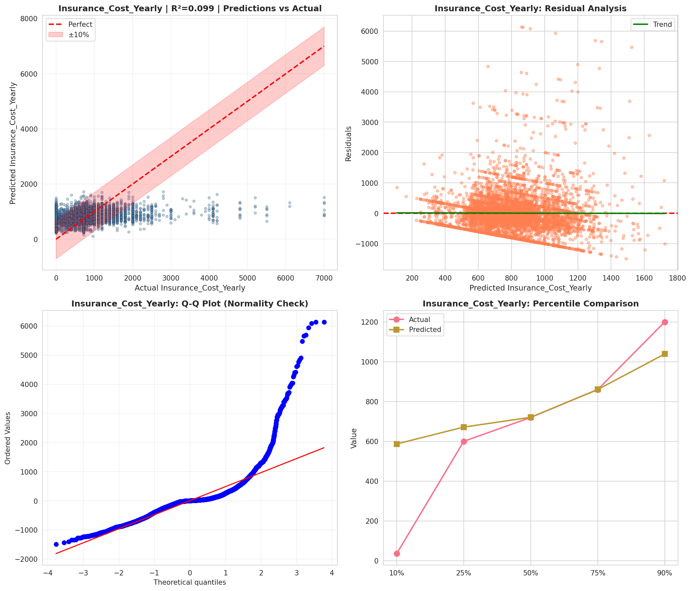
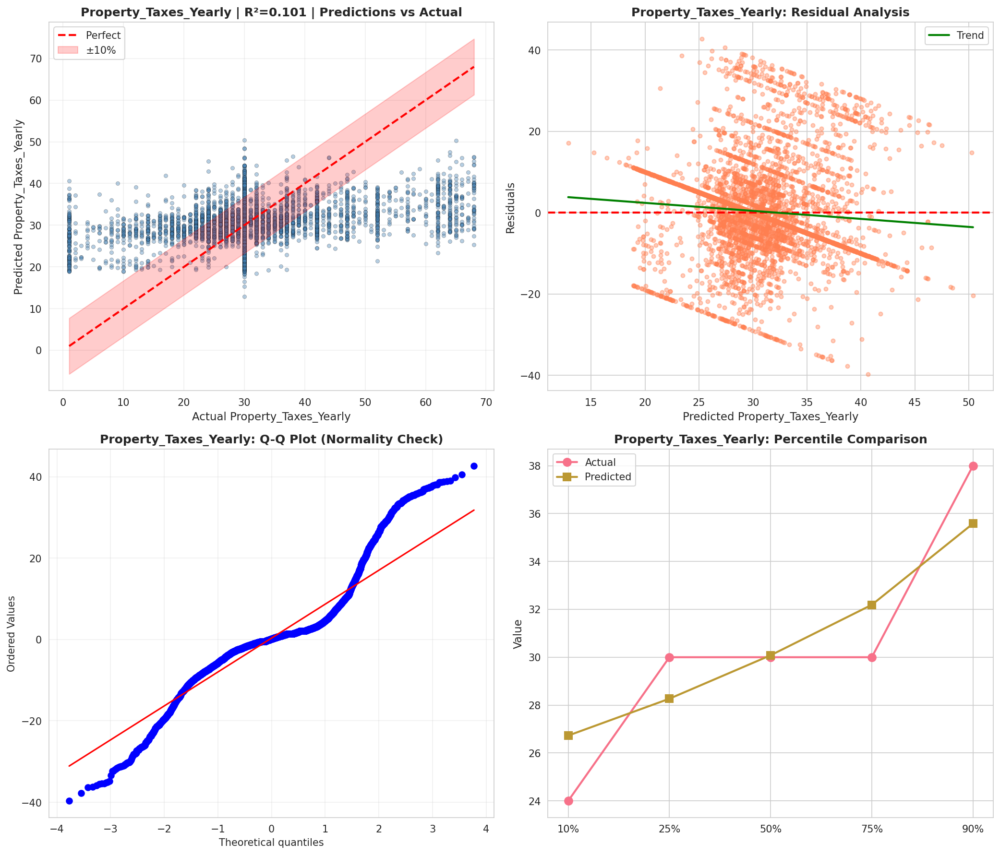
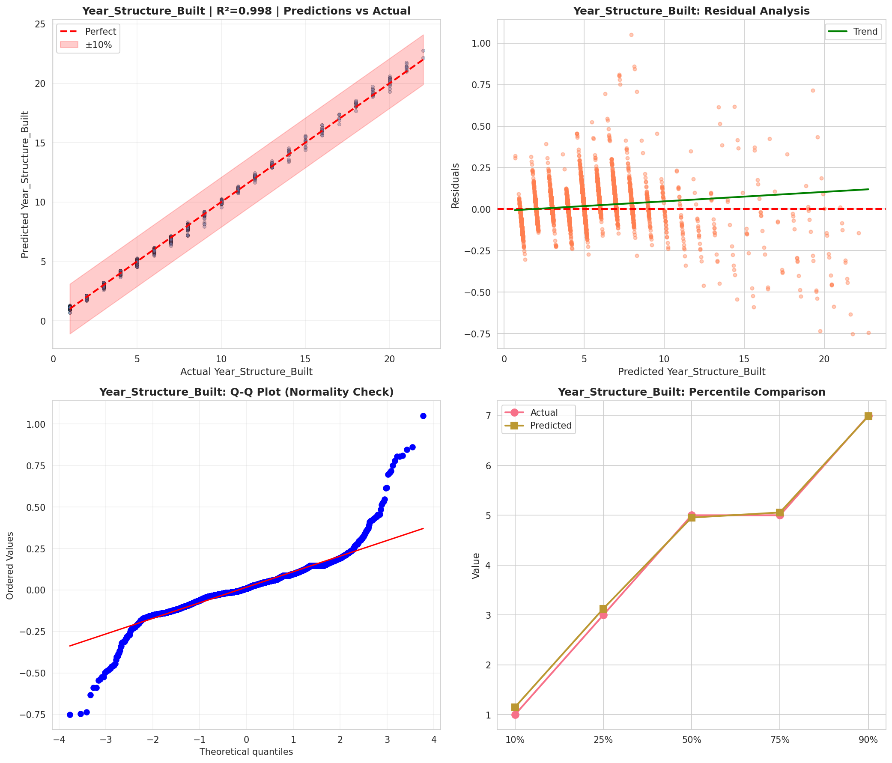
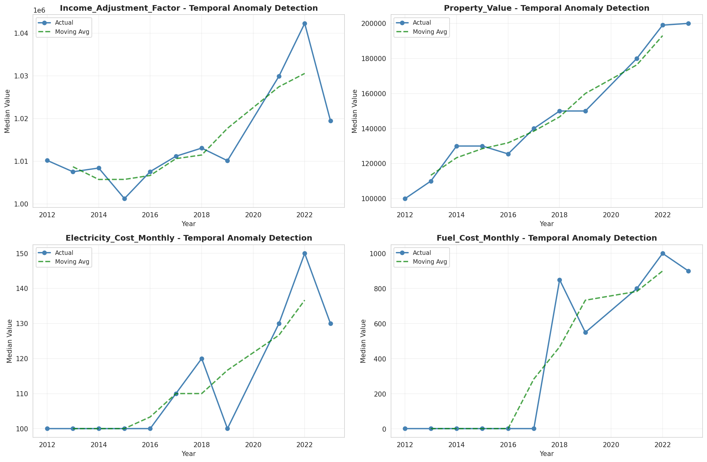
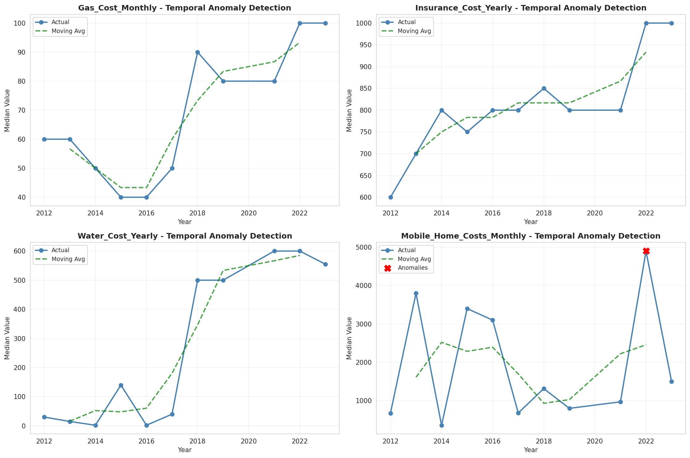
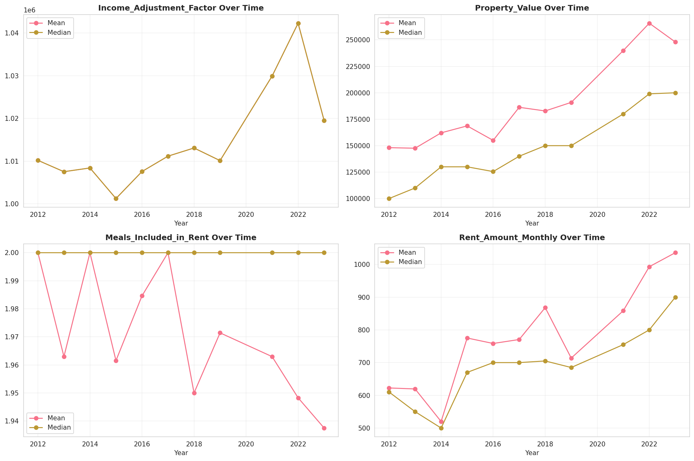
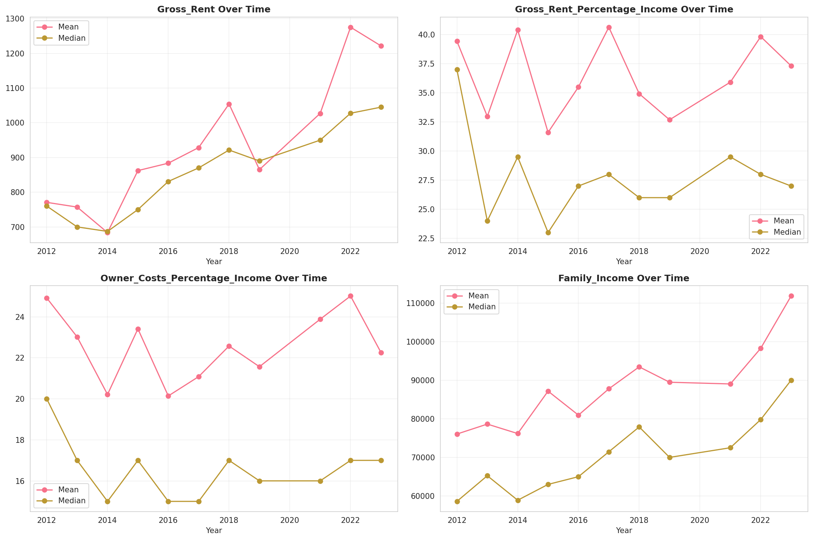
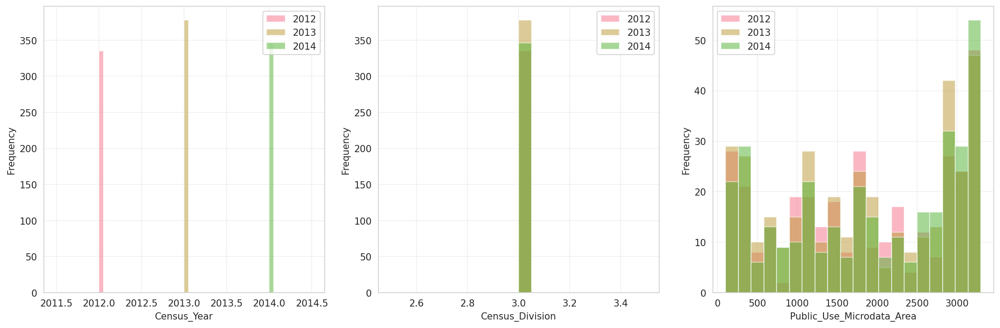
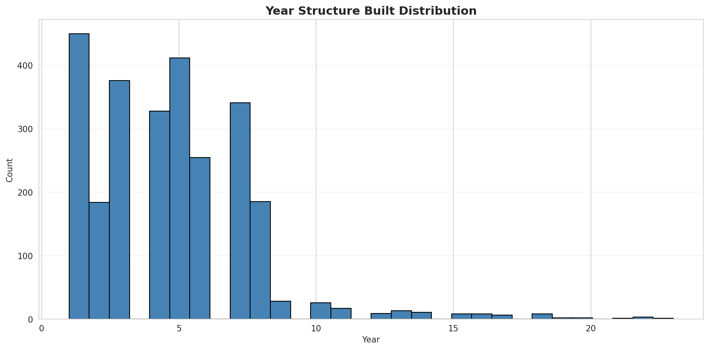
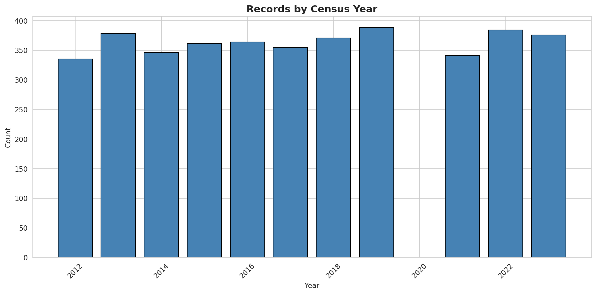
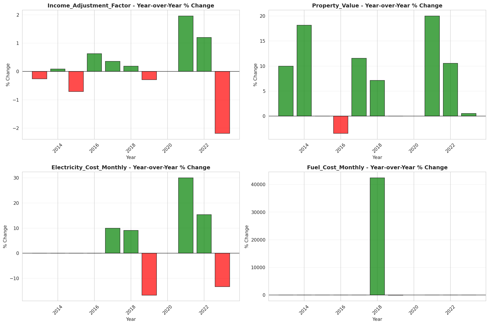
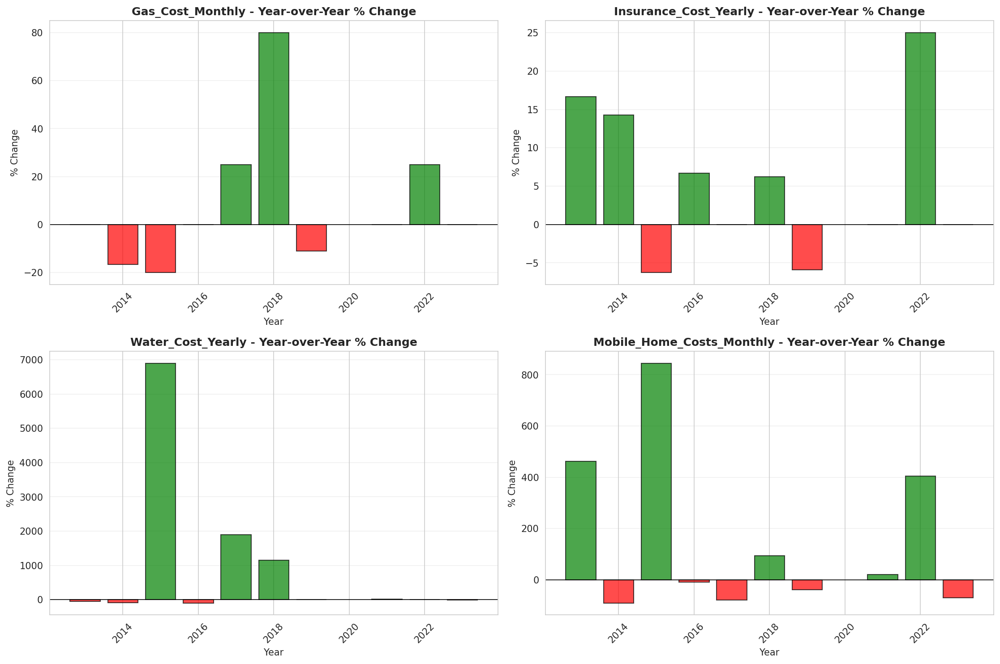
