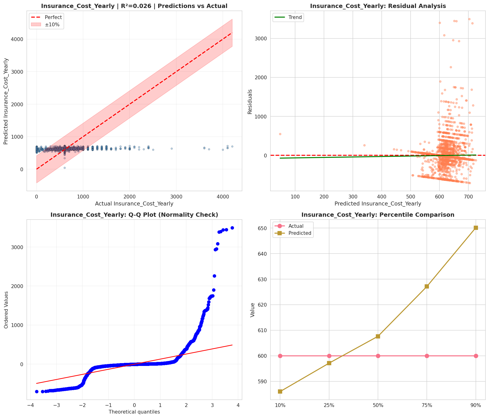
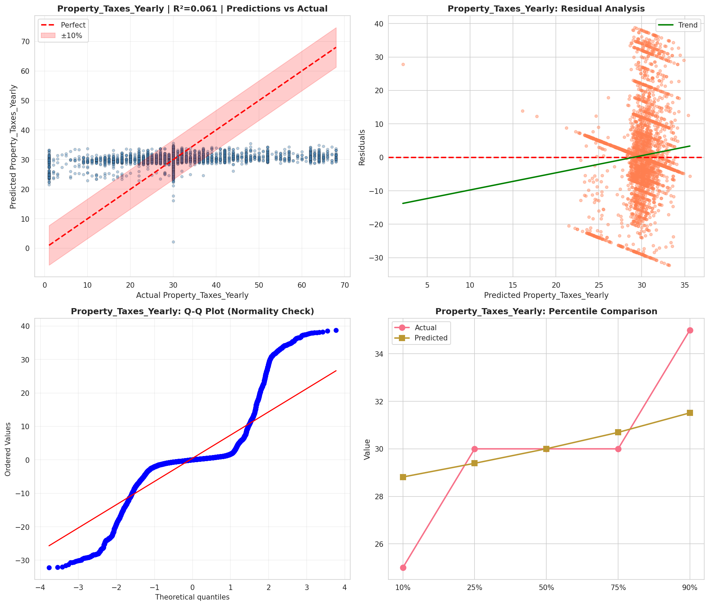
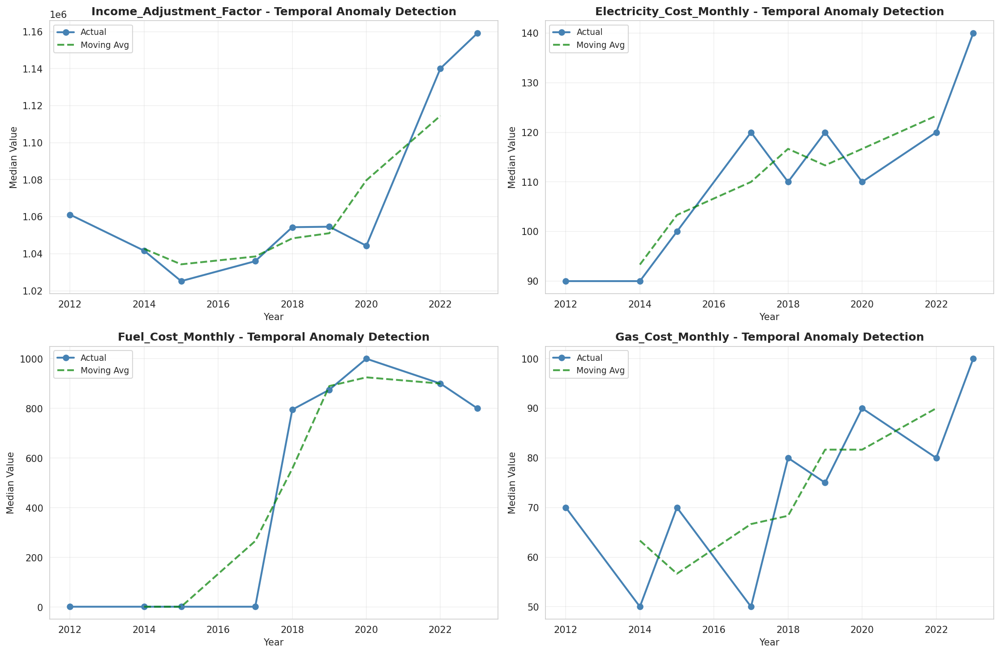
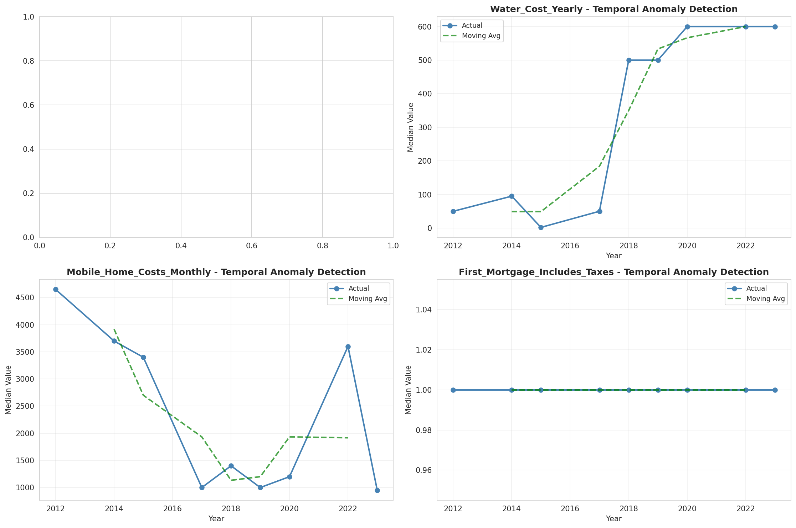
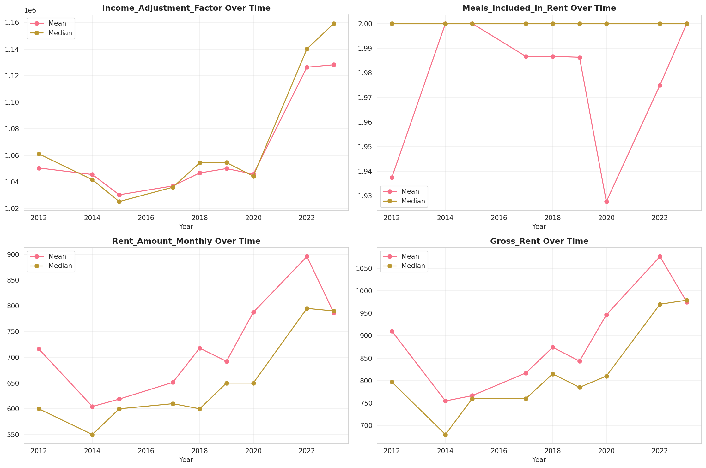
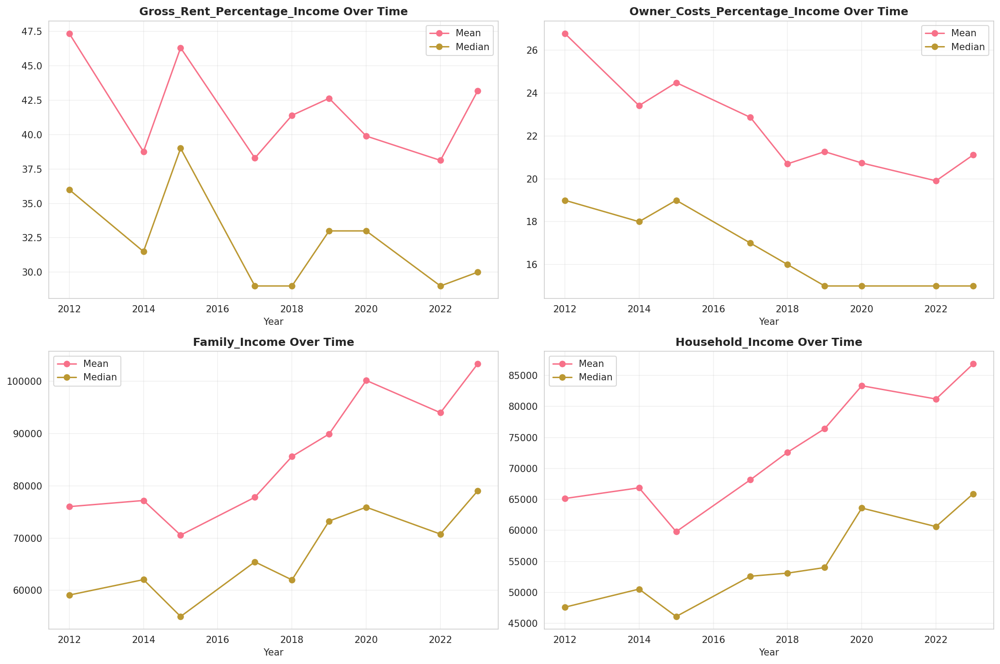
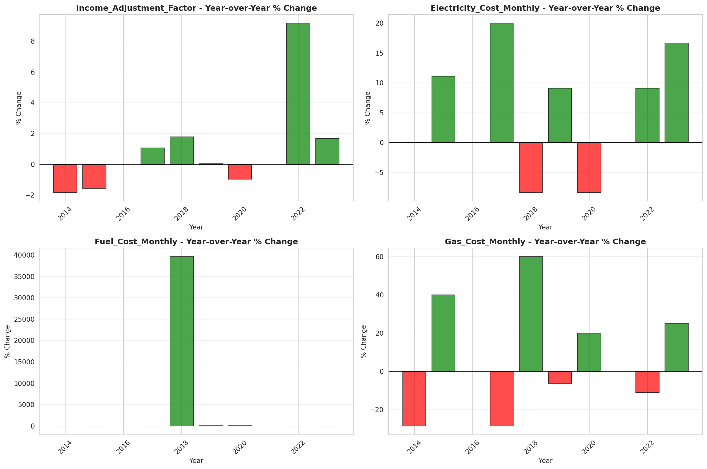
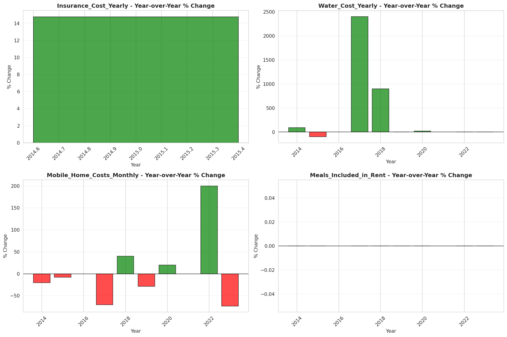

# Temporal Analysis

## Year Distribution

- 2012: 242,859 records

- 2014: 245,729 records

- 2015: 247,675 records

- 2017: 247,991 records

- 2018: 248,970 records

- 2019: 249,883 records

- 2020: 252,709 records

- 2022: 254,227 records

- 2023: 255,197 records

## Temporal Trends

- Census_Year: {np.int64(2012): {'mean': 2012.0, 'median': 2012.0, 'std': 0.0}, np.int64(2014): {'mean': 2014.0, 'median': 2014.0, 'std': 0.0}, np.int64(2015): {'mean': 2015.0, 'median': 2015.0, 'std': 0.0}, np.int64(2017): {'mean': 2017.0, 'median': 2017.0, 'std': 0.0}, np.int64(2018): {'mean': 2018.0, 'median': 2018.0, 'std': 0.0}, np.int64(2019): {'mean': 2019.0, 'median': 2019.0, 'std': 0.0}, np.int64(2020): {'mean': 2020.0, 'median': 2020.0, 'std': 0.0}, np.int64(2022): {'mean': 2022.0, 'median': 2022.0, 'std': 0.0}, np.int64(2023): {'mean': 2023.0, 'median': 2023.0, 'std': 0.0}}

- Census_Division: {np.int64(2012): {'mean': 3.0, 'median': 3.0, 'std': 0.0}, np.int64(2014): {'mean': 3.0, 'median': 3.0, 'std': 0.0}, np.int64(2015): {'mean': 3.0, 'median': 3.0, 'std': 0.0}, np.int64(2017): {'mean': 3.0, 'median': 3.0, 'std': 0.0}, np.int64(2018): {'mean': 3.0, 'median': 3.0, 'std': 0.0}, np.int64(2019): {'mean': 3.0, 'median': 3.0, 'std': 0.0}, np.int64(2020): {'mean': 3.0, 'median': 3.0, 'std': 0.0}, np.int64(2022): {'mean': 3.0, 'median': 3.0, 'std': 0.0}, np.int64(2023): {'mean': 3.0, 'median': 3.0, 'std': 0.0}}

- Public_Use_Microdata_Area: {np.int64(2012): {'mean': None, 'median': None, 'std': None}, np.int64(2014): {'mean': None, 'median': None, 'std': None}, np.int64(2015): {'mean': None, 'median': None, 'std': None}, np.int64(2017): {'mean': 1889.50945397212, 'median': 1900.0, 'std': 1051.15603957328}, np.int64(2018): {'mean': 1887.308145559706, 'median': 1900.0, 'std': 1050.9510063875662}, np.int64(2019): {'mean': 1886.352893153996, 'median': 1900.0, 'std': 1049.83356425991}, np.int64(2020): {'mean': 1887.5802721707578, 'median': 1900.0, 'std': 1048.3649191136897}, np.int64(2022): {'mean': None, 'median': None, 'std': None}, np.int64(2023): {'mean': 1879.9761360831044, 'median': 1900.0, 'std': 1043.2861333330688}}

- Census_Region: {np.int64(2012): {'mean': 2.0, 'median': 2.0, 'std': 0.0}, np.int64(2014): {'mean': 2.0, 'median': 2.0, 'std': 0.0}, np.int64(2015): {'mean': 2.0, 'median': 2.0, 'std': 0.0}, np.int64(2017): {'mean': 2.0, 'median': 2.0, 'std': 0.0}, np.int64(2018): {'mean': 2.0, 'median': 2.0, 'std': 0.0}, np.int64(2019): {'mean': 2.0, 'median': 2.0, 'std': 0.0}, np.int64(2020): {'mean': 2.0, 'median': 2.0, 'std': 0.0}, np.int64(2022): {'mean': 2.0, 'median': 2.0, 'std': 0.0}, np.int64(2023): {'mean': 2.0, 'median': 2.0, 'std': 0.0}}

- State_Code: {np.int64(2012): {'mean': 26.0, 'median': 26.0, 'std': 0.0}, np.int64(2014): {'mean': 26.0, 'median': 26.0, 'std': 0.0}, np.int64(2015): {'mean': 26.0, 'median': 26.0, 'std': 0.0}, np.int64(2017): {'mean': 26.0, 'median': 26.0, 'std': 0.0}, np.int64(2018): {'mean': 26.0, 'median': 26.0, 'std': 0.0}, np.int64(2019): {'mean': 26.0, 'median': 26.0, 'std': 0.0}, np.int64(2020): {'mean': 26.0, 'median': 26.0, 'std': 0.0}, np.int64(2022): {'mean': 26.0, 'median': 26.0, 'std': 0.0}, np.int64(2023): {'mean': None, 'median': None, 'std': None}}

- Housing_Adjustment_Factor: {np.int64(2012): {'mean': 1041726.25492158, 'median': 1053092.0, 'std': 27439.727057800985}, np.int64(2014): {'mean': 1036868.4238449674, 'median': 1031130.0, 'std': 29666.29885738096}, np.int64(2015): {'mean': 1021020.4168769557, 'median': 1017534.0, 'std': 20305.2553332473}, np.int64(2017): {'mean': 1029251.3704610248, 'median': 1034680.0, 'std': 17967.197778655533}, np.int64(2018): {'mean': 1038332.2199742941, 'median': 1046406.0, 'std': 23460.50245839375}, np.int64(2019): {'mean': 1040912.2289031267, 'median': 1042936.0, 'std': 29169.528343538066}, np.int64(2020): {'mean': 1035152.0648215932, 'median': 1030827.0, 'std': 28632.39741249845}, np.int64(2022): {'mean': 1106215.212660339, 'median': 1133141.0, 'std': 60587.19906205782}, np.int64(2023): {'mean': 1108429.6739264177, 'median': 1125501.0, 'std': 76610.88569585976}}

- Income_Adjustment_Factor: {np.int64(2012): {'mean': 1052961.613504132, 'median': 1061121.0, 'std': 26370.778419608618}, np.int64(2014): {'mean': 1047721.3573937143, 'median': 1041654.0, 'std': 31085.62341784012}, np.int64(2015): {'mean': 1030460.5727869184, 'median': 1025215.0, 'std': 25678.722457356027}, np.int64(2017): {'mean': 1036644.9836203733, 'median': 1035988.0, 'std': 16848.51489655087}, np.int64(2018): {'mean': 1046907.6227256296, 'median': 1054346.0, 'std': 20487.917509937477}, np.int64(2019): {'mean': 1049853.9707303017, 'median': 1054606.0, 'std': 26210.585628360834}, np.int64(2020): {'mean': 1045107.8564871057, 'median': 1044328.0, 'std': 29294.713821642752}, np.int64(2022): {'mean': 1127861.1542833766, 'median': 1140108.0, 'std': 48750.62720529356}, np.int64(2023): {'mean': 1131662.4582303083, 'median': 1159185.0, 'std': 69849.75637601901}}

- Housing_Unit_Weight: {np.int64(2012): {'mean': 18.66086082871131, 'median': 17.0, 'std': 15.713304028106673}, np.int64(2014): {'mean': 18.446007593731306, 'median': 16.0, 'std': 16.232626410542025}, np.int64(2015): {'mean': 18.329819319672957, 'median': 16.0, 'std': 16.477189755648716}, np.int64(2017): {'mean': 18.420829788177798, 'median': 16.0, 'std': 16.41463864837474}, np.int64(2018): {'mean': 18.399562196248542, 'median': 16.0, 'std': 16.46636834504004}, np.int64(2019): {'mean': 18.393400111252067, 'median': 16.0, 'std': 16.79373796298689}, np.int64(2020): {'mean': 18.24989612558318, 'median': 14.0, 'std': 20.098771550191696}, np.int64(2022): {'mean': 18.017240497665473, 'median': 14.0, 'std': 20.056291828058576}, np.int64(2023): {'mean': 18.024048088339597, 'median': 14.0, 'std': 20.39293327796262}}

- Number_of_Persons: {np.int64(2012): {'mean': 2.0468667004311145, 'median': 2.0, 'std': 1.4880470139644377}, np.int64(2014): {'mean': 2.012241127420858, 'median': 2.0, 'std': 1.4791453800585972}, np.int64(2015): {'mean': 1.9925345715150904, 'median': 2.0, 'std': 1.4701544216598008}, np.int64(2017): {'mean': 1.988914920299527, 'median': 2.0, 'std': 1.4703331665351629}, np.int64(2018): {'mean': 1.9810057436638953, 'median': 2.0, 'std': 1.463463419182909}, np.int64(2019): {'mean': 1.9813632780141106, 'median': 2.0, 'std': 1.4613640310282459}, np.int64(2020): {'mean': 1.9664198742427061, 'median': 2.0, 'std': 1.4573450393021508}, np.int64(2022): {'mean': 1.966274235230719, 'median': 2.0, 'std': 1.4381191581281947}, np.int64(2023): {'mean': 1.9711908839053751, 'median': 2.0, 'std': 1.4310380338966615}}

- Housing_Unit_Type: {np.int64(2012): {'mean': 1.099666884900292, 'median': 1.0, 'std': 0.39379227946511275}, np.int64(2014): {'mean': 1.1198067790126522, 'median': 1.0, 'std': 0.43393691406078644}, np.int64(2015): {'mean': 1.1313495508226505, 'median': 1.0, 'std': 0.45508086198022585}, np.int64(2017): {'mean': 1.127682052977729, 'median': 1.0, 'std': 0.4507301739660059}, np.int64(2018): {'mean': 1.1282403502430012, 'median': 1.0, 'std': 0.4523649846450717}, np.int64(2019): {'mean': 1.1281399695057286, 'median': 1.0, 'std': 0.4525886825154221}, np.int64(2020): {'mean': None, 'median': None, 'std': None}, np.int64(2022): {'mean': None, 'median': None, 'std': None}, np.int64(2023): {'mean': None, 'median': None, 'std': None}}

- Building_Type: {np.int64(2012): {'mean': 2.5481490634985082, 'median': 2.0, 'std': 1.649682459744284}, np.int64(2014): {'mean': 2.5481701609057352, 'median': 2.0, 'std': 1.6494982842623003}, np.int64(2015): {'mean': 2.546091061501809, 'median': 2.0, 'std': 1.645579972188743}, np.int64(2017): {'mean': 2.5481913160333236, 'median': 2.0, 'std': 1.6485146119944785}, np.int64(2018): {'mean': 2.550352363746123, 'median': 2.0, 'std': 1.6531335535918696}, np.int64(2019): {'mean': 2.55038627955921, 'median': 2.0, 'std': 1.6528216258700956}, np.int64(2020): {'mean': 2.54663802642713, 'median': 2.0, 'std': 1.650468354451633}, np.int64(2022): {'mean': 2.5386960569906676, 'median': 2.0, 'std': 1.639277217912172}, np.int64(2023): {'mean': 2.5346790308209997, 'median': 2.0, 'std': 1.6328749988273095}}

- Year_Structure_Built: {np.int64(2012): {'mean': 4.444683743181457, 'median': 4.0, 'std': 2.431478002008755}, np.int64(2014): {'mean': 4.501783916491513, 'median': 4.0, 'std': 2.525994517665233}, np.int64(2015): {'mean': 4.533675990470308, 'median': 4.0, 'std': 2.5970993397524085}, np.int64(2017): {'mean': 4.647015682434005, 'median': 5.0, 'std': 2.797071872103096}, np.int64(2018): {'mean': 4.718004015765598, 'median': 5.0, 'std': 2.938245020981775}, np.int64(2019): {'mean': 4.804319882177109, 'median': 5.0, 'std': 3.1042348910278283}, np.int64(2020): {'mean': 4.8913710429820565, 'median': 5.0, 'std': 3.2881257150410423}, np.int64(2022): {'mean': None, 'median': None, 'std': None}, np.int64(2023): {'mean': None, 'median': None, 'std': None}}

- Bathtub_or_Shower: {np.int64(2012): {'mean': 1.0171191766554275, 'median': 1.0, 'std': 0.12971578433254846}, np.int64(2014): {'mean': 1.019234505537206, 'median': 1.0, 'std': 0.13734854434332822}, np.int64(2015): {'mean': 1.0198535251036795, 'median': 1.0, 'std': 0.13949712720221327}, np.int64(2017): {'mean': 1.0197007557958253, 'median': 1.0, 'std': 0.13897021562481546}, np.int64(2018): {'mean': 1.0193701634740309, 'median': 1.0, 'std': 0.13782250663194173}, np.int64(2019): {'mean': 1.0190939315110872, 'median': 1.0, 'std': 0.13685552565147746}, np.int64(2020): {'mean': 1.0189459523964504, 'median': 1.0, 'std': 0.13633445617889797}, np.int64(2022): {'mean': 1.0170538942901068, 'median': 1.0, 'std': 0.1294725128126818}, np.int64(2023): {'mean': 1.0156700085637915, 'median': 1.0, 'std': 0.12419551565474998}}

- Refrigerator: {np.int64(2012): {'mean': 1.023937719561495, 'median': 1.0, 'std': 0.15285551432484848}, np.int64(2014): {'mean': 1.0261847148382994, 'median': 1.0, 'std': 0.15968465218123198}, np.int64(2015): {'mean': 1.027044913085679, 'median': 1.0, 'std': 0.16221467829608294}, np.int64(2017): {'mean': 1.0261344622694955, 'median': 1.0, 'std': 0.15953546290616508}, np.int64(2018): {'mean': 1.0256606546835287, 'median': 1.0, 'std': 0.1581211398156114}, np.int64(2019): {'mean': 1.024880499527227, 'median': 1.0, 'std': 0.1557612467424725}, np.int64(2020): {'mean': 1.024539477966543, 'median': 1.0, 'std': 0.15471714792592273}, np.int64(2022): {'mean': 1.021995106424442, 'median': 1.0, 'std': 0.1466677022220847}, np.int64(2023): {'mean': 1.0204449711512678, 'median': 1.0, 'std': 0.14151699871704346}}

- Hot_and_Cold_Running_Water: {np.int64(2012): {'mean': 1.0222032940844175, 'median': 1.0, 'std': 0.14734450661855025}, np.int64(2014): {'mean': 1.025270678418143, 'median': 1.0, 'std': 0.15694642397054756}, np.int64(2015): {'mean': 1.0264228359657637, 'median': 1.0, 'std': 0.16038947347104338}, np.int64(2017): {'mean': 1.0271006161426746, 'median': 1.0, 'std': 0.1623769951002268}, np.int64(2018): {'mean': 1.0270254900502627, 'median': 1.0, 'std': 0.1621580339223228}, np.int64(2019): {'mean': 1.0266626578996676, 'median': 1.0, 'std': 0.16109585238276664}, np.int64(2020): {'mean': 1.0266744776410857, 'median': 1.0, 'std': 0.16113057608213174}, np.int64(2022): {'mean': 1.0238529328973864, 'median': 1.0, 'std': 0.15259119018976047}, np.int64(2023): {'mean': 1.0220712265252632, 'median': 1.0, 'std': 0.1469155568334904}}

- Running_Water: {np.int64(2012): {'mean': None, 'median': None, 'std': None}, np.int64(2014): {'mean': 9.0, 'median': 9.0, 'std': 0.0}, np.int64(2015): {'mean': 9.0, 'median': 9.0, 'std': 0.0}, np.int64(2017): {'mean': 9.0, 'median': 9.0, 'std': 0.0}, np.int64(2018): {'mean': 9.0, 'median': 9.0, 'std': 0.0}, np.int64(2019): {'mean': 9.0, 'median': 9.0, 'std': 0.0}, np.int64(2020): {'mean': 9.0, 'median': 9.0, 'std': 0.0}, np.int64(2022): {'mean': 9.0, 'median': 9.0, 'std': 0.0}, np.int64(2023): {'mean': 9.0, 'median': 9.0, 'std': 0.0}}

- Sink_with_Faucet: {np.int64(2012): {'mean': 1.0151861528412802, 'median': 1.0, 'std': 0.12229308895704138}, np.int64(2014): {'mean': 1.017159157143614, 'median': 1.0, 'std': 0.12986452532740334}, np.int64(2015): {'mean': 1.018000529427336, 'median': 1.0, 'std': 0.13295333149234773}, np.int64(2017): {'mean': 1.0179001963049006, 'median': 1.0, 'std': 0.13258905113543226}, np.int64(2018): {'mean': 1.0175197616787475, 'median': 1.0, 'std': 0.13119792272288486}, np.int64(2019): {'mean': 1.0172594848734406, 'median': 1.0, 'std': 0.130236972336447}, np.int64(2020): {'mean': 1.0170843368265747, 'median': 1.0, 'std': 0.12958601441438677}, np.int64(2022): {'mean': 1.0154082671112747, 'median': 1.0, 'std': 0.12317028097332446}, np.int64(2023): {'mean': 1.0142773111424443, 'median': 1.0, 'std': 0.1186319113859246}}

- Stove_or_Range: {np.int64(2012): {'mean': 1.024445248645118, 'median': 1.0, 'std': 0.154427276447957}, np.int64(2014): {'mean': 1.0267764099122172, 'median': 1.0, 'std': 0.1614297025143839}, np.int64(2015): {'mean': 1.0277949351451514, 'median': 1.0, 'std': 0.16438520598225617}, np.int64(2017): {'mean': 1.0269337350191254, 'median': 1.0, 'std': 0.16189016039952261}, np.int64(2018): {'mean': 1.0265268002047252, 'median': 1.0, 'std': 0.16069611706161954}, np.int64(2019): {'mean': 1.0256081778846782, 'median': 1.0, 'std': 0.1579636282093145}, np.int64(2020): {'mean': 1.0253509514200785, 'median': 1.0, 'std': 0.1571890196626373}, np.int64(2022): {'mean': 1.0229305155576727, 'median': 1.0, 'std': 0.1496823437821827}, np.int64(2023): {'mean': 1.0215522088527114, 'median': 1.0, 'std': 0.14521639836509886}}

- Telephone_Service: {np.int64(2012): {'mean': 1.0258532162483032, 'median': 1.0, 'std': 0.15869767993886344}, np.int64(2014): {'mean': 1.0277414421122537, 'median': 1.0, 'std': 0.16423151402929517}, np.int64(2015): {'mean': 1.0282285668264004, 'median': 1.0, 'std': 0.16562564089831303}, np.int64(2017): {'mean': 1.0262387748556767, 'median': 1.0, 'std': 0.15984501740343574}, np.int64(2018): {'mean': 1.0239182626317076, 'median': 1.0, 'std': 0.15279494714330663}, np.int64(2019): {'mean': 1.0205748265609513, 'median': 1.0, 'std': 0.14195634164143509}, np.int64(2020): {'mean': 1.0163621340537223, 'median': 1.0, 'std': 0.1268640778711555}, np.int64(2022): {'mean': 1.009677356257763, 'median': 1.0, 'std': 0.09789663885136181}, np.int64(2023): {'mean': 1.0082831398337553, 'median': 1.0, 'std': 0.09063426099293556}}

- Lot_Acreage: {np.int64(2012): {'mean': 1.4509019965541705, 'median': 1.0, 'std': 0.6891262033832495}, np.int64(2014): {'mean': 1.4522118285294192, 'median': 1.0, 'std': 0.6890117769847209}, np.int64(2015): {'mean': 1.4532883881482381, 'median': 1.0, 'std': 0.6890380014814339}, np.int64(2017): {'mean': 1.4536134902292512, 'median': 1.0, 'std': 0.6873862417247115}, np.int64(2018): {'mean': 1.456167805230371, 'median': 1.0, 'std': 0.6882202670809422}, np.int64(2019): {'mean': 1.4588519589193616, 'median': 1.0, 'std': 0.6895729884442707}, np.int64(2020): {'mean': 1.4610436345045639, 'median': 1.0, 'std': 0.6901819237290084}, np.int64(2022): {'mean': 1.4662974363028216, 'median': 1.0, 'std': 0.6913636207517379}, np.int64(2023): {'mean': 1.4680646734071736, 'median': 1.0, 'std': 0.6911893734259846}}

- Agricultural_Sales: {np.int64(2012): {'mean': 1.249253303184219, 'median': 1.0, 'std': 0.9623987028379638}, np.int64(2014): {'mean': 1.2453084919670583, 'median': 1.0, 'std': 0.9559021807542941}, np.int64(2015): {'mean': 1.2394594048060397, 'median': 1.0, 'std': 0.9473890851843578}, np.int64(2017): {'mean': 1.232356243819867, 'median': 1.0, 'std': 0.9308240236381708}, np.int64(2018): {'mean': 1.22834462214382, 'median': 1.0, 'std': 0.921548960724167}, np.int64(2019): {'mean': 1.227458140070397, 'median': 1.0, 'std': 0.9190063203029971}, np.int64(2020): {'mean': 1.2254497414903853, 'median': 1.0, 'std': 0.912006438996269}, np.int64(2022): {'mean': 1.223156358560302, 'median': 1.0, 'std': 0.907566860919657}, np.int64(2023): {'mean': 1.219249001996008, 'median': 1.0, 'std': 0.8999175992476866}}

- Business_On_Property: {np.int64(2012): {'mean': 1.9837488598358164, 'median': 2.0, 'std': 0.12644018989478673}, np.int64(2014): {'mean': 1.9842979187263923, 'median': 2.0, 'std': 0.12432057061746365}, np.int64(2015): {'mean': 1.9847095265571382, 'median': 2.0, 'std': 0.12270595369791736}, np.int64(2017): {'mean': 4.808019012804439, 'median': 2.0, 'std': 3.441477689558422}, np.int64(2018): {'mean': 6.214305777082267, 'median': 9.0, 'std': 3.433227956345342}, np.int64(2019): {'mean': 7.612030615760227, 'median': 9.0, 'std': 2.79492639109795}, np.int64(2020): {'mean': None, 'median': None, 'std': None}, np.int64(2022): {'mean': None, 'median': None, 'std': None}, np.int64(2023): {'mean': None, 'median': None, 'std': None}}

- Tenure: {np.int64(2012): {'mean': 1.7279726690277368, 'median': 2.0, 'std': 0.8256779035284392}, np.int64(2014): {'mean': 1.7634933891449156, 'median': 2.0, 'std': 0.8295611160593257}, np.int64(2015): {'mean': 1.773411388072323, 'median': 2.0, 'std': 0.8284100662810852}, np.int64(2017): {'mean': 1.7835000400898011, 'median': 2.0, 'std': 0.8237117189258526}, np.int64(2018): {'mean': 1.783867151820074, 'median': 2.0, 'std': 0.8205264154062302}, np.int64(2019): {'mean': 1.7816154608523291, 'median': 2.0, 'std': 0.8166577814849567}, np.int64(2020): {'mean': 1.775739314146047, 'median': 2.0, 'std': 0.8105296545446439}, np.int64(2022): {'mean': 1.7699488503555048, 'median': 2.0, 'std': 0.7995358110440564}, np.int64(2023): {'mean': 1.7654193460781176, 'median': 2.0, 'std': 0.7925191914270542}}

- Vacancy_Status: {np.int64(2012): {'mean': 4.869997403657134, 'median': 5.0, 'std': 1.6595347755796683}, np.int64(2014): {'mean': 5.006244585619405, 'median': 5.0, 'std': 1.6191326166064166}, np.int64(2015): {'mean': 5.056829547078154, 'median': 5.0, 'std': 1.5849419141559753}, np.int64(2017): {'mean': 5.111454448588173, 'median': 5.0, 'std': 1.5391721118681863}, np.int64(2018): {'mean': 5.134088495575221, 'median': 5.0, 'std': 1.5212755134728253}, np.int64(2019): {'mean': 5.1417843087699024, 'median': 5.0, 'std': 1.5154963673931725}, np.int64(2020): {'mean': 5.145100945926867, 'median': 5.0, 'std': 1.5077188946443347}, np.int64(2022): {'mean': 5.15202331831775, 'median': 5.0, 'std': 1.4953424859455804}, np.int64(2023): {'mean': 5.135898256278995, 'median': 5.0, 'std': 1.5114941466178196}}

- Vehicles_Available: {np.int64(2012): {'mean': 1.8238464736734008, 'median': 2.0, 'std': 1.0332081430615632}, np.int64(2014): {'mean': 1.813849590469099, 'median': 2.0, 'std': 1.0380301307103381}, np.int64(2015): {'mean': 1.815477388958241, 'median': 2.0, 'std': 1.0393024829371649}, np.int64(2017): {'mean': 1.8377716084028224, 'median': 2.0, 'std': 1.0485151493973222}, np.int64(2018): {'mean': 1.8468073212244633, 'median': 2.0, 'std': 1.0515830507796375}, np.int64(2019): {'mean': 1.8602626362735382, 'median': 2.0, 'std': 1.0578267104043677}, np.int64(2020): {'mean': 1.872521807107905, 'median': 2.0, 'std': 1.063088966981858}, np.int64(2022): {'mean': 1.8770208021594343, 'median': 2.0, 'std': 1.0608286013281958}, np.int64(2023): {'mean': 1.8755637675677248, 'median': 2.0, 'std': 1.0582706708034952}}

- Condo_Fee_Monthly: {np.int64(2012): {'mean': 199.33525811294606, 'median': 170.0, 'std': 153.39565673726094}, np.int64(2014): {'mean': 206.35833436302977, 'median': 180.0, 'std': 142.72005618608503}, np.int64(2015): {'mean': 213.15219042795644, 'median': 190.0, 'std': 142.42576674690514}, np.int64(2017): {'mean': 226.9126654064272, 'median': 200.0, 'std': 140.67255110494855}, np.int64(2018): {'mean': 233.45248366818686, 'median': 210.0, 'std': 143.29248474699318}, np.int64(2019): {'mean': 240.92724679029956, 'median': 220.0, 'std': 149.4997513705438}, np.int64(2020): {'mean': 248.473653868327, 'median': 230.0, 'std': 162.07854167169398}, np.int64(2022): {'mean': 262.1948275862069, 'median': 240.0, 'std': 175.87016973378527}, np.int64(2023): {'mean': 274.4638497652582, 'median': 250.0, 'std': 191.54550389663487}}

- Electricity_Cost_Monthly: {np.int64(2012): {'mean': 109.4456862047719, 'median': 90.0, 'std': 79.76301679920871}, np.int64(2014): {'mean': 120.00540842406069, 'median': 100.0, 'std': 84.67812656101691}, np.int64(2015): {'mean': 123.47304494020054, 'median': 100.0, 'std': 87.11764274047263}, np.int64(2017): {'mean': 127.16168717928159, 'median': 100.0, 'std': 88.62859549004443}, np.int64(2018): {'mean': 133.71323970463524, 'median': 110.0, 'std': 88.41106095213556}, np.int64(2019): {'mean': 134.5208938524548, 'median': 110.0, 'std': 88.6302373927915}, np.int64(2020): {'mean': 137.297235530732, 'median': 120.0, 'std': 90.1931566342259}, np.int64(2022): {'mean': 150.60603301772275, 'median': 120.0, 'std': 137.4541121785251}, np.int64(2023): {'mean': 158.39855272191514, 'median': 130.0, 'std': 173.3826681451518}}

- Fuel_Cost_Monthly: {np.int64(2012): {'mean': 172.5180712027932, 'median': 2.0, 'std': 532.9774484384958}, np.int64(2014): {'mean': 150.8030528667163, 'median': 2.0, 'std': 497.1425526245713}, np.int64(2015): {'mean': 142.75452522852655, 'median': 2.0, 'std': 489.8527300166903}, np.int64(2017): {'mean': 113.65096816869789, 'median': 2.0, 'std': 428.608797857388}, np.int64(2018): {'mean': 993.4030645013304, 'median': 800.0, 'std': 853.7409792840662}, np.int64(2019): {'mean': 966.3212246044378, 'median': 800.0, 'std': 821.8904977253592}, np.int64(2020): {'mean': 931.1331037875061, 'median': 800.0, 'std': 783.2185915714384}, np.int64(2022): {'mean': 974.2831637948931, 'median': 800.0, 'std': 821.7248723072252}, np.int64(2023): {'mean': 1009.0623076106571, 'median': 800.0, 'std': 868.4417240795299}}

- Gas_Cost_Monthly: {np.int64(2012): {'mean': 93.93685723875026, 'median': 70.0, 'std': 99.43357427032228}, np.int64(2014): {'mean': 86.80569419009478, 'median': 60.0, 'std': 95.68887103747548}, np.int64(2015): {'mean': 85.04255929609793, 'median': 60.0, 'std': 96.21255085012005}, np.int64(2017): {'mean': 77.8031390314304, 'median': 50.0, 'std': 91.99994636091631}, np.int64(2018): {'mean': 107.78368784295978, 'median': 80.0, 'std': 93.58210423138426}, np.int64(2019): {'mean': 104.99653581296195, 'median': 80.0, 'std': 92.36572912219486}, np.int64(2020): {'mean': 103.04342651516743, 'median': 80.0, 'std': 91.01531936447482}, np.int64(2022): {'mean': 115.5768065772393, 'median': 90.0, 'std': 130.08556829373543}, np.int64(2023): {'mean': 125.1468901632113, 'median': 90.0, 'std': 166.5501991819691}}

- House_Heating_Fuel: {np.int64(2012): {'mean': 1.745690713180081, 'median': 1.0, 'std': 1.4929200505716236}, np.int64(2014): {'mean': 1.7779527479825321, 'median': 1.0, 'std': 1.5396023821422984}, np.int64(2015): {'mean': 1.7849534893085812, 'median': 1.0, 'std': 1.5493356195523853}, np.int64(2017): {'mean': 1.78258298588839, 'median': 1.0, 'std': 1.5500547476304407}, np.int64(2018): {'mean': 1.7731508517636725, 'median': 1.0, 'std': 1.5349674289037658}, np.int64(2019): {'mean': 1.7642120911793855, 'median': 1.0, 'std': 1.5223395244007447}, np.int64(2020): {'mean': 1.7488830505707202, 'median': 1.0, 'std': 1.4998265058730815}, np.int64(2022): {'mean': 1.7321978699058183, 'median': 1.0, 'std': 1.4615148125475763}, np.int64(2023): {'mean': 1.7282519083229066, 'median': 1.0, 'std': 1.4472916963300233}}

- Insurance_Cost_Yearly: {np.int64(2014): {'mean': 784.6346388032774, 'median': 700.0, 'std': 521.4823271054227}, np.int64(2015): {'mean': 811.083744437813, 'median': 700.0, 'std': 545.3815899864439}}

- Water_Cost_Yearly: {np.int64(2012): {'mean': 266.4810822183372, 'median': 40.0, 'std': 393.8425297641987}, np.int64(2014): {'mean': 283.7471121531062, 'median': 40.0, 'std': 417.18691045787017}, np.int64(2015): {'mean': 291.7581645391213, 'median': 40.0, 'std': 429.09784834812865}, np.int64(2017): {'mean': 305.8405979393842, 'median': 40.0, 'std': 448.5571152575544}, np.int64(2018): {'mean': 598.917536273662, 'median': 500.0, 'std': 480.4465984678674}, np.int64(2019): {'mean': 608.498439224942, 'median': 500.0, 'std': 487.8838267028918}, np.int64(2020): {'mean': 624.105474255768, 'median': 520.0, 'std': 502.81422374206784}, np.int64(2022): {'mean': 648.4823912016233, 'median': 550.0, 'std': 538.769002720138}, np.int64(2023): {'mean': 660.987602133714, 'median': 560.0, 'std': 556.0021141610814}}

- Mobile_Home_Costs_Monthly: {np.int64(2012): {'mean': 2432.202110741651, 'median': 2000.0, 'std': 2005.5074713588792}, np.int64(2014): {'mean': 2441.998800419853, 'median': 1700.0, 'std': 2066.4762257524903}, np.int64(2015): {'mean': 2489.160048869884, 'median': 1700.0, 'std': 2111.203616130528}, np.int64(2017): {'mean': 2553.702474258491, 'median': 1600.0, 'std': 2205.6046224069146}, np.int64(2018): {'mean': 2594.246293494705, 'median': 1500.0, 'std': 2269.3085835947145}, np.int64(2019): {'mean': 2624.9252476733714, 'median': 1500.0, 'std': 2339.8160967429885}, np.int64(2020): {'mean': 2703.568304373877, 'median': 1500.0, 'std': 2507.0809641646765}, np.int64(2022): {'mean': 2948.914773549414, 'median': 1500.0, 'std': 3226.1699806373376}, np.int64(2023): {'mean': 3073.8473282442746, 'median': 1400.0, 'std': 3438.9637784533675}}

- First_Mortgage_Includes_Insurance: {np.int64(2012): {'mean': 1.545171935048995, 'median': 2.0, 'std': 0.49795782042413467}, np.int64(2014): {'mean': 1.520761135324758, 'median': 2.0, 'std': 0.4995714446419914}, np.int64(2015): {'mean': 1.5092851113564054, 'median': 2.0, 'std': 0.49991648428053653}, np.int64(2017): {'mean': 1.482825542801063, 'median': 1.0, 'std': 0.4997077060967362}, np.int64(2018): {'mean': 1.470426455482289, 'median': 1.0, 'std': 0.4991273956987184}, np.int64(2019): {'mean': 1.4549372265341571, 'median': 1.0, 'std': 0.497967943299339}, np.int64(2020): {'mean': 1.439571517192485, 'median': 1.0, 'std': 0.49633771512220226}, np.int64(2022): {'mean': 1.4116167852892971, 'median': 1.0, 'std': 0.49212917635838815}, np.int64(2023): {'mean': 1.400297501662178, 'median': 1.0, 'std': 0.48996134244015443}}

- First_Mortgage_Payment_Monthly: {np.int64(2012): {'mean': 922.2354373327431, 'median': 800.0, 'std': 595.6730983152615}, np.int64(2014): {'mean': 887.7333475071755, 'median': 770.0, 'std': 567.833446105751}, np.int64(2015): {'mean': 877.4400363612752, 'median': 760.0, 'std': 558.2568439018298}, np.int64(2017): {'mean': 888.6429146404666, 'median': 770.0, 'std': 563.59858738547}, np.int64(2018): {'mean': 905.323238013188, 'median': 790.0, 'std': 574.5472010473346}, np.int64(2019): {'mean': 927.5479650843209, 'median': 800.0, 'std': 589.5478357182045}, np.int64(2020): {'mean': 956.1044399149238, 'median': 810.0, 'std': 609.5477417954924}, np.int64(2022): {'mean': 1019.5298951480725, 'median': 870.0, 'std': 651.8873469937178}, np.int64(2023): {'mean': 1060.4717429765942, 'median': 900.0, 'std': 679.2821036492528}}

- First_Mortgage_Includes_Taxes: {np.int64(2012): {'mean': 1.4480573049759553, 'median': 1.0, 'std': 0.4972971389983825}, np.int64(2014): {'mean': 1.4224513660040397, 'median': 1.0, 'std': 0.4939522275073272}, np.int64(2015): {'mean': 1.411120490011471, 'median': 1.0, 'std': 0.49203968609958254}, np.int64(2017): {'mean': 1.3858546428925866, 'median': 1.0, 'std': 0.4867991891350654}, np.int64(2018): {'mean': 1.3751504909594972, 'median': 1.0, 'std': 0.484164423782744}, np.int64(2019): {'mean': 1.3593918339526396, 'median': 1.0, 'std': 0.4798248375379647}, np.int64(2020): {'mean': 1.3448577632045373, 'median': 1.0, 'std': 0.47532450932920545}, np.int64(2022): {'mean': 1.3161049866409213, 'median': 1.0, 'std': 0.4649570420804675}, np.int64(2023): {'mean': 1.3040827595532967, 'median': 1.0, 'std': 0.46002045566336064}}

- First_Mortgage_Status: {np.int64(2012): {'mean': 1.752124017245752, 'median': 1.0, 'std': 0.9622905668418001}, np.int64(2014): {'mean': 1.8012676673888373, 'median': 1.0, 'std': 0.9726901764427992}, np.int64(2015): {'mean': 1.8199260226846523, 'median': 1.0, 'std': 0.9759906404192741}, np.int64(2017): {'mean': 1.8480853775497725, 'median': 1.0, 'std': 0.9804982697570276}, np.int64(2018): {'mean': 1.8570651930592066, 'median': 1.0, 'std': 0.9820313783066252}, np.int64(2019): {'mean': 1.8637766785167567, 'median': 1.0, 'std': 0.9833012269484898}, np.int64(2020): {'mean': 1.8815447898769737, 'median': 1.0, 'std': 0.986071100587541}, np.int64(2022): {'mean': 1.9222602530407678, 'median': 1.0, 'std': 0.9913605497441623}, np.int64(2023): {'mean': 1.9431409570310152, 'median': 1.0, 'std': 0.9932042347537674}}

- Second_Mortgage_Payment_Monthly: {np.int64(2012): {'mean': 306.71306626434273, 'median': 230.0, 'std': 276.5826278438493}, np.int64(2014): {'mean': 294.5215584941987, 'median': 210.0, 'std': 269.43276480139417}, np.int64(2015): {'mean': 297.4417417928219, 'median': 210.0, 'std': 276.62056487641667}, np.int64(2017): {'mean': 302.8187174568375, 'median': 220.0, 'std': 282.95343214690473}, np.int64(2018): {'mean': 309.77190769459077, 'median': 230.0, 'std': 293.80028861575107}, np.int64(2019): {'mean': 320.0053471730754, 'median': 240.0, 'std': 304.0855587230963}, np.int64(2020): {'mean': 332.78258816120905, 'median': 250.0, 'std': 326.84542949206946}, np.int64(2022): {'mean': 358.8854887279238, 'median': 250.0, 'std': 372.98514898634886}, np.int64(2023): {'mean': 385.91736334405147, 'median': 280.0, 'std': 403.17561475923077}}

- Second_Mortgage_Status: {np.int64(2012): {'mean': 2.7110605847200144, 'median': 3.0, 'std': 0.5644089843957527}, np.int64(2014): {'mean': 2.760210481556288, 'median': 3.0, 'std': 0.5266204184994226}, np.int64(2015): {'mean': 2.781918923013657, 'median': 3.0, 'std': 0.5060237772703388}, np.int64(2017): {'mean': 2.816445576543496, 'median': 3.0, 'std': 0.4683549768131652}, np.int64(2018): {'mean': 2.8311408595380896, 'median': 3.0, 'std': 0.44814228608557694}, np.int64(2019): {'mean': 2.842758514544535, 'median': 3.0, 'std': 0.4303486681545957}, np.int64(2020): {'mean': 2.8446423864335295, 'median': 3.0, 'std': 0.4221229929681322}, np.int64(2022): {'mean': 2.8526038522745982, 'median': 3.0, 'std': 0.4015094023891104}, np.int64(2023): {'mean': 2.853315252457869, 'median': 3.0, 'std': 0.3954232574176101}}

- Property_Taxes_Yearly: {np.int64(2012): {'mean': 31.864398934821203, 'median': 30.0, 'std': 15.635066649229383}, np.int64(2014): {'mean': 31.2958513875993, 'median': 30.0, 'std': 15.537221944707746}, np.int64(2015): {'mean': 31.32570711708333, 'median': 30.0, 'std': 15.523340696349445}, np.int64(2017): {'mean': 32.0339025599104, 'median': 30.0, 'std': 15.891625478996433}}

- Meals_Included_in_Rent: {np.int64(2012): {'mean': 1.9760001931573992, 'median': 2.0, 'std': 0.15305025870020267}, np.int64(2014): {'mean': 1.9760031839677858, 'median': 2.0, 'std': 0.15304090036990725}, np.int64(2015): {'mean': 1.9766823672060811, 'median': 2.0, 'std': 0.15091206658551848}, np.int64(2017): {'mean': 1.976448137029021, 'median': 2.0, 'std': 0.15164995198761544}, np.int64(2018): {'mean': 1.976703389235843, 'median': 2.0, 'std': 0.15084565264081387}, np.int64(2019): {'mean': 1.975422571684166, 'median': 2.0, 'std': 0.1548352114931747}, np.int64(2020): {'mean': 1.9738584117661218, 'median': 2.0, 'std': 0.15955819762397588}, np.int64(2022): {'mean': 1.9727208373362997, 'median': 2.0, 'std': 0.16289776186404067}, np.int64(2023): {'mean': 1.9721487474716042, 'median': 2.0, 'std': 0.16454866274085975}}

- Rent_Amount_Monthly: {np.int64(2012): {'mean': 619.7283724074655, 'median': 570.0, 'std': 356.4033048780143}, np.int64(2014): {'mean': 640.167626539308, 'median': 590.0, 'std': 368.903692319884}, np.int64(2015): {'mean': 651.6408618197081, 'median': 600.0, 'std': 372.6587554810663}, np.int64(2017): {'mean': 689.0692825059926, 'median': 620.0, 'std': 393.9885889921801}, np.int64(2018): {'mean': 707.0248637522513, 'median': 650.0, 'std': 402.9311622175793}, np.int64(2019): {'mean': 729.2216676868026, 'median': 650.0, 'std': 418.2316460893909}, np.int64(2020): {'mean': 758.0462171725682, 'median': 680.0, 'std': 453.71019866858524}, np.int64(2022): {'mean': 821.0405521565455, 'median': 730.0, 'std': 517.0659829041842}, np.int64(2023): {'mean': 861.0930449665474, 'median': 750.0, 'std': 548.7150365983139}}

- Gross_Rent: {np.int64(2012): {'mean': 769.6844008264463, 'median': 710.0, 'std': 393.1320919100358}, np.int64(2014): {'mean': 797.0134521357127, 'median': 735.0, 'std': 405.080884241143}, np.int64(2015): {'mean': 811.0030994022582, 'median': 750.0, 'std': 408.7196759781344}, np.int64(2017): {'mean': 844.5475969295458, 'median': 780.0, 'std': 423.6870725041432}, np.int64(2018): {'mean': 861.5821496037879, 'median': 800.0, 'std': 430.04108452118203}, np.int64(2019): {'mean': 882.0118659956581, 'median': 820.0, 'std': 442.0009503896644}, np.int64(2020): {'mean': 908.6091079194903, 'median': 840.0, 'std': 471.71779145138527}, np.int64(2022): {'mean': 980.3252002333846, 'median': 897.0, 'std': 541.4058025687935}, np.int64(2023): {'mean': 1027.408637873754, 'median': 930.0, 'std': 583.5704936541075}}

- Gross_Rent_Percentage_Income: {np.int64(2012): {'mean': 42.248795850314934, 'median': 32.0, 'std': 28.802615957445422}, np.int64(2014): {'mean': 41.791556325117135, 'median': 31.0, 'std': 28.656289907962268}, np.int64(2015): {'mean': 41.09096643956599, 'median': 31.0, 'std': 28.45599584379618}, np.int64(2017): {'mean': 39.169472418457836, 'median': 29.0, 'std': 27.68976459512871}, np.int64(2018): {'mean': 38.44415100983425, 'median': 29.0, 'std': 27.38882687980505}, np.int64(2019): {'mean': 37.75058139534884, 'median': 29.0, 'std': 27.08908915781178}, np.int64(2020): {'mean': 37.44907886565928, 'median': 28.0, 'std': 27.003355323498873}, np.int64(2022): {'mean': 37.886652743497244, 'median': 29.0, 'std': 27.400661080932075}, np.int64(2023): {'mean': 38.31344032096289, 'median': 29.0, 'std': 27.712008496425188}}

- Selected_Monthly_Owner_Costs: {np.int64(2012): {'mean': 1070.5388708153391, 'median': 900.0, 'std': 791.5580149796613}, np.int64(2014): {'mean': 1016.5760521139024, 'median': 850.0, 'std': 740.5945650791895}, np.int64(2015): {'mean': 1001.6935555857411, 'median': 838.0, 'std': 724.2968454271988}, np.int64(2017): {'mean': 992.6635567574529, 'median': 826.0, 'std': 713.866549481498}, np.int64(2018): {'mean': 1003.1904100825283, 'median': 832.0, 'std': 721.4601875928676}, np.int64(2019): {'mean': 1013.7887977122177, 'median': 838.0, 'std': 733.0203574303632}, np.int64(2020): {'mean': 1027.818302686702, 'median': 844.0, 'std': 750.5459234845144}, np.int64(2022): {'mean': 1078.9380123107392, 'median': 880.0, 'std': 802.0257018716075}, np.int64(2023): {'mean': 1117.4135496596348, 'median': 905.0, 'std': 843.9365532972486}}

- Owner_Costs_Percentage_Income: {np.int64(2012): {'mean': 25.99959152673266, 'median': 20.0, 'std': 21.312715944978706}, np.int64(2014): {'mean': 24.740387613010494, 'median': 19.0, 'std': 20.925677842120592}, np.int64(2015): {'mean': 24.060335785160042, 'median': 18.0, 'std': 20.705814937708585}, np.int64(2017): {'mean': 22.62715626338538, 'median': 17.0, 'std': 20.089977716325265}, np.int64(2018): {'mean': 22.27447478043307, 'median': 16.0, 'std': 19.962139080257327}, np.int64(2019): {'mean': 21.74963651668197, 'median': 16.0, 'std': 19.72493879176332}, np.int64(2020): {'mean': 21.337899658789333, 'median': 16.0, 'std': 19.56462770475023}, np.int64(2022): {'mean': 21.419105102700705, 'median': 15.0, 'std': 20.112198335560368}, np.int64(2023): {'mean': 21.516425580394746, 'median': 15.0, 'std': 20.379855519202525}}

- Satellite_Internet: {np.int64(2012): {'mean': None, 'median': None, 'std': None}, np.int64(2014): {'mean': None, 'median': None, 'std': None}, np.int64(2015): {'mean': None, 'median': None, 'std': None}, np.int64(2017): {'mean': 1.9020483637831573, 'median': 2.0, 'std': 0.2972502119041938}, np.int64(2018): {'mean': 1.8979272953180595, 'median': 2.0, 'std': 0.30274484767294163}, np.int64(2019): {'mean': 1.8962059702393528, 'median': 2.0, 'std': 0.30499408303042086}, np.int64(2020): {'mean': 1.8956836213645551, 'median': 2.0, 'std': 0.30567142108854084}, np.int64(2022): {'mean': 1.8994619514863311, 'median': 2.0, 'std': 0.30071690016665653}, np.int64(2023): {'mean': 1.9022696476964769, 'median': 2.0, 'std': 0.2969505216947262}}

- Smartphone: {np.int64(2012): {'mean': None, 'median': None, 'std': None}, np.int64(2014): {'mean': None, 'median': None, 'std': None}, np.int64(2015): {'mean': None, 'median': None, 'std': None}, np.int64(2017): {'mean': 1.339856278062861, 'median': 1.0, 'std': 0.4736613902547965}, np.int64(2018): {'mean': 1.289914099895682, 'median': 1.0, 'std': 0.45372342027828544}, np.int64(2019): {'mean': 1.2468334985133795, 'median': 1.0, 'std': 0.43117008682424446}, np.int64(2020): {'mean': 1.209892485886608, 'median': 1.0, 'std': 0.4072326740063644}, np.int64(2022): {'mean': 1.1541628768985517, 'median': 1.0, 'std': 0.3611056935730409}, np.int64(2023): {'mean': 1.1362789885646114, 'median': 1.0, 'std': 0.3430854072629209}}

- Tablet_Computer: {np.int64(2012): {'mean': None, 'median': None, 'std': None}, np.int64(2014): {'mean': None, 'median': None, 'std': None}, np.int64(2015): {'mean': None, 'median': None, 'std': None}, np.int64(2017): {'mean': 1.490107841565106, 'median': 1.0, 'std': 0.4999033881898377}, np.int64(2018): {'mean': 1.4492510569056996, 'median': 1.0, 'std': 0.497419118800919}, np.int64(2019): {'mean': 1.4182160555004955, 'median': 1.0, 'std': 0.49326726237777074}, np.int64(2020): {'mean': 1.3938044559231717, 'median': 1.0, 'std': 0.48859358116733775}, np.int64(2022): {'mean': 1.3807812301342801, 'median': 1.0, 'std': 0.48558010453551886}, np.int64(2023): {'mean': 1.3812717626405175, 'median': 1.0, 'std': 0.48570026734639615}}

- Food_Stamp_SNAP: {np.int64(2012): {'mean': 1.8604804120464293, 'median': 2.0, 'std': 0.34648871352609284}, np.int64(2014): {'mean': 1.8475679394564843, 'median': 2.0, 'std': 0.3594400089602671}, np.int64(2015): {'mean': 1.850354380710036, 'median': 2.0, 'std': 0.3567245256250682}, np.int64(2017): {'mean': 1.8671236740115358, 'median': 2.0, 'std': 0.33944179486560194}, np.int64(2018): {'mean': 1.8753624501631025, 'median': 2.0, 'std': 0.33030822774331975}, np.int64(2019): {'mean': 1.8838270638114012, 'median': 2.0, 'std': 0.3204329059395362}, np.int64(2020): {'mean': 1.890077860030217, 'median': 2.0, 'std': 0.3127933809477579}, np.int64(2022): {'mean': 1.8930687853913348, 'median': 2.0, 'std': 0.3090264538002093}, np.int64(2023): {'mean': 1.8915301507865139, 'median': 2.0, 'std': 0.3109735698209425}}

- Family_Type_Employment_Status: {np.int64(2012): {'mean': 3.089289954880076, 'median': 2.0, 'std': 2.28469854608801}, np.int64(2014): {'mean': 3.153716254419625, 'median': 2.0, 'std': 2.291472463984051}, np.int64(2015): {'mean': 3.1699529804337936, 'median': 2.0, 'std': 2.2881572284235405}, np.int64(2017): {'mean': 3.1578398061950543, 'median': 2.0, 'std': 2.267184728174818}, np.int64(2018): {'mean': 3.1560848779669546, 'median': 2.0, 'std': 2.261085811391036}, np.int64(2019): {'mean': 3.147739113899981, 'median': 2.0, 'std': 2.2509922722393165}, np.int64(2020): {'mean': 3.1424102895848396, 'median': 2.0, 'std': 2.2384105063091764}, np.int64(2022): {'mean': None, 'median': None, 'std': None}, np.int64(2023): {'mean': None, 'median': None, 'std': None}}

- Family_Income: {np.int64(2012): {'mean': 72993.65673124319, 'median': 58000.0, 'std': 63234.97633386926}, np.int64(2014): {'mean': 74820.45760745084, 'median': 59000.0, 'std': 65620.0908073018}, np.int64(2015): {'mean': 77176.11292265926, 'median': 60200.0, 'std': 68887.2056729862}, np.int64(2017): {'mean': 83474.36299961002, 'median': 65000.0, 'std': 76781.94919855887}, np.int64(2018): {'mean': 86549.11560583116, 'median': 67000.0, 'std': 80160.35652461521}, np.int64(2019): {'mean': 90349.19749782718, 'median': 70000.0, 'std': 84378.85160804744}, np.int64(2020): {'mean': 93974.60206088136, 'median': 72680.0, 'std': 87195.58629085087}, np.int64(2022): {'mean': 100412.36704591106, 'median': 77800.0, 'std': 92763.45632571827}, np.int64(2023): {'mean': 104336.39731850143, 'median': 80330.0, 'std': 96035.6891174789}}

- Family_Presence_Children: {np.int64(2012): {'mean': 3.160620992638328, 'median': 4.0, 'std': 1.056413940433868}, np.int64(2014): {'mean': 3.1879052603833262, 'median': 4.0, 'std': 1.0513698103861815}, np.int64(2015): {'mean': 3.202345530394228, 'median': 4.0, 'std': 1.0479354156303005}, np.int64(2017): {'mean': 3.2196338297581635, 'median': 4.0, 'std': 1.0434204941863183}, np.int64(2018): {'mean': 3.2293847496868713, 'median': 4.0, 'std': 1.0406237291713827}, np.int64(2019): {'mean': 3.2394907736788725, 'median': 4.0, 'std': 1.037048190036636}, np.int64(2020): {'mean': 3.2486770083354153, 'median': 4.0, 'std': 1.0346886384884137}, np.int64(2022): {'mean': 3.266652612240903, 'median': 4.0, 'std': 1.0296334765874096}, np.int64(2023): {'mean': 3.2757882444530946, 'median': 4.0, 'std': 1.0261079055664653}}

- Household_Family_Type: {np.int64(2012): {'mean': 2.6392872707599673, 'median': 1.0, 'std': 2.006226716327503}, np.int64(2014): {'mean': 2.6689038256424706, 'median': 1.0, 'std': 2.0107960160471063}, np.int64(2015): {'mean': 2.6790158257157812, 'median': 1.0, 'std': 2.0123315252265344}, np.int64(2017): {'mean': 2.688336874599102, 'median': 1.0, 'std': 2.017596934933845}, np.int64(2018): {'mean': 2.69635486076796, 'median': 1.0, 'std': 2.021258270454639}, np.int64(2019): {'mean': 2.7033399405351832, 'median': 1.0, 'std': 2.0243270814536425}, np.int64(2020): {'mean': 2.7039675824909826, 'median': 1.0, 'std': 2.027127354531199}, np.int64(2022): {'mean': 2.717967901886571, 'median': 1.0, 'std': 2.0346596025121633}, np.int64(2023): {'mean': 2.7204973763591043, 'median': 1.0, 'std': 2.036329831126169}}

- Household_Income: {np.int64(2012): {'mean': 61991.65826502144, 'median': 47000.0, 'std': 58942.706374782436}, np.int64(2014): {'mean': 63364.77592499275, 'median': 48000.0, 'std': 60982.427508579014}, np.int64(2015): {'mean': 65296.280941174075, 'median': 49000.0, 'std': 63874.21381633449}, np.int64(2017): {'mean': 70491.62969277216, 'median': 52000.0, 'std': 70860.13420127548}, np.int64(2018): {'mean': 72992.28019084394, 'median': 54000.0, 'std': 73918.52548273334}, np.int64(2019): {'mean': 76086.0674723213, 'median': 56000.0, 'std': 77588.7164118109}, np.int64(2020): {'mean': 78982.82395984004, 'median': 58560.0, 'std': 80205.93060784618}, np.int64(2022): {'mean': 84206.41659497464, 'median': 62100.0, 'std': 85419.20653781404}, np.int64(2023): {'mean': 87309.21910553158, 'median': 65000.0, 'std': 88406.0137624443}}

- Number_Persons_Family: {np.int64(2012): {'mean': 2.9416928876751367, 'median': 2.0, 'std': 1.2342404924041184}, np.int64(2014): {'mean': 2.9223406258237, 'median': 2.0, 'std': 1.2337788823622975}, np.int64(2015): {'mean': 2.9083062666091264, 'median': 2.0, 'std': 1.231048022523532}, np.int64(2017): {'mean': 2.897997601372379, 'median': 2.0, 'std': 1.2338581856008122}, np.int64(2018): {'mean': 2.8892625346339242, 'median': 2.0, 'std': 1.2291362705960536}, np.int64(2019): {'mean': 2.883183724133755, 'median': 2.0, 'std': 1.2340521713779873}, np.int64(2020): {'mean': 2.880253166473612, 'median': 2.0, 'std': 1.2306585929742}, np.int64(2022): {'mean': 2.867306143038918, 'median': 2.0, 'std': 1.223432901173555}, np.int64(2023): {'mean': 2.8620385064526754, 'median': 2.0, 'std': 1.2222022579041445}}

- Workers_In_Family: {np.int64(2012): {'mean': 1.3990515910710044, 'median': 1.0, 'std': 0.9113832508127473}, np.int64(2014): {'mean': 1.3741160522649396, 'median': 1.0, 'std': 0.9159622822888916}, np.int64(2015): {'mean': 1.3741946229964945, 'median': 1.0, 'std': 0.9187371055516198}, np.int64(2017): {'mean': 1.389989524980644, 'median': 1.0, 'std': 0.9204765026153331}, np.int64(2018): {'mean': 1.3940031123088017, 'median': 1.0, 'std': 0.9221510545658123}, np.int64(2019): {'mean': 1.3982606984453763, 'median': 1.0, 'std': 0.9238246120559748}, np.int64(2020): {'mean': 1.401205266226048, 'median': 1.0, 'std': 0.9266454747838221}, np.int64(2022): {'mean': 1.3834448903378334, 'median': 1.0, 'std': 0.9346490447078224}, np.int64(2023): {'mean': 1.3756699703566189, 'median': 1.0, 'std': 0.9401693274853388}}

- Work_Experience_Householder_Spouse: {np.int64(2012): {'mean': 6.435978686772738, 'median': 6.0, 'std': 4.503985785643112}, np.int64(2014): {'mean': 6.556410739164815, 'median': 6.0, 'std': 4.513875617617652}, np.int64(2015): {'mean': 6.555689311861661, 'median': 6.0, 'std': 4.518446466890678}, np.int64(2017): {'mean': 6.483126110124334, 'median': 6.0, 'std': 4.501081739663088}, np.int64(2018): {'mean': 6.4598550119558205, 'median': 6.0, 'std': 4.49768999168345}, np.int64(2019): {'mean': 6.426613281663917, 'median': 6.0, 'std': 4.489400160722726}, np.int64(2020): {'mean': 6.420207893282457, 'median': 6.0, 'std': 4.464378153508927}, np.int64(2022): {'mean': 6.467342282990882, 'median': 6.0, 'std': 4.446242060918943}, np.int64(2023): {'mean': 6.476405066323323, 'median': 6.0, 'std': 4.435050525369031}}

- Work_Status_Householder_Spouse: {np.int64(2012): {'mean': 5.909337152695322, 'median': 4.0, 'std': 4.77333237335432}, np.int64(2014): {'mean': 6.033215979253206, 'median': 4.0, 'std': 4.792645396037582}, np.int64(2015): {'mean': 6.046534202942515, 'median': 4.0, 'std': 4.799446272234019}, np.int64(2017): {'mean': 5.994484481891731, 'median': 4.0, 'std': 4.782592967822615}, np.int64(2018): {'mean': 5.9816321395621905, 'median': 4.0, 'std': 4.777727506413002}, np.int64(2019): {'mean': 5.958821068644229, 'median': 4.0, 'std': 4.765306711441246}, np.int64(2020): {'mean': 5.956596521937668, 'median': 4.0, 'std': 4.745518265106732}, np.int64(2022): {'mean': 6.005686550664062, 'median': 6.0, 'std': 4.728686871854793}, np.int64(2023): {'mean': 6.023928380504921, 'median': 7.0, 'std': 4.715797191650402}}

- Complete_Kitchen_Facilities: {np.int64(2012): {'mean': 1.03004572175049, 'median': 1.0, 'std': 0.17071351725080636}, np.int64(2014): {'mean': 1.0326315417630747, 'median': 1.0, 'std': 0.1776706605857675}, np.int64(2015): {'mean': 1.0336451072090356, 'median': 1.0, 'std': 0.18031432947768802}, np.int64(2017): {'mean': 1.0331259030245008, 'median': 1.0, 'std': 0.1789656900942305}, np.int64(2018): {'mean': 1.0326773082996863, 'median': 1.0, 'std': 0.1777910011712334}, np.int64(2019): {'mean': 1.0317825505344296, 'median': 1.0, 'std': 0.17542107656411007}, np.int64(2020): {'mean': 1.0312352188157694, 'median': 1.0, 'std': 0.17395318689580325}, np.int64(2022): {'mean': 1.0280839269861204, 'median': 1.0, 'std': 0.16521300867755911}, np.int64(2023): {'mean': 1.0261757912856933, 'median': 1.0, 'std': 0.15965816448719572}}

- Complete_Plumbing_Facilities: {np.int64(2012): {'mean': 1.0244275954596007, 'median': 1.0, 'std': 0.15437290310445964}, np.int64(2014): {'mean': 1.0277257714114136, 'median': 1.0, 'std': 0.16418639421122866}, np.int64(2015): {'mean': 1.0288273184505428, 'median': 1.0, 'std': 0.16732133061501306}, np.int64(2017): {'mean': 1.0291163644508075, 'median': 1.0, 'std': 0.16813306015520166}, np.int64(2018): {'mean': 1.0288715173732168, 'median': 1.0, 'std': 0.16744573900093873}, np.int64(2019): {'mean': 1.0283402397416959, 'median': 1.0, 'std': 0.16594333533591035}, np.int64(2020): {'mean': 1.028293085117924, 'median': 1.0, 'std': 0.16580924508335781}, np.int64(2022): {'mean': 1.0253816339345647, 'median': 1.0, 'std': 0.15728163822137733}, np.int64(2023): {'mean': 1.0235374514502218, 'median': 1.0, 'std': 0.15160322963790074}}

- Plumbing_Facilities_for_Project: {np.int64(2012): {'mean': None, 'median': None, 'std': None}, np.int64(2014): {'mean': None, 'median': None, 'std': None}, np.int64(2015): {'mean': None, 'median': None, 'std': None}, np.int64(2017): {'mean': 9.0, 'median': 9.0, 'std': 0.0}, np.int64(2018): {'mean': 9.0, 'median': 9.0, 'std': 0.0}, np.int64(2019): {'mean': 9.0, 'median': 9.0, 'std': 0.0}, np.int64(2020): {'mean': 9.0, 'median': 9.0, 'std': 0.0}, np.int64(2022): {'mean': 9.0, 'median': 9.0, 'std': 0.0}, np.int64(2023): {'mean': 9.0, 'median': 9.0, 'std': 0.0}}

- Response_Mode: {np.int64(2012): {'mean': 1.3124569703603015, 'median': 1.0, 'std': 0.4634960195467342}, np.int64(2014): {'mean': 1.5908075313068513, 'median': 1.0, 'std': 0.7244297794703592}, np.int64(2015): {'mean': 1.739861466513721, 'median': 2.0, 'std': 0.7929392605823666}, np.int64(2017): {'mean': 2.050854826597338, 'median': 2.0, 'std': 0.8459799457313851}, np.int64(2018): {'mean': 2.0784430378085643, 'median': 2.0, 'std': 0.8518232482419309}, np.int64(2019): {'mean': 2.1070558656540173, 'median': 2.0, 'std': 0.8588528980189242}, np.int64(2020): {'mean': 2.1606630649395733, 'median': 2.0, 'std': 0.8531741764722662}, np.int64(2022): {'mean': 2.26319208366715, 'median': 3.0, 'std': 0.8464417935874445}, np.int64(2023): {'mean': 2.3096589188861882, 'median': 3.0, 'std': 0.8405886385893311}}

- Specified_Rent_Unit: {np.int64(2012): {'mean': 0.19189012657334015, 'median': 0.0, 'std': 0.3937880016740256}, np.int64(2014): {'mean': 0.1985401911086776, 'median': 0.0, 'std': 0.3989018503979271}, np.int64(2015): {'mean': 0.19911320921203565, 'median': 0.0, 'std': 0.3993342493258186}, np.int64(2017): {'mean': 0.19825038316784288, 'median': 0.0, 'std': 0.39868266425623367}, np.int64(2018): {'mean': 0.19626944999759405, 'median': 0.0, 'std': 0.39717558215659843}, np.int64(2019): {'mean': 0.19402868011346552, 'median': 0.0, 'std': 0.3954519349046916}, np.int64(2020): {'mean': 0.1889778472086615, 'median': 0.0, 'std': 0.39149187163932403}, np.int64(2022): {'mean': 0.18057726869194293, 'median': 0.0, 'std': 0.38466837603476295}, np.int64(2023): {'mean': 0.17614594776952155, 'median': 0.0, 'std': 0.38094511483378213}}

- Specified_Value_Unit: {np.int64(2012): {'mean': 0.568251628506364, 'median': 1.0, 'std': 0.49532090403768875}, np.int64(2014): {'mean': 0.5588295035060141, 'median': 1.0, 'std': 0.49652812422726317}, np.int64(2015): {'mean': 0.5574031589164388, 'median': 1.0, 'std': 0.49669504304664147}, np.int64(2017): {'mean': 0.561576938785369, 'median': 1.0, 'std': 0.4961948829491855}, np.int64(2018): {'mean': 0.5647837479604023, 'median': 1.0, 'std': 0.4957863867267975}, np.int64(2019): {'mean': 0.5700292378549611, 'median': 1.0, 'std': 0.4950726954903577}, np.int64(2020): {'mean': 0.5746577274403871, 'median': 1.0, 'std': 0.4943958782277478}, np.int64(2022): {'mean': 0.587553861810623, 'median': 1.0, 'std': 0.49227570602161935}, np.int64(2023): {'mean': 0.5963772566455888, 'median': 1.0, 'std': 0.4906245667700823}}

- Moved_When: {np.int64(2012): {'mean': 4.4123150747112065, 'median': 5.0, 'std': 1.7591234029885858}, np.int64(2014): {'mean': 4.4435131287010154, 'median': 5.0, 'std': 1.8331293919162814}, np.int64(2015): {'mean': 4.444672636575508, 'median': 5.0, 'std': 1.8427576351955492}, np.int64(2017): {'mean': 4.429148438243858, 'median': 5.0, 'std': 1.8583488267235035}, np.int64(2018): {'mean': 4.426328188951225, 'median': 5.0, 'std': 1.8611014221264615}, np.int64(2019): {'mean': 4.421521308225966, 'median': 5.0, 'std': 1.8636906784661134}, np.int64(2020): {'mean': 4.436023412645401, 'median': 5.0, 'std': 1.861135940941616}, np.int64(2022): {'mean': 4.468684290310907, 'median': 5.0, 'std': 1.8514888454646783}, np.int64(2023): {'mean': 4.491149455388405, 'median': 5.0, 'std': 1.845019699056085}}

- Household_Language: {np.int64(2012): {'mean': 1.1841384181498495, 'median': 1.0, 'std': 0.6616493995322005}, np.int64(2014): {'mean': 1.1834084643094323, 'median': 1.0, 'std': 0.6685571955519051}, np.int64(2015): {'mean': 1.1825947328152056, 'median': 1.0, 'std': 0.6699457371865813}, np.int64(2017): {'mean': 1.183004931045542, 'median': 1.0, 'std': 0.6765106623727652}, np.int64(2018): {'mean': 1.184253477681446, 'median': 1.0, 'std': 0.679619554156697}, np.int64(2019): {'mean': 1.1856442021803766, 'median': 1.0, 'std': 0.6844176725160406}, np.int64(2020): {'mean': 1.188325342753806, 'median': 1.0, 'std': 0.6897319421259405}, np.int64(2022): {'mean': 1.18905808369764, 'median': 1.0, 'std': 0.692418159823125}, np.int64(2023): {'mean': 1.1896441353624116, 'median': 1.0, 'std': 0.6926330030727428}}

- Household_Language_Detailed: {np.int64(2012): {'mean': None, 'median': None, 'std': None}, np.int64(2014): {'mean': None, 'median': None, 'std': None}, np.int64(2015): {'mean': None, 'median': None, 'std': None}, np.int64(2017): {'mean': None, 'median': None, 'std': None}, np.int64(2018): {'mean': None, 'median': None, 'std': None}, np.int64(2019): {'mean': None, 'median': None, 'std': None}, np.int64(2020): {'mean': None, 'median': None, 'std': None}, np.int64(2022): {'mean': 8862.723244237108, 'median': 9500.0, 'std': 2130.346719807023}, np.int64(2023): {'mean': 8858.325961920835, 'median': 9500.0, 'std': 2137.5303014250517}}

- Limited_English_Speaking_Household: {np.int64(2012): {'mean': 1.0128189072620437, 'median': 1.0, 'std': 0.11249287208577775}, np.int64(2014): {'mean': 1.012698476585297, 'median': 1.0, 'std': 0.11197003328552967}, np.int64(2015): {'mean': 1.012654532275601, 'median': 1.0, 'std': 0.11177861146434852}, np.int64(2017): {'mean': 1.0121872995509942, 'median': 1.0, 'std': 0.1097216004710742}, np.int64(2018): {'mean': 1.0120539658296273, 'median': 1.0, 'std': 0.10912711476676583}, np.int64(2019): {'mean': 1.0116005946481665, 'median': 1.0, 'std': 0.10707977246423722}, np.int64(2020): {'mean': 1.01141440679224, 'median': 1.0, 'std': 0.10622699252467005}, np.int64(2022): {'mean': 1.0112274936674197, 'median': 1.0, 'std': 0.1053636148768625}, np.int64(2023): {'mean': 1.0115372304827306, 'median': 1.0, 'std': 0.1067903464802633}}

- Household_Grandchildren: {np.int64(2012): {'mean': 0.030010970459907728, 'median': 0.0, 'std': 0.17061787109272636}, np.int64(2014): {'mean': 0.029884687367933833, 'median': 0.0, 'std': 0.17026960588714443}, np.int64(2015): {'mean': 0.02915475375508396, 'median': 0.0, 'std': 0.16824059131133726}, np.int64(2017): {'mean': 0.028373556767158435, 'median': 0.0, 'std': 0.16603805646953726}, np.int64(2018): {'mean': 0.02798117285337087, 'median': 0.0, 'std': 0.16491926077338864}, np.int64(2019): {'mean': 0.027809712586719524, 'median': 0.0, 'std': 0.16442769368055796}, np.int64(2020): {'mean': 0.027736959027870548, 'median': 0.0, 'std': 0.1642186151471453}, np.int64(2022): {'mean': 0.0268071081379769, 'median': 0.0, 'std': 0.1615197036438324}, np.int64(2023): {'mean': 0.02651768654038273, 'median': 0.0, 'std': 0.16066930021593348}}

- Household_Children_Present: {np.int64(2012): {'mean': 3.4191316805842895, 'median': 4.0, 'std': 0.9750456895902647}, np.int64(2014): {'mean': 3.4433499023968124, 'median': 4.0, 'std': 0.9623375123762566}, np.int64(2015): {'mean': 3.455628599041598, 'median': 4.0, 'std': 0.9553247430932662}, np.int64(2017): {'mean': 3.4702032552918536, 'median': 4.0, 'std': 0.9470838587847973}, np.int64(2018): {'mean': 3.4786198084342823, 'median': 4.0, 'std': 0.9423551146171915}, np.int64(2019): {'mean': 3.4872200198216055, 'median': 4.0, 'std': 0.936846020624884}, np.int64(2020): {'mean': 3.4944758625125547, 'median': 4.0, 'std': 0.932728999729523}, np.int64(2022): {'mean': 3.5106455808858765, 'median': 4.0, 'std': 0.9222431359449808}, np.int64(2023): {'mean': 3.5185594708101764, 'median': 4.0, 'std': 0.9160616419192192}}

- Household_Own_Children_Present: {np.int64(2012): {'mean': 3.4755118295621332, 'median': 4.0, 'std': 0.9398121458781568}, np.int64(2014): {'mean': 3.499688072286732, 'median': 4.0, 'std': 0.9255556730891906}, np.int64(2015): {'mean': 3.5117535134699795, 'median': 4.0, 'std': 0.9174857369728735}, np.int64(2017): {'mean': 3.5254870910840284, 'median': 4.0, 'std': 0.9091686050060843}, np.int64(2018): {'mean': 3.533399218363955, 'median': 4.0, 'std': 0.9042102511591787}, np.int64(2019): {'mean': 3.5419028741328047, 'median': 4.0, 'std': 0.8979065939173856}, np.int64(2020): {'mean': 3.548351664662837, 'median': 4.0, 'std': 0.8941730630350648}, np.int64(2022): {'mean': 3.56280746021966, 'median': 4.0, 'std': 0.8835307665588948}, np.int64(2023): {'mean': 3.5703678916790333, 'median': 4.0, 'std': 0.8770616356773484}}

- Household_Related_Children_Present: {np.int64(2012): {'mean': 3.42519298491687, 'median': 4.0, 'std': 0.9727834767235898}, np.int64(2014): {'mean': 3.4497595137952546, 'median': 4.0, 'std': 0.95988814992119}, np.int64(2015): {'mean': 3.4623736560222285, 'median': 4.0, 'std': 0.9524801682300831}, np.int64(2017): {'mean': 3.477244026619628, 'median': 4.0, 'std': 0.9441050636915035}, np.int64(2018): {'mean': 3.4854928150377593, 'median': 4.0, 'std': 0.9392446062584816}, np.int64(2019): {'mean': 3.4941080277502476, 'median': 4.0, 'std': 0.9335925103711196}, np.int64(2020): {'mean': 3.5010217056794963, 'median': 4.0, 'std': 0.929636482587177}, np.int64(2022): {'mean': 3.5168852507114985, 'median': 4.0, 'std': 0.9189201924855716}, np.int64(2023): {'mean': 3.524640886121376, 'median': 4.0, 'std': 0.9128261249888163}}

- Number_Own_Children: {np.int64(2012): {'mean': 0.4908604547481052, 'median': 0.0, 'std': 0.9685373277353196}, np.int64(2014): {'mean': 0.4660350968988348, 'median': 0.0, 'std': 0.9505244033811157}, np.int64(2015): {'mean': 0.454772882857488, 'median': 0.0, 'std': 0.9430447313407071}, np.int64(2017): {'mean': 0.4427718088518281, 'median': 0.0, 'std': 0.9373712567201831}, np.int64(2018): {'mean': 0.43567474756549823, 'median': 0.0, 'std': 0.9333089720651353}, np.int64(2019): {'mean': 0.4294895936570862, 'median': 0.0, 'std': 0.9310138505763534}, np.int64(2020): {'mean': 0.4225507513123847, 'median': 0.0, 'std': 0.9243199508208453}, np.int64(2022): {'mean': 0.40995999960879814, 'median': 0.0, 'std': 0.9137287538253676}, np.int64(2023): {'mean': 0.4035993831291646, 'median': 0.0, 'std': 0.9080933220723781}}

- Number_Related_Children: {np.int64(2012): {'mean': 0.5336502577306677, 'median': 0.0, 'std': 0.9999115917601177}, np.int64(2014): {'mean': 0.5094433599645811, 'median': 0.0, 'std': 0.9847406031539462}, np.int64(2015): {'mean': 0.4976543309306165, 'median': 0.0, 'std': 0.977739857527007}, np.int64(2017): {'mean': 0.48529205420141114, 'median': 0.0, 'std': 0.9731547892255906}, np.int64(2018): {'mean': 0.47713240395509837, 'median': 0.0, 'std': 0.967906144692248}, np.int64(2019): {'mean': 0.47028741328047574, 'median': 0.0, 'std': 0.9652915546711248}, np.int64(2020): {'mean': 0.46295389212965027, 'median': 0.0, 'std': 0.9583556497014726}, np.int64(2022): {'mean': 0.4483955833308883, 'median': 0.0, 'std': 0.9462488152172271}, np.int64(2023): {'mean': 0.4416446009253063, 'median': 0.0, 'std': 0.940358768256785}}

- Multigenerational_Household: {np.int64(2012): {'mean': 1.0278619625601748, 'median': 1.0, 'std': 0.16457766945902266}, np.int64(2014): {'mean': 1.0285212613954238, 'median': 1.0, 'std': 0.1664570168092326}, np.int64(2015): {'mean': 1.0278963476019813, 'median': 1.0, 'std': 0.16467628212854862}, np.int64(2017): {'mean': 1.0277070638229635, 'median': 1.0, 'std': 0.16413262149024677}, np.int64(2018): {'mean': 1.0273822180295384, 'median': 1.0, 'std': 0.16319486847380432}, np.int64(2019): {'mean': 1.0271506442021803, 'median': 1.0, 'std': 0.16252266799331125}, np.int64(2020): {'mean': 1.027054172665786, 'median': 1.0, 'std': 0.16224171671640686}, np.int64(2022): {'mean': 1.0261127248188247, 'median': 1.0, 'std': 0.1594709214227524}, np.int64(2023): {'mean': 1.0258096429714552, 'median': 1.0, 'std': 0.1585674217423462}}

- Grandparent_Grandchildren: {np.int64(2012): {'mean': 0.004688744508508368, 'median': 0.0, 'std': 0.06831386067965416}, np.int64(2014): {'mean': 0.004336801432855044, 'median': 0.0, 'std': 0.06571160712172522}, np.int64(2015): {'mean': 0.00411750493295212, 'median': 0.0, 'std': 0.06403570665509994}, np.int64(2017): {'mean': 0.003898733162283515, 'median': 0.0, 'std': 0.062318155487536615}, np.int64(2018): {'mean': 0.0037983718411372155, 'median': 0.0, 'std': 0.061513926060295536}, np.int64(2019): {'mean': 0.003736372646184341, 'median': 0.0, 'std': 0.061011725199104395}, np.int64(2020): {'mean': 0.00381469771860296, 'median': 0.0, 'std': 0.061645475114534345}, np.int64(2022): {'mean': 0.003687077624231044, 'median': 0.0, 'std': 0.060609413842487816}, np.int64(2023): {'mean': 0.003690555862697743, 'median': 0.0, 'std': 0.06063788825417106}}

- Nonrelative_Present: {np.int64(2012): {'mean': 0.08015448812034444, 'median': 0.0, 'std': 0.2715328994687469}, np.int64(2014): {'mean': 0.0865146606025236, 'median': 0.0, 'std': 0.2811232322522176}, np.int64(2015): {'mean': 0.0890397857689365, 'median': 0.0, 'std': 0.28480187957082564}, np.int64(2017): {'mean': 0.09400056125721616, 'median': 0.0, 'std': 0.29183022893618354}, np.int64(2018): {'mean': 0.09502418280101223, 'median': 0.0, 'std': 0.2932490694104504}, np.int64(2019): {'mean': 0.0966005946481665, 'median': 0.0, 'std': 0.2954138659854272}, np.int64(2020): {'mean': 0.0970546179612395, 'median': 0.0, 'std': 0.2960328574499059}, np.int64(2022): {'mean': 0.09737014542929515, 'median': 0.0, 'std': 0.2964618525050394}, np.int64(2023): {'mean': 0.09701651778353265, 'median': 0.0, 'std': 0.2959809755876371}}

- Unmarried_Partner_Household: {np.int64(2012): {'mean': 0.1437731369003191, 'median': 0.0, 'std': 0.6742276366505552}, np.int64(2014): {'mean': 0.1538155802861685, 'median': 0.0, 'std': 0.6960665682444465}, np.int64(2015): {'mean': 0.15738634075625177, 'median': 0.0, 'std': 0.7023873846049952}, np.int64(2017): {'mean': 0.16779085150737652, 'median': 0.0, 'std': 0.7244186849832267}, np.int64(2018): {'mean': 0.17117130607090628, 'median': 0.0, 'std': 0.7309033546549943}, np.int64(2019): {'mean': 0.17615460852329037, 'median': 0.0, 'std': 0.7414614908577204}, np.int64(2020): {'mean': 0.1797756700459644, 'median': 0.0, 'std': 0.7486227691245003}, np.int64(2022): {'mean': 0.18678422282858512, 'median': 0.0, 'std': 0.7634055451913042}, np.int64(2023): {'mean': 0.1875636511770012, 'median': 0.0, 'std': 0.7643778777717565}}

- Subfamilies_Present: {np.int64(2012): {'mean': 0.022937778957756217, 'median': 0.0, 'std': 0.14970554272427314}, np.int64(2014): {'mean': 0.023631039826125456, 'median': 0.0, 'std': 0.15189710288182393}, np.int64(2015): {'mean': 0.023421455321547942, 'median': 0.0, 'std': 0.15123824214230258}, np.int64(2017): {'mean': 0.023146848941629248, 'median': 0.0, 'std': 0.15037016205166648}, np.int64(2018): {'mean': 0.022755292015433068, 'median': 0.0, 'std': 0.14912276719213124}, np.int64(2019): {'mean': 0.022314172447968284, 'median': 0.0, 'std': 0.14770361628864412}, np.int64(2020): {'mean': 0.021888745404798307, 'median': 0.0, 'std': 0.1463206552709746}, np.int64(2022): {'mean': 0.020640788662969808, 'median': 0.0, 'std': 0.14217892022872675}, np.int64(2023): {'mean': 0.020392624707810787, 'median': 0.0, 'std': 0.14133952895562818}}

- Persons_Under_18: {np.int64(2012): {'mean': 0.2877616755248539, 'median': 0.0, 'std': 0.4527205764247578}, np.int64(2014): {'mean': 0.27525608259040873, 'median': 0.0, 'std': 0.44664434984210255}, np.int64(2015): {'mean': 0.26916300889944833, 'median': 0.0, 'std': 0.4435259560955734}, np.int64(2017): {'mean': 0.26191168216805644, 'median': 0.0, 'std': 0.4396759279930514}, np.int64(2018): {'mean': 0.25756554811853316, 'median': 0.0, 'std': 0.43729451289473853}, np.int64(2019): {'mean': 0.2534489593657086, 'median': 0.0, 'std': 0.43498680668624334}, np.int64(2020): {'mean': 0.24970684715975716, 'median': 0.0, 'std': 0.4328443884574349}, np.int64(2022): {'mean': 0.24171385539222878, 'median': 0.0, 'std': 0.4281228372698018}, np.int64(2023): {'mean': 0.23806267640469056, 'median': 0.0, 'std': 0.4258987182156697}}

- Persons_60_And_Over: {np.int64(2012): {'mean': 0.5690612993232378, 'median': 0.0, 'std': 0.7609178039220029}, np.int64(2014): {'mean': 0.5998269304300577, 'median': 0.0, 'std': 0.7706585051824509}, np.int64(2015): {'mean': 0.6161156525590947, 'median': 0.0, 'std': 0.7759589819298909}, np.int64(2017): {'mean': 0.6417625481077613, 'median': 0.0, 'std': 0.7843976665619551}, np.int64(2018): {'mean': 0.657347927865874, 'median': 0.0, 'std': 0.7887345677602785}, np.int64(2019): {'mean': 0.6723488602576809, 'median': 0.0, 'std': 0.7931081224265321}, np.int64(2020): {'mean': 0.6901584757041853, 'median': 0.0, 'std': 0.7979443953031374}, np.int64(2022): {'mean': 0.7243347123199249, 'median': 0.0, 'std': 0.8061889898363707}, np.int64(2023): {'mean': 0.7407493622758267, 'median': 1.0, 'std': 0.8095763042536906}}

- Persons_65_And_Over: {np.int64(2012): {'mean': 0.40498028823756305, 'median': 0.0, 'std': 0.675184662133619}, np.int64(2014): {'mean': 0.425429152160351, 'median': 0.0, 'std': 0.6865008685783519}, np.int64(2015): {'mean': 0.43726090283091046, 'median': 0.0, 'std': 0.6930083995560423}, np.int64(2017): {'mean': 0.45752986690186015, 'median': 0.0, 'std': 0.7047164336101807}, np.int64(2018): {'mean': 0.47015957154764937, 'median': 0.0, 'std': 0.711521852629352}, np.int64(2019): {'mean': 0.48246778989098116, 'median': 0.0, 'std': 0.7177437054705783}, np.int64(2020): {'mean': 0.4983449852310341, 'median': 0.0, 'std': 0.725793173208511}, np.int64(2022): {'mean': 0.5301421040792575, 'median': 0.0, 'std': 0.7398683101147152}, np.int64(2023): {'mean': 0.5479238804667268, 'median': 0.0, 'std': 0.7473728888255649}}

- Same_Sex_Married_Couple: {np.int64(2012): {'mean': None, 'median': None, 'std': None}, np.int64(2014): {'mean': None, 'median': None, 'std': None}, np.int64(2015): {'mean': None, 'median': None, 'std': None}, np.int64(2017): {'mean': 0.004635383258499038, 'median': 0.0, 'std': 0.09546738884334317}, np.int64(2018): {'mean': 0.0056750969558121075, 'median': 0.0, 'std': 0.10575101971040582}, np.int64(2019): {'mean': None, 'median': None, 'std': None}, np.int64(2020): {'mean': None, 'median': None, 'std': None}, np.int64(2022): {'mean': None, 'median': None, 'std': None}, np.int64(2023): {'mean': None, 'median': None, 'std': None}}

- Flag_Lot_Acreage: {np.int64(2012): {'mean': 0.045042102847458826, 'median': 0.0, 'std': 0.20739696634683272}, np.int64(2014): {'mean': 0.043396859600473355, 'median': 0.0, 'std': 0.2037492465921709}, np.int64(2015): {'mean': 0.0427027265507809, 'median': 0.0, 'std': 0.20218650808458793}, np.int64(2017): {'mean': 0.038430966109957096, 'median': 0.0, 'std': 0.1922347243401784}, np.int64(2018): {'mean': 0.03653996736643642, 'median': 0.0, 'std': 0.18762982746457493}, np.int64(2019): {'mean': 0.035560377695569, 'median': 0.0, 'std': 0.18519175649450903}, np.int64(2020): {'mean': 0.036503287118401354, 'median': 0.0, 'std': 0.18753919528950524}, np.int64(2022): {'mean': 0.03836476625598164, 'median': 0.0, 'std': 0.19207569012021708}, np.int64(2023): {'mean': 0.03874899440325943, 'median': 0.0, 'std': 0.19299655680259875}}

- Flag_Agricultural_Sales: {np.int64(2012): {'mean': 0.011192119617985066, 'median': 0.0, 'std': 0.10519935797319774}, np.int64(2014): {'mean': 0.011228959499796881, 'median': 0.0, 'std': 0.10537038955411222}, np.int64(2015): {'mean': 0.011095914585723109, 'median': 0.0, 'std': 0.10475134212151088}, np.int64(2017): {'mean': 0.0104608114814213, 'median': 0.0, 'std': 0.10174196953073208}, np.int64(2018): {'mean': 0.01025376313982126, 'median': 0.0, 'std': 0.10074059696249796}, np.int64(2019): {'mean': 0.01026157204669342, 'median': 0.0, 'std': 0.10077855149040632}, np.int64(2020): {'mean': 0.010084835861051444, 'median': 0.0, 'std': 0.09991584092625018}, np.int64(2022): {'mean': 0.010237533291470887, 'median': 0.0, 'std': 0.1006616614433176}, np.int64(2023): {'mean': 0.010553359341885591, 'median': 0.0, 'std': 0.10218625696153648}}

- Flag_Bedrooms: {np.int64(2012): {'mean': 0.04518774162797677, 'median': 0.0, 'std': 0.20771615259922493}, np.int64(2014): {'mean': 0.04967589239980925, 'median': 0.0, 'std': 0.21727495614814626}, np.int64(2015): {'mean': 0.05214859260566487, 'median': 0.0, 'std': 0.22232709005409626}, np.int64(2017): {'mean': 0.05510590363932598, 'median': 0.0, 'std': 0.22818736093866987}, np.int64(2018): {'mean': 0.055980122397735775, 'median': 0.0, 'std': 0.2298838390795904}, np.int64(2019): {'mean': 0.05545606260648287, 'median': 0.0, 'std': 0.22886877456074534}, np.int64(2020): {'mean': 0.0608561695849335, 'median': 0.0, 'std': 0.23906681957059064}, np.int64(2022): {'mean': 0.06711993590715198, 'median': 0.0, 'std': 0.25023013661803484}, np.int64(2023): {'mean': 0.06792643789521033, 'median': 0.0, 'std': 0.2516201716215865}}

- Flag_Building_Type: {np.int64(2012): {'mean': 0.009245855914699808, 'median': 0.0, 'std': 0.09571003338579914}, np.int64(2014): {'mean': 0.009886606496282035, 'median': 0.0, 'std': 0.09893889393205596}, np.int64(2015): {'mean': 0.010041471807994353, 'median': 0.0, 'std': 0.09970298144576645}, np.int64(2017): {'mean': 0.010943888418010864, 'median': 0.0, 'std': 0.10403925826249416}, np.int64(2018): {'mean': 0.01112428313334704, 'median': 0.0, 'std': 0.10488365735354566}, np.int64(2019): {'mean': 0.011250691730175122, 'median': 0.0, 'std': 0.10547114362561952}, np.int64(2020): {'mean': 0.01386447959382933, 'median': 0.0, 'std': 0.11692867539435839}, np.int64(2022): {'mean': 0.015724400753524024, 'median': 0.0, 'std': 0.12440743948833186}, np.int64(2023): {'mean': 0.01595546828369506, 'median': 0.0, 'std': 0.12530346852543192}}

- Flag_Kitchen: {np.int64(2012): {'mean': 0.028434868572033825, 'median': 0.0, 'std': 0.1662120595655776}, np.int64(2014): {'mean': 0.03320557429747249, 'median': 0.0, 'std': 0.17917339615200187}, np.int64(2015): {'mean': 0.03509662048883791, 'median': 0.0, 'std': 0.18402444709302687}, np.int64(2017): {'mean': 0.03717496607482423, 'median': 0.0, 'std': 0.1891907639438029}, np.int64(2018): {'mean': 0.03737986605365728, 'median': 0.0, 'std': 0.1896912466960346}, np.int64(2019): {'mean': 0.035930752907445414, 'median': 0.0, 'std': 0.1861179326159627}, np.int64(2020): {'mean': 0.038451691292933236, 'median': 0.0, 'std': 0.1922844746015253}, np.int64(2022): {'mean': 0.04061667713227811, 'median': 0.0, 'std': 0.1974009407829279}, np.int64(2023): {'mean': 0.040184943297319274, 'median': 0.0, 'std': 0.19639317822076394}}

- Flag_Plumbing: {np.int64(2012): {'mean': 0.02448938160891133, 'median': 0.0, 'std': 0.1545631173013261}, np.int64(2014): {'mean': 0.02837486973877104, 'median': 0.0, 'std': 0.1660417364535399}, np.int64(2015): {'mean': 0.03028765551927998, 'median': 0.0, 'std': 0.1713780704224438}, np.int64(2017): {'mean': 0.031193595278142524, 'median': 0.0, 'std': 0.17384098368680148}, np.int64(2018): {'mean': 0.031198736652391305, 'median': 0.0, 'std': 0.17385484665183723}, np.int64(2019): {'mean': 0.030379482084733133, 'median': 0.0, 'std': 0.17162953564668562}, np.int64(2020): {'mean': 0.03315758640890451, 'median': 0.0, 'std': 0.17904831746541663}, np.int64(2022): {'mean': 0.03682307342528636, 'median': 0.0, 'std': 0.18832760892488623}, np.int64(2023): {'mean': 0.037196266532875444, 'median': 0.0, 'std': 0.189242857684988}}

- Flag_Rooms: {np.int64(2012): {'mean': 0.05167087400921496, 'median': 0.0, 'std': 0.22136217166717054}, np.int64(2014): {'mean': 0.05710740590282071, 'median': 0.0, 'std': 0.23204824468170515}, np.int64(2015): {'mean': 0.05726197829347922, 'median': 0.0, 'std': 0.23234302723331604}, np.int64(2017): {'mean': 0.054982938600921356, 'median': 0.0, 'std': 0.22794745721744258}, np.int64(2018): {'mean': 0.05307547277109698, 'median': 0.0, 'std': 0.22418449280995248}, np.int64(2019): {'mean': 0.04974792698815235, 'median': 0.0, 'std': 0.2174241861776275}, np.int64(2020): {'mean': 0.054581353468289615, 'median': 0.0, 'std': 0.22716173367692302}, np.int64(2022): {'mean': 0.0598358703419007, 'median': 0.0, 'std': 0.2371830149557509}, np.int64(2023): {'mean': 0.059963841768812226, 'median': 0.0, 'std': 0.23742035138308779}}

- Flag_Condo_Fee: {np.int64(2012): {'mean': 0.0026965240877716385, 'median': 0.0, 'std': 0.0518581210046986}, np.int64(2014): {'mean': 0.0030335411625483514, 'median': 0.0, 'std': 0.05499411009370261}, np.int64(2015): {'mean': 0.0032471543280684725, 'median': 0.0, 'std': 0.05689134025916734}, np.int64(2017): {'mean': 0.003631860241450636, 'median': 0.0, 'std': 0.060155512835385665}, np.int64(2018): {'mean': 0.003713927007554714, 'median': 0.0, 'std': 0.06082885778921705}, np.int64(2019): {'mean': 0.0038388301372131225, 'median': 0.0, 'std': 0.06183939022498592}, np.int64(2020): {'mean': 0.0038230380351059906, 'median': 0.0, 'std': 0.061712550925586925}, np.int64(2022): {'mean': 0.004218002295216855, 'median': 0.0, 'std': 0.06480917328092395}, np.int64(2023): {'mean': 0.004299196387636999, 'median': 0.0, 'std': 0.06542730173905324}}

- Flag_Electricity: {np.int64(2012): {'mean': 0.04858156654368281, 'median': 0.0, 'std': 0.21499209735586372}, np.int64(2014): {'mean': 0.05417542434251196, 'median': 0.0, 'std': 0.2263640298279027}, np.int64(2015): {'mean': 0.056909026736080476, 'median': 0.0, 'std': 0.23166921720671227}, np.int64(2017): {'mean': 0.061456169551221525, 'median': 0.0, 'std': 0.24016569713713973}, np.int64(2018): {'mean': 0.0610895060783293, 'median': 0.0, 'std': 0.23949494615893785}, np.int64(2019): {'mean': 0.06025351093914082, 'median': 0.0, 'std': 0.2379564499785008}, np.int64(2020): {'mean': 0.06013582416628697, 'median': 0.0, 'std': 0.23773883166544227}, np.int64(2022): {'mean': 0.06249052681722712, 'median': 0.0, 'std': 0.24204486069012443}, np.int64(2023): {'mean': 0.06353641341487677, 'median': 0.0, 'std': 0.24392579800141376}}

- Flag_Food_Stamp: {np.int64(2012): {'mean': 0.012006967005546428, 'median': 0.0, 'std': 0.10891670485065386}, np.int64(2014): {'mean': 0.015232227372430605, 'median': 0.0, 'std': 0.12247557987472722}, np.int64(2015): {'mean': 0.017442212576965783, 'median': 0.0, 'std': 0.13091237906748923}, np.int64(2017): {'mean': 0.02280727929642608, 'median': 0.0, 'std': 0.14928897205926836}, np.int64(2018): {'mean': 0.025183757079166164, 'median': 0.0, 'std': 0.15668322840474028}, np.int64(2019): {'mean': 0.027508874153103654, 'median': 0.0, 'std': 0.16356112941346285}, np.int64(2020): {'mean': 0.03379381027189376, 'median': 0.0, 'std': 0.1806984168906291}, np.int64(2022): {'mean': 0.04247385210854866, 'median': 0.0, 'std': 0.20166800433060042}, np.int64(2023): {'mean': 0.04521213023664071, 'median': 0.0, 'std': 0.20776949408499945}}

- Flag_Fuel: {np.int64(2012): {'mean': 0.11534591417021202, 'median': 0.0, 'std': 0.319439641551652}, np.int64(2014): {'mean': 0.10534380133175548, 'median': 0.0, 'std': 0.3069965814347707}, np.int64(2015): {'mean': 0.09981470043236566, 'median': 0.0, 'std': 0.2997534360571117}, np.int64(2017): {'mean': 0.08663326116456675, 'median': 0.0, 'std': 0.2812975057212848}, np.int64(2018): {'mean': 0.08511410811070914, 'median': 0.0, 'std': 0.2790520334123248}, np.int64(2019): {'mean': 0.08365250961886211, 'median': 0.0, 'std': 0.2768665766517374}, np.int64(2020): {'mean': 0.08071774176050685, 'median': 0.0, 'std': 0.2724017436123965}, np.int64(2022): {'mean': 0.0807396661109066, 'median': 0.0, 'std': 0.2724354856638807}, np.int64(2023): {'mean': 0.08059046910547304, 'median': 0.0, 'std': 0.272205741803508}}

- Flag_Gas: {np.int64(2012): {'mean': 0.07448320299398026, 'median': 0.0, 'std': 0.26255620293505816}, np.int64(2014): {'mean': 0.0818482081353657, 'median': 0.0, 'std': 0.27413392856915053}, np.int64(2015): {'mean': 0.0854363363628342, 'median': 0.0, 'std': 0.2795305234233105}, np.int64(2017): {'mean': 0.08900472976237006, 'median': 0.0, 'std': 0.2847511965350849}, np.int64(2018): {'mean': 0.08772129361895721, 'median': 0.0, 'std': 0.28288976358115797}, np.int64(2019): {'mean': 0.08533009146089056, 'median': 0.0, 'std': 0.2793728817195849}, np.int64(2020): {'mean': 0.08414155221419428, 'median': 0.0, 'std': 0.27760058683425615}, np.int64(2022): {'mean': 0.08643007167139423, 'median': 0.0, 'std': 0.280998676736008}, np.int64(2023): {'mean': 0.08802972241204814, 'median': 0.0, 'std': 0.2833387329867748}}

- Flag_House_Heating_Fuel: {np.int64(2012): {'mean': 0.030010415379455223, 'median': 0.0, 'std': 0.17061629118846466}, np.int64(2014): {'mean': 0.03218556264019641, 'median': 0.0, 'std': 0.17649303029816193}, np.int64(2015): {'mean': 0.033720109414982796, 'median': 0.0, 'std': 0.18050819202932863}, np.int64(2017): {'mean': 0.03391639255710189, 'median': 0.0, 'std': 0.1810144048671323}, np.int64(2018): {'mean': 0.03370530929706604, 'median': 0.0, 'std': 0.18046995289025677}, np.int64(2019): {'mean': 0.03395687089591585, 'median': 0.0, 'std': 0.18111859306355402}, np.int64(2020): {'mean': 0.03226800321117837, 'median': 0.0, 'std': 0.17671138810772855}, np.int64(2022): {'mean': 0.03346252950219778, 'median': 0.0, 'std': 0.17984139869821225}, np.int64(2023): {'mean': 0.033887528870358036, 'median': 0.0, 'std': 0.1809400615113683}}

- Flag_Insurance: {np.int64(2012): {'mean': 0.1350336293184105, 'median': 0.0, 'std': 0.3417602430722558}, np.int64(2014): {'mean': 0.1479414310189519, 'median': 0.0, 'std': 0.3550427025320828}, np.int64(2015): {'mean': 0.14911762110650315, 'median': 0.0, 'std': 0.3562051599465487}, np.int64(2017): {'mean': 0.1456784376413549, 'median': 0.0, 'std': 0.35278432081538325}, np.int64(2018): {'mean': 0.1408492600580055, 'median': 0.0, 'std': 0.3478667494308611}, np.int64(2019): {'mean': 0.1357185496978174, 'median': 0.0, 'std': 0.34249019851889473}, np.int64(2020): {'mean': 0.13522532491483868, 'median': 0.0, 'std': 0.34196482840965137}, np.int64(2022): {'mean': 0.13969209449364484, 'median': 0.0, 'std': 0.34666804536240353}, np.int64(2023): {'mean': 0.1379851733951541, 'median': 0.0, 'std': 0.3448851689711799}}

- Flag_Mobile_Home: {np.int64(2012): {'mean': 0.009223789432803149, 'median': 0.0, 'std': 0.09559681727610625}, np.int64(2014): {'mean': 0.008941660631965664, 'median': 0.0, 'std': 0.09413684967824901}, np.int64(2015): {'mean': 0.00883702461837113, 'median': 0.0, 'std': 0.09358937043231964}, np.int64(2017): {'mean': 0.00888861563324799, 'median': 0.0, 'std': 0.09385971891015008}, np.int64(2018): {'mean': 0.008818936215818966, 'median': 0.0, 'std': 0.09349438923262407}, np.int64(2019): {'mean': 0.008814930042658509, 'median': 0.0, 'std': 0.09347333909929312}, np.int64(2020): {'mean': 0.008492264965610015, 'median': 0.0, 'std': 0.09176155480461519}, np.int64(2022): {'mean': 0.008561591927765629, 'median': 0.0, 'std': 0.09213212160241561}, np.int64(2023): {'mean': 0.00878869925520964, 'median': 0.0, 'std': 0.09333539360346149}}

- Flag_First_Mortgage_Insurance: {np.int64(2012): {'mean': 0.04462283969142232, 'median': 0.0, 'std': 0.20647476847352647}, np.int64(2014): {'mean': 0.04368829150255224, 'median': 0.0, 'std': 0.20440109875566578}, np.int64(2015): {'mean': 0.04294538074649255, 'median': 0.0, 'std': 0.2027344478706985}, np.int64(2017): {'mean': 0.040578462673523434, 'median': 0.0, 'std': 0.19731199156355222}, np.int64(2018): {'mean': 0.03920402101496507, 'median': 0.0, 'std': 0.19408047435401918}, np.int64(2019): {'mean': 0.037538617062532406, 'median': 0.0, 'std': 0.1900779490661423}, np.int64(2020): {'mean': 0.0345679012345679, 'median': 0.0, 'std': 0.18268307600615716}, np.int64(2022): {'mean': 0.030972435744754563, 'median': 0.0, 'std': 0.17324339509548584}, np.int64(2023): {'mean': 0.029843516171725648, 'median': 0.0, 'std': 0.17015582840516727}}

- Flag_First_Mortgage_Payment: {np.int64(2012): {'mean': 0.03794552226949353, 'median': 0.0, 'std': 0.19106496465912956}, np.int64(2014): {'mean': 0.04073423176784358, 'median': 0.0, 'std': 0.19767429441285386}, np.int64(2015): {'mean': 0.04022324186005471, 'median': 0.0, 'std': 0.19648283130525113}, np.int64(2017): {'mean': 0.03777661644130396, 'median': 0.0, 'std': 0.19065598161404956}, np.int64(2018): {'mean': 0.03561695370495934, 'median': 0.0, 'std': 0.1853335818745766}, np.int64(2019): {'mean': 0.033407844111252, 'median': 0.0, 'std': 0.1796994734838703}, np.int64(2020): {'mean': 0.032610818199570395, 'median': 0.0, 'std': 0.17761612999402812}, np.int64(2022): {'mean': 0.03433731026568218, 'median': 0.0, 'std': 0.18209448916732177}, np.int64(2023): {'mean': 0.03526292570262017, 'median': 0.0, 'std': 0.18444402650475597}}

- Flag_First_Mortgage_Taxes: {np.int64(2012): {'mean': 0.03415008738326831, 'median': 0.0, 'std': 0.18161498969845832}, np.int64(2014): {'mean': 0.039568504159528055, 'median': 0.0, 'std': 0.1949435955488195}, np.int64(2015): {'mean': 0.0394379246448425, 'median': 0.0, 'std': 0.19463489378631324}, np.int64(2017): {'mean': 0.03869446262082413, 'median': 0.0, 'std': 0.19286618298595845}, np.int64(2018): {'mean': 0.03739736394297438, 'median': 0.0, 'std': 0.18973391523272515}, np.int64(2019): {'mean': 0.03570417042488573, 'median': 0.0, 'std': 0.18555196754782213}, np.int64(2020): {'mean': 0.032697606804226606, 'median': 0.0, 'std': 0.17784434363693427}, np.int64(2022): {'mean': 0.028932724162570644, 'median': 0.0, 'std': 0.16761784900919172}, np.int64(2023): {'mean': 0.027520912087056565, 'median': 0.0, 'std': 0.16359592672674508}}

- Flag_First_Mortgage_Status: {np.int64(2012): {'mean': 0.01115239995057108, 'median': 0.0, 'std': 0.10501463039056286}, np.int64(2014): {'mean': 0.013379373686348624, 'median': 0.0, 'std': 0.11489309959420448}, np.int64(2015): {'mean': 0.01382246536662843, 'median': 0.0, 'std': 0.11675386485423847}, np.int64(2017): {'mean': 0.014698713697866118, 'median': 0.0, 'std': 0.12034419435915183}, np.int64(2018): {'mean': 0.014588865218133063, 'median': 0.0, 'std': 0.11990034661168178}, np.int64(2019): {'mean': 0.014549209793592073, 'median': 0.0, 'std': 0.11973968749734595}, np.int64(2020): {'mean': 0.015730434593937817, 'median': 0.0, 'std': 0.12443092545288531}, np.int64(2022): {'mean': 0.019210532013944525, 'median': 0.0, 'std': 0.13726459510355857}, np.int64(2023): {'mean': 0.020951013382005657, 'median': 0.0, 'std': 0.14322065890915758}}

- Flag_Meals_Included_Rent: {np.int64(2012): {'mean': 0.004797253164333504, 'median': 0.0, 'std': 0.06909602446333556}, np.int64(2014): {'mean': 0.00535174947453945, 'median': 0.0, 'std': 0.07295979548427738}, np.int64(2015): {'mean': 0.005338392305656049, 'median': 0.0, 'std': 0.07286917935617128}, np.int64(2017): {'mean': 0.005239188957739551, 'median': 0.0, 'std': 0.07219253939865448}, np.int64(2018): {'mean': 0.005043766595654399, 'median': 0.0, 'std': 0.07084030608920108}, np.int64(2019): {'mean': 0.004980457260879227, 'median': 0.0, 'std': 0.07039654750045887}, np.int64(2020): {'mean': 0.00542428779101304, 'median': 0.0, 'std': 0.0734499033608268}, np.int64(2022): {'mean': 0.006214407899010458, 'median': 0.0, 'std': 0.07858635873006029}, np.int64(2023): {'mean': 0.0065179969377957316, 'median': 0.0, 'std': 0.08047074413339092}}

- Flag_Rent_Amount: {np.int64(2012): {'mean': 0.015036100764382932, 'median': 0.0, 'std': 0.12169667949236121}, np.int64(2014): {'mean': 0.01579472596569935, 'median': 0.0, 'std': 0.12468087760290592}, np.int64(2015): {'mean': 0.015993117444630726, 'median': 0.0, 'std': 0.12544882251664277}, np.int64(2017): {'mean': 0.01599862981814349, 'median': 0.0, 'std': 0.1254700872640512}, np.int64(2018): {'mean': 0.015866211138281443, 'median': 0.0, 'std': 0.12495816415017617}, np.int64(2019): {'mean': 0.015642906007485937, 'median': 0.0, 'std': 0.12408977635113042}, np.int64(2020): {'mean': 0.01569137972184252, 'median': 0.0, 'std': 0.12427882904080645}, np.int64(2022): {'mean': 0.01547755667669922, 'median': 0.0, 'std': 0.12344256926183413}, np.int64(2023): {'mean': 0.015592155912908835, 'median': 0.0, 'std': 0.12389151292176721}}

- Flag_Second_Mortgage_Payment: {np.int64(2012): {'mean': 0.03167864141084259, 'median': 0.0, 'std': 0.1751434853716614}, np.int64(2014): {'mean': 0.031801402405637884, 'median': 0.0, 'std': 0.1754713913120705}, np.int64(2015): {'mean': 0.03154063354804553, 'median': 0.0, 'std': 0.17477401622944783}, np.int64(2017): {'mean': 0.0306358609968073, 'median': 0.0, 'std': 0.17232943868446313}, np.int64(2018): {'mean': 0.029772658673047563, 'median': 0.0, 'std': 0.1699599183079038}, np.int64(2019): {'mean': 0.028606038423160216, 'median': 0.0, 'std': 0.1666968928038261}, np.int64(2020): {'mean': 0.027143136106229253, 'median': 0.0, 'std': 0.1625007718680621}, np.int64(2022): {'mean': 0.0266028625251716, 'median': 0.0, 'std': 0.16092004962901893}, np.int64(2023): {'mean': 0.026392048649256507, 'median': 0.0, 'std': 0.16029853260304905}}

- Flag_Second_Mortgage_Home_Equity: {np.int64(2012): {'mean': 0.01315603650678765, 'median': 0.0, 'std': 0.11394302307777213}, np.int64(2014): {'mean': 0.013918081141706555, 'median': 0.0, 'std': 0.11715130712504215}, np.int64(2015): {'mean': 0.013928350833848054, 'median': 0.0, 'std': 0.11719390970385613}, np.int64(2017): {'mean': 0.013491021356392206, 'median': 0.0, 'std': 0.1153649519888441}, np.int64(2018): {'mean': 0.013101544626179467, 'median': 0.0, 'std': 0.11370994114983708}, np.int64(2019): {'mean': 0.01248382331795187, 'median': 0.0, 'std': 0.11103166751396548}, np.int64(2020): {'mean': 0.012588687105383063, 'median': 0.0, 'std': 0.11149110279577296}, np.int64(2022): {'mean': 0.014208691509862937, 'median': 0.0, 'std': 0.11835060309749514}, np.int64(2023): {'mean': 0.014878506613150178, 'median': 0.0, 'std': 0.12106692384240028}}

- Flag_Second_Mortgage_Status: {np.int64(2012): {'mean': 0.010313873638498066, 'median': 0.0, 'std': 0.1010323844021235}, np.int64(2014): {'mean': 0.01140116926011622, 'median': 0.0, 'std': 0.10616606034541057}, np.int64(2015): {'mean': 0.011519456454601605, 'median': 0.0, 'std': 0.1067089912565525}, np.int64(2017): {'mean': 0.011602629695178453, 'median': 0.0, 'std': 0.1070890239126343}, np.int64(2018): {'mean': 0.011487364336676888, 'median': 0.0, 'std': 0.10656197479117448}, np.int64(2019): {'mean': 0.011080754868255358, 'median': 0.0, 'std': 0.10468055926384286}, np.int64(2020): {'mean': 0.01166004903556163, 'median': 0.0, 'std': 0.10735055798765697}, np.int64(2022): {'mean': 0.013831929497867181, 'median': 0.0, 'std': 0.11679326306115988}, np.int64(2023): {'mean': 0.014701175575028329, 'median': 0.0, 'std': 0.12035411776083989}}

- Flag_Property_Taxes: {np.int64(2012): {'mean': 0.09730877186788356, 'median': 0.0, 'std': 0.2963784109042307}, np.int64(2014): {'mean': 0.10722044615574827, 'median': 0.0, 'std': 0.30939399600992606}, np.int64(2015): {'mean': 0.1072663901879467, 'median': 0.0, 'std': 0.3094523133056923}, np.int64(2017): {'mean': 0.10418652039682574, 'median': 0.0, 'std': 0.3055030265684275}, np.int64(2018): {'mean': 0.09952361996334193, 'median': 0.0, 'std': 0.29936442852956974}, np.int64(2019): {'mean': 0.09513414118703077, 'median': 0.0, 'std': 0.2934007693689128}, np.int64(2020): {'mean': 0.09586669270324806, 'median': 0.0, 'std': 0.2944089775476391}, np.int64(2022): {'mean': 0.10299893900352944, 'median': 0.0, 'std': 0.3039581511886556}, np.int64(2023): {'mean': 0.10565037239518006, 'median': 0.0, 'std': 0.3073902729199938}}

- Flag_Property_Value: {np.int64(2012): {'mean': 0.08217557858315533, 'median': 0.0, 'std': 0.27463263777655755}, np.int64(2014): {'mean': 0.08446667961919564, 'median': 0.0, 'std': 0.27808703875756663}, np.int64(2015): {'mean': 0.08293920409423806, 'median': 0.0, 'std': 0.2757909137189207}, np.int64(2017): {'mean': 0.07598800212553852, 'median': 0.0, 'std': 0.2649794973417677}, np.int64(2018): {'mean': 0.07320241995809255, 'median': 0.0, 'std': 0.26046904317520897}, np.int64(2019): {'mean': 0.06997477091203806, 'median': 0.0, 'std': 0.25510504879044604}, np.int64(2020): {'mean': 0.07018160515524312, 'median': 0.0, 'std': 0.25545338249630745}, np.int64(2022): {'mean': 0.07578113158521534, 'median': 0.0, 'std': 0.2646481720891482}, np.int64(2023): {'mean': 0.07925832374592355, 'median': 0.0, 'std': 0.27014210611848827}}

- Flag_Water_Cost: {np.int64(2012): {'mean': 0.06656133599307995, 'median': 0.0, 'std': 0.24926130615739403}, np.int64(2014): {'mean': 0.06906936079269477, 'median': 0.0, 'std': 0.2535726091548341}, np.int64(2015): {'mean': 0.06946969028500838, 'median': 0.0, 'std': 0.254251720975384}, np.int64(2017): {'mean': 0.06875063129372395, 'median': 0.0, 'std': 0.2530301625497189}, np.int64(2018): {'mean': 0.06771245718485208, 'median': 0.0, 'std': 0.2512523760633233}, np.int64(2019): {'mean': 0.06705970012679904, 'median': 0.0, 'std': 0.2501259070044462}, np.int64(2020): {'mean': 0.06641497971316367, 'median': 0.0, 'std': 0.2490066249042269}, np.int64(2022): {'mean': 0.07197886668254552, 'median': 0.0, 'std': 0.25845347494235277}, np.int64(2023): {'mean': 0.07478612146743596, 'median': 0.0, 'std': 0.2630464916610441}}

- Flag_Moved_When: {np.int64(2012): {'mean': 0.021979831918932383, 'median': 0.0, 'std': 0.1466178959859172}, np.int64(2014): {'mean': 0.026811734991257042, 'median': 0.0, 'std': 0.1615332197261388}, np.int64(2015): {'mean': 0.02572134474543369, 'median': 0.0, 'std': 0.15830308819290792}, np.int64(2017): {'mean': 0.02555476994558797, 'median': 0.0, 'std': 0.1578031464759742}, np.int64(2018): {'mean': 0.025415684233089382, 'median': 0.0, 'std': 0.15738435622072897}, np.int64(2019): {'mean': 0.02517679969672806, 'median': 0.0, 'std': 0.15666216964055915}, np.int64(2020): {'mean': 0.025359630280544165, 'median': 0.0, 'std': 0.1572152240994974}, np.int64(2022): {'mean': 0.02899768313015612, 'median': 0.0, 'std': 0.1678002963037312}, np.int64(2023): {'mean': 0.03075179709869121, 'median': 0.0, 'std': 0.17264487536653383}}

- Flag_Telephone: {np.int64(2012): {'mean': 0.009859304111426907, 'median': 0.0, 'std': 0.09880354911180018}, np.int64(2014): {'mean': 0.011568963385555575, 'median': 0.0, 'std': 0.10693536816829105}, np.int64(2015): {'mean': 0.012185652519191742, 'median': 0.0, 'std': 0.1097142447396765}, np.int64(2017): {'mean': 0.013982881510010672, 'median': 0.0, 'std': 0.1174198496151445}, np.int64(2018): {'mean': 0.014597614162791614, 'median': 0.0, 'std': 0.11993576092443224}, np.int64(2019): {'mean': 0.01395225209915598, 'median': 0.0, 'std': 0.1172929951338716}, np.int64(2020): {'mean': 0.013617132070559135, 'median': 0.0, 'std': 0.11589548770739748}, np.int64(2022): {'mean': 0.01307840547387567, 'median': 0.0, 'std': 0.1136108123418159}, np.int64(2023): {'mean': 0.012659706062991445, 'median': 0.0, 'std': 0.11180112686164564}}

- Flag_Tenure: {np.int64(2012): {'mean': 0.008989884724698572, 'median': 0.0, 'std': 0.0943880607696786}, np.int64(2014): {'mean': 0.011017009025557694, 'median': 0.0, 'std': 0.1043823866801518}, np.int64(2015): {'mean': 0.011051795641048266, 'median': 0.0, 'std': 0.10454521354345635}, np.int64(2017): {'mean': 0.011738769559126422, 'median': 0.0, 'std': 0.10770803960480498}, np.int64(2018): {'mean': 0.011710462425469928, 'median': 0.0, 'std': 0.10757963618953963}, np.int64(2019): {'mean': 0.011865078846346576, 'median': 0.0, 'std': 0.10827903692532571}, np.int64(2020): {'mean': 0.013326390244960837, 'median': 0.0, 'std': 0.11466845523742443}, np.int64(2022): {'mean': 0.016941298746291925, 'median': 0.0, 'std': 0.1290517852121013}, np.int64(2023): {'mean': 0.018498654879198637, 'median': 0.0, 'std': 0.13474618056382484}}

- Flag_Vacancy_Status: {np.int64(2012): {'mean': 0.003764541811569898, 'median': 0.0, 'std': 0.061240399966741424}, np.int64(2014): {'mean': 0.004212515675503824, 'median': 0.0, 'std': 0.06476719007216329}, np.int64(2015): {'mean': 0.004553075090443837, 'median': 0.0, 'std': 0.06732283857636155}, np.int64(2017): {'mean': 0.00471219593600548, 'median': 0.0, 'std': 0.06848366040276894}, np.int64(2018): {'mean': 0.004623817252043972, 'median': 0.0, 'std': 0.06784141581207973}, np.int64(2019): {'mean': 0.004479361385987616, 'median': 0.0, 'std': 0.06677811122206687}, np.int64(2020): {'mean': 0.0061359543491939506, 'median': 0.0, 'std': 0.07809181056103104}, np.int64(2022): {'mean': 0.006937617738128748, 'median': 0.0, 'std': 0.08300311460406778}, np.int64(2023): {'mean': 0.00774201361556361, 'median': 0.0, 'std': 0.08764763583228481}}

- Flag_Vehicles: {np.int64(2012): {'mean': 0.010093208819531484, 'median': 0.0, 'std': 0.09995689095894461}, np.int64(2014): {'mean': 0.011573379020435558, 'median': 0.0, 'std': 0.10695553483144529}, np.int64(2015): {'mean': 0.011267978469954998, 'median': 0.0, 'std': 0.10555122114091307}, np.int64(2017): {'mean': 0.01127765066510911, 'median': 0.0, 'std': 0.10559599532784511}, np.int64(2018): {'mean': 0.011268640720213125, 'median': 0.0, 'std': 0.10555428553887301}, np.int64(2019): {'mean': 0.011289907929079683, 'median': 0.0, 'std': 0.10565270723927991}, np.int64(2020): {'mean': 0.012510577361192475, 'median': 0.0, 'std': 0.11114907298357697}, np.int64(2022): {'mean': 0.015694086568650803, 'median': 0.0, 'std': 0.12428937651242936}, np.int64(2023): {'mean': 0.016798872001591653, 'median': 0.0, 'std': 0.12851747483671006}}

- Flag_Year_Built: {np.int64(2012): {'mean': 0.1256906808833654, 'median': 0.0, 'std': 0.3315011592934566}, np.int64(2014): {'mean': 0.12935160817422328, 'median': 0.0, 'std': 0.3355894320847157}, np.int64(2015): {'mean': 0.13106414894555724, 'median': 0.0, 'std': 0.3374712436096688}, np.int64(2017): {'mean': 0.12563513638140242, 'median': 0.0, 'std': 0.3314384276337126}, np.int64(2018): {'mean': 0.12281331064440353, 'median': 0.0, 'std': 0.3282235101844664}, np.int64(2019): {'mean': 0.11882072532538551, 'median': 0.0, 'std': 0.3235781463355084}, np.int64(2020): {'mean': 0.11791967714639068, 'median': 0.0, 'std': 0.322513686925462}, np.int64(2022): {'mean': None, 'median': None, 'std': None}, np.int64(2023): {'mean': None, 'median': None, 'std': None}}

- Flag_Business_On_Property: {np.int64(2012): {'mean': 0.030023655268593217, 'median': 0.0, 'std': 0.1706527583091742}, np.int64(2014): {'mean': 0.027160570146775705, 'median': 0.0, 'std': 0.1625515003017666}, np.int64(2015): {'mean': 0.026696373422747728, 'median': 0.0, 'std': 0.16119488734624338}, np.int64(2017): {'mean': 0.01441765075294128, 'median': 0.0, 'std': 0.11920505234167464}, np.int64(2018): {'mean': 0.009693830681674023, 'median': 0.0, 'std': 0.09797909125367554}, np.int64(2019): {'mean': 0.004941241061974667, 'median': 0.0, 'std': 0.07012022977137412}, np.int64(2020): {'mean': None, 'median': None, 'std': None}, np.int64(2022): {'mean': None, 'median': None, 'std': None}, np.int64(2023): {'mean': None, 'median': None, 'std': None}}

- Weight_Replicate_1: {np.int64(2012): {'mean': 18.65931672287212, 'median': 14.0, 'std': 19.63625659685302}, np.int64(2014): {'mean': 18.447236589901884, 'median': 13.0, 'std': 20.104293905132963}, np.int64(2015): {'mean': 18.32903199757747, 'median': 12.0, 'std': 20.31579987961966}, np.int64(2017): {'mean': 18.420797528942582, 'median': 13.0, 'std': 20.30647576913051}, np.int64(2018): {'mean': 18.401000120496445, 'median': 12.0, 'std': 20.370819198481477}, np.int64(2019): {'mean': 18.393780289175336, 'median': 12.0, 'std': 20.691084813535937}, np.int64(2020): {'mean': 18.25181928621458, 'median': 11.0, 'std': 23.71153128329735}, np.int64(2022): {'mean': 18.017114625905194, 'median': 11.0, 'std': 23.570857010768908}, np.int64(2023): {'mean': 18.02492584160472, 'median': 11.0, 'std': 23.98475380420873}}

- Weight_Replicate_2: {np.int64(2012): {'mean': 18.660762005937602, 'median': 14.0, 'std': 19.777412703553416}, np.int64(2014): {'mean': 18.44673196895767, 'median': 13.0, 'std': 20.187890684497262}, np.int64(2015): {'mean': 18.32892702129807, 'median': 12.0, 'std': 20.391103190571684}, np.int64(2017): {'mean': 18.420841885391003, 'median': 12.0, 'std': 20.35858725030175}, np.int64(2018): {'mean': 18.399771056753824, 'median': 12.0, 'std': 20.393426970307434}, np.int64(2019): {'mean': 18.39173533213544, 'median': 12.0, 'std': 20.732235309330107}, np.int64(2020): {'mean': 18.25069546395261, 'median': 11.0, 'std': 23.909552837387157}, np.int64(2022): {'mean': 18.01642233122367, 'median': 11.0, 'std': 23.750072650685517}, np.int64(2023): {'mean': 18.024318467693586, 'median': 11.0, 'std': 24.126430262648054}}

- Weight_Replicate_3: {np.int64(2012): {'mean': 18.659893189052084, 'median': 13.0, 'std': 19.807564968460174}, np.int64(2014): {'mean': 18.44654070134172, 'median': 13.0, 'std': 20.24796472382118}, np.int64(2015): {'mean': 18.32901988492985, 'median': 12.0, 'std': 20.515142729651256}, np.int64(2017): {'mean': 18.419999112871032, 'median': 12.0, 'std': 20.50606160953361}, np.int64(2018): {'mean': 18.40036952243242, 'median': 12.0, 'std': 20.538172069571612}, np.int64(2019): {'mean': 18.393884337870123, 'median': 12.0, 'std': 20.859656345689203}, np.int64(2020): {'mean': 18.25064402138428, 'median': 11.0, 'std': 23.867312026611266}, np.int64(2022): {'mean': 18.018200269837585, 'median': 11.0, 'std': 23.84204704246916}, np.int64(2023): {'mean': 18.02571738695988, 'median': 11.0, 'std': 24.179118586310533}}

- Weight_Replicate_4: {np.int64(2012): {'mean': 18.65984377766523, 'median': 14.0, 'std': 19.714477300549508}, np.int64(2014): {'mean': 18.446430824200643, 'median': 13.0, 'std': 20.156206578743355}, np.int64(2015): {'mean': 18.328107398808925, 'median': 12.0, 'std': 20.357468286039413}, np.int64(2017): {'mean': 18.420983019545066, 'median': 12.0, 'std': 20.30748087474268}, np.int64(2018): {'mean': 18.40076716070209, 'median': 12.0, 'std': 20.37471441168553}, np.int64(2019): {'mean': 18.39290387901538, 'median': 12.0, 'std': 20.66394836918636}, np.int64(2020): {'mean': 18.25064402138428, 'median': 11.0, 'std': 23.75082256673169}, np.int64(2022): {'mean': 18.016760611579414, 'median': 11.0, 'std': 23.631335640705394}, np.int64(2023): {'mean': 18.02651676939776, 'median': 11.0, 'std': 23.95879787304003}}

- Weight_Replicate_5: {np.int64(2012): {'mean': 18.657686147105935, 'median': 14.0, 'std': 19.704659988100886}, np.int64(2014): {'mean': 18.44542158231222, 'median': 13.0, 'std': 20.111971107246365}, np.int64(2015): {'mean': 18.329750681336428, 'median': 12.0, 'std': 20.338524112810482}, np.int64(2017): {'mean': 18.418430507558742, 'median': 13.0, 'std': 20.268798717878322}, np.int64(2018): {'mean': 18.400273125276136, 'median': 13.0, 'std': 20.350148195774413}, np.int64(2019): {'mean': 18.392359624304174, 'median': 12.0, 'std': 20.593787779446195}, np.int64(2020): {'mean': 18.249872382859337, 'median': 11.0, 'std': 23.631778146160247}, np.int64(2022): {'mean': 18.0175709110362, 'median': 11.0, 'std': 23.605118301483984}, np.int64(2023): {'mean': 18.0254666003127, 'median': 11.0, 'std': 23.99425695311495}}

- Weight_Replicate_6: {np.int64(2012): {'mean': 18.659296134794264, 'median': 14.0, 'std': 19.787396430321994}, np.int64(2014): {'mean': 18.445437860407196, 'median': 13.0, 'std': 20.195142922164248}, np.int64(2015): {'mean': 18.32879378217422, 'median': 12.0, 'std': 20.426849080868784}, np.int64(2017): {'mean': 18.42078946413378, 'median': 12.0, 'std': 20.372585964297613}, np.int64(2018): {'mean': 18.39969875888661, 'median': 12.0, 'std': 20.419165242309568}, np.int64(2019): {'mean': 18.39249968985485, 'median': 12.0, 'std': 20.710050502454305}, np.int64(2020): {'mean': 18.250469908076088, 'median': 11.0, 'std': 23.694232376187728}, np.int64(2022): {'mean': 18.016681941729242, 'median': 11.0, 'std': 23.849684935217518}, np.int64(2023): {'mean': 18.025584156553563, 'median': 11.0, 'std': 24.190282337365332}}

- Weight_Replicate_7: {np.int64(2012): {'mean': 18.660317303455916, 'median': 14.0, 'std': 19.649887552786332}, np.int64(2014): {'mean': 18.448119676554253, 'median': 13.0, 'std': 20.15348112273672}, np.int64(2015): {'mean': 18.32845059049157, 'median': 12.0, 'std': 20.32267340536775}, np.int64(2017): {'mean': 18.419918464782995, 'median': 13.0, 'std': 20.28349078115263}, np.int64(2018): {'mean': 18.40165080130136, 'median': 13.0, 'std': 20.35337655691021}, np.int64(2019): {'mean': 18.39261574416827, 'median': 12.0, 'std': 20.679529697020637}, np.int64(2020): {'mean': 18.25123363235975, 'median': 11.0, 'std': 23.859307832018203}, np.int64(2022): {'mean': 18.016512801551368, 'median': 11.0, 'std': 23.67161300801868}, np.int64(2023): {'mean': 18.0244516980999, 'median': 11.0, 'std': 23.935256275536315}}

- Weight_Replicate_8: {np.int64(2012): {'mean': 18.658904961315002, 'median': 14.0, 'std': 19.792297078203248}, np.int64(2014): {'mean': 18.447073808952137, 'median': 13.0, 'std': 20.220621318209368}, np.int64(2015): {'mean': 18.327521954173818, 'median': 12.0, 'std': 20.414021852534674}, np.int64(2017): {'mean': 18.42118463976515, 'median': 12.0, 'std': 20.360367762986986}, np.int64(2018): {'mean': 18.400357472787885, 'median': 12.0, 'std': 20.34476909638302}, np.int64(2019): {'mean': 18.393932360344643, 'median': 12.0, 'std': 20.68191760961574}, np.int64(2020): {'mean': 18.2518311575765, 'median': 11.0, 'std': 23.75559275075238}, np.int64(2022): {'mean': 18.01760237897627, 'median': 11.0, 'std': 23.571819530337926}, np.int64(2023): {'mean': 18.024118622084114, 'median': 11.0, 'std': 23.94890825702495}}

- Weight_Replicate_9: {np.int64(2012): {'mean': 18.659555544575248, 'median': 13.0, 'std': 19.85330894695821}, np.int64(2014): {'mean': 18.446121540396128, 'median': 13.0, 'std': 20.329661657538754}, np.int64(2015): {'mean': 18.32905218532351, 'median': 12.0, 'std': 20.638619399321527}, np.int64(2017): {'mean': 18.421051570419895, 'median': 12.0, 'std': 20.580025101918103}, np.int64(2018): {'mean': 18.400546250552274, 'median': 12.0, 'std': 20.61596385798554}, np.int64(2019): {'mean': 18.393992388437788, 'median': 12.0, 'std': 20.92294697093565}, np.int64(2020): {'mean': 18.251538330649087, 'median': 11.0, 'std': 23.961252158278672}, np.int64(2022): {'mean': 18.017917058376963, 'median': 11.0, 'std': 24.011915357289965}, np.int64(2023): {'mean': 18.024392919979466, 'median': 10.0, 'std': 24.32527534262143}}

- Weight_Replicate_10: {np.int64(2012): {'mean': 18.659749072507093, 'median': 13.0, 'std': 19.94643601003198}, np.int64(2014): {'mean': 18.446679065149006, 'median': 13.0, 'std': 20.384762372162662}, np.int64(2015): {'mean': 18.3292581003331, 'median': 12.0, 'std': 20.565233064132414}, np.int64(2017): {'mean': 18.42081769096459, 'median': 12.0, 'std': 20.604524083426565}, np.int64(2018): {'mean': 18.400835442021126, 'median': 12.0, 'std': 20.619928253228494}, np.int64(2019): {'mean': 18.393043944566056, 'median': 12.0, 'std': 20.96270531402347}, np.int64(2020): {'mean': 18.25171640107792, 'median': 11.0, 'std': 24.071993603823916}, np.int64(2022): {'mean': 18.016198122150676, 'median': 11.0, 'std': 23.882615293827566}, np.int64(2023): {'mean': 18.025113931590106, 'median': 10.0, 'std': 24.248635681343337}}

- Weight_Replicate_11: {np.int64(2012): {'mean': 18.66005377605936, 'median': 14.0, 'std': 19.696512470370138}, np.int64(2014): {'mean': 18.446756386100134, 'median': 13.0, 'std': 20.14299238188953}, np.int64(2015): {'mean': 18.32955687897446, 'median': 12.0, 'std': 20.39539128504636}, np.int64(2017): {'mean': 18.420099922981077, 'median': 12.0, 'std': 20.354003274344134}, np.int64(2018): {'mean': 18.400257059083422, 'median': 12.0, 'std': 20.423184900101447}, np.int64(2019): {'mean': 18.393640223624658, 'median': 12.0, 'std': 20.719716229392464}, np.int64(2020): {'mean': 18.251696615474717, 'median': 11.0, 'std': 23.71420821059472}, np.int64(2022): {'mean': 18.017968193779573, 'median': 11.0, 'std': 23.73749335185079}, np.int64(2023): {'mean': 18.025490111560874, 'median': 11.0, 'std': 24.130142689479136}}

- Weight_Replicate_12: {np.int64(2012): {'mean': 18.659621426424387, 'median': 14.0, 'std': 19.641510063632996}, np.int64(2014): {'mean': 18.44771272417989, 'median': 13.0, 'std': 20.074317462828585}, np.int64(2015): {'mean': 18.329092560815585, 'median': 12.0, 'std': 20.281930680879437}, np.int64(2017): {'mean': 18.41999104806223, 'median': 13.0, 'std': 20.23721158312349}, np.int64(2018): {'mean': 18.39967064304936, 'median': 13.0, 'std': 20.27185832709651}, np.int64(2019): {'mean': 18.392999923964414, 'median': 12.0, 'std': 20.612981487029046}, np.int64(2020): {'mean': 18.249536027604872, 'median': 11.0, 'std': 23.690662135348454}, np.int64(2022): {'mean': 18.017885590436894, 'median': 11.0, 'std': 23.652089223267907}, np.int64(2023): {'mean': 18.024353734565846, 'median': 11.0, 'std': 24.035125842357868}}

- Weight_Replicate_13: {np.int64(2012): {'mean': 18.659378487105688, 'median': 14.0, 'std': 19.29902020757476}, np.int64(2014): {'mean': 18.445739005164224, 'median': 13.0, 'std': 19.743544217233563}, np.int64(2015): {'mean': 18.328511153729686, 'median': 13.0, 'std': 19.987812429823805}, np.int64(2017): {'mean': 18.420644297575315, 'median': 13.0, 'std': 19.961349611775717}, np.int64(2018): {'mean': 18.399305137165122, 'median': 13.0, 'std': 19.982169760914722}, np.int64(2019): {'mean': 18.392487684236222, 'median': 13.0, 'std': 20.33209176298647}, np.int64(2020): {'mean': 18.252282269329545, 'median': 12.0, 'std': 23.071911075910403}, np.int64(2022): {'mean': 18.018058664107276, 'median': 11.0, 'std': 23.262067913122493}, np.int64(2023): {'mean': 18.02631692378829, 'median': 11.0, 'std': 23.656218714425012}}

- Weight_Replicate_14: {np.int64(2012): {'mean': 18.65827084851704, 'median': 14.0, 'std': 19.62282884456647}, np.int64(2014): {'mean': 18.447537734658912, 'median': 13.0, 'std': 20.03941270716955}, np.int64(2015): {'mean': 18.32929040072676, 'median': 12.0, 'std': 20.261139563880054}, np.int64(2017): {'mean': 18.4192490856523, 'median': 13.0, 'std': 20.240638368401562}, np.int64(2018): {'mean': 18.39967064304936, 'median': 13.0, 'std': 20.318048823381652}, np.int64(2019): {'mean': 18.393632219878903, 'median': 12.0, 'std': 20.627878577671872}, np.int64(2020): {'mean': 18.25010981009778, 'median': 11.0, 'std': 23.67664441733166}, np.int64(2022): {'mean': 18.01553729540922, 'median': 11.0, 'std': 23.586917765666726}, np.int64(2023): {'mean': 18.02483571515339, 'median': 11.0, 'std': 23.92747046421458}}

- Weight_Replicate_15: {np.int64(2012): {'mean': 18.659044960244422, 'median': 14.0, 'std': 19.29782896163071}, np.int64(2014): {'mean': 18.445950620398893, 'median': 13.0, 'std': 19.773214303166323}, np.int64(2015): {'mean': 18.328684768345614, 'median': 13.0, 'std': 19.98280002012331}, np.int64(2017): {'mean': 18.420825755773397, 'median': 13.0, 'std': 19.899778651630697}, np.int64(2018): {'mean': 18.40002409928907, 'median': 13.0, 'std': 19.963362085199943}, np.int64(2019): {'mean': 18.393504159946854, 'median': 13.0, 'std': 20.263554763253794}, np.int64(2020): {'mean': 18.250659849866842, 'median': 12.0, 'std': 23.40265381310314}, np.int64(2022): {'mean': 18.016497067581334, 'median': 11.0, 'std': 23.298196059813193}, np.int64(2023): {'mean': 18.024874900567013, 'median': 11.0, 'std': 23.66098609075241}}

- Weight_Replicate_16: {np.int64(2012): {'mean': 18.658554963991453, 'median': 14.0, 'std': 19.50709421953373}, np.int64(2014): {'mean': 18.44697614038229, 'median': 13.0, 'std': 19.964211306779156}, np.int64(2015): {'mean': 18.329217724841023, 'median': 12.0, 'std': 20.219344463490003}, np.int64(2017): {'mean': 18.420567681891683, 'median': 13.0, 'std': 20.145076971420206}, np.int64(2018): {'mean': 18.399188657267946, 'median': 13.0, 'std': 20.176589497487804}, np.int64(2019): {'mean': 18.39416446897148, 'median': 13.0, 'std': 20.455520752450383}, np.int64(2020): {'mean': 18.25075482076222, 'median': 11.0, 'std': 23.65857061140406}, np.int64(2022): {'mean': 18.018857163086533, 'median': 11.0, 'std': 23.407355263645286}, np.int64(2023): {'mean': 18.024663299333454, 'median': 11.0, 'std': 23.801178709651186}}

- Weight_Replicate_17: {np.int64(2012): {'mean': 18.658991431241997, 'median': 14.0, 'std': 19.57902902452242}, np.int64(2014): {'mean': 18.446552909912953, 'median': 13.0, 'std': 20.017825016602426}, np.int64(2015): {'mean': 18.32833350156455, 'median': 12.0, 'std': 20.25637020609229}, np.int64(2017): {'mean': 18.420712848450144, 'median': 13.0, 'std': 20.22477233618655}, np.int64(2018): {'mean': 18.401365626380688, 'median': 13.0, 'std': 20.282718957113786}, np.int64(2019): {'mean': 18.393412116870696, 'median': 13.0, 'std': 20.549109490323485}, np.int64(2020): {'mean': 18.251708486836637, 'median': 11.0, 'std': 23.569817796897045}, np.int64(2022): {'mean': 18.0169808871599, 'median': 11.0, 'std': 23.50816581540369}, np.int64(2023): {'mean': 18.0244516980999, 'median': 11.0, 'std': 23.84885748837558}}

- Weight_Replicate_18: {np.int64(2012): {'mean': 18.659399075183543, 'median': 14.0, 'std': 19.586095000373216}, np.int64(2014): {'mean': 18.446402337534437, 'median': 13.0, 'std': 20.01281823470668}, np.int64(2015): {'mean': 18.32855556677097, 'median': 12.0, 'std': 20.227141372905916}, np.int64(2017): {'mean': 18.4201523442383, 'median': 13.0, 'std': 20.24608342108383}, np.int64(2018): {'mean': 18.400731011768485, 'median': 13.0, 'std': 20.252750366821417}, np.int64(2019): {'mean': 18.39394836783615, 'median': 13.0, 'std': 20.5593473988886}, np.int64(2020): {'mean': 18.250723163797094, 'median': 11.0, 'std': 23.42822709457917}, np.int64(2022): {'mean': 18.017767585661634, 'median': 11.0, 'std': 23.539051744988345}, np.int64(2023): {'mean': 18.024498720596245, 'median': 11.0, 'std': 23.88581517934019}}

- Weight_Replicate_19: {np.int64(2012): {'mean': 18.65981083674066, 'median': 14.0, 'std': 19.16845695074755}, np.int64(2014): {'mean': 18.445983176588843, 'median': 13.0, 'std': 19.687794594551562}, np.int64(2015): {'mean': 18.328466740688402, 'median': 13.0, 'std': 19.896056845990195}, np.int64(2017): {'mean': 18.419648293688077, 'median': 13.0, 'std': 19.918296420288364}, np.int64(2018): {'mean': 18.400992087400088, 'median': 13.0, 'std': 19.964128223347096}, np.int64(2019): {'mean': 18.39352016743836, 'median': 13.0, 'std': 20.249053749825553}, np.int64(2020): {'mean': 18.25199735664341, 'median': 12.0, 'std': 23.544084029972677}, np.int64(2022): {'mean': 18.01686288238464, 'median': 11.0, 'std': 23.11553595062589}, np.int64(2023): {'mean': 18.024338060400396, 'median': 11.0, 'std': 23.513995987944398}}

- Weight_Replicate_20: {np.int64(2012): {'mean': 18.659757307738236, 'median': 14.0, 'std': 19.695900249301733}, np.int64(2014): {'mean': 18.447338327995475, 'median': 13.0, 'std': 20.118834716336856}, np.int64(2015): {'mean': 18.32812758655496, 'median': 12.0, 'std': 20.34409024255471}, np.int64(2017): {'mean': 18.42029751079676, 'median': 12.0, 'std': 20.29947431754459}, np.int64(2018): {'mean': 18.402301482106278, 'median': 12.0, 'std': 20.309649023244667}, np.int64(2019): {'mean': 18.39282384155785, 'median': 12.0, 'std': 20.687248822291043}, np.int64(2020): {'mean': 18.25146314535691, 'median': 11.0, 'std': 23.69105123801593}, np.int64(2022): {'mean': 18.016619005849105, 'median': 11.0, 'std': 23.78523099079393}, np.int64(2023): {'mean': 18.02610140401337, 'median': 11.0, 'std': 24.091708336701274}}

- Weight_Replicate_21: {np.int64(2012): {'mean': 18.660144363601926, 'median': 14.0, 'std': 19.45758044874183}, np.int64(2014): {'mean': 18.4464918670568, 'median': 13.0, 'std': 19.89466669655056}, np.int64(2015): {'mean': 18.328874533158373, 'median': 13.0, 'std': 20.112656205221043}, np.int64(2017): {'mean': 18.42130964430161, 'median': 13.0, 'std': 20.09066872318999}, np.int64(2018): {'mean': 18.399429650158655, 'median': 13.0, 'std': 20.122266472826887}, np.int64(2019): {'mean': 18.39305194831181, 'median': 13.0, 'std': 20.435917847937425}, np.int64(2020): {'mean': 18.251198018273982, 'median': 11.0, 'std': 23.343712002636916}, np.int64(2022): {'mean': 18.01768498231895, 'median': 11.0, 'std': 23.35659432383468}, np.int64(2023): {'mean': 18.02481612244658, 'median': 11.0, 'std': 23.767479412686363}}

- Weight_Replicate_22: {np.int64(2012): {'mean': 18.65987260097423, 'median': 14.0, 'std': 19.65659122961255}, np.int64(2014): {'mean': 18.44753366513517, 'median': 13.0, 'std': 20.108112798118853}, np.int64(2015): {'mean': 18.327885333602502, 'median': 12.0, 'std': 20.31293032249126}, np.int64(2017): {'mean': 18.421874180917857, 'median': 13.0, 'std': 20.25273118106375}, np.int64(2018): {'mean': 18.39975499056111, 'median': 13.0, 'std': 20.239478432348342}, np.int64(2019): {'mean': 18.39292789025264, 'median': 13.0, 'std': 20.5374509455623}, np.int64(2020): {'mean': 18.252108156021354, 'median': 11.0, 'std': 23.60763222510392}, np.int64(2022): {'mean': 18.016453799163738, 'median': 11.0, 'std': 23.424675771119674}, np.int64(2023): {'mean': 18.024087273753217, 'median': 11.0, 'std': 23.777237340181202}}

- Weight_Replicate_23: {np.int64(2012): {'mean': 18.661923173528674, 'median': 14.0, 'std': 19.595420061123473}, np.int64(2014): {'mean': 18.446646508959056, 'median': 13.0, 'std': 20.09565296519314}, np.int64(2015): {'mean': 18.328260825678814, 'median': 12.0, 'std': 20.28563441808226}, np.int64(2017): {'mean': 18.419999112871032, 'median': 13.0, 'std': 20.27236441841151}, np.int64(2018): {'mean': 18.399465799092262, 'median': 13.0, 'std': 20.289176422905637}, np.int64(2019): {'mean': 18.392147525041718, 'median': 12.0, 'std': 20.616819575803028}, np.int64(2020): {'mean': 18.250188952510594, 'median': 11.0, 'std': 23.698757917829575}, np.int64(2022): {'mean': 18.017252298143, 'median': 11.0, 'std': 23.59117123760756}, np.int64(2023): {'mean': 18.026258145667857, 'median': 11.0, 'std': 23.94956375629242}}

- Weight_Replicate_24: {np.int64(2012): {'mean': 18.65998377659465, 'median': 14.0, 'std': 19.72597805011427}, np.int64(2014): {'mean': 18.445303566123656, 'median': 13.0, 'std': 20.171530827852543}, np.int64(2015): {'mean': 18.3287816695266, 'median': 12.0, 'std': 20.385782036899933}, np.int64(2017): {'mean': 18.420797528942582, 'median': 12.0, 'std': 20.400073897400926}, np.int64(2018): {'mean': 18.400947905370124, 'median': 12.0, 'std': 20.43899691291543}, np.int64(2019): {'mean': 18.3953530252158, 'median': 12.0, 'std': 20.766457115395017}, np.int64(2020): {'mean': 18.251012033603867, 'median': 11.0, 'std': 23.85315473430248}, np.int64(2022): {'mean': 18.0170713574876, 'median': 11.0, 'std': 23.671530856090513}, np.int64(2023): {'mean': 18.02543133344044, 'median': 11.0, 'std': 24.083555653279593}}

- Weight_Replicate_25: {np.int64(2012): {'mean': 18.66039965576734, 'median': 14.0, 'std': 19.57619394401145}, np.int64(2014): {'mean': 18.446642439435312, 'median': 13.0, 'std': 20.03971008250578}, np.int64(2015): {'mean': 18.329601292015745, 'median': 12.0, 'std': 20.22949291029643}, np.int64(2017): {'mean': 18.420442677355226, 'median': 13.0, 'std': 20.24020818458026}, np.int64(2018): {'mean': 18.400518134715025, 'median': 13.0, 'std': 20.278261252568047}, np.int64(2019): {'mean': 18.394032407166552, 'median': 13.0, 'std': 20.497548577510923}, np.int64(2020): {'mean': 18.251012033603867, 'median': 11.0, 'std': 23.657920996235575}, np.int64(2022): {'mean': 18.017582711513725, 'median': 11.0, 'std': 23.362593105040776}, np.int64(2023): {'mean': 18.025454844688614, 'median': 11.0, 'std': 23.74056611045091}}

- Weight_Replicate_26: {np.int64(2012): {'mean': 18.661231414112716, 'median': 14.0, 'std': 19.72012852159721}, np.int64(2014): {'mean': 18.445881438495253, 'median': 13.0, 'std': 20.136250327842898}, np.int64(2015): {'mean': 18.328672655697993, 'median': 12.0, 'std': 20.339911190906232}, np.int64(2017): {'mean': 18.420333802436378, 'median': 13.0, 'std': 20.268895018362652}, np.int64(2018): {'mean': 18.400618548419487, 'median': 13.0, 'std': 20.315042326192334}, np.int64(2019): {'mean': 18.39382831164985, 'median': 12.0, 'std': 20.62304056327923}, np.int64(2020): {'mean': 18.250675678349406, 'median': 11.0, 'std': 23.66054804802619}, np.int64(2022): {'mean': 18.01715789432279, 'median': 11.0, 'std': 23.621446058057806}, np.int64(2023): {'mean': 18.02461627683711, 'median': 11.0, 'std': 23.97194742266711}}

- Weight_Replicate_27: {np.int64(2012): {'mean': 18.658711433383157, 'median': 14.0, 'std': 19.682750653898847}, np.int64(2014): {'mean': 18.446674995625262, 'median': 13.0, 'std': 20.060457431098033}, np.int64(2015): {'mean': 18.330017159584134, 'median': 12.0, 'std': 20.296055703670344}, np.int64(2017): {'mean': 18.420228959921932, 'median': 13.0, 'std': 20.228813461641593}, np.int64(2018): {'mean': 18.40021287705346, 'median': 13.0, 'std': 20.317905206603534}, np.int64(2019): {'mean': 18.39331607192166, 'median': 12.0, 'std': 20.570091093324606}, np.int64(2020): {'mean': 18.25043033686968, 'median': 11.0, 'std': 23.77670066086493}, np.int64(2022): {'mean': 18.018204203330093, 'median': 11.0, 'std': 23.589504432846162}, np.int64(2023): {'mean': 18.02523148783097, 'median': 11.0, 'std': 23.91778145013859}}

- Weight_Replicate_28: {np.int64(2012): {'mean': 18.65735673786024, 'median': 14.0, 'std': 19.71864781837486}, np.int64(2014): {'mean': 18.447448205136553, 'median': 13.0, 'std': 20.21297811800635}, np.int64(2015): {'mean': 18.32901584738064, 'median': 12.0, 'std': 20.42715988068947}, np.int64(2017): {'mean': 18.42029751079676, 'median': 12.0, 'std': 20.392124189070785}, np.int64(2018): {'mean': 18.401100534200907, 'median': 12.0, 'std': 20.483089858189548}, np.int64(2019): {'mean': 18.392207553134867, 'median': 12.0, 'std': 20.775690753093926}, np.int64(2020): {'mean': 18.25285209470181, 'median': 11.0, 'std': 23.731098944814867}, np.int64(2022): {'mean': 18.01872342434124, 'median': 11.0, 'std': 23.725344209315264}, np.int64(2023): {'mean': 18.02519230241735, 'median': 11.0, 'std': 24.093862228430464}}

- Weight_Replicate_29: {np.int64(2012): {'mean': 18.659164371095986, 'median': 14.0, 'std': 19.615421510025595}, np.int64(2014): {'mean': 18.44714299085578, 'median': 13.0, 'std': 20.09564597436413}, np.int64(2015): {'mean': 18.32773594428182, 'median': 12.0, 'std': 20.31848049127768}, np.int64(2017): {'mean': 18.421164477743144, 'median': 13.0, 'std': 20.33076445613394}, np.int64(2018): {'mean': 18.400349439691528, 'median': 13.0, 'std': 20.347982091245935}, np.int64(2019): {'mean': 18.393228030718376, 'median': 12.0, 'std': 20.710592227056875}, np.int64(2020): {'mean': 18.251209889635906, 'median': 11.0, 'std': 23.695284771893025}, np.int64(2022): {'mean': 18.016611138864086, 'median': 11.0, 'std': 23.66977478023401}, np.int64(2023): {'mean': 18.0234054475562, 'median': 11.0, 'std': 24.068705081508213}}

- Weight_Replicate_30: {np.int64(2012): {'mean': 18.658464376448887, 'median': 14.0, 'std': 19.777633198154657}, np.int64(2014): {'mean': 18.446723829910187, 'median': 13.0, 'std': 20.287267092579693}, np.int64(2015): {'mean': 18.33065105480973, 'median': 12.0, 'std': 20.4496167413632}, np.int64(2017): {'mean': 18.421841921682642, 'median': 12.0, 'std': 20.380972970898004}, np.int64(2018): {'mean': 18.400510101618668, 'median': 12.0, 'std': 20.42189772897538}, np.int64(2019): {'mean': 18.393516165565483, 'median': 12.0, 'std': 20.701438232276168}, np.int64(2020): {'mean': 18.251110961619887, 'median': 11.0, 'std': 23.786478504983815}, np.int64(2022): {'mean': 18.01668587522175, 'median': 11.0, 'std': 23.650210174257627}, np.int64(2023): {'mean': 18.02369150107564, 'median': 11.0, 'std': 24.014024560788283}}

- Weight_Replicate_31: {np.int64(2012): {'mean': 18.658134967203193, 'median': 14.0, 'std': 19.64202605361388}, np.int64(2014): {'mean': 18.447134851808293, 'median': 13.0, 'std': 20.18090749092392}, np.int64(2015): {'mean': 18.32954476632684, 'median': 12.0, 'std': 20.370015538335384}, np.int64(2017): {'mean': 18.4203821912892, 'median': 13.0, 'std': 20.330055698619205}, np.int64(2018): {'mean': 18.40090372334016, 'median': 13.0, 'std': 20.350882331643646}, np.int64(2019): {'mean': 18.39396837720053, 'median': 12.0, 'std': 20.669340341819858}, np.int64(2020): {'mean': 18.250359108698145, 'median': 11.0, 'std': 23.82398252482048}, np.int64(2022): {'mean': 18.018204203330093, 'median': 11.0, 'std': 23.701066488682194}, np.int64(2023): {'mean': 18.024408594144916, 'median': 11.0, 'std': 24.057746787350666}}

- Weight_Replicate_32: {np.int64(2012): {'mean': 18.658431435524317, 'median': 14.0, 'std': 19.751607399728584}, np.int64(2014): {'mean': 18.44695579276357, 'median': 13.0, 'std': 20.178760109108634}, np.int64(2015): {'mean': 18.32841829009791, 'median': 12.0, 'std': 20.346102836736172}, np.int64(2017): {'mean': 18.421164477743144, 'median': 13.0, 'std': 20.307423002281773}, np.int64(2018): {'mean': 18.399795156042895, 'median': 12.0, 'std': 20.342979955242587}, np.int64(2019): {'mean': 18.393159998879476, 'median': 12.0, 'std': 20.64647234312481}, np.int64(2020): {'mean': 18.250826048933753, 'median': 11.0, 'std': 23.608222826382235}, np.int64(2022): {'mean': 18.01662687283412, 'median': 11.0, 'std': 23.59499472686149}, np.int64(2023): {'mean': 18.024929760146083, 'median': 11.0, 'std': 23.977079327245942}}

- Weight_Replicate_33: {np.int64(2012): {'mean': 18.659098489246848, 'median': 14.0, 'std': 19.65971136966711}, np.int64(2014): {'mean': 18.44615816610982, 'median': 13.0, 'std': 20.12735022659228}, np.int64(2015): {'mean': 18.328567679418594, 'median': 12.0, 'std': 20.355620244669616}, np.int64(2017): {'mean': 18.421551588565713, 'median': 13.0, 'std': 20.325518368419456}, np.int64(2018): {'mean': 18.39920070691248, 'median': 12.0, 'std': 20.327425058866737}, np.int64(2019): {'mean': 18.39357619365863, 'median': 12.0, 'std': 20.623697080833395}, np.int64(2020): {'mean': 18.251166361308858, 'median': 11.0, 'std': 23.548980313688965}, np.int64(2022): {'mean': 18.015785105437267, 'median': 11.0, 'std': 23.608479744332296}, np.int64(2023): {'mean': 18.02501596805605, 'median': 11.0, 'std': 23.964130507993765}}

- Weight_Replicate_34: {np.int64(2012): {'mean': 18.658781432847867, 'median': 14.0, 'std': 19.703448756694804}, np.int64(2014): {'mean': 18.44623548706095, 'median': 13.0, 'std': 20.161189548798465}, np.int64(2015): {'mean': 18.329605329564956, 'median': 12.0, 'std': 20.340329528829546}, np.int64(2017): {'mean': 18.420616070744504, 'median': 13.0, 'std': 20.294024171324644}, np.int64(2018): {'mean': 18.40015664537896, 'median': 13.0, 'std': 20.344922102654554}, np.int64(2019): {'mean': 18.395008864148423, 'median': 12.0, 'std': 20.655402047874766}, np.int64(2020): {'mean': 18.250826048933753, 'median': 11.0, 'std': 23.604685677932597}, np.int64(2022): {'mean': 18.016799946504502, 'median': 11.0, 'std': 23.607636294280763}, np.int64(2023): {'mean': 18.02385999835421, 'median': 11.0, 'std': 23.914012566026457}}

- Weight_Replicate_35: {np.int64(2012): {'mean': 18.659201429636127, 'median': 14.0, 'std': 19.551656326030884}, np.int64(2014): {'mean': 18.44723252037814, 'median': 13.0, 'std': 20.007174741091575}, np.int64(2015): {'mean': 18.328805894821844, 'median': 12.0, 'std': 20.183871989663803}, np.int64(2017): {'mean': 18.419212794012687, 'median': 13.0, 'std': 20.192588530264494}, np.int64(2018): {'mean': 18.401474073181507, 'median': 13.0, 'std': 20.270318887226875}, np.int64(2019): {'mean': 18.39365623111616, 'median': 12.0, 'std': 20.59371464808164}, np.int64(2020): {'mean': 18.25150271656332, 'median': 11.0, 'std': 23.726926100594515}, np.int64(2022): {'mean': 18.017228697187946, 'median': 11.0, 'std': 23.647715016561264}, np.int64(2023): {'mean': 18.02512176867283, 'median': 11.0, 'std': 23.96415337152558}}

- Weight_Replicate_36: {np.int64(2012): {'mean': 18.658678492458588, 'median': 14.0, 'std': 19.7236004458594}, np.int64(2014): {'mean': 18.44769237656117, 'median': 13.0, 'std': 20.14695347480193}, np.int64(2015): {'mean': 18.329197537094984, 'median': 12.0, 'std': 20.35931969628766}, np.int64(2017): {'mean': 18.420374126480397, 'median': 12.0, 'std': 20.36550025459058}, np.int64(2018): {'mean': 18.40045386994417, 'median': 12.0, 'std': 20.45719428931041}, np.int64(2019): {'mean': 18.394612678733647, 'median': 12.0, 'std': 20.78524154557626}, np.int64(2020): {'mean': 18.25043825111096, 'median': 11.0, 'std': 23.961618910443576}, np.int64(2022): {'mean': 18.01677634554945, 'median': 11.0, 'std': 23.756954941183206}, np.int64(2023): {'mean': 18.025787920704396, 'median': 11.0, 'std': 24.156647989763293}}

- Weight_Replicate_37: {np.int64(2012): {'mean': 18.659394957567972, 'median': 14.0, 'std': 19.75477898893294}, np.int64(2014): {'mean': 18.447452274660296, 'median': 13.0, 'std': 20.189665418802228}, np.int64(2015): {'mean': 18.330332088422328, 'median': 12.0, 'std': 20.341088700778876}, np.int64(2017): {'mean': 18.419434576254783, 'median': 13.0, 'std': 20.264128329239647}, np.int64(2018): {'mean': 18.400739044864842, 'median': 13.0, 'std': 20.26642345845245}, np.int64(2019): {'mean': 18.393720261082187, 'median': 12.0, 'std': 20.528540123356514}, np.int64(2020): {'mean': 18.250647978504922, 'median': 11.0, 'std': 23.631343266513795}, np.int64(2022): {'mean': 18.017563044051183, 'median': 11.0, 'std': 23.428302630126673}, np.int64(2023): {'mean': 18.026360027743273, 'median': 11.0, 'std': 23.884163498505405}}

- Weight_Replicate_38: {np.int64(2012): {'mean': 18.661186120341434, 'median': 14.0, 'std': 19.61589746294453}, np.int64(2014): {'mean': 18.446642439435312, 'median': 13.0, 'std': 20.129140814284916}, np.int64(2015): {'mean': 18.327998384980315, 'median': 12.0, 'std': 20.289351433217984}, np.int64(2017): {'mean': 18.421140283316735, 'median': 13.0, 'std': 20.271746086177405}, np.int64(2018): {'mean': 18.400923806081053, 'median': 13.0, 'std': 20.30288473464365}, np.int64(2019): {'mean': 18.392875865905243, 'median': 12.0, 'std': 20.55533904262036}, np.int64(2020): {'mean': 18.251736186681125, 'median': 11.0, 'std': 23.592516796997124}, np.int64(2022): {'mean': 18.016087984360432, 'median': 11.0, 'std': 23.65551693848909}, np.int64(2023): {'mean': 18.026038707351574, 'median': 11.0, 'std': 24.021836996649245}}

- Weight_Replicate_39: {np.int64(2012): {'mean': 18.65875260953887, 'median': 14.0, 'std': 19.544970720973858}, np.int64(2014): {'mean': 18.446137818491103, 'median': 13.0, 'std': 20.01761715107448}, np.int64(2015): {'mean': 18.32848692843444, 'median': 12.0, 'std': 20.224476403745893}, np.int64(2017): {'mean': 18.41961200204846, 'median': 13.0, 'std': 20.180134909704243}, np.int64(2018): {'mean': 18.400514118166846, 'median': 13.0, 'std': 20.23172598423768}, np.int64(2019): {'mean': 18.392027468855424, 'median': 13.0, 'std': 20.529528787606353}, np.int64(2020): {'mean': 18.25113866146437, 'median': 11.0, 'std': 23.46448299293332}, np.int64(2022): {'mean': 18.01789345742191, 'median': 11.0, 'std': 23.494157855672977}, np.int64(2023): {'mean': 18.025803594869846, 'median': 11.0, 'std': 23.89008087169993}}

- Weight_Replicate_40: {np.int64(2012): {'mean': 18.65886378515929, 'median': 14.0, 'std': 19.84328735650457}, np.int64(2014): {'mean': 18.44539716516976, 'median': 13.0, 'std': 20.265532614562698}, np.int64(2015): {'mean': 18.329205612193398, 'median': 12.0, 'std': 20.45204828631133}, np.int64(2017): {'mean': 18.421898375344266, 'median': 12.0, 'std': 20.47066208318532}, np.int64(2018): {'mean': 18.401381692573402, 'median': 12.0, 'std': 20.493764057906258}, np.int64(2019): {'mean': 18.39403640903943, 'median': 12.0, 'std': 20.80158746883711}, np.int64(2020): {'mean': 18.250984333759384, 'median': 11.0, 'std': 23.927904898005647}, np.int64(2022): {'mean': 18.016976953667392, 'median': 11.0, 'std': 23.77681698262645}, np.int64(2023): {'mean': 18.025145279921002, 'median': 11.0, 'std': 24.12108991415533}}

- Weight_Replicate_41: {np.int64(2012): {'mean': 18.6585055526046, 'median': 14.0, 'std': 19.757626314967958}, np.int64(2014): {'mean': 18.446040149921256, 'median': 13.0, 'std': 20.171877795625182}, np.int64(2015): {'mean': 18.32865650550116, 'median': 12.0, 'std': 20.397894570154637}, np.int64(2017): {'mean': 18.420680589214932, 'median': 13.0, 'std': 20.32758331834784}, np.int64(2018): {'mean': 18.399935735229143, 'median': 12.0, 'std': 20.37776038370171}, np.int64(2019): {'mean': 18.39308396329482, 'median': 12.0, 'std': 20.68338241197971}, np.int64(2020): {'mean': 18.25081022045119, 'median': 11.0, 'std': 23.72743317664303}, np.int64(2022): {'mean': 18.01604078245033, 'median': 11.0, 'std': 23.79195107380528}, np.int64(2023): {'mean': 18.024596684130298, 'median': 11.0, 'std': 24.103566423233882}}

- Weight_Replicate_42: {np.int64(2012): {'mean': 18.659720249198095, 'median': 14.0, 'std': 19.658780348798086}, np.int64(2014): {'mean': 18.445055325175296, 'median': 13.0, 'std': 20.104673266521132}, np.int64(2015): {'mean': 18.32896335924094, 'median': 12.0, 'std': 20.30430111505994}, np.int64(2017): {'mean': 18.419954756422612, 'median': 13.0, 'std': 20.242519766168034}, np.int64(2018): {'mean': 18.400755111057556, 'median': 13.0, 'std': 20.27072158343775}, np.int64(2019): {'mean': 18.39403640903943, 'median': 12.0, 'std': 20.56284250692102}, np.int64(2020): {'mean': 18.250568836092107, 'median': 11.0, 'std': 23.62155412299328}, np.int64(2022): {'mean': 18.017342768470698, 'median': 11.0, 'std': 23.54800287671822}, np.int64(2023): {'mean': 18.02280591072779, 'median': 11.0, 'std': 23.937713824165108}}

- Weight_Replicate_43: {np.int64(2012): {'mean': 18.658456141217744, 'median': 13.0, 'std': 19.794175047437456}, np.int64(2014): {'mean': 18.445804117544125, 'median': 13.0, 'std': 20.291760312862746}, np.int64(2015): {'mean': 18.328882608256787, 'median': 12.0, 'std': 20.466564738755263}, np.int64(2017): {'mean': 18.420644297575315, 'median': 12.0, 'std': 20.449469970818228}, np.int64(2018): {'mean': 18.399220789653373, 'median': 12.0, 'std': 20.500323634449536}, np.int64(2019): {'mean': 18.3939563715819, 'median': 12.0, 'std': 20.829000622248603}, np.int64(2020): {'mean': 18.25107139041348, 'median': 11.0, 'std': 23.89799976953869}, np.int64(2022): {'mean': 18.016674074744223, 'median': 11.0, 'std': 23.86427604634506}, np.int64(2023): {'mean': 18.0247416701607, 'median': 11.0, 'std': 24.290760587976195}}

- Weight_Replicate_44: {np.int64(2012): {'mean': 18.66019789260435, 'median': 14.0, 'std': 19.815462311938305}, np.int64(2014): {'mean': 18.446833707051265, 'median': 13.0, 'std': 20.25906788571993}, np.int64(2015): {'mean': 18.327081861310184, 'median': 12.0, 'std': 20.468615179809568}, np.int64(2017): {'mean': 18.421237061022374, 'median': 12.0, 'std': 20.428094030978965}, np.int64(2018): {'mean': 18.39933325300237, 'median': 12.0, 'std': 20.476948343990987}, np.int64(2019): {'mean': 18.394008395929294, 'median': 12.0, 'std': 20.768369592250735}, np.int64(2020): {'mean': 18.251273203566157, 'median': 11.0, 'std': 23.800258699110348}, np.int64(2022): {'mean': 18.018003595212154, 'median': 11.0, 'std': 23.86988962572053}, np.int64(2023): {'mean': 18.024988538266516, 'median': 11.0, 'std': 24.23689942463114}}

- Weight_Replicate_45: {np.int64(2012): {'mean': 18.660202010219923, 'median': 14.0, 'std': 19.768616187761065}, np.int64(2014): {'mean': 18.44590178611397, 'median': 13.0, 'std': 20.220378719325364}, np.int64(2015): {'mean': 18.32929040072676, 'median': 12.0, 'std': 20.4454378395144}, np.int64(2017): {'mean': 18.421858051300248, 'median': 12.0, 'std': 20.428918158085285}, np.int64(2018): {'mean': 18.399562196248542, 'median': 12.0, 'std': 20.431956854287165}, np.int64(2019): {'mean': 18.39414045773422, 'median': 12.0, 'std': 20.758304897334824}, np.int64(2020): {'mean': 18.24983281165293, 'median': 11.0, 'std': 23.888191498611892}, np.int64(2022): {'mean': 18.017814787571737, 'median': 11.0, 'std': 23.746343559455287}, np.int64(2023): {'mean': 18.024232259783616, 'median': 11.0, 'std': 24.096030011462602}}

- Weight_Replicate_46: {np.int64(2012): {'mean': 18.659044960244422, 'median': 14.0, 'std': 19.789712317201687}, np.int64(2014): {'mean': 18.44666278705403, 'median': 13.0, 'std': 20.1725911891713}, np.int64(2015): {'mean': 18.329431714949028, 'median': 12.0, 'std': 20.369676639070708}, np.int64(2017): {'mean': 18.42078946413378, 'median': 12.0, 'std': 20.346620709709086}, np.int64(2018): {'mean': 18.400409687914205, 'median': 12.0, 'std': 20.37842851623416}, np.int64(2019): {'mean': 18.392791826574836, 'median': 12.0, 'std': 20.717501205470523}, np.int64(2020): {'mean': 18.251221760997826, 'median': 11.0, 'std': 23.665388722532775}, np.int64(2022): {'mean': 18.01851101574577, 'median': 11.0, 'std': 23.790766815065478}, np.int64(2023): {'mean': 18.02481612244658, 'median': 11.0, 'std': 24.108854236841164}}

- Weight_Replicate_47: {np.int64(2012): {'mean': 18.660584948468042, 'median': 14.0, 'std': 19.582573063795387}, np.int64(2014): {'mean': 18.44634943372577, 'median': 13.0, 'std': 20.04290563028792}, np.int64(2015): {'mean': 18.32901180983143, 'median': 12.0, 'std': 20.23481943002512}, np.int64(2017): {'mean': 18.421333838728017, 'median': 13.0, 'std': 20.241307592408514}, np.int64(2018): {'mean': 18.40111660039362, 'median': 13.0, 'std': 20.3111262846663}, np.int64(2019): {'mean': 18.39350015807398, 'median': 13.0, 'std': 20.625431749980155}, np.int64(2020): {'mean': 18.25149875944268, 'median': 11.0, 'std': 23.661727400880277}, np.int64(2022): {'mean': 18.01886503007155, 'median': 11.0, 'std': 23.580163830281382}, np.int64(2023): {'mean': 18.02543133344044, 'median': 11.0, 'std': 23.933243769547698}}

- Weight_Replicate_48: {np.int64(2012): {'mean': 18.66051083138776, 'median': 14.0, 'std': 19.78529661778587}, np.int64(2014): {'mean': 18.445962828970124, 'median': 13.0, 'std': 20.249021148142774}, np.int64(2015): {'mean': 18.329124861209245, 'median': 12.0, 'std': 20.46678810540838}, np.int64(2017): {'mean': 18.421027375993482, 'median': 12.0, 'std': 20.468969325118604}, np.int64(2018): {'mean': 18.400172711571674, 'median': 12.0, 'std': 20.490637223770207}, np.int64(2019): {'mean': 18.394788761140212, 'median': 12.0, 'std': 20.775372862675905}, np.int64(2020): {'mean': 18.250113767218423, 'median': 11.0, 'std': 23.871959130113527}, np.int64(2022): {'mean': 18.018267139210234, 'median': 11.0, 'std': 23.639628173898043}, np.int64(2023): {'mean': 18.025125687214192, 'median': 11.0, 'std': 24.020238885228437}}

- Weight_Replicate_49: {np.int64(2012): {'mean': 18.658344965597323, 'median': 13.0, 'std': 19.83270081263723}, np.int64(2014): {'mean': 18.446813359432547, 'median': 13.0, 'std': 20.317486641067394}, np.int64(2015): {'mean': 18.328482890885233, 'median': 12.0, 'std': 20.538146300206297}, np.int64(2017): {'mean': 18.420636232766512, 'median': 12.0, 'std': 20.477155730689013}, np.int64(2018): {'mean': 18.399534080411293, 'median': 12.0, 'std': 20.505522648816797}, np.int64(2019): {'mean': 18.3945526506405, 'median': 12.0, 'std': 20.792232940715493}, np.int64(2020): {'mean': 18.25042637974904, 'median': 11.0, 'std': 23.958184024600882}, np.int64(2022): {'mean': 18.0168904168322, 'median': 11.0, 'std': 23.83200021967731}, np.int64(2023): {'mean': 18.025027723680136, 'median': 11.0, 'std': 24.181380154522678}}

- Weight_Replicate_50: {np.int64(2012): {'mean': 18.658386141753034, 'median': 14.0, 'std': 19.840739290445637}, np.int64(2014): {'mean': 18.445661684213096, 'median': 13.0, 'std': 20.299963632474356}, np.int64(2015): {'mean': 18.32841829009791, 'median': 12.0, 'std': 20.492818633819596}, np.int64(2017): {'mean': 18.4210636676331, 'median': 12.0, 'std': 20.476985665388113}, np.int64(2018): {'mean': 18.401401775314294, 'median': 12.0, 'std': 20.510497381507438}, np.int64(2019): {'mean': 18.39302793707455, 'median': 12.0, 'std': 20.812046511990694}, np.int64(2020): {'mean': 18.251534373528447, 'median': 11.0, 'std': 23.912265261598947}, np.int64(2022): {'mean': 18.01612731928552, 'median': 11.0, 'std': 23.70011882964943}, np.int64(2023): {'mean': 18.025733061125326, 'median': 11.0, 'std': 24.024323382009}}

- Weight_Replicate_51: {np.int64(2012): {'mean': 18.659827307202946, 'median': 14.0, 'std': 19.701609547439272}, np.int64(2014): {'mean': 18.446793011813828, 'median': 13.0, 'std': 20.145362585205806}, np.int64(2015): {'mean': 18.328309276269305, 'median': 12.0, 'std': 20.377432371933264}, np.int64(2017): {'mean': 18.421055602824296, 'median': 13.0, 'std': 20.31594157850714}, np.int64(2018): {'mean': 18.40085552476202, 'median': 12.0, 'std': 20.36407033325991}, np.int64(2019): {'mean': 18.39369624984493, 'median': 12.0, 'std': 20.657245520334758}, np.int64(2020): {'mean': 18.251079304654763, 'median': 11.0, 'std': 23.595294842833898}, np.int64(2022): {'mean': 18.016528535521402, 'median': 11.0, 'std': 23.582487524057253}, np.int64(2023): {'mean': 18.025129605755552, 'median': 11.0, 'std': 23.899331760643403}}

- Weight_Replicate_52: {np.int64(2012): {'mean': 18.65913554778699, 'median': 14.0, 'std': 19.52026195684687}, np.int64(2014): {'mean': 18.447000557524753, 'median': 13.0, 'std': 19.959793019880404}, np.int64(2015): {'mean': 18.32742909054204, 'median': 13.0, 'std': 20.158419234740947}, np.int64(2017): {'mean': 18.422378231468077, 'median': 13.0, 'std': 20.115002195330327}, np.int64(2018): {'mean': 18.39926095513516, 'median': 13.0, 'std': 20.1552395958333}, np.int64(2019): {'mean': 18.394252510174763, 'median': 13.0, 'std': 20.455559357267436}, np.int64(2020): {'mean': 18.24978532620524, 'median': 11.0, 'std': 23.52886539319172}, np.int64(2022): {'mean': 18.016005381017752, 'median': 11.0, 'std': 23.47789679609721}, np.int64(2023): {'mean': 18.025302021575488, 'median': 11.0, 'std': 23.799092901444318}}

- Weight_Replicate_53: {np.int64(2012): {'mean': 18.660482008078763, 'median': 14.0, 'std': 19.401456522168917}, np.int64(2014): {'mean': 18.446483728009312, 'median': 13.0, 'std': 19.849656761984726}, np.int64(2015): {'mean': 18.328515191278893, 'median': 13.0, 'std': 20.096526853389577}, np.int64(2017): {'mean': 18.420462839377237, 'median': 13.0, 'std': 20.051253022421314}, np.int64(2018): {'mean': 18.40068682973852, 'median': 13.0, 'std': 20.082238457839093}, np.int64(2019): {'mean': 18.393540176802745, 'median': 13.0, 'std': 20.427427216064896}, np.int64(2020): {'mean': 18.24967848394794, 'median': 11.0, 'std': 23.501400050906625}, np.int64(2022): {'mean': 18.01674487760938, 'median': 11.0, 'std': 23.468476413715344}, np.int64(2023): {'mean': 18.025309858658215, 'median': 11.0, 'std': 23.797231764257365}}

- Weight_Replicate_54: {np.int64(2012): {'mean': 18.65892554939286, 'median': 14.0, 'std': 19.506044621898823}, np.int64(2014): {'mean': 18.446141888014846, 'median': 13.0, 'std': 19.995066240244327}, np.int64(2015): {'mean': 18.327388715049963, 'median': 13.0, 'std': 20.178303062821403}, np.int64(2017): {'mean': 18.420575746700486, 'median': 13.0, 'std': 20.171885219417405}, np.int64(2018): {'mean': 18.401028236333694, 'median': 13.0, 'std': 20.207966435379667}, np.int64(2019): {'mean': 18.393560186167125, 'median': 13.0, 'std': 20.48953162802881}, np.int64(2020): {'mean': 18.25062819290172, 'median': 11.0, 'std': 23.596454955591064}, np.int64(2022): {'mean': 18.01757484452871, 'median': 11.0, 'std': 23.49453940337657}, np.int64(2023): {'mean': 18.025149198462366, 'median': 11.0, 'std': 23.833721334261682}}

- Weight_Replicate_55: {np.int64(2012): {'mean': 18.657957909733632, 'median': 14.0, 'std': 19.33259445536127}, np.int64(2014): {'mean': 18.446585466102903, 'median': 13.0, 'std': 19.726438158965983}, np.int64(2015): {'mean': 18.32983143232058, 'median': 13.0, 'std': 19.9022491418517}, np.int64(2017): {'mean': 18.421507232117296, 'median': 13.0, 'std': 19.86251647359533}, np.int64(2018): {'mean': 18.401221030646262, 'median': 13.0, 'std': 19.960332760162522}, np.int64(2019): {'mean': 18.39426451579339, 'median': 13.0, 'std': 20.258435157229332}, np.int64(2020): {'mean': 18.25113074722309, 'median': 12.0, 'std': 23.28414409758664}, np.int64(2022): {'mean': 18.015407490156434, 'median': 11.0, 'std': 23.29141370632955}, np.int64(2023): {'mean': 18.02382473148195, 'median': 11.0, 'std': 23.63574644371742}}

- Weight_Replicate_56: {np.int64(2012): {'mean': 18.65848084691117, 'median': 14.0, 'std': 19.62006925299221}, np.int64(2014): {'mean': 18.446552909912953, 'median': 13.0, 'std': 20.10657690288408}, np.int64(2015): {'mean': 18.329064297971133, 'median': 12.0, 'std': 20.305616537809506}, np.int64(2017): {'mean': 18.419805557459746, 'median': 13.0, 'std': 20.214265867210624}, np.int64(2018): {'mean': 18.40132947744708, 'median': 13.0, 'std': 20.288310346432926}, np.int64(2019): {'mean': 18.393356090650425, 'median': 12.0, 'std': 20.573508074166742}, np.int64(2020): {'mean': 18.250564878971467, 'median': 11.0, 'std': 23.626359806205596}, np.int64(2022): {'mean': 18.016973020174884, 'median': 11.0, 'std': 23.517145117687676}, np.int64(2023): {'mean': 18.02534512553047, 'median': 11.0, 'std': 23.882933339132858}}

- Weight_Replicate_57: {np.int64(2012): {'mean': 18.65920966486727, 'median': 14.0, 'std': 19.64472984720542}, np.int64(2014): {'mean': 18.447317980376756, 'median': 13.0, 'std': 20.132317649881575}, np.int64(2015): {'mean': 18.32918542444736, 'median': 12.0, 'std': 20.335284063981096}, np.int64(2017): {'mean': 18.42066042719292, 'median': 13.0, 'std': 20.32335589233564}, np.int64(2018): {'mean': 18.40029320801703, 'median': 13.0, 'std': 20.352690098822656}, np.int64(2019): {'mean': 18.393924356598887, 'median': 12.0, 'std': 20.675692413872163}, np.int64(2020): {'mean': 18.250727120917734, 'median': 11.0, 'std': 23.611063555068256}, np.int64(2022): {'mean': 18.017759718676615, 'median': 11.0, 'std': 23.502816416679334}, np.int64(2023): {'mean': 18.026222878795597, 'median': 11.0, 'std': 23.900913658510095}}

- Weight_Replicate_58: {np.int64(2012): {'mean': 18.659506133188394, 'median': 14.0, 'std': 19.587947660592658}, np.int64(2014): {'mean': 18.446626161340337, 'median': 13.0, 'std': 20.041154654184616}, np.int64(2015): {'mean': 18.329141011406076, 'median': 12.0, 'std': 20.268207993655302}, np.int64(2017): {'mean': 18.419366025379954, 'median': 13.0, 'std': 20.22089307936233}, np.int64(2018): {'mean': 18.400514118166846, 'median': 13.0, 'std': 20.26852878769917}, np.int64(2019): {'mean': 18.392211555007744, 'median': 13.0, 'std': 20.575946260693915}, np.int64(2020): {'mean': 18.251407745667944, 'median': 11.0, 'std': 23.503990248947087}, np.int64(2022): {'mean': 18.018078331569818, 'median': 11.0, 'std': 23.503970700867956}, np.int64(2023): {'mean': 18.025019886597413, 'median': 11.0, 'std': 23.866470696726243}}

- Weight_Replicate_59: {np.int64(2012): {'mean': 18.658781432847867, 'median': 14.0, 'std': 19.327776962347947}, np.int64(2014): {'mean': 18.44741157942286, 'median': 13.0, 'std': 19.861008262167903}, np.int64(2015): {'mean': 18.32693650953871, 'median': 13.0, 'std': 20.092756176288525}, np.int64(2017): {'mean': 18.42070478364134, 'median': 13.0, 'std': 20.08319288042904}, np.int64(2018): {'mean': 18.40023697634253, 'median': 13.0, 'std': 20.083490425512014}, np.int64(2019): {'mean': 18.392915884634007, 'median': 13.0, 'std': 20.376864223719835}, np.int64(2020): {'mean': 18.251898428627392, 'median': 11.0, 'std': 23.537534437871315}, np.int64(2022): {'mean': 18.015836240839878, 'median': 11.0, 'std': 23.32712399103061}, np.int64(2023): {'mean': 18.02472599599525, 'median': 11.0, 'std': 23.69044429659535}}

- Weight_Replicate_60: {np.int64(2012): {'mean': 18.659609073577673, 'median': 14.0, 'std': 19.757741849906285}, np.int64(2014): {'mean': 18.44647965848557, 'median': 13.0, 'std': 20.156536812444863}, np.int64(2015): {'mean': 18.328741294034522, 'median': 12.0, 'std': 20.413748098799665}, np.int64(2017): {'mean': 18.42056364948728, 'median': 12.0, 'std': 20.370050386648522}, np.int64(2018): {'mean': 18.399959834518214, 'median': 12.0, 'std': 20.44908830571403}, np.int64(2019): {'mean': 18.393087965167698, 'median': 12.0, 'std': 20.742761964411052}, np.int64(2020): {'mean': 18.249769497722678, 'median': 11.0, 'std': 23.786446131034033}, np.int64(2022): {'mean': 18.016351528358513, 'median': 11.0, 'std': 23.84233016959888}, np.int64(2023): {'mean': 18.024902330356547, 'median': 11.0, 'std': 24.173959916343737}}

- Weight_Replicate_61: {np.int64(2012): {'mean': 18.660115540292928, 'median': 14.0, 'std': 19.39828194757666}, np.int64(2014): {'mean': 18.44680522038506, 'median': 13.0, 'std': 19.839710727996074}, np.int64(2015): {'mean': 18.329435752498235, 'median': 13.0, 'std': 20.07690215958663}, np.int64(2017): {'mean': 18.42111205648592, 'median': 13.0, 'std': 20.03320808782882}, np.int64(2018): {'mean': 18.40039362172149, 'median': 13.0, 'std': 20.078035043785786}, np.int64(2019): {'mean': 18.39312398202359, 'median': 13.0, 'std': 20.40190604061275}, np.int64(2020): {'mean': 18.251783672128813, 'median': 12.0, 'std': 23.510161792432125}, np.int64(2022): {'mean': 18.01733490148568, 'median': 11.0, 'std': 23.422724477593373}, np.int64(2023): {'mean': 18.02494151577017, 'median': 11.0, 'std': 23.742942125394}}

- Weight_Replicate_62: {np.int64(2012): {'mean': 18.659753190122665, 'median': 14.0, 'std': 19.7322553629961}, np.int64(2014): {'mean': 18.44645931086685, 'median': 13.0, 'std': 20.11395636689311}, np.int64(2015): {'mean': 18.328616130009085, 'median': 12.0, 'std': 20.286409069636708}, np.int64(2017): {'mean': 18.419942659209408, 'median': 13.0, 'std': 20.288283254210047}, np.int64(2018): {'mean': 18.401212997549905, 'median': 13.0, 'std': 20.35258150331911}, np.int64(2019): {'mean': 18.39492082294514, 'median': 12.0, 'std': 20.69210041245761}, np.int64(2020): {'mean': 18.251478973839475, 'median': 11.0, 'std': 23.655437879721752}, np.int64(2022): {'mean': 18.017527642618603, 'median': 11.0, 'std': 23.592159427577684}, np.int64(2023): {'mean': 18.025090420341932, 'median': 11.0, 'std': 23.98789712654229}}

- Weight_Replicate_63: {np.int64(2012): {'mean': 18.65750085440523, 'median': 14.0, 'std': 19.564844960315643}, np.int64(2014): {'mean': 18.44599131563633, 'median': 13.0, 'std': 20.066187714180177}, np.int64(2015): {'mean': 18.329124861209245, 'median': 12.0, 'std': 20.28275947397321}, np.int64(2017): {'mean': 18.420212830304326, 'median': 13.0, 'std': 20.23475047994489}, np.int64(2018): {'mean': 18.40093183917741, 'median': 13.0, 'std': 20.24246455683276}, np.int64(2019): {'mean': 18.392899877142504, 'median': 13.0, 'std': 20.499105117406096}, np.int64(2020): {'mean': 18.252290183570828, 'median': 11.0, 'std': 23.752418206766457}, np.int64(2022): {'mean': 18.018412678433055, 'median': 11.0, 'std': 23.592502630455904}, np.int64(2023): {'mean': 18.024228341242257, 'median': 11.0, 'std': 23.948098533318394}}

- Weight_Replicate_64: {np.int64(2012): {'mean': 18.660094952215072, 'median': 14.0, 'std': 19.52082491132805}, np.int64(2014): {'mean': 18.446687204196493, 'median': 13.0, 'std': 20.020407065200782}, np.int64(2015): {'mean': 18.329181386898153, 'median': 12.0, 'std': 20.27128245983818}, np.int64(2017): {'mean': 18.420434612546423, 'median': 13.0, 'std': 20.246970223721842}, np.int64(2018): {'mean': 18.399084227015305, 'median': 13.0, 'std': 20.254408857609135}, np.int64(2019): {'mean': 18.394808770504596, 'median': 12.0, 'std': 20.556800376212063}, np.int64(2020): {'mean': 18.251091176016683, 'median': 11.0, 'std': 23.695287533173634}, np.int64(2022): {'mean': 18.018176668882536, 'median': 11.0, 'std': 23.52301502585688}, np.int64(2023): {'mean': 18.02452223184442, 'median': 11.0, 'std': 23.94055473895563}}

- Weight_Replicate_65: {np.int64(2012): {'mean': 18.659366134258974, 'median': 14.0, 'std': 19.418742076762317}, np.int64(2014): {'mean': 18.446239556584693, 'median': 13.0, 'std': 19.884707250327505}, np.int64(2015): {'mean': 18.329524578580802, 'median': 13.0, 'std': 20.068157567341633}, np.int64(2017): {'mean': 18.421648366271356, 'median': 13.0, 'std': 20.12671513280556}, np.int64(2018): {'mean': 18.40042575410692, 'median': 13.0, 'std': 20.14534405000409}, np.int64(2019): {'mean': 18.39383231352273, 'median': 13.0, 'std': 20.431969174541756}, np.int64(2020): {'mean': 18.251217803877186, 'median': 11.0, 'std': 23.64267407284304}, np.int64(2022): {'mean': 18.016996621129934, 'median': 11.0, 'std': 23.452625875707156}, np.int64(2023): {'mean': 18.0248866561911, 'median': 11.0, 'std': 23.78894485548138}}

- Weight_Replicate_66: {np.int64(2012): {'mean': 18.658237907592472, 'median': 14.0, 'std': 19.76343487447836}, np.int64(2014): {'mean': 18.447362745137937, 'median': 13.0, 'std': 20.185364932010003}, np.int64(2015): {'mean': 18.32877763197739, 'median': 12.0, 'std': 20.40230205408492}, np.int64(2017): {'mean': 18.42054348746527, 'median': 12.0, 'std': 20.361602071088665}, np.int64(2018): {'mean': 18.40116881551994, 'median': 12.0, 'std': 20.375061938210486}, np.int64(2019): {'mean': 18.39383231352273, 'median': 12.0, 'std': 20.64750327400888}, np.int64(2020): {'mean': 18.250141467062907, 'median': 11.0, 'std': 23.85050890365584}, np.int64(2022): {'mean': 18.017653514378882, 'median': 11.0, 'std': 23.64686037705425}, np.int64(2023): {'mean': 18.022888200096396, 'median': 11.0, 'std': 24.032160685506035}}

- Weight_Replicate_67: {np.int64(2012): {'mean': 18.659448486570398, 'median': 14.0, 'std': 19.7794246492166}, np.int64(2014): {'mean': 18.44817258036292, 'median': 13.0, 'std': 20.187801907427524}, np.int64(2015): {'mean': 18.328196224891492, 'median': 12.0, 'std': 20.39032817344261}, np.int64(2017): {'mean': 18.42067252440613, 'median': 12.0, 'std': 20.427030224036187}, np.int64(2018): {'mean': 18.4010081535928, 'median': 12.0, 'std': 20.467027123783037}, np.int64(2019): {'mean': 18.392459671126087, 'median': 12.0, 'std': 20.736733233653702}, np.int64(2020): {'mean': 18.250556964730183, 'median': 11.0, 'std': 23.582972432814827}, np.int64(2022): {'mean': 18.016874682862166, 'median': 11.0, 'std': 23.58146845568245}, np.int64(2023): {'mean': 18.02379730169242, 'median': 11.0, 'std': 23.956257656602496}}

- Weight_Replicate_68: {np.int64(2012): {'mean': 18.658847314697006, 'median': 14.0, 'std': 19.718279826846167}, np.int64(2014): {'mean': 18.446434893724387, 'median': 13.0, 'std': 20.18292590554793}, np.int64(2015): {'mean': 18.328289088523267, 'median': 12.0, 'std': 20.36362654438836}, np.int64(2017): {'mean': 18.41951522434282, 'median': 13.0, 'std': 20.330090764282833}, np.int64(2018): {'mean': 18.400787243442984, 'median': 12.0, 'std': 20.399428301563475}, np.int64(2019): {'mean': 18.39356818991288, 'median': 12.0, 'std': 20.716157261910727}, np.int64(2020): {'mean': 18.251261332204233, 'median': 11.0, 'std': 23.722927559951646}, np.int64(2022): {'mean': 18.015989647047718, 'median': 11.0, 'std': 23.67575071747963}, np.int64(2023): {'mean': 18.023750279196072, 'median': 11.0, 'std': 23.999466176393067}}

- Weight_Replicate_69: {np.int64(2012): {'mean': 18.660074364137216, 'median': 14.0, 'std': 19.724311277958456}, np.int64(2014): {'mean': 18.448693479402106, 'median': 13.0, 'std': 20.192577193125917}, np.int64(2015): {'mean': 18.328918946199657, 'median': 12.0, 'std': 20.427398627906552}, np.int64(2017): {'mean': 18.421483037690884, 'median': 12.0, 'std': 20.41594619246669}, np.int64(2018): {'mean': 18.400538217455917, 'median': 12.0, 'std': 20.454407071568276}, np.int64(2019): {'mean': 18.393800298539716, 'median': 12.0, 'std': 20.769456822473668}, np.int64(2020): {'mean': 18.251874685903548, 'median': 11.0, 'std': 23.874187373676556}, np.int64(2022): {'mean': 18.017767585661634, 'median': 11.0, 'std': 23.57519467843932}, np.int64(2023): {'mean': 18.025509704267684, 'median': 11.0, 'std': 24.003204833304597}}

- Weight_Replicate_70: {np.int64(2012): {'mean': 18.65896672554857, 'median': 13.0, 'std': 19.925701950971245}, np.int64(2014): {'mean': 18.446373850868234, 'median': 12.0, 'std': 20.371957064014026}, np.int64(2015): {'mean': 18.3291531240537, 'median': 12.0, 'std': 20.55376078714072}, np.int64(2017): {'mean': 18.419668455710084, 'median': 12.0, 'std': 20.505423962751372}, np.int64(2018): {'mean': 18.40163071856047, 'median': 12.0, 'std': 20.504254676140405}, np.int64(2019): {'mean': 18.392027468855424, 'median': 12.0, 'std': 20.808092161238836}, np.int64(2020): {'mean': 18.250833963175037, 'median': 11.0, 'std': 23.986264323070984}, np.int64(2022): {'mean': 18.016914017787254, 'median': 11.0, 'std': 23.718927165441304}, np.int64(2023): {'mean': 18.024208748535447, 'median': 11.0, 'std': 24.115996359701526}}

- Weight_Replicate_71: {np.int64(2012): {'mean': 18.65848084691117, 'median': 14.0, 'std': 19.774628355307414}, np.int64(2014): {'mean': 18.446276182298387, 'median': 13.0, 'std': 20.1913352482339}, np.int64(2015): {'mean': 18.328874533158373, 'median': 12.0, 'std': 20.35456320609373}, np.int64(2017): {'mean': 18.420438644950824, 'median': 13.0, 'std': 20.29809641597844}, np.int64(2018): {'mean': 18.40092782262923, 'median': 12.0, 'std': 20.38953709514153}, np.int64(2019): {'mean': 18.394056418403814, 'median': 12.0, 'std': 20.728468254199534}, np.int64(2020): {'mean': 18.25130090341064, 'median': 11.0, 'std': 23.623648741459736}, np.int64(2022): {'mean': 18.01636332883604, 'median': 11.0, 'std': 23.677350427015682}, np.int64(2023): {'mean': 18.025070827635123, 'median': 11.0, 'std': 24.021662258718134}}

- Weight_Replicate_72: {np.int64(2012): {'mean': 18.660465537616478, 'median': 14.0, 'std': 19.88204157940621}, np.int64(2014): {'mean': 18.445600641356943, 'median': 13.0, 'std': 20.348962229419637}, np.int64(2015): {'mean': 18.329516503482385, 'median': 12.0, 'std': 20.516435133898746}, np.int64(2017): {'mean': 18.421233028617973, 'median': 12.0, 'std': 20.534636344269217}, np.int64(2018): {'mean': 18.401204964453548, 'median': 12.0, 'std': 20.54965143705291}, np.int64(2019): {'mean': 18.39447261318297, 'median': 12.0, 'std': 20.82428744109803}, np.int64(2020): {'mean': 18.252583010498242, 'median': 11.0, 'std': 23.829522386069204}, np.int64(2022): {'mean': 18.017315234023137, 'median': 11.0, 'std': 23.828893607679618}, np.int64(2023): {'mean': 18.024882737649737, 'median': 11.0, 'std': 24.166787888955458}}

- Weight_Replicate_73: {np.int64(2012): {'mean': 18.658279083748184, 'median': 14.0, 'std': 19.418338113252272}, np.int64(2014): {'mean': 18.446430824200643, 'median': 13.0, 'std': 19.955737203640872}, np.int64(2015): {'mean': 18.328030685373978, 'median': 12.0, 'std': 20.178709729419705}, np.int64(2017): {'mean': 18.421434648838062, 'median': 13.0, 'std': 20.179917487670572}, np.int64(2018): {'mean': 18.400710929027593, 'median': 13.0, 'std': 20.190872314991967}, np.int64(2019): {'mean': 18.39376027981095, 'median': 13.0, 'std': 20.481583805311164}, np.int64(2020): {'mean': 18.25086562014016, 'median': 11.0, 'std': 23.683322199309007}, np.int64(2022): {'mean': 18.016249257553287, 'median': 11.0, 'std': 23.62662873609131}, np.int64(2023): {'mean': 18.023734605030622, 'median': 11.0, 'std': 23.999915525523967}}

- Weight_Replicate_74: {np.int64(2012): {'mean': 18.6575626186388, 'median': 14.0, 'std': 19.80659763749945}, np.int64(2014): {'mean': 18.44645931086685, 'median': 13.0, 'std': 20.236706813397518}, np.int64(2015): {'mean': 18.32889472090441, 'median': 12.0, 'std': 20.440817914458986}, np.int64(2017): {'mean': 18.420753172494162, 'median': 12.0, 'std': 20.371804168104738}, np.int64(2018): {'mean': 18.399493914929508, 'median': 12.0, 'std': 20.414348313618348}, np.int64(2019): {'mean': 18.393816306031223, 'median': 12.0, 'std': 20.67843551654851}, np.int64(2020): {'mean': 18.2510634761722, 'median': 11.0, 'std': 23.697530794195696}, np.int64(2022): {'mean': 18.017696782796477, 'median': 11.0, 'std': 23.629843491705742}, np.int64(2023): {'mean': 18.025317695740938, 'median': 11.0, 'std': 24.032671865708952}}

- Weight_Replicate_75: {np.int64(2012): {'mean': 18.65892554939286, 'median': 14.0, 'std': 19.611367829215375}, np.int64(2014): {'mean': 18.446377920391978, 'median': 13.0, 'std': 20.00358348897729}, np.int64(2015): {'mean': 18.328107398808925, 'median': 12.0, 'std': 20.20560301609712}, np.int64(2017): {'mean': 18.420737042876556, 'median': 13.0, 'std': 20.17382941717548}, np.int64(2018): {'mean': 18.401164798971763, 'median': 13.0, 'std': 20.244304791905417}, np.int64(2019): {'mean': 18.394120448369836, 'median': 13.0, 'std': 20.56406159843288}, np.int64(2020): {'mean': 18.25145918823627, 'median': 11.0, 'std': 23.618275153260075}, np.int64(2022): {'mean': 18.017999661719646, 'median': 11.0, 'std': 23.4784540103701}, np.int64(2023): {'mean': 18.024608439754385, 'median': 11.0, 'std': 23.84267641149872}}

- Weight_Replicate_76: {np.int64(2012): {'mean': 18.658517905451312, 'median': 14.0, 'std': 19.564447179438815}, np.int64(2014): {'mean': 18.445970968017612, 'median': 13.0, 'std': 20.017247915560162}, np.int64(2015): {'mean': 18.328410214999494, 'median': 12.0, 'std': 20.222551754102458}, np.int64(2017): {'mean': 18.420366061671594, 'median': 13.0, 'std': 20.187589057697213}, np.int64(2018): {'mean': 18.399815238783788, 'median': 13.0, 'std': 20.236803421371715}, np.int64(2019): {'mean': 18.394292528903527, 'median': 12.0, 'std': 20.57612918280579}, np.int64(2020): {'mean': 18.250675678349406, 'median': 11.0, 'std': 23.576125261403288}, np.int64(2022): {'mean': 18.017091024950144, 'median': 11.0, 'std': 23.55618954058261}, np.int64(2023): {'mean': 18.02461627683711, 'median': 11.0, 'std': 23.973177132776595}}

- Weight_Replicate_77: {np.int64(2012): {'mean': 18.65872378622987, 'median': 14.0, 'std': 19.626744375969484}, np.int64(2014): {'mean': 18.44669534324398, 'median': 13.0, 'std': 20.083515525776622}, np.int64(2015): {'mean': 18.3285192288281, 'median': 12.0, 'std': 20.29811051483029}, np.int64(2017): {'mean': 18.420378158884798, 'median': 13.0, 'std': 20.269690564152736}, np.int64(2018): {'mean': 18.400972004659195, 'median': 13.0, 'std': 20.303796955731155}, np.int64(2019): {'mean': 18.393504159946854, 'median': 13.0, 'std': 20.599973697855066}, np.int64(2020): {'mean': 18.250608407298515, 'median': 11.0, 'std': 23.60433635798032}, np.int64(2022): {'mean': 18.01710282542767, 'median': 11.0, 'std': 23.596544983445686}, np.int64(2023): {'mean': 18.02427144519724, 'median': 11.0, 'std': 24.00082269199835}}

- Weight_Replicate_78: {np.int64(2012): {'mean': 18.65861672822502, 'median': 14.0, 'std': 19.591708707866697}, np.int64(2014): {'mean': 18.44719996418819, 'median': 13.0, 'std': 20.151587393039268}, np.int64(2015): {'mean': 18.326948622186332, 'median': 12.0, 'std': 20.374657029472274}, np.int64(2017): {'mean': 18.419849913908166, 'median': 13.0, 'std': 20.31564567715911}, np.int64(2018): {'mean': 18.401132666586335, 'median': 13.0, 'std': 20.32966742619807}, np.int64(2019): {'mean': 18.39261574416827, 'median': 12.0, 'std': 20.619650172727294}, np.int64(2020): {'mean': 18.251585816096775, 'median': 11.0, 'std': 23.63112641158708}, np.int64(2022): {'mean': 18.0177518516916, 'median': 11.0, 'std': 23.617811563519922}, np.int64(2023): {'mean': 18.023150742367662, 'median': 11.0, 'std': 23.974603885635588}}

- Weight_Replicate_79: {np.int64(2012): {'mean': 18.658563199222595, 'median': 14.0, 'std': 19.33160354822747}, np.int64(2014): {'mean': 18.446911028002393, 'median': 13.0, 'std': 19.817129523044333}, np.int64(2015): {'mean': 18.3301584738064, 'median': 13.0, 'std': 20.031580149163503}, np.int64(2017): {'mean': 18.42050316342125, 'median': 13.0, 'std': 20.053274996786854}, np.int64(2018): {'mean': 18.40002409928907, 'median': 13.0, 'std': 20.079811352435247}, np.int64(2019): {'mean': 18.39313198576934, 'median': 13.0, 'std': 20.368754449866383}, np.int64(2020): {'mean': 18.25132464613449, 'median': 11.0, 'std': 23.345807121449674}, np.int64(2022): {'mean': 18.017405704350836, 'median': 11.0, 'std': 23.38263379331297}, np.int64(2023): {'mean': 18.026434480029152, 'median': 11.0, 'std': 23.767055018450524}}

- Weight_Replicate_80: {np.int64(2012): {'mean': 18.658954372701857, 'median': 14.0, 'std': 19.821828912689604}, np.int64(2014): {'mean': 18.4467156908627, 'median': 13.0, 'std': 20.325819853366955}, np.int64(2015): {'mean': 18.32858382961542, 'median': 12.0, 'std': 20.521273302913798}, np.int64(2017): {'mean': 18.421192704573958, 'median': 12.0, 'std': 20.54698974964873}, np.int64(2018): {'mean': 18.400574366389524, 'median': 12.0, 'std': 20.57633142039139}, np.int64(2019): {'mean': 18.39287186403237, 'median': 12.0, 'std': 20.863986108267106}, np.int64(2020): {'mean': 18.250248309320206, 'median': 11.0, 'std': 23.84957424872825}, np.int64(2022): {'mean': 18.016882549847185, 'median': 11.0, 'std': 23.813045432535564}, np.int64(2023): {'mean': 18.02389134668511, 'median': 11.0, 'std': 24.1350087923854}}

- Property_Value_is_zero: {np.int64(2012): {'mean': 0.0, 'median': 0.0, 'std': 0.0}, np.int64(2014): {'mean': 0.0, 'median': 0.0, 'std': 0.0}, np.int64(2015): {'mean': 0.0, 'median': 0.0, 'std': 0.0}, np.int64(2017): {'mean': 0.0, 'median': 0.0, 'std': 0.0}, np.int64(2018): {'mean': 0.0, 'median': 0.0, 'std': 0.0}, np.int64(2019): {'mean': 0.0, 'median': 0.0, 'std': 0.0}, np.int64(2020): {'mean': 0.0, 'median': 0.0, 'std': 0.0}, np.int64(2022): {'mean': 0.0, 'median': 0.0, 'std': 0.0}, np.int64(2023): {'mean': 0.0, 'median': 0.0, 'std': 0.0}}

- Gross_Rent_is_zero: {np.int64(2012): {'mean': 0.0, 'median': 0.0, 'std': 0.0}, np.int64(2014): {'mean': 0.0, 'median': 0.0, 'std': 0.0}, np.int64(2015): {'mean': 0.0, 'median': 0.0, 'std': 0.0}, np.int64(2017): {'mean': 0.0, 'median': 0.0, 'std': 0.0}, np.int64(2018): {'mean': 0.0, 'median': 0.0, 'std': 0.0}, np.int64(2019): {'mean': 0.0, 'median': 0.0, 'std': 0.0}, np.int64(2020): {'mean': 0.0, 'median': 0.0, 'std': 0.0}, np.int64(2022): {'mean': 0.0, 'median': 0.0, 'std': 0.0}, np.int64(2023): {'mean': 0.0, 'median': 0.0, 'std': 0.0}}

- Total_Monthly_Utility_Cost: {np.int64(2012): {'mean': 203.38254344352217, 'median': 180.0, 'std': 134.3253161424851}, np.int64(2014): {'mean': 206.8111026141555, 'median': 180.0, 'std': 134.44041262625487}, np.int64(2015): {'mean': 208.5156042362985, 'median': 180.0, 'std': 136.53323681109853}, np.int64(2017): {'mean': 204.964826210712, 'median': 180.0, 'std': 134.33381959374714}, np.int64(2018): {'mean': 210.96195579645428, 'median': 180.0, 'std': 133.33562822813678}, np.int64(2019): {'mean': 209.7547405253159, 'median': 180.0, 'std': 132.5246522497531}, np.int64(2020): {'mean': 211.04443269514292, 'median': 180.0, 'std': 132.73683330970488}, np.int64(2022): {'mean': 233.82801493166355, 'median': 200.0, 'std': 196.93815972728962}, np.int64(2023): {'mean': 248.81296140710214, 'median': 200.0, 'std': 250.0153243928351}}

- Years_Since_Start: {np.int64(2012): {'mean': 0.0, 'median': 0.0, 'std': 0.0}, np.int64(2014): {'mean': 2.0, 'median': 2.0, 'std': 0.0}, np.int64(2015): {'mean': 3.0, 'median': 3.0, 'std': 0.0}, np.int64(2017): {'mean': 5.0, 'median': 5.0, 'std': 0.0}, np.int64(2018): {'mean': 6.0, 'median': 6.0, 'std': 0.0}, np.int64(2019): {'mean': 7.0, 'median': 7.0, 'std': 0.0}, np.int64(2020): {'mean': 8.0, 'median': 8.0, 'std': 0.0}, np.int64(2022): {'mean': 10.0, 'median': 10.0, 'std': 0.0}, np.int64(2023): {'mean': 11.0, 'median': 11.0, 'std': 0.0}}

- Decade: {np.int64(2012): {'mean': 2010.0, 'median': 2010.0, 'std': 0.0}, np.int64(2014): {'mean': 2010.0, 'median': 2010.0, 'std': 0.0}, np.int64(2015): {'mean': 2010.0, 'median': 2010.0, 'std': 0.0}, np.int64(2017): {'mean': 2010.0, 'median': 2010.0, 'std': 0.0}, np.int64(2018): {'mean': 2010.0, 'median': 2010.0, 'std': 0.0}, np.int64(2019): {'mean': 2010.0, 'median': 2010.0, 'std': 0.0}, np.int64(2020): {'mean': 2020.0, 'median': 2020.0, 'std': 0.0}, np.int64(2022): {'mean': 2020.0, 'median': 2020.0, 'std': 0.0}, np.int64(2023): {'mean': 2020.0, 'median': 2020.0, 'std': 0.0}}

## Growth Rates

- sample_growth: 508.03%

## Visualizations

